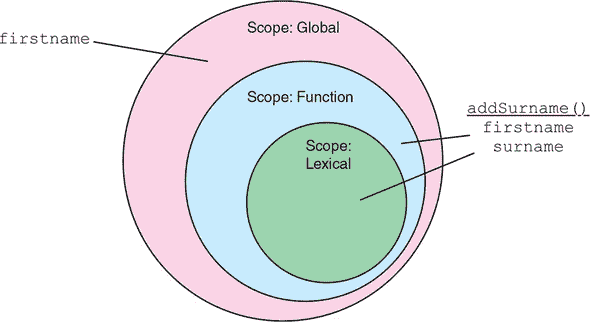
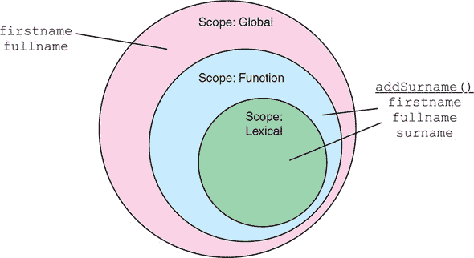
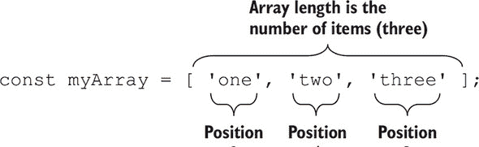
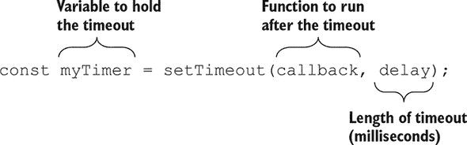
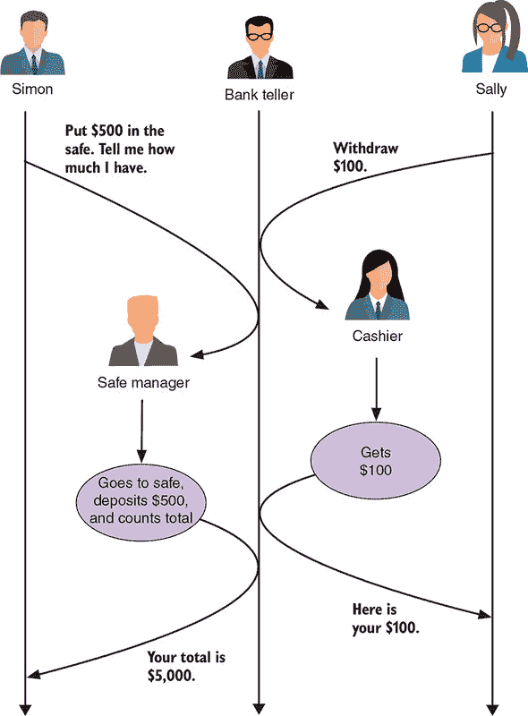
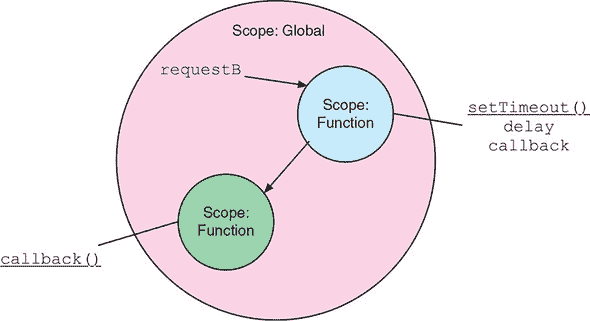
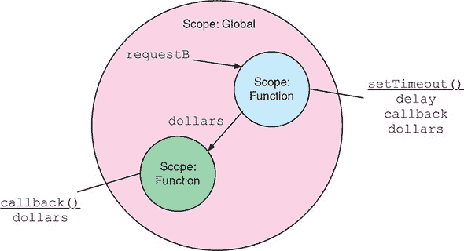
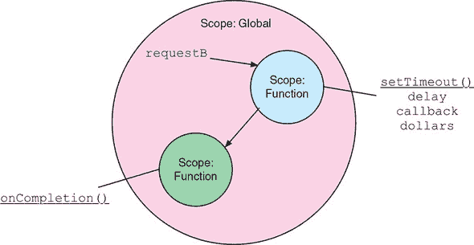
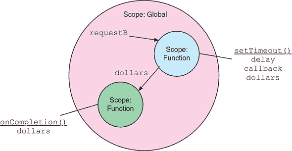
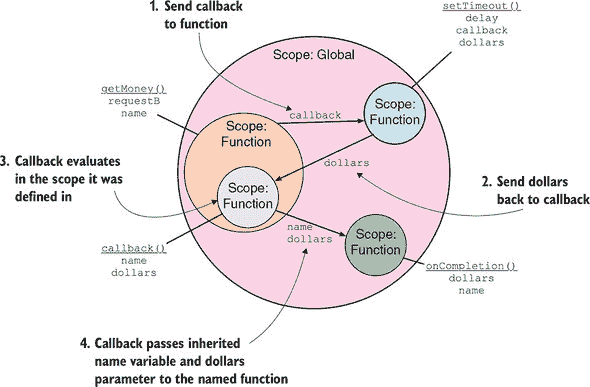

## 附录 D. 重新介绍 JavaScript

*本附录涵盖*

+   在编写 JavaScript 时应用最佳实践

+   有效使用 JSON 传递数据

+   检查如何使用回调以及如何逃离回调地狱

+   使用闭包、模式和 JavaScript 类编写模块化 JavaScript

+   采用函数式编程原则

JavaScript 是 MEAN 堆栈（即使您使用 TypeScript 编写 Angular 部分）的一个基本组成部分，因此我们将花一些时间来探讨它。我们需要打好基础，因为成功的 MEAN 开发依赖于它。JavaScript 是一种如此常见的语言（独特的是，JavaScript 几乎在地球上每台计算机上都有运行时），以至于似乎每个人都了解一些。部分原因是 JavaScript 易于入门，并且它的编写方式宽容。不幸的是，这种宽松性和低门槛可能会鼓励不良习惯，这可能导致意外结果。

本附录的目的是不是从头开始教授 JavaScript；您应该已经掌握了基础知识。如果您对 JavaScript 一无所知，您可能会感到困难重重。像所有事物一样，JavaScript 也有一个学习曲线。另一方面，并不是每个人都需要详细阅读这个附录，尤其是经验丰富的 JavaScript 开发者。如果您有幸认为自己属于经验丰富的行列，那么浏览这个附录以寻找新内容可能仍然是有价值的。

尽管我们并未涵盖 TypeScript，但我们希望第八章至第十二章的详细内容能够让您对它感到满意。

在我们认真开始之前，还有最后一件事。当您在网上寻找 JavaScript 相关的信息时，您很可能会遇到 ES2015、ES2016、ES5、ES6、ES7 等称呼。

ES5 是 JavaScript 的一个长期可用的版本，它始于遥远的过去，包括 Firefox 4 浏览器；Chrome 浏览器的诞生；以及臭名昭著的 Internet Explorer 6 的漫长而痛苦的死亡。幸运的是，那些日子已经一去不复返，但该规范仍然存在，并且大多数浏览器（大多数）都遵循它。

正式来说，截至 2015 年，JavaScript（或者如果您愿意，ECMAScript [ES]）规范的版本已经通过年份来表示：ES2015、ES2016 等等。对于 ES5 之后的单数字版本，如 ES6，这种说法是不正确的。在这本书中，我们一直小心翼翼地确保我们正确地命名了事物。互联网上的许多作者并没有如此勤奋，他们继续传播错误的命名方案。

目前的情况是，大多数浏览器都遵循了 ES2015 规范中 JavaScript 所做的大多数更改，一些浏览器还提供了一些后续迭代（2016 年、2017 年等）的功能。采用的步伐和实施速度有时比我们作为开发者所希望的慢，因此有了像 Babel 这样的转换器。JavaScript 转换器广泛地将使用更现代思想编写的代码转换为旧浏览器能够理解的格式。它们在旧与新、不同语言之间架起了一座桥梁。TypeScript、CoffeeScript、Elm 和 ReasonML 都是转换为 JavaScript 的。

## 每个人都知道 JavaScript，对吧？

并非每个人都了解 JavaScript，但绝大多数开发者都在某个时候以某种形式使用过它。自然地，存在不同水平和经验。作为一个测试，看看下面的代码列表。该列表包含一段 JavaScript 代码，其目的是向控制台输出消息。如果你理解代码的编写方式，正确地确定输出消息将是什么，以及（更重要的是）为什么它们是这样的，你很可能适合快速阅读。

##### 列表 D.1\. 故意带有错误的示例 JavaScript

```
const myName = {
  first: 'Simon',
  last: 'Holmes'
  };
var age = 37,
  country = 'UK';
console.log("1:", myName.first, myName.last);
const changeDetails = (function () {
  console.log("2:", age, country);
  var age = 35;
  country = 'United Kingdom';
  console.log("3:", age, country);
  const reduceAge = function (step) {
    age = age - step;
    console.log("4: Age:", age);
  };
  const doAgeIncrease = function (step) {
    for (let i = 0; i <= step; i++) {
      window.age += 1;
    }
    console.log("5: Age:", window.age);
  },
  increaseAge = function (step) {
    const waitForIncrease = setTimeout(function () {
      doAgeIncrease(step);
    }, step * 200);
  };
  console.log("6:", myName.first, myName.last, age, country);
  return {
    reduceAge: reduceAge,
    increaseAge: increaseAge
  };
})();
changeDetails.increaseAge(5);
console.log("7:", age, country);
changeDetails.reduceAge(5);
console.log("8:", age, country);
```

你对那件事的处理如何？列表 D.1 有几个故意引入的错误，如果你不小心，JavaScript 会允许你犯这些错误。然而，所有这些 JavaScript 都是有效和合法的，并且可以在不抛出错误的情况下运行；如果你喜欢，可以在浏览器中运行它来测试。这些错误突出了意外结果是多么容易发生，以及如果你不知道你在寻找什么，它们可能多么难以被发现。

想知道那段代码的输出结果是什么吗？如果你自己没有运行过，你可以在下面的列表中看到结果。

##### 列表 D.2\. 列表 D.1 的输出

```
1: Simon Holmes
2: undefined UK                    *1*
3: 35 United Kingdom
6: Simon Holmes 35 United Kingdom
7: 37 United Kingdom                *2*
4: Age: 30                          *3*
8: 37 United Kingdom
5: Age: 43                          *4*
```

+   ***1* 年龄因作用域冲突和变量提升而未定义。**

+   ***2* 国家没有改变，但年龄因变量作用域而改变。**

+   ***3* 调用时运行，而不是定义时运行；使用局部变量而不是全局变量**

+   ***4* 由于 setTimeout 而稍后运行；由于 for 循环中的错误，年龄不正确**

此外，这段代码片段展示了私有闭包暴露公共方法、变量作用域和副作用问题、在预期时未定义的变量、函数和词法作用域的混合、异步代码执行的影响，以及在`for`循环中容易犯的一个错误。阅读代码时有很多东西需要吸收。

如果你不确定其中的一些含义或者没有得到正确的结果，请阅读本附录。

## 好习惯或坏习惯

JavaScript 是一种易于学习的语言。你可以从互联网上抓取一段代码并将其放入你的 HTML 页面，然后你就可以开始你的旅程了。它易于学习的一个原因是，在某些方面，它并不像它应该的那样严格。它允许你做一些它可能不应该做的事情，这会导致坏习惯。在本节中，我们将探讨一些这些坏习惯，并展示如何将它们转变为好习惯。

#### 变量、作用域和函数

第一步是查看*变量*、*作用域*和*函数*，它们都是紧密相连的。JavaScript 有三种作用域类型：*全局*、*函数*（使用 `var` 关键字）和*词法*（使用 `let` 或 `const` 关键字）。JavaScript 还具有*作用域继承*。如果你在全局作用域中声明一个变量，它对所有内容都是可访问的；如果你在函数内部使用 `var` 声明一个变量，它只对该函数及其内部的内容可访问；如果你在代码块中使用 `let` 或 `const` 声明一个变量，它只在该花括号及其内部的内容中可访问，但与 `var` 不同，访问不会渗透到周围的功能块。


**ES2015 及以后的 `var` 关键字**

现代实践往往不赞成使用 `var` 关键字，它最终将被弃用。`var` 带有大量的负担，如果你来自其他语言，其作用域可能难以处理，甚至可能让最有经验的开发者陷入困境。尽管如此，我们在这里讨论它，因为大量的 JavaScript 都是用 `var` 编写的。

随着 ES2015 的推出，语言规范引入了 `let` 和 `const` 关键字，它们是词法（块）作用域的。这些关键字与其他变量定义方案有更大的相似性。差异将在以下章节中更详细地解释。


#### 处理作用域和作用域继承

从一个简单的例子开始，其中作用域被错误地使用。

##### 列表 D.3\. 作用域示例

```
const firstname = 'Simon';                    *1*
const addSurname = function () {
  const surname = 'Holmes';                   *2*
  console.log(firstname + ' ' + surname);     *3*
};
addSurname();
console.log(firstname + ' ' + surname);       *4*
```

+   ***1* 在全局作用域中声明的变量**

+   ***2* 在局部词法作用域中声明的变量**

+   ***3* 输出“Simon Holmes”**

+   ***4* 抛出错误，因为 surname 未定义**

这段代码会抛出错误，因为它试图在全局作用域中使用变量 `surname`，但它是在函数 `addSurname()` 的局部作用域中定义的。可视化作用域概念的一个好方法是画一些嵌套的圆圈。在图 D.1 中，外圈表示全局作用域；中间圈表示函数作用域；内圈表示词法作用域。你可以看到全局作用域可以访问变量 `firstname`，而函数 `addSurname()` 的局部作用域可以访问全局变量 `firstname` 和局部变量 `surname`。在这种情况下，词法作用域和函数作用域重叠。

##### 图 D.1\. 表示全局作用域与局部作用域以及作用域继承的圆圈图



如果你想要全局作用域输出全名，同时在局部作用域中保持姓氏私有，你需要一种方法将值推送到全局作用域。从作用域圈的角度来看，你希望看到图 D.2 中的内容。你想要一个新的变量`fullname`，你可以在全局和局部作用域中使用它。

##### 图 D.2\. 使用额外的全局变量从局部作用域返回数据



#### 从局部作用域到全局作用域的推送：错误的方法

你可以这样做的一种方式——现在我们就警告你，这是一种不好的做法——是在局部作用域内定义一个与全局作用域相关的变量。在浏览器中，全局作用域是`window`对象；在 Node.js 中，它是`global`。现在我们继续使用浏览器示例，以下列表显示了如果你更新代码以使用`fullname`变量，它会是什么样子。

##### 列表 D.4\. 全局 `fullname` 变量

```
const firstname = 'Simon';
const addSurname = function () {
  const surname = 'Holmes';
  window.fullname = firstname + ' ' + surname;      *1*
  console.log(fullname);
};
addSurname();
console.log(fullname);                              *2*
```

+   ***1* 全局对象中定义了`fullname`变量。**

+   ***2* 全局作用域可以输出全名。**

这种方法允许你从局部作用域向全局作用域添加变量，但这并不是理想的。问题有两个。首先，如果`addSurname()`函数出现错误并且变量未定义，当全局作用域尝试使用它时，你会得到一个错误。第二个问题在你代码增长时变得明显。假设你有数十个函数向不同的作用域添加内容。你如何跟踪它们？你如何测试它们？你如何向别人解释正在发生的事情？所有这些问题的答案都是*非常困难*。

#### 从局部作用域到全局作用域的推送：正确的方法

如果在局部作用域中声明全局变量是错误的，那么正确的方法是什么？一般来说，*总是将变量声明在它们所属的作用域中*。如果你需要一个全局变量，你应该在全局作用域中定义它，如下面的列表所示。

##### 列表 D.5\. 声明全局作用域变量

```
var firstname = 'Simon',
    fullname;                    *1*
var addSurname = function () {
  var surname = 'Holmes';
  window.fullname = firstname + ' ' + surname;
  console.log(fullname);
};
addSurname();
console.log(fullname);
```

+   ***1* 在全局作用域中声明的变量，即使尚未分配值**

这里，很明显全局作用域现在包含了`fullname`变量，这使得当你再次查看代码时更容易阅读。

#### 从局部作用域引用全局变量

你可能已经注意到，在函数内部，代码仍然通过使用完全限定的`window.fullname`来引用全局变量。在从局部作用域引用全局变量时，这样做是一种最佳实践。再次强调，这种做法使得你的代码更容易回顾和调试，因为你可以明确地看到正在引用哪个变量。代码应该看起来像以下列表。

##### 列表 D.6\. 在局部作用域中使用全局变量

```
var firstname = 'Simon',
    fullname;
var addSurname = function () {
  var surname = 'Holmes';
  window.fullname = window.firstname + ' ' + surname;      *1*
  console.log(window.fullname);                            *1*
};
addSurname();
console.log(fullname);
```

+   ***1* 当在局部作用域中使用全局变量时，始终使用完全限定的引用。**

这种方法可能会让你的代码增加一些字符，但它使得你引用的变量及其来源非常明显。还有另一个原因支持这种方法，尤其是在给变量赋值时。

#### 隐含的全局作用域

JavaScript 允许你不用 `var` 就声明一个变量，这实际上是一个坏习惯。更糟糕的是，如果你不用 `var` 声明一个变量，JavaScript 会将其创建在全局作用域中，如下面的列表所示。

##### 列表 D.7\. 不使用 `var` 声明

```
var firstname = 'Simon';
var addSurname = function () {
  surname = 'Holmes';                      *1*
  fullname = firstname + ' ' + surname;    *1*
  console.log(fullname);
};
addSurname();
console.log(firstname + surname);          *2*
console.log(fullname);                     *2*
```

+   ***1* surname 和 fullname 都是通过隐含定义在全局作用域中的。**

+   ***2* 它们可以在全局作用域中使用。**

我们希望你能看到这可能会造成混淆，并且是一个坏习惯。关键是要*始终在变量所属的作用域中声明变量，使用 `var` 语句*。

#### 变量提升的问题

你可能听说过，在使用 JavaScript 时，你应该始终在顶部声明你的变量。这是正确的，原因是因为变量提升。在 *变量提升* 中，JavaScript 无论如何都会在顶部声明所有变量，而不会告诉你，这可能会导致一些意外的结果。

以下代码列表显示了变量提升可能如何表现出来。在 `addSurname()` 函数中，你想要使用全局的 `firstname` 值，然后声明一个局部作用域的值。

##### 列表 D.8\. 遮蔽示例

```
var firstname = 'Simon';
var addSurname = function () {
  var surname = 'Holmes';
  var fullname = firstname + ' ' + surname;     *1*
  var firstname = 'David';
  console.log(fullname);                        *2*
};
addSurname();
```

+   ***1* 你期望这会使用一个全局变量。**

+   ***2* 实际的输出是“undefined Holmes。”**

为什么输出是错误的？JavaScript “提升”了所有变量声明到它们作用域的顶部。你看到的是列表 D.8 中的代码，但 JavaScript 看到的是列表 D.9 中的代码。

##### 列表 D.9\. 提升示例

```
var firstname = 'Simon';
var addSurname = function () {
  var firstname,                           *1*
      surname,                             *1*
      fullname;                            *1*
  surname = 'Holmes';
  fullname = firstname + ' ' + surname;    *2*
  firstname = 'David';
  console.log(fullname);
};
addSurname();
```

+   ***1* JavaScript 已经将所有变量声明移动到了顶部。**

+   ***2* 在使用之前没有赋值，所以它是未定义的。**

当你看到 JavaScript 在做什么时，错误就更加明显了。JavaScript 在作用域的顶部声明了变量 `firstname`，但它没有值可以赋给它，所以当你第一次尝试使用它时，JavaScript 将变量留为未定义。

当你编写代码时，你应该记住这个事实。JavaScript 看到的应该是你看到的。如果你能从相同的视角看待事物，你犯错误和意外问题的空间就会小很多。

#### 词法作用域

*词法作用域*有时也称为*块作用域*。在一系列花括号之间定义的变量仅限于这些花括号的作用域。因此，作用域可以被限制在循环和流程逻辑结构中。

JavaScript 定义了两个提供词法作用域的关键字：`let` 和 `const`。为什么是两个？这两个的功能略有不同。

`let` 有点像 `var`。它设置了一个可以在定义的作用域中更改的变量。它与 `var` 的不同之处在于，其作用域限制如前所述，并且以这种方式声明的变量不会被提升。由于它们不会被提升，它们不会被编译器以与 `var` 相同的方式跟踪；编译器在第一次遍历时将它们留在原处，因此如果你在它们定义之前尝试引用它们，编译器会通过 `ReferenceError` 投诉。

##### 列表 D.10\. `let` 的作用

```
if (true) {
  let foo = 1;               *1*
  console.log(foo);          *2*
  foo = 2;                   *3*
  console.log(foo);          *4*
  console.log(bar);          *5*
  let bar = 'something';     *6*
}
```

+   ***1* 首次声明变量**

+   ***2* 打印出值为 1**

+   ***3* 重新定义值**

+   ***4* 打印出值为 2**

+   ***5* 尝试打印尚未定义的值（ReferenceError）**

+   ***6* 未提升的变量的定义**

`const` 与 `let` 有相同的注意事项。`const` 与 `let` 的不同之处在于，以这种方式声明的变量不允许通过重新赋值或重新声明来更改，它们被声明为不可变的。`const` 还防止了覆盖——重新定义之前定义的外部作用域变量。假设你在全局作用域中定义了一个变量（使用 `var`），然后你尝试在封闭作用域中使用 `const` 定义一个同名的变量。编译器将抛出一个 `Error`。返回的错误类型取决于你试图做什么。

##### 列表 D.11\. 使用 `const`

```
var bar = 'defined';                *1*
if (true) {
  const foo = 1;                    *2*
  console.log(foo);                 *3*
  foo = 2;                          *4*
  const bar = 'something else';     *5*
}
```

+   ***1* 首次声明 bar**

+   ***2* 首次声明 foo 变量**

+   ***3* 打印出值为 1**

+   ***4* 尝试重新定义 foo（错误）**

+   ***5* 尝试覆盖 bar 变量**

由于使用 `let` 和 `const` 声明变量带来的清晰性，这种方法现在已成为首选方式。提升问题不再成为关注点，变量以更传统的方式表现，这对于熟悉其他主流语言的程序员来说更加舒适。

#### 函数是变量

你可能已经注意到，在前面的代码片段中，`addSurname()` 函数被声明为一个变量。同样，这也是一种最佳实践。首先，JavaScript 本身就是这样看待的，其次，这清楚地表明了函数所在的作用域。

尽管你可以按照以下格式声明一个函数

```
function addSurname() {}
```

JavaScript 解释如下：

```
const addSurname = function() {}
```

因此，将函数定义为变量是一种最佳实践。

#### 限制全局作用域的使用

我们已经讨论了很多关于使用全局作用域的内容，但现实中，你应该尽量限制全局变量的使用。你的目标应该是尽可能保持全局作用域的清洁，这对于应用程序的增长变得非常重要。很可能你会添加各种第三方库和模块。如果所有这些库和模块都在全局作用域中使用相同的变量名，你的应用程序将陷入崩溃。

全局变量并不是一些人会让你相信的“邪恶”，但使用它们时必须小心。当你真正需要全局变量时，一个好的方法是在全局作用域中创建一个容器对象，并将所有内容放在那里。通过在全局作用域中创建一个 `nameSetup` 对象并使用它来保存其他所有内容，你可以看到这样做是如何实现的。

##### 列表 D.12\. 使用 `const` 在全局范围内定义函数

```
const nameSetup = {                                             *1*
  firstname : 'Simon',
  fullname : '',
  addSurname : function () {
    const surname = 'Holmes';                                   *2*
    nameSetup.fullname = nameSetup.firstname + ' ' + surname;   *3*
    console.log(nameSetup.fullname);                            *3*
  }
};
nameSetup.addSurname();                                         *3*
console.log(nameSetup.fullname);                                *3*
```

+   ***1* 将全局变量声明为一个对象**

+   ***2* 在函数内部仍然可以使用局部变量。**

+   ***3* 总是通过使用完全限定的引用来访问对象的值。**

当你这样编写代码时，所有变量都作为对象的属性一起存在，使得全局空间保持整洁。以这种方式工作还可以最大限度地减少全局变量冲突的风险。你可以在声明后向该对象添加更多属性，甚至添加新函数。在前面代码列表的基础上，你可以有下面的代码。

##### 列表 D.13\. 添加对象属性

```
nameSetup.addInitial = function (initial) {           *1*
  nameSetup.fullname = nameSetup.fullname.replace(" ", " " + initial + " ");
};
nameSetup.addInitial('D');                            *2*
console.log(nameSetup.fullname);                      *3*
```

+   ***1* 在全局对象内部定义一个新函数**

+   ***2* 调用一个函数并传递一个参数**

+   ***3* 输出结果为“Simon D Holmes。”**

以这种方式工作可以让你控制 JavaScript，并减少你的代码给你带来不愉快惊喜的机会。请记住，在适当的范围内并在正确的时间声明变量，并在可能的情况下将它们组合到对象中。

## 箭头函数

到目前为止，我们还没有讨论 JavaScript 的 `this` 变量。`this` 是一个相当大的话题，可能会引起很多困惑。简单来说，`this` 的值取决于其使用的上下文。对于在对象上下文外部定义的函数，`this` 在严格模式下指的是函数定义时的执行上下文；如果不处于严格模式，则默认为当前执行上下文，因此它的值会根据使用的时间而变化。

此外，如果使用了 `call()` 或 `apply()` 原型函数，`this` 可以绑定到不同的执行上下文。

如果一个函数被定义为对象的方法，`this` 指的是周围的对象上下文。当在事件处理器中使用时，`this` 指的是触发事件的 DOM 对象。

*箭头函数表达式*（或箭头函数）通过在创建时不定义 `this` 变量来消除一些这种困惑，这与 `function` 关键字发生的情况不同。还有一些其他与上下文相关的内容也不可用，但 `this` 是最重要的。相反，它将 `this` 绑定到周围的词法上下文，使其非常适合非方法函数，如事件处理器、回调和全局函数。

以下列表提供了箭头函数的一般形式和一些变体。

##### 列表 D.14\. 箭头函数格式

```
(param, param2, ..., paramN) => { <function body> }    *1*
(param, param2, ..., paramN) => expression             *2*

singleParam => { <function body> }                     *3*
singleParam => expression                              *4*

() => { <function body> }                              *5*
```

+   ***1* 最一般的形式：括号中的参数 (=>)，函数体（在大括号内）**

+   ***2* 使用单个表达式，可以省略花括号，但得到一个相当于 => { return expression; } 的隐式返回。**

+   ***3* 如果你有一个单个参数，你可以省略括号。**

+   ***4* 无参数的箭头函数需要括号。**

+   ***5* 如果你有一个单个参数和一个单个表达式，可以省略括号和花括号；请记住隐式返回。**

箭头函数提供了一种更简单、更干净的语法，这反过来又促进了更短、更紧凑、更具有表现力的函数，尤其是在与解构赋值结合使用时。本书中提供了许多示例，展示了如何使用箭头函数。有关 `this` 的更多信息，请参阅 [`developer.mozilla.org/en-US/docs/Web/JavaScript/Reference/Operators/this`](https://developer.mozilla.org/en-US/docs/Web/JavaScript/Reference/Operators/this)；有关箭头函数的更多信息，请参阅 [`developer.mozilla.org/en-US/docs/Web/JavaScript/Reference/Functions/Arrow_functions`](https://developer.mozilla.org/en-US/docs/Web/JavaScript/Reference/Functions/Arrow_functions).

## 解构

类似于在某些函数式编程语言中使用的模式匹配的概念，解构允许将数组值和对象属性解包到不同的变量中。如果你将对象传递给函数，解构意味着你可以明确指出你想要使用参数对象中的哪些属性。

要使用解构，在赋值运算符（`=`）的左侧放置方括号以解构数组或花括号以解构对象；然后，添加你想要值的变量名。对于数组，变量根据索引顺序分配值。对于对象，你应该使用对象的键，但这不是严格必要的。

以下列表详细说明了如何解构数组。

##### 列表 D.15\. 解构数组

```
let fst, snd, rest;
const data = ['first', 'second', 'third', 'fourth', 'fifth'];

[fst, snd, ...rest] = data;            *1*
[, fst, snd] = data;                   *2*

const shortArr = [1];
[fst, snd = 10] = shortArr;            *3*

let a = 3, b = 4;
[a, b] = [b, a];                       *4*
```

+   ***1* 使用剩余操作符 (...) 将 'first' 赋给 fst，'second' 赋给 snd，并将剩余的值赋给 rest**

+   ***2* 忽略第一个值，将 'second' 和 'third' 分别拉入 fst 和 snd，而不关心其他任何东西**

+   ***3* 在解构中，如果赋值返回 undefined，则变量可以分配默认值。这里，snd 将是 10。**

+   ***4* 交换变量；a 变为 4，b 变为 3。**

解构对象需要更多的注意；你需要知道对象具有哪些属性，以便可以解包。

请参阅以下列表以获取使用示例。

##### 列表 D.16\. 对象解构

```
const obj = {a: 10, b: 100, c: 1000};

const {a, c} = obj;                                                *1*
const {a: ten, c: hundred} = obj;                                  *2*
const {a, d = 50} = obj;                                           *3*
const shape = {type: 'square', sides: {width: 10, height: 10}};    *4*

const areaOfSquare = ({side: {width}}) => width * width;           *5*

areaOfSquare(shape);                                               *6*
```

+   ***1* 从对象中解包属性 a 和 c**

+   ***2* 解包 a 和 c，并将值赋给 10 和 100**

+   ***3* 解包 a，如果提供对象中没有 d，则将默认值赋给 d**

+   ***4* 带有嵌套对象结构的新对象**

+   ***5* 解构提供的对象的箭头函数；最终获取宽度值并在函数中使用它**

+   ***6* 使用该函数；打印出 100**

解构是一种只能应用于赋值结果的操作，通常用于函数返回值和正则表达式匹配，但也可以在函数参数列表和`for`...`of`迭代中使用。更多示例和信息可在[`developer.mozilla.org/en-US/docs/Web/JavaScript/Reference/Operators/Destructuring_assignment`](https://developer.mozilla.org/en-US/docs/Web/JavaScript/Reference/Operators/Destructuring_assignment)找到。

我们在 Loc8r 代码库的多个地方使用这种技术，以减少函数或回调可以处理的数据量。

## 逻辑流程和循环

现在我们将快速查看常用`if`语句和`for`循环模式的最佳实践。本文假设你在某种程度上熟悉这些元素。

#### 条件语句：使用 if

JavaScript 在`if`语句中很有帮助。如果你在`if`块中只有一个表达式，你不需要用大括号`{}`包裹它。你甚至可以跟一个`else`。以下列表中的代码是有效的 JavaScript。

##### 列表 D.17\. 无花括号的`if`（不良实践）

```
const firstname = 'Simon';
let surname, fullname;
if (firstname === 'Simon')
  surname = 'Holmes';                   *1*
else if (firstname === 'Sally')
  surname = 'Panayiotou';               *1*
fullname = `${firstname} ${surname}`;
console.log(fullname);
```

+   ***1* 不良实践！省略单表达式`if`块周围的{ }。**

是的，你可以在 JavaScript 中这样做，但最好不要！这样做依赖于代码的布局易于阅读，这并不理想。更重要的是，如果你想在`if`块内添加一些额外的行，会发生什么？首先给 Sally 一个中间名。请参阅以下代码列表，了解你可能如何逻辑上尝试这样做。

##### 列表 D.18\. 展示无花括号的`if`问题

```
const firstname = 'Simon', initial = '';
let surname, fullname;
if (firstname === 'Simon')
  surname = 'Holmes';
else if (firstname === 'Sally')
  initial = 'J';                                  *1*
  surname = 'Panayiotou';
fullname = `${firstname} ${initial} ${surname}`;
console.log(fullname);                            *2*
```

+   ***1* 将行添加到 if 块中**

+   ***2* 输出是“Simon Panayiotou。”**

这里出问题的原因是，没有使用花括号，只有第一个表达式被认为是块的一部分，而任何跟在后面的都是块外部的。所以在这里，如果`firstname`是 Sally，`initial`变为 J，但`surname`总是变为 Panayiotou。

以下代码列表显示了正确编写此代码的方式。

##### 列表 D.19\. 正确格式化的`if`

```
const firstname = 'Simon';
let surname, fullname, initial = '';
if (firstname === 'Simon') {                     *1*
  surname = 'Holmes';
} else if (firstname === 'Sally') {              *1*
  initial = 'J';
  surname = 'Panayiotou';
}                                                *1*
fullname = `${firstname} ${initial} ${surname}`;
console.log(fullname);
```

+   ***1* 最佳实践！始终使用{ }来定义 if 块。**

通过明确说明，你可以看到 JavaScript 解释器看到的内容，并减少意外错误的风险。让你的代码尽可能明确是一个好目标，不要留下任何可以解释的空间。这种做法有助于提高代码的质量，并有助于你在一年后回到它时理解它。


**使用多少个等号符号**

在这里提供的代码片段中，你会注意到在每个`if`语句中，都使用了`===`来检查匹配。这不仅是一种最佳实践，而且也是一种很好的习惯。

`===`（身份）运算符比 `==`（相等）运算符要严格得多。`===` 仅在两个操作数类型相同（如数字、字符串和布尔值）时提供正匹配。`==` 尝试类型强制转换以查看值是否相似但类型不同，这可能会导致一些有趣且意外的结果。

看看以下代码片段中的一些可能让你陷入困境的有趣情况：

```
let number = '';
number == 0;         *1*
number === 0;        *2*
number = 1;
number == '1';       *1*
number === '1';      *2*
```

+   ***1* 正确**

+   ***2* 错误**

在某些情况下，这可能会显得很有用，但最好清楚地具体说明你认为是正匹配的内容，而不是 JavaScript 解释为正匹配的内容。如果你的代码不关心 `number` 是字符串还是数字类型，你可以匹配其中一个：

```
number === 0 || number === '';
```

关键是始终使用精确运算符 `===`。对于不等于运算符也是如此：你应该始终使用精确的 `!==` 而不是松散的 `!=`。

| |
| --- |

#### 运行循环：使用 `for`

遍历项目集合的最常见方法是 `for` 循环。JavaScript 处理这个任务相当不错，但你应该注意一些陷阱和最佳实践。

首先，与 `if` 语句一样，JavaScript 允许你在其中只有一个表达式时省略围绕块的括号 `{}`。我们希望你现在知道这是一个坏主意，就像在 `if` 语句中一样。以下代码示例显示了一些可能不会产生你期望结果的合法 JavaScript 代码。

##### 列表 D.20\. 无花括号的 `for` 循环（不良实践）

```
for (let i = 0; i < 3; i++)
  console.log(i);
  console.log(i * 5);                            *1*
// Output in the console
// 0
// 1
// 2
// Uncaught ReferenceError: i is not defined     *1*
```

+   ***1* 第二个语句在循环外部，所以它只运行一次；并且因为 i 在 `for` 中定义，所以它出错。**

从这种方式编写和布局来看，你可能会期望两个 `console.log()` 语句在循环的每次迭代中都会运行。为了清晰起见，前面的代码片段应该写成以下列表。

##### 列表 D.21\. 向 `for` 循环添加花括号

```
for (let i = 0; i < 3; i++) {
  console.log(i);
}
console.log(i*5);
```

我们知道我们一直在谈论这个问题，但确保你的代码以与 JavaScript 解释相同的方式阅读对你有帮助！考虑到这个事实和声明变量的最佳实践，你永远不会在 `for` 条件语句中看到 `let`。将前面的代码片段更新为符合这一最佳实践，你将得到以下列表。

##### 列表 D.22\. 提取变量声明

```
let i;                      *1*
for (i = 0; i < 3; i++) {
  console.log(i);
}
console.log(i*5);
```

+   ***1* 变量应在 `for` 语句外部声明。**

由于变量声明应位于作用域的顶部，因此它和变量在循环中首次使用之间可能会有许多行代码。JavaScript 解释器会像变量已经在那里定义了一样行事，所以它应该放在那里。

`for` 循环的常见用途是遍历数组的内容，因此接下来，我们将介绍一些最佳实践和需要注意的问题。

#### 使用数组与循环

使用 `for` 循环遍历数组的要点是记住数组是零索引的：数组中的第一个对象位于位置 0。连锁反应是数组中最后一个项目的位置比长度少 1。这听起来比实际情况要复杂。一个简单的数组可以这样分解：



声明类似这样的数组并遍历它的典型代码如下所示。

##### 列表 D.23\. 更多的 `for` 循环

```
let i;
const myArray = ["one","two","three"];
for (i = 0; i < myArray.length; i++) {       *1*
  console.log(myArray[i]);
}
```

+   ***1* 从 0 开始计数；当计数小于长度时循环。**

这段代码运行良好，正确地遍历了数组，从位置 0 开始，到最后的 2 位置。有些人更喜欢在他们的代码中排除使用 `i++` 自动递增，因为这可能会使代码难以理解。个人而言，我们认为 `for` 循环是这一规则的例外，并且实际上使代码更容易阅读，而不是在循环内部手动递增。

你可以采取一个方法来提高这段代码的性能。每次循环时，JavaScript 都会检查 `myArray` 的长度。如果 JavaScript 是检查一个变量，这个过程会更快，因此更好的做法是声明一个变量来保存数组的长度。你可以在下面的代码列表中看到这个解决方案的实际应用。

##### 列表 D.24\. 替代的 `for` 循环声明

```
let i, arrayLength;                                                  *1*
const myArray = ["one","two","three"];
for (i = 0, arrayLength = myArray.length; i < arrayLength; i++) {    *2*
  console.log(myArray[i]);
}
```

+   ***1* 声明 arrayLength 变量与其他变量一起**

+   ***2* 在设置循环时将数组的长度赋给 arrayLength**

现在有一个新变量 `arrayLength`，在循环开始时被赋予要遍历的数组的长度。脚本只需要检查一次数组的长度，而不是每次循环都检查。

## 了解 JSON

JavaScript 对象表示法 (JSON) 是一种基于 JavaScript 的数据交换方法。它比 XML 小得多，更灵活，也更易于阅读。JSON 基于 JavaScript 对象的结构，但它是语言无关的，可以用于在所有类型的编程语言之间传输数据。

我们在这本书的示例代码中使用了对象，因为 JSON 是基于 JavaScript 对象的，所以我们在这里简要讨论一下。

#### JavaScript 对象字面量

在 JavaScript 中，除了最简单的数据类型（字符串、数字、布尔值、null 和 undefined）之外的所有内容都是对象，包括数组和函数。对象字面量是大多数人认为的 JavaScript 对象；它们通常用于存储数据，但也可以包含函数，就像你之前看到的。

##### 查看 JavaScript 对象的内容

JavaScript 对象是一系列键值对的集合，这些键值对是对象的属性。每个键都必须有一个值。

键的规则很简单：

+   键必须是一个字符串。

+   如果字符串是 JavaScript 保留字或非法 JavaScript 名称，则必须用双引号括起来。

值可以是任何 JavaScript 值，包括函数、数组和嵌套对象。以下列表显示了基于这些规则的合法 JavaScript 对象字面量。

##### 列表 D.25\. 一个 JavaScript 对象字面量的示例

```
const nameSetup = {
  firstname: 'Simon',                                  *1*
  fullname: '',
  age: 37,
  married: true,
  "clean-shaven": null,                                *2*
  addSurname: function () {                            *3*
    const surname = 'Holmes';
    this.fullname = `${this.firstname} ${surname}`;    *4*
  },
  children: [                                          *5*
    {
      firstname: 'Erica'
    },
    {
      firstname: 'Isobel'
    }
  ]
};
```

+   ***1* 一个简单的键值对**

+   ***2* 被双引号包围的复杂键**

+   ***3* 一个函数**

+   ***4* 函数中的 `this` 指向周围的对象，因为函数关键字；在这里，箭头函数将指向全局作用域。**

+   ***5* 在对象中将数组设置为值**

在这里，对象中的所有键都是字符串，但值是多种类型的混合：字符串、数字、布尔值、null、函数和数组。

##### 访问对象字面量的属性

访问属性的推荐方式是使用点表示法 (`.`)。例如：

```
nameSetup.firstname
nameSetup.fullname
```

这些示例可以用来获取或设置属性值。如果你尝试 *获取* 不存在的属性，JavaScript 返回 `undefined`。如果你尝试 *设置* 不存在的属性，JavaScript 会将其添加到对象中，并为你创建它。

当键名是保留字或非法 JavaScript 名称时，不能使用点表示法。要访问这些属性，需要将键字符串用方括号 `[]` 括起来。以下是一些示例：

```
nameSetup["clean-shaven"]
nameSetup["var"]
```

再次，这些引用可以用来获取或设置值。

接下来，我们将看看 JSON 是如何相关的。

#### 与 JSON 的区别

JSON 基于 JavaScript 对象字面量的表示法，但由于它被设计成语言无关，有一些重要的区别：

+   所有键名和字符串都必须用双引号括起来。

+   函数不是一个支持的数据类型。

这两个区别主要发生是因为你不知道什么会解释它。其他编程语言将无法处理 JavaScript 函数，并且可能有一组不同的保留名称和名称限制。如果你将所有名称作为字符串发送，你可以绕过这个问题。

##### JSON 中允许的数据类型

你不能使用 JSON 发送函数，但作为数据交换格式，这并不是一件坏事。你可以发送的数据类型是

+   字符串

+   数字

+   对象

+   数组

+   布尔值

+   值 `null`

通过查看此列表并将其与 列表 D.25 中的 JavaScript 对象进行比较，如果你移除 `function` 属性，你应该能够将其转换为 JSON。

##### 格式化 JSON 数据

与 JavaScript 对象不同，我们不是将数据赋给一个变量；我们也不需要尾随的分号。通过将所有键名和字符串用双引号括起来——它们确实必须是双引号——我们可以生成以下列表。

##### 列表 D.26\. 正确格式化的 JSON 示例

```
{
  "firstname": "Simon",        *1*
  "fullname": "",              *2*
  "age": 37,                   *3*
  "married": true,             *4*
  "has-own-hair": null,        *5*
  "children": [
    {                          *6*
      "firstname": "Erica"     *6*
    },                         *6*
    {                          *6*
      "firstname": "Isobel"    *6*
    }                          *6*
  ]                            *6*
}                              *6*
```

+   ***1* 在 JSON 中，你可以发送字符串。**

+   ***2* 空字符串**

+   ***3* 数字**

+   ***4* 布尔值**

+   ***5* Null**

+   ***6* 其他 JSON 对象的数组**

此列表显示了一些有效的 JSON。这些数据可以在应用程序和编程语言之间无问题地交换。它也易于人类眼睛阅读和理解。


**发送包含双引号的字符串**

JSON 规定所有字符串必须用双引号括起来。如果你的字符串中包含双引号怎么办？解释器遇到的第一个双引号将被视为字符串的结束分隔符，因此当下一个项目不是有效的 JSON 时，它很可能会抛出错误。

以下代码片段展示了示例。字符串中有两个双引号，这不是有效的 JSON，会导致错误：

```
"line": "So she said "Hello Simon""
```

解决这个问题的方法是使用反斜杠字符（`\`）转义嵌套的双引号。应用这种技术会产生以下结果：

```
"line": "So she said \"Hello Simon\""
```

此转义字符告诉 JSON 解释器，接下来的字符不应被视为代码的一部分；它是值的一部分，可以忽略。


##### 缩小 JSON 以在网络中传输

列表 D.26 中的间距和缩进纯粹是为了帮助人类可读性；编程语言不需要它们。在发送代码之前，如果你移除不必要的空白，可以减少传输的信息量。

以下代码片段展示了 列表 D.26 的最小化版本，这更符合你期望在应用程序之间交换的内容：

```
{"firstname":"Simon","fullname":"","age":37,"married":true,"has-own-
     hair":null,"children":[{"firstname":"Erica"},{"firstname":"Isobel"}]}
```

内容与 列表 D.26 完全相同，但更加紧凑。

#### 为什么 JSON 如此之好？

JSON 作为数据交换格式的流行早于 Node 的开发。随着浏览器运行复杂 JavaScript 的能力增强，JSON 开始蓬勃发展。拥有一个（几乎）原生支持的数据格式非常有帮助，并且极大地简化了前端开发者的工作。

之前首选的数据交换格式是 XML。与 JSON 相比，XML 更难一眼看懂，结构更严格，发送到网络上的数据量也更大。正如你在 JSON 示例中看到的，JSON 在语法上几乎不浪费空间。JSON 使用最少的字符来准确存储和结构化数据，而不是更多。

当涉及到 MEAN 栈时，JSON 是在栈层之间传递数据的理想格式。MongoDB 将数据存储为二进制 JSON（BSON）。Node 和 Express 可以原生地解释它，并将其推送到 Angular，Angular 也原生地使用 JSON。MEAN 栈的每个部分，包括数据库，都使用相同的数据格式，因此你无需担心数据转换。

## 格式化实践

本书中的代码示例使用了一些我们个人的代码布局偏好。其中一些做法是必要的最佳实践；其他做法增加了可读性。如果你有不同的偏好，只要代码保持正确，那就绝对没问题；重要的是要保持一致性。

人们对格式化感到担忧的主要原因是

+   确保 JavaScript 的语法正确

+   确保代码在压缩后仍能正确运行

+   提高自己和/或团队其他成员的代码可读性

从简单的格式化实践开始：缩进。

#### 缩进代码

唯一真正的原因是缩进你的代码是为了使它对普通人来说更容易阅读。JavaScript 解释器并不关心它，并且会高兴地运行没有缩进或换行的代码。

最好的缩进实践是使用空格而不是制表符，因为目前还没有关于制表符位置的标准。你选择多少空格由你决定；我们个人更喜欢两个空格。我们发现使用一个空格会使代码难以一目了然，因为差异并不大。四个空格会使你的代码显得过于宽（再次，这是我们的观点）。我们喜欢在缩进的易读性增益和最大化你能在屏幕上同时看到代码量的好处之间取得平衡——嗯，出于这个原因，以及不喜欢水平滚动。

#### 函数和代码块的大括号位置

你应该养成的一个最佳实践是将代码块的开括号放在开始该块的语句的末尾。什么？到目前为止的所有代码片段都是这样写的。下面的代码列表显示了正确和错误放置大括号的方法。

##### 列表 D.27\. 大括号放置

```
const firstname = 'Simon';
let surname;
if (firstname === 'Simon') {                *1*
  surname = 'Holmes';                       *1*
  console.log(`${firstname} ${surname}`);   *1*
}
if (firstname === 'Simon')                  *2*
{                                           *2*
  surname = 'Holmes';                       *2*
  console.log(`${firstname} ${surname}`);   *2*
}
```

+   ***1* 正确方法：括号与语句在同一行**

+   ***2* 错误方法：括号单独一行**

至少 99%的时间，第二种方法不会给你带来问题。第一种方法 100%的时间都不会给你带来问题。我们宁愿选择节省时间调试，你呢？

有 1%的时间，错误的方法会导致问题？考虑一个使用`return`语句的代码片段：

```
return
{
  name : 'name'
};
```

如果你将你的开括号放在不同的行上，JavaScript 会假设你遗漏了`return`命令后面的分号，并为你添加一个。JavaScript 这样评估：

```
return;           *1*
{
  name:'name'
};
```

+   ***1* JavaScript 在 return 语句后插入分号，因此忽略了后面的代码。**

由于 JavaScript 的自动分号插入，它没有返回你打算返回的对象；相反，JavaScript 返回`undefined`。

接下来，我们将更详细地探讨分号的使用和 JavaScript 的分号插入。

#### 正确使用分号

JavaScript 使用分号字符表示语句的结束。它试图提供帮助，通过使这个字符可选，并在运行时认为有必要时注入它自己的分号，这根本不是一件好事。

当使用分号分隔语句时，你应该回到在代码中看到 JavaScript 解释器看到的内容的目标，而不是让它做出任何假设。我们将分号视为非可选的，并且我们现在处于一个如果它们不存在，代码看起来就不正确的点。

你的大部分 JavaScript 代码行都以分号结尾，但并非所有；那会太简单了！以下列表中的所有语句都应该以分号结尾。

##### 列表 D.28\. 分号使用示例

```
const firstname = 'Simon';
let surname;                                                 *1*
surname = 'Holmes';                                          *1*
console.log(`${firstname} ${surname}`);                      *1*
const addSurname = function () {};                           *1*
alert('Hello');                                              *1*
const nameSetup = { firstname : 'Simon', fullname : ''};     *1*
```

+   ***1* 在大多数语句的末尾使用分号**。

但代码块不应该以分号结束。我们说的是与`if`、`switch`、`for`、`while`、`try`、`catch`和`function`（当不是赋值给变量时）相关的代码块。以下列表展示了几个例子。

##### 列表 D.29\. 使用不带分号的代码块

```
if (firstname === 'Simon') {
  ...
}                                 *1*
function addSurname () {
  ...
}                                 *1*
for (let i = 0; i < 3; i++) {
  ...
}
```

+   ***1* 代码块末尾没有使用分号**

这条规则并不像在花括号后“不要使用分号”那样简单明了。当将函数或对象赋值给变量时，你*确实*需要在花括号后使用分号。你已经看到了几个例子，这些例子我们在整本书中都在使用。

##### 列表 D.30\. 赋值块的分号放置

```
const addSurname = function () {
  ...
};                        *1*
const nameSetup = {
  firstname : 'Simon'
};                        *1*
```

+   ***1* 在将值赋给变量时在花括号后使用分号**

在代码块后放置分号可能需要一点时间来习惯，但这是值得的，最终会变得自然而然。

#### 在列表中放置逗号

当你在作用域顶部定义一个长变量列表时，最常见的方法是每行写一个变量名。这种做法使得一眼就能看到你设置了哪些变量。分隔变量的逗号经典位置是在行尾。

##### 列表 D.31\. 逗号后放置

```
let firstname = 'Simon',   *1*
  surname,                 *1*
  initial = '',            *1*
  fullname;
```

+   ***1* 每行末尾使用逗号，将其与下一个变量声明分开**

这种方法西蒙更喜欢，因为他已经使用了大约 15 年。另一方面，克莱夫主张将逗号放在每行的开头。

##### 列表 D.32\. 逗号优先放置

```
let firstname = 'Simon'
  , surname               *1*
  , initial = ''          *1*
  , fullname;             *1*
```

+   ***1* 每行开头使用逗号，将其与下一个变量声明分开**

这段 JavaScript 完全有效，当压缩成一行时，与第一个代码片段读取完全相同。西蒙试图习惯它，但他做不到；对他来说看起来不对。克莱夫认为逗号优先是一个好主意，但他也认为 Elm 很棒。

对于这两种方法都有赞成和反对的论点。你的选择取决于个人喜好。关键是要有一个标准并坚持它。

#### 不要害怕空白

在花括号组之间添加一些空白可以帮助提高可读性，并且不会对 JavaScript 产生任何问题。同样，你已经在所有之前的代码片段中看到了这种方法。你还可以在许多 JavaScript 运算符之间添加或删除空白。请看以下代码片段，展示了带有和没有额外空白的相同代码片段。

##### 列表 D.33\. 空白格式化示例

```
const firstname = 'Simon';                  *1*
let surname;                                *1*
if (firstname === 'Simon') {                *1*
  surname = 'Holmes';                       *1*
  console.log(`${firstname} ${surname}`);   *1*
}                                           *1*
const firstname='Simon';                    *2*
let surname;                                *2*
if(firstname==='Simon'){                    *2*
  surname='Holmes';                         *2*
  console.log(firstname+" "+surname);       *2*
}                                           *2*
```

+   ***1* 使用空白提高可读性的 JavaScript 片段**

+   ***2* 删除空白后的相同代码片段（不包括缩进）**

作为人类，我们通过使用空白作为单词的分隔符来阅读，我们阅读代码的方式也是如此。是的，你可以弄清楚这里代码片段的第二部分，因为许多语法指针充当分隔符，但阅读和理解第一部分更快、更容易。JavaScript 解释器不会注意到这些地方的空白，如果你担心基于浏览器的代码文件大小增加，你可以在将其推送到生产环境之前将其最小化。

#### 帮助你编写良好 JavaScript 的工具

几个在线代码质量检查器，称为 JSHint 和 ESLint，检查你代码的质量和一致性。更好的是，大多数 IDE 和好的文本编辑器都有一个或多个插件或扩展，因此你的代码可以在编写过程中进行质量检查。这些工具对于发现偶尔遗漏的分号或位置错误的逗号非常有用。

在这两个工具中，ESLint 更侧重于检查 ES2015 代码。TypeScript 有自己的代码检查器，即 TSLint，Angular 默认安装。

## 字符串格式化

ES2015 引入了一种类似于许多不同语言中的字符串插值的字符串格式化方法。JavaScript 将这种格式称为 *模板字符串*。

模板字符串用反引号表示，在通常使用单引号或双引号定义字符串的地方。要执行插值，你希望插入到字符串中的元素（变量或函数调用结果）需要被 `'${}'` 包裹。下面的列表显示了这是如何工作的。

##### 列表 D.34\. 使用模板字符串

```
const value = 10;
const square = x => x * x;
console.log(`Squaring the number ${value} gives a result of
${square(value)}`);                                        *1*
// Squaring the number 10 gives a result of 100              *2*
```

+   ***1* 模板字符串**

+   ***2* 插值结果**

## 理解回调

我们接下来要探讨的 JavaScript 编程的下一个方面是 *回调*。回调一开始可能看起来很复杂，但如果你深入了解，你会发现它们相当简单。很可能你已经使用过它们了。

回调通常用于在某个事件发生后运行一段代码。无论这个事件是链接被点击、数据写入数据库还是其他代码执行完毕，这并不重要，因为事件可以是几乎任何东西。回调函数本身通常是一个 *匿名函数*——一个没有名称的函数，它作为参数直接传递给接收函数。现在如果这听起来像是术语，请不要担心；我们很快就会看到代码示例，你会看到它是多么简单。

#### 使用 `setTimeout` 在稍后运行代码

大多数时候，你使用回调在某个事件发生后运行代码。为了熟悉这个概念，你可以使用 JavaScript 中内置的函数：`setTimeout()`。你可能已经使用过它。简而言之，`setTimeout()` 在你声明的毫秒数后运行回调函数。使用它的基本结构如下：




**取消 `setTimeout`**

如果一个`setTimeout`声明已经被分配给一个变量，你可以使用这个变量来清除超时并停止它完成，前提是它还没有完成。你使用`clearTimeout()`函数，它的工作方式如下：

```
const waitForIt = setTimeout(function () {
  console.log("My name is Simon Holmes");
}, 2000);
clearTimeout(waitForIt);
```

这个代码片段不会向日志输出任何内容，因为`waitForIt`计时器在它有机会完成之前就被清除了。


首先，`setTimeout()`被声明在一个变量中，这样你就可以再次访问它来取消它，如果你想要的话。正如我们之前提到的，回调通常是一个未命名的匿名函数。如果你想在你名字在 2 秒后出现在 JavaScript 控制台，你可以使用这个代码片段。

##### 列表 D.35\. 捕获`setTimeout`引用

```
const waitForIt = setTimeout(function () {
  console.log("My name is Simon");
}, 2000);
```


##### 注意

回调是异步的。它们在需要时运行，不一定是在你代码中出现的顺序。


考虑到这种异步特性，你预计以下代码片段的输出会是什么？

```
console.log("Hello, what's your name?");
const waitForIt = setTimeout(function () {
  console.log("My name is Simon");
}, 2000);
console.log("Nice to meet you Simon");
```

如果你从上到下阅读代码，控制台日志语句看起来似乎是有意义的。但是，因为`setTimeout()`回调是异步的，它不会阻止代码的处理，所以你最终得到的是这样的结果：

```
Hello, what's your name?
Nice to meet you Simon
My name is Simon
```

作为一次对话，这个结果显然没有流畅地进行。在代码中，拥有正确的流程是至关重要的；否则，你的应用程序很快就会崩溃。

因为这种异步方法对于使用 Node 来说非常基础，所以我们将更深入地探讨它。

#### 异步代码

在你查看更多代码之前，提醒自己一下第一章中的银行柜员类比。图 D.3 展示了银行柜员如何通过将任何耗时任务转交给其他人来处理多个请求。

##### 图 D.3\. 处理多个请求



银行柜员能够响应萨莉的请求，因为她将西蒙的请求的责任转给了保险柜经理。柜员不关心保险柜经理是如何做他的工作或需要多长时间。这种方法是异步的。

你可以通过使用`setTimeout()`函数在 JavaScript 中模拟这种方法来演示异步方法。你所需要的只是一些`console.log()`语句来演示银行柜员的操作，以及几个超时来表示委托的任务。你可以在以下代码列表中看到这种方法，其中假设西蒙的请求需要 3 秒（3,000 毫秒），而萨莉的请求需要 1 秒。

##### 列表 D.36\. 异步流程

```
console.log("Taking Simon's request");             *1*
const requestA = setTimeout(function () {
  console.log("Simon: money's in the safe, you have $5000");
}, 3000);
console.log("Taking Sally's request");             *2*
const requestB = setTimeout(function () {
  console.log("Sally: Here's your $100");
}, 1000);
console.log("Free to take another request");       *3*
// ** console.log responses, in order **
// Taking Simon's request
// Taking Sally's request
// Free to take another request
// Sally: Here's your $100                         *4*
// Simon: money's in the safe, you have $5000      *5*
```

+   ***1* 处理第一个请求**

+   ***2* 处理第二个请求**

+   ***3* 准备处理下一个请求**

+   ***4* 萨莉的响应在 1 秒后出现。**

+   ***5* 西蒙的响应在另外 2 秒后出现。**

这段代码有三个不同的块：首先从西蒙那里接收请求并将其发送出去 ***1***；然后从萨利那里接收请求并将其发送出去 ***2***；以及准备好接受另一个请求 ***3***。如果这段代码是像在 PHP 或 .NET 中看到的同步代码，你会在 3 秒后处理萨利的请求之前，先处理西蒙的请求的全部内容。

使用异步方法，代码不需要等待一个请求完成后再处理另一个请求。你可以在浏览器中运行此代码片段以查看其工作方式。将其放入一个 HTML 页面并运行，或者直接在 JavaScript 控制台中输入。

我们希望你能看到这段代码如何模仿我们在本节开始时讨论的场景。西蒙的请求首先到来，但由于需要一些时间来完成，所以响应没有立即返回。当有人在处理西蒙的请求时，萨利的请求被接受。当萨利的请求正在被处理时，银行出纳员再次可用以接受另一个请求。由于萨利的请求完成得更快，她首先得到了响应，而西蒙则需要等待更长的时间才能得到他的响应。萨利和西蒙都没有因为对方而受阻。

现在进一步看看 `setTimeout()` 函数内部可能发生的情况。

#### 运行回调函数

我们不会在这里展示 `setTimeout()` 的源代码，但会展示一个使用回调的框架函数。声明一个新的函数名为 `setTimeout()`，它接受 `callback` 和 `delay` 参数。名称并不重要；它们可以是任何你想要的。以下代码列表展示了这个函数。（注意，你无法在 JavaScript 控制台中运行此函数。）

##### 列表 D.37\. `setTimeout` 框架

```
const setTimeout = (callback, delay) => {
  ...                                        *1*
  ...
  callback();                                *2*
};
const requestB = setTimeout (() => {         *3*
  console.log("Sally: Here's your $100");    *3*
}, 1000);                                    *3*
```

+   ***1* 处理指定毫秒数的延迟**

+   ***2* 运行回调函数**

+   ***3* 发送匿名函数并延迟**

`callback` 参数预期是一个函数，该函数可以在 `setTimeout()` 函数的特定点被调用 ***1***。在这种情况下，你传递给它一个简单的匿名函数 ***3***，该函数将消息写入控制台日志。当 `setTimeout()` 函数认为适当的时候，它会调用回调函数，并将消息记录到控制台。这并不难，对吧？

如果 JavaScript 是你的第一门编程语言，你可能无法理解这种传递匿名函数的概念对那些来自不同背景的人来说是多么奇怪。但以这种方式操作的能力是 JavaScript 的一个巨大优势。

通常，你不会查看运行回调函数的函数内部，无论是 `setTimeout()`、jQuery 的 `ready()` 还是 Node 的 `createServer()`。这些函数的文档会告诉你预期的参数是什么以及可能返回的参数。


**为什么 setTimeout() 是不寻常的**

`setTimeout()`函数的独特之处在于你指定了一个延迟，之后回调将被触发。在更典型的用例中，函数本身决定何时触发回调。在 jQuery 的`ready()`方法中，这是 jQuery 说 DOM 已加载的时候；在 Node 的`save()`操作中，这是数据已保存到数据库并返回确认的时候。

| |
| --- |

##### 回调作用域

在以这种方式传递匿名函数时需要注意的一点是，回调不会继承其传入函数的作用域。回调函数不是在目标函数内部声明的，而是从它那里调用的。*回调函数继承其定义的作用域*。

图 D.4 展示了作用域圆圈。在这里，你可以看到回调在其全局作用域内部有自己的局部作用域，这是`requestB`被定义的地方。如果你的回调只需要访问其继承的作用域，那么这很好。但是，如果你想让它更智能呢？如果你想在回调中使用异步函数中的数据呢？

##### 图 D.4\. 回调有自己的局部作用域。



目前，示例回调函数中有一个硬编码的金额，但如果你想让这个值是动态的——成为一个变量怎么办？假设这个值在`setTimeout()`函数中设置，你如何将其传递给回调？你可以将其保存到全局作用域，但正如你所知，这样做是错误的。你需要将这个值作为参数传递给回调函数。你应该得到类似于图 D.5 中所示的作用域圆圈。

在代码中，这看起来像以下代码列表。

##### 列表 D.38\. `setTimeout`传递数据

```
const setTimeout = (callback, delay) => {
  const dollars = 100;                              *1*
  ...
  callback(dollars);                                *2*
};
const requestB = setTimeout((dollars) => {          *3*
  console.log("Sally: Here's your $" + dollars);    *3*
}, 1000);
```

+   ***1* 在函数作用域中声明一个变量**

+   ***2* 将变量作为参数传递给回调**

+   ***3* 在回调中将变量作为参数接受并使用**

##### 图 D.5\. 设置变量并将其传递给回调



这段代码片段输出到控制台的消息与您之前看到的相同。现在的主要区别是美元的价值是在`setTimeout()`函数中设置的，并被传递给回调。

理解这种方法非常重要，因为互联网上绝大多数的 Node 代码示例都是使用这种方式进行异步回调。但是，这种方法存在一些潜在问题，尤其是在你的代码库变得更大、更复杂时。过度依赖传递匿名回调函数可能会使代码难以阅读和跟踪，尤其是当你发现你有多个嵌套回调时。这也会使对代码进行测试变得困难，因为你无法通过名称调用这些函数；它们都是匿名的。本书中不涵盖单元测试，但简而言之，其理念是每一块代码都可以单独进行测试，并得到可重复和预期的结果。

让我们看看如何使用命名回调实现这个结果。

#### 命名回调

*命名回调*与内联回调在本质上有一个区别。不是直接将您想要运行的代码放入回调中，而是将代码放在一个定义好的函数中。然后，而不是直接作为匿名函数传递代码，您可以传递函数名。而不是传递代码，您传递的是代码运行的*引用*。

持续使用当前的例子，添加一个名为`onCompletion()`的新函数，它将成为回调函数。图 D.6 显示了该函数在作用域圆圈中的样子。

##### 图 D.6\. 使用命名回调时的作用域变化



这个图看起来和前面的例子类似，除了回调作用域有一个名字。和匿名回调一样，命名回调可以在没有任何参数的情况下被调用，如图 D.6 所示。下面的代码片段展示了如何声明和调用一个命名回调，将图 D.6 中的内容转化为代码。

##### 列表 D.39\. 命名回调

```
const setTimeout = (callback, delay) => {
  const dollars = 100;
  ...
  callback();
};
const onCompletion = () => {                 *1*
  console.log("Sally: Here's your $100");    *1*
};                                           *1*
const requestB = setTimeout(
  onCompletion,                              *2*
  1000
);
```

+   ***1* 在不同的作用域中声明一个命名函数**

+   ***2* 将函数名作为回调发送**

命名函数***1***现在作为一个实体存在，创建了它自己的作用域。请注意，不再有匿名函数，但函数名***2***作为引用传递。

##### 传递变量

列表 D.39 再次在控制台日志中使用硬编码的美元值。和匿名回调一样，从一个作用域传递变量到另一个作用域是直接的。您可以将所需的参数传递到命名函数中。图 D.7 显示了在作用域圆圈中的样子。

##### 图 D.7\. 将所需的参数传递到新的函数作用域



您需要将变量`dollars`从`setTimeout()`传递到`onCompletion()`回调函数中。您可以通过不更改请求中的任何内容来实现这一点，如下面的代码片段所示。

##### 列表 D.40\. `setTimeout`变量传递

```
const setTimeout = function (callback, delay) {
  const dollars = 100;
  ...
  callback(dollars);                                *1*
};
const onCompletion = function (dollars) {           *2*
  console.log("Sally: Here's your $" + dollars);    *2*
};                                                  *2*
const requestB = setTimeout(
  onCompletion,                                     *3*
  1000
);
```

+   ***1* 将美元变量作为参数发送到回调**

+   ***2* 命名函数接受并使用参数**

+   ***3* 发送回调时没有进行任何更改。**

在这里，`setTimeout()`函数将`dollars`变量作为参数发送到`onCompletion()`函数中。您通常无法控制发送到回调的参数，因为像`setTimeout()`这样的异步函数是按原样提供的。但您通常希望在回调中使用来自其他作用域的变量，而不是异步函数提供的变量。接下来，我们将看看如何将您想要的参数发送到回调。

##### 使用不同作用域中的变量

假设您希望输出中的名字作为一个参数传递。更新后的函数看起来如下：

```
const onCompletion = function (dollars, name) {
  console.log(name + ": Here's your $" + dollars);
};
```

问题在于 `setTimeout()` 函数只传递了一个参数，`dollars`，到回调函数。你可以通过再次使用匿名函数作为回调来解决此问题，记住它继承了其定义的作用域。为了演示这个函数在全局作用域之外，将请求包裹在一个新的函数 `getMoney()` 中，该函数接受一个参数，`name`。

##### 列表 D.41\. `setTimeout` 中的变量作用域

```
const getMoney = function (name) {
  const requestB = setTimeout(function (dollars) {     *1*
    onCompletion(dollars, name);                       *2*
  }, 1000);
};
getMoney('Simon');
```

+   ***1* 匿名函数只接受美元参数**

+   ***2* 命名回调从匿名函数接收美元，从 `getMoney` 作用域接收名称**

在作用域圆圈中，此代码看起来像图 D.8。

下一个列表将所有代码放在一起，以保持完整性。

##### 列表 D.42\. 完整的 `setTimeout` 示例

```
const setTimeout = (callback, delay) => {
  const dollars = 100;
  ...
  callback(dollars);                                *1*
};
const onCompletion = (dollars, name) => {
  console.log(name + ": Here's your $" + dollars);
};
const getMoney = (name) => {
  const requestB = setTimeout((dollars) => {        *2*
    onCompletion(dollars, name);                    *3*
  }, 1000);
};
getMoney('Simon');
```

+   ***1* 向 `setTimeout` 函数发送回调**

+   ***2* 向回调函数发送包含美元变量的回调**

+   ***3* 通过命名函数调用传递美元和名称参数**

##### 图 D.8\. 从不同作用域向命名回调函数发送变量的过程



简单来说，从匿名回调内部调用命名函数使你能够从父作用域（在这种情况下是 `getMoney()`）捕获你需要的内容，并将其明确传递给命名函数（`onCompletion()`）。

| |
| --- |

**观察流程的实际操作**

如果你想看到这个流程的实际操作，你可以添加一个调试语句，在浏览器中运行它，并逐步执行函数以查看哪些变量和值在哪里以及何时被设置。总的来说，你会有如下所示的内容：

```
const mySetTimeout = function (callback, delay) {
  const dollars = 100;
  callback(dollars);
};
const onCompletion = function (dollars, name) {
  console.log(name + ": Here's your $" + dollars);
};
const getMoney = function (name) {
  debugger;
  const requestB = mySetTimeout(function (dollars) {
    onCompletion(dollars,name);
  }, 1000);
};
getMoney('Simon');
```

注意，当添加调试语句时，你可能需要更改 `setTimeout()` 函数的名称，以免干扰原生函数。

| |
| --- |

记住，你通常无法访问调用回调函数的函数内部的代码，并且回调通常使用一组固定的参数（或没有，如 `setTimeout()`）来调用。你需要添加的任何额外内容都必须添加在匿名回调内部。

##### 更适合阅读和测试

以这种方式定义一个命名函数使得函数的作用域和代码更容易一眼看懂，尤其是如果你给函数取了好的名字。在这样一个简单的小例子中，当你将代码移动到自己的函数中时，你可能会认为流程更难理解，你确实有这个观点。但是当代码变得更加复杂，你有多层嵌套的回调函数时，你肯定会看到这样做的好处。

能够轻松地看到 `onCompletion()` 函数应该做什么，以及它期望和需要哪些参数，这使得函数更容易测试。现在你可以这样说：“当 `onCompletion()` 函数传递一个金额和一个名字时，它应该向控制台输出一条消息，包括这个金额和名字。”这是一个简单的例子，但我们希望你能看到它的价值。

这就结束了从代码角度讨论回调的内容。现在你已经对回调的定义和使用有了很好的理解，那么看看 Node，了解为什么回调如此有用。

#### Node 中的回调

在浏览器中，许多事件都是基于用户交互的，等待代码无法控制的事情发生。在服务器端，等待外部事情发生的概念是相似的。在服务器端的区别在于，事件更多地关注服务器上发生的事情，或者确实是在不同的服务器上发生的事情。在浏览器中，代码等待事件，如鼠标点击或表单提交，而服务器端代码等待事件，如从文件系统读取文件或将数据保存到数据库。

最大的区别在于，在浏览器中，通常是由单个用户来启动事件，并且只有那个用户在等待响应。在服务器端，通常是中心代码启动事件并等待响应。正如在第一章中讨论的那样，Node 中只有一个线程在运行，所以如果中心代码需要停止并等待响应，那么每个访问者都会受到影响——这不是好事！这就是为什么理解回调很重要，因为 Node 使用回调将等待委托给其他进程，使其异步。

接下来，我们将通过一个示例来了解在 Node 中使用回调函数。

##### Node 回调

在 Node 中使用回调与在浏览器中使用并没有什么不同。如果你想保存一些数据，你不想让主 Node 进程来做这件事，就像你不想让银行出纳员和保险库管理员一起去等待响应一样。你想要使用一个带有回调的异步函数。所有 Node 的数据库驱动程序都提供了这种能力。关于如何创建和保存数据的具体细节将在书中介绍，所以现在我们用一个简化的例子来说明。下面的代码片段展示了使用 `mySafe` 对象的 `save()` 方法异步保存数据，并在数据库完成并返回响应时向控制台输出确认信息。

##### 列表 D.43\. 基本 Node 回调

```
mySafe.save(
  function (err, savedData) {
    console.log(`Data saved: ${savedData}`);
  }
);
```

在这里，`save` 函数期望一个可以接受两个参数的回调函数，一个错误对象（`err`），以及保存后从数据库返回的数据（`savedData`）。在回调中通常还有更多功能，但基本结构很简单。

##### 依次运行回调

你已经了解了运行回调的概念，但如果你想在回调完成后运行另一个异步操作怎么办？回到银行比喻，假设你在将存款存入保险箱后，想要从西蒙的所有账户中获取总价值。西蒙不需要知道涉及多个步骤和多人，银行出纳员也不需要知道直到一切完成。你希望创建一个如图 D.9 所示的流程。

##### 图 D.9\. 使用两个依次进行的异步操作所需的流程


显然，需要两个操作，还需要另一个对数据库的异步调用。根据我们之前讨论的内容，你知道不能在 `save` 函数之后将其放入代码中，如下代码片段所示。

##### 列表 D.44\. 节点回调问题

```
mySafe.save(
  function (err, savedData) {
    console.log(`Data saved: ${savedData}`);
  }
);
myAccounts.findTotal(                      *1*
  function (err, accountsData) {
    console.log(`Your total: ${accountsData}`);
  }
);
// ** console.log responses, in probable order **
// Your total: 4500
// Data saved: {dataObject}
```

+   ***1* 第二个函数将在保存函数完成之前触发，因此返回的 accountsData 可能是不正确的。**

这是不行的，因为 `myAccounts.findTotal()` 函数将立即运行，而不是在 `mySafe.save()` 函数完成后运行。返回值可能是不正确的，因为它不会考虑到被添加到保险箱的价值。你需要确保第二个操作在你知道第一个操作已经完成时运行。解决方案很简单：从第一个回调函数内部调用第二个函数，这个过程被称为 *嵌套* 回调。

嵌套回调用于依次运行异步函数。将第二个函数放在第一个回调函数内部，如下所示。

##### 列表 D.45\. 嵌套回调

```
mySafe.save(
  function (err, savedData) {
    console.log(`Data saved: ${savedData}`);
    myAccounts.findTotal(                        *1*
      function (err, accountsData) {
        console.log(`Your total: ${accountsData.total}`);
      }
    );
  }
);
// ** console.log responses, in order **
// Data saved: {dataObject}
// Your total: 5000
```

+   ***1* 第二个异步操作嵌套在第一个回调函数内部**

现在你可以确信 `myAccounts.findTotal()` 函数将在适当的时间运行，这反过来意味着你可以预测响应。

这种能力很重要。Node 本身是异步的，从一个请求跳转到另一个请求，从网站访客跳转到另一个访客。但有时，你需要按顺序做事。嵌套回调通过使用原生 JavaScript 给你提供了一个很好的方法来实现这一点。

嵌套回调的缺点是复杂性。你可能已经注意到，在一级嵌套的情况下，代码已经有点难以阅读，而且跟随顺序流程需要更多的脑力。当代码变得更加复杂，并且你最终有多个级别的嵌套回调时，这个问题会成倍增加。这个问题如此严重，以至于它已经成为“回调地狱”的代名词。回调地狱是为什么有些人认为 Node（和 JavaScript）特别难以学习和维护，并且他们将其作为反对这项技术的论据。公平地说，你可以在网上找到的许多代码示例确实存在这个问题，这并没有多少帮助来反驳这种观点。在开发 Node 时，你很容易陷入回调地狱，但如果你从正确的方式开始，你也同样容易避免。

我们已经讨论了回调地狱的解决方案：使用命名回调。接下来，我们将向你展示命名回调如何帮助解决这个问题。

##### 使用命名回调避免回调地狱

命名回调可以帮助你避免嵌套回调地狱，因为你可以使用它们将每个步骤分离成独立的代码或功能。人类往往发现这种类型的代码更容易阅读和理解。

要使用命名回调，你需要将回调函数的内容提取出来，并声明为一个单独的函数。嵌套回调示例有两个回调，因此你需要两个新函数：一个用于`mySafe.save()`操作完成时，另一个用于`myAccounts.findTotal()`操作完成时。如果这些函数分别命名为`onSave()`和`onFindTotal()`，你可以创建一些如下所示的代码。

##### 列表 D.46\. 回调代码重构

```
mySafe.save(
  function (err, savedData) {
    onSave(err, savedData);                    *1*
  }
);
const onSave = function (err, savedData) {
  console.log(`Data saved: ${savedData}`);
  myAccounts.findTotal(                        *2*
    function (err, accountsData) {
      onFindTotal(err, accountsData);          *3*
    }
  );
};
const onFindTotal = function (err, accountsData) {
  console.log(`Your total: ${accountsData.total}`);
};
```

+   ***1* 从 mySafe.save 操作中调用第一个命名函数**

+   ***2* 在第一个命名回调内部启动第二个异步操作**

+   ***3* 调用第二个命名函数**

现在将每个功能部分分离成独立的函数后，更容易单独查看每个部分并理解它在做什么。你可以看到它期望的参数和预期的结果。实际上，结果可能比简单的`console.log()`语句更复杂，但你可以理解这个概念。你还可以相对容易地跟踪流程，并看到每个函数的作用域。

通过使用命名回调，你可以降低 Node 的感知复杂性，并使你的代码更容易阅读和维护。第二个重要优势是，单个函数更适合单元测试。每个部分都有定义的输入和输出，具有预期的可重复行为。

## 承诺和异步/await

Promise 就像一份合同：它声明当长时间运行的操作完成时，将会有一个值在未来可用。本质上，Promise 代表了异步操作的结果。当这个值被确定后，Promise 将执行给定的代码或处理任何与未收到预期值相关的错误。

Promises 是 JavaScript 规范的一等公民。它们有三个状态：

+   ***Pending*—** Promise 的初始状态

+   ***Fulfilled*—** 异步操作成功解析

+   ***Rejected*—** 异步操作未成功解析

#### Promises

当一个 Promise 被解析，无论是成功还是失败，其值都不能改变；它变成了不可变的。我们将在本附录后面的函数式编程部分讨论不可变性。

要设置一个 Promise，你创建一个接受两个回调函数的函数：一个在成功时执行，一个在失败时执行。这些回调函数在 Promise 执行时被调用。然后，回调函数的执行转移到成功时的 `then()` 函数（可链式调用）或失败时的 `catch()` 函数。

##### 列表 D.47\. 设置/使用 Promise

```
const promise = new Promise((resolve, reject) => {             *1*
  // set up long running, possibly asynchronous operation,
  // like an API query
  if (/* successfully resolved */) {
    resolve({data response});                                  *2*
  } else {
    reject();                                                  *3*
  }
});

promise
  .then((data) => {/* execute this on success */})             *4*
  .then(() => {/ * chained next function, and so on */})       *5*
  .catch((err) => {/* handle error */});                       *6*
```

+   ***1* 创建一个 Promise，传入预期的回调函数**

+   ***2* 在成功时，调用 resolve() 函数，可选地传递数据**

+   ***3* 在失败时，调用 reject() 函数，可选地传递数据或 Error 对象**

+   ***4* 调用 then() 函数；它执行所需的操作，可选地返回一个值给下一个 then()。**

+   ***5* 链中的下一个 then() 函数，其长度可以是必要的**

+   ***6* 捕获错误。如果这是 then() 函数链的末尾，任何抛出的错误都会被这个处理程序捕获。**

我们在 Loc8r 应用程序中使用 Promises，但不是以复杂的方式。Promises API 提供了一些静态函数，这些函数有助于你尝试执行多个 Promises。

`Promise.all()` 接受一个 Promise 的可迭代对象，并在数组中的所有项目都满足或拒绝时返回一个 Promise。`resolve()` 回调函数接收一个响应数组：按满足顺序排列的类似 Promise 对象和其他对象。如果执行中的任何一个 Promise 拒绝，`reject()` 回调函数接收一个单一值。

##### 列表 D.48\. `Promise.all()`

```
const promise1 = new Promise((resolve, reject) => resolve() );
const promise2 = new Promise((resolve, reject) => resolve() );
const promise3 = new Promise((resolve, reject) => reject() );
const promise4 = new Promise((resolve, reject) => resolved() );

Promise.all([
  promise1,
  promise2,
  promise3,
  promise4
])
.then(([]) => {/* process success data iterable */})      *1*
.catch(err => console.log(err));                          *2*
```

+   ***1* Promise 3 拒绝了，所以在这个例子中会被忽略。**

+   ***2* Promise 3 上的 reject() 调用最终会到这里，尽管所有 Promise 都被执行了。**

`Promise.race()` 也接受一个可迭代对象，但 `Promise.race()` 的输出是不同的。`Promise.race()` 执行所有提供的 Promises，并返回它接收到的第一个响应值，无论这个值是满足还是拒绝。

##### 列表 D.49\. `Promise.race()`

```
const promise1 = new Promise((resolve, reject) =>
setTimeout(resolve, 1000, 'first') );
const promise2 = new Promise((resolve, reject) =>
setTimeout(reject, 200, 'second') );

Promise.race([promise1, promise2])
  .then(value => console.log(value))
  .catch(err => console.log(err));          *1*
```

+   ***1* 这里预期的响应是第二个，因为拒绝发生在 promise1 解析之前。**

由于 Promises 依赖于回调，由于它们的异步性质，如果嵌套多个回调，你可能会陷入混乱。发现自己处于深层嵌套的回调结构中通常被称为回调地狱。Promises 通过提供结构和使异步性明确来在一定程度上缓解了这个问题。

#### async/await

Promises 有其缺点。它们难以以同步方式使用，通常在到达好东西之前，你必须浏览一大堆样板代码。

`async/await` 函数旨在简化同步使用 Promises 的行为。`await` 表达式仅在 `async` 函数中有效；如果在不属于 `async` 函数的上下文中使用，代码会抛出 `SyntaxError`。当声明 `async` 函数时，其定义返回一个 `AsyncFunction` 对象。该对象通过 JavaScript 事件循环异步操作，并返回一个隐式的 Promise 作为其结果。语法的使用方式和它允许代码的结构化方式给人一种使用 `async` 函数就像使用同步函数的印象。


**await**

`await` 表达式会导致 `async` 函数的执行暂停，并等待传入的 Promise 解决。然后，函数执行继续。

有一点需要指出的是，`await` 与 `Promise.then()` 并不相同。因为 `await` 会暂停执行，使代码以同步方式执行，所以它不能像 `Promise.then()` 那样进行链式调用。

| |
| --- |

下一个列表展示了 `async`/`await` 的使用。

##### 列表 D.50\. `async`/`await`

```
function resolvePromiseAfter2s () {
  return new Promise(resolve => setTimeout(() =>
  resolve('done in 2s'), 2000));
}

const resolveAnonPromise1s = () => new Promise(resolve =>
setTimeout(() => resolve('done in 1s'), 1000));

async function asyncCall () {                        *1*
  const result1 = await resolvePromiseAfter2s();     *2*
  console.log(result1);                              *3*
  const result2 = await resolveAnonPromise1s();      *4*
  console.log(result2);                              *5*
}

asyncCall();                                         *6*
```

+   ***1* 定义一个 async 函数**

+   ***2* 在 Promise 解决时暂停执行 2 秒**

+   ***3* result1 打印‘done in 2s’**

+   ***4* 在 Promise 解决时暂停执行 1 秒**

+   ***5* result2 打印‘done in 1s’**

+   ***6* 调用 async 函数。此函数总共暂停执行 3 秒。**

你可以在 [`developer.mozilla.org/en-US/docs/Web/JavaScript/Reference/Statements/async_function`](https://developer.mozilla.org/en-US/docs/Web/JavaScript/Reference/Statements/async_function) 找到更多关于 `async`/`await` 的详细信息。

## 编写模块化 JavaScript

有人在匿名推文中分享了一句精彩的话：

> *在 JavaScript 中编写大型应用程序的秘诀不是编写大型应用程序。编写许多小型应用程序，这些应用程序可以相互通信。*

这句话在许多方面都很有道理。许多应用程序共享一些功能，例如用户登录和管理、评论、评论等。你越容易将一个应用程序中的一个功能提取出来并放入另一个应用程序中，你的效率就越高，尤其是当你已经（我们希望）在隔离的情况下测试了该功能，因此你知道它有效。

这就是模块化 JavaScript 发挥作用的地方。JavaScript 应用程序不必是一个永无止境的文件，其中包含函数、逻辑和全局变量四处飞散。你可以在封装的模块中包含功能。

#### 闭包

*闭包*基本上在你完成函数并返回后，让你访问函数中设置的变量。然后闭包为你提供了一种避免将变量推入全局作用域的方法。它还提供了一定程度的变量和其值的保护，因为你不能像全局变量那样覆盖它。

听起来有点奇怪？看看一个例子。以下列表展示了你如何向函数发送一个值，并在稍后检索它。

##### 列表 D.51\. 闭包示例

```
const user = {};
const setAge = function (myAge) {
  return {                          *1*
    getAge: function () {           *1*
      return myAge;                 *1*
    }                               *1*
  };
};
user.age = setAge(30);              *2*
console.log(user.age);              *3*
console.log(user.age.getAge());     *4*
```

+   ***1* 返回一个返回参数的函数**

+   ***2* 调用函数，将返回值赋给用户的年龄属性**

+   ***3* 输出“Object {getAge: function}”**

+   ***4* 使用 getAge() 方法获取值；输出“30”**

这里发生的事情是，`getAge()` 函数作为 `setAge()` 函数的方法返回。`getAge()` 方法可以访问其创建的作用域。所以 `getAge()`，仅 `getAge()`，可以访问 `myAge()` 参数。正如你在附录中较早看到的那样，当创建一个函数时，它也会创建自己的作用域。这个函数之外没有任何东西可以访问这个作用域。

`myAge()` 并不是一个一次性共享变量。你可以再次调用该函数——创建第二个新的函数作用域——来设置（和获取）第二个用户的年龄。你可以在前一个代码片段之后愉快地运行以下代码片段，创建第二个用户并赋予他们不同的年龄。

##### 列表 D.52\. 继续闭包示例

```
const usertwo = {};
usertwo.age = setAge(35);               *1*
console.log(usertwo.age.getAge());      *2*
console.log(user.age.getAge());         *3*
```

+   ***1* 将 setAge() 函数赋给具有不同年龄的新用户**

+   ***2* 输出“usertwo’s age: 35”**

+   ***3* 输出原始用户的年龄：30**

每个用户都有不同的年龄，他们不会意识到或受到其他用户年龄的影响。闭包保护了值免受外部干扰。这里的重要启示是*返回的方法可以访问其创建的作用域*。

这种闭包方法是一个很好的开始，但它已经演变成更有用的模式。例如，看看模块模式。

#### 模块模式

*模块模式*扩展了闭包概念，通常将一组代码、函数和功能封装到一个模块中。这个想法是模块是自包含的，只使用显式传递给它的数据，并且只暴露直接请求的数据。


**立即执行函数表达式**

模块模式使用所谓的立即执行函数表达式（IIFE）。我们在这本书中直到现在所使用的函数都是函数声明，创建可以在代码的稍后部分调用的函数。IIFE 创建一个函数表达式并立即调用它，通常返回一些值和/或方法。

立即执行函数表达式（IIFE）的语法是将函数用括号括起来，并通过使用另一对括号立即调用它（参见此代码片段中的粗体部分）：

```
const myFunc = (function () {     *1*
  return {
    myString: "a string"
  };
})();
console.log(myFunc.myString);     *2*
```

+   ***1* 将 IIFE 赋值给变量**

+   ***2* 将返回的方法作为变量的属性访问**

这个示例是一个典型用法，但并非唯一。立即函数表达式（IIFE）已被分配给变量 ***1***。当你这样做时，函数返回的方法成为变量的属性 ***2***。


这是通过使用立即函数表达式（IIFE）实现的。（参见本节侧边栏，了解更多关于 IIFE 的信息。）与基本闭包类似，模块模式将函数和变量作为分配给变量的属性返回。与基本闭包不同，模块模式不需要手动启动；模块一旦定义，就会立即调用自己。

下面的列表展示了模块模式的一个小但实用的示例。

##### 列表 D.53\. 模块模式示例

```
const user = {firstname: "Simon"};
const userAge = (function () {             *1*
  let myAge;                               *2*
  return {
    setAge: function (initAge) {           *3*
      myAge = initAge;                     *3*
    },                                     *3*
    getAge: function () {                  *4*
      return myAge;                        *4*
    }                                      *4*
  };
})();
userAge.setAge(30);                        *5*
user.age = userAge.getAge();               *5*
console.log(user.age);                     *6*
```

+   ***1* 将模块分配给变量**

+   ***2* 在模块作用域中定义变量**

+   ***3* 定义一个可以接受参数并修改模块变量的返回方法**

+   ***4* 定义一个可以访问模块变量的返回方法**

+   ***5* 调用模块变量的 set 和 get 方法**

+   ***6* 输出“30”**

在这个例子中，`myAge` 变量存在于模块的作用域内，并且永远不会直接暴露给外部。你只能通过暴露的方法与 `myAge` 变量交互。在 列表 D.53 中，你可以获取和设置，但也可以直接修改年龄属性。你可以向 `userAge` 模块添加一个 `happyBirthday()` 方法，该方法将 `myAge` 的值增加 1 并返回新值。下面的代码列表展示了新的部分，并用粗体标出。

##### 列表 D.54\. 向模块添加 `happyBirthday` 方法

```
const user = {firstname: "Simon"};
const userAge = (function () {
  let myAge;
  return {
    setAge: function (initAge) {
      myAge = initAge;
    },
    getAge: function () {
      return myAge;
    },
    happyBirthday: function () {      *1*
    myAge += 1;                       *1*
      return myAge;                   *1*
    }                                 *1*
  };
})();
userAge.setAge(30);
user.age = userAge.getAge();
console.log(user.age);
user.age = userAge.happyBirthday();   *2*
console.log(user.age);                *3*
user.age = userAge.getAge();
console.log(user.age);                *3*
```

+   ***1* 新方法，用于将 myAge 增加 1 并返回新值**

+   ***2* 调用新方法并将其分配给 user.age**

+   ***3* 输出“31”**

新的 `happyBirthday()` 方法将 `myAge` 的值增加 1 并返回新值。这是可能的，因为 `myAge` 变量存在于模块函数的作用域内，同样，返回的 `happyBirthday()` 函数也是如此。`myAge` 的新值继续在模块作用域内保持。

#### 揭示模块模式

我们在模块模式中看到的内容正接近揭示模块模式。*揭示模块模式* 实质上是一些语法糖，它包装了模块模式。目的是使公开的部分和模块内部保持私有的部分一目了然。

##### 将声明从返回语句中移除

以上述方式提供返回值也是一种风格约定，但同样有助于你在休息后回来时理解你的代码。当你使用这种方法时，`return` 语句包含一个函数列表，你将返回这些函数，而不包含任何实际代码。代码在 `return` 语句上方声明，尽管在同一个模块内。下面的代码列表展示了示例。

##### 列表 D.55\. 揭示模块模式，简短示例

```
const userAge = (function () {
  let myAge;
  const setAge = function (initAge) {  *1*
    myAge = initAge;                   *1*
  };                                   *1*
  return {
    setAge                             *2*
  };
})();
```

+   ***1* `setAge`函数已被移出`return`语句**

+   ***2* 现在的`return`语句引用了`setAge`函数，且不包含任何代码**

在如此小的示例中，你无法看到这种方法的益处。我们很快将看到一个更长的示例，这将帮助你走上一半的路，但当你有一个运行到几百行代码的模块时，你将看到其益处。由于在作用域顶部收集所有变量使得使用哪些变量变得明显，将代码从`return`语句中移除使得一眼就能看出哪些函数被公开。如果你有十几个或更多的函数被返回，每个函数有十行或更多的代码，那么你很可能无法在不滚动的情况下看到整个`return`语句。

在`return`语句中重要的是什么，你将寻找的是什么，那就是哪些方法被公开。在`return`语句的上下文中，你对每个方法的内部工作不感兴趣。以这种方式分离你的代码是有意义的，并为你编写出色、可维护和可理解的代码奠定了基础。

##### 模式的完整示例

在本节中，我们将通过使用`userAge`模块来查看该模式的更大示例。以下列表展示了揭示模块模式的一个示例，以及从`return`语句中移除代码。

##### 列表 D.56\. 揭示模块模式，完整示例

```
const user = {};
const userAge = (function () {
  let myAge;                              *1*
  const setAge = function (initAge) {
    myAge = initAge;
  };
  const getAge = function () {
    return myAge;
  };
  const addYear = function () {           *2*
    myAge += 1;                           *2*
  };                                      *2*
  const happyBirthday = function () {
    addYear();                            *3*
    return myAge;
  };
  return {
    setAge,                               *4*
    getAge,                               *4*
    happyBirthday                         *4*
  };
})();
userAge.setAge(30);
user.age = userAge.getAge();
user.age = userAge.happyBirthday();       *5*
```

+   ***1* 有下划线，因为它从未直接在模块外部公开**

+   ***2* 未公开的私有函数**

+   ***3* 可以通过一个公开的函数来调用**

+   ***4* `return`语句充当公开方法的参考。**

+   ***5* user.age 和 myAge 现在是 31。**

这展示了几个有趣的事情。首先，请注意变量`myAge` ***1*** 本身从未在模块外部公开。变量的值通过各种方法返回，但变量本身仍然保持模块的私有性。

除了私有变量外，你还可以在列表中有私有函数，如`addYear()` ***2***。私有函数可以很容易地通过公开方法 ***3*** 被调用。

`return`语句 ***4*** 被保持得既简洁又简单，现在是对该模块公开的方法的直观参考。

严格来说，模块内函数的顺序并不重要，只要它们位于`return`语句之上。位于`return`语句之下的任何内容都不会运行。在编写大型模块时，你可能发现将相关函数分组更容易。如果你觉得这样做合适，你也可以创建一个嵌套模块，甚至是一个独立的模块，该模块有一个公开的方法暴露给第一个模块，以便它们可以相互通信。

记住本节开头引用的引言：

> *在 JavaScript 中编写大型应用程序的秘诀不是编写大型应用程序。编写许多可以相互通信的小应用程序。*

这句话不仅适用于大型应用程序，也适用于模块和函数。如果你能保持你的模块和函数小而精，你就朝着编写优秀代码的道路前进了。

## 类

JavaScript 的模块化扩展是 ES2015 引入的类语法。类是 JavaScript 原型继承模型的语法糖，但如果你有面向对象编程（OOP）经验，它们的工作方式就像你预期的那样。

但是，请注意，JavaScript 类，至少在 ES2017 之前，有公共属性和公共和静态方法。私有和受保护的类可见性将在某个未确定的时间点添加到规范中。它们确实有一个使用`extends`关键字继承的继承层次结构，但没有接口。从父类访问函数涉及`super`函数，初始化使用构造函数。

我们不会涵盖面向对象编程（OOP）的来龙去脉，这是一个最好留给你自己练习的练习。（可以从[`developer.mozilla.org/en-US/docs/Web/JavaScript/Reference/Classes`](https://developer.mozilla.org/en-US/docs/Web/JavaScript/Reference/Classes)开始了解。）在这里，我们将介绍语法的基础。

##### 列表 D.57\. 类语法示例

```
// Parent class
class Rectangle {
  width = 0;
  height = 0;

  constructor (width, height) {
    this.width = width;
    this.height = height;
  }

  get area() {
    return this.determineArea();
  }

  determineArea () {
    return this.width * this.height;
  }
}

// Child class of Rectangle
class Square extends Rectangle {
  constructor (side) {
    super(side, side);
  }
}

const square = new Square(10);
console.log(`Square area: ${square.area()}`);
// prints Square area: 100;
```

类的概念远不止这些，在这本书中，你将主要使用 Angular 中的 TypeScript 类来构建组件。

## 函数式编程概念

作为一种概念，函数式编程比面向对象编程存在的时间更长。长期以来，这个概念被归入学术界，因为一些使用的语言学习曲线陡峭，人为地提高了入门的门槛。谁愿意花时间去学习那些晦涩难懂的概念，结果却因为语法而感到困惑，而你只想从你网站的访客那里获取信息并将其推入数据库呢？

然而，最近，所有主流的面向对象语言都在吸收并整合函数式编程语言的概念，因为这些概念提供了数据的安全性，减少了认知负担，并允许功能的组合。

你可以将以下概念应用到你的 JavaScript 工作中，包括不可变性、纯净性、声明式风格和函数组合。

根据你使用的语言版本，可能有一些其他功能可用或不可用。我们将逐一介绍这些概念。

#### 不可变性

虽然不可变性在语言级别上并不是强制执行的，但通过一点前瞻性规划和一些严谨性，你可以简单而有效地实现它。请注意，有 npm 包可以帮助实现，例如 Facebook 的 immutable.js ([`github.com/facebook/immutable-js`](https://github.com/facebook/immutable-js))。

重点是你在操作的数据/状态不会被修改。修改是在原地进行的操作，可能是难以追踪的 bug 的原因。

这个概念在 JavaScript 中的应用意味着状态没有被改变；它是被复制、转换并分配给一个替代变量。这个概念也可以应用于数据集合和对象；尽管需要稍微更严格的处理，但结果应该是相同的。

对于简单的标量类型变量，应用不可变性很简单：使用 `const` 声明。这样，JavaScript 执行上下文就不能覆盖变量，如果你不小心尝试这样做，它会抛出一个异常。我们之前已经讨论过这个话题。

对于对象类型（`Array`s、`Object`s、`Map`s、`Set`s），使用 `const` 并没有太大帮助。问题是 `const` 创建了对创建的对象的引用。由于它是一个引用，对象内部的数据可以被修改。这就是严格性的所在。不要使用 `for` 等循环结构直接操作集合，而应使用该类型提供的迭代器；它们是原型方法，应该在浏览器和 Node.js 中都可用。对于你想要的功能，如果库如 Lodash.js 和 Ramda.js 没有提供，你总是可以找到。

##### 列表 D.58\. 应用不可变概念的一些示例

```
const names = ['s holmes', 'c harber', 'l skywalker', 'h solo'];        *1*
const uppercasedNames = names.map(name => name.toUpperCase());          *2*
const shortNames = names.filter(name => name.length < 10);              *3*
const values = [1, 2, 3, 4, 5, 6, 7, 8, 9];                             *4*
const total = values.reduce((value, acc) => acc + value, 0);            *5*
const product = values.reduceRight((value, acc) => value * acc, 1);     *6*
```

+   ***1* 将四个名称简单收集并分配给常量**

+   ***2* 使用映射函数遍历集合中的名称并将其分配给新变量**

+   ***3* 使用过滤器函数从集合中移除不符合给定条件的项**

+   ***4* 一个整数数组**

+   ***5* 通过将值相加将值归约为一个单一的总值**

+   ***6* 从右向左进行归约，创建提供列表中值的乘积**

#### 纯度

*纯函数* 是不显示副作用或使用未提供的数据的函数。副作用是指对程序状态的改变，这种改变超出了函数的范围，并且与函数的返回值不同。典型的副作用包括改变全局变量的值、向屏幕发送文本和打印。其中一些副作用是不受欢迎的，是有害的，但其中一些是不可避免的，也是必要的。作为 JavaScript 程序员，我们应该尽可能减少副作用。这样，程序状态是可预测的，因此如果出现错误，就更容易推理。

函数应该只操作它们被提供的那些数据。除非绝对必要，否则不应更改外部数据，例如全局窗口状态，并且即使在这种情况下，也只应由专门的函数以受控的方式进行更改。如果你的代码依赖于全局状态，那可能是一个你应该调查的坏代码信号。

纯函数是可预测的，而且往往表现出一种称为 *幂等性* 的属性：给定一组输入，函数的预期输出总是相同的。

一个简单、有些牵强的例子是一个将两个数字相加的函数：

```
const sum = (a, b) => a + b;
```

如果你向这样的函数提供 `1` 和 `2`，你总是期望返回 `3`。

如果这个函数还依赖于函数外部维护的值——例如 `const sumWithGlobal = (a, b) => a + b + window.c`——并且这个值（`window.c`）通常为 `0`，但有时为 `1` 或可能是像字符串这样的随机值？当你提供 `1` 和 `2` 作为函数参数时，你期望在这个情况下会发生什么？你无法依赖结果为 `3`；它可能是 `4` 或其他截然不同或甚至抛出异常的结果。

这个例子很简单，但如果它涉及到数千行代码呢？正如你所见，这会使问题的规模大得多。尽量保持函数的纯净；能够预测输出使每个人的生活都更容易。

#### 声明式代码风格

我们不想代表所有人发言，但我们可以猜测你写的代码大多数是命令式风格的。你一行一行地设定你想要计算机做什么，就像一个食谱。你可能会在这个代码上叠加面向对象的注释，但仍然是一个食谱。这种做法没有错；它有效，并且大多数情况下效果很好。

在声明式编程中，你声明你想要实现的逻辑，但将执行细节留给计算机。本质上，你不在乎你的程序的结果是如何实现的，只要它实现了。

在这种 JavaScript 风格中，代码应该优先考虑以下内容：

+   数组迭代器在 `for` 循环中

+   递归

+   部分应用和可组合的函数

+   使用三元运算符代替 `if` 语句以确保返回值

+   避免改变状态、修改数据和副作用

我们强调“应该”，因为 JavaScript 由于内部栈帧限制不支持像尾递归这样的功能。此外，部分应用和函数组合是你构建到代码中的东西，而不是原生支持的东西。

##### 列表 D.59\. 声明式编程示例

```
const compose = (...fns) => fns.reduce((f, g) => (...args) =>
f(g(...args)));                                                  *1*
const url = '...';
const parse = item => JSON.parse(item);
const fetchDataFromApi = url => data => fetch(url, data);
const convertData = item => item.toLowerCase();
const convert = (...data) => data.map(item => convertData(item));

const items = [...dataList];                                       *2*

const getProcessableList = compose(
  parse,
  fetchDataFromApi(url),
  convert
);                                                                 *3*

const list = getProcessableList(items);                            *4*
```

+   ***1* 创建一个组合函数**

+   ***2* 创建一个项目列表**

+   ***3* 组合函数**

+   ***4* 通过传递数据执行组合函数**

在这段代码中，重要的是对 `getProcessableList()` 的指令。所有其他元素都是为展示这个虚构示例所需的样板代码。重点是意图是声明的，但实现方式没有声明。

#### 部分应用和函数组合

纯函数提供可预测的结果。如果你可以预测结果，你可以以创新的方式组合你的函数。较小的函数可以成为较大函数的组成部分，你不必担心中间结果。为了帮助你理解函数组合，我们将讨论部分应用。

*部分应用*，或*柯里化*，意味着向函数传递的参数少于它所需的参数，每次返回一个新的函数，因此推迟执行直到所有参数都可用。

不幸的是，JavaScript 没有原生的支持函数柯里化，但通过使用语法，你可以模拟这个功能。下面的列表展示了如何做到这一点。

##### 列表 D.60\. 柯里化示例

```
const simpleSum (x, y) => x + y;               *1*

const curriedSum x => y => x + y;              *2*

const simpleResult = simpleSum(2, 3);          *3*

const curriedResult = curriedSum(2)(3);        *4*

const intermediary = curriedSum(2);            *5*
const finalCurried = intermediary(3);          *6*
```

+   ***1* 简单的标准非柯里化函数**

+   ***2* 柯里化等价**

+   ***3* 所有参数一起收集并一次性应用**

+   ***4* 柯里化需要多次函数调用。**

+   ***5* 在这里，中间调用将 2 应用于 x 参数，返回一个需要另一个参数来创建结果（y => 2 + y）的函数。**

+   ***6* 应用最后一个必需的参数以返回预期的 5 值**

柯里化并不特殊。你所做的就是取一个多参数函数，并在应用一个参数后返回一个新的函数。

在具备这些知识的基础上，你可以看看组合。*组合*是将多个函数组合起来以创建复杂的流程。这种技术允许你避免使用类似指令流的结构化循环代码。相反，通过将操作组合成简单、描述性的函数，你可以抽象出处理的复杂性。

为了正常工作，函数需要小而纯，没有副作用。正在组合的函数需要输入和输出匹配，因此应用柯里化是有帮助的，但不是必需的。输入和输出匹配意味着一个接受整数的函数不应该与一个接受字符串的函数组合。尽管由于语言能够隐式类型转换，输入不匹配在技术上是可以接受的，但它可能是一个难以追踪的错误的来源。

一种简单的方式来观察这一点是举一个例子。接下来的列表从上一个列表中获取了 `curriedSum()` 函数。

##### 列表 D.61\. 简单的组合

```
const add = x => y => x + y;                         *1*
const multiplyFactor = fac => num => num * fac;      *2*

const multiplyBy10 = multiplyFactor(10);

const result = multiplyBy10(add(2)(5));              *3*
```

+   ***1* 添加函数**

+   ***2* 简单的可柯里化因子函数**

+   ***3* 组合函数以返回 100 的结果**

这个例子很简单，但说明了这个观点。

一些库提供了一个名为 `compose` 的函数，它允许你以更优雅的方式处理组合，尽管这个函数并不难手动构建。基本原理是简单应用数学公式 `g(f(x))`。

##### 列表 D.62\. `compose` 函数

```
const compose = (g, f) => x => g(f(x));     *1*

const composedCompute = compose(            *2*
  multiplyBy10,
  add(2)
);

const result = composedCompute(5);          *3*
```

+   ***1* 简单的组合函数**

+   ***2* 使用组合函数**

+   ***3* 获取结果**

在这些小例子之外，组合是一种可以使你的代码更简洁、更容易理解的工具。

## 最后的想法

JavaScript 是一种宽容的语言，这使得它容易学习，但也容易养成坏习惯。如果你在代码中犯了一个小错误，JavaScript 有时会想，“嗯，我想你可能想这么做，所以我会这么做。”有时候它是正确的，有时候是错误的。这对好代码来说是不可以接受的，因此，明确你的代码应该做什么很重要，你应该尝试以 JavaScript 解释器看到的方式编写你的代码。

理解 JavaScript 的强大之处的一个关键在于理解作用域：全局作用域、函数作用域和词法作用域。JavaScript 中没有其他类型的作用域。你应尽可能避免使用全局作用域，当你确实需要使用它时，尽量以干净和封装的方式使用。作用域继承自全局作用域向下级联，因此如果不小心，维护起来可能会很困难。

JSON 起源于 JavaScript，但并非 JavaScript；它是一种独立于语言的数据交换格式。JSON 不包含 JavaScript 代码，可以非常愉快地在 PHP 服务器和.NET 服务器之间传递；不需要 JavaScript 来解释 JSON。

回调对于运行成功的 Node 应用程序至关重要，因为它们允许中央进程有效地委托那些可能阻碍其运行的任务。换句话说，回调使你能够在异步环境中使用顺序同步操作。但回调并非没有问题。很容易陷入回调地狱，有多个嵌套的回调和重叠的继承作用域，使得代码难以阅读、测试、调试和维护。幸运的是，只要你记住命名回调不像它们的内联匿名回调那样继承作用域，你就可以在所有层面上使用命名回调来解决这个问题。

闭包和模块模式提供了在项目间编写自包含且可重用代码的方法。闭包允许你在其自身的独立作用域内定义一组函数和变量，你可以通过暴露的方法返回并与之交互。这导致了揭示性模块模式的出现，该模式遵循惯例来明确区分私有和公共部分。模块非常适合编写自包含的代码片段，这些代码片段可以与其他代码良好地交互，不会因为作用域冲突而出现问题。

JavaScript 规范最近的变更，例如添加类语法和更加强调函数式编程，丰富了可用的工具集，以适应你想要使用的任何代码风格。

JavaScript 规范中许多其他新增内容在此未涵盖：例如剩余操作符、展开操作符和生成器等。这是一个与 JavaScript 语言一起工作的激动人心的时刻。
