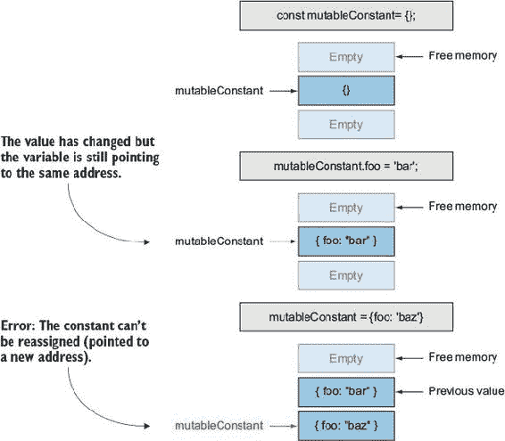
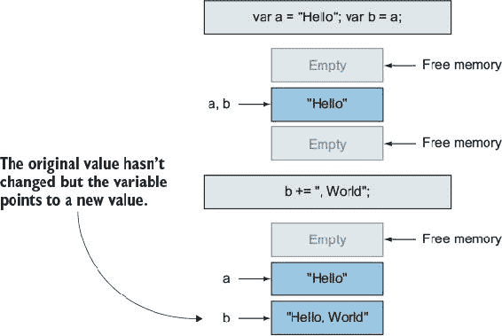
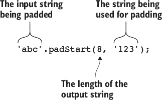

## 第 1 单元\. 变量和字符串

在 JavaScript 中最熟悉的语句之一是`var`语句。但`let`和`const`的加入意味着`var`将很快被使用得越来越少。`var`语句并不会消失，仍然可以使用，但大多数程序员将很快选择在不需要重新赋值时使用`const`来声明变量，而在需要时使用`let`。在本单元的前两课中，你将发现这是为什么。

以下两课将介绍新的字符串方法和一种称为*模板*的新字符串类型。模板很方便，将使在编写代码时（代码编写时）拼接大型字符串的繁琐任务成为过去式。模板还有一个不太为人所知的特性，称为*标签模板*，它允许自定义处理，并为创建特定领域的语言打开了大门。你将通过使用标签模板创建几个自己的特定领域语言来结束本单元。

## 第 4 课\. 使用 let 声明变量

阅读第 4 课课后后，你将

+   了解`let`的作用域以及它与`var`的区别

+   了解块作用域和函数作用域之间的区别

+   了解`let`变量的提升方式

在 JavaScript 的历史中，变量总是使用关键字`var`来声明。^([1]) ES6 引入了两种新的声明变量的方式，即使用`let`和`const`关键字。^([2]) 这两种方式与使用`var`声明的变量略有不同。与`let`相关的有两个主要区别：

> ¹
> 
> 实际上，在非严格模式下，可以在完全不使用`var`声明的情况下创建一个新变量。然而，这却创建了一个全局变量，通常作者并不知道，导致了一些相当有趣的错误。这就是为什么在严格模式下需要`var`的原因。
> 
> ²
> 
> 技术上`const`不是变量，而是常量。

+   `let`变量的作用域规则不同。

+   `let`变量在提升时的行为不同。


**考虑这一点**

考虑以下两个`for`语句。它们之间的唯一区别是其中一个使用`var`声明的迭代器，而另一个使用`let`。但结果却大相径庭。你认为当每个语句运行时会发生什么？

```
for (var i = 0; i < 5; i++) {
  setTimeout(function () {
    console.log(i);
  }, 1);
};
for (let n = 0; n < 5; n++) {
  setTimeout(function () {
    console.log(n);
  }, 1);
};
```


### 4.1\. let 的作用域如何工作

使用`let`声明的变量具有*块作用域*，这意味着它们只能在它们声明的块（或子块）内访问：

```
if (true) {
  let foo = 'bar';
}

console.log(foo);                 *1*
```

+   ***1* 由于 foo 在其声明块之外不存在，因此会抛出错误。**

这使得变量更加可预测，并且不会因为变量从其使用的块中泄漏而导致引入错误。一个 *块* 是语句或函数的主体。它是大括号 `{` 和 `}` 之间的区域。你甚至可以使用大括号来创建一个不与语句相关的独立块：

##### 列表 4.1\. 使用独立块来保持变量私有

```
let read, write;
{                                         *1*
  let data = {};                          *2*

  write = function (key, val) {
    data[key] = val;
  }

  read = function (key) {
    return data[key];
  }
}                                        *3*

write('message', 'Welcome to ES6!');
read('message');                         *4*
console.log(data);                       *5*
```

+   ***1* 打开一个独立块**

+   ***2* `data` 事实上是一个私有变量。**

+   ***3* 关闭一个独立块**

+   ***4* “欢迎来到 ES6！”**

+   ***5* 在块外引用数据会导致错误。**

在这个例子中，`read` 和 `write` 在块外声明，但它们的值在 `data` 声明的块内赋值。这使得它们可以访问 `data` 变量。但是 `data` 在块外不可访问，因此成为一个私有变量，`write` 和 `read` 可以使用它来存储它们内部的数据。

通常，对于使用 `let` 声明的变量要作用域到特定的块，变量必须在那个块内声明。然而，有一个例外：在 `for` 循环中，在 `for` 循环的子句内使用 `let` 声明的变量将作用域在 `for` 循环的块内：

```
for (let i = 0; i < 5; i++) {          *1*
  console.log(i);                      *2*
}
console.log(i);                        *3*
```

+   ***1* `i` 在 `for` 语句的子句中声明。**

+   ***2* `i` 在 `for` 循环的块作用域内。**

+   ***3* `i` 不能在 `for` 循环外部引用，并且会抛出错误。**

#### 4.1.1\. 为什么 `let` 的块作用域更受欢迎

使用 `var` 声明的变量有 *函数作用域*，这意味着它们可以在其包含函数的任何地方访问：

```
(function() {
  if (true) {
    var foo = 'bar';
  }

  console.log(foo);              *1*
}())
```

+   ***1* `foo` 在其声明的 `if` 语句外部被引用。**

这在历史上让开发者感到困惑，并由于错误的假设而导致错误。让我们在下一个列表中看看一个经典示例：

##### 列表 4.2\. 这里有一个作用域问题，但问题是什么？

```
<ul>
  <li>one</li>
  <li>two</li>
  <li>three</li>
  <li>four</li>
  <li>five</li>
</ul>

...
<script type="javascript">
  var items = document.querySelectorAll('li');         *1*
  for (var i = 0; i < 5; i++) {
    var li = items[i];
    li.addEventListener('click', function() {          *2*
      alert(li.textContent + ':' + i);
    });
  };
</script>
```

+   ***1* `document.querySelectorAll` 是一个标准的 Web API 方法，允许选择所有匹配指定查询的 DOM 节点。**

+   ***2* `addEventListener` 是 DOM 节点上的一个方法，允许附加事件监听器。**

这段代码看起来像是在每个列表项上附加了一个事件监听器，以便当点击时，它的文本和索引将被提示。换句话说，如果点击第一个列表项，期望提示的是 one:0。但现实是，无论点击哪个列表项，提示的值总是相同的，即 five:5。这是因为这段代码中有一个错误，这个错误由于函数级作用域而导致许多开发者遇到了问题。

你发现了错误吗？由于变量没有作用域到 `for` 语句，每个迭代都在使用相同的变量。以下是正在发生的事情的分解：

+   变量 `i` 被声明为 0。

+   `for` 循环的第一次迭代执行。

    +   `i` 的值为 0，`li` 是第一个列表项。

+   `for` 循环的第二次迭代执行。

    +   `i` 的值为 1，`li` 是第二个列表项。

+   `for` 循环的第三次迭代运行。

    +   `i` 的值为 2，`li` 是第三个列表项。

+   `for` 循环的第四次迭代运行。

    +   `i` 的值为 3，`li` 是第四个列表项。

+   `for` 循环的第五次迭代运行。

    +   `i` 的值为 4，`li` 是第五个列表项。

+   `i` 增加到 5，`for` 循环停止。

这意味着在 `for` 循环完成后，`i` 和 `li` 分别被设置为 5 和第五个列表项。如果 `for` 循环立即发出警报，则不会观察到任何错误；然而，警报语句被设置为在事件监听器中发出，该监听器将在 `for` 循环完成后才会触发。因此，在触发任何事件并发出 `i` 和 `li.textContent` 的警报时，你会得到 5 和五个。

之前你使用一个独立的代码块来创建一个作用域，以保持变量私有。通常，这样的作用域是通过使用一个立即执行的函数表达式（IIFE）来创建的，如下所示：

```
(function () {
  var foo = 'bar';
}());

console.log(foo); // ReferenceError
```

如果你使用立即执行的函数表达式重写 列表 4.1，它将看起来像这样：

```
var read, write;

(function () {
  var data = {};

  write = function write(key, val) {
    data[key] = val;
  }

  read = function read(key) {
    return data[key];
  }
}());

write('message', 'Back in ES5 land.');
read('message');                              *1*
console.log(data);                            *2*
```

+   ***1* “回到 ES5 世界。”**

+   ***2* 数据超出作用域，因此抛出错误。**

这段代码看起来更复杂，一眼看去更难理解，因为它是为了创建作用域而创建和调用函数。仅仅为了创建作用域而使用函数是一种过度设计，但在 ES6 之前，这是唯一的选择。有了块作用域，这种情况就不再存在了，IIFE 可以被独立的代码块所取代。


**快速检查 4.1**

> **Q1:**
> 
> 给定以下代码，控制台将输出什么？
> 
> ```
>  var words = ["function", "scope"];
>  for(var i = 0; i < words.length; i++) {
>    var word = words[i];
>    for(var i = 0; i < word.length; i++) {
>      var char = word[i]
>      console.log('char', i, char);
>    };
> };
> ```

|  |

**QC 4.1 答案**

> **A1:**
> 
> 这会导致处理第一个单词 *function*，但不会处理第二个单词 *scope*，因为当内循环完成后，`i` 的值等于 7，导致外循环在处理第二个单词之前停止。
> 
> 从技术上讲，这个问题可以通过用 `let` 而不是 `var` 声明两个 `i` 变量来解决。但这种情况被称为 *变量遮蔽*，^([3])，通常被认为是一种不好的做法，所以我仍然建议为内部变量使用不同的变量名。
> 
> > ³
> > 
> > 查看 [`en.wikipedia.org/wiki/Variable_shadowing`](https://en.wikipedia.org/wiki/Variable_shadowing)


### 4.2\. `let` 的提升工作原理

使用 `let` 和 `var` 声明的变量都具有称为 *提升* 的行为。这意味着在变量声明的整个作用域内，无论是 `let` 的整个块还是 `var` 的整个函数，变量都会消耗整个作用域。无论变量在作用域中的哪个位置声明，都会发生这种情况：

```
if (condition) {
  // ------ scope of myData starts here -----
  doSomePrework();
  //... more code
  let myData = getData();
  //... more code
  doSomePostwork();
  // ------ scope of myData ends here -----
}
```

这意味着在这个代码段中，变量在作用域内，即使在其声明之前也可以被访问！如果存在另一个同名的变量，只是作用域稍微大一点，这种情况是真实且有些反直觉的。考虑以下示例：

```
// ------ scope of outer myData starts here -----
let myData = getDefaultData();
if (condition) {
  // ------ scope of inner myData starts here -----
  doSomePrework(myData); // <-- What variable is this???
  //... more code
  let myData = getData();
  //... more code
  doSomePostwork();
  // ------ scope of inner myData ends here -----
}
// ------ scope of outer myData ends here -----
```

实际上这里有两个`myData`变量：一个只在`if`语句的作用域内，另一个在包含的作用域内。这很棘手，因为直观上，你可能认为具有默认值的更外层作用域的`myData`被传递给了`doSomePrework`函数，因为内部变量尚未声明。但这并不是事实。因为内部变量消耗了整个作用域，所以它是传递给`doSomePrework`函数的变量。它被提升并在声明之前使用。

变量在声明之前就在作用域内，这种称为提升的概念实际上并不新鲜。`let`提升到块的顶部，而`var`提升到函数的顶部。然而，这里有一个更重要的区别，即当使用`let`声明的变量在声明之前被访问时会发生什么，与`var`相比。

当一个`let`变量在声明之前在作用域内被访问时，它会抛出一个引用错误。这与`var`不同，`var`允许使用，但值始终是未定义的。这个区域或*区域*，在这个区域中`let`变量可以在声明之前被访问，但如果实际访问则会抛出错误，被称为*时间死区*。更具体地说，时间死区是指变量在声明之前的作用域内的区域。对时间死区内的变量的任何引用都会抛出引用错误：

```
{
 console.log(foo);           *1*
 let foo = 2;
}
```

+   ***1* 抛出错误，因为 foo 尚未声明**

花点时间看看这段代码。你认为执行时将输出什么？

```
let num = 10;
function getNum() {
  if (!num) {
    let num = 1;
  }
  return num;
}
console.log( getNum() );
```

如果你认为答案是`10`，你是正确的。但这里还有其他一些容易忽略的事情发生。通过稍微修改示例，你可以看到正在发生什么：

```
let num = 0;
function getNum() {
  if (!num) {
    let num = 1;
  }
  return num;
}
console.log( getNum() );
```

你现在期望输出什么？如果你回答`1`，你是错误的。为什么？

```
let num = 0;
function getNum() {
  if (!num) {                                             *1*
    // ------ scope of inner num starts here -----
    let num = 1;                                          *2*
    // ------ scope of inner num end here -----
  }
  return num;                                             *3*
}
console.log( getNum() );
```

+   ***1* num 是 0，所以 if 语句执行。**

+   ***2* 你正在声明一个新的`let`变量，其值为 1。**

+   ***3* 哎呀，当你声明一个新的变量为 1 时，它只限于 if 语句的作用域，所以这个变量仍然保持为 0。**

为了解决这个问题，在将 num 设置为 1 时移除`let`：

```
let num = 0;
function getNum() {
  if (!num) {
    num = 1;
  }
  return num;
}
console.log( getNum() );
```


**快速检查 4.2**

> **Q1:**
> 
> 给定以下代码，控制台将输出什么？
> 
> ```
>  {
>   console.log('My lucky number is', luckNumber);
>   let luckNumber = 2;
>   console.log('My lucky number is', luckNumber);
> }
> ```

|  |

**QC 4.2 答案**

> **A1:**
> 
> 不会输出任何内容，因为第一个`console.log`语句会抛出错误，因为它试图在声明之前访问变量。


### 4.3. 我应该从现在开始使用`let`而不是`var`吗？

这是一个有争议的问题。一些开发者认为是的，而另一些则认为不是。我恰好属于前者。⁴

> ⁴
> 
> 然而，对于 `var` 来说，正如我们将在下一课中看到的，`const` 通常比 `let` 更受欢迎。

使用 `var` 的论点是，如果一个变量在函数的根处声明，应该使用 `var` 来表达这个变量的作用域是整个函数。我不同意这个论点。我认为这是由于开发者想要继续在函数作用域内思考，并且需要接受块作用域。对于 `let` 来说，函数只是另一个块，你当然不需要在 `if`、`for`、`while` 或任何其他块级语句内部声明 `let` 时使用不同类型的声明，那么为什么函数应该是特殊的呢？

在函数开始处声明的 `let` 与 `var` 的作用域相同，但它提升的方式不同。如果在使用之前访问 `var`，它将是 `undefined`；而 `let` 会抛出异常。我认为异常是更好的行为，因为在使用声明之前使用变量会导致棘手的错误。我也从未遇到过任何令人信服的理由说明为什么那是一个好主意。这也是我赞成不再使用 `var` 的另一个原因。

但当我提出完全用 `let` 替换 `var` 的观点时，请警惕在现有代码中将 `var` 替换为 `let`。对现有代码库进行全面的更改可能会导致错误。

### 摘要

在本课中，你学习了如何使用 `let` 声明变量以及这与使用 `var` 声明变量的区别：

+   使用 `let` 声明的变量使用块作用域。

+   块作用域意味着变量仅在其包含块中的作用域内。

+   使用 `var` 声明的变量使用函数作用域。

+   函数作用域意味着变量在其整个包含函数中的作用域内。

+   与 `var` 变量不同，`let` 变量在声明之前不能被引用。

看看你是否理解了：

> **Q4.1**
> 
> 以下代码创建了一个函数，该函数生成一个包含一系列值的数组。它使用 `var` 和几个 IIFE 来防止在它们被使用的上下文之外访问变量：
> 
> +   一个全面的 IIFE 隐藏 `DEFAULT_START` 和 `DEFAULT_STEP`。
> +   
> +   一个 IIFE 防止 `tmp` 从它被使用的 `if` 语句中逃逸。
> +   
> +   另一个 IIFE 防止 `i` 在 `for` 循环外部被访问。
> +   
> 将此代码重写为使用 `let` 并消除对任何 IIFEs 的需求：
> 
> ```
> (function (namespace) {
> 
>   var DEFAULT_START = 0;
>   var DEFAULT_STEP  = 1;
>   var range = function (start, stop, step) {
>     var arr = [];
> 
>     if (!step) {
>       step = DEFAULT_STEP;
>     }
> 
>     if (!stop) {
>       stop = start;
>       start = DEFAULT_START;
>     }
> 
>     if (stop < start) {
>       (function () {
>         // reverse values
>         var tmp = start;
>         start = stop;
>         stop = tmp;
>       }());
>     }
> 
>     (function () {
>       var i;
>       for (i = start; i < stop; i += step) {
>         arr.push(i);
>       }
>     }());
> 
>     return arr;
>   }
> 
>   namespace.range = range;
> 
> }(window.mylib));
> ```

## 第 5 课：使用 `const` 声明常量

在阅读 第 5 课 之后，你将

+   理解常量的概念以及它们是如何工作的。

+   知道何时使用常量。

关键字 `const` 代表 *常量*，即 *永不改变*。许多程序都有永远不会改变的价值，无论是出于故意还是偶然。使用 `const` 声明的值，称为 *常量*，具有与上一章中你了解的 `let` 声明相同的特征，但额外的一个特性是禁止重新赋值。


**考虑这一点**

考虑以下`switch`语句，它使用标志来确定正在执行哪种类型的操作。`ADD_ITEM`和`DEL_ITEM`的上标表示这些值永远不会改变，^([a])但如果它们真的改变了，会发生什么？这会如何影响程序的行为？您如何编写应用程序以防止这种情况？

> ^a
> 
> 这种大写完全是出于惯例，并不是必需的语法。

```
switch (action.type) {
  case ADD_ITEM:
    // handle adding a new item
  break;
  case DEL_ITEM:
    // handle deleting an item
  break;
};
```


### 5.1\. 常量是如何工作的

常量不能重新赋值。这意味着一旦您为常量赋值，任何尝试赋新值的尝试都将导致错误：

```
const myConst = 5;

myConst = 6;            *1*
```

+   ***1* 错误**

由于无法重新赋值常量以获得新值，它们很快就被误解为不可变的。常量不是不可变的。那么，无法重新赋值和不可变之间有什么区别？赋值与变量绑定有关，即将一个名称绑定到数据片段上。不可变或可变是绑定所包含实际数据的属性。所有原始数据（字符串、数字等）都是不可变的，而对象是可变的。

让我们看看一个例子，您将可变对象赋给常量，并且可以自由地修改它：

```
const mutableConstant = {};

mutableConstant.foo = 'bar';            *1*
mutableConstant.foo = 'baz';            *2*

mutableConstant = {foo: 'bat'}          *3*
```

+   ***1* 当您将 foo 设置为 bar 时，您正在修改（修改）现有对象。**

+   ***2* 当您将 foo 设置为 baz 时，您正在修改（修改）现有对象。**

+   ***3* 您试图通过分配一个全新的对象来设置 foo 为 baz，这是不允许的。**

##### 图 5.1\. 修改值



因为您创建了一个常量并将其赋值为可变值，所以您能够修改该值。但是您不能将新值赋给常量；您能够改变值的唯一方法是通过修改该值本身，如图 5.1 所示。

如果您将不可变值（如数字）赋给常量，那么常量就变得不可变，因为它包含一个无法修改的值，并且常量不能重新赋值，因此它们变得固定。


**快速检查 5.1**

> **Q1:**
> 
> 当执行以下代码时会发生什么？
> 
> ```
> const i = 0;
> i++;
> ```

|  |

**QC 5.1 答案**

> **A1:**
> 
> 因为增量运算符会为它操作的变量分配新值，所以这段代码会抛出错误，因为常量不能重新赋值。


如果您对原始数据（如字符串和数字）是不可变的这一说法不熟悉，可能会觉得难以接受。您可能会想：“我经常使用原始数据并改变它们的值！”事实是，由于能够重新分配变量以获得新值，原始数据更难被发现。考虑以下代码：

```
let a = "Hello";
let b = a;

b += ", World!";

console.log(a);           *1*
console.log(b);           *2*
```

+   ***1* Hello**

+   ***2* Hello, World!**

在这个例子中，看起来你正在更改变量 `b` 中包含的字符串，但实际上你正在创建一个新的字符串并将这个新字符串重新赋值给 `b`。你可以通过确认，在更新 `b` 之前，它包含与 `a` 相同的值，但之后 `a` 保持不变。这是因为 `a` 仍然指向同一个字符串，但 `b` 被重新赋值了一个新的字符串。这就是为什么你不能使用 `+=` 运算符与常量一起使用。参见图 5.2。

| |
| --- |

**快速检查 5.2**

> **Q1:**
> 
> 执行以下代码会发生什么？
> 
> ```
> const a = "Hello";
> 
>    const b = a.concat(", World!");
> ```

| |
| --- |
| |

**QC 5.2 答案**

> **A1:**
> 
> 你可能会认为当 `a` 是一个常量时，`a.concat` 会抛出错误，但记住字符串上的 `concat` 方法不会修改现有的字符串或重新赋值包含它的变量：它只是返回一个新的字符串。正因为如此，这个语句是有效的，`b` 变成了字符串“Hello, World!”

| |
| --- |

##### 图 5.2\. 展示原始数据不可变



### 5.2\. 何时使用常量

使用常量的明显地方是在创建比包含的实际值更关注唯一标识符的标志时。例如，像这样的预热练习：

```
const ADD_ITEM = 'ADD_ITEM';
const DEL_ITEM = 'DEL_ITEM';
let items = [];

function actionHandler(action) {
  switch (action.type) {
    case ADD_ITEM:
      items.push(action.item);
    break;
    case DEL_ITEM:
      items.splice(items.indexOf(action.item), 1);
    break;
  };
}
```

这确保了操作标志 `ADD_ITEM` 和 `DEL_ITEM` 永远不会被意外更改。你可以在那里停止，但如果你想一下，`items` 数组是否应该被重新赋值？可能不会，所以你也可以将其设置为常量：

```
const items = [];
```

但如果你后来决定你需要一个清空列表的操作，你的直觉可能是将 `items` 赋值给一个新的空数组，但使用常量是无法做到这一点的：

```
case CLEAR_ALL_ITEMS:
  items = [];              *1*
break;
```

+   ***1* 错误**

尽管如此，你仍然可以清空数组；你只需要找出一种方法来修改实际值而不需要重新赋值。在这种情况下，你还可以再次使用 `splice` 来完成这项任务：

```
case CLEAR_ALL_ITEMS:
  items.splice(0, items.length);
break;
```

好的，现在你的完整代码看起来是这样的：

```
const ADD_ITEM = 'ADD_ITEM';
const DEL_ITEM = 'DEL_ITEM';
const CLEAR_ALL_ITEMS = 'CLEAR_ALL_ITEMS';
const items = [];

function actionHandler(action) {
  switch (action.type) {
    case ADD_ITEM:
      items.push(action.item);
    break;
    case DEL_ITEM:
      items.splice(items.indexOf(action.item), 1);
    break;
    case CLEAR_ALL_ITEMS:
      items.splice(0, items.length);
    break;
  };
}
```

注意你如何使用 `const` 声明每个值？这种情况不会很罕见。

保护绑定不被重新赋值不是使用常量的唯一原因。因为常量不会被重新赋值，JavaScript 引擎可以做出某些优化来提高性能。正因为如此，在变量不需要重新赋值时使用 `const`，而在需要时回退到 `let` 是有意义的。

| |
| --- |

**快速检查 5.3**

> **Q1:**
> 
> 执行以下代码会发生什么？
> 
> ```
>  function getValue() {
>    const val = 5;
>    return val;
>  }
> 
>  let myVal = getValue();
> myVal += 1;
> ```

| |
| --- |
| |

**QC 5.3 答案**

> **A1:**
> 
> 你可能会认为，因为值最初是在函数返回之前存储在常量中，所以在函数外部重新分配时会出错。但请记住，常量与值绑定有关，而不是这些绑定内的值。函数只是返回值，而不是绑定。所以新的`let`绑定是安全重新分配的。

| |
| --- |

### 摘要

在本课中，你学习了如何使用`const`声明变量以及它与使用`var`或`let`声明的变量有何不同。

+   常量是不能重新分配的变量。

+   常量不是不可变的。

+   常量与`let`具有相同的作用域规则。

让我们看看你是否掌握了这个：

> **Q5.1**
> 
> 将你在第 4 课练习中的答案修改为尽可能使用`const`。

## 第 6 课。新的字符串方法

在阅读第 6 课之后，你将

+   知道如何使用`String.prototype.startsWith`

+   知道如何使用`String.prototype.endsWith`

+   知道如何使用`String.prototype.includes`

+   知道如何使用`String.prototype.repeat`

+   知道如何使用`String.prototype.padStart`

+   知道如何使用`String.prototype.padEnd`

这些方法中没有一个特别难实现，但它们是足够常用的任务，值得包含在标准库中。

| |
| --- |

**考虑这一点**

假设你正在编写一个函数，用来显示当前时间。使用`Date`对象的实例，你可以分别通过`getHours`和`getMinutes`方法获取当前的小时和分钟：

```
function getTime() {
  const date = new Date();
  return date.getHours() + ':' + date.getMinutes();
}
```

但如果当前时间是早上 5:06，这个函数将返回字符串`5:6`。你如何修改这个函数，使得分钟部分总是两位数？

| |
| --- |

### 6.1. 搜索字符串

想象一下你正在从数据库中加载产品。产品数据来自几个不同的制造商，并且没有规范化。因此，一些价格以没有前导$的 499.99 的格式出现，而其他价格以带有前导$的 37.95 的格式出现。当你需要在网页上显示价格时，你不能简单地在所有价格前加上$，因为这会使一些价格出现双美元符号，如下所示：$$37.95。

你可以很容易地判断第一个字符是否是一个$，如下所示：

```
if( price[0] === '$' ) {
  // price starts with $
}
```

但如果你需要检查前三个字符呢？想象一下你正在显示一个电话号码列表。它们都有`XXX-XXX-XXXX`的格式，你需要确定哪些是在当前用户的区号中。你可能做如下操作：

```
if( phone.substr(0, 3) === user.areaCode ) {
  // phone number is in users area code
}
```

这两个都是做同样的事情，不是吗——检查给定的字符串是否以给定的值开头？那么为什么它们采取不同的方式呢？答案是，在前一种情况下，你是在检查单个字符，而在后一种情况下，是在检查字符范围。这两种方法都没有很好地使你容易理解你在检查什么；因此需要注释来解释每个方法的作用。使用 ES6，你现在可以以相同的方式 *自文档化* 解决这两个问题：

```
if( price.startsWith('$') ) {
  // ...
}
if( phone.startsWith(user.areaCode) ) {
  // ...
}
```

不仅这些现在更一致，而且不是一眼就能清楚地理解它们在做什么吗？

通过添加 `includes`、`startsWith` 和 `endsWith` 方法，在字符串中搜索字符串变得更加简单。`startsWith` 检查字符串是否以指定的值开头，而 `endsWith` 检查字符串是否以该值结尾。`includes` 检查整个字符串以查看是否包含指定的值：

```
let str = 'foo-bar';

str.startsWith('foo');         *1*
str.startsWith('bar');         *2*

str.endsWith('foo');           *3*
str.endsWith('bar');           *4*

str.includes('foo');           *5*
str.includes('bar');           *5*
str.includes('o-b');           *5*
```

+   ***1* 正确**

+   ***2* 错误**

+   ***3* 错误**

+   ***4* 正确**

+   ***5* 正确**

所有这些方法都是大小写敏感的。在进行搜索之前，你总是可以将字符串转换为小写：

```
let location = 'Atlanta, Ga';
location.endsWith('GA');                     *1*
location.endsWith('ga');                     *2*
location.toLowerCase().endsWith('ga');       *3*
```

+   ***1* 错误**

+   ***2* 错误**

+   ***3* 正确**

所有这些方法也接受第二个参数来指定字符串中开始搜索的位置：

```
let locationA = 'Atlanta, Ga';
let locationB = 'Galveston, Tx';

locationA.includes('Ga');                              *1*
locationB.includes('Ga');                              *2*

locationA.includes('Ga', locationA.indexOf(' '));      *3*
locationB.includes('Ga', locationB.indexOf(' '));      *4*
```

+   ***1* 正确**

+   ***2* 正确**

+   ***3* 正确**

+   ***4* 错误**

如果你的需求比这些方法能实现的更复杂，你仍然可以回退到使用正则表达式进行更自定义的字符串搜索。


**快速检查 6.1**

> **Q1:**
> 
> 假设你有一个表示天气数据的对象的数组。每个对象都有一个 `icon` 属性，该属性指定了代表天气条件的图标名称。如果使用的图标是图标的夜间版本，则图标名称以 night 结尾。编写一个过滤器，使用我们介绍的三种方法之一，获取所有具有夜间图标的对象。

|  |

**QC 6.1 答案**

> **A1:**
> 
> ```
> let nightIcons = weatherObjs.filter(function(weather) {
>   return weather.icon.endsWith('-night');
> });
> ```


### 6.2. 字符串填充

字符串填充意味着指定你想要字符串有多长，然后用填充字符填充字符串直到达到该长度。例如，在预训练练习中，你希望分钟数总是两个字符长。有时它是（例如 36），但有时不是（例如 5）。通过使用填充字符 `0` 将字符串填充到长度为 2，36 将保持不变，因为它已经是两个字符，而 5 将变成 05 或 50，具体取决于你是向左还是向右填充。

假设你需要一个函数，可以将以十进制（基数 10）写成的 IP 地址转换为二进制（基数 2）。你可能最终会编写一个看起来像这样的函数：

```
function binaryIP(decimalIPStr) {
  return decimalIPStr.split('.').map(function(octet) {
    return Number(octet).toString(2);
  }).join('.');
}
```

但这个函数对小于 128 的任何数字都不会起作用，因为它的二进制表示将少于八位数字。

```
binaryIP('192.168.2.1');            *1*
```

+   ***1* “11000000.10101000.10.1”**

为了解决这个问题，你需要将每个八位字节用零填充，直到每个字节都是八位，如下一页顶部的示例所示。为了实现这一点，你可以使用 ES2015 中引入的新特性，`String.prototype.repeat`。我们也可以使用 `padStart`，但它更加灵活，你将在下一分钟看到，而且 `repeat` 也是值得了解的。

```
function binaryIP(decimalIPStr) {
  return decimalIPStr.split('.').map(function(octet) {
    let bin = Number(octet).toString(2);
    return '0'.repeat(8 - bin.length) + bin;
  }).join('.');
}

binaryIP('192.168.2.1');     *1*
```

+   ***1* “11000000.10101000.00000010.00000001”**

这之所以有效，是因为 `repeat` 函数重复调用的函数，其重复次数由参数中指定的次数决定：

```
'X'.repeat(4);               *1*
```

+   ***1* XXXX (X 重复 4 次)**

如果指定的数字不是一个整数，它将首先被向下取整（向下舍入，而不是向上舍入）：

```
'X'.repeat(4.9);             *1*
```

+   ***1* XXXX**

这对任何长度的字符串都适用：

```
'foo'.repeat(3);             *1*
```

+   ***1* foofoofoo**

使用 `String.prototype.repeat` 对我们的二进制示例有效。但如果你想要用超过一个字符的字符串进行填充，仅使用 `repeat` 函数将会更难实现，但你可以很容易地使用 `String.prototype.padStart` 和 `String.prototype.padEnd` 来实现。

`padStart` 和 `padEnd` 方法接受两个参数：返回字符串的最大长度和填充字符串，如图 6.1 所示 figure 6.1。填充字符串默认为空格 `" "` 字符：

```
'abc'.padStart(6);               *1*
'abc'.padEnd(6);                 *2*

'abc'.padStart(6, 'x');          *3*
'abc'.padEnd(6, 'x');            *4*

'abc'.padStart(6, 'xyz');        *5*
'abc'.padEnd(6, 'xyz');          *6*
```

+   ***1* “ abc”**

+   ***2* “abc ”**

+   ***3* “xxxabc”**

+   ***4* “abcxxx”**

+   ***5* “xyzabc”**

+   ***6* “abcxyz”**

##### 图 6.1\. 拆解 padStart 函数



最大长度属性指定了填充重复后的字符串的最大长度。如果填充是多个字符并且不能均匀添加，它将被截断：

```
'abc'.padStart(8, '123');         *1*
'abc'.padEnd(5, '123');           *2*
```

+   ***1* “12312abc”**

+   ***2* “12abc”**

如果最大长度小于原始字符串的长度，原始字符串不会被截断，而是返回没有任何填充应用的原字符串：

```
'abcdef'.padStart(4, '123');        *1*
```

+   ***1* “abcdef”**

使用这个，你的 `binaryIP` 函数可以重写如下：

```
function binaryIP(decimalIPStr) {
  return decimalIPStr.split('.').map(function(octet) {
    return Number(octet).toString(2).padStart(8, '0')
  }).join('.');
}

binaryIP('192.168.2.1');            *1*
```

+   ***1* “11000000.10101000.00000010.00000001”**

这是一种相当简洁的实现，易于阅读和理解。使用纯 ES5 代码来实现相同的功能将会非常冗长。当然，你也可以使用第三方字符串填充函数或自己编写一个，但 `String.prototype.padStart` 和 `String.prototype.padEnd` 消除了这种需求。


**快速检查 6.2**

> **Q1:**
> 
> 编写一个使用 `repeat` 的函数，将任何字符串重复到正好 50 个字符，截断任何多余的字符。

|  |

**QC 6.2 答案**

> **A1:**
> 
> ```
> function repeat50(str) {
>   const len = 50;
>   return str.repeat(Math.ceil(len / str.length)).substr(0, len);
> }
> ```


### 摘要

在本课中，目的是教给你即将添加到字符串中的最有用的新方法。

+   `String.prototype.startsWith` 检查一个字符串是否以一个值开头。

+   `String.prototype.endsWith` 检查一个字符串是否以一个值结尾。

+   `String.prototype.includes` 检查一个字符串是否包含一个值。

+   `String.prototype.repeat` 重复一个字符串指定次数。

+   `String.prototype.padStart` 填充字符串的开始部分。

+   `String.prototype.padEnd` 用于填充字符串的末尾。

让我们看看你是否理解了：

> **Q6.1**
> 
> 编写一个函数，该函数将接受一个电子邮件地址并屏蔽所有直到**@**的字符。例如，电子邮件地址 christina@example.com 将被屏蔽为*********@example.com。

## 第 7 课\. 模板字符串

在阅读第 7 课之后，你将

+   了解如何使用模板字符串实现字符串插值

+   理解如何使用模板字符串的多行字符串

+   了解如何使用模板字符串创建可重用的模板

+   理解如何使用标签化模板字符串为模板字符串添加自定义处理

在 JavaScript 中，我最大的烦恼之一就是缺乏对多行字符串的支持。必须将每一行拆分为单独的字符串并将它们全部粘合在一起是一个繁琐的过程。随着模板字符串的添加，这种痛苦消失了，还有一些其他的好处。*模板字符串*将多行字符串引入 JavaScript，以及插值和标签化。如果你不确定这些术语的含义，不要担心：我会解释每一个。


**考虑以下内容**

研究以下函数，该函数接受一个产品对象并返回表示产品的适当 HTML。目前它只显示产品的照片和描述，由于许多字符串被粘合在一起以弥补对多行字符串和插值的支持不足，因此很难理解正在发生的事情。一个真实的产品可能需要显示标题、价格和其他细节，这使得理解更加困难。随着产品 HTML 要求的日益复杂，你会采取哪些步骤来保持代码的可读性？

```
 function getProductHTML(product) {
   let html = '';
   html += '<div class="product">';
   html += '<div class="product-image">';
   html += '';
   html += '</div>';
   html += '<div class="product-desc">' + product.desc + '</div>';
   html += '</div>';
   return html;

}
```


### 7.1\. 模板字符串是什么？

模板字符串是创建字符串的新字面量语法。它使用反引号（**`**）作为分隔符，而不是像字符串字面量那样使用引号（**’**或**”**），并支持新的特性和功能。但模板字符串的评估结果与字符串字面量一样是字符串：

```
let str1 = `Hello, World`;
let str2 = "Hello, World";
let str3 = `Hello, World`;          *1*
console.log(str1 === str3);         *2*
console.log(str2 === str3);         *2*
}
```

+   ***1* 使用模板字符串创建字符串**

+   ***2* 真实**

区别在于模板字符串支持三个常规字符串字面量不支持的新特性：*插值*、*多行*和*标签化*。让我们定义这些术语。

*字符串插值*—这是将动态值放入字符串创建过程中的概念。许多其他语言支持这一功能，但到目前为止，JavaScript 只能通过连接将动态值放入较长的字符串中：

```
let interpolated = `You have ${cart.length} items in your cart`

let concatenated = 'You have ' + cart.length + ' items in your cart';
```

*多行字符串*——这并不是创建多行字符串的概念。JavaScript 一直能够做到这一点（例如，`"Line One\nLine Two"`）。这是指字面量本身跨越多行。JavaScript 中的常规字符串必须在单行中定义，这意味着开引号和结束引号必须在同一行上。使用模板字面量，情况并非如此：

```
let multiline = `line one
                 lines two`
```

*标记模板字面量*——这是一个更高级的使用。记得模板字面量可以插入值吗？标记模板字面量是一个带有函数标记的模板字面量。该函数会获得所有原始字符串部分以及单独的插值值，以便它可以对字符串进行自定义预处理。它可以返回一个完全不同的字符串或一个甚至不是字符串的定制值。如果你想在合并到最终值之前对插值值进行某种预处理，这特别有用。例如，你可以有一个将模板字面量转换为 DOM 节点的标记函数，同时转义插值值以防止 HTML 注入。你也可以通过将字符串部分视为安全内容，将插值值视为潜在危险内容来防止 SQL 注入：

```
let html = domTag`<div class="first-name">${userInput}</div>`
```

因此，我们现在有一个概述；让我们更详细地看看这些内容，从插值开始。

#### 7.1.1\. 使用模板字面量的字符串插值

将值插值到模板字面量的语法是将要插值的值用大括号 `{` 和 `}` 括起来，并在开大括号前加上美元符号 `$`：

```
function fa(icon) {
  return `fa-${icon} fa`;
}

fa('check-square');           *1*
```

+   ***1* “fa-check-square fa”**

这将从 `icon` 变量中获取值并将其注入到模板字符串中。你可以在图 7.1 中可视化这个过程。

##### 图 7.1\. 图标变量的值被插值到字符串中


此函数生成给定图标所需的 Font Awesome ([`fontawesome.io/icon/check-square/`](http://fontawesome.io/icon/check-square/)) CSS 类。所需的插值越多，这种功能的好处就越明显，如下页的代码示例所示。

```
function greetUserA(user, cart) {
  const greet = `Welcome back, ${user.name}.`;
  const cart  = `You have ${cart.length} items in your cart.`;
  return `${greet} ${cart}`;
}

function greetUserB(user, cart) {
  const greet = 'Welcome back, ' + user.name + '.';
  const cart  = 'You have ' + cart.length + ' items in your cart.';
  return greet + ' ' + cart;
}

function madlibA(adjective, noun, verb) {
  return `The ${adjective} brown ${noun} ${verb}s`;
}

function madlibB(adjective, noun, verb) {
  return 'The ' + adjective + ' brown ' + noun + ' ' + verb + 's';
}

madlibA('quick', 'fox', 'jump');           *1*
madlibB('quick', 'fox', 'jump');           *1*
```

+   ***1* “The quick brown fox jumps”**

在每个示例中，这两个函数在功能上是等效的。不过，我认为在两种情况下，没有人会认为变体 B 更受欢迎。

注意，你可以使用正常的转义字符来转义插值：

```
let color = 'hazel';

let str1 = `My eyes are ${color}`;          *1*
let str2 = `My eyes are \${color}`;         *2*
```

+   ***1* “My eyes are hazel”**

+   ***2* “My eyes are ${color}”**

但如果你只是添加一个没有后跟开括号的美元符号，那么就没有必要转义任何内容：

```
let price = `Only $${5.0.toFixed(2)}`;      *1*
```

+   ***1* “Only $5.00”**

任何你插值的值如果不是字符串，都会被转换为字符串，并使用其字符串表示形式：

```
let obj = { foo: 'bar' };
let str = `foo: ${obj}`;

console.log(str);                *1*
```

+   ***1* “foo: [object Object]”**


**快速检查 7.1**

> **Q1:**
> 
> 分配给短语变量的模板字面量会评估成什么？
> 
> ```
>  let fruit = 'banana';
>  let color = 'yellow';
> 
> let phrase = `the ${`big ${color}`} ${fruit}`;
> ```

|  |

**QC 7.1 答案**

> **A1:**
> 
> 如果模板字面量被插值到另一个模板字面量中，则内部字面量将被评估为字符串，然后其字符串值将被插值到外部模板字面量中。因此，这里的最终值将是`the big yellow banana`。


#### 7.1.2\. 使用模板字面量的多行字符串

与字符串字面量不同，未终止的模板字面量将继续到下一行，直到终止：

```
let multiline = `Hello,
World`;

console.log(multiline);          *1*
```

+   ***1* “Hello,\nWorld”**

一定要记住的一件事是，多行模板字面量保留所有空白字符：

```
function greetUser(user, cart) {
  return `Welcome back, ${user.name}.
          You have ${cart.length} items in your cart.`;
}

greetUser(currentUser, currentCart);                  *1*
```

+   ***1* “Welcome back, JD.\n You have 0 items in your cart.”**

您现在可以使用模板字面量来解决这个前导练习：

```
function getProductHTML(product) {
  return `
    <div class="product">
      <div class="product-image">
        
      </div>
      <div class="product-desc">${product.desc}</div>
    </div>
  `;
}
```


**快速检查 7.2**

> **Q1:**
> 
> 以下两个函数是否等价？
> 
> ```
>  // Using String Literals
>  function getProductHTML(product) {
>    let html = '';
>    html += '<div class="product">';
>    html += '<div class="product-image">';
>    html += '';
>    html += '</div>';
>    html += '<div class="product-desc">' + product.desc + '</div>';
>    html += '</div>';
>    return html;
>  }
> 
>  // Using Template Literals
>  function getProductHTML(product) {
>    return `
>      <div class="product">
>        <div class="product-image">
>          
>        </div>
>        <div class="product-desc">${product.desc}</div>
>      </div>
>    `;
> }
> ```

|  |

**QC 7.2 答案**

> **A1:**
> 
> 不，它们很接近，但由于模板字面量保留了空白字符，它将包括换行符和空格，这可能会在渲染到页面时稍微影响布局。


### 7.2\. 模板字面量不是可重用模板

我认为“模板字面量”这个名字有点误导，因为它创建的是字符串，而不是模板。当开发者想到模板时，他们通常想到的是可重用的东西。模板字面量不是可重用模板，而是一次性模板，它们会一次性评估并转换为字符串，因此没有可重用性。如果您不熟悉使用其他 JavaScript 模板，如 Underscore、Lodash、Handlebars 或几个其他模板，那么您可能不会太困惑。如果您是从我列出的模板库之一开始使用的，那么让我们来探讨一下差异：

```
let name = 'Talan';

// Using underscore
let greetA = _.template('Hello, <%= name %>');

greetA(name);                                     *1*
greetA('Jonathon');                               *2*

// Using template literals
let greetB = `Hello, ${name}`;
greetB;                                           *3*
greetB('Jonathon');                               *4*
```

+   ***1* Hello, Talan**

+   ***2* Hello, Jonathon**

+   ***3* Hello, Talan**

+   ***4* 未捕获的类型错误：greetB 不是一个函数**

当您使用 Underscore 等库创建模板时，您指定值占位符，并返回一个函数，您可以多次调用该函数，用不同的值进行插值。另一方面，模板字面量在创建时插值值，因此不会用新值重新评估它。

然而，您可以通过将模板字面量包裹在一个函数中来创建一个可重用模板：

```
let name = 'Talan';

function greet(name) {
  return `Hello, ${name}`;
}
greet(name); // Hello, Talan
greet('Jonathon'); // Hello, Jonathon
```


**快速检查 7.3**

> **Q1:**
> 
> 在以下代码中，会在控制台输出什么？
> 
> ```
> let name = 'JD';
> let greetingTemplate = `Hello, ${name}`;
> name = 'Jon';
> console.log(greetingTemplate);
> ```

|  |

**QC 7.3 答案**

> **A1:**
> 
> Hello, JD


### 7.3\. 使用标记模板字面量进行自定义处理

想象一下，你负责一个不断增长的电子商务网站。最初，所有用户都是英语使用者，但现在你需要支持多种语言。如果有一种方法可以标记需要国际化的字符串，那岂不是很好？如果你可以在字符串前加上 i18n^([1]) 并自动为用户的区域设置翻译，那岂不是更好？

> ¹
> 
> i18n 是 *国际化* 的常见缩写，意味着 i + 18 个字母 + n。

```
function greetUser(user, cart) {
  return i18n`Welcome back, ${user.name}.
              You have ${cart.length} items in your cart.`;
}
```

标记模板字面量是一个带有函数标记的模板字面量，通过在模板字面量前加上该函数的名称来实现。其基本语法如下：

```
myTag`my string`
```

通过这样做，你正在用函数 `myTag` 给 `my string` 打上标签。`myTag` 函数将被调用，并作为参数传递模板。如果模板有任何插值值，它们将作为单独的参数传递。然后该函数负责对模板进行某种类型的处理，并返回一个新值。

目前只有一个内置的标记函数，`String.raw`，它处理模板而不解释特殊字符：

```
const a = `my\tstring`;                     *1*
const b = String.raw`my\tstring`;           *2*
```

+   ***1* “my string”**

+   ***2* “my\tstring”**

这可能只是内置的标记函数，但你也可以使用库作者提供的，或者自己编写！

当模板字面量被标记为函数时，它将被分解为字符串部分和插值值。标记函数将把这些值作为单独的参数传递。第一个参数将是一个包含所有字符串部分的数组；然后对于每个插值值，它将作为函数的附加参数传递：

```
function tagFunction(stringPartsArray, interpolatedValue1, ...,
interpolatedValueN)
{
}
```

幸运的是，你永远不需要明确写出这些参数。

为了更好地理解这些部分是如何分解和传递的，编写一个简单的函数来记录这些部分：

```
function logParts() {
  let stringParts = arguments[0];
  let values = [].slice.call(arguments, 1);           *1*
  console.log( 'Strings:', stringParts );
  console.log( 'Values:', values );
}

logParts`1${2}3${4}${5}`;                             *2*
```

+   ***1* 将第一个参数之后的所有参数收集为一个数组。**

+   ***2* 字符串：[“1”, “3”, “”, “”] 值：[2, 4, 5]**

在这里，你使用 JavaScript 的 `arguments` 对象来解析字符串部分和插值值。你使用 `arguments[0]` 来获取第一个参数，它是一个字符串部分的数组，而你使用 `[].slice.call(arguments, 1)` 来获取第一个参数之后的所有参数的数组。这个数组将包含所有的插值值。

你应该期望得到字符串 `1` 和 `3`，但为什么会有两个额外的空字符串？如果被插值的值相邻且之间没有字符串部分，例如 `4` 和 `5`，它们之间将隐含一个空字符串。对于字符串的开始和结束也是如此。你可以通过以下图表来可视化它是如何计算的：

| 字符串 | “1” |   | “3” |   | “” |   | “” |
| --- | --- | --- | --- | --- | --- | --- | --- |
| 值 |   | 2 |   | 4 |   | 5 |   |

由于这个原因，第一部分和最后一部分始终是字符串，值将是将这些字符串粘合在一起的内容。这也意味着你可以很容易地使用简单的`reduce`函数处理这些值：

```
function noop() {
  let stringParts = arguments[0];
  let values = [].slice.call(arguments, 1);
  return stringParts.reduce(function(memo, nextPart) {
    return memo + String(values.shift()) + nextPart;            *1*
  });
}

noop`1${2}3${4}${5}`;                                           *2*
```

+   ***1* `.shift()`函数移除并返回数组的第一个值。**

+   ***2* “12345”**

在这个函数中，你处理模板字符串的方式与它没有被标记时一样。但重点是允许自定义处理。这个特性很可能会由库的作者实现，但你仍然可以使用它来创建一些自定义处理。编写一个函数，用于去除你的标记之间的空白：

```
function stripWS() {
  let stringParts = arguments[0];
  let values = [].slice.call(arguments, 1);
  let str = stringParts.reduce(function(memo, nextPart) {
    return memo + String(values.shift()) + nextPart;
  });
  return str.replace(/\n\s*/g, '');
}
function getProductHTML(product) {
  return stripWS`
    <div class="product">
      <div class="product-image">
        
      </div>
      <div class="product-desc">${product.desc}</div>
    </div>
  `;
}
```

我们只是触及了你可以用模板字符串做什么的表面。因为它们允许将插值值与字面量的字符串部分分开进行预处理，并且可以返回任何数据类型，所以它们非常适合创建称为领域特定语言（DSL）的抽象，你将在第一个综合项目中深入了解。


**快速检查 7.4**

> **Q1:**
> 
> 在下面的代码片段中有三行代码。使用函数标记模板字符串的正确语法是哪一个？
> 
> ```
>  myTag(`my templat`)
>  myTag()`my templat`
> myTag`my templat`
> ```

|  |

**QC 7.4 答案**

> **A1:**
> 
> 最后一个是：`` myTag`my templat` ``。


### 摘要

在本课中，你学习了模板字符串的基础知识。

+   模板字符串是使用反引号**`**字符创建字符串的新字面量语法。

+   模板字符串可以使用`${}`进行值插值。

+   模板字符串可以跨越多行。

+   模板字符串将为具有标记模板的领域特定语言打开大门。

让我们看看你是否理解了：

> **Q7.1**
> 
> 编写一个函数，你可以用它来标记模板字符串，该函数检查每个值是否是对象，如果是，则在插值之前将对象转换为键/值对的字符串。
> 
> 例如，如果你这样调用函数
> 
> ```
> const props = {
>   src: 'http://fillmurray.com/100/100',
>   alt: 'Bill Murray'
> };
> 
> const img = withProps``;
> ```
> 
> 你会得到
> 
> ```
> 
> ```

## 第 8 课：综合：构建领域特定语言

在这个项目中，你将

+   学习领域特定语言 *(DSL)* 是什么

+   为处理来自 HTML 格式化器的用户输入创建一个简单的领域特定语言

+   为在数组周围重复或循环模板创建一个简单的领域特定语言

在你构建领域特定语言之前，让我们首先定义一下它是什么。*领域特定语言*以一种巧妙的方式使用编程语言的功能和语法，使得解决特定任务看起来就像编程语言本身提供了第一类支持。例如，JavaScript 中常见的一种领域特定语言是由单元测试库使用的：

```
describe('push', function() {
  it('should add new values to the end of an array', function() {
    // perform test
  });
});
```

这是一种领域特定语言，因为它看起来你正在使用自然语言来声明你正在描述推送，然后给出实际的描述：*它应该将新值添加到数组的末尾*。实际上，句子中的`describe`和`it`部分是函数，其余部分是这些函数的参数。

其他语言，如 Ruby，有很多领域特定语言（DSL）。特别是 Ruby 非常灵活，有大量的语法糖，这使得创建领域特定语言变得极其容易。另一方面，JavaScript 在历史上并没有容易创建领域特定语言。但是，有了标签模板，这可能有所改变。例如，一个聪明的程序员可能能够利用标签模板将前面的单元测试领域特定语言转换为以下语法：

```
describe`push: it should add new values to the end of an array`{
  // perform test
}`
```

你不会实现这个领域特定语言（DSL），但你将创建一些自己的。在接下来的章节中，你将

+   创建一些字符串处理的辅助函数

+   创建一个 HTML 转义领域特定语言（DSL）

+   创建一个将数组转换为 HTML 的领域特定语言（DSL）

### 8.1\. 创建一些辅助函数

在我们开始之前，你需要创建一些辅助函数。在上一个课程中，当创建模板标记函数时，你开始编写一些类似于以下代码的代码：

```
function stripWS() {
  let stringParts = arguments[0];
  let values = [].slice.call(arguments, 1);
  // do something with stringParts and values
}
```

这前两行是为了获取模板字面量的字符串值和插值值。虽然它们有点晦涩，但会分散其他逻辑的注意力。你很快会发现收集这些值更好的方法，但现在你将在这个步骤中抽象出这一层，使其隐藏在其他逻辑之外。如何做到？你将创建一个单独的函数来完成这个任务，然后将收集到的值传递给你的标签函数。

##### 列表 8.1\. 抽象收集插值值的过程

```
function createTag(func) {
  return function() {
    const strs = arguments[0];
    const vals = [].slice.call(arguments, 1);
    return func(strs, vals);
  }
}
```

现在当你创建一个标记函数时，你可以这样做，这要干净得多：

```
const stripWS = createTag(function(strs, vals){
  // do something with strs and vals
});
```

另一个冗余步骤是在你必须使用`reduce`来交织给定的字符串和插值值时。你也可以抽象出这个步骤。

##### 列表 8.2\. 抽象字符串和插值值的交织

```
function interlace(strs, vals) {
  vals = vals.slice(0);                           *1*
  return strs.reduce(function(all, str) {
    return all + String(vals.shift()) + str;
  });
}
```

+   ***1* 这一行是复制数组，在调用像`shift`这样的原地修改数组的函数之前是一个好的实践。**

你现在可以使用`createTag`和`interlace`的组合来处理模板字面量，如下一列表所示的标准实现。

##### 列表 8.3\. 处理模板字面量

```
const processNormally = createTag(interlace);

const text = 'Click Me';
const link = processNormally`<a>${text}</a>`;          *1*
```

+   ***1* <a>点击我</a>**

现在你已经抽象出了这些部分，你可以编写一个专注于当前业务的标记函数——转义 HTML 字符串。

### 8.2\. 创建一个 HTML 转义领域特定语言（DSL）

让我们考虑将模板字面量和一些值转换为 HTML 转义和插值的业务逻辑。你的第一个标签将转义你的插值值。你想要做的是将任何`<`和`>`的出现分别转换为`&lt;`和`&gt;`。你将使用这个方法来转义用户输入，以防止在文档中注入意外的 HTML。首先编写一个函数，如下一列表所示，来完成这个任务。

##### 列表 8.4\. 一个简单的 HTML 转义函数

```
function htmlEscape (str) {
  str = str.replace(/</g, '&lt;');
  str = str.replace(/>/g, '&gt;');
  return str;
}
```

这个函数使用正则表达式将`<`和`>`字符分别替换为`&lt;`和`&gt;`。现在你有了这个，编写你的标记函数将会非常简单。

##### 列表 8.5\. 你的标记函数，`htmlSafe`

```
const htmlSafe = createTag(function(strs, vals){
  return interlace(strs, vals.map(htmlEscape));                *1*
});
```

+   ***1* 仅对要插值的值调用 htmlEscape***

这之所以作为一个标记函数比直接使用`htmlEscape`函数更有益，是因为它允许你仅针对要转义的插值值进行转义，如列表 8.6 中所示。

##### 列表 8.6\. 基本 HTML 转义 DSL 的实际应用

```
const userInput = 'I <3 ES6!';

const a = htmlEscape(`<strong>${userInput}</strong>`);         *1*
const b = htmlSafe`<strong>${userInput}</strong>`;             *2*
```

+   ***1* &lt;strong&gt;I &lt;3 ES6!&lt;/strong&gt;**

+   ***2* <strong>I &lt;3 ES6!</strong>**

注意字符串`a`中所有的 HTML 片段都被转义了，但字符串`b`正确地只转义了`<3>`。

### 8.3\. 创建一个将数组转换为 HTML 的 DSL

看看下面的代码。你期望`list`的值是什么？

```
const fruits = ['apple', 'orange', 'banana'];

const list = expand`<li>${fruits}</li>`;
```

如果有一个实用工具可以重复模板，围绕值数组扩展模板，生成以下 HTML，那岂不是很好？

```
<li>apple</li>
<li>orange</li>
<li>banana</li>
```

让我们看看如何构建它！实际上很简单。你只需要

+   获取模板的第一部分和最后一部分

+   获取插值的数组

+   对数组中的每个项目进行映射，将每个项目包裹在模板的部分中

所有这些都可以转化为以下代码：

```
const expand = function(parts, items){
  const start = parts[0];
  const end   = parts[1];
  const mapped = items.map(function(item){
      return start + item + end;
  });

  return mapped.join('');
};
```

现在我们来看看它的实际应用。

##### 列表 8.7\. DSL 插值一个值数组，而不仅仅是单个值

```
const lessons = [
  'Declaring Variables with let',
  'Declaring constants with const',
  'New String Methods',
  'Template Literals',
]

const html = `<ul>${
  expand`<li>${lessons}</il>`
}</ul>`
```

`html`变量现在看起来是这样的：

```
<ul>
  <li>Declaring Variables with let</li>
  <li>Declaring constants with const</li>
  <li>New String Methods</li>
  <li>Template Literals</li>
</ul>
```

目前输出看起来像是 HTML，但仍然只是一个字符串。你可以通过修改`expand`或创建另一个模板标记来进一步改进，将字符串转换为实际的 DOM 节点。

### 摘要

在这个综合项目中，你使用了`let`和`const`来定义你的变量，并使用了模板字面量和标签模板字面量来构建领域特定语言（DSL）。这仅仅是 ES6 新字符串功能所能做到的一小部分。在下一个单元中，我们将探索对象和数组的新增功能。
