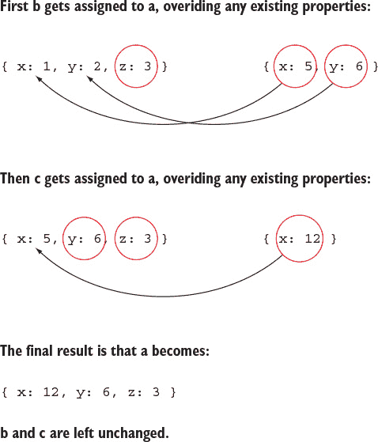
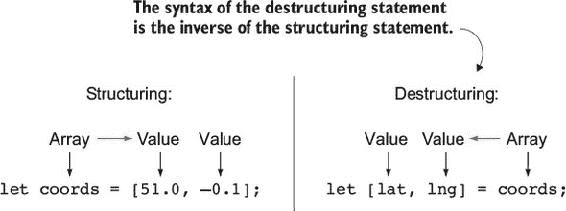
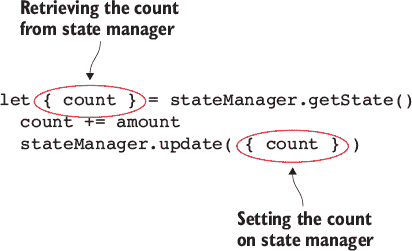
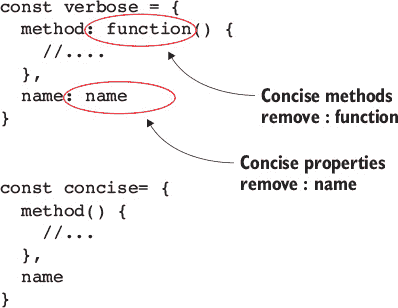
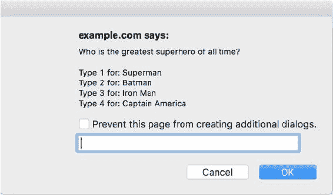
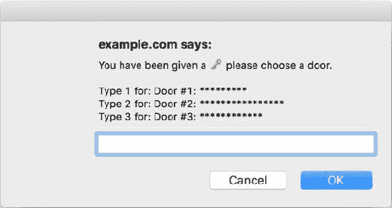

## 第 2 单元：对象和数组

对象和数组一直是 JavaScript 的工作马，作为组织数据的首选数据结构。即使添加了映射和集合，你将在 第 5 单元 中学习到，对象和数组也不会消失，并且仍然会像以前一样被广泛使用。

注意我如何将对象和数组称为 *数据结构*。使用字面量，你可以轻松地将数据结构化成复杂的结构，而没有字面量将变得繁琐。相反的机制一直缺失。你可能甚至从未注意到它的缺失，但一旦你看到能够像 *解构* 数据一样轻松地 *结构化* 数据是多么的酷，你可能会在任何不得不回到旧方法的时候感到不便。解构是 JavaScript 中我最喜欢的新增功能之一，而且有很好的理由。你会发现自己在日常生活中经常使用它来使代码更容易阅读和编写。但在你跳到解构之前，我们将看看一些被添加到对象和数组中的有用新方法。我们还将看看对象字面量的一些受欢迎的添加，这使得它们比以前更强大。

最后，我们将探讨一个全新的原始数据类型，即符号。符号通常用于定义我所说的“元行为”——用于更改或定义现有功能行为的钩子。它们还可以用来避免与字符串可能遇到的命名冲突。

你将通过编程一个使用符号的唯一性作为锁的键的锁和钥匙结构来结束本单元。然后，你将使用这些锁和钥匙创建一个 *选择门* 游戏，玩家将尝试使用他们获得的钥匙解锁门。

## 第 9 课：新数组方法

在阅读 第 9 课 之后，你将

+   了解如何使用 `Array.from` 构建数组

+   了解如何使用 `Array.of` 构建数组

+   了解如何使用 `Array.prototype.fill` 构建数组

+   了解如何使用 `Array.prototype.includes` 在数组中进行搜索

+   了解如何使用 `Array.prototype.find` 在数组中进行搜索

数组可能是 JavaScript 中最常用的数据结构。我们使用它们来存储各种数据，但有时将所需数据放入或从数组中取出并不像应该的那样容易。但一些新的数组方法使得这些任务变得容易得多，我们将在本课中介绍这些方法。


**考虑这一点**

考虑以下 jQuery 代码片段，它获取所有具有特定 CSS 类的 DOM 节点并将它们设置为红色。如果你要从头开始实现这个功能，你需要考虑哪些因素？例如，如果你要使用 `document.querySelectorAll`，它返回一个 `NodeList`（而不是 `Array`），你将如何迭代每个节点来更新其颜色？

```
$('.danger').css('color', 'red');
```


### 9.1. 使用 Array.from 构建数组

假设你将要编写一个用于计算平均值的函数。该函数应接受任意数量的参数，并返回所有这些数字的平均值。你最初可能会像在 列表 9.1 中定义此函数。但此实现不会工作，因为它忘记了 `arguments` 对象实际上不是一个数组的事实。在尝试使用此函数并得到类似 *arguments.reduce 不是函数* 的错误后，你可能会意识到你需要将 `arguments` 对象转换为数组。

##### 列表 9.1\. `avg` 版本 1：产生错误，因为参数不是一个数组

```
function avg() {
  const sum = arguments.reduce(function(a, b) {
    return a + b;
  });
  return sum / arguments.length;
}
```

在 ES6 之前，将类似数组的对象转换为数组的常见方法是在 `Array.prototype` 上使用 `slice` 方法并将其应用于类似数组的对象。这是因为对数组调用 `slice` 而不带任何参数只是创建了一个数组的浅拷贝。通过将相同的逻辑应用于类似数组的对象，你仍然会得到一个浅拷贝，但这个拷贝是一个实际的数组:^([1])

> ¹
> 
> 使用 `Array.prototype.apply` 也可以达到同样的效果。

```
Array.prototype.slice.call(arrayLikeObject);

// or a shorter version:
[].slice.call(arrayLikeObject);
```

考虑到这一点，你可以通过使用以下技巧将 `arguments` 对象转换为数组来修复你的 `avg` 函数，如下面的列表所示。

##### 列表 9.2\. `avg` 版本 2：使用 `slice` 将参数转换为数组

```
function avg() {
  const args = [].slice.apply(arguments);
  const sum = args.reduce(function(a, b) {
    return a + b;
  });
  return sum / args.length;
}
```

使用 `Array.from` 后，这个快捷方式就不再需要了。`Array.from` 的目的是从一个类似数组的对象中获取一个实际的数组。类似数组的对象是任何具有 `length` 属性的对象。`length` 属性用于确定新数组的长度；任何小于 `length` 属性的整数属性都将添加到新创建的数组中适当的索引位置。例如，字符串具有 `length` 属性和表示每个字符索引的数字属性。因此，使用字符串调用 `Array.from` 将返回一个字符数组。`arguments` 对象也可以使用此技术转换为数组，如下面的列表所示。

##### 列表 9.3\. 更新 `avg` 函数以使用 `Array.from`

```
function avg() {
  const args = Array.from(arguments);
  const sum = args.reduce(function(a, b) {
    return a + b;
  });
  return sum / args.length;
}

avg(1, 2, 3);                    *1*
avg(100, 104);                   *2*
avg(10 , 99, 5, 46);             *3*
```

+   ***1* 返回 2**

+   ***2* 返回 102**

+   ***3* 返回 40**

需要使用 `Array.from` 的另一个常见场景是与 `document.querySelectorAll` 结合使用。`document.querySelectorAll` 返回一个匹配的 DOM 节点列表，但其对象类型是 `NodeList`，而不是数组。

你不仅限于使用内置对象与 `Array.from` 一起使用。任何具有长度属性的对象都可以工作，即使它只有长度属性：

```
Array.from({ length: 50 })
```

这将创建一个与 `new Array(50)` 完全相同的数组。但如果你只想创建一个包含单个值 50 的数组，而不是长度为 50 的数组呢？下一节将给出答案。

| |
| --- |

**快速检查 9.1**

> **问题 1:**
> 
> 将以下代码转换为使用 `Array.from`：
> 
> ```
>  let nodes = document.querySelectorAll('.accordian-panel');
>  let nodesArr = [].slice.call(nodes);
> nodesArr.forEach(activatePanel);
> ```

| |
| --- |
| |

**QC 9.1 答案**

> **A1:**
> 
> ```
> let nodes = document.querySelectorAll('.accordian-panel');
> let nodesArr = Array.from(nodes);
> nodesArr.forEach(activatePanel);
> ```


### 9.2\. 使用 Array.of 构造数组

有一个函数有时以一种方式处理其参数，而在其他时候则以完全不同的方式处理，这通常被认为是一种糟糕的设计。例如，在前一节中，你创建了一个`avg`函数，该函数返回所有参数的平均值。现在想象一下，如果它只有一个参数：你期望只得到那个数字，对吧？毕竟，任何单个数字的平均值都是相同的数字？但是，如果只提供一个数字时，它执行了完全不同的操作并返回了该数字的平方根，你可能会告诉我这是一个糟糕的设计，但那种混合行为正是`Array`构造函数的工作方式。考虑以下三个数组；其中一个是表面现象：

```
let a   = new Array(1, 2, 3);            *1*
let b   = new Array(1, 2);               *2*
let c   = new Array(1);                  *3*
```

+   ***1* 数组 a 包含三个值：1，2，3。**

+   ***2* 数组 b 包含两个值：1 和 2。**

+   ***3* 最后数组 c 包含一个值：undefined。**

当你声明`new Array(1)`时，你得到一个包含`undefined`值的数组，这有点奇怪.^([2]) 这种情况的原因是`Array`构造函数中的一种特殊行为，如果只有一个参数且该参数是一个整数，它将创建一个长度为*n*的稀疏数组，其中*n*是作为参数传入的数字。为了避免这种怪癖，你可以使用更可预测的`Array.of`工厂函数。

> ²
> 
> 它甚至没有`undefined`值；它有一个空位。

```
let a = Array.of(1, 2, 3);
let b = Array.of(1, 2);
let c = Array.of(1);
```

使用`Array.of`创建的数组除了数组`c`之外都是相同的，这次数组`c`更直观地包含单个值`1`。此时，你可能正在想，为什么不直接使用数组字面量呢？例如：

```
let a = [1, 2, 3];
let b = [1, 2];
let c = [1];
```

在大多数情况下，数组字面量实际上是创建数组的首选方式。但是，在某些情况下，数组字面量可能无法使用。其中一种情况是使用数组的子类.^([3]) 假设你正在使用一个提供`Array`子类`AwesomeArray`的库。因为它是一个`Array`的子类，所以它有相同的怪癖。所以你不能简单地调用`new AwesomeArray(1)`，因为你会得到一个包含单个`undefined`值的`AwesomeArray`。但是你不能在这里使用数组字面量，因为这会给你一个`Array`的实例，而不是`AwesomeArray`的实例。然而，你可以使用`AwesomeArray.of(1)`并得到一个包含单个值`1`的`AwesomeArray`实例。

> ³
> 
> 我们将在后面的单元中介绍类和子类。

因此，现在你可以使用`Array.of(50)`构造一个包含单个数值的数组，但如果你确实想要一个包含 50 个值的数组怎么办？你可以回到`new Array(50)`，但那仍然有问题，我们将在下一节中看到。


**快速检查 9.2**

> **Q1:**
> 
> 以下哪个返回包含`undefined`值的数组？
> 
> ```
>  new Array()
>  new Array(true)
>  new Array(false)
>  new Array(5)
> new Array("five")
> ```

|  |

**QC 9.2 答案**

> **A1:**
> 
> 以下哪个返回一个包含 `undefined` 值的数组？
> 
> ```
> new Array(5)
> ```


### 9.3\. 使用 Array.prototype.fill 构建数组

想象你正在创建一个井字棋游戏。也许你是为某个客户构建的，或者可能是一个副项目。无论如何，井字棋很有趣，你可以构建它！为了开始，你需要决定你将如何实现棋盘。井字棋棋盘是一个 3 × 3 的 9 个槽位的网格。你决定你将只使用一个数组来表示。你可以使用长度为 9 的数组来表示 9 个网格槽位，可能的值将是 `"x"`、`"o"` 或空格 `" "`。你将称这个数组为 *board*，但你需要用 9 个空格 `" "` 初始化。也许你会这样做：

```
const board = new Array(9).map(function(i) {
  return ' '
})
```

这里的思考过程是，你用 9 个值初始化数组，所有这些值都是 `undefined`。然后你使用 `map` 将每个 `undefined` 值转换为空格。但这不会起作用。当你创建一个像 `new Array(9)` 这样的数组时，它实际上并没有向新数组添加九个 `undefined` 值。它只是将新创建数组的 `length` 属性设置为 `9`。

如果你对此感到困惑，让我们首先谈谈数组在 JavaScript 中的工作方式。数组并不像许多人想象的那样特殊。除了有 `[ ... ]` 这样的字面语法外，它与任何其他对象没有区别。当你创建一个像 `['a', 'b', 'c']` 这样的数组时，内部这个数组看起来是这样的：

```
{
  length: 3,
  0: 'a',
  1, 'b',
  2, 'c'
}
```

当然，它还会继承来自 `Array.prototype` 的几个方法，例如 `push`、`pop`、`map` 等。当执行 `map` 和 `forEach` 这样的迭代操作时，数组会内部查看其长度，然后检查从零开始到 `length` 结束范围内的任何属性。

当你通过 `new Array(9)` 创建一个数组时，许多开发者认为数组内部看起来是这样的：

```
{
  length: 9,
  0: undefined,
  1: undefined,
  2: undefined,
  3: undefined,
  4: undefined,
  5: undefined,
  6: undefined,
  7: undefined,
  8: undefined
}
```

但实际上它内部看起来是这样的：

```
{
  length: 9
}
```

它将有一个长度为 9，但它实际上不会有九个值。这些缺失的值被称为 *holes*。像 `map` 这样的方法在 holes 上不起作用，这就是为什么你尝试创建一个包含九个空格的数组没有成功的原因。一个新的方法 `fill` 可以用指定的值填充数组。在填充数组时，它不在乎给定索引处是否有值或 hole，因此它将完美地适用于你的使用：

```
const board = new Array(9).fill(' ')
```

我们已经介绍了几种构建包含所需值的数组的方法。现在让我们看看在数组构建完成后，如何搜索这些值的一些新方法。


**快速检查 9.3**

> **Q1:**
> 
> `arrayA` 和 `arrayB` 之间有什么区别？
> 
> ```
> let arrayA = new Array(9).map(function() { return 1 });
> let arrayB = new Array(9).fill(1);
> ```

|  |

**QC 9.3 答案**

> **A1:**
> 
> 变量 `arrayB` 准确地创建了一个包含九个 1 的数组。变量 `arrayA` 没有这样做，因为它实际上不包含任何要映射的值。


### 9.4\. 使用 Array.prototype.includes 在数组中进行搜索

你在第 6 课中学到了，字符串在其原型上有一个新的方法叫做 `includes`，用于判断一个字符串是否包含某个值。数组也被赋予了此方法，其工作方式与下述示例类似。

##### 列表 9.4\. 使用 `includes` 检查数组是否包含某个值

```
const GRID = 'grid';
const LIST = 'list';
const availableOptions = [GRID, LIST];

let optionA = 'list';
let optionB = 'table';

availableOptions.includes(optionA);         *1*
availableOptions.includes(optionB);         *2*
```

+   ***1* true**

+   ***2* false**

使用 `String.prototype.includes` 方法，你是在检查一个字符串是否包含子字符串。`Array.prototype.includes` 的工作方式类似，但你是在检查数组中任何索引处的值是否是你检查的值。

之前使用 `indexOf` 来判断一个值是否在数组中。例如：

```
availableOptions.indexOf('list');         *1*
```

+   ***1* 1**

这可以正常工作，但往往会导致错误，如果开发者忘记他们需要将结果与 `-1` 进行比较，而不是比较其真值。如果给定的值位于 `0` 索引处，他们会得到 `0`，一个假值，反之亦然：如果值未找到，他们会得到 `-1`，一个真值。但现在可以通过使用 `includes` 来避免这个错误，它返回一个布尔值而不是索引。


**真值和假值**

作为复习，*假值*的概念是指任何评估为假的值：`false, undefined, null, NaN, 0` 和空字符串 “”。真值是指评估为真的值。任何之前未列为假值的值都是真值，包括负数。


### 9.5\. 使用 Array.prototype.find 在数组中进行搜索

假设你有一个从数据库缓存的记录数组。当请求一个记录（通过其 ID）时，你首先想检查缓存以查看是否有该记录，并在再次访问数据库之前返回它。你可能会编写如下类似的代码。

##### 列表 9.5\. `filter` 方法返回所有匹配项，即使你只想要一个

```
function findFromCache(id) {
  let matches = cache.filter(function(record) {
    return record.id === id;
  });
  if (matches.length) {
    return matches[0];
  }
}
```

列表 9.5 中的 `findFromCache` 函数当然可以工作，但当缓存有 10,000 条记录，并且只在第 100 次尝试时找到所需的记录时会发生什么？在其当前实现中，它仍然会检查剩余的 9,900 条记录，然后返回找到的记录。这是因为 `filter` 函数的目的是返回所有匹配的记录。你只期望找到一条记录，一旦找到，你只需要那条记录。这正是 `Array.prototype.find` 所做的：它像 `Array.prototype.filter` 一样遍历数组，但一旦找到匹配项，它就会立即返回该匹配项并停止搜索数组。

你可以将你的 `findFromCache` 函数重写为利用 `find` 函数，如下所示：

```
function findFromCache(id) {
  return cache.find(function(record) {
    return record.id === id;
  });
}
```

`find` 的另一个优点是，因为它返回匹配项而不是匹配项的数组，所以你不需要在之后从数组中取出它；实际上，你可以直接返回 `find` 的结果。


**快速检查 9.4**

> **Q1:**
> 
> 在以下片段中，变量 `result` 将被设置为什么值？
> 
> ```
>  let result = [1, 2, 3, 4].find(function(n) {
>    return n > 2;
> });
> ```

|  |

**QC 9.4 答案**

> **A1:**
> 
> 变量 `result` 将被设置为 `3`，而不是 `['3, 4']`，因为 3 是第一个符合条件的价值。


### 摘要

在本课中，目标是教你即将添加到数组中的最有用的新方法。

+   `Array.from` 创建一个包含从类似数组的对象中所有值的数组。

+   `Array.of` 创建一个包含提供值的数组，并且比 `new Array` 更安全。

+   `Array.prototype.includes` 检查数组是否在其任何索引中包含一个值。

+   `Array.prototype.find` 根据一个标准函数搜索数组，并返回找到的第一个值。

+   `Array.prototype.fill` 使用指定的值填充数组。

让我们看看你是否理解了：

> **Q9.1**
> 
> 实现从预热练习中的函数。不用担心重新创建所有 jQuery。只需编写你自己的实现，以便以下片段能够工作：
> 
> ```
> $('a').css('background', 'yellow').css('font-weight', 'bold');
> ```

## 第 10 课：Object.assign

在阅读完 第 10 课 后，你将

+   知道如何使用 `Object.assign` 设置默认值

+   知道如何使用 `Object.assign` 扩展对象

+   知道如何在使用 `Object.assign` 时防止突变

+   理解 `Object.assign` 如何分配值

像 Underscore.js 和 Lodash.js 这样的库已经变成了 JavaScript 的工具带。它们为常见任务提供了解决方案，这样普通开发者就不需要为每个项目重新发明轮子。其中一些任务变得如此普遍和定义明确，以至于实际上将它们包含在语言中是有意义的。`Object.assign` 就是这样的一个方法。有了它，你可以轻松地设置默认值或就地或作为副本扩展对象，而无需编写大量样板代码来做到这一点。


**考虑这个**

JavaScript 对象可以通过原型链从另一个对象继承属性。但任何给定的对象只能有一个原型。你将如何设计一种方法，允许对象从多个源对象继承？


### 10.1. 使用 Object.assign 设置默认值

让我们假设你最喜欢的当地披萨店联系你，想要建立一个披萨追踪网站。这个想法是使用 GPS 让顾客能够看到他们订购的披萨在送递过程中的确切位置。你解释说，你非常喜欢他们的披萨，在你的帮助下，你可以帮他们登上地图！当你着手构建这个网站时，你决定你需要一个从披萨店到送递地址生成地图的功能。这个函数将接受一个 `options` 参数来指定地图的宽度、高度和坐标。问题是，如果这些值中的任何一个没有被设置，你需要使用合理的默认值。一种方法如下所示。

##### 列表 10.1：基本的披萨追踪地图

```
function createMap(options) {

  const defaultOptions = {
    width: 900,
    height: 500,
    coordinates: [33.762909, -84.422675]
  }

  Object.keys(defaultOptions).forEach(function(key) {
    if ( !(key in options) ) {
      options[key] = defaultOptions[key];
    }
  });

  // ...
}
```

这种实现只是在解决实际问题的过程中，在分配默认值之前有很多事情要做。使用 `Object.assign` 重新实现默认值：

```
function createMap(options) {

  options = Object.assign({
    width: 900,
    height: 500,
    coordinates: [33.762909, -84.422675]
  }, options);

  // ...
}
```

使用 `Object.assign` 比你最初的方法更简洁。`Object.assign` 通过接受任意数量的对象作为参数，并将后续对象的值分配到第一个对象上（见图 10.1）。如果任何对象包含相同的键，列表中的右侧对象将覆盖左侧对象，如下所示：

```
let a = { x: 1, y: 2, z: 3 };
let b = { x: 5, y: 6 };
let c = { x: 12 };

Object.assign(a, b, c);

console.log(a);                    *1*
```

+   ***1* { x: 12, y: 6, z: 3 }**

##### 图 10.1\. 使用 `Object.assign` 分配值



当使用 `Object.assign` 设置默认值时，你基本上是在取不完整的对象并填充缺失的值。另一个常见任务是取已经完整的对象，并将它们扩展成更定制的变体。


**快速检查 10.1**

> **Q1:**
> 
> 在以下 `Object.assign` 的使用中，`a` 和 `b` 之后被设置为什么？
> 
> ```
>  let a = { city: 'Dallas', state: 'GA' };
>  let b = { state: 'TX' };
> 
> Object.assign(a, b);
> ```

|  |

**QC 10.1 答案**

> **A1:**
> 
> `a` 被设置为 `{ city: 'Dallas', state: 'TX' }`，而 `b` 保持不变。


### 10.2\. 使用 Object.assign 扩展对象

`Object.assign` 的另一个常见用途是为现有对象添加一些额外的属性。比如说你正在开发一个飞船游戏。游戏有一个基础飞船和几个其他特殊飞船。这些特殊飞船都具有与基础飞船相同的基本功能，但具有额外的或增强的技能。你从一个创建基础飞船的函数开始：

```
function createBaseSpaceShip() {
  return {
    fly: function() {
      // ... fly function implementation
    },
    shoot: function() {
      // ... shoot function implementation
    },
    destroy: function() {
      // ... function for when the ship is destroyed
    }
  }
}
```

然后为了创建一个特殊飞船，你创建一个基础飞船的副本并扩展其特殊功能：

##### 列表 10.2\. 向飞船添加炸弹属性

```
function createBomberSpaceShip() {
  let spaceship = createBaseSpaceShip();

  Object.assign(spaceship, {
    bomb: function() {
      // ... make the ship drop a bomb
    }
  });

  return spaceship;
}

let bomber = createBomberSpaceShip();
bomber.shoot();
bomber.bomb();
```

首先，你创建一个基础飞船对象。然后你使用 `Object.assign` 添加一个额外的炸弹属性。你可以使用这种技术创建几个增强飞船。不过，这个函数确实有很多样板代码，所以如果你打算重用这个技术，你可以创建一个用于增强基础飞船的辅助函数。

##### 列表 10.3\. 用于增强飞船的辅助函数

```
function enhancedSpaceShip(enhancements) {
  let spaceship = createBaseSpaceShip();

  Object.assign(spaceship, enhancements);

  return spaceship;
}

function createBomberSpaceShip() {
  return enhancedSpaceShip({
    bomb: function() {
      // ... make the ship drop a bomb
    }
  });
}

function createStealthSpaceShip() {
  return enhancedSpaceShip({
    stealth: function() {
      // ... make the ship invisible
    }
  });
}

let bomber = createBomberSpaceShip();bomber.shoot();
bomber.bomb();

let stealthship = createStealthSpaceShip();
stealthship.shoot();
stealthship.stealth();
```

现在你已经创建了一个 `enhancedSpaceShip` 函数，它接受一个增强对象作为参数。这些增强可以是新功能，也可以是覆盖现有功能。注意到目前为止，在每一个例子中，你都是创建了一个对象然后对其进行变异？有时这是所需要的，但通常你只是想要一个副本。


**快速检查 10.2**

> **Q1:**
> 
> 使用 `Object.assign` 创建一个扩展了基础飞船的 `warp` 函数的飞船。

|  |

**QC 10.2 答案**

> **A1:**
> 
> ```
> function createWarpSpaceShip() {
>   return enhancedSpaceShip({
>     warp: function() {
>       // ... make the ship go warp speed
>     }
>   });
> }
> ```


### 10.3\. 防止使用 Object.assign 时发生突变

在对对象进行修改时，程序员通常喜欢操作不修改现有对象，而是返回一个具有所需更改的副本。其中一个原因是为了防止任何当前持有对象引用的其他东西从其下面改变其引用。例如，如果在你太空船的例子中，你没有创建新副本的基础太空船对象的函数？如果你只有一个基础太空船对象呢？如果是这样的话，每次你调用 `Object.assign` 来增强它时，你就是在增强基础对象，而这不是你想要的。相反，你想要创建一个副本并保持基础对象不变。你可能认为 `const` 可以帮助你在这里，但它不能。记住，`const` 只能防止用新对象覆盖变量；它不能防止修改/修改现有对象。

因为 `Object.assign` 修改了参数列表中的第一个对象，而其余对象保持不变，所以一个常见的做法是将第一个对象设为一个空对象字面量：

```
let newObject = {};
Object.assign(newObject, {foo: 1}, {bar: 2});
console.log(newObject);                                  *1*
```

+   ***1* {foo: 1, bar: 2}**

在进行此操作时，首先创建一个空对象，然后将其传递给 `Object.assign` 是不方便的。方便的是，`Object.assign` 也会返回被修改的对象，因此您可以将其缩短如下：

```
let newObject = Object.assign({}, {foo: 1}, {bar: 2});
console.log(newObject);                                  *1*
```

+   ***1* {foo: 1, bar: 2}**

将你的太空船示例重写，使用单个基础对象和你的增强函数来创建一个增强的副本，如下所示。

##### 列表 10.4\. 复制太空船

```
const baseSpaceShip = {
  fly: function() {
    // ... fly function implementation
  },
  shoot: function() {
    // ... shoot function implementation
  },
  destroy: function() {
    // ... function for when the ship is destroyed
  }
}

function enhancedSpaceShip(enhancements) {
  return Object.assign({}, baseSpaceShip, enhancements);           *1*
}

function createBomberSpaceShip() {
  return enhancedSpaceShip({
    bomb: function() {
      // ... make the ship drop a bomb
    }
  });
}

function createStealthSpaceShip() {
  return enhancedSpaceShip({
    stealth: function() {
      // ... make the ship invisible
    }
  });
}
```

+   ***1* 通过传递 {} 作为第一个参数，`Object.assign` 创建了一个副本。**

注意，因为你将增强技术抽象到了自己的函数中，所以当你修改其工作方式时，你不需要对 `createBomberSpaceShip` 或 `createStealthSpaceShip` 函数进行任何修改。

到目前为止，你可能认为 `Object.assign` 实际上是从右到左合并对象。嗯，不是的；它只从左到右分配值。这个小的区别是我们接下来要讨论的。


**快速检查 10.3**

> **Q1:**
> 
> 编写一个名为 `createStealthBomber` 的函数，该函数使用 `Object.assign` 创建一个结合了轰炸机和隐形太空船的太空船。

|  |

**QC 10.3 答案**

> **A1:**
> 
> ```
> function createStealthBomber() {
>   const stealth = createStealthSpaceShip();
>   const bomber = createBomberSpaceShip();
>   return Object.assign({}, stealth, bomber);
> }
> ```


### 10.4\. `Object.assign` 如何分配值

定义和赋值之间有一个细微的区别。将值赋给现有属性并不定义属性的行为方式，就像 `Object.defineProperty` 一样。赋值只有在将赋值操作应用于不存在的属性时才会回退到定义属性。这一点很重要，因为 `Object.assign` 不定义（或重新定义）属性；它只是对它们进行赋值。大多数时候，这种区别没有影响，但有时它确实有影响。让我们来探讨一下这种区别：

```
let person = {
  name: 'JD'
}

Object.assign(person, { name: 'JD Isaacks' })
```

前面的函数按预期工作。但如果 `name` 属性不是一个简单的字符串，而是一个确保名称不包含空格的 getter 和 setter 呢？

```
let person = {
  __name: 'JD',
  get name() {
    return this.__name
  },
  set name(newName) {
    if (newName.includes(' ')) {
      throw new Error('No spaces allowed!')
    } else {
      this.__name = newName
    }
  }
}

person.name = 'JD Isaacks'            *1*
```

+   ***1* 错误：不允许空格！**

如你所见，如果你将一个字符串赋给 `name`，它会被 setter 函数处理，如果字符串包含空格，它会抛出一个错误。使用 `Object.assign` 也会发生同样的事情，因为它只是进行赋值；它不会重新定义属性：

```
Object.assign(person, { name: 'JD Isaacks' })         *1*
```

+   ***1* 错误：不允许空格！**

此外，`Object.assign` 只分配对象的自身可枚举属性，这意味着它不会分配在对象原型链上的属性或设置为不可枚举的属性。这通常是好事。以下是一个说明我意思的例子：

```
let numbers = [1, 2, 3]
let summableNumbers = Object.assign({}, numbers, {
  sum: function() {
    return this.reduce(function(a, b) {
      return a + b
    })
  }
})

summableNumbers[0]                 *1*
summableNumbers.sum()              *2*
```

+   ***1* 1**

+   ***2* TypeError: this.reduce is not a function.**

为什么你会得到一个错误？因为 `reduce` 方法在 `numbers` 数组的原型链上，而不是直接在 `numbers` 数组本身上。`numbers` 数组上直接有的属性只有它包含的三个值对应的 0、1 和 2。正因为如此，这三个值被分配到了新对象上，但数组原型上的所有方法，如 `pop`、`push` 和 `reduce` 都没有。然而，你可以通过将值赋给一个已经具有所有所需方法的空数组来使这个工作：

```
let summableNumbers = Object.assign([], numbers, {             *1*
  // ...
})
```

+   ***1* 将值赋给空数组而不是空对象**

大多数情况下，这些问题不会成为问题，因为更常见的是，你会在许多开发者喜欢称之为 *POJO*（普通的旧 JavaScript 对象）的对象上使用 `Object.assign`，这是一个没有像 getter、setter 或原型这样的东西的对象。这是使用对象字面量 `{ ... }` 语法创建的对象类型。


**快速检查 10.4**

> **Q1:**
> 
> 将会在控制台输出什么？
> 
> ```
>  let doubleTheFun = {
>    __value: 1,
>    get value() {
>      return this.__value
>    },
>    set value(newVal) {
>      this.__value = newVal * 2
>    }
>  }
> console.log( Object.assign(doubleTheFun, { value: 2 }).value );
> ```

|  |

**QC 10.4 答案**

> **A1:**
> 
> 4


### 摘要

在本节课中，你学习了如何使用 `Object.assign` 以及为什么你会这样做。

+   `Object.assign` 将多个对象的值属性分配到基础对象上。

+   `Object.assign` 可以用来填充默认值。

+   `Object.assign` 可以用来向对象添加新属性。

+   `Object.assign` 返回被修改的对象，因此使用 `{}` 作为第一个参数将创建一个副本。

+   `Object.assign` 只分配属性；它不会重新定义它们。

让我们看看你是否掌握了：

> **Q10.1**
> 
> 在本节课中，你创建了一个基础太空船并使几个其他太空船从它继承而来。你甚至制作了一个从多个其他太空船继承而来的隐形轰炸机。想出另一系列相互继承的对象，例如客用车辆、动物王国、视频游戏角色，或者任何你能想到的东西。

## 第 11 课。解构

阅读完第 11 课后，你将

+   了解如何解构对象

+   了解如何解构数组

+   了解如何组合数组和对象解构

+   了解可以解构的类型

JavaScript，像其他编程语言一样，有对象和数组这样的数据结构，允许你将数据结构化成逻辑组，并将它们视为单一的数据块。JavaScript 一直支持结构化的概念，这是一种简洁的语法，用于将多个数据项组合成一个数据结构。但故事只讲了一半：JavaScript 一直缺少相反的语法，即如何将现有的数据结构解构回构成它的各个部分。


**考虑这一点**

在下面的代码中，有两个部分。第一部分构建了一个数据结构，第二部分将其拆解。你可能已经想到了使用对象字面量清理数据结构创建的方法，但你是如何清理拆解过程的呢？

```
// Creating data structures without structuring
let potus = new Object();
potus.name = new Object();
potus.name.first = 'Barack';
potus.name.last = 'Obama';
potus.address = new Object();
potus.address.street = '1600 Pennsylvania Ave NW';
potus.address.region = 'Washington, DC';
potus.address.zipcode = '20500';

// Breaking down data structures without destructuring
let firstName = potus.name.first;
let lastName = potus.name.last;
let street = potus.address.street;
let region = potus.address.region;
let zipcode = potus.address.zipcode;
```


### 11.1\. 解构对象

想象一下，如果不使用对象字面量编写应用程序会有多繁琐。你可能认为你会在做这样的事情之前放弃编写 JavaScript。但你在分解对象时一直在做同样繁琐的过程，一旦你看到以与结构相同的方式解构对象是多么方便，你就永远不会想回头。让我们从一个简单的例子开始：

```
let person = {                     *1*
  name: 'Christina'
}

let { name } = person;             *2*

console.log(name);                 *3*
```

+   ***1* 创建数据结构**

+   ***2* 解构数据结构**

+   ***3* Christina**

在这个例子中，你使用对象字面量以结构化的方式创建了一个对象。通过这样做，你能够以简洁的方式指定在结构上设置的属性。后来，你使用解构语句解构了该数据结构。你指定了想要提取的 `name` 属性到变量中。

在这个简单的例子中，好处并不那么显著，但就像往常一样，用例越复杂，解构的实用性就越明显：

```
let person = {
  name: 'Christina',
  age: 25
}

let { name, age } = person;

console.log(name, age);            *1*
```

+   ***1* “Christina” 25**

当你这样解构一个对象时，你指定了你要从中提取的字段名称。具有相同名称的变量将被分配相应的值。ES5 的等效代码如下：

```
let name = person.name;
let age = person.age;
```

但如果你想要使用不同的名字呢？

```
let firstName = person.name;
let yearsOld = person.age;
```

在解构时，你可以指定不同的名称，如下所示：

```
let { name: firstName, age: yearsOld } = person;
```

这将创建变量 `firstName` 和 `yearsOld`，并将它们分别赋值为 `person.name` 和 `person.age`。这很好，因为它正好是你构建数据结构方式的相反：

```
let person = { name: firstName, age: yearsOld };
```

你可以进行嵌套解构，深入数据结构以提取不同层次的数据：

```
let geolocation = {
  "location": {
    "lat": 51.0,
    "lng": -0.1
  },
  "accuracy": 1200.4
}

let { location: {lat, lng}, accuracy } = geolocation;

console.log(lat); // 51.0
console.log(lng); // -0.1
console.log(accuracy); // 1200.4
console.log(location); // undefined
```

使用语法 `key: {otherKeys}`，你指定你正在深入到指定的 `key` 中以从中提取 `otherKeys`。在这里，你指定了你想从 `location` 属性中提取 `lat` 和 `lng` 属性。注意，这里没有创建一个 `location` 变量：你只是深入到了它。


**快速检查 11.1**

> **Q1:**
> 
> 你将如何重写之前的解构语句，将 `lng` 属性分配给一个名为 `lon` 的变量？

|  |

**QC 11.1 答案**

> **A1:**
> 
> ```
> let {location: {lat, lng: lon}, accuracy} = geolocation;
> ```


### 11.2\. 数组的解构

在上一节中，你学习了对象解构的语法是对象结构的语法的逆。同样，数组解构的语法是数组结构的语法的逆。参见 图 11.1。

##### 图 11.1\. 结构化和解构语法



```
let coords = [51.0, -0.1];

let [lat, lng] = coords;

console.log(lat);                   *1*
console.log(lng);                   *2*
```

+   ***1* 51.0**

+   ***2* -0.1**

因为对象通过键或名称跟踪它们的值，所以它们必须通过相同的键/名称提取。由于数组通过它们的位置索引跟踪它们的值，所以在解构数组时，变量的位置就是指定你正在解构的方式是有意义的。

就像解构对象一样，你也可以对数组进行嵌套解构：

```
let location = ['Atlanta', [33.7490, 84.3880]];

let [ place, [lat, lng] ] = location;

console.log(place); // "Atlanta"
console.log(lat); // 33.7490
console.log(lng); // 84.3880
```

我非常喜欢的一个惯用法是使用数组解构从数组中获取第一个值：

```
let [firstValue] = myArray;

// vs

let firstValue = myArray[0];
```

在关于 `let` 的课程中，你反转了两个变量之间的值，在这个过程中，你需要创建一个第三个临时变量来防止反转前值丢失：

```
if (stop < start) {
  // reverse values
  let tmp = start;
  start = stop;
  stop = tmp;
}
```

你可以通过使用解构来达到同样的效果，而不需要临时变量：

```
if (stop < start) {
  // reverse values
  [start, stop] = [stop, start];
}
```


**快速检查 11.2**

> **Q1:**
> 
> 如果上一个例子中的数组以相反的顺序存储 `lat/lng` 值，你该如何提取它们到正确的变量中？

|  |

**QC 11.2 答案**

> **A1:**
> 
> 由于数组解构与索引相关，而不是名称，你可以在解构语句中简单地颠倒名称的顺序：
> 
> ```
> let location = ['Atlanta', [84.3880, 33.7490]];
> let [ place, [lng, lat] ] = location;
> ```


### 11.3\. 组合数组和对象解构

你可以像创建数据结构时一样组合对象和数组的解构语句：

```
let geoResults = {
  coords: [51.0, -0.1],
  ...
}

let { coords: [ latitude, longitude ] } = geoResults;

console.log(latitude, longitude)            *1*
```

+   ***1* 51.0 -0.1**

这也是一种嵌套解构的形式，因为你正在使用对象解构来深入到数组解构中。

还要注意，在这个例子中，你在解构赋值中使用了`coords`这个名字，但你并没有创建一个名为`coords`的变量。你只创建了`latitude`和`longitude`变量。使用`coords`这个名字只是为了深入并指定你正在解构的数组。你可以把`coords`看作是一个分支，而`latitude`和`longitude`则是解构赋值中的叶子。分支不会创建变量；只有叶子会。考虑以下代码：

```
let product = {
  name: 'Whiskey Glass',
  details: {
    price: 18.99,
    description: 'Enjoy your whiskey in this glass'
  },
  images: {
    primary: '/images/main.jpg',
    others: [
      '/images/1.jpg',
      '/images/2.jpg'
    ]
  }
}

let {
  name,
  details: { price, description},
  images: {
    primary,
    others: [secondary, tertiary]
  }
} = product;

console.log(name);                 *1*
console.log(price);                *2*
console.log(description);          *3*
console.log(primary);              *4*
console.log(secondary);            *5*
console.log(tertiary);             *6*

console.log(details);              *7*
console.log(images);               *7*
console.log(others);               *7*
```

+   ***1* 威士忌杯**

+   ***2* 18.99**

+   ***3* 在这个杯子里享受你的威士忌。**

+   ***4* /images/main.jpg**

+   ***5* /images/1.jpg**

+   ***6* /images/2.jpg**

+   ***7* 未定义**

在前面的解构赋值中，如果你标记了哪些值作为分支和哪些作为叶子，你就会知道哪些变量被创建了。参见图 11.2。

##### 图 11.2\. 解构产品数组


### 11.4\. 可以解构的类型

你可以在任何对象上使用对象解构，甚至包括数组。但由于数字不是有效的变量名，你需要在解构赋值中给它们重命名：

```
const { 0:a, 1:b, length } = ['foo', 'bar']

console.log(a)               *1*
console.log(b)               *2*
console.log(length)          *3*
```

+   ***1* foo**

+   ***2* bar**

+   ***3* 2**

使用数组解构更为严格，但它可以用于比数组多得多的对象。任何实现了可迭代协议的对象（我们将在后面的单元中介绍）都可以使用数组解构。一个可迭代对象的例子是`Set`，我们将在本书的后面部分介绍。另一个例子是`String`：

```
const [first, second, last] = 'abc'

console.log(first)                      *1*
console.log(second)                     *2*
console.log(last)                       *3*
```

+   ***1* a**

+   ***2* b**

+   ***3* c**

在本书的后面部分，当你创建自己的可迭代对象时，你也将能够对它们使用数组解构！

### 摘要

在本课中，你学习了解构的机制以及为什么它是一项如此有用的技术。

+   解构是获取数据结构值的语法糖。

+   解构是对象/数组字面量提供结构化语法的逆补。

+   使用对象解构时，你通过属性名指定值。

+   使用数组解构时，你通过它们的索引指定值。

+   解构可以像数据结构一样组合和嵌套。

+   当嵌套解构时，只有叶子（而不是分支）会被检索。

让我们看看你是否理解了：

> **Q11.1**
> 
> 现在，你应该能够将预热练习中的代码转换成一个单一的解构语句：
> 
> ```
> let firstName = potus.name.first;
> let lastName = potus.name.last;
> let street = potus.address.street;
> let region = potus.address.region;
> let zipcode = potus.address.zipcode;
> ```
> 
> 此外，尝试将此代码转换成一个单一的解构语句：
> 
> ```
> let firstProductName = products[0].name
> let firstProductPrice = products[0].price
> let firstProductFirstImage = products[0].images[0]
> 
> let secondProductName = products[1].name
> let secondProductPrice = products[1].price
> let secondProductFirstImage = products[1].images[0]
> ```

## 第 12 课\. 新的对象字面量语法

在阅读第 12 课之后，你将

+   了解如何使用简写属性名

+   了解如何使用简写方法名

+   了解如何使用计算属性名

我认为在 JavaScript 中没有什么比对象字面量更普遍的了。它们无处不在。由于这个工具被频繁使用，任何便利性都可以对生产力产生巨大的净正面影响。ES2015 中引入的对象字面量的三个语法添加使它们读起来和写起来更加愉快。您不会获得新的功能，但拥有易于阅读和编写的代码，尤其是在维护方面，同样是一个重要的特性。

| |
| --- |

**考虑这一点**

看看以下对象字面量。哪些部分看起来是多余的？如果您正在编写一个 JavaScript 感知的字符串压缩引擎，您认为您可以在仍然能够重建原始对象的情况下安全地删除哪些部分？

```
const redundant = {
  name: name,
  address: address,
  getStreet: function() { /* ... */ },
  getZip:    function() { /* ... */ },
  getCity:   function() { /* ... */ },
  getState:  function() { /* ... */ },
  getName:   function() { /* ... */ },
}
```

| |
| --- |

### 12.1. 简写属性名

在 ES6 之前，我无数次不可避免地创建了一个对象字面量，它有一个键或属性，其名称与我正在分配给它的变量相同：

```
const message = { text: text }           *1*
```

+   ***1* 将属性 text 分配给同名的变量 text**

我一直认为这看起来很笨拙，多亏了 ES6 简写属性名，这已经成为过去式。之前的对象字面量现在可以简洁地写成

```
const message = { text }                 *1*
```

+   ***1* 将属性 text 分配给同名的变量 text**

当与解构结合使用时，这也非常出色：

```
function incrementCount(amount) {
  let { count } = stateManager.getState()                *1*
  count += amount                                        *2*
  stateManager.update({ count })                         *3*
}
```

+   ***1* 从`getState`返回的对象中提取 count**

+   ***2* 更新 count 的值**

+   ***3* 将一个名为 count 的属性设置为新的 count 的对象字面量传递**

使用简写属性名，如果属性的名称与您要分配给它的变量的名称相同，您只需列出一次名称。这意味着原本需要写成`{ count: count }`的对象字面量现在可以写成`{ count }`，并且会评估为相同的结果（参见图 12.1）。

##### 图 12.1. 使用简写属性名



注意，现在您在用`{ count }`获取 count，然后用`{ count }`传递它之间有了对称性。我个人认为这种对称性非常优雅。

简写属性可以与对象字面量中的任何其他属性或方法混合使用。在下一个列表中，`简写`和`长写`对象字面量是等效的。

##### 列表 12.1. 混合`简写`和`长写`对象字面量

```
const lat = 33.762909;
const lng = -84.422675;
const accuracy = 1200.4;

const shorthand = {
  name: 'Atlanta',
  accuracy,
  location: {
    lat,
    lng
  }
};

const longhand = {
  name: 'Atlanta',
  accuracy: accuracy,
  location: {
    lat: lat,
    lng: lng
  }
}
```

简洁的属性名消除了具有匹配键/值名称的对象字面量的冗余。您知道对象字面量中还有什么冗余吗？方法。

| |
| --- |

**快速检查 12.1**

> **Q1:**
> 
> 将以下对象字面量重写为使用简写属性名。
> 
> ```
> let foo, bar, bizz, bax = {
>   foo: foo, bar: bar,
>   biz: bizz
> }
> ```

| |
| --- |
| |

**QC 12.1 答案**

> **A1:**
> 
> ```
> let foo, bar, bizz, bax = {
>   foo, bar, biz: bizz
> }
> ```

| |
| --- |

### 12.2. 简写方法名

假设你的团队正在开发一个教小学生数学的游戏。游戏必须跟踪游戏会话中的多个状态（例如玩家的姓名、当前级别、正确/错误答案的数量、已提出的问题等）。你可能从一个简单的状态管理器开始，如下所示：

```
function createStateManager() {
  const state = {};
  return {
    update: function(changes) {
      Object.assign(state, changes);
    },
    getState: function() {
      return Object.assign({}, state);
    }
  }
}
```

在这里使用单词 `function` 是多余的。因为函数始终有一个参数列表 `()`，并且由于括号在变量或属性名称中无效，它们的存在应该足以表示它是一个方法。简写方法名称允许你做到这一点。

这就像简写属性名称消除了输入 `: redundant name` 的需要，并且 `{ count: count }` 变成了 `{ count }`。简写方法名称消除了输入 `: redundant function` 的需要，并且 `{ update: function(){} }` 被缩短为 `{ update(){} }`。参见 图 12.2。

##### 图 12.2\. 简写方法名称消除了冗余语法。



考虑到这一点，你可以更新你的 `createStateManager` 以使用简写方法名称：

```
function createStateManager() {
  const state = {};
  return {
    update(changes) {
      Object.assign(state, changes);
    },
    getState() {
      return Object.assign({}, state);
    }
  }
}
```

重要的是要理解简写方法评估为*匿名*函数，而不是*命名*函数。这意味着你无法在函数内部通过名称引用该函数：

```
const fibonacci = {
  at(n) {
    if (n <= 2) return 1;
    return at(n - 1) + at(n - 2);
  }
}

fibonacci.at(7)                 *1*
```

+   ***1* ReferenceError: at is not defined**

在下一个列表中，`withShorthandFunction` 对象字面量评估（或被*简化*）类似于 `withAnonymousFunction` 对象，而不是 `withNamedFunction` 对象。

##### 列表 12.2\. 简写方法是匿名函数

```
const withShorthandFunction = {
  fib() {
    // ...
  }
}
const withNamedFunction = {
  fib: function fib() {
    // ...
  }
}
const withAnonymousFunction = {
  fib: function() {
    // ...
  }
}
```

这实际上只在函数自我引用时很重要，这意味着函数正在对自己进行引用，就像*递归*一样。因此，使用简写语法定义 `at` 方法将不起作用。你可能想使用 `this.at` 来解决这个问题，如列表 12.3 所示，只要函数始终在 `this.at` 将解析回函数的上下文中调用，它就会起作用。如果函数被分离或以不同的名称附加，它将不再起作用。

##### 列表 12.3\. 使用 `this.at` 的递归函数

```
const fibonacci = {
  at(n) {
    if (n <= 2) return 1;
    return this.at(n - 1) + this.at(n - 2);
  }
}
const { at } = fibonacci;
const fib = { at };
const nacci = { find: at };

fibonacci.at(7);                      *1*
at(7);                                *2*
fib.at(7);                            *3*
nacci.find(7);                        *4*
```

+   ***1* 13**

+   ***2* 抛出 ReferenceError**

+   ***3* 13**

+   ***4* 抛出 ReferenceError**

最后，如果你需要自我引用，不要使用简写方法名称。

简洁的属性和方法使对象字面量更加简洁。在下一节中，你将使用计算属性名称移除更多的冗余。


**快速检查 12.2**

> **Q1:**
> 
> 将以下对象字面量重写为使用简写方法名称：
> 
> ```
> const dtslogger = {
>   log: function(msg) {
>     console.log(new Date(), msg);
>   }
> }
> ```

|  |

**QC 12.2 答案**

> **A1:**
> 
> ```
> const dtslogger = {
>   log(msg) {
>     console.log(new Date(), msg);
>   }
> }
> ```


### 12.3\. 计算属性名称

假设你正在使用你的状态管理器，并需要使其与另一个库一起工作，该库将提供你需要存储在状态中的值。问题是这个库没有以你可以传递给状态管理器`update`函数的对象形式提供键/值对。相反，这个其他库以数组的形式提供键/值对，其中第一个索引是键，第二个索引是值。为了使这两个库能够很好地一起工作，你编写了一个中间函数`setValue`，该函数接受一个名称和一个值作为参数，并在内部将它们转换成一个对象，然后将其传递给`stateManager.update`：

```
function setValue(name, value) {
  const changes = {};
  changes[name] = value;
  stateManager.update(changes);
}

const [name, value] = otherLibrary.operate();
setValue(name, value);
```

注意在`setValue`函数中，你必须首先创建一个空对象，然后再定义属性。这是因为属性的名称是动态的：如果我们做了类似`{ name: value }`的事情，那么属性名称实际上将是值`"name"`，而不是`name`变量包含的值。这类似于`changes.name = value`，这又会将属性名称设置为`name`。相反，你使用`changes[name]`来使用`name`变量中包含的实际值。

你用来在对象创建后添加动态命名的属性的语法现在也可以用来在对象字面量中计算属性名称。这种语法简洁，似乎比你的原始代码更好地说明了它在做什么：

```
function setValue(name, value) {
  stateManager.update({
    [name]: value
  });
}

const [name, value] = otherLibrary.operate();
setValue(name, value);
```

这与在对象创建后使用方括号的效果完全相同，并允许你使用相同的语法与对象字面量一起使用。


**快速检查 12.3**

> **Q1:**
> 
> 将会在控制台输出什么？
> 
> ```
>  const property = 'color';
>  const eyes = { [property]: 'green' };
> console.log(eyes.property, eyes.color);
> ```

|  |

**QC 12.3 答案**

> **A1:**
> 
> 未定义的“绿色”


### 摘要

在本课中，你学习了如何利用对象字面量语法的扩展。

+   简洁的属性名称在键和值具有相同名称时可以去除冗余。

+   简洁的方法为在对象字面量上定义函数提供了一个更简单的语法。

+   简洁的方法是匿名的，不应用于递归。

+   计算属性允许你在对象字面量中使用动态属性名称。

让我们看看你是否理解了：

> **Q12.1**
> 
> 使用简写的方法名称来扩展你的状态管理器，以支持订阅和取消订阅状态变化。

## 第 13 课。符号——一个新的原始类型

在阅读第 13 课之后，你将

+   了解如何使用符号作为常量

+   了解如何使用符号作为对象键

+   了解如何使用全局符号创建行为钩子

+   了解如何使用已知的符号修改对象行为

在 JavaScript 中，有*对象*和*原始数据类型*。JavaScript 的原始数据类型包括字符串、数字、布尔值（true 或 false）、null 和 undefined。*Symbol*是 ES2015 中添加的新原始数据类型，也是自 JavaScript 创建以来首次添加的原始数据类型。Symbol 是一个独特的值，用于挂钩到内置 JavaScript 对象的行为。Symbols 可以分为三个类别：

1.  唯一符号

1.  全局符号

1.  已知符号


**考虑这一点**

想象一下，如果你正在编写一个棋盘游戏。你编写了一个带有`moves()`函数的基本棋子，该函数确定可用的目的地，然后通过检查目的地是否被队友棋子占用来检查每个目的地是否合法。每种棋子的代码都需要从基本棋子代码继承。你将如何使每个棋子覆盖`moves()`函数确定可能目的地的行为，而不覆盖它确定移动是否合法的行为？


### 13.1\. 使用符号作为常量

开发者经常创建常量来表示*标志*。标志是一个特殊变量，只有一个目的：识别。标志的值并不重要，重要的是标志被识别。

许多库使用标志；例如，Google Maps 使用标志`HYBRID`、`ROADMAP`、`SATELLITE`和`TERRAIN`来识别要绘制的地图类型。每个标志的值是其名称的小写字符串版本（例如`HYBRID === "hybrid"`），但这并不重要，只要标志可以被识别。

在列表 13.1 中，你使用常量作为标志来识别放置工具提示的位置。但名称是通用的，很容易与其他值冲突。由于标志的唯一目的是被识别，因此保护标志免受误识别是有意义的。想象一下，程序的另一部分有`CORRECT`和`INCORRECT`标志，分别包含`right`和`wrong`值。这意味着`CORRECT`标志可能会被误识别为`RIGHT`标志，因为它们都包含相同的内部值。

一些库，如 Redux，通过多个处理程序发送动作。每个处理程序通过使用标志和标识符来识别它负责的动作。不同作者编写的不同插件可以指定动作的处理程序。这增加了命名冲突的可能性。

##### 列表 13.1\. 使用常量作为标志

```
const answer = {
  CORRECT   : 'right',
  INCORRECT : 'wrong'
}

const positions = {
  TOP    : 'top',
  BOTTOM : 'bottom',
  LEFT   : 'left',
  RIGHT  : 'right'
}

function addToolTip(content, position) {
  switch(position) {
    case positions.TOP:
      // add content above
    break;
    case positions.BOTTOM:
      // add content below
    break;
    case positions.RIGHT:                                      *1*
      // add content to right
    break;
    case positions.LEFT:
      // add content to left
    break;
    default:
      throw new Error(`${position} is not a valid position`)
    break;
  }
}

addToolTip('You are not logged in', answer.CORRECT);           *2*
```

+   ***1* 这将匹配 answer.CORRECT。**

+   ***2* 这将使工具提示定位到右侧。**

注意到`addToolTip`函数期望从`positions`接收一个标志，但你传递了一个来自`answer`的标志。理想情况下，这应该抛出一个错误来通知你的错误，但它没有。它只是将工具提示定位到右侧，因为你的标志不是唯一的。

你可以使用唯一的符号来解决这些命名冲突。通过将可选的字符串描述作为参数调用 `Symbol()` 函数来创建一个唯一的符号。每个唯一的符号总是唯一的，如下所示：

```
Symbol() === Symbol()                          *1*
Symbol('right') === Symbol('right')            *1*
```

+   ***1* false**

当你使用 `Symbol` 函数创建一个符号时，创建的符号总是唯一的。你可以多次使用相同的描述调用 `Symbol` 函数，每次都会得到一个唯一的符号。这是因为每次调用 `Symbol` 函数时，你都会在内存中创建一个新的值，这个值永远不会等于内存中其他地方的另一个符号。

相同的字符串，例如 `"foo"`，在内存中只会存储一次。无论你创建多少次新的字符串 `"foo"`，原始值总是指向内存中的同一个位置。这就是为什么 `"foo" == "foo"` 总是成立。对于所有原始值都是如此，这就是为什么原始值可以相互比较，无论它们来自何方。另一方面，对象总是在内存中创建自己的标识，因此看起来相同的两个对象不会相等，即 `{ foo: 1 } != { foo: 1 }`。

每次调用 `Symbol()` 时，你都在内存中创建一个新的值，因此不可能发生意外的冲突。现在你知道从 `Symbol()` 函数创建的符号永远不会冲突，你可以重写之前的工具提示示例，利用符号并捕获之前的错误：

```
const positions = {
  TOP    : Symbol('top'),
  BOTTOM : Symbol('bottom'),
  LEFT   : Symbol('left'),
  RIGHT  : Symbol('right')
}
```

这也有确保在调用函数时使用的是常量而不是值的优点，因为传递 `Symbol('top')` 作为位置参数实际上不会匹配任何标志！这将使重构你的常量更容易，因为你知道值不能直接用作字符串。


**快速检查 13.1**

> **Q1:**
> 
> 在以下代码片段中，从 `a` 到 `e` 的值中，哪些是 `true`？
> 
> ```
> const x = Symbol('x')
> const y = Symbol('y')
> 
> const a = x === x;
> const b = x === y;
> const c = x === Symbol('x');
> const d = y === y;
> const e = y === Symbol('y');
> ```

|  |

**QC 13.1 答案**

> **A1:**
> 
> 只有 `a` 和 `d`。


### 13.2\. 使用符号作为对象键

有时开发者会在对象属性前添加一个前导下划线，以表示它们应该被视为伪私有，例如 `Store._internals`。这个问题在于（除非使用 `Object.defineProperty` 指定），这些值仍然会被枚举，这意味着它们仍然会被包含在 `for...in` 语句和 `JSON.stringify()` 等操作中，这可能不是所希望的。你可以使用符号作为属性名来达到相同的伪私有属性效果：

```
const Store = {
  [Symbol('_internals')]: { /* ... */ }          *1*
}
```

+   ***1* 要将符号用作属性名，它必须是一个计算属性名**

你必须使用 *计算属性名* 来添加符号作为属性名。当使用符号作为属性名时，该属性是不可枚举的，这意味着它不会包含在 `for...in` 语句或 `JSON.stringify()` 中，甚至不会在 `Object.getOwnPropertyNames()` 中返回。此外，由于你没有任何符号的引用，并且调用 `Symbol('hidden')` 再次将返回不同的符号，因此该属性本质上就是私有的。

然而，这并不是真正的私有，因为 ES6 中的 `Object` 有一个新的函数 `Object.getOwnPropertySymbols()`，它返回一个包含所有自身属性（符号）的数组。使用这个函数，你可以获取符号的引用并访问该属性。

如果作为属性名的符号并非真正私有，并且由于它们可以通过闭包实现私有，那么这有什么意义呢？设置符号属性并不是为了从安全角度实现私有，而更多的是提供一个可用但隐藏的 API。这种既不完全私有也不完全公开的 API 是定义修改对象或 *元* 属性的绝佳地方。


**快速检查 13.2**

> **Q1:**
> 
> 这段代码有什么问题？
> 
> ```
> const DataLayer = {
>   Symbol.for('fetch'): function() {
>     // fetch from database.
>   }
> }
> ```

|  |

**QC 13.2 答案**

> **A1:**
> 
> 符号属性需要是一个计算属性：
> 
> ```
> const DataLayer = {
>   [Symbol.for('fetch')]: function() {
>      // fetch from database.
>   }
> }
> ```


### 13.3\. 使用全局符号创建行为钩子

全局符号是添加到注册表中的符号，可以从任何地方全局访问。你通过调用 `Symbol.for` 访问全局符号：

```
const sym = Symbol.for('my symbol');
```

当你调用 `Symbol.for` 时，它首先检查注册表以查看是否存在给定名称的符号；如果存在，则返回。如果尚不存在符号，则创建它，将其添加到注册表，然后返回。由于全局符号是全局的，所以不言而喻，从 `Symbol.for()` 获取的符号与从 `Symbol()` 获取的符号不同。全局符号非常适合将预定义的钩子设置到对象的行为中。

在 第 10 课 中，你创建了一个用于创建基础太空船的工厂函数。然后你创建了其他工厂函数来创建更专业的太空船。在那节课中，你只是向基础对象添加了新的方法，例如 `bomb`，如下所示。

##### 列表 13.2\. 来自 第 10 课 的 `createBomberSpaceShip` 函数

```
function createBomberSpaceShip() {
  return enhancedSpaceShip({
    bomb: function() {
      // ... make the ship drop a bomb
    }
  });
}
```

但在真正的游戏中，你很可能有一种让玩家开火的方式，比如按空格键。提供一个 `fire()` 方法，让增强型太空船可以挂钩并改变飞船开火时发生的事情，会更有意义。这样，当用户按下空格键时，代码可以调用 `fire()`，而不必担心它是什么类型的飞船，以及是否应该调用 `shoot()`、`bomb()` 或其他方法。这种做法可能看起来像这样：

```
const baseSpaceShip = {
  [Symbol.for('Spaceship.weapon')]: {
    fire() {
      // the default shooting implementation
    }
  },
  fire: function() {
    if (this.hasAmmo()) {
      const weapon = this[Symbol.for('Spaceship.weapon')];
      weapon.fire();
      this.decrementAmmo();
    }
  },

  // other methods omitted
}
```

增强型轰炸机太空船可以如此实现：

```
const bomberSpaceShip = Object.assign({}, baseSpaceShip, {
  [Symbol.for('Spaceship.weapon')]: {
    fire() {
      // drop a bomb
    }
  }
});
```

你可以使用像 `getWeapon()` 这样的方法，这种方法并不糟糕，但会向飞船添加一个额外的公共方法，而这个方法并不打算被使用（只是被覆盖）。如果有许多这样的钩子，它可能会使公共飞船 API 变得臃肿且难以维护。

如果你使用符号来定义这些钩子，它们比 `getWeapon()` 方法更不易访问，但也不是完全私有的，因此它们仍然可以被覆盖。这是一个完美的平衡。

到目前为止，你一直在钩入你定义的对象的行为，但如果你想要钩入内置对象的行为怎么办？


**快速检查 13.3**

> **Q1:**
> 
> 以下代码有什么问题？
> 
> ```
> const lazer = Symbol.for('Spaceship.weapon')
> const lazerSpaceShip = Object.assign({}, baseSpaceShip, {
>   lazer: {
>     fire() {
>       // shoot a lazer
>     }
>   }
> });
> ```

|  |

**QC 13.3 答案**

> **A1:**
> 
> 符号属性必须是一个计算属性，如下所示：
> 
> ```
> const lazer = Symbol.for('Spaceship.weapon')
> const lazerSpaceShip = Object.assign({}, baseSpaceShip, {
>   [lazer]: {
>     fire() {
>       // shoot a lazer
>     }
>   }
> });
> ```


### 13.4\. 使用已知符号修改对象行为

正如你在上一节中使用符号钩入飞船的行为一样，内置的 JavaScript 对象也通过 *已知符号* 提供了几个钩入其功能的方法。一个已知符号是直接附加到 `Symbol` 的内置符号，例如 `Symbol.toPrimitive`。

`Symbol.toPrimitive` 允许钩入对象并控制它如何被强制转换为原始值。一个简单的实现可以是

```
const age = {
  number: 32,
  string: 'thirty-two',
  [Symbol.toPrimitive]: function() {
    return this.string;
  }
};
console.log(`${myObject}`)           *1*
```

+   ***1* 三十二**

使用简写方法语法来整理这个值，因为它的值是一个函数：

```
const age = {
  number: 32,
  string: 'thirty-two',
  [Symbol.toPrimitive]() {
    return this.string;
  }
};
console.log(`${myObject}`)           *1*
```

+   ***1* 三十二**

在这个特定的例子中，你正在将对象强制转换为字符串，但当你想要在对象被强制转换为数字时做不同的事情。`Symbol.toPrimitive` 函数传递一个参数，暗示在这种情况下它被强制转换为哪种原始类型。可能的值是 `string`、`number` 和 `default`。我们可以更新我们的示例以利用这一点，如下一列表所示。

##### 列表 13.3\. 使用已知符号

```
const age = {
  number: 32,
  string: 'thirty-two',
  Symbol.toPrimitive {
    switch(hint) {
      case 'string':
        return this.string;
      break;
      case 'number':
        return this.number;
      break;
      default:
        return `${this.string}(${this.number})`;
      break;
    }
  }
};

console.log(`
  I am ${age} years old, but by the time you
  read this I will be at least ${+age + 1}
`);                                          *1*
console.log( age + '' );                     *2*
console.log( age.toString() );               *3*
```

+   ***1* 我今年 32 岁，但当你读到这篇文章时，我至少会 33 岁。**

+   ***2* 三十二(32)**

+   ***3* [object Object]**

在 列表 13.3 中，当 `age` 对象被强制转换为原始值时，将默认为 `thirty-two(32)`，但当被强制转换为字符串或数字时，将分别返回 `thirty-two` 和 `32`。但调用 `toString()` 不是一个强制转换，因此不受影响。

有几个已知的符号。涵盖所有这些超出了本书的范围。我们将在迭代单元中介绍 `Symbol.iterator`，你可以在这里找到所有已知符号的列表：[`mng.bz/5838`](http://mng.bz/5838)。


**快速检查 13.4**

> **Q1:**
> 
> 创建一个具有 `born` 属性的对象，该属性是一个日期。使用 `Symbol.toPrimitive` 在强制转换为数字时根据出生日期计算年龄。

|  |

**QC 13.4 答案**

> **A1:**
> 
> ```
> const Person = {
>   name: 'JD',
>   born: new Date(1984, 1, 11),
>   Symbol.toPrimitive {
>     const age = new Date().getFullYear() - this.born.getFullYear();
>     switch(hint) {
>       case 'number':
>         return age;
>       break;
>       default:
>         return `${this.name}, ${age}`;
>       break;
>     }
>   }
> };
> ```


### 13.5. 符号注意事项

符号是**原始类型**，但它们是唯一没有字面形式的原始类型。因此，它们必须通过调用 `Symbol()` 函数来创建。其他原始类型，如数字、字符串和布尔值（但不包括 null 或 undefined），也可以以相同的方式创建；例如，`Number(1)`、`String('foo')` 或 `Boolean(true)`。这些相同的原始类型函数也可以用 `new` 调用，例如 `new Number(1)`，但这不会返回原始值；它返回一个原始**包装器**，一个包含原始值的对象。围绕符号的原始包装器通常是不希望的，因此为了防止意外创建一个，如果 `Symbol()` 以 `new` 的方式调用，例如 `new Symbol()`，将会抛出错误。

为了防止意外将符号强制转换为字符串或数字，存在相应的保护措施。这样做会抛出错误，如下一列表中所示。

##### 列表 13.4. 这里每一行都会抛出错误

```
new Symbol()
`${Symbol()}`
Symbol() + ''
+Symbol()
+Symbol.iterator
Symbol.for('foo') + 'bar'
```

在本课中，你学习了如何创建唯一常量，这些常量可以防止命名冲突。然后你学习了如何使用符号通过全局符号创建对对象行为的自定义钩子。最后，你学习了如何使用已知符号为内置行为钩子。

### 摘要

在本课中，你学习了符号的基础知识。

+   唯一符号保证是唯一的，因为它们在内存中都具有唯一的身份。

+   唯一符号是防止命名冲突的好方法。

+   全局符号会自动存储和检索自全局注册表。

+   全局符号可用于提供对自定义对象的钩子。

+   已知符号存在是为了提供对内置对象的钩子。

+   不应使用 `new` 运算符来创建符号。

+   不应将符号强制转换为其他原始类型。

让我们看看你是否掌握了这个：

> **Q13.1**
> 
> 使用 `Symbol.toPrimitive` 创建一个对象，当强制转换为字符串时，会序列化为 URI 查询字符串。

## 第 14 课：综合练习：模拟锁和键

在这个综合练习中，你将构建一个锁和键系统。每个锁都将有其独特的密钥。锁将持有一些秘密数据，并且只有在使用正确的密钥访问时才会返回数据。然后你将构建一个游戏，其中生成三个锁，并给玩家一个密钥和一个解锁奖品的机会！

### 14.1. 创建锁和键系统

你将从设计锁 API 开始。你希望有一个名为 `lock` 的函数，它接受一个参数，即你要锁定的数据。然后它应该返回一个独特的密钥（密钥即**锁的钥匙**）和一个 `unlock` 函数，如果用正确的密钥调用，则会揭示秘密。所以高级 API 基本上是 `{ key, unlock } = lock(secret)`。

`secret` 可以是任何单个数据项。`lock` 和 `unlock` 都是函数，但你需要确定 `key` 将会是哪种数据类型。

一个好的解决方案是随机生成的字符串。但字符串并不完全独特；它们可能重叠，甚至可预测。你可以使用一个难以猜测或很少重叠的复杂字符串，如 SHA-1，但这需要大量的努力或需要安装库。你已经有一个易于生成且保证唯一的 数据类型，即 `Symbol`。所以你会使用它：

```
function lock(secret) {
  const key = Symbol('key')

  return {
    key, unlock(keyUsed) {
      if (keyUsed === key) {
        return secret
      } else {
        // do something else
      }
    }
  }
}
```

这里有一个 `lock` 函数。当被调用时，它会接收一个 `secret` 并生成一个新的 `key`，这是一个独特的符号。记住，以这种方式创建的每个符号都将始终是唯一的，并且永远不会重叠。然后，锁函数返回一个包含生成的密钥和一个 `unlock` 函数的对象。`unlock` 函数接受一个 `keyUsed` 参数，并将用于解锁秘密的密钥与正确的密钥进行比较。如果它们相同，它就返回秘密：

```
const { key, unlock } = lock('JavaScript is Awesome!')
unlock(key)                                              *1*
```

+   ***1* JavaScript 真棒！**

你还需要弄清楚如果使用了错误的密钥会怎样。在现实世界的应用程序中，如果你使用了错误的密钥，你可能会抛出一个错误。但为了这个练习的目的，只需将其值隐藏起来。你可以使用你在 课程 6 中学到的 `String.prototype.repeat` 方法来返回字符串的隐藏副本。类似于

```
'*'.repeat( secret.length || secret.toString().length )
```

这里是更新后的函数。

##### 列表 14.1\. 检测错误的密钥

```
function lock(secret) {
  const key = Symbol('key')

  return {
    key, unlock(keyUsed) {
      if (keyUsed === key) {
        return secret
      } else {
        return '*'.repeat( secret.length || secret.toString().length )
      }
    }
  }
}

const { key, unlock } = lock(42)

unlock()                    *1*
unlock(Symbol('key'))       *1*
unlock('key')               *1*
unlock(key)                 *2*
```

+   ***1* ****

+   ***2* 42**

太棒了！你已经完成了你的锁和钥匙系统，它工作得很好！最好的是，你用很少的代码和不需要外部库就做到了。现在你可以创建多个锁和多个钥匙，每个锁只能通过其关联的钥匙访问。如果你创建了多个锁和钥匙并将它们混合在一起会怎样？

### 14.2\. 创建选择门游戏

如果你创建了三个锁，并以门 #1、门 #2 和门 #3 的形式向玩家展示，并给玩家一个单独的钥匙，你可以要求玩家猜测他们的钥匙对应哪扇门。如果他们猜对了，他们就能赢得门后的奖品。希望这听起来像是一个有趣的游戏，因为这正是你要构建的。由于这个游戏中的锁将是门，秘密可以是 *门后的东西*。这可能看起来像是一个熟悉的游戏，但转折在于玩家可以选择任何门，但只有当他们的钥匙能打开那扇门时，他们才能发现门后的秘密并赢得奖品。准备好了吗？让我们看看如何构建它。

首先，构建你的游戏主用户界面，如图 列表 14.2 所示。你需要一种方式向玩家展示一些选项，并让玩家选择一个选项。为了简单起见，使用 `prompt` 来完成这个任务。

##### 列表 14.2\. 游戏主界面

```
function choose(message, options, secondAttempt) {
  const opts = options.map(function(option, index) {                      *1*
    return `Type ${index+1} for: ${option}`
  })

  const resp = Number( prompt(`${message}\n\n${opts.join('\n')}`) ) - 1   *2*

  if ( options[resp] ) {
    return resp                                                           *3*
  } else if (!secondAttempt) {
    return choose(`Last try!\n${message}`, options, true)                 *4*
  } else {
    throw Error('No selection')                                           *5*
  }
}
```

+   ***1* 构建你在提示中显示的多项选择题选项。将每个索引加 1，以便选项从 1 开始而不是 0。**

+   ***2* 然后获取用户在提示中输入的数字。你需要减去之前加上的那个 1。**

+   ***3* 如果你从提示中得到了适当的响应，返回该值。**

+   ***4* 如果你没有得到有效的值，进行第二次尝试。**

+   ***5* 如果你在第二次尝试后仍然没有得到有效的值，抛出一个错误。**

这个 `choose` 函数接受一个消息和一个选项数组。然后它处理所有连接，以便玩家可以看到消息和选项，并被告知输入与每个选项相对应的数字以进行选择。如果收到不正确的输入，玩家将最后一次被询问，如果玩家仍然没有选择有效的选项，将抛出一个错误。一旦选定了有效的选项，`choose` 函数将返回该选项的索引。通过在这个 `choose` 函数中处理所有这些细节，你可以专注于游戏其他地方的消息和选项。你可以像下一个列表和图 14.1 中所示那样使用 `choose` 函数。

##### 图 14.1\. 基本多项选择题



##### 列表 14.3\. 构建一个多项选择题

```
const message = 'Who is the greatest superhero of all time?'
const options = ['Superman', 'Batman', 'Iron Man', 'Captain America']

const hero = choose(message, options)
```

现在你有了一种让用户选择门的方法，你需要生成三扇门（锁）并给玩家随机分配一个钥匙。首先生成带有奖品的门。你认为你应该怎么做？你可能尝试这样做：

```
const { key1, door1 } = lock('A new car')
const { key2, door2 } = lock('A trip to Hawaii')
const { key3, door3 } = lock('$100 Dollars')
```

然而，这样做是不行的。记住，你必须使用该对象上正确的属性名称来解构对象。从 `lock` 返回的对象只有 `key` 和 `unlock` 属性，并且必须这样解构。这可能会让你尝试这样做：

```
const { key, unlock } = lock('A new car')
const { key, unlock } = lock('A trip to Hawaii')
const { key, unlock } = lock('$100 Dollars')
```

然而，这同样是不行的。在第一次解构后，常量 `key` 和 `unlock` 已经被占用，不能再声明，这在第 2 和第 3 行尝试时发生。但并非一切都已失去：记住，当你学习解构属性名称时，有一个特殊的语法可以将它们分配给不同的变量名。这正是你现在需要做的：

```
const { key:key1, unlock:door1 } = lock('A new car')
const { key:key2, unlock:door2 } = lock('A trip to Hawaii')
const { key:key3, unlock:door3 } = lock('$100 Dollars')
```

现在你有三个钥匙和三扇门。所以把它们各自放入一个数组中，随机抽取一个钥匙给用户：

```
const keys = [key1, key2, key3]
const doors = [door1, door2, door3]

const key = keys[Math.floor(Math.random() * 3)]
```

足够简单。现在创建你将向玩家展示的消息和选项：

```
const message = 'You have been given a \u{1F511} please choose a door.'  *1*

const options = doors.map(function(door, index) {
  return `Door #${index+1}: ${door()}`
})
```

+   ***1* `\u{1F511}` 是 Unicode 键字符。**

注意你如何使用 `\u{1F511}` 来转义你的 Unicode 字符。你完全可以像这样直接将实际字符放入消息中：

```
const message = 'You have been given a  please choose a door.'
```

但这会让读者输入变得非常困难。顺便说一句，这也提出了另一个新特性。在 ES2015 之前，Unicode 转义语法的语法是 `\uXXXX`，其中 `XXXX` 是 Unicode 十六进制代码。但它只允许最多四个十六进制字符（16 位），但请注意你的字符使用了五个：`1F511`。为了在 ES2015 之前解决这个问题，你必须使用所谓的“代理对”，它使用两个较小的 Unicode 值来生成一个较大的值。为了获取你的键，你可以使用 `\uD83D\uDD11`。代理对的概念或如何生成它们超出了本书的范围，但 ES2015 引入了一种更简单的方法，即 `\u{XXXXX}`，它允许你转义任何大小的 Unicode 字符。

现在你有了你的信息和选项，你可以将它们传递给你的 `choose` 函数，该函数将要求用户选择一个门。参见图 14.2。一旦他们选择了一个门，他们就可以尝试用他们的钥匙打开它。如果钥匙正确，他们将得到门后的秘密；否则，他们将得到加密文本。无论如何，你都会将响应警报回用户：

```
const door = doors[ choose(message, options) ]
alert( door(key) )
```

##### 图 14.2\. 选择门游戏动作



将所有这些组合在一个函数调用 `init`：中，如下一个列表所示。

##### 列表 14.4\. 组合选择门功能

```
function init() {
  const { key:key1, unlock:door1 } = lock('A new car')
  const { key:key2, unlock:door2 } = lock('A trip to Hawaii')
  const { key:key3, unlock:door3 } = lock('$100 Dollars')

  const keys = [key1, key2, key3]
  const doors = [door1, door2, door3]

  const key = keys[Math.floor(Math.random() * 3)]

  const message = 'You have been given a \u{1F511} please choose a door.'

  const options = doors.map(function(door, index) {
    return `Door #${index+1}: ${door()}`
  })

  const door = doors[ choose(message, options) ]

  alert( door(key) )
}
```

现在如果用户选择了正确的门，他们将看到门后的东西，赢得奖品。你能想到这个锁和钥匙系统还有什么其他用途吗？也许是一个多人游戏，隐藏宝箱和它们的钥匙散布在整个游戏中。如果你从一个锁中取出钥匙，并将其锁入另一个锁中呢？那可能会很有趣。

### 摘要

在这个综合练习中，你使用符号模拟了一个锁和一个钥匙。当你创建一个锁时，你会得到一个唯一的符号作为钥匙。因为符号总是唯一的，且不会存在冲突风险，所以没有正确的钥匙（符号）是无法打开锁的。然后你使用这个锁和钥匙创建了一个“选择门”游戏。
