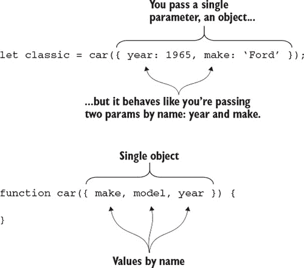
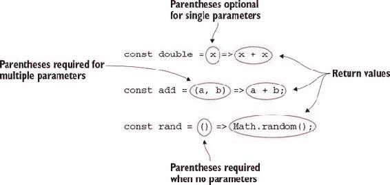
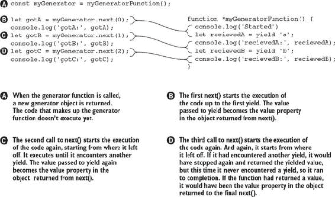
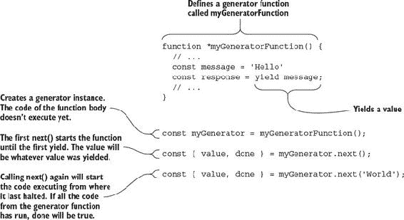

## 单元 3. 函数

函数是编写应用程序的一个相当基本的构造。这在像 JavaScript 这样的语言中尤其如此，因为 JavaScript 将函数视为一等公民。随着 ES2015 及以后的版本，许多令人惊叹的功能被添加到函数中，包括几种全新的函数类型。

我们将从这个单元的开始，通过查看默认参数和剩余参数。我认为大多数程序员在某个时候都曾需要默认参数，并且可能通过在函数开始时检查值并在`undefined`时分配一个值来解决这个问题。剩余参数甚至更有用。任何以前使用过`arguments`对象的人都会很高兴使用*剩余参数*。不仅剩余参数使`arguments`对象变得过时，它还允许你将其与其他参数结合使用，而不仅仅是像`arguments`对象那样总是充当一个通用的容器。

然后，我们将深入研究解构函数参数，这也可以与默认参数结合使用。当你把这些都放在一起时，你可以创建一些相当强大的函数声明。你甚至可以模拟*命名参数*。所以，不再需要传递`null`值给像`myFunc(null, null, 5)`这样的函数，因为你只需要指定第三个参数（或者第四个、第五个，以此类推）。

在查看所有可以用现有函数完成的新功能之后，我们将探讨两种新的函数类型：*箭头函数*和*生成器函数*。箭头函数在 JavaScript 中非常有用，一旦它们成为你的技能库的一部分，你将发现自己每天都在使用它们。另一方面，生成器函数可能不是你经常需要使用的，但在需要时它们是一个强大的新工具。

你将通过创建一个模拟运行器来结束本单元的学习，该运行器在囚徒困境场景中将囚犯模拟相互对抗。

## 第 15 课. 默认参数和剩余参数

在阅读了第 15 课之后，你将

+   了解如何使用默认参数

+   了解如何使用剩余操作符收集参数

+   了解如何使用剩余参数在函数之间传递参数

有时新的语言特性提供了实现以前不可能或几乎不可能实现的事情的方法。其他时候，它们只是提供了一种更优雅的实现已经容易实现的事情的方式。但仅仅因为某件事容易实现或需要很少的代码行数来完成，并不意味着它就一定*易于阅读*。这正是*默认函数参数*和*剩余参数*所做的：它们提供了一种更简洁、更易于阅读的实现方式。

| |
| --- |

**考虑这一点**

通过查看`pluck`函数的实现，你能快速判断它在做什么吗？那第一行——它在做什么？这一行需要太多的思考。在其当前状态下，它可能需要一条注释来解释它的作用。

```
function pluck(object) {
  const props = Array.from(arguments).slice(1);
  return props.map(function(property) {
    return object[property];
  });
}
const [ name, desc, price ] =
pluck(product, 'name', 'description', 'price');
```

| |
| --- |

### 15.1. 默认参数

让我们假设你正在构建一个网站，该网站显示现任总统在其任期内的工作满意度。你想要构建一个图表函数，以折线图的形式显示这些信息。你决定 800x400 是图表的好大小，但你希望允许设置自定义大小。例如，800x400 的图表可能位于顶部，显示全国满意度，然后通过只有 400x200 的图表按州细分。你可能会编写一个像这样的函数：

```
function approvalsChart(ratings, width, height) {
  if (!width) {
    width = 800
  }
  if (!height) {
    height = width / 2
  }
  // build the chart with ratings
}

const nationalChart = approvalsChart(nationalRatings)             *1*
const georgiaChart = approvalsChart(georgiaRatings, 400)          *2*
```

+   ***1* 图表大小为 800x400**

+   ***2* 图表大小为 400x200**

你现在可以使用如下默认函数参数实现相同的效果：

```
function approvalsChart(ratings, width = 800, height = width / 2) {
  // build the chart with ratings
}

const nationalChart = approvalsChart(nationalRatings)           *1*
const georgiaChart = approvalsChart(georgiaRatings, 400)        *2*
```

+   ***1* 图表大小为 800x400**

+   ***2* 图表大小为 400x200**

注意你如何在参数列表中直接使用表达式 `height = width / 2`。实际上，你可以在默认参数的赋值中使用任何表达式，并且该表达式将在函数评估时被评估。你可以使用作用域内的任何变量，包括前面的参数。表达式的上下文始终与函数调用的上下文相同，这意味着任何 `this` 的使用都将与函数体内相同。

##### 列表 15.1\. 在默认参数中访问 `this`

```
const ajax = {
  host: 'localhost',
  load(url = this.host + '/data.json') {
    // load data from url.
  }
}

ajax.load();                                   *1*
ajax.host = 'www.example.com';
ajax.load();                                   *2*
ajax.load('localhost/moredata.json');          *3*
```

+   ***1* 网址是 localhost/data.json**

+   ***2* 网址是 www.example.com/data.json**

+   ***3* 网址是 localhost/moredata.json**

当你第一次调用 `ajax.load()` 而不带参数时，默认选中 `this.host`，其值为 `localhost`，而 `url` 参数变为 `localhost/data.json`。然后你更改了 `host` 属性，所以当你再次调用该函数时，默认再次选中 `this.host`，此时为 `www.example.com`，因此 `url` 参数变为 `www.example.com/data.json`。最后，当你调用 `ajax.load('localhost/moredata.json')` 时，没有使用默认值，`url` 参数被设置为 `localhost/moredata.json`。

参数的默认值与其在参数列表中的索引相关联。你可能想使用默认值来使可选参数跟随必选参数，就像我们在范围示例中做的那样。如果传递了两个值，那么你希望它们分别是 `min` 和 `max`，但如果只传递了一个值，你希望它是 `max`，而 `min` 默认为 0。虽然这听起来很棒，但默认参数的工作方式并非如此，如下一列表所示。

##### 列表 15.2\. 必选参数必须位于可选参数之前

```
function range(min = 0, max) {
  // ... create a range from min to max
}
range(5, 10);              *1*
range(10);                 *2*
```

+   ***1* 分钟将是 5，最大值将是 10。**

+   ***2* 最小值将是 10，最大值将是未定义。**

因为默认参数与其索引相关联，除非它是最后一个参数，否则你不能使用它们来使参数可选。传递给函数的参数按其索引分配，所以无论如何，第一个值都将分配给 `min`，第二个值将分配给 `max`。唯一能够设置 `max` 而使用默认的 `min` 的方法是通过调用 `range(undefined, 10)`，因为这保持了每个参数的正确索引。第一个参数是 `undefined`，因此成为默认值 0；第二个参数是 `10`。

利用默认参数中的表达式功能，你可以做一些巧妙的事情来检查参数的长度，并条件性地将 `min` 参数设置为正确的值，如下一清单所示。

##### 清单 15.3\. 伪造默认参数（不推荐！）

```
function range(temp = 0, max = temp, min = arguments.length > 1 ? temp : 0)
           {
  // ... create a range from min to max
}
```

在这个 `range` 函数中，你首先定义了一个默认值为 `0` 的 `temp` 参数，然后是一个默认值为 `temp` 值的 `max`，最后定义了一个检查 `arguments` 长度并条件性地默认为 0 或 `temp` 的 `min` 参数。这之所以可行，是因为以下条件：

+   使用 `10` 调用：

    +   `temp` 被设置为 10。

    +   `max` 默认为 `temp`，所以 `max` 为 10。

    +   `arguments.length` 不大于 1，所以 `min` 被设置为 0。

    +   影响：`min` 为 0，`max` 为 10。

+   使用 `5, 10` 调用：

    +   `temp` 被设置为 5。

    +   `max` 被设置为 10。

    +   `arguments.length` 大于 1，所以 `min` 被设置为 `temp`（5）。

    +   影响：`min` 为 5，`max` 为 10。

+   使用 `5, 5` 调用：

    +   `temp` 被设置为 5。

    +   `max` 被设置为 5。

    +   `arguments.length` 大于 1，所以 `min` 被设置为 `temp`（5）。

    +   影响：`min` 为 5，`max` 为 5。

尽管这样可行，但我建议不要使用这种代码，因为它会掩盖正在发生的事情，浪费了一个参数，并且如果函数的使用者开始用所有三个参数调用它，可能会导致错误。这只是一个练习，用来展示可能性。

注意在 清单 15.3 中，你如何在参数列表中使用 `arguments` 对象来计算默认值。记住，用于默认参数的表达式是在函数体上下文中调用的！这意味着你可以使用函数体中声明的其他变量吗？实际上不行：记住在 第 4 课 我们讨论了临时死区。函数体中的其他变量在技术上处于作用域内，但它们处于临时死区，还不能被访问。

| |
| --- |

**快速检查 15.1**

> **Q1:**
> 
> 在以下函数调用中，`args` 参数的值将是什么？
> 
> ```
>  function processArgs(args = Array.from(args)) {
>    // ...
>  }
> processArgs(1, 2, 3);
> ```

| |
| --- |
| |

**QC 15.1 答案**

> **A1:**
> 
> 它将是 1。记住你调用它时传了一个值。所以即使默认值从参数对象创建了一个数组，这也没有关系：由于传入了值，默认值不会被计算。如果你想创建一个参数的数组，请使用剩余操作符。


通常，默认参数允许你在未提供值的情况下使用合理的默认值。这使得函数更有用，因为回退到默认值通常比抛出错误要好（取决于场景）。但是，你还可以用默认参数做更多的事情。在下一节中，我们将探讨使用默认参数来防止重新计算数据。

### 15.2\. 使用默认参数以避免重新计算值

记住，在本课的开始，你创建了一个 `approvalsChart` 函数来计算批准评分。你将更进一步，创建一个用于计算评分和生成图表的库。第一次尝试可能如下所示。

##### 列表 15.4\. 两次调用 `getRatings`

```
const chartManager = {
  getRatings() {
    // some intensive task to calculate all the ratings
  },

  nationalRatings() {
    const ratings = this.getRatings()
    return approvalsChart(ratings)
  },

  stateRatings(state) {
    const ratings = this.getRatings()
    stateRatings = ratings.filter(function(rating) {
      rating.state === state
    })
    return approvalsChart(ratings, 400)
  },

  stateAndNationalRatings(state) {
    const nationalChart = this.nationalRatings()            *1*
    const stateChart = this.stateRatings(state)             *2*
    return {
      nationalChart,
      stateChart
    }
  }
}

const charts = stateAndNationalRatings('georgia')
```

+   ***1* 计算评分**

+   ***2* 再次计算评分**

注意它最终调用了 `getRatings` 方法两次？如果这个方法很耗费资源，那么避免浪费第二次计算是有意义的。你可以通过以下列表中的默认参数来解决。

##### 列表 15.5\. 只调用一次 `getRatings`

```
const chartManager = {
  getRatings() {
    // some intensive task to calculate all the ratings
  },

  nationalRatings(ratings = this.getRatings()) {
    return approvalsChart(ratings)
  },

  stateRatings(state, ratings = this.getRatings()) {
    stateRatings = ratings.filter(function(rating) {
      rating.state === state
    })
    return approvalsChart(ratings, 400)
  },

  stateAndNationalRatings(state) {
    const ratings = this.getRatings()
    const nationalChart = this.nationalRatings(ratings)
    const stateChart = this.stateRatings(state, ratings)
    return {
      nationalChart,
      stateChart
    }
  }
}

const charts = stateAndNationalRatings('georgia')
```

现在方法 `nationalRatings` 和 `stateRatings` 将 `getRatings` 作为默认参数调用。这意味着每个函数都可以独立调用并计算评分。但如果你想同时获取国家和州的评分，你可以预先计算评分并将数据传递给每个方法，从而避免额外的计算步骤。

默认参数是处理预期参数的绝佳方式，确保它们有值。它们对处理意外（或不确定）的参数帮助不大，但你可以使用新的 *剩余* 操作符来做到这一点。


**快速检查 15.2**

> **Q1:**
> 
> 在以下代码片段中，`getC()` 将返回什么？
> 
> ```
> function getC(a = 'b', b = c, c = a) {
>   return c;
> }
> getC();
> ```

|  |

**QC 15.2 答案**

> **A1:**
> 
> 无，它将是一个语法错误，因为 `b` 的默认值是 `c`，但 `c` 是在 `b` 之后声明的 *之后*。 


### 15.3\. 使用剩余操作符收集参数

在 第 9 课 中，你学习了如何使用 `Array.from` 从 `arguments` 对象中获取数组。虽然这很有用，但还有更方便的方法可以将参数作为数组获取，即使用剩余参数：

```
function avg() {                             *1*
  const args = Array.from(arguments);
  //...
}

function avg(...args) {                      *2*
  //...
}
```

+   ***1* 使用 Array.from 将参数收集到数组中**

+   ***2* 使用剩余参数收集参数**

rest 的工作方式是通过声明一个以三个点开始的函数参数。这被称为 rest 参数，尽管参数本身的名称可以是任何有效的变量名。这将把从 rest 参数位置开始的所有剩余参数组合成一个数组。你也可以只有一个 rest 参数，并且它必须是列表中的最后一个参数：

```
function countKids(...allMyChildren) {
  return `You have ${allMyChildren.length} children!`;
}

countKids('Talan', 'Jonathan');                      *1*

function family(spouse, ...kids) {
  return `You are married to ${spouse} with ${kids.length} kids`;
}

family('Christina', 'Talan', 'Jonathan');            *2*
```

+   ***1* 你有两个孩子！**

+   ***2* 你和克里斯蒂娜结婚，有两个孩子。**

这个名称来源于首先指定你想放入单独变量的参数，然后指定你想将剩余参数组合在一起的参数（参见以下列表）。一些语言，如 Ruby，将这个概念称为 *splat*，但这很可能是由于这些语言使用星号而不是三个点作为操作符，而星号类似于 splat 的形状。

##### 列表 15.6\. 在 JavaScript 中，如果在 rest 之后放置 params 会发生错误

```
function restInMiddle(a, ...b, c) {           *1*
  return [a, b, c];
}
```

+   ***1* 语法错误：rest 参数必须是最后一个**

rest 参数必须在参数列表的末尾，否则会抛出语法错误。你可能认为这是 rest 参数工作的唯一逻辑方式，但其他语言，例如 CoffeeScript，例如，允许在 rest 参数之后指定参数，如下面的列表所示。

##### 列表 15.7\. CoffeeScript 中的 rest 之后放置 params

```
restInMiddle = (a, b..., c) -> [a, b, c];
restInMiddle(1,2,3,4,5);                      *1*
```

+   ***1* [ 1, [2, 3, 4], 5];**

现在你已经知道了 rest 的用法，让我们看看使用 rest 重新实现的 priming 函数：

```
function pluck(object, ...props) {
  return props.map(function(property) {
    return object[property];
  });
}
```

乍一看，这不是更易于阅读吗？它不再需要注释来解释一行晦涩的代码。

| |
| --- |

**快速检查 15.3**

> **Q1:**
> 
> 实现以下 `cssClass` 函数，使其通过将第一个参数添加到其余参数中生成 CSS 类列表。
> 
> ```
> cssClass('button', 'danger', 'medium');          *1*
> ```
> 
> +   ***1* 应返回“button button-danger button-medium”**

| |
| --- |
| |

**QC 13.3 答案**

> **A1:**
> 
> ```
> function cssClass (primary, ...others) {
>   const names = others.reduce(function(list, other) {
>     return list.concat(`${primary}-${other}`);
>   }, [primary]);
>   return names.join(' ');
> }
> ```

| |
| --- |

### 15.4\. 使用 rest 在函数之间传递参数

想象一下你正在使用一个进行图像处理的库，但你需要挂钩到处理函数以添加一些日志记录。许多库提供中间件^([1]) 来注入这样的代码，但并非所有库都这样做；在这种情况下，*猴子补丁* 将不得不使用。猴子补丁是指重新定义一个函数以在调用原始函数之前注入一些自定义逻辑的过程。在 列表 15.8 中，你对一个虚构的 `imageDoctor` 库的处理函数进行猴子补丁，并使用 rest 收集所有参数并将它们传递给原始函数。这确保了原始函数始终以与包装函数相同的参数调用。

> ¹
> 
> 中间件是由库作者提供的自定义钩子，允许注入自定义行为。一些提供中间件的 JavaScript 库有 express.js ([`expressjs.com/`](http://expressjs.com/)) 和 redux.js ([`redux.js.org/`](http://redux.js.org/))。另请参阅 [`en.wikipedia.org/wiki/Middleware`](https://en.wikipedia.org/wiki/Middleware)。

##### 列表 15.8：在 monkey-patching 时使用 rest 传递参数

```
{
  const originalProcess = imageDoctor.process;                *1*
  imageDoctor.process = function(...args) {                   *2*
    console.log('imageDoctor processing', args);              *3*
    return originalProcess.apply(imageDoctor, args);          *4*
  }
}
```

+   ***1* 首先获取原始方法的引用。**

+   ***2* 定义一个新的函数来收集所有参数。**

+   ***3* 注入你的日志。**

+   ***4* 返回原始函数调用 args 的结果。**

当我们在本书的后面部分介绍类时，你将学习关于子类扩展超类的内容。当一个子类扩展超类时，它可以覆盖超类上的方法。被覆盖的方法可以在覆盖它的方法中调用，并且 rest 可以再次用来处理两个方法之间的参数传递。

| |
| --- |

**快速检查 15.4**

> **Q1:**
> 
> 假设你正在使用一个名为 `ajax` 的函数来加载数据。使用 rest 来 monkey-patch 这个函数以记录所有其参数。

| |
| --- |
| |

**QC 15.4 答案**

> **A1:**
> 
> ```
> {
>   const originalAjax = ajax;
>   ajax = function(...args) {
>     console.log('ajax invoked with', args);
>     return originalAjax.apply(null, args);
>   }
> ```

| |
| --- |

### 概述

在本课中，你学习了如何使用默认参数和 rest。

+   默认参数允许设置合理的默认值。

+   默认参数可以使用表达式来计算。

+   默认参数表达式在函数体内部执行。

+   默认参数与其在参数列表中的索引相关联。

+   Rest 参数将所有剩余的参数收集为一个数组。

+   Rest 参数可以用来收集所有参数为一个数组。

+   Rest 参数必须是最后一个参数。

+   每个参数列表中只能有一个 rest 参数。

让我们看看你是否掌握了：

> **Q15.1**
> 
> 创建一个名为 `car` 的函数，允许你创建一个 `car` 对象。该函数应接受一个参数，表示可用的座位数，并具有默认值。`car` 对象应有一个 `board` 方法，该方法接受一个驾驶员和任意数量的乘客（使用 rest）。然后 `board` 方法应记录驾驶员是谁，哪些乘客可以乘坐（根据座位数），并列出无法乘坐的乘客。

## 第 16 课：解构参数

在阅读完第 16 课（lesson 16）后，你将

+   了解如何解构数组参数

+   了解如何解构对象参数

+   了解如何模拟命名参数

+   了解如何创建别名参数

在第 11 课（lesson 11）中，你学习了如何解构对象和数组。这些相同的原理可以直接应用于函数的参数列表中。这使得数组和对象参数更容易处理，并且更具自文档性，并为诸如模拟命名参数等有用的技术打开了大门。

| |
| --- |

**考虑这一点**

以下函数接受三个参数。你将如何使所有参数都成为可选的，以便函数可以只设置必要的值？例如，如果你只想设置高度并使用默认宽度怎么办？函数的调用者如何指定只想指定高度？通过名称？如果名称错误怎么办？例如，调用者可能使用 `h` 而不是完整的单词 `height`。

```
function image(src, width, height) {
  // build image

}
```


### 16.1\. 解构数组参数

想象你正在编写一个程序来比较两个文件之间的差异。你正在使用一个提供 `diff` 函数的库，该函数接受两个字符串并计算它们之间的差异。它返回一个包含三个值的数组。第一个值是已添加的文本。第二个是已删除的文本，最后第三个值是已修改的文本。

##### 图 16.1\. 确定哪些文本已被添加（绿色）、更改（黄色）和删除（红色）


你需要编写一个函数，它可以接受这些差异并渲染一个可视化，就像在 图 16.1 中显示的那样。让我们称这个函数为 `visualize`。如果它接受三个单独的参数——插入、删除和修改——你可以这样连接这两个函数：

```
function visualize(inserted, deleted, modified) {
  // ... render visualization to screen
}

const [ inserted, deleted, modified ] = diff(fileA, fileB);
visualize(inserted, deleted, modified);
```

这可行，但不得不从 `diff` 函数中提取值以便将它们传递给 `visualize` 函数，这很繁琐。一个更干净的方法是使 `visualize` 函数的输入与 `diff` 函数的输出相匹配。然后连接它们会简单得多：

```
visualize( diff(fileA, fileB) );
```

现在两个函数之间的连接要干净得多。我甚至可以说，代码现在更具自文档性，因为它现在读作 *visualize diff*，这正是你正在做的事情：可视化差异！但是为了使这成为可能，`visualize` 函数现在只接受一个参数，一个包含三个值的数组。所以你必须重新实现你的 `visualize` 函数来考虑这一点：

```
function visualize(diff) {
  const inserted = diff[0];
  const deleted = diff[1];
  const modified = diff[2];
  // ... render visualization to screen
}
```

到目前为止，你已经将繁琐的提取步骤从函数外部移到了函数内部。是的，当你连接 `visualize` 和 `diff` 函数时，它现在看起来更干净，但这是以模糊化 `visualize` 函数的实现为代价的。

希望你已经想到了，你可以使用数组解构来清理它，如下所示：

```
function visualize(diff) {
  const [ inserted, deleted, modified ] = diff;          *1*
  // ... render visualization to screen
}
```

+   ***1* 将 diff 参数解构为所需的三个值。**

如果是这样，你是对的！然而，你可以通过在参数列表中进行解构来移除一个步骤，使它更加干净：

```
function visualize([ inserted, deleted, modified ]) {
  // ... render visualization to screen
}
```

现在你已经成功消除了连接这两个函数之间的认知负担。你使代码更具自文档性，而且你做到了这一点，而无需在其他地方牺牲可读性。

如果 `diff` 函数返回一个具有 `inserted`、`modified` 和 `deleted` 属性的对象而不是数组怎么办？在下一节中，你将更新你的可视化函数以处理这种情况。


**快速检查 16.1**

> **Q1:**
> 
> 假设你正在编写一个小部件库。你希望允许安装你的小部件的人能够设置小部件使用的颜色。实现以下 `setColors` 函数，以便解构颜色数组。你可以为每个三种颜色使用你喜欢的名称。
> 
> ```
> setColors([ '#4989F3', '#82D2E1', '#282C34']);
> ```

|  |

**QC 16.1 答案**

> **A1:**
> 
> ```
> function setColors([primary, secondary, attention]) {
>   // ...
> }
> ```


### 16.2. 解构对象参数

在前面的章节中，你使用了一个返回包含两个文件之间插入、删除和修改行的数组的 `diff` 函数。但如果你更新了你使用的 `diff` 库的版本，并且函数返回了一个具有插入、删除和修改属性的对象，你该如何更新你的 `visualize` 函数以正确地从新格式中提取数据？解决方案几乎完全相同：

```
function visualize({ inserted, deleted, modified }) {
  // ... render visualization to screen
}

visualize( diff(fileA, fileB) );
```

如你所见，你需要做的唯一改变是，不再用中括号 `[` 和 `]` 括起参数列表，而是用花括号 `{` 和 `}` 替换。不再通过在数组中的位置来获取值，而是现在通过属性的真正名称从对象中获取特定的属性。

在数组解构中，你可以使用你想要的任何名称，只要字段的顺序正确。在对象解构中，你可以以任何顺序列出属性，只要名称匹配正确。这就像常规的对象和数组解构一样，只是在函数的参数列表中发生。


**快速检查 16.2**

> **Q1:**
> 
> 将 `setColors` 函数重写为使用对象解构解构颜色。记住：这次不是顺序，而是名称必须对齐。
> 
> ```
> setColors({ primary: '#4989F3', danger: '#DB231C', success: '#61C084' });
> ```

|  |

**QC 16.2 答案**

> **A1:**
> 
> ```
> function setColors({ primary, success, danger }) {
>   // ...
> }
> ```


### 16.3. 模拟命名参数

让我们想象你正在编写一个构建汽车的函数。你决定你想让函数的调用者设置汽车的制造商、型号和年份，所以你为每个参数添加了一个：

```
function car(make, model, year) {
  // ... make the car
}
```

然而，你希望每个参数都是可选的，并且有一个默认值。你可能认为由于 JavaScript 现在支持默认值，它将解决你的问题。但如果调用者只想设置年份（第三个参数）怎么办？使用默认参数，前两个必须设置或明确传递为 `undefined`：

```
function car(make = 'Ford', model = 'Mustang', year = 2017) {
  // ... make the car
}

let classic = car(undefined, undefined, 1965);
```

这并不理想。你可以在参数列表中使用对象解构来模拟命名参数（通过名称而不是位置设置参数的能力）：

```
function car({ make, model, year }) {
  // ... make the car
}

let classic = car({ year: 1965 });
```

现在它看起来和表现就像你正在使用命名参数一样，但实际上你只是在使用一个对象的单个参数，如图 16.2 所示。

##### 图 16.2\. 模拟命名参数



你仍然需要想出一个方法为每个设置默认值。由于这只有一个参数，你可以将这个参数（整个对象）默认为一个预设了所有值的对象：

```
function car({ make, model, year } = {make:'Ford',model:'mustang',year:2017}
           ) {
  // ... make the car
}
```

但这只会在没有传递任何对象的情况下工作。通过传递一个如 `{ year: 1965 }` 的对象，即使它缺少一些所需的键，参数仍然被传递。记住，实际上你只处理一个参数，所以默认值没有被设置：

```
function car({ make, model, year } = {make:'Ford',model:'mustang',year:2017}
           ) {
  // ... make the car
}

let modern = car();                          *1*
let classic = car({ year: 1965 });           *2*
```

+   ***1* 没有传递参数，所以默认为设置所有值的对象**

+   ***2* 传递了参数，所以没有使用默认值，也没有得到制造商或型号。**

有一个更好的方法。实际上，你可以解构对象，并为每个单独的键独立地提供一个默认值：

```
function car({ make = 'Ford', model = 'Mustang', year = 2017 }) {
  // ... make the car
}

let classic = car({ year: 1965 });             *1*
```

+   ***1* 年份被设置，而制造商和型号则回退到默认值。**

现在你正在为每个你正在解构的单独键设置默认值，你可以成功设置你想要更改的值，而其他值则回退到默认值。唯一剩下的问题是当你完全没有任何参数调用函数时：

```
function car({ make = 'Ford', model = 'Mustang', year = 2017 }) {
  // ... make the car
}

let modern = car();          *1*
```

+   ***1* 这里抛出错误是因为你尝试解构一个缺失的对象。**

按照现状，你仍然需要用一个空对象如 `car({})` 调用函数，即使你不想更改任何默认值。这是因为如果你没有传递一个对象，参数将是 `undefined`，你将无法在 `undefined` 值上执行对象解构。为了解决这个问题，你可以继续将每个键默认为特定值，但也将整个参数默认为一个空对象：

```
function car({ make = 'Ford', model = 'Mustang', year = 2017 } = {}) {
  // ... make the car
}

let modern = car();                          *1*
let classic = car({ year: 1965 });           *2*
```

+   ***1* 所有值都回退到默认值。**

+   ***2* 年份被设置，而制造商和型号则回退到默认值。**

现在如果你完全没有任何参数调用函数，它默认为一个空对象，由于空对象缺少制造商、型号和年份，它们都仍然回退到它们的默认值。当然，如果你传递了一个对象，任何缺失的键都会被设置为它们各自的默认值。


**快速检查 16.3**

> **Q1:**
> 
> 创建一个分页函数，该函数模拟 `currentPage` 和 `resultsPerPage` 的命名参数，默认值分别为 1 和 24。

|  |

**QC 16.3 答案**

> **A1:**
> 
> ```
> function pagination({ currentPage = 1, resultsPerPage = 24 } = {}) {
>   // ...
> }
> ```


### 16.4\. 创建别名参数

让我们想象你有一个名为`setCoordinates`的函数，它接受一个具有纬度和经度属性的对象。问题是你在使用两个不同的映射库：一个用于渲染地图，另一个用于反向地理查找。一个使用`lat`和`lon`属性，而另一个使用`lat`和`lng`属性。正因为如此，你希望你的函数足够智能，可以处理这两种情况。你可能倾向于这样定义你的函数：

```
function setCoordinates(coords) {
  let lat = coords.lat;
  let lng = coords.lng || coords.lon;           *1*
  // ... use lat and lng
}
```

+   ***1* 将 coords.lng 或 coords.lon（ whichever exists）分配给您的变量。**

你也可以通过参数解构和默认值的组合来做这件事：

```
function setCoordinates({ lat, lon, lng = lon }) {
  // ... use lat and lng
}
```

这里你使用解构直接获取`lat`、`lon`和`lng`。但你将`lng`默认为`lon`；这意味着无论给你哪一个，你都能将其捕获为`lng`。

如果`lng`默认为`lon`以创建别名，那么如果你实际上想为`lng`设置一个真正的默认值，会怎样呢？嗯，由于`lng`默认为`lon`，你只需简单地将默认值添加到`lon`中：

```
function setCoordinates({ lat = 33.7490, lon = -84.3880, lng = lon }) {
  // ... use lat and lng
}
```

现在您的函数接受`lon`或`lng`，就像之前一样，但这次它还默认到一个特定的位置（亚特兰大）。这样工作的方式是，如果设置了`lng`，那么`lon`设置成什么并不重要；你忽略它。如果`lng`没有设置，它默认为`lon`。如果`lon`没有设置，它默认为-84.3880，这间接地也使得`lng`默认为-84.3880。

这种有用的技巧也可以通过使用默认值而不使用解构来使用：

```
function setCoordinates(lat = 33.7490, lon = -84.3880, lng = lon) {
  // ... use lat and lng
}
```

注意你没有使用`{}`：这意味着这个函数不像之前的那个函数那样接受一个对象作为参数，然后从中解构值。这次，你实际上接受了三个不同的参数，并以类似的方式为它们设置默认值。

| |
| --- |

**快速检查 16.4**

> **Q1:**
> 
> 使用相同的技巧来创建一个可以接受`width`和`height`属性或`w`和`h`属性（具有默认大小）的函数。

| |
| --- |
| |

**QC 16.4 答案**

> **A1:**
> 
> ```
> function setSize({ width = 50, height = width, w = width, h = height }) {
>   // use w and h
> }
> ```

| |
| --- |

### 摘要

在本课中，你学习了如何将解构技术应用于函数参数，包括如何

+   更优雅地将一个函数的输出连接到另一个函数的输入。

+   通过模拟命名参数，使所有参数都成为可选的。

+   通过结合解构与默认值，使参数的名称具有别名。

让我们看看你是否理解了：

> **Q16.1**
> 
> 在下面的代码中，有三个函数。每个都与一个内部映射对象交互，更新不同的属性。将这些三个函数合并成一个名为`updateMap`的单个函数，该函数模拟了`zoom`、`bounds`和`coords`的命名参数。此外，创建一个别名，以便`coords`也可以通过命名的`center`来设置。
> 
> ```
> function setZoom(zoomLevel) {
>   _privateMapObject.setZoom(zoomLevel);
> }
> 
> function setCoordinates(coordinates) {
>   _privateMapObject.setCenter(coordinates);
> }
> 
> function setBounds(northEast, southWest) {
>   _privateMapObject.setBounds([northEast, southWest]);
> }
> ```

## 第 17 课\. 箭头函数

在阅读了第 17 课之后，你将

+   了解如何使用箭头函数使代码简洁

+   了解如何使用箭头函数保持上下文

JavaScript 中的箭头函数直接受到 CoffeeScript 中的*胖箭头函数*的启发。它们的行为与 CoffeeScript 类似，通过提供一种更简洁的方式来编写函数表达式，并保持它们的上下文（`this`指的是什么）。语法并不总是与 CoffeeScript 相同，但它们同样有用，并且是一个很好的补充，使得匿名函数和内联回调变得更加优雅。

有时多余的语法会使代码对人类思维来说难以解析，因为需要考虑的额外部分很多。并不是说字符越少就越容易理解。例如，单字母变量名或过于聪明的 _ 代码高尔夫 _(1)解决方案很难阅读。然而，如果您能用更少的字符传达一个含义，那么它通常比用更多的字符更容易理解。人类大脑很难一次性处理大量信息，所以您能减少的噪音越多，效果越好。

> ¹
> 
> 在这个游戏中，程序员编写尽可能少的字符的程序。


**考虑这一点**

这里有一些代码，它将一组数字映射到另一个集合，对每个数字应用指数。注意您是如何在传递给`map`的匿名函数中使用`that=this`来保持上下文的。特别是，`map`函数接受一个设置上下文的第二个参数，但许多函数不提供这种便利，让开发者不得不想出像这里使用的`that=this`这样的解决方案。您有多少次不得不编写这样的代码？如果有一种优雅的方式来保持外部上下文，那不是很好吗？

```
const exponential = {
  exponent: 5,
  calculate(...numbers) {
    const that = this;
    return numbers.map(function(n) {
      return Math.pow(n, that.exponent);
    });
  }
}
exponential.calculate(2, 5, 10); // ???
```


### 17.1\. 使用箭头函数编写简洁的代码

箭头函数的语法取决于函数参数的数量或函数体中表达式的数量。最优雅的情况是当函数体中只有一个参数和一个表达式。我们刚才看到的`double`函数就是一个例子。它从功能上等同于其之前定义的函数表达式。其语法为`singleParam => returnExpression`。如果参数不是恰好一个（无论是零个、两个或更多），那么参数必须用括号括起来：

```
const add = (a, b) => a + b;               *1*
const rand = () => Math.random();          *2*
```

+   ***1* 多个参数需要用括号括起来。**

+   ***2* 当没有参数时，必须使用空括号。**

##### 图 17.1\. 箭头函数括号规则



如果需要，您也可以将单个参数用括号括起来（参见图 17.1）。还有一些其他情况下，如果参数是剩余参数或解构参数，您必须用括号将单个参数括起来：

```
const rest = (...args) => console.log(args);        *1*
const rest = ...args => console.log(args);          *2*
const destruct = ([ first ]) => first;              *3*
const destruct = [ first ] => first;                *4*
```

+   ***1* 正确的语法**

+   ***2* 语法错误**

+   ***3* 正确的语法**

+   ***4* 语法错误**

如果函数体中有多个表达式，则必须用花括号括起来：

```
const doTasks = (a, b) => {
  taskOne();                  *1*
  taskTwo();                  *2*
}
```

+   ***1* 第一个表达式**

+   ***2* 第二个**

这与`if`语句和`for`循环类似，其中花括号是可选的，只有当主体（花括号内的代码）是一个单独的表达式或语句时。如果有多个表达式或语句，则必须使用花括号：

```
if (true) {
  doFirstThing();
  doSecondThing();               *1*
}

if (true)
  dofirstThing();
  doSecondThing();               *2*

const doTasks = (a, b) => {
  taskOne();
  taskTwo();                     *3*
}

const doTasks = (a, b) =>
  taskOne();
  taskTwo();                     *4*
```

+   ***1* 这是 if 语句的一部分。**

+   ***2* 这不是 if 语句的一部分。**

+   ***3* 这是函数的一部分。**

+   ***4* 这不是函数的一部分。**

当省略花括号时，除了不需要输入额外的两个字符外，还有一个额外的好处：隐式地返回单个表达式。这种单个表达式箭头函数的隐式返回是优雅的，因为它读起来就像输入值指向返回值。例如，一个无操作函数^([2])看起来像`x => x`，或者一个将值包裹在数组中的函数看起来像`x => [x]`。看看它如何读作`from => to`或`start => finish`或`give => get`。这种简洁的语法认知负荷几乎为零，同时也很容易在心理上解析，并且具有自文档化的特性。

> ²
> 
> 无操作，常用于允许挂钩到功能。见[`en.wikipedia.org/wiki/NOP`](https://en.wikipedia.org/wiki/NOP)。

另一个箭头函数使代码极其简洁的场景是当你需要创建一个返回另一个函数的函数时。比如说，你想创建一个名为`exponent`的函数，它接受一个数字并返回另一个函数，该函数将对给定的基数应用指数：

```
const exponent = exp => base => base ** exp

const square   = exponent(2)
const cube     = exponent(3)
const powerOf4 = exponent(4)

square(5)             *1*
cube(5)               *2*
powerOf4(5)           *3*
```

+   ***1* 25**

+   ***2* 125**

+   ***3* 625**

还要注意`**`运算符。这是 ES2016 中引入的一个新运算符，用于应用指数。之前，你需要使用`Math.pow`来实现相同的功能。

让我们看看这个`exponent`函数的 ES5 等价实现：

```
var exponent = function(exp) {
  return function(base) {
    return Math.pow(base, exp)
  }
}
```

我确实认为箭头函数版本更简单、更容易阅读。

在第 15 课中，你定义了一个`pluck`函数，该函数从对象中获取指定的值集。以下是原始的`pluck`函数，后面跟着使用箭头函数的版本：

```
function pluck(object, ...props) {
  return props.map(function(property) {
    return object[property];
  });
}

function pluck(object, ...props) {
  return props.map( prop => object[prop] );
}
```

箭头函数的版本不是读起来更顺口吗？像`map`、`reduce`、`filter`等高阶函数非常适合箭头函数。当这些高阶函数需要在它们的包含上下文中执行时，这一点尤其正确。


**快速检查 17.1**

> **Q1:**
> 
> 将以下求和函数转换为使用箭头函数：
> 
> ```
> const sum = function(...args) {
>   return args.reduce(function(a, b) {
>     return a + b;
>   });
> }
> ```

|  |

**QC 17.1 答案**

> **A1:**
> 
> ```
> const sum = (...args) => args.reduce( (a, b) => a + b );
> ```


### 17.2\. 使用箭头函数保持上下文

让我们进一步探讨上一节中的`pluck`函数。而不是让它作为参数获取要操作的对象，让我们假设一个`Model`对象，它是数据库记录的包装对象。`pluck`函数将是这个模型对象上的一个方法。如果你在没有任何上下文考虑的情况下实现它，那么在回调函数内部使用关键字`this`引用自身时，它就会出错：

```
const Model = {
  // ... other methods

  get(propName) {
    // return the value for `propName`
  }

  pluck(...props) {
    return props.map(function(prop) {
      return this.get(prop);                *1*
    });
  }
}
```

+   ***1* 关键字 this 不会指向模型对象。**

我认为一个常见的约定相当丑陋，那就是首先声明一个名为`that`的变量并将其赋值给`this`，这样在回调函数内部，即使在失去上下文之后，你仍然可以访问变量`that`：

```
// ...
  pluck(...props) {
    const that = this;                      *1*
    return props.map(function(prop) {
      return that.get(prop);                *2*
    });
  }
// ...
```

+   ***1* 获取回调可以使用的 this 引用。**

+   ***2* 使用 that 引用**

这种`that equals this`的猴子业务是可行的，但它并没有使代码更易于阅读。实际上，大多数像这样的高阶函数都有一个最终参数，允许设置调用上下文。一个更好的版本可能是这样的：

```
// ...
  pluck(...props) {
    return props.map(function(prop) {
      return this.get(prop);                *1*
    }, this);                               *2*
  }
// ...
```

+   ***1* 将上下文设置为 this（模型对象）**

+   ***2* this 关键字现在指向 Model 对象。**

这已经比`that equals this`解决方案好多了，但你可以通过使用箭头函数来跳过整个上下文步骤。箭头函数的上下文直接绑定到其定义的上下文。这意味着箭头函数内部的`this`关键字始终与箭头函数外部相同。所以使用箭头函数的版本看起来会是这样：

```
// ...
  pluck(...props) {
    return props.map( prop => this.get(prop) );        *1*
  }
// ...
```

+   ***1* this 关键字仍然指向模型对象。**

为了好玩，比较一下它可能看起来像 JavaScript。接下来移除的功能：

```
// ...
  pluck: function() {
    var props = [].slice.call(arguments);
    return props.map(function(prop) {
      return this.get(prop);
    }, this);
  }
// ...
```

哇，这对即使是这种小方法的可读性都有很大的影响。想象一下，如果整个应用程序的可读性会提高多少，而你只是刚刚开始！


**快速检查 17.2**

> **Q1:**
> 
> 将预热练习中的指数方法重新实现为使用箭头函数。

|  |

**QC 17.2 答案**

> **A1:**
> 
> ```
> const exponential = {
>   exponent: 5,
>   calculate(...numbers) {
>     return numbers.map( n => Math.pow(n, this.exponent) );
>   }
> }
> exponential.calculate(2, 5, 10); // [32, 3125, 100000]
> ```


### 17.3\. 箭头函数的注意事项

关于箭头函数的一个重要注意事项是，它们始终是函数表达式，而不是函数定义：

```
function double (number) {                 *1*
  return number * 2;
}

const double = function (number) {         *2*
  return number * 2;
}

const double = number => number * 2;       *3*
```

+   ***1* 函数定义**

+   ***2* 函数表达式**

+   ***3* 箭头函数（相当于函数表达式）**

这意味着箭头函数不能像函数定义那样提升：

```
const ids = getIds()                *1*
const items = getItems()            *2*

function getIds() {
  //...
}

const getItems = () => {
  //...
}
```

+   ***1* 因为函数定义是提升的**

+   ***2* ReferenceError，因为常量在声明之前不能被访问**

这会抛出一个引用错误，因为`const`和`let`变量在声明之前不能被访问。但是`var`变量可以在声明之前被访问，但总是`undefined`。所以即使你使用`var`创建了一个箭头函数，如果你在它声明之前尝试使用箭头函数，你仍然会得到一个错误，但现在它将是一个类型错误：

```
const ids = getIds()                 *1*
const items = getItems()             *2*

function getIds() {
  //...
}

var getItems = () => {
  //...
}
```

+   ***1* 因为函数定义是提升的**

+   ***2* 类型错误：undefined 不是一个函数。**

箭头函数还有一种常见的情况可能会让人困惑。这是当你尝试从箭头函数中隐式返回一个对象字面量时。你可能写成这样：

```
const getSize = () => { width: 50, height: 50 };            *1*
```

+   ***1* 语法错误**

这实际上会是一个语法错误。每当箭头函数的`=>`后面跟着大括号时，这意味着那些大括号是函数体的开始和结束（无论有多少表达式）。为了解决这个问题，你可以将对象字面量包裹在括号中：

```
const getSize = () => ({ width: 50, height: 50 });          *1*
```

+   ***1* 按预期工作**

最后，箭头函数不能通过`bind`、`call`或`apply`改变其上下文。这意味着如果你使用一个尝试改变回调函数上下文的库，可能会导致错误。例如，`jQuery`通过使用`call`或`apply`调用回调并设置上下文为给定的节点来改变传递给`$.each()`的函数的上下文，如下所示：

```
const $spans = $('span');
$spans.each(function() {
  const $span = $(this);                   *1*
  $span.text( $span.data('title') );
});
```

+   ***1* jQuery 将其设置为指向单个 span DOM 节点。**

jQuery 通过调用回调并使用`call`或`apply`来设置上下文为给定的节点来实现这一点。如果你使用箭头函数，jQuery 将无法改变上下文：

```
const $spans = $('span');
$spans.each(function() {
  const $span = $(this);                 *1*
  $span.text( $span.data('title') );
});
```

+   ***1* jQuery 无法设置此值，因此$(this)可能不起作用。**

如果你能够避免这些陷阱，箭头函数将成为你开发者工具包中的强大新工具。

| |
| --- |

**快速检查 17.3**

> **Q1:**
> 
> 将会在控制台输出什么？
> 
> ```
> console.log(typeof myFunction);
> var myFunction = () => {
>   //...
> }
> ```

| |
| --- |
| |

**QC 17.3 答案**

> **A1:**
> 
> undefined

| |
| --- |

### 概述

在本课中，你学习了箭头函数的语法和机制。

+   箭头函数是编写函数的一种简洁方式。

+   箭头函数在参数列表之后使用操作符`=>`，而不是在参数列表之前使用关键字`function`。

+   当函数体中只有一个表达式时，箭头函数的大括号是可选的。

+   当省略大括号时，箭头函数隐式地`return`。

+   箭头函数的上下文（`this`）绑定到其定义的上下文中。

让我们看看你是否理解了：

> **Q17.1**
> 
> 这里有一个`translator`函数，当用国家代码调用时，它会返回一个模板字面量标记函数，该函数使用`TRANSLATE`函数将插值值翻译成对应语言。`TRANSLATE`函数只是一个模拟，用于测试`translator`函数是否工作。构建实际的翻译库超出了本书的范围。重新实现`translator`函数以使用箭头函数。总共应该使用三个箭头函数：
> 
> ```
> function TRANSLATE (str, lang) {
>   // mock translator as building a real translator is beyond
>   // the scope of this book.
>   switch (lang) {
>     case 'sv':
>       return str.replace(/e/g, 'ë');
>     break;
>     case 'es':
>       return str.replace(/n/g, 'ñ');
>     break;
>     case 'fr':
>       return str.replace(/e/g, 'é');
>     break;
>   }
> }
> 
> const translator = function (lang) {
>   return function(strs, ...vals) {
>     return strs.reduce(function(all, str) {
>       return all + TRANSLATE(vals.shift(), lang) + str;
>     });
>   }
> }
> 
> const fr = translator('fr');
> const sv = translator('sv');
> const es = translator('es');
> 
> const word = 'nice';
> 
> console.log( fr`${word}` ); // nicé
> console.log( sv`${word}` ); // nicë
> console.log( es`${word}` ); // ñice
> ```

## 第 18 课\. 生成器函数

阅读完第 18 课后，你将

+   了解如何定义生成器函数

+   了解如何从生成器函数中产生值

+   理解生成器函数的生命周期

生成器函数是 JavaScript 最近添加的较难理解的功能之一。它们引入了一种新的代码执行和处理形式，这是大多数 JavaScript 开发者以前没有见过的。尽管生成器不是新概念，但它们已经是 Python、C#和其他语言的一部分。本课仅旨在对该主题进行温和的介绍。

你将看到生成器在创建列表方面的良好表现，但这并不是生成器的全部用途。这就像说对象只用于存储键/值对一样。相反，生成器，就像对象一样，是一种功能强大的多功能工具，可以用于各种问题。例如，我们将在第 5 单元和第 7 单元中看到，它们在处理可迭代和异步任务方面是多么有用。然而，目前，你需要掌握基础知识。


**考虑这一点**

在函数内部，一旦你`return`一个值，函数的其余部分就不再处理，函数退出。这意味着`return`语句阻止函数继续执行。如果你可以返回一个值，但只在该点暂停函数而不是退出，然后稍后告诉函数从上次离开的地方继续，会怎么样呢？


### 18.1\. 定义生成器函数

生成器函数是一种特殊类型的函数。它是一个返回新生成器对象的工厂。从生成器函数返回的每个生成器对象都根据其来源函数的主体行为。也就是说，生成器函数的主体定义了它返回的每个生成器的蓝图：

```
function* myGeneratorFunction() {                     *1*
  // ...
}

const myGenerator = myGeneratorFunction();            *2*
```

+   ***1* 生成器函数用星号表示。**

+   ***2* 生成器函数调用时不使用 new。**

为了表示一个函数是生成器函数，它用星号定义。星号可以像上面的例子那样紧挨着函数名，或者紧挨着关键字`function`，如`function* ...`。后者似乎越来越受欢迎，尽管我喜欢前者，因为它与对象字面量上的简洁生成器函数保持一致。最后，星号也可以在两边都有空格，如`function * myFunction`：

```
const myObj = {
  * myGen() {                  *1*
    // ...
  }
}
```

+   ***1* 对象字面量上的简洁生成器方法**

生成器函数内部的代码行为就像一个常规函数，尽管有一个巨大的前提：*yielding*。JavaScript 中有一个新关键字，仅用于生成器函数内部：`yield`。这个`yield`在函数内部和外部之间创建了一个双向通信通道。

每当遇到`yield`时，函数的执行会暂停，将控制权返回到调用函数的外部代码。`yield`还可以将值传递给外部进程，类似于`return`语句：

```
function* myGeneratorFunction() {
  // ...
  const message = 'Hello'
  yield message;                  *1*
  // ...
}
```

+   ***1* 执行将在这里暂停，并将值“Hello”返回给包含进程。**

与`return`语句不同，`yield`实际上是一个表达式，可以捕获一个值以供函数稍后使用：

```
function* myGeneratorFunction() {
  // ...
  const message = 'Hello'
  const response = yield message;          *1*
  // ...
}
```

+   ***1* 从包含进程捕获值**

这个细节很重要，因为它在 JavaScript 中是独一无二的。当发生`yield`时，函数体不会像`return`返回值时那样短路，而是暂停，返回一个带有`value`和`done`属性的对象，然后等待包含进程告诉它继续。此时，包含进程可能会传递一个值回来，你在这里捕获它作为响应。这是生成器函数创建的双向通信通道。见图 18.1。

如果你感到困惑，那没关系：在真正开始理解它们之前，你需要从函数内部和外部进程两个方面理解生成器的工作方式。到目前为止，我们只讨论了内部行为，这只有在与外部行为对比时才有意义。我们将在下一节中讨论这一点。

##### 图 18.1. 双向通信通道



| |
| --- |

**快速检查 18.1**

> **Q1:**
> 
> 哪个生成器函数声明使用了正确的语法？
> 
> ```
> function* a() { /* ... */ }
> function * b() { /* ... */ }
> function *c() { /* ... */ }
> ```

| |
| --- |
| |

**QC 18.1 答案**

> **A1:**
> 
> 它们都是有效的。

| |
| --- |

### 18.2. 使用生成器函数

当你调用一个生成器函数时，你会得到一个新的生成器对象。这个生成器对象开始处于暂停状态，直到你调用它上的`next()`，这会指示它开始执行生成器函数体内的代码：

```
function* myGeneratorFunction() {
  console.log('This code is now running');
}

myGeneratorFunction();                           *1*

const myGenerator = myGeneratorFunction();       *2*
myGenerator.next();                              *3*
```

+   ***1* 这里的日志没有被评估。**

+   ***2* 这里的日志也没有被评估。**

+   ***3* 现在才评估日志。**

如果生成器函数体遇到`yield`，它将再次暂停，并且不会继续，直到你在生成器对象上再次调用`next()`：

```
function* myGeneratorFunction() {
  console.log('A');
  yield;
  console.log('B');
}

const myGenerator = myGeneratorFunction();
myGenerator.next();                          *1*
myGenerator.next();                          *2*
```

+   ***1* 现在发生第一条日志，然后生成器再次在`yield`处暂停。**

+   ***2* 现在发生第二条日志。**

每次调用 `next()` 时，你都会得到一个包含两个属性的对象：一个包含任何已产生值的 `value` 属性和一个指示生成器是否暂停或完成的 `done` 属性。请参阅以下列表和 图 18.2。

##### 列表 18.1\. 生成器函数的实际应用

```
function* myGeneratorFunction() {
  console.log('Started')
  let recievedA = yield 'a';
  console.log('recievedA:', recievedA);
  let recievedB = yield 'b';
  console.log('recievedB:', recievedB);
}

const myGenerator = myGeneratorFunction();

let gotA = myGenerator.next(0);            *1*
console.log('gotA:', gotA);                *2*
let gotB = myGenerator.next(1);            *3*
console.log('gotB:', gotB);                *4*
let gotC = myGenerator.next(2);            *5*
console.log('gotC:', gotC);                *6*
```

+   ***1* Started**

+   ***2* gotA: { value: “a”, done: false }**

+   ***3* receivedA: 1**

+   ***4* gotB: { value: “b”, done: false }**

+   ***5* receivedB: 2**

+   ***6* gotC { value: undefined, done: true }**

##### 图 18.2\. 生成器函数执行顺序



注意到生成器返回的最后一个对象将 `done` 设置为 `true`，将 `value` 设置为 `undefined`。`done` 为 `true` 表示此生成器已到达其函数的末尾，没有更多的代码要执行。这可以由尝试处理生成器的代码用来确定何时停止对其调用 `next()`。只有当生成器在末尾实际 `return`（而不是 `yield`）了一个值时，`value` 属性才会包含除 `undefined` 之外的内容。

相反，请注意传递给初始 `next()` 的 `0` 从未被使用。这是因为第一个 `next()` 并不像之后的 `next()` 那样与 `yield` 相关联。第一个 `next()` 是从其初始暂停状态启动生成器的。如果你确实需要传递一个初始值，你可以使用常规函数参数来这样做：

```
function* myGeneratorFunction(initialValue) {
  // ...
}

const myGenerator = myGeneratorFunction(0);
```

好吧，这有很多东西需要理解。请随意再次阅读本节或玩自己的生成器函数，直到你理解为止。我不期望你理解为什么或何时会使用生成器函数。你只是必须完全理解所有这些全新的功能，然后你才能深入研究一些有用的应用。


**快速检查 18.2**

> **Q1:**
> 
> 创建一个生成器函数，在完成前产生两个不同的值。

|  |

**QC 18.2 answer**

> **A1:**
> 
> ```
> function* simpleGen() {
>   yield 'Java';
>   yield 'Script';
> }
> ```


### 18.3\. 使用生成器函数创建无限列表

一些语言，如 Haskell，允许创建无限列表，因为它们是惰性求值的。这意味着从技术上讲，列表包含无限个值，但每个值只有在请求时才会分配到内存中。另一方面，JavaScript 是急切求值的。所以如果你尝试创建一个包含无限值的数组，它将尝试将它们全部添加到内存中，直到耗尽内存。不过，你可以通过生成器函数轻松地模拟这一点。如下所示，模拟从 0 到无穷大的无限列表。

##### 列表 18.2\. 使用生成器函数生成无限列表

```
function* infinite() {
  let i = 0;
  while (true) {
    yield i++;
  }
}

const list = infinite();
console.log( list.next().value );         *1*
console.log( list.next().value );         *2*
console.log( list.next().value );         *3*
```

+   ***1* Logs 0**

+   ***2* Logs 1**

+   ***3* Logs 2**

当你继续调用 `next()` 时，你会从你的无限列表中获取下一个值。同时注意你使用了 `while(true)` 而不会停止。如果这是一个常规函数，这将创建一个无限循环并崩溃。然而，由于每次都会遇到一个 `yield`，它会停止并一次只产生一个值。所以你现在只是懒加载请求的项目。

定义一个小的辅助函数来帮助你从无限列表中取值：

```
function take(gen, count) {
  return Array(count).fill(1).map(
    () => gen.next().value
  );
}

take(infinite(), 7);         *1*
```

+   ***1* [0, 1, 2, 3, 4, 5, 6]**

好的，现在你将创建一个更有趣的无限数字列表。斐波那契序列以数字 0 和 1 开始，由序列中每个整数是前两个整数的和来定义。所以如果你从 `0` 和 `1` 开始，它将继续以 `1`，`2`，`3`，`5`，`8` 等等，如下一列表所示。

##### 列表 18.3\. 生成斐波那契序列

```
function* fibonacci() {
  let prev = 0, next = 1;

  for (;;) {
    yield next;
    let tmp = next;              *1*
    next = next + prev;          *2*
    prev = tmp;                  *3*
  }
}

take(fibonacci(), 7);            *4*
```

+   ***1* 首先获取未更改的 next 值的引用。**

+   ***2* 将未更改的 prev 值加到 next 上。**

+   ***3* 最后，将 prev 更新为你的 tmp 值。**

+   ***4* [1, 1, 2, 3, 5, 8, 13]**

太棒了！然而，你可以使用数组解构来更新你的 `prev` 和 `next` 值，而无需依赖于中间的 `tmp` 值：

```
function* fibonacci() {
  let prev = 0, next = 1;

  for (;;) {
    yield next;
    [next, prev] = [next + prev, next];
  }
}
```

希望到现在为止，你可以看到使用生成器创建列表是多么容易。这不是偶然，你很快就会在 单元 5 中发现原因，该单元涵盖了迭代。


**快速检查 18.3**

> **Q1:**
> 
> 实现一个生成器函数，创建无限的自然奇数列表。

|  |

**QC 18.3 答案**

> **A1:**
> 
> ```
> function* odd() {
>   let i = 1;
>   while (true) {
>     yield i;
>     i += 2;
>   }
> }
> ```


### 概要

本课介绍了生成器函数的语法和生命周期。

+   生成器函数用星号定义。

+   生成器函数返回一个生成器对象。

+   生成器可以使用 `yield` 关键字产生值。

+   生成器在每个 `yield` 处暂停，直到通过调用 `next()` 来告诉它继续。

+   你可以将值作为 `next()` 的参数传递给生成器。

让我们看看你是否理解了：

> **Q18.1**
> 
> 创建一个生成器，用于无限日期列表。第一次调用 `next()` 时，应该产生当前日期。后续的每次调用应该产生下一天。或者，你可以让生成器函数接受一个参数，告诉它从哪一天开始，默认为当前日期。

## 第 19 课\. 核心课程：囚徒困境

让我们假装你被赋予了组织黑客马拉松的荣誉——这是一个编程竞赛，参赛者会被给予一个他们预期要解决的编码挑战。

作为一位游戏理论的爱好者，你决定使用囚犯困境作为黑客马拉松的挑战。你怎么知道你是一位游戏理论的爱好者呢？嗯，*谁不是呢？*但万一你不是，我会解释囚犯困境。两个囚犯被分别关在不同的房间里审问，每人被要求告密另一个囚犯。每个囚犯告密对方时发生的情况会根据讲述故事的人而变化，但基本想法是这样的。对两个囚犯来说最好的结果是他们都不告密。如果一个人告密了另一个人，这对告密者是有利的，但对被告密者是不利的。如果他们都告密了对方，这对双方都不好，但比只有一个人被告密的情况要轻。为了黑客马拉松，你决定结果如下：

+   如果两个囚犯都告密，他们每人将服刑一年。

+   如果只有一个囚犯告密，那么这个囚犯将被释放，而另一个囚犯将服刑两年。

+   如果两个囚犯都没有告密，他们都将被释放。

你将向每个参赛者解释，他们需要编写一个囚犯程序，该程序在与其他参赛者的囚犯对抗后，在监狱中的总刑期最少。你认为这是一个很好的黑客马拉松问题，因为它不依赖于主观评分，而是一个无人可以争论的指标。

你想在黑客马拉松之前做一个概念验证，以了解你可能会看到的结果，所以你需要

1.  理解囚犯 API：单个囚犯界面的样子

1.  理解囚犯工厂 API：生成囚犯的接口是什么样的

1.  建立几个不同的囚犯工厂进行对抗

1.  建立一个模拟，该模拟接受两个囚犯，比较他们的行为，并记录分数

1.  建立一种方式来展示最后的分数

### 19.1. 生成囚犯

为了运行每个囚犯的模拟，每个参赛者的提交必须实现一个所有参赛者都将遵守的通用接口。你需要一个用于生成囚犯的接口；你将称之为囚犯工厂 API。囚犯工厂 API 将生成囚犯对象。你还需要确定每个囚犯的接口。你将简单地称之为囚犯 API。

囚犯 API 将会非常简单：只需要一个名为`snitch`的方法，该方法返回`true`或`false`，表示囚犯是否告密。你还会为每个囚犯添加另一个名为`sentencedTo`的方法，这将允许你为囚犯分配监狱刑期。不过，这不会是要求参赛者构建 API 的一部分，因为你不想让参赛者处理监狱判决。

犯人工厂 API 稍微复杂一些，因为它应该始终为你生成一个新的犯人进行审问，但它需要能够允许生成的犯人在实时中适应。为此，每次你从工厂请求犯人时，你将向工厂提供他们到目前为止的表现统计数据。这些统计数据将是一个数字数组，表示每个之前犯人被判刑的年数。如果没有服刑，则为 0。这将允许工厂实时适应，根据表现的好坏调整他们产生的犯人。这意味着对于每次审问，你需要在得到另一个犯人对象之前向工厂传递数据（他们的统计数据）。对于这种双向通信，使用生成器是有意义的，因为生成器可以向你的模拟产生犯人，而你的模拟可以传递回统计数据（参见图 19.1）。

##### 图 19.1\. 犯人生命周期


定义一个生成器，它产生一个犯人：

```
function* prisoner() {
  for(;;) {
    yield {
      snitch() {
        return true
      }
    }
  }
}
```

这个犯人生成器始终产生一个新的犯人。犯人是一个具有`snitch`方法的对象。参赛者不知道他们的提交将要在模拟器中运行多少次，所以这个生成器通过使用永无止境的`for(;;)`循环来产生无限数量的犯人是有意义的。你可以这样测试：

```
const prisoners = prisoner()
prisoners.next().value.snitch()           *1*
```

+   ***1* true**

看起来这是一个总是告密的犯人。但你仍然需要传递之前的结果。每次调用`next`时，如果你传递回一个包含所有之前结果的数组，犯人生成器可以在它产生时捕获这些结果，如下所示：

```
function* prisoner() {
  let stats = []              *1*
  for(;;) {
    stats = yield {           *2*
      snitch() {
        return true
      }
    }
  }
}
```

+   ***1* 第一个产生的犯人还没有任何统计数据，所以你将默认统计数据设置为空数组。**

+   ***2* 在每个犯人产生后，你会得到所有之前结果的数据。**

在产生犯人之前，代码可以查看之前的结果，并使用这些信息来指导其决定是否告密。当然，这个总是告密的犯人并没有利用这些统计数据；你将要改变这一点。创建一个犯人，如果他们最近服过刑，就会告密，否则不会告密：

```
function* prisoner() {
  let stats = []
  for(;;) {
    stats = yield {
      snitch() {
        return stats.pop() > 0          *1*
      }
    }
  }
}
```

+   ***1* 如果犯人上次去过监狱，就告密；否则不要。**

犯人工厂 API 的最后一部分是让参赛者命名他们的提交。这样你的模拟就可以告诉你哪个犯人赢得了比赛。为了实现这一点，你决定每个犯人工厂都应该是一个具有`name`属性和`generator`属性的对象。所以之前的例子将按照下面的列表进行修改：

##### 列表 19.1\. 带有名称和生成器的犯人工厂

```
const retaliate = {
  name: 'retaliate',
  *generator() {
    let stats = []
    for(;;) {
      stats = yield {
        snitch() {
          return stats.pop() > 0
        }
      }
    }
  }
}
```

### 19.2\. 让犯人互动

这基本上涵盖了每个参赛者需要使用的囚犯和囚犯工厂 API 来构建他们的参赛作品。现在您需要一种方法来将每个囚犯与其他囚犯进行审讯，并查看哪个囚犯获得的刑期最少。为此，定义一个 `interrogate` 函数，该函数接受两个囚犯，要求每个囚犯告密，然后根据预定义的规则分配刑期，如下所示。

##### 列表 19.2\. `interrogate` 函数将两个囚犯置于对立面

```
function interrogate(criminal, accomplice) {

  const criminalsnitched = criminal.snitch()
  const accomplicesnitched = accomplice.snitch()

  if (criminalsnitched && accomplicesnitched) {          *1*
    criminal.sentencedTo(1)
    accomplice.sentencedTo(1)
  } else if (criminalsnitched) {                         *2*
    criminal.sentencedTo(0)
    accomplice.sentencedTo(2)
  } else if (accomplicesnitched) {                       *3*
    criminal.sentencedTo(2)
    accomplice.sentencedTo(0)
  } else {                                               *4*
    criminal.sentencedTo(0)
    accomplice.sentencedTo(0)
  }
}
```

+   ***1* 他们都告密了；每人一年。**

+   ***2* 只有罪犯告密；他们获释，而同谋被判两年。**

+   ***3* 只有同谋告密；他们获释，而罪犯被判两年。**

+   ***4* 都没有告密；他们都获释。**

此 `interrogate` 函数接受两个囚犯，要求每个囚犯告密，然后根据预定义的规则分配刑期。请注意，您现在正在对每个囚犯调用 `sentencedTo` 方法。记住，您不希望参赛者自己实现此方法，以避免他们作弊的冲动，因此您需要自己将此方法添加到每个囚犯身上。

### 19.3\. 获取和存储结果

为了将您的 `sentencedTo` 方法附加到每个囚犯身上，您需要编写自己的生成器函数，该函数接受囚犯工厂作为参数，从工厂的生成器中内部获取囚犯，并在添加您的 `sentencedTo` 方法后产出它们：

```
function* getPrisoners({ name, generator }) {                     *1*
  const stats = [], prisoners = generator()                       *2*

  for(;;) {
    const prisoner = prisoners.next(stats.slice()).value          *3*

    yield Object.assign({}, prisoner, {                           *4*
      sentencedTo(years) {
        stats.push(years)                                         *5*
      }
    })
  }
}

const wrappedRetaliate = getPrisoners(retaliate)                  *6*

const prisoner = wrappedRetaliate.next().value                    *7*

if (prisoner.snitch()) {
  prisoner.sentencedTo(10)                                        *8*
}
```

+   ***1* 您可以直接通过参数解构获取名称和生成器。**

+   ***2* 统计数组将跟踪之前的成果**

+   ***3* 通过调用 .slice，您传递了一个副本。**

+   ***4* 将 sentencedTo 方法添加到囚犯的副本中。**

+   ***5* 当囚犯被判刑时，将其添加到您的统计数据中。**

+   ***6* 将您之前的报复工厂包裹在您的 getPrisoners 生成器中。**

+   ***7* 就像以前一样获取囚犯。**

+   ***8* 产生的囚犯现在有了 sentencedTo 方法。**

此函数封装了参赛者的代码，在添加所需的 `sentencedTo` 方法后，产出每个参赛者的囚犯。`sentencedTo` 方法将结果（或判决）添加到跟踪所有结果的数组中。这些是传递回囚犯生成器的统计数据，允许其适应。您在将它们传递回参赛者的代码时调用 `stats.slice()`。这会创建一个副本，以确保参赛者的代码无法更改您的统计数据。

你的模拟需要能够从这个函数中获取统计数据和名称。这很棘手，因为这个函数每次调用`next`时都会产生囚犯。你可以让它每次都产生`name`、`stats`和`prisoner`，但这是不必要的，因为你一旦完成对囚犯的询问，实际上只需要名称和统计数据。所以当你完成对囚犯的询问时，你可以在最后的`next`调用中传递`true`，表示你已经完成。这可以告诉`getPrisoners`生成器你不再需要囚犯，而是希望得到你正在测试的囚犯的统计数据和名称，如下所示。

##### 列表 19.3. 从生成器获取统计数据和囚犯名称

```
function* getPrisoners({ name, generator }) {
  const stats = [], prisoners = generator()

  for(;;) {
    const prisoner = prisoners.next(stats.slice()).value

    const finished = yield Object.assign({}, prisoner, {          *1*
      sentencedTo(years) {
        stats.push(years)
      }
    })

    if (finished) {
      break                                                       *2*
    }
  }

  return { name, stats }                                          *3*
}
```

+   ***1* 每次 yield 后捕获一个完成标志。**

+   ***2* 完成后跳出 for 循环。**

+   ***3* 最终值将是名称和统计数据。**

### 19.4. 组合模拟

现在你需要编写一个`test`函数，实际上是对参赛者的囚犯进行模拟，将他们相互审问，如下所示。

##### 列表 19.4. 组合所有内容

```
function test(...candidates) {                                *1*

  const factories = candidates.map(getPrisoners)              *2*
  const tested = []

  for(;;) {
    const criminal = factories.pop()
    tested.push(criminal)

    if (!factories.length) {
      break                                                   *3*
    }

    for (let i = 0; i < factories.length; i++) {
      const accomplice = factories[i]
      interrogate(criminal.next().value, accomplice.next().value)
    }
  }

  return tested.map(testee => testee.next(true).value)        *4*
}
```

+   ***1* 使用休息时间让任意数量的囚犯进行测试。**

+   ***2* 使用 getPrisoner 包装器映射每个囚犯。**

+   ***3* 在测试每个囚犯与其他每个囚犯对抗后跳出循环。**

+   ***4* 获取最终值并返回。**

这个`test`函数使用 rest 来允许测试任意数量的参赛者囚犯。通过`pop`每个囚犯出数组并测试他们与数组中剩余的所有囚犯对抗，你确保了测试每个囚犯与其他每个囚犯对抗。然后你将那个囚犯推入一个`tested`数组，以便你可以在最后返回结果。快速定义一些其他囚犯，以便你可以测试它们之间的对抗，如下所示。

##### 列表 19.5. 定义更多囚犯

```
const never = {
  name: 'never',
  * generator() {
    for(;;) {
      yield {
        snitch() {
          return false
        }
      }
    }
  }
}

const always = {
  name: 'always',
  * generator() {
    for(;;) {
      yield {
        snitch() {
          return true
        }
      }
    }
  }
}

const rand = {
  name: 'random',
  * generator() {
    for(;;) {
      yield {
        snitch() {
          return Math.random() > 0.5
        }
      }
    }
  }
}
```

现在你有三个其他囚犯来对抗你的报复囚犯：一个“永不”告密囚犯，一个“总是”告密囚犯，以及一个“随机”告密囚犯。让我们看看他们之间是如何对抗的：

```
test(retaliate , never, always, rand);          *1*
```

+   ***1* [对象，对象，对象，对象]**

### 19.5. 哪个囚犯表现最好？

哇哦！你成功测试了你的囚犯输入（希望如此）。但是，以当前格式阅读结果相当困难。目前你得到的是一个对象数组；每个对象都有一个名为`name`的属性，包含所有结果（每个结果都是一个判决的年数）。如果结果是一个包含每个囚犯类型名称作为键和所有判决年数总和作为值的单个对象，那就容易阅读得多。编写一个辅助函数将你的结果转换为该格式：

```
function getScore({ value }) {
  const { name, stats } = value
  const score = stats.reduce( (total, years) => total + years)
  return {
    [name]: score              *1*
  }
}
```

+   ***1* 使用计算属性名称将属性分配为囚犯名称。**

这个`getScore`函数从囚犯那里获取最后产生的值，计算总年数，并返回一个对象，其中囚犯名字作为属性，总和作为值。你需要更新`test`函数，将每个结果映射到`getScore`函数以进行格式化：

```
function test(...candidates) {

  // ... omitted for brevity

  return Object.assign.apply({}, tested.map(criminal => (
    getScore(criminal.next(true)
  ))))
}
```

再次运行你的测试：

```
test(retaliate , never, always, rand);           *1*
```

+   ***1* {random: 2, always: 0, never: 6, retaliate: 2}**

到目前为止，看起来总是告密是有利的。但你可以通过让每个囚犯被其他每个囚犯审问 50 次而不是一次来增强你的模拟器。你还将让每个囚犯与自身对抗。首先定义一个快速的帮助函数来执行回调 50 次：

```
function do50times(cb) {
  for (let i = 0; i < 50; i++) {
    cb()
  }
}
```

最后，更新`test`函数以进行最终更改，如下所示。

##### 列表 19.6\. 对囚犯进行 50 次审问

```
function test(...candidates) {

  const factories = candidates.map(getPrisoners)
  const tested = []

  for(;;) {
    const criminal = factories.pop()
    tested.push(criminal)

    do50times(() => interrogate(criminal.next().value, criminal.next().value))*1*

    if (!factories.length) {
      break
    }

    for (let i = 0; i < factories.length; i++) {
      const accomplice = factories[i]
      do50times(() =>
      interrogate(criminal.next().value, accomplice.next().value))          *1*
    }
  }

  return Object.assign.apply({}, tested.map(criminal => (
    getScore(criminal.next(true)
  ))))
}
```

+   ***1* 你的更改**

现在你正在对每个囚犯进行 50 次与其他囚犯的测试，包括自我测试。最后一次运行测试：

```
test(retaliate , never, always, rand);             *1*
```

+   ***1* {random: 187, always: 177, never: 156, retaliate: 90}**

现在看来，报复似乎是个不错的选择。只有利用了统计数据的囚犯最终得到了最好的解决方案，这是有道理的。

### 摘要

在这个项目中，你创建了一个囚犯困境模拟运行器。运行器的作用是允许竞赛者编写自己的囚犯模拟程序，以查看哪种囚犯在囚犯困境场景中表现最好。你只编写了几个简单的囚犯模拟；你可以通过编写一个更深思熟虑的囚犯模拟来进一步扩展，看看它在你在这个项目中编写的囚犯模拟中的表现如何。
