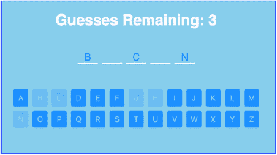

## 第四单元：模块

直到最近，大多数前端应用程序都遵循相同的库使用范式：*暴露全局变量*。例如，如果有人想在项目中使用 jQuery([`jquery.com`](https://jquery.com))，他们需要访问 jQuery 的网站，下载 jquery.js 或 jquery.min.js，将其添加到项目的 js 或 vendor 文件夹中，然后通过一个`<script>`标签将库导入到他们的应用程序中。这并不理想，因为它要求模块使用可能与其他全局变量冲突的全局变量来导出自己。这也要求在依赖于它们的任何库之前包含依赖项，否则会出现错误。

模块通过允许模块加载器包含脚本来解决这些问题。模块本身可以指定和加载它们的依赖项，从而减轻应用程序作者管理它们的负担。

模块允许将大量代码分成小而紧密的单元。每个模块都包含在其自己的文件中。文件中任何未导出的内容都是私有的，无需用立即调用的函数表达式（IIFE）包裹以创建私有作用域。因为模块内部的代码不会将任何内容附加到全局命名空间，所以模块外部的任何代码都必须明确从模块中导入它需要的部分，以便获得对其的引用。

使用模块使你的代码易于推理，因为你确切地知道每个值来自哪里。你要么直接在你的模块中定义它，要么从其他地方导入它，因此你永远不会发现自己看着一个变量而不知道它在哪里定义。你也不必担心你的模块的哪些部分在其他地方被使用。如果值没有被导出，它是私有的，如果值被导出，它很可能被其他东西使用。

就像将你的代码拆分成许多小的函数一样，将你的应用程序拆分成许多小的模块会使你的程序易于推理，并随着复杂性的增加而保持可维护性。

我们将从这个单元开始，看看如何创建你自己的模块。然后我们将探讨导入和组合模块的各种方法。最后，你将通过创建一个猜谜游戏来结束这个单元，看看使用模块可以使你的代码多么整洁。

## 第 20 课：创建模块

在阅读第 20 课课后后，你将

+   理解什么是模块

+   了解 JavaScript 在模块中的行为

+   创建模块并导出值

在学习如何创建和使用 ES2015 模块之前，让我们定义一下 JavaScript 中的模块是什么。在最基本的情况下，一个模块是一个具有自己的作用域和规则的 JavaScript 文件，它可以导入或导出值供其他模块使用。模块不是一个对象：它没有数据类型，你不能将其存储在变量中。它只是一个用来拆分、封装和组织代码的工具。

模块是分离你的逻辑到紧密单元并跨文件共享逻辑的好方法，而不必使用全局变量那么繁琐。它们还允许你只导入所需的，降低认知负荷，并使维护更容易。


**考虑这一点**

假设你正在编写一个大型应用程序。你会使用一个文件来编写全部代码，还是会将其拆分成几个较小的文件？你将如何使应用程序的各个组件在文件之间进行通信和共享资源？


### 20.1. 模块规则

在模块内部，JavaScript 的规则略有不同。代码始终在严格模式下执行，因此你永远不需要添加 `"use strict";`。`use strict` 字符串变得流行的原因是允许脚本选择加入严格模式。这是因为如果浏览器切换到一个开关，开始以严格模式运行一切，许多遗留应用程序将会崩溃。选择加入严格模式是一种保留向后兼容性和防止破坏网络的方式。但模块是一个全新的上下文，因此没有必要使它们向后兼容。正因为如此，决定模块始终在严格模式下运行。

另一个不同之处在于根上下文中 `this` 的引用。在常规 JavaScript 中，`this` 在根级别将默认为全局对象（在浏览器中为 `window`）。但在 ES2015 模块中，它将是 `undefined`：

```
var obj = {
  foo() {
    return this
  }
}
function bar() {
  return this
}
obj.foo()                      *1*
bar()                          *2*
console.log(this)              *2*
```

+   ***1* obj**

+   ***2* undefined**

从 `obj.foo()` 返回的值是 `obj`，就像在模块外一样。但在模块外，`bar()` 会返回 `window` 或全局对象，因为它是在没有上下文的情况下调用的。然而，在模块中，如果没有上下文调用 `bar()`，它将返回 `undefined`。此外，模块内部根级别对 `this` 的任何引用也将是 `undefined`，而不是 `window`，就像在模块外一样。

在 JavaScript 中，通常情况下，在根作用域中定义的任何变量都会自动设置为全局变量。许多过去的 JavaScript 开发者会在立即调用的函数表达式（IIFE）内部定义它们的变量，以防止变量成为全局变量。你也在本书的第一单元中了解到，在 ES2015 中，你现在可以使用简单的代码块 `{}` 来添加作用域，并防止变量成为全局变量。但在模块中，定义的变量永远不会是全局的。你可以想象你的整个模块都在一个代码块 `{}` 或 IIFE 内运行。这是因为模块被设计成只向外界显式导出内容。尽管如此，你仍然可以在模块内部将值附加到全局对象上：

```
window.someName = 'my value'
```

然而，在大多数情况下，从模块设置全局变量是一种不良做法。

现在你已经了解了模块中代码的工作规则，让我们在下一节中看看如何创建一些模块。


**快速检查 20.1**

> **Q1:**
> 
> 在模块内部，如果你像以下这样调用`obj.foo`，结果会是什么？
> 
> ```
> obj.foo.call(this)
> ```

| |
| --- |
| |

**QC 20.1 答案**

> **A1:**
> 
> 它会是`undefined`，因为你将上下文设置为根级别的`this`，而在模块中根级别的`this`是`undefined`。

| |
| --- |

### 20.2\. 创建模块

想象你正在编写一个应用程序，并且你想要一个可重用的函数，该函数可以将统计数据记录到数据库中。你希望这个函数到处都可以使用。你可能只是将其设置为一个全局函数，如下所示：

```
window.logStats = function(stat) {
  // log stat to data base
}
```

有几个原因说明全局变量是一种不良实践，但在许多年里，在 JavaScript 中我们没有选择。但现在有了模块，你可以将这个函数放在一个模块中，并在你的应用程序中共享它，而无需将其设置为全局：

```
export default function logStats(stat) {
  // log stat to data base
}
```

通过在函数前加上`export`关键字，你是在说这个模块导出了`logStats`函数。你还指定这是默认导出；稍后会更详细地介绍这一点。

现在假设你的`logStats`函数需要一个辅助函数。`logStats`函数需要访问这个辅助函数，但你不想将其暴露给其他任何东西。如果没有模块，你现在将不得不求助于将一切包裹在私有上下文中，以防止全局值的泄露：

```
{
  function statsHelper() {
    // do some stat processing
  }

  window.logStats = function(stat) {
    // log stat to data base using  statsHelper
  }
}
```

但在模块内部，一切都已经在其自己的作用域中，因此已经保护了值不会泄露（除非明确导出或设置为全局）：

```
function statsHelper() {
  // do some stat processing
}

export default function logStats(stat) {
  // log stat to data base using  statsHelper
}
```

当你创建一个模块时，你通常专注于一个特定的任务。当你想要创建一个可重用的自包含代码块时，你可以将其放入一个模块（一个单独的文件）中，只暴露所需的部分，同时保持模块的大部分细节是私有的。通常你的模块只会导出一个单一值。在这种情况下，将单一值作为默认值导出是有意义的：

```
export default function currency(num) {
  // ... return a formatted currency string
}
```

函数表达式是完全正常的；它只是被`export default`语句所前缀。语法是`export default <expression>`。从表达式评估出的值最终成为导出的值。所以如果你只想导出数字`5`，你可以这样做：

```
export default 5
```

如果你将模块想象成一个函数，默认导出将与函数的`return`值类似。一个函数只能返回一个值，一个模块也只能有一个默认导出。但模块并不局限于单个默认导出：它可以导出多个值，但只能有一个是默认的。所有其他导出都将被命名为导出。回到你的货币函数，如果你想按名称导出它，你只需要移除`default`关键字：

```
export function currency(num) {
  // ... return a formatted currency string
}
```

由于你移除了`default`关键字，函数通过名称导出。但请注意，你没有指定名称。名称会自动被选中并作为`currency`导出。

语法是 `export <declaration>`。你注意到区别了吗？使用默认导出时，你导出一个表达式，该表达式计算出一个值：导出的值。但使用命名导出时，你导出一个声明。一个函数声明、变量声明，甚至是一个类声明总是有一个名称，这就是导出值所使用的名称。你可以使用这种语法导出任意数量的声明。

对于命名导出，还有一个类似的语法：

```
function currency(num) {
  // ... return a formatted currency string
}

export { currency }
```

这与之前的功能相同，但使用了不同的语法。语法是 `export { binding1, binding2, ... }`。你可以指定一个名称或一个以逗号分隔的名称列表，数量不限。当你以这种方式导出一个值时，你必须使用一个指向值的名称（一个绑定）。你不能以这种方式导出一个原始值：

```
export { currency }             *1*
export { 'currency' }           *2*
export { 5 }                    *2*
```

+   ***1* OK**

+   ***2* Syntax Error**

这种语法的优点是它允许你指定一个用于导出的备用名称。比如说，在内部你将一个值称为 `formattedCurrentUsername`，但你想简单地将其导出为 `username`。你可以这样做：

```
export { formattedCurrentUsername as currency }
```

这种语法的格式是 `export { originalName as exportedName }`。

当导出多个值时，你可以为每个值使用单独的导出语句，就像你声明它们时一样，或者你可以使用一个导出语句并列出你想要导出的所有名称：

```
export function currency(num) {
  // ... return a formatted currency string
}

export function number(num) {
  // ... return a number formatted with commas
}
```

这相当于

```
function currency(num) {
  // ... return a formatted currency string
}

function number(num) {
  // ... return a number formatted with commas
}

export { currency, number }
```

无论你决定哪种方式，都是个人喜好，尽管大多数开发者似乎更喜欢第一个例子。

这与函数声明一样适用于变量声明：

```
export let one = 1              *1*
export const two = 2            *2*
export 3                        *3*
```

+   ***1* Exported as the name one**

+   ***2* Exported as the name two**

+   ***3* Invalid. No way to infer name.**

导出语句必须位于顶层，这意味着你不能有条件地导出值。这里的顶层指的是文件主体代码的根部，而不是在代码块、`if` 语句、函数等内部：

```
export const number = num => /* format number */              *1*

if (currencyNeeded) {
  export const currency = num => /* format currency */        *2*
}

function exportMore() {
  export const date = dateObj => /* format date */            *2*
}
```

+   ***1* Top level, valid**

+   ***2* Not top level, invalid**

这是由设计决定的：模块旨在是静态可分析的，因此必须无条件地始终以相同的方式导出和导入。如果允许在函数或 `if` 语句中导出一个值，那么有时可以导出一个值，有时则不行。模块设计为始终执行其导出，因此它们必须位于顶层。

现在当创建一个导出多个值的模块时，你可能想知道，其中之一是否应该是默认导出，其余的应该是命名导出，还是所有都应该命名为导出？这个问题没有一刀切的答案。这实际上取决于你如何设计你的模块。我可以说，作为一个经验法则，如果你导出的所有内容都是同等重要的，那么使用所有命名导出而没有默认导出。但是，如果你有一项内容作为主要导出，而其他所有内容都似乎增强或围绕这个主要导出，那么它应该是默认导出，其余的应该是命名导出。如果你发现自己处于想要有多个命名导出但又有两个或更多默认导出的情况，那么你的模块可能做得太多，应该分解成更小的模块。我们将在下一课中介绍将大模块分解成小模块的技术。


**快速检查 20.2**

> **Q1:**
> 
> 在以下代码片段中，有两个函数。修改代码，使函数 `ajax` 成为默认导出，并通过名称导出 `setAjaxDefaults`。
> 
> ```
> function ajax(url) {
>   // perform ajax
> }
> 
> function setAjaxDefaults(options) {
>   // store options
> }
> ```

|  |

**QC 20.2 答案**

> **A1:**
> 
> ```
> export default function ajax(url) {
>   // perform ajax
> }
> 
> export function setAjaxDefaults(options) {
>   // store options
> }
> ```


### 20.3\. 当一个 JavaScript 文件成为模块时？

如果一个模块只是一个文件，什么决定了给定的 JavaScript 文件是模块还是不是？负责制定特定于 Web 的 JavaScript 环境规范的 WHATWG（Web Hypertext Application Technology Working Group）提出了一个新的脚本类型模块。基本上，当使用脚本标签时，你将指定 `type="module"` 而不是 `type="javascript"`，浏览器使用的 JavaScript 加载器就会知道将此文件作为模块执行：

```
<script type="module" src="./example.js">
```

虽然在 Node.js 中这不起作用，因为 Node.js 不使用脚本标签或 HTML。因此，有一个提议，通过是否导出值来推断文件是否为模块。要指定当文件不导出值时它是模块，你会使用一个没有实际导出任何内容的命名导出：

```
export {}                 *1*

// rest of the module
```

+   ***1* 一个空的导出，表示此文件是一个模块**

不要将此与导出对象混淆。这是命名导出语法，你通常会通过括号列出你的导出名称。如果没有命名任何内容，则不会导出任何内容，但根据提议，它将识别该文件为模块。如果这个提议失败，Node.js 团队计划使用替代文件扩展名 .mjs 来指定文件是模块。


**进一步阅读**

[`blog.whatwg.org/js-modules`](https://blog.whatwg.org/js-modules)

[`github.com/bmeck/UnambiguousJavaScriptGrammar`](https://github.com/bmeck/UnambiguousJavaScriptGrammar)


### 概述

在本课中，你学习了如何创建模块。

+   导出一个声明创建一个命名导出。

+   命名导出也可以在括号中列出。

+   列在括号中的命名导出可以使用不同的名称导出。

+   可以有多个命名导出，但只能有一个默认导出。

+   导出语句必须在顶层（根）级别声明。

+   在根级别，关键字`this`是未定义的。

+   模块默认处于严格模式。

让我们看看你是否理解了：

> **Q20.1**
> 
> 创建一个名为 luck_numbery.js 的模块。给它一个内部变量（未导出），称为`luckyNumber`。导出一个名为`guessLuckyNumber`的默认导出函数，该函数接受一个名为`guess`的参数，检查猜测是否与`luckyNumber`相同，并返回`true`或`false`以指示是否猜对了。

## 第 21 课\. 使用模块

在阅读第 21 课之后，你将

+   理解如何指定你打算使用的模块的位置

+   理解从模块中导入值的所有不同方式

+   理解如何导入模块以产生副作用

+   理解导入模块时代码执行的顺序

+   能够将大型模块分解成更小的模块

模块是分离你的逻辑到紧密单元并跨文件共享逻辑的好方法，而不必使用全局变量带来的繁琐。它们还允许你只导入所需的模块，降低认知负荷，并使维护更容易。在上一课中，你学习了什么是模块以及如何创建模块和导出值的基础知识。在本课中，我们将探讨使用其他模块、导入值的不同方式以及如何使用模块分解和组织你的代码。

| |
| --- |

**考虑这一点**

假设你正在编写一个 Web 应用程序，并且需要使用几个第三方开源库。问题是其中两个库都使用相同的全局变量暴露自己。你将如何使这两个库协同工作？

| |
| --- |

### 21.1\. 指定模块的位置

你使用`import`语句从其他模块文件导入代码，该语句由两个关键部分组成，即*what*和*where*。当你使用`import`语句时，你必须指定*what*（变量/值）你正在导入，以及*from where*（模块文件）你正在从哪里导入它们。这与使用多个`<script>`标签包含多个文件，并通过使用全局变量在文件之间通信或共享值的方式形成对比。基本语法是`import X from Y`，其中`X`指定了你正在导入的内容，`Y`指定了模块的位置。一个简单的导入语句可能看起来像这样：

```
import myFormatFunction from './my_format.js'
```

然后当你指定从哪里或从哪个模块导入时，你必须使用字符串字面量值。以下是不合法的：

```
const myModule = './my_format.js'
import myFormatFunction from myModule            *1*
```

+   ***1* 无效，因为 myModule 是一个变量，而不是一个字符串字面量**

你不能使用变量来定义模块的位置（`from`），即使该变量指向一个字符串。你必须使用字符串字面量。这再次是因为 JavaScript 中所有的导入和导出都是为了静态分析而设计的。你所有的导入都将先于当前文件中的任何其他代码执行。JavaScript 将扫描你的文件，找出所有的导入，首先执行这些文件，然后使用导入的正确值运行你的当前文件。这意味着你不能基于变量导入，因为那个变量还没有定义！

除了使用字符串来确定模块的位置之外，JavaScript 没有规定其他规则。对于每个 JavaScript 环境（主要是浏览器和 Node.js），都会有所谓的*加载器*，这些加载器将定义字符串的实际样子。Web 和 Node.js 的加载器仍在开发中。今天，大多数使用 ES6 模块的人都在使用像 Browserify 或 Webpack 这样的工具。这两个工具都将文件路径，如`./file`或`./file.js`视为相对于当前文件：

```
import myVal from './src/file'           *1*
import myVal from './src/file.js'        *1*
```

+   ***1* 这两种方式都是等效的，指定了文件的相对路径。**

文件扩展名是可选的，大多数人省略它。没有文件扩展名，路径也可以是一个包含`index.js`的目录。

```
import myVal from './src/file'                *1*
import myVal from './src/file.js'             *2*
```

+   ***1* 匹配 ./src/file.js 和 ./src/file/index.js**

+   ***2* 仅匹配 ./src/file.js**

指定一个没有路径的名称，例如`jquery`，表示这是一个已安装的模块，应该在`node_modules`目录中查找。

现在你已经知道了如何指定模块的位置，让我们看看如何指定你想要从它导入的内容。

| |
| --- |

**快速检查 21.1**

> **Q1:**
> 
> 假设的加载器最有可能在以下导入中查找模块文件：
> 
> ```
> import A from './jquery'
> import B from 'lodash'
> import C from './my/file'
> import D from 'my/file'
> ```

| |
| --- |
| |

**QC 21.1 答案**

> **A1:**
> 
> 1.  从相对于当前文件的`./jquery.js`或`**.**/jquery/index.js`文件。
> 1.  
> 1.  从`node_modules/lodash/package.json`中指定的`main`字段。
> 1.  
> 1.  从相对于当前文件的`./my/file.js`或`./my/file/index.js`文件。
> 1.  
> 1.  从相对于`node_modules/my/package.json`中指定的`main`字段的`./file.js`或`./file/index.js`。

| |
| --- |

### 21.2\. 从模块中导入值

在上一课中，你创建了一个用于格式化货币字符串的模块。它有一个单独的`default`导出，用于实现此功能，如下所示：

```
export default function currency(num) {
  // ... return a formatted currency string
}
```

假设你将这个模块放在`./utils/format/currency.js`的位置，并想导入`currency`函数来格式化你正在构建的购物车系统中的某些货币。你可以使用以下`import`语句来完成：

```
import formatCurrency from './utils/format/currency'           *1*

function price(num) {
  return formatCurrency(num)
}
```

+   ***1* 你正在导入默认值。**

注意函数的名称是 `currency`，但你使用 `formatCurrency` 名称导入。当你说 `import <name>` 时，你是在决定使用什么名称，就像你使用 `var <name>`、`const <name>` 或 `let <name>` 一样，只是你用等号分配值，而不是从另一个文件、一个模块中导入值。当你从模块中导入默认值时，你可以使用任何你想要的名称，如下面的愚蠢示例所示：

```
import makeNumberFormattedLikeMoney from './utils/format/currency'

function price(num) {
  return makeNumberFormattedLikeMoney(num)
}
```

前两个示例的行为将完全相同，假设它们导入的 ./utils/format/currency 模块没有发生变化。记住上一课中的类比：如果你把模块想象成一个函数，默认导出就相当于函数的 `return` 值。如果我们继续使用这个类比，导入默认值就像将函数的 `return` 值分配给一个变量：

```
function getValue() {
  const value = Math.random()
  return value
}

const value = getValue()
const whatchamacallit = getValue()
```

注意 `getValue` 函数返回了一个名为 `value` 的变量，并且将这个值分配给一个匹配的命名变量，或者一个完全不同的变量名，比如 `whatchamacallit`，都没有关系。这是因为该函数只返回一个值，而你只是捕获这个值并决定一个名称来存储它。当你从模块中导入默认值时也是这样。模块只能导出一个默认值，并且它只导出值，所以当你导入它时，你可以指定任何你想要的名称来存储这个值。

现在你已经在上一课中学到了，除了单个默认导出之外，一个模块还可以有一个或多个命名导出。正如其名所示，在这些情况下，名称确实很重要。你在上一课中学到的命名导出的语法之一如下：

```
function currency(num) {
  // ... return a formatted currency string
}

function number(num) {
  // ... return a number formatted with commas
}

export { currency, number }
```

便利的是，导入这些值的语法类似：

```
import { currency, number } from './utils/format'

function details(product) {
  return `
    price: ${currency(product.price)}
    ${number(product.quantityAvailable)} in stock ready to ship.
  `
}
```

在这里，`currency` 和 `number` 名称必须与它们导出的名称相匹配。但你可以指定不同的名称来分配给它们：

```
import { number as formatter } from './utils/format'        *1*
```

+   ***1* 指定导入 number 但将其分配给格式化器名称**

这在从多个使用相同名称导出的模块中导入命名值时很有用。比如说，如果你从一个功能工具模块中导入名为 `fold` 的函数，同时也从折纸模块中导入名为 `fold` 的函数。你可以使用 `as` 来将一个或两个导入映射到不同的名称，以避免命名冲突：

```
import { fold } from './origami'
import { fold as reduce } from './functional_tools'            *1*
```

+   ***1* 将 fold 导入为 reduce 名称以避免与其他导入值冲突。**

如果你想要从模块中导入所有命名导出，你可以使用星号这样做：

```
import * as format from './utils/format'         *1*

format.currency(1)
format.number(3000)
```

+   ***1* 创建了一个名为 format 的新对象，并分配了模块中的所有值。**

这将创建一个新对象，其属性与模块中所有命名导出相关联。如果你需要导入模块导出的所有值，可能用于内省或测试，但通常你应该只导入你将要使用的值。即使你碰巧使用了模块导出的所有内容，这也不一定意味着你将继续使用该模块的所有内容，因为它会不断增长。

想象一下，如果格式模块只导出了 `currency` 和 `date` 格式函数，而你需要这两个函数来构建你的产品模块，所以你使用星号导入它们。但后来在构建你的应用程序时，你继续向格式模块添加新的格式函数。你不需要这些新函数在你的产品模块中，但由于你使用星号导入，你将继续获得所有这些函数，而不仅仅是那些你正在使用的函数。某些情况下可能需要导入所有内容，但作为一般规则，你应该通过指定每个值的名字来明确指定你导入的内容。

当使用星号导入所有值时，这不包括默认导出，只包括命名导出。你可以通过逗号分隔来组合从模块导入默认导出和命名导出：

```
import App, * as parts from './app'                                     *1*
import autoFormat, { number as numberFormat } from './utils/format'     *2*
```

+   ***1* 默认值被命名为 App，所有命名导出都被设置为名为 parts 的新创建对象上的属性。**

+   ***2* 默认值被命名为 autoFormat，而按名称导出的值被命名为 numberFormat。**

一旦从模块中导入一个值，它不会创建像声明变量时的绑定。在下一节中，我们将探讨它是如何工作的。


**快速检查 21.2**

> **Q1:**
> 
> 在下面的 `import` 语句中，哪个是默认导入，哪个是命名导入？
> 
> ```
> import lodash, { toPairs } from './vendor/lodash'
> ```

|  |

**QC 21.2 答案**

> **A1:**
> 
> `lodash` 是默认导入，`toPairs` 是命名导入。


### 21.3\. 导入值的绑定方式

默认导入和命名导入都创建只读值，这意味着一旦导入，就不能重新分配值：

```
import ajax from './ajax'

ajax = 1                      *1*
```

+   ***1* 错误：ajax 只读**

但与默认导入不同，命名导入直接绑定到导出的变量。这意味着如果导出它的文件（模块）中的变量发生变化，导入它的文件中的变量也会发生变化。

让我们想象一个导出一个名为 `title` 的变量的模块，该变量有一个初始值，同时也导出一个名为 `setTitle` 的函数，允许你像这样更改标题：

```
export let title = 'Java'
export function setTitle(newTitle) {
  title = newTitle
}
```

如果你导入这两个值，你不能直接通过赋值更改 `title` 的值，但你可以通过调用 `setTitle` 来间接更改 `title` 的值：

```
import { title, setTitle } from './title_master'

console.log(title)         *1*
setTitle('Script')
console.log(title)         *2*
```

+   ***1* “Java”**

+   ***2* “脚本”**

这与你在 JavaScript 中通常检索值的方式非常不同。通常当你从函数调用、解构或其他表达式中检索值并将其赋给变量时，你正在检索该值，并创建一个指向该值的新绑定。但是当你从模块中导入值时，你导入的不仅是值，还有绑定。这就是为什么模块可以内部更改值，而你导入的变量将反映这种变化。

一旦值发生变化，它不仅会在当前文件和导出值的文件中变化，还会在导入该值的所有文件中变化。除此之外，没有通知值已更改。没有事件广播更改。它默默地改变，所以在更改导出的值时要小心。

在下一节中，你将学习为什么以及如何导入一个模块而不导入任何值。


**快速检查 21.3**

> **Q1:**
> 
> 在以下片段中有五个绑定。在所示上下文中，哪些可以重新赋值？
> 
> ```
> import a, { b } from './some/module'
> const c = 1
> var d = 1
> let e = 1
> ```

|  |

**QC 21.3 答案**

> **A1:**
> 
> 只有 d 和 e。


### 21.4\. 引入副作用

有时候你只想导入一个模块以产生副作用，这意味着你希望模块中的代码执行，但你不需要引用来使用该模块中的任何值。一个例子是包含设置 Google Analytics 代码的模块。你不需要从这样的模块中获取任何值；你只需要执行，以便它可以设置自己。

你可以这样导入一个模块以产生副作用：

```
import './google_analytics'
```

这就像任何其他导入一样；你省略任何默认或命名的值，也省略了关键字 `from`。当你为了副作用导入一个文件时，你导入的模块中的所有代码都会在你导入的文件中的任何代码之前执行。这无论导入发生在哪里：

```
setup()

import './my_script'
```

在上一个例子中，模块 my_script 中的所有代码在 `setup()` 函数执行之前就已经执行了，即使它是后来导入的。

在下一节中，我们将探讨如何将较小的模块组织并分组到较大的模块中。


**快速检查 21.4**

> **Q1:**
> 
> 假设模块 log_b 包含语句 `console.log('B')`。在运行以下代码后，输出的顺序将是什么？
> 
> ```
> console.log('A')
> import './log_b'
> console.log('C')
> ```

|  |

**QC 21.4 答案**

> **A1:**
> 
> B, A, C


### 21.5\. 分解和组织模块

有时候，一个模块会变得太大，可能需要将其分解成更小的模块。但你可能有一个已经大量使用该模块的大型代码库。你想要将这个模块重构为更小、更专注的模块，但你不希望因为这一点而不得不重构整个应用程序。让我们探讨如何将一个已经使用的模块分解成更小的块，而不会对应用程序的其他部分产生影响。

假设你有一个格式模块。它最初很小，只有几个格式化函数，但随着应用程序的增长，你继续需要为不同的需求创建新的格式化器。一些格式化器共享逻辑，而其他格式化器需要它们自己的辅助函数。将所有这些放在一个模块中已经变得过于复杂。为了简洁起见，让我们假设有四个格式化器，如下面的列表所示；在实际应用程序中，可能还有更多。

##### 列表 21.1\. src/format.js

```
function formatTime(date) {
  // format time string from date object
}

function formateDate(date) {
  // format date string from date object
}

function formatNumber(num) {
  // format number string from number
}

function formatCurrency(num) {
  // format currency string from number
}
```

现在假设许多模块正在使用这些模块，例如以下产品模块。

##### 列表 21.2\. src/product.js

```
import { formatCurrency, formatDate } from './format'
```

这个产品模块只是使用格式器的许多模块之一。你想要以不会破坏这个模块或任何其他模块的方式重构你的格式模块。

将模块分解成两个独立的模块，一个用于数字，一个用于日期，并将它们分组在格式文件夹中。

下面是日期格式模块。

##### 列表 21.3\. src/format/date.js

```
function formatTime(date) {
  // format time string from date object
}

function formateDate(date) {
  // format date string from date object
}
```

下面是数字格式模块。

##### 列表 21.4\. src/format/number.js

```
function formatNumber(num) {
  // format number string from number
}

function formatCurrency(num) {
  // format currency string from number
}
```

你已经很好地将大型模块分解成更小、更专注的模块。但为了使用这些模块，你必须重构所有其他导入值的模块，比如产品模块。你想要避免这种情况。在格式模块内部创建另一个索引模块，从更专注的模块中导入值并导出它们，如下面的列表所示。

##### 列表 21.5\. src/format/index.js

```
import { formatDate, formatTime } from './date'
import { formateNumber, formatCurrency } from './number'

export { formatDate, formatTime, formatNumber, formatCurrency }
```

这很好，因为现在当其他模块尝试从 ./src/format 导入时，如果找不到 ./src/format.js，它实际上会从 ./src/format/index.js 导入。这意味着你不再需要重构任何其他模块。这是省略在导入模块路径时指定文件扩展名的绝佳论据，因为如果你指定了文件扩展名，这次重构将会痛苦得多。

这种组织方式非常常见，实际上有一个直接用于它的语法。src/format/index.js 模块可以写成如下所示。

##### 列表 21.6\. src/format/index.js

```
export { formatDate, formatTime } from './date'
export { formateNumber, formatCurrency } from './number'
```

如果你导入一个值只是为了将其导出，你可以跳过一步，直接从该模块导出！现在，格式模块总是应该导出所有更专注格式化器的值，对吧？嗯，与其列出所有名称然后回来添加任何未来添加的新格式化器的名称，不如可以这样导出所有值。

##### 列表 21.7\. src/format/index.js

```
export * from './date'
export * from './number'
```

太棒了！通过这个简单的外观类型模块，你成功且优雅地将大型模块分解成更小、更专注的模块，而且你以对应用程序其余部分透明的方式无缝地做到了这一点！


**快速检查 21.5**

> **Q1:**
> 
> 假设你将在 ./src/format/word 添加另一个模块，并更新索引文件以导出所有单词格式化器。

|  |

**QC 21.5 答案**

> **A1:**
> 
> ```
> export * from './date'
> export * from './number'
> export * from './word'
> ```


### 概述

在本课中，你学习了如何使用和组织模块。

+   默认导入可以使用任何名称进行设置。

+   命名导入以大括号列出，类似于它们的导出方式。

+   命名导入必须指定正确的名称。

+   命名导入可以在指定正确名称后通过 `as` 使用别名。

+   你可以使用 `*` 导入所有命名值。

+   命名导入是直接绑定（不仅仅是引用）到导出的变量。

+   默认导入不是直接绑定，但仍然是只读的。

+   值可以直接从其他模块导出。

让我们看看你是否掌握了这些：

> **Q21.1**
> 
> 创建一个模块，从上一课导入 luck_numbery.js，并尝试猜测幸运数字，并记录在猜对数字之前它尝试了多少次。

## 第 22 课：综合项目：猜字游戏

在这个综合项目中，你将构建一个猜字游戏。游戏将包含状态信息、单词的字母槽和猜测字母的按钮（图 22.1）。

你将使用本书附带代码中的 start 文件夹开始你的项目。如果你在任何时候遇到困难，你还可以查看包含完成游戏的最终文件夹。start 文件夹是一个已经设置好以使用 Babel 和 Browserify 的项目（见第 1 课–第 3 课）；你只需要运行 `npm install` 来设置。如果你还没有阅读第 1 课–第 3 课，你应该在完成这个综合项目之前先阅读。还有一个包含的 index.html 文件：这是游戏将运行的地方。它已经包含了所需的全部 HTML 和 CSS；你只需要在捆绑你的 JavaScript 文件后，在浏览器中打开它。src 文件夹是放置你所有 JavaScript 文件的地方，dest 文件夹是在你运行 `npm run build` 后捆绑的 JavaScript 文件将放置的地方。

##### 图 22.1. 猜字游戏



### 22.1. 规划

你将把你的游戏分成几个模块，所以首先确定你要把游戏分成哪些模块是有意义的。在你开始游戏之前，你需要一个随机单词。创建一个用于生成随机单词的模块是有意义的。其次，你需要跟踪你的游戏状态——游戏是否获胜、失败等等。所以你还需要一个状态模块。用户界面需要显示三个部分。首先是游戏状态的表示；称之为 *status-display*。你还需要显示玩家猜测的单词的字母槽；称之为 *letter-slots*。第三个 UI 元素是你需要的字母按钮模块，以便玩家可以进行猜测。称之为 *keyboard*。最后，你需要将这些模块粘合在一起以创建实际的游戏。粘合剂不会很多，所以你只需在 *index* 中完成。

### 22.2\. 单词模块

从一个简单的函数开始，该函数仅返回一个单词数组。

##### 列表 22.1\. src/words.js

```
function getWords(cb) {                            *1*
  cb(['bacon', 'teacher', 'automobile'])           *2*
}
```

+   **1* 函数接受一个回调作为参数。**

+   **2* 使用你的单词数组调用回调函数。**

你不是返回一个单词数组，而是使用回调函数来返回一个单词数组。在其当前状态下，这可能没有意义，但这将允许稍后重写 `getWords` 函数，以使用 AJAX 请求从 API 或其他外部资源获取单词。

现在你有了你的单词，你需要一个函数来返回一个随机单词，如下所示。

##### 列表 22.2\. src/words.js

```
export default function getRandomWord(cb) {
  getWords(words => {                                                    *1*

    const randomWord = words[Math.floor(Math.random() * words.length)]   *2*
    cb(randomWord.toUpperCase())                                         *3*
  })
}
```

+   **1* 将 cb 传递给 getWords。**

+   **2* 从单词数组中获取一个随机单词。**

+   **3* 使用你的随机单词调用 getRandomWord 传递给它的回调函数。**

这就是你的单词模块的全部内容。你只从模块中导出了 `getRandomWord` 函数，因为游戏的其他部分不需要单词数组，只需要一次一个随机单词。此外，因为你只导出了一个函数，所以将其设置为默认导出。接下来，你将构建状态模块。

### 22.3\. 状态模块

在游戏中，你将使用四种状态：剩余多少次猜测、玩家是否获胜、玩家是否失败，以及游戏是否仍在进行（当他们还有剩余猜测且未获胜或失败时）。为了确定这些状态，需要随机单词以及玩家的猜测，因此你需要为每个状态导出一个函数，该函数接受当前单词和猜测作为参数。

##### 列表 22.3\. src/status.js

```
const MAX_INCORRECT_GUESSES = 5                                           *1*

export function guessesRemaining(word, guesses) {
  const incorrectGuesses = guesses.filter(char => !word.includes(char))   *2*
  return MAX_INCORRECT_GUESSES - incorrectGuesses.length
}

export function isGameWon(word, guesses) {
  return !word.split('').find(letter => !guesses.includes(letter))        *3*
}

export function isGameOver(word, guesses) {
  return !guessesRemaining(word, guesses) && !isGameWon(word, guesses)    *4*
}

export function isStillPlaying(word, guesses) {
  return guessesRemaining(word, guesses) &&
         !isGameOver(word, guesses) &&
         !isGameWon(word, guesses)                                        *5*
}
```

+   **1* 你不需要导出这个函数，因为其他东西不应该需要它。**

+   **2* 找出所有被猜测但不在单词中的字母。**

+   **3* 确定单词中的所有字母是否都被猜测。**

+   **4* 如果游戏未获胜且没有猜测，则游戏结束。**

+   ***5* 只要还有猜测，游戏还没有被赢得或输掉，玩家仍在玩游戏。**

注意你没有导出`MAX_INCORRECT_GUESSES`常量。这是因为没有其他东西会使用它，你应该只导出其他模块所需的内容，而不是更多，以使 API 表面尽可能小，这将使未来的更改和调试更容易。其他四个函数都将被其他模块使用以使游戏工作，所以你导出所有这些函数。但这并不意味着你应该总是导出每个函数。如果这些函数中的任何一个使用了辅助函数来确定其值，你就不会导出这样的辅助函数，因为它不需要在其他地方使用。

你可能会问自己，为什么要把`word`和`guesses`作为函数参数传递？为什么不直接导入它们？你可以这样做，并且它将工作。但是这样做会将所有单个模块紧密耦合到主游戏逻辑（单词和猜测存储的地方），这将使它们更难隔离和测试。在这个小型游戏中，你不会添加任何测试，但这仍然是一个好习惯。

接下来，我们将关注三个 UI 元素：状态显示、字母槽位和键盘。

### 22.4. 游戏界面模块

正如我们之前所说的，你有三个 UI 部分：将显示剩余猜测次数或游戏是否结束或赢得游戏的状况显示，字母槽位和键盘。你可以创建一个单独的 UI 模块来导出每一个；这并不错，但我更愿意将每个部分放入它自己的模块中。它们没有共享任何逻辑或任何其他表明它们应该在一起的东西，除了都是 UI 的一部分，所以我认为这样做最有意义。我更愿意有几个简单的模块而不是一个更复杂的模块，如果你后来决定添加更多的 UI 部分，这也会进一步表明每个部分都应该是一个单独的模块。

每个 UI 模块将导出一个函数，该函数返回表示游戏界面部分的 HTML（作为字符串）。所有 UI 模块都将需要玩家的猜测，而状态显示和字母槽位还需要当前随机单词。因此，它们也将接受与状态模块类似的参数。

好的，所以你有一个简单的 API，每个 UI 模块都将遵循。它将导出一个函数（你将使其成为默认导出），该函数将接受所需的数据并返回一个 HTML 字符串。从状态显示模块开始。

##### 列表 22.4. /src/status_display.js

```
import * as status from './status'                                        *1*

function getMessage(word, guesses) {
  if (status.isGameWon(word, guesses)) {                                  *2*
    return 'YOU WIN!'
  } else if (status.isGameOver(word, guesses)) {                          *2*
    return 'GAME OVER'
  } else {
    return `Guesses Remaining: ${status.guessesRemaining(word, guesses)}` *2*
  }
}

export default function statusDisplay(word, guesses) {
  return `<div>${getMessage(word, guesses)}</div>`
}
```

+   ***1* 将所有值导入到一个单独的状态对象中。**

+   ***2* 从生成的状态对象中调用导入的函数。**

状态显示将需要大多数状态函数，所以不是单独导入它们，而是从状态模块导入所有内容，并将它们全部组合成一个生成的`status`对象。然后你可以直接从创建的`status`对象中调用任何函数。

除了这个模块之外，这个模块相当简单。它只是根据游戏状态生成一条消息。接下来，你将构建字母槽模块。

##### 列表 22.5\. /src/letter_slots.js

```
function letterSlot(letter, guesses) {
  if (guesses.includes(letter)) {
    return `<span>${letter}</span>`
  } else {
    return '<span>&nbsp;</span>'
  }
}

export default function letterSlots(word, guesses) {
  const slots = word.split('').map(letter => letterSlot(letter, guesses))

  return `<div>${ slots.join('') }</div>`
}
```

这个模块也很简单：你生成与单词中的每个字母对应的多个 span。span 要么为空，要么揭示字母，这取决于玩家是否猜对了那个字母。再次按照计划导出我们的一个默认函数。现在完成最后的 UI 部分，即键盘模块，如下列所示。

##### 列表 22.6\. /src/keyboard.js

```
const alphabet = 'ABCDEFGHIJKLMNOPQRSTUVWXYZ'.split('')                   *1*

const firstRow = alphabet.slice(0, 13)                                    *2*
const secondRow = alphabet.slice(13)                                      *2*

function key(letter, guesses) {
  if (guesses.includes(letter)) {
    return `<span>${letter}</span>`                                       *3*
  } else {
    return `<button data-char=${letter}>${letter}</button>`               *4*
  }
}

export default function keyboard(guesses) {
  return `
    <div>
      <div>${ firstRow.map(char => key(char, guesses)).join('') }</div>   *5*
      <div>${ secondRow.map(char => key(char, guesses)).join('') }</div>  *5*
    </div>
  `
}
```

+   ***1* 获取所有字母表字母数组的快捷方式**

+   ***2* 你想要第一行的前 13 个字母和最后一行的最后 13 个字母。**

+   ***3* 如果字母已被猜中，你不想让他们再次猜测，所以使用 span。**

+   ***4* 如果字母未被猜中，你使用按钮允许他们选择它。**

+   ***5* 根据字母是否被猜中，将每个字母映射到按钮或 span。**

这个模块也很简单：它生成所有字母表中的字母列表，将尚未被猜中的字母作为按钮，将已被猜中的字母作为 span。

那就是你需要的所有 UI。在下一节中，你将把它们全部组合起来，创建一个可工作的游戏。

### 22.5\. 索引

索引是应用程序的入口点。在这里，你将协调所有单个模块，创建一个功能游戏。首先，像下一个列表中所示，导入你需要的所有内容。

##### 列表 22.7\. /src/index.js

```
import getRandomWord from './words'
import { isStillPlaying } from './status'
import letterSlots from './letter_slots'
import keyboard from './keyboard'
import statusDisplay from './status_display'
```

你还从单词模块导入默认函数以及所有 UI 模块。但你只需要从状态模块中导入 `isStillPlaying` 函数，以确定你是否应该继续与玩家交互。

在下一个列表中，你只需要创建一个渲染实际游戏的函数。

##### 列表 22.8\. /src/index.js

```
function drawGame(word, guesses) {
  document.querySelector('#status-display').innerHTML =
  statusDisplay(word, guesses)
  document.querySelector('#letter-slots').innerHTML =
  letterSlots(word, guesses)
  document.querySelector('#keyboard').innerHTML = keyboard(guesses)
}
```

在这里，你调用导入的每个 UI 函数，并使用 `innerHTML`^([1]) 将它们插入到网页的所需位置。你不需要任何其他界面逻辑，因为每个 UI 模块都会自己处理单词和猜测。所以你唯一需要做的事情就是获取一个随机单词，监听按钮点击，并将每个猜测添加到猜测列表中，如下列所示。

> ¹
> 
> 查看 [`developer.mozilla.org/en-US/docs/Web/API/Element/innerHTML`](https://developer.mozilla.org/en-US/docs/Web/API/Element/innerHTML)

##### 列表 22.9\. /src/index.js

```
getRandomWord(word => {                                                      *1*
  const guesses = []                                                         *2*

  document.addEventListener('click', event => {                              *3*
    if (isStillPlaying(word, guesses) && event.target.tagName === 'BUTTON') {*4*
      guesses.push(event.target.dataset.char)                                *5*
      drawGame(word, guesses)                                                *6*
    }
  })

  drawGame(word, guesses)                                                    *7*
})
```

+   ***1* 首先，你需要获取一个随机单词。**

+   ***2* 你还需要一个地方来存储玩家的猜测。**

+   ***3* 使用事件委托来监听所有点击事件。**

+   ***4* 如果游戏仍在进行中且玩家点击了按钮...**

+   ***5* ...将玩家猜中的字母添加到你的数组中。**

+   ***6* 重新绘制游戏。**

+   ***7* 绘制初始游戏用户界面。**

在你得到一个随机单词后，你开始使用事件委托来监听按钮点击。² 每当玩家做出猜测时，整个 UI 都会被销毁并重新创建。这可以优化，但对于这个小型游戏来说，这是可以接受的，并且使游戏变得更加简单。事件委托允许你在 UI 重建时无需重新注册即可一次性添加点击事件监听器。

> ²
> 
> 参考：[`davidwalsh.name/event-delegate`](https://davidwalsh.name/event-delegate)

现在你有一个可以工作的游戏了。你可以在终端中使用`npm run build`来构建游戏，然后在浏览器中打开`index.html`！

### 摘要

在这个综合项目中，你创建了一个猜字游戏。你首先制作了一个单词模块，用于生成游戏中使用的随机单词。然后，你着手处理游戏的状态和界面组件。最后，你在索引文件中将所有部件组合在一起。目前你只使用了三个随机单词，这并不使游戏变得很难猜。你可以自由地更新游戏，使用更长的单词列表或使用 API。你还可以通过添加“再玩一次”按钮来进一步改进游戏，以便游戏结束后可以重新开始。
