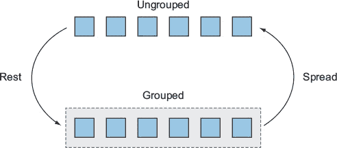
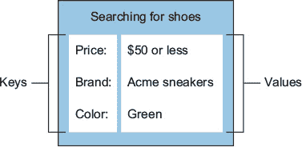
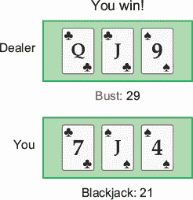

## 单元 5\. 可迭代对象

在 JavaScript 中，`String`和`Array`始终有一些共同之处。它们都包含一定数量的内容——字符串中的字符和数组中的任何数据类型。它们也都有一个`length`属性，表示它们包含的项目数量。但从未有一个共同的协议来描述这些内容是如何工作的。从 ES2015 开始，有两个新协议描述了这些 JavaScript 行为，被称为*迭代*和*迭代器*协议。

`String`和`Array`现在被称为*可迭代对象*。这意味着它们遵循新的迭代协议，并且可以用常见的方式进行预测性交互，包括使用新的`for..of`语句和新的*扩展*运算符。还有两个新的可迭代对象：`Map`和`Set`。此外，你可以定义自己的可迭代对象，甚至可以自定义内置对象的行为。由于它们都遵循迭代协议，它们的行为总是可预测的。

我们将从这个单元开始，看看迭代协议本身：它是如何工作的，如何创建自己的可迭代对象，以及如何使用`for..of`语句和扩展运算符来使用可迭代对象。然后，你将了解新的内置可迭代类型`Set`和`Map`。最后，你将通过构建一个使用`Map`和`Set`以及使用`for..of`和扩展运算符的 21 点游戏来结束这个单元。

## 第 23 课\. 可迭代对象

在阅读第 23 课之后，你将

+   了解可迭代对象是什么以及如何使用它

+   了解如何在可迭代对象上使用扩展运算符来取消对象的分组

+   了解如何在`for..in`语句中使用可迭代对象来遍历对象的值

+   了解如何创建自己的可迭代对象

+   了解如何自定义内置可迭代对象的行为

JavaScript 在 ES2015 中引入了几个新协议：迭代协议和迭代器协议。这两个协议共同描述了可迭代对象的行为和机制——也就是说，可以产生一系列值并且可以遍历其值的对象。当你想到可迭代对象时，`Array`可能首先浮现在你的脑海中，但你也可以迭代`String`、`arguments`对象、`NodeList`，以及我们将在接下来的课程中看到的`Set`和`Map`。除了所有这些内置的可迭代对象之外，你还可以，正如你将在本课中发现的，创建自己的可迭代对象！


**考虑这一点**

以下代码记录了数组的所有索引。但如果你想要记录所有值呢？

```
for (const i in array) {
  console.log(i);
}
```


### 23.1\. 可迭代对象——它们是什么？

可迭代对象是任何遵循 JavaScript 中引入的迭代协议的对象，该协议在 ES2015 中引入。

常见的内置可迭代对象有`String`和`Array`，但`Set`和`Map`也是。因为所有对象都遵循一个共同的协议，这意味着它们的行为方式相似。你还可以使用此协议来创建自己的可迭代对象或自定义默认对象的行为！

正如我提到的，并非所有可迭代对象都是新的。JavaScript 一直有字符串和数组。但为字符串、数组和其他迭代器行为设定契约的协议是新的。字符串和数组已经更新以使用这个新协议，而像 `Set` 和 `Map` 这样的其他对象是新的对象，它们也利用了这个协议。

除了新的可迭代协议之外，我们还得到了一些新的与使用它的对象交互的方法，特别是 `for..of` 语句和展开操作符。

### 23.2\. `for..of` 语句

你写过多少次这样的代码？

```
for (var i = 0; i < myArray; i++) {
  var item = myArray[i]
  // do something with item
}
```

使用 `for..of`，你现在可以用这个来实现相同的功能：

```
for (const item of myArray) {
  // do something with item
}
```

JavaScript 很早就有了允许你枚举对象键（属性名）的 `for..in` 语句，但现在有了 `for..of` 语句，你可以迭代可迭代对象的值，如下一列表所示。

##### 列表 23.1\. 比较 `for..in` 和 `for..of`

```
const obj = { series: "Get Programming", publisher: "Manning" };
const arr = [ "Get Programming", "Manning" ];

for (const name in obj) {
  console.log(name);                    *1*
}

for (const name of arr) {
  console.log(name);                    *2*
}
```

+   ***1* 系列，出版社**

+   ***2* 编程入门，Manning**

这与 `Array.prototype.forEach` 类似，但它有几个优点。它可以与任何可迭代对象一起使用，而不仅仅是数组。它是一个命令式操作，因此可以优化以比高阶 `forEach` 方法表现得更好。此外，它可以使用 `break` 来提前退出。

使用 `for..of` 的一个最终好处是，你无法从一个非生成器函数中 `yield`，即使该函数位于生成器内部：

```
function* yieldAll(...values) {
  values.forEach(val => {
    yield val                       *1*
  })
}
```

+   ***1* 语法错误：意外的标识符**

你得到这个错误是因为 `yield` 实际上位于 `forEach` 的回调箭头函数内部。`yield` 不会冒泡到堆栈中最接近的生成器函数。如果它在一个非生成器函数内部使用，则是一个语法错误。然而，你可以通过如下使用 `for..of` 来解决这个问题：

```
function* yieldAll(...values) {
  for (const val of values) {
    yield val
  }
}
```

`for..of` 语句并不是一个颠覆性的改变，但它又是你 JavaScript 新工具箱中的另一个工具。到目前为止，我们一直在探讨处理现有可迭代对象的方法；在下一节中，你将创建自己的可迭代对象。

| |
| --- |

**快速检查 23.1**

> **Q1:**
> 
> 以下 `for..of` 循环将运行多少次？
> 
> ```
> for (const x of "ABC") {
>   console.log('running')
> }
> ```

| |
| --- |
| |

**QC 23.1 答案**

> **A1:**
> 
> 3

| |
| --- |

### 23.3\. 展开操作

JavaScript 中所有可迭代的对象都有一个共同点，那就是它们可以使用*展开操作符*。展开操作符允许你将单个可迭代的传递视为传递了所有其项目。让我们看看这意味着什么。想象你正在运行一个在线市场。对于任何商品，都有一系列的卖家提供该商品，价格各不相同。你想要向用户展示最低的价格。你可以轻松地获取所有价格组成的数组，但一旦你有了价格数组，你如何找到最低的价格？你想要将这个价格数组传递给`Math.min`，但这需要你单独传递所有价格，而不是作为一个数组。在展开操作符之前，你可能会使用类似以下的方法：

```
const prices = // get array of prices
const lowestPrice = Math.min.apply(null, prices);
```

然而，使用展开操作符可以极大地简化这个过程：

```
const prices = // get array of prices
const lowestPrice = Math.min(...prices);
```

而不是将价格数组作为一个单独的参数传递给`Math.min`，它将数组的所有值作为单独的参数传递。这不仅适用于数组，也适用于任何可迭代的对象，甚至是字符串。然而，在字符串的情况下，它将每个单独的字符作为单独的参数传递。

你可能已经注意到，展开使用了与剩余参数完全相同的语法。这是有意为之，因为展开是剩余参数的完全对立面。当你编写一个期望接收一系列值作为参数的函数时，你可以使用剩余参数将所有提供的值组合成一个数组，如下一个列表所示。

##### 列表 23.2\. 使用剩余参数将参数组合成一个数组

```
function findDuplicates(...values) {
  // gather all values as an array
  // return an array of the duplicates
}

findDuplicates("a", "b", "a", "c", "c");          *1*
```

+   ***1* [“a”, “c”]**

`findDuplicates`函数接受任意数量的参数，并返回重复的参数。内部使用展开将这些值分组到一个数组中。

反过来，如果你已经有一个数组，你不能直接将其传递给`findDuplicates`函数，因为它只有一个数组，并且正在寻找数组的重复项。然而，你可以*取消分组*数组，并将它的内容作为单独的参数发送，如下一个列表所示：

##### 列表 23.3\. 使用展开取消分组参数

```
const letters = ["a", "b", "a", "c", "c"]

findDuplicates(...letters);                    *1*
```

+   ***1* [“a”, “c”]**

再次强调，这不需要是一个数组来使用展开；它可以是一个任何可迭代的对象，例如一个字符串（或`Map`或`Set`，你将在本单元的后面学习到），如下面的列表和图 23.1 所示。

##### 列表 23.4\. 使用展开取消分组参数

```
findDuplicates(..."abacc");                 *1*
```

+   ***1* [“a”, “c”]**

##### 图 23.1\. rest-spread 关系



展开不仅限于函数参数，它还可以用来将可迭代的对象展开到数组字面量中：

```
const surname = "Isaacks"
const letters = [ ...surname ]
console.log(letters)                     *1*
```

+   ***1* [“I”, “s”, “a”, “a”, “c”, “k”, “s”]**

它也不必是唯一的项，而且与剩余参数不同，它甚至不需要是最后一个项：

```
const easyAs = [ ...'123', 'ABC' ]
console.log(easyAs)                      *1*
```

+   ***1* [ “1”, “2”, “3”, “ABC” ]**

你甚至可以将多个展开操作符组合在一起：

```
const vowels = ['A', 'E', 'I', 'O', 'U']
const consonants = 'BCDFGHJKLMNPQRSTVWXYZ'

const alphabet = [ ...vowels, ...consonants ].sort()

console.log(alphabet.length)             *1*
```

+   ***1* 26**

注意我们是如何展开一个数组和展开一个字符串的。它们可以是任何类型，只要它们都是可迭代的。结果是包含所有 26 个字母的新数组。

#### 23.3.1\. 使用展开操作作为不可变推送

这种技术可以用作`Array.prototype.push`的不可变形式。有时你可能想向数组中添加一些内容，但不是修改原始数组，而是获取一个包含新值的副本。这在像 Redux.js 这样的库中是一个常见的技巧，在那里你必须获取现有状态和一些数据，并推导出下一个状态，而不修改现有状态。如果现有状态是一个数组，并且你想向数组中添加一个项目，使用`push`会修改现有状态（当前数组），这可能会导致错误。但你可以使用展开操作将现有数组复制到一个包含新项目的新数组中：

```
function addItemToCart(item) {
  return [ ...cart, item ]
}
```

这将创建一个新数组，而不会触及原始数组。为了使用`push`实现这一点，你必须首先创建数组的副本，然后向副本中推送，然后返回副本：

```
function addItemToCart(item) {
  const newCart = cart.slice(0)
  newCart.push(item)
  return newCart
}
```

注意使用展开操作的这个版本是多么简洁。你可以使用箭头函数等来使这种操作更加表达性：

```
const addItemToCart = item => [ ...cart, item ]
```

看起来你只是在描述函数的功能。实际上，这个描述本身就是实现。

你也可以使用这种技术来创建数组的浅拷贝。如果你需要对数组执行一些破坏性操作，但又不想修改原始数组，这非常有用：

```
function processItems(items) {
  copy = [ ...items ]

  // do destructive things to copy without altering items
}
```

在单元 1 的总结中，你编写了一些辅助函数，`createTag`和`interlace`，以使创建标记模板函数变得更加容易。你使用它们两个创建了一个名为`htmlSafe`的标记模板函数。原始代码在下一列表中重复。

##### 列表 23.5\. 单元 1 总结中的原始函数

```
function createTag(func) {                                *1*
  return function() {
    const strs = arguments[0];
    const vals = [].slice.call(arguments, 1);
    return func(strs, vals);
  }
}

function interlace(strs, vals) {
  vals = vals.slice(0);                                   *2*
  return strs.reduce(function(all, str) {                 *3*
    return all + String(vals.shift()) + str;
  });
}

const htmlSafe = createTag(function(strs, vals){
  return interlace(strs, vals.map(htmlEscape));           *4*
});

const greeting = htmlSafe`<h1>Hello, ${userInput}</h1>`   *5*
```

+   ***1* 整个函数只是为了抽象出如何分组除了第一个参数之外的所有参数。**

+   ***2* 获取`vals`数组的副本。**

+   ***3* 组合字符串模板。**

+   ***4* 对所有插值值进行 HTML 转义。**

+   ***5* 示例用法**

我们现在有一些工具可以使这变得更加容易。你使用展开操作和剩余参数重新实现了相同的功能，如下列表所示。

##### 列表 23.6\. 单元 1 总结中更新的函数

```
function interlace(strs, vals) {
  vals = [ ...vals ];                                                     *1*
  return strs.reduce((all, str) => {
    return all + String(vals.shift()) + str;
  });
}

const htmlSafe = (strs, ...vals) => interlace(strs, vals.map(htmlEscape));*2*
```

+   ***1* 使用展开操作而非切片复制数组**

+   ***2* 使用剩余参数收集值**

现在，你能够将这段代码大大简化。在`interlace`函数中，你使用展开操作来复制`vals`而不是使用`slice`。通过使用剩余参数来收集参数，你甚至不再需要`createTag`函数。

在此过程中，使用默认函数参数来消除在将值映射到你的 reducer 之前的需求：

```
function interlace(strs, vals, processer=String) {
  vals = [ ...vals ];
  return strs.reduce((all, str) => {
    return all + processer(vals.shift()) + str;
  });
}

const htmlSafe = (strs, ...vals) => interlace(strs, vals, htmlEscape);
```

在这里，你让 `interlace` 函数接受一个第三个参数，称为 `processer`，默认值为 `String`，并使用它来处理每个 `reducer` 中的值。通过这样做，只用两个参数调用 `interlace` 函数的效果与之前相同，但使用第三个参数（在这种情况下为 `htmlEscape`）将代替在 `reducer` 中的每个值上运行该函数。这样就消除了在减少之前迭代整个值列表的需要。


**快速检查 23.2**

> **Q1:**
> 
> 日志中以下长度将会是多少？
> 
> ```
> const a = '123'
> const b = ['123']
> const c = [1, 2, 3]
> console.log([ ...a ].length)
> console.log([ ...b ].length)
> console.log([ ...c ].length)
> ```

|  |

**QC 23.2 答案**

> **A1:**
> 
> 1.  3
> 1.  
> 1.  1
> 1.  
> 1.  3


### 23.4\. 迭代器——查看可迭代对象的内部

任何具有 `@@iterator` 属性且遵循迭代器协议的对象都是可迭代的。也就是说，一个对象成为可迭代的，当它有一个 `@@iterator` 属性指向另一个对象，而这个对象是一个迭代器。

> ¹
> 
> 术语 `@@name` 是描述 `name` 属性符号的简写方式。如果一个对象被说成有 `@@foo` 属性，那么这是一个简写方式，表示它有 `Symbol.foo` 属性。

迭代器的目的是生成一系列值。迭代器需要能够按顺序逐个提供每个值。它还需要知道何时完成，以便停止尝试生成值。

迭代器是一个实现了 `next` 函数的对象。`next` 函数必须返回一个具有两个属性的对象，`value` 和 `done`。

`done` 属性表示迭代器是否已经完成了其属性的迭代。展开操作符和 `for..of` 都会继续在迭代器上调用 `next`，直到它通过将 `done` 设置为 `true` 来指定没有更多值。你永远不需要将 `done` 设置为 `true`；但创建一个无限值迭代器是完全合法的。但是，不建议在无限迭代器上使用展开操作符或 `for..of`，因为它永远不会完成。

从 `next` 返回的 `value` 属性表示迭代器正在生成的下一个值。

考虑你使用展开操作符从一个字符串中获取字符数组示例：

```
[ ..."Isaacks" ]              *1*
```

+   ***1* [ “I”, “s”, “a”, “a”, “c”, “k”, “s”]**

是字符串的 `@@iterator` 产生了这些值，而不是字符串本身。正是因为字符串有这个 `@@iterator` 属性，字符串才成为可迭代的。

也就是说，为了使一个对象可迭代，它必须有一个返回新迭代器对象的 `@@iterator` 方法。

接下来，你将创建一个可以作为对象 `@@iterator` 的函数。这意味着该函数需要返回一个新的对象，该对象有一个 `next` 方法，并且 `next` 方法需要返回另一个具有 `done` 和 `value` 属性的对象。从一个简单的迭代器开始，它只生成前三个素数：

```
function primesIterator () {
  const primes = [2, 3, 5]
  return {
    next() {
      const value = primes.shift()
      const done = !value
      return {
        value,
        done
      }
    }
  }
}
```

现在创建一个使用此作为其迭代器的可迭代对象：

```
const primesIterable = {
  [Symbol.iterator]: primesIterator
}

const myPrimes = [ ...primesIterable ]              *1*
```

+   ***1* [2, 3, 5]**

这可以工作，但这是一个相当繁琐的创建迭代器的方式。有一个更简单的方法。你可能甚至已经注意到了。在函数单元中，我们已经介绍了一种返回具有`next`和`done`属性的对象的函数类型：生成器函数。事实上，生成器既是迭代器也是可迭代的。这意味着你可以直接迭代生成器，或者将其用作`@@iterator`属性，使另一个对象成为可迭代的。

使用生成器函数重新创建相同的迭代器：

```
function* primesIterator () {
  yield 2
  yield 3
  yield 5
}

const primesIterable = {
  [Symbol.iterator]: primesIterator
}

const myPrimes = [ ...primesIterable ]       *1*
```

+   ***1* [2, 3, 5]**

哇，这容易多了！但是因为生成器本身也是一个可迭代的，所以你可以直接使用它，而无需首先将其设置为`Symbol.iterator`：

```
[ ...primesIterator() ]             *1*
```

+   ***1* [2, 3, 5]**

这里你只是使用生成器创建了一个简单的迭代器来理解它是如何工作的。然而，你可以使用生成器创建自定义迭代器的可能性是无限的。

让我们回到字符串。当你迭代它时，它会按顺序产生每个字符。但为什么是每个字符？为什么不是每个单词？这实际上不是字符串做出的决定；这是由字符串使用的默认迭代器决定的。用你自己的产生单词而不是字符的迭代器覆盖字符串的迭代器：

```
const myString = Object("Iterables are quite something");
myString[Symbol.iterator] = function* () {
  for (const word of this.split(' ')) yield word;
}
const words = [ ...myString ]                              *1*
```

+   ***1* [“可迭代对象”，是，“相当”的东西]**

这里你创建了一个字符串。你用`Object`调用将其包装起来以创建一个对象字符串；否则，当你更新一个属性时，它不会保留。然后你将字符串的`@@iterator`设置为你的自己的，它天真地产生单词而不是字符。现在当你展开字符串时，你会得到一个单词数组！

在重写对象的`@@iterator`时要小心。如果你尝试在其自己的迭代器中迭代对象，你会创建一个无限循环！让我们看看一个例子。比如说，你想创建一个数组，当你迭代它时，它会以相反的顺序产生其值。你可能尝试这样做：

```
myArray[Symbol.iterator] = function* () {
  const copy = [ ...this ];                          *1*
  copy.reverse();
  for (const item of copy) yield item;
}
const backwards = [ ...myArray ]                     *2*
```

+   ***1* 哎呀，你正在尝试在你的迭代器中迭代你自己！**

+   ***2* 未捕获的 RangeError：超出最大调用栈大小**

你看，这里发生的事情是在迭代器内部，你使用了`[ ...this ]`，这反过来又尝试迭代`this`以获取值。这反过来又必须使用迭代器，但你已经在迭代器内部了，所以这是一个递归调用！

经常你会发现你想迭代一个对象的键和值。使用`for..in`或`for..of`迭代一个或另一个很简单。但要同时迭代两者，大多数人会求助于看起来像这样的代码：

```
for (const key in Object.keys(obj)) {
  const val = obj[key]
  // Do something with key and val
}
```

这里你正在迭代对象的键，然后使用每个键来获取相应的值。这并不很优雅。你可以使用生成器创建一个迭代器，它同时迭代这两个：

```
function* yieldKeyVals (obj) {
  for (const key in obj) {
    yield [ key, obj[key] ];
  }
}
```

这个生成器接受一个对象，并为每个属性`yield`s 一个包含属性名和属性值的数组。你可以这样使用它：

```
var address = {
  street: '420 Paper St.',
  city: 'Wilmington',
  state: 'Delaware'
};

for (const [ key, val ] of yieldKeyVals(address)) {
  // Do something with key and val
}
```

这里你使用`for..of`来迭代键/值对。然后你使用数组解构来直接获取这些值。相当不错！

假设你正在构建一个社交应用，允许朋友点赞状态更新。你想要列出哪些朋友点赞了某些内容。你已经有一个名为`sentenceJoin`的函数，它接受一个名字列表并将它们连接起来用于句子：

```
sentenceJoin(['JD', 'Christina')                               *1*
sentenceJoin(['JD', 'Christina', 'Talan', 'Jonathan'])         *2*
```

+   ***1* JD 和 Christina**

+   ***2* JD，Christina，Talan 和 Jonathan**

问题在于，如果名字列表非常长，你只想列出前两个名字，然后是剩余的朋友数量。你可以创建一个迭代器来做到这一点，如下所示：

```
function* listFriends(friends) {
  const [first, second, ...others] = friends
  if (first) yield first
  if (second) yield second
  if (others.length === 1) yield others[0]
  if (others.length > 1) yield `${others.length} others`
}
```

现在，你可以这样格式化你的朋友列表：

```
const friends = ['JD', 'Christina', 'Talan', 'Jonathan']

const friendsList = [ ...listFriends(friends) ]

const liked = `${sentenceJoin(friendsList)} liked this.`             *1*
```

+   ***1* JD，Christina 和两位其他人喜欢这个。**

可迭代和迭代器协议为支持所有类型的可迭代对象奠定了基础。在本课中，我们主要探讨了字符串、数组和自定义可迭代对象。在本单元的其余部分，我们将探讨全新的可迭代对象。


**快速检查 23.3**

> **Q1:**
> 
> 1.  如何使一个对象成为可迭代的？
> 1.  
> 1.  生成器对象是可迭代的还是迭代器？

|  |

**QC 23.3 答案**

> **A1:**
> 
> 1.  通过设置其`@@iterator`（`Symbol.iterator`）属性。
> 1.  
> 1.  它既是。


### 概述

在本课中，你学习了如何使用和创建自己的可迭代对象和迭代器的基础知识。

+   可迭代是一个具有`@@iterator`属性的对象。

+   `@@iterator`属性必须是一个返回新迭代器对象的函数。

+   迭代器对象必须有一个`next`方法。

+   迭代器对象的`next`方法必须返回一个包含`value`和/或`done`属性的对象。

+   `value`属性是可迭代对象的下一个值。

+   `done`属性指示是否已迭代所有值。

让我们看看你是否明白了：

> **Q23.1**
> 
> 正如我们讨论的，在无限可迭代对象上使用展开操作会导致中断，因为它会继续请求值而永远不会停止。编写一个名为`take`的函数，它接受两个参数：`n`表示要获取的项目数量，`iterable`表示从中获取项目的可迭代对象。创建一个无限可迭代对象，并从中获取前 10 个值。如果`take`在`n`达到之前可迭代对象就耗尽了值，则加分。

## 第 24 课\. 集合

阅读完第 24 课后，你将

+   了解如何使用和创建集合

+   了解如何在集合上执行数组操作

+   了解何时使用数组，何时使用集合

+   理解 WeakSets 是什么以及何时使用它们

`Set`是 JavaScript 中的一种新类型对象。集合是一组唯一的数据。它可以存储任何数据类型，但不会存储对同一值的重复引用。集合是可迭代的，因此你可以使用展开操作符和`for..of`与它们一起使用。集合与数组最为接近；然而，当你使用数组时，你的焦点通常是数组中的单个项目。当处理集合时，你通常是将集合作为一个整体来处理。


**考虑这一点**

想象你正在制作一个视频游戏，玩家开始时有一组技能，随着玩家遇到新的技能，这些技能会被添加到玩家的技能集中。你将如何确保玩家不会最终拥有重复的技能？


### 24.1\. 创建集合

没有集合的文本表示形式，例如数组或对象的 `[ ... ]` 或 `{ ... }`，因此必须使用 `new` 关键字如下创建集合：

```
const mySet = new Set();
```

此外，如果你想创建一个具有一些初始值的集合，你可以使用可迭代作为第一个（也是唯一一个）参数：

```
const mySet = new Set(["some", "initial", "values"]);
```

现在，这个集合将具有三个字符串作为初始值。每次你使用可迭代参数时，可迭代参数的各个值都会作为集合中的项添加，而不是可迭代本身：

```
const vowels = new Set("AEIOU");          *1*
```

+   ***1* 集合 {“A”， “E”， “I”， “O”， “U”}**

字符串 “AEIOU” 是 A-E-I-O-U 字母的可迭代，因此集合最终包含这五个单独的字符作为不同的值，而不是整个字符串作为一个单一值。如果你想用一个单个字符串值初始化一个 `Set`，你可以通过将其放入 `Array` 中来实现：

```
const vowels = new Set(["AEIOU"]);        *1*
```

+   ***1* 集合 {“AEIOU”}**

你甚至可以使用另一个集合作为可迭代参数来创建一个新的集合。这实际上是一种方便的克隆或复制现有集合的方法：

```
const mySet = new Set(["some", "initial", "values"]);
const anotherSet = new Set(mySet);
```

如果传递给集合构造函数的可迭代参数有任何重复值，它们将被忽略，并且只使用每个值的第一个出现：

```
const colors = new Set(["red", "black", "green", "black", "red"]);      *1*
```

+   ***1* 集合 {“red”， “black”， “green”}**

如果你用一个非可迭代参数创建一个集合，将会抛出一个错误：

```
const numbers = new Set(36);          *1*
```

+   ***1* 未捕获的类型错误：undefined 不是一个函数**

你得到这个错误是因为数字 `36` 没有具有 `Symbol.iterator` 函数。错误很令人困惑，但当一个 `Set` 用一个值初始化时，它首先尝试使用其 `Symbol.iterator` 迭代该值。如果给定的值没有 `@@iterator`（例如，数字没有），你会得到一个模糊的 *undefined 不是一个函数* 错误。

如果你想用一个数字初始化一个包含单个数字的 `Set`，只需像这样用 `Array` 包裹数字：

```
const numbers = new Set([36]);           *1*
```

+   ***1* 集合 {36}**

现在你已经知道了如何创建集合，在下一节中，我们将转向如何使用它们。


**快速检查 24.1**

> **Q1:**
> 
> 以下两个集合之间的区别是什么？
> 
> ```
> const a = new Set("Hello");
> const b = new Set(["Hello"]);
> ```

|  |

**QC 24.1 答案**

> **A1:**
> 
> 1.  集合 {“H”， “e”， “l”， “o”}
> 1.  
> 1.  集合 {“Hello”}


### 24.2\. 使用集合

大多数时候，数组就足够了。但如果你发现自己需要一组独特的事物，你可能想使用一个集合。你也应该根据你想要对项目列表执行的操作来做出决定。如果你想要在列表上执行的操作更偏向于数组，例如与特定索引的元素交互或使用像 `splice` 这样的方法，那么你可能想使用数组。但如果你发现 `Set` 的 API 与你想要执行的操作更一致，例如添加、检查是否存在以及基于值（而不是索引）删除，那么 `Set` 可能是你的选择。如果你发现自己需要两者的混合，那么在需要对该集合执行数组操作时将其转换为数组可能更容易。

让我们想象你正在制作一个允许角色在区域内移动的视频游戏。你使用一系列瓦片来渲染区域。每次角色移动时，你会得到一组新的瓦片来渲染，以绘制游戏的当前状态。但为了加快游戏的渲染时间，在每一帧中，你只想渲染那些尚未绘制到屏幕上的瓦片。如果你有一个当前渲染的瓦片集合存储，你可以使用 `Set.prototype.has` 来检查它们是否已经渲染，如下所示：

```
if ( !frame.has(tile) ) {
  // paint the tile to the screen
}
```

在这里，你有一个名为 `frame` 的集合，你正在使用 `.has()` 来确定瓦片是否已经被绘制到屏幕上。当然，一旦你将瓦片绘制到屏幕上，你将希望将其添加到集合中，以便记住这个瓦片在下一帧已经被绘制。你可以使用 `Set.prototype.has` 如下操作：

```
if ( !frame.has(tile) ) {
  // paint the tile to the screen
  frame.add(tile);
}
```

现在，你也会想要删除那些在当前帧上不再绘制的帧。因此，你需要从你的集合中删除所有不再绘制的瓦片，以及添加所有需要绘制的新的瓦片。编写一个函数来为你完成这项工作，如下一个列表所示。

##### 列表 24.1\. 绘制下一帧

```
function draw(nextFrame) {
  for (const tile of frame) {                 *1*
    if ( !nextFrame.has(tile) ) {             *2*
      frame.delete(tile);                     *3*
    }
  }
  for (const tile of nextFrame) {             *4*
    if ( !frame.has(tile) ) {                 *5*
      // paint the tile to the screen
      frame.add(tile);                        *6*
    }
  }
}
```

+   ***1* 使用 for..of 来迭代组成当前帧的所有瓦片。**

+   ***2* 检查下一帧是否有指定的瓦片。**

+   ***3* 如果下一帧包含该瓦片，则移除它。**

+   ***4* 使用 for..of 来迭代下一帧的所有瓦片。**

+   ***5* 检查当前帧是否尚未包含该瓦片。**

+   ***6* 如果当前帧尚未包含该瓦片，则添加它。**

好的，让我们想象一下，当你的玩家在游戏中四处旅行时，他们可以收集新的任务。如果玩家已经在他们的任务书中有一个任务，你不希望添加重复的任务。如果你使用数组，你必须想出一个策略来确保不会添加重复的任务，但如果你使用集合，你会免费获得这个功能。

如果你想要提供一个指示器，让玩家知道他们有多少个任务，你可以使用 `Set.prototype.size`：

```
const questDisplay = `You have ${quests.size} things to do.`
```

属性 `Set.prototype.size` 等同于字符串或数组中的 `length` 属性。此外，你一直在使用的 `add` 方法与数组的 `push` 方法非常相似，它将项目添加到数组的末尾项目列表中。但是，`delete` 函数没有数组对应的函数。你可以很容易地使用 `pop` 或 `shift` 从数组中删除一个项目。（`pop` 会删除并返回数组中的最后一个项目；`shift` 会删除并返回第一个项目，这也会导致其他所有项目的索引下移一个位置。）但是，这些函数是基于位置删除值的，分别是最后一个和第一个。集合的 `delete` 方法指定从集合中删除一个特定的值，无论其位置如何。这个概念不容易应用到数组上，因为数组可能包含多个位置上的特定值。你可以将数组转换为集合，然后使用 `delete` 删除项目，但这会产生副作用，即也会使数组去重，这可能不是你想要的。另一方面，集合没有 `pop` 或 `shift` 的等效方法。但是，集合确实维护插入顺序，因此你可以很容易地将集合转换为数组以获取第一个或最后一个项目：

```
function pop(set) {
  return [ ...set ].pop();
}
```

当你使用扩展操作符与 `Set` 一起使用，如 `[ ...set ]`，我们正在创建一个新的 `Array`，其中包含集合中所有单独的值作为数组的项目。这个函数会返回集合中的最后一个项目，但不会删除它，因为使用扩展操作符对可迭代对象不会改变可迭代对象。新创建的数组会删除其最后一个项目，但集合不会。要同时从集合中删除最后一个项目，你必须确保你也从集合中 `delete` 它：

```
function pop(set) {
  const last = [ ...set ].pop();
  set.delete(last);
  return last;
}
```

创建一个 `shift` 函数就像在内部使用 `shift` 而不是 `pop` 一样简单：

```
function shift(set) {
  const first = [ ...set ].shift();
  set.delete(first);
  return first;
}
```

集合维护其插入顺序，没有方法可以重新排列它们，除非完全清空并按新顺序添加项目。想象一下你正在创建一个游戏并存储一组玩家。在每一轮结束后，你想要将第一个玩家放到最后一个位置，以保持每一轮轮流确定哪个玩家先手。使用数组，你可以像这样组合 `shift` 和 `push`：

```
function sendFirstToBack(arr) {
  arr.push( arr.shift() );
}
```

如果你想要创建一个新的集合并具有新的顺序，你可以将其转换为数组，设置顺序，然后返回一个新的集合，如下所示：

```
function sendFirstToBack(set) {
  const arr = [ ...set ];
  arr.push( arr.shift() );
  return new Set(arr);
}
```

如果你需要实际改变现有集合的顺序，你可以通过使用 `Set.prototype.clear` 清空整个集合来实现。但是，没有方法可以一次向集合中添加多个项目。在改变顺序后，为了将项目重新添加到集合中，你需要使用 `Set.prototype.add` 逐个添加，如下所示：

```
function sendFirstToBack(set) {
  const arr = [ ...set ];                   *1*
  set.clear();                              *2*
  arr.push( arr.shift() );                  *3*
  for(const item of arr) {                  *4*
    set.add(item);
  }
}
```

+   ***1* 首先将集合中的所有项目放入一个数组中。**

+   ***2* 从集合中删除所有项目。**

+   ***3* 重新排序数组。**

+   ***4* 以新的顺序将项目添加回集合。**

现在你已经知道了如何使用集合，在下一节中，我们将探讨你何时可能想要使用集合而不是数组，反之亦然。

| |
| --- |

**快速检查 24.2**

> **Q1:**
> 
> 数组方法 `Array.prototype.shift`、`Array.prototype.pop` 和集合方法 `Set.prototype.delete` 之间的基本区别是什么？

| |
| --- |
| |

**QC 24.2 答案**

> **A1:**
> 
> 数组方法 `Array.prototype.shift` 和 `Array.prototype.pop` 分别基于数组中元素的（位置）索引（第一个和最后一个）来移除元素。集合方法 `Set.prototype.delete` 基于元素的值本身来移除元素。

| |
| --- |

### 24.3. 关于 `WeakSet` 呢？

`WeakSet` 是 `Set` 的一种特殊类型。它的唯一目的是以 *弱引用* 的方式包含对象，这意味着它不会阻止它们被垃圾回收。通常情况下，如果你将一个对象添加到一个数组中，并移除对该对象的全部其他引用，它仍然不符合垃圾回收的条件，因为数组仍然持有对该对象的引用。对于集合来说也是如此。有时你可能想要存储一个对象，同时又不阻止它被垃圾回收。

假设你正在构建一个大型多人在线（MMO）游戏，并想使用一个集合来确定哪些玩家目前正在生成，以防止他们在生成过程中被杀死。你可以像这样将它们添加到 `spawning` 集合中：

```
function spawn(player) {
  spawning.add(player);
  // ... do stuff, (possibly set a timeout for N seconds)
  spawning.delete(player);
}
```

然后，任何试图攻击玩家的东西都可以首先检查玩家是否目前正在生成，然后再向它添加伤害：

```
function addDamage(player, damage) {
  if (!spawning.has(player)) {
    // add damage to player
  }
}
```

如果生成是一个普通的集合，那么如果玩家离开游戏或者在生成过程中可能丢失互联网连接，你需要确保从生成集合中移除玩家。这看起来可能并不困难，但如果你有多个集合，它们出于各种原因跟踪玩家，确保在玩家退出游戏时移除所有对玩家的引用可能会变得麻烦。但是，如果我们使用了 `WeakSet`，那就没有必要了，因为 `WeakSet` 不会阻止一个元素被垃圾回收。

为了实现这一点，`WeakSet` 对其包含的任何元素都没有引用。你必须已经有一个对该元素的引用，才能检查 `WeakSet` 是否包含该元素。这对于我们的用例来说是可行的，因为在你的游戏中，你已经有一个玩家，并想要检查该玩家是否在 `spawning WeakSet` 中，所以它工作得很好。

由于 `WeakSet` 对其项目没有引用，因此 `WeakSet` 不能被迭代。因此，`WeakSet` 并不是一个可迭代的集合，像 `Set` 一样。你不能在它上面使用 `for..of` 或展开操作。`WeakSet` 也只能包含对象值：不允许原始值，尝试添加一个原始值将会抛出错误。

### 摘要

在本课中，你学习了如何创建和使用集合，以及为什么你会选择使用集合而不是数组。

+   一个集合有一个新的字面量，并且必须使用 `new` 来创建。

+   你可以使用可迭代对象作为参数来创建一个集合。

+   你可以通过创建一个新的集合并将现有的集合作为参数来克隆一个集合。

+   集合是可迭代的，因此可以使用展开和 `for..of`。

+   你可以使用 `Set.prototype.add` 向集合中添加一个值。

+   你可以使用 `Set.prototype.has` 来判断一个集合是否包含某个值。

+   你可以使用 `Set.prototype.delete` 从集合中移除一个值。

+   你可以使用 `Set.prototype.clear` 来清空一个集合。

+   你可以使用 `Set.prototype.size` 来确定一个集合包含多少项。

+   `WeakSet` 不是一个可迭代的。

+   `WeakSet` 只能包含对象。

+   `WeakSet` 不能阻止其内容被垃圾回收。

+   `WeakSet` 没有方法来检查其内容。

让我们看看你是否理解了：

> **Q24.1**
> 
> 创建以下辅助函数，使处理集合更加有用：
> 
> +   `union`—一个函数，它接受两个集合，并返回一个新集合，其中包含两个集合的所有值
> +   
> +   `intersection`—一个函数，它接受两个集合，并返回一个新集合，其中只包含两个集合都有的值
> +   
> +   `subtract`—一个函数，它接受两个集合，并返回一个新集合，其中包含第一个集合的所有值，但不包括第二个集合中的任何值
> +   
> +   `difference`—一个函数，它接受两个集合，并返回一个新集合，其中只包含它们都不在的值（交集的相反）
> +   
> 更进一步。为了更有趣，你可以更新这些函数，使其能够处理任意数量的集合，而不仅仅是两个。

## 第 25 课\. Maps

在阅读完第 25 课（lesson 25）后，你将

+   了解如何创建 `Map`

+   如何将普通对象转换为 `Map`

+   如何在 `Map` 上添加和访问值

+   如何迭代 `Map` 的键和值

+   `Map` 的解构方式

+   理解何时使用 `Map` 而不是 `Object` 更有意义

+   理解为什么使用 `WeakMap` 而不是 `Map` 更有意义

与 `Set` 类似，`Map` 是 JavaScript 中的一种新类型对象。不要与 `Array.prototype.map` 混淆，后者是一个高阶数组方法，`Map` 是 JavaScript 在 ES2015 中引入的另一种可迭代类型。`Map` 在 JavaScript 中类似于具有 *键* 和 *值* 的通用对象。但 `Map` 可以被迭代，而对象不能。普通对象也仅限于只能将字符串值作为键；^([1]) 相反，`Map` 可以使用任何数据类型作为键，甚至可以是另一个 `Map`！

> ¹
> 
> 技术上，字符串和符号。

| |
| --- |

**考虑这一点**

当你需要一个不需要为每个数据项指定合格标识符的数据容器时，你可能需要使用数组。当你需要存储数据并能够根据字符串标识符检索特定数据时，你可能需要使用对象。但如果你需要根据更复杂的标识符（如 DOM 节点或其他不能用作对象键的东西）来检索数据，你该怎么办？

| |
| --- |

### 25.1\. 创建映射

与`Set`一样，没有`Map`的文本表示形式，它们必须使用`new`关键字创建，如下所示：

```
const myMap = new Map();
```

记得上一课中你可以用一个数组参数实例化一个`Set`，以定义集合的初始值吗？你可能认为，因为`Map`是一系列键和值，你可以通过传递一个单个对象参数来使用初始值实例化一个`Map`。但这并不是事实。但是如果你这么想，这很有道理。数组可以包含任何集合可以包含的数据类型，但对象的键限于字符串，而`Map`的键可以是任何数据类型。所以，为了使用初始值实例化一个`Map`，你使用一个包含键/值对小数组的大的数组，如下所示：

```
const myMap = new Map([
  ["My First Key", "My First Value"],
  [3, "My key is a number!"],
  [/\S/g, "My key is a Regular Expression object!"]
]);
```

注意你如何使用不同类型的对象作为映射的键：首先是一个字符串，然后是一个数字，接着是一个`RegExp`对象。所有这些都是映射的有效键，并且它们不会像对象那样被转换为字符串。

如果你发现自己想要将一个`Object`转换为`Map`，你可以这样做：

```
const myMap = new Map(Object.keys(myObj).map(key => [ key, myObj[key] ]))
```

在这里，你使用了`Object.keys`来获取`myObj`的所有属性的数组。然后你使用了`Array.prototype.map`将键的数组转换为键/值对的数组。然后，键/值对被用作`Map`构造函数的参数。

不要因为你在使用`Array.prototype.map`与`Map`结合而感到困惑或陷入其中。数组上的`map`方法是将一个数组的值映射到新数组中转换后的值的一个操作。另一方面，`Map`对象将键映射到值。它不是一个操作或转换，而是一个数据存储，允许你根据键访问值。你给`Map`一个键，然后得到一个值；从某种意义上说，它将键映射到值。


**快速检查 25.1**

> **Q1:**
> 
> 以下哪些是创建新`Map`的有效方式？
> 
> ```
> const a = new Map({ foo: "bar" })
> const b = new Map([ "foo", "bar" ])
> const c = new Map([[ "foo", "bar" ]])
> const d = new Map([{ foo: "bar" }, []])
> const e = new Map()
> ```

|  |

**QC 25.1 答案**

> **A1:**
> 
> a 和 b 都是无效的。c、d 和 e 都是有效的。


### 25.2\. 使用映射

在这个时候，你可能想知道：“但是`Map`不也是`Object`吗？JavaScript 是否与其他对象不同对待它们？”为了回答这个问题，我们首先需要定义一些术语。在本课中，当我将`Map`与`Object`进行比较时，我一直在暗示通常所说的*POJO（纯旧 JavaScript 对象）*，这意味着一个用作数据结构的普通`Object`，其属性用作键和值。`Map`的键不是其属性。`Map`就像所有其他对象一样扩展自`Object`，并且其属性必须是字符串。但是映射内部存储其键和值，而不是作为属性，这就是它能够使用任何数据类型的原因。

如果你使用 `Object.keys` 来获取映射的属性，你不会得到你设置的键：相反，你会得到一个空数组:^([2])

> ²
> 
> 即使 `Map` 确实有 `size` 等属性，但它们没有被列出，因为它们在 `Map` 原型上，而不是在特定实例上。

```
Object.keys(myMap);          *1*
```

+   ***1* 返回 []**

如果你确实想获取 `Map` 的键（不是属性），你可以像这样使用 `Map.prototype.keys`：

```
myMap.keys();                 *1*
```

+   ***1* { “我的第一个键”，3，/\S/g }**

这不会返回键的数组；相反，它返回一个迭代器，允许你迭代键。但请记住，如果需要，你可以轻松地将迭代器转换为数组：

```
[ ...myMap.keys() ]       *1*
```

+   ***1* [ “我的第一个键”，3，/\S/g ]**

映射也有 `Map.prototype.values` 用于获取，正如你所猜的，它返回一个迭代器，而不是数组：

```
myMap.values();           *1*
```

+   ***1* { “我的第一个键”，3，/\S/g }**

实际上，集合（Set）也有这两种方法。但 `Set.prototype.keys` 和 `Set.prototype.values` 返回相同的内容，因为集合不使用键，只使用值。你实际上会注意到 `Map` 和 `Set` 的 API 非常一致，但并不完全相同。例如，它们都有 `size` 属性以及 表 25.1 中显示的相同方法。

##### 表 25.1\. Map 和 Set 共享的常见方法

| 方法 | 描述 |
| --- | --- |
| clear | 从映射（或集合）中移除所有值。 |
| delete | 从映射（或集合）中移除指定的值。 |
| entries | 返回一个迭代器，用于访问所有键和值。 |
| forEach | 与数组上的相同方法类似。遍历映射的所有键和值。 |
| has | 检查映射是否具有给定的键（或集合是否具有给定的值）。 |
| keys | 返回一个迭代器，用于访问所有键。 |
| values | 返回一个迭代器，用于访问所有值。 |

然而，`Set` 有 `Set.prototype.add` 方法用于添加值，而 `Map` 使用令人困惑的命名 `Map.prototype.set` 方法来添加条目：

```
myMap.set("My next key", "My next value");
```

`Map` 还有一个 `Map.prototype.get` 方法用于检索特定键的值：

```
myMap.get("My next key");             *1*
myMap.get("Some other key");          *2*
```

+   ***1* “我的下一个值”**

+   ***2* undefined**

我不确定为什么 TC39 委员会走这么远，确保 API 的一致性，甚至包括在 `Set` 上包含冗余的 `keys` 方法，但最终却未能实现完全相同的 API。

值得注意的是，虽然 `Set` 上的方法处理参数作为值，例如 `delete(value)`，但 `Map` 处理键，例如 `delete(key)`。


**快速检查 25.2**

> **Q1:**
> 
> 最后两行代码有什么区别？
> 
> ```
> const myMap = new Map([[ "a", 1], ["b", 2]]);
> Object.keys(myMap);
> myMap.keys();
> ```

|  |

**QC 25.2 答案**

> **A1:**
> 
> +   `Object.keys(myMap)` 返回映射的自身可枚举属性（它没有）。
> +   
> +   `myMap.keys()` 返回与存储数据关联的键（“a”和“b”）。


### 25.3\. 何时使用映射

你可能会问，“我现在是否应该每次需要键和值时都使用`Map`？”答案可能是否定的。大多数时候，你可能仍然希望使用常规对象。当你需要传递值的结构时，常规对象更轻量级且更具表现力。

例如，如果你有一个可以指定选项如`width`和`height`的函数。这样做使用对象解构就像这样：

```
function renderWithOptions({ width, height, ... }) {
  // do something with width, height and other options
}
```

你不能通过键的名称解构`Map`；再次强调，这会假设`Map`的所有键都是字符串。如果`Map`的键是某种对象，比如日期呢？这样解构是不可能的。`Map`以及所有可迭代对象都可以解构，但使用数组风格的解构： 

```
const options = new Map();
options.set('width', 400);
options.set('height', 90);
options.set(new Date(), 'now');

const [a, b, c] = options;
console.log(a);                *1*
console.log(b);                *2*
console.log(c);                *3*
```

+   ***1* [“width”, 400]**

+   ***2* [“height”, 90]**

+   ***3* <日期对象>, “now”]**

你可以使用嵌套数组解构来访问键和值，如下所示：

```
const [ [ widthKey, width ], [ heightKey, height ] ] = options;
console.log(widthKey);               *1*
console.log(width);                  *2*
console.log(heightKey);              *3*
console.log(height);                 *4*
```

+   ***1* “width”**

+   ***2* 400**

+   ***3* “height”**

+   ***4* 90**

这不仅更加冗长，还假设宽度是`Map`中的第一个项目，高度是第二个。这是因为这种解构类型基于索引或位置，而不是基于键或属性的名称：

```
const [ [ heightKey, height ], [ widthKey, width ] ] = options;
console.log(heightKey);            *1*
console.log(height);               *2*
console.log(widthKey);             *3*
console.log(width);                *4*
```

+   ***1* “width”**

+   ***2* 400**

+   ***3* “height”**

+   ***4* 90**

普通对象确实有一些限制，这就是`Map`介入的地方。普通对象有键，因此你可以通过特定的值来组织你的数据，但对象不保证任何特定的顺序。另一方面，数组确实保证它们的顺序，但你只能通过索引访问数组中的值，而不是通过特定的标识符。使用映射你可以做到这两点。

因此，如果你需要迭代键和值且顺序很重要，请使用`Map`。即使顺序不重要，使用`Map`迭代键和值也更直接。

让我们看看区别。比如说，你在网站上使用分面搜索。你知道，就像那种允许你根据价格、品牌或颜色等分面来缩小搜索范围的搜索。你想要列出用于搜索的所有方面，并按如下所示显示它们：图 25.1。

##### 图 25.1\. 显示搜索方面的键和值



为了显示它们，你需要迭代每个方面（键和值）并将它们添加到屏幕上。如果你使用`Map`来存储方面，你可以这样迭代它们：

```
for (const [name, value] of facets) {
  // render facet name and value
}
```

如果你将方面存储在普通对象中，要迭代它们，你需要额外的步骤：

```
for (const name of Object.keys(facets)) {
  const value = facets[name];
  // render facet name and value
}
```

对象的另一个限制是它们的属性必须是字符串。有时你可能需要将对象用作键。比如说，你想创建一个名为 `Singleton` 的函数，它可以将任何构造函数转换为单例实例.^([3]) 在设计 Singleton 对象时通常需要特别注意，以确保始终只创建一个实例——通常使用静态 `getInstance` 方法。但你可以使用 `Map` 来轻松地为任何类型的对象添加此功能，如下面的列表所示。

> ³
> 
> Singleton 是一个只能有一个实例的构造函数/类。见 [`en.wikipedia.org/wiki/Singleton_pattern`](https://en.wikipedia.org/wiki/Singleton_pattern)。

##### 列表 25.1\. 一个保证任何对象类型单例实例的模块

```
const instances = new Map();                                  *1*
export default function Singleton(constructor) {              *2*
  if (!instances.has(constructor)) {                          *3*
    instances.set(constructor, new constructor());            *4*
  }
  return instances.get(constructor);                          *5*
}
```

+   ***1* 创建一个 map 来存储每个构造函数的单例实例。这个 map 不会被导出，并且对应用程序的其他部分是隐藏的。**

+   ***2* Singleton 函数接受一个构造函数作为参数。**

+   ***3* 首先检查 map 是否已经为该构造函数创建了实例**

+   ***4* 如果没有，它将为构造函数创建一个实例，并将该实例添加到 map 中，构造函数作为键。**

+   ***5* 获取并返回给定构造函数的单例实例。**

这就是所有需要的。在这里，你使用一个名为 `Singleton` 的函数，它接受任何对象的构造函数。它使用一个 map 来存储构造函数到实例的映射。它首先检查是否已经为给定的构造函数创建了一个实例，如果没有，就创建一个。然后它返回这个实例。这确保了始终只创建一个实例：

```
import Singleton from './path/to/single/module';
Singleton(Array)                                    *1*
Singleton(Array).length                             *2*
Singleton(Array).push("new value")                  *3*
Singleton(Array).push("another value")              *3*
Singleton(Array).length                             *4*
const now = Singleton(Date)
setTimeout(() => {
  const later = Singleton(Date)
  now === later                                     *5*
}, 10000)
```

+   ***1* 创建一个空数组**

+   ***2* 数组长度为零**

+   ***3* 向数组添加两个元素**

+   ***4* 数组长度为两个**

+   ***5* 返回 true，因为现在和以后都是同一个对象**

这只是许多你可能想将对象用作键的场景之一。你可能需要 DOM 节点来注册它们自己或绑定数据到 DOM 节点：

```
const domData = new Map()
function addDomData(domNode, data) {
  domData.set(domNode, data);
}
function getDomData(domNode) {
  domData.get(domNode);
}
```

或者你可能想将数据绑定到对象上，而不改变对象本身。这可能是视频中的字符、DOM 节点，或者你不应该更改的框架中使用的对象。任何你想存储关于另一个对象的数据，而这些数据又不在对象本身之外时，`Map` 都是非常合适的。

想象你正在构建一个房地产网站。你正在处理多个列表服务；每个服务都为你提供了一组待售的列表。每个列表都有一个列表 ID (`listingId`)，为了避免与其他提供者的列表 ID 发生冲突，每个列表还有一个多重列表 ID (`mlsId`)。你将展示特定区域的全部列表，这意味着你将需要同时将来自多个提供者的列表存储在内存中。为了识别一个列表，你需要使用 `listingId` 和 `mlsId`。正因为如此，你可能认为使用类似 `[mlsId, listingId]` 的数组作为每个列表的键来存储在 `Map` 中会更简单。但这并不理想，因为要从 `Map` 中获取一个列表，你需要引用你用来添加它的确切数组，而不仅仅是任何具有正确 `mlsId` 和 `listingId` 的数组：

```
const listings = new Map()
listings.set(['mls37', 'listing29'], /* ... some listing */ )

// ...

listings.has(['mls37', 'listing29'])          *1*
```

+   ***1* false**

为什么列表 `Map` 告诉你它没有你已知的存在的那条记录？即使你使用了正确的 `mlsId` 和正确的记录 ID，你创建了一个包含它们的新的数组，这是一个不同的对象。`Map` 是查看对象本身，而不是查看对象的内容。你提供给 `Map` 作为键的对象必须是完全相同的对象。你可以将此视为对象必须满足严格等于 `===` 的条件。但这也不是完全正确的，因为即使在 `Map` 中，你也可以使用 `NaN` 作为有效的键，尽管 `NaN !== NaN`。

看看这段代码。它允许在对象上设置任何键和值。但如果键来自不受信任的来源呢？你怎么知道键不会变成在对象如 `toString`、`proto` 等上设置会危险的东西？

```
const data = {};
function set(key, val) {
  data[key] = val;
}
```

通过使用 `Map` 而不是 `Object`，它可以避免这样的问题，因为 `Map` 的键不是它的属性，因此不会发生冲突并覆盖内置属性。


**快速检查 25.3**

> **Q1:**
> 
> 从 `myObj` 和 `myMap` 中解构的 `width` 和 `w` 常量之间有什么区别？
> 
> ```
>  const myObj = {}, myMap = new Map();
>  myObj['width'] = 400;
>  myObj['height'] = 50;
>  myMap.set('width', 400);
>  myMap.set('height', 90);
> 
>  const { height, width } = myObj;
> const [ h, w ] = myMap;
> ```

|  |

**QC 25.3 答案**

> **A1:**
> 
> `width` 的值如预期为 `400`，但 `w` 的值为 `["height", 90]`。


### 25.4. 关于 `WeakMap` 呢？

与你在第 21 课中学到的 `WeakSet` 类似，`WeakMap` 是 `Map` 的一个不可迭代的子集。但 whereas the `WeakSet` 对其值有弱引用，`WeakMap` 对其键有弱引用。此外，`WeakMap` 只能以对象作为其键。`WeakMap` 不会阻止其键成为垃圾回收的候选对象。由于 `WeakMap` 不可迭代，因此无法获取 `WeakMap` 所有键的列表。同样，除非你已经有了对该键的引用，否则无法检查 `WeakMap` 是否具有特定的键。一旦没有更多对该键的引用，它将不再可通过 `WeakMap` 访问，并将被垃圾回收。

当你试图避免内存泄漏且不需要迭代 `Map` 中的所有键/值，但只需要在已有键的引用的情况下访问值时，你可能想使用 `WeakMap`。例如，你可能想存储有关某些对象的元数据。也许这些对象是游戏的登录玩家，他们可能会注销。或者，也许这些对象是随着 UI 变化可能从 DOM 中移除的 DOM 节点。如果你在常规 `Map` 中根据这些对象存储元数据，你将创建内存泄漏，因为 `Map` 对这些对象的引用将阻止它们被垃圾回收。`WeakMap` 不会阻止它们被垃圾回收，因此不会创建内存泄漏。但是，如果你需要使用 `Map`，因为你需要一些额外的功能，如迭代，你仍然可以使用它；你只需要在必要时管理从 `Map` 中删除对象。

### 摘要

在本课中，你学习了如何创建和使用 `Map`，以及为什么你会选择使用它而不是常规对象。

+   要使用键和值创建一个新的 `Map`，你使用数组对数组作为参数，而不是对象。

+   `Map` 与 `Set` 有许多相同的属性和方法。

+   你使用 `Map.prototype.set(key, value)` 向 `Map` 添加新的键/值对。

+   `Map` 的键在内部存储，与其属性无关。

+   `Map` 使用数组风格的解构，而不是对象风格的解构。

+   `Map` 的迭代比常规对象更优雅。

+   `Map` 保证其顺序，与对象不同。

+   `Map` 可以有任意数据类型作为键。

+   `WeakMap` 必须有一个对象作为键。

+   `WeakMap` 不会阻止其键被垃圾回收。

+   `WeakMap` 不可迭代。

让我们看看你是否掌握了这些：

> **Q25.1**
> 
> 编写以下三个辅助函数以修改 `Map`：
> 
> 1.  `sortMapByKeys`——一个返回按其键排序的 `Map` 副本的函数
> 1.  
> 1.  `sortMapByValues`——一个返回按其值排序的 `Map` 副本的函数
> 1.  
> 1.  `invertMap`——一个返回键和值反转的 `Map` 副本的函数
> 1.  
> 在实际应用中，这些函数需要考虑到，根据`Map`的工作定义，它们的键必须是唯一的，而它们的值可以包含重复项。为了简化这个练习，假设这些函数将只操作具有唯一值的`Map`。

## 第 26 课. 项目：黑杰克

在这个项目中，您将构建一个类似于图 26.1 所示的 21 点（黑杰克）游戏。

##### 图 26.1. 黑杰克游戏



一副牌有许多集合。牌组是一组牌，每位玩家的手牌也是一组牌。您还将使用*映射*，并最终使用生成器创建一个函数，以减慢迭代器的循环速度，使其可以在屏幕上动画化。

| |
| --- |

##### 注意

您将使用本书附带代码中的起始文件夹来开始您的项目。如果在任何时候您遇到了困难，您也可以查看包含完成游戏的最终文件夹。起始文件夹是一个已经设置好以使用 Babel 和 Browserify 的项目（见第 1 课–第 3 课）；您只需运行 `npm install` 来设置环境。如果您还没有阅读单元 0，您应该在完成这个项目之前先阅读。还有一个包含的 index.html 文件：这是游戏将运行的地方。它已经包含了所有需要的 HTML 和 CSS；您只需在将 JavaScript 文件打包后，在浏览器中打开它。src 文件夹是您将放置所有 JavaScript 文件的地点；其中已经包含了一些。dest 文件夹是运行 `npm run build` 后捆绑的 JavaScript 文件将存放的地方。您需要记住，每次您对代码进行更改时，都要运行 `npm run build` 来编译您的代码。

| |
| --- |

您的项目将从已经创建的一些模块开始，具体是一个元素模块和一个模板模块。为了使游戏代码易于理解，您将继续创建处理游戏特定部分的模块。您将首先构建一个卡片模块，该模块将处理所有与创建牌组、洗牌或计算玩家手牌数量相关的困难任务。然后您将创建一个 utils 模块，该模块将存储您需要的辅助函数。最后，您将使用所有这些模块在您的主 index 文件中编排游戏。由于您正确地使用了模块，index 文件应该相当简单且易于理解。

### 26.1. 牌和牌组

无论如何，这是一个牌类游戏，所以先从创建和存储您的牌开始。每张牌将是一个简单的对象，包含一个*花色*和一个*面值*。为了帮助创建牌，您可以存储可用的花色和面值的集合。创建一个名为 src/cards.js 的文件，并使用一个`Set`来存储所有可能的牌花色，如下所示。

##### 列表 26.1. src/cards.js

```
const suits = new Set(['Spades', 'Clubs', 'Diamonds', 'Hearts']);
```

您还可以使用一个集合来存储所有可能的牌面值，如下所示。

##### 列表 26.2\. src/cards.js

```
const faces = new Set([
  '2', '3', '4', '5', '6', '7', '8', '9', '10', 'J', 'Q', 'K', 'A'
]);
```

你还需要一种方法来确定每个面值。为此，你可以使用一个`Map`，如下所示。

##### 列表 26.3\. src/cards.js

```
const faceValues = new Map([
  ['2', 2], ['3', 3], ['4', 4], ['5', 5], ['6', 6], ['7', 7], ['8', 8],
  ['9', 9], ['10', 10], ['J', 10], ['Q', 10], ['K', 10]
]);
```

在这里，你使用一个映射来存储每个牌面的面值，除了 A 牌。由于 A 牌的值是上下文相关的，可以是 1 或 11，你不能用这种方式存储它的值，而必须以不同的方式处理。

游戏将要渲染牌。每张牌可以显示为面朝下或面朝上。牌将从牌堆传递给每位玩家，因此跟踪哪些牌被翻转可能会很棘手。不过，使用`Map`会使这变得简单。你可以将实际的牌作为`Map`的键，是否翻转作为值。这意味着只要你有卡片的引用，你就可以确定它是面朝上还是面朝下，如下面的列表所示。

##### 列表 26.4\. src/cards.js

```
export const isCardFlipped = new Map();

export function flipCardUp(card) {
  isCardFlipped.set(card, true);
}

export function flipCardDown(card) {
  isCardFlipped.set(card, false);
}
```

现在编写一个创建牌堆的函数，如以下列表所示。

##### 列表 26.5\. src/cards.js

```
export function createDeck() {
  const deck = new Set();
  for (const suit of suits) {
    for (const face of faces) {
      deck.add({ face, suit });
    }
  }
  shuffle(deck);
  return deck;
}
```

这个函数很简单。你首先为牌堆创建一个新的`Set`。然后你只是使用`for..of`循环遍历所有花色和面值，将牌添加到牌堆中，以包含所有可能的组合（确切地说，是 52 种）。你做的最后一件事是调用`shuffle(deck)`。任何牌局在开始使用之前都需要洗牌，黑杰克也不例外，所以你需要编写洗牌函数。

`Set`维护它们的条目顺序，但它们不存储键，这意味着没有与值关联的索引。正因为如此，为了洗牌，你需要使用一个数组。

##### 列表 26.6\. src/cards.js

```
export function shuffle(deck) {
  const cards = [ ...deck ];                                     *1*
  let idx = cards.length;
  while (idx > 0) {
    idx--                                                        *2*
    const swap = Math.floor(Math.random() * cards.length);       *3*
    const card = cards[swap];                                    *4*
    cards[swap] = cards[idx];                                    *5*
    cards[idx] = card;                                           *6*
  }
  deck.clear();                                                  *7*
  cards.forEach(card => deck.add(card));                         *8*
}
```

+   ***1* 你使用展开操作将集合的所有值放入一个数组中。**

+   ***2* 当前牌的索引**

+   ***3* 获取一个随机索引，以与你的当前牌交换。**

+   ***4* 获取你的交换索引处的牌。**

+   ***5* 将你的交换索引处的牌设置为当前牌。**

+   ***6* 将你的当前索引处的牌设置为交换的牌。**

+   ***7* 在添加洗好的牌之前清空集合。**

+   ***8* 将洗好的牌按新顺序放回牌堆中。**

在这个函数中，你首先使用展开操作将所有卡片从集合中提取到一个数组中。然后你遍历数组的每个索引，将当前索引处的卡片与随机索引处的另一张卡片交换。同一个索引可能会被选中多次进行交换，这是可以的。这会导致卡片数组随机洗牌。最后，你需要将它们全部放回牌堆中。你必须首先清空牌堆，因为每张牌只能出现在集合中一次。

现在你有了创建和洗牌的方法，接下来你需要做的是将牌分发给每位玩家。当你从牌堆中发牌时，通常是从顶部开始发。正如你所知，数组有一个内置的用于此类操作的`pop`方法。集合没有对应的方法，所以你需要自己构建，如以下列表所示。

##### 列表 26.7\. src/cards.js

```
export function pop(deck) {
  const card = [ ...deck ].pop();
  isCardFlipped.set(card, true);
  deck.delete(card);
  return card;
}
```

在这个`pop`函数中，你使用`Array`的`pop`来获取牌堆中的最后一张牌。然后你默认牌是正面朝上。大多数游戏都是背面朝上发牌，但在这个游戏中你几乎总是希望牌是正面朝上，所以默认为这种方式。你使用`delete`来从牌堆中移除牌，因为它显然不能同时存在于玩家手中和牌堆中。最后你返回这张牌。

在二十一点游戏中，每位玩家开始时有两张牌。在你的游戏中，每位玩家的牌手也将用`Set`来表示。编写一个小的函数，从牌堆中为给定的牌手发两张牌，如下所示。

##### 列表 26.8\. `src/cards.js`

```
export function dealInitialHand(hand, deck) {
  hand.add(pop(deck));
  hand.add(pop(deck));
}
```

二十一点的全部要点是使你的牌的总数尽可能接近 21，但不能超过，因此你需要一个函数来计算牌手的总面值。你可以通过迭代所有牌并检查每张牌的面值与之前创建的`faceValues`映射来计算面值总和。但对于 A 来说，它可以代表 1 或 11。因此，在所有牌的初始循环中，你可以为每个 A 加 1，并跟踪每个 A。在初始循环之后，当牌的总数仍然小于或等于 21 时，可以为每个 A 额外加 10，如下所示。

##### 列表 26.9\. `src/cards.js`

```
export function countHand(hand) {
  let count = 0;                                          *1*
  const aces = new Set();                                 *2*
  for (const card of hand) {
    const { face } = card;
    if (face === 'A') {                                   *3*
      count += 1;                                         *3*
      aces.add(card);
    } else {
      count += faceValues.get(face);                      *4*
    }
  }
  for (const card of aces) {
    if (count <= 11) {                                    *5*
      count += 10;                                        *5*
    }
  }
  return count;
}
```

+   ***1* 从零开始计数。**

+   ***2* 创建一个 Set 来跟踪所有的 A。**

+   ***3* 对于每个 A，加 1，并跟踪 A。**

+   ***4* 如果不是 A，则从`faceValues`映射中添加值。**

+   ***5* 对于所有的 A，只要总数不超过 21，就额外加 10。**

这就是在这个牌模块中你需要的一切。你现在有了创建牌堆、洗牌、将初始两张牌发到牌手手中以及计算牌手中牌的总价值的函数。你还有一个方法来跟踪给定的牌是正面朝上还是反面朝下。在下一节中，你将编写一个函数来延迟 CPU 的决定，以便玩家可以实时看到正在发生的事情。

### 26.2\. 使 CPU 的回合足够慢以便可以看到

游戏将通过允许用户从牌堆中抽牌开始，直到用户将控制权交给庄家，此时庄家将能够从牌堆中抽牌。由于庄家是 CPU，它将能够非常快地做出决定，因此你需要减慢它们的速度，以便让人类玩家看到正在发生的事情。

你可以通过使用生成器函数并在需要暂停时使用`yield`来实现这一点。你需要另一个函数来迭代你的生成器，并在每次出现`yield`时暂停。创建文件`src/utils.js`并添加如下所示的函数。

##### 列表 26.10\. `src/utils.js`

```
export function wait(iterator, milliseconds, callback) {
  const int = setInterval(() => {                            *1*
    const { done } = iterator.next();                        *2*
    if (done) {                                              *3*
      clearInterval(int);                                    *4*
      callback();                                            *4*
    }
  }, milliseconds);                                          *1* *5*
}
```

+   ***1* 使用毫秒参数创建一个新的间隔。**

+   ***2* 从迭代器中获取下一个迭代。**

+   ***3* 检查迭代器是否完成。**

+   ***4* 如果迭代器已完成，则清除间隔并调用回调函数。**

+   ***5* 使用毫秒参数创建一个新的间隔。**

`wait` 函数接受三个参数：一个迭代器对象、迭代之间等待的毫秒数和一个回调函数。你使用带有给定 `milliseconds` 参数的 `setInterval`。在你的间隔函数内部，你传递给 `setInterval` 的箭头函数中调用 `iterator.next()`。这将导致迭代器尝试每 `milliseconds` 毫秒检索下一个值。你检查迭代器的 `done` 值，如果迭代器已经完成，则清除间隔。现在这可以与任何迭代器一起工作，在每次迭代之间产生暂停，但如果你使用生成器，它将允许你在使用 `yield` 时指定何时暂停函数的执行。

例如，当使用 26.11 列表 中的 `wait` 函数时，你会在一秒后记录 A。然后由于你调用了 `yield`，它会等待 `wait` 函数的下一个间隔。然后它会记录 B 和 C，但在记录 D 之前会再等待一秒，因为你使用了另一个 `yield`。

##### 列表 26.11\. 使用 `wait` 函数

```
function* example() {
  console.log('A');                       *1*
  yield;                                  *2*
  console.log('B');                       *3*
  console.log('C');                       *3*
  yield;                                  *4*
  console.log('D');                       *5*
}
wait(example(), 1000, () => {
  console.log('Done.')                    *6*
})
```

+   ***1* ‘A’ 将会在 1 秒后记录。**

+   ***2* 你又引入了另一个延迟。**

+   ***3* ‘B’ 和 ‘C’ 将会在 2 秒后记录。**

+   ***4* 你又引入了另一个延迟。**

+   ***5* ‘D’ 将会在 3 秒后记录。**

+   ***6* 示例生成器完全完成后将记录 ‘Done。’**

之后，当庄家决定从牌堆中抽取牌时，你会使用这个 `wait` 函数。你会使用 `yield` 来延迟下一个决策，以便有足够的时间为玩家手中添加的每一张牌进行动画处理。

### 26.3\. 组装组件

现在你已经处理好了卡片模块和一些必要的工具，你需要将它们全部组合起来以完成游戏。首先导入你主要游戏逻辑所需的所有内容。创建文件 src/index.js 并添加以下导入。

##### 列表 26.12\. src/index.js

```
import { cardTemplate } from './templates';
import { wait } from './utils';

import {
  dealerEl, playerEl, buttonsEl, updateLabel, status, render, addCard
} from './elements';

import {
  createDeck, pop, countHand, dealInitialHand, flipCardDown, flipCardUp
} from './cards';
```

你导入的东西确实很多！通过将你的逻辑分成连贯的模块，将所有东西联系起来的*粘合代码*（主要游戏逻辑）将会简单得多。你将 utils.js 和 cards.js 文件中的所有内容都写在一起。templates.js 和 elements.js 主要关注与 DOM（文档对象模型）的交互。这些文件中的逻辑与迭代器关系不大，所以我省略了它们的详细内容，但你可以自由地浏览代码。

打开一副牌是玩牌游戏的第一步。所以使用你导入的函数创建一副牌，如下所示。

##### 列表 26.13\. src/index.js

```
const deck = createDeck();                    *1*
```

+   ***1* 创建一个新的包含 52 张洗好的牌对象的 Set**

现在创建几个 `Set` 用于庄家和玩家的手牌，如下所示。

##### 列表 26.14\. src/index.js

```
const dealerHand = new Set();
dealInitialHand(dealerHand, deck);
flipCardDown([ ...dealerHand ][0]);           *1*

const playerHand = new Set();
dealInitialHand(playerHand, deck);
```

+   ***1* 将发牌员的第一张牌面朝下翻转。**

在这里，你为每个玩家的手牌创建了一个新集合。你使用了之前创建的 `dealInitialHand` 函数来为每个玩家发两张初始牌。你将所有玩家的牌面朝上，这样他们就能看到自己手中的牌。你将发牌员的第一张牌面朝下，并将他们的第二张牌面朝上，就像实际的赌场发牌员那样，如图 26.2 所示。

##### 图 26.2\. 发牌员的初始手牌


现在为了生成那个截图，你需要渲染每一只手。你可以使用从元素模块导入的 `render` 函数来完成这个操作，如下列表所示。

##### 列表 26.15\. src/index.js

```
render(dealerEl, dealerHand);
render(playerEl, playerHand);
```

好了，这应该会在屏幕上渲染出初始游戏，但还没有任何交互性。你需要编写一些函数，允许用户通过决定要 *击* 或 *停* 来玩游戏，并且你需要编程让发牌员也这样做。从发牌员开始，希望你之前编写的 `wait` 函数仍然记忆犹新。

创建以下生成器函数。

##### 列表 26.16\. src/index.js

```
function* dealerPlay() {
  dealerEl.querySelector('.card').classList.add("flipped");       *1*
  while( countHand(dealerHand) < countHand(playerHand) ) {        *2*
    addCard(dealerEl, dealerHand, pop(deck));                     *3*
    yield;                                                        *4*
  }
  if ( countHand(dealerHand) === countHand(playerHand) ) {        *5*
    if (countHand(dealerHand) < 17) {                             *5*
      addCard(dealerEl, dealerHand, pop(deck));
      yield;                                                      *6*
    }
  }
}
```

+   ***1* 将发牌员的所有牌面朝上翻转。**

+   ***2* 在发牌员的手牌小于玩家的手牌时继续循环。**

+   ***3* 从牌堆中再抽一张牌。**

+   ***4* 延迟足够长，以便动画化添加到发牌员手牌的牌。**

+   ***5* 如果发牌员的手牌与玩家的手牌相同且总分小于 17，再抽一张牌。**

+   ***6* 等待最后一张牌动画化完成。**

在这个生成器函数中，你首先翻转发牌员的所有牌，这样玩家就能看到发牌员有什么牌。然后发牌员应该继续加牌，直到他们的总分达到玩家的总分。你不需要担心玩家的手牌超过 21，因为如果玩家爆牌（超过 21），游戏将在发牌员需要操作之前结束。

一旦发牌员与玩家打平，如果总分小于 17，发牌员应该再抽一张牌以尝试赢得比赛。如果分数是 17 或更高，发牌员应该接受平局（推牌），因为再抽一张牌的风险太高。

在这个生成器函数中，每当发牌员抽一张牌时，你使用 `yield`。当与上一节中你编写的 `wait` 函数结合使用时，这将导致一个足够长的延迟，以便在发牌员需要决定是否再抽一张牌之前，让牌在屏幕上动画化。这将创建一个很好的效果，即随着发牌员的操作，牌被添加到屏幕上。

现在你只需要一个小的函数，将这个生成器与你的 `wait` 函数结合起来，如下一列表所示。

##### 列表 26.17\. src/index.js

```
function dealerTurn(callback) {
  wait(dealerPlay(), 1000, callback);
}
```

现在我们把注意力转向用户。正在玩游戏的用户将有两个选择，要“击”还是要“停”。所以你需要为每种情况编写一个函数。让我们从“击”开始。

##### 列表 26.18\. src/index.js

```
function hit() {
  addCard(playerEl, playerHand, pop(deck));
  updateLabel(playerEl, playerHand);
  const score = countHand(playerHand);
  if (score > 21) {
    buttonsEl.classList.add('hidden');
    status('Bust!');
  } else if (score === 21) {
    stay();
  }
}
```

在这个 `hit` 函数中，你首先从牌堆中给玩家手中加一张牌。然后调用 `updateLabel`。这会将文本从得分改为黑杰克或爆牌，如果玩家得分达到 21 或爆牌。然后检查得分，如果玩家爆牌，隐藏按钮并更新游戏状态。否则，如果玩家正好得到 21 分，则自动调用 `stay` 并将游戏转为庄家。不过，你还没有编写那个 `stay` 函数，所以你需要在下一个列表中完成它。

##### 列表 26.19\. src/index.js

```
function stay() {
  buttonsEl.classList.add('hidden');                                *1*
  dealerEl.querySelector('.score').classList.remove('hidden');      *2*
  dealerTurn(() => {                                                *3*
    updateLabel(dealerEl, dealerHand);                              *4*
    const dealerScore = countHand(dealerHand);                      *5*
    const playerScore = countHand(playerHand);                      *5*
    if (dealerScore > 21 || dealerScore < playerScore) {
      status('You win!');                                           *6*
    } else if (dealerScore === playerScore) {
      status('Push.');                                              *7*
    } else {
      status('Dealer wins!');                                       *8*
    }
  });
}
```

+   ***1* 隐藏 `hit` 和 `stay` 按钮。**

+   ***2* 显示庄家的得分。**

+   ***3* 让庄家进行他们的回合**

+   ***4* 庄家完成后，更新其标签。**

+   ***5* 计算庄家和玩家的手牌总数。**

+   ***6* 如果庄家的得分超过 21 或低于玩家，则玩家获胜。**

+   ***7* 如果平局，则为平局**

+   ***8* 否则，庄家获胜**

完成这个游戏只剩最后一步。你需要给 `hit` 和 `stay` 按钮添加一些事件监听器，如下一个列表所示。

##### 列表 26.20\. src/index.js

```
document.querySelector('.hit-me').addEventListener('click', hit);
document.querySelector('.stay').addEventListener('click', stay);
```

到这里，你就完成了。现在你应该能够和电脑玩一局 21 点游戏了。构建这个游戏真的帮助我意识到，当你和庄家对弈时，你面临的概率是多么不利。

### 摘要

在这个项目中，你通过将逻辑分解成模块来构建了一个 21 点游戏。你从元素和模板模块开始，然后创建了一个卡片模块，接着是一个工具模块。你的卡片模块使用 `Set` 来表示牌堆和手牌。你还使用了一个 `Map` 来跟踪特定卡片是正面朝上还是背面朝下。一旦你的游戏逻辑被分离到逻辑模块中，将它们组合在一起在根索引文件中构建游戏就变得既简单又容易。

你可以通过添加“再玩一次”按钮并跟踪玩家击败庄家的概率来进一步改进这个游戏。
