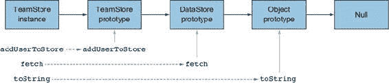
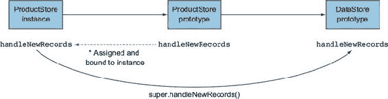
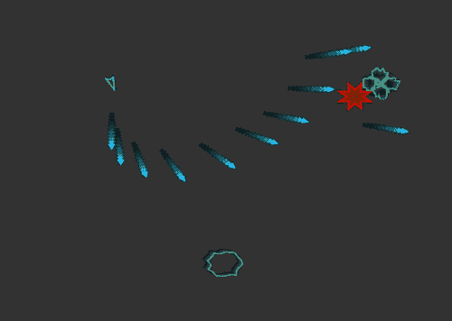

## 单元 6\. 类

JavaScript 是一种面向对象的语言。除了少数原始类型外，JavaScript 中的大多数值，甚至是函数，都是对象。大多数编写的 JavaScript 代码都是为了创建自定义对象。很多时候你可能从头开始构建自己的对象，但有时你会从一个框架或库提供的基类开始，并为其添加自定义功能。不幸的是，还没有一个明确的方法让库作者提供可以被应用开发者扩展的基础对象原型。这导致许多库作者不得不重新发明轮子。

但没有人以相同的方式重新发明轮子。以下是 Backbone.js 提供扩展基对象的方法：

```
Backbone.Model.extend({
  // ... new methods
});
```

以下是使用 React.js 实现的方法：

```
React.createClass({
  // ... new methods
});
```

Backbone 提供了一个名为 `initialize` 的方法，它充当一个伪构造函数。React 没有这个方法。但是，当使用 `createClass` 创建方法时，React 会自动绑定这些方法。这只是差异的开始：我们在这里快速比较了两个，但实际上有数十个 JavaScript 框架提供了基础对象，这意味着你需要记住根据你使用的库或框架，不同类的工作方式的所有细微差别。

然而，使用类的情况下，框架作者现在可以在语言级别提供一个可扩展的基础类。这意味着一旦你学会了如何使用一个框架扩展类，你就能将这种知识迁移，使得切换和学习新框架变得更加容易。

## 课 27\. 类

阅读完课 27 后，你将

+   理解定义类的语法

+   了解如何实例化类以及如何使用构造函数

+   了解如何从模块中导出类

+   理解类方法不是绑定的

+   了解如何分配类和静态属性

类不过是声明构造函数并设置其原型的语法糖。即使引入了类，JavaScript 也不是静态或强类型。它仍然是一种动态和弱类型语言。然而，类确实为定义具有原型的构造函数提供了一个简单的自包含语法。不过，除了语法之外，主要优势在于扩展类时，我们将在下一课中讨论。如果没有一个易于扩展的内建结构，如类，许多库如 Backbone.js、React.js 和其他几个库不得不继续重新发明轮子，以允许扩展其基对象。随着越来越多的库开始提供可以轻松扩展的基础 JavaScript 类，这种特定于库的对象扩展形式将成为过去式。这意味着一旦你学会了如何使用和扩展类，你将在今天和明天的许多框架中领先一步。

| |
| --- |

**考虑这一点**

以下两个函数是当前 JavaScript 的实例化对象模式：工厂函数和构造函数。如果你要为实例化对象设计一种新的语法，你会如何改进它？

```
 const base = {
   accel() { /* go forwards */ },
   brake() { /* stop */ },
   reverse() { /* go backwards */ },
   honk() { /* be obnoxious */ }
 }

 function carFactory (make) {
   const car = Object.create(base);
   car.make = make;
   return car;
 }

 function CarConstructor(make) {
   this.make = make;
 }

CarConstructor.prototype = base;
```

| |
| --- |

### 27.1. 类声明

假设你正在构建一个需要连接到多个 API 以获取各种资源（如用户、团队和产品）的 Web 应用程序。你可能想要创建几个存储对象来存储各种资源的记录。你可以创建一个类似以下的存储类：

```
class DataStore {
  // class body
}
```

你使用关键字`class`后跟类名*DataStore*声明了一个类。名称不需要大写，但按照惯例应该大写。在类名之后，你有一对大括号`{}`：类体，所有构成类的方法和属性都位于这两个大括号之间。

例如，假设你需要一个名为`fetch`的方法在 DataStore 类中处理从数据库中获取记录。你会添加一个类似以下的方法：

```
class DataStore {
  fetch() {
    // fetch records from data base
  }
}
```

在这里添加方法与你在第 12 课中学习的对象上的简写方法名语法完全相同。不过，不要被它迷惑：类定义不是一个对象，其他语法将不起作用。尝试在下一个列表中创建方法将导致语法错误。

##### 列表 27.1. 向类添加方法的错误语法

```
class DataStore {
  fetch: function() {                    *1*
    // fetch records from data base
  }
}
```

+   ***1* 语法错误***

类方法在 JavaScript 中像任何其他函数一样工作：它们接受参数，可以使用解构和默认值。实际上，导致错误的是函数的语法，而不是冒号（`:`）的使用。冒号用于在对象字面量中分隔属性名和属性值，但类声明不使用它们。此外，任何在方法内部使用`this`的用法都将引用实例，而不是类。

类语法和对象语法之间的另一个区别是，在类中属性之间没有逗号分隔，就像在对象中那样：

```
class DataStore {
  fetch() {
    // fetch records from data base
  }                                    *1*
  update() {
    // update a record
  }
}
```

+   ***1* 两个方法之间没有逗号分隔***

注意到类方法之间没有逗号分隔。如果你在创建一个对象，你需要一个逗号，否则你会得到一个语法错误。但在类声明中，情况正好相反，添加逗号会导致语法错误。

| |
| --- |

**快速检查 27.1**

> **Q1:**
> 
> 你能发现以下汽车类中的两个问题吗？
> 
> ```
>  class Car {
>    steer(degree) {
>      // turn the car by degree
>    },
>    accel(amount=1) {
>      // accelerate the car by amount
>    }
>    break: function() {
>      // decelerate the car
>    }
> }
> ```

| |
| --- |
| |

**QC 27.1 答案**

> **A1:**
> 
> 不允许使用逗号和冒号。

| |
| --- |

### 27.2. 实例化类

一旦你有你的类定义，你可以使用`new`关键字创建它的一个实例：

```
const dataStore = new DataStore();          *1*
```

+   ***1* 在一个名为 dataStore 的新常量中创建 DataStore 的实例。***

如果你尝试在没有`new`关键字的情况下实例化类，你会收到一个 TypeError：

```
const myStore = DataStore();          *1*
```

+   ***1* 类构造函数 DataStore 不能在没有‘new’的情况下调用***

你也可以在创建实例时传递参数，如下所示：

```
const userStore = new DataStore('users');
```

当然，这引发了一个问题：类是如何接收这些参数的？有一个特殊的方法名叫做`constructor`，当创建实例时会自动调用。创建新实例时给出的任何参数都将传递给这个构造函数。

```
class DataStore {
  constructor(resource) {
    // setup an api connection for the specified resource
  }
}
```

构造函数在创建实例的上下文中被调用。这意味着构造函数内部的`this`将指向正在创建的实例，而不是类本身。构造函数是可选的，它提供了一个钩子，可以在类的实例上进行任何初始设置。构造函数的位置并不重要，但我喜欢将其放在顶部。

在下一节中，我们将快速查看如何从模块中导出类。

| |
| --- |

**快速检查 27.2**

> **Q1:**
> 
> 创建以下类时将记录什么？
> 
> ```
>  class Pet {
>    constructor(species) {
>      console.log(`created a pet ${species}`);
>    }
>  }
> 
> const myPet = new Pet('dog');
> ```

| |
| --- |
| |

**QC 27.2 答案**

> **A1:**
> 
> “创建了一只宠物狗”

| |
| --- |

### 27.3\. 导出类

当创建 JavaScript 类时，你很可能会在模块中这样做。这意味着你需要能够导出它们。例如，如果你想从一个模块中导出你创建的`DataStore`类，你可以这样做：

```
export default class DataStore {           *1*
  // class body
}
```

+   ***1* 将 DataStore 类指定为默认导出。**

这会将类作为默认导出。导入它与导入任何其他默认导出相同；你可以使用你想要的任何名称：

```
import Store from './data_store'
```

此外，你也可以省略默认导出，并按名称导出类：

```
export class DataStore {            *1*
  // class body
}
```

+   ***1* 将 DataStore 类以 DataStore 名称导出。**

如你所猜，这会将类导出为`DataStore`名称，并且必须使用其名称导入：

```
import { DataStore } from './data_store'
```

在大多数情况下，你可能只想在每个模块中创建一个类并将其作为默认导出。

| |
| --- |

**快速检查 27.3**

> **Q1:**
> 
> 以下两种类导出哪一种是有效的？
> 
> ```
> export class A {
>   // class body
> }
> export default class B {
>  // class body
> }
> ```

| |
| --- |
| |

**QC 27.3 答案**

> **A1:**
> 
> 它们都是有效的。

| |
| --- |

### 27.4\. 类方法未绑定

一些对类新接触的开发者可能会惊讶地发现，类方法并不是自动绑定的。比如说，假设`DataStore`类内部使用`ajax`库来处理 API 调用。你可能会有如下设置。

##### 列表 27.2\. 使用未绑定方法作为回调

```
class DataStore {
  fetch() {
    ajax(this.url, this.handleNewRecords)         *1*
  }
  handleNewRecords(records) {
    this.records = records                        *2*
  }
}
```

+   ***1* 发起 ajax 调用并指定 this.handleNewRecords 作为回调**

+   ***2* 关键字 this 不会指向实例，因为它没有被绑定。**

在列表 27.2 中，你将使用一个`ajax`库来为你获取记录。`ajax`库接受两个参数：加载数据的 URL 和一个回调函数，一旦数据加载完成就调用该函数。这看起来似乎一切正常，但由于`handleNewRecords`方法未绑定，当它从`ajax`库中调用时，`this`将不再指向`DataStore`实例，因此记录将无法正确存储。

有几种不同的方法可以解决这个问题。最简单的是使用箭头函数作为回调：

```
class DataStore {
  fetch() {
    ajax(this.url, records => this.records = records)
  }
}
```

这将正常工作。但如果你的回调更复杂，并且被用在多个地方，这种方法可能就不合适了。你仍然可以使用箭头函数，但作为一个中间步骤：

```
class DataStore {
  fetch() {
    ajax(this.url, records => this.handleNewrecords(records) )
  }
  handleNewRecords(records) {
    // do something more complex like
    // merging new records in with existing records
  }
}
```

在下一课中，当你学习类属性时，你将了解绑定方法的一种新方式。

| |
| --- |

**快速检查 27.4**

> **Q1:**
> 
> 调用`car.delayedHonk()`将导致错误。为什么？
> 
> ```
>  class Car {
>    honk() {
>      this.honkAudio.play();
>    }
>    delayedHonk() {
>      window.setTimeout(this.honk, 1000);
>    }
>  }
> 
>  const car = new Car();
> car.delayedHonk();
> ```

| |
| --- |
| |

**QC 27.4 答案**

> **A1:**
> 
> 因为`this.honk`被用作回调但未绑定。

| |
| --- |

### 27.5. 在类定义中设置实例属性

在撰写本文时，类的一个方面只是一个提议，但正在得到广泛的应用，那就是在类定义中设置实例属性。在类中设置属性（与方法不同）乍一看可能很简单，但实际上比表面看起来要复杂得多。这是因为方法被添加到原型中，但属性被分配给每个实例。

假设你想要在`DataStore`上设置一个属性来确定资源的 URL。你还想有一个数组属性来存储实际的记录。你可以像以下列表所示那样做。

##### 列表 27.3. 在类上设置属性

```
class DataStore {
  url = '/data/resources';                   *1*
  records = [];                              *2*

  fetch() {
    ajax(this.url, records => this.records = records)
  }
}
console.log(DataStore.url);                  *3*

const store = new DataStore();
console.log(store.url);                      *4*
console.log(store.records.length);           *5*
```

+   ***1* 一个名为 url 的属性**

+   ***2* 一个名为 records 的属性**

+   ***3* undefined**

+   ***4* “/data/resources”**

+   ***5* 0**

正如你所见，属性将在创建的实例上可用，而不是类本身。注意类属性看起来就像直接在类定义中进行的赋值。这是因为它们在技术上就是赋值。与类方法不同，类属性是一种语法糖，它直接在构造函数中被重写。这意味着你刚刚设置的`url`和`records`赋值实际上就像你在构造函数内部做了它们一样：

```
class DataStore {
  constructor() {
    this.url = '/data/resources';
    this.records = [];
  }
}
```

这与类方法不同，因为那些方法会被添加到类的原型中。实例随后通过原型继承继承那些方法。但类属性不会设置在原型上；它们最终直接设置在实例本身上。直接在原型上设置属性会导致错误。让我们通过一个例子来探讨原因：

```
class DataStore {};

DataStore.prototype.records = [];

const storeA = new DataStore();

console.log(storeA.records.length);          *1*

const storeB = new DataStore();

console.log(storeB.records.length);          *1*

storeB.records.push('Example Record')

console.log(storeA.records.length);          *2*
console.log(storeA.records[0]);              *3*
```

+   ***1* 0**

+   ***2* 1**

+   ***3* ‘Example Record’**

在这里，你直接在`DataStore`的原型上设置`records`属性，而不是在实例上。这意味着所有实例都将使用相同的记录数组，因为它是设置在它们的原型上，而不是在实例对象本身上。当对象`storeB`添加记录时，`storeA`也会收到一个新的记录。它们正在共享同一个记录数组！

类实例属性的一个明显好处是声明绑定方法。在上一个部分中，你遇到了一些问题，因为你的`handleNewRecords`方法没有绑定到实例上。你可以通过将其声明为一个指向箭头函数的属性来使其绑定：

```
class DataStore {
  fetch() {
    ajax(this.url, this.handleNewrecords)
  }
  handleNewRecords = (records) => {
    // do something more complex like
    // merging new records in with existing records
  }
}
```

在下一节中，我们将探讨另一种类型的类属性，即静态属性。


**快速检查 27.5**

> **Q1:**
> 
> 以下类存在一个常见的类属性语法错误。你能找到它吗？
> 
> ```
>  class Nachos {
>    toppings: ['cheese', 'jalapenos']
> }
> ```

|  |

**QC 27.5 答案**

> **A1:**
> 
> 它应该是
> 
> ```
> toppings = ['cheese', 'jalapenos'];
> ```


### 27.6\. 静态属性

类上的静态属性是一种特殊的属性，它不会在实例或原型上设置属性，而是在类对象（构造函数）本身上设置。静态属性对于不会在实例之间变化的属性是有意义的。例如，你的`DataStore`可能有一个静态属性，用于在连接到 API 时使用哪个域：

```
class DataStore {
  static domain = 'https://example.com';       *1*
  static url(path) {                           *2*
    return `${this.domain}${path}`
  }
  constructor(resource) {
    this.url = DataStore.url(resource);        *3*
  }
}

const userStore = new DataStore('/users');
console.log(userStore.url);                    *4*
```

+   ***1* 分配静态属性**

+   ***2* 设置静态方法**

+   ***3* 调用静态方法**

+   ***4* “https://example.com/user**

你使用一个静态属性`domain`和一个静态方法`url`^([1])来从构造函数函数中指定的资源生成实例的 URL。

> ¹
> 
> 虽然静态属性在撰写本文时仍然只是一个提案，但静态方法是在 ES2015 中引入的。

静态属性只是将它们直接分配到类本身上的语法糖，如下一列表所示。

##### 列表 27.4\. 静态属性的简化

```
class DataStore {
  constructor(resource) {
    this.url = DataStore.url(resource);
  }
}

DataStore.domain = 'https://example.com';
DataStore.url = function(path) {
  return `${this.domain}${path}`
}
```

这总结了创建和使用类的方法，但我们还没有结束类。在下一节课中，我们将探讨如何扩展类。


**快速检查 27.6**

> **Q1:**
> 
> 以下哪个`console.log`实际上记录了轮子的数量？
> 
> ```
> class Bicycle {
>   static numberOfWheels = 2;
> }
> const bike = new Bicycle();
> 
> console.log(bike.numberOfWheels);
> console.log(Bicycle.prototype.numberOfWheels);
> console.log(Bicycle.numberOfWheels);
> ```

|  |

**QC 27.6 答案**

> **A1:**
> 
> ```
> console.log(Bicycle.numberOfWheels);
> ```


### 摘要

在本节课中，你学习了如何定义和使用自己的类。

+   类是通过`class`关键字、类名和类体来创建的。

+   类方法使用简写方法语法来声明方法。

+   类不支持用于声明属性或方法的冒号。

+   类不应该用逗号分隔方法或属性。

+   构造函数在类实例化时执行。

+   类方法不是自动绑定到实例上的。

让我们看看你是否掌握了这个：

> **Q27.1**
> 
> 将以下构造函数和原型转换为类：
> 
> ```
> function Fish(name) {
>   this.name = name;
>   this.hunger = 1;
>   this.dead = false;
>   this.born = new Date();
> }
> Fish.prototype = {
>   eat(amount=1) {
>     if (this.dead) {
>       console.log(`${this.name} is dead and can no longer eat.`);
>       return;
>     }
>     this.hunger -= amount;
>     if (this.hunger < 0) {
>       this.dead = true;
>       console.log(`${this.name} has died from over eating.`)
>       return
>     }
>   },
>   sleep() {
>     this.hunger++;
>     if (this.hunger >= 5) {
>       this.dead = true;
>       console.log(`${this.name} has starved.`)
>     }
>   },
>   isHungry: function() {
>     return this.hunger > 0;
>   }
> }
> 
> const oscar = new Fish('oscar');
> console.assert(oscar instanceof Fish);
> console.assert(oscar.isHungry());
> while(oscar.isHungry()) {
>   oscar.eat();
> }
> console.assert(!oscar.isHungry());
> console.assert(!oscar.dead);
> oscar.eat();
> console.assert(oscar.dead);
> ```

## 第 28 课\. 扩展类

在阅读第 28 课后，你将

+   了解如何扩展类以创建更定制化的类

+   学习如何使用提供基类的库

+   理解类如何进行继承

+   了解如何使用`super`在超类上调用函数

与传统的构造函数声明相比，类提供的最佳特性是它们易于扩展。许多人认为扩展构造函数的语法很笨拙。这导致许多库的作者在自己的库中创建了扩展基对象自己的方式。有了内置的可扩展类，开发者可以学习一种简单语法，可以在任何地方使用。然而，在 JavaScript 中扩展类时，需要记住的一个关键方面是它们仍然使用原型继承。

| |
| --- |

**考虑这一点**

在以下代码中，你有一个`plane`对象和一个`jet`对象。在某种程度上，`jet`对象扩展了`plane`对象，因为它复制了所有属性并覆盖了其`fly`方法。如果`jet`的`fly`方法与`plane`的`fly`方法有重叠的逻辑，你将如何使它们能够在两个方法之间共享代码？

```
 const plane = {
   type: 'aircraft',
   fly() {
     // make the plane fly
   }
 }
 const jet = Object.assign({}, plane, {
   fly() {
     // make the jet fly faster
   }

});
```

| |
| --- |

### 28.1\. 扩展

让我们继续使用第 27 课中的`DataStore`示例。假设你想要创建一个`TeamStore`，它是`DataStore`的定制版本。你的`TeamStore`需要`DataStore`的基本功能，但还需要添加或删除用户的方法。你可以创建一个扩展`DataStore`的`TeamStore`，如下所示：

##### 列表 28.1\. 扩展类

```
class TeamStore extends DataStore {
  addUserToTeam(teamId, userId) {
    // add user to team
  }
  removeUserFromTeam(teamId, userId) {
    // remove user from team
  }
}
```

在列表 28.1 中，你创建了一个名为`TeamStore`的新类，它从`DataStore`扩展而来。通过使`TeamStore`从`DataStore`扩展，`DataStore`原型被附加到`TeamStore`原型链上。这意味着当创建`TeamStore`的实例时，原型链将是这样的：`TeamStore`实例委托给`TeamStore`原型，该原型反过来委托给从它继承而来的`DataStore`原型。`DataStore`原型将委托回`Object`原型，该原型委托给`null`（见图 28.1）。

##### 图 28.1\. 原型继承



当你创建`TeamStore`的实例并在实例上调用方法时，如果实例没有该方法，则检查`DataStore`定义的实例原型。如果仍然找不到该方法，它将继续沿着原型链查找该方法。这并不新鲜：这是 JavaScript 中继承一直以来的工作方式，并且随着类的出现并没有改变。

| |
| --- |

**快速检查 28.1**

> **Q1:**
> 
> `migaloo`对象的完整原型链是什么？
> 
> ```
> class Whale extends Animal {
>    // whale stuff
> }
> class Humpback extends Whale {
>    // humpback stuff
> }
> 
> const migaloo = new Humpback();
> ```

|  |

**QC 28.1 答案**

> **A1:**
> 
> instance → Humpback → Whale → Object → null


### 28.2\. Super

当你在前面的例子中定义`DataStore`时，你让构造函数接受一个参数，表示它负责的资源 URL：

```
class DataStore {
  constructor(resource) {
    // setup an api connection for the specified resource
  }
}
```

这意味着，即使`TeamStore`总是使用相同的 URL，你仍然需要在创建`TeamStore`的实例时指定资源。你可以在`TeamStore`的构造函数中使用`super`来实现这一点，如下列表所示。

##### 列表 28.2\. 使用 `super` 调用超类构造函数

```
class TeamStore extends DataStore {
  constructor() {
    super('/teams');                     *1*
  }
}
```

+   ***1* 调用 super() 调用超类的构造函数。**

在`TeamStore`的构造函数中，你使用特殊关键字`super`调用了其超类（它扩展的类）的构造函数。这允许你自动将`TeamStore`的 URL 设置为`"/teams"`。

在任何扩展另一个类的类的构造函数中，在可以引用`this`之前，必须调用`super`：

```
class TeamStore extends DataStore {
  constructor() {
    this.url = '/teams';                 *1*
    super(this.url);
  }
}
```

+   ***1* ReferenceError: this is not defined**

关键字`super`实际上不引用任何东西。它是一个特殊的关键字，允许你调用超类的构造函数或访问和调用超类上的其他方法。比如说，如果你有一个产品商店，你想要更新一个关于哪些产品被访问的分析对象。你可以覆盖`DataStore`的`fetch`函数来添加你的额外逻辑。然而，你仍然想要调用原始的`fetch`函数（你覆盖的那个），你可以使用`super.fetch`来这样做，如下一列表所示。

##### 列表 28.3\. 使用 `super` 调用超类方法

```
class ProductStore extends DataStore {
  fetch(id) {
    analytics.productWasViewed(id);
    return super.fetch(id);
  }
}
```

当你引用`super[name]`时，你可以通过`name`在超类的原型上访问任何属性。在这里，你使用了`super.fetch`来在超类上调用`fetch`方法。


**快速检查 28.2**

> **Q1:**
> 
> 以下代码有什么问题？
> 
> ```
> class Whale extends Animal { }
> class Humpback extends Whale {
>   constructor() {
>     this.hasHump = true;
>   }
> }
> ```

|  |

**QC 28.2 答案**

> **A1:**
> 
> 在扩展类的构造函数中，`this`不能被引用，直到`super()`被调用。


### 28.3\. 扩展类时常见的陷阱

在上一课中，我们介绍了一种通过设置指向箭头函数的类属性来绑定方法的方法：

```
class DataStore {
  fetch() {
    ajax(this.url, this.handleNewrecords)
  }
  handleNewRecords = (records) => {
    // merging new records in with existing records
  }
}
```

这是一种我在野外随处可见的常见模式。这种方法的缺点是`handleNewRecords`没有被添加到`DataStore`的原型上。它是直接添加到创建的实例上的。这意味着它不能通过`super`来访问。

如果你没有计划在子类中通过 `super` 调用该方法，那么这种方法是可行的。否则，你需要一种新的方法。那么，如何绑定一个方法，同时仍然使其可扩展并通过 `super` 调用？一种方法是将它定义为一个实际的方法，然后在构造函数中将方法绑定到实例上，如下所示。

##### 列表 28.4\. 以一种与 `super` 一起工作的方式绑定方法

```
class DataStore {
  constructor(resource) {
    // setup an api connection for the specified resource
    this.handleNewRecords = this.handleNewRecords.bind(this);         *1*
  }
  handleNewRecords(records) {
    // merging new records in with existing records
  }
}

class ProductStore {
  handleNewRecords(records) {
    super.handleNewRecords(records);
    // do something else
  }
}
```

+   ***1* 将原型上的 handleNewRecords 方法绑定到实例上。**

这之所以有效，是因为它仍然将方法分配给实例，但定义来源于原型上的方法。子类可以覆盖超类上的实例方法，甚至使用 `super`，然后子类的覆盖实例方法将被绑定到实例上。参见图 28.2。

##### 图 28.2\. `handleNewRecords` 方法如何在原型链上被调用



| |
| --- |

**快速检查 28.3**

> **Q1:**
> 
> 为什么以下代码无法工作？
> 
> ```
> class Whale {
>   dive = () => {
>     // go deep!
>   }
> }
> class Humpback extends Whale {
>   dive = () => {
>     super.dive();
>   }
> }
> ```

| |
| --- |
| |

**QC 28.3 答案**

> **A1:**
> 
> 两个 `dive` 属性都是直接在实例上设置的，所以第二个完全覆盖了第一个。原型链上没有 `dive` 方法，因此无法通过 `super` 访问。

| |
| --- |

### 摘要

在本节课中，你学习了如何扩展类。

+   你可以使用 `extends` 关键字扩展类。

+   类使用原型继承。

+   你可以使用 `super` 关键字访问超类的构造函数和方法。

+   `super` 必须在子类的构造函数中调用，然后才能引用 `this`。

+   类属性是在实例上设置的，因此不能使用 `super` 访问。

让我们看看你是否掌握了这些：

> **Q28.1**
> 
> 编写一个扩展以下 `Car` 类的类。添加一个名为 `fuel` 的方法，将油量重置为 50。然后覆盖 `drive` 方法，接受一个名为 `miles` 的数字参数，然后调用足够多的超类 `drive` 方法来行驶这么多英里：
> 
> ```
> class Car {
>   constructor() {
>     this.gas = 50;
>     this.milage = 0;
>   }
> 
>   hasGas() {
>     return this.gas > 0;
>   }
> 
>   drive() {
>     if (this.hasGas()) {
>       this.milage++;
>       this.gas--;
>     }
>   }
> }
> ```

## 第 29 课. 顶点：彗星

在这个顶点项目中，你将构建一个类似《小行星》的游戏，名为彗星，如图 29.1 所示。

##### 图 29.1\.彗星游戏



有许多有效的理由可以创建一个基类或者不扩展任何东西的类。但我认为，大多数开发者的大部分时间都将花费在扩展由 React.js 等框架提供的基类上。对于这个顶点项目，你将使用我整理的游戏框架：这个框架（就像大多数框架一样）将处理大部分的动态部分，同时给你一些可以自定义以创建独特游戏的基础类。

| |
| --- |

##### 注意

你将使用这本书附带的代码中包含的 start 文件夹开始你的项目。如果你在任何时候遇到困难，你还可以查看包含完成游戏的 final 文件夹。start 文件夹是一个已经设置好以使用 Babel 和 Browserify 的项目（见单元 0）；你只需要运行`npm install`来设置。如果你还没有阅读单元 0，你应该在完成这个项目之前先阅读。还有一个包含的`index.html`文件：游戏将在其中运行。它已经包含了所有需要的 HTML 和 CSS；你只需要在捆绑你的 JavaScript 文件后将其在浏览器中打开。src 文件夹是放置所有 JavaScript 文件的地方；其中已经包含了一些。dest 文件夹是在你运行`npm run build`后捆绑的 JavaScript 文件将去的地方。你需要记住，每次你做出更改时都要运行`npm run build`来编译你的代码。


### 29.1\. 创建一个可控制的精灵

你将尽快在屏幕上显示一些内容。确保你从这本书附带的代码中包含的 start 文件夹开始。如果你查看 src 文件夹，你会看到那里已经有一个框架文件夹和一个 shapes.js 文件。框架文件夹包含游戏框架，而 shapes.js 文件包含一些数组和函数，用于描述游戏角色的形状。你可以自由探索这些文件中的代码。

在 src 目录下创建一个名为 comet.js 的文件，包含以下代码。

```
import ControllableSprite from './framework/controllable_sprite';     *1*
import { ship as shape } from './shapes';                             *2*

export default class Ship extends ControllableSprite {                *3*
  static shape = shape;                                               *4*
  static stroke = '#fff';                                             *4*
}
```

+   ***1* 基础类来自你使用的游戏框架。**

+   ***2* 你包含的形状中的宇宙飞船**

+   ***3* 你的飞船类扩展了可控制精灵类。**

+   ***4* 设置一些静态属性**

这是一个简单的类，但它做了很多，因为你是从`ControllableSprite`类扩展的，而`ControllableSprite`类本身又扩展自`Sprite`类。`Sprite`类是任何将在屏幕上绘制的对象的基线。`ControllableSprite`类增加了用户使用键盘箭头键控制精灵的功能。你设置了静态属性`shape`和`stroke`，这些属性决定了飞船精灵的外观。一旦你在屏幕上绘制了这个，就可以尝试其他形状和颜色。

你几乎准备好在屏幕上看到并控制这个了。在 src 文件夹中创建另一个名为 index.js 的文件，并添加以下代码。

```
import { start } from './framework/game';        *1*

import Ship from './ship';                       *2*

new Ship();                                      *3*

start();                                         *4*
```

+   ***1* 框架中的 start 函数启动游戏。**

+   ***2* 导入你之前创建的类。**

+   ***3* 创建你的飞船类的实例。**

+   ***4* 启动游戏。**

这段代码也很简单。你只是创建了一个`Ship`类的实例，并告诉游戏开始。`index.js`文件将是你的源代码的根文件，它启动游戏。如果你现在编译你的代码并打开包含的`index.html`文件，你会看到你刚刚创建的飞船。甚至更多，通过使用箭头键，你可以移动它！

### 29.2\. 添加彗星

现在你可以移动了，你的飞船看起来相当孤单。你将向你的游戏中添加一些额外的角色。在 src 文件夹中创建一个名为 comet.js 的新文件，并添加以下代码：

```
import { CANVAS_WIDTH, CANVAS_HEIGHT } from './framework/canvas';
import DriftingSprite from './framework/drifting_sprite';
import { cometShape } from './shapes'

function defaultOptions() {                                   *1*
  return {
    size: 20,
    sides: 20,
    speed: 1,
    x: Math.random() * CANVAS_WIDTH,
    y: Math.random() * CANVAS_HEIGHT,
    rotation: Math.random() * (Math.PI * 2)
  }
}

export default class Comet extends DriftingSprite {           *2*
  static stroke = '#73C990';

  constructor(options) {                                      *3*
    super(Object.assign({}, defaultOptions(), options));      *4*
    this.shape = cometShape(this.size, this.sides);           *5*
  }
}
```

+   ***1*每个彗星的默认选项**

+   ***2*彗星扩展了 DriftingSprite 类。**

+   ***3*构造函数接受选项。**

+   ***4*将选项和默认选项合并后调用 super。**

+   ***5*设置彗星的形状。**

`Comet`类比前两个例子稍微复杂一些，所以让我们深入了解一下这里的情况。游戏框架中的所有精灵都可以通过构造函数的参数传递初始选项（属性）。你的飞船不需要这些选项，但每个彗星都需要。精灵在设置属性方面很灵活。它们可以是静态的，比如`stroke`属性，或者像`shape`属性一样设置在实例上。

为什么要把一些属性设置为静态，而把一些设置为实例属性？你的所有彗星都将有相同的绿色描边，所以你可以将其设置为类本身的静态属性。但你想让每个彗星都有独特的形状，这样它看起来就像一个单独的彗星，而不是复制品。因为每个彗星的形状都是独特的，所以它需要设置在实例上。

函数`cometShape`返回一个给定大小和边的随机形状。通过在构造函数中调用此函数，你确保每个彗星都有其独特的形状。

现在你有了`Comet`类，你需要在开始游戏之前导入它并创建几个实例。像这样更新 index.js 文件：

```
import { start } from './framework/game';

import Ship from './ship';
import Comet from './comet';         *1*

new Ship();

new Comet();                         *2*
new Comet();                         *2*
new Comet();                         *2*

start();
```

+   ***1*导入你的 Comet 类。**

+   ***2*创建几个实例。**

现在如果你再次打包你的代码，你应该会看到一些彗星在你的飞船周围漂浮。

### 29.3\. 射击火箭

显然，现在你有了所有这些漂浮的目标，你想要射击！接下来你将在屏幕上得到一些火箭。首先创建火箭类。在 src 文件夹中创建一个名为 rocket.js 的新文件，并添加以下代码：

```
import DriftingSprite from './framework/drifting_sprite';
import { rocket } from './shapes';

export default class Rocket extends DriftingSprite {
  static shape = rocket;
  static fill = '#1AC2FB';
  static removeOnExit = true;
  static speed = 5;
}
```

这里还没有什么特别新的内容。这与你之前的彗星非常相似，当然，形状不同。你还给你的火箭添加了填充而不是描边。不过，有一个新属性是`removeOnExit`。通常情况下，当精灵离开屏幕时，它们会在另一边重新出现。这个属性告诉你的游戏，一旦精灵离开可视区域，就将其移除。

现在你需要在屏幕上得到一些火箭。你不想在开始游戏之前像飞船和彗星那样创建实例。你想要从飞船上*发射*火箭！游戏框架提供了一些辅助函数，你需要使用这些函数来实现这一点。打开 ship.js 文件，并在顶部添加以下导入：

```
import { isPressingSpace } from './framework/interactions';
import { getSpriteProperty } from './framework/game';
import { throttle } from './framework/utils';
import Rocket from './rocket';
```

`isPressingSpace` 函数告诉你玩家是否按下了空格键。你会用它来表示发射火箭的意图。当你发射火箭时，你想要将火箭设置为与你的船相同的起始位置和方向，这样它看起来就像是从你的船发射出来的。因为精灵可以将它们的属性存储为静态属性、实例属性甚至方法，你需要特殊的辅助方法 `getSpriteProperty` 来读取值。

在游戏过程中，屏幕会不断地重新渲染。在渲染之前，每个精灵都会通过精灵上的一个名为 `next()` 的方法形式的钩子来通知自己更新。下一个函数将在绘制下一帧之前始终在每个精灵上调用，并且必须始终返回精灵本身。你可以使用这个钩子来检查用户是否按下了空格键，如果是，就发射火箭。问题是每一帧渲染得非常快。你不想那么快地发射火箭；你想要减慢速度。这就是 `throttle` 函数的作用。你给它一个函数，它返回一个节流函数。让我们看看如何实现它。向船添加以下方法：

```
next() {
  super.next();                     *1*

  if (isPressingSpace()) {          *2*
    this.fire();                    *3*
  }

  return this;                      *4*
}
```

+   ***1* 你正在覆盖 next，因此你需要调用 super.next。**

+   ***2* 如果用户正在按空格键，你想要发射火箭。**

+   ***3* 你仍然需要添加这个方法。**

+   ***4* 下一个函数始终需要返回 this。**

你覆盖了 `next` 函数，所以你需要调用 `super.next`。请注意，当我说你需要时，我并不是指它在语言级别上是必需的。如果你不希望调用超类的 `next` 方法，你不需要调用 `super.next()`。但在这个情况下，你需要。

你仍然需要添加 `fire` 方法。因为你需要这个方法被节流，你不能将其设置为常规方法。相反，你将把它设置为指向节流函数的类属性：

```
export default class Ship extends ControllableSprite {
  static shape = shape;
  static stroke = '#fff';

  fire = throttle(() => {                                     *1*
    const x = getSpriteProperty(this, 'x');
    const y = getSpriteProperty(this, 'y');
    const rotation = getSpriteProperty(this, 'rotation');

    new Rocket({ x, y, rotation });
  });

  ...
}
```

+   ***1* 将节流函数设置为类属性**

因为 `fire` 被设置为属性，而不是方法，所以它没有被添加到原型中。它在创建船实例时直接设置。这意味着任何扩展了 `Ship` 类的类都不能覆盖 `fire` 方法并使用 `super.fire`。


**装饰器**

或者，还有一个解决方案可以限制`fire`方法，使其作为一个与`super`一起工作的真正方法。这将是使用*装饰器*。目前广泛使用的装饰器将与真正进入语言的装饰器不同。在撰写本文时，没有可用的转译器来描述未来装饰器的工作方式。因此，我决定将装饰器从这本书中排除。如果你想了解更多关于它们的信息，规范可以在以下位置阅读：[`tc39.github.io/proposal-decorators`](https://tc39.github.io/proposal-decorators)。此外，还有一个名为*core-decorators*的 JavaScript 库，它甚至包括一个用于限制方法的装饰器。在这里查看：[`github.com/jayphelps/core-decorators.js/tree/c4d9a654093a6c02d436e4d236f4d21e3271867d#throttle`](https://github.com/jayphelps/core-decorators.js/tree/c4d9a654093a6c02d436e4d236f4d21e3271867d#throttle)。


现在如果你再次打包你的代码并启动游戏，你将能够通过按空格键从你的宇宙飞船中发射火箭。但有一个问题：当火箭击中彗星时，什么都没有发生！

### 29.4\. 当物体发生碰撞时

当火箭击中彗星时，你不仅希望它爆炸，还希望它分裂成更小的彗星。向`Comet`类添加以下方法：

```
multiply() {
  const x = getSpriteProperty(this, 'x');
  const y = getSpriteProperty(this, 'y');
  let size = getSpriteProperty(this, 'size');
  let speed = getSpriteProperty(this, 'speed');

  if (size < 5) {
    this.remove();                              *1*
    return;
  }
  size /= 2;                                    *2*
  speed *= 1.5;                                 *2*
  const removeOnExit = size < 5;                *3*
  const r = Math.random() * Math.PI;
  const ninetyDeg = Math.PI/2;
  range(4).forEach(i => new Comet({             *4*
    x, y, size, speed, removeOnExit,
    rotation: r + ninetyDeg * i,
  }))
  this.remove();                                *5*
}
```

+   ***1* 如果彗星已经小于 5，则不再进行乘法操作。**

+   ***2* 减小大小并增加速度。**

+   ***3* 如果碎片小于 5，让它飘向太空。**

+   ***4* 你将要乘以 4 块碎片。**

+   ***5* 添加较小的碎片后，移除原始碎片。**

这个方法会将彗星分割成更小、移动速度更快的碎片。你需要在这里使用`range`和`getSpriteProperty`方法，所以请在上面的 comet 文件顶部导入它们：

```
import { getSpriteProperty } from './framework/game';
import { range } from './framework/utils';
```

现在彗星可以被分割成多个，但你仍然需要一个方法在火箭击中彗星时启动这个操作。你的游戏框架有内置的碰撞检测：你只需要指定你期望与之碰撞的精灵类型。打开 rocket.js 文件，并在`Rocket`类中添加以下属性：

```
export default class Rocket extends DriftingSprite {
  static collidesWith = [Comet];

  ...
}
```

通过设置这个属性，你是在告诉你的游戏在任意与彗星碰撞的火箭上调用`collision`方法。这意味着你需要在你的`Rocket`类中添加`collision`方法：

```
collision(target) {              *1*
  target.multiply();             *2*
  this.remove();                 *3*
}
```

+   ***1* 与精灵发生碰撞时调用`collision`，在这个例子中是一个彗星。**

+   ***2* 告诉被火箭击中的彗星进行乘法操作。**

+   ***3* 移除火箭。**

你还需要将`Comet`类导入到火箭模块中。在 rocket.js 文件顶部添加以下导入：

```
import Comet from './comet';
```

你现在可以再次构建代码并尝试玩游戏。你应该能够摧毁一些彗星。哇，这开始看起来像是一个真正的游戏了！

### 29.5\. 添加爆炸效果

好的，你可以用火箭摧毁彗星，但什么样的火箭不会爆炸？你将在下一部分修复这个问题。创建一个名为`explosion.js`的新文件，并添加以下代码：

```
import Sprite from './framework/sprite';
import { explosionShape } from './shapes';

const START_SIZE = 10;
const END_SIZE = 50;
const SIDES = 8;

const defaultOptions = {
  size: START_SIZE
}

export default class Explosion extends Sprite {                       *1*
  constructor(options) {
    super(Object.assign({}, defaultOptions, options));
    this.shape = explosionShape(this.size, SIDES);
  }

  next() {
    this.size = this.size * 1.1;                                      *2*
    this.shape = explosionShape(this.size, SIDES);                    *3*
    this.fill = `rgba(255, 100, 0, ${(END_SIZE-this.size)*.005})`     *4*
    this.stroke = `rgba(255, 0, 0, ${(END_SIZE-this.size)*.1})`       *4*
    if (this.size > END_SIZE) {                                       *5*
      this.remove();
    }
    return this;
  }
}
```

+   ***1* 爆炸不会漂移，所以你需要扩展基础精灵类。**

+   ***2* 你希望爆炸在每一帧都增长大小。**

+   ***3* 在增加大小后，你需要重新计算形状。**

+   ***4* 你希望爆炸在达到最终大小时逐渐淡入。**

+   ***5* 一旦爆炸达到最终大小，就移除它。**

这里没有太多新内容。从某种程度上说，这与`Comet`类相似，因为你正在设置默认选项并使用动态形状。但是，你会在每一帧改变爆炸的形状。你还在改变大小和透明度。一旦爆炸的大小增加到最终大小，你就移除它。

现在你只需要在火箭碰撞时创建爆炸。将爆炸类以及`getSpriteProperty`辅助函数导入到火箭模块中：

```
import { getSpriteProperty } from './framework/game';
import Explosion from './explosion';
```

现在在`Rocket`类的`collision`方法中，创建一个爆炸：

```
new Explosion({
  x: getSpriteProperty(this, 'x'),
  y: getSpriteProperty(this, 'y'),
});
```

现在你的火箭在撞击彗星时会爆炸。（别忘了在测试之前再次打包你的代码！）你还可以添加一些东西来使这个游戏变得更好，但你需要收尾。但还有一个明显的缺失部分。当彗星撞击你的飞船时，需要发生某些事情。

在`ship.js`文件中，导入`Comet`和`Explosion`类以及来自游戏框架的`stop`函数：

```
import { getSpriteProperty, stop } from './framework/game';         *1*
import Comet from './comet';
import Explosion from './explosion';
```

+   ***1* 将停止函数添加到现有的导入中。**

现在将`Ship`设置为与`Comet`发生碰撞，并添加以下碰撞方法：

```
export default class Ship extends ControllableSprite {
  ...

  static collidesWith = [Comet];

  collision() {

    new Explosion({
      x: getSpriteProperty(this, 'x'),
      y: getSpriteProperty(this, 'y'),
    });

    this.remove();

    setTimeout(stop, 500);
  }

  ...

}
```

现在当彗星撞击飞船时，将会有爆炸，游戏也将结束。

### 摘要

在这个项目中，你使用类创建了一个游戏。你扩展了从框架中提供的基类。在扩展这些基类时，你在一个构造函数以及覆盖方法时使用了`super`。你使用了静态和实例属性，我们讨论了为什么将函数设置为实例属性时，在覆盖时不能使用`super`。

我希望你在构建这个游戏的过程中和我一样享受乐趣。你还可以做很多事情来进一步发展这个游戏。你可以添加多个生命值，或者添加一个重新开始游戏的按钮，一旦被击败。不要害怕对框架进行修改以增强这个游戏。你甚至可以让 UFO 出现并向你的飞船射击；如果你决定尝试，我在`shapes.js`模块中包含了一个`ufo`形状！
