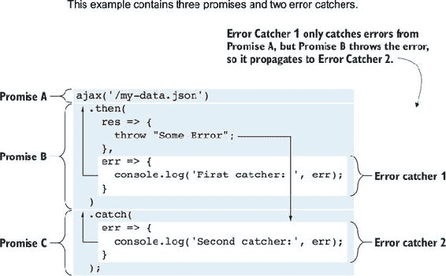
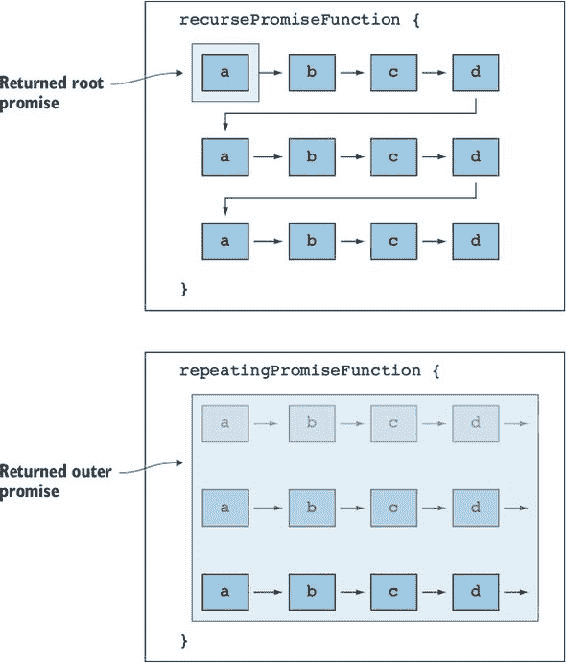

## 单元 7\. 异步工作

JavaScript 一直是一种异步语言。这使得它非常适合创建丰富的应用程序，因为它可以处理许多并发任务而不会锁定界面。但直到最近，除了能够传递可以在以后调用的函数之外，对它的异步性质的支持并没有多少是第一类的。但现在一切都变了。JavaScript 现在有了对承诺、异步函数和即将对可观察对象的第一类支持。

承诺是表示未来值的对象。与回调函数相比，它们更方便传递，因为承诺不依赖于时间。如果值已经被检索到，承诺会立即提供一个值，或者可以等待直到值被检索。使用回调时，如果你来得太晚，值已经被检索，你的回调可能不会被调用。

正如我们很快就会看到的，承诺还提供了工具，使复杂的异步调用更容易，并消除了回调地狱的需要。

人们很难理解复杂的异步交互，这可能导致错误。阻塞操作更容易思考，但效率较低。承诺使复杂的异步代码更容易管理，但你仍然需要异步思考。但不是使用`async`函数。异步函数允许你像编写阻塞操作一样编写代码。

承诺产生一个值，然后结束。一个可观察对象就像一个承诺，它继续产生值。可观察对象允许你将任何东西转换成你可以订阅的事件，并允许你将事件当作对象来处理，你可以对其应用高阶函数，如`map`和`reduce`。

## 第 30 课\. 承诺

在阅读第 30 课之后，你将能够

+   使用基于承诺的库来获取异步数据

+   对承诺进行基本错误处理

+   使用`Promise.resolve`来缓存异步调用

+   将多个承诺合并为一个

一个*承诺*是一个表示最终值的对象。你可以通过在承诺上调用`.then()`并提供一个回调函数来访问这个最终或未来的值。承诺最终会使用这个值调用这个回调。如果承诺仍在等待值（承诺处于*挂起*状态），那么承诺将等待直到值准备好或已加载（此时承诺进入*解决*状态），然后使用值调用回调。如果承诺已经解决，则回调将立即被调用.^([1])

> ¹
> 
> 不是立即的。回调将被添加到事件循环中，类似于带有 0 延迟的`setTimeout`。


**考虑这一点**

在 JavaScript 中，异步值传统上是通过传递回调函数来访问的，这些回调函数会在数据准备好时被调用。这很有限，因为只有拥有回调引用的对象会在值准备好时收到通知。如果除了传递回调之外，你还可以传递一个表示异步值最终将变成什么的价值，会怎么样？这将如何工作？


### 30.1\. 使用承诺

假设你正在使用一个名为 `axios` 的库，该库执行 AJAX 请求并返回一个承诺。你想使用它从 GitHub API 加载数据并列出特定用户的组织。你可以这样发出请求：

```
axios.get('https://api.github.com/users/jisaacks/orgs')       *1*
  .then(resp => {                                             *2*
    const orgs = resp.data;
    // do something with array of orgs
  });
```

+   ***1* axios.get 函数执行 AJAX 请求并返回一个承诺。**

+   ***2* 你在承诺上调用 then 函数时使用了箭头函数。箭头函数将在请求完成后使用 resp 被调用。**

在这里，你调用 `axios.get`，它返回一个承诺。当该承诺解决时，你可以从响应对象中获取数据。然后你可以对结果进行一些操作。

让我们看看如果 `axios` 使用回调而不是承诺会是什么样子：

```
axios.get('https://api.github.com/users/jisaacks/orgs', resp => {
  const orgs = resp.data;
  // do something with array of orgs
});
```

在这个简单的例子中，使用承诺似乎比使用回调增加了更多步骤。然而，随着我们的示例变得更加复杂，你会看到承诺如何使代码更加灵活和可读。

函数中硬编码了我的用户名。将其重写为加载指定用户的组织：

```
function getOrgs(username) {
  return axios.get(`https://api.github.com/users/${username}/orgs`);
}

getOrgs('jisaacks').then(data => {
  const orgs = resp.data;
  // do something with array of orgs
});
```

在这里，你创建了一个接受用户名并返回承诺的函数。然后你使用该函数获取我的用户的组织。再次看看使用传统回调会是什么样子：

```
 function getOrgs(username, callback) {
   return axios.get(`https://api.github.com/users/${username}/orgs`, callback
);
 }

 getOrgs('jisaacks', data => {
   const orgs = resp.data;
   // do something with array of orgs
 });
```

在这个虚构的函数中，`getOrgs` 函数变得更加复杂，因为它需要接受一个回调函数，以便将其传递给 AJAX 库。

现在让我们想象你有一个表示用户视图的类。在这个用户视图中，你不会立即显示用户的组织，但为了使应用程序更快，你希望立即开始加载它们，以便稍后显示：

```
class UserView {
  constructor(user) {
    this.user = user;
    this.orgs = getOrgs(user.username);      *1*
  }

  defaultView() {
    // show the default view
  }

  orgView() {
    // show loading screen
    this.orgs.then(resp => {                 *2*
      const orgs = resp.orgs;
      // show the orgs
    })
  }
}
```

+   ***1* 立即开始加载用户组织。**

+   ***2* 加载完成后显示组织。**

在这里，你创建了一个名为 `UserView` 的类，该类立即开始加载用户的组织。稍后当用户视图需要显示用户的组织时，无论它们是否已经加载或仍在加载中，都不会影响。无论如何，它将等待它们加载完成，然后显示它们——如果它们已经加载，它将立即显示它们。使用传统的回调来实现这一点会困难得多。


**快速检查 30.1**

> **Q1:**
> 
> 以下示例使用了一个接受回调的 AJAX 函数。假设 AJAX 函数返回一个承诺，将其重写为使用承诺：
> 
> ```
> function handleData(data) {
>   // do something with data
> }
> 
> ajax('example.com', handleData);
> ```

|  |

**QC 30.1 答案**

> **A1:**
> 
> ```
> function handleData(data) {
>   // do something with data
> }
> 
> ajax('example.com').then(handleData);
> ```


### 30.2\. 错误处理

我们并不生活在一个完美的世界里。有时承诺检索的数据会失败，无论是由于网络错误还是其他问题。承诺上的 `then` 方法接受一个可选的第二个回调，如果发生错误，则调用该回调：

```
function handleResp(resp) {
  // handle successful response
}

function handleError(err) {
  // handle an error
}

const url = 'https://api.github.com/users/jisaacks/orgs';
axios.get(url).then(handleResp, handleError);
```

如果这里一切如预期进行，`handleResp` 函数将接收到来自请求的响应对象。如果出现问题，`handleError` 函数将被调用以处理错误。

这些是使用承诺进行错误处理的基础，但我们将触及一些关于使用承诺进行错误处理的不同技术和注意事项，在关于高级承诺的第 31 课中讨论。


**快速检查 30.2**

> **Q1:**
> 
> 以下示例使用一个名为 `getJSON` 的函数，该函数接受一个接受两个参数的函数。第一个是一个可能的错误对象；第二个是加载的 JSON 数据。通常只有一个值会存在。将此重写为基于承诺而不是基于回调：
> 
> ```
> getJSON('example.com/data.json', (err, json) => {
>   if (err) {
>     // handle error
>   } else {
>     // handle json
>   }
> });
> ```

|  |

**QC 30.2 答案**

> **A1:**
> 
> ```
> getJSON('example.com/data.json').then(
>   (json) => {
>     // handle json
>   },
>   (err) => {
>     // handle error
>   }
> );
> ```


### 30.3. 承诺辅助函数

`Promise` 对象有四个辅助方法，使处理承诺变得更加容易：

1.  `Promise.resolve()`

1.  `Promise.reject()`

1.  `Promise.all()`

1.  `Promise.race()`

让我们从 `Promise.resolve()` 开始。这个函数返回一个已经解析的承诺。传递给 `Promise.resolve` 的任何参数将通过传递给 `.then` 方法中提供的函数的参数从承诺中返回。这可以出于各种原因而很有帮助，通常在期望承诺但已经有可用值的情况下使用。考虑一个场景，当你正在加载会计程序的交易时。每次加载交易时，你都想将其缓存起来，这样下次请求时就不需要再次加载。你可能会得到一些像这样的代码：

```
const transactions = {};

getTransaction(id, cb) {
  if (transactions[id]) {
    cb(transaction[id]);                                     *1*
  } else {
    load(`/transactions/${id}`).then(transaction => {        *2*
      transactions[id] = transaction;
      cb(transaction);                                       *3*
    })
  }
}

getTransaction(405, transaction => {
  // do something with transaction
})
```

+   ***1* 如果你已经有了数据，立即调用回调。**

+   ***2* 假设一个虚构的加载函数，它获取数据并直接返回**

+   ***3* 如果你已加载数据，一旦你有它就调用回调。**

这里你使用一个假想的 `load` 函数，它从 URL 获取数据并通过承诺直接返回它。`getTransaction` 函数有效地缓存了网络的请求，这样每个交易只需要加载一次。但你不得不回到回调，并失去了承诺的许多好处。例如，你将如何添加错误处理？使用 `Promise.resolve` 重写 `getTransaction` 以始终返回一个承诺：

```
const transactions = {};

getTransaction(id) {
  if (transactions[id]) {
    return Promise.resolve(transactions[id]);          *1*
  } else {
    const loading = load(`/transactions/${id}`);       *2*
    loading.then(transaction => {
      transactions[id] = transaction;                  *3*
    });
    return loading;                                    *4*
  }
}

getTransaction(405).then(transaction => {
  // do something with transaction
}, err => {                                            *5*
  // handle error
})
```

+   ***1* 如果你已经有了数据，使用 promise.resolve 返回它。**

+   ***2* 创建一个承诺来加载交易。**

+   ***3* 当承诺解析时，将交易内部添加到你的缓存中。**

+   ***4* 返回承诺。**

+   ***5* 你现在可以轻松地添加错误处理。**

你的 `getTransaction` 函数现在总是返回一个承诺。因为承诺已经被返回，你可以在 `getTransaction` 函数外部轻松添加错误处理，而无需 `getTransaction` 函数担心任何错误处理。

当调用 `getTransaction` 函数时，如果值已经在你的缓存中，你将使用 `Promise.resolve` 返回它，这会创建一个已经解决的承诺，并给出交易。如果你需要加载交易，首先创建一个加载交易的承诺。一旦加载，你将内部将新交易添加到你的缓存中。你也会返回这个承诺。这显示了你可以用承诺做的另一件事——你注意到了吗？你可以对承诺多次调用 `.then`。在这里，你内部在 `loading` 承诺上调用 `.then` 以将交易添加到你的缓存中。你也在外部对同一个承诺调用 `.then` 以实际对交易进行操作。

`Promise.reject()` 与 `Promise.resolve` 的工作方式相同，只是结果承诺自动处于 *拒绝* 状态而不是 *解决* 状态。你还可以向 `Promise.reject` 传递一个值，该值将被传递给处理程序：

```
Promise.reject('my value').then(null, reason => {
  console.log('Rejected with:', reason);               *1*
});
```

+   ***1* 拒绝原因：my value**

有时你需要从几个不同的位置获取数据，并在做任何事情之前等待所有数据都加载完成。让我们考虑一个新网站，该网站有作者的简介页面。简介页面显示了作者的信息并列出他们所写的文章。你希望在两者都加载完成之前显示一个加载屏幕。你可以使用 `Promise.all` 如此操作：

```
function getAuthorAndArticles(authorId) {
  const authorReq = load(`/authors/${authorId}/details`)
  const articlesReq = load(`/authors/${authorId}/articles`)

  return Promise.all([authorReq, articlesReq])                   *1*
}

getAuthorAndArticles(37).then( ([author, articles]) => {         *2*
  // author and articles have loaded
});
```

+   ***1* Promise.all 接受一个承诺数组并返回一个单独的承诺。**

+   ***2* 新的承诺（promise）返回前一个承诺中所有值的数组。**

在这里，你创建了加载作者及其文章的承诺。你将这些承诺的数组传递给 `Promise.all`，它返回一个单独的承诺。新的承诺将等待所有承诺都解决，并将从之前的承诺中给出的所有值作为一个数组给出。如果任何一个承诺失败，新的承诺也会因为第一个失败的承诺的错误而失败。

`Promise.race` 与 `Promise.all` 的工作方式类似：它接受一个承诺数组并返回一个新的承诺。但是，这个新的承诺会在它所给的第一个承诺解决时立即解决，并给出其值。

| |
| --- |

**快速检查 30.3**

> **Q1:**
> 
> 在以下示例中，将记录哪个数字？
> 
> ```
>  Promise.all([
>    Promise.resolve(1),
>    Promise.reject(2),
>    Promise.resolve(3),
>    Promise.resolve(4)
>  ]).then(
>    num => console.log(num),
>    num => console.log(num)
> )
> ```

| |
| --- |
| |

**QC 30.3 答案**

> **A1:**
> 
> 2

| |
| --- |

### 概述

在本节课中，你学习了如何使用承诺（promises）的基础知识。

+   承诺（promise）是一个表示最终或未来值的对象。

+   通过在承诺的 `.then` 上传递一个回调来访问这个值。

+   可以向 `.then` 传递一个可选的第二个回调来处理承诺被拒绝的情况。

+   可以在承诺上多次调用 `.then`。

+   如果 Promise 处于挂起状态，`.then` 将等待直到 Promise 解决。

+   如果 Promise 已解决，`.then` 仍然会提供一个值。

+   `Promise.resolve` 创建一个已解决的 Promise。

+   `Promise.reject` 创建一个已拒绝的 Promise。

+   `Promise.all` 接受一个 Promise 数组，并返回一个新的 Promise，该 Promise 等待所有这些 Promise 都解决。

+   `Promise.race` 接受一个 Promise 数组，并返回一个新的 Promise，该 Promise 只等待第一个解决。

让我们看看你是否掌握了这些：

> **Q30.1**
> 
> 假设你有三个端点：
> 
> 1.  /user/4XJ/credit_availability
> 1.  
> 1.  /transunion/credit_score?user=4XJ
> 1.  
> 1.  /equifax/credit_score?user=4XJ
> 1.  
> 第一个端点检查用户的信用可用性。其他两个端点检查用户从 TransUnion 和 EquiFax 的最新信用评分。为了渲染页面，你需要等待信用可用性和至少一个信用评分。使用任何基于 Promise 的 AJAX 库，并创建一个新的 Promise，该 Promise 结合了`Promise.all`和`Promise.race`来实现这一点。

## 第 31 课：高级 Promise

在阅读完第 31 课后，你将能够

+   创建你自己的 Promise

+   使用 Promise 包装基于回调的方法

+   使用并理解如何正确编写嵌套的 Promise

+   理解错误处理如何在 Promise 链中传播

在上一课中，你学习了 Promise 的基础知识。现在我们将更深入地探讨创建新的 Promise 以及将异步代码转换为使用 Promise 的方法。我们将探讨高级错误处理、使用 Promise 进行多个异步调用以及其他高级用法。


**考虑这一点**

有时候你需要进行多次异步调用以获取所需的数据。一块数据依赖于另一块数据，而另一块数据又依赖于另一块数据。然而，所有这些数据都必须从不同的位置获取。传统上，你不得不将这些视为三个不同的操作，每个操作都有三个不同的错误处理程序。如果你能将其转换为一个单一的操作，并使用一个错误处理程序会怎样呢？


### 31.1\. 创建 Promise

通过使用一个函数参数实例化一个新的`Promise`对象来创建 Promise，`new Promise(fn)`。传递给 Promise 的函数本身应该接受两个参数。第一个参数是一个函数，用于*解决*Promise，第二个参数是一个函数，用于*拒绝*Promise：

```
const later = new Promise((resolve, reject) => {
  // Do something asynchronously
  resolve('alligator');
});

later.then(response => {
  console.log(response);        *1*
});
```

+   ***1* “鳄鱼”**

假设你正在使用 JavaScript 加载一张图片。经典的方法是创建一个`Image`对象，并设置一个`src`属性，将`onload`和`onerror`回调分配给它，如下所示：

```
const img = new Image();
img.onload = () => // Do something when image loads
img.onerror = () => // Do something when image fails
img.src = 'https://www.fillmurray.com/200/300';
```

如果你想要将图片加载转换为 Promise，你可以在它周围包装一个`Promise`，并将`onload`和`onerror`分别分配给你的解决和拒绝函数：

```
function fetchImage(src) {
  return new Promise((res, rej) => {
    const img = new Image();
    img.onload = res;
    img.onerror = rej;
    img.src = src;
  });
}

fetchImage('https://www.fillmurray.com/200/300').then(
  () => console.log('image loaded'),
  () => console.log('image failed')
);
```

在上一课中，我们看到了 `Promise` 对象有一些辅助方法，如 `Promise.resolve` 和 `Promise.reject`，但如果你想要承诺在解析前等待五秒，这将是一个方便的基于承诺的 `setTimeout` 版本。实际上，你可以用承诺包裹 `setTimeout` 来创建这样的工具：

```
function wait(milliseconds) {
  return new Promise((resolve) => {
    setTimeout(resolve, milliseconds);
  });
}

wait(5000).then(() => {
  // 5 seconds later...
});
```

你可以使用这种技术将任何基于回调的函数转换为承诺。例如，假设你正在使用 `navigator.geolocation.getCurrentPosition` 函数，这是一个基于回调的函数。它接受一个 `success` 回调和一个 `error` 回调，如下所示：

```
navigator.geolocation.getCurrentPosition(
  location => {
    // do something with user's geo location
  },
  error => {
    // Handle error
  }
)
```

你可以这样包裹它：

```
function getGeoPosition(options) {
  return new Promise((resolve, reject) => {
    navigator.geolocation.getCurrentPosition(resolve, reject, options);
  });
}

getGeoPosition().then(
  () => // do something with user's geo location
)
```

如果它需要一个回调，你可以将其包裹在一个承诺中！


**快速检查 31.1**

> **Q1:**
> 
> 你如何将这个 `registerUser` 函数包裹在一个承诺中？
> 
> ```
>  registerUser(userData, (error, user) => {
>    if (error) {
>      // handle error
>    } else {
>      // do something with new user
>    }
> });
> ```

|  |

**QC 31.1 答案**

> **A1:**
> 
> ```
>  function registerUserAsync(userData) {
>    return new Promise(resolve, reject) {
>      registerUser(userData, (error, user) => {
>        if (error) {
>          reject(error);
>        } else {
>          resolve(user);
>        }
>      });
>    }
> }
> ```


### 31.2. 嵌套的承诺

在关于承诺的上一课中，我们介绍了如何使用返回承诺的 AJAX 库。但你可以使用新的 Web Hypertext Application Technology Working Group (WHATWG) 标准方法 `fetch` 来进行 AJAX 请求。为此，你需要使用多个承诺：

```
fetch("https://api.github.com/users/jisaacks/orgs")
  .then(resp => {
    resp.json().then(results => {
      // do something with results
    });
  });
//
```

这开始看起来像是回调地狱，但实际上承诺并不是这样使用的。每次你在承诺上调用 `then()`，它都会返回一个新的承诺。这使得承诺可以链式调用：

```
fetch("https://api.github.com/users/jisaacks/orgs")
  .then(resp => resp.json())
  .then(results => {
    // do something with results
  });
```

注意你的 `then`s 现在不再是嵌套的，而是被链式连接在一起。

当你在承诺上调用 `then()` 时，你传递一个函数作为参数。该函数返回的任何内容都将作为链中下一个 `then()` 的值：

```
Promise.resolve(1)
  .then(number => number + 1)         *1*
  .then(number => number + 1)         *2*
  .then(number => number + 1)         *3*
  .then(number => {
    console.log(number)               *4*
  });
```

+   ***1* 1 + 1 = 2**

+   ***2* 2 + 1 = 3**

+   ***3* 3 + 1 = 4**

+   ***4* 4**

有一个例外：如果传递给 `then()` 的函数返回一个承诺，那么 `then()` 返回的承诺将等待该承诺解析或拒绝一个值，并执行相同的操作：

```
const time = new Date().getTime();
const logTime = () => {
  const seconds = (new Date().getTime() - time);
  console.log(seconds/1000, 'have elapsed.');
}
wait(5000)
  .then(() => {
    logTime();                  *1*
    return wait(5000);
  })
  .then(() => {
    logTime();                  *2*
    return wait(2000);
  })
  .then(() => {
    logTime();                  *3*
  });
```

+   ***1* “已过去。”**

+   ***2* “已过去。”**

+   ***3* “已过去。”**

在这里，第一个承诺指定等待 5 秒。当它解析时，你记录过去的时间。你得到 5.004，但这只是因为你在底层使用的 `setTimeout` 并不保证精确的时间。该函数返回另一个承诺，设置为再等待 5 秒。因此，链中的下一个 `then()` 在总共约 10 秒后解析。然后你返回另一个等待 2 秒的承诺，导致最终的 `then()` 在总共约 12 秒后解析。

重要的是要记住，这只有在 `then` 内部的函数返回承诺时才有效。`then` 内部的未返回的承诺将不起作用：

```
wait(5000)
  .then(() => {
    logTime();             *1*
    wait(5000);
  })
  .then(() => {
    logTime();             *2*
  });
```

+   ***1* “已过去。”**

+   ***2* “已过去。”**

这次，第二个 `wait` 没有返回，所以链中的下一个 `then()` 没有等待它。


**快速检查 31.2**

> **Q1:**
> 
> 在以下虚构的一组函数中，每个承诺都是嵌套的。你如何重写它以使用链式连接？
> 
> ```
>  getUserPosition().then(position => {
>    getDestination(position).then(destination => {
>      calculateRoute(destination => {
>        // render map
>      });
>    });
> });
> ```

|  |

**QC 31.2 答案**

> **A1:**
> 
> ```
> getUserPosition()
>   .then(position => getDestination(position))
>   .then(destination => {
>     // render map
>  });
> ```


### 31.3\. 捕获错误

在上一节中，我们看到了可以通过多个 `then()` 将承诺链式连接起来，以创建更复杂的承诺。你最近也了解到 `then()` 接受一个额外的回调来处理任何错误。这引发了一个问题：“如果我链式连接多个 `then()`，我是否需要多个错误处理器？” 答案是，你可以，但不需要。每当承诺拒绝时，它将通过其上的任何承诺向上冒泡，直到找到第一个错误处理器：

```
Promise.resolve()
  .then(() => console.log('A'))
  .then(() => Promise.reject('X'))
  .then(() => console.log('B'))
  .then(null, err => console.log('caught:', err))
  .then(() => console.log('C'));
```

之前的例子将记录以下内容：

+   A

+   捕获：X

+   C

注意，它没有记录 `B`，这是在拒绝之后但在错误处理器之前发生的。但它确实记录了 `C`，这是在错误处理器之后发生的。这是因为当承诺拒绝时，其后的任何承诺都不会解决，直到拒绝被捕获。一旦捕获，链中的任何后续承诺都将能够解决。

注意你如何使用 `null` 作为第一个参数，因为你只关心在那个步骤捕获错误。有一个方便的方法 `catch` 正是为了这个目的。之前的例子可以写成这样：

```
Promise.resolve()
  .then(() => console.log('A'))
  .then(() => Promise.reject('X'))
  .then(() => console.log('B'))
  .catch(err => console.log('caught:', err))
  .then(() => console.log('C'));
```

你不必使用 `Promise.reject` 或在承诺内部显式调用 `reject()` 来使承诺拒绝。任何 JavaScript 错误都会导致拒绝：

```
Promise.resolve()
  .then(() => { throw "My Error"; })
  .catch(err => console.log('caught:', err));     *1*
```

+   ***1* 捕获：我的错误**

让我们来看另一个例子：

```
ajax('/my-data.json')
  .then(
    res => {
      throw "Some Error";
    },
    err => {
      console.log('First catcher: ', err);       *1*
    }
  )
  .catch(
    err => {
      console.log('Second catcher:', err);       *2*
    }
  );
```

+   ***1* 这不会捕获错误。**

+   ***2* 这将捕获错误。**

当你向 `.then()` 提供两个函数时，第一个函数在承诺解决时运行，第二个函数在承诺拒绝时运行。但如果第一个函数中存在错误，第二个函数将不会捕获它。它将冒泡到从 `.then()` 返回的下一个承诺，并导致该承诺拒绝。因此，为了捕获错误，你必须从该承诺中捕获它。参见图 31.1。

##### 图 31.1\. 承诺错误处理



因为每次调用 `.then` 或 `.catch` 都会返回一个新的承诺，这意味着总有一个承诺在末尾，它可能会未被捕获。最初，这引起了一些担忧，因为如果你没有从承诺中捕获错误，承诺就会“吞下”错误，并且没有报告。但大多数环境今天都会引发未处理的承诺拒绝错误。


**快速检查 31.3**

> **Q1:**
> 
> 在以下示例中，如果 `handlerOne` 抛出错误，哪个捕获器将捕获错误？如果 `handlerTwo` 抛出错误呢？
> 
> ```
> myPromise()
>   .then(handlerOne, catcherOne)
>  .then(handlerTwo, catcherTwo)
> ```

|  |

**QC 31.3 答案**

> **A1:**
> 
> `catcherTwo` 将从 `handlerOne` 捕获。`handlerTwo` 将导致未处理的承诺拒绝。


### 摘要

在本课中，你学习了 promise 的最先进用法。

+   你可以使用一个接受 `resolve` 和 `reject` 函数的回调来创建一个新的 promise。

+   `.catch(errCatcher)` 函数是 `.then(null, errCatcher)` 的简写。

+   每次调用 `.then()` 或 `.catch()` 都会返回一个新的 promise，从而创建一个 promise 链。

+   前一个 promise 的响应或拒绝会冒泡到 promise 链中。

让我们看看你是否掌握了这个：

> **Q31.1**
> 
> 以下函数 `getArticle` 是基于回调的。它还使用了一个名为 `load` 的函数，该函数也是基于回调的。编写一个函数，将 `load` 函数用 promise 包装。然后重写 `getArticle` 以使其基于 promise 而不是基于回调：
> 
> ```
> function getArticle(id, callback) {
>   load(`/articles/${id}`, (error, article) => {
>     if (error) {
>       callback(error);
>     } else {
>       load(`/authors/${article.author_id}`, (error, author) => {
>         if (error) {
>           callback(error);
>         } else {
>           load(`/articles/${id}/comments`, (error, author) => {
>             if (error) {
>               callback(error);
>             } else {
>               callback(null, [article, comments, author])
>             }
>           });
>         }
>       });
>     }
>   });
> }
> 
> getArticle(57, (error, results) => {
>   if (error) {
>     // show error
>   } else {
>     // render article
>   }
> });
> ```

## 第 32 课\. 异步函数

在阅读第 32 课 lesson 32 之后，你将能够

+   使用同步语法编写异步代码

+   使用生成器编写异步代码

+   使用异步函数编写异步代码

JavaScript 难以学习的一个原因是它的异步特性。异步代码难以思考，但正是这种异步特性使得 JavaScript 成为一种非常适合网络的语言。Web 应用程序充满了异步操作——从加载资源到处理用户输入。异步函数的目的是使编写和思考异步代码变得容易。


**考虑这一点**

到目前为止，在本单元中，我们一直在处理 promise，这已经证明比使用回调的传统异步代码更有用。但是，在使用 promise 时，你仍然必须 *异步地思考*，这比同步思考要困难得多。像 PHP 或 Ruby 这样的语言是同步的，所以需要时间完成的操作更容易思考，但它们是 *阻塞的*。这意味着它们会停止任何代码的执行，并阻塞其他所有事情的发生，直到它们完成。如果你能够得到两者的最佳之处，编写看起来像阻塞的代码——使其更容易思考——但仍然异步操作，那会怎么样呢？


### 32.1\. 使用生成器的异步代码

当我们在第 18 课讨论生成器函数时，你学习了如何通过 `yield` 一个值来创建暂停点。每当你在生成器内部 `yield` 一个值时，它会在代码的该点暂停，直到再次在生成器上调用 `.next()`。作为提醒，当你对生成器调用 `next()` 时，你能够向生成器传递一个值，并返回一个 `value` 和一个 `done` 属性，表示生成器已经完成了什么。

如果生成器要 `yield` 一个承诺怎么办？如果运行生成器的代码等待该承诺解决，然后调用 `next()` 函数，并将从承诺中解决的值传递回生成器怎么办？如果你在循环中这样做，允许生成器连续产生几个承诺怎么办？

编写一个函数，它接受一个生成器函数并执行此操作。不要过分关注理解这个 `runner` 函数。你如何使用它比它的内部工作更重要：

```
const runner = gen => (...args) => {                       *1*
  const generator = gen(...args);                          *2*
  return new Promise((resolve, reject) => {                *3*
    const run = prev => {                                  *4*
      const { value, done } = generator.next(prev);        *5*
      if (done) {
        resolve(value);                                    *6*
      } else if (value instanceof Promise) {
        value.then(run, reject);                           *7*
      } else {
        run(value);                                        *8*
      }
    }
    run();                                                 *9*
  });
}
```

+   ***1* 取一个带有参数的生成器函数并返回一个新的函数。**

+   ***2* 使用相同的参数调用生成器函数。**

+   ***3* 返回一个新的承诺。**

+   ***4* 创建一个 run 函数。**

+   ***5* 将任何前一个值传递给生成器，同时从中获取下一个值。**

+   ***6* 如果生成器已完成，则使用最终值解决承诺。**

+   ***7* 如果值是一个承诺，告诉它在解决时再次调用 run。**

+   ***8* 否则立即再次调用 run。**

+   ***9* 通过调用 run 启动循环。**

这里有一个函数，它正好做了我们刚才讨论的事情。你可以给它一个生成器函数，然后得到一个新的函数，它可以 `yield` 承诺，并在解决后获取它们的值。这个 `runner` 函数相当复杂，所以如果你发现它难以理解，不要担心。重点是你可以如何使用这个 `runner` 函数。

这里有一个使用 `fetch` 加载图像的例子，该图像需要三个承诺：

```
fetch('my-image.png')
  .then(resp => resp.blob())
  .then(blob => createImageBitmap(blob))
  .then(image => {
    // do something with image
  });
```

如果你使用 `runner` 函数与生成器一起使用，你可以这样编写它：

```
const fetchImageAsync = runner(function* fetchImage(url) {
  const resp = yield fetch(url);
  const blob = yield resp.blob();
  const image = yield createImageBitmap(blob);
  // do something with image
});

fetchImageAsync('my-image.png');
```

或者，如果你想使这个函数更通用，你可以这样做：

```
const fetchImageAsync = runner(function* fetchImage(url) {
  const resp = yield fetch(url);
  const blob = yield resp.blob();
  const image = yield createImageBitmap(blob);

  return image;
});

fetchImageAsync('my-image.png').then(image => {
  // do something with image
});
```

通过使用 `runner` 函数包装你的生成器，每次你 `yield` 一个承诺时，你都会从该承诺中获取值。这允许你编写看起来是同步或阻塞的代码，但实际上仍然是异步的。

在撰写本文时，你在这些例子中使用的 `createImageBitmap` 函数仅由最新版本的 Mozilla Firefox 和 Google Chrome 支持。


**快速检查 32.1**

> **Q1:**
> 
> 你会如何转换以下代码以使用生成器和 `runner` 函数？
> 
> ```
> getUserPosition()
>   .then(position => getDestination(position))
>   .then(destination => {
>     // render map
>  });
> ```

|  |

**QC 32.1 答案**

> **A1:**
> 
> ```
> const renderMap = runner(function* renderMap() {
>   const position = yield getUserPosition();
>   const destination = yield getDestination(position);
>   // render map
> });
> 
> renderMap();
> ```


### 32.2\. 异步函数

学习如何使用生成器、承诺和 `runner` 函数编写异步代码的酷之处在于，你不必学习任何新东西就可以跳转到异步函数。这是因为异步函数只是生成器 + 承诺方法的语法糖。你真正需要学习的就是新关键字。为了表示一个函数是异步函数，你需要在它前面加上 `async` 关键字。然后，你不再使用 `yield` 关键字，而是使用 `await` 关键字。就是这样！

之前的 fetch 图像函数可以用异步函数重写：

```
async function fetchImage(url) {
  const resp = await fetch(url);
  const blob = await resp.blob();
  const image = await createImageBitmap(blob);

  return image;
};

fetchImage('my-image.png').then(image => {
  // do something with image
});
```

注意你做了多小的改变。你不再使用生成器，也不再需要 `runner` 函数。你只需要表明你的函数是 `async` 的，然后你可以 `await` promise 而不是 `yield` 它们。

异步函数总是会返回一个 promise。如果异步函数本身返回一个值，返回的 promise 将解析为该值。如果异步函数返回一个 promise，异步函数返回的 promise 将解析那个 promise 的值。这意味着你可以这样简化你的 `fetchImage` 函数：

```
async function fetchImage(url) {
  const resp = await fetch(url);
  const blob = await resp.blob();
  return createImageBitmap(blob);
};

fetchImage('my-image.png').then(image => {
  // do something with image
});
```

在异步函数中，当你 `await` 一个 promise 时，它将等待 promise 解析然后返回 promise 的值。


**快速检查 32.2**

> **Q1:**
> 
> 你会如何转换以下代码以使用异步函数？
> 
> ```
> getUserPosition()
>   .then(position => getDestination(position))
>   .then(destination => {
>     // render map
>  });
> ```

|  |

**QC 32.2 答案**

> **A1:**
> 
> ```
> async function renderMap() {
>   const position = await getUserPosition();
>   const destination = await getDestination(position);
>   // render map
> };
> 
> renderMap();
> ```


### 32.3\. 异步函数中的错误处理

如果你 `await` 的任何一个 promise 被拒绝，你可以像这样从异步函数外部处理拒绝：

```
async function fail() {
  const msg = await Promise.reject('I failed.');
  return 'I Succeeded.';
};

fail().then(msg => console.log(msg), msg => console.log(msg))        *1*
```

+   ***1* “我失败了。”**

我看到很多人在异步函数中使用 try-catch 语句。如果实际抛出了错误，这将有效。然而，记住，错误会导致 promise 拒绝，但你也可以手动拒绝一个 promise。在后一种情况下，try-catch 语句不会捕获到拒绝：

```
async function tryTest() {
  try {
    return Promise.reject('My Rejection Msg');
  } catch(err) {
    return Promise.resolve(`caught: ${err}`);
  }
}

tryTest().then(response => {
  console.log('response:', response);
});                                        *1*
```

+   ***1* 未捕获（在 promise 中）我的拒绝信息**

在这个例子中，try-catch 语句没有捕获到 `Promise.reject`，导致你的 `tryTest` 函数抛出了 `uncaught in promise` 错误。

你可以编写自己的 promise 包装器，使异步函数中的错误处理更容易。你只需要一个函数，它接受一个 promise 并返回一个新的 promise，该 promise 总是解析为一个数组。如果成功，第一个值将是结果；如果 promise 被拒绝，第二个值将是拒绝：

```
function rescue(promise) {
  return promise.then(
    res => [res, null],
    err => [null, err]
  );
}
```

使用这个小小的辅助函数，你现在可以像这样编写你的 `tryTest` 函数：

```
async function tryTest() {
  const [res, err] = await rescue(Promise.reject('err err'));
  if (err) {
    return `caught: ${err}`
  } else {
    return res;
  }
}

tryTest().then(response => {
  console.log('response:', response);
});                                      *1*
```

+   ***1* response: caught: err err**

让我们假设你正在构建一个相册，并想使用你的 `fetchImage` 函数获取所有图片。你需要等待所有图片加载完成后再渲染相册。你可以使用 `Promise.all` 来实现这一点，但这意味着如果任何图片加载失败（可能性很高），整个操作将会拒绝。相反，你希望跳过失败的图片，只获取所有成功加载的图片的结果。使用异步函数来实现这一点：

```
async function allResolved(promises) {
  const resolved = [];                              *1*
  const handlers = promises.map(promise => (
    promise
      .then(resp => resolved.push(resp))            *2*
      .catch(() => { /* skip rejects */ })          *3*
  ));
  await Promise.all(handlers);                      *4*
  return resolved;                                  *5*
}
```

+   ***1* 一个用于存储所有解析值的数组**

+   ***2* 当 promise 解析时，将响应添加到数组中。**

+   ***3* 如果 promise 拒绝，则不执行任何操作。**

+   ***4* 等待所有 promise 解析（或拒绝）。**

+   ***5* 返回所有解析值。**

在这里，你使用了一个异步函数来处理一个 promise 数组，获取所有响应并跳过所有拒绝。你可以像这样在你的相册中使用它：

```
const sources = ['image1.png', 'image2.png', ...];
allResolved(sources.map(fetchImage)).then(images => {
  // build photo gallery with loaded images
});
```

任何时候您在处理多个承诺时，考虑是否使用异步函数可以简化事情。


**快速检查 32.3**

> **Q1:**
> 
> 如果在异步函数中`await`的承诺拒绝，会发生什么？

|  |

**QC 32.3 答案**

> **A1:**
> 
> 如果未捕获，异步函数返回的承诺将拒绝。


### 概述

在本课中，您学习了异步函数的工作原理以及如何使用它们。

+   异步函数是生成器和运行函数的语法糖。

+   异步函数是通过在`function`关键字之前使用`async`关键字声明的。

+   在异步函数内部，您可以使用`await`等待一个承诺以获取其解析的值。

+   异步函数总是返回一个承诺。

+   异步函数返回的值将解析为异步函数返回的承诺。

+   如果异步函数内部的承诺拒绝，异步函数返回的承诺将拒绝。

让我们看看你是否明白了：

> **Q32.1**
> 
> 这是之前课程练习的解决方案。通过将其转换为异步函数可以大大简化。让它发生：
> 
> ```
> function getArticle(id) {
>   return Promise.all([
>     loadAsync(`/articles/${id}`),
>     loadAsync(`/articles/${id}/comments`)
>   ]).then(([article, comments]) => Promise.all([
>     article,
>     comments,
>     loadAsync(`/authors/${article.author_id}`)
>   ]));
> }
> ```

## 第 33 课\. 可观察对象

在阅读第 33 课之后，您将能够

+   创建您自己的可观察对象

+   订阅可观察对象

+   使用高阶组合函数来构建新的可观察对象

+   创建您自己的组合函数来构建可观察对象

*可观察对象*是您可以订阅数据流的对象。可观察对象类似于承诺，但承诺只解析或拒绝一次，而可观察对象可以无限期地持续发出新值。如果您将承诺视为可以围绕`setTimeout`包装的异步数据，那么可观察对象将是可以围绕`setInterval`包装的异步数据。


##### 注意

为了在今天使用可观察对象，在撰写本文时，您需要使用开源实现之一。目前，zen-observable 是最接近规范实现的：[`github.com/zenparsing/zen-observable`](https://github.com/zenparsing/zen-observable)。

|  |

**考虑这一点**

WebSockets 允许前端订阅后端的事件。使用 WebSockets，服务器可以在新值可用时将其推送到客户端。没有它们，您需要客户端通过不断轮询服务器，询问是否有新数据可用来从后端拉取新项目。使用 WebSockets，您可以说客户端正在从服务器进行观察。不是很好吗，能够使用这种相同的推送机制将新数据发送给任何观察者？


### 33.1\. 创建可观察对象

创建一个可观察对象类似于创建一个承诺，从某种意义上说，您通过一个回调函数调用构造函数。您给可观察对象提供的回调函数接受一个*观察者*作为参数，您将数据发送给它：

```
const myObservable = new Observable(observer => {
  // send things to observer
});
```

一个观察者只是任何具有 `start`、`next`、`error` 和 `complete` 方法的对象，所有这些方法都是可选的：

+   `start`——当观察者订阅可观察对象时的一次性通知

+   `next`——发送可观察对象向观察者发送的数据的方法

+   `error`——与 `next()` 类似，但用于向观察者发送错误

+   `complete`——当可观察对象完成时的一次性通知

假设，例如，你将要制作一个始终显示当前时间的时钟小部件。你可以创建一个可观察对象，每秒持续发出当前时间：

```
const currentTime$ = new Observable(observer => {
  setInterval(() => {
    const currentTime = new Date();
    observer.next(currentTime);            *1*
  }, 1000);
});
```

+   ***1* 以一秒间隔通知观察者当前时间**

然后，你可以这样 *订阅* 此可观察对象：

```
const currentTimeSubscription = currentTime$.subscribe({
  next(currentTime) {
    // show current time
  }
});
```

这很好，但如果你在应用程序中到达一个不再需要显示当前时间的点怎么办？也许用户关闭了时钟小部件或导航到了应用程序中的新部分，那里不需要它。目前，没有停止 `setInterval` 运行的方法。

你传递给 `Observable` 构造函数的回调函数可以返回一个清理函数，该函数在可观察对象取消订阅时执行。

```
const currentTime$ = new Observable(observer => {
  const interval = setInterval(() => {
    const currentTime = new Date();
    observer.next(currentTime);
  }, 1000);

  return () => clearInterval(interval);           *1*
});
```

+   ***1* 当可观察对象从订阅中取消时，此清理函数将运行。**

你现在可以成功取消对 `currentTime$` 可观察对象的订阅，并告诉它不再运行间隔：

```
currentTimeSubscription.unsubscribe();
```

注意你创建的可观察对象名称后面有一个尾随的 `$`。这不是必需的，但这是一个常见的约定，用来表示以 `$` 结尾的变量是一个可观察对象。此类变量的发音应该是复数：你会将 `currentTime$` 称为“当前时间”或“当前时间可观察对象”。

`Observable` 对象还有一些方便的方法用于创建可观察对象：`Observable.of()` 和 `Observable.from()`。前者接受任意数量的参数，并创建一个包含这些值的可观察对象。后者接受一个可迭代对象，并从中创建一个可观察对象：

```
Observable.from(new Set([1, 2, 3])).subscribe({
  start() {
    console.log('--- started getting values ---');
  },
  next(value) {
    console.log('==> next value', value);
  },
  complete(a) {
    console.log('--- done getting values ---');
  }
});
```

此订阅将记录以下五个字符串：

1.  --- 开始获取值 ---

1.   下一个值 1

1.   下一个值 2

1.   下一个值 3

1.  --- 完成获取值 ---

正如你所见，当你通过 `Observable.from(iterable)` 创建可观察对象时，它与 `Observble.of(...iterable)` 等效。

| |
| --- |

**快速检查 33.1**

> **Q1:**
> 
> 在以下可观察对象完成之前，将发出多少个值？
> 
> ```
> const a = Observable.from('ABC');
> const b = Observable.of('ABC', 'XYZ');
> ```

| |
| --- |
| |

**QC 33.1 答案**

> **A1:**
> 
> 1.  3 （‘A’，‘B’，‘C’）
> 1.  
> 1.  2 （‘ABC’，‘XYZ’）

| |
| --- |

### 33.2\. 组合可观察对象

可观察对象最酷的方面之一是你可以使用高阶组合子来组合它们，从而创建新的独特可观察对象。这意味着你可以将可观察对象发出的值流视为一个列表，你可以对其运行诸如 `map` 和 `filter` 等方法。想想 lodash^([1])应用于事件时的强大功能。

> ¹
> 
> [`lodash.com`](https://lodash.com)

你将要在你的 `currentTime$` 可观察对象上使用一些组合函数。目前，它每秒发出一个新的日期对象：

```
-[date object]-[date object]-[date object]-[date object]-
```

你可以将这个日期流映射到格式化成你想要的日期字符串流：

```
currentTime$.map(date => `${date.getHours()}:${date.getMinutes()}`);
```

现在，你有一个时间字符串流：

```
-"15:19"-"15:19"-"15:19"-"15:20"-
```

注意你得到了重复的值；实际上，我们每分钟会得到 60 个重复值。你的时钟小部件不需要在下一个时间字符串改变时通知，因此你可以应用另一个组合函数：

```
currentTime$.map(data => `${date.getHours()}:${date.getMinutes()}`).distinct();
```

现在，你有一个唯一的时字符串流：

```
-"15:19"---"15:20"---"15:21"--
```

每次你对一个可观察对象应用一个组合函数，你都会得到一个新的可观察对象。原始的可观察对象永远不会改变。

`Observable` 规范实际上并没有包含任何组合函数，但它旨在通过使用它们来组合。然而，像 zen-observable 和 RxJS 这样的库包含了多个组合函数。


**快速检查 33.2**

> **Q1:**
> 
> 当你对 `number$` 可观察对象应用 `map` 组合函数时，`number$` 可观察对象是如何被修改的？
> 
> ```
> const number$ = Observable.from(1, 2, 3, 4, 5, 6, 7, 8, 9);
> const square$ = number$.map(num => num * num);
> ```

|  |

**QC 33.2 答案**

> **A1:**
> 
> `number$` 可观察对象根本没有被修改。创建了一个新的可观察对象。


### 33.3. 创建可观察对象组合器

你可能可以找到任何你想要的组合函数的开源解决方案，但理解如何创建自己的组合函数应该会消除当你开始组合它们时实际发生的事情的神秘感。创建一个从可观察对象中过滤值的组合函数：

```
function filter (obs$, fn) {                               *1*
  return new Observable(observer => obs$.subscribe({       *2*
    next(val) {
      if (fn(val)) observer.next(val);                     *3*
    }
  }));
}
```

+   ***1* 接受一个可观察对象和一个用于测试值是否应该被过滤的函数。**

+   ***2* 返回一个新的可观察对象。**

+   ***3* 如果通过过滤测试，则从上一个可观察对象代理值到下一个观察者。**

这里有一个函数，它接受一个现有的可观察对象和一个函数，用于测试值是否应该被过滤掉。然后你返回一个订阅现有可观察对象的新可观察对象。新的可观察对象代理现有可观察对象的值，但只有当它们通过过滤测试时。你可以这样使用这个函数：

```
filter(Observable.of(1, 2, 3, 4, 5), n => n % 2).subscribe({
  next(val) {
    console.log('filtered: ', val);
  }
});
```

这里你使用你创建的 `filter` 函数来过滤数字可观察对象，得到一个只包含奇数的新的可观察对象：

```
-1-2-3-4-5-

  filtered to

-1--3--5-
```

当然，一个更完整的组合函数也会代理 `error` 和 `complete`。为了简洁起见，我省略了这一点。


**快速检查 33.3**

> **Q1:**
> 
> 以下组合函数函数将组合哪些类型的操作？
> 
> ```
>  function myCombinator(obs$, fn) {
>    return new Observable(observer => obs$.subscribe({
>      next(val) {
>        observer.next(fn(val));
>      }
>    }));
> }
> ```

|  |

**QC 33.3 答案**

> **A1:**
> 
> 它将执行一个 *map* 操作。


### 摘要

在本课中，你学习了关于可观察对象的基础知识。

+   你通过传递给构造函数一个接受观察者的回调来创建一个新的可观察对象。

+   观察者是一个具有 `start`、`next`、`error` 和 `complete` 方法的对象。

+   可以通过应用高阶组合子来组合可观察对象，以创建更具体的可观察对象。

+   组合子只是一个订阅现有可观察对象并返回新可观察对象的函数

让我们看看你是否掌握了这个：

> **Q33.1**
> 
> 创建一个名为 `collect` 的组合子函数，它跟踪另一个可观察对象发出的所有值，并发出到目前为止所有值的数组。然后创建另一个名为 `sum` 的组合子，它接受发出值数组的可观察对象并求和。然后组合这些组合子，在 `Observable.of(1, 2, 3, 4)` 上创建一个新的可观察对象。最终的可观察对象应该发出值 1, 3, 6 和 10。

## 第 34 课：项目：Canvas 图像画廊

在这个项目中，你将构建一个基于 canvas 的图像画廊。

你的图像画廊将从 Unsplash 加载随机图像（^[1]），并使用淡入淡出过渡渲染到 HTML canvas 元素。你将使用多个承诺来实现这一点。你将使用承诺和异步函数来获取图像。你还将使用承诺来编排过渡和图像之间的延迟，以及需要完成的其他连接。

> ¹
> 
> [`unsplash.com/license`](https://unsplash.com/license)


##### 注意

你将使用本书代码中包含的起始文件夹开始你的项目。如果你在某个时候遇到困难，你还可以查看包含完成代码的最终文件夹。起始文件夹是一个已经设置好使用 Babel 和 Browserify 的项目（见单元 0）；你只需运行 `npm install` 来设置。如果你还没有阅读单元 0，你应该在继续这个项目之前先阅读它。

还包含一个名为 `index.html` 的文件，这是应用程序运行的地方。它已经包含了所需的全部 HTML 和 CSS，所以你只需在将 JavaScript 文件打包后，在浏览器中打开它即可。`src` 文件夹是放置所有 JavaScript 文件的地方。`dest` 文件夹是运行 `npm run build` 后打包的 JavaScript 文件将存放的地方。你需要记住，每次你修改代码时，都要运行 `npm run build` 来编译你的代码。


### 34.1\. 获取图像

由于你将制作一个图像画廊，首先编写一个获取图像的函数。你可以使用古老的在 `Image` 对象上设置 `src` 属性的方法：

```
function fetchImage(src, handleLoad, handError) {
  const img = new Image();
  img.onload = handleLoad;
  img.onerror = handError;
  img.src = src;
}
```

但使用异步函数和新的 `fetch` API 来加载和创建可以渲染到 canvas 上的 `ImageBitmap`：

```
async function fetchImage(url) {
  const resp = await fetch(url);           *1*
  const blob = await resp.blob();          *2*
  return createImageBitmap(blob);          *3*
}
```

+   ***1* 等待一个承诺，向给定的 URL 发起请求。**

+   ***2* 等待另一个承诺，从请求的文件创建数据块。**

+   ***3* 返回一个最终承诺，从数据块创建 ImageBitmap。**

现在，您应该能够从 URL 加载图像，并最终获取一个 `ImageBitmap` 对象。您不需要担心任何成功或错误状态的回调，因为您正在使用 promises。编写一个函数来加载一张随机图像：

```
function getRandomImage() {
  return fetchImage('https://source.unsplash.com/random');
}
```

此函数将 URL [`source.unsplash.com/random`](https://source.unsplash.com/random) 作为参数硬编码到您之前创建的 `fetchImage` 函数中。该 URL 将重定向到 Unsplash 社区中的随机免费图像。这意味着每次您调用此函数时，您都会得到一个最终会生成随机 `ImageBitmap` 的 promise。

如果您想测试这个函数，现在就可以：

```
function getRandomImage().then(imgBmp => {
  console.log('loaded:', imgBmp);
});
```

现在您已经可以获取随机图像，让我们将注意力转向将它们渲染到画布上。

### 34.2\. 在画布上绘制图像

您首先想要做的是获取您 HTML 文件中提供的 canvas 对象的引用：

```
const gal = document.getElementById('gallery');          *1*
const ctx = gal.getContext('2d');                        *2*
```

+   ***1* 获取您的 canvas HTML 元素的引用。**

+   ***2* 获取一个 2D 上下文，您可以使用它开始绘制。**

如果您偶然浏览了之前 capstone 中提供的游戏框架代码，这段代码应该看起来很熟悉。每当您在 HTML 画布上绘制时，您必须首先获取一个 2D 或 3D 上下文来绘制。由于图像是二维对象，2D 上下文将完全适用。

2D 上下文恰好有一个名为 `drawImage` 的方法，它接受一个 `ImageBitmap` 并将其绘制到画布上：

```
function draw(img) {                                  *1*
  const gal = document.getElementById('gallery');
  const ctx = gal.getContext('2d');
  ctx.drawImage(img,                                  *2*
    0, 0, img.width, img.height,
    0, 0, gal.width, gal.height
  );
}
```

+   ***1* 接受一个 ImageBitmap 作为参数。**

+   ***2* 将 ImageBitmap 绘制到画布上。**

注意，`drawImage` 在 `ImageBitmap` 之后还接受另外八个参数。这些参数如下：

1.  源 x

1.  源 y

1.  源宽度

1.  源高度

1.  目标 x

1.  目标 y

1.  目标宽度

1.  目标高度

您可以使用源属性来定义要绘制的图像的一部分。您还可以使用目标属性来指定要绘制到画布上的部分。您指定了要绘制整个图像到画布的整个区域。

在完成此函数之前，您还需要添加一个功能。您将过渡或 *渐变* 新图像。为了实现这种效果，您需要首先使用透明度或 *alpha* 绘制图像，然后随着时间的推移，使用稍微更多的 alpha 重新绘制图像以创建渐入效果。确定应用多少 alpha 的逻辑的大部分将发生在另一个函数中。您的绘制函数只需要能够接受一个 `alpha` 属性并将其应用于您正在绘制的图像：

```
function draw(img, alpha=1) {
  const gal = document.getElementById('gallery');
  const ctx = gal.getContext('2d');
  ctx.globalAlpha = alpha;
  ctx.drawImage(img,
    0, 0, img.width, img.height,
    0, 0, gal.width, gal.height
  );
}
```

画布上下文中的 `globalAlpha` 属性将应用于所有被绘制的元素，因此，在绘制图像之前设置此属性，您可以有效地将 alpha 通道应用于图像。很酷。

现在编写一个函数，它接受一个图像并动画化图像的淡入。你将使用你的`draw`函数来进行实际的绘制。我们只需要随着时间的推移继续绘制图像的更不透明版本：

```
function fadeIn(image, alpha) {
  draw(image, alpha);
  if (alpha >= .99) {                                            *1*
    // we are done
  } else {
    alpha += (1-alpha)/24;                                       *2*
    window.requestAnimationFrame(() => fadeIn(image, alpha));    *3*
  }
}
```

+   ***1* 如果 alpha 达到 99%或更多不透明度，你已完成过渡。**

+   ***2* 否则增加 alpha。**

+   ***3* 然后在下一个动画帧上使用新的 alpha 值淡入图像。**

这个`fadeIn`函数接受一个图像和一个 alpha 值，并使用`requestAnimationFrame`递归地增加 alpha 并重新绘制图像。一旦 alpha 达到 99%或更多，你就完成了。但在这个时候你应该做什么？传统上，这将是调用回调函数以表示动画已完成的地方。但请记住，任何可以使用回调的东西都可以被改造成使用承诺。实际上，你可以将整个操作包裹在一个承诺中，并在动画完成后解决它：

```
function fade(image) {
  return new Promise(resolve => {                             *1*
    function fadeIn(alpha) {                                  *2*
      draw(image, alpha);                                     *3*
      if (alpha >= .99) {
        resolve();                                            *4*
      } else {
        alpha += (1-alpha)/24;                                *5*
        window.requestAnimationFrame(() => fadeIn(alpha));    *5*
      }
    }
    fadeIn(0.1);                                              *6*
  });
}
```

+   ***1* 淡入函数将在淡入转换完成后解决承诺。**

+   ***2* 定义一个 fadeIn 函数，该函数在闭包中捕获图像和解决变量。**

+   ***3* 在给定的 alpha 值下绘制图像。**

+   ***4* 如果 alpha 超过.99，解决承诺。**

+   ***5* 如果 alpha 没有达到.99，稍微增加 alpha 并安排另一个 fadeIn。**

+   ***6* 以低 alpha 值开始 fadeIn 过程。**

在这里，你将`fadeIn`函数包裹在一个返回承诺的函数中。现在，`fadeIn`函数在动画完成后解决承诺。因为图像从未改变，所以你不再需要将图像传递给`fadeIn`函数，因为它将在闭包中保持引用。你也不再需要外部的`fade`函数接受一个`alpha`参数，因为你始终想从.1 开始，并始终想以.99 结束。

你现在应该能够像这样获取一个随机图像并将其绘制到画布上：

```
getRandomImage().then(fade);
```

这将获取一个随机图像并将其绘制到画布上。图像甚至可以淡入，而不是突然出现。试试看！

### 34.3. 重复过程

现在你可以获取一个随机图像并将其淡入画布，所以你只需要一种方法来连续不断地重复执行这个过程。但你不想在最后一个图像之后立即淡入图像；你想要等待一秒钟，以便用户在过渡到下一个图像之前查看图像。首先编写一个函数，在给定的时间段后解决一个承诺：

```
function wait(ms) {
  return new Promise(resolve => {
    setTimeout(resolve, ms);
  });
}
```

这个`wait`函数接受一个参数，指定要等待的毫秒数，并返回一个在指定时间内解决的承诺。内部你告诉`setTimeout`在指定的毫秒数后解决承诺。现在创建一个名为`pause`的函数，硬编码为等待一秒半：

```
const pause = () => wait(1500);
```

现在，你可以这样使用这个暂停函数：

```
pause().then(() => {
  // Do something 1.5 seconds later
});
```

更重要的是，你现在可以创建一个连续循环：

```
function nextImage() {
  return getRandomImage().then(fade).then(pause).then(nextImage);
}
```

我喜欢这里的优雅——函数的读取方式正好反映了它的行为。首先你*获取一个随机图像*，然后*淡入*该图像，然后*暂停*，然后转到*下一个图像*并重新开始整个过程。

在这一点上，你可以调用`nextImage`函数，并观察你的奇妙画廊每隔几秒钟淡入随机图像。但如果其中一张图像加载失败怎么办？在其当前状态下，这会导致整个系统停止。但你可以轻松解决这个问题：

```
function start() {
  return nextImage().catch(start);
}
```

你注意到你在这里做了什么吗？你的`start`函数通过调用`nextImage`启动整个动画。只要没有出错，`nextImage`将继续运行，加载随机图像并淡入。但如果出了问题——例如图像加载失败——你会`catch`到它，并通过再次调用`start`并重新启动一切来重新开始整个过程。当然，这对用户来说将是无缝的，因为最新加载的图像仍然会显示，直到下一个加载。这不是很酷吗？

再次，在这个点上，你可以简单地调用`start()`并完成。从所有目的来看，这会工作得很好。试试看。但你确实创建了一个小的内存泄漏。让我们再次看看那个优雅的函数，它循环遍历随机图像动画：

```
function nextImage() {
  return getRandomImage().then(fade).then(pause).then(nextImage);
}
```

每次运行时，它都会添加到现有的承诺链中。它必须这样做，以便将`start`函数中定义的`catch`冒泡回上。这意味着您的承诺链会越来越长，直到最终耗尽内存并崩溃。这需要很长时间，因为您仅在约 2 秒的间隔内增加承诺链的长度，但您仍然需要解决这个问题。

而不是一次又一次地添加到同一个承诺链中，你可以在每次创建一个新的承诺链。但如何将这个冒泡回你的`catch`？简单：你将整个东西包裹在另一个承诺中，如果你的内部承诺链中的任何一个拒绝，拒绝外部承诺：

```
function repeat(fn) {                           *1*
  return new Promise((resolve, reject) => {     *2*
    const go = () => fn().then(() => {          *3*
      setTimeout(go, 0);                        *4*
    }, reject);                                 *5*
    go();                                       *6*
  });
}
```

+   **1* 选择一个将要重复的初始函数。**

+   **2* 返回一个新的承诺。**

+   **3* 创建一个新的函数，该函数将调用传入的函数。**

+   **4* 当传入的函数解决时，再次调用你的 go 函数。**

+   **5* 如果传入的函数拒绝，拒绝你返回的外部承诺。**

+   **6* 开始过程。**

这个`repeat`函数是另一个函数的代理。它代理的函数预期返回一个承诺，因此`repeat`函数也需要返回一个承诺。内部，每次`repeat`函数解决时，它都会连续重新调用其代理函数。但它不会添加到单个承诺链中。相反，如果其中任何一个拒绝，它将手动将拒绝传播到它返回的承诺。这意味着不会有更多的内存泄漏。

图 34.1 展示了两种可视化。第一个展示了你的`nextImage`函数如何使用递归承诺。链将不断变长，因为每个承诺都保留在内存中，以便错误或已解析的值能够一路冒泡到返回的根承诺。最终，这个链将消耗太多内存并崩溃。第二个可视化展示了你可以有一个包装承诺，它重复（非递归地）相同的承诺链，但它们不是相互链接，而是每个都链接到外部承诺（但仅在失败的情况下）。这意味着一旦每个内部承诺解析完成，就没有必要在内存中保留它们，因为它们仅在拒绝时与外部承诺连接。因此，它们不会继续堆叠并导致内存泄漏。

##### 图 34.1\. 递归与重复承诺的比较



由于`repeat`函数现在负责重复操作，你不再需要让你的`nextImage`函数持续运行。修改它如下：

```
function nextImage() {
  return getRandomImage().then(fade).then(pause);
}
```

现在你只需要在`start`函数中将其包裹在`repeat`中：

```
function start() {
  return repeat(nextImage).catch(start);
}
```

最后，你可以无顾虑地调用`start`：

```
start();
```

现在你应该已经拥有了一个图像库，它可以随机显示带有过渡效果的图像，具有自我修复功能，并且可以无限期运行而不会出现内存泄漏。而你实现这一切，无需任何库的帮助，代码行数不超过 100 行！

### 摘要

在这个最后的里程碑中，你创建了一个图像库，它可以加载随机图像并将它们过渡到画布上。你利用了几个不同的承诺和一个异步函数来实现这一点。通过使用小的承诺并将它们连接起来，你创造了一个优雅的解决方案，用于解决复杂问题，使用了易于维护、自我文档化的代码。
