## 第一部分：控制台上的核心概念

*用 JavaScript 开始编程* 从介绍你在每个程序中使用的核心概念开始。所提出的思想构成了你随后编写所有代码的基础。讨论从轻松开始，并逐步深入，提供了大量的示例。贯穿全书的主旨是组织，你将了解如何使用变量存储和检索值，如何使用对象和数组分组值，以及如何使用函数分组指令。

到 第一部分 结束时，你将构建一个名为 *The Crypt* 的冒险游戏的可用版本。玩家将能够探索地点图，从房间移动到房间，从墓穴移动到墓穴，收集宝藏。第一章 设置了场景，介绍了编程、JavaScript 和 JS Bin，这是你的冒险发生的在线代码环境。游戏开始吧！

## 第一章：编程、JavaScript 和 JS Bin

***本章涵盖***

+   编程

+   JavaScript

+   JS Bin

+   我们持续的示例：*The Crypt*

*用 JavaScript 开始编程* 是对编程的实用介绍。通过动手代码示例、精心安排的解释、支持的视频教程和各种各样的示例，这本书将帮助你建立知识和技能，并让你踏上成为编码专家的道路。

本章首先简要概述了编程以及使用 JavaScript 进行编程，然后介绍了 JS Bin，这是你在学习过程中将充分利用的在线编程沙盒。最后，你将遇到 *The Crypt*，这是我们书中涵盖概念的不断发展的背景。

### 1.1. 编程

编程是向计算机提供一系列它理解的指令格式。程序无处不在，运行火星探测器、大型强子对撞机、引擎管理系统、金融市场、无人机、手机、平板电脑、电视和医疗设备。程序的力量和多功能性令人惊叹。程序可以只有几行长，也可以有几百万行长，由简单的构建块构建出复杂的解决方案。

在计算机的电子深处是一个由二进制、计数器、寄存器、总线以及内存分配组成的世界。存在低级编程语言，让我们能够在那个世界中工作，被称为机器代码和汇编语言。幸运的是，我们已经创造了高级语言，它们更容易阅读、理解和使用。我们可以编写几乎任何人都能理解的代码；以下是一些接近高级语言允许的伪代码：

```
increase score by 100
if score is greater than 5000 print "Congratulations! You win!"
otherwise load new level
```

不同的语言规定了编写此类代码的方式；一些使用比其他更多的符号，一些使用更自然的单词。以下是它在 JavaScript 中的可能样子：

```
score = score + 100;
if (score > 5000) {
    alert("Congratulations! You win!");
} else {
    loadNewLevel();
}
```

括号、花括号和分号都是语言*语法*的一部分，是设置代码的规则，以便计算机可以理解。你编写的代码将被自动翻译成计算机执行的底层代码。

在之前的 JavaScript 代码片段中是`loadNewLevel();`指令，用于加载游戏的新关卡，可能是在程序的某个地方。程序的其他部分将包含更多代码，详细说明了如何逐步加载新关卡。编程的艺术之一是将较大的程序分解成执行特定任务的较小部分。然后将这些小部分组合起来，以实现主程序的目的。

有许多许多编程语言。你可能听说过的有 Java、C、PHP、Python 和 Swift。让我们看看为什么你可能会选择 JavaScript。

### 1.2\. JavaScript

JavaScript 是一种极其流行的编程语言，主要在网页浏览器中使用，但在其他环境中也越来越受欢迎。在网页上，它增加了交互性，从简单的动画效果到表单验证，再到完整的单页应用程序。现在，使用 Node.js 编写的服务器——使文件、网页和其他资源在互联网上可用的程序——现在正使用 JavaScript 编写。其他程序也可以用 JavaScript 编写，如 Photoshop 和 Minecraft，一些数据库存储 JavaScript，并允许你用 JavaScript 查询数据。随着越来越多的网络化对象被添加到物联网中，JavaScript 在编程传感器、机器人、无人机和 Arduino 风格的电子设备方面变得越来越受欢迎。

学习编程赋予你一项伟大的技能，它灵活、有用、刺激、富有创造力、有趣、有回报，并且需求量大。用 JavaScript 学习编程让你能够接触到世界上使用最广泛的语言之一，让你能够开发各种用途、设备、平台和操作系统上的应用程序。

### 1.3\. 通过做和思考学习

学习跟随思考。*《用 JavaScript 编程入门》*的哲学是，通过在线沙盒中实验程序，亲自找出哪些可行哪些不可行，并通过尝试挑战，你将不得不仔细思考每一章的概念。这种思考将导致理解和学习。

沙盒让你可以运行程序并获得即时反馈。有时反馈会出乎意料，迫使你质疑你所认为的已知信息。一些想法可能很快就会变得清晰，而其他想法可能需要更长的时间；仔细考虑和进一步的实验可能是必要的。好奇心、承诺和韧性是学习任何事物时的关键态度，它们当然会帮助你成为一个更好的程序员。

这并不意味着学习编程会是一件苦差事！恰恰相反。即使在我编程超过 30 年后，我仍然发现将代码转化为有用且/或有趣的应用几乎是一种魔法。简单语句的行当组合在一起，能够实现如此多样的结果，这令人惊讶。看到别人使用你创造的东西变得更加高效、更有条理，或者只是更有乐趣，这是一种特权，也是一种快乐。

因此，请做好探索发现的准备，如果你一开始发现某些概念难以理解，不要气馁。花时间做练习，不要忘记 *《用 JavaScript 编程入门》* 网站上的资源；它提供了链接到列表、解决方案、视频和进一步阅读的内容，网址为 [www.room51.co.uk/books/getProgramming/index.html](http://www.room51.co.uk/books/getProgramming/index.html)。学习编程是值得努力的。

### 1.4. JS Bin

JavaScript 最常见的是由网页浏览器运行。浏览器从服务器加载网页，该网页可能包含 JavaScript 代码或指向代码的链接，然后浏览器获取该代码。浏览器逐行执行代码，执行指令。在 *《用 JavaScript 编程入门》* 的第一部分 中，你避免了编写和加载网页以及链接到代码文件的额外考虑。你将注意力集中在 JavaScript 语言本身上。要做到这一点，你可以使用 JS Bin，这是一个免费的在线服务。

JS Bin 是一个在线沙盒，用于开发和共享网页和 JavaScript 程序。本书中的所有代码列表都可在 JS Bin 上找到 ([www.jsbin.com](http://www.jsbin.com))，以便你亲自动手实践代码，并让你进行实验和学习。

当你第一次访问该网站时，你会看到一个包含 Dave the BinBot 图片和一些帮助你入门的有用链接的标题部分，如图 图 1.1 所示。请随意探索，但不要因为可能遇到的任何复杂信息而气馁。探索完毕后，通过点击 Dave 左侧的 X 关闭标题。（你还可以关闭 JS Bin 有时显示的任何欢迎信息或其他信息。）

##### 图 1.1. JS Bin 显示 HTML、CSS、输出和信息面板

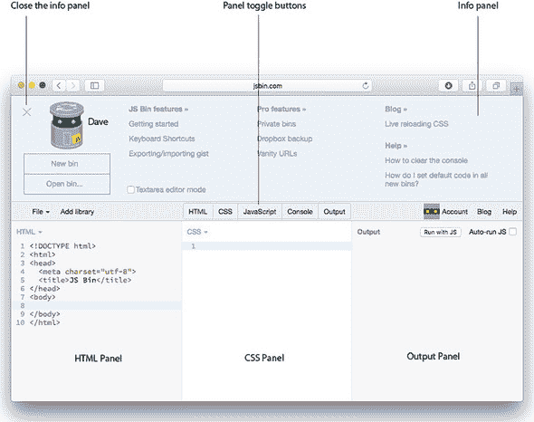

#### 1.4.1. JS Bin 面板

JS Bin 是一个用于开发网页和应用程序的工具。除了顶部的信息面板外，它还有五个可显示的面板：HTML、CSS、JavaScript、控制台和输出。点击 JS Bin 工具栏上的面板名称可以切换面板的开启或关闭。在第一部分 中，你将只使用 JavaScript 和控制台面板，第二部分 将使用 HTML 面板，第三部分 将添加 CSS 和输出面板。你一开始将只使用 JavaScript 和控制台面板，所以请切换这两个面板开启，其他面板关闭；参见 图 1.2。

##### 图 1.2. JS Bin 显示 JavaScript 和控制台面板。

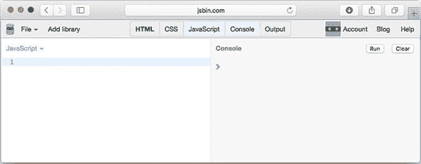

##### HTML

HTML 用于结构化网页的内容。文本、图像、视频和表单是内容的例子。

##### CSS

层叠样式表（Cascading Style Sheets）允许您指定内容应该如何呈现。您可以定义背景颜色、字体细节、边距、大小等。

##### JavaScript

JavaScript 允许您向网页添加行为和交互性。或者，您也可以在网页上下文中之外编写程序。

##### 控制台

控制台可以被程序用来向用户和开发者显示信息。程序中的警告和错误可能会在这里显示。控制台是交互式的；您可以在其中输入以了解程序的状态。它通常不在完成的应用程序中使用，但在学习过程中，您会很好地利用它作为一种快速简单的方式与您的程序交互。

##### 输出

输出面板显示了在 HTML、CSS 和 JavaScript 面板中定义的网页预览。它显示了访问者通常在浏览器中看到的页面内容。

#### 1.4.2\. 跟随 JS Bin 上的代码列表

您将通过在 JS Bin 的 JavaScript 面板中添加代码行来编写程序。随着您覆盖更多语言的功能，程序将从简单开始，逐渐增加复杂性。对于书中第一部分中的大多数代码列表，您可以通过以下步骤在 JS Bin 上测试代码：

> **1**.  在 JS Bin 的文件菜单上选择新建。
> 
> **2**.  切换面板，使 JavaScript 和 Console 面板可见。
> 
> **3**.  在 JavaScript 面板中输入代码。
> 
> **4**.  点击运行。
> 
> **5**.  在控制台面板上检查结果。

图 1.3 显示了 JS Bin 截图中的步骤。

##### 图 1.3\. 在 JS Bin 上运行 JavaScript 的步骤

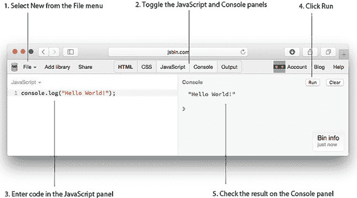

书中的大多数列表也都有一个链接，指向 JS Bin 上的相同代码。JS Bin 上的列表包括与代码相关的额外信息和练习，这些将在 1.4.4 和 1.4.5 节中进一步讨论。

#### 1.4.3\. 将日志记录到控制台

在不同的点上，您希望程序通过在控制台面板上显示信息来输出信息。要在控制台上显示信息，请使用`console.log`命令。运行此列表中的程序将在控制台上显示以下内容：

```
> Hello World!
```

##### 列表 1.1\. 使用`console.log`显示信息 ([`jsbin.com/mujepu/edit?js,console`](http://jsbin.com/mujepu/edit?js,console))

```
console.log("Hello World!");
```

您将要在显示的消息之间放置引号内的括号。

注意列表标题中包含一个 JS Bin 链接。点击链接查看 JS Bin 上的实时代码。要执行 JavaScript 面板中的代码，请点击控制台面板顶部的运行按钮。您将在控制台上看到消息“Hello World!”。

尝试点击运行几次。每次点击都会执行代码，并将“Hello World!”记录到控制台。您可以通过点击清除来清除控制台中的所有消息。

当您在 JS Bin 上跟踪代码链接时，程序可能会自动运行。如果您注册了账户，您可以在 JS Bin 的偏好设置中关闭自动运行。

#### 1.4.4\. 代码注释

除了代码语句外，此书的 JS Bin 列表还包括*注释*，这些注释不是程序的一部分，但对解释代码的功能很有用。以下是 JS Bin 上列表 1.1 的第一个代码块注释：

```
/* Get Programming with JavaScript
 * Listing 1.1
 * Using console.log
 */
```

除了可以跨越多行的代码块注释外，您有时还会看到单行注释：

```
// This is a single-line comment
```

在 JS Bin 上，注释通常以绿色显示。程序员如果觉得代码需要一些解释以便其他程序员理解，就会在代码中添加注释。当程序执行时，计算机将忽略注释。

#### 1.4.5\. 进一步冒险

在 JS Bin 上，*用 JavaScript 编程入门*的大多数代码列表都附带一组小练习，称为*进一步冒险*，作为代码后的注释。有些很简单，有些是重复的，有些是具有挑战性的。学习编程的最佳方式是编程，所以我敦促您跳进来尝试挑战。您可以在 Manning 论坛上获得帮助，许多任务的解决方案在书籍的网站上提供，网址为 [www.manning.com/books/get-programming-with-javascript](http://www.manning.com/books/get-programming-with-javascript) 和 [www.room51.co.uk/books/getProgramming/index.html](http://www.room51.co.uk/books/getProgramming/index.html)。

#### 1.4.6\. 错误信息

当您向 JavaScript 面板添加代码时，JS Bin 会持续检查错误。您会在 JavaScript 面板的底部看到红色错误区域。不要担心，直到您完成添加一行代码。如果错误区域仍然存在，点击它以查看错误信息。

例如，尝试从列表 1.1 的代码行末尾删除分号。图 1.4 显示了 JS Bin 对删除的分号所显示的错误。

##### 图 1.4\. JS Bin 错误区域（先关闭后打开）

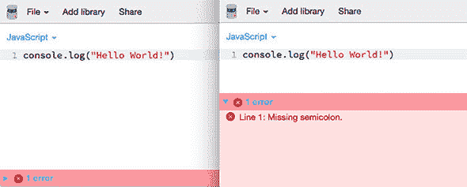

分号表示代码行的结束。每行以分号结束的代码称为*语句*。如果您停止输入但行末没有分号，JS Bin 将会抱怨。程序可能仍然会运行，JavaScript 会尝试在它认为应该放置分号的地方插入分号，但最好还是自己放置分号；JS Bin 中的错误信息鼓励良好的实践。

JS Bin 尽力提供有助于您解决问题的错误信息。逐个从代码行的末尾删除更多字符，并观察错误信息如何更新。

#### 1.4.7\. 行号

图 1.4 中的错误信息告诉了你错误发生的行号。你只有一行代码，所以错误在第一行。程序可以相当长，所以看到行号是有帮助的。你不需要手动添加行号；在这个例子中，JS Bin 文本编辑器会自动为你添加。它们不是程序的一部分；它们在编写和测试代码时帮助你。图 1.5 显示了一个较长的程序，其中包含几个错误。现在不必担心理解代码，但看看你是否能找到 JS Bin 在图中报告的错误。如果没有行号，这将困难得多，尤其是如果程序更长的话。

##### 图 1.5\. 行号在查找错误时很有帮助。

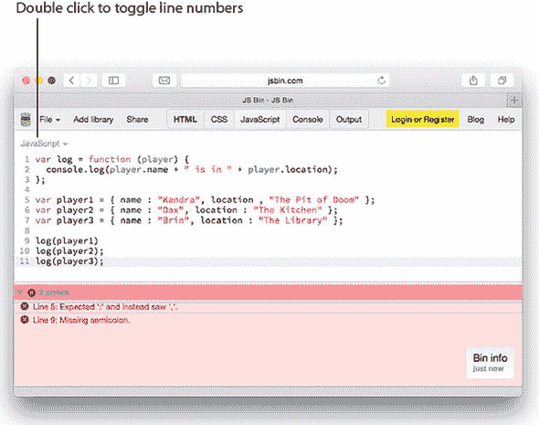

要在 JS Bin 中切换行号的显示，请双击 JavaScript 面板左上角的“JavaScript”一词（见图 1.5。图 1.5）。当你双击时，菜单会打开和关闭，但行号应该从隐藏切换到可见（或反之亦然）。如果你已经注册，你还可以在 JS Bin 个人资料中开启行号。

#### 1.4.8\. 获取账户

在 JS Bin 上注册一个免费账户是值得的。你的工作将被保存，你将能够设置更多的偏好设置。当你开始编写自己的程序时，这是一个尝试你的想法并获得即时预览和反馈的好地方。

### 1.5\. 密室——我们的运行示例

在整本书中，你正在开发一个名为 *The Crypt* 的基于文本的冒险游戏。玩家将能够在一个地图上探索位置，从一个地方移动到另一个地方，捡起帮助解决挑战和克服障碍的物品。每一章的最后部分将使用你在该章中学到的内容来进一步开发游戏。你将能够看到编程概念是如何帮助你构建最终组合成大型程序的各个部分的。

#### 1.5.1\. 玩 The Crypt

游戏将显示玩家当前位置描述，以及在那里找到的任何物品和出口，如图 1.6 所示。图 1.6。

##### 图 1.6\. 玩 *The Crypt*


玩家可以输入命令来从一个地方移动到另一个地方，捡起他们发现的物品，并使用这些物品来克服挑战。

你需要为游戏中的所有不同元素编写代码。但别担心——你一步一步来，随着你的进步，我会介绍你需要知道的内容。你可以在 JS Bin 上玩这个游戏，[`output.jsbin.com/yapiyic`](http://output.jsbin.com/yapiyic)。

#### 1.5.2\. 构建 The Crypt 的步骤

在 第一部分 中，当你学习 JavaScript 的核心概念时，你编写代码来表示游戏中的玩家和地点，并让玩家从一个地方移动到另一个地方，捡起他们找到的物品。图 1.7 展示了你将创建的用于玩家、地点、地图和整个游戏的组件。不要担心图中所有的术语——随着你阅读本书的进展，你将详细地了解它们。每个章节都将使用类似的图表来突出整个游戏背景下的讨论内容。

##### 图 1.7\. 《密室》第一部分 part 1 中的游戏元素

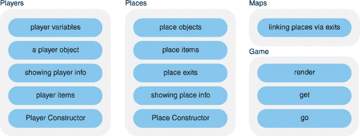

两个 部分 1 和 2 都将使用 JS Bin 上的控制台来显示游戏信息和接受用户的输入。表 1.1 展示了游戏元素如何对应于 第一部分 中涵盖的 JavaScript。

##### 表 1.1\. 《密室》第一部分 part 1 中的游戏元素和 JavaScript

| 游戏元素 | 任务 | JavaScript | 章节 |
| --- | --- | --- | --- |
| 玩家 | 决定我们需要了解的每个玩家的信息 | 变量 | 第二章 |
|   | 在一个地方收集玩家信息 | 对象 | 第三章 |
|   | 在控制台上显示有关玩家的信息 | 函数 | 第四章–第七章 |
|   | 创建每个玩家收集到的物品列表 | 数组 | 第八章 |
|   | 组织玩家创建代码 | 构造函数 | 第九章 |
| 地点 | 创建许多可供探索的地方，它们具有相似的结构 | 构造函数 | 第九章 |
|   | 使用方括号表示法将地方连接起来 | 方括号表示法 | 第十章 |
| 游戏 | 添加简单的移动、收集物品和显示信息的函数 | 方括号表示法 | 第十章 |
| 地图 | 将有出口的地方连接起来 | 方括号表示法 | 第十章 |

第二部分 为玩家增加了挑战，阻止他们离开，直到玩家使用适当的物品来解决谜题。编程的重点更多地在于组织你的代码，隐藏其工作原理，检查用户输入，以及构建可以重用和交换的模块，使项目更加灵活。

图 1.8 展示了游戏如何分为地图数据模块、用于创建玩家和地点的构造函数、用于在控制台上显示信息的视图以及用于运行游戏和连接所有部件的控制器。再次强调，这里展示的图表是为了给你一个预期的感觉以及完整游戏由更小的构建块组成——在这个阶段，你不需要理解所有术语。你可以保持好奇和兴奋！每个构建块将在接下来的 400 页中完全解释；花时间探索概念并玩转代码。

##### 图 1.8\. *《密码学》*中第二部分的游戏元素

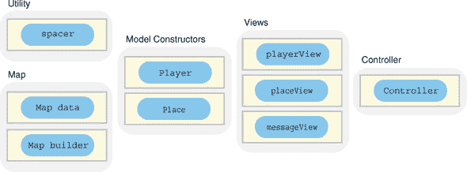

第三部分更新了显示以使用 HTML 模板，修改了游戏在运行时加载数据，用玩家和地点信息填充模板，并引入了文本框和按钮，以便玩家可以通过网页输入命令（图 1.9）。

##### 图 1.9\. *《密码学》*中第三部分的游戏元素

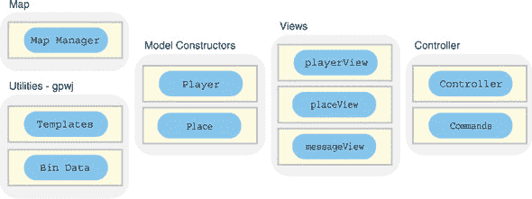

第四部分可在网上找到，展示了如何使用 Node.js 在服务器上存储游戏数据。

### 1.6\. 更多示例和实践

虽然*《密码学》*是我们学习 JavaScript 的持续背景，但每一章都包含其他示例，以展示在多种情况下概念的应用。一些较小的示例也会随着你的进步而发展，让你看到新概念如何帮助改进示例。特别是，你将查看一个测验应用、一个健身追踪应用、一个电影评分网页和一个新闻头条页面。

### 1.7\. 浏览器支持

浏览器一直在进化。*《用 JavaScript 编程入门》*中的一些 JavaScript 代码示例可能在较旧的浏览器中（例如 Internet Explorer 8 及以下版本）无法工作。书籍网站上的讨论将提供替代方法，以便在主要方法在代码示例中显示不满意的浏览器上运行代码。

### 1.8\. 摘要

+   程序是一系列计算机需要遵循的指令。

+   高级语言让我们能够编写更容易阅读和理解的指令。

+   JavaScript 是世界上使用最广泛的编程语言之一。它最强烈地与为网页添加交互性相关联，但也用于服务器端编程、作为应用程序的脚本语言，以及编程机器人和其他设备的方式。

+   学习源于思考。因此，参与书中的实际示例，保持好奇、投入和坚韧。

+   JS Bin，一个在线代码沙盒，将帮助你专注于 JavaScript，并在你实验和实践时提供快速反馈。

+   我们的主要运行示例是*《密码学》*。它为你提供了一个学习编程概念和从简单元素构建相对复杂程序的环境。

+   进一步的例子将帮助你通过广度来加深理解，并欣赏你学到的概念是如何在更广泛的各种情况下应用的。

## 第二章. 变量：在程序中存储数据

***本章涵盖的内容***

+   使用变量存储和使用信息

+   声明变量

+   给变量赋值

+   在控制台上显示变量值

《用 JavaScript 编程入门》被编写成对编程的温和介绍。因此，本章是对温和介绍的温和介绍。就冒险而言，你几乎不出门。你可以把它看作是旅程的打包阶段，至关重要——你不想在没有护照的情况下到达机场，或者在没有自拍杆的情况下到达奥斯卡——但这不是主要事件。

几乎没有例外，程序都会存储、操作和显示数据。无论你是编写一个博客系统、分析引擎性能、预测天气，还是发送探测器在 10 年后登陆彗星，你都需要考虑你将使用的数据以及这些数据可能采取的值。为了在程序中处理数据，你使用变量。

### 2.1\. 什么是变量？

一个 *变量* 是程序中的一个命名值。每次你在程序中使用这个名称时，它就会被相应的值所替换。你可以创建一个名为 `score` 的变量，并给它赋值为 `100`。然后，如果你告诉计算机“显示分数”，它就会显示 `100`。现在，变量可以改变，因此得名，所以程序中稍后，比如响应玩家采取的一些动作，你可以更新分数。如果你将 `50` 加到 `score` 上，并告诉计算机“显示分数”，现在它会显示 `150`。

那么你如何使用 JavaScript 来实现这个魔法呢？

### 2.2\. 声明变量和赋值

让计算机知道你想要存储的信息需要两个步骤：

> **1**. 你需要 *设置一个名称* 来在程序中引用你的数据，比如 *score* 或 *playerName* 或 *taxRate*。
> 
> **2**. 你需要 *将名称与要存储的值相链接*：比如 *将分数设置为 100* 或 *让‘George’成为 playerName* 或 *让税率是 12%*。

在 2.2.3 节 中，你将看到如何在一个 JavaScript 语句中完成这两个步骤，即给变量命名和赋值。现在，你慢慢来，为每个步骤使用单独的语句。

#### 2.2.1\. 声明变量

你一直梦想着通过你为下一个移动应用热潮 *The Fruitinator!* 的设计而一举成名，玩家被送回过去用他们的 *Smoothie 9mm* 拍打水果，在前进的过程中累积创纪录的分数。你的程序需要跟踪这些分数。这意味着设置一个变量。

用名称表示值的过程称为 *变量声明*。你通过使用 `var` 关键字来声明变量。以下列表显示了声明名为 `score` 的变量的所需代码语句。

##### 列表 2.1\. 声明一个变量 ([`jsbin.com/potazo/edit?js,console`](http://jsbin.com/potazo/edit?js,console))

```
var score;
```

`var` 关键字告诉计算机将语句中的下一个单词转换为一个变量。图 2.1 注释了 列表 2.1 中的代码语句。

##### 图 2.1\. 声明一个变量

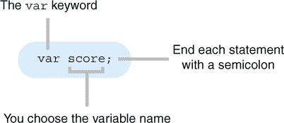

那就这样！你已经声明了一个名为 `score` 的变量，准备进行一些散裂水果的动作。这是基于水果的系统中的第一行代码，可能正是毁灭人类的开始。让我们开始计分吧。

#### 2.2.2\. 给变量赋值

你的程序现在知道了变量 `score`。但你是如何给它赋值的呢？你使用谦逊的等号 `=`。实际上，在 JavaScript 中，它并不那么谦逊。它无处不在，执行着许多重要的任务。（一个平滑的操作员。）图 2.2 展示了等号在工作中的样子，列表 2.2 展示了它在上下文中的使用。

##### 图 2.2\. 给变量赋值

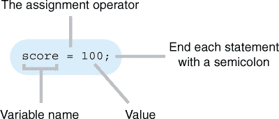

##### 列表 2.2\. 给变量赋值 ([`jsbin.com/yuvoju/edit?js,console`](http://jsbin.com/yuvoju/edit?js,console))

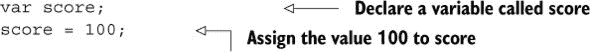

你将变量 `score` 赋值为 `100`。一般来说，你将等号右边的值赋给等号左边的变量 (图 2.3)。当你使用等号赋值时，JavaScript 给它一个特殊名称，即 *赋值运算符*。

##### 图 2.3\. 等号被称为赋值运算符。

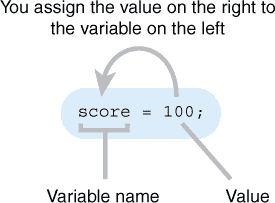

你已经声明了一个变量并给它赋了值。现在是时候在控制台上显示它了。以下列表的输出应该看起来像这样：

```
> 100
```

##### 列表 2.3\. 使用变量 ([`jsbin.com/huvime/edit?js,console`](http://jsbin.com/huvime/edit?js,console))

```
var score;
score = 100;
console.log(score);
```

使用在 第一章 中介绍的 `console.log` 函数，你告诉计算机显示 `score` 变量的值，无论它此时是什么。你刚刚给它赋值为 `100`，所以这个值出现在控制台上。

为什么不直接使用 `console.log(100)` 打印出 `100` 呢？嗯，变量的值通常在程序执行过程中会改变。通过使用变量而不是 *字面量* 值，你的程序可以使用当前值，无论它们在此时是什么。下一个列表显示了 `score` 的值在控制台上的显示，改变了值，并显示了新的值，如下所示：

```
> 100
> 150
```

##### 列表 2.4\. 变量变化 ([`jsbin.com/jasafa/edit?js,console`](http://jsbin.com/jasafa/edit?js,console))

```
var score;
score = 100;
console.log(score);

score = 150;
console.log(score);
```

你使用了相同的指令 `console.log(score)` 两次，但程序在控制台上打印了两个不同的值。你的指令使用了变量 `score`。因为它的值已经改变，所以输出也改变了。

你为`score`变量分配了数字，`100`然后是`150`，作为值。文本也很简单；只需将你想分配的文本用引号括起来。下面的列表显示了控制台上的两条消息：

```
> Hello World!
> Congratulations! Your tweet has won a prize ...
```

##### 列表 2.5\. 将文本分配给变量 ([`jsbin.com/hobiqo/edit?js,console`](http://jsbin.com/hobiqo/edit?js,console))

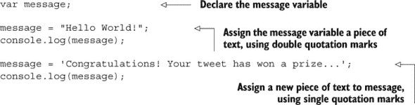

程序员称文本的部分为*字符串*，因为它们是字符的字符串，或序列。正如你在列表 2.5 中看到的，为了表示字符串，你将文本放在引号内。引号可以是双引号，`"Hello World!"`，或者单引号，`'Congratulations!'`，只要它们匹配即可。如果没有引号，JavaScript 会尝试将文本解释为指令或变量。

#### 2.2.3\. 单步声明和赋值

你已经看到了如何分两步声明变量并分配它们值。也可以在单个语句中声明变量并给它赋值，如图 2.4 所示。

##### 图 2.4\. 你在单个语句中声明变量并给它赋值。

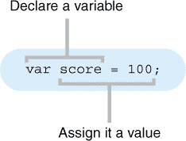

列表 2.6 和 2.7 实现了完全相同的结果，在显示以下消息之前声明变量并分配它们值：

```
> Kandra is in The Dungeon of Doom
```

##### 列表 2.6\. 分两步声明和分配 ([`jsbin.com/vegoja/edit?js,console`](http://jsbin.com/vegoja/edit?js,console))

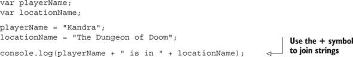

##### 列表 2.7\. 单步声明和分配 ([`jsbin.com/dorane/edit?js,console`](http://jsbin.com/dorane/edit?js,console))

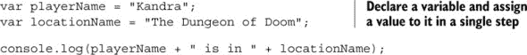

在列表 2.7 中，你将等号右侧的值分配给左侧新声明的变量。在这两个程序中，你通过使用加号`+`将文本片段连接起来来创建控制台上显示的消息。连接文本片段称为*字符串连接*，`+`是*字符串连接运算符*。

如果你声明变量时知道它的值，那么这种单步方法可以是一种将值分配给变量的整洁方式。有时，在声明时可能不知道值；可能需要进行一些计算，需要用户输入，或者你正在等待网络响应。在这种情况下，声明和分配将是分开的。程序员通常会在程序顶部声明变量，即使他们不会在稍后分配值。

#### 2.2.4\. 在自己的赋值中使用变量

当你给变量赋值时，JavaScript 会评估赋值运算符右侧的表达式，并将结果分配给变量。

```
var score;
score = 100 + 50;
```

JavaScript 评估表达式`100 + 50`，并将结果`150`分配给变量`score`。

表达式中的值可能不会是硬编码的数字，如`100`和`50`；它们更有可能是变量。以下是一个例子，使用变量`callOut-Charge`、`costPerHour`和`numberOfHours`来计算雇佣水管工做工作的总费用：

```
total = callOutCharge + costPerHour * numberOfHours;
```

`*`符号用于乘法；它是*乘法运算符*。你也可以使用`–`进行减法，`/`进行除法。

由于 JavaScript 首先评估右侧的表达式，然后再将其值赋给左侧的变量，因此你甚至可以使用变量的当前值来设置其新值。比如说，在你的应用程序的感官游戏*水果机*中，一个玩家刚刚打翻了草莓；那值 50 分！玩家需要更新分数。

```
> Your score was 100
> Great splat!!!
> New score: 150
> Way to go!
```

图 2.5 展示了在赋值更新分数时使用当前分数的语句，代码列表 2.8 是你的更新分数的程序。

##### 图 2.5\. 使用涉及自身计算结果的变量更新

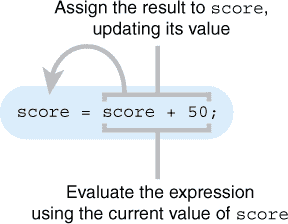

##### 列表 2.8\. 使用变量的当前值来设置其新值 ([`jsbin.com/kijuce/edit?js,console`](http://jsbin.com/kijuce/edit?js,console))

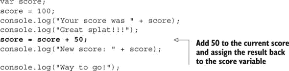

在代码中，你使用`score + 50`的表达式，利用`score`的当前值`100`来得到结果`150`。这个值`150`随后被赋值给`score`。接下来是*水果机*...金桔。价值 100 分！金桔很棘手。永远不要相信金桔。

### 2.3\. 选择好的变量名

在迄今为止的所有代码示例中，没有任何强制要求你必须使用你给变量取的名字。你试图选择那些能帮助阅读代码的人理解变量用途的名字。你几乎有完全的自由选择，但必须小心不要触及 JavaScript 的底线；JavaScript 为自身用途预留了一些名字，并且还有一些关于有效变量名的规则。

#### 2.3.1\. 关键词和保留字

JavaScript 有一组*关键词*，如`var`和`function`，它们是语言本身的一部分，并控制着每个程序中的动作和属性。它还预留了一些*保留字*，这些字可能在未来的语言中作为关键词出现。你不能将这些关键词或保留字用作变量名。其他关键词的例子有`if`、`switch`、`do`和`yield`，完整的列表可以在 Mozilla 开发者网络([`mng.bz/28d9`](http://mng.bz/28d9))上找到。但不要仅凭我的话，去 JS Bin 试一试将这些词作为变量名使用，如图 2.6 所示。

##### 图 2.6\. JavaScript 有一些不能用作变量名的词。

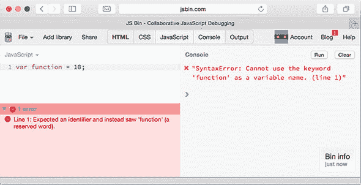

你不需要学习关键词和保留字的列表；随着你编程经验的积累，你会自然而然地掌握大部分，而且当你尝试使用它们时，通常会出现错误。但如果你发现程序运行不正常，而你又不确定原因时，请记住它们。

#### 2.3.2\. 变量命名规则

既然关键字和保留字已经排除在外，那么其他所有内容都包含在内了吗？并不完全是这样——还有一些额外的规则。变量名可以以任何字母、美元符号`$`或下划线`_`开头。后续字符可以是这些字符中的任何一个或数字。不允许有空格。列表 2.9 包括一个有效名称块和一个无效名称块。如果你访问 JS Bin 上的代码，你会看到它报告了一个长长的错误列表。看看并尝试理解它们，但如果你不完全理解它们，不要担心；列表中故意包含了无效名称，因为 JavaScript 对此并不高兴。

##### 列表 2.9. 有效和无效变量名 ([`jsbin.com/biqawu/edit?js,console`](http://jsbin.com/biqawu/edit?js,console))

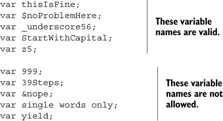

JavaScript 是区分大小写的。变量名中字符的大小写变化将产生不同的变量。`score`、`Score`和`SCORE`是三个不同的名称。这些差异可能很难发现，所以像下一节讨论的那样，保持一致性是值得的。

#### 2.3.3. 骆驼命名法

你可能已经注意到了你使用的变量名中的字母大小写。在像`costPerHour`、`playerName`和`selfieStickActivated`这样的变量名中，由多个单词组成，第一个单词是小写，后面的单词以大写字母开头。这被称为*骆驼命名法*，这是一种极其普遍的约定，可以帮助使名称更易读。

一些程序员选择使用下划线而不是空格来分隔变量名中的单词，例如`cost_per_hour`、`player_name`和`selfie_stick_activated`。你如何命名变量取决于你；这是你编程风格的一部分。在《用 JavaScript 编程入门》中，我将坚持使用骆驼命名法。

#### 2.3.4. 使用描述性变量名

尝试给你的变量命名，使其能够描述它们的作用或功能。你可以自由选择名称，但`costPerHour`比`cph`更容易理解。其他程序员可能需要在将来阅读和更新你的代码，当你某一天再次回到它时，你会感谢自己。随着你的程序不断增长，涉及越来越多的变量、对象和函数，好的变量名真的可以帮助你跟随程序的流程并理解其目的。因此，请保持变量名简单、直接且具有描述性。

你已经看到了变量的用途，如何声明和分配它们，以及什么是一个好的名称。但你知道在程序中需要哪些变量吗？分析你试图解决的问题并规划一个适合你用户的解决方案是程序设计的重要部分。在下一节中，你将花点时间考虑你正在进行的示例“密室”中需要表示玩家的信息。

### 2.4. 密室—玩家变量

如第一章讨论的，*The Crypt* 包含了许多元素：玩家、地点、游戏、地图和挑战。在设计构建游戏时，你需要考虑所有这些元素的性质。现在，你专注于玩家，如图 2.7 所示。

##### 图 2.7\. 《The Crypt》中的元素

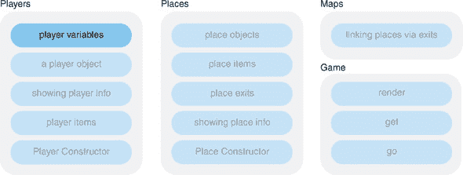

当玩家从一个地方移动到另一个地方时，程序需要知道什么来创建有趣和具有挑战性的冒险？你可能需要记录名字、健康、携带的物品或位置。或者可能是脚的毛茸茸程度或光剑的颜色。一些信息在游戏过程中可能保持不变，而一些信息可能会改变。

编程艺术的一部分是*抽象*，知道要包含哪些信息以及要排除哪些信息。可能只是玩家脚毛的多少在游戏中扮演了一定的角色，但很可能这比你需要知道的多。你应该仔细思考玩家完成他们的任务时将使用哪些数据。

表 2.1 展示了一些你可能希望在程序中表示每个玩家时包含的属性。

##### 表 2.1\. 可能的玩家属性

| 属性 | 它是用来做什么的？ | 示例值 |
| --- | --- | --- |
| 名称 | 用于显示玩家信息和与其他玩家互动时。 | "Kandra"、"Dax" |
| 健康 | 由怪物和毒药减少。由食物和药水增加。 | 68 |
| 地点 | 玩家在地图上的位置？ | "老图书馆" |
| 脚的毛茸茸程度 | 衡量玩家在没有靴子的情况下在寒冷条件下的应对能力。 | 94 |
| 物品 | 跟踪玩家捡起的物品。 | "一把生锈的钥匙"、"一瓶紫色药水"、"奶酪" |

你可能需要其他属性，并且如果需要，你可以添加和删除属性。声明玩家属性可能如下所示：

```
var playerName = "Kandra";
var playerHealth = 50;
```

程序员的专业技能之一是能够模拟情况并预测完成程序所需的变量。提前做对的事情越多，程序需要大改动的可能性就越小——没有人希望这样。就像你不想在机场意识到自己忘了护照一样，你也不想在你编写了大量代码后发现遗漏了程序的关键部分。

### 2.5\. 概述

+   变量允许你在程序运行时存储数据供程序使用。

+   通过在`var`关键字后跟一个名称来声明变量：

    ```
    var costPerHour;
    ```

+   为你的变量选择简单、描述性的名称，避免使用 JavaScript 的关键词和保留字。

+   使用赋值运算符，即等号`=`来给变量赋值：

    ```
    costPerHour = 40;
    ```

    你将等号右侧的值赋给等号左侧的变量。

+   在表达式中使用变量：

    ```
    total = callOutCharge + costPerHour * numberOfHours;
    ```

+   作为你程序规划的一部分，考虑你需要哪些变量以及它们将持有哪些类型的数据。

## 第三章\. 对象：分组你的数据

**本章涵盖**

+   使用 JavaScript 对象组织信息

+   创建对象

+   向对象添加属性

+   使用点符号访问属性

+   对象的示例

在第二章中，你学习了如何声明变量并分配值，并考虑了可以用来模拟《The Crypt》中的玩家的变量。随着你的程序增长，你使用的变量数量也在增加；你需要方法来组织所有这些数据，以便使你的程序更容易理解，并更容易在未来进行更新和添加。

有时将项目分组并作为一个整体来看是有意义的。考虑一个急救包；我们很高兴地将其视为一个单独的项目——“你打包了急救包吗？”“递给我急救包。”“我们急需急救包，*现在*！”——但当需要时，会迅速将注意力转向其内容——“请从急救包中递给我消毒剂和绷带。”许多项目被一个单一的对象整洁地封装起来。

本章介绍了 JavaScript 对象，这是一种简单高效的方法，可以将变量组合在一起，以便你可以将它们作为一个组而不是单个变量传递。

### 3.1\. 组织的需求

你的冒险故事图书馆正在增长，你决定编写一个程序来跟踪你宝贵的收藏。以下列表显示了你在控制台上生成此测试输出的变量：

```
> The Hobbit by J. R. R. Tolkien
```

##### 列表 3.1\. 使用变量表示书籍 ([`jsbin.com/fucuxah/edit?js,console`](http://jsbin.com/fucuxah/edit?js,console))

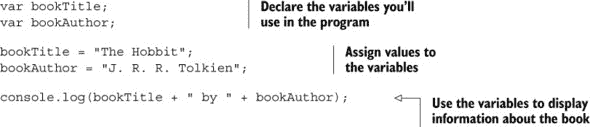

首先，使用`var`关键字声明两个变量，`bookTitle`和`bookAuthor`。你将使用这两个名称在程序中存储和访问值。然后，将字符串（文本）分配给你的新创建的变量。你用引号包裹字符串，这样 JavaScript 就不会尝试将它们解释为关键字或变量名。最后，你将一条消息记录到控制台。你通过使用连接运算符（`+`符号）将三个字符串连接起来构建这条消息。

虽然可能还处于早期阶段，但你肯定不止有一本书。当你购买更多书籍时，如何应对所需的变量？你可以为每本书使用不同的前缀。接下来的列表将书籍数量增加到三本，并将这些消息打印到控制台：

```
> There are three books so far ...
> The Hobbit by J. R. R. Tolkien
> Northern Lights by Philip Pullman
> The Adventures of Tom Sawyer by Mark Twain
```

##### 列表 3.2\. 使用前缀区分书籍变量 ([`jsbin.com/qowagi/edit?js,console`](http://jsbin.com/qowagi/edit?js,console))

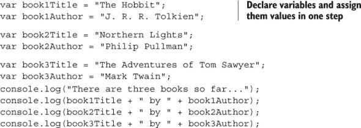

这在某种程度上是可行的。但随着书籍数量和每本书的事实增加，变量的数量就难以管理了。能够将一本书的所有信息组合在一起，使用单个变量来访问，将会很有帮助。

### 3.2\. 创建对象

就像请求急救包比单独请求剪刀、消毒剂、绷带和创可贴更容易一样，请求`book1`比单独请求`book1Title`、`book1Author`、`book1ISBN`等更容易。JavaScript 为我们提供了创建*对象*来分组变量的能力。定义一个新对象时，使用非常具体的*语法*。让我们来看一个完整的例子，然后再将其分解成几个阶段。

列表 3.3 展示了如何创建一本书作为对象而不是作为单独的变量。图 3.1 展示了当你将`book`对象记录到控制台时在 JS Bin 上的输出。

##### 图 3.1。你在 JS Bin 的控制台上记录一个对象。

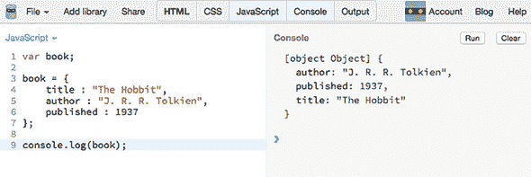

##### 列表 3.3。一本书作为一个对象([`jsbin.com/ruruko/edit?js,console`](http://jsbin.com/ruruko/edit?js,console))

```
var book;

book = {
    title : "The Hobbit",
    author : "J. R. R. Tolkien",
    published : 1937
};

console.log(book);
```

当你在 JS Bin 上运行列表 3.3 时，控制台会显示你新创建的`book`对象的所有属性，并告诉你它是一个对象。注意，它以字母顺序显示属性。对象本身并不对属性进行排序；JS Bin 纯粹是为了显示而选择了排序方式。

让我们分解对象创建过程，以更清楚地了解正在发生什么以及所有不同的符号表示什么。

#### 3.2.1. 创建一个空对象

在第二章中，你看到变量可以被声明，但不能在程序稍后分配值。你可能必须等待一些用户输入或服务器的响应，或者从传感器读取，才能知道要分配给变量的值。同样，你可以创建一个没有任何属性的空对象，知道将来会在某个时候添加属性。

要创建一个对象，使用大括号，如下面的列表所示。

##### 列表 3.4。创建一个空对象([`jsbin.com/kaqatu/edit?js,console`](http://jsbin.com/kaqatu/edit?js,console))

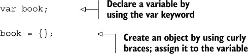

你创建一个空对象，一个没有任何属性的空对象，并将其分配给变量`book`。没有属性就没有什么用处，你将在 3.4 节中看到如何向现有对象添加新属性。但你是如何创建具有现有属性的图书对象的？

#### 3.2.2. 属性作为键值对

在列表 3.3 中的书中包含三个属性：它的标题、它的作者和它的出版年份。这些属性的值是`"The Hobbit"`、`"J. R. R. Tolkien"`和`1937`。在 JavaScript 对象中，属性的名称被称为*键*。对于`book`，键是`title`、`author`和`published`。在创建对象时，你通过在大括号内包含键和值（由冒号分隔）来添加属性。图 3.2 显示了属性定义。

##### 图 3.2。使用键值对设置属性。

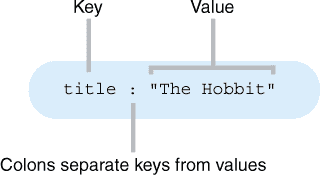

键值对的另一个名称是名称-值对，但在这本书中我们将坚持使用键和值。

在下一个列表中，你创建一个只有一个属性的对象。

##### 列表 3.5\. 具有一个属性的对象 ([`jsbin.com/robupi/edit?js,console`](http://jsbin.com/robupi/edit?js,console))

```
var book;

book = {
    title : "The Hobbit"
};
```

你声明一个变量，然后创建一个对象并将其赋值给该变量。该对象有一个属性。属性的键是 `title`，其值是 `"The` `Hob``bit"`。我们通常简单地说，`book` 的 `title` 属性是 `"The Hobbit"`。

属性值不仅限于数字和字符串字面量，如 `50` 或 `"The` `Hob``bit"`。你还可以使用之前声明的变量作为值。以下列表将一本书的名称赋给一个变量，然后使用该变量作为对象属性的值。

##### 列表 3.6\. 使用变量作为属性值 ([`jsbin.com/bafige/edit?js,console`](http://jsbin.com/bafige/edit?js,console))

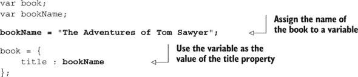

拥有一个只有一个属性的对象有点奢侈；你不妨继续使用变量。让我们看看如何创建具有多个属性的对象。

当你需要多个属性时，用逗号分隔键值对。图 3.3 展示了对象定义中的两个属性，而列表 3.7 创建了两个对象，每个对象都有两个属性。

##### 图 3.3\. 具有两个属性的对象定义

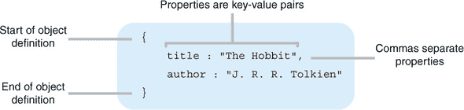

##### 列表 3.7\. 具有多个属性的对象 ([`jsbin.com/bawiqev/edit?js,console`](http://jsbin.com/bawiqev/edit?js,console))

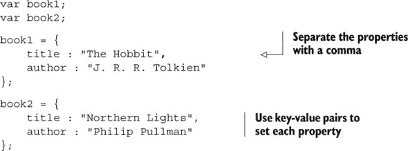

现在你已经创建了一个对象，你需要能够访问它的属性。

### 3.3\. 访问对象属性

我们对急救包作为一个可以传递给每个人、从地方到地方携带的单个对象的概念感到舒适。只有当我们需要使用急救包时，我们才会考虑里面的内容：消毒剂、剪刀、绷带等等。

对于 JavaScript 对象，要访问对象属性的值，你可以使用 *点符号*。将变量的名称与属性的名称、其键，用点或句号连接起来。对于一个急救包作为对象，你可能使用 `kit.antiseptic` 或 `kit.scissors` 或 `kit.bandages`。对于书籍，要访问名为 `book` 的变量所赋的对象的 `author` 属性，你写 `book.author` (图 3.4)。

##### 图 3.4\. 使用点符号访问对象属性

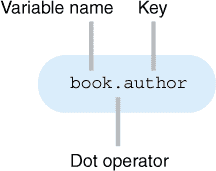

在下一个列表中，你将 `book` 对象的 `title` 和 `author` 属性打印到控制台，以给出以下输出：

```
> The Hobbit
> J. R. R. Tolkien
```

##### 列表 3.8\. 使用点符号访问属性值 ([`jsbin.com/funiyu/edit?js,console`](http://jsbin.com/funiyu/edit?js,console))

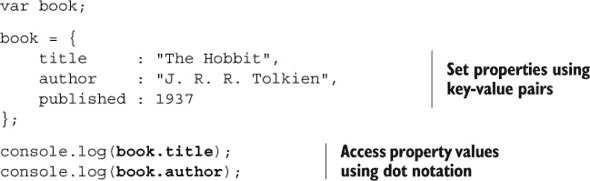

你在代码清单 3.8 中将对象属性中的冒号对齐，以帮助提高可读性。尽管 JavaScript 会忽略额外的空格，但缩进代码块并对齐值可以使你的程序更容易阅读和跟踪，尤其是随着程序规模的增大。代码越容易阅读，就越容易维护和更新，无论是对你还是对其他程序员来说。

将多个单独的变量替换为一个单一的对象有助于你管理程序的复杂性。当细节隐藏直到你需要它们时，你可以更清晰地思考程序的工作方式。你将一本书视为程序中的单个实体，直到你需要访问书的标题、作者或出版日期。可能看起来用单个变量和三个属性替换三个变量并没有改进，但当你开始在第七章中使用具有函数的对象和在第八章中使用数组时，它们的效率和清晰度将更加明显。

你使用属性值就像使用变量一样。以下代码清单中的代码将每本书的标题与字符串`" by "`及其作者连接起来，以生成以下输出：

```
> The Hobbit by J. R. R. Tolkien
> Northern Lights by Philip Pullman
```

##### 代码清单 3.9\. 连接字符串属性 ([`jsbin.com/yoweti/edit?js,console`](http://jsbin.com/yoweti/edit?js,console))

```
var book1;
var book2;

book1 = {
    title: "The Hobbit",
    author: "J. R. R. Tolkien"
};

book2 = {
    title: "Northern Lights",
    author: "Philip Pullman"
};

console.log(book1.title + " by " + book1.author);
console.log(book2.title + " by " + book2.author);
```

### 3.4\. 更新对象属性

在测验应用中，玩家一个接一个地尝试问题。尝试的问题数量、正确的问题数量和分数会随着时间的推移而变化。你可以创建一个具有初始值的玩家对象，并在尝试问题时随时更新它们。使用点符号来更改已存在的属性或向对象添加新属性，如下面的代码清单所示。

##### 代码清单 3.10\. 使用点符号更新属性 ([`jsbin.com/mulimi/edit?js,console`](http://jsbin.com/mulimi/edit?js,console))

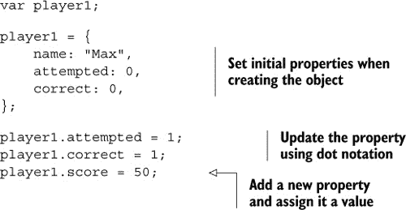

在代码清单 3.10 中，你的代码在创建对象时将`attempted`和`correct`属性设置为初始值，但随后将它们更新为新的值。它使用赋值运算符`=`将运算符右侧的值`1`赋给左侧的属性`player1.attempted`。你设置了`attempted`和`correct`属性，然后立即更新它们；在实际的测验应用中，这种变化将是对玩家回答问题的响应。

在创建对象后，你可以向其中添加新的属性。在代码清单 3.10 中，你将值`50`赋给`player1`对象的`score`属性。

```
player1.score = 50;
```

在创建对象时，你没有设置`score`属性；如果该属性尚不存在，自动赋值会创建该属性。

就像使用变量一样，你可以在计算中使用属性并将结果赋回属性。下一个代码清单显示了更新玩家属性的代码：

```
> Max has scored 0
> Max has scored 50
```

##### 列表 3.11\. 在计算中使用属性 ([`jsbin.com/cuboko/edit?js,console`](http://jsbin.com/cuboko/edit?js,console))

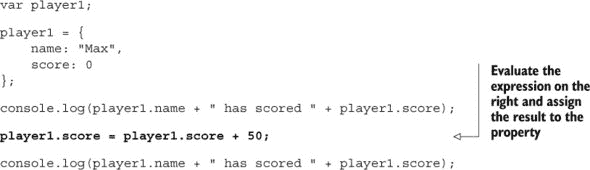

当你更新 `score` 属性（列表中加粗），JavaScript 首先评估赋值右侧的表达式。因为 `player1.score` 是 `0`，表达式变为 `0 + 50`，结果是 `50`。然后 JavaScript 将该值赋给左侧，即回到 `score` 属性。所以，你将 `player1.score` 从 `0` 更新到 `50`。

### 3.5\. 进一步示例

虽然 *The Crypt* 程序的开发为你提供了一个持续引入和讨论新概念的背景，但更广泛的示例将有助于加深你对所提出不同想法的理解。你还可以在整本书中回顾一些这些示例，随着你掌握这些技术，应用新的技巧。

这些示例都使用花括号创建一个对象，然后通过使用 `var` 关键字创建的变量将对象赋值，这是一个步骤。

#### 3.5.1\. 编写博客

一个博客由博客文章组成。了解每个作者的更多信息，能够用关键词标记文章，并为每篇文章添加评论，将是有益的。现在，这里有一个表示单个文章的最小对象。

##### 列表 3.12\. 一篇博客文章 ([`jsbin.com/jiculu/edit?js,console`](http://jsbin.com/jiculu/edit?js,console))

```
var post = {
    id : 1,
    title : "My Crazy Space Adventure",
    author : "Philae",
    created : "2015-06-21",
    body : "You will not believe where I just woke up!! Only on a comet..."
};
```

#### 3.5.2\. 创建日历

日历事件显然涉及日期。JavaScript 确实有一个 `Date` 对象，但你在这本书中不会使用它。下一个列表展示了以特定格式表示日期的字符串。

##### 列表 3.13\. 日历事件 ([`jsbin.com/viroho/edit?js,console`](http://jsbin.com/viroho/edit?js,console))

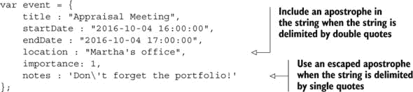

注意如何在 `notes` 属性中处理撇号。在撇号前的反斜杠阻止 JavaScript 将其视为字符串的结尾。这个反斜杠被称为转义字符，不会显示出来。

```
event.notes = 'Don\'t forget the portfolio!';
```

使用转义字符来显示字符串已用双引号包裹时的双引号。

```
var story = "She looked at me. \"What did you say?\" she asked.";
```

JavaScript 也使用反斜杠转义字符来指定特殊字符，如制表符和换行符。你将在整本书中看到它的实际应用。

日历包含许多事件对象。在第九章 [kindle_split_017.html#ch09] 中，你将看到如何通过研究构造函数来简化创建具有相似结构对象的流程。

#### 3.5.3\. 天气如何？

在线天气信息服务提供你可以用于程序中的天气数据。数据通常使用 JSON（JavaScript 对象表示法——见第二十章 [kindle_split_030.html#ch20]）格式化，这与你在本章学习过的对象非常相似。数据可以非常详细，具有许多属性。下一个列表展示了这些服务之一提供的位置数据的简化版本。

##### 列表 3.14\. 天气应用的定位 ([`jsbin.com/diguhe/edit?js,console`](http://jsbin.com/diguhe/edit?js,console))

```
var location = {
    "city"      : "San Francisco",
    "state"     : "CA",
    "country"   : "US",
    "zip"       : "94101",
    "latitude"  : 37.775,
    "longitude" : -122.418,
    "elevation" : 47.000
};
```

属性键位于双引号内。JavaScript 允许你将键，即属性名，用引号括起来，无论是单引号还是双引号，尽管到目前为止你在示例中还没有这样做。实际上，如果属性名不满足第二章中讨论的有效变量名规则，则必须使用引号。你将在第十章中更详细地了解如何处理此类属性名。JSON 规范，它规定了程序应该如何将 JavaScript 对象数据作为文本在互联网上传输，要求所有键都必须使用双引号。由于有时这是必需的，许多程序员建议始终将属性名放在引号内，以避免不一致和潜在的错误。

此示例还使键值对中的冒号对齐。你认为这有帮助吗？将其与该节中的其他示例进行比较。它们是否易于阅读和跟随？你不必严格坚持一种风格或另一种风格，尽管程序员随着时间的推移采用特定的风格习惯是很常见的。

#### 3.5.4\. 测试效应

一种很好的学习方法就是经常自我测试。一个测验应用可以将其问题和答案表示为类似下一个列表中的对象属性。

##### 列表 3.15\. 测验应用的问题和答案([`jsbin.com/damoto/edit?js,console`](http://jsbin.com/damoto/edit?js,console))

```
var questionAndAnswer = {
    question: "What is the capital of France?",
    answer1: "Bordeaux",
    answer2: "F",
    answer3: "Paris",
    answer4: "Brussels",
    correctAnswer: "Paris",
    marksForQuestion: 2
};
```

测验应用可能包含一小套问题类型。列表 3.15 是多项选择题类型的一个示例。每种问题类型都会有固定的展示形式。模板是展示类似结构数据的副本的好方法，我们将在第十九章中更详细地探讨它们。

#### 3.5.5\. 创建你自己的

想想你想要创建的程序。你可以设计哪些对象来表示程序中的实体？前往 JS Bin，尝试构建对象并在控制台显示属性。也许你可以分享你的创作或在该论坛上提出由它们激发的任何问题，该论坛位于[`forums.manning.com/forums/get-programming-with-javascript`](https://forums.manning.com/forums/get-programming-with-javascript)。

### 3.6\. 密码学——玩家对象

你现在将应用你对 JavaScript 对象的了解来应用到《密码学》中。图 3.5 显示了本节重点，即玩家对象，在我们正在进行的游戏示例的整体结构中的位置。

##### 图 3.5\. 《密码学》中的元素

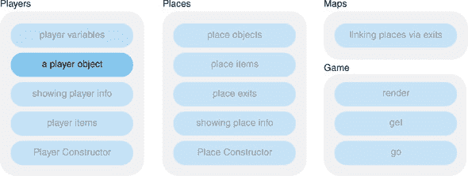

在第二章中，你考虑了在《密码学》中为玩家存储的信息类型。对于单个玩家，你开始时可以使用这些变量：

```
playerName = "Kandra";
playerHealth = 50;
playerPlace = "The Dungeon of Doom";
playerItems = "a rusty key, The Sword of Destiny, a piece of cheese";
```

然后你需要为游戏中的每个玩家复制这些变量，可能通过使用变量前缀如`player1Name`、`player2Name`等。

显然，使用 JavaScript 对象作为组织单个玩家所有信息的手段要整洁得多。列表 3.16 展示了如何将玩家表示为一个对象，并在控制台上显示一些属性。输出如下：

```
> Kandra
> Kandra is in The Dungeon of Doom
> Kandra has health 50
> Items: a rusty key, The Sword of Destiny, a piece of cheese
```

##### 列表 3.16\. 玩家对象([`jsbin.com/qelene/edit?js,console`](http://jsbin.com/qelene/edit?js,console))

```
var player;

player = {
    name: "Kandra",
    health: 50,
    place: "The Dungeon of Doom",
    items: "a rusty key, The Sword of Destiny, a piece of cheese"
};

console.log(player.name);
console.log(player.name + " is in " + player.place);
console.log(player.name + " has health " + player.health);
console.log("Items: " + player.items);
```

列表中的最后四行只是为了显示玩家信息。每次你想显示玩家信息时都要重复这些代码行似乎有点繁琐。如果能写一次代码，然后按需调用它们，那就太好了。

你很幸运！JavaScript 允许你定义*函数*，以便在需要时执行代码块。函数非常强大，将有助于简化玩家属性显示和多个玩家对象的创建。在接下来的四章中，你将深入了解函数。

### 3.7\. 概述

+   将相关的变量作为对象的属性分组。

+   使用花括号定义对象，属性之间用逗号分隔：

    ```
    var player = { name : "Hadfield", location : "The ISS" };
    ```

+   对于每个属性，使用键值对，键和值之间用冒号分隔：

    ```
    name : "Hadfield"
    ```

+   使用点符号访问属性值。如果对象被分配给一个变量，则使用点将属性名与变量名连接起来：

    ```
    player.name
    ```

+   在表达式中使用属性，就像使用变量一样：

    ```
    console.log(player.name + " is in " + player.location);
    ```

+   使用赋值运算符`=`为属性赋值：

    ```
    player.location = "On a space walk";
    ```

+   在需要时随时向现有对象添加新属性：

    ```
    player.oxygen = 96;
    ```

## 第四章\. 函数：按需执行代码

***本章涵盖***

+   使用函数组织指令

+   定义函数——指定按需执行的代码

+   调用函数——按需执行代码

+   减少代码中的重复

+   使程序更容易阅读和更新

《用 JavaScript 编程入门》的主要主题之一是通过良好的组织来管理复杂性。在第二章中，你将信息存储在变量中，并看到为这些变量选择好名字如何帮助你理解它们在程序中的作用。在第三章中，你将变量作为对象的属性分组。你可以专注于整个对象，或者当需要时深入细节。在本章中，你将了解另一种重要的组织代码和避免重复的方法，即函数。

### 4.1\. 注意重复

随着你编写的程序变得越来越长和复杂，你会发现自己在重复类似的代码块，只有细微的差异。常见的任务，如显示文本、动画图像或保存到数据库，可能需要经常执行。你需要注意到这些重复的代码片段；它们是函数的理想选择。

*函数*是一种编写一次代码但多次使用的方法。第 4.2 节探讨了如何创建函数。本节探讨了 JavaScript 重复的一些示例。

#### 4.1.1\. 以文本形式显示对象属性

程序使用对象和变量来存储各种信息——个人资料、帖子、文档和照片——你叫什么，就有人在某处将其存储在计算机上。一个常见的任务是将这些信息显示给用户。比如说，你有一些代表电影的对象，需要将每部电影的详细信息显示在控制台上。预期的输出类型如图 4.1 所示。

##### 图 4.1\. 在 JS Bin 控制台上显示的电影信息

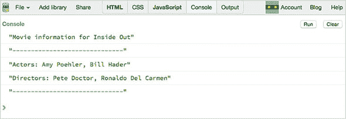

正如你在下面的列表中可以看到的，创建图 4.1 中输出所需的代码包括对 `console.log` 的五次调用。而这只是针对一部电影。

##### 列表 4.1\. 在控制台上显示对象的属性 ([`jsbin.com/besudi/edit?js,console`](http://jsbin.com/besudi/edit?js,console))

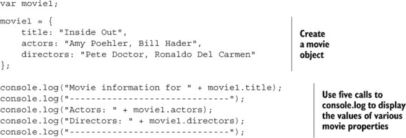

如果你每次想要显示电影信息，并且对于每部电影，都必须编写这五行代码，那么这将会变得相当重复。而且，如果你决定更改显示的信息，你将不得不遍历代码中所有出现的地方，并确保它们被一致地更改。

下一个列表显示了为三部不同电影重复的代码。

##### 列表 4.2\. 显示类似对象的信息 ([`jsbin.com/gewegi/edit?js,console`](http://jsbin.com/gewegi/edit?js,console))

```
console.log("Movie information for " + movie1.title);
console.log("------------------------------");
console.log("Actors: " + movie1.actors);
console.log("Directors: " + movie1.directors);
console.log("------------------------------");

console.log("Movie information for " + movie2.title);
console.log("------------------------------");
console.log("Actors: " + movie2.actors);
console.log("Directors: " + movie2.directors);
console.log("------------------------------");

console.log("Movie information for " + movie3.title);
console.log("------------------------------");
console.log("Actors: " + movie3.actors);
console.log("Directors: " + movie3.directors);
console.log("------------------------------");
```

可能会有超过三部电影，以及需要显示信息的地方。如果你后来需要将单词 *information* 更改为 *info*，你必须确保找到所有使用它的地方。

三个包含五个语句的代码块几乎完全相同。唯一不同的是显示的是哪部电影属性。如果能定义一个语句块，并让 JavaScript 在需要时使用该块，那就太好了。这正是函数的作用！

下一个部分有一个更多重复代码的例子。（别担心，在例子变得过于重复之前，我们会接触到函数！）

#### 4.1.2\. 添加税费并显示摘要

像给价格加税这样的简单任务会反复发生。你计算税费并将其加到价格上，以得到总成本。

```
> price = $140
> tax @ 15% = $21
> total cost = $161
```

下面的列表显示了一个为三个不同交易添加税费的程序。两个运算符 `*` 和 `/` 分别执行乘法和除法。

##### 列表 4.3\. 添加税费以找到总成本 ([`jsbin.com/kawocu/edit?js,console`](http://jsbin.com/kawocu/edit?js,console))

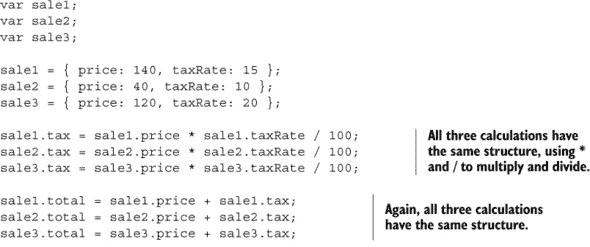

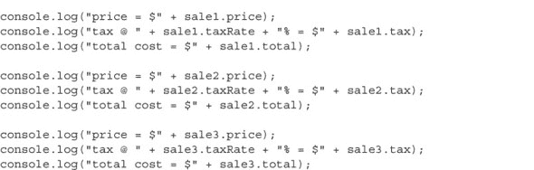

哇！这真是重复得令人发狂。除了 `console.log` 的代码块外，你还在重复计算的结构。每次你想执行计算时，本质上都是相同的代码。放心，你将学会一种更好的编写此程序的方法。进入函数的世界吧！

### 4.2\. 定义和调用函数

正如对象是一系列属性的集合一样，函数是一系列语句或指令的集合。函数帮助你避免重复，使你的代码更加组织化，更容易更新和维护。命名良好的函数也应该使你的程序更容易理解。如果你发现你的函数在程序中被大量使用，并且在其他程序中也有用，你可以创建包含在其他项目中的有用函数库。

在上一节中，你看到了两个程序的例子，其中具有相同结构的代码块被重复使用。为了减少代码膨胀，你想要用类似以下内容替换那些代码块：

```
showMovieInfo();
showCostBreakdown();
```

这两个函数，`showMovieInfo`和`showCostBreakdown`，应该产生与列表 4.2 和 4.3 中的代码块相同的输出，你应该能够反复使用它们。让我们看看这种按需代码魔法的实现方式。

#### 4.2.1\. 定义新函数

使用以下部分定义函数，如图 4.2 所示：

##### 图 4.2\. 函数定义的各个部分

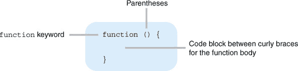

+   `function`关键字

+   括号，`()`

+   大括号之间的代码块，`{}`

代码块包含了你每次使用函数时想要执行的指令列表。这个指令列表也被称为*函数体*。

函数定义的各个部分通常是这样安排的：

```
function () {
    // Lines of code to be executed go here
}
```

一旦你定义了一个函数，你可以像任何值一样将其赋值给变量。接下来的列表定义了一个函数，用于在控制台显示“Hello World!”，并将该函数赋值给变量`sayHello`。

##### 列表 4.4\. 一个简单的函数定义和赋值（[`jsbin.com/tehixo/edit?js,console`](http://jsbin.com/tehixo/edit?js,console)）

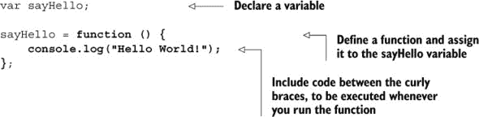

在列表 4.4 中很容易看到组成函数定义的不同部分：`function`关键字、空括号和函数体的代码块。函数体只有一个语句，`console.log(`“`Hello World!`”`);`。到目前为止，你只*定义*了函数，准备以后使用。函数体内的代码在运行函数之前不会执行——你将在 4.2.3 节中看到如何执行它。

以下列表展示了更多定义函数并将它们赋值给变量的例子。

##### 列表 4.5\. 两个额外的函数定义和赋值（[`jsbin.com/xezani/edit?js,console`](http://jsbin.com/xezani/edit?js,console)）

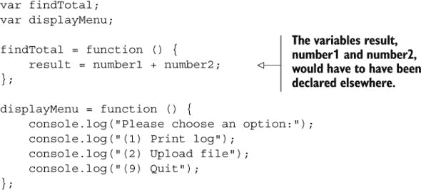

#### 4.2.2\. 函数表达式和函数声明

在之前的例子中，你一直使用*函数表达式*来定义函数并将它们通过赋值操作符赋值给变量。

```
var findTotal = function () { ... };   // The function expression is in bold.
```

你还可以使用一种称为*函数声明*的替代语法。而不是先定义函数然后将其赋值给变量，你可以在定义函数时作为定义的一部分声明函数的名称。

```
function findTotal () { ... }  // Declare a name with the function
```

你可以将定义函数的两种方式视为等效；有一些细微的差别，但在这里我们不会深入探讨。*用 JavaScript 编程入门* 在 第一部分 和 第二部分 中始终使用函数表达式，以突出创建和分配不同值之间的相似性，包括对象、函数和数组。

```
var numOfDays = 7;                      // Assign a number
var player = { ... };                   // Create and assign an object 
var findTotal = function () { ... };    // Define and assign a function 
var items = [];                         // Create and assign an array (ch8)
```

目前不必担心函数声明语法，甚至不必担心声明和表达式之间的区别。当你再次在 第三部分 遇到声明语法时，你会对函数有更多的了解。

仅定义函数不足以在控制台显示“Hello World!”，计算总和或显示菜单。你需要一种方法告诉函数执行其指令列表。

#### 4.2.3\. 使用函数

一旦你将一个函数赋值给一个变量，每次你想执行函数体内的语句时，你只需写出变量名后跟括号，`()`。

```
sayHello();
findTotal();
displayMenu();
```

调用函数的其他名称是 *调用* 函数或 *调用* 函数。

在 列表 4.6 中，你调用了 `sayHello` 函数三次。它显示了字符串 `"Hello World!"` 三次，如下所示：

```
> Hello World!
> Hello World!
> Hello World!
```

##### 列表 4.6\. 调用 sayHello 函数三次 ([`jsbin.com/vozuxa/edit?js,console`](http://jsbin.com/vozuxa/edit?js,console))

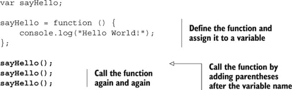

下一个列表使用 `findTotal` 函数更新 `result` 变量。然后它在控制台上显示整个计算：

```
> 1000 + 66 = 1066
```

##### 列表 4.7\. 使用 findTotal 函数显示计算 ([`jsbin.com/hefuwa/edit?js,console`](http://jsbin.com/hefuwa/edit?js,console))

```
var number1 = 1000;
var number2 = 66;
var result;
var findTotal;

findTotal = function () {
    result = number1 + number2;
};

findTotal();

console.log(number1 + " + " + number2 + " = " + result);
```

列表 4.8 调用了 `displayMenu` 函数来，嗯，显示菜单。（这些函数确实做了它们所说的！）

```
> Please choose an option:
> (1) Print log
> (2) Upload file
> (9) Quit
```

##### 列表 4.8\. 显示菜单 ([`jsbin.com/cujozo/edit?js,console`](http://jsbin.com/cujozo/edit?js,console))

```
var displayMenu;

displayMenu = function () {
    console.log("Please choose an option:");
    console.log("(1) Print log");
    console.log("(2) Upload file");
    console.log("(9) Quit");
};

displayMenu();
```

使用空括号作为调用函数的符号可能看起来有些奇怪。但，正如你将在 第五章 中看到的，它们并不总是空的 ... *[神秘音乐提示]*。


##### 定义

对于那些喜欢术语的人来说，当调用函数时添加到变量末尾的括号，`()`，被称为 *函数调用操作符* 或 *函数调用操作符*。


#### 4.2.4\. 逐步使用函数

表 4.1 总结了定义和调用函数所使用的步骤。

##### 表 4.1\. 定义和调用函数所使用的步骤

| 动作 | 代码 | 注释 |
| --- | --- | --- |
| 声明一个变量 | var sayHello; | 为你在程序中使用保留名称。 |

| 定义一个函数 | function () { console.log("Hello World!");

} | 函数体内的代码在此点不会执行。 |

| 赋值给变量 | sayHello = function () { console.log("Hello World!");

}; | 将函数赋值给变量为你提供了一个可以用来调用函数的标签。|

| 调用函数 | sayHello(); | 函数体内的代码将被执行。 |
| --- | --- | --- |

| 需要时重复调用函数 | sayHello(); sayHello();

sayHello(); | 每次调用函数时，函数体内的代码都会被执行。|

表格的第二行，定义一个函数，通常不会单独出现；你更有可能定义一个函数并将其赋值给变量，就像第三行中看到的，赋值给变量。 (你将在后面的章节中看到，你可以将函数定义作为数组（列表）的元素赋值，并将它们传递给其他函数——它们并不总是赋值给变量。)

### 4.3\. 减少重复

在 列表 4.2 和 4.3 中，你看到了在没有函数可用时所需的重复代码块。现在是时候控制这些失控的代码，修剪那些快速生长的杂草，让孩子们节食，限制开支——你明白我的意思；让我们减少重复！

#### 4.3.1\. 用于将对象属性显示为文本的函数

返回到 列表 4.2 中的代码，你简化了电影信息的显示。将电影显示代码一次性写在函数中，并在需要时简单地调用该函数。

##### 列表 4.9\. 使用函数显示对象属性 ([`jsbin.com/toqopo/edit?js,console`](http://jsbin.com/toqopo/edit?js,console))

```
var showMovieInfo;

showMovieInfo = function () {
    console.log("Movie information for " + movie.title);
    console.log("------------------------------");
    console.log("Actors: " + movie.actors);
    console.log("Directors: " + movie.directors);
    console.log("------------------------------");
};
```

代码将新函数赋值给 `showMovieInfo` 变量。通过编写变量名后跟括号，即 `showMovieInfo()` 来调用函数，如下一列表所示。你应在控制台上得到以下输出，与之前在 图 4.1 中看到的预期目标相匹配。

```
> Movie information for Inside Out
> ------------------------------
> Actors: Amy Poehler, Bill Hader
> Directors: Pete Doctor, Ronaldo Del Carmen
> ------------------------------
```

##### 列表 4.10\. 调用 showMovieInfo 函数 ([`jsbin.com/menebu/edit?js,console`](http://jsbin.com/menebu/edit?js,console))

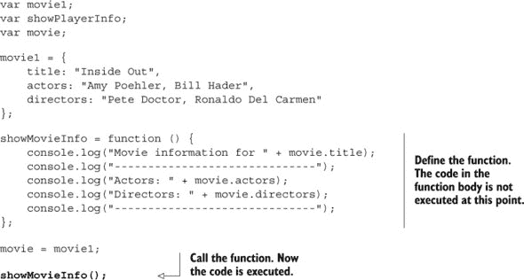

使用 `movie` 变量，该变量由 `showMovieInfo` 函数使用，你可以切换函数将使用哪部电影的信息。列表 4.11 展示了如何在电影之间切换。三个不同电影的信息被打印到控制台上。

```
> Movie information for Inside Out
> ------------------------------
> Actors: Amy Poehler, Bill Hader
> Directors: Pete Doctor, Ronaldo Del Carmen
> ------------------------------
> Movie information for Spectre
> ------------------------------
> Actors: Daniel Craig, Christoph Waltz
> Directors: Sam Mendes
> ------------------------------
> Movie information for Star Wars: Episode VII – The Force Awakens
> ------------------------------
> Actors: Harrison Ford, Mark Hamill, Carrie Fisher
> Directors: J.J.Abrams
> ------------------------------
```

##### 列表 4.11\. 使用相同函数处理多个对象 ([`jsbin.com/mavutu/edit?js,console`](http://jsbin.com/mavutu/edit?js,console))

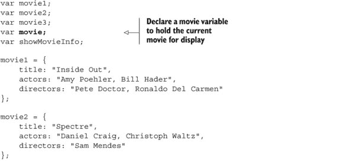

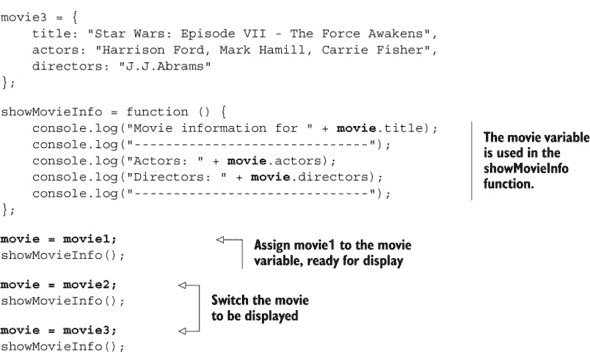

#### 4.3.2\. 添加税费和显示摘要的函数

列表 4.12 展示了一个用于为销售添加税费并显示每笔交易摘要的函数。你需要重复的大部分代码都在两个函数 `calculateTax` 和 `displaySale` 中，你依次为每笔销售对象调用它们。输出结果如下所示。

```
price = $140
tax @ 15% = $21
total cost = $161
price = $40
tax @ 10% = $4

total cost = $44
price = $120
tax @ 20% = $24
total cost = $144
```

与 JS Bin 上的所有列表一样，在程序下方有 “进一步冒险” 的建议，这些建议可以帮助你探索代码并加深理解。在这种情况下，一个挑战是减少函数调用的重复；`calculateTax` 和 `displaySale` 总是同时被调用。虽然有两个不同的函数——它们做不同的事情——但你能避免每次为每个 sale 对象都调用它们吗？如果你已经连接，点击上面的链接 列表 4.12 现在前往 JS Bin 并开始冒险。如果你在远离技术的印刷版书籍中阅读，那么对你来说就是纸和笔！大多数问题的解决方案都可以在 *Get Programming with JavaScript* 网站上找到，网址为 [www.room51.co.uk/books/getProgramming/listings.html](http://www.room51.co.uk/books/getProgramming/listings.html)。

##### 列表 4.12\. 使用函数添加和显示税 ([`jsbin.com/raqiri/edit?js,console`](http://jsbin.com/raqiri/edit?js,console))

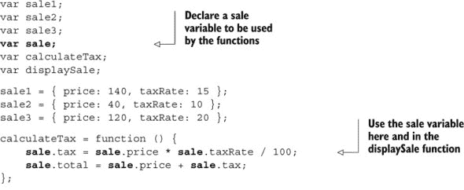

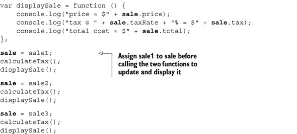

这两个函数在其定义中使用了 `sale` 变量，访问对象上的属性，如 `sale.price`、`sale.taxRate` 等。函数体内的代码在程序调用这两个函数之前不会运行，到那时程序将已将一个 sale 对象分配给 `sale` 变量。

函数名 `calculateTax` 和 `displaySale` 有助于使 列表 4.12 中的程序更易于遵循和理解。第 4.4 节 更详细地探讨了这些想法。

### 4.4\. 使代码更易于阅读和更新

随着你的程序变得越来越长和复杂，你通过将它们分解成命名良好的对象和函数来管理这种复杂性。任何阅读你的代码的人都可以跟随其流程并理解各个部分以及整体的目的。

查看以下代码片段；即使你不了解函数如何工作的细节，你也应该能感受到正在发生的事情。

```
...
var balance = getAccountBalance();

displayBalance();

addInterest()
addBonus();
setAccountBalance();

displayBalance();
...
```

每个函数都应该有一个单一、明确的目的。如果你需要调查一个函数的功能，你应该能够在一个地方找到它的定义。让我们看看更新一个函数的例子。

#### 4.4.1\. 更新 showMovieInfo 函数

在 列表 4.11 中，你创建了一个 `showMovieInfo` 函数来显示电影对象的信息。能够将显示代码块封装到一个函数中是非常棒的。但是，当多个电影的信息挤在一起在控制台上时，很难挑选出特定电影的个别事实。添加空白行将有助于更清楚地看到每个电影。

```
> Movie information for Inside Out
> ------------------------------
> Actors: Amy Poehler, Bill Hader
> Directors: Pete Doctor, Ronaldo Del Carmen
> ------------------------------
>
> Movie information for Spectre
> ------------------------------
> Actors: Daniel Craig, Christoph Waltz
> Directors: Sam Mendes
> ------------------------------
>
> Movie information for Star Wars: Episode VII – The Force Awakens
> ------------------------------
> Actors: Harrison Ford, Mark Hamill, Carrie Fisher

> Directors: J.J.Abrams
> ------------------------------
>
```

因为你的显示代码都在 `showMovieInfo` 函数内部，你可以直接去那里添加一个额外的 `console.log` 调用来创建空白行，如下一个列表所示。你的组织工作已经开始显现成效了！

##### 列表 4.13\. 更新你的显示函数以添加空白行 ([`jsbin.com/cijini/edit?js,console`](http://jsbin.com/cijini/edit?js,console))

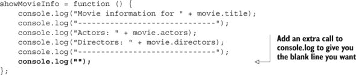

所以很接近！因为 JS Bin 控制台将字符串包裹在引号中，所以你并没有得到空白行。你得到的是空引号。但是如果你检查浏览器的自己的控制台（见在线指南[www.room51.co.uk/guides/browser-consoles.html](http://www.room51.co.uk/guides/browser-consoles.html)），你应该看到预期的空白行，如图 4.3 所示。

##### 图 4.3\. JS Bin 在引号中显示空字符串，但 Safari 浏览器不这样做。

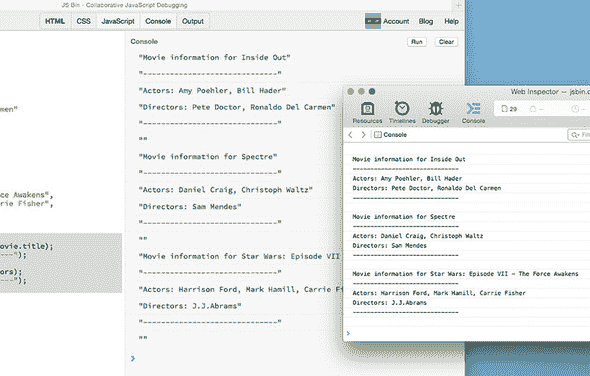

如果这个例子是更大（可能更大）程序的一部分，而你没有将玩家显示逻辑安全地封装在单个函数中，你就必须检查所有代码以找到应该进行更改的行。文本编辑器和开发环境应该有工具来帮助，但它们并不是万无一失的，你的程序可能会出现未修正的代码的隐蔽角落。你尝试一下，一开始，一切似乎都很好。然后后来有运行和，嗯，尖叫。避免噩梦——使用函数。

### 4.5\. The Crypt——显示玩家信息

现在，你将应用你对 JavaScript 函数的知识到*The Crypt*。图 4.4 显示了本节重点，通过使用函数显示玩家信息，如何融入我们正在进行的游戏示例的整体结构。

##### 图 4.4\. *The Crypt* 的元素


在第三章中，你看到了如何将有关玩家的信息组合成一个单一的 JavaScript 对象。你使用花括号创建对象，并使用键值对设置属性，如下所示：

```
var player;

player = {
    name: "Kandra",
    health: 50,
    place: "The Dungeon of Doom"
};
```

一旦将新对象分配给`player`变量，你就可以通过点符号来获取属性值。显示玩家信息涉及到将属性记录到控制台。

```
console.log(player.name + " is in " + player.place);
```

在游戏中，你可能需要多次显示玩家信息，并且针对多个玩家。你应该使用你对函数的新知识来使信息显示更高效；使其*按需编码*——可以通过调用函数来执行的代码。

#### 4.5.1\. 显示玩家信息的函数

来自列表 4.13(#ch04ex13)的`showMovieInfo`函数看起来正是你需要的那种函数。而`showMovieInfo`显示有关电影的信息，列表 4.14 显示了执行类似任务的`showPlayerInfo`函数，产生以下输出：

```
> Kandra
> ------------------------------
> Kandra is in The Dungeon of Doom
> Kandra has health 50
> ------------------------------
>
> Dax
> ------------------------------
> Dax is in The Old Library
> Dax has health 40
> ------------------------------
```

##### 列表 4.14\. 显示玩家信息的函数 ([`jsbin.com/mafade/edit?js,console`](http://jsbin.com/mafade/edit?js,console))


太棒了！这完成了任务。现在只需调用一次函数就能显示玩家信息。遗憾的是，你必须不断将不同的玩家分配给`player`变量才能使其工作；如果能以某种方式告诉函数“显示 player1 的信息”或“显示 player2 的信息”会更好。好吧，在接下来的三章中，我们将详细探讨如何在函数之间传递信息。灵活性、可重用性、效率，我们来了！

### 4.6\. 概述

+   函数是一段你只编写一次但多次使用的代码块。它应该有一个清晰、单一的目的。

+   你可以通过使用函数关键字、括号和花括号中的函数体来定义一个函数：

    ```
    function () {
        // Statements go here in the function body
    };
    ```

+   你可以使用等号`=`将函数分配给一个变量，这也就是所谓的赋值运算符：

    ```
    showPlayerInfo = function () { ... };
    ```

+   一旦将函数分配给变量，你就可以通过在变量名末尾添加括号来调用或调用该函数：

    ```
    addTax();
    showPlayerInfo();
    evadeRaptor();
    ```

+   注意重复；具有相同结构且仅在使用值或变量上略有变化的代码段。将重复的代码移动到函数中。

+   给函数起一个清晰的名字，以传达其目的。使用函数来组织你的代码，使你的程序更容易遵循和维护。

## 第五章\. 参数：向函数传递数据

***本章内容涵盖***

+   使用参数定义函数，准备接受数据

+   调用函数，通过参数传递数据

函数是组织代码的一种基本手段；你只需编写一次，然后多次使用。但到目前为止，你的函数都绑定在周围的变量值上。是时候让你的函数自由了，让它们命名自己的变量，并将它们需要的数据传递给它们。

### 5.1\. 函数重用和多功能性

你到目前为止使用的函数都依赖于在程序其他地方声明的并赋予值的变量。在下面的列表中，`showMessage`函数依赖于一个名为`message`的变量，该变量在函数定义外部声明。

##### 列表 5.1\. 依赖于函数外部的变量([`jsbin.com/taqusi/edit?js,console`](http://jsbin.com/taqusi/edit?js,console))


在`showMessage`函数定义中，你使用了一个名为`message`的变量。`message`变量必须存在，函数才能执行其任务。如果你更改变量的名称，函数就会出错。如果`message`被重命名为`msg`，如下一列表所示，并在 JS Bin 上运行程序，你应该得到一个类似这样的错误：“引用错误：找不到变量：message。”（不同的浏览器可能会给出略有不同的错误信息。）

##### 列表 5.2\. 通过更改变量名来分解函数([`jsbin.com/yaresa/edit?js,console`](http://jsbin.com/yaresa/edit?js,console))


函数体内的指令可以使用你在程序其他地方定义的变量，但这会将函数与外部变量耦合；更好的做法是在调用函数时将函数所需的信息传递给函数。这有助于避免函数所需的变量被误命名、遗漏、删除或被程序的其他部分更改，并使跟踪程序流程和发现错误变得更加容易。

我们不希望傲慢的摇滚之神函数在表演前在他们的化妆室里要求特定的变量；我们希望随和的函数，它们可靠且愿意在世界任何地方展示自己的才华。通过将函数与变量解耦，你使函数更易于携带；函数定义可以被移动到程序的其他部分，或者在其他程序或代码库中重用，而不会造成混乱和引发错误。

那么，这种解耦是如何实现的呢？

### 5.2\. 将信息传递给函数

向函数传递信息分为两个阶段：当你定义函数时和当你调用函数时：

> **1**. 当你*定义*函数时，你设置变量名称，称为*参数*，以便在调用函数时使用。
> 
> **2**. 当你*调用*函数时，你包括数据以分配给你在步骤 1 中命名的变量。

在本章中，你将看到许多示例（书中其余部分还有很多），但没有什么比实践更能使知识变得牢固。JS Bin 上每个代码列表的*进一步冒险*部分应该能帮助你开始。

#### 5.2.1\. 向函数传递一个参数

是时候在你的函数定义中使用那些空括号了！当你调用函数时传递信息，就像这样放在括号之间：

```
showMessage("It's full of stars!");
showPlayerInfo("Kandra");
getMovieActors("The Hobbit");
square(12);
```

你为每个四个函数传递了一些信息供其代码使用。括号中包含的每个值都称为*参数*。这里显示的四个函数都包含一个参数。这些参数是“它充满了星星！”，“Kandra”，“霍比特人”，和 12。

要使用括号中的信息，你需要使函数准备好接受它。你定义函数时添加一个*参数*。参数表明函数期望你在调用它时提供一些信息，如图 5.1 所示。

##### 图 5.1\. 在定义函数时在括号中包含参数


对于前面的四个函数，函数定义可能如下所示：

```
showMessage = function (message) { ... };
showPlayerInfo = function (playerName) { ... };
getMovieActors = function (movieTitle) { ... };
square = function (numberToSquare) { ... };
```

每个函数定义都包含一个参数，用粗体显示。该参数是一个只能在函数体内使用的变量。

让我们更新 列表 5.1 中的 `showMessage` 函数，使其接受一个消息，而不是依赖于外部变量。在定义函数时，包括一个 `message` 参数。`message` 参数作为变量在函数体内可用。现在当你调用函数时，你将要在括号中传递的消息传递给函数，即 `showMessage("It's full of stars!")`。函数添加额外的文本并显示以下内容：

```
> The message is: It's full of stars!
```

##### 列表 5.3\. 将信息传递给函数 ([`jsbin.com/xucemu/edit?js,console`](http://jsbin.com/xucemu/edit?js,console))


当你在 列表 5.3 的末尾调用 `showMessage` 函数时，你将字符串 “It’s full of stars!” 包含在括号中。像这样包含在函数调用括号中的值称为 *参数*。程序将参数分配给名为 `message` 的变量。然后函数使用 `message` 变量生成记录到控制台的字符串，即 `"The message is: It's full of stars!"`

表 5.1 列出了声明带参数的函数以及用不同参数调用它的步骤。

##### 表 5.1\. 定义和调用函数以及传递数据的步骤

| 操作 | 代码 | 注释 |
| --- | --- | --- |
| 声明一个变量 | var showMessage; | 为程序中的使用预留名称。 |

| 带参数定义函数 | function (message) {

} | 预留变量名，message，用于函数体内。|

| 使用参数 | function (message) { console.log(message);

} | 该参数作为变量在函数体内可用。|

| 将函数赋值给变量 | showMessage = function (message) { console.log(message); |

}; | 将函数赋值给变量为你提供了一个可以用来调用函数的标签。|

| 使用参数调用函数 | showMessage("It's full of stars!"); | 函数体内的代码使用括号中分配给 `message` 的参数执行。 |
| --- | --- | --- |

| 重复使用不同参数调用函数 | showMessage("It's full of stars!"); showMessage("Yippee!"); |

showMessage("Cowabunga!"); | 每次调用函数时，参数都被分配给 `message` 参数。|

你可以使用你选择的任何文本调用 `showMessage` 函数。文本被分配给 `message` 变量，并用作记录到控制台的全消息的一部分。

在 列表 5.4 中，你使用三个不同的参数调用 `showMessage` 函数，导致控制台上有三条不同的消息：

```
> The message is: It's full of stars!
> The message is: Hello to Jason Isaacs
> The message is: Hello to Jason Isaacs and Stephen Fry
```

##### 列表 5.4\. 使用不同参数调用相同函数 ([`jsbin.com/zavavo/edit?js,console`](http://jsbin.com/zavavo/edit?js,console))


由于你在函数定义中声明了参数名称，`showMessage` 函数不再依赖于其他地方的变量名称，这使得它更不易损坏。解耦完成。

列表 5.5 显示了平方函数的定义，包括一个 `numberToSquare` 参数。该函数将你传递给它的数字作为参数进行平方。你调用该函数四次，得到以下输出：

```
> 10 * 10 = 100
> -2 * -2 = 4
> 1111 * 1111 = 1234321
> 0.5 * 0.5 = 0.25
```

##### 列表 5.5\. 使用平方函数 ([`jsbin.com/vequpi/edit?js,console`](http://jsbin.com/vequpi/edit?js,console))


**参数与参数**

你知道那些括号会派上用场！

当你 *定义函数* 时括号中包含的名称在函数体中作为变量可用。它们被称为 *参数*，表明你期望在调用函数时包含信息。

```
var myExample;
myExample = function (parameter) { ... }
```

当你 *调用函数* 时括号中包含的值被分配给参数变量，用于函数体中。这些值被称为 *参数*。

```
myExample(argument);
```

不要过于担心术语；适应这些术语可能需要一点时间。在你创建和使用了一些函数之后，即使偶尔混淆了术语 *参数* 和 *参数*，你也会对正在发生的事情有一个直观的感觉。


#### 5.2.2\. 向函数传递多个参数

你可以定义完成工作所需的任何参数的函数。只需在定义的括号中用逗号分隔参数即可（图 5.2）。

##### 图 5.2\. 在函数定义中包含多个参数


假设你想要一个函数将两个数字相加。如果你有两对数字，30 和 23，以及 2.8 和 -5，正确的输出应该是

```
> The sum is 53
> The sum is -2.2
```

你怎么做这个？

##### 列表 5.6\. 具有两个参数的函数 ([`jsbin.com/siyelu/edit?js,console`](http://jsbin.com/siyelu/edit?js,console))


当你调用 `showSum` 函数时，程序会自动将你提供的两个参数分配给定义中的两个参数，`number1` 和 `number2`。在 列表 5.6 中的第一次调用 `showSum` 时，就像函数体变成了

```
var number1 = 30;
var number2 = 23;
var total = number1 + number2;
console.log("The sum is " + total);
```

你可以定义具有所需数量的参数的函数。随着参数数量的增加，人们（包括你！）在使用你的函数时犯错误的可能性也更大；他们可能在调用函数时遗漏参数或参数顺序错误。克服这个问题的巧妙方法是将对象传递给函数。函数定义只需要一个参数，函数体可以访问它需要的任何属性。你将在第七章（kindle_split_015.html#ch07）中了解如何使用对象与函数。

### 5.3\. 密室—显示玩家信息

现在，你将应用你对 JavaScript 函数参数的知识到 *密室* 中。图 5.3 显示了本节重点，通过使用带参数的函数显示玩家信息，如何融入我们正在进行的游戏示例的整体结构。

##### 图 5.3\. 密室元素


在第四章中，您编写了一个`showPlayerInfo`函数作为代码按需。您可以在需要时随时在控制台上显示玩家信息，只需调用该函数即可。不幸的是，它依赖于代码其他地方设置的`player`变量。让我们更新`showPlayerInfo`函数，设置参数以便您可以直接传递所需的信息。

为了显示每个玩家的信息，您将任务分解为子任务，并为每条信息创建函数。然后您可以这样显示玩家的信息：

```
showPlayerName("Kandra");
showPlayerHealth("Kandra", 50);
showPlayerPlace("Kandra", "The Dungeon of Doom");
```

每个函数都有特定的任务要做。如果您想一次性显示所有信息，您可以将单个函数包装在一个主函数中，并传递给它所需的所有信息：

```
showPlayerInfo("Kandra", "The Dungeon of Doom", 50);
```

在接下来的几节中，您定义了四个函数，并看到它们与玩家对象一起工作。前三个函数非常相似；注意哪些发生了变化，哪些保持不变。注意您在定义函数时如何使用参数，以及调用它们时如何使用参数。

#### 5.3.1\. 显示玩家的名字

您的第一个函数的任务是显示玩家的名字。仅此而已。没有铃声或哨声。下一个列表显示了`showPlayerName`函数的定义，并使用两个不同的名字调用该函数以产生以下输出：

```
> Kandra
> Dax
```

##### 列表 5.7\. 显示玩家的名字 ([`jsbin.com/yubahi/edit?js,console`](http://jsbin.com/yubahi/edit?js,console))


在实际的*The Crypt*程序中，您不太可能使用像`"Kandra"`和`"Dax"`这样的字面值调用`showPlayerName`函数。您更有可能使用变量。特别是，JavaScript 对象将代表玩家。下一个列表更新了代码以使用几个玩家对象。

##### 列表 5.8\. 通过对象属性显示玩家的名字 ([`jsbin.com/juhewi/edit?js,console`](http://jsbin.com/juhewi/edit?js,console))


名字部分就到这里。接下来是健康状态。

#### 5.3.2\. 显示玩家的健康状态

下一个列表中的`showPlayerHealth`函数定义包含了两个参数，`playerName`和`playerHealth`，以产生如下输出：

```
> Kandra has health 50
> Dax has health 40
```

##### 列表 5.9\. 显示玩家的健康状态 ([`jsbin.com/nomija/edit?js,console`](http://jsbin.com/nomija/edit?js,console))


在列表 5.9 中调用`showPlayerHealth`时使用了字面值`"Kandra"`和`50`。在最终程序中，每个玩家的信息都分配给了玩家对象的属性。您调用`showPlayerHealth`时更有可能使用这些属性而不是硬编码的值。下一个列表更新了代码以包含玩家对象。

##### 列表 5.10\. 通过对象属性显示玩家的健康状态 ([`jsbin.com/zufoxi/edit?js,console`](http://jsbin.com/zufoxi/edit?js,console))


姓名：检查。健康：检查。这样就只剩下位置了。

#### 5.3.3\. 显示玩家的位置

在以下列表中定义的 `showPlayerPlace` 函数也包含两个参数，这次是 `playerName` 和 `playerPlace`，并且会输出如下内容：

```
> Kandra is in The Dungeon of Doom
> Dax is in The Old Library
```

##### 列表 5.11\. 显示玩家的位置 ([`jsbin.com/yifahe/edit?js,console`](http://jsbin.com/yifahe/edit?js,console))

```
var showPlayerPlace;

showPlayerPlace = function (playerName, playerPlace) {
    console.log(playerName + " is in " + playerPlace);
};

showPlayerPlace("Kandra", "The Dungeon of Doom");
showPlayerPlace("Dax", "The Old Library");
```

再次强调，从 列表 5.11 中的硬编码字面值切换到对象属性，在下一个列表中给出了更新版本。

##### 列表 5.12\. 通过对象属性显示玩家的位置 ([`jsbin.com/mejuki/edit?js,console`](http://jsbin.com/mejuki/edit?js,console))

```
var player1;
var player2;
var showPlayerPlace;

showPlayerPlace = function (playerName, playerPlace) {
    console.log(playerName + " is in " + playerPlace);
};

player1 = {
    name: "Kandra",
    place: "The Dungeon of Doom",
    health: 50
};

player2 = {
    name: "Dax",
    place: "The Old Library",
    health: 40
};

showPlayerPlace(player1.name, player1.place);
showPlayerPlace(player2.name, player2.place);
```

您已经有了显示玩家个别信息的三个函数。现在，是时候将它们组合在一起使用了。

#### 5.3.4\. 整合所有内容——显示玩家的信息

`showPlayerInfo` 函数使用您的三个单独的函数——`showPlayerName`、`showPlayerHealth` 和 `showPlayerPlace`——并添加了一些格式化，以显示每个玩家的属性。一个玩家的输出看起来像这样：

```
>
> Kandra
> ----------------------------
> Kandra is in The Dungeon of Doom
> Kandra has health 50
> ----------------------------
>
```

下一个列表省略了三个组件函数，以专注于新的函数。它们包含在 JS Bin 中。

##### 列表 5.13\. 显示玩家的信息 ([`jsbin.com/likafe/edit?js,console`](http://jsbin.com/likafe/edit?js,console))

```
var showPlayerInfo;

showPlayerInfo = function (playerName, playerPlace, playerHealth) {
    console.log("");

    showPlayerName(playerName);

    console.log("----------------------------");

    showPlayerPlace(playerName, playerPlace);
    showPlayerHealth(playerName, playerHealth);

    console.log("----------------------------");
    console.log("");
};

showPlayerInfo("Kandra", "The Dungeon of Doom", 50);
showPlayerInfo("Dax", "The Old Library", 40);
```

您每次调用 `showPlayerInfo` 函数时都使用三个参数。它反过来将所需的参数传递给 `showPlayerName`、`showPlayerHealth` 和 `showPlayerPlace` 函数。

最后，您将所有部分组合成一个单独的列表，如下所示。它将每个变量声明和赋值作为一个单独的步骤，并在调用 `showPlayerInfo` 时使用玩家对象的属性，如 `player1.name`，而不是像 `"Kandra"` 这样的字面值。

##### 列表 5.14\. 使用属性显示玩家的信息 ([`jsbin.com/loteti/edit?js,console`](http://jsbin.com/loteti/edit?js,console))

```
var showPlayerName = function (playerName) {
    console.log(playerName);
};

var showPlayerHealth = function (playerName, playerHealth) {
    console.log(playerName + " has health " + playerHealth);
};

var showPlayerPlace = function (playerName, playerPlace) {
    console.log(playerName + " is in " + playerPlace);
};

var showPlayerInfo = function (playerName, playerPlace, playerHealth) {
    console.log("");
    showPlayerName(playerName);
    console.log("----------------------------");
    showPlayerPlace(playerName, playerPlace);
    showPlayerHealth(playerName, playerHealth);
    console.log("----------------------------");
    console.log("");
};

var player1 = {
    name: "Kandra",
    place: "The Dungeon of Doom",
    health: 50
};

var player2 = {
    name: "Dax",
    place: "The Old Library",
    health: 40
};

showPlayerInfo(player1.name, player1.place, player1.health);
showPlayerInfo(player2.name, player2.place, player2.health);
```

### 5.4\. 概述

+   定义一个带有命名 *参数* 的函数，以表明您在调用函数时预期传递数据。定义中的参数由逗号分隔：

    ```
    function (param1, param2) { ... }
    ```

+   在函数体内使用参数，就像它们是变量一样。

+   使用 *参数* 调用函数。当您运行程序时，参数会自动分配给参数以在函数体内使用：

    ```
    myFunction(arg1, arg2)
    ```

## 第六章\. 返回值：从函数获取数据

***本章涵盖***

+   从函数返回信息

+   `return` 关键字

+   在控制台提示符中进行实验

在第四章中，你发现了函数如何通过一次编写多次使用来提高你的效率。在第五章中，你通过在每次调用时传递信息使函数变得更加灵活；一个函数可以根据你给出的参数以不同的方式行事并产生不同的输出。在本章中，你给函数机会通过返回它们工作的结果来“回应”。你还可以在控制台提示符中直接调用函数来调查它们返回的值。

### 6.1\. 从函数返回数据

通常，让函数为你做一些工作并返回该工作的结果是非常有用的。然后你可以根据需要使用该结果。在列表 5.6 中，你看到了一个`showSum`函数，它在控制台上显示两个数的和。可能有一个`add`函数，它只是将数字相加并返回结果会更好。与`showSum`总是显示结果在控制台上不同，使用`add`，你可以选择显示函数返回的结果，将其用于进一步的计算，通过网络发送，或将其保存到数据库中。

#### 6.1.1\. 返回值替换函数调用

你迄今为止编写的许多函数都是根据需求执行代码并在控制台上记录一些内容。它们帮助你将程序分解成可理解的块。通过将函数分配给有良好命名的变量，你使程序更容易理解。以下是一个显示*The Crypt*中玩家信息的代码片段的示例：

```
showPlayerName("Kandra");
showLine();
showPlayerPlace("Kandra", "The Dungeon of Doom");
showPlayerHealth("Kandra", 50);
showLine();
```

即使你不知道函数是如何执行它们的任务的，它们的名称也能给你一个很好的关于代码意图的印象。

函数还可以返回信息：计算的结果、构造的文本片段或数据库中的数据。你可以将返回的值分配给变量或将其用作其他函数的参数。以下示例以加粗的形式显示了调用四个函数`add`、`getPlayerPlace`、`findPlanetPosition`和`getMessage`：

```
var sum = add(50, 23);
var placeInfo = getPlayerPlace("Kandra", "The Dungeon of Doom");
console.log(findPlanetPosition("Jupiter"));
console.log(getMessage());
```

每个函数都返回一个值，返回的值替换了函数调用。假设函数返回以下加粗的值，前面的四个语句变为

```
var sum = 73;
var placeInfo = "Kandra is in The Dungeon of Doom";
console.log("Jupiter: planet number 5");
console.log("I'm going on an adventure!");
```

图 6.1 展示了调用`add`函数时发生的情况。

##### 图 6.1\. 你调用`add`函数，它返回值`73`。


要从函数返回一个值，请使用`return`关键字。

#### 6.1.2\. `return`关键字

通过使用`return`关键字从函数返回一个值。语句中`return`之后的任何内容都是替换函数调用的值。

列表 6.1 展示了`getMessage`函数的定义。它包括一个*返回语句*，一个以`return`关键字开始的语句：

```
return "I'm going on an adventure!";
```

函数返回字符串 `"I'm going on an adventure!"`，因为字符串跟在 `return` 关键字后面。程序将字符串赋给 `response` 变量并将其记录到控制台以显示

```
> I'm going on an adventure!
```

##### 列表 6.1。从函数返回值 ([`jsbin.com/yucate/edit?js,console`](http://jsbin.com/yucate/edit?js,console))


`getMessage` 函数总是返回相同的值。通常，通过在调用函数时传递的参数信息来确定返回值。

#### 6.1.3。使用参数确定返回值

在 第五章 中，你通过在函数定义中包含参数和在函数调用中包含参数将信息传递给函数。你可以在函数体中使用这些信息来确定函数返回的值，因此你可以用不同的参数多次调用函数以产生不同的返回值。

下面的列表显示了一个 `getHelloTo` 函数，该函数返回一个包含作为参数传递的名称的字符串。程序将返回值赋给一个变量并将其记录到控制台。

```
> Hello to Kandra
```

##### 列表 6.2。使用参数确定返回值 ([`jsbin.com/nijijo/edit?js,console`](http://jsbin.com/nijijo/edit?js,console))


在 列表 6.2 中，你将返回值赋给变量 `fullMessage` 并将其记录到控制台。这个变量是多余的；你可以直接记录返回值，如下一个列表所示，其中你两次调用 `getHelloTo` 函数以产生以下输出：

```
> Hello to Kandra
> Hello to Dax
```

##### 列表 6.3。使用返回值作为参数 ([`jsbin.com/yapic/edit?js,console`](http://jsbin.com/yapic/edit?js,console))


函数可以返回任何类型的值：字符串、数字、对象，甚至其他函数。让我们看看一个返回数字的例子。

图 6.2 展示了对 `add` 函数的调用，`add(50, 23)`。图中显示了传递给 `add` 的参数是如何用于计算返回值的。

##### 图 6.2。`add` 函数计算返回值。


下一个列表显示了使 `add` 函数执行其操作的代码。特别是要注意 `return` 关键字。

##### 列表 6.4。返回两个数字的和 ([`jsbin.com/haqapu/edit?js,console`](http://jsbin.com/haqapu/edit?js,console))


`add(50, 23)` 调用 `add` 函数，将 `50` 赋值给 `number1`，将 `23` 赋值给 `number2`。然后 `number1` 的值与 `number2` 的值相加，并将结果赋给 `total` 变量。然后 `return` 关键字结束函数，并用 `total` 的值替换函数调用。

```
var sum = add(50, 23);
```

变为

```
var sum = 73;
```

因为 `add(50, 23)` 返回 `73`。

记住，赋值运算符 `=` 通过将其右侧的值赋给左侧的变量来工作。如果右侧是函数调用，那么它将函数的返回值赋给变量。

在 列表 6.4 中的 `add` 函数的 `total` 变量实际上并不需要；它被分配了一个值，然后立即返回。你可以直接返回计算结果，就像 列表 6.5 中的 `totalCost` 函数那样。考虑到管道工的调用费用和每小时收费，`totalCost` 计算了一定小时数的总费用。所以，假设调用费用是 30 美元，管道工每小时收费 40 美元，那么三小时工作的总费用是多少？`totalCost(30, 40, 3)` 应该返回结果 `$150`。

##### 列表 6.5\. 一个有三个参数的函数 ([`jsbin.com/jedigi/edit?js,console`](http://jsbin.com/jedigi/edit?js,console))


当你调用 `totalCost` 函数时，它会评估 `return` 关键字右侧的计算并返回值。它遵循通常的算术规则：它首先执行乘法，然后执行加法：30 + 40 * 3 = 30 + 120 = 150。

### 6.2\. 在控制台提示符中进行实验

程序员通常不会在生产环境中使用控制台，即在发布的程序和网站上。他们在开发时使用它，当设计和编写程序时。它为程序员（也就是你）提供了一个方便的方式来记录值和错误，并在程序运行时调查程序的状态。这种交互性，获得即时反馈的机会，使得控制台对于学习非常有用——尤其是通过实验学习。现在是时候带着你在本章中看到的函数去进行一次发现之旅了。

#### 6.2.1\. 调用函数

下一个列表包括之前列表中的四个函数。如果你运行程序，它不会在控制台产生任何输出；它不包含任何对 `console.log` 的调用。

##### 列表 6.6\. 一组返回值的函数 ([`jsbin.com/lijufo/edit?js,console`](http://jsbin.com/lijufo/edit?js,console))

```
var getMessage;
var getHelloTo;
var add;
var totalCost;

getMessage = function () {
    return "I'm going on an adventure!";
};

getHelloTo = function (name) {
    return "Hello to " + name;
};

add = function (number1, number2) {
    return number1 + number2;
};

totalCost = function (callOutCharge, costPerHour, numberOfHours) {
    return callOutCharge + costPerHour * numberOfHours;
};
```

运行程序会将四个函数分配给程序顶部声明的四个变量。然后你可以从控制台提示符访问这些变量。你可以调用分配给变量的函数来调查它们的返回值。

点击 JS Bin 上的列表链接，确保运行程序。在控制台提示符中输入

```
> getMessage()
```

然后按 Enter。`getMessage` 函数运行并显示其返回值：

```
"I'm going on an adventure!"
```

在提示符下，按键盘上的上箭头键。它应该会显示你最后输入的行。（你可以使用上下箭头在控制台导航到之前的输入。）按 Enter 键重新提交命令。`getMessage` 函数总是返回相同的字符串。如果你查看其函数体，你可以看到它返回一个字符串字面量，一个硬编码的值。

```
return "I'm going on an adventure!";
```

程序中的下一个函数 `getHelloTo` 在其定义中包含一个 `name` 参数。`name` 参数允许返回值根据你调用函数时传递的参数而变化。

```
getHelloTo = function (name) {
    return "Hello to " + name;
};
```

尝试在控制台使用不同的参数每次调用该函数：

```
> getHelloTo("Jason")
  "Hello to Jason"
> getHelloTo("Rosemary")
  "Hello to Rosemary"
```

你可以立即看到改变参数如何影响返回值。

#### 6.2.2\. 声明新变量

除了让你访问程序中声明的变量外，控制台还允许你声明新变量并为其赋值。

直接从上一节继续，在控制台输入

```
> var friend
```

并按 Enter 键。控制台会显示你之前输入的值。因为你没有为`friend`变量赋值，所以`undefined`被记录到控制台。

```
undefined
```

给它一个值。输入

```
> friend = "Amber"
```

并按 Enter 键。控制台会显示新的值。

```
"Amber"
```

最后，使用你新的`friend`变量作为`getHelloTo`函数的参数。

```
> getHelloTo(friend)
  "Hello to Amber"
```

尝试使用`add`和`totalCost`函数，传递不同的参数，并检查控制台上显示的返回值，例如：

```
> add(30, 12)
  42
> totalCost(10, 20, 3)
  70
```

控制台不仅仅是一个记录程序消息的地方。你真的可以深入到你的程序中，检查它们是否按预期行为。不要等待许可；跳进去测试所有的列表。

现在，让我们利用你对返回值的新知识来改进《The Crypt》显示玩家信息的方式。

### 6.3\. 《The Crypt》——构建玩家信息字符串

图 6.3 显示了本节重点，即通过返回值显示玩家信息，在我们正在进行的游戏示例的整体结构中的位置。

##### 图 6.3\. 《The Crypt》的元素


在第五章中，你将显示玩家信息的任务分配给多个函数，每个函数都有特定的任务要做。

```
showPlayerName("Kandra");
showPlayerPlace("Kandra", "The Dungeon of Doom");
showPlayerHealth("Kandra", 50);
```

每个函数都会在控制台记录一条信息字符串。但如果你不想在控制台上显示信息呢？你可能想通过电子邮件发送它，作为对网络请求的响应，或者将其附加到网页上的现有元素。如果函数构建信息字符串并按需返回它们，将更加灵活。

#### 6.3.1\. 为玩家姓名、健康和位置构建字符串

你将需要的信息作为参数传递给你的新函数，它们会返回包含该信息的字符串。你期望的返回值类型如下所示：

```
getPlayerName("Kandra");                 // --> "Kandra" 
getPlayerHealth("Kandra", 50);           // --> "Kadra has health 50" 
getPlayerPlace("Kandra", "The Dungeon"); // --> "Kandra is in The Dungeon"
```

首先是`getPlayerName`。目前它只返回给定的名称，这似乎是浪费时间。但定义一个函数允许你以相同的方式访问所有玩家信息；获取名称类似于获取健康或位置。这也使得在以后更新代码时，如果你决定更改名称的显示方式，更容易一些。以下列表显示了`getPlayerName`函数的定义和对其的一个示例调用，产生以下输出

```
> Kandra
```

##### 列表 6.7\. 获取玩家姓名的字符串([`jsbin.com/hijeli/edit?js,console`](http://jsbin.com/hijeli/edit?js,console))

```
var getPlayerName;

getPlayerName = function (playerName) {
    return playerName;
};

console.log(getPlayerName("Kandra"));
```

接下来的两个函数`getPlayerHealth`和`getPlayerPlace`非常相似，都是根据传入的信息构建简单的字符串。下一个列表包括这两个函数的定义和一些使用示例，在控制台上生成以下内容：

```
> Kandra has health 50
> Kandra is in The Dungeon of Doom
```

##### 列表 6.8\. 获取玩家健康和位置信息的字符串 ([`jsbin.com/pemore/edit?js,console`](http://jsbin.com/pemore/edit?js,console))

```
var getPlayerHealth;
var getPlayerPlace;

getPlayerHealth = function (playerName, playerHealth) {
    return playerName + " has health " + playerHealth;
};

getPlayerPlace = function (playerName, playerPlace) {
    return playerName + " is in " + playerPlace;
};

console.log(getPlayerHealth("Kandra", 50));
console.log(getPlayerPlace("Kandra", "The Dungeon of Doom"));
```

从一个主`getPlayerInfo`函数中调用三个函数将给出你想要的显示字符串。下一节将展示这些组件是如何组装的。

#### 6.3.2\. 玩家信息函数——组装组件

在所有组件就绪后，你现在可以构建主函数来生成关于玩家的信息字符串。你希望输出看起来像这样：

```
>
> Kandra
> ********************
> Kandra is in The Dungeon of Doom
> Kandra has health 50
> ********************
>
```

为了构建分隔玩家信息的字符行，你使用一个返回由星号符号组成的行的`getBorder`函数。接下来的列表显示了`getPlayerInfo`的定义。它包括对未在打印列表中显示但包含在 JS Bin 版本中的其他函数的调用。

##### 列表 6.9\. 获取玩家信息的字符串 ([`jsbin.com/javuxe/edit?js,console`](http://jsbin.com/javuxe/edit?js,console))


`getPlayerInfo`函数逐步构建玩家信息字符串，将调用函数返回的字符串附加到`playerInfo`变量上。在每个阶段附加的额外字符串`\n`是一个换行符；换行符后面的文本将在控制台上显示在新的一行。你使用`+=`运算符将字符串附加到现有字符串的末尾。

本章的最后一个示例将所有代码汇集到一个列表中，列表 6.10，以及用于测试`getPlayerInfo`函数的两个玩家对象。它还在`getBorder`函数中使用不同的分隔符字符，为两个玩家生成如下输出：

```
>
> Kandra
> ================================
> Kandra is in The Dungeon of Doom
> Kandra has health 50
> ================================
>
>
> Dax
> ================================
> Dax is in The Old Library
> Dax has health 40
> ================================
>
```

##### 列表 6.10\. 使用对象显示玩家信息 ([`jsbin.com/puteki/edit?js,console`](http://jsbin.com/puteki/edit?js,console))


你已经成功地将函数从总是打印输出到控制台切换到返回玩家信息的字符串。然后你选择如何处理这些字符串。

将关于玩家的单个信息位传递给函数有点麻烦。不同的函数需要不同的信息位，你必须确保将参数按照正确的顺序放置。如果能直接将整个玩家对象作为参数传递，并让函数访问它们需要的任何属性，那就简单多了。在第七章中，你会看到使用 JavaScript 对象作为参数和返回值是多么有用。

### 6.4\. 概述

+   使用`return`关键字从函数中传递信息：

    ```
    return "Pentaquark!";
    return 42;
    return true;
    ```

+   将函数调用作为值分配给变量或用作参数。函数返回的值替换了函数调用：

    ```
    var particle = getDiscovery();
    console.log(getPlayerPlace("Kandra"));
    ```

+   在函数定义中包含参数，并使用传递给函数的参数来确定返回的值：

    ```
    var sum = add(28, 14);
    ```

+   使用控制台来探索和测试程序。

+   在控制台提示符中调用函数，并查看它们的返回值显示。

+   在控制台声明变量，分配值，并将它们用作函数的参数。

## 第七章。对象参数：与对象一起工作的函数

***本章涵盖***

+   使用对象作为参数

+   在函数内部访问对象属性

+   在函数内部添加新的对象属性

+   从函数中返回对象

+   将函数设置为对象的属性

这是介绍函数的四个章节中的最后一个。到现在为止，你已经了解了如何使用函数按需执行代码，以及如何通过参数、参数和`return`关键字在函数之间传递信息。你也看到了如何使用对象将值收集在一起作为命名属性。那么，现在是时候将函数和对象结合起来，以提升生产力、效率和可读性了。

记得第三章中的急救包吗？我们将这个包视为一个可以传递、打包在背包中并讨论的单个对象。这种封装，或者说将集合视为单一实体，是我们作为人类处理复杂信息的重要部分，无论是在语言还是在记忆中。当需要时，我们可以考虑构成这个包的元素：消毒剂、敷料、绷带等等。

在本章中，你将使用相同的封装概念，将对象作为参数传递给函数并作为返回值返回。

### 7.1\. 使用对象作为参数

能够将对象传递给函数非常有用，特别是如果函数需要访问大量的对象属性。你只需要在函数定义中一个参数，调用函数时不需要一个长的参数列表。"showPlayerInfo(player1)"比"showPlayerInfo(player1.name, player1.location, player1.health)"更整洁、更容易理解，且更不容易出错。

你可以将相同的信息传递给函数，但将其封装在一个单独的对象中，而不是作为单独的值（图 7.1）。

##### 图 7.1\. 将单个对象作为参数比多个参数更整洁。


#### 7.1.1\. 访问对象参数的属性

受到新地平线号、好奇号、罗塞塔号和菲莱号的太空探险的启发，你决定编写一个快速的应用程序来显示有关太阳系的信息。该应用程序的一个功能是显示有关行星的信息。

你的第一个列表显示了具有 `planet` 参数的 `getPlanetInfo` 函数。当你使用 `planet` 对象作为参数调用该函数时，函数体返回一个使用行星的一些属性构建的字符串。该代码产生以下输出：

```
> Jupiter: planet number 5
```

##### 列表 7.1\. 将对象作为参数传递给函数 ([`jsbin.com/tafopo/edit?js,console`](http://jsbin.com/tafopo/edit?js,console))


将对象作为单个参数传递给函数既整洁又方便。无需确保你已按正确顺序包含所有必需的参数——单个参数就能完成工作。

一旦你将一个对象传递给一个函数，JavaScript 会自动将其分配给函数定义中包含的参数。

你通过参数访问对象的属性，如图 7.2 所示。函数通过参数完全控制对象；它甚至可以添加新属性。

##### 图 7.2\. 在函数体内可以访问对象属性。


#### 7.1.2\. 向对象参数添加属性

当你将一个对象作为参数传递给一个函数时，函数体内的代码可以访问该对象的所有属性。它可以读取它们、更改它们、删除它们，也可以添加新的属性。

列表 7.2 显示了具有 `planet` 参数的两个函数。当你将包含名称和半径的行星对象传递给 `calculateSizes` 函数时，该函数向对象添加两个新属性，`area` 和 `volume`（图 7.3）。

##### 图 7.3\. `calculateSizes` 函数向 `planet` 对象添加新属性。


`displaySizes` 函数使用这两个新属性在控制台上打印有关行星的信息：

```
> Jupiter
> surface area = 61426702271.128 square km
> volume = 1431467394158943.2 cubic km
```

##### 列表 7.2\. 向对象添加属性的函数 ([`jsbin.com/qevodu/edit?js,console`](http://jsbin.com/qevodu/edit?js,console))


你创建 `planet` 对象并将其分配给 `planet1` 变量：

```
planet1 = { name: "Jupiter", radius: 69911 };
```

当你调用 `calculateSizes` 函数时，你将其参数 `planet1` 传递给它：

```
calculateSizes(planet1);
```

JavaScript 将 `planet1` 指向的对象分配给 `planet` 参数，以便在函数内部使用。函数使用 `planet` 参数向对象添加两个新属性，`planet.area` 和 `planet.volume`。当你调用 `displaySizes` 函数时，对象已经有了显示所有所需信息所需的两个新属性：

```
displaySizes(planet1);
```

除了将对象传递给函数外，你还可以从函数返回对象。

### 7.2\. 从函数中返回对象

正如将对象作为参数传递给函数是一种高效地将信息移动到所需位置的方法一样，使用对象作为返回值也是如此。函数可以操作你传递给它们的对象，然后返回它们，或者它们可以返回在函数体内创建的新对象。

本节探讨了两个示例：第一个使用多个参数来构建一个新的行星对象，第二个使用两个对象参数在 2D 空间中创建一个点。

#### 7.2.1\. 构建行星——对象创建函数

在你的太阳系应用程序中，你决定简化行星的创建。你编写了一个函数，将关键事实传递给它，然后它返回一个相应设置属性的 `planet` 对象。你的 `buildPlanet` 函数让你可以创建像这样的行星：

```
planet1 = buildPlanet("Jupiter", 5, "Gas Giant", 69911, 1);
```

图 7.4 展示了当你调用 `buildPlanet` 时 JavaScript 如何将参数分配给参数。你使用这些参数来创建一个新对象。

##### 图 7.4\. 当你调用 `buildPlanet` 时，JavaScript 将参数分配给参数。该函数使用这些参数来创建一个对象。


列表 7.3 展示了 `buildPlanet` 函数的定义。它还有一个 `getPlanetInfo` 函数，它使用该函数来获取用于显示的行星信息。一旦显示，信息看起来像这样：

```
JUPITER: planet 5
NEPTUNE: planet 8
```

注意这里行星名称是大写的。`getPlanetInfo` 函数使用了内置的 JavaScript 函数 `toUpperCase`，该函数将字符串转换为大写。`toUpperCase` 和一些其他 JavaScript 函数将在 第 7.3 节 中讨论。

##### 列表 7.3\. 创建行星的函数 ([`jsbin.com/coyeta/edit?js,console`](http://jsbin.com/coyeta/edit?js,console))


由 `buildPlanet` 函数创建的对象中的键值对一开始看起来有点奇怪：

`name: name, position: position`，等等。

对于每个键值对，键位于冒号左侧，值位于冒号右侧。你使用参数作为值，所以对于函数调用

```
planet1 = buildPlanet("Jupiter", 5, "Gas Giant", 69911, 1);
```

对象创建代码变为

```
name: "Jupiter",
position: 5,
type: "Gas Giant",
radius: 69911,
sizeRank: 1
```

#### 7.2.2\. 二维空间中的点

热衷于创建一个显示太阳系中行星的动画，你开始研究二维坐标。所有坐标都与两个值相关联，x 和 y。这似乎是使用对象的一个明显的地方。每个点都是一个具有 x 和 y 属性的对象：

```
point1 = { x : 3 , y : 4 };
point2 = { x : 0 , y : -2 };
```

你可以使用点符号来访问单个值：`point1.x`，`point2.y`，等等。

作为初始实验，你编写了一个程序，在 x 方向上移动一个点一定量，在 y 方向上移动一定量。因为位置的变化也有 x 和 y 的分量，所以你也使用一个对象来表示。例如，要表示向右移动四格和向下移动两格，你使用对象 `{` `x` `:` `4,` `y` `:` `-2` `}`。

列表 7.4 包含一个 `move` 函数，该函数接受两个参数，一个初始点对象和一个变化对象。如果你从第一个点开始，按照指定的变化移动，它将返回一个表示最终位置的新点。

该程序使用 `showPoint` 函数生成以下输出：

```
( 2 , 5 )
Move 4 across and 2 down
( 6 , 3 )
```

##### 列表 7.4\. 在 2D 中移动一个点 ([`jsbin.com/baxuvi/edit?js,console`](http://jsbin.com/baxuvi/edit?js,console))


在列表 7.4 中传递给`move`函数的第二个参数使用对象字面量 `{ x : 4, y : -2 }` 编写。你可以先将其分配给一个变量，但由于你只使用一次，直接量值也行。这两个点被绘制出来，它们的坐标在图 7.5 中显示。

##### 图 7.5. 在 4 个单位向右和 2 个单位向下移动之前和之后的点（使用[desmos.com](http://desmos.com)绘制——一个用 JavaScript 编写的应用程序）


你已经看到了对象被传递到函数中，对象从函数中返回，以及在列表 7.4 中，一个使用对象作为参数并返回对象的函数。这就是函数使用对象。你还可以将函数设置为对象的属性。

### 7.3. 方法——将函数设置为对象的属性

在 JavaScript 中，你可以像使用数字、字符串和对象一样使用函数作为值。这意味着你可以将它们作为参数传递，从其他函数中返回它们，并将它们设置为对象的属性。在本节中，继续探讨函数与对象一起工作的主题，你将查看一个将函数设置为对象属性的示例。

#### 7.3.1. 命名空间——组织相关函数

让我们编写一些函数来帮助格式化在控制台上显示的文本。显示文本是交互式控制台应用程序的一个重要部分，所以你创建的辅助函数的数量将会增加。现在，你从两个非常简单的函数开始：`blank`返回一个空字符串，`newLine`返回一个换行符。

因为所有函数都与同一项工作相关，所以将它们收集在一起是件好事。你可以通过将每个函数设置为单个对象的属性来实现这一点。称之为`spacer`：

```
var spacer = {};
```

一旦你有一个对象，你就可以将函数设置为属性。首先，这是一个返回空字符串的函数：

```
spacer.blank = function () {
    return "";
};
```

图 7.6 说明了如何创建函数并将其分配给`spacer`对象的`blank`属性。

##### 图 7.6. 创建一个函数并将其分配给对象属性


有时在字符串中包含换行符很有用，以便将其分散到多行。特殊的转义序列 `"\n"` 被称为换行符。添加一个函数来返回换行符：

```
spacer.newLine = function () {
    return "\n";
};
```

现在你已经将两个函数设置为`spacer`对象的属性。当我们以这种方式使用对象收集函数时，我们称之为*命名空间*。`newLine`和`blank`函数属于`spacer`命名空间。你可以通过添加括号来调用函数，就像平常一样：

```
console.log(spacer.blank());
console.log("Line 1" + spacer.newLine() + "Line 2");
console.log(spacer.blank());
```

那段代码产生以下输出：

```
>
> Line 1
> Line 2
>
```

单个函数不必逐个添加到命名空间中。你可以使用对象字面量语法，即带有逗号分隔键值对的括号，来设置带有属性的命名空间：

```
spacer = {
    blank: function () {
        return "";
    },

    newLine: function () {
        return "\n";
    }
};
```

作为对象属性设置的功能被称为*方法*。目前，`spacer`对象有两个方法，`blank`和`newLine`。你将在 7.3.4 和 7.3.5 部分回到`spacer`，在那里你将添加更多方法，并在 JS Bin 上对其进行操作。

JavaScript 包含了许多有用的对象和方法。在你扩展`spacer`对象之前，让我们来调查一下`Math`和`String`方法。

#### 7.3.2\. Math 方法

`Math`是 JavaScript 中内置的一个命名空间，它提供了所有与数学计算相关的属性和函数。列表 7.5 展示了`Math.min`和`Math.max`方法的使用。它们分别返回两个数字中的较小值和较大值。程序产生以下输出：

```
3 is smaller than 12
-10 is smaller than 3
```

##### 列表 7.5\. 使用`Math.min`和`Math.max` ([`jsbin.com/moyoti/edit?js,console`](http://jsbin.com/moyoti/edit?js,console))


当一起使用时，`Math.min`和`Math.max`对于确保一个值在指定的范围内非常有用。比如说，一个`lineLength`变量必须介于 0 和 40 之间（包括 0 和 40）。为了强制`lineLength`至少为零，你可以使用

```
lineLength = Math.max(0, lineLength);
```

如果`lineLength`大于零，它将是最大的，其值不会改变。但是，如果`lineLength`小于零，则零将是最大的，并且`lineLength`将被赋值为零。

同样，你可以强制`lineLength`小于或等于 40：

```
lineLength = Math.min(40, lineLength);
```

列表 7.6 展示了这样的约束是如何工作的。`line`是一个返回指定长度分隔线的函数。长度必须在 0 到 40 之间。尝试显示长度为 30、40 和 50 的行会产生以下输出：

```
> ==============================
> ========================================
> ========================================
```

注意，最后两行长度都是 40。尽管指定了最后一行的长度为 50，但`line`函数将长度限制为 40。

##### 列表 7.6\. 使用`Math.min`和`Math.max`来约束参数 ([`jsbin.com/qiziyo/edit?js,console`](http://jsbin.com/qiziyo/edit?js,console))


`substr`方法返回字符串的一部分，将在下一节中讨论。

`Math`方法有很多，用于各种数学任务，其中许多经常被使用。你可以在[www.room51.co.uk/js/math.html](http://www.room51.co.uk/js/math.html)上调查其中的一些。

#### 7.3.3\. 字符串方法

对于你创建的每个字符串，JavaScript 都提供了一系列方法。这些函数帮助你以各种方式操作字符串。下一个列表使用`toUpperCase`方法将字符串转换为大写，如下所示：

```
> Jupiter becomes JUPITER
```

##### 列表 7.7\. 将字符串转换为大写 ([`jsbin.com/jizaqu/edit?js,console`](http://jsbin.com/jizaqu/edit?js,console))


你使用点符号在`planet`字符串上调用方法。作为一个方法，`toUpperCase`能够使用附加到它的`planet`变量的值；你不需要将`planet`作为参数传递给函数。

虽然字符串方法可以作用于它们附加的变量，但它们仍然是函数，你也可以传递参数给它们。图 7.7 显示了`substr`方法如何使用`message`的值和两个参数。

##### 图 7.7\. 方法可以使用参数以及它们附加的对象的值。


下面的列表展示了使用`substr`方法的示例，在控制台显示子字符串。

```
> choose to go
```

##### 列表 7.8\. 查找子字符串 ([`jsbin.com/mesisi/edit?js,console`](http://jsbin.com/mesisi/edit?js,console))

```
var message = "We choose to go to the Moon!";

console.log(message.substr(3, 12));
```

`substr`方法接受两个参数：原始字符串中的起始位置和要返回的字符数。在指定字符串中字符的位置时，计数是从零开始的：第一个字符是位置 0，第二个位置 1，第三个位置 2，依此类推。（我知道一开始从零开始可能有点奇怪；实际上，这在编程语言中是非常常见的。）

| 0 | 1 | 2 | 3 | 4 | 5 | 6 | 7 | 8 | 9 | 10 | 11 | 12 | 13 | 14 |
| --- | --- | --- | --- | --- | --- | --- | --- | --- | --- | --- | --- | --- | --- | --- |
| W | e |   | c | h | o | o | s | e |   | t | o |   | g | o |

`substr(3,` `12)`从位置 3 的字符*c*开始，返回长度为 12 的字符串，从位置 3 到位置 14。

但你不必把所有时间都花在计算字符串中字符的位置上，尽管这听起来可能很有趣；你可以使用`indexOf`方法代替。`indexOf`方法返回指定搜索字符串在字符串中首次出现的位置，或称*索引*。

下一个列表使用`indexOf`查找字符串中*M*字符的位置。然后将该位置传递给`substr`以获取长度为 3 的子字符串，在控制台产生牛叫声`Moo`。

##### 列表 7.9\. 使用`indexOf`查找字符 ([`jsbin.com/bidabi/edit?js,console`](http://jsbin.com/bidabi/edit?js,console))

```
var message = "The cow jumped over the Moon!";

var charIndex = message.indexOf("M");

console.log(message.substr(charIndex, 3));
```

你可以使用`indexOf`查找比单个字符更长的搜索字符串。以下是一个使用列表 7.9 中的`message`的示例：

```
message.indexOf("cow");    // Returns 4
message.indexOf("the");    // Returns 20
message.indexOf("not");    // Returns -1
```

注意，`indexOf`是区分大小写的，所以*the*和*The*是不同的，如果字符串未找到，则返回`-1`。

就像`Math`一样，JavaScript 中有许多`String`方法可用。再次强调，本书的网站为你提供了所有信息：[www.room51.co.uk/js/string-methods.html](http://www.room51.co.uk/js/string-methods.html)。

|  |  |  |  |  |  |  |  |  |  |  |  |  |  |  |
| --- | --- | --- | --- | --- | --- | --- | --- | --- | --- | --- | --- | --- | --- | --- |

**“那么，字符串现在是对象了吗？”**

在列表 7.7 中，字符串`"Jupiter"`被分配给`planet`变量。然后调用`toUpper``Case`方法：`planet.toUpperCase();`。

如果方法是被设置为对象属性的函数，那么我们是如何在字符串上调用方法的呢？

好吧，在幕后，每次我们访问字符串值时，JavaScript 都会创建一个特殊的`String`对象来包装该值。该对象包括所有方便的字符串方法。一旦语句执行完毕，该对象就会被销毁。

因此，不，*字符串不是对象*，但 JavaScript 提供了一种有用的方式来为我们提供处理它们的属性和方法。

| |
| --- |

#### 7.3.4\. spacer—为你的命名空间添加更多方法

在 第 7.3.1 节 中，你创建了一个带有 `blank` 和 `newLine` 函数的 `spacer` 对象。你现在可以添加一些更有趣的函数来帮助你格式化输出。

+   `line` 是你的行分隔函数，升级版！它返回长度在 0 到 40 个字符之间的行，现在可以选择五种华丽的字符！(`"*"`, `"+"`, `"="`, `"-"`, 或 `" "`)。

    ```
    spacer.line(10, "*");
    spacer.line(6, "+");

    > **********
    > ++++++
    ```

+   `wrap` 返回添加了前缀和后缀字符的填充到指定长度的文本。

    ```
    spacer.wrap("Saturn", 10, "=");
    spacer.wrap("Venus", 12, "-");
    spacer.wrap("Mercury", 14, "+");

    > = Saturn =
    > - Venus    -
    > + Mercury    +
    ```

+   `box` 返回填充到指定长度的文本，上方和下方有一行字符。

    ```
    spacer.box("Saturn", 10, "=");
    spacer.box("Venus", 12, "-");

    ==========
    = Saturn =
    ==========

    ------------
    - Venus    -
    ------------
    ```

以下列表显示了新方法的代码。注意 `spacer.wrap` 使用 `spacer.line` 用空格字符填充文本，而 `spacer.box` 使用 `spacer.line` 和 `spacer.wrap` 来生成其框轮廓。在列表之后，你将详细了解新方法的工作原理。

##### 列表 7.10\. 将函数作为对象属性组织 ([`jsbin.com/kayono/edit?js,console`](http://jsbin.com/kayono/edit?js,console))


| |
| --- |

##### 小贴士

注意 `wrap` 和 `box` 方法如何使用相同的参数顺序：`text`、`length` 和 `character`。`line` 方法只有这三个参数中的两个，但也是一致的：`length` 和 `character`。这种有意识的参数顺序选择减少了调用方法时的错误概率。

| |
| --- |

#### 7.3.5\. 深层次命名空间探索

那么，你这些奇妙的新方法是如何工作的呢？大胆且好奇地沉浸在一些深层次的命名空间探索中。记住，你可以在 JS Bin 上尝试代码，无论是在 JavaScript 面板还是在提示符中。例如，对于接下来的 `line` 方法说明，请在控制台提示符中声明并分配 `longString` 变量：

```
> var longString = "**********----------==========++++++++++          "
```

然后，你可以尝试 `indexOf` 方法：

```
> longString.indexOf("*")
  0
> longString.indexOf("=")
  20
```

俏皮地玩，慢慢来。但如果你第一次没有完全跟上，不要担心；这些方法使用了你刚刚接触到的许多想法。坚持下去；学习跟随思考。

##### 行方法

`wrap` 和 `box` 方法都使用了可靠的 `line` 方法。它返回由五个重复字符组成的一定长度的字符串：

```
line: function (length, character) {
    var longString = "****************************************";
    longString += "----------------------------------------";
    longString += "========================================";
    longString += "++++++++++++++++++++++++++++++++++++++++";
    longString += "                                        ";

    length = Math.max(0, length);
    length = Math.min(40, length);
    return longString.substr(longString.indexOf(character), length);
  },
```

该方法首先创建一个由所有可用字符组成的长字符串。它使用 `+=` 操作符将新字符串追加到现有字符串中。变量 `longString` 最终形成以下形式的字符串：

```
longString = "**********----------==========++++++++++          ";
```

这个片段有每种字符 10 个，而实际方法有 40 个。代码使用字符串方法 `indexOf` 来找到当你调用 `line` 时指定的第一个匹配字符的位置。以下是一个示例，使用之前显示的较短的片段：

```
longString.indexOf("*");  // 0
longString.indexOf("-");  // 10

longString.indexOf("=");  // 20
longString.indexOf("+");  // 30
longString.indexOf(" ");  // 40
```

找到请求的字符首次出现的位置后，代码接着使用 `substr` 来获取指定长度的子字符串：

```
longString.substr(10, 6);  // ------
longString.substr(30, 3);  // +++
```

但 `line` 方法不使用硬编码的值；它使用参数 `length` 和 `character` 来保存调用时传入的参数：

```
// Get the index of the first matching character
var firstChar = longString.indexOf(character);

// Get a string of the requested length, starting at the first matching
// character
var requestedLine = longString.substr(firstChar, length);
```

额外的变量实际上并不需要，尽管它们可以被用来使方法更容易理解。`line` 方法找到子字符串，并一次性返回它：

```
return longString.substr(longString.indexOf(character), length);
```

注意到空格是可用的字符之一。空格字符串可以用来在控制台上填充标题和框。`wrap` 方法就是用这种方法来做的。

##### `wrap` 方法

要形成某些框文本的中间行，`wrap` 方法返回一个指定长度的字符串。`character` 参数指定了字符串的第一个和最后一个字符：

```
wrap : function (text, length, character) {
  var padLength = length - text.length - 3;
  var wrapText = character + " " + text;     
  wrapText += spacer.line(padLength, " ");
  wrapText += character;
  return wrapText;
},
```

下面是 `wrap` 方法返回的长度递增的字符串：

```
spacer.wrap("Neptune", 11, "=");  // = Neptune = 
spacer.wrap("Neptune", 12, "=");  // = Neptune  =
spacer.wrap("Neptune", 13, "=");  // = Neptune   =
```

该方法通过在左侧用空格填充最后一个字符，使整个字符串达到正确的长度（图 7.8）。

##### 图 7.8\. 包裹的文本由字符 + 空格 + 文本 + 填充 + 字符组成。


要找到填充的长度，首先从整个字符串期望的长度开始，减去你要包裹的文本长度，然后再减去三个字符，以考虑到第一个字符、前导空格和最后一个字符：

```
var padLength = length – text.length – 3;
```

JavaScript 在所有字符串上提供了 `length` 属性：

```
var text = "Neptune";
text.length; // 7
```

计算出所需的填充长度后，`wrap` 方法接着请求 `line` 方法的帮助来获取该长度的空格字符串：

```
spacer.line(padLength, " ");
```

`wrap` 方法通过连接所有部分来构建要返回的字符串：字符、空格、文本、填充、字符。

##### 框方法

最后，`box` 方法使用 `line` 和 `wrap` 来将字符串包裹在指定长度的框中：

```
spacer.line(11, "*");              //  ***********
spacer.wrap("Neptune", 11, "*");   //  * Neptune *
spacer.line(11, "*");              //  ***********
```

该方法使用 `newLine`，这样返回的单个字符串可以在控制台上跨越多行：

```
box: function (text, length, character) {
  var boxText = spacer.newLine();
  boxText += spacer.line(length, character) + spacer.newLine();
  boxText += spacer.wrap(text, length, character) + spacer.newLine();
  boxText += spacer.line(length, character) + spacer.newLine();
  return boxText;
}
```

太棒了！`spacer` 命名空间现在有了一些有用的方法来格式化控制台上的信息显示。它们在《The Crypt》中将会非常有用。所以，让我们混合它们吧！

### 7.4\. 《The Crypt》– 玩家对象作为参数

现在，你将应用关于 JavaScript 对象作为参数、返回值和命名空间的知识到《The Crypt》中。图 7.9 显示了本节的重点，即通过使用带有对象的函数来显示玩家信息，如何融入到我们正在进行的游戏示例的整体结构中。

##### 图 7.9\. 《The Crypt》中的元素


在 第六章 中，你建立了一系列函数来帮助显示游戏中玩家的信息。这些函数依赖于不同玩家属性的单独参数。以下是 `getPlayerInfo` 函数的调用示例：

```
getPlayerInfo(player1.name, player1.place, player1.health);
```

你在本章中已经看到，你可以简单地传递一个玩家对象作为参数，让函数挑选出它需要的属性。`getPlayerInfo` 函数调用应该是

```
getPlayerInfo(player1);
```

很整洁！

你可以使用 `spacer` 命名空间中的辅助方法来格式化文本——`box` 和 `wrap` 就能解决问题。但你怎么能找到合适的框长度来紧密包裹信息？`place` 字符串可能是最长的，但 `health` 字符串有时可能会更长？

```
> ====================================          > +++++++++++++++++++++
> = Kandra is in The Dungeon of Doom =          > + Dax is in Limbo   +
> = Kandra has health 50             =          > + Dax has health 40 +
> ====================================          > +++++++++++++++++++++
```

你必须检查哪个是最长的。`Math.max` 方法可以解决这个问题：

```
var longest = Math.max(place.length, health.length);
```

不要忘记两端的外边框和单空格：

```
var longest = Math.max(place.length, health.length) + 4;
```

以下列表使用了 `spacer` 命名空间的方法，因此 JS Bin 上的实时示例包括该代码。

##### 列表 7.11\. 使用对象显示玩家信息 ([`jsbin.com/beqabe/edit?js,console`](http://jsbin.com/beqabe/edit?js,console))


### 7.5\. 概述

+   使用对象作为参数，并在函数体内访问它们的属性：

    ```
    var getPlayerHealth = function (player) {
        return player.name + " has health " + player.health;
    };
    getPlayerHealth(player1);
    ```

+   在函数体内更新对象并添加新属性：

    ```
    var calculateSizes = function (rectangle) {
        rectangle.area = rectangle.width * rectangle.height;
        rectangle.perimeter = 2 * (rectangle.width + rectangle.height);
    };
    ```

+   使用 `return` 关键字从函数中返回新或现有对象：

    ```
    var getRectangle = function (width, height) {
        return {
            width: width,
            height: height,
            area: width * height
        };
    };
    ```

+   通过将函数设置为对象的属性来创建 *方法*。

+   使用对象作为 *命名空间* 来收集相关的函数和属性：

    ```
    var spacer = {};
    spacer.newLine = function () {
        return "\n";
    };
    ```

+   利用 `Math` 对象及其方法，如 `Math.max` 和 `Math.min`。

+   使用字符串的 `length` 属性和字符串方法，如 `indexOf` 和 `substr`。

## 第八章\. 数组：将数据放入列表

***本章涵盖***

+   将值分组为列表

+   创建一个数组

+   访问数组中的元素

+   操作数组中的元素

+   使用 `forEach` 遍历每个元素

到目前为止，你所学到的几乎所有内容都是关于组织你的数据或组织你的代码。本章继续这一主题，但有所变化：它不仅仅是关于分组项目；现在你可以将它们排序。

在 *The Crypt* 中，你将最终拥有玩家收集他们在旅途中找到的物品的能力；使用数组，他们可以开始他们的个人宝藏积累。

### 8.1\. 创建数组和访问元素

处理列表是编程的基本部分。博客文章、测验问题、股票价格、电子邮件、文件、推文和银行交易都表现为列表。实际上，你刚刚读到的就是一个列表的列表！有时顺序无关紧要，有时则很重要。在 JavaScript 中，有序列表被称为 *数组*，就像在许多编程语言中一样。

数组中的项称为其 *元素*，你通常想以某种方式处理这些元素。你可能想

+   对每个元素执行某些操作，例如在控制台上显示它或将其增加 20%

+   仅找到符合特定条件的某些元素，例如 Lady Gaga 的所有推文、给定月份的博客文章或正确回答的问题

+   将所有元素组合成一个单一值，例如找到价格列表的总和或每场比赛平均得分的数量

JavaScript 中的数组对象提供了帮助您执行所有这些操作以及更多操作的功能。但是，我们可能有些过于急切了。让我们回到起点，了解如何创建一个数组。

#### 8.1.1\. 创建数组

要创建一个数组，请使用方括号。一旦创建，你可以将数组分配给一个变量，这样你就可以在代码中引用它。图 8.1 说明了这个过程。

##### 图 8.1\. 使用方括号创建数组


以下列表创建了两个数组，并在控制台上显示它们，以给出以下输出：

```
> [3, 1, 8, 2]
> ["Kandra", "Dax", "Blinky"]
```

##### 列表 8.1\. 创建数组([`jsbin.com/cevodu/edit?js,console`](http://jsbin.com/cevodu/edit?js,console))


逗号分隔元素，这些元素可以是数字、字符串、对象、函数或任何数据类型，甚至可以是数组的数组。就像对象的大括号和函数的关键字`function`一样，方括号告诉 JavaScript 创建一个数组。一旦创建，你可以将数组分配给一个变量，将其设置为属性，将其包含在另一个数组中，或者将其传递给一个函数。

列表 8.2 创建了一些表示要访问地点的对象数组，`thisYear`和`nextYear`。图 8.2 显示了 JS Bin 如何显示对象数组。

##### 图 8.2\. JS Bin 在列表 8.2 中用方括号显示了两个数组。


##### 列表 8.2\. 在数组中使用现有对象([`jsbin.com/gizulu/edit?js,console`](http://jsbin.com/gizulu/edit?js,console))


#### 8.1.2\. 访问数组元素

你已经创建了一个数组并将其分配给一个变量，所以现在你可以将这个变量传递给函数，比如`console.log`。在某个时候，你将想要访问构成数组的元素，剥去外壳以获取里面的精华。嗯，那些方括号是双面刀；当你定义数组时，它们包围着列表，你使用它们来访问单个元素。

如图 8.3 所示，你使用索引指定每个元素，这是一个表示元素在列表中位置的整数。数组中的第一个元素索引为 0，第二个元素索引为 1，依此类推。你可以将索引视为从数组开始处的偏移量；第一个元素距离开始为零，第二个元素距离开始为一，依此类推。

##### 图 8.3\. 数组的每个元素都有一个索引，从 0 开始。


要检索给定索引处的元素的值，请将索引放在分配给数组的变量的名称后面的方括号内，如图图 8.4 所示。

##### 图 8.4\. 使用方括号和索引访问分配给变量的数组元素


这里，你创建了一个数组并将其分配给一个变量：

```
var scores;
scores = [ 3, 1, 8, 2 ];
```

要获取数组中第三项的值，`8`，将索引 `2`（因为从 `0` 开始）放在变量名称后面的方括号中：

```
scores[2];
```

你可以将 `scores[2]` 赋值给另一个变量，将其设置为对象的属性，在表达式中使用它，或者将其作为函数的参数传递。列表 8.3 使用 `scores` 数组中的值创建字符串，并在控制台上显示以下内容：

```
> There are 4 scores:
> The first score is 3
> The second score is 1
> The third score is 8
> The fourth score is 2
```

它还使用了数组的 `length` 属性，它简单地给出了数组中的元素数量。

##### 列表 8.3\. 访问数组元素 ([`jsbin.com/qemufe/edit?js,console`](http://jsbin.com/qemufe/edit?js,console))


现在，假设你有一个 `days` 数组，包含一周中每一天的名称，你想要获取一周中特定一天的名字，比如第四天。

```
var days = ["Monday", "Tuesday", "Wednesday", "Thursday", "Friday"];
```

在 JavaScript 的索引和描述特定元素的单词之间存在不匹配。一周的第一天索引为 0。一周的第四天索引为 3。你可能想在不同的时间访问不同的日子，所以你可以使用一个变量，`dayInWeek`，来保存你想要的一周中的哪一天。

```
// I want the fourth day of the week
dayInWeek = 4;
```

但使用 `dayInWeek` 作为数组的索引会给你错误的一天。索引 4 会给你一周中的第五天。

下一个列表展示了这段代码。它在控制台上显示了两天：错误的一天（即，不是一周中的第四天）然后是正确的一天：

```
> Friday
> Thursday
```

##### 列表 8.4\. 使用变量作为索引 ([`jsbin.com/veyexa/edit?js,console`](http://jsbin.com/veyexa/edit?js,console))


第一次调用 `console.log` 显示了错误的日子，因为 `dayInWeek` 变量没有考虑到数组是从零开始的；它们从索引 0 开始，而不是 1。第二次调用 `console.log` 通过从 `dayInWeek` 减去一来修复这个问题；一周中的第四天索引为 3。

好吧。现在是时候戴上你的帽子了。在 列表 8.5 中，你将定义一个函数并将其添加到混合中。当地的铅笔博物馆记录每天通过其大门的游客数量。老板要求你创建一个程序，当给定一周的游客数量数组时，将显示特定一天有多少游客：

```
> There were 132 visitors on Tuesday
```

你决定编写一个函数，`getVisitorReport`，来生成报告并返回它。然后你就有选择在控制台、网页或电子邮件中显示报告的选项。在下一个列表中，你生成了一份关于星期二的报告并在控制台上显示它。

##### 列表 8.5\. 将数组传递给函数 ([`jsbin.com/bewebi/edit?js,console`](http://jsbin.com/bewebi/edit?js,console))


你创建一个包含访客数量的数组，将其分配给 `visitors` 变量，并将其作为参数传递给 `getVisitorReport` 函数。在函数内部，数组被分配给 `visitorArray` 变量，并用于生成报告。报告从函数返回，分配给 `report` 变量，并在控制台上显示。函数中的 `+=` 运算符将其右侧的值添加到左侧的变量中。因为 `visitorReport` 变量已被分配了一个字符串，`+=` 将其右侧的值连接到左侧的变量。

因此，你可以创建一个数组并访问其元素。但是，一旦数组中有数据，你就有很多种方法可以操作它。让我们从一些最常见的工作方式开始。

### 8.2\. 数组方法

数组是 JavaScript 语言提供的一种对象类型，用于帮助你管理列表。JavaScript 还为你提供了一系列你可以用来操作数组的函数。当我们将函数分配给对象的属性时，我们称这些函数为对象的 *方法*；数组是一种对象类型，因此它们的函数也称为方法。

在本节中，你将查看与数组一起工作时可用的许多方法中的一些：`push` 和 `pop` 和 `splice` 允许你添加和删除元素，`slice` 允许你获取连续元素，`join` 允许你连接数组元素以形成字符串，而 `forEach` 允许你将每个元素作为参数传递给指定的函数。这些方法总结在 表 8.1 中。更多数组方法和示例可以在本书的网站上找到，网址为 [www.room51.co.uk/js/array-methods.html](http://www.room51.co.uk/js/array-methods.html)。

##### 表 8.1\. 数组方法

| 方法 | 用于什么？ | 示例 |
| --- | --- | --- |
| push | 将一个元素追加到数组的末尾。 | items.push("Put me last"); |
| pop | 从数组的末尾删除一个项目。 | wasLast = items.pop(); |
| join | 连接数组中的所有元素，在每对元素之间插入一个可选的字符串。 | allItems = items.join(","); |
| slice | 从现有数组中创建一个包含一系列元素的数组。传入开始和停止范围的索引。 | section = items.slice(2, 5); |
| splice | 通过添加和/或删除连续元素来更改数组。传入开始删除元素的索引、要删除的元素数量以及要添加的任何元素。 | out = items.splice(1,2,"new"); |

| forEach | 将每个元素依次传递给指定的函数。 | items.forEach(function (item){ console.log(item); |

} |

让我们从 `push`、`pop` 和 `join` 开始。

#### 8.2.1\. 添加和删除元素

在 列表 8.6 中，你创建了一个空数组并将其分配给 `items` 变量。使用 `push` 方法向数组中添加了三个元素。一旦添加了这三个元素，你就在控制台上记录了整个数组：

```
> ["The Pyramids", "The Grand Canyon", "Bondi Beach"]
```

然后使用 `pop` 方法移除最后一个元素并显示它。最后，再次将整个数组记录到控制台，这次是将元素连接成一个字符串。

```
> Bondi Beach was removed
> The Pyramids and The Grand Canyon
```

##### 列表 8.6\. 使用 push、pop 和 join 操作数组 ([`jsbin.com/faqabu/edit?js,console`](http://jsbin.com/faqabu/edit?js,console))


JavaScript 将 `push`、`pop` 和 `join` 函数作为属性提供给了每个数组。因为它们是数组的属性，所以你可以使用点符号来调用这些函数，例如 `items.push(itemToAdd)`，就像访问任何对象的属性一样。

#### 8.2.2\. 切片和拼接数组

为了演示两个数组方法 `slice` 和 `splice`，你继续使用你的假日目的地数组。在 JS Bin 控制台中一起玩。命令可以在控制台上跨越多行；按 Shift-Enter 移动到新行而不执行语句。如果你不小心按下了 Enter 并执行了一个未完成的语句，你可能可以通过按键盘上的上箭头键来恢复你的上一个输入。你输入的语句以 `>` 开头。控制台会自动显示每个调用的函数的返回值。我在粗体中显示了这些值。

```
> var items = [
    "The Pyramids",
    "The Grand Canyon",
    "Bondi Beach",
    "Lake Garda"]
  undefined

> items
  ["The Pyramids", "The Grand Canyon", "Bondi Beach", "Lake Garda"]
```

##### 切片

`slice` 方法返回一个新的数组，该数组由原始数组的一部分组成。它不会改变原始数组。参数是你想要的第一元素的索引和第一个你不想的后续元素的索引。记住，第一个元素的索引是 0。

```
> items.slice(0, 2)
  ["The Pyramids", "The Grand Canyon"]

> items.slice(2, 3)
  ["Bondi Beach"]
```

`items.slice(2, 3)` 表示你想要从索引 2 开始的项目，但不包括从索引 3 开始的项目。换句话说，你只想得到索引为 2 的项目。

如果你想获取第一个参数指定之后的所有元素，则省略第二个参数。如果你想获取整个数组，则省略两个参数。

```
> items.slice(2)
  ["Bondi Beach", "Lake Garda"]

> items.slice()
  ["The Pyramids", "The Grand Canyon", "Bondi Beach", "Lake Garda"]
```

##### 切片

`splice` 方法会改变原始数组。它允许你从数组中删除项目，并且可以选择性地插入新项目。要删除项目，指定要删除的第一个元素的索引和要删除的元素数量。该方法返回一个包含被删除元素的数组。

```
> items.splice(2, 1)
  ["Bondi Beach"]

> items
  ["The Pyramids", "The Grand Canyon", "Lake Garda"]

> items.splice(0, 2)
  ["The Pyramids", "The Grand Canyon"]

> items
  ["Lake Garda"]
```

要在数组中插入新元素，将它们作为参数添加到起始索引和要删除的项目数量之后。在这个例子中，没有删除任何项目：

```
> items.splice(0, 0, "The Great Wall", "St Basil's")
  []

> items
  ["The Great Wall", "St Basil's", "Lake Garda"]
```

在这个例子中，有一个项目被移除了：

```
> items.splice(1, 1, "Bondi Beach", "The Grand Canyon")
  ["St Basil's"]

> items
  ["The Great Wall", "Bondi Beach", "The Grand Canyon", "Lake Garda"]
```

当你在 *The Crypt* 中处理玩家和地点项目时，你会使用 `slice` 和 `splice` 两个数组方法。

#### 8.2.3\. 使用 forEach 遍历每个元素

如果你有一个想要在控制台显示的项目列表，你可以为每个项目手动调用一个函数：

```
showInfo(items[0]);
showInfo(items[1]);
showInfo(items[2]);
```

不幸的是，通常无法提前知道列表中会有多少个项目，因此你无法在调用 `showInfo` 之前硬编码正确的调用次数。此外，随着元素数量的增加，你不想手动为每个元素调用函数。

你需要的是一个方法，让 JavaScript 为列表中的每个元素调用给定的函数，无论有多少个元素。这正是 `forEach` 方法所做的。要为 `items` 数组中的每个元素调用 `showInfo`，将单独的调用替换为

```
items.forEach(showInfo);
```

`forEach` 方法 *迭代* 数组，依次将每个元素作为参数传递给括号中指定的函数，如图 8.5 所示。

##### 图 8.5\. `items.forEach` 将 `items` 数组中的每个项目传递给 `showInfo` 函数。


列表 8.7 展示了 `forEach` 的实际应用，在控制台显示 `items` 数组的元素：

```
> The Pyramids
> The Grand Canyon
> Bondi Beach
```

##### 列表 8.7\. 使用 `forEach` 迭代数组 ([`jsbin.com/sokosi/edit?js,console`](http://jsbin.com/sokosi/edit?js,console))


在列表 8.7 中，你的用于显示每个项目的函数被分配给 `showInfo` 变量。然后你将 `showInfo` 变量作为参数传递给 `forEach`。

如果你打算只使用一次函数，作为 `forEach` 的参数，你可以在 `forEach` 中直接创建该函数并传递，无需额外的变量。列表 8.8 中的代码直接将函数定义传递给 `forEach`。你还可以添加额外的信息来设置场景并改进输出：

```
> Dream destinations:
> - The Pyramids
> - The Grand Canyon
> - Bondi Beach
```

##### 列表 8.8\. 使用内联函数调用 `forEach` ([`jsbin.com/yapecu/edit?js,console`](http://jsbin.com/yapecu/edit?js,console))


`forEach` 方法实际上将三个参数传递给指定的函数：当前元素的元素、当前元素的索引和整个数组。你可以在传递给 `forEach` 的函数的定义中包含额外的参数来捕获额外的参数。

```
items.forEach(function (item, index, wholeArray) {
    // item is the current item being passed to the function   
    // index is the index of the current item
    // wholeArray is the same as 'items'
});
```

列表 8.9 展示了所有三个参数的实际应用。它使用 `forEach` 将 `players` 数组中的每个玩家传递给 `showArguments` 函数，产生以下输出：

```
> Item: Dax
> Index: 0
> Array: Dax,Jahver,Kandra
> Item: Jahver
> Index: 1
> Array: Dax,Jahver,Kandra
> Item: Kandra
> Index: 2
> Array: Dax,Jahver,Kandra
```

##### 列表 8.9\. 使用 `forEach` 传递的参数 ([`jsbin.com/suvegi/edit?js,console`](http://jsbin.com/suvegi/edit?js,console))


`forEach` 方法为你调用函数。在列表 8.9 中，它调用 `showArguments` 函数。它为 `players` 数组中的每个元素调用该函数。它始终将三个参数传递给它调用的函数，尽管你不必使用所有三个。

你可以直接在数组上调用数组方法，如 `forEach`，而不需要变量。列表 8.10 重新编写了列表 8.9，没有将数组或函数分配给变量。

##### 列表 8.10\. 使用 `forEach` 传递的参数——紧凑版 ([`jsbin.com/pagahe/edit?js,console`](http://jsbin.com/pagahe/edit?js,console))

```
["Dax", "Jahver", "Kandra"].forEach(function (item, index, wholeArray) {
    console.log("Item: " + item);
    console.log("Index: " + index);
    console.log("Array: " + wholeArray);
});
```

如果您只使用一次数组和函数，列表 8.10 中的紧凑语法可能是合适的。但是，列表 8.9 中的较长形式更易于阅读，因此如果代码的含义在上下文中不明显，可能最好选择较长的版本。能够写出类似

```
players.forEach(showScore);
```

这样的内容可以帮助您和其他程序员更好地理解您的代码。

为了进一步展示使用索引参数，您将在 列表 8.11 中去商店。（如果您正在玩冒险游戏，那么您可能是在为旅行购买装备。）您购买了四种类型的物品，但每种物品的数量不同。程序计算总成本并显示，如下所示：

```
> The total cost is $41.17
```

它使用两个数组，一个用于存储每个物品购买的数量，另一个用于存储它们的成本。

##### 列表 8.11\. 计算购物账单总额 ([`jsbin.com/zizixu/edit?js,console`](http://jsbin.com/zizixu/edit?js,console))


列表 8.11 使用索引来匹配当前物品成本与正确数量的物品。为了使这可行，数组必须保持相同的顺序。我希望你已经注意到 `i` 并不是一个非常描述性的变量名！由于需要索引变量非常普遍，大多数程序员都乐于使用简短的名称——`i`、`j` 和 `k`——来命名它们。它们更快地输入，并且这是一个如此根深蒂固的约定，大多数阅读你代码的人都会期望它们被用作计数器或索引。如果你更愿意将变量命名为 `index` 或 `itemIndex` 或类似名称，那也是可以的。

作为最后一个例子，让我们回到您的测验问题。多项选择题有一系列可能的答案，需要显示给正在参加测验的人。这似乎非常适合数组和使用 `forEach`；请参见 列表 8.12。您甚至可以有一个问题-答案对象数组。现在，让我们坚持一个单独的问题，如下所示显示：

```
> What is the capital of France?
> A – Bordeaux
> B – F
> C – Paris
> D - Brussels
```

##### 列表 8.12\. 显示多项选择题 ([`jsbin.com/lobahu/edit?js,console`](http://jsbin.com/lobahu/edit?js,console))


当您在 第二部分 中研究用户交互时，您将了解如何实际回答问题。

### 8.3\. *The Crypt*——玩家物品数组

现在，您将应用您对 JavaScript 数组的了解来 *The Crypt*。图 8.6 显示了本节重点，即通过使用数组显示玩家物品列表，如何融入我们正在进行的游戏示例的整体结构。

##### 图 8.6\. *The Crypt* 的元素


在 *Get Programming with JavaScript* 的 第一部分 中，我们介绍了一些核心概念，以帮助您在 *The Crypt* 中建模和使用玩家。您有变量来存储和检索玩家信息，对象来收集玩家属性，数组以便您可以列出玩家收集的物品，数组方法来添加和删除集合中的物品，以及函数来显示每个玩家的信息。

列表 8.13 将所有这些概念结合起来：创建一个玩家，显示他们的信息，拾取一个新物品，并显示更新后的信息。你使用在第七章（kindle_split_015.html#ch07）中开发的 `spacer` 命名空间来格式化输出。组成输出的元素在 图 8.7 中突出显示。

##### 图 8.7\. 在控制台上显示 `Player` 对象时显示的元素

![08fig07_alt.jpg]

为了节省空间，列表中没有显示 `spacer`（它没有改变），但在 JS Bin 上有。此列表中的代码基于第七章（kindle_split_015.html#ch07）中的玩家显示代码，增加了列出玩家物品的功能。

##### 列表 8.13\. 显示玩家物品 ([`jsbin.com/mecude/edit?js,console`](http://jsbin.com/mecude/edit?js,console))


`Player` 对象现在包含一个 `items` 数组：

```
var player1 = {
    name: "Kandra",
    place: "The Dungeon of Doom",
    health: 50,
    items: ["a trusty lamp"]
};
```

它最初只有一个元素，但你可以通过使用 `push` 数组方法添加另一个：

```
player1.items.push("a rusty key");
```

`getPlayerItems` 使用 `forEach` 将 `items` 数组中的每个项目传递给一个函数。该函数使用 `+=` 将项目附加到字符串中，构建玩家所有物品的列表：

```
player.items.forEach(function (item) {
    itemString += "   - " + item + spacer.newLine();
});
```

`showPlayerInfo` 函数调用 `getPlayerInfo` 来检索玩家信息字符串，然后在控制台上显示信息。

你开始积累大量帮助显示玩家的函数；你真的应该组织它们。你可以将它们收集到一个命名空间中，或者由于它们都与玩家相关，可以将它们作为每个 `Player` 对象的一部分。JavaScript 提供了一种简化创建许多类似对象的方法，包括与它们一起工作的方法：*构造函数*。这就是你在第九章（kindle_split_017.html#ch09）中调查的内容，在那里你还在 *The Crypt* 中构建玩家将探索的地方。

### 8.4\. 概述

+   使用方括号中的逗号分隔值列表创建一个数组：

    ```
    [ "Kandra", "Dax", true, 50 ]
    ```

+   将数组分配给变量，然后通过在变量名后添加方括号中的索引来访问其元素。以下代码显示 `"Dax"`：

    ```
    var items = [ "Kandra", "Dax", true, 50 ]
    console.log(items[1]);
    ```

+   记住使用基于零的索引为数组元素。`items[1]` 指的是 `items` 数组中的第二个元素。你可以将索引视为从数组开始的一个偏移量：第一个元素距离开始零个单位，第二个元素距离开始一个单位，依此类推。

+   使用数组方法，JavaScript 提供的函数，来添加、删除、连接和遍历数组元素。本章涵盖的方法是 `push`、`pop`、`join`、`slice`、`splice` 和 `forEach`。

## 第九章\. 构造函数：使用函数构建对象

***本章涵盖***

+   使用函数创建对象

+   关键字 `new`

+   使用构造函数创建对象

+   特殊变量 `this`

+   定义玩家和地点的构造函数

程序通常创建许多类似的对象是很常见的——一个博客文章可能有数百篇文章，而日历可能有数千个事件——并且包括用于处理这些对象的功能。而不是手动使用花括号构建每个对象，你可以使用函数来简化流程。你想要改变

```
planet1 = {
    name: "Jupiter",
    position: 8,
    type: "Gas Giant"
};

showPlanet = function (planet) {
    var info = planet.name + ": planet " + planet.position;
    info += " - " + planet.type;
    console.log(info);
};

showPlanet(planet1);
```

into

```
planet1 = buildPlanet("Jupiter", 8, "Gas Giant");
planet1.show();
```

其中 `buildPlanet` 函数为你创建行星对象，并自动添加 `show` 方法。你在 `buildPlanet` 函数的函数体中定义了对象的蓝图，然后使用该蓝图在需要时生成新对象。这样就将你的对象创建代码集中在一个地方；你在整本书中看到，这种组织方式使得理解、维护和使用你的程序变得更加容易。

你甚至可以使用 *构造函数* 来创建更多类似的对象；编写生成对象的函数是如此常见，以至于 JavaScript 包含了一种内置的方式来简化流程。使用构造函数，创建和显示行星看起来是这样的：

```
planet1 = new Planet("Jupiter", 8, "Gas Giant");
planet1.show();
```

构造函数标准化了对象的创建——标准化代码通常是一件好事——并提供了一种识别对象的方法，使得区分行星、玩家、文章和位置等变得更容易。它们还通过使用 *原型*（在第四部分中介绍）提供了一种在许多对象之间共享单个函数的方法。

在 第 9.1 节 中，你编写自己的函数来更容易地构建具有属性和方法的对象。在 第 9.2 节 中，你研究构造函数，并了解它们如何简化流程。现在是时候让生产线运转起来了。

### 9.1. 使用函数构建对象

而不是使用花括号手动构建每个对象，创建一个函数来处理繁重的工作。只需将所需信息传递给函数，它就会为你返回一个崭新的对象。在更大的程序中，你可能会想在代码的多个地方创建类似的对象。拥有一个可以调用的单一函数可以避免重复，如果随着时间的推移你需要你的对象执行的操作发生变化，这也使得修改变得容易。

第 9.1.1 节 展示了一个简单的对象创建函数，而 第 9.1.2 节 则在此基础上添加了方法到创建的对象中。

#### 9.1.1. 添加属性

图 9.1 展示了一个 `buildPlanet` 函数，帮助你创建每个行星对象。你将行星数据作为参数传递给函数，它返回一个具有这些参数作为属性的对象。你刚刚开始学习 JavaScript，就已经在构建行星了！

##### 图 9.1. `buildPlanet` 函数创建并返回一个对象。


第一个列表显示了 `buildPlanet` 函数的代码。注意它是如何开始创建一个对象，并以返回对象结束的。

##### 列表 9.1\. 使用函数创建对象 ([`jsbin.com/jiroyo/edit?js,console`](http://jsbin.com/jiroyo/edit?js,console))


`buildPlanet` 函数所采取的步骤对于理解 JavaScript 的构造函数如何简化对象创建过程至关重要。你可以在 第 9.2 节 中查看构造函数。但首先，通过添加方法来增强你创建的对象的功能。

#### 9.1.2\. 添加方法

除了设置一些初始属性外，你还可以让 `buildPlanet` 添加方法。记住，*方法* 是你分配给对象属性的函数。与其定义一个外部函数来显示每个行星对象的信息，不如将其直接嵌入对象本身。

在下一个列表中，你在返回对象之前为每个行星对象添加了一个 `showPlanet` 方法。输出结果如下：

```
> Jupiter: planet 5 - Gas Giant
```

##### 列表 9.2\. 为构造对象添加方法 ([`jsbin.com/zogure/edit?js,console`](http://jsbin.com/zogure/edit?js,console))


在 `showPlanet` 方法中，你构建了一个包含行星属性（`name`、`position` 和 `type`）的信息字符串，然后将该字符串记录到控制台。你使用 `+=` 运算符将字符串附加到 `info` 变量。

你可以包含所需数量的方法，以赋予你的对象所需的功能。每次调用 `buildPlanet` 时，它都会返回一个具有执行程序中工作所需属性和方法的对象。你可以使用这个函数，生成你想要的任意数量的行星对象。行星数量再多也不会有问题，对吧？

列表 9.3 使用 `buildPlanet` 函数构建了三个行星（好吧，还不完全是一个生产线，但你能理解这个概念！）并在控制台上显示它们的详细信息：

```
> Jupiter: planet 5 – Gas Giant
> Neptune: planet 8 – Ice Giant
> Mercury: planet 1 – Terrestrial
```

##### 列表 9.3\. 构造对象的数组 ([`jsbin.com/jiweze/edit?js,console`](http://jsbin.com/jiweze/edit?js,console))


在 列表 9.3 中，你创建了一个包含三个元素的数组，这些元素是每次调用 `buildPlanet` 返回的对象。你将这个数组赋值给 `planets` 变量，然后使用 `forEach` 方法遍历数组。你不需要将三个行星分别赋值给单独的变量；对象可以通过数组索引访问，第一个行星位于索引 0：

```
planets[0].name    // "Jupiter"
planets[2].type    // "Terrestrial"
```

在定义 `buildPlanet` 时，你将对象创建移动到了函数中，一旦设置了属性，就返回了新生的行星。但 JavaScript 可以为你创建和返回对象。让我们看看它是如何做到的。

### 9.2\. 使用构造函数构建对象

创建自己的函数来构建对象并附加方法应该让你了解了对象生产线中涉及的步骤。这是一种构建对象的常见方式，JavaScript 提供了自己的标准机制——*构造函数*。

在 `buildPlanet` 函数中，*你* 创建了一个空对象并设置了其属性，*你* 返回了对象。

```
var buildPlanet = function (name, position, type) {
    var planet = {};              // You create an empty object 

    planet.name = name;           //
    planet.position = position;   // Assign properties
    planet.type = type;           //

    return planet;                // You return the object
};
```

好吧，JavaScript 为你提供了保障；使用构造函数，它会免费为你创建空对象并返回它。你仍然可以设置属性，但其余的都是自动完成的。那么是什么神秘的调用将一个普通函数转换成了构造函数呢？两个关键字：`this` 和 `new`。

#### 9.2.1\. 构造函数

在 JavaScript 中，你定义一个 *构造函数* 就像定义任何其他函数一样，但需要在 `new` 关键字之后调用它。如果你有一个 `Planet` 函数，你可以这样创建新的行星对象：

```
planet1 = new Planet("Jupiter", 5, "Gas Giant");
planet2 = new Planet("Neptune", 8, "Ice Giant");
```

要将 `Planet` 函数用作构造函数，你只需在调用 `Planet` 之前加上 `new` 关键字。构造函数的命名惯例是以大写字母开头，这样程序员在调用它们时就知道要使用 `new` 关键字。图 9.2 展示了构造函数如何自动创建并返回一个对象。

##### 图 9.2\. 使用 `new` 关键字调用构造函数。构造函数会自动创建并返回一个对象。


以下列表显示了完整的 `Planet` 构造函数以及使用 `new` 调用 `Planet` 的示例。

##### 列表 9.4\. Planet 构造函数 ([`jsbin.com/bixico/edit?js,console`](http://jsbin.com/bixico/edit?js,console))


在函数体内，但只有当你用 `new` 调用函数时，JavaScript 才会为你创建一个空对象并将其分配给特殊变量 `this`。你可以想象 `Planet` 函数的隐藏的第一行是这样的

```
var this = {};
```

然后，你可以像在之前的 `buildPlanet` 函数中处理 `planet` 一样设置 `this` 的属性。该函数会自动返回分配给 `this` 的对象，因此不需要添加 `return` 语句。你可以想象 `Planet` 函数的隐藏的最后一行是这样的

```
return this;
```

当你执行 列表 9.4 中的代码时，新创建的对象将替换 `Planet` 构造函数的调用，并分配给 `planet` 变量。接下来的

```
var planet = new Planet( "Jupiter", 5, "Gas Giant" );
```

becomes

```
var planet = {
    name: "Jupiter",
    position: 5,
    type: "Gas Giant",
    showPlanet: function () {
        var info = this.name + ": planet " + this.position;
        info +=  " - " + this.type;
        console.log(info);
    }
};
```

你可以为 `this` 对象添加任意多的属性和方法。列表 9.5 扩展了 `Planet` 构造函数，为生成的对象添加了 `moons` 属性和 `addMoon` 方法：

```
> Jupiter: planet 5 – Gas Giant
> Moons: Io, Europa.
```

##### 列表 9.5\. 在 Planet 构造函数中包含月球数组 ([`jsbin.com/wiguya/edit?js,console`](http://jsbin.com/wiguya/edit?js,console))


记住从 第八章，`push` 方法向数组的末尾添加一个新元素，而 `join` 方法将数组的所有元素连接成一个字符串，元素之间可以有一个可选的分隔字符串。

行星 *和* 月球！你的勤奋是无边无际的。Io，Io，我们开始工作吧 ....

#### 9.2.2\. 世界构建——使用 Planet 构造函数

列表 9.6 使用了 `Planet` 构造函数的更新实现。当你调用 `addMoon` 时，它现在使用你之前未见过的方法 `unshift` 在 `moons` 数组的开头添加新的卫星。在调用每个 `showPlanet` 之前，你创建了三个行星对象并将它们分配给变量 `planet1`、`planet2` 和 `planet3`。在这里显示的部分输出中，请特别注意卫星的顺序：

```
> Jupiter
> Planet 5 – Gas Giant
> Moons: Europa, Io.
```

##### 列表 9.6\. 使用我们的构造函数创建多个行星 ([`jsbin.com/wewewe/edit?js,console`](http://jsbin.com/wewewe/edit?js,console))


在 `planet1` 的代码中，你首先添加了 Io，然后是 Europa。但在输出中顺序被反转了。这是因为你现在使用 `unshift` 在 `moons` 数组的开头添加项目，而不是使用 `push` 在末尾添加项目。

#### 9.2.3\. 使用 instanceof 操作符区分对象

当在一个程序中处理许多不同的对象时，你可能使用多个不同的构造函数创建的对象，有时能够区分一种类型的对象和另一种对象是有用的：`item1` 是一个行星、玩家、帖子还是位置？JavaScript 的 `instanceof` 操作符允许你检查特定的构造函数是否参与了对象的创建。假设你已经定义了 `Planet` 构造函数，以下代码片段将 `true` 输出到控制台：

```
var item1 = new Planet("Jupiter", 5, "Gas Giant");

console.log(item1 instanceof Planet);
```

`instanceof` 操作符返回 `true` 或 `false`。`true` 和 `false` 被称为 *布尔值*。实际上，它们是唯一的两个布尔值。在 *用 JavaScript 编程入门* 的其余部分中，你不会使用 `instanceof`——我在这里提到它，作为程序员可能更喜欢构造函数而不是他们自己的对象创建函数的另一个原因。你将在本书的第 2 和 3 部分看到更多关于 `true` 和 `false` 的内容；它们对于在满足某些条件时做出决策和运行代码至关重要。

为了更好地理解构造函数，查看一些更多示例是值得的。下一节将这样做，其中包括测验问题和日历事件的构造函数。

### 9.3\. 建立精通——构造函数的两个示例

一次测验可能包含数十个问题，而日历可能包含数百或数千个事件。这些问题和事件很可能具有相似的结构。这两种类型的对象似乎都是构造函数的理想候选者。

在 列表 9.7 中，你使用 `QuizQuestion` 构造函数创建一个单独的问题，并在控制台上显示它：

```
> What is the capital of France?
> (1) Bordeaux
> (2) F
> (3) Paris
> (4) Brussels
```

##### 列表 9.7\. 试题构造函数 ([`jsbin.com/vuyesi/edit?js,console`](http://jsbin.com/vuyesi/edit?js,console))


在 列表 9.7 中的 `showQuestion` 函数中，你使用 `forEach` 方法遍历可能的答案数组 `options`。`forEach` 方法将每个选项及其索引传递给一个函数，该函数显示选项及其编号。

```
function (option, i) {
    console.log("(" + (i + 1) + ") " + option);
}
```

第一个选项的索引是 0，但你希望显示的数字从 (1) 开始。你使用 `(i + 1)` 而不是 `i` 来将每个索引向上移动一个，以便显示。

```
> (1) Bordeaux
> (2) F
> (3) Paris
> (4) Brussels
```

下一个列表是一个简单的日历事件构造函数。`showEvent` 方法产生以下输出：

```
> Annual Review
> 3/5/16, from 4.00pm to 5.00pm
```

##### 列表 9.8\. 日历事件构造函数 ([`jsbin.com/gemiyu/edit?js,console`](http://jsbin.com/gemiyu/edit?js,console))


在 `showEvent` 方法中，你创建并立即 `join` 一个数组来形成一个包含日期信息的字符串。你在 第八章 中遇到了 `join` 方法。这是一种从多个部分构建字符串的相当巧妙的方法。JavaScript 程序员过去认为字符串连接，例如使用 `+=`，是从子字符串构建字符串的一种相对较慢的方法。将数组的元素连接起来是一种常见的替代方法。以下两种构建 `dateString` 的方法会产生相同的结果：

```
var dateString = [
    this.startDate,
    ", from ",
    this.startTime,
    " to ",
    this.endTime
].join("");

var dateString = this.startDate;
dateString += ", from ";
dateString += this.startTime;
dateString += " to ";
dateString += this.endTime;
```

这些天，在现代浏览器中，字符串连接比以前快得多。我包含了一个使用 `join` 的例子，因为你很可能在野外遇到它。

构造函数提供了一种标准化、简化的方式，通过单个模板创建多个对象。一场伟大的冒险将涉及许多地点；让我们回顾一下 *The Crypt*，并使用构造函数为你的玩家提供许多可以掠夺的地方。

### 9.4\. The Crypt—提供掠夺地点

现在，你将应用你对构造函数的知识到 *The Crypt* 上。图 9.3 显示了本节的重点，即通过使用构造函数创建 `Place` 对象，如何适合我们正在进行的游戏示例的整体结构。

##### 图 9.3\. *The Crypt* 的元素


到目前为止，你一直专注于 *The Crypt* 中的玩家。是时候构建一些可以探索的 *地点* 了。每个地点都需要一个标题和描述，一个物品集合，以及通向其他地点的出口集合。它还需要添加物品和出口的方法以及显示其信息的方法。图 9.4 突出了当你将在控制台上显示的 `Place` 对象时想要看到的元素。

##### 图 9.4\. 在控制台上显示 `Place` 对象时显示的元素。


管理所有这些元素将需要相当多的代码。正如你所见，构造函数是一个很好的方式来组织所有这些代码，并简化多个 `Place` 对象的创建。这将是你迄今为止最复杂的构造函数，所以让我们分阶段来构建它。

#### 9.4.1\. 构建 Place 构造函数—标题和描述

好的，这是一个很好的骨架构造器，让你开始。它只是设置了`title`和`description`属性以及一个基本的`getInfo`方法，你可以随着添加更多属性来开发它。初始输出看起来像这样：

```
> The Old Library
> You are in a library. Dusty books line the walls.
```

##### 列表 9.9\. 地点构造器，第一部分 ([`jsbin.com/pogive/edit?js,console`](http://jsbin.com/pogive/edit?js,console))


目前还没有盒子或边框—只有骨架。你定义一个`getInfo`方法，该方法返回一个包含地点标题和描述的字符串。记住，`"\n"`是一个转义序列，用于指定换行符；标题将在一行，描述将在下一行。

好的，所以你可以创建地点。但玩家如何掠夺这些地点？你需要一些宝藏！

#### 9.4.2\. 构建地点构造器—为你收藏的物品

当玩家探索他们的环境时，他们期望遇到可以帮助他们解决谜题和克服障碍的物品，如锁着的门、恶臭的僵尸、咆哮的豹子和过于友好的触手。你需要一种方法向你创建的地点添加物品，并将这些物品包含在每个地点显示的信息中。

列表 9.10 扩展了你的骨架构造器，包括所需的项目功能。你通过使用来自第七章的`spacer`命名空间来升级了信息的显示；它现在看起来像这样：

```
===================
= The Old Library =
===================
You are in a library. Dusty books line the walls.
Items:
   - a rusty key
========================================
```

这更像是来自图 9.4 的目标输出！`spacer`代码在列表中没有显示，但在 JS Bin 上。

##### 列表 9.10\. 地点构造器，第二部分 ([`jsbin.com/qemica/edit?js,console`](http://jsbin.com/qemica/edit?js,console))


你使用`spacer`命名空间来添加换行符，将标题框起来，并在信息字符串末尾添加边框。`spacer`方法的工作方式在第七章中有详细描述，所以如果你需要提醒，请查看那里。

你可以在`Place`构造函数中将`items`参数作为一个部分。但你想在游戏运行时能够向地点添加物品—例如，当玩家丢弃一个物品时—所以你保持了构造函数的简单性，并包含了一个`addItem`方法。

那黑暗通道里是什么？是龙穴？是星际飞船的桥？是恐龙遗失的峡谷？

#### 9.4.3\. 构建地点构造器—探索出口

一个地点不能构成一场冒险；玩家想要漫游广阔的奇妙世界。你`Place`构造器的最后一个添加功能是添加通向其他地点的出口。你为每个地点包含一个出口数组和一个向数组添加目的地的方法。你需要显示出口，通向你的目标输出：

```
===================
= The Old Library =
===================
You are in a library. Dusty books line the walls.

Items:
   - a rusty key

Exits from The Old Library:
   - The Kitchen
   - The Main Hall
========================================
```

再次，打印的列表中省略了`spacer`代码。

##### 列表 9.11. 地点构造函数，第三部分 ([`jsbin.com/parale/edit?js,console`](http://jsbin.com/parale/edit?js,console))


列表相当长，但你之前已经看到了所有这些技术，也有一些重复。一次关注一个方法，并花时间跟随代码。

你首先设置一个快速快捷方式。`spacer.newLine`方法总是返回换行转义序列`"\n"`，所以你只需调用一次，并将返回值赋给`newLine`变量。然后你使用`newLine`而不是`spacer.newLine()`。这样你就可以少打一些字，同时不影响代码的可读性。你还添加了`getExits`和`getTitle`方法，这些方法构建了它们的部分地点信息字符串。而`addExits`方法就像`addItems`方法一样，但——你猜对了——是用来添加出口而不是项目。

`exits`属性包含一个`Place`对象的数组。换句话说，每个`Place`对象都包含一个`Place`对象的集合。这种在对象内部嵌套对象的能力可以导致复杂的现实世界情况模型。尽管完整的模型可能相当复杂，但每个组件应该相对容易理解。你的游戏《密室》为你提供了足够的组件来欣赏如何从简单的组件构建复杂的程序。让我们回顾一个你很熟悉的组件，并为玩家对象定义一个构造函数。

### 9.5. 密室——简化玩家创建

图 9.5 显示了`Player`构造函数函数在我们正在进行的游戏示例的整体结构中的位置。

##### 图 9.5. 《密室》的元素


在第八章中，你向`Player`对象添加了一个项目数组，并定义了函数来在显示玩家信息时包含这些项目。你仍然手动创建了玩家：

```
var player1 = {
    name: "Kandra",
    place: "The Dungeon of Doom",
    health: 50,
    items : ["a trusty lamp"]
};
```

你将玩家显示函数分配给了它们自己的变量——你收集了一大堆！

```
var getPlayerName = function (player) { ... };
var getPlayerHealth = function (player) { ... };
var getPlayerPlace = function (player) { ... };
var getPlayerItems = function (player) { ... };
var getPlayerInfo = function (player, character) { ... };
var showPlayerInfo = function (player, character) { ... };
```

显示函数组合在一起，在控制台上显示信息，如图 9.6 所示图 9.6。

##### 图 9.6. 在控制台上显示`Player`对象时显示的元素。


要向玩家的收藏夹中添加一个项目，你直接将其推送到项目数组中：

```
player1.items.push("a rusty key");
```

#### 9.5.1. 组织玩家属性

是时候整理所有这些组件了；你使用你对构造函数的掌握来简化玩家创建，将函数变成方法，并消除日益增长的变量数量。`Player`构造函数将允许你创建如下`Player`对象：

```
var player1 = new Player("Kandra", 50);
```

构造函数还会添加一个你可以调用的方法来添加项目，例如：

```
player1.addItem("a rusty key");
```

代码清单 9.12 展示了`Player`构造函数的代码。它使用了在第七章中引入的`spacer`命名空间中的方法。`spacer`代码包含在 JS Bin 中，但在代码清单中没有显示。为了测试由`Player`构造函数创建的`Player`对象，代码清单还使用了第 9.4 节中的`Place`构造函数。同样，这段代码在这里省略了，但在 JS Bin 中包含了。此外，还有一个新的值类型`null`，在代码清单之后的章节中进行了解释。

再次强调，这里有很多代码（JS Bin 中还有更多），但不要担心；你之前已经见过类似的代码。检查注释，阅读代码清单下面的解释，并在 JS Bin 上尝试*Further Adventures*。快速查看第八章中的*The Crypt*部分也可能很有帮助；这基于前面的内容。

##### 代码清单 9.12\. `Player`构造函数 ([`jsbin.com/leqahi/edit?js,console`](http://jsbin.com/leqahi/edit?js,console))


呼吁！这又是一个很长的代码清单。让我们把它分解一下。

#### 9.5.2\. 将函数转换为方法

在第七章和第八章中，你定义了一系列函数来构建玩家信息字符串并显示它，例如，

```
var getPlayerHealth = function (player) {
    return player.name + " has health " + player.health;
};
```

你将一个`Player`对象作为参数传递给函数：

```
getPlayerHealth(player1);
```

函数随后使用`Player`对象的属性来构建并返回一个信息字符串。

你现在已经将函数移动到`Player`构造函数中，并将它们分配给特殊`this`对象的属性。

```
this.getHealth = function () {
    return this.name + " has health " + this.health;
};
```

当我们将函数作为对象的属性时，我们称它们为*方法*。你通过使用点符号和括号来调用方法：

```
player1.getHealth();
```

你不再需要将`Player`对象作为参数传递给函数。在函数体中使用`this`的地方，将用`player1`来代替。

```
return this.name + " has health " + this.health;
```

变为

```
return player1.name + " has health " + player1.health;
```

将所有函数转换为`Player`对象的方法消除了为每个函数单独变量需要的必要性。它还保持了与对象一起的函数定义。真不错！

#### 9.5.3\. 为玩家分配地点

你需要知道玩家在*The Crypt*的位置。在早期章节中，你为每个玩家的`place`属性分配了一个字符串：

```
player1.place = "The Old Library";
```

但地点不仅仅是标题；使用`Place`构造函数创建的`Place`对象有标题、描述、物品数组、出口和方法。从现在开始，你将为玩家分配完整的`Place`对象：

```
var library = new Place(
    "The Old Library",
    "You are in a library. Dusty books line the walls."
);

var player1 = new Player("Kandra", 50);

player1.place = library;
```

当玩家探索他们的环境时，你可以更新`place`属性，为每个新位置分配一个之前构建的`Place`对象。

现在你将完整的`Place`对象分配给玩家的地点属性，`getPlace`方法必须做一些额外的工作来构建其信息字符串：

```
this.getPlace = function () {
    return this.name + " is in " + this.place.title;
};
```

之前，`this.place`保存了玩家当前地点的标题；现在它保存了一个`Place`对象。标题现在通过`this.place.title`来访问。

#### 9.5.4\. 使用 `null` 作为对象的占位符

注意，在 列表 9.12 中，你将特殊值 `null` 分配给构造函数中的 `place` 属性。这表明你打算在你的程序中使用 `place` 属性，但目前还没有值；你只能在创建了一些地点之后才能分配玩家的 `place` 属性。

```
player.place = null;      // You expect an object to be assigned later

/* other code */

player.place = library;   // An object is assigned, as expected
```

| |
| --- |

##### 定义

`null` 是其自身类型的价值。它不是字符串、数字、布尔值（`true` 或 `false`）或 `undefined`。它也不是一个对象。程序员经常像你一样使用它来表明他们尚未将对象分配给变量或属性，但预期在某个时刻会分配一个。

| |
| --- |

现在你有了创建许多对象的效率方法，你可以使用构造函数构建 *The Crypt* 中的所有地方。你可以添加物品并将地点链接成一个地图。你可以将地点分配给玩家。你仍然需要找到一种让玩家在地点之间移动的方法。一旦你做到了这一点，你将拥有一个可以探索的游戏环境！

### 9.6\. 摘要

+   使用构造函数创建具有相似结构的对象。

+   将构造函数分配给以大写字母开头的变量。以这种方式命名构造函数是一种广泛遵循的约定：

    ```
    var Person = function (name) { ... };
    ```

+   使用 `new` 关键字调用构造函数。将返回的对象分配给一个变量：

    ```
    var person = new Person("Jahver");
    ```

+   使用特殊的 `this` 变量在构造函数中设置属性。`this` 会自动从构造函数返回：

    ```
    var Person = function (name) {
        this.name = name;
    };

    var person = new Person("Jahver");
    ```

+   就像访问任何其他对象的属性一样访问返回对象的属性：

    ```
    person.name; // Jahver
    ```

+   将函数分配给属性以创建方法。使用点符号和括号调用方法：

    ```
    var Person = function (name) {
        this.name = name;
        this.sayHello = function () {
            return this.name + " says hi.";
        };
    };

    var person = new Person("Jahver");
    person.sayHello();  // Jahver says hi.
    ```

+   如果你预期在某个时刻会分配一个对象，但对象目前不可用，则将值 `null` 分配给变量或属性：

    ```
    player1.place = null;

    /* other code */

    player1.place = library;
    ```

+   使用 `instanceof` 操作符检查构造函数是否参与了对象的创建。操作符返回一个布尔值，`true` 或 `false`：

    ```
    var person = new Person("Jahver");

    person instanceof Person;    // true

    person instanceof Planet;    // false
    ```

## 第十章。括号表示法：灵活的属性名称

***本章涵盖的内容有***

+   方括号作为点符号的替代

+   使用方括号设置和获取属性

+   方括号表示法的灵活性

+   如何在 *The Crypt* 中构建一个可工作的游戏

在 第三章 中，你看到了如何使用花括号创建对象，以及如何使用点符号获取和设置属性。你已经使用对象来模拟玩家、地点、行星、帖子以及测验和日历事件。你将函数作为属性添加以创建方法，并将对象作为参数和返回值传递给函数。对象是 JavaScript 世界的中心！

在本章中，你将了解一种新的处理对象属性的方法，这种方法使你在属性名称上拥有更多灵活性，允许你使用变量作为键，并在程序运行时从数据中生成新的属性。

我们还完成了*Get Programming with JavaScript*的第一部分，通过一个可工作的版本*The Crypt*，最终给了玩家探索地图和收集宝藏的机会！方括号符号为你提供了更好的方式来管理游戏中地点之间的链接，创建一个`Place`对象的网络，并为冒险增添一丝神秘感。Ooooo，神秘...

### 10.1\. 使用方括号而不是点

到目前为止，你一直使用点符号来设置和获取对象属性。

```
question1.question = "What is the capital of France?";

console.log(player1.name);

this.title = title;
```

属性名，即其*键*，通过一个点与变量名连接。JavaScript 还提供了一种替代方法：你可以通过在方括号中包含属性键作为字符串来设置和获取属性。

```
question1["question"] = "What is the capital of France?";

console.log(player1["name"]);

this["title"] = title;
```

这种新方法为你提供了更多灵活性，可以在用作键的字符串中使用，并允许你在程序运行时添加动态属性。比如说，你有一个`states`对象，它存储了美国各州的缩写作为值，使用州的全名作为键。你可以使用点符号来查找俄亥俄州的缩写

```
console.log(states.ohio);   // OH
```

但是，由于那个讨厌的空格，不是用于新罕布什尔州

```
console.log(states.new hampshire);    // ERROR!
```

方括号解决了问题(图 10.1)：

##### 图 10.1\. 使用方括号符号设置属性


```
console.log(states["new hampshire"]);    // NH
```

如果你有一个使用`states`对象的`getStateCode`函数，方括号符号将允许你使用参数作为键：

```
var getStateCode = function (stateName) {
    var stateCode = states[stateName];
    return stateCode;
};
```

使用参数提供键在点符号中是不可能的。表 10.1 展示了更多需要使用方括号符号的情况。

##### 表 10.1\. 某些键是否有效的情况

| 我想 | 我尝试 | 成功？ |
| --- | --- | --- |

| 在对象字面量中使用 ohio 作为键 | states = { ohio : "OH"

}; | 是 |

| 在对象字面量中使用 new hampshire 作为键 | states = { new hampshire : "NH"

}; | 否 |

| 在对象字面量中使用"new hampshire"作为键 | states = { "new hampshire" : "NH"

}; | 是 |

| 使用点符号将 maryland 作为键 | states.maryland = "MD"; | 是 |
| --- | --- | --- |
| 使用点符号将 south carolina 作为键 | states.south carolina = "SC"; | 否 |
| 使用方括号符号将 south carolina 作为键 | states["south carolina"] = "SC"; | 是 |

| 使用点符号将参数作为键 | function (stateName) { return states.stateName;

} | 否 |

| 使用方括号符号将参数作为键 | function (stateName) { return states[stateName];

} | 是 |

让我们通过一些更多的例子来调查这些想法。

#### 10.1.1\. 方括号的实际应用——人名作为键

假设你需要记录人们的简单年龄记录。你可以使用一个`ages`对象，其中每个人的名字是键，他们的年龄是对应的值。列表 10.1，10.2，和 10.3 展示了这种方法，将两个年龄记录到控制台：

```
> 56
> 21
```

在第一个列表中，你使用方括号符号设置属性，并使用点符号获取它们。

##### 列表 10.1\. 对象属性的括号符号 ([`jsbin.com/kipedu/edit?js,console`](http://jsbin.com/kipedu/edit?js,console))


这两种方法对于在列表 10.1 中使用的键是等效的。如果你想在属性名称中包含空格，*必须*使用括号符号。下一个列表展示了使用完整名称的类似示例。

##### 列表 10.2\. 较长的字符串作为键 ([`jsbin.com/toviya/edit?js,console`](http://jsbin.com/toviya/edit?js,console))

```
var ages = {};

ages["Kandra Smith"] = 56;
ages["Dax Aniaku"] = 21;

console.log(ages["Kandra Smith"]);
console.log(ages["Dax Aniaku"]);
```

尝试使用点符号与包含空格的属性名称将使 JavaScript 困惑：`ages.Kandra Smith`将被解释为`ages.Kandra`，而`Smith`将被视为一个单独的变量名，如图 10.2 所示。

##### 图 10.2\. 属性名称中的空格与点符号不兼容。


括号符号立即为您提供使用在上下文中可能更有意义的属性名称的灵活性，例如人名，而不是被限制在点符号的单个单词中。

括号符号还允许你在不知道键的情况下动态添加属性。也许用户正在输入信息，或者信息是从文件或数据库中获取的。在下一个列表中，你包括一个`addAge`函数来向`ages`对象添加新的人。如果你运行这个列表，你将能够通过控制台使用该函数添加新的人。

##### 列表 10.3\. 使用函数添加年龄 ([`jsbin.com/pipuva/edit?js,console`](http://jsbin.com/pipuva/edit?js,console))


在列表 10.3 中，你将`addAge`函数中的`name`参数用作`ages`对象的键。当你调用`addAge`时，你包含在调用中的第一个参数被分配给`name`参数。例如，

```
addAge("Kandra Smith", 56);
```

将`"Kandra Smith"`分配给`name`，将`56`分配给`age`，因此

```
ages[name] = age;
```

变为

```
ages["Kandra Smith"] = 56
```

在方括号之间使用变量来设置属性的能力，使你在程序中动态创建和修改对象具有极大的灵活性。你将在 10.1.2 节和 10.2 节中进一步使用这项技术。

如果你想要创建一个已经包含属性的对象，那么你使用大括号语法，用逗号分隔键值对。如果你在键周围加上引号，你可以在键中包含空格。以下列表展示了这个概念。它还介绍了`Object.keys`方法，该方法返回一个包含对象上设置的所有键的数组。在列表中，你将`keys`数组打印到控制台。

```
> ["Kandra Smith", "Dax Aniaku", "Blinky"]
```

##### 列表 10.4\. 使用 Object.keys ([`jsbin.com/mehuno/edit?js,console`](http://jsbin.com/mehuno/edit?js,console))


`Object` 是一个内置的 JavaScript 对象。它提供了一些方法，其中之一被称为 `keys`。因为 `Object.keys` 返回一个数组，所以你可以使用 `forEach` 将每个键传递给一个函数。列表 10.5 依次将每个键传递给 `console.log` 函数，该函数只是将键记录到控制台。

```
> Kandra Smith
> Dax Aniaku
> Blinky
```

##### 列表 10.5\. 使用 `forEach` 遍历 `Object.keys` ([`jsbin.com/seteco/edit?js,console`](http://jsbin.com/seteco/edit?js,console))


让我们看看使用方括号表示法包含复杂属性名的另一个例子。

#### 10.1.2\. 充分利用方括号表示法——单词计数

作为你工作场所的社会媒体专家，你被分配了分析推文的任务。你的第一项工作是计算每个单词在一批推文中使用的次数。图 10.3 显示了推文分析程序控制台输出的部分。

##### 图 10.3\. 计数推文中使用的单词


程序如下所示（只包含三个推文以节省空间）并使用一个对象 `words` 来记录单词计数。

##### 列表 10.6\. 从推文中计数单词 ([`jsbin.com/figati/edit?js,console`](http://jsbin.com/figati/edit?js,console))


程序在几行代码中做了很多事情。首先，它使用 `join` 数组方法（在第八章中介绍）将所有推文连接成一个长字符串，每对推文之间有一个空格。然后，它使用 `split` 方法创建一个包含所有单词的数组。`split` 是一个内置的字符串方法。你可以使用它将字符串拆分成片段，每个片段作为数组的元素。如果你将一个字符串赋值给 `message` 变量

```
var message = "I love donuts";
```

你可以通过在变量上调用 `split` 方法将字符串拆分成一个包含三个元素的数组。

```
console.log(message.split(" "));

> ["I", "love", "donuts"]
```

你传递给 `split` 方法的参数是一个字符串，该函数使用它来决定在哪里分割文本。上一个例子使用空格作为分隔符，但任何字符串都可以工作。以下是一个使用逗号的例子：

```
var csv = "Kandra Smith,50,The Dungeon of Doom";
var details = csv.split(",");
console.log(details);

> ["Kandra Smith", "50", "The Dungeon of Doom"]
```

如果你将空字符串 `""` 作为 `split` 的参数传递，它将创建一个包含文本中使用的所有单个字符的数组：

```
var message = "I love donuts";
console.log(message.split(""));

> ["I", " ", "l", "o", "v", "e", " ", "d", "o", "n", "u", "t", "s"]
```

回到你的推文分析器。一旦它使用 `split` 生成单词数组，列表 10.6 就会两次遍历单词数组。第一次，它使用单词作为键并使用零作为值创建属性。`["I", "love", "donuts"]` 导致

```
words["I"] = 0;
words["love"] = 0;
words["donuts"] = 0;
```

如果一个单词出现多次，它的属性将在每次出现时被分配零——有一点冗余但不是问题。在第二次迭代中，代码每次单词出现时都会将属性值加一。

```
words["I"] = words["I"] + 1;
words["love"] = words["love"] + 1;
words["donuts"] = words["donuts"] + 1;
```

或者，你也可以使用 `+=` 运算符为每个单词的计数加一。你已经看到 `+=` 用于连接字符串，但它也可以与数字一起使用，将新数字添加到现有数字上。以下两个语句是等价的：

```
words[word] = words[word] + 1;
words[word] += 1;
```

事实上，如果你只想每次添加一个，有一个运算符正好为此目的，`++`。以下两个语句是等价的：

```
words[word] += 1;
words[word]++;
```

但你希望你的代码易于理解，`++`有点简短（以及还有一些我们不深入探讨的复杂问题）。你可能会在代码世界中遇到它，但直到第四部分你不会在这本书中使用它。

你已经对所有的单词进行了两次迭代。到第二次迭代的结束时，每个属性都有一个单词作为键，单词的计数作为其值。做得好；涨工资！请务必查看 JS Bin 上的工作示例，并添加更多推文或来自其他来源的文本进行分析。

通过简单的调整，你可以执行字母计数而不是单词计数。下一个列表显示了如何操作。

##### 列表 10.7\. 从推文中计数字母([`jsbin.com/rusufi/edit?js,console`](http://jsbin.com/rusufi/edit?js,console))


列表 10.7 与列表 10.6 的工作方式相同，使用`join`和`split`创建一个数组，然后迭代数组两次进行计数。

在下一节中，你将利用方括号符号处理任意字符串的能力来管理*The Crypt*中的出口。

### 10.2\. The Crypt——增强出口的兴奋感

现在，你将应用你对方括号符号的知识到*The Crypt*。图 10.4 显示了本节的重点，通过出口连接地点，如何融入到我们正在进行的游戏示例的整体结构中。

##### 图 10.4\. *The Crypt*的元素


事实上，当你为*The Crypt*定义的`Place`构造函数在第九章中列出当前地点的出口时，会泄露一些信息：

```
===============
= The Kitchen =
===============
You are in a kitchen. There is a disturbing smell.

Items:
   - a piece of cheese

Exits from The Kitchen:
   - The Kitchen Garden
   - The Kitchen Cupboard
   - The Old Library
========================================
```

它列出了玩家离开当前位置时会发现什么。到本节结束时，你通过只列出可用的方向而不是目的地，增加了一丝神秘感。

```
Exits from The Kitchen:
   - west
   - east
   - south
```

玩家只有在到达那里后才会发现角落里有什么。感受紧张气氛！

为了帮助你专注于使用方括号符号的对象来增强出口——毕竟，这正是本章的主要内容——你创建了一个新的、简化的`Place`构造函数来进行实验。然后，在第 10.2.4 节中，你使用你正在发展的方括号技能来更新你的构造函数，从第九章开始。

#### 10.2.1\. 使用对象来保存出口

为了增加未知的一层，你使用出口*对象*而不是出口*数组*。对象键是方向，如`"north"`或`"the trapdoor"`，值是目的地。列表 10.8 在控制台上显示了方向和目的地。你稍后会隐藏目的地。

```
> north goes to The Kitchen
> the trapdoor goes to The Dungeon
```

##### 列表 10.8\. 出口对象([`jsbin.com/daqato/edit?js,console`](http://jsbin.com/daqato/edit?js,console))


在 列表 10.8 中，你首先定义了一个非常简单的 `Place` 构造函数。记得从 第九章 中，当你使用 `new` 关键字调用构造函数时，JavaScript 会自动创建一个空对象并将其分配给特殊的 `this` 变量。你将 `this` 的 `title` 属性设置为 `title` 参数的值。

```
var Place = function (title) {
    this.title = title;
};
```

你立即使用构造函数来创建两个 `Place` 对象：

```
var kitchen = new Place("The Kitchen");
var dungeon = new Place("The Dungeon");
```

为了保持简单，你目前使用一个单独的 `exits` 变量。稍后，你将其作为 `Place` 构造函数函数的一部分包含在内。因此，你创建一个空对象并将其分配给 `exits` 变量：

```
var exits = {};
```

你有两个 `Place` 对象，`kitchen` 和 `dungeon`，并且你想要将它们设置为不同方向的目的地。你使用方向作为键，目的地作为值，在 `exits` 对象上创建相应的属性：

```
exits["north"] = kitchen;
exits["the trapdoor"] = dungeon;
```

最后，你使用 `forEach` 方法依次将每个键（换句话说，每个方向）传递给指定的函数。

```
console.log(key + " goes to " + exits[key].title);
```

键是 `"north"` 和 `"the trapdoor"`，所以代码与

```
console.log("north" + " goes to " + exits["north"].title);
console.log("the trapdoor" + " goes to " + exits["the trapdoor"].title);
```

但 `exits["north"]` 是 `kitchen` 对象，而 `exits["the trapdoor"]` 是 `dungeon` 对象，所以代码变为

```
console.log("north" + " goes to " + kitchen.title);
console.log("the trapdoor" + " goes to " + dungeon.title);
```

导致在列表之前显示的输出。

#### 10.2.2\. 创建用于添加和显示出口的函数

好的，所以你成功地使用了方括号表示法来关联方向和目的地。在 列表 10.9 中，你向代码中添加了两个辅助函数，`addExit` 和 `showExits`，以简化出口的添加和显示。输出与 列表 10.8 相同：

```
> north goes to The Kitchen
> the trapdoor goes to The Dungeon
```

##### 列表 10.9\. 添加和显示出口的函数 ([`jsbin.com/mibube/edit?js,console`](http://jsbin.com/mibube/edit?js,console))


`addExit` 函数接受两个参数：一个 `direction` 字符串和一个 `Place` 对象。`direction` 字符串成为 `exits` 对象上的新键；`Place` 对象成为相应的值。

```
addExit("north", kitchen);
```

执行代码

```
exits["north"] = kitchen;
```

`showExits` 函数遍历 `exits` 对象的键（换句话说，它遍历方向）并显示每个方向的目的地。

#### 10.2.3\. 为每个地点对象设置其自己的出口集合

你已经看到了如何使用 `exits` 对象来模拟方向和目的地。但每个地点对象都需要其自己的出口集合。你不想把《仙子欢乐园》的出口和《末日地牢》的出口混淆起来。在 列表 10.10 中，你将 `exits` 对象移动到 `Place` 构造函数中。为了测试新的 `Place` 构造函数的功能，你创建了三个地点，`library`、`kitchen` 和 `garden`，并在 `kitchen` 上添加了一些出口。然后显示 `kitchen` 的出口：

```
> Exits from The Kitchen:
> south
> west
```

##### 列表 10.10\. 地点构造函数中的出口对象 ([`jsbin.com/foboka/edit?js,console`](http://jsbin.com/foboka/edit?js,console))


`addExit`和`showExits`函数被设计成与`Place`和`exits`对象一起工作，因此将它们捆绑在构造函数内的其他地点代码中是有意义的。然后你可以使用点符号和括号来调用函数：

```
kitchen.addExit("south", library);
kitchen.showExits();
```

列表 10.11 使用相同的`Place`代码构建了一个稍微大一点的地图，链接了四个地点，如图 10.5 所示。

##### 图 10.5\. 一个包含四个地点的地图


两个地点的输出显示在控制台上：

```
> Exits from The Old Library:
> north
> Exits from The Kitchen:
> south
> west
> east
```

##### 列表 10.11\. 一个包含四个地点的地图([`jsbin.com/bufico/edit?js,console`](http://jsbin.com/bufico/edit?js,console))


注意，一旦你定义了一个`Place`构造函数，你就可以用它来创建和链接你需要的任意数量的地点。构造函数代码可以保持不变——你可以将它从一个冒险移动到另一个冒险——你只需要更改你创建的地点和地图数据。

#### 10.2.4\. 将`exits`对象添加到完整的`Place`构造函数中

到目前为止，在第 10.2 节中，你已经看到了如何将`exits`对象与方括号符号结合使用来管理*The Crypt*中`Place`对象之间的链接。为了保持对方括号的关注，你从一个新的简单`Place`构造函数开始构建代码。现在是时候将增强的出口与你在第九章中构建构造函数所做的出色工作结合起来，以生成图 10.6 中显示的每个地点的输出格式。

##### 图 10.6\. 当你调用`showInfo`时`Place`对象的控制台输出


列表 10.12 显示了完整的`Place`构造函数代码。其中大部分内容在第九章中已经讨论过，所以如果你需要刷新记忆，请回到那里。新的出口代码以粗体显示，并附有注释。JS Bin 上的列表包括下一节中讨论的地图信息。

##### 列表 10.12\. `Place`构造函数([`jsbin.com/zozule/edit?js,console`](http://jsbin.com/zozule/edit?js,console))


使用这个最新的`Place`构造函数版本，你可以创建地点对象，管理它们的物品和出口，并在控制台上显示格式化的信息（由`spacer`提供）。让我们试一试。

#### 10.2.5\. 测试`Place`构造函数

为了测试`Place`构造函数，你重新创建了列表 10.11 中的地图，该地图链接了四个地点：`厨房`、`图书馆`、`花园`和`壁橱`。下一个列表显示了地图创建代码。输出显示在图 10.6 中。

##### 列表 10.13\. 测试`Place`构造函数([`jsbin.com/zozule/edit?js,console`](http://jsbin.com/zozule/edit?js,console))


你跟随地图创建代码，调用`kitchen.showInfo`来测试`厨房`对象及其物品和出口是否已按预期创建。

### 10.3\. The Crypt——游戏开始！

您已经非常接近了！您已经有了构建和显示玩家可以探索的宇宙所需的一切：

+   `spacer` 命名空间

+   `Player` 构造函数

+   `Place` 构造函数

+   地图创建代码

在玩家可以开始他们的冒险之前，还需要添加一个部分：

+   游戏控制

图 10.7 展示了本节中您将创建的三个游戏函数以及它们如何融入我们正在进行的示例的整体结构。

##### 图 10.7\. 《The Crypt》的元素


您希望玩家能够在控制台提示符下发出命令，命令从地点移动到地点以及捡起他们找到的物品。例如，要向北移动并捡起物品，玩家将输入

```
> go("north")
> get()
```

幸运的是，由于您在构造函数中投入了工作，游戏控制代码实际上相当简短。它在这里显示。

##### 列表 10.14\. 玩游戏 ([`jsbin.com/sezayo/edit?js,console`](http://jsbin.com/sezayo/edit?js,console))


您创建了三个函数：`render`、`go` 和 `get`。每个函数将在下面的单独部分中进行讨论。`go` 和 `get` 函数都以返回一个空字符串 `""` 结束。当您在控制台调用函数时，它将自动显示它们的返回值。返回空字符串可以防止控制台显示返回值 `undefined`。

#### 10.3.1\. 更新显示—渲染

在每次游戏开始以及玩家采取行动时，您都希望更新控制台上的显示。`Place` 对象和 `Player` 对象都有 `showInfo` 方法来显示它们当前的状态；例如，

```
player.showInfo("*");
kitchen.showInfo();
```

程序将玩家的当前位置分配给他们的 `place` 属性。因此，要显示当前位置的信息，您需要包含以下代码

```
player.place.showInfo();
```

您可以继续向控制台追加文本，但每次玩家采取行动后清除它并从一张白纸开始会更整洁。`clear` 方法从控制台移除文本。

```
console.clear();
```

玩家移动后以及他们捡起物品后，您需要更新控制台。您不是重复显示代码，而是将其包装在 `render` 函数中，并在需要时调用它。

#### 10.3.2\. 探索地图—移动

要移动到新位置，玩家需要调用 `go` 函数，并指定他们想要移动的方向：

```
go("south");
```

您需要找到玩家指定的方向的终点，并将其指定为玩家的新的位置：

```
player.place = player.place.exits[direction];
```

在赋值表达式的右侧，您使用方括号表示法来检索指定方向的 `Place` 对象，即 `exits[direction]`。您使用点表示法来访问 `exits` 对象：

```
player;    // The Player object      

player.place;    // The player's current location
                 // A Place object

player.place.exits;    // The exits from the current location.
                       // An object with directions as keys and
                       // destinations as values.

player.place.exits[direction];    // The place is the specified direction.
                                  // A Place object.
```

将目标位置的 `Place` 对象分配给玩家的 `place` 属性，替换他们的旧位置。他们已经移动了。

#### 10.3.3\. 收集所有物品—获取

要捡起物品，玩家调用 `get` 函数：

```
get();
```

你将物品从当前位置移除并添加到玩家的物品数组中。当前位置是 `player.place`。当前位置的物品存储在 `player.place.items` 数组中。要移除并返回 `items` 数组中的最后一个物品，你使用 `pop` 方法：

```
var item = player.place.items.pop();
```

然后将其添加到玩家的收藏中：

```
player.addItem(item);
```

就这样！你已经给了玩家从地方到地方大胆前进的能力，收集他们可能找到的任何宝藏。

#### 10.3.4. 设计更大的冒险——贾弗的船

基于厨房的四个位置可能不是你希望中的冒险世界。为了创造神秘领域、复制反乌托邦未来和编织阴谋网，你只需要更改代码中的地图部分。尝试构建你自己的位置，通过出口将它们连接起来，并填充有趣的文物。

为了让你开始，有一个简短的冒险可以探索和扩展在 JS Bin 上，网址为 [`jsbin.com/yadabo/edit?console`](http://jsbin.com/yadabo/edit?console)。你可能需要点击运行来启动游戏。它设置在一个名为 *The Sparrow* 的小型太空货船上。有六个物品可以收集，不包括你的激光枪。收集完所有物品后，打开 JavaScript 面板并尝试添加更多位置。祝您狩猎愉快！

### 10.4. 接下来是什么？

虽然有一个工作良好的游戏很棒，但 *The Crypt* 的代码并不非常健壮。玩家可以很容易地通过尝试进入一个不存在的方向等方式来破坏它。他们还可以在控制台中访问所有游戏对象——很容易给自己额外的宝藏或传送到新的位置：

```
> player.addItem("riches beyond my wildest dreams")
> player.place = treasureRoom
```

游戏当然需要更多的挑战。应该有一些只有使用特定物品才能克服的谜题。

在 *Get Programming with JavaScript* 的 第二部分 中，你将通过将代码拆分为模块、防止访问对象、设置代码运行的条件以及将数据与数据的显示分离来解决这些问题。这种组织将帮助你设计和管理更大、更复杂的程序，并为在 第三部分 中与网页一起工作做好准备。

### 10.5. 摘要

+   使用方括号中的字符串来指定属性名：

    ```
    player["Kandra"] = 56;
    exits["north"] = kitchen;
    words["to"] = words["to"] + 1;
    ```

+   特别是，当属性名包含空格或其他不允许使用点表示法的字符时，使用方括号：

    ```
    player["Kandra Smith"] = 56;
    exits["a gloomy tunnel"] = dungeon;
    words["!"] = 0;
    ```

+   使用函数参数在调用函数时动态分配属性名：

    ```
    var scores = {};
    var updateScore = function (playerName, score) {
        scores[playerName] = score;
    };
    updateScore("Dax", 2000);
    console.log(scores["Dax"]);
    ```

+   将对象作为参数传递给 `Object.keys` 方法以创建对象的键数组：

    ```
    var scores = {
        Kandra : 100,
        Dax : 60,
        Blinky : 30000
    };
    var keys = Object.keys(scores);    // ["Kandra", "Dax", "Blinky"]
    ```

+   使用 `split` 方法将字符串拆分成数组。将用作确定拆分位置的字符串作为参数传递：

    ```
    var query = "page=5&items=10&tag=pluto";
    var options = query.split("&");    // ["page=5", "items=10", "tag=pluto"]
    ```
