## 第二部分\. 组织你的程序

在程序员中共享代码很常见；许多问题已经被其他人解决，你的解决方案可能在你自己的未来项目中，在你的团队中，或者更广泛的开发者社区中非常有用。当代码模块被共享时，通过定义一个清晰的*接口*，或一组你期望用户使用的属性和函数，来明确其他人应该如何使用它们是很重要的。模块的内部——你如何让它完成工作——应该受到保护。第二部分探讨了使用局部变量而不是全局变量来隐藏模块实现的方法。

随着你的程序的增长，组织的需求增加，你将开始注意到你反复使用的模式和程序。第二部分还探讨了在代码中使用*模块*的方法来提高灵活性、重用性和可维护性。你的代码的灵活性可以通过仅在满足某些条件时执行其部分来提高，你将看到如何使用`if`语句来指定这些条件。

你创建的模块通常会在项目中执行特定的、定义良好的任务。三种常见的模块类型是*模型*，用于表示和处理数据，*视图*用于在模型中展示数据，以及*控制器*用于根据用户或系统操作更新模型和视图。

到第二部分结束时，你将把*The Crypt*分解成模块，并更新游戏以包括挑战：玩家需要克服的谜题。

## 第十一章\. 范围：隐藏信息

**本章涵盖**

+   全局变量的危险

+   局部变量的好处

+   使用命名空间来减少全局变量

+   使用函数创建局部变量

+   返回用户接口

你希望用户能够与你的基于控制台的程序进行交互。但你不想给他们太多的控制！本章探讨了在控制台中隐藏程序的一部分以及明确定义你期望他们使用的属性和方法的方法。例如，对于一个问答程序，用户应该能够提交答案但不能更改他们的分数：

```
> quiz.submit("Ben Nevis")    // OK

> quiz.score = 1000000        // Don't let the user do this!
```

通过将公共接口与使程序工作的私有变量和函数分开，你声明了你的意图，说明了用户*可以*做什么，以及使用你的代码的其他程序员*应该*做什么，并减少了代码被误用的风险。这对程序、玩家和其他程序员都有好处。

函数是关键。与在函数外部声明的变量可以在程序中的任何地方访问不同，在函数内部声明的变量只能在函数内部访问。本章将向你展示如何从函数中返回对象，只包含你希望用户可以访问的属性和方法。构造函数也是函数，你将看到如何使用它们的特殊`this`对象来设置公共属性和方法。

最后，你将应用所学知识到*The Crypt*，移除用户对构造函数、地点和玩家属性的访问权限，并提供显示玩家和地点信息以及导航地图的方法。用户将能够这样做：

```
> game.go("north")     // Move from place to place
> game.get()           // Pick up an item
```

用户无法通过这种方式来欺骗游戏：

```
> player.health = 1000000
> player.place = exit
> player.items.push("The Mega-Sword of Ultimate Annihilation")
```

让我们先强调一下程序中任何地方都可以看到的变量的陷阱；它们看起来是个不错的想法！[剧透：它们并不好。]*

### 11.1\. 全局变量的危险

在第二章中，在你开始 JavaScript 冒险之旅的时候，你发现了如何声明、赋值和使用变量。以下列表展示了显示在控制台上的山脉名称的简单示例过程：

```
> Ben Nevis
```

##### 列表 11.1\. 声明、赋值和使用变量 ([`jsbin.com/gujacum/edit?js,console`](http://jsbin.com/gujacum/edit?js,console))

```
var mountain;

mountain = "Ben Nevis";

console.log(mountain);
```

你在程序的第一行声明了变量`mountain`。然后你可以在整个代码中使用这个变量；你给它赋值，并将其作为参数传递给`console.log`。

程序中的函数也可以访问`mountain`变量（图 11.1）。

##### 图 11.1\. 函数可以看到函数体外的`mountain`变量。

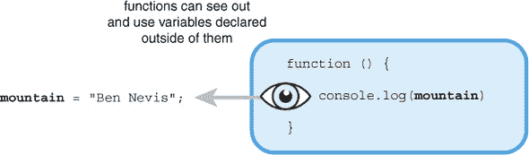

下一个列表展示了使用`mountain`的`showMountain`函数，其输出与列表 11.1 相同。

##### 列表 11.2\. 在函数内部访问变量 ([`jsbin.com/zojida/edit?js,console`](http://jsbin.com/zojida/edit?js,console))


像在函数外部声明的`mountain`这样的变量，可以在任何地方访问，被称为*全局变量*。你可能认为这些全局变量听起来非常有用：一旦声明，就可以在代码的任何地方自由使用。不幸的是，它们有一些严重的缺点，通常被认为*是个坏主意*。让我们调查一下避免这些淘气的全局变量的原因。

#### 11.1.1\. 访问所有区域——偷看和修改

你希望用户能够在控制台与你的程序交互。你不想让他们偷偷查看所有技术变量。下一个列表展示了一个小小的测验。

##### 列表 11.3\. 一个小小的测验 ([`jsbin.com/nubipi/edit?js,console`](http://jsbin.com/nubipi/edit?js,console))

```
var question = "What is the highest mountain in Wales?";
var answer = "Snowdon";

console.log(question);
```

由于`question`和`answer`是全局变量，它们可以在整个程序和通过控制台访问。在控制台提示符下，一旦用户运行程序，他们可以输入`answer`并按 Enter 键来显示`answer`变量的值。偷偷一瞥我们的技术高峰！

```
> answer
  Snowdon
```

不仅仅是偷偷查看是个问题；偷偷修改也是个问题！用户可以随意更改全局变量的值，更新分数、银行余额、速度、价格和答案。

```
> answer = "Tryfan"
```

#### 11.1.2\. 访问所有区域——依赖于实现

不依赖实现的观念很重要，但可能需要时间来完全理解。如果你第一次阅读时没有完全理解，不要担心——你可以在阅读本章中的其他示例之后返回来。

暗中窥视和调整也可能成为程序员的麻烦（参见侧边栏 “谁在使用你的代码？”）。如果你编写的代码被其他程序员使用，你可能不希望他们暗中修改，编写依赖于你代码内部结构的自己的代码。当你发布使用更高效算法的代码的新版本时，依赖于你一些变量的其他代码可能会出错。

| |
| --- |

**谁在使用你的代码？**

考虑你在 第七章 中创建的 `spacer` 函数。自从那时起，你一直在你的代码中使用它们来编写 *The Crypt*。这是 *你* 使用你自己的代码的一个例子。

对于程序员来说，成为 *团队* 的一员，无论是小团队还是大团队，是很常见的。团队可以共同开发同一个程序的不同方面。没有必要每个程序员都创建他们自己的格式化函数，所以他们都会使用你的 `spacer` 命名空间。

你的团队成员对你的格式化能力印象深刻，鼓励你更广泛地分享 `spacer` 命名空间。你将你的代码上传到像 [Github.com](http://www.Github.com) ([`github.com`](https://github.com)) 或 [npmjs.com](http://npmjs.com) ([`www.npmjs.com`](https://www.npmjs.com)) 这样的 *社区* 仓库。然后，其他程序员可以下载并使用你的代码，甚至贡献改进和扩展。

`spacer` 代码被一个由热心的爱好者组成的团队所采用，并进一步发展。它甚至拥有自己的网站！它如此受欢迎，以至于 *每个人* 都在使用 spacer.js 库。

| |
| --- |

用户应该能够依赖你的 *界面*——你公开的功能性——而不是担心你的 *实现*——你如何编程这些功能。

| |
| --- |

##### 定义

*界面* 是一组你希望用户访问的属性和函数。它是他们与你的应用程序交互的方式。例如，自动柜员机的屏幕、按钮和现金分配器。

| |
| --- |
| |

##### 定义

*实现* 是你用来使应用程序在幕后完成其工作的代码。它通常对用户不可见。例如，使自动柜员机工作的代码，它是如何与你的银行通信的，以及它是如何计算现金的。

| |
| --- |

例如，为了在 *The Crypt* 中的地方之间实现链接，你可能使用一个 `exits` 数组来表示出口方向，以及一个 `destinations` 数组来表示出口所指向的地方。

```
var exits = [];
var destinations = [];
```

然后，为了管理添加新的出口，你编写一个 `addExit` 函数。

```
var addExit = function (direction, destination) {
    exits.push(direction);
    destination.push(destination);
};
```

你期望与其他程序员一起使用你的 `Place` 对象的程序员使用 `addExit` 函数 (图 11.2)。

##### 图 11.2\. 用户应使用界面，而不是实现。

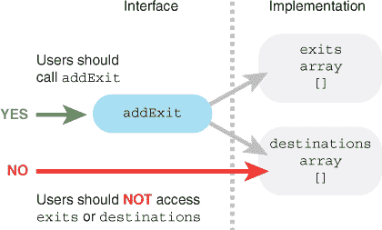

您记录了 `addExit` 是 *接口* 的一部分的事实，即用户（在这种情况下是程序员）应与之交互的属性和函数集。

```
addExit("north", kitchen);     // Good—using function
```

但如果他们可以访问 `exits` 和 `destinations` 变量，他们可能会选择直接使用这些变量，绕过函数。

```
exits.push("north");           // Bad—accessing variables directly
destinations.push(kitchen);
```

似乎一切都很正常，其他程序员的程序运行良好。然后，在审查您的代码后，您决定可以通过使用单个对象来改进使用两个单独数组的方法。

```
var exits = {};
// No destinations array. No longer needed in new implementation.
```

要使用您已实现的新的 `exits` 方法，您需要更新 `addExit` 函数。

```
var addExit = function (direction, destination) {
    exits[direction] = destination;
};
```

使用该接口的程序员将不会在其程序中看到任何变化。但是绕过接口直接访问变量的程序员将看到他们的程序崩溃！（见图 11.3）

##### 图 11.3. 如果实现发生变化，依赖实现可能会导致错误。

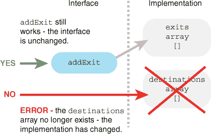

```
addExit("north", kitchen);     // Good. Works just the same.

exits.push("north");           // ERROR! exits is not an array.
destinations.push(kitchen);    // ERROR! destinations doesn't exist.
```

允许通过使用全局变量访问我们程序的所有区域，模糊了实现和接口之间的界限，给用户提供了窥视和调整的自由，并使程序在实现细节更改时容易失败。

#### 11.1.3. 命名冲突

由于我们的程序可能由不同团队或程序员编写的许多代码片段组成，因此很可能在多个地方使用相同的变量名。如果一个程序员声明了一个变量名，比如 `spacer`（格式化函数的命名空间），然后在程序稍后另一个程序员声明了相同的变量名，`spacer`（基于控制台的空间冒险游戏中的犬类角色），第二个将覆盖第一个——冲突！我们真的需要一种方法来保护我们的变量免受此类冲突的影响。（第十三章 详细探讨了冲突。）

#### 11.1.4. 疯狂的虫子

程序可能长达数千行。依赖可能声明在代码较远处的全局变量，并且可能被程序中的函数和指令查看和调整，会导致程序脆弱。如果程序出现任何问题（这很可能会发生），可能很难追踪代码的流程并确定问题的位置。

### 11.2. 局部变量的好处

在函数体内声明的变量不能在函数外部访问。它们被称为 *局部变量*；它们仅限于声明它们的函数内（图 11.4）。

##### 图 11.4. 函数内声明的变量是局部变量。

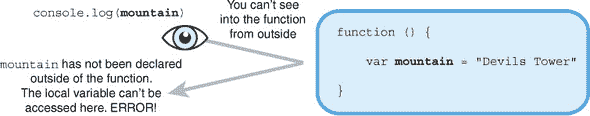

尝试在函数外部访问局部变量将导致错误。列表 11.4 尝试将 `mountain` 变量的值记录到控制台，但会显示如下信息：

```
> ReferenceError: Can't find variable: mountain
```

（您得到的错误可能略有不同。不同的浏览器可能会以不同的方式格式化错误信息。）

##### 列表 11.4. 隐藏在控制台中的变量 ([`jsbin.com/bobilu/edit?js,console`](http://jsbin.com/bobilu/edit?js,console))

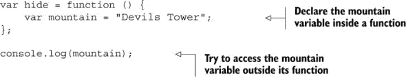

所有函数之外的所有变量集合称为 *全局作用域*。每个函数都创建自己的 *局部作用域*，即自己的变量集合。在 列表 11.4 中，变量 `mountain` 不在函数外的全局作用域中，因此在 `console.log` 语句中使用时报告了错误。

在同一作用域内使用变量不会引起任何麻烦，如下面的列表所示。

```
> Devils Tower
```

##### 列表 11.5\. 变量在函数内部可见 ([`jsbin.com/raluqu/edit?js,console`](http://jsbin.com/raluqu/edit?js,console))

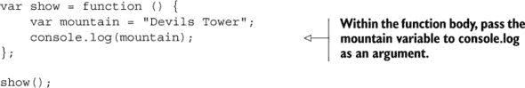

列表 11.6 结合了全局变量和局部变量。你可以在任何地方访问全局变量，但只能在 `show` 函数内部使用局部变量 `secretMountain`。

列表 11.6 产生以下输出：

```
> Ben Nevis
> Devils Tower
> Ben Nevis
> ReferenceError: Can't find variable: secretMountain
```

##### 列表 11.6\. 全局和局部变量 ([`jsbin.com/riconi/edit?js,console`](http://jsbin.com/riconi/edit?js,console))

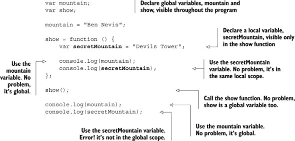

### 11.3\. 接口——控制访问和提供功能

你希望用户在控制台上与你的程序交互，但你不想让他们深入到实现中做出你未打算的改变。你提供给用户的属性和动作集合称为 *接口*。你需要一种方法来提供简单的接口，同时隐藏其他所有内容。

在本节中，你使用一个非常简单的程序，一个计数器，作为示例。在 第 11.4 节 中，你为问答应用程序开发了一个接口，在 第 11.5 节、11.6 节 和 11.7 节 中，你将所学知识应用到 *The Crypt*。

以下列表显示了计数程序的第一版本，使用全局变量来保存当前计数。

##### 列表 11.7\. 计数器 ([`jsbin.com/yagese/edit?js,console`](http://jsbin.com/yagese/edit?js,console))

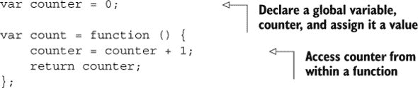

在控制台提示符下运行程序并遵循以下步骤。（你的操作显示提示符 `>`，但响应不显示。）

```
> count()
  1
> count()
  2
> count()
  3
```

它似乎正在正常工作，那么问题是什么？嗯，因为 `counter` 是一个全局变量，用户可以随时更改它。

```
> counter = 99
  99
> count()
  100
```

你可能不希望用户像那样调整计数变量。接下来，你使用在 第 11.2 节 中学到的关于局部变量的知识来隐藏 `counter` 变量，使其对用户不可见。

#### 11.3.1\. 使用函数隐藏变量

你希望通过你的计数应用程序实现两个结果：

+   `counter` 变量对用户不可见。

+   `count` 函数对用户可见。

列表 11.8 展示了一个解决方案。运行程序可以启用以下所需的控制台交互：

```
> count()
  1
> counter
  Can't find variable: counter
```

（再次强调，浏览器显示的错误可能略有不同。）

##### 列表 11.8\. 隐藏计数变量 ([`jsbin.com/fuwuvi/edit?js,console`](http://jsbin.com/fuwuvi/edit?js,console))

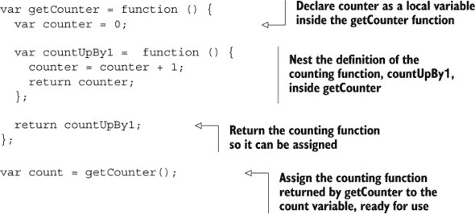

表 11.1 以一系列问题和解决方案的形式总结了关键思想；图 11.5 阐述了返回的计数函数，即分配给 `count` 的函数，仍然可以访问局部 `counter` 变量。

##### 图 11.5\. 返回的函数仍然可以访问局部 `counter` 变量。

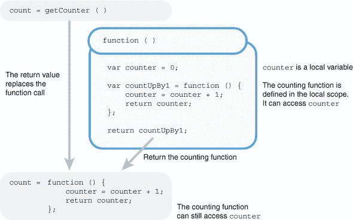

##### 表 11.1\. 计数器应用程序的问题和解决方案

| 问题 | 解决方案 |
| --- | --- |
| 我希望计数器变量对用户不可见。 | 在 `getCounter` 函数内部声明计数器变量。作为一个局部变量，计数器对用户不可访问。 |
| 我的函数 `countUpBy1`，它增加计数器，需要访问计数器变量。 | 在 `getCounter` 函数内部定义 `countUpBy1` 函数。因为它在 `getCounter` 内部，所以它将可以访问计数器变量。 |
| 我希望用户能够调用计数函数。 | 从 `getCounter` 函数返回计数函数 `countUpBy1`。然后它可以被分配给全局变量。 |

通过返回一个函数并将其赋值给 `count` 变量 (图 11.5)，你为用户提供了使用程序的方法；你给了他们一个接口——他们只需调用 `getCounter()` 来获取计数函数，然后调用 `count()` 来增加计数。

#### 11.3.2\. 使用 `getCount` 创建多个独立的计数器

在 代码列表 11.8 中，你定义了一个函数 `getCounter` 来创建计数器。每次调用 `getCounter` 时，它都会执行以下三个相同的步骤：

> **1**.  声明一个 `counter` 变量并将其赋值为 `0`。
> 
> **2**.  定义一个用于计数的函数。该函数使用步骤 1 中的 `counter` 变量。
> 
> **3**.  返回执行计数的函数。

每次调用 `getCounter` 时，它都会声明一个 `counter` 变量并定义一个计数函数。如果你多次调用 `getCounter`，`counter` 变量不会相互干扰吗？不，因为 `getCounter` 每次运行时都会创建一个新的局部作用域；你将获得多个 `counter` 变量的副本，每个副本都在其自己的隔离变量集合中，即其自己的局部作用域中。

列表 11.9 更新了 `getCounter` 代码以创建两个计数器。然后你可以执行以下控制台交互：

```
> climbCount()
  1
> climbCount()
  2

> climbCount()
  3
> peakCount()
  1
> climbCount()
  4
```

`peakCount` 和 `climbCount` 不会相互干扰。

##### 列表 11.9\. 多个计数器 ([`jsbin.com/sicoce/edit?js,console`](http://jsbin.com/sicoce/edit?js,console))

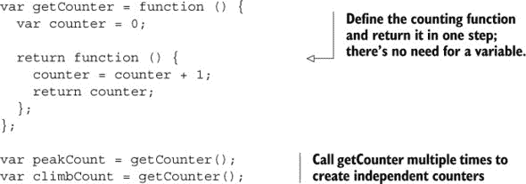

将 `counter` 作为局部变量允许你拥有多个独立的计数器。

#### 11.3.3\. 使用构造函数创建多个独立的计数器

如果您将要创建很多计数器，您可以使用构造函数来定义计数器是什么以及它做什么。如 第九章 中详细说明的，构造函数简化了创建具有相似属性和方法的对象的常见过程。您通过使用 `new` 关键字来调用构造函数。对于计数器，您可能如下所示：

```
var peaks = new Counter();
var climbs = new Counter();
```

构造函数将自动创建一个分配给特殊 `this` 变量的对象，并返回它。您可以将计数函数设置为 `this` 的属性，使其在构造函数外部可用；参见 listing 11.10。在控制台上，您可能调用计数函数如下：

```
> peaks.count()
  1
> peaks.count();
  2
> climbs.count();
  1
```

##### 列表 11.10\. 计数器构造函数 ([`jsbin.com/yidomap/edit?js,console`](http://jsbin.com/yidomap/edit?js,console))

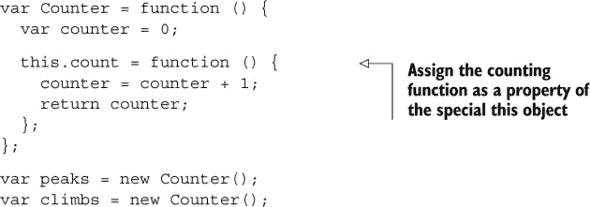

比较以下列表 11.9 (listings 11.9) 和 11.10 (11.10)。它们几乎完全相同！唯一的区别在于在 listing 11.10 中，你将计数函数设置为 `this` 的属性，而不是返回它。构造函数会自动返回 `this` 对象，因此你不需要这样做。构造函数仍然是一个函数，所以 `counter` 仍然是一个局部变量。无论是普通函数还是构造函数，都是有效的。它们都允许你返回一个接口，同时隐藏实现细节。

计数器是一个简单、清晰的例子。让我们看看有更多移动部件的东西，即问答应用。不要作弊！

### 11.4\. 创建一个快速问答应用

您想要创建一个简单的问答应用。该应用应该能够做三件事：

> **1**. 在控制台显示一个问题。
> 
> **2**. 在控制台显示当前问题的答案。
> 
> **3**. 将问题库中的下一个问题移动到下一个问题。

控制台典型交互的开始可能看起来像这样：

```
> quiz.quizMe()
  What is the highest mountain in the world?
> quiz.showMe()
  Everest
> quiz.next()
  Ok
> quiz.quizMe()
  What is the highest mountain in Scotland?
```

如您所见，有三个函数 `quizMe`、`showMe` 和 `next` 满足应用的三项要求。您还需要一个问题和答案的数组以及一个变量来跟踪当前的问题。在函数外部声明的变量被称为在 *全局命名空间* 中。为了避免将所有这些问答变量 *污染全局命名空间*，您可以将其设置为单个对象的属性。正如您在 第七章 中所看到的，当以这种方式使用单个对象收集相关变量时，它通常被称为 *命名空间*。

#### 11.4.1\. 使用对象作为命名空间

应用将创建一个全局变量 `quiz`。然后，您可以将所有变量设置为 `quiz` 对象的属性，如 listing 11.11 中所示。问题和答案的数组开始如下：

```
var quiz = {
    questions: [
        {
            question: "What is the highest mountain in the world?",
            answer: "Everest"
        }
    ]
};
```

然后通过 `quiz.questions` 访问数组。请记住，数组索引从 0 开始，因此要访问第一个问题-答案对象，请使用 `quiz.questions[0]`。要从 `questions` 数组中获取第一个问题和第一个答案，请使用以下代码：

```
quiz.questions[0].question;
quiz.questions[0].answer;
```

您使用 `qIndex` 属性跟踪当前问题。

##### 列表 11.11\. 改进测验应用程序 ([`jsbin.com/tupoto/edit?js,console`](http://jsbin.com/tupoto/edit?js,console))

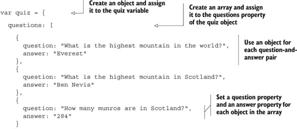

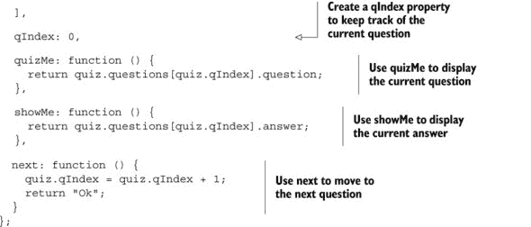

列表 11.11 满足您应用程序的三个要求，并且足够礼貌地只使用一个全局变量，`quiz`。它所需的一切都在 `quiz` 对象内部。因为所有属性都是作为 `quiz` 的属性访问的，所以我们说它们位于 `quiz` 命名空间中。

不幸的是，您的应用程序没有克服 第 11.1.1 节 中看到的全局变量的 *访问所有区域* 缺点。`quiz` 对象的所有属性都是 *公共的*——用户仍然可以偷看并调整所有值。

#### 11.4.2\. 隐藏问题数组

在 列表 11.11 中，玩家可以在控制台中访问 `quiz` 对象的所有属性。这使他们可以随心所欲地造成破坏，更改属性：

```
> quiz.qIndex = 300
> quiz.questions[2].answer = "282"
```

但您希望他们只使用 `quiz.quizMe`、`quiz.showMe` 和 `quiz.next`。让我们通过使用局部变量将 `questions` 数组和 `qIndex` 值设为 *私有*，如图 11.6 所示。

##### 图 11.6\. 使用局部变量使 `qIndex` 和 `questions` 成为私有

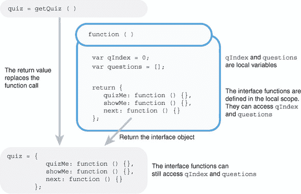

下一个列表使用 `getQuiz` 函数创建一个局部作用域，用于隐藏 `questions` 数组和 `qIndex` 值。

##### 列表 11.12\. 隐藏问题和答案 ([`jsbin.com/qahedu/edit?js,console`](http://jsbin.com/qahedu/edit?js,console))

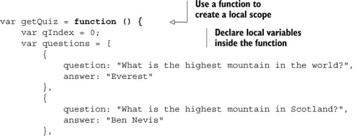

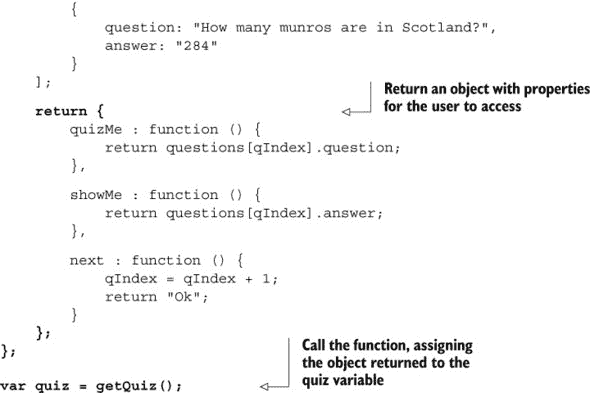

程序返回一个具有三个属性的对象：`quizMe`、`showMe` 和 `next`。最后一行将返回的对象赋值给 `quiz` 变量。然后您可以使用 `quiz` 来访问这三个函数：

```
> quiz.quizMe()
  What is the highest mountain in the world?
> quiz.answer()
  Everest
```

使测验应用程序工作的代码称为其 *实现*。其中一些实现通过使用局部变量隐藏在 `getQuiz` 函数中。该函数返回的对象向用户提供了一个 *接口*，一种与程序交互的公共方式。用户可以调用 `quizMe`、`showMe` 和 `next` 函数，因为它们是接口对象的成员方法。用户无法访问 `qIndex` 和 `questions` 变量，因为它们是 `getQuiz` 函数的局部变量。

 展示了在 JS Bin 控制台中尝试访问变量 `qIndex` 和 `questions` 时抛出的错误。（您的错误信息可能略有不同。）

##### 图 11.7\. 现在尝试从控制台访问 `qIndex` 和 `questions` 会导致错误。

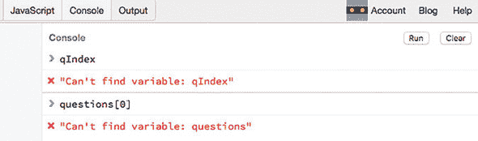

### 11.5\. 保密室——隐藏玩家信息

在本节以及第 11.6 节和 11.7 节中，你更新了*The Crypt*的代码，以隐藏实现中的一部分变量、属性和函数，这些不应该被外界窥视。同时，你考虑了你的接口应该采取什么形式——你将向玩家和程序员提供哪些信息和操作。

#### 11.5.1\. 我们当前的玩家构造函数——一切都是公开的

到目前为止，你还没有尝试控制用户对`Player`对象中数据的访问。以下列表显示了你的`Player`构造函数的当前形式。

##### 列表 11.13\. 玩家构造函数([`jsbin.com/dacedu/edit?js,console`](http://jsbin.com/dacedu/edit?js,console))

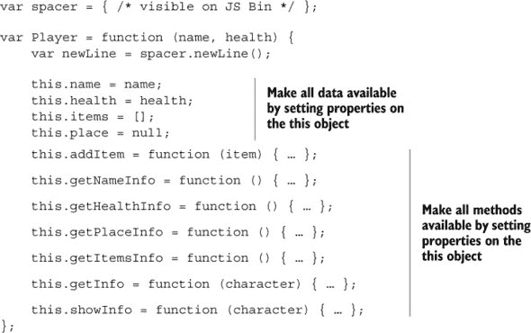

你将所有玩家数据和所有函数都设置为特殊`this`对象的属性。当你使用`new`关键字调用构造函数时，它会自动创建`this`对象。在下面的代码片段中，你调用`Player`构造函数来创建一个新的玩家。

```
var player1 = new Player("Jahver", 80);
```

构造函数会自动返回`this`对象，然后你将对象分配给`player1`变量。因为你将所有内容都附加到了构造函数中的`this`上，并且`this`被返回并分配给了`player1`，你现在可以使用`player1`来访问数据和方法：例如，`player1.name`、`player1.items`、`player1.addItem`、`player1.getInfo`和`player1.showInfo`都是可访问的。

#### 11.5.2\. 更新的玩家构造函数——一些变量被隐藏

为了控制用户对玩家数据的访问，你可以使用参数和变量，而不必为`this`对象的属性赋值。在函数定义的开括号之间，参数的作用就像函数体内声明的变量。它们是函数本地的，可以在函数的任何地方使用，但不能被函数外的代码访问。

```
var Player = function (name, health) {

    // name and health are local variables.
    // They can be used here.   

    this.getHealthInfo = function () {
        // name and health can be used here.       
    };
};

// name and health can NOT be used here.
// This is outside the scope of the player function.
```

图 11.8 显示了从旧的`Player`构造函数（列表 11.13）到新的（列表 11.14）中变量和属性可见性的变化。新的构造函数隐藏了局部作用域中的大多数函数，只将四个函数分配给特殊的`this`对象作为接口。

##### 图 11.8\. 在构造函数的局部作用域中隐藏变量和函数


下一列表显示了代码中的变化；使用`var`声明的局部变量用于防止直接访问玩家的数据。

##### 列表 11.14\. 在构造函数中隐藏玩家信息([`jsbin.com/fuyaca/edit?js,console`](http://jsbin.com/fuyaca/edit?js,console))

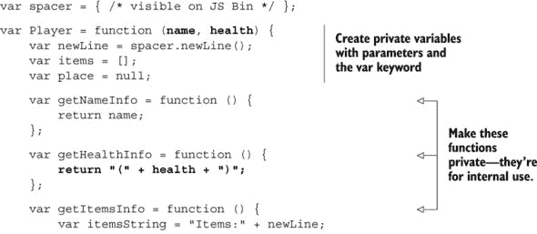

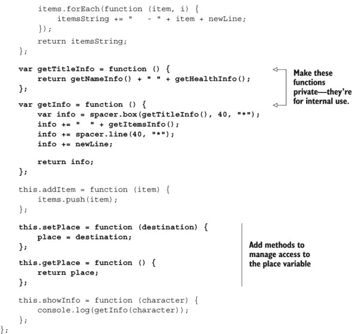

你将不想在外部构造函数中看到的属性和函数分配给局部变量。你希望公开的方法作为`this`对象的属性分配。

```
var items = [];    // Keep private

this.showInfo = function () { };    // Make public
```

`setPlace`和`getPlace`方法使用户能够访问`place`变量。如果你只是提供访问它的方法，为什么还要费心使用变量来使`place`私有？它们提供了一个接口，并允许你隐藏实现细节，同时也让你能够控制访问。当调用`setPlace`方法时，你可以在将其分配给`place`变量之前检查`destination`参数是否是一个有效的位置。当调用`getPlace`方法时，你可以在返回位置之前检查用户是否有权访问。你还没有实施这些额外的检查，但你的两个方法已经准备好在你需要添加任何条件时使用。

你还简化了`showInfo`显示的信息，使其不再包括当前位置。`Place`对象有自己的`showInfo`方法，因此没有必要重复显示位置详情作为玩家信息的一部分。当你现在在控制台显示玩家信息时，它看起来像这样：

```
****************************************
* Kandra (50)                          *
****************************************
  Items:
   - The Sword of Doom
****************************************
```

玩家的健康状态显示在他们名字的括号中。要显示关于玩家当前位置的信息，你可以调用`getPlace`来检索位置对象，然后调用该位置对象的`showInfo`方法：

```
var place = player.getPlace();
place.showInfo();
```

### 11.6\. 密室——隐藏位置信息

你现在对`Place`构造函数所做的，与对`Player`构造函数所做的相同。你隐藏了数据，并提供了按需访问它的方法。下一个列表显示了之前`Place`构造函数的结构，来自第十章，数据和方法都设置在`this`对象上。

##### 列表 11.15\. 位置构造函数 ([`jsbin.com/kavane/edit?js,console`](http://jsbin.com/kavane/edit?js,console))

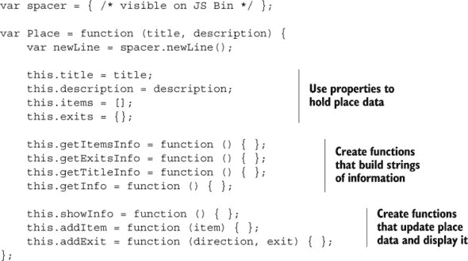

下一个列表显示了你的更新后的`Place`构造函数版本，使用参数和变量来隐藏数据，一个新的`getExit`函数来返回指定方向的目的地，以及一个新的`getLastItem`方法来返回物品数组中的最后一个项目。

##### 列表 11.16\. 在构造函数中隐藏位置信息 ([`jsbin.com/riviga/edit?js,console`](http://jsbin.com/riviga/edit?js,console))

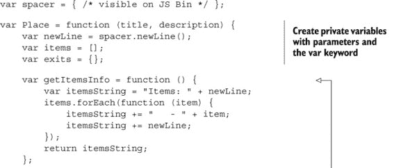

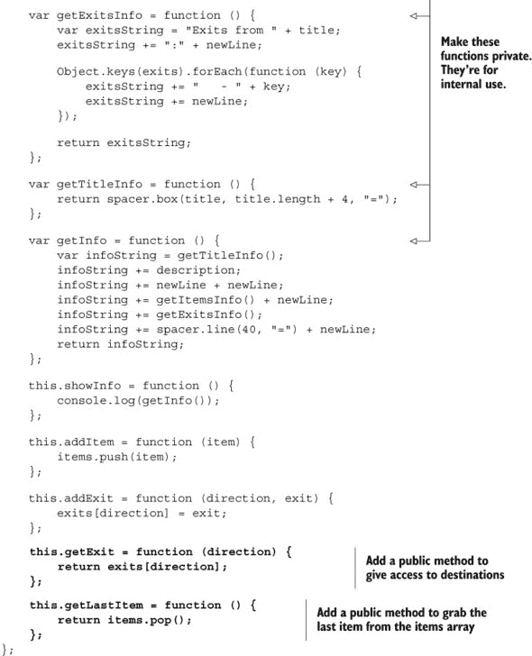

在创建一个小的方法集——你的接口——通过`this`对象使其可见的同时，你在`Player`和`Place`构造函数中隐藏了某些属性和函数。你的程序的其他部分使用构造函数（或者可能在他们的冒险游戏程序中使用你的代码的程序员）只能使用接口中的方法。

对于在控制台输入命令的玩家，你将通过防止他们意外地发现并更改重要的游戏值来保留他们对游戏的乐趣。（*作弊*是一个如此令人讨厌的词。）你将向玩家展示一组小而简单的动作，他们可以用来探索、收集、打击和摧毁——在他们穿越*密室*的过程中，任何适当的事情。

### 11.7\. 密室——用户交互

在第十章中，您创建了一个版本的《密室》，允许玩家从一个地点移动到另一个地点并捡起他们找到的物品。不幸的是，您将所有变量都污染了全局命名空间。不要为此自责；那时你还年轻且天真。现在您有了一种方法来隐藏实现，不让用户看到。

列表 11.17 展示了当前实现的概要；完整版本在 JS Bin 上。它与第十章的版本几乎相同，但使用了本章构造函数更新中的`getPlace`和`setPlace`玩家方法以及`getExit`和`getLastItem`地点方法。使用它们的代码已全部展示。

##### 列表 11.17\. 游戏中有许多全局变量 ([`jsbin.com/dateqe/edit?js,console`](http://jsbin.com/dateqe/edit?js,console))

```
// The spacer namespace
var spacer = { /* formatting functions */ };

// Constructors
var Player = function (name, health) { ... };
var Place = function (title, description) { ... };

// Game controls
var render = function () {
    console.clear();
    player.getPlace().showInfo();
    player.showInfo(); 
};

var go = function (direction) {
    var place = player.getPlace();
    var destination = place.getExit(direction);
    player.setPlace(destination);
    render();
    return "";
};

var get = function () {
    var place = player.getPlace();
    var item = place.getLastItem();

    player.addItem(item);
    render();
    return "";
};

// Map
var kitchen = new Place("The Kitchen", "You are in a kitchen...");
var library = new Place("The Old Library", "You are in a library...");

kitchen.addItem("a piece of cheese");
library.addItem("a rusty key");

kitchen.addExit("south", library);
library.addExit("north", kitchen);

// Game initialization
var player = new Player("Kandra", 50);
player.addItem("The Sword of Doom");
player.setPlace(kitchen);

render();
```

注意所有全局变量——`spacer`命名空间、`Player`和`Place`构造函数、游戏控制函数、所有地点以及玩家——都被分配到任何函数之外的外部变量中。这是臭名昭著的全局污染。只有游戏控制函数`go`和`get`需要对玩家可用。您可以隐藏其余部分。

#### 11.7.1\. 接口——前往和获取

目前您希望用户执行的操作只有两个：

```
game.go("north"); // Move; e.g. to the place north of the current location
game.get();       // Pick up an item from the current location
```

要隐藏实现，您将游戏代码封装在一个函数中。然后，为了允许用户执行两个期望的操作而不再执行更多操作，您从函数中返回一个接口对象，包含两个方法：

```
return {
    go: function (direction) {
        // Move to a new place       
    },

    get: function () {
        // Pick up an item       
    }
};
```

接口方法使用玩家和地点对象的功能来完成它们的工作，这些对象由各自的构造函数创建。

#### 11.7.2\. 隐藏实现

为了隐藏代码的其余部分，您将其封装在一个函数中，以创建局部作用域。只返回您的接口对象。下面的列表显示了更新后的代码的亮点。完整的列表可在 JS Bin 上找到。

##### 列表 11.18\. 通过接口对象让用户与游戏交互 ([`jsbin.com/yuporu/edit?js,console`](http://jsbin.com/yuporu/edit?js,console))

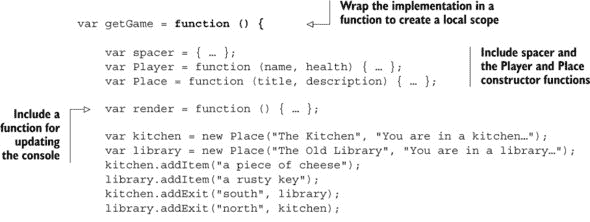


列表的最后一条语句调用了`getGame`函数。函数执行后返回具有`go`和`get`方法的接口对象。该语句将接口对象赋值给`game`变量。玩家可以通过使用点符号通过`game`变量访问`go`和`get`方法：

```
game.get();
game.go("east");
```

玩家无法访问游戏中的任何其他变量或函数。您的工作完成了！至少对于这一章来说。

将代码包裹在函数中，然后从该函数返回接口对象的`wrap-and-return`过程称为*模块模式*。这是一种常见的将接口与实现分离的方法，有助于打包你的代码以实现可移植性和重用。从现在开始，你将经常看到它，尤其是在第十三章（[kindle_split_022.html#ch13]）中，当你使用 HTML `script`标签调查导入模块时。在你到达那里之前，你需要在第十二章（[kindle_split_021.html#ch12]）中做出一些决定。*如果*你准备好了，请继续阅读；*否则*休息一下，放松一下，尝试进一步冒险，并做好准备。

### 11.8。总结

+   减少程序中的全局变量数量。全局变量是在所有函数外部声明的变量。它们可以在程序的任何地方访问，但会污染全局命名空间，暴露你的实现，可能造成命名冲突，并可能帮助引入难以发现的错误：

    ```
    var myGlobal = "Look at me";

    var useGlobal = function () {
        console.log("I can see the global: " + myGlobal);
    };
    ```

    ```
    console.log("I too can see the global: " + myGlobal);
    ```

+   通过收集相关变量和函数作为单个对象的属性来减少全局变量的数量。这样的对象通常被称为命名空间：

    ```
    var singleGlobal = {
        method1 : function () { ... },
        method2 : function () { ... }
    };
    ```

+   将代码包裹在函数中以创建局部作用域，局部变量的集合：

    ```
    var getGame = function () {
        var myLocal = "A local scope, for local people.";
        console.log(myLocal);  // Displays message 
    };

    console.log(myLocal);  // ERROR! myLocal is not declared here.
                           // It is not in the global scope.
    ```

+   将代码包裹在函数中以使变量私有，隐藏你的实现，避免命名冲突，并减少难以发现的错误的风险。

+   从函数中返回公共接口以清楚地定义用户期望访问的属性和方法（模块模式）。

+   返回一个单独的函数：

    ```
    var getCounter = function () {
        var counter = 0;    // Private

        return function () { ... };
    };
    ```

    ```
    var count = getCounter();
    ```

+   返回一个对象：

    ```
    var getGame = function () {
        // Game implementation

        return {
            // Interface methods
        };
    };
    ```

    ```
    var game = getGame();
    ```

+   记住，构造函数创建一个局部作用域，就像任何其他函数一样。特殊的`this`变量会自动返回。它充当公共接口：

    ```
    var Counter = function () {
        var counter = 0;    // Private

        this.count = function () { ... };
    };
    ```

## 第十二章。条件：选择要运行的代码

***本章涵盖***

+   使用比较运算符比较值

+   检查`true`或`false`的条件

+   `if`语句——仅在满足条件时运行代码

+   `else`子句——当条件不满足时运行代码

+   确保用户输入不会破坏你的代码

+   使用`Math.random()`生成随机数

到目前为止，你所有的代码都遵循单一路径。当你调用一个函数时，函数体内的每个语句都会被执行。你已经完成了很多工作，并覆盖了 JavaScript 中的许多核心概念，但你的程序缺乏灵活性；它们无法决定是否执行代码块。

在本章中，你将学习如何在满足特定条件时运行代码。突然之间，你的程序可以分支，提供选项、灵活性和丰富性。你可以增加玩家的分数*如果*他们击中了金桔，*如果*用户指定了有效的方向，或者*如果*推文的长度少于 141 个字符。

如果你想了解你的程序如何做出决定，请继续阅读，否则，... 好吧，无论如何都要继续阅读。你真的需要知道这些内容！

### 12.1。代码的条件执行

首先，创建一个简单的程序，要求用户猜测一个秘密数字。如果他们猜对了，程序会说，“做得好！”控制台交互可能看起来像这样：

```
> guess(2)
  undefined
> guess(8)
  Well done!
  undefined
```

`undefined`的丑陋外观是怎么回事？当你控制台调用一个函数时，它的代码被执行，然后显示其返回值。以下列表中的`guess`函数没有包含返回语句，因此它自动返回`undefined`。

##### 列表 12.1\. 猜数字 [`jsbin.com/feholi/edit?js,console`](http://jsbin.com/feholi/edit?js,console)

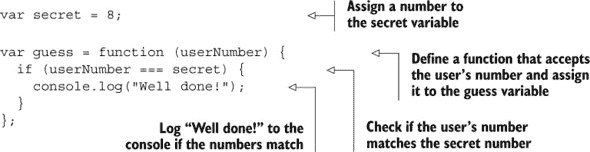

`guess`函数检查用户的数字是否等于秘密数字。它使用*严格的相等运算符*，`===`，以及一个*if 语句*，以确保只有在数字匹配时才显示“做得好！”消息。以下几节将更详细地探讨严格的相等运算符和`if`语句，并介绍*else 子句*。

#### 12.1.1\. 严格的相等运算符，===

严格的相等运算符比较两个值。如果它们相等，则返回`true`；如果不相等，则返回`false`。你可以在控制台测试它：

```
> 2 === 8
  false
> 8 === 8
  true
> 8 === "8"
  false
> "8" === "8"
  true
```

在第三个例子中，你可以看到严格的相等运算符并不认为数字`8`和字符串`"8"`相等。这是因为数字和字符串是不同类型的数据。`true`和`false`是第三种类型的数据；它们被称为*布尔值*。实际上，`true`和`false`是唯一的可能布尔值。布尔值在决定程序下一步应该做什么时很有用；例如，通过使用`if`语句。

#### 12.1.2\. `if`语句

要在满足指定条件时仅执行代码块，你使用`if`语句。

```
if (condition) {
    // Code to execute
}
```

如果括号中的条件评估为`true`，则 JavaScript 执行花括号之间的代码块中的语句。如果条件评估为`false`，则 JavaScript 跳过代码块。注意，在`if`语句末尾的花括号后面没有分号。

列表 12.1 使用了严格的相等运算符来为条件返回`true`或`false`值。

```
if (userNumber === secret) {
    console.log("Well done!");
}
```

代码仅在`user-Number`的值等于`secret`的值时将“做得好！”消息记录到控制台。例如，假设`secret`是`8`，而用户选择了`2`：

```
if (2 === 8) {                   // The condition is false.
    console.log("Well done!");   // Not executed
}
```

如果用户选择`8`，则`if`语句变为

```
if (8 === 8) {                   // The condition is true.
    console.log("Well done!");   // This is executed.
}
```

#### 12.1.3\. `else`子句

有时候我们希望在`if`语句中的条件评估为`false`时执行不同的代码。我们可以通过在`if`语句后附加一个`else`子句来实现这一点（图 12.1）。

##### 图 12.1\. 根据条件值执行代码，使用`if`和`else`

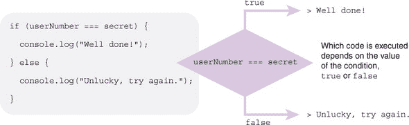

从列表 12.2：

```
if (userNumber === secret) {
    console.log("Well done!");
} else {
    console.log("Unlucky, try again.");
}
```

如果 `userNumber` 和 `secret` 相等，JavaScript 显示 “做得好！” 否则，它显示 “不幸，再试一次。” 注意在 `else` 子句末尾的括号后面没有分号。再次假设 `secret` 是 `8`，用户选择 `2`：

```
if (2 === 8) {                             // The condition is false. 
    console.log("Well done!");             // Not executed.
} else {
    console.log("Unlucky, try again.");    // This is executed.
}
```

如果用户选择 `8`，则 `if` 语句变为

```
if (8 === 8) {                             // The condition is true.
    console.log("Well done!");             // This is executed. 
} else {
    console.log("Unlucky, try again.");    // Not executed.
}
```

控制台上的猜数字交互可能现在看起来像这样：

```
> guess(2)
  Unlucky, try again.
  undefined
> guess(8)
  Well done!
  undefined
```

##### 列表 12.2\. 猜数字——`else` 子句 ([`jsbin.com/nakosi/edit?js,console`](http://jsbin.com/nakosi/edit?js,console))

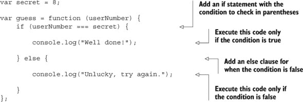

接下来，你使用局部变量使 `secret` 变得神秘。

#### 12.1.4\. 在函数内部隐藏秘密数字

在 列表 12.2 中，`secret` 和 `guess` 变量都在任何函数外部声明。你在 第十一章 中看到了这样做是如何使它们成为全局变量的，可以在控制台和整个程序中访问。这对 `guess` 来说很好——你希望用户能够猜测数字——但对 `secret` 来说却是一场灾难——用户可以随意查看和调整其值。如果你在 列表 12.2 中运行代码，你可以在控制台执行以下操作：

```
> secret          // You can access secret. It's a global variable.
  8
> guess(8)
  Well done!
  undefined
> secret = 20     // You can reset secret to whatever you want. 
  20
> guess(20)
  Well done!
  undefined
```

这不是一个很好的猜数字游戏！

第十一章 也讨论了如何在 JavaScript 中使用函数创建局部作用域，一个仅在函数内部可访问的变量集合。列表 12.3 使用 `getGuesser` 函数来隐藏秘密数字。`getGuesser` 返回的函数被分配给 `guess` 变量 (图 12.2)。

##### 图 12.2\. `getGuesser` 返回的函数被分配给 `guess` 变量

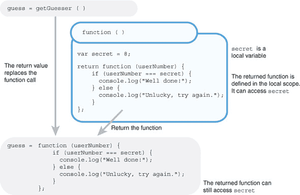

`guess` 是一个全局变量，在控制台可用：

```
> guess(2)
  Unlucky, try again
  undefined
```

##### 列表 12.3\. 猜数字——使用局部作用域 ([`jsbin.com/hotife/edit?js,console`](http://jsbin.com/hotife/edit?js,console))

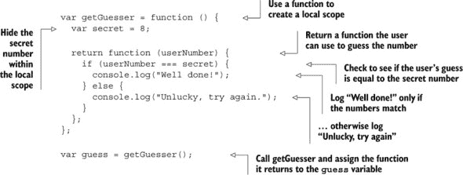

分配给 `getGuesser` 的函数创建了一个局部作用域，允许你保护 `secret` 变量不被用户访问。它返回另一个允许用户猜测数字的函数。该函数被分配给 `guess` 变量。因为猜测检查函数是在 `getGuesser` 函数创建的局部作用域中定义的，所以它可以访问 `secret` 变量并执行其检查。

你有一个猜数字游戏，但总是同一个秘密数字。实际上，这根本不是一个秘密数字！让我们利用 JavaScript 的 `Math` 命名空间中的几个方法，给我们的猜数字游戏增加一些神秘感。

### 12.2\. 使用 Math.random() 生成随机数

`Math` 命名空间为你提供了一个 `random` 方法来生成随机数。它总是返回一个大于或等于 0 且小于 1 的数字。在控制台提示符中试一试：

```
> Math.random()
  0.7265986735001206
> Math.random()
  0.07281153951771557
> Math.random()
  0.552000432042405
```

显然，你的数字会不同，因为它们是随机的！除非你真的很喜欢猜数字并且有很多空闲时间，否则这些随机数字可能对你来说有点太复杂了。

要驯服数字，将它们放大到所需的范围内，然后转换为整数。因为它们最初小于 1，乘以 10 会使它们小于 10。以下是一系列使用`Math.random`的赋值示例：

```
var number = Math.random();             //  0 <= number < 1
```

要缩放可能的数字，乘以：

```
var number = Math.random() * 10;        //  0 <= number < 10
```

要上下调整可能的数字，加或减：

```
var number = Math.random() + 1;         //  1 <= number < 2
```

要缩放并移动，先乘后加：

```
var number = Math.random() * 10 + 1;    //  1 <= number < 11
```

注意，在最后一个任务中，数字将在 1 到 11 之间；它们可以等于 1，但将小于 11。`<=`符号表示小于或等于，而`<`符号表示小于。不等式`0 <= number < 1`表示数字在 0 到 1 之间，可以等于 0 但不能等于 1（见第 12.3.1 节）。

好的，所以你放大了随机数，但它们仍然有点棘手。在控制台中，你可以看到你生成的数字类型：

```
> Math.random() * 10 + 1
  3.2726867394521832
> Math.random() * 10 + 1
  9.840337357949466
```

最后一步是去除每个数字的小数部分，将数字四舍五入到整数。为此，你使用`Math`命名空间中的`floor`方法。

```
> Math.floor(3.2726867394521832)
  3
> Math.floor(9.840337357949466)
  9
```

`floor`方法*总是向下取整*，无论小数是多少：10.00001、10.2、10.5、10.8 和 10.99999 都向下取整到 10，例如。你使用`floor`来获取返回随机整数的表达式，范围在 1 到 10（包括 1）之间：

```
var number = Math.random() * 10 + 1               // 1 <= number < 11
var number = Math.floor(Math.random() * 10 + 1)   // 1 <= number <= 10
```

此外，还有一个`Math.ceil`方法总是向上取整，还有一个`Math.round`方法根据数学四舍五入的常规规则进行四舍五入。有关 JavaScript 的`Math`对象更多信息，可以在*Get Programming with JavaScript*网站上找到：[`www.room51.co.uk/js/math.html`](http://www.room51.co.uk/js/math.html)。

列表 12.4 将`Math`方法应用于实践。`guess`函数现在*返回*字符串而不是记录它们；控制台自动显示返回值，整理了交互：

```
> guess(2)
  Unlucky, try again.
> guess(8)
  Unlucky, try again.
> guess(7)
  Well done!
```

##### 列表 12.4. 猜测随机数 ([`jsbin.com/mezowa/edit?js,console`](http://jsbin.com/mezowa/edit?js,console))

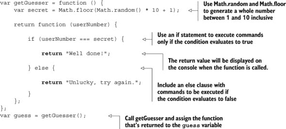

使用随机数使你的猜测游戏更有趣。但其中并不涉及太多策略；这只是直接的猜测。游戏可以通过在每次猜测后提供更好的反馈来得到改进。

### 12.3. 使用 else if 的进一步条件

通过为每次猜测获得更好的反馈，用户可以在与你的猜测游戏对抗时发展出更有效的策略。策略游戏总是比猜测游戏更有趣。如果用户的猜测不正确，告诉他们是否过高或过低。

```
> guess(2)
  Too low!
> guess(7)
  Too high!
> guess(5)
  Well done!
```

图 12.3 展示了用于生成用户猜测的三种可能反馈类型的条件。

##### 图 12.3. 嵌套条件可以提供多个选项。

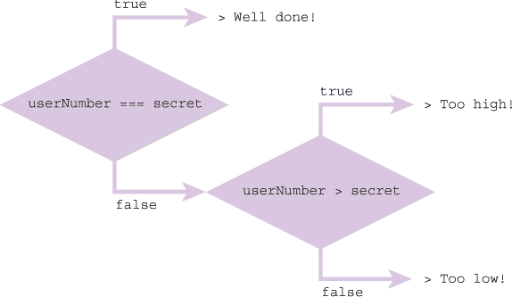

下面的列表展示了如何使用额外的`if`语句来区分两种类型的错误答案。

##### 列表 12.5. 高于或低于 ([`jsbin.com/cixeju/edit?js,console`](http://jsbin.com/cixeju/edit?js,console))

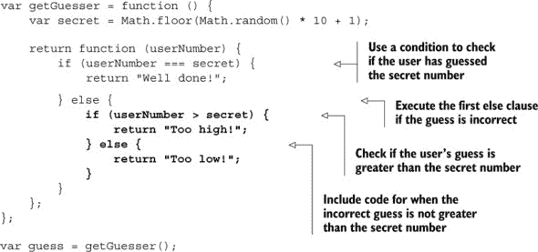

如果代码块只包含一个语句，JavaScript 允许我们省略大括号；以下三个语句是等价的：

```
if (userNumber === secret) {
    return "Well done!";
}

if (userNumber === secret)
    return "Well done!";

if (userName === secret) return "Well done!";
```

当`if`和`else`子句变得复杂，并且代码随时间更新时，如果你省略了大括号，有时很难找到哪些语句与哪些子句相对应。许多程序员（包括我）建议你始终为代码块使用大括号（除了嵌套`if`语句的情况，如稍后所示）。其他人则不那么严格。最终，这可以归结为个人（或团队）的偏好。现在，我会选择你最容易理解的方式。

一个`if`语句，即使带有`else`子句，也只算作一个语句。当`else`子句只包含一个`if`语句时，通常省略大括号。以下三个代码片段是等价的：

首先，如列表 12.5 中所示。嵌套的`if-else`语句位于一对大括号内。

```
else {                              // Curly braces at start
    if (userNumber > secret) {
        return "Too high!";
    } else {
        return "Too low!";
    }
}                                   // Curly braces at end
```

内层的`if-else`是一个单独的语句，因此不需要用大括号括起来。

```
else                                // No curly braces  
    if (userNumber > secret) {
        return "Too high!";

    } else {
        return "Too low!";
    }
                                    // No curly braces
```

最后，由于 JavaScript 主要忽略空格和制表符，内层的`if-else`语句可以移动到初始`else`之后。

```
else if (userNumber > secret) {     // if moved next to else 
    return "Too high!";
} else {
    return "Too low!";
}
```

最后一个版本是最常见的格式。下一个列表显示了上下文中的更整洁的`else-if`块。

##### 列表 12.6. 一个更整洁的 else-if 块 ([`jsbin.com/cidoru/edit?js,console`](http://jsbin.com/cidoru/edit?js,console))

```
var getGuesser = function () {
    var secret = Math.floor(Math.random() * 10 + 1);

    return function (userNumber) {
        if (userNumber === secret) {
            return "Well done!";
        } else if (userNumber > secret) {
            return "Too high!";
        } else {
            return "Too low!";
        }
    };
};

var guess = getGuesser();
```

第二个`if`语句以粗体显示，以便与列表 12.5 进行比较。你移除了第一个`else`块的大括号，并将第二个`if`移动到第一个`else`旁边。列表 12.6 显示了编写`else-if`块最常见的方式。如果你更喜欢列表 12.5 中的较长的版本，请随意坚持使用它；没有*块法官*在等待对你进行语法滥用判决。（*在此处，作者被叫去处理一场骚乱——他公寓门上非常响亮的撞击声……是法律！*）

猜测游戏中考虑了所有可能的结果；猜测可能是正确的，也可能太高或太低。如果猜测不正确且不是太高，那么它一定是太低了。

#### 12.3.1. 比较运算符

列表 12.5 和 12.6 都使用了*大于运算符* `>`。它作用于两个值并返回`true`或`false`。它是比较两个值的一组运算符之一。其中一些运算符在表 12.1 中显示。

##### 表 12.1. 比较运算符

| 运算符 | 名称 | 示例 | 评估结果 |
| --- | --- | --- | --- |
| > | 大于 | 5 > 3 3 > 10 7 > 7 | true false false |
| >= | 大于或等于 | 5 >= 3 3 >= 10 7 >= 7 | true false true |
| < | 小于 | 5 < 3 3 < 10 7 < 7 | false true false |
| <= | 小于或等于 | 5 <= 3 3 <= 10 7 <= 7 | false true true |
| === | 严格等于 | 5 === 3 7 === 7 7 === "7" | false true false |
| !== | 不严格等于 | 5 !== 3 7 !== 7 7 !== "7" | true false true |

因为表 12.1 中的运算符返回`true`或`false`，它们可以用作`if`语句的条件。你可能想知道严格相等运算符的严格部分——我们将贯穿整本书——以及是否存在非严格版本。是的，存在。对于非严格相等，你可以使用`==`。参见“宽松相等和强制转换”侧边栏。


**宽松相等和强制转换**

*宽松相等运算符* `==` 允许将值强制转换为不同类型以便进行比较。

*强制转换*是将一个值从一种类型转换为另一种类型的过程，例如，从字符串转换为数字。

因此，虽然严格比较`7 === "7"`的结果是`false`，因为一个值是数字，另一个是字符串，但宽松比较`7 == "7"`的结果是`true`，因为字符串首先被转换为数字，`7 == 7`是`true`。

强制转换的规则超出了本书的范围（尽管可以忽略那些说它们不值得学习的人），我们将坚持使用严格相等比较。


现在，显然，猜测数字是非常有趣的，但你可以从像书中几次提到的基于事实的测验中学到更多。添加检查答案的能力将有助于提升测验应用，使其不仅仅是一个简单的游戏。

### 12.4\. 在测验应用中检查答案

现在你可以在`if`语句中检查条件了，你终于可以保留用户在测验程序中答对问题的数量了。一个典型的控制台交互可能是这样的：

```
> quiz.quizMe()
  What is the highest mountain in the world?
> quiz.submit("Everest")
  Correct!
  Your score is 1 out of 1
> quiz.quizMe()
  What is the highest mountain in Scotland?
> quiz.submit("Snowdon")
  No, the answer is Ben Nevis
  You have finished the quiz
  Your score is 1 out of 2
```

测验程序代码在下一列表中展示。`getQuiz`函数包含了测验的实现，并返回一个只包含两个方法（`quizMe`和`submit`）的接口对象。在列表之后，你可以仔细看看程序是如何工作的。

##### 列表 12.7\. 检查测验答案 ([`jsbin.com/hidogo/edit?js,console`](http://jsbin.com/hidogo/edit?js,console))


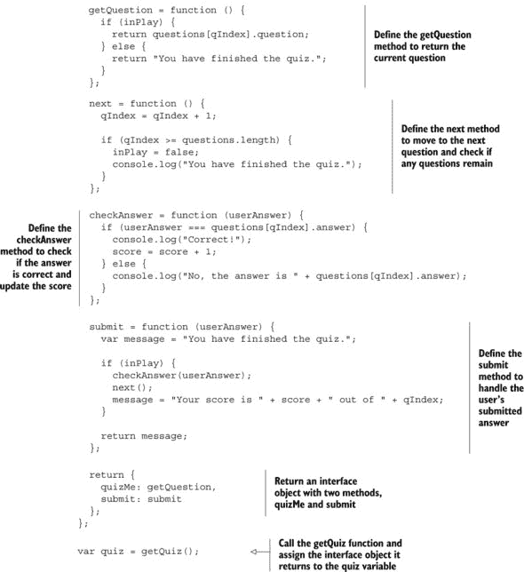

你新的测验程序有几个动态部分；让我们将其分解成更小的部分。

#### 12.4.1\. 使用单个`var`关键字进行多重声明

到目前为止，你一直在为每个声明的变量使用`var`关键字：

```
var score;
var getQuestion;
var next;
var submit;
```

JavaScript 允许你使用单个`var`关键字声明一系列变量。变量之间用逗号分隔，列表以分号结束。之前的声明可以用以下更简短的形式重写：

```
var score,
    getQuestion,
    next,
    submit;
```

你甚至可以在一行中声明变量：

```
var score, getQuestion, next, submit;
```

大多数程序员喜欢每行一个变量。你还可以包括赋值：

```
var score = 0,
    getQuestion,
    next,
    submit = function (userAnswer) {
        // function body  
    };
```

目标是确保所有变量都已声明，代码易于阅读和理解。在列表 12.7 中的风格是我倾向于选择的；我发现它稍微容易阅读一些，而且输入的代码也稍微少一些。一些程序员使用`var`关键字在单独的一行上声明每个变量，就像我们到目前为止在列表中做的那样；如果每个变量都有自己的`var`关键字，那么剪切和粘贴变量会更容易。这并不值得担心——你可能会随着时间的推移而确定一种风格。

#### 12.4.2\. 显示问题

`getQuestion`函数从`questions`数组中返回一个问题。它使用`qIndex`变量从数组中选择当前的问题和答案对象。它返回问题和答案对象的`question`属性。

```
return questions[qIndex].question;
```

但只有当测验仍在进行时，它才会返回问题。否则，它返回一个字符串说明测验已完成：

```
return "You have finished the quiz.";
```

程序使用`inPlay`变量来标记测验正在进行和已完成。当测验进行时，`inPlay`变量的值为`true`，当测验完成后为`false`。`getQuestion`函数使用`inPlay`变量作为`if`语句中的条件：

```
if (inPlay) {
  return questions[qIndex].question;

} else {
  return "You have finished the quiz.";
}
```

当`inPlay`为`true`时，返回问题。当`inPlay`为`false`时，返回消息。（记住，当你从控制台提示符调用函数时，控制台会自动显示返回值。）

#### 12.4.3\. 转到下一个问题

程序调用`next`函数从一个问题移动到下一个问题。它通过增加`qIndex`变量来实现移动。

```
qIndex = qIndex + 1;
```

程序将`questions`数组中当前元素的索引存储在`qIndex`中。记住，数组索引是从零开始的，所以对于一个长度为 4 的数组，索引可以是 0、1、2 或 3。索引 4 将超出数组的末尾（3 是最后一个索引）。一般来说，如果索引大于或等于数组的长度，你就超出了数组的末尾。所有数组都有一个`length`属性。在测验中，它代表问题的数量。

`next`函数检查索引是否超出了最后一个问题：

```
if (qIndex >= questions.length)
```

如果索引超出了数组的末尾，那么所有问题都已提出，测验结束，因此`inPlay`被设置为`false`。

```
if (qIndex >= questions.length) {
  inPlay = false;
  console.log("You have finished the quiz.");
}
```

#### 12.4.4\. 检查玩家的答案

`checkAnswer`函数很简单。如果玩家提交的答案等于问题数组中的当前答案，则玩家的分数增加。否则，显示正确答案。

```
if (userAnswer === questions[qIndex].answer) {
  console.log("Correct!");
  score = score + 1;
} else {
  console.log("No, the answer is " + questions[qIndex].answer);
}
```

#### 12.4.5\. 处理玩家的答案

`submit`函数协调玩家提交答案时发生的事情。它返回一个包含玩家分数的消息或表示测验结束的消息。

```
Your score is 1 out of 2      // If inPlay is true 

You have finished the quiz.   // If inPlay is false
```

如果测验仍在进行中，`submit`会调用两个其他函数，`checkAnswer`和`next`。每个函数将依次执行其代码。你正在使用函数按需运行代码。

```
if (inPlay) {
  checkAnswer(userAnswer);
  next();
  message = "Your score is " + score + " out of " + qIndex;
}
```

#### 12.4.6\. 返回界面对象

你保持了`getQuiz`返回的接口对象简单。它没有自己的实现代码。你从`getQuiz`的局部作用域中分配其两个属性函数。

```
return {
  quizMe: getQuestion,
  submit: submit
};
```

如第十一章第十一章中所述，接口对象允许你在时间上保持一致的接口，即使`getQuiz`内部的实现发生了变化。用户将始终调用`quiz.quizMe()`和`quiz.submit()`。你可以更改分配给接口对象这两个属性的函数以及这些函数的工作方式，但你永远不要删除或重命名这些属性。

注意程序是如何由许多小部分组成，共同构建其功能的。一如既往，你的目标是使代码可读、易懂且易于跟踪。`if`语句及其`else`子句帮助你指导程序的流程，在每个阶段采取适当的行动。

是时候将这些新想法应用到*The Crypt*上了。

### 12.5\. The Crypt—检查用户输入

在第十一章中，你创建了一个`getGame`函数，它返回了*The Crypt*的公共接口。玩家可以调用`go`方法从一个地方移动到另一个地方，以及调用`get`方法来拾取物品：

```
return {
    go: function (direction) {
        var place = player.getPlace();
        var destination = place.getExit(direction);
        player.setPlace(destination);

        render();
        return "";
    },

    get: function () {
        var place = player.getPlace();
        var item = place.getLastItem();
        player.addItem(item);
        render();
        return "";
    }
};
```

#### 12.5.1\. 逐步分析`go`方法

让我们逐步分析`go`方法的前三行。看看你是否能发现可能出现问题的位置。

##### 获取玩家的位置

你从`getPlace`方法开始。它返回玩家的当前位置。

```
var place = player.getPlace();
```

然后你将位置分配给`place`变量。如果玩家目前位于厨房，那么代码等同于

```
var place = kitchen;
```

程序之前使用`setPlace`方法分配了玩家的起始位置：

```
player.setPlace(kitchen);
```

##### 使用方向找到目的地

现在你有了当前位置，你可以调用它的`getExit`方法来获取给定方向的目的地。

```
var destination = place.getExit(direction);
```

当玩家调用`go`方法时，参数被分配给`direction`参数。

```
> game.go("south")
```

之前的命令将执行以下等效代码：

```
var destination = place.getExit("south");
```

如果图书馆在厨房的南方，那么代码等同于

```
var destination = library;
```

##### 将玩家移动到目的地

你已经有了目的地；你只需要更新玩家的位置。

```
player.setPlace(destination);
```

太棒了！用户可以决定在游戏中去哪里。那么，你能让他们在你的精心设计的城堡中自由行动吗？不，你看到，用户是邪恶的。纯粹的邪恶！

#### 12.5.2\. 永远不要相信用户输入

抱歉，我慌了。当然，用户并不邪恶。但他们确实会犯错误。他们有时会养猫。而且大多数猫都不会打字。每当需要用户为程序提供输入时，我们必须防范错误，无论是打字错误（可能是猫引起的），还是误解（可能是我们的错），或者是出于对程序能做什么的好奇心而进行的探索。

`go` 方法期望用户输入一个有效的方向作为字符串。它使用该方向来查找目的地，即玩家将被移动的地方。如果用户输入一个不存在的方向，整个游戏就会崩溃！

```
> game.go("snarf")
```

图 12.4 展示了在播放 *The Crypt* 的 第十一章 版本时，我在 JS Bin 中输入上一条命令所发生的情况。[`jsbin.com/yuporu/edit?js,console`](http://jsbin.com/yuporu/edit?js,console)

##### 图 12.4\. 指定一个不存在的方向会导致 *The Crypt* 游戏崩溃。

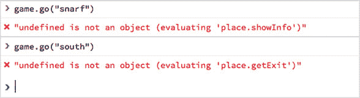

浏览器上的错误消息可能略有不同。即使在错误之后输入一个有效的方向也无法解决问题。从 图 12.4 中的错误来看，似乎 `place` 变量存在问题。`go` 方法中的关键语句是使用用户输入的那个：

```
var destination = place.getExit(direction);
```

如果指定的方向不是地点的出口之一，那么 `getExit` 函数将返回 `undefined`。程序将 `undefined` 赋值给 `destination` 变量，并将该值设置为玩家的新位置：

```
player.setPlace(destination);
```

因此，玩家的位置现在是 `undefined`，而不是使用 `Place` 构造函数构建的地方。`undefined` 没有提供 `showInfo` 或 `getExit` 方法；它没有任何方法！图 12.4 中的错误现在应该更容易理解。

那么如何防止用户（以及他们的猫）犯错误呢？

#### 12.5.3\. 安全探索——使用 `if` 语句避免问题

你可以使用 `if` 语句在更新玩家位置之前检查是否有有效的目的地：

```
go: function (direction) {
    var place = player.getPlace();
    var destination = place.getExit(direction);

    if (destination !== undefined) {
        player.setPlace(destination);
        render();
        return "";
    } else {
        return "*** There is no exit in that direction ***";
    }
}
```

如果当前地点没有指定方向的出口，`getExit` 方法将返回 `undefined`。你只需要在调用 `setPlace` 之前检查目的地是否不是 `undefined`。

```
if (destination !== undefined) {
    // There is a valid destination.   
}
```

记住从 表 12.1 中，`!==` 操作符在两个值不相等时返回 `true`，在它们相等时返回 `false`。你可以添加一个 `else` 子句来捕获目的地是 `undefined` 的情况。

```
if (destination !== undefined) {
    // There is a valid destination. 
} else {
    // There is no exit in the direction specified.   
}
```

列表 12.8 展示了从 `getGame` 函数返回的 `go` 和 `get` 方法的更新版本。在控制台中输入一个不存在的方向现在看起来是这样的：

```
> game.go("snarf")
  *** You can't go in that direction ***
```

当没有物品可以拾取时调用 `get` 的样子如下：

```
> game.get()
  *** There is no item to get ***
```

此列表中只显示了部分代码。包含 `Player` 和 `Place` 构造函数以及更多地点的完整列表在 JS Bin 上。

##### 列表 12.8\. 检查用户输入 ([`jsbin.com/zoruxu/edit?js,console`](http://jsbin.com/zoruxu/edit?js,console))

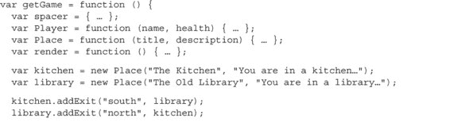

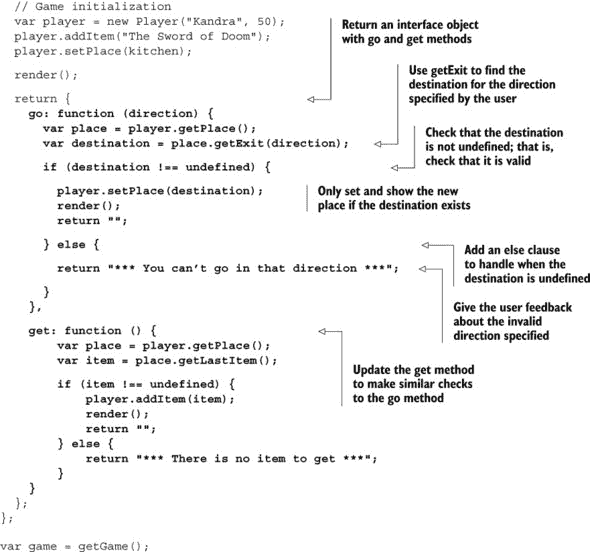

在打印的列表 12.8 中，省略了`Player`和`Place`构造函数的细节，以便更容易关注对`go`和`get`方法的变化。在第十三章[kindle_split_022.html#ch13]中，你将每个构造函数移动到自己的文件中，并了解如何在 JS Bin 中导入文件。这种增加的模块化可以帮助你一次关注一件事，并使在多个项目中重用代码更容易。

### 12.6. 摘要

+   使用比较运算符比较两个值。运算符返回`true`或`false`，布尔值：

    ```
    >  5 === 5    // Strict equality       
       true
    >  10 > 13    // Greater than        
       false
    ```

+   使用`if`语句仅在满足条件时执行代码：

    ```
    if (condition) {
        // Execute code if condition evaluates to true
    }
    ```

+   使用比较运算符和/或变量设置条件：

    ```
    if (userNumber === secret) {
        // Execute code if userNumber and secret are equal 
    }

    if (inPlay) {
        // Execute code if inPlay evaluates to true 
    }
    ```

+   当条件不满足时，添加`else`子句以执行代码：

    ```
    if (condition) {
        // Execute code if condition evaluates to true
    } else {
        // Execute code if condition evaluates to false
    }
    ```

+   在`else`子句中包含额外的`if`语句以覆盖所有可能性：

    ```
    if (userNumber === secret) {
        console.log("Well done!");
    } else if (userNumber > secret) {
        console.log("Too high!");
    } else {
        console.log("Too low!");
    }
    ```

+   使用`Math.random()`生成随机数。生成的数字介于 0 和 1 之间。它们可以等于 0 但不能等于 1：

    ```
    > Math.random()
      0.552000432042405
    ```

+   将随机数扩展到你想要的范围：

    ```
    Math.random() * 10                    // 0 <= decimal < 10
    Math.random() * 10 + 1                // 1 <= decimal < 11
    ```

+   使用`Math.floor()`将随机数四舍五入为整数：

    ```
    Math.floor(Math.random() * 10 + 1)    // 1 <= integer <= 10
    ```

+   永远不要相信用户输入。放置检查以确保任何输入都是有效的。

## 第十三章。模块：将程序分解成片段

***本章涵盖***

+   使用脚本元素将代码导入 JS Bin

+   避免重复的变量名

+   不将函数分配给变量而运行它们

+   使用模块来组织你的（共享）代码库

随着你开发的应用程序变得更大，涉及越来越多的变量、对象、数组和函数，在单个程序文件中高效工作可能会变得越来越困难。好的文本编辑器和开发环境可以帮助，但即使有了它们的工具，很快就会变成一个很好的主意，将代码分散到多个文件中。

例如，在*The Crypt*中，你有`spacer`、玩家、地点、地图以及游戏逻辑本身。你可能已经注意到，当所有元素都包含在内时，JS Bin 上的代码列表变得有多长。将每个元素的代码放在自己的文件中可以帮助你一次专注于程序的一个部分，并使不同程序员开发和应用测试应用程序的不同部分更容易。图 13.1 显示了将一个大型程序分解为模块的目标。

##### 图 13.1. 将一个大型程序分解为模块


在不同的文件中拥有离散的功能和数据也促进了代码的重用。与其从一项项目中将有用的函数和 JavaScript 片段剪切粘贴到其他项目中，不如将它们保留在单个库文件中，当需要时将其导入到其他项目中。例如，我们可靠的`spacer`命名空间来自第七章章节 7，用于在控制台上格式化文本，可以在问答应用和博客应用中使用。与其在每个应用中重复`spacer`代码，不如将其放在自己的文件中，并在需要时导入它(图 13.2)。

##### 图 13.2. 将`spacer`移动到模块中允许相同的单个文件在许多项目中使用。

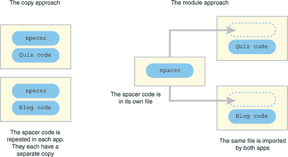

我将松散地称这样的文件为*模块*。有许多已发布的 JavaScript 项目和模块管理标准，它们将为自己定义模块必须采取的形式，而 JavaScript 的最新版本也在引入原生的模块系统，但我现在很高兴保持简单。

本章将探讨如何使用 HTML `script`元素将模块导入 JS Bin。你将看到随机数生成函数和`spacer`命名空间的文本格式化功能如何被纳入其他项目中。当你开始将来自不同模块的代码包含到一个程序中时，你必须密切关注正在使用的变量名；有可能会覆盖你的变量。你还将了解如何通过使用命名空间和利用立即执行函数表达式来最小化这些问题，这是一种运行函数代码而不将其分配给变量的方法。

首先，让我们看看 JS Bin 是如何与文件一起工作的。

### 13.1. 理解 JS Bin 上的 bins 和文件

在第十二章中，你创建了一个简单的游戏，挑战玩家猜测一个介于 1 到 10 之间的数字。你使用`Math.random`方法生成这个数字。现在，你希望更新你的测验应用，以显示其问题库中的随机问题。猜数字游戏和测验都需要能够生成两个限制之间的随机整数。它们都可以使用以下类似的功能：

```
var between = function (lowest, highest) {
    // Return a whole number between lowest and highest inclusive
};
```

在本节中，你将在 JS Bin 上创建并保存一个包含数字生成器代码的 JavaScript 文件。在第 13.2 节中，你将学习如何加载该文件，在第 13.3 节中，你将如何将其加载到猜数字游戏和测验应用中，如图 13.3 所示。

##### 图 13.3. 测验应用和猜数字游戏导入了数字生成器代码。

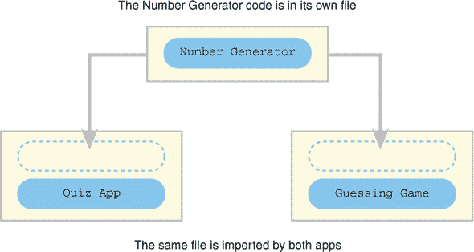

在你学习如何导入文件之前，我们需要简要地看看 JS Bin 是如何保存你的工作的。

JS Bin 是一个简单的开发环境，它允许你在单独的面板中工作 HTML、CSS 和 JavaScript 代码。图 13.4 显示了这三个面板同时打开，都包含代码。

##### 图 13.4. JS Bin 上的 HTML、CSS 和 JavaScript 面板

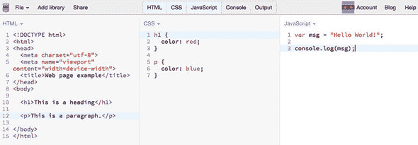

JS Bin 将 HTML、CSS 和 JavaScript 面板中的代码组合起来，生成你的网页，并在输出面板中显示（图 13.5）。你将在第三部分（kindle_split_026.html#part03）中更详细地了解 HTML（以及一点 CSS）。

##### 图 13.5. HTML、CSS 和 JavaScript 代码都被用来生成网页输出。

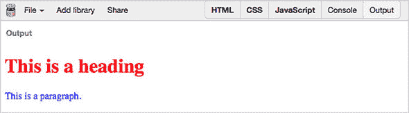

当您运行代码时出现的任何错误或警告都会显示在控制台面板中。您也可以从 JavaScript 代码中向控制台面板记录消息——这就是您迄今为止显示输出的方式。您专注于 JavaScript，所以您没有关心输出面板中生成的网页。您可以从 图 13.4 和 图 13.5 在 JS Bin 的 [`jsbin.com/jejunu/edit?output`](http://jsbin.com/jejunu/edit?output) 上看到页面。切换面板以查看代码。

除了提供一个综合环境供您编辑构成网页的不同类型的代码外，JS Bin 还允许您以单独的文件形式访问 HTML、CSS 和 JavaScript 代码。要在 JS Bin 中创建 JavaScript 代码并查看它作为单独的文件，请按照以下步骤操作：

> **1**.  创建一个 bin
> 
> **2**.  在 JavaScript 面板中编写一些代码
> 
> **3**.  记录文件名
> 
> **4**.  查看单个代码文件

#### 13.1.1\. 创建一个 bin

在 JS Bin 的文件菜单上点击新建。JS Bin 会为你创建 HTML、CSS 和 JavaScript 文件。它将这些三个文件统称为 *bin*，并在对应的面板上显示每个文件的内容。HTML 文件包含一些常见的模板代码，适用于大多数新网页；CSS 和 JavaScript 文件为空。

#### 13.1.2\. 编写一些代码

将以下代码添加到 JavaScript 面板中。

```
var between = function (lowest, highest) {
    var range = highest - lowest + 1;
    return lowest + Math.floor(Math.random() * range);
};
```

`between` 函数返回 `lowest` 和 `highest` 之间的一个随机整数（包括这两个值）。例如，`between(3, 5)` 将返回 `3`、`4` 或 `5`。

#### 13.1.3\. 记录文件名

JS Bin 为每个 bin 分配一个用于编辑 bin 文件和单独访问它们的代码。查看浏览器地址栏中的当前 URL。（您可能需要点击地址栏才能看到完整的地址。）图 13.6 展示了带有 bin 代码和可见面板的高亮 URL。

##### 图 13.6\. 分解 JS Bin URL

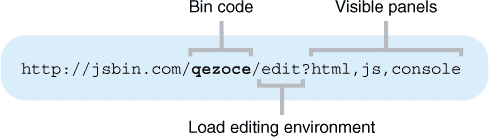

记录您在 JS Bin 上当前工作的 bin 代码——它将不同于 图 13.6。我的工作 bin 代码是 `qezoce`。

#### 13.1.4\. 查看单个代码文件

要访问单个代码文件，您使用不同的 URL 格式，如图 图 13.7 所示。它以 `output` 为前缀，以 bin 代码和文件扩展名结尾。文件扩展名指定了您想要加载的文件类型。使用 `js` 用于 JavaScript。

##### 图 13.7\. JavaScript 文件的 JS Bin URL

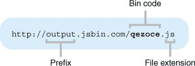

访问 [`output.jsbin.com/qezoce.js`](http://output.jsbin.com/qezoce.js) 只会加载 JavaScript 文件，如图 图 13.8 所示。JS Bin 编辑环境中的所有面板、菜单和控制都不会加载；它只是 JavaScript 文件的纯文本。

##### 图 13.8\. JS Bin 上的 JavaScript 文件

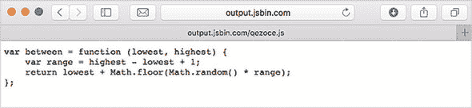

（输出并不总是格式化得很好，以便人类阅读；可能已经删除了不必要的空格和换行符。）尝试使用你的 JS Bin 中的 bin 代码加载你的文件版本。

太好了！你可以接触到你的纯 JavaScript。但是，你如何让它出现在另一个程序中？

### 13.2. 导入文件到其他项目中

你将创建一个程序，使用上一节中的数字生成函数`between`。你需要采取以下步骤：

> **1**. 创建一个 bin
> 
> **2**. 在 JavaScript 面板中编写一些代码
> 
> **3**. 在 HTML 面板中添加一个`script`元素
> 
> **4**. 刷新页面
> 
> **5**. 运行程序

#### 13.2.1. 创建一个 bin

通过点击文件菜单上的“新建”来在 JS Bin 上创建一个 bin。HTML、CSS 和 JavaScript 面板将被重置。

#### 13.2.2. 编写一些代码

在 JavaScript 面板中输入以下代码：

```
// requires the Number Generator module
var num = between(3, 7);
console.log(num);
```

现在运行程序将导致错误——没有声明`between`变量或定义函数。`between`函数在单独的文件中。这提出了*依赖性*的问题；当将代码拆分成模块时，一个模块依赖于另一个模块以正常工作并不罕见。前面的代码依赖于数字生成器模块。更高级的模块系统通常允许你明确记录并自动加载依赖项；目前，你可以添加注释来显示任何所需的模块。

#### 13.2.3. 添加一个`script`元素

是时候利用 JS Bin 上的 HTML 面板了。HTML 是用于网页结构和内容的代码；它是如何指定标题、段落、列表和链接等的。你将在第十七章中得到适当的介绍，并在第三部分（kindle_split_026.html#part03）中充分利用它。现在，你的重点仍然非常集中在 JavaScript 上，并使用 JS Bin 来帮助你学习和探索。你将只使用一小段 HTML 来帮助你将较长的程序拆分成单独的文件，并在需要时加载它们。

你使用 HTML 的`script`元素来指定你想要加载的 JavaScript 文件。图 13.9 显示了组成该元素的各个部分。

##### 图 13.9. 组成`script`元素的各个部分

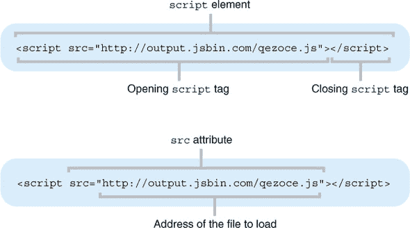

目前不必太担心所有部分的名称。你可以使用`script`元素来加载文件，而不需要完全理解 HTML 元素、标签和属性。你将在第十七章中专注于这些内容。

在 JS Bin 上显示 HTML 面板。你会看到一些默认的 HTML 已经就位。对于你的目的来说，你不需要这些——你并不是在构建一个网页；你只是对加载一个 JavaScript 文件感兴趣。用你上一节创建的文件的 bin 代码替换默认的 HTML，以加载 JavaScript。

```
<script src="http://output.jsbin.com/qezoce.js"></script>
```

包含的 HTML 是一个带有 `src` 属性的单个 `script` 元素。您使用 `script` 元素来加载由 `src` 属性指定的 JavaScript 文件。（`src` 是 *source* 的缩写——文件的地址。）通常，要加载文件，请使用以下格式：

```
<script src="path/to/someFile.js"></script>
```

现代浏览器会假设文件包含 JavaScript。对于旧浏览器，您还可以包含一个 `type` 属性。

```
<script src="path/to/someFile.js" type="text/javascript"></script>
```

#### 13.2.4\. 刷新页面

JS Bin 并非总是自动加载文件；您可能需要在浏览器中刷新页面，在添加 `script` 元素后。

#### 13.2.5\. 运行程序

点击运行。控制台面板应显示一个介于 3 和 7 之间的数字。继续点击运行以生成更多随机数字。

列表 13.1 和 13.2 重复了您使用的 HTML 和 JavaScript。这两个列表的 JS Bin 链接都指向同一个 bin。运行程序五次会产生类似以下输出（它是随机的！）：

```
> 5
> 7
> 7
> 3
> 4
```

##### 列表 13.1\. 使用 script 标签加载 JavaScript（HTML）([`jsbin.com/lifugam/edit?html,js,console`](http://jsbin.com/lifugam/edit?html,js,console)）

```
<script src="http://output.jsbin.com/qezoce.js"></script>
```

##### 列表 13.2\. 在 JavaScript 面板中的代码（[`jsbin.com/lifugam/edit?html,js,console`](http://jsbin.com/lifugam/edit?html,js,console)）

```
// requires the Number Generator module
var num = between(3, 7);
console.log(num);
```

当您运行程序时，JS Bin 将首先加载并运行 `script` 元素的 `src` 属性中指定的文件。然后它将运行 JavaScript 面板中的任何代码。加载的文件和 JavaScript 面板代码一起形成以下单个程序：

```
// From the loaded file
var between = function (lowest, highest) {       

    var range = highest - lowest + 1;            
    return lowest + Math.floor(Math.random() * range);

};                                               

// From the JavaScript panel
var num = between(3, 7);             
console.log(num);
```

当您在控制台面板中点击运行按钮时，JS Bin 可能需要一段时间来加载 `script` 标签中指定的文件。一旦代码运行，随机数就会被记录到控制台。

### 13.3\. 导入数字生成器——更多示例

您已经看到了 JS Bin 如何为每个创建的 bin 分配一个代码，以及您如何使用该代码来访问项目中的单个文件。您创建了一个随机数生成器函数 `between`，并访问了包含代码的 JavaScript 文件。将工作拆分成模块的一个目标是通过导入而不是复制粘贴来在多个项目中使用相同的代码；请参阅图 13.10。

##### 图 13.10\. 将数字生成器函数导入两个项目

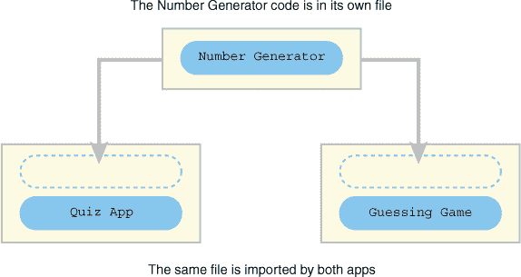

让我们通过将数字生成器导入到其他两个项目中来验证这个想法：测验应用和猜谜游戏。

#### 13.3.1\. 在测验应用中挑选随机问题

是时候随机化您的测验应用了。应用的新版本每次在控制台调用 `quizMe` 时都会从其题库中显示一个随机问题：

```
> quiz.quizMe()
  5 x 6
> quiz.submit("30")
  Correct!
> quiz.quizMe()
  7 x 8
> quiz.submit("30")
  No, the answer is 56
```

列表 13.4 展示了主测验应用的 JavaScript 代码。您可以通过 HTML 面板上的 `script` 元素导入 `between` 函数的代码（列表 13.3）。

##### 列表 13.3\. 在测验应用中使用数字生成器（HTML）([`jsbin.com/ponogi/edit?html,js,console`](http://jsbin.com/ponogi/edit?html,js,console)）

```
<script src="http://output.jsbin.com/qezoce.js"></script>
```

##### 列表 13.4. 在问答应用中使用数字生成器 ([`jsbin.com/ponogi/edit?html,js,console`](http://jsbin.com/ponogi/edit?html,js,console))

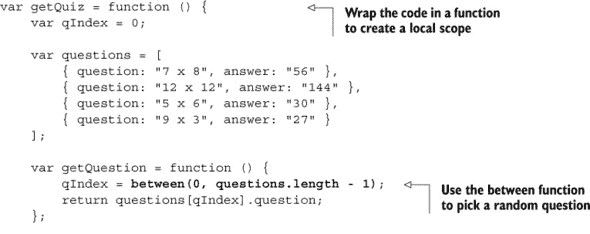

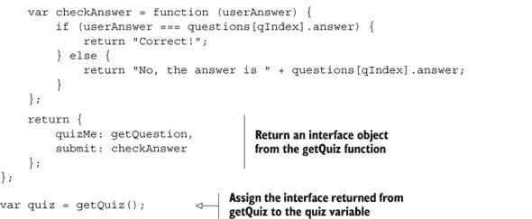

你使用 `between` 函数从题库中随机选择一个问题。`questions` 数组中的元素数量由 `questions.length` 给出（每个数组都有一个 `length` 属性），问题索引从 0 开始，到长度减 1。如果数组中有四个元素，那么索引从 0 到 3。因此，要选择一个随机索引，你使用

```
qIndex = between(0, questions.length – 1);
```

你使用了 第十一章 中的 wrap-and-return 模块模式，将实现（使一切工作的代码）隐藏在 `getQuiz` 函数内部，并作为对象返回公共接口。

点击列表链接访问 JS Bin 上的游戏并测试你对乘法事实的了解！答案存储为字符串，所以请确保你提交字符串以便程序进行检查：`quiz.submit("30")`，而不是 `quiz.submit(30)`。

#### 13.3.2. 在你的猜测游戏中使用 between 函数

列表 13.6 展示了你的猜测游戏的 JavaScript 代码。在控制台提示符下，玩家必须猜测一个介于 5 和 10 之间的数字（包括 5 和 10）：

```
> guess(7)
  Too high!
> guess(5)
  Too low!
> guess(6)
  Well done!
```

应用程序使用 `between` 函数，因此你需要在 HTML 面板上的 `script` 元素中导入它（见以下列表）。

##### 列表 13.5. 在猜测游戏中使用数字生成器（HTML）([`jsbin.com/tixina/edit?html,js,console`](http://jsbin.com/tixina/edit?html,js,console))

```
<script src="http://output.jsbin.com/qezoce.js"></script>
```

##### 列表 13.6. 在猜测游戏中使用数字生成器 ([`jsbin.com/tixina/edit?html,js,console`](http://jsbin.com/tixina/edit?html,js,console))

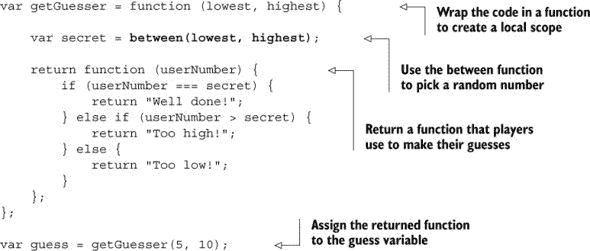

再次，点击列表链接访问 JS Bin 并开始猜测吧！

问答应用和猜测游戏现在都导入相同的数字生成器文件。数字生成代码在一个地方；这是一个唯一的真相来源。任何更新或修复都可以在这个文件上执行，所有使用它的项目都将加载新版本。

导入一个文件很有用，但你能否加载多个文件呢？

### 13.4. 导入多个文件

在 第七章 和 第十一章 中，你看到可以使用对象作为命名空间，这是一种组织属性和方法的方式，以便只需要一个变量。作为一个例子，你创建了 `spacer`，一个用于在控制台上格式化文本的函数命名空间。`spacer` 命名空间在许多项目中都可能很有用，无论何时你想用边框和框来格式化你的文本输出。与其将 `spacer` 代码复制粘贴到每个使用它的程序中，不如将其保存到自己的文件中，并在需要时导入。你可以在 [`jsbin.com/juneqo/edit?js`](http://jsbin.com/juneqo/edit?js) 查看`spacer` 代码。

让我们立即使用`spacer`。在列表 13.6 中，你更新了你的猜测游戏，以导入`between`函数并使用它来生成要猜测的秘密数字。假设你现在想通过将消息包装在框中来格式化你提供给玩家的反馈。这正是`spacer`的作用！控制台游戏看起来可能像这样：

```
> guess(10)                  > guess(5)                  > guess(9)
  +++++++++++++                ------------                ==============
  + Too high! +                - Too low! -                = Well done! =
  +++++++++++++                ------------                ==============
```

图 13.11 显示了猜测游戏应用导入`Number Generator`和`spacer`模块。

##### 图 13.11\. 导入`Number Generator`和`spacer`模块

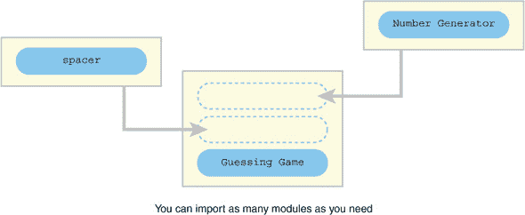

下面的列表显示了添加到 HTML 面板中的脚本元素，用于导入你正在使用的两个模块。

##### 列表 13.7\. 在猜测游戏中使用`spacer`和`between`（HTML）([`jsbin.com/foqowa/edit?html,js,console`](http://jsbin.com/foqowa/edit?html,js,console))

```
<!-- Number Generator -->
<script src="http://output.jsbin.com/qezoce.js"></script>

<!-- spacer -->
<script src="http://output.jsbin.com/juneqo.js"></script>
```

添加了注释来标记正在导入的模块；JS Bin 地址不太友好，所以清楚地说明你试图加载的内容很有帮助。这些注释是 HTML 注释，所以它们看起来与 Java-Script 注释略有不同。

下一个列表显示了使用两个导入模块`between`和`spacer`的猜测游戏代码。

##### 列表 13.8\. 在猜测游戏中使用`spacer`和`between`([`jsbin.com/foqowa/edit?html,js,console`](http://jsbin.com/foqowa/edit?html,js,console))


将之前编写和测试过的代码放入这样的单独文件中也有助于你专注于正在工作的新代码；列表 13.8 可以简短而甜蜜，因为你的信任的`spacer`代码被包装在外部文件中。

当你导入 JavaScript 时，就像所有导入的代码都被合并成一个单独的文件。如果不同的导入文件使用了相同的变量名，后来的代码可能会无意中覆盖早期的代码。嘭——你遇到了变量冲突！

### 13.5\. 冲突——当导入的代码覆盖你的变量时

你认为你的猜测游戏反馈中的框式消息有点过多。你希望反馈看起来像这样：

```
> guess(10)                        > guess(9)
  + T-o-o- -h-i-g-h-! +              = W-e-l-l- -d-o-n-e-! =
```

消息占用的空间更少，但字符之间用破折号分隔得很好。幸运的是，你的一个朋友，Kallie，一直在开发她自己的格式化函数，并且已经友好地将它们打包成一个你可以导入的模块。你需要的功能叫做`dasher`，使用起来非常简单：

```
dasher("message");     // m-e-s-s-a-g-e   
dasher("Too low!");    // T-o-o- -l-o-w-!
```

你向猜测游戏的 HTML 面板添加一个脚本元素来导入 Kallie 的代码，如下所示。

##### 列表 13.9\. 导入 Kallie 的代码（HTML）([`jsbin.com/zusodu/edit?html,js,console`](http://jsbin.com/zusodu/edit?html,js,console))

```
<!-- Number Generator -->
<script src="http://output.jsbin.com/qezoce.js"></script>

<!-- spacer -->
<script src="http://output.jsbin.com/juneqo.js"></script>

<!-- Kallie's code -->
<script src="http://output.jsbin.com/soxeke.js"></script>
```

不，我还没有向你展示 Kallie 的代码中的 JavaScript。你知道`dasher`是界面的一部分，是你预期使用的变量和函数，你也知道`dasher`的功能；你不需要知道它是如何做到的，即实现。当然，你可能（并且可能应该）对实现感兴趣，但你不需要理解它就能使用界面，`dasher`函数。

你更新猜谜游戏以使用`dasher`函数，如下所示。

##### 列表 13.10\. 使用 Kallie 的代码 ([`jsbin.com/zusodu/edit?html,js,console`](http://jsbin.com/zusodu/edit?html,js,console))


对于你的工作感到满意，你运行程序并做出猜测。错误！什么？`spacer.wrap`去哪里了？图 13.12 显示了在我的浏览器中发生的情况。

##### 图 13.12\. 由于某种原因，程序找不到`spacer.wrap`。


`spacer.wrap`似乎出了问题，它一直是你的`spacer`命名空间中工作的一部分，从第七章(kindle_split_015.html#ch07)开始。为什么它现在选择崩溃？是时候检查 Kallie 的模块内部了。如果你查看以下列表中的她的代码，你可能会发现问题。

##### 列表 13.11\. Kallie 的格式化代码 ([`jsbin.com/soxeke/edit?js,console`](http://jsbin.com/soxeke/edit?js,console))


Kallie 的代码不仅包括`dasher`函数；它还有一个`spacer`函数。她使用的三个变量，`spreader`、`spacer`和`dasher`，都是全局变量。你的`spacer`命名空间也使用一个全局变量，`spacer`。她的`spacer`已经覆盖了你的`spacer`，如图 13.13(#ch13fig13)所示。

##### 图 13.13\. 两个模块声明了相同的全局变量，导致冲突。


问题不在于函数的实现——它们工作得很好——而在于函数如何在模块内部提供。当变量被添加到全局作用域中，可能是由不同模块中的不同人添加的，总有可能在多个声明中使用相同的名称。

#### 13.5.1\. 变量冲突

你的模块通过使用至少一个全局变量来提供其功能。但如果同一个变量被多个模块使用怎么办？嗯，最后一个模块获胜，将其自己的值赋给变量。在猜谜游戏代码中，你加载了两个使用全局`spacer`变量的模块，然后你试图在程序中稍后使用该变量。以下片段显示了第二个`spacer`如何覆盖第一个，导致尝试使用`spacer.wrap`时出错。

```
// Code in first module
var spacer = {    
    line : ...,     
    wrap : ...,     
    box : ...        
};                 

// Code in second module
var spacer = function (text) { ... };     

// Later in the code
spacer.wrap(msg, msg.length + 4, "=");  // ERROR! There is no spacer.wrap.
```

当一个声明像这样取代另一个时，这被称为 *变量冲突*；第二个变量声明覆盖了第一个。你可以理解为什么声明大量全局变量被称为 *污染全局命名空间*——你声明的变量越多，冲突的可能性就越大。通过使用下一部分讨论的命名空间和立即调用的函数表达式来减少全局变量的数量。

#### 13.5.2\. 通过使用命名空间最小化冲突

您的 `spacer` 命名空间模块表现良好，因为它只使用了一个全局变量。而不是为 `line`、`wrap` 和 `box` 函数分别使用不同的全局变量，它使用一个对象作为命名空间，并将函数分配给对象的属性。然后，这个对象被分配给单个变量，`spacer`。

Kallie 为她的模块造成的污染道歉——她一直很忙——并将模块更新为使用命名空间，如下一清单所示。

##### 清单 13.12\. 在命名空间中的 Kallie 格式化代码 ([`jsbin.com/moheka/edit?js,console`](http://jsbin.com/moheka/edit?js,console))


您将猜谜游戏的 HTML 更新为导入更新的模块 (清单 13.13)，并将您的 JavaScript 代码更新为在 `kalliesCode` 命名空间内调用 `dasher` 函数 (清单 13.14)。

##### 清单 13.13\. 导入 Kallie 的命名空间 (HTML) ([`jsbin.com/seqahi/edit?html,js,console`](http://jsbin.com/seqahi/edit?html,js,console))

```
<!-- Number Generator -->
<script src="http://output.jsbin.com/qezoce.js"></script>

<!-- spacer -->
<script src="http://output.jsbin.com/juneqo.js"></script>

<!-- Kallie's code -->
<script src="http://output.jsbin.com/moheka.js"></script>
```

##### 清单 13.14\. 使用 Kallie 的代码 ([`jsbin.com/seqahi/edit?html,js,console`](http://jsbin.com/seqahi/edit?html,js,console))


按照清单链接访问 JS Bin，运行程序并玩游戏。使用命名空间已经解决了问题。

```
= W-e-l-l- -d-o-n-e-! =
```

避免污染全局命名空间的重要方法之一，这次是通过使用函数，将在下一部分介绍。它有一个很棒的名字...现在就来看看吧！

### 13.6\. 立即调用的函数表达式 (IIFE)

如果这个章节的标题立即在你的脸上引起了古怪的表情，我希望那是一种好奇、兴趣和冒险的感觉，而不是困惑、恐惧或惊恐。*立即调用的函数表达式*只是你直接调用的函数，甚至都不用使用变量。但你为什么要这样做呢？

在 第 13.5 节 中，您导入了一个由朋友 Kallie 编写的代码模块。（说实话，您已经认识她很多年了。）不幸的是，Kallie 的全局变量与您的冲突了（ouch！）并覆盖了您心爱的 `spacer` 命名空间。您学到了关于全局变量危险的重要教训，并发誓要尽一切可能减少全局命名空间的污染。您决定回顾一些代码，寻找可以删除的全局变量。

你从本章早些时候的测验应用程序开始复习。以下列表显示了你的代码结构，包括全局变量、局部变量和接口对象。

##### 列表 13.15\. 带有两个全局变量的随机测验问题 ([`jsbin.com/ponogi/edit?html,js,console`](http://jsbin.com/ponogi/edit?html,js,console))


程序声明了两个全局变量：`getQuiz`和`quiz`。在第一行中，你定义了一个函数并将其赋值给`getQuiz`。

```
var getQuiz = function () { ... };
```

然后，在最后一行，你立即调用该函数。

```
var quiz = getQuiz();
```

因此，你将`getQuiz`声明为全局变量——这是一种恶臭的污染——然后只使用一次，就让它像恶臭一样悬挂在全局作用域中。真丢脸！记住，全局变量有覆盖其他全局变量的风险；在小段代码中可能看起来不错，但随着项目的增长和模块的创建和导入，不久就会产生一种不安的微弱气息，最终变成绝望的恶臭。

| |
| --- |

##### 小贴士

避免声明*全局*变量，污染全局命名空间。通过使用对象作为命名空间来减少全局变量的数量。在函数内声明*局部*变量。

| |
| --- |

你可以使用立即调用的函数表达式将全局变量的数量减半。为了理解如何使用 IIFE（立即调用的函数表达式）来提高程序的性能，请考虑以下要点：

+   识别函数表达式

+   调用函数

+   立即调用函数表达式

+   从 IIFE 返回信息

#### 13.6.1\. 识别函数表达式

你从第四章开始就一直在使用函数表达式。你已经将它们赋值给变量和属性，将它们作为参数传递，并从其他函数中返回它们。

```
var show = function (message) {        //
    console.log(message);              // Assign to a variable
};                                     //

var namespace = {
    show: function (message) {         //
        console.log(message);          // Assign to a property
    }                                  //
};

tweets.forEach(function (message) {    //
    console.log(message);              // Pass as an argument to forEach
});                                    //

var getFunction = function () {
    var localMessage = "Hello Local!";

    return function () {               //
        console.log(localMessage);     // Return from a function
    };                                 //
};
```

你已经使用函数来创建可以在需要时调用的代码块，以及创建局部作用域，隐藏你希望保持私密的变量，防止用户和程序员的查看和修改。

#### 13.6.2\. 调用函数

要*调用*或*调用*一个函数，你使用*函数调用操作符*，`()`，一对括号。以下是调用上一节中提到的四个示例函数表达式的步骤：

```
show("Hello World!");                 // Call the show function

namespace.show("Hello World!");       // Call the show method

// Automatically called by forEach

var show = getFunction();             // getFunction returns a function
show();                               // Call the returned function
```

你在调用操作符的括号内传递参数给函数。函数返回的任何值将替换函数调用。

#### 13.6.3\. 立即调用函数表达式

你不需要将函数表达式赋值给变量来调用它。只需将函数表达式放在括号内，并附加函数调用操作符：

```
(function () {
    console.log("Hello World!");
})();
```

图 13.14 展示了代码模式的注释版本。

##### 图 13.14\. 立即调用的函数表达式


函数体内的代码立即执行。但未使用任何全局变量。函数表达式对全局命名空间没有影响。呼吸无污染、清新可口的空气。

#### 13.6.4\. 从 IIFE 返回信息

因此，立即执行函数减少了污染，并且对于隐藏你的私有变量非常有用。但还有更多！就像任何其他函数一样，立即执行函数可以返回值，例如作为接口的对象，这让你可以控制访问函数内部的秘密好东西。（注意：请仔细考虑你的私有变量应该有多少访问权限。）

列表 13.16 展示了如何使用立即执行函数表达式（IIFE）返回一个接口对象，然后将其分配给一个变量。如果你运行程序，你可以在控制台访问 `quiz` 接口：

```
> quiz.quizMe()
  12 x 12
> quiz.submit("144")
  Correct!
```

##### 列表 13.16. 在测验应用中使用 IIFE ([`jsbin.com/titano/edit?html,js,console`](http://jsbin.com/titano/edit?html,js,console))


你定义一个函数，立即调用它，并将返回的对象分配给 `quiz` 变量。使用立即执行函数表达式可以消除额外的变量。而不是

```
var getQuiz = function () {
    /* private */
    return interface;
};
var quiz = getQuiz();
```

你有

```
var quiz = (function () {
    /* private */
    return interface;
})();
```

你不需要使用 `getQuiz` 变量。

《密码学》使用了多个构造函数、函数和对象来构建游戏。你已经看到了模块和立即执行函数表达式的优势；让我们将游戏代码分解成模块。

### 13.7. 《密码学》——将代码组织成模块

在本章的开头，你看到了随着《密码学》代码量的增加，将程序分解成模块的动机。现在你已经了解了如何做以及为什么这样做，是时候采取行动了。

下面的列表显示了用于加载构成游戏的各个模块的五个 HTML 脚本元素。

##### 列表 13.17. 为《密码学》导入模块（HTML）([`jsbin.com/zikuta/edit?html,js,console`](http://jsbin.com/zikuta/edit?html,js,console))

```
<!-- spacer -->
<script src="http://output.jsbin.com/juneqo.js"></script>

<!-- Player constructor -->
<script src="http://output.jsbin.com/nubijex.js"></script>

<!-- Place constructor -->
<script src="http://output.jsbin.com/dofuci.js"></script>

<!-- Map code -->
<script src="http://output.jsbin.com/dipaxo.js"></script>

<!-- Game initialization -->
<script src="http://output.jsbin.com/fisupe.js"></script>
```

注意到 `spacer` 模块的地址与你在本章中一直使用的地址相同。这就是模块的美丽之处！你有一个文件，可以在多个项目中使用。如果你要向 `spacer` 命名空间添加一个新的格式化函数，它将立即对所有导入该模块的项目可用。

下面的列表显示了启动游戏所需的单行 JavaScript 代码。

##### 列表 13.18. 为《密码学》导入模块 ([`jsbin.com/zikuta/edit?html,js,console`](http://jsbin.com/zikuta/edit?html,js,console))

```
var game = theCrypt.getGame();
```

运行游戏；它应该以模块形式正常工作。所有功能都在模块中定义；启动游戏只需要最少的代码。

除了 `spacer` 模块外，《密码学》的其他模块都共享相同的命名空间 `theCrypt` (图 13.15)。你通过调用 `theCrypt` 命名空间的 `getGame` 方法来启动游戏，即 `theCrypt.getGame()`；

##### 图 13.15. 游戏导入了五个模块。其中四个需要共享一个命名空间。


你知道使用命名空间是减少全局变量数量和分组相关函数的好方法，但不同的模块文件中的代码如何共享相同的命名空间？

#### 13.7.1. 在模块间共享命名空间

利用本章所学，你想做以下事情：

+   使用单个全局命名空间 `theCrypt` 为所有构成 *The Crypt* 的模块。

+   只将那些其他模块需要的属性和函数分配给命名空间。

+   将其他所有内容隐藏在函数的局部作用域中。

模块向命名空间 `theCrypt` 添加属性，就像它们向任何其他对象添加属性一样：

```
theCrypt.Player = Player;
```

但哪个模块首先创建了命名空间？尝试访问未声明的变量将导致错误。但必须按特定顺序加载模块以确保首先声明 `theCrypt` 的模块将是不方便的。幸运的是，在浏览器中，全局变量会自动分配给特殊的全局对象，`window`。

##### 全局对象，window

`window` 对象是 JavaScript 在浏览器中处理全局变量的方式之一。你可以在控制台提示符中测试全局变量声明和 `window`：

```
> var test = "Hi"
  undefined
> test
  "Hi"
> window.test
  "Hi"
```

你声明一个全局变量 `test`，它将自动分配为 `window` 的属性。回到提示符，尝试访问一个不存在的全局变量：

```
> theCrypt
  "Can't find variable: theCrypt"
```

会抛出错误（尽管你的浏览器可能显示一个略有不同的错误消息）。另一方面，尝试访问 `window` 中不存在的属性不会抛出错误；它返回 `undefined`：

```
> window.theCrypt
  undefined
```

你可以使用 `window` 对象检查 `theCrypt` 是否已声明为命名空间，而不会引发任何错误。

##### 使用 window 检查全局变量

下一个列表展示了 `Player` 模块。构造函数周围添加了额外的代码以模块化它。

##### 列表 13.19. 将 Player 构造函数作为模块（[`jsbin.com/nubijex/edit?js`](http://jsbin.com/nubijex/edit?js)）


在 列表 13.19 中，`Player` 模块检查 `window` 对象以查看 `theCrypt` 是否已声明为全局变量。如果模块找不到 `theCrypt`，则它将声明它：

```
if (window.theCrypt === undefined) {
    window.theCrypt = {};
}
```

一旦模块确保命名空间存在，它就会将 `Player` 构造函数作为属性添加：

```
theCrypt.Player = Player;
```

`Player` 构造函数现在可以通过全局变量 `theCrypt` 供其他需要它的代码使用。

下一个列表展示了使用相同全局命名空间的 `Place` 模块。

##### 列表 13.20. Place 构造函数作为模块（[`jsbin.com/dofuci/edit?js`](http://jsbin.com/dofuci/edit?js)）


每个模块检查 `window` 对象上的 `theCrypt` 作为全局变量意味着不需要任何模块首先加载，因为它是创建命名空间的那个。它们都检查 `theCrypt`。第一个加载的模块将找不到它，并在使用之前创建它。之后加载的模块将找到 `theCrypt` 并将其属性分配给它想要共享的属性。

##### 将命名空间属性分配给局部变量

您喜欢命名空间减少全局变量的方式，但您不太喜欢使用共享属性时需要输入更多。例如，地图代码模块需要使用`Place`构造函数在*The Crypt*中创建地点：

```
var kitchen = new Place("The Kitchen", "You are in a kitchen...");
```

但您已经将`Place`构造函数移动到了命名空间`theCrypt`中。您可以在地图代码中更改所有对`Place`的引用：

```
var kitchen = new theCrypt.Place("The Kitchen", "You are in a kitchen...");
var library = new theCrypt.Place("The Old Library", "You are in a lib...");
```

但创建一个局部的`Place`变量并保留原始代码可能会更容易：

```
var Place = theCrypt.Place;

var kitchen = new Place("The Kitchen", "You are in a kitchen...");
```

如果您需要多次使用命名空间属性，这是一个减少输入的好方法。

将代码部分移动到它们自己的模块后，您可以开始仔细思考每个模块的作用。它们可以被分成更小的、具有更具体任务的模块吗？接下来的三个章节将探讨一些常见任务和常见于使用和显示变化数据的程序中的代码模式：模型、视图和控制器。

### 13.8\. 摘要

+   将程序分解成模块，即可以独立加载的代码部分。

+   在多个项目中使用相同的模块。

+   通过使用 HTML 脚本元素在 JS Bin 中加载模块：

    ```
    <script src="path/to/module.js"></script>
    ```

+   在脚本元素的`src`属性中指定模块文件的位置。

+   通过使用命名空间和立即调用的函数表达式来最小化变量冲突，其中一个变量被另一个变量覆盖。

+   通过将函数定义括在括号中并附加函数调用运算符`()`来创建立即调用的函数表达式。

    ```
    (function () {
        // Code to be executed immediately
    })();
    ```

+   从立即调用的函数表达式中返回一个接口。这被称为模块模式：

    ```
    var game = (function () {
        // Local variables go here

        return {
            // Interface methods           
        };
    })();
    ```

+   确保加载其他模块所依赖的任何模块。

## 第十四章\. 模型：与数据一起工作

***本章涵盖***

+   从数据构建模型

+   在多个项目中使用相同的数据

+   在数据文件之间切换

+   在*The Crypt*中指定映射数据

在第十三章中，您看到了如何使用模块将程序分解成单独的文件。然后您可以独立地工作在模块上，轻松地在模块之间切换，并在多个项目中重用它们。您甚至可以发布您的模块并导入其他人编写的已发布的模块。

本章保持了模块化和重用的精神。您会看到将数据从构造函数和函数中移出。您以简单的方式表示数据，以便多个应用可以使用这些数据，即使这些应用是用不同的编程语言编写的。然后，您考虑如何将数据输入到构造函数和函数中，以构建添加额外功能模型的模型。最后，您为*The Crypt*定义映射数据，增加挑战，使游戏更具吸引力。

### 14.1\. 构建健身应用—数据和模型

您的开发工作已经引起了人们的注意（*The Fruitinator!*成为全球热门），您现在是一个团队开发健身应用的一部分。注重健康的使用者跟踪他们的锻炼，记录每次会话的日期和持续时间。

```
Mahesha
120 minutes on February 5th, 2017
35 minutes on February 6th, 2017

2 hours 35 minutes so far.
Great work!
```

团队正在使用 Python 编程语言开发应用程序的 Android 版本，使用 Swift 开发 iOS 版本，以及使用 JavaScript 开发的基于网络的版本。所有版本都将使用相同的数据（图 14.1）。

##### 图 14.1\. 不同版本的应用程序使用相同的数据。


构建应用程序涉及的任务包括：

> **1**. 以字符串形式检索用户数据
> 
> **2**. 将用户数据转换为用户模型
> 
> **3**. 显示用户数据
> 
> **4**. 为用户提供添加会话的界面

数据以文本形式通过互联网传输。文本的格式是 JSON，你将在第二十章中查看。正如你将看到的，文本很容易转换为 JavaScript 对象。团队要求你专注于第二个任务，即从用户数据构建用户模型。

#### 14.1.1\. 定义用户构造函数

你被要求编写 JavaScript 代码来模拟一个健身应用程序的用户。你的模型需要执行以下操作：

> **1**. 存储用户的姓名。
> 
> **2**. 存储用户的锻炼会话列表，每个会话都有一个日期和时长。
> 
> **3**. 包含一个将会话添加到列表中的方法。
> 
> **4**. 包含一个用于检索用户数据的方法。

列表 14.1 显示了你的初始构造函数。你可以在控制台测试它：

```
> var user = new User("Mahesha")
  undefined
> user.addSession("2017-02-05", 120)
  120
> user.addSession("2017-02-06", 35)
  155
> user.getData().total
  155
```

##### 列表 14.1\. 用户构造函数([`jsbin.com/suzala/edit?js,console`](http://jsbin.com/suzala/edit?js,console))


构造函数包含一个 `name` 参数，一些使用 `var` 声明的私有变量，以及分配给 `this` 对象的两个公共方法，`addSession` 和 `getData`。`getData` 方法使用不带参数的 `slice` 来获取 `sessions` 数组的副本。（有关 `slice` 等数组方法的提醒，请参阅第八章章节 8。）提供会话信息的副本可以防止用户在 `addSession` 方法之外调整 `sessions` 数组。`getData` 返回的对象还包括一个 `total` 属性，用于存储已记录会话的总时长。

当你使用 `User` 构造函数创建一个 JavaScript 对象时，你创建了一个用户 *模型*。该模型不仅仅是数据；它包括私有变量和用于管理数据的公共方法，如图 14.2 所示。

##### 图 14.2\. 使用 `User` 构造函数函数创建的用户模型


如果模型不仅仅是数据，那么数据看起来是什么样子？

#### 14.1.2\. 感知数据作为 JavaScript 对象

用户的 数据是一个简单的 JavaScript 对象：

```
var userData = {
    "name" : "Mahesha",
    "sessions" : [
        { "sessionDate" : "2017-02-05", "duration" : 120 },
        { "sessionDate" : "2017-02-06", "duration" : 35 },
        { "sessionDate" : "2017-02-06", "duration" : 45 }
    ]
};
```

你可以访问其属性，如 `userData.name`。但它仍然只是数据；它没有使用 `User` 构造函数构建的模型所具有的额外功能，如 `addSession` 或 `getData` 方法。数据对象再次在图 14.3 中显示，以与图 14.2 进行比较。

##### 图 14.3\. 以简单 JavaScript 对象表示的用户数据


使用简单的 JavaScript 对象作为数据格式非常常见，即使在其他编程语言中也是如此，尤其是在网络上。你的团队开发健身应用非常高兴用户数据以这种广泛支持的形式表示。

为了充分利用用户模型提供的额外方法`addSession`和`getData`，你需要定义一个函数，从基本数据对象构建模型。

#### 14.1.3\. 将数据转换为用户模型

在列表 14.3 中，你定义了`buildUser`函数，该函数接受单个用户的 JavaScript 对象数据，并通过调用 User 构造函数创建一个模型。你通过使用 JavaScript 对象创建一个用户模型来测试`buildUser`函数。为创建的用户添加一个额外的锻炼课程会在控制台产生以下输出：

```
> 240
```

你正在使用列表 14.1 中的 User 构造函数，因此通过向项目中添加 HTML `script`元素来导入它（见第十三章），如下一个列表所示。

##### 列表 14.2\. 从用户数据构建用户模型的功能（HTML）([`jsbin.com/zenire/edit?html,js,console`](http://jsbin.com/zenire/edit?html,js,console))

```
<!-- User constructor -->
<script src="http://output.jsbin.com/suzala.js"></script>
```

##### 列表 14.3\. 从用户数据构建用户模型的功能([`jsbin.com/zenire/edit?html,js,console`](http://jsbin.com/zenire/edit?html,js,console))

![252fig01_alt.jpg]

通过`buildUser`函数，你现在可以将存储为简单 JavaScript 对象的普通用户数据升级为增强的用户*模型*，该模型将数据作为私有变量隐藏，但添加了管理模型状态和访问数据副本的方法。

#### 14.1.4\. 健身应用的下一步是什么？

你的团队对你的应用工作感到满意；你已经完成了本章的要求。以下是应用的全部要求：

> **1**. 将用户数据作为字符串检索
> 
> **2**. 将用户数据转换为用户模型
> 
> **3**. 显示用户数据
> 
> **4**. 为用户提供添加会话的接口

你已经完成了第二个要求。你将在本书后面的章节中处理其他要求。现在，让我们回到*The Crypt*。你能像在健身应用中将用户数据从用户模型中分离出来一样，将地图数据从地点模型中分离出来吗？

### 14.2\. The Crypt—将地图数据从游戏中分离出来

在本节中，你将应用在健身应用中学习到的知识来*The Crypt*。特别是，你将完成以下任务：

> **1**. 使用基本的 JavaScript 对象在游戏中表示地图数据
> 
> **2**. 将退出挑战添加到地图数据中
> 
> **3**. 更新`Place`构造函数以包含设置和获取挑战的方法
> 
> **4**. 编写一个从地图数据构建地点模型的功能

目前，你通过在程序中手动调用`Place`构造函数为每个创建的地点调用方法，然后调用添加项目和出口的方法来构建*The Crypt*的地图。

```
// Create two places
var kitchen = new Place(
    "The Kitchen",
    "You are in a kitchen. There is a disturbing smell."
);

var library = new Place(
    "The Old Library",
    "You are in a library. Dusty books line the walls."
);

kitchen.addItem("a piece of cheese");   // Add items separately
library.addItem("a rusty key");         //

kitchen.addExit("south", library);      // Add exits separately
library.addExit("north", kitchen);      //
```

地图数据（地方、出口和物品的描述）与创建游戏使用的对象的 JavaScript 绑定在一起；你可以在代码中找到有关地图位置的唯一地方是`Place`构造函数的调用中。

```
var library = new Place(
    "The Old Library",                                     // Data inside
    "You are in a library. Dusty books line the walls."    // constructor
);
```

关于地方出口和物品的详细信息与地方本身是分开的。

你在第 14.1 节中看到，当数据以通用格式表示时可以更容易地共享；其他程序和编程语言可以读取格式化为简单 JavaScript 对象的格式，但不知道你的`Place`对象。如果你将原始地图数据与构造函数以及`addItem`和`addExit`等方法分离，将更容易定义新地图、存储它们、切换它们和共享它们（图 14.4）。

##### 在图 14.4 中，你可以看到将地图数据从地图构建器中分离出来使得切换地图变得更加容易。


为了实现数据与游戏代码的这种分离，你必须决定数据将采取什么形式，然后编写一个函数将数据转换为游戏使用的`Place`模型。

#### 14.2.1. 地图数据

一个具有标题、地点列表和起始地点名称的 JavaScript 对象将代表每个地图。

```
{
    "title": "The Dark House",
    "firstPlace" : "The Kitchen",
    "places" : [
        // Array of place objects
    ]
};
```

`places`数组中的每个地方也将是一个对象。以下片段显示了这样一个地方：

```
{
    "title" : "The Kitchen",
    "description" : "You are in a kitchen. There is a disturbing smell.",
    "items" : [ "a piece of cheese" ],
    "exits" : [
        { "direction" : "south", "to" : "The Old Library" },
        { "direction" : "west",  "to" : "The Kitchen Garden" },
        { "direction" : "east",  "to" : "The Kitchen Cupboard" }
    ]
};
```

每个出口都是一个具有方向属性和它所引导的地方名称的对象。数据紧凑且易于阅读，并保持物品和出口与其所属的地方。

下面的列表显示了地图数据的一部分。四个完整的位置在 JS Bin 上。

##### 列表 14.4. 地图数据 ([`jsbin.com/qonoje/edit?js,console`](http://jsbin.com/qonoje/edit?js,console))


地图数据只是每个地方的描述；构建的`Place`模型将添加程序期望的功能。

#### 14.2.2. 向地图数据添加挑战

如其目前所示，*The Crypt*让你探索奇异的新世界。你可以在异国他乡找到物品。你甚至可以捡起这些物品并将它们添加到你的收藏中。但还有一样东西缺失。你的冒险更像是一次假期（尽管夹杂着一些随意的盗窃）。你需要挑战！

为了使游戏更有趣，你会在出口处添加挑战。当试图向某个方向行进时，你可能会遇到一个需要解决的问题。游戏玩法可能看起来像这样：

```
> game.go("south")
  *** A zombie sinks its teeth into your neck. ***

> game.use("a piece of cheese south")
  *** The zombie is strangely resilient. ***

> game.use("holy water south")
  *** The zombie disintegrates into a puddle of putrid goo. ***

> game.go("south")
  The Old Library
  You are in The Old Library...
```

挑战阻止了你向南行进。为了克服挑战，你必须使用特定物品来应对挑战的方向。

```
game.use("holy water south")
```

如果你没有所需的物品，你必须向不同的方向探险，克服其他挑战，直到找到你需要的物品。那么，你如何在游戏中创建挑战呢？

关于《The Crypt》冒险的所有信息都需要在其地图数据中表示。目前，地方的出口很简单：

```
{ "direction" : "south", "to" : "The Old Library" }
```

它们有一个方向和它们所引导的地方的标题。要向特定的出口添加一个挑战，包括一个 `challenge` 属性，如下所示：

```
{
    "direction" : "south",
    "to" : "The Old Library",
    "challenge" : {
        "message" : "A zombie sinks its teeth into your neck.",
        "success" : "The zombie disintegrates into a puddle of goo.",
        "failure" : "The zombie is strangely resilient.",
        "requires" : "holy water",
        "itemConsumed" : true,
        "damage" : 20
    }
}
```

表 14.1 列出了挑战对象的属性及其用途和是否必需。

##### 表 14.1\. 挑战属性

| 属性 | 它是用来做什么的？ | 必需？ |
| --- | --- | --- |
| 信息 | 当玩家试图朝向出口的方向移动且挑战尚未克服时，显示给玩家的信息 | 是 |
| 成功 | 当玩家使用克服挑战所需的物品时，显示给玩家的信息 | 是 |
| 失败 | 当玩家试图使用错误的物品克服挑战时，显示给玩家的信息 | 是 |
| 需要 | 克服挑战所需的物品 | 是 |
| 项目消耗 | 一旦使用，项目将从玩家物品列表中移除 | 否 |
| 损伤 | 当玩家在克服挑战之前试图朝向出口的方向移动时，从玩家健康值中减去的数量 | 否 |

为了适应挑战，你需要更新 `Place` 构造函数。

#### 14.2.3\. 更新 Place 构造函数以包含挑战

你必须更新 `Place` 模型以允许挑战。它需要一个对象来存储挑战，以及添加和检索指定方向挑战的方法，`addChallenge` 和 `getChallenge`。下一个列表显示了 `Place` 构造函数的更改。

##### 列表 14.5\. 带有挑战的 Place 构造函数 ([`jsbin.com/ruviso/edit?js,console`](http://jsbin.com/ruviso/edit?js,console))


你创建一个私有的 `challenges` 对象来存储任何挑战。就像出口一样，你使用方向作为存储挑战的键。如果玩家在向南移动之前必须克服一个挑战，那么挑战的详细信息将存储在 `challenges["south"]` 中。

要存储一个挑战，请使用 `addChallenge` 方法，要获取指定方向的挑战，请使用 `getChallenge` 方法。

#### 14.2.4\. 使用地图数据构建游戏地图

你实现 *The Crypt* 时使用的模型是通过 `Place` 构造函数创建的，并通过出口连接。现在，由于你的地图数据不再与游戏逻辑绑定，你需要一种方法将地图转换为一系列的地方模型。

你编写一个名为 `buildMap` 的函数，该函数接受一个地图数据对象作为参数，并创建通过其出口连接的地方模型。它返回地图上第一个地方的模式，即游戏的起点。

```
var firstPlace = buildMap(mapData);
```

图 14.5 展示了 `buildMap` 函数如何两次使用 `forEach`：首先创建地方模型，然后通过添加出口将模型连接起来。

##### 图 14.5\. 首先，创建所有的地方模型；然后通过它们的出口将它们连接起来。


`buildMap` 函数在 代码列表 14.6 中展示，并遵循以下步骤：

> **1**.  为每个地方创建一个模型 (`buildPlace`)
> 
> 1.  使用标题和描述调用 `Place` 构造函数
> 1.  
> 1.  向新创建的地点模型添加任何物品
> 1.  
> 1.  将地点模型放入地点存储中
> 1.  
> **2**. 添加每个地点的出口和挑战（`buildExits`）
> 
> 1.  从地点存储中检索地点模型
> 1.  
> 1.  为地点数据中的每个出口的模型添加一个出口
> 1.  
> 1.  为地点数据中的每个出口添加一个挑战
> 1.  
> **3**. 返回游戏中的第一个地点的模型

##### 列表 14.6. 地图构建器 ([`jsbin.com/paqihi/edit?js,console`](http://jsbin.com/paqihi/edit?js,console))


`buildPlace` 函数通过使用 `Place` 构造函数将单个地点的数据转换为地点模型。记住，游戏模块使用一个全局命名空间 `theCrypt`（见第十三章），因此构造函数通过 `theCrypt.Place` 访问。在你可以通过出口将地点模型链接起来之前，所有地点模型都需要存在。你通过使用 `forEach` 方法遍历 `mapData.places` 数组为地图数据中的每个地点调用 `buildPlace`。

```
mapData.places.forEach(buildPlace);
```

在 `buildPlace` 中，你将创建的每个地点添加到 `placesStore` 对象中。

`buildExits` 函数将一个地点的数据分配给一个参数，`placeData`，并从 `placesStore` 中获取匹配的地点模型。

```
var here = placesStore[placeData.title];
```

它将模型分配给 `here` 变量。因为地点模型有一个 `addExit` 方法，所以你可以使用 `here.addExit` 为当前模型添加出口。出口数据看起来像这样：

```
"exits" : [
    { "direction": "south",
      "to": "The Old Library",
      "challenge" : {
        "message" : "A zombie sinks its teeth into your neck.",
        "success" : "The zombie disintegrates into a puddle of goo.",
        "failure" : "The zombie is strangely resilient.",
        "requires" : "holy water",
        "itemConsumed" : true,
        "damage" : 20
      }
    },
    { "direction": "west",  "to": "The Kitchen Garden" },
    { "direction": "east",  "to": "The Kitchen Cupboard" }
]
```

因此，`buildExits` 函数会遍历出口数据，如果存在，并为每个找到的出口调用 `addExit` 和 `add-Challenge`。

```
placeData.exits.forEach(function (exit) {
    var there = placesStore[exit.to];
    here.addExit(exit.direction, there);
    here.addChallenge(exit.direction, exit.challenge);
});
```

每个出口的 `to` 属性给出了出口所指向的地点的标题。因此，可以通过使用 `exit.to` 作为键在 `placesStore` 中找到出口所指向的地点模型。

你为每个出口添加一个挑战，无论地图数据中是否已经存在挑战。

```
here.addChallenge(exit.direction, exit.challenge);
```

如果地图数据中没有为出口设置挑战，那么 `exit.challenge` 将是 `undefined`。当你编写与第十六章中的挑战一起工作的代码时，你将在尝试使用挑战之前检查挑战是否为 `undefined`。

哈哈！通过为每个地点调用 `buildPlaces` 和 `buildExits`，你已经创建了一个相互链接的地点模型地图，供勇敢的探险者探索。他们会发现财富和荣耀吗？他们会发现启迪吗？或者他们会遭遇厄运？好吧，他们需要从某个地方开始，这就是为什么 `buildMap` 函数返回地图上指定的第一个地点模型。

```
return placesStore[mapData.firstPlace];
```

你已经成功地将地图数据与游戏实现分离。这些数据以可以跨项目和编程语言重用的形式存在。

如果您点击 JS Bin 链接 列表 14.6，您会看到完整的代码将 `buildMap` 函数包裹在一个立即调用的函数表达式中，并将 `buildMap` 赋值给您的全局命名空间 `theCrypt`。这是您所有模块使用的相同机制，因此在打印的列表中未显示。

#### 14.2.5. 将所有部件组合起来运行游戏

游戏初始化模块需要微调。在这里，您更新对 `buildMap` 的调用，传递来自新地图数据模块的数据。

##### 列表 14.7. 使用新的地图构建器 ([`jsbin.com/mogano/edit?js,console`](http://jsbin.com/mogano/edit?js,console))


`buildMap` 函数返回冒险开始的地方，并将其设置为玩家的位置。

您还需要在 *The Crypt* 中添加一个 HTML `script` 元素来导入地图数据模块。下面的列表显示了游戏最新版本的 HTML 面板。

##### 列表 14.8. 使用地图构建器（HTML）([`jsbin.com/rulayu/edit?html,console`](http://jsbin.com/rulayu/edit?html,console))

```
<!-- spacer -->
<script src="http://output.jsbin.com/juneqo.js"></script>

<!-- Player constructor -->
<script src="http://output.jsbin.com/nubijex.js"></script>

<!-- Place constructor -->
<script src="http://output.jsbin.com/ruviso.js"></script>

<!-- map data (Kitchen example with challenge) -->
<script src="http://output.jsbin.com/jayici.js"></script>

<!-- map builder -->
<script src="http://output.jsbin.com/paqihi.js"></script>

<!-- Game initialization -->
<script src="http://output.jsbin.com/mogano.js"></script>
```

尝试玩玩。它应该和之前一样工作，提供两个命令 `game.go` 和 `game.get`。您可能找不到僵尸（尽管它在那里，潜伏在地图数据的阴影中）——您将在第十六章（kindle_split_025.html#ch16）中将挑战融入游戏玩法中。

将地图数据与地图构建代码分离的一个目标是为了更容易地在地图之间切换。因此，由于您做得很好，这里提供了完全相同的游戏代码，但使用了不同的地图文件。（这是一个古老的绝地武士技巧！）

##### 麻雀

地图数据：[`jsbin.com/woniqo/edit?js`](http://jsbin.com/woniqo/edit?js)

游戏：[`jsbin.com/dequzi/edit?console`](http://jsbin.com/dequzi/edit?console)

您甚至可以将整个模块化驱动进一步分离，将玩家和地点的显示与模型分离。第十五章 将引导您进入旅程的下一阶段。

### 14.3. 概述

+   以一种易于在项目、应用程序和编程语言之间重用的形式表示数据。简单的 JavaScript 对象是网络数据交换的常见格式。

+   将数据与程序逻辑分离，以便更容易地在数据源之间切换。

+   定义增强数据的模型，添加功能并隐藏私有变量，以便其他程序部分使用。

+   定义函数从数据中创建模型。

## 第十五章. 视图：显示数据

***本章涵盖的内容***

+   使用视图展示数据

+   从构造函数中移除显示代码

+   将相同的模型传递给多个视图

控制台并不是唯一可以显示用户信息的地方；我非常确信你很想知道如何在网页上输出数据！还有桌面和手机应用、电子邮件和打印文档需要考虑。即使在控制台上，你可能也希望输出有多个不同格式；也许你想要一个简单的文本版本和一个带有框和边框的华丽版本。你不想重写大量程序来改变它们展示信息的方式。

*视图*是专注于显示信息的代码模块。它们根据数据创建视觉输出。它们可能包括按钮和文本框等控件，但那部分内容留到第三部分再讲。将你的显示代码移入视图可以让你切换所需的输出类型或以多种方式显示数据，而无需更改代码的其他部分，比如模型的构造函数。

在本章中，你将在两个示例的背景下创建视图，即健身应用和*The Crypt*。对于健身应用，你将构建一个简单的控制台视图，然后使用`spacer`命名空间进行格式化来创建一个增强版本。对于*The Crypt*，你将分离出目前位于`Player`和`Place`构造函数中的显示代码，将其移动到新的玩家和地点视图中。

你在第二部分中追求的所有这些模块化可能看起来像是一场艰难的攀登，但通过切换简单代码块来更新功能所提供的灵活性非常值得努力。而且视图非常出色！

### 15.1. 构建健身应用——显示最新的用户数据

你和你的团队正在努力编写一个多平台健身应用，让用户记录他们的锻炼。构建应用涉及的任务包括：

> **1**. 以字符串形式检索用户数据。
> 
> **2**. 将用户数据转换为用户模型。
> 
> **3**. 显示用户数据。
> 
> **4**. 为用户提供添加会话的界面。

你已经成功将用户数据从简单的 JavaScript 对象转换为具有附加功能（包括`addSession`和`getData`方法）的用户模型（见第十四章）。现在，你需要着手显示用户数据。

你将创建两个视图，这些代码接受用户模型并显示模型中的数据。图 15.1 展示了不同的视图如何与同一个单一模型协同工作以产生不同的输出。

##### 图 15.1. 同一个用户模型被不同的视图用来产生不同的输出。


你现在将坚持使用控制台视图，但在*用 JavaScript 编程入门*的第三部分中，你将切换到生成网页输出的视图。

#### 15.1.1. 创建你的第一个健身应用视图

你为健身应用创建的第一个视图简单但有效，在控制台上显示用户信息，看起来像这样：

```
Mahesha
35 minutes on 2017-02-05
45 minutes on 2017-02-06

80 minutes so far
Well done!
```

要产生输出，你需要一个视图和一个用户模型：

```
var user = new User("Mahesha");       // Create a user model
user.addSession("2017-02-05", 35);
user.addSession("2017-02-06", 45);
```

```
userView.render(user);         // Pass the model to a view for display
```

在列表 15.1 中，你定义并立即调用一个函数来创建用户视图，返回一个简单的接口对象。你将接口分配给`userView`变量。为了测试视图，你调用`userView.render`，它产生了之前显示的显示效果。

##### 列表 15.1\. 简单的用户视图([`jsbin.com/goqinep/edit?js,console`](http://jsbin.com/goqinep/edit?js,console))


你将视图代码包裹在一个立即调用的函数表达式中，以创建一个局部作用域，隐藏实现细节，无需额外的全局变量。（有关 IIFEs 和全局污染的弊端，请参阅第十三章。）

从第十四章中包含的`User`构造函数用于用户模型。用户模型提供了一个`getData`方法，它返回一个简单的 JavaScript 对象：

```
{
    "name" : "Mahesha",
    "total" : 80,
    "sessions" : [
        { "sessionDate" : "2017-02-05", "duration" : 35 },
        { "sessionDate" : "2017-02-06", "duration" : 45 }
    ]
}
```

视图的`getInfo`函数使用该数据对象来构建在列表之前显示的信息字符串。

但为什么只限于一个视图，当你可以有多个视图呢？

#### 15.1.2\. 使用模块切换健身应用视图

最终，你将向你的团队展示多个观点，他们将从这些观点中选择最佳的一个用于与健身应用一起投入生产。你添加到你的组合中的第二个视图使用了`spacer`命名空间中的格式化功能来为视图的输出添加边框和框。它被称为`fitnessApp.userViewEnhanced`，你可以在 JS Bin 上查看视图的代码作为一个模块：[`jsbin.com/puculi/edit?js,console`](http://jsbin.com/puculi/edit?js,console)。它产生的输出如下：

```
Mahesha
----------------------------
35 minutes on 2017-02-05
45 minutes on 2017-02-06

80 minutes so far
----------------------------

**************
* Well done! *
**************
```

（第二个视图的代码与第一个类似。在这里，我更感兴趣的是展示如何使用多个视图，所以我省略了书中第二个视图的代码。）

下一列表显示了用于导入`spacer`和`fitnessApp`模块的 HTML `script`元素。注意，导入了两个视图模块。

##### 列表 15.2\. 测试两个用户视图（HTML）([`jsbin.com/vamuzu/edit?html,js,console`](http://jsbin.com/vamuzu/edit?html,js,console))

```
<!-- spacer -->
<script src="http://output.jsbin.com/juneqo.js"></script>

<!-- fitnessApp.User -->
<script src="http://output.jsbin.com/fasebo.js"></script>

<!-- fitnessApp.userView -->
<script src="http://output.jsbin.com/yapahe.js"></script>

<!-- fitnessApp.userViewEnhanced -->
<script src="http://output.jsbin.com/puculi.js"></script>
```

以下列表显示了用于测试你创建的两个视图的 JavaScript 代码。

##### 列表 15.3\. 测试两个用户视图([`jsbin.com/vamuzu/edit?html,js,console`](http://jsbin.com/vamuzu/edit?html,js,console))


多么可爱的视图！它们都工作得很好，显示来自相同用户模型的数据，所以使用哪个团队选择将很容易。而且，如果你或团队中的其他人需要创建更多视图（那个网页视图会很棒），你将很容易做到，而无需触摸用户模型代码。

#### 15.1.3\. 健身应用下一步是什么？

您已经从数据中创建了用户模型，并使用视图以多种方式显示这些数据。您的下一个任务是让用户能够在控制台中简单地记录他们的锻炼课程，随着数据的变化，让视图重新渲染显示。您将通过在第十六章中创建一个健身应用*控制器*来实现这一点。

### 15.2\. 密室——将视图代码从 Player 和 Place 移动

在上一节中，您看到了如何从头创建一个*视图*。您有一个提供数据的用户*模型*，并且您编写了视图代码来显示数据。在本节中，您使用来自*The Crypt*的现有模型`Player`和`Place`。显示模型数据的代码目前与模型本身混合在一起。图 15.2 显示了游戏当前版本和新版本中的所有模块。要切换到新版本，您将显示代码从`Player`和`Place`模型中分离出来，创建两个视图，`playerView`和`placeView`。

##### 图 15.2\. 将视图函数从`Player`和`Place`模型移动到它们自己的模块中


您将首先更新玩家，然后更新地点。

#### 15.2.1\. 为玩家创建视图

在图 15.3 的左侧是您在做出任何更改之前在`Player`模型中定义的函数，目前模型包括六个函数（左上角）用于显示玩家信息。您希望模型只关注玩家数据的**管理**，而不是其显示。在图 15.3 的右侧显示了更新后的`Player`模型，其中添加了一些额外的方法，以及一个新的名为`playerView`的模块，该模块只关注玩家信息的显示。您现在创建这两个模块。

##### 图 15.3\. 将显示函数从`Player`模型移动到它们自己的模块中。


##### 模型

模型不仅仅是数据。它们提供用于管理数据的方法——添加、删除、更新——并且可以防止直接访问数据。要创建玩家模型，您使用`new`关键字调用`Player`构造函数。

```
var player = new Player("Jahver", 80);
```

列表 15.4 显示了新的`Player`构造函数。尽管您不希望`Player`模型担心其数据的显示，但您确实需要让这些数据对任何需要它的视图可用。您仍然想要保护私有数据免受无赖的篡改，因此您创建了一个方法，`getData`，它返回数据的*副本*。返回的数据将如下所示：

```
{
    "name" : "Jahver",
    "health" : 80,
    "items" : [ "a rusty key" ],
    "place" : "The Crypt"
}
```

为了在第十六章中处理挑战，您在`Player`构造函数中添加了三个更多的方法：`hasItem`、`removeItem`和`applyDamage`。如果您前往 JS Bin 并运行新构造函数的代码，您可以在控制台提示符中执行以下操作（省略了`undefined`的响应）：

创建一个玩家，添加一些项目，并获取玩家的数据：

```
> var p = new theCrypt.Player("Dax", 10)
> p.addItem("a key")
> p.addItem("a lamp")
> p.getData()
  [object Object] {
    health: 10,
    items: ["a key", "a lamp"],
    name: "Dax"
  }
```

使用新的项目方法来检查玩家是否有物品并移除一个物品：

```
> p.hasItem("a key")
  true
> p.hasItem("a sword")
  false
> p.removeItem("a key")
> p.getData().items
  ["a lamp"]
```

对玩家施加伤害并检查他们的健康：

```
> p.applyDamage(2)
> p.getData().health
  8
> p.applyDamage(10)
> p.getData().health
  -2
```

##### 列表 15.4\. `Player` 构造函数 ([`jsbin.com/yaneye/edit?js,console`](http://jsbin.com/yaneye/edit?js,console))


`Player` 构造函数不再将其创建的模型分配任何显示方法。从上一个版本中保留的方法，`addItem`、`setPlace` 和 `getPlace`，纯粹是为了管理模型持有的玩家数据。显示方法已移动到新的视图对象。

`hasItem` 和 `removeItem` 都使用了 `indexOf` 数组方法。如果指定的项在 `items` 数组中，`indexOf` 将返回该项的索引。如果该项不在数组中，`indexOf` 将返回 `-1`。

```
["a key", "a lamp"].indexOf("a lamp");    // 1  -> second item in array
["a key", "a lamp"].indexOf("a sword");   // -1 -> not in array
```

`removeItem` 方法也使用 `splice` 从 `items` 数组中移除一个项。

```
items.splice(itemIndex, 1);
```

`splice` 的第一个参数是要开始移除项的数组中的索引。第二个参数是要移除的项数。在 `removeItem` 中，你想要移除一个指定的项，所以 `splice` 的第二个参数是 `1`。

##### 视图

你的玩家视图将重新创建以前由玩家对象本身生成的表示。要显示一个玩家，你调用视图的 `render` 方法，并将玩家模型作为参数传递：

```
theCrypt.playerView.render(kandra);
```

`render` 方法调用 `getInfo` 函数，该函数构建玩家信息字符串，并在控制台上显示返回的字符串：

```
****************************************
* Kandra (50)                          *
****************************************
  Items:
   - a rusty key
   - a piece of cheese
****************************************
```

下一个列表显示了 `playerView` 的代码。分配给 `theCrypt .playerView` 的接口只有一个方法，`render`。

##### 列表 15.5\. 玩家视图 ([`jsbin.com/zucifu/edit?js,console`](http://jsbin.com/zucifu/edit?js,console))


`render` 是唯一一个产生用户可以看到的输出的函数，它将生成的玩家信息字符串记录到控制台上。在其中，你将玩家的数据传递给 `getInfo`，然后它将数据传递给辅助函数，每个函数都构建整体信息字符串的一部分。

你已经将玩家模型从玩家视图中分离出来。你将在第十七章中看到，如何轻松地更改视图，使其在网页上显示玩家信息而不是在控制台上。首先，你遵循为玩家创建模型和视图的步骤，在 *The Crypt* 中创建地点的模型和视图。

#### 15.2.2\. 为地点创建视图

正如你在上一节中对玩家所做的那样，你重新编写了地点的构造函数，以便它创建包含每个地点数据的模型，并提供一些用于操作这些数据的方法。这些模型还将有一个 `getData` 方法，以便视图可以获取每个地点数据的副本以进行显示。然后你创建一个视图来在控制台上记录地点数据。图 15.4 显示了旧模型代码将如何拆分以形成新的。

##### 图 15.4\. 将显示函数从 `Place` 模型移动到它们自己的模块


##### 模型

列表 15.6 显示了一个新的`Place`构造函数版本，其中移除了展示代码并添加了`getData`方法。`getData`返回的数据将具有以下形式：

```
{
    "title" : "The Old Library",
    "description" : "You are in a dusty library. Books line the walls.",
    "items" : [ "a rusty key" ],
    "exits" : [ "west", "up" ]
}
```

其他方法与构造函数的先前版本保持不变。

##### 列表 15.6. 简化的`Place`构造函数 ([`jsbin.com/vuwave/edit?js,console`](http://jsbin.com/vuwave/edit?js,console))


每个地点模型都链接到目的地。目的地也是地点模型。目的地存储在地点模型的`exits`对象中。`exits`对象的键是目的地的方向。例如，`exits["south"]`可能是一个具有`title`属性为`"The Old Library"`的地点模型。`Object.keys`方法返回一个对象的所有键的数组。因此，`Object.keys(exits)`返回从当前位置出发的所有出口方向，例如，`["south", "east", "west"]`。

在`Place`构造函数中的`getData`方法返回关于某个地点的一些数据的副本，包括使用`Object .keys(exits)`生成的出口方向数组。视图将使用该数组来显示玩家可以选择继续冒险的可用出口。

##### 视图

列表 15.7 显示了地点视图模块的代码。它的工作原理现在应该很熟悉了。它会在控制台上产生如下输出：

```
===============
= The Kitchen =
===============
You are in a kitchen. There is a disturbing smell.

Items:
   - a piece of cheese

Exits from The Kitchen:
   - east
   - south
========================================
```

##### 列表 15.7. 地点视图 ([`jsbin.com/royine/edit?js,console`](http://jsbin.com/royine/edit?js,console))


就像玩家视图模块一样，地点视图调用了一些辅助函数，在这种情况下是从主显示函数`getInfo`中调用的`getItemsInfo`、`getExitsInfo`和`getTitleInfo`，以构建关于模型的信息字符串。`render`函数是唯一一个产生用户可以看到的输出的函数，它在控制台上显示组装好的地点信息。

现在你已经有了玩家和地点的模型构造函数和视图。数据和数据的展示已经被分离。模型只关注数据的操作，与展示无关。视图只关注展示数据，与更改数据无关。

视图被编写成可以以相同的方式使用。它们都包含一个`render`方法，该方法传递要显示的模型，如下面的代码片段所示：

```
// Create some models
var kandra = new Player("Kandra", 50);                   
var library = new Place("The Library", "You are in a dusty library.");

// Use views to display the model info
playerView.render(kandra);         
placeView.render(library);
```

除了显示玩家和地点的信息外，你还需要在玩家玩游戏时显示消息。他们可能想知道是否被僵尸咬了或者被豹子划伤了！

### 15.3. 与玩家交流——消息视图

当冒险者在*The Crypt*中四处走动时，你需要让他们知道发生了什么。你使用玩家视图来更新他们的健康和携带的物品。你使用地点视图来显示每个地点的标题和描述，并列出其物品和出口。你还需要一种方式来显示当玩家尝试无效操作或因受伤而屈服时的反馈。

```
> game.go("north")
  *** There is no exit in that direction ***
> game.get("a piece of cheese")
  *** That item is not here ***
> game.use("a lamp north")
  *** That doesn't help. The door is still locked. ***
```

为了处理此类消息，你创建一个消息视图。像你的其他视图一样，它在公共接口中有一个单独的方法，`render`。你将显示的文本传递给`render`方法：

```
theCrypt.messageView.render("That item is not here.");
```

下一个列表显示了视图的代码。本地的`getMessageInfo`函数返回一个用于显示的字符串，而`render`函数将其记录到控制台。

##### 列表 15.8\. 消息视图（[`jsbin.com/jatofe/edit?js,console`](http://jsbin.com/jatofe/edit?js,console)）


你在`render`函数中使用`console.error`方法。它与`console.log`类似，但开发者用它来标记程序中的错误。控制台通常以与标准日志消息不同的方式显示错误。错误通常以红色显示。这符合你在控制台上向玩家显示消息的目的。

在第十四章中，你为*The Crypt*的地图数据添加了挑战。你将使用消息视图来显示与每个挑战相关的各种成功和失败消息。知道何时显示这些消息需要一些代码来检查用户操作与挑战，根据结果更新玩家和地点模型，并使用视图显示游戏的最新状态。你需要*控制器*。第十六章将为你提供解决方案。

### 15.4\. 摘要

+   创建视图以显示模型数据。

+   保持关注点的分离，模型操作数据，视图显示数据。

+   创建多个视图以不同的方式显示相同模型数据。

+   保持所有视图的接口一致。例如，本章中的所有视图都使用`render`方法作为接口。它们都可以以相同的方式调用：

    ```
    fitnessApp.userView.render(user);
    fitnessApp.userViewEnhanced.render(user);
    theCrypt.playerView.render(player);
    theCrypt.placeView.render(place);
    theCrypt.messageView.render(message);
    ```

## 第十六章\. 控制器：连接模型和视图

***本章涵盖***

+   对用户输入采取行动

+   根据用户操作更新模型

+   将更新的模型传递给视图进行显示

+   完成*The Crypt*的控制台版本

*《用 JavaScript 编程入门》*的第二部分（Part 2）是关于组织你的代码。随着你的程序增长，这种组织会带来回报，使你更容易关注单个部分，切换模块以改变功能，并在多个项目中重用代码。

将程序分解为模块可以鼓励你为每个模块分配一个特定的任务。第十四章、第十五章和第十六章构成三部曲，每章都探讨一个模块可能执行的共同任务。你在第十四章中遇到了*模型*，在第十五章中遇到了*视图*，现在你将它们与*控制器*联系起来。

要查看控制器的作用以及它们如何对用户输入做出反应来管理模型并更新视图，你将继续在两个项目中工作：健身应用和*The Crypt*。在健身应用中，用户将记录锻炼会话，而在*The Crypt*中，玩家将面对在探索危险地方时需要解决的谜题。但他们能在健康值降到零之前逃脱吗？

### 16.1\. 构建健身应用—控制器

你的团队成员一直在向朋友和家人介绍你正在创建的健身应用，他们已经排好了一长串的人来试用它；他们是一群超级热情的人，一直在认真地记录他们的锻炼情况。到目前为止，你的工作进展顺利—接下来还有什么要做？以下是团队设定的要求：

> **1**. 将用户数据作为字符串检索。
> 
> **2**. 将用户数据转换为用户模型。
> 
> **3**. 显示用户数据。
> 
> **4**. 为用户提供添加会话的界面。

你已经完成了任务 2 和 3，在第十四章中构建了模型，在第十五章中构建了视图。任务 1 涉及从互联网检索数据—你将在第三部分中处理这项工作。这留下了任务 4—你需要为那些渴望的健身爱好者提供一个简单的方法来记录他们完成的锻炼会话。

你决定为应用用户提供一个单独的命令来记录他们的活动：

```
app.log("2017-02-07", 50)
```

用户调用`app.log`方法，传入会话的日期和锻炼的分钟数。但是，这个命令是如何到达用户模型的？视图又是如何知道更新显示的？这就是*控制器*的工作。

#### 16.1.1\. 控制器执行什么操作？

控制器协调程序的其他部分，对用户输入做出反应，并更新模型和视图。图 16.1 显示了在 JS Bin 中打开时健身应用将加载的模块。你已经有了数据、`User`构造函数和来自第十四章和第十五章的视图。你需要创建一个控制器来处理不同部分之间的交互。

##### 图 16.1\. 健身应用的四模块


图 16.2 显示了你的控制器如何参与初始化应用，使用`User`构造函数从数据中构建用户模型。当应用运行时，控制器会响应用户调用`app.log`，将记录的会话添加到用户模型中，然后将更新的模型传递给视图进行显示。

##### 图 16.2\. 控制器在健身应用中执行的任务


你知道控制器需要做什么；你将如何让它做到这一点？

#### 16.1.2\. 构建健身应用控制器

下面的代码片段展示了你可能会在控制器中看到的代码类型：

```
var user = buildUser(userData);      // Convert user data into a user model.

> app.log("2017-02-08", 50)          // When the user logs a session

user.addSession("2017-02-08", 50);   // the controller adds it to the model

fitnessApp.userView.render(user);    // and updates the view.
```

第一个列表显示了控制器的完整代码。

##### 列表 16.1\. 健身应用控制器 ([`jsbin.com/goniro/edit?js,console`](http://jsbin.com/goniro/edit?js,console))


当控制器模块被加载时，它会将它的 `init` 函数添加到 `fitnessApp` 命名空间中。你可以通过调用 `init` 并传递用户数据来启动应用。

```
var app = fitnessApp.init(fitnessApp.userData);
```

`init` 函数返回一个包含单个方法 `log` 的接口。通过将返回的接口分配给 `app`，你可以让用户通过调用 `app.log` 来记录他们的会话。

#### 16.1.3\. 组装组件以创建一个可工作的健身应用

列表 16.2 和 16.3 展示了 JS Bin 上的健身应用的 HTML 和 JavaScript 代码。运行程序让你可以记录像这样的会话：

```
> app.log("2017-02-08", 55)
```

控制器将你的记录的会话添加到用户模型中，并将更新后的模型传递给视图，产生以下输出：

```
Mahesha
35 minutes on 2017-02-05
45 minutes on 2017-02-06
55 minutes on 2017-02-08

135 minutes so far
Well done!

Thanks for logging your session.
```

下一个列表使用 HTML `script` 元素来加载你的四个健身应用模块。这些模块通过将它们分配给 `fitnessApp` 命名空间来共享属性、对象和函数。

##### 列表 16.2\. 健身应用（HTML）([`jsbin.com/huxuti/edit?html,js,console`](http://jsbin.com/huxuti/edit?html,js,console))

```
<!-- fitnessApp.userData -->
<script src="http://output.jsbin.com/tenuwis.js"></script>

<!-- fitnessApp.userView -->
<script src="http://output.jsbin.com/yapahe.js"></script>

<!-- fitnessApp.User -->
<script src="http://output.jsbin.com/fasebo.js"></script>

<!-- fitnessApp.controller -->
<script src="http://output.jsbin.com/goniro.js"></script>
```

下一个列表展示了初始化程序并使 `app.log` 方法对用户可用的所需单行 JavaScript 代码。

##### 列表 16.3\. 健身应用 ([`jsbin.com/huxuti/edit?js,console`](http://jsbin.com/huxuti/edit?js,console))

```
var app = fitnessApp.init(fitnessApp.userData);
```

运行程序并尝试记录一些会话。

#### 16.1.4\. 健身应用下一步是什么？

你的应用的最后一步是从互联网上获取用户数据作为文本，然后将其转换为 JavaScript 对象，以便传递给 `fitnessApp.init`。你将在第二十章中返回到你对应用的工作。章节 20。

### 16.2\. 密码库——添加游戏控制器

好的，这是《用 JavaScript 编程入门》第二部分中的 *The Crypt* 的全部内容。到本章结束时，你将拥有一个带有挑战供玩家克服以及健康降至零的风险的运行控制台应用，结束游戏。为了使游戏完全运行，还需要一个额外的拼图：一个控制器。

你有《密室》的数据、模型和视图。`controller`是连接一切的模块。它将地图数据传递给地图构建器，并将模型数据传递给视图。它提供了用户访问以玩游戏和响应玩家命令的接口。对于一个游戏模块来说，这确实有很多工作要做，所以花一分钟看看它如何与其他构成《密室》的模块相匹配是值得的。

图 16.3 展示了构成《密室》的所有模块。`Controller`模块已取代了之前标记为“游戏初始化”的模块。现在你正在使用模型和视图，将模块称为控制器更为合适。但为什么？控制器做什么？

##### 图 16.3\. 构成《密室》的模块


#### 16.2.1\. 控制器做什么？

你的控制器将在游戏运行时初始化游戏并对用户输入采取行动，根据玩家的动作更新模型和视图。

##### 初始化游戏

当游戏首次加载时，控制器将：

> **1**.  使用`Place`构造函数从地图数据中构建地点模型。
> 
> **2**.  使用`Player`构造函数构建玩家模型。
> 
> **3**.  将地图数据中指定的第一个地点分配为玩家的位置。
> 
> **4**.  提供用户界面。

步骤 1 和 2 在图 16.4 中展示。

##### 图 16.4\. 当游戏加载时，控制器构建玩家和放置模型。


##### 对用户输入采取行动

在游戏运行期间，控制器将：

> **1**.  检查玩家动作是否有效。
> 
> **2**.  更新玩家和地点模型。
> 
> **3**.  将更新后的模型传递给视图进行显示。
> 
> **4**.  将反馈消息传递给消息视图。
> 
> **5**.  如果玩家的健康值达到零，停止游戏。

步骤 2、3 和 4 在图 16.5 中展示。

##### 图 16.5\. 控制器响应用户操作并更新模型和视图。


玩家模型包含一个`getPlace`方法，控制器使用它来访问玩家的当前位置（注意`Place`模型如何在图 16.5 中连接到`Player`模型）。

#### 16.2.2\. 接近控制器代码

你已经看到了《密室》中的控制器是如何工作的，并准备好探索使其工作的代码。尽管你之前已经看到了很多代码，但将其作为一段长列表展示可能会让它显得比实际更令人畏惧，所以你的探索被分成了几个部分。

+   (16.3) 控制器的整体结构

+   (16.4) 初始化游戏、监控玩家健康、更新显示和结束游戏

+   (16.5) 处理玩家命令和挑战——`get`、`go`和`use`

+   (16.6) 运行游戏

让游戏开始吧！

### 16.3\. 《密室》——控制器代码的结构

正如你所见，控制器在《地牢》中执行许多任务以开始、监控和结束游戏。为了帮助你了解各个部分如何组成整体，列表 16.4 省略了函数体，专注于代码中的变量。你可以通过点击 JS Bin 的链接查看完整的列表，函数体和代码也将在本章后续部分展示。

##### 列表 16.4\. 游戏控制器 ([`jsbin.com/yeqicu/edit?js`](http://jsbin.com/yeqicu/edit?js))


列表 16.4 还包括注释，指导你查看本章中调查缺失函数体的列表。

是时候开始游戏了！停止它！监控玩家健康！更新显示！（抱歉这么兴奋，但完整的游戏即将完成。）

### 16.4\. 地牢——开始和停止游戏

虽然主要游戏动作发生在`get`、`go`和`use`函数中，但你还需要轻松地开始和停止游戏，并保持显示最新信息。现在玩家面临着残酷的挑战，这些挑战可能会耗尽他们的健康，你需要检查他们是否仍然足够健康和强壮以继续游戏。

#### 16.4.1\. 初始化游戏

要开始游戏，需要通过调用`init`方法进行初始化。

```
game.init(map, playerName);
```

`init`构建地图，创建玩家模型，将玩家的位置设置为正确的地方，然后显示玩家和地点信息，如以下列表所示。

##### 列表 16.5\. `init`函数 ([`jsbin.com/yeqicu/edit?js`](http://jsbin.com/yeqicu/edit?js))


你需要在`init`函数外部声明`player`和`inPlay`变量，这样控制器中的其他函数就可以访问它们。`buildMap`函数返回游戏中的起始位置，然后你将那个位置设置为玩家的当前位置。`init`函数调用`render`来显示起始位置和玩家信息。

`render`、`get`、`go`和`use`函数使用`inPlay`变量。只有当`inPlay`为`true`时，它们才会执行常规任务。当玩家的健康值降至零时，控制器将`inPlay`设置为`false`。为了实现这一点，你必须密切关注玩家的健康值。

#### 16.4.2\. 监控玩家健康

每当玩家受到伤害时，你需要检查他们的健康值是否已达到零，因为那意味着“游戏结束，伙计。游戏结束！”控制器的`checkGameStatus`函数负责检查，如果玩家因遭遇僵尸咬伤、豹子撕裂和讨厌的木刺而屈服，将`isPlay`变量设置为`false`，如下一列表所示。

##### 列表 16.6\. 检查健康值是否降至零 ([`jsbin.com/yeqicu/edit?js`](http://jsbin.com/yeqicu/edit?js))


条件使用小于或等于比较运算符`<=`来检查健康值是否小于或等于零。

```
player.getData().health <= 0
```

如果玩家已经死亡，你将停止游戏并显示一条最终消息。如果他们足够健康可以继续，`checkGameStatus` 将不执行任何操作。

#### 16.4.3\. 更新显示—使用视图模块的函数

与直接调用视图模块的渲染方法相比，控制器使用自己的函数。这使得在需要时切换到不同的视图模块变得更容易，因为视图只在一个地方被引用，如下所示。

##### 列表 16.7\. 更新显示 ([`jsbin.com/yeqicu/edit?js`](http://jsbin.com/yeqicu/edit?js))


`init` 函数负责启动游戏，随后在整个游戏中使用 `checkGameStatus`、`render` 和 `render-Message`。主要动作来自 `get`、`go` 和 `use` 函数，其中 `go` 和 `use` 函数会根据物品、出口和挑战做出一些复杂的决策。现在是时候调查玩家命令了——让它变得如此吧！

### 16.5. The Crypt—发出命令和解决谜题

用户在探索 *The Crypt* 时只能执行一小套动作。控制器模块将以下接口分配给全局 `window` 对象：

```
window.game = {
    get: get,
    go: go,
    use: use,
    init: init
};
```

用户通过在控制台调用游戏控制器接口方法来在游戏中启动动作（例如 `game.get()` 或 `game.go("south")`）。然后，游戏控制器根据用户的指示创建、访问或更新模型，并将更改后的模型传递给视图进行显示。

你已经看过 `init` 函数；本节（16.5）将逐步介绍 `get`、`go` 和 `use` 函数。`get` 函数变化不大，但 `go` 函数现在会检查挑战。而 `use` 是一个全新的函数。

#### 16.5.1\. 使用 game.get 拾取物品

探索 *The Crypt* 的玩家在从一个地方移动到另一个地方的过程中会发现物品。这些物品将帮助他们克服可能遇到的挑战。`get` 方法为他们提供了一种捡起所发现物品的方式，如下所示。

##### 列表 16.8\. `get` 函数 ([`jsbin.com/yeqicu/edit?js`](http://jsbin.com/yeqicu/edit?js))


从地点的物品列表末尾移除一个物品并添加到玩家的物品列表中。如果地点没有物品，`getLastItem` 将返回 `undefined`。

`go` 和 `use` 函数都涉及到检查挑战。需要快速复习一下。

#### 16.5.2\. 列出挑战的属性

你对挑战的想法很感兴趣，想要添加一些冒险元素。玩家从书本一开始就有一个健康属性；你现在准备好在玩家在你的迷宫中谦卑地移动时对他们造成恶劣的伤害了。

你在 第十四章 开发地图数据时第一次看到了挑战，但直到现在你还没有使用它们。两个玩家命令 `go` 和 `use` 会检查指定方向上的挑战，所以值得提醒自己构成挑战的属性：

```
"challenge" : {
    "message" : "A zombie sinks its teeth into your neck.",
    "success" : "The zombie disintegrates into a puddle of goo.",
    "failure" : "The zombie is strangely resilient.",
    "requires" : "holy water",
    "itemConsumed" : true,
    "damage" : 20
}
```

表 16.1 列出了挑战对象的属性及其用途以及是否必需。

##### 表 16.1\. 挑战对象的属性

| 属性 | 它是用来做什么的？ | 是否必需？ |
| --- | --- | --- |
| 消息 | 当玩家试图朝出口方向移动且挑战未克服时显示给玩家的消息。 | 是 |
| 成功 | 当玩家使用克服挑战所需的物品时显示给玩家的消息。 | 是 |
| 失败 | 当玩家试图使用错误的物品克服挑战时显示给玩家的消息。 | 是 |
| 需要 | 克服挑战所需的物品。 | 是 |
| 物品消耗 | 如果物品在使用后从玩家的物品列表中移除。 | 否 |
| 损伤 | 当玩家在克服挑战之前试图朝出口方向移动时，从玩家健康值中减去的数量。 | 否 |
| 完成 | 挑战是否已完成。通常在初始数据中缺失，当在游戏中解决挑战时设置为`true`。 | 否 |

要从位置对象中检索挑战，请调用`getChallenge`，指定一个方向：

```
place.getChallenge("south");
```

如果那个方向没有挑战，`getChallenge`返回`undefined`。第一个使用挑战的命令是`game.go`。

#### 16.5.3\. 使用 game.go 移动

玩家使用控制器的`go`函数从一个地方移动到另一个地方。但如果锁、跳跃或豹子阻挡了他们的道路，控制器需要通知他们。玩家调用`go`，指定他们希望旅行的方向：

```
> game.go("south")
```

这里显示了完整的`go`函数。代码的说明如下。

##### 列表 16.9\. go 函数 ([`jsbin.com/yeqicu/edit?js`](http://jsbin.com/yeqicu/edit?js))


函数首先收集它需要处理玩家请求的信息：

```
var place = player.getPlace();
var destination = place.getExit(direction);
var challenge = place.getChallenge(direction);
```

可能玩家指定的方向没有出口。你需要检查这一点：

```
if (destination === undefined) {
    renderMessage("There is no exit in that direction");
} else {
    // Check for challenges
}
```

好的，假设玩家没有撞墙，并且指定方向有出口。如果没有挑战，或者玩家已经完成了挑战，你可以将他们移动到目的地。

```
if ((challenge === undefined) || challenge.complete) {
    player.setPlace(destination);
    render();
} else {
    // Mention the leopard
    // and apply any damage.
}
```

`if`条件中的`||`符号是逻辑或运算符。它允许你同时检查由两个表达式组成的条件。如果第一个表达式`challenge === undefined`或第二个表达式`challenge.complete`中的任何一个评估为`true`，则整个条件为`true`。如果两个表达式都评估为`false`，则整个条件为`false`。（JavaScript 还有一个逻辑与运算符`&&`，如果两个表达式都为`true`，则评估为`true`，否则为`false`。）

如果玩家没有完成挑战，你需要应用挑战造成的任何伤害（碰撞、擦伤、豹子咬伤等）。

```
if (challenge.damage) {
    player.applyDamage(challenge.damage);
}
```

最后，更新显示以显示对健康状态的任何更改，显示挑战的初始信息，并检查玩家的健康是否仍然高于零——游戏仍在进行中。

```
render();
renderMessage(challenge.message);
checkGameStatus();
```

这样就处理了玩家的探索。但如果路上真的有一只大、饿的猫怎么办？玩家如何擦掉豹子？

#### 16.5.4\. 使用 game.use 擦掉豹子

如果锁、跳跃或豹子阻挡了玩家的道路，玩家可以调用控制器的 `use` 函数来克服挑战。他们指定要使用的物品和使用的方向：

```
> game.use("a ball of wool", "south")
  *** The leopard chases the ball of wool, purring loudly. ***
```

完整的 `use` 函数在 列表 16.10 中显示。它包含多个嵌套的 `if` 语句，但不要担心：关键决策在 图 16.6 中显示，你可以跟随列表了解其工作原理。

##### 图 16.6\. `use` 函数做出的关键决策


##### 列表 16.10\. `use` 函数([`jsbin.com/yeqicu/edit?js`](http://jsbin.com/yeqicu/edit?js))


函数首先收集它需要用来响应玩家请求的信息：

```
var place = player.getPlace();
var challenge = place.getChallenge(direction);
```

可能是玩家指定的方向没有挑战。你需要检查这一点：

```
if ((challenge === undefined) || challenge.complete) {
    renderMessage("You don't need to use that there");
} else {
    // There is a challenge to be overcome.
}
```

一些玩家很狡猾！你需要检查他们是否拥有他们试图使用的物品。如果没有，给他们发送一条礼貌的信息：

```
if (player.hasItem(item)) {
    // Check it's the right item
} else {
    renderMessage("You don't have that item");
}
```

好吧，他们正在使用他们拥有的物品来对抗真正的挑战。这是否是正确的工具？如果它不是，让他们知道：

```
if (item === challenge.requires) {
    // Complete the challenge
} else {
    renderMessage(challenge.failure);
}
```

最后，在兔子洞的底部，如果他们通过了所有检查，完成挑战：

```
renderMessage(challenge.success);
challenge.complete = true;

if (challenge.itemConsumed) {
    player.removeItem(item);
}
```

干得好；你通过了 `get`、`go` 和 `use` 函数的奇妙世界。这些部分并不太复杂，但当你有深层嵌套的 `if` 和 `but` 语句时，它们可能会变得相当复杂。给自己举办一个茶会吧！但不要迟到 第 16.6 节——那里才是你的冒险真正开始的地方。

### 16.6\. 《密码》——运行游戏

要运行游戏，你需要包含你创建的所有模块，然后调用 `game.init` 方法，传递地图数据和玩家的名字。图 16.7 显示了所有涉及的模块。

##### 图 16.7\. 《密码》的众多模块


下一个列表显示了用于加载模块的 HTML `script` 元素。

##### 列表 16.11\. 加载游戏模块（HTML）([`jsbin.com/fociqo/edit?html,console`](http://jsbin.com/fociqo/edit?html,console))


HTML 包含一个与其它不同的初始 `script` 元素。它没有 `src` 属性。它不是链接到一个文件来加载，而是在 `script` 标签之间直接包含 JavaScript。模块文件可能需要一点时间来加载，所以给玩家一些反馈，表明正在发生某些事情是很好的。将代码放在 HTML 中可以让它立即运行；无需等待文件加载。

下一个列表显示了启动所需的所有代码。

##### 列表 16.12\. 运行游戏 ([`jsbin.com/fociqo/edit?js,console`](http://jsbin.com/fociqo/edit?js,console))

```
var playerName = "Jahver";
var map = theCrypt.mapData;

game.init(map, playerName);
```

隐藏 JavaScript 面板，运行游戏，并开始探索！不过要小心；挑战会消耗你的健康。

### 16.7\. 密室——应用的下一步是什么？

恭喜！你已经创建了一个具有可交换地图和模块化架构（一种说法，意思是它由许多部分组成）的工作控制台冒险游戏。

第二部分的《用 JavaScript 编程入门》主要讲述了如何组织代码以更好地应对更大的程序。你对私有变量、模块、模型、视图和控制器知识的掌握使你能够应对更雄心勃勃的项目。通过坚持使用控制台，你能够专注于 JavaScript 语言的关键概念；现在是时候跳转到 HTML 和网页界面了。正如你将看到的，你构建的有序程序将使你作为网页开发者的第一步变得容易得多。

### 16.8\. 摘要

+   使用*控制器*来管理模型和视图。控制器根据用户输入更新模型，并将数据从模型传递到视图进行显示。
