## 第三部分. 浏览器中的 JavaScript

在此之前的*用 JavaScript 编程入门*中，你一直使用控制台作为与程序交互的方式。你能够专注于 JavaScript 代码。现在，是时候开始使用网页作为用户界面了，使用超文本标记语言（HTML）来指定标题、段落和列表项以进行展示；以及按钮、下拉列表和文本框以供用户输入。你使用模板作为从你的数据中高效生成 HTML 的方法，并使用`XMLHttpRequest`对象来为你的网页加载额外数据。

第三部分向你展示了如何在你自己的电脑上组织文件，而不是在 JS Bin 上，并在你继续 JavaScript 冒险时提出一些下一步的建议。*密码*得到了 HTML 的改造，并能够一次加载一个位置，当玩家探索你为他们创建的世界时。

## 第十七章. HTML：构建网页

***本章涵盖的内容***

+   使用 HTML 显示静态内容

+   标签、元素和属性

+   常见 HTML 元素

+   使用 JavaScript 操作网页内容

+   在*密码*中切换到基于 HTML 的视图

JavaScript 与为网页添加交互性相关：例如，对用户点击按钮和从下拉菜单中选择做出反应，以及用新内容更新页面的一部分。在掌握了语言的基础知识后，你几乎准备好迈出交互性和动态内容的一步了。你的重点仍然是 JavaScript，但你需要学习足够的 HTML，以便了解 JavaScript 如何用于创建和操作网页内容。JS Bin 在你学习的过程中仍然为你提供支持；你可以在输出面板中添加 HTML 并查看生成的网页。在第二十一章中，你将看到如何从 JS Bin 沙盒中走出来，并组织你自己的 HTML、CSS 和 JavaScript 文件。

你花费了大量时间以模块化方式构建*密码*。在这一章中，当你看到如何轻松地将输出从控制台切换到网页上时，你会看到这项工作的回报。这只需要几行代码——几乎就像魔法一样。

### 17.1. HTML、CSS、JavaScript——构建网页

你想要构建一个电影评论网页，我的电影评分，该网页显示有关你最喜欢的电影的信息，并允许你对其进行评分（图 17.1）。为了构建这个页面，你使用了三种语言：

##### 图 17.1. CSS 和 JavaScript 通过增强展示和交互性建立在 HTML 内容之上。

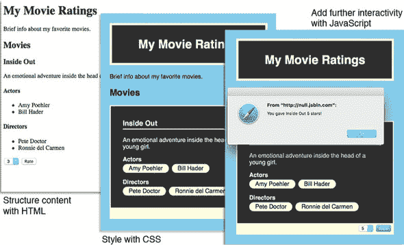

+   ***HTML*** ——你使用 HTML 来注释页面文本并指定要加载的媒体；标题、段落、列表、图像和按钮都使用 HTML 指定。这是你的基础层，是基本内容，是你希望访客找到并阅读的信息。

+   ***CSS*** ——你使用层叠样式表（Cascading Style Sheets）语言来指定页面的外观、颜色、字体、边距、边框等。这是你的展示层，是一种视觉享受，可以增强内容。

+   ***JavaScript*** —你使用 JavaScript 语言为页面添加交互性；通过 JavaScript 响应按钮点击、过滤内容、加载额外数据以及弹出消息。这是你的行为层，是用户界面魔法的一丝微妙点缀，它使事情变得顺畅，并可以提高用户体验和效率。

图 17.1 包含了 My Movie Ratings 页面的三个截图，展示了 CSS 和 JavaScript 层如何建立在 HTML 基础之上。

即使没有 CSS 和 JavaScript，在 图 17.1 的左侧，关于电影的关键信息也是可访问的。CSS 添加了视觉样式、身份感以及（希望如此）引导和愉悦访客的设计。最后，在右侧，该图显示了用户点击评分按钮后通过 JavaScript 弹出的消息。

查看你在 JS Bin 上的 My Movie Ratings 页面。这里有基础的 HTML 版本，网址为 [`jsbin.com/sayayim/edit?output`](http://jsbin.com/sayayim/edit?output)，以及包含 CSS 和 JavaScript 的版本，网址为 [`jsbin.com/hikuzi/edit?output`](http://jsbin.com/hikuzi/edit?output)。（你可能需要运行 JavaScript 来使评分按钮生效。）

#### 17.1.1\. 加载层

如果你拥有自己的网站，比如 jahvers.crypt，你将通过在浏览器中指向网页的 URL，例如 jahvers.crypt/movies.html，来加载 My Movie Ratings 网页。浏览器会加载由该地址的服务器发送的 HTML 文档，即 movies.html。movies.html 文档可能包含 CSS 和 JavaScript 代码，分别位于 `style` 和 `script` 标签之间：

```
<head>
    <title>My Movie Ratings</title>

    <style>
        /* CSS goes here */
    </style>

    <script>
        /* JavaScript goes here */
    </script>
</head>

<body>
    <!-- Page content for display goes here -->
</body>
```

目前不必担心所有的 HTML 标签；我们将在 第 17.2 节 中介绍它们。你很清楚模块化的好处（这正是 第二部分 的主题！），所以你会很高兴地知道 HTML 文档可以加载 CSS 文件以及 JavaScript 文件：

```
<head>
    <title>My Movie Ratings</title>

    <link rel="stylesheet" href="movies.css" />
    <script src="movies.js"></script>
</head>

<body>
    <!-- Page content for display goes here -->
</body>
```

你之前已经见过用于加载 JavaScript 模块的 `script` 标签；`link` 标签则执行类似的任务来加载 CSS。当你的浏览器正在读取你的 HTML 文档，准备显示它时，它会加载由 `link` 和 `script` 元素指定的 CSS 和 JavaScript 文件。你将在 第二十一章 中详细了解如何组织自己的 HTML、CSS 和 JavaScript 文件。现在，JS Bin 会为你完成这项工作。

#### 17.1.2\. 在 JS Bin 中加载层

当你在 JS Bin 上工作于你的项目或代码块时，你可以在三个面板中添加代码：HTML、CSS 和 JavaScript。JS Bin 会自动合并这三个面板的代码，将 CSS 和 JavaScript 嵌入 HTML 中，并在其输出面板上显示生成的网页。

在 *Get Programming with JavaScript* 中，你不会花太多时间在 CSS 上，但在示例中使用的地方，你总是可以自己查看 CSS 面板；使用的代码大多是直接的。在简要介绍 HTML 之后，你将在 第 17.3 节 回到 JavaScript。

### 17.2\. HTML——一个非常简短的介绍

对于 My Movie Ratings，您的电影评论网站，您想要标题、演员和导演的列表、可能的评分选择以及一个提交您判决的按钮。您需要一种方法来指定这些文本是标题，但文本是列表项；这里有一个下拉列表，还有一个按钮。你已经不再是控制台了，多萝西——你已经离开了由空格和新行字符组成的单色世界，进入了奇妙的多彩的 HTML 世界。（请放心。本章中没有飞猴。）

您使用 HTML 来注释文本并标识您想要嵌入文档中的媒体。这些注释指定了每个文本部分在文档结构中的作用。媒体可以是图像、视频、音频或某些其他格式。

标记本身采取的是 *标签* 的形式。在一个文档中，一段文本可能是一个标题、一个段落、一个列表项或一个引文，例如，并且有标签来标记这些文本部分。以下是一个标题和一个段落，每个都使用开标签和闭标签进行标记：

```
<h1>My Movie Ratings</h1>

<p>Brief info about my favorite movies.</p>
```

您使用开标签和闭标签包裹每个文本部分。标题有 `<h1>` 和 `</h1>`，段落有 `<p>` 和 `</p>`。每个开标签和闭标签对一起指定了一个 *元素*。`h1` 标签指定一个标题元素；`p` 标签指定一个段落元素。

当网络浏览器加载一个 HTML 文档时，它会看到标签并在其内存中的页面模型中创建相应的元素。标签指定要创建的元素类型，标签之间的文本形成元素的内容。

#### 17.2.1\. 从一个空页面开始

在您开始向页面添加内容之前，看看构成裸骨网页的 HTML。如果您在 JS Bin 上创建一个新的 bin 并查看 HTML 面板，您将看到以下标记。（我稍微进行了格式化。）

```
<!DOCTYPE html>

<html>
    <head>
        <meta charset="utf-8">
        <title>JS Bin</title>
    </head>

    <body>

    </body>
</html>
```

第一行的 `DOCTYPE` 给浏览器提供了有关您正在使用的 HTML 版本的信息，并帮助它决定如何处理和显示页面。HTML 在这些年中已经发展，许多版本和变体都由复杂的文档类型声明指定。幸运的是，`<!DOCTYPE html>` 是最新版本（目前是 HTML5）的一个简洁的缩写。

在文档类型之后，您将整个文档包裹在 `html` 标签中。在文档内部，有两个部分，`head` 和 `body`。`head` 部分包含有关文档的信息：其标题和字符编码。`body` 部分是页面主要内容所在的地方——当用户访问网页时将显示给用户的内容。所有您的页面都将使用这里所示的基本结构。

#### 17.2.2\. 添加一些内容

图 17.2 展示了在新的 JS Bin 文档的 `body` 标签之间添加的一些文本，用于 My Movie Ratings。这些文本已经使用适当的 HTML 标签进行标记，以表示标题、副标题和段落。

##### 图 17.2。标题和段落的层次结构

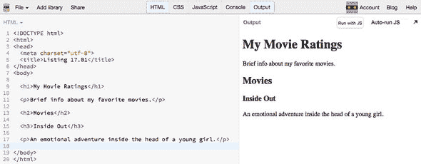

浏览器通过使用不同的字体大小来表示标题的层次结构，`h1`、`h2`、`h3`。以下列表显示了在网页的`body`标签之间使用的 HTML。

##### 列表 17.1。我的电影评分——标题和段落（HTML）([`jsbin.com/nosiwi/edit?html,output`](http://jsbin.com/nosiwi/edit?html,output))

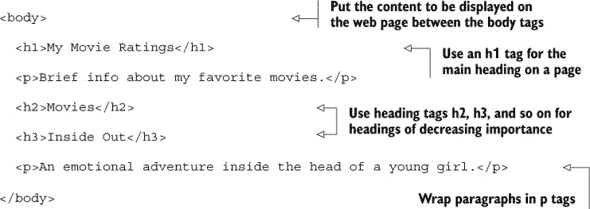

#### 17.2.3。标记列表

每部电影都包含一个演员列表和一个导演列表。使用`li`标签标记列表项元素。一个演员的单个列表项看起来像这样：

```
<li>Amy Poehler</li>
```

列表项需要是列表的一部分。如果您关心项目的顺序，可以使用有序列表，如果不关心，则可以使用无序列表。使用`ol`标签创建有序列表，使用`ul`标签创建无序列表。图 17.3 显示了演员和导演列表的输出。列表 17.2 显示了新的代码。

##### 图 17.3。浏览器以数字和项目符号的形式渲染有序列表和无序列表。

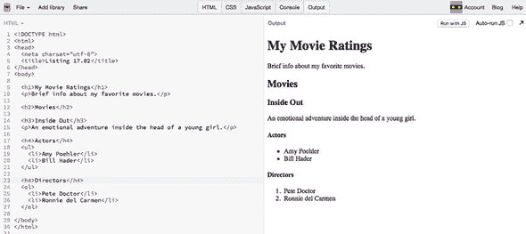

##### 列表 17.2。有序和无序列表（HTML）([`jsbin.com/vegahe/edit?html,output`](http://jsbin.com/vegahe/edit?html,output))

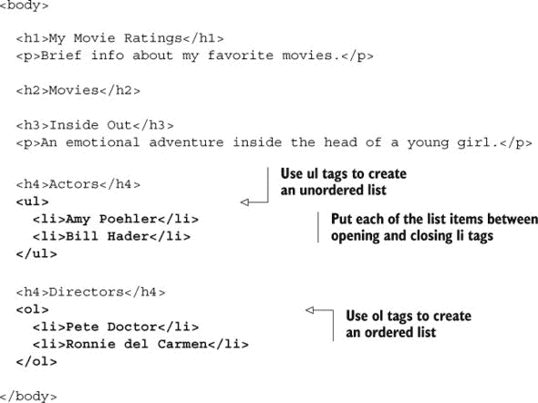

如图 17.3 所示，浏览器会自动为有序列表添加数字，为无序列表添加项目符号。

#### 17.2.4。一些常见的 HTML 元素

图 17.4 是包含一些常见 HTML 元素的网页截图。每个元素的描述内容都描述了该元素。您可以在 JS Bin 上访问该页面：[`jsbin.com/nuriho/edit?html,css,output`](http://jsbin.com/nuriho/edit?html,css,output)。

##### 图 17.4。具有自我描述 HTML 元素的网页

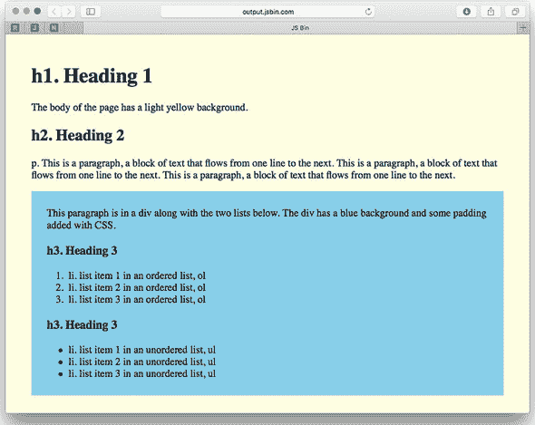

用于在图 17.4 中创建页面的标签显示在表 17.1 中。还有很多 HTML 标签，但就目前而言，这些标签已经足够您使用了。

##### 表 17.1。用于包装内容的常见 HTML 元素

| 标签 | 元素 | 它是用来做什么的？ |
| --- | --- | --- |
| <h1> | 标题 | 文档或文档部分的标题 |
| <h2>...<h6> | 子标题 | 按重要性递减的子标题 |
| <p> | 段落 | 段落 |
| <div> | 分区 | 将属于同一文档部分的元素包裹在一起 |
| <ol> | 有序列表 | 包裹一组列表项，其中项的顺序很重要（例如，编号列表） |
| <ul> | 无序列表 | 包裹一组列表项，其中项的顺序不重要（例如，项目符号列表） |
| <li> | 列表项 | 将单个项目包裹在有序或无序列表中 |
| <head> | 头部 | 包裹提供文档元信息以及文档所需的额外代码的元素 |
| <body> | 主体 | 包裹页面的主要内容，直接显示在网页上的内容 |

### 17.3。使用 JavaScript 向网页添加内容

在寻找为网站增添趣味的方法时，你决定用随机问候语欢迎你的 My Movie Ratings 网页访客。为了测试这个想法，你创建了一个最小化的页面。图 17.5 展示了你所追求的效果，页面访问四次产生了四个不同的问候语。

##### 图 17.5\. 来自网页的随机问候语

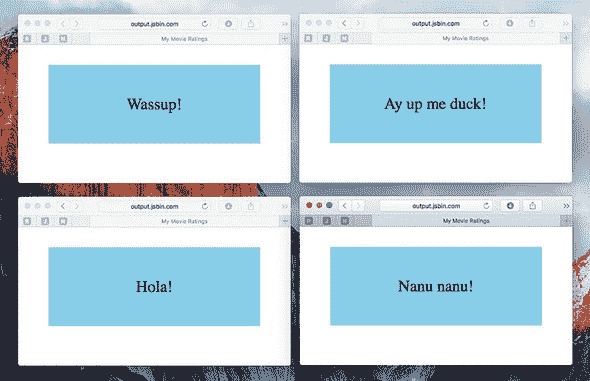

刷新页面会生成一个新的随机问候语。在 JS Bin 上尝试一下 [`output.jsbin.com/mikura.html`](http://output.jsbin.com/mikura.html)。接下来的两个列表展示了如何创建页面。运行 JavaScript 代码以显示消息。

##### 列表 17.3\. 使用 JavaScript 向段落添加内容（HTML）([`jsbin.com/mikura/edit?html,js,output`](http://jsbin.com/mikura/edit?html,js,output))

```
<p id="greeting">Welcome!</p>
```

##### 列表 17.4\. 使用 JavaScript 向段落添加内容 ([`jsbin.com/mikura/edit?html,js,output`](http://jsbin.com/mikura/edit?html,js,output))

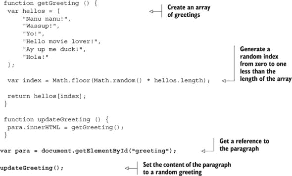

要生成这种效果，你需要遵循以下步骤：

> **1**. 在 HTML 中给元素分配一个 `id`
> 
> **2**. 使用 `id` 在 JavaScript 中获取元素引用
> 
> **3**. 使用引用更新元素的内容

#### 17.3.1\. 通过 id 获取元素

你在段落元素中显示问候语。要设置问候语，你需要获取 JavaScript 中那个段落的引用。你给 HTML 元素赋予一个唯一的 `id` 属性：

```
<p id="greeting">Welcome!</p>
```

要在 JavaScript 程序中获取元素的引用，你使用 `document.get-ElementById` 方法，并将元素的 `id` 作为参数传递：

```
var para = document.getElementById("greeting");
```

网络浏览器使 `document` 对象对你的 JavaScript 代码可用。`document` 对象具有属性和方法，允许你与页面上的元素层次结构进行交互。

你通过使用 `document.get-ElementById` 获取了段落元素的引用。将引用分配给 `para` 变量后，你现在可以使用 `para` 来操作元素。你通过设置元素的 `innerHTML` 属性来更新段落的内联内容。

```
para.innerHTML = "Ay up me duck!";
```

段落的原始内容被替换，变成了

```
<p id="greeting">Ay up me duck!</p>
```

#### 17.3.2\. 函数声明

你现在在定义用于后续使用的命名函数时，使用的是函数声明而不是函数表达式。

```
var sayHello = function () {   //
    console.log("Hello");      // function expression assigned to variable
};                             //

function sayHello () {         //
    console.log("Hello");      // function declaration
}                              //
```

函数声明在第四章 中被提及，作为定义函数的另一种语法。到目前为止，你一直使用表达式来保持与将值、对象、数组、函数分配给变量的赋值一致性。

```
var num = 4;
var movie = {};
var actors = [];
var getRating = function () {};
```

对于命名函数，函数声明更为常见，因此你切换到了 *Get Programming with JavaScript* 的第三部分 的声明。

#### 17.3.3\. 没有 JavaScript？

有时，访客可能会在既没有启用 JavaScript 或禁用了 JavaScript 的设备上访问你的网站。或者他们可能在一个网络较慢的环境中，比如在酒店或火车上，加载任何 JavaScript 模块需要更长的时间（长得多！）如果你的页面依赖于 JavaScript 来显示内容，访客可能会看到一个空白的区域。在可能的情况下，考虑在页面中包含初始内容，这样访问就不会是浪费时间。内容应该对所有用户都可用，对于那些设备能够处理 JavaScript 带来的额外灵活性、流畅性和炫酷效果的用户，可以在其之上添加这些内容。

在你的随机问候测试中，你已经在初始 HTML 中包含了问候语，“欢迎！”。随机问候是一个有趣的元素，但不是必需的。

在了解了如何向段落添加一些文本之后，你现在可以增加难度，一次性添加一系列元素。

### 17.4\. 从数组中显示数据

My Movie Ratings 上的每部电影都有一个标题和一行摘要。图 17.6 展示了网站上三部电影的列表。

##### 图 17.6\. 电影列表

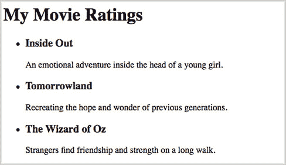

给定一些电影数据，你可以遍历电影并将它们插入到页面上的现有元素中。电影数据如下所示：

```
var moviesData = [
   {
      "title" : "Inside Out",
      "summary" : "An emotional adventure inside the head of a young girl."
   },
   {
      "title" : "Tomorrowland",
      "summary" : "Recreating the hope and wonder of previous generations."
   },
   {
      "title" : "The Wizard of Oz",
      "summary" : "Strangers find friendship and strength on a long walk."
   }
];
```

你在页面上放置了一个具有 `id` 为 `movies` 的 `div` 元素，如下所示。使用 `div` 元素作为容器来收集相关元素组。

##### 列表 17.5\. 使用 JavaScript 构建 HTML (HTML) ([`jsbin.com/jakowat/edit?html,js,output`](http://jsbin.com/jakowat/edit?html,js,output))

```
<body>
    <h1>My Movie Ratings</h1>

    <div id="movies"></div>
</body>
```

每部电影将是一个无序列表中的列表项。浏览器会自动为无序列表中的列表项添加项目符号。下一个列表展示了用于显示电影的 JavaScript 代码。

##### 列表 17.6\. 使用 JavaScript 构建 HTML ([`jsbin.com/jakowat/edit?html,js,output`](http://jsbin.com/jakowat/edit?html,js,output))

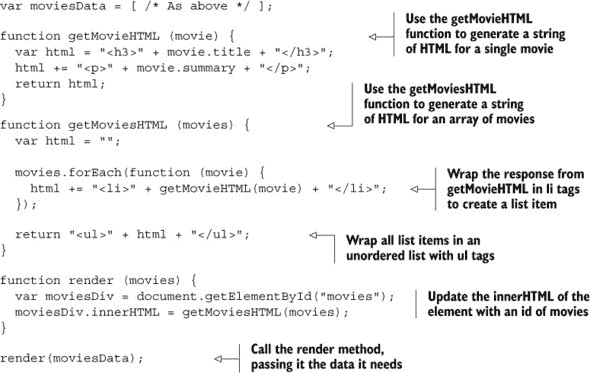

`getMovieHTML` 方法通过在适当的开始和结束标签之间嵌入 `movie` 对象的属性来构建单个电影的 HTML。

```
var html = "<h3>" + movie.title + "</h3>";
html += "<p>" + movie.summary + "</p>";
```

`getMoviesHTML` 方法遍历电影数组，在遍历过程中构建所有电影的 HTML。它使用 `getMovieHTML` 获取每部电影的 HTML，并将返回的字符串包裹在 `li` 标签中以创建列表项元素。

```
movies.forEach(function (movie) {
    html += "<li>" + getMovieHTML(movie) + "</li>";
});
```

然后，它将项目列表的 HTML 包裹在开始和结束的 `ul` 标签中，并返回完整的 HTML 字符串。

```
return "<ul>" + html + "</ul>";
```

`getMoviesHTML` 函数返回类似以下格式的 HTML（但不含换行符和额外空格）：

```
<ul>
    <li>
        <h3>Inside Out</h3>

        <p>An emotional adventure inside the head of a young girl.</p>
    </li>
    <li>
        <h3>Tomorrowland</h3>
        <p>Recreating the hope and wonder of previous generations.</p>
    </li>
    <li>
        <h3>The Wizard of Oz</h3>
        <p>Strangers find friendship and strength on a long walk.</p>
    </li>
</ul>
```

`render` 方法是改变页面的方法。它获取页面上的目标 `div` 的引用，并使用 `getMoviesHTML` 返回的 HTML 字符串设置其 `innerHTML` 属性。

```
var moviesDiv = document.getElementById("movies");
moviesDiv.innerHTML = getMoviesHTML(movies);
```

为了减少全局变量的数量，你可以将`getMovieHTML`、`get-MoviesHTML`和`render`函数包裹在一个立即执行的函数表达式（IIFE——见第十三章）中，该表达式仅在其接口中返回`render`。列表已被保持简单，以帮助关注 HTML 的生成以及如何在网页上更新元素。

### 17.5. 《The Crypt》——使用 Web 视图显示玩家和位置

你已经将《The Crypt》的程序拆分成了多个模块，这些代码段可以独立加载。模块执行不同的任务：你有数据、模型、视图和控制器（图 17.7）。

##### 图 17.7. 组成《The Crypt》的模块

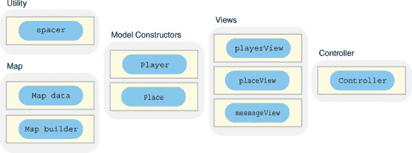

模块的优势在于你可以轻松地切换它们以改变程序的行为。现在是时候兑现这个承诺了。要构建《The Crypt》的第一个 HTML 版本，请按照以下步骤操作：

> **1**. 更新玩家视图（两行代码）
> 
> **2**. 更新位置视图（两行代码）
> 
> **3**. 创建一个 HTML 页面，其中包含`script`元素以加载所有游戏模块，并为玩家和位置视图提供占位符以填充

你不会看到输出，直到所有部件都到位。但为了了解你正在构建的内容，图 17.8 显示了你的第一个 HTML 游戏的实际运行情况。网页输出显示了玩家和位置当前的状态。你在控制台输入命令。

##### 图 17.8. 《The Crypt》在控制台面板上的命令和消息以及输出面板上的更新

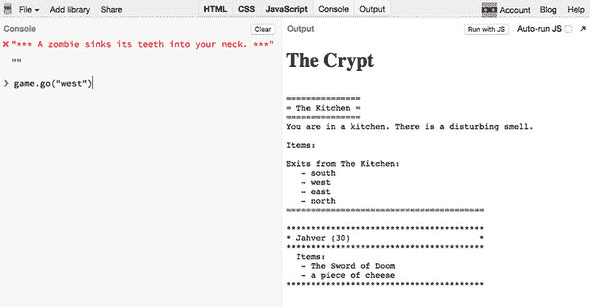

在查看玩家和位置视图的更新版本之前，花点时间考虑一下你模块化方法的强大功能。显示每个视图信息的单个方法是`render`方法。为了反映其美丽和简单性，它得到了以下整个章节的介绍。

#### 17.5.1. 更新玩家和位置视图模块——`render`方法

在从控制台应用程序迁移到 Web 应用程序的过程中，你需要更新玩家和视图。新版本通过在网页元素中插入文本来显示信息，而不是将信息记录到控制台。这些是你所做的唯一更改（图 17.9），而且这些更改本身很小。

##### 图 17.9. 你只需要更改视图，就可以切换到《The Crypt》的基于 Web 的版本。

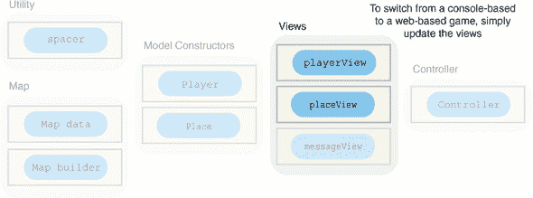

第十五章中的视图在单个方法`render`中使用`console.log`，这是有意为之；你只有一个地方需要做出更改。

基于控制台玩家的视图的`render`方法看起来是这样的：

```
function render (player) {
    console.log(getInfo(player.getData()));
};
```

基于控制台的位置视图的`render`方法看起来是这样的：

```
function render (place) {
    console.log(getInfo(place.getData()));
};
```

使用你在本章中学到的关于更新网页元素的知识，新的位置视图的`render`方法看起来是这样的：

```
function render (place) {
    var placeDiv = document.getElementById("place");
    placeDiv.innerHTML = getInfo(place.getData());
};
```

新的玩家视图的`render`方法看起来几乎相同：

```
function render (place) {
    var playerDiv = document.getElementById("player");
    playerDiv.innerHTML = getInfo(player.getData());
};
```

这些确实是你需要更改的 JavaScript 的唯一内容。新方法使用 `document.getElementById` 来获取网页上元素的引用。在你创建 列表 17.9 中的网页之前，这些元素将不存在，因此你不能测试你的新视图。请耐心等待；它们的时间会到来。

#### 17.5.2\. 更新玩家和地点视图模块——列表

列表 17.7 展示了带有更新后的 `render` 方法的新的玩家视图。其他所有内容自第十五章 chapter 15 以来保持不变，因此省略了函数体。JS Bin 链接在那里，如果你想查看完整的列表，可以检查。在两个视图的列表之后讨论了 `"use strict"` 的含义。

##### 列表 17.7\. 基于网络的玩家视图 ([`jsbin.com/cehexi/edit?js,console`](http://jsbin.com/cehexi/edit?js,console))

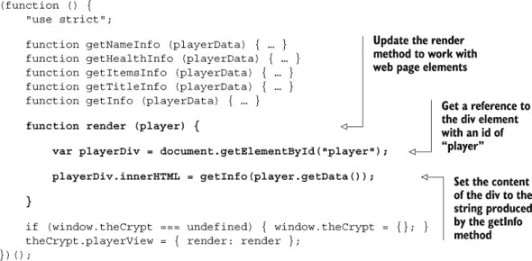

下一个列表显示了带有更新后的 `render` 方法的新的地点视图。

##### 列表 17.8\. 基于网络的地点视图 ([`jsbin.com/cakine/edit?js,console`](http://jsbin.com/cakine/edit?js,console))

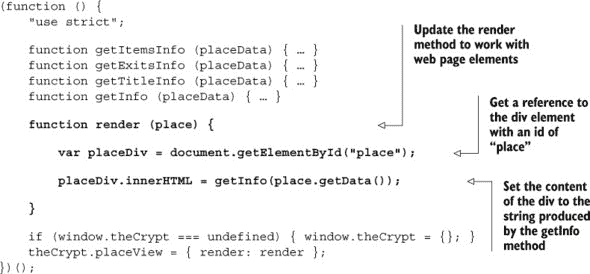

这些对 `render` 方法的更改就是你需要将玩家和地点信息从控制台移动到网页显示的所有更改。目前，用户仍然通过控制台输入命令。

#### 17.5.3\. 使用 JavaScript 的严格模式

JavaScript 被用于数百万个网页上。随着 JavaScript 的演变和成熟，这些页面需要继续工作。为了采用更现代的语言使用方式，这些方式会提醒你可能犯的错误，优化语言的工作方式，并为进一步的发展做好准备，你可以在 *严格模式* 下运行你的代码。为了为一个函数启用严格模式，请在函数顶部添加 `"use` `strict"`。

书中的所有代码都可以在严格模式下运行，但我认为在学习基础知识时可能会分散注意力。第三部分 part 3 中的所有模块都将使用严格模式；列表 17.8 是第三部分 part 3 中的第一个模块，这就是为什么它在这个时候被介绍。更多详情请访问 [www.room51.co.uk/js/strict-mode.html](http://www.room51.co.uk/js/strict-mode.html)。

#### 17.5.4\. 在 HTML 中加载模块和添加占位符

下一个列表显示了 *The Crypt* 的第一个基于网络的完整 HTML 版本。它包括 `script` 标签来加载所有需要的模块。

##### 列表 17.9\. 基于网络的 The Crypt 游戏 (HTML) ([`jsbin.com/zaxaje/edit?html,console,output`](http://jsbin.com/zaxaje/edit?html,console,output))

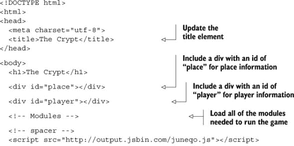

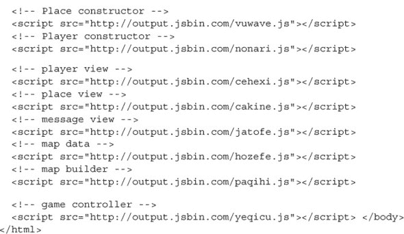

您使用`head`部分中的`title`元素设置页面标题。在 JS Bin 编辑环境中工作时，页面标题并不总是可见，但通常由浏览器用于标记显示页面的选项卡和窗口，以及当保存页面为书签或收藏时。加载模块的`script`标签添加在`body`标签关闭之前。这确保了程序使用的两个`div`元素在尝试用玩家和地点信息更新它们之前已经在页面上。

不幸的是，因为您的视图使用`spacer`命名空间通过换行符和空格格式化生成的文本，而网页不尊重这些换行符和空格，所以所有玩家和地点信息都连在一起。尽管输出并不完全符合您的期望，但您仍然可以玩游戏，如图 17.10 所示。

##### 图 17.10\. 文本输出连在一起，但游戏仍然可玩。

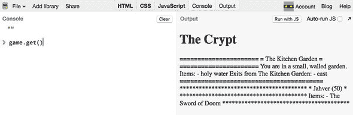

#### 17.5.5\. 添加 CSS 风格

在 JS Bin 中，您还有一张底牌！CSS 面板用于指定您希望页面上的元素看起来如何：它们的大小、颜色、边距、边框等。通过几行 CSS，您可以告诉浏览器尊重由视图模块生成的换行符，并使用一个给每个字符相同空间的字体，就像控制台上的字体一样。

下一个列表显示了要添加到 CSS 面板的代码。

##### 列表 17.10\. 基于网络的《密码游戏》（CSS）([`jsbin.com/toyahi/edit?css`](http://jsbin.com/toyahi/edit?css))

```
div {
  white-space: pre;
  font-family: monospace;
}
```

第一条规则告诉浏览器保留`div`元素中文本内容的空白（即空格和换行符）。第二条指定浏览器应使用等宽字体显示`div`元素中的文本。您的页面使用`div`元素来显示玩家信息和地点信息。网页上的输出现在格式化得与控制台上的格式相同。请参阅图 17.8 以查看格式良好的输出。

#### 17.5.6\. 游戏玩法

您仍然可以通过`game`对象的方法在控制台中发出游戏指令。可用方法有`get`、`go`和`use`。在[`jsbin.com/toyahi/edit?console,output`](http://jsbin.com/toyahi/edit?console,output)上运行程序，尝试玩游戏，并在控制台输入如下命令：

```
> game.get()
> game.go("south")
> game.use("a rusty key", "north")
```

使用换行符和空格来格式化输出并不是最佳方法。更好的方法是使用适当的 HTML 标签（用于标题、段落和列表）来传达输出中不同信息片段的结构。当您在第十九章中研究模板时，您将了解使用 HTML 格式化玩家和地点信息的更好方法。

当前版本的*《密码学》*是一个混合体。虽然你使用 HTML 来显示一些信息，但你仍然强迫玩家在控制台输入命令。在第十八章中，你将发现如何使用简单的表单元素，如按钮、下拉列表和文本框，让玩家直接在网页上与游戏互动。为了为完全基于 HTML 的版本做准备，你通过重复对位置和玩家视图所做的更改来完成本章，但这次是对消息视图进行更改。

#### 17.5.7. 准备消息视图

为了使 UI 100%基于网页，你需要更新消息视图，使其在网页上显示消息而不是在控制台上。以下列表显示了新的模块代码。

##### 列表 17.11. 基于网络的邮件视图([`jsbin.com/nocosej/edit?js,console`](http://jsbin.com/nocosej/edit?js,console))

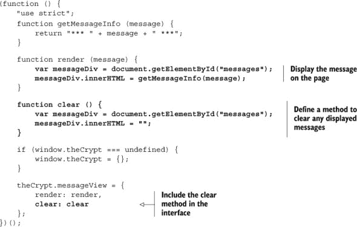

视图需要一个具有`id`为`messages`的元素。它还添加了一个`clear`方法，用于从页面上删除消息。

### 17.6. 概述

+   使用 HTML 注释文本以指定文本在文档结构中的作用。例如，文本是标题、列表项或段落。

+   在 HTML 文档之前加上其文档类型：

    ```
    <!DOCTYPE html>
    ```

+   使用`html`标签包裹整个文档：

    ```
    <html> ... </html>
    ```

+   文档的`head`元素包含有关文档的信息，例如，其标题和字符编码：

    ```
    <head>
        <meta charset="utf-8">
        <title>My Web Page</title>
    </head>
    ```

+   文档的`body`元素包含要在网页上显示的内容：

    ```
    <body> ... </body>
    ```

+   使用适合内容的相关标签。在许多其他标签中，有标题`<h1>`、`<h2>`、`...`、`<h6>`；段落`<p>`；列表项`<li>`；以及列表`<ol>`和`<ul>`。

+   在打开标签中添加`id`属性以唯一标识页面上的元素。

    ```
    <p id="message"></p>
    ```

+   从 JavaScript 中，通过使用`document .getElementById`方法获取 HTML 元素的引用：

    ```
    var para = document.getElementById("message");
    ```

+   通过设置元素的`innerHTML`属性来更改元素的内容：

    ```
    para.innerHTML = "New text for the paragraph.";
    ```

## 第十八章. 控件：获取用户输入

***本章涵盖***

+   使用按钮来启动操作

+   使用文本框和下拉列表收集用户输入

+   当按钮被点击时自动调用函数

我们喜欢按钮！无论是我们在亚马逊上购买书籍、喜欢一条推文，还是发送深夜醉酒的电子邮件，我们都很难抗拒点击那些诱人、多彩的按钮。好吧，现在是时候你发出自己的行动号召，并开始在页面上添加按钮了。而且，当你在做这件事的时候，你还需要为文本框和下拉列表腾出空间。

在第十七章中，你跳到了 HTML 并使用 JavaScript 向网页添加内容。然而，为了获取用户输入，你仍然坚持使用控制台。在这些充满活力的网络应用的日子里，你希望用户仅通过网页进行交互；他们不应该需要知道 JavaScript 并寻找控制台来使用你为他们编写的程序。

本章介绍了 HTML 中的`input`、`select`和`button`元素，使用户能够将信息输入到文本框中，从下拉列表中选择，并通过点击按钮来启动操作。您将了解如何设置在按钮被点击时自动调用的函数。

点击按钮很有趣，所以让我们从这里开始。*点击！*

### 18.1\. 使用按钮

您正在构建一个“我的电影评分”网站（见第十七章），并且一直在测试当访客到达网站时显示的随机问候语。您希望访客能够查看更多问候语而无需重新加载整个页面。您决定在测试页面上添加一个按钮，该按钮会使用随机问候语更新显示（图 18.1）。

##### 图 18.1\. 点击“Say Hi”按钮会显示一个随机问候语。

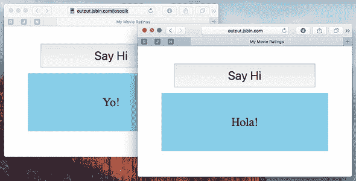

点击“Say Hi”按钮会显示问候语。但这是如何实现的？您如何让您的 JavaScript 程序响应用户点击按钮？您需要做三件事：

> **1**.  在页面上添加一个`button` HTML 元素
> 
> **2**.  编写一个更新问候语的函数
> 
> **3**.  让按钮在点击时调用函数

#### 18.1.1\. 在页面上添加一个按钮

好吧，首先，您需要在页面上有一个按钮。HTML 包括一个`button`元素。将按钮文本放在标签之间（图 18.2）：

##### 图 18.2\. 三个按钮的 HTML 和生成的输出

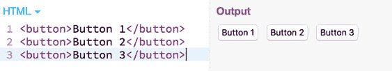

```
<button>Button 1</button>
```

要在 JavaScript 中处理按钮，您需要在 HTML 中给它一个唯一的`id`属性。

```
<button id="btnGreeting">Say Hi</button>
```

以下列表显示了“我的电影评分”测试页面的关键 HTML。具有`id`为`"greeting"`的段落是您稍后插入随机问候语的地方。

##### 列表 18.1\. 带按钮的“我的电影评分”问候语（HTML）([`jsbin.com/josoqik/edit?html,output`](http://jsbin.com/josoqik/edit?html,output))

```
<button id="btnGreeting">Say Hi</button>

<p id="greeting">Welcome!</p>
```

输出结果显示在图 18.1 中。如果您对如何应用样式感兴趣，请随意查看 JS Bin 上的 CSS 面板。

#### 18.1.2\. 编写更新问候语的函数

在第十七章中，您编写了两个函数`getGreeting`和`updateGreeting`，它们选择一个随机的欢迎信息并更新显示。

```
function getGreeting () {
    // Return random greeting
};

function updateGreeting () {
    para.innerHTML = getGreeting();
};

var para = document.getElementById("greeting");
updateGreeting();
```

`updateGreeting`函数通过设置段落元素`para`的`innerHTML`属性来更新显示。

因此，您已经在 HTML 中放置了按钮和段落，并且您有一个更新段落的函数。现在，您想让按钮在用户点击时调用`updateGreeting`函数。

#### 18.1.3\. 监听点击事件

*点击*—“Wassup！” ... *点击*—“Hola！” ... *点击*—“Ay up me duck！”

“亲爱的按钮，请在我点击你的时候调用我的`updateGreeting`函数，”这是您想要发送的指令。要给按钮这样的指令，您需要在 JavaScript 中获取按钮的引用。

```
var btn = document.getElementById("btnGreeting");
```

一旦您有了按钮的引用`btn`，您就可以告诉按钮在按钮被点击时调用一个函数：

```
btn.addEventListener("click", updateGreeting);
```

`addEventListener` 方法告诉按钮（或从其调用的任何元素）在指定的事件发生时调用指定的函数——在这种情况下，当按钮被点击时。这就像 `updateGreeting` 函数正在等待，或者 *监听* 按钮被点击。

列表 18.2 显示了随机问候测试页面的最终列表。它与第十七章中的列表相同，但增加了两行按钮代码。代码被包裹在一个立即调用的函数表达式中，以避免污染全局命名空间。它还包括一个 `use strict` 语句，指示浏览器使用严格模式（见第 17.5.3 节）。

##### 列表 18.2\. My Movie Ratings 欢迎信息与按钮 ([`jsbin.com/josoqik/edit?js,output`](http://jsbin.com/josoqik/edit?js,output))

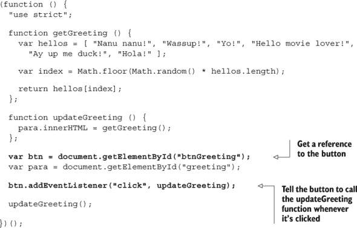

回顾第十二章，以提醒如何使用 `Math.floor` 和 `Math .random` 生成一个用于数组的随机索引。

| |
| --- |

**事件种类繁多**

点击不是函数可以监听的唯一事件；鼠标移动、页面滚动、键盘按键和图片加载也是一些其他事件，而触摸设备和移动设备出现了一些新事件，如点击、滑动、强按和摇晃。

目前我们会保持简单，只关注按钮点击，但如果你对可能的事件种类感兴趣，可以查看 Mozilla 开发者网络上的事件参考[`developer.mozilla.org/en-US/docs/Web/Events`](https://developer.mozilla.org/en-US/docs/Web/Events)。

| |
| --- |

### 18.2\. 使用选择元素选择一个选项

My Movie Ratings 网站允许用户对电影进行评分。他们从下拉菜单中选择一个评分，然后点击评分按钮。页面随后显示他们的评分信息（图 18.3）。

##### 图 18.3\. 点击评分按钮会弹出带有你评分的消息。

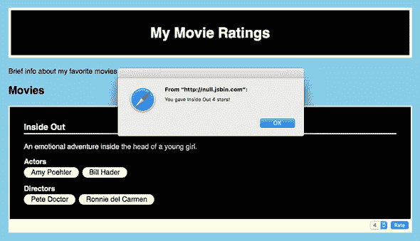

要实现评分系统，你需要做四件事：

> **1**. 在页面上添加一个带有每个评分 `option` 元素的 `select` HTML 元素
> 
> **2**. 在页面上添加一个带有“评分”文本的 `button` HTML 元素
> 
> **3**. 编写一个函数以弹出带有评分的消息
> 
> **4**. 告诉按钮在点击时调用函数

#### 18.2.1\. 在页面上添加一个选择元素

网络浏览器将 `select` 元素渲染为下拉列表。你使用 `option` 元素来指定列表中的选项（图 18.4）。

##### 图 18.4\. HTML 中的两个选择元素，在网页上显示，并且正在选择中

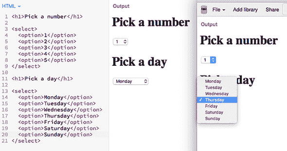

```
<select id="movies">
    <option>Inside Out</option>
    <option>Tomorrowland</option>
    <option>The Wizard of Oz</option>
</select>
```

在 JS Bin 上测试它。创建一个新的 bin，并打开 HTML、控制台和输出面板。将 HTML 面板的内容替换为上一个片段中的 `select` 代码。你应该在输出面板上看到下拉列表出现。在控制台提示符下，输入以下命令：

```
> var dd = document.getElementById("movies")
  undefined
> dd.value
  Inside Out
```

在输出面板的下拉列表中选择不同的电影。然后使用 JavaScript 检查其新值：

```
> dd.value
  The Wizard of Oz
```

你也可以从 JavaScript 更新下拉列表的选中值：

```
> dd.value = "Tomorrowland"
  Tomorrowland
```

在 JavaScript 中设置的值在输出面板中被选中。

图 18.4 显示了两个`select`元素的 HTML 以及它们在网页上的渲染方式。

下一个列表显示了 My Movie Ratings 主页体的 HTML，其中包含一个用于评分电影的`select`元素和按钮。

##### 列表 18.3.带有下拉列表的 My Movie Ratings（HTML）（[`jsbin.com/hikuzi/edit?html,output`](http://jsbin.com/hikuzi/edit?html,output)）

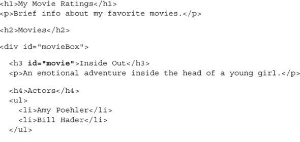

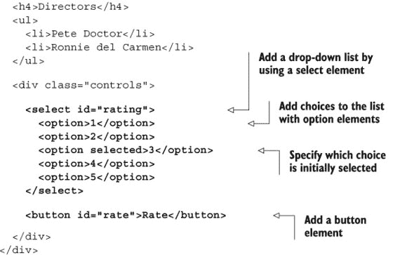

注意，你可以添加一个`selected`属性，以便在网页上显示下拉列表时选择该选项。

#### 18.2.2. 评分电影的功能和调用它的按钮

要对电影进行评分，你需要一个函数，该函数从下拉列表中获取用户的选择，从`select`元素中获取选中选项的值，并弹出包含该值的消息，如列表 18.4 所示。

##### 列表 18.4.带有下拉列表的 My Movie Ratings（[`jsbin.com/hikuzi/edit?js,output`](http://jsbin.com/hikuzi/edit?js,output)）


下拉列表的`value`属性提供了用户的评分。你调用浏览器提供的`alert`函数，在弹出对话框中显示评分。在将代码包装在`rateMovie`函数中后，你使用`addEventListener`告诉评分按钮在点击时调用`rateMovie`。

您的用户可以从列表中选择一个评分。但如果你希望给他们更多的自由来表达自己呢？

### 18.3. 使用文本框读取用户输入

恭喜，My Movie Ratings 网站现在允许用户对电影进行评分！你的成功让你开始思考——关于评论呢？为什么不鼓励用户在评分时添加简短的评论呢？图 18.5 显示了添加了两个评论并有一个评论正在进行中的网站。

##### 图 18.5。电影有一个文本框来添加评论，还有一个用于显示它们的区域。

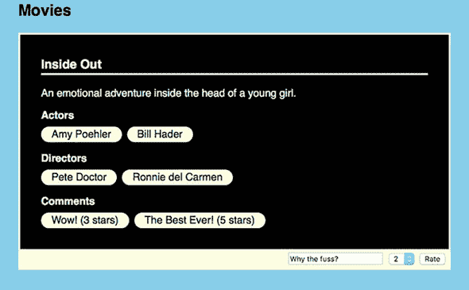

用户将评论输入到文本框中，从下拉列表中选择一个评分，然后点击评分按钮。现在，你不再弹出消息，而是将他们的评论和评分添加到电影的评论部分。为了向网站添加评论，你需要做五件事：

> **1**. 在页面上添加一个文本框
> 
> **2**. 在 HTML 中添加一个无序列表作为评论的放置位置
> 
> **3**. 在 JavaScript 中获取文本框的引用并访问其值
> 
> **4**. 在 JavaScript 中获取评论列表的引用
> 
> **5**. 更新`rateMovie`函数以将评论追加到评论列表

#### 18.3.1. 在页面上添加文本框

要在页面上添加一个文本框，你使用一个`input`HTML 元素，将其`type`属性设置为`"text"`。包括一个`id`属性，以便从 JavaScript 中引用该元素。

```
<input type="text" id="txtComment" />
```

`input` 元素在网页上显示表单控件。它不包装任何其他内容，因此写作一个 *自闭合* 标签。没有开闭标签对。注意标签末尾的斜杠；它表明这个标签不需要闭合标签。文本框位于 `"controls"` div 中，与评分下拉列表和评分按钮一起。

```
<div class="controls">

    <input type="text" id="txtComment" />

    <select id="rating"> <!-- options for ratings --> </select>
    <button id="rate">Rate</button>
```

```
</div>
```

`type` 属性设置为 `"text"` 的 `input` 元素在页面上显示为文本框。其他常见的 `type` 属性包括 `password`、`submit`、`checkbox` 和 `radio`。微软、苹果、谷歌、Mozilla 和 Opera 等浏览器制造商正在努力改进对新类型（如颜色选择器、日期选择器和滑块）的支持。要了解更多关于输入元素类型的信息，您可以访问 Mozilla 开发者网络 [`developer.mozilla.org/en/docs/Web/HTML/Element/Input`](https://developer.mozilla.org/en/docs/Web/HTML/Element/Input)。

#### 18.3.2\. 向显示评论的列表中添加无序列表

您使用一个 `ul` 元素作为评论列表，在其前面添加一个标题。您给列表一个 `id` 属性，这样您就可以使用 JavaScript 添加列表项。

```
<h4>Comments</h4>
<ul id="comments"></ul>
```

您需要在演员和导演列表之后添加评论列表。

#### 18.3.3\. 获取新元素的引用

为了读取文本框中输入的评论并添加列表项到评论列表中，您需要在 JavaScript 代码中获取这两个元素的引用。

```
var commentsList = document.getElementById("comments");  // The list
var commentBox = document.getElementById("txtComment");  // The text box
```

用户在文本框中输入的文本可以通过其 `value` 属性访问。要查看 `value` 属性的实际操作，您可以在控制台中访问和更新它。访问 My Movie Ratings 页面 [`jsbin.com/nevaxit/edit?console,output`](http://jsbin.com/nevaxit/edit?console,output)，在文本框中输入“Great Movie!”，然后在控制台提示符中输入以下命令：

```
> var txt = document.getElementById("txtComment")
  undefined
> txt.value
  Great Movie!
> txt.value = "Rubbish!"
  Rubbish!
```

最后一个命令将更新网页上文本框的内容。

#### 18.3.4\. 更新 rateMovie 函数

下一个列表显示了所有组装好的部分。来自文本框的评论和来自下拉列表的评分作为列表项附加到现有的评论列表中。

##### 列表 18.5\. 电影、评论和随机的问候语 ([`jsbin.com/nevaxit/edit?js,output`](http://jsbin.com/nevaxit/edit?js,output))

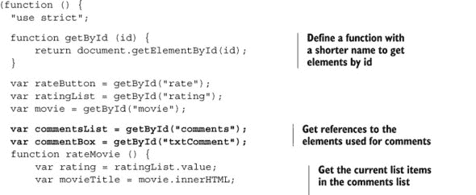

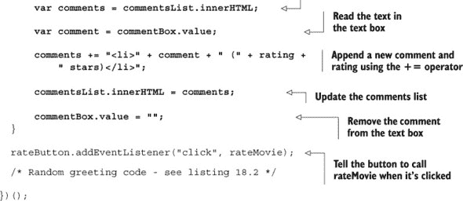

在列表中，您需要获取五个 HTML 元素的引用。而不是每次都输入 `document.getElementById(id)`，您可以创建一个执行相同任务但名称更短的功能，即 `getById`。

列表 18.6 显示了更新的 HTML，包括文本框、评论列表和一个用于随机问候语的 `span` 元素。一个 `span` 在段落内 *内联* 包裹文本，让您可以描述它所包裹的文本的目的，在这个例子中，使用 `id` 为 `"greeting"`，可以不同地样式化（改变颜色、加粗、改变大小），并通过 JavaScript 访问（例如，添加一个随机问候语）。

这里显示了 `body` 元素的内容，一些项目已被省略或压缩，因为它们与 列表 18.3 中的内容没有变化。所有内容都在 JS Bin 上。

##### 列表 18.6\. 电影、评论和随机问候语 (HTML) ([`jsbin.com/nevaxit/edit?html,output`](http://jsbin.com/nevaxit/edit?html,output))

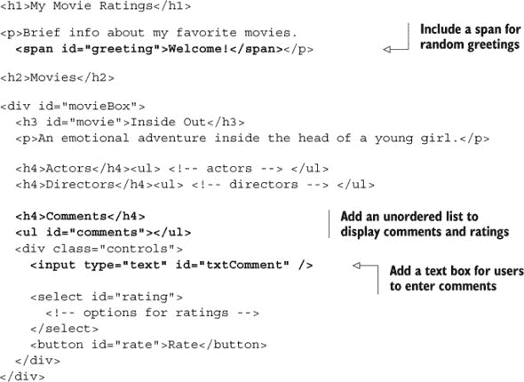

在 [`output.jsbin.com/nevaxit`](http://output.jsbin.com/nevaxit) 上尝试网页。添加一些评论和评分，并将它们添加到列表中。并查看随机问候语。

#### 18.3.5\. 使用 CSS 设计示例样式

在 *Get Programming with JavaScript* 的第三部分 [kindle_split_026.html#part03] 中的许多示例都使用了 CSS 规则设置了颜色、字体、边距、边框等。虽然这本书没有直接教授 CSS，但请查看 CSS 规则。逐个来看，大多数都很容易理解。尝试更改一些值或删除一些或所有规则。虽然它们可能会使页面看起来更美观，但所有示例在没有它们的情况下都应该运行良好。

### 18.4\. 通过文本框的 *The Crypt* 玩家命令

探索 *The Crypt* 的玩家一直在控制台提示符中输入 `get`、`go` 和 `use` 命令。现在，您可以通过在文本框中输入命令来将用户输入移动到游戏网页上，如图 18.6 所示。

##### 图 18.6\. 命令现在输入在页面底部的文本框中。

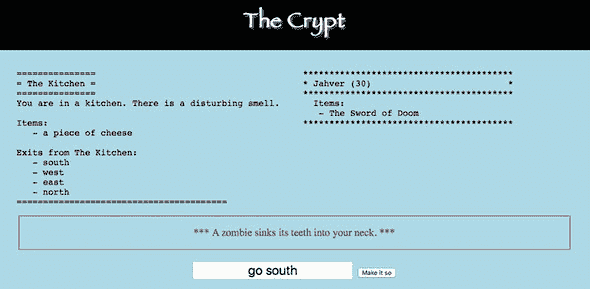

为了创建一组基于网页的用户控件，您需要做三件事：

> **1**.  向页面添加文本框和按钮。
> 
> **2**.  编写一个将文本框中的文本转换为游戏命令的函数。
> 
> **3**.  编写一个在按钮被点击时调用的函数。

您可以更新控制器模块中的代码，包括两个新函数。但控制器模块已经运行良好，设置了游戏，并与玩家、地点和消息的模型和视图一起工作（见 第十六章）。更好的计划是添加一个单独的模块来处理文本框中输入的命令，根据需要调用现有的控制器来执行 `get`、`go` 和 `use` 方法。图 18.7 显示了 *The Crypt* 使用的模块，包括新的 *Commands* 模块。

##### 图 18.7\. *The Crypt* 的模块，包括用于通过文本框执行命令的命令模块

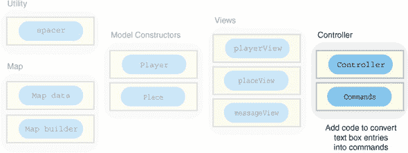

从添加文本框和按钮到网页的 HTML 开始。

#### 18.4.1\. 向页面添加控件

您需要一种让用户输入命令字符串并提交的方法。以下列表显示了添加到 *The Crypt* 网页中的 HTML，包括文本框和按钮。玩家、地点和消息的 `div` 元素最初是空的，这就是为什么它们在输出面板上不可见。

##### 列表 18.7\. 向 *The Crypt* (HTML) 添加控件 ([`jsbin.com/rijage/edit?html,output`](http://jsbin.com/rijage/edit?html,output))

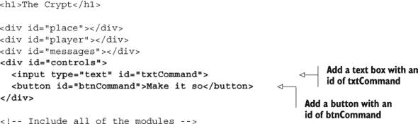

你的控制，文本框和按钮，现在都在页面上，并且它们已经设置了 `id` 属性，以便可以使用 JavaScript 访问。

#### 18.4.2\. 将文本框输入映射到游戏命令

表 18.1 显示了输入到文本框中的命令如何与在第十六章中创建的控制器模块的方法相匹配。

##### 表 18.1\. 比较文本框命令与控制器模块的方法

| 文本框命令 | 控制器方法 |
| --- | --- |
| get | game.get() |
| go north | game.go("north") |
| use a rusty key north | game.use("a rusty key", "north") |

正如你所见，文本框命令应该使玩家更容易玩游戏。那么，你如何将文本框输入翻译成控制器能理解的命令呢？

#### 18.4.3\. 使用 split、join、pop 和 shift 发出命令

用户将在文本框中输入一个命令。你需要将这个命令转换成程序将采取的操作，如表 18.1 所示。要根据文本框中输入的命令调用正确的控制器方法（`get`、`go` 或 `use`），你首先用 JavaScript 对象表示该命令。该对象将有一个 `type` 属性，与你要调用的控制器方法相匹配。表 18.2 显示了命令及其应生成的命令对象。

##### 表 18.2\. 命令对象

| 文本框命令 | 命令对象 |
| --- | --- |

| get | { type: "get"

} |

| go north | { type: "go",

方向: "north"

} |

| use a rusty key north | { type: "use",

项目: "一把生锈的钥匙",

方向: "north"

} |

每个文本框命令的第一个单词给出了命令对象的 `type`。要获取命令的单独单词，你使用 `split` 将字符串转换为单词数组。

```
var commandWords = commandString.split(" ");
```

例如，`"get a rusty key"` 变成 `["get", "a", "rusty", "key"]`。`shift` 数组方法移除并返回数组中的第一个元素。这对于获取命令对象的 `type` 完美。

```
var commandWords = commandString.split(" ");
var command = {
    type: commandWords.shift();
};
```

命令词不再在数组中。`["get",` `"a",` `"rusty",` `"key"]` 变成 `["a", "rusty", "key"]`。

对于 `go` 和 `use`，你通过使用 `pop` 数组方法获取 `commandWords` 数组中的最后一个元素，即 `direction`。

```
command.direction = commandString.pop();
```

如果 `commandWords` 数组中还有任何元素，你将它们重新连接起来形成物品的名称。

```
command.item = commandWords.join(" ");
```

例如，`["a", "rusty", "key"]` 被连接起来成为 `"a rusty key"`。

下一个列表显示了一个函数，该函数使用刚刚讨论的想法将命令字符串转换为命令对象。

##### 列表 18.8\. 将命令字符串转换为命令对象 ([`jsbin.com/repebe/edit?js,console`](http://jsbin.com/repebe/edit?js,console))

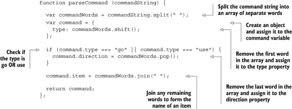

在手头有了命令对象后，你现在可以调用游戏控制器的匹配方法。为了组织不同的可能命令类型，使用专门为决定多个选项而设计的控制结构：`switch` 块。

#### 18.4.4\. 使用 switch 判断选项

你希望根据发出的命令采取不同的操作。你可以使用一系列的 `if-else` 块。但 `switch` 块是程序员认为更整洁的替代方案。`switch` 允许你定义一系列代码块，并根据变量或属性的值执行某些代码块。以下是一个使用 `command.type` 作为 `switch` 变量的示例，比较两种方法：

```
switch (command.type) {             |
                                    |
  case "get":                       |    if (command.type === "get") {
    game.get();                     |      game.get();
    break;                          |    }
                                    |
  case "go":                        |    else if (command.type === "go") {
    game.go(command.direction);     |      game.go(command.direction);
    break;                          |    }
                                    |
  case "use":                       |    else if (command.type === "use") {
    game.use(command.item,          |      game.use(command.item,
      command.direction);           |        command.direction);
    break;                          |    }
                                    |
  default:                          |    else {
    game.renderMessage(             |      game.renderMessage(
      "I can't do that");           |        "I can't do that");
}                                   |    }
```

如果 `command.type` 的值为 `"get"`，则执行第一个 `case` 块中的代码。如果 `command.type` 的值为 `"go"`，则执行第二个 `case` 中的代码。如果没有 `break` 语句，`switch` 块将继续执行第一个匹配后的所有 `case` 块。你可以包含一个 `default` 情况，其中包含在没有任何其他条件匹配时执行的代码。

两种方法之间没有太大的区别；在 `switch` 块中读取条件稍微容易一些，但你需要额外的 `break` 语句。再一次，这取决于个人喜好：如果你认为 `switch` 块更整洁，就使用它；只是不要忘记 `break` 语句。

列表 18.9 展示了在 `doAction` 函数上下文中 *The Crypt* 的 `switch` 块。

#### 18.4.5\. 使其生效——监听按钮点击

UI 问题的最后一部分是将 JavaScript 链接到 HTML。你需要按钮在点击时调用 `doAction` 函数，如 列表 18.9 所示：

```
var commandButton = document.getElementById("btnCommand");

commandButton.addEventListener("click", doAction);
```

`doAction` 函数从文本框中检索文本：

```
var txtCommand = document.getElementById("txtCommand");
var commandString = txtCommand.value;
```

`doAction` 函数随后解析命令字符串以创建命令对象。它使用 `switch` 块来调用匹配的控制器方法。列表 18.9 展示了命令模块的各个部分是如何组合在一起的。它使用了来自 列表 18.8 的 `parseCommand` 函数，该函数可以在 JS Bin 上看到。请注意，JS Bin 中的列表仅供参考；该模块不能在 JS Bin 中独立运行，将会抛出错误。

##### 列表 18.9\. 命令模块 ([`jsbin.com/qedubi/edit?js,console`](http://jsbin.com/qedubi/edit?js,console))

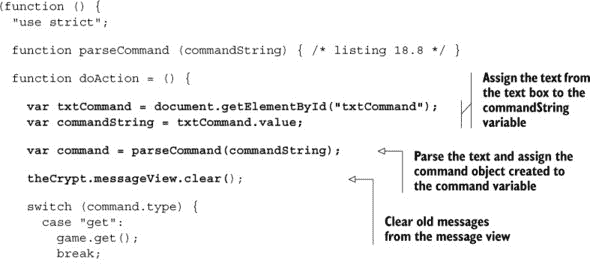

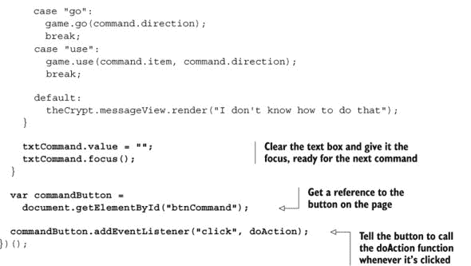

你希望为玩家平滑路径，因此，在 `switch` 块之后，你通过将 `value` 属性设置为空字符串来清除用户从文本框中的命令。而且因为你非常关心，你通过调用文本框的 `focus` 方法将光标放在文本框中，准备接收他们的下一个命令。在 `switch` 块之前，你也使用了消息视图的 `clear` 方法，该方法在 第十七章 的末尾添加，以清理任何旧消息。

命令模块的代码被包裹在一个立即执行的函数表达式中。一旦网页加载脚本，它就会执行，并将事件监听器添加到按钮元素上。

#### 18.4.6\. 进入加密室

你没有修改现有的、正在工作的控制器模块代码，而是创建了一个新的模块，即命令模块，该模块解析玩家的命令并调用控制器的公共方法，`get`、`go` 和 `use`。这很棒！控制器与玩家界面独立；它与基于控制台的游戏中使用的相同，并且可以与新的界面一起工作——你能添加一个按钮来获取房间里的物品吗？

图 18.8 展示了正在进行中的 *The Crypt* 游戏，玩家通过消息视图查看消息。

##### 图 18.8。*The Crypt* 游戏进行中，显示给玩家的消息

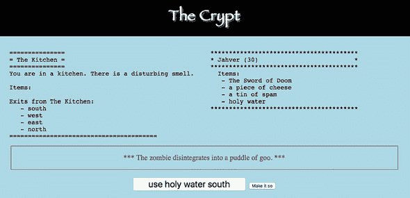

列表 18.7 包含了游戏的最新版本的 HTML，但你需要更改消息视图的 `script` 元素并添加一个新的命令模块：

```
<!-- message view -->
<script src="http://output.jsbin.com/nocosej.js"></script>

<!-- Web Page Controls -->
<script src="http://output.jsbin.com/qedubi.js"></script>
```

在 [`output.jsbin.com/depijo`](http://output.jsbin.com/depijo) 上玩游戏，并查看 [`jsbin.com/depijo/edit?html,javascript`](http://jsbin.com/depijo/edit?html,javascript) 中的 HTML 和 JavaScript。小心不要踩到僵尸！

### 18.5。总结

+   要使用按钮、下拉列表和文本框等控件，你需要一个用于控件的 HTML 元素、元素上的 `id` 属性以及在 JavaScript 中的元素引用。然后你可以访问文本框或下拉列表的 `value` 属性，并指定在按钮被点击时调用的函数。

+   使用 `button` 元素在页面上显示按钮。在打开和关闭标签之间包含要显示在按钮上的文本：

    ```
    <button>Click Me!</button>
    ```

+   在打开标签中包含一个 `id` 属性，以便可以从 JavaScript 代码中访问按钮：

    ```
    <button id="messageButton">Click Me!</button>
    ```

+   使用按钮的 `id` 在 JavaScript 中获取按钮的引用：

    ```
    var btn = document.getElementById("messageButton");
    ```

+   定义一个可以在按钮被点击时调用的函数：

    ```
    var showMessage = function () {
        var messageDiv = document.getElementById("message");
        messageDiv.innerHTML = "You clicked the button!";
    };
    ```

+   为按钮添加事件监听器，以便在按钮被点击时调用函数：

    ```
    btn.addEventListener("click", showMessage);
    ```

+   使用 `input` 元素并设置其 `type` 属性为 `text` 在页面上显示文本框。`input` 元素没有关闭标签：

    ```
    <input type="text" id="userMessage" />
    ```

+   通过使用文本框的 `value` 属性获取或设置文本框中的文本：

    ```
    var txtBox = document.getElementById("userMessage");
    var message = txtBox.value;
    ```

+   使用 `select` 元素和 `option` 元素来显示下拉列表：

    ```
    <select>
        <option>Choice 1</option>
        <option>Choice 2</option>
        <option>Choice 3</option>
    </select>
    ```

+   使用 `switch` 块根据变量的值或属性执行代码：

    ```
    switch (command.type) {
        case "go":
            // Execute code when command.type === "go"
            break;

        case "get":
            // Execute code when command.type === "get"
            break;

        default:
            // Execute code if no other cases match
    }
    ```

## 第十九章。模板：用数据填充占位符

***本章涵盖的内容***

+   用一个字符串替换另一个字符串

+   使用 `while` 循环重复代码

+   使用模板将 HTML 与 JavaScript 分离

+   在网页中嵌入模板

+   使用 `map` 将一个数组转换为另一个数组

你希望你的网站易于导航，使用起来愉快。它们的设计应考虑每个页面应包含哪些内容，其可访问性和可用性，外观和感觉，以及整体用户体验。你的团队成员，在构建和维护网站时，将拥有不同的优势；即使是一个人的团队，在不同的时间关注网站的不同方面也是有意义的。

*用 JavaScript 编程入门*一直青睐模块化开发应用的方法，您已经看到，尽管可能需要管理更多的部分，但每个部分的管理更加简单、灵活和专注。但是，从第二部分的纯 JavaScript 到第三部分的 JavaScript 和 HTML，出现了不受欢迎的流交叉。现在，您有视图将数据、JavaScript 和 HTML 混合在一起以产生输出（参见第十七章——或者更好的是，继续阅读）：

```
var html = "<h3>" + movie.title + "</h3>";
html += "<p>" + movie.summary + "</p>";
```

本章向您展示如何通过使用模板将 HTML 从数据和 JavaScript 中分离出来。您的团队中的设计师可以专注于他们的 HTML，避免复杂的 JavaScript 语法。而且，像模块化方法一样，隔离部分可以提高灵活性、可交换性和可维护性。不要交叉流！

### 19.1\. 构建新闻页面——最新消息

在第十四章、第十五章和第十六章中，您一直在开发一个健身应用，让用户记录他们的锻炼会话；您是开发团队的一员，负责为不同的设备和平台开发应用。嗯，健身应用受到了很多关注；测试者的早期报告是积极的，社交媒体上也有很多讨论。您决定为团队创建一个新闻页面，以便让开发者、测试人员和其他感兴趣的人了解您正在做的工作。

图 19.1 显示了包含两个新闻条目的新闻页面。所有团队成员都为新闻页面做出贡献，将他们的条目添加到中央内容管理系统（CMS）中。其他人管理 CMS，并为您提供作为 JavaScript 数据的新闻条目。您的任务是把这些数据转换成新闻页面的 HTML。

##### 图 19.1\. 健身应用新闻，包含两个新闻条目

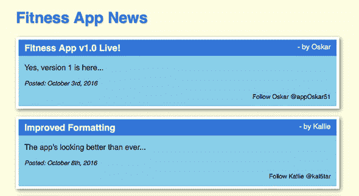

#### 19.1.1\. 比较新闻条目数据和 HTML

团队成员都很积极，并定期在内容管理系统上更新新闻。CMS 以这种形式为您提供数据：

```
var posts = [
    {
      title: "Fitness App v1.0 Live!",
      body: "Yes, version 1 is here...",
      posted: "October 3rd, 2016",
      author: "Oskar",
      social: "@appOskar51"
    },
    {
      title: "Improved Formatting",
      body: "The app's looking better than ever...",
      posted: "October 8th, 2016",
      author: "Kallie",
      social: "@kal5tar"
    }
];
```

团队中的设计师编写单个新闻条目的 HTML：

```
<div class="newsItem">
    <h3>Fitness App v1.0 Live!<span> - by Oskar</span></h3>
    <p>Yes, version 1 is here...</p>
    <p class="posted"><em>Posted: October 3rd, 2016</em></p>
    <p class="follow">Follow Oskar @appOskar51</p>
</div>
```

每个条目都被包裹在一个`div`元素中，由一个标题和三个段落组成。标题包含一个用于帖子作者的`span`元素。（您使用`span`通过 CSS 将作者与其他标题部分区分开来。）您如何从数据中构建完成的 HTML 新闻条目？

#### 19.1.2\. 通过字符串连接构建 HTML

到目前为止，您一直是通过字符串连接逐个构建用于显示的字符串。对于一个新闻条目，您可能这样做：

```
var item = '<div class="newsItem"><h3>' + post.title;
item += '<span> - ' + post.author + '</span></h3>';
item += '<p>' + post.body + '</p>';
item += '<p class="posted"><em>Posted: ' + post.posted + '</em></p>';
item += '<p class="follow">Follow ' + post.author + ' ';
item += post.social + '</p></div>';
```

这种方法的缺点是它将 JavaScript 和数据与 HTML 混合在一起。你的团队中有一些出色的设计师，他们对 HTML 了如指掌，但对 JavaScript 却不太自信。他们会很高兴地用 HTML 拼凑新闻条目的结构，但所有的`var`、`+=`和点符号都是谜。即使他们能够接受 JavaScript，更新代码也不是一件轻松的事情；我看着你，引号！有更好的方法：让 HTML 专家专注于他们最擅长的领域。

#### 19.1.3\. 使用 HTML 模板进行设计

你希望设计师为通用新闻条目提供一些优雅、结构良好的 HTML，然后你将用最新的数据填充它。你希望他们为你提供一个新闻条目的*模板*。

```
<div class="newsItem">
    <h3>{{title}}<span> - {{author}}</span></h3>
    <p>{{body}}</p>
    <p class="posted"><em>Posted: {{posted}}</em></p>
    <p class="follow">Follow {{author}} {{social}}</p>
</div>
```

这比所有那些字符串连接要整洁得多，对吧？没有单引号和双引号之间的潜在混淆，数据的不同*字段*（标题、正文、作者、发布、社交）被清楚地标识为带有双大括号的*占位符*。

但如果模板与 HTML 一起包含，它不会出现在网页上吗？不会，如果你用`script`标签包裹它。

#### 19.1.4\. 使用脚本标签作为模板

HTML 模板与网页的其余 HTML 内容一起保留，放置在`script`标签内。为`script`元素使用非标准`type`属性，然后当浏览器加载页面时，它不会识别`type`并忽略模板。`script`元素的内容不会作为输出的一部分出现——可见的网页——也不会作为 JavaScript 运行。

```
<script type="text/template" id="newsItemTemplate">
    <div class="newsItem">
        <h3>{{title}}<span> - {{author}}</span></h3>
        <p>{{body}}</p>
        <p class="posted"><em>Posted: {{posted}}</em></p>
        <p class="follow">Follow {{author}} {{social}}</p>
    </div>
</script>
```

如果`script`元素具有`"text/javascript"`类型的`type`属性，或者`type`属性缺失，浏览器将尝试将其内容作为 JavaScript 代码执行。但如果是`"text/template"`类型的`type`，浏览器将简单地跳过其内容。

虽然在渲染页面时浏览器会忽略模板，但你仍然可以通过其`id`属性从 JavaScript 中访问它。

```
var templateScript = document.getElementById("newsItemTemplate");
var templateString = templateScript.innerHTML;
```

第一个列表显示了新闻页面的`body`元素内容。有一个标题，一个用于新闻条目的`div`，以及包裹在`script`标签中的模板。

##### 列表 19.1\. 健身应用新闻（HTML）([`jsbin.com/viyuyo/edit?html,output`](http://jsbin.com/viyuyo/edit?html,output))

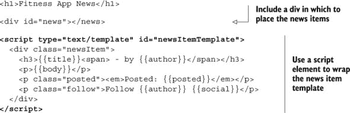

你只需要找到一种方法用实际数据替换占位符，你就可以准备好待发布的新闻条目。你需要学习如何用一个字符串，一个占位符，替换成另一个字符串，一些数据。

### 19.2\. 替换一个字符串为另一个字符串

要替换一个字符串为另一个字符串，你使用`replace`字符串方法，将需要查找的字符串作为第一个参数，将用于替换的字符串作为第二个参数。该方法返回一个新的字符串。以下列表显示了如何将字符串`"{{title}}"`替换为字符串`"Fitness App v1.0 Live!"`。它会在控制台产生以下输出：

```
> <h3>{{title}}</h3>
> <h3>Fitness App v1.0 Live!</h3>
```

##### 列表 19.2\. 用一个字符串替换另一个字符串 ([`jsbin.com/jeyohu/edit?js,console`](http://jsbin.com/jeyohu/edit?js,console))


`replace` 方法搜索它附加到的字符串，返回一个新的字符串。

```
before.replace(string1, string2);
```

这个片段搜索存储在变量 `before` 中的字符串。

#### 19.2.1\. 连续调用 `replace`

`replace` 方法作用于字符串。它也返回一个字符串。这意味着 `replace` 可以在其自己的返回值上调用，允许你进行如下链式调用：

```
template
    .replace("{{title}}", "Fitness App v1.0 Live!")
    .replace("{{author}}", "Oskar");
```

如果 `template` 是字符串 `"<h3>{{title}}<span> - by {{author}}</span></h3>"`，那么前面的代码片段通过以下步骤工作。首先，替换 `{{title}}` 占位符：

```
"<h3>{{title}}<span> - by {{author}}</span></h3>"
    .replace("{{title}}", "Fitness App v1.0 Live!")
    .replace("{{author}}", "Oskar");
```

然后替换了 `{{author}}` 占位符：

```
"<h3>Fitness App v1.0 Live!<span> - by {{author}}</span></h3>"
    .replace("{{author}}", "Oskar");
```

最终结果是

```
"<h3>Fitness App v1.0 Live!<span> - by Oskar</span></h3>";
```

列表 19.3 展示了连续调用 `replace` 的一个示例。它在控制台上产生了以下输出：

```
> Follow {{author}} {{social}}
> Follow Oskar @appOskar51
```

##### 列表 19.3\. 连续调用 `replace` ([`jsbin.com/rebugu/edit?js,console`](http://jsbin.com/rebugu/edit?js,console))

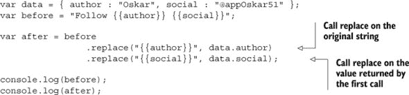

在 列表 19.3 中，`replace` 的调用被写在了多行中。这对程序没有影响，但使阅读代码的人更容易挑出单独的调用。当方法可以通过点符号链式调用，如 `replace`，它们被称为具有 *流畅接口*。程序员经常设计一系列对象和方法以使用流畅接口，以便它们更容易使用、阅读和理解。

### 19.3\. 当循环——多次替换字符串

了解如何使用 `replace` 来交换一个字符串为另一个字符串，你可以编写代码来测试它在新闻页面上的效果。图 19.2 展示了在替换占位符之前新闻条目模板的外观。

##### 图 19.2\. 显示所有占位符的新闻条目

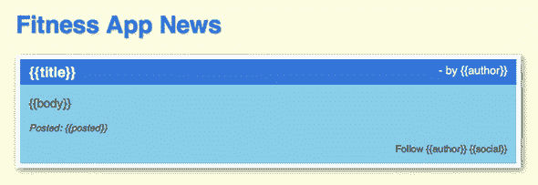

新闻条目的数据是一个具有五个属性（`title`、`body`、`author`、`posted` 和 `social`）的 JavaScript 对象：

```
var data = {
    title: "Fitness App v1.0 Live!",
    body: "Yes, version 1 is here...",
    posted: "October 3rd, 2016",
    author: "Oskar",
    social: "@appOskar51"
};
```

你为每个属性调用 `replace`，一开始你认为一切顺利。图 19.3 展示了渲染的新闻条目。

##### 图 19.3\. 一个新闻条目——其中一个 `{{author}}` 占位符尚未被替换（右下角）。

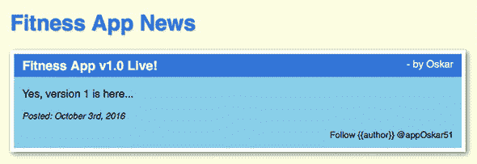

很接近，但不是普利策奖！其中一个占位符尚未被替换。新闻条目的右下角仍然有一个顽固的 `{{author}}`。下面的列表显示了您使用的代码。出了什么问题？

##### 列表 19.4\. 为每个属性调用一次 `replace` ([`jsbin.com/quroha/edit?js,html,output`](http://jsbin.com/quroha/edit?js,html,output))

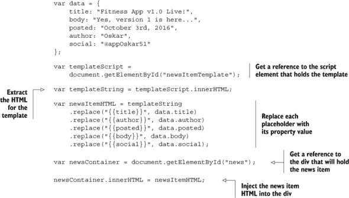

问题在于，`replace` 方法只替换它试图匹配的字符串的第一个出现。新闻条目模板有两个 `{{author}}` 占位符，而你只替换了其中一个。尝试自己解决这个问题，通过为同一个占位符调用 `replace` 两次。

模板和`replace`代码都过于**紧密耦合**。如果设计者将模板修改为第三次包含`{{author}}`占位符（可能是用于电子邮件链接或简短的个人简介），你将不得不再次深入 JavaScript 代码并更新代码以添加对`replace`的另一个调用。

你想要代码能够自动调用`replace`，直到所有占位符都被填充。你如何正确地调用`replace`指定次数？

#### 19.3.1. 当条件满足时重复代码

你新闻条目模板中的所有占位符都需要替换为相应的数据。例如，`{{author}}`的两个实例都应该填充为`Oskar`，如图 19.4 所示（右上角和右下角）。

##### 图 19.4。两个作者占位符都已替换为 Oskar（右上角和右下角）。

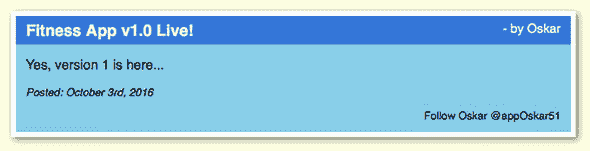

你的代码应该在找到每个属性的占位符时持续调用`replace`。在伪代码（假设代码）中，它应该看起来像这样：

```
while there is a placeholder {
    replace the placeholder with data
}
```

大括号之间的代码块应该一直重复，直到找到占位符。一旦没有找到占位符，代码块可以被跳过。以下是在 JavaScript 中实现该目标的方法：

```
while (filled.indexOf(placeholder) !== -1) {
    filled = filled.replace(placeholder, data.property);
}
```

你很快就会深入了解细节，所以如果你现在还没有完全理解，不要过于担心。但你应该能够理解代码的基本功能。让我们看看`while`循环在一般情况下是如何工作的。

#### 19.3.2. `while`循环

`while`循环在`filled`字符串中找到占位符时持续调用`replace`。当没有找到占位符时，执行将继续到代码块之后。一般来说，`while`循环允许你在条件为`true`时重复执行代码块。`while`循环的结构如下所示：

```
while (condition) {
    // Code to execute if condition is true.
}
```

循环首先评估条件。如果评估结果为`true`，则执行代码块，就像一个`if`语句。与`if`语句不同，一旦代码块被执行，`while`循环将再次评估条件。如果条件仍然评估为`true`，则再次执行代码块。循环将一直执行代码块，直到条件为`true`。如果条件为`false`，则跳过代码块，程序继续执行块之后的语句。

下一个列表展示了如何使用`while`循环显示从 1 到 10 的整数。

##### 列表 19.5。使用`while`循环进行计数([`jsbin.com/quroga/edit?js,console`](http://jsbin.com/quroga/edit?js,console))

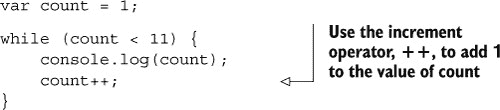

当 `count` 变量达到 11 时，条件将评估为 `false`，`count` 的值将不会记录到控制台。代码块应该始终更改在条件中使用的变量的值。否则，如果条件的值最初为 `true`，它将永远不会变为 `false`，循环将变成一个 *无限循环*。在 列表 19.5 中，你使用增量运算符 `++` 将 1 添加到 `count` 的值。这里展示了三种将 1 添加到 `count` 变量值的不同方法：

```
count = count + 1;
count += 1;
count++;
```

#### 19.3.3\. 在找到字符串时替换字符串

你可以使用 `while` 循环来替换多个占位符的实例。首先，使用 `indexOf` 方法检查你想要替换的占位符是否存在。如果字符串找不到，`indexOf` 返回 `-1`。如果占位符被找到，则 `indexOf` 不会返回 `-1`。在 `while` 循环的条件中使用这个事实：

```
while (filled.indexOf(placeholder) !== -1) {
    // Make changes to filled
}
```

列表 19.6 使用 `while` 循环不断替换字符串，直到它不再被找到。它在控制台上产生以下输出：

```
> Starting replacement...
> {{title}} by Oskar. Follow {{author}} {{social}}
> {{title}} by Oskar. Follow Oskar {{social}}
> ...replacement finished.
```

##### 列表 19.6\. 使用 `while` 循环进行替换 ([`jsbin.com/cabaju/edit?js,console`](http://jsbin.com/cabaju/edit?js,console))

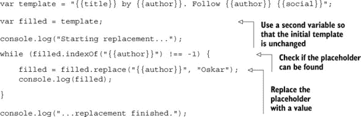

代码首先记录开始替换过程。然后，`while` 循环执行其代码块两次，先替换一个 `{{author}}` 实例，然后替换另一个。由于没有更多的 `{{author}}` 实例要查找，`filled.indexOf("{{author}}")` 返回 `-1`，`while` 循环结束。循环之后继续执行，代码通过记录替换过程已完成来结束。

#### 19.3.4\. 使用正则表达式替换字符串

有一种替换字符串的替代方法。它使用 *正则表达式*，这是一种指定你想要匹配和替换的字符模式的强大但通常复杂的方法。正则表达式略超出了本书的范围，但你可以在 [www.room51.co.uk/js/regexp.html](http://www.room51.co.uk/js/regexp.html) 的 *Get Programming with JavaScript* 网站上调查许多示例。

### 19.4\. 自动化模板占位符替换

健身应用使用用户锻炼会话的数据，其新闻页面使用新闻条目的数据。测验应用使用问题和答案的集合数据，*The Crypt* 使用其地图的数据。使用 HTML 模板来显示你可能在项目中找到的所有类型的数据将非常棒。但你不希望每次需要用数据填充占位符时都要重新发明 `while`。那么，自动化模板使用的关键是什么？

#### 19.4.1\. 匹配模板占位符与对象属性

图 19.5 再次显示了健身应用新闻页面上的一个新闻条目。占位符尚未用数据填充。

##### 图 19.5\. 一个未填充占位符的新闻条目

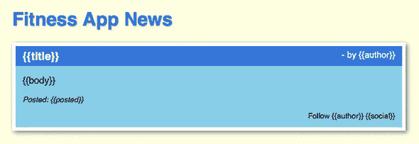

将填充占位符的数据看起来是这样的：

```
var data = {
    title: "Fitness App v1.0 Live!",
    body: "Yes, version 1 is here...",
    posted: "October 3rd, 2016",
    author: "Oskar",
    social: "@appOskar51"
};
```

新闻项目数据对象的属性名，即其 *键*，与模板中占位符的名称相匹配。对于每个键，你希望继续替换其匹配的占位符，直到它们可以被找到。

> **1**. 从 `title` 开始，并继续用 `Fitness App v1.0 Live!` 替换 `{{title}}`，直到没有更多的 `{{title}}` 占位符需要替换。
> 
> **2**. 继续到 `body`，并继续用 `Yes, version 1 is here...` 替换 `{{body}}`，直到没有更多的 `{{body}}` 占位符需要替换。
> 
> **3**. 对每个键重复此过程，直到所有键的所有占位符都已替换。

你可以通过使用 `Object .keys` 方法来获取所有新闻项目属性名的数组。

```
var keys = Object.keys(data);
```

对于新闻条目，`keys = ["title", "body", "posted", "author", "social"]`。

带着键，你可以轻松地在模板中创建占位符并用值替换它们。记住，你可以使用方括号表示法来检索键的值：

```
data["title"];    // "Fitness App v1.0 Live!"
data["author"];   // "Oskar"
```

如果你有一个属性的键，你还可以构建模板中需要匹配的占位符：

```
var placeholder = "{{" + key + "}}";
```

属性的 *键* 命名得很好；你使用它来解锁属性的值及其占位符(表 19.1)。

##### 表 19.1\. 属性的键用于访问其值并构建其占位符

| 键 | 值 | 占位符 |
| --- | --- | --- |
| title | data["**title**"] | {{**title**}} |
| body | data["**body**"] | {{**body**}} |
| posted | data["**posted**"] | {{**posted**}} |

#### 19.4.2\. 为每个键填充所有占位符

是时候将所有部分组合起来，编写一些代码，这些代码不仅将为健身应用新闻页面填充数据，而且还将与任何数据和匹配的模板一起工作。列表 19.7 展示了一个 `fill` 函数，它使用了上一节中的想法，遍历数据对象的键，并用值替换占位符。

##### 列表 19.7\. 填充模板数据的函数([`jsbin.com/bazika/edit?js,output`](http://jsbin.com/bazika/edit?js,output))

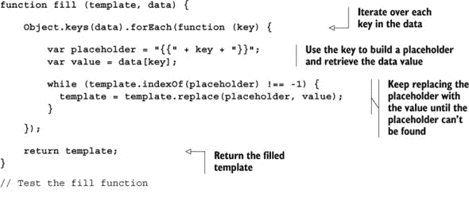

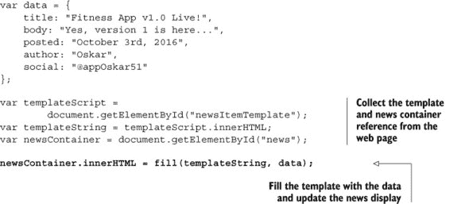

列表 19.7 还包括测试 `fill` 函数的代码。在最后一行，它设置了由函数返回的 HTML 的 `div` 元素内容。

#### 19.4.3\. 使用模板构建项目列表

你已经笑了。是的，健身应用新闻页面有一个新闻条目列表。是的，你的模板 `fill` 函数只使用一个新闻条目就能工作。但你知道 `forEach` 在处理列表时的强大功能。编写一个 `fillList` 函数非常简单，如下所示。

##### 列表 19.8\. 使用模板构建列表([`jsbin.com/hilecu/edit?js,output`](http://jsbin.com/hilecu/edit?js,output))

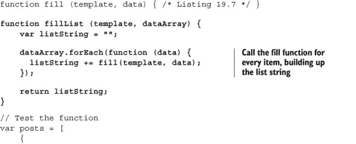


在列表 19.8 中的`fillList`函数中，你使用`forEach`方法遍历数据对象数组`dataArray`，将每个对象传递给`fill`函数，并将返回的填充模板追加到`listString`中。

现在你有了所需的两个模板函数，你渴望了解完成后的健身应用新闻页面。

### 19.5. 建立新闻页面——新闻即时更新

是时候模块化了。你知道健身应用团队是如何运作的；他们喜欢分享代码，但讨厌污染。他们希望看到一个具有独立数据模板模块的新闻页面。显示了设置。

##### 图 19.6。页面包括新闻条目模板和 JavaScript 代码，并导入两个模块。


JS Bin 上的新闻页面将新闻条目模板放在一个`script`元素中，并在 JavaScript 面板中使用模块和模板来显示新闻条目。显示两个新闻条目的完成网页在图 19.1 中显示。

要完成新闻页面的工作，首先创建模块，然后将它们导入到网页中。在接下来的两个部分中详细了解。

#### 19.5.1. 创建模板和数据模块

将模板函数放入一个模块中，将新闻数据放入另一个模块中。使用命名空间以避免创建过多的局部变量。

##### 模板函数

下一个列表显示了如何将列表 19.7 和 19.8 中的两个模板函数打包到一个模板模块中。

##### 列表 19.9。模板模块（[`jsbin.com/pugase/edit?js,console`](http://jsbin.com/pugase/edit?js,console)）


你使用了一个新的命名空间，`gpwj`（来自《用 JavaScript 编程》）；模板模块在许多项目中都会很有用，因此将其作为通用工具命名空间的一部分而不是与健身应用或《密码学》或其他任何使用的地方一起使用是值得的。要调用函数，请包含命名空间：

```
var newsItemHTML = gpwj.templates.fill(newsItemTemplate, data);
```

##### 新闻数据

对于现实世界的新闻页面，数据将来自中央内容管理系统。你通过创建一个提供模拟数据的模块来模拟 CMS 新闻源。你可以在稍后替换模块，以使用具有实时 CMS 连接的模块。

下一个列表包括数据和获取其分配到`fitnessApp.news`命名空间的功能。

##### 列表 19.10。新闻页面数据模块（[`jsbin.com/fupiki/edit?js,console`](http://jsbin.com/fupiki/edit?js,console)）


要获取新闻条目，调用`getItems`，指定你想要的条目数量。例如，要获取三个新闻条目，你会使用以下代码：

```
var itemsData = fitnessApp.news.getItems(3);
```

实际的新闻数据模块将从 CMS 检索项目，它将使用与列表 19.10 相同的接口。换句话说，其新闻也将通过调用其`getItems`方法来访问。通过使用相同的接口，你可以轻松地将模块从静态版本交换到动态 CMS 版本。

#### 19.5.2\. 导入模块

为了向读者提供健身应用团队发展的最新头条新闻，你创建了这里所示的简单新闻页面 HTML。

##### 列表 19.11\. 一个模块化新闻页面（HTML）([`jsbin.com/vemufa/edit?html,output`](http://jsbin.com/vemufa/edit?html,output))


为了将所有这些部分组合在一起，你添加了 JavaScript 代码，从页面中检索模板，用新闻条目数据填充它，并使用生成的 HTML 更新新闻 `div`，如下面的列表所示。

##### 列表 19.12\. 一个模块化新闻页面([`jsbin.com/vemufa/edit?js,output`](http://jsbin.com/vemufa/edit?js,output))


使用模板是从应用程序数据生成 HTML 的常见方式。有许多 JavaScript 模板库可供免费使用；Handlebars、Moustache 和 Pug 是三个流行的例子。

停止 presses！你的团队成员非常喜欢你所采用的整洁、模块化、可重用的方法，并誓言每天都会添加新的新闻条目。其中一些人已经开始将 `gpwj.templates` 函数整合到他们自己的应用程序中。你决定也这样做，当你回到 *The Crypt* 时。

### 19.6\. The Crypt—改进视图

在 第十七章 中，你为玩家和地点创建了一些基于 Web 的视图。它们显示的信息，原本是为控制台设计的，使用了空格、换行和来自 `spacer` 命名空间的框和边框进行格式化，而不是 HTML。现在你已经看到了如何使用模板来分离标记和 JavaScript，是时候改进视图，以便在 *The Crypt* 中使用适当的 HTML 标签来包装数据了。

图 19.7 展示了经过修改后 *The Crypt* 的样子。从纯文本切换到 HTML 使得使用 CSS 来样式化输出成为可能，从而为视觉上有趣的设计提供了更大的潜力。图 19.8 展示了项目中的模块，其中新模块和更新模块被突出显示。

##### 图 19.7\. *The Crypt* 的最新版本使用 HTML 模板来构建页面元素。


##### 图 19.8\. *The Crypt* 中的模块，新模块或更新模块被突出显示


你在本章的早期部分创建了模板模块。现在你创建模板并更新视图以使用它们。

#### 19.6.1\. 为所有视图创建 HTML 模板

下面的列表展示了嵌入在 HTML `script` 标签内的所有 *The Crypt* 模板。它们是 JS Bin 上的一个完整网页的一部分。

##### 列表 19.13\. 带有模板的 *The Crypt* ([`jsbin.com/yapiyic/edit?html,output`](http://jsbin.com/yapiyic/edit?html,output))


模板中没有混合 JavaScript。一个习惯于使用 HTML 工作的网页设计师可以使用他们的知识来更新模板，而无需从任何其他代码中拆分 HTML。显然，这种关注点的分离使模板更整洁、更易于阅读，也更容易为任何参与构建应用程序的人使用。

#### 19.6.2\. 更新视图以使用新的模板

现在，将*The Crypt*的模板字符串嵌入到页面上的 HTML 中，您需要更新视图模块以获取模板字符串，并用消息或玩家和地点模型的数据填充它们。列表 19.14，19.15，和 19.16 显示了新的视图代码。*注意：视图是为控制器设计的，单独使用时不会工作*。包含到 JS Bin 的链接，以便您可以复制、克隆或更改代码（如果需要的话）。

##### 消息

最简单的视图是消息视图。以下是更新的代码。

##### 列表 19.14\. 使用模板的消息视图（[`jsbin.com/jojeyo/edit?js,console`](http://jsbin.com/jojeyo/edit?js,console)）


传递给消息视图的`render`方法的只是字符串。`template.fill`方法期望对象（它使用对象键来创建占位符并查找值），所以`render`从消息创建一个对象`data`，用作参数。消息`"hello"`变为`{ message: "hello" }`。然后`fill`方法将`{{message}}`占位符替换为值`"hello"`。

##### 玩家

玩家视图比消息视图稍微复杂一些，因为玩家有物品。除了有一个模板字符串来显示玩家的姓名和健康状态外，玩家视图还需要另一个用于物品的模板。

下一个列表显示了新的玩家视图。与物品相关的代码以粗体显示。

##### 列表 19.15\. 使用模板的玩家视图（[`jsbin.com/suyona/edit?js,console`](http://jsbin.com/suyona/edit?js,console)）


玩家的物品数据是一个字符串数组。因为`fillList`期望一个对象数组，所以您使用`map`将数组从字符串转换为对象。您将一个函数传递给`map`方法，然后`map`构建一个新的数组，其中每个新元素都是由该函数创建的。数组`["a lamp", "a key"]`变为`[{ item: "a lamp" }, { item: "a key" }]`。

使用`fillList`生成的物品 HTML 不能添加到页面中，直到玩家 HTML 已经添加，因为玩家 HTML 包括将包含物品的`ol`元素。

```
//Add the filled player template to the page.              
playerDiv.innerHTML = gpwj.templates.fill(playerTemplate, data);

// Get a reference to the playerItems ol that's just been added to the page
itemsDiv = document.getElementById("playerItems");

// Add the HTML for the list of items to the playerItems ol element
itemsDiv.innerHTML = gpwj.templates.fillList(itemTemplate, items);
```

##### 地点

地点视图是最复杂的，因为地点有物品和出口。但是显示出口的方法与物品相同，所以额外的复杂性只是轻微的重复。出口数据是一个字符串数组，就像物品数据一样。可以使用相同的模板。

以下列表显示了更新的地点视图。退出的代码以粗体显示。

##### 列表 19.16. 使用模板的地点视图 ([`jsbin.com/yoquna/edit?js,console`](http://jsbin.com/yoquna/edit?js,console))


再次，`map` 用于将字符串数组转换为对象数组，这次用于物品和出口。

#### 19.6.3. 进入 The Crypt

列表 19.13 在 JS Bin 上是使用模板和三个新视图的 *The Crypt* 的一个工作示例。这里显示了导入新模块的脚本：

```
<!-- gpwj.templates -->
<script src="http://output.jsbin.com/pugase.js"></script>

<!-- player view -->
<script src="http://output.jsbin.com/suyona.js"></script>
<!-- place view -->
<script src="http://output.jsbin.com/yoquna.js"></script>
<!-- message view -->
<script src="http://output.jsbin.com/jojeyo.js"></script>
```

前往 http://output.jsbin.com/yapiyic 并进行尝试。

### 19.7. 概述

+   使用 `replace` 字符串方法用另一个字符串替换一个字符串：

    ```
    "One too three".replace("too", "two");      // Returns "One two three"
    ```

+   使用 `replace` 的链式调用交换多个字符串：

    ```
    "One too three".replace("One", "Far").replace("three", "long");   
    // Returns "Far too long"
    ```

+   使用 `while` 循环在条件保持 `true` 时执行一段代码。

    ```
    var count = 10;

    while (count > 5) {        // Displays 10 9 8 7 6 on separate lines
        console.log(count);
        count = count – 1;
    }
    ```

+   使用 `map` 数组方法根据现有数组的元素创建一个新数组。传递给 `map` 的函数作为参数返回一个基于旧值的新值：

    ```
    var planets = ["Mercury", "Venus"];

    var bigPlanets = planets.map(function (oldValue) {
        return oldValue + " becomes " + oldValue.toUpperCase();
    });
    ```

    ```
    // bigPlanets === ["Mercury becomes MERCURY", "Venus becomes VENUS"]
    ```

+   使用带有占位符的模板字符串来避免将 JavaScript 与显示字符串混合：

    ```
    var templateString = "<h3>{{title}}</h3><p>{{body}}</p>";
    ```

+   通过使用具有非标准 `type` 属性的 `script` 标签将模板字符串嵌入到 HTML 中。

    ```
    <script type="text/template" id="postTemplate">
        <h3>{{title}}</h3><p>{{body}}</p>
    </script>
    ```

+   通过 `script` 标签的 `id` 属性和元素的 `innerHTML` 属性从 JavaScript 访问模板：

    ```
    var templateString = document.getElementById("postTemplate").innerHTML;
    ```

+   使用对象中的数据填充模板。它返回一个字符串，其中的占位符被对象的属性替换：

    ```
    var data = {title: "Out of Office", body: "I'm going on an adventure!"};
    var template = "<h3>{{title}}</h3><p>{{body}}</p>";
    gpwj.templates.fill(template, data);  
    // Returns "<h3>Out of Office</h3><p>I'm going on an adventure!</p>"
    ```

## 第二十章. XHR：加载数据

***本章涵盖***

+   使用 `XMLHttpRequest` 对象加载数据

+   数据加载后调用函数

+   使用加载的数据更新视图

+   JavaScript 对象表示法 (JSON)

+   将 JSON 文本转换为 JavaScript 对象

日历或电影数据库或冒险游戏可能需要大量数据。新闻网站可能有最新的更新，包括突发新闻和体育比分。并不是总是希望一次性加载所有数据，或者让访客不断刷新网页以获取最新信息。如果页面能够仅访问它需要以保持新鲜的数据片段，那就太好了，即使它已经加载了。股价、推文、评论、比分，以及是的，僵尸的健康状况都可以独立更新，而无需完全重新加载页面。

本章向您展示如何在运行时通过网络获取数据，用于您的应用。特别是，当您在健身应用中切换用户时，您会加载锻炼数据，当玩家解决 The Crypt 的谜题时，您会逐个加载位置数据。

### 20.1. 构建健身应用—检索用户数据

您和您的团队一直在构建一个健身应用，允许用户跟踪他们的锻炼（参见第十四章 chapters 14 到第十六章 16）。该应用可以将 JavaScript 数据转换为用户模型，使用可选的视图在控制台显示用户信息，并在控制台提示中接受用户输入。您在项目中分配的任务如下：

> **1**. 以字符串形式检索用户数据。
> 
> **2**. 将用户数据转换为用户模型。
> 
> **3**. 显示用户数据。
> 
> **4**. 为用户提供添加会话的界面。

您已经完成了任务 2、3 和 4，现在是时候通过互联网检索用户数据了。您希望在应用程序中使用时能够切换用户，如图 20.1 所示。

##### 图 20.1. 在使用健身应用程序时切换用户


图 20.1 显示了调用`app.loadUser`方法以加载第二和第三用户的数据。在您能够获取数据之前，您需要一种方式来指定每个用户数据的位置。

#### 20.1.1. 定位用户数据

不同的团队成员正在为不同的平台和设备开发健身应用程序的不同版本。但所有版本都将使用由中央健身应用程序服务器提供的相同数据，如图 20.2 所示。

##### 图 20.2. 所有应用程序都使用相同的数据。


到目前为止，在开发应用程序的过程中，您一直使用一个静态数据文件来处理单个用户。您希望能够在不重新加载整个应用程序的情况下，在不一次性加载所有用户数据的情况下（您希望有*很多*用户！），在用户之间进行切换。您决定定义一个`loadUser`方法，该方法将为指定的用户 ID 加载用户数据，并在控制台上显示：

```
> app.loadUser("qiwizo")
  Loading user details...

  Mahesha
  120 minutes on 2017-02-05
  35 minutes on 2017-02-06
  45 minutes on 2017-02-06

  200 minutes so far
  Well done!
```

您的健身应用程序的 ID 对应于 JS Bin 上的文件；在实际应用程序中，它们可能是数据库中的 ID 或可能是唯一的用户名。每个文件只包含一个用户的数据。例如，以下是 Mahesha 的数据，位于[`output.jsbin.com/qiwizo.json`](http://output.jsbin.com/qiwizo.json)：

```
{
  "name" : "Mahesha",
  "sessions" : [
    {"sessionDate": "2017-02-05", "duration": 120},
    {"sessionDate": "2017-02-06", "duration": 35},
    {"sessionDate": "2017-02-06", "duration": 45}
  ]
}
```

那么，如何在程序运行时加载玩家的数据呢？秘密在于奇怪命名的`XMLHttpRequest`对象。但在您揭开其秘密之前，了解与远程数据交互的步骤将非常有价值。

#### 20.1.2. 加载用户数据——概述

您需要为健身应用程序加载用户数据。每当用户调用`loadUser`方法时，您的应用程序需要通过网络找到数据，检索它，然后使用它。为了完成所有这些，应用程序将需要以下内容：

+   一个用户 ID

+   一个用于查找数据的 URL

+   一个在数据检索后调用的函数

第三个要求值得进一步考虑。数据可能跨越互联网，甚至可能跨越世界，在另一台机器上。找到并检索数据需要时间（希望是毫秒，但可能是秒）。在程序能够使用这些数据创建新的 `User` 对象并更新显示之前，它需要这些数据。你定义了一个函数，称为 *回调函数*，当数据加载完成时会被调用。你之前已经遇到过回调函数：在 第十八章 中处理按钮时，你请求一个在按钮被点击时调用的函数。这就像函数正在监听点击事件的发生。对于加载数据用户，你的回调函数正在监听加载事件的发生。你加载数据并使用它来更新应用程序的代码可能如下所示：

```
function updateUser (userData) {
    // Create a new User from the data
    // Use a view to update the display
}

function loadData (id, callback) {
    // Build a URL using the id

    // Let the app know to run the callback function when the data loads

    // Tell the app to go and get the data from the URL
}

loadData("qiwizo", updateUser);
```

你将 `loadData` 函数的用户 `id`（`qiwizo`）和一个在数据加载完成后要调用的函数 `updateUser` 传递给它。

你已经对获取所需数据的步骤有了概念。现在是时候研究具体细节了。

#### 20.1.3\. 加载用户数据——XMLHttpRequest 构造函数

是的，`XMLHttpRequest` 构造函数有一个有趣的名字，尽管请求部分是合理的。你想要从世界上的某个地方（一个 *服务器*）请求信息。你可以将研究 XML 和 HTTP 作为家庭作业。从现在起，除了在代码中，我还会称之为 XHR 构造函数。简短、简洁、可爱？

XHR 构造函数由浏览器提供。你使用它来创建包含从互联网请求资源的方法的 XHR 对象。你向 XHR 对象传递一个 URL 和一个要调用的函数，当它加载数据时，它会调用你的函数。图 20.3 展示了当使用 XHR 对象加载数据健身应用程序中的用户数据时检索到的数据。

##### 图 20.3\. XHR 对象返回的数据字符串


列表 20.1 包含了执行数据请求所需的这五个步骤的代码。

> **1**.  使用 XHR 构造函数创建一个 XHR 对象
> 
> **2**.  声明或构建 URL
> 
> **3**.  为 XHR 对象提供一个在数据加载完成后调用的函数
> 
> **4**.  调用 `open` 方法，并传入 URL
> 
> **5**.  调用 `send` 方法以启动请求

##### 列表 20.1\. 使用 XHR 对象加载数据用户 ([`jsbin.com/qakofo/edit?js,console`](http://jsbin.com/qakofo/edit?js,console))


你使用 `new` 关键字调用 XHR 构造函数，它会创建并返回一个 XHR 对象。你调用对象的方法来设置和启动请求。你提供一个函数，一旦数据加载完成就调用它；在 列表 20.1 中，你使用函数表达式作为 `addEventListener` 的第二个参数，但你也可以使用之前定义的函数的名称。一旦加载完成，数据会自动分配给 XHR 对象的 `responseText` 属性，你的回调函数可以通过该属性访问数据。`open` 函数的第一个参数 `GET` 是请求的 *HTTP 方法* 或 *动词*。在本章中，你坚持使用 `GET`，因为你正在获取数据，但还有其他动词，如 `POST`、`PUT` 和 `DELETE`。

你可以在 图 20.3 中看到数据以文本形式返回。文本显示在双引号之间（第一个字符和最后一个字符）。数据是以称为 JavaScript 对象表示法（JSON）的格式，这在 第 20.2 节 中有更详细的讨论。因为它是一种文本，一个字符串，你不能像访问 JavaScript 对象那样访问数据，例如使用 `data.name` 或 `data["sessions"]`。

幸运的是，有一种简单的方法可以将 JSON 文本转换为 JavaScript 对象。

#### 20.1.4\. 加载用户数据——使用 JSON.parse 解析 XHR 响应

当 XHR 请求加载了健身应用用户的 数据后，它会运行回调函数。数据作为一个字符串，会自动分配给 XHR 对象的 `responseText` 属性。为了将字符串转换为你可以访问的 JavaScript 对象，例如 `name` 和 `sessions`，你使用 `JSON.parse` JavaScript 方法。

```
var dataAsObject = JSON.parse(dataAsString);
```

图 20.4 展示了将用户数据解析并记录到控制台后的样子。它现在是一个 *对象*，具有属性（比较 图 20.3 和 20.4）。

##### 图 20.4\. 一旦


以下列表更新了 列表 20.1，在将数据记录到控制台之前，解析加载的文本以获取 Java-Script 对象。

##### 列表 20.2\. 将 JSON 文本解析为 JavaScript 对象 ([`jsbin.com/rexolo/edit?js,console`](http://jsbin.com/rexolo/edit?js,console))


你应该面带微笑。只需几行代码，你就可以访问世界各地的数据。（好吧，从托管你网页的服务器。但那可以是任何地方。）大大的拥抱。

在 *Get Programming with JavaScript* 中开发的全部应用程序都可以从一种简单的方法中受益，以便访问 JS Bin 上的数据；它生成的 bin 代码，如 `qiwizo`，有点麻烦。在下一节中，你将 XHR 代码打包到一个 `load` 函数中，这使得获取数据变得更加容易。

#### 20.1.5\. 加载 JS Bin 数据——一个实用的函数

测验应用程序、我的电影评分页面、健身应用程序新闻页面以及*The Crypt*都可以在运行时加载数据，就像健身应用程序本身一样。为了简化从 JS Bin 加载数据的过程，你创建了一个模块，*Bin Data*。

作为一项通用实用函数，你将`load`函数添加到`gpwj`命名空间中，该命名空间已经是模板函数的家园（参见第十九章）。要加载 JS Bin 文件中的数据，你使用以下形式的代码：

```
function doSomethingWithData (data) {
    // Do something amazing with the data
}

gpwj.data.load("qiwizo", doSomethingWithData);
```

下一个列表显示了该函数的实际操作。它生成了图 20.4 中的输出。

##### 列表 20.3. 加载 JS Bin 数据的函数([`jsbin.com/suxoge/edit?js,console`](http://jsbin.com/suxoge/edit?js,console))


你使用`load`函数在第 20.3 节中的*The Crypt*中获取位置数据。书中其他项目的数据加载版本可在*Get Programming with JavaScript*网站上找到，网址为[www.room51.co.uk/books/getprogramming/projects/](http://www.room51.co.uk/books/getprogramming/projects/)。现在，健身应用程序得到了升级。

#### 20.1.6. 构建健身应用程序

健身应用程序团队很高兴看到基于控制台程序的工作原型。还有三个任务待完成：

> **1**. 更新控制器模块以使用新的`load`函数来处理用户数据
> 
> **2**. 使用`script`元素加载应用程序使用的模块
> 
> **3**. 添加一行 JavaScript 代码以初始化应用程序

这里展示了新的控制器。它有一个`loadUser`函数，该函数调用`gpwj.data.load`方法。`loadUser`和`log`都作为接口从`init`方法返回。

##### 列表 20.4. 健身应用程序控制器([`jsbin.com/nudezo/edit?js,console`](http://jsbin.com/nudezo/edit?js,console))


因为应用程序在运行时加载用户数据，所以有可能用户在数据加载完成之前尝试记录锻炼会话（健身应用程序的用户非常*热衷*）。`log`方法确保在允许记录之前用户已被设置，`user !== null`。记住，`null`是 JavaScript 中的一个特殊值，通常用来表示预期一个对象但该对象缺失或尚未分配。

在所有部件就绪后，只需将它们组合在一起并发射起跑枪。四个健身应用程序模块在图 20.5 中显示，其中 Bin Data 模块取代了提供静态数据的模块。

##### 图 20.5. 构成健身应用程序的模块


你不需要修改`User`构造函数或视图。下一个列表显示了用于加载四个模块的`script`元素。

##### 列表 20.5. 健身应用程序（HTML）([`jsbin.com/mikigo/edit?html,console`](http://jsbin.com/mikigo/edit?html,console))

```
<!-- fitnessApp.User -->
<script src="http://output.jsbin.com/fasebo.js"></script>

<!-- fitnessApp.userView -->
<script src="http://output.jsbin.com/yapahe.js"></script>

<!-- fitnessApp.controller -->
<script src="http://output.jsbin.com/nudezo.js"></script>

<!-- gpwj.data -->
<script src="http://output.jsbin.com/guzula.json"></script>
```

以下列表展示了启动应用程序的 JavaScript 代码，调用`fitnessApp.init`并使用 JS Bin 代码为初始用户。

##### 列表 20.6. 健身应用程序([`jsbin.com/mikigo/edit?js,console`](http://jsbin.com/mikigo/edit?js,console))

```
var app = fitnessApp.init("qiwizo");
```

在 JS Bin 上查看应用程序的实际运行情况是最好的地方，但本章开头图 20.1(figure 20.1)展示了用户正在加载和记录会话。

你对运行中的应用程序感到非常兴奋，开发团队也是如此。但还有一些东西缺失（除了实际上能够将数据保存到某个地方之外）。难道《用 JavaScript 编程入门》的第三部分 part 3 不是全部关于基于 HTML 的应用程序吗？为什么你又回到了控制台？

#### 20.1.7. 健身应用程序——接下来是什么？

图 20.6 展示了你真正想要的东西——一个基于 HTML 的健身应用程序，具有下拉列表、文本框和按钮。你可以从列表中选择用户，加载他们的详细信息，并记录新的会话。凭借你在书中所学的一切，你能构建这个应用程序吗？没有什么比亲自尝试构建一些东西来帮助你学习更好了。没有压力，没有比赛，也没有失败；要勇敢和好奇，犯错误，并寻求帮助。即使你没有到达终点线，你肯定会在旅途中学到很多东西，得到一次很好的 JavaScript 锻炼，并锻炼你的编码肌肉。而且一旦你亲自尝试了，你就可以偷偷地看看[`jsbin.com/vayogu/edit?output`](http://jsbin.com/vayogu/edit?output)，看看它是如何拼凑起来的。（别忘了运行程序。）

##### 图 20.6. 使用基于 Web 的视图的健身应用程序


如果你想要的是一个基于 HTML 的数据驱动应用程序，那么在*The Crypt*中看到它运行的效果再好不过了。

但首先，如承诺的那样，这里是对 JSON 数据格式的一个非常简短的介绍。

### 20.2. JSON——一种简单的数据格式

JSON 是一种易于人类阅读和编写、也易于计算机解析和生成的数据格式。它已成为在网络上交换数据的一种非常流行的格式。以下是一个用 JSON 编写的日历事件：

```
{
    "title" : "Cooking with Cheese",
    "date" : "Wed 20 June",
    "location" : "The Kitchen"
}
```

格式应该非常熟悉；它基于 JavaScript 的一个子集。属性名和字符串必须用双引号括起来。属性值可以是数组或嵌套对象。以下是 6 月份的一些日历数据：

```
{
  "calEvents" : [
    {
      "title" : "Sword Sharpening",
      "date" : "Mon 3 June",
      "location" : "The Crypt"
    },
    {
      "title" : "Team Work Session",
      "date" : "Mon 17 June",
      "location" : "The Crypt"
    },
    {
      "title" : "Cooking with Cheese",
      "date" : "Wed 20 June",
      "location" : "The Kitchen"
    }
  ]
}
```

值也可以是数字、布尔值、`null`和`undefined`。这就足够了。（老实说，JSON 并没有多少。完整的规范在[`json.org`](http://json.org)。你可能会对它的简短感到惊讶——你不得不爱那些效率极高的火车轨道图！）

JSON 数据以文本形式传输。那么，你如何将其转换为 JavaScript 程序中可以使用的对象和数组呢？

#### 20.2.1. 使用 JSON.parse 将 JSON 转换为对象和数组

您可以通过传递给`JSON.parse`方法将 JSON 文本转换为 JavaScript 对象。然后，您可以使用点或方括号符号访问数据中的属性或元素。如果您已经使用 XHR 对象以 JSON 格式发送请求以获取单个日历事件，您可以像这样将响应转换为 JavaScript 对象：

```
var calEvent = JSON.parse(xhr.responseText);

calEvent.title;    // Cooking with Cheese
calEvent.date;     // Wed 20 June
calEvent.location; // The Kitchen
```

这只是对 JSON 的简要介绍，但鉴于整本书都是关于 JavaScript 的，这应该足够了。

是时候加载地图数据了，神秘房间一个接一个，当你返回**地窖**时。

### 20.3. 地窖——按需加载地图

在**地窖**中的冒险包括探索古墓、广阔的太空船和神秘的森林。每一次冒险可能覆盖数十个地点，而且很难在一次游戏中完成。与其在游戏开始时加载整个地图，不如在玩家访问时才加载地点。游戏可以在 JS Bin 上为每个地点存储 JSON 数据，并在需要时使用`XMLHttpRequest`来加载文件。

图 20.7 只显示了游戏开始时加载的第一个地点。加载的数据包括该地点出口的 JS Bin 文件代码。例如，厨房南边的地点的数据文件代码是`kacaluy`。

##### 图 20.7。在游戏开始时，只加载了初始地点的数据。


地图上每个地点的数据只在玩家移动到该地点时加载。图 20.8 显示了玩家从厨房向南移动后的同一张地图。现在已经加载了老图书馆的数据。

##### 图 20.8。由于玩家移动到了那里，老图书馆的数据已经被加载。


要允许这种逐步加载，您必须在地图数据中包含每个地点出口的 JS Bin 文件代码。

#### 20.3.1. 使用 JS Bin 文件代码指定出口

假设一个在**地窖**中的游戏从厨房开始。一开始，游戏只会加载厨房的数据，而不会加载地图上的其他任何地点的数据。这样在游戏开始时加载的数据就少多了。下面的列表显示了该单个地点的数据。（挑战已被省略，以便您能专注于`id`。）

##### 列表 20.7.厨房的 JSON 数据([`output.jsbin.com/qulude.json`](http://output.jsbin.com/qulude.json))


每个地点都有一个唯一的`id`，它与存储其数据的文件 JS Bin 代码相对应。您使用`id`来构造地点的 URL，如下所示：

```
var url = "http://output.jsbin.com/" + id + ".json";
```

玩家将在地图上往返移动，解决谜题，收集宝藏，溶解僵尸，舔舐豹子。他们可能会多次访问某些地点，您希望避免重复加载相同的数据。

#### 20.3.2. 使用缓存——只加载每个地点一次

每次从加载的数据中创建一个新的地点时，你都会使用地点的 `id` 作为键将其存储在缓存中。对于地点的进一步请求可以给出从缓存中存储的地点，从而避免反复从 JS Bin 加载相同的数据。

```
var placeStore = {};    // Set up an object to store the loaded places

placesStore[placeData.id] = place;    // Use the place's id as the key
```

#### 20.3.3\. 用地图管理器替换地图数据和地图构建器模块

*The Crypt* 的地图构建器曾经接受整个地图的数据，创建所有地点模型，然后将物品、出口和挑战添加到地点。一旦它为整个地图完成了这些操作，它就会返回第一个地点，游戏就可以开始玩了。你现在一次加载一个地点；你需要一个函数来加载单个地点数据，以及一个函数从加载的数据中构建单个地点模型。

代码列表 20.8 展示了一个新的地图管理器模块的代码，该模块将替换你在 *The Crypt* 的早期版本中使用的地图构建代码（图 20.9）。地图管理器模块在其接口中提供了一个单独的方法，`loadPlace`。使用之前定义的回调函数或函数表达式：

##### 图 20.9\. *The Crypt* 的模块，突出显示新的或更新的模块


```
// Use a previously defined function as the callback   
theCrypt.map.loadPlace("qiwizo", doSomethingWithPlace); 

// Use a function expression as the callback
theCrypt.map.loadPlace("qiwizo", function (place) {
    // Use the place model
});
```

##### 代码列表 20.8\. 地图管理器 ([`jsbin.com/xesoxu/edit?js`](http://jsbin.com/xesoxu/edit?js))


地图管理器由两个函数组成。让我们依次探索它们。

##### 将地点添加到存储中

`addPlace` 函数使用 `Place` 构造函数从数据中创建一个模型；添加项目、出口和挑战；将地点存储在缓存中；并返回它。

```
function addPlace (placeData) {
    // Create a place model

    // Store place in cache

    // Add items
    // Add exits and challenges

    // Return the new place model
}
```

对于这个函数，没有更多要说的了；除了缓存之外，你之前已经看到了所有内容。

##### 加载单个地点的数据

当你调用 `loadPlace` 函数时，你给它你想要的位置的 `id` 和一个回调函数。你的回调将使用 `id` 的地点模型作为参数调用。

```
callback(place);
```

但是，`loadPlace` 函数从哪里获取地点模型呢？首先，它尝试缓存。如果地点不在那里，它将从 JS Bin 加载地点数据。

```
var place = placesStore[id];    // Try to get the place from the cache

if (place === undefined) {
    // The place is not in the cache, so
    // load the place data from JS Bin and
    // pass the place to the callback
    callback(place);
} else {
    // The place was in the cache, so 
    // pass it to the callback
    callback(place);   
}
```

如果 `loadPlace` 函数需要加载数据，它将使用 Bin 数据模块的 `load` 函数从 JS Bin 获取它。地点不在缓存中，因此代码将地点数据传递给 `addPlace`，以创建和存储模型，然后再将新的地点模型传递给回调。

```
gpwj.data.load(id, function (placeData) {
    var place = addPlace(placeData);    // Create and store a place model
    callback(place);     // Pass the new place model to the callback
});
```

现在你已经知道了数据加载的工作原理，你可以在游戏控制器中使用它，用于加载初始位置并将玩家移动到新位置。

#### 20.3.4\. 更新游戏控制器以使用地图管理器

你需要更新两个控制器方法来使用新的地图管理器。`init` 方法曾经调用 `buildMap` 来为一次冒险构建整个地图。现在它将调用 `loadPlace` 来仅加载游戏中的第一个地点。由于地点不再预先加载，`go` 方法将需要调用 `loadPlace` 来从缓存中检索地点或从 JS Bin 加载它。

下一个列表显示了在控制器上下文中的两个更新方法。

##### 列表 20.9\. 使用地图管理器的游戏控制器 ([`jsbin.com/vezaza/edit?js`](http://jsbin.com/vezaza/edit?js))


`init` 方法必须在加载起始位置之后才能完成大部分工作。因此，其大部分代码都在传递给 `loadPlace` 的回调函数中。同样，`go` 方法在将位置设置为玩家的新位置之前，使用 `loadPlace` 获取位置。

#### 20.3.5\. 构建游戏页面

剩下的就是导入模块，并添加几行 JavaScript 代码来初始化游戏。

下一个列表显示了游戏的完整 HTML。消息 `div` 和命令文本框已移动到位置和玩家部分上方。

##### 列表 20.10\. 密室 (HTML) ([`jsbin.com/cujibok/edit?html,output`](http://jsbin.com/cujibok/edit?html,output))

```
<!DOCTYPE html>
<html>
<head>
  <meta charset="utf-8">
  <title>The Crypt</title>
</head>
<body>

  <h1>The Crypt</h1>

  <div id="messages" class="hidden"></div>

  <div id="controls">
    <input type="text" id="txtCommand" />
    <input type="button" id="btnCommand" value="Make it so" />
  </div>

  <div id="views">
    <div id="place"></div>
    <div id="player"></div>
  </div>

  <!-- Templates -->

  <script type="text/x-template" id="itemTemplate">
      <li>{{item}}</li>
  </script>

  <script type="text/x-template" id="playerTemplate">
      <h3>{{name}}</h3>
      <p>{{health}}</p>
      <ol id="playerItems"></ol>
  </script>

  <script type="text/x-template" id="placeTemplate">
      <h3>{{title}}</h3>
      <p>{{description}}</p>

      <div class="placePanel">
        <h4>Items</h4>
        <ol id="placeItems"></ol>
      </div>

      <div class="placePanel">
        <h4>Exits</h4>
        <ol id="placeExits"></ol>
      </div>
  </script>

  <script type="text/x-template" id="messageTemplate">
      <p>*** {{message}} ***</p>
  </script>

  <!-- Modules -->

  <!-- gpwj.templates -->
  <script src="http://output.jsbin.com/pugase.js"></script>
  <!-- gpwj.data -->
  <script src="http://output.jsbin.com/guzula.js"></script>

  <!-- Place constructor -->
  <script src="http://output.jsbin.com/vuwave.js"></script>
  <!-- Player constructor -->
  <script src="http://output.jsbin.com/nonari.js"></script>

  <!-- player view -->
  <script src="http://output.jsbin.com/suyona.js"></script>
  <!-- place view -->
  <script src="http://output.jsbin.com/yoquna.js"></script>
  <!-- message view -->
  <script src="http://output.jsbin.com/jojeyo.js"></script>

  <!-- map manager -->
  <script src="http://output.jsbin.com/xesoxu.js"></script>

  <!-- game controller -->
  <script src="http://output.jsbin.com/vezaza.js"></script>
  <!-- Web Page Controls -->
  <script src="http://output.jsbin.com/xoyasi.js"></script>
</body>
</html>
```

下一个列表显示了 JavaScript 初始化代码。它现在指定了游戏中第一个位置的数据文件的 JS Bin 代码。

##### 列表 20.11\. 密室 ([`jsbin.com/cujibok/edit?js,output`](http://jsbin.com/cujibok/edit?js,output))


#### 20.3.6\. 进入密室

太棒了！游戏模板与 HTML 中的其余部分组织在一起；如果需要更改设计，模板很容易找到，而且没有 JavaScript、数据和 HTML 的纠缠。更简单的维护，更少的错误，让设计师更快乐。双赢，双赢，双赢！

现在，你只需要在 *The Crypt* 中生存下来。测试你的力量、技能和耐力，并在 JS Bin 上玩游戏 [`output.jsbin.com/cujibok`](http://output.jsbin.com/cujibok)。祝你好运！

### 20.4\. 总结

+   使用 `XMLHttpRequest` 对象加载网页的资源，而无需重新加载整个页面。

+   使用轻量级、易读的基于 JavaScript 的数据交换格式 JSON 传输您的应用程序数据。

+   要加载数据，创建一个 `XMLHttpRequest` 对象，为 `load` 事件设置事件监听器，使用资源的 URL 调用 `open` 方法，最后调用 `send` 方法：

    ```
    var xhr = new XMLHttpRequest();
    xhr.addEventListener("load", function () {
       // Use xhr.responseText
    });
    xhr.open("GET", url);
    xhr.send();
    ```

+   当 `load` 事件通过 XHR 对象的 `responseText` 属性触发时访问 JSON 数据。

+   通过传递给 `JSON.parse` 方法将 JSON 数据字符串转换为 JavaScript 对象：

    ```
    var data = JSON.parse(xhr.responseText);
    ```

+   使用 JavaScript 对象作为缓存。将加载的数据或模型放入缓存，并在使用 XHR 之前检查缓存。

## 第二十一章．结论：开始用 JavaScript 编程

***本章涵盖***

+   继续你的好工作

+   本地使用文件工作

+   书籍和资源

那么，你是如何开始用 JavaScript 编程的呢？

好吧，你只是开始用 JavaScript 编程。

如果你真的想理解编程，你必须跳进去编写程序。阅读书籍和思考代码可以很有趣，也很富有信息量，但真正能提升你的技能、经验和韧性的还是自己解决问题和编写代码。但你不孤单。在本章中，你将了解在遇到项目难题或只是对事物的工作原理感到好奇时，你可以如何获得帮助。首先，你将研究在自己的电脑上保存网页而不是在 JS Bin 中使用 JavaScript。

### 21.1\. 本地文件工作

JS Bin 和其他在线编码网站非常适合尝试你的想法并检查你的代码是否工作。但你想跳出沙盒，创建自己的网站。本节将探讨在本地（在自己的电脑上）编写和保存文件，并在浏览器中打开它们。

#### 21.1.1\. 编写代码

JavaScript 和 HTML 文件只是文本文件。你可以在任何文本编辑器中编写它们。Windows 上的记事本和 OS X 上的 TextEdit 都可以完成这项工作，尽管它们非常基础。更高级的文本编辑器会进行语法高亮，使用颜色区分关键字、变量、参数、字符串等，并执行代码补全，建议你可能正在尝试输入的内容，并允许你快速插入建议。一些流行的编辑器包括 Sublime Text、BBEdit、Notepad++、Atom 和 Emacs。

此外，还有集成开发环境（IDEs），它们提供了额外的工具，让你可以管理项目、协作、跟踪版本、合并文件、压缩和缩小文件等等。例如，Visual Studio、Dreamweaver、Eclipse 和 WebStorm。显示了具有不同项目支持级别的三个编辑器。

##### ![图 21.1]. Notepad、Notepad++和 WebStorm 提供不同级别的项目支持。


#### 21.1.2\. 保存文件

以有组织的方式保存你的文件，使用合理的文件夹将它们分成类型或子项目。显示了*The Crypt*可能的文件结构。有单独的文件夹用于样式表、JavaScript 文件和游戏地图。主要 HTML 文件位于项目的根目录中。*Get Programming with JavaScript*的各种项目文件夹可在其 GitHub 仓库中找到：[`github.com/jrlarsen/GetProgramming`](https://github.com/jrlarsen/GetProgramming)。

##### ![图 21.2]. *The Crypt*可能的文件夹和文件结构


文件名代表了它们的目的。尽管 JS Bin 会给文件分配随机的名称，但这并不意味着你应该这样做。以下列表显示了游戏的 HTML 文件，其中使用了`script`元素来加载 JavaScript。在`head`部分还有一个`link`元素，用于加载样式化页面的 CSS 文件。模板已被省略，因为它们没有变化。

##### 列表 21.1\. Crypt.html 中的`script`元素


用于在`src`属性中指定浏览器查找要加载的文件的路径是相对于 crypt.html 的。例如，maps/TheDarkHouse.js 意味着“从 crypt.html 相同的文件夹开始，找到 maps 文件夹，然后在那个文件夹中找到名为 TheDarkHouse.js 的文件。”

#### 21.1.3. 在浏览器中打开你的页面

在你的浏览器菜单中，选择文件 > 打开，浏览你的文件系统以找到 crypt.html。页面应该在浏览器中打开。

#### 21.1.4. 合并和压缩文件

如果你将你的项目托管在互联网上供用户访问的 Web 服务器上，将所有的 JavaScript 模块放入一个单独的文件会更好。对于每个`script`元素，浏览器将向服务器发送请求，以获取由`src`属性指定的文件。如果所有文件都需要使应用程序工作，那么加载一个大型文件比加载许多小文件要快。

你可以在 JS Bin 上看到*The Crypt*的一个版本，所有的 JavaScript 都在一个 bin 中：[`jsbin.com/xewozi/edit?js,output`](http://jsbin.com/xewozi/edit?js,output)。

在开发应用程序时，使用单独的文件有助于集中注意力、重用和灵活性。但是，当发布应用程序的时候，合并文件将有助于代码更快地加载。你可以手动将代码复制到一个单独的文件中，但也有一些工具可以帮助你。这些工具可能对初学者来说有点高级，但如果你感兴趣，可以关注 Grunt、Gulp、Browserify 和 CodeKit。

工具还会将你的代码*压缩*，将其压缩成更小的文件。当浏览器运行你的 JavaScript 时，它不需要那些帮助你*阅读*代码的空格和换行符。它也不需要命名良好的变量；`a`、`b`和`c`可以像`loadData`、`checkGameStatus`和`renderMessage`一样完成工作。工具会删除空格并重命名变量，以创建一个更小的文件，它执行的工作完全相同。接下来的两个列表显示了相同的代码，来自*The Crypt*控制器模块的`use`函数。

##### 列表 21.2. 使用函数（压缩版）

```
function r(e,a){if(s){var o=l.getPlace(),i=o.getChallenge(a);void
0===i||i.complete===!0?t("You don't need to use that
there"):l.hasItem(e)?e===i.requires?(t(i.success),i.complete=!0,i.itemConsume
d&&l.removeItem(e)):t(i.failure):t("You don't have that item")}else t("The
game is over!")}
```

##### 列表 21.3. 使用函数

```
function use (item, direction) {
    if (inPlay) {
        var place = player.getPlace();
        var challenge = place.getChallenge(direction);

        if (challenge === undefined || challenge.complete === true) {
            renderMessage("You don't need to use that there");
        } else if (player.hasItem(item)) {

            if (item === challenge.requires) {
                renderMessage(challenge.success);
                challenge.complete = true;
                if (challenge.itemConsumed) {
                    player.removeItem(item);
                }
            } else {
                renderMessage(challenge.failure);
            }

        } else {
            renderMessage("You don't have that item");
        }
    } else {
        renderMessage("The game is over!");
    }
}
```

你可能能够理解文件大小的节省可以非常显著。

### 21.2. 寻求帮助

你阅读这本书的事实表明你欣赏有指导、有组织的指导。一旦你开始运行，能够随时查阅资源、查找信息并就特定问题寻求帮助是非常好的。作为参考，一个很棒的网站是 Mozilla 开发者网络([`developer.mozilla.org`](https://developer.mozilla.org))，它提供了 HTML、CSS、JavaScript 等文档和示例。对于特定问题的答案，可以加入 stackoverflow([`stackoverflow.com`](http://stackoverflow.com))的论坛。社区成员通常会快速回答问题。JavaScript 是第一个达到一百万个提问问题的语言！

### 21.3. 接下来是什么？

*《用 JavaScript 编程》* 被编写为一本编程入门书籍。虽然 第一部分 探讨了 JavaScript 语言的构建块，第二部分 和 第三部分 更侧重于组织大型项目和体验即将到来的事物。本书并非作为完整的参考书籍，而是作为编程的实际体验。那么接下来呢？

#### 21.3.1\. 伴侣网站

文章、教程、视频、资源、示例，以及指向其他支持和参考网站的链接将继续添加到 *《用 JavaScript 编程》* 网站 [www.room51.co.uk/books/getProgramming/index.html](http://www.room51.co.uk/books/getProgramming/index.html)。书中未涉及的一些主题，如原型、继承、使用 `this`、Node.js 和 JavaScript 的最新添加功能，将在那里介绍，同时还有改进书中示例（如测验应用、健身应用、健身应用新闻和我的电影评分）的指南。

#### 21.3.2\. 书籍

关于 JavaScript 的书籍有很多。以下是我阅读并喜欢的几本书。第一本与这本书很好地衔接，第二本则更深入地探讨了该语言：

+   *《JavaScript：现代编程导论》*（No Starch Press；第 2 版，2014 年）作者：马里恩·哈弗贝克

+   *《专业 JavaScript：网络开发者指南》*（Wrox；第 3 版，2012 年）作者：尼古拉斯·C·扎卡斯

#### 21.3.3\. 网站

有许多网站将视频教程与交互式练习相结合。我特别喜欢的是 Code School，[`codeschool.com`](http://codeschool.com)。Code School 的人们还在 [`javascript.com`](http://javascript.com) 建立了一个很好的 JavaScript 入门网站。

#### 21.3.4\. 熟能生巧

继续练习。登录 JS Bin 尝试新事物。本书网站上有一些建议的项目。如果您遇到困难，请随时在本书论坛 [Manning.com](http://Manning.com) 上的 [`forums.manning.com/forums/get-programming-with-javascript`](https://forums.manning.com/forums/get-programming-with-javascript) 发帖提问，或者加入 [stackoverflow.com](http://stackoverflow.com) 的社区。

我希望您在阅读本书、摆弄所有代码、提出假设，并在 JS Bin 上测试您的想法时感到愉快。保持好奇心，*用 JavaScript 编程！*

### 21.4\. 摘要

+   使用文本编辑器编写和保存 JavaScript 和 HTML 文件。

+   使用文件夹和适当的文件名组织项目文件。

+   在您的浏览器中打开 HTML 文件。

+   在 Mozilla 开发者网络和 [stackoverflow.com](http://stackoverflow.com) 获取更多信息并获得帮助。

+   充分利用本书网站上的资源。

+   练习，练习，再练习。

+   保持好奇心、冒险精神、弹性和耐心。祝您冒险成功！
