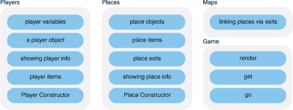
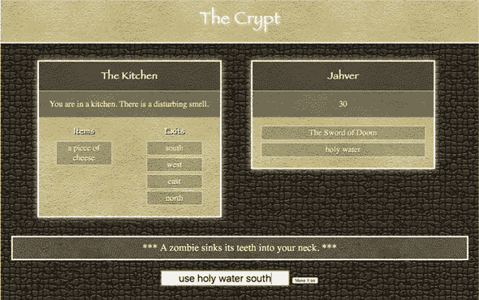

## 附录。密码：一个运行示例

在本书的第一部分中，当学习核心 JavaScript 概念时，你编写代码来表示游戏中的玩家和地点，并让玩家从一个地点移动到另一个地点并拾取物品。以下图显示了您创建的组件；每个章节中类似的图都会突出整个游戏上下文中正在讨论的思想。

书籍的第二部分为玩家增加了挑战：阻止出口直到玩家解决谜题。重点是*组织你的代码*，隐藏其工作方式，检查用户输入，并构建*模块*，你可以重用和交换以使项目更具灵活性。

在第三部分中，你更新了显示以使用 HTML *模板*，修改游戏使其在运行时*加载数据*，用玩家和地点信息填充模板，并添加*文本框和按钮*，以便玩家可以通过网页输入命令。

