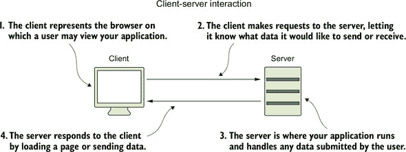
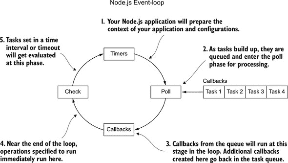
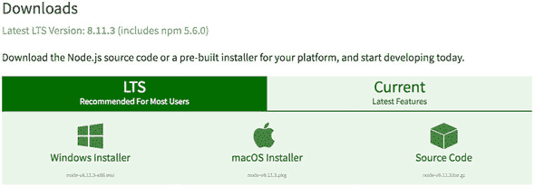
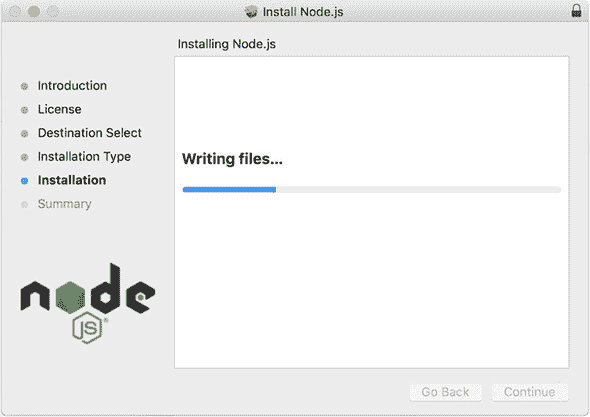
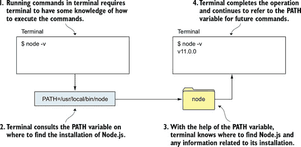
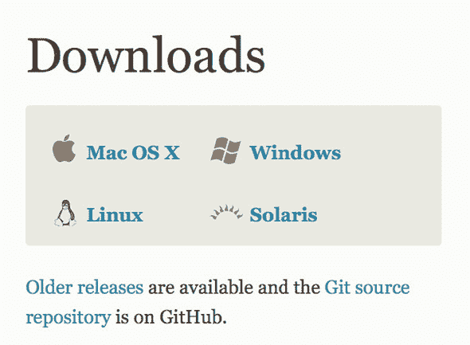
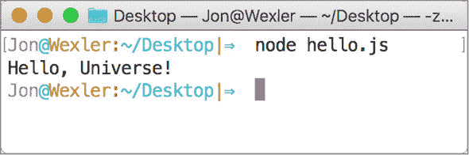

## 第 0 单元：准备工作

在我向你介绍如何将 Node.js 作为 Web 开发平台使用之前，你需要准备你的环境（你将在其上进行开发的计算机）。在本单元中，你将安装所有开始使用 Node.js 所需的工具。这些工具帮助你编写代码，使你的应用程序能够工作并在互联网上运行。到本单元结束时，你将安装所有开始编码和运行 Node.js 应用程序所需的一切。为了实现这一目标，第 0 单元涵盖了以下主题：

+   第 0 课讨论了本书中你将要学习的内容及其重要性。我向你介绍了 Node.js，提供了一些背景信息，并讨论了为什么它是一个好的 Web 开发平台。本课还涵盖了你可以从本书中期待得到的内容。我谈到了一些先决条件和你在努力构建健壮的 Web 应用程序时需要注意的事项。

+   第 1 课将指导你安装每个工具和库的安装过程，以便开始下一单元。尽管本课的重点是安装 Node.js，但将你的计算机设置为开发环境需要更多步骤。

+   第 2 课介绍了你的第一个 Node.js 应用程序和一些测试，以确保你的计算机上运行着兼容的 Node.js 版本。

我首先谈谈 Node.js。

## 第 0 课：设置 Node.js 和 JavaScript 引擎

在本课中，你将了解本书中将要学习的内容及其重要性。无论你是 Web 开发的新手还是一个希望构建更好应用的资深开发者，本课都作为进入 Node.js 世界的入门指南。

本课涵盖

+   回顾你将要学习的内容

+   理解 Node.js

+   学习为什么我们在 Node.js 中开发

+   为本书做好准备

### 0.1. 你将要学习的内容

本书的目标是教会你如何在名为 Node.js 的平台使用 JavaScript 语言构建 Web 应用程序。从本课开始，每个单元都旨在在前一单元的概念和开发技能基础上进行扩展。

在完成每个课时过程中，你将掌握新的 Web 开发概念、术语和编码技能，这些技能将帮助你构建 Web 应用程序。尽管本书围绕使用 Node.js 展开，但以下单元中教授的许多概念也适用于其他主要平台和编程语言。


##### 注意

Web 开发技能与典型的软件工程或计算机理论知识不同。除了教授编码概念外，本书还帮助解释了互联网在你的项目之外是如何工作的。我会尽我所能解释，使事情变得更容易理解。


下面是每个单元你将要学习内容的概述：

+   单元 0 提供了您开始所需的背景知识，并指导您安装 Node.js 和开发工具。

+   单元 1 涵盖了一些基本的网络开发概念，并提供了构建您的第一个 Node.js 网络应用程序的指导步骤。

+   单元 2 介绍了 Express.js，这是大多数 Node.js 开发者用来构建应用程序的 Web 框架。您将了解 Express.js 提供了什么、它是如何工作的以及您可以如何定制它。在本单元中，您还将了解模型-视图-控制器 (MVC) 应用程序架构模式。

+   单元 3 指导您将应用程序连接到数据库。本单元还帮助您安装一些新工具，并使用 MongoDB 结构化您的数据库。

+   单元 4 教您在应用程序中构建数据模型，其中 CRUD 操作用于从数据库中创建、读取、更新和删除数据。

+   单元 5 帮助您构建代码以在面向对象的结构中表示用户账户。在本单元中，您将了解如何保护您的数据并为新用户构建登录表单。

+   单元 6 介绍了构建应用程序编程接口 (API)。您将了解 API 的构成、如何保护它以及如何使用 REST 架构来设计它。

+   单元 7 邀请您将实时聊天系统集成到您的应用程序中。本单元介绍了轮询、WebSockets 以及使用 Socket.io 库广播数据，该库是主流应用程序用来更快、更高效地将数据传递给用户所使用的库。

+   单元 8 指导您完成部署过程。本单元帮助您设置必要的工具和账户。

首先，让我们谈谈 Node.js 究竟是什么。

### 0.2. 理解 Node.js

Node.js 是一个用于解释 JavaScript 代码并运行应用程序的平台。JavaScript 已经存在了几十年；随着每一次的改进，它越来越远离客户端脚本语言，成为了一个全功能的后端编程语言，用于管理数据。

由于 Node.js 是用 Google Chrome 的 JavaScript 引擎（一种将 JavaScript 语言解释为有意义的计算机命令的工具）构建的，因此被认为功能强大，能够支持 JavaScript 作为服务器端语言。JavaScript 可以用于协助网页（客户端）交互，并处理传入的应用程序数据和数据库通信。（这些工作通常留给 C、Java、Python 和 Ruby 等其他语言）。现在，开发者可以致力于掌握 JavaScript 来构建完整的 Web 应用程序，而不是需要掌握多种语言来完成相同任务。

| |
| --- |

**客户端与服务器端**

作为一般概述，Web 开发可以大致分为两大类：

+   *客户端*—(前端)指的是你编写的代码，它导致用户在浏览器中看到的东西。客户端代码通常包括用于在网页加载时动画化用户体验的 JavaScript。

+   *服务器端*—(后端)指的是用于应用程序逻辑（数据如何组织并保存到数据库）的代码。服务器端代码负责在登录页面上验证用户，运行计划任务，甚至确保客户端代码到达客户端。

在下面的图中，客户端代表用户可能查看应用程序的浏览器。服务器是应用程序运行和处理用户提交的任何数据的地方。此外，在客户端期望的情况下，服务器通常渲染用户界面。

| |
| --- |

##### 注意

在本书中使用的“*应用程序*”一词指的是用编程语言编写的计算机程序，并在计算机上运行。本书侧重于用 JavaScript 编写并在 Node.js 上运行的 Web 应用程序。

| |
| --- |



客户端-服务器交互

你会在应用程序开发中经常听到这两个术语的使用，并且由于 JavaScript 已被用于这两种类型的开发，这两个世界之间的界限正在消失。*全栈*开发，使用 JavaScript，定义了这种新开发，其中 JavaScript 在服务器和客户端以及之前不存在的设备、硬件和架构上使用。

| |
| --- |

Node.js 在单个线程上使用事件循环。*线程*是执行程序任务所需的计算能力和资源的集合。通常，线程负责启动和完成任务；需要同时运行的任务越多，所需的线程就越多。在大多数其他软件中，多个任务由计算机可以同时提供的线程池匹配和处理（并发）。然而，Node.js 一次只处理一个任务，并且只为那些无法由主线程处理的任务使用更多的线程。

这个过程可能听起来有些反直觉，但在大多数不需要计算密集型任务（需要大量计算机处理能力的任务）的应用程序中，这个单线程可以快速管理和执行所有任务。请参见图 0.1 中事件循环的简化图。当任务准备运行时，它们会进入队列，等待事件循环的特定阶段进行处理。

##### 图 0.1. Node.js 事件循环的简化模型



如其名所示，Node.js 的事件循环在循环中永无止境地运行，监听由服务器触发的 JavaScript 事件，以通知某些新任务或其他任务的完成。随着任务数量的增加，任务会排队等待事件循环逐步处理。尽管如此，你编写代码时并不需要考虑这个事实。你通过使用异步约定来编写代码，而 Node.js 架构会在幕后为你安排任务处理。因此，Node.js 因其能够创建持续监听数据来回传输的实时应用而变得流行。

你可以将事件循环想象成一个办公室经理。办公室经理的职责是处理收到的消息、工作分配和办公室相关任务。办公室经理可能有一长串待完成的任务，从委派创建完整的财务报告到接听电话和布置办公室派对装饰。由于一些任务所需时间比其他任务长，办公室经理在处理新任务之前并不一定要完成任何单个任务。例如，如果她正在为派对做准备，电话响了，她可以停止布置去接电话。更好的是，她可以接听电话，并将来电者转接到另一位员工那里，这样她就可以回去布置了。

类似地，事件循环处理一系列任务，总是同时处理一个任务，并使用计算机的处理能力来卸载一些较大的任务，同时事件循环缩短任务列表。在大多数其他平台上，新任务会被分配给新的进程，为每个任务创建一个新的事件循环。然而，增加任务数量就像在有限的空间内增加员工数量一样。你开始遇到新问题，如成本、计算能力和共享资源。（例如，如果两个员工需要同时使用电话，你会怎么办？）

| |
| --- |

**进程和线程**

重要的是要注意，Node.js 事件循环依赖于单个线程来管理所有任务，但它并不一定只使用该线程来运行每个任务直到完成。实际上，Node.js 被设计为将较大的任务传递给宿主计算机，计算机可能会创建新的线程和进程来操作这些任务。

一个 *线程* 是用于在任务中运行一系列指令分配的计算机资源。通常，线程处理的任务简单且快速。因此，Node.js 事件循环只需要一个线程来作为所有其他任务的经理。线程通过计算机进程提供，一些更密集的任务需要它们自己的进程来运行。

一个 *进程* 也是一个用于任务执行的计算机资源和能力的集合，尽管通常用于比线程处理的任务更大的任务。必须存在一个进程来创建一个线程，这意味着每个 Node.js 应用程序都在自己的进程中运行。

尽管 Node.js 可能是单线程的，但你可以在并行运行多个进程实例的同时处理传入的请求和任务。因此，Node.js 具有良好的可扩展性；它异步调度任务，仅在必要时才使用额外的线程和进程，而不是为每个任务生成新的进程。随着需要处理的任务列表增加，对计算机的需求也会增加。Node.js 最好用于最小化并发进程的数量。

你可能会听到 *线程* 和 *进程* 这两个术语一起出现。对于这本书，你只需要知道 Node.js 在任何给定时间都依赖于单个任务处理器。有关 Node.js 中线程和进程的更多信息，请阅读关于 Node.js 可扩展性的文章[`medium.freecodecamp.org/node-js-child-processes-everything-you-need-to-knowe69498fe970a`](https://medium.freecodecamp.org/node-js-child-processes-everything-you-need-to-knowe69498fe970a)。

| |
| --- |

在这本书中，我进一步探讨了 Node.js 在构建 Web 应用程序方面的某些优势。然而，在深入探讨之前，让我们谈谈为什么 Node.js 有益。

| |
| --- |

**快速检查 0.1**

> **Q1:**
> 
> 真或假：Node.js 的事件循环在处理下一个任务之前会先完成每个任务的执行。

| |
| --- |
| |

**QC 0.1 答案**

> **1:**
> 
> 错误。Node.js 的事件循环按顺序从队列中移除任务，但它可能会将任务卸载到应用程序正在运行的机器上处理，或者在处理新任务的同时等待某些任务的完成。

| |
| --- |

### 0.3\. 为什么学习在 Node.js 中开发？

很可能你已经选择了这本书，希望成为一名更好的程序员并构建 Web 应用程序，这也是你使用 Node.js 并提高 JavaScript 编程技能的主要原因。

许多其他选项，如 Ruby on Rails 和 PHP，可以帮助你构建一个对用户来说与 Node.js 应用程序无法区分的应用程序。考虑以下学习 Node.js 的原因：

+   你可以专注于 JavaScript 作为开发的核心语言，而不是在保持应用程序运行的同时平衡多种语言。

+   如果你想要连续流式传输数据或有一些聊天功能，Node.js 在其他平台之上获得了显著的关注。

+   Node.js 由 Google 的 V8 JavaScript 解释器支持，这意味着它得到了广泛的支持，预计性能和功能将不断增长，并且不会很快消失。访问[`node.green/`](http://node.green/)以查看 Node.js 每个版本的受支持功能。

+   Node.js 在 Web 开发社区中获得了很大的流行。你很可能会遇到并从那些可能已经使用 Node.js 开发了长达五年的其他开发者那里获得支持。此外，现在为 Node.js 构建的支持性、开源工具比其他较老的平台更多。

+   对于具有具体 JavaScript 技能的开发者，有更多的工作机会。当你了解 Node.js 时，你可以申请前端或后端开发职位。

如果你作为一个新程序员试图进入 Web 开发世界，或者如果你以前开发过软件，正在寻找大家都在谈论的新事物，Node.js 是你的首选平台，而这本书是你的指南。

### 0.4. 为本书做准备

从本书的第一个单元开始，你将通过在 Node.js 中构建一个基本的 Web 服务器的过程来了解 Web 开发。随着本书的进展，你将向你的应用程序添加代码以完成一个健壮的 Web 应用。

为了准备好学习这些新主题，请确保你仔细阅读每一节课，并亲自编写所有代码示例。如果你养成复制粘贴代码的习惯，你可能会遇到一些错误；更重要的是，你不会学习到概念。

因为 JavaScript 是本书的重要先决条件，如果你在完成任务时遇到困难，请在网上搜索最佳实践和其他常见解决方案。在整个书中，你将找到练习和“快速检查”问题来测试你的知识。（你在第二部分完成了你的第一个“快速检查”。）从第 3 课开始，每节课的结尾都会有一个名为“尝试这个”的部分，你可以练习在课程中较早提出的某些编码概念。

每个单元末尾的练习和综合项目标志着你在创建一个功能齐全的 Web 应用道路上的里程碑。

将每个单元视为一个课程主题，将每节课视为一次讲座。你可能发现有些课程在理解或应用代码方面比其他课程花费的时间更长。请耐心一些，但也要通过重复和实践不断构建你的开发技能。

本书的目标是让你在构建一个像在综合课程中构建的 Web 应用时感到舒适。在这些综合课程中，你为名为 Confetti Cuisine 的公司构建一个 Web 应用，该公司提供烹饪课程，并允许用户注册、连接和相互讨论食谱。尝试遵循综合课程的指南，并在第一次尝试后重新做部分或全部项目。

| |
| --- |

##### 小贴士

考虑将练习题做三次。第一次，按照指南进行；第二次，参考指南中的内容进行练习；第三次，在没有任何帮助的情况下独立完成。到第三次时，你将对涉及的概念有一个具体的理解。

| |
| --- |

本书中的大多数练习都要求你使用电脑的终端（命令行）。Node.js 是一个跨平台工具——这意味着它可以在 Windows、Mac 和 Linux 机器上运行——但我在本书中从 UNIX 的角度来教授它。Windows 用户可以使用内置的命令行来运行 Node.js，但可能会发现一些终端命令有所不同。因此，我建议 Windows 用户安装 Git Bash，这是一个可以让你使用 UNIX 命令并跟随本书所有示例的终端窗口。然而，你仍然可以使用 Node.js 安装包中附带的控制台环境完成很多事情。有关安装 Git Bash 的信息，请访问[`git-scm.com/downloads`](https://git-scm.com/downloads)。

在完成每个单元后，回顾自上次综合练习以来的进步。到第 7 单元结束时，你将使用 Node.js 构建一个完整的网络应用程序。

我会在过程中提醒你以下事项，但你应该在阅读本书的过程中记住它们：

+   源文件是用 JavaScript 编写的，并具有.js 文件扩展名。

+   书中每个示例使用的主要应用程序文件被称为 main.js，除非另有说明。

+   我建议使用最新的 Google Chrome 浏览器来运行需要网络浏览器的书练习。你可以从[`www.google.com/chrome/browser/`](https://www.google.com/chrome/browser/)下载该浏览器。

在我的课程中，我会尽力解释与 Node.js 学习体验相关的术语和概念。然而，如果你需要关于书中提到的任何主题的更多信息，你可以参考以下资源：

+   《HTML5 动作》由 Rob Crowther、Joe Lennon、Ash Blue 和 Greg Wanish 著（Manning, 2014）

+   《深度解析 CSS》由 Keith J. Grant 著（Manning, 2018）

+   《你不知道的 JS：入门》([`github.com/getify/You-Dont-Know-JS`](https://github.com/getify/You-Dont-Know-JS))，由 Kyle Simpson 著（O’Reilly Media, 2015）

+   《ES6 动态实践》([`www.manning.com/livevideo/es6-in-motion`](https://www.manning.com/livevideo/es6-in-motion))，由 Wes -Higbee 著

### 摘要

在本课中，我的目标是教你了解这本书的结构，Node.js 是什么，以及为什么它很重要。我还谈到了你应该如何对待这本书。如果你将这本书视为一个包含子主题和讲座的课程，你将逐步构建你的知识和技能，直到成为一个合格的网络开发者。在下一课中，你将安装你需要开始编码的工具。

## 第 1 课\. 配置你的环境

在本课中，您将安装开始使用 Node.js 构建应用程序所需的所有工具。您将安装一个与最新 JavaScript ES6 更新兼容的 Node.js 版本。接下来，您将安装一个文本编辑器——您将通过它编写应用程序的代码。最后，您将通过使用名为 REPL 的 Node.js 沙盒环境，从计算机的命令行终端对 Node.js 进行测试运行。

本课涵盖

+   安装 Node.js

+   安装文本编辑器

+   设置版本控制和部署工具

+   在终端中使用 Node.js REPL

### 1.1\. 安装 Node.js

Node.js 的流行度和支持度正在增长。因此，新的下载版本被频繁部署，了解最新版本可能如何影响您构建的应用程序非常重要。在本写作时，要下载的 Node.js 版本是 11.0.0 或更高版本。

| |
| --- |

##### 注意

Node.js 8.8.1 版本的发布带来了对 ES6 语法的支持。ES6（ECMAScript 2015）是 JavaScript 的一次近期更新，它改进了变量、函数和面向对象代码的语法。为了跟上 JavaScript 的更新，随着您开发的进展，下载 Node.js 的最新稳定版本。

| |
| --- |

您有几种方法可以下载和安装 Node.js，所有这些方法都在 Node.js 主网站上列出，[`nodejs.org`](https://nodejs.org)。

由于 Node.js 是平台无关的，您可以在 Mac、Windows 或 Linux 计算机上下载并安装它，并期望获得完整的功能。

安装 Node.js 最简单的方法是访问 [`nodejs.org/en/download/`](https://nodejs.org/en/download/) 上的下载链接，并按照说明和提示下载最新版本 Node.js 的安装程序 (图 1.1)。

##### 图 1.1\. Node.js 安装程序页面



| |
| --- |

**Node 版本管理器**

或者，您可能想使用 Node.js 版本管理器 (NVM) 来处理您的 Node.js 安装并管理计算机上的一或多个 Node.js 版本。使用版本管理器的优点是，您可以在发布新版本的同时测试 Node.js 的新版本，同时如果出现兼容性问题，还可以安装更旧、更稳定的版本。您可以在 [`github.com/creationix/nvm`](https://github.com/creationix/nvm) 上找到安装说明，或者在 UNIX 机器上按照以下步骤操作：

1.  在新终端窗口中运行 `curl -o https://raw.githubusercontent.com/creationix/nvm/v0.33.8/install.sh | bash`。在安装完成后，您可能需要退出并重新启动终端。

1.  在终端窗口中运行 `nvm list` 以查看您的计算机上是否已安装任何版本的 Node.js。

1.  在终端中运行 `nvm ls-remote` 以检查可安装的 Node.js 版本。

1.  在终端中运行 `nvm install 11.0.0` 以安装当前版本的 Node.js。

1.  在终端中运行 `node -v` 以验证你是否已安装了 9.3.0 版本。

如果你熟悉通过 NVM 安装 Node.js 并且没有图形界面来引导你完成过程，这个设置就适合你。安装完成后，不要使用本课中的另一组说明再次安装 Node.js。

|  |

##### 注意

NVM 不支持 Windows。你可以使用两种替代版本管理器之一：`nvm-windows` 和 `nodist`，你可以通过分别遵循[`github.com/coreybutler/nvm-windowsandhttps://github.com/marcelklehr/nodist`](https://github.com/coreybutler/nvm-windowsandhttps://github.com/marcelklehr/nodist)中的说明来安装。


当你安装 Node.js 时，你也会得到 npm，这是 Node.js 的外部库生态系统（其他人编写的多个代码文件），可以导入到你的未来项目中。npm 与 Python 中的 pip 和 Ruby 中的 gem 类似。你可以在单元 1 中了解更多关于 npm 的信息。

当安装程序文件下载完成后，在你的浏览器下载面板或电脑的下载文件夹中双击文件。安装程序打开一个新窗口，看起来像图 1.2，并将所有必要的文件和核心 Node.js 库写入到你的系统中。你可能需要接受许可协议或给予安装程序在电脑上安装 Node.js 的权限。按照提示点击通过安装过程。

##### 图 1.2\. Node.js 向你的机器写入




**终端和你的 PATH**

你将主要在电脑的终端中工作，终端是内置软件，用于在没有图形界面的情况下导航和运行计算机上的命令。本书教授使用 UNIX 终端（Bash）命令。对于 Windows 用户，可以通过使用 Windows 的 CMD 终端窗口来跟随教程（但可能需要在书中查找命令等效项）。你可以参考[`access.redhat.com/documentation/en-US/Red_Hat_Enterprise_Linux/4/html/Step_by_Step_Guide/ap-doslinux.html`](https://access.redhat.com/documentation/en-US/Red_Hat_Enterprise_Linux/4/html/Step_by_Step_Guide/ap-doslinux.html)中的表格，该表格比较了 Windows 和 UNIX 命令。为了在 Windows 上更容易操作，你可以从[`git-scm.com/downloads`](http://git-scm.com/downloads)下载并安装一个名为 Git Bash 的额外 Bash 终端。

记下你的 Node.js 和 npm 版本在你的机器上的安装位置。这些信息出现在安装程序的最后一个窗口中。安装程序尝试将这些目录位置添加到你的系统 PATH 变量中。

`PATH` 是一个 *环境变量*——一个可以设置以影响机器上操作行为的变量。你的电脑的 `PATH` 变量指定了执行系统操作所需的目录和可执行文件的位置。

这个变量的值是终端首先查找开发中使用的资源的第一个位置。将 `PATH` 变量想象成你电脑的索引，可以快速找到所需的工具。当你将这些工具的原始文件路径或目录位置添加到 `PATH` 变量中时，终端将不会有任何问题找到它们。

下图显示了终端如何通过 `PATH` 变量来识别特定程序和可执行文件的目录，因为这些目录可能在不同计算机上的不同位置。如果你在终端中启动 Node.js 时遇到任何问题，请遵循[`www.tutorialspoint.com/nodejs/nodejs_environment_setup.htm`](https://www.tutorialspoint.com/nodejs/nodejs_environment_setup.htm)上的安装步骤。



带有 `PATH` 变量的终端功能


现在你已经安装了 Node.js，请使用终端确保一切安装正确。打开终端（或 Git Bash），并在提示符下输入以下命令：`node -v`。

此命令的输出应显示你安装的 Node.js 版本。同样，你可以在命令提示符下运行命令 `npm -v` 来检查你安装的 npm 版本。


##### 注意

如果你的终端响应错误或没有任何输出，可能表明你的 Node.js 安装不成功。如果出现错误，尝试将错误复制粘贴到搜索引擎中查找常见解决方案。否则，重复本节中的步骤。


现在你已经安装了 Node.js 并且终端正在运行，你需要一个地方来编写你的代码。


##### 小贴士

如果你忘记了 Node.js 或 npm 的安装位置，你可以在命令窗口中打开，并在提示符下输入 `which node` 或 `which npm` 来查看相应的位置。在 Windows 命令行提示符中，使用 `where` 代替 `which`。


### 1.2\. 安装文本编辑器

*文本编辑器* 是你在开发应用程序时用来编写代码的软件应用。尽管文本编辑器有多种形式，也可以用来创建非代码文件，但为开发者设计的文本编辑器通常预装了有用的工具和插件。

对于这本书，我推荐下载并安装 Atom 文本编辑器，这是一个用于多种编程语言的免费开源软件应用。Atom 由 GitHub 开发，并提供了许多用 Node.js 编写的附加插件。Atom 将帮助你轻松编写 Node.js 应用程序。

按照以下步骤安装 Atom：

1.  在你的浏览器中，访问 [`atom.io`](https://atom.io)。

1.  点击下载链接。

1.  按提示在 Mac、Windows 或 Linux 计算机上安装软件。

安装完成后，打开你计算机上应用程序所在的文件夹。从那里，你可以通过双击程序文件来启动 Atom 编辑器。


##### 小贴士

你可能对在**集成开发环境**（IDE）中编写代码感兴趣。例如，Visual Studio Code ([`code.visualstudio.com/`](https://code.visualstudio.com/)) 等 IDE 提供了诸如编辑器内的终端窗口、代码自动完成和项目调试器等有用的工具。

| |
| --- |

在你的文本编辑器就绪后，测试一些 Node.js 终端命令。

### 1.3\. 设置版本控制和部署工具

在本节中，你将设置 Git 和 Heroku 命令行界面（CLI），你将在本书的末尾使用它们将你的应用程序部署到网上。**部署**是一个术语，用来描述你的应用程序从你的电脑迁移到可以公开访问和使用的位置。**软件配置管理**（SCM）是在新功能和对代码进行更改时，管理你的应用程序在不同环境中的过程。你可以使用 Git 和 Heroku CLI 一起将你的代码从开发部署到生产，并管理你的应用程序。

**Git**是一个版本控制工具，用于分离应用程序代码的各个演变层。它允许你在开发的各个阶段保存或拍摄代码的快照，这样如果你发现最新的更改破坏了应用程序的功能，你可以快速回到一个工作状态。对于本书来说更重要的是，你需要 Git 将你的代码版本发送到 Heroku，这样人们就可以开始在互联网上使用你的应用程序了。

如果你有一台 Mac，Git 可能已经安装好了。如果你在 Windows 机器上安装了 Git Bash，Git 也应该已经打包并安装了。如果你不确定你是否安装了 Git，你可以在终端窗口中输入`git --version`。除非你的窗口响应 Git 版本号，否则你应该直接从[`git-scm.com/downloads`](https://git-scm.com/downloads)下载它。选择你的操作系统，如图 1.3 所示。下载的文件会打开一个图形界面，通过该界面你可以在你的机器上安装 Git。

##### 图 1.3\. 从下载页面安装 Git



当 Git 安装完成后，你可以在终端中使用它，通过在项目中初始化`git init`来使用它。然后，你可以通过运行`git add`后跟文件的相对路径来将单个项目文件添加到你的新版本中。你也可以通过运行`git add`来添加项目中的所有文件。（包括命令中的句号）。为了确认这些文件，运行`git commit -m` “`some message`”，其中引号内的消息描述了你所做的更改。如果你熟悉 Git，我建议你在运行本书中的代码时使用它。否则，你直到第 8 单元才需要它。你可以在[`git-scm.com/doc`](https://git-scm.com/doc)的视频和文档中了解更多关于 Git 的使用方法。

| |
| --- |

##### 小贴士

要获取 Git 命令的有用速查表，请访问[`education.github.com/git-cheat-sheet-education.pdf`](https://education.github.com/git-cheat-sheet-education.pdf)。


*Heroku* 是一个用于在线托管应用程序的服务。要使用 Heroku，您需要在[`signup.heroku.com`](https://signup.heroku.com)创建一个新账户。在必填字段中输入您的姓名和其他信息，并验证您的电子邮件地址。账户创建后，Heroku 允许您免费上传三个应用程序。最好的部分是您可以直接从终端完成所有工作。

接下来，您需要安装 Heroku CLI。在 Mac 上，您可以使用 Homebrew 进行安装。要安装 Homebrew，请在终端窗口中运行列表 1.1 中显示的命令。此安装过程在[`brew.sh/`](https://brew.sh/)中有所描述。

##### 列表 1.1\. 在 Unix 计算机上使用终端安装 Homebrew

```
/usr/bin/ruby -e "$(curl -fsSL
  https://raw.githubusercontent.com/Homebrew/install/master/
  install)"                                                   *1*
```

+   ***1* 在终端窗口中运行安装命令**

运行`brew install heroku/brew/heroku`或下载安装程序[`devcenter.heroku.com/articles/heroku-cli#macos`](https://devcenter.heroku.com/articles/heroku-cli#macos)。对于 Windows，您可以在[`devcenter.heroku.com/articles/heroku-cli#windows`](https://devcenter.heroku.com/articles/heroku-cli#windows)找到安装程序。Linux 用户可以通过在终端中运行`sudo wget -q0- https://toolbelt.heroku.com/install-ubuntu.sh | sh`来安装 Heroku CLI。如果您使用图形化安装程序，可以逐步通过默认设置和提示。

当 Heroku CLI 设置完成后，您可以在终端中使用 heroku 关键字。此设置过程的最后一部分是从终端登录您的 Heroku 账户。输入`heroku login`，然后输入您用于设置 Heroku 账户的电子邮件地址和密码。您已准备好部署到 Heroku。

### 1.4\. 在终端中使用 Node.js REPL

在本节中，您将通过 Node.js REPL 环境从终端开始使用 Node.js。Node.js 交互式外壳是 Node.js 版本的 Read-Evaluate-Print Loop (REPL)。此外壳是一个空间，您可以在其中编写纯 JavaScript，并在终端窗口中实时评估您的代码。在窗口内，您的代码被 Node.js 读取和评估，并将结果打印回控制台。在本节中，我将探讨您在 REPL 中可以执行的一些操作。

您已经使用终端检查了 Node.js 是否正确安装。另一种查看安装是否成功的方法是键入`node`并按 Enter 键。当您看到终端提示符更改为`>`时，您就会知道此命令已成功。要退出此提示符，请键入`.exit`或按 Ctrl-C 两次。

一些特定于 Node.js 的关键字允许你的终端和 REPL 环境理解你何时正在运行 Node.js 命令。在附录 A 中，我讨论了 Node.js 中的关键字以及它们如何与应用程序开发相关。


##### 注意

如果你需要更多关于终端命令的练习，请参阅 Steven Ovadia 所著的《一个月午餐时间学会 Linux》的第二部分（Manning，2016 年）。


你可以通过在终端窗口中输入`node`关键字并跟随任何文本来进入 REPL。当你被提示`>`时，你可以在 JavaScript 中输入一个命令。尽管这个环境是为测试和沙盒代码保留的，但 Node.js 壳在开发中可以提供很多好处。例如，你可以输入并评估简单的数学表达式，或者你可以执行完整的 JavaScript 语句。你还可以在这里存储值并在自定义类中实例化对象。有关一些示例 REPL 交互，请参阅列表 1.2。

在这些代码示例中，我展示了书中出现的一些 JavaScript ES6 语法。除了在 REPL 壳中运行的基本算术运算外，我还使用`let`关键字设置了一个变量。这个关键字允许我定义一个作用域限于代码块的变量。这些块包括函数块，其中`var`定义的变量具有作用域，以及条件块和循环。

我还使用新的类语法来定义一个对象。这里的语法类似于面向对象编程语言，但主要作为现有 JavaScript 原型结构的包装器。

##### 列表 1.2\. REPL 命令示例

```
$ node                             *1*
>
> 3 + 3                            *2*
6
> 3 / 0
Infinity
> console.log("Hello, Universe!"); *3*
Hello, Universe!
> let name = "Jon Wexler";
> console.log(name);
Jon Wexler
> class Goat {                     *4*
  eat(foodType) {
    console.log(`I love eating ${foodType}`);
  }
}

> let billy = new Goat();
> billy.eat("tin cans");
I love eating tin cans
```

+   ***1*** **进入 REPL。**

+   ***2*** **执行基本命令和表达式。**

+   ***3*** **将消息记录到控制台。**

+   ***4*** **创建 ES6 类并实例化对象。**

在 REPL 环境中，你可以访问 Node.js 附带的所有核心模块。"核心模块"是与你的 Node.js 安装一起提供的 JavaScript 文件。我在单元 1 中更多地讨论了模块。你很快就会在自己的自定义应用程序中看到，你需要导入一些模块才能在 REPL 中使用它们。有关 REPL 中可用的命令的简短列表，请参阅表 1.1。

##### 表 1.1\. 需要记住的 REPL 命令

| REPL 命令 | 描述 |
| --- | --- |
| .break (或 .clear) | 退出 REPL 会话中的块，这在陷入代码块时非常有用 |
| .editor | 打开一个内部编辑器，让你编写多行代码。ctrl-d 保存并退出编辑器 |
| .exit | 退出 REPL 会话 |
| .help | 列出其他命令和有用的提示，帮助你在这个交互式 shell 环境中感到舒适 |
| .load | 后跟一个本地文件名；使 REPL 能够访问该文件的代码 |
| .save | 后跟一个你选择的新文件名；将你的 REPL 会话代码保存到文件中 |

通过运行你已知的 JavaScript 命令来探索 REPL。在下节课中，你将学习如何将先前编写的代码导入 REPL。

### 总结

在本课中，你安装了 Atom 文本编辑器和 Node.js。你还通过在 REPL 中运行一些命令来验证你的 Node.js 环境是否准备好评估 JavaScript 代码。在下节课中，你将学习如何使用 Node.js 和终端来构建和启动应用程序。

## 第 2 课：运行 Node.js 应用程序

在本课中，你使用 Node.js 编写并运行你的第一个 JavaScript 文件。最后，我将向你展示如何将 JavaScript 文件导入 REPL，以便你可以使用预先编写的代码。

本课涵盖

+   创建和保存一个 JavaScript 文件

+   使用 Node.js 运行你的 JavaScript 文件

+   将文件加载到 REPL 中


**考虑以下内容**

你正在测试你用 JavaScript 编写的某些代码。假设这段代码是以下代码片段中显示的函数，它接受一个数字数组并将它们打印到屏幕上。


##### 注意

在这个代码示例中，我使用 ES6 语法将变量 `printNumbers` 赋值给一个使用单个 `arr` 参数和箭头符号代替传统 `function` 关键字的函数。我在 `forEach` 调用内部使用另一个箭头函数作为回调函数。


```
let printNumbers = arr => {                *1*
  arr.forEach(num => console.log(num));
};
```

+   ***1*** **打印数组元素。**

要测试这段代码是否工作，你可以将其保存为 .js 文件，链接到 .html 网页，并在浏览器中运行该文件，在浏览器检查器窗口中查看结果。使用 Node.js，你可以通过在终端中直接运行 JavaScript 文件来获得即时的满足感。


### 2.1\. 创建一个 JavaScript 文件

要开始你的第一个 Node.js 应用程序，创建一个 JavaScript 文件以打印消息到终端控制台。为此，请按照以下步骤操作：

1.  打开你的文本编辑器到一个新窗口。

1.  在那个空文件中输入以下代码：`console.log(`“`Hello, Universe!`”`);`

1.  将此文件保存为桌面上的 hello.js。

这就是你需要做的全部。你已经创建了一个 Node.js 可以执行的 JavaScript 文件。在下一节中，你将运行该文件。


**严格模式**

在 JavaScript 中，你可以选择以 *严格模式* 编写代码——在这种模式下，即使 Node.js 引擎或你使用的网络浏览器允许这些错误通过，也会捕获到一些随意的 JavaScript 错误。

要使用严格模式，请在每个你编写的 JavaScript 文件顶部添加“`use strict`”（在其它任何语句之前）。为了使严格模式生效，一个相关项目中所有文件都必须标记为使用严格模式。

查看[严格模式](https://developer.mozilla.org/en-US/docs/Web/JavaScript/Reference/Strict_mode)的文档。


##### 注意

严格模式将一些之前被接受的错误转换为错误，因此它们会被发现并迅速修复。


严格模式发现的错误包括

+   *意外创建全局变量*——你将无法在不使用 `var`、`let` 或 `const` 关键字的情况下创建变量。

+   *分配无法分配的变量*——你不能使用 undefined 作为变量名，例如。

+   *在对象字面量中使用非唯一函数参数名称或属性名称*——在赋值时，你需要选择在相同作用域内不重复的名称。


##### 注意

JavaScript 为了向后兼容保留了 "`use strict`" 作为字符串。较老的 JavaScript 引擎将其视为字符串并忽略它。


JavaScript 可以很宽容，但为了学习目的，以及考虑到大多数开发者可能犯的偶然错误，我在代码中使用严格模式，并建议你也这样做。尽管我在书中的代码示例中没有显示 "`use strict`"; 这一行，但这条线出现在我编写的每个 JavaScript 文件和运行的文件顶部。


### 2.2\. 使用 Node.js 运行你的 JavaScript 文件

当你导航到 JavaScript 文件的目录并在文件名前加上 `node` 关键字时，Node.js JavaScript 引擎可以解释你的 JavaScript 代码。

完成以下步骤以运行你的 JavaScript 文件：

1.  打开一个新的终端窗口。

1.  通过输入 `cd ~/Desktop` 导航到你的桌面。

1.  通过输入 `node` 关键字后跟文件名来运行你的 JavaScript 文件。你也可以在没有文件扩展名的情况下运行相同的命令。例如，对于名为 hello.js 的文件，在提示符下输入 `node hello`（图 2.1）。

##### 图 2.1\. 使用 Node.js 运行 JavaScript 文件



如果你的文件创建和运行正确，你应该会在屏幕上看到打印出的 `Hello, Universe!`。如果你没有看到任何响应，请确保 hello.js 文件中有内容，并且你的最新更改已保存。此外，请确保你是在该文件的目录下运行命令。

这里到底发生了什么？Node.js 的 `console.log` 函数允许你将任何 JavaScript 命令的结果输出到控制台窗口（或你的终端的标准输出窗口）。如果你之前在浏览器中调试过 JavaScript，你会注意到在 Node.js 控制台窗口中使用 `console.log` 和输出到你的调试工具控制台窗口之间的相似之处。


##### 提示

有关 console.log 和其他日志类型的更多信息，请参阅附录 B appendix B。

|  |

**快速检查 2.1**

> **Q1:**
> 
> 如果你有一个名为 hello.js 的文件，在终端中运行 node hello 会发生什么？

|  |

**QC 2.1 答案**

> **1:**
> 
> 因为 Node.js 专为执行 JavaScript 代码而设计，所以运行文件时不需要添加 .js 文件扩展名。你可以运行文件为 node hello.js 或 node hello；两者都可以工作。


### 2.3\. 运行单个 JavaScript 命令

假设你正在开发一个向用户发送积极信息的应用程序。在你将积极信息的文件完全集成到应用程序之前，你希望在 Node.js REPL 中对其进行测试。你通过创建一个名为 messages.js 的 JavaScript 文件，并使用以下列表中的代码，将你的信息作为数组添加到一个 .js 文件中。

##### 列表 2.1\. 在 messages.js 中声明一个 JavaScript 变量

```
let messages = [
  "A change of environment can be a good thing!",
  "You will make it!",
  "Just run with the code!"
];                               *1*
```

+   ***1*** **列出信息数组。**

而不是使用 Node.js 执行此文件（目前不会提供任何内容），你通过使用 `node` 关键字启动 REPL 环境，并通过 `.load messages.js` 命令导入此文件，如 列表 2.2 所示。通过导入文件，你使 REPL 能够访问该文件的内容。文件导入后，窗口会响应文件的内容。你还可以在 REPL 环境中访问 `messages` 变量。


##### 注意

确保你从保存 messages.js 文件的同一目录启动你的 REPL 会话；否则，你需要导入文件的绝对路径而不是相对路径。文件的 *绝对* 路径是从你的根目录开始的文件位置。例如，在我的电脑上，/usr/local/bin/node 是我的 Node.js 安装位置的绝对路径。从本地目录的相对路径将是 /bin/node。


##### 列表 2.2\. 将 JavaScript 文件加载到 REPL 中

```
> .load messages.js
"use strict";
let messages = [
  "A change of environment can be a good thing!",
  "You will make it!",
  "Just run with the code!"
];                              *1*
```

+   ***1*** **加载包含三个字符串的数组**

你计划通过你的 Node.js 应用程序列出每条信息给你的用户。为了测试这个列表，通过在 REPL 窗口中直接输入以下列表中的代码来遍历数组并广播每条信息。

##### 列表 2.3\. 在 REPL 中使用文件的內容

```
> messages.forEach(message => console.log(message));      *1*
```

+   ***1*** **使用单行箭头函数记录每条信息。**

消息以它们的数组顺序在终端窗口中打印，如下所示。

##### 列表 2.4\. 控制台日志循环的结果

```
A change of environment can be a good thing!
You will make it!
Just run with the code!
undefined                  *1*
```

+   ***1*** **打印信息并显示 undefined 作为返回值**

如果你对你 REPL 窗口中编写的代码感到满意，你可以通过在 REPL 中输入 `.save positiveMessages.js` 将代码保存到名为 positiveMessages.js 的文件中。这样做可以避免在 REPL 环境中重新输入任何工作。


**快速检查 2.2**

> **1**
> 
> 你可以通过哪三种方式退出 REPL 环境？
> 
> **2**
> 
> 你如何将不在你的项目文件夹中的文件加载到 REPL 中？
> 
> **3**
> 
> 如果你使用已存在的文件名运行 .save 会发生什么？

|  |

**QC 2.2 答案**

> **1**
> 
> 要退出 Node.js REPL 环境，你可以输入 `.exit`，连续按两次 Ctrl-C，或者连续按两次 Ctrl-D。
> 
> **2**
> 
> 对于不在你在终端中导航到的目录中的文件，你可能需要使用该文件的绝对路径。
> 
> **3**
> 
> 运行 `.save` 将您的 REPL 会话保存到文件中，并覆盖任何具有相同名称的文件。


通过实践，您可以轻松地导航 Node.js REPL 环境。请记住，在终端中访问 `node` 以快速检查和测试可能需要更长的时间来修改的大型应用程序中的代码。接下来，您将开始从头开始构建 Web 应用程序并正确设置它们。

### 总结

在本课中，您学习了可以使用 Node.js 在终端中运行 JavaScript 文件。在您第一次使用 Node.js 的经历中，您创建了并运行了您的第一个应用程序。然后，您通过加载您的 JavaScript 文件并保存您的 REPL 沙盒代码来探索 REPL 环境。在下一课中，您将创建一个 Node.js 模块并使用 npm 安装工具。


**尝试以下操作**

`console.log` 将很快成为您在 Web 开发中的最佳朋友之一，因为日志注释将帮助您找到错误。通过一些练习和变化来熟悉您的新朋友。如本课之前所述，`console` 是 Node.js 中的一个全局对象，来自 Console 类。`log` 是您可以在此对象上运行的许多实例方法之一。

|  |

##### 注意

*字符串插值* 意味着将代表变量的文本片段插入到另一段文本中。


尝试将以下内容打印到控制台：

+   使用 `console.log(`“`Hello %s`”`,` “`Universe`”`);` 包含插值字符串变量的消息

+   使用 `console.log(`“`Score: %d`”`, 100);` 包含插值整数变量的消息

尝试使用下一列表中的代码构建一个名为 `printer.js` 的文件。

##### 列表 2.5\. 字符串插值示例

```
let x = "Universe";
console.log(`Hello, ${x}`);     *1*
```

+   ***1*** **记录一个插值字符串。**

当您在终端中运行 `node printer.js` 时，您期望发生什么？
