## 第 1 单元\. Node.js 入门

既然你已经完成了 第 0 单元 并安装并运行了 Node.js，现在是时候看看它的工作情况了。第 1 单元 是关于从头开始构建。你首先在 Node.js 中构建一个小型网络应用程序，并逐渐拼凑起幕后工作的组件。在本单元中，你将学习所有必要的知识，以便在 Node.js 上运行一个网络服务器，该服务器提供一些简单的静态内容：HTML 页面、图片和样式表。为了实现这一目标，你将查看以下主题：

+   第 3 课 介绍了 npm 并讨论了如何配置新的 Node.js 应用程序。在本课中，你将构建一个 Node.js 模块，并了解包和模块如何为你的应用程序提供工具和支持。

+   第 4 课 介绍了在 Node.js 上运行的网络服务器作为启动简单网站的方法。你将学习如何设置服务器并编写代码，以便使你的网站内容可查看。

+   第 5 课 在 第 2 课 的基础上，为应用程序提供足够的信息，以便根据不同的请求加载网络内容。在本课中，你构建了你的第一个应用程序路由——一个将内容与应用程序中的 URL 相连接的系统。

+   第 6 课 教你如何从你的 web 服务器上提供不同的 HTML 文件，而不是简单的响应。本课增加了对应用程序资源的支持：CSS、在用户设备上运行的 JavaScript 以及图像加载。这些概念共同使你能够以更少的代码杂乱来组织和结构化你的应用程序，以处理更多对网站的请求。

+   最后，第 7 课 通过构建一个完整的多页应用程序来展示如何将所有内容整合在一起。你从头开始创建一个新的应用程序；然后添加三个视图、视图的路由和资源，以及一个公共客户端文件夹。

当你牢固掌握了如何从头开始构建静态网站，第 2 单元 将带你进入下一步：使用框架更快地构建应用程序。

## 第 3 课\. 创建 Node.js 模块

在本课中，你通过创建一个 Node.js 模块（JavaScript 文件）来启动 Node.js 应用程序开发。然后你将 npm 引入到开发工作流程中，并了解一些常见的 npm 命令和工具，用于设置新的应用程序。

本课涵盖了

+   创建 Node.js 模块

+   使用 npm 构建一个 Node.js 应用程序

+   使用 npm 安装 Node.js 包


**考虑这一点**

你想构建一个应用程序，帮助人们分享食谱并相互学习。通过这个应用程序，用户可以订阅、加入在线课程，使用应用程序的食谱练习烹饪，并与其他用户建立联系。

你计划使用 Node.js 来构建这个网络应用程序，并且你想要从验证用户的 ZIP 码开始，以确定你受众的位置和人口统计信息。除了应用程序之外，你还需要构建一个用于检查 ZIP 码的工具吗？

幸运的是，你可以使用 npm 来安装 Node.js **包**——其他人编写的代码库，这些代码库为你的应用程序添加了特定的功能。实际上，有一个基于 ZIP 码验证位置的包可用。在本课中，你将查看该包以及如何安装它。


一个 Node.js 应用程序由许多 JavaScript 文件组成。为了使你的应用程序保持有序和高效，当需要时，这些文件需要能够访问彼此的内容。每个包含代码库的 JavaScript 文件或文件夹都称为 **模块**。

假设你正在使用来自 单元 0 的积极信息开发一个食谱应用程序。你可以创建一个名为 messages.js 的文件，其中包含以下代码：`let messages = ["You are great!","You can accomplish anything!","Success is in your future!"];`。

将这些消息与你要编写的显示它们的代码分开，可以使你的代码更加有序。要在另一个文件中管理这些消息，你需要将 `let` 变量定义更改为使用 `exports` 对象，如下所示：`exports.messages = ["You are great!","You can accomplish anything!","Success is in your future!"];`。与其他 JavaScript 对象一样，你正在向 Node.js 的 `exports` 对象添加一个 `messages` 属性，并且这个属性可以在模块之间共享。


##### 注意

`exports` 对象是 `module` 对象的一个属性。`module` 既是 Node.js 中代码文件的名字，也是其全局对象之一。`exports` 是 `module.exports` 的简写。


模块已准备好被另一个 JavaScript 文件所需的（导入）。你可以通过创建另一个名为 printMessages.js 的文件来测试此模块，该文件的目的在于遍历消息并将它们通过下一列表中显示的代码记录到你的控制台。首先，使用 `require` 对象和模块的文件名（带或不带 .js 扩展名）来引入本地模块。然后，如下一列表所示，通过在 printMessages.js 中设置的变量来引用模块的数组。

##### 列表 3.1\. 在 printMessages.js 中向控制台打印日志

```
const messageModule = require("./messages");               *1*
messageModule.messages.forEach(m  => console.log(m));      *2*
```

+   ***1*** **引入本地的 messages.js 模块。**

+   ***2*** **通过 messageModule.messages 引用模块的数组。**

`require` 是另一个 Node.js 全局对象，用于在本地引入来自其他模块的方法和对象。Node.js 将 `require("messages")` 解释为在项目目录中查找名为 `messages.js` 的模块，并允许 `printMessages.js` 中的代码使用 `messages.js` 中 `exports` 对象上的任何属性。


**使用 require**

要在 Node.js 中加载代码库和模块，请使用 `require()`。这个 `require` 函数，就像 `exports` 一样，来自 `module.require`，这意味着该函数存在于全局 `module` 对象上。

Node.js 使用 CommonJS，这是一个帮助 JavaScript 在浏览器外运行的工具，它通过帮助定义模块的使用方式来实现。对于模块加载，CommonJS 指定了 `require` 函数。对于导出模块，CommonJS 为每个模块提供了 `exports` 对象。您在这本书中使用的大部分语法和结构都源于 CommonJS 模块设计。

`require` 负责将代码加载到您的模块中，它通过将加载的模块附加到您的模块的 `exports` 对象上来完成此操作。因此，如果您导入的代码需要以任何方式重用，则无需每次都重新加载。

模块类还会执行一些额外的步骤来缓存和正确管理所需的库，但在这里要记住的重要事情是，一旦模块被 `require`，则在整个应用程序中都会使用该模块的同一实例。


在下一节中，您将使用 npm，这是添加模块到您项目的另一个工具。


**快速检查 3.1**

> **Q1:**
> 
> 用于使一个模块内的函数或变量对其他模块可用的对象是什么？

|  |

**QC 3.1 答案**

> **1:**
> 
> `exports` 用于在应用程序内共享模块属性和功能。`module.exports` 也可以用来代替它。


### 3.1\. 运行 npm 命令

随着您安装 Node.js，您还获得了 npm，它是 Node.js 的包管理器。npm 负责管理您应用程序中的外部包（其他人构建并在网上提供的模块）。

在整个应用程序开发过程中，您使用 npm 来安装、删除和修改这些包。在终端中输入 `npm -l` 会显示一个包含简要说明的 npm 命令列表。

您需要了解列在 表 3.1 中的少数 npm 命令。

##### 表 3.1\. 您需要了解的 npm 命令

| npm 命令 | **描述** |
| --- | --- |
| npm init | 初始化 Node.js 应用程序并创建 package.json 文件 |
| npm install <package> | 安装 Node.js 包 |
| npm publish | 将您构建的包保存并上传到 npm 包社区 |
| npm start | 运行您的 Node.js 应用程序（前提是 package.json 文件已设置为此命令） |
| npm stop | 停止运行中的应用程序 |
| npm docs <package> | 打开您指定包的可能文档页面（网页） |

当你使用 `npm install <package>` 时，将 `--save` 添加到你的命令会将包安装为应用程序的依赖项。将 `--global` 添加到命令中会将包全局安装到你的电脑上，以便在终端的任何地方使用。这些命令扩展，称为 *标志*，分别有 `-S` 和 `-g` 的简写形式。`npm uninstall <package>` 会撤销安装操作。在 单元 2 中，你将使用 `npm install express -S` 来安装 Express.js 框架用于你的项目，并使用 `npm install express-generator -g` 来安装 Express.js 生成器作为命令行工具。

| |
| --- |

##### 注意

默认情况下，你的包安装会显示在你的依赖项中作为生产就绪包，这意味着当你的应用程序上线时，将使用这些包。要明确安装用于生产的包，请使用 `--save-prod` 标志。如果包仅用于开发目的，请使用 `--save-dev` 标志。（截至 NPM 5，`--save` 标志不再需要。）

| |
| --- |

在后来准备你的应用程序用于生产时，使其可供全世界使用，你可以使用 `--production` 标志来区分包。

| |
| --- |

**模块、包和依赖**

在您使用 Node.js 进行开发的过程中，您会经常听到 *模块*、*包* 和 *依赖* 这些术语。以下是你需要了解的内容：

+   *模块* 是包含与单个概念、功能或库相关的代码的单独 JavaScript 文件。

+   *包* 可能包含多个模块或单个模块。它们用于将提供相关工具的文件分组。

+   *依赖* 是应用程序或另一个模块使用的 Node.js 模块。如果一个包被视为应用程序依赖项，那么在应用程序预期成功运行之前，必须安装该包（安装的版本由应用程序指定）。

| |
| --- |

如果你想在应用程序中集成一些功能，你很可能会在 [`www.npmjs.com`](https://www.npmjs.com) 找到一个执行此任务的包。为你的食谱应用程序添加根据用户的邮政编码查找用户位置的功能。如果你有这些信息，你可以确定用户是否足够接近，可以一起烹饪。

要添加此功能，你需要安装 cities 包 ([`www.npmjs.com/package/cities`](https://www.npmjs.com/package/cities))，它将文本地址转换为位置坐标。但在你可以成功安装包之前，你还需要为这个项目做一件事。在下一节中，你将正确初始化一个 Node.js 项目并创建一个 package.json 文件，npm 将使用它来安装 `cities`。

| |
| --- |

**快速检查 3.2**

> **Q1:**
> 
> 如果你想在你的电脑上全局安装一个包，你使用什么标志？

| |
| --- |
| |

**QC 3.2 答案**

> **1:**
> 
> `--global` 或 `-g` 标志将包安装为在您的计算机上全局使用的命令行工具。该包可以被其他项目访问，而不仅仅是您正在工作的项目。

| |
| --- |

### 3.2\. 初始化 Node.js 应用程序

每个 Node.js 应用程序或模块都包含一个 package.json 文件来定义该项目的属性。该文件位于项目的根目录级别。通常，此文件用于指定当前发布版本的版本号、应用程序的名称以及主应用程序文件。此文件对于 npm 保存任何包到在线的 node 社区非常重要。

要开始，创建一个名为 recipe_connection 的文件夹，在终端中导航到您的项目目录，并使用 `npm init` 命令初始化您的应用程序。您将被提示填写项目的名称、应用程序的版本、简短描述、您将从中启动应用程序的文件名（入口点）、测试文件、Git 仓库、您的名字（作者）和许可证代码。

目前，请确保输入您的名字，使用 main.js 作为入口点，并按 Enter 键接受所有默认选项。当您确认所有这些更改后，您应该在项目目录中看到一个新创建的 package.json 文件。这个文件的内容应该类似于下一条列表。

##### 列表 3.2\. 在终端 recipe_connection 项目中的 package.json 文件的结果

```
{
  "name": "recipe_connection",
  "version": "1.0.0",
  "description": "An app to share cooking recipes",
  "main": "main.js",
  "scripts": {
    "test": "echo \"Error: no test specified\" && exit 1"
  },
  "author": "Jon Wexler",
  "license": "ISC"
}                           *1*
```

+   ***1*** **显示 package.json 的内容，包含名称、版本、描述、起始文件、自定义脚本、作者和许可证。**

现在，您的应用程序有一个保存和管理应用程序配置和包的起点。您应该能够在终端导航到您的项目文件夹并运行以下命令来安装 `cities`：`npm install cities --save` (图 3.1)。

##### 图 3.1\. 在终端中安装一个包

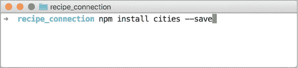

运行此命令后，您的 package.json 将获得一个新的 `dependencies` 部分，其中包含对您安装的 `cities` 包及其版本的引用，如下所示。

##### 列表 3.3\. 在终端中安装包后您的 package.json 文件的结果

```
{
  "name": "recipe_connection",
  "version": "1.0.0",
  "description": "An app to share cooking recipes",
  "main": "main.js",
  "scripts": {
    "test": "echo \"Error: no test specified\" && exit 1"
  },
  "author": "Jon Wexler",
  "license": "ISC",
  "dependencies": {           *1*
    "cities": "².0.0"
  }
}
```

+   ***1*** **显示 package.json 的依赖项部分。**

此外，通过这次安装，您的项目文件夹将获得一个名为 node_modules 的新文件夹。在这个文件夹中，您将找到您安装的 `cities` 包的代码内容 (图 3.2)。

##### 图 3.2\. 包含 node_modules 的 Node.js 应用程序结构

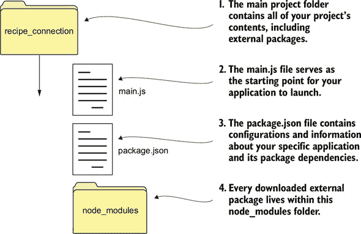

| |
| --- |

##### 注意

您还会在项目目录的根级别看到一个名为 package-lock.json 的文件被创建。此文件由 npm 自动创建并使用，以跟踪您的包安装情况，并更好地管理项目依赖项的状态和历史。您不应修改此文件的内容。

| |
| --- |

`--save` 标志将 `cities` 包保存为该项目的依赖项。现在检查你的 package.json 文件，看看该包如何在 `dependencies` 下列出。由于你的 node_modules 文件夹会增长，我建议你在在线分享项目代码时不要包含它。然而，任何下载项目的人都可以输入 `npm install` 以自动安装此文件中列出的所有项目依赖项。

通过将 列表 3.4 中的行添加到 main.js 中来测试这个新包。首先，引入本地安装的 `cities` 包，并在该文件中使其可用。然后使用 `cities` 包中的 `zip_lookup` 方法通过该 ZIP 代码查找城市。结果存储在一个名为 `myCity` 的变量中。


##### 注意

我将继续在适当的地方使用 `var` 关键字进行变量定义。因为 `myCity` 是一个可能改变值的变量，所以我在这里使用 `var`。`cities` 变量代表一个模块，所以我使用 `const`。当我的代码的范围内可以特别受益于其使用时，我使用 `let` 变量。


##### 列表 3.4\. 在 main.js 中实现 `cities` 包

```
const cities = require("cities");             *1*
var myCity = cities.zip_lookup("10016");      *2*
console.log(myCity);                          *3*
```

+   ***1*** **引入 `cities` 包。**

+   ***2*** **使用 zip_lookup 方法分配结果城市。**

+   ***3*** **将结果记录到你的控制台。**

那个 ZIP 代码的结果数据将按以下列表所示打印到控制台。`zip_lookup` 方法返回一个包含坐标的 JavaScript 对象。

##### 列表 3.5\. 在终端运行 main.js 的示例结果

```
{
  zipcode: "10016",
  state_abbr: "NY",
  latitude: "40.746180",
  longitude: "-73.97759",
  city: "New York",
  state: "New York"
}                        *1*
```

+   ***1*** **显示 zip_lookup 方法的输出结果。**


**快速检查 3.3**

> **Q1:**
> 
> 什么终端命令初始化一个带有 package.json 文件的 Node.js 应用程序？

|  |

**QC 3.3 答案**

> **1:**
> 
> `npm init` 初始化一个 Node.js 应用程序，并提示你创建一个 package.json 文件。


### 摘要

在本课中，你学习了 npm 以及如何使用其工具集创建新的 Node.js 应用程序和安装外部包。你构建了自己的 Node.js 模块，并在主应用程序文件中引入了它。最后，你安装了一个外部包，并在你的示例应用程序中使其工作。下一步是将这些工具集成到 Web 应用程序中。我在 第 4 课 中讨论了构建 Web 服务器的第一步。


**尝试这个**

创建几个新的模块，并练习向 `exports` 对象添加简单的 JavaScript 对象和函数。

你可以添加一个函数，如下面的列表所示。

##### 列表 3.6\. 导出函数

```
exports.addNum = (x, y) => {      *1*
  return x + y;
};
```

+   ***1*** **导出一个函数。**

看看当你从项目文件夹中的另一个目录中引入模块时会发生什么。


## 第 4 课\. 在 Node.js 中构建简单的 Web 服务器

本课涵盖了`http`模块的一些基本功能，这是一个用于处理互联网请求的 Node.js 代码库。技术社区对 Node.js 及其将 JavaScript 用作服务器端语言的使用赞不绝口。在本课中，您将构建您的第一个 Web 服务器。在几个简短的步骤中，您将几行 JavaScript 代码转换为一个可以在您的 Web 浏览器中与之通信的应用程序。

本课涵盖

+   使用 Node.js 和 npm 生成基本的 Web 服务器

+   编写处理浏览器请求并发送响应的代码

+   在浏览器中运行 Web 服务器

| |
| --- |

**考虑这一点**

您正在构建您的第一个 Web 应用的道路上。在您交付完整的应用之前，烹饪社区希望看到的是一个简单的网站，它具有未来改进和添加功能的灵活性。您认为构建原型需要多长时间？

使用 Node.js，您可以在几小时内使用`http`模块获得一个功能齐全的 Web 服务器。

| |
| --- |

### 4.1. 理解 Web 服务器

Web 服务器是大多数 Node.js Web 应用的基础。它们允许您向您的应用用户加载图片和 HTML 网页。在您开始之前，我将讨论一些重要的 Web 服务器概念。毕竟，如果您对结果有清晰的预期，最终产品看起来和感觉会好得多。

| |
| --- |

**Web 服务器和 HTTP**

*Web 服务器*是一种软件，旨在通过加载或处理数据来响应互联网上的请求。想象一下 Web 服务器就像银行柜员，其工作是对您存钱、取钱或查看账户中金钱的请求进行处理。就像银行柜员遵循协议以确保正确处理您的请求一样，Web 服务器遵循*超文本传输协议*（HTTP），这是一个全球范围内观察到的标准化系统，用于查看网页和通过互联网发送数据。

客户端（您的计算机）和服务器通过 HTTP 动词进行通信的一种方式。这些动词指示正在进行的请求类型，例如用户是否试图加载新的网页或更新其个人资料页面中的信息。用户与应用程序的交互上下文是请求-响应周期的一个重要部分。

这里是您将遇到的最常用的两种 HTTP 方法：

+   `GET`—此方法从服务器请求信息。通常，服务器会以您可以在浏览器中查看的内容（例如，通过点击链接查看网站的首页）响应。

+   `POST`—此方法将信息发送到服务器。服务器在处理您的数据（例如填写并提交注册表单）后，可能会以 HTML 页面响应或重定向您到应用中的另一个页面。

我在第 18 课中讨论了更多方法。

大多数网络应用程序都进行了修改以采用 *HTTP 安全* (HTTPS)，其中数据传输是加密的。当您的应用程序在互联网上运行时，您将希望创建一个由受信任的数字证书颁发机构签发的公钥证书。此密钥位于您的服务器上，允许与客户端进行加密通信。例如，[`letsencrypt.org`](https://letsencrypt.org) 这样的组织提供免费证书，这些证书每 90 天需要更新一次。有关 HTTPS 的更多信息，请阅读 [`developers.google.com/web/fundamentals/security/encrypt-in-transit/why-https`](https://developers.google.com/web/fundamentals/security/encrypt-in-transit/why-https) 上的文章。

| |
| --- |

当您访问例如 [`www.google.com`](https://www.google.com) 时，实际上您是在向 Google 的服务器发送请求，服务器随后将响应发送回您，渲染著名的 Google 搜索登录页面。这种请求-响应关系允许用户与应用程序之间建立通信渠道。在 图 4.1 中，数据包以请求的形式发送到应用程序的服务器，当服务器处理请求时，它会以响应的形式发送回数据包。这个过程就是您在互联网上大部分交互得以实现的方式。

##### 图 4.1\. 服务器根据请求发送网页、图片和其他资源到您的浏览器。

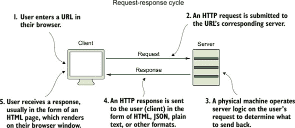

当您在浏览器中输入想要查看的 URL 时，会向另一处的物理计算机发送一个 HTTP 请求。此请求包含一些信息，指示您是否想要加载网页或向该计算机发送信息。

您可能可以构建一个功能丰富的应用程序，拥有许多花哨的功能，但核心是一个网络服务器来处理其在互联网上的通信。（随着我在本书中讨论这些概念，这些概念将更加有意义。）在下一节中，您将开始构建您的网络服务器。

| |
| --- |

**快速检查 4.1**

> **Q1:**
> 
> 服务器从客户端接收什么，又发送回什么？

| |
| --- |
| |

**QC 4.1 答案**

> **1:**
> 
> 服务器从客户端接收请求并发送响应。

| |
| --- |

### 4.2\. 使用 npm 初始化应用程序

在开始使用 Node.js 网络应用程序之前，您需要在终端中的项目文件夹中初始化项目。打开一个终端窗口，使用 `mkdir` 创建一个名为 simple_server 的新目录。您可以使用 `npm init` 初始化项目。

| |
| --- |

##### 注意

npm 是 Node.js 的包管理器。您的 Node.js 项目依赖于这个工具来安装和构建应用程序。您可以在 [`docs.npmjs.com`](https://docs.npmjs.com) 上了解更多关于 npm 及其使用方法的信息。

| |
| --- |

运行 `npm init` 命令将启动一个提示，创建一个 package.json 文件。正如提示所解释的，你将在这个文件中配置你的 Node.js 应用程序的最基本设置。现在，你可以将 main.js 添加为入口点，包括一个简短的描述和你的名字作为作者，并选择按 Enter 键使用默认值，直到达到提示的末尾。

然后你将需要通过预览你的 package.json 文件来确认你的设置。按 Enter 键确认并返回常规终端提示符。

### 4.3. 编写应用程序代码

当你安装 Node.js 时，核心库也一起安装了。在这个库中有一个名为 `http` 的模块。你将使用这个模块来构建你的 Web 服务器。在本节中，你还使用了一个名为 `http-status-codes` 的包来提供在应用程序响应中需要使用 HTTP 状态码的常量。

| |
| --- |

##### 注意

Node.js 中的模块是代码库，打包以向你的应用程序提供特定的功能。在这里，`http` 模块帮助你通过 HTTP 进行网络通信。

| |
| --- |

在你的文本编辑器中，创建一个名为 main.js 的新文件，并将其保存在包含你之前创建的 package.json 文件的 simple_server 项目文件夹中。这个文件将作为核心应用程序文件，你的应用程序将在这个文件中为用户服务网页。在终端中，运行 `npm i http-status-codes -S` 以将 `http-status-codes` 包保存为应用程序依赖项。

在我分析你即将构建的每个方面之前，先看看 列表 4.1 中的所有代码。代码的第一行将你将用于此应用程序的端口号设置为 3000。

| |
| --- |

##### 注意

端口 3000 通常用于开发中的 Web 服务器。这个数字没有意义，你可以通过一些例外来自定义它。端口 80 和 443 通常分别保留用于 HTTP 和 HTTPS。

| |
| --- |

然后你使用 `require` 来导入一个名为 `http` 的特定 Node.js 模块并将其保存为一个常量。因为这个变量你不会重新赋值，所以将这个模块保存为常量。你还导入 `http-status-codes` 包来提供代表 HTTP 状态码的常量。

接下来，你使用 `http` 变量作为 HTTP 模块的引用来创建一个服务器，使用该模块的 `createServer` 函数，并将生成的服务器存储在一个名为 `app` 的变量中。

| |
| --- |

##### 注意

使用 ES6 语法，你将带有参数的回调函数用括号括起来，然后用 ⇒ 替代 `function` 关键字。

| |
| --- |

`createServer` 函数生成一个 `http.Server` 的新实例，这是一个内置的 Node.js 类，具有评估 HTTP 通信的工具。使用这个新创建的服务器实例，你的应用程序准备接收 HTTP 请求并发送 HTTP 响应。

| |
| --- |

##### 警告

这些方法名是区分大小写的。例如，使用 `createserver` 将会引发错误。


`createServer`中的参数是一个回调函数，每当服务器内部发生某些事件时都会被调用。例如，当服务器正在运行并且你的应用程序的根 URL（主页）被访问时，一个 HTTP 请求事件会触发这个回调，并允许你运行一些自定义代码。在这种情况下，服务器返回一个简单的 HTML 响应。

你记录了客户端接收到的请求，并在回调函数中使用`response`参数将内容发送回用户，即你首先接收请求的用户。第一行使用`writeHead`方法来定义响应 HTTP 头的一些基本属性。*HTTP 头*包含描述请求或响应中传输的内容的信息字段。头字段可能包含日期、令牌、关于请求和响应来源的信息，以及描述连接类型的描述性数据。

在这个情况下，你返回了`httpStatus.OK`，这代表了一个`200`响应代码，并且指定了 HTML`content-type`来表明服务器已成功接收请求，并将以 HTML 形式返回内容。在此代码块之后，你分配了一个局部变量`responseMessage`，其中包含你的 HTML 响应消息。


##### 注意

`200`是表示 OK 的 HTTP 状态代码，用于指示在 HTTP 响应头中返回内容时没有发生问题。要获取其他 HTTP 状态代码的列表，请在 Node.js REPL 外壳中输入`http.STATUS_CODES`。使用`httpStatus.OK`代替显式的数字。


在那行代码下面，你使用`write`写入一行 HTML 到响应中，并使用`end`关闭响应。你必须使用`end`来告诉服务器你不再写入内容。如果不这样做，将会使客户端与服务器之间的连接保持开放，阻止客户端接收响应。你也在此时记录了响应，以便你可以看到服务器本身发送了响应。

代码的最后一行将服务器实例`app`传递给`listen`方法，以表明服务器已准备好在端口`3000`上接收传入的请求。

##### 列表 4.1\. main.js 中的简单 Web 应用程序代码

```
const port = 3000,
  http = require("http"),                                           *1*
  httpStatus = require("http-status-codes"),
  app = http.createServer((request, response) => {                  *2*
    console.log("Received an incoming request!");
    response.writeHead(httpStatus.OK, {
      "Content-Type": "text/html"
    });                                                             *3*

    let responseMessage = "<h1>Hello, Universe!</h1>";
    response.write(responseMessage);
    response.end();
    console.log(`Sent a response : ${responseMessage}`);
  });

app.listen(port);                                                   *4*
console.log(`The server has started and is listening on port number:
${port}`);
```

+   ***1*** **需要引入 http 和 http-status-codes 模块。**

+   ***2*** **使用请求和响应参数创建服务器。**

+   ***3*** **向客户端写入响应。**

+   ***4*** **告诉应用程序服务器监听端口 3000。**


##### 注意

`response`对象由 Node.js 使用，并在整个应用程序中携带，作为从函数到函数传递关于当前客户端事务信息的方式。`response`对象上的一些方法允许你向对象中添加或从对象中删除数据；`writeHead`和`write`是这类函数中的两个。


你的应用程序就在那里，所有这些都在它的荣耀之中！并不那么可怕。仅用几行代码，你也将以这种方式构建一个 Web 服务器。


##### 注意

如果你没有指定端口号，操作系统将为你选择一个端口号。这个端口号是你很快将通过浏览器确认你的网络服务器正在运行的那个端口号。

|  |

**Node.js 中的回调**

Node.js 之所以如此快速和高效的部分原因在于它使用了回调函数。回调函数在 JavaScript 中并不新鲜，但在 Node.js 中却被广泛使用，这里值得提一下。

一个*回调*是一个匿名函数（一个没有名字的函数），它被设置为在另一个函数完成时立即调用。使用回调的好处是，你不必等待原始函数完成处理后再运行其他代码。

考虑通过上传图片到你的银行移动应用来在银行账户中虚拟存入一张支票。回调相当于几天后收到通知，说支票已被验证并存入。在此期间，你能够继续你的正常日常活动。

在`http`网络服务器示例中，客户端的请求是滚动接收的，然后将其作为 JavaScript 对象传递给回调函数，如下面的图所示：

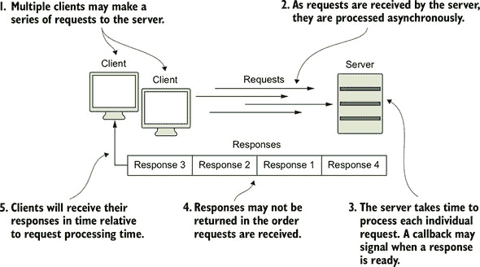

服务器上的回调表示何时响应客户端。


在这里放置好代码后，你就可以从终端开始运行你的 Node.js 应用程序了。


**快速检查 4.2**

> **Q1:**
> 
> 为什么你应该使用`const`而不是`var`来存储你的应用程序中的 HTTP 服务器？

|  |

**QC 4.2 答案**

> **1:**
> 
> 因为你的服务器将继续监听来自客户端的通信，所以不要重新分配表示服务器的变量非常重要。在 ES6 中，已经成为了惯例，将这些对象标记为常量，而不是可重新分配的变量。


### 4.4\. 运行应用程序

最后一步很简单。使用终端导航到你的项目目录，并在终端窗口中运行`node main`。接下来，在任何浏览器中打开地址`localhost: 3000`。你应该会看到一个表示服务器已启动的消息。你的终端窗口应该类似于图 4.2。

##### 图 4.2\. 运行基本的 Node.js 服务器

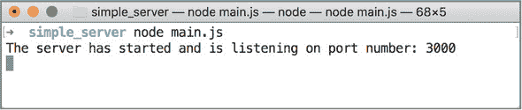

浏览器窗口应该用问候语问候你和你所在的宇宙，如图图 4.3 所示。恭喜！你的第一个 Node.js 网络应用程序已经完成。它很大，而且即将变得更大更好。

##### 图 4.3.你的第一个网页显示

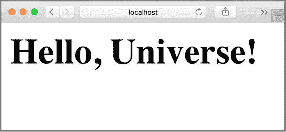

要停止应用程序，请在终端窗口中按 Ctrl-C。你也可以关闭终端窗口，但可能会存在无法正确关闭应用程序的风险，在这种情况下，应用程序可能会在后台继续运行（需要更多的命令行技巧来终止进程）。


**快速检查 4.3**

> **Q1:**
> 
> 当您的服务器正在运行时，您导航到 http://localhost:3000/，您正在发起什么类型的 HTTP 请求？

| |
| --- |
| |

**QC 4.3 答案**

> **1:**
> 
> 在应用程序开发的这个阶段，您可以预见的几乎所有请求，包括对 http://localhost:300/的请求，都是 HTTP GET 请求。

| |
| --- |

### 摘要

在本课中，您学习了 Node.js 通过 `http` 模块具有创建网络服务器的内置功能。您通过 package.json 文件配置了一个新的 Node.js 应用程序。使用 `http` 模块和 `createServer` 方法，您以最小的努力创建了一个网络服务器，这是构建 Node.js 强大应用程序的垫脚石。通过终端，您能够运行一个网络服务器应用程序。

完成 “尝试这个” 练习以检查您的理解。

| |
| --- |

**尝试这个**

`npm init` 以交互方式生成一个 package.json 文件，尽管您也可以自己创建此文件。

为本课的项目从头开始创建一个新的 package.json 文件。不要使用 `npm init`；看看您是否可以构建一个类似的 JSON 结构文件。

| |
| --- |

## 第 5 课\. 处理传入的数据

在第 4 课中，我向您介绍了网络服务器，并展示了如何使用 Node.js 创建一个服务器。每次用户访问指向您应用程序的 URL 时，都会发起一个请求，并且每个请求都必须由您编写的代码进行处理。在本课中，您将学习如何收集和处理这些请求中的某些信息。您还将构建应用程序路由——将请求与适当的响应匹配的代码逻辑。

本课涵盖

+   收集和处理请求数据

+   使用 `curl` 命令提交 `POST` 请求

+   使用基本路由构建网络应用程序

| |
| --- |

**考虑这个**

当您为您的食谱应用程序规划网页时，您意识到您构建的基本网络服务器只知道如何用单行 HTML 响应。如果您想展示一个完整的首页和不同内容的联系页面呢？

每个网络应用程序都会使用路由与它的网络服务器一起，以确保用户能看到他们具体请求的内容。使用 Node.js，您可以以尽可能少的步骤定义这些路由。

| |
| --- |

### 5.1\. 重新编写您的服务器代码

要开始本课，重新排列第 4 课中的代码，以更好地了解服务器的行为。在它自己的项目目录中创建一个名为 `second_server` 的新项目，并在其中添加一个新的 main.js 文件。

| |
| --- |

##### 注意

在本课及随后的课程中，我期望您使用 `npm init` 初始化您的 Node.js 应用程序，并遵循第 4 课中的指导创建一个 package.json 文件。

| |
| --- |

在您的代码中，您有一个服务器对象，它有一个回调函数 `(req, res) ⇒ {}`，该函数在每次向服务器发出请求时运行。当您的服务器正在运行时，如果您在浏览器中访问 `localhost:3000` 并刷新页面，该回调函数将运行两次——每次刷新时运行一次。

| |
| --- |

##### 注意

`req` 和 `res` 代表 HTTP 请求和响应。您可以使用任何变量名，但请注意顺序；在这个方法中，请求总是在响应之前。

| |
| --- |

换句话说，当服务器接收到请求时，它会将请求和响应对象传递给一个函数，您可以在该函数中运行您的代码。另一种为该服务器编写代码的方法请参阅代码列表 5.1。当触发 `request` 事件时，服务器在回调函数中执行代码。当用户访问您的应用程序的网页时，花括号内的代码运行。然后服务器通过分配响应代码 `200` 并定义响应中的内容类型为 HTML 来准备响应。最后，服务器发送括号内的 HTML 内容，并同时关闭与客户端的连接。

##### **代码列表 5.1\. 在 main.js 中的简单服务器和请求事件监听器**

```
const port = 3000,
  http = require("http"),
  httpStatus = require("http-status-codes"),
  app = http.createServer();

app.on("request", (req, res) => {                                  *1*
  res.writeHead(httpStatus.OK, {
    "Content-Type": "text/html"
  });                                                              *2*

  let responseMessage = "<h1>This will show on the screen.</h1>";
  res.end(responseMessage);                                        *3*

});

app.listen(port);
console.log(`The server has started and is listening on port number:
 ${port}`);
```

+   ***1*** **监听请求。**

+   ***2*** **准备响应。**

+   ***3*** **以 HTML 响应。**

在终端中运行 `node main`，然后在您的网页浏览器中访问 http://localhost:3000/ 以查看包含一行 HTML 的响应。

| |
| --- |

##### 注意

您可能需要重新安装 http-status-codes 包以用于此新项目，方法是通过运行 npm i http-status-codes -save-dev。

| |
| --- |

在屏幕上显示一些内容是很好的，但您希望根据您收到的请求类型修改内容。例如，如果用户正在访问联系页面或提交他们填写过的表单，他们将在屏幕上看到不同的内容。第一步是确定请求头中的 HTTP 方法以及 URL。在下一节中，您将查看这些请求属性。

| |
| --- |

**快速检查 5.1**

> **Q1:**
> 
> 服务器每次接收到请求时调用的函数叫什么名字？

| |
| --- |
| |

**QC 5.1 答案**

> **1:**
> 
> 每次接收到请求后调用的函数是回调函数。因为该函数没有标识名称，所以它也被视为匿名函数。

| |
| --- |

### 5.2. 分析请求数据

*路由* 是您的应用程序确定如何响应用户请求的一种方式。一些路由是通过匹配请求对象中的 URL 来设计的。您将在本课中通过这种方法构建您的路由。

每个请求对象都有一个 `url` 属性。您可以使用 `req.url` 查看客户端请求的 URL。通过将它们记录到控制台来测试此属性和其他两个属性。将下一列表中的代码添加到 `app.on(`“`request`”`)` 代码块中。

##### **代码列表 5.2\. 在 main.js 中记录请求数据**

```
console.log(req.method);        *1*
console.log(req.url);           *2*
console.log(req.headers);       *3*
```

+   ***1*** **记录使用的 HTTP 方法。**

+   ***2*** **记录请求 URL。**

+   ***3*** **记录请求头。**

因为请求中的某些对象内部可能包含其他嵌套对象，你可以通过在自己的自定义包装函数 `getJSONString` 中使用 `JSON.stringify` 来将这些对象转换为更易读的字符串，如 列表 5.3 所示。这个函数接受一个 JavaScript 对象作为参数，并返回一个字符串。现在你可以更改你的日志语句以使用这个函数。例如，你可以通过使用 `console.log (`Method: ${getJSONString(req.method)}`)` 来打印请求方法。

##### 列表 5.3\. 在 main.js 中记录请求数据

```
const getJSONString = obj => {
  return JSON.stringify(obj, null, 2);      *1*
};
```

+   ***1*** **将 JavaScript 对象转换为字符串。**

当你重新启动你的服务器时，再次运行 main.js，并在你的网页浏览器中访问 http://localhost:3000，你会在终端窗口中注意到指示已向 `/` URL（主页）发出 `GET` 请求的信息，随后是那个请求的头数据。尝试输入不同的 URL，例如 http://localhost:3000/testing 或 http://localhost: 3000/contact。注意，你仍然在浏览器中看到相同的 HTML 文本，但你的控制台继续记录你在浏览器中输入的 URL。

你主要处理的是 `GET` 请求类型。如果你正在构建一个用户需要填写表单的应用程序，那么你的服务器应该能够处理该表单数据并响应用户，让他们知道数据已被接收。

请求对象，就像 Node.js 中的大多数对象一样，也可以监听事件，类似于服务器。如果有人向服务器发送 `POST` 请求（试图向服务器发送数据），那么那个 `POST` 的内容就存在于请求的体中。因为服务器永远不知道正在发送多少数据，所以发布的数据通过数据块进入 `http` 服务器。

| |
| --- |

##### 注意

数据块允许信息流入和流出服务器。Node.js 允许你通过 `ReadableStream` 库在信息到达时处理信息的一部分，而不是等待大量信息到达服务器。

| |
| --- |

要收集服务器上所有已发布的数据，你需要监听每条接收到的数据并自行整理这些数据。幸运的是，请求监听一个特定的 `data` 事件。当为特定请求接收到数据时，`req.on(`“`data`”`)` 被触发。你需要在事件处理程序外部定义一个新的数组，`body`，并将数据块按顺序添加到其中，当它们到达服务器时。注意查看 图 5.1 中发布的交换数据。当所有数据块都接收完毕后，它们可以作为一个单一的数据项收集。

##### 图 5.1\. 一个网络服务器收集发布的数据并对其进行整理。

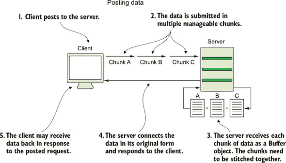

在 `app.on(`“`request`”`)` 代码块中，添加新的请求事件处理器到 列表 5.4 以读取传入的数据。在此代码示例中，每次向服务器发出请求时，您都会执行回调函数中的代码。创建了一个数组并命名为 `body`，每次接收到请求的数据时，您都会在另一个回调函数中处理它。接收到的数据被添加到 `body` 数组中。当数据传输完成时，您在第三个回调函数中执行代码。`body` 数组被转换为文本字符串，请求的内容被记录到您的控制台。

##### 列表 5.4\. 在 main.js 中处理已发布的请求数据

```
app.on("request", (req, res) => {                          *1*
  var body = [];                                           *2*
  req.on("data", (bodyData) => {                           *3*
    body.push(bodyData);                                   *4*
  });
  req.on("end", () => {                                    *5*
    body = Buffer.concat(body).toString();                 *6*
    console.log(`Request Body Contents: ${body}`);
  });                                                      *7*

  console.log(`Method: ${getJSONString(req.method)}`);
  console.log(`URL: ${getJSONString(req.url)}`);
  console.log(`Headers: ${getJSONString(req.headers)}`);

  res.writeHead(httpStatus.OK, {
    "Content-Type": "text/html"
  });

  let responseMessage = "<h1>This will show on the screen.</h1>";
  res.end(responseMessage);
});
app.listen(port);
console.log(`The server has started and is listening on port number:
 ${port}`);
```

+   ***1*** **监听请求。**

+   ***2*** **创建一个数组来存储数据块内容。**

+   ***3*** **在另一个回调函数中处理它。**

+   ***4*** **将接收到的数据添加到体数组中。**

+   ***5*** **数据传输结束时运行代码。**

+   ***6*** **将数组体转换为文本字符串。**

+   ***7*** **将请求的内容记录到您的控制台。**

添加此代码后，您的应用程序已准备好接收收集到数组中的已发布数据并将其转换回 `String` 格式。当触发事件，表明某些数据块到达服务器时，您通过将数据块（表示为 Buffer 对象）添加到数组中来处理该数据。当指示请求连接结束的事件结束时，您随后通过获取数组的全部内容并将它们转换为可读的文本来跟进。为了测试此过程，请尝试从终端向您的服务器发送 `POST` 请求。

因为您还没有构建表单，所以可以使用 `curl` 命令。按照以下步骤操作：

1.  在一个终端窗口中运行您的网络服务器时，打开一个新的终端窗口。

1.  在新窗口中，运行以下命令：`curl --data "username= Jon&password=secret" http://localhost:3000`


##### 提示

`curl` 是模拟浏览器向服务器发送请求的一种简单方式。使用 `curl` 关键字，您可以使用不同的标志，例如 `–data,` 通过 `POST` 请求将信息发送到服务器。

|  |

##### 注意

如果您是 Windows 用户，在您的计算机上安装 `curl` 之前，请安装名为 Chocolatey 的软件和包管理器（[`chocolatey.org/install`](https://chocolatey.org/install)）。然后您可以在命令行中运行 `choco install curl`。


在第一个终端窗口中，您应该看到请求体的内容已记录到屏幕上，这表明您的服务器已接收并处理了请求（图 5.2）。

##### 图 5.2\. 运行 `curl` 命令的结果

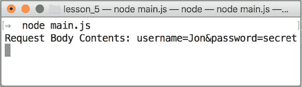


##### 提示

为了使向您的应用程序提交数据更加用户友好，请安装 Insomnia ([`insomnia.rest/download/`](https://insomnia.rest/download/))。


在 第 8 课 中，您将了解处理请求内容的一些更简单的方法。现在，尝试根据请求的 URL 和方法控制您向客户端写回的响应类型。


**快速检查 5.2**

> **Q1:**
> 
> 正确或错误：每个提交的表单都将其全部内容以单个数据块的形式发送。

|  |

**QC 5.2 答案**

> **1:**
> 
> 错误。数据以块的形式流式传输到服务器，这使得服务器可以根据接收到的部分数据或收集到的数据的大小进行响应。


### 5.3\. 向 web 应用程序添加路由

*路由* 是确定应用程序如何响应对特定 URL 的请求的一种方式。应用程序应该将请求路由到主页的方式与提交登录信息的请求不同。

您已经确定用户可以向您的 web 服务器发出请求；从那里，您可以评估请求的类型，并给出适当的响应。考虑您简单的 HTTP web 服务器代码，到目前为止，它对任何请求只有一个响应。此示例接受对服务器（localhost）端口 `3000` 的任何请求，并在屏幕上显示一行 HTML。

##### 列表 5.5\. main.js 中的简单服务器示例

```
const port = 3000,
  http = require("http"),
  httpStatus = require("http-status-codes"),
  app = http
    .createServer((req, res) => {
      res.writeHead(httpStatus.OK, {
        "Content-Type": "text/html"
      });
      let responseMessage = "<h1>Welcome!</h1>";
      res.end(responseMessage);                    *1*
    })
    .listen(port);
```

+   ***1*** **对每个请求响应 HTML。**

作为第一个 web 应用程序，这个应用程序是一个巨大的成就，但您需要开始构建一个具有更多功能的应用程序。例如，如果这个项目是一个真正在互联网上运行的合法应用程序，您可能希望根据用户正在寻找的内容显示内容。如果用户想查看信息页面，您可能希望他们在 `/info` URL（http://localhost:3000/info）中找到该信息。目前，如果用户访问这些 URL，他们将看到相同的 HTML 欢迎行。

下一步是检查客户端的请求，并根据该请求的内容确定响应体。这种结构通常被称为 *应用路由*。路由标识特定的 URL 路径，可以在应用程序逻辑中进行定位，并允许您指定要发送给客户端的信息。创建这些路由对于实现完全集成的应用程序体验是必要的。

将 simple_server 项目文件夹复制一份，并使用新名称：simple_routes。然后在 main.js 文件中添加一些路由，如 列表 5.6 所示。

您设置了一个名为 `routeResponseMap` 的路由到响应的映射。当请求 http://localhost:3000/info 时，您检查请求的 URL 是否在 `routeResponseMap` 中有匹配项，并响应一个信息页面标题。当请求 http://localhost:3000/contact 时，您响应一个联系页面标题。对于所有其他请求，您响应一个通用的问候语。

##### 列表 5.6\. main.js 中的 web 服务器简单路由

```
const routeResponseMap = {                              *1*
  "/info": "<h1>Info Page</h1>",
  "/contact": "<h1>Contact Us</h1>",
  "/about": "<h1>Learn More About Us.</h1>",
  "/hello": "<h1>Say hello by emailing us here</h1>",
  "/error": "<h1>Sorry the page you are looking for is not here.</h1>"
};

const port = 3000,
  http = require("http"),
  httpStatus = require("http-status-codes"),
  app = http.createServer((req, res) => {
    res.writeHead(200, {
      "Content-Type": "text/html"
    });
    if (routeResponseMap[req.url]) {                    *2*
      res.end(routeResponseMap[req.url]);
    } else {
      res.end("<h1>Welcome!</h1>");                     *3*
    }
  });

app.listen(port);
console.log(`The server has started and is listening on port number:
 ${port}`);
```

+   ***1*** **定义带有响应的路由映射。**

+   ***2*** **检查请求路由是否在映射中定义。**

+   ***3*** **响应默认 HTML。**

在你的代码添加后，你可以区分几个 URL，并相应地提供不同的内容。你仍然不关心请求中使用的 HTTP 方法，但你可以检查用户是否正在搜索`/info`路由或`/contact`路由。用户可以更直观地确定他们需要输入哪些 URL 才能到达该页面的预期内容。

尝试运行这段代码。将代码保存在名为 main.js 的项目文件中，并在终端中运行该文件。然后尝试在 Web 浏览器中访问 http://localhost:3000/info 或 http://localhost:3000/contact。任何其他 URL 都应导致原始默认欢迎 HTML 行。

为了模拟服务器执行的重处理或外部调用，你可以在以下列表中添加代码到一个路由，以手动延迟对客户端的响应。

##### 列表 5.7\. main.js 中的带定时器的路由

```
setTimeout(() => res.end(routeResponseMap[req.url]), 2000);    *1*
```

+   ***1*** **使用 setTimeout 手动延迟响应。**

如果你再次运行此文件，你会注意到页面的加载时间大约长了两秒。你对执行什么代码以及向用户提供什么内容有完全的控制权。记住这个事实：随着你的应用程序增长，你的网页响应时间自然会变长。

查看图 5.3 中`/contact` URL 的浏览器截图。

##### 图 5.3\. `/contact` URL 的浏览器视图

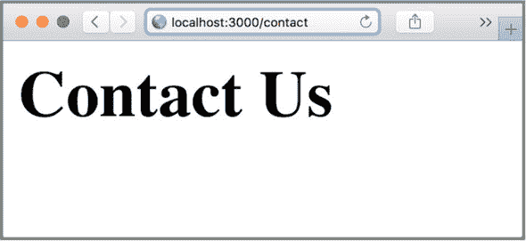

| |
| --- |

**快速检查 5.3**

> **Q1:**
> 
> 使用什么 URL 将请求路由到主页？

| |
| --- |
| |

**QC 5.3 答案**

> **1:**
> 
> `/`路由代表应用程序的主页。

| |
| --- |

### 摘要

在本课中，你学习了如何处理请求内容，以可查看的 HTML 进行响应，并构建服务器路由。通过识别请求的内容，你可以处理请求中的提交数据，并根据目标 URL 分离响应内容。路由的创建塑造了你的应用程序逻辑。随着 Web 应用程序的扩展，其路由也会随之扩展，它能够提供的内容类型也会增加。

在下一课中，我将讨论服务单个 HTML 文件、图像和网页样式。

| |
| --- |

**尝试这个**

你的简单 Web 应用程序正在处理你为`/info`和`/contact`创建的两个路径请求。一个正常的应用程序可能需要访问更多的页面。为以下路径添加三个更多路由到应用程序中：

+   `/about`—当用户访问 http:/localhost:3000/about 时，响应一行 HTML，声明`了解更多关于我们的信息`。

+   `/hello`—当用户访问 http:/localhost:3000/hello 时，响应一行 HTML，声明`通过在此处给我们发邮件来打招呼`。在“这里”这个词周围包含一个链接到你的电子邮件的锚标签。

+   `/error`—当用户访问 http://localhost:3000/error 时，以状态码 `404`（表示未找到页面）和一行纯文本“抱歉，您要查找的页面不在这里”响应。

| |
| --- |

##### 注意

##### 注意

打开多个网络浏览器（如 Apple 的 Safari、Google Chrome 和 Mozilla Firefox），并在这些浏览器中访问不同的 URL。注意请求头的变化。你应该看到相同的宿主但不同的用户代理。

| |
| --- |
| |

## 第 6 课\. 编写更好的路由和提供外部文件

在第 5 课中，你使用一个路由系统将 URL 流量导向，该系统将请求 URL 与自定义响应匹配。在本课中，你将学习如何提供整个 HTML 文件和客户端 JavaScript、CSS 和图片等资产。告别纯文本响应。在本课结束时，你将改进你的路由代码，并将你的逻辑放在自己的模块中以实现更整洁的组织。

本课涵盖

+   使用 `fs` 模块提供整个 HTML 文件

+   提供静态资产

+   创建一个路由模块

| |
| --- |

**考虑这一点**

是时候构建一个基本的食谱网站了。该网站应该有三个静态页面，包含一些图片和样式。你很快就会意识到你迄今为止构建的所有应用程序都只响应单个 HTML 行。你如何在不使主应用程序文件杂乱的情况下为每个页面提供丰富内容？

仅使用 Node.js 安装附带的工具，你可以从你的项目目录中提供 HTML 文件。你可以创建三个单独的页面，使用纯 HTML，而不再需要将你的 HTML 放在 main.js 中。

| |
| --- |

### 6.1\. 使用 fs 模块提供静态文件

以构建三个页面的静态网站为目标，使用这些 HTML 片段可能会变得繁琐，并使你的 main.js 文件杂乱。相反，创建一个你将在未来响应中使用的 HTML 文件。此文件位于你的服务器相同的项目目录中。参见图 6.1。在这个应用结构中，你想要展示给用户的所有内容都放在 views 文件夹中，而确定显示哪些内容的所有代码都放在 main.js 文件中。

##### 图 6.1\. 带有视图的应用结构

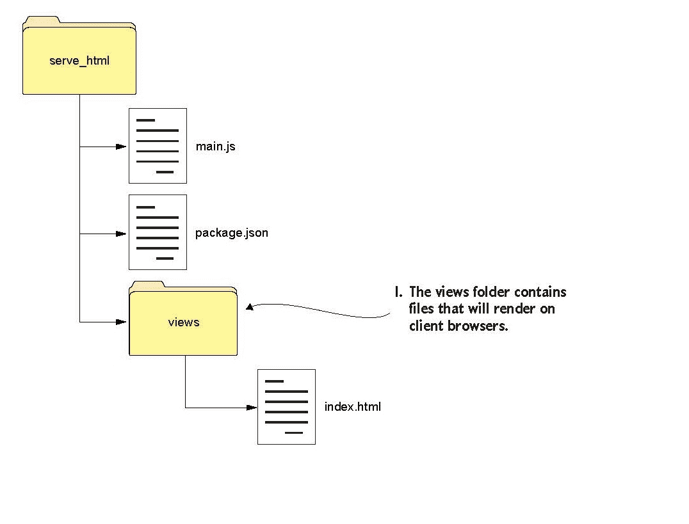

你将 HTML 文件添加到 views 文件夹的原因有两个：所有你的 HTML 页面都将组织在一个地方。这个约定将在你将在第 2 单元中学习的 Web 框架中使用。图 6.1。

按照以下步骤操作：

1.  创建一个名为 serve_html 的新项目文件夹。

1.  在该文件夹中，创建一个空的 main.js 文件。

1.  在 serve_html 中创建一个名为 views 的文件夹。

1.  在 views 中创建一个 index.html 文件。

在下一个列表中添加 HTML 样板代码到 main.html。

##### 列表 6.1\. index.html 页面的样板 HTML

```
<!DOCTYPE html>
<html>                       *1*
  <head>
    <meta charset="utf-8">
    <title>Home Page</title>
  </head>
  <body>
    <h1>Welcome!</h1>
  </body>
</html>
```

+   ***1*** **在你的 views 中添加基本的 HTML 结构。**

| |
| --- |

##### 注意

这本书不是关于教授 HTML 或 CSS 的。对于这个例子，我提供了一些基本的 HTML 来使用，但对于未来的例子，我不会提供 HTML，这样我可以更快地进入重要的内容。


客户端只能通过另一个 Node.js 核心模块`fs`的帮助在浏览器中看到这个页面的渲染，该模块代表你的应用程序与文件系统交互。通过`fs`模块，你的服务器可以访问并读取你的 index.html 文件。你将在项目的主.js 文件中的 http 服务器内部调用`fs.readFile`方法，如列表 6.2 所示。

首先，将`fs`模块引入到一个常量中，例如`http`。有了`fs`常量，你可以在相对目录中指定一个特定的文件（在这个例子中，是 views 文件夹中的 index.html 文件）。然后创建一个`routeMap`来将路由与服务器上的文件配对。

接下来，找到并读取路由映射中的文件内容。`fs.readFile`返回可能发生的任何错误和文件内容，这两个参数分别是`error`和`data`。最后，使用该数据值作为返回给客户端的响应体。

##### 列表 6.2\. 在 main.js 中的服务器响应中使用`fs`模块

```
const port = 3000,
  http = require("http"),
  httpStatus = require("http-status-codes"),
  fs = require("fs");                                     *1*
const routeMap = {                                        *2*
  "/": "views/index.html"
};

http
  .createServer((req, res) => {
    res.writeHead(httpStatus.OK, {
      "Content-Type": "text/html"
    });
    if (routeMap[req.url]) {
      fs.readFile(routeMap[req.url], (error, data) => {   *3*
        res.write(data);                                  *4*
        res.end();
      });
    } else {
      res.end("<h1>Sorry, not found.</h1>");
    }
  })
  .listen(port);
console.log(`The server has started and is listening
 on port number: ${port}`);
```

+   ***1*** **引入 fs 模块。**

+   ***2*** **为 HTML 文件设置路由映射。**

+   ***3*** **读取映射文件的內容。**

+   ***4*** **以文件内容作为响应。**


##### 注意

当你的电脑上的文件正在被读取时，文件可能会损坏、无法读取或丢失。在代码执行之前，你的代码并不一定知道这些情况，所以如果出现问题，你应该预期回调函数的第一个参数是一个错误。


通过在命令行中进入这个项目的目录并输入`node main.js`来运行这个文件。当你访问 http://localhost:3000 时，你应该能看到你的 index.html 页面被渲染。你的简单路由将任何其他请求的 URL 扩展的响应引导到`抱歉，未找到`信息。


##### 提示

如果你没有看到 index.html 文件被渲染，请确保所有文件都在正确的文件夹中。另外，别忘了检查拼写！


在以下示例中，您只为请求 URL 中指定的文件提供服务。如果有人访问 http://localhost:3000/sample.html，您的代码会获取请求的 URL，`/sample.html`，并将其附加到 `views` 以创建一个字符串：`views/sample.html`。以这种方式设计的路由可以根据用户的请求动态查找文件。尝试将您的服务器重写为类似于 列表 6.3 中的代码。创建一个新的 `getViewUrl` 函数，用于获取请求的 URL 并将其插入到视图的文件路径中。例如，如果有人访问 `/index` 路径，则 `getViewUrl` 返回 `views/index.html`。接下来，将 `fs.readFile` 中的硬编码文件名替换为 `getViewUrl` 调用的结果。如果文件在 views 文件夹中不存在，此命令将失败，返回错误消息和 `httpStatus.NOT_FOUND` 代码。如果没有错误，您将读取文件的数据传递给客户端。

##### 列表 6.3\. 在 main.js 中使用 `fs` 和路由动态读取和提供文件

```
const getViewUrl = (url) => {                  *1*
  return `views${url}.html`;
};

http.createServer((req, res) => {
  let viewUrl = getViewUrl(req.url);           *2*
  fs.readFile(viewUrl, (error, data) => {      *3*
    if (error) {                               *4*
      res.writeHead(httpStatus.NOT_FOUND);
      res.write("<h1>FILE NOT FOUND</h1>");
    } else {                                   *5*
      res.writeHead(httpStatus.OK, {
      "Content-Type": "text/html"
      });
      res.write(data);
    }
    res.end();
  });
})
.listen(port);
console.log(`The server has started and is listening on port number:
 ${port}`);
```

+   ***1*** **创建一个函数将 URL 插入到文件路径中。**

+   ***2*** **获取文件路径字符串。**

+   ***3*** **将请求 URL 插入到 fs 文件搜索中。**

+   ***4*** **使用 404 响应代码处理错误。**

+   ***5*** **响应文件内容。**


##### 注意

ES6 中的字符串插值允许您使用 `${}` 语法插入一些文本、数字或函数结果。通过这种新语法，您可以更轻松地连接字符串和其他数据类型。


现在，您应该能够访问 http://localhost:3000/index，并且您的服务器将在 `views/index` 中查找 URL。


##### 警告

您需要处理所有可能发生的错误，因为可能会请求不存在的文件。


将您的新 HTML 文件添加到您的 views 文件夹中，并尝试使用它们的文件名作为 URL 来访问它们。现在的问题是 index.html 文件不是您想要提供的唯一文件。因为响应体高度依赖于请求，您还需要更好的路由。在本课结束时，您将实现 图 6.2 中概述的设计模式。

##### 图 6.2\. 服务器路由逻辑以渲染视图

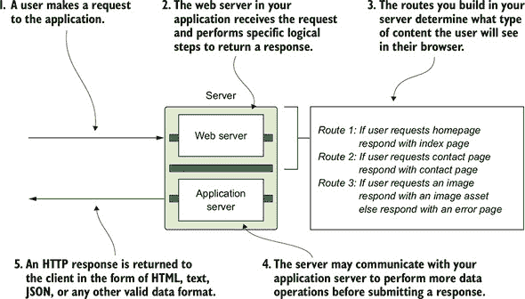


**快速检查 6.1**

> **Q1:**
> 
> 如果您尝试读取计算机上不存在的文件，会发生什么？

|  |

**QC 6.1 答案**

> **1:**
> 
> 如果您尝试读取计算机上不存在的文件，`fs` 模块会在其回调中传递一个错误。您如何处理该错误取决于您。它可以崩溃您的应用程序或简单地将其记录到您的控制台。


### 6.2\. 提供资源

您的应用程序 *资源* 包括与客户端视图一起工作的图像、样式表和 JavaScript。像您的 HTML 文件一样，这些文件类型，如 .jpg 和 .css，需要它们自己的路由才能由您的应用程序提供。

要开始这个过程，在你的项目根目录中创建一个公共文件夹，并将所有资产移动到那里。在公共文件夹中，为图片、css 和 js 创建各自的文件夹，并将每个资产移动到相应的文件夹中。到这一点，你的文件结构应该看起来像图 6.3。

##### 图 6.3\. 安排你的资产以便更容易分离和提供

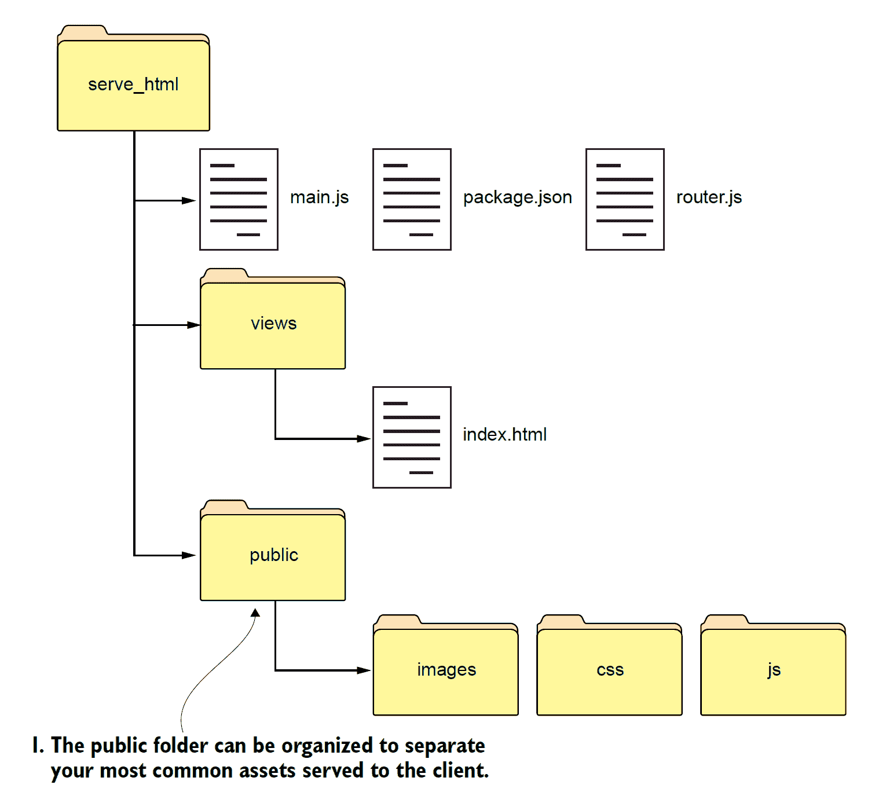

现在你的应用程序结构已经组织好，请细化你的路由以更好地匹配列表 6.4 中的目标。这段代码可能看起来令人不知所措，但你所做的只是将文件读取逻辑移动到自己的函数中，并添加`if`语句来处理特定文件类型的请求。

在收到请求后，将请求的 URL 保存到变量`url`中。在每个条件下，检查`url`是否包含文件的扩展名或 MIME 类型。根据提供的文件自定义响应的内容类型。在 main.js 的底部调用你自己的`customReadFile`函数以减少重复代码。最后一个函数使用`fs.readFile`根据请求的名称查找文件，使用该文件的数据写入响应，并将任何消息记录到控制台。

注意，在第一个路由中，你正在检查 URL 是否包含.html；如果是，你将尝试读取与 URL 同名的文件。通过将读取文件的代码移动到自己的`readFile`函数中，你进一步抽象了你的路由。你需要检查特定的文件类型，设置响应头，并将文件路径和响应对象传递给此方法。仅使用少量动态路由，你现在就可以准备响应多种文件类型。

##### 列表 6.4\. 为你的项目中的每个文件设置特定路由的 Web 服务器

```
const sendErrorResponse = res => {                   *1*
  res.writeHead(httpStatus.NOT_FOUND, {
    "Content-Type": "text/html"
  });
  res.write("<h1>File Not Found!</h1>");
  res.end();
};

http
  .createServer((req, res) => {
    let url = req.url;                               *2*
    if (url.indexOf(".html") !== -1) {               *3*
      res.writeHead(httpStatus.OK, {
        "Content-Type": "text/html"
      });                                            *4*
      customReadFile(`./views${url}`, res);          *5*
    } else if (url.indexOf(".js") !== -1) {
      res.writeHead(httpStatus.OK, {
        "Content-Type": "text/javascript"
      });
      customReadFile(`./public/js${url}`, res);
    } else if (url.indexOf(".css") !== -1) {
      res.writeHead(httpStatus.OK, {
        "Content-Type": "text/css"
      });
      customReadFile(`./public/css${url}`, res);
    } else if (url.indexOf(".png") !== -1) {
      res.writeHead(httpStatus.OK, {
        "Content-Type": "image/png"
      });
      customReadFile(`./public/images${url}`, res);
    } else {
      sendErrorResponse(res);
    }
  })
  .listen(3000);

console.log(`The server is listening on port number: ${port}`);

const customReadFile = (file_path, res) => {           *6*
  if (fs.existsSync(file_path)) {                      *7*
    fs.readFile(file_path, (error, data) => {
      if (error) {
        console.log(error);
        sendErrorResponse(res);
        return;
      }
      res.write(data);
      res.end();
    });
  } else {
    sendErrorResponse(res);
  }
};
```

+   ***1*** **创建一个错误处理函数。**

+   ***2*** **将请求的 URL 存储在变量 url 中。**

+   ***3*** **检查 URL 是否包含文件扩展名。**

+   ***4*** **自定义响应的内容类型。**

+   ***5*** **调用 readFile 来读取文件内容。**

+   ***6*** **查找名为请求的文件。**

+   ***7*** **检查文件是否存在。**

现在你的应用程序可以正确处理对不存在的文件的请求。你可以访问 http://localhost:3000/test.js.html，甚至 http://localhost:3000/test 来查看错误消息！要使用这些更改渲染索引页面，请将文件类型追加到 URL：http://localhost:3000/index.html。

下一个部分将向你展示如何进一步重新定义你的路由结构，并为你的路由提供它们自己的模块。


**快速检查 6.2**

> **Q1:**
> 
> 如果找不到路由，你应该提供什么默认响应？

|  |

**QC 6.2 答案**

> **1:**
> 
> 如果你的应用程序无法找到某些请求的路由，你应该返回一个带有消息的 404 HTTP 状态码，表明客户端正在寻找的页面找不到。


### 6.3\. 将你的路由移动到另一个文件

本节的目标是使管理和编辑你的路由更加容易。如果你的所有路由都在一个`if-else`块中，当你决定更改或删除一个路由时，这个更改可能会影响块中的其他路由。此外，随着你的路由列表的增长，你会发现根据使用的 HTTP 方法来分离路由会更加容易。例如，如果`/contact`路径可以响应`POST`和`GET`请求，那么你的代码将在识别请求的方法后立即路由到相应的函数。

随着 main.js 文件的增长，过滤你编写的所有代码的能力变得更加复杂。你很容易发现自己有成百上千行代码仅代表路由！

为了减轻这个问题，将你的路由移动到一个名为 router.js 的新文件中。同时重新构建存储和处理路由的方式。将列表 6.5 中的代码添加到 router.js 中。在 manning.com/books/get-programming-with-node-js 提供的源代码中，这段代码存在于一个名为 better_routes 的新项目文件夹中。

在这个文件中，你定义一个`routes`对象来存储映射到`POST`和`GET`请求的路由。随着在 main.js 中创建路由，它们将根据其方法类型（`GET`或`POST`）添加到这个`routes`对象中。这个对象不需要在这个文件外部被访问。

接下来，创建一个名为`handle`的函数来处理路由的回调函数。该函数通过请求的 HTTP 方法访问`routes`对象，使用`routes[req.method]`，然后通过请求的目标 URL 找到相应的回调函数，使用`[req.url]`。例如，如果你对`/index.html` URL 路径发出`GET`请求，`routes["GET"]["/index.html"]`将给你在`routes`对象中预定义的回调函数。最后，找到的任何回调函数都会在`routes`对象中被调用，并传递请求和响应，这样你就可以正确地响应用户。如果没有找到路由，则使用`httpStatus.NOT_FOUND`响应。

`handle`函数通过 HTTP 方法和 URL 检查传入的请求是否与`routes`对象中的路由匹配；否则，它会记录一个错误。使用`try-catch`尝试路由传入的请求并处理错误，否则应用程序可能会崩溃。

你还定义了`get`和`post`函数并将它们添加到`exports`中，以便可以从 main.js 中注册新的路由。这样，在 main.js 中，你可以通过输入`get("contact.html", <回调函数>)`在`routes`对象中添加新的回调关联，例如一个/contact.html 页面。

##### 列表 6.5\. 在 router.js 模块的`exports`对象中添加函数

```
const httpStatus = require("http-status-codes"),
  htmlContentType = {
    "Content-Type": "text/html"
  },
  routes = {                                    *1*
    "GET": {
      "/info": (req, res) => {
        res.writeHead(httpStatus.OK, {
          "Content-Type": "text/plain"
        })
        res.end("Welcome to the Info Page!")
      }
    },
    'POST': {}
  };

exports.handle = (req, res) => {                *2*
  try {
    if (routes[req.method][req.url]) {
      routes[req.method]req.url;
    } else {
      res.writeHead(httpStatus.NOT_FOUND, htmlContentType);
      res.end("<h1>No such file exists</h1>");
    }
  } catch (ex) {
    console.log("error: " + ex);
  }
};

exports.get = (url, action) => {                *3*
  routes["GET"][url] = action;
};
exports.post = (url, action) => {
  routes["POST"][url] = action;
};
```

+   ***1*** **定义一个 routes 对象来存储映射到 POST 和 GET 请求的路由。**

+   ***2*** **创建一个名为 handle 的函数来处理路由回调函数。**

+   ***3*** **在 main.js 中构建 get 和 post 函数以注册路由。**


##### 注意

这里可以添加更多的 `HTTP` 方法，但你不需要担心这些方法，直到 第 4 单元。

| |
| --- |

当你调用 `get` 或 `post` 时，你需要传递路由的 URL 和当该路由被访问时要执行的功能。这些函数通过将它们添加到 `routes` 对象中来注册你的路由，这样它们就可以通过处理函数被访问和使用。

注意，在 图 6.4 中，`routes` 对象由 `handle`、`get` 和 `post` 函数内部使用，这些函数通过模块的 `exports` 对象对其他项目文件是可访问的。

##### 图 6.4\. `exports` 对象为其他文件提供了对特定功能访问的权限。

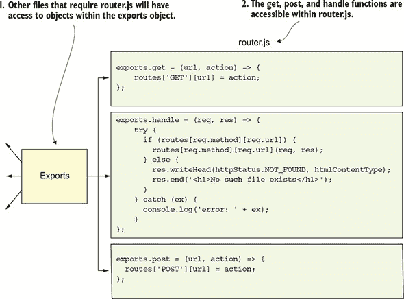

最后一步涉及将 router.js 导入到 main.js 中。你将以导入其他模块相同的方式完成此操作，使用 `require("./router")`。

你需要在 main.js 中每个函数调用前加上 `router`，因为现在这些函数属于路由器。你也可以导入 `fs` 模块，如果你计划像以前一样提供资产和静态 HTML 文件。你的服务器代码应该看起来像 列表 6.6 中的代码。

在创建你的服务器后，每个请求都由你的 `router` 模块中的 `handle` 函数处理，然后是一个回调函数。现在你可以通过使用 `router.get` 或 `router.post` 来定义你的路由，以指示你期望从该路由的请求中得到的 HTTP 方法。第二个参数是当收到请求时要运行的回调函数。创建一个自定义的 `readFile` 函数，称为 `customReadFile`，以使你的代码更具可重用性。在这个函数中，你尝试读取传入的文件，并返回文件的内容。

##### 列表 6.6\. 在 main.js 中处理和管理你的路由

```
const port = 3000,
  http = require("http"),
  httpStatusCodes = require("http-status-codes"),
  router = require("./router"),
  fs = require("fs"),
  plainTextContentType = {
    "Content-Type": "text/plain"
  },
  htmlContentType = {
    "Content-Type": "text/html"
  },
  customReadFile = (file, res) => {                        *1*
    fs.readFile(`./${file}`, (errors, data) => {
      if (errors) {
        console.log("Error reading the file...");
      }
      res.end(data);
    });
  };

router.get("/", (req, res) => {                            *2*
  res.writeHead(httpStatusCodes.OK, plainTextContentType);
  res.end("INDEX");
});
router.get("/index.html", (req, res) => {
  res.writeHead(httpStatusCodes.OK, htmlContentType);
  customReadFile("views/index.html", res);
});

router.post("/", (req, res) => {
  res.writeHead(httpStatusCodes.OK, plainTextContentType);
  res.end("POSTED");
});

http.createServer(router.handle).listen(3000);             *3*
console.log(`The server is listening on port number:
 ${port}`);
```

+   ***1*** **创建一个自定义的 readFile 函数以减少代码重复。**

+   ***2*** **使用 get 和 post 注册路由。**

+   ***3*** **通过 router.js 处理所有请求。**

在添加这些更改后，重新启动你的 Node.js 应用程序，并尝试访问你的主页或 /index.html 路由。此项目结构遵循了一些应用程序框架使用的某些设计模式。在 第 2 单元 中，你将了解更多关于框架的信息，并了解为什么这种组织方式可以使你的代码更高效和可读。

| |
| --- |

**快速检查 6.3**

> **Q1:**
> 
> 真或假：没有被添加到其模块 `exports` 对象中的函数和对象仍然可以被其他文件访问。

| |
| --- |
| |

**QC 6.3 答案**

> **1:**
> 
> 错误。`exports` 对象的目的是允许模块共享函数和对象。如果一个对象没有被添加到模块的 `exports` 对象中，它将保持在该模块中本地，如 CommonJS 所定义。

| |
| --- |

### 总结

在本节课中，你学习了如何服务单个文件。首先，你将`fs`模块添加到你的应用程序中，以便在`views`文件夹中查找 HTML 文件。然后你扩展了这一功能以应用于应用程序资源。你还学习了如何将你的路由系统应用于其自身的模块，并从主应用程序文件中选择性注册路由。在第 2 单元中，我谈到了你可以如何使用 Express.js 提供的应用程序结构，这是一个 Node.js 网络框架。

| |
| --- |

**尝试这个**

你目前设置了一个路由来从本节课的示例中读取 HTML 文件。尝试添加新的路由，以本节课介绍的风格加载资源。

| |
| --- |

## 第 7 课. 终极项目：创建你的第一个网络应用程序

当我第一次涉足网页开发时，我非常想建立一个人们可以前往查看有趣食谱的网站。幸运的是，一家当地的烹饪学校 Confetti Cuisine 希望我为他们建立一个网站，包括一个展示课程提供的着陆页、一个食谱页面，以及一个潜在学生可以注册的地方。

作为一位烹饪爱好者，我认为这个项目是一个很好的日常使用项目。更重要的是，这个网站将很有趣，可以用 Node.js 来构建。将所有前面的课程整合成一个完整的多页面应用程序，这些步骤应该足以让我为 Confetti Cuisine 构建一个静态网站。

我将从零开始创建一个新的应用程序，并添加三个视图、视图和资源的路由以及一个公共客户端文件夹。首先，我将构建应用程序逻辑，目标是编写干净、非重复的代码。然后我将添加一些面向公众的视图和自定义样式。在本节课结束时，我将有一个网络服务器来处理对项目中特定文件和资源的请求。最终产品是一个我可以逐步构建并在我客户的要求下连接到数据库的产品。

要创建此应用程序，我将使用以下步骤：

+   初始化应用程序的 package.json。

+   设置项目目录结构。

+   在 main.js 中创建应用程序逻辑。

+   创建三个视图，每个视图都应该有一个可点击的图片，可以独立提供：

    +   索引（主页）

    +   课程

    +   联系

    +   感谢

    +   错误

+   添加自定义资源。

+   构建应用程序的路由器。

+   处理应用程序错误。

+   运行应用程序。

我准备好大干一场了。

### 

首先，我使用 npm 创建一个包含我正在开发的应用程序概要的 package.json 文件。我导航到电脑上我想保存此项目的目录，然后创建一个新的项目文件夹，使用以下终端命令：`mkdir confetti_cuisine && cd confetti_cuisine`和`npm init`。

我遵循命令行说明，除了以下内容外，我接受所有默认值：

+   使用 main.js 作为入口点。

+   将描述更改为“一个预订烹饪课程的网站。”

+   将我的名字作为作者。

接下来，我在项目中运行 `npm install http-status-codes --save` 来安装 `http-status-codes` 包。在我的 confetti_cuisine 文件夹中，我的 package.json 文件应该类似于下一列表中的示例。

##### 列表 7.1\. 项目 package.json 文件内容

```
{
  "name": "confetti_cuisine",
  "version": "1.0.0",
  "description": "A site for booking classes for cooking.",
  "main": "main.js",
  "scripts": {
    "test": "echo \"Error: no test specified\" && exit 1",
  },
  "author": "Jon Wexler",
  "license": "ISC",
    "dependencies": {
        "http-status-codes": "¹.3.0"
    }
}             *1*
```

+   ***1*** **在终端中显示我的 package.json**

从现在开始，我能够将此文件作为我应用程序配置的总结来引用。

### 7.2\. 理解应用程序目录结构

在我继续编写更多代码之前，我想回顾一下应用程序的目录结构。在项目结构中，我希望我的 main.js、package.json 和 router.js 文件位于目录的根级别。任何 HTML 内容都将表示为单独的 .html 文件，这些文件将位于项目文件夹中的 views 文件夹内。我的完整应用程序项目目录将类似于以下列表中的结构。

##### 列表 7.2\. confetti_cuisine 的项目目录结构

```
.                            *1*
|____main.js
|____router.js
|____public
| |____css
| | |____confetti_cuisine.css
| | |____bootstrap.css
| |____images
| | |____product.jpg
| | |____graph.png
| | |____cat.jpg
| | |____people.jpg
| |____js
| | |____confettiCuisine.js
|____package-lock.json
|____package.json
|____contentTypes.js
|____utils.js
|____views
| |____index.html
| |____contact.html
| |____courses.html
| |____thanks.html
| |____error.html
```

+   ***1*** **从根目录显示目录树**

我的应用程序服务器将以我的 views 文件夹中的 HTML 文件响应。那些文件所依赖的资产将位于一个名为 public 的文件夹中。

| |
| --- |

##### 注意

HTML 文件将由客户端查看，但它们不被视为资产，也不放入公共文件夹中。

| |
| --- |

公共文件夹包含一个 images、js 和 css 文件夹，用于存放应用程序面向客户端的资产。这些文件定义了应用程序与其用户之间的样式和 JavaScript 交互。为了给我的应用程序添加一些快速样式，我从 [`getbootstrap.com/docs/4.0/getting-started/download/`](http://getbootstrap.com/docs/4.0/getting-started/download/) 下载了 bootstrap.css 并将其添加到公共文件夹中的 css 文件夹。我还创建了一个 confetti_cuisine.css 文件，用于应用任何我想为该项目添加的自定义样式规则。

接下来，我在项目的终端窗口中运行 `npm install http-status-codes --save` 来安装 `http-status-codes` 包。在我的 confetti_cuisine 文件夹中，我的 package.json 文件应该类似于下一列表中的示例。

### 7.3\. 创建 main.js 和 router.js

现在我已经设置了文件夹结构并初始化了项目，我需要向网站添加主应用程序逻辑，以便它在端口 3000 上提供服务。我将把路由保存在一个单独的文件中，所以我需要引入该文件以及 `fs` 模块，以便我可以提供静态文件。

我创建了一个名为 main.js 的新文件。在该文件中，我分配了应用程序的端口号，并引入了 `http`、`http-status-codes` 模块以及即将构建的自定义模块 `router`、`contentTypes` 和 `utils`，如 列表 7.3 所示。

| |
| --- |

##### 注意

`contentTypes` 和 `utils` 模块只是帮助我在 main.js 中组织变量。

| |
| --- |

##### 列表 7.3\. main.js 的内容以及所需的模块

```
const port = 3000,                              *1*
  http = require("http"),
  httpStatus = require("http-status-codes"),
  router = require("./router"),
  contentTypes = require("./contentTypes"),
  utils = require("./utils");
```

+   ***1*** **导入所需的模块。**

在创建本地模块之前，应用程序不会启动，所以我将首先创建 contentTypes.js，使用以下列表中的代码。在这个文件中，我导出一个对象，该对象将文件类型映射到它们的头值，用于我的响应。稍后，我将通过在 main.js 中使用 contentTypes.html 来访问 HTML 内容类型。

##### 列表 7.4\. contentTypes.js 中的对象映射

```
module.exports = {                  *1*
  html: {
    "Content-Type": "text/html"
  },
  text: {
    "Content-Type": "text/plain"
  },
  js: {
    "Content-Type": "text/js"
  },
  jpg: {
    "Content-Type": "image/jpg"
  },
  png: {
    "Content-Type": "image/png"
  },
  css: {
    "Content-Type": "text/css"
  }
};
```

+   ***1*** **导出内容类型映射对象。**

接下来，我设置了一个新模块 `utils` 中的函数，该函数将用于读取文件内容。在 utils.js 中，我添加了下一个列表中的代码。在这个模块中，我导出一个包含 `getFile` 函数的对象。这个函数在提供的路径中查找文件。如果文件不存在，我立即返回一个错误页面。

##### 列表 7.5\. utils.js 中的实用函数

```
const fs = require("fs"),
  httpStatus = require("http-status-codes"),
  contentTypes = require("./contentTypes");         *1*

module.exports = {                                  *2*
  getFile: (file, res) => {
    fs.readFile(`./${file}`, (error, data) => {
      if (error) {
        res.writeHead(httpStatus.INTERNAL_SERVER_ERROR,
          contentTypes.html);
        res.end("There was an error serving content!");
      }
      res.end(data);
    });
  }
};
```

+   ***1*** **导入在 getFile 中使用的模块。**

+   ***2*** **导出一个读取文件并返回响应的函数。**

最后，在新的文件中，我添加了 列表 7.6 中的代码。这个 router.js 文件需要 `http-status-codes` 和我的两个自定义模块：`contentTypes` 和 `utils`。

`router` 模块包含一个 `routes` 对象，该对象通过我的 `get` 函数映射到 `GET` 请求，通过我的 `post` 函数映射到 `POST` 请求。`handle` 函数是 main.js 中 `createServer` 调用的回调函数。`get` 和 `post` 函数接受一个 URL 和回调函数，然后在 `routes` 对象中将它们映射到对方。如果没有找到路由，我使用 `utils` 模块中的自定义 `getFile` 函数来响应错误页面。

##### 列表 7.6\. 在 router.js 中处理路由

```
const httpStatus = require("http-status-codes"),
  contentTypes = require("./contentTypes"),
  utils = require("./utils");

const routes = {                             *1*
  "GET": {},
  "POST": {}
};

exports.handle = (req, res) => {             *2*
  try {
    routes[req.method]req.url;
  } catch (e) {
    res.writeHead(httpStatus.OK, contentTypes.html);
    utils.getFile("views/error.html", res);
  }
};

exports.get = (url, action) => {             *3*
  routes["GET"][url] = action;
};

exports.post = (url, action) => {
  routes["POST"][url] = action;
};
```

+   ***1*** **创建一个包含路由函数的路由对象。**

+   ***2*** **创建处理请求的 handle 函数。**

+   ***3*** **创建获取和设置函数以映射路由函数。**

为了让我的应用程序服务器运行，我需要设置应用程序的路由和视图。

### 7.4\. 创建视图

视图是面向客户端的，可能会影响用户对应用程序的体验。我将为每个页面使用类似的模板，以减少应用程序的复杂性。每个 HTML 页面的顶部应该有一些 HTML 布局、一个 head、一个链接到即将构建的自定义样式表，以及导航。Confetti Cuisine 网站的首页将类似于 图 7.1，在页面的右上角有链接到我的三个视图。

##### 图 7.1\. Confetti Cuisine 的示例主页

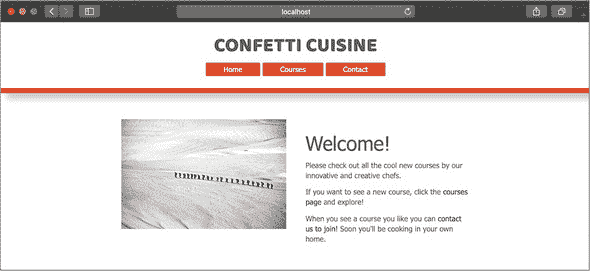

对于主页，我将在 views 文件夹中创建一个新的视图 index.html，并添加特定于索引页面的内容。因为我使用 bootstrap.css，所以我需要在 HTML 页面的 head 标签中添加 `<link rel="stylesheet" href="/bootstrap.css">` 来链接到该文件。我将对自定义样式表 `confetti_cuisine.css` 做同样的事情。

接下来，我创建了一个 courses.html 文件来展示可用的烹饪课程列表，以及一个包含以下表单的 contact.html 文件。此表单通过`POST`将联系信息提交到`/`路由。表单的代码应类似于下一列表中的代码。

##### 列表 7.7. contact.html 中提交到主页路由的示例表单

```
<form class="contact-form" action="/" method="post">         *1*
  <input type="email" name="email" required>
  <input class="button" type="submit" value="submit">
</form>
```

+   ***1*** **构建一个表单，用于将姓名提交到主页。**

我的网站联系页面将类似于图 7.2。

##### 图 7.2. Confetti Cuisine 的示例联系页面

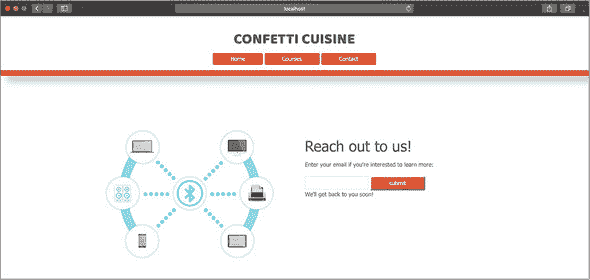

每个页面都通过导航栏链接到其他页面。我需要确保在创建我的路由时，这些文件中使用的所有资源都已计入。如果缺少任何资源，当应用程序尝试查找其对应的文件时，可能会崩溃。

我将添加这些资源，以便我的页面具有更丰富的内容。

### 7.5. 添加资源

对于这个应用程序，我创建了一些自定义样式，供每个视图使用。我想要在网站元素中进行的任何颜色、尺寸或位置更改都将放入 public/css 中的 confetti_cuisine.css，它与 bootstrap.css 位于同一目录下。

当这个文件保存时，我的视图在加载时将具有颜色和结构。如果我想使用任何客户端 JavaScript，我需要创建一个.js 文件，将其添加到我的 public/js 文件夹中，并在每个文件中使用`<script>`标签链接到它。最后，我将我的图片添加到`public/images`。这些图片的名称应该与我在我 HTML 视图中使用的名称相匹配。

剩下的唯一步骤是为我的项目中每个视图和资源注册路由和处理。

### 7.6. 创建路由

最后一个重要的拼图碎片是路由。我的应用程序的路由将决定哪些 URL 可供客户端访问以及我将提供哪些文件。

我特别创建了一个 router.js 文件来处理我的路由，但我仍然需要注册它们。注册我的路由基本上意味着将一个 URL 和回调函数传递给我的`router.get`或`router.post`函数，具体取决于我正在处理哪种 HTTP 方法。这些函数将我的路由添加到`router.routes`，这是一个 JavaScript 对象，它将我的 URL 映射到当访问该 URL 时要调用的回调函数。

为了总结，要注册一个路由，我需要声明以下内容：

+   请求是`GET`还是`POST`请求

+   URL 的路径

+   要返回的文件名

+   HTTP 状态码

+   返回文件的类型（作为内容类型）

在每个回调函数中，我需要指出将放入响应中的内容类型，并使用`fs`模块将我的视图和资源的内容读取到响应中。我在 main.js 中的 require 行下方添加路由和代码。

##### 列表 7.8. 在 main.js 中使用`router`模块注册单个路由

```
router.get("/", (req, res) => {                        *1*
  res.writeHead(httpStatus.OK, contentTypes.htm);
  utils.getFile("views/index.html", res);
});

router.get("/courses.html", (req, res) => {
  res.writeHead(httpStatus.OK, contentTypes.html);
  utils.getFile("views/courses.html", res);
});

router.get("/contact.html", (req, res) => {
  res.writeHead(httpStatus.OK, contentTypes.html);
  utils.getFile("views/contact.html", res);
});

router.post("/", (req, res) => {
  res.writeHead(httpStatus.OK, contentTypes.html);
  utils.getFile("views/thanks.html", res);
});

router.get("/graph.png", (req, res) => {
  res.writeHead(httpStatus.OK, contentTypes.png);
  utils.getFile("public/images/graph.png", res);
});
router.get("/people.jpg", (req, res) => {
  res.writeHead(httpStatus.OK, contentTypes.jpg);
  utils.getFile("public/images/people.jpg", res);
});
router.get("/product.jpg", (req, res) => {
  res.writeHead(httpStatus.OK, contentTypes.jpg);
  utils.getFile("public/images/product.jpg", res);
});
router.get("/confetti_cuisine.css", (req, res) => {
  res.writeHead(httpStatus.OK, contentTypes.css);
  utils.getFile("public/css/confetti_cuisine.css", res);
});
router.get("/bootstrap.css", (req, res) => {
  res.writeHead(httpStatus.OK, contentTypes.css);
  utils.getFile("public/css/bootstrap.css", res);
});
router.get("/confetti_cuisine.js", (req, res) => {
  res.writeHead(httpStatus.OK, contentTypes.js);
  utils.getFile("public/js/confetti_cuisine.js", res);
});

http.createServer(router.handle).listen(port);          *2*
console.log(`The server is listening on
 port number: ${port}`);
```

+   ***1*** **为网页和资源添加一系列路由。**

+   ***2*** **启动服务器。**


##### 注意

注意`POST`路由，它将处理 contact.html 页面上的表单提交。而不是响应另一个 HTML 页面，这个路由响应一个 HTML“感谢您支持产品”页面。

| |
| --- |

现在我应该能够使用`node main`启动我的应用程序，并通过访问 http://localhost: 3000 来查看我的网络应用程序的主页。

| |
| --- |

##### 注意

我只为我在项目中表示为文件的资源（图像、js 和 css）创建路由。

| |
| --- |

### 摘要

在这个综合练习中，我构建了一个完整的网络应用程序，为 Confetti Cuisine 提供静态网页。为了完成这个任务，我需要在主应用程序文件中添加自己的路由模块。然后我创建了一个自定义系统来路由用户请求以提供特定内容。在构建用于以有组织、系统的方式注册路由的自定义函数后，我创建了从各自的目录中提供视图和资源的文件。

在这里正在进行大量的代码逻辑处理，这些代码逻辑正朝着全球 Node.js 应用程序所使用的专业结构发展。

在第 3 单元中，我探讨了网络框架，并展示了它们如何使用这种应用程序结构和一些脚手架（预构建的文件夹和结构）以更少的步骤和更少的麻烦完成相同的应用程序。
