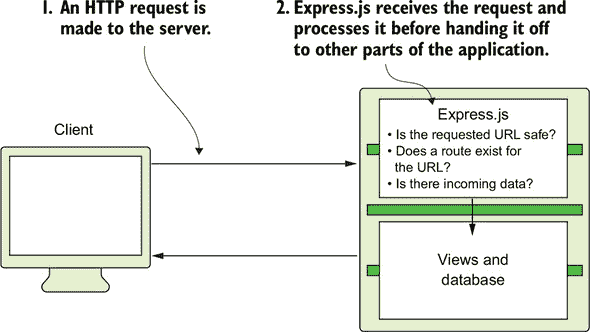
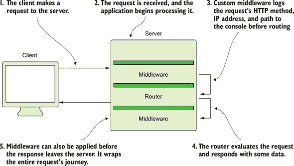
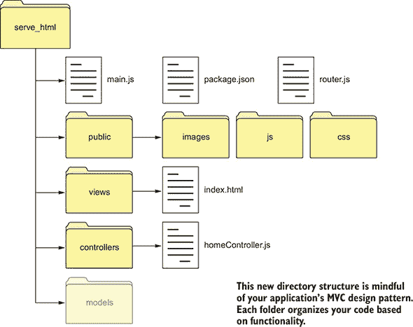
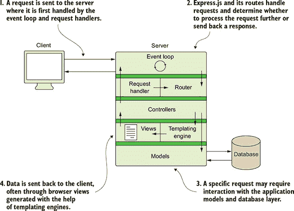
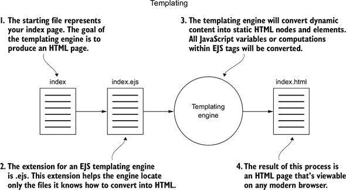
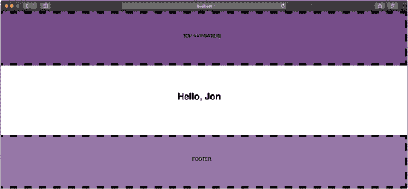
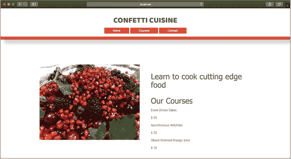
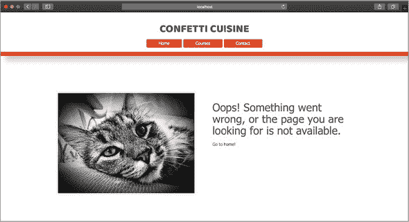

## 单元 2\. 使用 Express.js 更容易地进行网络开发

单元 1 教导了你如何使用 Node.js 构建网络服务器以及如何使用内置模块构建有意义的内 容。本单元是关于通过使用网络框架和动态内容将你的应用程序提升到一个更稳健和专业的水 平。*网络框架* 是一个预定义的应用程序结构和一组开发工具库，旨在使构建网络应用程序更加容易和一致。

在本单元中，你将学习如何使用 Express.js 设置应用程序并组织你的应用程序文件结构以优化页面之间数据通信。你还将了解模型-视图-控制器（MVC）应用程序架构，它将你的代码组织成三个不同的职责：

+   为你的数据构建结构

+   显示该数据

+   处理请求以与该数据交互

为了在 单元 1 中学习到的课程基础上进行构建，并修改你的代码以充分利用 Express.js，本单元涵盖了以下主题：

+   第 8 课 介绍了 Express.js 并展示了如何配置新的 Node.js 应用程序。在本课中，你将了解一个网络框架如何帮助你开发应用程序的概述。

+   第 9 课 讲解了使用 Express.js 进行路由。你已经学习了从头开始编写路由的方法。本课将向你介绍本书其余部分将使用的路由风格。你还将了解 MVC 模式，并了解在这种结构中路由如何像控制器一样行为。

+   第 10 课 介绍了布局和动态渲染视图的概念。到目前为止，你只处理了静态内容，但在本课中，你使用 Express.js 在每次页面刷新时向你的视图提供内容。本课还讨论了 Node.js 中的模板化。在 Express.js 中，模板引擎正在工作，允许你在 HTML 页面中写入动态内容的占位符。

+   第 11 课 在前面的课程基础上，展示了如何处理应用程序错误并使用 npm 配置启动脚本。

+   最后，第 12 课 展示了如何使用 Express.js 从 单元 1 重建你的项目。你重新创建了烹饪学校的网站的前端三个视图，并添加了从你的应用程序服务器动态填充内容的功能。

本单元是你进入可能感觉更熟悉的网络应用程序的第一步。熟悉 Express.js 和外部包将使你成为一个更熟练的开发者。当你的 Node.js 应用程序在 Express.js 上成功运行时，单元 3 将讨论如何将你的应用程序连接到数据库并保存用户信息。

## 第 8 课\. 使用 Express.js 设置应用程序

随着 Web 框架的加入，构建 Web 应用程序已经变得更容易。Node.js 中的 Web 框架是一个模块，为你的应用程序提供结构。通过这个结构，你可以轻松地构建和自定义应用程序的感觉，而无需担心从头开始构建某些功能，例如服务单个文件。在本课结束时，你将了解如何开始使用 Web 框架，以及本书中使用的 Express.js 如何减少你使应用程序运行所需的时间。

本课涵盖

+   使用 Express.js 设置 Node.js 应用程序

+   导航 Web 框架


**考虑这一点**

你从单元 1 中的静态 Web 应用程序已经成功了。烹饪社区希望你添加更多功能并服务更多网页。你意识到你的应用程序还没有完全准备好处理更多的路由，更不用说处理错误或服务其他类型的资源了。有没有一种更简单的方法可以从已有结构开始开发？

幸运的是，你可以使用 Node.js 应用程序安装一个 Web 框架。Express.js，这本书中使用的框架，直接处理了大多数应用程序需要的许多任务，例如错误处理和静态资源服务。你对这个框架的方法和关键字越熟悉，你构建应用程序的速度就越快。


### 8.1\. 安装 Express.js 包

Express.js 提高了开发速度，并为构建应用程序提供了一个稳定的结构。像 Node.js 一样，Express.js 提供了开源的工具，并由一个庞大的在线社区管理。

首先，我将讨论为什么 Express.js 是你应该学习的 Web 框架。随着每年过去，Node.js 获得了新的框架，其中一些提供了令人信服的理由去切换到它的库。Express.js 于 2010 年发布，从那时起，其他可靠的框架也日益流行。表 8.1 列出了你可以考虑的其他框架。

##### 表 8.1\. 你应该了解的 Node.js 框架

| Node.js 框架 | 描述 |
| --- | --- |
| Koa.js | 由构建 Express.js 的开发者设计，专注于 Express.js 中未提供的库方法([`koajs.com/`](http://koajs.com/)) |
| Hapi.js | 设计与 Express.js 具有相似架构，并专注于编写更少的代码([`hapijs.com/`](https://hapijs.com/)) |
| Sails.js | 建立在 Express.js 之上，提供了更多的结构，以及更大的库和更少的定制机会([`sailsjs.com/`](https://sailsjs.com/)) |
| Total.js | 建立在核心 HTTP 模块之上，因其高性能的请求处理和响应而受到赞誉([`www.totaljs.com/`](https://www.totaljs.com/)) |
|  |

##### 注意

关于 Node.js Web 框架的更多信息，你可以查看 GitHub 仓库的更新列表，网址为[`nodeframework.com/`](http://nodeframework.com/)。


最终，框架旨在帮助您克服从头开始构建 web 应用程序时的一些常见开发挑战。Express.js 是 Node.js 社区中最常用的框架，确保您与其他较新框架提供的支持相比，能够找到所需的支持。尽管我推荐使用 Total.js，因为它在性能和可扩展性方面表现良好，但它不一定是最适合开始的框架。

由于您是第一次使用 Node.js 来构建 web 应用程序，您需要一些工具来帮助您在这个过程中。Web 框架旨在提供一些在 web 开发中常用的工具。Express.js 提供了处理请求、提供静态和动态内容、连接数据库以及跟踪用户活动等方法和模块。您将在后面的课程中了解更多关于 Express.js 如何提供这种支持的信息。

Express.js 被新的和专业的 Node.js 开发者共同使用，所以如果您在任何时候感到不知所措，请记住，有成千上万的人可以帮助您克服开发障碍。

现在，您已经准备好使用 Express.js 初始化应用程序了。首先，您需要通过创建一个名为 first_express_project 的新项目目录，在新的终端窗口中进入该目录，并输入 `npm init` 来初始化您的应用程序。您可以按照提示将 main.js 保存为主入口点，并保存所有其他默认值。

| |
| --- |

##### 注意

如 课程 1 中所述，初始化新项目会创建一个 package.json 文件，您可以使用它来定义应用程序的一些属性，包括您下载和依赖的包。

| |
| --- |

由于 Express.js 是一个外部包，它不会与 Node.js 预先安装。您需要在终端中运行以下命令来下载和安装它：`npm install express --save`。

| |
| --- |

##### 注意

在撰写本文时，Express.js 的最新版本是 4.16.3。为确保您的 Express.js 版本与本书中使用的版本一致，请运行 `npm install express@4.16.3 --save` 来安装该包。

| |
| --- |
| |

##### 警告

如果在创建 package.json 之前尝试在特定项目中安装 Express.js，您可能会看到一个错误，抱怨没有目录或文件可以完成安装。

| |
| --- |

使用 `--save` 标志，以便将 Express.js 列为应用程序依赖项。换句话说，您的应用程序依赖于 Express.js 来工作，因此您需要确保它已安装。打开 package.json 来查看此 Express.js 包安装位于 `dependencies` 列表中。

| |
| --- |

##### 提示

如果您想从终端窗口访问 Express.js 包的文档，请输入 `npm docs express`。此命令将打开您的默认网页浏览器，访问 [`expressjs.com`](http://expressjs.com)。

| |
| --- |

在下一节中，您将创建您的第一个 Express.js 应用程序。

| |
| --- |

**快速检查 8.1**

> **Q1:**
> 
> 如果你在为你的应用程序安装 Express.js 时没有使用`--save`标志，会发生什么？

| |
| --- |
| |

**QC 8.1 答案**

> **1:**
> 
> 没有使用`--save`标志，你的 Express.js 安装不会被标记为应用程序依赖项。你的应用程序仍然可以在本地运行，因为 Express.js 将被下载到你的项目`node_modules`文件夹中，但如果你不包含该文件夹上传你的应用程序代码，你的`package.json`文件中不会有任何指示表明需要 Express.js 包来运行你的应用程序。

| |
| --- |

### 8.2\. 构建你的第一个 Express.js 应用程序

要开始使用 Express.js，你需要创建一个主应用程序文件并引入`express`模块。将代码保存在列表 8.1 中，并将其保存为项目中的`main.js`文件。

你通过引用模块名`express`并将其存储为一个常量来引入 Express.js。`express`提供了一个方法库和功能，包括一个具有内置网络服务器功能的一个类。`express`网络服务器应用程序被实例化并存储在一个常量中，以便引用为`app`。在整个项目的其余部分，你将使用`app`来访问 Express.js 的大部分资源。

与第一个项目一样，Express.js 提供了一种定义`GET`路由及其回调函数的方法，而无需构建额外的模块。如果对主页发起请求，Express.js 会捕获它并允许你进行响应。

以纯文本形式发送响应到浏览器。注意 Express.js 的`send`方法，它与`http`模块中的`write`方法行为类似。Express.js 还支持`http`模块的方法。如果你使用`write`，请记住使用`end`来完成你的响应。最后，你设置应用程序监听本地主机的 3000 端口上的请求，并在应用程序成功运行时将一条有用的消息记录到你的控制台。

##### 列表 8.1\. main.js 中的简单 Express.js 网络应用程序

```
const port = 3000,
  express = require("express"),                                    *1*
  app = express();                                                 *2*

app.get("/", (req, res) => {                                       *3*
  res.send("Hello, Universe!");                                    *4*
})
.listen(port, () => {                                              *5*
  console.log(`The Express.js server has started and is listening
  on port number: ${port}`);
});
```

+   ***1*** **将 express 模块添加到你的应用程序中。**

+   ***2*** **将 express 应用程序分配给 app 常量。**

+   ***3*** **为主页设置一个 GET 路由。**

+   ***4*** **使用 res.send 从服务器向客户端发送响应。**

+   ***5*** **设置应用程序以监听 3000 端口。**

尝试一下。确保你在命令行中处于你的项目目录。运行`node main`，然后访问 http://localhost:3000。如果你在屏幕上看到`Hello, Universe!`，那么你已经构建了第一个成功的 Express.js 应用程序。

| |
| --- |

**安装和使用 nodemon**

要查看你的应用程序服务器代码更改的效果，你需要在终端中重新启动服务器。通过按 Command-D（Windows 上的 Ctrl-C）关闭现有服务器，然后再次输入`node main.js`。

你对应用程序应用的变化越多，这项任务就越繁琐。这就是我推荐安装 `nodemon` 包的原因。你可以使用这个包来首次启动你的应用程序，并在应用程序文件更改时自动重新启动它。

要全局安装 `nodemon`，请输入 `npm i nodemon -g`。你可能需要在命令前加上 `sudo` 或以管理员身份在终端中运行它。

或者，你可以将 `nodemon` 安装为开发依赖项（`devDependency`）或仅在应用程序开发期间使用的资源。运行 `npm i nodemon --save-dev` 或 `npm i nodemon -D`。`nodemon` 会与你的 `npm start` 脚本（在 第 11 课 中讨论）一起启动。将 `nodemon` 作为 `devDependency` 安装的好处是，每个项目都有自己的 `nodemon` 模块，反映了开发时包的最新版本。

当安装了 `nodemon` 后，使用起来很简单：`nodemon` 会检测你的 package.json 中的主属性。你的 package.json 也应该修改为包含 npm start 脚本。在 package.json 的 scripts 部分添加 "start": "nodemon main.js"，这样你就可以使用 npm start 通过 `nodemon` 运行你的应用程序。在终端中进入你的项目目录，并输入 `nodemon`。这个命令会启动你的应用程序，并且你未来所做的任何更改都会通知 `nodemon` 重新启动，而无需输入另一个命令。

你可以通过在终端中的 `nodemon` 窗口中按下相同的键组合（Windows 上的 Command-D 或 Ctrl-C）来关闭服务器。

|  |

##### 注意

`express` 常量仍然用于一些与配置应用程序相关的 Express.js 工具。`app` 主要用于创建用于应用程序数据传输和用户交互的任何内容。


在下一节中，我将讨论 Express.js 作为网络框架提供的一些支持方式。


**快速检查 8.2**

> **Q1:**
> 
> `express` 和 `app` 常量之间的区别是什么？

|  |

**QC 8.2 答案**

> **1:**
> 
> `app` 代表了你的应用程序的大部分内容，包括路由和其他模块的访问。`express` 代表了一组更广泛的方法，这些方法不一定局限于你的应用程序。`express` 可能会提供一种方法来分析或解析某些文本，而你的应用程序可能并不依赖于这些文本。


### 8.3\. 在网络框架中工作

一个网络框架旨在为你完成许多繁琐的任务，并为你提供一个直观的结构来定制你的应用程序。Express.js 提供了一种通过回调函数监听特定 URL 的请求并响应的方法。

类似于 Express.js 这样的网络框架通过函数作为中间件来操作，因为这些函数位于 Web 上的 HTTP 交互和 Node.js 平台之间。*中间件*是一个通用术语，用于指代在数据与应用逻辑交互之前，帮助监听、分析、过滤和处理 HTTP 通信的代码。

您可以将中间件想象成一个邮局。在您的包裹进入配送网络之前，邮递员需要检查包裹的大小，并确保它已正确付费并符合配送政策（包裹内没有危险物品）。请参阅中间件的图示图 8.1。

##### 图 8.1\. Express.js 位于 HTTP 请求和您的应用程序代码之间。




##### 注意

中间件可以比 Express.js 更小，一些中间件在数据传递到核心应用之前，扮演着检查传入请求的安全角色。


因为您仍在处理 HTTP 方法，所以您的应用程序与浏览器之间的整体交互与第 1 单元（../Text/kindle_split_014.html#part01）中使用 `http` 模块的应用程序相比变化不大。您获得相同的请求和响应对象，其中包含有关发送者和其内容的丰富信息。Express.js 提供了使您更容易获取这些信息的方法。

除了响应对象上的 `send` 方法外，Express.js 还提供了从请求体中提取和记录数据的更简单方法。将以下代码添加到 main.js 中的 `GET` 路由处理程序中。

##### 列表 8.2\. main.js 中的 Express.js 请求对象方法

```
console.log(req.params);         *1*
console.log(req.body);
console.log(req.url);
console.log(req.query);
```

+   ***1*** **访问请求参数。**

您可以从请求中提取表 8.2 中的值。

##### 表 8.2\. 请求对象数据项

| 请求数据对象 | 描述 |
| --- | --- |
| params | 允许您从 URL 中提取 ID 和令牌。当您学习到第 4 单元中的 RESTful 路由时，这个请求属性允许您识别在电子商务网站上请求的是哪些项目，或者您应该导航到哪个用户配置文件。 |
| body | 包含请求的大部分内容，通常包括来自 POST 请求的数据，如提交的表单。您可以从请求体中快速收集信息并将其保存到数据库中。 |
| url | 提供有关访问的 URL 的信息（类似于第 1 单元（../Text/kindle_split_014.html#part01）的基本 Web 服务器中的 req.url）。 |
| 查询 | 与 body 类似，允许您从提交到应用服务器的数据中提取信息。然而，这些数据不一定来自 POST 请求，通常作为查询字符串在 URL 中请求。 |

在重启您的应用程序并访问 http://localhost:3000 后，您会在服务器的终端窗口中看到这些值被记录下来。当您在学习 第 9 课 中关于 Express.js 路由时，您会探索如何更好地利用请求体。

| |
| --- |

##### 小贴士

*查询字符串* 是以键/值对形式表示的文本，位于主机名后的问号 (`?`) 之后。例如，http://localhost:3000?name=jon 正在发送 `name`（键）与 `jon`（值）配对的 数据。这些数据可以在路由处理程序中提取和使用。

| |
| --- |
| |

**快速检查 8.3**

> **Q1:**
> 
> 为什么大多数开发者使用网络框架而不是从头开始构建网络应用程序？

| |
| --- |
| |

**QC 8.3 答案**

> **1:**
> 
> 网络框架使开发工作变得容易得多。网络开发很有趣，最好的部分不是那些容易出错且繁琐的任务。有了网络框架，开发者和企业都可以专注于应用程序更有趣的部分。

| |
| --- |

### 摘要

在本课中，您学习了如何初始化 Express.js 项目，并启动了一个简单的应用程序，在您的网页浏览器中显示“你好”。您还了解了 Express.js 作为网络框架，并看到了您将如何从其方法中受益。在 第 9 课 中，您将应用一些 Express.js 方法来构建路由系统。

| |
| --- |

**尝试这个**

将您的 `index.js` 文件中的 `get` 方法更改为 `post`。重启您的应用程序，并尝试在 http://localhost:3000 访问主页时，看看您的应用程序的行为有何不同。您应该会看到 Express 的默认错误消息，告诉您 `/` 没有对应的 `GET` 路由。

原因是您更改了您正在监听请求的方法。如果您向主页发送 curl `POST` 请求，您会看到您原始的响应内容。

| |
| --- |

## 第 9 课。Express.js 中的路由

在 第 8 课 中，我介绍了 Express.js 作为 Node.js 网络应用程序的框架。本单元的其余部分致力于探索 Express.js 的功能并使用其便捷的方法。本课涵盖了路由以及如何在构建视图之前，使用一些额外的 Express.js 方法向用户发送有意义的 数据。您还了解了如何收集请求的查询字符串。课程结束时简要提到了 MVC 设计模式。

本课涵盖

+   为您的应用程序设置路由

+   从另一个模块返回数据

+   收集请求 URL 参数

+   将路由回调移动到控制器

| |
| --- |

**考虑这个**

您想为您的食谱应用程序构建一个主页视图，人们可以访问以查看应用程序的预计完成日期。有了您的新、干净的 Express.js 设置，您希望将日期变量放在一个单独的文件中，这样您就可以轻松地更改它，而无需修改 main.js 文件。

在设置好路由后，你将能够在单独的模块中存储一些数据，并使用这些数据动态响应。使用单独的模块，你将能够修改该文件的內容，而无需编辑主应用程序文件。这种结构有助于你在不断更改值的同时避免在代码中出错。

| |
| --- |

### 9.1\. 使用 Express.js 构建路由

在第 8 课中，你构建了你的第一个 Express.js 应用程序，该应用程序处理对主页 URL 的`GET`请求。另一种描述此路由的方式是将其视为一个应用程序端点，该端点接受 HTTP 方法和路径（URL）。Express.js 中的路由应该对你来说很熟悉，因为你已经在第 1 单元的结尾构建了相同的路由结构。在 Express.js 中，路由定义从你的`app`对象开始，后面跟着小写的 HTTP 方法及其参数：路由路径和回调函数。

处理到`/contact`路径的`POST`请求的路由应该看起来像以下列表。此示例使用 Express.js 提供的`post`方法。

##### 列表 9.1\. main.js 中的 Express.js `POST`路由

```
app.post("/contact", (req, res) => {                            *1*
  res.send("Contact information submitted successfully.");
});
```

+   ***1*** **使用 Express.js 的 post 方法处理请求。**

你可以在`app`对象上使用这些 HTTP 方法，因为`app`是主 Express.js 框架类的实例。通过安装此包，你继承了路由方法，而无需编写任何其他代码。

Express.js 允许你在路径中编写带有参数的路由。这些参数是通过请求发送数据的一种方式。（另一种方式是查询字符串，我在本课的结尾会提到。）路由参数在参数之前有一个冒号（`:`），并且可以在路径的任何位置存在。列表 9.2 显示了带有参数的路由的示例。此列表中的路由期望一个对`/items/`的请求，加上一些蔬菜名称或数字。例如，对`"/items/lettuce"`的请求将触发路由及其回调函数。响应通过请求对象的`params`属性将项目从 URL 发送回用户。

##### 列表 9.2\. 在 main.js 中使用路由参数来指示蔬菜类型

```
app.get("/items/:vegetable", (req, res) => {          *1*
 res.send(req.params.vegetable);
});
```

+   ***1*** **使用路径参数进行响应。**

初始化一个名为 express_routes 的新项目，安装 Express.js，并将代码添加到 require 和实例化 Express.js 模块。然后创建一个带有参数的路由，并像列表 9.2 中所示那样响应该参数。此时，你的 main.js 应该看起来像下一个列表中的代码。

##### 列表 9.3\. main.js 中的完整 Express.js 示例

```
const port = 3000,
  express = require("express"),
  app = express();

app.get("/items/:vegetable", (req, res) => {        *1*
  let veg = req.params.vegetable;
  res.send(`This is the page for ${veg}`);
});

app.listen(port, () => {
  console.log(`Server running on port: ${port}`);
});
```

+   ***1*** **添加一个获取 URL 参数的路由。**

路由参数对于在您的应用程序中指定数据对象很有用。例如，当您开始在数据库中保存用户账户和课程列表时，您可以使用 `/users/:id` 和 `/course/:type` 路径分别访问用户的个人资料或特定课程。这种结构对于开发您在 单元 4 中学习的表示状态传输 (REST) 架构是必要的。

关于 Express.js 路由的最后一句话：我谈到了 Express.js 是一种中间件，因为它在请求被接收和处理之间添加了一个层。这个特性很棒，但您可能想添加自己的自定义中间件。例如，您可能想记录发送到您应用程序的每个请求的路径以供自己记录。您可以通过向每个路由添加日志消息或在 列表 9.4 中创建中间件函数来完成此任务。此列表定义了一个带有额外 `next` 参数的中间件函数，将请求的路径记录到您的终端控制台，然后调用 `next` 函数以继续请求-响应周期中的链。

`next` 提供了一种在请求-响应执行流程中调用下一个函数的方式。从请求进入服务器的那一刻起，它访问一系列中间件函数。根据您添加自己的自定义中间件函数的位置，您可以使用 `next` 通知 Express.js 您的函数已完成，并且您希望继续链中的下一个函数。

与 HTTP 方法一样，您可以使用 `app.use` 创建在每次请求上运行的路由。区别在于您在回调中添加了一个额外的参数：`next` 函数。此中间件函数允许您在请求的 URL 路径与您的应用程序中的任何其他路由匹配之前运行自定义代码。当您的自定义代码完成后，`next` 将请求指向下一个与路径匹配的路由。

尝试将此中间件函数添加到您的 `express_routes` 应用程序中。如果请求 `/items/lettuce`，则请求首先由您的中间件函数处理，然后是您之前创建的 `app.get("/items/:vegetable")` 路由。

##### 列表 9.4\. main.js 中的 Express.js 中间件函数用于记录请求路径

```
app.use((req, res, next) => {                    *1*
  console.log(`request made to: ${req.url}`);    *2*
  next();                                        *3*
});
```

+   ***1*** **定义一个中间件函数。**

+   ***2*** **将请求的路径记录到控制台。**

+   ***3*** **调用 next 函数。**


##### **警告**

在函数末尾调用 `next` 是必要的，以通知 Express.js 您的代码已完成。如果不这样做，您的请求将处于挂起状态。中间件按顺序运行，因此不调用 `next` 将阻止您的代码继续执行直到完成。


您还可以指定一个您希望中间件函数运行的路径。例如，`app.use("/items", <callback>)` 将为以 `items` 开头的每个请求运行您的自定义回调函数。图 9.1 显示了中间件函数如何与服务器上的请求交互。

##### 图 9.1\. 中间件函数的作用



在下一节中，我将讨论在您的路由中处理数据并使用该数据响应。

| |
| --- |

**快速检查 9.1**

> **Q1:**
> 
> Express.js 的 `use` 方法做什么？

| |
| --- |
| |

**QC 9.1 答案**

> **1:**
> 
> `use` 方法允许您定义您想要与 Express.js 一起使用的中间件函数。

| |
| --- |

### 9.2\. 分析请求数据

在您的应用程序中准备花哨和动态的响应很重要，但最终，您将需要证明应用程序能够从用户的请求中捕获数据的能力。

您有两种主要方式从用户那里获取数据：

+   通过 `POST` 请求中的请求体

+   通过 URL 中的请求查询字符串

在第一个综合项目中，您成功构建了一个将数据提交到 `POST` 路由（监听特定 URL 上提交数据的路由）的表单。但 `http` 进入的数据表示为 Buffer 流，这不是人类可读的，并且为使该数据可处理添加了一个额外的步骤。

Express.js 使用 `body` 属性使检索请求体变得简单。为了帮助读取 `body` 内容（截至 Express.js 版本 4.16.0），您将 `express.json` 和 `express.urlencoded` 添加到您的 `app` 实例中，以分析传入的请求体。注意在 列表 9.5 中使用 `req.body` 将发布的数据记录到控制台。将此代码添加到您项目的 main.js 中。使用 Express.js 的 `app.use`，指定您想要解析的传入请求是 URL 编码的（通常是表单 POST 和 utf-8 内容）以及 JSON 格式。然后为发布的数据创建一个新的路由。这个过程就像使用 `post` 方法并指定一个 URL 一样简单。最后，使用请求对象及其 `body` 属性打印发布表单的内容。

##### 列表 9.5\. 在 main.js 中从请求体捕获发布数据

```
app.use(
  express.urlencoded({
    extended: false
  })
);                                *1*
app.use(express.json());

app.post("/", (req, res) => {     *2*
  console.log(req.body);          *3*
  console.log(req.query);
  res.send("POST Successful!");
});
```

+   ***1*** **告诉您的 Express.js 应用程序解析 URL 编码数据。**

+   ***2*** **为主页创建一个新的 POST 路由。**

+   ***3*** **记录请求的体。**

通过以下 `curl` 命令向 http://localhost:3000 提交 `POST` 请求来测试此代码：`curl --data "first_name=Jon&last_name=Wexler"` http://localhost:3000.

您应该看到如下所示的内容记录到您的服务器控制台窗口：`{ first_name: "Jon", last_name: "Wexler" }`。

现在当您向客户演示后端代码时，您可以通过模拟表单提交来向他们展示数据如何在服务器上收集。

收集数据的另一种方式是通过 URL 参数。无需额外的包，Express.js 允许您收集存储在 URL 路径末尾的值，后面跟着一个问号 (`?`)。这些值被称为 *查询字符串*，它们通常用于跟踪网站上的用户活动以及存储有关用户访问页面的临时信息。

检查以下示例 URL：http://localhost:3000?cart=3&pagesVisited=4&utmcode=837623。这个 URL 可能正在传递有关用户购物车中项目数量的信息，他们访问的页面数量，以及一个营销代码，让网站所有者知道用户最初是如何找到您的应用的。

要在服务器上查看这些查询字符串，请将 `console.log(req.query)` 添加到 main.js 中的中间件函数。现在尝试访问相同的 URL。你应该看到 `{ cart: "3", pagesVisited: "4", utmcode: "837623" }` 在您的服务器控制台窗口中记录。

在下一节中，我将讨论 MVC 架构以及 Express.js 路由如何融入该结构。


**快速检查 9.2**

> **Q1:**
> 
> 需要哪些额外的中间件函数来解析使用 Express.js 的请求体中的传入数据？

|  |

**QC 9.2 答案**

> **1:**
> 
> express.json 和 express.urlencoded 用于解析传入服务器中的数据。其他包，如 `body-parser`，充当中间件并执行类似任务。


### 9.3\. 使用 MVC

本节课是关于在您的路由中处理请求数据。Express.js 打开了自定义模块和代码的大门，以便在请求-响应周期内读取、编辑和响应数据。为了组织这个不断增长的代码库，你将遵循一个名为 MVC 的应用程序架构。

MVC 架构侧重于您应用程序功能的主要三个部分：模型、视图和控制器。您在以前的应用程序中使用了视图来在响应中显示 HTML。请参阅 表 9.1 中的分解和定义。

##### 表 9.1\. 模型-视图-控制器部分

| 视图 | 从您的应用程序中渲染数据。在 第 3 单元 中，你学习了模型，甚至创建了您自己的模型。 |
| --- | --- |
| 模型 | 代表您应用程序和数据库中面向对象数据的类。在您的食谱应用程序中，您可能创建一个模型来表示客户订单。在这个模型中，您定义订单应包含哪些数据以及可以在该数据上运行哪些类型的函数。 |
| 控制器 | 视图和模型之间的粘合剂。当接收到请求时，控制器执行大部分逻辑，以确定如何处理请求体数据以及如何涉及模型和视图。这个过程应该听起来很熟悉，因为在 Express.js 应用程序中，您的路由回调函数充当控制器。 |

要遵循 MVC 设计模式，将你的回调函数移动到反映这些函数目的的独立模块中。例如，与用户账户创建、删除或更改相关的回调函数可以放在 controllers 文件夹中的 usersController.js 文件中。用于渲染主页或其他信息页面的函数可以按照惯例放在 homeController.js 中。图 9.2 显示了你的应用程序将遵循的文件结构。

##### 图 9.2\. Express.js MVC 文件结构



图 9.3 显示了 Express.js 作为一层覆盖在你的应用程序之上，处理请求但同时也为你的应用程序控制器提供数据。回调函数决定是否渲染视图或向客户端发送某些数据。

##### 图 9.3\. Express.js 可以遵循 MVC 结构，路由为控制器提供数据



要将 express_routes 应用程序重构为遵循此结构，请按照以下步骤操作：

1.  在你的项目文件夹内创建一个 controllers 文件夹。

1.  在 controllers 文件夹内创建一个 homeController.js 文件。

1.  通过在 main.js 的顶部添加以下内容将你的主控制器文件引入到应用程序中：

    ```
    const homeController = require("./controllers/homeController");
    ```

1.  将你的路由回调函数移动到主控制器，并将它们添加到该模块的 `exports` 对象中。例如，响应带有蔬菜参数的路由可以移动到你的主控制器，看起来像 列表 9.6。在 homeController.js 中，你将 `exports.sendReqParam` 分配给回调函数。`sendReqParam` 是一个变量名，所以你可以选择自己的名字来描述该函数。

    ##### 列表 9.6\. 将回调函数移动到 homeController.js

    ```
    exports.sendReqParam = (req, res) => {              *1*
      let veg = req.params.vegetable;
      res.send(`This is the page for ${veg}`);
    };
    ```

    +   ***1*** **创建一个处理特定路由请求的函数。**

1.  在 main.js 中，将路由更改为下一个列表所示的样子。当对这条路径发出请求时，分配给主控制器中 `sendReqParam` 的函数将被执行。

    ##### 列表 9.7\. 在 main.js 中用控制器函数替换回调函数

    ```
    app.get("/items/:vegetable", homeController.sendReqParam);     *1*
    ```

    +   ***1*** **处理对“/items/:vegetable”的 GET 请求。**

1.  将此结构应用到其余的路由中，并继续使用控制器模块来存储路由的回调函数。例如，你可以将请求记录中间件移动到主控制器中的一个函数，称为 `logRequestPaths`。

1.  重新启动你的 Node.js 应用程序，并查看路由是否仍然工作。在这种设置下，你的 Express.js 应用程序正在以 MVC 的形式采取新的形式。

在下一课中，我将讨论如何使用 Express.js 提供视图和资源。


**安装和使用 express-generator**

随着你继续演进你的 Express.js 应用程序，你遵循特定的文件结构。然而，根据其预期用途，你有多种构建应用程序的方法。为了在 Express.js 框架中快速启动你的应用程序，你可以使用一个名为 `express-generator` 的包。

`express-generator` 为应用程序提供了一些样板代码。这个工具提供了脚手架（预构建的文件夹、模块和配置），这可能需要你花费几个小时从头开始构建。要安装此包，使用 `npm install` 命令的全局标志。在终端中输入以下命令：`npm install express-generator -g`。对于 UNIX 计算机，你可能需要在命令前添加 `sudo` 或以管理员身份运行。

当这个包安装后，你可以在新的终端窗口中输入 express 和项目名称来创建一个新的项目。例如，如果你的项目名为 Generation Generator，请在终端中输入 `express generation_generator`。在这个上下文中，`express` 关键字使用 `express-generator` 在终端中构建应用程序，其中包含一些视图和路由。

虽然这个工具对于快速构建应用程序非常出色，但我不建议在本书的练习中使用它。你应该使用与 express-generator 提供的结构略有不同的应用程序结构。有关此包的更多信息，请访问 [`expressjs.com/en/starter/generator.html`](https://expressjs.com/en/starter/generator.html)。

| |
| --- |
| |

**快速检查 9.3**

> **Q1:**
> 
> 控制器在 MVC 中扮演什么角色？

| |
| --- |
| |

**QC 9.3 答案**

> **1:**
> 
> 控制器负责通过与模型通信、执行代码逻辑和调用在服务器响应中渲染视图来处理数据。

| |
| --- |

### 摘要

在本课中，你学习了如何使用 Express.js 构建路由和中间件函数。然后你使用中间件函数与 Express.js 一起处理请求体内容。在本课结束时，你了解了 MVC 模式，并看到了如何将路由重写以在应用程序中使用控制器。在第 10 课中，你将进入视图和布局等丰富功能。有了这些工具，你可以更快地构建视图。

| |
| --- |

**尝试这个**

你已经为 MVC Express.js 应用程序设置了目录结构。尝试为 `/sign_up` 路径创建一个 `POST` 路由，使用 Express.js 方法和控制器的函数作为路由的回调。

控制器中函数的名称可以像 `userSignUpProcessor` 一样。

| |
| --- |

## 第 10 课：连接视图与模板

在第 9 课中，你为你的 Express.js 应用程序构建了一个路由系统。在本课中，你将学习关于模板引擎的内容，并了解如何将你的路由连接到视图。你将学习如何使用嵌入式 JavaScript (EJS)，这是一种在视图内应用 JavaScript 函数和变量的语法，以及如何从你的控制器中将数据传递到这些视图。你首先设置 EJS 与你的应用程序，并了解模板引擎是如何工作的。在本课结束时，你将了解在 Express.js 应用程序中掌握 EJS 所需的语法。课程结束时，你将安装`express-ejs-layouts`包以在应用程序中使用动态布局。

本课涵盖

+   将模板引擎连接到你的应用程序

+   从你的控制器向你的视图传递数据

+   设置 Express.js 布局


**考虑这一点**

你有一些线框图，展示了你的应用程序页面将如何看起来，并且你注意到许多页面都共享组件。你的主页和联系页面都使用了相同的导航栏。你不想为每个视图重写表示导航栏的 HTML 代码，你希望编写一次代码并在每个视图中重用它。

在 Node.js 应用程序中使用模板，你可以做到这一点。实际上，你将能够为所有应用程序页面渲染单个布局，或者将视图内容共享在称为*部分*的代码片段中。


### 10.1. 连接模板引擎

在第 9 课中，你重新组织了你的路由，使用 Express.js 路由方法和 MVC 应用程序结构来提供响应。下一步是使用你的路由以单行文本以外的内容来响应。与单元 1 一样，你将渲染单独的文件，但这些文件不是纯 HTML，你也不需要显式地使用`fs`模块来提供它们。

Express.js 之所以如此受欢迎的部分原因在于它能够与其他包和工具协同工作。其中一个工具就是模板引擎。*模板*允许你用能够插入动态数据的能力来编写视图。在本书中，你将使用 HTML 编写视图，并使用 EJS——页面中嵌入的 JavaScript 对象以特殊语法形式存在。这些文件具有.ejs 扩展名。有许多模板语言，如 EJS，但本书假设你有一定的 HTML 经验，并且 EJS 证明是在这种背景下最有效且最简单的模板语言之一。如果你想探索其他模板引擎，可以考虑列表中的一些表 10.1。

##### 表 10.1. 模板引擎

| 模板引擎 | 描述 |
| --- | --- |
| Mustache.js | 没有 Handlebars.js 提供的自定义助手，这个模板引擎简单轻量，并且可以编译成除 JavaScript 以外的许多语言([`mustache.github.io/`](https://mustache.github.io/))。 |
| Handlebars.js | 功能上类似于 EJS，这个模板引擎专注于使用花括号，或*handlebars*，将动态内容插入到您的视图中([`handlebarsjs.com/`](http://handlebarsjs.com/))。 |
| Underscore.js | 除了其他 JavaScript 函数和库之外，这个引擎还提供了可自定义语法和符号的模板功能([`underscorejs.org/`](http://underscorejs.org/))。 |
| Pug.js | 这个引擎提供的语法类似于 Ruby 中的 Jade，简化了 HTML 标签名称，并且对缩进敏感([`pugjs.org`](https://pugjs.org))。 |

*模板引擎*是 Express.js 用来处理您的视图并将它们转换为浏览器可读的 HTML 页面的工具。任何非 HTML 行都会被转换为 HTML，其中嵌入变量的值会被渲染出来。参见图 10.1 以了解转换过程。

##### 图 10.1\. 将 EJS 转换为 HTML



在名为 express_templates 的新应用程序项目中，初始化您的应用程序，将`express`作为依赖项安装，并创建您的控制器文件夹，包括一个主页控制器。在您的 main.js 文件中，引入正常的 Express.js 模块和`app`对象、homeController.js，并将您的服务器设置为监听端口 3000。接下来，使用以下终端命令安装`ejs`包：`npm install ejs --save`。


##### 注意

您也可以通过运行以下命令在一行内安装`express`和`ejs`：`npm install express ejs --save`。

|  |

**设置方法**

`set`通常用于将值分配给应用程序使用的预定义配置变量。这些变量被称为*应用程序设置属性*，在[`expressjs.com/en/api.html#app.set`](https://expressjs.com/en/api.html#app.set)中列出。一些变量由`app`本身使用，以允许应用程序在您的计算机上运行。使用`set`分配变量是设置应用程序配置的另一种方式。

您已经将应用程序的端口号设置为 3000。虽然 3000 是网络开发中常用的端口号，但应用程序上线部署时端口号不会保持不变。

`app.set`允许您将值分配给您计划在应用程序中重用的某些键。以下代码将端口号设置为环境变量`PORT`的值或`3000`，如果前者未定义。例如，您可以使用`app.set("port", process.env.PORT || 3000)`；

要使用此设置值，您需要将应用程序 main.js 文件末尾的硬编码`3000`替换为`app.get("port")`。同样，您也可以运行`app.get("view engine")`。现在，您甚至可以将您的`console.log`替换为更动态的语句，例如`console.log(`Server running at http://localhost:${ app.get("port") }`)`；

使用添加的代码重新启动此应用程序，以确保它仍然可以正确运行。


现在 `ejs` 包已经安装，您需要让您的 Express.js 应用程序知道您计划使用它进行模板化。为此，在 main.js 中的 require 语句下方添加 `app.set("view engine", "ejs")`。这一行告诉您的 Express.js 应用程序将其 `view engine` 设置为 `ejs`。这一行是您的应用程序知道在主项目目录中的视图文件夹中期望使用 EJS 的方式。

现在您的应用程序已准备好解释 EJS，请在您的视图文件夹中创建一个 index.ejs 文件，并包含 列表 10.1 中的代码。在这段代码中，您使用 EJS 语法 `<% %>` 在视图中定义和分配一个变量。这些字符内的所有内容都作为有效的 JavaScript 运行。HTML 的每一行都包含一个嵌入的变量。通过使用 `<%= %>》，您能够在 HTML 标签内打印该变量的值。

##### 列表 10.1\. index.ejs 视图中的示例 EJS 内容

```
<% let name = "Jon"; %>            *1*
<h1> Hello, <%= name %> </h1>      *2*
```

+   ***1*** **在 EJS 中定义和分配一个变量。**

+   ***2*** **在 HTML 中嵌入一个变量。**

最后，在 main.js 中为 `/name` 路径创建一个路由。您可以想一个与该函数将要执行的操作相关的控制器函数名称。以下示例调用函数 `respondWithName`：`app.get("/name", homeController.respondWithName)`。当请求 `/name` 路径时，此路由会运行，然后调用控制器中的 `respondWithName` 函数。

在 homeController.js 中，添加 `respondWithName` 函数，如下所示。您使用响应对象的 `render` 方法从您的视图文件夹中响应视图。

##### 列表 10.2\. 在 homeController.js 中从控制器操作渲染视图

```
exports.respondWithName = (req, res) => {
  res.render("index");                        *1*
};
```

+   ***1*** **响应一个自定义的 EJS 视图。**

| |
| --- |

##### 注意

注意，您不需要为 index.ejs 视图添加 .ejs 扩展名，也不需要指定此视图所在的文件夹。Express.js 会为您处理所有这些。只要您继续将视图添加到视图文件夹并使用 EJS，您的应用程序就会知道该怎么做。

| |
| --- |

重新启动您的应用程序，并在浏览器中访问 [`localhost:3000/name`](http://localhost:3000/name)。如果您遇到任何问题，请尝试重新安装 `ejs` 和 `express` 包，并确保您的文件位于正确的文件夹中。

在下一节中，我将讨论从控制器传递数据到您的 EJS 视图。

| |
| --- |

**快速检查 10.1**

> **Q1:**
> 
> 什么是模板引擎？

| |
| --- |
| |

**QC 10.1 答案**

> **1:**
> 
> 模板引擎是 Express.js 在您的应用程序中用于处理模板视图的工具。因为模板视图包含 HTML 和 JavaScript 内容的混合，所以引擎的任务是将这些信息转换为浏览器可以使用的 HTML 文件。

| |
| --- |

### 10.2\. 从控制器传递数据

现在您的模板正在渲染，最佳做法是从控制器将数据传递到视图，而不是直接在视图中定义这些变量。为此，请从 index.ejs 中删除定义和分配 `name` 变量的行，但保留 H1 标签及其 EJS 内容。

将您的路由修改为在其路径中接受一个参数，然后将该参数发送到视图。您的路由应类似于以下代码：`app.get("/name/:myName", home Controller.respondWithName)`。现在路由在 `/name` 路径的末尾接受一个参数。

要使用此参数，您需要从 `home -Controller.respondWithName` 函数中的请求参数访问它。然后您可以将名称变量作为 JavaScript 对象中的 `name` 键的值传递（该键的名称应与视图中的变量名称匹配）。您的函数应类似于以下列表中的代码。在此代码块中，您将路由参数设置为一个局部变量；然后您将名称变量作为 `name` 键的值传递（该键的名称应与视图中的变量名称匹配）。

##### 列表 10.3\. 在 homeController.js 中将路由参数传递到您的视图

```
exports.respondWithName = (req, res) => {
  let paramsName = req.params.myName;                *1*
  res.render("index", { name: paramsName });         *2*
};
```

+   ***1*** **将局部变量分配给请求参数。**

+   ***2*** **将局部变量传递给渲染的视图。**

重新启动您的应用程序，并在浏览器中访问 [`localhost:3000/name/jon`](http://localhost:3000/name/jon)。

| |
| --- |

##### 警告

`/name/jon` 与 `/name/` 是不同的路径。如果您不将名称作为路由参数添加，您的应用程序将抱怨没有路由匹配您的请求。您必须在 URL 中的第二个正斜杠之后添加一些文本。

| |
| --- |

在下一节中，我将讨论布局和部分，并讨论它们如何允许您在视图中编写更少的代码以获得相同的结果。

| |
| --- |

**快速检查 10.2**

> **Q1:**
> 
> 您从控制器发送数据到视图的格式是什么？

| |
| --- |
| |

**QC 10.2 答案**

> **1:**
> 
> 要从您的控制器发送数据，您可以在 JavaScript 对象中传递一个变量。属于您控制器上下文的局部变量遵循键，其名称应与视图中的变量名称匹配。

| |
| --- |

### 10.3\. 设置部分和布局

在前两个部分中，您已经向视图引入了动态数据。在本节中，您将以不同的方式设置视图，以便您可以在多个页面之间共享视图内容。

首先，创建一个应用程序布局。一个 *布局* 是一个外壳，在其中渲染视图。将布局视为在浏览网站时页面之间不改变的内容。例如，页面的底部（页脚）或导航栏可能保持不变。而不是重新创建这些组件的 HTML，将这些组件添加到其他视图可以共享的 layout.ejs 文件中。

要实现这一点，请安装`express-ejs-layouts`包，并在您的`main.js`文件中通过`layouts = require("express-ejs-layouts")`来引入它。然后，通过在`main.js`文件中添加`app.use(layouts)`，让 Express.js 知道使用此包作为额外的中间件层。

接下来，在您的视图文件夹中创建一个`layout.ejs`文件。您可以从布局文件中的简单 HTML 开始，如下一列表所示。`body`关键字由 Express.js 和布局`express-ejs-layouts`使用，以填充其他视图的内容。

##### 列表 10.4\. `layout.ejs`中的 EJS 布局文件内容

```
<body>
  <div id="nav">NAVIGATION</div>
    <%- body %>                        *1*
  <div id="footer">FOOTER</div>
</body>
```

+   ***1*** **将 body 包裹在样板 HTML 中。**

当您访问一个渲染视图的路由时，您会注意到在您的渲染视图之间有导航和页脚文本。这个布局将在每次页面加载时与您的视图一起渲染。要查看，请重新启动您的应用程序，并在浏览器中访问`/name/:myName`路径。

部分与布局的工作方式类似。*部分*是可以在其他视图中包含的视图内容片段。在您的食谱应用程序中，您可能想在几个页面上添加一个通知框。为此，创建一个名为`notification.ejs`的部分，并使用`include`关键字将其添加到选定的 EJS 视图中。为了创建导航元素的片段，将那个 div 的代码移动到一个名为`navigation.ejs`的新文件中。将该文件放置在视图文件夹中的新文件夹`partials`内。然后在`layout.ejs`文件中使用以下代码包含该文件：`<%- include('partials/navigation') %>`。稍加样式，您的视图应该类似于图 10.2。

##### 图 10.2\. 名称页面的示例视图



在 EJS 的箭头中，使用`include`关键字后跟一个相对路径到您的部分。因为布局已经在视图文件夹中，它需要在该目录级别的`partials`文件夹中查找导航部分。

重新启动您的应用程序，并再次访问`/name/:myName`路径。如果一切设置正确，该视图中的内容自添加布局文件以来不应有任何变化。为了证明部分正在工作，尝试更改导航部分中的文本或添加新标签，以查看浏览器中的内容如何变化。

| |
| --- |

##### 注意

当您在视图中进行更改时，您不需要重新启动应用程序。

| |
| --- |

现在您有一个使用 EJS 模板引擎、布局和接受动态数据的部分的应用程序。在第 11 课中，您将学习如何处理错误并向您的`package.json`文件添加一些配置。

| |
| --- |

**快速检查 10.3**

> **Q1:**
> 
> 您使用什么关键字在多个视图中共享部分？

| |
| --- |
| |

**QC 10.3 答案**

> **1:**
> 
> `include`关键字在提供的相对路径中查找部分，并在其位置渲染它。

| |
| --- |

### 总结

在本节课中，你学习了如何在你的应用程序中使用模板与 EJS。你还学习了如何从控制器传递数据到应用程序视图。在本节课结束时，你学习了如何使用`express-ejs-layouts`包和部分创建布局，以在视图之间共享内容。在第 11 课中，你添加了一个配置来使用不同的命令启动你的应用程序，并使用新的中间件函数处理错误。


**尝试以下操作**

现在你已经在你的应用程序中有了模板、部分和布局，你应该使用它们来创建多个视图。尝试为你的食谱应用程序创建一个使用应用程序布局和名为`notificationBox.ejs`的通知框部分的联系页面。将这个部分添加到你的`index.ejs`视图。


## 第 11 课\. 配置和错误处理

在第 10 课中，你向你的应用程序视图添加了嵌入式 JavaScript（EJS）。在本节课中，你通过修改你的 package.json 文件来使用启动脚本，为你的应用程序添加了最后的修饰。这个脚本改变了你从终端启动应用程序的方式。然后，你添加了错误处理中间件函数来记录错误并返回错误页面。

本节课涵盖

+   修改你的应用程序启动脚本

+   使用 Express.js 提供静态页面

+   创建错误处理的中间件函数


**考虑以下内容**

你正在全力开发你的食谱应用程序。在编程中很常见，你会遇到很多错误，但在你的浏览器中并没有清晰的错误指示。

在本节课中，你将探索在适当的时候向浏览器窗口提供错误页面的方法。


### 11.1\. 修改你的启动脚本

要开始本节课，你需要修改一个你很久没动过的文件。每当初始化一个新的 Node.js 应用程序时，都会创建一个 package.json 文件，但你几乎没有手动更改过它的任何值。在第 4 课中，我提到了如何使用`npm start`命令来启动你的应用程序，当这个脚本配置在你的项目的 package.json 中时。

从第 10 课复制你的 express_templates 应用程序文件夹。在你的 package.json 文件中，找到`scripts`属性；你应该看到一个测试脚本的占位符。在该测试脚本末尾添加一个逗号，然后添加`"start": "node main.js"`。这个脚本允许你运行`npm start`来启动你的应用程序，并抽象出你需要知道你的主应用程序文件名的需求。你的 package.json 文件中的这部分应该看起来像下面的列表。在`scripts`对象中，你可以使用键`start`通过运行`npm start`、`npm run start`或`npm run-script start`来启动你的应用程序。

##### 列表 11.1\. 将 npm start 脚本添加到你的 package.json

```
"scripts": {
  "test": "echo \"Error: no test specified\" && exit 1",
  "start": "node main.js"                                     *1*
},
```

+   ***1*** **在 package.json 中添加一个启动脚本。**

保存您的文件，并使用`npm start`运行您的应用程序。从功能上讲，您的应用程序不应该有任何其他变化，它应该像往常一样启动。

| |
| --- |

##### 小贴士

如果您在重新启动应用程序时遇到任何问题，请尝试将`node main`还原，以排除在 main.js 文件中意外做出的任何更改。

| |
| --- |

在下一节中，您将改进处理应用程序中错误的方式。

| |
| --- |

**快速检查 11.1**

> **Q1:**
> 
> 您的 package.json 文件中`scripts`对象的作用是什么？

| |
| --- |
| |

**QC 11.1 答案**

> **1:**
> 
> `scripts`对象允许您为使用 npm 运行的命令定义别名。

| |
| --- |

### 11.2\. 使用 Express.js 处理错误

到目前为止，Express.js 对开发过程来说是一个很大的改进。一个好处是，当请求一个不存在路由的路径时，应用程序不会永远挂起。然而，当您请求主页时，如果没有路由来处理该请求，您会在浏览器中看到一个不友好的`Cannot GET /`。

您可以使用几种方法来处理 Express.js 中的错误。第一种方法是在发生错误时将日志记录到控制台。您可以像在第 10 课中记录请求路径一样记录错误。因为我处理的是一个与提供常规信息页面无关的主题，我建议您创建一个新的控制器，并在项目终端窗口中运行`npm install http-status-codes --save`来安装`http-status-codes`包。

在您的 controllers 文件夹中创建 errorController.js，并添加列表 11.2 中显示的函数。这个函数比正常的中间件函数多一个参数。如果在请求-响应周期中发生错误，它将作为第一个参数出现。与`console.log`一样，您可以使用`console.error`来记录`error`对象的`stack`属性，这会告诉您出了什么问题。与之前的中间件函数一样，`next`参数调用链中的下一个函数或路由，这次传递错误对象，以防需要进一步处理。

| |
| --- |

##### 注意

您需要在这个错误处理程序中接受四个参数，第一个参数始终代表错误对象。如果没有所有四个参数，该函数将不会被解释为错误处理中间件，而是一个正常的中间件函数。

| |
| --- |

##### 列表 11.2\. 向错误控制器添加函数，errorController.js

```
exports.logErrors = (error, req, res, next) => {      *1*
  console.error(error.stack);                         *2*
  next(error);                                        *3*
};
```

+   ***1*** **添加中间件来处理错误。**

+   ***2*** **记录错误堆栈。**

+   ***3*** **将错误传递给下一个中间件函数。**

| |
| --- |

##### 小贴士

使用`console.log`对于一般的调试来说很好，但随着您的应用程序变得更加复杂，您可能希望更改日志消息。例如，Chrome 浏览器控制台窗口的工具可以为您着色这些消息，以便您区分一般日志消息和错误消息。

| |
| --- |

接下来，你需要告诉 Express.js 使用这个中间件函数，通过引入 errorController.js 并在 main.js 文件中添加 `app.use(errorController.logErrors)`。你可以通过注释掉 `respondWithName` 函数中定义 `paramsName` 变量的行来引发一个错误。然后，当你访问 http://localhost:3000/name/jon 时，你的 `logErrors` 函数将会运行。记住，完成之后取消注释那行代码。


##### 警告

确保在 main.js 中将中间件行添加到你的正常路由定义之后。


默认情况下，Express.js 在处理请求的末尾处理任何错误。但是，如果你想用自定义消息响应，你可以在你的路由末尾添加一个通配符路由来响应，如果页面未找到，则返回 `404` 状态码，如果应用程序在处理过程中发生错误，则返回 `500` 状态码。这段代码应该看起来像 errorController.js 中的 列表 11.3。

在 errorController.js 中，第一个函数会向用户发送一条消息，告知请求页面在你的路由中未找到。第二个函数会通知用户请求处理过程中发生的内部错误。在这里，你使用 `http-status-codes` 模块代替代码值本身。

##### 列表 11.3\. 在 errorController.js 中使用自定义消息处理缺失路由和错误

```
const httpStatus = require("http-status-codes");

exports.respondNoResourceFound = (req, res) => {                *1*
  let errorCode = httpStatus.NOT_FOUND;
  res.status(errorCode);
  res.send(`${errorCode} | The page does not exist!`);
};
exports.respondInternalError = (error, req, res, next) => {     *2*
  let errorCode = httpStatus.INTERNAL_SERVER_ERROR;
  console.log(`ERROR occurred: ${error.stack}`)
  res.status(errorCode);
  res.send(`${errorCode} | Sorry, our application is
experiencing a problem!`);
};
```

+   ***1*** **以 404 状态码响应。**

+   ***2*** **捕获所有错误并以 500 状态码响应。**

在 main.js 中，顺序很重要。`respondNoResourceFound` 会捕获没有匹配路由的请求，而 `respondInternalError` 会捕获任何在请求处理过程中发生的错误。将这两个中间件函数添加到 main.js 中，如下面的列表所示。

##### 列表 11.4\. 使用自定义消息处理缺失路由和错误：main.js

```
app.use(errorController.respondNoResourceFound);           *1*
app.use(errorController.respondInternalError);
```

+   ***1*** **将错误处理中间件添加到 main.js 中。**

如果你想自定义错误页面，你可以在你的公共文件夹中添加一个 404.html 和一个 500.html 页面，使用基本的 HTML。然后，而不是用纯文本消息响应，你可以用这个文件来响应。这个文件不会使用你的模板引擎来处理响应。你错误控制器中的 `respondNoResourceFound` 函数看起来像下面的列表。在这段代码中，`res.sendFile` 允许你指定一个指向你的错误页面的绝对路径，如果你的正常模板渲染器不起作用，这会很有帮助。

##### 列表 11.5\. 使用自定义消息处理缺失路由和错误

```
exports.respondNoResourceFound = (req, res) => {       *1*
  let errorCode = httpStatus.NOT_FOUND;
  res.status(errorCode);
  res.sendFile(`./public/${errorCode}.html`, {         *2*
    root: "./"
  });
};
```

+   ***1*** **以自定义错误页面响应。**

+   ***2*** **在 404.html 中发送内容。**

现在你已经将错误消息提供给用户并记录到终端，你应该确保你的应用程序已设置好以服务静态文件，如 404.html 页面。


**快速检查 11.2**

> **Q1:**
> 
> 为什么处理缺失路由的中间件在你的正常应用路由之后？

|  |

**QC 11.2 答案**

> **1:**
> 
> 响应`404`状态码的中间件函数在`if-else`代码块中类似于`else`。如果没有其他路由路径与请求匹配，此函数将向用户显示消息。

| |
| --- |

### 11.3\. 服务器静态文件

最后这部分内容较短。在您的应用程序中，从第 1 单元开始，提供所有不同类型的静态文件和资源可能需要数百行代码。使用 Express.js，这些文件类型会自动处理。您需要做的只是告诉 Express.js 在哪里可以找到这些静态文件。

| |
| --- |

##### 注意

静态文件包括您的资源和自定义错误页面，如 404.html 和 500.html。这些 HTML 页面不会通过模板引擎，因为它们不包含任何 EJS 值。

| |
| --- |

要设置此任务，您需要使用`express`模块中的`static`方法。此方法接受包含您的静态文件的文件夹的绝对路径。然后，与任何其他中间件函数一样，您需要告诉 Express.js 的`app`实例使用此功能。要启用静态文件的提供，请在 main.js 中添加`app.use(express.static("public"))`。此行代码告诉您的应用程序使用位于项目目录中与 main.js 同一级别的相应公共文件夹来提供静态文件。

在此代码设置完成后，您可以直接访问 http://localhost:3000/404.html。您也可以在公共文件夹中放置一个图像或其他静态资源，并通过 URL 中的主域名后的文件名来访问它。如果您在名为 images 的子目录中添加了一个图像，例如 cat.jpg，您可以通过访问 http://localhost:3000/images/cat.jpg 来单独查看该图像。

| |
| --- |

**快速检查 11.3**

> **Q1:**
> 
> 您公共文件夹中存放着哪些重要的静态文件？

| |
| --- |
| |

**QC 11.3 答案**

> **1:**
> 
> 您的公共文件夹包含用于错误页面的静态 HTML 文件。如果您的应用程序出现错误，这些文件可以被发送回客户端。

| |
| --- |

### 总结

在本课中，您学习了如何更改应用程序的启动脚本。您还学习了如何记录和管理 Express.js 应用程序中发生的一些错误。在本课结束时，您设置了 Express.js 以从公共文件夹提供静态资源。现在，您有相当多的工具可以使用来构建您的食谱应用程序。在第 12 课中，您通过重构 Confetti Cuisine 应用程序来测试您所学的内容。

| |
| --- |

**尝试以下操作**

现在您有了提供静态文件的能力，为您的应用程序构建一个用于 404 和 500 错误的创意 HTML 页面。这些文件不使用您用于模板的常规布局文件，因此所有样式都必须位于 HTML 页面内部。

| |
| --- |

## 第 12 课：综合：使用 Express.js 增强 Confetti Cuisine 网站

经过一些考虑，我决定依赖一个网络框架来帮助我构建 Confetti Cuisine 的网络应用程序会更简单。构建自定义路由和应用程序逻辑已经变成了一项繁琐的任务，所以我将把我的应用程序转换为使用 Express.js。

我仍然希望应用程序拥有主页、课程和注册页面。我需要将路由转换为使用 Express.js 中找到的关键字和语法。我需要确保从公共目录中提供我的静态资源，并且为本地启动应用程序设置了所有必要的 package.json 配置。当我准备好进行这种转换时，我将首先使用 `npm init` 初始化项目。

### 12.1. 初始化应用程序

为了开始这个网站的重设计，我将创建一个新的项目目录，命名为 confetti_cuisine 并进入该文件夹。在终端的项目文件夹中，我将使用 `npm init` 初始化应用程序的 package.json 文件。

记住我之前设置的配置，我将保留项目名称的默认设置，并使用入口点 main.js。

现在我的 package.json 已经设置好了，我将在 `"scripts"` 下添加一个启动脚本，这样我就可以使用 `npm start` 而不是 `node <filename>` 来运行应用程序。我在脚本列表中添加了 `"start": "node main.js"`。

| |
| --- |

##### 提示

不要忘记用逗号分隔多个脚本项。

| |
| --- |

初始化过程的最后一步是向此项目添加主 Express.js 网络框架、EJS 模板、布局和 `http-status-codes` 包。为此，我在命令行中运行 `npm install express ejs express-ejs-layouts http-status-codes --save`。

| |
| --- |

##### 注意

`--save` 标志将 `express` 包保存为项目 package.json 中的依赖项。这样，任何未来的项目工作都将确保在能够工作之前安装了 Express.js。

| |
| --- |

我生成的 package.json 文件如下所示。

##### 列表 12.1. package.json 中的项目配置

```
{
  "name": "confetti_cuisine",
  "version": "1.0.0",
  "description": "A site for booking classes for cooking.",
  "main": "main.js",
  "scripts": {
    "test": "echo \"Error: no test specified\" && exit 1",
    "start": "node main.js"
  },
  "author": "Jon Wexler",
  "license": "ISC",
  "dependencies": {                       *1*
    "ejs": "².6.1",
    "express": "⁴.16.4",
    "express-ejs-layouts": "².5.0",
    "http-status-codes": "¹.3.0"
  }
}
```

+   ***1*** **列出为此项目安装的依赖项。**

在我添加任何新文件之前，我将设置我的应用程序的目录结构。最终的项目结构将看起来像 列表 12.2。我将添加以下内容：

+   一个视图文件夹来存放我的 HTML 页面

+   一个控制器文件夹来存放任何路由函数

+   一个公共文件夹，其中包含 css、js 和 images 文件夹，用于存放我的客户端资源

##### 列表 12.2. Confetti Cuisine 项目文件结构

```
.                                 *1*
|____main.js
|____public
| |____css
| | |____confetti_cuisine.css
| | |____bootstrap.css
| |____images
| | |____product.jpg
| | |____graph.png
| | |____cat.jpg
| | |____people.jpg
| |____js
| | |____confettiCuisine.js
|____package-lock.json
|____package.json
|____controllers
| |____homeController.js
| |____errorController.js
|____views
| |____index.ejs
| |____courses.ejs
| |____contact.ejs
| |____error.ejs
| |____thanks.ejs
| |____layout.ejs
```

+   ***1*** **从根目录列出项目目录**

太好了。现在我已经准备好添加应用程序逻辑。

### 12.2. 构建应用程序

现在应用程序已经设置好，并安装了 Express.js，我将创建我的 main.js 应用程序文件。尽管这个文件将类似于我的 `http` 模块版本，但从头开始编写它将消除在逐行转换时的许多头痛。我的 main.js 将看起来像 列表 12.3 中的代码。

`main.js`的第一行需要 Express.js 包的内容，并将它们分配给一个名为`express`的常量。与第一个版本中的应用程序中的`app`常量一样，我将实例化`express`对象，将其表示为名为`app`的另一个常量，代表本项目的主要应用程序框架。`app`常量将能够设置一个`GET`路由，监听对根 URL（/）的请求，并使用响应上的 Express.js send 函数进行响应。我最终可以设置服务器监听端口 3000，并在运行时向我的控制台记录一条消息。

##### 列表 12.3\. 在`main.js`中设置主要应用程序逻辑

```
const express = require("express"),                     *1*
  app = express();                                      *2*

app.set("port", process.env.PORT || 3000);

app.get("/", (req, res) => {                            *3*
  res.send("Welcome to Confetti Cuisine!");
});

app.listen(app.get("port"), () => {                     *4*
  console.log(
    `Server running at http://localhost:${app.get(
      "port"
    )}`
  );
});
```

+   ***1*** **引入 express。**

+   ***2*** **实例化 Express 应用程序。**

+   ***3*** **为主页创建路由。**

+   ***4*** **将应用程序设置为监听端口 3000。**

在这个逻辑到位后，我可以通过在命令行中运行`npm start`来启动应用程序。

将使用 json 和 urlencoded Express.js 中间件函数作为中间件，为我解析传入请求的请求体。在`main.js`中，我将在下一列表中添加代码。

##### 列表 12.4\. 在`main.js`顶部添加 body 解析

```
app.use(
  express.urlencoded({          *1*
    extended: false
  })
);
app.use(express.json());
```

+   ***1*** **告诉 Express.js 应用程序使用 body-parser 处理 URL 编码和 JSON 参数。**

现在我的应用程序已准备好分析传入请求中的数据。接下来，我需要创建路由以访问应用程序中的视图。

### 12.3\. 添加更多路由

现在我的应用程序有一个起点，我将为课程和注册页面创建路由。此外，我还会添加一个`POST`路由来处理从注册页面表单提交的请求。

首先，我在`controllers`文件夹中创建一个主页控制器，这是我将存储路由将使用的函数的地方。我需要在`main.js`中通过添加`const homeController = require("./controllers/homeController")`来引入这个控制器。我在下一列表中添加的代码到主页控制器中，在我的应用程序的第一个路由下方。这三个函数都响应一个反映请求路由的 EJS 页面。我需要创建以下视图：`courses.ejs`、`contact.ejs`和`thanks.ejs`。

##### 列表 12.5\. 在`homeController.js`中添加路由操作

```
exports.showCourses = (req, res) => {          *1*
  res.render("courses");
};
exports.showSignUp = (req, res) => {
  res.render("contact");
};
exports.postedSignUpForm = (req, res) => {
  res.render("thanks");
};
```

+   ***1*** **为特定路由添加回调函数。**

在我的 main.js 中，我添加了以下路由，并修改了我原始的主页路由以使用我的主页控制器，如列表 12.6 所示。第一个路由处理查看课程列表的 `GET` 请求。在大多数情况下，此路由的行为与主页相似。联系页面的路由也监听 `GET` 请求，因为当请求 `/contact` URL 时，大多数人都会期望在这个页面上有一个注册表单。最后一个路由是针对 `/contact` URL 的 `POST` 请求。`GET` 路由用于内部查看谁提交了请求以取得联系。`POST` 路由由联系页面上的注册表单使用。

##### 列表 12.6\. 在 main.js 中为每个页面和请求类型添加路由

```
app.get("/courses", homeController.showCourses);         *1*
app.get("/contact", homeController.showSignUp);
app.post("/contact", homeController.postedSignUpForm);
```

+   ***1*** **为课程页面、联系页面和联系表单提交添加路由。**

现在所有路由都已定义，但我仍然缺少大部分内容。是时候添加和渲染一些视图了。

### 12.4\. 路由到视图

使用 Express.js，我的视图将更干净且更容易渲染。我需要创建表 12.1 中列出的视图。

##### 表 12.1\. Confetti Cuisine 视图

| 文件名 | 目的 |
| --- | --- |
| layout.ejs | 作为应用程序的主要样式和导航基础 |
| index.ejs | 生成主页的内容 |
| courses.ejs | 显示课程内容 |
| contact.ejs | 显示联系表单 |
| thanks.ejs | 在表单提交后显示感谢信息 |
| error.ejs | 当找不到页面时显示错误信息 |

我将首先生成我的应用程序布局视图，它将处理导航和网站结构从页面到页面的样子。

为了使布局工作，我需要在主应用程序文件中包含它，就在初始化 Express.js 模块之后，如列表 12.7 所示。首先，我需要引入 `express-ejs-layouts` 模块，以便我可以使用 layout.ejs 文件。然后，我将应用程序服务器设置为使用 `ejs` 渲染模板。最后，我将应用程序服务器设置为使用最近引入的 `layouts` 模块。这样，当渲染新的视图时，它将通过 layout.ejs 文件。

##### 列表 12.7\. 在 main.js 中启用 EJS 布局渲染

```
const layouts = require("express-ejs-layouts");      *1*

app.set("view engine", "ejs");                       *2*
app.use(layouts);                                    *3*
```

+   ***1*** **需要引入 express-ejs-layouts 模块。**

+   ***2*** **将应用程序设置为使用 ejs。**

+   ***3*** **将应用程序设置为使用布局模块。**

我将添加一个名为 layout.ejs 的文件到我的视图文件夹中。该文件的关键组件包括 `<%- body %>`，它将被我的目标路由的渲染内容所替换。

以下每个视图都将使用此布局来提供视觉一致性（以及避免在文件之间重复代码）。在 views 文件夹中，我将创建 index.ejs、courses.ejs、contact.ejs、thanks.ejs 和 error.ejs 文件。与布局文件类似，这些视图以嵌入式 JavaScript 的形式渲染，允许我从服务器文件动态地向页面提供内容。在创建 index.ejs 之后，我将我的主页路由 (`/`) 修改为渲染索引页面，而不是发送纯文本。

我需要关注的视图是 contact.ejs，在这里我将让潜在的学生填写表单，向我的应用程序的 `/sign-up` 路由提交 `POST` 请求。这个表单将类似于下一条列表中的 HTML。请注意，表单的 action 是 `/contact`，表单的方法是 `POST`。当表单提交时，它将向 `/contact` 路由发送 `POST` 请求。

##### 列表 12.8\. contact.ejs 中的联系表单

```
<form action="/contact" method="post">
  <label for="name">Name</label>
  <input type="text" name="name">
  <label for="email">Email</label>
  <input type="email" name="email">
  <input type="submit" value="Submit">
</form>                                  *1*
```

+   ***1*** **显示示例联系表单。**

我应该已经设置好了。如果我将路由命名以匹配并渲染相应的视图，我应该能够启动我的应用并看到那些视图在构建的布局中渲染。唯一缺少的是我的应用提供图片和其他静态文件的能力，这将在下一部分进行介绍。

| |
| --- |

##### 注意

布局文件在访问的每个页面上都会被渲染。尝试在 `<%- body %>` 标记的上方和下方添加新的 HTML 内容。请注意，这些元素应用于每个页面。

| |
| --- |

### 12.5\. 服务器静态视图

在我第一次使用 `http` 开发这个应用程序时，提供静态资源变得一团糟。每当我在项目目录中添加新的资源时，我都需要创建一个新的路由并相应地处理它。幸运的是，Express.js 很好地处理了这个任务，几乎不需要我做出任何努力来处理我想要应用提供的任何和所有静态文件。为了启用静态资源，我将在应用程序文件中 Express.js 初始化之后添加 `app.use(express.static("public"))`。这个添加允许直接提供应用程序中的单个资源。

将应用转换为 Express.js 应用程序的最后一步主要是在视图中使用动态内容。

### 12.6\. 将内容传递到视图中

Confetti Cuisine 经常修改其课程列表，因此应用程序最好不在静态网页上显示这些课程。使用 Express.js，从服务器逻辑向视图传递内容易如反掌。

对于这个应用，我需要将课程列表以 JavaScript 对象的形式显示。然后我可以将这个对象发送到我的渲染视图。我在 代码列表 12.9 中添加了代码到 homeController.js 文件。通过将 `courses` 变量赋值给一个 JavaScript 对象数组，我可以使用这个列表并针对视图中的特定键进行操作。`res.render` 方法允许我将 `courses` 对象传递到视图中，并在该页面上将其引用为 `offeredCourses`。

| |
| --- |

##### 注意

在视图中，我可以通过使用变量名 `offeredCourses` 来访问这个数组。在主控制器中，这个数组名为 `courses`。


##### 列表 12.9\. 在 homeController.js 中设置内容并在渲染的视图中传递

```
var courses = [
  {
    title: "Event Driven Cakes",
    cost: 50
  },
  {
    title: "Asynchronous Artichoke",
    cost: 25
  },
  {
    title: "Object Oriented Orange Juice",
    cost: 10
  }
];                                       *1*

exports.showCourses = (req, res) => {
  res.render("courses", {
    offeredCourses: courses              *2*
  });
};
```

+   ***1*** **定义课程数组。**

+   ***2*** **将课程数组传递到视图中。**

为了利用这个功能，我需要在 courses.ejs 中添加一些 EJS 和 HTML 来遍历 offeredCourses 列表并打印相关内容，如列表 12.10 所示。

##### 列表 12.10\. 在 courses.ejs 视图中遍历并显示动态内容

```
<h1>Our Courses</h1>
<% offeredCourses.forEach(course => { %>        *1*
  <h5> <%= course.title %> </h5>
  <span>$ <%= course.cost %> </span>
<% }); %>
```

+   ***1*** **在视图中遍历课程数组。**

现在应用程序已经完成。我的课程页面看起来像图 12.1。每次课程提供修改时，我无需修改我的 courses.ejs 视图，只需更改主应用程序文件中的数组即可。现在运行应用程序变得简单。

##### 图 12.1\. 课程页面视图



我应该预料到事情不会完全按计划进行，因此总是明智地准备处理某些错误并相应地处理它们。不久，当这个课程数组被持久数据库中的内容替换时，我无需对代码进行任何更改来更新课程列表。

### 

处理大多数预期结果的应用程序确保为用户提供相当一致和良好的体验。我知道我的应用程序可能缺少一些万无一失的逻辑，但当我遇到这些错误时，我更喜欢向我的客户端观众发送我自己的自定义错误消息。

对于错误处理，我将创建一个错误控制器，errorController.js，来存储我的函数，如列表 12.11 所示。第一个函数处理所有之前未处理的请求，这符合访问没有活动路由的 URL 类别，并导致 404 错误，提供 error.ejs。最后一个函数处理发生的任何内部服务器错误。我更喜欢一个友好的消息，而不是必然崩溃并吓跑观众。

##### 列表 12.11\. 在 errorController.js 中添加错误处理路由

```
const httpStatus = require("http-status-codes");

exports.pageNotFoundError = (req, res) => {                   *1*
  let errorCode = httpStatus.NOT_FOUND;
  res.status(errorCode);
  res.render("error");
};

exports.internalServerError = (error, req, res, next) => {    *2*
  let errorCode = httpStatus.INTERNAL_SERVER_ERROR;
  console.log(`ERROR occurred: ${error.stack}`)
  res.status(errorCode);
  res.send(`${errorCode} | Sorry, our application is taking a nap!`);
};
```

+   ***1*** **处理所有之前未处理的请求。**

+   ***2*** **处理任何内部服务器错误。**

然后，我为这些函数添加路由。我将在列表 12.12 中添加路由，以触发我的错误控制器中的函数，如果先前的路由没有响应请求。


##### 注意

路由的顺序很重要。这些路由必须放在任何现有路由之下，因为它们充当通配符并覆盖其下任何路由。


##### 列表 12.12\. 在 main.js 中添加错误处理路由

```
app.use(errorController.pageNotFoundError);            *1*
app.use(errorController.internalServerError);
```

+   ***1*** **将错误处理程序作为中间件函数添加。**

我需要在 main.js 文件的顶部添加 `const errorController = require("./controllers/errorController")` 来引入这个控制器。现在我的应用程序已经准备好处理错误并启动。当访问没有对应路由的 URL 时，用户会看到我的猫亨德里克斯在错误页面上放松（图 12.2）。

##### 图 12.2\. 错误页面视图



###  摘要

通过这个项目，我重新定义了 Node.js 项目文件结构以适应网络框架。我使用 npm 安装了三个外部包。然后我重新构建了主要应用程序文件，使用了 Express.js 语法。为了为特定的 URL 创建路径，我设置了新的路由，使用了 Express.js 的关键字。为了保持一致的用户界面，我使用了 EJS 的布局。使用 Express.js 的静态库，我在公共文件夹中设置了静态资源以供客户端服务。最后，我在主要项目应用程序文件中添加了内容，并设置了这些内容以动态地服务于我的某个视图。

通过持续练习这些技术和适当的错误处理，我可以用 Express.js 在几个步骤中构建未来的应用程序。有了布局和动态内容等新功能，我可以尝试将内容发送到应用程序中的其他视图，或者尝试在应用程序中使用时修改布局。

在 单元 3 中，我讨论了如何使用 Express.js 围绕持久数据组织应用程序代码。
