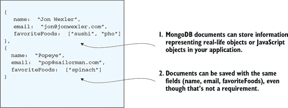
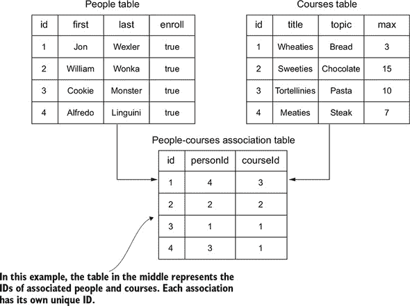
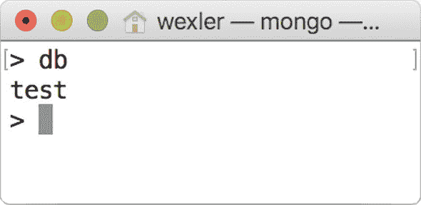
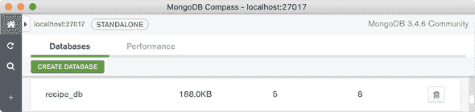
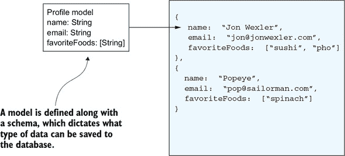
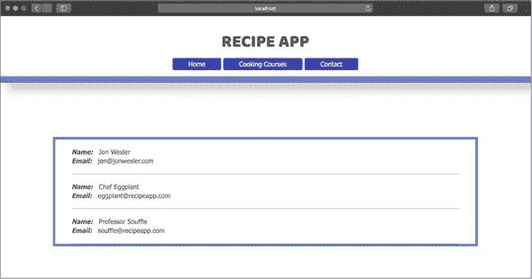
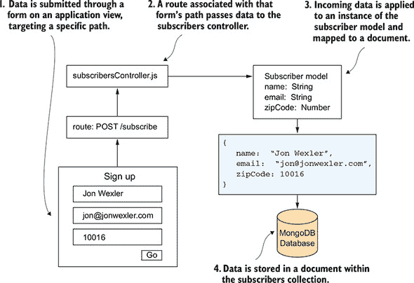
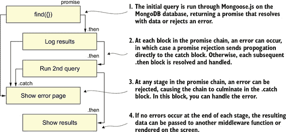
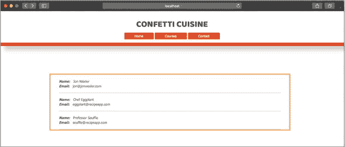
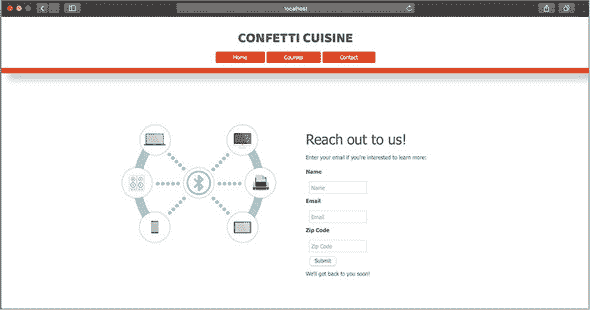

## 单元 3：连接到数据库

单元 2 教会了你如何使用 Express.js 设置 Node.js 应用程序。到这一点，你应该已经能够舒适地使用 Express.js 的路由和模板构建一个基本的 Web 应用程序。本单元是关于将你在单元 2 中构建的应用程序连接到数据库。数据库是一个可以永久存储值的地方，与之前课程中的数据不同，后者每次应用程序重启时都会重置。

在这本书中，你将学习如何使用 MongoDB，这是 Node.js 中流行的数据库。首先，你需要在你的计算机上下载并安装 Mongo。然后，你将探索 MongoDB shell，这是一个类似于 Node.js REPL shell 的数据库环境。接下来，你将学习一些数据库理论，了解如何构建你的数据库及其中的数据。你将看到模型如何适应模型-视图-控制器（MVC）架构，以及它们如何通过名为 Mongoose 的包与你的应用程序数据库交互。最后，你将探索数据库模式——你结构化数据的轮廓——如何帮助你将数据对象相互关联。

以构建一个可以存储用户信息并在屏幕上显示这些信息的 Node.js 应用程序为目标，本单元涵盖了以下主题：

+   第 13 课介绍了 MongoDB，这是一个 NoSQL 数据库，它以 JSON 结构存储数据。在本课中，你将学习 MongoDB 如何与 Express.js 协同工作，并在你的计算机上安装数据库程序。你还将使用 MongoDB shell 创建数据库并插入一些数据。

+   第 14 课展示了如何将你的 MongoDB 数据库连接到 Express.js 应用程序。在初始设置之后，你将学习面向对象编程（OOP）如何帮助你为 MVC 结构的 Node.js 应用程序构建可靠的模型。对于你的模型，你将安装并使用 Mongoose 包，这是一个对象文档映射器（ODM）。

+   第 15 课讨论了你可以从 Node.js 应用程序内部使用的查询命令类型。你还实现了 JavaScript 承诺，以使用 Mongoose 构建更流畅、更符合 ES6 的应用程序。

+   最后，第 16 课展示了如何通过为 Confetti Cuisine 烹饪学校应用程序实现 MongoDB 数据库来测试你的技能。在这个综合练习中，你保存用户数据和时事通讯电子邮件。

准备在第 13 课中收集和存储数据。

## 第 13 课：设置 MongoDB 数据库

在 第 2 单元 中，你使用 Express.js 构建了 Web 应用程序。通过将应用程序结构化为使用模型-视图-控制器 (MVC) 架构，你现在可以通过控制器处理请求并提供服务视图。第三件基本工具是模型，你将使用它来组织你计划永久存储的数据。在本课中，你将安装 MongoDB，这是你将用于存储持久数据的数据库系统。你还将探索 MongoDB 中的文档数据库结构为何特别适合 Node.js 应用程序。在本课结束时，你将设置数据库并将其连接到你的应用程序。

本课涵盖

+   安装 MongoDB

+   在 MongoDB 壳中读取和输入数据

+   将 MongoDB 连接到 Node.js 应用程序

| |
| --- |

**考虑这一点**

你想从你的应用程序开始将数据保存到数据库中，但你不确定使用哪个数据库。使用 Node.js，你可以与几乎所有常见的数据库一起工作，例如 MySQL、PostgreSQL、Cassandra、Redis 和 Neo4j。你可以通过探索它们在 `npm` 上的相关包来了解最支持和最受欢迎的数据库管理系统。

然而，MongoDB 提供了一种独特的数据存储风格，类似于 JSON——一个对 JavaScript 友好的格式，这可能使你在第一次使用 Node.js 保存数据时更容易与数据库一起工作。

| |
| --- |

### 13.1\. 设置 MongoDB

存储数据可以说是应用程序开发中最重要的一部分。没有长期存储，你在与用户互动的方式上会受到限制。到目前为止，你构建的每个应用程序中的数据，每次重启应用程序时都会消失。如果社交网络中的数据每次用户关闭浏览器或每次重启该应用程序时都会消失，用户将不得不创建新账户并从头开始。

一个 *数据库* 是一个为你的数据设计的组织结构，以便你的应用程序能够轻松访问和高效地修改。数据库就像一个仓库：你需要存储的物品越多，你越会喜欢一个帮助你找到这些物品的有序系统。就像一个网络服务器一样，你的应用程序连接到 MongoDB 数据库并请求数据。

在本单元中，我讨论了如何将信息保存到数据库中进行长期存储。即使应用程序关闭，你的数据也会持续存在。

*MongoDB* 是一个开源的数据库程序，它通过使用文档来组织数据。MongoDB *文档* 以类似 JSON 的结构存储数据，允许你使用键值对来关联数据对象和属性。

这种存储系统遵循熟悉的 JavaScript 语法。注意在 图 13.1 中，文档的内容类似于 JSON。实际上，MongoDB 将文档存储为 BSON（JSON 的二进制形式）。与大多数应用程序使用的关系型数据库不同，MongoDB 的非关系型数据库系统在 Node.js 应用程序社区中处于领先地位。

##### 图 13.1\. 示例文档




**关系型数据库的概述**

本书重点介绍 MongoDB 以及其文档如何补充基于 JavaScript 的应用程序平台（如 Node.js）。然而，值得注意的是 MongoDB 不是什么，以及编程世界的其他部分是如何与数据库一起工作的。

大多数软件和 Web 应用程序使用的数据库在数据存储模型上与 MongoDB 中使用的文档结构不同。大多数数据库是 *关系型* 的，这意味着它们通过表格关联数据，就像标准的电子表格一样。在这些表格中，列定义了应存储的数据类型，而行存储与列对应的值。在以下图中，表示人员、课程以及哪些人员注册了特定课程的数据分别显示在不同的表格中。



示例关系型数据库结构

在这个例子中，两个表通过它们的 ID 值相关联。为了将一个人与他们想要的烹饪课程联系起来，将 `people` 和 `courses` 表中的项目 ID 添加到新的连接表行中。*连接表* 通常只包含相关项的 ID，以定义这些项之间的关系。这种通过引用 ID 设计的关系是数据库系统名称的由来。使用这种结构的数据库通常是基于 SQL 的，这使得 MongoDB 成为一个 NoSQL 数据库系统。

你可以使用 Node.js 设置关系型数据库——实际上，许多应用程序都是这样做的——但要最好地利用 SQL 数据库，了解如何编写 SQL 语言很有帮助。对于有 JavaScript 背景的人来说，MongoDB 的查询语言更容易理解。

关于关系型数据库的更多信息，我建议阅读 Oracle 提供的概述 [`docs.oracle.com/javase/tutorial/jdbc/overview/database.html`](https://docs.oracle.com/javase/tutorial/jdbc/overview/database.html)。


在本节中，你将安装 MongoDB 并查看一些数据。Windows 和 Macintosh 的安装过程略有不同。对于 Mac，推荐的方法是使用名为 Homebrew 的终端命令行工具。你可以通过输入下一列表中的命令来安装 Homebrew。

##### 列表 13.1\. 在终端中安装 Homebrew 的命令

```
mkdir homebrew && curl -L
https://github.com/Homebrew/brew/tarball/master |
 tar xz --strip 1 -C homebrew                          *1*
```

+   ***1*** **在终端中运行命令以在 MacOS 机器上安装 Homebrew。**


##### 注意

Homebrew 是一个帮助你安装软件和其他底层工具（如数据库管理系统）的工具。更多信息，请访问 [`brew.sh`](https://brew.sh)。


当 Homebrew 安装完成后，您应该能够在任何新的终端窗口中输入 `brew` 并看到可用 Homebrew 命令的列表，其中之一是 `brew install`。通过运行 `brew install mongodb` 来安装 MongoDB。

| |
| --- |

##### 提示

如果您的计算机在安装过程中的任何时刻抛出错误或抱怨权限问题，您可能需要以超级用户身份运行命令，即在命令后附加 `sudo`。然后您将被提示输入计算机的登录密码。

| |
| --- |

接下来，在您的计算机根目录下（在终端窗口中尽可能多地 `cd ..`）创建一个名为 data 的新文件夹，并在其中创建一个名为 db 的新文件夹。您可以通过在终端窗口中输入 `mkdir -p /data/db` 来创建此文件夹。

您可能需要为您的用户账户提供使用此文件夹的权限。为此，请运行 `sudo chown <your_username> /data/db`，并输入您的计算机密码。对于 Windows，步骤如下：

+   在您的浏览器中访问 [`www.mongodb.com/download-center#community`](https://www.mongodb.com/download-center#community)。

+   下载 Windows 版本的 MongoDB (.msi)。

+   下载完成后，打开文件，并按照默认的安装步骤进行操作。

+   当安装程序完成后，转到您的 C:\驱动器，创建一个名为 data 的新文件夹，并在其中创建一个名为 db 的文件夹。

| |
| --- |

##### 注意

在 Windows 中，您可能需要将 MongoDB 文件夹路径添加到您的环境变量 PATH 中。要添加它，请右键单击计算机，选择属性 => 高级系统设置 => 环境变量 => 编辑环境变量 => PATH，并将您的 MongoDB 可执行路径添加到该字符串中。您的 MongoDB 路径可能看起来像 `C:\Program Files\MongoDB\Server\3.6.2\bin`。

| |
| --- |

对于更多安装说明，包括针对 Ubuntu Linux 机器的说明，请访问 [`docs.mongodb.com/v3.0/tutorial/install-mongodb-on-ubuntu`](https://docs.mongodb.com/v3.0/tutorial/install-mongodb-on-ubuntu)。

到目前为止，您已经在您的计算机上安装了 MongoDB。像 Web 服务器一样，MongoDB 需要启动以创建您应用程序的新数据库。您可以通过在终端窗口中运行 `mongod` 来启动 MongoDB。此命令为 MongoDB 分配一个端口，并确定其数据库的位置在 `data/db`。

| |
| --- |

##### 注意

要在 Mac 上使用 Homebrew 启动和停止 MongoDB，请运行 `brew services start mongodb` 或 `brew services stop mongodb`。Homebrew 在后台运行数据库服务器，因此如果 `mongod` 不起作用，您可能已经在其他地方使用 Homebrew 启动了 MongoDB。

| |
| --- |

您可以通过在新的终端窗口中输入 `mongo` 来测试 Mongo 是否安装成功。此命令会启动 MongoDB shell，这是一个环境，您可以在其中运行 MongoDB 命令并查看数据。此 shell 环境类似于 REPL，因为它将您的终端窗口隔离出来，允许您仅与 MongoDB 语法进行交互。当您有一些数据要处理时，您可以进一步探索这个环境。

| |
| --- |

**快速检查 13.1**

> **Q1:**
> 
> MongoDB 使用什么数据结构来存储数据？

|  |

**QC 13.1 答案**

> **1:**
> 
> MongoDB 使用文档来存储数据。


### 13.2\. 在 MongoDB shell 中运行命令

现在 MongoDB 已启动，它准备好接收添加、查看、删除或更改数据的命令。在你将 MongoDB 连接到应用程序之前，你可以在 MongoDB shell 中测试一些命令。


##### 警告

你在 MongoDB shell 中运行的命令是永久的。如果你删除了数据（或整个数据库），就无法恢复。


在新的终端窗口中运行 `mongo`。此命令应提示 shell 启动。你会看到你的 MongoDB 版本号，可能还有一些警告（你现在可以忽略），以及熟悉的 `>` 来指示 shell 已处于活动状态并准备好接收命令。

MongoDB 可以存储多个数据库；它是所有应用程序数据库的管理系统。首先，MongoDB shell 将你置于测试数据库中。你可以通过输入 `db` 来查看这个测试数据库，以列出你的当前数据库，在提示符后 (图 13.2)。

##### 图 13.2\. MongoDB shell 查看当前测试数据库



要查看所有可用的数据库，运行 `show dbs`。对于 MongoDB 的干净安装，你的 shell 的响应应该看起来像下面的列表。你的测试数据库是 MongoDB 预先打包的三个数据库之一。在数据库名称的右侧是数据库的大小。因为你还没有存储任何数据，所以数据库是空白的。

##### 列表 13.2\. 在终端中显示所有数据库

```
admin             0.000GB
local             0.000GB
test              0.000GB           *1*
```

+   ***1*** **查看本地数据库。**

你可以通过输入 `use <new_database_name>` 来创建一个新的数据库并同时切换到它。尝试通过输入 `use recipe_db` 切换到新的食谱应用程序数据库。然后再次运行 `db` 以查看你已处于 `recipe_db` 数据库中。


##### 注意

你不会在数据库列表中看到你的新数据库，直到添加数据。


要向数据库添加数据，你需要指定一个与该数据关联的集合名称。MongoDB 的 *集合* 代表你的数据模型，将所有与该模型相关的文档存储在同一组中。例如，如果你想为食谱应用程序创建一个联系人列表，可以创建一个新的集合，并使用以下列表中的命令添加一个数据项。`insert` 方法在 MongoDB 集合上运行，以将 JavaScript 对象的元素添加到新文档中。

##### 列表 13.3\. 在终端中向新集合添加数据

```
db.contacts.insert({
  name: "Jon Wexler",
  email: "jon@jonwexler.com",
  note: "Decent guy."
})                              *1*
```

+   ***1*** **将新数据插入到数据库中。**

在这个阶段，没有严格的集合结构；你可以在新文档中添加任何值，而无需遵循之前的数据模式。使用以下属性将另一个项目插入到 `contacts` 集合中：`{first_name: "Jon", favoriteSeason: "spring", countries_visited: 42}`。MongoDB 允许你添加这些看似冲突的数据元素。


##### 注意

尽管 MongoDB 允许您存储不一致的数据，但这并不意味着您应该这样做。在第 14 课中，我讨论了围绕您应用程序模型组织数据的方法。


要列出集合的内容，您可以输入`db.contacts.find()`。您应该看到类似于以下列表的响应。两个插入的项目都存在，MongoDB 添加了一个额外的属性。`id`属性存储一个唯一的值，您可以使用它来区分和定位数据库中的特定项目。

##### 列表 13.4\. 终端中查找所有数据响应

```
{"_id": ObjectId("5941fce5cda203f026856a5d"), "name": "Jon
Wexler", "email": "jon@jonwexler.com", "note":
"Nice guy."}                                                  *1*
{"_id": ObjectId("5941fe7acda203f026856a5e"), "first_name":
"Jon", "favoriteSeason": "spring", "countries_visited": 42}
```

+   ***1*** **显示数据库文档的结果。**


**ObjectId**

为了保持您的数据有组织和唯一，MongoDB 使用`ObjectId`类来记录有关其数据库文档的一些有意义的信息。例如，`ObjectId("5941fe7acda203f026856a5e")`构建了一个表示数据库中文档的新`ObjectId`。传递给`ObjectId`构造函数的十六进制值引用了文档、记录创建的时间戳以及有关您的数据库系统的一些信息。

生成的`ObjectId`实例提供了许多有用的方法，您可以使用它们在数据库中对数据进行排序和组织。因此，`_id`属性在 MongoDB 中比文档 ID 的字符串表示形式更有用。


通过输入`db.contacts .find({_id: O``b``jectId("5941fce5cda203f026856a5d")})`在`contacts`集合中搜索特定项目。


##### 注意

将此示例中的`ObjectId`替换为您自己的数据库结果中的一个。

|  |

**MongoDB Compass**

随着您对 MongoDB 的熟悉，您可能需要一个比终端中的 MongoDB shell 更用户友好的窗口来查看您的 MongoDB 数据库。MongoDB 团队同意了这一点，并为所有主要操作系统开发了一个名为 MongoDB Compass 的图形用户界面。

MongoDB Compass 使用简单。要查看为您的食谱应用程序设置的数据库，请按照以下步骤操作：

1.  从[`www.mongodb.com/download-center#compass`](https://www.mongodb.com/download-center#compass)下载软件。

1.  按照安装步骤将 MongoDB Compass 添加到您的应用程序文件夹中。

1.  运行 MongoDB Compass 并接受默认的连接设置到您现有的 MongoDB 设置。

1.  查看您的数据库（包括`recipe_db`），并列出查看其中集合和文档的选项，如图 13.3 所示。


##### 图 13.3\. MongoDB Compass 中的数据库视图




**MongoDB Compass 中的数据库视图**

我建议在您在应用程序中使用 MongoDB 时，将 MongoDB Compass 作为一个辅助工具。


您可以使用许多 MongoDB 命令。表 13.1 列出了您应该了解的一些命令。

##### 表 13.1\. MongoDB Shell 命令

| 命令 | 描述 |
| --- | --- |
| show collections | 显示您数据库中的所有集合。稍后，这些集合应与您的模型匹配。 |
| db.contacts.findOne | 从您的数据库中随机返回一个项目或返回一个匹配作为参数传入的标准的单个项目，这可能看起来像 findOne({name: ‘Jon’})。 |
| db.contacts.update({name: “Jon”}, {name: “Jon Wexler”}) | 使用第二个参数的属性值更新任何匹配的文档。 |
| db.contacts.delete({name: “Jon Wexler”}) | 删除集合中任何匹配的文档。 |
| db.contacts.deleteMany({}) | 删除该集合中的所有文档。这些命令是不可逆的。 |

为了更多练习，请查看 [`docs.mongodb.com/manual/reference/mongo-shell/`](https://docs.mongodb.com/manual/reference/mongo-shell/) 中的命令速查表。

在下一节中，您将了解如何将 MongoDB 添加到您的 Node.js 应用程序中。


**快速检查 13.2**

> **Q1:**
> 
> 您可以使用哪个 MongoDB 命令来查看数据库中的现有集合？

|  |

**QC 13.2 答案**

> **1:**
> 
> `show collections` 列出 MongoDB shell 中活动数据库中的集合。


### 13.3\. 将 MongoDB 连接到您的应用程序

要将 MongoDB 添加到您的 Node.js 食谱应用程序中，请在终端中进入您的项目文件夹（或创建一个新的初始化项目），并运行 `npm i mongodb@3.6.3 -S` 命令来安装 `mongodb` 包。此命令将 `mongodb` 包保存到您的项目 package.json 依赖项中。


##### 注意

在本课程的相应代码存储库中，已从上一个综合项目添加了一些视图和样式规则。


在 main.js 文件顶部，添加 清单 13.5 中显示的代码。使用 `MongoClient` 类需要引入 MongoDB 模块。`MongoClient` 在其默认端口上设置与本地数据库的连接。回调函数返回到 MongoDB 服务器的连接。然后从服务器连接中获取名为 `recipe_db` 的数据库。如果不存在提供的名称的数据库，MongoDB 将为应用程序创建一个。


##### 注意

记得在尝试连接之前运行 `mongod` 以确保您的 MongoDB 服务器正在运行。


接下来，要求数据库查找 `contacts` 集合中的所有记录，并将它们作为数组返回。结果数据在回调函数中返回。然后您可以将结果记录到控制台。

##### 列表 13.5\. 在 main.js 中添加 MongoDB 连接到 Express.js

```
const MongoDB = require("mongodb").MongoClient,    *1*
  dbURL = "mongodb://localhost:27017",
  dbName = "recipe_db";

MongoDB.connect(dbURL, (error, client) => {        *2*
  if (error) throw error;
  let db = client.db(dbName);                      *3*
  db.collection("contacts")
    .find()
    .toArray((error, data) => {                    *4*
      if (error) throw error;
      console.log(data);                           *5*
    });
});
```

+   ***1*** **引入 MongoDB 模块。**

+   ***2*** **设置到本地数据库服务器的连接。**

+   ***3*** **从 MongoDB 服务器连接中获取 recipe_db 数据库。**

+   ***4*** **在 contacts 集合中查找所有记录。**

+   ***5*** **将结果打印到控制台。**


##### 注意

这里的 `find` 查询方法与传统函数式编程语言中的 `find` 查询不同。如果你在 MongoDB 中使用 `find` 没有匹配项，你会得到一个空数组。

| |
| --- |

你可以在你的 Node.js 应用程序中使用与在 MongoDB 命令行界面中相同的命令。例如，要向数据库中添加一个新项目，你可以在你的 MongoDB 连接回调函数中添加 代码清单 13.6 中的代码。

当你查询数据库中的所有项目时，你连接到 `contacts` 集合并插入一个项目。如果新数据插入成功，你将数据库消息记录到控制台。

##### 代码清单 13.6\. 从你的 Node.js 应用程序中将数据插入到终端

```
db.collection("contacts")
  .insert({
    name: "Freddie Mercury",
    email: "fred@queen.com"
  }, (error, db) => {             *1*
    if (error) throw error;
    console.log(db);              *2*
  });
```

+   ***1*** **将一个新联系人插入到数据库中。**

+   ***2*** **记录结果错误或保存的项目。**

在 第 14 课 中，你探索了一个名为 Mongoose 的包，它与 MongoDB 一起工作，为你的应用程序存储提供更多组织。

| |
| --- |

**快速检查 13.3**

> **Q1:**
> 
> 判断对错：如果你尝试连接到一个不存在的数据库，MongoDB 会抛出一个错误。

| |
| --- |
| |

**QC 13.3 答案**

> **1:**
> 
> 错误。MongoDB 会根据你提供的名称创建一个新的数据库，而不是抛出一个错误。

| |
| --- |

### 摘要

在本课中，你学习了如何设置 MongoDB 以及如何使用某些命令来管理计算机上的数据库。在本课结束时，你将集合和文档插入到自己的数据库中，并将该数据库连接到你的 Node.js 应用程序。在 第 14 课 中，你将构建模型来表示你希望在应用程序中存储的数据类型。

| |
| --- |

**尝试这个**

想象一下，你正在创建一个用于跟踪冰淇淋车统计数据的程序。创建一个名为 `ice_cream_flavors` 的适当命名的数据库集合。尝试插入一些口味，并包括有助于你的统计分析的字段。

| |
| --- |

## 第 14 课\. 使用 Mongoose 构建模型

在 第 13 课 中，你开始使用 MongoDB。连接到你的 Node.js 应用程序的数据库后，你就可以保存和加载数据了。在本课中，你将采用更面向对象的方法来处理数据。首先，你安装了 Mongoose 包，这是一个在应用程序逻辑和数据库之间提供语法层的工具。Mongoose 允许你将应用程序数据转换为适合模型结构。在课程的后半部分，你将构建第一个模型和模式来表示食谱应用程序的订阅者。

本课涵盖

+   将 Mongoose 安装并连接到你的 Node.js 应用程序

+   创建模式

+   构建 Mongoose 数据模型和实例化

+   使用自定义方法加载数据和保存数据

| |
| --- |

**考虑这一点**

你最终将数据库连接到你的应用程序，但数据会随时间变化。有一天，你可能希望所有食谱都遵循相同的格式。你如何确定这种结构并确保所有保存的数据都遵循该结构的规则？

在本节课中，你将探索 Mongoose，这是一个用于创建模型模式的库。当你使用这些模式时，你的数据开始遵循只有你可以定制的严格规则。

| |
| --- |

### 14.1\. 使用 Node.js 应用程序设置 Mongoose

你已经体验了 Express.js 并看到了它是如何帮助你处理 HTTP 请求和响应的。同样，还有其他包可用于协助你的 Node.js 应用程序与其数据库之间的通信。你将要使用的工具被称为 Mongoose。*Mongoose* 是一个对象-文档映射器（ODM），它允许你以保持应用程序面向对象结构的方式运行 MongoDB 命令。例如，仅使用 MongoDB 时，很难保持一个保存的文档与下一个的一致性。Mongoose 通过提供构建具有定义可以保存的数据类型的模式的模型工具来改变这种情况。

我在单元 2 中讨论了模型-视图-控制器（MVC）架构，并描述了控制器如何与视图和模型通信以确保正确数据通过应用程序流动。*模型*类似于 Mongoose 用于组织你的数据库查询的 JavaScript 对象的类。在本节中，你将安装 Mongoose 并查看你的应用程序中的模型看起来像什么（图 14.1）。

##### 图 14.1\. 使用 Mongoose 创建的模型映射到 MongoDB 中的文档。



要安装 Mongoose，请在终端中运行 `npm i mongoose -S`，在项目文件夹内。使用 Mongoose，你不再需要在 main.js 的顶部引入 `mongodb` 或使用来自第 13 课的任何 MongoDB 代码。将 清单 14.1 中的代码添加到 main.js 中。将 `mongoose` 引入应用程序文件。设置应用程序与 MongoDB 数据库的连接。（这里适用的规则与正常 MongoDB 连接相同。）然后将数据库连接分配给 `db` 变量，你可以在文件中稍后使用它进行数据更改或数据库状态更改。

##### 清单 14.1\. 在 main.js 中配置 Mongoose 与你的 Node.js 应用程序

```
const mongoose = require("mongoose");         *1*
mongoose.connect(
  "mongodb://localhost:27017/recipe_db",      *2*
  {useNewUrlParser: true}
);
const db = mongoose.connection;               *3*
```

+   ***1*** **引入 mongoose。**

+   ***2*** **设置与数据库的连接。**

+   ***3*** **将数据库分配给 db 变量。**

| |
| --- |

##### 注意

请记住，MongoDB 服务器需要在后台运行。要运行 MongoDB，请在终端窗口中输入 `mongod`。

| |
| --- |

你需要做的所有事情来设置 Mongoose。你可以在数据库连接后立即记录一条消息，通过将下一列表中的代码添加到 main.js 中。数据库连接在接收到数据库的“`open`”事件后，仅在回调函数（日志消息）中运行一次代码。

##### 列表 14.2\. 在 main.js 中数据库连接时记录消息

```
db.once("open", () => {                                             *1*
  console.log("Successfully connected to MongoDB using Mongoose!");
});
```

+   ***1*** **当应用程序连接到数据库时记录一条消息。**

在下一节中，您将探索如何建模数据以充分利用 Mongoose。


**快速检查 14.1**

> **Q1:**
> 
> ODM 是什么？

|  |

**QC 14.1 答案**

> **1:**
> 
> ODM 是对象-文档映射器，这是 Mongoose 在您的应用程序开发中的角色。ODM（类似于对象-关系映射器）使您在应用程序中以纯粹的对象方式思考变得更容易，而不用担心数据在数据库中的结构。


### 14.2\. 创建模式

模式类似于某些语言中的类定义，或者更广泛地说，是您希望数据在应用程序中特定对象中组织的方式的蓝图。为了避免不一致的数据，例如，一些文档有 `email` 字段而其他没有，您可以创建一个模式，声明所有 `contact` 对象都需要有电子邮件字段才能保存到数据库中。

因为您想在食谱应用程序中添加一个新闻通讯订阅表单，所以为订阅者创建一个模式。将 列表 14.3 中的代码添加到 main.js 中。`mongoose.Schema` 提供了一个构造函数，允许您使用给定的参数构建一个模式对象。然后添加对象属性以声明对象的字段名称和数据类型。例如，某人的姓名不能是数字。

##### 列表 14.3\. main.js 中的订阅者模式

```
const subscriberSchema = mongoose.Schema({     *1*
  name: String,                                *2*
  email: String,
  zipCode: Number
});
```

+   ***1*** **使用 mongoose.Schema 创建一个新的模式。**

+   ***2*** **添加模式属性。**


##### 注意

MongoDB 不强制执行您的模式；Mongoose 是。有关 Mongoose 模式数据类型的更多信息，请访问 [`mongoosejs.com/docs/schematypes.html`](http://mongoosejs.com/docs/schematypes.html)。


现在模式已定义，您需要通过使用 `const Subscriber = mongoose.model(`“`Subscriber`”`, subscriberSchema)` 将其应用于模型。模型是您将用于实例化新的 `Subscriber` 对象的，您创建的模式可以用于该模型。`model` 方法接受您选择的模型名称和先前定义的模式（在本例中为 `subscriberSchema`）。

您可以通过引用 `Subscriber` 从此模型中实例化新对象。您有两种生成新对象的方法，如 列表 14.4 所示。您可以通过使用 `new` 关键字并传递符合本节中较早提到的 `subscriberSchema` 的属性来构造 `Subscriber` 模型的新实例。要将这个新创建的 `Subscriber` 对象保存到数据库中，您可以在其上调用 `save` 并通过回调函数处理任何错误或返回的数据。

错误可能与您之前定义的模式类型不匹配的数据有关。保存的项目返回您可以在应用程序的其他地方使用的数据。例如，您可能想通过姓名感谢订阅者注册。`create`在一步中完成了`new`和`save`的功能。如果您知道您想立即创建并保存对象，请使用此 Mongoose 方法。


##### 注意

从您的 Mongoose 模型中实例化对象类似于从 Java-Script 对象中实例化。`new`关键字可以与 JavaScript 数组和其他数据类型一起使用。


##### 列表 14.4\. 在 main.js 中创建和保存模型的语句

```
var subscriber1 = new Subscriber({
  name: "Jon Wexler",
  email: "jon@jonwexler.com"
});                                              *1*

subscriber1.save((error, savedDocument) => {     *2*
  if (error) console.log(error);                 *3*
  console.log(savedDocument);                    *4*
});

Subscriber.create(
  {
    name: "Jon Wexler",
    email: "jon@jonwexler.com"
  },
  function (error, savedDocument) {              *5*
    if (error) console.log(error);
    console.log(savedDocument);
  }
);
```

+   ***1*** **实例化一个新的订阅者。**

+   ***2*** **将订阅者保存到数据库中。**

+   ***3*** **将潜在的错误传递给下一个中间件函数。**

+   ***4*** **记录保存的数据文档。**

+   ***5*** **一步创建并保存订阅者。**

将本节中的代码添加到您的 main.js 文件中。一旦您使用`node main.js`启动应用程序，您应该看到您的 MongoDB `recipe_db`数据库中填充了新的订阅者。


**快速检查 14.2**

> **Q1:**
> 
> 正误：使用`new Subscriber({ name:` “`Jon`”`, email:` “`jon@jonwexler.com`”`})`将新记录保存到您的数据库中。

|  |

**QC 14.2 答案**

> **1:**
> 
> 错误。此代码仅创建一个新的虚拟对象。如果您将此行的值存储到变量中并在该变量上调用`save`，则新订阅者将被存储在数据库中。


### 14.3\. 组织您的模型

现在您有了以 Mongoose 模型形式保存数据的方法，您可能想要组织您的模型，以便它们不会使您的 main.js 文件杂乱。就像您为视图和控制器做的那样，在应用程序的根级别创建一个名为 models 的文件夹。在该文件夹内，创建一个名为 subscriber.js 的新文件。

此文件是您将模型代码移动到的位置。将所有模式和模型定义代码移动到该文件，并将模型移动到文件的`exports`对象中。（参见以下列表。）任何需要`subscriber.js`的模块都将能够访问`Subscriber`模型。模式不需要在文件外部公开。

##### 列表 14.5\. 将模式和模型移动到单独的模块

```
const mongoose = require("mongoose"),
  subscriberSchema = mongoose.Schema({
    name: String,
    email: String,
    zipCode: Number
  });

module.exports = mongoose.model("Subscriber", subscriberSchema);    *1*
```

+   ***1*** **将订阅者模型作为唯一的模块导出。**


##### 注意

您需要在这个模块中引入`mongoose`，因为模式和模型都使用 Mongoose 方法来工作。Node.js 只将一个模块加载到项目中一次，所以在这里引入它不应该减慢您的应用程序；您正在告诉 Node.js 您想使用一个已加载的模块。


接下来，通过在您的其他所需模块下方添加`const Subscriber = require(`“`./models/subscriber`”`)`来在 main.js 中引入此模型。现在您应该能够像以前一样使用该模型。

在 main.js 中，使用 Mongoose 的 `findOne` 和 `where` 查询方法在你的数据库中查找文档。例如，你可以使用 `Subscriber.findOne({ name: "Jon Wexler"}) .where("email", /wexler/)` 来查找并返回一个匹配以下条件的文档：电子邮件包含字符串 "wexler"。

这个自定义查询示例展示了你的查询如何灵活，以获取你需要的数据。Mongoose 允许你链式调用查询的一部分，甚至可以将查询存储在变量中。你可以创建一个变量 `var findWexlers` 并将其分配给查询电子邮件中包含单词 `wexler` 的代码。然后你可以通过使用 `findWexlers.exec()` 在以后运行查询。（有关 `exec` 的更多信息，请参阅 第 15 课。）

如果你计划立即运行查询而不使用 `exec` 方法，你需要一个带有两个参数的回调函数。第一个参数表示发生的任何错误，第二个参数表示数据库返回的任何数据，如下所示。尝试通过遵循 [`mongoosejs.com/docs/queries.html`](http://mongoosejs.com/docs/queries.html) 上的某些示例查询来创建你自己的查询。

##### 列表 14.6\. 在 main.js 中运行的示例查询

```
var myQuery = Subscriber.findOne({
    name: "Jon Wexler"
  })
  .where("email", /wexler/);
myQuery.exec((error, data) => {
  if (data) console.log(data.name);
});                                     *1*
```

+   ***1*** **运行一个带有回调函数的查询以处理错误和数据。**

| |
| --- |

##### 注意

对于表示将从数据库返回多个项目的查询，你应该期望一个数组。如果没有找到文档，你将得到一个空数组。

| |
| --- |

现在你有自由创建更多模块，并通过使用它们的名称而不是 MongoDB 集合名称来保存它们。

在 单元 4 中，你学习了如何创建一个更健壮的模型，其值可以创建、读取、更新和删除——CRUD 应用程序中的四个核心模型功能。我在那个单元中详细讨论了这种方法。

| |
| --- |

**快速检查 14.3**

> **Q1:**
> 
> 在 Mongoose 架构中指定每个字段需要哪些两个组件？

| |
| --- |
| |

**QC 14.3 答案**

> **1:**
> 
> 架构需要属性名称和数据类型。

| |
| --- |

### 摘要

在本课中，你学习了如何设置 Mongoose 并使用你的 MongoDB 连接将数据映射到数据库。你还了解了一些 Mongoose 语法和方法。通过本课中的步骤，你学习了如何创建用于存储持久数据的架构和模型。最后，你组织了你的模型，为新的工具腾出空间。在 第 15 课 中，你通过在数据库查询中实现 JavaScript promises 来清理本课中构建的一些功能。

| |
| --- |

**尝试这个**

最终，你将为你的食谱应用创建更多模型。开始思考这些模型将是什么样子。例如，你可能需要一个模型来表示通过该计划提供的不同类型的课程。尝试创建一个食谱条目的架构和模型。

| |
| --- |

## 第 15 课：连接控制器和模型

到目前为止，你已经设置了你的 Node.js 应用程序来处理数据并将数据存储在 MongoDB 数据库中。在 Mongoose 的帮助下，你已经使用模型和模式结构化了你的数据。在本课中，你将你的路由连接到控制器和这些模型，以便你可以开始根据用户的 URL 请求保存有意义的基于用户的数据。首先，你将为订阅者路由构建一个新的控制器。然后，你将把这些路由转换为使用 JavaScript ES6 允许的 Promise。添加 Promise 现在给你的数据库调用提供了更多的灵活性，并且随着应用程序的增长。最后，你将本课总结为新的视图和表单，订阅者可以在其中发布他们的信息。

本课涵盖

+   将控制器连接到模型

+   通过控制器动作保存数据

+   使用 Promise 实现数据库查询

+   处理提交的表单数据

| |
| --- |

**考虑以下内容**

你的食谱应用程序正在使用 Mongoose 模型来表示数据库中的数据。然而，JavaScript 在你的应用程序中是异步的，所以数据库调用需要回调在完成时运行。但是，回调可能会很混乱，尤其是在复杂的查询中。

幸运的是，你可以使用多种其他类型的语法来包装你的回调，并以更优雅的方式处理返回的数据或错误。Promise 是实现这一点的途径，Mongoose 也提供了在你的应用程序中使用 Promise 语法的支持。

| |
| --- |

### 15.1. 创建订阅者控制器

回想一下，控制器是你模型（数据）和视图（网页）之间的粘合剂。现在你已经设置好了模型，你需要一个控制器来处理针对与你的模型相关的数据的特定外部请求。如果有人请求主页路径`/`，你可以通过主页控制器中的逻辑返回一个视图。现在，如果有人想要注册为订阅者，你需要实现一个订阅者控制器。在你的控制器文件夹中创建一个名为`subscribersController.js`的新文件。

| |
| --- |

##### 注意

通常，控制器以你的模型复数形式命名。没有严格的规则，正如你所见，你已经有一个`homeController.js`，但这个控制器在应用程序中并不代表一个模型。

| |
| --- |

此文件需要访问 `mongoose` 和你的 `Subscriber` 模型，这两个都可以在文件顶部引入。接下来，你可以创建一个控制器操作，用于处理对数据库中所有订阅者视图的请求。代码看起来像 列表 15.1。引入 `mongoose` 以便访问将模型保存到数据库所需的工具。接下来，从你的 `subscriber` 模块中引入 `Subscriber` 模型，以便将其集成到你的代码逻辑中；你不再需要在 main.js 中引用 `Subscriber` 模型。`getAllSubscribers` 将对任何需要此模块的文件可用。你可以使用这个导出的回调函数从数据库返回数据。

在此控制器操作中，你使用 Mongoose 的 `find` 方法在 `Subscriber` 模型上，告诉 MongoDB 你想要数据库中所有订阅者的数组。

| |
| --- |

##### 注意

使用不带任何参数的 `find` 查询方法与空对象 (`{}`) 相同。在这里，你使用空对象来明确表示你想要获取所有订阅者，没有任何附加条件。

| |
| --- |

如果在从数据库读取时发生错误，将其发送到下一个中间件函数。否则，将来自 MongoDB 的数据设置到请求对象中。然后这个对象可以被中间件链中的下一个函数访问。

##### 列表 15.1\. 在 subscribersController.js 中构建你的订阅者控制器

```
const Subscriber = require("../models/subscriber");     *1*

exports.getAllSubscribers = (req, res, next) => {       *2*
  Subscriber.find( {}, (error, subscribers) => {        *3*
    if (error) next(error);                             *4*
    req.data = subscribers;                             *5*
    next();                                             *6*
  });
};
```

+   ***1*** **引入订阅者模块。**

+   ***2*** **导出 `getAllSubscribers` 以将数据库数据传递给下一个中间件函数。**

+   ***3*** **在订阅者模型上使用 find 查询。**

+   ***4*** **将错误传递给下一个中间件函数。**

+   ***5*** **将来自 MongoDB 的请求数据设置在请求对象中。**

+   ***6*** **继续到下一个中间件函数。**

| |
| --- |

##### 注意

因为模型在不同的文件夹中，你需要使用 `..` 来表示在进入模型文件夹之前退出当前文件夹，然后引入它。

| |
| --- |

确保你仍然安装并正确设置了 Express.js。下一步是在 main.js 中设置路由。首先，确保通过使用 `const subscribersController = require("./controllers/subscribers -Controller")` 在 main.js 中引入订阅者控制器。你使用的路由看起来像 列表 15.2 中的代码。

在此代码中，你正在寻找对 `/subscribers` 路径发出的 `GET` 请求。在接收到请求后，将请求传递给 subscribersController.js 中的 `getAllSubscribers` 函数。因为在该函数中你没有对数据进行任何操作，所以将查询结果附加到请求对象上，并将其传递给下一个中间件函数。在这种情况下，该函数是一个自定义回调，用于在浏览器中渲染数据。

##### 列表 15.2\. 在 main.js 中使用订阅者控制器

```
app.get("/subscribers", subscribersController.getAllSubscribers,    *1*
 (req, res, next) => {
  console.log(req.data);                                            *2*
  res.send(req.data);                                               *3*
});
```

+   ***1*** **将请求传递给 `getAllSubscribers` 函数。**

+   ***2*** **记录请求对象中的数据。**

+   ***3*** **在浏览器窗口上渲染数据。**

通过运行 `npm start` 重新启动您的应用程序来测试此代码。如果一切按计划进行，您可以通过访问 http://localhost:3000/subscribers 来查看按姓名和电子邮件列出的数据库中所有订阅者（图 15.1）。

##### 图 15.1\. 包含订阅者数据的示例浏览器响应


您可以通过在视图中响应数据而不是返回数据来立即改进此操作。修改操作的返回语句，并用 Express.js 中的 `res.render` 替换它们。渲染名为 `subscribers.ejs` 的视图的行可能看起来像 `res.render(`“`subscribers`”;`, {subscribers: req.data})`。响应调用渲染一个名为 `subscribers.ejs` 的视图，并通过一个名为 `subscribers` 的变量将数据库中的订阅者传递给该视图。现在您需要构建视图来显示这些订阅者。

| |
| --- |

##### 注意

最终，这个页面将由应用程序的管理员使用，以查看谁注册了食谱应用程序。但到目前为止，这个页面对其关联的路由的访问是公开的。

| |
| --- |

在您的视图文件夹中创建一个名为 subscribers.ejs 的文件，并添加 列表 15.3 中的代码。使用 EJS 模板语法，遍历从您刚刚创建的操作中传递的 `subscribers` 数组。对于每个订阅者 `s`，您可以打印一些信息。您在段落标签中打印订阅者的姓名和电子邮件地址。

##### 列表 15.3\. 在 subscribers.ejs 中循环并打印订阅者

```
<%subscribers.forEach(s => { %>         *1*
  <p><%= s.name %></p>                  *2*
  <p><%= s.email %></p>
<% }); %>
```

+   ***1*** **遍历订阅者。**

+   ***2*** **将订阅者数据插入到视图中。**

您的视图 http://localhost:3000/subscribers 应该列出您的订阅者，如图 图 15.2 所示。

##### 图 15.2\. 列出订阅者数据的示例浏览器视图



在下一节中，您将添加两个额外的路由来处理通过表单发布的信息。

| |
| --- |

**快速检查 15.1**

> **Q1:**
> 
> 您从哪个模块将数据传递到视图中？

| |
| --- |
| |

**QC 15.1 答案**

> **1:**
> 
> 您可以从控制器将数据传递到视图中。在 subscribersController.js 中，您在渲染的 `subscribers.ejs` 中传递一个订阅者数组。

| |
| --- |

### 15.2\. 将发布的数据保存到模型中

到目前为止，当向您的应用程序的 web 服务器发出请求时，应该只有一个方向的数据流动。下一步是将用户提交的数据以订阅者对象的形式保存。图 15.3 展示了从表单到您数据库的信息流。

##### 图 15.3\. 从网页表单到您的数据库的流程



回想一下，根据其模式，订阅者对象必须包含名称、电子邮件和邮政编码字段，所以你应该有一个包含这些输入字段的表单视图。将 contact.ejs 中的表单更改为使用下一个列表中显示的表单。表单将通过 HTTP `POST` 请求将数据提交到 `/subscribe` 路径。表单的输入与订阅者模型的字段相匹配。

##### 列表 15.4\. 在 contact.ejs 中将表单数据发布到订阅者数据

```
<form action="/subscribe" method="post">                   *1*
  <input type="text" name="name" placeholder="Name">
  <input type="text" name="email" placeholder="Email">
 <input type="text" name="zipCode" placeholder="Zip Code"
pattern="[0-9]{5}">
  <input type="submit" name="submit">
</form>
```

+   ***1*** **添加订阅表单。**

因为这个表单将在 `contact.ejs` 渲染时显示，所以创建一个路由，当从订阅者控制器请求 `/contact` 路径时渲染这个视图。你需要为 `/subscribe` 路径构建一个 `GET` 路由，并修改现有 `/contact` 路径的 `POST` 路由。这些路由看起来像 列表 15.5 中的代码。

第一条路由监听对 `/subscribe` 的请求，并在 `subscribersController` 中使用 `getSubscriptionPage` 回调。第二条路由仅对使用 `POST` 方法的请求使用 `saveSubscriber` 回调函数。

| |
| --- |

##### 注意

在这些更改之后，你不再需要在 homeController.js 中使用联系表单路由处理程序或 main.js 中的它们的路由。

| |
| --- |

##### 列表 15.5\. 主.js 中的订阅路由

```
app.get("/contact", subscribersController.getSubscriptionPage);   *1*
app.post("/subscribe", subscribersController.saveSubscriber);     *2*
```

+   ***1*** **添加一个用于订阅页面的 GET 路由。**

+   ***2*** **添加一个 POST 路由来处理订阅数据。**

要完成这里的工作，创建 `getSubscriptionPage` 和 `saveSubscriber` 函数。在 subscribersController.js 中，添加 列表 15.6 中的代码。第一个操作从视图文件夹渲染一个 EJS 页面。`saveSubscriber` 从请求中收集数据，并允许 `body-parser` 包（在 单元 2 中安装）读取请求体的内容。创建一个新的模型实例，将订阅者的字段映射到请求体参数。作为最后一步，尝试保存订阅者。如果失败，则响应错误。如果成功，则响应 `thanks.ejs`。

##### 列表 15.6\. 订阅路由的控制器操作在 subscribersController.js

```
exports.getSubscriptionPage = (req, res) => {     *1*
  res.render("contact");
};

exports.saveSubscriber = (req, res) => {          *2*
  let newSubscriber = new Subscriber({
    name: req.body.name,
    email: req.body.email,
    zipCode: req.body.zipCode
  });                                             *3*

  newSubscriber.save((error, result) => {         *4*
    if (error) res.send(error);
    res.render("thanks");
  });
};
```

+   ***1*** **添加一个渲染联系页面的操作。**

+   ***2*** **添加一个保存订阅者的操作。**

+   ***3*** **创建一个新的订阅者。**

+   ***4*** **保存一个新的订阅者。**

| |
| --- |

##### 注意

MongoDB 返回新创建的订阅者的 `_id`。示例中的 `result` 变量包含此信息。

| |
| --- |

你可以通过在 http://localhost/contact 填写自己的表单来尝试这段代码。然后访问 http://localhost:3000/subscribers 来查看订阅者列表，包括你的新帖子。在下一节中，你将通过使用 JavaScript promises 来添加数据库查询的一个额外功能。

| |
| --- |

**快速检查 15.2**

> **Q1:**
> 
> 除了 Express.js 之外，还需要哪些中间件来处理表单数据？

| |
| --- |
| |

**QC 15.2 答案**

> **1:**
> 
> 为了轻松解析请求体，你需要`express.json`和`express.urlencoded`中间件函数的帮助。这些模块在 Express.js 接收并完全处理请求之间充当中间件。

| |
| --- |

### 15.3\. 使用 Mongoose 的承诺

ES6 使使用承诺来促进异步查询中函数链（通常是回调函数）的想法变得流行。*承诺*是一个包含有关函数调用状态和链中下一个调用需要看到的信息的 JavaScript 对象。类似于中间件，承诺可以允许一个函数开始并耐心等待它完成，然后再将其传递给下一个回调函数。最终，承诺提供了一种更干净的方式来表示嵌套回调，并且随着数据库查询现在被引入到你的应用程序中，你的回调函数可以变得很长。

幸运的是，Mongoose 被构建为与承诺一起工作。你需要做的只是让 Mongoose 知道你想要使用原生的 ES6 承诺，通过在 main.js 的顶部附近添加`mongoose.Promise = global.Promise`。现在，对于每个查询，你可以选择返回正常的数据库响应或包含该响应的承诺。例如，在列表 15.7 中，从数据库获取所有订阅者的查询返回了一个包含数据库响应的新承诺。

使用承诺重写此操作仍然允许查询数据库中的所有订阅者。在查询中，而不是立即渲染视图，返回一个包含有关通过渲染视图解决或通过记录错误拒绝的数据的承诺。通过使用`find`之后的`exec`调用，你正在调用查询以返回一个承诺。

| |
| --- |

##### 注意

即使不使用`exec`，你仍然可以使用`then`和`catch`来处理后续命令。然而，没有`exec`，你将不会有一个真实的承诺——只有 Mongoose 的承诺查询版本。但是，一些 Mongoose 方法，例如`save`，返回一个承诺并且不能与`exec`一起使用。你可以在[`mongoosejs.com/docs/promises.html`](http://mongoosejs.com/docs/promises.html)了解更多关于区别的信息。

| |
| --- |

如果在处理过程中发生错误，错误会沿着承诺链传播到`catch`块。否则，查询返回的数据会传递到下一个`then`块。这种承诺链过程遵循在承诺块中拒绝或解决代码的承诺约定，以确定应该运行哪个代码(图 15.4)。

##### 图 15.4\. Mongoose.js 中的承诺链



当承诺完成时，它会调用`next`来使用 Express.js 中的任何后续中间件。你通过链式调用一个`then`方法来告诉承诺在数据库响应后立即执行此任务。这个`then`块是你渲染视图的地方。接下来，链式调用`catch`方法来处理承诺中拒绝的任何错误。

| |
| --- |

##### 注意

`then` 仅在 promise 的上下文中使用。`next` 在中间件函数中使用。如果两者都使用，如 列表 15.7 中所示，您将等待 promise 通过 `then` 解决，然后调用 `next` 以转到另一个中间件函数。


您可以添加任意多的 `then` 链，最终告诉您的 promise 在其他所有操作完成后运行该块内的代码。最后的 `then` 块会在您的控制台记录一条消息，以告知您 promise 已完成。

##### 列表 15.7\. 在 subscribersController.js 中使用 promises 获取所有订阅者

```
exports.getAllSubscribers = (req, res) => {       *1*
  Subscriber.find({})
    .exec()                                       *2*

    .then((subscribers) => {                      *3*
      res.render("subscribers", {
        subscribers: subscribers
      });                                         *4*
    })
    .catch((error) => {                           *5*
      console.log(error.message);
      return [];
    })
    .then(() => {                                 *6*
      console.log("promise complete");
    });
};
```

+   ***1*** **重写 getAllSubscribers 动作。**

+   ***2*** **从 find 查询返回 promise。**

+   ***3*** **将保存的数据发送到下一个代码块。**

+   ***4*** **从数据库中提供结果。**

+   ***5*** **捕获 promise 中拒绝的错误。**

+   ***6*** **使用日志消息结束 promise 链。**

您也可以修改 `saveSubscriber` 中的 `save` 命令，以使用以下列表中所示的方式使用 promises。在此示例中，不需要 `exec`。

##### 列表 15.8\. 修改 saveSubscriber 以在 subscribers-Controller.js 中使用 promises

```
newSubscriber.save()
  .then(result => {                  *1*
    res.render("thanks");
  })
  .catch(error => {
    if (error) res.send(error);
  });
```

+   ***1*** **使用 promise 返回值保存新的订阅者。**

最后，如果您想在开发中批量向应用程序添加数据，而不是通过联系表单逐个输入新订阅者，您可以为此创建一个模块。在您的项目目录中创建 seed.js，并在 列表 15.9 中添加代码。此文件与您的本地数据库建立连接，并遍历订阅者数组以创建订阅者。首先，使用 `remove` 清除现有的订阅者数据库。然后，promise 库的 `Promise.all` 等待所有新的订阅者文档创建完成后才打印日志消息。

##### 列表 15.9\. 在 seed.js 中创建新数据

```
const mongoose = require("mongoose"),
  Subscriber = require("./models/subscriber");

mongoose.connect(                             *1*
  "mongodb://localhost:27017/recipe_db",
  { useNewUrlParser: true }

);

mongoose.connection;

var contacts = [
  {
    name: "Jon Wexler",
    email: "jon@jonwexler.com",
    zipCode: 10016
  },
  {
    name: "Chef Eggplant",
    email: "eggplant@recipeapp.com",
    zipCode: 20331
  },
  {
    name: "Professor Souffle",
    email: "souffle@recipeapp.com",
    zipCode: 19103
  }
];

Subscriber.deleteMany()
  .exec()                                     *2*
  .then(() => {
    console.log("Subscriber data is empty!");
  });

var commands = [];

contacts.forEach((c) => {                     *3*
    commands.push(Subscriber.create({
      name: c.name,
      email: c.email
    }));
});

Promise.all(commands)                         *4*
  .then(r => {
    console.log(JSON.stringify(r));
    mongoose.connection.close();
  })
  .catch(error => {
    console.log(`ERROR: ${error}`);
  });
```

+   ***1*** **设置与数据库的连接。**

+   ***2*** **删除所有现有数据。**

+   ***3*** **遍历订阅者对象以创建 promises。**

+   ***4*** **在 promises 解决后记录确认信息。**

您可以通过在终端中输入 `node seed.js` 来运行此文件，以避免在后续课程中有一个空或不一致的数据库。我在 单元 8 中更多地讨论了如何使用种子数据。


**快速检查 15.3**

> **Q1:**
> 
> 使用 exec 在 Mongoose 查询上与运行返回新 promise 的查询相同，对吗？

|  |

**QC 15.3 答案**

> **1:**
> 
> 是的。`exec` 设计为运行查询，如果您的 Mongoose 设置配置了 promises，则返回 promise。


### 摘要

在本课中，你学习了如何将你的模型与控制器动作连接起来。你还通过从数据库中加载订阅者列表，在模型、视图和控制器之间建立了完整的连接。在本课结束时，你被介绍到与 Mongoose 和 Node.js 一起使用的承诺。在第 16 课中，你将在这个单元中学到的所有内容应用到架构练习中构建一个应用程序的数据库。在第 4 单元中，你将通过构建更健壮的模型和动作来进一步执行这些步骤，以实现除了保存和查看数据之外的功能。


**尝试这个**

尝试将你的其他控制器动作转换为使用承诺。你还可以链式调用其他 Mongoose 查询方法，如`where`和`order`。每个方法都将一个承诺传递给下一个命令。


## 第 16 课. 架构：保存用户订阅

我向 Confetti Cuisine 展示了 Express.js 应用程序，他们非常喜欢。他们告诉我，他们准备开始推广他们的烹饪课程，并希望访问网站的人订阅学校的通讯。这个通讯的订阅者是潜在客户，所以 Confetti Cuisine 希望我保存每个订阅者的姓名、电子邮件地址和邮政编码。

当我有一个数据库可以使用时，Confetti Cuisine 对进入构建用户账户的下一阶段感到满意。为了完成这个任务，我需要构建一个具有以下功能的应用程序：

+   一个 MongoDB 数据库

+   Mongoose 包

+   具有三个字段的数据库模式

+   网站上的订阅表单

+   一个处理`POST`请求并保存订阅者数据模型的路由

### 16.1. 设置数据库

现在，Confetti Cuisine 准备保存用户数据，我需要为这个项目安装 MongoDB 和 Mongoose。首先，我在 Mac 上通过运行`brew install mongodb`使用 Homebrew 安装 MongoDB。然后我通过运行`mongod`在本地启动 MongoDB 服务器。

在一个新的终端窗口中，在我的项目目录中，我通过在项目文件夹中的新终端窗口中输入`npm i mongoose -S`来安装`mongoose`包。

接下来，我打开项目的主.js 文件，并使用列表 16.1 中的代码，引入`mongoose`以及我的数据库配置。我在这个项目中引入`mongoose`是为了使用模块的方法来建立与我的 MongoDB 数据库的连接。然后我设置了一个连接到本地计算机上的`confetti_cuisine`数据库。如果这个数据库还不存在，那么在我第一次运行这个应用程序时就会创建它。

##### 列表 16.1. 在 main.js 中设置 Mongoose 的 Node.js 应用程序

```
const mongoose = require("mongoose");                   *1*
mongoose.connect(
  "mongodb://localhost:27017/confetti_cuisine",         *2*
  {useNewUrlParser: true}
);
```

+   ***1*** **引入 mongoose。**

+   ***2*** **设置数据库连接。**

接下来，我需要构建我的数据在进入数据库之前应该是什么样子。

### 16.2. 建模数据

因为 Confetti Cuisine 要求我为新订阅者存储三个字段，我将创建一个 Mongoose 模式来定义这些字段。首先，我创建一个新的`models`文件夹和一个新的`subscriber.js`文件，其中包含列表 16.2 中的模式。

我需要将`mongoose`引入到这个文件中，以便我可以访问该模块的工具和方法。这个 Mongoose 模式定义了订阅者模型应该包含的内容。在这种情况下，每个订阅者对象都应该有名称和电子邮件字段，它们都是`String`类型，以及一个`zipCode`字段，它是`Number`类型。

##### 列表 16.2\. 在`subscriber.js`中定义订阅者模式

```
const mongoose = require("mongoose"),          *1*
  subscriberSchema = mongoose.Schema({
    name: String,
    email: String,
    zipCode: Number
  });                                          *2*
```

+   ***1*** **引入 mongoose。**

+   ***2*** **定义模式属性。**

现在模式已经定义，我需要定义一个模型来使用这个模式。换句话说，我已经定义了一套规则，现在我需要创建一个模型来使用这些规则。

订阅者模型也位于`subscriber.js`文件中，但与模式不同，模型应该可以被应用程序中的其他模块访问。因此，我将模型添加到模块的`exports`对象中，如列表 16.3 所示。

我将我的订阅者模型分配给`module.exports`对象。其他模块将需要引入此文件以访问`Subscriber`模型。

##### 列表 16.3\. 在`subscriber.js`中创建导出的订阅者模型

```
module.exports = mongoose.model("Subscriber",
 subscriberSchema);                              *1*
```

+   ***1*** **导出模型。**

因为我知道我需要保存提交网站表单的订阅者，所以我将准备一个路由和一些逻辑来创建和保存新的订阅者到数据库。所有我的代码都与订阅者相关，因此我将在包含我的操作的`controllers`文件夹内创建一个新的`subscribersController.js`文件，以响应一个`POST`路由。该控制器中的代码在列表 16.4 中显示。

首先，我引入了`subscriber.js`模块。因为这个模块位于另一个本地文件夹中，所以引入行看起来是相对于`controllers`文件夹的`models`文件夹。Node.js 在`models`文件夹中查找`subscriber.js`文件，并将该模块的`exports`内容分配给一个本地常量，称为`Subscriber`。目前，这个模块是唯一需要使用`Subscriber`模型的地方。现在我可以创建`Subscriber`模块的实例或在该主应用程序文件中对该模型进行调用。

第一个操作使用`find`来运行一个查询，查找数据库中的所有订阅者并返回一个承诺。我使用`then`来继续查询链，并在成功接收到数据或捕获错误时使用`catch`渲染视图。第二个操作不需要承诺；它渲染一个视图。第三个操作创建一个`Subscriber`实例并将其保存到数据库。这种行为自动通过 Mongoose 返回一个承诺，并允许我链式调用更多功能或捕获错误。我在`main.js`中添加`mongoose.Promise = global.Promise`，以便 Mongoose 将支持我的承诺链。

##### 列表 16.4\. `subscribersController.js`中的订阅者控制器操作

```
const Subscriber = require("../models/subscriber");   *1*

exports.getAllSubscribers = (req, res) => {           *2*
  Subscriber.find({})
    .exec()
    .then((subscribers) => {
      res.render("subscribers", {
        subscribers: subscribers
      });
    })
    .catch((error) => {
      console.log(error.message);
      return [];
    })
    .then(() => {
      console.log("promise complete");
    });
};

exports.getSubscriptionPage = (req, res) => {         *3*
  res.render("contact");
};

exports.saveSubscriber = (req, res) => {              *4*
  let newSubscriber = new Subscriber( {
    name: req.body.name,
    email: req.body.email,
    zipCode: req.body.zipCode
  });

  newSubscriber.save()
    .then( () => {
      res.render("thanks");
    })
    .catch(error => {
      res.send(error);
    });
};
```

+   ***1*** **需要引入订阅者模型。**

+   ***2*** **检索所有订阅者。**

+   ***3*** **渲染联系页面。**

+   ***4*** **保存订阅者。**

到目前为止，我的应用程序可以正常启动 `npm start`，但我还没有创建连接到我的新控制器操作的路线。首先，我创建了一个与我的 `getSubscriptionPage` 函数相对应的表单。

### 16.3\. 添加订阅者视图和路由

最后一个拼图是添加我的视图和访客可以使用来提交他们信息的表单。`subscribers.ejs` 视图在 HTML 标签内包含一个循环，以显示数据库中的所有订阅者，如列表 16.5 所示。EJS 允许基本的 JavaScript 与 HTML 内容并行运行。在这里，我正在遍历从订阅者控制器中的 `getAllSubscribers` 操作中获得的 `subscribers`。

##### 列表 16.5\. 在 subscribers.ejs 中遍历订阅者

```
<% subscribers.forEach(s => {%>         *1*
  <p>< s.name %></p>
  <p><%= s.email%></p>
<% })%>
```

+   ***1*** **遍历订阅者数组。**

我还需要另一个视图，用于订阅表单，它替换了 `contact .ejs` 中的表单。该表单提交到 `/subscribe` 路由，看起来像列表 16.6。此表单包含与 `Subscriber` 模式中的字段名称匹配的输入字段。当表单提交时，可以通过模型字段名称轻松提取数据，并在新的 `Subscriber` 实例中保存。


##### 注意

我正在弃用主控制器中的 `postedContactForm`。可以移除旧路由和操作。


##### 列表 16.6\. 在 contact.ejs 中为新订阅者

```
<form action="/subscribe" method="post">                  *1*
  <label for="name">Name</label>
  <input type="text" name="name" placeholder="Name">
  <label for="email">Email</label>
  <input type="email" name="email" placeholder="Email">
  <label for="zipCode">Zip Code</label>
  <input type="text" pattern="[0-9]{5}" name="zipCode"
 placeholder="Zip Code">
  <input type="submit" name="submit">
</form>
```

+   ***1*** **添加订阅表单。**

为了让这些视图显示，我需要在 main.js 中添加和修改一些路由，如列表 16.7 所示。首先，我将 `subscribersController.js` 引入到文件顶部。然后我添加了一个新的路由来查看所有订阅者；此路由使用 `subscribersController.js` 中的 `getAllSubscribers` 函数（图 16.1）。

##### 图 16.1\. 在订阅者页面上列出订阅者数据



我没有为订阅视图创建新的路由，而是修改了 `/contact` 路由以使用我的 `getSubscriptionPage` 函数。当用户点击网站导航中的联系按钮时，他们会看到我的订阅表单。最后，我添加了一个 `POST` 路由，让我的 `save-Subscriber` 函数处理订阅表单的提交。

##### 列表 16.7\. 在 main.js 中添加订阅者路由

```
const subscribersController = require(
   "./controllers/subscribersController");                          *1*

app.get("/subscribers", subscribersController.getAllSubscribers);   *2*
app.get("/contact", subscribersController.getSubscriptionPage);     *3*
app.post("/subscribe", subscribersController.saveSubscriber);       *4*
```

+   ***1*** **需要引入订阅者控制器。**

+   ***2*** **添加一个路由来查看所有订阅者。**

+   ***3*** **添加一个路由来查看联系页面。**

+   ***4*** **添加一个路由来处理提交的表单数据。**

结果是，从联系页面可以访问的表单，新访客可以发送他们的信息（图 16.2）。

##### 图 16.2\. 在联系页面上列出订阅表单



所需组件都已就位，应用程序准备就绪，可以发布。我将向 Confetti Cuisine 展示这个应用程序。我通过`npm start`重新启动我的应用程序，并演示订阅过程，以查看公司是否感兴趣。这个新增功能可能是衡量新闻通讯订阅者兴趣的好方法。

### 摘要

在这个项目中，我将一个主要静态的 Express.js 应用程序修改为开始保存和显示动态数据。通过这些更改以及 Express.js 中的模板引擎和中间件的帮助，这个应用程序正在成形。

我首先通过将应用程序与 Mongoose 连接起来，并使用 Mongoose 提供的模式和建模工具来结构化应用程序数据。接下来，我将这些模型与新的控制器和路由连接起来，这些控制器和路由处理查看和保存订阅者数据的特定请求。最后，我加入了一个表单，用户可以通过它最终与应用程序互动，并将他们的信息传递给 Confetti Cuisine 团队进行处理和审查。借助承诺（promises），代码整洁且准备好处理可能出现的错误。

在第 4 单元中，你将学习如何通过构建用户模型来在更高层次上使用 Mongoose。通过这个模型，你将了解在创建、读取、更新和删除（CRUD）数据时采取的验证和安全步骤。
