## 第 4 单元。构建用户模型

在 第 3 单元 中，您学习了如何将应用程序连接到数据库。您还构建了您的第一个模式和模型。本单元通过向模型引入更多功能来构建这些课程。首先，您将更多地了解如何使用 Mongoose 模式和方法与模型进行更可靠的交互。您构建了一个表示用户数据和连接性的模型。每个用户都需要创建账户、编辑和删除账户。在本单元中，我讨论了应用程序开发中的创建、读取、更新和删除（CRUD）函数，并展示了您需要创建一个健壮模型的内容。在本单元结束时，您将拥有一个支持三个模型的应用程序，每个模型都与另一个模型相关联，并且可以从浏览器视图中进行管理。

本单元涵盖了以下主题：

+   第 17 课 深入探讨了 Mongoose 模式和模型。在本课中，您添加数据库验证以确保只有满足您设置的要求的数据才会被保存。您还学习了如何将模型相互关联。您首先将某些技术应用于 `Subscriber` 模型，然后转向应用程序的其他模型。

+   第 18 课 展示了如何构建用户模型。本课介绍了管理模型数据的核心 CRUD 控制器操作。您首先构建了一个用户索引页面。

+   第 19 课 指导您构建用户模型的创建和读取路由、操作和视图。在本课中，您创建了从浏览器视图保存用户数据所需的一切。

+   第 20 课 指导您构建用户模型的更新和删除路由、操作和视图。在本课结束时，您的 CRUD 功能将完整。

+   第 21 课 通过指导您构建用户模型和 Confetti Cuisine 应用程序所需的必要模型关联来结束本单元。

准备在 第 4 单元 中收集、存储和关联数据。

## 第 17 课。改进您的数据模型

在本课中，您利用 Mongoose 的模式创建和模型创建工具。首先，您改进了您的简单模型，并为模型添加属性以限制可以保存到数据库中的数据。接下来，您将了解如何将数据关联到 NoSQL 数据库，如 MongoDB。最后，您为模型构建了静态和实例方法。您可以直接在 Mongoose 模型对象上运行这些方法，并为它们创建必要的控制器操作以与应用程序一起工作。

本课涵盖以下内容

+   在您的模型中添加验证

+   为您的模型创建静态和实例方法

+   在 REPL 中测试您的模型

+   在多个模型上实现数据关联


**考虑这一点**

您已经为访问您的食谱应用的人设置了一个订阅通讯的表单。现在您想用课程填充您的应用，用户可以在其中注册并学习烹饪。

在 Mongoose 的帮助下，您将能够设置模型，以便订阅者可以在注册为用户之前对某个特定程序表示兴趣。

| |
| --- |

### 

到目前为止，您已经使用 Mongoose 构建了一个模型。您创建的模型是数据的一个抽象，在您的 MongoDB 数据库中以文档的形式表示。由于这种抽象，您可以使用 Mongoose 模式创建您想要的数据外观和行为蓝图。

查看您的食谱应用在列表 17.1 中的订阅者数据模型。订阅者的模式让您的应用知道它在寻找特定数据类型的三种属性。然而，它并没有指定这些属性是否可以重复，是否存在大小限制（例如，ZIP 码可以保存为 15 位数字），或者这些属性是否是保存到数据库所必需的。如果数据库中的订阅者记录大部分是空的，那么它们将没有任何帮助。接下来，您添加了一些验证方法，以确保您的属性确保数据的一致性。

##### 列表 17.1\. 在 subscriber.js 中定义订阅者模式

```
const mongoose = require("mongoose");              *1*
const subscriberSchema = mongoose.Schema({
  name: String,
  email: String,
  zipCode: Number
});
module.exports = mongoose.model("Subscriber", subscriberSchema);
```

+   ***1*** **定义一个 subscriberSchema 以包含名称、电子邮件和 zipCode 属性。**

到目前为止定义的模式是有效的，但它也允许您在没有任何有意义数据的情况下保存 `Subscriber` 模型的一个实例。

| |
| --- |

**SchemaTypes**

Mongoose 提供了一组数据类型，您可以在模式中指定这些数据类型；这些数据类型被称为 SchemaTypes。这些类型类似于 JavaScript 中的数据类型，尽管它们与 Mongoose 库有特定的关系，而常规 JavaScript 数据类型则没有。以下是一些您应该了解的 SchemaTypes：

+   String—此类型，如 `Boolean` 和 `Number`，非常直接。指定为 `String` 类型的模式属性意味着此属性将保存以 JavaScript `String`（非 null 或 undefined）形式呈现的数据。

+   `Date`—日期在数据文档中很有用，因为它们可以告诉您数据何时被保存或修改，或者何时发生了涉及该模型的事情。此类型接受 JavaScript 日期对象。

+   Array—`Array` 类型允许属性存储项目列表。在指定 `Array` 类型时，使用数组字面量，用方括号 [] 封闭，而不是其名称。

+   `Mixed`—这种类型与 JavaScript 对象最为相似，因为它在模型上存储键值对。要使用 `Mixed` 类型，您需要指定 `mongoose.Schema.Types.Mixed`。

+   ObjectId—类似于您的 MongoDB 数据库中每个文档的 `ObjectId` 值，此类型引用该对象。当将模型相互关联时，此类型尤为重要。要使用此类型，请指定 `mongoose.Schema.Types.ObjectId`。

| |
| --- |

为了开始改进你的模型，添加一些 Mongoose 验证器。*验证器* 是应用于模型属性的规则，除非满足这些规则，否则它们将阻止数据保存到你的数据库中。参见 列表 17.2 中的修改后的模式。注意，每个模型属性可以直接分配一个类型，或者作为 JavaScript 对象传递一串选项。

你想要要求名称属性，并使其类型为 `String`。邮箱属性应该是必需的，因为没有任何两个记录可以拥有相同的邮箱，它也是 `String` 类型。


##### 注意

在这个例子中，*require* 表示在模型实例保存到数据库之前，数据必须存在。这与我一直用来要求模块的方式不同。


你还添加了一个设置为 true 的 `lowercase` 属性，以指示所有保存到数据库的邮箱都不区分大小写。最后，邮编属性不是必需的，但它有一个最小和最大数字位数。如果输入的数字小于 10000，将使用错误信息 `"邮编太短"`。如果数字超过 99999，或者长度为 5 位，你将收到 Mongoose 的通用错误，并且数据无法保存。

##### 列表 17.2\. 在 subscriber.js 中向订阅者模式添加验证器

```
const mongoose = require("mongoose");

const subscriberSchema = new mongoose.Schema({
  name: {                                       *1*
    type: String,
    required: true
  },
  email: {                                      *2*
    type: String,
    required: true,
    lowercase: true,
    unique: true
  },
  zipCode: {                                   *3*
    type: Number,
    min: [10000, "Zip code too short"],
    max: 99999
  }
});
```

+   ***1*** **要求名称属性。**

+   ***2*** **需要邮箱属性，并添加小写属性。**

+   ***3*** **使用自定义错误消息设置 zipCode 属性。**


##### 注意

在 `email` 属性上使用的 `unique` 选项不是一个验证器，而是一个 Mongoose 模式辅助器。辅助器就像方法一样，执行像验证器一样的任务，在这种情况下。


因为订阅者模式定义了 `Subscriber` 模型实例的行为，你还可以向模式添加实例和静态方法。在传统的面向对象编程中，*实例* 方法作用于 `Subscriber` 模型的实例（一个 Mongoose 文档），并由 `subscriberSchema.methods` 定义。*静态* 方法用于与许多 `Subscriber` 实例相关的通用查询，并由 `subscriberSchema.statics` 定义。

接下来，你将 列表 17.3 中的两个实例方法添加到你的食谱应用程序中。

`getInfo` 可以在 `Subscriber` 实例上调用，以一行返回订阅者的信息，这可能有助于快速了解数据库中的订阅者。`findLocalSubscribers` 以相同的方式工作，但返回一个订阅者数组。这个实例方法涉及一个 Mongoose 查询，其中 `this` 指的是调用该方法的 `Subscriber` 实例。在这里，你要求所有具有相同邮编的订阅者。`exec` 确保你得到一个承诺而不是需要在这里添加异步回调。

##### 列表 17.3\. 在 subscriber.js 中向模式添加实例方法

```
subscriberSchema.methods.getInfo = function() {                   *1*
  return `Name: ${this.name} Email: ${this.email} Zip Code:
  ${this.zipCode}`;
};

subscriberSchema.methods.findLocalSubscribers = function() {      *2*
  return this.model("Subscriber")
    .find({zipCode: this.zipCode})
    .exec();                                                      *3*
};
```

+   ***1*** **添加一个获取订阅者全名的方法。**

+   ***2*** **添加一个查找具有相同 ZIP 编码的订阅者的方法。**

+   ***3*** **访问 Subscriber 模型以使用 find 方法。**


##### 警告

在本书编写时，当使用 Mongoose 的方法时，你将无法使用 ES6 箭头函数而不受影响。Mongoose 使用绑定 `this`，而箭头函数会移除它。在函数内部，你可以再次使用 ES6。

|  |

##### 注意

回想一下，在设置这些方法之后，你需要使用 `module.exports = mongoose.model("Subscriber", subscriberSchema)` 来导出 `Subscriber` 模型。这一行允许你通过在另一个文件中导入此模块直接 `require` `Subscriber` 模型。


Mongoose 提供了数十种其他查询方法。你可以在 subscriber.js 中添加更多方法和验证，但 Mongoose 已经为你提供了许多查询文档的方法。表 17.1 列出了一些你可能觉得有用的查询方法。

##### 表 17.1\. Mongoose 查询

| 查询 | 描述 |
| --- | --- |
| find | 返回与查询参数匹配的记录数组。你可以通过运行 Subscriber.find({name: "Jon"}) 来搜索所有名为 "Jon" 的订阅者。 |
| findOne | 当你不想得到一个值数组时，返回单个记录。运行 Subscriber.findOne({name: "Jon"}) 将返回一个返回的文档。 |
| findById | 允许你通过 ObjectId 查询数据库。这个查询是你修改数据库中现有记录最有用的工具。假设你知道一个订阅者的 ObjectId，你可以运行 Subscriber.findById("598695b29ff27740c5715265")。 |
| remove | 允许你通过运行 Subscriber.remove({}) 来删除数据库中的文档。小心使用这个查询。你也可以删除特定的实例，例如 subscriber.remove({})。 |
|  |

##### 注意

这些查询每个都返回一个 promise，因此你需要使用 `then` 和 `catch` 来处理结果数据或错误。


有关 Mongoose 查询的更多信息，请访问 [`mongoosejs.com/docs/-queries.html`](http://mongoosejs.com/docs/-queries.html)。

在你开始编写路由和用户界面与你的新模型交互之前，尝试另一种测试是否一切正常的方法：REPL。在下一节中，你将应用本课中较早的代码到一个新的 REPL 会话中。


**快速检查 17.1**

> **Q1:**
> 
> 当你使用 Mongoose 查询与 promises 一起时，查询应该始终返回什么？

|  |

**QC 17.1 答案**

> **1:**
> 
> 当使用 promises 与 Mongoose 一起时，你应该期望从数据库查询中得到一个 promise。返回一个 promise 确保可以适当地处理结果或错误，而无需担心异步查询的时序问题。


### 17.2\. 在 REPL 中测试模型

要通过使用`Subscriber`模型与数据库交互，你需要通过在新的终端窗口中键入`node`关键字并添加列表 17.4 中的行进入 REPL。通过引入 Mongoose 设置环境。（你需要处于终端中的项目目录中，以便此过程生效。）接下来，设置到 MongoDB 的连接。输入你的数据库名称——在本例中为`recipe_db`。

##### 列表 17.4\. 在终端 REPL 中设置订阅者模型

```
const mongoose = require("mongoose"),           *1*
  Subscriber = require("./models/subscriber");  *2*
mongoose.connect(                               *3*
  "mongodb://localhost:27017/recipe_db",
  {useNewUrlParser: true}
);
mongoose.Promise = global.Promise;              *4*
```

+   ***1*** **在 REPL 中引入 Mongoose。**

+   ***2*** **使用模型名称和本地项目文件将 Subscriber 模型分配给一个变量。**

+   ***3*** **使用 recipe_db 设置数据库连接。**

+   ***4*** **告诉 Mongoose 使用与 main.js 中相同的本地承诺。**

现在你可以测试你的模型及其方法是否正常工作了。在 REPL 中运行列表 17.5 中的命令和查询，以查看你是否正确设置了模型。

创建一个名为`"Jon"`和电子邮件`"jon@jonwexler.com"`的新订阅者文档。尝试运行此行两次。第一次，你应该在控制台看到保存的文档被记录。第二次，你应该看到一个错误消息，表明电子邮件已经在数据库中存在，这意味着你的电子邮件验证器正在工作。

接下来，设置一个变量，你可以将以下查询结果分配给它。使用 Mongoose 的`findOne`查询，你正在搜索你刚刚创建的文档。然后将结果记录分配给你的`subscriber`变量。你可以通过记录`subscriber`记录或更好的是，记录这个实例上自定义的`getInfo`方法的结果来测试这段代码是否工作。

结果文本应读取为：`Name: Jon Email: jon@jonwexler.com Zip Code: 12345`。


##### 注意

由于电子邮件必须是唯一的，当保存具有相同信息的新的记录时，可能会遇到重复键错误。在这种情况下，你可以运行`Subscriber .remove({})`来从数据库中清除所有订阅者数据。


##### 列表 17.5\. 在终端 REPL 中测试模型方法和 Mongoose 查询

```
Subscriber.create({
  name: "Jon",
  email: "jon@jonwexler.com",
  zipCode: "12345"
})
  .then(subscriber => console.log(subscriber))
  .catch(error => console.log(error.message));       *1*

var subscriber;                                      *2*
Subscriber.findOne({
  name: "Jon"
}).then(result => {
  subscriber = result;                               *3*
  console.log(subscriber.getInfo());                 *4*
});
```

+   ***1*** **创建一个新的订阅者文档。**

+   ***2*** **设置一个变量来保存查询结果。**

+   ***3*** **搜索你刚刚创建的文档。**

+   ***4*** **记录订阅者记录。**

你的终端控制台窗口应该类似于图 17.1 中的那个。

##### 图 17.1\. Mongoose REPL 命令的示例响应

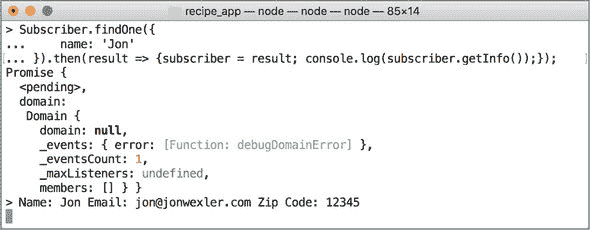

尝试创建不同内容的新的记录。通过创建 ZIP 代码为 890876 或 123 的新`Subscriber`来检查你的`zipCode`属性的验证器是否工作。然后尝试直接从 REPL 中删除一个或所有订阅者记录。

接下来，我将向你展示如何将这个新模型与其他新模型关联起来。


##### 提示

这部分代码可以保存并重复使用。将你的 REPL 代码添加到项目目录下名为 repl.js 的文件中。下次你打开 REPL 时，你可以将此文件的 内容加载到环境中。记住：Node.js 以异步方式运行，所以如果你尝试在一个命令中创建一个记录，并在之后立即查询该记录，这两个命令几乎会同时运行。为了避免任何错误，请单独运行命令，或者在每个命令的 `then` 块中嵌套查询。

|  |

**快速检查 17.2**

> **Q1:**
> 
> 为什么你需要将数据库连接和 Mongoose 模型引入 REPL 来测试你的代码？

|  |

**QC 17.2 答案**

> **1:**
> 
> 在你构建视图与数据库交互之前，REPL 是运行 CRUD 操作在模型上的一个很好的工具。但你需要引入你想要测试的模块，以便你的 REPL 环境知道要将数据保存到哪个数据库以及你正在创建哪个 `Subscriber` 模型。


### 17.3\. 创建模型关联

在 单元 3 中，我讨论了如何在 MongoDB 中结构化数据以及 Mongoose 如何作为数据库之上的一个层，将文档映射到 JavaScript 对象。Mongoose 包通过提供易于查询数据库并快速以面向对象的方式生成结果的方法，在开发过程中为你节省了大量时间。

如果你的背景是关系型数据库，你可能熟悉在应用程序中关联数据的方式，如图 17.2 所示。

##### 图 17.2\. 关系型数据库关联

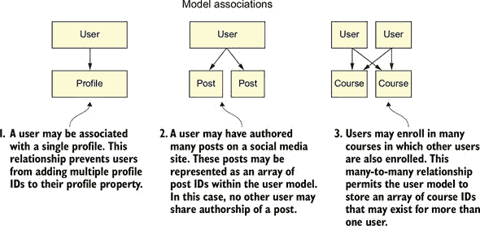

因为你在使用基于文档的数据库，所以你没有表格——当然也没有连接表。但你确实有相当简单的方法使用 Mongoose 来设置 表 17.2 中描述的数据关系。

##### 表 17.2\. 数据关系

| 关联 | 描述 |
| --- | --- |
| 一对一 | 当一个模型可以与另一个模型有关联时。这种关联可能是一个具有一个配置文件的 User；该配置文件仅属于该用户。 |
| 一对多 | 当一个模型可以与另一个模型有多个关联，但另一个模型只能有一个反向关联到第一个模型时。这种关联可能是一个具有多个 Employee 实例的 Company。在这个例子中，员工只为一家公司工作，而这家公司有多个员工。 |
| 多对多 | 当一个模型的一个实例可以与另一个模型有多个关联，反之亦然时。许多剧院实例可以展示相同的电影实例，每部电影都可以追溯到许多剧院实例。通常，在关系型数据库中，连接表用于将记录映射到彼此。 |

如果两个模型以某种方式关联——一个用户有多个图片，一个订单有一个付款，多个班级有多个注册的学生——您添加一个属性，其名称与关联的模型名称相同，其中 `type` 是 `Schema.Types.ObjectId`，`ref` 属性设置为关联模型的名称，`Schema` 是 `mongoose.Schema`。以下代码可能代表具有多个图片的用户的模式属性：`pictures: [{type: Schema.Types.ObjectId, ref: "Picture"}]`。

在这个食谱应用中添加另一个名为 `Course` 的模型，并将其与 `Subscriber` 关联。这个课程模型代表应用中可供选择的食谱课程。每个课程在不同的地点提供不同的食物。将 列表 17.6 中的代码添加到您模型文件夹中名为 course.js 的新模型文件中。

课程必须有标题，且不能与其他课程的标题相同。课程有一个 `description` 属性，用于告知网站用户课程提供的内容。它们还有一个 `items` 属性，它是一个字符串数组，用于反映包含的项目和成分。`zipCode` 属性使人们更容易选择离他们最近的课程。

##### 列表 17.6\. 在 course.js 中创建新的模式和模型

```
const mongoose = require("mongoose");

const courseSchema = new mongoose.Schema({
  title: {                                  *1*
    type: String,
    required: true,
    unique: true
  },
  description: {
    type: String,
    required: true
  },
  items: [],
  zipCode: {
    type: Number,
    min: [10000, "Zip code too short"],
    max: 99999
  }
});
module.exports = mongoose.model("Course", courseSchema);
```

+   ***1*** **向课程模式添加属性。**

您可以在 `Course` 模型中添加一个 `subscribers` 属性，该属性存储每个订阅者的 `ObjectId` 引用，该 `ObjectId` 来自 MongoDB。然后您将像这样引用 Mongoose 模型名称 `Subscriber`：`subscribers: [{type: mongoose.Schema.Types.ObjectId, ref: "Subscriber"}]`。技术上讲，您不需要模型相互引用；一个模型引用另一个模型就足够了。因此，在 `Subscriber` 模型上添加关联。

返回到 subscriber.js，并向 `subscriberSchema` 添加以下属性：`courses: [{type: mongoose.Schema.Types.ObjectId, ref: "Course"}]`

向订阅者添加一个 `courses` 属性，该属性存储每个相关课程的 `ObjectId` 引用。ID 来自 MongoDB。然后引用 Mongoose 模型名称 `Course`。


##### 注意

注意属性名称是复数形式，以反映订阅者和课程之间可能存在多个关联的可能性。


如果您想限制订阅者一次只能选择一个课程，您可以移除属性周围的括号。括号表示多个引用对象的数组。如果订阅者只能注册一个课程，则 `course` 属性将如下所示：`course: {type: mongoose.Schema.Types.ObjectId, ref: "Course"}`。

在这种情况下，每个订阅者只能与单个课程相关联。你可以将其视为允许订阅者一次只能注册一个课程。从某种意义上说，这种数据库限制也可以作为一种功能，防止订阅者同时注册多个课程。然而，只要每个订阅者有一个课程关联，就不会阻止不同的订阅者注册相同的课程。

在实践中，要关联两个不同模型的两个实例，依赖于 JavaScript 赋值运算符。假设你有一个分配给变量`subscriber1`的订阅者和一个表示为`course1`的课程实例。要关联这两个实例，假设订阅者模型可以有多个课程关联，你需要运行`subscriber1.courses.push(course1)`。因为`subscriber1.courses`是一个数组，所以使用`push`方法添加新的课程。

或者，你可以将`ObjectId`推入`subscriber.courses`而不是使用整个课程对象。例如，如果`course1`有`ObjectID "5c23mdsnn3k43k2kuu"`，你的代码将如下所示：`subscriber1.courses.push("5c23mdsnn3k43k2kuu")`。

要从订阅者中检索课程数据，你可以使用课程的`ObjectID`并在`Course`模型上查询，或者使用`populate`方法查询订阅者及其关联的课程内容。你的`subscriber1` MongoDB 文档将包含嵌套的`course1`文档。因此，你只得到关联模型的`ObjectID`s。

在下一节中，你将进一步探索`populate`方法。

| |
| --- |

**快速检查 17.3**

> **Q1:**
> 
> 你如何区分一个与另一个模型的一个实例相关联的模型与多个实例相关联的模型？

| |
| --- |
| |

**QC 17.3 答案**

> **1:**
> 
> 在定义模型模式时，你可以通过将关联模型括在括号中来指定该模型的关系为一对多。括号表示关联记录的数组。如果没有括号，关联为一对一。

| |
| --- |

### 17.4\. 从关联模型中填充数据

*填充*是 Mongoose 中的一个方法，允许你获取与你的模型关联的所有文档并将它们添加到查询结果中。当你`populate`查询结果时，你正在用关联文档的内容替换它们的`ObjectId`s。要完成这个任务，你需要将`populate`方法链接到你的模型查询。例如，`Subscriber.populate(subscriber, "courses")`将获取与`subscriber`对象关联的所有课程，并将它们的`ObjectId`s 替换为订阅者`courses`数组中的完整`Course`文档。

| |
| --- |

##### 注意

你可以在[`mongoosejs.com/docs/populate.html`](http://mongoosejs.com/docs/populate.html)找到一些有用的示例。

| |
| --- |

在设置好这两个模型后，返回 REPL，并测试模型关联。参见列表 17.7 中的命令。首先，在 REPL 环境中使用`Course`模型，设置两个变量在 promise 链作用域之外，以便稍后分配和使用它们。创建一个新的课程实例，其值符合`Course`模式要求。创建后，将保存的课程对象分配给`testCourse`。或者，如果你已经创建了一个课程，你可以使用`Course.findOne({}).then(course => testCourse = course);`从数据库中获取它。

假设你在课程早期创建了一个订阅者，这一行从数据库中拉取一个订阅者并将其分配给`testSubscriber`。你将`testCourse`课程推入`testSubscriber`的课程数组中。你需要确保再次保存模型实例，以便更改在数据库中生效。最后，使用`populate`在`Subscriber`模型上定位所有订阅者的课程，并在订阅者的课程数组中填充它们的数据。

##### 列表 17.7\. 使用终端中的 REPL 测试模型关联

```
const Course = require("./models/course");                        *1*
var testCourse, testSubscriber;                                   *2*
Course.create( {
  title: "Tomato Land",
  description: "Locally farmed tomatoes only",
  zipCode: 12345,
  items: ["cherry", "heirloom"]
}).then(course => testCourse = course);                           *3*
Subscriber.findOne({}).then(
  subscriber => testSubscriber = subscriber                       *4*
);
testSubscriber.courses.push(testCourse._id);                          *5*
testSubscriber.save();                                            *6*
Subscriber.populate(testSubscriber, "courses").then(subscriber =>
  console.log(subscriber)                                         *7*
);
```

+   ***1*** **引入 Course 模型。**

+   ***2*** **在 promise 链外部设置两个变量。**

+   ***3*** **创建一个新的课程实例。**

+   ***4*** **查找订阅者。**

+   ***5*** **将 testCourse 课程推入 testSubscriber 的课程数组中。**

+   ***6*** **再次保存模型实例。**

+   ***7*** **在模型上使用 populate。**


##### 备注

对于这些示例，你不会用`catch`处理潜在的错误以保持代码简洁，尽管在测试时你将想要添加一些错误处理。即使是一个简单的`catch(error => console.log(error.message))`也可以帮助你调试如果在 promise 管道中发生错误。


运行这些命令后，你应该会在列表 17.8 中看到结果。注意，`testSubscriber`的`courses`数组现在已填充了`Tomato Land`课程的数据。要揭示该课程的项目，你可以在最后运行的 REPL `populate`命令中记录`subscriber.courses[0].items`。

##### 列表 17.8\. 终端中 REPL 的结果控制台日志

```
{ _id: 5986b16782180c46c9126287,
  name: "Jon",
  email: "jon@jonwexler.com",
  zipCode: 12345,
  __v: 1,
  courses:
   [{ _id: 5986b8aad7f31c479a983b42,
       title: "Tomato Land",
       description: "Locally farmed tomatoes only",
       zipCode: 12345,
       __v: 0,
       subscribers: [],
       items: [Array]}]}           *1*
```

+   ***1*** **显示填充对象的查询结果。**

现在你有了访问关联模型数据的能力，你的查询变得更加有用。有兴趣创建一个页面来显示所有订阅了`ObjectId 5986b8aad7f31c479a983b42`的`Tomato Land`课程的订阅者吗？你需要执行的查询是`Subscriber .find({courses: mongoose.Types.ObjectId("5986b8aad7f31c479a983b42")})`。

如果你想按顺序运行本课的所有示例，可以将列表 17.9 中的代码添加到 repl.js 中，通过输入`node`重新启动你的 REPL 环境，然后通过运行`.load repl.js`来加载此文件。

repl.js 中的代码清除了你的数据库中的课程和订阅者。然后，在一个有组织的承诺链中，创建了一个新的订阅者并将其保存到一个名为 `testSubscriber` 的外部变量中。同样，也创建了一个课程，并将其保存到 `testCourse` 中。最后，这两个模型实例被关联，它们的关联被填充并记录。按顺序执行的命令展示了 REPL 在测试代码方面的强大功能。

##### 列表 17.9\. REPL.js 中的命令序列

```
const mongoose = require("mongoose"),
  Subscriber = require("./models/subscriber"),
  Course = require("./models/course");

var testCourse,
  testSubscriber;

mongoose.connect(
  "mongodb://localhost:27017/recipe_db",
  {useNewUrlParser: true}
);

mongoose.Promise = global.Promise;

Subscriber.remove({})                                              *1*
  .then((items) => console.log(`Removed ${items.n} records!`))
  .then(() => {
    return Course.remove({});
  })
  .then((items) => console.log(`Removed ${items.n} records!`))
  .then(() => {                                                    *2*
      return Subscriber.create( {
        name: "Jon",
        email: "jon@jonwexler.com",
        zipCode: "12345"
      });
  })
  .then(subscriber => {
    console.log(`Created Subscriber: ${subscriber.getInfo()}`);
  })
  .then(() => {
    return Subscriber.findOne( {
      name: "Jon"
    });
  })
  .then(subscriber => {
    testSubscriber = subscriber;
    console.log(`Found one subscriber: ${ subscriber.getInfo()}`);
  })
  .then(() => {                                                    *3*
      return Course.create({
        title: "Tomato Land",
        description: "Locally farmed tomatoes only",
        zipCode: 12345,
        items: ["cherry", "heirloom"]
      });
  })
  .then(course => {
    testCourse = course;
    console.log(`Created course: ${course.title}`);
  })
  .then(() => {                                                    *4*
      testSubscriber.courses.push(testCourse);
    testSubscriber.save();
  })
  .then( () => {                                                   *5*
      return Subscriber.populate(testSubscriber, "courses");
  })
  .then(subscriber => console.log(subscriber))
  .then(() => {                                                    *6*
      return Subscriber.find({ courses: mongoose.Types.ObjectId(
 testCourse._id) });
  })
  .then(subscriber => console.log(subscriber));
```

+   ***1*** **删除所有订阅者和课程。**

+   ***2*** **创建一个新的订阅者。**

+   ***3*** **创建一个新的课程。**

+   ***4*** **将课程与订阅者关联。**

+   ***5*** **在订阅者中填充课程文档。**

+   ***6*** **查询与课程 ObjectId 相同的订阅者。**

| |
| --- |

##### **提示**

使用 Mongoose 和 MongoDB 进行查询可能会变得复杂。我建议探索 Mongoose 的示例查询，并练习一些集成的 MongoDB 查询语法。在开发过程中，当你需要时，你会发现哪些查询对你来说最有意义。

| |
| --- |

在第 18 课中，你扩展了这些关联。你添加了一些控制器操作来管理你与数据交互的方式。

| |
| --- |

**快速检查 17.4**

> **Q1:**
> 
> 你为什么不希望在每次查询时都填充每个关联的模型？

| |
| --- |
| |

**QC 17.4 答案**

> **1:**
> 
> `populate` 方法对于收集记录的所有关联数据很有用，但如果使用不当，会增加查询记录所需的时间和空间开销。通常，如果你不需要访问关联记录的特定细节，你不需要使用 `populate`。

| |
| --- |

### 摘要

在本课中，你学习了如何创建更健壮的 Mongoose 模型。你还为你的模型创建了实例方法，这些方法可以从应用程序的其它地方运行特定的模型实例。稍后，你在 REPL 中首次测试了你的模型，并创建了一个新的 `Course` 模型，它与现有的 `Subscriber` 模型建立了多对多关联。这种关系允许网站上的订阅者对特定的食谱课程表示兴趣，从而通过位置和兴趣更好地定位你的用户。在第 18 课中，你将构建一个用户模型，以及任何应用程序管理其数据所需的基本 CRUD 方法。

| |
| --- |

**尝试这个**

现在你已经设置了两个模型，是时候提升你的 Mongoose 方法技能了。首先，练习创建一打订阅者和六门课程。然后运行一行代码，将数据库中的每个订阅者随机关联到一个课程。记得在将课程推入订阅者的课程数组后保存你的更改。

当你完成时，使用 `populate` 在 REPL 中将每个订阅者记录到你的控制台，以查看你为每个订阅者关联了哪些课程。

| |
| --- |

## 第 18 课\. 构建用户模型

在第 17 课中，您通过添加验证器和实例方法改进了您的模型。您还创建了第一个模型关联并从引用模型中填充数据。在本课中，您将应用这些技术到用户模型。这样做的同时，您也会通过各自的控制器和路由与这些模型进行交互。最后，您构建了一些表单和表格，以便更容易地可视化应用程序中的所有数据。

本课涵盖

+   使用用户模型创建模型关联

+   使用虚拟属性

+   在用户模型上实现 CRUD 结构

+   构建一个索引页面来查看您数据库中的所有用户

| |
| --- |

**考虑这一点**

您有两个模型与您的食谱应用程序一起工作：订阅者和课程。您仍然希望访客创建账户并开始注册食谱项目。用户模型几乎存在于每个现代应用程序中，以及一个从数据库创建、读取、更新和删除（CRUD）数据的系统。借助 Mongoose、Express.js 和 CRUD，您的用户很快就会有一种登录您应用程序的方式。

| |
| --- |

### 18.1. 构建用户模型

现在您已经有了防止数据库中不必要数据的模型，您需要为应用程序中最重要的模型：用户，做同样的事情。您的食谱应用程序目前有一个订阅者模型和一个课程模型，允许潜在用户对某些食谱项目表示兴趣。下一步是允许用户注册并加入这些课程。

与订阅者模型一样，用户模型需要有关每个注册人员的某些基本信息。该模型还需要与课程和订阅者模型建立关联。（例如，如果以前的订阅者决定作为用户注册，您希望连接这两个账户。）然后您想跟踪用户决定参与的课程。

要创建用户模型，将列表 18.1 中的代码添加到您模型文件夹中的一个新文件中，文件名为 user.js。用户模式包含来自订阅者模式的大量重叠属性。在这里，`name`属性不再是单一的`String`，而是包含`first`和`last`的对象。这种分离可以帮助您通过仅使用名字或姓氏来称呼用户。请注意，`trim`属性设置为`true`，以确保不将任何额外的空白保存到数据库中。`Email`和`zipCode`与订阅者模式中的相同。`password`属性目前以字符串形式存储用户的密码，在创建账户之前是必需的。

| |
| --- |

##### 警告

对于本单元，您将只将密码以纯文本形式保存到数据库中。然而，这种方法并不安全或不推荐，您将在第 5 单元中了解到。

| |
| --- |

与订阅者模式类似，您将用户与多个课程关联。用户也可能与单个订阅者的账户关联。您可以命名属性为 `subscribed-Account` 并移除括号以表示仅关联一个对象。一组新的属性 `createdAt` 和 `updatedAt` 会在创建用户实例时以及您在模型中更改值时填充日期。`timestamps` 属性让 Mongoose 知道要包含 `createdAt` 和 `updatedAt` 值，这对于记录数据如何以及何时更改非常有用。将 `timestamps` 属性添加到订阅者和课程模型中，也是如此。


##### 注意

注意到 Mongoose `Schema` 对象使用了对象解构。`{Schema}` 将 `mongoose` 中的 `Schema` 对象赋值给同名常量。稍后，您将应用此新格式到其他模型中。


##### 列表 18.1\. 在 user.js 中创建用户模型

```
const mongoose = require("mongoose"),
  {Schema} = mongoose,

  userSchema = new Schema({                                  *1*
  name: {                                                    *2*
    first: {
      type: String,
      trim: true
    },
    last: {
      type: String,
      trim: true
    }
  },
  email: {
    type: String,
    required: true,
    lowercase: true,
    unique: true
  },
  zipCode: {
    type: Number,
    min: [1000, "Zip code too short"],
    max: 99999
  },
  password: {
    type: String,
    required: true
  },                                                         *3*
  courses: [{type: Schema.Types.ObjectId, ref: "Course"}],   *4*
  subscribedAccount: {type: Schema.Types.ObjectId, ref:
 "Subscriber"}                                            *5*
}, {
  timestamps: true                                           *6*
});
```

+   ***1*** **创建用户模式。**

+   ***2*** **添加姓名和姓氏属性。**

+   ***3*** **添加一个密码属性。**

+   ***4*** **添加一个课程属性以连接用户和课程。**

+   ***5*** **添加一个 subscribedAccount 属性以连接用户和订阅者。**

+   ***6*** **添加一个 timestamps 属性以记录 createdAt 和 updatedAt 日期。**

由于姓名和姓氏有时可能在一行中很有用，您可以使用 Mongoose 虚拟属性来为每个实例存储这些数据。*虚拟属性*（也称为*计算属性*）类似于常规模式属性，但不会保存到数据库中。要创建一个虚拟属性，请在您的模式上使用 `virtual` 方法，并传递属性和您想要使用的新虚拟属性名称。用户全名的虚拟属性类似于列表 18.2 中的代码。这个虚拟属性不会保存到数据库中，但它将像用户模型上的任何其他属性一样表现，例如 `user.zipCode`。您可以使用 `user.fullName` 获取此值。下面是创建用户模型的代码。

##### 列表 18.2\. 在 user.js 中向用户模型添加虚拟属性

```
userSchema.virtual("fullName")
  .get(function() {
    return `${this.name.first} ${this.name.last}`;
  });                                                 *1*

module.exports = mongoose.model("User", userSchema);
```

+   ***1*** **添加一个虚拟属性以获取用户的全名。**


##### 注意

在本书编写时，您无法在这里使用箭头函数，因为 Mongoose 方法使用词法 `this`，而 ES6 箭头函数不再依赖于它。


立即在 REPL 中测试此模型。请记住，为了使用您的新模型，需要重新引入 Mongoose 以及此环境所需的所有内容。在新的 REPL 会话中，您需要再次引入 Mongoose，指定 Mongoose 使用原生 promises，并通过输入 `mongoose.connect("mongodb://localhost:27017/recipe_db", {useNewUrlParser: true})` 连接到您的数据库。然后使用 `const User = require ("./models/user")` 引入新的用户模型。

在 REPL 中创建一个新的用户实例，并将返回的用户或错误记录下来，以查看模型是否设置正确。列表 18.3 显示了一个创建示例用户的有效行。在此示例中，用户被创建并保存到数据库中，具有所有必需的属性。请注意 `last` 字段中的额外空格，这应该在通过 Mongoose 保存到数据库之前通过修剪。

| |
| --- |

##### 提示

您可以将这些示例中的 REPL 命令添加到您的 REPL.js 文件中以供将来使用。

| |
| --- |

##### 列表 18.3\. 在终端的 REPL 中创建新用户

```
var testUser;
User.create({
  name: {
    first: "Jon",
    last: "Wexler"
  },
  email: "jon@jonwexler.com",
  password: "pass123"
})
  .then(user => testUser = user)
  .catch(error => console.log(error.message));         *1*
```

+   ***1*** **创建新用户。**

| |
| --- |

##### 注意

如果您收到关于唯一电子邮件地址的错误，这可能意味着您正在尝试创建一个与数据库中已有的信息相同（由于您在用户模式中设置的规则，这是不允许的）的用户。为了绕过此限制，请使用不同的电子邮件地址创建用户，或者使用 `find()` 方法而不是 `create`，如下所示：`User.findOne({email: "jon@jonwexler.com"}).then(u => testUser = u) .catch(e => console.log(e.message));`。

| |
| --- |

`user` 变量现在应包含下一列表中显示的文档对象。请注意，此用户的 `courses` 属性是一个空数组。稍后，当您将此用户与课程关联时，该属性将填充 `ObjectId`s。

##### 列表 18.4\. 在终端中显示已保存的用户对象的结果

```
{ _id: 598a3d85e1225d0bbe8d88ae,
  email: "jon@jonwexler.com",
  password: "pass123",
  __v: 0,
  courses: [],
  name: { first: "Jon", last: "Wexler" } }      *1*
```

+   ***1*** **查询响应的显示**

现在，您可以使用此用户的信息将系统中的任何具有相同电子邮件的订阅者链接起来。要链接订阅者，请参阅 列表 18.5 中的代码。您正在设置一个 `targetSubscriber` 变量，其作用域在查询之外，并将查询结果分配给订阅者模型。这样，您可以在查询完成后使用 `targetSubscriber` 变量。在此查询中，您正在使用之前 `create` 命令中的用户电子邮件来搜索订阅者。

##### 列表 18.5\. 在终端的 REPL 中将订阅者连接到用户

```
var targetSubscriber;
Subscriber.findOne({
    email: testUser.email
  })
  .then(subscriber => targetSubscriber = subscriber);       *1*
```

+   ***1*** **将 `targetSubscriber` 变量设置为使用用户电子邮件地址找到的订阅者。**

执行这些命令后，您的 `targetSubscriber` 变量应包含与用户共享电子邮件地址的订阅者对象的价值。您可以使用 `console.log(target Subscriber);` 在您的 REPL 环境中查看该内容。

使用承诺，您可以将这些两个操作压缩成一个，如 列表 18.6 中所示。通过嵌套调用关联订阅者的查找，您得到一个可以整体移动到控制器动作中的承诺链。首先，创建新用户。您将返回使用您用于搜索具有相同电子邮件的订阅者的电子邮件的新用户。第二个查询返回任何存在的订阅者。当您找到具有相同电子邮件的订阅者时，您可以通过用户模型上的 `subscribedAccount` 属性将其与用户链接。最后，保存更改。

##### 列表 18.6\. 在终端的 REPL 中将订阅者连接到用户

```
var testUser;
User.create({
  name: {
    first: "Jon",
    last: "Wexler "
  },
  email: "jon@jonwexler.com",
  password: "pass123"
})
  .then(user => {
    testUser = user;
    return Subscriber.findOne({
      email: user.email
    });                                                            *1*
  })
  .then(subscriber => {
    testUser.subscribedAccount = subscriber;                       *2*
      testUser.save().then(user => console.log("user updated"));
  })
  .catch(error => console.log(error.message));
```

+   ***1*** **查找具有用户电子邮件的订阅者。**

+   ***2*** **连接订阅者和用户。**

现在，您可以在 REPL 中创建用户并将其连接到另一个模型，下一步是将这种交互移动到控制器和视图中。


##### 注意

您已移动到 REPL 以测试数据库查询，因此可以从 main.js 中删除不再需要的 `subscriber` 模块。

|  |

**快速检查 18.1**

> **Q1:**
> 
> 虚拟属性与正常模型属性有何不同？

|  |

**QC 18.1 答案**

> **1:**
> 
> 虚拟属性不会保存到数据库中。这些属性与正常模式属性不同，仅在应用程序运行期间存在；它们不能从数据库中提取或直接通过 MongoDB 找到。


### 18.2\. 将 CRUD 方法添加到您的模型中

在本节中，我将讨论您需要与用户、订阅者和群体模型采取的下一步行动。这三个模型都有在 REPL 中工作的模式和关联，但您可能希望在使用浏览器时使用它们。更具体地说，您希望作为站点的管理员管理每个模型的数据，并允许用户创建自己的用户账户。首先，我将讨论数据库操作中的四个主要功能：创建、读取、更新和删除（CRUD）。图 18.1 展示了这些功能。

##### 图 18.1\. 每个 CRUD 操作的视图

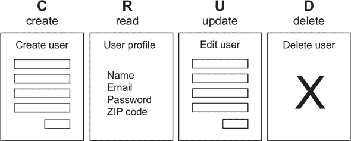

在网络开发中，CRUD 应用程序为任何更大或更进化的应用程序奠定了基础，因为从根本上说，以某种方式，您始终需要在每个模型上执行 表 18.1 中列出的操作。

##### 表 18.1\. CRUD 操作

| 操作 | 描述 |
| --- | --- |
| 创建 | 创建功能分为两部分：new 和 create。new 代表查看用于创建模型新实例的表单的路由和操作。例如，要创建新用户，您可能访问 http://localhost:3000/users/ new 来查看位于 new.ejs 中的用户创建表单。创建路由和操作处理来自该表单的任何 POST 请求。 |
| 读取 | 读取功能只有一个路由、操作和视图。在本书中，它们的名称是 show，以反映您正在显示该模型的信息，很可能是作为个人资料页面。尽管您仍在从数据库中读取，但 show 操作和 show.ejs 视图是用于此操作的更传统的名称。 |
| 更新 | 更新功能分为两部分：edit 和 update。edit，就像 new 一样，处理对编辑路由和 edit.ejs 视图的 GET 请求，在那里您将找到一个用于更改模型属性值的表单。当您修改值并通过使用 PUT 请求提交表单时，更新路由和操作处理该请求。这些功能依赖于数据库中预先存在的模型实例。 |
| Delete | 删除函数可能是最简单的函数。虽然你可以创建一个视图来询问用户他是否确定要删除记录，但这个函数通常是通过发送一个包含用户 ID 的 DELETE 请求到路由的按钮来实现的。然后删除路由和操作会从你的数据库中删除记录。 |

对于 new.ejs 和 edit.ejs 表单，你需要将表单提交路由到`create`和`update`路由，分别。例如，当你提交表单以创建新用户时，表单数据应该被发送到`user/create`路由。以下示例将指导你创建用户模型的 CRUD 操作和视图，但你应该将相同的技巧应用到课程和订阅者模型。

| |
| --- |

**CRUD HTTP 方法**

在本书的前面，你学习了`GET`和`POST`HTTP 方法，这些方法占到了互联网上大多数请求的很大一部分。许多其他 HTTP 方法在特定情况下使用，并且通过更新和删除功能，你可以引入另外两种，如表 18.2 所示。

##### 表 18.2\. PUT 和 DELETE HTTP 方法

| HTTP 方法 | 描述 |
| --- | --- |
| PUT | 用于指示你向应用程序服务器提交数据，目的是修改或更新现有记录的方法。PUT 通常用一组新的属性替换现有记录，即使某些属性没有变化。虽然 PUT 是更新记录的首选方法，但有些人更喜欢 PATCH 方法，它旨在仅修改已更改的属性。要处理 Express.js 中的更新路由，你可以使用 app.put。 |
| DELETE | 用于指示你从数据库中删除记录的方法。要处理 Express.js 中的删除路由，你可以使用 app.delete。 |

虽然你可以使用`GET`和`POST`来更新和删除记录，但在使用 HTTP 方法时最好遵循这些最佳实践。一致性可以使你的应用程序在出现问题时运行得更好，并且具有更好的透明度。我在第 19 课中进一步讨论了这些方法。

| |
| --- |

在你开始之前，查看你的控制器，并为它们准备翻新。到目前为止，你通过将它们添加到模块的`exports`对象中来创建新的控制器操作。你创建的操作越多，你重复的`exports`对象就越多，这在控制器模块中并不特别美观。你可以通过将所有操作一起使用对象字面量中的`module.exports`导出，来清理你的控制器操作。将你的主控制器修改为列表 18.7 中的代码。

在这个例子中，你的操作现在是逗号分隔的，这使得操作名称更容易识别。在你将此更改应用到控制器后，你不需要更改任何其他代码，应用程序就可以像以前一样运行。

##### 列表 18.7\. 修改 homeController.js 中的操作

```
var courses = [
  {
    title: "Event Driven Cakes",
    cost: 50
},
  {
    title: "Asynchronous Artichoke",
    cost: 25
},
  {
    title: "Object Oriented Orange Juice",
    cost:10
}];

module.exports = {                   *1*
  showCourses: (req, res) => {
    res.render("courses", {
      offeredCourses: courses
    });
  }
};
```

+   ***1*** **导出包含所有控制器操作的字面量对象。**

将此结构应用于你的其他控制器（`errorController.js` 和 `subscribers-Controller.js`）以及未来的所有控制器。当你构建 CRUD 操作并在你路由中组织中间件时，这些修改将变得很重要。

| |
| --- |

##### 注意

还应在你的 `controllers` 文件夹中创建 `coursesController.js` 和 `usersController.js`，以便在接下来的几节课中为课程和用户模型创建相同的操作。

| |
| --- |

在下一节中，你将构建用户模型所需的形式。首先，创建一个经常被忽视的应用视图：index.ejs。还要为每个应用模型创建此索引页面。`index` 路由、操作和视图的目的是获取所有记录并在单个页面上显示它们。你将在下一节中构建索引页面。

| |
| --- |

**快速检查 18.2**

> **Q1:**
> 
> 哪些 CRUD 函数不一定需要一个视图？

| |
| --- |
| |

**QC 18.2 答案**

> **1:**
> 
> 虽然每个 CRUD 函数都可以有自己的视图，但某些函数可以存在于模态中或通过基本链接请求访问。`delete` 函数不一定需要自己的视图，因为你正在发送一个删除记录的命令。

| |
| --- |

### 18.3\. 构建索引页面

首先，通过在视图文件夹中创建一个新的用户文件夹并添加 列表 18.8 中的代码来创建 index.ejs 视图。

在此视图中，你正在遍历一个 `users` 变量，并为每个用户的属性创建一个新的表格行。相同类型的表格也可以用于订阅者和课程。你需要在控制器级别使用一个用户数组来填充 `users` 变量。

| |
| --- |

##### 注意

你应该将相同的方法应用于应用程序中的其他模型。例如，订阅者模型视图现在将放在视图文件夹中的 subscribers 文件夹内。

| |
| --- |

##### 列表 18.8\. 在 index.js 中列出所有用户

```
<h2>Users Table</h2>
 <table class="table">
   <thead>
     <tr>
       <th>Name</th>
       <th>Email</th>
       <th>Zip Code</th>
     </tr>
   </thead>
   <tbody>
     <% users.forEach(user => { %>           *1*
     <tr>
       <td><%= user.fullName%></td>
       <td><%= user.email %></td>
       <td><%= user.zipCode%></td>
     </tr>
     <% }); %>
   </tbody>
 </table>
```

+   ***1*** **在视图中遍历用户数组。**

要测试此代码，你需要一个路由和控制器操作来加载此视图。在控制器文件夹中创建一个 `usersController.js`，并包含 列表 18.9 中的代码。

你需要在 `usersController.js` 中引入用户模型，以便在此控制器中访问它。首先，你从数据库接收一个包含你的用户的响应。然后你在 index.ejs 视图中渲染你的用户列表。如果发生错误，将消息记录到控制台并将响应重定向到主页。

##### 列表 18.9\. 在 usersController.js 中创建索引操作

```
const User = require("../models/user");      *1*

module.exports = {
  index: (req, res) => {
    User.find({})
      .then(users => {                       *2*
          res.render("users/index", {
            users: users
          })
      })
      .catch(error => {                      *3*
          console.log(`Error fetching users: ${error.message}`)
        res.redirect("/");
      });
  }
};
```

+   ***1*** **引入用户模型。**

+   ***2*** **使用用户数组渲染索引页面。**

+   ***3*** **记录错误消息并将重定向到主页。**

| |
| --- |

##### 注意

在订阅者控制器中，`index` 动作替换了你的 `getAllSubscribers` 动作。记住要修改 main.js 中动作对应的路由，将其指向 `index`，并将 subscribers.ejs 文件更改为 index.ejs。这个视图现在应该位于 views 中的 subscribers 文件夹内。

| |
| --- |

最后一步是将 `usersController` 引入到 main.js 中，并通过在 清单 18.10 中添加代码到 main.js 来添加 `index` 路由。

首先，将 `usersController` 引入到 main.js 中。在你的 `subscribers-Controller` 定义下方添加此行。创建你的第一个用户路由，将传入的请求发送到 `/users`，并使用 `usersController` 中的 `index` 动作。

##### 列表 18.10\. 在 main.js 中添加 `usersController` 和路由

```
const usersController = require("./controllers/usersController");  *1*
app.get("/users", usersController.index);                          *2*
```

+   ***1*** **需要使用 usersController。**

+   ***2*** **创建索引路由。**

在终端启动你的应用程序，并访问 http://localhost:3000/users。你的屏幕应该类似于 图 18.2。

##### 图 18.2\. 浏览器中用户索引页面的示例

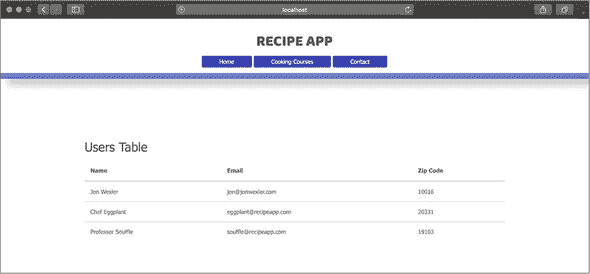

这个列表是你查看数据库的窗口，同时不会向公众透露任何敏感数据。在你继续之前，请对路由和动作进行最后一次修改。

| |
| --- |

**快速检查 18.3**

> **Q1:**
> 
> 索引视图的目的是什么？

| |
| --- |
| |

**QC 18.3 答案**

> **1:**
> 
> The index view displays all documents for a particular model. This view can be used internally by a company to see the names and email addresses of everyone who subscribed. It can also be visible to all users so that everyone can see who signed up.

| |
| --- |

### 18.4\. 清理你的动作

目前，你的索引动作被设计为仅提供来自数据库的数据的 EJS 模板视图。然而，正如你在 单元 6 中学到的，你并不总是想以视图的形式提供数据。为了更好地使用你的动作，将它们分解为运行查询的动作和通过视图提供结果的动作。

将用户控制器修改为 清单 18.11 中显示的代码。在这段修改后的代码中，你有一个 `index` 动作，它会在用户模型上调用 `find` 查询。如果你成功生成结果，将这些结果添加到 `res.locals` 对象中——这是响应中的一个独特对象，允许你定义一个变量，你将在视图中访问它。通过将结果分配给 `res.locals.users`，你不需要更改你的视图；变量名 `users` 在视图中本地匹配。然后调用下一个中间件函数。如果在查询中发生错误，记录错误，并将其传递给下一个中间件函数，该函数将处理错误。在这种情况下，该函数是错误控制器中的 `internalServerError` 动作。`indexView` 动作渲染索引视图。

##### 列表 18.11\. 在 usersController.js 中重新访问索引动作

```
const User = require("../models/user");

module.exports = {
  index: (req, res, next) => {
    User.find()                                                 *1*
      .then(users => {
        res.locals.users = users;                               *2*
          next();
      })
      .catch(error => {
        console.log(`Error fetching users: ${error.message}`);
        next(error);                                            *3*
      });
  },
  indexView: (req, res) => {
    res.render("users/index");                                  *4*
  }
};
```

+   ***1*** **仅在索引动作中运行查询。**

+   ***2*** **在响应中存储用户数据并调用下一个中间件函数。**

+   ***3*** **捕获错误，并将其传递给下一个中间件。**

+   ***4*** **在单独的动作中渲染视图。**

为了让你的应用程序在索引页面上加载用户数据，就像之前一样，将 `indexView` 动作作为中间件函数添加到你的路由中，该函数位于 `index` 动作之后。为此，将 `main.js` 中的 `/users` 路由更改为以下代码：`app.get("/users", usersController.index, usersController.indexView)`。当 `usersController.index` 完成查询并将数据添加到响应对象中时，会调用 `usersController.indexView` 来渲染视图。通过这个更改，你可以在另一个路由的索引动作之后决定调用不同的中间件函数，这正是你将在第 6 单元中做的。

现在你除了 REPL 和 MongoDB shell 之外，还有一种方法可以查看数据库中的用户、课程和订阅者。在第 19 课中，你将更多的功能引入到视图中。


**快速检查 18.4**

> **Q1:**
> 
> 如果你主要在浏览器中工作，为什么你需要将错误消息记录到控制台？

|  |

**QC 18.4 答案**

> **1:**
> 
> 虽然你正在将更多的数据和功能移入视图，但你的终端仍然是应用程序的核心。你的控制台窗口是你应该期望看到应用程序错误、发出的请求以及你创建的自定义错误消息的地方，这样你就可以知道在哪里查找以修复问题。


### 摘要

在本课中，你学习了如何创建用户模型以及如何开始使用 CRUD 函数。你还了解了两种新的 HTTP 方法，并看到了如何创建一个索引页面来显示所有用户。有了这个索引页面，你开始从浏览器与你的应用程序进行交互。最后，你修改了控制器和路由，以便更好地使用中间件函数和动作之间的交互性。在第 19 课中，你将 `create` 和 `read` 函数应用于你的三个模型。


**尝试这个**

在设置好索引页面后，试着思考你的应用程序管理员可能会如何使用这个页面。你创建了用于显示用户数据的表格，但你可能还想在这个表格中添加其他列。创建新的用户实例方法来获取每个用户名字符的数量，然后在这个表格中创建一个新列来显示每个用户的这个数字。

尝试为用户模型创建一个新的虚拟属性。


## 第 19 课。创建和读取你的模型

在第 18 课中，你构建了你的用户模型并构建了一个索引页面来在同一页面上显示用户。在本课中，你通过关注 CRUD 的创建和读取功能来为你的应用程序添加更多功能。你首先创建了一个 EJS 表单，该表单将用户的属性作为输入处理。然后你创建了路由和动作来处理该表单数据。最后，你构建了一个`show`页面作为用户的个人资料页面。

本课涵盖

+   构建模型创建表单

+   从浏览器保存用户到数据库

+   在视图中显示关联模型

| |
| --- |

**考虑这一点**

在为你的食谱应用程序创建新课程的新方法中，你发现将单个文档添加到 REPL 数据库中变得繁琐。你决定创建专用路由来创建新的模型实例、编辑它们并显示它们的数据。这些路由是 CRUD 方法的基础，允许你的数据交互通过应用程序视图进行。

| |
| --- |

### 19.1. 构建新用户表单

要在数据库中创建一个新的用户实例，你需要一种方法来检索该用户的数据。到目前为止，你一直直接在 REPL 中输入这些数据。因为你正在将所有数据交互移动到浏览器，你需要一个表单，让新用户可以通过它创建他们的账户。在 CRUD 术语中，该表单位于名为 new.ejs 的视图中。

首先，通过将列表 19.1 中的代码添加到视图中/users 文件夹的 new.js 中，构建该表单。生成的表单看起来像图 19.1。在提交时，该表单会向`/users/create`路由发送一个`POST`请求。你需要确保在尝试提交任何内容之前创建该路由；否则，你的应用程序将会崩溃。

##### 图 19.1. 浏览器中用户创建表单的示例

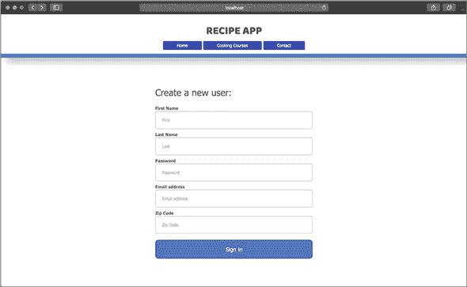

该表单使用了 Bootstrap 进行装饰，但主要收获是每个用户属性都表示为一个表单输入，并且该属性的名称设置为该输入的`name`属性——在姓氏的情况下，`name="first"`。你将在以后使用这些名称属性来识别控制器中的值。请注意，`password`、`email`和`zipCode`字段有一些独特的属性。这些 HTML 验证是一些你可以防止无效或不安全信息从网页进入你的应用程序的方法。

##### 列表 19.1. 在 new.ejs 中构建用户创建表单

```
<div class ="data-form">
  <form action="/users/create" method="POST">                  *1*
    <h2>Create a new user:</h2>
    <label for="inputFirstName">First Name</label>             *2*
    <input type ="text" name="first" id="inputFirstName"
 placeholder ="First" autofocus>
    <label for="inputLastName">First Name</label>
    <input type ="text" name="last" id="inputLastName"
 placeholder ="Last">
    <label for="inputPassword">Password</label>                *3*
    <input type="password" name="password" id="inputPassword"
 placeholder="Password" required>
    <label for="inputEmail">Email address</label>
    <input type="email" name="email" id="inputEmail"
 placeholder="Email address" required>
    <label for="inputZipCode">Zip Code</label>
    <input type="text" name="zipCode" id="inputZipCode" pattern="\d*"
 placeholder="Zip Code" required>
    <button type="submit">Sign in</button>
  </form>
</div>
```

+   ***1*** **构建一个创建用户账户的表单。**

+   ***2*** **将用户属性作为输入添加到表单中。**

+   ***3*** **将 HTML 属性应用于保护密码和电子邮件字段。**

现在你有了新的视图，你需要一个路由和控制器动作来服务该视图。你还在下一节中添加了`create`路由和动作来处理来自该视图的数据。

| |
| --- |

**快速检查 19.1**

> **问题 1:**
> 
> 哪个表单输入属性必须有一个值，以便控制器动作能够识别表单数据？

| |
| --- |
| |

**QC 19.1 答案**

> **1:**
> 
> 在表单中必须填写 `name` 属性以创建新记录。映射到 `name` 属性的任何值都是控制器用于与模型模式进行比较的值。


### 19.2\. 从视图创建新用户

新用户表单收集与用户模式相关的数据。接下来，您需要为该表单创建动作。为了使表单能够渲染和处理数据，将 列表 19.2 中的用户动作代码添加到 `usersController.js` 中。

`new` 动作将接收到的请求用于创建新用户并在 new.ejs 中渲染表单。`create` 动作接收来自 new.ejs 表单的接收到的已发布数据，并通过响应对象将生成的创建的用户传递给下一个中间件函数。下一个中间件函数 `redirectView` 根据响应对象中接收到的重定向路径确定要显示的视图。如果用户创建成功，则重定向到索引页面。

在 `create` 动作中，将收集到的传入数据分配给 `userParams` 变量。然后调用 `User.create` 并传递这些参数，在成功时将用户重定向到 `/users` 索引页面，在失败时重定向到错误页面。


##### 注意

对于订阅者控制器，`new` 和 `create` 动作实际上替换了你在本书早期创建的 `getSubscriptionPage` 和 `saveSubscriber` 动作。在交换这些新动作后，您需要更改 main.js 路由中的动作名称以匹配。


##### 列表 19.2\. 向 usersController.js 添加创建动作

```
new: (req, res) => {                          *1*
  res.render("users/new");
},

create: (req, res, next) => {                 *2*
  let userParams = {
    name: {
      first: req.body.first,
      last: req.body.last
    },
    email: req.body.email,
    password: req.body.password,
    zipCode: req.body.zipCode
  };                                          *3*

  User.create(userParams)
      .then(user => {
        res.locals.redirect = "/users";
        res.locals.user = user;
        next();
      })
      .catch(error => {
        console.log(`Error saving user: ${error.message}`);
        next(error);
      });
},

redirectView: (req, res, next) => {          *4*
 letredirectPath =res.locals.redirect;
 if (redirectPath)res.redirect(redirectPath);
 else next();
}
```

+   ***1*** **添加新动作以渲染表单。**

+   ***2*** **添加创建动作以将用户保存到数据库。**

+   ***3*** **使用表单参数创建用户。**

+   ***4*** **在单独的重定向视图动作中渲染视图。**

要查看此代码的工作情况，将 `new` 和 `create` 路由添加到 main.js 中，如 列表 19.3 所示。第一个路由接收指向 `/users/new` 的 `GET` 请求并在 `usersController` 中渲染 new.ejs。第二个路由接受指向 `/users/create` 的 `POST` 请求，并将该接收到的请求体传递给 `create` 动作，然后通过 `usersController.js` 中的 `redirectView` 动作进行视图重定向。这些路由可以放在您的用户索引路由下面。


##### 注意

将 `new` 和 `create` 动作添加到订阅者控制器意味着您可以移除 `getAllSubscribers` 和 `saveSubscriber` 动作，以支持新的 CRUD 动作。同样，您在主页控制器中需要的唯一动作是提供主页：index.ejs。


现在你开始在 main.js 中积累你使用的路由数量，你可以通过在 main.js 文件中添加`const router = express .Router()`来使用 Express.js 的 Router 模块。这一行创建了一个 Router 对象，它提供了自己的中间件和路由，与 Express.js 的`app`对象一起使用。很快，你将使用这个`router`对象来组织你的路由。现在，修改你的路由以使用`router`而不是`app`。然后在 main.js 中的路由顶部添加`app.use("/", router)`。这段代码告诉你的 Express.js 应用程序使用路由对象作为中间件和路由的系统。

##### 列表 19.3\. 在 main.js 中添加新的和创建路由

```
router.get("/users/new", usersController.new);            *1*
router.post("/users/create", usersController.create,
  usersController.redirectView);                          *2*
```

+   ***1*** **处理查看创建表单的请求。**

+   ***2*** **处理从创建表单提交数据的请求，并显示一个视图。**

重新启动你的应用程序，填写 http://localhost:3000/users/new 上的表单，并提交表单。如果你成功了，你应该能在首页上看到你新创建的用户。

当你的用户成功保存到数据库中时，添加一个收尾工作。你已经设计了具有对`Subscriber`模型关联的`User`模式。理想情况下，每当创建新用户时，你都想检查具有相同电子邮件地址的现有订阅者并将两者关联起来。你可以使用 Mongoose 的`pre("save")`钩子来完成此操作。

Mongoose 提供了一些称为*钩子*的方法，允许你在数据库更改（如`save`）运行之前执行操作。你可以通过在定义模式之后和注册模型之前在 user.js 中添加列表 19.4 中的代码来添加此钩子。为此钩子要正常工作，你需要将`Subscriber`模型引入 user.js 中。使用`const Subscriber = require("./subscriber")`。

此钩子在用户创建或保存之前立即运行。它接受`next`中间件函数作为参数，以便在完成此步骤后可以调用下一个中间件函数。由于这里不能使用箭头函数，因此需要在承诺链之外定义`user`变量。


##### 注意

就本书的编写而言，箭头函数不与 Mongoose 钩子一起工作。


只有当用户还没有关联的订阅者时，你才执行此功能，这样可以节省不必要的数据库操作。使用用户的电子邮件地址搜索一个订阅者账户。如果找到一个具有匹配电子邮件地址的订阅者，将该订阅者分配给用户的`subscribedAccount`属性。除非发生错误，否则继续在下一个中间件函数中保存用户。你还需要通过在 user.js 顶部添加`const Subscriber = require("./subscriber")`来在 user.js 中添加对订阅者模型的引用。

##### 列表 19.4\. 在 user.js 中添加预(‘save’)钩子

```
userSchema.pre("save", function (next) {              *1*
  let user = this;                                    *2*
  if (user.subscribedAccount === undefined) {         *3*
    Subscriber.findOne({
      email: user.email
    })                                                *4*
      .then(subscriber => {
        user.subscribedAccount = subscriber;          *5*
        next();
      })
      .catch(error => {
        console.log(`Error in connecting subscriber:
 ${error.message}`);
         next(error);                                 *6*
      });
    } else {
      next();                                         *7*
    }
});
```

+   ***1*** **设置预(‘save’)钩子。**

+   ***2*** **在回调中使用函数关键字。**

+   ***3*** **添加对现有订阅者连接的快速条件检查。**

+   ***4*** **查询单个订阅者。**

+   ***5*** **将用户与订阅者账户关联。**

+   ***6*** **将任何错误传递给下一个中间件函数。**

+   ***7*** **如果用户已经有关联，则调用下一个函数。**

通过在 REPL 中创建一个新的订阅者（或者如果你已经创建了，通过订阅者的`new`页面）并然后在浏览器中创建一个新的用户，使用相同的电子邮件地址来尝试这段新代码。回到 REPL，你可以检查该用户的`subscribedAccount`是否有值反映了关联的订阅者的`ObjectId`。这个值将在下一节构建用户的`show`页面时派上用场。


**快速检查 19.2**

> **Q1:**
> 
> 为什么 Mongoose 的`pre("save")`钩子将`next`作为参数？

|  |

**QC 19.2 答案**

> **1:**
> 
> `pre("save")`钩子是 Mongoose 中间件，与其他中间件一样，当函数完成时，它将移动到下一个中间件函数。这里的`next`表示中间件链中要调用的下一个函数。


### 19.3\. 使用 show 读取用户数据

现在你已经可以创建用户，你想要一种方法在专用页面上显示用户信息（例如用户的个人资料页面）。你需要在数据库上执行的唯一操作是`读取`数据，通过特定的 ID 查找用户并在浏览器中显示其内容。

首先，创建一个新的视图，名为 show.ejs。调用视图和动作`show`，使其明确你的意图是展示用户数据。在 show.ejs 中，创建一个类似于 index.ejs 中的表格，除了你不需要循环。你想要展示所有用户的属性。将列表 19.5 中的代码添加到 views/users 文件夹中的 show.ejs 中。

此表单使用`user`变量的属性来填充每个表格数据框。最后，检查该用户是否有`subscribedAccount`。如果没有，则不显示任何内容。如果有关联的订阅者，则显示一些文本并链接到订阅者的展示页面。

##### 列表 19.5\. show.ejs 中的用户展示表格

```
<h1>User Data for <%= user.fullName %></h1>

<table class="table">                          *1*
  <tr>
    <th>Name</th>
    <td><%= user.fullName %></td>
  </tr>
  <tr>
    <th>Email</th>
    <td><%= user.email %></td>
  </tr>
  <tr>
    <th>Zip Code</th>
    <td><%= user.zipCode %></td>
  </tr>
  <tr>
    <th>Password</th>
    <td><%= user.password %></td>
  </tr>
</table>

<% if (user.subscribedAccount) {%>            *2*
    <h4 class="center"> This user has a
    <a href="<%=`/subscribers/${user.subscribedAccount}` %>">
    subscribed account</a>.
    </h4>
<% } %>
```

+   ***1*** **添加一个表格来显示用户数据。**

+   ***2*** **检查是否有链接的订阅者账户。**


##### 注意

为了使此链接页面正常工作，你需要同时为订阅者创建 CRUD 函数和视图。锚标签的 href 路径是`/subscribers/${user.subscribedAccount}`，它代表订阅者的`show`路由。


为了更容易地访问用户的`show`页面，在 index.ejs 中，将用户的名字包裹在一个链接标签中，链接到`users/`加上用户的 ID。那里的表格数据应该看起来像下一个列表。你可以在链接标签的`href`以及表格数据内容中嵌入 JavaScript。

##### 列表 19.6\. index.ejs 中更新的名称数据

```
<td>
  <a href="<%= `/users/${user._id}` %>">        *1*
    <%= user.fullName %>
  </a>
</td>
```

+   ***1*** **在 HTML 中嵌入用户的名字和 ID。**

如果你刷新用户索引页面，你会注意到名字变成了链接（图 19.2）。如果你现在点击其中一个链接，你会得到一个错误，因为没有路由来处理这个请求。

##### 图 19.2\. 浏览器中的用户索引页面，带有链接的名字

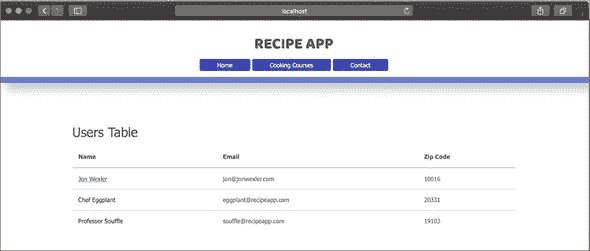

接下来，在`usersController.js`中添加`show`动作，如图 19.7 所示。列表 19.7。首先，从 URL 参数中收集用户的 ID；你可以从`req.params.id`获取这个信息。这段代码只有在使用`:id`定义路由时才有效（参见列表 19.7）。

使用`findById`查询，并传递用户的 ID。因为每个 ID 都是唯一的，你应该期望返回单个用户。如果找到用户，将其添加为响应对象上的局部变量，并调用`next`中间件。很快，你将设置下一个函数为`showView`，在那里你渲染展示页面并将用户对象传递以显示该用户的信息。如果发生错误，记录消息，并将错误传递给下一个中间件函数。

##### 列表 19.7\. `usersController.js`中特定用户的展示动作

```
show: (req, res, next) => {
  let userId = req.params.id;                                       *1*
  User.findById(userId)                                             *2*
      .then(user => {
        res.locals.user = user;                                     *3*
          next();
      })
      .catch(error => {
        console.log(`Error fetching user by ID: ${error.message}`);
        next(error);                                                *4*
      });
    },

showView: (req, res) => {
  res.render("users/show");                                         *5*
}
```

+   ***1*** **从请求参数中收集用户 ID。**

+   ***2*** **通过 ID 查找用户。**

+   ***3*** **将用户通过响应对象传递给下一个中间件函数。**

+   ***4*** **记录错误并传递给下一个函数。**

+   ***5*** **渲染展示视图。**

最后，在`main.js`中添加用户的`show`路由，代码如下：`router.get ("/users/:id", usersController.show, usersController.showView)`。这个`show`路由使用`/users`路径以及一个`:id`参数。当你点击表格中的用户名时，从索引页面传入的用户 ID 将被填充到这个参数中。

| |
| --- |

##### 注意

你可以在`main.js`中将与同一模型相关的路由分组，以获得更好的组织。

| |
| --- |

重新启动你的应用程序，点击一个用户的名字。你应该会被导向该用户的展示页面，如图 19.3 所示。

##### 图 19.3\. 浏览器中的用户展示页面

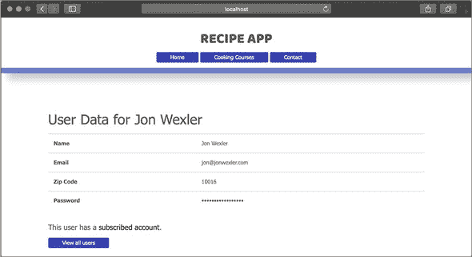

你现在可以在你的应用程序中创建数据，并在几个网页上查看它。在第 20 课中，你将探索更新和删除这些数据的方法。

| |
| --- |

**快速检查 19.3**

> **Q1:**
> 
> 正误判断：代表用户 ID 的 URL 参数必须命名为`:id`。

| |
| --- |
| |

**QC 19.3 答案**

> **1:**
> 
> 错误。`:id`参数对于获取你想要显示的用户 ID 是必需的，但你可以选择任何名称来引用这个参数。如果你决定使用`:userId`，确保在整个代码中一致地使用这个名字。

| |
| --- |

### 总结

在本课中，你学习了如何为你的模型创建`index`、`new`和`show`页面。你还创建了路由和动作来处理用户数据并创建新账户。最后，你自定义了用户`show`页面以显示用户数据和链接的订阅账户的指示器。你已经完成了四个 CRUD 构建块中的两个。在第 20 课中，你将`update`和`delete`函数应用于你的三个模型。

| |
| --- |

**尝试这个**

你的用户账户创建表单已经准备好创建新账户，但你已经在用户模型上实现了某些验证，这可能会允许在没有保存数据的情况下提交表单。尝试测试一些你的验证以确保它们正确工作，如下所示：

1.  当你输入带有大写字母的电子邮件地址时会发生什么？

1.  当缺少必填字段时会发生什么？

虽然你再次被重定向到`new`页面是好事，但你需要在屏幕上显示的错误信息中进行改进。

| |
| --- |

## 第 20 课. 更新和删除你的模型

在第 19 课中，你为你的模型构建了`create`和`read`功能。现在，是时候完成 CRUD 方法了。在本课中，你将添加`update`和`delete`功能的路由、动作和视图。首先，你创建一个表单来编辑现有用户的属性。然后，你在一个`update`动作中管理修改后的数据。在本课结束时，你将实现一种快速从用户索引页删除用户的方法。首先，确保你的 MongoDB 服务器正在运行，通过在终端窗口中输入`mongod`来检查。

本课涵盖

+   构建模型编辑表单

+   更新数据库中的用户记录

+   删除用户记录

| |
| --- |

**考虑以下**

你的食谱应用程序已经准备好接受新用户，但你收到了关于创建了多个不必要的账户以及一些用户不小心输入了错误电子邮件地址的投诉。通过`update`和`delete` CRUD 函数，你将能够清除不需要的记录并修改现有的记录以持久化在你的应用程序中。

| |
| --- |

### 20.1. 构建编辑用户表单

要更新用户信息，你需要在特定的`update`动作中使用一些 Mongoose 方法。不过，首先你需要创建一个编辑用户信息的表单。这个表单看起来像 create.js 中的表单，但表单的动作指向`users/:id/update`而不是`users/create`，因为你希望你的路由表明表单的内容是更新现有用户，而不是创建新用户。

你还希望将每个表单输入中的值替换为用户的现有信息。例如，用户名输入可能看起来像下面的列表。这里的`value`属性使用现有用户的姓名。这段代码仅在将`user`对象传递到该页面时才有效。

##### 列表 20.1. edit.ejs 中带有用户数据的输入示例

```
<input type="text" name="first" id="inputFirstName" value="<%=
 user.name.first %>" placeholder="First" autofocus>               *1*
```

+   ***1*** **在编辑表单中应用现有用户的属性值。**

为了确保现有用户的数据填充此表单，请向用户索引页面中的表格添加另一列。您的索引页面应类似于图 20.1。

##### 图 20.1\. 浏览器中带有编辑链接的用户索引页面

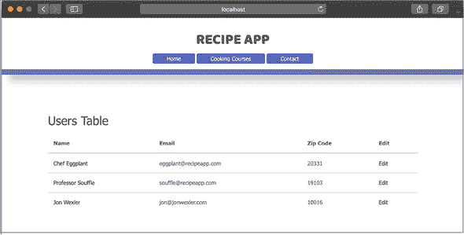

此列包含一个用于编辑每个特定用户的链接。您可以添加一个锚点标签，如下一列表中所示。编辑链接标签的`href`值会向`/users`加上用户的`Id`加上`/edit`路由发起一个`GET`请求。

##### 列表 20.2\. 修改后的表格，在 index.ejs 中添加编辑用户的链接

```
<td>
  <a href="<%=`/users/${user._id}/edit` %>">
    Edit
  </a>
</td>            *1*
```

+   ***1*** **在编辑标签链接中嵌入用户的 ID。**

接下来，您想要修改`edit.ejs`中的表单，以提交带有修改后用户数据的`PUT`请求，但您的 HTML 表单元素仅支持`GET`和`POST`请求。在您的 CRUD 函数中使用预期的 HTTP 方法非常重要，这样就不会在未来对请求是添加新数据还是修改现有数据产生混淆。

您需要解决的问题之一是 Express.js 将如何接收此请求。Express.js 将您的 HTML 表单提交作为`POST`请求接收，因此您需要某种方式来解释具有您意图的 HTTP 方法的请求。存在几种解决这个问题的方法。本课中您使用的解决方案是`method-override`包。

`method-override`是一个中间件，根据特定的查询参数和 HTTP 方法解释请求。使用`_method=PUT`查询参数，您可以解释`POST`请求为`PUT`请求。通过在项目终端窗口中运行`npm i method-override -S`来安装此包，并将列表 20.3 中的行添加到 main.js 中。

首先，将`method-override`模块引入到您的项目中。告诉应用程序使用`methodOverride`作为中间件。具体来说，您正在告诉此模块在 URL 中查找`_method`查询参数，并使用该参数的值指定的方法来解释请求。例如，您想要处理为`PUT`请求的`POST`请求，将会有`?_method=PUT`附加到表单的动作路径上。

##### 列表 20.3\. 在 main.js 中添加`method-override`到您的应用程序

```
const methodOverride = require("method-override");     *1*
router.use(methodOverride("_method", {
  methods: ["POST", "GET"]
}));                                                   *2*
```

+   ***1*** **引入`method-override`模块。**

+   ***2*** **配置应用程序路由器以使用 methodOverride 作为中间件。**

您想要修改`edit.ejs`中的表单，使其以`POST`方法提交到`/users/:id/update?_method=PUT`路由。打开表单标签将看起来像列表 20.4。

动作是动态的，取决于用户的 ID，并指向`/users/:id/update`路由。您的`method-override`模块解释查询参数，并帮助 Express.js 将请求方法与适当的路由匹配。

##### 列表 20.4\. 将编辑表单指向 edit.ejs 中的`update`路由

```
<form method="POST" action="<%=`/users/${user._id}/update
 ?_metho d=PUT`%>">                                          *1*
```

+   ***1*** **添加一个更新用户数据的表单。**

您可以在下一个列表中参考完整的用户编辑表单，它应该看起来像浏览器中的 图 20.2 中的现有用户。

##### 图 20.2\. 浏览器中的用户编辑页面

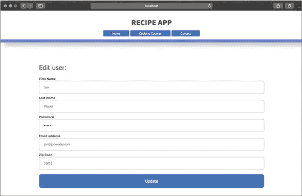

##### 列表 20.5\. 完整的用户编辑表单在 edit.ejs 中

```
<div class="data-form" >                                        *1*
  <form method="POST" action="<%=`/users/${user._id}/update
 ?_method=PUT`%>">
    <h2>Edit user:</h2>
    <label for="inputFirstName">First Name</label>
    <input type="text" name="first" id="inputFirstName" value="<%=
 user.name.first %>" placeholder="First" autofocus>
    <label for="inputLastName">Last Name</label>
    <input type="text" name="last" id="inputLastName" value="<%=
 user.name.last %>" placeholder="Last">
    <label for="inputPassword">Password</label>
    <input type="password" name="password" id="inputPassword"
 value="<%= user.password %>" placeholder="Password" required>
    <label for="inputEmail">Email address</label>
    <input type="email" name="email" id="inputEmail" value="<%=
 user.email %>" placeholder="Email address" required>
    <label for="inputZipCode">Zip Code</label>
    <input type="text" name="zipCode" id="inputZipCode"
 pattern="\d*" value="<%= user.zipCode %>" placeholder="Zip
 Code" required>
    <button type="submit">Update</button>
  </form>
</div>
```

+   ***1*** **显示用户编辑表单。**

在下一节中，您将添加使此表单工作以及处理表单数据的路由和操作。

| |
| --- |

**快速检查 20.1**

> **Q1:**
> 
> 为什么您使用 `PUT` 方法编辑表单，而使用 `POST` 方法创建新表单？

| |
| --- |
| |

**QC 20.1 答案**

> **1:**
> 
> 编辑表单正在更新现有记录的数据。按照惯例，提交数据到您的服务器的请求应使用 HTTP `PUT` 方法。要创建新记录，请使用 `POST`。

| |
| --- |

### 20.2\. 从视图中更新用户

现在用户编辑表单已经在其自己的视图中，添加控制器操作和路由以补充表单。`edit` 路由和操作将用户发送到 view/edit.ejs 视图。`update` 路由和操作用于在数据库中内部更改用户。然后 `redirectView` 操作作为 `update` 后的操作，将您重定向到您指定的视图。将 列表 20.6 中的操作添加到 `usersController.js`。

`edit` 操作，就像 `show` 操作一样，通过用户的 ID 从数据库中获取用户信息并加载一个用于编辑用户的视图。注意，如果通过 ID 参数找不到用户，你需要将错误传递给错误处理中间件函数。当编辑表单提交时，会调用 `update` 操作；与 `create` 操作类似，它会识别用户的 ID 和 `userParams`，并将这些值传递给 Mongoose 的 `findByIdAndUpdate` 方法。此方法接受一个 `ID` 后跟一些参数，你可以使用 `$set` 命令来替换该文档的参数。如果用户更新成功，则在下一个中间件函数中重定向到用户的 `show` 路径；否则，让错误处理中间件捕获任何错误。

##### 列表 20.6\. 向 usersController.js 添加 `edit` 和 `update` 操作

```
edit: (req, res, next) => {                      *1*
  let userId = req.params.id;
  User.findById(userId)                          *2*
      .then(user => {
        res.render("users/edit", {
          user: user
        });                                      *3*
      })
      .catch(error => {
        console.log(`Error fetching user by ID: ${error.message}`);
        next(error);
      });
},

update: (req, res, next) => {                    *4*
  let userId = req.params.id,
    userParams = {
      name: {
        first: req.body.first,
        last: req.body.last
      },
      email: req.body.email,
      password: req.body.password,
      zipCode: req.body.zipCode
    };                                           *5*

  User.findByIdAndUpdate(userId, {
    $set: userParams
  })                                             *6*
      .then(user => {
        res.locals.redirect = `/users/${userId}`;
        res.locals.user = user;
        next();                                  *7*
      })
      .catch(error => {
        console.log(`Error updating user by ID: ${error.message}`);
        next(error);
      });
}
```

+   ***1*** **添加编辑操作。**

+   ***2*** **使用 `findById` 通过 ID 在数据库中定位用户。**

+   ***3*** **渲染数据库中特定用户的用户编辑页面。**

+   ***4*** **添加更新操作。**

+   ***5*** **从请求中收集用户参数。**

+   ***6*** **使用 `findByIdAndUpdate` 通过 ID 定位用户并更新文档记录，只需一个命令。**

+   ***7*** **将用户添加到响应作为局部变量，并调用下一个中间件函数。**

最后，您需要将 列表 20.7 中的路由添加到 main.js 中。编辑用户的路径是一个简单的带有 `id` 参数的路由。从编辑表单更新用户的 `POST` 路由遵循相同的路径结构，但使用 `update` 操作。您还将重用 `redirectView` 操作来显示您在响应的 `locals` 对象中指定的视图。

##### 列表 20.7\. 在`main.js`中添加`edit`和`update`路由

```
router.get("/users/:id/edit", usersController.edit);         *1*
router.put("/users/:id/update", usersController.update,
 usersController.redirectView);                           *2*
```

+   ***1*** **添加处理查看的路由。**

+   ***2*** **处理编辑表单中的数据，并显示用户展示页面。**

重新启动您的应用程序，访问用户索引页面，并点击用户的编辑链接。尝试更新一些值，并保存。

在能够`create`、`read`和`update`用户数据之后，您还缺少一种删除不再需要的记录的方法。下一节将介绍`delete`函数。


**快速检查 20.2**

> **Q1:**
> 
> 真或假：`findByIdAndUpdate`是 Mongoose 方法。

|  |

**QC 20.2 答案**

> **1:**
> 
> 真的。`findByIdAndUpdate`是 Mongoose 方法，用于使您的查询在服务器代码中更加简洁和可读。除非安装了 Mongoose 包，否则该方法不能使用。


### 20.3\. 使用删除操作删除用户

要删除用户，您只需要一个路由和对用户索引页面的修改。在`index.ejs`中，添加一个标题为删除的列。就像您对编辑列所做的那样，将每个用户链接到`users/:id/delete`路由（图 20.3）。

##### 图 20.3\. 在浏览器中带有删除链接的用户索引页面

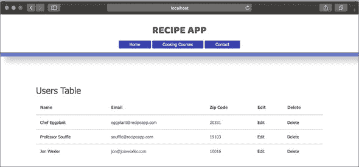


##### 注意

您可以使用 HTML 的`onclick="return confirm('Are you sure you want to delete this record?')"`添加一些基本的安全措施。


记住，您需要使用`_method=DELETE`查询参数，这样您的应用程序才能将`GET`请求解释为`DELETE`请求。在用户索引页面中添加删除列的代码，如列表 20.8 所示。通过附加的查询参数发送`DELETE`请求，此链接将用户的 ID 传递给处理`DELETE`请求的 Express.js 路由。确认脚本显示一个模态框以确认您要提交链接并删除记录。

##### 列表 20.8\. 用户索引页面中的删除链接

```
<td>
  <a href="<%= `users/${user._id}/delete?_method=DELETE` %>"
 onclick="return confirm('Are you sure you want to delete
 this record?')">Delete</a>                                  *1*
</td>
```

+   ***1*** **在索引页面上添加删除操作的链接。**

接下来，将控制器操作添加到`delete`用户记录的 ID。将列表 20.9 中的代码添加到`usersController.js`。

您正在使用 Mongoose 的`findByIdAndRemove`方法来定位您点击的记录并将其从数据库中删除。如果您成功定位并删除了文档，请在控制台记录被删除的用户，并在下一个中间件函数中重定向到用户索引页面。否则，像往常一样记录错误，并让错误处理器捕获您传递给它的错误。

##### 列表 20.9\. 将`delete`操作添加到`usersController.js`

```
delete: (req, res, next) => {
  let userId = req.params.id;
  User.findByIdAndRemove(userId)              *1*
      .then(() => {
        res.locals.redirect = "/users";
        next();
      })
      .catch(error => {
        console.log(`Error deleting user by ID: ${error.message}`);
        next();
      });
}
```

+   ***1*** **使用`findByIdAndRemove`方法删除用户**

唯一缺少的部分是以下路由，您将其添加到`main.js`中：`router.delete ("/users/:id/delete", usersController.delete, usersController.redirectView)`。此路由处理与路径`users/`、用户 ID 和`/delete`匹配的`DELETE`请求。然后，当记录被删除时，该路由将重定向到指定的重定向路径。

尝试通过再次运行应用程序并访问用户索引页面来运行这段新代码。点击其中一个用户的删除链接，然后观察它从你的页面上消失。

最后，为了使用户从其个人资料页面更容易地使用您的新 CRUD 操作，请将以下列表中的链接添加到 show.ejs 的底部。

##### 列表 20.10\. 将用户 CRUD 操作的链接添加到 show.ejs

```
<div>
  <a href="/users">View all users</a>
</div>
<div>
  <a href="<%=`/users/${user._id}/edit`%>">
    Edit User Details
  </a>
</div>
<div>
  <a href="<%= `/users/${user._id}/delete?_method=DELETE` %>"
  onclick="return confirm('Are you sure you want to delete
  this record?')">Delete</a>
</div>                              *1*
```

+   ***1*** **在个人资料页面添加编辑和删除用户账户的链接。**

用户的展示页面应该类似于图 20.4。

##### 图 20.4\. 带有编辑和删除链接的用户展示页面

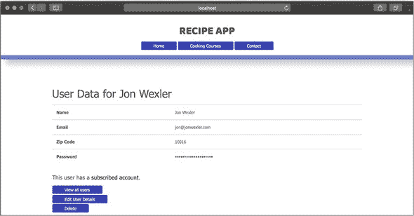


**快速检查 20.3**

> **Q1:**
> 
> 为什么在链接路径的末尾需要`?_method=DELETE`？

|  |

**QC 20.3 答案**

> **1:**
> 
> `method-override`会查找`_method`查询参数及其映射的方法。因为您正在使用此包来过滤传入的`GET`和`POST`请求作为替代方法，您需要添加此参数及其值。


### 摘要

在本课中，您学习了如何编辑数据库中的记录和删除记录。您还看到了如何使用`method-override`包来帮助处理 HTML 限制以提交某些请求方法。随着 CRUD 功能的完成，现在是时候构建一个具有关联模型和用户界面以将有意义的数据保存到数据库中的应用程序了。在下一项综合练习（第 21 课 lesson 21）中，尝试将您在本单元中学到的所有内容应用于构建 Confetti Cuisine 应用程序。


**尝试这个**

现在您已经为用户账户的每个 CRUD 函数都设置了工作状态，请确保为组和订阅者也设置了相同的设置。在您继续进行综合练习（第 21 课 lesson 21）之前，请确保所有三个模型都有工作的索引、新建、编辑和展示页面。然后，就像在第 19 课 lesson 19 中一样，尝试将关联模型纳入每个记录的展示页面。


## 第 21 课：综合：将 CRUD 模型添加到 Confetti Cuisine

Confetti Cuisine 对我连接他们的应用程序到数据库并设置处理订阅者信息的进展感到满意。他们已经给我发了一份他们想要开始在网站上宣传的烹饪课程列表。本质上，他们希望订阅者选择他们最感兴趣的参加的课程。然后，如果订阅者后来创建了一个用户账户，该业务希望这两个账户能够相互链接。

为了完成这个任务，我需要改进`Subscriber`模型并构建`User`和`Course`模型。我需要记住这些模型之间的关系，并在必要时从关联模型中填充数据。最后，我需要生成所有必要的功能，以允许创建、读取、更新和删除（CRUD）模型记录。在这个项目中，我将创建一个用户登录表单，允许用户创建账户，然后编辑、更新和删除账户。我将重复大部分过程，为 Confetti Cuisine 的通讯录中的课程和订阅者。

当我完成时，我将有一个应用程序，可以向 Confetti Cuisine 的团队展示，让他们能够在正式推出项目之前注册新用户并监控他们的课程。

为了这个目的，我需要以下内容：

+   用户、订阅者和课程模型的模式

+   应用程序中所有模型的 CRUD 操作

+   显示模型之间链接的视图

### 21.1. 设置环境

从我上次停止的地方继续，我已经将 MongoDB 数据库连接到我的应用程序，使用 Mongoose 包驱动我的`Subscriber`模型和原始文档之间的通信。在接下来的工作中，我需要相同的核心和外部包。此外，我需要安装`method-override`包来帮助处理 HTML 链接和表单目前不支持的所有 HTTP 方法。我可以通过在项目目录的新终端窗口中运行以下代码来安装此包：`npm i method-override -S`。然后，我将`method-override`模块引入到 main.js 中，通过在文件顶部添加`const methodOverride = require("method-override")`。我配置应用程序使用`method-override`来识别`GET`和`POST`请求作为其他方法，通过添加以下行：`app.use(methodOverride("_method", {methods: ["POST", "GET"]}))`。

接下来，我需要考虑当我完成时，这个项目的目录结构将是什么样子。因为我将向三个模型添加 CRUD 功能，所以我将创建三个新的控制器，在视图内创建三个新的文件夹，以及三个模型模块。结构类似于图 21.1。

##### 图 21.1. 项目文件结构

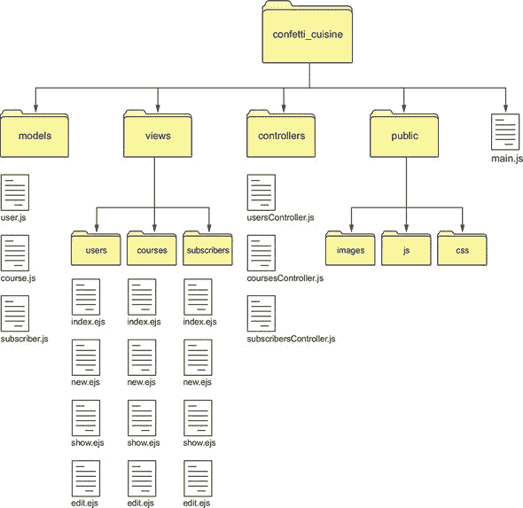

注意，我只创建了四个视图：`index`、`new`、`show`和`edit`。尽管`delete`可以有自己的视图作为删除确认页面，但我将通过每个模型的`index`页面上的链接来处理删除。

接下来，我首先改进`Subscriber`模型，并同时构建我的`User`和`Course`模型。

### 21.2. 构建模型

我的`Subscriber`模型为 Confetti Cuisine 收集了有意义的数据，但他们希望在数据层上增加安全性。我需要在`Subscriber`模式上添加一些验证器，以确保在数据进入数据库之前，订阅者数据符合客户的要求。我的新模式看起来像列表 21.1。

我首先将 Mongoose 引入这个模块，并将 Mongoose Schema 对象拉入其自己的常量。我通过使用 `Schema` 构造函数并传递一些订阅者属性来创建我的订阅者模式。每个订阅者都必须输入一个名称和一个在数据库中不存在的电子邮件地址。每个订阅者可以选择输入一个五位数的 ZIP 码。`timestamps` 属性是 Mongoose 提供的一个附加功能，用于记录该模型的 `createdAt` 和 `updatedAt` 属性。

每个订阅者可以订阅多个课程，因此这个关联允许订阅者与一系列引用课程相关联。我需要创建课程模型来实现这个功能。`getInfo` 是添加到订阅者模式中的一个实例方法，用于快速检索任何订阅者的 `name`、`email` 和 `zipCode`。使用这种新模式导出订阅者模型，使其在应用程序的其他模块中可访问。

##### 列表 21.1\. 改进的 subscriber.js 中的 `Subscriber` 模式

```
const mongoose = require("mongoose"),
  { Schema } = mongoose,                                    *1*
  subscriberSchema = new Schema({
  name: {                                                   *2*
    type: String,
    required: true
  },
  email: {
    type: String,
    required: true,
    lowercase: true,
    unique: true
  },
  zipCode: {
    type: Number,
    min: [10000, "Zip code too short"],
    max: 99999
  },
  courses: [{type: Schema.Types.ObjectId, ref: "Course"}]   *3*
}, {
  timestamps: true
});

subscriberSchema.methods.getInfo = function () {            *4*
  return `Name: ${this.name} Email: ${this.email}
 Zip Code: ${this.zipCode}`;
};

module.exports = mongoose.model("Subscriber",
 subscriberSchema);                                      *5*
```

+   ***1*** **需要 mongoose**。

+   ***2*** **添加模式属性**。

+   ***3*** **关联多个课程**。

+   ***4*** **添加 `getInfo` 实例方法**。

+   ***5*** **导出订阅者模型**。

这个模型看起来不错，所以我将应用一些相同的技巧到 course.js 和 user.js 中的 `Course` 和 `User` 模型。每个课程都必须有一个标题和描述，没有初始限制。课程有 `maxStudents` 和 `cost` 属性，默认为 0，不能保存为负数；否则，会出现我的自定义错误消息。

`Course` 模式包含以下列表中的属性。

##### 列表 21.2\. course.js 中 `Course` 模式的属性

```
const mongoose = require("mongoose"),
  { Schema } = require("mongoose"),
  courseSchema = new Schema(
    {
      title: {                 *1*
        type: String,
        required: true,
        unique: true
      },
      description: {
        type: String,
        required: true
      },
      maxStudents: {           *2*
        type: Number,
        default: 0,
        min: [0, "Course cannot have a negative number of students"]
      },
      cost: {
        type: Number,
        default: 0,
        min: [0, "Course cannot have a negative cost"]
      }
    },
    {
      timestamps: true
    }
  );
module.exports = mongoose.model("Course", courseSchema);
```

+   ***1*** **需要标题和描述**。

+   ***2*** **默认 `maxStudents` 和 `cost` 为 0，并禁止负数**。

`User` 模型包含最多的字段和验证，因为我希望防止新用户输入无效数据。这个模型需要链接到 `Course` 和 `Subscriber` 模型。`User` 模式在 列表 21.3 中显示。

每个用户的姓名保存为 `first` 和 `last` 名称属性。`email` 和 `zipCode` 属性的行为与 `Subscriber` 中相同。每个用户都必须有一个密码。对于订阅者来说，用户与多个课程相关联。因为订阅者最终可能会创建用户账户，所以我需要在这里链接这两个账户。我还添加了 `timestamps` 属性，以跟踪数据库中用户记录的变化。

##### 列表 21.3\. 在 `user.js` 中创建 `User` 模型

```
const mongoose = require("mongoose"),
  { Schema } = require("mongoose"),
  Subscriber = require("./subscriber"),
  userSchema = new Schema(
    {
      name: {                            *1*
        first: {
          type: String,
          trim: true
        },
        last: {
          type: String,
          trim: true
        }
      },
      email: {
        type: String,
        required: true,
        unique: true
      },
      zipCode: {
        type: Number,
        min: [10000, "Zip code too short"],
        max: 99999
      },
      password: {
        type: String,
        required: true
      },                                 *2*
      courses: [
        {
          type: Schema.Types.ObjectId,
          ref: "Course"
        }                                *3*
      ],
      subscribedAccount: {
        type: Schema.Types.ObjectId,
        ref: "Subscriber"
      }                                  *4*
    },
    {
      timestamps: true                   *5*
    }
  );
module.exports = mongoose.model("User", userSchema);
```

+   ***1*** **添加首名和姓氏属性**。

+   ***2*** **需要密码**。

+   ***3*** **将用户与多个课程关联**。

+   ***4*** **将用户与订阅者关联**。

+   ***5*** **添加时间戳属性**。

我对用户模型所做的两个额外添加是一个返回用户全名的虚拟属性和一个 Mongoose `pre("save")`钩子，用于将具有相同电子邮件地址的订阅者和用户链接起来。这些添加可以直接添加到 user.js 中的模式定义下方，并在列表 21.4 中显示。

这个第一个虚拟属性允许我通过调用用户的`fullName`来获取用户的`first`和`last`名字作为一个值。`pre("save")`钩子在用户被保存到数据库之前运行。我传递`next`参数，以便当这个函数完成时，我可以调用中间件链中的下一个步骤。为了链接到当前用户，我将用户保存到一个新的变量中，这个变量超出了我下一个查询的作用域。我只在用户还没有链接的`subscribedAccount`时运行查询。我在 Subscriber 模型中搜索包含该用户电子邮件地址的文档。如果存在订阅者，我在保存记录并调用中间件链中的下一个函数之前，将返回的订阅者设置为用户的`subscribedAccount`属性。

##### 列表 21.4\. 在 user.js 中添加虚拟属性和 pre(“save”)钩子

```
userSchema.virtual("fullName").get(function() {        *1*
  return `${this.name.first} ${this.name.last}`;
});

userSchema.pre("save", function (next) {               *2*
  let user = this;
  if (user.subscribedAccount === undefined) {          *3*
    Subscriber.findOne({
      email: user.email
    })                                                 *4*
      .then(subscriber => {
        user.subscribedAccount = subscriber;
        next();                                        *5*
      })
      .catch(error => {
        console.log(`Error in connecting subscriber:
 ${error.message}`);
        next(error);
      });
  } else {
    next();
  }
});
```

+   ***1*** **添加 fullName 虚拟属性。**

+   ***2*** **添加一个 pre(‘save’)钩子来链接订阅者。**

+   ***3*** **检查是否有链接的 subscribedAccount。**

+   ***4*** **在 Subscriber 模型中搜索包含该用户电子邮件的文档。**

+   ***5*** **调用下一个中间件函数。**

在设置好这个模型后，我需要构建 CRUD 功能。我开始创建视图：index.ejs、new.ejs、show.ejs 和 edit.ejs。

### 21.3\. 创建视图

对于 Subscriber 模型，index.ejs 通过一个 HTML 表格列出数据库中的所有订阅者，如列表 21.5 所示。这个视图是一个包含五列的表格。前三列显示订阅者数据，最后两列链接到单个订阅者的编辑和删除页面。对于我的订阅者索引页面，我添加了一些新的样式(图 21.2)。

##### 图 21.2\. 浏览器中的订阅者索引页面

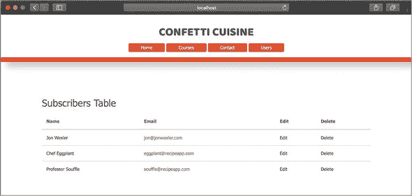


##### 注意

由于这些视图在不同模型中具有相同的名称，我需要按照模型名称将它们组织在单独的文件夹中。例如，views/users 文件夹有自己的 index.ejs。


为了为每个订阅者生成一行新数据，我遍历`subscribers`变量，这是一个 Subscriber 对象的数组，并访问每个订阅者的属性。订阅者的名字被包裹在一个锚标签中，通过使用用户的不`_id`链接到该订阅者的`show`页面。删除链接需要在路径后附加`?_method=DELETE`查询参数，以便我的`method-override`中间件可以将此请求作为`DELETE`请求处理。我必须记住在 EJS 中关闭我的代码块。

##### 列表 21.5\. 在 index.ejs 中列出订阅者

```
<h2 class="center">Subscribers Table</h2>
 <table class="table">                                   *1*
   <thead>
     <tr>
       <th>Name</th>
       <th>Email</th>
       <th>Edit</th>
       <th>Delete</th>
     </tr>
   </thead>
   <tbody>
     <% subscribers.forEach(subscriber => { %>
     <tr>                                                *2*
      <td>
      <a href="<%= `/subscribers/${subscriber._id}` %>">
        <%= subscriber.name %>                           *3*
      </a>
      </td>
       <td><%= subscriber.email %></td>
       <td>
       <a href="<%=`subscribers/${subscriber._id}/edit` %>">
         Edit
       </a>
       </td>
       <td>
         <a href="<%=`subscribers/${subscriber._id}/delete?_method=DELETE` %>"
 onclick="return confirm('Are you sure you want to delete this
 record?')">Delete</a>                                *4*
       </td>
     </tr>
     <% }); %>
   </tbody>
 </table>
```

+   ***1*** **在索引页面添加一个表格。**

+   ***2*** **为每个订阅者生成一行新数据。**

+   ***3*** **将订阅者的名字包裹在锚标签中。**

+   ***4*** **添加一个删除链接。**

我将遵循完全相同的结构来构建课程和用户索引页面，确保替换变量名称和属性以匹配相应的模型。

在有了这个索引页面之后，我需要一种创建新记录的方法。我从列表 21.6 中的订阅者 `new.ejs` 表单开始。此表单将通过 `POST` 请求提交数据到 `/subscribers/- create` 路径，从该路径我将创建新的订阅者记录在订阅者控制器中。注意，表单通过 `POST` 请求提交数据。每个输入都反映了模型的属性。每个表单输入的 `name` 属性很重要，因为我将使用它在控制器中收集保存新记录所需的数据。表单的末尾有一个提交按钮。

##### 列表 21.6\. 在 new.ejs 中创建新的订阅者表单

```
<div class="data-form">
  <form action="/subscribers/create" method="POST">       *1*
    <h2>Create a new subscriber:</h2>
    <label for="inputName">Name</label>
    <input type="text" name="name" id="inputName" placeholder="Name"
 autofocus>
    <label for="inputEmail">Email address</label>
    <input type="email" name="email" id="inputEmail"
 placeholder="Email address" required>
    <label for="inputZipCode">Zip Code</label>
    <input type="text" name="zipCode" id="inputZipCode"
 pattern="[0-9]{5}" placeholder="Zip Code" required>
    <button type="submit">Create</button>
  </form>
</div>
```

+   ***1*** **添加一个表单以创建新的订阅者。**

我为用户和课程重新创建了此表单，确保替换表单的动作和输入以反映我正在创建的模型。我的订阅者编辑表单看起来像图 21.3 中的那个。

##### 图 21.3\. 浏览器中的订阅者编辑页面

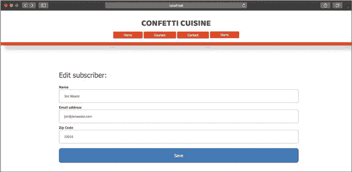

当我在表单上工作时，我创建了 `edit.ejs` 视图，其表单类似于 `new.ejs`。需要注意的是以下更改：

+   *编辑表单*—此表单需要访问我正在编辑的记录。在这种情况下，`subscriber` 来自订阅者控制器。

+   *表单动作*—此动作指向 `/subscribers/${subscriber._id}/ update?_method=PUT` 而不是 `create` 动作。

+   *属性*—每个输入的 `value` 属性设置为 `subscriber` 变量的属性，如 `<input type="text" name="name" value="<%= subscriber.name %>">`。

这些相同的点也适用于用户和课程的 edit.ejs 表单。下一个列表显示了完整的订阅者编辑页面。

##### 列表 21.7\. `edit.ejs` 中的订阅者编辑页面

```
<form action="<%=`/subscribers/${subscriber._id}/update
 ?_method=PUT` %>" method="POST">                           *1*
  <h2>Create a new subscriber:</h2>
  <label for="inputName">Name</label>
  <input type="text" name="name" id="inputName" value="<%=
 subscriber.name %>" placeholder="Name" autofocus>
  <label for="inputEmail">Email address</label>
  <input type="email" name="email" id="inputEmail" value="<%=
 subscriber.email %>" placeholder="Email address" required>
  <label for="inputZipCode">Zip Code</label>
  <input type="text" name="zipCode" id="inputZipCode"
 pattern="[0-9]{5}" value="<%= subscriber.zipCode %>"
 placeholder="Zip Code" required>
  <button type="submit">Save</button>
</form>
```

+   ***1*** **显示订阅者的编辑表单。**

最后，我为每个模型构建了 `show` 页面。对于订阅者，这个页面类似于个人资料页面，详细说明了每个订阅者在索引页面上的信息。这个页面相当直接：我展示了足够的数据来总结单个订阅者记录。订阅者的 `show` 页面有一个表格，使用以下列表中显示的 EJS 模板元素创建。这个页面使用 `subscriber` 变量的属性来显示 `name`、`email` 和 `zipCode`。

##### 列表 21.8\. `show.ejs` 中的订阅者展示页面

```
<h1>Subscriber Data for <%= subscriber.name %></h1>      *1*

<table>
  <tr>
    <th>Name</th>
    <td><%= subscriber.name %></td>
  </tr>
  <tr>
    <th>Email</th>
    <td><%= subscriber.email %></td>
  </tr>
  <tr>
    <th>Zip Code</th>
    <td><%= subscriber.zipCode %></td>
  </tr>
</table>
```

+   ***1*** **显示订阅者属性。**


##### 注意

对于这些视图中的某些，我将添加链接以导航到该模型的其他相关页面。


我还希望在 `show` 页面添加一段代码，以显示记录是否与数据库中的其他记录相关联。对于用户来说，显示相关记录的代码可以在页面底部添加一个额外的标签来显示用户是否有 `subscribedAccount` 或相关 `courses`。对于订阅者，我将添加一行来显示已订阅课程的数目，如列表 21.9 所示。

这一行给 Confetti Cuisine 提供了人们订阅课程数目的洞察。我可以通过在这个订阅者上使用 Mongoose 的 `populate` 方法来进一步扩展这一行，以显示相关课程详情。

##### 列表 21.9\. 在 show.ejs 中显示已订阅课程的数目

```
<p>This subscriber has <%= subscriber.courses.length %> associated
 course(s)</p>                                                     *1*
```

+   ***1*** **显示相关课程的数目。**

最后一步是将模型、视图与控制器动作和路由结合起来。

### 21.4\. 结构化路由

Confetti Cuisine 的表单和链接已经准备好显示，但仍然没有通过浏览器访问它们的方法。在 main.js 中，我将添加必要的 CRUD 路由并引入所需的控制器，以确保一切正常工作。

首先，我将从列表 21.10 中添加订阅者的路由到 main.js。为了确保 `subscribersController` 在文件顶部与我的其他控制器一起被引入，我添加了 `const subscribersController = require("./controllers/subscribersController")`。我还将 Express.js 的 Router 引入到我的项目中，通过在 main.js 中添加 `const router = express.Router()` 来帮助区分应用程序的路由和其他配置。有了这个 `router` 对象，我将 `app` 对象处理的每个路由和中间件都改为使用 `router` 对象。然后，我在 main.js 中添加 `app.use("/", router)` 来告诉应用程序使用这个 `router` 对象。

对 `/subscribers` 路径的 `GET` 请求将我带到 `subscribers-Controller` 的 `index` 动作。然后，通过另一个名为 `indexView` 的动作渲染 index.ejs 页面。相同的策略也适用于其他 `GET` 路由。第一个 `POST` 路由是用于 `create` 的。这个路由处理来自表单的请求以保存新的订阅者数据。我需要在 `create` 动作中创建保存新订阅者的逻辑。然后，我使用一个名为 `redirectView` 的动作，在成功创建订阅者记录后，将重定向到我的某个视图。

`show` 路由是我需要从路径中获取订阅者 ID 的第一个情况。在这种情况下，`:id` 代表订阅者的 `ObjectId`，这允许我在 `show` 动作中在数据库中搜索该特定订阅者。然后，我使用 `showView` 在视图中显示订阅者的数据。`update` 路由与 `create` 路由类似，但我指定路由只接受 `PUT` 请求，这表示正在请求特定更新现有记录。同样，我在此之后使用 `redirectView` 动作来显示视图。最后一个路由 `delete` 只接受 `DELETE` 请求。请求将从 index.ejs 中的链接发出，并使用 `redirectView` 链接到索引页面。

##### 列表 21.10\. 在 main.js 中添加订阅者 CRUD 路由

```
router.get("/subscribers", subscribersController.index,
 subscribersController.indexView);                                *1*
router.get("/subscribers/new", subscribersController.new);
router.post("/subscribers/create", subscribersController.create,
 subscribersController.redirectView);                             *2*
router.get("/subscribers/:id", subscribersController.show,
 subscribersController.showView);                                 *3*
router.get("/subscribers/:id/edit", subscribersController.edit);
router.put("/subscribers/:id/update", subscribersController.update,
 subscribersController.redirectView);                             *4*
router.delete("/subscribers/:id/delete",
 subscribersController.delete,
 subscribersController.redirectView);                             *5*
```

+   ***1*** **添加 GET 路由以显示视图。**

+   ***2*** **添加第一个用于创建的 POST 路由。**

+   ***3*** **添加一个基于 ObjectId 显示订阅者的路由。**

+   ***4*** **添加一个更新订阅者的路由。**

+   ***5*** **添加一个删除订阅者的路由。**

需要对用户和课程创建相同的七个路由。我还会更新导航链接：联系链接将指向订阅者的新视图，课程列表链接将指向课程的索引视图。


##### 注意

到目前为止，我可以移除一些过时的路由，例如指向 `getAllSubscribers`、`getSubscriptionPage` 和 `saveSubscriber` 的路由，这些路由位于订阅者控制器中，以及指向主页控制器中 `showCourses` 的路由。我还可以将主页路由移动到主页控制器的 index 动作中。最后，我想确保更新我的导航链接，使其指向 `/subscribers/new` 而不是 `/contact`。


我剩下的工作就是创建相应的控制器。

### 21.5\. 创建控制器

在 main.js 中创建的路由需要 `subscribersController`、`coursesController` 和 `usersController`。我开始在控制器文件夹中创建这些文件。


##### 注意

我还清理了我的错误控制器，以使用 `http-status-codes` 和 error.ejs 视图，就像之前的应用程序示例中那样。


接下来，对于订阅者控制器，我添加了 列表 21.11 中显示的操作来处理对我的现有路由发出的请求。在将 `Subscriber` 模型引入此文件后，我创建了 `index` 动作以找到数据库中的所有订阅者文档，并通过 `indexView` 动作将它们传递到 `index.ejs` 中的 `subscribers` 变量。`new` 和 `edit` 动作也渲染一个视图来订阅和编辑订阅者数据。

`create` 动作通过我的自定义 `getSubscriberParams` 函数收集请求体参数，该函数列在代码列表的第二个常量中，以创建一个新的订阅者记录。如果操作成功，我将通过 `locals` 变量对象将用户对象传递到我的响应中。然后，我将在 `redirectView` 动作中指定重定向到索引页面。

`show` 操作从 URL 中通过 `req.params.id` 提取订阅者的 ID。此值用于在数据库中搜索一个匹配的记录，然后将该记录通过响应对象传递给下一个中间件函数。在 `showView` 中，`show` 页面显示此 `subscriber` 变量的内容。`update` 操作的行为类似于 `create`，并使用 `findByIdAndUpdate` Mongoose 方法为现有的订阅者文档设置新值。在这里，我还通过响应对象传递更新后的用户对象，并在 `redirectView` 操作中指定要重定向到的视图。

`delete` 操作使用请求参数中的订阅者 ID 来从数据库中 `findByIdAndRemove` 一个匹配的文档。`getSubscriberParams` 函数旨在减少我的代码中的重复。因为 `create` 和 `update` 操作使用表单参数，它们可以调用此函数。`redirectView` 操作也旨在通过允许多个操作（包括 `delete` 操作）在主函数完成后指定要渲染的视图来减少代码重复。

##### 列表 21.11\. 在 subscribersController.js 中添加订阅者控制器操作

```
const Subscriber = require("../models/subscriber"),
  getSubscriberParams = (body) => {                      *1*
    return {
      name: body.name,
      email: body.email,
      zipCode: parseInt(body.zipCode)
    };
  };

module.exports = {
  index: (req, res, next) => {                           *2*
    Subscriber.find()
      .then(subscribers => {
        res.locals.subscribers = subscribers;
        next();
      })
      .catch(error => {
        console.log(`Error fetching subscribers: ${error.message}`);
        next(error);
      });
  },
  indexView: (req, res) => {
    res.render("subscribers/index");
  },

  new: (req, res) => {
    res.render("subscribers/new");
  },

  create: (req, res, next) => {                          *3*
    let subscriberParams = getSubscriberParams(req.body);
    Subscriber.create(subscriberParams)
      .then(subscriber => {
        res.locals.redirect = "/subscribers";
        res.locals.subscriber = subscriber;
        next();
      })
      .catch(error => {
        console.log(`Error saving subscriber:${error.message}`);
        next(error);
      });
  },

  redirectView: (req, res, next) => {
    let redirectPath = res.locals.redirect;
    if (redirectPath) res.redirect(redirectPath);
    else next();
  },
  show: (req, res, next) => {                            *4*
    var subscriberId = req.params.id;
    Subscriber.findById(subscriberId)
      .then(subscriber => {
        res.locals.subscriber = subscriber;
        next();
      })
      .catch(error => {
        console.log(`Error fetching subscriber by ID:
 ${error.message}`)
        next(error);
      });
  },

  showView: (req, res) => {
    res.render("subscribers/show");
  },

  edit: (req, res, next) => {
    var subscriberId = req.params.id;
    Subscriber.findById(subscriberId)
      .then(subscriber => {
        res.render("subscribers/edit", {
          subscriber: subscriber
        });
      })
      .catch(error => {
        console.log(`Error fetching subscriber by ID:
 ${error.message}`);
        next(error);
      });
  },

  update: (req, res, next) => {                         *5*
    let subscriberId = req.params.id,
      subscriberParams = getSubscriberParams(req.body);

    Subscriber.findByIdAndUpdate(subscriberId, {
      $set: subscriberParams
    })
      .then(subscriber => {
        res.locals.redirect = `/subscribers/${subscriberId}`;
        res.locals.subscriber = subscriber;
        next();
      })
      .catch(error => {
        console.log(`Error updating subscriber by ID:
 ${error.message}`);
        next(error);
      });
  },

  delete: (req, res, next) => {                         *6*
    let subscriberId = req.params.id;
    Subscriber.findByIdAndRemove(subscriberId)
      .then(() => {
        res.locals.redirect = "/subscribers";
        next();
      })
      .catch(error => {
        console.log(`Error deleting subscriber by ID:
 ${error.message}`);
        next();
      });
  }
};
```

+   ***1*** **创建一个自定义函数以从请求中提取订阅者数据。**

+   ***2*** **创建索引操作以查找所有订阅者文档。**

+   ***3*** **创建创建操作以创建一个新的订阅者。**

+   ***4*** **创建显示操作以显示订阅者数据。**

+   ***5*** **创建更新操作以设置现有订阅者文档的新值。**

+   ***6*** **创建删除操作以移除一个订阅者文档。**

在为每个模型设置这些控制器操作后，应用程序准备启动并管理记录。我加载每个模型的视图，然后创建新的订阅者、课程和用户。在 单元 5 中，我通过添加用户身份验证和登录表单来改进 Confetti Cuisine 的网站。

### 摘要

在这个综合练习中，我通过向三个新模型添加 CRUD 功能来改进 Confetti Cuisine 的应用程序。这些模型允许订阅者注册 Confetti Cuisine 即将推出的课程，并创建用户账户以参与烹饪课程产品。在 单元 5 中，我通过添加闪存消息、密码安全和使用 `passport` 模块的用户身份验证来清理这些视图。
