## 第 5 单元：验证用户账户

在第 4 单元中，你为应用程序中的模型构建了 CRUD 函数。你还学习了 Mongoose 和一些外部包如何帮助你定义模型之间的关联，并在浏览器中显示引用模型的数据库数据。

在本单元中，你学习了使用会话和 cookie 进行闪存消息、数据加密和用户认证。你首先实现基本的会话存储来处理请求之间的称为*闪存消息*的小信息。然后你修改`User`模型以使用`bcrypt`包处理密码加密。在设置好第一个登录表单后，你使用`bcrypt`通过将用户的登录数据与数据库中加密的密码进行比较来验证用户。在最后一课中，你重新实现了用户认证的过程——在允许用户访问应用程序之前确认账户的有效性。你探讨了验证账户、加密密码以保障安全以及通过 Passport.js 提供的工具为普通用户提供在应用程序中移动的工具。到本单元结束时，你将能够注册新用户，甚至开始基于数据库中的用户数据构建逻辑。

本单元涵盖了以下主题：

+   第 22 课 讨论了会话，并展示了如何通过在客户端存储信息来保留用户的登录状态。你学习了如何应用闪存消息；这些在页面之间传递的简短消息会告诉你某些服务器操作是否成功。

+   第 23 课 指导你构建注册表单的过程。在这本书中你已经构建过表单了，但这个表单处理用户的电子邮件和密码，因此你需要采取稍微不同的方法来确保你的数据安全且一致。在`bcrypt`包的帮助下，一种加密算法确保不会将明文密码保存到你的数据库中。在课程结束时，你使用`express-validator`应用了额外的验证中间件。

+   第 24 课 教你如何为你的用户添加应用程序认证。在本课中，通过 Passport.js 中间件和一些有用的 npm 包，为你的应用程序和`User`模型添加了一层安全防护。你还修改了视图布局，以便快速访问登录表单、显示当前登录的用户并提供快速登出的方式。

+   第 25 课 通过引导你构建 Confetti Cuisine 应用程序所需的用户加密和认证来结束本单元。你应用了闪存消息、验证中间件、加密和一个健壮的认证过程。

在第 22 课中，通过向你的应用程序添加 cookie 开始烹饪。

## 第 22 课：添加会话和闪存消息

在本节课中，你通过在页面之间传递消息来清理 CRUD 函数之间的流程，以找出服务器操作是否成功或是否发生了某些类型的错误。目前，错误消息被记录到控制台，应用程序的用户无法知道他们可以如何不同地操作。你使用 `connect-flash` 包以及会话和 cookie 来将这些消息传递到你的视图中。在本节课结束时，你将拥有一个能够以视觉描述操作成功或失败的应用程序。

本节课涵盖

+   设置会话和 cookie

+   在你的控制器操作中创建闪存消息

+   在传入数据上设置验证中间件

| |
| --- |

**考虑这一点**

你的食谱应用程序开始通过你在第 4 单元中创建的视图表单收集数据。然而，用户开始感到沮丧，因为他们不知道你设置了哪些验证，如果他们未能满足验证器的期望，他们会被无通知地重定向到另一个页面。

通过一些有用的包，你可以将闪存消息整合到你的应用程序中，以通知你的用户应用程序中发生的特定错误。

| |
| --- |

### 22.1\. 设置闪存消息模块

*闪存消息*是半永久性数据，用于向应用程序的用户显示信息。这些消息起源于你的应用程序服务器，作为会话的一部分传送到用户的浏览器。*会话*包含有关用户与应用程序之间最近交互的数据，例如当前登录用户、页面超时前的时间长度，或打算一次性显示的消息。

你有多种方法将闪存消息整合到你的应用程序中。在本节课中，你通过在终端中输入 `npm i connect-flash -S` 来安装其包，将 `connect-flash` 中间件模块作为依赖项添加到你的应用程序中。

| |
| --- |

##### 注意

会话曾经是 Express.js 的依赖项，但由于并非每个人都会使用每个 Express.js 依赖项，并且很难保持依赖项与主包的更新同步，因此必须安装独立的包 `cookie-parser` 和 `express-session`。

| |
| --- |

现在你需要在终端中运行 `npm i cookie-parser express-session -S` 来安装另外两个包。然后，在你的 main.js 文件中引入这三个模块——`connect-flash`、`cookie-parser` 和 `express-session`——以及一些使用这些模块的代码（列表 22.1）。

您需要 `express-session` 模块在您的应用程序和客户端之间传递消息。这些消息在用户的浏览器中持久存在，但最终存储在服务器上。`express-session` 允许您以几种方式在用户的浏览器中存储您的消息。Cookies 是会话存储的一种形式，因此您需要 `cookie-parser` 包来指示您想要使用 cookies，并且您希望您的会话能够解析（或解码）从浏览器发送回服务器的 cookie 数据。

使用 `connect-flash` 包来创建您的 flash 消息。此包依赖于会话和 cookies 在请求之间传递 flash 消息。您告诉您的 Express.js 应用程序使用 `cookie-parser` 作为中间件，并使用您选择的某个秘密密码。`cookie-parser` 使用此代码来加密发送到浏览器的 cookies 中的数据，因此请选择一个难以猜测的密码。接下来，您让应用程序通过告诉 `express-session` 使用 `cookie-parser` 作为其存储方法，并在大约一个小时后使 cookies 过期来使用会话。

您还需要提供一个密钥来加密您的会话数据。通过将 `saveUninitialized` 设置为 false，指定您不希望在没有消息添加到会话的情况下向用户发送 cookie。还指定您不希望在现有会话没有变化的情况下更新服务器上的现有会话数据。最后，让应用程序使用 `connect-flash` 作为中间件。


##### 注意

在此示例中，密钥以纯文本形式显示在您的应用程序服务器文件中。然而，我不建议在这里显示您的密钥，因为这会使您的应用程序容易受到安全漏洞的攻击。相反，将您的密钥存储在环境变量中，并使用 `process.env` 访问该变量。我在第 8 单元中进一步讨论了此主题。单元 8。


##### 列表 22.1\. 在 main.js 中要求使用 flash 消息

```
const expressSession = require("express-session"),      *1*
  cookieParser = require("cookie-parser"),
  connectFlash = require("connect-flash");
router.use(cookieParser("secret_passcode"));            *2*
router.use(expressSession({
  secret: "secret_passcode",
  cookie: {
    maxAge: 4000000
  },
  resave: false,
  saveUninitialized: false
}));                                                    *3*
router.use(connectFlash());                             *4*
```

+   ***1*** **要求三个模块。**

+   ***2*** **配置您的 Express.js 应用程序以使用 cookie-parser 作为中间件。**

+   ***3*** **配置 express-session 以使用 cookie-parser。**

+   ***4*** **配置您的应用程序以使用 connect-flash 作为中间件。**

总的来说，这三个包提供了中间件，帮助您处理带有必要 cookie 数据的传入请求和传出响应。


**Cookie 解析**

在服务器和客户端之间每次请求和响应时，都会将一个 HTTP 头部与通过网络发送的数据捆绑在一起。此头部包含有关正在传输的数据的大量有用信息，例如数据的尺寸、数据的类型以及发送数据的浏览器。

请求头中的另一个重要元素是 Cookies。*Cookies*是从服务器发送到用户浏览器的小数据文件，包含有关用户与应用程序之间交互的信息。一个 Cookie 可能表明哪个用户最后访问了应用程序，用户是否成功登录，甚至用户提出了什么请求，例如他是否成功创建了账户或进行了多次失败的尝试。

在这个应用程序中，您使用带有密钥加密的加密 Cookies 来存储有关每个用户在应用程序中的活动信息以及用户是否仍然登录的信息，以及要在用户浏览器中显示的简短消息，以告知他们最近的请求是否发生错误。

|  |

##### 注意

因为请求是相互独立的，如果一个创建新用户的请求失败并且您被重定向到主页，那么这个重定向是另一个请求，并且没有向用户发送任何响应来告知他们创建账户的尝试失败。在这种情况下，Cookies 非常有用。


在创建自定义密钥时，请记住使它们对其他人来说更难以猜测。接下来，您通过在控制器操作上设置闪存消息来使用这些添加的模块。


**快速检查 22.1**

> **Q1:**
> 
> Cookie 的密钥如何改变数据在浏览器中的发送和存储方式？

|  |

**QC 22.1 答案**

> **1:**
> 
> 与 Cookies 一起使用的密钥允许数据进行加密。加密对于确保通过互联网发送的数据的安全性以及确保用户浏览器中的数据不会被修改非常重要。


### 22.2\. 向控制器操作添加闪存消息

要使闪存消息正常工作，您需要在向用户渲染视图之前将它们附加到请求中。通常，当用户对页面发出`GET`请求时——比如说，加载主页——您不需要发送闪存消息。

闪存消息在您想通知用户请求成功或失败时非常有用，通常涉及数据库。在这些请求中，例如用户创建，您通常会根据结果重定向到另一个页面。如果用户被创建，您将重定向到`/users`路由；否则，您可以重定向到`/user/new`。闪存消息与将本地变量提供给视图并无不同。因此，您需要为 Express 设置另一个中间件配置，以便将您的`connectFlash`消息视为响应中的本地变量，如列表 22.2 所示。

通过添加这个中间件函数，你告诉 Express 将一个名为`flashMessages`的本地对象传递给视图。该对象的价值等于你使用`connect-flash`模块创建的闪存消息。在这个过程中，你将消息从请求对象转移到响应对象。

##### 列表 22.2\. 将`connectFlash`关联到响应上的闪存消息的中间件

```
router.use((req, res, next) => {
  res.locals.flashMessages = req.flash();       *1*
  next();
});
```

+   ***1*** **将闪存消息分配到响应对象上的本地`flashMessages`变量。**

使用这个中间件，你可以在控制器级别添加消息到`req.flash`，并通过`flashMessages`在视图中访问这些消息。接下来，通过更改`usersController`中的`create`动作的代码来匹配列表 22.4 添加一个闪存消息。

在这个动作中，你正在修改处理`catch`块中错误的方式。不是将错误传递给 error-handler 动作，而是设置错误闪存消息，并允许`redirectView`动作再次显示用户的 new.ejs 页面。第一条闪存消息是`success`类型，传达了用户账户已创建的消息。当账户未创建时传递的闪存消息是`error`类型。

| |
| --- |

##### 列表 22.3\. 在函数中包装用户参数

```
const getUserParams = body => {
  return  {
    name: {
      first: body.first,
      last: body.last
    },
    email: body.email,
    password: body.password,
    zipCode: body.zipCode
  };
};
```

| |
| --- |
| |

##### 注意

`getUserParams`是从上一个综合练习(课程 21)借用的。这个函数在整个控制器中重用，用于在一个对象中组织用户属性。你应该为你的其他模型控制器创建相同的函数。

| |
| --- |

##### 列表 22.4\. 在 usersController.js 中添加闪存消息到 create 动作

```
create: (req, res, next) => {
  let userParams = getUserParams(req.body);
  User.create(userParams)
    .then(user => {
      req.flash("success", `${user.fullName}'s account created
 successfully!`);                                                   *1*
      res.locals.redirect = "/users";
      res.locals.user = user;
      next();
    })
    .catch(error => {
      console.log(`Error saving user: ${error.message}`);
      res.locals.redirect = "/users/new";
      req.flash(
        "error",
        `Failed to create user account because:  ${error.message}.` *2*
      );
      next();
    });
},
```

| |
| --- |

##### 注意

虽然你在这里使用请求对象来临时存储闪存消息，因为你将这些消息连接到响应上的一个本地变量，所以这些消息最终到达响应对象。

| |
| --- |

当页面重定向到`/users`或`/users/new`时，你的闪存消息就可供视图使用。

| |
| --- |

##### 注意

`error`和`success`是我创建的两个闪存消息类型。你可以按自己的喜好自定义这些类型。如果你想有一个`superUrgent`类型的闪存消息，你可以使用`req.flash("superUrgent", "Read this message ASAP!")`。然后`superUrgent`将是获取你附加的任何消息所使用的键。

| |
| --- |

使闪存消息功能生效的最后一步是在视图中添加一些代码来接收和显示这些消息。因为你想让每个视图都显示潜在的成功或失败信息，所以将列表 22.5 中的代码添加到 layout.ejs 中。你可能还希望在 public/css 文件夹中添加自定义样式，以便将消息与正常视图内容区分开来。

首先，检查是否存在任何`flashMessages`。如果存在`success`消息，则在`div`中显示这些成功消息。如果存在`error`消息，则使用不同样式的类显示这些消息。

##### 列表 22.5\. 在 layout.ejs 中添加闪存消息

```
<div class="flashes">
  <% if (flashMessages) { %>                                        *1*
    <% if (flashMessages.success) { %>
      <div class="flash success"><%= flashMessages.success %></div> *2*
    <% } else if (flashMessages.error) { %>
      <div class="flash error"><%= flashMessages.error %></div>     *3*
    <% } %>
  <% } %>
</div>
```

+   ***1*** **检查是否存在闪存消息。**

+   ***2*** **显示成功消息。**

+   ***3*** **显示错误信息。**

| |
| --- |

##### 提示

如果你一开始没有在屏幕上看到任何消息，尝试移除围绕消息的所有样式，以在视图中获取纯文本消息。

| |
| --- |

通过启动 Node.js 应用程序，访问`/users/new`并填写表单以创建新用户来测试显示消息的新代码。如果你成功创建了新用户，重定向后的页面应类似于图 22.1。

##### 图 22.1\. 在/users 页面上显示的成功消息

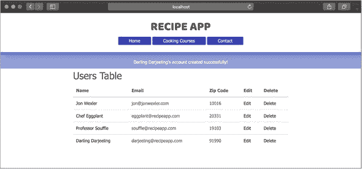

如果你尝试使用现有的电子邮件地址创建新用户，你的重定向屏幕应类似于图 22.2。

##### 图 22.2\. 在主页上显示的错误消息

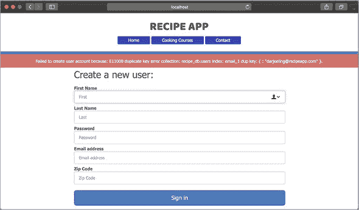

当你刷新页面或创建任何新的请求时，此消息会消失。因为你可能选择发送多个成功或错误消息，你可能发现循环遍历视图中的消息而不是显示所有映射到`error`和`success`键的内容是有用的。

如果你需要在渲染的视图中显示消息，直接将消息作为局部变量传递。下面的列表显示了如何将成功消息添加到用户的索引页面。当你直接将`flashMessages`对象传递给视图时，你不需要等待重定向或使用`connect-flash`。

##### 列表 22.6\. 将消息添加到渲染的索引视图

```
res.render("users/index", {
  flashMessages: {
    success: "Loaded all users!"
  }
});                              *1*
```

+   ***1*** **与渲染视图一起传递消息。**

| |
| --- |

**快速检查 22.2**

> **Q1:**
> 
> 使用`req.flash`方法需要两个参数是什么？

| |
| --- |
| |

**QC 22.2 答案**

> **1:**
> 
> `req.flash`需要一个消息类型和一个消息。

| |
| --- |

### 总结

在本课中，你学习了关于会话和 cookie 的内容，并了解了为什么它们是服务器和客户端之间数据传输不可或缺的部分。你还设置了`connect-flash`以使用 cookie，并在某些视图中临时显示成功和失败信息。在第 23 课中，你将看到如何通过在用户密码上实现加密来加密不仅仅是 cookie 数据。

| |
| --- |

**尝试这个**

现在你已经设置了消息闪现，是时候将其添加到所有的 CRUD 操作中。你希望用户看到他们尝试订阅、创建账户、删除账户或更新用户信息是否成功。为所有三个模型涉及数据库的每个操作添加消息闪现。

| |
| --- |

## 第 23 课。构建用户登录和散列密码

在第 22 课中，你在控制器动作和视图中添加了闪存消息。在本课中，你通过创建注册和登录表单来深入了解`User`模型。然后，你通过哈希用户密码并保存用户的登录状态来为你的应用程序添加一层安全性。接下来，你使用`express-validator`包在控制器级别添加了一些额外的验证。在本课结束时，用户应该能够创建账户，将他们的密码安全地保存在你的数据库中，并按需登录或注销。

本课涵盖

+   创建用户登录表单

+   使用`bcrypt`在数据库中哈希数据


**考虑以下内容**

你提供了一个食谱应用的原型，用户可以在其中创建账户并将未加密的密码存储在你的数据库中。你合理地担心你的数据库可能被黑客攻击，或者（更加尴尬的是）你可能将用户密码以纯文本形式显示给所有用户。幸运的是，安全性是编程世界中的一个重大关注点，有工具和安全技术可以用来保护敏感数据不被泄露。`bcrypt`就是这样一种工具，你将用它来在数据库中隐藏密码，这样它们在未来就不容易被黑客攻击。


### 23.1\. 实现用户登录表单

在深入处理用户登录到食谱应用的逻辑之前，先确定他们的注册和登录表单的外观。

注册表单的外观和行为将与 new.ejs 中的表单相似。因为大多数用户将通过注册表单创建自己的账户，所以你会参考创建视图和`create`动作来处理新用户注册。你需要但还没有的是用户登录表单。此表单需要两个输入：`email`和`password`。

首先，创建一个基本的用户登录视图，并将其与新的路由和控制器动作连接起来。然后，在 users 文件夹中创建一个新的 login.ejs 视图，并使用下一列表中的代码。注意这里的重要添加：表单标签中的`/users/login`动作。你需要创建一个路由来处理对该路径的`POST`请求。

##### 列表 23.1\. 在 login.ejs 中创建用户登录表单

```
<form action="/users/login" method="POST">            *1*
  <h2>Login:</h2>
  <label for="inputEmail">Email address</label>
  <input type="email" name="email" id="inputEmail"
 placeholder="Email address" required>
  <label for="inputPassword">Password</label>
  <input type="password" name="password" id="inputPassword"
 placeholder="Password" required>
  <button type="submit">Login</button>
</form>
```

+   ***1*** **添加用户登录表单。**

接下来，通过在列表 23.2 中添加代码到 main.js 中，添加登录路由。第一个路由允许你在对`/users/login`路径发起`GET`请求时看到登录表单。第二个路由处理对同一路径的`POST`请求。在这种情况下，你将请求路由到`authenticate`动作，然后是`redirectView`动作来加载页面。


##### 注意

你需要在你的 show 和 edit 路由上方添加这些路由；否则，Express.js 会将路径中的单词`login`误认为是用户 ID，并尝试找到该用户。当你在这行上方添加路由时，你的应用程序将首先识别完整的`login`路由，然后再在 URL 中查找用户 ID。


##### 列表 23.2\. 在 main.js 中添加登录路由

```
router.get("/users/login", usersController.login);              *1*
router.post("/users/login", usersController.authenticate,
 usersController.redirectView);                              *2*
```

+   ***1*** **添加一个路由来处理对/用户/login 路径的 GET 请求。**

+   ***2*** **添加一个路由来处理同一路径的 POST 请求。**

在你的用户控制器中创建必要的控制器操作以使登录表单工作。将列表 23.3 中的代码添加到 usersController.js 中。

`login`操作渲染用户登录的`login`视图。`authenticate`操作查找与匹配的电子邮件地址的用户。由于此属性在数据库中是唯一的，它应该找到该单个用户或根本找不到用户。然后，将表单密码与数据库密码进行比较，如果密码匹配，则重定向到该用户的`show`页面。与先前的操作一样，将`res.locals.redirect`变量设置为一个`redirectView`操作将为您处理的路径。还要设置一个闪存消息，让用户知道他们已成功登录，并将`user`对象作为局部变量传递给该用户的`show`页面。在这里调用`next`，将调用下一个中间件函数，即`redirectView`。如果没有找到用户，但在搜索用户时没有发生错误，设置一个错误闪存消息，并将重定向路径设置为将用户带回到登录表单以再次尝试。

如果发生错误，请在控制台记录它，并将错误传递给处理错误的下一个中间件函数（在你的错误控制器中）。

##### 列表 23.3\. 在 usersController.js 中添加登录和认证操作

```
login: (req, res) => {                                          *1*
  res.render("users/login");
},

authenticate: (req, res, next) => {                             *2*
  User.findOne({
    email: req.body.email
  })                                                            *3*
      .then(user => {
        if (user && user.password === req.body.password){
          res.locals.redirect = `/users/${user._id}`;
          req.flash("success", `${user.fullName}'s logged in successfully!`);
          res.locals.user = user;
          next();
    } else {
      req.flash("error", "Your account or password is incorrect.
 Please try again or contact your system administrator!");
      res.locals.redirect = "/users/login";
      next();
    }
  })
      .catch(error => {                                         *4*
        console.log(`Error logging in user: ${error.message}`);
        next(error);
      });
}
```

+   ***1*** **添加登录操作。**

+   ***2*** **添加认证操作。**

+   ***3*** **比较表单密码与数据库密码。**

+   ***4*** **将错误记录到控制台，并重定向。**

到目前为止，你应该能够重新启动你的 Node.js 应用程序，并访问`users/login` URL 以查看图 23.1 中的表单。尝试使用你数据库中用户的电子邮件地址和密码进行登录。

##### 图 23.1\. 浏览器中用户登录页面示例

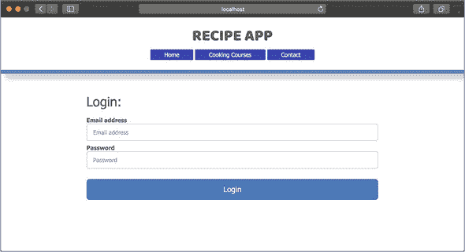

如果你输入了错误的电子邮件或密码，你将被重定向到登录屏幕，并显示一个类似于图 23.2 的消息。如果你成功登录，你的屏幕将看起来像图 23.3。

##### 图 23.2\. 浏览器中失败的用户登录页面

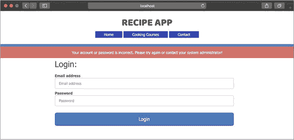

##### 图 23.3\. 浏览器中的成功用户登录页面

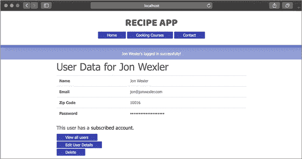

但是，你有一个问题：密码仍然以纯文本形式保存。在下一节中，我将讨论如何对信息进行散列的方法。


**快速检查 23.1**

> **Q1:**
> 
> 为什么在 main.js 中放置`/users/login`路由的位置很重要？

|  |

**QC 23.1 答案**

> **1:**
> 
> 因为你有处理 URL 中参数的路由，如果这些路由（例如 `/users/:id`）排在前面，Express.js 将将 `/users/login` 的请求视为对用户 `show` 页面的请求，其中 `login` 是 `:id`。顺序很重要：如果 `/users/login` 路由排在前面，Express.js 将在检查处理参数的路由之前匹配该路由。


### 23.2\. 散列密码

*加密* 是将某些独特密钥或密码短语与敏感数据结合以产生一个代表原始数据但其他方面无用的值的过程。这个过程包括散列数据，其原始值可以使用用于散列函数的私有密钥检索。这个 *散列* 值存储在数据库中而不是敏感数据。当你想要加密新数据时，通过加密算法传递该数据。当你想要检索该数据或将其与，比如说，用户的输入密码进行比较时，应用程序可以使用相同的独特密钥和算法来解密数据。

`bcrypt` 是一种复杂的散列函数，它允许你将应用程序中的一些独特密钥组合起来，以在数据库中存储密码等数据。幸运的是，你可以使用几个 Node.js 包来实现 `bcrypt` 散列。首先，在新的终端窗口中输入 `npm i bcrypt@5.0.0 -S` 安装 `bcrypt` 包。接下来，将 `bcrypt` 引入你将执行散列的模块中。散列可以在 `usersController` 中进行，但更好的方法是创建一个 Mongoose `pre`-save 钩子在 `User` 模型中。在 user.js 中使用 `const bcrypt = require("bcrypt")` 引入 `bcrypt`。然后，在 `module.exports` 行之前但 schema 定义之后，将 代码列表 23.4 中的代码添加到 `User` 模型中。


##### 注意

你只会对密码进行散列，而不是加密，因为从技术上讲，你不想检索密码的原始值。实际上，你的应用程序不应该知道用户的密码。应用程序只能散列密码。稍后，我将在这个部分更详细地讨论这个话题。


Mongoose 的 `pre` 和 `post` 钩子是在用户保存到数据库前后运行代码的绝佳方式。将钩子附加到 `userSchema` 上，它（就像其他中间件一样）接受 `next` 作为参数。`bcrypt.hash` 方法接受一个密码和一个数字。这个数字代表你想要散列密码的复杂度级别，10 通常被认为是可靠的数字。当密码散列完成时，promise 链的下一部分接受生成的 `hash`（你的散列密码）。

将用户的密码分配给这个 `hash`，并调用 `next`，这将用户保存到数据库中。如果发生任何错误，它们将被记录并传递给下一个中间件。


##### 注意

由于在运行 `bcrypt.hash` 时你失去了上下文，我建议将 `this` 保留在一个变量中，以便在散列函数中访问。


`passwordComparison` 是你在 `userSchema` 上的自定义方法，允许你将表单输入的密码与用户的存储和散列密码进行比较。为了异步执行此检查，使用 `bcrypt` 的 promise 库。`bcrypt.compare` 返回一个布尔值，比较用户的密码与 `inputPassword`。然后返回 promise 给调用 `passwordComparison` 方法的任何人。

##### 列表 23.4\. 在 user.js 中添加散列前置钩子

```
userSchema.pre("save", function(next) {                            *1*
  let user = this;

  bcrypt.hash(user.password, 10).then(hash => {                    *2*
    user.password = hash;
    next();
  })
    .catch(error => {
      console.log(`Error in hashing password: ${error.message}`);
      next(error);
    });
});

userSchema.methods.passwordComparison = function(inputPassword){   *3*
  let user = this;
  return bcrypt.compare(inputPassword, user.password);             *4*
};
```

+   ***1*** **在用户模式中添加一个前置钩子。**

+   ***2*** **散列用户的密码。**

+   ***3*** **添加一个比较散列密码的函数。**

+   ***4*** **比较用户密码与存储的密码。**


##### 注意

当用户被保存时，会运行 `save` 的 `pre` 钩子：在创建和通过 Mongoose `save` 方法更新后。


最后一步是重写 usersController.js 中的 `authenticate` 动作，使用 `bcrypt.compare` 来比较密码。将 `authenticate` 动作代码块替换为 列表 23.5 中的代码。

首先，通过 `email` 明确查询一个用户。如果找到用户，将结果分配给 `user`。然后检查是否找到用户或返回 `null`。如果找到具有指定电子邮件地址的用户，则在用户实例上调用你的自定义 `passwordComparison` 方法，并将表单的输入密码作为参数传递。

由于 `passwordComparison` 返回一个解析为 `true` 或 `false` 的 promise，嵌套另一个 `then` 以等待结果。如果 `passwordsMatch` 为 `true`，则重定向到用户的显示页面。如果未找到具有指定电子邮件地址的用户或输入密码不正确，则返回登录屏幕。否则，抛出错误，并将其传递给你的 `next` 对象。在此过程中抛出或发生的任何错误都会被捕获并记录。

##### 列表 23.5\. 修改 usersController.js 中的 `authenticate` 动作

```
authenticate: (req, res, next) => {
  User.findOne({email: req.body.email})                             *1*
      .then(user => {
        if (user) {                                                 *2*
          user.passwordComparison(req.body.password)                *3*
              .then(passwordsMatch => {
                if (passwordsMatch) {                               *4*
                  res.locals.redirect = `/users/${user._id}`;
                  req.flash("success", `${user.fullName}'s logged in
 successfully!`);
                  res.locals.user = user;
                } else {
                  req.flash("error", "Failed to log in user account:
 Incorrect Password.");
                  res.locals.redirect = "/users/login";
                }
                next();                                             *5*
              });
        } else {
          req.flash("error", "Failed to log in user account: User
 account not found.");
          res.locals.redirect = "/users/login";
          next();
    }
  })
      .catch(error => {                                             *6*
        console.log(`Error logging in user: ${error.message}`);
        next(error);
      });
}
```

+   ***1*** **通过电子邮件查询一个用户。**

+   ***2*** **检查是否找到了用户。**

+   ***3*** **在 User 模型上调用密码比较方法。**

+   ***4*** **检查密码是否匹配。**

+   ***5*** **使用重定向路径和闪存消息调用下一个中间件函数。**

+   ***6*** **将错误记录到控制台并传递给下一个中间件错误处理器。**

重新启动你的 Node.js 应用程序，并创建一个新用户。从现在开始，你需要创建新账户，因为之前的账户密码没有使用 `bcrypt` 安全散列。如果不这样做，`bcrypt` 将尝试散列和比较你的输入密码与纯文本密码。账户创建后，尝试使用相同的密码在 `/users/login` 上再次登录。然后更改用户 `show` 页面中的密码字段以在屏幕上显示密码。访问用户的 `show` 页面以查看新的散列密码，而不是旧的纯文本密码 (图 23.4)。

##### 图 23.4\. 在浏览器中用户 `show` 页面显示散列密码

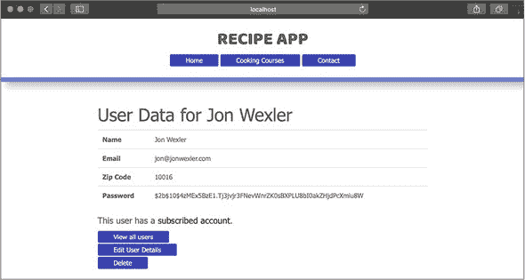

| |
| --- |

##### 注意

你也可以通过在新的终端窗口中输入 `mongo` 并然后输入 `use recipe_db` 和 `db.users.find({})` 来 MongoDB shell 验证密码是否在数据库级别被散列。或者，你可以使用 MongoDB Compass 软件查看此数据库中的新记录。

| |
| --- |

现在当你为一个散列密码的用户登录时，你应该在成功认证后重定向到该用户的 `show` 页面。如果你输入了错误的密码，你会看到一个像 图 23.5 中的屏幕。

##### 图 23.5\. 浏览器中的错误密码界面

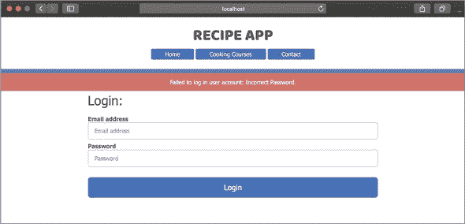

在下一节中，你通过在调用这些操作之前添加验证中间件来为 `create` 和 `update` 操作添加更多安全性。

| |
| --- |

**快速检查 23.2**

> **Q1:**
> 
> 对或错：`bcrypt` 的 `compare` 方法比较数据库中的明文密码与用户输入的明文值。

| |
| --- |
| |

**QC 23.2 答案**

> **1:**
> 
> 错误。数据库中唯一的密码值是一个散列密码，因此没有明文值可以比较。比较是通过散列用户的新输入并与数据库中存储的散列值进行比较来完成的。这样，应用程序仍然不知道你的实际密码，但如果两个散列密码匹配，你可以安全地说你的输入与最初设置的密码匹配。

| |
| --- |

### 23.3\. 使用 express-validator 添加验证中间件

到目前为止，你的应用程序在视图和模型级别提供了验证。如果你尝试创建一个没有电子邮件地址的用户账户，你的 HTML 表单应该阻止你这样做。如果你绕过了表单，或者如果有人试图通过你的应用程序编程接口（API）创建账户，就像你在第 6 单元中看到的那样，你的模型模式限制应该阻止无效数据进入你的数据库——尽管更多的验证也无妨。实际上，如果你能在模型到达应用程序之前添加更多验证，你就可以节省大量用于制作 Mongoose 查询和重定向页面的计算时间和机器能量。

由于这些原因，你需要验证中间件，并且正如 Node.js 中大多数常见需求一样，有一些包可以帮助你构建这些中间件函数。你将安装的包是 `express-validator`，它提供了一组你可以用来检查传入数据是否遵循特定格式的函数，以及修改该数据以删除不需要的字符的函数。例如，你可以使用 `express-validator` 来检查某些输入数据是否以美国电话号码的格式输入。

您可以通过在终端的项目文件夹中输入 `npm i express-validator -S` 来安装此包。当此包安装后，在 main.js 中使用 `const expressValidator = require("express-validator")` 引入它，并通过添加 `router.use(expressValidator())` 告诉您的 Express.js 应用程序使用它。您需要在引入 `express.json()` 和 `express.urlencoded()` 中间件之后添加此行，因为在验证之前必须解析请求体。

然后，您可以将此中间件添加到在 `usersController` 中的 `create` 动作之前直接运行。为了完成此任务，您需要在 main.js 中 `/users/create` 路由的路径和 `create` 动作之间创建一个名为 `validate` 的动作，如图 列表 23.6 所示。在路径 `/users/create` 和 `usersController.create` 动作之间，您引入了一个名为 `validate` 的中间件函数。通过这个 `validate` 动作，您将确定数据是否符合您的要求，以便继续到 `create` 动作。

##### 列表 23.6\. 在 main.js 中将验证中间件添加到用户创建路由

```
router.post("/users/create", usersController.validate,
 usersController.create, usersController.redirectView);      *1*
```

+   ***1*** **将验证中间件添加到用户创建路由。**

最后，在 usersController.js 中创建 `validate` 动作来处理在到达 `create` 动作之前到达的请求。在这个动作中，您添加以下内容：

+   *Validators*—检查传入的数据是否符合某些标准。

+   *Sanitizers*—在数据进入数据库之前，通过删除不需要的元素或转换数据类型来修改传入的数据。

将 列表 23.7 中的代码添加到 usersController.js 中。

第一个验证函数使用请求和响应，并且它可能传递到中间件链中的下一个函数，因此您需要 `next` 参数。从对 `email` 字段的清理开始，使用 `express-validator` 的 `normalizeEmail` 方法将所有电子邮件地址转换为小写，然后 `trim` 移除空白。接着验证 `email`，确保它符合 `express-validator` 设置的电子邮件格式要求。

`zipCode` 验证确保值不为空，是一个整数，并且长度正好是五位数字。最后的验证检查 `password` 字段是否为空。`req.getValidationResult` 收集先前验证的结果，并返回一个包含这些错误结果的承诺。

如果发生错误，您可以收集它们的错误消息并将它们添加到请求的闪存消息中。在这里，您使用 `" and "` 将一系列消息连接成一个长的`String`。如果验证过程中发生了错误，设置`req.skip = true`。在这里，`set`是您添加到请求对象中的新自定义属性。此值告诉您的下一个中间件函数`create`，由于验证错误不要处理您的用户数据，而是跳转到您的`redirectView`操作。为了使此代码正常工作，您需要在`create`操作中添加`if (req.skip) next()`作为第一行。这样，当`req.skip`为`true`时，您可以立即继续到下一个中间件。

在验证错误的情况下，再次渲染`new`视图。您的`flashMessages`也向用户指示了她的输入数据中发生了什么错误。

##### 列表 23.7\. 在 usersController.js 中创建一个`validate`控制器

```
validate: (req, res, next) => {                                    *1*
  req.sanitizeBody("email").normalizeEmail({
    all_lowercase: true
    }).trim();                                                     *2*
  req.check("email", "Email is invalid").isEmail();
  req.check("zipCode", "Zip code is invalid")
.notEmpty().isInt().isLength({
    min: 5,
    max: 5
  }).equals(req.body.zipCode);                                     *3*
  req.check("password", "Password cannot be empty").notEmpty();    *4*

  req.getValidationResult().then((error) => {                      *5*
    if (!error.isEmpty()) {
      let messages = error.array().map(e => e.msg);
      req.skip = true;                                             *6*
      req.flash("error", messages.join(" and "));                  *7*
      res.locals.redirect = "/users/new";                          *8*
      next();
    } else {
      next();                                                      *9*
    }
  });
}
```

+   ***1*** **添加验证函数。**

+   ***2*** **使用 trim 方法去除空白。**

+   ***3*** **验证 zipCode 字段。**

+   ***4*** **验证密码字段。**

+   ***5*** **收集先前验证的结果。**

+   ***6*** **将跳过属性设置为 true。**

+   ***7*** **将错误消息作为闪存消息添加。**

+   ***8*** **为新视图设置重定向路径。**

+   ***9*** **调用下一个中间件函数。**


##### 注意

您可以采取许多创造性的方法来重新填充表单数据。您可能会发现一些包有助于协助这项任务。当您找到最适合您的技术时，将应用程序中的所有表单更改为处理数据重新填充。


您可以为这些验证尝试一下。启动您的应用程序，并以应该使您的验证失败的方式创建一个新用户。如果您想测试`notEmpty`验证，可能需要先从您的 HTML 表单中删除`required`标签。失败的`password`和`zipCode`验证应该会将您带到类似于图 23.6 的屏幕。

##### 图 23.6\. 失败的`express-validator`验证消息

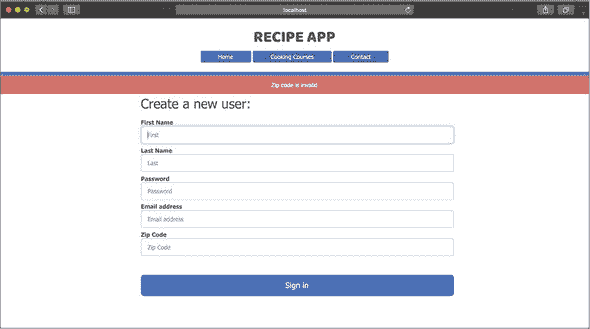

因为`express-validator`使用`validator`包，您可以在[`github.com/chriso/validator.js#sanitizers`](https://github.com/chriso/validator.js#sanitizers)获取有关要使用的清洗器的更多信息。


**快速检查 23.3**

> **Q1:**
> 
> 清洗器和验证器之间的区别是什么？

|  |

**QC 23.3 答案**

> **1:**
> 
> 清洗器通过修剪空白、更改大小写或删除不需要的字符来清理数据。验证器测试数据质量，以确保其输入方式符合您的数据库要求。


### 摘要

在本课中，你为用户的密码实现了一个散列函数。然后，你通过使用`bcrypt.compare`方法创建了一个登录表单和动作，将散列密码与登录时的用户输入进行匹配。最后，你通过添加额外的中间件函数来对输入数据进行额外的验证，以在将其保存到数据库之前清理数据。在第 24 课中，你将再次通过 Passport.js 工具查看加密和身份验证，这些工具使得设置安全用户账户变得更加容易。

| |
| --- |

**尝试以下操作**

散列用户密码可能是使用散列函数的主要场景，但你可以在你的模型的其他字段上使用散列函数。例如，你可能会对用户的电子邮件地址进行散列，以防止这些数据落入错误的手中。毕竟，获取用户的电子邮件地址就相当于黑客攻击用户账户的一半。尝试在密码之外，为用户电子邮件添加散列。

| |
| --- |

##### 注意

##### 注意

当你散列用户的电子邮件地址时，你将无法在任何视图中显示它。尽管你可能会选择以纯文本形式保留用户电子邮件，但当你应用程序中其他敏感数据进入时，遵循这种做法是好的。

| |
| --- |
| |

## 第 24 课\. 添加用户身份验证

在第 23 课中，你学习了手动散列密码以及保护用户数据的重要性。在本课中，你将探索一些流行的且实用的工具，这些工具可以使散列过程更加整洁。你修改了你的散列方法，以使用`passport-local-mongoose`包，该包结合使用`passport`和`mongoose`在幕后为你执行散列。接下来，你将学习如何使用 Passport.js 在你的应用程序上验证用户账户。这个过程涉及到会话 cookie，类似于闪存消息使用它们的方式。在本课结束时，你将拥有一个注册和登录表单，它只允许你的应用程序的真实用户访问。

本课涵盖

+   使用`passport`包在整个应用程序中验证用户

+   在用户模型上实现`passport-local-mongoose`插件

+   在用户登录之前创建身份验证操作

| |
| --- |

**考虑这一点**

你已经向你的应用程序添加了一个流行的散列方法，但你希望简化代码，或者更好的是，将其放在幕后。了解散列的工作原理是很好的，而且有可用的工具可以执行你想要的散列，而无需手动设置自己的散列标准。例如，`passport.js`包可以散列和验证用户交互，而无需在模式中指定密码字段。在本课中，你将查看`passport`包的最快和最有效实现。

| |
| --- |

### 24.1\. 实现 Passport.js

Passport.js 是 Node.js 中间件，用于对新的用户密码进行哈希处理并验证他们在应用程序上的活动。Passport.js 使用不同的方法来创建和登录用户账户，从基本的用户名和密码登录到使用 Facebook 等第三方服务的登录。这些登录方法被称为 *策略*，你将为你的食谱应用程序使用的策略是一个 `local` 策略，因为你没有使用外部服务。

这些策略通过管理哈希和比较密码以及与用户登录状态相关的数据来检查传入数据是否真实。有关 Passport.js 策略的更多信息，请访问 [www.passportjs.org](http://www.passportjs.org)。

首先，安装应用程序所需的必要包。你需要通过在项目终端窗口中运行 `npm i passport passport-local-mongoose -S` 来安装 `passport` 包以及 `passport-local-mongoose` 包。这些包中的模块协同工作，提供哈希和认证方法以及与你的 Mongoose 架构直接通信的支持。在你将这些包作为依赖项安装后，在应用程序中需要的地方引入它们。将 列表 24.1 中的以下行添加到 main.js 中。

首先，引入 `passport` 模块。Passport.js 使用名为策略的方法让用户登录。`local` 策略指的是用户名和密码登录方法。你 `initialize` passport 模块，并让 Express.js 应用程序使用它。现在你已经在应用程序中准备好了 `passport` 作为中间件。`passport.session` 告诉 `passport` 使用你已与应用程序设置的任何会话。在这种情况下，在此行之前，你已经为闪存消息设置了 `express-session`。

##### 列表 24.1\. 在 main.js 中引入和初始化 passport

```
const passport = require("passport");       *1*
router.use(passport.initialize());          *2*
router.use(passport.session());             *3*
```

+   ***1*** **引入 passport 模块。**

+   ***2*** **初始化 passport。**

+   ***3*** **在 Express.js 中配置 passport 使用会话。**

接下来，你需要在用户模型上设置你的登录策略，并告诉 `passport` 为你处理会话中的用户数据哈希。`passport-local-mongoose` 使此过程简单且几乎自动化。将 列表 24.2 中的行添加到 main.js 中。


##### 注意

`passport.session` 告诉 `passport` 使用之前定义的任何 Express.js 会话。在此行之前必须定义会话。


在你继续将用户模型与 `passport` 连接之前，你需要确保你的用户模型在 main.js 中可用。通常，你需要设置一些配置来为模型创建登录策略，但由于你正在使用默认的本地登录策略，你只需要告诉 `passport` 使用为用户模型创建的策略。接下来的两行告诉 `passport` 通过 `User` 模型序列化和反序列化你的用户。这些行指导了加密和解密存储在会话中的用户数据的过程。

##### 列表 24.2\. 在 main.js 中设置 passport 序列化

```
const User = require("./models/user");                  *1*
passport.use(User.createStrategy());                    *2*
passport.serializeUser(User.serializeUser());           *3*
passport.deserializeUser(User.deserializeUser());
```

+   ***1*** **需要用户模型。**

+   ***2*** **配置用户的登录策略。**

+   ***3*** **设置 passport 以序列化和反序列化您的用户数据。**

Passport 将用户数据序列化和反序列化以传递到会话中。会话存储此序列化数据——用户信息的压缩形式，并将其发送回服务器以验证用户是客户端最后登录的用户。反序列化从其压缩版本中提取用户数据，以便您可以验证用户的信息。


**序列化数据**

当在应用程序中处理对象时，您希望保留允许您轻松访问和修改属性的数据结构。例如，您的用户对象允许您检索诸如`email`之类的信息，甚至可以使用用户模型的虚拟属性`fullName`。尽管该模型在您的应用程序中特别有用，但您没有直接的方法将此用户对象及其方法和 Mongoose 对象-文档映射器（ODM）工具发送到客户端。因此，您需要序列化用户数据。

*序列化*是将数据从某些数据结构转换为紧凑的可读格式的过程。这些数据可以采用多种格式，例如 JSON、YAML 和 XML。用户数据被扁平化，通常转换为字符串，以便在 HTTP 事务中发送。

Passport.js 执行序列化过程并加密用户数据，以便将其存储为客户端浏览器会话 cookie 的一部分。因为这个 cookie 包含有关用户的信息，它让您的应用程序服务器知道，在下次请求发生时，这个用户之前已经登录过，这是您在应用程序中验证某人状态的方式。

当同一用户再次向您的应用程序发出请求时，Passport.js 将数据反序列化以将用户恢复到其原始模型对象形式。当这个过程完成并且您验证用户有效后，您可以使用用户对象再次像以前一样使用，应用模型方法和使用 Mongoose 查询。


在构建将用户登录到您的应用程序的认证动作之前，最后一步是将您的用户模型连接到`passport-local-mongoose`模块。在 user.js 的顶部添加`const passportLocalMongoose = require("passport-local-mongoose")`，您将在其中向用户模式添加 Passport.js 插件，如列表 24.3 所示。使用 Mongoose 的`plugin`方法，您告诉您的`userSchema`使用`passportLocalMongoose`进行密码散列和存储。您还告诉`passportLocalMongoose`使用电子邮件字段作为用户的登录参数，而不是用户名，因为用户名是这个模块的默认字段。


##### 注意

这行必须在您注册用户模型之前出现。


##### 列表 24.3\. 将`passport-local-mongoose`插件添加到用户模式

```
userSchema.plugin(passportLocalMongoose, {
  usernameField: "email"
});                                            *1*
```

+   ***1*** **将 passport-local-mongoose 模块作为插件应用到用户模式中。**

当这一行被放置到位时，Passport.js 会自动处理密码存储，因此你可以从`userSchema`中删除`password`属性。此插件在幕后修改你的模式，将`hash`和`salt`字段添加到你的`User`模型中，以替换正常的`password`字段。

| |
| --- |

**哈希和盐**

你在第 24 课中学习了哈希，但你让`bcrypt`通过一个你不需要理解的算法执行哈希过程。`bcrypt`和 Passport.js 究竟是如何哈希用户密码的？

现代哈希将用户的输入密码转换为不可解密的哈希。这个哈希是一堆字符和数字的混合，使其比明文密码更安全地存储在数据库中。如果有人黑入数据库，他只有哈希密码。他最好的办法是将自己的猜测密码输入自己的哈希函数，看看生成的哈希是否与你的匹配。这是一项繁琐的任务，但黑客找到破解你的哈希密码的方法并不是不可能的。盐的引入是为了对抗这种漏洞。

*盐*是一系列随机的字符字符串，在哈希密码之前添加到明文密码中。这样，如果有人恶意猜测你的密码，他们还需要知道与之关联的盐以及它在原始密码中的位置。黑客攻击变得更加困难。

Passport.js 将哈希密码和盐都存储在数据库中，以便你可以在应用程序内一致地执行哈希操作。当你使用 Passport.js 注册第一个用户时，请按照以下步骤查看 MongoDB 中的他们的数据，以查看这些值：

+   在一个新的终端窗口中，运行`mongo`。

+   运行`use recipe_db`来加载你的食谱数据库。

+   运行`db.users.find({}, { password: 1})`来查看所有用户密码。

+   比较哈希和非哈希密码。

| |
| --- |
| |

##### 注意

确保删除应用程序中对`password`属性的任何引用。因为`passport-local-mongoose`向用户模型添加了新的密码字段，所以你将不再使用它。

| |
| --- |

在下一节中，你将使用`passport`包来进一步简化认证过程。

| |
| --- |

**快速检查 24.1**

> **Q1:**
> 
> 真或假：哈希密码需要盐。

| |
| --- |
| |

**QC 24.1 答案**

> **1:**
> 
> 错误。盐可以帮助通过在哈希之前将随机文本与明文密码混合来增强密码的哈希强度，但盐不是必需的。

| |
| --- |

### 24.2\. 修改创建操作以使用 passport 注册

使用 Passport.js 已经简化了您的代码，并使您更容易指定您想要散列和验证的模型。下一步是修改您的 `create` 动作，这样在创建用户账户之前不再使用您的 `bcrypt` 散列函数，而是使用 Passport.js。通过集成 Passport.js 模块，您将能够访问一个方法库，以简化账户注册过程。将 usersController.js 中的 `create` 动作更改为使用 `register` 方法，如 列表 24.4 所示。


##### 注意

您必须注释掉或删除 User 模型中的 `userSchema.methods.passwordComparison` 和 `pre("save")` 钩子，对于 `bcrypt`。如果您不删除这些钩子，`bcrypt` 仍然会在 `passport` 之前尝试散列用户密码，这也会导致一个未处理的承诺错误。


`register` 方法是 Passport.js 的一部分。因为您正在将 `passport-local-mongoose` 作为 User 模型的插件使用，所以您可以使用此方法来注册用户。如果您成功保存了一个新用户，创建一个闪存消息并将重定向到 `/users` 路由。否则，通过将重定向到 `users/new` 路由来处理发生的任何错误，以便可以再次尝试创建用户账户。

##### 列表 24.4\. 在 usersController.js 的 create 动作中注册新用户

```
create: (req, res,  next) => {
  if (req.skip) return next();

  let newUser = new User( getUserParams(req.body) );

  User.register(newUser, req.body.password, (error, user) => {   *1*
    if (user) {
      req.flash("success", `${user.fullName}'s account created
 successfully!`);
      res.locals.redirect = "/users";
      next();                                                    *2*
    } else {
      req.flash("error", `Failed to create user account because:
 ${error.message}.`);
      res.locals.redirect = "/users/new";
      next();                                                    *3*
    }
  });
}
```

+   ***1*** **注册新用户。**

+   ***2*** **设置成功创建用户的重定向。**

+   ***3*** **在闪存消息中设置重定向和记录错误。**

在此操作生效后，您可以使用位于 /users/new.ejs 的表单通过 Passport.js 创建用户账户。尝试启动您的应用程序并创建一个新用户。您不应该注意到行为上的变化；您的用户账户将被创建，并且您将看到 `success` 提示信息。

如果您在新的终端窗口中通过输入 `mongo` 来查看 MongoDB 中的原始文档，然后输入 `use recipe_db` 和 `db.users.find({})` 来查看您数据库中的用户。任何使用 `bcrypt` 保存的用户仍然保留有包含散列密码的 `password` 字段。您最新的用户有两个由 Passport.js 添加的属性：`salt` 和 `hash`。


##### 提示

将您的 seed.js 文件更新为使用 `passport` 而不是 Mongoose 的 `create` 方法来注册用户账户。这种做法使您在开发过程中随着应用程序的增长重新填充数据库变得更加容易。


将您的 seed.js 文件更新为使用 Passport 而不是 Mongoose 的 `create` 方法来注册用户账户，这将使您在开发过程中随着应用程序的增长重新填充数据库变得更加容易。

您的用户仍然安全，但您仍然需要一个方法来登录他们。在下一节中，您将修改登录表单以使用 Passport.js。


**快速检查 24.2**

> **Q1:**
> 
> Passport.js 为什么需要您在数据库中保存 `hash` 和 `salt`？

|  |

**QC 24.2 答案**

> **1:**
> 
> Passport.js 保存了`salt`和`hash`，这样每个用户都可以拥有他们自己的唯一哈希因子。虽然可以为每个用户账户使用相同的`salt`，并且只将哈希存储在数据库中，但这种方法的安全性较低。

| |
| --- |

### 24.3. 登录时认证用户

允许用户登录应用程序的最终一步是将`bcrypt`认证方法替换为`passport`中间件。在 usersController.js 中修改你的`authenticate`动作，如列表 24.5 所示。你还需要通过在文件顶部添加`const passport = require("passport")`将`passport`引入到用户控制器中。

这个`authenticate`动作被设置为直接调用`passport.authenticate`方法，并带有`passport`重定向和提示信息选项。当你调用`usersController.authenticate`时，你实际上是在调用`passport.authenticate`。在这个函数中，`passport`试图将描述用户的传入请求数据与数据库记录进行比较。如果找到用户账户并且输入的密码与哈希密码相匹配，你将从该动作重定向。

##### 列表 24.5. 在 usersController.js 中添加 Passport 认证中间件

```
authenticate: passport.authenticate("local", {     *1*
  failureRedirect: "/users/login",                 *2*
  failureFlash: "Failed to login.",
  successRedirect: "/",
  successFlash: "Logged in!"
}),
```

+   **1**. 调用 Passport 通过本地策略认证用户。

+   **2**. 根据用户的认证状态设置成功和失败提示信息以及重定向路径。

登录路由不再需要你的`usersController.redirectView`动作作为后续函数。从第 23 课中设置的`router.post("/users/login", usersController.authenticate);`路由开始，你的应用程序已经准备好验证现有用户。重新启动你的应用程序，并使用你在`/users/login`创建的用户账户登录。如果你成功，你应该会看到`success`提示信息。

如果有一个视觉指示表明你已经登录，以及可能有注销的方式，那就很好了。将列表 24.6 中的代码添加到 layout.ejs 中的导航栏。你正在检查局部变量`loggedIn`是否设置为`true`。如果是，显示文本`已登录为`后跟从`currentUser`局部变量获取的用户的`fullName`。这个列表项被包裹在一个锚标签中，当点击时，会带你到当前登录用户的`show`页面。如果`loggedIn`状态为`false`，显示一个链接到`Sign In`，带你到`/users/login`路由。

##### 列表 24.6. 在 layout.ejs 中添加导航栏的登录状态

```
<% if (loggedIn) { %>                                          *1*
  Logged in as  <a href="<%=`/users/${currentUser._id}`%>">
 <%= currentUser.fullName %></a>
<%} else {%>                                                   *2*
  <a href="/users/login">Log In</a>
<% } %>
```

+   **1**. 检查用户是否已登录。

+   **2**. 显示一个登录链接。

如果您刷新应用程序，您可能仍然在导航栏中看不到任何变化。您需要创建`loggedIn`和`currentUser`变量，以便它们在每个视图中本地显示。为此，添加一些自定义中间件，以便在每次新的请求中，您将这些变量添加到响应中。因为您已经创建了一个用于设置`flashMessages`为本地对象的中间件函数，所以您可以在 main.js 中的该中间件函数内添加代码，见代码列表 24.7。

`isAuthenticated`是 Passport.js 提供的一个方法，您可以在传入的请求上调用它，以查看是否在请求的 cookie 中存储了现有用户。`loggedIn`可以是`true`或`false`。如果请求中有用户，您可以将其提取出来并分配给您的`currentUser`变量。添加此代码后，您可以在每个页面上访问这两个变量以及`flashMessages`。

##### 代码列表 24.7. 在自定义中间件中添加本地变量

```
res.locals.loggedIn = req.isAuthenticated();          *1*
res.locals.currentUser = req.user;                    *2*
```

+   ***1*** **设置`loggedIn`变量以反映护照登录状态。**

+   ***2*** **设置`currentUser`以反映已登录用户。**

重新启动您的应用程序以查看您的名字是否出现在导航栏中。您的屏幕可能看起来像图 24.1。

##### 图 24.1. 浏览器中成功登录的示例

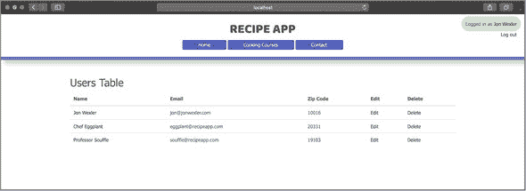

此图在导航栏中包含一个注销链接。要创建此链接，在`currentUser`名称出现的行下方添加`<a href="/users/logout">注销</a>`。要使此链接工作，您需要创建一个用于注销的路由和动作。首先，在 main.js 中您的`login`路由旁边添加`router.get("/users/logout", usersController.logout, usersController.redirect-View)`。然后，将代码列表 24.8 中的`logout`动作添加到 usersController.js 中。

此行为使用 Passport.js 在请求上提供的`logout`方法来清除用户的会话。在通过您的自定义中间件的下一个传递过程中，`isAuthenticated`返回`false`，并且将不再有当前用户。随后通过`redirectView`行为将用户重定向到主页，并显示一条消息提示用户已注销。

##### 代码列表 24.8. 在 usersController.js 中添加注销动作

```
logout: (req, res, next) => {            *1*
  req.logout();
  req.flash("success", "You have been logged out!");
  res.locals.redirect = "/";
  next();
}
```

+   ***1*** **添加一个注销用户的行为。**

在此动作就绪后，是时候测试完整的登录过程了。重新启动您的应用程序，登录，然后点击导航栏中的`注销`链接(图 24.2)。您的会话应该被清除，并且您的账户成功注销。

##### 图 24.2. 浏览器中成功注销用户的示例

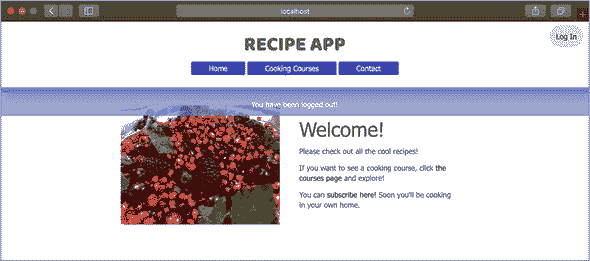

在第 25 课中，您将用户身份验证应用于毕业设计项目。

| |
| --- |

**快速检查 24.3**

> **Q1:**
> 
> 您如何在应用程序中访问 Passport.js 的方法？

| |
| --- |
| |

**QC 24.3 答案**

> **1:**
> 
> 由于你在 Express.js 中添加了 `passport` 模块作为中间件，因此你可以访问 Passport.js 提供的方法库。这些方法扩展到了请求进入应用程序时。当请求通过中间件链传递时，你可以在任何你想要的地方调用这些 `passport` 方法。

| |
| --- |

### 

在本课中，你添加了一些 Passport.js 包来协助加密和验证用户数据。通过将额外的验证操作连接到你的用户登录中间件链，你可以确保用户密码安全，并且登录体验一致。在下一课的综合练习（第 25 课）中，你将应用这些验证、散列、加密和认证技术来改善 Confetti Cuisine 应用程序体验。

| |
| --- |

**尝试这个**

你已经成功实现了 Passport.js 与你的 User 模型和 Mongoose ODM 一起工作。由于 Passport.js 为你做了很多繁重的工作，你可能觉得登录过程没有太多可以添加的，但你总是有更多中间件的空间。在验证和加密之间添加一个名为 `logEmail` 的中间件函数，这个中间件应该将用户的电子邮件地址域名（如 `gmail`、`yahoo` 或 `live`）记录到控制台，并将其传递给下一个中间件函数。

| |
| --- |

## 第 25 课。综合练习：为 Confetti Cuisine 添加用户认证

我在 Confetti Cuisine 的联系人对于他们应用程序的进展感到非常高兴。他们已经开始了添加新的课程提供、管理新的订阅者以及宣传创建新用户账户的工作。我警告他们，尽管可以创建用户账户，但应用程序还没有准备好安全地处理用户。

客户端和我都认为数据加密和适当的用户认证是前进的方向，因此，为了我对应用程序的下一步改进，我打算添加几个使用 Passport.js 的包来协助设置安全的用户登录流程。我还会添加闪存消息，以便用户在重定向或页面渲染后能够知道他们的上一个操作是否成功。然后，我将借助 `express-validator` 中间件包添加一些额外的验证。

到了开发这个阶段结束时，我可以放心地鼓励 Confetti Cuisine 为他们的应用程序注册用户。然而，由于应用程序尚未上线，因此当用户注册时，客户需要在他们的机器上本地运行它。

对于这个综合练习，我需要做以下几件事情：

+   在页面请求之间添加会话和 cookies

+   在视图中添加新的自定义中间件，用于验证和设置局部变量

+   创建登录表单

+   为 `User` 模型添加 passport 认证和加密

+   添加一个视觉指示器来显示哪个用户已登录

### 

基于我在上一个综合练习（课程 21）中编写的代码，我目前实现了三个模型，并为每个模型实现了 CRUD 动作。为了继续改进 Confetti Cuisine 的应用程序，我需要安装一些额外的包：

+   `express-session` 允许我存储有关用户与应用程序交互的临时数据。生成的会话让我知道用户是否最近登录过。

+   `cookie-parser` 允许我在客户端存储会话数据。生成的 cookie 会随每个请求和响应发送，其中包含反映最后使用该客户端的用户的消息和数据。

+   `connect-flash` 允许我使用会话和 cookie 在用户的浏览器中生成闪存消息。

+   `express-validator` 允许我通过中间件函数为传入的用户数据添加一层验证。

+   `passport` 允许我为 `User` 模型设置一个无痛苦的加密和认证过程。

+   `passport-local-mongoose` 允许我通过在 `User` 模型上使用插件进一步集成 `passport`，从而简化我需要编写的代码。

要安装这些包，我将在项目的终端窗口中运行 `npm i express-session cookie-parser connect-flash express-validator passport passport-local-mongoose -S`。我已经设置了 `create` 动作和 `new` 表单用于用户。我需要很快修改这些，但首先，我将创建用户登录应用程序所需的登录表单。

### 25.2\. 创建登录表单

我想这个表单包含两个简单的输入：`email` 和 `password`。我将在用户文件夹中创建一个新的 login.ejs 视图，并添加下一个列表中的代码。此表单将向 `/users/login` 路由提交 `POST` 请求。此表单的输入将处理用户的 `email` 和 `password`。

##### 列表 25.1\. 在 users/login.ejs 中添加登录表单

```
<form class="form-signin" action="/users/login" method="POST">     *1*
  <h2 class="form-signin-heading">Login:</h2>
  <label for="inputEmail" class="sr-only">Email</label>
  <input type="text" name="email" id="inputEmail" class="form-
 control" placeholder="Email" autofocus required>
  <label for="inputPassword" class="sr-only">Password</label>
  <input type="password" name="password" id="inputPassword"
 class="form-control" placeholder="Password" required>
  <button class="btn btn-lg btn-primary btn-block" type="submit">
 Login</button>
</form>
```

+   ***1*** **创建登录表单。**

在此表单可以工作或被查看之前，我将添加 `login` 路由和动作。`login` 将接受 `GET` 和 `POST` 请求，如下所示。


##### 注意

我将所有与路由相关的代码添加到 `router` 对象上。


##### 列表 25.2\. 在 main.js 中添加登录路由

```
router.get("/users/login", usersController.login);              *1*
router.post("/users/login", usersController.authenticate);      *2*
router.get("/users/logout", usersController.logout,
  usersController.redirectView );                            *3*
```

+   ***1*** **到登录动作的路由。**

+   ***2*** **将提交的数据发送到认证动作。**

+   ***3*** **添加一个退出路由并重定向到一个视图。**

在这些路由就位后，在表单在 `/users/login` 可视化之前，我需要创建它们对应的动作。首先，我将添加下一个列表中的 `login` 动作到 users-Controller.js。

##### 列表 25.3\. 在 usersController.js 中添加 `login` 动作

```
login: (req, res) => {
  res.render("users/login");       *1*
}
```

+   ***1*** **添加一个动作来渲染我的表单以供浏览器查看。**

在下一节中，我使用 `passport` 包开始加密用户数据，这样这个登录表单就会有实际用途。

### 25.3\. 使用 Passport.js 添加加密

要开始使用 Passport.js，我需要在 main.js 和 users-Controller.js 中引入 `passport` 模块，通过在两个文件的顶部添加 `const passport = require("passport")` 来实现。这些文件是我将在其中设置哈希和认证的文件。接下来，我需要在 Express.js 中作为中间件初始化并使用 `passport`。因为 `passport` 使用会话和 cookie，所以我还需要在 main.js 中引入 `express-session` 和 `cookie-parser`，将 列表 25.4 中的行添加到该文件中。

要开始使用 `passport`，我需要使用一个密钥来配置 `cookieParser` 以加密客户端上存储的 cookie。然后，我将让 Express.js 也使用会话。在设置过程中，这一阶段是 `passport` 开始存储应用程序活跃用户信息的地方。通过告诉 Express.js 在这一行初始化并使用它，`passport` 正式成为中间件。因为在此行之前已经设置了会话，所以我指示 Express.js 让 `passport` 使用那些现有的会话来存储其用户数据。

我设置了默认登录策略，这是通过即将添加到 `User` 模型的 `passport-local-mongoose` 模块提供的，以使用 `passport` 为用户提供身份验证。最后两行允许 `passport` 在服务器和客户端之间发送数据时压缩、加密和解密用户数据。

##### 列表 25.4\. 在 main.js 中使用 Express.js 添加 `passport`

```
const passport = require("passport"),
  cookieParser = require("cookie-parser"),
  expressSession = require("express-session"),
  User = require("./models/user");

router.use(cookieParser("secretCuisine123"));             *1*
router.use(expressSession({
  secret: "secretCuisine123",
  cookie: {
    maxAge: 4000000
  },
  resave: false,
  saveUninitialized: false
}));                                                      *2*
router.use(passport.initialize());                        *3*
router.use(passport.session());                           *4*
passport.use(User.createStrategy());                      *5*
passport.serializeUser(User.serializeUser());             *6*
passport.deserializeUser(User.deserializeUser());
```

+   ***1*** **使用密钥配置 cookieParser。**

+   ***2*** **配置 Express.js 使用会话。**

+   ***3*** **配置 Express.js 初始化并使用 passport。**

+   ***4*** **指示 passport 使用会话。**

+   ***5*** **设置默认登录策略。**

+   ***6*** **设置 passport 以压缩、加密和解密用户数据。**


##### 注意

在我能够使用 `createStrategy` 方法之前，我需要确保在 main.js 中引入了 `User` 模型。此方法只有在用 `passport-local-mongoose` 设置了用户模型之后才能工作。


在设置好此配置后，我可以将注意力转向 user.js 中的 `User` 模型，以添加 `passport-local-mongoose`。我需要在 user.js 的顶部添加 `const passportLocalMongoose = require("passport-local-mongoose")` 来在用户模型中引入 `passport-local-mongoose`。

在此文件中，我将模块作为插件附加到 `userSchema` 上，如 列表 25.5 所示。这一行设置 `passportLocalMongoose` 在我的数据库中的用户模型上创建 `salt` 和 `hash` 字段。它还将 `email` 属性视为登录和验证的有效字段。此代码应放置在 `module.exports` 行之上。

##### 列表 25.5\. 将 `passport-local-mongoose` 作为插件添加到 User 模型

```
userSchema.plugin(passportLocalMongoose, {
  usernameField: "email"
});                          *1*
```

+   ***1*** **将 passport-local-mongoose 模块作为用户模式插件添加。**


##### 注意

在我的 `User` 模型中添加此功能后，我不再需要在用户模式中保留纯文本密码属性。我现在将删除该属性，以及用户 `show` 页面上的密码表行。


在下一节中，我修改了`usersController.js`中的`create`动作，以使用`passport`注册新用户，并设置闪存消息，以便用户知道账户创建是否成功。

### 25.4\. 添加闪存消息

当会话和 cookie 准备好将数据附加到请求并响应用户时，我准备通过使用`connect-flash`来集成闪存消息。为了配置`connect-flash`，我需要在 main.js 中将其作为一个名为`connectFlash`的常量引入，添加以下行：`const connectFlash = require("connect-flash")`。然后，我告诉我的 Express.js 应用将其用作中间件，通过在 main.js 中添加`router.use(connectFlash())`来实现。

现在中间件已安装，我可以在我的应用程序中的任何请求上调用`flash`，这允许我将消息附加到请求。为了将请求闪存消息传递到响应，我在 main.js 中添加了一些自定义中间件，如列表 25.6 所示。通过告诉 Express.js 应用使用这个自定义中间件，我能够将一个名为`flashMessages`的局部变量分配给包含在控制器动作中创建的闪存消息的对象。从这里开始，我将在我的视图中访问`flashMessages`对象。

##### 列表 25.6\. 在 main.js 中添加使用闪存消息的自定义中间件

```
router.use((req, res, next) => {
  res.locals.flashMessages = req.flash();        *1*
  next();
});
```

+   ***1*** **将闪存消息分配给局部变量。**

因为我想让闪存消息出现在每个页面上，我会在我的 layout.ejs 文件中添加一些代码来查找`flashMessages`并在它们存在时显示它们。我会在列表 25.7 中添加代码到 layout.ejs 的`<%- body %>`之上。

我打算只显示`成功`和`错误`消息。首先，我检查`flashMessages`是否已定义；然后，我显示与对象关联的`成功`消息或`错误`消息。

##### 列表 25.7\. 在 layout.ejs 中添加使用闪存消息的逻辑

```
<div class="flashes">
<% if (flashMessages) { %>                                        *1*
  <% if (flashMessages.success) { %>
    <div class="flash success"><%= flashMessages.success %></div>
  <% } else if (flashMessages.error) { %>
    <div class="flash error"><%= flashMessages.error %></div>  <% } %>
<% } %>
</div>
```

+   ***1*** **在视图中显示闪存消息。**

最后，我通过修改用户的`create`操作以使用`passport`和闪存消息，并将代码添加到`usersController.js`中的列表 25.8 来测试这个新添加的代码。`create`操作使用 Passport.js 提供的`register`方法创建新的用户账户。结果是数据库中包含散列密码和盐的用户文档。如果用户成功保存，我会在`index`视图中添加一个`成功`闪存消息。否则，我会在用户创建页面上显示一个`错误`消息。

##### 列表 25.8\. 在创建动作中添加 passport 注册和闪存消息

```
create: (req, res, next) => {                                 *1*
  if (req.skip) next();

  let newUser = new User(getUserParams(req.body));

  User.register(newUser, req.body.password, (e, user) => {
    if (user) {
      req.flash("success", `${user.fullName}'s account
 created successfully!`);                                  *2*
        res.locals.redirect = "/users";
      next();
    } else {
      req.flash("error", `Failed to create user account
 because: ${e.message}.`);
      res.locals.redirect = "/users/new";
      next();
    }
  });
}
```

+   ***1*** **添加创建用户动作。**

+   ***2*** **响应闪存消息。**

在这个动作到位后，我准备演示我的新的带有闪存消息的 Passport.js 注册过程。接下来，我在用户创建之前添加一些自定义验证。

### 25.5\. 使用 express-validator 添加验证中间件

`express-validator` 模块提供了在数据进入此应用程序时清理和验证数据的有用方法。我开始在 main.js 中通过添加 `const expressValidator = require(` `"``express-validator``"``)` 并告诉我的 Express.js 应用程序将此模块作为中间件使用，添加 `router.use(expressValidator())` 到同一文件中。

我知道我想要数据在到达 `usersController` 中的 `create` 动作之前通过一些中间件验证函数，所以我将我的 `/users/create` 路由改为考虑这一要求，如 列表 25.9 所示。这个 `validate` 动作位于 `usersController` 中，在 `create` 动作之前运行，这确保了我的自定义验证中间件在有机会到达我的 `User` 模型之前过滤掉不良数据。

##### 列表 25.9\. 在 main.js 中在创建之前添加验证动作

```
router.post("/users/create", usersController.validate,
 usersController.create, usersController.redirectView);     *1*
```

+   ***1*** **向用户创建路由添加验证中间件。**

然后我在 usersController.js 中通过使用 列表 25.10 中的代码创建了一个 `validate` 动作。这个 `validate` 动作解析传入的请求并清理请求体中的数据。在这种情况下，我正在从 `email` 字段中去除空白字符。

我使用 `express-validator` 提供的一些其他方法来确保数据库中的电子邮件保持一致，并且 ZIP 码长度符合要求。我还会检查用户在注册时是否输入了密码。我收集在验证步骤中可能发生的任何错误。然后我将错误消息连接成一个单独的字符串。我在请求对象上设置一个属性，`req.skip = true`，这样就可以跳过 `create` 动作并直接返回视图。所有闪存消息都在 `users/new` 视图中显示。如果没有错误，我调用 `next` 来移动到 `create` 动作。

##### 列表 25.10\. 在 usersController.js 中添加 `validate` 动作

```
validate: (req, res, next) => {                                  *1*
  req
    .sanitizeBody("email")
    .normalizeEmail({
      all_lowercase: true
    })
    .trim();
  req.check("email", "Email is invalid").isEmail();
  req
    .check("zipCode", "Zip code is invalid")
    .notEmpty()
    .isInt()
    .isLength({
      min: 5,
      max: 5
    })
    .equals(req.body.zipCode);                                   *2*
 req.check("password", "Password cannot be empty").notEmpty();
 req.getValidationResult().then((error) => {
   if (!error.isEmpty()) {
     let messages = error.array().map(e => e.msg);
     req.skip = true;
     req.flash("error", messages.join(" and "));
     res.locals.redirect = '/users/new';                         *3*
     next();
   } else {
     next();
   }
 });
}
```

+   ***1*** **添加验证动作。**

+   ***2*** **清理并检查输入字段数据。**

+   ***3*** **收集错误，并使用闪存消息响应。**

应用程序已准备好验证用户创建的数据。最后一步是将我的登录表单连接到之前设置的认证动作。

### 25.6\. 使用 Passport.js 添加认证

Passport.js 通过提供一些默认方法作为请求中间件来简化我的生活。当我添加 `passport-local-mongoose` 时，我的用户模型继承了比 `passport` 单独提供的更多有用的方法。因为 `passport-local-mongoose` 模块被添加为用户模型的插件，所以很多认证设置都在幕后得到了处理。

`register`方法是`passport`提供最强大和直观的方法之一。为了使用它，我需要调用`passport.register`并传递我计划使用的登录策略。因为我使用的是默认的本地策略，我可以在 usersController.js 中创建我的`authenticate`动作来使用`passport.authenticate`方法，如代码列表 25.11 所示。

| |
| --- |

##### 注意

我需要确保`const passport = require("passport")`位于我的用户控制器顶部。

| |
| --- |

这个动作直接指向`passport.register`方法。我已经在 main.js 中为我的`User`模型创建了一个本地策略，并告诉`passport`在认证成功时序列化和反序列化用户数据。我添加的选项决定了认证成功或失败时采取的路径，并附带闪存消息。

##### 代码列表 25.11\. 在 usersController.js 中添加`authenticate`动作

```
authenticate: passport.authenticate("local", {        *1*
  failureRedirect: "/users/login",
  failureFlash: "Failed to login.",
  successRedirect: "/",
  successFlash: "Logged in!"
})
```

+   ***1*** **添加带有重定向和闪存消息选项的认证中间件。**

我已经准备好测试在`/users/login`的登录表单进行认证。到目前为止，一切应该正常工作，以便将现有用户登录到应用程序中。我只需要对我的布局文件做一些最后的润色，并添加一个登出链接。

### 25.7\. 登录和登出

我已经让登录过程工作正常。现在我想添加一些视觉指示来表明用户已登录。首先，我设置了一些变量，帮助我知道是否有未过期的会话用于已登录用户。为此，我在 main.js 中添加了代码列表 25.12 中的代码到我的自定义中间件中，其中添加了`flashMessages`局部变量。

通过这个中间件函数，我可以访问`loggedIn`来确定是否有账户通过发送请求的客户端登录。`isAuthenticated`告诉我是否有用户的活跃会话。如果该用户存在，`currentUser`被设置为已登录的用户。

##### 代码列表 25.12\. 通过中间件向响应中添加局部变量

```
res.locals.loggedIn = req.isAuthenticated();         *1*
res.locals.currentUser = req.user;                   *2*
```

+   ***1*** **设置 loggedIn 变量以反映 passport 登录状态。**

+   ***2*** **设置 currentUser 变量以反映已登录用户。**

现在，我可以通过在布局中的导航栏添加代码列表 25.13 中的代码来使用这些变量。我检查`loggedIn`是否为`true`，这告诉我用户已登录。如果是这样，我显示指向该用户`show`页面的`currentUser`的`fullName`和登出链接。否则，我显示一个登录链接。

##### 代码列表 25.13\. 在 layout.ejs 的导航栏中添加登录状态

```
<div class="login">
  <% if (loggedIn) { %>                            *1*
    <p>Logged in as
      <a href="<%=`/users/${currentUser._id}`%>">
  <%= currentUser.fullName %></a>
      <a href="/users/logout">Log out</a>
    </p>                                           *2*
  <%} else {%>
    <a href="/users/login">Log In</a>
  <% } %>
</div>
```

+   ***1*** **检查用户是否已登录。**

+   ***2*** **显示当前用户的名字和登出链接。**

最后，由于我的`/users/logout`路由已经就绪，我需要在`usersController`中添加`logout`操作，如列表 25.14 所示。这个操作使用传入请求上的`logout`方法。这个由`passport`提供的方法清除了活动用户的会话。当我重定向到主页时，没有`currentUser`存在，现有用户成功注销。然后我调用下一个中间件函数来显示主页。

##### 列表 25.14\. 向 usersController.js 添加注销操作

```
logout: (req, res, next) => {
  req.logout();                                        *1*
  req.flash("success", "You have been logged out!");
  res.locals.redirect = "/";
  next();
}
```

+   ***1*** **添加一个注销用户操作的函数。**

在这个最后的部分工作完成后，我可以告诉 Confetti Cuisine 的联系人开始宣传用户账户。当他们成功登录时，屏幕将看起来像图 25.1。我坚信注册和登录过程比之前更安全、更可靠、更直观。

##### 图 25.1\. 在 Confetti Cuisine 上成功登录

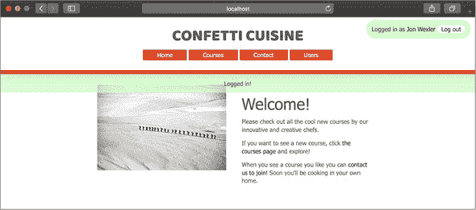

### 摘要

在这个综合练习中，我通过添加几个包来增强 Confetti Cuisine 应用程序的安全性，并使其对用户更加透明。安装了会话和 cookie 后，我能够使用`passport`和`connect-flash`等包在服务器和客户端之间共享有关用户与 Confetti Cuisine 应用程序交互的信息。我为用户密码添加了加密，并在`User`模型上通过`passport-local-mongoose`插件设置了两个新的用户属性。通过更严格的验证，我的自定义验证操作作为中间件来过滤不必要的数据，并确保表单数据符合我的模式要求。最后，在实现了身份验证之后，`passport`提供了一种跟踪哪些用户登录到我的应用程序的方法，使我能够为积极参与的注册用户提供特定内容。在下一个单元中，我将添加一些功能以在应用程序内搜索内容，并在这个过程中在服务器上构建一个 API。
