## 第 6 单元\. 构建一个 API

在第 5 单元中，你添加了一些新功能，以允许用户安全地登录到你的应用程序。这一添加使你能够开始区分你只想向已登录用户显示的内容，而不是向公众显示。毕竟，你可能希望用户只能删除他们自己的内容，而不是他人的。这些改进增加了用户与浏览器交互的可能性。然而，互联网浏览器只是可能想要与你的数据交互的许多客户端类型之一。

在本课中，我将讨论如何更好地利用你的应用程序编程接口（API）。*API* 是客户端与你的应用程序数据交互的方法。目前，这种交互是通过渲染的 HTML 页面进行的，仅限于网络客户端，尽管你可能希望修改你的控制器操作以响应不同类型的请求，并使用相同数据的不同格式。你可以通过 XML 或 JSON 使用其他数据格式。你可能希望在用户编辑页面内访问课程列表，而无需切换视图，例如。也许你在编辑表单中有未保存的内容，你希望快速查看课程列表，而无需更新你的用户数据。

在第一课中，你设置了一个基本的 API，使用 RESTful 路由以 JSON 格式响应课程列表。然后你使用客户端 JavaScript 在屏幕上显示数据。在本单元结束时，你将对 API 应用一些安全屏障，以防止不想要的请求访问你的数据库。

本单元涵盖了以下主题：

+   第 26 课介绍了在技术行业中 API 的使用方式以及响应不同数据格式的方法。在本课中，你为更易于维护的 API 组织路由，并使用查询参数来确定响应的数据类型。

+   第 27 课展示了如何通过客户端 JavaScript 使用 AJAX 在无需刷新页面的情况下加载数据。在本课中，你创建了一个新的路由，并处理对`/api`命名空间的传入请求。

+   第 28 课指导你了解在没有视觉登录方式的情况下如何保护你的 API 的基本方法。

第 29 课通过提供你需要执行的步骤来总结本单元，这些步骤用于从用户个人资料页面发送 AJAX 请求以加载 Confetti Cuisine 课程数据。然后你可以在不离开个人资料页面的情况下让用户注册。

## 第 26 课\. 向你的应用程序添加 API

在本节课中，你首先查看重新组织你的路由结构并响应数据。首先，你创建新的文件夹来存放 main.js 中构建的路由。新的结构遵循你在之前课程中设置的一些应用程序编程接口（API）约定。接下来，你修改一些控制器操作以根据查询参数响应嵌入式 JavaScript（EJS）和 JSON。最后，你通过从客户端 JavaScript 创建 Ajax `GET` 请求来测试你的新 API 连接。

本节课涵盖

+   使用命名空间组织路由

+   创建响应 JSON 的 API 端点

+   从视图中发送 Ajax 请求

| |
| --- |

**考虑这一点**

你的食谱应用程序渲染许多页面，并在每个页面上提供特定的功能。为了使用户体验不那么复杂，你希望允许用户从他们的个人资料页面查看可用的程序。为此，你决定有条件地以 JSON 格式提供数据，并通过 JavaScript 和 HTML 在客户端显示这些数据。当你修改控制器操作时，你的应用程序可以提供超出服务网页的 API。

| |
| --- |

### 26.1. 组织你的路由

随着你的应用程序的增长，main.js 文件中的路由开始压倒其他中间件和配置。路由是应用程序的重要组成部分，以一种多开发者可以管理和理解的方式组织你的路由同样重要。

为了开始本节课，你将你设置的易于遵循的目录结构中的路由结构分解。在第 4 单元和第 5 单元中，你创建了路由以反映 REST 架构中的 CRUD 功能。*表示性状态转移*（REST）是一种编程方式，用于表示应用程序资源在互联网上的参与。你的应用程序的资源是存储在数据库中并在视图中显示的用户、订阅者和课程。你通过构建包含模型名称、HTTP 方法、执行的操作以及必要时模型 ID 的路由来实现 RESTful 结构。`router.get("users/:id/edit", usersController .edit)`告诉你，例如，有一个 HTTP `GET` 请求发送到了 `u``s``ers/:id/edit` 路径。

这些路由使用户能够确切地知道需要哪些信息才能获取他们想要看到的数据——在这种情况下，是现有用户的编辑表单。仅从路径本身，你就知道你正在尝试编辑特定的用户记录。从那里，你可以连接到相应的操作并重定向到另一个 RESTful 路由。

| |
| --- |

##### 注意

重定向通常是在数据库中创建或更新信息时的次要操作。在到达修改数据的初始控制器操作后，你将重定向到另一个路由，将用户发送到另一个页面以查看。

| |
| --- |

在本节中，您将您的路由重新组织成单独的模块，以反映它们所使用的模型。当您决定扩展应用程序中使用的路由和响应数据类型时，这种结构将非常有用。

首先在项目根目录下创建一个名为 routes 的新文件夹，并在该文件夹中创建以下新模块：

+   userRoutes.js

+   courseRoutes.js

+   subscriberRoutes.js

+   errorRoutes.js

+   homeRoutes.js

+   index.js

这六个模块将划分 main.js 中当前的路由。目前，请专注于用户路由。

首先在模块顶部导入 Express.js 的`Router`和`usersController`。然后导入登录路由和 CRUD 路由，并将它们添加到本地的`router`对象中。这样做允许这些路由由同一个路由器处理。将所有工作路由附加到`router`后，您可以导出路由对象。注意在这个例子中，您省略了`users`路径。您将在 index.js 中稍后定义路径的这一部分。

将 main.js 中与用户相关的所有路由（CRUD 操作、登录和认证）复制到 userRoutes.js 中，具体内容见下文。

##### 列表 26.1\. 将用户路由移动到 userRoutes.js

```
const router = require("express").Router(),
  usersController = require("../controllers/usersController");  *1*

router.get("/", usersController.index,
 usersController.indexView);                                 *2*
router.get("/new", usersController.new);
router.post("/create", usersController.validate,
 usersController.create, usersController.redirectView);
router.get("/login", usersController.login);                    *3*
router.post("/login", usersController.authenticate);
router.get("/logout", usersController.logout,
 usersController.redirectView);
router.get("/:id/edit", usersController.edit);
router.put("/:id/update", usersController.update,
 usersController.redirectView);
router.get("/:id", usersController.show,
 usersController.showView);
router.delete("/:id/delete", usersController.delete,
 usersController.redirectView);

module.exports = router;                                        *4*
```

+   ***1*** **导入 Express.js Router 和 users 控制器。**

+   ***2*** **添加 CRUD 路由。**

+   ***3*** **添加登录和认证路由。**

+   ***4*** **导出模块路由。**


**命名空间**

*命名空间*是一种在特定字符串或路径的伞状下定义路由、路径和其他应用程序项的方法。您不必定义具有相同路径前缀（`/users`）的数十个路由，而是可以将该前缀作为这些路由的命名空间。

命名空间特别有助于根据返回内容格式在您的 API 中分离路由。例如，如果 iOS 应用程序想要访问您的食谱应用程序中的数据，您可能会创建具有命名空间`/ios`的特定路由。然后您可以定义路径，如`/ios/courses`和`/ios/subscribers`。通过此命名空间下定义的路由，iOS 应用程序可以访问数据。


对于其他路由文件，遵循相同的策略。订阅者路由放在 subscriberRoutes.js 中，错误路由放在 errorRoutes.js 中。

index.js 模块要求所有路由模块都在一个地方。这种约定使得在一个文件中识别所有路由类型变得更容易，并且只需要一个文件导入到 main.js 中。与路由模块一样，您在 index.js 中也需要导入 Express.js 的`Router`。接下来，导入每个相对路由模块。添加了这些模块后，告诉本地的`router`对象使用这些路由和特定的命名空间。

对于主页和错误路由，不需要命名空间。通过为 26.1 列表 中定义的用户路由添加 `/users` 命名空间，你将返回到路由的原有功能。最后一步是在 main.js 中引入此 index.js 模块。在 main.js 的顶部添加 `const router = require("./routes/index")`，并在你的中间件函数之后添加 `app.use("/", router)`。

为了将这些路由与你的应用程序使用的相同路由器绑定，请将下一列表中的代码添加到 index.js 中。

##### 列表 26.2. 将所有路由导入 index.js

```
const router = require("express").Router(),             *1*
  userRoutes = require("./userRoutes"),                 *2*
  subscriberRoutes = require("./subscriberRoutes"),
  courseRoutes = require("./courseRoutes"),
  errorRoutes = require("./errorRoutes"),
  homeRoutes = require("./homeRoutes");

router.use("/users", userRoutes);                       *3*
router.use("/subscribers", subscriberRoutes);
router.use("/courses", courseRoutes);
router.use("/", homeRoutes);
router.use("/", errorRoutes);

module.exports = router;                                *4*
```

+   ***1*** 需要 Express.js 路由器。

+   ***2*** 需要同一目录内的所有路由模块。

+   ***3*** 使用带有命名空间的相对路由模块中的路由。

+   ***4*** 从 index.js 导出路由器。

| |
| --- |

##### 注意

顺序很重要。确保将更详细的路由放在 `index.js` 的顶部附近。否则，错误路由将在它们能够到达你打算到达的路由之前处理所有传入的请求。

| |
| --- |

Express.js 的 `router` 对象通过中间件操作。在其内部，你可以定义你希望在传入请求上执行的具体任务。在这种情况下，你正在使用 `router` 在不同的命名空间下加载路由。与其他中间件一样，如果你想将路由器中间件添加到主应用程序的中间件流程中，你需要使用 `app.use` 添加它。在 main.js 中，删除所有控制器的 require 语句，以及 `express.Router()` 的 require 语句。main.js 中的其余中间件用于 `app` 对象。

| |
| --- |

##### 注意

重要的是要将 main.js 中剩余的所有中间件更改为由 `app` 使用而不是 `router`，因为你在请求到达文件底部的路由之前，希望 `app` 解析请求并使用你的模板引擎。中间件的顺序很重要！

| |
| --- |

重新启动你的应用程序，并确认应用程序的原有功能保持完好。如果你遇到任何错误，或者某些路由找不到，请确保所有路由命名空间都已正确定义，并且已从原始路径中删除资源名称前缀。在新命名空间下，例如，你的用户索引路由应读取 `router.get("/", usersController.index, usersController.indexView)` 而不是 `router.get("/users", usersController.index, usersController.indexView)`。

在下一节中，你将学习如何使用现有的路由来返回两种数据格式。

| |
| --- |

**快速检查 26.1**

> **Q1:**
> 
> 你为什么在 main.js 中添加 `app.use("/", router)`？

| |
| --- |
| |

**QC 26.1 答案**

> **1:**
> 
> 当路由在 main.js 中定义时，你需要告诉 Express.js 应用程序将其用作中间件。

| |
| --- |

### 26.2. 创建 API

API 是在你的应用程序内设置的结构，允许外部来源访问你的应用程序数据。实际上，通过创建 Express.js 网络服务器，你已经构建了一个 API。通过提供 HTML 和 EJS，你已经提供了一条途径，让应用程序的用户可以通过网络浏览器访问你的数据：网页浏览器。然而，并非每个用户都希望通过你应用的网页浏览器以特定的样式和格式查看应用程序数据。

将你当前的 Express.js 应用程序想象成一家餐厅的菜单。大多数人可能会参考打印的菜单来了解餐厅提供的食物项目。获取硬拷贝菜单需要亲自前往餐厅。通过提供电话号码以查询菜单项目以及显示餐厅菜单的网站，你为顾客提供了更多获取所需信息的选择。同样，一个强大的 API 提供了不同格式的应用程序数据，你可以通过不同的方式访问这些数据。

在本节中，你将重构一些应用程序的路由和动作，以便除了渲染 EJS 视图外，还能以 JSON 格式响应数据。在 Express.js 中，以 JSON 格式响应数据很简单。将 `coursesController.js` 中 `indexView` 动作的 `res.render("courses/index")` 行更改为 `res.json(res.locals.courses)`。当你重新启动应用程序并访问 http://localhost:3000/courses 时，你的浏览器应该以 JSON 格式显示数据库中的所有课程（图 26.1）。

##### 图 26.1\. 浏览器中 JSON 课程结果的显示

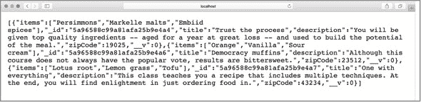

此输出应类似于你在新终端窗口中运行 `mongo` 命令时的 MongoDB 服务器输出：`use recipe_db` 和 `db.courses.find({})`，如图 26.2 所示。运行这些命令启动 MongoDB 环境，并列出你的食谱数据库中的所有课程。在应用程序中，你实际上是在浏览器中显示完整的数据库文档。

##### 图 26.2\. MongoDB 中的课程显示

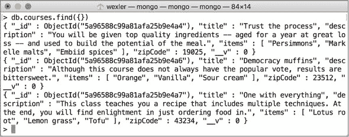

你可以通过仅响应 JSON 格式来进一步改进索引动作。你可以用多种方式完成这项任务。一种方式是使用查询参数。在这段代码中，你检查了 `format` 查询参数。如果它存在且等于 `json`，则以 JSON 格式响应课程数据。否则，像往常一样响应渲染的 EJS 视图。将 `courses` `indexView` 动作更改为下一列表中的代码。

##### 列表 26.3\. 在 usersController.js 中存在查询参数时响应 JSON

```
indexView: (req, res) => {
  if (req.query.format === "json") {
    res.json(res.locals.courses);          *1*
  } else {
    res.render("courses/index");           *2*
  }
}
```

+   ***1*** **如果格式查询参数等于 json，则响应 JSON 格式。**

+   ***2*** **如果格式查询参数不等于 json，则响应 EJS 视图。**

重新启动你的应用程序，并访问 http://localhost:3000/courses 以确保你的原始 EJS index 视图仍然在渲染。要显示 JSON 数据而不是正常视图，请将 `?format=json` 追加到 URL 的末尾：访问 `http://localhost:3000/courses?format=json`。这个额外的查询参数告诉你的课程控制器以 JSON 格式而不是 EJS 渲染数据。

实施这一变化后，如果外部应用程序想要访问课程列表，它可以向带有查询参数的 URL 发送请求。尽管如此，外部应用程序只是可以从这一实现中受益的一组消费者之一。你可以在自己的应用程序中以多种方式使用此数据端点。（API *端点* 是对接受网络请求的一个或多个应用程序路径的引用。）


**快速检查 26.2**

> **Q1:**
> 
> 你在响应上使用什么方法来以 JSON 格式将数据发送回客户端？

|  |

**QC 26.2 答案**

> **1:**
> 
> 在 Express.js 中，你可以使用 `res.json` 后跟你想要以 JSON 格式发送的参数。


### 26.3\. 从客户端调用你的 API

在餐厅的类比中，菜单项可以通过不同的媒体提供：印刷、电话或网络。这种多样性使得顾客更容易了解餐厅提供的食物，同时也可能使餐厅工作人员更快地访问菜单项。毕竟，在繁忙的夜晚打开网页是找到菜单的一个方便的替代方案。

在你的应用程序的许多地方，你可以从返回 JSON 数据的应用程序路由中受益。主要的好处是，你可以通过客户端向不希望刷新的页面发送 Ajax 请求来受益。例如，如果你想让用户能够在不改变他们当前页面的情况下查看课程列表，那会怎么样？

通过 Ajax 请求用课程数据填充一个 *模态*（一个覆盖主浏览器屏幕的带有某些说明或内容的窗口）来实现解决方案。首先，在 views/courses 文件夹中创建一个名为 _coursesModal.ejs 的部分视图。使用如以下列表所示的一个简单的 Bootstrap 模态。

在此模态中，你有一个触发模态出现的按钮。该模态有一个带有 `modal-body` 类的标签。针对此类填充课程数据。

##### 列表 26.4\. 在 _coursesModel.ejs 中的简单 Bootstrap 模态

```
<button id="modal-button" type="button" data-toggle="modal"
 data-target="#myModal">Latest Courses</button>

<div id="myModal" class="modal fade" role="dialog">
  <div class="modal-dialog">
    <div class="modal-body">                          *1*
    </div>
    <div class="modal-footer">
      <button type="button" data-dismiss="modal">Close</button>
    </div>
  </div>
</div>
```

+   ***1*** **添加一个你将填充 modal-body 的模态。**

在你的 layout.ejs 文件中包含这个部分视图，这样你就可以通过添加 `<li><%- include courses/_coursesModal %></li>` 作为布局导航中的一个项目，在任何应用位置访问它。为了使这个模态框正常工作，你还需要有 bootstrap 客户端 JavaScript 以及 jQuery。你可以在 [`ajax.googleapis.com/ajax/libs/jquery/3.2.1/jquery.min.js`](https://ajax.googleapis.com/ajax/libs/jquery/3.2.1/jquery.min.js) 获取 jQuery.min.js 的压缩代码，并在 [`maxcdn.bootstrapcdn.com/bootstrap/3.3.7/js/bootstrap.min.js`](https://maxcdn.bootstrapcdn.com/bootstrap/3.3.7/js/bootstrap.min.js) 获取 bootstrap.min.js。


##### 注意

我建议复制这个内容交付网络中的代码，并将其保存为与 public/js 中相同名称的本地文件。


然后，在 layout.ejs 中，链接到以下列表中的 JavaScript 文件。

##### 列表 26.5\. 将 jquery 和 bootstrap 导入 layout.ejs

```
<script type="text/javascript" src="/js/jquery.min.js"></script>
<script type="text/javascript" src="/js/bootstrap.min.js"></script> *1*
```

+   ***1*** **添加来自 public/js 的本地 JavaScript 文件。**

通过一些样式更改，你可以重新启动你的应用程序。你应该在你的顶部导航栏中看到一个按钮，点击它将打开一个模态框，如图 图 26.3 所示。

##### 图 26.3\. 导航栏中的简单模态按钮

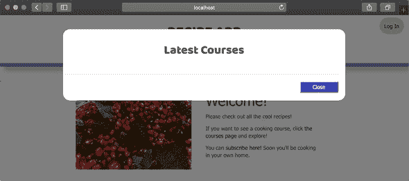

为了给这个模态框提供一些数据，在你的 public 文件夹的 js 文件夹中创建 recipeApp.js。这个 JavaScript 文件将在客户端运行。确保在 layout .ejs 文件中将此文件链接到 bootstrap 和 jQuery 下方，通过添加 `<script type="text/javascript" src="/js/recipeApp.js"></script>`。

在 recipeApp.js 中，添加 列表 26.6 中的代码。你将代码块包裹在 `$(document) .ready` 中，以确保在 DOM 加载并准备好之前不执行任何 JavaScript。然后你添加一个点击监听器到 `modal-button` ID。当在导航栏中点击该按钮时，执行一个到 `/courses?format=json` 路径的 Ajax `GET` 请求。通过添加查询参数，你期望响应包含作为 JSON 数组的数据。然后你遍历该数组以访问单个课程记录，并使用 `$(".modal-body").append` 为每个课程的标题和描述添加一些 HTML。

##### 列表 26.6\. recipeApp.js 中的 Ajax 函数用于在模态框中加载数据

```
$(document).ready(() => {                           *1*
  $("#modal-button").click(() => {                  *2*
    $(".modal-body").html('');                      *3*
    $.get("/courses?format=json", (data) => {       *4*
      data.forEach((course) => {                    *5*
        $(".modal-body").append(
          `<div>
          <span class="course-title">
          ${course.title}
          </span>
          <div class="course-description">
          ${course.description}
          </div>
          </div>`                                   *6*
        );
      });
    });
  });
});
```

+   ***1*** **等待 DOM 加载。**

+   ***2*** **监听模态按钮的点击事件。**

+   ***3*** **清除模态框中的任何先前内容。**

+   ***4*** **异步从 /courses?format=json 请求数据。**

+   ***5*** **遍历响应中的数据数组。**

+   ***6*** **将每个课程添加到模态框中。**

在此 Ajax 请求设置完成后，重新启动应用程序并将课程数据加载到模态框中。点击模态按钮从服务器获取新数据，如图 图 26.4 所示。

##### 图 26.4\. 在模态框中填充课程数据

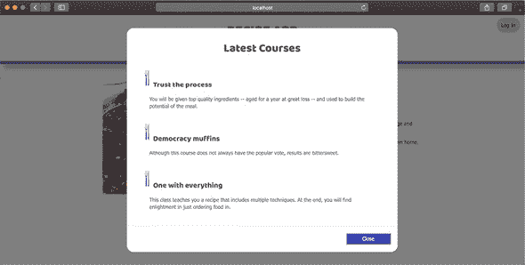

现在，用户可以从任何页面查看课程列表。即使数据库中添加了新的课程，点击模态按钮也会获取新的列表。


**Ajax**

*异步 JavaScript 和 XML* (Ajax)是一种允许客户端异步请求而不干扰应用程序页面任何行为或显示的技术。Ajax 使用 JSON 和 XML 来格式化数据和要求发送到服务器。通过仅管理浏览器中应用程序的数据层，Ajax 允许你异步发送请求并通过回调函数处理结果响应中的数据。

由于 Ajax 与后端服务器交互的方式无需重新加载你的网页，它被广泛用于实时动态更新内容。通过多个 Ajax 请求，理论上网页可能永远不需要重新加载。

|  |

**快速检查 26.3**

> **Q1:**
> 
> 当你进行 Ajax 请求时，如果数据库中没有课程，你期望会发生什么？

|  |

**QC 26.3 答案**

> **1:**
> 
> Ajax 请求从数据库返回一个项目数组。如果没有记录，响应将包含一个空数组。


### 总结

在本课中，你学习了如何修改你的应用程序路由结构以腾出空间用于广泛的 API。首先，你将路由重新组织成单独的模块。接下来，你添加了一种从控制器操作中响应 JSON 数据的方式。最后，你添加了客户端 JavaScript，以便在视图中从服务器进行异步请求。在第 27 课中，你将进一步探索命名空间，并了解如何从模态本身注册用户到课程中。


**尝试这个**

通过修改一个响应 JSON 数据的操作，尝试将相同的技巧应用到其他操作上。首先，将查询参数条件添加到其他模型索引操作中；然后实现它用于显示操作。

请记住，`show`操作返回单个记录，而不是数组。


## 第 27 课\. 从你的应用程序访问你的 API

在本课中，你通过添加 API 命名空间来改变访问 JSON 格式化数据的方式。然后你修改 AJAX 函数，允许用户直接从模态中注册课程。最后，你创建了一个通过新路由链接用户和课程的操作。

本课涵盖

+   创建 API 命名空间

+   构建用于异步获取数据的 UI 模态

+   使用 MongoDB 方法连接模型


**考虑这个**

用户现在可以从应用程序的任何页面查看课程列表，但他们想做的不仅仅是查看这个列表。通过 Ajax 请求，你不仅可以异步将数据拉入页面，还可以执行其他操作，例如创建新记录和编辑现有记录。

在本课中，你将探索如何更好地使用你的 API 以及 AJAX 如何能帮助你。


### 27.1\. 应用 API 命名空间

我在 第 26 课 中讨论了命名空间。现在你将实现一个用于返回 JSON 数据或异步执行操作的 API 端点的命名空间。要开始，在你的 routes 文件夹中创建一个新的路由模块，名为 apiRoutes.js。此模块将包含所有具有 JSON 响应体的 API 路由。通过添加 `const apiRoutes = require("./apiRoutes")` 在 index.js 中引入此新模块。然后告诉你的路由器在 `api` 命名空间下使用此模块，使用 `router.use("/api", apiRoutes)`。


##### 注意

你必须将此新路由添加到主页和错误路由之上。这些路由针对 `/` 命名空间，这意味着任何在到达错误或主页路由之前不匹配路由名称的 URL 都默认为错误页面。


创建你的第一个路由，并将其指向 coursesController.js。将 列表 27.1 中的代码添加到 apiRoutes.js 中。在 `../controllers/coursesController` 中引入 Express.js 路由器以及你的课程控制器。然后将 `GET` 请求指向 `/courses` 路径到 coursesController.js 的 index 动作，并导出路由器，然后是 `respondJSON`。与其他错误处理中间件一样，告诉此路由器如果早期动作没有返回响应，则使用 `errorJSON`。


##### 注意

如果一个动作没有明确响应客户端，连接仍然打开，请求会继续通过中间件函数链流动。通常，这种情况意味着发生了错误，并且该错误会传播，直到错误处理中间件捕获它。


##### 列表 27.1\. 在 apiRoutes.js 中添加一个路由以显示所有课程

```
const router = require("express").Router(),
  coursesController =
 require("../controllers/coursesController");      *1*

router.get("/courses", coursesController.index,
 coursesController.respondJSON);                   *2*
router.use(coursesController.errorJSON);              *3*

module.exports = router;
```

+   ***1*** **引入课程控制器。**

+   ***2*** **将 API 路由添加到 Express.js 路由器。**

+   ***3*** **添加 API 错误处理中间件。**

要使此代码生效，请在 courses-Controller.js 中创建 `respondJSON` 和 `errorJSON` 动作。将 列表 27.2 中的代码添加到该动作的课程控制器中。

coursesController.js 中的 `index` 动作已经将 `courses` 添加到响应的 `locals` 对象中。取这个 `locals` 对象并以 JSON 格式显示，而不是在 EJS 中渲染数据。如果在课程查询中发生错误，将错误传递给您的 `e``r``rorJSON` 动作。您正常的错误控制器动作只响应浏览器视图。如果发生错误，而不是重定向到另一个页面，以 `500` 状态码响应，表示发生了内部错误。

##### 列表 27.2\. 在 coursesController.js 中添加课程 JSON 响应

```
respondJSON: (req, res) => {                    *1*
  res.json({
    status: httpStatus.OK,
    data: res.locals
  });                                           *2*
},

errorJSON: (error, req, res, next) => {         *3*
  let errorObject;

  if (error) {
    errorObject = {
      status: httpStatus.INTERNAL_SERVER_ERROR,
      message: error.message
    };
  } else {
    errorObject = {
      status: httpStatus.INTERNAL_SERVER_ERROR,
      message: "Unknown Error."
    };
  }

  res.json(errorObject);
},
```

+   ***1*** **处理来自先前中间件的请求并提交响应。**

+   ***2*** **以 JSON 格式响应响应的本地数据。**

+   ***3*** **以 JSON 格式响应 500 状态码和错误消息。**


##### 注意

你还需要在 coursesController.js 的顶部添加 `const httpStatus = require("http-status-codes")`。


重新启动你的应用程序，并在浏览器中访问 http://localhost:3000/api/courses 以查看 JSON 格式的课程数据。将这些路由和控制器与你的 web 应用程序的路由和控制器分开，可以防止你将来犯错误。就现状而言，你总是希望在访问 `/courses` 时渲染 EJS 或重定向，并且你总是期望从 `/api/courses` 获取 JSON 响应。

在此新的 API 命名空间、路由和控制器动作就绪后，将 recipeApp.js 中的 AJAX `GET` 请求更改为调用 `/api/courses` 而不是 `/courses?format=json`。然后从你的课程 `indexView` 动作中删除检查 `format` 查询参数的条件块。重新启动你的应用程序，并检查你是否仍然可以在模态框中加载课程数据。

此外，因为你现在返回的数据被包含在另一个包含你的状态码的 JavaScript 对象中，你需要修改你的 AJAX 调用来正确处理返回的数据。如下一列表所示，更改 recipeApp.js 中的 AJAX 调用。

##### 列表 27.3\. 修改 recipeApp.js 中的 AJAX 调用

```
$.get("/api/courses", (results = {}) => {
  let data = results.data;                     *1*
  if (!data || !data.courses) return;          *2*
  data.courses.forEach((course) => {           *3*
    $(".modal-body").append(
      `<div>
      <span class="course-title">
      ${course.title}
      </span>
      <div class='course-description'>
      ${course.description}
      </div>
      </div>`
    );
  });
});
```

+   ***1*** **设置一个局部变量来表示数据。**

+   ***2*** **检查数据对象是否包含课程信息。**

+   ***3*** **遍历课程数据，并将元素添加到模态框中。**

重新启动你的应用程序，并点击模态框按钮以查看功能是否与上一节相同。

在下一节中，你将添加更多功能到模态框，允许用户加入课程。

| |
| --- |

**快速检查 27.1**

> **Q1:**
> 
> 你为什么为 API 控制器创建一个新的文件夹？

| |
| --- |
| |

**QC 27.1 答案**

> **1:**
> 
> 为 API 控制器和动作设置一个单独的文件夹可以使将应用程序分成两部分变得更加容易。应用程序的一部分提供具有视觉方面的数据，另一部分提供寻找原始数据的数据源。

| |
| --- |

### 27.2\. 通过模态框加入课程

在模态框中列出课程是一项伟大的成就。在本节中，你通过允许用户通过模态框异步加入课程来进一步改进模态框。添加一个允许用户加入课程的按钮。通过 AJAX，你向一个 API 端点提交请求，控制器动作尝试将用户添加到课程中，并返回 JSON 格式的成功或失败消息。

首先，通过将 列表 27.4 中的 HTML 代码添加到 recipeApp.js 中原始 AJAX 调用生成的 HTML 的底部来添加加入课程的链接。这个按钮需要一个自定义类 `join-button`，并且可以放在模态框中的课程标题旁边。它还需要将 `data-id` 设置为 `${course._id}`，这样你就可以知道你选择了哪个课程列表。

| |
| --- |

##### 注意

在这些情况下，HTML 中的数据属性很有帮助。你可以给每个按钮标记一个 `data-id` 属性，以便每个按钮的唯一 ID 与某个相应的课程 ID 匹配。

| |
| --- |

##### 列表 27.4\. 在 recipeApp.js 中添加加入课程的按钮

```
<button class="join-button" data-id="${course._id}">
  Join
</button>                   *1*
```

+   ***1*** **添加一个带有 target-class join-button 的按钮以加入课程。**

如果现在重新启动应用程序，您应该在每个课程项旁边看到一个按钮，如图 27.1 所示。尽管这些按钮目前还没有任何功能。

##### 图 27.1\. 添加加入按钮

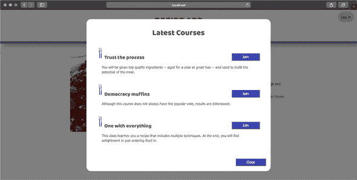

要使这些按钮生效，请将 recipeApp.js 中的代码更改为使用 列表 27.5 中的代码。在这个例子中，您创建了一个名为 `addJoinButtonListener` 的函数，该函数为具有类 `join-button` 的每个按钮设置点击事件监听器。您需要在 AJAX 请求完成后立即调用此函数，因为您想在按钮在页面上创建后附加监听器。为此，将一个 `then` 块附加到 AJAX 请求上。


##### 注意

AJAX 函数使用承诺（promises），因此你可以在请求的末尾链式调用 `then` 和 `catch` 块来在获取响应后运行代码。`success` 块的行为方式相同。


在 `addJoinButtonListener` 中，您获取点击的目标——按钮——然后提取您之前使用课程 ID 设置的数据 ID。有了这些信息，您可以对 `/api/courses/:id/join` 端点发起一个新的 AJAX `GET` 请求。为了使此请求生效，您需要确保用户已登录。此路由允许您通过使用课程 ID 来针对特定的课程进行加入。

处理该请求的路由和操作返回 JSON 值 `success: true`，如果您能够将用户添加到课程中。如果您成功了，通过添加新的 `joined-button` 类并移除旧的 `join-button` 类来更改按钮的文本和颜色，以指示用户已加入。这种类的交换允许您在 recipe_app.css 中使用不同的样式规则来样式化每个按钮，同时也防止点击事件触发另一个请求。如果您没有看到按钮颜色的变化，请确保您正在针对正确的按钮类。如果加入课程导致错误，请更改按钮的文本，告诉用户重试。


##### 注意

变量 `$button` 前面只有 `$` 来表示它代表一个 jQuery 对象。这种语法是风格和传统的，但不是必须的，以使您的代码生效。


##### 列表 27.5\. 在 recipeApp.js 中为每个按钮添加事件监听器

```
$(document).ready(() => {
  $("#modal-button").click(() => {
    $(".modal-body").html("");
    $.get("/api/courses", (results = {}) => {
      let data = results.data;
      if (!data || !data.courses) return;
      data.courses.forEach((course) => {
        $(".modal-body").append(
          `<div>
          <span class="course-title">
          ${course.title}
          </span>
          <button class="join-button" data-id="${course._id}">
          Join
          </button>
          <div class="course-description">
          ${course.description}
          </div>
          </div>`
        );
      });
    }).then(() => {
      addJoinButtonListener();                                     *1*
    });
  });
});

let addJoinButtonListener = () => {                                *2*
  $(".join-button").click((event) => {
    let $button = $(event.target),
      courseId = $button.data("id");                               *3*
  $.get(`/api/courses/${courseId}/join`, (results = {}) => {       *4*
    let data = results.data;
    if (data && data.success) {                                    *5*
      $button
        .text("Joined")
        .addClass("joined-button")
        .removeClass("join-button");
    } else {
      $button.text("Try again");
    }
    });
  });
}
```

+   ***1*** **在 AJAX 请求完成后，调用 addJoinButtonListener 方法为你的按钮添加事件监听器。**

+   ***2*** **为模态按钮创建事件监听器。**

+   ***3*** **获取按钮和按钮 ID 数据。**

+   ***4*** **使用课程的 ID 发起一个 AJAX 请求以加入课程。**

+   ***5*** **检查加入操作是否成功，并修改按钮。**

现在您的应用程序已准备好在点击加入按钮时发送 AJAX 请求并处理其响应。在下一节中，您将创建处理此请求的 API 端点。


**快速检查 27.2**

> **Q1:**
> 
> 为什么需要在模态内容创建后调用 `addJoinButtonListener` 函数？

|  |

**QC 27.2 答案**

> **1:**
> 
> `addJoinButtonListener` 在模态内容中为特定类设置事件监听器。要设置监听器，您必须首先在模态中创建内容。


### 27.3\. 创建一个 API 端点以连接模型

要完成课程模态，您需要创建一个路由来处理对当前用户加入课程的请求。为此，将 `router.get("/courses/:id/join", courses-Controller.join, coursesController.respondJSON)` 添加到 apiRoutes.js 中。此路由允许 `get` 请求通过 `join` 动作，并将结果传递给您的 `respondJSON` 动作，该动作返回给客户端。在 coursesController.js 的顶部，使用 `const User = require("../models/user")` 引入 User 模型。然后，在 coursesController.js 中，在 列表 27.6 中添加 `join` 动作。

在这个 `join` 动作中，您从 URL 参数中获取当前登录用户和课程的 ID。如果存在 `currentUser`，使用 Mongoose 的 `findByIdAndUpdate` 方法定位 `user` 对象，并更新其课程数组以包含目标课程 ID。在这里，您使用 MongoDB 的 `$addToSet` 方法，确保数组中没有重复的 ID。如果操作成功，向响应的 `locals` 对象中添加一个 `success` 属性，该对象随后传递给 `respondJSON`，再传递回客户端。如果用户未登录或在更新用户关联时发生错误，传递一个 `error` 给错误处理中间件进行处理。

##### 列表 27.6\. 在 coursesController.js 中创建加入课程的动作

```
join: (req, res, next) => {                         *1*
  let courseId = req.params.id,
    currentUser = req.user;                         *2*

  if (currentUser) {                                *3*
    User.findByIdAndUpdate(currentUser, {
      $addToSet: {
        courses: courseId                           *4*
      }
    })
      .then(() => {
        res.locals.success = true;                  *5*
        next();
      })
      .catch(error => {
        next(error);                                *6*
      });
  } else {
    next(new Error("User must log in."));           *7*
  }
}
```

+   ***1*** **添加加入动作以允许用户加入课程。**

+   ***2*** **从请求中获取课程 ID 和当前用户。**

+   ***3*** **检查当前用户是否已登录。**

+   ***4*** **更新用户的课程字段以包含目标课程。**

+   ***5*** **响应一个包含成功指示器的 JSON 对象。**

+   ***6*** **响应一个包含错误指示器的 JSON 对象。**

+   ***7*** **将错误传递给下一个中间件函数。**

在此动作就绪后，重新启动您的应用程序，并在模态中尝试加入课程。如果您未登录，您可能会在按钮上看到“重试”文本。否则，根据您的自定义样式，您的按钮应该在每个按钮点击时变为绿色并更改文本，如图 27.2 所示。

##### 图 27.2\. 加入课程后的示例模态

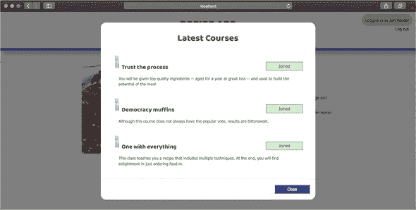

您可以通过让用户知道他们是否已经加入了一个或多个课程来改善用户体验。

根据你的应用程序结构和模型模式，你可以通过将中间件函数 `filterUserCourses` 添加到 coursesController.js 中来过滤你的结果，如 列表 27.7 所示。在这段代码中，你在继续之前检查用户是否已登录。如果用户已登录，使用数组中的 `map` 函数。在此函数中，查看每个课程并检查其 `_id` 是否在登录用户的课程数组中。`some` 函数返回一个布尔值，让你知道是否发生匹配。例如，如果用户已加入 ID 为 `5a98eee50e424815f0517ad1` 的课程，则该 ID 应该存在于 `currentUser.courses` 中，并且该课程的 `userJoined` 值为 `true`。最后，将 `courses` Mongoose 文档对象转换为 JSON，以便使用 `Object.assign` 添加一个附加属性。这个属性 `joined` 让你在用户界面中知道用户是否以前加入过该课程。如果没有用户登录，调用 `next` 以传递未修改的课程结果。

##### 列表 27.7\. 在 coursesController.js 中添加过滤课程的动作

```
filterUserCourses: (req, res, next) => {
  let currentUser = res.locals.currentUser;
  if (currentUser) {                                                *1*
    let mappedCourses = res.locals.courses.map((course) => {        *2*
      let userJoined = currentUser.courses.some((userCourse) => {
        return userCourse.equals(course._id);                       *3*
      });
      return Object.assign(course.toObject(), {joined: userJoined});
    });
    res.locals.courses = mappedCourses;
    next();
  } else {
    next();
  }
}
```

+   ***1*** **检查用户是否已登录。**

+   ***2*** **修改课程数据以添加表示用户关联的标志。**

+   ***3*** **检查课程是否存在于用户的课程数组中。**

要使用此中间件函数，你需要在返回 JSON 响应之前将其添加到 `/courses` API 路由中。该路由看起来像 `router.get("/courses", coursesController.index, coursesController.filterUserCourses, coursesController.respondJSON)`，其中 `coursesController.filterUserCourses` 位于 `coursesController.index` 中查询课程之后。

最后一步是将 recipeApp.js 中的客户端 JavaScript 修改为检查当前用户是否已经加入课程，并修改课程列表模态中的按钮。在 列表 27.8 中，你在按钮的类属性和主要文本内容中使用三元运算符。这些运算符检查课程数据的 `joined` 属性是 `true` 还是 `false`。如果是 `true`，则创建按钮以指示用户已经加入。否则，显示一个邀请用户加入的按钮。

##### 列表 27.8\. 在 recipeApp.js 中添加动态按钮样式

```
<button class='${course.joined ? "joined-button" : "join-button"}'
 data-id="${course._id}">                                        *1*
  ${course.joined ? "Joined" : "Join"}                              *2*
</button>
```

+   ***1*** **添加适当的类以反映加入状态。**

+   ***2*** **添加按钮文本以反映加入状态。**

应用这些更改后，重新启动你的应用程序并登录。你的课程列表按钮的颜色和文本将正确反映数据库中关联的状态。

| |
| --- |

##### 备注

如果你在维护登录账户时遇到问题，确保在初始化 `passport` 和自定义中间件之前使用会话和 cookies。

| |
| --- |
| |

**快速检查 27.3**

> **Q1:**
> 
> 你为什么需要使用 `findByIdAndUpdate` 方法？

| |
| --- |
| |

**QC 27.3 答案**

> **1:**
> 
> `findByIdAndUpdate` Mongoose 方法结合了 `find` 和 `update` 方法，因此您可以方便地执行单个步骤来更新用户文档。

| |
| --- |

### 摘要

在本课中，您学习了如何修改命名空间结构以适应 JSON 数据响应的 API。您还通过允许用户在不更改页面的情况下加入特定课程来改进了您的课程模式。通过您创建的 AJAX 请求和 API 端点，您应用程序的功能可以更多地移动到单个页面，并远离每个动作的独立视图。在 第 28 课 中，我讨论了您可以用来保护您的 API 的一些方法。

| |
| --- |

**尝试以下操作**

在这个新 API 就位后，您可能希望为每个可能返回数据的路由创建端点。例如，您可能希望将 `api` 目录中的每个 `index` 和 `show` 动作添加到控制器中。

创建这些动作以及一个额外的创建用户的动作，并返回包含成功或失败确认的 JSON，而不是渲染视图。

| |
| --- |

## 第 28 课\. 添加 API 安全性

在本课中，您将一些安全策略应用到您的 API 路由上。由于没有浏览器来存储 cookies，一些外部应用程序可能在没有验证用户身份的方式下难以使用您的 API。首先，您通过提供必须附加到每个请求的 API 令牌来实现一些基本安全措施。然后，您通过在账户创建时为每个用户生成唯一的 API 密钥来改进这一策略。最后，您探讨了 JSON Web Tokens (JWT)，这是一种通过散列用户数据和交换令牌来验证用户账户的系统，而不需要浏览器。

本课涵盖

+   添加安全令牌验证中间件

+   创建 `pre("save")` 钩子以生成 API 密钥

+   实现 JWT 头部认证

| |
| --- |

**考虑以下内容**

您为食谱应用程序构建了一个强大的 API。您的端点包括创建新用户和更新现有用户的路由。由于 API 端点可以从任何可以发出 HTTP 请求的设备访问，因此无法预测谁可能会在没有首先创建账户并在服务器上存储会话数据的情况下向您的 API 发出请求。

在您的 API 路由上实施某种形式的安全措施可以确保您的数据不会落入错误的手中。

| |
| --- |

### 28.1\. 实现简单安全

单元 5 指导您完成了用户账户创建和身份验证的过程。借助几个包的帮助，您创建了一个全面的过程，用于验证和加密用户数据，并确保这些用户在访问某些页面之前已经通过身份验证。

即使没有外部包的帮助，你也可以采取一些简单的步骤来保护你的 API。在本课中，你将使用的第一种方法是生成一个 API 令牌，该令牌必须由访问你的 API 的用户使用。用户需要令牌，因为他们可能不是使用浏览器来访问 API，所以你当前的 Passport.js、cookies 和 session 实现可能无法与客户端一起工作。额外的令牌可以降低这种风险，确保只有使用有效令牌发起请求的用户才能看到数据。例如，你可以在 main.js 中添加`app.set("token", process.env.TOKEN || "recipeT0k3n")`。然后这个应用程序变量就会设置为你在`TOKEN`环境变量中使用的值，或者默认为`recipeT0k3n`。令牌可以通过使用`app.get("token")`来检索。

因为你想在`apiRoutes`模块中监控对 API 的传入请求，所以在 api 文件夹中的 usersController.js 中设置令牌为一个常量，使用`const token = process.env.TOKEN || "recipeT0k3n"`。这个令牌将由 usersController.js 中的中间件用于验证传入的 API 请求。通过在 usersController.js 中添加列表 28.1 中的代码来创建这个中间件函数。

这个中间件函数`verifyToken`检查一个名为`apiToken`的查询参数，该参数与之前设置的令牌匹配。如果令牌匹配，调用`next`以继续中间件链；否则，传递一个带有自定义消息的错误。这个错误会到达你的错误处理中间件，并以 JSON 格式显示消息。

##### 列表 28.1\. 在 usersController.js 中添加验证 API 令牌的中间件函数

```
verifyToken: (req, res, next) => {                *1*
  if (req.query.apiToken === token) next();       *2*
  else next(new Error("Invalid API token."));     *3*
}
```

+   ***1*** **创建带有 next 参数的 verifyToken 中间件函数。**

+   ***2*** **如果令牌匹配，调用下一个中间件函数。**

+   ***3*** **如果令牌不匹配，则返回错误消息。**

要添加`usersController.verifyToken`中间件，以便在处理每个 API 请求之前运行，你可以在 apiRoutes.js 中将`router.use(usersController.verifyToken)`作为第一个函数添加。你还需要通过在 apiRoutes.js 中添加`const usersController = require("../controllers/usersController")`来引入用户控制器。

重新启动你的应用程序，当你访问 http://localhost:3000/api/courses 时，请注意以下错误消息：`{"status":500, "message":"Invalid API token."}`。这是一个好兆头。这意味着你的 API 验证正在工作，因为你没有使用有效的 API 令牌发起请求。

要绕过此消息，请添加`apiToken`查询参数。访问 http://localhost:3000/api/courses?apiToken=recipeT0k3n 应该会以 JSON 格式显示原始课程数据。如果你选择以这种方式实现你的 API 安全，你需要将此令牌与你的信任用户共享。为了使你的 AJAX 请求正常工作，你还需要在 recipeApp.js 中将`?apiToken=recipeT0k3n`查询参数添加到那些 URL 中。

这个简单的安全屏障无疑是开始，但随着更多用户需要令牌来访问您的 API，它很快就会成为一个不可靠的系统。拥有相同令牌的访问用户越多，该令牌落入非用户手中的可能性就越大。当您快速构建需要薄层安全的应用程序时，这种方法可能足够用。然而，当应用程序上线时，您将希望修改 API 安全性，以独特的方式处理每个用户请求。

在下一节中，您将探索保持每个用户令牌唯一性的方法。

| |
| --- |

**快速检查 28.1**

> **Q1:**
> 
> 为什么您可能会在 `process.env.TOKEN` 中存储一个秘密令牌？

| |
| --- |
| |

**QC 28.1 答案**

> **1:**
> 
> 您可以将敏感或秘密数据存储在 `process.env` 中作为环境变量。这些变量通常存储在服务器上，但不需要出现在代码中。这种做法使得直接在服务器上更改令牌变得更加容易（您不必每次都更改代码），并且这是一种更安全的约定。

| |
| --- |

### 28.2\. 添加 API 令牌

您刚刚构建了一个中间件函数来验证 URL 中作为查询参数传递的 API 令牌。这种方法在保护您的 API 方面非常有效，但它不能阻止非用户获取唯一的令牌。

为了改进这个系统，为每个用户账户添加一个自定义令牌。通过在用户模式中添加一个新的 `apiToken` 字段（类型为 String）来实现。接下来，在 `User` 模型上构建一个 `pre("save")` 钩子，在账户创建时为该用户生成一个唯一的 API 令牌。在您看到代码之前，使用 Node.js 包来帮助生成令牌。

`rand-token` 包提供了一些创建所需长度的新字母数字令牌的简单工具。运行 `npm install rand-token -S` 在此项目中安装 `rand-token` 包，并在 user.js 中通过添加 `const randToken = require ("rand-token")` 来引入它。

将以下代码添加到 user.js 中。此代码首先检查用户的 `-apiToken` 字段是否已设置。如果没有，则使用 `rand-Token.generate` 生成一个新的唯一 16 位字符令牌。

##### 列表 28.2\. 在 user.js 中创建一个 `pre("save")` 钩子以生成 API 令牌

```
userSchema.pre("save", function(next) {
  let user = this;
  if (!user.apiToken) user.apiToken =
 randToken.generate(16);                 *1*
  next();
});
```

+   ***1*** **检查现有的 API 令牌，并使用 randToken.generate 生成一个新的。**

| |
| --- |

##### 注意

您可以通过比较生成的令牌与其他用户的令牌来改进这里的函数，以确保不会发生重复。

| |
| --- |

接下来，将 `apiToken` 字段添加到用户 `show` 页面表格中的项目。这样，当新用户访问他们的个人资料页面时，他们将能够访问他们的 API 令牌。例如，在 图 28.1 中，我的用户账户的令牌是 `2plMh5yZMFULOzpx`。

##### 图 28.1\. 在用户的显示页面上显示 API 令牌

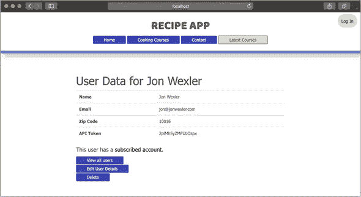

要使用此令牌，您需要修改`verifyToken`中间件以将`apiToken`查询参数与数据库中的令牌进行比较。将/api/users-Controller.js 中的`verifyToken`更改为使用列表 28.3 中的代码。

在此修改后的中间件函数中，您将令牌作为查询参数获取。如果 URL 中出现了令牌，则在用户数据库中搜索具有该 API 令牌的单个用户。如果存在这样的用户，则继续到下一个中间件函数。如果没有用户具有该令牌，如果查询中发生错误，或者没有使用查询参数，则传递错误。

##### 列表 28.3\. 在 usersController.js 中改进令牌验证动作

```
verifyToken: (req, res, next) => {
  let token = req.query.apiToken;
  if (token) {                                         *1*
    User.findOne({ apiToken: token })                  *2*
      .then(user => {
        if (user) next();                              *3*
        else next(new Error("Invalid API token."));
      })
      .catch(error => {                                *4*
        next(new Error(error.message));
      });
  } else {
    next(new Error("Invalid API token."));
  }
}
```

+   ***1*** **检查是否存在作为查询参数的令牌。**

+   ***2*** **搜索具有提供的 API 令牌的用户。**

+   ***3*** **如果存在具有 API 令牌的用户，则调用 next。**

+   ***4*** **将错误传递给错误处理器。**

重新启动您的应用程序，并创建一个新的用户账户。访问该新用户的展示页面，并找到`apiToken`值。然后访问 http://localhost:3000/api/courses? api-Token=后跟该用户的 API 令牌。例如，`jon@jonwexler.com`用户将使用以下 URL：http://localhost:3000/api/courses?apiToken= 2plMh5yZMFULOzpx。您应该会看到与之前相同的课程列表。

这个新系统降低了所有用户使用单个 API 令牌的脆弱性。与用户账户关联的 API 令牌，您还可以验证数据库中的用户信息，并跟踪该用户 API 请求的数量或质量。要使客户端 JavaScript 在 API 调用中使用此令牌，您可以在 layout.ejs 中添加一个隐藏元素，包含当前用户的令牌。例如，您可以在块内添加`<div id="apiToken" data-token="<%= currentUser.apiToken %>" style="display: none;">`来检查用户是否已登录。然后，当 recipeApp.js 中的文档准备好时，您可以找到令牌，使用`let apiToken = $(``"``#apiToken``"``).data (``"``token``"``)`，并在`/api/courses?apiToken=${apiToken}`上调用您的 Ajax 请求。

尽管如此，您还可以采取更安全的构建 API 认证的方法，其中不一定涉及网络浏览器。该方法使用 JSON Web 令牌（JWT）。


**快速检查 28.2**

> **Q1:**
> 
> `randToken.generate(16)`做什么？

|  |

**QC 28.2 答案**

> **1:**
> 
> 此方法生成一个随机的 16 位字母数字令牌。


### 28.3\. 使用 JSON Web 令牌

你可以通过使用 cookies 来构建一个安全的 API，但 API 的功能仍然依赖于其客户端支持并存储这些 cookies。考虑一下，例如，有人编写了一个脚本，仅从他们的终端窗口向你的 API 发送请求。在这种情况下，如果你想在传入的请求上应用用户认证，你需要某种方式来跟踪哪些用户正在请求以及他们是否最近登录。没有可视化的登录页面，这项任务可能会很困难。你可以尝试一些替代解决方案，其中之一就是使用 JSON web tokens。

*JSON web tokens* (JWT) 是作为表示已认证用户请求的手段，在服务器和客户端之间传递的签名或加密数据。最终，JWTs 就像不同格式的会话，在 Web 通信中用法不同。你可以将 JWTs 视为在每次登录时重新生成的 API 令牌。JWTs 包含三个部分，如 表 28.1 中定义的。

##### 表 28.1\. JWT 的组成部分

| JWT 部分 | 描述 |
| --- | --- |
| --- | --- |
| 头部 | 一个 JSON 对象，详细说明了 JWT 中数据的准备和哈希方式。 |
| 有效载荷 | 存储在 JWT 中的数据，用于验证之前已认证的用户。有效载荷通常包括用户的 ID。 |
| 签名 | 使用头部和有效载荷值生成的哈希码。 |
|  |

##### 提示

有效载荷越小，JWT 越小，每次响应发送的速度就越快。

| |
| --- |

这三个值共同提供了一个特定用户最近登录状态的独特数据排列。首先，用户发起请求并传递他们的电子邮件和密码。服务器响应一个编码的 JWT，以验证用户的正确登录信息。对于每个后续的用户请求，必须将相同的 JWT 发送回服务器。然后服务器通过解码其值并定位有效载荷中指定的用户来验证 JWT。与 Passport.js 和 `bcrypt` 中的密码加密不同，JWTs 不是通过哈希和加盐来加密的。JWTs 是编码的，这意味着服务器可以解码 JWT 来揭示其内容，而无需知道用户设置的某些秘密值。

在本节中，你将在 `jsonwebtoken` 包的帮助下应用 JWT API 安全性。通过在终端中运行 `npm i jsonwebtoken -S` 来安装 `jsonwebtoken` 包。由于你打算在 API 中使用 JWT 进行用户验证，请在 users-Controller.js 中使用 `const jsonWebToken = require("jsonwebtoken")` 引入 `jsonwebtoken`。

要使用 JWTs，你需要允许用户在没有浏览器的情况下登录。通过将 清单 28.4 中的代码添加到 usersController.js 中来创建一个新的 API 登录操作。

| |
| --- |

##### 注意

你可以在 [`github.com/auth0/node-jsonwebtoken`](https://github.com/auth0/node-jsonwebtoken) 上找到有关 jsonwebtoken 包的更多信息。

| |
| --- |

此操作使用你在第 24 课中设置的 Passport.js `local`策略。通过 authenticate 方法，验证用户电子邮件地址和密码是否与数据库中用户的匹配。然后，通过回调函数，如果找到具有匹配电子邮件和密码的用户，使用`jsonWebToken.sign`创建一个包含用户 ID 和设置为一日签发时间的过期日期的令牌。最后，返回一个包含成功标签和已签名的令牌的 JSON 对象；否则，返回错误消息。

##### 列表 28.4\. 在 usersController.js 中为 API 创建登录操作

```
apiAuthenticate: (req, res, next) => {                          *1*
  passport.authenticate("local",(errors, user) => {
    if (user) {
      let signedToken = jsonWebToken.sign(                      *2*
        {
          data: user._id,
          exp: new Date().setDate(new Date().getDate() + 1)
        },
        "secret_encoding_passphrase"
      );
      res.json({
        success: true,
        token: signedToken                                      *3*
      });
    } else
      res.json({
        success: false,
        message: "Could not authenticate user."                 *4*
      });
  })(req, res, next);
}
```

+   ***1*** **使用 passport.authenticate 方法进行身份验证。**

+   ***2*** **如果存在与匹配的电子邮件和密码匹配的用户，则对 JWT 进行签名。**

+   ***3*** **返回 JWT。**

+   ***4*** **返回错误消息。**

现在，此令牌可以用于 24 小时，以对受保护的 API 端点进行请求。

接下来，将以下`POST`路由添加到`apiRoutes.js`：`router.post("'/login'", usersController.apiAuthenticate)`。您可以通过向`/api/login`路由发送带有电子邮件和密码的`POST`请求来生成令牌，而无需浏览器。为此，在终端中运行 curl 命令，例如`curl -d "email=jon@jonwexler.com&password=12345" http://localhost:3000/api/login`。在此示例中，`-d`标志表示用户正在将他们的电子邮件和密码作为数据发送到提供的 URL。运行此命令后，您应该期望收到类似于下一个列表中响应的响应。

##### 列表 28.5\. 成功 JWT 身份验证的终端示例响应

```
{"success":true,"token":"eyJhbGciOiJIUzI1NiIsInR5cCI6IkpXVCJ9
 .eyJkYXRhIjoiNTljOWNkN2VmNjU5YjMwMjk4YzkzMjY4IiwiZXhwIjox
 NTA2NDk2NDMyODc5LCJpYXQiOjE1MDY0MTAwMzJ9.Gr7gPyodobTAXh1p
 VuycIDxMEf9LyPsbrR4baorAbw0"}                                *1*
```

+   ***1*** **在身份验证后显示带有 JWT 的成功响应。**

要保护所有 API 端点，添加一个验证传入 JWT 的操作，并将该中间件添加到每个 API 路由。将代码添加到列表 28.6 中的 usersController.js。

首先，从请求头中提取传入的令牌。然后，如果存在令牌，使用`jsonWebToken.verify`以及令牌和密钥短语来解码令牌并验证其真实性。以下回调提供了可能发生的任何错误，以及解码后的有效载荷。你可以检查有效载荷是否有值。如果有，从`payload.data`中提取用户的 ID，并查询具有该 ID 的用户。如果不存在这样的用户，该用户的账户可能已被删除，或者 JWT 可能已被篡改，因此返回错误消息。如果用户 ID 匹配，调用`next`并继续到 API 端点。这种通信方式会持续到令牌过期，用户创建新的 JWT。

##### 列表 28.6\. 在 usersController.js 中为 API 创建验证操作

```
verifyJWT: (req, res, next) => {
  let token = req.headers.token;                             *1*
  if (token) {
    jsonWebToken.verify(                                     *2*
      token,
      "secret_encoding_passphrase",
      (errors, payload) => {
        if (payload) {
          User.findById(payload.data).then(user => {         *3*
            if (user) {
              next();                                        *4*
            } else {
              res.status(httpStatus.FORBIDDEN).json({
                error: true,
                message: "No User account found."
              });
            }
          });
        } else {
          res.status(httpStatus.UNAUTHORIZED).json({
            error: true,
            message: "Cannot verify API token."              *5*
          });
          next();
        }
      }
    );
  } else {
    res.status(httpStatus.UNAUTHORIZED).json({
      error: true,
      message: "Provide Token"                               *6*
    });
  }
}
```

+   ***1*** **从请求头中检索 JWT。**

+   ***2*** **验证 JWT 并解码其有效载荷。**

+   ***3*** **检查 JWT 有效载荷中解码的用户 ID 是否存在用户。**

+   ***4*** **如果找到具有 JWT ID 的用户，则调用下一个中间件函数。**

+   ***5*** **如果无法验证令牌，则返回错误信息。**

+   ***6*** **如果请求头中没有找到令牌，则返回错误信息。**

最后一步是将此`verifyJWT`中间件函数放置在处理任何 API 请求之前。在`apiRoute.js`中在`login`路由下方和所有其他路由上方添加`router.use(usersController.verifyJWT)`。这一步骤确保除了用于生成 JWT 的`login`路由外，每个路由都需要使用`verifyJWT`中间件。


##### 备注

到此为止，你不再需要在用户模型上的令牌生成钩子或过去两种 API 安全技术的任何残留部分来使用 JWT。然而，你可能希望保留这些最近实施的 API 安全技术作为访问你的 API 的备用方案。要使这些安全方法协同工作，还需要做更多的工作。


你可以通过在终端中运行另一个 curl 命令并识别请求头中的令牌来测试你的 JWT。使用列表 28.5 中的令牌，该命令看起来像列表 28.7。

在此命令中，你使用`-H`标志来指示 JWT 的引号内的 header 键值对。通过发送请求并传递有效的 JWT，你应该能够访问应用程序的数据。


##### 备注

你需要移除`usersController.verifyToken`操作以使这种新方法生效。否则，你的应用程序将同时寻找 JWT 头和`apiToken`。


##### 列表 28.7\. 在 usersController.js 中为 API 创建验证操作

```
curl  -H "token: eyJhbGciOiJIUzI1NiIsInR5cCI6IkpXVCJ9.eyJkY
 XRhIjoiNTljOWNkN2VmNjU5YjMwMjk4YzkzMjY4IiwiZXhwIjoxNT
 A2NDk2NDMyODc5LCJpYXQiOjE1MDY0MTAwMzJ9.Gr7gPyodobTAX
 h1pVuycIDxMEf9LyPsbrR4baorAbw0" http://localhost:3000
 /api/courses                                             *1*
```

+   ***1*** **在头部发送 JWT 请求。**


##### 警告

你构建 API 以使用 JWT 的方式将干扰你已经在客户端 Ajax 请求中完成的工作。请将本节视为使用 JWT 的介绍，而不是替换迄今为止在食谱应用中实现的安全的必要替代品。


如果你的请求成功，你应该会看到与本课程第一部分的 JSON 相同的课程列表。如果你计划使用 JWT 来保护你的 API，你需要明确告诉你的 API 用户你期望他们如何进行身份验证和验证他们的令牌。一种方法是为用户提供一个额外的登录表单，用户可以在其中提交他们的电子邮件和密码以获取 API 令牌作为响应。该令牌可以像上一节中的随机令牌一样临时存储在用户模型中。


##### 备注

使用 JWT 需要客户端以某种方式存储令牌。如果不能临时存储 JWT，则在登录时创建令牌后，将无法创建未来的请求。


JWT 可以帮助防止对应用程序数据的攻击并确保通过 API 的安全访问，但这需要更多步骤来实现。最终，你可能发现从更简单的方法开始更有意义，例如为每个用户生成随机令牌。


**快速检查 28.3**

> **Q1:**
> 
> 为什么你在请求头中传递 JWT？

| |
| --- |
| |

**QC 28.3 答案**

> **1:**
> 
> 你可以在请求体中传递 JWT，但由于并非所有请求都是`POST`，因此头部提供了一个更方便的位置。

| |
| --- |

### 摘要

在本课中，你学习了如何在你的 API 上实现三个安全令牌。第一种策略是一个简单的安全令牌，可以被所有客户端使用。第二种策略要求在创建用户时为每个用户生成一个新的随机令牌。在第三种方法中，你使用 JWT 提供最安全的选项来验证用户访问你的 API。在第 29 课（本单元的总结练习）中，你有机会构建一个具有本单元中介绍的一些功能的 API。

| |
| --- |

**尝试这个**

现在你有一些基本的安全选项可以选择，尝试创建更多需要 JWT 的 API 路由。你也可以排除某些路由，例如`login`路由，不需要令牌。从你的 API 安全中排除两个路由。

| |
| --- |

## 第 29 课。总结：实现 API

Confetti Cuisine 对用户与应用程序的互动赞不绝口。然而，为了鼓励更多用户报名他们的课程，他们希望我能在每个页面上添加更多数据。更具体地说，他们希望我在每个页面上包含一个列出提供的课程并链接到每个课程的模态。

为了完成这个任务，我将在客户端使用 Ajax 向我的应用服务器发送请求。通过在幕后对服务器进行异步调用，我无需在用户点击按钮报名之前加载课程数据。使用 Ajax 的这种改变应该有助于初始页面加载时间，并确保用户查看时课程数据是最新的。

首先，我需要修改我的应用布局视图，以包含包含我的模态的嵌入式 JavaScript (EJS)。接下来，我将创建客户端 JavaScript 代码以请求课程数据。为了使这些数据显示出来，我需要创建一个 API 端点以 JSON 格式响应课程数据。当这个端点工作后，我将添加一个动作来处理用户报名课程，并在完成后返回 JSON。这个端点将允许用户从任何页面报名课程，而无需离开或刷新他们所在的页面。

在我开始之前，我将重构我的路由，为我的新 API 端点铺平道路。

### 29.1. 重构路由

要开始改进应用程序，我将我的路由移动到它们自己的模块中，以清理我的主应用程序文件。随着应用程序的增长，路由也会增加。我希望这个项目的未来开发者能够轻松地找到他们需要的路由。因为我的每个模型资源的路由已经符合 RESTful——这意味着路由路径考虑了我的应用程序的模型和 CRUD 函数——所以重构过程要简单得多。我的新应用程序结构将根据控制器名称来分离我的路由，如图 29.1 所示。

##### 图 29.1\. 带有路由文件夹的应用程序结构

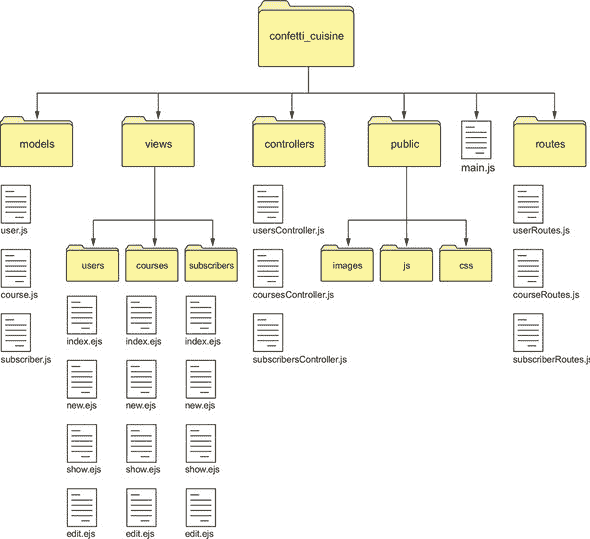

首先，我在应用程序目录的根级别创建一个新的路由文件夹。在这个文件夹内，我创建了三个模块来存放我模型各自的路由：

+   userRoutes.js

+   courseRoutes.js

+   subscriberRoutes.js

接下来，我将所有用户路由从`main.js`移动到`userRoutes.js`。这个新的路由文件类似于列表 29.1 中的代码。

| |
| --- |

##### 注意

我还将我的主页和错误路由移动到它们自己的主页：Routes.js 和 errorRoutes.js，分别。

| |
| --- |

在这个文件的顶部，我导入了 Express.js 路由器和 usersController.js。这两个模块允许我在整个应用程序中将路由附加到同一个对象上，并将这些路由链接到用户控制器的操作。然后，我为用户应用了`get`、`post`、`put`和`delete`路由，包括 CRUD 操作的路线以及登录和登出的路由。在我继续之前，我将路由路径中的所有`users`文本删除。相反，我将在稍后应用这些路由到`users`命名空间下。这些路由绑定到`router`对象上，我通过这个模块导出它，使其在项目中的其他模块可用。

##### 列表 29.1\. 用户路由在 userRoutes.js 中

```
const router = require("express").Router(),                      *1*
  usersController = require("../controllers/usersController");

router.get("/", usersController.index,
 usersController.indexView);                                    *2*
router.get("/new", usersController.new);
router.post("/create", usersController.validate,
 usersController.create, usersController.redirectView);
router.get("/login", usersController.login);
router.post("/login", usersController.authenticate);
router.get("/logout", usersController.logout,
 usersController.redirectView);
router.get("/:id/edit", usersController.edit);
router.put("/:id/update", usersController.update,
 usersController.redirectView);
router.get("/:id", usersController.show,
 usersController.showView);
router.delete("/:id/delete", usersController.delete,
 usersController.redirectView);

module.exports = router;                                         *3*
```

+   ***1*** **需要 Express.js 路由器和 usersController。**

+   ***2*** **在路由器对象上定义用户路由。**

+   ***3*** **从模块中导出路由器对象。**

然后，我将相同的策略应用到其他模型路由上，并在每个模块中导出`router`对象。导出`router`对象允许任何其他模块导入这些路由。我的路由组织得更好，每个模块只需要使用它需要的控制器。为了在`main.js`中访问这些路由，我在路由文件夹中创建了一个名为`index.js`的新文件。这个文件导入了所有相关的路由，以便它们可以在一个地方访问。然后，我将在`main.js`中导入`index.js`。

| |
| --- |

##### 注意

`main.js`中剩余的所有中间件都应该应用到`app.use`，并且不再使用`router`。

| |
| --- |

我首先引入 Express.js 路由以及所有我的路由模块。在这个例子中，我包括模型路由和错误路由以及我的主页控制器路由。`router.use`告诉我的路由器使用第一个参数作为命名空间，第二个参数作为特定于该命名空间的路由模块。在文件末尾，我导出我的`router`对象，它现在包含所有之前定义的路由。index.js 中的代码在下一个列表中显示。

##### 列表 29.2\. index.js 中的所有路由

```
const router = require("express").Router(),           *1*
  userRoutes = require("./userRoutes"),
  subscriberRoutes = require("./subscriberRoutes"),
  courseRoutes = require("./courseRoutes"),
  errorRoutes = require("./errorRoutes"),
  homeRoutes = require("./homeRoutes");

router.use("/users", userRoutes);                     *2*
router.use("/subscribers", subscriberRoutes);
router.use("/courses", courseRoutes);
router.use("/", homeRoutes);
router.use("/", errorRoutes);

module.exports = router;                              *3*
```

+   ***1*** **引入 Express.js 路由和路由模块。**

+   ***2*** **为每个路由模块定义命名空间。**

+   ***3*** **导出完整的路由对象。**

在重新组织这些路由后，我仍然可以通过`/courses`和`/courses/:id`路径分别访问我的课程索引和单个课程。因为我的路由更加有序，我有空间引入新的路由模块而不会使我的代码结构复杂化。为了将这些路由导入到应用程序中，我需要在 main.js 的顶部使用`const router = require("./routes/index")`来引入 index.js。这个`router`对象替换了之前的那个。然后我告诉 Express.js 应用程序以与我之前告诉路由器使用先前定义的路由相同的方式使用这个路由器，确保`app.use("/", router)`在 main.js 中。


##### 注意

我还需要从 main.js 中删除所有控制器的 require 行，因为它们在该模块中不再被引用。


在此新的路由结构下，我的应用程序继续按原样运行。我可以开始通过创建显示课程的模态框来实施 API 修改。

### 29.2\. 添加课程部分

要创建一个模态框，我使用默认的 Bootstrap 模态 HTML，它提供了一个按钮代码，该按钮在屏幕中央显示一个简单的模态框。我将此代码添加到我的课程文件夹中名为 _coursesModal.ejs 的新文件中。下划线区分了部分名称和常规视图名称。

这个只包含下一个列表中显示的模态框代码的部分，需要包含在我的 layout.ejs 文件中。我将部分作为列表项包含在我的导航栏中，使用`<%- include courses/_coursesModal %>`。

##### 列表 29.3\. _coursesModal.ejs 中的模态框代码

```
<button id="modal-button" type="button"
 data-toggle="modal"
 data-target="#myModal"> Latest Courses</button>        *1*

<div id="myModal" class="modal fade" role="dialog">        *2*
  <div class="modal-dialog">
    <h4 class="modal-title">Latest Courses</h4>
    <div class="modal-body">
    </div>
    <div class="modal-footer">
      <button type="button" data-dismiss="modal">Close</button>
    </div>
  </div>
</div>
```

+   ***1*** **添加打开模态框的按钮。**

+   ***2*** **添加模态窗口的代码。**


##### 注意

我还需要确保将 Bootstrap 和 jQuery 的 JavaScript 文件添加到我的 public/js 文件夹中，并通过 script 标签导入到我的 layout.ejs 中。否则，我的模态框在屏幕上不会动画显示。我可以从[`code.jquery.com`](https://code.jquery.com)下载最新的 jQuery 代码，从[`www.bootstrapcdn.com`](https://www.bootstrapcdn.com)下载 Bootstrap 代码。


当我重新启动我的应用程序时，我在导航栏中看到一个按钮，点击时会打开一个空白的模态框（图 29.2）。

##### 图 29.2\. 布局导航中的模式按钮

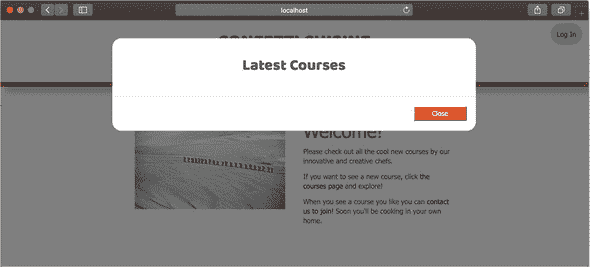

下一步是使用 AJAX 和新的 API 端点填充这个模态，使用课程数据。

### 29.3\. 创建 AJAX 函数

一种在不刷新我的网页的情况下访问应用程序数据的方法是向我的服务器发送异步的 Ajax 请求。这个请求在应用程序客户端使用的浏览器中幕后发生，并源自公共文件夹中客户端的 JavaScript 文件。

为了让这个 Ajax 函数工作，我需要确保 jQuery 已添加到我的项目中，并从布局文件中链接，因为我将使用它的一些方法来填充我的模态。然后，通过我的公共/js 文件夹中的自定义 confettiCuisine.js 文件，我可以添加 列表 29.4 中的代码。我可以在 `layout.ejs` 中使用以下脚本标签引用此文件：`<script type="text/javascript" src="js/confettiCuisine.js"></script>`。

这个 Ajax 函数仅在文档对象模型 (DOM) 加载且模态按钮被点击时运行。我通过向我的 API 端点 `/api/courses` 发送 `GET` 请求来处理点击事件。这个请求等同于在我的网络浏览器中发送一个 `GET` 请求到 http://localhost:3000/api/courses 并接收一页 JSON 数据。我很快就会创建这个路由。

接下来，我通过 `results` 对象处理响应中的结果。在这个对象中，我期望看到一个 `data` 对象。如果没有 `data` 或 `course` 对象，我 `return` 以退出函数。我解析 `data` 对象以获取 JSON，并遍历其内容数组以填充我的模态。对于 `data` 对象中的每个条目，我在 HTML 标签内显示标题、费用和描述。

在每个课程列表旁边，我链接一个按钮到该课程的注册路由。我创建一个名为 `addJoinButtonListener` 的函数，在元素被添加到 DOM 之后为每个课程列表添加一个事件监听器。该函数监听带有 `.join-button` 类的加入按钮的点击事件。当该按钮被点击时，我通过我的 API 命名空间向 `/api/courses/${courseId}/join` 发送另一个 AJAX 请求，针对我选择的特定课程列表。如果我的服务器返回一个表示我成功加入课程的响应，我改变按钮的颜色和文本。使用三元运算符 `${course.joined ? "joined-button" : "join-button" }`，我确定按钮样式的类，取决于 `course.joined` 的值。我将在每个课程对象上创建这个属性，以便我的用户界面知道当前登录的用户是否已经加入了课程。

##### 列表 29.4\. 在 confettiCuisine.js 中创建一个用于检索课程数据的 Ajax 函数

```
$(document).ready(() => {                                        *1*
  $("#modal-button").click(() => {                               *2*
    $(".modal-body").html("");                                   *3*
    $.get(`/api/courses`, (results = {}) => {                    *4*

      let data = results.data;
      if (!data || !data.courses) return;

      data.courses.forEach((course) => {                         *5*
        $(".modal-body").append(
          `<div>
              <span class="course-cost">$${course.cost}</span>
                <span class="course-title">
                   ${course.title}
              </span>
              <button class="${course.joined ? "joined-button" :
   "join-button"} btn btn-info btn-sm" data-id="${course._id}">
                   ${course.joined ? "Joined" : "Join"}
              </button>
              <div class="course-description">
                 ${course.description}
              </div>
        </div>`
        );                                                       *6*
      });
    }).then(() => {
      addJoinButtonListener();                                   *7*
    });
  });
});

let addJoinButtonListener = () => {
  $(".join-button").click((event) => {
    let $button = $(event.target),
      courseId = $button.data("id");
    $.get(`/api/courses/${courseId}/join`, (results = {}) => {   *8*
      let data = results.data;
      if (data && data.success) {
        $button
          .text("Joined")
          .addClass("joined-button")
          .removeClass("join-button");
      } else {
        $button.text("Try again");
      }
    });
  });
}
```

+   ***1*** **等待 DOM 加载。**

+   ***2*** **处理模态按钮上的点击事件。**

+   ***3*** **将模态体的内容重置为空字符串。**

+   ***4*** **通过 AJAX GET 请求获取课程数据。**

+   ***5*** **遍历每个课程，并将其追加到模态体中。**

+   ***6*** **链接以注册当前用户。**

+   ***7*** **调用`addJoinButtonListener`以在课程列表上添加事件监听器。**

+   ***8*** **调用 API 接口加入所选课程。**

要使此代码正常工作，我需要创建两个新的 API 端点。一个端点用于检索课程数据作为 JSON 格式；另一个端点处理我在`/api/course/${courseId}/join`上的用户注册请求。我将在下一节中添加这些端点。

### 29.4\. 添加 API 端点

现在，我的 Confetti Cuisine 应用程序已配置为与两个新的 API 端点通信，我需要创建处理这些请求的路由。第一步是将路由添加到位于`routes`文件夹中的`index.js`文件。对于 AJAX 请求，我需要在`api`命名空间下创建一个特定的路由，因为我希望请求发送到`/api/courses`，而不仅仅是`/courses`。为了完成这个任务，我在`routes`文件夹中创建了`apiRoutes.js`，其中包含列表 29.5 中的代码。

此文件需要 Express.js 路由器和我的`coursesController`。然后我让该路由器对象处理对`/courses`路径的`GET`请求。此路由从课程控制器中的`index`操作获取课程列表。然后课程列表通过`filterUserCourses`中间件函数标记当前用户已加入的课程，并通过`respondJSON`函数发送回结果。在`api`命名空间下，此路径是`/api/courses`。第二个路由处理对名为`join`的新操作的`GET`请求。我为这个 API 添加了一个额外的中间件。我引用了`errorJSON`操作，该操作处理由此 API 中任何路由引起的所有错误。最后，我导出路由器。

##### 列表 29.5\. 在`apiRoutes`中创建一个 API 路由

```
const router = require("express").Router(),                 *1*
  coursesController = require("../controllers/
 coursesController");

router.get("/courses", coursesController.index,
 coursesController.filterUserCourses,
 coursesController.respondJSON);                         *2*
router.get("/courses/:id/join", coursesController.join,
 coursesController.respondJSON);                         *3*
router.use(coursesController.errorJSON);                    *4*

module.exports = router;
```

+   ***1*** **引入 Express.js 路由器和 coursesController。**

+   ***2*** **为课程数据端点创建一个路由。**

+   ***3*** **通过 ID 创建一个加入课程的路由。**

+   ***4*** **处理所有 API 错误。**

接下来，我需要将此路由器添加到在`index.js`中定义的路由器。我在`index.js`中通过添加`const apiRoutes = require("./apiRoutes")`来引入`apiRoutes.js`。我向`index.js`添加`router.use ("/api", apiRoutes)`以使用在`apiRoutes.js`中定义的、位于`/api`命名空间下的路由。我已经创建了`index`操作来从我的数据库中获取课程。现在我需要在课程控制器中创建`filterUserCourses`、`respondJSON`和`errorJSON`操作，以便我可以以 JSON 格式返回我的数据。为此，我在以下列表中添加了代码到`coursesController.js`。

##### 列表 29.6\. 在`coursesController.js`中创建一个将用户注册到课程中的操作

```
respondJSON: (req, res) => {                         *1*
  res.json({
    status: httpStatus.OK,
    data: res.locals
  });
},
errorJSON: (error, req, res, next) => {              *2*
  let errorObject;
  if (error) {
    errorObject = {
      status: httpStatus.INTERNAL_SERVER_ERROR,
      message: error.message
    };
  } else {
    errorObject = {
      status: httpStatus.OK,
      message: "Unknown Error."
    };
  }
  res.json(errorObject);
},
filterUserCourses: (req, res, next) => {             *3*
  let currentUser = res.locals.currentUser;
  if (currentUser) {
    let mappedCourses = res.locals.courses.map((course) => {
      let userJoined = currentUser.courses.some((userCourse) => {
        return userCourse.equals(course._id);
      });
      return Object.assign(course.toObject(), {joined: userJoined});
    });
    res.locals.courses = mappedCourses;
    next();
  } else {
    next();
  }
}
```

+   ***1*** **通过数据属性返回课程数组。**

+   ***2*** **如果发生错误，返回错误消息和状态码 500。**

+   ***3*** **检查用户是否已登录，并返回一个包含已加入属性反映用户关联的课程数组。**

在设置好这些新端点后，我可以重新启动我的应用程序，并在点击导航按钮时看到课程列表填充到模态中（图 29.3）。

##### 图 29.3\. 通过浏览器中的模态显示课程列表

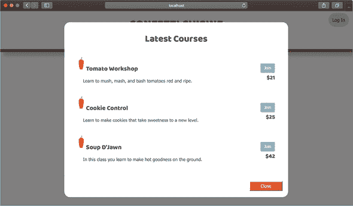


##### 注意

在测试这个 API 端点是否正常工作之前，我需要注释掉指向 `join` 的路由，直到我将动作添加到我的课程控制器中。否则，我的应用程序将抱怨它在寻找一个不存在的回调。


最后的阶段是创建一个路由和动作来处理想要注册课程的用户，并过滤课程列表以反映那些已经加入的用户。

### 29.5\. 创建一个将用户注册到课程中的动作

要将用户注册到烹饪课程中，我需要当前用户的 ID 和所选课程的 ID。我可以从由 `passport` 提供的请求中的用户对象中获取用户 ID，即 `req.user._id` 或我在上次工作在这个项目时创建的 `currentUser` 变量（课程 25）。我也可以通过 RESTful 路由轻松访问课程 ID。课程 ID 是路由路径中的第二个元素。我的第二个路由 `'/courses/:id/join'` 在 apiRoutes.js 中指向我的课程控制器中的 `join` 动作。

最后一步是添加一个控制器动作以将用户注册到所选课程中。我开始创建一个名为 `join` 的新动作，并为课程和用户 ID 定义局部变量。因为我在这个控制器中引用了用户模型，所以我需要在 coursesController.js 中添加 `const User = require("../models/user")`。然后我检查用户是否已登录。如果没有，我以 JSON 格式返回错误消息。


##### 注意

您还需要在 coursesController.js 的顶部添加 `const httpStatus = require("http-status-codes")` 和 `const User = require("../models/user")`。


如果用户已登录，我使用 Mongoose 的 `findByIdAndUpdate` 查询方法通过用户对象、`currentUser` 和 MongoDB 数组更新运算符 `$addToSet` 将所选课程插入到用户的 `courses` 列表中。这种关联表示注册。我通过 列表 29.7 中的代码完成所有这些任务。


##### 注意

`$addToSet` 确保在 `courses` 数组中不会出现重复值。我本可以使用 MongoDB 的 `$push` 运算符将课程 ID 添加到用户的 `courses` 数组中，但这个运算符可能会意外地允许用户多次注册同一课程。


##### 列表 29.7\. 在 coursesController.js 中创建一个将用户注册到课程中的动作

```
join: (req, res, next) => {
  let courseId = req.params.id,
    currentUser = req.user;                    *1*

  if (currentUser) {                           *2*
    User.findByIdAndUpdate(currentUser, {      *3*
      $addToSet: {
        courses: courseId
      }
    })
      .then(() => {
        res.locals.success = true;
        next();                                *4*
      })
      .catch(error => {
        next(error);                           *5*
      });
  } else {
    next(new Error("User must log in."));
  }
}
```

+   ***1*** **为课程和用户 ID 定义局部变量。**

+   ***2*** **检查用户是否已登录。**

+   ***3*** **查找并更新用户以连接所选课程。**

+   ***4*** **继续到下一个中间件。**

+   ***5*** 继续到错误中间件，如果用户未能注册，则显示错误信息。

在这个操作到位后，我可以重新启动应用程序。当我尝试在登录前注册课程时，我看到了图 29.4 中的消息。

##### 图 29.4. 在登录前尝试注册

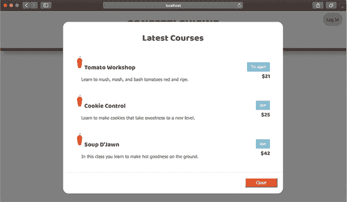

在我成功登录并点击加入课程的按钮后，屏幕类似于图 29.5。此外，在加入课程后，我刷新窗口仍然可以在模态窗口中看到我的`joined`状态被保留。

##### 图 29.5. 成功注册课程

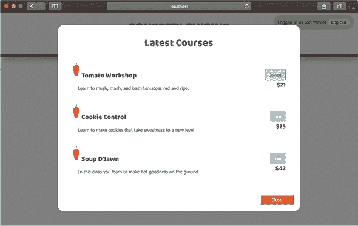

通过一个新的 API 命名空间，我可以打开这个应用程序，使其能够接受更多的 Ajax 请求以及其他想要访问 Confetti Cuisine 原始 JSON 数据的应用程序。我可以保护 API，但在这个小改动中这样做不是必需的。

现在我已经实现了一个新功能，允许用户注册课程，接下来我将致力于改进应用程序的其他部分，这些部分可能将从对我的 API 的单页异步调用中受益。

### 摘要

在这个综合练习中，我通过引入一个 Ajax 请求到新的 API 端点，改善了 Confetti Cuisine 应用程序的体验。我开始通过重新组织应用程序的路由，将 Web 路由与 API 路由分开。然后，我在客户端 JavaScript 中创建了一个 Ajax 函数，用于从自定义 API 端点填充模态窗口中的课程列表结果。最后，我创建了一个路由和操作，允许用户从应用程序的任何页面注册课程。随着这一新改进的实施，Confetti Cuisine 的市场营销团队对向用户传达信息和鼓励他们参加课程感到更加自信。
