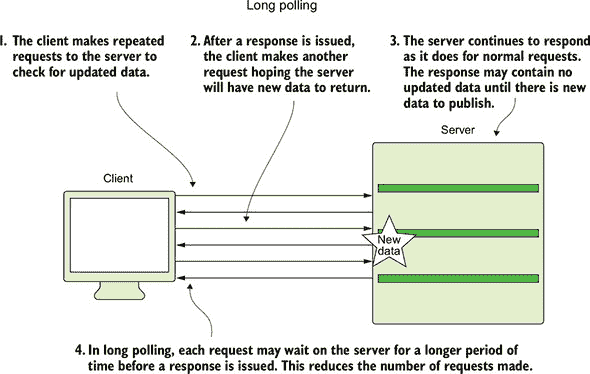
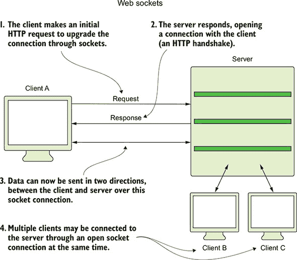
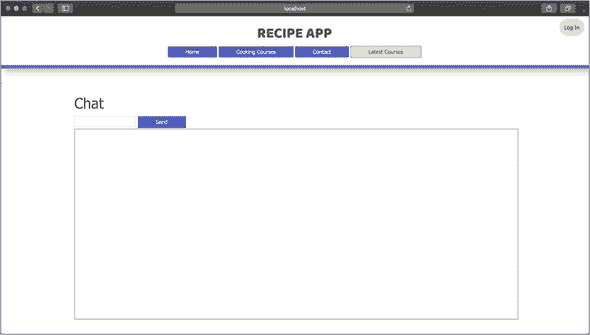
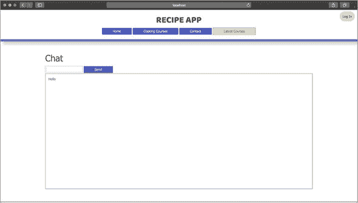
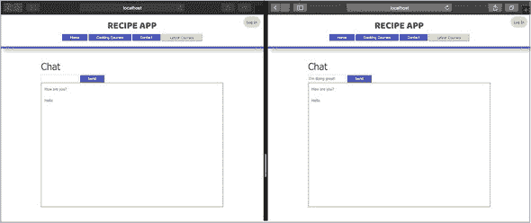
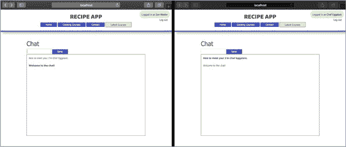
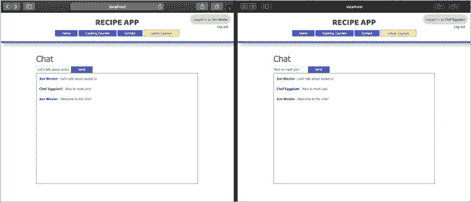
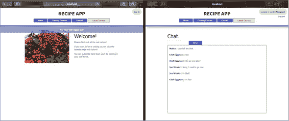
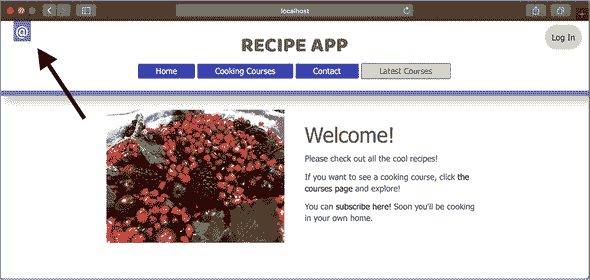

## 第 7 单元：添加聊天功能

到目前为止，你应用的主要结构已经完成。现在是时候考虑可以改善应用整体交互的新功能，但这些功能对于基本功能并不是必需的。在之前的课程中，我讨论了 Node.js 在处理数据流方面的特别有用。如果你想通过互联网发送大量数据，Node.js 通过支持数据分块使这个过程变得更简单。数据块在到达服务器时连接起来，并在有足够数据可以进行有意义操作时进行处理。这种方法适用于各种类型的数据流，并且是通过 Node.js 的事件发射和事件处理功能实现的。

在本单元中，你将探索如何使用 Node.js 通过 WebSocket 的事件驱动通信来促进实时聊天应用。我讨论了如何使用最简单的 HTML 工具构建聊天应用，以及 WebSocket 和`socket.io`相比传统的客户端-服务器通信更加高效和复杂。你将把聊天功能应用到现有的应用中，以便现有用户可以在群组环境中进行交流。然后，你将进一步通过创建聊天消息的数据模型，并在打开应用聊天页面时从数据库中加载消息来实现。最后，你将在导航栏中实现一个图标，作为聊天页面活跃时的指示器，即使用户在另一个页面上也是如此。

本单元涵盖了以下主题：

+   第 30 课介绍了 WebSocket，并展示了`socket.io`包如何帮助你通过实时聊天应用连接应用的用户。在本课中，你将学习如何在现有的食谱应用上创建一个简单的聊天页面。

+   第 31 课展示了如何通过将消息保存到 MongoDB 数据库中，将你的聊天应用提升到下一个层次。在本课中，你将创建一个消息模型，并将消息与发送者连接起来。这样，你就能识别出哪些消息属于已登录的用户。

+   第 32 课指导你如何在导航栏中实现一个活跃的聊天指示器。当聊天页面上的消息被分享时，这个图标会进行动画。

在第 33 课（总结课程）中，你将使用在本单元中学到的概念为 Confetti Cuisine 应用构建聊天功能。

## 第 30 课：使用 Socket.Io

在 Node.js 中构建一个网络应用可以非常有趣。通常，你会发现最具挑战性的方面主要来自于从网络开发的角度来架构应用。很容易忘记 Node.js 在正常请求-响应周期之外的能力。在本课中，你将探索客户端和服务器之间通过开放的 TCP 连接进行通信。这种连接是通过`socket.io`包实现的，该包在 Web 套接字和长轮询上运行，通过在服务器上保持更长时间的 HTTP 请求，在返回响应之前，以促进客户端和服务器之间实时数据流的实现。你首先学习如何使用 Express.js 实现`socket.io`。然后，你在一个新的应用视图中创建一个聊天框。最后，你通过`socket.io`触发和处理的自定义事件，将客户端 JavaScript 和服务器代码连接起来。

本课涵盖

+   在 Node.js 应用中实现`socket.io`

+   在控制器中组织你的`socket.io`监听器

+   创建简单的聊天功能

| |
| --- |

**考虑这一点**

你构建了一个功能齐全的应用程序，众多用户纷纷前来注册。不幸的是，这些用户之间没有沟通的方式。鉴于你正在构建一个社区驱动的应用，成员之间的沟通非常重要。用户数据已经在数据库中。你所需要做的就是通过支持实时通信的工具将数据关联起来。

在`socket.io`的一点点帮助下，你很快就能连接用户，使他们能够互相聊天。

| |
| --- |

### 30.1\. 使用 socket.io

你已经构建了具有客户端到服务器通信功能的 Node.js 网络应用。当客户端想要查看网页或提交数据时，你的应用程序会向服务器生成一个 HTTP 请求。这种在互联网上的通信方式已经存在很长时间了，在 2017 年庆祝了它的 20 岁生日。在技术年数中，这已经很老了。尽管开发者仍然严重依赖请求-响应周期，但这并不是每个用例中最有效的通信方法。

例如，如果你想实时查看 NBA 篮球比赛的得分，会怎样？你可以加载包含得分和统计信息的页面，但每次你想查看信息更新时，都需要重新加载页面。对于篮球比赛，这些变化可能每秒就会发生。反复向服务器创建`GET`请求对客户端来说是一项繁重的工作。"轮询"用于从客户端向服务器生成重复请求，以期待服务器数据的更新。轮询使用你迄今为止使用的标准技术来在客户端和服务器之间传输数据，但它发送请求的频率如此之高，以至于在双方参与者之间产生了一个开放通信通道的错觉（图 30.1）。

##### 图 30.1\. 客户端和服务器之间的轮询



为了进一步提高这项技术，开发了长轮询来减少获取更新数据所需的请求数量。*长轮询*的行为与轮询类似，即客户端重复向服务器请求更新数据，但请求数量更少。不是在只有几十个请求接收到了更新数据时才发送数百个请求，长轮询允许请求在 HTTP 允许的情况下保持打开状态，直到请求超时。在这段时间内——比如说，10 秒——服务器可以保持对请求的控制，并在服务器收到更新数据时响应更新数据，或者在请求超时前响应无变化。这种更有效的方法使得网络浏览器和设备能够在几十年来变化不大的协议上体验到实时信息交换的感觉。

尽管这两种方法被广泛使用，但最近的一个新加入的方法使得像 Node.js 这样的平台得以繁荣发展。*WebSocket*于 2011 年推出，允许客户端和服务器之间建立开放的通信流，创建了一个真正的开放通道，使得信息可以在服务器或客户端可用的情况下双向流动。WebSocket 使用与 HTTP 不同的互联网协议，但可以在普通的 HTTP 服务器上使用。在大多数情况下，启用 WebSocket 的服务器允许其开放通道通过与典型请求-响应交换相同的应用程序端口访问（图 30.2）。

##### 图 30.2\. 客户端和服务器之间打开 WebSocket 连接



虽然 WebSocket 是实时通信的首选方法，但许多较老的浏览器和客户端不支持它。这项相对较新的技术允许开发者构建能够实时传输数据的应用程序，并且你可以将其集成到现有的 Node.js 应用程序中：`socket.io`，这是一个当 WebSocket 可用时使用 WebSocket，而在 WebSocket 不可用时使用轮询的 JavaScript 库。

`socket.io`也是一个可以在 Node.js 应用程序中安装的包，为 WebSocket 提供库支持。它使用 Node.js 和 WebSocket 的事件驱动通信，允许客户端和服务器通过触发事件来发送数据。例如，作为一个寻找更新篮球比赛统计数据的客户端，你可能会有客户端 JavaScript 监听由服务器触发的`updated data`事件。然后你的浏览器会处理`updated data`事件以及与之一起传递的任何数据，以修改你网页的内容。这些事件可以连续不断地到来，或者根据需要隔几个小时才来一次。如果你想向服务器发送消息给所有其他监听客户端，你可以触发一个服务器知道如何处理的事件。幸运的是，你可以控制客户端和服务器端的代码，因此你可以实现任何你想要的触发和处理事件。

首先，在您的项目终端窗口中运行 `npm i socket.io -S` 以在您的食谱应用程序中安装 `socket.io`。在接下来的章节中，您将使用这个库为用户提供实时聊天功能。


**快速检查 30.1**

> **Q1:**
> 
> 长轮询与轮询有何不同？

|  |

**QC 30.1 答案**

> **1:**
> 
> 长轮询通过发送持续时间比典型请求更长的服务器请求来实现。轮询依赖于许多单独的 `GET` 请求。长轮询更高效，因为它保持单个 `GET` 请求活跃更长时间，允许服务器在客户端发出另一个请求之前接收更新并做出响应。


### 30.2. 创建聊天框

要开始使用聊天功能，您需要构建一个包含聊天框和提交按钮的基本视图。当您构建代码以允许客户端处理服务器事件时，此聊天框将填充数据。

在您的视图文件夹中创建一个名为 chat.ejs 的新视图。在这个视图中，添加 代码清单 30.1 中的代码。在这个代码中，您有一个接受输入和提交按钮的表单。在表单代码下方是创建的聊天框标签。通过一些简单的 CSS 样式，您可以添加边框和尺寸到聊天框，提示用户输入表单输入并将其提交以将内容添加到下面的聊天窗口中。

##### 列表 30.1. 在 chat.ejs 中创建聊天框

```
<div class="container">
  <h1>Chat</h1>
  <form id="chatForm">                       *1*
    <input id="chat-input" type="text">      *2*
    <input type="submit" value="Send">
  </form>
  <div id="chat"></div>                      *3*
</div>
```

+   ***1*** **添加一个用于聊天输入的 HTML 表单。**

+   ***2*** **添加一个用于聊天内容的自定义输入元素。**

+   ***3*** **创建聊天框的标签。**

要加载此视图，请向您的路由文件夹中的 homeRoutes.js 添加一个新路由和操作。将 `router.get("/chat", homeController .chat)` 添加到您的路由文件夹中的 homeRoutes.js。此新路由将被 index.js 路由文件吸收并由 main.js 使用。现在您需要在 homeController.js 中创建聊天操作，如下一列表所示。在这个操作中，您只需渲染 chat.ejs 视图。

##### 列表 30.2. 在 homeController.js 中添加聊天操作

```
chat: (req, res) => {
  res.render("chat");          *1*
}
```

+   ***1*** **渲染聊天视图。**

重新启动您的应用程序，并访问 http://localhost:3000/chat 以查看 图 30.3 中显示的聊天框。

##### 图 30.3. 显示聊天视图




##### 注意

您的聊天页面不会与 图 30.3 完全相同，除非您为其添加自定义样式。


在设置好此聊天页面后，您需要记住在 HTML 中使用的标签 ID。在下一节中，您将针对 `#chat` 框发送聊天消息，并将新消息发送到 `#chat-input` 中的服务器。


**快速检查 30.2**

> **Q1:**
> 
> 为什么具有 ID `chat` 的 HTML 元素没有任何内容？

|  |

**QC 30.2 答案**

> **1:**
> 
> 在每次页面加载时，`#chat` 元素都是空的。您将使用客户端 JavaScript 来填充元素，以便在从服务器接收内容时显示内容。


### 30.3. 连接服务器和客户端

现在你已经有了聊天页面，你需要勇气让它工作。安装了`socket.io`后，你需要将其引入到你的项目中。因为你希望你的 socket 服务器运行在现有的 Express.js HTTP 服务器上，所以需要引入`socket.io`，并将其传递给 Express.js 服务器。将引入行添加到 main.js 中，在告诉你的应用程序监听指定端口的行下面，如代码清单 30.3 所示。在这段代码中，你将正在运行的服务器实例保存到一个常量`server`中，这样你就可以将相同的 Express.js HTTP 服务器传递给`socket.io`。这个过程允许`socket.io`（我将称之为`io`）附加到你的应用程序服务器。

##### 代码清单 30.3\. 在 main.js 中添加服务器`io`对象

```
const server = app.listen(app.get("port"), () => {
    console.log(`Server running at http://localhost:
 ${ app.get("port") }`);
  }),                                      *1*
  io = require("socket.io")(server);       *2*
```

+   ***1*** 将服务器实例保存到 server。

+   ***2*** 将服务器实例传递给 socket.io。

现在你可以开始使用`io`来构建你的 socket 逻辑。尽管如此，像你的其他代码一样，将这段代码封装到它自己的控制器中。在你的 controllers 文件夹中创建一个新的 chatController.js，并在引入`socket.io`之后引入它。为了引入控制器，将`require("./controllers/chatController")(io)`添加到 main.js 中。在这行代码中，你将`io`对象传递给你的聊天控制器，以便你可以从那里管理你的 socket 连接。你不需要将这个模块存储在常量中，因为你不会在 main.js 中进一步使用它，所以你可以直接引入。


##### 注意

在定义`io`对象之后引入 chatController.js 是很重要的。否则，你将无法在控制器中使用配置好的`socket.io`。


在 chatController.js 中，添加代码清单 30.4 中的代码。在这段代码块中，你导出控制器的内容并接受一个参数：来自 main.js 的`io`对象。在这个文件中，你使用`io`来监听某些事件。首先，`io`监听`connection`事件，表示客户端已连接到 socket 通道。在处理这个事件时，你可以使用特定的客户端 socket 来监听用户断开连接或自定义事件，例如你创建的`message`事件。如果服务器接收到`message`事件，它将使用`io`的`emit`方法向所有连接的客户端发送数据字符串。

##### 代码清单 30.4\. 在 chatController.js 中处理聊天 socket 连接

```
module.exports = io => {                     *1*
  io.on("connection", client => {            *2*
    console.log("new connection");

    client.on("disconnect", () => {          *3*
      console.log("user disconnected");
    });

    client.on("message", () => {             *4*
      io.emit("message", {
        content: "Hello"
      });                                    *5*
    });
  });
};
```

+   ***1*** 导出聊天控制器内容。

+   ***2*** 监听新用户连接。

+   ***3*** 监听用户断开连接时的情况。

+   ***4*** 监听自定义消息事件。

+   ***5*** 向所有连接的用户广播消息。


##### 注意

注意你使用的是参数名`client`，因为这段代码将在每个新的客户端连接时运行。`client`代表服务器另一侧连接的实体。客户端监听器仅在建立初始`io`连接时运行。


在此代码的基础上，你需要设置客户端代码来处理来自服务器的数据并发送事件到服务器。为了完成这个任务，在你的公共文件夹中的 recipeApp.js JavaScript 代码中添加一些代码。

在这段代码中，在客户端初始化 `socket.io`，使你的服务器能够检测到新用户的连接。然后，使用 jQuery，通过向服务器发送一个 `message` 事件来处理表单提交，并使用 `return false` 阻止表单自然提交。`socket.emit` 接收一个字符串参数作为事件名称，并将事件发送回服务器。使用 `socket.on`，你监听来自服务器的 `message`，以及一个字符串消息。你通过将消息作为列表项添加到你的 `#chat` 元素中来显示该消息。在服务器端，你已经在 chatController.js 中为 `message` 事件设置了一个处理程序，向客户端发送消息内容 `"Hello"`。

##### 列表 30.5\. 在 recipeApp.js 中添加 `socket.io` 的客户端 JavaScript 代码

```
const socket = io();                        *1*

$("#chatForm").submit(() => {               *2*
 socket.emit("message");
 $("#chat-input").val("");
 return false;
});

socket.on("message", (message) => {         *3*
  displayMessage(message.content);
});

let displayMessage = (message) => {         *4*
  $("#chat").prepend($("<li>").html(message));
};
```

+   ***1*** **在客户端初始化 socket.io。**

+   ***2*** **当表单提交时触发事件。**

+   ***3*** **监听事件，并填充聊天框。**

+   ***4*** **在聊天框中显示来自服务器的消息。**

最后一步是在客户端加载 `socket.io` 库，通过在生成聊天的视图中添加一个脚本标签来实现。为了简化这个任务，将标签添加到你的布局文件中。在 layout.ejs 中，在你的其他脚本和链接标签下方添加 `<script src="/socket.io/socket.io.js"></script>`。这个标签告诉你的 Node.js 应用程序在 node_modules 文件夹中查找 `socket.io` 库。

重新启动你的应用程序，访问 http://localhost:3000/chat，在输入框中输入一些文本，然后点击发送。你应该在你的聊天框中看到 `"Hello"`（图 30.4）。每次新的文本提交都会出现一个新的行。

##### 图 30.4\. 在聊天框中显示文本



在 第 31 课 中，你改进了这个聊天应用，使其能够将消息保存到你的数据库中。


**快速检查 30.3**

> **Q1:**
> 
> `io.emit` 是做什么的？

|  |

**QC 30.3 答案**

> **1:**
> 
> `io` 对象控制着服务器和客户端之间的大部分通信。`emit` 允许 `io` 通过触发事件并通知所有已连接的客户端套接字来发送一些特定的数据。


### 摘要

在本课中，你学习了 `socket.io` 并了解了如何在 Node.js 应用程序中安装它。然后，你通过使用 Express.js 服务器上的 WebSocket 来创建你的第一个聊天应用程序，从而实现客户端和服务器之间的事件和数据交换。当这个聊天功能安装后，用户可以实时相互沟通。然而，当客户端刷新网页时，聊天历史会被清除。更重要的是，你没有指示哪个用户发送了哪条消息。在第 31 课中，你创建了一个新的数据模型，并将用户账户关联起来，以便可以识别消息作者，并使聊天可以在用户会话之间持续。

| |
| --- |

**尝试以下操作**

在实现了聊天功能后，尝试在客户端和服务器之间发送更有意义的数据。消息内容允许所有客户端同时看到相同的消息，但也许你想要看到比消息本身更多的信息。尝试发送显示消息发送到服务器的日期戳。然后，使用客户端 JavaScript 收集那个日期戳，并在聊天框中显示在消息旁边。

| |
| --- |

## 第 31 课\. 保存聊天消息

你的聊天功能正在逐步完善，你可以从多个方向来改进它。尽管聊天功能允许实时通信，但当你刷新页面时，所有消息都会消失。下一步是将这些消息持久化到你的数据库中。在本课中，你实现了一个简单的模型来表示每个聊天消息。然后，你将这个模型连接到用户模型，允许发送者将消息与自己的消息关联起来。最后，每次页面重新加载时，你都会查询数据库以获取最新的消息。当你完成这些步骤后，聊天将开始类似于你在熟悉的网站和应用中使用的聊天。

本课涵盖

+   创建消息模型

+   在 `socket.io` 事件处理器中保存消息

+   在新的 socket 连接上查询消息

| |
| --- |

**考虑以下内容**

你已经有一个可以工作的聊天页面，最终允许用户相互交谈。一旦用户刷新他们的页面，他们的聊天历史就会消失。尽管这个功能可以作为一个安全实现来推广，但它并不实用。你想要保存消息，并且希望在不会打断你的聊天应用程序上运行的快速、事件驱动系统的情况下完成。在本课中，你使用 Mongoose 和现有的应用程序结构来支持保存和加载聊天消息。

| |
| --- |

### 31.1\. 将消息连接到用户

在 第 30 课 中，你为你的应用程序创建了一个聊天功能，允许用户触发一个 `message` 事件，提示服务器以相同的 `"Hello"` 文本消息内容进行响应。你可以通过将实际在聊天输入框中输入的内容发送到服务器来改进这个功能。为此，修改你的客户端代码，使得你的表单提交事件处理器看起来像 列表 31.1 中的那样。

这个小小的改动允许你在用户点击提交按钮后立即获取他输入的文本。然后你将文本作为一个对象发送，当向服务器发出 `message` 事件时。

##### 列表 31.1\. 在 recipeApp.js 中从客户端发出事件

```
$("#chatForm").submit(() => {
  let text = $("#chat_input").val();       *1*
  socket.emit("message", {
    content: text
  });                                      *2*
  $("#chat_input").val("");
  return false;
});
```

+   ***1*** **从视图输入字段中获取文本。**

+   ***2*** **将表单数据发送到服务器。**

作为响应，让服务器向所有监听客户端发出这个表单数据。你可以通过修改聊天控制器的 `message` 事件处理器来向所有客户端发出数据。在 chatController.js 中的 `io.emit` 行周围更改代码到 列表 31.2 中的代码。在这里，你从客户端获取数据并将其发送回去。如果你重新启动你的应用程序并尝试输入一个新的聊天消息，该特定消息会出现在聊天框中。你还可以打开第二个浏览器窗口来模拟两个用户，这两个浏览器允许进行多个套接字连接以提交数据，并在另一个浏览器的聊天框中实时显示新消息（图 31.1）。

##### 图 31.1\. 使用两个套接字显示聊天



##### 列表 31.2\. 在 chatController.js 中将发出消息改为数据

```
client.on("message", data => {                          *1*
  io.emit("message", { content: data.content });        *2*
});
```

+   ***1*** **收集数据作为参数。**

+   ***2*** **将消息事件中的数据作为内容返回。**

你接下来想要做的是添加一些关于发布聊天消息的用户的信息。目前，你只向服务器发送了消息内容，但你也可以发送用户的姓名和 ID。修改你的聊天表单以包含两个隐藏数据项，如 列表 31.3 中所示。在这个例子中，你使用 `passport` 提供的响应中的数据检查是否有 `currentUser` 登录。如果有用户，使用该用户在表单中的 `_id` 属性作为隐藏字段。然后这个值可以在你提交消息时传递给服务器。

##### 列表 31.3\. 在 chat.ejs 中添加聊天表单的隐藏字段

```
<% if (currentUser) { %>                      *1*
  <h1>Chat</h1>
  <form id="chatForm">
    <input id="chat-input" type="text">
      <input id="chat-user-name" type="hidden"
 value="<%= currentUser.fullName %>">
    <input id="chat-user-id" type="hidden"
 value="<%= currentUser._id %>">             *2*
    <input type="submit" value="Send">
  </form>
  <div id="chat"></div>
<% } %>
```

+   ***1*** **检查是否有登录用户。**

+   ***2*** **添加包含用户数据的隐藏字段。**

现在你已经在你的聊天表单中包含了用户字段，只有当用户登录时才会显示聊天框。在登录之前尝试加载 `/chat`。然后使用你的本地用户账户之一登录后再次尝试。第二次尝试会显示聊天页面的内容。

接下来，修改你的自定义客户端 JavaScript 代码，在表单提交时提取这些值。用下一列表中的代码替换你的表单提交事件监听器。在这个修改后的代码中，你获取用户的 ID 并将值传递给服务器，使用相同的局部变量名。

##### 列表 31.4\. 在 recipeApp.js 中从聊天表单中提取隐藏字段值

```
$("#chatForm").submit(() => {
  let text = $("#chat-input").val(),
    userId = $("#chat-user-id").val();      *1*
  socket.emit("message", {
    content: text,
    userId: userId
  });                                       *2*
  $("#chat-input").val("");
  return false;
});
```

+   ***1*** **从表单中提取隐藏字段数据。**

+   ***2*** **使用消息内容和用户数据触发一个事件。**

现在你可以通过更改 `chatController.js` 中的 `message` 事件处理器的代码来在服务器端处理这些数据，将传递给服务器的所有单个属性收集到一起（列表 31.5）。通过将这些值保存到一个新对象中，你可以过滤掉任何你未在 `messageAttributes` 对象中指定的不想要的值。然后向其他客户端发送包含消息内容和用户信息的值。


##### 注意

此代码必须存在于 `io.on("connection"...` 块中。你只能监听已连接的客户端套接字上的特定事件。


##### 列表 31.5\. 在 chatController.js 中接收套接字数据

```
client.on("message", (data) => {
  let messageAttributes = {
    content: data.content,
    userName: data.userName,
    user: data.userId
  };                                           *1*
  io.emit("message", messageAttributes);       *2*
});
```

+   ***1*** **收集所有传入的数据。**

+   ***2*** **带有用户数据的消息触发。**

最后，你需要安排这些数据并在视图中适当地显示它们。回到 `recipeApp.js`，将 `displayMessage` 中的代码更改为与 列表 31.6 中的代码匹配。此函数向与登录用户关联的消息添加一个 HTML 类属性。通过比较表单中用户的 ID 与与聊天消息关联的 ID，你可以过滤掉登录用户的消息。

要完成这个任务，添加 `getCurrentUserClass` 来确定聊天中的消息是否属于当前登录的用户。如果是，添加一个 `current-user` 类，你可以用它来在视觉上区分该用户的消息。在此更改之后，每个被识别为属于当前登录用户的消息都将关联此样式类。因为你在这个函数中使用用户的 ID 和消息内容，所以你需要传递整个 `message` 对象，而不仅仅是之前的消息内容，到 `displayMessage`。


##### 注意

将你的调用 `displayMessage(message.content)` 改为 `displayMessage (message)`，这样你就可以使用消息对象的所有属性。


##### 列表 31.6\. 在 recipeApp.js 中从聊天表单中提取隐藏字段值

```
let displayMessage = (message) => {
  $("#chat").prepend(
    $("<li>").html(`
<div class="message ${getCurrentUserClass(message.user)}">
${message.content}                                         *1*
</div>`)
  );
};

let getCurrentUserClass = (id) => {
  let userId = $("#chat-user-id").val();
  return userId === id ? "current-user": "";               *2*
};
```

+   ***1*** **在聊天框中显示消息内容以及用户名。**

+   ***2*** **检查消息的用户 ID 是否与表单的用户 ID 匹配。**

现在给 `current-user` 类元素添加一些样式，区分不同的聊天消息。在两个并排的浏览器窗口中，有两个用户登录，聊天可以看起来像 图 31.2。

##### 图 31.2\. 使用两个套接字对用户消息进行样式化



您已经实现了将消息与用户关联的逻辑，并在视图中区分这些消息。然而，这个聊天似乎仍然缺少一些要点。尽管登录用户可以识别自己的消息，但他们不知道其他用户的身份。在下一节中，您将向聊天消息添加用户名。

| |
| --- |

**快速检查 31.1**

> **Q1:**
> 
> 为什么您需要在客户端 JavaScript 中将聊天消息的用户 ID 与聊天表单上的用户 ID 进行比较？

| |
| --- |
| |

**QC 31.1 答案**

> **1:**
> 
> 表单的用户 ID 反映了登录用户的 ID。如果聊天消息中的用户 ID 与表单中的 ID 匹配，您可以安全地将该消息标记为属于登录用户，并应用样式来表示这一点。

| |
| --- |

### 31.2\. 在聊天中显示用户名

您越接近将消息与创建它们的用户账户耦合，用户之间的沟通就会越容易。为了消除混淆，您希望将用户的名字用作聊天消息的标识符。为此，您需要在第一部分的代码中实施一些小的更改。

您已经在聊天表单中添加了一个隐藏的输入字段来提交用户的 `fullName`。当登录用户提交他们的聊天消息时，他们的名字也会被发送。

接下来，在 recipeApp.js 中通过从表单提交时提取 `#chat_user_name` 输入的值来获取此字段值，并将其保存到变量中。新的 `submit` 事件处理程序看起来像下一个列表中的代码。然后，在同一个对象中与 `userName` 键配对发送该值。您将在服务器上稍后使用此键。

##### 列表 31.7\. 从 recipeApp.js 中的聊天表单中提取额外的隐藏字段值

```
$("#chatForm").submit(() => {
  let text = $("#chat-input").val(),
    userName = $("#chat-user-name").val(),    *1*
    userId = $("#chat-user-id").val();
  socket.emit("message", {
    content: text,
    userName: userName,
    userId: userId
  });                                         *2*
  $("#chat_input").val("");
  return false;
});
```

+   ***1*** **提取用户的名字。**

+   ***2*** **向服务器发送包含消息内容的自定义事件。**

在服务器上，您需要将此用户名包含在您收集的消息属性中，以便它们可以发送到其他客户端套接字。您可以使用用户的 ID 来检索他们的名字，但这种方法可以节省您与数据库通信。在 chatController.js 中的 `message` 事件处理程序中，您的消息属性变量赋值应读取 `let messageAttributes = {content: data.content, userName: data.userName, user: data.userId}`。

最后，安排这些数据，并在视图中适当地显示。回到 recipeApp.js，将 `displayMessage` 函数中的代码更改为 列表 31.8 中的代码。此更改显示了与发布的消息关联的用户的名字。您仍然可以使用 `getCurrentUserClass` 函数来确定聊天中的消息是否属于当前登录的用户。

##### 列表 31.8\. 在 recipeApp.js 中显示用户名

```
$("#chat").prepend($("<li>").html(`
<strong class="message ${getCurrentUserClass(
 message.user )}">
${message.userName}
</strong>: ${message.content}            *1*
`));
```

+   ***1*** **以粗体显示用户名，并如果 currentUser 则进行样式化。**

实施这些更改后，您可以看到在聊天中发布消息的用户的名字（图 31.3）。

##### 图 31.3\. 显示带有两个套接字的用户名



通过这个改进，用户可以通过发送者的名字来识别特定聊天消息的作者。这个功能很棒，因为它减少了聊天的匿名性，并允许注册用户相互联系。然而，您仍然面临聊天消息随着页面加载而消失的问题。您需要将这些聊天消息连接到您的数据库，而最好的方法是通过 Mongoose 数据模型。在下一节中，您将探索聊天消息所需的模型模式。


**快速检查 31.2**

> **Q1:**
> 
> 为什么您将用户的姓名传递到服务器而不是使用用户的 ID 在您的数据库中查找姓名？

|  |

**QC 31.2 答案**

> **1:**
> 
> 使用用户的 ID 查找他们的姓名可以工作，但这会增加涉及数据库的另一层工作量。由于没有立即需要使用您的数据库进行此聊天，您可以传递额外的字符串值。


### 31.3\. 创建消息模型

要使这个聊天页面值得再次访问，您需要保存共享的消息。为此，您需要将消息保存到您的数据库中，您有几种保存消息的方法：

+   您可以修改您的用户模式以保存消息数组。每当任何用户提交新消息时，该消息就会被添加到用户的 `messages` 数组中。这种方法可以工作，但您很快就会得到长长的列表，这些列表既不高效也不必要存储在用户模型中。

+   您还可以创建一个新的模型来表示聊天及其消息。这种方法需要一个新的模型模块，但最终可以节省您的工作量，并使您更容易理解您正在处理和保存的数据。

在本节中，您将构建一个 Message 模型来包含您在本课中一直在使用的值。在您的项目模型文件夹中创建一个新的 message.js 文件，并将 列表 31.9 中的代码添加到该文件中。

在此代码中，您正在定义一个包含 `content`、`userName` 和 `user` 属性的消息模式。聊天消息的内容是必需的，用户的姓名和 ID 也是如此。本质上，每条消息都需要一些文本和一个作者。如果有人试图以某种方式保存消息而没有登录和验证，您的数据库将不允许保存这些数据。您还设置了 `timestamps` 为 `true`，这样您就可以跟踪聊天消息何时添加到您的数据库中。如果您想显示聊天框中的时间戳，这个功能非常有用。

##### 列表 31.9\. 在 message.js 中创建消息模式

```
const mongoose = require("mongoose"),
  { Schema } = require("mongoose");
const messageSchema = new Schema({
  content: {
    type: String,
    required: true
  },                           *1*
  userName: {
    type: String,
    required: true
  },                           *2*
  user: {
    type: Schema.Types.ObjectId,
    ref: "User",
    required: true
  }                            *3*
}, { timestamps: true });      *4*

module.exports = mongoose.model("Message", messageSchema);
```

+   ***1*** **每条消息都需要内容。**

+   ***2*** **每条消息都需要用户的姓名。**

+   ***3*** **每条消息都需要一个用户 ID。**

+   ***4*** **保存每条消息的时间戳。**

接下来，通过在文件顶部添加 `const Message = require ("../models/message")` 来在 chatController.js 中引入这个新模型。


##### 注意

`../models/message`意味着你正在离开 controllers 文件夹进入 models 文件夹以找到 message.js。


要开始将传入的数据保存到消息模型中，你需要使用你的`messageAttributes`作为新消息对象的属性。然后尝试将此消息保存到你的 MongoDB 数据库中，如果你成功，则发射该消息。使用下一个列表中的代码修改你的代码，以更改 chatController.js 中的`client.on("message")`块。

##### 列表 31.10\. 在 chatController.js 中保存消息

```
client.on("message", (data) => {                      *1*
  let messageAttributes = {
      content: data.content,
      userName: data.userName,
      user: data.userId
    },
    m = new Message(messageAttributes);
  m.save()                                            *2*
    .then(() => {
      io.emit("message", messageAttributes);          *3*
    })
    .catch(error => console.log(`error: ${error.message}`));
});
```

+   ***1*** **使用 messageAttributes 创建一个新的消息对象。**

+   ***2*** **保存消息。**

+   ***3*** **如果保存成功，则发射消息值，或记录任何错误。**

只需这样做就可以开始保存你的消息。你可以重新启动你的应用程序，登录，并发送消息，它们将在幕后保存。你不会注意到任何变化，因为当你刷新聊天页面时，你仍然会清除聊天历史，即使消息已经保存在你的数据库中。为了纠正这个问题，你需要在用户重新连接到聊天套接字时加载一些最近的聊天消息。在 chatController.js 中，添加列表 31.11 中的代码来找到最近的十条聊天消息，并使用一个新的自定义事件将它们发射出来。使用`sort({createdAt: -1})`按降序排列你的数据库结果。然后使用`limit(10)`来限制这些结果只包含最近的十条。当你向客户端套接字发射自定义的`"load all messages"`事件时，只有新连接的用户聊天框会刷新显示最新的聊天消息。使用`messages.reverse()`反转消息列表，以便你可以在视图中将它们前置。

##### 列表 31.11\. 在 chatController.js 中加载最近的聊天消息

```
Message.find({})
  .sort({ createdAt: -1 })
  .limit(10)
  .then(messages => {                                           *1*
    client.emit("load all messages", messages.reverse());       *2*
  });
```

+   ***1*** **查询最近的十条消息。**

+   ***2*** **只向新套接字发射包含十条消息的自定义事件。**

最后一步是在你的客户端 JavaScript 中处理这个新的自定义事件。在 recipeApp.js 中，添加列表 31.12 中的事件处理程序。此代码监听发射到该特定套接字的自定义`"load all messages"`事件。在这里接收到的任何数据都通过将`data`数组中的每条消息发送到你的`displayMessage`函数来处理，以便将消息内容前置到你的聊天框中。

##### 列表 31.12\. 在 recipeApp.js 中显示最近的聊天消息

```
socket.on("load all messages", (data) => {     *1*
  data.forEach(message => {
    displayMessage(message);                   *2*
  });
});
```

+   ***1*** **通过解析传入的数据来处理“load all messages”。**

+   ***2*** **将每条消息发送到 displayMessage 以在聊天框中显示。**

尝试比较在套接字刷新其连接之前和之后两个相邻套接字的视图。用户的新的连接会使用数据库中的消息刷新聊天框。现在，用户可以更容易地参与聊天，并保留共享的消息历史。


**快速检查 31.3**

> **Q1:**
> 
> “`load all messages`”事件的目的是什么？

|  |

**QC 31.3 答案**

> **1:**
> 
> “`load all messages`”是你创建的一个自定义事件，用于与客户端 socket 通信，以便在它们连接时立即将数据库消息加载到聊天框中。你可以使用任何自定义事件名称。这个独特的名称是描述性的，你可以在客户端 JavaScript 中以任何你喜欢的样子处理它。


### 摘要

在本节课中，你学习了如何在聊天框中整理消息，以显示关于消息作者的详细信息。你还显示了用户的姓名，以便在聊天页面上增加透明度。在本节课结束时，你创建了一个消息模型，并开始将消息保存到应用程序的数据库中。这种实现允许消息在多个 socket 连接之间持久化。通过在每次新的 socket 连接时加载最新的消息，你立即让用户参与到对话中。在第 32 课中，你将查看一种使用`socket.io`事件通知用户新消息的方法，即使他们没有在聊天页面上活跃。


**尝试以下操作**

现在你已经将消息保存到数据库中，并且与用户账户相关联，现在在控制器层添加另一层安全措施。虽然你在消息中保存了用户 ID，但你并没有确保该用户 ID 在数据库中是有效的。在 chat-Controller.js 中保存消息的 promise 链中添加一些代码，通过相同的 ID 在数据库中查找用户并验证它，然后再正式保存消息。为此任务，你需要在这个控制器中引入用户模型。


## 第 32 课：添加聊天通知指示器

你的聊天页面正在成形。现在用户可以登录并查看最新的聊天消息，无论它们是几分钟前还是几周前发送的。聊天页面目前促进了应用程序聊天功能的所有视觉方面。`socket.io`的好处是它不需要存在于一个页面上。因为你的聊天是通过发射和处理事件来工作的，所以你可以用其他方式使用这些事件。在本节课中，你构建了一个自定义事件发射器，以通知所有活跃用户当聊天消息正在提交时。然后你在导航栏中构建了一个小的视觉指示器，当有新消息分享时它会动画化。通过这个小技巧，用户即使在浏览不同页面时也能得到一个活跃聊天室的视觉指示。

本节课涵盖

+   广播自定义事件

+   响应事件动画图标


**考虑以下**

用户正在享受你的应用程序中的聊天页面，但他们希望浏览应用程序中的其他页面，而不是等待聊天页面上的新消息到来。然而，他们不希望错过聊天再次活跃的时候。在本节课中，你依赖于服务器发出的自定义事件来动画化导航栏图标。当这个图标动画化时，应用程序任何页面的用户都知道聊天正在进行。


### 32.1\. 向所有其他套接字广播

关于 `socket.io` 有一件事要知道，它可以配置为在多个特定的聊天室和不同的命名空间中工作。它甚至允许用户被添加到或从特定的组中移除。除了这些功能之外，消息不总是需要发送给每个客户端。实际上，如果发出消息的客户端正在断开连接，那么向每个人发出消息通常是没有意义的。

在本节中，您实现了一个新功能，当用户的套接字断开连接时，通知聊天中的所有其他用户。为此，在 `io.on("connect")` 块内将 列表 32.1 中的代码添加到 chatController.js 中。

在此代码中，您正在监听某个客户端断开连接的情况。您之前使用此代码块在控制台记录消息。除了记录此信息外，使用 `client.broadcast.emit("user disconnected")` 向除了发出消息的套接字之外的所有套接字发送消息。`client.broadcast` 向连接的聊天用户发送一个名为 `'user disconnected'` 的自定义事件。

您之所以广播消息而不是发出消息，是因为发出消息的客户端已经断开连接，无法再处理该自定义事件。即使发出消息的套接字没有断开连接，您也可以使用 `broadcast` 向所有其他套接字发出消息。

##### 列表 32.1\. 在 chatController.js 中向所有其他用户广播事件

```
client.on("disconnect", () => {
  client.broadcast.emit("user disconnected");          *1*
  console.log("user disconnected");
});
```

+   ***1*** **向所有其他连接的套接字广播消息。**

随着这个新事件的触发，您需要在客户端处理它。就像您处理其他事件一样，监听 `"user disconnected"` 事件，并在聊天框中打印一些指示。在 列表 32.2 中添加事件处理程序到 recipeApp.js。在这段代码中，您重用了 `displayMessage` 函数来发布一条硬编码的消息，以便让其他用户知道有人断开连接。

##### 列表 32.2\. 在 recipeApp.js 中显示用户断开连接时的消息

```
socket.on("user disconnected", () => {        *1*
  displayMessage({
    userName: "Notice",
    content: "User left the chat"
  });
});
```

+   ***1*** **监听“user disconnected”事件，并显示自定义消息。**

现在重新启动您的应用程序，并通过在两个不同的浏览器上登录或使用浏览器的高级隐私模式以新会话登录来登录多个账户。当两个聊天窗口并排打开时，您应该能看到当另一个聊天窗口中的用户连接时的情况。在 图 32.1 中，左侧的聊天窗口显示当右侧窗口刷新时用户断开连接。在这种情况下，页面刷新会导致立即重新连接。

##### 图 32.1\. 在聊天中显示用户断开连接



| |
| --- |

**快速检查 32.1**

> **Q1:**
> 
> `client.broadcast.emit` 和 `client.emit` 之间的区别是什么？

| |
| --- |
| |

**QC 32.1 答案**

> **1:**
> 
> `client.broadcast.emit` 向所有除了它自身的套接字发出事件，而 `client.emit` 向包括它自身的所有套接字发出事件。

| |
| --- |

### 32.2\. 在导航中创建聊天指示器

您将对聊天应用程序进行的最后一个添加是一个功能，让应用程序中其他页面的用户知道聊天页面上有活动。这个功能可能对查看个人资料或菜谱的用户或在家页面上闲逛的用户有帮助；他们可能想知道其他用户是否在聊天室中醒来并互相交谈。为了添加这个功能，在导航栏中添加一个图标。当聊天室中提交消息时，您将导航栏中的聊天图标动画化，让其他用户知道聊天活动。

首先，通过在 layout.ejs 中添加 `<a href="/chat" class="chat-icon">` `@</a>` 将图标添加到导航栏中。有了这个图标，您下次重新启动应用程序时应该会在导航栏中看到 `@`。如果您点击此图标，它将带您到 `/chat` 路由。

接下来，当任何用户发送消息时，使图标闪烁两次以进行动画处理。为了完成这个任务，在接收到 `"message"` 事件时，使用 jQuery 的 `fadeOut` 和 `fadeIn` 方法对聊天图标进行操作。修改 recipe-App.js 中的 `socket.on("message")` 处理器，使其看起来像下一个列表中的代码。在这个例子中，您仍然使用 `displayMessage` 函数将消息发布到您的聊天视图；然后，通过一个简单的 `for` 循环，您将聊天图标动画化使其闪烁两次。

##### 列表 32.3\. 在 recipeApp.js 中发送消息时动画化聊天图标

```
socket.on("message", (message) => {
  displayMessage(message);
  for (let i = 0; i < 2; i++) {
    $(".chat-icon").fadeOut(200).fadeIn(200);         *1*
  }
});
```

+   ***1*** **当发送消息时使聊天图标闪烁。**

重新启动您的应用程序，并在两个不同的浏览器账户下登录。注意，现在当一位用户发送消息时，无论另一位用户在应用程序的哪个位置，他们都会看到导航栏中的聊天图标闪烁两次（图 32.2）。

##### 图 32.2\. 在导航栏中动画化聊天图标



在 第 33 课 中，您将应用这些步骤并在您的毕业设计中完全实现聊天功能。


**快速检查 32.2**

> **Q1:**
> 
> 对错：您可以在应用程序的任何页面上处理 `socket.io` 事件。

|  |

**QC 32.2 答案**

> **1:**
> 
> 对。对于本课的例子，您在 layout.ejs 文件中导入了 `socket.io` 库，该文件用于每个视图。同样，您的客户端 JavaScript 也位于导入到布局文件中的文件中。如果您只在特定视图中导入 `socket.io` 客户端，您就只能在该特定页面上处理事件。


### 摘要

在本课中，你学习了如何自定义 `socket.io` 事件以用于正常聊天功能之外。因为事件可以在具有 `socket.io` 客户端的任何应用程序部分中使用，所以你可以为许多类型的开放连接数据传输创建事件。首先，你创建了一个新事件，用于在用户断开连接时通知其他用户。然后你使用现有事件在布局导航中触发非聊天功能。随着聊天功能的运行，是时候将相同的工具应用到你的毕业设计项目（课程 33）上了。然后就是部署的时候了！


**尝试这个**

现在您的聊天应用已经有一个功能，可以让用户知道当其他用户断开连接时，那么知道用户连接的时间也会很有用。使用 `io.on("connection")` 触发一个新事件到您的客户端，让他们知道有新用户加入了聊天。

当你完成时，看看你是否可以在连接消息中添加用户的姓名，例如 `通知：Jon Wexler 已加入聊天`。


## 课程 33. 毕业设计：为 Confetti Cuisinex 添加聊天功能

在这个阶段，我的应用程序的基础已经完成。我可以继续改进现有功能或构建新功能。在应用程序发布到生产环境并供所有人使用之前，Confetti Cuisine 要求我添加一个有趣的功能来吸引用户。毫不犹豫地，我告诉他们这正好是在他们的 Node.js 应用程序中构建聊天功能的绝佳机会。因为我不想在部署前让应用程序过于复杂，所以我将保持聊天简单。

聊天将只允许有账户的用户相互通信。每次发送消息时，我都会在幕后保存消息并将其与发送者关联起来。此外，我将利用 `socket.io` 维护连接客户端和服务器之间的开放连接，以实现实时通信。通过这个库的事件驱动工具，我可以从服务器向单个客户端或所有客户端发出事件，也可以从客户端向服务器发出事件。我还可以向选定的一组客户端发出事件，但在这个应用程序中我不需要实现该功能。

之后，我将连接导航栏中的聊天图标，以便在发送聊天消息时进行动画。所有用户都会看到这个图标在消息发出时进行动画。这个图标还充当了聊天页面的链接。是时候为 Confetti Cuisine 应用程序添加最后的修饰了。

### 33.1\. 安装 socket.io

首先，我需要安装 `socket.io` 包。`socket.io` 提供了一个 JavaScript 库，通过使用 WebSockets 和长轮询来维护客户端和服务器之间的开放连接，帮助我构建实时通信门户。为了将此包作为依赖项安装，我在项目的终端窗口中运行 `npm i socket.io -S`。

安装了这个包后，我需要在主应用程序文件和客户端中引入它。

### 33.2\. 在服务器上设置 socket.io

在我需要`socket.io`之前，我需要将使用 Express.js 创建的服务器实例保存下来，通过将 main.js 中的`app.listen`行赋值给一个名为`server`的常量。在这行代码下面，我在项目中通过添加`const io = require("socket.io")(server)`来引入`socket.io`。在这行代码中，我同时引入了`socket.io`模块，并传递了 Express.js 使用的 HTTP 服务器实例。这样，`socket.io`使用的连接将与我主应用程序使用的 HTTP 服务器共享。将我的`socket.io`实例存储在`io`常量中后，我就可以开始使用`io`来构建我的聊天功能了。

首先，我为聊天功能设置了一个新的控制器。尽管所有的`socket.io`代码都可以存在于 main.js 中，但将其放在自己的控制器中更容易阅读和维护。我开始在 main.js 中引入一个新的控制器，并通过添加`const chatController = require("./controllers/chatController")( io )`到 main.js 的底部来传递`io`对象。接下来，我在 controllers 文件夹中创建了一个名为 chatController.js 的新文件。在这个文件中，我添加了列表 33.1 中的代码。

我使用在 main.js 中创建的相同的`io`对象来监听特定的 socket 事件。`io.on ("connection")`在新的客户端连接到我的 socket 服务器时做出反应。`client.on ("disconnect")`在已连接的客户端断开连接时做出反应。`client.on("message")`在客户端 socket 向服务器发送自定义的`message`事件时做出反应。我可以命名这个事件，因为我正在处理聊天消息，这个事件名看起来似乎是合适的。在最后一个块中，我使用`io.emit`将来自单个客户端的数据发送回所有已连接的客户端，这样每个人都能收到单个用户提交的相同消息。

##### 列表 33.1\. 在 chatController.js 中添加聊天操作

```
module.exports = io => {                    *1*
  io.on("connection", client => {           *2*
    console.log("new connection");

    client.on("disconnect", () => {         *3*
      console.log("user disconnected");
    });

    client.on("message", (data) => {        *4*
      let messageAttributes = {
        content: data.content,
        userName: data.userName,
        user: data.userId
      };
      io.emit("message");                   *5*
    });
  });
};
```

+   ***1*** **导出聊天控制器的内容。**

+   ***2*** **监听新用户连接。**

+   ***3*** **监听用户断开连接时的情况。**

+   ***4*** **监听自定义消息事件。**

+   ***5*** **向所有已连接用户广播消息。**

最后一行代码发送了我期望从客户端接收的特定消息属性集。也就是说，我期望客户端在发送内容、用户名和用户 ID 的同时触发一个`message`事件。我需要在视图中发送这三个属性。

### 33.3\. 在客户端设置 socket.io

为了建立一个成功的聊天连接，我需要一个视图来促进客户端的 socket 连接。我想在名为 chat.ejs 的视图中构建我的聊天框，该视图可通过`/chat` URL 路径访问。我在 homeRoutes.js 中为这个路径添加了一个新的路由，通过添加`router.get("/chat", homeController.chat)`。

然后，我通过添加下一个列表中的代码到 homeController.js 中来匹配这个路由。这段代码渲染了我的 chat.ejs 视图。

##### 列表 33.2\. 在 homeController.js 中添加聊天操作

```
chat: (req, res) => {
  res.render("chat");          *1*
}
```

+   ***1*** **渲染聊天视图。**

为了渲染我的聊天视图，我需要构建视图。我在我的视图文件夹中创建了一个名为 chat.ejs 的新文件，并添加了列表 33.3 中的代码。在这段嵌入式 JavaScript (EJS) 代码中，我首先检查视图中是否存在`currentUser`。之前，我通过 Passport.js 设置了`currentUser`作为局部变量，以反映一个活跃的用户会话。如果用户已登录，我显示聊天表单。表单包含三个输入。其中两个输入是隐藏的，但携带用户的名称和 ID。我将在以后使用这些输入将消息作者的标识发送到服务器。第一个输入是实际的消息内容。以后，我将从这个输入中获取值作为提交给服务器的消息内容。

##### 列表 33.3\. 在`chat.ejs`中的聊天表单中添加隐藏字段

```
<% if (currentUser) { %>                                 *1*
  <h1>Chat</h1>
  <form id="chatForm">
    <input id="chat-input" type="text">
    <input id="chat-user-id" type="hidden" value="<%=
 currentUser._id %>">
    <input id="chat-user-name" type="hidden" value="<%=
 currentUser.fullName %>">                             *2*
    <input type="submit" value="Send">
  </form>
  <div id="chat"></div>
<% } %>
```

+   ***1*** **检查是否有已登录的用户。**

+   ***2*** **添加包含用户数据的隐藏字段。**

这个谜题的最后几块是添加一些客户端 JavaScript 来监控这个聊天页面的用户交互，并提交`socket.io`事件以通知服务器有新消息。在我的公共文件夹中，我找到了 confettiCuisine.js 并将其中的代码添加到列表 33.4。在这段代码中，我为客户端导入`socket.io`并添加了通过 WebSockets 与服务器交互的逻辑。在第一个代码块中，我使用 jQuery 来处理我的表单提交并从我的表单的三个输入中获取所有值。我期望在服务器的`client.on("message")`事件处理器中接收到这三个相同的属性。

第二段代码使用`socket`对象来表示将运行此代码的特定客户端。`socket.on("message")`设置客户端监听从服务器发出的`message`事件。当该事件被触发时，每个客户端都会将随事件传递的消息传递给一个我创建的自定义`displayMessage`函数。这个函数定位视图中的聊天框，并将消息添加到屏幕上。

##### 列表 33.4\. 在 confettiCuisine.js 中为客户端添加 socket.io

```
const socket = io();                         *1*

$("#chatForm").submit(() => {                *2*
  let text = $("#chat-input").val(),
    userName = $("#chat-user-name").val(),
    userId = $("#chat-user-id").val();
  socket.emit("message", {
    content: text,
    userName: userName,
    userId: userId
  });                                        *3*
  $("#chat-input").val("");
  return false;
});

socket.on("message", (message) => {          *4*
  displayMessage(message);
});

let displayMessage = (message) => {          *5*
  $("#chat").prepend( $("<li>").html(message.content));
};
```

+   ***1*** **在客户端初始化 socket.io。**

+   ***2*** **在聊天表单中监听提交事件。**

+   ***3*** **在表单提交时触发事件。**

+   ***4*** **监听事件，并填充聊天框。**

+   ***5*** **在聊天框中显示消息。**

在我的应用程序可以使用此文件中的`io`对象之前，我需要在 layout.ejs 中通过添加以下脚本标签在我的 confettiCuisine.js 导入行上方来`require`它：`<script src="/socket.io/socket.io.js"></script>`。这一行从我的 node_modules 文件夹中为客户端加载`socket.io`。

我已经准备好启动我的应用程序，并看到聊天消息从一个用户流到下一个用户。通过一些样式，我可以让用户更容易地区分他们的消息。我还可以在聊天框中使用用户的名称，这样发送者的名称和消息就会并排显示。为此，我修改了我的 `displayMessage` 函数，如下一列表所示。我检查正在显示的消息是否属于该用户，通过比较当前用户的 ID 和消息对象中的 ID。

##### 列表 33.5\. 从 confettiCuisine.js 中的聊天表单中提取隐藏字段值

```
let displayMessage = (message) => {
  $("#chat").prepend( $("<li>").html(`
  <div class='message ${getCurrentUserClass(message.user)}'>
  <span class="user-name">
  ${message.userName}:
  </span>
  ${message.content}
  </div>
  `));                                         *1*
};

let getCurrentUserClass = (id) => {
  let userId = $("#chat-user-id").val();
  if (userId === id) return "current-user";    *2*
  else return "";
};
```

+   ***1*** **与消息一起显示用户的名称。**

+   ***2*** **检查消息是否属于当前用户。**

接下来，我需要通过创建消息模型来保留这些消息在我的数据库中。

### 33.4\. 创建消息模型

为了确保我的聊天功能值得使用，并且是 Confetti Cuisine 应用程序上用户的实用工具，消息不能在每次用户刷新页面时消失。为了解决这个问题，我将构建一个消息模型来包含聊天表单中的消息属性。我在项目的模型文件夹中创建了一个新的 message.js 文件，并将 列表 33.6 中的代码添加到该文件中。

在这段代码中，我定义了一个包含 `content`、`userName` 和 `user` 属性的消息模式。聊天消息的内容是必需的，用户的名称和 ID 也是必需的。本质上，每条消息都需要一些文本和一个作者。如果有人试图在不登录和验证的情况下以某种方式保存消息，数据库将不允许保存这些数据。我还将 `timestamps` 设置为 `true`，这样我就可以跟踪聊天消息何时被添加到数据库中。这个功能允许我在想要的情况下在聊天框中显示时间戳。

##### 列表 33.6\. 在 message.js 中创建消息模式

```
const mongoose = require("mongoose"),
  { Schema } = require("mongoose");

const messageSchema = new Schema({
  content: {
    type: String,
    required: true
  },                                  *1*
  userName: {
    type: String,
    required: true
  },                                  *2*
  user: {
    type: Schema.Types.ObjectId,
    ref: "User",
    required: true
  }                                   *3*
}, { timestamps: true });             *4*

module.exports = mongoose.model("Message", messageSchema);
```

+   ***1*** **在每条消息中要求内容。**

+   ***2*** **在每条消息中要求用户的名称。**

+   ***3*** **在每条消息中要求用户 ID。**

+   ***4*** **将时间戳与每条消息一起保存。**

这个 Mongoose 模型已经准备好在我的聊天控制器中使用。实际上，当我的聊天控制器收到一条新消息时，我会尝试保存它，然后将其发送给其他用户的聊天。我在 chatController.js 文件的顶部通过添加 `const Message = require ("../models/message")` 来引入这个新模型。我的 chatController.js 文件中 `client.on("message")` 的代码在 列表 33.7 中展示。我首先使用控制器中早先的相同 `message-Attributes` 来创建一个新的 `Message` 实例。然后我尝试保存这条消息。如果消息保存成功，我会将其发送给所有已连接的套接字；否则，我会记录错误，并且消息永远不会从服务器发送出去。

##### 列表 33.7\. 在 chatController.js 中保存消息

```
client.on("message", (data) => {
  let messageAttributes = {
      content: data.content,
      userName: data.userName,
      user: data.userId
    },
    m = new Message(messageAttributes);       *1*
  m.save()                                    *2*
    .then(() => {
      io.emit("message",
 messageAttributes);                        *3*
    })
    .catch(error => console.log(`error: ${error.message}`));
});
```

+   ***1*** **使用消息属性创建一个新的消息对象。**

+   ***2*** **保存消息。**

+   ***3*** **如果保存成功，则发射消息值，并记录任何错误。**

这段代码允许消息保存到我的数据库中，但对于第一次连接的用户，聊天消息历史仍然没有显示。我将通过将旧消息加载到我的数据库中来纠正这个问题。

### 

在保持聊天框中消息的第二个任务是保持聊天历史中聊天框中消息的一致数量。我决定允许聊天框在任何给定时刻包含最近的十条聊天记录。为了做到这一点，我需要从我的数据库中加载这十条最近的聊天记录，并在它们连接到聊天时立即将它们发射给每个客户端。

在 chatController.js 中，我添加了列表 33.8 中的代码来查找最近的十条聊天消息，并通过一个新的自定义事件将它们发射出来。我使用`sort({createdAt: -1})`来按降序排列我的数据库结果。然后，我添加`limit(10)`来限制这些结果只包含最近的十条。通过在客户端 socket 上发射自定义的`"load all messages"`事件，只有新连接的用户将刷新他们的聊天框以显示最新的聊天消息。然后，我使用`messages.reverse()`反转消息列表，以便在视图中将它们前置。

##### 列表 33.8. 在 chatController.js 中加载最近的聊天消息

```
Message.find({})
  .sort({
    createdAt: -1
  })
  .limit(10)
  .then(messages => {                    *1*
    client.emit("load all messages",
 messages.reverse());                  *2*
  });
```

+   ***1*** **查询最近的十条消息。**

+   ***2*** **只向新 socket 发射包含十条消息的自定义事件。**

为了处理客户端的`"load all messages"`事件，我在下一个列表中添加了事件处理程序到 confettiCuisine.js。在这段代码块中，我监听`"load all messages"`事件的发生。当它发生时，我遍历客户端接收到的消息，并通过`displayMessage`函数在聊天框中逐个显示它们。

##### 列表 33.9. 在 confettiCuisine.js 中显示最近的聊天消息

```
socket.on("load all messages", (data) => {      *1*
  data.forEach(message => {
    displayMessage(message);                    *2*
  });
});
```

+   ***1*** **通过解析传入的数据来处理‘load all messages’。**

+   ***2*** **将每条消息发送到 displayMessage 以在聊天框中显示。**

聊天功能最终完成并准备好本地测试。为了模拟两个独立用户之间的通信，我重新启动了我的应用程序并在两个不同的网络浏览器上登录。我导航到聊天页面，看到我的聊天消息正在通过 Node.js 应用程序的`socket.io`实时发送。

### 

我想向这个应用程序添加一个最后的特性：一个图标，让应用程序其他部分的用户知道聊天是否活跃。我可以很容易地通过现有的`socket.io`事件设置来实现这个功能。我需要做的只是在我的应用程序导航栏中添加一个图标，通过在 layout.ejs 中添加`<a href="/chat" class="chat-icon">@</a>`来实现。仅此一行，我就在我的导航栏中添加了一个链接到`/chat`路由的图标。

接下来，每当发送一条聊天消息时，我会让图标闪烁两次来动画化它。因为每次提交新消息时，我已经从服务器端发射了`message`事件，所以我可以在客户端为该事件的处理程序中添加图标动画。

在 confettiCuisine.js 中，我修改了`socket.on("message")`代码块，使其看起来像以下列表中的代码。在这个代码中，我像往常一样在聊天框中显示消息，并额外定位一个具有`chat-icon`类的元素。这个元素代表我在导航栏中的聊天图标。然后我快速淡出并淡入图标，共两次。

##### 列表 33.10\. 在 confettiCuisine.js 中发送消息时动画化聊天图标

```
socket.on("message", (message) => {
  displayMessage(message);
  for (let i = 0; i < 2; i++) {
    $(".chat-icon").fadeOut(200).fadeIn(200);        *1*
  }
});
```

+   ***1*** **当发送消息时动画化聊天图标。**

通过这个额外功能，用户可以有一些迹象表明聊天页面上正在进行对话。

我可以通过很多方式来增强这个聊天功能。例如，我可以为每个 Confetti Cuisine 班级创建单独的聊天室，或者使用`socket.io`事件在用户被标记在聊天中时通知他们。我将在未来考虑实现这些功能。

### 摘要

在这个综合练习中，我为我的 Confetti Cuisine 应用程序添加了实时聊天功能。我使用了`socket.io`来简化服务器和多个客户端之间的连接。我使用了一些内置和自定义事件在打开的套接字之间传输数据。最后，我添加了一个功能，通知不在聊天室中的用户其他人正在积极交流。添加了这个功能后，我就可以部署应用程序了。
