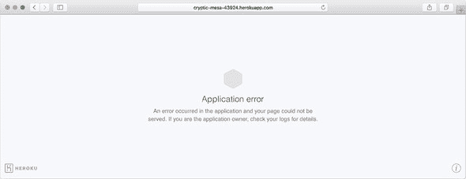
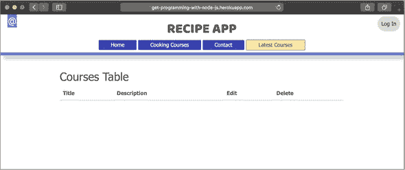
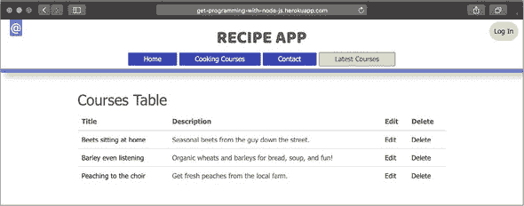
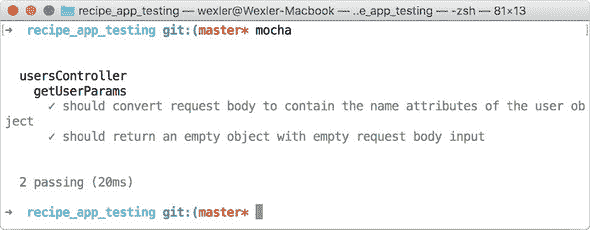
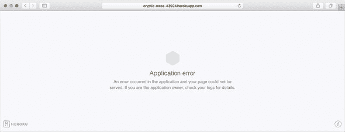
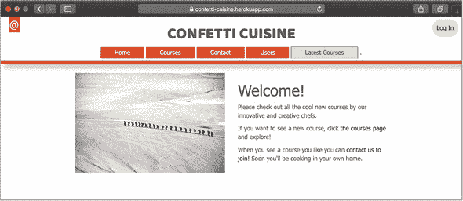

## 第 8 单元：在生产环境中部署和管理代码

在您应用程序开发的任何阶段，您可能都会想知道人们何时可以开始使用您所构建的内容。这种渴望是合理的。幸运的是，您有多种方法可以使您的应用程序上线。对于构建网络应用程序的新开发者来说，部署应用程序是其中最令人畏惧的任务之一。部分挑战在于理解有助于部署的资源和服务。部署过程远不止是将您的应用程序代码上传到某个地方，至少在您的第一次尝试中是这样的。如果操作得当，对生产应用程序进行更改可以变得简单。在您的生产应用程序中进行更改时可能遇到的问题包括遇到限制，这些限制限制了您可以修改的数据库内容，意外删除用于验证传入数据的代码，以及在本地环境中进行更改，这些更改在生产环境中不起作用，例如配置更改。

在本单元中，您将设置应用程序以便在 Heroku 上部署，Heroku 是一种云服务，可为您托管和运行应用程序。首先，您准备应用程序的配置文件，以确保功能可以在本地和在生产环境中正常工作。然后，您遵循几个步骤在 Heroku 上启动应用程序并设置 MongoDB 数据库。经过简短的课程学习后，您的食谱应用程序将在一个您可以与家人和朋友分享的 URL 下运行。在随后的课程中，您将探索改进代码以供未来改进的方法。我谈论了*代码检查*，这是一个使用外部包来识别低效代码的过程。在本单元结束时，您将有机会对您的代码进行单元和集成测试。这些测试提供了对未来可能意外破坏代码的基本保护。您安装 mocha 和 chai 包以帮助设置 Express.js 动作和路由的测试。

本单元涵盖了以下主题：

+   第 34 课将引导您完成在应用程序准备就绪之前需要准备的工作步骤。在本课中，您将设置应用程序以便部署到 Heroku，同时使用 Heroku 上的服务插件提供的新的 MongoDB 数据库。

+   第 35 课展示了如何通过代码检查过程捕捉代码中的小错误，以及如何借助调试工具纠正这些错误。在本课结束时，您将掌握一整套技巧，以便在需要清理代码时随时使用。

+   第 36 课介绍了 Node.js 中的测试概念。本课触及了您可以编写的测试代码的表面，以确保您应用程序的功能不会随着时间的推移而损坏。

第 37 课（总结课程）将指导您如何使用在本单元中学到的部署步骤来部署 Confetti Cuisine 应用程序。

## 第 34 课\. 部署您的应用程序

在这个阶段，您已经完成了应用程序的几个迭代，现在是时候让它对整个互联网开放了。本课介绍了使用 Heroku 的应用程序部署。首先，您设置您的应用程序以与 Heroku 的服务和插件协同工作。在几个简单的步骤中，您将使您的应用程序上线，并拥有一个独特的 URL，您可以与您的朋友分享。接下来，您将了解如何设置您的 MongoDB 数据库，并用内容填充您的应用程序。最后，您将了解可以使用 Heroku 的工具来监控生产中的应用程序，以及关于在您的生产代码中进行未来更改和值得进一步探索的 Heroku 插件的指南。

本课涵盖

+   为 Heroku 配置 Node.js 应用程序

+   部署 Node.js 应用程序

+   设置远程 MongoDB 数据库

| |
| --- |

**考虑这一点**

您已经花费了无数小时为您的应用程序添加功能和功能，结果它只在本地的个人计算机上运行。是时候将您的食谱应用程序的工作公之于众了。开发过程的最后一步是部署。在本课中，我将讨论使您的应用程序为生产准备所需的步骤。

| |
| --- |

### 34.1\. 部署准备

*部署*是将您的应用程序代码从开发环境带到互联网上发布和运行的过程，使其对公众可访问。到目前为止，您一直在本地环境中开发您的应用程序。开发者会将运行在 http://`localhost:3000`的应用程序称为运行在您的开发环境中。

一个选择是设置一个新的环境。您需要重新创建使您的应用程序在您的机器上运行所需的系统设置和资源：安装了 Node.js 的物理计算机、安装任何外部包的能力以及运行应用程序的 JavaScript 引擎。您的应用程序依赖于物理硬件来运行这一事实是无法避免的。因此，将您的应用程序部署到*生产环境*，即其他人可以在线访问的地方，需要某种机器或服务来运行您的应用程序。

您可以设置自己的计算机来运行您的应用程序，并配置您的家庭网络以允许用户通过您家的外部 IP 地址访问您的应用程序。尽管配置步骤有些复杂；它们可能对您的家庭互联网网络构成安全威胁；并且它们超出了本书的范围。此外，如果您的计算机关闭，您的应用程序将无法访问。

流行的替代方案是使用许多云服务之一来托管和运行你的应用程序。这些服务通常需要付费，但为了演示目的，你可以通过 Heroku 的免费账户服务来部署你的应用程序。Heroku 是一个基于云的平台，它提供服务器——物理处理计算机和内存——来运行你的应用程序。更重要的是，这些计算机通常预装了你需要安装的 Node.js，并且对开发者的设置要求非常少。

要开始部署，请确保你已经通过在终端中运行`heroku --version`（在 Windows 命令行中为`heroku version`）安装了 Heroku 命令行界面。同时，确保你已经通过运行`git --version`安装了 Git。如果你在屏幕上看到这些工具的某个版本，你可以继续到部署步骤。


##### 注意

如果你还没有创建你的 Heroku 账户，设置命令行界面（CLI），或者安装 Git，请按照课程 2 中的说明进行操作。


在你将应用程序部署到 Heroku 之前，你需要对应用程序进行一些更改，使其与 Heroku 提供的服务兼容。Heroku 将通过使用应用程序的`PORT`环境变量来运行你的应用程序，因此你需要让你的应用程序准备好在两个端口上监听，如下一列表所示。在这段代码中，你创建了一个常量`port`，并将其分配给`PORT`环境变量，如果它存在的话。否则，端口默认为 3000。这个端口号应该与之前的课程中的一致。

##### 列表 34.1\. 在 main.js 中更改应用程序的端口

```
app.set("port", process.env.PORT || 3000);               *1*
const server = app.listen(app.get("port"), () => {       *2*
  console.log(`Server running at http://localhost:
${app.get("port")}`);
});
```

+   ***1*** **分配端口号常量。**

+   ***2*** **监听分配给端口的端口。**

与 Heroku 指定应用程序端口的类似方式，你将要使用的数据库也可以在环境变量中定义。在 main.js 中，将数据库连接行更改为`mongoose.connect(process.env.MONGODB_URI || "mongodb://localhost:27017/recipe_db", {useNewUrlParser: true})`。这一行告诉 Mongoose 连接到`MONGODB_URI`中定义的数据库，或者默认连接到你的本地`recipe_db`数据库位置。（参见第三部分了解为什么存在这个环境变量。）

最后，在应用程序的根目录下创建一个名为 Procfile 的新文件。此文件没有扩展名或后缀，并且其名称区分大小写。Heroku 使用此文件来确定如何启动你的应用程序。将`web: node main.js`添加到此文件。这一行告诉 Heroku 创建一个新的服务器，称为*dyno*，用于网络交互，并使用`node main.js`来启动应用程序。

在这三个更改到位后，你终于可以部署应用程序了。


**快速检查 34.1**

> **Q1:**
> 
> 为什么你的项目文件夹中需要 Procfile？

|  |

**QC 34.1 答案**

> **1:**
> 
> Heroku 使用 Procfile 作为配置文件来启动你的应用程序。


### 34.2\. 部署你的应用程序

在适当配置的情况下，你可以使用 Git 和 Heroku CLI 来部署你的应用程序。在整个这本书中，你没有使用 Git 进行版本控制。尽管在你的开发环境中对代码进行版本控制不是必需的，但这是一个好习惯，在部署的情况下，这是必需的，以便将你的应用程序部署到 Heroku 的生产环境。如果你是第一次使用 Git，请在终端中转到你的项目根目录，通过运行`git init`来使用 Git 初始化项目。在下一步中，你添加你想要添加到 Git 仓库的文件，但你不想在这个仓库中添加某些文件。

你可能记得，当你运行`npm install`时，会创建一个`node_modules`文件夹。这个文件夹可能相当大，不建议将其添加到你的 Git 仓库中。为了忽略这个文件夹，在你的应用程序目录的根目录下创建一个新的文件名为`.gitignore`。在你的文本编辑器中将`/node_modules`添加到该文件中，并保存。这就是 Git 知道不要添加这个文件夹内文件的所有操作。

要将你的应用程序代码捆绑到特定版本，通过运行`git add .`（包括点号）将应用程序的其余文件添加到 Git 的暂存区。然后运行命令`git commit -m "Initial application commit"`来保存并提交此版本的代码，并接收一条反馈信息。

| |
| --- |

##### 注意

你所做的任何其他更改，如果没有按照相同的过程添加和提交，将不会出现在你的生产环境中。

| |
| --- |

使用版本控制中的代码，你可以在终端中使用`heroku`关键字来启动一个新的应用程序进行部署。在终端中运行`heroku create`命令，在你的项目目录中生成一个新的项目 URL。详细说明你的 Heroku 应用程序名称、URL 和 Git 仓库的响应应该类似于以下列表。此命令还会创建一个连接到你的代码在 Heroku 的远程 Git 仓库。你可以运行`git remote -v`命令来查看该仓库的 URL。

##### 列表 34.2\. 创建新的 Heroku 应用程序

```
Creating app... done,   crazy-lion-1990             *1*
https://crazy-lion-1990.herokuapp.com/ |
https://git.heroku.com/crazy-lion-1990.git
```

+   ***1*** **显示创建新 Heroku 应用程序的结果。**

接下来，将你的最新版本代码从计算机推送到你设置的 Heroku 仓库。发布你的代码就像是将你的代码上传到服务器一样，该服务器将在互联网上托管你的应用程序。你可以通过运行命令`git push heroku master`来发布。这一步是整个过程中最重要的部分，因为这是所有代码上传和发布到 Heroku 服务的地方。这一步也是 Heroku 运行`npm install`来下载所有应用程序包依赖的时候。

这个过程可能需要大约一分钟，具体取决于你的互联网连接。如果你在过程中遇到任何问题或注意到错误，在再次尝试之前，请确保你仍然可以在本地运行你的应用程序。

如果你的应用程序不依赖于数据库，你可以直接在浏览器中访问 `heroku create` 命令后面的 URL。如果你尝试访问应用程序的 `/courses` URL，你可能会看到一个错误页面（图 34.1）。然而，由于你的主页不依赖于任何持久数据，因此该页面应该能够无错误地加载。

##### 图 34.1. 显示 Heroku 错误页面




##### 注意

如果你项目中仍然有 `bcrypt` 包的残留，根据你的 Node.js 版本，你可能会在部署到 Heroku 时遇到问题。尝试卸载 `bcrypt` 并在 usersController.js 中替换为 `bcrypt`。在终端中，你需要运行 `npm uninstall bcrypt && npm i bcrypt -S`。


这个错误很可能是因为你还没有设置你的数据库。不过，你可以在项目的终端窗口中运行命令 `heroku logs --tail` 来验证。这个命令提供了应用程序在线日志的实时流。你在这里会找到很多消息，如果你在未来的应用程序中遇到任何问题，我推荐你首先检查这里。假设你看到一个关于缺失数据库的错误。你可以通过连接到一个 MongoDB 数据库来修复这个问题。


##### 注意

如果你需要一些关于 Heroku CLI 命令的帮助，请在终端中运行命令 `-`heroku help`，或者访问 https:`/`/devcenter.heroku.com/articl`es/heroku-cli--commands`。

|  |

**快速检查 34.2**

> **Q1:**
> 
> `heroku create` 命令的作用是什么？

|  |

**QC 34.2 答案**

> **1:**
> 
> `heroku create` 命令会为你的应用程序在 Heroku 的服务上注册一个新的应用程序名称和代码仓库。它还会通过名为 `heroku` 的远程仓库将你的本地 Git 仓库链接起来。


### 34.3. 在生产中设置你的数据库

由于你无法直接访问运行生产应用程序的服务器，你不能像在开发中那样在该服务器上下载、安装和运行 MongoDB 数据库。然而，Heroku 提供了一个免费的插件，你可以使用它来设置一个小型的 MongoDB 数据库。要从终端添加此插件，请运行命令 `heroku addons:create mongolab:sandbox`。这一行从 MongoLab（mLab）配置了一个沙盒数据库。


##### 注意

使用 mLab [`docs.mlab.com/shutdown-of-heroku-add-on/`](https://docs.mlab.com/shutdown-of-heroku-add-on/) 插件部署你的应用程序到 Heroku 的引用不再有效；mLab 已被弃用并从 Heroku 选项中移除。有关如何将数据库迁移到新的 MongoDB Atlas 免费层的说明，请点击此链接：[`docs.mlab.com/how-to-migrate-sandbox-heroku-addons-to-atlas/`](https://docs.mlab.com/how-to-migrate-sandbox-heroku-addons-to-atlas/)。


在 Amazon 和 Google 等其他云服务的帮助下，mLab 提供了可以通过 URL 远程访问的数据库和 MongoDB 服务器。您获得的 URL 被添加到您的应用程序中作为环境变量 `MONGODB_URI`。这个变量意味着您的应用程序可以使用变量 `MONGODB_URI` 来获取数据库的 URL。

| |
| --- |

##### 警告

mLab 提供的 URL 是您应用程序数据的直接链接。只有您在 Heroku 上的应用程序应该使用此 URL；否则，您可能会面临数据库安全漏洞的风险。

| |
| --- |

您之前已设置应用程序使用此变量。您可以通过在终端中运行 `heroku config` 命令来验证它在您的应用程序中是否存在。运行此命令的结果是应用程序使用的配置变量列表。此时您应该只看到一个数据库变量。

| |
| --- |

##### 注意

您可以通过运行命令 `heroku config:set NAME=VALUE` 来添加新的环境变量，其中 `Name` 是您想要设置的变量的名称，而 `VALUE` 是其值。我可能会设置 `heroku config:set` AUTHOR_EMAIL=jon@jonwexler.com。

| |
| --- |

几分钟后，您的应用程序应该准备好查看。在您的网页浏览器中，访问 Heroku 之前提供的 URL，并添加 `/courses` 路径以查看一个空表，如图 34.2 所示。您应该看到您应用程序的主页。尝试通过您在之前的课程中创建的表单创建新的用户账户、订阅者和组。

##### 图 34.2\. 显示 Heroku 课程页面



您可能想知道是否有比手动在浏览器表单中输入信息更简单的方法来在线填充您的新数据库。确实有！我在第 35 课中向您展示了这种方法，以及其他一些工具和技巧。

| |
| --- |

**快速检查 34.3**

> **Q1:**
> 
> 您如何在 Heroku 应用程序中查看和设置环境变量？

| |
| --- |
| |

**QC 34.3 答案**

> **1:**
> 
> 要在您的 Heroku 应用程序中查看环境变量，请在项目终端窗口中运行 `heroku config`。您可以通过使用 `heroku config:set` 来设置新变量。

| |
| --- |

### 

在本课中，您学习了如何为您的应用程序准备生产环境并将其部署到 Heroku。首先，您更改了一些应用程序配置以帮助 Heroku dyno 处理和运行您的应用程序。接下来，您通过终端 Heroku CLI 部署了应用程序。最后，您通过使用 Heroku 的 mLab 插件设置了远程 MongoDB 数据库。在第 35 课中，您将了解如何管理生产环境中的应用程序，添加数据以及调试问题。

| |
| --- |

**尝试这样做**

在 Heroku 上运行你的应用程序，测试所有功能以确保其正常工作。一开始，一切可能看起来都按预期进行，但请记住，环境是不同的，有时你的代码可能不会按预期工作。尝试打开一个终端窗口，运行`heroku logs --tail`，同时打开一个包含你的生产应用程序的浏览器窗口，并观察 Heroku 打印的日志消息。


## 第 35 课\. 生产环境管理

你的应用程序终于上线了，你想要确保它保持完全功能的状态。在本节课中，我将讨论在表单使用之前将数据放入应用程序的方法。你可能想要添加一些你在开发中使用的课程数据，以便你的应用程序在上线时有一个数据丰富的起点。将课程数据添加到你的实时应用程序中将减少使网站页面呈现所需的时间。然后，我将讨论一些提高代码质量的方法，确保你不会犯可能导致应用程序在生产环境中崩溃的错误。最后，我将讨论在生产环境中记录、调试和监控应用程序的方法，以帮助你调查问题开始出现时的情况。

本节课涵盖

+   将种子数据加载到你的生产应用程序中

+   为你的代码设置代码检查

+   调试你的应用程序


**考虑以下内容**

你的应用程序终于上线了，这是一个值得骄傲的时刻，但你的客户很快发现了在开发过程中未被发现的错误。你遵循什么协议来在本地修复代码并将其上传到生产环境？

在本节课中，你将学习如何使用一些工具来维护你的生产环境中的应用程序。


### 35.1\. 加载种子数据

在第 34 课中，你已经设置了数据库，但你可能想知道是否有简单的方法来用数据填充你的生产应用程序。你可以在 Heroku 上通过几种方式将数据上传到你的应用程序。

*种子数据*是在你首次在新环境中设置应用程序时输入应用程序的数据库记录。其他语言和平台有不同的约定，用于在不同环境中加载包含种子数据的文件。在 Node.js 中，你可以创建一个包含你想要加载的数据的 JavaScript 文件。例如，你可能在任何用户注册之前就想要用食谱课程填充你的应用程序。为此，你可以使用现有的种子文件或在应用程序目录中创建一个名为 seed.js 的新文件。此文件定义并创建与你的 Mongoose 插件通信的新记录。因此，你需要引入 Mongoose 以及你打算使用的模型，如列表 35.1 所示。

为了避免与现有的种子文件冲突，创建 courseSeed.js。在这个例子中，你包括创建新数据对象所需的必要模块。然后，你创建多个具有你希望在生产应用程序中看到的值的记录。当这个文件包含你想要使用的数据时，使用 Heroku 命令行界面（CLI）运行此文件中的代码。

##### 列表 35.1\. 在 courseSeed.js 中通过种子数据添加内容

```
const mongoose = require("mongoose"),
  Course = require("./models/course");                 *1*

mongoose.Promise = global.Promise;
mongoose.connect(
  process.env.MONGODB_URI || "mongodb://localhost:27017/recipe_db",
  { useNewUrlParser: true }
);
Course.remove({})                                      *2*
  .then(() => {                                        *3*
    return Course.create({
      title: "Beets sitting at home",
      description: "Seasonal beets from the guy down
the street.",
      zipCode: 12323,
      items: ["beets"]
    });
  })
  .then(course => console.log(course.title))
  .then(() => {
    return Course.create({
      title: "Barley even listening",
      description: "Organic wheats and barleys for bread,
soup, and fun!",
      zipCode: 20325,
      items: ["barley", "rye", "wheat"]
    });
  })
  .then(course => console.log(course.title))
  .then(() => {
    return Course.create({
      title: "Peaching to the choir",
      description: "Get fresh peaches from the local farm.",
      zipCode: 10065,
      items: ["peaches", "plums"]
    });
  })
  .then(course => console.log(course.title))
  .catch(error => console.log(error.message))
  .then(() => {
    console.log("DONE");
    mongoose.connection.close();
});
```

+   ***1*** **需要模型来生成数据。**

+   ***2*** **删除所有现有文档。**

+   ***3*** **运行代码以创建新的数据库文档。**


##### 小贴士

作为替代方案，你可以使用 mLab URL 直接将种子数据加载到你的生产数据库中。尽管这种方法很快，但我不建议这样做，因为它会使你的生产数据库面临安全风险。


另外两种方法是使用 Heroku CLI 工具启动你的生产应用程序的 REPL 或终端环境。你可能还记得，REPL 可以访问你的项目目录中的文件和文件夹，因此它是从终端插入数据的好方法。通过在你的项目终端窗口中运行命令 `heroku run node` 来启动 REPL。有了这个为你生产应用程序提供的类似 REPL 的环境，你可以简单地复制并粘贴 courseSeed.js 中的内容到终端。另一种方法是，在你的项目终端窗口中运行 `heroku run bash`。这个命令会弹出一个提示符，你可以在其中运行 `node courseSeed` 以直接加载所有内容。首先，你需要将 courseSeed.js 文件提交到 git 并推送到 Heroku。

如果你操作成功，你应该会看到每个课程创建的日志输出，这些输出也会立即出现在你应用程序在线的 `/courses` 路由中（图 35.1）。

##### 图 35.1\. 已填充的课程页面显示




##### 注意

要上传项目的新更改，运行 git add . 然后运行 git commit -m “一些提交信息” 和 git push heroku master。


在下一节中，我将讨论维护代码完整性的方法，并确保不会出现新的错误。


**快速检查 35.1**

> **Q1:**
> 
> 当你运行 `heroku run node` 时会发生什么？

|  |

**QC 35.1 答案**

> **1:**
> 
> `heroku run node` 在你的生产应用程序上下文中为你打开一个新的 REPL 窗口。从那里，你可以像本地一样运行 JavaScript 命令并加载特定于应用程序的模块，同时可以访问你的生产数据库。


### 35.2\. Linting

缺陷和编码错误是开发过程的一部分。你能做些什么来预防那些不可避免地会阻碍生产的错误？除了代码质量外，通过执行特定的标准来执行代码检查的过程也是减少错误的一种方式。*代码检查*涉及运行一个程序来阅读你的代码，并通知你那些你可能没有捕捉到的错误或问题。你可能在开发过程中也会错过（某些浏览器可能会忽略）可能导致应用程序在不同环境中崩溃的语法错误。要检查你的代码，通过在终端中运行 `npm install -g eslint` 全局安装一个名为 `eslint` 的包。ESLint 是一个开源工具，用于在终端中运行代码的静态分析。通过这种分析，你可以识别代码风格和结构问题。你还可以使用其他代码检查库，例如 JSLint 和 JSHint。你可以在 [`eslint.org/`](https://eslint.org/) 上了解更多关于 ESLint 的信息。


##### 注意

你也可以通过在终端中运行 `npm install eslint --save-dev` 在你的项目目录中安装这个项目的包。`--save-dev` 标志表示这个包不需要在生产环境中安装；它将在你的应用程序的 package.json 中被标记为这种方式。要使用已作为开发依赖项安装的 `eslint`，你需要从 `./node_modules/.bin/eslint` 访问它。


当你使用 `npm init` 初始化一个新的 package.json 文件时，通过在你的项目终端窗口中运行 `eslint --init` 来初始化一个 .eslintrc.js 文件。选择通过在终端中回答问题来设置你的文件，如 列表 35.2 中所示。你需要让代码检查器知道要查找 ES6 语法和方法，因为你会在整个应用程序中使用它们。你还告诉代码检查器在服务器和客户端上分析你的代码，因为你为两者都编写了 JavaScript。

##### 列表 35.2\. 在终端中设置你的 .eslintrc.js 文件

```
? How would you like to configure ESLint? Answer questions about
your style                                                     *1*
? Are you using ECMAScript 6 features? Yes
? Are you using ES6 modules? Yes
? Where will your code run? Browser, Node
? Do you use CommonJS? No
? Do you use JSX? No
? What style of indentation do you use? Tabs
? What quotes do you use for strings? Double
? What line endings do you use? Unix
? Do you require semicolons? Yes
? What format do you want your config file to be in? JavaScript
```

+   ***1*** **设置代码检查器的问题答案**

查看在提示末尾生成的 .eslintrc.js 文件，如 列表 35.3 中所示。注意，你正在格式化代码检查器的配置为 JavaScript，而不是像你的 package.json 文件那样的 JSON。就像你的其他 JavaScript 模块一样，这些配置被分配给 `module.exports`。接下来的大多数配置都是相当直接的。你的环境被指定为包括 node、网络浏览器和 ES6 语法。然后是 `eslint` 规则，它们定义了何时警告你不一致性。在这种情况下，当你使用空格而不是制表符、在语句末尾缺少分号或文本周围使用单引号时，你会抛出一个代码检查器错误。你可以根据你的偏好更改这些配置。

##### 列表 35.3\. 示例 .eslintrc.js 配置文件

```
module.exports = {
  "env": {                     *1*
    "browser": true,
    "es6": true,
    "node": true
  },
  "extends": "eslint:recommended",
  "parserOptions": {
    "sourceType": "module"
  },
  "rules": {                   *2*
    "indent": [
      "error",
      "tab"
    ],
    "linebreak-style": [
      "error",
      "unix"
    ],
    "quotes": [
      "error",
      "double"
    ],
    "semi": [
      "error",
      "always"
    ]
  }
};
```

+   ***1*** **指定要分析的环境。**

+   ***2*** **定义 ESLint 规则。**

通过运行`eslint main.js`在 main.js 文件上测试你的代码检查器。我希望你一开始不会看到任何错误。尝试删除一个分号或定义一个后来不再使用的变量。注意`eslint`如何输出带有行号的错误，这样你可以轻松地纠正代码。干净的代码有助于确保应用程序的完整性和可读性。

| |
| --- |

##### 注意

请记住，一些代码检查规则比其他规则更严格。这些规则旨在保持你代码的一致性。如果你看到有关空格与制表符的错误，这些错误并不意味着你的代码有问题——只是它可能需要清理。

| |
| --- |

你终端窗口中错误的输出详细说明了你需要访问哪些文件和行号来纠正你的语法或代码结构。

| |
| --- |

**快速检查 35.2**

> **Q1:**
> 
> .eslintrc.js 的作用是什么？

| |
| --- |
| |

**QC 35.2 答案**

> **1:**
> 
> 与 package.json 类似，.eslintrc.js 存储了你在终端初始化过程中设置的`eslint`配置设置。此文件包含规则，根据这些规则，代码检查器会确定你的代码是否需要修复。

| |
| --- |

### 35.3. 调试你的应用程序

在本书的前面部分，你了解了几种调试应用程序的方法。你使用了`console.log`在 Express.js 中间件函数中打印自定义消息、错误消息和请求/响应特定数据。然后你使用终端窗口中的日志来确定要修复的问题的位置。例如，如果保存用户到数据库时发生错误，你会在你的 promise 链中捕获错误并将其记录到控制台。

当正确使用时，日志记录很有帮助。日志提供了事务和与你的应用程序交互的记录历史。即使你的应用程序运行顺利，你也希望你的开发日志告诉你更多关于应用程序性能的信息，并且你希望你的生产日志通知你可疑活动。

在本地，你可以通过以调试模式启动应用程序来获取有关请求-响应周期的更多信息。在你的项目终端窗口中，输入命令`DEBUG=* node main`来设置`DEBUG`环境变量，以便在应用程序运行时记录其所有元素的日志。

| |
| --- |

##### 注意

在 Windows 机器上，首先设置环境变量，然后通过运行命令`set DEBUG=* & node main`来运行应用程序。

| |
| --- |

你会立即注意到，你的终端窗口中的日志行数反映了 Express.js 注册你的路由所执行的操作，以及它在你的 web 服务器启动前所做的某些配置（列表 35.4）。现在，当你在本地的应用程序中访问任何页面时，调试日志会流到你的终端窗口。方便的是，Express.js 还会在其日志消息中告诉你每个操作花费了多少时间。在开发过程中，这些信息可以帮助你确定应用程序的某些部分是否表现不佳，以便你可以进一步调查。

##### 列表 35.4\. 在终端中通过 Express.js 的日志消息示例

```
express:router:route new "/new" +0ms            *1*
express:router:layer new "/new" +0ms
express:router:route get "/new" +0ms
express:router:layer new "/" +0ms
express:router:route new "/create" +0ms
express:router:layer new "/create" +0ms
```

+   ***1*** 在调试模式下记录 Express.js 路由注册。

如果你发现运行带有调试日志的应用程序很有帮助，你可以在 package.json 文件中添加一个启动脚本，以避免每次都编写整个命令。在你的启动脚本后添加 `"debug": "DEBUG=* node main"`。然后，无论何时你想查看这些日志，只需运行 `npm run debug` 命令。

虽然在生产环境中你不想以调试模式运行你的应用程序，但这些日志在生产环境中同样有价值。相反，安装另一个包来处理你希望在生产中看到的重要数据的记录。安装一个名为 `morgan` 的包，以提供更好的 Node.js 应用程序控制台日志消息。

通过运行命令 `npm i morgan -S` 安装 `morgan` 包。然后，在 main.js 中，通过添加 `const morgan = require("morgan")` 来引入 `morgan` 模块。然后，这个过程就像告诉你的 Express.js 应用程序使用 `morgan` 并传递一些格式化选项一样简单。例如，你可以添加 `app.use(morgan(":method :url :status * :response-time ms"))` 来记录请求方法、URL、状态码和响应处理所需的时间。

此输出应立即类似于 Express.js 在调试模式下生成的日志。通过运行 `npm start` 启动你的应用程序，并注意每个请求的日志，如下一列表所示。我建议使用 `morgan("combined")` 格式，其中组合的格式化选项提供了你监控生产应用程序中的请求-响应周期所需的大部分信息。

##### 列表 35.5\. 使用 `morgan` 的日志消息示例

```
GET / 200 * 20.887 ms                     *1*
GET /js/jquery.min.js 304 * 2.504 ms
GET /js/bootstrap.min.js 304 * 1.402 ms
GET /js/recipeApp.js 304 * 0.893 ms
GET /css/recipeApp.css 304 * 1.432 ms
```

+   ***1*** 使用 morgan 记录自定义消息。

在设置好日志记录后，调试问题的最佳方法是在问题发生的地方暂停你的应用程序，并分析周围的代码。这种做法说起来容易做起来难，但有一些工具可以帮助你识别有问题的代码。Node.js 内置了一个调试工具，允许你逐行执行代码。在每一行代码之后，你可以评估变量和数据，以确定它们的值是否如你所期望。

要运行内置调试器，请在项目终端窗口中运行 `node inspect main.js` 命令。运行此命令后，你将立即看到你的 main.js 文件的第一行显示在终端窗口中。工具会在你的应用程序启动时立即暂停，显示 `Break on start in main.js:1`。你可以通过输入 `n` 跳到下一行，逐行增量跳过，或者输入 `c` 继续运行你的应用程序。如果你输入 `c`，你的应用程序将像平常一样运行。当你认为你的代码在某些地方没有正确工作时，调试器特别有用。例如，如果你认为你的代码在用户的展示页面中没有正确找到用户，你可能想要暂停该控制器动作中的代码。要在特定位置暂停，请在你的代码中添加 `debugger;`，如 列表 35.6 所示。

通过添加此行，再次在终端中运行调试器，并输入 `c` 让应用程序运行，你正在设置应用程序在渲染视图之前查询数据库中的用户时为你停止。

##### 列表 35.6\. 在 usersController.js 中调试 `show` 动作

```
User.findById(userId)
  .then(user => {
    debugger;                         *1*
    res.render("users/show", {
      user: user
    });
});
```

+   ***1*** **在数据库中找到用户时添加调试器断点。**

当你在浏览器中访问用户的展示页面时，页面会暂停，你的终端窗口会显示你放置 `debugger;` 的代码位置。从那里，你可以通过进入 REPL 环境来调查这段代码中的变量。在终端的调试器窗口中输入 `repl`，你可以在被调试的代码上下文中运行正常的 REPL 命令。在这个例子中，你正在检查从数据库检索到的用户是否有有效的电子邮件地址，因此运行以下语句：`console.log(user.email)`。如果你得到 `undefined` 或用户电子邮件地址以外的某些值，你知道问题与电子邮件有关，并且可以进一步调查。当你完成调试后，输入 `c` 继续执行，并按 Ctrl-D 退出。有关此调试器的更多信息，请访问 [`nodejs.org/api/debugger.html`](https://nodejs.org/api/debugger.html)。

内置调试工具可以是有助于分析应用程序运行时数据的有用方式。然而，完全以这种方式调试你的代码涉及几个步骤，所以我建议探索其他调试工具，例如 `node-inspector`，它允许你使用 Google Chrome 中的控制台进行调试。你还可以使用 Node.js 与集成开发环境（如 Atom 中的 TernJS）一起使用，它在你编辑代码时提供调试工具。


**快速检查 35.3**

> **Q1:**
> 
> 当你在应用程序代码中添加 `debugger` 时会发生什么？

|  |

**QC 35.3 答案**

> **1:**
> 
> 在您的代码中添加 `debugger` 允许 Node.js 的调试工具在应用程序运行时暂停在该特定位置。在调试工具之外，此添加不会阻止您的应用程序正常运行。


### 总结

在本节课中，您学习了如何通过 Heroku 控制台向您的生产应用程序添加数据。然后，您安装了 `eslint` 来检查您的应用程序中的错误或代码中的语法不一致性。最后，我介绍了一些调试技巧，以帮助您识别生产错误并立即知道去哪里修复它们。


**尝试以下操作**

尝试使用 Node.js 的调试器来评估应用程序中不同变量的值。尝试以调试模式运行您的应用程序，并在用户的 `create` 动作中中断以评估传入的请求参数。


## 第 36 课：测试您的应用程序

在生产环境中持续维护您的应用程序需要修复错误。修复错误意味着编写新代码。编写新代码往往会导致现有功能中断。在本节课中，您将采取一些步骤，通过在您的 Node.js 应用程序上实施测试来防止现有代码的破坏。在 Node.js 中编写测试与其他平台和语言的测试类似。首先，您将学习如何为应用程序中的函数编写简单的测试。然后，您将实现控制器操作和模型的测试，以覆盖您应用程序代码的大部分内容。在本节课结束时，您将具备开始测试您的 Node.js 应用程序所需的基本技能。

本节课涵盖

+   使用核心模块编写断言测试

+   使用 `mocha` 和 `chai` 编写 Node.js 测试

+   使用 `chai-http` 构建和运行控制器操作的测试

+   为您的 API 实现测试


**考虑以下情况**

您的食谱应用程序在生产环境中看起来很棒，您已经从一些当地开发者那里获得了开发支持。您的应用程序代码正在由多个人共同工作，新开发者并不一定知道他们实现的新功能将如何影响您已经构建的功能。

新开发者向用户控制器添加了一个新的 `index` 动作。这个新动作没有响应您最初计划的所有用户数据，这影响了您的 API 和视图。如果您为 `index` 动作编写测试，指定您期望它返回的数据，新开发者将有一个参考点，了解他们的修改允许哪些功能发生变化。


### 36.1. 使用核心模块进行基本测试

在技术行业中，应用程序测试是一种标准做法。当您编写具有明确功能的一些代码时，您想确保该功能不会改变，除非它是打算改变的。为了帮助确保您的代码不会意外地受到您实现（或另一位开发者实现）的更改和新功能的影响，您可以编写测试。测试包含三个组件：

+   测试数据表示您在应用程序中预期接收到的样本数据

+   期望详细说明在您的测试数据和应用程序代码下，一个函数或一系列操作应该输出什么

+   一个测试框架来运行您的测试并确定您定义的期望是否得到满足

在了解您可以使用的一些外部工具来测试您的应用程序之前，您可以使用 Node.js 附带的核心模块。`assert` 模块提供了一些基本函数，您可以使用它们来确认两个值的相等性。您可以将这些函数视为被测试语言包裹的条件语句。

您可以通过导航到一个名为 simple_test 的新项目文件夹，并创建一个名为 test.js 的新文件，其中包含列表 36.1 中显示的代码来使用此模块。在这个例子中，您需要引入 `assert` 模块。然后，您通过使用 `assert.equal` 来编写一个断言测试，以确定第一个值，即对您自定义的 `add` 函数的调用结果，是否等于第二个参数，0。最后，您编写 `add` 函数来接受两个值并返回它们的和。在这个例子中，您期望 5 和 4 的相加等于 0。正如您所期望的，这个测试应该失败，并且当它失败时，最终参数中的消息应该出现在终端中。

在 `simple_test` 项目目录中输入 `node test` 来运行此文件，以在终端中查看断言错误。该错误应读取为 `AssertionError [ERR_ASSERTION]: 5 plus 4 should equal 9`。

##### 列表 36.1\. test.js 中的简单断言测试

```
const assert = require("assert");                         *1*

assert.equal(add(5, 4), 0, "5 plus 4 should equal 9");    *2*

let add = (x, y) => {                                     *3*
  return x + y;
};
```

+   ***1*** 引入 `assert` 模块。

+   ***2*** 编写断言测试。

+   ***3*** 实现测试中指定的函数。

为了纠正这个测试，您需要将 0 改为 9。您也可以在这里添加另一个断言测试来指定您的 `add` 函数不应该返回什么。例如，您可以编写 `assert.notEqual (add(5, 4), 0)`。如果这个测试失败，您就会知道您的 `add` 函数有问题需要修改。

`assert` 模块是开始编写 Node.js 测试的绝佳方式。然而，对于您的应用程序，您将从测试更复杂功能的外部包中受益。有关 `assert` 模块的更多信息，请访问 [`nodejs.org/api/assert.html`](https://nodejs.org/api/assert.html)。


**测试驱动开发**

*测试驱动开发*（TDD）是一种应用程序开发策略，其中首先编写指定代码期望的测试，然后是实现功能以通过初始测试的设计。

你想要确保你的测试全面覆盖应用程序的功能，这意味着编写测试来指定当应用程序提供有效和无效数据时应该如何工作。有时，当你已经实现了应用程序代码后编写测试时，很容易错过测试套件中没有考虑到的边缘情况。因此，TDD 可以提供更全面的开发体验。

TDD 包括以下步骤：

1.  使用样本数据和预期的结果编写测试，使用你稍后将要构建的方法或函数通过该样本数据。

1.  运行你的测试。此时，所有测试应该都失败。

1.  实现代码，以便你的测试按照你在测试中定义的期望执行。

1.  再次运行你的测试。此时，所有测试应该都通过。

如果你编写了应用程序代码后测试没有通过，这可能意味着你的应用程序代码还没有完善。

如果你正在使用 TDD 来实现一个名为 reverse 的函数，该函数接受一个字符串作为参数并反转它，例如，你可能遵循以下步骤：

1.  为 `reverse` 函数编写一个测试，使用测试字符串 `var s = "Hello"`，当你运行 `reverse(s)` 时，你期望结果是 `"olleH"`。

1.  运行测试，并预期它们会失败。

1.  编写反转字符串的代码。

1.  重新运行测试，直到所有测试都通过。

|  |

**快速检查 36.1**

> **Q1:**
> 
> 什么是断言测试？

|  |

**QC 36.1 答案**

> **1:**
> 
> *断言测试* 是你编写的代码，用于表达你对某些样本数据可能如何变化、相等或以其他方式与另一个值相关联的期望。这个测试可以是两块原始数据之间的比较，或者是一个函数调用或一系列操作产生的数据之间的比较。


### 36.2\. 使用 mocha 和 chai 进行测试

要开始测试你的应用程序，请在 recipe-application 终端窗口中通过运行命令 `npm i mocha -g` 和 `npm i chai -S` 安装 `mocha` 和 `chai` 包。`mocha` 是一个测试框架。与 Express.js 类似，`mocha` 提供了结构和方法，可以一起使用来测试你的应用程序代码。你全局安装 `mocha`，因为你需要在终端中使用 `mocha` 关键字，并且你可能会测试其他项目。`chai` 应该作为开发依赖项安装，因为你只会在本地测试你的代码；你不需要在这个生产环境中安装此包。

要使用 `mocha` 模块，请在终端中运行项目目录下的 `mocha`。运行此命令将 `mocha` 指向项目文件夹内的测试文件夹。与任何框架一样，使用传统的目录结构来保持你的测试组织良好，并与其他代码文件分开，因此你需要在应用程序目录的根目录下创建该测试文件夹。


##### 注意

访问 [`mochajs.org`](https://mochajs.org) 获取有关 `mocha` 框架的更多信息，从安装到在终端中使用。

| |
| --- |

`mocha` 帮助你描述和运行测试，但它不提供你确定代码输出是否符合预期所需的工具。为此目的，你需要一个断言引擎来运行断言，这些断言描述了代码应该如何输出指定的值。

`chai` 是你将在本课中使用的断言引擎。为了使用 `chai`，在每个你计划运行的测试文件中引入它。然后，就像你的核心模块中的 `assert` 方法一样，你可以使用 `expect`、`should` 或 `assert` 作为函数动词来检查你的代码是否在测试中返回了预期的结果。对于以下示例，使用 `expect` 函数。`chai` 还有一些描述性函数，可以帮助你在断言本身之前解释你的测试。你将使用 `describe` 函数来指定你正在测试的模块和函数。

| |
| --- |

##### 注意

`describe` 函数可以嵌套。

| |
| --- |

对于实际测试，使用 `it` 函数来解释你在测试中期望发生什么。从语义上讲，这个函数允许你的测试以这种方式阅读：在特定的模块中，对于特定的函数，当提供一些特定数据时，你的代码（it）应该以某种方式表现。你将在下一个示例中更详细地了解这种语义结构。

使用这些包的最后几个步骤是创建测试文件，引入任何包含你想要测试的方法的自定义模块，并在你的测试中提供样本数据。为你的食谱应用程序编写一个简单的测试，使用 `mocha` 和 `chai`。在你的项目目录中的测试文件夹内创建一个名为 usersControllerSpec.js 的新文件。按照开发惯例，Spec 用于文件名以表示测试套件。

在此文件中，测试你在第二十五部分的基石练习中使用的 `getUserParams` 函数。为了测试目的，将 `getUserParams` 函数添加到 usersController.js 中，如 列表 36.2 所示。

| |
| --- |

##### 注意

你可以在 `create` 动作中使用此函数，通过以下行创建一个新的 `User` 实例：`let newUser = new User(module.exports.getUserParams(req.body))`。你可以通过 `module.exports` 来引用 `getUserParams`。

| |
| --- |

除非你导出这个函数，否则其他模块无法访问该函数。

##### 列表 36.2\. 导出 `getUserParams` 函数

```
getUserParams: (body) => {          *1*
  return {
    name: {
      first: body.first,
      last: body.last
    },
    email: body.email,
    password: body.password,
    zipCode: body.zipCode
  };
}
```

+   ***1*** **在 usersController.js 中导出 getUserParams。**

在 usersControllerSpec.js 中，需要`chai`和 usersController.js。你的测试文件中的代码类似于列表 36.3 中的代码。因为你使用了`expect`断言函数，你可以直接从`chai`模块中引入它；你不需要`chai`做其他任何事情。然后通过声明你要测试的模块来定义你的第一个`describe`块。接下来的`describe`块指定了你正在测试的函数。在这个嵌套的`describe`块内部，你可以运行多个与`getUserParams`相关的测试。在这种情况下，你正在测试`getUserParams`在提供样本请求体时是否返回包含你的`name`属性的数据。第二个测试确保空白请求体导致空对象。你使用`deep.include`来比较两个 JavaScript 对象的内容。有关`chai`断言方法的更多信息，请访问[`chaijs.com/api/bdd/`](http://chaijs.com/api/bdd/)。

##### 列表 36.3\. 在 usersControllerSpec.js 中导出`getUserParams`函数

```
const chai = require("chai"),
  { expect } = chai,                                             *1*
  usersController = require("../controllers/usersController");

describe("usersController", () => {                              *2*
  describe("getUserParams", () => {
    it("should convert request body to contain
 the name attributes of the user object", () => {             *3*
      var body = {
        first: "Jon",
        last: "Wexler",
        email: "jon@jonwexler.com",
        password: 12345,
        zipCode: 10016
      };                                                         *4*
      expect(usersController.getUserParams(body))
        .to.deep.include({
          name: {
            first: "Jon",
            last: "Wexler"
          }
        });                                                      *5*
    });

    it("should return an empty object with empty request
 body input", () => {
      var emptyBody = {};
      expect(usersController.getUserParams(emptyBody))
        .to.deep.include({});
    });
  });
});
```

+   ***1*** **引入 expect 函数。**

+   ***2*** **在 describe 块中定义你的测试焦点。**

+   ***3*** **详细说明你的测试期望。**

+   ***4*** **提供示例输入数据。**

+   ***5*** **期望结果中包含某些对象。**

要运行此测试，请在你的项目终端窗口中输入`mocha`命令。你应该会看到两个测试都通过（图 36.1）。如果你遇到错误或测试失败，请确保你的模块可以相互访问，并且你的代码与代码列表匹配。

##### 图 36.1\. 在终端显示通过测试




##### 注意

在终端退出你的 mocha 测试，请按 Ctrl-D。


在下一节中，你将实现一个覆盖多个函数的测试。  


**快速检查 36.2**

> **Q1:**
> 
> `describe`和`it`之间的区别是什么？

|  |

**QC 36.2 答案**

> **1:**
> 
> `describe`将相关于特定模块或函数的测试包裹起来，这使得在终端中显示测试结果时更容易分类。`it`块包含你实际编写的断言测试。


### 36.3\. 使用数据库和服务器进行测试

要测试一个 Web 框架，你需要比一些样本数据和访问你正在测试的模块更多。理想情况下，你希望重新创建你的应用程序通常运行的环境，这意味着提供一个功能性的 Web 服务器、数据库以及你的应用程序使用的所有包。

您的目标是在开发环境之外设置一个环境。您可以通过`process.env.NODE_ENV`环境变量定义测试环境。在任何测试文件顶部添加`process.env.NODE_ENV = "test"`，以便让 Node.js 知道您正在测试环境中运行应用程序。这种区分可以帮助您区分数据库和服务器端口。如果您在测试环境中运行应用程序，您可以告诉应用程序使用`recipe_test_db`数据库并在端口 3001 上运行，例如。这样，您可以测试从数据库中保存和检索数据，而不会干扰您的开发数据或开发服务器。

现在，指示您的应用程序在测试环境中使用`recipe_test_db`测试数据库，在其他情况下默认使用生产环境和开发数据库，如下一列表所示。在此示例中，您在代码中较早定义了一个`db`变量并将其分配给本地数据库。如果环境变量`process.env.NODE_ENV`告诉您您处于测试环境，则`db`变量指向您的测试数据库 URL。

##### 列表 36.4\. 在 main.js 中分离环境数据库

```
if (process.env.NODE_ENV === "test") "mongoose.
 connect(mongodb://localhost:27017/recipe_test_db", {               *1*
 useNewUrlParser: true});
else mongoose.connect(process.env.MONGODB_URI ||
 "mongodb://localhost:27017/recipe_db",{ useNewUrlParser: true });  *2*
```

+   ***1*** 在测试环境中将端口分配给您的测试数据库。

+   ***2*** 默认使用生产环境和开发数据库。


##### 注意

如果不存在，MongoDB 会为您创建这个测试数据库。


您将相同的逻辑应用于您的服务器端口，如下所示列表所示。在此，如果您处于测试环境，则使用端口 3001。否则，您将使用迄今为止使用的常规端口。

##### 列表 36.5\. 在 main.js 中设置测试服务器端口

```
if (process.env.NODE_ENV === "test")
 app.set("port", 3001);                              *1*
else app.set("port", process.env.PORT || 3000);
```

+   ***1*** 将端口分配给 3001（测试），默认端口为 3000（生产）。

最后，您需要通过在 main.js 底部添加`module.exports = app`来导出包含在`app`中的应用程序。导出应用程序允许您从您编写的测试文件中访问它。此外，在您的控制器测试中，您需要另一个包的帮助来向您的服务器发送请求。通过运行`npm i chai-http -S`命令安装`chai-http`包，将其保存为开发依赖项。

实施这些更改后，您就可以编写对模型和控制器进行全面测试了。在以下示例中，您测试用户的控制器操作和 User 模型。首先，通过在您的测试文件夹中创建一个名为 userSpec.js 的文件并包含列表 36.6 中的代码来测试 User 模型。

在此文件中，您可以在 User 模型上创建多个测试。您编写的第一个测试是为了确保用户可以被创建并保存到您的数据库中。您需要引入 User 模块、`mongoose`和`chai`。从`chai`中提取`expect`函数到其自己的常量中，以便您的测试更易于阅读。

接下来，实现`mocha`提供的`beforeEach`函数，在您运行每个测试之前从您的测试数据库中删除任何用户。此函数确保先前测试的结果不会影响此文件中的其他测试。您的`describe`块表明您正在测试用户模型上的保存功能。您的`it`块包含两个期望，以确定您是否可以成功将单个用户保存到数据库中。首先，提供一些您的应用程序可能自然接收作为输入数据的一些样本数据。然后设置两个承诺来保存用户并在数据库中查找所有用户。内部嵌套的承诺是您运行期望的地方。

最后，创建两个断言，您期望您的承诺的结果产生一个数组，其中第二个项目包含您数据库中的所有用户。因为您创建了一个单个用户，所以您期望用户数组的长度为`1`。同样，您期望该数组中的唯一用户具有`_id`属性，这表明它已保存到您的 MongoDB 数据库中。当您的测试完成时，调用`done`以指示测试完成且承诺已解决。

##### 列表 36.6\. 在 userSpec.js 中测试保存 Mongoose 用户

```
process.env.NODE_ENV = "test";               *1*

const User = require("../models/user"),
  { expect } = require("chai");              *2*

require("../main");

beforeEach(done => {                         *3*
  User.remove({})
    .then(() => {
      done();
    });
});

describe("SAVE user", () => {                *4*
  it("it should save one user", (done) => {  *5*
    let testUser = new User({
      name: {
        first: "Jon",
        last: "Wexler"
      },
      email: "Jon@jonwexler.com",
      password: 12345,
      zipCode: 10016
    });                                      *6*
    testUser.save()
      .then(() => {
        User.find({})
          .then(result => {
            expect(result.length)
              .to.eq(1);                     *7*
            expect(result[0])
              .to.have.property("_id");
            done();                          *8*
          });
      });
  });
});
```

+   ***1*** **引入必要的模块并将环境设置为测试。**

+   ***2*** **将变量分配给 chai.expect 函数。**

+   ***3*** **在每个测试之前从数据库中删除所有用户。**

+   ***4*** **描述一系列保存用户的测试。**

+   ***5*** **定义一个保存单个用户的测试。**

+   ***6*** **设置使用样本数据保存用户并随后从数据库中检索所有用户的承诺。**

+   ***7*** **期望数据库中存在一个具有 ID 的用户。**

+   ***8*** **使用 promises 完成测试的调用。**

通过在项目终端窗口中运行`mocha`命令来运行您的测试。此命令启动 MongoDB 测试数据库并保存一个测试用户。如果您的测试未通过，请确保您的模块连接正确，并且用户在浏览器中的应用程序中已保存。了解用户模型是否正确工作是有帮助的，并且您可以为此文件添加更多测试。您可以使用不应保存的示例数据，或者尝试保存具有相同电子邮件地址的两个用户，例如。您的验证应该防止两个用户都保存。

接下来，测试一个控制器操作。毕竟，控制器操作连接了您的模型和视图，提供了您希望在应用程序中保留的更多体验。在以下示例中，您测试用户索引操作，该操作从数据库中检索所有用户并将这些用户发送到您的视图的响应体中。

对于此测试文件，您需要通过添加 `const chaiHTTP = require ("chai-http")` 来引入 `chai-http`，并通过添加 `const app = require("../main")` 来引入您的主 `app` 模块。然后通过添加 `chai.use(chaiHTTP)` 告诉 `chai` 使用 `chaiHTTP`，这样您就可以准备进行服务器请求了。在以下示例中，您使用 `chai.request(app)` 与服务器进行通信。要特别测试索引操作，请将 列表 36.7 中的代码添加到您的测试文件夹中的 users-ControllerSpec.js 文件中。

您可以使用表示 `users-Controller` 测试的 `describe` 块来包装您的测试，另一个 `describe` 块指定测试是针对 `/users` 的 `GET` 请求。

| |
| --- |

##### 注意

`describe` 的第一个参数是您选择的任何字符串，用于解释测试正在测试什么。您不需要遵循此示例中显示的文本。

| |
| --- |

您用于显示数据库中所有用户的测试使用 `chai.request` 与您的应用程序通信，这反过来设置了一个在端口 3001 上运行的网络服务器。然后您使用 `chai` 的辅助方法链式一个 `get` 请求以到达 `/users` 路由。在您的应用程序中，这应该带您到用户控制器中的用户索引操作。您使用 `end` 结束请求，并在从服务器返回的响应上写下您的期望。您期望响应的状态码为 200 且没有错误。

##### 列表 36.7\. 测试用户索引操作

```
describe("/users GET", () => {                          *1*
  it("it should GET all the users", (done) => {
    chai.request(app)                                   *2*
      .get("/users")
      .end((errors, res) => {                           *3*
        expect(res).to.have.status(200);                *4*
        expect(errors).to.be.equal(null);
        done();                                         *5*
      });
  });
});
```

+   ***1*** **描述您的用户索引操作测试块。**

+   ***2*** **向您的测试服务器发送一个 GET 请求。**

+   ***3*** **使用回调结束请求以运行您的期望。**

+   ***4*** **期望您的应用程序响应状态为 200。**

+   ***5*** **在您的测试中调用 done 以完成服务器交互。**

通过在项目终端窗口中输入 `mocha` 来运行此测试，以查看两个测试通过。您的测试套件包含测试文件夹中所有文件的测试。如果您只想测试 usersControllerSpec，可以运行 `mocha test/usersControllerSpec`。

| |
| --- |

**快速检查 36.3**

> **Q1:**
> 
> `chai.request` 做了什么？

| |
| --- |
| |

**QC 36.3 答案**

> **1:**
> 
> `chai.request` 接受一个 Node.js 网络服务器，并允许您的测试环境进行请求。这些请求模仿了生产应用程序中的请求，允许对您的代码进行更集成、更全面的测试。

| |
| --- |

### 摘要

在本课中，您学习了如何测试 Node.js 应用程序。您从 `assert` 核心模块开始，并迅速跳转到使用 `chai`、`mocha` 和 `chai-http` 测试您的模型和控制器。有了这些工具和其他工具，您将能够重新创建用户与您的应用程序的实际体验的大部分。如果您能够通过预测用户体验和边缘情况并在它们进入生产之前进行测试来领先，那么您将面临的生产崩溃将少得多。

| |
| --- |

**尝试以下操作**

编写测试套件并不是一项简单的任务，因为你可以编写无数个测试。你想要确保使用各种样本数据覆盖你应用程序中的大多数场景。

为你应用程序中的每个控制器和模型创建一个测试模块。然后尝试为每个动作构建`describe`块和测试。


## 第 37 课：综合项目：部署 Confetti Cuisine

现在是时候将我的应用程序迁移到生产环境了。我在过程中与 Confetti Cuisine 就原始期望和功能变更进行了协调。结果是运行在 Express.js、MongoDB 和各种连接用户与 Confetti Cuisine 烹饪学校的包上的 Node.js 应用程序。我多次有机会在没有数据库或保存有意义数据的能力的情况下部署这个应用程序。现在，我已经清理了代码并编写了一些测试，我将转向 Heroku 来展示我的应用程序对世界的影响。

虽然步骤很短，并且不涉及更多的编码，但我想要小心，不要在部署过程中犯任何错误。开发中的故障排除比生产中简单得多。

我将首先为我的应用程序准备部署到 Heroku。然后，我将在终端的 Heroku 命令行界面（CLI）中创建一个新的 Heroku 应用程序。在本地使用 Git 保存和版本控制我的更改后，我将把我代码推送到 Heroku。

接下来，我将设置我的应用程序的 MongoDB 数据库，并添加一些种子数据以开始。当这些任务完成时，我将使用一些生产工具来监控我的应用程序日志，并为有意义的数据和与我的应用程序的交互做好准备。

### 37.1. 代码检查和日志记录

在部署我的应用程序之前，我想确保我没有提交带有任何错误或低效性的代码。尽管我已经有意识地编写代码，但总有可能出现错误影响我的生产环境中的应用程序。为了防止部署过程中的潜在问题，我全局安装`eslint`以通过运行`npm install -g eslint`来对我的代码进行代码检查。

对我的代码进行代码检查（Linting）为我提供了一个列表，列出了我应用程序代码中可能需要修复的行，这些行从删除未使用的变量到没有正确处理承诺和异步函数。我在项目的终端窗口中通过运行命令`eslint --init`来初始化`eslint`。在终端的提示下，我选择对 ES6 语法以及服务器端和客户端 JavaScript 进行代码检查。在终端中运行`eslint`会创建一个`.eslintrc.js`配置文件，`eslint`使用该文件来评估我的代码。我在项目的终端窗口中运行全局`eslint`关键字，以查看我的代码可以改进的地方。

我还希望在应用程序进入生产之前有更好的日志记录。我决定使用 `morgan` 来记录请求和响应信息。首先，我通过运行 `npm i morgan -S` 在本地安装该包，将其保存为应用程序依赖项。然后我在 main.js 中通过添加 `const morgan = require("morgan")` 来引入 `morgan`。最后，我想使用 `morgan` 的特定配置，该配置将请求中的有意义数据结合到日志中。我在 main.js 中添加了 `app.use(morgan("combined"))`，以便让我的 Express.js 应用程序知道使用 `morgan` 的 `combined` 日志格式。

在我的代码清理完毕后，我在开发环境中最后一次运行我的应用程序，以确保没有持续的错误阻止我的应用程序启动。然后我继续准备我的应用程序以进行部署。

### 37.2\. 准备生产

Confetti Cuisine 给了我选择生产平台的选择。因为我熟悉 Heroku，所以我决定开始准备我的应用程序，使其能够在 Heroku 服务器上运行。

| |
| --- |

##### 注意

以下步骤允许我使用 Heroku，但它们不能阻止我的应用程序与其他服务一起工作。

| |
| --- |

我首先验证我的机器上已安装了 Heroku CLI 和 Git。在终端中运行 `heroku --version` 和 `git --version` 应该能让我知道它们是否已安装以及它们的版本。我需要 Heroku 允许服务器端口在生产中使用环境变量，而不仅仅是端口 3000。我会在 main.js 中确保我的端口通过 `app.set("port", process.env.PORT || 3000)` 设置。如果存在这样的值，端口号最初将被分配给 `process.env.PORT` 中的端口号。否则，端口将默认为 3000。

接下来，我修改了我的数据库连接，以便如果存在，使用 `MONGODB_URI` 环境变量。我在 main.js 中添加了 `mongoose.connect(process.env.MONGODB_URI || "mongodb://localhost:27017/confetti_cuisine", { useNewUrlParser: true })`。稍后，当我为我的生产应用程序配置数据库时，`MONGODB_URI` 将作为应用程序的配置变量之一出现，设置为数据库的外部 URL。

最后一步是创建一个 Procfile，这是一个 Heroku 用来作为启动我的应用程序的起点文件。Heroku 可以与几种互联网协议一起工作。我将设置此应用程序通过 HTTP 工作，所以我将 `web: node main.js` 添加到 Procfile 中。这一行代码告诉 Heroku 将我的应用程序作为应该通过 HTTP 接收请求和响应的 Web 服务器运行。此外，我还告诉 Heroku 使用 main.js 来启动应用程序。

我的代码几乎准备好部署了。我需要保存我的更改并遵循几个更多步骤，将我的代码发送到生产环境。

### 37.3\. 部署到 Heroku

现在我对我的代码状态感到满意，我将添加并提交我的更改到 Git。首先，我想运行`git init`来使用 Git 初始化我的项目。如果我已执行过这一行，Git 会无害地重新初始化项目；我的先前更改不受影响。Git 将我的所有代码捆绑在一起，因此我想确保不会捆绑我不希望通过互联网发送的内容，包括密码、任何类型的敏感数据以及我的 node_modules 文件夹。我已经将敏感数据排除在我的应用之外，因此我想确保我的 node_modules 文件夹不会进入生产环境；该文件夹可能相当大，会减慢我的部署过程。此外，一旦部署，Heroku 会为我运行`npm install`。我创建了一个名为.gitignore 的文件，并将 node_modules 添加到该文件中。

接下来，我运行`git add .`将所有文件添加到暂存区，准备提交。我运行`git status`以确认将要提交的文件，并运行`git commit -m "first production deployment"`来指示在生产之前这一版本的代码。将我的代码保存后，我在终端中使用`heroku`关键字来将我的应用注册到 Heroku。在终端中，从我的项目目录运行`heroku create confetti-cuisine`。

| |
| --- |

##### 警告

如果名称`confetti-cuisine`在 Heroku 上尚未被其他应用使用，此命令将生成一个 URL，通过该 URL 我可以访问我的应用。遵循我的步骤的人需要在此命令中为他们的 heroku 应用选择一个不同的名称。

| |
| --- |

那个 URL 是[`confetti-cuisine.herokuapp.com`](https://confetti-cuisine.herokuapp.com)。此命令还为我创建了一个远程 Git 仓库。这种配置允许我将我的本地 Git 仓库提交到该地址；从那里，Heroku 将安装并运行我的应用。我可以通过运行`git remote -v`来验证远程仓库的 URL。我看到我的远程仓库被命名为`heroku`，所以当我准备好时，我可以使用名称`heroku`将我的代码推送到生产环境。

确保我有一个可靠的互联网连接，然后运行`git push heroku master`。`master`是 Git 中包含我的代码的容器名称，我将该容器中的代码上传到与`heroku`关联的 URL 上的同名容器。运行此命令将启动一系列操作，Heroku 使用这些操作来设置应用并安装其包依赖项。对于我的应用，整个过程不到一分钟。完成之后，我可以运行`heroku open`在网页浏览器中启动我的生产 URL。

我立刻注意到应用没有工作（图 37.1），因为我的数据库尚未设置，而我的应用需要数据库才能加载任何页面。

##### 图 37.1\. 在 Heroku 上应用无法加载



在下一节中，我为我的生产应用设置一个 MongoDB 数据库。

### 37.4\. 设置数据库

我选择使用 MongoDB 作为我应用程序的数据库有几个原因。其中一个原因是它在生产环境中设置非常简单。设置开发和测试数据库是一项轻松的任务。现在我需要添加一个 Heroku 插件来关联数据库服务，然后通过一步操作，我的应用程序就可以开始工作了。

我在我的项目终端窗口中运行`heroku addons:create mongolab:sandbox`来为我的应用程序创建一个 mLab MongoDB 数据库。因为我已经将我的本地项目与我的注册 Heroku 应用程序关联起来，所以我可以在终端中继续使用 Heroku CLI 来管理我的生产应用程序。此命令提供了一个由 mLab 托管的免费层数据库。然而，由于其大小和可用性限制，此沙盒数据库不建议用于生产。

| |
| --- |

##### 注意

如果 Confetti Cuisine 喜欢我在 Heroku 上应用程序的外观和行为，我可以通过运行`heroku addons:create mongolab:shared-cluster-1`来以成本增加我的 mLab 计划。

| |
| --- |
| |

##### 警告

我不想在确定需要额外空间之前升级我的数据库账户。从终端升级可能会在我的 Heroku 账户中产生费用。

| |
| --- |

或者，我可以在任何外部位置设置我的 MongoDB 数据库，并将`MONGODB_URI`变量设置为该外部数据库的 URL。

我通过运行`heroku config:get MONGODB_URI`来验证与 Heroku 的数据库 URL 设置。此命令会响应我的 mLab 数据库 URL，以及我需要用于访问数据库的安全凭据。如果我想在网页浏览器中查看我的数据库内容，我可以运行`heroku addons:open mongolab`来打开一个新网页，通过 Heroku 指向我的 mLab 站点上的数据库（图 37.2）。

##### 图 37.2\. 显示 mLab 数据库的内容


现在，当我访问[`confetti-cuisine.herokuapp.com/`](https://confetti-cuisine.herokuapp.com/)时，我终于看到我的主页加载了（图 37.3）。

##### 图 37.3\. 加载主页



在我的应用程序投入生产后，我想通过预先加载一些数据来使其更具吸引力。我有几种方法可以将种子数据加载到我的应用程序中，包括直接链接到我的 mLab 数据库和将数据推送到我的数据库。相反，我将在项目终端窗口中运行`heroku run node`以进入生产 REPL 环境。与开发中的 REPL 一样，我可以在这里与我的 Node.js 应用程序交互，甚至将其保存到数据库中。我已经准备了一些我想保存的课程，所以我复制了创建这些课程的代码行并将其粘贴到这个 REPL shell 中。首先，我需要复制需要模块的行，例如`mongoose`和 Course 模型本身。我将列表 37.1 中的代码输入到我的终端窗口中，并观察课程如何填充到我的应用程序中。我可以点击 Ajax 课程模态来查看这些新列表。

| |
| --- |

##### 注意

在将代码粘贴到终端窗口之前，首先将代码格式化到您的文本编辑器中可能会有所帮助。


##### 列表 37.1. 向我的生产应用程序添加种子数据

```
const mongoose = require("mongoose"),
  Course = require("./models/course");            *1*

mongoose.Promise = global.Promise;
mongoose.connect(
process.env.MONGODB_URI ||
 "mongodb://localhost:27017/confetti_cuisine",
  { useNewUrlParser: true }
);
Course.remove({})                                *2*
  .then(() => {
    return Course.create({
      title: "Chocolate World",
      description: "Dive into the divine world of sweet
 and bitter chocolate making.",
      cost: 22,
      maxStudents: 14
    });
  })
  .then(course => console.log(course.title))
  .then(() => {
    return Course.create({
      title: "Pasta Boat",
      description: "Swim through original recipes and
 paddle your way through linguine",
      cost: 43,
      maxStudents: 8
    });
  })
  .then(course => console.log(course.title))
  .then(() => {
    return Course.create({
      title: "Hot Potato",
      description: "Potatoes are back and they are hot!
 Learn 7 different ways you can make potatoes
 relevant again.",
      cost: 12,
      maxStudents: 28
    });
  })
  .then(course => console.log(course.title))
  .catch(error => console.log(error.message))
  .then(() => {
    console.log("DONE");
    mongoose.connection.close();
  });
```

+   ***1*** **需要为 REPL 请求必要的模块和数据库连接。**

+   ***2*** **为我的生产数据库创建新课程。**

加载这些数据后，我终于可以向 Confetti Cuisine 展示完成的应用程序。不过，我需要密切关注日志，以防任何新用户在使用实时应用程序时遇到问题。

### 37.5. 生产环境中的调试

我的角色已经从开发者转变为错误修复者和维护者。我需要确保我编写的代码保留了承诺的功能，并且我会迅速修复不履行承诺的代码。

因为我的代码不是从我的个人电脑上运行的，所以我需要通过在项目的终端窗口中运行 `heroku logs --tail` 来访问 Heroku 的日志。此命令与 Heroku 通信，提供日志的实时流。日志告诉我何时发生错误，我的应用程序是否崩溃，以及我需要了解的所有关于传入请求和传出响应的信息。

当我理解日志消息时，如果遇到问题，我可以在我的电脑上尝试本地重现。我可以在项目的终端窗口中运行 `heroku local web` 来启动本地生产环境中的应用代码。此命令在我的 http://localhost:5000/ 上运行我的应用程序。如果我在这里测试时看到错误发生，我可以更好地了解需要修复的内容。最后，我可以在我怀疑导致错误的代码行上设置断点来使用 Node.js 调试工具。通过在我的代码中添加 `debugger`，我可以逐步执行运行中的应用程序，暂停，并分析特定函数中的值。

我相信这个应用程序将遇到很少的问题，并为 Confetti Cuisine 提供一种与观众互动的新方式。同时，如果公司需要我的帮助，我会在这里。我只需 `git add .`，`git commit -m "<some message>"` 和 `git push heroku master` 就可以部署更新。

### 摘要

在这个最后的综合练习中，我将我的应用程序部署为可供公众访问。通过设置正确的配置并运行一个有效的 Node.js 应用程序，我能够将我的应用程序上传到生产服务器。从这个服务器，将处理传入的请求并对外部数据库进行查询。我的应用程序现在依赖于各种可能产生费用的资源，随着我的应用程序收集更多数据和受欢迎程度，这些费用可能会增加。随着我的应用程序的流量和需求增加，将需要更多的资源，我需要考虑将我的 Node.js 应用程序托管在能够支持其不断增长的数据库和受欢迎程度的场所的成本。可扩展性、高可用性和性能改进都是我接下来对这个应用程序的迭代中的主题，我希望 Confetti Cuisine 在实施未来的改进时能够乐意合作。
