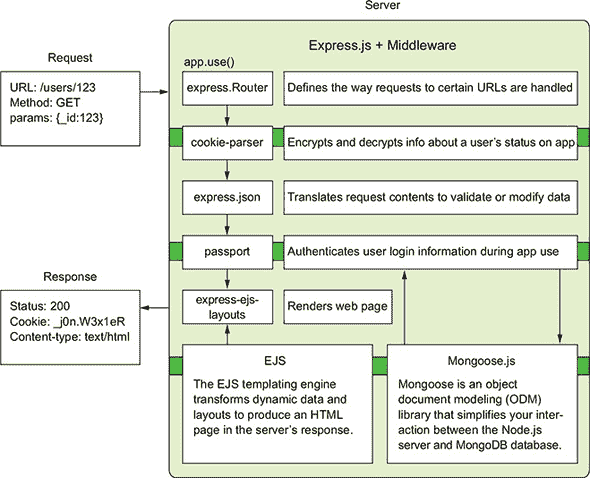
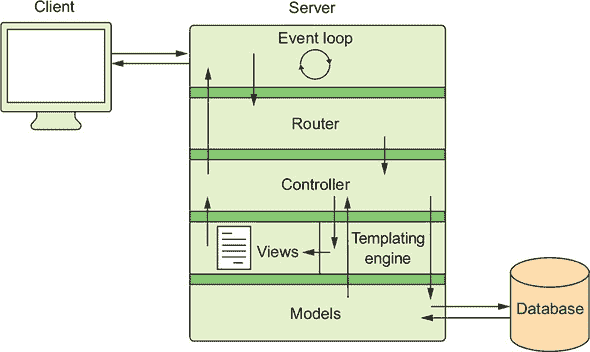

## 附录 B. 日志和 Node.js 全局对象的使用

## B.1\. 日志

日志可以帮助你了解正在运行哪些函数和中间件，显示你的应用程序正在产生哪些错误，并为你提供更深入的了解应用程序中正在发生的事情。

`console` 模块是 Node.js 的核心模块和全局对象，这意味着你可以在应用程序代码的任何地方访问 console 关键字。当你运行 `console.log()`，传递一些文本字符串作为消息时，输出通常会在终端窗口或文件中打印出来。为了本书的目的，`console` 模块提供了剖析应用程序代码的正确日志工具。除了 第二部分 中的日志提示外，还有一些日志命令需要记住。

`console` 模块有两个输出：标准输出和错误输出。尽管这两个输出都在你的终端窗口中显示文本，但在浏览器控制台中它们的行为不同。下一列表展示了你可以与 `console` 一起使用的其他日志记录函数。

##### 列表 B.1\. 使用日志函数

```
console.log("Standard output log message");       *1*
console.error("Error output log message");        *2*
console.info("Standard output log message");      *3*
console.warn("Error output log message");         *4*
```

+   ***1*** **将日志消息打印到你的控制台**

+   ***2*** **使用错误输出打印日志消息**

+   ***3*** **将日志消息作为 console.log 的别名打印**

+   ***4*** **将日志消息作为 console.error 的别名打印**

在 Node.js 应用程序中，这四个函数在服务器上的行为相似。当你使用这些日志函数在客户端 JavaScript 中时，你会注意到你的浏览器控制台以与消息类型相对应的格式打印你的日志消息。例如，警告消息有橙色背景，错误消息则显示为红色。

你可能还会发现两个有用的函数：`console.time` 和 `console.timeEnd`。这两个函数可以一起使用，以记录代码中某些操作开始和结束之间所花费的时间。这些函数内的文本需要匹配，才能使计时器正常工作。在下一列表中，函数 `xyz` 花费了一秒钟，然后记录了一条消息。这个操作的记录时间略多于一秒。

##### 列表 B.2\. 记录操作的时间

```
console.time("function xyz");            *1*
(function xyz() {
  setTimeout(function() {
    console.log("prints first");         *2*
    console.timeEnd("function xyz");     *3*
  }, 1000);
})();
```

+   ***1*** **开始控制台计时器**

+   ***2*** **将 console.log 消息作为函数操作的一部分打印**

+   ***3*** **记录结束时的计时**

`console.log` 将成为你在网络开发中最好的朋友之一，因为日志注释帮助你找到错误。通过一点实践和变化，了解你的新朋友。

## B.2\. 全局对象

在 Node.js 中，全局对象可以在任何应用程序中访问。你可以在 Node.js 应用程序的任何位置使用这些对象。这些对象可以包含有关应用程序或文件系统的信息。以下全局对象在 Node.js 应用程序中使用得最为频繁：

+   `console` 将输出到控制台或标准输出，无论你的应用程序在哪里运行。

+   `__dirname` 返回你机器上目录位置的绝对路径，如下所示：

    ```
    console.log(__dirname);
    >> /Users/Jon/Desktop
    ```

+   `__filename` 提供了您机器上应用程序目录的绝对路径，如下所示：

    ```
    console.log(__filename);
    >> /Users/Jon/Desktop/filename_example.js
    ```

+   `process` 指的是应用程序运行在其上的进程（线程）。此对象是应用程序资源的主要来源，以及与文件系统的连接。

一些对象看起来与 Node.js 的全局对象相似，但它们来自您项目中引入的其他库。这些对象在大多数 Node.js 应用程序中都是可用的。随着您学习如何使用以下对象，它们的使用案例将变得更加清晰：

+   `module` 指的是您正在工作的当前模块（JavaScript 文件），并允许您访问该文件中的其他变量。

+   `exports` 指的是一个键/值对对象，用于存储模块的函数或对象，以便它们可以在其他模块之间共享。使用此对象的方式与使用 `module.exports` 类似。在以下示例中，`accessibleFunction` 被导出以供其他模块使用：

    ```
    exports.accessibleFunction = () => {
      console.log("hello!");
    }
    ```

+   `require` 允许您将其他模块的代码导入到当前模块中，并让您访问当前工作文件外的代码。`require` 关键字的使用方法如下：

    ```
    const http = require("http");
    ```




