## 第一部分。第一步

了解什么是同构应用以及为什么想要构建一个同构应用是了解同构架构的重要第一步。本书的第一部分从宏观角度探讨了同构应用的原因和方式，为你提供了理解后面章节中呈现的具体实现细节所需的环境。

在第一章中，你将了解构建同构应用的所有原因。本章还为你概述了本书后面将构建的 All Things Westies 应用。在第二章中，你将使用本书中使用的技术（React、Node.js、webpack 和 Babel）构建一个示例应用。本章不是涵盖所有细节，而是让你看到这些部分是如何结合在一起的。

## 第一章。同构 Web 应用架构简介

*本章涵盖*

+   区分同构、服务器端渲染和单页应用

+   服务器端渲染以及从服务器端渲染到单页应用体验的转换步骤

+   了解同构 Web 应用的优缺点

+   使用 React 的虚拟 DOM 构建同构 Web 应用

+   使用 Redux 处理业务逻辑和数据流

+   通过 webpack 将具有依赖关系的模块捆绑在一起

本书旨在为寻求扩展其架构工具集并更好地了解构建 Web 应用的选项的 Web 开发者而编写。如果你曾经构建过单页或服务器端渲染的 Web 应用（比如，使用 Ruby on Rails），你将更容易理解本书中的内容。理想情况下，你对 JavaScript、HTML 和 CSS 感到舒适。如果你是 Web 开发的初学者，这本书可能不适合你。

从历史上看，Web 应用和网站有两种形式：服务器端渲染和单页应用（SPAs）。*服务器端渲染应用*通过向服务器发送新请求来处理用户采取的每个操作。相比之下，*SPAs*在浏览器中完全处理内容的加载和对用户交互的响应。*同构 Web 应用*是这两种方法的结合。

本书旨在将复杂的应用程序架构分解成可重复和可理解的片段。到本书结束时，你将能够使用以下技术创建内容网站或电子商务 Web 应用：

+   通过使用 React 实现快速感知性能并在服务器上渲染任何页面，以实现搜索引擎优化（SEO）爬虫（如 Googlebot）的完全渲染。

+   选择不在服务器上渲染某些功能。了解如何使用 React 生命周期来实现这一点。

+   在服务器和浏览器上处理用户会话。

+   使用 Redux 实现单向数据流，使在服务器上预取数据并在浏览器中渲染成为可能。

+   使用 webpack 和 Babel 来启用现代 JavaScript 工作流程。

### 1.1. 同构 Web 应用概述

我的团队和我遇到了一个大问题：我们的 SEO 渲染系统非常脆弱，消耗了宝贵的时间。我们不是在构建新功能，而是在排查为什么谷歌机器人看到的我们应用版本与用户看到的版本不同。该系统复杂，涉及第三方提供商，并且没有很好地扩展以满足我们的需求，因此我们决定向前迈进，开发一种新的应用类型——同构应用。

**同构应用**是一种将服务器渲染的网络应用与单页应用结合在一起的网络应用。一方面，我们希望利用服务器提供的快速感知性能和 SEO 友好的渲染。另一方面，我们希望在浏览器中处理复杂的用户操作（例如，打开模态窗口）。我们还想利用浏览器推送历史记录和 XMLHttpRequest（XHR）。这些技术使我们能够在每次交互时避免向服务器发送请求。

要开始理解所有这些内容，你将使用一个名为“所有西高地白梗”（All Things Westies）的示例网络应用（你将在本书的第四章中构建此应用）。在这个网站上，你可以找到各种为你的西高地白梗（一种小型白色犬）购买的产品。你可以购买狗用品和带有西高地白梗图案的产品（如袜子、杯子、T 恤等）。如果你不是宠物主人，你可能会觉得这个例子很荒谬。即使是宠物主人，我也觉得它有些过分。但事实是，像杯子这样的狗用品已经成为一大热门。如果你不相信我，可以在谷歌上搜索“pug mugs”。

因为这是一个电子商务应用，我们非常重视良好的搜索引擎优化（SEO）。我们还希望我们的客户在使用应用时能获得极佳的体验。这使得同构架构成为理想的应用场景。

#### 1.1.1. 理解其工作原理

请看图 1.1，这是“所有西高地白梗”应用的线框图。它有一个标准的页眉，右侧有一些主要网站导航。在页眉下方，主要内容区域推广产品和社交媒体的存在。

##### 图 1.1. 展示“所有西高地白梗”应用主页的线框图，这是一个同构网络应用

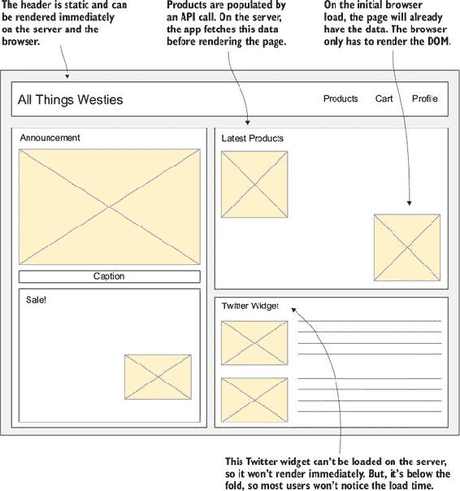

第一次访问该网站时，应用内容使用 Node.js 的服务器渲染技术渲染在服务器上。在服务器渲染后，内容被发送到浏览器并显示给用户。当用户在页面间导航，寻找狗杯或用品时，每个页面都是由浏览器中运行的 JavaScript 和 SPA 技术渲染的。

All Things Westies 应用依赖于尽可能在服务器和浏览器之间重用代码。该应用依赖于 JavaScript 在多个环境中的运行能力：JavaScript 在浏览器中运行，通过 Node.js 在服务器上运行。虽然 JavaScript 也可以在其他环境中运行（例如，在物联网设备和通过 React Native 在移动设备上），但这里的重点是运行在浏览器中的 Web 应用。

这本书中的许多概念可以在不编写所有 JavaScript 代码的情况下应用。历史上，在没有代码重用能力的情况下运行同构应用，其复杂性一直是阻碍因素。虽然使用 Java 或 Ruby 进行服务器端渲染并在之后过渡到单页应用是可能的，但这并不常见，因为它需要在两种语言中复制大量代码。这需要更多的维护。

要查看这个流程的实际操作，请看图 1.2。它展示了 All Things Westies 的代码是如何部署到服务器和浏览器的。服务器代码被打包并在 Node.js 网络服务器上运行，而浏览器代码则打包成一个文件，稍后在浏览器中下载。因为我们利用了 JavaScript 在两个环境中的运行，所以运行在浏览器并与我们的 API 或数据源通信的相同代码也在服务器上运行，以与后端通信。

##### 图 1.2. 同构应用在两个环境中构建和部署相同的 JavaScript 代码。

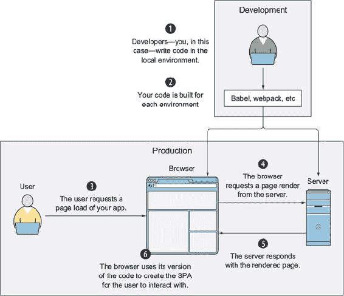

#### 1.1.2. 构建我们的堆栈

构建像 All Things Westies 这样的应用需要组合几种知名技术。这本书中的许多概念都是通过开源库来实现的。虽然你可以使用很少或没有库来构建同构应用，但我强烈建议利用 JavaScript 社区在这个领域的努力。

| |
| --- |

##### 提示

确保你包含在同构应用中的任何库都支持在服务器和浏览器环境中运行。查看第十章了解需要注意的事项以及如何处理环境差异。如果你打算只在服务器上使用库，则不需要检查浏览器兼容性。

| |
| --- |

显示产品（视图）的 HTML 组件将使用 React 构建（在第十二章中，你将探索如何使用其他流行的框架，包括 Angular 2 和 Ember，来实现同构架构）。你将通过 Redux 实现单向数据流，Redux 是 React 应用中当前社区标准的数据管理方式。你将使用 webpack 来编译在浏览器中运行的代码，并启用在浏览器中运行 Node.js 包。

在服务器端，你将使用 Express 构建 Node.js 服务器来处理路由。你将利用 React 在服务器上渲染的能力，并使用它构建一个完整的 HTML 响应，可以提供给浏览器。表 1.1 显示了所有这些组件是如何组合在一起的。

##### 表 1.1. 同构应用程序中使用的技术及其运行的环境

| 库（版本） | 服务器 | 浏览器 | 构建工具 |
| --- | --- | --- | --- |
| Node.js (6.9.2) | ✓ |   |   |
| Express (4.15.3) | ✓ |   |   |
| React (15.6.1) | ✓ | ✓ |   |
| React Router (3.0.5) | ✓ | ✓ |   |
| Redux (3.7.2) | ✓ | ✓ |   |
| Babel (6.25.0) | ✓ | ✓ | ✓ |
| webpack (3.4.1) |   | ✓ | ✓ |

为了使我们的应用程序在所有地方都能工作，你将使用 React Router 为你的路由构建数据预取。你还将通过为服务器和浏览器构建单独的代码入口点来处理环境差异。如果代码只能在浏览器中运行，你将控制代码或利用 React 生命周期来确保代码不会在服务器上运行。我在第三章介绍了 React，并在第七章中介绍了服务器逻辑的细节。

### 1.2. 架构概述

在本章的早期，我告诉你们同构应用程序是服务器端渲染的应用程序和单页应用程序结合的结果。为了更好地理解如何连接服务器端渲染应用程序和单页应用程序的概念，请参阅图 1.3。此图显示了获取同构应用程序渲染并响应用户输入的所有步骤，如单页应用程序，从用户输入网页地址开始。

##### 图 1.3. 从初始浏览器请求到 SPA 循环的同构应用程序流程

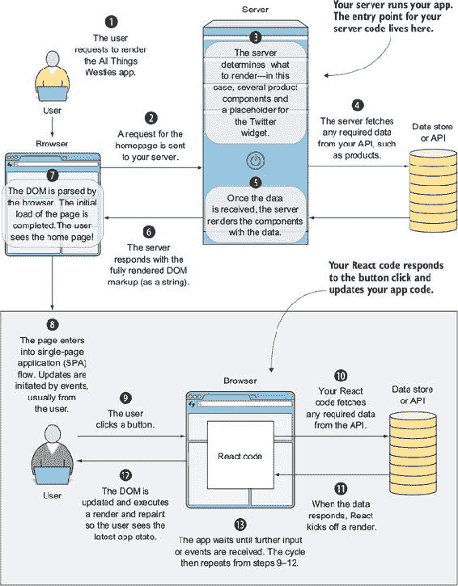

#### 1.2.1. 理解应用程序流程

每个网络应用程序会话都是在用户导航到网络应用程序或输入 URL 到浏览器窗口时启动的。对于 allthingswesties.com，当用户从电子邮件或从 Google 搜索中点击应用程序链接时，服务器端的流程将经过以下步骤（数字与图 1.3 中的数字相匹配）：

> **1**.  浏览器发起请求。
> 
> **2**. 服务器接收请求。
> 
> **3**. 服务器确定需要渲染的内容。
> 
> **4**. 服务器收集我们请求的应用程序部分所需的数据。如果请求是 allthingswesties.com/product/mugs，应用程序将请求通过网站销售的礼品项目列表。在进入渲染步骤之前，收集了所有要显示的信息（名称、描述、价格、图片）列表。
> 
> **5**. 服务器使用为杯子页面收集的数据生成我们的网页的 HTML。
> 
> **6**.  服务器响应 allthingswesties.com/product/mugs 的请求，并返回完整的 HTML。

应用程序周期的下一部分是浏览器中的初始加载。我们区分用户首次加载应用程序与随后的请求，因为在此首次加载期间，只会发生一次会话中的几个事情。


##### 定义

*初始加载* 是用户首次与您的网站互动的时刻。这意味着用户首次在谷歌搜索或社交媒体中点击您的网站链接，或者直接在网页地址栏中输入它。


浏览器的首次加载开始于从服务器接收 HTML 响应并且 DOM 能够被处理的那一刻。在此点，单页应用程序流程接管，应用程序响应用户输入、浏览器事件和计时器。用户可以向购物车添加产品、在网站上导航，并与表单交互。

> **7**.  浏览器渲染从服务器接收到的标记。
> 
> **8**.  应用程序现在能够响应用户输入。
> 
> **9**.  当用户将项目添加到购物车时，代码会响应并运行必要的业务逻辑。
> 
> **10**.  如果需要，浏览器会与后端通信以获取数据。
> 
> **11**.  React 渲染组件。
> 
> **12**.  进行更新，并执行任何必要的重绘。例如，用户的购物车图标更新以显示已添加项目。
> 
> **13**.  每次用户与应用程序互动时，步骤 9–12 会重复。

#### 1.2.2\. 处理服务器端请求

现在，让我们更详细地看看当服务器接收到渲染页面的初始请求时会发生什么。看看在服务器上渲染的网站部分。图 1.4 与 图 1.1 类似，但它的 Twitter 小部件没有渲染。Twitter 小部件设计为在浏览器中加载，因此它不会在服务器上渲染。

##### 图 1.4\. All Things Westies 首页的服务器渲染版本

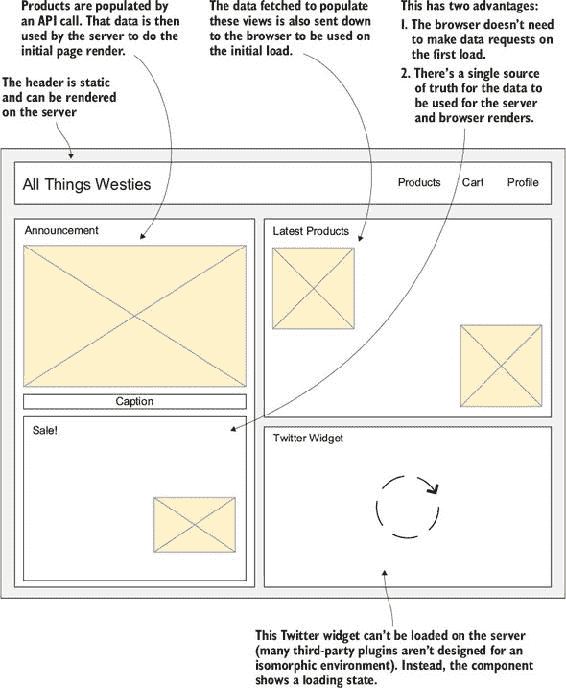

服务器执行三项重要任务。首先，它获取视图所需的数据。然后，它使用这些数据来渲染 DOM。最后，它将数据附加到 DOM 上，以便浏览器可以读取应用程序状态。图 1.5 展示了服务器上的流程。

##### 图 1.5\. 初始服务器渲染的应用程序流程

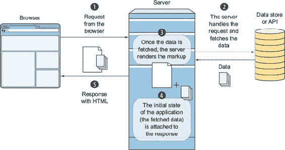

让我们逐步分析流程：

> **1**.  服务器接收请求。
> 
> **2**.  服务器获取该请求所需的所需数据。这可以来自持久数据存储，如 MySQL 或 NoSQL 数据库，或来自外部 API。
> 
> **3**.  在接收到数据后，服务器可以构建 HTML。它通过 React 的 `renderToString` 方法使用 React 的虚拟 DOM 生成标记。
> 
> **4**.  服务器将步骤 2 中的数据注入到您的 HTML 中，以便浏览器稍后可以访问它。
> 
> **5**. 服务器以你完全构建的 HTML 响应请求。

#### 1.2.3\. 浏览器中的渲染

现在我们更详细地看看浏览器中发生了什么。图 1.6 显示了浏览器中的流程，从浏览器接收 HTML 到引导应用的过程：

> **1**. 浏览器立即开始渲染茶杯页面，因为服务器发送的 HTML 已经完全形成，包含了你在服务器上生成的所有内容。这包括应用的页眉和页脚以及可购买的茶杯列表。*应用目前不会响应用户输入。像将茶杯添加到购物车或查看特定茶杯的详细页面这样的操作将无法工作。*
> 
> **2**. 当浏览器达到我们应用的 JavaScript 入口时，应用开始引导。
> 
> **3**. React 重新创建了虚拟 DOM。因为服务器发送了应用状态，这个虚拟 DOM 与当前的 DOM 相同。
> 
> **4**. 没有发生任何事！React 没有在 DOM 和它构建的虚拟 DOM 之间找到差异（虚拟 DOM 在第三章中有详细解释）。用户已经在浏览器中看到了茶杯列表。*现在应用可以响应用户输入，例如将茶杯添加到购物车。*

##### 图 1.6\. 浏览器渲染和引导—在第 1 步和第 4 步之间，应用不会响应用户输入。

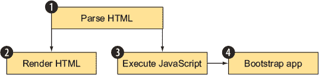

这时，单页应用流程再次启动。这是最直接的部分。它处理用户事件，进行 XHR 调用，并根据需要更新应用。

### 1.3\. 同构应用架构的优势

在这一点上，你可能觉得这听起来很复杂。你可能想知道为什么这种构建 Web 应用的方法会值得。有多个令人信服的理由选择这条路径：

+   简化和改进的 SEO—爬虫和爬虫可以在页面加载时读取所有数据。

+   用户感知的性能提升。

+   维护收益。

+   提高可访问性，因为用户可以在没有 JavaScript 的情况下查看应用。

同构应用架构也面临挑战和权衡。在管理和部署在多个环境中运行的代码时，复杂性增加。调试和测试更加复杂。通过 Node.js 和 React 服务器渲染的 HTML 对于具有许多组件的视图可能会很慢。例如，显示许多销售项目的页面可能会迅速变成数百个 React 组件。随着这个数字的增加，React 在服务器上构建这些组件的速度会下降。首先，我将介绍构建同构应用的优点。让我们从讨论 SEO 开始。

#### 1.3.1\. SEO 优势

我们的示例应用“所有西施犬”，是一个电子商务网站，因此为了成功，它需要购物者！并且它需要良好的 SEO 来最大化从搜索引擎来到应用的人数。单页应用对搜索引擎爬虫来说很难爬取，因为它们在浏览器中的 JavaScript 运行之后才会加载数据。同构应用在 JavaScript 运行后也需要引导启动，但由于它们的内容是由服务器渲染的，用户和爬虫都不需要等待应用引导启动才能看到网站的内容。

| |
| --- |

##### 定义

*引导启动*一个应用意味着运行设置好一切所需的代码。此代码仅在应用的初始加载时运行一次，并从浏览器应用的入口点运行。

| |
| --- |

在 All Things Westies 应用上，您想要确保所有与 SEO 相关的内容都在服务器上获取，这样您就不依赖于 SEO 爬虫尝试渲染您的页面。爬虫（无论是谷歌或必应等搜索引擎爬虫还是 Facebook 等分享爬虫）要么无法运行所有这些代码，要么不愿意等待足够长的时间来运行这些代码。例如，谷歌会尝试运行 JavaScript，但会惩罚加载内容过慢的网站。这可以在图 1.7 中显示的警告中看到。当您将单页应用的 URL 输入到 Google PageSpeed Insights 工具中时，就会出现这个警告。

##### 图 1.7\. Google PageSpeed Insights 为单页应用提供了一个警告。该应用在页面初始加载后进行了过多的 AJAX 调用以获取可见内容。

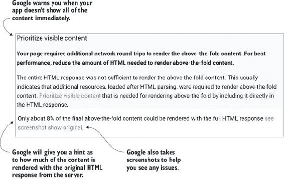

| |
| --- |

**Google PageSpeed Insights 工具**

Google 的 PageSpeed Insights 工具帮助测量您的页面在 0 到 100 分的范围内表现如何。您会得到与速度相关的问题（如图片大小、JavaScript 大小、放大、往返次数等）和 UI（例如点击区域大小）的分数。在您的 Web 应用上测试它，请访问[`developers.google.com/speed/pagespeed/insights`](https://developers.google.com/speed/pagespeed/insights)。

Google 还有一个 Lighthouse 工具（作为 Chrome 扩展或命令行工具提供），它将对您网站上的页面进行深入分析。它对性能、使用服务工作者以允许离线使用、提高屏幕阅读器的可访问性等方面提出建议。您可以在[`developers.google.com/web/tools/lighthouse/`](https://developers.google.com/web/tools/lighthouse/)了解更多关于 Lighthouse 的信息。

| |
| --- |

如果你没有处理这个警告，你可能会得到较低的排名和更少的客户。此外，没有保证任何依赖于 API 调用的页面内容都会被爬虫运行。为了解决单页应用的问题，已经出现了专门的服务。开发团队投入时间开发系统来爬取和预渲染他们的页面。然后，他们将机器人重定向到这些预渲染的页面。这些系统复杂且脆弱，难以维护。

个人来说，我迫不及待地希望有一天爬虫和机器人能够获取到我们所有的内容，无论数据是在服务器上还是在浏览器中获取。直到那一天，服务器渲染初始内容在单页应用渲染方面具有很大的优势。这对于页眉以上的内容以及任何具有 SEO 优势的其他内容尤其如此。


##### 定义

*页眉以上* 是来自报纸行业的术语。它指的是当报纸折叠成一半并放在报摊上时，出现在首页上的所有内容。对于 Web 应用来说，这个术语用于指代当应用加载时，用户屏幕上可查看区域内的所有内容。要查看页眉以下的内容，用户必须滚动。


除了 SEO 爬虫之外，许多允许内联网站预览的社会网站和应用（例如，Facebook、Twitter、Slack 或 WhatsApp）也使用不运行 JavaScript 的机器人。这些网站假设所有可用于构建社交卡片或内联预览的内容都将可在服务器渲染的页面上获得。同构应用非常适合处理社交机器人用例。

在本节的开始，我提到过，机器人和用户都不需要等待同构应用启动以查看动态内容。另一种说法是，同构 Web 应用的感知性能很快。下一节将详细描述这一点。

#### 1.3.2\. 性能优势

用户希望立即看到 All Things Westies 的内容。否则，他们会变得不耐烦，在看到所有产品和信息之前就离开。加载 SPA 对于用户来说可能是一个缓慢的过程（尤其是在手机上）。尽管浏览器可能快速连接到你的应用，但运行启动代码和获取内容需要时间，这会让用户等待。在最佳情况下，SPAs 会显示加载指示器和用户消息。在最坏的情况下，没有视觉反馈，用户会感到困惑，不知道是否有什么事情发生。

图 1.8 显示了如果 All Things Westies 是一个单页应用，在初始渲染时的样子。你不会立即看到所有内容，而是在所有内容区域都会看到加载旋转器。

##### 图 1.8\. 在 All Things Westies 的单页应用版本中，第一次加载时会显示旋转器，而不是真实内容。

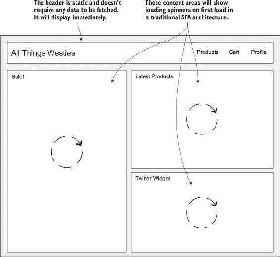

服务器端渲染的页面在浏览器接收并渲染 HTML 后立即将内容（您网站的所有 HTML、图像、CSS 和数据）显示给用户。这导致用户比在 SPA 中看到内容快几秒钟。尽管网站仍然需要在用户交互之前加载和执行 JavaScript，但这种快速加载使用户能够快速开始视觉处理您的内容。这被称为*感知性能*。应用内容快速呈现给用户。用户没有意识到后台正在运行 JavaScript。

当这个过程执行得当，用户将永远不会知道在视图渲染之后加载的 JavaScript。从所有实际目的来看，用户会有很好的体验，因为他们认为应用加载得很快。这大大减少了在应用首次加载时需要加载旋转器或其他等待状态的需求。这导致用户更加满意。图 1.9 展示了单页应用和同构应用之间的差异。

##### 图 1.9. 用户看到 Web 应用内容时的比较。同构应用比单页应用更早地显示其内容。

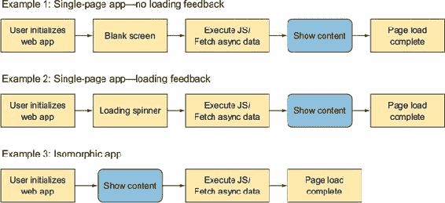

现在，我将详细向您介绍单页应用和同构场景。您也可以在图 1.9 中看到这些流程。

首先，看看示例 1。想象一下，您访问我们的示例 Web 应用，屏幕上显示空白六秒钟。您会怎么做？您有多可能感到沮丧并放弃使用该 Web 应用？如果您想买一双威士忌袜子，您可能会放弃 All Things Westies，并将业务转移到其他地方。

现在想象一下，Web 应用仍然需要六秒钟来加载（如示例 2 所示），但这次它显示了一个基本结构（一个加载旋转器），让您知道 Web 应用正在做某事，但您还不能与之交互，就像之前图 1.8 中所示的那样。您愿意等待这个网站加载吗？

最后，让我们想象一下，当您来到 All Things Westies 时，内容在两秒钟内显示出来，如图例 3 所示。这个流程与本章开头图 1.1（kindle_split_011_split_001.xhtml#ch01fig01）中的流程相匹配。这次，您的头脑开始处理显示的信息。您感觉不到需要等待。在后台，应用仍在加载并工作以设置一切，但您不需要等待这一切完成才能看到内容。

注意，该应用能够在页面加载流程中更早地显示内容。尽管所有三种方法中页面加载时间按性能指标衡量将是相同的，但用户*感知*同构应用的性能要快得多。

#### 1.3.3. 没有 JavaScript？没问题！

同构应用程序架构的另一个用户端好处是，你可以不要求 JavaScript 即可提供网站的部分内容。无法或不想运行 JavaScript 的用户仍然可以在网站以同构方式构建时从中受益。因为你向浏览器提供了一个完整的页面，用户至少可以看到你的内容，尽管他们无法与应用程序交互。

这让你能够使用渐进增强来更好地为各种浏览器和设备上的用户提供服务。尽管遇到没有运行 JavaScript 的用户可能不太可能，但还有其他很好的理由从服务器加载整个页面。例如，如果你支持旧版浏览器或设备，同构应用程序是提供跨多种浏览器/设备/操作系统组合的最佳体验的好工具。

我们已经介绍了同构应用程序的用户端好处。接下来，我们将探讨这种架构带来的开发者好处。

#### 1.3.4. 维护和开发者好处

在构建同构应用程序时，大部分代码可以在服务器和浏览器上运行。如果你想渲染一个视图，你只需要编写一次代码。如果你想为应用程序中的常见任务编写辅助函数，你只需要编写一次这个逻辑，它将在两个地方运行。

这比那些服务器端代码用一种语言编写，浏览器端代码用 JavaScript 编写的应用程序具有优势。开发者可以保持专注，无需在语言之间切换。构建、环境管理和依赖项都得到了简化，这使得你的整体工作流程更加清晰。

这并不是说构建同构应用程序很容易。用一种语言编写一切会带来它自己的一套问题。

#### 1.3.5. 挑战和权衡

选择使用同构 Web 架构构建应用程序并非没有权衡。首先，它需要一种新的思维方式，这需要时间来适应。好消息是，这正是本书要教你的内容。其中一些挑战包括以下内容：

+   处理 Node.js 和浏览器之间的差异

+   调试和测试的复杂性

+   在服务器上管理性能

##### 处理服务器和浏览器之间的差异

Node.js 没有窗口或文档的概念。浏览器不知道 Node.js 环境变量，也不知道请求或响应对象是什么。这两个环境都知道 cookie，但它们处理它们的方式不同。在第十章中，你将了解处理这些环境紧张关系的策略。

##### 调试和测试的复杂性

你的所有代码都需要测试两次：直接从服务器加载，以及作为单页流程的一部分。调试需要掌握浏览器和服务器调试工具，并知道错误是在服务器、浏览器还是在两个环境中发生的。此外，还需要一个彻底的单元测试策略，其中测试是在适当的环境中编写和运行的。仅服务器端代码应在 Node.js 中测试，但共享代码应在它最终运行的任何环境中进行测试。

##### 管理服务器端的性能

服务器端的性能也提出了挑战，因为 React 提供的`renderToString`方法在具有许多组件的复杂页面上执行缓慢。在第十一章（[kindle_split_023_split_000.xhtml#ch11](https://kindle_split_023_split_000.xhtml#ch11)）中，我将向你展示如何尽可能优化你的代码而不破坏 React 的最佳实践。我们还将讨论缓存作为减少服务器性能问题的工具。

在这一点上，你已经理解了同构应用架构带来的好处和权衡。接下来，让我们深入探讨如何执行一个同构应用。

### 1.4. 使用 React 构建视图

React 是构建同构 Web 应用可能性的组成部分之一。*React*是由 Facebook 开源的用于创建用户界面（应用中的视图层）的库。React 通过 HTML 和 JavaScript 使表达视图变得容易。它提供了一个简单且易于启动的 API，但设计成可组合的，以便快速高效地构建用户界面。像许多其他视图库和实现一样，React 提供了一个模板语言（JSX）并钩入 DOM 和 JavaScript 的常用部分。

React 还通过遵循从顶级组件到底层子组件的单向数据流来利用函数式概念。对于同构应用来说，使其吸引人的是它如何使用虚拟 DOM 来管理应用程序的变化和更新。

React 不是一个像 Angular 或 Ember 那样的框架。它只提供你用来编写视图组件的代码。它可以很容易地适应模型-视图-控制器（MVC）风格的架构作为视图。但书中会介绍构建复杂 React 应用的推荐方法。

*虚拟 DOM*是用 JavaScript 编写的浏览器 DOM 的表示。在核心上，React 由 React 元素组成。自从 React 将虚拟 DOM 引入到 Web 社区以来，这个想法已经开始出现在许多主要的库和框架中。甚至有些人正在编写他们自己的虚拟 DOM 实现。

就像浏览器 DOM 一样，虚拟 DOM 是一个由根节点及其子节点组成的树。虚拟 DOM 创建后，React 将虚拟树与当前树进行比较，并计算出需要更新浏览器 DOM 的更新。如果没有变化，则不进行更新。如果发生了变化，React 只更新浏览器 DOM 中发生变化的部分。图 1.10 展示了这一点。在左侧，虚拟 DOM 已更新以删除带有`<div>`标签的右子树，其子节点是一个``标签和一个`<a>`标签。这导致这些相同的子节点从浏览器 DOM 中删除。

##### 图 1.10. 比较 DOM 树：虚拟 DOM 的变化与浏览器 DOM 进行比较。然后 React 根据计算出的差异智能地更新浏览器 DOM 树。

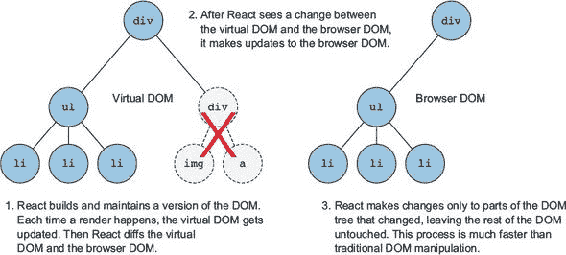

React 使用 JavaScript 来表示 DOM 节点。在 JavaScript 中，这被写成如下所示：

```
let myDiv = React.createElement('div');
```

当 React 渲染发生时，每个组件返回一系列 React 元素。它们一起形成虚拟 DOM，这是 DOM 树的 JavaScript 表示。

由于虚拟 DOM 是浏览器 DOM 的 JavaScript 表示，并且不依赖于浏览器提供的对象（尽管某些代码路径可能依赖于这些项目），它可以在服务器上渲染。但是，在服务器上渲染 DOM 是不行的。相反，React 提供了一种将渲染的 DOM 作为字符串输出（`ReactDOM.renderToString`）的方法。这个字符串可以用来构建一个完整的 HTML 页面，该页面从你的服务器发送到用户。

### 1.5. 商业逻辑和模型：Redux

在现实世界的 Web 应用中，你需要一种管理数据流的方法。Redux 提供了一个与应用程序状态很好地配合 React 工作的实现。需要注意的是，你不必在 React 中使用 Redux，反之亦然，但它们的理念相得益彰，因为它们都使用了函数式编程的思想。同时使用 Redux 和 React 也是社区的最佳实践。

与 React 一样，Redux 遵循单方向的数据流。Redux 在其存储中保存了应用程序的状态，为你的应用程序提供了一个单一的真实来源。为了更新这个存储，*动作*（代表应用程序状态离散变化的 JavaScript 对象）从视图中发出。这些动作反过来又触发*还原器*。*还原器*是纯函数（没有副作用的功能），它接受一个变化并返回在响应变化后的新存储。图 1.11 展示了这个流程。

##### 图 1.11. 视图（React）使用 Redux 在用户采取动作时更新应用程序状态。Redux 然后让视图知道何时根据新的应用程序状态进行更新。

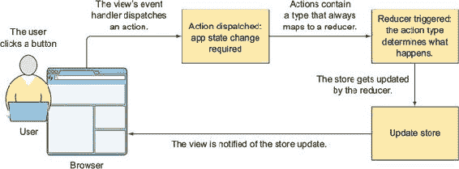

关于 Redux，需要记住的关键点是只有 reducers 可以更新存储。所有其他组件只能从存储中读取。此外，存储是不可变的。这是通过 reducers 强制执行的。我在第二章中再次提到了这一点，并在第六章中进行了完整的 Redux 解释。

在同构应用中，在服务器和浏览器之间传输状态的能力非常重要。Redux 的存储提供顶级状态。通过依赖于单个根对象来保存你的应用程序状态，你可以轻松地将状态序列化在服务器上，并将其发送到浏览器进行反序列化。第七章更详细地介绍了这个主题。应用的最后一部分是构建工具。下一节将概述 webpack。

### 1.6\. 构建应用：webpack

Webpack 是一个强大的构建工具，它使得将代码打包成一个单一捆绑包变得容易。它有一个以加载器形式存在的插件系统，允许简单地访问工具，如 Babel 用于 ES6 编译或 Less/Sass/PostCSS 编译。它还允许你将 Node.js 模块代码（npm 包）打包成将在浏览器中运行的捆绑包。

| |
| --- |

##### 定义

当前和未来的 JavaScript 版本（ES6、ES2015、ES2016、ES7、ES Next）有许多名称。为了保持一致性，我将尚未在浏览器中完全采用的现代 JavaScript 称为 *ES6*。

| |
| --- |

这对于我们的同构应用至关重要。通过使用 webpack，你可以将所有依赖项捆绑在一起，并利用 npm（Node 包管理器）提供的库生态系统。这允许你几乎在两个环境中共享应用程序中的所有代码——浏览器和服务器。

| |
| --- |

##### 注意

你不会为我们的 Node.js 代码使用 webpack。这是不必要的，因为你可以编写大多数 ES6 代码，Node.js 已经可以利用环境变量和 npm 包。

| |
| --- |

Webpack 还允许你在捆绑代码中使用环境变量。这对于我们的同构应用非常重要。尽管你希望尽可能在两个环境中共享代码，但浏览器中的一些代码在服务器上无法运行，反之亦然。在 Node.js 服务器上，你可以利用这样的环境变量：

```
if (NODE_ENV.IS_BROWSER) { // execute code }
```

但这段代码在浏览器中无法运行，因为它没有 Node.js 环境变量的概念。你可以使用 webpack 将一个 `NODE_ENV` 对象注入到你的 webpacked 代码中，这样这段代码就可以在两种环境中运行。第五章深入介绍了这个概念。

### 摘要

在本章中，你了解到同构 Web 应用是服务器渲染的 HTML 页面与单页应用架构相结合的结果。这样做有几个优点，但确实需要学习一种新的关于 Web 应用架构的思考方式。下一章将提供一个同构应用的概述。

+   同构 Web 应用将服务器端架构和单页应用架构结合起来，为用户提供更好的整体体验。这导致感知性能的提高、SEO 的简化以及开发者的好处。

+   能够在服务器（Node.js）和浏览器中运行 JavaScript 允许你编写一次代码，并将其部署到两个环境中。React 的虚拟 DOM 允许你在服务器上渲染 HTML。

+   Redux 帮助你管理应用程序状态，并轻松地将此状态序列化以从服务器发送到浏览器。

+   通过使用 webpack 构建你的应用程序，你可以在浏览器中使用 Node.js 代码，并标记代码仅在浏览器中运行。

## 第二章\. 一个同构应用的示例

*本章涵盖*

+   设置你的构建以在服务器和浏览器上工作

+   渲染视图

+   使用 Redux 获取数据

+   在服务器上处理请求

+   在服务器上序列化数据

+   在浏览器中反序列化数据

在本章中，我将带你了解使用 React、Redux、Babel 和 webpack 构建的同构应用程序的所有关键部分。将本章视为在全面投入之前试水的机会。你不需要理解所有细节，但到本章结束时，你将有一个关于所有组件如何融入应用程序的感觉，这将为你理解本书的其余部分提供背景。

如果你已经精通构建 React 应用程序，那么本章以及第七章和第八章将帮助你入门。如果你对 React 还不熟悉，我将在第三章至第六章中带你了解 React 和应用程序的其他构建块。

### 2.1\. 本章将构建的内容：食谱示例应用

首先，让我们看看你将在本章中构建的应用程序。图 2.1 显示了你要构建的食谱应用程序。在本章中，你将构建应用程序的主页，它将显示顶级食谱和特色食谱。将你的第一个同构应用程序的所有组件组合在一起是一个复杂的过程，因此对于构建同构应用程序的第一次尝试，我将保持最终目标简单。

##### 图 2.1\. 你将在本章中构建的食谱应用的主屏幕

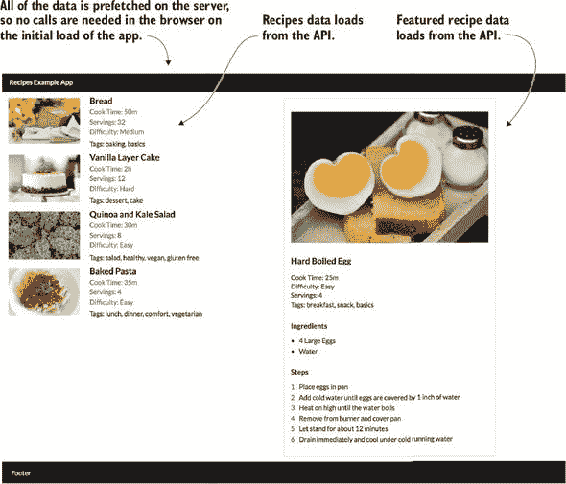

这个应用将只有一个路由，不会处理任何用户交互。同构架构对于这样一个简单的应用来说过于复杂，但它的简单性将使我能够展示核心概念。在后面的章节（从第四章开始），我将教你如何构建一个更复杂的具有路由和用户交互的应用程序。

在第一章中，我们讨论了同构应用中的三个主要步骤：服务器渲染、初始浏览器渲染和单页应用行为。在本章中，你将学习如何创建一个可以利用这种渲染流程的应用程序。你将构建服务器，序列化数据，在浏览器中加载数据，并渲染浏览器视图。图 2.2 展示了本章中你将构建的各个部分是如何组合在一起的。

##### 图 2.2\. 本章中你将构建的应用程序流程——从服务器和浏览器进行初始渲染

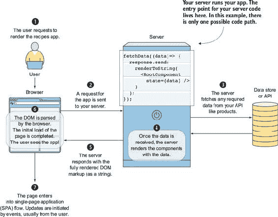


##### 定义

*序列化*发生在你将 JSON 转换为字符串时。这个字符串易于在应用程序之间发送，可以作为服务器响应的一部分发送到浏览器。*加载数据*（或*反序列化*）意味着将字符串转换回一个可以被浏览器中的应用程序使用的 JSON 对象。


#### 2.1.1\. 构建块：库和工具

要编写食谱应用程序并使其作为同构应用程序运行，你将使用几个 JavaScript 库：

+   ***Babel 和 webpack*—** 编译和构建工具。Babel 将代码编译成 JavaScript 编译器可以理解的版本，无论浏览器实现如何。Webpack 将允许你为浏览器捆绑代码，包括通过 npm（Node 包管理器）安装的库。

+   ***Express*—** 使服务器端路由简单化，用于渲染视图。

+   ***React 和 Redux*—** 视图和业务逻辑。你将使用名为 JSX 的模板语言编写你的 React 组件，这是 React 的标准。它看起来很像 HTML，但允许你在视图代码中插入逻辑和变量。

+   ***Semantic UI*—** 通过提供一组标准的类来简化 CSS。本书的重点不是 CSS，这将使你在各种示例中更容易跟随。


**Semantic UI 用于布局和 CSS**

Semantic UI 是一个 CSS 库，它提供了基本的样式和预定义的布局、组件和网格。我在食谱示例应用的视图布局中使用了 Semantic UI 的 CSS。有关 Semantic UI 的文档可以在[`semantic-ui.com`](http://semantic-ui.com)找到。


在你开始构建和运行代码之前，让我们看看代码的哪些部分在服务器上运行，哪些部分在浏览器上运行，以及哪些部分在两个环境中都运行。图 2.3 将应用程序的各个部分（React 组件、Redux 动作和减少器、服务器和浏览器的入口点）映射到它们运行的相应环境中。一些代码（例如 React 和 Redux）将在两个环境中运行。其他代码是针对服务器或浏览器的特定代码（例如，Express 用于服务器）。

##### 图 2.3\. 概述了各种库和构建工具如何在代码运行的两个环境中（服务器和浏览器）中使用。这里列出的文件可以在代码示例中找到。下一节将提供下载代码的说明。

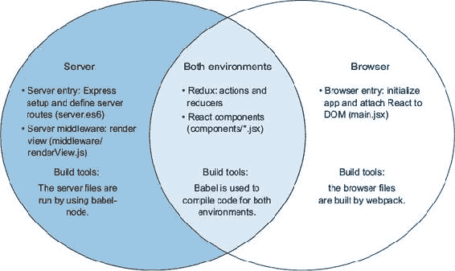

图表还演示了哪些构建工具用于哪些环境。Webpack 将用于构建仅浏览器代码。服务器代码将使用 npm 脚本来构建。Babel 在两个环境中都使用。

#### 2.1.2\. 下载示例代码

您可以从 GitHub 下载此示例的代码：[`github.com/isomorphic-dev-js/chapter2-a-sample-isomorphic-app.git`](https://github.com/isomorphic-dev-js/chapter2-a-sample-isomorphic-app.git)。我建议您这样做，因为所有必需的包和代码都已经为您设置好了，您可以轻松地跟随操作。

要从 GitHub 检查代码，请在您想要克隆项目的目录中运行以下命令：

```
$ git clone https://github.com/isomorphic-dev-js/chapter2-a-sample-
     isomorphic-app.git
```


##### 小贴士

如果您需要帮助开始使用 Git，Rick Umali 的《一个月午餐时间学习 Git》（Manning, 2015）是一本很好的资源。


查看应用中的关键文件夹和文件。图 2.4 显示了应用的核心文件夹结构（其他文件和文件夹也位于仓库中，但图表指出了本章相关的部分）。您可以将这些映射到图 2.3 中显示的环境。服务器（app.es6）和浏览器（main.jsx）的入口点尤为重要，因为所有特定于环境的代码都将放入这些文件中。

##### 图 2.4\. 文件夹组织以及顶级构建和配置文件。食谱应用的文件夹结构子集视图，显示了哪些文件与构建和工具、服务器和浏览器相关。

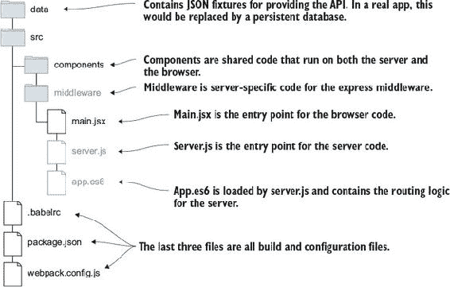

### 2.2\. 工具

在您克隆了仓库之后，就是时候运行应用了。本章的代码包括一个简单的 Node.js 服务器，该服务器将渲染食谱应用的首页。Node.js 服务器还将提供食谱数据。在这个例子中，食谱将从 JSON 文件中加载。在现实世界中，您可能希望使用数据库或 API 来持久化数据。

为了让食谱应用正常运行，您将学习以下内容：

+   使用 npm 设置开发环境和安装包

+   使用 Babel 编译和运行服务器代码

+   使用 webpack 构建浏览器代码

+   处理多个代码入口点

#### 2.2.1\. 设置环境和安装包

您将使用 Node.js 来运行 Web 服务器。它适用于许多用例，但特别适合同构应用，因为它允许您使用 JavaScript 编写整个应用栈。


**Node.js 下载和文档**

本章假设您对 Node.js 有基本的了解，并且已经将其安装到您的机器上。要获取 Node.js 的最新版本并保持文档更新，请访问 [`nodejs.org`](https://nodejs.org)。Node.js 随 npm 一起提供。

我正在运行 Node.js 版本 6.9.2。如果您运行的版本低于 6 的主要版本，您可能需要额外的 Babel 包，这些包在本书中没有涵盖。如果您运行的版本高于 6 的主要版本，您可能不需要包含的所有 Babel 包。


在您开始运行服务器之前，您需要安装此示例的所有 npm 包。您可以在 [www.npmjs.com](http://www.npmjs.com) 找到所有 npm 包的列表以及 表 2.1 和 2.2 中列出的包的文档。食谱应用所需的包已在项目的 package.json 中提供。要安装它们，请在您的终端中运行以下命令：

```
$ npm install
```

安装两组包：

+   devDependencies 包含构建工具，如 Babel 和 webpack。当 `NODE_ENV` 变量设置为 `production` 时，package.json 中的 devDependencies 部分的包不会安装。有关更多信息，请参阅 表 2.1。

+   dependencies 包含运行应用程序所需的任何库。有关更多信息，请参阅 表 2.2。

##### 表 2.1\. devDependencies 列表（用于构建和编译应用程序）

| Package | 描述 |
| --- | --- |
| babel-core | 主要的 Babel 编译器包。更多信息请访问 [`babeljs.io`](https://babeljs.io)。 |
| babel-cli | Babel 的命令行工具。用于编译服务器代码。 |
| babel-loader | Webpack 用于使用 Babel 与 webpack 的加载器。 |
| babel-preset-es2015, babel-preset-react, babel-plugin-transform-es2015-destructuring, babel-plugin-transform-es2015-parameters, babel-plugin-transform-object-rest-spread | Babel 有许多预设选项，因此我们包括与本项目相关的选项。这些包包括 React、ES6 和 JSX 编译的规则。 |
| css-loader | Webpack 用于在 webpacked 文件中使用 CSS 的加载器。 |
| style-loader | Webpack 用于在 webpacked 文件中使用 CSS 的加载器。 |
| webpack | 用于编译 JavaScript 代码的构建工具。使 ES6 和 JSX 在浏览器中使用，以及使用 Node.js 编写的包（只要它们是同构的）。更多信息请访问 [`webpack.js.org`](https://webpack.js.org)。 |

##### 表 2.2\. 食谱应用的核心依赖

| Package | 描述 |
| --- | --- |
| express | 一个提供通过中间件进行路由和路由处理工具的 Node.js 网络框架。更多信息请访问 [`github.com/expressjs`](https://github.com/expressjs)。 |
| isomorphic-fetch | 启用在浏览器和服务器中使用 fetch API。 |
| react | 主要的 React 包。更多信息请访问 [`facebook.github.io/react/`](https://facebook.github.io/react/). |
| react-dom | 浏览器和服务器特定的 DOM 渲染实现。 |
| redux | 核心 Redux 代码。 |
| react-redux | 为连接 React 和 Redux 提供支持。 |
| redux-thunk | Redux 中间件。 |
| redux-promise-middleware | 支持承诺的 Redux 中间件。 |

在您的编辑器中打开代码并找到 package.json 文件。您将看到前面表格中列出的所有库。现在您已经了解了示例应用的依赖关系，您可以设置并运行服务器。

#### 2.2.2\. 运行服务器

要使服务器运行（以便您可以测试 API，如图 2.5 所示），您首先需要使用 Babel 构建服务器代码。您可能想知道为什么需要为在运行时解释的语言编译代码。这一步骤需要两个原因：

+   ***使用 ES6 语言特性编写最新和最优秀的代码*—** JavaScript 也被称为 ECMAScript (ES)。ES6 是一个较新的版本，它添加了许多语言特性，包括类、映射和承诺。ES6 的大部分规范已经在 Node.js 6.9.2 或更高版本上运行。但如果你想要使用来自 ES7（JavaScript 的下一个版本）的新功能或使用 `import` 语句而不是 `require` 语句，仍然需要进行编译。本书中的示例利用了 `import` 语句。

+   ***因为服务器将渲染组件，所以您需要在服务器上运行 JSX*—** JSX 是 React 用于声明视图的模板语言。Node.js 不理解如何运行 JSX，因此您需要在使用服务器之前将 JSX 编译成 JavaScript。我将在本章后面讨论 JSX。

##### 图 2.5\. 服务器运行后 recipes API 端点的预期输出

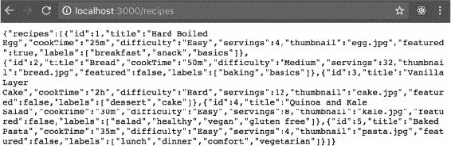


##### 注意

我在项目中使用两种文件扩展名而不是 .js。对于用 ES6 编写的文件，我使用 .es6 扩展名来表示需要使用 Babel 编译文件。对于包含 React 组件的文件，我使用 .jsx 扩展名来表示存在 JSX 模板。这使得我们只需将想要传递给 Babel 编译器的文件传递过去，同时也使得区分工作文件和编译文件变得容易。.jsx 扩展名也被一些编辑器和 IDE 识别为使用不同语法高亮的信号。


要构建和运行服务器，您使用在 npm 包中设置的 Babel 工具和配置。还需要两段额外的代码来使这一切工作。首先，要使用 Babel，您需要一个 Babel 配置。最好的方法是创建一个 .babelrc 配置文件。在 .babelrc 中，我已经为编译器指定了两个预设：`es2015` 和 `react`。以下列表显示了此代码，该代码已包含在仓库中。

##### 列表 2.1\. Babel 配置—babelrc

```
{
  "presets": ["es2015", "react"],               *1*
  "plugins": [                                  *2*
    "transform-es2015-destructuring",           *3*
    "transform-es2015-parameters",              *3*
    "transform-object-rest-spread"              *3*
  ]
}
```

+   ***1* 包含包含插件组的包，使配置更容易、更快**

+   ***2* 插件是 Babel 的基本单位，每个插件负责一种更新类型。**

+   ***3* 三个插件允许使用扩展运算符 (...)，这样你可以轻松地处理和更新对象。**

这里列出的预设与你在本章早期安装的预设包相对应。这将确保 ES6 代码和 JSX 模板代码被正确编译。


##### 注意

babel-cli 和相关工具功能强大且灵活。访问 [`babeljs.io`](https://babeljs.io) 了解 Babel 还能做什么。例如，Babel 支持编译文件的 sourcemaps。此外，如果你更喜欢不同的构建工具，你可以使用 Babel 与大多数流行的 JavaScript 构建工具一起使用。


对于其他所需的代码片段，我已经设置了这个项目在服务器上以开发模式使用 Babel 内联。你不需要预先编译任何代码就可以在服务器上运行它。server.js 文件只有两行代码。以下列表显示了代码，它已经包含在仓库中。

##### 列表 2.2\. 使用 Babel 运行服务器——src/server.js

```
require('babel-register');          *1*
require('./app.es6');               *2*
```

+   ***1* 包含 Babel——它将解析其后的所有代码（不推荐用于生产环境）。**

+   ***2* 包含服务器根应用程序代码。**

在一切配置和设置完成后，你只需运行以下命令即可启动 Node.js 服务器：

```
$ npm start
```

Node.js 服务器现在正在本地主机 3000 端口上运行。加载 http://localhost:3000/recipes，你将看到一个包含多个菜谱的 JSON 对象。示例输出将类似于 图 2.5 中的 JSON 对象。记住，服务器在菜谱应用中扮演两个角色：它渲染初始视图并提供数据 API。

接下来，我们将探讨 webpack 如何使用 Babel 创建浏览器代码。

#### 2.2.3\. 使用 webpack 构建浏览器代码

每次我学习一个新的构建工具时，我都会花费数小时感到沮丧，想知道为什么我还在学习另一个可能或可能不会给我带来长期工作流程改进的库。尽管 webpack 有一个陡峭的学习曲线，但我投入学习它的时间是非常值得的。每次我遇到需要用构建脚本完成的新任务时，我都会发现 webpack 可以完成这项工作。此外，它有一个强大的社区，并已成为现代网络应用的首选之一。

Webpack 是一个可以从命令行运行并可通过 JavaScript 配置文件进行配置的构建工具。它支持广泛的功能：

+   使用加载器编译 ES6 和 JSX 代码，并通过加载器加载静态资源

+   智能捆绑代码到更小包的代码拆分

+   能够为服务器或浏览器构建代码

+   开箱即用的 sourcemaps

+   Webpack 开发服务器

+   内置的监视选项

你将使用 webpack 来构建浏览器包。与 Node.js 不同，浏览器对最新版 JavaScript 的支持不一致。为了编写 ES6 代码，我需要将其编译成浏览器可以读取的格式（ES5）。同样，在服务器上，JSX 也必须编译成 JavaScript 编译器可以理解的格式。为此，你将利用 webpack 配置，然后通过上一节中看到的 npm 脚本运行该配置。要运行 webpack 脚本，你还需要运行以下命令：

```
$ npm start
```

package.json 包含一个预启动脚本，该脚本运行 webpack 命令。


##### 注意

虽然可以使用 webpack 构建你的 Node.js 服务器，但这将为构建和测试带来挑战，并需要你运行两个 Node.js 服务器。最好只使用 webpack 来构建浏览器代码。


就像在服务器上一样，你将使用 Babel 来编译代码。webpack 配置文件位于项目的顶层，是一个 JavaScript 模块。代码已经包含在仓库中。以下列表解释了它是如何工作的。

##### 列表 2.3\. Webpack 配置—webpack.config.js

```
module.exports = {
  entry: "./src/main.jsx",                                     *1*
  output: {
    path: __dirname + '/src/',                                 *2*
    filename: "browser.js"                                     *3*
  },
  module: {
    rules: [
      {
        test: /\.(jsx|es6)$/,                                  *4*
        exclude: /node_modules/,                               *5*
        loader: "babel-loader"                                 *6*
      },
    ]
  },
  resolve: {
    extensions: ['.js', '.jsx', '.css', '.es6']                *7*
  }
};
```

+   ***1* 定义输入起点或入口路径—文件仅在浏览器上运行**

+   ***2* 输出文件夹—构建所有其他文件的 dist 目录**

+   ***3* 输出文件名**

+   ***4* 用于告诉加载器应用加载器到哪些文件的正则表达式**

+   ***5* 排除 node_modules，因为这些文件已经编译并准备好用于生产**

+   ***6* 定义应用于匹配文件的加载器，以便 Babel 编译 ES6 和 JSX**

+   ***7* 支持的文件扩展名—空文件扩展名允许没有扩展名的导入语句（你的源文件有一个扩展名，但编译后的文件有不同的扩展名）**

你也可以通过 webpack 包含的文件加载任何所需的 CSS。为此，你需要定义一个加载器来处理包含 .css 扩展名的任何 `require` 语句。因为我们的应用是同构的，而且你没有使用 webpack 为服务器，所以只包含将在浏览器中加载的文件中的 CSS 很重要。在这种情况下，CSS 包含将在 main.jsx 中：

```
{test: /\.css$/,loaders: ['style-loader', 'css-loader']}
```

目前你需要的就是这些。要全面了解 webpack，请确保阅读第五章。

### 2.3\. 视图

本节和以下部分将探讨将应用连接在一起所使用的特定技术。图 2.6 展示了每个部分如何适应应用生命周期。

##### 图 2.6\. React 和 Redux 如何适应应用流程

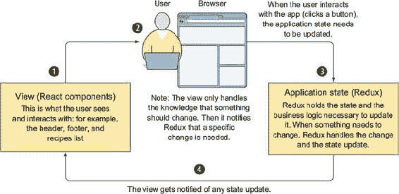

这里的主要收获是应用的生命周期是单向的。任何时间应用状态更新，视图都会收到更新并将其显示给用户（步骤 4）。当视图接收到用户输入时，它会通知应用状态（Redux）进行更新（步骤 2）。视图不关心业务逻辑的实现，应用状态也不关心它将如何显示。

#### 2.3.1\. React 和组件

在构建应用程序时，用户界面是最重要的部分。我喜欢用具有出色 UI 的应用程序。在这些应用程序中，用户可以轻松找到他们想要的东西，并且可以无挫折地与应用程序交互。React 使这个过程变得更简单。我发现它的概念很好地映射到我对构建良好 UI 的思考方式。

为了构建食谱应用程序的视图，我将向你展示如何利用 React 实现一个声明性视图，该视图可以在服务器和浏览器上渲染。React 提供了一个渲染周期，它允许你轻松地分离哪些代码将在服务器和浏览器上运行，哪些代码只会在浏览器上运行。此外，React 还提供了在服务器和浏览器上构建 DOM 的内置方法。

首先，让我们谈谈组件的概念。看看图 2.7 中的示例应用程序。你可以把这个整个应用程序写成一块 HTML，但将这个 UX 分解成小的组件是最佳实践。在图中，你可以看到如何将食谱应用程序分解成组件。为了保持简单，我创建了仅三个组件。在一个真实的应用程序中，一个具有许多视图的应用程序，我会创建更小的组件来增加我组合组件的能力。这也减少了代码重复并加快了开发速度。

##### 图 2.7\. 食谱应用程序被分解成三个主要组件。通过将它们组合在一起，应用程序被创建。

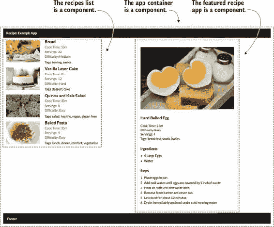

你使用 React 构建组件的方式是通过编写 JavaScript 模块并在 JSX 中声明你的视图。下一节提供了 JSX 的介绍。

#### 2.3.2\. 使用 JSX

React 使用一种名为 JSX 的模板语言。大部分情况下，JSX 看起来和表现就像正常的 HTML，这使得它易于学习和使用。JSX 由 HTML 标签（也可以是额外的 React 组件）和 JavaScript 代码段组成。语法在此处展示：

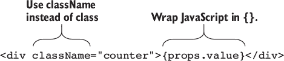

你可以看到，在引用 JavaScript 的点上，你必须将你的代码包裹在 `{}` 中。这向编译器表明，括号内的代码是可执行的。JSX 由 Babel 编译成纯 JavaScript。你可以使用基本的 React 函数编写你的组件，但这会更慢且可读性较差。

组件可以显示通过它们的属性传递进来的数据，这些属性称为 *props*。Props 类似于 HTML 属性，并且可以写在任何 JSX 元素的开始标签中。你可以在第三章中找到更多信息，该章节涵盖了 JSX 和 React 的属性和状态。

食谱应用程序有四个 React 组件：渲染 HTML 包装器的组件（仅在服务器上使用），应用程序包装组件（React 树的根），以及两个名为 Featured 和 Recipes 的视图组件。

#### 2.3.3\. 应用程序包装组件

首先，我们将查看 main.jsx 和 app.jsx 以获取应用程序设置的根。如果您想在本节中跟随，可以将分支切换到 react-components 分支（`git checkout react-components`）。章节的起始分支提供了一个骨架示例，您将添加代码列表。如果您想查看本节的完整代码，可以将分支切换到 react-components-complete 分支（`git checkout react-components-complete`）。

要在浏览器中渲染组件，您需要在 main.jsx 代码中设置 React。以下列表显示了您需要添加的内容以使组件在浏览器中渲染。将代码添加到 src/main.jsx 中。

##### 列表 2.4\. 浏览器入口点—src/main.jsx

```
import React from 'react';                                     *1*
import ReactDOM from 'react-dom';                              *1*
import App from './components/app.jsx';                        *2*
require('./style.css');                                        *3*

ReactDOM.render(                                               *4*
  <App />,                                                     *4*
  document.getElementById('react-content')                     *4*
);
```

+   ***1* 导入 React 依赖项**

+   ***2* 包含根 App 组件**

+   ***3* 包含样式**

+   ***4* 将 App 组件渲染到 DOM 中—第二个参数指示 React 应渲染到的 DOM 元素**

App 是一个容器组件。它了解其子组件所需的企业规则和数据。更重要的是，它了解应用程序的状态。在这种情况下，这意味着它将在本章的后面连接到 Redux。以下列表显示了 App 组件。将代码库中的占位符代码（在 src/components/app.jsx 中）替换为列表中的代码。

##### 列表 2.5\. App（顶级组件）—src/components/app.jsx

```
import React from 'react';
import Recipes from './recipes';
import Featured from './featured';

class App extends React.Component {                            *1*

  render() {                                                   *2*
      return (
          <div>
            <div className="ui fixed inverted menu">
              <div className="ui container">
                <a href="/" className="header item">
                  Recipes Example App
                </a>
              </div>
            </div>
            <div className="ui grid">
              <Recipes {...this.props}/>                        *3*
              <Featured {...this.props.featuredRecipe}/>        *3*
            </div>
            <div className="ui inverted vertical footer segment">
            Footer
            </div>
          </div>
      );
  }
}

export default App;
```

+   ***1* 要声明一个使用状态的 React 组件，创建一个扩展基本组件类的类。**

+   ***2* 每个具有渲染函数的组件必须返回 null 或有效的 JSX。**

+   ***3* 组件定义其子组件的布局。**

App 组件渲染页眉和页脚，但它还包括两个额外的 React 组件，它将它们作为子组件包含。Recipes 显示从/recipes 端点返回的食谱列表。Featured 仅显示从服务器通过/featured 返回的特色食谱。这些子组件需要从父组件获取信息，这些信息以属性的形式传递下来。

正在传递的数据来自 API，并由 Redux 获取并存储在应用程序状态中。在添加 app.jsx 代码后运行`npm start`，您将在 http://localhost:3000/index.html 看到页眉、页脚以及一些用于食谱和特色的占位符字符串。

#### 2.3.4\. 构建子组件

两个子组件显示它们接收到的属性。它们对应用程序的其他部分，如 Redux，没有任何意识。这使得它们可重用，并且与应用程序中的业务逻辑松散耦合。以下列表显示了特色食谱组件。将此代码添加到 src/components/featured.jsx 中，替换占位符代码。

##### 列表 2.6\. 特色组件—src/components/featured.jsx

```
import React from 'react';

const Featured = (props) => {
  const buildIngredients = (ingredients) => {                     *1*
    const list = [];

    ingredients.forEach((ingredient, index) => {
      list.push(
        <li className="item"
            key={`${ingredient}-${index}`}>
          {ingredient}
        </li>
      );
    });

    return list;
  }

  const buildSteps = (steps) => {                                 *2*
    const list = [];

    steps.forEach((step, index) => {
      list.push(
        <li className="item"
            key={`${step}-${index}`}>
          {step}
        </li>
      );
    });

    return list;
  }

  return (
    <div className="featured ui container segment six wide column">
      <div className="ui large image">
        
      </div>                                                     *3*
      <h3>{props.title}</h3>                                     *3*
      <div className="meta">
        Cook Time: {props.cookTime}
      </div>                                                     *3*
      <div className="meta">
        Difficulty: {props.difficulty}
      </div>                                                     *3*
      <div className="meta">
        Servings: {props.servings}
      </div>                                                     *3*
      <div className="meta">
         Tags: {props.labels.join(', ')}
      </div>                                                     *3*
      <h4>Ingredients</h4>
      <div className="ui bulleted list">
        {buildIngredients(props.ingredients)}                    *4*
      </div>
      <h4>Steps</h4>
      <div className="ui ordered list">
        {buildSteps(props.steps)}                                *5*
      </div>
    </div>
  );
}

Featured.defaultProps = {                                        *6*
  labels: [],
  ingredients: [],
  steps: []
}

export default Featured;
```

+   ***1* 函数将配料数组转换为列表项数组；这从渲染函数中调用。**

+   ***2* 函数接收步骤数组并将其转换为列表项，从渲染函数中调用。**

+   ***3* Featured 组件是一个容器，用于渲染关于特色食谱的信息；它通过 props 渲染传入的食谱。**

+   ***4* 函数将配料数组转换为列表项数组；这从渲染函数中调用。**

+   ***5* 函数接受步骤数组并将其转换为列表项，从渲染函数中调用。**

+   ***6* 将属性设置为默认值，以便在没有数据的情况下，组件仍然可以渲染。**

添加此代码后，您将看到显示的特色食谱，但没有数据（您还没有将其连接到任何数据）。要显示完整的首页，还需要进行一个步骤：添加 Recipes 组件代码。

下一个 Recipes 组件处理比 Featured 更复杂的数据。它在这一点上与 Featured 类似，因为它只显示食谱数据，并且没有意识到应用程序的其他部分。以下列表显示了 Recipes 列表组件。您需要将此代码添加到 src/components/recipes.jsx 中，以替换占位符代码。

##### 列表 2.7\. Recipes 组件——src/components/recipes.jsx

```
import React from 'react';

const Recipes = (props) => {

  const renderRecipeItems = () => {                                   *1*
    let items = [];
    if (!props.recipes) {
      return items;
    }
    props.recipes.forEach((item, index) => {                          *2*
      if (!item.featured) {
        items.push(
          <div key={item.title+index} className="item">               *3*
            <div className="ui small image"></div>
            <div className="content">
              <div className="header">{item.title}</div>
              <div className="meta">
                <span className="time">{item.cookTime}</span>
                <span className="servings">{item.servings}</span>
                <span className="difficulty">{item.difficulty}</span>
              </div>
              <div className="description">{item.labels.join(' ')}</div>
            </div>
          </div>
        )
      }
    });
    return items;
  }

  return (
    <div className="recipes ui items six wide column">                *4*
      {renderRecipeItems()}
    </div>
  );
}

export default Recipes;
```

+   ***1* 从 JSX 返回语句中调用的函数**

+   ***2* 因为不能直接在 JSX 中编写循环，所以构建一个可以由 JSX 渲染的项目数组。**

+   ***3* 每个食谱项在这里渲染；食谱数据通过 props 传递下来。**

+   ***4* 渲染函数是食谱列表的包装器，没有状态，就像 featured 组件一样。**

在这两个组件中，属性是从父组件传入的。这些组件只有在它们的父组件收到更新时才会更新。这与本节开头讨论的单向流有关。顶级组件从应用程序状态接收更新后，可以将这些更改传递给它们的子组件。因为应用程序中没有数据，所以您在这个阶段不会看到视觉上的变化——没有要渲染的食谱！

#### 2.3.5\. HTML 容器

最终的 React 组件是服务器用来渲染完整 HTML 标记的组件。它主要是标准的 HTML 标签，但有几个地方可以插入渲染的标记和数据。以下列表显示了完整的 HTML 组件。将此代码添加到 src/components/html.jsx 中，以便在服务器上有一个渲染的容器。

##### 列表 2.8\. 服务器端仅使用的 HTML 模板组件——src/components/html.jsx

```
import React from 'react';

export default class HTML extends React.Component {
  render() {
    return (
      <html>                                                         *1*
        <head>                                                       *1*
          <title>Chapter 2 - Recipes</title>
          <link rel="stylesheet"
                href="https://cdn.jsdelivr.net/semantic-ui/2.2.2/
     semantic.min.css" />                                            *2*
        </head>
        <body>                                                       *1*
          <div id="react-content"
            dangerouslySetInnerHTML={{
                                      __html: this.props.html
                                    }}/>                             *3*
          <script
            dangerouslySetInnerHTML={{
                                      __html: this.props.data
                                    }}/>                             *4*
          <script src="/browser.js"/>
        </body>
      </html>
    );
  }
}
```

+   ***1* 组件创建一个有效的 HTML 页面——包括 html、head、body 标签。**

+   ***2* 从 head 标签引用的 CSS。**

+   ***3* 组件接收作为 prop 的渲染 HTML。**

+   ***4* 这里传入的 prop 是数据，一个表示服务器上应用程序当前状态的字符串化 JSON 对象——否则服务器到浏览器的传递就无法发生。**

`dangerouslySetInnerHTML` 被使用，因为它是一个预渲染的字符串。通常，你无法在 React 组件中放置 HTML。这个特殊属性允许你绕过这个限制。它被这样命名是为了提醒在使用组件中的 HTML 时要谨慎且有意。 

现在应用的所有 React 组件都已创建，你将设置食谱应用的业务逻辑。

### 2.4. 应用状态：Redux

在本节中，我将向你展示如何使用 Redux 为食谱应用构建业务逻辑。由于食谱应用非常简单，所以它没有太多的用户交互。但 Redux 仍然负责获取应用的数据。第六章全面介绍了 Redux，包括处理用户交互。

#### 2.4.1. 理解 Redux

Redux 的流程大致遵循 Facebook 最初定义的 Flux 架构流程。所有对应用状态的所有更新都是单向的。当请求更改时，它由业务逻辑（动作）处理，更新到应用状态（reducer），最后作为应用状态的新副本的一部分返回到视图。图 2.8 展示了这是如何工作的。

##### 图 2.8. Redux 概述：用户交互到商店更新到视图更新的流程

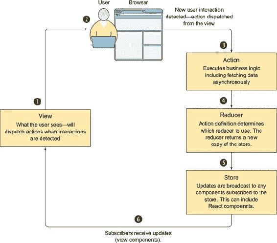

##### 商店

Redux 基于整个应用的单个根状态对象的概念，通常称为*商店*。这个状态可以是多个深度嵌套对象的组合。由于食谱应用很简单，所以它将只有一个名为*recipes*的根对象。

商店是不可变的，这意味着对状态对象的更改总是返回一个新的状态，而不是修改现有的状态。我喜欢把它看作是应用的模式，数据存储在这里。

| |
| --- |

##### 定义

*不可变对象*是只读的。要更新不可变对象，你需要克隆它。在 JavaScript 中，当你改变一个对象时，它会影响到对该对象的全部引用。可变更改可能会有意外的副作用。通过在商店中强制执行不可变性，你可以在应用中防止这种情况发生。

| |
| --- |

##### 动作

要更新状态，你需要派发动作。*动作*是大多数业务逻辑发生的地方。我喜欢把动作看作是应用的控制器。

动作可以是应用中的任何东西。动作可以用来获取数据（例如`getRecipes`或`getFeatured`）。它们也可以用来更新应用状态——例如，跟踪添加到购物车的项目。将这些动作视为描述单个状态更新的离散消息。动作默认是同步的，但我们可以向 Redux 中包含中间件，以允许异步动作。

动作（通常是 JavaScript 对象）通常被封装在动作*创建者*中，这些是返回或派发动作的 JavaScript 函数。它们是辅助方法，通过集中创建动作对象，使代码更具可重用性。

##### Reducers

动作由减少器处理。一个 *减少器* 接收来自动作的输入，包括从服务器或 API 异步获取的任何数据，并将其插入到存储库的正确位置。减少器负责强制执行状态对象的不可变要求。通过使用减少器，动作和存储库解耦，这为应用程序提供了更大的灵活性。

我将带您了解如何设置 Redux 以及添加动作、减少器和使 Redux 和 React 一起工作的代码。

#### 2.4.2\. 动作：获取食谱数据

首先，我们将查看您需要获取以填充视图的食谱数据。对于这个单页应用，您只需要异步动作。要了解更多关于动作和动作创建者的信息，请参阅第六章（kindle_split_017_split_000.xhtml#ch06）以获取完整解释。如果您想查看本节的代码，请切换到 redux 分支（`git checkout redux`）。要查看本节所有代码的最终工作形式，请查看 redux-complete（`git checkout redux-complete`）。

在食谱应用的 action-creators 文件中，您将添加两个动作创建者。一个将获取所有食谱的列表，另一个将获取特色食谱。列表 2.9 显示了动作的实现。将此列表中的代码添加到 src/action-creators.es6 文件中。


##### 注意

我包括了一个名为 isomorphic-fetch 的库，以帮助进行 XHR 调用。它为 Node.js 和浏览器提供了 fetch API 的实现。您可以在 [`developer.mozilla.org/en-US/docs/Web/API/Fetch_API`](https://developer.mozilla.org/en-US/docs/Web/API/Fetch_API) 和 [`github.com/matthew-andrews/isomorphic-fetch`](https://github.com/matthew-andrews/isomorphic-fetch) 找到更多信息和相关文档。


##### 列表 2.9\. 食谱和特色数据的动作创建者—src/action-creators.es6

```
export const GET_RECIPES = 'GET_RECIPES';                              *1*
export const GET_FEATURED_RECIPE = 'GET_FEATURED_RECIPE';              *1*

export function fetchRecipes() {                                       *2*
  return dispatch => {
    return fetch('http://localhost:3000/recipes', {                    *3*
      method: 'GET'
    }).then((response) => {
      return response.json().then((data) => {                          *4*
        return dispatch({                                              *5*
          type: GET_RECIPES,                                           *6*
          data: data.recipes                                           *7*
        });
      });
    })
  }
}

export function fetchFeaturedRecipe() {                                *8*
  return dispatch => {
    return fetch('http://localhost:3000/featured', {                   *3*
      method: 'GET'
    }).then((response) => {
      return response.json().then((data) => {                          *4*
        return dispatch({                                              *9*
          type: GET_FEATURED_RECIPE,                                   *6*
          data: data.recipe                                            *10*
        });
      });
    })
  }
}

export function getHomePageData() {                                    *11*
  return (dispatch, getState) => {
    return Promise.all([
      dispatch(fetchFeaturedRecipe()),
      dispatch(fetchRecipes())
    ])
  }
}
```

+   ***1* 最佳实践是为所有动作创建常量，以便动作创建者（此处列出的函数）和减少器可以使用它们。这样，您就不会在字符串之间出现差异。**

+   ***2* fetchRecipes，第一个动作创建者，处理向服务器请求食谱数据的逻辑。**

+   ***3* 实现用于向适当端点发起 GET 请求的 fetch API。**

+   ***4* 在成功响应中，从响应中获取 JSON 数据—使用 promise 获取 JSON 响应是 fetch API 的标准做法。**

+   ***5* 分发动作。**

+   ***6* 类型是每个动作的唯一必需属性，使用模块顶部声明的字符串常量设置它。**

+   ***7* 在名为 data 的属性上附加 JSON 数据到动作负载。**

+   ***8* 第二个动作创建者处理从服务器请求特色食谱的逻辑。**

+   ***9* 分发动作。**

+   ***10* 在名为 data 的属性上附加 JSON 数据到动作负载。**

+   ***11* 此动作创建者组合了其他两个动作创建者—使视图和服务器请求相关数据更容易。**

这些动作本身不会做任何事情。它们只负责确定应用状态中将要更新什么。然后它们将动作发送给减数。减数接收来自`fetchRecipes`和`fetchFeaturedRecipe`的动作创建者中的对象。它们返回一个新的存储副本（将状态作为不可变对象维护），并带有更新后的数据。图 2.9 展示了这个流程。

##### 图 2.9\. 分发动作触发在减数中的查找，然后更新存储。

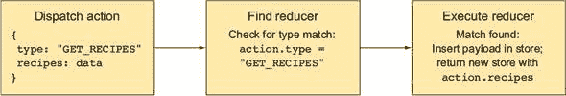

以下列表显示了应用中的食谱减数。它还演示了如何保持应用状态不可变。将此代码添加到 src/recipe-reducer.es6 中。

##### 列表 2.10\. 减数—src/recipe-reducer.es6

```
import {
         GET_RECIPES,
         GET_FEATURED_RECIPE
       } from './action-creators';                         *1*

export default function recipes(state = {}, action) {      *2*
  switch (action.type) {                                   *3*
    case GET_RECIPES:
      return {
        ...state,                                          *4*
        recipes: action.data                               *5*
      };
    case GET_FEATURED_RECIPE:
      return {
        ...state,                                          *4*
        featuredRecipe: action.data                        *5*
      };

    default:
      return state                                         *6*
  }
}
```

+   ***1* 包含来自动作创建者的常量。**

+   ***2* 减数（reducer）是一个 JavaScript 函数，它接收当前状态和一个动作。**

+   ***3* 建议使用 switch 语句，因为许多减数最终会有超过 4 个 case 来处理——这个 switch 使用一个 type 属性来确定如何处理每个动作。**

+   ***4* 使用扩展运算符克隆状态对象以保持存储不可变。**

+   ***5* 使用动作中的数据覆盖当前状态，以便新的应用状态是带有修改后数据的旧应用状态。**

+   ***6* 如果减数被触发但没有匹配的 case，则返回当前存储状态——不需要更改，不需要创建新对象。**

现在你有了动作创建者和减数，你需要初始化和配置 Redux。因为浏览器和服务器都将初始化 Redux，所以你将代码抽象到一个名为 init-redux 的模块中。你将以下列表中的代码添加到 src/init-redux.es6 中。

##### 列表 2.11\. 使用`initialState`启动 Redux—src/init-redux.es6

```
import {
  createStore,                                                *1*
  combineReducers,                                            *1*
  applyMiddleware,                                            *1*
  compose } from 'redux';                                     *1*
import recipes from './recipe-reducer';                       *2*
import thunkMiddleware from 'redux-thunk';                    *3*

export default function () {
  const reducer = combineReducers({                           *4*
    recipes                                                   *2*
  });

  let middleware = [thunkMiddleware];                         *3*

  return compose(                                             *5*
    applyMiddleware(...middleware)                            *5*
  )(createStore)(reducer);                                    *5*
}
```

+   ***1* 包含用于创建 Redux 存储的 Redux 函数。**

+   ***2* 包含你之前创建的食谱减数。**

+   ***3* 包含 Thunk 中间件。它允许你编写可以分发额外动作并使用 promise 的动作创建者。**

+   ***4* 使用`combineReducers`函数创建一个根减数（在更大的应用中，你将有许多减数）。**

+   ***5* 使用从 Redux 导入的函数初始化存储并传入中间件选项——`compose`从右到左组合函数。**

Redux 已经完全配置好了，但视图仍然无法访问数据。下一节将介绍如何连接 React 和 Redux。

#### 2.4.3\. React 和 Redux

在你能够正确地将 React 和 Redux 结合起来并准备好浏览器代码之前，你还需要进行几个步骤。你将使用一个名为 react-redux 的 npm 包来将你的 React 组件连接到 Redux。这个包提供了一个名为 Provider 的 React 组件，你用它来包裹你所有的其他 React 组件。这些被包裹的组件可以使用库中的另一个组件，称为 *connect*，来选择性地订阅 Redux 存储的更新。以下列表显示了如何在浏览器入口点文件中包含 Provider。使用加粗的代码更新 src/main.jsx。

##### 列表 2.12\. Redux 和 React 设置—src/main.jsx

```
import { Provider } from 'react-redux';                       *1*
import initRedux from './init-redux.es6';                     *2*
require('./style.css');

const store = initRedux();                                    *3*

ReactDOM.render(
  <Provider store={store}>                                    *4*
    <App />
   </Provider>,
  document.getElementById('react-content')
);
```

+   ***1* 在应用中包含设置 Redux 存储的 Provider 组件，以便你可以在组件中使用 connect 包装器。**

+   ***2* 包含你刚刚添加的初始化 Redux 的模块。**

+   ***3* 调用 initRedux 以设置 Redux 存储。**

+   ***4* 使用 react-redux Provider 组件包裹根应用组件，并将新创建的存储传递给 Provider 组件。**

Provider 组件充当有状态的顶级组件。它知道存储何时更新，并将这些更改传递给其子组件。单个组件也可以根据需要订阅存储。以下列表显示了添加到根组件（src/components/app.jsx）的代码，以便它成为一个连接到 Redux 的组件。

##### 列表 2.13\. 将应用组件连接到 Redux—src/components/app.jsx

```
import React from 'react';
import { connect } from 'react-redux';                             *1*
import { bindActionCreators } from 'redux';                        *1*
import Recipes from './recipes';
import Featured from './featured';
import * as actionCreators from '../action-creators';              *1*

class App extends React.Component {

  componentDidMount() {
    this.props.actions.getHomePageData();                          *2*
  }

  render() {}
}

function mapStateToProps(state) {                                  *3*
  let { recipes, featuredRecipe } = state.recipes;                 *4*
  return {                                                         *5*
    recipes,
    featuredRecipe
  }
}

function mapDispatchToProps(dispatch) {                            *6*
  return { actions: bindActionCreators(actionCreators, dispatch) }
}

export default connect(
                        mapStateToProps,
                        mapDispatchToProps
                      )(App)                                 *7*
```

+   ***1* 导入你之前添加的 Redux 依赖和动作创建者。**

+   ***2* 将组件配置为使用 Redux 后，你可以从视图中分发动作。**

+   ***3* 函数让你将应用状态转换为组件上的属性。**

+   ***4* 此组件需要从服务器获取数据，因此你需要从当前应用状态中获取 recipes 和 featuredRecipe 对象。**

+   ***5* 返回你希望在组件的 this.props 中直接访问的值。**

+   ***6* 函数让你使动作更简单易从组件中调用——而不是每次都调用 dispatch(action)，视图可以调用动作而不必了解 dispatch。**

+   ***7* 而不是导出 App 组件，导出 connect 组件，它接受两个辅助函数和 App 组件作为参数。**

Connect 允许你从需要了解如何显示数据和从哪里获取数据的组件中提取应用状态。现在 App 组件可以访问所有需要的属性来使视图工作。在这个时候，如果你重新启动应用，视图将填充数据！接下来，我们将介绍服务器代码。

### 2.5\. 服务器渲染

现在你已经设置了视图和业务逻辑，是时候查看如何服务器端渲染主页了。你将为主页添加一个单独的路由。这并不非常“现实世界”——第七章介绍了一种更健壮的处理服务器的方法，包括在服务器上使用 React Router。

如果你正在跟随并想查看到目前为止的代码，你可以切换到 server-browser-rendering 分支 (`git checkout server-browser-rendering`)。注意，在本节中，你将不再加载 index.html。相反，加载 http://localhost:3000 的 app。

#### 2.5.1\. 在服务器上设置基本路由并使用中间件

此路由将使用 Express 中间件来处理和渲染请求。中间件还将获取必要的数据。


##### 定义

*Express 中间件* 由链式函数组成，每个函数执行单一任务。中间件可以通过发送响应来终止请求，也可以转换请求并执行其他业务逻辑，包括错误处理。


列表 2.14 中的代码行需要添加到 src/app.es6 中。此代码添加了对根路由的处理程序。确保你添加它，以便服务器渲染能够工作。（我已经为你添加了其他代码，以便在所有其他示例中数据端点都能工作。）

##### 列表 2.14\. 设置根路由—src/app.es6

```
import renderViewMiddleware
 from './middleware/renderView';                     *1*

app.get('/featured', (req, res) => {});

// handle the isomorphic page render
app.get('/', renderViewMiddleware);                    *1*

// start the app
app.listen(3000, () => {
  console.log('App listening on port: 3000');
});
```

+   ***1* 添加 Express 路由以使用 renderViewMiddleware 获取主页。**

#### 2.5.2\. 获取数据

接下来，让我们看看 `renderViewMiddleware` 并了解它是如何获取数据和渲染视图的。记住，在 recipes 应用中你只有一个路由，所以你可以假设需要分发哪个 Redux 动作。以下列表显示了渲染视图的中间件是如何工作的。将 src/middleware/renderView.jsx 中的代码替换为以下代码。

##### 列表 2.15\. 同构视图中间件数据获取—src/middleware/renderView.jsx

```
import initRedux from '../init-redux';
import * as actions from '../action-creators';

export default function renderView(req, res, next) {            *1*

  const store = initRedux();                                    *2*

  store.dispatch(actions.getHomePageData())                     *3*
    .then(() => {
      console.log(store.getState());
      res.send("It worked!!!");
    });
}
```

+   ***1* 中间件函数定义—express 中间件接收一个请求对象、一个响应对象以及用于将控制传递给链中下一个中间件的回调函数。**

+   ***2* 设置 Redux 减法器和组合存储—在服务器上，它从一个空存储开始。**

+   ***3* 分发所需动作并在继续渲染之前等待其解析。**

在这一点上，如果你运行 `npm start` 并在 http://localhost:3000 加载应用，你会得到一条消息：“成功了！！！”。在终端输出中，你应该看到当前状态，包括食谱数组和特色食谱。你已经设置了数据获取，但仍然需要渲染视图。下一节将介绍如何将 React 服务器渲染代码添加到 renderView.jsx 中。

#### 2.5.3\. 渲染视图和序列化/注入数据

对于这个单一路由，渲染逻辑很简单。奇怪的一点是，你最终在服务器上执行了两次 React 渲染。当我最初开始构建同构应用时，我们使用不同的服务器端模板语言来构建 index HTML。但这有很多缺点，包括每个团队成员在理解完整的渲染流程之前都需要掌握额外的知识。然后我们转向将路由的组件渲染到一个代表完整页面标记的 React 组件中。少了一个需要掌握的技能！

这是为了消除在服务器上使用另一个视图模板语言的需求。以下列表展示了如何实现渲染逻辑。将粗体代码添加到 `renderView` 中间件。

##### 列表 2.16\. 同构视图中间件视图渲染—src/middleware/renderView.jsx

```
import React from 'react';
import ReactDOM from 'react-dom/server';
import { Provider } from 'react-redux';
import initRedux from '../init-redux';
import * as actions from '../action-creators';
import HTML from '../components/html';
import App from '../components/app';

export default function renderView(req, res, next) {

const store = initRedux();

store.dispatch(actions.getHomePageData())
  .then(() => {
      let html;
      const dataToSerialize = store.getState();                  *1*

      html = ReactDOM.renderToString(                            *2*
        <Provider store={store}>
          <App />
       </Provider>
      );

      const renderedHTML = ReactDOM.renderToString(              *3*
        <HTML data={`window.__INITIAL_STATE =
          ${JSON.stringify(dataToSerialize)}`}
              html={html} />
      )
      res.send(renderedHTML)
  });
}
```

+   ***1* 序列化数据，以便你可以将状态传递到浏览器。**

+   ***2* 通过渲染 app.jsx 并注入你在上一步中获取的数据来渲染组件。**

+   ***3* 通过渲染 html.jsx 并使用之前渲染的组件和序列化数据来渲染完整的 HTML 页面。**

在视图渲染过程中必须发生的另一个关键逻辑是获取与应用状态附加到 DOM 响应。你可以在列表中的代码中看到这一点——这是必要的，以便浏览器可以使用与服务器上相同的精确应用状态进行初始渲染。

### 2.6\. 浏览器渲染

浏览器渲染的代码是整个同构应用流程中最直接的部分之一，但同时也是最重要的部分之一，需要正确实现。如果你不在与服务器相同的状态下渲染应用，你会破坏同构渲染并毁掉你获得的所有性能提升。

#### 2.6.1\. 反序列化数据并使 DOM 充水

服务器已经完成了所有艰苦的工作，将数据传输到浏览器。为了获取这些数据，浏览器只需要指向服务器通过脚本标签设置的窗口对象。你可以在 main.jsx 中这样做。将下一列表中的代码添加到 main.jsx 中。

##### 列表 2.17\. 为 main.jsx 添加代码—src/main.jsx

```
import React from 'react';
import ReactDOM from 'react-dom';
import App from './components/app.jsx';
import { Provider } from 'react-redux';                           *1*
import initRedux from './init-redux.es6';                         *2*
require('./style.css');

console.log("Browser packed file loaded");

const initialState = window.__INITIAL_STATE;                      *3*
const store = initRedux(initialState);                            *4*

console.log("Data to hydrate with", initialState);

ReactDOM.render(
  <Provider store={store}>
    <App />
  </Provider>,
  document.getElementById('react-content')
);
```

+   ***1* 包含 Provider 组件，它将成为根组件，就像在服务器上一样。**

+   ***2* 包含 Redux 初始化模块。**

+   ***3* 从窗口对象中获取服务器序列化的状态。**

+   ***4* 在服务器上启动 Redux 时，不要使用空的初始状态，而是将服务器数据传递到 Redux 设置中。**

然后，在 `initRedux` 函数内部，使用从服务器获取的数据。列表 2.18 展示了 Redux 的配置以及如何将 `initialStore` 传递给它。你需要在 init-redux 文件中添加以下代码。

##### 列表 2.18\. 使用 `initialState` 启动 Redux—src/init-redux.es6

```
import {
  createStore,
  combineReducers,
  applyMiddleware,
  compose } from 'redux';
import recipes from './recipe-reducer';
import thunkMiddleware from 'redux-thunk';

export default function (initialStore={}) {            *1*
  const reducer = combineReducers({
    recipes
  });

      let middleware = [thunkMiddleware];

  return compose(
    applyMiddleware(thunkMiddleware)
  )(createStore)(reducer, initialStore);               *2*
}
```

+   ***1* `initialStore` 具有从 main.jsx 传递的值（如果没有传递，则默认为空对象）。**

+   ***2* `initialStore` 值被传递到 Redux createStore 函数中——现在存储已通过服务器数据充水。**

现在，应用已经准备好监听用户交互，并且可以在不与服务器通信的情况下持续更新（SPA 流）。对于食谱应用，如果你想要扩展功能并添加食谱的详细页面，当用户从主页点击详细页面时，服务器不会参与加载详细页面。在 GitHub 仓库中，你可以在 server-browser-rendering-complete 或 master 分支中看到完整的应用。

### 摘要

在本章中，你学习了如何构建一个完整的同构应用。恭喜你——通过构建这个示例，你已经覆盖了大量的内容！接下来的几章将更深入地探讨同构应用的各个部分。在本章中，你学习了以下内容：

+   Babel 和 webpack 允许将 JavaScript 代码编译。Webpack 允许在浏览器代码中使用 npm 包。

+   React 组件构成了应用的可视部分。使用 JSX 来声明组件。

+   Redux 在同构应用中充当控制器和模型的角色。

+   Node.js 服务器使用 Express 中间件来响应请求。对于同构应用，需要自定义中间件来渲染 React。此中间件还会发送应用程序的初始序列化状态。

+   浏览器使用一个单独的入口点来加载初始状态并启动应用。
