## 第二部分 同构应用程序基础知识

如果你在过去几年里在前端网络世界中花费了很多时间，你可能已经体验过“JavaScript 疲劳”。这种不适是由于不断有库、工具和新想法需要学习。接触到这个信息流可能会变得令人不知所措。

本书这一部分概述了构建一个在生产环境中运行的最佳实践 React 应用程序所需的每个库和工具。所需的构建块包括 React、React Router、webpack、Babel 和 Redux。本部分中的四章深入探讨了这些主题，并使你专注于当前可用的、对应用程序开发重要的 JavaScript 工具和库的小部分。

在第三章中，你将学习 React，从 JSX 和虚拟 DOM 的基础开始，然后学习如何使用属性和状态来创建 React 组件。在第四章中，你将学习如何使用 React Router 向你的应用程序添加多个路由。该章节还介绍了 React 组件的生命周期，并涵盖了高级 React 概念，包括组件组合和高阶组件。（已添加三个附录，帮助你学习 React Router 4。）这是第一个让你为 All Things Westies 应用程序编写代码的章节。在第五章中，你将了解所有关于构建工具：webpack 和 Babel 的内容。在第六章中，我们将深入探讨 Redux——你将学习编写动作、创建还原器和使用存储。

## 第三章 React 概述

*本章涵盖*

+   虚拟 DOM 的工作原理

+   React 的函数式特性

+   使用 JSX 声明 React 组件

+   使用 React 状态处理用户交互

React 是一个用于创建用户界面的库，由 Facebook 发明并使用。在过去的几年里，React 生态系统迅速扩展。现在，可以在许多类型的应用程序和架构中使用 React。本章将教你构建同构应用程序所需了解的 React 知识。我将首先教你一些 React 基础知识。下一章将涵盖 React 组件模式并介绍 React Router。

| |
| --- |

##### 注意

在开始本章之前，我建议安装 Chrome 或 Firefox 的 React 开发者工具。这将使调试你的 React 代码变得容易得多。我在本章的示例中使用 React 15.6.1。第九章包括对 React 开发者工具的详细解释。

| |
| --- |

要全面了解 React，你可以探索关于该主题的许多书籍，例如 Azat Mardan 的《React Quickly》（Manning，2017）。如果你已经具备使用 React 的经验，可以自由跳过本章。

关于本章使用的代码和库的说明：您可以从 GitHub 仓库 [`github.com/isomorphic-dev-js/chapter3-react-overview`](https://github.com/isomorphic-dev-js/chapter3-react-overview) 下载代码。要运行示例，请参阅 README.md。为确保一切设置正确，请运行以下命令：

```
$ npm install
$ npm install -g @kadira/storybook
$ npm run storybook
```

示例运行在 http://localhost:9001。此仓库按章节和示例编号组织成文件夹。对于大多数部分，您将参考 components/Chapter_3_X 文件夹。


##### 注意

在发布时，本章中的代码只能在 React 15 下运行。但 Storybook 将在某个时候升级。当 Storybook 与 React 16 兼容时，您可以选择在本章的示例中使用 React 16。


### 3.1\. React 概述

让我们一步步设置一个加载 React 并渲染单个 React 组件的 HTML 页面。本节的代码可以在 GitHub 仓库的 html/Chapter_3_1/ 路径下找到。

React 替换了 Web 应用中的视图。它提供了一个简单且易于启动的 API，但设计用于组合，以促进构建复杂用户界面。React 在构建大量小型组件并将它们组合在一起以创建完整 UI 时表现最佳。

这里是使用 React 在静态 HTML 页面上运行的基本步骤。如果您熟悉 React 渲染，可以跳到下一节：

> **1**.  设置一个 HTML 页面
> 
> **2**.  包含 React 库
> 
> **3**.  在页面中包含一个渲染 React 组件的脚本

要开始，您将使用 React 渲染“Hello World”。这次渲染将只将字符串“我的第一个 React 组件”输出到浏览器。您可以在图 3.1 中看到这一点。

##### 图 3.1\. 当加载到浏览器中的基本 React 组件的输出

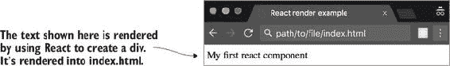

首先，您需要一个 index.html。此 HTML 文件，如列表 3.1 所示，将包含所有必需的 React 依赖项以及创建 React 组件并将其放置在 DOM 上的代码。对于这个第一个示例，HTML 页面尽可能简单。要查看图 3.1 的输出，请在浏览器中打开 index.html 文件。

##### 列表 3.1\. 第一次 React 渲染—html/Chapter_3_1/index.html

```
<html>
  <head>
    <title>React render example</title>
    <script
      src="https://npmcdn.com/react@15.3.1/dist/react.js">
    </script>                                                             *1*
    <script src="https://npmcdn.com/react-dom@15.3.1/dist/react-dom.js">  *1*
     </script>                                                            *1*
  </head>
  <body>
    <div id="render-react-into-me"></div>                                 *2*
    <script type="text/javascript">                                       *3*
     ReactDOM.render(                                                     *4*
       React.createElement(
                            div,
                            null,
                            "My first React component"
                          ),                                              *5*
         document.getElementById('#render-react-into-me')                 *6*
       );
   </script>
  </body>
</html>
```

+   ***1* React 和 React DOM 依赖项，为简单起见从 CDN 加载。**

+   ***2* div 是 React 代码将被渲染的地方。**

+   ***3* 脚本标签包含将 React 元素渲染到 DOM 中的代码。**

+   ***4* 使用两个参数调用 ReactDOM 的 render 方法：要渲染的 React 元素和要附加到的 DOM 节点。**

+   ***5* 调用 React.createElement 创建包含文本的 div。**

+   ***6* React 应该附加渲染输出的 HTML 元素**

index.html 中的 JavaScript 将单个 React 元素渲染到<body>中的空<div>中。为此，你使用了 React 的两个方法。`React.createElement`来自核心库（react.js），它创建一个 React 元素。`ReactDOM.render`来自 React DOM 库（react-dom.js），它接受由`React.createElement`创建的 React 元素，并将其渲染到 DOM 中。

那个例子很简单，所以让我们看看一个稍微复杂一点的例子。在列表 3.2 中，<div>中有一个按钮，而不是只有文本。图 3.2 显示了此按钮。

##### 图 3.2\. 使用 React 渲染多个 HTML 标签

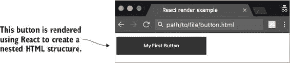

要渲染此按钮，你需要将文本替换为一个新的 React 元素。以下列表显示了如何更新脚本标签以渲染按钮。

##### 列表 3.2\. 渲染多个 HTML 标签—html/Chapter_3_1/button.html

```
<script type="text/javascript">
      ReactDOM.render(
        React.createElement("div", null,
        React.createElement(
                             "button",
                             null,
                             "My First Button"
                           )                               *1*
        ),
        document.getElementById('render-react-into-me')
      );
    </script>
```

+   ***1* 你可以将文本放入<div>中，而不是直接放入文本，你可以嵌套 React 元素——在这里你创建了一个带有文本的 HTML 按钮。**

此按钮示例显示了如何嵌套 HTML 元素并使用 React 的声明式风格来声明你的应用程序结构。但 React 真正的力量在于其能够根据元素的变化更新 DOM。接下来，我将向您介绍虚拟 DOM。

### 3.2\. 虚拟 DOM

在我讨论虚拟 DOM 之前，我想确保你对浏览器 DOM（*DOM*代表文档对象模型）有一个清晰的了解。DOM 是网页的标记表示。浏览器解释 DOM 以确定如何渲染网页。你可以将其视为浏览器读取以确定如何构建你的页面的计划或地图。例如，上一节中按钮示例中嵌套元素的渲染输出如下所示。

##### 列表 3.3\. 按钮示例的 DOM 标记

```
<div id="render-react-into-me">              *1*
  <div data-reactroot="">                    *2*
    <button>My First Button</button>         *3*
  </div>
</div>
```

+   ***1* React 渲染的 div 占位符**

+   ***2* 根组件**

+   ***3* 由 React.createElement 创建的按钮**

这段代码为浏览器生成一个蓝图，指示它渲染两个包含按钮的 div。结合一点 CSS，它会在图 3.2 中生成按钮。

虚拟 DOM 是 DOM 的一个轻量级表示，可以快速遍历和更新。它是 DOM 的 JavaScript 表示。对于按钮示例，React 在 JavaScript 中保留组件结构的版本。

传统上，操作 DOM 很慢。当需要做出更改时，整个页面都必须遍历，然后插入更新并重新渲染。想象一下，你想要更新 HTML 中的项目列表。你必须找到列表，遍历它，并根据需要做出更新和插入。随着你的应用程序增长，你拥有更多项目和更多列表，这个过程会变得更慢。虚拟 DOM 应运而生。

图 3.3 展示了 React 应用的启动流程。当初始 JavaScript 运行时，React 从你的应用中的 React 组件生成基本虚拟 DOM。然后 React 将 DOM 树附加到浏览器 DOM 上。

##### 图 3.3\. 应用启动时 React 的虚拟 DOM

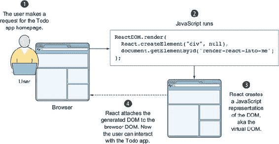

React 将这个虚拟 DOM 与之前的状态和更新后的状态进行比较。React 比较虚拟 DOM 的旧版本和新版本，并计算任何变化。然后它使用针对 Web 应用优化的算法来确定在 DOM 中哪里需要更新。图 3.4 说明了这个过程。

##### 图 3.4\. React 为了保持 DOM 更新而经历的持续更新和 diff 周期

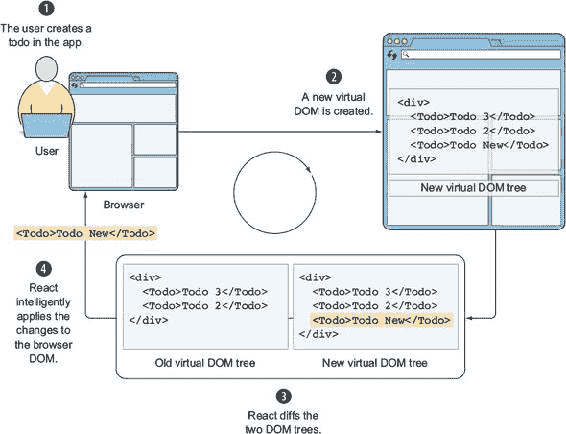

最终，React 只更新绝对必要的部分，以便内部状态（虚拟 DOM）和视图（真实 DOM）保持一致。例如，如果有一个`<p>`元素，你通过组件的状态增加文本，只有文本会被更新（`innerHTML`），元素本身不会改变。这比重新渲染整个元素集或，更不用说整个页面（服务器端渲染）的性能有所提高。

在图 3.5 中，你可以看到一个更新发生时的示例。React 查看组件树，并确定哪些部分需要更新。然后它智能地更新浏览器 DOM 以匹配当前应用的状态。在这种情况下，一个列表项被移除，一个列表项被添加。第三个列表项保持不变。React 能够对这些更改进行优化并快速更新 DOM。

##### 图 3.5\. React 根据状态变化运行的 diff 算法更新浏览器 DOM

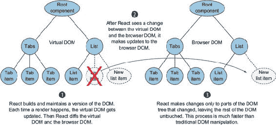

| |
| --- |

##### 注意

如果你想了解更多关于虚拟 DOM 的信息，你可以在网上找到额外的资源。Codecademy 有一个很好的概述([www.codecademy.com/articles/react-virtual-dom](http://www.codecademy.com/articles/react-virtual-dom))，而 Hackernoon 对这个主题进行了深入探讨([`hackernoon.com/virtual-dom-in-reactjs-43a3fdb1d130`](https://hackernoon.com/virtual-dom-in-reactjs-43a3fdb1d130))。

| |
| --- |

### 3.3\. Todo 应用概述

在本节中，你将构建一个 Todo 应用。这个单页应用（SPA）将使用户能够存储待办事项列表，标记它们为完成，并查看还有哪些待办事项。图 3.6 展示了这个应用。为了让你专注于学习 React，这不是一个同构应用。

##### 图 3.6\. 你在本章中将要构建的 Todo 应用的线框图

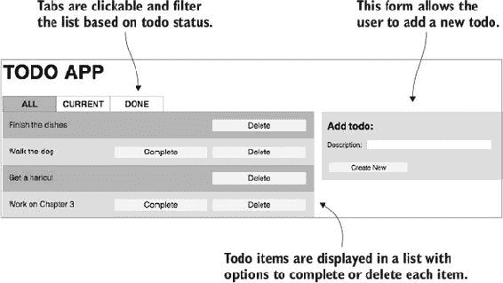

第五章展示了如何为同构应用设置 webpack 和 ES6。在此同时，我将在本章中使用一个名为 Storybook 的库来帮助你开始 React 代码的学习。我希望你专注于 React——Storybook 允许你以最小的设置开始。如果你想了解更多关于它是如何工作的，你可以查看仓库中的 stories 文件夹以及附近的侧边栏。


**使用 Storybook 预览 React 组件**

Kadira 的 npm 包 Storybook([`github.com/kadirahq/react-storybook`](https://github.com/kadirahq/react-storybook))是一个用于构建 React 组件的工具，无需将组件连接到你的应用程序以查看其工作情况。Storybook 对你的应用程序不做任何假设。相反，它可以渲染你想要单独查看的任何 React 组件。如果你提供正确的输入，它甚至可以渲染由多个组件组成的完整用户界面。以下是 Storybook 在浏览器中的运行情况：

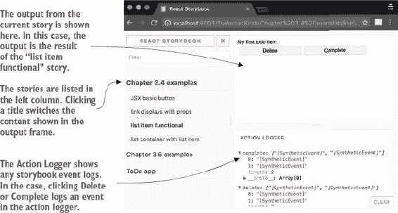

该库利用 iframe 来隔离每个组件，这样你可以轻松地在组件之间切换。Storybook 使用 webpack 的 hot module loading 来构建和监控代码更改，在你编辑代码时自动刷新浏览器中的更改。

要使用 Storybook，你必须全局安装它：

```
$ npm install -g @kadira/storybook
```

然后在仓库内的命令行中运行以下命令：

```
$ npm run storybook
```

要编写一个故事，你需要在 components/stories 文件夹中添加代码。每个使用故事的章节部分都有一个文件。Storybook 提供了两个函数：`storiesOf`和`add`。第一个函数`storiesOf`向 Storybook 添加一个新的故事，它将在左侧显示（章节示例和 Todo 应用）。`add`函数（部分函数）向故事添加一个特定的示例（带有属性的链接显示，列表项功能）。要查看这个功能是如何工作的，请查看以下代码：

```
import React from 'react';
import { storiesOf, action } from '@kadira/storybook';

storiesOf('My first story', module)
  .add('list item functional', () => (
    //...code
  ));
```

然后 Storybook 将在 localhost:9001 上渲染这些组件。如果你点击示例 2 中的按钮，动作记录器将记录`button clicked`。这就是测试组件是否正确调用预期动作或回调的方法。

Storybook 提供了手动断言测试和视觉渲染，无需将组件连接到应用程序的复杂性。这使得编写应用程序的视图部分更快，并允许你独立于业务逻辑测试组件。


### 3.4\. 你的第一个 React 组件

到目前为止，你应该理解为什么你想使用 React 以及渲染的基础知识。现在你将学习以下最佳实践的开发技能：

+   JSX 基础

+   纯组件

+   使用属性

+   条件和循环

+   React 类

+   用户交互

到本节结束时，你将能够构建一个 Todo 应用程序的用户界面（见 图 3.1），并实现用户交互。你将使用所有构建同构应用程序所需的 React 功能。要跟随本章中的示例，请查看 GitHub 仓库中的 react-components 分支（`git checkout react-components`）。


##### 注意

你可以在这个部分的文件在 components/Chapter_3_4 和 components/stories/chapter_3_4.js 中找到。


React 遵循基本的核心原则。首先，它提供了一个标准、简单的接口来构建视图。其次，它使用声明式风格来处理更新和状态变化。在 React 中，组件不关心它们的子组件如何工作。它们只关心需要传递给子组件的数据。例如，为了在 Todo 应用程序中创建列表视图，你告诉 React 为待办事项列表中的每个条目渲染一个列表项。列表视图不关心 React 如何实现更新浏览器 DOM 的底层逻辑。它只关心列表项的数据需求。为了看到这一点，你将学习如何使用 React 的模板语言 JSX 编写 Todo 应用程序的按钮组件。

#### 3.4.1\. JSX 基础

到目前为止，你已经看到了如何通过在 JavaScript 中编写它们来渲染 React 组件。但 React 使用一种名为 JSX 的模板语言，这使得编写组件几乎就像编写 HTML 一样。JSX 被设计成编译成 JavaScript，并允许你混合组件声明、HTML 和 JavaScript。

Todo 应用程序有很多按钮，所以你将创建一个可以用于各种按钮用例的可重用按钮。图 3.7 展示了它的样子。

##### 图 3.7\. 在 Storybook 内部渲染的按钮组件

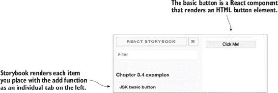

JSX 中的基本按钮编写如下：

```
<button>Click Me!</button>
```

到目前为止，你已经编写了一些看起来像是 HTML 的内容。声明 HTML 元素的方式与你在 HTML 文件中编写它们的方式相同（`div`、`a`、`ul`、`img`、`video` 等等）。但由于你将 JSX 编译成 JavaScript，JSX 提供了指示执行 JavaScript 表达式位置的语法。

为了说明这一点，让我们假设你想要将按钮标签转换为一个变量。列表 3.4 展示了你的第一个 React 组件的代码。用列表中的代码替换 buttonBasic.jsx 中的代码。我已经为你设置了场景。在你添加了列表中的代码之后，你可以在 JSX 基本按钮选项卡下查看它，如图 图 3.7 所示。

##### 列表 3.4\. JSX 按钮组件—第三章 4 节/buttonBasic.jsx

```
import React from 'react';                  *1*

const Button = (props) => {
  let label = "Click Me!";                  *2*
  return <button>{label}</button>;          *3*
}

export default Button;                      *4*
```

+   ***1* 包含 React，这是每个 React 组件必需的。**

+   ***2* 将按钮标签声明为一个变量。**

+   ***3* 使用 JSX {} 语法来指示编译器一个 JavaScript 表达式。**

+   ***4* 导出组件，以便它可以被其他组件包含。**

这个 JSX 将会被编译，并且会知道 `label` 是一个 JavaScript 表达式。你可以在 `{}` 中放置任何有效的 JavaScript 代码。大括号表示要执行的 JavaScript。这可能是一个变量、三元运算符、函数或其他有效的 JavaScript 代码。

为了确保你理解 JSX 如何编译成 JavaScript，让我们回顾一下本章前面提到的渲染示例，其中你将“我的第一个 React 组件”渲染到 DOM 中：

```
ReactDOM.render(
  React.createElement("div", null, "My first React component"),
  document.getElementById('render-react-into-me')
);
```

让我们使用你到目前为止学到的关于 JSX 的知识来重写这段 JavaScript 代码。我发现第二个例子更容易处理。它读起来像 HTML：

```
ReactDOM.render(
  <div>My first React component</div>,
  document.getElementById('render-react-into-me')
);
```

在第一个例子中，你必须理解每个参数的作用。你需要了解 `React.createElement` 的工作细节，包括要传递哪些参数。在第二个例子中，你可以立即看到 React 将渲染一个 div，并显示“我的第一个 React 组件”，因为你已经知道如何阅读 HTML。

同样，按钮组件的编译版本使用 `React.createElement` 并传递一组参数，指示要渲染的内容。在按钮示例中，传递了一个额外的参数：JavaScript 表达式，或者在这种情况下，名为 `label` 的变量：

```
let label = "Click Me!";
React.createElement( "div", null, label)
```

这个例子展示了 JSX 编译后的 JavaScript 版本。注意，因为 JSX 现在是纯 JavaScript，变量可以被 JavaScript 解释器读取。这就是 JSX 的力量。它让你可以将视图声明与 JavaScript 逻辑混合。

如果你觉得这有点奇怪，我鼓励你花五分钟时间（见 [`signalvnoise.com/posts/3124-give-it-five-minutes`](https://signalvnoise.com/posts/3124-give-it-five-minutes)）。我第一次看到 JSX 时，认为它很糟糕。它让我想起了编写服务器端语言，如 PHP。

在我开始使用 JSX 之后，我发现它可能是最好的，如果不是最好的，内联视图选项之一，适用于网络应用。我现在非常喜欢写 JSX！它几乎和写 HTML 一样，但又不完全是 HTML。它有易于阅读和易于书写的额外好处。此外，它允许你将视图逻辑和视图结构并排编写。这让你可以移除不必要的样板代码，使开发者体验更好；它比其他选项更易于阅读。JSX 因为使得单元测试视图相对容易而获得加分。

##### 常见 JSX 陷阱

在大多数情况下，JSX 遵循正常的 JavaScript 规则。但你应该注意一些例外。


##### 注意

我没有空间来详细说明每个 JSX 的陷阱。好消息是 Facebook 保持其文档更新。要查看 JSX 陷阱的完整列表，请访问 JSX 陷阱页面和 React 文档中的 JSX 深入页面：[`facebook.github.io/react/docs/jsx-gotchas.html`](https://facebook.github.io/react/docs/jsx-gotchas.html) 和 [`facebook.github.io/react/docs/jsx-in-depth.html`](https://facebook.github.io/react/docs/jsx-in-depth.html)。

| |
| --- |

在 JSX 中添加 CSS 类时，编译器会忽略单词`class`，因为在 JavaScript 中它是保留字。记住 JSX 代码将被编译成 JavaScript。因此，你需要使用属性`className`来添加类：

```
<div className="blue">I'm blue</div>
```

React 也会忽略自定义属性。如果你需要添加自定义属性，请使用`data-`前缀代替：

```
<div data-custom-id="1234"></div>
```

最后，JSX 看起来像 HTML，但它不是 HTML。你不能写`<!--HTML Comment-->`。如果你这样做，你会得到编译错误。但是你仍然可以添加常规 JavaScript 注释；只需将它们放在一个表达式`{}`内：

```
{/*JavaScript comment renders here*/}
```

现在你对 JSX 有一些经验了，让我们为待办事项应用构建 ListItem 组件。

#### 3.4.2\. 构建可复用组件

到目前为止，我只展示了如何直接渲染到 DOM 中以及如何编写 JSX。现在你将编写完整的组件。待办事项应用可以被分解成小的、可复用的组件，如 Button、ListItem 和 Tab。看看待办事项应用组件部分的视觉表示图 3.8。

##### 图 3.8\. 每个矩形包含一个单独的组件。有些组件是嵌套的；例如，Button 组件嵌套在 ListItem 组件中，而 ListItem 组件又嵌套在 List 组件中。

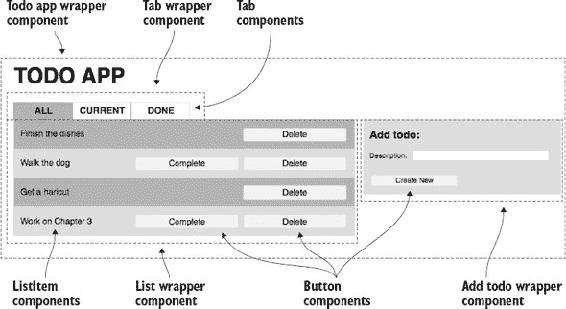

在 React 视图中，每个可重复的元素都可以成为一个组件。其他组件包裹较小的可组合组件并确定布局。在图 3.8 中，如 AddItem 和 List 这样的包装组件包含较小的、可复用的组件。

如 ListItem 和 Button 这样的较小组件在用户界面中重复出现。React 允许你一次编写这些组件，然后反复使用它们。这简化了你的代码，使其更易于维护和阅读。它还允许你以声明式风格编写视图。

你将要构建的第一个可复用组件将是用于待办事项应用的 ListItem 组件。（可复用组件被认为是最佳实践，因为它们可以加快开发速度。）图 3.9 展示了 ListItem 的输出。

##### 图 3.9\. Storybook 中待办项的视图以及操作日志

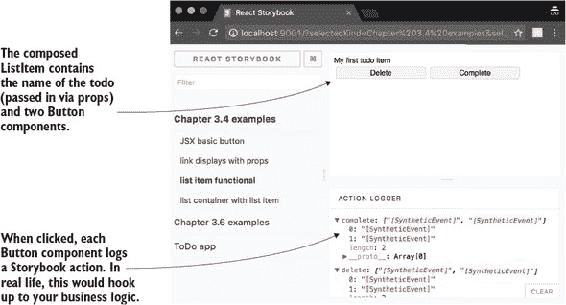

此组件使用以下列表中的代码创建。此代码替换了 listItemFunctional.jsx 文件中的占位符代码。添加后，你可以在 Storybook 中看到它，因为故事已经存在。

##### 列表 3.5\. 列表项—components/Chapter_3_4/listItemFunctional.jsx

```
import React from 'react';
import Button from './button.jsx';

const ListItemFunctional = (props) => {                   *1*
  return (                                                *2*
    <div>
      <div>{props.name}</div>                             *3*
      <Button key='Delete'                                *4*
              clickHandler={props.deleteCallback}         *3*
              label='Delete'></Button>
      <Button key='Complete'                              *4*
              clickHandler={props.completeCallback}       *3*
              label='Complete'></Button>
    </div>
  )
}

export default ListItemFunctional;
```

+   ***1* 使用 JavaScript 函数声明创建组件——创建纯函数组件。**

+   ***2* 返回要渲染的 JSX——必须是一个单一根节点，否则你会得到错误。**

+   ***3* 父组件传递 ListItem 使用到的属性，包括名称和点击处理程序回调。**

+   ***4* 如果同一类型的多个元素是兄弟元素，请为它们提供唯一的键，这样 React 才能在后续渲染中区分它们。**

在此示例中，`key` 属性的使用非常重要。任何时候你有两个相同类型的兄弟元素时，都必须使用 `key` 属性。在列表中，有两个按钮。除非你提供键，否则 React 不会知道哪个发生了变化。如果它不知道哪个发生了变化，它将替换两个项目。有了 `key` 属性，React 就知道哪个元素需要更新，并且可以在进行 DOM 变更时更加高效。

列表 3.5 中的 ListItem 组件使用了两个重要的 React 概念：

+   属性 (`props`)

+   纯函数组件

在下一节中，我们将探讨如何使用 React 的属性概念将组件转换为可重用的模板，该模板接受属性以显示内容。然后我们将查看如何声明纯函数组件。

#### 3.4.3\. 使用属性

使用 React，你想要构建可重用的组件。例如，一个可以用于任何需要显示的待办事项的 ListItem 组件会很有用。这正是 React 属性大放异彩的地方。通过 *属性*，你可以定义如何传递组件所需的信息。React 属性使得创建可重用组件成为可能。它们包含使组件使用独特的信息。

要使用属性，你可以传递具有值 `Cleanup my desk` 的 `name` 属性，如下所示：

```
<ListItem name="Cleanup my desk"/>
```

组件可以随后在 `props` 对象上访问此值：

```
<div>{props.name}</div>
```

这反过来会在浏览器 DOM 树中渲染以下 `div`：

```
<div>Cleanup my desk</div>
```

如果属性发生变化，将触发渲染，组件将更新。我们将在第四章中更多地讨论组件的生命周期。

将属性视为元素内的不可变值。它们允许元素具有不同的方面或属性，因此得名。

属性在其组件内部是不可变的。父组件在创建时将其属性分配给子组件。子元素不应该修改其属性（在开发中，如果你这样做，React 将抛出错误）。

| |
| --- |

##### 定义

*子* 是嵌套在另一个元素内部的元素（例如，`<Button/>` 是 `<ListItem/>` 的子元素）。父组件是包裹子组件的组件。组件可以有多个子元素，这些子元素也可以有子元素。

| |
| --- |

##### 扩展运算符

关于将`props`传递到组件中还有一点：假设你有一个包含大量属性的父组件。这可能包括当前路由信息、应用程序状态和应用程序数据。而不是逐个写出每个属性，你可以利用扩展运算符（`...`）来传递所有属性。扩展运算符将对象上的每个键“展开”成单独的属性。

让我们重新审视一下之前提到的 ListItem 组件。假设你有几个属性需要传递。使用扩展运算符，你将使每个属性在子组件的`props`上可用：

```
<ListItem {...this.props}/>
```

然后在组件代码中，你可以单独访问每个属性：

```
<div>{props.name}</div>
<Button clickHandler={props. deleteCallback} label='name'></Button>
```

当你构建多层嵌套子组件时，这变得很有用。根组件可能需要将属性传递给曾孙组件。每个组件都可以根据需要向下传递所有`props`以帮助实现这一点。但你要小心，因为无差别地将所有属性向下传递树也可能导致不必要的渲染和性能问题。

你已经看到了如何在 React 组件中使用属性；现在让我们看看功能 React 组件。

#### 3.4.4\. 功能组件

最简单的 React 组件遵循纯函数概念：给定一组输入，组件将返回一个可预测的输出（使它们易于测试）。一个基本的加法函数说明了这个概念。给定两个整数输入，`add`函数将始终返回相同的值：

```
function add(a, b) { // a = 3, b = 2
  return a + b; // returns 5
}
```

这个 Link 组件只需要被告知如何构建链接。你可以通过属性来实现这一点。图 3.10 显示了在 Storybook 内部渲染的 Link 组件。

##### 图 3.10\. Storybook 内部渲染的 Link 组件

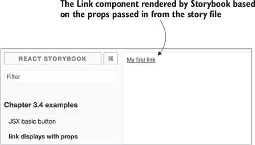

以下列表显示了创建 Link 组件的代码，这是一个简单的函数组件，它返回一个使用传入的 props 创建的链接。将此代码添加到 link.jsx 文件中。完成此操作后，你将能够看到它，如图 3.10 所示。

##### 列表 3.6\. Link 组件—components/Chapter_3_4/link.jsx

```
import React from 'react';

const Link = (props) => {                      *1*
  return <a href={props.link}                  *2*
            target={props.target}>             *2*
            {props.displayName}                *2*
         </a>                                  *2*
  }
export default Link;
```

+   ***1* 纯函数可以使用 JavaScript 函数声明（此处使用 ES6 风格）。**

+   ***2* Link 组件返回一个没有状态且不使用任何 React 生命周期方法的组件——给定一组输入（props），返回可预测的结果。**

构建纯函数组件的方法在性能、测试（见第九章）、可维护性和开发者速度方面都有好处。


##### 注意

这种功能组件方法不应与在 React 15 中引入的 `PureComponent` 混淆。`React.PureComponent` 在特定用例中为你提供了一些性能提升，但其他方面与 `React.Component` 相同。更多信息可以在[`facebook.github.io/react/docs/react-api.html#react.purecomponent`](https://facebook.github.io/react/docs/react-api.html#react.purecomponent)找到。

| |
| --- |

你的许多组件将是可重用的显示组件。React 鼓励通过将其分解成小块来“干燥”你的代码。随着时间的推移，这可以快速构建新的、更复杂的组件，因为大多数部件已经可用。

| |
| --- |

##### 定义

*DRY* 是 *不要重复自己* 的缩写。React 允许你将用户界面分解成小块，可重复使用，以便你不必重复自己。

| |
| --- |

基于这两个概念，属性和纯功能组件，你可以构建你应用程序的大部分内容。最终，你需要添加更多的复杂性。在下一节中，你将构建列表组件，并将条件逻辑添加到列表项中。

#### 3.4.5. 条件和循环

在上一节中，你使用基础 React 概念构建了一个列表项。在本节中，你将向 JSX 添加复杂的 JavaScript 表达式，如三元和循环。你将构建一个使用列表项组件来显示多个待办事项的列表组件。本节中构建的列表组件在图 3.11 中显示。

##### 图 3.11. 列表组件根据接收到的数据渲染多个列表项。

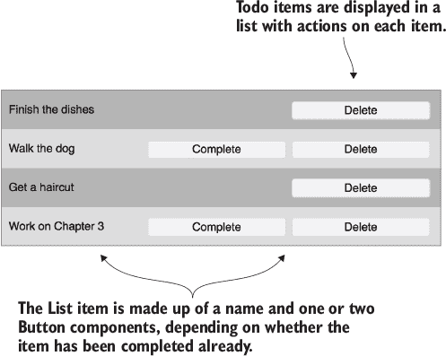

首先，你将使用条件语句只为未完成的项显示完成按钮。然后你将使用循环来显示项目列表。

##### 条件

让我们来看一下你之前构建的列表项。记住，你给它添加了两个按钮：一个删除按钮 todo 和一个完成按钮。但在待办事项应用中，你将根据不同的状态显示这些项：当前或完成。如果你已经完成了待办事项，你不想显示完成按钮（参见图 3.12）。

##### 图 3.12. 列表项组件有一个属性，表示该项是否完成。当它完成时，完成按钮不再显示。


相反，你需要添加一个检查以确定正在渲染的列表项是否之前已经被完成。列表 3.7 展示了如何将三元表达式添加到代码中。将以下加粗的代码添加到 listItemFunctional.jsx 文件中。使用三元表达式，组件检查 done 属性。如果它是 true，则不会渲染完成按钮，而是渲染一个空字符串。如果它是 false，则渲染完成按钮。

##### 列表 3.7. 使按钮可选——components/Chapter_3_4/listItemFunctional.jsx

```
const ListItemFunctional = (props) => {
  return (
    <div>
      //...other code
      {props.done ?
        "" :
        <Button key='Complete'
                clickHandler={this.complete}
                label='Complete'></Button>}
    </div>
  )
}

export default ListItemFunctional;
```

要测试你添加的新属性，你可以添加一个带有 ListItemFunctional 组件和 `done` 属性的故事。下一个列表显示了如何更新故事。将此代码添加到 Chapter_3_4.js 的故事中。添加后，你将能够看到没有完成按钮的组件，如图 3.12 所示 figure 3.12。

##### 列表 3.8\. 测试 `listItem done` 属性—components/stories/chapter_3_4.js

```
storiesOf('Chapter 3.4 examples', module)
  .add('JSX basic button', () => ())
  .add('link displays with props', () => ())
  .add('list item functional', () => ())
  .add('list item with done prop', () => (                          *1*
    <ListItemFunctional completeCallback={actions.complete}
                        deleteCallback={actions.delete}
                        name="Cleanup mess"
                        done="true"/>                               *2*
  ))
  .add('list container with list item', () =>());
```

+   ***1* 使用 add() 函数添加一个故事—传递故事的标题和返回你想要渲染的组件的函数。**

+   ***2* 添加 done 属性——组件在这里检查真值，因此你可以将其设置为 true。**

从逻辑角度来看，你对 ListItemFunctional 组件所做的更改很简单。如果 todo 列表项已完成，则不显示完成按钮。如果没有完成，则显示完成按钮。但在 JSX 中如何实现这一点？它不支持 `if` 语句，因为它只是标记。

对于像显示完成按钮这样的低复杂度条件，你可以使用三元表达式。记住，你放在 `{}` 中的任何内容都将作为 JavaScript 代码执行。

```
props.done ? "" : <button>Complete</button>
```

`done` 属性是传递给 `props` 的 todo 数据上的布尔值。如果为真，则不会渲染任何内容，但如果为假，则会显示按钮，以便用户能够对 todo 执行完成操作。

##### 循环

现在你有一个 todo 项，你想要能够显示多个 todo 项的列表。List 组件是一个纯组件，它遍历提供的数据数组。它接收传递的每个对象并渲染一个子 ListItem 组件。这个 List 组件仍然是一个函数组件，因为它没有状态。它纯粹负责渲染项。以下列表显示了你需要添加到 Chapter_3_4 文件夹中的 list.jsx 文件中的代码。确保替换所有占位符代码。

##### 列表 3.9\. 列表组件—components/Chapter_3_4/list.jsx

```
import React from 'react';
import Item from './itemDone.jsx'

const List = (props) => {

let listItems = [];                                                    *1*
    props.data.forEach((item)=>{                                       *2*
         listItems.push(
           <Item key={item.id} {...item} actions={props.actions}/>     *3*
          );
    });
  return <div>{listItems}</div>;
}
export default List;
```

+   ***1* 创建一个数组以将每个子组件推入。**

+   ***2* 数据作为数组传递，遍历数组中的每个项。**

+   ***3* 将每个 Item 组件推入 listItems 数组；传递 item 的所有属性和所有 props。**

与上一节一样，你可以在 JSX 部分的渲染之前处理这个循环逻辑。将传递给 List 组件的数据显示在以下列表中。我已经为你包含在这个部分的 stories 文件中。

##### 列表 3.10\. Todo 数据—components/stories/chapter_3_4.js

```
[
  {
    name: "Finish the dishes",
    done: true,
    id: 0
  },
  {
    name: "Walk the dog",
    done: false,
    id: 1
  },
  {
    name: "Get a haircut",
    done: true,
    id: 2
  },
  {
    name: "Work on Chapter 3",
    done: false,
    id: 3
  }
]
```

这份数据有四个 todo。其中两个已经被标记为 `done`。在 List 组件的代码示例中，你可以看到给定这个数据数组，将创建四个列表项。它们被推入一个 JSX 能够渲染的数组中。

在这一点上，列表组件将正常工作。但您需要为每个 ListItem 添加一个额外的属性才能完成此组件。在 React 中，当有多个相邻的相同类型的组件时，您必须添加一个 key 值。key 必须是唯一的。您需要修改创建项目的方式：

```
<ListItem key={item.id} {...item} {...props} />
```

记住，这很重要，因为 React 在更新时不知道列表中哪个项目发生了变化。它知道列表发生了变化，但没有 key，React 将不得不重新创建整个列表。有了 key，React 就知道哪些项目被更新了，并且可以进行智能更新和渲染。

如果您想查看最后几节中的最终代码，可以切换到 react-components-complete 分支（`git checkout react-components-complete`）。

### 3.5\. 交互式组件：React 状态

到目前为止，您已经创建了显示内容的组件和布局子组件的组件。但是，Web 应用程序需要交互性和状态。在本节中，您将通过添加不同的卡片列表来为 Todo 应用程序添加交互性。这也要求应用程序具有一些应用程序状态。如果您想跟随并构建组件，可以在 GitHub 仓库中切换到 react-state 分支（`git checkout react-state`）。

| |
| --- |

##### 注意

您可以在此节中找到文件 components/todo 和 components/stories/todo.js。

| |
| --- |

要做到这一点，您将创建选项卡组件。此组件通过作为属性传递的回调函数将状态更改通知其父组件。图 3.13 显示了渲染在待办事项列表上方的选项卡组件。应用程序将显示三个列表：所有、当前和完成的待办事项。

##### 图 3.13\. 添加选项卡使应用程序能够显示不同的待办事项列表。

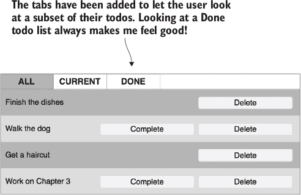

#### 3.5.1\. 使用类

选项卡组件将具有交互性，并且需要处理点击的方法。对于不是纯函数组件的组件，React 提供了一个可以扩展的类。这为您提供了访问几个内置的 React 生命周期方法和其他 React 组件 API 方法，例如 `setState` 的好处。以下列表显示了选项卡组件的代码，该代码应添加到 todo 文件夹中的 tabs.jsx 文件中。

##### 列表 3.11\. 选项卡组件完成—components/todo/tabs.jsx

```
import React from 'react';
import classnames from 'classnames';                         *1*

   class Tabs extends React.Component {}

class Tab extends React.Component {
  constructor(props) {                                       *2*
    super(props);                                            *3*
    this.handleClick = this.handleClick.bind(this);
  }

  handleClick() {                                            *4*
    this.props.actions.updateTabView(this.props.index)
  }

  render() {                                                 *5*
    const classes = classnames(
                                {
                                   active: this.props.active
                                },
                                'tab'
                              )                              *1*

    return (
      <div className={classes}                               *1*
        onClick={this.handleClick}>
        {this.props.name}
      </div>
    )
  }
}
```

+   ***1* npm 包允许您构建复杂的类字符串。**

+   ***2* 构造函数方法在每次创建组件类实例时运行。**

+   ***3* 调用 super 并传递参数（props）—必须在构造函数中首先发生。**

+   ***4* 点击处理方法通知应用程序活动选项卡的变化。**

+   ***5* 渲染方法在每次渲染时运行，相当于之前为纯组件创建的函数。**

如您所见，npm 包允许您构建复杂的类字符串。在这种情况下，如果您想要添加一个活动类，则活动属性必须为 true。`classnames` 读取传入的对象和字符串列表，并返回一个正确间隔的字符串。这个字符串被渲染到 `className` 属性中。

编写 React 类与编写函数组件不同。使用 ES6 JavaScript 类，您扩展 React 基类以创建一个新的组件：

```
class Todo extends React.Component {}
```

然后，您可以添加 `constructor()` 和 `render()` 方法。构造函数在类实例创建时运行。渲染方法就像您编写的用于创建 List 和 ListItem 组件的函数式方法一样。它返回组件的 JSX。

您可以添加您可能需要的任何额外的类函数或 React 生命周期函数。Tab 组件添加了一个名为 `handleClick` 的点击处理程序，该处理程序使用当前选项卡的索引调用动作的回调。

| |
| --- |

##### 注意

动作对象包含 Redux 动作。目前，这些动作的实现将在您的根组件中而不是 Redux 中。在 第六章 中，我将向您展示如何连接到 Redux 动作。

| |
| --- |

要使点击处理函数正常工作，您需要通过向标签 `div` 添加 `onClick` 属性来向标签添加事件监听器。React 会为您处理所有底层的绑定和清理。大多数事件都可以这样附加：

```
<div className="tab" onClick={this.handleClick}>
  {this.props.name}
</div>
```

在 React 中使用类添加事件监听器有一个陷阱。在 ES6 类中，类函数不是自动绑定到 `this` 上下文。如果您已经使用 JavaScript 了一段时间，这可能会让您一开始感到困惑，因为在原型结构中，原型上的每个函数都绑定到 `this` 上下文。在 ES6 类结构中，每个函数最终都会带有调用者的上下文（与父类相反）。

当处理事件监听器时，默认情况下，事件监听器的 `this` 上下文将是事件本身，而不是类。修复这个问题需要强制将事件监听器绑定到类的上下文中。您将在类的 `constructor` 方法中这样做：

```
constructor(props) {
  ...
  this.handleClick = this.handleClick.bind(this);
   }
```

在您向构造函数添加 `bind` 调用之后，您的事件处理器的 `this` 上下文将是类，这使得您可以调用 `this.props` 或 `this.state`。因此，最终的 Tab 组件将有一个构造函数、渲染和点击处理程序。

#### 3.5.2\. React 状态

到目前为止，我们讨论了作为纯函数编写的组件和无状态基于类的组件。React 也可以在组件内部处理状态。有时这可能是指应用程序状态。更常见的是，这种状态最终会成为用户交互状态。例如，模态是隐藏还是显示？

在 Todo 应用中，根组件将管理状态。在后面的章节中，您将使用 Redux 来管理应用程序状态。以下列表显示了 todo 根组件的代码，您将其添加到 todo.jsx 中。

##### 列表 3.12\. Todo 组件—components/todo/todo.jsx

```
import React from 'react';
import List from './list.jsx';
import Tabs from './tabs.jsx';
import AddItem from './addItem.jsx';

class Todo extends React.Component {

  constructor(props) {
    super(props);
    this.state = {
      tab: 0
    }
  }

  updateTabView(index) {
    this.setState({
      tab: index
    })
  }

  filterTodos() {                                              *1*
    return this.props.todos.filter((todo) => {
      if (this.props.activeTab == 0) {
        return true;
      } else if (this.props.activeTab == 1) {
        return !todo.done;
      } else {
        return todo.done;
      }
    });
  }

  render(){
    let actions = {updateTabView: updateTabView}               *2*
    return (
      <div className='todo-app'>
        <h1>ToDo App</h1>
        <Tabs {...this.props} actions={actions}/>              *3*
        <List {...this.props} data={this.filterTodos()} />     *4*
        <AddItem {...this.props} />
      </div>
    )
  }
}

export default Todo;
```

+   ***1* 方法提供基于 activeTab 属性显示的当前待办事项列表。**

+   ***2* 将 updateTabView 方法设置为操作。**

+   ***3* 将操作传递给 Tabs 组件，以便每个标签可以回调到这个根组件以更新状态。**

+   ***4* 将计算出的待办事项列表传递给 List 组件。**

每个 React 类组件都有一个状态对象，该对象在 `this.state` 中可访问。你需要在构造函数中初始化这个状态对象：

```
constructor(props) {
    super(props);
    this.state = {tab: 0}
  }
```

在构造函数中初始化状态后，状态变为**只读**。React 提供了另一个名为 `setState` 的方法用于状态更新（写入）。如果你想更新 `tab` 值，你调用 `setState`：

```
updateTabView(index) {
  this.setState({tab: index});
   }
```

关于 `setState` 的重要说明：它是**异步的**。好消息是，如果你在确保状态更新完成后需要运行代码，你可以使用 React 提供的钩子：

```
updateTabView(index) {
  this.setState({tab: index}, () => {
   // do something after the state updates
  });
   }
```

你现在已经构建了大多数的 Todo 应用程序！你还学习了如何使用 React 的所有核心概念：

+   使用 JSX 创建组件

+   纯组件

+   属性

+   类组件

+   状态

如果你想查看本章中展示的完整代码，请查看 master 分支。在下一章中，你将学习关于 React 组件生命周期和可用于处理更复杂逻辑案例的钩子函数。

### 概述

在本章中，你学习了如何使用 React 开始构建。你了解了使用 React 构建的 Todo 应用程序的关键部分。我们涵盖了在构建同构应用程序之前你需要了解的所有 React 基础知识：

+   React 使用声明式风格结合函数式概念来提供一个简单的视图接口。

+   虚拟 DOM 为 React 提供了智能且快速进行更新的能力。

+   JSX 是 React 的声明式模板语言。它使用类似 HTML 的语法，并具有执行 JavaScript 的能力。

+   React 依赖于 `props` 在组件之间进行通信。

+   在 React 中，状态是不推荐的，但在需要时，它是处理用户交互和管理应用程序状态的一个强大工具。

## 第四章\. 应用 React

*本章涵盖*

+   为浏览器配置 React Router

+   通过使用 `props.children` 以一致的方式渲染路由内容

+   构建可重用组件

+   使用高阶组件来抽象常见的业务逻辑

+   利用 React 组件生命周期

在 第三章 中，你学习了使用 React 构建视图的基础知识。现在，你将通过使用 React 探索更多高级概念来在此基础上构建技能。本章将教你构建生产级应用程序所需了解的内容。

您将使用 第一章 中描述的 All Things Westies 应用程序进行工作。这是您将构建的许多章节中的第一个。代码可以在 [`github.com/isomorphic-dev-js/complete-isomorphic-example.git`](https://github.com/isomorphic-dev-js/complete-isomorphic-example.git) 找到。为了开始，您应该在 branch chapter-4.1.1 (`git checkout chapter-4.1.1`) 上。此存储库的 master 分支包含书中所有章节的完整代码。

要运行本章的应用程序，请使用以下命令：

```
$ npm install
$ npm start
```

当服务器运行时，本章中的应用程序将从 http://localhost:3000/ 加载（尽管在 chapter-4.1.1 分支上什么也看不到）。它不是同构的，因为我希望您能专注于 React 概念。当您在 第七章 和 第八章 中构建此应用程序时，您将使应用程序成为同构应用程序。

应用程序在 图 4.1 中显示。我指出了需要添加以使此功能正常工作的组件部分。

##### 图 4.1. 您将在本章中开始构建的 All Things Westies 示例应用程序。您将在后面的章节中构建此应用程序的各个部分。

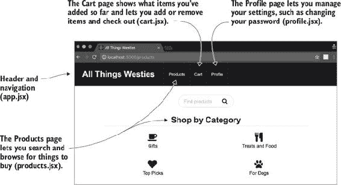

有三个主要路由（以及一个主页路由，/）：/products、/cart 和 /profile。在下一节中，您将设置路由。

### 4.1. React Router

要构建一个 Web 应用程序，通常需要一个路由器。*路由器*提供基于 URL 的路由与应加载的视图之间的映射。因为 React 是视图库，它本身不处理应用程序的路由。这就是 React Router 发挥作用的地方。

React Router 已成为 React 应用中路由选择的社区首选。它甚至支持服务器端路由，使其成为同构应用的绝佳选择（在第七章中介绍）。React Router 通过使用 JSX 让您声明路由，使得创建您的路由变得简单。React Router 是一个处理您路由逻辑的 React 组件。

| |
| --- |

**React Router 版本**

此应用程序和本书的其余部分使用 React Router 3（v3.0.5）。自从我开始写这本书以来，已经推出了一个新版本（v4）。最新版本是对 React Router 工作方式的完全重写。它与 React 的工作方式更一致，但它需要以新的方式思考路由如何与同构应用程序交互。

我提供了带有三个附录（A–C）中解释的应用程序版本。您将在附录 A 中找到与本章节相关的示例。我解释了如何开始使用 React Router 4 以及移除 React Router 生命周期后的主要变化。

好消息是 React Router 团队已经承诺无限期地支持 v3（因为 v4 的破坏性）。但我确实建议如果你开始一个新项目，你可以探索 v4。


#### 4.1.1\. 使用 React Router 设置应用程序

React Router 使用组件将路由引入你的应用程序，并定义子路由。在你使用路由器启动应用程序之前，你必须首先定义一组将要使用的路由。你将在 sharedRoutes.jsx 文件中设置它们。

在本节的第一部分，你将添加带有路由器的 App 组件。这将使你能够轻松支持书中稍后构建的服务器端渲染用例。以下列表显示了要添加到 sharedRoutes.jsx 中的代码。记住，如果你想跟上进度，你应该在 chapter-4.1.1 分支上。

##### 列表 4.1\. 应用程序路由——src/shared/sharedRoutes.jsx

```
import React from 'react';                         *1*
import { Route } from 'react-router';              *2*
import App from '../components/app';               *3*

const routes = (                                   *4*
  <Route path="/" component={App}>                 *5*
  </Route>
);

export default routes;
```

+   ***1* 包含 React，因为 React Router 使用 React 组件来实现路由器。**

+   ***2* 从 React Router 中引入 Route 组件。**

+   ***3* 包含根组件：app.jsx。**

+   ***4* 使用 JSX 语法创建路由对象。**

+   ***5* 路由组件需要两个属性，即此路由的路径和要显示的组件。这导致根路由返回 App 作为其组件。**

我已经为你提供了 App 组件的框架，所以你不需要添加此代码。以下列表显示了 App 组件。

##### 列表 4.2\. App 组件——src/components/app.jsx

```
import React from 'react';

const App = () => {
  return (
    <div>
      <div className="ui fixed inverted menu">
        <h1 className="header item">All Things Westies</h1>        *1*
        <a to="/products" className="item">Products</a>            *2*
        <a to="/cart" className="item">Cart</a>                    *2*
        <a to="/profile" className="item">Profile</a>              *2*
      </div>
      <div className="ui main text container">
        Content Placeholder                                        *3*
      </div>
    </div>
  );
};

export default App;
```

+   ***1* 应用程序标题**

+   ***2* 根导航链接——每个都将在下一节中添加到 sharedRoutes 文件中。**

+   ***3* 每个路由的内容将在这里渲染——目前，这里只有占位文本。**

接下来，你将设置你的应用程序以使用 React Router。以下列表显示了如何设置 main.jsx 文件。

##### 列表 4.3\. 使用 React Router 渲染应用程序——src/main.jsx

```
import React from 'react';                                    *1*
import ReactDOM from 'react-dom';                             *1*
import {
  browserHistory,
  Router
} from 'react-router';                                        *2*
import sharedRoutes from './shared/sharedRoutes';             *3*

ReactDOM.render(
  <Router                                                     *4*
    routes={sharedRoutes}                                     *5*
    history={browserHistory}                                  *6*
  />,
  document.getElementById('react-content')
);
```

+   ***1* 包含你的 React 和 ReactDOM 依赖项。**

+   ***2* 包含 Router 组件和 browserHistory 模块来自 React Router。**

+   ***3* 包含你创建的 sharedRoutes 文件。**

+   ***4* 通过声明 Router 组件作为你的根组件，将 React 应用程序渲染到 DOM 中。**

+   ***5* Router 接收你从 sharedRoutes 中包含的路由。**

+   ***6* 路由组件需要知道它应该使用哪种历史实现——在这里使用 browser history 模块，以便应用程序可以使用内置的浏览器历史 API。**

与将根组件渲染到 DOM 中不同，React Router 最终成为你的根组件。另一种思考方式是将其视为组件树中的顶级组件（见图 4.2）。

##### 图 4.2\. 带有 React Router 作为根元素的示例组件树

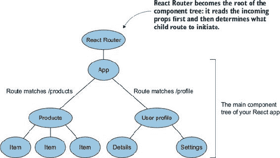

在底层，路由器正在使用浏览器历史对象。它挂钩到这个对象以使用 push 状态和其他浏览器路由 API。

此外，React Router 允许你传入这个历史对象。这样，它不会对它运行的环境做出任何假设。在浏览器上，你传入一个与服务器上不同的历史对象。这就是 React Router 适合同构应用程序的部分原因。传入历史对象也是一种更可测试的模式。

#### 4.1.2\. 添加子路由

为了使应用程序的其余部分正常工作，添加用户将用于在应用程序中的视图之间导航的子路由。这需要两个额外的步骤：创建子路由并设置 app.jsx 以渲染任何子路由。以下列表显示了如何将新路由添加到 sharedRoutes 文件中。如果你想跟随，本节的基代码位于分支 chapter-4.1.2（`git checkout chapter-4.1.2`）。

##### 列表 4.4\. 添加子路由—src/shared/sharedRoutes.jsx

```
//... other import statements
import Cart from '../components/cart';                     *1*
import Products from '../components/products';             *1*
import Profile from '../components/profile';               *1*

const routes = (
  <Route path="/" component={App}>
    <Route path="/cart" component={Cart} />                *2*
    <Route path="/products" component={Products} />        *2*
    <Route path="/profile" component={Profile} />          *2*
  </Route>
);

export default routes;
```

+   ***1* 包含每个路由的组件。**

+   ***2* 通过在 App 路由内部嵌套来创建子路由。**

每个子路由都将与 App 结合。React Router 将知道应该提供给 App 以供渲染的适当子组件。

##### React：渲染任何子组件

让子路由工作起来的下一步是设置 App 组件以显示任何任意子组件。App 组件不需要知道它正在渲染哪个子组件——只需要知道它需要渲染一个子组件。你解耦了子组件和父组件的实现。这创建了一个可重用模式，其中相同的子组件可以在多个视图中使用，反之亦然。图 4.3 显示了 React Router 和子路由的关系。

##### 图 4.3\. 使用 `props.children` 在运行时渲染组件

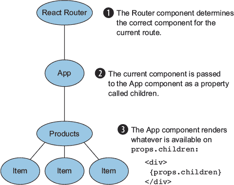

你可以通过嵌套 React 组件来传入子组件：

```
<MyComponent>
  <ChildComponent />
</MyComponent>
```

然后在 `MyComponent` 的 `render` 函数中，你引用了 `props` 对象上的子元素：

```
render() {
  return <div>{props.children}</div>
}
```


##### 注意

React Router 通过 JavaScript 分配属性和使用低级 React API（如 `createElement`）来处理向下传递子组件。你不需要担心这一点，但如果你想进一步探索，请查看[`github.com/ReactTraining/react-router/blob/v3/docs/API.md#routercontext`](https://github.com/ReactTraining/react-router/blob/v3/docs/API.md#routercontext)。


这种模式允许在运行时动态确定子组件。以下列表显示了如何更新 App 组件来完成此操作。将列表中的代码添加到已存在的 app.jsx 组件代码中。

##### 列表 4.5\. 渲染任何子组件—src/components/app.jsx

```
const App = (props) => {
  return (
    <div>
      <div className="ui fixed inverted menu">
        ...
      </div>
      <div className="ui main text container">
        {props.children}                                  *1*
      </div>
    </div>
  );
};

App.propTypes = {                                         *2*
  children: PropTypes.element                             *3*
};
```

+   ***1* App 组件渲染子属性**

+   ***2* 在组件上设置 propTypes**

+   ***3* Prop children 是一个 React 元素——propTypes 对象描述了这些信息。**

在组件上设置 `propTypes` 提供了文档，并被认为是最佳实践。它是一个对象，描述了预期的属性，包括它们是否是必需的。

##### 路由属性

因为 Router 包装了 App 组件，所以它将几个路由对象作为 `props` 传递下来。许多这些对象在子组件中是必需的，但我会专注于三个：

+   **`location`—** 它反映了 `window.location` 对象，由传递给路由的历史数据构建而成。它包含了一些属性，如查询和路径名，你可以在组件中使用这些属性。

+   **`params`—** 这个对象包含了路由上的所有动态参数。如果你有一个匹配 `/products/treats` 路由的 `/products/:category` 路由，这个对象将包含一个名为 category 的属性：`{ category: treats }`。

+   **`router`—** 这个对象包含了许多与路由和历史交互的方法，包括低级 API。最常见的情况是，我需要使用 `push()` 方法从 JavaScript 中导航到应用的不同部分。

在下一节中，你将使用 Link 组件，该组件利用了低级路由和历史 API，因此你无需自己操作。

#### 4.1.3\. 从组件中进行路由：Link

React Router 更进一步，提供了一个 React 组件，当你想要触发导航时可以使用。这样，你就不必担心底层发生了什么。

Link 组件渲染一个 `<a>` 标签。要使用 Link 组件，你需要在你的组件中包含它，然后使用它需要的属性来渲染它。如果你想跟随本节内容并获取到目前为止的代码，请切换到名为 chapter-4.1.3 的分支（`git checkout chapter-4.1.3`）。以下列表展示了如何更新头部以使用 Link 组件而不是 app.jsx 中的标准链接。

##### 列表 4.6\. 使用 Link 组件—src/components/app.jsx

```
import React from 'react';
import { Link } from 'react-router';                               *1*

const App = (props) => {
  return (
    <div>
      <div className="ui fixed inverted menu">
        <h1 className="header item">All Things Westies</h1>
        <Link to="/products" className="item">Products</Link>      *2*
        <Link to="/cart" className="item">Cart</Link>              *2*
        <Link to="/profile" className="item">Profile</Link>        *2*
      </div>
      <div className="ui main text container">
        {props.children}
      </div>
    </div>
  );
};
```

+   ***1* 从 React Router 中包含 Link 组件**

+   ***2* 将 `<a>` 标签转换为 `<Link>` 标签**

注意，与 `href` 属性不同，Link 组件需要一个 `to` 属性。添加 Link 组件后，你的应用程序将能够在视图之间正确路由。

React Router 库还有一个重要的部分，你可能需要了解它是如何构建生产应用程序的：如何钩入路由生命周期。

#### 4.1.4\. 理解路由生命周期

React Router 提供了生命周期钩子，允许你在路由之间添加逻辑。生命周期钩子的一个常见用例是为你的应用程序添加页面视图跟踪分析，以便你知道每个路由有多少次查看。


##### 注意

如果你使用的是 React Router 4，请查看附录 A（kindle_split_027_split_000.xhtml#app01），了解如何将此代码移动到 React 生命周期中，以及如何处理本节讨论的概念。


想象一下，如果你尝试将此逻辑添加到你的组件中。你最终会在每个顶级组件（购物车、产品、个人资料）中添加跟踪逻辑。或者你可能会尝试基于 App 组件中的属性来检测变化。这两种方法都不理想，并且留下了很多错误的空间。

相反，你想要使用 `onChange` 和 `onEnter` 生命周期事件来处理 React Router。（第三个生命周期钩子 `onLeave` 在这里没有涉及。）图 4.4 显示了这些处理器触发的顺序。

##### 图 4.4\. 根路由的 `onEnter` 处理器只触发一次，但 `onChange` 处理器在每次后续路由变化时都会触发。

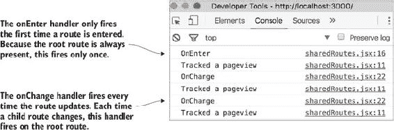

对于每个路由，当应用从一个不同的路由跳转到该路由时，会触发 `onEnter` 事件。因为 `/` 是根路由，它只能进入一次。每次子路由发生变化时，都会触发 `onChange` 处理器。对于根路由，这发生在第一次路由动作之后的每个路由动作。下面的列表显示了如何在 sharedRoutes.jsx 文件中实现这些处理器。如果你正在跟随，并想查看前几节中的代码，你可以在 branch chapter-4.1.4 (`git checkout chapter-4.1.4`) 上找到它。

##### 列表 4.7\. 在路由器中使用 `onChange`—src/shared/searchRoutes.jsx

```
const trackPageView = () => {                                             *1*
  console.log('Tracked a pageview');
};

const onEnter = () => {                                                   *2*
  console.log('OnEnter');
  trackPageView();
};

const onChange = () => {                                                  *3*
  console.log('OnChange');
  trackPageView();
};

const routes = (
  <Route path="/" component={App} onEnter={onEnter} onChange={onChange}>  *4*
    <Route path="/cart" component={Cart} />
    <Route path="/products" component={Products} />
    <Route path="/profile" component={Profile} />
  </Route>
);
```

+   ***1* 用于跟踪页面视图的可重用函数（在现实世界中，你会调用你的分析工具）**

+   ***2* `onEnter` 处理器的处理器—记录 OnEnter**

+   ***3* `onChange` 处理器的处理器—记录 OnChange**

+   ***4* 每个路由都可以有一个 `onEnter` 和/或 `onChange` 属性。**

接下来，你将探索 React 的组件生命周期，这是一个完全不同的、特定于 React 的生命周期函数集。生命周期函数让你能够更好地控制应用中事件发生的时间。

### 4.2\. 组件生命周期

一个拥有用户账户的网站需要登录。网站的某些部分始终会被锁定，只有登录后才能查看。例如，在 All Things Westies 应用中，想要查看设置页面以更新密码或查看过去订单的用户需要登录。

这个用例与上一节中的分析用例相反。你不想在每次路由上执行某些操作，而只想在特定路由上检查登录状态。如果你愿意，你可以在路由上使用 `onChange` 或 `onEnter` 处理器来做这件事。但你也可以将这个逻辑放在适当的 React 组件中。在这个例子中，我们将使用组件生命周期。

React 提供了几个钩子，用于组件的生命周期。你已经使用过的渲染函数就是生命周期的一部分。组件的生命周期可以分为三个部分（如图 4.5 所示）：

1.  ***挂载事件*—** 发生在 React 元素（组件类的实例）附加到 DOM 节点时。这是你处理登录检查的地方。

1.  ***更新事件*—** 发生在 React 元素更新时，无论是由于其属性或状态的新值引起的。如果你在组件中有一个计时器，你会在这些函数中管理它。

1.  ***卸载事件*——** 当 React 元素从 DOM 中分离时发生。如果你在组件中有一个计时器，你将在这里清理它.^([1])

    > ¹
    > 
    > React 生命周期列表和插图概念来自 Azat Mardan 的《React Quickly》（Manning，2017，[`www.manning.com/books/react-quickly`](https://www.manning.com/books/react-quickly)）。

##### 图 4.5。React 生命周期包括三种类型的生命周期事件。每种类型都有对应的方法钩子。

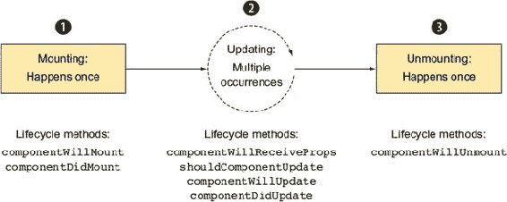

#### 4.2.1\. 利用挂载和更新来检测用户的登录状态

为了检测用户是否已登录，你将利用 React 的一个生命周期函数。这个函数在组件挂载（附加到 DOM）之前触发。列表 4.8 展示了如何在`componentWillMount`中添加检查到用户配置文件组件中。有一个用于 Profile 的占位符，你将想要用此代码更新它。如果你正在跟随并想查看前几节中的代码，切换到分支 4.2.1（`git checkout chapter-4.2.1`）。

##### 列表 4.8。使用生命周期事件——src/components/profile.jsx

```
class Profile extends React.Component {

  componentWillMount() {
       if (!this.props.user) {                 *1*
      this.props.router.push('/login');        *2*
    }
  }

  render() {}
}
```

+   ***1* 检查用户属性——如果不存在，假设用户需要登录。**

+   ***2* 强制用户使用路由对象路由到登录页面。**

在`profile.jsx`文件中，你添加了对路由属性`router`的引用。但如果你现在运行代码并加载`/profile`路由，应用将抛出错误，因为你还没有传递路由对象。为此，你需要更新`app.jsx`以向其子组件传递属性。以下列表利用了两个 React 顶级 API 调用：`React.Children`和`React.cloneElement`。

##### 列表 4.9。向子组件传递`props`——src/components/app.jsx

```
const App = (props) => {
  return (
    <div>
      <div className="ui fixed inverted menu"></div>
      <div className="ui main text container">
        {
          React.Children.map(                             *1*
            props.children,                               *2*
            (child) => {                                  *3*
              return React.cloneElement(                  *4*
                child,                                    *4*
                { router: props.router }                  *4*
              );
            }
          )
        }
      </div>
    </div>
  );
};
```

+   ***1* 使用 React.Children.map 顶级 API 方法遍历当前子属性。**

+   ***2* 地图函数接受`props.children`作为其第一个参数。**

+   ***3* 使用 React.cloneElement 顶级 API 来复制当前子元素并传递额外的属性。**

+   ***4* 第二个参数是一个回调函数，它为每个子元素被调用。**

##### 第一个渲染周期

在同构应用中，第一个渲染周期是最重要的。在那里，你将使用生命周期事件来控制代码运行的环境。例如，一些第三方库在服务器上不可加载或不可用，因为它们依赖于`window`对象。或者你可能想在窗口事件上添加自定义滚动行为。你需要通过挂钩到第一个渲染周期上可用的各种生命周期方法来控制这一点。

第一个渲染生命周期由三个函数（`render`和两个挂载事件）组成：

+   **`componentWillMount()`—** 在渲染之前和组件挂载到 DOM 之前发生

+   **`render()`—** 渲染组件

+   **`componentDidMount()`—** 在渲染之后和组件挂载到 DOM 上之后发生

对于同构用例，需要注意`componentWillMount`和`componentDidMount`之间的一些区别。尽管这两种方法在浏览器上都会恰好运行一次，但`componentWillMount`在服务器上运行，而`componentDidMount`永远不会在服务器上运行。在先前的例子中，你不会想在`componentWillMount`中运行用户登录检查，因为该检查也会在服务器上运行。相反，你会在`componentDidMount`中放置检查，确保它仅在浏览器中发生。

`componentDidMount`永远不会在服务器上运行，因为 React 永远不会在服务器上附加任何组件到 DOM。相反，React 的`renderToString`（在服务器上代替`render`使用）会生成 DOM 的字符串表示形式。在下一节中，你将使用`componentDidMount`为模态添加计时器——你只想在浏览器中执行的操作。

#### 4.2.2\. 添加计时器

假设你想要向产品页面添加一个倒计时计时器。这个计时器在设定的时间后启动一个工具提示模态。显示了它的样子。计时器是异步的，会打断用户事件驱动的 React 更新流程。但 React 提供了几个生命周期方法，可以在 React 组件的生命周期内处理计时器。

##### 图 4.6\. 显示为用户提示的提示框

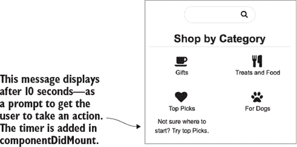

要向组件添加计时器，需要在组件挂载后启动它。此外，你还需要处理组件卸载或发生某些其他操作时的计时器清理。要查看本节的基础代码，切换到分支 chapter 4.2.2（`git checkout chapter-4.2.2`）。以下列表显示了如何将计时器代码添加到 products.jsx 中。基础组件已经存在，因此更新加粗的代码。

##### 列表 4.10\. 添加计时器—src/components/products.jsx

```
import React from 'react';

class Products extends React.Component {
  constructor(props) {
    super(props);
    this.state = {
      showToolTip: false,
      searchQuery: ''
    };
    this.updateSearchQuery = this.updateSearchQuery.bind(this);
  }

  componentDidMount() {
    setTimeout(() => {
      this.setState({                                               *1*
        showToolTip: true
      });
    }, 10000);                                                      *1*
  }

  updateSearchQuery() {                                             *2*
    this.setState({
      searchQuery: this.search.value                                *3*
    });
  }

  render() {
    const toolTip = (                                               *4*
      <div className="tooltip ui inverted">
        Not sure where to start? Try top Picks.
      </div>
    );
    return (
      <div className="products">
        <div className="ui search">
          <div className="ui item input">
            <input
              className="prompt"
              type="text"
              value={this.state.searchQuery}                        *5*
              ref={(input) => { this.search = input; }}             *3*
              onChange={this.updateSearchQuery}                     *2*
            />
            <i className="search icon" />
          </div>
          <div className="results" />
        </div>
        <h1 className="ui dividing header">Shop by Category</h1>
        <div className="ui doubling four column grid">
          <div className="column segment secondary"></div>
          <div className="column segment secondary"></div>
          <div className="column segment secondary">
            <i className="heart icon" />
            <div className="category-title">Top Picks</div>
            { this.state.showToolTip ? toolTip : ''}                *6*
          </div>
          <div className="column segment secondary"></div>
        </div>
      </div>
    );
  }
}

export default Products;
```

+   ***1* 在 componentDidMount 中触发计时器——setTimeout 回调在 10 秒后将设置组件状态。**

+   ***2* 搜索输入的更改处理程序，设置 searchQuery 的状态。**

+   ***3* 搜索是通过从保存到 this.search 的输入元素中获取值来设置的。**

+   ***4* div 元素显示工具提示（将其声明为变量可以使三元表达式更易读）。它仅在 showToolTip 为 true 时显示（在计时器触发后）。**

+   ***5* 输入值与状态绑定，因此输入使用组件状态作为其真相来源。**

+   ***6* div 元素显示工具提示（将其声明为变量可以使三元表达式更易读）。它仅在 showToolTip 为 true 时显示（在计时器触发后）。**

工具提示将在此时出现（设置为 10 秒后显示）。但让我们假设你只想在用户从未与页面交互时显示工具提示。在这种情况下，你需要一种在用户交互时清除工具提示的方法。技术上，你可以在搜索的`onChange`处理程序中这样做，但为了说明目的，你将在`componentWillUpdate`中添加这个功能。下面的列表显示了如何做到这一点。

##### 列表 4.11\. 在用户交互时清除计时器—src/components/products.jsx

```
class Products extends React.Component {
 componentDidMount() {
   this.clearTimer = setTimeout(() => {               *1*
     this.setState({
       showToolTip: true
     });
   }, 10000);
 }

 componentWillUpdate(nextProps, nextState) {          *2*
   if (nextState.searchQuery.length > 0) {
     clearTimeout(this.clearTimer);                   *3*
   }
   console.log('cWU');                                *4*
 }
 updateSearchQuery() {}
}
```

+   ***1* 捕获 setTimeout 的返回值，以便可以清除计时器。**

+   ***2* 当组件接收到新状态时，检查状态中是否存在搜索查询。**

+   ***3* 清除计时器。**

+   ***4* 日志显示，每当在搜索框中输入字母时，`componentWillUpdate`方法都会触发（缩写为 cWU）。**

如果你重启应用并在 10 秒计时器完成之前与产品页面交互，你会注意到工具提示从未出现。

##### 更新生命周期

更新生命周期方法由几个更新方法和`render`方法组成，你可以在列表中看到。除了`render`方法外，这些方法永远不会在服务器上运行（因此访问 window 和 document 是安全的）：

+   **`componentWillReceiveProps(nextProps)`—** 当组件即将接收属性时发生（仅在父组件中发生更新时运行）

+   **`shouldComponentUpdate(nextProps, nextState) -> bool`—** 允许你通过确定组件何时需要更新来优化渲染周期数

+   **`componentWillUpdate(nextProps, nextState)`—** 在组件渲染之前发生

+   **`render()`—** 渲染组件

+   **`componentDidUpdate(prevProps, prevState)`—** 在组件渲染后立即发生^([2])

    > ²
    > 
    > 基于 Azat Mardan 的 *React Quickly*（Manning，2017）的更新生命周期。


##### 小贴士

记住，挂载生命周期将始终在这些方法之前运行。


##### 卸载事件

需要对计时器进行的最后一次改进是确保在用户在计时器完成之前离开产品页面时，计时器能够被清理。如果你不这样做，你将在 10 秒后在控制台中看到 React 错误。错误解释说正在运行的代码正在尝试引用 DOM 中不再挂载的组件。这是因为你在没有关闭计时器的情况下离开了计时器所在的组件。图 4.7 是错误的截图。

##### 图 4.7\. 如果组件已卸载，但监听器或计时器没有被清理，它们最终会得到一个指向 null 组件的引用。

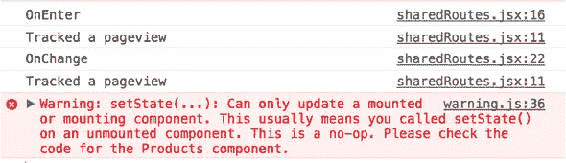

下面的列表显示了如何将超时清理添加到你的`componentWillUnmount`生命周期函数中。

##### 列表 4.12\. 清理计时器—src/components/products.jsx

```
class Products extends React.Component {

  componentWillUpdate(nextProps, nextState) {}

  componentWillUnmount() {
    clearTimeout(this.clearTimer);            *1*
  }

  updateSearchQuery() {}
}
```

+   ***1* 在卸载时清除计时器。**

只有一个卸载事件：`componentWillUnmount()`。你可以利用这个事件来清理任何手动附加的事件监听器并关闭你可能正在运行的任何计时器。此方法仅在浏览器中运行。要查看本章的所有代码，你可以查看分支 chapter-4-complete (`git checkout chapter-4-complete`)。

现在你已经了解了 React 生命周期，让我们来探索可以帮助你构建出色的 React 应用的组件架构模式。

### 4.3. 组件模式

你可以在用户界面中以两种明确的方式编写 React 组件：

+   高阶组件

+   展示组件和容器组件

在 All Things Westies 应用程序中，创建视图和业务逻辑的可重用部分是有益的。这对开发者的长期可维护性有好处，并使你的代码更容易推理。

在某些情况下，通过创建一个接受另一个组件并扩展其功能的组件来增加可重用性——这是一个装饰器。这在 Redux 中通过使用 Connect 组件包装视图组件时发生。在其他情况下，你将组件分为两种类型：关注业务逻辑的组件和关注应用程序外观的组件。例如，产品组件关注视图的业务逻辑。

#### 4.3.1. 高阶组件

当构建模块化、组件驱动的 UI 时，你最终会有很多需要相同类型数据获取或具有相同视图但不同数据获取的组件。例如，你可能有很多使用用户数据的视图。或者你可能有很多使用列表组件但数据集不同的视图。在这些情况下，你想要一种方法来提取数据获取和操作逻辑，使其与显示数据的组件分离。

即使你还没有向 All Things Westies 应用程序添加任何数据获取功能，你最终也需要这样做。产品视图需要了解可销售的产品。想象一下，如果你想创建一个知道如何获取所有产品的组件。它看起来可能像这样：

```
const ProductsDataFetcher = (Component) => {
  ... // fetches the products data
  ... // ensures data is compatible with the products component
  return <Component data={this.state.data} />
}
```

这个示例函数最重要的部分是，你将组件（在这个例子中是产品组件）传递给 `ProductsDataFetcher` 函数。在这种情况下，高阶组件（HOC）函数知道如何获取产品数据，然后会将这些数据传递给组件（图 4.8）。这抽象掉了从产品视图组件中任何状态或逻辑，使其专注于 UI 问题。

##### 图 4.8. 高阶函数接受一个函数并返回一个具有附加功能的新函数。（摘自 Azat Mardan 的《React 快速入门》，Manning，2017 年。

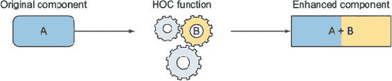

如果你有一个组件，然后将其传递给高阶组件，你最终会得到原始组件以及额外的功能。在 React 中，这几乎总是导致将某种状态管理卸载到父 HOC。在 `ListDataFetcher` 示例中，HOC 了解应用状态和数据获取。这使得列表组件成为一个高度可重用的展示组件。

#### 4.3.2\. 组件类型：展示和容器

可以将 React 组件分为两个不同的类别：展示者和容器。通过遵循这种二进制类型模式，你可以最大化代码重用并最小化不必要的代码耦合和复杂性。

在本章的早期部分，你构建了 All Things Westies 应用程序的产品页面。这个页面包含一个名为 Products 的组件，它负责其应用部分的状态。在本书的后续部分，它还将负责通过 Redux 管理数据获取。这些职责使其成为一个容器组件。

另一方面，Item 和 App 组件是展示组件。它们都包含显示元素，并依赖于属性来确定其功能。展示组件决定了应用程序的外观。

表 4.1 列出了容器和展示组件的值。

##### 表 4.1\. 组件类型属性

| 容器 | 展示 |
| --- | --- |
| 包含状态 | 有限的状态（用户交互），理想情况下作为函数组件实现 |
| 负责应用的工作方式 | 负责应用的外观 |
| 子组件：容器和展示组件 | 子组件：容器和展示组件 |
| 连接到应用的其他部分（例如，Redux） | 不依赖于模型或控制器部分的应用（例如，Redux） |

容器组件将状态从其子组件中抽象出来。它们还处理布局，通常负责应用程序的“如何”。一些高阶组件的主要目的就是如此。它们监听数据变化，然后将该状态作为属性传递下去。Redux 提供了一个帮助实现这一功能的高阶组件（见第六章）。

展示组件只包含与用户交互相关的状态。尽可能情况下，它们应该作为纯组件实现。它们关注的是应用程序的外观。

一个重要的注意事项是，容器可以有其他容器和展示组件作为子组件。相反，展示组件可以有容器和展示组件作为子组件。这两种类型的组件嵌套应该保持灵活，以最大化代码组合。这一开始可能感觉有些奇怪，但保持两种组件类型清晰将有助于你长期发展。

### 摘要

在本章中，您学习了如何设置和使用 React Router 以获得完整的单页应用体验。您还通过探索组件生命周期对 React 有了更深入的了解。最后，您学习了在构建 React 应用时常用的一些关键模式。

+   React Router 使用 React 的组件概念将路由组合到任何 React 应用中。

+   React Router 抽象了历史对象，并提供了链接的实用工具。

+   React Router 具有路由钩子，允许您添加高级逻辑。

+   React 生命周期方法被用作渲染周期的钩子。

+   初始渲染周期可以用来触发计时器或锁定已登录的路由。

+   可用于以可重用和可维护的方式组合 React 组件的许多组件模式。

## 第五章\. 工具：webpack 和 Babel

*本章涵盖*

+   使用 webpack 通过 npm 加载 Node.js 包，以便在浏览器代码中使用

+   使用 webpack 加载器使用 Babel 编译代码

+   使用 webpack 加载器加载 CSS

+   使用 webpack 插件准备您的代码以供生产使用

+   创建多个配置以管理多个环境下的构建

JavaScript 生态系统提供了许多优秀的库和工具，使开发者能够更快、更轻松地编写应用程序。为了利用它们，您需要具备能够编译、转换和为生产准备代码的工具。这就是 webpack，一个完全由配置驱动的构建工具。

我将完全诚实地告诉您：webpack 不是一个直观的工具。起初我发现它与工作起来很令人沮丧。但它非常强大，值得学习。Webpack 让您能够在构建中包含任何 JavaScript 代码，甚至包括那些尚未设置在浏览器中运行的库（例如，npm 包）。它还可以处理许多其他构建步骤，包括使用 Babel 编译您的代码以及为生产准备您的代码。本章涵盖了您在异构项目中拥有良好工作流程所需的所有基础知识。

| |
| --- |

##### 注意

如果您想使用已经为 webpack 设置好的 React 项目开始，我推荐 Create React App。这个工具生成一个带有 webpack 的基础 React 应用([`github.com/facebookincubator/create-react-app`](https://github.com/facebookincubator/create-react-app))。请注意，它不是异构的！

| |
| --- |

### 5.1\. Webpack 概述

想象一下您正在启动一个新的异构 React 项目。您想要构建一个像图 5.1 中的日历提醒应用。本章是关于构建工具——所以这只是一个路标，帮助您确保一切都在加载。

##### 图 5.1\. 本章中将使用 webpack 设置的日历提醒应用

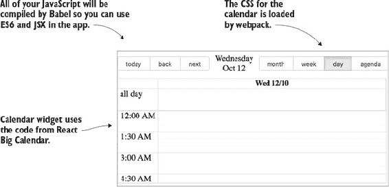

在这个示例中，您决定不从头开始构建日历。在 npm 上有许多编写良好的 React 日历包可用。为了使用这些包并在它们之上构建自己的应用，您需要一个构建工具，该工具将以浏览器理解的方式打包您的 Java-Script 模块。（此外，本章是关于构建工具，而不是制作应用，因此使用包将让您专注于学习 webpack。）

如果您想知道为什么您需要学习另一个构建工具，请给我几分钟时间来说服您。让我们讨论应用需求，以确定为什么需要构建工具。这样，您不必仅凭我的话来相信。表 5.1 给出了应用需求及其需要 webpack 的原因概述。

##### 表 5.1\. 各类应用需求概述，这些需求使得构建工具变得必要

| 需求 | Webpack 需要 | 原因 |
| --- | --- | --- |
| 日历小部件（react-big-calendar） | 是 | 从 npm 包中导入。特别是，这是无法通过 Gulp 和 Grunt 或 npm 构建脚本实现的事情。 |
| ES6 | 是 | 需要编译才能在所有浏览器中工作。这可以通过其他工具实现，但 webpack 加载器使其变得简单直接。 |
| 加载 CSS | 可选 | 通过包含在 webpack 构建中优化开发流程。这无法通过 Gulp 或 Grunt 等工具实现。 |
| 环境特定代码 | 是 | Webpack 插件允许您注入自定义变量。这无法通过 Gulp 或 Grunt 实现。 |

此外，还有许多其他原因使得构建工具对于应用是必需的。您想使用 ES6 编写最新的 JavaScript 代码，但 ES6 在不同浏览器中的支持是混合的。为了让您能够使用所有最新的语言特性，您需要编译您的代码。

最后，为了加载 CSS，您需要 webpack 加载器。您还需要 webpack 插件来将变量注入到代码中。记住，所有代码都将运行在服务器和浏览器中！（如果这个提醒开始感觉重复，那很好——您正在朝着同构思维的方向前进。）

#### 运行代码

本章的所有代码都位于 GitHub 上，地址为 [`github.com/isomorphic-dev-js/chapter5-webpack-babel`](https://github.com/isomorphic-dev-js/chapter5-webpack-babel)。在您使用 Git 检出代码后，您需要进行 npm install：

```
$ npm install
```

要运行完整示例，请运行以下命令：

```
$ npm run start
```

然后您可以在 http://localhost:3050/ 加载日历示例。您将在本章中用到额外的脚本和示例。我会根据需要解释它们。

在我们深入 webpack 配置的具体细节之前，我将向您展示如何设置您的环境以与 webpack 一起工作，包括如何运行 webpack 命令行界面（CLI）。命令行工具对于调试问题和在小项目上工作非常有用。在本章的后面部分，您将学习如何通过 JSON 配置使用 webpack。

要使用 webpack，你需要安装它（我已经在仓库中设置了 webpack）。我建议按项目安装，而不是全局安装，这样你可以使用适合每个项目的 webpack 版本。

安装 webpack 后，你可以使用 webpack CLI 生成你的第一个 webpack 包。语法如下。


##### 定义

*包* 是 webpack 转换管道输出的文件。你可以将包命名为任何你想要的。


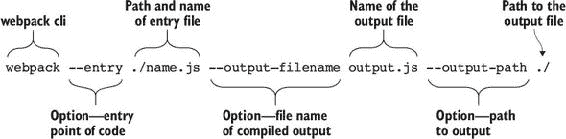

要在仓库中运行此命令，请在你的终端中输入此命令：

```
$ node_modules/.bin/webpack --entry ./src/entry.js --output-filename
     output.js --output-path ./
```

运行此命令后，你会在项目代码目录的根目录中注意到一个名为 output.js 的新文件，如列表 5.1 所示。此文件包含从 entry.js 编译的代码以及任何依赖项。首先查看 entry.js 文件的内容（使用 ES5 编写—本章后面，你将添加 Babel 来编译 ES6）。此代码已在仓库中提供。

##### 列表 5.1\. Entry.js 内容—src/entry.js

```
var path = require('path');                                *1*

console.log("path to root", path.resolve('../'));          *2*
```

+   ***1* 包含的路径作为依赖项—使用 require() 而不是 import，因为此代码不是由 Babel 编译的。**

+   ***2* 使用 path.resolve 和相对路径记录根文件夹的路径**

此代码的编译版本接近 400 行代码，其中一些将在下一列表中显示。这是因为 webpack 收集所有引用的文件（在这种情况下是节点模块路径）并将它们包含在打包输出中。

##### 列表 5.2\. 编译后的 webpack 输出，部分视图—output.js

```
/* ...additional file contents */
/******/  // Load entry module and return exports, and additional
/******/polyfills/webpack code
/* WEBPACK VAR INJECTION */}.call(
/***/ exports,
/***/__webpack_require__(1)))                                     *1*

/***/ }),
/* 4 */
/***/ (function(module, exports, __webpack_require__) {           *1*

"use strict";

module.exports = __webpack_require__(31);                         *2*

/***/ }),
/* 5 */                                                           *3*
/***/ (function(module, exports, __webpack_require__) {
/* additional file contents... */
```

+   ***1* Webpack 将模块（你的代码，任何包含的 npm 库）包裹在 JavaScript 闭包中，这使得 webpack 能够控制并重写导入语句。**

+   ***2* 路径的 require 语句编译成自定义的 webpack require 语句。路径模块位于数字键中。**

+   ***3* 添加到最终输出的可读性注释，指示每个模块的编号（有助于调试）。**

打包的代码包括 webpack 库的一部分额外函数。这包括 Node.js 进程对象的浏览器友好 polyfill，这允许你安全地包含许多最初为 Node.js 编写的 npm 模块。

有一些例外。例如，Node.js 文件系统（fs）模块不适合同构使用。如果一个 npm 包依赖于 fs 模块，你不应该将其用于浏览器代码。现在你已经看到了如何使用命令行来打包你的代码，看看图 5.2。它显示了 webpack 如何处理你的代码并创建打包输出。

##### 图 5.2\. webpack 编译器流程

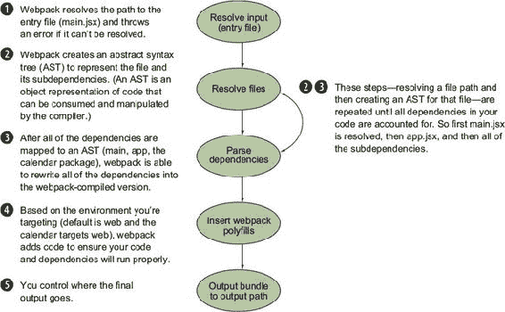

#### 调试 webpack

有时 webpack 可能无法编译。你有两个有用的命令行选项用于调试。第一个选项，`--debug`，在命令行中显示错误。第二个选项，`--display-error-details`，提供了关于发生的任何错误的额外详细信息。

Webpack 也可以使用`node --inspect`进行调试。这将加载一个调试工具，你可以用它通过 Chrome DevTools 查看 Node.js 代码。然后你可以使用断点进行调试。有关更多`--inspect`资源，请参阅[`nodejs.org/en/docs/inspector/`](https://nodejs.org/en/docs/inspector/).

现在你已经了解了如何使用 webpack 并探索了 webpack 包的各个部分，你将学习如何使用 webpack 加载器来编译你的代码。

### 5.2\. Babel 概述

Babel 是一个用于编译 JavaScript 的工具。它将尚未在所有 JavaScript 环境中得到支持的代码编译成浏览器可以理解的形式。如果你想使用 JavaScript 规范中最新的和最好的部分（ES6、ES7，有时也称为 ES2015、ES2016 等），你必须使用编译器。需要注意的是，Node.js 的最新版本现在支持大多数（但不是全部）JavaScript 规范。但在浏览器中，支持情况各异，并且推出速度较慢。

在上一节中，你了解到 webpack 是一个将许多加载器和插件组合在一起以创建单个捆绑代码文件的工具。Babel 是一个库，它只做一件事情：编译 JavaScript。Babel 是你可以与 webpack 一起使用的许多加载器之一。

#### 5.2.1\. 开始使用 Babel

Babel 编译成任何运行 ES5 JavaScript 的浏览器都能理解的代码。生成的输出是可读的，如以下列表所示，并包括 Babel 注入的代码，这些代码有助于将 ES6 语法转换为旧版 JavaScript 引擎可以理解的形式。

##### 列表 5.3\. Babel 示例输出

```
'use strict';

var _createClass = function () {/*implementation code*/}();       *1*

var _react = require('react');                                    *2*

var _react2 = _interopRequireDefault(_react);                     *3*

function _interopRequireDefault(obj) {
  /*implementation code*/
}                                                                 *4*

var Link = function Link(props) {                                 *5*
  return _react2.default.createElement(
    'a',
    { href: props.link },
    props.children
  );
};

var Button = function (_React$Component) {
  _{/*implementation code*/}
}

_createClass(Button, [{                                           *6*
    key: 'render',
    value: function render() {{/*implementation code*/}
  }]);

  return Button;
}(_react2.default.Component);
```

+   ***1* Babel 注入的函数将 ES6 类转换为 ES5**

+   ***2* 所有导入语句已转换为 requires**

+   ***3* 每个导入语句转换为两个 requires：一个是标准的 ES5 require，另一个使用特殊函数以确保 ES6 的 export default 功能正常工作。**

+   ***4* Babel 注入的函数用于检查默认导出**

+   ***5* 将 ES6 风格的函数转换为 function() {}语法**

+   ***6* 在 ES6 中以类形式编写的按钮，因此在这里它被 Babel 的 _createClass 辅助函数包装。**

列表 5.3 中的编译代码基于列表 5.4 中的 ES6 代码。请注意，基本代码要简单得多，并且不包括 Babel 添加的许多辅助函数，这些辅助函数有助于在尚未支持 ES6 的 JavaScript 环境中运行你的代码。

##### 列表 5.4\. 要编译的 ES6 代码—src/compile-me.js

```
import React from 'react';                                   *1*
import classnames from 'classnames';                         *1*

const Link = (props) => {                                    *2*
  return (<a href={this.props.link}>
           {this.props.children}
         </a>)
}
class Button extends React.Component {                       *3*
  constructor(props) {
    super(props);
  }

  render() {
    let classes = 'button';                                  *4*
    if (this.props.classname) {
      classes = classnames(classes, this.props.classnames);
    }
    return (
      <Button
        className={classnames}
        onClick={this.props.clickHandler}>                   *5*
        {this.props.children}
      </Button>
    );
  }
}
```

+   ***1* 目前，所有环境的导入语句（node 和浏览器）都需要编译。**

+   ***2* ES6 函数语法具有父作用域而不是调用者作用域**

+   ***3* 类声明**

+   ***4* 令变量（或在其他情况下，const）**

+   ***5* Babel 编译器也编译 JSX。**

#### 5.2.2\. Babel CLI

Babel 可以作为一个独立的命令行工具使用。要开始并了解此工具的工作原理，您将使用 Babel CLI 处理来自 列表 5.3 的 ES6：

```
$ ./node_modules/.bin/babel src/
     compile-me.jsx
```

Babel 接收输入（src/compile-me.js 中的代码），解析它，转换它，然后生成与标准浏览器和 Node.js 环境兼容的代码版本。图 5.3 展示了此编译流程。您会注意到此流程与 webpack 的流程类似。

##### 图 5.3\. Babel 编译器如何将 ES6 转换为浏览器和 Node.js 兼容的代码

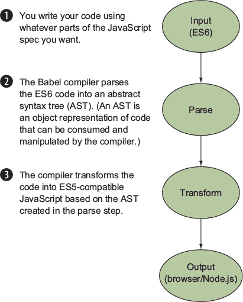

本节中的命令将结果输出到命令行。稍后，您将使用 Babel 将代码作为 webpack 构建的一部分进行编译。

##### Babel 插件和预设

默认情况下，Babel 不知道使用哪些规则来编译您的代码。但您可以使用插件来告诉 Babel 要做什么。方便的是，这些插件通常被分组为 *预设*。预设和插件需要从 npm 安装。如果您想使用 Babel React 预设，您将安装以下内容：

```
$ npm install babel-preset-react
```

如果您正在使用提供的代码，本章所需的全部预设已安装。在您安装了所有想要使用的 Babel 预设后，您可以在存储库中提供的 .babelrc 文件中引用它们，如下所示列表。

##### 列表 5.5\. .babelrc 配置文件—.babelrc

```
{
  "presets": ["es2015", "react"]           *1*
}
```

+   ***1* 告诉 Babel 在编译时使用哪些预设（您可以在数组中列出多个预设）。**

这些预设告诉 Babel 将所有内容编译为 ES2015 并正确处理 JSX。接下来，我们将查看日历应用的代码。

### 5.3\. 应用代码

在本章的其余部分，当您运行 webpack 时，您将编译日历应用的代码。此示例由两个文件组成：src/app.jsx 和 src/main.jsx。

webpack 构建入口文件是 main.jsx。以下列表显示了存储库中提供的代码。

##### 列表 5.6\. 入口文件—src/main.jsx

```
import React from 'react';                            *1*
import ReactDOM from 'react-dom';                     *1*
import App from './app';                              *1*

ReactDOM.render(
  <App></App>,
  document.getElementById('attach-react')             *2*
```

+   ***1* 引入所有依赖，包括 React 和 App 组件**

+   ***2* 将根组件（App）附加到 DOM 上。**

入口文件包含一个名为 App 的组件，来自 src/app.jsx。在下一列表中显示，此组件包含 npm 包并渲染 React Big Calendar 组件。它还包括日历的 CSS。当您学习 webpack 加载器时，我们将更详细地讨论以这种格式包含 CSS。 

##### 列表 5.7\. App 组件—src/app.jsx

```
import React, { Component } from 'react';                   *1*
import BigCalendar from 'react-big-calendar';               *1*
import moment from 'moment';                                *1*
require('react-big-calendar/lib/css/
 react-big-calendar');                                    *2*

BigCalendar.momentLocalizer(moment);                        *3*

class App extends Component {                               *4*
  render() {
    return (
      <div className="calendar-app">
        <BigCalendar                                        *5*
          events={[]}
         startAccessor='startDate'
          endAccessor='endDate'
          timeslots={3}>
        </BigCalendar>
      </div>
    )
  }
}

export default App;
);
```

+   ***1* 引入所有依赖，包括 moment（react-big-calendar 需要一个日期库）。**

+   ***2* 引入 react-big-calendar 伴随的 CSS。**

+   ***3* 初始化 Calendar 组件。**

+   ***4* 创建 App 组件。**

+   ***5* 使用所需的属性渲染 Big Calendar。**

这些文件很简单，但将允许你在不受到示例干扰的情况下学习 webpack。它们需要 Babel 来编译 ES6 功能（`import`、`class`）和 JSX。你还需要正确加载 CSS。下一节将展示如何从 JavaScript 文件配置 webpack，并介绍使用加载器。

### 5.4\. 带有加载器的 Webpack 配置

在本章前面，你通过命令行使用 webpack 捆绑了你的代码。但 webpack 也可以通过 JavaScript 配置文件进行配置。按照惯例，这个文件被称为 webpack.config.js。（在你的项目中，你可以使用任何你想要的名称。）

配置文件由`webpack`命令加载。默认情况下，命令将查找一个名为 webpack.config.js 的文件。要加载默认配置，请在终端中运行以下命令：

```
$ ./node_modules/.bin/webpack
```

这将加载配置文件，编译你的代码，并输出一个可以随后在浏览器中加载的捆绑文件。最基本的配置文件包括一个入口点和输出信息（如果你发现自己需要像这样简单的配置，你也可以坚持使用本章开头介绍的命令行选项），如下所示。

##### 列表 5.8\. webpack.config.js

```
var path = require('path');

module.exports = {
  entry: path.resolve(__dirname + '/src/main.js'),          *1*
  output: {                                                 *2*
    path: path.resolve(__dirname + '/'),                    *3*
    filename: 'webpack-bundle.js'                           *4*
  }
}
```

+   ***1* 入口点使用 Node.js 路径模块解析相对于当前目录的路径（对持续集成工具很有帮助）。**

+   ***2* 声明输出对象。**

+   ***3* 使用路径模块解析输出路径（在本例中，为根目录）。**

+   ***4* 声明输出文件的名称。**

接下来，你将添加 webpack 加载器来编译你的 ES6 和 CSS。

#### 5.4.1\. 配置 Babel 加载器

要在 webpack 中使用 Babel，你需要两样东西。首先，你仍然需要本章前面看到的.babelrc 文件。这告诉 Babel 要编译哪些预设（React 和 ES6）。其次，你需要在 webpack 配置中声明 Babel 为加载器。列表 5.9 显示了加载器的代码。


##### 提示

请密切注意配置对象的形状——否则，你的构建将静默失败。这将会引发一系列灾难性事件，以及对所有构建工具的突然反感。非常认真地说，如果你的 webpack 构建静默失败，请检查你是否把所有属性都放在了正确的位置。你可以使用`--debug`和`--progress`选项来帮助你调试（更多信息请参阅[`webpack.js.org/api/cli/#debug-options`](https://webpack.js.org/api/cli/#debug-options))。


##### 列表 5.9\. 添加 Babel 加载器 webpack.config.js

```
var path = require('path');

module.exports = {
  entry: path.resolve(__dirname + '/src/main.js'),
  output: {
    path: path.resolve(__dirname + '/'),
    filename: 'webpack-bundle.js'
  },
  module: {                                             *1*
    rules: [                                            *2*
      {
        test: /\.(js|jsx)$/,                            *3*
        exclude: /node_modules/,                        *4*
        loader: "babel-loader"                          *5*
      }
    ]
  }
}
```

+   ***1* 添加模块对象。**

+   ***2* 要使用的所有加载器数组（称为规则）**

+   ***3* 正则表达式确定哪些文件应该由这个加载器处理——对于 Babel，我们希望是 js 和 jsx 文件。**

+   ***4* 你可以告诉加载器忽略文件，Node.js 包已经编译，因此不需要再次处理它们。**

+   ***5* 声明应为此加载器配置使用哪个加载器。**

加载器在 webpack 编译过程的解析步骤中应用。 展示了这如何融入整个 webpack 流程。请注意，这将会发生多次，因为每个依赖项可能通过一个或多个加载器。

##### 图 5.4\. 在 webpack 编译的解析阶段应用加载器。

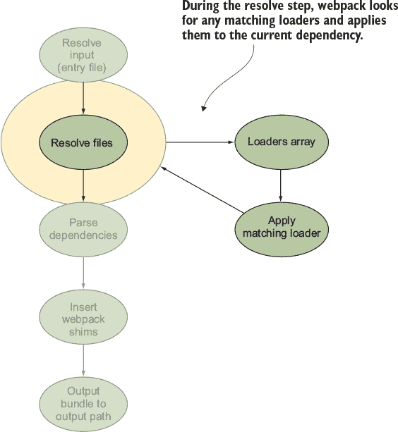

##### 使用自定义扩展

当编写 JSX 和 ES6 时，能够用除 .js 之外的其他扩展名声明你的文件很方便。这向其他开发者（在某些情况下，向你的 IDE）表明该文件是特定语法类型。

也可以很方便地不必在 `import` 语句上编写扩展。这对于某些测试设置正常工作可能是必需的。在 webpack 中，为了覆盖这些用例，你添加 `resolve` 属性并声明一个要使用的扩展数组。请参见以下列表。

##### 列表 5.10\. 扩展列表 webpack.config.js

```
module.exports = {
  entry: path.resolve(__dirname + '/src/main.js'),
  output: {},
  module: {},
  resolve: {                                               *1*
    extensions: ['.js', '.jsx', '.css']                    *2*
  }
}
```

+   ***1* 添加 resolve 对象。**

+   ***2* 声明扩展数组——例如，对于日历，你需要 .js、.jsx 和 .css。**

#### 5.4.2\. 配置 CSS 加载器

Webpack 可以将几乎所有内容打包到你的 JavaScript 捆绑包中，包括你的 CSS。这对于开发来说很棒，但对于许多生产用途，你仍然希望单独加载你的 CSS 和其他资源（别担心，webpack 也可以做到这一点！）请参见下一列表。

##### 列表 5.11\. 使用 webpack 包含 CSS—webpack.config.js

```
module.exports = {
  ...
  module: {
    rules: [
      {
        test: /\.(js|jsx)$/,
        exclude: /node_modules/,
        loader: "babel-loader"
      },
      {
        test:/\.css/,                                               *1*
        loaders: ['style-loader', 'css-loader']                     *2*
      }
    ]
  }
}
```

+   ***1* 对于此加载器，你需要处理的是 CSS 文件，所以正则表达式查找 .css。**

+   ***2* 此加载器使用两个 webpack 加载器，style-loader 和 CSS-loader—注意键已从 loader 更改为 loaders，因为列表被声明为字符串数组。**

此代码添加了两个加载器。CSS 加载器将任何 `import` 和 `url()` 引用解释为 `require`。style loader 将样式包含在捆绑包中，以便你的 CSS 可在浏览器中使用。

通过包含 CSS，你可以利用组件样式的编写方式。为此，你为每个组件创建一组样式并将它们命名空间化。然后你不必担心覆盖常见的类名，如 `.button` 或 `.active`。

此外，我发现这种模块化 CSS 对于大型开发团队来说更容易理解，尽管有一些权衡。一个主要的权衡是你往往会得到更少的 DRY（不要重复自己）CSS。但如果你使用 PostCSS 或其他编译 CSS 选项（LESS、SASS 等），可以通过共享全局类或混入来解决这个问题。

##### 其他加载器

可以使用许多其他加载器与 webpack 一起使用。你可以加载各种文件，包括 JSON、HTML 和图像资源。你还可以使用 LESS/SASS/PostCSS 预处理你首选的 CSS。

你还可以使用加载器进行代码检查。例如，如果你想在你项目中使用 ESLint，有一个为它准备的 webpack 加载器（第四章 中介绍的示例使用了 ESLint）。几乎任何你可以在 web 应用程序项目中想到的事情都有加载器！

要查看 webpack 加载器的列表，请访问 [`webpack.js.org/loaders/`](https://webpack.js.org/loaders/)。

### 5.5\. 开发和生产的打包

到目前为止，你只为你的开发环境使用了一个配置文件。但对于一个真实世界的应用，你需要为多个环境准备你的 webpack 配置文件。

为了简化，你将设置两个针对特定环境的配置文件，分别命名为 dev.config.js 和 prod.config.js。因为这些文件只是 JavaScript，你可以创建一个基础文件，命名为 base.config.js。所有这些文件都将位于 config 文件夹中。

基础文件与本章中已经创建的 webpack.config.js 文件相同。其他两个文件需要它，然后扩展配置。首先你将在 dev.config.js 中添加一个 webpack 插件。

#### 5.5.1\. 使用 webpack 插件

webpack 插件是你可以包含在 webpack 配置的插件数组中的额外代码模块。webpack 库附带了一些内置插件。许多插件也可以在 npm 上找到，你甚至可以编写自己的插件。

对于开发配置，你需要 html-webpack-plugin。此插件自动生成一个加载打包 JavaScript 的 HTML 文件。这已在 dev.config.js 文件中设置，如下所示。

##### 列表 5.12\. 在 config/dev.config.js 中添加插件

```
var baseConfig = require('./base.config.js');                       *1*
var HtmlWebpackPlugin = require('html-webpack-plugin');             *2*
module.exports = Object.assign(baseConfig, {                        *3*
  output: {
    filename: 'dev-bundle.js'                                       *4*
  },
  plugins: [                                                        *5*
    new HtmlWebpackPlugin({                                         *6*
      title: "Calendar App Dev",                                    *7*
      filename: 'bundle.html'                                       *8*
    })
  ]
})
```

+   ***1* 需要基础配置对象。**

+   ***2* 包含 html-webpack-plugin 以自动生成 HTML 文件。**

+   ***3* 使用 Object.assign 将特定环境的配置合并到 baseConfig；此配置的键将覆盖基础配置。**

+   ***4* 声明特定环境的文件名。**

+   ***5* 声明插件数组。**

+   ***6* 创建 HtmlWebpackPlugin 的新实例。**

+   ***7* 标题属性设置 HTML 模板中的 <title> 标签。**

+   ***8* 生成 HTML 的输出文件名。**

要使用此代码，请运行以下命令：

```
$ npm run dev
```

然后，你可以导航到 http://localhost:3050/bundle.html 来查看开发包。

插件可以钩入 webpack 编译器的各种步骤。它们可以在编译步骤的开始处添加代码，在优化步骤中，在文件输出阶段，以及在 webpack 编译器的许多其他阶段。

HTML webpack 插件的大部分工作是在输出步骤中完成的，因为其主要任务是创建一个文件。输出步骤是基于所有之前的编译步骤创建文件的地方。

#### 5.5.2\. 创建全局变量

你也可以使用插件来定义环境变量。Webpack 内置了一个名为 definePlugin 的插件，允许你将变量注入到 webpack 模块中，如列表 5.13 所示。然后你可以在代码中访问这些变量：

```
console.log("current environment: ",  __ENV__);
```

在编译步骤中，webpack 将变量转换为注入的值。在这种情况下，包中的代码将看起来像这样：

```
console.log("current environment: ", ("dev"));
```

##### 列表 5.13\. 注入全局变量—config/dev.config.js

```
var webpack = require('webpack');                         *1*

var injectEnvironment = new webpack.DefinePlugin({        *2*
  __ENV__: JSON.stringify("dev")                          *3*
});

module.exports = Object.assign(baseConfig, {
  output: {},
  plugins: [
    ...,
    injectEnvironment                                     *4*
  ]
})
```

+   ***1* 因为 Define-Plugin 是 webpack 内置的，所以需要引入 webpack。**

+   ***2* 创建 DefinePlugin 的新实例。**

+   ***3* 在这里注入任意数量的变量——在这种情况下，设置环境值。**

+   ***4* 在插件数组中加载插件。**

DefinePlugin 的问题之一是，对于字符串，使用 JSON.stringify 是很重要的。如果你只是分配一个字符串（`__ENV__: "dev"`），那么在打包版本中，你将得到以下输出：

```
console.log("current environment: ", (dev));
```

这将在你的浏览器中抛出一个 `ReferenceError`，因为它会将 `dev` 作为一个 JavaScript 变量来读取。

#### 5.5.3\. 使用 sourcemaps

使用 webpack 开发的一个缺点是，打包后的代码不可读，并且不再类似于源代码。幸运的是，对于调试来说，webpack 提供了启用 sourcemaps 的能力。没有 sourcemaps，很难将代码错误匹配到你的文件结构中。

在启用 sourcemaps 的情况下，webpack 会生成额外的代码（有时是内联的，有时是单独的文件），这些代码将生成的代码映射回原始文件结构。这在调试时很有帮助，因为像 Chrome DevTools 这样的工具将允许你检查原始代码而不是编译后的代码。图 5.5 展示了 Chrome DevTools 如何加载原始文件。

##### 图 5.5\. Chrome DevTools 使用生成的 sourcemaps 将编译后的代码链接到源文件。

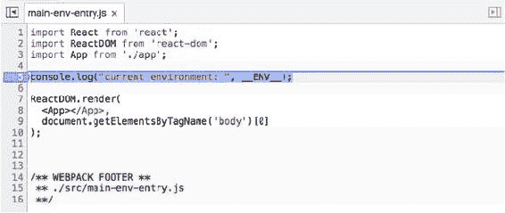

启用 sourcemaps 很简单，如列表 5.14 所示。你只需将 `devtool` 属性添加到 webpack 配置中，即可从 webpack 配置文件中启用 sourcemaps。根据 webpack 文档，你可以使用此 sourcemap 选项进行生产。对于更大的项目，这可能会对性能产生影响，所以请谨慎行事。

##### 列表 5.14\. 添加 sourcemaps—config/dev.config.js

```
module.exports = Object.assign(baseConfig, {
  output: {},
  devtool: 'source-map',
  plugins: []
})
```

webpack 有几个有效的 sourcemap 选项可用。每个选项都在性能和开发者可读性之间做出权衡。dev.config.js 中的选项输出一个单独的映射文件并加载完整的原始源代码。但它在较慢的一侧。如果你需要调整 sourcemap 选项，我建议查看 webpack 的 sourcemaps 文档[`webpack.js.org/configuration/devtool/`](https://webpack.js.org/configuration/devtool/)。

接下来，我们将使用 webpack 插件创建一个生产就绪的配置。

#### 5.5.4\. 准备生产构建

为了准备生产构建，你需要做一些事情：

+   尽可能使包尽可能小：添加用于压缩和去重代码的插件

+   注入生产环境变量

+   输出到不同的输出包

目标是最终生成一个尽可能小的、非人类可读的、最小化脚本的文件。它看起来可能像图 5.6。

##### 图 5.6\. 使用额外的 webpack 插件编译的生产输出

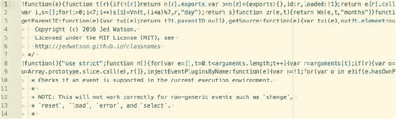

为了最终生成生产输出，你将使用一些额外的插件来准备代码。以下列表展示了如何创建一个为生产准备好的 webpack 配置文件。

##### 列表 5.15\. 生产构建—config/prod.config.js

```
var baseConfig = require('./base.config.js');
var webpack = require('webpack');
var HtmlWebpackPlugin = require('html-webpack-plugin');

var injectEnvironment = new webpack.DefinePlugin({
  __ENV__: JSON.stringify("prod")                           *1*
});
module.exports = Object.assign(baseConfig, {
  output: {
    filename: 'prod-bundle.js'                              *2*
  },
  plugins: [
    new webpack.optimize.UglifyJsPlugin({                   *3*
        compress: {
            warnings: false,
            drop_console: true
        }
    }),
    new HtmlWebpackPlugin({
      title: "Calendar App",
      filename: 'prod-bundle.html'                          *4*
    })
    injectEnvironment
  ]
});
```

+   ***1* 注入生产环境变量。**

+   ***2* 修改当前环境的包名。**

+   ***3* 压缩并丑化你的代码。**

+   ***4* 修改输出 HTML 文件的文件名。**

插件有许多用途，可以帮助你从配置到压缩你的输出。因此，webpack 附带了一些插件，可以帮助你为生产准备你的构建。除了前面列表中显示的插件外，你还可以在 webpack 网站([`webpack.js.org/configuration/plugins/`](https://webpack.js.org/configuration/plugins/))和 npm 网站([www.npmjs.com/search?q=webpack+plugin](http://www.npmjs.com/search?q=webpack+plugin))上了解其他 webpack 插件。截至 webpack 的最新版本，模块包含去重和发生顺序是默认行为。

### 摘要

在本章中，你了解到 webpack 是一个强大的构建工具，可以用来将你的项目编译成浏览器包。你学习了如何单独使用 Babel，以及作为 webpack 的一部分通过加载器使用 Babel。这两个工具在许多 JavaScript 环境中都很有用，并且是个人工具箱中很好的补充。

+   使用 webpack，你可以编译你的 JavaScript 代码，包括 npm 模块。

+   使用 Babel 编译器，你可以使用 JavaScript 的最新功能，同时仍然能在所有浏览器和 Node.js 环境中运行你的代码。

+   加载器是 webpack 的附加模块，允许你使用额外的工具，如 Babel 来打包你的代码。

+   CSS 可以通过 webpack 使用加载器加载和编译。

+   插件是 webpack 编译器的强大附加组件，为你提供了访问许多额外功能的方法，包括为你的 webpack 代码准备构建和自动生成 HTML 包装器。

## 第六章\. Redux

*本章涵盖*

+   使用 Redux 管理你的应用程序状态

+   将 Redux 作为架构模式实现

+   使用 actions 管理你的应用程序状态

+   使用 reducers 强制不可变性

+   应用中间件进行调试和异步调用

+   使用 Redux 与 React 结合

Redux 是一个提供编写业务逻辑架构的库。在 React 应用中，你可以在根组件内处理大部分应用状态。但随着你的应用增长，你最终会得到一组复杂的回调，需要传递给所有子组件以管理应用状态更新。Redux 通过以下方式提供存储应用状态的替代方案：

+   在你的视图和业务逻辑之间建立清晰的通信线路

+   允许你的视图订阅应用状态，以便每次状态更新时都能进行更新

+   强制不可变的应用状态

| |
| --- |

##### 定义

不可变对象是只读的。要更新不可变对象，你需要克隆它。当你用 JavaScript 改变一个对象时，它会影响到对该对象的任何引用。这意味着可变更改可能产生意外的副作用。通过在你的存储中强制不可变性，你可以在你的应用中防止这种情况发生。

| |
| --- |

### 6.1\. Redux 简介

Redux 规定了将应用状态更新写入单个根存储的单向流。存储可以是一个简单的或复杂的 JavaScript 对象，这取决于你的应用需求。Redux 处理将更新连接到存储。它还处理存储的任何订阅者，并在存储对象更新时通知他们。

| |
| --- |

##### 定义

Redux 存储是一个 *单例*（每个应用只有一个实例）对象，它包含所有你的应用状态。存储可以被传递到你的视图中以便显示和更新你的应用。

| |
| --- |

Redux 可以连接到任何视图，但它与 React 的配合尤其出色。React 的自顶向下流通过嵌套组件的 props 和状态与 Redux 的单向状态更新流配合得很好。

| |
| --- |

##### 注意

React 的状态与 Redux 的应用状态不同！React 的状态是局部化的，位于你的应用中的每个组件。它可以在 React 生命周期内更新和受影响。它应该很少使用，但在处理用户输入的组件以及有时在容器组件中经常需要使用。第三章 更详细地解释了 React 的状态。

| |
| --- |

#### 6.1.1\. 从通知示例应用开始

本章的代码可以在 [`github.com/isomorphic-dev-js/chapter6-redux`](https://github.com/isomorphic-dev-js/chapter6-redux) 找到。所有代码都位于 master 分支上，或者你可以跟随教程自己构建它。要运行应用：

```
$ npm install
$ npm start
```

然后，应用将在 http://localhost:3000 运行。

你将构建一个显示消息处于三种状态（错误、警告或成功）的通知应用程序。想法是应用程序从各种分页应用程序、持续集成构建工具和其他系统（如 GitHub、TravisCI、CircleCI、VictorOps、PagerDuty 等）接收更新。然后，它在适当的架子上显示通知。应用程序还有一个可以更新的设置面板和一个调试面板，允许你分发通知进行测试。图 6.1 展示了正在运行的应用程序。

##### 图 6.1\. 通知更新应用程序—发送和接收通知

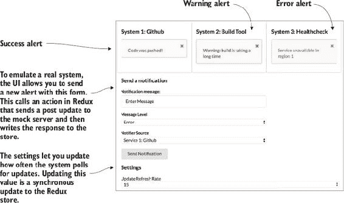

代码中已经设置了一些 React 组件和 webpack。我不会在这些主题上花费太多时间，这样你可以专注于学习 Redux。如果你想复习 React，可以查看第三章和第四章。对于 webpack，请查看第五章。

还要注意，在 Node 服务器上有一个内存对象，它为这个项目的简单 CRUD（创建、读取、更新、删除）服务提供备份。如果你要在现实世界中构建这个项目，你将想要探索使用 WebSocket 连接并连接数据库。界面中的“发送通知”部分允许你模拟应用程序接收来自服务的警报，而无需将其连接到任何真实输入。

#### 6.1.2\. Redux 概述

在本章的第一部分，我们将遍历 Redux 中所有必需的组件，以便在你的应用程序中实现更新流动。图 6.2 在通知应用程序的上下文中回顾了 Redux 的单向更新流程，并介绍了 Redux 的三个主要部分：

+   ***动作*—** 实现业务逻辑，例如更新设置或向列表中添加新通知

+   ***还原器*—** 将由动作触发的状态更改写入存储

+   ***存储*—** 当前应用程序状态，包含通知数组和应用程序的任何设置值

##### 图 6.2\. Redux 单向流程从视图

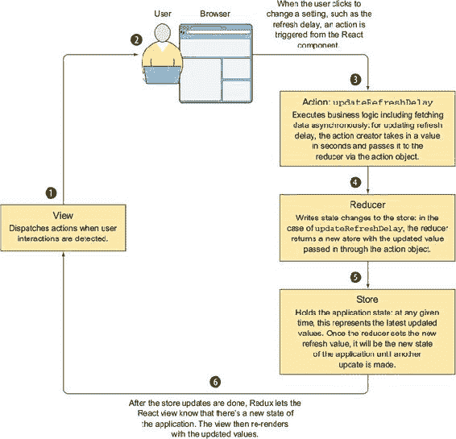

##### 连接 React 和 Redux

在本章的第二部分，你将学习如何使用 React Redux 库将你的 React 视图连接到 Redux 应用程序状态。这包括使用库提供的顶层组件 Provider，它接收存储并将其提供给另一个名为 connect 的组件。connect 组件是一个高阶组件，它包装了你的应用程序中的某些组件。这些包装组件随后能够以属性的形式接收存储更新。connect 组件具有 React 状态，因此你的其他组件不需要有 React 状态！图 6.3 展示了这些组件如何融入你的应用程序结构。

##### 图 6.3\. 使用 React Redux 的 Provider 和 connect 组件将 React 视图与应用程序状态连接起来

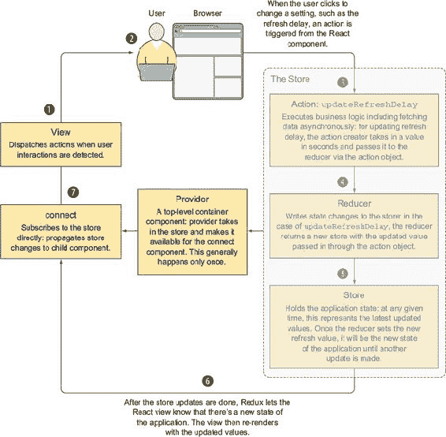

### 6.2\. Redux 作为一种架构模式

通常，在构建 Web 应用程序时，你会使用模型-视图-控制器（MVC）模式。许多常见的框架都使用这种模式。在这种情况下，有一个视图，即应用程序的 HTML，一个模型，它代表应用程序状态的一种表示，以及一个控制器，它是用户与之交互的界面。业务逻辑也由控制器处理。

例如，Angular 1 和 Ember 这样的框架各自有自己的 MVC 实现，但历史上它们都使用双向绑定来处理框架的视图控制器部分。Angular 1 的流程与传统 MVC 不同，因为视图实际上是一个视图控制器（始终与容器组件相同，如我们在第三章中讨论的）。但框架仍然试图遵循 MVC 模式。这导致流程混乱和难以调试的代码。

让我们来看看，如果我们将这种模式应用到本章将要构建的应用程序中，会是什么样子。图 6.4 展示了在这种情况下应用程序流程的工作方式。

##### 图 6.4\. Angular 1 中的模型-视图-控制器（MVC）流程

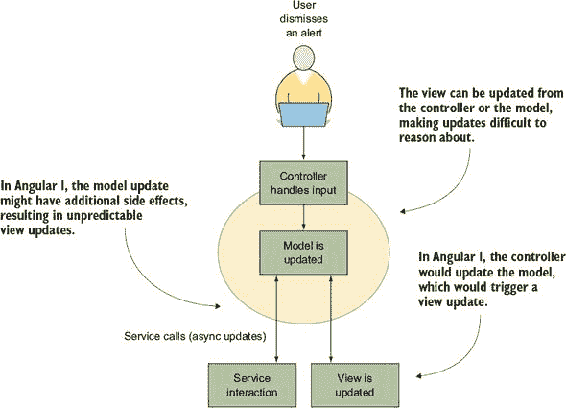

Redux 的实现与 MVC 有一些重叠。我喜欢将其视为 MVC 的一种演变，它更适合基于 UI 的应用程序（与服务/CRUD 应用程序相反）。有几个主要区别：

+   Redux 坚持单向数据流，导致代码易于跟踪且没有副作用。

+   没有控制器。相反，视图也是控制器——称为*视图控制器*。在这种情况下，视图控制器是 React。这很好地适应了浏览器模型，其中视图由 HTML 渲染，用户事件由 DOM 处理。

+   在 Redux 中，始终只有一个单一的根存储，它代表应用程序状态。这简化了大部分逻辑，因为视图只需要订阅根存储，然后关注它们感兴趣的特定子树。

Redux 流程依赖于存储来分发动作。`dispatch`函数是根存储的一个钩子，允许你在存储上触发动作。有时你会触发对存储的同步更新，有时你会触发一个最终会更新存储的异步调用。此外，视图能够订阅存储，并在更新完成后收到通知。图 6.5 说明了这个流程。

##### 图 6.5\. 由用户动作触发的 Redux 流程

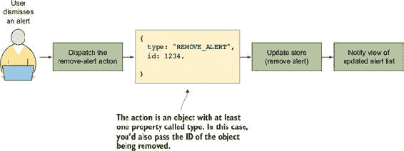

Redux 实现（您将编写的代码部分）由 store、actions 和 reducers 组成。store 保存您的应用程序状态。actions 负责您的业务逻辑。reducer 被调用以更新 store。


##### 定义

Redux 中的*store*是您的应用程序模型。它保存应用程序的当前状态。我将使用*store*和*state*互换来说明 Redux 中的模型。


回顾一下，Redux 为管理您的应用程序状态提供了一个具体模式，这对于开发者来说易于使用。它还使推理和调试您的应用程序变得简单。

### 6.3\. 管理应用程序状态

Redux 的主要任务是允许您的状态（或模型）和视图进行通信。这是通过允许视图订阅状态更新并触发状态更新来实现的。图 6.6 显示了在示例应用程序上下文中的此流程。

##### 图 6.6\. 视图和 Redux 之间的信息流

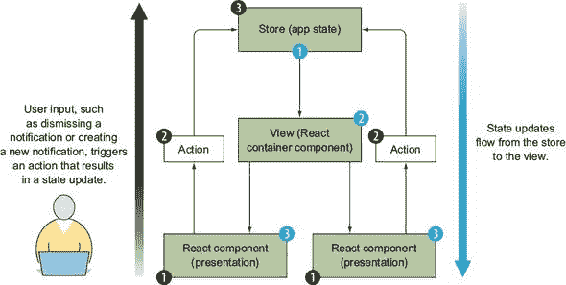

Redux 状态可以是普通的 JavaScript 对象。包含状态对象的 store 有多个可以在其上调用的方法。以下是我将介绍的方法：

+   **`dispatch(action)`—** 触发 store 上的更新（图 6.6 中的步骤 1）。

+   **`getState()`—** 返回当前 store 对象（列表 6.1 显示了其外观）

+   **`subscribe()`—** 监听 store 上的变化（图 6.6 中的步骤 2）。

在将操作派发到 store 后，状态将匹配以下列表中的代码。

##### 列表 6.1\. 示例存储对象（应用程序状态）

```
{
  notifications: {                              *1*
    all: [                                      *2*
      {
        serviceId: 1,
        messageType: "success",
        message: "Code was pushed!"
      },
      {
        serviceId: 3,
        messageType: "error",
        message: "Service unavailable in region 1"
      },
      {
        serviceId: 2,
        messageType: "warning",
        message: "Warning: build is taking a long time"
      }
    ]
  }
  settings: {                                   *3*
    refresh: 30                                 *4*
  }
}
```

+   ***1* 在根存储中，您可以设置子存储—此应用程序有通知和设置的存储。**

+   ***2* 所有数组包含您应用程序的活动通知。**

+   ***3* 在根存储中，您可以设置子存储—此应用程序有通知和设置的存储。**

+   ***4* refresh 属性允许用户设置更新长轮询的速率。**

Redux 提供了一种初始化状态（store）的方法。它管理 store 的更新流，并通知订阅者（视图）。要在您的应用程序中配置 store，您需要创建您的 reducer，然后使用它们初始化 store。以下列表显示了这是如何工作的；您可以在 repo 中的 src/init-redux.es6 中找到此代码。

##### 列表 6.2\. 初始化 Redux—src/init-redux.es6

```
import { createStore, combineReducers } from 'redux';     *1*
import notifications from './notifications-reducer';      *2*
import settings from './settings-reducer';                *2*

export default function (){                               *3*
  const reducer = combineReducers({                       *4*
    notifications,                                        *4*
    settings                                              *4*
     });
  return createStore(reducer)                             *5*
}
```

+   ***1* 从 Redux 导入辅助方法。**

+   ***2* 导入应用程序 reducer。**

+   ***3* 导出可以从其他模块调用的函数（使其可重用，因此可以从同构应用程序的浏览器和服务器调用）。**

+   ***4* 从 Redux 调用 combineReducers 辅助方法；从多个 reducer 构建 reducer 映射。**

+   ***5* 调用 createStore，传入组合的 reducer—这里您将拥有 store.notifications 和 store.settings。**

如果你没有使用 Redux 与 React（本章后面你将学习如何使用 redux-react 将两个库连接起来），你需要手动订阅 store 更新。`subscribe`函数像一个标准的 JavaScript 事件处理器。你传入一个函数，每次 store 更新时都会被调用。但 store 不会将其状态传递给更新处理器函数；相反，你调用`getState()`来访问当前状态。以下列表显示了此代码的示例，你可以在 main.jsx 中找到它。

##### 列表 6.3\. 使用 React Redux 之外的订阅 store—src/main.jsx

```
const store = initRedux();                                *1*

store.subscribe(() => {                                   *2*
  console.log("Store updated", store.getState());         *3*
  // do something here
});
```

+   ***1* 初始化 store（见列表 6.2）。**

+   ***2* 在 store 上调用 subscribe()方法，并传入一个处理更新的函数。**

+   ***3* 通过调用 getState()记录 store 的当前状态。**

接下来，你将编写一个 reducer，并了解如何在 Redux 中保持不可变性。

#### 6.3.1\. Reducers: 更新状态

Reducers 有一个特殊的名字，但分解开来，它们是纯函数。每个 reducer 接收 store 和一个 action，并返回一个新的、修改后的 store。图 6.7 显示了 reducer 函数的功能性。

##### 图 6.7\. 纯 reducer 函数的输入和输出流程

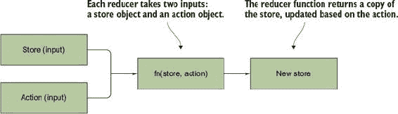

通知应用中的 reducer 是动作和 store 之间的连接线。它们是唯一应该写入 store 更新的代码部分。任何其他写入 store 的代码都是反模式。以下列表显示了 settings 的 reducer 函数。

##### 列表 6.4\. 设置 reducers—src/settings-state

```
import {
  UPDATE_REFRESH_DELAY
} from './settings-action-creators';                         *1*

export default function settings(state = {}, action) {       *2*
  switch (action.type) {                                     *3*
    case UPDATE_REFRESH_DELAY:
      return {
        ...state,                                            *4*
        refresh: action.time
      })
    default:                                                 *5*
      return state
  }
}
```

+   ***1* 包含动作的字符串常量。**

+   ***2* 函数定义—每个 reducer 接受两个参数，store 状态和 action。如果状态不存在，默认为空对象。**

+   ***3* 使用 switch 语句声明你的 reducer 逻辑—始终根据 action.type 的值确定要运行的 case。**

+   ***4* 当刷新值更新时，使用扩展运算符来复制并创建新的 store 以保持不可变性。**

+   ***5* 如果没有匹配的 case，仍然返回 store，因为这仍然是一个纯函数。**

关于 reducers，有两个重要点需要理解：

+   ***Reducer 必须始终是纯函数*—** 它们接收值，使用这些值创建一个新的 store，然后返回一个 store。

+   ***Reducer 必须强制 store 的不可变性质*—** 如果需要更新，函数接收到的 store 必须被克隆。

这两个概念都防止了意外的副作用。接下来的几节将解释纯函数和不可变性。

##### 纯函数

编写还原器最重要的部分之一是确保函数保持纯函数（没有副作用）。*纯*函数接受用于计算返回值的参数—they 不使用任何状态或对状态进行操作。没有副作用的代码有许多好处，包括更易于测试、更容易理解和防止难以调试的问题。让我们看看一个有副作用的函数示例，然后将其与纯函数进行比较。以下列表显示了纯函数和非纯函数之间的区别。

##### 列表 6.5\. 纯函数示例

```
// side effect
let result;
function add(a, b) {
  result = a + b;                        *1*
}

add(1, 2);                               *2*
console.log(result); // logs 3           *2*

// functional – no side effects
function add(a, b) {
  return a + b;                          *3*
}

console.log(add(1,2); // logs 3          *4*
```

+   ***1* 函数不返回任何内容，但更新 result 的值。**

+   ***2* 当在这种情况下调用 add 时，您可以记录结果以查看发生了什么（全局状态）。**

+   ***3* 在这个函数中，返回 add 的结果。**

+   ***4* 这次记录调用 add 函数的结果——没有状态。**

##### 强制不可变存储

另一种使代码易于理解和调试的方法是确保应用状态（或存储）始终是不可变的。不强制不可变性的风险是您最终会遇到难以追踪的问题，这些问题是由代码其他部分的变化引起的。通过每次创建一个新对象，您确保其他代码不会意外地更改整个应用状态。

为了在您的存储中强制不可变性，您需要注意几个事项。让我们从如何确保您的对象保持不可变开始，如下所示。

##### 列表 6.6\. 可变对象与不可变对象

```
// mutation: bad
function addNotification(item, key, state) {       *1*
  return state[key] = item;                        *2*
}

//immutable: good
function addNotification(item, key, state) {       *1*
  return {
    ...state,
    key: item
  }                                                *3*
}
```

+   ***1* 函数声明，接受三个参数：项目、键和状态**

+   ***2* 在不良示例中，项目直接插入到状态对象中，然后返回状态。**

+   ***3* 在良好示例中，使用展开运算符克隆对象，它接受传入的状态并创建具有其键的对象。然后返回新复制的对象。**

在这里，您可以看到不可变方式返回存储对象涉及 JavaScript 函数展开运算符。您通过展开旧对象并添加任何新或更新的键来创建一个新对象。新键将覆盖旧键。但是，如果您有一个深度嵌套的对象，您需要在这里构建完整的对象或使用辅助库来管理深度嵌套的键。

同样，数组也需要保持不可变。对于数组，直接将项目推入数组是一个可变操作，因此需要创建一个新数组。以下列表演示了如何正确和不正确地执行此操作。

##### 列表 6.7\. 不可变数组

```
// bad: mutating the original array
function addItem(item) {
  return itemsArray.push(item)         *1*
}

// good: creating a new array
function addItem(item) {
  return [...itemsArray, item]         *2*
}
```

+   ***1* 将项目推入数组，返回原始数组——这是一个可变操作。**

+   ***2* 显示不可变方法：返回包含原始数组和新项目的全新数组；使用展开运算符将项目推入数组。**

#### 6.3.2\. 动作：触发状态更新

在 Redux 应用程序中，动作是触发应用程序状态更新的唯一方式。这很重要，以确保你的应用程序强制执行单向流。（技术上可以直接更新 store，但你绝对不应该这样做）。只有由动作触发的 reducer 应该更新状态。

因为默认情况下动作是同步的，所以任何需要进行的更新都可以快速发生。实际上，分发器本身是完全同步的。默认情况下，Redux 只支持同步动作。（在本章的后面，你将学习如何使用中间件与 Redux 一起使用，以便允许异步动作。）


##### 小贴士

你不能从 reducer 中分发动作。这会破坏 Redux 的单向流，并可能导致不希望出现的副作用。不用担心，Redux 不会让你这样做，但避免以那种方式思考更新是很重要的。


最简单的操作是一个具有一个名为 `type` 的属性的物体：

```
{ type: 'UPDATE' }
```

动作通常是包含要更新 store 中的数据以及 `type` 属性的对象。因为你的应用程序中的大多数动作都将被多个视图重用，所以建议创建可重用的函数，称为 *动作创建者*，它返回你想要分发的动作。

动作创建者文件也是定义你的动作字符串常量的好地方。这通过确保动作创建者分发的动作类型值与 reducer 寻找的相同来减少错误。如果你启用了静态类型检查或类似功能，这也可以在某些 IDE 中提高开发者的速度。

你可以在下一个列表中看到这两个概念。此代码可以在存储库中找到。列表显示了一个用于更新应用程序长轮询功能的超时时间间隔的动作。

##### 列表 6.8. 同步动作——src/settings-action-creators.es6

```
export const UPDATE_REFRESH_DELAY
 = 'UPDATE_REFRESH_DELAY';                      *1*

export function updateRefreshDelay(time) {        *2*
  return {
    type: UPDATE_REFRESH_DELAY,                   *3*
    time: time                                    *4*
  }
}
```

+   ***1* 将类型值设置为常量可以减少错误**

+   ***2* 动作创建者函数声明接受一个名为 time 的参数。**

+   ***3* 返回的动作有两个属性——type 属性是必需的，其值始终是一个字符串。**

+   ***4* 将时间属性添加到动作中，以便在更新时视图可以使用该值——每个动作将具有不同的数据属性。**

你可以在 reducer 的第一行使用 `const` 来确保动作创建者和 reducer 指向相同的值。要向 store 分发此更新，你只需要在 `store` 上调用 `dispatch` 并传递动作。因为你在使用动作创建者，所以你调用动作创建者并将结果传递给 `dispatch`：

```
store.dispatch(updateRefreshDelay(5));
```

然后，reducer 将被触发，并且 store 将被更新。

接下来，你将学习如何设置 Redux 与中间件一起使用，这样你就可以包含额外的功能，例如进行异步调用。

### 6.4. 将中间件应用于 Redux

Redux 包含一个辅助方法，允许你扩展派发器的默认功能。对于你应用到派发器的每个中间件，它都会向调用链中添加一个函数，该函数将在最终默认派发行为之前发生。以下是一个简化的示例：

```
middleware1(dispatchedAction).middleware2(dispatchedAction).middleware3(dispa
     tchedAction).dispatch(dispatchedAction)
```

这允许你添加调试和异步调用的功能。首先，让我们看看如何添加调试。

#### 6.4.1\. 中间件基础：调试

使用中间件可以添加改进的调试功能。一个例子是 Redux Logger 库。这个库可以帮助你在控制台中清晰地看到状态变化。图 6.8 展示了示例动作日志。

##### 图 6.8\. Redux Logger 控制台输出

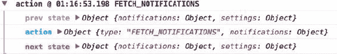

你在实例化 store 时添加中间件。以下列表显示了如何进行操作。代码也可以在仓库中找到。

##### 列表 6.9\. 设置中间件—src/init-redux.es6

```
export default function () {
  const reducer = combineReducers({...});
  let middleware = [logger];                       *1*
  return compose(                                  *2*
    applyMiddleware(...middleware)                 *3*
  )(createStore)(reducer);
}
```

+   ***1* 创建中间件数组，这样你可以传递任意数量的中间件并轻松控制顺序。**

+   ***2* 调用 compose 并传入 store，以便中间件应用于 store。**

+   ***3* 在中间件数组上调用 applyMiddleware 以正确设置中间件**

当你运行应用时，你会在控制台看到日志；这对于调试很有帮助。

#### 6.4.2\. 处理异步动作

在本章的早期部分，你通过编写返回动作对象的函数来分发动作。正如之前所述，我们称这些函数为动作创建器。*异步动作创建器*应用相同的原理，但它们不会立即返回对象，而是等待某个事件发生（例如，网络调用完成）然后返回动作对象。

要做到这一点，你需要访问动作创建器函数内部的 `dispatch` 对象。这需要另一个中间件库，称为 Redux Thunk。要使用中间件，你需要将其添加到 init-redux.es6 中的中间件数组中（参考列表 6.9）。它已经在代码仓库中的代码里了。

然后为了利用这个中间件，你编写一个看起来像这样的动作创建器：

```
export const UPDATE_ACTION = 'UPDATE_ACTION';

export function actionCreator() {
  return dispatch => {
   return dispatch({
       type: UPDATE_ACTION
      })
  }
}
```

通过添加 Thunk 中间件，你现在可以在动作创建器中的 store 内访问 `dispatch` 函数（中间件所做的只是将 `dispatch` 参数提供给你的返回函数）。请注意，你还需要导出你的动作创建器和相应的动作 `const`。这与本章早些时候创建的同步动作创建器相同。

在通知应用中，你需要三个异步动作：添加通知、获取通知和删除通知。以下列表显示了获取通知的动作创建器。代码可以在仓库中找到，与其他动作创建器一起。

##### 列表 6.10\. 异步动作创建器—src/action-creators.es6

```
import request from 'isomorphic-fetch';                 *1*

export const FETCH_NOTIFICATIONS
 = 'FETCH_NOTIFICATIONS';                             *2*

export function fetchNotifications() {
  return dispatch => {                                  *3*
    let headers = new Headers({                         *4*
      "Content-Type": "application/json",
    });
    return fetch(
        'http://localhost:3000/notifications',          *5*
        { headers: headers }
      )
      .then((response)=>{                               *6*
        return response.json().then(data => {           *7*
          return dispatch({
            type: FETCH_NOTIFICATIONS,                  *8*
            notifications: data
          })
        })
      })
  }
}
```

+   ***1* 使用 isomorphic fetch，以便服务器和浏览器都可以处理 fetch 调用。**

+   ***2* 动作类型的 Const**

+   ***3* 动作创建器返回一个函数而不是一个对象。Thunk 中间件调用此函数并注入存储中的 dispatch 方法。**

+   ***4* 创建标题以与 API 通信。**

+   ***5* 使用 URL 和选项调用 fetch。**

+   ***6* Promise 处理器**

+   ***7* 从响应中获取 JSON—因为这也是一个 promise，添加第二个 promise 处理器。**

+   ***8* 获取数据后，分发操作**

现在你已经看到了 Redux 红 ucer 和动作是如何工作的，让我们来看看如何将 React 和 Redux 连接起来。

### 6.5\. 在 React 组件中使用 Redux

在 React 应用中，操作通常是从组件中分发的。为了在组件中访问存储，你需要将你的 React 组件连接到 Redux。我建议使用 react-redux 库，这是 Redux 作者提供的官方 React 绑定。它实现了订阅和接收 Redux 存储更新的所有必要代码。

这有两个不同的部分。一个是顶级根组件，称为 Provider。另一个是高阶组件（HOC），称为 connect。

#### 6.5.1\. 使用 provider 包装你的应用

首先，你需要将存储传递到你的应用中。你希望将其作为 React 属性向下传递。记住，React 组件有一个名为 `props` 的属性。`props` 对象是通过从父 React 组件向下传递值到其子组件而创建的。此对象是不可变的，只能从父组件中更改。

因为你也想能够订阅存储，所以你应该使用 React Redux 中的 Provider 组件。这个 React 组件作为你应用的根组件，使存储对 connect HOC 可用。以下列表显示了如何做到这一点。

##### 列表 6.11\. 将 Redux 连接到 React—src/main.jsx

```
import React from 'react';
import ReactDOM from 'react-dom';
import App from './components/app.jsx';
import { Provider } from 'react-redux';                     *1*
import initRedux from './init-redux.es6';
require('./style.css');

const initialState = window.__INITIAL_STATE;
const store = initRedux(initialState);

store.subscribe(() => {
  console.log("Store updated", store.getState());
  // if not using React, do something here
});

ReactDOM.render(
  <Provider store={store}><App /></Provider>,               *2*
  document.getElementById('react-content')
);
```

+   ***1* 组件接收存储并将其正确传递给其子组件。**

+   ***2* 在 Provider 内部渲染 App 组件，以便它能够访问存储并将存储传递给 Provider 组件。**

现在你已经可以在你的组件中访问存储了。但是，你需要做几件事情来完全连接你的应用和 Redux。

#### 6.5.2\. 从 React 订阅存储

获取存储更新的第二部分是将你的容器组件包裹在 connect HOC 中。这个组件为你处理订阅存储。它持有所有必要的 React 状态，以向下传递属性给其子组件。

连接 HOC 还提供了辅助方法，使将存储映射到属性和从视图中调用操作变得更加容易。将组件包裹在 connect 中然后导出以供应用使用看起来是这样的：

```
export default connect(mapStateToProps, mapDispatchToProps)(Component);
```

`mapStateToProps` 和 `mapDispatchToProps` 是 connect 运行的两个辅助回调函数。第一个，`mapStateToProps`，在存储更新时运行。在其内部，你将定义哪些存储项应该映射到 React `props`。下面的列表显示了这是如何工作的。

##### 列表 6.12\. 将 React 连接到 Redux—src/components/app.jsx

```
class App extends React.Component {

  componentDidMount() {}

  getSystemNotifications(id) {
    let items = [];
    if (this.props.all) {                                            *1*
      this.props.all.forEach((item, index)=>{                        *2*
        if (item.serviceId == id) {
          let classes = classnames("ui", "message", item.messageType);
          items.push(
            <div className={classes} key={index}>
              <i
                className="close icon"
                onClick={
                  this.dismiss.bind(this, index)
                }>
              </i>
              <p>
                {item.message}
              </p>
            </div>
          )
        }
      })
    }
    return items;
  }

  render() {}
}

function mapStateToProps(state) {                                    *3*
  let { all } = state.notifications;                                 *4*
  let { refresh } = state.settings;                                  *4*
  return {                                                           *5*
    all,
    refresh
  }
}

function mapDispatchToProps(dispatch) {}

export default connect(
                 mapStateToProps,
                 mapDispatchToProps
               )(App)                                                *6*
```

+   ***1* 组件直接在 props 上访问通知。**

+   ***2* 使用通知数组，构建一个通知项数组。**

+   ***3* 该函数告诉 connect 从存储中提取特定的键并将其直接放在 props 上。**

+   ***4* 提取相关项目（通知和刷新）；刷新是子组件所需的。**

+   ***5* 只返回组件需要的键，而不是整个存储。**

+   ***6* 将 mapStateToProps 传递给 connect 函数；它将在渲染周期中被调用。**

使用 `mapDispatchToProps`，你可以在组件属性中直接分发动作。通常，每次你想启动一个动作时，都需要完全写出 `dispatch(actionCreator())`。这个辅助方法让你可以使用 JavaScript 的 `bind` 来自动在视图调用动作时分发动作。下面的列表显示了这是如何工作的。注意，React Redux 提供了另一个辅助方法来自动化绑定代码。

##### 列表 6.13\. 将 React 连接到 Redux—src/components/app.jsx

```
import React from 'react';
import { connect } from 'react-redux';                            *1*
import { bindActionCreators } from 'redux';                       *2*
import * as actionCreators from '../action-creators';             *3*
import * as settingsActionCreators                                *3*
 from '../settings-action-creators';                            *3*

import CreateNotification from './create-notification';
import Settings from './settings';
import classnames from 'classnames';

let intervalId;

class App extends React.Component {
  //...component implementation code

  componentDidMount() {
    intervalId = setInterval(() => {
      this.props.notificationActions.
           fetchNotifications();                                *4*
    }, this.props.refresh * 1000);
  }
}

function mapDispatchToProps(dispatch) {                           *5*
  return {
    notificationActions:
     bindActionCreators(actionCreators, dispatch),              *2*
    settingsActions:
        bindActionCreators(settingsActionCreators, dispatch)    *2*
  }
}

export default connect(null, mapDispatchToProps)(App)             *6*
```

+   ***1* Connect 是 React Redux 提供的更高阶函数。它订阅存储并将更新的存储作为 props 传递给连接的组件。**

+   ***2* bindActionCreators 是一个辅助方法，它接受一个动作或包含动作的对象，并创建一个函数，当调用该函数时，会分发请求的动作。**

+   ***3* 导入动作创建器，以便你可以在组件中调用动作。**

+   ***4* 定期调用 fetchNotifications 动作；动作通过 connect 传递为 props。**

+   ***5* 将函数传递给 connect，以便 connect 组件可以将绑定的动作作为属性传递下去—防止每次调用动作时都调用 dispatch。**

+   ***6* 调用 connect，传入 mapDispatchToProps，然后传入你想要连接到 Redux 的组件**

在将容器组件（App）连接到 Redux 并配置好之后，你只需要将属性传递给子组件。然后子组件可以看到你映射到 `props` 的任何状态，并调用你绑定到 `dispatch` 的任何动作。

### 摘要

在本章中，你学习了 Redux 的工作原理，包括如何实现单向数据流、维护不可变存储以及将 React 连接到 Redux。

+   Redux 实现了一种架构模式，它是传统 MVC 模式的演变。

+   Redux 的单向数据流，其中视图分发动作并订阅存储更新，使得开发人员对系统的推理更加简单。

+   您应用程序的 store 或状态是一个根对象，它包含您视图的所有信息。

+   Reducers 是纯函数，它们会对 store 进行更改。它们永远不会修改 store，而是使用不可变模式来更新 store。

+   Actions 用于触发 store 的更新。

+   Middleware 允许在 Redux 中使用调试工具和异步操作。

+   连接 React 和 Redux 需要由 React Redux 库提供的附加功能，该库包括一个高阶组件，该组件订阅 store 以供其子组件使用。
