## 第三部分\. 同构架构

现在你已经了解了同构架构的工作原理以及构建 React 应用所需的基础技能，现在是时候深入了解同构应用的具体细节了。本部分涵盖了广泛的主题，同时着重于帮助你准备好构建一个生产就绪的同构应用。它详细考察了在第二章中引入的概念中的每一部分。它还涵盖了几个高级主题，包括测试、现实世界的应用挑战、用户会话和缓存。

本节的前两章涵盖了同构架构的基础。在第七章（kindle_split_019_split_000.xhtml#ch07）中，你将学习如何使用 Express 以及如何在服务器上使用 React 和 React Router 来启用服务器端渲染的应用路由。在第八章（kindle_split_020_split_000.xhtml#ch08）中，你将了解如何无缝地将服务器端渲染的页面传递给浏览器。

接下来的三章将涵盖高级主题。在第九章（kindle_split_021_split_000.xhtml#ch09）中，你将学习如何在既作为服务器端渲染的页面又作为单页应用程序的行为的应用程序上下文中考虑测试。在第十章（kindle_split_022_split_000.xhtml#ch10）中，你将学习如何处理只能在浏览器中运行的代码（因为它使用了 `window` 对象）以及如何避免重复错误处理代码。最后，在第十一章（kindle_split_023_split_000.xhtml#ch11）中，你将让你的应用为生产做好准备。你将学习性能最佳实践、缓存策略以及如何在同构应用中处理用户会话。

## 第七章\. 构建服务器

*本章涵盖*

+   使用 Express 设置 Node.js

+   编写 Express 中间件

+   在服务器上使用 React Router 处理视图路由

+   使用 `renderToString` 函数在服务器上渲染 React

+   使用 Redux 在服务器上获取数据

+   在你的组件上实现静态方法以处理数据获取

本章全部关于需要在服务器上执行的代码。我将涵盖服务器特定的主题，包括使用 Express 以及在服务器上使用你的组件和路由代码。例如，你将学习如何以允许服务器在每次页面渲染时自动获取它们的方式声明你应用程序的动作。

是的，你没有看错：你将在服务器上运行你的 React、React Router 和 Redux 代码。React 和 React Router 各自提供了针对服务器的特定 API 来实现这一点。Redux 只需要做些小的改动——大多数情况下，你将从服务器调用动作。图 7.1 展示了这是如何工作的。

##### 图 7.1\. React 和 React Router 服务器和浏览器代码之间的主要区别

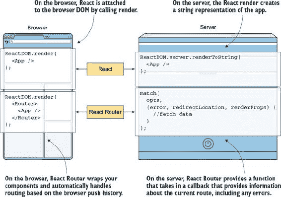

为了让图 7.1 中显示的代码工作，你需要做以下几件事情：

+   使用 Express 设置应用路由

+   使用 React Router 的 `match` 函数处理特定路由（例如，购物车和产品路由）

+   使用 `renderToString` 在服务器上渲染你的 React 组件

+   在服务器上获取组件的数据

+   使用渲染的应用程序响应请求

这些部分构成了同构应用程序的服务器端渲染部分。这包括从用户对应用程序的初始请求到向浏览器发送渲染响应的整个过程。

### renderToString 与 render

让我们回顾 `render` 和 `renderToString` 方法之间的差异，以便你更好地理解为什么我们将服务器上的渲染视为与浏览器渲染不同。表 7.1 描述了每种方法的输出和用例。

##### 表 7.1. 比较 `render` 和 `renderToString`

|   | 输出 | 是否运行一次？ | 环境 |
| --- | --- | --- | --- |
| render | 你的组件的 JavaScript 表示 | 否。每次更新时都会运行。 | 浏览器 |
| renderToString | DOM 元素的字符串表示 | 是。不保留任何状态。 | 服务器 |

图 7.2 展示了本章涵盖的同构应用流程的一部分。在本章中，你将构建的 All Things Westies 应用程序是你从 第四章 开始工作的应用程序。你将构建购物车的服务器端渲染部分，但不会构建任何浏览器特定的代码或交互。在本章中，所有数据都将从服务器模拟。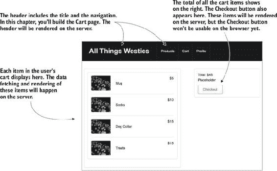 展示了构建完成后的应用程序的外观。（你将在后面的章节中构建应用程序的其余部分。）

##### 图 7.2. 同构应用流程—仅服务器渲染

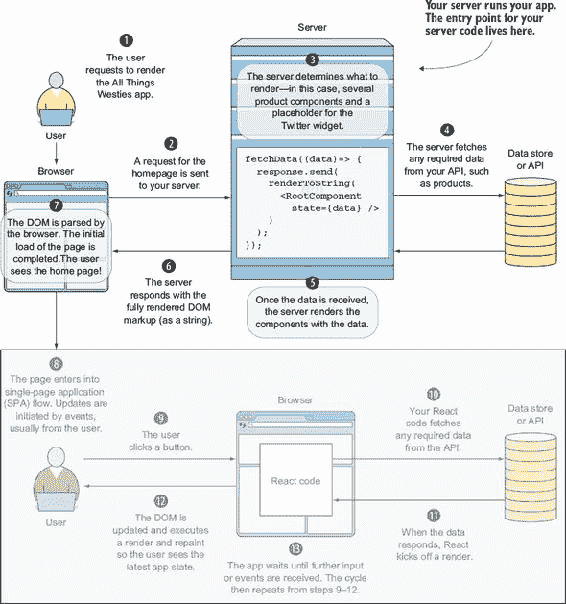

##### 图 7.3. 本章中你将在服务器上构建和渲染的应用程序部分


你可以在 [`mng.bz/8gV8`](http://mng.bz/8gV8) 找到这个应用程序的代码。在拉取此代码后，你将想要切换到 chapter-7-express 分支以继续操作（`git checkout chapter-7-express`）。在你添加 `renderToString` 调用之前，首先需要设置你的应用程序服务器。让我们回顾 Express 基础知识并设置应用程序服务器。

### 7.1. Express 简介

当我开始作为客户端应用程序开发者（构建应用程序的用户界面部分）时，并没有太多需要能够进行全栈开发的需求。如今，能够实现和理解 Web 服务器、基础设施和分布式系统是一项备受追捧的技能。好消息是，能够构建一个渲染同构应用程序初始页面加载的服务器将大大有助于提高你在这一领域的知识。

Express 是一个 Node.js 框架，它使得构建 REST API 和实现视图渲染变得容易。在 All Things Westies 应用中，Express 处理传入到 Node.js 服务器的请求——例如，当用户想要访问产品页面时，请求首先由 Express 应用程序路由处理。使用 JavaScript 构建同构应用程序的一部分是处理对您的 web 服务器的初始请求；服务器处理路由、获取数据和渲染页面。然后，完全渲染的页面被发送到浏览器的响应中。

#### 7.1.1\. 设置服务器入口点

首先，你需要启动一个基本的服务器并运行。你想要使用命令行来启动你的服务器，并在端口 3000 上运行，如图 7.4 所示。我已经为你提供了根入口点文件（server.js 和 app.es6）。

##### 图 7.4\. 启动 Node.js 服务器

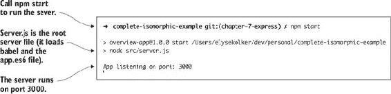

在当前分支中，Express 已经在 package.json 中。为了在你的 Node.js 应用程序中使用它，你需要使用 npm 安装它。这将安装本节所需的所有包：

```
$ npm install
$ npm start
```

当你导航到 localhost:3000 时，你会看到一个错误，如图 7.5 所示。

##### 图 7.5\. 没有路由处理，服务器会抛出错误。

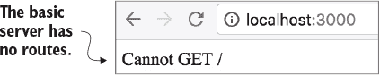

以下列表显示了在章节-7-express 分支的基代码中已经为你提供的服务器入口文件。

##### 列表 7.1\. 服务器入口—src/app.es6

```
import express from 'express';                        *1*

const app = express();                                *2*

// other code – routes for data endpoints
app.listen(3000, () => {                              *3*
  console.log('App listening on port: 3000');
});
```

+   ***1* 在项目中包含 Express 框架。**

+   ***2* 初始化 Express 并将其分配给 app。**

+   ***3* 在 app 上调用 listen 并设置端口为 3000——你可以在回调中做任何事，console.log 语句让用户知道服务器正在哪个端口上运行。**

现在你已经看到了服务器代码的初始设置，你将使用 Express 添加路由。

#### 7.1.2\. 使用 Express 设置路由

Express 路由器处理应用程序的所有传入请求，并决定对每个请求做什么。例如，如果你想要一个返回文本和 200 响应的路由 /test，你需要添加处理此路由的代码到 app.es6 文件中。图 7.6 显示了预期的输出。因为你还没有添加路由处理，所以现在这不会工作。最终，这个路由处理将允许你使用 React 渲染应用程序路由。

##### 图 7.6\. 使用 Express 路由到测试路由

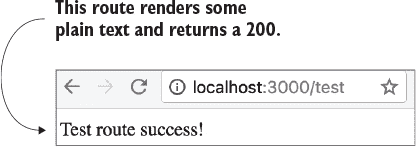


##### 注意

在 Express 中，每个传入的请求都由一个请求对象表示。该对象包含有关 URL、cookies 以及其他 HTTP 信息，例如发送的任何头部信息。


您可以为任何类型的 HTTP 动词（`GET`、`POST`、`PUT`、`OPTIONS`、`DELETE`）设置特定的路由。对于应用的主要部分，您只需要实现 `GET` 请求来响应用户对单个网页应用页面的请求。列表 7.2 展示了如何为 /test 路由添加一个 `GET` 请求的路由处理程序。您需要将列表中的代码添加到 app.es6 中。


##### 注意

Express 为每个传入的请求创建一个响应对象。该对象包含将发送回浏览器的信息，例如头信息、cookie、状态码和响应体。它还具有用于设置响应体和状态码的辅助函数。


##### 列表 7.2\. 添加路由—src/app.es6

```
app.get('/api/blog', (req, res) => {});

app.get('/test', (req, res) => {          *1*
  res.send('Test route success!');        *2*
});

app.listen(3000, () => {});
```

+   ***1* 获取函数接收路由 (/test) 和一个回调函数。**

+   ***2* 回调必须响应响应（否则请求将无限期挂起）。**

这里您向浏览器发送一个简单的字符串，表示该路由存在。响应是通过 `send()` 方法发送的，该方法位于响应对象上。

##### 路由中的正则表达式

除了硬编码完整的字符串路径，如 /test，Express 还支持正则表达式作为路由。这对于使用 React Router 构建应用很有帮助，因为您希望将路由处理传递给 React Router 而不是在 Express 中设置单独的路由。如果您希望 Express 应用了解如 /cart 和 /products 这样的路由，您必须在 Express 和 React Router 中放置重复的逻辑。图 7.7 说明了这些差异。

##### 图 7.7\. 效率与大量代码重复，使使用 React Router 的服务器路由成为最佳选择。

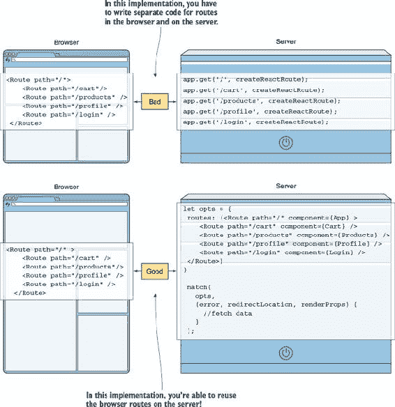

如果你在 Express 中重新创建路由（如图 7.7 中的不良选择 figure 7.7）

+   您有代码重复，并且没有路由的单个真相来源。

+   您需要以某种方式为这些路由提供相同的 React Router 接口，以便您的应用在服务器上的渲染最终与浏览器上的渲染相匹配。*这是一项大量工作！*

通过重用 React Router 并利用其内置的服务器功能，您可以节省时间，并且无需担心服务器上的初始应用状态与浏览器上的初始应用状态不同。

您想在同构应用中这样做，因为它允许您通过使用 React Router 的路由来重用更多代码。这使您可以在两个环境中使用相同的路由。图 7.8 展示了如何输入任意路由，并将该路由与成功消息一起打印出来。此路由在您添加 列表 7.3 中的代码之前不会工作。

##### 图 7.8\. 所有路由的 `GET` 路由处理程序允许您将任何路由传递到服务器。

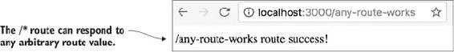

列表 7.3 展示了如何在 app.js 文件中设置全局路由处理器。全局路由处理器始终放在最后。它将调用一个中间件函数（renderView.jsx—见下一节的列表 7.4）来使用 React Router 的匹配逻辑确定要渲染哪个视图。

##### 列表 7.3\. 为任何视图添加路由—src/app.es6

```
// all other routes go before the global handler
app.get('/test', (req, res) => {...});

app.get('/*', (req, res) => {
  res.send(`${req.url} route success!`);
});
```

`get` 函数接受一个正则表达式。`*` 将匹配所有路由—在 `/*` 路由之前匹配的所有路由将不会被此路由处理器处理。回调响应以字符串形式打印当前 URL。如果你在此处重新启动服务器，你将看到图 7.8 中的输出。

接下来，你将为路由处理器添加中间件。

### 7.2\. 为视图渲染添加中间件

到目前为止，你已经设置了以单个函数结束的路由，该函数接受请求并以响应对象的形式响应。接下来，你想要实现一个中间件函数，该函数检查与应用视图之一（例如，/cart）的路径匹配。Express 可以将多个函数链接在一起来处理复杂业务逻辑。这些单个函数被称为 *中间件*。（如果你认为这听起来很像 Redux 中间件，那是对的！）

因为我们已经决定让 React Router 处理所有视图路由，所以你会使用你在第四章中创建的相同共享路由文件。你可以查看 shared/sharedRoutes.jsx 中的代码。在根路由内部有四个路由（以及一个 `IndexRoute` 以确保在根路由上渲染某些内容）：

```
  <Route path="/" component={App} >
    <IndexRoute component={Products} />
    <Route path="/cart" component={Cart} />
    <Route path="/products" component={Products} />
    <Route path="/profile" component={Profile} />
    <Route path="/login" component={Login} />
  </Route>
```

| |
| --- |

##### 注意

如果你正在使用 React Router 4，请查看附录 A 以了解设置路由的概述。

| |
| --- |

在配置了 React Router 路由后，是时候编写你的第一个 Express 中间件了，它将调用 `match` 函数并确定请求的路由是否存在于你的应用中。

#### 7.2.1\. 使用匹配处理路由

`renderView` 中间件处理路由匹配。它使用 React Router 提供的 `match` 函数。添加后，你将能够导航到在 sharedRoutes 中创建的每个路由。图 7.9 显示了在添加了列表 7.4 和 7.5 中的代码后导航到 localhost:3000/cart 的示例输出。

##### 图 7.9\. 中间件允许服务器根据 React Router 共享路由正确响应。

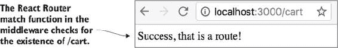

| |
| --- |

##### 注意

如果你正在使用 React Router 4，请查看附录 B 以了解如何在服务器上处理路由的概述。

| |
| --- |

为了将中间件连接到上一节中设置的`/*`（所有）路由处理程序，你需要将请求处理函数替换为`renderView`中间件函数。以下列表显示了中间件的基本路由匹配逻辑。

##### 列表 7.4\. 路由匹配中间件—src/middleware/renderView.jsx

```
import { match } from 'react-router';                            *1*
import routes from '../shared/sharedRoutes';                     *2*

export default function renderView(req, res) {                   *3*
  const matchOpts = {
    routes,                                                      *4*
    location: req.url                                            *4*
  };
  const handleMatchResult = (
                               error,
                               redirectLocation,
                               renderProps
                            ) => {                               *5*
    if (!error && !redirectLocation && renderProps) {            *6*
      res.send('Success, that is a route!');
    }
  };

  match(matchOpts, handleMatchResult);                           *7*
}
```

+   ***1* 包含 React Router 中的匹配函数。**

+   ***2* 包含共享路由中的路由。**

+   ***3* 中间件函数接受几个参数。**

+   ***4* 配置匹配函数选项。该对象需要你的共享路由以及请求的位置（请求的 URL）。**

+   ***5* 这个回调将在匹配函数确定如何处理当前路由后从匹配函数中被调用。**

+   ***6* 确保没有错误或重定向。**

+   ***7* 使用选项和回调调用匹配函数。**

列表中使用了多个回调。请求和响应对象被传递给每个中间件函数。`next`参数是一个回调函数，用于传递给链中的下一个中间件。React Router 的另一个回调有三个参数：一个`error`对象、一个重定向位置和`renderProps`，它代表如果路由有效则要渲染的组件。

在设置好中间件之后，你还需要在 app.es6 中使用它。以下列表显示了如何通过将中间件作为回调传递给路由处理程序来导入和应用中间件。用列表中的代码更新 app.es6。

##### 列表 7.5\. 使用`renderView`中间件处理通配符路由—src/app.es6

```
   import renderViewMiddleware from './middleware/renderView';    *1*

app.get('/*', renderViewMiddleware);                              *2*
```

+   ***1* 导入你的 renderView 中间件。**

+   ***2* 替换内联匿名路由处理程序（你将中间件函数传递到路由处理程序中）。**

图 7.10 展示了请求如何通过 Express 进入你的应用，通过 Express 中的`/*`路由器进行路由，然后通过处理 React Router 路由（如/cart 或错误）的各种中间件函数。每个中间件函数都有选择终止请求（成功或带有 HTTP 错误响应代码）或调用下一个回调的选项。调用`next`将请求传递给链中的下一个中间件函数。

##### 图 7.10\. 请求通过 Express 路由器和相关中间件（使用 React Router 检查有效路由的存在）的流程

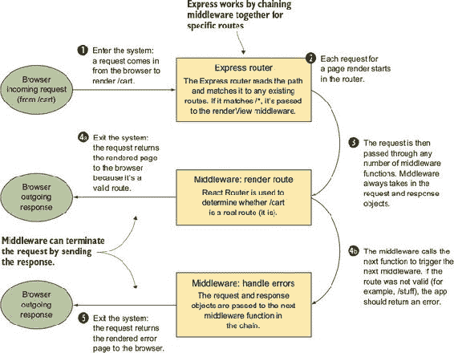

本节介绍了如何在服务器上使用 Express 中间件和 React Router 来确定应用路由的存在。接下来，你将在服务器上渲染组件。

#### 7.2.2\. 在服务器上渲染组件

呼！你已经到达了关键点——故事的顶点，可以说是。 （我看到你翻了个白眼。）本节涵盖了在服务器上渲染组件的核心。目标是得到一个 DOM 的字符串表示形式，可以将其作为响应发送到浏览器（图 7.11）。

##### 图 7.11\. 字符串形式的 HTML 渲染输出

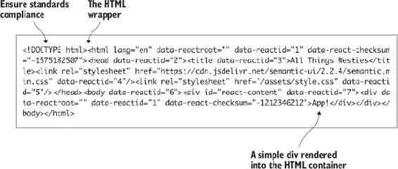

在服务器上渲染你的组件有两个部分。让我们想象一下当用户请求 /cart 路由时会发生什么。图 7.12 展示了这个流程。

##### 图 7.12\. 渲染有效 HTML 路由的两步过程

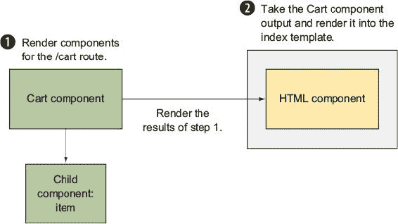

这里是步骤：

> **1**.  每个视图请求都必须根据与 React Router 匹配的路由渲染 React 树。对于 /cart，这包括 App 组件、Cart 组件和 Item 组件。你在 第四章 中看到了 App 组件，我们将在本章中介绍其他组件。
> 
> **2**.  最终的请求必须包含一个完整的 HTML 页面，包括 head 和 body 标签。你的核心 App 组件不包括这个标记。相反，你需要创建一个 HTML.jsx 组件来处理包装标记。把这看作是你的 index.html 文件。

这两个步骤要求你在服务器上渲染两次。（这种方法有替代方案，但它们都需要额外的模板语言和设置。如果你想探索这些其他选项之一，EJS 或 Pug 与 Node.js 一起工作得很好。）我工作的第一个 React 应用程序使用了 Pug。尽管这种方法没有问题，但它提出了挑战。首先，你需要对另一个库保持最新。此外，它并不像一些用于你的工作流程的酷工具那样配合得很好，例如 Webpack Dev Server。

##### 构建 index 组件

首先，让我们渲染一个基本的 HTML 页面，以便你有一个容器来放置你的组件。如果你一直在跟随，你可以在当前分支中继续。如果你迷路了或者想要跳到下一个检查点，你可以切换到 chapter-7-rendering 分支（`git checkout chapter-7-rendering`）。以下列表显示了代表你的根 HTML 容器的 React 组件。将此代码添加到 html.jsx 中。

##### 列表 7.6\. HTML 容器—src/components/html.jsx

```
import React from 'react';
import PropTypes from 'prop-types';

const HTML = (props) => {                                     *1*
  return (
    <html lang="en">                                          *2*
      <head>                                                  *2*
        <title>All Things Westies</title>
        <link
          rel="stylesheet"
          href="https://cdn.jsdelivr.net/semantic-ui/2.2.2/semantic.min.css"
        />                                                    *3*
        <link rel="stylesheet" href="/assets/style.css" />
      </head>
      <body>                                                  *2*
        <div                                                  *4*
          id="react-content"
          dangerouslySetInnerHTML={{ __html: props.
     renderedToStringComponents }}
        />
      </body>
    </html>
  );
};

HTML.propTypes = {
  renderedToStringComponents: PropTypes.string                *5*
};

export default HTML;
```

+   ***1* 只会在服务器上渲染，永远不会具有状态，可以是一个纯（无状态）组件，由一个函数表示。**

+   ***2* 使用 <html>、<head> 和 <body> 标签构建基本的 HTML 结构。**

+   ***3* 包含 SemanticUI CSS 库。**

+   ***4* 当前路由渲染的 React 组件标记将放置于此**

+   ***5* 添加 prop 类型字符串以指示渲染的组件将以字符串形式提供。**

渲染的 React 组件标记将以字符串形式传递。由于你正在注入 HTML，你必须使用 `dangerouslySetInnerHTML` 来插入 DOM 元素。这个 React 组件最重要的部分是它接收构成其余组件树的渲染 HTML。在下一节中，你将把主组件树渲染到 html.jsx 组件中。

记住，组件在服务器上总是只渲染一次，因此只触发第一个 React 生命周期。仅用于服务器上的组件（如 html.jsx）如果它们不依赖于 `componentWillUpdate`，则可以是无状态的。


**dangerouslySetInnerHTML**

`dangerouslySetInnerHTML` 属性由 React 提供，允许你将 HTML 注入到 React 组件中。一般来说，你 *不应该* 使用此属性。但有时你需要。每个规则都有例外！

当你设置此属性时，实际上发生了什么？在底层，React 正在设置 `innerHTML` 属性。但是设置 `innerHTML` 是一个安全风险。它可能会使你面临跨站脚本（XSS）攻击。

React 将使用 `dangerouslySetInnerHTML` 视为一个最佳实践，因为它提醒你大多数时候你不想设置 `innerHTML`。有关更多信息，请参阅 [`mng.bz/69Ne`](http://mng.bz/69Ne)。


#### 7.2.3\. 使用 renderToString 创建视图

下一步是将输出渲染到 HTML 容器中，来自 列表 7.6。在以下列表中，你可以看到如何调用 `renderToString` 两次以将主内容渲染到 HTML 页面中。使用此代码更新 `renderView` 中间件。

##### 列表 7.7\. 在中间件中渲染 HTML 输出—src/middleware/renderView.jsx

```
import React from 'react';                                              *1*
import { renderToString } from 'react-dom/server';                      *2*
import { match} from 'react-router';
import routes from '../shared/sharedRoutes';
import HTML from '../components/html';                                  *3*

export default function renderView(req, res, next) {
  const matchOpts = {
    routes,
    location: req.url
  };
  const handleMatchResult = (error, redirectLocation, renderProps) => {
    if (!error && !redirectLocation && renderProps) {
      const app = renderToString(<div>App!</div>);                      *4*
      const html = renderToString(
       <HTML renderedToStringComponents ={app} />                       *5*
      );
      res.send(`<!DOCTYPE html>${html}`);                               *6*
    } else {
      next();
    }
  };
  match(matchOpts, handleMatchResult);
}
```

+   ***1* 由于中间件中的 JSX 包含 React（这就是为什么它是 .jsx 文件）。**

+   ***2* 从 React DOM 库导入 renderToString 函数。**

+   ***3* 包含 HTML 组件。**

+   ***4* 在占位符 <div> 上调用 renderToString 方法。**

+   ***5* 在 HTML 组件上调用 renderToString 方法，将渲染的应用内容注入到组件中。**

+   ***6* 将组合后的字符串发送回响应，添加 DOCTYPE 标签以使标记有效。**

在占位符 `<div>` 上调用 `renderToString` 创建将插入到 HTML 组件中的页面内容。

在下一节中，你将用 App 组件替换此内容。

##### 渲染组件

最后一步是在中间件中完全渲染一个路由。这需要以下步骤：

+   根据路由（例如，购物车及其所有子组件）动态渲染 app.jsx 和子组件

+   从渲染中获取字符串输出并将其作为属性传递给 html.jsx

你已经在第四章中构建了 App 组件 章节 4。它在 src/components/app.jsx 中。你现在需要添加购物车组件。

购物车组件渲染用户购物车中的项目并显示总成本。它还有一个结账按钮。目前，此组件有占位符文本（代码检查器会抱怨，但你会很快修复这个问题）。在下一节中，你将添加 Redux 和数据获取，购物车将动态渲染传递给它的项目。你已经有了来自第四章的 cart.jsx 章节 4。用以下列表替换现有代码。

##### 列表 7.8\. 购物车组件—src/components/cart.jsx

```
import React, { Component } from 'react';

class Cart extends Component {
  render() {
    return (
      <div className="cart main ui segment">
        <div className="ui segment divided items">          *1*
          Items will go here.
        </div>
        <div className="ui right rail">
          <div className="ui segment">
            <span>Total: </span><span>$10</span>            *2*
            <div></div>
            <button
              className="ui positive basic button">         *3*
              Checkout
            </button>
          </div>
        </div>
      </div>
    );
  }
}
export default Cart;
```

+   ***1* 渲染购物项的容器**

+   ***2* 渲染购物车中物品的总数。**

+   ***3* 结账按钮**

现在你已经拥有了 /cart 路由的组件，你仍然需要在服务器上渲染它们。列表 7.9 展示了如何将中间件代码更新以支持动态路由。


##### 注意

如果你使用的是 React Router 4，请查看附录 B 以了解如何在服务器上处理路由的概述。


##### 列表 7.9\. 渲染—src/middleware/renderView.jsx

```
import React from 'react';
import { renderToString } from 'react-dom/server';
import { match, RouterContext } from 'react-router';       *1*
import routes from '../shared/sharedRoutes';               *2*
import HTML from '../components/html';

export default function renderView(req, res, next) {
  const matchOpts = {
    routes,
    location: req.url
  };
  const handleMatchResult = (
                              error,
                              redirectLocation,
                              renderProps
                            ) => {                         *3*
    if (!error && !redirectLocation && renderProps) {
      const app = renderToString(
        <RouterContext                                     *1*
          routes={routes}                                  *2*
          {...renderProps}                                 *3*
        />
      );
      const html = renderToString(<HTML renderedToStringComponents={app} />);
      console.log(`<!DOCTYPE html>${html}`);
      res.send(`<!DOCTYPE html>${html}`);
    } else {
      next();
    }
  };

  match(matchOpts, handleMatchResult);
}
```

+   ***1* RouterContext 是一个 React Router 组件，用于在服务器上正确渲染你的组件树。**

+   ***2* 将共享路由传递到 RouterContext 中，以便正确初始化位置并匹配浏览器渲染。**

+   ***3* 由 React Router 的匹配函数计算得出，传递到 RouterContext 中，该上下文知道如何提取正确的组件进行渲染。**

关键要点是使用 `renderProps` 值（从 React Router 传递到你的回调函数）。这使 Router 知道要渲染哪个组件。这也是你如何在服务器和浏览器上保持路由一致性的方法。

到目前为止，你已经学会了如何利用 React 的 `renderToString` 在服务器上渲染你的组件。但你也需要能够在服务器上获取填充组件的数据。在下一节中，你将连接 Redux 并为你的 React 组件添加一个名为 `prefetchActions` 的静态方法，以指示在运行时需要调用哪些操作才能使单个组件正确渲染。

### 7.3\. 添加 Redux

当你将 Redux 添加到应用中时，你将渲染获取的数据到视图中，如图 7.13 所示。

##### 图 7.13\. 服务器上 Redux 获取的数据将被渲染到购物车中的列表视图。

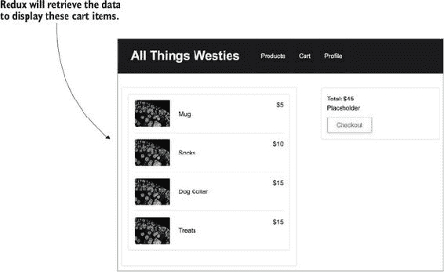

构建网络应用（或任何数据驱动的、面向用户的程序）中最棘手的部分之一是处理异步代码。这有点像我煮早餐时，预先做好的早餐香肠说需要 6-8 分钟来制作。这意味着我应该在我开始煮香肠后 4 分钟开始煮鸡蛋，还是 8 分钟？我的鸡蛋会比香肠煮得快得多，但我想让所有东西同时准备好。

同样，当你在服务器上使用 Redux 时，你需要确保在渲染视图之前数据已经准备好，否则服务器上创建的视图和浏览器代码运行后创建的视图可能不会总是匹配。你需要确保在开始渲染视图之前，视图所需的数据是可用的。图 7.14 展示了服务器上 Redux 的流程。

##### 图 7.14\. 服务器上的 Redux 流程

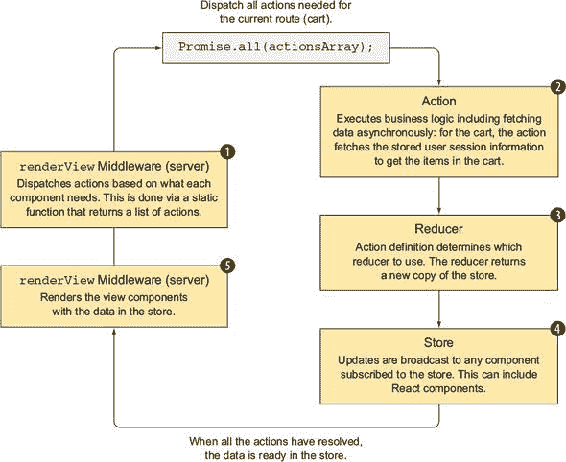

你需要采取几个步骤来确保你可以获取 Cart 组件（该过程可以应用于应用的其它部分）的所有必要数据：

+   创建购物车动作和减少器以获取购物车数据

+   使用 `renderView` 中间件来调用动作

+   在你的购物车组件上使用静态方法，以便中间件知道它需要调用哪些动作

+   在购物车组件中显示获取的数据

#### 7.3.1\. 设置购物车动作和减少器

All Things Westies 应用具有用户会话的概念，以及注销或登录。因此，应用可以跟踪用户购物车中的项目，然后持久化这些数据，以便用户稍后回来完成交易。（你也可以使用 cookie 或本地存储来完成此操作。）

在本节中，你将假设用户之前已经将项目放入购物车，并直接回到购物车完成购物。你将使用购物车路由（http://localhost:3000/cart）。

首先，你需要在服务器上初始化 Redux。以下列表显示了你需要添加到 init-redux.es6 的 Redux 配置。如果你一直在跟随，你可以添加此代码，或者你可以切换到 chapter-7-adding-redux (`git checkout chapter-7-adding-redux`)。

##### 列表 7.10\. 初始化 Redux 存储—src/shared/init-redux.es6

```
import {
  createStore,
  combineReducers,
  applyMiddleware,
  compose } from 'redux';                               *1*
import thunkMiddleware from 'redux-thunk';              *2*
import loggerMiddleware from 'redux-logger';            *3*
import cart from './cart-reducer.es6';                  *4*

export default function (initialStore = {}) {
  const reducer = combineReducers({                     *5*
     cart
  });
  const middleware = [
                       thunkMiddleware,
                       loggerMiddleware
                     ];                                 *6*
  return compose(
      applyMiddleware(...middleware)
    )(createStore)(reducer, initialStore);              *7*
}
```

+   ***1* 从 Redux 导入所有需要的函数。**

+   ***2* 导入 Thunk 中间件，以便你可以使用异步动作。**

+   ***3* 导入日志记录中间件以帮助调试——在服务器上，它将在终端中记录。**

+   ***4* 导入购物车减少器。**

+   ***5* 创建根减少器，它最终将包含用户、产品和博客数据的子减少器。**

+   ***6* 设置中间件。**

+   ***7* 组合中间件和减少器以创建新的存储。**

你还需要创建你将调用来获取购物车数据的动作。购物车需要知道用户购物车中当前有什么项目。你将此代码添加到 cart-action-creators.es6 文件中，以下列表显示了。

##### 列表 7.11\. 购物车动作—src/shared/cart-action-creators.es6

```
import fetch from 'isomorphic-fetch';

export const GET_CART_ITEMS = 'GET_CART_ITEMS';               *1*

export function getCartItems() {                              *2*
  return (dispatch) => {
    return fetch('http://localhost:3000/api/user/cart',
      {                                                       *3*
        method: 'GET'
      }
    ).then((response) => {
      return response.json().then((data) => {                 *4*
        return dispatch({
          type: GET_CART_ITEMS,                               *5*
          data: data.items                                    *5*
        });
      });
    })
  };
}
```

+   ***1* 动作字符串常量**

+   ***2* 在服务器上，getCartItems 动作将由 renderView 中间件调用。**

+   ***3* 使用 fetch API 从 Node.js 服务器获取购物车数据。**

+   ***4* 在成功响应中，从响应中读取 JSON。**

+   ***5* 解析 JSON；返回动作对象。**

在最后一行，`type` 是字符串常量，而 `data` 是来自 JSON 的项目数组。列表 7.12 展示了这些数据的样子。

对于 All Things Westies 应用，所有数据都将由你的 Node.js 服务器处理。所有内容都在 JSON 文件中模拟。以下列表显示了购物车数据。它已经为你提供在分支中。

##### 列表 7.12\. 模拟购物车数据—data/cart.json

```
{
  "items": [                                                  *1*
    {
      "name": "Mug",                                          *2*
      "price": 5,                                             *3*
      "thumbnail":
 http://localhost:3000/assets/cart-item-placeholder.jpg     *4*
    },
    {
      "name": "Socks",                                        *2*
      "price": 10,                                            *3*
      "thumbnail":
 http://localhost:3000/assets/cart-item-placeholder.jpg     *4*
    },
    {
      "name": "Dog Collar",                                   *2*
      "price": 15                                             *3*
    },
    {
      "name": "Treats",                                       *2*
      "price": 15,                                            *3*
      "thumbnail":
 http://localhost:3000/assets/cart-item-placeholder.jpg     *4*
    }
  ]
}
```

+   ***1* JSON 返回包含购物车项目数组的对象。**

+   ***2* 每个项目都有一个名称，它是一个字符串。**

+   ***3* 每个项目都有一个价格，它是一个数字。**

+   ***4* 每个项目都有一个缩略图，它是一个包含图像 URL 的字符串。**

在通过 `getCartItems` 动作从服务器获取购物车数据后，您的购物车 reducer 将数据放入 Redux 存储。列表 7.13 显示了设置购物车 reducer 所需的代码。请记住，reducer 的任务是接收当前存储和动作。然后它使用动作来更新存储并返回应用程序的新状态。将列表中的代码添加到购物车 reducer 中。

##### 列表 7.13\. 购物车 reducers—src/shared/cart-reducer.es6

```
import {
  GET_CART_ITEMS
} from './cart-action-creators.es6';               *1*

export default function cart(state = {}, action) {
  switch (action.type) {                           *2*
    case GET_CART_ITEMS:
      return {
        ...state,
        items: action.data                         *3*
      };
    default:
      return state;
  }
}
```

+   ***1* 使用动作字符串常量以确保一致性。**

+   ***2* 从传递给 reducer 的动作中读取类型，以查看是否应该在此 reducer 中处理该动作。**

+   ***3* 将动作中的数据写入当前状态。**

干得好！您已经创建了 Redux 所需的所有组件（设置、动作和 reducer），以便在 `renderView` 中间件中获取路由数据。接下来，您将实现数据获取逻辑，以便您可以看到加载到视图中的数据。

#### 7.3.2\. 在 renderView 中间件中使用 Redux

现在，您需要将存储包含在您的 `renderView` 中间件中。以下列表显示了如何添加此功能。

##### 列表 7.14\. 将 Redux 存储添加到您的中间件—src/middleware/renderView.jsx

```
import initRedux from '../shared/init-redux.es6';                 *1*

export default function renderView(req, res, next) {
  const matchOpts = {...};
  const handleMatchResult = (error, redirectLocation, renderProps) => {
    if (!error && !redirectLocation && renderProps) {
      const store = initRedux();                                  *2*
      // ... more code
    }
  }
  // ... more code
}
```

+   ***1* 在中间件中包含初始化代码。**

+   ***2* 调用初始化函数并将其存储在名为 store 的常量变量中。**

在您将存储放入中间件之后，您可以在服务器上分发动作。但您想变得聪明，只分发当前路由的动作。为此，您需要扩展您的 React 组件，以便能够在每个路由的基础上声明您的动作。

##### 设置初始动作

声明路由的数据需求有几种有效的方法。您可以将此信息与路由声明一起存储，或者您可以将数据声明放在组件上。我将向您展示如何将数据声明放在组件上。购物车组件知道需要调用哪些动作创建器函数来获取购物车视图所需的相关数据。稍后，`renderView` 中间件将使用这些函数引用并调用它们以获取填充存储所需的 JSON 数据响应。

使用 React Router，您可以轻松访问在路由组件中声明的任何组件。通过在共享路由中的组件上声明数据需求，您可以在中间件中组合来自多个组件的动作列表。下一个列表显示了购物车组件如何声明其动作需求。在这种情况下，它需要通过 `getCartItems` 动作获取的数据。为了表示这一点，它存储了对动作创建器函数的引用。`renderView` 中间件将调用此动作。

##### 列表 7.15\. 声明初始动作—components/cart.jsx

```
import { getCartItems } from '../shared/cart-action-creators.es6';

class Cart extends Component {

  static prefetchActions() {                                *1*
    return [                                                *2*
      getCartItems                                          *3*
    ];
  }
  render(){
    return {
      <div className="cart main ui segment">...</div>
    }
  }
}
```

+   ***1* 声明静态函数。**

+   ***2* 返回数组，以便您可以列出多个动作创建器（动作包含如何获取数据和更新应用程序状态的业务逻辑）。**

+   ***3* 列出组件需要的动作创建者（在这里不要调用它们，只需将它们作为函数引用传递）。**

记住，静态函数不是类实例的一部分。它们无法访问组件实例的任何具体信息，如属性或状态。静态函数的任何上下文都需要从调用者那里传入。在这种情况下，你不需要任何上下文。


**静态函数**

*静态函数*存在于 React 类或任何 JavaScript 类中。这些函数可以在不实例化类的情况下被调用。

你为什么要使用静态函数呢？通常，它们被用来提供工具。在同构应用中，你可以使用静态函数来定义 React 组件需要渲染的数据调用。


#### 7.3.3\. 通过中间件添加数据预取

现在由于你的购物车组件通过定义需要调用的动作来声明其自己的数据需求，以便正确渲染，你可以使用中间件在渲染组件之前获取数据。你需要添加的第一件事是收集来自 `renderProps` 组件上的所有动作的代码。以下列表展示了你需要添加什么来使它工作。

##### 列表 7.16\. 在组件上调用所有初始动作—src/middleware/renderView.jsx

```
export default function renderView(req, res, next) {
  const matchOpts = {...};
  const handleMatchResult = (error, redirectLocation, renderProps) => {

    if (!error && !redirectLocation && renderProps) {
      const store = initRedux();
      let actions = renderProps.components.map(
       component) => {                                                   *1*
        if (component) {
          if (component.displayName &&
            component.displayName.toLowerCase().indexOf('connect') > -1
          ) {                                                              *2*
            if (component.WrappedComponent.prefetchActions) {
              return component.
               WrappedComponent.prefetchActions();                       *3*
            }
          } else if (component.prefetchActions) {
            return component.prefetchActions();                            *3*
          }
        }
        return [];
      });
    actions = actions.reduce((flat, toFlatten) => {                        *4*
      return flat.concat(toFlatten);                                       *4*
    }, []);                                                                *4*
  };
  match(matchOpts, handleMatchResult);
}
```

+   ***1* 对 renderProps 返回的每个组件运行 map。**

+   ***2* 通过查找 'connect' 来检查组件是否被包裹（检查 WrappedComponent 属性并调用 prefetchActions）。**

+   ***3* 如果存在，在组件上调用 prefetchActions，应该总是返回数组。**

+   ***4* map 函数将创建一个数组数组—将其缩减以合并成一个数组。**

这段代码使服务器知道为路由调用哪些动作。记住，你只能在 React Router 已知的组件上调用 `prefetchActions`。

动作数组现在是一个可以调用的动作创建者列表。接下来，你需要将它们设置好以进行分发，然后使用 `Promise.all` 等待所有初始动作完成后再渲染 React 组件。记住，你只调用当前路由所需的动作。以下列表展示了如何添加异步代码处理，以便在渲染组件之前等待获取到路由所需的所有数据。

##### 列表 7.17\. 在组件上调用所有初始动作—src/middleware/renderView.jsx

```
import { Provider } from 'react-redux';                               *1*

export default function renderView(req, res, next) {
  const matchOpts = {...};
  const handleMatchResult = (error, redirectLocation, renderProps) => {
    if (!error && renderProps) {
      const store = initRedux();

      let actions = renderProps.components.map((component) => {...});
      actions = actions.reduce((flat, toFlatten) => {...}, []);

      const promises = actions.map((initialAction) => {               *2*
        return store.dispatch(initialAction());                       *2*
      });
      Promise.all(promises).then(() => {                              *3*
          const app = renderToString(
            <Provider store={store}>                                  *4*
              <RouterContext routes={routes} {...renderProps} />
            </Provider>
          );
          const html = renderToString(<HTML html={app} />);
          return res.status(200).send(`<!DOCTYPE html>${html}`);
      });
    }
  }
  match(matchOpts, handleMatchResult);
}
```

+   ***1* 从 React Redux 导入 Provider 组件（用于在服务器上创建带有 Redux 的组件）。**

+   ***2* 在每个动作创建者上调用 store.dispatch。**

+   ***3* 在你的动作上调用 Promise.all—在它们解析后，你可以渲染组件。**

+   ***4* 将 React Router 组件包裹在 Provider 中。**

在将 React Router 组件包裹在 Provider 中之后，你将 store 传递给 Provider。现在，store 将会更新为你的动作获取和更新的所有数据。

##### 在购物车中显示数据

因为应用现在正在获取路由的数据，你可以使购物车组件根据动态数据更新。以下列表显示了购物车组件中显示每个购物车项目的附加逻辑。

##### 列表 7.18\. 完整的购物车组件—components/cart.jsx

```
import React, { Component } from 'react';
import PropTypes from 'prop-types';
import { bindActionCreators } from 'redux';
import { connect } from 'react-redux';
import { getCartItems } from '../shared/cart-action-creators.es6';
import Item from './item';

class Cart extends Component {

  static prefetchActions() {}

  constructor(props) {
    super(props);
    this.proceedToCheckout = this.proceedToCheckout.bind(this);
  }

  getTotal() {
    let total = 0;
    const items = this.props.items;
    if (items) {
      total = items.reduce((prev, current) => {                   *1*
        return prev + current.price;
      }, total);
    }
    return total;
  }

  proceedToCheckout() {
    console.log('clicked checkout button', this.props);          *2*
  }

  renderItems() {
    const components = [];
    const items = this.props.items;
    if (this.props.items) {
      this.props.items.forEach((item, index) => {                 *3*
        components.push(<Item key={index} {...item} />);          *3*
      });
    }
    return items;
  }

  render() {
    return (
      <div className="cart main ui segment">
        <div className="ui segment divided items">
          {this.renderItems()}                                    *3*
        </div>
        <div className="ui right rail">
          <div className="ui segment">
            <span>Total: </span><span>${this.getTotal()}</span>   *1*
            <button
              onClick={this.proceedToCheckout}
              className="ui positive basic button"
            >
                Checkout
            </button>
          </div>
        </div>
      </div>
    );
  }
}

Cart.propTypes = {
  items: PropTypes.arrayOf(
    PropTypes.shape({
      name: PropTypes.string.isRequired,
      price: PropTypes.number.isRequired,
      thumbnail: PropTypes.string.isRequired
    })
  )
};

function mapStateToProps(state) {
  const { items } = state.cart;                                   *4*
  return {
    items
  };
}

function mapDispatchToProps(dispatch) {
  return {
    cartActions: bindActionCreators([getCartItems], dispatch)
  };
}

export default connect(
                        mapStateToProps,
                        mapDispatchToProps
                      )(Cart);                                    *4*
```

+   ***1* 基于属性上的购物车项目计算总额，使用 reduce 函数返回所有价格的总和。**

+   ***2* 按钮的占位符点击处理程序（因为你还没有连接浏览器代码，所以你不会看到控制台输出）。**

+   ***3* 使用 Item 组件渲染购物车项目，为 items 数组中的每个项目创建新的 Item。**

+   ***4* 将购物车连接到 Redux，以便它可以从 props 中获取购物车项目。**

重新启动应用。然后如果你导航到/cart，你会看到每个项目都完全渲染。但是结账按钮不起作用！当你点击它时，你不会看到任何控制台输出，因为你还没有在浏览器中重新激活 React 树。第八章将教你如何进行服务器/浏览器交接并使浏览器特定的代码工作。

### 摘要

在本章中，你学习了如何实现服务器端渲染。你编写了 Express 中间件来处理你的应用的路由和渲染。你还学习了如何在服务器上使用 Redux 并预取数据以在服务器上创建购物车组件。

+   Express 可以用来渲染你的视图。

+   你可以在服务器上使用 React Router，这样你就不必重复你的路由代码。

+   你创建并使用自定义 Express 中间件来确定你所在的路线并渲染当前路线的组件。

+   React 提供了一个名为`renderToString`的方法，它允许你返回一个字符串，包括来自你的路由的标记。

+   不要让正常的应用流程获取你的数据，而是预取你组件所需的数据。

## 第八章\. 同构视图渲染

*本章涵盖*

+   创建浏览器代码的渲染 React 组件的入口点

+   序列化数据，以便浏览器代码可以从服务器状态启动（引导）

+   在浏览器中反序列化数据以使你的代码生效

+   在你的序列化数据中包含来自原始服务器请求的信息，以在浏览器和服务器之间保持一致的状态

+   转向单页应用程序（SPA）体验以处理浏览器中的用户交互

在本章中，你将构建同构视图渲染的浏览器部分。你将专注于图像的下半部分图 8.1。你已经看到这个图多次了，但我在这里重新讨论它，以提供本章的背景。

##### 图 8.1\. 本章重点介绍流程的下半部分，即服务器渲染之后发生的一切（浏览器的渲染和 SPA 逻辑）。

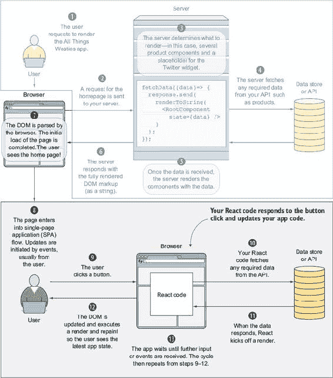

本章的所有代码都在与第七章相同的 GitHub 仓库中，该仓库可以在[`mng.bz/8gV8`](http://mng.bz/8gV8)找到。在您拉取此代码后，切换到 chapter-8.1.1（`git checkout chapter-8.1.1`），其中包含本章第一部分的代码。每个部分提供的分支都包括从前一节需要的骨架代码，但不包括在该特定节中添加的内容。下一节的代码将包含前一节的完整代码。每次您需要切换分支时，我都会通知您。

记住，每次您想要构建代码（以及您做出任何更改后）都需要运行`start`命令：

```
$ npm start
```

应用程序在您的浏览器中以 http://localhost:3000 运行。

### 8.1\. 设置浏览器入口点

您需要做的第一件事是将代码在浏览器中渲染，就是设置您的浏览器入口点。这被称为 main.jsx。它将是您在浏览器中引导（初始化）React 代码的地方。您的 main.jsx 入口点最终将负责几件事情，包括以下内容：

+   反序列化服务器状态

+   使用当前状态初始化 Redux

+   设置 React Router

+   在浏览器中渲染 React 组件

#### 8.1.1\. 引用浏览器代码

要使浏览器代码加载，您需要确保从您的 HTML 中引用它。它需要作为页面中的脚本包含在 body 的末尾。这确保了它不会阻止页面加载和渲染。因为页面已经在服务器上渲染了一次，所以您的用户不会知道脚本尚未加载！

分支（chapter-8.1.1）中的代码已经包含了 webpack 配置。当您运行`npm start`时，webpack 会创建浏览器代码，并在应用程序中使用。打开 html.jsx 文件，并使用以下列表中的代码添加对打包的浏览器文件的引用。请注意，在生产环境中，您可能希望将此 URL 配置为静态资产文件所在的位置。

##### 列表 8.1\. 添加您的浏览器源代码—src/components/html.jsx

```
  <body>
    <div
      id="react-content"
      dangerouslySetInnerHTML={{ __html: props.html }}
    />
    <script
      type="application/javascript"
      src="browser.js"
    />                                                 *1*
  </body>
```

+   ***1* 插入一个指向您的 JavaScript 包的 script 标签。**

在您完成此操作后，重新启动服务器。要检查 browser.js 文件是否正确加载，请使用 Chrome DevTools 中的网络标签查看是否已加载。图 8.2 显示了您需要查找的内容。

##### 图 8.2\. 使用 Chrome 开发者工具的网络标签确认您的 JavaScript 代码是否在浏览器中加载

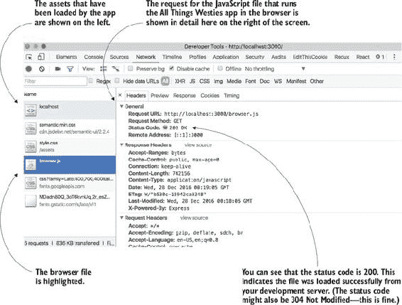

您还应该尝试添加一个`console.log`语句或设置一个断点来验证您的脚本是否已加载。在您成功完成此操作后，您就可以在浏览器中渲染您的 React 组件了。

#### 8.1.2\. 在浏览器中渲染 React

本节介绍了如何在浏览器中渲染 React。我们已经在第三章中介绍了这一点，当时你学习了所有关于使用 React 的内容。我将在这里重新回顾核心实现细节。此外，我将演示这一步骤为什么是必要的。

让我们从`/cart`路由开始，因为它已经在第七章中构建出来了。如果你不记得，图 8.3 展示了它在第七章结束时的样子。

##### 图 8.3\. 在浏览器渲染或添加 SPA 功能之前的应用程序购物车页面

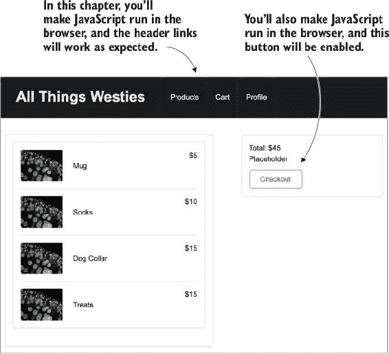

到目前为止，你只在这个服务器上进行了渲染。一些事情还没有工作，比如具有附加逻辑的结账按钮。在浏览器中连接这一步骤的第一步是在浏览器中调用`ReactDOM.render`。你将添加一个简单的渲染调用，在浏览器代码执行并渲染后显示浏览器渲染消息。图 8.4 显示了它的样子。

##### 图 8.4\. 在浏览器中渲染一个简单的`div`和消息后的预期输出

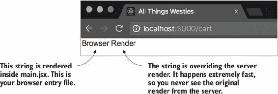

要得到这个输出，你需要使用 React 设置 main.jsx，然后调用`render`。列表 8.2 显示了你的入口文件如何渲染一个带有消息的简单`div`。将列表中的代码添加到 main.jsx 中。如果你需要赶上进度，所有这些代码都在名为 chapter-8.1.2 的分支上（`git checkout chapter-8.1.2`）。或者你也可以继续编写你到目前为止的代码。

##### 列表 8.2\. 在浏览器中渲染 HTML 元素—src/main.jsx

```
import React from 'react';                             *1*
import ReactDOM from 'react-dom';                      *1*

function init() {                                      *2*
  ReactDOM.render(
    <div>                                              *3*
      Browser Render
    </div>,
    document.getElementById('react-content'));         *4*
}

init();                                                *2*
```

+   ***1* 你必须包含 React 和 React DOM 才能在这个文件中调用 render。**

+   ***2* 创建一个 init 函数，这样你就可以在你的入口点添加异步代码。**

+   ***3* 使用简单的 div 元素调用 render 函数。**

+   ***4* 传入 DOM 元素；React 将你的 div 渲染到其中。**

这段代码的明显问题是你的应用程序消失了！这不是你想要发生的。打开你的开发者工具并选择资源标签页，在 main.jsx 文件中设置断点。（使用 Cmd-P 并搜索 main.jsx—然后你将能够设置断点。）图 8.5 显示了设置断点后你的 Chrome DevTools 将看起来是什么样子。

##### 图 8.5\. 在 Chrome 开发者工具的资源标签页中设置 main.jsx 的第 5 行断点。这让你可以在浏览器 JavaScript 运行之前查看浏览器输出。

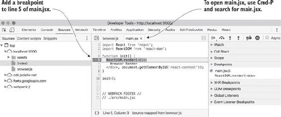

现在你已经设置了断点，刷新你的浏览器。代码执行将在你的断点上暂停。查看主浏览器窗口中的你的应用。它看起来应该是正确的，购物车路由已渲染（如图 8.3 所示）。如果你的应用正在加载，但你在控制台输出中注意到 React 错误，现在不用担心（类似于“React 尝试在容器中重用标记”的错误）。我将在本章后面解释这一点。

将两个状态中的 DOM 标记进行比较，以查看浏览器渲染前后的情况。图 8.6 显示了浏览器渲染调用之前的标记。

##### 图 8.6\. 比较服务器渲染的 DOM 与 main.jsx 中渲染的`div`的 DOM

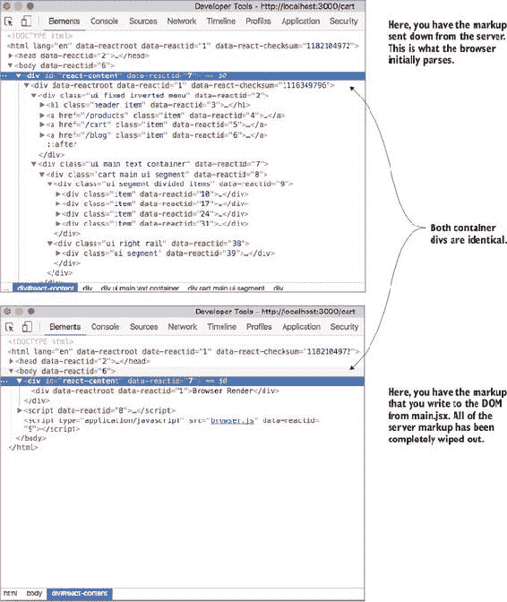

在本节中，你已经设置了浏览器代码以运行，并向浏览器添加了一个简单的 React 渲染。这说明了服务器渲染和初始浏览器渲染之间的交互。在下一节中，我们将介绍如何在浏览器中使用服务器状态。

### 8.2\. 首次渲染时匹配服务器状态

要使应用同构，你需要从服务器重新创建状态。按照以下步骤操作：

> **1**. 在服务器上序列化应用状态，并将其以字符串化的 DOM 标记形式发送下来。
> 
> **2**. 在浏览器上反序列化状态，使其成为一个可消费的 JSON 对象。
> 
> **3**. 使用应用状态（JSON 对象）初始化 Redux。
> 
> **4**. 将初始化的 Redux 存储传递给你的 React 组件。

图 8.7 显示了在 All Things Westies 应用上下文中的此流程。

##### 图 8.7\. 状态序列化/反序列化的流程

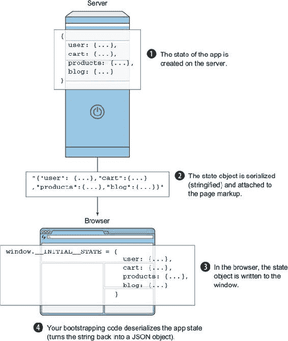

重要的是要记住，在服务器上创建的状态需要与用于在浏览器上启动你的 React 代码的状态**完全匹配**。这确保了在页面初始加载期间无需更新浏览器 DOM。

首先，让我们在服务器上设置数据——既序列化它，然后将其发送到浏览器以供消费。

#### 8.2.1\. 在服务器上序列化数据

在本节中，你将更新 renderView.jsx 中的代码（在第七章中创建）。第一步是捕获和序列化当前应用状态。

| |
| --- |

##### 定义

*序列化*是将数据（通常是 JavaScript 中的 JSON）转换为可以在环境之间发送的格式的行为。在这种情况下，你通过网络请求从服务器发送到浏览器。

| |
| --- |

到本节结束时，你将能够通过在`window`对象上放置服务器状态来在控制台中访问你的服务器状态。图 8.8 显示了在 Chrome 开发者工具中的此输出。

##### 图 8.8\. 浏览器中的序列化状态

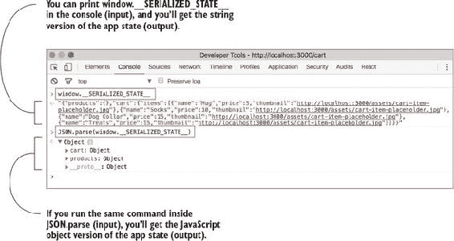

你可以切换到 chapter-8.2.1 分支以获取本节的基础代码（`git checkout chapter-8.2.1`），或者继续使用你迄今为止添加的代码。该分支包含迄今为止的所有代码列表。以下列表指导你如何在`renderView`中间件中获取和序列化你的应用当前状态。将此新代码添加到`renderView`中间件。

##### 列表 8.3\. 捕获并序列化当前应用状态—src/middleware/renderView.jsx

```
Promise.all(promises).then(() => {
  const serverState = store.getState();                       *1*
  const stringifiedServerState
   = JSON.stringify(serverState);                           *2*
  const app = renderToString(
    <Provider store={store}>
       <RouterContext routes={routes} {...renderProps} />
    </Provider>
  );
  const html = renderToString(
    <HTML
      html={app}
      serverState={stringifiedServerState}
    />                                                        *3*
  );
  return res.send(`<!DOCTYPE html>${html}`);
```

+   ***1* 获取 Redux 存储的当前状态——getState()是一个辅助方法，它返回存储。**

+   ***2* 通过从 JSON 创建字符串来序列化状态。**

+   ***3* 将序列化状态作为 serverState 属性传递给 HTML 组件。**

现在你已经创建了当前应用状态的字符串表示，你需要将其设置在 DOM 标记中。你使用`dangerouslySetInnerHTML`和 script 标签来完成这个操作。以下列表显示了要添加到 html.jsx 中的代码。

##### 列表 8.4\. 在 DOM 中设置序列化状态—src/components/html.jsx

```
<body>
  <div
    id="react-content"
    dangerouslySetInnerHTML={{ __html: props.html }}
  />                                                           *1*
  <script
    dangerouslySetInnerHTML={{                                 *2*
      __html: `
        window.__SERIALIZED_STATE__ =                          *3*
         = JSON.stringify(${props.serverState})              *4*
      `
    }}
  />                                                           *1*
  <script type="application/javascript" src="browser.js" />
</body>
```

+   ***1* 应放置在 body 的末尾（这样就不会阻塞渲染）但在主 JavaScript 执行之前—browser.js 依赖于状态在 window 对象上可用。**

+   ***2* 设置 script 标签的 innerHTML，以便 JSON 字符串放在 script 标签内。**

+   ***3* 在 window 的 __SERIALIZED_STATE__ 属性上设置状态。**

+   ***4* 分配字符串化的服务器状态。**

重新启动服务器后，你将能够在浏览器控制台中看到你的应用状态字符串化并打印出来（如图 8.8 所示），通过运行以下命令：

```
window.__SERIALIZED_STATE__
```

虽然你现在可以在浏览器中看到你的状态很酷，但这并没有什么用。在接下来的两个部分中，我们将介绍如何使用 Redux 和你的 React 组件来使用这个状态。

#### 8.2.2\. 在浏览器中反序列化数据

如果这听起来复杂且令人害怕，别担心！其实很简单。实际上，这比最初序列化状态还要简单。目标是获取服务器发送下来的字符串化数据，并将其转换成应用可以处理的状态。你接收一个字符串输入，并将其转换回一个 JavaScript 对象。


##### 定义

*反序列化*是指将序列化数据转换为当前环境可用的格式。在这种情况下，你将一个字符串转换为 JavaScript 对象。


以下列表显示了你需要添加到 main.jsx 中的代码，以从 window 对象获取状态。解析`window.__SERIALIZED_STATE__`值并将其保存到变量中。

##### 列表 8.5\. 在浏览器中获取状态—src/main.jsx

```
import React from 'react';
import ReactDOM from 'react-dom';

const initialState
 = JSON.parse(window.__SERIALIZED_STATE__);          *1*
console.log(initialState);                             *2*
```

+   ***1* 将字符串解析成可用的对象。**

+   ***2* 在控制台添加日志语句以查看它是否工作。**

如果你查看浏览器控制台，你会看到状态。这就是反序列化应用状态的全部内容。接下来，你将这个状态注入到 Redux 中，以便你的应用以与服务器相同的状态启动。

#### 8.2.3\. 储存活化

现在你已经反序列化了状态，你需要使用在服务器上生成的状态初始化 Redux。你不需要添加任何新的 Redux 代码；你在第七章（kindle_split_019_split_000.xhtml#ch07）中创建的所有内容在这里都工作得很好。本节的分支是 chapter-8.2.3 (`git checkout`）。

| |
| --- |

##### 注意

如果你使用的是 React Router 4，请查看附录 A（kindle_split_027_split_000.xhtml#app01），了解设置路由和相关路由代码的概述。附录显示了与本章中列表 8.6（kindle_split_020_split_002.xhtml#ch08ex06）中的 Router 代码相比的 main.jsx 设置代码。

| |
| --- |

在 main.jsx 中，你需要做的只是使用正确的状态初始化 Redux。以下列表显示了如何将状态传递给 init Redux 函数。你应该使用此代码更新 main.jsx（替换前几节中的占位符代码）。

##### 列表 8.6\. 设置 Redux 和组件树—src/main.jsx

```
import React from 'react';
import ReactDOM from 'react-dom';
import { Provider } from 'react-redux';                           *1*
import { browserHistory, Router } from 'react-router';            *2*
import initRedux from './shared/init-redux.es6';                  *3*
import sharedRoutes from './shared/sharedRoutes';                 *4*

const initialState = JSON.parse(window.__SERIALIZED_STATE__);
console.log(initialState);

const store = initRedux(initialState);                            *5*

function init() {
  ReactDOM.render(
    <Provider store={store}>                                      *6*
      <Router
        routes={sharedRoutes}
        history={browserHistory}
       />                                                         *7*
    </Provider>,
   document.getElementById('react-content'));
}

init();
```

+   ***1* 包含 React Redux 的 Provider 组件，以便组件可以根据需要访问存储。**

+   ***2* 包含 React Router 的 Router 组件，从 sharedRoutes 配置路由，并包含浏览器环境的正确历史记录。**

+   ***3* 包含 Redux 引导代码。**

+   ***4* 包含 sharedRoutes。**

+   ***5* 根据反序列化状态创建 Redux 存储。**

+   ***6* 将存储作为属性传递给 Provider 组件。**

+   ***7* 将 sharedRoutes 和 browserHistory 作为属性传递给 Router。**

Main.jsx 从 initRedux.jsx 导入 initRedux。initRedux.jsx 模块中的代码接受状态并创建存储。这就是你如何使存储保持一致。你已经在第七章（kindle_split_019_split_000.xhtml#ch07）中添加了此代码。这里显示为提醒，但它已经包含在 src/shared/init-redux.es6 的代码库中：

```
export default function (initialStore = {}) {
  const reducer = combineReducers({
    products,
    cart
  });
  const middleware = [thunkMiddleware, loggerMiddleware];
  return compose(
      applyMiddleware(...middleware)
    )(createStore)(reducer, initialStore);
}
```

注意，传递给函数的 `initialStore` 参数在 `createStore` 函数中使用，以初始化 Redux 存储。因为这是在创建组件之前发生的，所以你的组件的第一次渲染最终使用了来自服务器的状态。

使用来自服务器的状态，React 能够计算出初始虚拟 DOM 与提供给 render 函数的根容器附加的 DOM 匹配。它知道不需要进行任何浏览器 DOM 更新。

现在你已经在浏览器中成功渲染了视图，让我们来探讨浏览器中第一次渲染的潜在问题。请注意，到目前为止，你只设置了处理初始渲染的代码。在本章的后面部分，你将添加在浏览器中路由时获取数据的功能。

### 8.3\. 执行第一次加载

到目前为止，你应该清楚如何在浏览器中加载你的应用程序。了解浏览器中初始渲染过程中发生的事情也很重要，因为这与用户与应用程序交互后发生的情况不同。

#### 8.3.1\. 第一次加载时的 React 生命周期

本节将带您了解 React 在浏览器中的首次渲染。当您调用 `ReactDOM.render` 时，React 开始在您的 main.jsx 文件中进行引导。每个正在启动的组件都会经过以下步骤：

> **1**. 调用构造函数。
> 
> **2**. 触发 `componentWillMount`。
> 
> **3**. 调用渲染方法。
> 
> **4**. 调用 `componentDidMount`。

记住，这从根组件开始，所有这些组件都来自第三方库（React Redux 和 React Router）。然后它继续到 React Router 计算出需要加载当前路由的组件。然后渲染它们的任何子组件。

##### 初始渲染差异

重要的是要理解 `componentWillMount` 在服务器和浏览器的每个组件的首次加载时都会被调用！其中任何代码都需要真正是同构的。例如，如果您要将以下代码添加到 src/components/app.jsx 中，您的服务器将崩溃并且无法加载任何路由：

```
componentWillMount() {
  window.test = true;
}
```

这是因为您的服务器找不到一个名为 `window` 的全局变量。`window` 对象在 Node.js 中不存在。如果您将此代码放入任何在首次渲染期间运行的方法（`constructor`、`componentWillMount` 或 `render`）中，它将在服务器上崩溃。

相反，`componentDidMount` 在首次渲染完成后运行，仅在浏览器中调用。当您需要在到达浏览器后更新组件但不想破坏同构渲染时，这种区别变得非常有用。

#### 8.3.2\. 同构渲染错误

您可能在本章早期注意到控制台中的一个大红色警告。图 8.9 展示了它的样子。

##### 图 8.9\. 当 React 检测到非真正同构的同构渲染时，它发出的同构警告日志。这发生在初始渲染周期的虚拟 DOM 和浏览器 DOM 不匹配时。

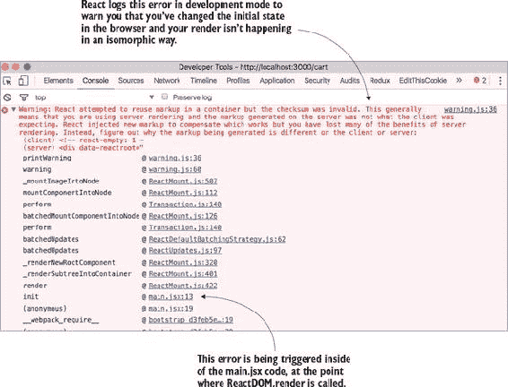

这不是一个有趣的错误。（公平地说，错误通常都不好玩。）第一次看到它时，感觉很难调试：“校验和无效”——这究竟是什么意思？

这意味着 React 在浏览器中渲染了组件树，将其与已存在的 DOM 进行比较，并发现它们不同。但 React 很聪明，知道如果 DOM 元素中已经存在您告诉它渲染的子元素，这是一个同构渲染。这两个 DOM 在首次渲染时应该匹配。但出了点问题，它们没有匹配！

##### 破坏渲染的实验

在工作中，我们经常运行 A/B 测试来尝试各种设计和 UX 实现，以找出什么最能帮助我们实现产品目标。有一天我们去测试我们的登录按钮。我们想知道是否应该将其称为“登录”或“注册”。尽管团队在处理同构应用方面经验丰富，但实验最终还是在我们头部组件的 `componentWillMount` 中进行，同构渲染警告开始被抛出。

更糟糕的是，代码（大约在同一时间）的另一个更新改变了 `componentWillMount` 内的应用状态。结果发现，React 只会为第一次遇到的情况显示此警告，这意味着当我们解决了第一个问题时，我们发现了第二个问题。

进入这种状况出奇地容易。在第一次渲染（在你的 `constructor`、`componentWillMount` 或 `render` 方法内部）的任何时候对浏览器中的应用状态进行微小更改都可能导致错误。我见到的进入这种状况的最常见原因是根据 cookies 改变状态。


##### 警告

*Cookies* 是存在于你的应用代码之外的全局状态。它们是网络应用开发中强大且重要的工具。但它们可能会使你的初始应用状态复杂化。你要么应该在服务器上考虑 cookies，要么确保在浏览器中正确处理它们。第十章 Chapter 10 将更深入地介绍这一点。


你应该关注这个警告的原因是，你将失去同构渲染的所有积极好处。你仍然有良好的感知性能——UI 和内容立即显示——但页面变得可用的过程可能会明显变长，这可能会让用户感到沮丧。

这就是为什么 `componentDidMount` 在你的应用中成为一个强大的工具。下一节将探讨如何使用它来避免同构渲染错误。

#### 8.3.3\. 使用 componentDidMount 防止同构加载错误

假设你想要在 cookies 中保存用户偏好。一个常见的用例是是否显示全站可关闭横幅。这对用户来说是有益的，因为它允许在浏览器中实现全局、易于访问的状态。但你必须警惕何时检查这些 cookies 以防止同构错误。


##### 注意

此示例和解决方案假设你不想在服务器上读取 cookies。在某些应用中，在服务器上读取 cookies 并从正确的应用状态开始可能更为实用。我们将在第十章 chapter 10 中更深入地探讨这些权衡。


在这个例子中，你将添加一个横幅，通知用户关于半年度促销的信息。显示横幅的规则是：如果用户之前从未见过它，就显示它，直到他们将其关闭。你通过在浏览器中写入一个 cookie 来跟踪他们是否见过它。图 8.10 展示了你希望它看起来像什么。

##### 图 8.10. 在页面底部添加横幅

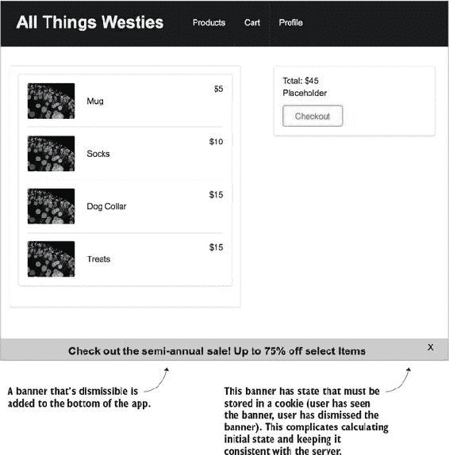

现在你需要添加一个横幅。如果你想查看基本代码，切换到分支 8.3.3 (`git checkout chapter-8.3.3`)，其中包含了本章迄今为止添加的所有代码，并且已经为你创建了这个横幅组件（编写这个组件对于理解这个概念并不重要，但我已经为你提供了它，以便你有一些上下文）。

##### 列表 8.7. 横幅组件——src/components/banner.jsx

```
class Banner extends React.Component {

  handleDismissBanner() {                         *1*
    // will do something
  }

  render() {
    return (
      <div className=="banner" }>
        <div className="dismiss">                 *2*
          <button
            className="btn-reset"
            onClick={this.handleDismissBanner}    *3*
          >
            X
          </button>
        </div>
        <div className="content">
          {this.props.children}                   *4*
        </div>
      </div>
    );
  }
}
```

+   ***1* 添加 dismiss 按钮的点击处理占位符。**

+   ***2* dismiss 按钮位于此处。**

+   ***3* onClick 处理器引用 handleDismissBanner 函数。**

+   ***4* 父组件为横幅设置子组件（使其更具可重用性）。**

此外，以下代码已添加到 src/components/app.jsx 的标题之后（约第 13 行）：

```
<Banner show>
  <h3>Check out the semi-annual sale! Up to 75% off select Items</h3>
</Banner>
```

现在你需要添加决定页面加载时是否显示此横幅的代码。这涉及到检查一个 cookie，然后告诉横幅是可见的还是保持隐藏。以下列表显示了如何更新 banner.jsx 以使其工作。

##### 列表 8.8. 显示横幅组件——src/components/banner.jsx

```
class Banner extends React.Component {

  constructor(props) {
    super(props);
    this.state = {                                                *1*
      show: false
    };
    this.handleDismissBanner = this.handleDismissBanner.bind(this);
  }

  componentDidMount() {
    const cookies = document.cookie;                              *2*
    const hideBanner = cookies.match('showBanner=false');         *2*
    if (!hideBanner) {
      this.setState({                                             *2*
        show: true
      });
    }
  }

  handleDismissBanner() {
    document.cookie = 'showBanner=false';                         *3*
    this.setState({                                               *3*
      show: false
    });
  }

  render() {
    const bannerClasses = classnames(
                            { show: this.state.show },
                            'banner'
                          );                                      *4*
    return (
      <div className={bannerClasses}>                             *4*
        <div className="dismiss">
          <button
            className="btn-reset"
            onClick={this.handleDismissBanner}
          >
            X
          </button>
        </div>
        <div className="content">
          {this.props.children}
        </div>
      </div>
    );
  }
}
```

+   ***1* 在构造函数中创建初始状态——为了与服务器匹配，横幅默认应隐藏。**

+   ***2* 获取 cookies，查看用户是否之前关闭了横幅——如果没有，设置状态以显示横幅（将触发重新渲染）。**

+   ***3* 当用户关闭浏览器时，将 cookie 写入页面并将状态设置为隐藏。**

+   ***4* 使用状态生成横幅类。**

使用状态生成横幅类将在横幅可见时添加一个名为 `show` 的类。这个类的 CSS 将显示属性更改为块，使组件变得可见。

通常，你不想在 `componentDidMount` 中设置状态。但在这个例子中，同构渲染使其成为更新状态的最好位置，因为我们想确保第一次渲染与服务器状态匹配。在这个函数中设置状态时要小心——你很容易导致组件不必要的重新渲染。

### 8.4. 添加单页应用交互

恭喜你，你已经做到了！你的应用从服务器加载并渲染，并在浏览器中成功渲染。遗憾的是，它仍然在浏览器中没有任何操作，因为你还没有告诉它要做什么。让我们让应用在路由之间切换时在浏览器中加载数据。

#### 8.4.1. 浏览器路由：数据获取

您设置的路线将使页面顶部的路线工作。但如果你首先导航到根目录或 /products，然后点击购物车，你会发现购物车加载时没有任何项目。这是因为您还没有设置应用程序的 SPA 部分来获取任何数据。图 8.11 展示了这看起来是什么样子。

##### 图 8.11\. 从产品页面加载购物车导致状态为空。

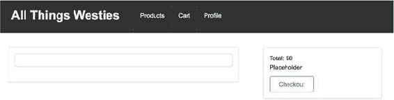

要使应用程序在浏览器中获取数据，您将利用 `prefetchActions` 静态函数在每个路由上获取数据。React Router 为其生命周期中的各个部分提供了回调。有一个 `onChange` 回调可以配置。提供的函数将在每个路由渲染之前被调用，这为您提供了从 API 获取所需数据的路由的机会。


##### 注意

如果您使用 React Router 4，请查看附录 A [kindle_split_027_split_000.xhtml#app01]，以了解设置路线和相关路由代码的概述。它还展示了如何在浏览器上预取数据以及如何在 React 生命周期中而不是在 React Router 生命周期中处理路线更改。


如果您想查看基本代码，请切换到分支 8.4.1 (`git checkout chapter-8.4.1`)。以下列表显示了要添加到 sharedRoutes.jsx 中的代码。

##### 列表 8.9\. 在浏览器中获取数据—src/shared/sharedRoutes.jsx

```
let beforeRouteRender =
 (dispatch, prevState, nextState) => {                             *1*
  const { routes } = nextState;                                      *2*
};

export const routes = (onChange = () => {}) => {                     *3*
  return (
    <Route
      path="/"
      component={App}
      onChange={onChange}
    >                                                                *4*
      <Route path="/cart" component={Cart} />
      <Route path="/products" component={Products} />
      <Route path="/product/detail/:id" component={Detail} />
      <Route path="/profile" component={Profile} />
    </Route>
  );
};

const createSharedRoutes = ({ dispatch }) => {                       *5*
  beforeRouteRender = beforeRouteRender.bind(this, dispatch);        *6*
  return routes(beforeRouteRender);                                  *7*
};

export default createSharedRoutes;                                   *5*
```

+   ***1* 声明 `onChange` 处理器，该处理器接受来自 Redux 的 `dispatch` 函数和来自 React Router 的参数，包括 `prevState` 和 `nextState`。**

+   ***2* 从 `nextState` 中提取路线数组，以便您可以迭代组件并从 `prefetchActions` 获取操作。**

+   ***3* 创建一个返回路线的 `routes` 函数，让您传入 `onChange` 处理器。**

+   ***4* 将 `onChange` 处理器分配给顶级路由——所有子路由之间的更改都将触发此处理器。**

+   ***5* 模块的默认导出现在是一个函数，需要传入 Redux 存储。**

+   ***6* 将 `dispatch` 绑定到 `onChange` 处理器。**

+   ***7* 返回带有传入 `onChange` 处理器的 `routes` 函数。**

在浏览器中传递 `onChange` 处理器是必要的，因为您需要将其绑定到 `dispatch`。此函数被导出，以便服务器代码可以调用它。这里有几个重要的事项。首先，您只需要将 `onChange` 处理器添加到顶级路由。这是因为 `onChange` 会在子路由更改时触发。当用户在购物车或产品之间切换时，它会被触发。这也意味着它不会在初始渲染时触发。这将是多余的，因为数据已经从服务器状态中可用。

这段逻辑中最复杂的部分是从组件中获取 `prefetchActions` 数组。这是 `nextState` 中的 `routes` 变量很重要的地方。`routes` 变量是一个对象数组。每个路由上都有一个组件列表。从这些中，可以收集需要为路由调用的所有动作。以下列表显示了您需要添加的最后一段代码，以便使所有这些工作。将代码添加到 sharedRoutes.jsx 中。您会注意到它与 renderView.jsx 中的代码类似。

##### 列表 8.10\. 在路由更改时调用 `prefetchActions`—src/shared/sharedRoutes.jsx

```
let beforeRouteRender = (dispatch, prevState, nextState) => {
  const { routes } = nextState;

  routes.map((route) => {                                          *1*
    const { component } = route;                                   *2*
    if (component) {
      if (component.displayName &&
        component.displayName

         .toLowerCase().indexOf('connect') > -1                  *3*
      ) {
        if (component.WrappedComponent
         .prefetchActions) {                                     *4*
          return component.WrappedComponent.prefetchActions ();
        }
      } else if (component.prefetchActions) {                      *3*
        return component. prefetchActions();
      }
    }
    return [];
  }).reduce((flat, toFlatten) => {                                 *5*
    return flat.concat(toFlatten);
  }, []).map((initialAction) => {                                  *6*
    return dispatch(initialAction());
  });
};
```

+   ***1* 使用 map 遍历数组中的每个路由（根应用路由和请求的路由）。**

+   ***2* 从路由中获取组件。**

+   ***3* 检查组件是否为 HOC connect 组件——如果是，则获取组件的子属性。**

+   ***4* 如果组件有 WrappedComponent 属性，则调用 prefetchActions。**

+   ***5* 将映射的结果，可能是一个嵌套数组，缩减为单个数组。**

+   ***6* 使用 map 遍历最终的扁平化数组；对每个项目调用 dispatch 以执行操作。**

您可能会注意到 `sharedRoutes` 的结构改变了很多。这是因为您需要访问 Redux 的 `dispatch` 方法来触发动作。在 `main.jsx` 和 `renderView.jsx` 中，您需要更新访问共享路由的方式。以下列表显示了 `main.jsx` 中需要做出的更改。

##### 列表 8.11\. 更新 Main 以调用 sharedRoutes—src/main.jsx

```
function init() {
  ReactDOM.render(
    <Provider store={store}>
      <Router routes={sharedRoutes(store)} history={browserHistory} />
    </Provider>, document.getElementById('react-content'));
}
```

而不是直接插入路由，默认导出现在是一个函数。在这里，您调用该函数，传入存储，以便 `sharedRoutes` 可以将 `dispatch` 传递到 `onChange` 处理器。

`renderView` 中间件的更改与 `main.jsx` 中的更改类似。但您必须首先更改导入，因为在服务器上您不需要执行 `onChange` 逻辑——它永远不会触发。以下列表展示了需要更改的内容。

##### 列表 8.12\. 更新 `renderView` 以使用路由—src/middleware/renderView.jsx

```
...additional code
import { match, RouterContext } from 'react-router';
import { routes } from '../shared/sharedRoutes';            *1*
import initRedux from '../shared/init-redux.es6';
import HTML from '../components/html';

export default function renderView(req, res, next) {
  const matchOpts = {
    routes: routes(),                                       *2*
    location: req.url
  };
  ...additional code
}
```

+   ***1* 包含路由而不是默认导出——服务器不需要初始化 onChange 处理器，因为它在服务器上永远不会被调用。**

+   ***2* 调用路由函数以获取共享路由。**

在一切配置为在服务器上加载数据后，您应该看到购物车已填充。此外，如果您查看网络标签页，您将看到从服务器获取的购物车数据。这只有在您首先通过 /products 加载应用程序，然后从导航中选择购物车时才会显示。图 8.12 展示了您要查找的内容。

##### 图 8.12\. 现在浏览器获取数据后，您可以在 Chrome 开发者工具的网络标签页中看到 XHR 调用。

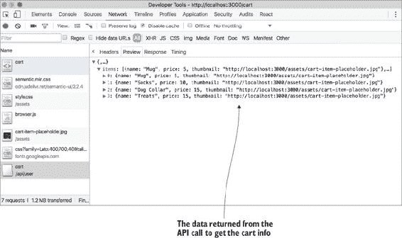

现在您已经构建了代码的浏览器部分，您可以查看该章节的完整代码，分支为 chapter-8-complete (`git checkout chapter-8-complete`)。

### 摘要

在本章中，您学习了如何构建同构应用的浏览器部分。您添加了一个名为 main.jsx 的浏览器入口点文件，并处理了使应用在浏览器中以与服务器上渲染相同的状态启动所需的初始化逻辑。

+   初始服务器状态以字符串形式添加到 DOM 中，并作为服务器渲染页面的一部分发送下来。

+   浏览器入口点处理反序列化服务器创建的状态，初始化 Redux，并将 React 组件树渲染到 DOM 中。

+   服务器将应用的状态附加到 DOM 上作为字符串。

+   浏览器将字符串读入一个对象，该对象可以传递给 Redux。

+   Redux 可以使用从服务器反序列化的基本状态进行初始化。

+   React 的组件生命周期可以决定同构渲染的成功与否。在生命周期中的正确点更新应用状态非常重要。

+   浏览器代码还需要处理应用的单页应用部分的数据获取。

## 第九章：测试和调试

*本章涵盖*

+   创建一个反映同构应用复杂性的测试环境

+   使用 Enzyme 为您的 React 组件创建单元测试

+   使用 React 开发者工具在浏览器中进行调试

+   使用 Redux 开发者工具在浏览器中进行调试

您是否曾在拥有大量测试的代码库中工作过，但测试会随机崩溃，需要不断更新，并且从未阻止您创建回归错误？当您有超过两个开发者在一个代码库上工作时，这种情况出人意料地容易发生。拥有一个稳固的测试策略，并理解单元测试和集成测试之间的界限在哪里，对于任何应用都很重要。但是，同构应用有一个额外的复杂层次需要考虑：这是针对在服务器上运行、在浏览器上运行还是在两个环境中都运行的代码的测试吗？

本章的第一部分探讨了如何思考测试同构应用。您将学习如何使用 Enzyme 测试 React，以及如何在多个环境中测试您的组件。本章的第二部分涵盖了有助于实际开发的调试工具。

本章的代码可以在 GitHub 上的 complete-isomorphic-example 仓库中找到：

```
$ git clone https://github.com/isomorphic-dev-js/complete-isomorphic-
     example.git
```

每个部分都提供了一个分支中的基本代码。您将使用的第一个分支是 chapter-9.1.1：

```
$ git checkout chapter-9.1.1
$ npm install
$ npm start
```

### 9.1\. 测试：React 组件

本章前半部分的目标是指导您了解在代码可以在多个环境中运行时如何进行测试。要做到这一点，需要以下条件：

+   拥有在服务器和浏览器环境中运行测试的正确工具

+   知道何时在特定环境中测试代码（例如，您不需要在浏览器中测试 Express 中间件）

测试有很多类别，包括单元测试、集成测试、契约测试、端到端测试等等。尽可能的情况下，你希望你的实际开发构建与你的测试构建方式相匹配。你还希望以允许浏览器和服务器验证的方式运行你的代码的单元测试。

我已经为你设置了许多单元测试环境。我们将使用 Mocha 作为测试库，Karma 作为我们的测试运行器（这样调试浏览器测试就简单了）。如果你是单元测试的新手或者需要复习，我强烈推荐 Roy Osherove 的《单元测试的艺术》（Manning，2013）。这本书是我的单元测试入门，是一个无价资源。要查看 Karma 的文档，请访问 [`karma-runner.github.io/1.0/index.html`](https://karma-runner.github.io/1.0/index.html)。你可以在 [`mochajs.org`](https://mochajs.org) 上了解更多关于 Mocha 的信息。

如果你想要看看我是如何为这一章设置单元测试配置的，你可以在根目录下的 karma.conf.js 文件中找到配置文件，以及在 package.json 下的 test:browser 下的脚本。测试是用 Karma（测试运行器）、Mocha（测试库）和 Chai（断言库）设置的。Karma 测试配置使用与开发相同的配置的 webpack 打包测试。被测试的代码是以与应用程序代码相同的方式编译的。在本节结束时，你将在终端中看到类似 figure 9.1 的测试输出。

##### 图 9.1\. 所有测试通过时的浏览器测试输出

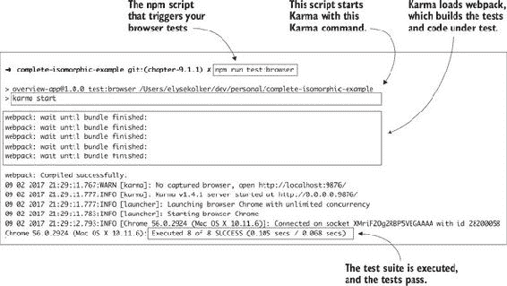

要运行本节的测试，请运行以下命令：

```
$ npm run test:browser
```

目前还没有测试，所以你会在终端中看到“已执行 0 个，共 0 个”。注意，还会打开一个新的 Google Chrome 实例，如图 9.2 所示 figure 9.2。

##### 图 9.2\. Karma 会为你启动 Google Chrome，以便你的测试在真实浏览器环境中运行。

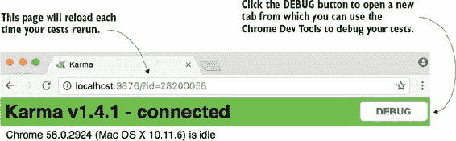

尝试点击调试按钮。它会打开一个新标签页。你可以使用这个标签页打开 Chrome DevTools 并调试你的测试，就像你在遇到问题时调试应用程序一样。

现在我们来学习如何使用 Enzyme 编写你的第一个 React 测试。

| |
| --- |

**测试替代方案：Jest**

另一个很好的测试库是 Jest。文档可以在 [`facebook.github.io/jest/docs/en/getting-started.html`](https://facebook.github.io/jest/docs/en/getting-started.html) 找到。Jest 是由 Facebook 开发的一个测试框架，它提供了零配置所需的一切。在测试的世界里，这是一个很好的变化！

默认情况下，Jest 随附 Jasmine 和它自己的模拟工具。它也开箱即用就很快，这可以在本地运行测试以及在持续集成服务器上运行测试时节省你的时间。

当你在 webpack 配置的项目中使用 Jest 时，你将面临权衡。你可能需要进行一些额外的设置（所以，并不是零配置）。文档提供了一个有用的指南：[`facebook.github.io/jest/docs/en/webpack.html#content`](https://facebook.github.io/jest/docs/en/webpack.html#content)。

此外，你不再在浏览器上下文中运行你的测试。Karma 甚至允许你在多个浏览器中运行你的测试。但你可能觉得这对你的项目并不重要，而且 Karma 比 Jest 慢得多。如果你更重视速度和易于配置，我建议尝试 Jest。


#### 9.1.1\. 使用 Enzyme 测试组件

一个名为 Enzyme 的库已经成为测试 React 组件的流行选择（[`github.com/airbnb/enzyme`](https://github.com/airbnb/enzyme)）。它提供了一个 API，使得针对你的视图组件编写测试断言变得简单。

你可以使用 Enzyme 编写的最简单的单元测试形式是渲染你正在测试的组件的浅版本。任何子组件都不会被渲染。这很重要，因为它允许你测试单个组件而不需要深入到子组件中。这使得你的测试成为真正的单元测试，从而产生更不脆弱、更干净的测试。

你将要添加的第一个测试是针对 App 组件的。App 有多个子组件，包括来自 React Router 的 Link 组件，而我们并不想测试这个组件。下面的列表显示了如何使用浅渲染对组件进行基本断言。将列表中的代码添加到一个新的测试文件 test/components/app.spec.jsx 中。

##### 列表 9.1\. 使用 `shallow` 渲染 —— test/components/app.spec.jsx

```
import React from 'react';                                      *1*
import { expect } from 'chai';                                  *2*
import { shallow } from 'enzyme';                               *3*
import { Link } from 'react-router';                            *4*
import App from '../../src/components/app';                     *5*

describe('App Component', () => {
  let wrappedComponent;

  beforeEach(() => {                                            *6*
    wrappedComponent = shallow(<App />);                        *5*
  });

  afterEach(() => {
    wrappedComponent = null;                                    *6*
  });

  it('Uses Link Components', () => {
    expect(
            wrappedComponent.find(Link).length
          ).to.eq(3);                                           *4*
  });

  it('Links to /products, /cart and /profile pages', () => {
    expect(
            wrappedComponent.find({
                                   to: '/products'
                                 }).length
          ).to.eq(1);                                           *7*
    expect(
            wrappedComponent.find({
                                   to: '/cart'
                                 }).length
           ).to.eq(1);                                          *7*
    expect(
            wrappedComponent.find({
                                   to: '/profile'
                                 }).length
           ).to.eq(1);                                          *7*
  });
});
```

+   ***1* 包含 React —— 你将使用 JSX 来浅加载 App 组件。**

+   ***2* 包含来自 Chai 的 expect 来编写断言 —— 你可以替换你喜欢的断言风格。**

+   ***3* 包含来自 Enzyme 的 shallow 函数，它加载组件而不加载其子组件（只加载 React 树的一级）。**

+   ***4* Enzyme 支持使用 React 组件引用来检查组件内的存在性——这里你正在检查 Link 组件的存在。**

+   ***5* App 组件通过 shallow 函数加载，返回一个包装组件，它提供了你可以用来与测试中的组件交互和断言的方法。**

+   ***6* 利用 Mocha 的 beforeEach 和 afterEach，它们在每个测试前后各执行一次。**

+   ***7* 展示了你可以与 Enzyme 一起使用的另一种类型的选择器，这里断言具有属性“to”的元素存在，每个断言都在寻找特定的路由。**

##### Enzyme 选择器

你刚刚添加的两个测试展示了你可以将 Enzyme 选择器应用于渲染树中查找元素的三种可能方法中的两种：

+   组件选择器（接受一个 React 组件引用）

+   属性选择器（接受一个对象）

还有第三种选择器类型：CSS 选择器。它们的工作方式类似于 JQuery 选择器：要按 ID 查找元素，你查找`#id`。要按类查找组件，你查找`.class`或`.multiple.class`。

让我们看看另一个使用类选择器查找包含被测试单元的元素的例子。在这个例子中，你正在为 Item 组件添加测试——这是一个展示组件，它的唯一任务是显示传入的属性。在列表 9.2 中，你可以看到如何使用 Enzyme 断言 Item 组件的预期部分渲染正确。请注意，你只添加了断言那些由传入的属性更改的标记部分的测试。这减少了测试的脆弱性。直接在标记上断言意味着你的单元测试可能会因为类更改而改变。将列表中的代码添加到名为`test/components/item.spec.jsx`的新文件中。

##### 列表 9.2\. 测试一个展示组件—test/components/item.spec.jsx

```
import { expect } from 'chai';
import { shallow } from 'enzyme';
import React from 'react';
import Item from '../../src/components/item';

describe('Item Component', () => {
  let testComponent;
  let props;

  beforeEach(() => {
    props = {                                                *1*
      thumbnail: 'http://image.png',
      name: 'Test Name',
      price: 10
    };
    testComponent = shallow(<Item {...props} />);
  });

  afterEach(() => {
    testComponent = null;
    props = null;
  });

  it('Displays a thumbnail sbased on its props', () => {     *2*
    expect(
            testComponent.find({
                                src: props.thumbnail
                              }).length
           ).to.eq(1);
  });

  it('Displays a name based on its props', () => {           *3*
    expect(
            testComponent.find(
                                '.middle.aligned.content'
                              ).text()
          ).to.eq(props.name);
  });

  it('Displays a price based on its props', () => {          *4*
    expect(
            testComponent.find(
                                '.right.aligned.content'
                              ).text()
          ).to.eq(`$${props.price}`);
  });
});
```

+   ***1* 对于这个测试，提供一个模拟的 props 对象。**

+   ***2* 测试断言缩略图被分配给了 src 属性。**

+   ***3* 测试断言名称被放入正确的元素中；text()返回 HTML 标签的内部内容。**

+   ***4* 测试断言价格被正确地放置在组件中。**

双美元符号看起来很奇怪，这是因为字符串插值。第一个美元符号是显示在视图中的字面量美元符号。另一个是字符串中的变量。

请记住，你想要使用的选择器不太可能频繁更改。你并不总能预测这一点，但提前思考一下可以减少测试重构。

现在你已经了解了使用 Enzyme 对 React 组件进行单元测试的基本知识，让我们看看如何编写一个测试来验证用户与组件的交互。

#### 9.1.2\. 测试用户操作

使用浅渲染进行测试也允许你测试用户交互。在本节中，你将向购物车组件添加一个测试，以查看按钮点击是否正确触发了路由更新。请注意，要进行此测试，我已在`sharedRoutes`中添加了一个路由`/cart/payment`，并将`cart`中的结账按钮更新为导航到该路由：

```
proceedToCheckout() {
  this.props.router.push('/cart/payment');
}
```

如果你切换到`chapter-9.1.2`分支（`git checkout chapter-9.1.2`），你可以看到这段添加的代码。如果你在跟进，你需要更新列表 9.4 中的`proceedToCheckout`以通过测试。

你还需要对购物车组件进行另一个更新。目前，该组件被 Connect 包装然后导出，这使得测试变得极其困难。这也意味着你正在测试一个组合组件而不是独立的购物车组件。以下列表显示了如何更新购物车组件以导出非包装版本进行测试。

##### 列表 9.3\. 向购物车组件添加第二个导出—src/components/cart.jsx

```
export class CartComponent extends Component {      *1*
  //component implementation
}

CartComponent.propTypes = {}                        *2*

export default connect(
  mapStateToProps,
  mapDispatchToProps
)(CartComponent);                                   *3*
```

+   ***1* 在类定义中添加一个导出并更新组件名称（允许未来使用命名导出）。**

+   ***2* 更新所有对 Cart 的引用。**

+   ***3* 更新所有对 Cart 的引用—注意你仍然导出了一个 connect 包装的组件。**

列表 9.4 展示了如何测试 Cart 组件正确调用 History 组件以导航到结账部分。测试导入命名导出 `CartComponent` 而不是默认包装组件。将此代码添加到名为 test/components/cart.spec.jsx 的新文件中。

##### 列表 9.4\. 测试用户交互—test/components/cart.spec.jsx

```
import { expect } from 'chai';
import { shallow } from 'enzyme';
import React from 'react';
import sinon from 'sinon';                                      *1*
import { CartComponent } from '../../src/components/cart';

describe('Cart Component', () => {
  let testComponent;
  let props;

  beforeEach(() => {
    props = {
      items: [
        {
          thumbnail: 'http://image.png',
          name: 'Test Name',
          price: 10
        }
      ],
      router: {
        push: sinon.spy()                                       *2*
      }
    };
    testComponent = shallow(<CartComponent {...props} />);
  });

  afterEach(() => {
    testComponent = null;
    props = null;
  });

  it('When checkout is clicked, the router push method is triggered', () => {
    testComponent.find('.button').simulate('click');            *3*
    expect(props.router.push.called).to.be.true;                *4*
    expect(
            props.router.push.calledWith('/cart/payment')
          ).to.be.true;                                         *5*
  });
});
```

+   ***1* 要运行测试，你需要一个额外的依赖项；使用 Sinon 你可以创建在测试期间被调用的模拟函数。**

+   ***2* 使用 sinon.spy() 模拟 cart.jsx 中 proceedToCheckout() 函数中调用的 router.push() 函数。**

+   ***3* 使用 simulate() 方法生成对 Checkout 按钮的点击。**

+   ***4* 使用 sinon spy 的 called 属性来断言你的组件调用了 router.push() 方法。**

+   ***5* 使用 sinon spy 的 calledWith 属性来断言传递了正确的路由。**

列表使用 Sinon 创建函数模拟。要了解更多关于 Sinon 的信息，请访问他们的文档[`sinonjs.org`](http://sinonjs.org)。列表还使用 Enzyme 来测试事件。关于 `simulate` 有一点需要注意，它不会传播模拟事件——你必须找到具有事件监听器的元素来触发监听器。这适用于所有通过 Enzyme 加载的组件，即使是使用 `mount` 的组件。在下文中，你将学习如何使用 `mount` 编写集成测试。

#### 9.1.3\. 测试嵌套组件

Enzyme 提供了测试组件的第二种方法，称为 `mount`。这会完全渲染你的组件及其所有子组件。它对于集成测试非常有用，因为你正在测试应用程序的更大部分。我不建议将其用于单元测试，因为 `mount` 使得测试更加脆弱。子组件的更改将破坏使用 `mount` 进行测试的任何父组件的测试。

列表 9.5 展示了如何添加一个集成测试，该测试加载整个 React 树，包括 React Router。这允许你断言完整的 React 树，包括所有子组件。到目前为止的代码位于 chapter-9.1.3（`git checkout chapter-9.1.3`）。将列表中的代码添加到应用程序规范中。请注意，这是一个位于集成文件夹中的不同的 app.spec.jsx。


##### 注意

如果你正在使用 React Router 4，请查看附录 A（kindle_split_027_split_000.xhtml#app01）以了解设置路由和相关路由代码的概述。以下列表显示了 main.jsx 代码，这也适用于测试设置。


##### 列表 9.5\. 使用 `mount` 渲染—test/integration/app.spec.jsx

```
import React from 'react';
import {
  Router,
  createMemoryHistory
} from 'react-router';                                               *1*
import { expect } from 'chai';
import { mount } from 'enzyme';
import { routes } from '../../src/shared/sharedRoutes';              *1*

describe('App Component', () => {
  it('Uses Link Components', () => {
    const renderedComponent = mount(
      <Router
        routes={routes()}
        history={createMemoryHistory('/products')}                   *2*
      />
    );
    expect(
            renderedComponent.find(
                                    '.search'
                                  ).length
          ).to.be.above(1);                                          *3*
  });
});
```

+   ***1* 包含依赖以渲染 React Router。**

+   ***2* 而不是使用浏览器历史记录，使用 createMemoryHistory，它允许你为路由器声明一个初始路由（无需在浏览器中进行导航）。**

+   ***3* 断言搜索已加载，它仅存在于产品页面上。**

之前示例中的测试很简单。在真正的集成测试中，你想要测试更复杂的事情，比如在搜索框中进行搜索。在继续之前，这里有一些你可以用来编写更复杂测试用例的额外方法。

##### 高级酶 API 方法

Enzyme 有许多可以在你的浅层或挂载的 React 组件上调用的额外方法。以下是一些最有用的方法列表：

+   **`setProps`—** 使用此方法向已加载组件传递更新的属性。对于测试在 React 生命周期方法中发生的逻辑很有用。

+   **`setState`—** 使用此方法来更改已加载组件的状态。它允许你测试复杂的情况，例如 products.jsx 中的搜索输入。

+   **`debug`—** 在任何时间点查看组件渲染的 HTML 非常有用。这对于调试很有帮助。

+   **`unmount`—** 测试在`componentWillUnmount`中发生的任何代码。

### 9.2\. 测试：同构思考

使用同构应用程序，仅编写在浏览器中运行的单元测试是不够的。你的测试目标应该是运行你的代码将在其中运行的所有环境中。

在你的应用程序中运行在服务器上的任何代码都应该在终端中使用 Mocha 进行测试。在浏览器中运行的任何代码都应该在 Karma 浏览器环境中进行测试。但是，仅在服务器或仅在浏览器中运行的代码不需要在相反的环境中测试。表 9.1 使用在 All Things Westies 应用程序中运行的代码类型说明了这一点。

##### 表 9.1\. 在同构应用程序中，测试所有环境中的代码很重要

|   | 服务器测试 | 浏览器测试 |
| --- | --- | --- |
| 组件 | 是 | 是 |
| 共享文件夹代码 | 是 | 是 |
| 中间件 | 是 | 否 |
| 服务器入口代码 | 是 | 否 |
| 浏览器入口代码 | 否 | 是 |

#### 9.2.1\. 在服务器上测试 React 组件

Enzyme 的伟大之处在于`shallow`函数不需要真实的 DOM。你可以使用 Karma 和终端中的 Mocha 运行这些测试。但是，如果你想更准确地测试你的组件，就像它们在服务器上使用的那样，你可以添加一个额外的仅服务器测试。（如果你想从这个部分开始，你可以切换到 chapter-9.2.1 分支。）

图 9.3 展示了服务器测试的输出。服务器测试已经运行了你之前编写的一些测试。唯一没有运行的是集成测试，因为那需要有一个浏览器环境。

##### 图 9.3\. 服务器测试输出

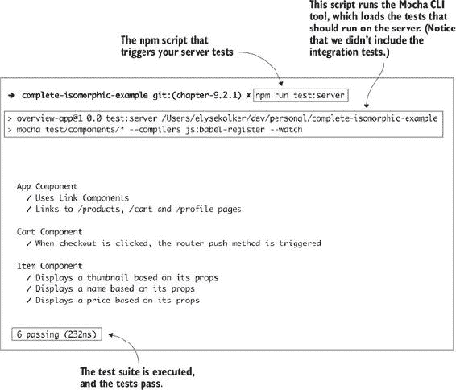

使用以下命令运行服务器测试，该命令使用 Mocha CLI：

```
$ npm run test:server
```

要了解为什么在服务器上运行测试会增加价值，请看图 9.4。它显示了由于浏览器环境代码的引用而导致服务器测试失败。

##### 图 9.4. 如果添加了需要浏览器环境的引用，你的测试将失败。

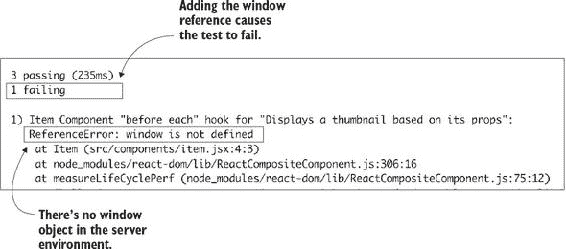

要亲自尝试，请在 Item 组件的渲染函数中添加对`window`对象的引用，如下所示：

```
window.test = true;
```

当你在测试中运行此代码时，它将失败。如果你尝试运行应用程序，你将无法直接导航到 localhost:3000/cart。在服务器上进行测试可以防止特定环境的糟糕问题。

测试的一个好处是，随着新成员加入项目，测试可以防止他们因不了解而造成问题。这种类型的服务器测试有助于新团队成员逐渐习惯于同构式思考。

#### 9.2.2. 测试所有事物

根据你的项目和团队或组织的大小，你可能使用 Selenium 等工具进行一些端到端或功能自动化测试。或者你可能有一些手动质量保证测试员在产品中寻找错误。或者也许你的开发者进行手动测试。

在所有这些情况下，考虑到达应用程序每个部分的多种方式是很重要的：

+   从服务器加载的初始页面

+   通过单页应用程序（SPA）流程在应用程序中导航

虽然在本书的这个阶段这对你来说可能很显然，但对于那些不从事同构式应用程序开发的人来说，这并不是一个容易理解的概念。要进行手动质量保证，你必须运行许多测试用例两次。考虑一下在这个应用程序中测试购物车。因为应用程序假设用户会话已保存，你需要测试直接从服务器加载购物车，并测试从应用程序的另一部分导航到购物车。

为了说明这一点，图 9.5 显示了从服务器首次加载购物车页面时的网络输出，与从应用程序的另一部分（SPA 流程）加载购物车时的网络输出进行了比较。

##### 图 9.5. 初始加载和 SPA 加载之间的差异需要测试这两种用例。

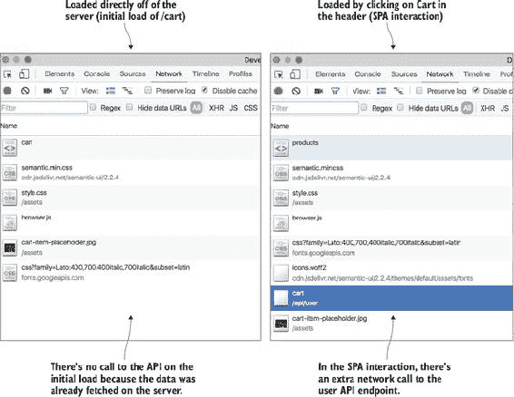

在本节中，你学习了如何考虑同构式测试。下一节将向你介绍调试工具。

### 9.3. 使用调试工具

我最喜欢的新开发人员或 JavaScript 新手教学时刻之一是向他们展示如何使用 Chrome DevTools 提高他们调试和解决问题的能力。从代码中散布的 `console.log` 语句到使用断点，对于新手来说，这通常是一个令人震惊的时刻。断点很有用，因为您可以暂停并检查您的代码，逐步执行代码以找到问题。Chrome DevTools 还提供了断点的几个高级选项（在 [`umaar.com/dev-tips/28-dom-breakpoint-pane/`](https://umaar.com/dev-tips/28-dom-breakpoint-pane/) 找到大量开发技巧）。

我假设您有 Chrome DevTools 的经验，但我想向您介绍两个额外的工具，它们可以使您在使用 React 和 Redux 时的工作变得更加简单。它们对于调试和手动测试您的代码很有用：

+   ***React Chrome Extension*—** 浏览器扩展程序，显示您标记中的 React 组件，并显示每个组件的属性和当前状态

+   ***Redux Chrome Extension*—** 浏览器扩展程序，显示您应用程序中的 Redux 动作，并允许您重放一系列动作

#### 9.3.1\. React Chrome Extension

React Chrome Extension 加载 React Dev Tools，并让您直接了解运行中的应用程序中的 React 组件。它让您检查 HTML 结构，并查看组件是如何包装的。它还显示了每个组件上设置的属性和状态。

您可以从 [`mng.bz/mt5P`](http://mng.bz/mt5P) 安装此扩展程序。安装后，加载应用程序并检查它。导航到 React 选项卡。图 9.6 展示了您应该看到的内容。

##### 图 9.6\. 在 Chrome DevTools 中打开的 React Dev Tools 选项卡

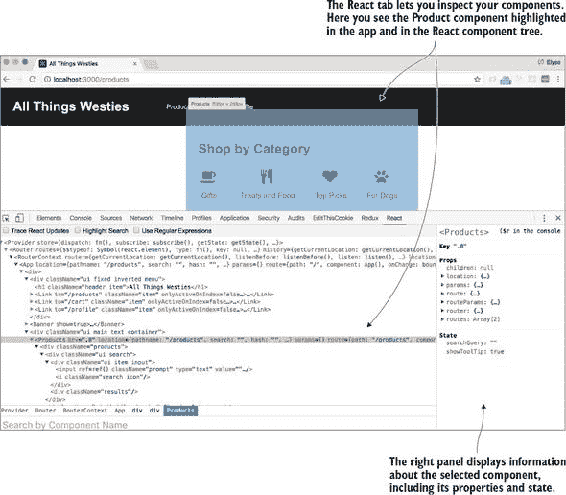

您可以使用 React Dev Tools 做很多事情。一个有用的工具是查看树中的每个组件的能力，包括高阶组件（图 9.7）。

##### 图 9.7\. React Dev Tools 允许您检查在常规 HTML 中不显示的组件。

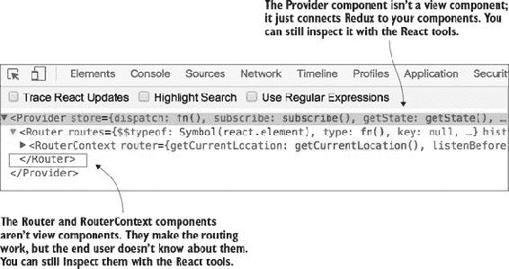

另一个有用的功能是查看属性和状态的能力。图 9.8 展示了如何查看 Products 组件的属性和状态。

##### 图 9.8\. 检查 Products 组件的状态和属性。您可以从此面板操作状态。

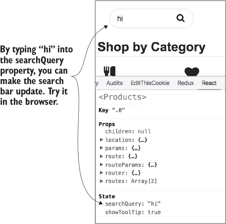

尝试更改 `searchQuery` 的状态属性。注意，当您更改它时，它会在搜索框中更新。这种在应用程序中实时覆盖状态的能力对于调试很有帮助。

#### 9.3.2\. Redux Chrome Extension

Redux Chrome Extension 提供了 Redux Dev Tools 的几乎零配置实现。通过访问 [`mng.bz/NEBG`](http://mng.bz/NEBG) 在 Chrome 中安装它。

Redux Dev Tools 是一个 npm 包，你可以将其包含在你的项目中，但安装扩展是快速启动和运行的最快方式。你可以在 GitHub 仓库[`github.com/zalmoxisus/redux-devtools-extension`](https://github.com/zalmoxisus/redux-devtools-extension)找到 Redux Dev Tools 扩展的所有文档。图 9.9 展示了 Redux Dev Tools 在你的应用中运行时的样子。

##### 图 9.9\. Redux Dev Tools 在 Chrome DevTools 内部

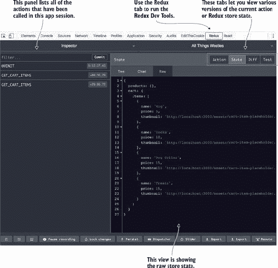

要让 Redux Dev Tools 在你的应用中看到 Redux 存储，你必须更新 initialize Redux 代码中使用的`compose`函数。以下列表展示了如何进行此操作。你使用此代码来替换`initRedux`中的旧`compose`调用。

##### 列表 9.6\. 启用 Redux Dev Tools—src/shared/initRedux.es6

```
import {
  createStore,
  combineReducers,
  applyMiddleware,
  compose } from 'redux';
import thunkMiddleware from 'redux-thunk';
import loggerMiddleware from 'redux-logger';
import products from './products-reducer.es6';
import cart from './cart-reducer.es6';

export default function (initialStore = {}) {
  const reducer = combineReducers({
    products,
    cart
  });
  const middleware = [thunkMiddleware, loggerMiddleware];
  let newCompose;
  if (typeof window !== 'undefined') {                          *1*
    newCompose =
     window.__REDUX_DEVTOOLS_EXTENSION_COMPOSE__;             *2*
  }
  const composeEnhancers = newCompose || compose;               *3*
  return composeEnhancers(                                      *4*
      applyMiddleware(...middleware)
    )(createStore)(reducer, initialStore);
}
```

+   ***1* 更新的 compose 函数位于 window 上，但会破坏服务器—检查 window 的存在。**

+   ***2* 从 window 对象中获取 compose 函数。**

+   ***3* 如果开发者没有安装 Redux Dev Tools，则回退到基本 compose。**

+   ***4* 使用新的 compose 函数设置 Redux。**

现在你已经启用了 Redux 工具，让我们来了解一下它的部分功能。图 9.10 展示了如何使用 Redux Dev Tools 的一些测试功能。

##### 图 9.10\. 使用 Redux Dev Tools 的测试功能

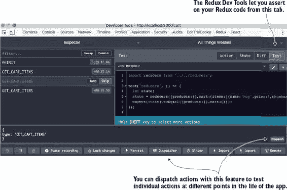

最后，这个调试工具最酷的功能之一是能够重放操作。图 9.11 展示了如何遍历购物车路由的各种状态。

##### 图 9.11\. 使用 Redux Dev Tools 的回放功能

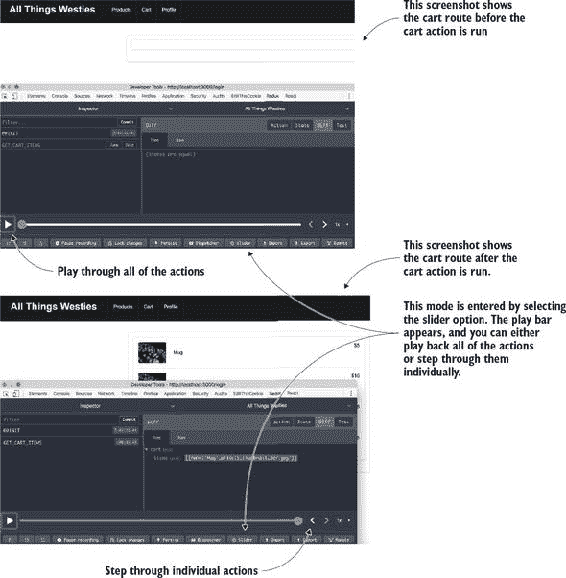

### 摘要

在本章中，你学习了如何通过 React 特定的测试和调试工具来改进你的开发工作流程，这些工具适用于浏览器和服务器。现在你可以提高你的 React 和同构开发速度了！

+   Enzyme 是一个用于测试 React 组件的库。它提供了一种通过`shallow`在隔离环境中测试组件的方法，以及通过`mount`编写集成测试的方法。

+   测试同构应用需要考虑代码将在何处运行以及这如何转化为测试。单元测试应该测试将在其中运行的代码环境（们）。端到端测试和手动测试应考虑初始加载与 SPA 体验之间的差异。

+   React Dev Tools 可以通过 Chrome 扩展使用，它使得检查你的 React 组件变得更容易。它还允许你实时地操作状态。

+   Redux Dev Tools 可以通过 Chrome 扩展使用。它让你可以遍历你的操作，并清楚地看到随时间推移的存储更新。

## 第十章\. 处理服务器/浏览器差异

*本章涵盖*

+   将环境特定的代码隔离

+   启用仅在浏览器或服务器上使用的路由

+   使用静态方法向每个应用路由添加标题和页面元数据

+   在服务器和浏览器之间实现用户代理的一致使用

本章和下一章将涵盖各种主题，这些主题将帮助你处理我在构建同构应用程序时遇到的真实世界案例。当你开始构建一个生产就绪的应用程序时，你经常会遇到需要在这种架构的上下文中进行特殊处理的使用案例。表 10.1 列出了这些情况的一些示例。

##### 表 10.1. 同构应用程序中的常见问题和解决方案

| 问题 | 解决方案 | 服务器 | 浏览器 |
| --- | --- | --- | --- |
| 只能在浏览器中运行的初始化代码。 | 使用环境布尔标志。 |   | ✓ |
| 定义 SEO 元标签，以便在服务器上渲染。 | 在顶级路由组件上使用静态函数。 | ✓ |   |
| 渐进增强：浏览器和服务器之间的功能检测不同。 | 仅在浏览器中进行功能检测。 |   | ✓ |
| 渐进增强：如果需要用户代理检测，如何创建单一的真实来源？ | 使用服务器用户代理并以标准方式将其存储在应用程序存储中。 | ✓ |   |
| 错误处理重复——服务器和浏览器都有处理 404 状态的逻辑。 | 将面向用户的错误保存为标准格式，以便轻松确定何时显示 404。 | ✓ | ✓ |

本章的所有代码都可以在之前章节相同的共享 GitHub 仓库中找到：[`mng.bz/8gV8`](http://mng.bz/8gV8)。我们将继续使用分支系统来逐步展示本章的示例。像往常一样，你可以安装并运行代码：

```
$ npm install
$ npm start
```

让我们探讨如何根据浏览器或服务器环境来控制你的代码。

### 10.1. 隔离浏览器特定代码

我所构建的每一个 Web 应用程序都依赖于`window`或`document`对象。有时是为了支持社交小部件，有时是为了使用特定的库（例如，分析或错误跟踪）。但在同构应用程序中，这会引发一个问题：如何在服务器上继续使用这类代码而不破坏你的应用程序？

假设你有一个用于分析代码的可重用模块。你的分析代码不需要在服务器上运行，因为它纯粹关注于用户与页面的交互。但你希望确保六个月后，你或另一位开发者不会意外地在服务器上运行此代码。图 10.1 显示了本节分支中代码的状态，章节-10.1（`git checkout chapter-10.1`）。

##### 图 10.1. 在服务器上不阻止分析模块运行时的控制台输出

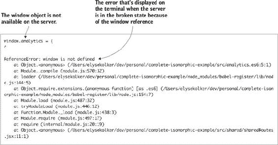

在本节中，你将通过将分析模块包裹在防止其在服务器上运行的代码中来修复此错误。这需要几个步骤（图 10.2 显示了最终结果）：

> **1**. 通过 webpack（浏览器代码）添加环境变量。
> 
> **2**. 在对 `window` 的引用周围添加浏览器环境检查。

##### 图 10.2\. 使用环境变量确定何时运行分析代码，该代码依赖于 `window` 对象。

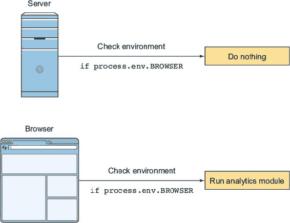

此分析模块在 列表 10.1 中展示。我已经为你创建了分析模块的基础代码。我还在 Node.js 服务器上创建了一个模拟端点，当你访问端点时，它会返回 200。但如果你直接运行此分支中的代码，你会注意到它是出错的！

##### 列表 10.1\. 分析模块—src/analytics.es6

```
import fetch from 'isomorphic-fetch';

window.analytics = {                                        *1*
  send: (opts) => {                                         *2*
    const headers = new window.fetch.Headers({
      'Content-Type': 'application/json'
    });

    fetch({
      url: 'http://localhost:3000/analytics',               *3*
      method: 'POST',
      headers,
      data: opts
    })
    .then((res) => {
      console.log('analytics result', res);                 *4*
    })
    .catch((err) => {
      console.log('analytics err', err);                    *4*
    });
  }
};

const getAnalytics = () => {                                *5*
  return window.analytics;
};

export const sendData = (opts) => {                         *6*
  getAnalytics().send(opts);
};
```

+   ***1* 这里，分析库是一个为你添加到 window 对象（在实际应用中，你会导入你的库）的模拟对象。**

+   ***2* 模拟分析库有一个方法，send，它接受一个选项对象。**

+   ***3* Send 向 Node.js 服务器（在实际应用中，端点将是你的分析服务）发送 POST 请求。**

+   ***4* 在此模拟示例中，结果和错误被记录。**

+   ***5* 分析模块实现了分析对象的 getter 方法。**

+   ***6* 分析模块实现了 sendData 方法，该方法在模拟分析对象上调用 send。**

`sendData` 是一个公共方法，它将从视图模块中被调用。代码出错是因为它从共享路由中被调用，这些路由在服务器和浏览器上都会运行。因为服务器没有 `window` 对象，所以代码导致应用崩溃。列表 10.2 展示了调用分析模块的 `sharedRoutes` 代码。我已经为你提供了这个代码。


##### 注意

如果你使用 React Router 4，请查看附录 C 中的第一个列表，了解如何使用 React 生命周期来处理此示例，而不是 React Router 生命周期。


##### 列表 10.2\. 调用分析代码—src/shared/sharedRoutes.jsx

```
import { sendData } from '../analytics.es6';                    *1*

let beforeRouteRender = (dispatch, prevState, nextState) => {
  const { routes } = nextState;
  routes.map((route) => {}).reduce((flat, toFlatten) => {
    }, []).map((initialAction) => {});

  sendData({                                                    *2*
    path: nextState.location.pathname,
    type: 'navigation'
  });
};
```

+   ***1* 从分析模块导入 sendData 函数。**

+   ***2* 调用 sendData 以跟踪每个位置更新。**

要使此模块工作，你需要创建特定于环境的布尔标志，以检测代码是在服务器上还是在浏览器上运行。在 Node.js 中创建环境标志已经内置到系统中。但为了创建浏览器环境标志，你需要利用 webpack 的插件系统。

#### 10.1.1\. 为服务器创建环境变量

在服务器上，提供环境标志的方式与设置 `NODE_ENV` 变量的方式相同。在启动服务器之前，传递一个 `SERVER` 值。以下列表展示了如何将此添加到 package.json 的启动脚本中。

##### 列表 10.3\. 服务器启动脚本—package.json

```
"scripts": {
    ...
    "start":
     "NODE_ENV=development SERVER=TRUE node src/server.js",          *1*
    ...
  },
```

+   ***1* 在启动脚本中添加环境变量。**

添加此变量后，你将设置 webpack 以提供 `BROWSER` 环境值。

#### 10.1.2\. 为浏览器创建环境变量

在 第五章 中，我向你展示了如何创建一个自定义 webpack 插件来设置阶段环境变量。这允许你指示生产与开发者构建。要在 webpack 中创建 `BROWSER` 和 `SERVER` 变量，你遵循相同的模式。以下列表显示了你需要添加到 webpack 配置中的代码，以创建用于浏览器代码的环境变量。

##### 列表 10.4\. 添加 webpack 插件

```
const webpack = require("webpack");                       *1*

const injectVariables = new webpack.DefinePlugin({
  process: {                                              *2*
    env: {                                                *2*
      NODE_ENV: JSON.stringify("development"),
      BROWSER: JSON.stringify("true"),                    *3*
      SERVER: JSON.stringify("false")
    }
  }
});

module.exports = {
  //...other properties
  resolve: {},
  plugins: [
    injectVariables                                       *4*
  ]
};
```

+   ***1* 导入 webpack 以调用 DefinePlugin。**

+   ***2* 重新创建 process.env 对象结构。**

+   ***3* 在对象中添加环境变量，包括 BROWSER 和 SERVER。**

+   ***4* 在选项中包含插件数组，并将 injectVariables 添加到数组中。**

在第一行，你需要使用 `require` 而不是 `import` 语句，因为此文件不是由 Babel 编译的。最后一步是在分析模块中使用 `BROWSER` 变量。

#### 10.1.3\. 使用变量

现在 `BROWSER` 和 `SERVER` 变量已存在于适当的环境中，你可以使用 `BROWSER` 变量来包装你的分析实现代码。将以下列表中的代码添加到分析模块中。

##### 列表 10.5\. 检查环境—src/analytics.es6

```
if (process.env.BROWSER) {                 *1*
  window.analytics = {};
}

const getAnalytics = () => {
  if (process.env.BROWSER) {               *2*
    return window.analytics;
  }
  return false;
};
```

+   ***1* 在分析模拟对象周围添加 process.env.BROWSER 的检查。**

+   ***2* 在访问 window 对象的任何代码周围添加检查。**

现在你可以运行代码而不会出现任何问题！自己试试看。

接下来让我们讨论如何将此策略扩展到基于环境的特性标志。

##### 环境感知路由

根据环境更改代码的其他常见用例存在。另一个需要知道环境的原因是控制哪些应用程序路由可用。例如，你可能需要创建一个内部访问路由——只有少数人需要访问的东西。那可能是一个管理页面或测试路由。相反，你可能希望有一些页面不能直接从服务器访问，可能是出于隐私原因，或者因为你不想让路由直接从服务器访问。

要做到这一点，你使用与添加到分析模块中相同的 `process.env.BROWSER` 检查。在这种情况下，你会在 sharedRoutes.jsx 组件中添加检查。

另一个常见的用例发生在你开发一个新功能，并且只想在开发和预发布环境中使路由可用时。你还可以添加对 `NODE_ENV` 值的检查。这让你可以确定路由是否只应在开发/预发布中显示，或者也应在生产中显示。以下列表显示了如何将此代码添加到 sharedRoutes 文件中。

| |
| --- |

##### 注意

如果你使用的是 React Router 4，请查看附录 C 中的第二个列表，了解如何添加动态路由。

| |
| --- |

##### 列表 10.6\. 启用路由—src/shared/sharedRoutes.jsx

```
let developmentRoute =                                      *1*
    process.env.NODE_ENV !== 'production' ?                  *1*
        <Route path="/dev-test" component={App} />
        : null;

export const routes = (onChange = () => {}) => {
  return (
    <Route path="/" component={App} onChange={onChange}>
      ...other routes
      {developmentRoute}                                     *2*
    </Route>
  );
```

+   ***1* 添加一个将保存路由组件的变量。**

+   ***2* 渲染路由。**

在前几行，如果环境是生产环境，值将是 null——否则，它将是路由。为了测试此代码是否正常工作，将您的 webpack 配置中的`NODE_ENV`变量更改为`production`。然后路由将在服务器上找到，但在浏览器上不存在，因此它将返回一个空白屏幕：

```
const injectVariables = new webpack.DefinePlugin({
  process: {
    env: {
      NODE_ENV: JSON.stringify("production"),
      BROWSER: JSON.stringify('true'),
      SERVER: JSON.stringify('false')
    }
  }
});
```

或者，您可以将服务器上的启动脚本中的值更改为`production`。这将导致服务器返回“Cannot GET /dev-test”错误：

```
"scripts": {
    ...
    "start": "NODE_ENV=production SERVER=TRUE node src/server.js",
    ...
  },
```

完成后不要忘记将这些值改回来。

### 10.2. SEO 和分享

在构建公共站点时，无论是基于内容还是如示例中的电子商务，搜索引擎优化（SEO）都是一个重要因素。良好的 SEO 会导致搜索引擎中的排名更高，这反过来又会导致您的 Web 应用程序的用户数量增加。构建同构站点的其中一个原因是为了使支持良好的 SEO 变得容易。

从技术角度来说，这相当于添加 SEO 元标签和其他特定于搜索引擎的元数据，以便在它们爬取应用程序时可以看到。显示了谷歌搜索结果中的特色页面和高排名页面的示例。

##### 图 10.3。深思熟虑的 SEO 实现导致在谷歌搜索中获得高排名或特色排名。

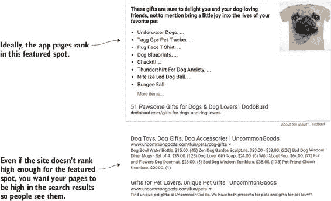

但大部分元数据都插入到了 HTML 页面的头部，这使得在 React 组件旁边实现变得困难。（记住，React 将渲染到 HTML 体中的特定标签——它对其他 HTML 没有感知。）我将向您展示如何使用静态函数和针对服务器的特定代码来处理这个用例。我已经成功使用过这种方法。在应用程序中第一次设置后，继续使用逻辑就很简单了。

您将开始处理您尚未接触过的网站部分：产品详情页面。理想情况下，您希望您的产品在谷歌搜索中获得高排名，以便更多的人访问网站并进行购买。图 10.4 显示了用户看到的详情页面。您将添加的代码不是直接供用户消费的，而是供 Googlebot 和分享机器人（例如，Facebook 或 Twitter——这两个网站直接访问您的页面以确定应根据元标签共享哪些内容）。

##### 图 10.4。产品详情页面


我已经为您提供了产品详情组件。您需要切换到分支 chapter-10.2（`git checkout chapter-10.2`）。列表 10.7 显示了在检出代码时产品详情组件的状态（如果您在跟随，您需要自己添加此代码）。

##### 列表 10.7. 产品详情组件—src/components/detail.jsx

```
import React from 'react';                                          *1*
import { bindActionCreators } from 'redux';                         *1*
import { connect } from 'react-redux';                              *1*
import cartActions                                                  *1*
 from '../shared/cart-action-creators.es6';                       *1*
import productActions                                               *1*
 from '../shared/products-action-creators.es6';                   *1*

class Detail extends React.Component {

  static prefetchActions (params) {}                                *2*

  constructor(props) {}

  addToCart() {}

  render() {                                                        *3*
    return (
      <div className="ui card middle">
        <h2>{this.props.name}</h2>
        
        <p>{this.props.description}</p>
        <div>Price: <span>{this.props.price}</span></div>
        <div>{this.props.details}</div>
        <button onClick={this.addToCart}>Add To Cart</button>
      </div>
    );
  }
}

Detail.propTypes = {};

function mapStateToProps(state) {
  const { currentProduct } = state.products;
  return {
    ...currentProduct
  };
}

function mapDispatchToProps(dispatch) {
  return {
    cartActions: bindActionCreators(cartActions, dispatch)
  };
}

export default connect(mapStateToProps, mapDispatchToProps)(Detail);
```

+   ***1* 包含依赖项——这个组件是一个容器，因此它与 Redux 连接。**

+   ***2* 实现`prefetchActions`以获取详细路由的适当状态。**

+   ***3* 渲染函数显示 prefetchActions 中获取的数据。**

接下来，您将向组件添加必要的 SEO 元标签。

#### 10.2.1\. 设置元数据标签

在详细页面上实现良好的 SEO 有许多部分（微数据标签、正确的页面标记等）。这些事情中的大多数都可以在 React 组件中轻松处理。但是，应该放在每个页面 head 中的元数据标签不是 React 组件的一部分。元数据标签放在 head 中，在服务器渲染后是静态的。它不会在每个 React 渲染周期中改变。

要在 head 中创建 SEO 元标签，我建议使用`static`函数，这样您的组件可以可选地声明它们的 SEO 元数据需求。以下列表显示了您需要添加到 detail.jsx 组件中的代码，以便您可以在以后将元标签添加到 head 中。

##### 列表 10.8\. 为创建元标签添加`static`函数——src/components/detail.jsx

```
class Detail extends React.Component {

  static createMetatags(params, store) {                                *1*
    const tags = [];                                                    *2*
    const item = store.products ? store.products.currentProduct : null;
    if (item) {
      tags.push({
        name: 'description',                                            *3*
        content: item.description                                       *3*
      });
      tags.push({
        property: 'og:description',
        content: item.description
      });
      tags.push({
        property: 'og:title',
        content: item.name
      });
      tags.push({
        property: 'og:url',
        content: `http://localhost:3000/product/detail/${item.id}`
      });
      tags.push({
        property: 'og:image',
        content: item.thumbnail
      });
    }
    return tags;
  }
```

+   ***1* 定义静态函数。**

+   ***2* 设置一个数组来存储每个元标签。**

+   ***3* 每个元标签由两个键表示——名称和内容或属性和内容，具体取决于特定的元标签。**

`static`函数接受一个`params`对象（就像`prefetchActions`一样）和 store，以便它可以获取当前产品。

#### 10.2.2\. 在服务器上将元标签渲染到 head 中

在服务器上，您可以利用这些`static`函数将元标签生成到渲染并返回给浏览器的 html.jsx 组件中。以下列表显示了您需要添加的代码。

##### 列表 10.9\. 将元标签作为 html.jsx 的一部分渲染——src/components/html.jsx

```
const HTML = (props) => {
  const metatagsArray = [];
  props.metatags.forEach((item) => {            *1*
    metatagsArray.push(
      <meta {...item} />
    );
  });

  return (
    <html lang="en">
      <head>
        <title>All Things Westies</title>
        {metatagsArray}                         *2*
        <link
```

+   ***1* 遍历元标签数组中提供的每个项目，并创建一个具有项目属性的元标签。**

+   ***2* 将元标签 HTML 添加到<head>中。**

最后，您需要在 renderView.jsx 中添加代码，以从单个组件中提取元标签数组。此代码与您在第七章中为`prefetchActions`添加的代码相同。我已经将此代码从第七章提取到一个可重用的函数中供您使用。

##### 列表 10.10\. `flattenStaticFunction`代码——src/middleware/renderView.jsx

```
function flattenStaticFunction(renderProps, staticFnName, store = {},
     request) {                                                        *1*
  let results = renderProps.components.map((component) => {
    if (component) {
      if (component.displayName &&
        component.displayName.toLowerCase().indexOf('connect') > -1
      ) {
        if (component.WrappedComponent[staticFnName]) {                *2*
          return component
             .WrappedComponentstaticFnName;
        }
      } else if (component[staticFnName]) {                            *2*
        return componentstaticFnName;
      }
    }
    return [];
  });

  results = results.reduce((flat, toFlatten) => {
    return flat.concat(toFlatten);
  }, []);

  return results;
}
```

+   ***1* 可重用函数声明接受 renderProps 和 store，以便它可以提取适当的信息。**

+   ***2* 使用 staticFnName 变量而不是硬编码 prefetchActions 函数名称。**

+   ***3* 一些静态函数需要有关请求的信息，例如头信息。它在这里传递以提供对该信息的访问权限。**

可重用函数还接受一个`staticFnName`。这是可重用的部分，将允许您使用此函数进行多种类型的`static`函数（`prefetchActions`、`seoTags`等）。因为此代码已经为您准备好了，所以您需要做的只是将以下列表中的代码添加到 renderView.jsx 中。

##### 列表 10.11\. 获取 metatags 数组—src/middleware/renderView.jsx

```
const seoTags = flattenStaticFunction(           *1*
  renderProps,
  'createMetatags',
  serverState
);

const app = renderToString();

const html = renderToString(
  <HTML
    html={app}                                   *2*
    serverState={stringifiedServerState}
    metatags={seoTags}
  />
);
```

+   ***1* 使用 React Router 的 renderProps 调用 flattenStaticFunction，调用函数的名称以及存储的当前状态——返回 metatags 数组。**

+   ***2* 将这些标签传递给 HTML 组件，以便它们可以在列表 10.9 中添加的代码中使用。**

现在你已经看到了如何处理 SEO 和共享 metatags，让我们看看如何在浏览器和服务器上处理标题。

#### 10.2.3\. 处理标题

标题对于搜索引擎优化（SEO）和良好的用户体验非常重要。标题和 favicon 的组合使你的浏览器标签或窗口与其他所有标签或窗口区分开来。图 10.5 显示了在浏览器中看起来是什么样子。

##### 图 10.5\. 浏览器中显示的标题

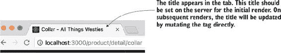

##### 服务器上的标题

在服务器上处理标题与处理元数据类似。每个顶级组件都应该提供一个`static`函数来输出标题。此外，我建议将标题输出从接收服务器数据的函数中分离出来，这样你就可以在浏览器上重用一些逻辑。将以下列表中的代码添加到 Detail 组件中。

##### 列表 10.12\. 创建标题`static`函数—src/components/detail.jsx

```
class Detail extends React.Component {

  static createTitle(props) {                                              *1*
    return `${props.name} - All Things Westies`;
  }

  static getTitle(params, store) {                                         *2*
    const currentProduct = store.products && store.products.currentProduct;

    return Detail.createTitle(currentProduct);
  }

  static createMetatags(params, store) {}
  //...other code
}
```

+   ***1* 静态函数从属性中创建标题，这是一个抽象，将使在浏览器上创建标题更容易。**

+   ***2* 在服务器上，renderView 中间件将调用 getTitle，该函数接收存储并提取当前 Product 数据。**

在你有一个具有适当`static`函数的组件后，你可以在服务器上设置标题。在`renderView`代码中，你添加了一个获取标题的调用。以下列表显示了添加到 renderView.jsx 中的代码。

##### 列表 10.13\. 为路由添加标题—src/middleware/renderView.jsx

```
const title = flattenStaticFunction(
  renderProps,
  'getTitle',
  serverState
);

const app = renderToString();

const html = renderToString(
  <HTML
    html={app}
    serverState={stringifiedServerState}
    metatags={seoTags}
    title={title}
  />
);
```

前几行使用 React Router 的`renderProps`调用`flattenStaticFunction`，函数名称（`getTitle`）和`serverState`，以便可以获取标题详细信息。返回一个字符串标题。最后，你将标题传递到 HTML 组件中。

最后，你需要将 html.jsx 中的标题更改为使用传入的属性。以下列表显示了你需要添加的内容。

##### 列表 10.14\. 渲染路由的标题—src/components/html.jsx

```
<head>
  <title
    dangerouslySetInnerHTML={{
      __html: props.title || 'All Things Westies'
    }}
  />
  {metatagsArray}
  // ...more code
</head>
```

使用`dangerouslySetInnerHTML`输出标题字符串。如果你直接将标题渲染到标签中，React 将附加一个注释，然后它将显示在浏览器中。如果你运行服务器并重新加载详细页面，标题将基于产品标题。

接下来，让我们看看如何在浏览器中更新标题。

##### 浏览器上的标题

大多数元标签只需要在初始渲染时使用，以服务于 Googlebot（以及分享机器人）。但标题标签是面向用户的，并且应该在每次路由更改时更新。这创造了一个独特的情况，你需要更新一个不由 React 控制的 DOM 部分。以下列表显示了你需要添加的内容。

##### 列表 10.15\. 将标题更新代码添加到 Detail—src/components/detail.jsx

```
class Detail extends React.Component {
  // ...more code
  componentDidMount() {
    document.getElementsByTagName('title')[0].innerHTMl =
     Detail.createTitle(this.props);                              *1*
  }

  componentDidUpdate() {
    document.getElementsByTagName ('title')[0].innerHTMl =
     Detail.createTitle(this.props);                              *1*
  }
//...more code
}
```

+   ***1* 在`componentDidUpdate`和`componentDidMount`中添加一个调用以更新标题标签的内容。**

这种情况很少见，但一旦发生，使用直接 DOM 访问是可以的。只是确保在访问 DOM 之前问自己，“我能用 React 的方式做到这一点吗？”

为了练习本节中的技术，你可以在项目中添加其他顶级 React 组件的元标签和标题。这种策略可以应用于你需要基于顶级组件生成服务器信息的情况（例如，生成特定路由的头部信息）。

### 10.3\. 多个真实来源

当构建同构应用时，你可能会遇到可以从服务器和浏览器中获取相同信息的情况。常见的例子是用户代理和区域设置，它们都作为头部信息发送到服务器，但也可以在浏览器中访问。你如何处理这些情况？

简单来说：选择一个单一的真实来源。你的应用首次运行代码的地方是服务器，所以如果可能的话，使用服务器作为真实来源。

#### 10.3.1\. 用户代理最佳实践

我的大部分职业生涯都与视频工作有关，而网页上视频的一个挑战是它根本没有任何标准。例如，每个浏览器都支持不同的视频编码选项。Safari（桌面和移动）支持的选项与 Chrome、Firefox 和 Microsoft Edge 不同。尽管有一些内置的方式来处理这个问题（使用`<video>`标签和通过`canPlayType`进行功能检测），但在自定义高性能视频播放器中，你通常必须自己处理这些差异。

这是我遇到过的在构建 Web 应用时需要持续进行用户代理检测的少数地方之一。尽管用户代理检测最好避免，但在这里介绍它是有价值的，以防你遇到类似的情况。在异构应用中使用用户代理检测时，我遵循以下两个原则：

1.  ***始终使用单一的真实来源*—** 这意味着在服务器上解析用户代理并将其传递到浏览器。

1.  ***尽可能使用最广泛的定义*—** 而不是问“这是一个 iPhone 吗？”而是问“这是一个移动设备吗？”需要知道特定设备类别或特定浏览器的具体版本的情况极为罕见。

#### 10.3.2\. 解析用户代理

您需要两样东西来解析用户代理，以便在您的应用中使用。首先，您需要添加一个动作和缩减器。其次，您需要将`User-Agent`头信息传递到服务器上的该动作。您可能想要切换到分支 chapter-10.3（`git checkout chapter-10.3`），其中包含上一节的所有代码。

列表 10.16 显示了您需要添加到项目中的代码：在名为 app-action-creators.es6 的新动作文件中添加一个新动作。此动作将接受请求头，并使用第三方库将它们解析为可用的对象。我在这里选择了 ua-parser-js，但您可以使用任何您选择的同构库（[`github.com/faisalman/ua-parser-js`](https://github.com/faisalman/ua-parser-js)）。如果您正在跟随，请确保安装此包：

```
$ npm install ua-parser-js
```

##### 列表 10.16\. 用户代理动作—src/shared/app-action-creators.es6

```
import UAParser from 'ua-parser-js';                          *1*

export const PARSE_USER_AGENT = 'PARSE_USER_AGENT';

export function parseUserAgent(requestHeaders) {
  const uaParser = new UAParser();                            *2*
  let userAgentObject;
  if (requestHeaders && requestHeaders['User-Agent']) {       *3*
    const userAgent = requestHeaders['User-Agent'];           *4*
    uaParser.setUA(userAgent);                                *4*
    userAgentObject = uaParser.getResult(userAgent);          *5*
  }
  return {
    userAgent: userAgentObject,                               *6*
    type: PARSE_USER_AGENT
  };
}

export default {
  parseUserAgent
};
```

+   ***1* 包含用户代理解析库。**

+   ***2* 构造新的用户代理解析器实例。**

+   ***3* 确保存在请求头和用户代理请求头。**

+   ***4* 将当前用户代理字符串传递给解析器。**

+   ***5* 创建表示用户代理的对象。**

+   ***6* 将动作返回给缩减器。**

在您创建了动作代码之后，是时候添加缩减器了。以下列表显示了您需要添加到新文件 app-reducer.es6 中的代码。

##### 列表 10.17\. 用户代理缩减器—src/shared/app-reducer.es6

```
import {
  PARSE_USER_AGENT
} from './app-action-creators.es6';

export default function app(state = {}, action) {
  switch (action.type) {
    case PARSE_USER_AGENT:
      return {
        ...state,
        userAgent: action.userAgent ?
                     action.userAgent : state.userAgent      *1*
      };
    default:
      return state;
  }
}
```

+   ***1* 在状态上设置从动作中获取的用户代理（如果动作中的用户代理未定义，则使用上一个状态）。**

不要忘记，为了连接 Redux 动作和缩减器，您必须将缩减器添加到 init-redux 文件中。以下列表显示了添加的代码。

##### 列表 10.18\. 导入 app 缩减器—src/shared/init-redux.es6

```
import app from './app-reducer.es6';              *1*

export default function (initialStore = {}) {
  const reducer = combineReducers({
    products,
    cart,
    app                                           *2*
  });
  //...more code
```

+   ***1* 包含 app 缩减器。**

+   ***2* 将缩减器添加到 combineReducers 语句。**

现在您的 Redux 业务逻辑已经就绪，您需要从视图中调用此动作。与其将此动作添加到每个顶级组件，不如将其添加到根组件（App）。请记住，此组件由您的应用中最顶层的路由加载。以下列表显示了添加到 app.jsx 的代码。

##### 列表 10.19\. 从视图调用`parseUserAgent`—src/components/app.jsx

```
import {
      parseUserAgent
   } '../shared/app-action-creators.es6';                       *1*

class App extends React.Component {

  static prefetchActions(params, store, request) {
    return [
      parseUserAgent.bind(null, request.headers)                *2*
    ];
  }
```

+   ***1* 从动作创建文件导入动作。**

+   ***2* 返回动作并绑定请求头（在浏览器上，它将是空的，在服务器上，您将传递请求对象）。**

最后，您需要向中间件添加代码以将请求传递给`prefetchActions`函数。这将在`flattenStaticFunction`中发生。列表 10.20 显示了添加代码。

##### 列表 10.20\. 将请求传递给`prefetchActions`—src/middleware/renderView.jsx

```
function flattenStaticFunction(
  renderProps, staticFnName, store = {}, request                 *1*
) {
  let results = renderProps.components.map((component) => {
    if (component) {
      if (component.displayName &&
        component.displayName.toLowerCase().indexOf('connect') > -1
      ) {
        if (component.WrappedComponent[staticFnName]) {
          return component.WrappedComponentstaticFnName;
        }
      } else if (component[staticFnName]) {
        return componentstaticFnName;
      }
    }
    return [];
  });

  results = results.reduce((flat, toFlatten) => {}, []);

  return results;
}

export default function renderView(req, res, next) {
  const matchOpts = {};
  const handleMatchResult = (error, redirectLocation, renderProps) => {
    if (!error && !redirectLocation && renderProps) {
      const store = initRedux();
      const actions = flattenStaticFunction(
        renderProps,
        'prefetchActions',
        null,                                                    *3*
        req                                                      *4*
      );
      //... more code
```

+   ***1* 将请求对象作为传递给 flattenStaticFunction 的属性。**

+   ***2* 将请求对象传递给被调用的静态函数（不使用它的函数将忽略它，因为它是最后面的参数）。**

+   ***3* flattenStaticFunction 的此用例不需要 store 状态来工作，传递 null。**

+   ***4* 确保在调用 prefetchActions 时将 req 对象传递给 flattenStaticFunction。**

现在你已经将用户代理解析到你的应用状态中，它不会在浏览器中被覆盖。在浏览器中设置断点以查看用户代理在 reducer 中将如何被定义为 undefined 并不会被覆盖。图 10.6 展示了在 app-reducer.es6 代码中设置断点并检查动作值，以查看它根本不会在浏览器上设置。

##### 图 10.6\. 在 app-reducer.es6 中设置断点并检查 `action.userAgent` 的值。

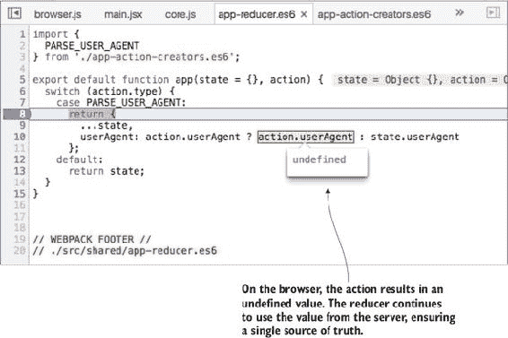

### 摘要

在本章中，你学习了如何处理现实应用中出现的特定环境边缘情况。你还学习了如何正确处理错误。

+   使用 webpack 处理浏览器和服务器专用的代码以创建 `process.env` 对象。

+   实现服务器和浏览器特定的路由，并将相同的逻辑应用于环境路由（开发与生产）。

+   使用静态方法根据每个路由确定 SEO 元数据标签和页面标题。

+   在服务器上解析用户代理并将其用作浏览器中的真实来源。

## 第十一章\. 为生产优化

*本章涵盖*

+   为浏览器优化性能

+   在 Node.js 上使用流来提高服务器性能

+   使用缓存来提高服务器性能

+   通过服务器和浏览器上的 cookie 处理用户会话

而不是深入研究任何特定主题，本章涵盖了一系列将使你的应用性能更好并提高最终用户体验的话题。这包括 React 性能、Node.js 性能和多种缓存策略。本章的最后部分涵盖了在同构应用中处理 cookie 以及这给一些缓存策略带来的权衡。

本章继续使用 GitHub 上的完整同构示例仓库。它可以在 [`mng.bz/8gV8`](http://mng.bz/8gV8) 找到。第一部分使用 chapter-11.1 分支上的代码（`git checkout chapter-11.1`）。你可以在 chapter-11.complete 分支上找到本章的完整代码（`git checkout chapter-11-complete`）。

要运行每个分支，请确保使用以下命令：

```
$ npm install
$ npm start
```

### 11.1\. 浏览器性能优化

随着我花更多的时间在 React 上，我发现虽然它开箱即用很快，但在复杂的应用中你可能会遇到性能问题。为了保持你的 React 网页应用性能，你需要随着应用的增长和更复杂的功能交互的增加，始终考虑性能。随着应用的增长，以下两个特定情况开始引起性能问题：

+   ***JavaScript 的大小*—** 下一节将介绍如何使用 webpack 分块来减小包大小。

+   ***不必要的渲染*—** 在 第 11.1.2 节 中，我们将介绍使用 `shouldComponentRender` 来减少不必要的渲染的基本方法。

#### 11.1.1\. Webpack 分块

在构建任何类型的应用程序时，我经常遇到以下场景：我的应用程序开始时规模较小，JavaScript 资产也足够小，可以快速加载。随着时间的推移，我添加了功能，对检查包含的包的大小变得懒惰，并且通常不关注包大小。（在大型团队中，代码库大小管理尤其困难。）然后有一天，我检查了页面的加载时间，发现我的 JavaScript 文件变得太大！这影响了应用程序的整体加载时间。然后就是恐慌的时刻！

幸运的是，webpack 提供了一种通过将代码拆分为多个按需加载的包来解决此问题的方法。接下来的两个图解将向您介绍这个概念。


##### 注意

如果您使用的是 React Router 4，请参阅 附录 C 了解使用 webpack 进行代码拆分的信息。


图 11.1 展示了应用程序当前是如何编译的。所有代码都被组合成一个输出文件。此文件在 html.jsx 中被引用。

##### 图 11.1\. webpack 的默认行为导致一个代表所有代码的单个文件。

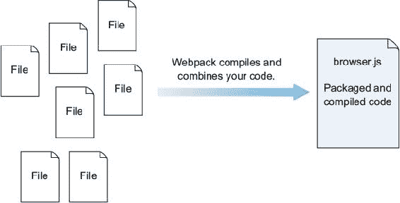

图 11.2 展示了本节中将实现的内容。代码在 webpack 的编译步骤中仍然被组合，但随后被拆分为多个 JavaScript 文件。这是您在代码中配置的（而不是在 webpack 配置中）。

##### 图 11.2\. 使用代码拆分，webpack 输出多个可以动态加载的文件。具体文件将根据应用程序而异。

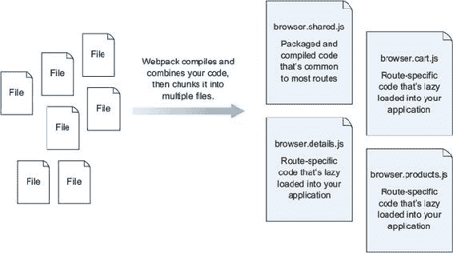

要在您的代码中实现这一点，您需要更新导入路由的方式。这个过程有三个步骤：

> **1**.  添加 Babel 插件，这些插件将处理 Node.js 服务器上的动态导入以及您的 webpack 配置中的 Babel 加载器。
> 
> **2**.  将动态导入添加到 `sharedRoutes`。
> 
> **3**.  使用 `chunkFilename` 在 webpack 中启用块。

在您的终端中运行以下命令以安装和添加新的 Babel 插件：

```
$ npm install --save-dev babel-plugin-syntax-dynamic-import
$ npm install --save-dev babel-plugin-dynamic-import-node
```

然后您需要更新 .babelrc。列表 11.1 展示了所需的更新。与旧版本相比，这是一个重大变化，因为您需要为 webpack 和 Node.js 使用不同的插件。稍后您将确保 webpack 指向 webpack 环境配置。

##### 列表 11.1\. 在 .babelrc 中添加插件

```
{
  "presets": ["es2015", "react"],
  "env": {                                      *1*
    "webpack-env": {                            *2*
      "plugins": [
        "syntax-dynamic-import"                 *3*
      ]
    },
    "development": {                            *2*
      "plugins": [
        "syntax-dynamic-import",                *4*
        "dynamic-import-node"                   *4*
      ]
    }
  },
  "plugins": [                                  *5*
    "transform-es2015-destructuring",
    "transform-es2015-parameters",
    "transform-object-rest-spread"
  ]
}
```

+   ***1* 添加一个环境配置选项。**

+   ***2* 添加两个环境：开发环境（默认）和 webpack-env 用于 webpack 构建。**

+   ***3* 对于 webpack，只添加允许动态导入语法的插件。**

+   ***4* 对于 node，需要语法和实现插件。**

+   ***5* 原始的插件数组保持不变。环境选项与任何默认选项合并。**

Babel 配置更改的主要目标是将其分为两个版本，一个用于服务器（开发），另一个用于 webpack（webpack-env）。

接下来，你必须添加一个动态导入。列表 11.2 展示了如何创建告诉 webpack 创建代码块的语句。这替换了 `sharedRoutes` 中组件的 `import` 语句。目前，你将应用此模式到单个路由：`cart`。但在生产应用中，我建议你根据自己的流量模式应用此模式（将高流量路由与低流量路由分开分割，或将管理或其他认证页面与公共页面分开分割）。此外，此代码可以抽象化并用于生产环境，但在此示例中，它以清晰、简洁的方式说明了更改。

##### 列表 11.2\. 配置代码块分割—src/shared/sharedRoutes.jsx

```
// remove import Cart from '../components/cart';               *1*
<Route path="/" component={App} onChange={onChange}>
<IndexRoute component={Products} />
<Route
      path="cart"
     getComponent={(location, cb) => {                         *2*
       import(                                                 *3*
        /* webpackChunkName: "cart" */                         *4*
        /* webpackMode: "lazy" */                              *4*
        './../components/cart')                                *3*
       .then((module) => {                                     *5*
         cb(null, module.default);                             *5*
         onChange(null, {                                      *6*
           routes: [
             {component: module.default}
           ]

         });
       })
       .catch(error =>                                         *7*
         console.log('An error occurred while loading the component', error)
       );
      }}
    />
```

+   ***1* 删除对购物车组件的旧导入语句。我在这里添加了注释来演示它将被删除，但你也可以直接删除它。**

+   ***2* 使用 getComponent 属性。**

+   ***3* 使用异步导入。你将购物车组件的路径传递给它。**

+   ***4* Webpack 会读取这些注释并使用它们来确定如何处理代码块。**

+   ***5* 异步导入的行为类似于 Promise。处理成功：获取加载的模块并将其传递给 React Router 回调。**

+   ***6* 当调用 onChange 时，组件尚未加载。通过手动调用 onChange，数据仍然会被加载。**

+   ***7* 添加错误处理。**

你会注意到，你既用动态加载替换了默认导入，又将这个动态加载移动到了 React Router 的 `getComponent` 属性中。代码将会懒加载（`webpackMode: lazy`）；它不会在用户导航到这个路由之前加载。这有优势，因为它可以防止加载用户尚未访问的功能的代码。

最后，给你的 webpack 代码块命名是有用的。这可以在 webpack 配置文件中配置。以下列表展示了如何将此属性添加到你的 webpack 配置文件中。

##### 列表 11.3\. 命名 webpack 代码块—webpack.config.js

```
module.exports = {
  // ... other config options
  output: {
    path: __dirname + '/src/',
    filename: "browser.js",
    chunkFilename: "browser-[name].js"         *1*
  },
  module: {}
};
```

+   ***1* 添加 chunkFilename 选项。使用 [name] 来指示为每个代码块动态命名编译后的 js 文件。**

在下一节中，我们将探讨一种提高 React 性能的方法，这种方法适用于 React 的基本性能不足以满足需求的情况。

#### 11.1.2\. 组件是否应该渲染

随着你的应用增长，你可能会遇到组件不必要地运行其渲染周期的情况（我见过重渲染达到数十秒的情况）。如果这种情况发生并且对你的应用产生了可测量的影响，请使用`shouldComponentRender`来限制渲染次数。


**性能测量工具**

在进行性能改进之前，你应该始终对你的应用进行性能分析。记录你在当前应用版本中测量的性能指标。然后进行任何性能更新。最后，再次测量相同的性能指标以确认你的更改产生了积极的影响。

要开始分析 Web 应用，你应该成为 Chrome DevTools 性能面板的专家：[`mng.bz/a9wf`](http://mng.bz/a9wf)。


实现不引起自己未来痛苦和头痛的`shouldComponentRender`的最佳方式是确保你的属性是以不可变模式创建的。在这个应用中，这已经在 Redux 的 reducer 中得到了处理。通过创建不可变对象，对象的引用会改变，浅比较就足够用来检查两个对象是否不同。列表 11.4 展示了如何在 Detail Page 组件的上下文中实现这一点。将列表中的代码添加到 detail.jsx 中。


##### 警告

使用`shouldComponentRender`可能会让你陷入绝望的兔子洞。要谨慎使用，并明智地使用它。（你可能会得到复杂、庞大的函数，这些函数在计算是否渲染。这是不好的，应该避免。）


##### 列表 11.4\. 块渲染，`shouldComponentRender`—src/components/detail.jsx

```
componentDidMount() {}

shouldComponentUpdate(nextProps) {
  if (this.props.name === nextProps.name &&                     *1*
      this.props.description === nextProps.description &&
      this.props.details === nextProps.details &&
      this.props.price === nextProps.price &&
      this.props.thumbnail === nextProps.thumbnail) {
    return false;                                               *2*
  }
  return true;                                                  *3*
}

componentDidUpdate() {}
```

+   ***1* 检查每个属性以确保它没有变化。**

+   ***2* 如果没有任何变化，则返回 false；这可以防止组件渲染。**

+   ***3* 如果有变化，则返回 true；这允许正常的渲染执行。**

这将适用于许多情况，但它并非没有问题。一个问题是这个实现要求你根据属性的实现细节编写许多检查。你可以将此代码的概念——比较`this.props`/`nextProps`上的每个属性——抽象成一个可以被许多组件重用的函数。Alex Reardon 的在线文章“React 应用的性能优化”涵盖了使用`shouldComponentUpdate`的更多细节。它包括一个抽象的深度等于函数的示例实现，该函数只进行引用检查。查看 GitHub 上的代码([`mng.bz/q7yU`](http://mng.bz/q7yU))。

最后，如果你需要`shouldComponentUpdate`只对`props`对象和`state`对象进行浅比较，你可以使用 React Pure Component。这是一个由 React 提供的类。你可以在[`reactjs.org/docs/react-api.html#react.purecomponent`](https://reactjs.org/docs/react-api.html#react.purecomponent)找到文档。

不幸的是，更深入地探讨 React 性能优化超出了本书的范畴。幸运的是，关于这个主题有很多其他优秀的资源！以下是一些可以让你更深入了解的资源：

+   *React 性能工具*—[`facebook.github.io/react/docs/perf.html`](https://facebook.github.io/react/docs/perf.html)。使用这些工具来分析你的应用程序。当你进行性能测试时，别忘了以生产模式运行你的应用程序！（这些工具在 React 16 中已被弃用。）

+   *React 性能概述*—[`mng.bz/l5J8`](http://mng.bz/l5J8)和[`mng.bz/eWHH`](http://mng.bz/eWHH)是开始了解 React 性能的好地方。

+   更多关于`shouldComponentRender`的内容——[`jamesknelson.com/should-i-use-shouldcomponentupdate/`](http://jamesknelson.com/should-i-use-shouldcomponentupdate/)深入探讨了为什么你应该避免使用`shouldComponentRender`。

在下一节中，我们将探讨可以用于提高你的 Node.js 应用程序性能的服务器端性能改进。

### 11.2\. 服务器性能优化

在同构应用中，你服务器的性能和浏览器性能一样重要。当我们最初开始在工作中使用 React 时，它极大地简化了我们为搜索引擎构建页面。但我们很快意识到 React 的服务器渲染比我们希望的慢。为许多组件创建完整的渲染字符串输出需要时间，并且是服务器上的一个阻塞任务。这限制了服务器每秒能够处理请求数量。

在本节的剩余部分和缓存部分，我将讨论你可以使用的策略来提高你的服务器性能时间：

+   使用流概念来更快地响应请求

+   添加连接池来管理服务器上的多个 HTTP 请求

你首先需要添加的是将页面响应流式传输到浏览器的能力。如果你正在跟随并想切换到本节的 GitHub 分支，请查看第 11.2 章（`git checkout chapter-11.2`）。

#### 11.2.1\. 流式 React

如果你的主要目标是提高首次字节到达时间，并允许 DOM 尽快开始处理，那么流式传输渲染后的页面响应可以是一个好的解决方案。Node.js 流是一种表示大量数据并在一段时间内交付数据的方式。而不是等待整个 HTML 页面下载完成，页面可以分块在一段时间内交付（关于流的更多信息请参阅[`mng.bz/s91m`](http://mng.bz/s91m)）。

通过将服务器响应转换为流，你可以提高浏览器开始下载和显示 HTML 的速度。列表 11.5 显示了如何使用 react-dom-stream 库来渲染流而不是字符串。将代码添加到 renderView.jsx 中。你还需要在运行以下命令之前：

```
$ npm i --save react-dom-stream
```

你可以在[`github.com/aickin/react-dom-stream`](https://github.com/aickin/react-dom-stream)找到更多关于这个包的信息。请注意，它还没有完全升级以与最新的 React 一起使用，因此你可能不想在生产环境中使用它，但它很好地说明了流的概念。

##### 列表 11.5\. 设置流式库—src/middleware/renderView.jsx

```
import React from 'react';
import {
  renderToString
} from 'react-dom-stream/server';                         *1*
import { Provider } from 'react-redux';

const streamApp = renderToString(                         *2*
  <Provider store={store}>
    <RouterContext routes={routes} {...renderProps} />
  </Provider>
);

const streamHTML = renderToString(
  <HTML
    html={streamApp}                                      *3*
    serverState={stringifiedServerState}
    metatags={seoTags}
    title={title}
  />
);

streamHTML.pipe(res, { end: false });                     *4*
streamHTML.on('end', () => {                              *5*
  res.end();                                              *6*
});
```

+   ***1* 不要导入 renderToString 的 React 版本，而要使用流式库的版本。**

+   ***2* 应用组件的初始渲染被转换为流的创建。为了更好的上下文，重命名变量。**

+   ***3* React DOM Stream 支持 JSX 中的嵌套流。现在我们将流传递到 HTML.jsx。**

+   ***4* 不要直接响应请求，流库将渲染结果管道化到响应中。**

+   ***5* 添加一个监听器以监听流的结束。**

+   ***6* 关闭响应。**

#### 11.2.2\. 连接池

除了使用 React，我们在工作中还使用 GraphQL。这使我们能够从许多微服务中收集数据。更重要的是，它还允许我们请求我们视图所需的数据，而不是使用具有预定响应的 REST API。把它想象成后端 REST 服务的客户端。你可以在[`graphql.org`](http://graphql.org)了解更多关于 GraphQL 的信息。

这是一个强大的设置，但 GraphQL 会进行大量的网络调用。我们遇到了一些网络调用超时的问题。我们与之通信的服务没有显示任何超时；它们显示了快速的响应时间。经过大量的调查，团队发现我们发出的请求太多，导致调用栈导致一些请求超时。调用栈变成了一个瓶颈，请求在收到任何响应之前就已经超时了。

这也可能发生在你的 React 同构应用程序中。如果你的应用程序的一个页面为特定的视图进行了大量的网络调用，你可能会遇到这个缓慢的网络请求问题。解决这个问题的策略之一是在你的 Node.js 服务器上启用连接池。

在 Node.js 中解决这个问题的方法是创建一个永久的连接池以减少打开连接的成本。*连接池*确保你的 Node.js 应用程序中始终有可用的套接字连接。这可以在发出请求时节省时间，因为打开套接字需要时间（更多信息，请参阅[www.madhur.co.in/blog/2016/09/05/nodejs-connection-pooling.html](http://www.madhur.co.in/blog/2016/09/05/nodejs-connection-pooling.html)上的博客文章）。以下列表显示了如何将此选项添加到服务器中。

##### 列表 11.6\. 启用连接池—src/app.es6

```
import http from 'http';                                         *1*
import bodyParser from 'body-parser';
import renderViewMiddleware from './middleware/renderView';

http.Agent({                                                     *2*
  keepAlive: true,
  keepAliveMsecs: 1500,
  maxFreeSockets: 1024
});
```

+   ***1* 导入 http 模块。**

+   ***2* 在服务器上的其余代码之前，设置 http.Agent.keepAlive: true 的选项告诉服务器重用连接。其他选项可以根据您的用例进行调整。**

您还可以使用 GraphQL，这将大大减少您做出的网络调用次数。但这将是另一本书的主题。

##### Node 性能

这不是一本关于 Node.js 实现和性能的书籍，但如果您想了解更多关于这个主题的信息，有很多好的资源可用。以下是一些开始的地方：

+   *Nginx 关于优化 Node.js 应用的技巧*—[www.nginx.com/blog/5-performance-tips-for-node-js-applications/](http://www.nginx.com/blog/5-performance-tips-for-node-js-applications/)

+   *Express 在生产环境中的最佳实践*—[`expressjs.com/en/advanced/best-practice-performance.html`](https://expressjs.com/en/advanced/best-practice-performance.html)

+   *Node 性能分析工具*—[`nodejs.org/en/docs/guides/simple-profiling/`](https://nodejs.org/en/docs/guides/simple-profiling/)

+   *Netflix 深入剖析火焰图分析 Node 应用*—[`medium.com/netflix-techblog/node-js-in-flames-ddd073803aa4`](https://medium.com/netflix-techblog/node-js-in-flames-ddd073803aa4)

### 11.3\. 缓存

另一个强大的服务器性能工具是缓存。我已经采用了不同形式的缓存，包括边缘缓存、内存缓存以及在 Redis（一个 NoSQL 数据库）中持久化缓存中保存视图。每种策略都有其权衡之处，因此了解这些权衡并选择适合您用例的正确策略非常重要。表 11.1 列出了缓存选项。

##### 表 11.1\. 比较缓存选项

|   | SEO | 用户会话 |
| --- | --- | --- |
| 内存 | ✓ | ✓ |
| 持久化存储 | ✓ | (开销较高，但可行) |
| 边缘缓存 | ✓ |   |

#### 11.3.1\. 服务器端缓存：内存缓存

最简单（也是最天真）的缓存解决方案涉及直接在内存中保存组件。对于简单的应用程序，您可以通过使用基本的 LRU 缓存（大小限制）并在组件渲染后将其序列化来实现这一点。图 11.3 显示了使用内存缓存的时间线。第一个加载页面的用户会得到一个完全渲染（但较慢）的页面版本。这也被保存在内存缓存中。所有后续用户都会得到缓存的版本，直到该页面因缓存已满而被推出缓存。

##### 图 11.3\. 内存缓存允许某些请求从更快的响应时间中受益。

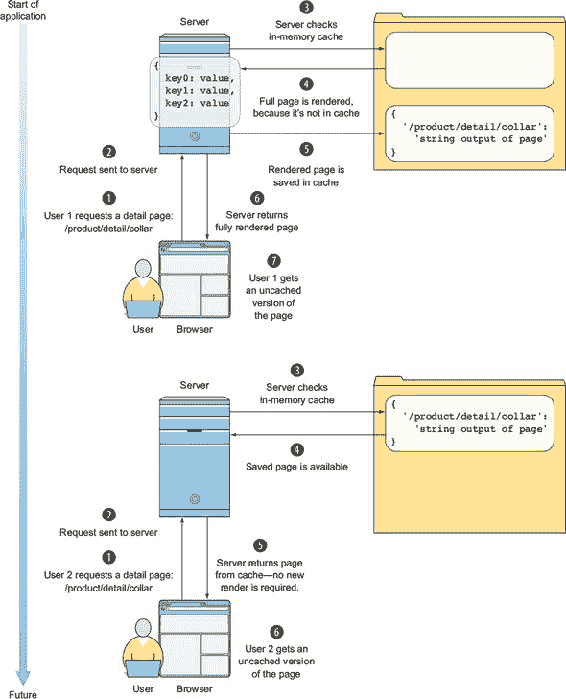

下面的列表显示了如何添加一个简单的缓存模块（抽象此代码将使更新缓存策略以匹配您的未来需求变得更容易）。您应该将此代码添加到共享目录中的新 cache.es6 文件中。

##### 列表 11.7\. 添加内存 LRU 缓存—src/shared/cache.es6

```
import lru from 'lru-cache';                             *1*

// maxAge is in ms
const cache = lru({                                      *2*
  maxAge: 300000,                                        *3*
  max: 500000000000,                                     *4*
  length: (n) => {                                       *5*
    // n = item passed in to be saved (value)
    return n.length * 100;
  }
});

export const set = (key, value) => {                     *6*
  cache.set(key, value);
};

export const get = (key) => {                            *7*
  return cache.get(key);
};

export default {
  get,
  set
};
```

+   ***1* 导入 lru 缓存。**

+   ***2* 创建 lru 缓存。**

+   ***3* maxAge 为存储在缓存中的值设置基于时间的过期时间。**

+   ***4* max 是缓存中所有项目的总允许长度。**

+   ***5* length 是每个添加的值的最大允许长度。**

+   ***6* 这是一个公共的设置方法，用于在缓存中设置键/值对。**

+   ***7* 这是一个公共的获取方法，根据键从缓存中检索值。**

列表 11.8 展示了如何在 renderView.jsx 中利用缓存模块。将它的代码添加到模块中。请注意，我建议使用缓存逻辑或流逻辑，但不要同时使用两者。如果你想缓存和流，你需要一个不同于本章中展示的流实现。

##### 列表 11.8\. 保存和获取缓存的页面—src/middleware/renderView.jsx

```
import cache from '../shared/cache.es6';                *1*

//..other code

const cachedPage = cache.get(req.url);                  *1*
if (cachedPage) {                                       *2*
  return res.send(cachedPage);                          *2*
}

const store = initRedux();
//...more code
Promise.all(promises).then(() => {
  //...more code
  cache.set(req.url, `<!DOCTYPE html>${html}`);        *3*
  return res.send(`<!DOCTYPE html>${html}`);
})
```

+   ***1* 尝试使用列表 11.7 中的缓存模块从缓存中检索值。**

+   ***2* 如果值存在，则使用它来响应请求。**

+   ***3* 如果需要完整页面的渲染，在响应请求之前保存已渲染的页面。**

这种策略将有效，但它有一些问题：

+   这个解决方案很简单，但当用例变得更加复杂时会发生什么？当你开始添加用户？或者多语言？或者你有成千上万的页面？这种方法不适用于这些用例。

+   在 Node.js 中写入内存是一个阻塞任务，这意味着如果你试图通过使用缓存来优化性能，你是在用一个问题换取另一个问题。

+   最后，如果你正在使用分布式扩展策略来运行你的服务器（这在当今很常见），缓存仅适用于单个盒子或容器（如果使用 Docker）。在这种情况下，你的服务器实例无法共享一个公共缓存。

接下来，我们将探讨另一种策略，即使用 Redis 进行缓存，这将允许异步和非阻塞地进行缓存。我们还将探讨使用更智能的缓存实现来缓存单个组件，这对于更复杂的应用程序来说具有更好的可扩展性。

#### 11.3.2\. 服务器端缓存：持久化存储

我参与开发的第一个同构 React 应用是在 Redux 和 React Router 成为稳定的社区首选库之前编写的，因此我们编写了大量的代码。结合 React 在服务器上的运行速度较慢，我们需要一个能够加快服务器渲染速度的解决方案。

我们实现的是在 Redis 中存储完整页面的字符串存储。但是，对于较大的网站来说，在 Redis 中存储完整页面有显著的权衡。我们有可能有数百万条条目最终存储在 Redis 中。因为完整的字符串化 HTML 页面很快就会累积起来，所以我们使用了相当多的空间。

幸运的是，社区自那时以来已经对这一想法进行了改进。Walmart Labs 发布了一个名为 electrode-react-ssr-caching 的库，该库易于使用，可以缓存您的服务器端渲染。这个库有几个强大的原因：

+   它附带了一个分析器，可以告诉您哪些组件在服务器上最昂贵。这允许您只缓存您需要的组件。

+   它提供了一种模板组件的方法，这样您就可以缓存已渲染的组件，并在以后插入属性。

从长远来看，由于我们服务的页面数量以及其中以 100% 公开内容提供的页面百分比，我们最终转向了边缘缓存策略。但您的用例可能从 Walmart Labs 方法中受益。

#### 11.3.3\. CDN/边缘策略

Edge 缓存是我们目前在工作中的同构 React 应用程序中使用的解决方案。这是由于一些业务逻辑需要按需使内容过期（当系统其他点的某些内容发生变化时，如在 CMS 工具中）。现代 CDN，如 Fastly，提供这种功能，并使管理 TTL（生存时间）和强制使网页过期的操作变得容易得多。图 11.4 说明了这是如何工作的。

##### 图 11.4\. 添加边缘服务器将缓存移动到服务器前面。

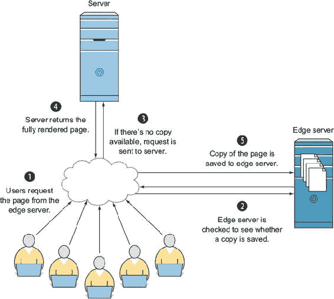

向您展示如何实现这一点超出了本书的范围。如果您有面向公众的内容，这些内容可以推动 SEO（电子商务、视频网站、博客等），那么您在技术栈中肯定需要一个 CDN。

这种方法的一个缺点是它使用户会话管理变得复杂。下一节将探讨用户会话，并涵盖各种缓存策略的权衡。

### 11.4\. 用户会话管理

现代网络应用程序几乎无一例外地在浏览器中使用 cookie。即使您的主要产品没有直接使用 cookie，您在网站上使用的任何广告、跟踪或其他第三方工具都将利用 cookie。Cookies 让网络应用程序知道同一个人在一段时间后回来了。图 11.5 说明了这是如何工作的。

##### 图 11.5\. 同一用户在服务器上的重复访问。保存 cookie 允许您存储有关用户的信息，这些信息可以在未来的会话中检索。

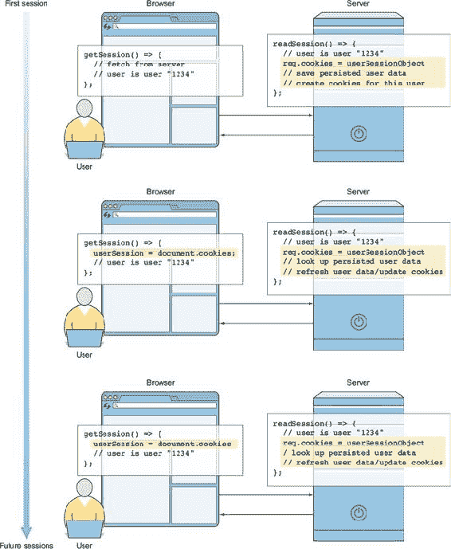

列表 11.9 展示了一个示例模块，该模块为您处理浏览器和服务器端 cookie 解析。它使用通用 Cookie 来帮助管理两个环境中的 cookie：[www.npmjs.com/package/universal-cookie](http://www.npmjs.com/package/universal-cookie)。您需要安装这个库才能使代码正常工作：

```
$ npm install --save universal-cookie
```

将此列表中的代码添加到新的模块 src/shared/cookies.es6 中。

##### 列表 11.9\. 使用同构 cookie 模块—src/shared/cookies.es6

```
import Cookie from 'universal-cookie';                            *1*

const initCookie = (reqHeaders) => {
  let cookies;
  if (process.env.BROWSER) {                                      *2*
    cookies = new Cookie();
  } else if (reqHeaders.cookie) {
    cookies = new Cookie(reqHeaders.cookie);                      *3*
  }
  return cookies;
};

export const get = (name, reqHeaders = {}) => {
  const cookies = initCookie(reqHeaders);                         *4*
  if (cookies) {
    return cookies.get(name);                                     *5*
  }
};

export const set = (name, value, opts, reqHeaders = {}) => {
  const cookies = initCookie(reqHeaders);                         *4*
  if (cookies) {
    return cookies.set(name, value, opts);                        *6*
  }
};

export default {
  get,
  set
};
```

+   ***1* 导入通用 cookie 库，该库为您处理访问浏览器和服务器 cookie 之间的差异。**

+   ***2* 检查环境以确定是否需要 reqHeaders。**

+   ***3* 如果头信息中有 cookie，将其传递给 cookie 构造函数。**

+   ***4* 在 getter 和 setter 函数中，初始化 cookie 对象，传递 reqHeaders 以便在服务器上工作。**

+   ***5* 返回 cookie 查找的结果。**

+   ***6* 返回设置 cookie 的结果。除了名称和值之外，您还可以传递所有标准 cookie 选项。在大多数情况下，您将从浏览器中调用 set。**

现在您已经为两种环境都添加了获取和设置 cookie 的方法，您需要能够将此信息存储在应用状态中，以便您可以在应用程序中以一致的方式访问它。

#### 11.4.1. 全局访问 cookie

通过使用操作获取 cookie，您可以标准化应用程序与 cookie 交互的方式。以下列表显示了如何添加一个`storeUserId`操作来获取和存储用户 ID。将此代码添加到 app-action-creators 文件中。

##### 列表 11.10。在服务器上访问 cookie—src/shared/app-action-creators.es6

```
import UAParser from 'ua-parser-js';
import cookies from './cookies.es6';                        *1*

export const PARSE_USER_AGENT = 'PARSE_USER_AGENT';
export const STORE_USER_ID = 'STORE_USER_ID';               *2*

export function parseUserAgent(requestHeaders) {}

export function storeUserId(requestHeaders) {               *3*
  const userId = cookies.get('userId', requestHeaders);     *4*
  return {
    userId,                                                 *5*
    type: STORE_USER_ID                                     *2*
  };
}

export default {
  parseUserAgent,
  storeUserId
};
```

+   ***1* 导入 cookie 模块。**

+   ***2* 为新操作添加一个类型。**

+   ***3* 添加操作，它接受 requestHeaders 以便在服务器上工作。**

+   ***4* 将 cookie 名称和 requestHeaders 传递给 cookie 模块。**

+   ***5* 在操作上放置 userId 值。**

现在，您可以在应用程序中访问用户 ID 了！它将在服务器上获取，并在需要时可以在浏览器中更新。您可以将此概念应用于任何用户会话信息。整体管理用户会话超出了本章的范围。

#### 11.4.2. 边缘缓存和用户

当我开始构建同构应用程序时，用户管理看起来很简单。您使用 cookie 在浏览器中跟踪用户会话，就像在单页应用程序中一样。添加服务器使事情变得复杂，但您可以在服务器上读取 cookie。随着您添加缓存策略，这变得不那么直接。

内存和持久化存储缓存策略与用户会话配合得更好，因为每个用户请求仍然会发送到服务器，允许收集用户信息。您可以将用户的标识信息添加到您的缓存键中。

但边缘缓存的效果并不好。这是因为对于每个独特的用户，您必须保留每个包含特定用户数据的页面的唯一副本。如果您不这样做，您可能会向用户 2 展示用户 1 的信息。这会很糟糕！图 11.6 说明了这个概念。

##### 图 11.6。当边缘需要为每个用户缓存页面时，重叠请求的好处就消失了。

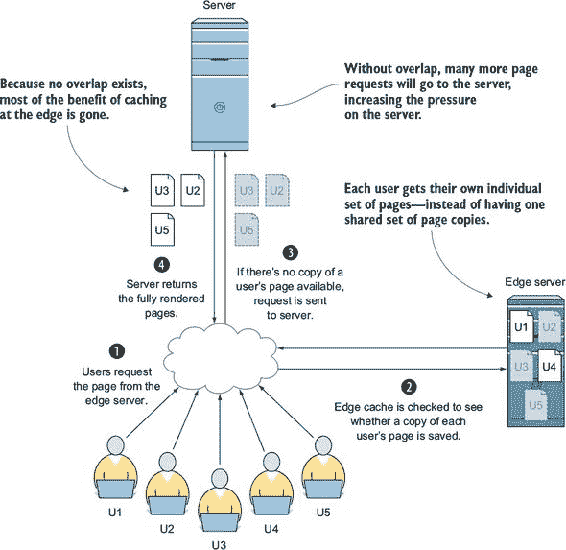

如果您需要使用边缘缓存并且有用户数据，您可以根据您的内容类型和流量模式采用以下策略之一（取决于您的应用程序类型和流量模式）：

+   创建具有用户内容或通用消费内容（公共）的页面。然后仅在您的边缘服务器上缓存公共页面。

+   保存一个 cookie，告知边缘服务器用户是否处于活跃会话中。使用此信息来决定是否提供缓存页面或将请求发送到服务器（透传）。

+   提供带有占位符内容（显示内容加载位置的实心形状）的页面，然后决定在浏览器中加载什么内容。

### 摘要

本章涵盖了几个将使您的同构应用在生产环境中运行得更好的主题，包括性能和缓存。您还了解了向处理用户会话的同构应用添加某些类型缓存的复杂性。

+   使用 webpack 分块来提高浏览器性能。

+   使用`shouldComponentRender`优化渲染周期。

+   通过流和连接池来提高服务器的性能。

+   应用三种缓存策略之一（内存、持久或边缘）以提高服务器上的渲染时间。

+   通过浏览器和服务器上的 cookie 管理用户会话。

+   理解缓存策略对用户会话管理的影响。
