## 第四部分\. 使用其他工具应用同构架构

React 是许多类型的前端应用程序的一个很好的选择，但它不是唯一的选择。本书迄今为止教授的技能是学习成为优秀的前端或全栈开发者的技能子集的一部分。最后一部分涵盖了额外的技术，如 Angular 和 Ember，并建议您如何使用它们来构建同构应用程序。它还包括一个简要的章节，专注于您应该探索的额外技能和专业知识领域，这将补充您在本书中学到的内容。

## 第十二章\. 其他框架：不使用 React 实现同构

*本章涵盖*

+   使用 Ember 的约定优于配置实现快速实现通用应用程序

+   使用 TypeScript 在 Angular 应用程序中实现同构部分

+   使用 Next.js 运行同构应用程序，它为您提供了内置服务器渲染的现成 React 实现

本章的每个部分都涵盖了一个框架，该框架允许您使用同构渲染开始使用。本章不会教授您这些其他技术，尽管它确实提供了链接到资源的链接，如果您想深入了解。相反，每个部分都突出了每个框架的关键部分：

+   在每个框架中设置和实现服务器端渲染

+   在每个框架中启用具有服务器状态的 DOM 的水合

+   理解每种方法的优缺点

### 12.1\. 博客示例项目

在本章的每个部分中，您将使用相同的示例应用程序。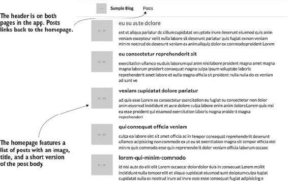显示了博客的主页视图。这是一个带有页眉和博客帖子列表的基本主页。每个博客帖子都链接到一个帖子详情页面，该页面显示了完整的帖子正文和评论列表。

##### 图 12.1\. 显示所有帖子的应用程序主页


本章的所有代码都在其自己的 GitHub 仓库中，网址为[`github.com/isomorphic-dev-js/chapter12-frameworks`](https://github.com/isomorphic-dev-js/chapter12-frameworks)，您可以克隆（`git clone https://github.com/isomorphic-dev-js/chapter12-frameworks`）。每个部分都有一个顶级文件夹，还有一个为所有三个应用程序提供模拟 API 的数据服务器文件夹：

+   ***angular2*—** 第 12.2 节的代码。这是一个完整的 Angular 应用程序。

+   ***ember-universal*—** 第 12.3 节的代码。这是一个完整的 Ember 应用程序。

+   ***nextjs*—** 第 12.4 节的代码。这是一个使用 Next.js 框架构建的完整的同构 React 应用程序。

+   ***server*—** 此文件夹中的代码运行一个简单的数据 API。

#### 12.1.1\. UI 和组件分解

在我们深入各种同构实现之前，让我们回顾一下博客是如何工作的。它由两个路由组成：主页路由 (/) 和帖子详情路由 (/post)。图 12.1 展示了主页。

##### 图 12.2\. 带有相应评论的帖子详情页面

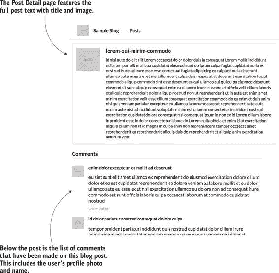

如您所见，主页很简单。一个简单的页眉包含“帖子”链接，点击后会带您回到主页。帖子列表直接位于页眉下方。当您点击主页上的任何帖子时，应用会加载相应的帖子详情页面。图 12.2 展示了该页面的样子。

现在您已经看到了应用的样子，我们将介绍提供帖子评论数据的模拟数据服务器。

#### 12.1.2\. 共享模拟数据 API

该仓库包含一个服务器，为每个示例应用提供模拟数据。博客应用中有两种数据类型：帖子评论。要运行服务器（其他应用需要服务器运行），您应该切换到服务器目录，运行 `npm install`，然后运行服务器：

```
$ cd server
$ npm install
$ npm start
```

在完成这些之后，您可以在提供的各种端点上获取模拟数据：

+   http://localhost:3535/posts

+   http://localhost:3535/post/eu-eu-aute-dolore

+   http://localhost:3535/post/1/comments

这些端点的模拟数据由我已在仓库中提供的两个 JSON 文件提供。以下列表显示了 posts.json 中单个帖子的样子。

##### 列表 12.1\. 帖子模拟数据—server/data/posts.json

```
[
  {
    "id": 1,                                                               *1*
    "image": "http://placehold.it/80x80",                                  *2*
    "title": "eu eu aute dolore",                                          *3*
    "urlSlug": "eu-eu-aute-dolore",                                        *4*
    "body": "est ut aliqua pariatur do cillum cupidatat voluptate irure
     deserunt eiusmod quis anim veniam excepteur velit nulla labore sit
     deserunt pariatur quis fugiat ex non veniam minim nostrud do deserunt
     veniam ea anim aliquip dolor ex commodo proident Lorem esse pariatur
     dolor elit non commodo commodo fugiat..."                             *5*
  },
  {},
  ...
]
```

+   ***1* 帖子的 ID**

+   ***2* 帖子的图片**

+   ***3* 帖子标题**

+   ***4* 帖子的 URL 段落（带有短划线的标题—可以通过 urlSlug 查找帖子）**

+   ***5* 帖子的正文**

要获取所有帖子，您使用 /posts 端点。这在主页上用于显示所有帖子。服务器还可以通过 `urlSlug` 获取单个帖子，这使得 URL 可读。单个帖子在帖子详情页面上获取。

此外，您还可以获取评论。以下列表显示了单个评论的 JSON 格式。此代码已在仓库中提供。

##### 列表 12.2\. 注释模拟数据—server/data/comments.json

```
[
  {
    "message": "eu sint sunt elit amet ullamco ex
     reprehenderit do eiusmod exercitation dolore
     cillum dolor et ea est cupidatat reprehenderit...",       *1*
    "userImage": "http://placehold.it/32x32",                    *2*
    "user": "Juliet",                                            *3*
    "postId": 2,                                                 *4*
    "id": 0                                                      *5*
  },
  {},
  ...
]
```

+   ***1* 评论的主要信息体**

+   ***2* 写评论的用户图片**

+   ***3* 用户名**

+   ***4* 与评论关联的帖子 ID**

+   ***5* 评论的 ID**

要获取帖子的所有评论，您使用 post/:id/comments 端点。这在帖子详情页面上用于显示博客帖子评论。

现在您已经了解了应用的工作方式并学习了如何使用模拟数据服务器，让我们构建第一个版本。

### 12.2\. 使用 Ember FastBoot 进行服务器端渲染

*Ember* 是一个流行的基于约定的网络框架。使用 Ember 及其同构实现（称为 FastBoot）非常简单。实现方式有很好的文档记录，并且几乎与你在 Ember 单页应用程序（SPA）中执行的操作相同。存在一些关键差异：

+   安装额外的库，如 ember-cli-fastboot，以添加对服务器渲染的支持。

+   使用 Ember Fetch 获取数据而不是 Ember Data。如果你习惯了 Ember Data 提供的自动数据处理，这需要思维上的转变。

图 12.3 展示了你在前几章中看到的同构应用程序图。让我们再次回顾它，以便你可以看到使用 Ember 同构实现的具体细节。

##### 图 12.3\. 使用 Ember 的同构实现的应用程序流程——Ember 的特定内容以粗体突出显示。

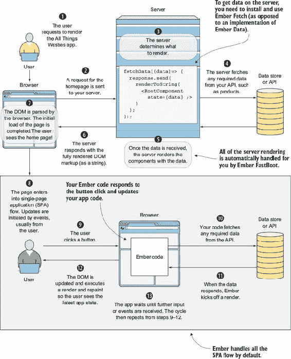

要跟上进度，请查看 GitHub 仓库中的 ember-starter 分支（`git checkout ember-starter`）。要运行应用程序，你需要切换到 Ember 目录（ember-universal），安装 npm 包，并使用 Ember CLI 运行应用程序。图 12.4 展示了运行 Ember 的输出：

```
$ cd ember-universal
$ npm install
$ ember serve
```

##### 运行 `ember serve` 来启动应用程序。

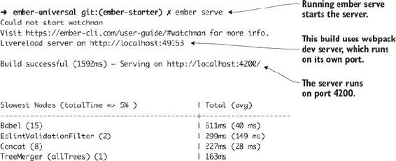

Ember 有一个名为 Ember CLI 的工具，它让你可以快速开始（我已经为你包括了它）。你通过调用 `ember serve` 使用 Ember CLI 运行应用程序。你还可以使用它来生成 Ember 应用程序中使用的绝大多数类型的文件。

| |
| --- |

**Ember 资源**

如果你想要了解更多关于使用 Ember 构建网络应用程序的信息，以下是一些帮助你入门的资源：

+   Ember 文档网站提供了一个入门教程，链接为 [`guides.emberjs.com/v2.14.0/tutorial/ember-cli/`](https://guides.emberjs.com/v2.14.0/tutorial/ember-cli/)。

+   你也可以查看快速入门指南，链接为 [`guides.emberjs.com/v2.14.0/getting-started/quick-start/`](https://guides.emberjs.com/v2.14.0/getting-started/quick-start/)。

+   你可以在 [`emberwatch.com/tutorials.html`](http://emberwatch.com/tutorials.html) 找到其他几个 Ember 教程。

+   服务器渲染的 Ember 指南位于 [`ember-fastboot.com/quickstart`](https://ember-fastboot.com/quickstart)。

| |
| --- |

应用程序将在 http://localhost:4200/ 上运行。请记住，同时也要在服务器文件夹中启动数据服务器。

接下来，我们将回顾 Ember 应用的结构。

#### 12.2.1. Ember 应用程序结构

Ember 应用程序使用约定而不是配置。要添加新文件，你需要在正确的目录类型中添加它。例如：

+   当创建一个新的组件时，你将其添加到 components 文件夹中。

+   如果你需要添加一个模型，你可以在 models 目录中添加它。

图 12.5 显示了 Ember 应用的应用程序目录。ember-universal 目录中还有其他文件夹和文件，但您需要了解的是 图 12.5 中的内容，以开始学习。

##### 图 12.5\. Ember 应用程序中使用的应用程序目录和文件

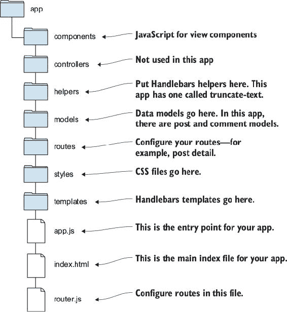

我已经设置了应用程序的主要部分，这样您就可以专注于同构部分。

接下来，我们将回顾路由和组件，以便您了解您正在处理的内容。

#### 12.2.2\. Ember 中的路由

首先，让我们看看应用程序拥有的两个顶级路由。一个是根路由或主页路由，另一个是帖子详情路由 (/post/[post.urlSlug])。所有数据获取也将发生在路由上。以下列表显示了存储库中提供的路由文件。

##### 列表 12.3\. 路由—ember-universal/app/router.js

```
import Ember from 'ember';                              *1*
import config from './config/environment';

const Router = Ember.Router.extend({                    *2*
  location: config.locationType,
  rootURL: config.rootURL
});

Router.map(function() {
  this.route('post-detail', { path: '/post/:id' });     *3*
});

export default Router;
```

+   ***1* 导入应用程序配置。**

+   ***2* 根据配置（这里与 ember-cli 设置的默认值相同）初始化路由器，包含根 URL 和位置类型。**

+   ***3* 为帖子详情页面添加第二个路由——包含名称和 URL 路径。**

除了路由器，应用程序还需要提供索引（主页）路由。以下列表显示了 index.js 中的代码。

##### 列表 12.4\. 索引路由（主页）—ember-universal/app/routes/index.js

```
import Ember from 'ember';                   *1*

export default Ember.Route.extend({          *2*
});
```

+   ***1* 导入 Ember。**

+   ***2* 在 Ember 中扩展路由对象。**

只要您遵循 Ember 命名约定并将文件放在正确的文件夹中，您就不需要做任何事情来使初始路由工作。帖子详情路由也看起来像这样。您可以在 ember-universal/app/routes/post-detail.js 中查看它。

接下来，让我们看看构成此应用程序的组件。

#### 12.2.3\. 组件

Ember 组件由两个文件组成：一个包含组件类的 JavaScript 文件和一个提供组件视图部分的 Handlebars 模板文件。


##### 信息

Handlebars 是一种 JavaScript 模板语言。您可以在 [`handlebarsjs.com`](http://handlebarsjs.com) 上了解更多信息。


在博客应用程序中，JavaScript 类不需要做太多。列表 12.5 显示了帖子控制器的外观。其他组件类在其自己的文件（comment-component、header-component、post-list）中看起来也像这样。所有这些代码都已经存储在存储库中。

##### 列表 12.5\. 帖子组件—ember-universal/app/components/post-component.js

```
import Ember from 'ember';                           *1*

export default Ember.Component.extend({              *2*
});
```

+   ***1* 导入 Ember。**

+   ***2* 扩展组件以创建您的帖子组件类。**

所有组件都已经为您在应用程序中创建好了。如果您想添加自己的组件，而不是手动添加组件，您可以使用 CLI 生成它们：

```
$ ember generate component [name-of-component]
```

每个组件都有自己的 Handlebars 模板文件。以下列表显示了帖子组件的 Handlebars 模板文件。您可以在 /templates 目录内找到应用程序的所有模板文件。

##### 列表 12.6\. 文章组件 Handlebars 模板—ember-universal/app/templates/components/post-component.hbs

```
<div class="item">
  <div class="ui tiny image">
                               *1*
  </div>
  <div class="content">
    <div class="header">{{post.title}}</div>             *2*
    <div class="description">
      <p>{{truncate-text post.body limit}}</p>           *3*
    </div>
  </div>
</div>
```

+   ***1* 在模板中放置文章图片。**

+   ***2* 在模板中放置文章标题**

+   ***3* 将文章的正文传递给辅助函数，该函数根据限制值（也传递了）截断文本。**

文章组件在应用程序的两个路由中使用。它在主页上显示博客片段，在文章详情页上完整显示。在列表 12.6 中的 Handlebars 模板中的`truncate`辅助函数使得组件可以在多个情况下重复使用。列表 12.7 显示了文章详情路由的模板。使用 Handlebars 模板语法，在路由上放置文章组件。数据通过模型传递给每个路由，因此您可以从模型中访问它。您将在下一节中设置数据获取。

##### 列表 12.7\. 文章详情路由模板—ember-universal/app/templates/post-detail.hbs

```
{{post-component post=model.post}}                         *1*
<div class="ui comments">
  <h3 class="ui dividing header">Comments</h3>             *2*
  {{#each model.comments as |comment|}}                    *3*
    {{comment-component comment=comment}}                  *4*
  {{/each}}                                                *5*
</div>
```

+   ***1* 将文章数据传递到组件中**

+   ***2* 为文章评论渲染一个分隔标题。**

+   ***3* 使用 Handlebars 辅助函数 each 遍历每个评论（例如，文章数据存储在模型上）。**

+   ***4* 为模型上返回的每个评论渲染一个评论组件。**

+   ***5* 关闭 each 辅助函数。**

所有路由都加载到根模板：application。此模板渲染标题和动态渲染路由的占位符。以下列表显示了应用程序的模板文件。

##### 列表 12.8\. 应用程序模板—ember-universal/app/templates/application.hbs

```
{{header-component}}                               *1*
<div class="ui main text container offset" >
  {{outlet}}                                       *2*
</div>
```

+   ***1* 将标题组件放入根模板中，这将显示在每一页上。**

+   ***2* 特殊的占位符路由知道将组件传递给子组件，自动处理。**

到现在为止，您应该对博客应用的代码有了很好的理解。接下来，我们将使 Ember 应用同构。

#### 12.2.4\. 实现同构 Ember

现在让我们设置这个应用的两个部分，这将使其成为同构的。图 12.6 显示了当浏览器中禁用 JavaScript 时，本节结束时您应该看到的内容。

##### 图 12.6\. 添加所有同构组件后的服务器渲染应用

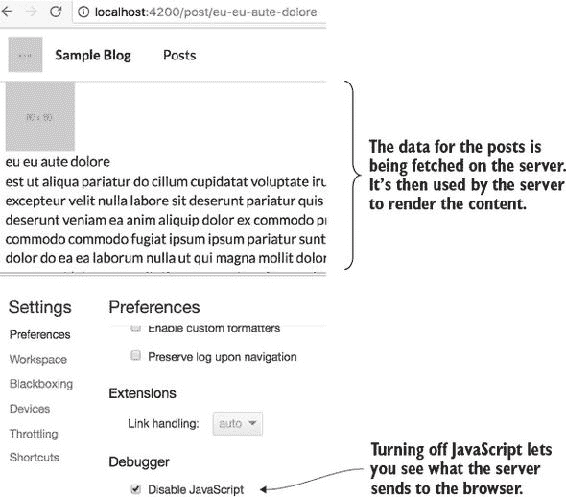

##### 第 1 步：Ember FastBoot

首先，安装 Ember CLI FastBoot 库。运行以下命令：

```
$ npm install –-save-dev ember-cli-fastboot
```

现在如果您运行服务器并在浏览器中禁用 JavaScript，您将看到渲染的标题。要禁用 JavaScript，请打开 Chrome DevTools 窗口右上角的选项菜单并点击设置。在调试器下，选择禁用 JavaScript 复选框。图 12.7 显示了这一操作。

##### 图 12.7\. 现在标题已在服务器上渲染。

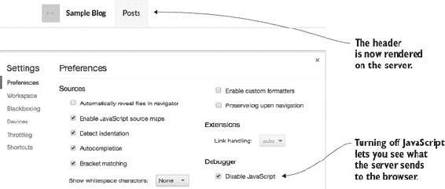

接下来，我们将介绍如何在应用中获取数据。

##### 第 2 步：同构数据获取

为了确保你可以在服务器和浏览器中获取应用的数据，你需要使用在两个环境中都工作的 fetch 实现。Ember 有一个你可以安装的库，称为 ember-fetch。现在就安装它吧：

```
$ npm install ember-fetch --save
```

安装完成后，你可以在主路由中添加一个 fetch 调用。以下列表显示了要添加到 routes/index.js 中的代码。

##### 列表 12.9\. 索引路由（主页）—ember-universal/app/routes/index.js

```
import Ember from 'ember';
import fetch from 'ember-fetch/ajax';                       *1*

export default Ember.Route.extend({
  model() {
    return fetch('http://localhost:3535/posts')             *2*
      .then((response) => {
        return response;                                    *3*
      });
  }
});
```

+   ***1* 包含 ember-fetch 的 Ajax 模块。**

+   ***2* 从 posts 端点获取帖子。**

+   ***3* 直接返回响应——数组中的 JSON 响应（视图期望数据以这种格式）。**

导航到主页，你会看到博客文章的列表。为了同时让帖子详情页的数据工作，将以下列表中的代码添加到帖子详情路由中。

##### 列表 12.10\. 帖子详情路由—ember-universal/app/routes/post-detail.js

```
import Ember from 'ember';
import fetch from 'ember-fetch/ajax';

export default Ember.Route.extend({
  model(params) {                                                 *1*
    return fetch(
     `http://localhost:3535/post/${params.id}`)                 *2*
      .then((response) => {
        return fetch(`http://localhost:3535/post/${response.id}/comments`)
          .then((comments) => {                                   *3*
            return {
              post: response,                                     *4*
              comments: comments                                  *4*
            };
          });
      });
  }
});
```

+   ***1* 如果路由将有参数，这些参数将被传递到模型函数中。**

+   ***2* 使用 URL（URL slug）中的 ID 调用单个帖子端点。**

+   ***3* 帖子返回后，根据 ID 获取相关评论。**

+   ***4* 将帖子和评论数组发送到视图。**

将 Ember 应用转换为同构应用就这么简单！（如果你想看到完整的代码，它位于 ember-complete 分支。）图 12.8 展示了 Ember 同构渲染期间 DOM 中发生的情况。

##### 图 12.8\. Ember 完全替换了 DOM，但对用户来说却不可察觉。

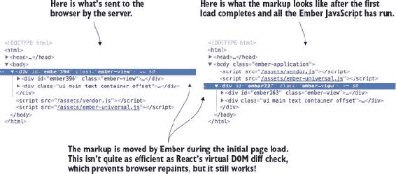

最后，让我们回顾一下使用 Ember 进行同构渲染相关的优势和成本。

#### 12.2.5\. 同构 Ember 的优缺点

正如你在本节中看到的，设置 Ember 应用进行服务器渲染几乎和设置 Ember 应用一样简单。这意味着使用同构 Ember 启动和运行相对较快。一个额外的优点是 Ember CLI 允许你自动生成应用的基本部分。以下列表评估了使用 Ember 构建同构应用的优势和劣势。

**优点**

+   设置应用的同构部分非常简单。安装两个额外的库（ember-cli-fastboot 和 ember-fetch）。

+   Ember CLI（连同 FastBoot）使得从安装到运行应用之间的时间非常短。

+   约定优于配置使得连接事物变得容易，并且对各个规模大小的团队都有益。

+   Ember FastBoot 已经支持了大多数同构用例，包括不同环境中的 cookies 和基于路由的动态元标签。整体文档和用户指南做得很好（[`ember-fastboot.com/docs/user-guide`](https://ember-fastboot.com/docs/user-guide)）。

**缺点**

+   在首次渲染时替换 DOM 而不是计算是否需要 DOM 更新，这会给初始渲染增加额外的成本。

+   Ember 对约定的关注并不适合每个人，可能不符合你的需求。

+   掌握 Ember 需要花费时间。对于刚接触这个框架的开发者来说，许多事情都可能显得神奇。

+   目前关于 FastBoot 的最佳实践没有 Ember Data 集成，这意味着你将失去 Ember 框架的一个强大功能。

### 12.3. 通用角动量

在过去几年中，Angular 经历了相当大的演变。尽管 Angular.js（Angular 1）的大部分核心概念都得以保留，但它已经演变，吸收了在其他库和框架中变得流行的概念。幸运的是，这包括对服务器端渲染的支持。Angular 社区决定将他们的实现称为 *通用* 而不是同构。

| |
| --- |

##### 注意

正式来说，Angular 现在将 Angular 1 称为 *Angular.js*，将更新的版本称为 *Angular*。这使得主要版本更新更加平滑和连续，你无需记住是否应该使用 Angular 2 或 Angular 4。仓库中的代码使用 Angular 版本 4.0.0。

| |
| --- |

在本节中，我将带你通过设置通用 Angular 应用程序。如果你是 Angular 新手，我强烈建议你首先熟悉 Angular 基础知识。Angular 文档网站有一个高质量的教程，网址为 [`angular.io/tutorial`](https://angular.io/tutorial)。如果你想深入了解 Angular，我推荐阅读 Jeremy Wilken（Manning，2018）的《Angular in Action》。最后，如果你想了解更多关于 Angular CLI 工具的信息，你可以查看其 GitHub 仓库 [`github.com/angular/angular-cli`](https://github.com/angular/angular-cli)。

| |
| --- |

**最佳拍档：TypeScript 和 Angular**

Angular 使用 TypeScript 编写，它是 JavaScript 的超集，引入了强制类型信息的能力。它可以与任何版本的 JavaScript 一起使用，因此你可以用它与任何 ES3（这不是一个打字错误）或更新的版本一起使用。

TypeScript 的基本价值在于强制变量限制在特定类型的值，例如：一个变量可能只能持有数字或字符串数组。JavaScript 有类型（不要让任何人告诉你不是这样！），但变量没有类型，所以你可以在任何变量上存储任何类型的值。这也催生了多种比较运算符，如 `==` 用于松散相等或 `===` 用于严格相等。

TypeScript 可以帮助在它们影响你的应用程序之前捕获许多简单的语法错误。有时你可以编写有效的 JavaScript，但现实世界表明，有效的语法并不总是意味着有效的行为。以下是一个例子：

```
var bill = 20;?
var   tip  = document.getElementById('tip').value;  //  Contains  '5'
console.log(bill + tip); // 205
```

这个片段展示了简单的小费计算器示例：你从输入元素中获取值，并将其添加到账单中，以获取总付款金额。但这里的问题是`tip`变量是一个字符串（因为它是一个文本输入）。将数字和字符串相加可能是新 JavaScript 开发者最常见的陷阱之一，但这种情况仍然可能发生在任何人身上！如果你使用 TypeScript 来强制类型检查，这段代码可以编写为在出现这种常见错误时发出警告：

```
var bill: number = 20;
var tip: number = document.getElementById('tip').value;
// 5, error!
var total: number = bill + tip; // error!
```

在这里，你使用 TypeScript 声明所有这些变量都必须各自持有数字值，通过使用`number`。这是一个简单的语法，位于 JavaScript 内部，用于告诉 TypeScript 变量应该持有的值类型。小费值将出错，因为它被分配了一个字符串，然后总金额将出错，因为它尝试将数字和字符串类型相加，这导致了一个字符串。

对于经验丰富的 JavaScript 开发者来说，这看起来可能是一个明显的错误，但你有多少次让新开发者参与你的代码库的开发？你有多少次重构你的代码？你能确保在继续维护应用程序时，你的应用程序仍在传递相同的值类型吗？没有 TypeScript，你在使用每个值之前都必须进行严格的比较检查。

许多开发者想知道为什么他们应该费心学习和使用 TypeScript。以下是我认为使用 TypeScript 的主要理由：

+   ***它使你的代码更清晰***—** 具有类型的变量更容易理解，因为其他开发者（或六个月后的你自己）不需要非常认真地思考变量应该是什么。

+   ***它使编辑器更智能***—** 当你在支持 TypeScript 的编辑器中使用 TypeScript 时，你的代码将获得自动的 IntelliSense 支持。随着你编写代码，编辑器可以建议已知的变量或函数，并告诉你它期望的值类型。

+   ***它在运行代码之前捕获错误***—** TypeScript 会在你在浏览器中运行代码之前捕获语法错误，这有助于减少你编写无效代码时的反馈循环。

+   ***它是完全可选的***—** 当你需要时可以使用类型，并在不需要的地方选择性地省略它。

希望您已经认可了 TypeScript 的价值。如果不认可，请不要担心——我不会评判。但本书将在示例中使用它，因为它将有助于提供更多的清晰度，并进一步展示 TypeScript 的强大功能。随着我们在示例中使用功能，我将尝试提供对 TypeScript 功能和功能的额外见解。但您始终可以在[www.typescriptlang.org/docs/tutorial.html](http://www.typescriptlang.org/docs/tutorial.html)上学习所有需要知道的内容。即使您选择不使用 TypeScript 在您的应用程序中进行类型检查，您也可以使用 TypeScript 来编译您的应用程序。因为 Angular CLI 已经内部使用 TypeScript，您可能在使用它时甚至都不知道。如果您决定构建自己的构建工具，TypeScript 仍然是一个值得考虑的编译器选项。

| |
| --- |

图 12.9 显示了您在之前章节中看到的同构应用程序图。我已经指出了当使用 Angular 构建同构应用程序时必须自己实现的各个部分。Angular 为您处理流程的一些部分。例如，如果您正确处理服务器初始化，数据获取将自动工作，但您仍然需要配置浏览器入口点和服务器入口点。

##### 图 12.9。Angular 中的通用流程

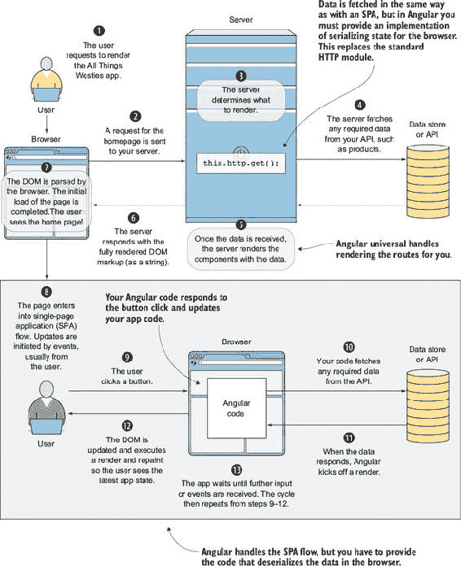

#### 12.3.1. 构建块：组件

我已经为您设置了应用程序结构的大部分，因此您可以专注于学习如何使 Angular 成为通用。在本节中，我将简要地为您介绍此代码的结构。

本节代码可以在 angular-starter 分支中找到，您可以通过运行`git checkout angular-starter`来切换到它。您还需要切换到 angular2 文件夹并运行`npm install`。请注意，此时这是一个单页应用程序（SPA）。您可以通过在终端中执行`npm start`命令来运行它。应用程序将在 http://localhost:4100 上运行。

首先，让我们回顾一下 app 中已有的文件结构。图 12.10 显示了主要文件夹和文件。

##### 图 12.10。构成 SPA 的应用文件夹和文件。它还包括用于通用状态传输和数据获取的辅助模块。

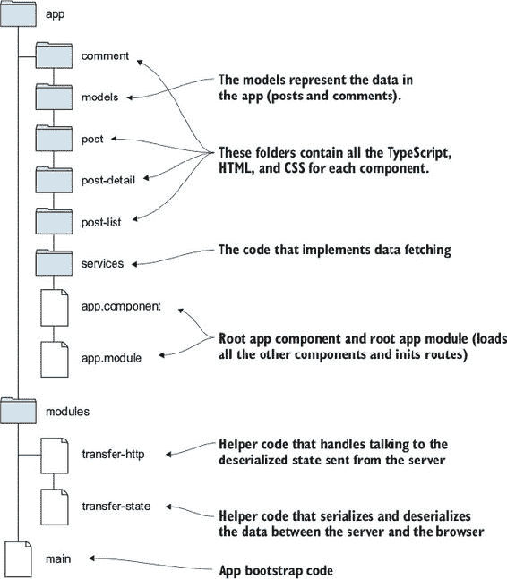

每个组件由三个文件组成：包含组件定义的 TypeScript 文件、组件 CSS 文件以及提供组件模板的 HTML 文件。应用程序组件包含 app.component.ts、app.component.css 和 app.component.html。Angular 应用程序中的所有组件都反映了 Ember 应用程序中的组件，但它们被植入 Angular 模式。

目前，应用程序流程是这样的：

> **1**. 用户导航到页面，index.html 加载 webpack 捆绑的文件。这执行了从应用程序入口点（main.ts）的代码，该代码启动应用程序。
> 
> **2**.  此应用有一个模块（AppModule），当应用启动时加载。
> 
> **3**.  AppModule 包含所有组件依赖项。这些依赖项现在已加载，并且当前路由正在渲染。

接下来，你想要添加服务器渲染库和逻辑。

#### 12.3.2\. 转换为通用：依赖项

要使服务器端渲染工作，首先你需要安装依赖项。首先需要添加的是库：

```
$ npm install --save @angular/platform-server
```

要运行通用 Angular，你还需要提供一个状态传输模块，因为这个模块没有为你提供。你还需要提供一个与这个状态传输模块兼容的 HTTP 实现。一些包可以帮助你完成这项工作，但当前我发现最好的实现来自一个通用示例仓库：[`github.com/FrozenPandaz/ng-universal-demo`](https://github.com/FrozenPandaz/ng-universal-demo)。代码可以在 angular2/src/modules 文件夹中找到，因为它已经包含在仓库中。

代码由两个模块组成：transfer-state 和 transfer-http。Transfer State 是一个处理序列化和反序列化 JSON 的模块。Transfer HTTP 是一个在尝试获取请求的数据之前从 Transfer State 模块中查找应用状态的模块。它自动使用从你的请求中推断出的键，所以你可以像使用常规 Angular HTTP 模块一样使用 Transfer HTTP 模块。

#### 12.3.3\. 转换为通用：服务器和浏览器代码

将应用转换为通用应用的下一步是创建两个入口点，而不是当前通过 AppModule 实现的单个入口点。首先，你应该创建浏览器入口点。以下列表显示了需要在 browser.module.ts 文件中放入的代码。

##### 列表 12.11\. 浏览器模块—angular2/src/browser.module.ts

```
import { BrowserModule } from '@angular/platform-browser';            *1*
import { NgModule } from '@angular/core';                             *1*
import { AppComponent } from './app/app.component';                   *2*
import { AppModule } from './app/app.module';                         *3*
import { BrowserTransferStateModule } from './modules/
     transfer-state/browser-transfer-state.module';
     //                                                               *4*

@NgModule({
  imports: [
    BrowserModule.withServerTransition({                              *5*
      appId: 'ng-universal-example'
    }),
    BrowserTransferStateModule,                                       *4*
    AppModule
  ],
  providers: [],
  bootstrap: [AppComponent]                                           *2*
})
export class AppBrowserModule { }
```

+   ***1* 导入 Angular 依赖项。**

+   ***2* 导入 app 组件，这是传递给 bootstrap 数组的根组件。**

+   ***3* 导入 AppModule 以确保依赖项正确设置以进行依赖注入。**

+   ***4* 导入 browser transfer state helper 模块。**

+   ***5* 使用服务器转换初始化 browserModule。**

当你初始化`browserModule`时，确保`appId`属性与服务器模块中的内容匹配（你将在列表 12.13 中添加此内容）。

现在，你需要在 main.ts 中加载浏览器入口，这将启动应用。这只是一个更改当前导入的模块（AppModule）。以下列表显示了需要替换的代码。

##### 列表 12.12\. 更新 main.ts 文件—angular2/src/main.ts

```
// remove this line: import { AppModule } from './app/app.module';
import { AppBrowserModule } from './browser.module';                  *1*

platformBrowserDynamic().bootstrapModule(AppBrowserModule);           *2*
```

+   ***1* 导入 browser 模块而不是 app.module。**

+   ***2* 使用 AppBrowserModule 启动应用。**

接下来，你需要创建一个服务器入口模块。这将与你的浏览器模块类似，但会设置注入服务器状态。以下列表显示了使用 app.server.module.ts 文件需要添加的内容。

##### 列表 12.13\. 服务器入口模块—angular2/src/app.server.module.ts

```
import { NgModule, APP_BOOTSTRAP_LISTENER, ApplicationRef } from '@angular/
     core';                                                                *1*
import 'rxjs/Rx';                                                          *1*
import { BrowserModule } from '@angular/platform-browser';                 *1*
import { ServerModule } from '@angular/platform-server';                   *1*
import {
  ServerTransferStateModule
  } from
 './modules/transfer-state/server-transfer-state.module';                *2*
import {
  TransferState
} from './modules/transfer-state/transfer-state';                          *3*

import { AppComponent } from './app/app.component';                        *4*
import { AppModule } from './app/app.module';                              *4*

export function onBootstrap(appRef:
     ApplicationRef, transferState: TransferState) {
  return () => {
    appRef.isStable
      .filter(stable => stable)
      .first()
      .subscribe(() => {
        transferState.inject();                                            *3*
      });
  };
}

@NgModule({
  providers: [
    {
      provide: APP_BOOTSTRAP_LISTENER,
      useFactory: onBootstrap,
      multi: true,
      deps: [
        ApplicationRef,
        TransferState
      ]
    }
  ],
  imports: [
    ServerModule,
    BrowserModule.withServerTransition({                                   *5*
      appId: 'ng-universal-example'
    }),
    ServerTransferStateModule,                                             *2*
    AppModule                                                              *4*
  ],
  bootstrap: [
    AppComponent
  ]
})
export class AppServerModule {}
```

+   ***1* 导入 Angular 和相关依赖项。**

+   ***2* 包含 ServerTransferState-Module，它实现了应用程序状态的服务器版本。**

+   ***3* 包含 TransferState 模块，这样你就可以在应用程序启动后将其注入到其中。**

+   ***4* 服务器模块需要导入根 AppModule 和组件。**

+   ***5* 设置服务器过渡 appId 以匹配你在浏览器模块文件中添加的 appId。**

最后，你需要添加一个服务器配置文件，该文件将处理传入的路由，然后加载 Angular 并渲染它。以下列表显示了需要添加到 main.server.ts 文件中的代码。

##### 列表 12.14\. Node.js 服务器—main.server.ts

```
import 'reflect-metadata';
import 'zone.js/dist/zone-node';
import { platformServer, renderModuleFactory } from '@angular/platform-server';
import { enableProdMode } from '@angular/core';
import {
  AppServerModuleNgFactory
} from './app.server.module.ngfactory';                               *1*
import * as express from 'express';
import { readFileSync } from 'fs';
import { join } from 'path';

const PORT = 4000;

enableProdMode();

const app = express();

const template = readFileSync(join(__dirname, '..', 'dist',
     'index.html')).toString();

app.engine('html', (_, options, callback) => {                        *2*
  const opts = { document: template, url: options.req.url };

  renderModuleFactory(AppServerModuleNgFactory, opts)                 *1*
    .then(html => callback(null, html));
});

app.set('view engine', 'html');                                       *3*
app.set('views', 'src');

app.get('*.*', express.static(join(__dirname, '..', 'dist')));

app.get('*', (req, res) => {
  res.render('index', { req });                                       *4*
});

app.listen(PORT, () => {
  console.log(`listening on http://localhost:${PORT}!`);
});
```

+   ***1* 模块工厂传递给渲染函数，以便 Angular 可以正确处理路由。**

+   ***2* 设置 HTML 渲染引擎。**

+   ***3* 确保视图引擎指向 HTML。**

+   ***4* 当接收到路由时，调用 res.render。**

到目前为止，你可以成功运行代码。你使用与 SPA 版本不同的服务器命令。此命令构建并启动服务器和浏览器代码：

```
$ npm run start-isomorphic
```

到目前为止，应用程序已设置但尚未有数据。服务器将加载，你将看到应用程序标题但没有内容。下一节将介绍数据获取，这是加载完整内容所需的。

#### 12.3.4\. 在通用模式下获取数据

为了成功获取数据并将其传递到浏览器，你还需要在获取数据的服务的中使用 Transfer HTTP 库。以下列表显示了如何将模块导入到 AppModule 中。

##### 列表 12.15\. 带有 Transfer HTTP 的 AppModule—angular2/src/app/app.module.ts

```
//...more imports
// remove { Http } import
import { TransferHttpModule } from '../modules/transfer-http/
     transfer-http.module';                                    *1*
//...more imports

@NgModule({
  declarations: [],
  imports: [
    // remove HttpModule and BrowserModule
    TransferHttpModule,                                        *1*
    CommonModule,
    RouterModule.forRoot([])
  ],
  providers: [
],
  bootstrap: [AppComponent]
})
export class AppModule { }
```

+   ***1* 导入模块并将其添加到 Angular 导入中——确保移除旧的 HTTP 模块和 Browser 模块。**

现在你已经将模块包含到 AppModule 中，你可以在服务中导入 TransferHttp 库。以下列表显示了如何更新帖子服务。

##### 列表 12.16\. 更新帖子服务—angular2/src/app/services/posts.service.ts

```
import { Injectable } from '@angular/core';
// remove the Http import
import {
  TransferHttp
} from '../../modules/transfer-http/transfer-http';       *1*

const service = 'http://localhost:3535'

@Injectable()
export class PostsService {

  constructor(private http: TransferHttp) {}

  getPosts(): any {
    return this.http.get(`${service}/posts`);
  }

  getPostByUrlSlug(urlSlug): any {
    return this.http.get(`${service}/post/${urlSlug}`);
  }
}
```

+   ***1* 将 Http 导入更改为 TransferHttp 导入，然后在构造函数中使用它而不是 Http。**

你还需要在评论服务中进行相同的更新。以下列表显示了在评论服务文件中需要更改的内容。

##### 列表 12.17\. 更新评论服务—angular2/src/app/services/comments.service.ts

```
import { Injectable } from '@angular/core';
import {
   TransferHttp
} from '../../modules/transfer-http/transfer-http';                *1*

const service = 'http://localhost:3535'

@Injectable()
export class CommentsService {

  constructor(private http: TransferHttp) {}                       *1*

  getCommentsForPost(postId): any {
    return this.http.get(`${service}/post/${postId}/comments`);
  }
}
```

+   ***1* 将 Http 导入更改为 TransferHttp 导入，然后在构造函数中使用它而不是 Http。**

到目前为止，完整的通用流程正在运行。你可以通过相同的练习进行 Ember：通过 Chrome DevTools 禁用浏览器中的 JavaScript 并观察加载的 HTML。你还可以在 angular-complete 分支中获取完整的代码。

#### 12.3.5\. 通用 Angular 的优缺点

使用通用 Angular 有以下优缺点：

**优点**

+   使用依赖注入，这允许你根据需要交换依赖项

+   访问 Angular CLI，它允许你生成组件

+   更少的魔法——你可以控制服务器和数据活化

**缺点**

+   需要实现状态转移逻辑

+   需要设置自己的服务器

+   需要设置自己的浏览器和服务器入口点

### 12.4\. Next.js：React 同构框架

如果您正在寻找一个使用 React 的全栈式解决方案，Next.js 是一个强大的选择。默认情况下，Next.js 使用一种约定驱动的构建 React 应用的方法。即使您决定在生产环境中不使用 Next.js，您也可能发现它是一个构建同构原型或概念验证（*pocs*）的好工具。它可以帮助您向团队或老板推销同构的想法。

要运行 Next.js 示例，查看主分支（`git checkout master`）。切换到 nextjs 目录，安装 Node.js 包，然后运行 webpack 开发服务器：

```
$ cd nextjs
$ npm install
$ npm run dev
```

图 12.11 展示了 Next.js 实现的同构流程。Next.js 默认是服务器渲染的，所以您不需要进行任何配置！

##### 图 12.11\. Next.js 的同构流程

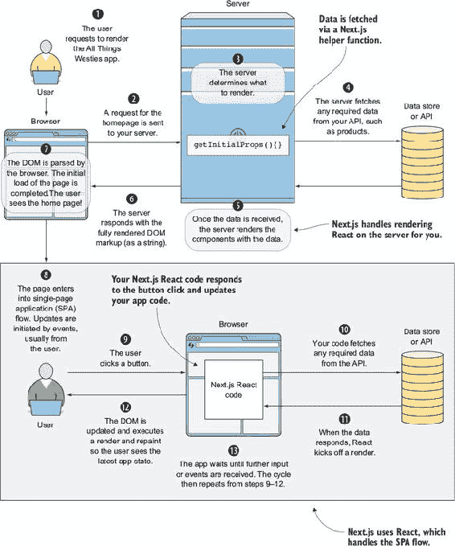

现在我们来浏览 Next.js 应用。我们将回顾使其开箱即用同构的部分。

#### 12.4.1\. Next.js 结构

Next.js 使用了一种有偏见的 React 实现，它自带了许多标准功能（代码拆分、内置路由、服务器渲染、Webpack 开发服务器等）。Next.js 还提供了一套用于在生产环境中构建和提供应用的脚本。

Next.js 项目由组件和页面组成。*页面*是获取数据和组合子组件的容器组件。您可以轻松添加如 Redux 之类的组件。标准 React 应用和 Next.js 之间的一大区别是，在 Next.js 中，他们实现了自己的路由器。图 12.12 显示了此简单应用的文件夹结构。

##### 图 12.12\. 构成基本 Next.js 应用的文件夹和文件

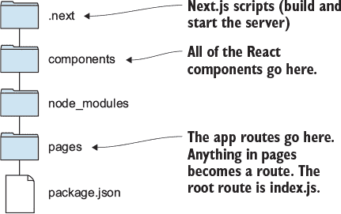

注意，为了向应用添加路由，您需要在 pages 目录中创建一个新的 React 组件。文件名将成为路由。此应用中还有一个使用查询参数来指示博客文章 URL 别名的详细页面路由。

Next.js 默认不支持动态路由。要添加动态路由，您必须添加自己的服务器文件。这很简单，但确实需要额外的工作。这里我不会演示这个，但您可以在[`github.com/zeit/next.js/#custom-server-and-routing`](https://github.com/zeit/next.js/#custom-server-and-routing)找到相关文档。

#### 12.4.2\. Next.js 初始属性

在很大程度上，Next.js 是一个标准的 React 应用，但它提供了一个异步助手`getInitialProps`，它会为您获取组件的数据。这个方法的优点是 Next.js 框架会自动在服务器上处理预取，知道在浏览器上不会再次运行它，并且会在单应用流程中导航到的路由上运行它。

下面的列表显示了应用程序索引路由中的`getInitialProps`。Next.js 应用程序完全为你构建——你不需要添加此代码。

##### 列表 12.18\. 索引路由数据获取—nextjs/pages/index.js

```
IndexPage.getInitialProps = async ({ req }) => {                *1*
  let res, json;

  try {
    res = await fetch('http://localhost:3535/posts');           *2*
    json = await res.json()                                     *3*
  } catch (e) {
    console.log("e", e);                                        *4*
  }
  return { posts: json || [] }                                  *5*
}
```

+   ***1* 将函数定义为异步函数——Next.js Babel 预设已经配置为使用 ES7 功能。**

+   ***2* 添加等待函数以获取帖子列表。**

+   ***3* 添加等待函数以获取 JSON 响应。**

+   ***4* 如果有错误，记录它——async await 不支持 promise 错误捕获，因此使用 try/catch 块。**

+   ***5* 返回帖子结果。**

#### 12.4.3\. Next.js 的优缺点

总体而言，如果你想要快速尝试或有一个只有几个页面的简单应用程序，Next.js 提供了一个很好的解决方案。对于具有动态路由的复杂应用程序，Next.js 需要更多的时间投资才能启动。

**优点**

+   如果不需要动态路由，则开箱即用。

+   提供所有开发构建脚本和对生产构建的支持。

+   基于约定的路由系统。

+   提供了同构数据获取实现。你只需添加从后端获取数据的代码。

**缺点**

+   更复杂的应用程序需要额外的设置工作来设置 Redux 和动态路由。

+   框架的一些部分是自定义的，例如路由器，这意味着你不得不学习另一个路由器。

+   最初是为较小的静态网站构建的。

### 12.5\. 比较选项

你已经看到了使用流行的 JavaScript 框架构建同构应用程序的几种方法。表 12.1 比较了这三个框架。

##### 表 12.1\. Ember、Angular 和 Next.js 的比较

|   | Ember | Angular | Next.js |
| --- | --- | --- | --- |
| 框架的学习曲线 | 中等：快速入门，但高级知识的学习曲线陡峭。 | 中等：需要牢固掌握 Angular 的 MVC 实现。 | 如果你知道 React，则简单：需要熟悉框架约定。 |
| 容易进入生产环境吗？ | 是 | 比其他两种选项需要更多步骤 | 是 |
| 默认情况下是否支持同构代码？ | 是的，但需要非标准的 Ember 数据获取 | 需要添加代码模块来覆盖默认的 HTTP 行为 | 是 |
| 应用程序大小？ | 任何 | 任何 | 适用于小型或静态应用程序 |
| 浏览器应用程序的初始加载方法（服务器和浏览器之间的交接） | 完全替换 | 计算替换 | 使用 React 的虚拟 DOM，无替换或 DOM 更新 |

### 摘要

本章概述了三种实现同构（或通用）应用程序的方法。你学习了 Ember FastBoot、通用 Angular 和 Next.js。每个都提供了适用于你情况的良好实现。

+   使用 Ember 和 Ember FastBoot 构建基于约定的应用程序。Ember 为你提供了大部分的实现，因此快速启动应用程序。

+   使用 Angular 进行应用程序的服务端渲染。Angular 需要更多的代码来正确地在服务器和浏览器之间进行状态传输。

+   Next.js 是一个 React 框架，它默认支持同构，适用于没有动态页面的应用程序。

## 第十三章\. 从哪里开始

*本章涵盖*

+   额外的同构工具和框架

+   你想要获得的技能，以便成为构建同构应用程序的专家

+   在哪里了解更多关于相关重点领域，如 GraphQL、搜索引擎优化（SEO）和性能

在整本书中，你学习了关于许多工具、库和框架的知识。你接触到了构建同构应用程序的最佳实践。最重要的是，你习惯于以同构的方式思考：你可以导航服务器/浏览器交接，并且熟悉使这成为可能的技术。你还接触到了其他技术，如 Ember 和 Angular 如何实现服务器端渲染。你还看到了一个全功能的同构框架（Next.js）。

现在是时候回顾一些资源，以了解更多关于同构应用程序、本书中介绍的各种技术，以及你可能需要构建实用、真实世界应用程序的相关主题。

### 13.1\. 额外的工具和框架

这本书涵盖了今天在 Web 开发中使用的许多最受欢迎的库。但如果你作为一名 Web 开发者已经工作了甚至一个月，你就会知道 JavaScript 社区总是在不断演变想法，而且有用的主题远远超过一本书所能涵盖的范围。本节提供了 Webpack Dev Server 的概述，建议你到哪里去了解更多关于实现它的信息，并介绍了额外的同构框架。Webpack Dev Server 是一个工具，它使得构建 webpack 配置的应用程序的开发环境更容易使用。

#### 13.1.1\. Webpack Dev Server

Webpack Dev Server 是 webpack 提供的发展环境。它启用了热模块替换，它接受更新的构建并自动替换运行中的应用程序中已更改的部分。以下是它的工作原理的概述：

> **1**.  启动第一个构建并输出初始文件，由开发服务器提供。
> 
> **2**.  启用监视器。
> 
> **3**.  监视器输出触发构建，在开发服务器上输出新版本。
> 
> **4**.  使用热模块替换来更新浏览器中运行的代码。

这在开发环境中变得非常有帮助，并且显著加快了你的编译和查看更改的能力。我强烈建议为你的所有 webpack 项目设置它。

要了解 Webpack Dev Server，你可以访问 Webpack 的文档：[`webpack.js.org/guides/hot-module-replacement/`](https://webpack.js.org/guides/hot-module-replacement/)。你必须为 React 设置一些特定的事情。热模块替换指南的 URL 包含链接（参见文档网站 [`webpack.js.org/guides/hot-module-replacement/#other-code-and-frameworks`](https://webpack.js.org/guides/hot-module-replacement/#other-code-and-frameworks) 的其他代码和框架部分）。

在同构环境中实现这一点并不简单——尤其是在使用前端 Node.js 服务器和 webpack 打包（而不是也使用 webpack 构建你的 Node.js 服务器，我不推荐这样做）的情况下。Webpack Isomorphic Tools 可以帮助你开始这个过程：[`github.com/halt-hammerzeit/webpack-isomorphic-tools`](https://github.com/halt-hammerzeit/webpack-isomorphic-tools)。

#### 13.1.2. 同构框架

除了 Next.js，至少还有两个同构 React 框架值得一看（如果你想要使用预构建选项而不是自己构建）：

+   Walmart Labs Electrode ([www.electrode.io](http://www.electrode.io))

+   Redfin 的 React 服务器 ([`react-server.io`](https://react-server.io))

几乎每个新的 JavaScript 框架都提供了服务器端渲染的能力。无论你想尝试 Vue.js ([`vuejs.org`](https://vuejs.org))、Aurelia ([`github.com/AureliaUniversal/universal`](https://github.com/AureliaUniversal/universal)) 还是其他什么，它们很可能支持同构渲染。

### 13.2. 上线：基于同构技能构建

这本书为你提供了在多个领域的坚实基础，包括 React 架构和 Node.js 的服务器端渲染。尽管你在这些技能上已经有一个良好的开端，但这一节会告诉你如何找到更多资源来继续提高这些技能。

#### 13.2.1. React 最佳实践

如果你打算在生产环境中构建同构 React 应用，成为 React 架构方面的专家是你想要提高知识的一个领域。幸运的是，React 拥有一个强大的社区和许多资源：

+   GitHub 仓库，包含关于 React 的各种博客和资源链接 ([`mng.bz/XEXE`](http://mng.bz/XEXE))

+   Egghead.io 课程——有些是免费的，有些则需要订阅 ([`egghead.io/technologies/react`](https://egghead.io/technologies/react))。我是 Egghead 将课程拆分成微小可消费概念的忠实粉丝：

    +   React/Redux 技巧表 ([`egghead.io/react-redux-cheatsheets`](https://egghead.io/react-redux-cheatsheets))

    +   学习 React Router v4 ([`mng.bz/YHFN`](http://mng.bz/YHFN))

    +   为 React 应用添加国际化 ([`mng.bz/g5On`](http://mng.bz/g5On))

+   其他 React 书籍：

    +   由 Mark T. Thomas 著的 *React in Action* (Manning, 2017)

    +   由 Azat Mardan 著的 *React Quickly* (Manning, 2017)

    +   由 Marc Garreau 和 Will Faurot 著的 *Redux in Action* (Manning, 2018)

#### 13.2.2. 提升你的 Node.js 水平

如果你没有太多 Node.js 的经验，我建议通过以下方式提高你的 Node.js 技能：

+   了解 Node.js 的 I/O 模型 ([`nodejs.org/en/docs/guides/blocking-vs-non-blocking/`](https://nodejs.org/en/docs/guides/blocking-vs-non-blocking/) 和 [`mng.bz/NR1f`](http://mng.bz/NR1f))

+   使用 Node.js 构建简单的 REST API：

    +   Loopback 框架 ([`loopback.io/doc/en/lb3/Tutorials-and-examples.html`](https://loopback.io/doc/en/lb3/Tutorials-and-examples.html))

    +   使用 Node.js、Express、MongoDB、Mongoose 和 Postman 的教程 ([`mng.bz/1qSO`](http://mng.bz/1qSO))

+   学习如何强化 Node.js 以创建更安全的服务器：

    +   关于强化 Node.js 的博客文章 ([`blog.risingstack.com/node-js-security-checklist/`](https://blog.risingstack.com/node-js-security-checklist/))

    +   Express 关于安全性的文档 ([`expressjs.com/en/advanced/best-practice-security.html`](https://expressjs.com/en/advanced/best-practice-security.html))

为了练习，我建议构建一种类型的 CRUD 应用。构建这本书中的某些示例会很好——一个允许用户上传菜谱的应用程序将是一个很好的练习应用。构建一个聊天应用也是练习的另一种好方法，因为它涵盖了几个重要主题（REST API、WebSocket、安全性，因为它需要账户，等等）。

#### 13.2.3. 基础设施

由于同构应用程序始终会有一个服务器组件，因此熟练掌握构建工具和服务器管理将有助于你在运行生产应用程序时。此外，了解 CDN 并能够使用它们是任何网络开发者工具箱中的重要技能。这篇博客文章是一个很好的起点，介绍如何使用 Docker 和亚马逊网络服务（AWS）部署 React 应用程序：[`mng.bz/9Na2`](http://mng.bz/9Na2)。

这里是一份你需要开始的一般技能列表：

+   容器：Docker ([`docs.docker.com/get-started/`](https://docs.docker.com/get-started/))

+   CI 工具：CircleCI ([`circleci.com`](https://circleci.com)) 或 TravisCI ([`travis-ci.org`](https://travis-ci.org)) 是一个好的起点

+   云托管：AWS、Google、Heroku、Digital Ocean 以及更多

+   CDN 的良好解释 ([`mng.bz/k6qG`](http://mng.bz/k6qG))

+   有许多 CDN 提供商你可以查看：Amazon Cloud Front、CloudFlare、Fastly、Akamai

+   SSL/TLS ([`blog.talpor.com/2015/07/ssltls-certificates-beginners-tutorial/`](https://blog.talpor.com/2015/07/ssltls-certificates-beginners-tutorial/))

+   CORS ([`developer.mozilla.org/en-US/docs/Web/HTTP/Access_control_CORS`](https://developer.mozilla.org/en-US/docs/Web/HTTP/Access_control_CORS))

你可以练习这些技能的最好方法之一是在 AWS 上部署一个个人网站或练习应用。这将迫使你通过使用这里列出的几个工具的过程（例如，你可以使用 Docker 构建一个应用程序并将其部署到 AWS 的 Elastic Beanstalk 上）。

### 13.3\. 所有事情：数据、SEO 和性能

本书专注于网络开发的狭小领域。但在以下至少一个领域添加深入知识将提高你执行实际应用的能力（并使你更具可雇佣性！）。

#### 13.3.1\. 数据：使用 GraphQL 访问服务

随着应用生态系统的演变和微服务架构的普及，许多工程组织开始意识到 REST 架构的局限性。（如果你想了解更多关于这个问题的信息，我推荐观看 Netflix 的技术视频[`netflix.github.io/falcor/starter/why-falcor.html`](https://netflix.github.io/falcor/starter/why-falcor.html)）。

作为回应，Netflix 和 Facebook 都提出了解决方案。你可以将他们的实现——Falcor ([`netflix.github.io/falcor/`](https://netflix.github.io/falcor/)) 和 GraphQL ([`graphql.org/`](http://graphql.org/))——视为所有后端服务的客户端服务。两者都允许客户端应用请求视图所需的数据，而无需了解底层实现。

例如，假设我有一个聊天应用。在聊天过程中，该应用需要获取聊天数据和用户数据，这些数据可能位于 REST 应用的不同服务或端点上。这些框架允许你通过单个请求获取所有所需的数据。它们包含业务逻辑，指示从哪里获取数据，这样客户端应用就不需要这样做。

#### 13.3.2\. 搜索引擎优化

想要构建同构应用的一个主要原因是服务器端渲染你的应用页面以供搜索引擎爬虫使用。如果这是与你情况相关的理由，那么了解良好的 SEO 策略以及如何执行 SEO 的技术实现是必要的。

##### 理解 SEO 最佳实践

整本书和网站都致力于 SEO 策略。如果你是 SEO 的新手或想提高你的技能，各种工具和资源可以帮助你开始：

+   Moz 的 SEO 101 指南 ([`moz.com/beginners-guide-to-seo`](https://moz.com/beginners-guide-to-seo))

+   Moz，一个 SEO 跟踪工具，订阅 ([`moz.com`](https://moz.com))

+   Moz Blog ([`moz.com/blog`](https://moz.com/blog))

+   Google Webmasters Blog ([`webmasters.googleblog.com`](https://webmasters.googleblog.com))

+   Google 趋势 ([`trends.google.com/trends/`](https://trends.google.com/trends/))

+   SERPs 关键词搜索工具，订阅 ([`serps.com/tools/keyword-research/`](https://serps.com/tools/keyword-research/))

##### SEO 的技术实现

SEO 的更多技术方面涉及实施最佳实践和使用 Google 的跟踪工具来监控和改进 SEO。例如，构建网站地图也属于这一类别：

+   Google Search Console ([www.google.com/webmasters/tools/home](http://www.google.com/webmasters/tools/home))——在开始之前你必须验证你的网站属性。

+   Schema.org([`schema.org/docs/schemas.html`](http://schema.org/docs/schemas.html) 和 [`moz.com/learn/seo/schema-structured-data`](https://moz.com/learn/seo/schema-structured-data))

+   使用良好的标题实践([www.hobo-web.co.uk/headers/](http://www.hobo-web.co.uk/headers/))

+   内部链接([`moz.com/learn/seo/internal-link`](https://moz.com/learn/seo/internal-link))

+   网站地图([`moz.com/blog/xml-sitemaps`](https://moz.com/blog/xml-sitemaps))

#### 13.3.3. Web 性能

构建同构应用的其他原因之一是为用户提供良好的感知性能。但你仍然需要遵循关于 Web 性能的最佳实践。在这个领域有许多东西要学习。

了解性能的最佳方式是选择一个正在生产的应用并对其进行性能优化。在开始之前，确保你有方法来衡量你的 Web 应用性能（许多第三方工具可供选择——你可以尝试 Pingdom 或 New Relic）。

这里有一些关于如何提高 Web 性能的资源：

+   Google 的 Lighthouse 工具([`developers.google.com/web/tools/lighthouse/`](https://developers.google.com/web/tools/lighthouse/))

+   Web 性能最佳实践([www.manning.com/books/web-performance-in-action](http://www.manning.com/books/web-performance-in-action))

+   HTTP2([`http2.github.io/0`](https://http2.github.io/0))

+   服务工作者([`mng.bz/tLwh`](http://mng.bz/tLwh))

+   React 性能案例研究([`mng.bz/sNeU`](http://mng.bz/sNeU))

你还可以考虑研究 Preact([`github.com/developit/preact`](https://github.com/developit/preact))。这个库提供了一个“React 轻量级”实现，具有与你在 React 中学到的相同的虚拟 DOM 概念。如果你在寻找性能提升，这值得探索。

### 摘要

在本章中，我们回顾了几个有助于你继续提高 Web 应用技能并有助于你在生产环境中构建同构应用的专题：

+   去哪里寻找有关本书中主题的信息，包括 webpack 和更多同构框架。

+   提高你的 Node.js 和 React 技能的资源。

+   如果你构建同构 Web 应用，你可能希望在将来学习以下主题。这些包括数据服务，如 GraphQL、SEO 和基础设施技能。
