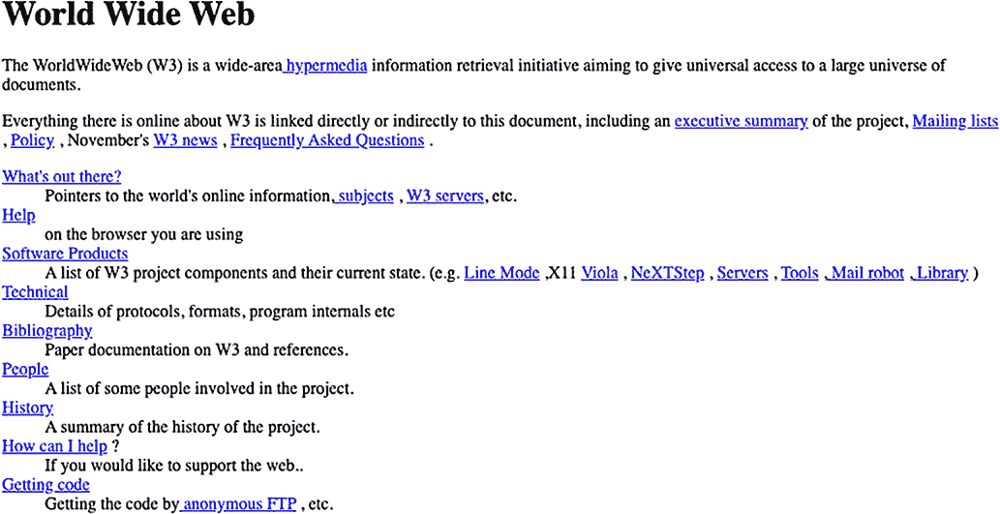
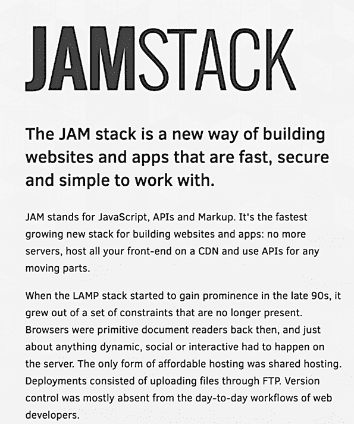
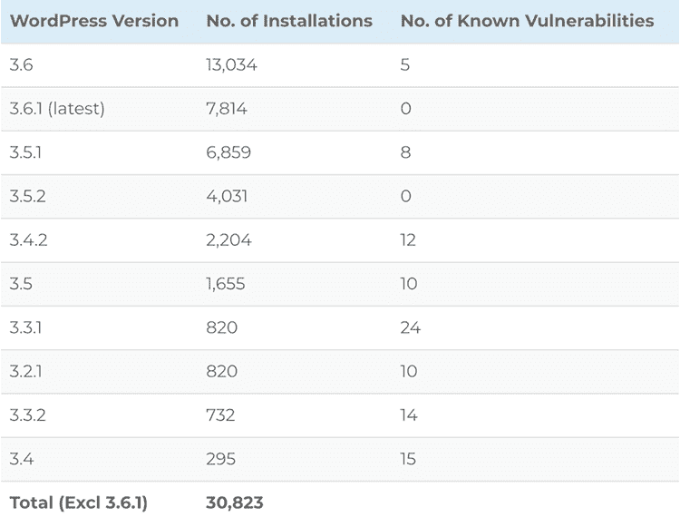
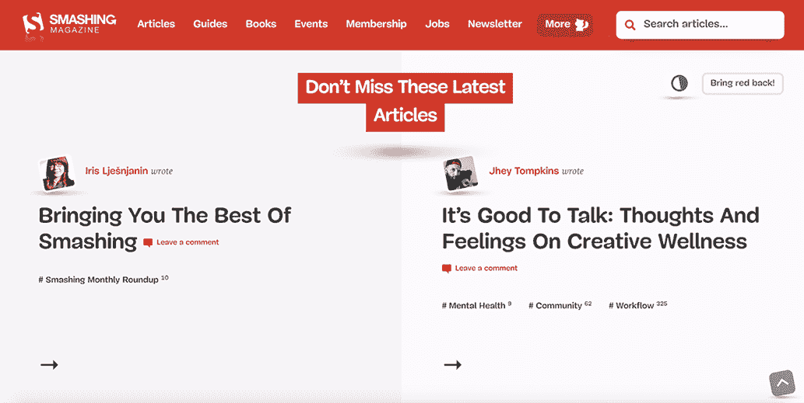
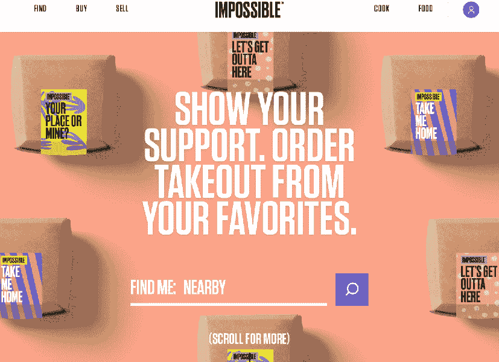
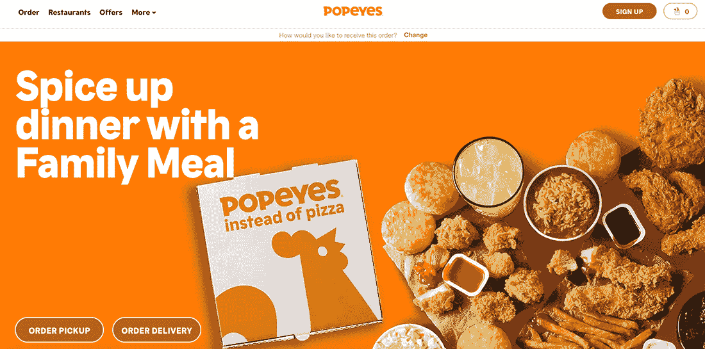
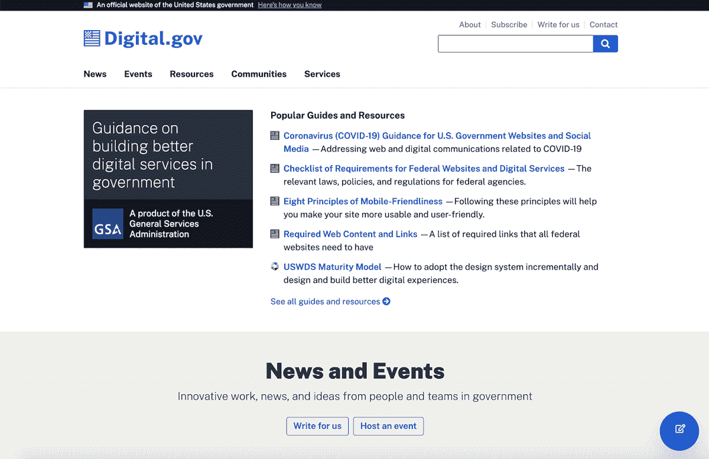

# 1 为什么选择 Jamstack？

本章涵盖

+   将 Jamstack 定义为网络应用的架构，而不是一种规定性的技术堆栈

+   Jamstack 是如何形成的，以应对变得笨拙、缓慢和不安全的动态网页开发

+   Jamstack 的好处，包括页面速度、安全性和成本

+   探索使用 Jamstack 构建的知名网站

随着近年来 Jamstack 的普及，对其的一种常见批评是它只是一个营销术语。事实是，他们是对的。正如我们将要探讨的，*Jamstack* 是一个被发明出来的术语，目的是为了“重新命名”许多开发者已经使用来构建网站的架构，因为现有的术语已经变得具有误导性。虽然称其为营销可能是一种公平的批评，但 Jamstack 仍然是一种正在迅速被网络开发者采用的构建网站的方式。

## 1.1 什么是 Jamstack？

定义 Jamstack 并非易事。没有 Jamstack 安装程序。没有一组预定义的工具你应该安装来构成 Jamstack。甚至没有与开发 Jamstack 应用程序相关的特定语言。（是的，JavaScript 扮演着核心角色，但也可以涉及任何数量的语言，包括 Ruby、Go、Python 或其他。）最终，有无数的工具和语言组合可以结合起来创建一个可以合法称为 Jamstack 的网站。

实际上，Jamstack 更像是一种创建网站的架构模式或方法论。尽管对此有很多持续的争论，但以下是我们定义的关键要素：

+   *Jamstack 网站主要基于静态资源构建*。Jamstack 网站始终以静态文件的形式部署。这意味着当用户请求页面时，它们不是由应用服务器动态生成的；相反，网站文件是在构建时生成的。对于 Jamstack 网站，浏览器中请求特定页面的每个用户都会收到相同的静态资源。然而，这并不意味着内容是静态的。事实上，现代 Jamstack 网站提供了多种页面内容的渲染选项，包括完全静态和服务器端渲染。

+   *Jamstack 网站使用静态站点生成器构建*。Jamstack 网站中的静态资源是通过静态站点生成器（SSG）生成的。在非常基础的层面上，一个 SSG 是一个工具，它将模板与内容结合起来。内容可以存储为 Markdown、YAML 或 JSON 文件，或者从 API 中提取。内容和模板结合在一起，动态生成网站的 HTML、CSS 和 JavaScript 资产。这与动态网络服务器（如 PHP）在每次用户请求时可能经历的过程类似，但，相反，这个过程的大部分是在网站部署之前在构建时发生的。

+   *Jamstack 网站利用 API*。区分 Jamstack 网站和简单静态网站的不同之处在于，尽管它由静态资源组成，但它可以非常动态。创建这种动态功能的第一关键要素是使用 API。这些 API 可以在运行时由浏览器客户端调用，甚至可以在构建时由静态网站生成器调用。

+   *Jamstack 网站使用 JavaScript 实现动态功能*。使 Jamstack 网站动态化的第二个关键要素是其能够在客户端通过 JavaScript 异步调用 API 和其他服务。JavaScript 允许静态资源通过文档对象模型 (DOM) 操作动态更改。客户端 JavaScript 驱动着诸如用户登录或购物车等功能。

显然，这个定义有很多灵活性，在我看来，这也是 Jamstack 吸引力的一部分。几乎肯定有一组 Jamstack 工具和服务可以满足你的项目需求以及你的语言、工具和部署偏好。

然而，这种灵活性是有代价的。没有一种单一的方法可以教授某人 Jamstack，众多选项可能会让新手的学习曲线变得有些陡峭。此外，在创建一个利用各种 API 和服务并使用 JavaScript 在客户端动态更新内容的网站时，可能存在额外的复杂性。

那么为什么选择 Jamstack 呢？Jamstack 的发展部分是为了解决许多人都觉得动态网页变得缓慢、昂贵且不安全的这些问题。为了更好地理解对 Jamstack 的需求，我们需要了解它是如何以及为什么演变的。

## 1.2 Jamstack 的简要历史

通过了解“Jamstack”这个术语最初是如何被创造出来的，我们可以更好地理解它是什么以及为什么它迅速获得了人气。这尤其正确，因为虽然 Jamstack 是一种利用许多最新技术趋势的现代架构，但在其他方面，它也回溯到了互联网刚刚发明时我们构建网页的方式。

最早的网页只是简单地部署到网络服务器上的 HTML。例如，如图 1.1 所示的第一个网站只是一个基本的静态网站。每个访问该网站的人都会收到相同的资源。

图 1.1 第一个网站是一个静态网站。它仍然可在 [`info.cern.ch/hypertext/WWW/TheProject.html`](http://info.cern.ch/hypertext/WWW/TheProject.html) 上找到。

随着网络需求的发展，支撑它的技术也发生了变化。Web 应用服务器和服务器端脚本语言，如 PHP 和 Ruby，允许网站动态生成内容。这使得每个用户都能收到在发送到个人浏览器之前在服务器上动态渲染的定制资源。今天，这通常被称为 *服务器端渲染* (SSR)。

让我们看看典型的服务器端渲染的 Web 应用在 2008 年是如何工作的（为什么是 2008 年？我稍后会解释）：

+   用户会从浏览器请求一个页面。

+   浏览器会击中 Web 应用服务器，该服务器会加载使用某种形式的脚本语言构建的请求页面。

+   脚本语言会调用数据库以获取用户信息、产品信息以及/或内容。

+   数据和脚本会被组合起来生成发送给用户的 HTML。

这个过程会在每个页面请求上重复。它允许从单个脚本文件中提供高度个性化和动态的内容，但这也带来了成本：

+   *性能*——这个过程中的每一部分都涉及小的性能成本，从应用服务器处理请求到数据库处理查询，再到生成最终的 HTML。由于这个过程在每次页面请求中都会为每个用户重复，成本可能会迅速增加，当 Web 应用服务器或数据库负载过重时，这些成本可能会进一步增加。

+   *安全性*——这些应用天生就留下了很大的攻击面。这包括像 Web 应用服务器、脚本语言或框架中的漏洞，数据库也可能通过 SQL 注入等直接攻击方法被攻击。

+   *可扩展性*——由于每个用户的每个请求都需要唯一的响应，因此随着使用量的增长，这些应用可能会变得昂贵且复杂。通常，服务器是在内部维护的，因此扩展意味着需要新的硬件，这意味着应用不能快速或容易地根据需求扩展。

当然，所有这些问题都有合适的资源可以解决，但在当时，网络中有很大一部分已经依赖于 SSR，以至于仅仅在简单的博客上查看文本内容就需要依赖整个服务器渲染架构，比如使用 WordPress，它的采用率正在迅速增长。

### 1.2.1 静态站点生成器的兴起

2008 年是后来被称为 Jamstack 的关键年份，因为那一年汤姆·普雷斯顿-沃纳发布了 Jekyll。当然，在 Jekyll 之前已经有了静态站点生成器，但 Jekyll 基于以下原则，这些原则帮助推动了大多数现代静态站点生成器的发展：

首先，我所有的写作都会存储在 Git 仓库中。这将确保我可以在舒适的编辑器和命令行中尝试不同的想法，探索各种帖子。我可以通过简单的部署脚本或 post-commit 钩子发布帖子。复杂性将保持在绝对最小，因此静态站点比需要持续维护的动态站点更可取。

—汤姆·普雷斯顿-沃纳（《像黑客一样博客”，[`mng.bz/ExJO`](http://mng.bz/ExJO)）

Jekyll 得到了广泛的应用，尤其是在作为 WordPress 的替代品用于博客方面。这种采用部分是由 GitHub 推动的，Preston-Werner 是 GitHub 的联合创始人兼首席执行官，当 GitHub Pages 在 2008 年添加了对 Jekyll 的支持时。

GitHub Pages 的支持还引入了一种新的持续开发工作流程，这种工作流程已经成为现代 JAMstack 的普遍做法。开发者不再需要运行本地构建并通过 FTP 推送生成的 HTML、CSS 和 JavaScript，他们只需将更改提交到 GitHub 仓库，Jekyll 构建就会为他们运行和部署。

Jekyll 之后，出现了一长串——我确实是指很长——遵循类似原则的静态站点生成器。截至本文撰写时，最全面的静态站点生成器列表[(https://staticsitegenerators.net/)](https://staticsitegenerators.net/)列出了 460 个，几乎使用了所有可用的编程语言（甚至包括 Swift，这是一种用于开发 iOS 原生应用的编程语言，也有静态站点生成器）。这些包括一些至今仍在广泛使用的流行选项，例如 2009 年的 Middleman（与 Jekyll 一样用 Ruby 编写），2010 年的 Pelican（用 Python 编写），以及 2013 年的 Hugo（用 Go 编写）。

### 1.2.2 从静态站点到 JAMstack

回到 2016 年，Netlify 已经是一家专注于为使用静态站点生成器等工具的开发者提供持续部署的快速成长型初创公司，但“静态站点”这个术语已经变得有问题。越来越多的工具和服务正在使使用静态站点生成器构建的网站具备动态功能。结果证明，静态站点在现实中可能远非静态。

为了解决这个问题，Netlify 的 Matt Biilmann 提出了一个新术语：*JAMstack*。这伴随着一个新的网站[jamstack.org](https://jamstack.org/)，其中包含了他对新术语的定义宣言。他发布的原始版本如图 1.2 所示。

图 1.2 2016 年推出的原始[jamstack.org](https://jamstack.org/)网站。

JAMstack 中的“JAM”代表以下含义：

+   *JavaScript*—这是这些网站大部分动态功能的关键。JavaScript 使得从 API 异步加载内容以及客户端上 HTML 的动态更新成为可能。

+   *APIs*—这些可以是来自第三方提供的现有 API，也可以是执行自定义业务逻辑的云函数。这些 API 为网站提供了所需的数据和业务逻辑。

+   *Markup*—这包括从包含网站内容的 Markdown 和 YAML/TOML 到静态站点生成器使用的模板语言（Liquid、Handlebars 等）的一切。静态站点生成器对于这一方面至关重要，即使它在 JAM 缩略语中的存在有些模糊——也许是有意为之。

在 Netlify 在生态系统中的影响力，以及该领域其他公司的合作下，希望这个术语能够帮助重新定义这些工具在 Web 开发者社区中的看法。这得到了 2017 年 5 月 JAMstack Conference（由 Netlify 领导的另一个倡议）的巨大帮助，该会议随后在世界各地产生了许多后续活动。

JAMstack 一直被批评为仅仅是一个营销术语。正如我们所看到的，这有一些真实性，但自从这个术语被引入以来，其采用率已经大幅增长，形成了一个以 JAMstack 开发者为目标的公司生态系统。

### 1.2.3 从 JAMstack 到 Jamstack

有一个最终、看似微小但最终重要的术语变化需要讨论。在 2020 年初，管理 jamstack.org 站点的 Netlify 团队开启了一场关于改变术语书写方式的讨论，从 JAMstack 变为 Jamstack。许多社区成员纷纷发表意见，并做出了改变的决定。截至本文撰写时，大多数公司和组织已经效仿，但这一用法尚未得到统一采用。

值得理解这种变化的背后原因。JAM 这个缩写已经显示出可能成为一些混淆的源头。首先，JavaScript、API 和标记看起来可以描述几乎任何为网络构建的网站；这个缩写并没有清楚地做出区分。其次，以 JavaScript 开头似乎给人一种印象，即 Jamstack 等同于 JavaScript 框架，并且仅基于 JavaScript 框架的静态站点生成工具。最后，JAMstack 实际上不是一个“堆栈”，因为在 LAMP 中并没有预设的工具组。实际上，它更像是一种架构，甚至是一种方法。

希望通过改变术语的字母大小写，可以降低对缩写和“堆栈”的强调，并使这个术语的使用寿命更长，就像人们仍然使用 Ajax 而不是 AJAX，尽管 XML 在很大程度上已经不再相关。从现在起，在这本书中，我们将坚持使用 Jamstack 的大写形式。

## 1.3 Jamstack 架构的优势

现在我们已经了解了 Jamstack 是如何从简单的静态站点发展到现代的复杂站点构建架构的，让我们来回答这个问题：“为什么你应该选择 Jamstack？”以下是一些关键的好处。

### 1.3.1 性能

有三个重要的方面需要理解 Jamstack 应用程序的性能：

+   *静态资源比动态资源加载更快*。不需要进行任何处理来将动态模板转换为 HTML、CSS 和 JavaScript，也不需要在运行时进行数据库调用。所有这些资源都是*预渲染的*，这是 Jamstack 社区中常用的一个术语，意味着大多数页面渲染是在构建时而不是运行时发生的。

+   *Jamstack 网站是从边缘提供的。* 由于资产是静态的，它们可以从 CDN 提供服务，这意味着每个最终用户都是从离他们最近的服务器获取网站资产。这结合了当发布新版本时立即缓存失效，以确保用户总是从 CDN 获取网站的最新版本。

+   *Jamstack 网站默认可扩展。* 当你的网站从 CDN 提供服务时，无需创建额外的服务器来应对高流量负载。此外，Jamstack 网站依赖于像云函数这样的服务，这些服务是为了扩展而构建的，用于动态处理和功能。

### 1.3.2 安全性

安全是一个难以做出广泛断言的话题，因为没有完全安全的选项。一个正确修补和维护的 WordPress 网站可以是安全的，但现实是，最近的数据显示“73.2% 的最受欢迎的 WordPress 安装存在漏洞” ([`mng.bz/7WRg`](https://www.wpwhitesecurity.com/statistics-70-percent-wordpress-installations-vulnerable/))。如图 1.3 所示，成千上万的顶级网站容易受到已知漏洞的攻击。

图 1.3 WordPress 网站可以是安全的，但 WP WhiteSecurity 的数据显示，Alexa 排名前位的网站中，WordPress 安装的版本很多仍然容易受到攻击，因为它们没有更新。然而，Jamstack 网站不需要这些类型的更新，因为资产是静态的 ([`mng.bz/7WRg`](https://shortener.manning.com/7WRg))。

这些问题并非仅限于 WordPress。传统网站有很多需要维护和修补的移动部件，无论内容管理系统和应用程序框架如何。例如，对于 WordPress 或 Drupal 网站，这些部件可能包括 PHP 网络服务器和 MySQL 数据库。对于 Django 网站，可能是 Python 和 PostgreSQL。

相比之下，Jamstack 网站受益于攻击面的大幅减少。没有

+   没有需要被破坏的 web 服务器

+   需要利用可能未修补的安全漏洞的 web 应用程序服务器或 web 应用程序框架

+   没有数据库可以访问

+   由于网站是从多个 CDN 提供服务，因此没有中心化的真实来源可以黑客攻击

是的，Jamstack 网站可以依赖第三方服务，这些服务可能容易受到攻击。然而，这也给了 Jamstack 网站利用这些服务领域专业知识的能力。例如，他们可以不必实现自定义身份验证，而是利用像 Auth0 或 Netlify Identity 这样的专门从事身份验证并实施行业最佳实践的服务。此外，作为软件即服务 (SaaS)，开发者无需担心修补。

### 1.3.3 成本

好的，让我们谈谈我对 Jamstack 最喜欢的个人好处：它可以大大降低成本，甚至经常是免费的。由于不需要网络应用服务器和数据库服务器，Jamstack 的托管成本通常可以忽略不计，甚至不存在。Netlify、Vercel 和 Render 等持续部署服务都提供慷慨的免费计划，可以满足许多网站的需求，并且通常根据使用量或额外功能进行定价。一些服务，如 GitHub Pages，提供免费的持续部署和托管（当然，有一些限制）。

许多在 Jamstack 网站中流行的第三方服务也是如此：商业产品提供慷慨的免费层，完全免费或开源的选项也存在，尽管通常有一些限制。例如，像 Algolia 这样的搜索服务或 Sanity 这样的内容管理服务提供免费层，这使得它们对于许多网站来说可以作为免费或低成本选项。同时，像 Lunr 这样的搜索工具和 Netlify CMS 这样的内容管理工具提供免费和开源的替代方案。

服务和托管只是 Jamstack 可以提供潜在节省的两个地方。许多 Jamstack 案例研究引用了降低开发和维护成本。例如，Netlify 最近的一份白皮书提到，Loblaw Digital 单个活动的提前期减少了“从典型的一年减少到一个月，代表着将上市时间缩短了 10 倍，[并且] 每月节省成本 38,000 美元”([`www.netlify.com/whitepaper/`](https://www.netlify.com/whitepaper/))。

## 1.4 当 Jamstack 可能不是最佳选择时

最近，关于何时使用和何时不使用 Jamstack 进行明确推荐变得愈发困难。Jamstack 工具和服务的改进能力使得几乎任何类型的网站都可以通过 Jamstack 方法实现。事实上，像 Next.js、Nuxt 和 Gatsby 这样的工具现在使得创建混合解决方案成为可能，开发者可以选择将一些路由设置为静态，而其他路由则由服务器端渲染。但有时，Jamstack 方法可能并不合适：

+   *高度依赖用户生成内容的应用程序*——完全可以将用户生成内容作为静态资源构建，或者通过 API 拉取。有一些 Jamstack 网站的例子添加了诸如用户生成评论或写入文件的帖子，这些文件会触发重建或从 API 动态拉取。在用户生成内容是周期性和补充性的情况下，这可能是有意义的，但对于主要专注于用户生成内容的网站，Jamstack 解决方案可能证明过于复杂且难以实施。

+   *内容持续更新的应用程序*——与用户生成内容的网站类似，一个持续更新内容的网站（例如，实时新闻网站）可能不适合 Jamstack 方法。是的，这些内容可以通过客户端 API 调用或通过 SSR 实时更新，但这可能很难正确实现，并且可能会抵消 Jamstack 的一些整体性能优势。

+   *高度依赖服务器端处理的仪表板*——一些仪表板应用程序作为 Jamstack 是完全合理的。在许多情况下，这些仪表板调用 API 来填充图表和数据表，这些图表和数据表在客户端处理是有意义的。然而，在其他情况下，这可能会不必要地给客户端带来过重的负担，并且不是最佳解决方案。

如您所见，什么可以成为 Jamstack 应用程序的分界线是模糊的。这些示例中的每一个都可以作为 Jamstack 应用程序来构建。我会考虑的是，与传统的服务器端解决方案相比，Jamstack 解决方案将有多复杂，以及我将在客户端 API 调用或 SSR 与作为静态资产生成的内容之间分配多少工作量。不要仅仅为了使网站符合 Jamstack 模式而过度设计网站，因为你可能会发现解决方案脆弱且难以维护。不要将大部分内容显示工作卸载到客户端 API 调用，因为这可能会抵消 Jamstack 静态、基于 CDN 的方法的一些主要优势。这些都是指导方针，而不是铁的规则，但它们可以帮助你评估 Jamstack 的好处是否超过了你的项目的缺点。对于大多数项目，我确信它们会，但在某些情况下可能不会。

## 1.5 使用 Jamstack 构建的流行网站

判断一个项目是否是用 Jamstack 构建的可能会很困难。这是因为

+   Jamstack 网站看起来与其动态替代品没有区别。事实上，这个想法是，通过选择 Jamstack，你不会在设计或功能上做出妥协。

+   构建 Jamstack 网络应用的方法不计其数。例如，目前 [staticsitegenerators.net](https://staticsitegenerators.net/) 上列出了 460 个静态网站生成器。列出与 Jamstack 网站通常相关联的无头 CMS 系统（内容管理系统）的 [Headlesscms.org](https://headlesscms.org/) 目前列出了 74 个选项。Jamstack 网站的部署选项包括 Netlify、Vercel、Render、AWS、Azure 等。Jamstack 网站可能结合了这些工具和服务的任意组合或其他工具和服务。

+   在网站的代码中，往往没有明显的指标表明它是用 Jamstack 构建的。一些流行的工具，如 Gatsby，可以通过它们加载的 JavaScript 来检测；其他如 Hugo 和 Jekyll，可以通过它们的元生成器标签来检测，但还有一些如 Eleventy 则完全无法检测。

尽管如此，成功的网站示例通常有助于帮助论证采用 Jamstack 的理由。以下是一些您可能认识的网站示例，它们都是使用 Jamstack 构建的（截至本文撰写时）。

### 1.5.1 Smashing Magazine

*Smashing* *Magazine* 是一个流行的设计师和开发者网站，它从 WordPress 迁移到了使用 Hugo 静态站点生成器和 Netlify CMS（一个专为 Jamstack 网站设计的流行开源内容管理系统）构建的 Jamstack 网站（见图 1.4）。（您可以在他们的迁移信息中了解更多：[`mng.bz/NxEX`](http://mng.bz/NxEX)。）

图 1.4 *Smashing Magazine* 使用 Hugo 静态站点生成器和 Netlify CMS 内容管理系统重新启动了他们的网站。

### 1.5.2 Nike

Nike 的网站，包括电子商务，使用 Gatsby，一个非常流行的基于 React 的静态站点生成器（见图 1.5）。

图 1.5 [Nike.com](https://www.nike.com/) 使用 Gatsby，一个流行的基于 React 的静态站点生成器，建立了他们的网站。

### 1.5.3 Impossible Foods

一家流行的素食食品品牌 Impossible Foods 也使用 Gatsby（图 1.6）建立了他们的网站。

图 1.6 Impossible Foods 使用 Gatsby，一个基于 React 的静态站点生成器，建立了他们的网站。

### 1.5.4 餐饮品牌国际公司（RBI）

餐饮品牌国际公司（RBI），这家公司旗下拥有诸如 Popeyes、Burger King 和 Tim Hortons 等知名餐厅，于 2018 年将他们的数字服务迁移到了 Jamstack。他们在 2019 年的 Jamstack 大会上讨论了这一点。这使得他们能够为所有网站创建一个单一的平台，这些网站在各个品牌属性之间共享组件、内容和数据。此外，驱动他们 Jamstack 网站网站内容的相同内容 API 也可以在移动应用中重用（见图 1.7）。

图 1.7 [Popeyes.com](https://www.popeyes.com/) 是 RBI 拥有的多个使用 Jamstack 技术重建的网站属性之一。

### 1.5.5 Digital.gov

[Digital.gov](https://digital.gov/) 是一个政府网站，为在美国政府提供数字服务的人员提供指导、培训和社区支持。它使用 Hugo，一个流行的基于 Go 的静态站点生成器（图 1.8）。（您可以在他们的案例研究中了解更多信息：[`gohugo.io/showcase/digitalgov/`](https://gohugo.io/showcase/digitalgov/)。）

图 1.8 [Digital.gov](https://digital.gov/)

## 1.6 本书您将学到什么

在本章中，我们看到了为什么以及如何将 Jamstack 发展成为一种解决方案，以解决困扰 Web 应用程序开发的问题——从简单的静态网站生成器开始，发展到今天更加完整的应用程序架构。我们现在也了解了一些选择使用 Jamstack 的好处，并知道了一些使用 Jamstack 的流行网站。但*如何*使用它呢？

Jamstack 的本质意味着对于那个问题的答案并不简单。你可以使用各种工具和服务的组合来创建一个符合 Jamstack 标准的网站。这就是为什么许多关于 Jamstack 的书籍和教程往往倾向于单一解决方案。在这本书中，我们旨在采取不同的方法，并为你提供探索和使用各种 Jamstack 工具和服务的机遇，以解决实际用例。目标不是让你成为每个工具或服务的专家，而是提供你需要的能力，以便能够评估哪些解决方案最适合你的项目需求和你的个人偏好。让我们开始编码吧！

## 摘要

+   Jamstack 是一种构建网站的架构，它结合了标记、API 和模板，使用静态网站生成器输出静态 HTML、CSS 和 JavaScript 资产。

+   Jamstack 网站利用 API 和 JavaScript 的组合来实现与动态生成版本相当的功能性。

+   虽然“Jamstack”一词最初是为了重新命名“静态网站”而创造的，但这个概念随着对动态网站速度、成本和安全性的担忧而演变。

+   采用 Jamstack 的好处包括性能（由于使用从 CDN 提供的静态资源），安全性（由于没有网站服务器、Web 应用程序服务器、Web 应用程序框架和数据库服务器被利用），以及成本（由于托管静态资源的低成本和诸如无服务器计算之类的增量成本）。

+   虽然 Jamstack 网站可能难以识别，但许多知名公司已经采用 Jamstack 架构进行网站开发。
