# 2 构建基本的 Jamstack 网站

本章涵盖

+   使用 Jamstack 构建简单网站

+   如何安装和使用 Eleventy

+   使用 Eleventy 创建咖啡店网站

我们将在 Jamstack 中构建的第一个网站将是之前所说的**宣传册网站**。在过去，这被用来描述那些仅仅是营销手册数字版本的网站。虽然网络是一个极其强大的平台，并能够实现强大的协作，但有时简单就是你所需要的。有许多例子表明，一个或两个页面的网站已经足够满意：

+   一个仅显示营业时间、地址和菜单（但请不要是 PDF 格式！）的餐厅网站

+   一个即将推出的服务的临时网站，可能包含一个简单的表单，让人们可以注册在发布时收到通知

+   一个移动应用的着陆页，仅包含指向相应应用商店的链接

这些例子中的每一个都可以很容易地由一个一到两页的网站处理。实际上，静态网站生成器对于这样一个小的项目来说可能甚至有些过度。但正如许多开发者所知，项目往往会随着时间的推移而增长。通过从静态网站生成器开始，你将更好地准备好随着时间的推移适应网站并添加额外的页面和功能。对于我们的第一个静态网站生成器，我们将使用极其灵活的 Eleventy。

### 2.1 使用 Eleventy

Eleventy（图 2.1）是一个简单但功能强大的静态网站生成器，极其灵活。Eleventy 可以用来构建几乎你能想象到的一切，并不一定针对某一类网站。这种灵活性使其成为学习 Jamstack 的开发者的绝佳首选。它没有关于你将构建什么类型网站的先入之见，几乎允许你开发任何你需要的东西。它丰富的模板语言也意味着你可以使用最适合你写作风格的那个。它还依赖于 npm 进行安装，这是网络开发者中非常常见的工具，这使得设置更加容易。这就是为什么我选择了 Eleventy 作为本书中介绍的第一个静态网站生成器，也是我个人博客背后的引擎，这个博客我已经运营了近 20 年，拥有超过 6000 篇博客文章。你可以在[`www.11ty.dev/`](https://www.11ty.dev/)找到 Eleventy 的首页。

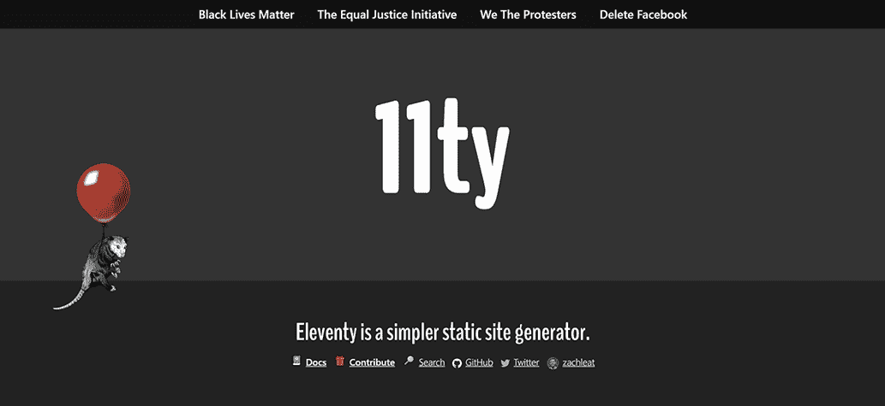

图 2.1 Eleventy 网站

要开始使用 Eleventy，你需要通过 npm 安装 CLI 工具。*npm*代表“Node 包管理器”，是一个常见的安装实用工具的工具。你不需要是 Node 开发者就可以使用 npm，但通过[nodejs.org](https://nodejs.org/en/)安装 Node 是安装 npm 的最简单方法。假设你在终端中有 npm 可用，你可以这样安装 Eleventy 的 CLI：

```
npm install -g @11ty/eleventy
```

你可以通过在终端中输入 eleventy --help 来确认它是否工作，如图 2.2 所示。

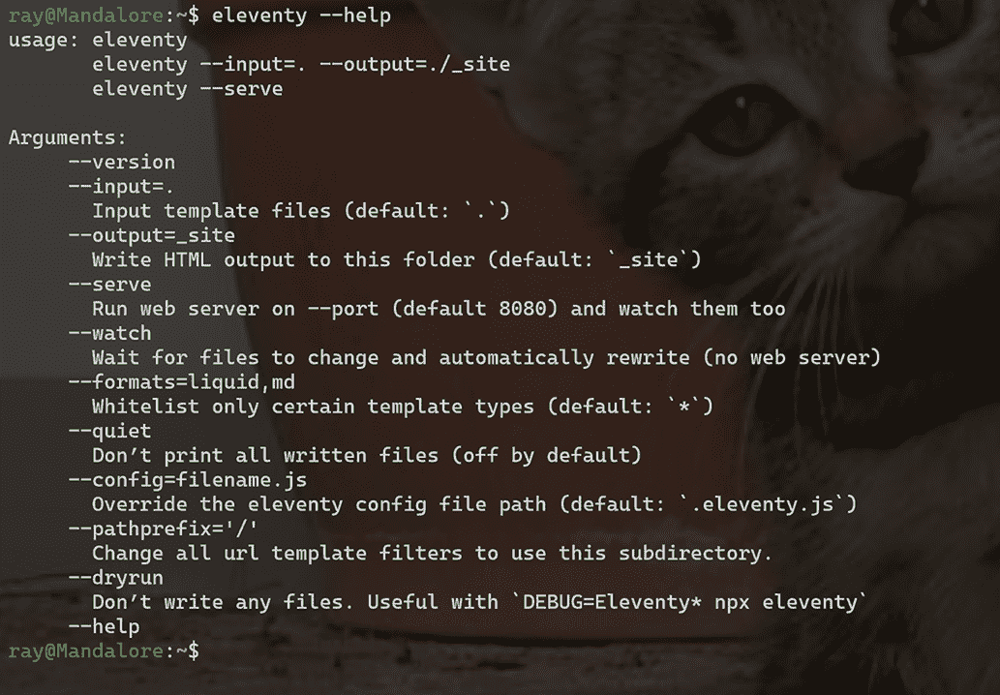

图 2.2 Eleventy CLI 的帮助输出

Eleventy CLI 的基本功能可以归结为两个。它可以将目录中的源代码构建成静态网站，或者设置一个可以执行相同操作并允许*热重载*（即在检测到文件更改后重新加载浏览器）的 Web 服务器。通常，在构建网站时，你会使用 Web 服务器功能，而在只需要网站静态文件输出时执行构建。

Eleventy 允许你使用许多不同的模板处理器来编写内容。这些模板语言允许你在 HTML 中添加基本的逻辑和变量。默认情况下，Eleventy 支持 Markdown、Liquid、Nunjucks、Handlebars、Mustache、EJS、HAML 和 Pug。你还可以使用基本的 HTML 或甚至 JavaScript。你选择的语言取决于你，你甚至可以在 Eleventy 项目中混合使用不同的语言。Eleventy 文档([`www.11ty.dev/docs/`](https://www.11ty.dev/docs/))不会帮助你学习这些语言，所以如果你不熟悉它们，你需要访问你想要使用的处理器的相应网页。对于本章，我们将使用 Markdown 和 Liquid。选择 Liquid 纯粹是个人决定；如果你不喜欢它，请记住你有其他选择！

### 2.1.1 创建你的第一个 Eleventy 网站

让我们从创建一个简单的网站来测试 Eleventy 开始。创建一个空文件夹（或克隆书籍仓库）并添加一个新文件，index.md。".md"扩展名代表 Markdown，这是一种在许多不同平台上非常常见的模板语言。你可以在[`www.markdownguide.org/`](https://www.markdownguide.org/)找到关于 Markdown 的良好入门指南。

列表 2.1 初始 Markdown 文件，index.md

```
## Hello World

This is my first page in lovely markdown.

Here's a list for fun:

* Cats
* Dogs
* More Cats
```

现在在同一目录下创建另一个文件，cats.md。

列表 2.2 第二个 Markdown 文件，cats.md

```
## Cats

Cats are the best, aren't they?
```

如果不明显，你可以随意更改此文本，使其符合你的需求。保存两个文件后，在终端中输入 eleventy 来执行构建。确保你位于这两个文件所在的同一目录中。Eleventy 会报告其执行的操作以及所需时间。你可以在图 2.3 中看到一个示例。

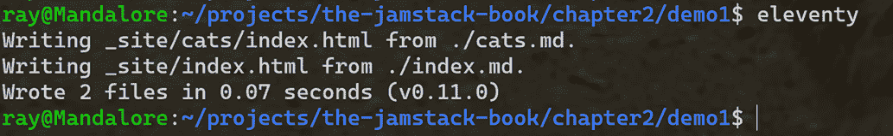

图 2.3 运行 Eleventy 命令的输出

这里有几个需要注意的重要事项。首先，Eleventy 将其结果输出到名为 _site 的目录中。你可以通过传递给 Eleventy 命令行程序的标志来自定义它。其次，注意 Eleventy 如何转换文件名。第一个文件，index.md，在输出目录的根目录中写为 index.html。第二个文件，cat.md，写入 cats 子目录中。最终结果是，主页可在网站的根目录中访问，而 cats 页面可在 /cats 中访问。Eleventy 允许你完全控制页面的输出方式，因此你可以调整这些选项以满足你的需求。然而，了解默认设置很重要，这样你就可以从一个页面链接到另一个页面。例如，索引页面可以像这样链接到 cats 页面：

```
Read about our cats
```

你可以启动一个 Web 服务器（我的首选是 httpster，通过 npm 安装）来查看输出，但让我们使用 Eleventy CLI 的另一个主要功能并启动开发服务器。在你的终端中运行 eleventy --serve。你应该会看到类似于图 2.4 的输出。

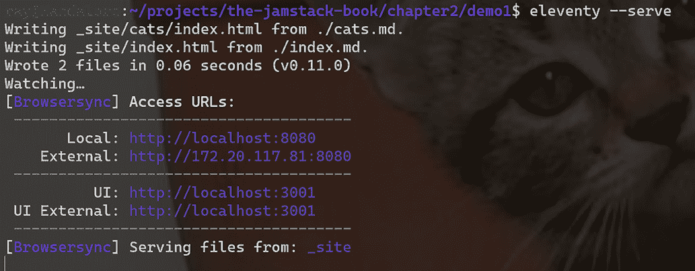

图 2.4 运行 Eleventy 服务器启动了一个用于网站文件的 Web 服务器，并允许你在浏览器中验证输出。

如果你复制 CLI 输出的本地 URL，你可以在浏览器中打开它并查看你的网站。你需要按 CTRL+C 来停止服务器。此外，请注意 Eleventy 正在写入 _site，这意味着当你完成开发后，你不需要再次运行 eleventy 来生成最终结果。如果你完全按照指定的方式创建了你的 Markdown 文件，你将在浏览器中看到图 2.5 描述的内容。

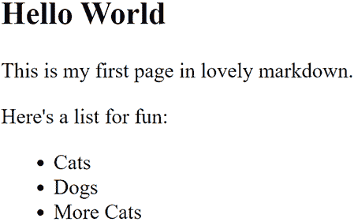

图 2.5 由 Eleventy 处理的 Markdown 文件生成的 HTML 输出

如果你编辑文件并重新加载浏览器，你会看到变化。Eleventy 支持热重载，这意味着你不需要手动重新加载浏览器，但该功能需要一个包含 body 标签的“完整”HTML 页面。当我们到达布局时，你会看到如何添加它。

### 2.1.2 使用模板语言

到目前为止，你所看到的是 Markdown 的转换，这本身并不那么令人兴奋。如果我们加入模板语言会怎样呢？模板语言在构建 HTML（和其他）文件时给我们提供了更多的灵活性。它们允许你使用变量、条件和循环。让我们构建一个示例，以便你可以看到它的实际应用。你会看到如何在 HTML 文件中添加逻辑和编程语句，以便 Eleventy 可以处理它们并将它们转换为静态文件。创建一个新的目录（或使用 GitHub 仓库中的 chapter2/demo2 文件夹），并将以下内容添加为 index.liquid。

列表 2.3 Liquid 模板语言的示例

```
<h2>Liquid Demo</h2>



<p>
Hello, {{ name }}!
</p>




<p>
Yes, you are cool.
</p>



<ul>

    <li>{{ cat }}</li>

</ul>
```

Liquid ([`shopify.github.io/liquid/`](https://shopify.github.io/liquid/)) 是一个开源模板语言，被许多项目使用，包括我们将在本书后面讨论的另一个静态站点生成器 Jekyll。在列表 2.3 中，您可以看到 Liquid 使用的一些语法。第一行（忽略 HTML）将值 ("ray") 赋给一个变量（name）。赋值之后，变量立即输出。Liquid 使用  标记来包裹命令，并使用 {{ ... }} 来包裹变量。基本上，如果您正在应用任何类型的逻辑，请使用 {%; 否则使用 {{。

下一段代码将布尔值（true）赋给一个变量（cool），然后下一个块检查它是否为真。最后，从一组名字列表创建一个数组，然后遍历并显示在列表中。如果这个语法看起来有点奇怪，请记住，这些模板语言并不打算取代一个“正确”的完整开发语言。相反，它们提供了一些基本功能，以便您创建动态 HTML。

如果您仍在运行 Eleventy 命令行，请使用 CTRL+C 来停止它，然后在新目录中运行 eleventy --serve，您应该会看到类似于图 2.6 的输出。同样，您应该可以自由地修改一些值来观察它们的变化。

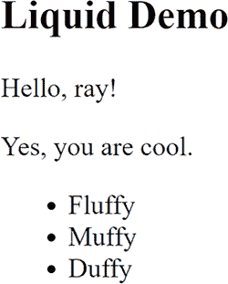

图 2.6 液态模板输出

Eleventy 使用 Liquid 处理器将您的输入转换为纯 HTML 输出。我们只看了您可以在 Liquid 中做的一小部分，但请记住，如果您不喜欢这种写作风格，Eleventy 提供了多种其他选项。在我使用 Liquid 之前，我是一名 Handlebars 的粉丝，但我发现它在某些时候限制性很强。Handlebars 不希望您在模板中使用很多逻辑，并鼓励您在其他地方做这件事。我理解这种思考的逻辑，但与此同时，我更喜欢 Liquid 的灵活性。Liquid 不能做所有事情，所以当我需要一些*真正*定制化的东西时，我会使用 EJS ([`ejs.co/`](https://ejs.co/))。我真的很不喜欢 EJS 的外观。这是一个纯粹的个人观点，但我发现 EJS 代码很丑。然而，它无疑是选项中最灵活的，所以我感激在我需要的时候可以使用它。

### 2.1.3 添加布局和包含

到目前为止，你已经看到了 Eleventy 如何将 Markdown 或其他语言文件转换为 HTML。现在，是时候通过使用布局和包含来稍微改进一下了。*布局*是“包装”文件，可以用来为你的文件添加网站布局。每个布局都会有一个标记，用于包含你的页面内容。这意味着你可以有一个布局文件，然后让网站的其他部分使用它。希望这种力量的明显性是显而易见的。你只需修改那个文件，就可以快速改变整个网站的外观和感觉。你还可以更快地纠正网站中的错误，比如标题或页脚中的错别字。*包含*只是你在模板中包含的其他文件。如果你网站上有几个需要包含相同法律文本（读者会忽略）的表单，包含是一个简化该过程的不错方式。

要开始使用布局文件，我们首先需要告诉我们的模板使用它们。Eleventy 使用许多静态网站生成器支持的功能：前缀部分。前缀部分是关于你的文件的元数据，包含在顶部。在几乎所有情况下，前缀部分使用特定的标记来开始和结束块，然后使用简单的“键：值”格式来指定值。以下是一个特定文件的前缀部分可能看起来如何的示例。

列表 2.4 前缀部分的示例

```
---
something: a value!
anotherSomething: another value
---

This is the rest of the file.
```

在这个极其简单的示例中，前缀部分指定了两个值，something 和 anotherSomething。Eleventy 或其他任何静态网站生成器通常会查看这些值，并根据你设置的值执行不同的操作。对于它们不理解的价值，这些值将被忽略，但可用于你的代码。（你将在数据部分看到这一点。）当文件生成 HTML 时，前缀部分将完全删除。让我们看看这个例子。

创建一个新的目录（或者使用你的仓库副本）命名为 demo3。在这个目录中，从第一个示例复制 index.md 和 cats.md 文件。打开第一个文件，并修改它以添加前缀部分。

列表 2.5 带有前缀部分的更新 index.md 文件

```
---
layout: main
---

## Hello World

This is my first page in lovely markdown.

Here's a list for fun:

* Cats
* Dogs
* More Cats
```

这里的变化是在顶部添加了前缀部分，并指定了一个值：layout。cats.md 文件也可以类似地进行修改。

列表 2.6 更新的 cats.md 文件

```
---
layout: main
---

## Cats

Cats are the best, aren't they?
```

当 Eleventy 解析这些文件时，它会读取元数据并注意到布局设置。这将告诉 Eleventy 尝试加载一个名为 main dot something 的布局文件。为什么是“dot something”？如前所述，Eleventy 支持许多不同的模板格式，具有不同的扩展名。通过在元数据中仅指定“main”，Eleventy 将检查所有支持的模板类型。它在哪里检查？默认情况下，布局文件是在名为 _includes 的目录中搜索的。这是你的项目根目录，也是你运行 Eleventy 命令行的地方。由于你正在 demo3 文件夹中工作，_includes 文件夹将位于那里。如果你选择，你可以更改这个目录名称。让我们使用 Liquid 来构建一个布局文件，并将其存储在 _includes/main.liquid 中。列表 2.7 展示了我们构建的布局文件。

列表 2.7 网站布局文件

```
<html>

<head>
<title>My Site</title>
<style>
body {
    background-color: #ffaa00;
    margin: 50px;
}

footer {
    background-color: #c0c0c0;
    padding: 10px;
}
</style>
</head>

<body>

    {{ content }}     ❶

    <footer>
    <a href="/">Home</a> | <a href="/cats">Cats</a>
    </footer>
</body>
</html>
```

❶ 这就是页面内容将被包含的地方。

对于大多数情况，这看起来像是一个普通的 HTML 模板。你可以看到一些样式（当然，很丑）和页脚，但特别要注意{{ content }}。当 Eleventy 解析使用元数据和指定此布局的文件时，它将页面生成的 HTML 放入一个名为 content 的变量中。我的 Liquid 模板可以简单地在任何合适的地方输出这个变量。在这种情况下，我是在 body 标签之后和页脚之前做的。为了清楚起见，这是任意的。如果你在这个目录中启动一个 Eleventy 服务器（记得按 CTRL+C 退出任何之前的测试），你会在图 2.7 中看到为什么我不被允许设计网站。

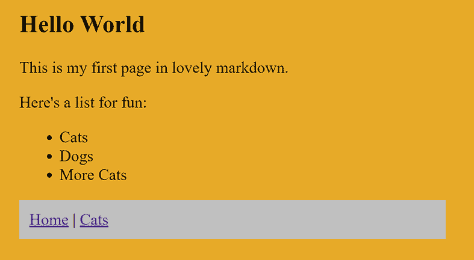

图 2.7 应用了布局的我们的网站

如果你愿意，尝试更改样式声明并选择不同的（更好的）颜色选择。现在你已经使用了一个完整的 HTML 页面，你将最终看到 Eleventy 的热重载功能在行动。

在离开布局主题之前，请注意，你还可以有嵌套的布局。例如，你可以为页面指定一个主布局，然后指定另一个布局，该布局本身指定主布局。第一个将运行，包含你的页面内容，然后将 HTML 返回给主布局。你稍后会看到一个这样的例子。

现在我们来演示包含。这通常相当简单。你创建一个要包含的文件，并将其存储在布局所在的 _includes 文件夹中。如何包含文件取决于你的模板引擎。对于 Liquid，它看起来像这样：

```

```

其中 footer.liquid 应该在 _includes 文件夹中。对于 Handlebars，它看起来略有不同：

```
{{> footer}}
```

在 Handlebars 中，这些被称为*部分*，但它们的作用方式相同。Eleventy 为其所有支持的模板语言提供了文档([`www.11ty.dev/docs/languages/`](https://www.11ty.dev/docs/languages/))，所以请检查一下你选择的模板语言如何支持这个功能。

### 2.1.4 在 Eleventy 网站中使用集合

到目前为止，你已经看到了如何将输入文件（Markdown 和其他语言）转换为 HTML。现在，是时候展示另一个强大的功能——集合。集合正如其名：一组按某种逻辑模式组合的文件。在 Eleventy 中，有几种不同的方法来做这件事，但最简单的方法是通过前置信息和使用标签值。考虑以下前置信息示例：

```
---
layout: main
tags: pressReleases
title: Press Release One
---
```

在这里，我使用了三个前置信息值。第一个，布局，我们之前已经讨论过了。第二个，标签，指定了这个文件的标签值。任何使用相同值的文件都将位于同一个集合中。如果你想为文件选择多个标签，它将可以在多个集合中可用。最后一个值，标题，是我之前没有展示过的。正如你可以猜到的，这个值指定了文件的标题，并且如果你选择的话，它将在你的模板中可用以输出。

默认情况下，这本身不会做任何事情。但你的模板可以遍历集合并创建列表。让我们构建一个与集合一起工作并动态创建列表的示例。

创建一个名为 demo4 的新目录（或者使用仓库中的源文件）。这个目录不应该与 demo3 在同一个文件夹中。从 demo3 复制相同的文件内容，并将 index.md 重命名为 index.liquid。我们将向我们的网站添加新闻稿，所以添加一个名为 press-releases 的子目录。在这个目录中，创建一些文件。文件名并不重要，内容也不重要，但如果你想跟随仓库，第一个文件可以命名为 cats-are-cool.md。

列表 2.8 第一份新闻稿

```
---
layout: pr
tags: pressReleases
title: Cats are Cool
---

Just some text here for filler.
```

正如我们之前讨论的，我们正在使用文件的前置信息来指定一个标签，以便将文件添加到某个集合中。我们还指定了布局和标题。重复几次（仓库中有三个文件），但文件名、标题和内容并不重要。仓库中有一个名为 dogs-are-not-cool.md 的文件和 have-we-said-how-cool-cats-are.md。

下一步是添加布局。我们之前提到过，布局可以包含其他布局。对于我们的新闻稿，我们希望它们有一些额外的布局。

列表 2.9 “pr”布局在 _includes/pr.liquid

```
--- 
layout: main
---

<h2>Press Release: {{ title }}</h2>      ❶

{{ content }}
```

❶ 输出标题

注意，它指定了 main 作为其布局。这意味着新闻稿将首先运行 pr.liquid 模板，然后将输出发送到 main.liquid。同时注意，标题是在布局中输出的。这个值来自新闻稿前置信息中的标题。我们也可以在我们的核心布局文件中使用这个值。

列表 2.10 支持标题的更新布局文件 (_includes/main.liquid)

```
---
title: Default title
---

<html>

<head>
<title>{{ title }}</title>
<style>
body {
    background-color: #ffaa00;
    margin: 50px;
}

footer {
    background-color: #c0c0c0;
    padding: 10px;
}
</style>
</head>

<body>

    {{ content }}

    <footer>
    <a href="/">Home</a> | <a href="/cats">Cats</a>
    </footer>
</body>
</html>
```

在这个文件版本中只有两个更改。首先，在前置信息中指定了一个标题值。如果模板没有指定自己的标题，这个值才会被使用。接下来，标题在标题标签之间输出。

最终结果是，我们的新闻稿文件将自动获得一些额外的布局，然后使用网站其余部分的主布局。现在我们已经有了新闻稿，并且知道它们在一个集合中，下一步是通过创建一个新的主页来将此暴露给用户，该主页使用 Liquid 模板引擎来输出这些值。

列表 2.11 带有新闻稿支持的 index.liquid（/index.liquid）

```
layout: main
title: Home Page

Welcome to our home page. Here's our press releases:

<ul>
                ❶
<li><a href="{{ pr.url }}">{{ pr.data.title }}</a></li>

</ul>
```

❶ 注意 collections.pressReleases 的使用。

当 Eleventy 遇到使用标签的前置内容的模板时，它会将这些模板放入一个名为 collections 的对象中。然后，您可以通过使用 collections.nameoftag 来访问这些数据。由于我们使用了 pressReleases 作为标签值，这个集合将包含三个项目。（再次提醒，您可以自由地创建更多新闻稿并查看变化。）我们遍历每个项目，并将对象分配给一个名为 pr 的变量。这个变量包含多个不同的属性。其中一个属性是 url，它由 Eleventy 创建，表示页面的位置。数据属性将包含在页面前置内容中定义的任何数据。由于我们的新闻稿有标题，我们可以在这里输出它们。还有更多您可以使用的变量，您可以查看 collections 文档（[`www.11ty.dev/docs/collections/`](https://www.11ty.dev/docs/collections/)）以获取详细信息。最终结果如图 2.8 所示。

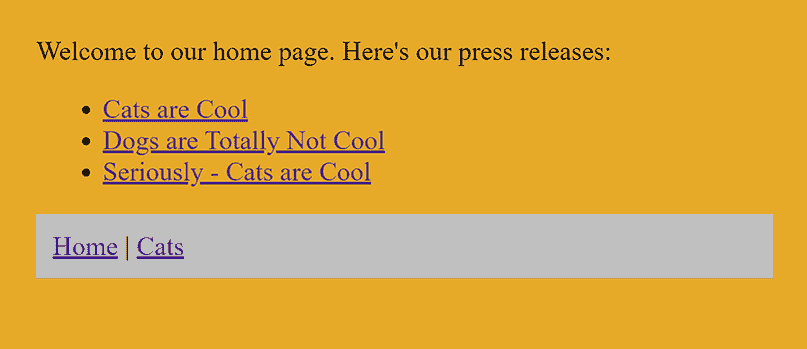

图 2.8 由 Eleventy 集合驱动的带有新闻稿的主页

如果您点击其中一个新闻稿，您可以看到生效的多层布局（图 2.9）。

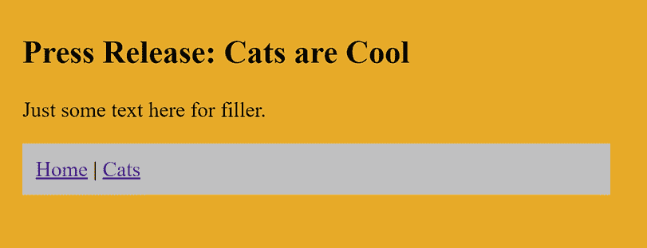

图 2.9 一个示例新闻稿

现在您已经看到了一些使用前置内容和 collections 的示例，是时候从高层次上查看 Eleventy 中的数据了。

### 2.1.5 与数据一起工作

您已经对 Eleventy 中数据的工作方式有了一个简要的介绍，但现在我们将更深入地探讨。向 Eleventy 页面提供数据有多种方式。前置内容是一种方式，并且是针对特定页面的。集合是另一种方式，提供可以迭代和使用的数据。向 Eleventy 网站提供数据的另一种方式是通过创建一个特殊文件夹的文件：_data。您在这里可以创建两种类型的文件，JSON 和 JavaScript。文件的名称将定义它对网站的可访问性。例如，想象一下在您的 _data 文件夹中有一个名为 site.json 的文件。它包含以下内容：

```
{
"siteName": "The Cat Site", 
"siteOwner": "Raymond Camden",
"siteEmail": "raymondcamden@gmail.com"
}
```

这个 JSON 文件定义了三个变量。它也可以是一个数组，或者是一个对象的数组——基本上是任何有效的 JSON。因为文件名为 site.json，所以您的模板可以像这样访问值（再次假设使用 Liquid 语法）：{{ site.siteName }}。

JavaScript 数据文件的工作方式略有不同，因为当然，JavaScript 是一种编程语言，而 JSON 只是静态信息。JavaScript 数据文件允许您执行可能需要的任何操作，并且当操作完成后，文件的结果是最终可用的数据。想象一个名为 build.js 的示例 JavaScript 文件：

```
module.exports = function() {
    let buildTime = new Date();
    let randomNumber = Math.random();
    return {
        buildTime, 
        randomNumber
    }
}
```

此 JavaScript 文件创建了两个变量，一个代表当前时间，另一个是随机数。然后返回一个包含这两个值的对象。因为文件名为 build.js，所以我们的模板可以使用这些值，如 {{ build.buildTime }} 或 {{ build.randomNumber }}。请注意，此逻辑在网站构建时评估（文件名与此无关），因此当静态网站部署时，这些值不会改变。让我们看看两种数据文件在实际操作中的例子。

首先，再次将上一个目录（demo4）复制到一个新的目录（demo5）中，或者简单地使用 GitHub 仓库代码。在 demo5 中创建一个名为 _data 的新文件夹，该文件夹将存储数据文件。如果需要，可以在 Eleventy 中配置用于数据文件的文件夹名称。我们将添加的第一个文件是 site.json。

列表 2.12 site.json 定义 (_data/site.json)

```
{
    "siteName":"The Cat Fan Site",
    "contactAddress":"raymondcamden@gmail.com"
}
```

这些值是任意的，希望它们是自我解释的。我们已为网站定义了一个名称以及一个联系地址。现在定义一个新的文件，breeds.js。对于此文件，我们将使用 Cat API 网站 ([`thecatapi.com/`](https://thecatapi.com/))。该网站提供与猫相关的免费 API，但您必须先注册 ([`thecatapi.com/signup`](https://thecatapi.com/signup)) 获取密钥，如图 2.10 所示。

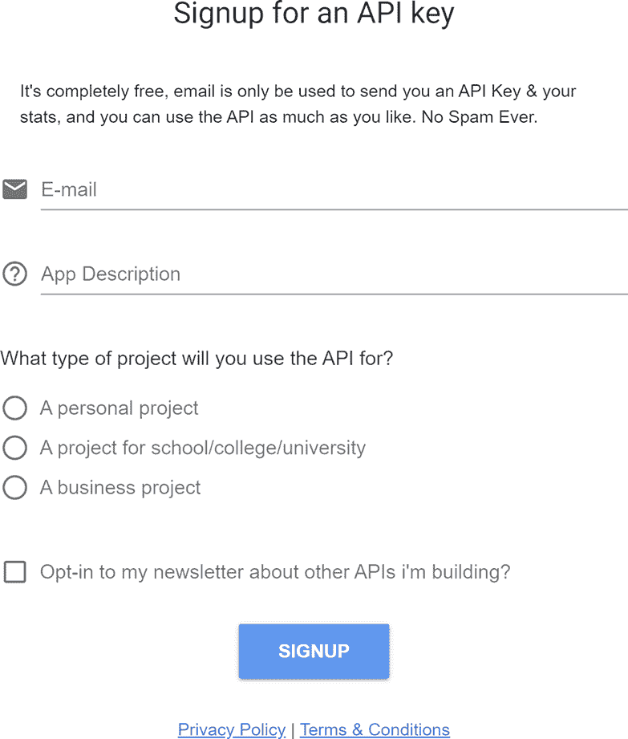

图 2.10 Cat API 的注册页面

他们提供的 API 之一是返回猫品种列表。API 很简单，可以通过此 URL 调用：[`api.thecatapi.com/v1/breeds?limit=5&api_key=yourkey`](https://api.thecatapi.com/v1/breeds?limit=5&api_key=yourkey)。URL 中的 limit 值限制了返回的数据量，而 key 值应替换为您获得的值。

列表 2.13 获取猫品种列表 (_data/breeds.js)

```
const fetch = require('node-fetch');
require('dotenv').config();               ❶

const KEY = process.env.CAT_API_KEY;      ❷

module.exports = async function() {

    let breedUrl = 'https://api.thecatapi.com/v1/breeds?limit=5' + 
    '&api_key=' + KEY;

    let resp = await fetch(breedUrl);

    let data = await resp.json();

    return data;
}
```

❶ 加载 'dot.env' 包

❷ 读取 .env 键值

通常，这是一个简单的 Node 脚本，它使用 node-fetch 来简化 HTTP 调用。函数体执行调用并返回结果。（它也可以修改以转换代码。）这里重要的一点是第 2 行使用了 'dot.env' 包。这将查找位于项目根目录中的名为 .env 的文件。这是一个简单的名称值对集合。您在 GitHub 仓库中找不到它，因为它是在代码中包含密钥的标准方式。Node 脚本将读取此文件，并将每个值设置为 process.env 范围内的值。在 demo5 文件夹根目录的 .env 文件中，添加以下内容：

```
CAT_API_KEY=yourkey
```

将 yourkey 替换为您从 Cat API 获取的密钥。

还有一个最后的步骤要做。我们的函数使用了 node-fetch 和 'dotenv'。为了使它们可用，您需要通过 npm 安装它们。在终端中，在 demo5 文件夹所在的目录下运行

```
npm install node-fetch@2
npm install dotenv
```

这将安装所需的依赖项。

现在我们已经设置了数据文件，让我们使用它们。为了保持简单，让我们在 index.liquid 中同时使用它们。

列表 2.14 利用 Eleventy 数据文件

```
---
layout: main
title: Home Page
---

Welcome to our home page. Here's our press releases:

<ul>

<li><a href="{{ pr.url }}">{{ pr.data.title }}</a></li>

</ul>

Here's a list of cat breeds:

<ul>

<li>{{ breed.name }} - {{ breed.description }}</li>

</ul>

You can contact me at {{ site.contactAddress }}
```

修改从发布显示之后开始，尽管请注意逻辑基本上是相同的：遍历每个项目的值并输出数据。Cat API 返回了大量关于猫品种的数据，但为了保持简单，我们只输出了名称和描述。最后，网站联系地址在最后显示。图 2.11 展示了结果。

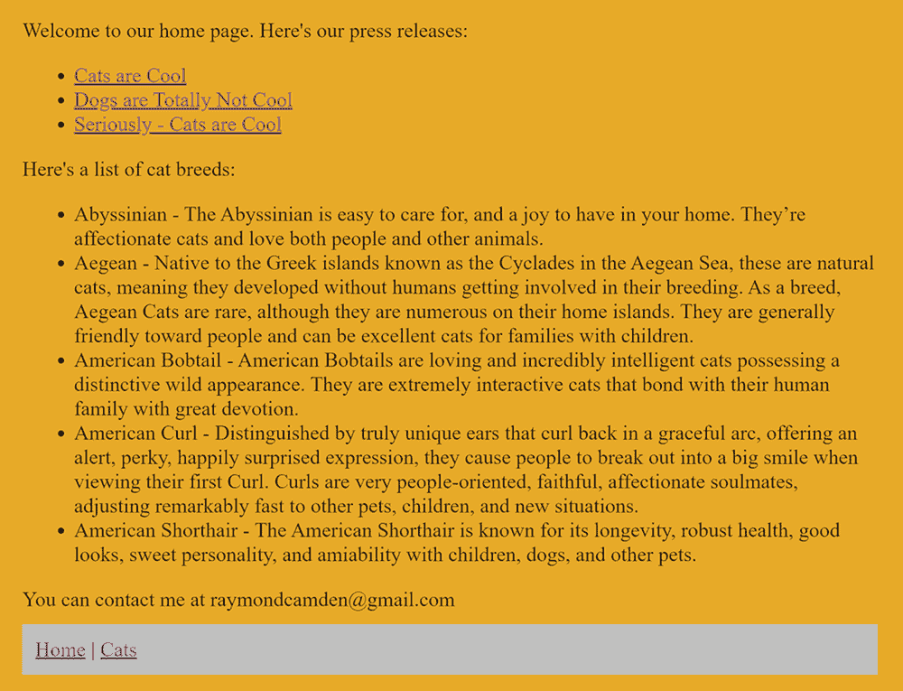

图 2.11 由动态数据文件驱动的更新后的主页

一定要查看 Eleventy 文档的“使用数据”部分（[`www.11ty.dev/docs/data/`](https://www.11ty.dev/docs/data/））以获取更多示例。Eleventy 还支持在目录级别指定数据以及其他选项。

### 2.2 让我们构建 Camden Grounds

现在我们已经看到了一些（当然不是全部！）Eleventy 可以做什么，是时候看看如何构建我们的简单餐厅网站了。在本章中，我们将构建一个名为 Camden Grounds 的虚构咖啡馆网站。这个网站将遵循大多数餐厅网站的典型模式，提供一些基本功能：

+   一个主页，大部分只是漂亮的图片，以帮助吸引访客。

+   一个产品提供的菜单，再次配有漂亮的图片。

+   一个显示不同 Camden Grounds 商店位置的页面。

+   一个关于我们页面的页面，讲述商店的历史。没有人会真正阅读这个页面，但店主坚持要这么做。

首先，你需要确定网站的设计。如果你像我一样，设计能力有限，最简单的解决方案是找到一个你可以使用的模板。幸运的是，有很多网站满足这一需求。我们将使用一个名为“Shop Homepage”的简单 Bootstrap 商店模板（[http://mng.bz/Dxy0](http://mng.bz/Dxy0)）。你可以在图 2.12 中看到它的预览。请注意，这是它在模板形式下的样子，而不是我们将要创建的最终形式。

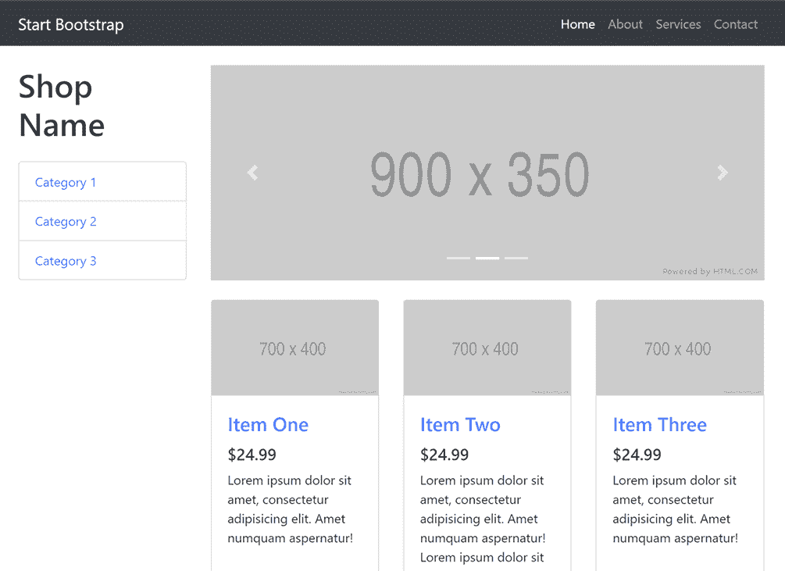

图 2.12 带有产品和顶部旋转横幅的商店模板

注意：自从本章创建以来，模板已更新到具有略微不同设计的较新版本。本章使用的版本仍可在 [`mng.bz/2j6w`](https://github.com/StartBootstrap/startbootstrap-shop-homepage/archive/refs/tags/v4.3.0.zip) 找到并使用。另外，请记住，模板可以在本书的完成代码中找到，位于 [`mng .bz/1j5R`](https://github.com/cfjedimaster/the-jamstack-book/tree/master/chapter2/camdengrounds)。

这个模板可以自由下载和修改。最终演示的完整源代码可以在 GitHub 仓库的 chapter2/camdengrounds 文件夹中找到。由于有很多样板 HTML 代码（Bootstrap 很好，但有点冗长），我们将关注模板的修改，而不是分享每一行代码。

注意：虽然模板看起来很漂亮，但在你提交之前，请查看代码。它可能很难根据你的需求进行修改。

如前所述，你可以将一个典型模板视为围绕你的页面的“包装”。你确定内容可以填充的位置，插入 Eleventy 将用于放置页面内容的标记，然后确保你的页面指定了该布局。

你可以在 _includes/main.liquid 文件中看到卡姆登场地的模板。由于这个文件中有大量的 HTML 代码，接下来的几个列表将突出显示重要部分。首先，模板的顶部指定了前导内容中的标题。

列表 2.15 布局的元数据

```
---
title: Camden Grounds
---
```

这将在个别页面未指定时用作默认值。你可以在几行后看到这一点。

列表 2.16 动态标题

```
<title>{{ title }}</title>
```

现在让我们看看导航菜单。这个模板支持的一个功能是在特定页面上突出显示一个标签。我们如何在静态网站上使用这个功能？Eleventy 提供了对页面变量的访问，该变量提供了有关当前正在渲染的页面的信息。其中一个值是页面的相对 URL。鉴于我们可以使用模板语言并检查该值，我们可以创建一个动态菜单。

列表 2.17 模板的动态菜单

```
<ul class="navbar-nav ml-auto">
    <li class="nav-item active">
    <a class="nav-link" href="/">Home
    </a>
    </li>
    <li class="nav-item active">
    <a class="nav-link" href="/about">About</a>
    </li>
    <li class="nav-item active">
    <a class="nav-link" href="/services">Services</a>
    </li>
    <li class="nav-item active">
    <a class="nav-link" href="/contact">Contact</a>
    </li>
</ul>
```

我们的网络导航由四个主要页面组成。对于每个页面，使用 Liquid 代码查看 URL 值，当它与所讨论页面的相对路径匹配时，会添加活动类。我们将分享的模板的最后部分是包含内容的地方。

列表 2.18 在模板中包含页面内容

```
<div class="col-lg-9">

{{ content }}

</div>
```

实话实说，找到添加内容变量的最佳位置需要一些挖掘。正如所述，Bootstrap 是一个伟大的设计框架，但有时可能会很冗长且有点复杂。强烈建议你打开官方 Bootstrap 网站的一个标签页（[`getbootstrap.com/`](https://getbootstrap.com/)）。它有广泛的文档和示例，可以帮助你更好地使用该框架。

主页将会比较复杂，所以让我们逐个查看这三个简单的页面。

列表 2.19 关于页面（about.html）

```
---
layout: main
title: About Camden Grounds
---

<div class="row my-4">
    <div class="col">

    <h2>The About Page</h2>
    <p>
    Let's talk about the site.
    </p>

    </div>
</div>
```

如果你查看布局文件源代码，你会发现它几乎有 100 行长。这个模板要短得多，因为 Eleventy 会处理用内容包装它。如果你愿意，可以查看 contact.html 和 services.html；它们遵循完全相同的格式。图 2.13 展示了关于页面如何显示（注意突出显示的菜单标签）。

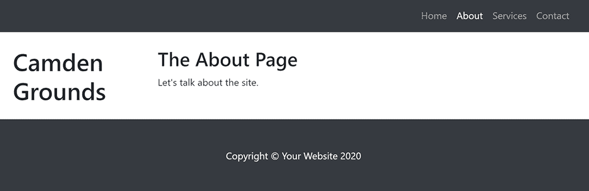

图 2.13 卡姆登场地关于页面

然而，在这一切工作之前，我们需要指出 Eleventy 的一个有趣的问题。当它遇到一个不知道如何处理的文件时，它会忽略它。这最终成为一个大问题，因为我们的 Bootstrap 模板有多个 CSS、JavaScript 和图片文件夹，这些文件夹构成了设计的视觉和感觉。

我们需要做的是告诉 Eleventy 直接复制这些文件。Eleventy 通过在项目根目录中指定一个 .eleventy.js 文件来支持动态配置。虽然你可以在这个文件中做很多事情，但我们想要启用的主要功能被称为 Passthrough File Copy ([`www.11ty.dev/docs/copy/`](https://www.11ty.dev/docs/copy/))。在 Camden Grounds 网站的根目录中，有以下的配置。

列表 2.20 Eleventy 配置文件 (.eleventy.js)

```
module.exports = function(eleventyConfig) {

  eleventyConfig.addPassthroughCopy("css");
  eleventyConfig.addPassthroughCopy("vendor");
  eleventyConfig.addPassthroughCopy("img");

};
```

我们指定了三个路径，css、vendor 和 img，应该直接复制。Eleventy 不会尝试处理这里的任何内容，而只是将文件递归地复制到生成的一 _site 文件夹中。

好吧，我们已经完成了最容易的部分（总是一个好主意），但现在我们需要处理主页。如果你回顾一下图 2.12，你会看到主页顶部有一个旋转的图片横幅，然后是一系列的图片。如果你查看模板原始代码中的 index 页面的源代码，你会看到动画图片（称为*轮播*）被显示出来。

列表 2.21 图片轮播代码

```
<div class="carousel-inner" role="listbox">
<div class="carousel-item active">
    
</div>
<div class="carousel-item">
    
</div>
<div class="carousel-item">
    
</div>
</div>
```

你可以看到每个图片都使用了占位符服务来显示临时图像。我们将用来自 Unsplash ([`unsplash.com/`](https://unsplash.com/)) 的三张图片来替换这些。Unsplash 提供免费图片供网站使用，只需简单的要求你进行归属即可。我搜索了“coffee”并找到了三张图片，并将它们放在了 img 文件夹中。

列表 2.22 使用我们新指定的图片的图片轮播

```
   <div class="carousel-inner" role="listbox">
    <div class="carousel-item active">
      
    </div>
    <div class="carousel-item">
      
    </div>
    <div class="carousel-item">
      
    </div>
  </div>
```

现在是产品的时间了。原始模板显示了六个产品，使用的是通常所说的*卡片*格式。我们想要让它变得动态，所以让我们在 _data/products.json 中添加一个包含产品的 JSON 文件。

列表 2.23 Camden Grounds 的产品

```
[
    {
        "name" : "Coffee",
        "price" : 2.99, 
        "description" : "Lorem ipsum dolor sit amet, consectetur adipisicing 
         ➥ elit. Amet numquam aspernatur!",
        "thumbnail" : "http://placehold.it/700x400", 
        "image" : "http://placehold.it/900x350"
    },
    {
        "name" : "Espresso",
        "price" : 3.99, 
        "description" : "Lorem ipsum dolor sit amet, consectetur adipisicing 
         ➥ elit. Amet numquam aspernatur!",
        "thumbnail" : "http://placehold.it/700x400", 
        "image" : "http://placehold.it/900x350"
    },
    {
        "name" : "Americano",
        "price" : 5.99, 
        "description" : "Lorem ipsum dolor sit amet, consectetur adipisicing 
         ➥ elit. Amet numquam aspernatur!",
        "thumbnail" : "http://placehold.it/700x400", 
        "image" : "http://placehold.it/900x350"
    },
    {
        "name" : "Double Espresso",
        "price" : 8.99, 
        "description" : "Lorem ipsum dolor sit amet, consectetur adipisicing 
         ➥ elit. Amet numquam aspernatur!",
        "thumbnail" : "http://placehold.it/700x400", 
        "image" : "http://placehold.it/900x350"
    },
    {
        "name" : "Tea",
        "price" : 1.99, 
        "description" : "For those who prefer tea.",
        "thumbnail" : "http://placehold.it/700x400", 
        "image" : "http://placehold.it/900x350"
    }
]
```

注意，文本为了节省空间略有缩减。我们不是为每个产品找到自定义图片，而是使用来自 [`placehold.it`](http://placehold.it) 的图片占位服务，它产生一个基本的灰色图像，对于临时图像很有用。现在这已经设置好了，Eleventy 通过 products 变量提供对这些图片的访问。我们可以修改 index 模板（camdengrounds/index.html）来循环创建每个产品的卡片。

列表 2.24 显示产品

```

<div class="col-lg-4 col-md-6 mb-4">
<div class="card h-100">
    <a href="products/{{ product.name | slug }}"></a>
    <div class="card-body">
    <h4 class="card-title">
        <a href="products/{{ product.name | slug }}">{{ product.name }}</a>
    </h4>
    <h5>${{product.price}}</h5>
    <p class="card-text">{{product.description}}</p>
    </div>
</div>
</div>

```

我们基本上只是移除了样板文本，并用循环本身定义的变量替换了它。如果我们为我们的产品有独特的图片（希望如此），它们也可以在 JSON 文件中指定并在这里使用。

网站的最后一个方面是每个单独产品的页面。您可以在 2.25 列表中看到使用的链接：products/{{ product.name | slug }}。首先要注意的是 slug 部分。这被称为 *过滤器*，它接受提供的输入（product .name）然后通过一个格式化函数传递。slug 函数创建一个 URL 安全的字符串版本。例如，值“Double Espresso”变为“double-espresso。”但页面本身是从哪里来的呢？

Eleventy 支持强大的分页系统 ([`www.11ty.dev/docs/pagination/`](https://www.11ty.dev/docs/pagination/))，可以以多种方式使用。它可以接受数据列表并创建页面（例如，将数百份新闻稿分成每页 10 份的页面）或接受列表并生成每个页面。Eleventy 还提供对链接到页面的支持，无论是下一页还是上一页，甚至可以轻松地判断您是否位于页面列表的开头或结尾。与 Eleventy 中的大多数事物一样，它非常强大且灵活，但我们将使用一个简单的示例在我们的商店中，以帮助为我们的每个产品创建一个页面。

要使用此功能，页面必须在前面部分定义分页设置，如下所示。

列表 2.25 产品分页页面

```
---
layout: main
pagination:
    data: products
    size: 1
    alias: product
permalink:      "products/{{ product.name | slug }}/index.html"
---

<div class="row my-4">
  <div class="col">

     <div class="card mt-4">
          
          <div class="card-body">
            <h3 class="card-title">{{ product.name }}</h3>
            <h4>${{product.price}}</h4>
            <p class="card-text">
            {{ product.description }}
            </p>
          </div>
        </div>

  </div>
```

前面部分通过首先指定要迭代的 数据，然后指定大小（每页多少个），最后指定在页面本身中使用别名以方便使用来使用分页。使用页面大小为 1 实际上意味着我们希望每页只有一个产品。这里还展示了 Eleventy 的另一个功能：永久链接。Eleventy 通过让您指定文件应该放在哪里来精确控制文件的生成。模板的其余部分基本上是之前使用的卡片的一个修改版本，但肯定可以更加独特。

如果您启动 Eleventy 服务器并点击其中一个产品，您将看到一个产品页面，如图 2.14 所示。

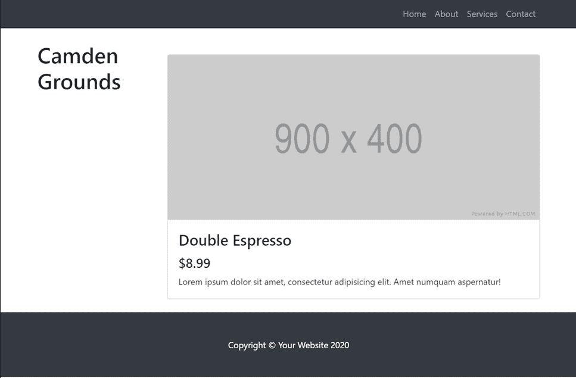

图 2.14 Camden Grounds 产品

### 2.3 使用 Eleventy 进一步深入

在本章中，您已回顾了 Eleventy 静态网站生成器，并使用它为一家虚构的商店构建了一个简单但灵活的商店。然而，Eleventy 中还有许多我们未涉及的功能：

+   过滤器和简码

+   插件以提供附加功能

+   使用事件自定义构建

+   以及更多

请务必查看 Eleventy 文档 ([`www.11ty.dev/docs/`](https://www.11ty.dev/docs/)) 以获取更多信息。我还建议关注 Eleventy 的官方 Twitter 账户 (@eleven_ty) 以及加入 Discord 频道 ([`www.11ty.dev/news/ discord/`](https://www.11ty.dev/news/discord/))。最后，您可以在他们的 GitHub 仓库中查看源代码和当前开放的问题：[`github.com/11ty/eleventy/`](https://github.com/11ty/eleventy/).

在下一节中，你将了解另一个静态站点生成器，Jekyll。Jekyll 是专为博客定制的，所以你将构建一个博客作为帮助你学习的方式。最好的是，Jekyll 也使用了 Liquid，所以如果你喜欢在 Eleventy 中使用它，你将有机会更多地使用它！

## 摘要

+   Eleventy 是一个灵活的静态站点生成器，也是构建 Jamstack 站点的好方法。

+   Eleventy 支持不同类型的模板语言，并允许你选择最适合你风格的其中一个。

+   如果你发现你需要从多个选项中获取特定的功能，一个项目中可以使用多种不同的模板语言。

+   简单的站点，即使是只有几页的站点，也是 Jamstack 的绝佳候选者。
