# 3 构建博客

本章涵盖

+   使用静态站点生成器构建博客

+   如何安装和使用 Jekyll

+   使用 Jekyll 创建基本博客

博客是互联网上最受欢迎的网站形式之一，仅 WordPress 平台就有超过 7500 万人使用。博客在结构上通常相当简单，但在本质上非常个性化。就像日记一样，博客按时间顺序列出帖子，通常在主页上以最新帖子为首选。博客通常会使用类别和标签来分类和组织内容，让读者能够快速找到与特定帖子相关的相关内容。

在本章中，我们将专注于使用 Jamstack 构建博客。我们将使用的静态站点生成器默认构建博客，因此我们将为我们完成大量工作，这让我们有更多时间专注于博客主题（外观）和其他方面的定制。

## 3.1 使用 Jekyll 进行博客写作

Jekyll ([jekyllrb.com](https://jekyllrb.com/)) 是一个专门针对博客的静态站点生成器（如图 3.1）。虽然您当然可以使用 Jekyll 构建其他类型的网站（以及使用其他生成器构建博客），但您会发现 Jekyll 在构建 Jamstack 博客时特别出色。Jekyll 是 GitHub Pages 网页的驱动程序，这对于已经在 GitHub 上使用项目的人来说可能非常有用。

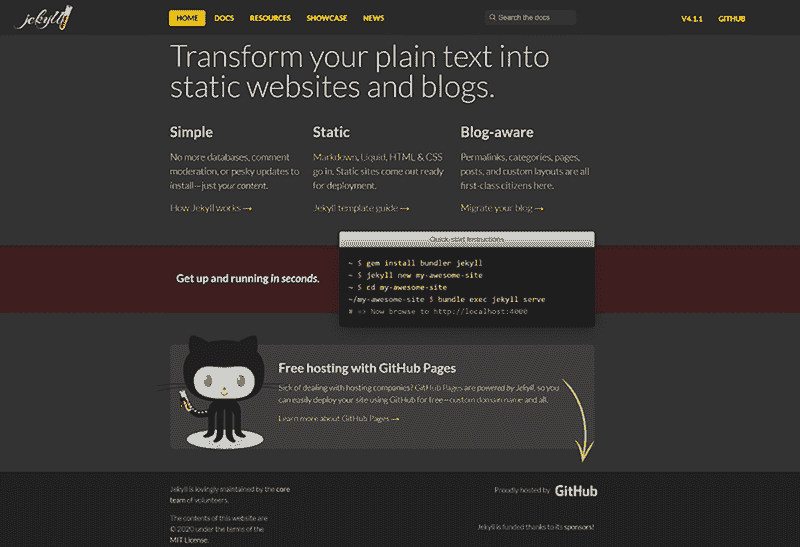

图 3.1 Jekyll 网站 ([jekyllrb.com](http://jekyllrb.com/))

Jekyll 的安装比大多数静态站点生成器要复杂一些，在 Windows 上可能会有一些问题。（有关特定操作系统的详细说明，请参阅在线文档[`jekyllrb.com/docs/installation/`](https://jekyllrb.com/docs/installation/)。）目前，Jekyll 在 Windows 上尚未官方支持。我个人已经使用 Jekyll 在 Windows 上了一段时间，它运行良好，但在您决定使用 Jekyll 之前，缺乏支持是一个需要考虑的因素。现代 Windows 机器支持 WSL（Windows 子系统 for Linux），如果您在使用 Ruby 时遇到问题，这可能会提供更平滑的体验。

安装 Jekyll 需要先安装 Ruby。有关说明，请参阅[`www.ruby-lang.org/en/downloads/`](https://www.ruby-lang.org/en/downloads/)。然后您需要 RubyGems ([` rubygems.org/pages/download`](https://rubygems.org/pages/download))。如果您以前从未使用过 Ruby，请不要担心，因为使用 Jekyll 创建网站时不需要 Ruby。虽然 Jekyll 本身运行在 Ruby 上，但除非您开始自定义 Jekyll 引擎本身，否则您不需要编写任何 Ruby 代码。

一旦安装了先决条件，您可以使用以下命令安装 Jekyll 本身：

```
gem install jekyll bundler
```

注意，有针对多个操作系统的安装指南（[`jekyllrb.com/docs/installation/#guides`](https://jekyllrb.com/docs/installation/#guides)），其中包含更多详细信息。

作为最后一步，确保 Jekyll 正确安装，请在终端中运行 jekyll，如图 3.2 所示。

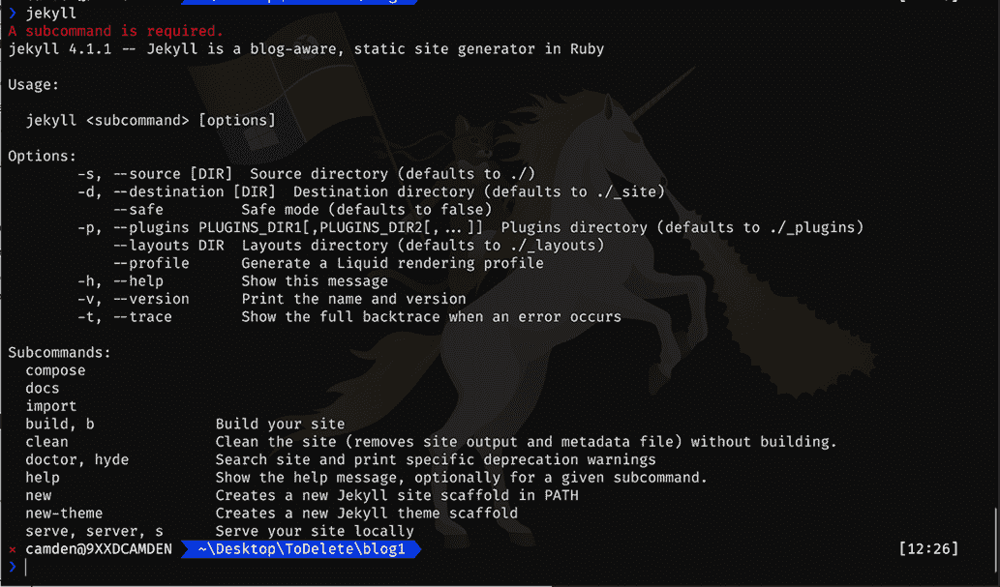

图 3.2 在您的终端中运行 jekyll 命令的默认输出

Jekyll 支持在 HTML 和 Markdown 中创建内容，但也支持 Liquid 模板。如果您已经阅读了上一章，您已经对 Liquid 有了一定的了解，但至少在本章中，您将学习如何嵌入 Liquid 标签以向模板添加逻辑和动态特性。Jekyll，像大多数静态网站生成器一样，也使用元数据作为定义特定页面元数据的方式。

## 3.2 您的第一个 Jekyll 网站

Jekyll 的命令行程序可以通过为您搭建一个完整但小巧的博客来帮助您开始开发。这包括布局（具有最小设计）、主页（列出博客文章）和一个示例文章。通过使用命令 jekyll new sitename 来搭建，其中 sitename 应该是您网站的名称。您为 sitename 使用的值也将用于命名您的网站文件夹。（请注意，Jekyll 似乎在文件夹中存在空间问题，因此在创建新项目时请避免使用空格。）执行命令后，Jekyll 将创建目录，创建一些文件，然后安装它运行所需的各种依赖项和其他项目。图 3.3 展示了这应该看起来是什么样子。

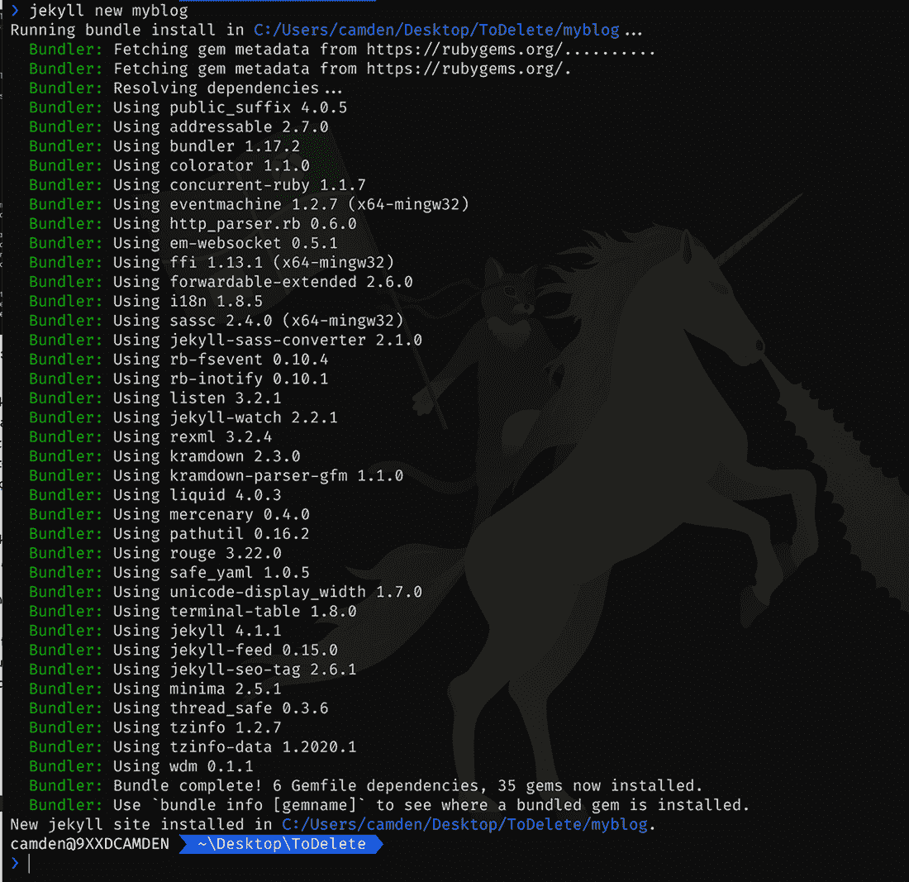

图 3.3 使用 jekyll new 命令搭建新博客的输出

命令运行完成后，切换到新创建的目录。您可以通过使用 serve 命令 jekyll serve 测试您的新 Jekyll 博客。这将启动一个本地应用程序服务器来处理您的文件，并在本地 web 服务器上提供它们。图 3.4 展示了您在终端中应看到的输出。

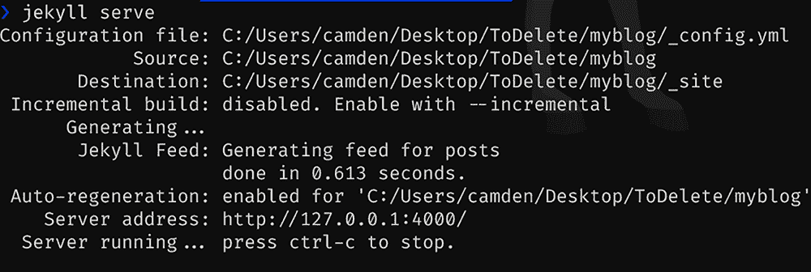

图 3.4 运行 jekyll serve 命令的示例输出

注意，Jekyll CLI 的输出提供了一个服务器地址和端口号。如果您运行 jekyll serve --help，您将看到可以传递给 CLI 的许多不同选项，包括如果您愿意修改端口的选项。在浏览器中打开该地址将显示博客的主页，如图 3.5 所示。

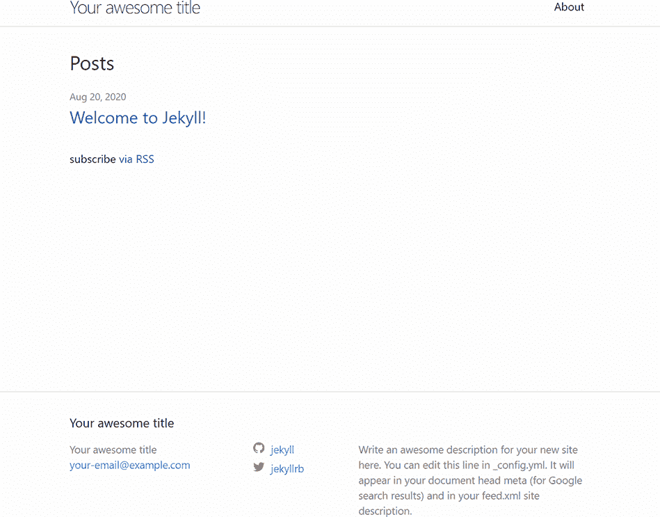

图 3.5 默认博客主页

注意，您在这里看到的是默认用户界面。您绝对可以更改这里看到的内容，我们将在继续的过程中详细说明。要查看示例文章，请点击“欢迎使用 Jekyll！”链接，您将看到一个文章，如图 3.6 所示。

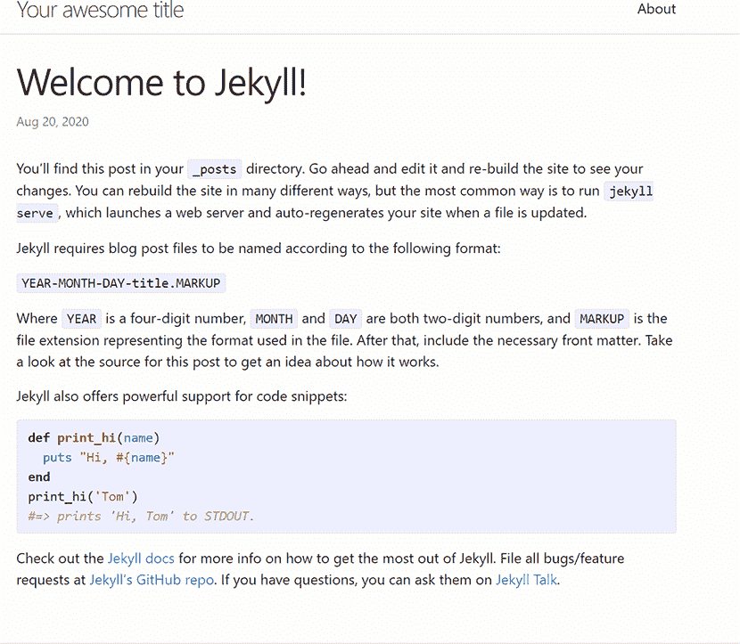

图 3.6 新建 Jekyll 网站默认欢迎博客文章

注意，你不需要使用 jekyll new 命令来创建一个新的网站。你也可以简单地在一个包含现有 HTML 文件的目录中运行 jekyll serve，Jekyll 将从那里运行其服务器。新命令的好处是，它为你提供了一些常见的默认设置（一个主页、一篇文章，甚至一个 RSS 源），这将为你节省一些繁琐的工作。

如果你查看你用 CLI 创建的骨架文件夹（由你刚刚使用的 CLI 创建的目录），你会看到一组文件和文件夹，它们定义了默认的博客。虽然具体细节可能会在未来发生变化，但以下是你通常可以期待看到的内容：

+   _posts 是你的博客文章的目录。

+   _site 是你的 Jekyll 博客的静态版本存储的地方。

+   _config.yml 是一个基于 YAML 的配置文件。我们稍后会深入了解。

+   404.html、about.markdown 和 index.markdown 是表示 404 处理程序（缺失文件）、简单的关于页面和博客主页的文件。

+   Jekyll 还使用了一些你可以现在忽略的文件。

在本章继续学习 Jekyll 的过程中，你将使用具有特殊意义的 Jekyll 的新目录。

你不会看到处理网站布局的文件。Jekyll 的默认博客使用基于“gem”的主题，其中文件存储在博客本身的文件系统之外。当我们在本章的后面开始自定义博客时，我们将与目录中的文件一起工作。你不必担心基于 gem 的主题的位置，因为当你构建 Jekyll 网站时，所有代码和资源都会复制到生成的文件夹中。

## 3.3 编写 Jekyll 文章

你的新博客有一篇简单的文章，所以让我们添加一篇新的文章并看看它的反应。在 _posts 文件夹中，你会看到一个名为类似 2020-08-22-welcome-to-jekyll.markdown 的文件。我之所以说“类似”，是因为 Jekyll 会在生成文件时使用当前日期，所以文件名中的日期值应该是你的当前日期和时间。Jekyll 预期博客文章的格式是 YEAR-MONTH-DAY-TITLE。请注意，月份和日期都应该是两位数字，所以对于小于 10 的数字，包括前面的 0。

创建一个包含当前年份、月份和日期的新文件，但标题为 helloworld，例如，2020-08-22-helloworld.markdown。Jekyll 文章需要在顶部包含前导内容，最初，你可以从第一个文件复制前导内容。这里是一个你可以使用的完整文件，但请记住更新日期为你的当前时间。

列表 3.1 一篇新的博客文章

```
---
layout: post
title:  "Hello World"
date:   2020-08-22 9:00:29 -0500
categories: general
---

Hello World. This is my first *awesome* post!
```

注意，标题完全由你决定，帖子的内容是任意的。然而，请注意时间。在我的测试中，Jekyll 创建的第一个帖子的时间戳是：2020-08-22 08:44:29 -0500。我想让我的帖子更新一些，所以我使用了几个小时后的时间。但是，Jekyll 足够聪明，能够识别出日期值是未来的，因此没有发布博客帖子。这是一个很棒的功能，但你在测试时可能会意外遇到。如果你想，你也可以使用过去的时间。Jekyll 会根据这个值自动排序你的帖子。最后，为什么我们有基于日期的文件名，而原稿部分也有日期值呢？首先，让文件名基于日期将给你一个视觉提示，当你查看目录时，可以知道什么内容是在什么时候写的。其次，如果你在原稿部分省略了日期值，Jekyll 将使用文件名中的日期为帖子。在制作帖子时，你可以决定你是否关心帖子的时间值，因为 Jekyll 对这两种指定日期的方式都可以接受。

注意 Jekyll 有一个命令行标志，可以在本地工作时显示未来的帖子。你可以通过运行 jekyll serve --future 来启用此功能。

布局的值指定了如何渲染帖子。记住，默认主题“隐藏”了这些细节，但当我们开始构建自己的布局时，我们将能够自定义这些。最后，分类——正如你所猜到的——是一种对帖子进行分类的方式。许多博客都会有分类页面，让你可以浏览来自一个分类的帖子。Jekyll 也支持这一点，但默认主题并不是直接支持。

保存你的文件后，回到浏览器并重新加载。你应该能在主页上看到新帖子，如图 3.7 所示。

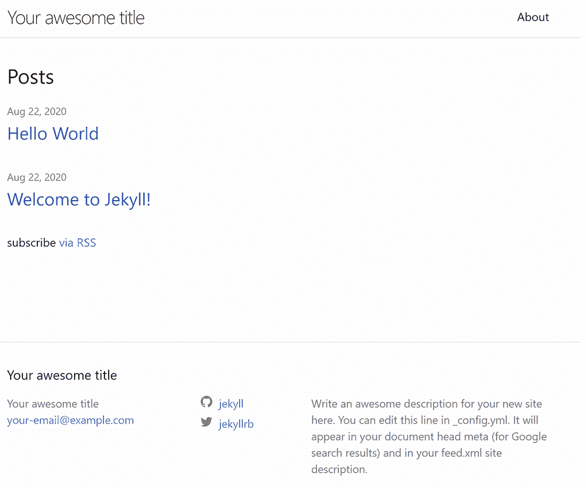

图 3.7 添加新帖子后，它将显示在主页上。

如果你点击帖子，你会看到它被渲染。图 3.8 展示了 Jekyll 如何将 Markdown 渲染成 HTML 并自动应用主题布局。

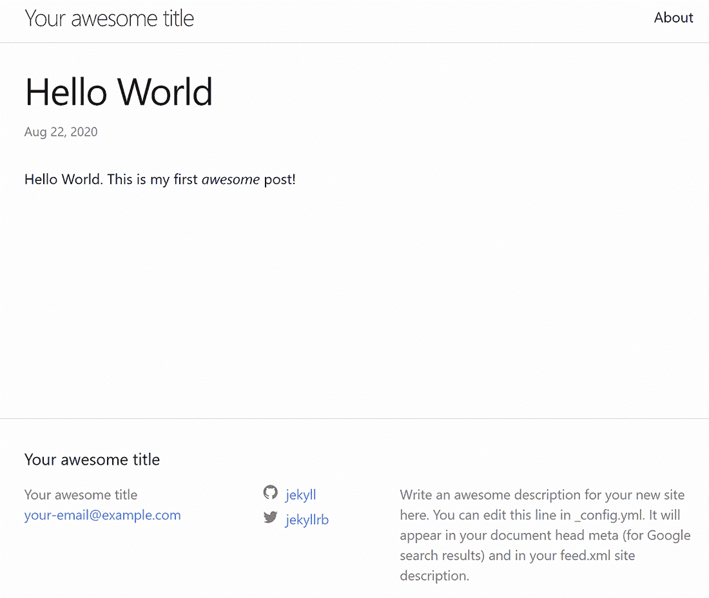

图 3.8 Jekyll 渲染的新博客帖子

记下你新帖子的 URL。再次提醒，记住日期会有所不同；它应该看起来像这样：http://localhost:4000/general/2020/08/22/helloworld.html。注意 Jekyll 如何解析你的初始文件名，并基于它创建路径，同时还包括帖子的分类。我个人并不喜欢这种格式，但幸运的是，Jekyll 允许你自定义这种格式。

### 3.3.1 液体模板语言复习

Jekyll 使用 Liquid 模板语言来允许在生成静态页面时使用动态代码。在前一章中，我们在 2.1.2 节中介绍了使用 Liquid 的基础知识，但如果你跳过了那一章，让我们快速回顾一下。

首先，Liquid 代码使用两种类型的标记。要输出一个简单的值，你会使用 {{ variable }}，其中 variable 是你想要输出的值。要执行一行代码，使用稍有不同的形式：。这个命令将给一个变量赋值：。Liquid 支持条件语句和循环。接下来，我们修改你刚刚创建的博客文章，以包含上一章中的相同示例代码。

列表 3.2 带有 Liquid 命令的博客文章

```
---
layout: post
title:  "Hello World"
date:   2020-08-22 9:00:29 -0500
categories: general
---

Hello World. This is my first *awesome* post!



<p>
Hello, {{ name }}!
</p>




<p>
Yes, you are cool.
</p>



<ul>

    <li>{{ cat }}</li>

</ul>
```

如果你保存并重新加载，你将在图 3.9 中看到结果；请随意修改值并尝试查看实际的变化。

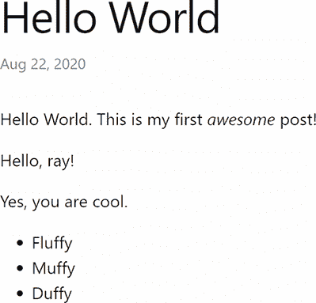

图 3.9 一个带有 Liquid 代码的 Jekyll 博客文章，为静态页面添加动态特性

Jekyll 将解析你的博客文章和网站上常规页面的 Liquid。如果你使用 HTML 文件而不是 Markdown，这个功能同样适用。

## 3.4 与布局和包含文件一起工作

到目前为止，内容显示的细节已经被抽象化。我们解释了 Jekyll 使用默认主题，并且主题文件本身存储在“其他地方”，但它们实际上是如何工作的，以及你将如何修改它们？让我们再次使用 CLI 创建一个新的博客：jekyll new blog1。（本节中的所有列表都可以在本书的 GitHub 仓库的 chapter3/blog1 文件夹中找到。）当它完成新站点的脚手架搭建后，使用 jekyll serve 启动服务器。要开始使用布局，创建一个名为 _layouts 的新目录。默认情况下，Jekyll 将在此文件夹中查找布局文件。（如果你愿意，可以自定义此文件夹的名称。）如果你打开 CLI 生成的 index.html 文件，你会注意到它指定了一个名为 home 的布局（注意，我已经移除了注释）：

```
---
layout: home
---
```

让我们将此值更改为默认。Jekyll 文档建议使用名为 default 的布局，并在你有不同的布局时扩展它。你将在稍后看到这个示例。但就目前而言，将前导内容中的值更改为 default：

```
---
layout: default
---
```

现在让我们创建一个布局文件。列表 3.3 展示了一个非常简单但定制的布局。由于我们指定了默认布局，文件名必须匹配，因此将此文件命名为 default.html。

列表 3.3 新的布局文件 (_layouts/default.html)

```
---
title: Default Title
---

<html>
<head>
<title>{{ page.title }}</title>   ❶
</head>

<body>

{{ content }}                     ❷

</body>
</html>
```

❶ 页面.title 变量将来自使用该布局的页面。

❷ 内容变量是使用布局的页面内容本身。

这个模板可以说是最简单的了。实际上没有任何 CSS 或布局，只是几个 HTML 标签。这里使用了两个变量。第一个，page.title，将被使用该布局的页面的标题所替换。第二个，content，将被页面本身的内容所替换。如果你现在重新加载你的博客，你会看到...什么都没有！为什么？你之前看到的逻辑（创建博客文章列表）是由默认主题完成的。移除它后，你的主页不幸地变成了空白的。让我们通过添加文章来修复这个问题。

列表 3.4 新的首页 (/index.markdown)

```
---
layout: default
title: My Blog
---

<h1>Posts</h1>

<ul>

<li><a href="{{ post.url }}">{{ post.title }}</a>, written 
{{ post.date}}</li>

</ul>
```

在这里我们首先添加了页眉部分的一个标题。布局文件会注意到这一点，并将其用于页面标题。接下来，我们使用 Liquid 语句遍历一个变量，site.posts。Jekyll 会自动提供这个变量，基于你 _posts 目录中的文件。每篇帖子都有一个 url 和标题值，可以用来渲染帖子的链接和标题。最后，你还可以显示帖子的日期。使用无序列表来显示帖子并不十分美观，但能完成任务，如图 3.10 所示。

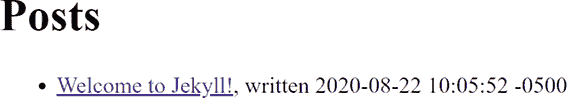

图 3.10 我们的新、无聊的首页

### 3.4.1 布局继承

Jekyll 支持布局继承的概念，这只是一个更华丽的说法，即一个布局包裹另一个布局。让我们通过自定义博客文章的显示来构建一个简单的例子。如果你打开 CLI 生成的默认博客帖子，你会看到它已经指定了一个独特的布局，post。在你的 _layouts 文件夹中，创建一个名为 post.html 的新文件。

列表 3.5 帖子布局 (_layouts/post.html)

```
---
layout: default
---

<h1>Blog Post: {{ page.title }}</h1>

{{ content }}
```

再次强调，这是一个相当无聊的布局，但请注意它如何指定一个布局本身。这意味着帖子布局将显示其内容，然后将它们传递给下一个布局。在这种情况下，我们的帖子布局只是在顶部包含一个带有帖子标题的 h1 标签。图 3.11 展示了我们的新帖子布局。

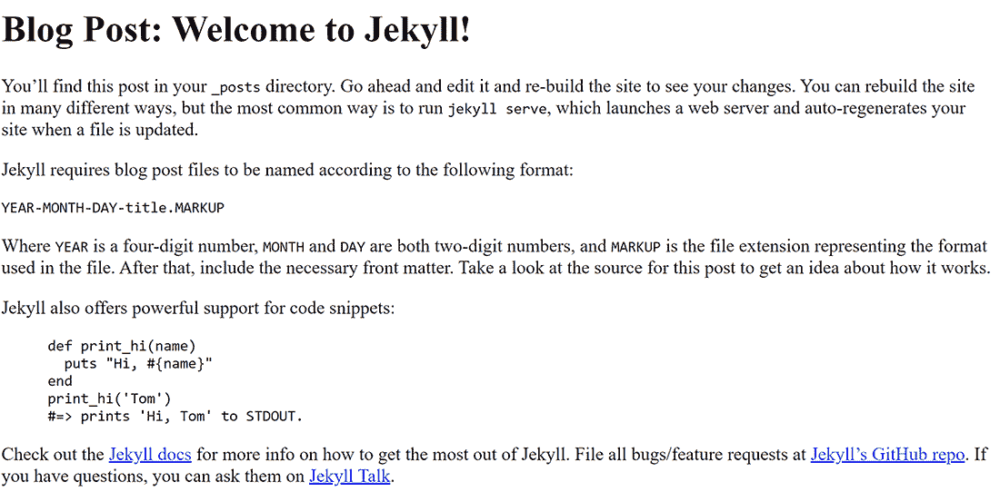

图 3.11 使用新自定义布局的帖子

### 3.4.2 使用 includes

现在我们来看看 includes。与包裹内容的布局不同，include 只是将内容插入到文件中的简单内容。包含文件的格式是以下 Liquid 代码：。Jekyll 将在这些文件的新文件夹 _includes 中查找这些文件。让我们通过向我们的网站添加版权声明来测试这一点。首先，创建新的 _includes 目录，然后使用以下代码作为内容。

列表 3.6 版权文件 (_includes/copyright.html)

```
<p>
Copyright {{ "now" | date:"%Y" }}
</p>
```

这里使用的 Liquid 代码显示的是基于网站上次构建时的当前年份。过滤器 date 接收一个格式化字符串，在这种情况下，只是请求年份。值 "now" 代表当前时间。记住，静态网站是静态的，所以你的静态生成网站不会在纽约市新年钟声敲响后的第二秒神奇地显示新的值，但一旦你重建网站，每个使用此 include 的模板都将具有正确的值。要使用此值，修改默认布局文件。

列表 3.7 更新的默认布局文件 (_layouts/default.html)

```
---
title: Default title
---

<html>
<head>
<title>{{ page.title }}</title>
</head>

<body>

{{ content }}

      ❶
</body>
</html>
```

❶ 此 include 指定内容将直接在关闭 body 标签之前。

如果你现在重新加载你的博客，你会在每个页面上看到版权声明，如图 3.12 所示。

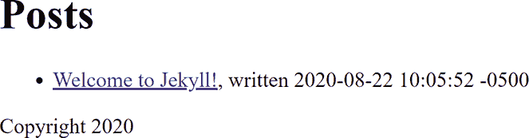

图 3.12 非常重要的版权声明，现在显示在我们的网站上

## 3.5 创建附加文件

当你使用 Jekyll CLI 搭建一个博客时，它会创建一个名为 about.html 的附加文件。当你在不是博客文章的页面上工作时，你可以在你网站的根目录中简单地创建任何 HTML 或 Markdown 文件，Jekyll 会将其包含在最终的构建中。虽然这基本上就是全部内容，但让我们向博客添加一个新页面以确保这个过程深入人心。列表 3.8 显示了一个在网站上常见的联系我们页面的内容。

列表 3.8 新的联系方式页面 (/contact.md)

```
---
layout: default
title: Contact Us
---

## Contact Us

Please send us an email at some random email address
that never gets checked. Or you call us at 555-555, but we
probably won't answer. We don't do faxes because it's 2020.
```

首先，请注意，虽然 Jekyll 使用 .markdown 扩展名，但如果你更喜欢，你也可以使用 .md。一旦保存，Jekyll 会自动使页面在 /contact.html 路径下可用。如果你打开 Jekyll 生成的关于页面（about.markdown），你会注意到它在前置部分使用了一个 permalink 值来指定另一个路径，/about/。如果你喜欢这种文件命名风格，你还可以将其添加到联系页面的前置部分。

提示：如果你遇到与 Jekyll 相关的问题、错误或关于 Gemfiles 的警告，一个常见的解决方案是运行 bundle update 或使用 bundle exec jekyll serve。

## 3.6 与数据一起工作

你已经看到了如何在 Jekyll 中处理博客文章和简单页面，但 Jekyll 还允许你处理数据。这些数据可以是任何东西：可能是一份博客作者的列表及其联系信息。你的网站页面可以读取这些数据，然后在模板中显示它。

首先，你需要创建一个 _data 文件夹。在这个文件夹中，你可以创建 JSON、CSV、TSV 或 YAML 格式的文件。文件的名称将控制它在模板中如何可用。让我们考虑一个简单的例子。（本节中的所有列表都可以在本书的 GitHub 仓库的 chapter3/blog2 文件夹中找到。）

列表 3.9 我们的博客作者 (/_data/authors.json)

```
[
    {
    "name":"Raymond Camden",
    "website":"https://www.raymondcamden.com",
    "twitter":"raymondcamden"
    },
    {
    "name":"Brian Rinaldi",
    "website":"https://remotesynthesis.com/",
    "twitter":"remotesynth"
    }
]
```

这里的数据是任意的，可以是任何对你网站有意义的任何内容。要访问这些数据，Jekyll 将使其在模板中可用，作为 site.data.authors。你还可以在数据文件夹中使用子目录，如果你这样做，子目录的名称将被添加到变量结构中。如果我们的 authors.json 文件在一个名为 people 的子目录中，那么访问该数据的新的变量将是 site.data.people.authors。现在让我们编辑博客的主页以列出我们的作者。

列表 3.10 更新后的主页，包含作者 (/index.markdown)

```
---
layout: default
title: My Blog
---

<h1>Posts</h1>

<ul>

<li><a href="{{ post.url }}">{{ post.title }}</a>, written 
{{ post.date}}</li>

</ul>

<h2>Our Authors</h2>

<ul>
     ❶
<li>
    <a href="{{site.website}}">{{ author.name }}</a> - 
    <a href="https://twitter.com/{{author.twitter}}">@{{author.twitter}}</a>
</li>

</ul>
```

❶ 遍历作者数组

变化从帖子列表之后开始。你可以看到正在使用 Liquid 标签遍历站点数据。对于每个作者，我们显示他们的名字，并提供链接到他们的网站以及他们的 Twitter 个人资料。图 3.13 展示了这是如何显示的。

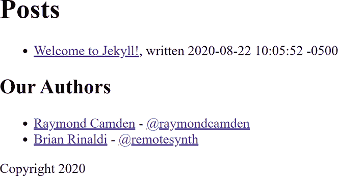

图 3.13 显示的作者是由一个 JSON 文件驱动的。

## 3.7 配置你的 Jekyll 博客

如本章前面所述，Jekyll CLI 创建了一个配置 Jekyll 如何工作的文件。这个文件名为 _config.yml，正如你可以通过扩展名看到的，它使用 YAML 进行格式化。

注意：YAML 是一种“简单”的基于文本的格式，但有时可能会有些令人困惑。要了解更多关于语法的知识，请参阅官方网站[`yaml.org/`](https://yaml.org/)。

你可以配置许多值，所以为了获得设置的全列表，请确保查看 Jekyll 文档[`jekyllrb.com/docs/configuration/options/`](https://jekyllrb.com/docs/configuration/options/)，但以下是一些你可能立即想要了解的值：

+   title—你可以通过在配置文件中指定一个值来为网站指定一个全局标题。这将在模板中作为 site.title 可用。请注意，配置文件中指定的任何值都可作为 site 变量使用。

+   exclude 和 include—指定要忽略或强制包含的文件和文件夹。默认情况下，点文件（Dotfiles）不会被包含，因此当指定时，这允许你将它们包含在内。当与非常大的站点一起工作时，排除功能非常好，因为它允许你在开发中忽略某些文件集，但在生产中不忽略。

+   永久链接—在本章前面，我们演示了 Jekyll 博客文章如何在 URL 中包含分类。这是因为永久链接的默认值：/:categories/:year/:month/:day/:title:output_ext。为了“修复”这个问题，你可以指定一个永久链接值，移除 :categories: 部分。你可以在你的永久链接字符串中使用多个标记，并且你可以在[`jekyllrb.com/docs/permalinks/#placeholders`](https://jekyllrb.com/docs/permalinks/#placeholders)找到它们的文档。

## 3.8 生成你的网站

当你在运行 Jekyll 服务器时，你可能已经注意到它将结果输出到名为 _site 的目录。这是你的 Jekyll 构建默认输出目录。你可以通过在命令行中运行 jekyll build 来手动生成构建。你将获得操作报告，如图 3.14 所示。

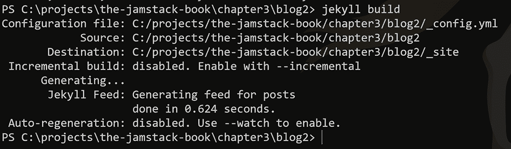

图 3.14 请求 Jekyll 构建你的网站的输出

你可以通过使用 --destination 标志来配置输出目录，例如，jekyll build --destination output。图 3.15 展示了上一节博客的这种外观。

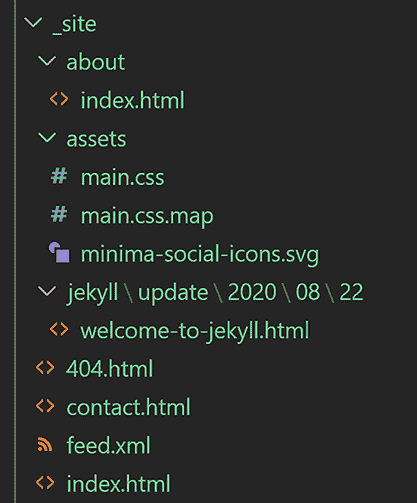

图 3.15 由 Jekyll 构建命令生成的 HTML 输出

## 3.9 构建 Jekyll 博客

由于 Jekyll 可以直接搭建一个博客，技术上我们在这里没有太多需要讨论的，但演示某人如何通过修改外观和感觉来修改博客的过程会很好。你之前已经看到了如何构建自定义布局，但有许多主题可以给你一个完整的视觉和感觉，而你几乎不需要做任何工作。

这的一个很好的例子是 Start Bootstrap 的“Clean Blog Jekyll”主题（[`startbootstrap.com/themes/clean-blog-jekyll/`](https://startbootstrap.com/themes/clean-blog-jekyll/)）。这是一个免费的博客主题，你可以用它来开始你的项目，当然，你也可以将主题作为起点，在这里那里做一些小的修改，使其恰到好处。

你可以在主题的 GitHub 仓库中找到安装说明，包括将主题添加到由 CLI 构建的博客以及使用仓库副本。这个选项相对容易一些，所以下载一个仓库的 zip 文件并解压它。

解压后，切换到你的终端中的目录并使用 bundle exec jekyll serve 运行 Jekyll。这将启动本地博客，如图 3.16 所示。

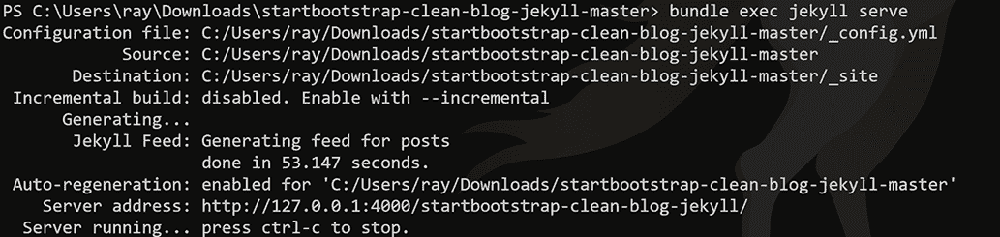

图 3.16 运行下载的 Jekyll 主题的输出

特别注意服务器地址。与之前从网络服务器根目录开始的示例不同，这个是从子目录开始的。我们稍后会解决这个问题，但为了确保一切正常，请在浏览器中打开 URL，你应该会看到使用默认博客文章的主题（图 3.17）。


图 3.17 本地运行的 Clean Blog

现在是时候开始定制这个博客并使其成为你自己的了。使用 ctrl+c 关闭当前运行的服务器并打开 _config.yml 文件。以下代码显示了更改后以作者个人化为目的的配置文件上半部分。

列表 3.11 新的配置值（/_config.yml）

```
title:              My Blog
email:              raymondcamden@gmail.com
description:        My New Blog!
author:             Raymond Camden
#baseurl:            "/startbootstrap-clean-blog-jekyll"
#url:                "https://startbootstrap.github.io"

# Social Profiles
twitter_username:   raymondcamden
github_username:    cfjedimaster
facebook_username:  
instagram_username:  
linkedin_username:
```

前四个值已被更改为与我的信息匹配，但你应该绝对在这里输入其他内容。由于 baseurl 和 url 在我们的测试中不需要，所以我将它们都注释掉了，我们可以接受 Jekyll 将使用的默认值。在社交资料中，我指定了一些我想分享的值。博客主题将根据这些值进行不同的渲染。保存你的更改并再次运行服务器。现在当你查看它时（注意新的 URL），你会看到自定义的值，如图 3.18 所示。


图 3.18 博客现在有自定义的标题和其他值。你的将看起来不同。

这很简单，对吧？你在这里看到的是主题在配置中暴露的值，然后被选中并用于显示。让我们再进行一个更改。虽然那个头部图片很漂亮，但我们可以选择另一个。有一个很棒的网站，[Unsplash.com](https://unsplash.com/)，它提供免费的美丽股票摄影。如图 3.19 所示，你可以看到我选择的图片（[`unsplash.com/photos/V705bwrTnQI`](https://unsplash.com/photos/V705bwrTnQI)）由 Annie Spratt ([`unsplash.com/@anniespratt`](https://unsplash.com/@anniespratt)）提供。


图 3.19 来自[Unsplash.com](https://unsplash.com/)网站的免费股票摄影

下载图片后，将其重命名为 xmastree.jpg，并保存在博客的 img 文件夹中。Unsplash 的默认图片可能相当大，所以书中仓库中的副本已经被调整大小。博客的主页可以在 index.html 文件中找到。打开它，你会看到它相当简短。

列表 3.12 博客主页 (/index.html)

```
---
layout: home
background: '/img/bg-index.jpg'
---
```

在这种情况下，博客的主题处理获取博客文章和渲染它们的逻辑，所以为了更新顶部的较大图片，你只需简单地编辑背景值。

列表 3.13 更新博客主页 (/index.html)

```
---
layout: home
background: '/img/xmastree.jpg'
---
```

保存此更改并重新加载博客（图 3.20）。


图 3.20 我们的新博客标题（而且，你可以选择任何东西！）

我们最后要做的就是做一些清理工作。博客自带六篇博客文章。通常在处理一个新的博客主题时，我会删除除了保留作为后续博客文章模板的那一篇之外的所有文章。例如，删除 2020-01-26-dinosaurs.html。打开它，移除示例内容，并更改标题和日期值。

列表 3.14 更新的博客文章

```
---
layout: post
title: "Welcome to my blog"
subtitle: "I'm so excited!"
date: 2020-08-24 12:00:00 -0400
background: '/img/posts/01.jpg'
---

<p>
This is my cool blog!
</p>
```

如前所述多次，请随意使用你自己的标题、副标题和内容。日期也应该更适合你阅读这本书的时候。你也可以更改图片，如果你愿意，换成你喜欢的。最后，虽然不是必需的，你应该重命名文件。记住，在 front matter 中的日期将优先于文件名中的日期。但为了维护，文件名应该更好地代表内容，例如，2020-08-24-welcome.html。保存你的更改后，你可以重新加载博客并点击你剩余的博客标题，以欣赏它的全部风采（图 3.21）。


图 3.21 新编辑的博客条目

要继续这个博客，你只需继续添加新的博客文章，主题会自动为你添加它们。

## 3.10 进一步使用 Jekyll

虽然我们展示了 Jekyll 的一些酷炫功能，但还有很多我们没有空间涵盖。以下是一些这些主题：

+   虽然 Jekyll 专注于构建博客，但它有一个名为 Collections ([`jekyllrb.com/docs/collections/`](https://jekyllrb.com/docs/collections/))的功能，允许你以你想要的任何形式定义自己的数据列表/集合。这对于文档网站或其他相关内容可能很有用。

+   Jekyll 还内置了对分页的支持([`jekyllrb.com/docs/pagination/`](https://jekyllrb.com/docs/pagination/))，提供了一种快速设置每页有多少项以及创建代码可以用来创建链接到内容的前一页和下一页的变量的方法。

+   对于 Jekyll 无法满足的情况，它有一个插件系统 ([`jekyllrb.com/docs/plugins/`](https://jekyllrb.com/docs/plugins/))，允许您扩展其功能。但这将需要您编写 Ruby。

+   最后，别忘了 GitHub 对基于 Jekyll 的网站有原生支持，适用于包含内容（如文档）的仓库。

如需更多信息，包括支持链接，请参阅 Jekyll 社区页面 [`jekyllrb.com/docs/community/`](https://jekyllrb.com/docs/community/).

在下一章中，您将了解如何构建一个专注于提供文档的网站。您将查看 Hugo 静态网站生成器，它可能是目前最快的生成器之一（这使得它非常适合大型网站）。

## 摘要

+   Jekyll 是一个专注于构建博客的静态网站生成器。

+   Jekyll 使用 Liquid 作为模板语言，并允许您使用 Markdown 或 HTML 编写其他页面。

+   Jekyll 使用 Ruby 进行安装，因此在 Windows 下可能（可能）会遇到更困难的情况。

+   Jekyll 支持使用 JSON、CSV、TSV 和 YAML 编写的全局数据文件。
