# 4 构建文档网站

本章涵盖了

+   理解典型文档网站的需求

+   为管理文档选择无头 CMS

+   为文档网站选择静态网站生成器

+   安装和配置 Hugo

+   设置 Netlify CMS 开放编辑和建模

+   配置 Netlify 和 GitHub 以进行用户身份验证

+   在 Netlify CMS 中编辑内容

Jamstack 在内容为中心的网站上一直表现出色，甚至从静态网站生成器的早期阶段开始就是这样。静态 HTML 和 CSS 完美地适用于快速高效地显示内容；因此，内容网站非常适合使用 Jamstack 工具进行预渲染。这就是为什么文档网站一直是 Jamstack 最明显的用例之一。

文档网站在始终具有使用 Jamstack 的额外优势：

+   通过源控制轻松地对基于文件的内容进行版本控制

+   通过如 GitHub 拉取请求等流程接受贡献和修正的方式

+   事实上，在许多情况下，作者对这些开发工具的技术能力很强

选择 Jamstack 作为文档网站的最大缺点通常是编辑内容所需的工具不够先进，无法满足内容作者和编辑的需求。然而，近年来，用于文档网站（或一般以内容为中心的网站）的 Jamstack 工具、服务和库已经得到了极大的改进。这些好处仍然适用，但现代 Jamstack 工具使得网站内容的编辑更加容易，接受贡献也更加方便——甚至对于那些可能不熟悉代码的人来说也是如此。在本章中，我们将探讨您使用 Jamstack 开发文档网站可用的选项，并介绍如何构建一个文档网站。

### 4.1 文档网站的需求

显然，没有一种单一的文档网站类型。例如，有技术文档，如软件文档或 API 文档，以及最终用户文档，如用户手册。这些需求可能有所不同，但它们也有一些共同点：

+   文档网站往往有多个，通常是众多的贡献者。在项目或政策文档的情况下，贡献者可能仅限于公司员工。然而，在开源日益主导的软件世界中，许多文档网站通常有大量的外部贡献者。

+   贡献者编辑网站内容时可能具有不同程度的技术专长。

+   文档网站旨在优化快速轻松地访问信息，优先考虑简单直接的功能和设计。

+   布局和设计侧重于可读性而非风格。

+   除了评论或可运行的示例之外，许多文档网站不包括复杂或动态的功能。

+   许多文档网站有很多内容，但这些内容相对不经常改变。一个典型的网站可能会定期进行重大更新，偶尔之间会有一些小更新。

### 4.1.1 示例网站需求

我们将为一种名为 LOLCODE 的冷门编程语言构建技术文档（[`www.lolcode.org/`](http://www.lolcode.org/)）（见图 4.1）。LOLCODE 旨在对基于 lolspeak（一种与猫的互联网迷因相关的语法错误语言）的编程语言进行幽默的诠释。这些文档基于 Justin Meza 编写的 LOLCODE 规范（[`mng.bz/RE7D`](http://mng.bz/RE7D)）。

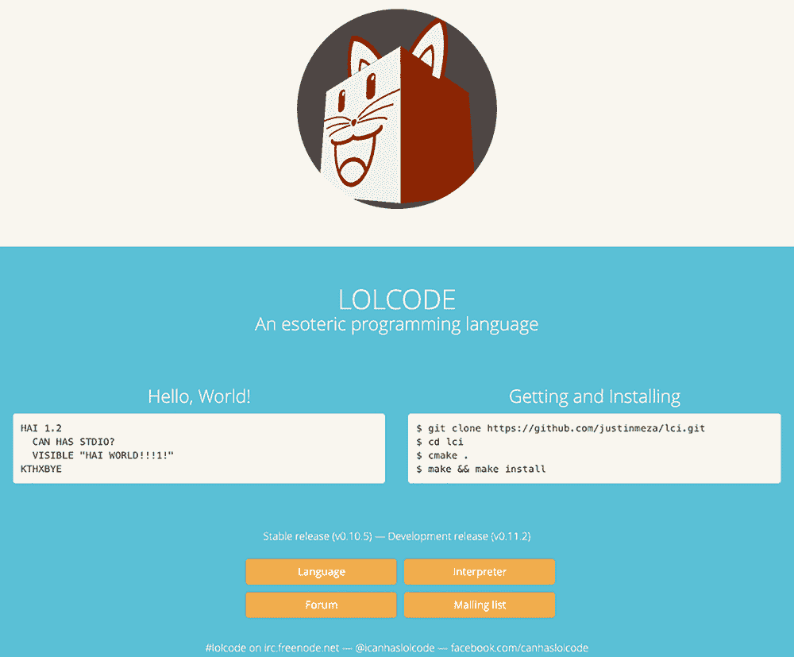

图 4.1 展示 LOLCODE 语言、安装细节以及我们将用于示例文档网站的规范链接的[lolcode.org](http://www.lolcode.org/)网站

随着 LOLCODE 的采用不可避免地扩大，我预计这个网站会变得相当大，因此优化构建速度将成为一个重点。由于这是一个开源语言，我还希望能够使第三方作者能够轻松贡献。尽管我预计大多数贡献者都将具有高度的技术专长，但他们可能不是构建 Jamstack 网站方面的专家。尽管如此，我仍希望通过使他们能够不经过手动分叉、本地安装、更新然后创建拉取请求的 Git 工作流程来鼓励贡献。

现在我们已经了解了我们文档网站的需求，让我们来看看我们有哪些工具可以满足这些需求。

### 4.2 选择合适的工具

我们的需求并不特别复杂。我们需要能够为广泛的文档生成可能很多的内容页面，并且我们需要第三方内容贡献者能够编辑内容，而无需深入了解网站是如何构建的。为了实现这一点，我们需要一个合适的静态网站生成器和无头内容管理系统（CMS）。CMS 将提供编辑界面，使内容贡献者能够更轻松地在网站上编写和编辑内容。

### 4.2.1 什么是无头 CMS？

我们已经讨论了很多关于静态网站生成器的内容，但还没有讨论无头 CMS。*无头 CMS*是一个相对较新的概念。这个名字来源于它们将后端（即 CMS 提供的实际内容编辑和管理工具）与“头部”（即应用程序的前端，在这种情况下是一个网站）解耦的想法。

传统的内容管理系统（CMS）几乎完全是为了管理网页内容而创建的。正因为如此，内容的管理与其显示方式紧密相连。例如，在一个典型的 WordPress 网站上，后端的内容管理由 WordPress 提供，但前端网站也是基于 WordPress 构建的（即，与 WordPress 紧密耦合）。

这种紧密耦合意味着内容不可重用。主页上的标题也可能出现在着陆页上，但更新一个实例不会更新另一个实例。由于内容是为网络设计的，因此它不能轻易地用于像移动应用这样的东西。

传统的 CMS 也不是为 Jamstack 设计的。传统 CMS 的前端页面是服务器端渲染的，无法利用 Jamstack 架构提供的改进速度和安全性能。

无头 CMS 通过提供与前端网站解耦的后端内容编辑和管理工具来解决这些问题。目前有越来越多的无头 CMS 选项可供选择，但它们分为两个不同的类别，这些类别决定了前端网站如何访问内容：

+   *基于 API 的无头 CMS*—您的内容由 CMS 提供商存储，并通过 API 由您的网站、移动应用或其他应用程序访问。由于基于 API 的无头 CMS 中的内容与物理文件无关，它们能够轻松处理内容对象的重复使用，并更容易管理内容对象之间或内容块内内容对象的复杂关系。

+   *基于 Git 的无头 CMS*—这些 CMS 不存储您的内容。相反，内容存储在 Git 仓库中，通常作为 Markdown 用于长篇内容，以及 YAML 或 JSON 用于数据。CMS 本质上是一层工具，通过易于理解的内容编辑器通过 Web 界面管理内容，这些编辑器可能不习惯手动编辑基于文件的内容。

注意：要深入了解基于 Git 和基于 API 的无头 CMS 的优缺点，请参阅 Bejamas 的这篇详细文章：[`mng.bz/2j19`](https://bejamas.io/blog/git-based-cms-vs-api-first-cms/)。

对于我们的示例用例，基于 Git 的 CMS 的一个好处是它仍然允许基于 Git 的编辑工作流程和版本历史记录，这些历史记录可以跟踪更改，并且可以通过 GitHub 或其他 Git 项目托管提供商公开访问。这对于技术文档项目来说可能是理想的，尤其是对于开源项目，正如我们的案例一样。因此，我们的示例项目将使用基于 Git 的解决方案。

### 4.2.2 无头 CMS 选项

既然我们已经确定基于 Git 的解决方案是我们的选择，让我们来看看可用的选项。

Forestry

Forestry ([forestry.io](https://forestry.io/)) 是一个商业化的基于 Git 的 CMS 解决方案。它内置了对所有最流行的静态站点生成器的支持，并与大多数主要的静态托管提供商集成（图 4.2）。在撰写本文时，它提供免费账户，支持多达五个编辑器，尽管免费网站在三个月不活跃后会自动存档。

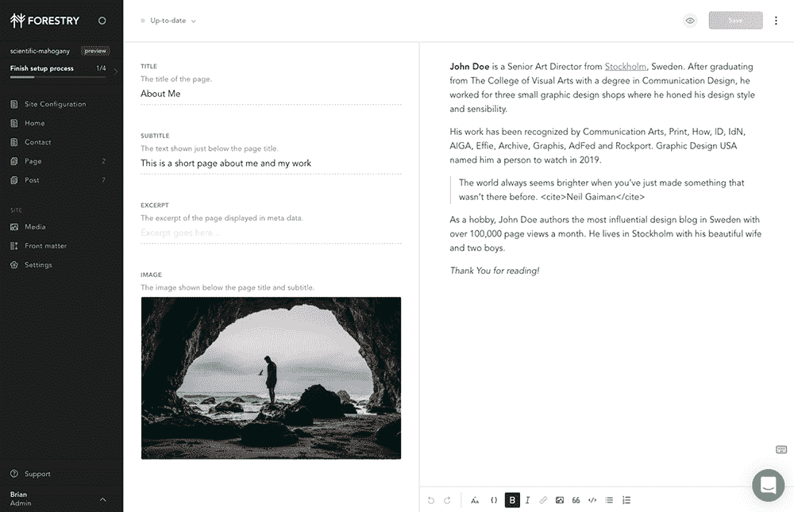

图 4.2 使用 Forestry 的所见即所得（WYSIWYG）页面编辑器编辑内容页面

Publii

Publii ([`getpublii.com/`](https://getpublii.com/))，如图 4.3 所示，与其他选项不同，它是一个可安装的开源桌面应用程序，而不是基于网络的界面。它提供了多种编辑内容的选择，包括 WYSIWYG 编辑器、类似于 WordPress 新“Gutenberg”界面的块编辑器以及直接的 Markdown 编辑器。Publii 不仅提供与其他基于 Git 的 CMS 一样的编辑工具，还充当静态站点生成器，支持广泛的托管选项。

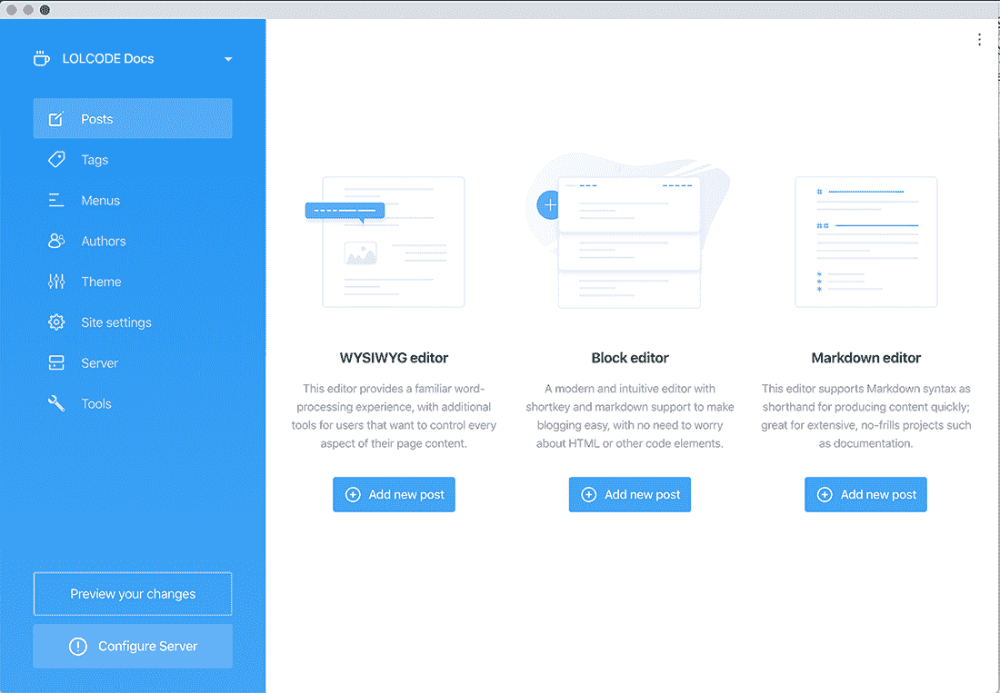

图 4.3 Publii 的桌面应用程序界面提供了多种编辑内容的选择：WYSIWYG 编辑器、类似于 WordPress 新“Gutenberg”界面的块编辑器以及直接的 Markdown 源代码编辑。

Prose

Prose ([`prose.io/`](http://prose.io/))，如图 4.4 所示，也是一个独特的选项。这是一个完全免费的工具，可以连接到您的 GitHub 账户，为您提供访问任何与您的账户关联的存储库中任何文件的基于网络的编辑器。虽然可以使用 Prose 编辑器编辑代码和数据文件，但其重点是提供带有元数据（通常称为前端元数据）的 Markdown 内容的更好的编辑体验。它确实提供了一个简单的 Markdown 预览，但不是真正的 WYSIWYG 体验。

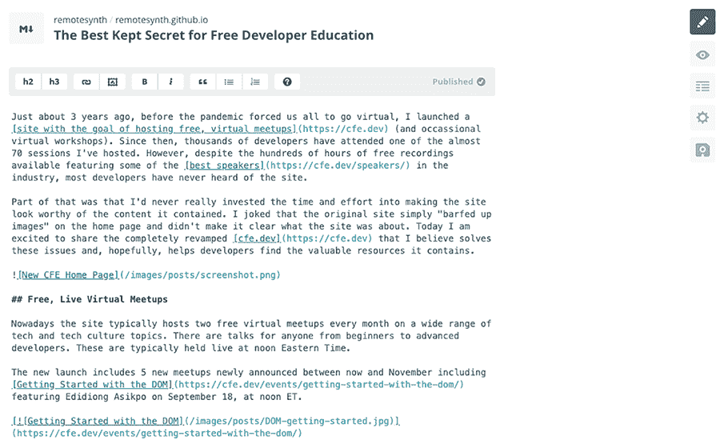

图 4.4 Prose 为您 GitHub 账户中的任何存储库中的任何 Markdown 文件提供了带有简单预览功能和前端元数据编辑的 Markdown 编辑器。

Netlify CMS

Netlify CMS ([`www.netlifycms.org/`](https://www.netlifycms.org/))，如图 4.5 所示，是一个开源的内容管理系统工具。其独特之处在于能够配置它以与几乎所有静态站点生成器协同工作。它由 Netlify 构建，并由 Netlify 主要维护，因此一些功能与 Netlify 的托管服务无缝集成，但它也可以配置与其他提供商一起工作。

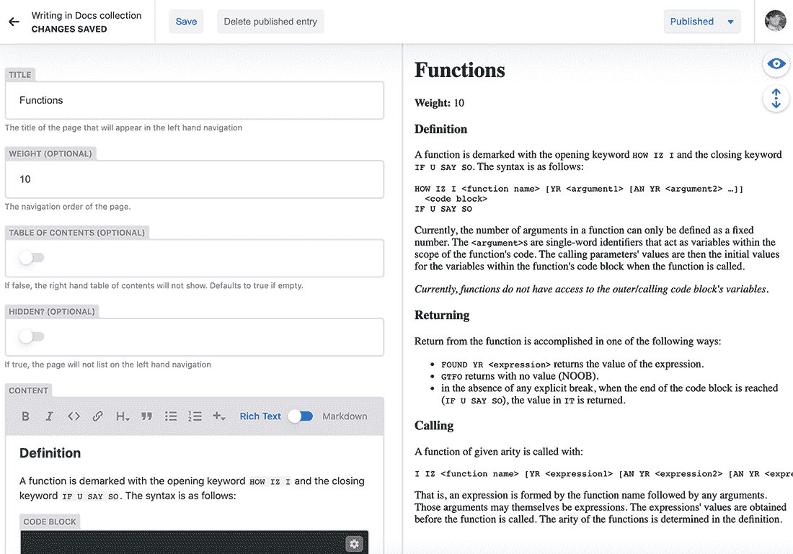

图 4.5 Netlify CMS 提供了多种高级小部件，用于编辑帖子的长格式 Markdown 内容以及前端元数据。

### 4.2.3 为什么选择 Netlify CMS？

我们的项目将是一个关于神秘编程语言 LOLCODE 的技术文档。对于这个项目，我们将使用 Netlify CMS。选择 Netlify CMS 的原因有很多：

+   Netlify CMS 是一个自由许可的开源项目（它使用 MIT 许可证）。这意味着我们可以将整个文档项目开源，而无需担心许可限制。

+   Netlify CMS 有一个开放作者功能，允许我们给任何拥有 GitHub 账户的人访问权限，以便他们对文档做出贡献。用户将完全访问内容管理系统，但他们的贡献将自动以他们的名义提交为拉取请求，这意味着更改不会影响网站，直到我们接受它们。

+   没有限制允许做出贡献的用户数量，也没有与用户数量相关的成本。

### 4.2.4 静态站点生成器（SSG）选项

任何 SSG 都可以用于文档站点。尽管如此，实际上有许多 SSG 是专门针对文档的：

+   *[Docsify](https://github.com/docsifyjs/docsify)* ([`docsify.js.org`](https://docsify.js.org))—一个基于 JavaScript 的 SSG，将文档作为单页应用（SPA）提供服务。Docsify 与其他解决方案的不同之处在于它不会生成静态 HTML 文件，而是在浏览器运行时解析 Markdown 内容，这意味着应用程序不需要重建以反映更改或新内容。

+   *Slate* ([`github.com/slatedocs/slate`](https://github.com/slatedocs/slate))—一个基于 Ruby 的解决方案，它是在 Middleman SSG 的基础上构建的，专门用于创建 API 文档。它还作为一个支持多种语言代码示例的单页应用（SPA）运行，允许用户切换到与他们相关的语言标签。

+   *MkDocs* ([`www.mkdocs.org/`](https://www.mkdocs.org/))—一个基于 Python 的解决方案，强调在生成大量页面时的速度。它提供了许多主题，包括许多社区构建的主题。

+   *Docusaurus* ([`docusaurus.io/`](https://docusaurus.io/))—一个基于 JavaScript 的静态站点生成器，使用 React，Docusaurus 自带许多文档相关的功能和布局，包括文档版本控制和国际化（i18n）等功能。

+   *Hugo* ([`gohugo.io/`](https://gohugo.io/))—一个流行的基于 Go 的 SSG，也专注于极快的构建过程，包括内置的资产管理。虽然它不是专门的文档解决方案，但 Hugo 有一个庞大的用户社区，拥有大量的社区构建的主题，其中许多是为文档特别设计的。

### 4.2.5 为什么选择 Hugo？

我们将使用 Hugo 来处理我们的 LOLCODE 技术文档项目。它将轻松处理我们不断增长的内容量，同时保持构建时间短。Hugo 通过二进制文件安装，这意味着希望在本地上运行项目的贡献者不需要复杂的环境。它还拥有详尽和详细的文档以及大量的社区帖子，这使得我们能够轻松找到解决可能遇到任何潜在问题的解决方案。

即使它不是一个专门的文档解决方案，Hugo 也有大量的社区主题，这些主题提供针对文档站点的设计和功能。以下是一些例子：

+   Ace Documentation 是基于 Bootstrap 的文档主题。

+   DocuAPI 针对多语言 API 文档设计。

+   Dot 旨在用于支持中心或知识库形式的文档。

+   Hugo Book 是一个具有内置搜索功能的极简主义书籍风格主题。

+   Techdoc 也是一个极简主义书籍风格主题。

+   Kraiklyn 是为创建单页文档而设计的。

在我们的示例中，我们将选择 Hugo Book 主题。我选择这个主题并不是出于任何技术原因，而是因为我认为它提供的简单、干净的布局非常适合我们正在创建的语言文档。

### 4.3 构建示例站点

让我们开始构建我们的文档站点。我们将从安装 Hugo 和设置主题开始，然后配置站点以与 Netlify CMS 一起工作。

### 4.3.1 安装 Hugo

安装 Hugo 有多种方式，包括简单地下载二进制文件。虽然这种方法适用于所有支持的平台（MacOS、Windows 和 Linux），但它有一些复杂性，因为你可能希望将其放置在路径上，以便只需使用 hugo 命令行命令（而不是二进制文件的完整路径）即可轻松调用。需要注意的是，如果你选择二进制安装或已经安装了 Hugo，你需要 Hugo 0.68 或更高版本的扩展版。

使用包管理器安装 Hugo 是更好的选择。

在 MacOS 或 Linux 上安装

你可以使用 Homebrew 在 MacOS 或 Linux 上安装 Hugo：

```
brew install hugo
```

在 Windows 上安装

你可以使用 Chocolatey 在 Windows 上安装 Hugo：

```
choco install hugo-extended -confirm
```

确认安装

确认你的 Hugo 安装工作正常：

```
hugo version 
```

这应该返回以下类似的内容（请注意，版本号自本文撰写以来可能已更改）：

```
Hugo Static Site Generator v0.74.3/extended darwin/amd64 BuildDate: unknown
```

### 4.3.2 创建新的 Hugo 网站

我们计划使用 Hugo 作为我们的静态站点生成器，Netlify CMS 作为基于 Git 的无头 CMS，以及 Hugo Book 作为我们的站点主题，来构建 LOLCODE 稀有语言的科技文档网站。第一步将是使用 Hugo 为我们的网站生成一个新的站点骨架。

要使用 Hugo 创建新站点，请使用 new site 命令后跟你想要站点创建的目录名称：

```
hugo new site lolcode-docs
cd lolcode-docs
```

这将创建一个包含以下内容的 Hugo 站点骨架：

```
├── archtetypes
│   └── default.md
├── content
├── data
├── layouts
├── static
├── themes
├── config.toml
```

正如你所见，骨架中没有默认内容或主题。大部分情况下，Hugo 只会生成目录结构和基本的配置文件。以下是这些文件和文件夹的用途：

+   在 Hugo 中，架构体（archetypes）代表应用程序中的不同内容类型。这些是网站将包含的不同类型内容的元数据（即元数据）模板。例如，你可能有一个用于博客文章的架构体，它定义了博客文章将包含的元数据。虽然不是必须为所有内容创建架构体，但这样做允许你使用 hugo new 命令与该类型一起生成具有正确设置的新的页面。所以，如果我们有一个帖子类型，我们可以输入命令 hugo new post/my-new-post.md 来创建一个名为“my-new-post”的博客文章。

+   Hugo 网站的全部内容都存在于内容文件夹中。这些内容可以位于该文件夹内的任何目录结构中。当网站生成时，内容文件夹中的每个内容项都会创建一个页面。例如，位于 /content/posts/my-new-post.md 的 Markdown 文件将在网站中生成一个位于 /posts/my-new-post/ 的页面。

+   数据文件夹包含所有数据文件（YAML、TOML 或 JSON）。Hugo 通过 .Site.Data 对象将这些文件提供给网站。例如，一个 authors.yaml 的数据文件将作为 .Site.Data.Authors 可用。

+   布局文件夹包含 Hugo 将用于生成页面的所有布局模板。通常，这个文件夹用于没有安装主题的网站。如果两者都存在，Hugo 将首先使用布局中的更具体文件（我们稍后会利用这一点）。Hugo 布局使用 Go 模板语言编写以生成标记。

+   静态文件夹包含所有应该直接移动到网站中而不需要处理的文件。这些通常是图像、JavaScript 或样式表等资产，你不想让 Hugo 修改。静态文件夹中的所有内容都将放置在网站根目录下。例如，如果你有一个 /static/images 文件夹，里面装满了网站的图像，那么这些图像最终会出现在网站的 /images 下。为了说明这一点，请下载 LOLCODE 标志并保存到 /static/images（生成的文件应该是 /static/images/logo.png）。

+   主题文件夹是放置你下载的第三方主题的地方。你可以在 [themes.gohugo.io](https://themes.gohugo.io/) 找到大量这些主题。你还可以在这个目录中创建自己的主题。要设置网站的主题，你需要在 Hugo 的 config.toml 中定义一个主题变量（我们稍后会看到这一点）。

+   config.toml 是 Hugo 的配置文件，使用 TOML 编写。Hugo 提供的基本配置包括 baseUrl、languageCode 和 title。

+   让我们先为我们的文档网站添加一些默认内容。我已经提供了一个包含书中示例网站 Markdown 内容的 zip 文件，位于书籍 GitHub 仓库的 [`mng.bz/1jRy`](https://github.com/cfjedimaster/the-jamstack-book/blob/master/chapter4/Content.zip)。下载这个 zip 文件并将其解压到您新网站的内容文件夹 /content 中。现在您应该有 /content/_index.md，这是主页，以及 /content/docs，它将包含一些带有网站文档的 Markdown 文件。

### 4.3.3 设置 Hugo Book 主题

我们将安装 Hugo Book 主题作为一个子模块。在我们能够这样做之前，我们需要确保我们的新项目被初始化为一个 Git 仓库。使用项目目录根部的终端/命令行，初始化一个新的仓库：

```
git init .
```

接下来，让我们将 hugo-book 添加为一个子模块。以这种方式安装主题将允许我们在 GitHub 仓库中的主题有任何更改时保持我们的项目更新：

```
git submodule add https://github.com/alex-shpak/hugo-book themes/book
```

最后，让我们配置 Hugo 以使用新安装的主题。我们将打开项目根目录中的 config.toml 并进行以下更改：

+   将标题更改为“LOLCODE 文档。”

+   添加一个主题变量来设置主题为“book”。

+   添加额外的 Hugo Book 配置。该主题提供了大量的配置选项，但我们只会添加使用 BookSearch 参数进行搜索的能力。

这是完成后的配置文件的样子：

```
baseURL = “http://example.org/”
languageCode = “en-us”
title = “LOLCODE Documentation”
theme = “book”
[params]
    BookSearch = true
```

目前，我们保持 baseURL 值不变。此值代表站点的主机名和根路径，可以在 Hugo 布局代码中使用。一旦我们将网站部署到 Netlify，我们可以更新它，但现在它不会影响我们的项目。

现在我们已经准备好测试我们的网站。提醒一下，确保你已经下载了 LOLCODE 标志并将其保存在 /static/images 中。从项目根目录的终端/命令行运行 hugo serve 以启动 Hugo 的本地网络服务器。这将构建您的网站并在 http://localhost:1313 上使页面可查看。如果您在浏览器中打开网站，它应该看起来像图 4.6。

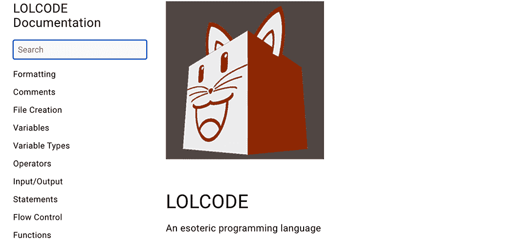

图 4.6 在我们的本地 Hugo 网络服务器上运行的 LOLCODE 文档网站

随意浏览或搜索。你会发现我们现在有一个完全功能的文档网站。我们可以选择让它保持原样，并在 GitHub 上简单地维护内容，但正如我们之前提到的，我们想要包含一个 CMS 并允许第三方贡献者访问。让我们这么做。

### 4.3.4 安装 Netlify CMS

现在我们有了内容和功能网站，我们可以启用它使用 Netlify CMS 进行编辑。在我们这样做之前，我们需要确保我们已经将我们的项目发布在 GitHub 上。如果您还没有这样做，请执行此操作。

Netlify CMS 没有安装程序。相反，你创建管理员并添加必要的文件到其中。以下是步骤：

1.  创建一个名为 admin 的文件夹。由于这是 Hugo，我们需要将其放置在静态目录中（即 /static/admin），因为我们不希望文件被 Hugo 处理。

1.  在 /static/admin 中添加一个 index.html 文件，该文件将加载运行 CMS 管理员的脚本。我们将使用 Netlify CMS 文档中提供的代码：

    ```
    <!doctype html>
    <html>
    <head>
      <meta charset=”utf-8” />
      <meta name=”viewport” content=”width=device-width, 
      ➥ initial-scale=1.0” />
      <title>Content Manager</title>
    </head>
    <body>
      <!--Include the script that builds the page and powers Netlify CMS ->
      <script s”c="https://unpkg.com/netlify-cms@².0.0/dist/netlify-
      ➥ cms”js"></script>
    </body>
    </html>
    ```

1.  在 /static/admin 中创建一个 config.yml 文件，该文件将包含 Netlify CMS 的配置。这最终将包含我们的完整内容模型定义，但现阶段我们只添加所需的基配置信息（注意：您需要将 remotesynth/lolcode-docs 替换为您自己的 GitHub 仓库信息）：

    ```
    publish_mode: editorial_workflow
    media_folder: static/images
    public_folder: /images
    backend:
      name: github
      branch: master
      repo: remotesynth/lolcode-docs
      open_authoring: true
    ```

让我们来看看这个配置文件中有什么内容：

+   将 publish_mode 设置为 editorial_workflow 会为内容创建一个草稿、审核和批准的工作流程。如果不设置此选项，内容将在保存时自动发布。编辑工作流程是启用开放撰写的必要条件。

+   media_folder 定义了网站源中可以上传图片和其他媒体文件的文件夹。然后 public_folder 定义了发布网站中 media_folder 的路径。

+   后端部分定义了 Netlify CMS 使用的作为网站后端的仓库细节。默认是 Git Gateway，这是一个开源 API，它代理了您网站上的用户和 Git 仓库之间的请求。它与 Netlify Identity（Netlify 的身份验证解决方案）无缝配合。然而，为了在 Netlify CMS 中实现开放撰写，我们必须使用 GitHub，它使用 GitHub 的 OAuth 身份验证允许用户访问。然后我们定义网站的分支和仓库（示例代码指向我的仓库，所以请确保仓库反映了您的 GitHub 仓库）。最后，我们将 open_authoring 设置为 true 以允许外部贡献者，而无需邀请他们。

+   我们已经配置了 Netlify CMS 的基本设置，但暂时还不能使用，原因有两个：我们尚未为 Netlify CMS 模型任何内容，因此它不知道正在编辑的内容是什么，并且我们尚未设置 Netlify 或 GitHub 以允许用户进行身份验证。

### 4.3.5 在 Netlify CMS 中建模内容

在开始编辑内容之前，Netlify CMS 需要了解其结构。它通过在 config.yml 中定义集合和字段来实现这一点。根据您网站复杂性的不同，为 Netlify CMS 建模内容可能是一项相当复杂的工作。幸运的是，我们的文档网站的内容相当简单。

集合

集合是 Netlify CMS 中的内容类型。这可以代表单个页面、具有共同属性的页面组或数据文件（例如 YAML、TOML 或 JSON）。Netlify CMS 中有两种集合类型：

+   *文件夹集合*代表一组内容文件，这些文件都位于单个文件夹中。重要的是要注意，截至本文撰写时，Netlify CMS 不支持子文件夹，这意味着如果你有/content/docs/topic-one 和/content/docs/topic-two，它们不能都使用/docs 文件夹定义，并且需要三个单独的集合定义。

+   *文件集合*代表一个或多个单个文件：Markdown 或 HTML 中的一个页面（或多个页面），或者 YAML、TOML 或 JSON 中的一个数据文件（或多个文件）。当在 Markdown 或 HTML 中引用页面时，通常使用特定页面的文件类型，该页面不与其他任何网站页面共享属性，例如网站的主页。

我们的文档站点有两种内容类型，一种代表主页，它是一个文件类型，另一种代表文档，它是一个文件夹类型。将此置于后端配置块下方，紧接在包含 open_authoring: true 的行之后：

```
collections:
  - name: pages
    label: Pages
    files:
      - nam“: "h”me"    
        labe“: "Home P”ge"
        fil“: "content/_index”md"
  - name: docs
    label: Docs
    folder: /content/docs
    create: true
    extension: md
    slug: '{{slug}}'
```

让我们探索到目前为止我们已经配置了什么：

+   每个集合都必须有一个名称，该名称是 Netlify CMS 中集合的唯一标识符。你可以使用任何你选择的名称，但你应该避免使用空格或除破折号或下划线之外的特殊字符。同时，标签定义了在 CMS 中向用户显示集合的方式。你可以随意命名它。

+   文件夹集合代表一个包含多个文件的单一文件夹。用户将能够创建新页面（创建设置为 true），并且这些新页面将以 md 文件扩展名的 Markdown 格式。slug 字段定义了 Netlify CMS 将如何生成新文件名。在我们的例子中，我们说的是生成内容标题的安全 URL 版本（这意味着我们的字段定义必须包含一个标题字段）。

+   文件集合必须定义它包含的不同特定文件。可以有多个，并且每个都可以定义自己的字段（我们将在稍后讨论这一点）。这意味着文件集合中的每个文件不需要共享属性，但集合是从编辑角度将它们分组在一起的一种方式。我们的文档站点只有一个文件代表主页。

我们的配置仅触及了您可用的选项中的一小部分。请查看文档以获取完整的集合配置选项列表（[`mng.bz/7W9m`](http://mng.bz/7W9m)）。

字段

字段表示内容对象上的不同数据属性（元数据）。例如，一篇博客文章可能有一个标题和日期属性，以及其他需要在 Netlify CMS 中定义为字段的属性。

每个字段都由一个*小部件*表示。Netlify CMS 中的小部件决定了如何编辑特定字段。例如，文本小部件将是一个 HTML 文本区域字段，布尔小部件将是一个切换开关，图像小部件将是一个文件选择器。Netlify CMS 自带 16 个默认小部件，涵盖了大多数用例，但您也可以定义自己的自定义小部件。

我们在内容模型中定义的每个字段都具有以下常见属性：

+   一个小部件属性，用于定义在 CMS 用户界面中用于此字段的哪个小部件。

+   一个名称，这是 Netlify CMS 中的字段名称，并且在这个字段组中应该是唯一的。您可以将其命名为任何内容，但请避免使用空格或除破折号或下划线之外的特殊字符。

+   一个必填属性，用于指定字段是否必填。如果不包括此属性，则默认为 true。

+   一个提示字段，用于定义当小部件在 CMS 用户界面中显示时将出现在工具提示中的文本。这是可选的，可以用来为用户提供额外的帮助或上下文，以便输入值。

+   一个模式字段，可以定义用于验证输入的正则表达式（regex）模式，以及当验证失败时显示的错误消息。这是可选的。

此外，每种类型的小部件都可以有特定于小部件的配置属性。请查阅文档以获取完整选项列表（[`www.netlifycms.org/docs/widgets/`](https://www.netlifycms.org/docs/widgets/))。

我们的字段定义都很简单，因为我们的文档内容模型并不特别复杂。以下是包含集合和字段的完整配置文件（请确保使用您自己的 GitHub 存储库更新存储库）。

列表 4.1 完成的 Netlify CMS 配置文件（/static/admin/config.yml）

```
publish_mode: editorial_workflow
media_folder: static/images
public_folder: /images
backend:
  name: github
  branch: master
  repo: remotesynth/lolcode-docs
  open_authoring: true
collections:
  - name: pages
    label: Pages
    files:
      - name: "home"    
        label: "Home Page"
        file: "content/_index.md"
        fields:
            - widget: string
              name: title
              label: Title
              required: true
              hint: >-
                The title of the page
            - widget: markdown
              name: body
              label: Content
              required: true
              hint: Page content
  - name: docs
    label: Docs
    folder: /content/docs
    create: true
    extension: md
    slug: '{{slug}}'
    fields:
        - widget: string
          name: title
          label: Title
          required: true
          hint: >-
            The title of the page that will appear in the left hand 
            ➥ navigation
        - widget: number
          name: weight
          label: Weight
          required: false
          hint: >-
            The navigation order of the page.
        - widget: boolean
          name: bookToc
          label: Table of Contents
          required: false
          hint: >-
            If false, the right hand table of contents will not show. 
            ➥ Defaults to true if empty.
        - widget: boolean
          name: bookHidden
          label: Hidden?
          required: false
          hint: >-
            If true, the page will not list on the left hand navigation
        - widget: markdown
          name: body
          label: Content
          required: true
          hint: Page content
```

配置就绪后，我们应该能够从命令行运行 hugo serve，然后导航到 http://localhost:1313/admin，并看到管理员界面的登录界面。

点击使用 GitHub 登录目前还不能工作（图 4.7），因为我们还没有为 Netlify 或 GitHub 配置身份验证。让我们接下来进行配置。

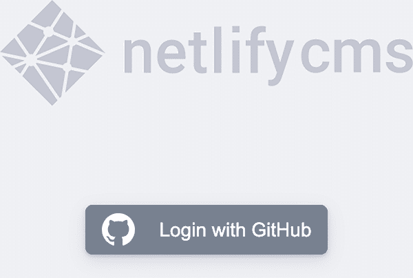

图 4.7 使用 GitHub 进行用户身份验证的 Netlify CMS 登录页面/admin

### 4.3.6 部署到 Netlify

可以使用 Netlify CMS 而不部署到 Netlify，但由于 Netlify 创建了项目，因此在启用允许用户通过 CMS 编辑内容的身份验证方面，它具有最直接的路径。我们将在后面的章节中深入探讨部署，但现在是时候介绍允许我们的 Netlify CMS 管理员中的用户的基本内容了。

首先，请确保您已将项目发布到 GitHub。再次强调，Netlify CMS 允许使用其他 Git 托管提供商，但我们将使用 GitHub 进行身份验证，因此在这种情况下，发布到那里是必需的。由于存储库将由第三方编辑，请确保将存储库设置为公开。

如果你还没有账户，你需要创建一个 Netlify 账户。Netlify 提供了一个慷慨的免费计划，这将使你能够完成这个教程。一旦你创建了 Netlify 账户，点击“从 Git 新建站点”，选择 GitHub，然后定位你的已发布仓库。如果你是第一次使用 Netlify，你需要完成一些授权步骤，以允许 Netlify 访问你的 GitHub 仓库，如图 4.8 所示。

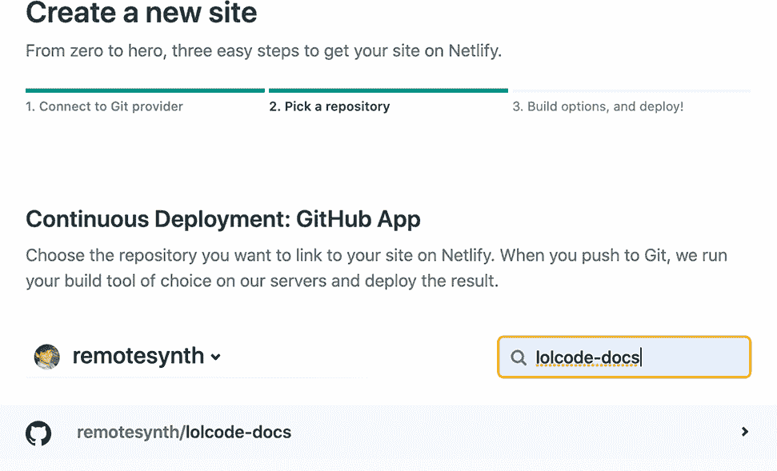

图 4.8 在 Netlify 中从 GitHub 仓库创建新站点

Netlify 在识别我们使用的静态站点生成器及其默认设置方面做得很好。然而，我经常在使用 Hugo 的最新构建时遇到问题，所以我发现设置一个与本地运行的 Hugo 版本匹配的环境变量是最好的。从命令行输入 hugo version 以查看你正在运行的版本。例如，我的返回以下内容：

```
Hugo Static Site Generator v0.74.3/extended darwin/amd64 BuildDate: unknown
```

在设置步骤的部署设置中，点击如图 4.9 所示的“显示高级”按钮。

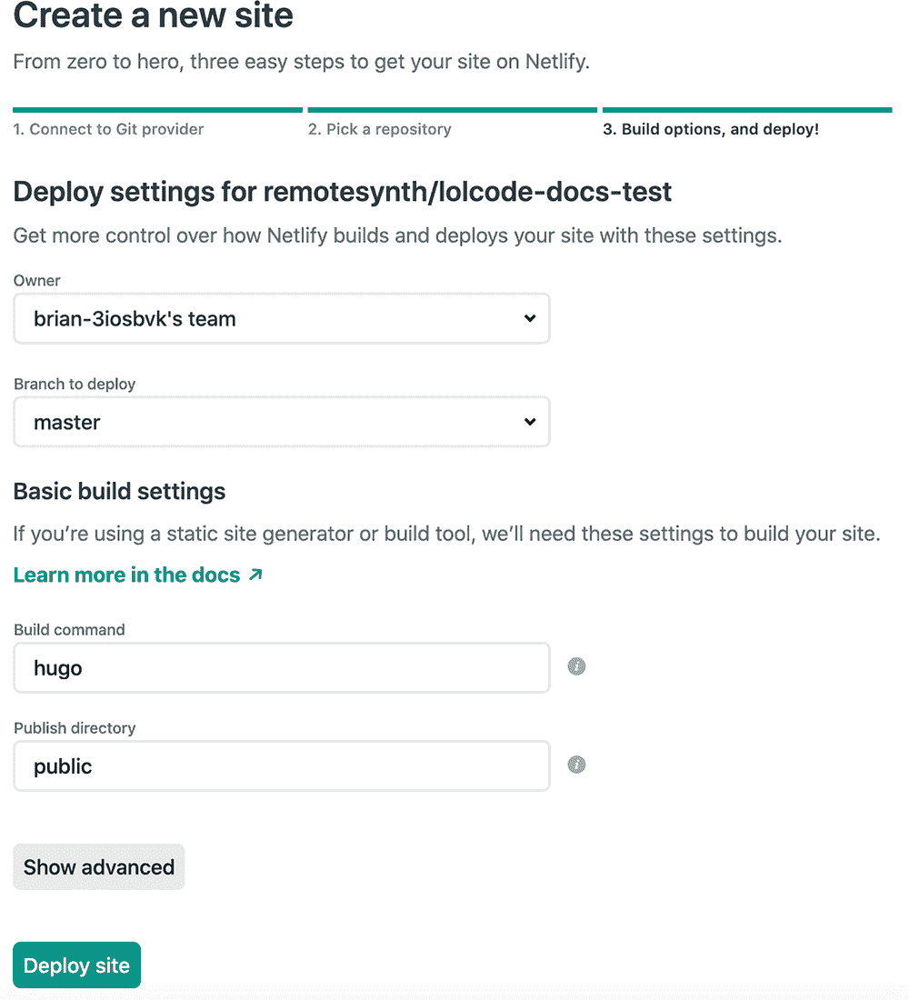

图 4.9 在 Netlify 中创建 Hugo 站点时的默认部署设置

点击“新建变量”按钮，然后添加一个名为 HUGO_VERSION 的变量，其值为运行 hugo version 命令返回的版本号。例如，在我的情况下，版本是 0.74.3，我已经在图 4.10 中输入了它。

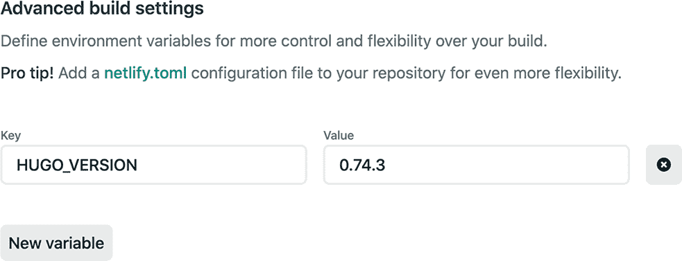

图 4.10 在 Netlify 的部署设置中设置 Hugo 版本变量

最后，点击“部署站点”。几分钟后，你的站点应该已经部署完成。获取 Netlify 为你生成的站点 URL（可以在 Netlify 仪表板的“站点概览”页面找到）。让我们通过将配置文件 config.toml 中根目录下的 baseURL 值设置为 Netlify 上的 URL 来修复它。例如，我的 URL 是[`clever-thompson-493f7c.netlify.app/`](https://clever-thompson-493f7c.netlify.app/)。这将修复在站点最初部署时可能看到的任何缺失样式表。我们还需要 GitHub 中配置身份验证的 URL。

### 4.3.7 配置 GitHub 以进行身份验证

在我们可以在 Netlify 上设置身份验证之前，我们需要在 GitHub 中设置一个 OAuth 应用程序。为此，转到设置 > 开发者设置 > OAuth 应用，并点击显示为“注册新应用程序”或“新建 OAuth 应用”的按钮，或者访问[`github.com/settings/applications/new`](https://github.com/settings/applications/new)。

我们需要为我们新的 OAuth 应用命名；可以是任何你想要的名称。在主页 URL 字段中，放置你的 Netlify 站点 URL（我们在上一节中收到）。描述也可以是任何你想要的。最后，授权回调 URL 需要是 https://api.netlify.com/auth/done。你可以在图 4.11 中看到这些设置。

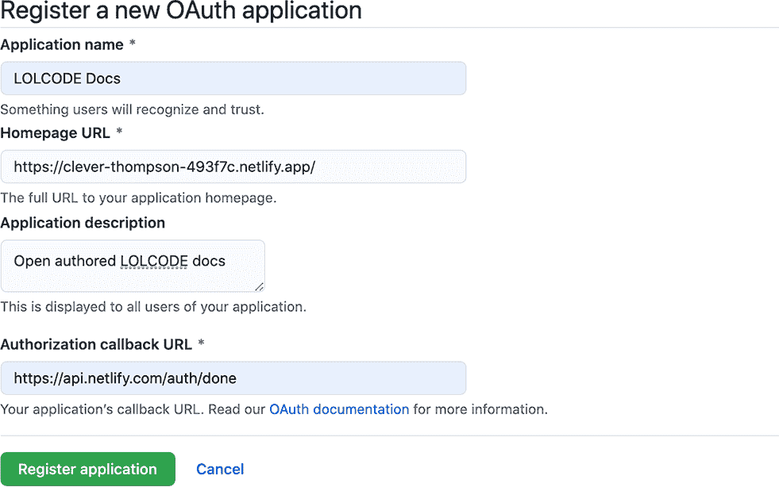

图 4.11 在 GitHub 中设置新的 OAuth 应用程序，该应用程序可用于 Netlify 的身份验证

点击注册应用程序后，我们将获得我们的 OAuth 应用程序的客户端 ID 和客户端密钥。我们需要这些信息来设置 Netlify。

### 4.3.8 配置 Netlify 以进行身份验证

在我们新网站的 Netlify 控制台中，我们需要转到网站设置 > 访问控制 > OAuth。点击安装提供者按钮。

如图 4.12 所示，提供者应为 GitHub，并在客户端 ID 和密钥字段中填写我们从 GitHub OAuth 应用程序收到的客户端 ID 和客户端密钥。最后，点击安装。

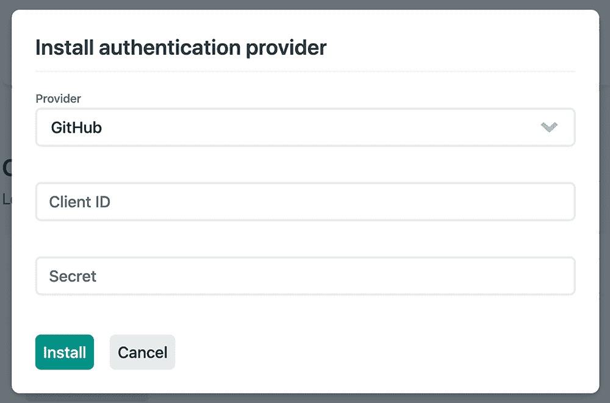

图 4.12 在 Netlify 中添加 OAuth 提供者。客户端 ID 和密钥来自我们在 GitHub 中创建的 OAuth 应用程序。

### 4.3.9 作为管理员编辑内容

现在我们已准备好访问我们的文档网站上的内容管理员（请确保您已将我们已做的任何更改推送到 GitHub）。管理员在 /admin 下可用。例如，我的 Netlify 网站的 URL 是 [`clever-thompson-493f7c.netlify.app/`](https://clever-thompson-493f7c.netlify.app/)，因此我的 Netlify CMS 管理员 URL 将是 [`clever-thompson-493f7c.netlify.app/admin`](https://clever-thompson-493f7c.netlify.app/admin)。在继续之前，请确保您已将 GitHub 仓库设置为 Netlify CMS 配置中 repo 的值 (/admin/config.yml)。

点击“使用 GitHub 登录”按钮，我们将收到基于我们创建的 GitHub OAuth 应用的 GitHub 授权窗口，如图 4.13 所示。

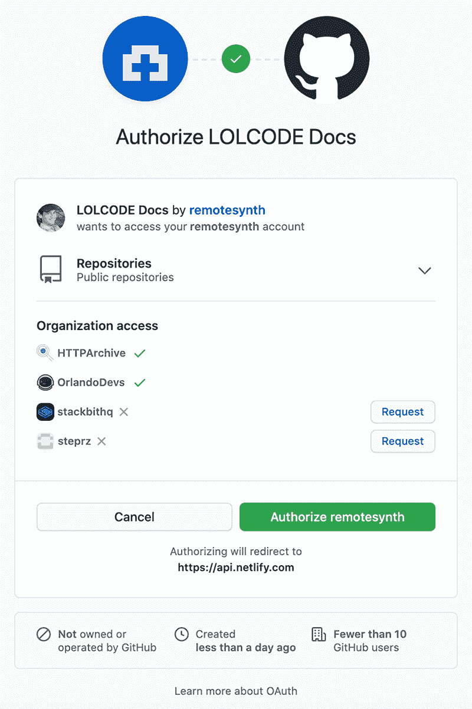

图 4.13 第一次点击“使用 GitHub 登录”时显示的 GitHub 授权窗口，显示了我们在创建 GitHub OAuth 应用程序时输入的信息。

点击授权后，我们将登录并进入 Netlify CMS 编辑仪表板，如图 4.14 所示。

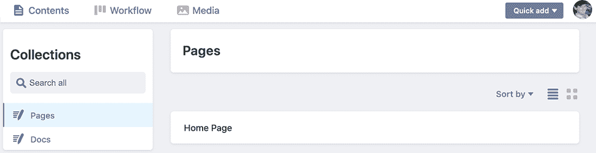

图 4.14 登录后的 Netlify CMS 仪表板。集合是我们已在 Netlify CMS 配置中定义的。

默认情况下，我们处于内容标签页，该标签页显示了我们在 config.yml 配置文件中先前定义的内容集合：页面和文档。默认选中页面集合。你可能还记得，这个集合只定义了一个内容项，即主页内容。你不能向页面集合中添加新页面。

当我们点击文档集合时，我们会看到一个完整的文档页面列表以及创建新文档页面的按钮。请随意点击一个进行编辑。编辑页面如图 4.15 所示。

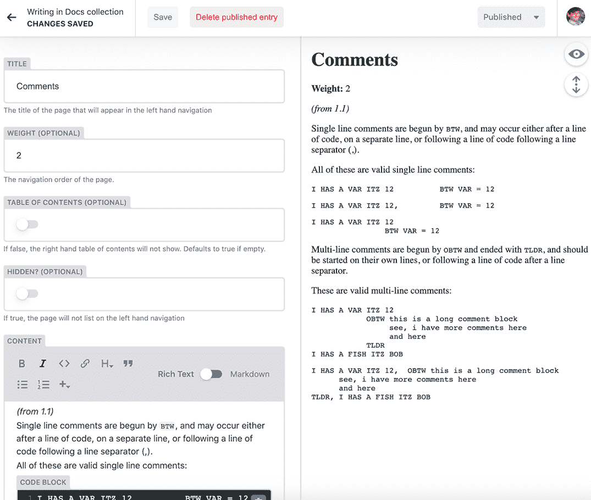

图 4.15 在 Netlify CMS 中编辑 Docs 页面之一。我们可以看到所有在 config.yaml 字段中定义的内容属性的小部件。

页面左侧的每个小部件都代表我们在 config.yml 配置文件中为文档内容类型定义的属性。内容字段提供了一个所见即所得风格的 Markdown 内容编辑界面。页面的右侧提供了一个正在编辑的内容的预览。

尝试对内容进行一些更改。一旦您进行了更改，点击“保存”按钮。由于我们使用的是编辑流程，文档将作为草稿保存在工作流程中。我们可以将状态更改为“待审阅”或“就绪”。在我们可以将更改发布到页面之前，我们需要将状态设置为“就绪”。

此外，通过使用 Netlify 的部署预览功能，我们可以在发布之前预览网站上的更改。在页面顶部的工具栏中，我们将看到一个“检查预览”链接。点击该链接将带我们到 Netlify 的更改部署预览链接，这可能需要几秒钟。点击“查看预览”将打开网站的部署预览，并将包括我们的更改，以便我们在发布之前进行审查。

当您准备好时，将状态更改为“就绪”，点击“发布”，并选择“立即发布”。这将把更改提交到我们的 GitHub 仓库，然后触发我们的 Netlify 网站的构建并发布更改到我们的实时网站。

### 4.3.10 开放式作者工作流程

我们外部用户的工作流程将略有不同。让我们来看看这会是什么样子。您不需要跟随这一部分，因为这需要第二个 GitHub 账户。

一旦他们使用 GitHub 登录并授权我们的 GitHub OAuth 应用，他们将被要求分叉仓库，如图 4.16 所示。在此处点击“不分叉仓库”将退出流程，用户将无法进行任何编辑。

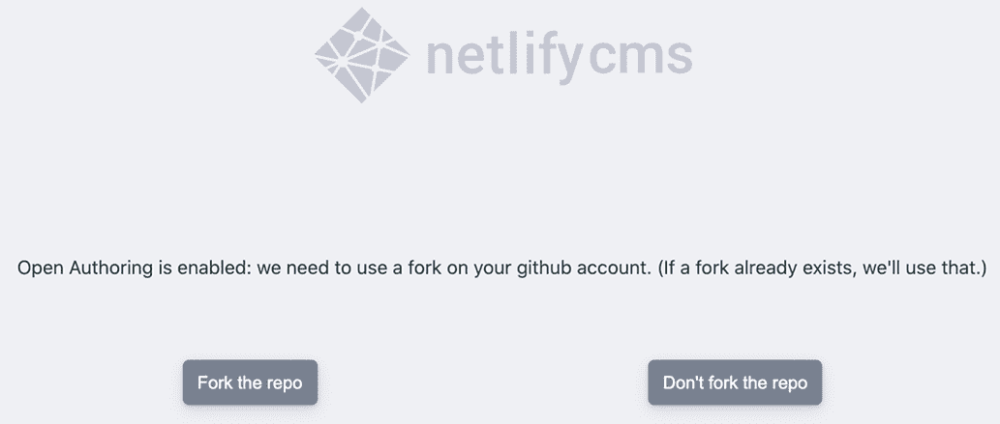

图 4.16 外部用户将被要求分叉仓库以获取访问 Netlify CMS 管理员权限并提交对网站的编辑。

点击“分叉仓库”将自动在用户的账户上创建我们仓库的分叉。这是用户所做的所有更改将被保存的地方。

一旦用户分叉了仓库，Netlify CMS 管理员将与我们之前用来编辑网站的相同。然而，当他们对网站进行更改时，他们没有将状态设置为“就绪”或任何发布选项的选项。相反，他们只能将状态设置为“待审阅”。这样做将自动向我们的主仓库提交包含用户所做的更改的拉取请求，如图 4.17 所示。

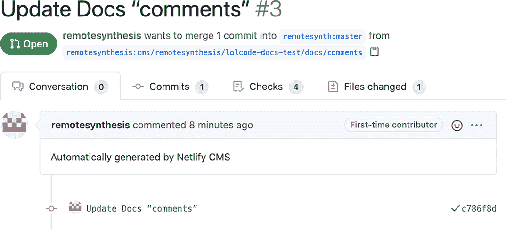

图 4.17 当第三方贡献者将更改设置为“待审阅”时，主 GitHub 仓库将自动提交拉取请求。为了接受更改，我们可以合并拉取请求。

为了将用户的更改合并到我们的网站上，我们需要合并拉取请求。这将更新我们的 GitHub 仓库，触发我们 Netlify 网站的更新，并将更改发布到我们的实时网站上。

### 4.3.11 简化开放作者工作流程

在我们完成之前，让我们对我们的网站进行最后一次编辑。目前，任何希望为文档做出贡献的外部作者都需要知道去 /admin 登录。如果我们能在文档内部提供快速链接来添加或编辑内容，那么贡献的可能性会更大。为此，我们将对模板进行一些小的修改。

我们依赖于 Hugo-Book 主题进行布局，并将其作为 Git 子模块安装。因此，我们无法直接更改 Hugo-Book 代码。尽管如此，Hugo 有一个查找顺序，用于主题模板，它首先查找最具体的匹配项。这意味着我们可以将文件放置在 /layouts 文件夹中，以覆盖 /themes 文件夹中的模板文件。当我们看到它在实际中的应用时，这会更有意义。

Hugo-Book 主题有布局文件，这些文件专门用于在模板输出中的特定点注入内容，例如在内容之前或之后。您可以在 /themes/book/layouts/partials/docs/inject 中看到这些文件。让我们通过 content-after.html 模板在每个内容页面的末尾添加链接。

要覆盖此模板，在您的 /layouts 文件夹中创建一个具有相同目录结构和名称的文件：/layouts/partials/docs/inject/content-after.html。由于 Hugo 认为 /layouts 中的文件比 /themes 中的文件更具体，通过创建一个完全相同的路径文件，Hugo 将使用它来替代主题文件。

将以下模板代码放置在文件中：

```
{{ if ne .RelPermalink "/"}}
    {{ $edit_url := print "/admin/#/edit" .RelPermalink }}

    <p><a href="{{$edit_url}}" class="book-btn">Edit this Page</a>&nbsp;&nbsp;
    <a href="/admin/#/collections/docs/new" class="book-btn">Add a New 
    ➥ Page</a></p>
{{ end }}
```

让我们看看这个模板代码在做什么。首先，它通过检查 Hugo 提供的名为 .RelPermalink 的变量来查看我们是否在主页上，该变量包含当前页面的相对路径。在 Hugo 中，函数 ne 表示“不等于”，因此我们检查相对路径是否不等于“/”。我们这样做是为了不在主页上提供编辑链接。其次，我们根据当前页面组装一个指向管理员的 URL。最后，我们使用该 URL 添加一个“编辑此页”链接，这将直接带他们进入编辑当前查看的页面内容。我们还包含了一个“添加新页面”链接，该链接直接链接到创建新的文档页面。

在将此页面提交并推送到我们的仓库或本地运行后，我们应该看到这些新链接添加到我们网站上的任何文档页面，例如图 4.18 中所示。

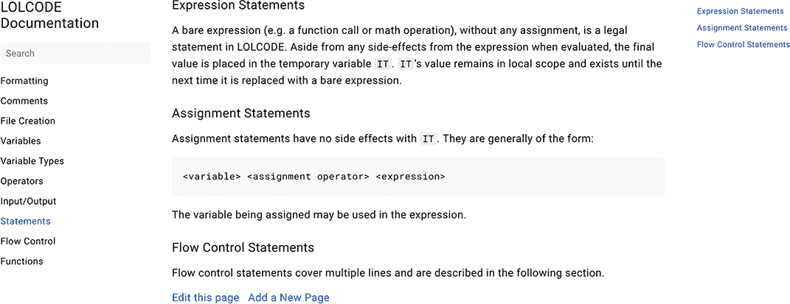

图 4.18 一旦我们添加了模板代码，文档页面将会有“编辑此页”和“添加新页面”链接。

### 4.4 接下来是什么？

正如我们所见，Jamstack 可以成为文档网站的一个强大解决方案。像 Netlify CMS 这样的开源解决方案允许使用基于 Git 的工作流程，同时仍然让内容编辑者享受到易于使用的所见即所得编辑体验，甚至允许第三方贡献——这在非 Jamstack 解决方案中并不容易实现。

虽然 Netlify CMS 的编辑体验功能齐全，但有些人可能觉得它缺乏一些非 Jamstack 工具（如 WordPress）的打磨。值得记住的是，有许多提供不同编辑用户体验的替代方案。如果你在寻找更类似 WordPress 的体验，务必探索基于 API 的无头 CMS 选项，如 Contentful、Sanity 或 AgilityCMS，或者甚至服务如 Stackbit。

正如我们所展示的，Jamstack 是内容导向网站（如文档网站）的一个优秀解决方案，但你可能想知道它是否能够处理具有更复杂和动态用户交互的网站。在下一章中，我们将通过使用 Jamstack 工具构建电子商务网站来探讨这样一个例子。

## 摘要

+   文档网站一直是并且继续是 Jamstack 的一个完美用例，因为它们高度关注内容，并可以从版本控制等 Jamstack 工作流程的核心功能中受益。

+   无头 CMS 是一种内容管理系统，它提供的内容编辑工具与网站的客户端显示独立。基于 API 的无头 CMS 通过 API 将内容提供给前端，而基于 Git 的无头 CMS 则直接在网站的 Git 仓库中编辑内容。

+   Netlify CMS 是由 Netlify 创建和维护的开源、基于 Git 的无头 CMS，它提供了开放作者工作流程的选项。这可以让外部贡献者有机会编辑和提交网站内容的更改。

+   有很多针对文档的特定静态网站生成器。虽然基于 Go 的静态网站生成器 Hugo 不是针对文档的，但由于其构建速度和大量可用的文档模板，它通常是这些类型项目的首选工具。

+   Netlify CMS 通过 YAML 进行配置，并且必须有一个内容模型，该模型是 CMS 能够编辑的网站上的内容。我们为我们的 LOLCODE 技术文档网站使用的基礎文档内容模型配置了 Netlify CMS。

+   Netlify CMS 上的开放作者允许第三方贡献者访问 CMS 以进行内容贡献。我们配置了 Netlify 和 GitHub 进行身份验证，允许第三方使用开放作者登录我们的 CMS。

+   Netlify 的管理界面使用小部件来简化对页面元数据（前文）和内容的编辑。Markdown 编辑使用所见即所得风格的编辑界面。网站所有者和第三方作者的 CMS 用户体验几乎相同，除了标记更新为“就绪”并发布，这项功能仅限于网站所有者。
