# 5 构建电子商务网站

本章涵盖

+   确定典型电子商务网站的需求

+   比较无头电子商务系统以管理产品和结账

+   为电子商务网站选择静态网站生成器

+   使用 Next.js 创建和配置新网站

+   在 Next.js 中构建产品列表、产品详情和购物车

+   在 Next.js 网站中导入和使用 Markdown 内容

电子商务网站有许多可能使其看起来不适合基于静态资产的架构（如 Jamstack）的要求。尽管内容方面，如产品列表和详情页面，可以轻松地适应静态生成的网站，但像购物车、结账处理和订单历史这样的功能似乎过于动态和交互，没有服务器端渲染就无法运行。

直到三四年前，这正是我会给出的建议：静态网站生成器不适合电子商务网站。然而，Jamstack 不仅仅是用静态网站生成器构建网站。Jamstack 的核心功能之一是能够在客户端使用 JavaScript 和 API 来实现动态功能，这些功能使用静态网站工具是做不到的。因此，今天完全有可能使用 Jamstack 构建功能齐全的电子商务网站。

说某事是可能的，并不意味着它就是正确的。然而，我会争辩说，在许多情况下，如果不是大多数情况下，采用 Jamstack 进行电子商务是正确的想法。这是因为有一整个小行业的研究表明性能可以对转化率以及因此产生的销售额产生影响。例如，一项分析发现，“如果一个网站每天赚 10 万美元，[页面速度]提高一秒就能带来 7000 美元的日收入”([`mng.bz/Nxj7`](http://mng.bz/Nxj7))。换句话说，Jamstack 提供的性能改进不仅会提升用户体验，而且这种改进的用户体验还可以提高你的利润。

### 5.1 电子商务网站的要求

电子商务网站在复杂性上可以有很大差异。一些网站只提供少量产品或服务以及简单的结账流程，没有任何真正的功能装饰。其他网站提供各种动态内容，如用户评论、个性化推荐、愿望清单等。所有这些功能都使用 Jamstack 实现，我们讨论的一些工具甚至提供专门的 API 来实现这些功能。

让我们看看典型电子商务网站的一些核心要求：

+   电子商务网站有一系列产品或服务。这些内容应通过某种形式的内容管理系统轻松更新和管理，以便非技术用户能够快速轻松地更新网站。

+   电子商务网站除了产品列表之外，还有常规的内容页面，如关于页面或服务条款。在大多数情况下，这些页面更新不频繁，因此可能不需要集成到外部内容管理中。

+   电子商务网站通常有一个购物车，用户可以动态添加和删除商品，然后进行结账流程。

+   电子商务网站必须有一个结账流程来完成购买。在大多数情况下，这集成在网站上，但在某些情况下，最终的结账流程可以外包给第三方进行处理和确认。

### 5.1.1 示例网站要求

我们将为本章构建的示例是一个简单的店面，称为“果酱店”，用于销售玩具人偶和橡皮鸭。它包括所有讨论的基本要求。目前，我们只有四个商品的有限库存，但我们预计它会扩大（见图 5.1）。

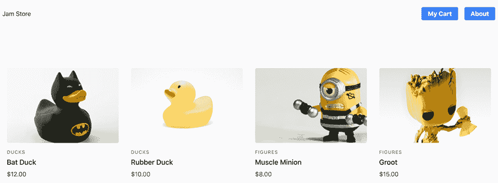

图 5.1 我们这个示例电子商务项目的最终结果是出售玩具人偶的商店。

我们网站将集成内容管理以添加和编辑我们的产品列表。然而，我们的其他内容页面——我们的关于页面——更新不频繁，因此它将作为一个简单的 Markdown 文件进行管理。

用户将从产品详情页面添加商品到购物车。他们可以通过“我的购物车”页面修改数量或删除商品，然后再进行结账。由于我们规模较小（以及为了简化），结账流程将外包给第三方来管理最终的运输和订单确认细节。

### 5.2 选择合适的工具

建立一个 Jamstack 电子商务网站有无数种方法，包括从头开始构建自定义解决方案。然而，电子商务中有许多复杂性，可能会使这项任务显得有些令人畏惧。Jamstack 通常倾向于尽可能利用现有服务以简化开发，在这种情况下，我们将使用一种称为无头电子商务的服务。

### 5.2.1 什么是无头电子商务？

在第四章中，我们了解了一个名为无头 CMS 的概念，其中 CMS 提供了与前端展示解耦的后端内容管理工具。无头电子商务是将此概念应用于电子商务工具。一个 *无头电子商务解决方案* 提供了管理购物车、订单、运输以及在很多情况下，与特定前端解决方案无关的产品/服务及库存的工具，允许您根据需要自定义前端。

我认为无头电子商务的类型比无头 CMS 的类型更多样化，在无头 CMS 中我们只有两种主要类型（基于 API 和基于 Git）。没有普遍接受的无头 CMS 类别，但——借鉴 François Lanthier Nadeau 的研究成果（[`snipcart.com/blog/headless-ecommerce`](https://snipcart.com/blog/headless-ecommerce)）——SnipCart（我们将讨论的解决方案之一）的 CEO（一位无头电子商务领域的专家），以下是广泛的类型：

+   *全栈解决方案*——正如其名所示，这些解决方案提供全面的服务来管理电子商务网站的各个方面，从内容到产品，再到订单、运输等等。在大多数情况下，这些工具更倾向于提供全栈解决方案（耦合）的网站，既提供前端也提供后端，但它们也提供 API 以作为解耦的无头替代方案，可以在 Jamstack 网站中使用。

+   *增强型解决方案*——这些工具提供完整的购物车和结账解决方案，实际上是在你的网站之上运行的。这通常是通过包含一个嵌入覆盖层的脚本来完成的。这些工具通常不管理内容，也不一定要求你通过他们的服务管理你的产品列表。

+   *基于 API 的解决方案*——与它们的无头 CMS 对应物一样，这些服务的所有功能都仅通过 API 调用提供。虽然后端管理从产品到购物车、订单和运输的各个方面，但它们对前端构建方式没有假设。从添加和删除购物车中的项目到结账过程，所有这些操作都是通过调用 API 来处理的，在 Jamstack 网站的情况下使用 JavaScript。

从 Jamstack 的角度来看，无论是全栈解决方案还是基于 API 的解决方案，它们的消费方式都是相同的：一个 Jamstack 网站将使用全栈解决方案提供的 API，而不是依赖任何前端开发工具。

增强型解决方案通常需要的开发工作量最少，但通常以可定制性为代价。一旦你用产品/服务列表构建了网站，你只需简单地将其连接到管理其余部分的头颈电子商务工具。另一方面，全栈和基于 API 的解决方案都需要更多的开发工作量，因为像购物车和结账这样的前端需要定制构建，但通过仅依赖 API，开发者可以按照自己的选择创建前端。

提示：想深入了解一系列无头电子商务选项，请查看 Bejamas 的这篇详细文章：[`bejamas.io/blog/jamstack-ecommerce/`](https://bejamas.io/blog/jamstack-ecommerce/)。

### 5.2.2 无头电子商务选项

在我们讨论我们将选择哪种选项之前，让我们先看看一些最受欢迎的无头电子商务解决方案，每个类别中各一个。

Shopify

Shopify ([`shopify.dev/`](https://shopify.dev/)) 是市场上最受欢迎的全功能电子商务选项之一。Shopify 的服务可以通过他们的 Storefront API ([`shopify.dev/api/storefront`](https://shopify.dev/api/storefront)) 在 Jamstack 网站中使用。这是一个提供对 Shopify 产品信息、订单和结账等全面服务的 GraphQL API。Shopify 还提供了一个用于 Storefront API 的 JavaScript SDK [(http://mng.bz/Dxja)](http://mng.bz/Dxja)，它简化了与他们的 API 交互所需的代码。Butcher Box（见图 5.2）和 Victoria Beckham Beauty 是两个使用 Jamstack 构建，并访问 Shopify Storefront API 的店面。

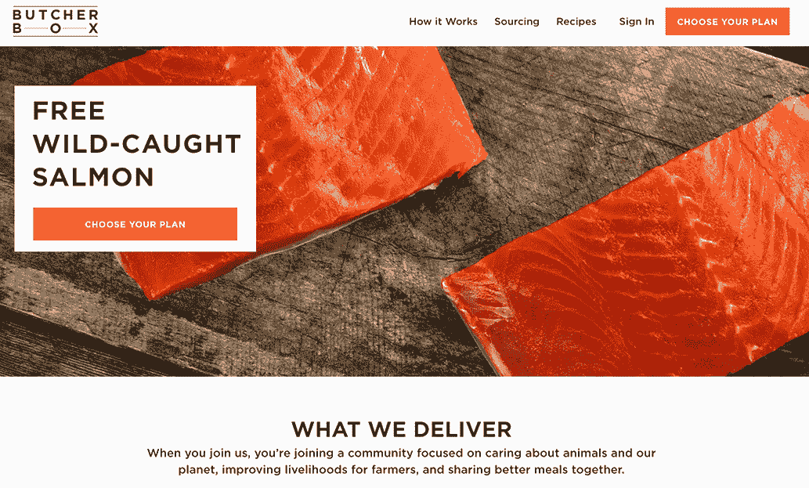

图 5.2 Butcher Box 是一个使用 Jamstack 构建，并使用 Gatsby 访问 Storefront API 的在线商店的例子。

Snipcart

Snipcart ([`snipcart.com/`](https://snipcart.com/)) 是一个附加电子商务解决方案的例子。在最基本的情况下，使网站与 Snipcart 一起工作只需要包含 Snipcart 的 JavaScript 和 CSS 文件，然后向“添加到购物车”按钮添加自定义 HTML 属性。就这样。链接将触发 Snipcart 购物车覆盖层出现，其中包含所有内置的购物车管理和结账功能。Snipcart 还包括一些定制选项，以及一个 JavaScript SDK，如果您想通过编程方式访问其任何功能而不是通过嵌入的购物车和结账。

注意：如果您想快速了解使用 Hugo 构建，并使用 Snipcart 进行电子商务功能的 Jamstack 网站的设置教程，请查看这篇教程和示例应用程序：[`www.stackbit.com/blog/ecommerce-jamstack/`](https://www.stackbit.com/blog/ecommerce-jamstack/)。

Commerce.js

Commerce.js ([`commercejs.com/`](https://commercejs.com/)) 是一个基于 API 的无头电子商务解决方案的例子，它已被用于构建如图 5.3 所示的 INGMARSON 网站等。它提供了构建电子商务网站所需的所有工具——产品管理、折扣、购物车、结账等，这些可以通过基于网络的后端进行管理，但在您的应用程序中通过 JavaScript SDK 和命令行工具访问。为了帮助您开始，他们还提供了使用流行的网络框架如 React 和 Vue 的预构建示例网站。我们的示例应用程序将使用 Commerce.js。

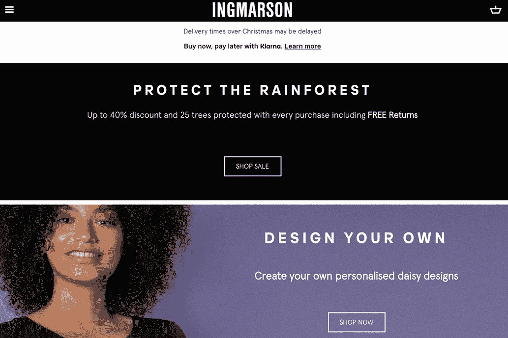

图 5.3 INGMARSON 是一个使用 Gatsby 和 Snipcart 的 Jamstack 构建在线服装零售商，它启用了其电子商务功能。

### 5.2.3 为什么选择 Commerce.js？

使用 commerce.js 的决定并不仅仅是由我们示例应用程序的技术需求驱动的。除了功能性之外，示例应用程序的目标是教授使用 Jamstack 工具和框架所需的一些基本概念。通过需要更多自定义代码，使用基于 API 的解决方案将使我们能够探索构建 Jamstack 应用程序所需的一些代码。

如果您正在评估选择哪种类型的解决方案，以下是我的建议：

+   如果您的优先级是快速轻松地构建网站而不是定制购物车或结账流程，请选择一个附加解决方案。

+   如果您的优先级是保持对设计和用户体验的控制，包括购物车和结账流程，并且您对需要额外代码感到舒适，请选择基于 API 的解决方案。

+   从技术角度考虑，您会选择一个一站式解决方案，原因与您选择基于 API 的解决方案相同。然而，在某些情况下，可能会有额外的功能提供或现有的商业关系，这可能使一站式解决方案更适合。

### 5.2.4 静态网站生成器选项

我所了解的没有特定的静态网站生成器（SSG）专门针对电子商务，所以实际上任何 SSG 都可以工作。尽管如此，我们计划在构建时与 API 集成——以填充产品列表——以及在客户端集成——以启用购物车功能。基于 JavaScript 的 SSG 在构建时与 API 集成变得容易，而且更具体地说，基于 JavaScript 框架的选项可以提供使一些客户端脚本更容易的工具。让我们看看这些选项中的几个：

+   *Gatsby*—Gatsby 是一个非常流行的基于 React 的 SSG。使 Gatsby 独特的一些事情是它使用 GraphQL 来访问数据，包括内容和其他内部数据结构，以及其插件系统。Gatsby 庞大的社区已经创建了数千个插件（截至本文撰写时超过 2,500 个），几乎覆盖了您可能需要的任何功能或集成。

+   *Next.js*—Next.js 是一个基于 React 的元框架（一个框架之上的框架）。它不仅仅是一个静态网站生成器。Next.js 可以用于创建具有服务器端渲染（SSR）的标准 React 单页应用程序（SPA）。它还提供了生成作为 Jamstack 应用程序静态资源的工具，但甚至允许网站确定特定的路由（即应用程序内的路径）应该是动态的还是静态的。这允许开发者构建“混合”应用程序，结合 SSR 和静态。

+   *Nuxt.js*—正如其名称可能暗示的那样，Nuxt.js 与 Next.js 有很多相似之处，包括能够用于 SSR 或静态（Nuxt 3 还增加了混合 SSR/SSG 方法的兼容性）。然而，Nuxt.js 使用 Vue 框架而不是 React。

+   *Gridsome*——Gridsome 与 Gatsby 有很多共同之处。它包括许多定义 Gatsby 的核心功能——它的 GraphQL 使用、它对生成 Jamstack 静态资产的关注以及它的插件生态系统——但使用 Vue 而不是 React。

+   *Scully*——虽然有许多基于 React 和 Vue 的 SSG，但截至本文撰写时，Scully 是唯一一个面向喜欢使用 Angular 框架的开发者的选项。它专注于开发基于纯静态的 Jamstack 应用程序，并拥有类似于 Gatsby 和 Gridsome 的插件生态系统。

我们将使用 Next.js 来构建我们的示例应用程序。

### 5.2.5 为什么选择 Next.js？

那么，你应该使用哪个静态站点生成器呢？说实话，这主要取决于个人喜好。除非你的电子商务网站有特定的需求，而这个需求可以通过 Next.js 或 Nuxt.js 中 SSR 的可用性来满足，否则列出的任何选项都能同样好地工作。那么问题就变成了：你更喜欢 React、Vue 还是 Angular？除此之外，这只是关于功能（GraphQL、插件）或风格偏好的问题。

Next.js 的最新版本还提供了一种新的渲染形式，称为增量静态再生（ISR），这对于拥有大量产品因而页面众多的电子商务网站尤其有用。ISR 实质上是在用户首次请求页面时才进行渲染。这意味着拥有数千个产品的电子商务网站可能只需要生成最受欢迎的 200 个产品页面，并在首次请求时渲染剩余的页面。这意味着第一个请求页面的用户可能会在收到页面时看到轻微的延迟，但后续用户将像静态生成一样收到页面。您可以在 Vercel 文档中了解更多关于 ISR 的信息（[`mng.bz/lanB`](http://mng.bz/lanB)）。

### 5.3 准备构建示例电子商务网站

现在我们已经做出了工具选择——使用 Commerce.js 进行电子商务和 Next.js 进行 SSG——让我们开始构建示例应用程序。我们需要做的第一件事是设置好一切，以便我们可以开始编码。

### 5.3.1 设置 Next.js

Next.js 的安装方式与之前章节中使用的某些示例不同，那些示例使用了二进制文件或全局 npm 安装。相反，Next.js 提供了一个名为 Create Next App 的工具（[`nextjs.org/docs/api-reference/create-next-app`](https://nextjs.org/docs/api-reference/create-next-app)），用于生成一个新的网站，无论是空白网站还是从长长的起始模板列表中选择的一个。这不需要你安装任何东西，而是需要一个 npx 命令：一个内置在 npm 中的包运行器，可以在不要求安装的情况下运行 npm 脚本。你可以不带任何参数运行 npx create-next-app，它将创建一个简单的单页网页应用程序，包含基本的默认 Next.js 应用程序文件和文件夹结构。

Create Next App 还可以使用模板。这可以是任何 GitHub 仓库，但 Next.js 团队已经提供了超过 250 个示例 [(https://github.com/vercel/next.js/tree/main/examples)](https://github.com/vercel/next.js/tree/main/examples)，你可以使用这些示例。我们将使用这些示例之一，with-tailwindcss，作为我们示例电子商务商店的基础，该商店销售玩具人偶。我们将构建产品列表页面、产品详情页面和购物车，但为了使这更容易，我们将利用 Next.js 提供的启动模板。我们选择的特定启动模板包括 Tailwind CSS 库，这将为我们提供一些基本的样式构建块来工作。这对我们来说是一个巨大的帮助：虽然我是许多事物，但设计师不是其中之一。想了解更多关于 Tailwind 的信息，请访问 [tailwindcss.com](https://tailwindcss.com/)。

让我们从运行 create-next-app 并指定 Tailwind CSS 示例开始。在你的网页项目存储位置运行以下命令：

```
npx create-next-app -e with-tailwindcss
```

Create Next App 会要求你输入项目名称。这将用作项目放置的文件夹名称。在这个例子中，让我们使用 next-ecommerce。Create Next App 不仅会生成项目文件，还会为我们安装所有依赖项。我们只需要将目录切换到项目文件夹并运行它：

```
cd next-ecommerce
yarn dev
```

如果你更喜欢使用 npm 而不是 Yarn，你可以运行 npm run dev 作为替代。

默认情况下，网站将在 http://localhost:3000 上运行。如果你在浏览器中打开它，你应该会看到图 5.4 中显示的标准 Next.js 启动画面。

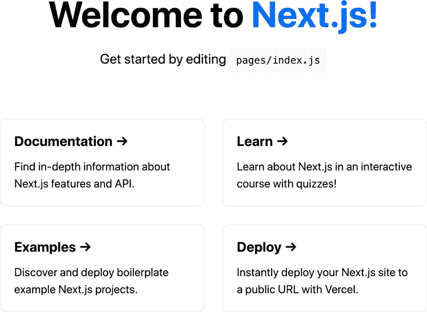

图 5.4 运行 npx create-next-app 生成的默认 Next.js 网站

让我们从为这个网站添加一个基本的导航组件开始（列表 5.1）。我们将链接到的页面尚未创建，但我们很快就会解决这个问题。首先，在网站的根目录下创建一个名为 components 的文件夹，并在该文件夹内创建一个名为 nav.js 的文件。我们将有两个导航项，在 links 变量中设置为“我的购物车”和“关于”。这些将分别链接到 /cart 和 /about。我们使用 JavaScript 的 map() 函数遍历这个数组中的链接来创建导航。

列表 5.1 /components/nav.js 中的更新后的导航

```
import Link from 'next/link';

const links = [
  { href: '/cart', label: 'My Cart' },
  { href: '/about', label: 'About' },
];

export default function Nav() {
  return (
    <nav>
      <ul className="flex items-center justify-between p-8">
        <li>
          <Link href="/">
            <a className="text-blue-500 no-underline text-accent-1 dark:text-
            ➥ blue-300">
              Jam Store
            </a>
          </Link>
        </li>
        <ul className="flex items-center justify-between space-x-4">
          {links.map(({ href, label }) => (
            <li key={`${href}${label}`}>
              <Link href={href}>
                <a className=" no-underline px-4 py-2 font-bold text-white 
                ➥ bg-blue-500 rounded">{label}</a>
              </Link>
            </li>
          ))}
        </ul>
      </ul>
    </nav>
  );
}
```

我们将使用这个组件来在页面间显示导航。让我们先清除默认网站主页上的大部分默认内容，并包含导航组件。目前，页面只导入 nav.js 组件并在主部分上方显示它，目前这部分包含一些占位文本。

列表 5.2 在 /pages/index.js 中包含导航

```
import Nav from '../components/nav';

export default function IndexPage({ products }) {
  return (
    <div>
      <Nav />
      <section className="text-gray-700 body-font">
        <div className="container px-5 py-24 mx-auto">
          <div className="flex flex-wrap -m-4">
            The product list will go here.
          </div>
        </div>
      </section>
    </div>
  );
} 
```

现在我们已经设置了项目代码，我们需要设置并填充 Commerce.js，以便我们可以在页面上填充数据。

### 5.3.2 设置 Commerce.js

要开始，我们需要通过 [commercejs.com](https://commercejs.com/) 注册一个 Commerce.js 账户。不用担心：免费账户对于本例的目的来说已经足够慷慨了。注册后，您将被带到仪表板。这就是我们将创建将填充我们的电子商务商店的类别和产品的地方。我将为您提供一些关于如何填充这些信息的指导，但应该注意的是，您可以使用您选择的任何内容；我们编写的代码中没有任何内容要求您使用我使用的产品和类别。

为了使我们的电子商务玩具人偶店能够运行，它需要一些产品，每个产品都将被分配到一个类别。我们需要通过它们的基于 Web 的后端在 Commerce.js 中填充这些信息。

让我们从创建一些类别开始。正如您在图 5.1 中看到的，我们的商店由一些玩具、人偶和橡皮鸭组成。因此，我们将创建两个类别：人偶和鸭子。要创建类别，请点击 Commerce.js 仪表板左侧的“产品”导航项，然后选择“类别”。我们需要提供类别名称，它将自动为我们填写一个别名。我们可以使用它提供的默认值（图 5.5）。

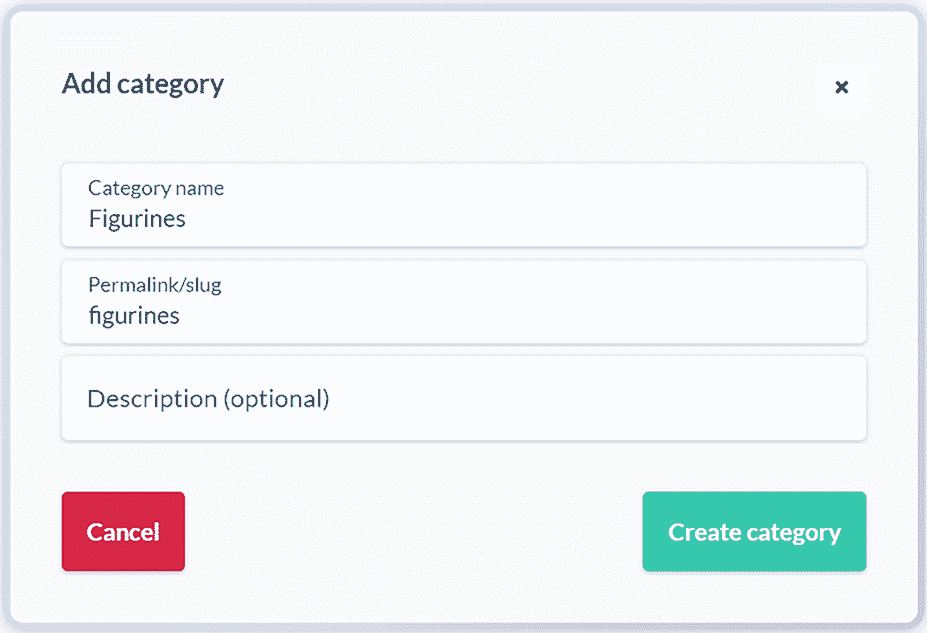

图 5.5 在 Commerce.js 仪表板中创建一个新的产品类别。

接下来，让我们创建一些产品。点击左侧导航栏中的“产品”项，然后点击“产品”。我们可以提供很多详细信息（见图 5.6），但就我们的目的而言，我们不需要填写所有这些信息。

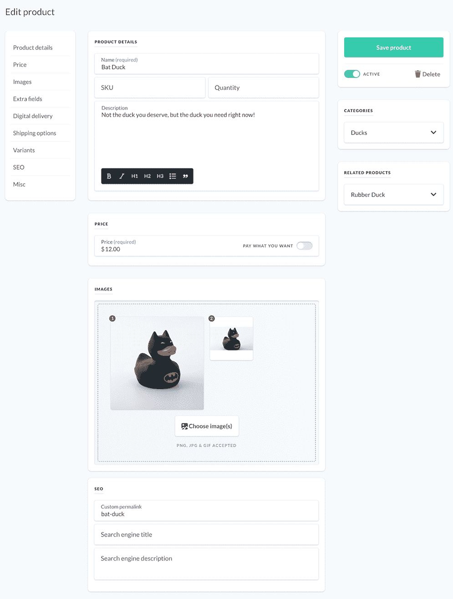

图 5.6 在 Commerce.js 仪表板中创建一个新的产品。请注意，为了可读性，只显示了页面上的相关部分。

在我们创建新产品时，需要完成的关键项如下：

+   *名称*—您可以随意命名产品。

+   *描述*—再次，您可以自由添加您选择的任何类型的描述。

+   *类别*—假设您使用了建议的类别，这将要么是“插图”要么是“鸭子”。

+   *价格*—提供您想要的任何价格。

+   *图片*—我在本书的 GitHub 仓库中提供了一些示例图片 [(https://github.com/cfjedimaster/the-jamstack-book)](https://github.com/cfjedimaster/the-jamstack-book)。对于我们的设计，我们需要为每个产品提供两张图片：一张是 400 × 400 px，另一张是 350 × 192px。

+   *自定义永久链接*—如果您不提供，系统会自动生成一个随机永久链接，但最好我们还是提供。这将用于应用程序中构建查看产品的路径。

一旦我们创建了一些产品，我们就可以回到我们生成的项目并开始编码。但首先，我们需要我们的 API 密钥，以便我们的项目可以访问 Commerce.js 中的数据。点击左侧导航菜单中的“开发者”项，然后选择“API 密钥”。我们只需要复制公钥。

### 5.3.3 设置 Next.js 环境变量

如果你仍然在运行本地 Web 服务器来运行你的网站，请现在停止它，因为我们将对网站的配置进行更改。

为了从我们的网站连接到 Commerce.js API，我们需要 API 密钥。然而，我们需要将这个密钥放在一个不会直接在我们的代码中暴露的地方，这个代码将被提交到 GitHub。Next.js 包括自动加载环境变量的能力（见[`nextjs.org/docs/basic-features/environment-variables`](https://nextjs.org/docs/basic-features/environment-variables)），这可以用来存储像 API 密钥或你打算在整个应用程序中重复使用的通用配置变量等秘密。我们将把我们的 Commerce.js 公开 API 密钥存储为环境变量。

在你的项目根目录下创建一个名为.env.local 的文件。默认情况下，我们在这个文件中存储的任何变量都可以通过 process.env.ENV_VARIABLE_NAME 访问。例如，名为 CHEC_PUBLIC_KEY 的变量可以通过 process.env.CHEC_PUBLIC_KEY 访问。这仅在 Node.js 环境中可用，无论是作为 SSR 应用程序的服务器端，还是在使用 Next.js 作为 SSG 时的构建过程中。如果你需要通过客户端 JavaScript 访问这个变量，你可以将变量的名称前缀为 NEXT_PUBLIC_。

我们需要这个变量在构建时配置 Commerce.js SDK，因此我们不需要将其设置为公开。让我们在.env.local 文件中放入以下内容，将{{MY_API_KEY}}替换为你的 Commerce.js 公开 API 密钥：

```
CHEC_PUBLIC_KEY={{MY_API_KEY}}
```

.env 文件对于存储像 API 密钥这样的东西很有用，你不想在项目存储库中发布。虽然这是一个公开密钥，并且可以从客户端检查我们发出的任何 API 调用的人访问，但仍然建议将其从发布代码中排除。此外，这给我们提供了一个存储变量的单一位置，并在应用程序中需要时重复使用它。.env.local 应该已经包含在项目生成的.gitignore 文件中。

### 5.3.4 加载 Commerce.js SDK

Commerce.js 提供了一个 Commerce.js SDK（[`commercejs.com/docs/`](https://commercejs.com/docs/)），它帮助我们通过 JavaScript 更容易地与 Commerce.js API 交互。让我们通过 Yarn 安装 SDK。运行以下命令。确保你在运行此命令时位于网站的根目录：

```
yarn add @chec/commerce.js
```

为了配置 SDK，我们需要传递我们在上一节中存储为环境变量的 API 密钥。我们不希望在每个使用 SDK 的页面上传递这个密钥，所以让我们创建一个 lib 文件来配置 SDK，这样我们就可以在整个应用程序中重复使用它。

在你的项目根目录下创建一个名为 lib 的文件夹，然后创建一个名为 commerce.js 的文件。这个文件将导入 SDK 并在 Commerce 对象的新实例中设置 API 密钥：

```
import Commerce from '@chec/commerce.js';

export default new Commerce(process.env.CHEC_PUBLIC_KEY);
```

现在，每当我们需要使用 Commerce.js SDK 时，我们只需要导入 lib/commerce，我们就可以访问已经配置好的 Commerce.js SDK 对象。

### 5.4 构建“Jam Store”电子商务网站

一切都已为我们的示例电子商务网站搭建完毕，该网站销售玩具人偶。我们已运行`create-next-app`来生成一个项目，其中包含一些基本的网站代码，以便我们开始，这包括用于一些样式的 Tailwind CSS。我们还用一些示例产品和类别填充了 Commerce.js，以填充我们的商店。最后，我们在项目中设置了 Commerce.js SDK，并将 API 密钥存储为环境变量，以便我们可以从我们的网站连接到 Commerce.js。现在我们可以开始创建我们的产品列表页面、产品详情页面和购物车，以使我们的电子商务网站完整。

在接下来的章节中，我们将涵盖大量的代码。这里的目的是探索一些你需要了解如何使用 Next.js 构建网站的关键方面。并不是你必须理解每个代码列表的每一行。我将指出任何关键概念和需要你注意的部分。

### 5.4.1 创建产品列表组件

让我们构建一个主页，该主页将列出从 Commerce.js 获取的所有可用产品。我们将从 Tailblocks ([`tailblocks.cc/`](https://tailblocks.cc/))获取一些帮助，Tailblocks 是一个为 Tailwind 构建的现成代码块存储库。我们的产品列表和产品详情页面将基于他们电子商务类别中的某些代码示例。

产品列表将遍历产品并显示产品卡。让我们创建一个可重用的产品卡组件。在 components 目录中创建一个名为 products 的文件夹，然后在文件夹中创建一个名为 ProductList.js 的文件。

让我们看看用于生成产品列表中每个产品卡的 ProductList.js 组件的代码。该组件接收通过 props 传递的产品对象，并在产品卡中填充值。

我们将编写 ProductList 来接受属性（props），当使用此组件时我们将传递这些属性。这就是我们将传递将填充页面的产品的方式。

组件将返回由组件渲染的 HTML，使用传递的产品属性中的产品详细信息填充各种动态元素。

列表 5.3 /components/products/ProductList.js 中的产品卡组件

```
import Link from 'next/link';

export default function ProductList({ ...props }) {
  const thumbnail = props.product.assets.filter((item, index) => {
    return (item.image_dimensions.width === 350);
  })[0];

  return (
    <div className="lg:w-1/4 md:w-1/2 p-4 w-full">
      <Link href={'/product/' + props.product.permalink}>
        <a className="block relative h-48 rounded overflow-hidden">
          
        </a>
      </Link>
      <div className="mt-4">
        <h3 className="text-gray-500 text-xs tracking-widest title-font mb-1 
        ➥ uppercase">
          {props.product.categories[0].name}
        </h3>
        <h2 className="text-gray-900 title-font text-lg font-medium">
          {props.product.name}
        </h2>
        <p className="mt-1">{props.product.price.formatted_with_symbol}</p>
      </div>
    </div>
  );
}
```

你可能会注意到我们导入了 next/link 组件 ([`nextjs.org/docs/api-reference/next/link`](https://nextjs.org/docs/api-reference/next/link))。这是一个内置在 Next.js 中的辅助组件，用于大多数单页应用中常见的客户端路由转换，从而实现更快的页面加载。在这个组件中，我们使用链接组件通过在 Commerce.js 中设置的产品上的永久链接属性来链接到产品详情页面。

值得注意的是，Commerce.js 返回的每个产品都将有一个与之关联的图像数组——在我们的例子中是两个，因为我们为每个产品添加了两张图片。对于产品列表，我们需要宽度为 350 像素的小缩略图。为了获取这个缩略图，我们使用 JavaScript 数组过滤函数 ([`mng.bz/Bx8r`](http://mng.bz/Bx8r)) 遍历产品资源数组，并过滤掉任何不是 350 像素宽度的图像。我们将缩略图变量设置为返回数组中的第一个项目。

### 5.4.2 构建产品列表

让我们将 ProductList 组件和 commerce 库文件结合起来创建主页列表。让我们看看 index.js 的最终代码。这段代码替换了之前创建的 index.js 中的现有内容。这个页面在 Next.js 的一个特殊方法 getStaticProps() 中调用 Commerce.js API。

getStaticProps() 方法是 Next.js 内置的数据获取方法之一。它在构建时被调用，因此专门设计用于 Next.js 应用程序中的静态路由。由于我们正在构建一个典型的 Jamstack 应用程序，所有路由都作为静态资源生成。我们可以使用 getStaticProps() 获取页面所需的任何数据，并将其添加到 props 对象中。在这种情况下，我们只需要传递给输出的产品数组，我们将遍历这些产品，将每个产品传递给之前创建的 ProductList 组件以输出产品卡片。

列表 5.4 主页，包括 /pages/index.js 中的产品列表

```
import Nav from '../components/nav';
import commerce from '../lib/commerce';
import ProductList from '../components/products/ProductList';

export default function IndexPage({ products }) {
  return (
    <div>
      <Nav />
      <section className="text-gray-700 body-font">
        <div className="container px-5 py-24 mx-auto">
          <div className="flex flex-wrap -m-4">
            {products.map((product, index) => (
              <ProductList product={product} key={index} />
            ))}
          </div>
        </div>
      </section>
    </div>
  );
}

export async function getStaticProps() {
  const products = await commerce.products.list();

  return {
    props: {
      products: products.data,
    },
  };
}
```

值得注意的是，你需要导入 /lib/commerce.js，它设置我们的 Commerce.js SDK 以连接到 API，以及 /components/products/ProductList.js，这是我们之前创建的产品卡片组件。当我们遍历，将每个产品作为属性传递给 ProductList 时，我们还设置了一个唯一的键属性。这有助于 React 识别虚拟 DOM 中的变化。

你可能还会注意到，我们的 getStaticProps() 方法被设置为异步。这样做是为了我们可以使用 JavaScript 的 await 操作符。这允许我们通过等待返回 JavaScript promise 的 API 调用的结果来减少所需的代码量，正如 Commerce.js SDK 所做的那样。因此，我们的 products 常量等待 commerce.products.list() 方法返回结果，防止我们在收到 API 响应之前尝试在 props 中返回值。

如果我们重新启动服务器并在浏览器中重新加载页面，我们现在应该会看到通过 Commerce.js 控制台输入的产品列表。它应该看起来像我们在图 5.1 中看到的图像。

### 5.4.3 构建产品详情页面

我们需要为 Commerce.js 返回的每个产品动态生成一个产品详情页（见列表 5.5）。为此，我们将使用 Next.js 的一个名为 *动态路由* 的功能 ([`nextjs.org/docs/routing/dynamic-routes`](https://nextjs.org/docs/routing/dynamic-routes))。动态路由可以通过文件名被方括号包围来识别。方括号之间的文本将是我们将用于生成页面的参数。让我们看看它是如何工作的。

如果您还记得我们创建 ProductList 组件的时候，我们希望产品详情页的路径为 /product/[permalink]，其中 [permalink] 是在 Commerce.js 中设置的产品属性中的永久链接值。我们将通过创建一个 /pages/products 文件夹并在该文件夹内创建一个 [permalink].js 文件来实现这一点。

在这个页面上将发生许多事情，我们需要解决这些问题，以便可以将项目添加到购物车中，但，现在，让我们专注于让详情页显示出来。我们渲染将要传递给组件的产品（我们稍后会讨论这一点），它根据图像宽度拉取页面上的正确图像。

列表 5.5 /pages/product/[permalink].js 中的产品详情页

```
import Nav from "../../components/nav";

export default function ProductDetail({ product }) {
  const fullImage = product.assets.filter((item, index) => {
    return item.image_dimensions.width === 400;
  })[0];

  return (
    <div>
      <Nav />

      <section className="text-gray-700 body-font overflow-hidden">
        <div className="container px-5 py-24 mx-auto">
          <div className="lg:w-4/5 mx-auto flex flex-wrap">
            
            <div className="...">
              <h2 className="...">
                {product.categories[0].name}
              </h2>
              <h1 className="...">
                {product.name}
              </h1>
              <div
                className="leading-relaxed"
                dangerouslySetInnerHTML={{
                  __html: product.description,
                }}
              ></div>
              <div className="flex">
                <span className="...">
                  {product.price.formatted_with_symbol}
                </span>
                <button
                  className="..."
                >
                  Add to Cart
                </button>
              </div>
            </div>
          </div>
        </div>
      </section>
    </div>
  );
}
```

可能您注意到了我们使用的那个名为 dangerouslySetInnerHTML 的奇怪属性。因为产品描述可能包含 HTML 格式，我们需要在 DOM 中使用 innerHTML 来渲染它。然而，简单来说，由于 React 使用虚拟 DOM，我们需要通知 React 我们正在设置 innerHTML，这需要使用 dangerouslySetInnerHTML 方法。（您可以阅读这篇文章 [[`mng.bz/doYv`](http://mng.bz/doYv)] 以获得更深入的说明。）

到目前为止，我们只是渲染了 HTML，但由于这是一个动态路由，我们需要告诉 Next.js 在输出我们网站的静态文件时渲染哪些页面。在我们的情况下，我们计划为每个产品渲染一个页面，使用每个产品的永久链接来确定页面的文件名。为此，我们需要添加另一个内置 Next.js 的用于生成静态站点的特殊方法，即 getStaticPaths()，如列表 5.6 所示。

列表 5.6 getStaticPaths() 和 getStaticProps() 方法

```
export async function getStaticPaths() {
  const products = await commerce.products.list();

  // create paths with `permalink` param
  const paths = products.data.map((product) => `/product/${product.permalink}`);
  return {
    paths,
    fallback: false,
  };
}

export async function getStaticProps({ ...ctx }) {
  const { permalink } = ctx.params;
  const product = await commerce.products.retrieve(permalink, {
    type: 'permalink ',
  });

  return {
    props: {
      product: product,
    },
  };
}
```

getStaticPaths() 方法返回一个路径字符串数组。我们将使用 Commerce.js 返回产品列表，然后使用产品永久链接填充这些路径字符串。我们还需要返回一个回退键。当这个键为 false，正如我们设置的，任何此方法未返回的路径将返回 404。如果它是 true，Next.js 将返回页面的回退版本而不是 404。如果我们正在生成大量页面，这会很有用，因为它会导致构建缓慢。对于任何尚未渲染的页面，当 getStaticProps() 被调用以填充页面时，用户将看到加载指示器。

说到 getStaticProps()，我们需要创建该函数以填充将要渲染的产品详情。为了获取此页面的特定产品详情，我们将使用通过页面上下文变量（ctx）传入的 permalink 变量。这个变量由我们使用产品 permalink 生成的/product/[permalink]路径填充。然后我们可以使用 permalink 查询 Commerce.js 以获取匹配的产品详情。

将这两个方法添加到我们创建的[permalink].js 页面中。您可以将它们放置在列表 5.5 中的代码下方。

我们创建的产品详情看起来像图 5.7。

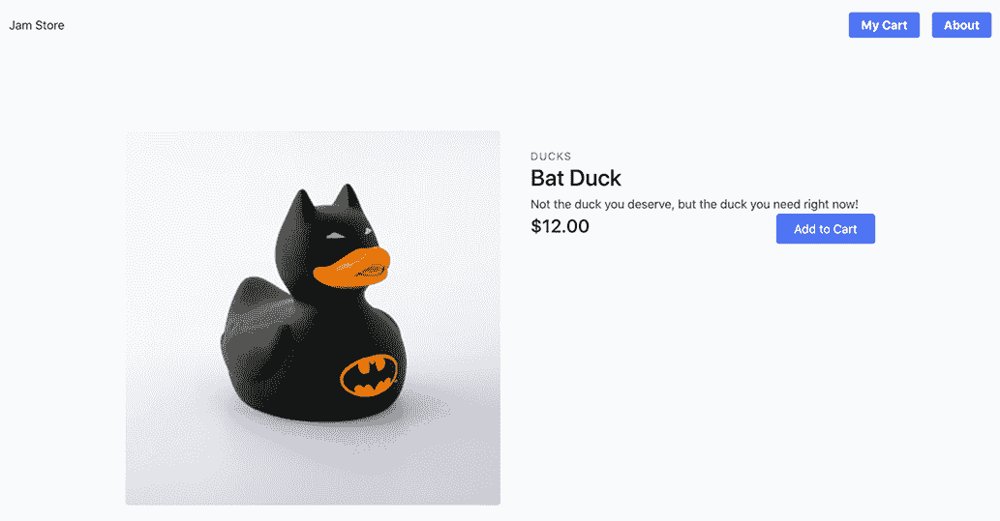

图 5.7 我们产品详情列表之一

### 5.4.4 启用添加到购物车功能

到目前为止，我们编写的所有代码都在构建时运行，但每个购物车都是针对每个用户的。因此，添加到购物车功能不能静态预渲染，需要在客户端（即浏览器）上运行。为此，我们需要使用环境变量来配置带有我们的 API 密钥的 Commerce.js 客户端脚本，该密钥目前仅在构建时可用。

为了使我们的 CHEC_PUBLIC_KEY 环境变量可供此脚本访问，我们需要在项目根目录中创建一个 Next.js 配置文件，命名为 next.config.js。在这个文件中，我们将告诉 Next.js 在客户端使这个环境变量可用。

列表 5.7 Next.js 配置文件在 next.config.js 中

```
module.exports = {
  env: {
    CHEC_PUBLIC_KEY: process.env.CHEC_PUBLIC_KEY,
  }
};
```

注意，我们无法使用 Next.js 提供的 NEXT_PUBLIC_ 快捷方式，因为 Commerce.js 期望使用特定的变量名来使用密钥。

如果您的本地服务器仍在运行，您需要在进行配置更改后停止并重新启动它。

让我们回到我们的/pages/product/[permalink].js 文件，并添加一些方法以启用添加到购物车功能。由于我们的配置更改，我们现在可以从客户端调用 Commerce.js。让我们在[permalink].js 中的 ProductDetail 函数中添加一个新方法。但在我们这样做之前，我们需要在文件顶部导入 Commerce.js 库：

```
import commerce from "../../lib/commerce";
```

您可以将我们的 handleAddToCart()函数的代码放置在 return 之前。此方法将告诉 Commerce.js 将当前产品添加到我们的购物车中。目前，我们将只是将完整的购物车内容输出到浏览器控制台，以便我们可以看到它是否正常工作：

```
const handleAddToCart = async (e) => {
  let cart = await commerce.cart.add(product.id, 1);
  console.log(cart);
};
```

每次我们调用此方法时，我们都在告诉 Commerce.js 将此产品的一项添加到购物车中。这将添加一个新的产品，或者如果该产品已经在购物车中，则增加该产品的数量。在同一文件中，让我们通过修改“添加到购物车”按钮来调用此方法。用以下代码替换 render()方法中的当前按钮代码：

```
<button
  onClick={handleAddToCart}
  className="..."
>
  Add to Cart
</button>
```

保存文件并在浏览器中刷新后，打开浏览器开发者工具控制台。当您点击“添加到购物车”按钮时，您应该收到以下类似响应：

```
{success: true, event: "Cart.Item.Added", line_item_id: 
➥ "item_7RyWOwmK5nEa2V", product_id: "prod_Op1YoV9x4wXLv9", product_name: 
➥ "Bat Duck", ...}
```

当然，将结果直接输出到浏览器控制台并不是理想的用户交互方式。我们需要做的是让用户知道项目已成功添加。我们将使用一个状态变量来完成此操作，该变量将通过 React 的 useState 钩子设置。首先，我们需要在文件顶部添加对钩子的导入：

```
import { useState } from "react";
```

现在，我们可以创建 cartText 状态变量和 setCartText() 函数，这将允许我们使用此钩子更改此状态变量的值。在 React 中，不应直接更改状态变量，因此需要设置方法。此外，useState 钩子允许我们传入一个默认值，在这种情况下，将是“添加到购物车”。将此行直接添加到 export default 函数行下方：

```
const [cartText, setCartText] = useState("Add to Cart");
```

接下来，让我们再次更新按钮，使用该变量而不是硬编码的文本：

```
<button
  onClick={handleAddToCart}
  className="..."
>
  {cartText}
</button>
```

仅此本身不会显示与我们之前显示的任何不同，因为我们没有在状态更改时更新值。为了做到这一点，我们需要通过移除 console.log 并添加一些代码来更改 cartText 状态变量，当项目成功添加时来修改我们的 handleAddToCart() 方法。我们不直接修改状态，而是使用 setCartText() 方法来更新它：

```
const handleAddToCart = async (e) => {
  let cart = await commerce.cart.add(product.id, 1);

  let cartText = "Added! (" + cart.quantity + ")";
  setCartText(cartText);
};
```

现在，如果我们尝试运行页面，购物车文本将显示已添加项目，并显示购物车中该项目的数量。点击“添加到购物车”按钮应显示“已添加（1）”或，如果该产品已经在您的购物车中，“已添加（2）。”

### 5.4.5 构建购物车

到目前为止，用户可以查看我们所有的产品，点击查看具体产品的详细信息，并将产品添加到他们的购物车中。接下来，让我们允许他们查看他们购物车中的项目。为此，我们将从 Codepen 中的此笔借用设计和布局：[`codepen.io/abdelrhman/pen/BaNPVJO`](https://codepen.io/abdelrhman/pen/BaNPVJO)。

创建一个 /pages/cart.js 文件。这个页面将不同于之前的页面，因为它不会使用 getStaticProps()。为什么？因为填充此页面的所有属性都无法静态预渲染。购物车的内容必须在客户端检索，因为它与特定用户相关。

我们将不会使用 props，而是会大量使用 state 来填充页面，显示用户的购物车详细信息。这将允许我们在获取购物车内容时以及用户与页面交互以修改或从购物车中删除项目时更新状态。让我们首先创建组件的结构并设置我们需要的状态变量。

列表 5.8 在 /pages/cart.js 中创建初始购物车页面

```
import { useState, useEffect } from "react";
import Nav from "../components/nav";
import commerce from "../lib/commerce";

export default function ShoppingCart() {
  const [items, setItems] = useState([]);
  const [subtotal, setSubtotal] = useState({});
  const [total, setTotal] = useState({});
  const [checkoutURL, setCheckoutURL] = useState("");

  return (

  );
}
```

接下来，让我们填充 `return()`。我们的 `return()` 方法通过遍历包含购物车项目的 `items` 数组来创建购物车，并用其他状态变量填充输出剩余部分的内容。请注意，为了可读性，省略了一些部分（用“...”表示）。您可以在 GitHub 仓库中找到完整的代码（[`mng.bz/8lRB`](https://shortener.manning.com/8lRB)）。

列表 5.9 /pages/cart.js 中 render() 方法的代码内容

```
return (
  <div>
    <Nav />
    <div className="container mx-auto mt-10">
      <div className="flex shadow-md my-10">
        <div className="w-3/4 bg-white px-10 py-10">
          ...
          {items.map((item, index) => (
            <div ... key={index}
            >
              <div className="flex w-2/5">
                <div className="w-20">
                  
                </div>
                <div className="...">
                  <span className="font-bold text-sm">
                    {item.product_name}
                  </span>
                    <a href="#" ...>Remove</a>
                </div>
              </div>
              <div className="flex justify-center w-1/5">
                <button>...</button>
                <input className="..." type="text" value={item.quantity} />
                <button>...</button>
              </div>
              <span className="text-center w-1/5 font-semibold text-sm">
                {item.price.formatted_with_symbol}
              </span>
              <span className="text-center w-1/5 font-semibold text-sm">
                {item.line_total.formatted_with_symbol}
              </span>
            </div>
          ))}
        ...

        <div id="summary" className="w-1/4 px-8 py-10">
          <h1 className="...">Order Summary</h1>
          <div className="flex justify-between mt-10 mb-5">
            <span className="...">{items.length} items</span>
            <span className="font-semibold text-sm">
              {subtotal.formatted_with_symbol &&
                subtotal.formatted_with_symbol}
            </span>
          </div>
          <div className="border-t mt-8">
            <div ...>
              <span>Total cost</span>
              <span>
                {total.formatted_with_symbol && total.formatted_with_symbol}
              </span>
            </div>
            <button ...>Checkout</button>
          </div>
        </div>
      </div>
    </div>
  </div>
);
```

我们已经设置了布局和必要的状态变量，但如果你通过点击“我的购物车”导航按钮浏览到购物车，你会看到页面没有内容——即使你的购物车中有项目（图 5.8）。

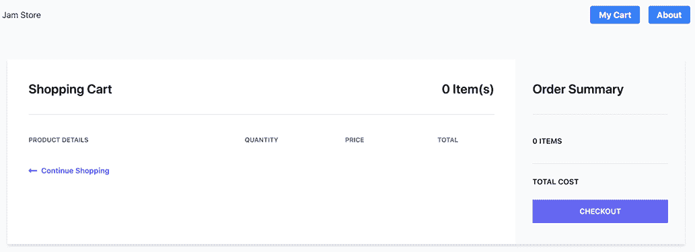

图 5.8 静态预渲染的购物车页面没有详细信息。这些信息必须通过浏览器为每个用户加载。

我们接下来需要做的是在页面准备好时从 Commerce.js 加载用户的购物车内容。为此，我们将使用 `useEffect()` 钩子，它告诉 React 在渲染完成后执行某些操作。

我们的 `useEffect()` 钩子将调用 Commerce.js 获取用户的购物车，然后更新组件状态变量以在页面上填充用户的购物车项目和数量。我们将此代码放置在钩子内的一个单独的方法中，因为我们需要异步调用它。（这是因为异步方法总是返回一个承诺，但 `useEffect()` 只能返回一个函数，因此我们无法使 `useEffect()` 异步。）让我们将其直接放置在返回语句上方：

```
useEffect(() => {
  async function fetchCart() {
    let cart = await commerce.cart.retrieve();
    console.log(cart);
    setItems(cart.line_items);
    setSubtotal(cart.subtotal);
    setTotal(cart.subtotal);
    setCheckoutURL(cart.hosted_checkout_url);
  }
  fetchCart();
}, []);
```

当页面重新加载时，你现在应该能看到你添加到购物车中的项目列表（图 5.9）。

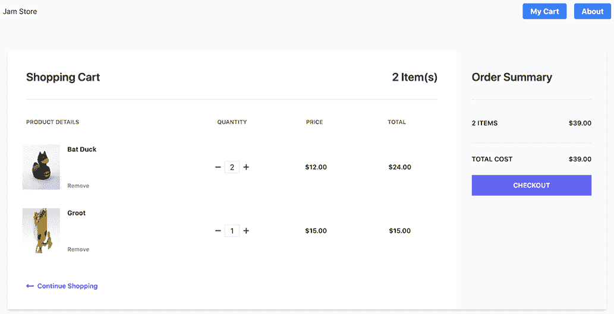

图 5.9 购物车的内容通过 `useEffect()` 钩子在客户端加载，并在页面上填充。

到目前为止，一切顺利，但用户无法添加或减去（最终移除）购物车中的项目。让我们在我们的 `useEffect()` 方法上方添加一个方法来处理这个问题。此方法将调用 Commerce.js 更新数量，然后更新相关的状态变量：

```
const handleUpdateQuantity = async (id, quantity) => {
  let res = await commerce.cart.update(id, { quantity: quantity });
  let items = res.cart.line_items;
  setItems(items);
  setSubtotal(res.cart.subtotal);
  setTotal(res.cart.subtotal);
};
```

我们的 `handleUpdateQuantity` 方法将处理添加、减去或甚至手动提供数量的操作。首先，从移除链接中调用它。移除它只是将数量设置为零：

```
<a
  href="#"
  onClick={() => handleUpdateQuantity(item.id, 0)}
  className="..."
>
  Remove
</a>
```

接下来，我们将通过从当前数量中减一来将其添加到减号按钮：

```
<button
  onClick={() =>
    handleUpdateQuantity(item.id, item.quantity - 1)
  }
>
```

最后，通过将当前数量加一来将其添加到加号按钮：

```
<button
  onClick={() =>
    handleUpdateQuantity(item.id, item.quantity + 1)
  }
>
```

我们必须以不同的方式处理允许用户手动指定新数量的输入字段。我们需要一个方法，当值更改时将被调用，并且如果提供的值是数字，则更新数量。此方法可以放在 `handleUpdateQuantity()` 方法下方：

```
const handleQuantityChange = (id, e) => {
  const quant = parseInt(e.target.value.trim());
  if (!isNaN(quant)) handleUpdateQuantity(id, e.target.value.trim());
};
```

当用户通过在文本框中更改值时，我们需要调用该方法。为此，我们需要在输入字段上添加一个 `onChange` 事件处理器：

```
<input
    className="mx-2 border text-center w-8"
    type="text"
    value={item.quantity}
    onChange={(e) => handleQuantityChange(item.id, e)}
/>
```

现在，您应该能够增加、减少、删除和更新购物车中任何商品的库存。

我们需要做的最后一件事是启用结账流程。Commerce.js 提供了使用托管结账选项的能力。这意味着当用户点击结账按钮时，他们将通过 Commerce.js 的流程进行引导，而不是通过自定义结账。当然，如果您想的话，您可以创建一个自定义结账，但为了简单起见，我们将使用托管选项。

要做到这一点，我们只需要一个简单的处理函数，我们可以将其放置在 handleQuantityChange() 方法之下。此方法简单地使用 Commerce.js 提供的结账 URL 打开一个新窗口：

```
const handleCheckout = () => {
  // for now we're just opening a new window to the hosted checkout
  window.open(checkoutURL);
};
```

然后，我们需要给结账按钮添加点击事件，以便在按钮被点击时触发该方法：

```
<button
  onClick={handleCheckout}
  className="..."
>
    Checkout
</button>
```

点击结账按钮现在将打开一个新的标签页，在 Commerce.js 上进行托管结账（图 5.10）。

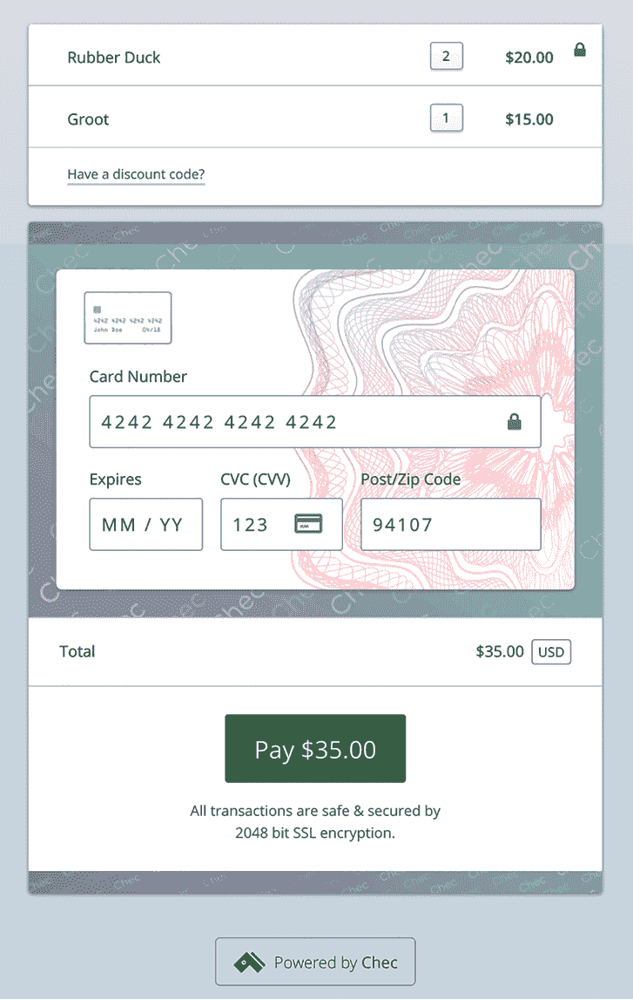

图 5.10 我们的电子商务商店使用 Commerce.js 的托管结账而不是自定义结账。

### 5.4.6 添加 Markdown 内容

我们的电子商务体验已经完成，但我们还需要在我们的网站上添加一个最后的修饰：由基于文件的 Markdown 内容驱动的关于页面。Next.js 没有内置 Markdown 支持，但添加它相对容易。让我们看看如何。

我们需要三个 npm 插件来启用此支持：

+   raw-loader—此包将使我们能够在 Webpack 配置中将原始 Markdown 文件作为字符串导入。

+   gray-matter—我们的 Markdown 文件将包含前端元数据。此库将使我们能够轻松解析这些元数据。

+   react-markdown—正如我们之前讨论的，React 应用程序使用虚拟 DOM，这个库将在 React 的虚拟 DOM 中渲染 Markdown，这意味着 React 只能正确更新更改的 DOM 元素。

如果您仍在运行本地站点，您需要先停止它。接下来，安装所有三个库：

```
yarn add raw-loader gray-matter react-markdown
```

让我们先使用 raw-loader。为此，我们需要编辑我们的 Next.js 网站的 Webpack 配置。Webpack 是一个流行的模块打包器，Next.js 使用它来打包其浏览器中的 JavaScript 文件。要编辑 Webpack 配置，打开 next.config.js 并添加一个新规则，该规则查找具有 .md 扩展名的文件，并使用 raw-loader 加载它们。

列表 5.10 在 next.config.js 中的 Next.js 配置文件以加载 Markdown 文件

```
module.exports = {
  env: {
    CHEC_PUBLIC_KEY: process.env.CHEC_PUBLIC_KEY,
  },
  webpack: function (config) {
    config.module.rules.push({
      test: /\.md$/,
      use: 'raw-loader',
    });
    return config;
  },
};
```

在 /pages/about.js 中为我们的关于页面创建一个新文件。在 getStaticProps() 方法中，我们可以使用文件系统从 /content/about.md 加载原始 Markdown 文件。然后，我们将使用 gray-matter 库读取原始 Markdown 并将前端元数据与内容分开。我们将把前端元数据和 Markdown 内容作为 props 传递给页面，其中 ReactMarkdown 用于将 Markdown 渲染为 React 组件。

列表 5.11 在 /pages/about.js 中加载 Markdown 内容的关于页面

```
import fs from 'fs';
import Nav from '../components/nav';
import matter from 'gray-matter';
import ReactMarkdown from 'react-markdown';

export default function About({ frontmatter, content }) {
  return (
    <div>
      <Nav />
      <div className="content container px-5 py-24 mx-auto">
        <h1>{frontmatter.title}</h1>
        <ReactMarkdown children={content} />
      </div>
    </div>
  );
}

export async function getStaticProps() {
  const file = fs.readFileSync(`${process.cwd()}/content/about.md`, 'utf8');
  const data = matter(file);

  return {
    props: {
      frontmatter: data.data,
      content: data.content,
    },
  };
}
```

如您从代码中猜到的，在页面工作之前，我们需要在 /content/about.md 创建一个 Markdown 文件。将内容文件放在 /content 文件夹是 Next.js 站点加载 Markdown 内容的典型结构。我的 about.md 文件相当简单，但请随意通过添加您自己的更多 Markdown 标记来实验：

```
---
title: About the Jam Store
---

The Jam Store is built with:
* Next.js
* Commerce.js.
```

让我们使用 yarn dev 重新启动本地站点，并通过点击“关于”导航项来查看“关于”页面（图 5.11）。

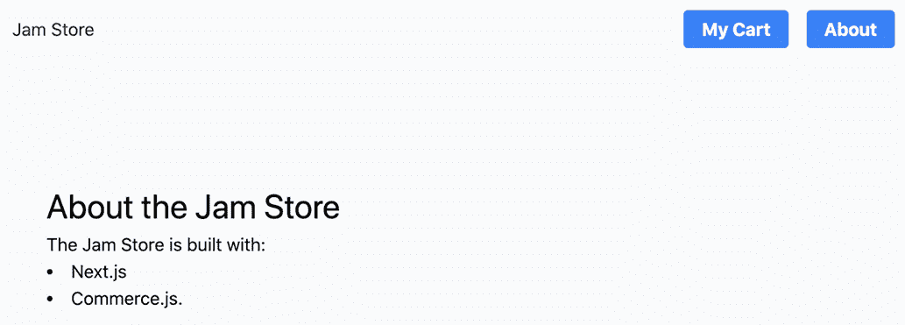

图 5.11 我们的“关于”页面从 about.md 文件中的 Markdown 前置内容和 Markdown 标记的组合中渲染页面标题和正文。

### 5.5 接下来是什么？

现在我们已经拥有了一个功能齐全的电子商务网站，但我们可以通过多种方式继续改进它。首先，也是最明显的方法是构建自定义的结账过程，而不是使用托管结账。我们还从未解决过诸如折扣、销售税和运输等问题。这些都是可以通过 Commerce.js 控制台进行管理和定制的，然后集成到网站上。

电子商务网站有很多潜在的复杂性，我们在这里没有空间涵盖。我们选择使用 Commerce.js 作为基于 API 的无头 CMS，部分原因是因为它有助于说明使用 Next.js 构建网站时的许多要求。然而，在构建自己的 Jamstack 电子商务网站时，您将做出的最大决定之一是，在实现速度较快的扩展解决方案（如 Snipcart）和基于 API 的工具（如 Commerce.js）的粒度化可定制性之间如何权衡。没有正确答案；这完全取决于您网站的需求。

## 摘要

+   电子商务网站的动态用户界面需求非常适合基于 JavaScript 框架的 SSGs。例如，React 框架自带工具，可以更容易地在浏览器中动态更新 DOM，这有助于构建高度动态的页面组件，如购物车。

+   无头电子商务系统为 Jamstack 电子商务网站提供后端。有三种类型的无头电子商务系统：

    +   一体化解决方案通常用于构建电子商务网站的前端和后端，但通常提供无头选项。

    +   扩展解决方案旨在通过提供整个购物车和结账过程的 UI 和管理来简化实现。

    +   基于 API 的解决方案允许通过 API 访问其所有数据和管理工作能力来实现粒度化的定制，但需要更多的代码来实现。

+   Next.js 是一个基于 React 的元框架，它提供了构建服务器端渲染或静态预渲染的工具，甚至可以两者结合。Next.js 通过内置函数如 getStaticPaths() 和 getStaticProps()，使得与像 Commerce.js 这样的基于 API 的外部数据源集成变得相对简单。

+   Next.js 没有内置支持加载 Markdown 内容，但可以通过使用多个 npm 库来实现。raw-loader 库提供了通过 Webpack 导入原始文本文件的能力。gray-matter 库可以从 Markdown 文件中读取元数据。最后，react-markdown 组件在 React 虚拟 DOM 中渲染 Markdown。
