# 6 部署

本章涵盖

+   托管您的 Jamstack 网站的选项

+   使用基本的 Web 服务器

+   考虑云文件存储提供商

+   选择适合 Jamstack 的选项

恭喜！您已经采用了 Jamstack 的方式，并发现了使用本地静态网站生成器将动态内容转换为简单文件的乐趣。下一步是将这些文件上传到互联网，使它们成为真正的网站，而不是您设备上的一组数据。

在本章中，我们将介绍多种将文件上传到互联网并使其对公众可用的不同选项。我们将讨论每个选项的优缺点，以便您可以确定哪个选项适合您和您的项目。

## 6.1 Web 服务器——经过考验和验证的方法

托管您的 Jamstack 内容的第一个和最简单的解决方案是自互联网开始以来我们就一直在使用的解决方案：一个简单的 Web 服务器。像 Apache ([`httpd.apache.org/`](http://httpd.apache.org/)) 和 IIS ([`www.iis.net/`](https://www.iis.net/)) 这样的 Web 服务器已经存在了几十年，为从最小的粉丝网站到互联网上最大的电子商务网站提供了动力。

使用这些选项意味着只需将您的静态网站生成器（HTML、CSS 和其他相关文件）的结果复制到现有 Web 服务器的“Web 根”下。

就这些。没有更多了。您可以创建管道来自动执行此操作并为您处理复制，或者您可以手动完成所有操作并使用 FTP 客户端将您的文件上传到您的生产服务器。最终，这是最简单的选项，如果您已经有一个现有的网站和服务器并只想将您的 Jamstack 网站作为现有解决方案的一部分，那么这将是最合适的选择。

作为这个问题的具体例子，你可以想象一个现有的使用 PHP 为电子商务网站的用户提供动态网页的 Web 服务器。PHP 将处理购物、结账等方面。然后你可以使用 Jamstack 来处理网站上销售产品的文档。这些不需要 PHP，可以是简单的静态文件。显然，整个网站可以是 Jamstack（实际上，上一章讨论了使用 Jamstack 进行电子商务），但也可以有使用多个解决方案的网站！

## 6.2 云文件存储提供商

另一种托管 Jamstack 网站的选择是利用云文件存储提供商。这是一种简单的服务，只需让您在云端存储文件，并通过 HTTP 使其可访问。对于需要存储文件而无需担心管理磁盘驱动器的开发者来说，云文件存储提供商是一个有吸引力的解决方案。通过提供（几乎）无限的空间，开发者可以简单地上传文件，无需担心驱动器满载。（当然，只要他们能承受价格，当然。）

许多这些提供商现在支持将一组文件作为网站托管的选择。让我们来看看这些选项。

### 6.2.1 Amazon S3

作为最古老和最成熟的服务之一，Amazon S3 可能是开发者在考虑基于云的文件存储时首先想到的东西。Amazon S3([`aws.amazon.com/s3/`](https://aws.amazon.com/s3/))是一个非常灵活、非常健壮的文件存储解决方案，具有很好的定价([`aws.amazon.com/s3/pricing`](https://aws.amazon.com/s3/pricing))。Amazon 还提供了一个定价计算器([`calculator.aws`](https://calculator.aws))，让您可以估算您的成本。

虽然每个网站都不同，但我可以提供我自己的使用示例。我在 S3 上有略少于 1GB 的文件，一个月内有大约 70,000 次请求。那笔账单大约是 3 美分。是的，3 美分。为了为这些请求启用 HTTPS，我的价格飙升到 73 美分。再次强调，您在做出承诺之前需要查看您的网站、流量、大小等因素，但您的成本很可能是最低的。此外，请注意，Amazon 提供了各种不同的“免费层”([`aws.amazon.com/free/`](https://aws.amazon.com/free/))选项。在本书撰写时，Amazon 提供 12 个月的免费 5GB 存储空间。

首先，您需要创建一个 Amazon AWS 账户。一旦创建，您就可以登录到 AWS 管理控制台（图 6.1）。

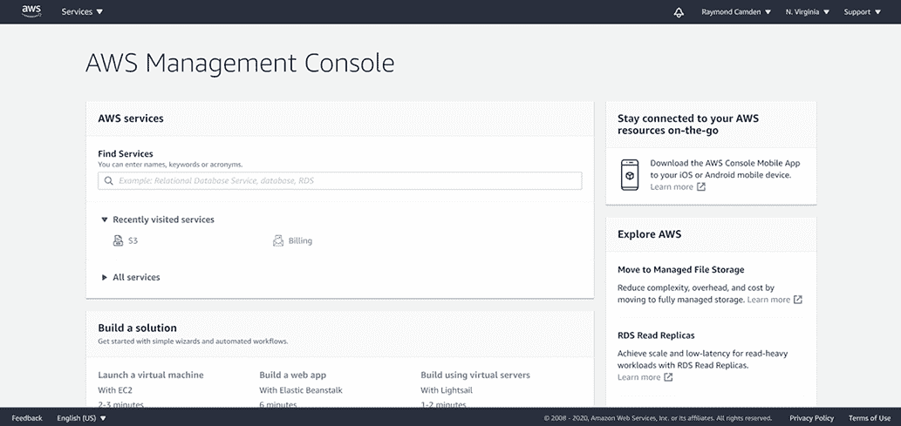

图 6.1 AWS 仪表板

控制台可能会有些令人不知所措，但您可以使用查找服务搜索框来查找 S3。这样做，您最终会进入 S3 仪表板本身。根据您是否之前使用过 S3 以及 Amazon 是否更新了他们的 UI（图 6.2），您的仪表板可能看起来略有不同。

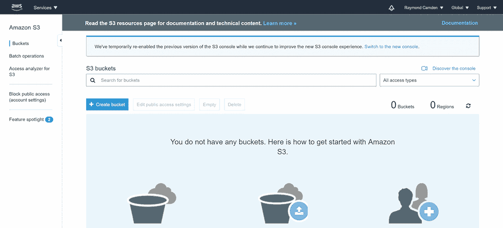

图 6.2 S3 仪表板控制台。在您创建第一个存储桶之后，这将会发生变化。

Amazon 的 S3 服务允许您在*存储桶*中存储文件。您可以将存储桶想象成您项目的磁盘驱动器或文件夹。虽然您可以给存储桶命名任何您想要的名称，但要托管网站，您需要将存储桶的名称与您的域名相同。例如，如果我在 S3 上托管我的博客，我必须将我的存储桶命名为 raymondcamden.com。

注意：为了支持[raymondcamden.com](http://www.raymondcamden.com)和[www.raymondcamden.com]，您需要创建*两个*存储桶。[www.raymondcamden.com](http://www.raymondcamden.com)的存储桶将重定向到第一个存储桶。由于我们将只使用子域名进行测试，我们只会创建一个存储桶，但我们会展示如何设置该设置，以便您可以了解如何自己操作！

首先，点击创建存储桶按钮。存储桶的名称应与您网站的域名匹配。在图 6.3 中，我使用了名为 jamstack.raymondcamden.com 的子域名。您可以将其他设置保持不变。

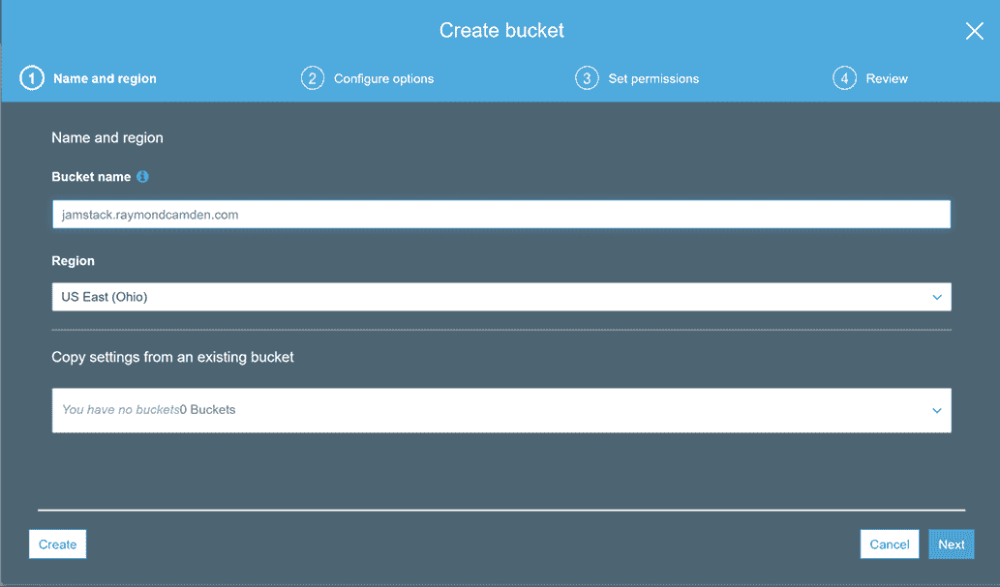

图 6.3 定义您的新 S3 存储桶的名称

点击下一步，完成接下来的两个步骤，完成后点击创建存储桶。然后你会看到你的存储桶被列出（图 6.4）。

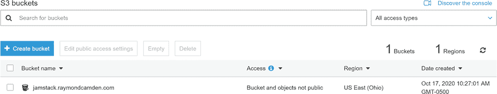

图 6.4 你新创建的 S3 存储桶

选择存储桶旁边的复选框，并在出现的弹出菜单中，选择属性。这会带你到一个选项集，包括静态网站托管（图 6.5）。

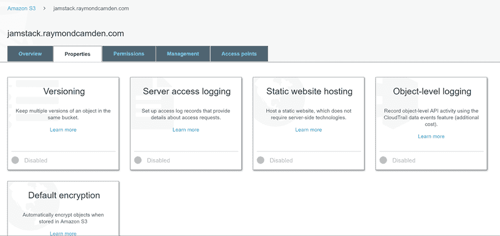

图 6.5 你的 S3 存储桶的各种选项

如果你点击那个框，你会得到一个新的选项来启用网站托管，如图 6.6 所示。

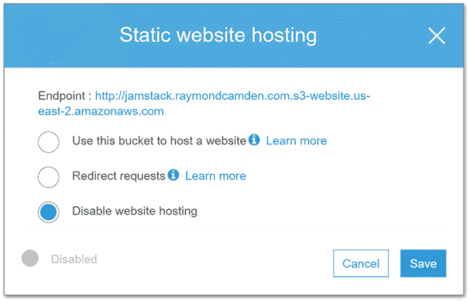

图 6.6 为存储桶启用网站托管的对话框

如果你启用了网站托管，那么你需要指定索引文档是什么。这是在加载网站且没有请求特定文件时加载的页面。几乎总是应该是 index.html。输入这个值，然后你可以点击保存（图 6.7）。

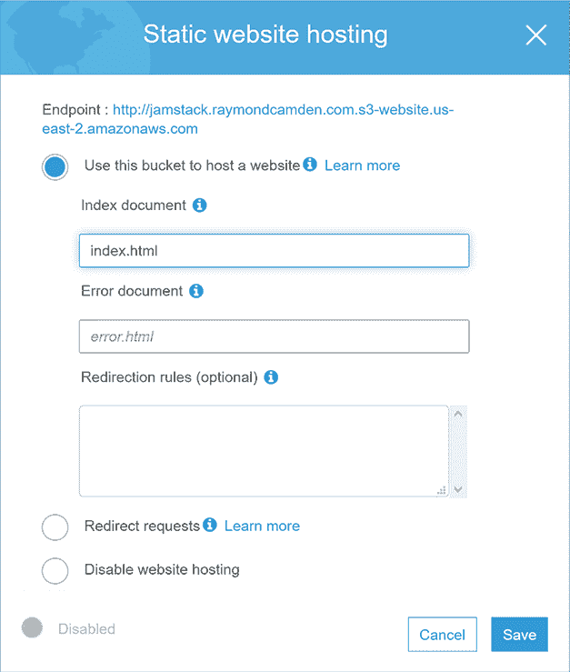

图 6.7 完成选项以启用网站托管

注意：这也是你处理将 www 子域名重定向到主存储桶的地方。在这个例子中我们不涉及这一点，但现在你已经看到了设置在哪里，如果你需要，你可以自己这样做。

保存你的更改后，你可以立即使用对话框中显示的 URL 访问你的网站。如果你没有复制它，只需再次点击打开静态网站托管选项即可。你应该会看到类似于图 6.8 的内容。

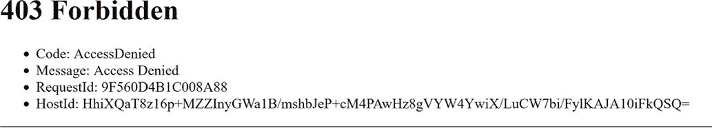

图 6.8 加载新网站时出现 403 错误

你得到这个错误的原因是因为你实际上还没有上传网站！我们将在稍后介绍这一点，但在我们这样做之前，我们需要进行另一个更改。

默认情况下，你的存储桶创建时所有公共访问都被拒绝。这是一件好事，也是安全的。然而，在我们开始处理文件之前，我们需要编辑存储桶，以便公众可以读取它。这样我们就可以使我们的文件公开了。

在你的存储桶中选择权限选项卡，并在“阻止公共访问”部分中，点击编辑按钮来关闭此设置（图 6.9）。这将给你一个令人恐惧的警告，但由于我们知道我们在做什么（允许对静态资源进行公共访问），所以可以安全地继续。

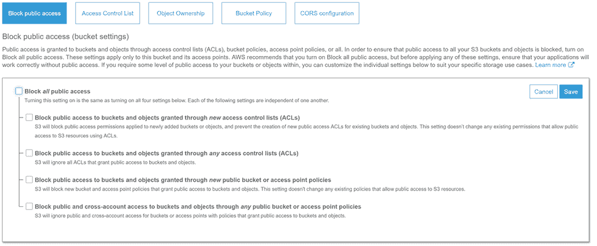

图 6.9 禁用“阻止所有公共访问”

完成这些后，是时候将东西放入存储桶了。你可以将文件放入 S3 存储桶的多种方式；最简单的是使用上传选项，只需将你的文件和文件夹拖放到浏览器中。对于较小的网站，这应该足够了（图 6.10）。记住，UI 可能不同。亚马逊不断更新他们的 UI，甚至为不同的用户显示不同的屏幕。如果你看到的内容与预期不符，请尽力找到类似命名的选项。

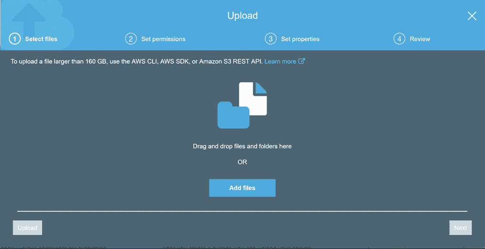

图 6.10 您的 S3 存储桶的上传对话框

你可以选择书中的任何前一个例子或任何其他网站。对于这次演示，我们将使用第二章中 Camden Grounds 示例的输出。记住，Eleventy 存储库的输出在 _site 文件夹中。你可以选择所有文件和文件夹，并将它们拖入对话框。在点击上传之前，点击下一步，这样你就可以设置权限。在底部“管理公共权限”处，将默认值更改为“授予此对象（s）公共读取访问权限。”然后你可以点击上传按钮（图 6.11）。

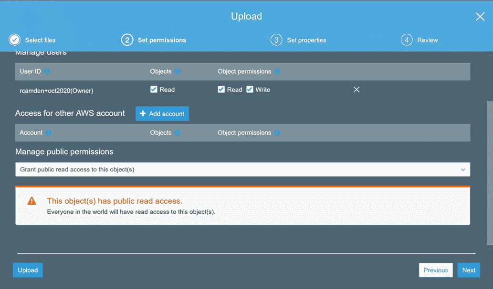

图 6.11 设置权限后，是时候上传文件了。

根据你的带宽和你选择上传的内容，一旦你收到上传完成的确认，你可以重新加载之前的请求，现在你应该能看到你的网站（图 6.12）。

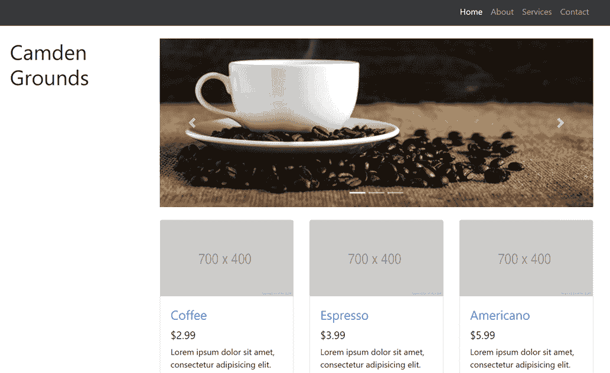

图 6.12 S3 部署的网站已上线！

这基本上就是流程，但你还可以做更多。例如，亚马逊有一个 CDN 服务（CloudFront），它也允许你使用 https。你还可以将重定向添加到你的网站上。既然我们已经看了亚马逊，让我们看看你的一些其他选项。

### 6.2.2 其他云文件存储托管选项

虽然 Amazon S3 是最知名的基于云的文件存储选项，但它并不是唯一的选择。另一个可以考虑的选项是 Google Cloud Storage ([`cloud.google.com/storage`](https://cloud.google.com/storage))。像 Amazon S3 一样，Google Cloud Storage 允许你存储任意大小的文件，并具有全球访问权限。而且，就像 S3 是 AWS 的一部分一样，Google Cloud Storage 只是整个 Google Cloud 平台的一个方面。

有价格信息([`cloud.google.com/storage#section-10`](https://cloud.google.com/storage#section-10))可用，并且像 S3 一样，你支付的费用包括存储量和文件访问的频率。有一个免费层([`mng.bz/Ex7j`](http://mng.bz/Ex7j))，老实说，一开始找起来有点困难，但确实可以让你测试项目，看看你是否喜欢这个平台。

Google 提供了托管网站的文档([`mng.bz/Nx77`](https://cloud.google.com/storage/docs/hosting-static-website))，其模式与亚马逊平台类似。创建一个存储桶，上传你的文件，然后公开分享它们（图 6.13）。

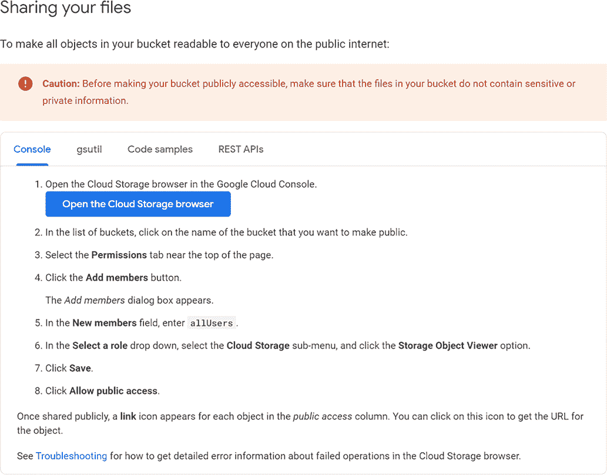

图 6.13 Google Cloud 分享文件的说明

另一个基于云的文件服务选项是 Azure Blob Storage（[`azure.microsoft.com/en-us/services/storage/blobs/`](https://azure.microsoft.com/en-us/services/storage/blobs/））。关于如何使用它来托管网站的文档可以在这里找到：[http://mng.bz/Dx7a](http://mng.bz/Dx7a)。或者，作为一个替代方案，你可能想考虑使用微软的一个新选项，即 Azure Static Web apps 服务（[`azure.microsoft.com/en-us/services/app-service/static/`](https://azure.microsoft.com/en-us/services/app-service/static/）），它专门针对 Jamstack 风格的解决方案。

你现在已经看到了基于云的文件服务如何成为托管静态网站的可行解决方案。但，从本质上讲，它们主要做的就是显示文件。让我们看看更针对 Jamstack 的服务。

## 6.3 Azure Static Web Apps

Azure Static Web Apps（[https://docs.microsoft.com/en-us/azure/static-web-apps/](https://docs.microsoft.com/en-us/azure/static-web-apps/））是微软在 Azure 平台上推出的一项新服务。它与 GitHub 仓库连接，并使用 GitHub Actions 在提交时自动执行网站更新。它支持简单的静态文件（例如，本书中之前提到的任何生成器的输出），以及静态站点生成器本身。

例如，你可以发布一个 Jekyll 站点，Azure Static Web Apps 可以被配置为执行 Jekyll 的构建操作以生成最终的静态 HTML。这一点（以及本章后续提到的服务）使其更适合 Jamstack。最后，它也与微软的无服务器平台 Azure Functions 很好地结合在一起。

在查看 Azure Static Web Apps（或 Azure 本身）之前，你需要一个免费的 Azure 账户。你可以注册（[https://azure.microsoft.com/free/](https://azure.microsoft.com/free/）），然后进入你的仪表板（[https://portal.azure.com](https://portal.azure.com)），并确保你至少有一个订阅。将订阅视为在 Azure 中使用事物的高级集合。注册后，你可以创建一个免费层订阅（图 6.14）。

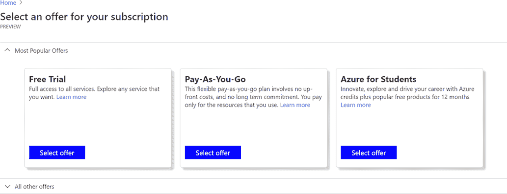

图 6.14 添加免费订阅的 Azure 界面

Azure，就像 AWS 一样，功能强大但同时也非常复杂。幸运的是，你可以通过使用同名的 Visual Studio Code 扩展来避免这种复杂性：Azure Static Web Apps。Visual Studio Code（[`code.visualstudio.com/`](https://code.visualstudio.com/））是微软的一个免费、开源的代码编辑器。最近它已经成为网页开发者中的热门选择。你只需在扩展面板中搜索即可将其添加到你的 Visual Studio Code 安装中（图 6.15）。

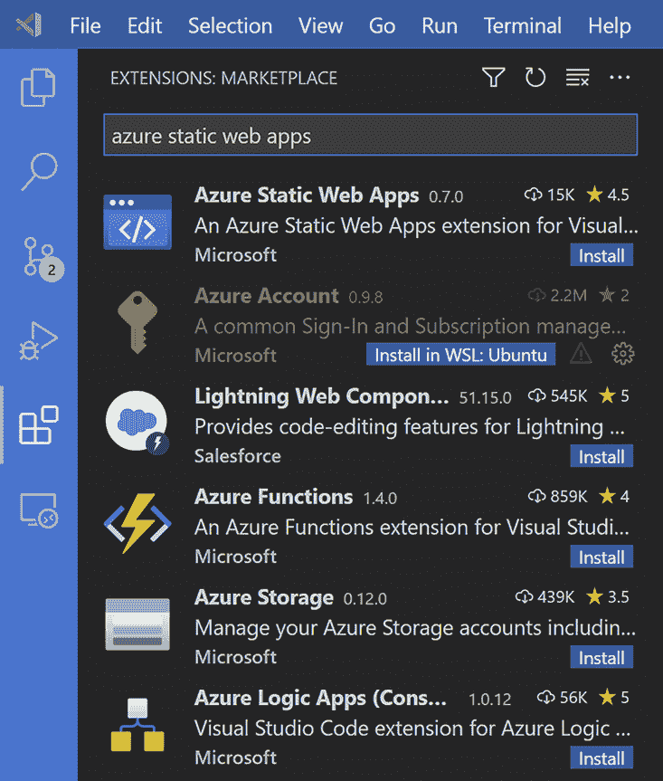

图 6.15 通过 Visual Studio Code 本身发现扩展

安装后，您将看到一个 A 形图标（Azure 标志，如图 6.15 底部所示），点击它将打开一个新面板。扩展程序将引导您完成身份验证过程，并让您选择您之前创建的订阅。

为了测试这个服务，让我们再次使用用于 Amazon S3 示例的 Eleventy 网站。然而，这次它将是一个更强大的集成。我们不会将 Eleventy 的输出推送到 S3 存储桶，而是将使用 Azure 静态 Web 应用的 GitHub 集成来创建一个过程，其中对仓库的提交将自动触发代码构建站点并部署到 Azure。

为了使事情变得简单一些，第二章中的 Camden Grounds 网站已被复制到新的 GitHub 仓库[`github.com/cfjedimaster/eleventy-for-azure`](https://github.com/cfjedimaster/eleventy-for-azure)。我们将其克隆到本地文件系统，并做了两个更改。

首先，我们通过运行 npm install --save-dev @11ty/eleventy 在项目本身本地安装 Eleventy。这会将 Eleventy 列为项目 package.json 文件中的开发依赖项。接下来，我们需要编辑 scripts 块以添加一个新的脚本命令，指定如何构建站点：

```
    "scripts": {
        "start": "node_modules/.bin/gulp watch",
        "build":"npx @11ty/eleventy"
    },
```

启动脚本已经存在于我们构建 Camden Groups 所使用的主题中。新增的是以 build 开头的第二行。Azure 将在与仓库一起工作时注意到这一点，并使用它来构建站点。那么我们如何将此项目添加到 Azure 中呢？

在 Visual Studio Code 中，打开包含仓库的文件夹。点击 Azure 图标，在 Azure 静态 Web 应用面板中，点击加号符号以创建一个新的 Web 应用。您首先会被提示输入名称。输入 CamdenGroundsAzure（图 6.16）。如果被要求分叉和克隆仓库，请这样做。

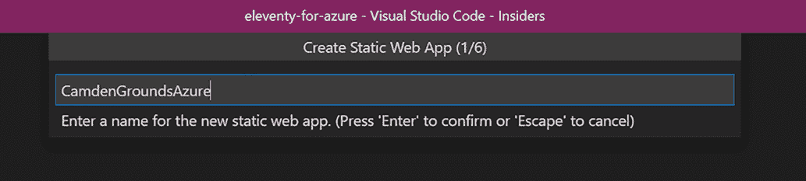

图 6.16 命名新应用

下一个提示将询问您要使用的分支。GitHub 正在使用 main 作为分支，但如果您的项目较旧，默认分支可能是 master。它将在对话框中显示分支，您可以简单地点击它。

接下来，它将提示您输入应用程序代码目录。由于整个仓库都是应用程序，您将想要选择第一个选项：/（图 6.17）。

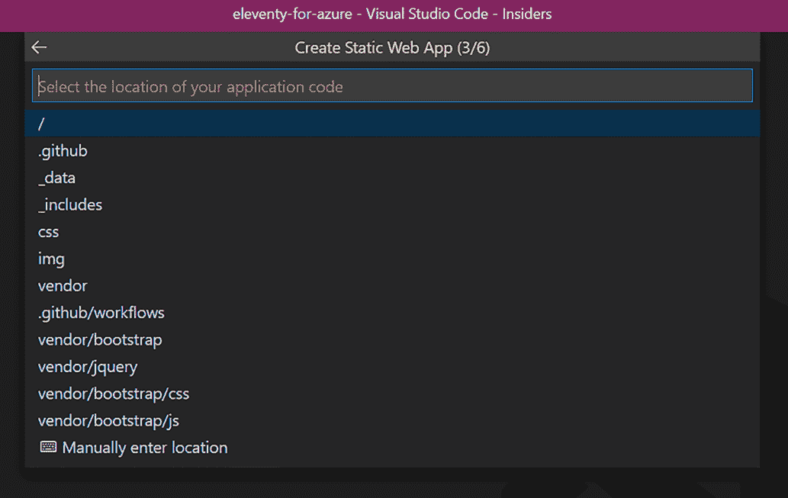

图 6.17 选择应用程序目录

下一个提示将询问您 Azure Functions 代码的位置。我们目前不使用它，所以选择“暂时跳过”。

最终提示将用于您网站的输出路径：这是您的静态站点生成器输出最终 HTML 的地方。对于 Eleventy，这是 _site，所以在图 6.18 所示的对话框中输入它。

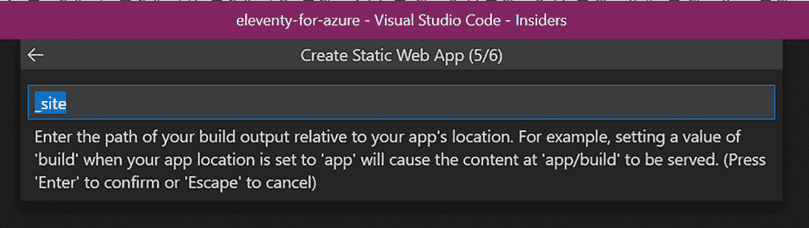

图 6.18 输入在构建站点后可以找到生成文件的路径

最后的提示指的是 Azure 将在其全球基础设施中部署您的网站的位置。在这里保留默认设置，这可能会是中部美国。

到目前为止，扩展和 Azure 开始做一些工作。他们首先将适当的 GitHub 操作添加到您的项目中（如果您打开仓库可以看到），这些操作处理在文件提交时推送到 Azure。要查看 Azure 上的您的项目，点击打开 Azure 面板中的免费试用节点，您将看到您的新项目。右键单击它，并选择“在门户中打开”（图 6.19）。

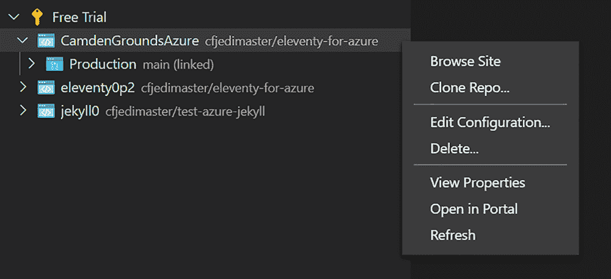

图 6.19 右键单击您的新的项目以查看各种选项，包括一个打开门户的选项。

该门户包含大量信息，但您需要关注的是右侧的 URL，您可以使用它来测试您的网站（图 6.20）。

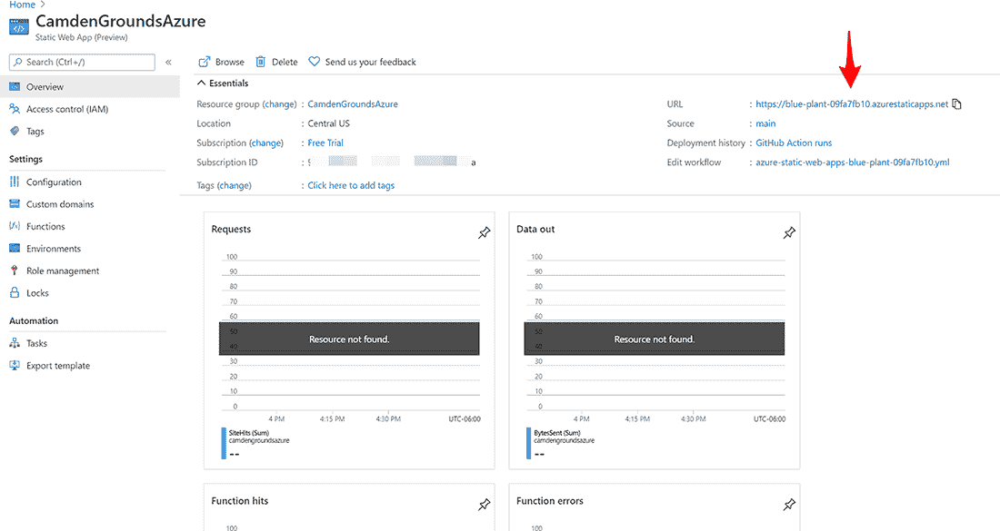

图 6.20 网站 Azure 门户

如果您打开该链接，应该会再次看到 Camden Grounds。但是，这里有一个转折点：如果您编辑您的 Eleventy 网站并将更改提交到 GitHub，Azure 的集成将启动，获取最新代码，运行构建命令，并再次部署——这一切都不需要您动手！

## 6.4 使用 Vercel 部署

Vercel 是我们将要关注的两个公司中的第一家，它们专注于专门为 Jamstack 和一般 Web 开发社区提供服务。Vercel（[`vercel.com/`](https://vercel.com/）），以前称为 Zeit，为需要托管其网站的 Jamstack 开发者提供了一系列有用的服务。以下是一些这些服务的简要列表：

+   从源代码管理提供商（GitHub、GitLab、Bitbucket）部署。就像 Azure 静态 Web 应用服务一样，这意味着您可以将代码提交到您的仓库，然后 Vercel 可以自动更新您的生产网站。

+   自动预览构建用于拉取发布和分支，使共享和测试网站更改变得容易。

+   自动使用 CDN 可以使您的网站在全球范围内可用。

+   无服务器函数支持（您将在第八章中看到这个示例）以向您的网站添加额外的功能。

+   非常慷慨的免费层（[https://vercel.com/pricing](https://vercel.com/pricing)），这使得您可以轻松地看到 Vercel 是否适合您。

当然还有很多。但我想强调 Vercel 的一个特性，我认为这真正让它与其他产品区分开来。Vercel 内置了对超过 30 个不同的 Jamstack 平台的支持。这种支持包括识别正在使用的框架，并执行正确的操作来构建和托管网站。从实际的角度来看，这意味着你可以进入你的项目目录，部署，而 Vercel 会知道该做什么。当你需要快速将网站在线分享给他人查看和测试时，这非常强大。Vercel 仍然允许你手动配置项目，这意味着它将支持自定义实现，但你可以进入一个 Jamstack 项目，部署一个网站，并在一分钟左右将其上线，这真是太棒了。

让我们快速测试一下。前往 Vercel 的主页，点击注册（图 6.21）。请注意，你将需要使用 Vercel 使用的三个源代码管理提供商之一进行登录。

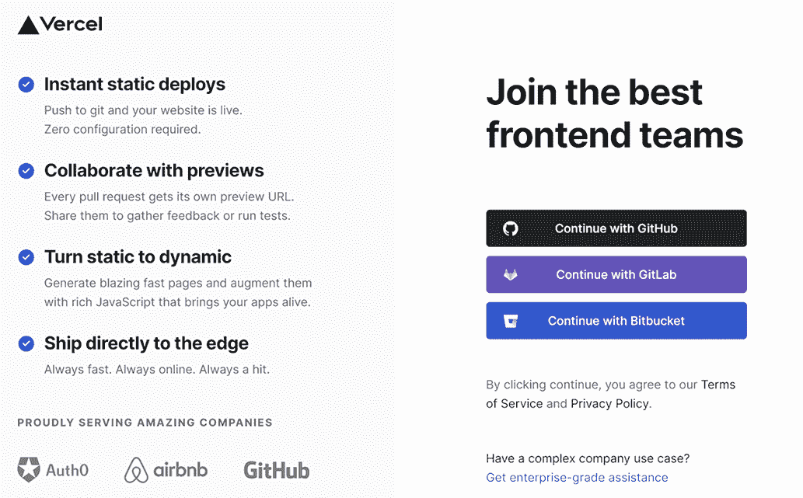

图 6.21 Vercel 的注册选项需要 GitHub、GitLab 或 Bitbucket 账户。

在你注册了 Vercel 之后，你可以使用他们的基于 Web 的仪表板从源代码管理提供商导入项目，但我们想测试的是通过 CLI 可用的快速部署选项。CLI 指令（[`vercel.com/docs/cli`](https://vercel.com/docs/cli)）详细说明了工具提供的所有各种选项，但就现在而言，首先通过以下命令安装它：

```
npm install -g vercel

```

接下来，你需要为你的账户配置 CLI。通过运行以下命令来完成：

```
vercel login
```

你将被要求输入与你的 Vercel 账户关联的电子邮件账户。输入它，CLI 将启动一个进程来发送你一封电子邮件（图 6.22）。

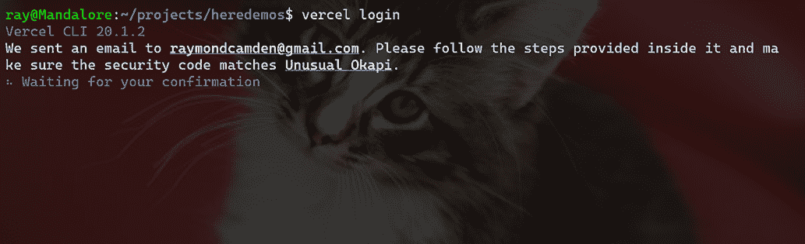

图 6.22 通过 CLI 的 Vercel 登录过程会发送一封电子邮件来处理确认。

一旦你通过电子邮件中发送给你的链接确认，CLI 会告诉你它已经准备好（图 6.23）。

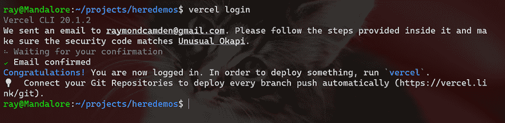

图 6.23 配置好的、准备就绪的 Vercel CLI

登录后，通过使用它来部署我们在第三章中构建的 Jekyll 网站来快速测试 Vercel。在你的终端中，切换到你在书中构建（或从 GitHub 仓库下载）的最终演示所在的目录。对我来说，这是 ~/projects/the-jamstack-book/chapter3/startbootstrap-clean-blog-jekyll-master。一旦进入该目录，使用 vercel deploy 部署网站。虽然你可以使用 CLI 的多个选项，但我们真正想指出的是默认选项的强大功能。

你首先会被提示是否要设置和部署当前目录（图 6.24）。只需点击 Enter。

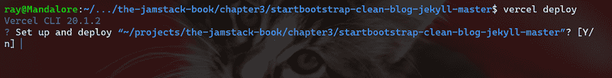

图 6.24 部署过程首先会与你确认，以确保当前目录是你想要部署的。

接下来，它将询问你部署的范围。这与你当前登录的账户相关，并将根据你的信息而有所不同。只需点击 Enter 以接受默认设置。

下一个提示会询问你是否希望连接到现有的项目。由于我们正在构建新的内容，再次选择默认（N）并点击 Enter（图 6.25）。如果你再次运行部署，Vercel 将正确地将其识别为现有项目。

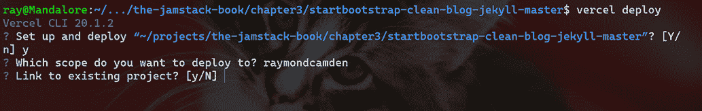

图 6.25 继续部署流程并指定这是一个新项目

然后，你将被要求为这个项目命名。名称将默认为目录名称，在我们的例子中有点长。这个名称将用作项目名称和默认 URL。稍后，你可以为你的 Vercel 网站分配一个“真实”的域名。让我们给它一个稍微短一点的名称 verceltest 并点击 Enter。

现在，你将被询问代码所在的目录。我们是在正确的目录中启动 CLI 的，因此你可以再次点击 Enter 以接受默认设置。CLI 将对代码库进行一些检查，确定它是 Jekyll，然后询问你是否想在部署之前覆盖任何设置。再次点击 Enter 以接受默认设置（图 6.26）。

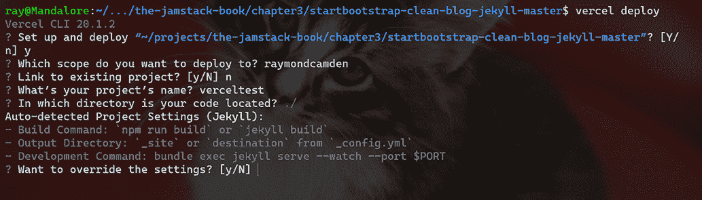

图 6.26 在 Vercel 部署之前，你有一次最后的机会修改设置。

现在，Vercel CLI 将开始工作。它会将本地目录中的代码推送到服务器。它识别出你正在运行 Jekyll，并执行所需操作以支持你网站上的 Jekyll。它会构建你的网站，最后你将得到一份关于你的网站部署位置的报告（图 6.27）。

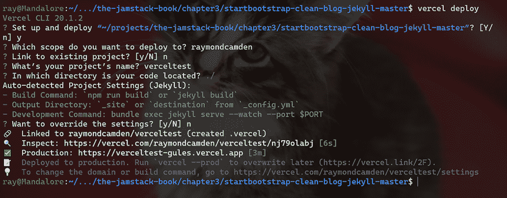

图 6.27 将部署到 Vercel 的最终输出

CLI 提供了一份关于它所执行的操作及其所需时间的详细报告。你还会得到一个可以立即打开并查看你网站的 URL。在测试中，URL 是 [`verceltest-gules.vercel.app`](https://verceltest-gules.vercel.app)，但对你来说可能有所不同。

在这一点上，你可以添加一篇新文章，修改现有文章，或进行任何你希望的改变。例如，我们可以修改博客文章的标题和文本（_posts/2020-08-24-welcome.html，但你的日期会有所不同）以简单地添加单词 *Vercel*：

```
---
layout: post
title: "Welcome to my Vercel blog"
subtitle: "I'm so excited!"
date: 2020-08-24 12:00:00 -0400
background: '/img/posts/01.jpg'
---

<p>
This is my cool Vercel blog!
</p>
```

保存后，你可以再次运行 vercel deploy。这次你将不会被提示任何内容，但结果是一个 *预览* 构建，正如你在图 6.28 的输出中可以看到的那样。

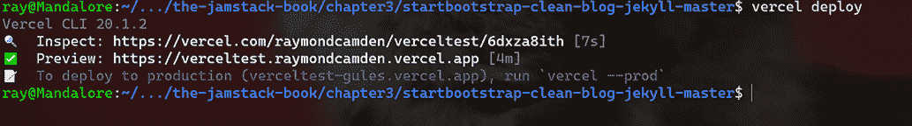

图 6.28 预览构建的结果

真正酷的是，你现在可以在不同的标签页中打开两个 URL，以便比较差异。CLI 还非常明确地告诉你如何使你的更改在生产构建中可见，即运行 vercel --prod。运行这个命令将会更快，因为它将预览移动到生产环境，完成后，你可以重新加载原始 URL 来查看你的更改（图 6.29）。


图 6.29 我们更新的博客文章在 Vercel 上的实时状态

在继续之前，我想明确指出，这种更新方式（更改文件，重新运行 CLI）并不是用于涉及大量用户的实际生产网站。在这种情况下，你会使用源代码控制。Vercel 可以监听仓库的更改并自动更新你的网站。但这里展示的 CLI 方法对于测试、与他人共享网站等非常有用。正如我一开始所说的，Vercel 拥有一套强大的功能，所以请务必查阅其文档（[`vercel.com/docs`](https://vercel.com/docs)）以获取更多信息。

## 6.5 使用 Netlify 部署

让我从一句大胆且极具个人色彩的陈述开始。Netlify ([`www.netlify.com/`](https://www.netlify.com/)) 是托管 Jamstack 网站的黄金标准。这并不是说它完美无缺或能满足所有需求。但对我来说，它提供了性价比最高的功能集合，并且是我评价其他服务的标准。让我们看看它的服务列表；就像 Vercel 一样，我只会指出一些可用的功能：

+   能够将网站连接到 Git 仓库，并在提交后自动构建。

+   能够将网站连接到 Git 仓库，并基于分支创建预览构建。

+   创建复杂重定向文件的能力。（这对于可能从传统应用服务器迁移到 Jamstack 并确保旧 URL 仍然正确工作的人来说特别有用。）

+   使用 JavaScript 和 Go 编写的无服务器函数。你将在第八章中了解更多关于这方面的内容。

+   网站分析。

+   提供用户管理和安全性的自定义用户身份服务。

+   处理表单提交的能力。

+   对大型二进制文件提供特殊支持。

+   自动使用 CDN 以及 JavaScript 和 CSS 的压缩。这还包括压缩图片的能力。

+   对团队多人运行的网站提供出色的支持。

+   适用于本地开发的优秀 CLI。

为了明确起见，Netlify 的内容远不止于此，但你可以查看他们定价页面上的更全面列表（[`www.netlify.com/pricing/`](https://www.netlify.com/pricing/))。

为了测试 Netlify，我们再次使用第二章中的 Eleventy 示例，并部署 Camden Grounds。如果你还记得本章前面的内容，当我们把 Camden Grounds 部署到 Amazon S3 时，我们部署了 Eleventy CLI 的输出。如果我们对网站进行了更改，我们需要重新运行 CLI 并将文件复制到 S3。虽然这不是一项繁重的任务，但它仍然是手动操作且容易出错。让我们来了解一下在 Netlify 上创建网站的流程，它将自动从 GitHub 仓库构建。

如果你还没有这样做，首先注册 Netlify（[`app.netlify.com/signup`](https://app.netlify.com/signup)）。他们有一个免费层，这将完全满足你的需求。图 6.30 显示了你可以注册的多种方式。


图 6.30 在 Netlify 上注册支持多种登录选项。

在注册（并确认你的电子邮件）之后，你就可以登录了。Netlify 的主要界面是一个列出所有网站及其当前状态的仪表板。作为一个新用户，你的仪表板看起来可能相当空（图 6.31）。

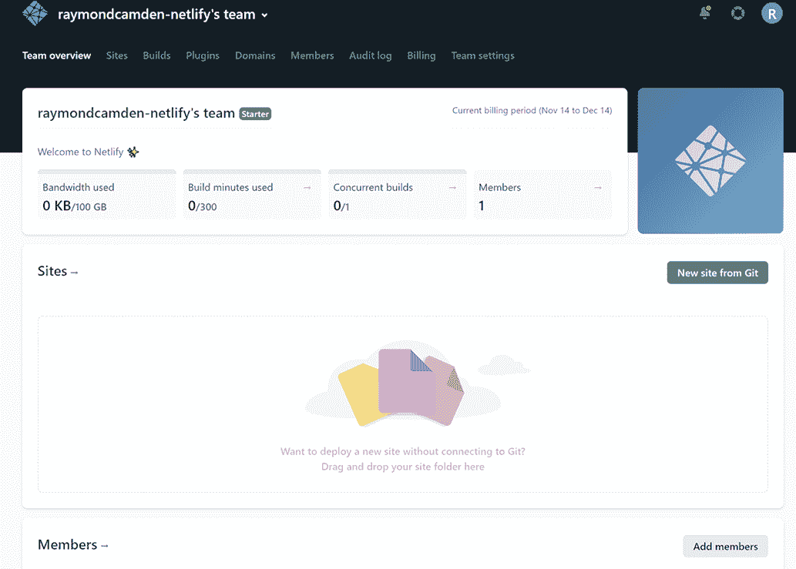

图 6.31 新用户的 Netlify 仪表板

为了进行比较，这里是我的个人仪表板（图 6.32）。

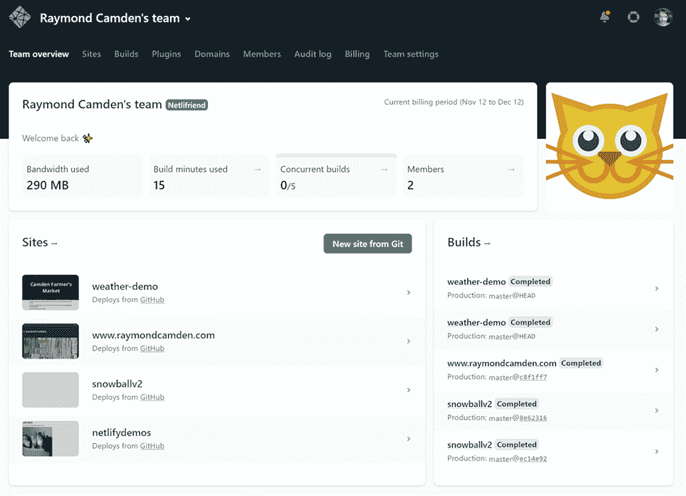

图 6.32 更充分使用的 Netlify 仪表板

注意列出的每个网站都包含当前外观和感觉的截图。在右侧是整个账户中最新的构建列表。回顾图 6.31，注意 Git 按钮中的突出显示的新网站。让我们利用这个方法来测试 Netlify 的持续部署功能。

虽然这本书有一个 GitHub 仓库，但为了测试这个功能，你需要创建自己的仓库。大多数读者可能熟悉 GitHub，但如果不知道，你可以在 GitHub 网站上阅读一篇优秀的指南，网址为[`guides.github.com/activities/hello-world/`](https://guides.github.com/activities/hello-world/)。此外，请注意，像 Vercel 一样，Netlify 有一个支持从终端部署的 CLI。

如前所述，我们将使用第二章中的 Camden Grounds 作为我们的测试。这个网站的文件可以在本书的仓库中找到，位于 chapter2/camdengrounds。在你的 GitHub 账户中，为 Camden Grounds 创建一个新的仓库。一旦创建，只需将之前目录中的文件复制到新仓库中。在你提交这些新文件之前，你应该添加一个小小的修改。Git 仓库支持忽略本地目录和文件，以确保它们不会被推送到仓库。这是通过一个名为.gitignore 的文件来完成的。当 Eleventy 输出构建时，它默认使用名为 _site 的文件夹。由于这是生成的输出，我们不需要它在 GitHub 仓库中。在将 Camden Grounds 提交到仓库之前创建的文件内容如下。注意我们还在.gitignore 文件中添加了 node_modules，如列表 6.1 所示。这是必需的，这样 Eleventy 就不会尝试解析其构建过程中生成的任何 Node 相关文件。

列表 6.1 Camden Grounds 的.gitignore 文件

```
_site
node_modules
```

在此操作完成后，将这些文件提交到你的新仓库中。最终结果应该看起来像图 6.33（当然，用户名会有所不同）。

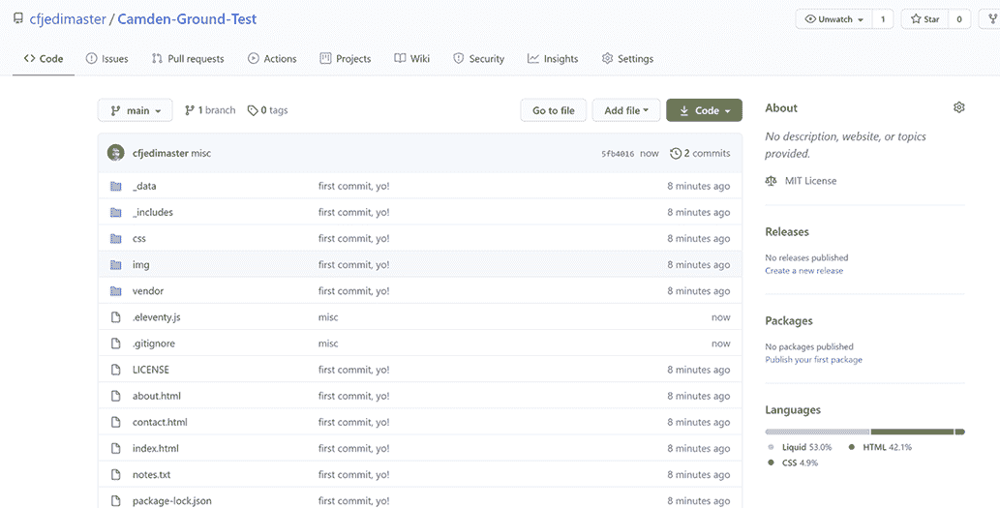

图 6.33 新的 Camden Grounds 仓库

如果您只想复制我用于此测试的仓库，您可以在[`github.com/cfjedimaster/Camden-Ground-Test`](https://github.com/cfjedimaster/Camden-Ground-Test)找到它。现在让我们将其连接到 Netlify！

如前所述，Netlify 会提示您从 Git 构建新站点，因此点击该按钮以开始过程。在图 6.34 中，您将看到三个不同的选项以开始过程；选择 GitHub 作为提供商。

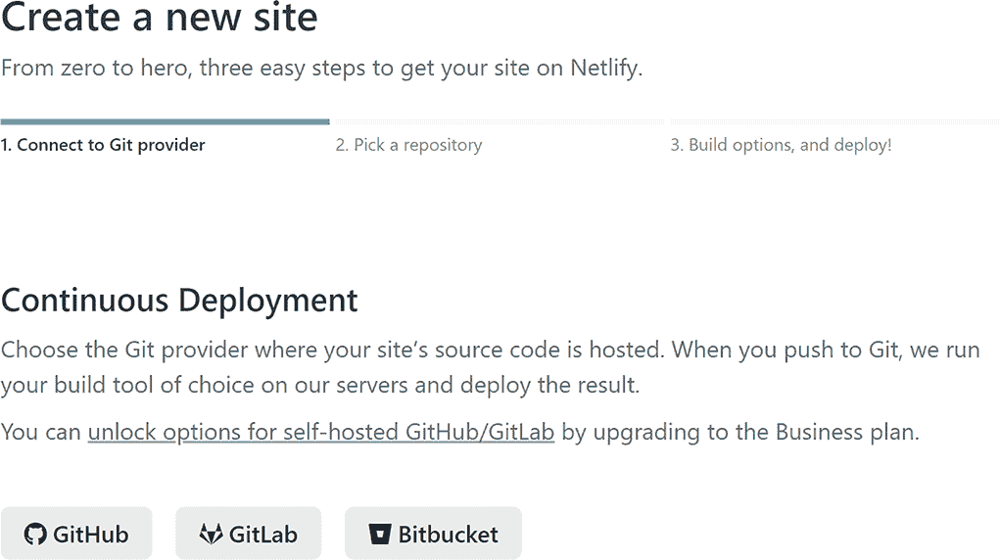

图 6.34 从存储库创建新站点的过程开始

在您通过 GitHub 进行身份验证后，您将看到所有仓库的列表。找到您创建的仓库并点击它。下一屏幕将提示您选择要部署的分支（默认为 master 或 main），然后请求基本的构建设置。这些构建设置用于构建您的站点的命令以及结果可以找到的位置。为了告诉 Netlify 如何构建站点，我们可以使用 npx，这是使用 npm 的另一种方式。这在 Eleventy 文档([`www.11ty.dev/docs/usage/`](https://www.11ty.dev/docs/usage/))中有介绍，看起来是这样的：npx @11ty/eleventy。默认情况下，Eleventy 将输出到 _site，因此我们将使用它作为发布目录设置。您可以在图 6.35 中看到这两个设置。

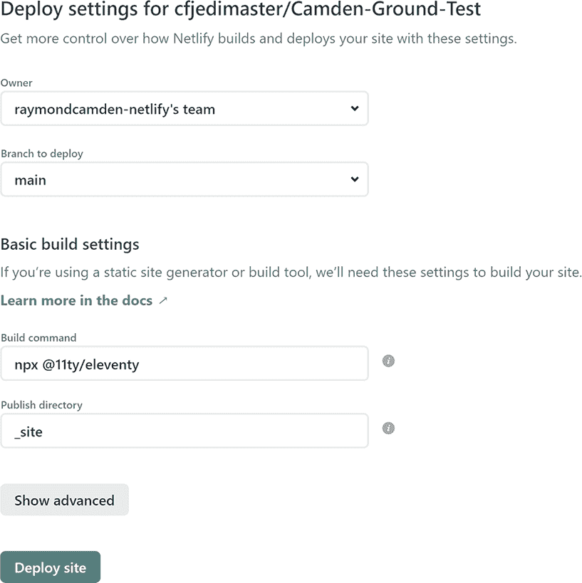

图 6.35 Netlify 站点的配置设置

点击“部署站点”以开始过程。然后您可以坐下来观看。Netlify 仪表板将更新您有关从 GitHub 获取文件和运行构建命令的过程。完成后，您将在仪表板顶部看到站点的 URL 和预览（图 6.36）。

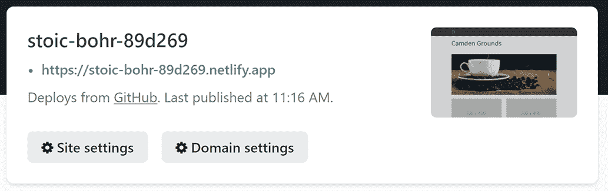

图 6.36 站点更新后的 URL 和截图

如果您点击该链接，您可以浏览站点并查看 Camden Grounds。为了真正看到 GitHub 集成的力量，让我们进行一个快速测试。打开 _data/products.json 并修改第一个产品。您更改的内容并不重要；只需进行修改即可：

```
{
    "name" : "Netlify Powered Coffee!",
    "price" : 2.99, 
    "description" : "This coffee is powered by Netlify!",
    "thumbnail" : "http://placehold.it/700x400", 
    "image" : "http://placehold.it/900x350" 
},
```

保存文件，将其检入您的 GitHub 仓库，然后观察 Netlify 仪表板（图 6.37）。

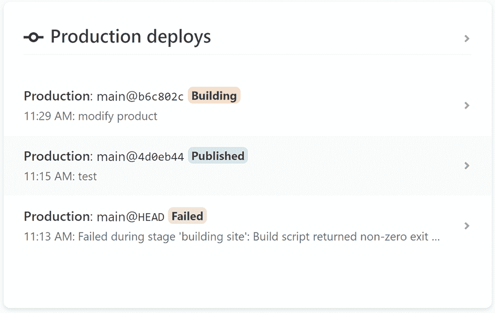

图 6.37 Netlify 仪表板显示您的构建信息

关于图 6.37，我想指出两点额外的事情。注意最早的报告显示了一个错误。虽然错误的性质并不重要，Netlify 会处理这个错误，并允许您点击构建以获取详细信息。而且——这很重要——如果在构建过程中出现问题，它不会破坏现有的网站。在这个特定的情况下，这是第一次构建，所以没有网站，但您可以放心，如果您真的搞砸了什么，您的现有网站将继续正常工作。Netlify 只有在完全且成功构建后才会更新。这意味着没有停机时间。其次，您在最新构建下看到的消息（“修改产品”）直接来自我的 GitHub 提交。通常，您应该编写好的、具体的 GitHub 提交信息，这些信息将在 Netlify UI 中显示。

构建完成后，您可以再次打开网站并查看您的新产品（图 6.38）。

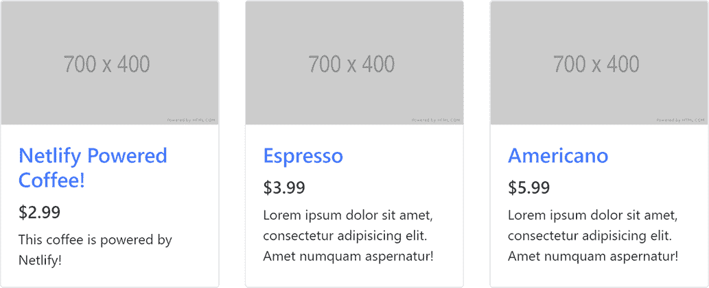

图 6.38 基于最后 GitHub 提交的更新网站

让我们看看 Netlify 的一个更酷的功能：表单处理。在第七章中，我们将更多地讨论处理静态生成网站的动态方面，但由于 Netlify 使这个特定功能的使用变得非常简单，我们想在这里介绍它。如果您还记得，Camden Grounds 的“联系我们”页面没有任何实际信息。让我们通过添加一个表单来改变这一点，如表 6.2 所示。

列表 6.2 联系我们表单 (/contact.html)

```
---
layout: main
title: Contact
---

<div class="row my-4">
  <div class="col">

  <h2>The Contact Page</h2>

  <form>
  <div class="form-group">
    <label for="name">Name</label>
    <input type="text" class="form-control" id="name" name="name">
  </div>
  <div class="form-group">
    <label for="email">Email</label>
    <input type="email" class="form-control" id="email" name="email">
  </div>
  <div class="form-group">
    <label for="comments">Comments</label>
    <textarea class="form-control" id="comments" name="comments">
    </textarea>
  </div>
  <button type="submit" class="btn btn-primary">Submit</button>
  </form>

  </div>
</div>
```

将此更改提交到您的仓库，并等待 Netlify 完成构建。一旦完成，您将看到您的新表单在线上（图 6.39）。当然，您也可以测试表单在本地看起来如何。通常，您会这样做，以便快速查看您的更改。由于我们正在构建一个简单的表单，我们目前不需要担心这一点。

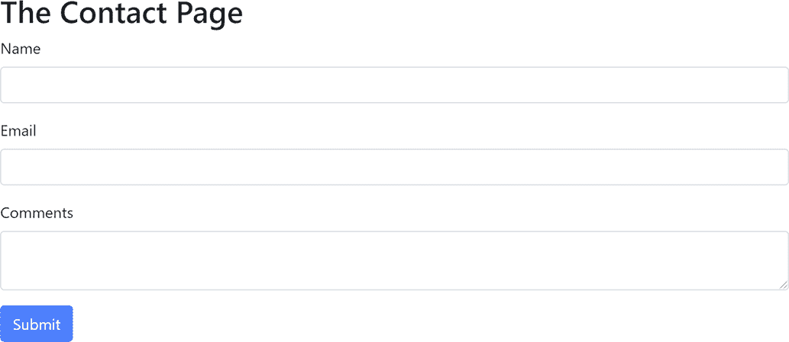

图 6.39 简单的联系方式表单

我们已经完成了 UI，但如果您实际尝试提交页面，则没有任何反应。幸运的是，Netlify 使处理表单提交变得非常简单。通过在表单标签中添加 data-netlify="true"，Netlify 将识别表单提交并自动保存结果。您只需这样做，但您也可以进行更多配置。Netlify 还支持向您的表单添加 captcha 和 honeypot 垃圾邮件陷阱。让我们快速修改 contact.html 以展示这一功能。您需要做的唯一更改是表单标签：

```
  <form action="/contact_received.html" data-netlify="true" name="Contact">
```

这里有三点不同：

1.  首先，我们为表单指定一个动作。在 Netlify 处理并保存表单输入后，它将用户重定向到这个页面。（这个页面位于 GitHub 仓库中，并包含一条简短的感谢信息。）

1.  接下来，我们添加 data-netlify 属性来告诉 Netlify 处理提交。

1.  最后，我们为表单提供一个名称。这有助于 Netlify 在您的网站有多个表单时识别不同的表单。

再次提交此更改，等待构建部署，现在当您提交表单时，您将结束在操作页面上。那么您的表单数据去哪里了？

在 Netlify 控制台中，点击顶部的“表单”链接。您最初会看到网站上活跃的表单列表，目前只有一个（图 6.40）。

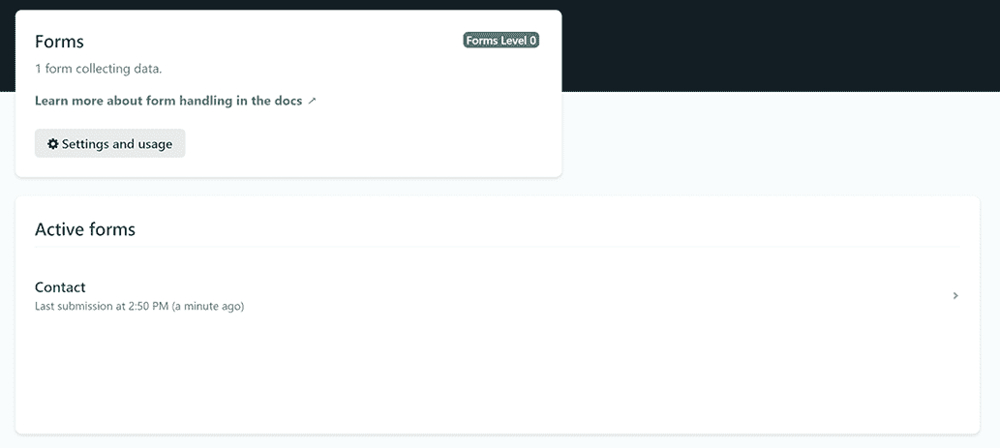

图 6.40 Netlify 处理的表单列表

点击“联系表单”链接以获取表单提交的列表。如果您点击一个提交项，您可以看到详细信息（图 6.41）。

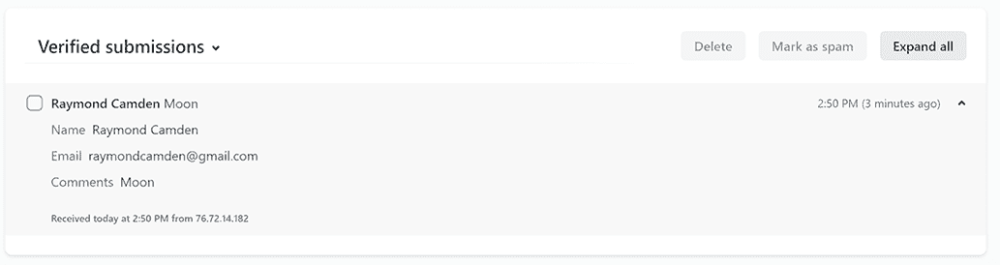

图 6.41 表单提交的详细信息

Netlify 提供了更多功能，包括表单，例如将提交的副本发送到电子邮件地址并将数据传递到无服务器函数。有关更多信息，请参阅文档（[`docs.netlify.com/forms/setup/#html-forms`](https://docs.netlify.com/forms/setup/#html-forms)）。在下一章中，我们将讨论处理 Jamstack 网站动态方面的其他方法，包括表单处理、搜索等。

## 摘要

+   开发者有许多部署他们的 Jamstack 网站的选择，每种选择都有不同的优缺点。这些选项包括老式但仍然功能齐全的纯网页服务器安装、基于云的文件托管提供商以及专门为 Jamstack 设计的服务。

+   基于文件的提供商可能是简单的解决方案，但提供的功能远不止基本的文件存储。对于不需要重定向或其他高级功能的简单网站，基于文件的提供商可能是一个足够好的解决方案。

+   微软提供了一个与 Visual Studio Code 集成良好的不错选项。开发者可以直接从他们（很可能）已经使用的编辑器中连接和部署网站。

+   Vercel 和 Netlify 都专门针对 Jamstack 和前端开发者，提供众多使托管变得有吸引力的功能。表单处理、重定向规则和无服务器函数只是其中的一些例子。
