# 7 添加动态元素

本章涵盖

+   将动态元素添加回静态网页

+   通过多个提供商处理表单提交

+   为静态网站创建搜索界面

在过去（你知道，两三年前），我们现在所知道的 Jamstack 还要简单一些。通常我们指的是静态网站和静态网站生成器。这些术语的问题在于它们暗示了一个静态、不变的网站，无法响应用户的需求。那时不是这样，现在也不是这样。

有许多选项（有些免费，有些商业）旨在为网页提供交互性。在本章中，您将看到这些服务的不同示例以及它们如何集成到一些之前的演示中。我们将讨论在选择特定产品之前开发者需要了解的权衡、价格和其他考虑因素。

### 7.1 表单，表单，更多表单

在 1990 年代初期作为专业网页开发者的早期工作中，我做的第一个任务就是表单处理。当时，我们的网站和现在很相似，都是简单的 HTML，为了给网站添加功能，比如处理表单，我们会使用用 Perl 编写的程序。我对 Perl 很有天赋，所以在许多项目中，我会专注于这个领域。表单自互联网开始以来就存在了，处理这些表单的需求也随之产生。让我们看看为您的 Jamstack 网站添加处理功能的几种不同选项。广泛地说，我们将探讨两种不同的方法：一种是在您网站上托管并嵌入表单，另一种是作为仅处理表单数据的服务的形式。

### 7.1.1 使用 Google 表单

Google 表单（[`forms.google.com/`](http://forms.google.com/)）是 Google 提供的一项免费服务，与更通用的 Google Docs 服务相关。开发者可以创建包含多种类型问题和不同样式的表单。表单数据会自动存储在 Google 表格（他们的 Microsoft Excel 版本）中，也可以直接通过电子邮件发送给需要获取结果的人。

在 Jamstack 中使用 Google 表单意味着在 Google 的网站上创建和设计您的表单，然后将嵌入代码添加到 HTML 文件中。这也可以在非 HTML 文件中完成。例如，如果您在使用 Liquid 的 SSG，您可以在那里添加嵌入代码，这将作为构建网站时最终 HTML 文件输出的一个部分。让我们一步步创建一个基本的表单，它将模仿网站上常见的“联系我们”表单。

首先，访问 Google 表单网站（使用此服务需要 Google 账户）。你应该会看到一个模板列表以及任何最近的表单（图 7.1）。

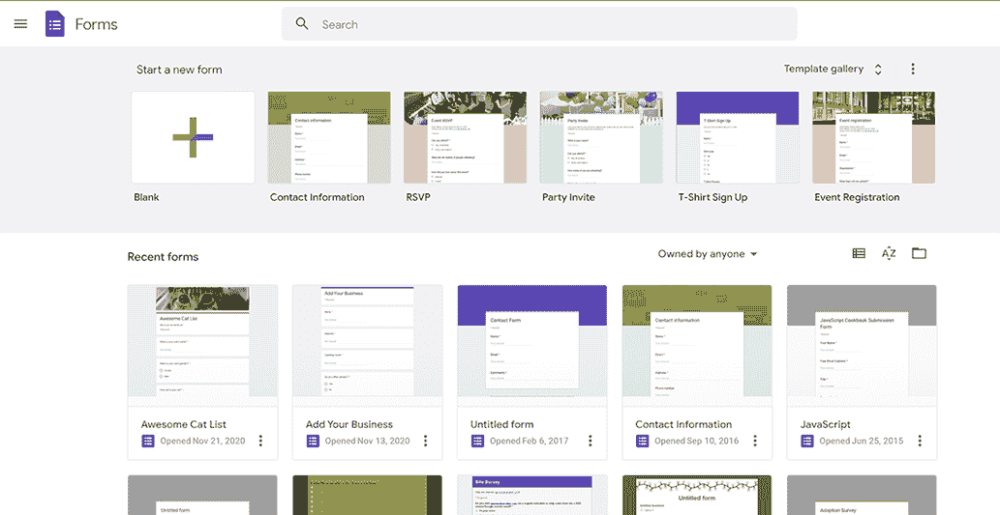

图 7.1 Google 表单主页，列出模板和之前的表单（如果有）

现在先点击空白模板。包含的模板相当不错，但最好从简单开始。这将带您进入 Google 表单编辑体验（图 7.2）。

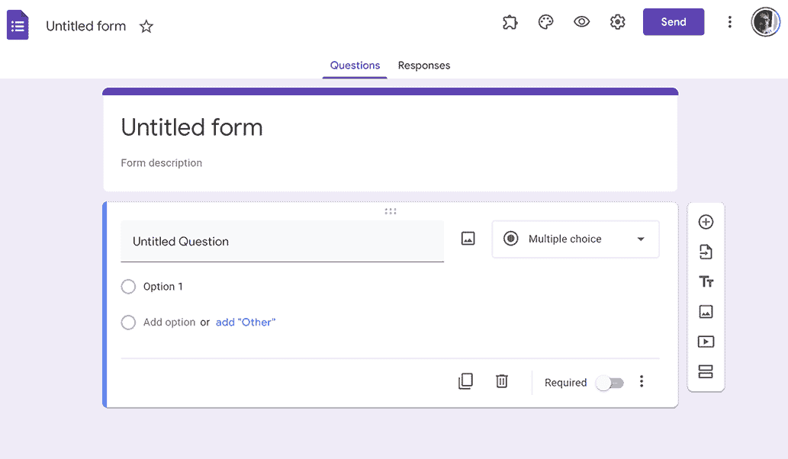

图 7.2 初始空白表单

谷歌的表单编辑器做得非常好。你可以在不同类型的问题（简短回答、长文本、多项选择等）之间进行选择，并且可以自由地输入你看到的问题和答案文本。谷歌还会对你的问题进行一些相当出色的解析，使你能够更快地编写答案。例如，如果你的问题暗示了是或否的回答，谷歌会注意到这一点并建议这些作为答案。

正如我们所说，我们的第一个例子将是一个联系表单。这些表单已经存在很长时间了，通常的格式是要求提供你的联系信息，并提供一个地方来提出你的问题或发送你的反馈。

表单的设计可能是一个复杂的话题。你需要问多少个问题？需要哪些问题？你将如何为特定问题选择语言？如果任何一个环节出错，你的用户可能会简单地离开，或者更糟糕的是，花费时间填写答案然后半途而废。对于这个特定的例子，让我们使用以下问题：

+   *你的名字是什么？* 这将是一个简短文本回答，并且是必填项。

+   *你的电子邮件地址是什么？* 这也将是一个简短文本回答，并且是必填项，并且这对于我们能够联系用户并回应他们的评论非常重要。

+   *你喜欢我们的网站吗？* 这不是必填项，将作为一个快速的方式来衡量用户是否在使用我们的网站。它是可选的，因此用户可以跳过它，但我们应该准备好结果可能偏负面。为什么？如果一个用户在使用我们的网站时感到满意并且没有问题，他们可能不会麻烦联系我们告诉他们这一点，所以我们可以合理地假设填写此表单的大部分用户可能存在某种问题，并且可能并不开心。再次强调，这就是表单复杂性的体现：你不仅要考虑填写表单的人的用户体验，还要考虑他们为什么这样做的原因心理学。

+   *你的评论*。最后一个字段将是一个必填的长文本字段，供网站访客提问或提供反馈使用。

首先，为表单设置一个名称，将“未命名表单”替换为“联系表单”。可选地，你可以输入表单描述，但现在不必担心这一点。然后在表单构建器的第一个字段中输入第一个问题的文本。确保将其设置为必填项。你会注意到，一旦你输入问题的文本，智能功能就会启动，谷歌会默认将其类型设置为简短回答。这只是谷歌在试图帮助你，但你也可以将其更改为你想要的任何类型。图 7.3 显示了完成后的样子。


图 7.3 编辑后的表单

重复此步骤以请求用户的电子邮件地址。要添加新问题，请点击如图 7.3 所示的右侧加号图标，然后添加关于用户是否喜欢网站的问题。谷歌不仅会确定这是一个是/否问题，还会建议这些答案以及“可能”。你可以点击建议快速添加它们（图 7.4）。

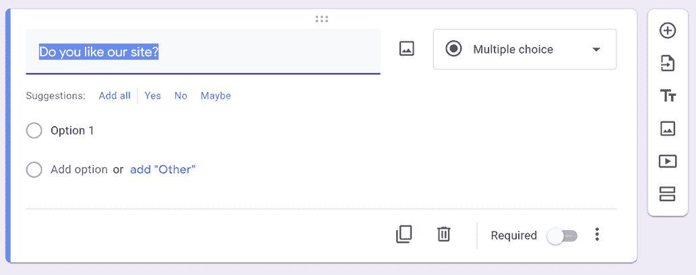

图 7.4 谷歌智能表单编辑器识别你的问题并建议答案

在添加“是”和“否”作为答案后，添加最后一个问题。谷歌应该建议“段落”作为类型，但请确保将其设置为“必填”。完成后，点击顶部的预览图标（它是一个眼睛图标），将打开一个新标签页，显示你的表单（图 7.5）。

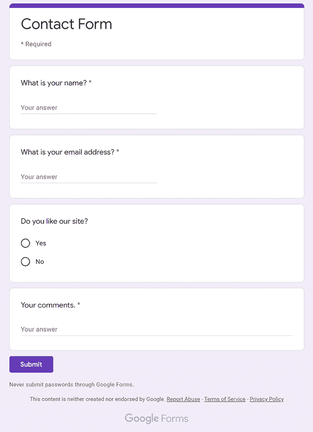

图 7.5 完整的表单

这个预览是一个完全功能性的表单，你现在就可以使用并提交。你可以通过故意省略一些内容来查看验证逻辑是如何工作的。提交你的表单。当你这样做时，你会得到一个简单的确认（图 7.6）。

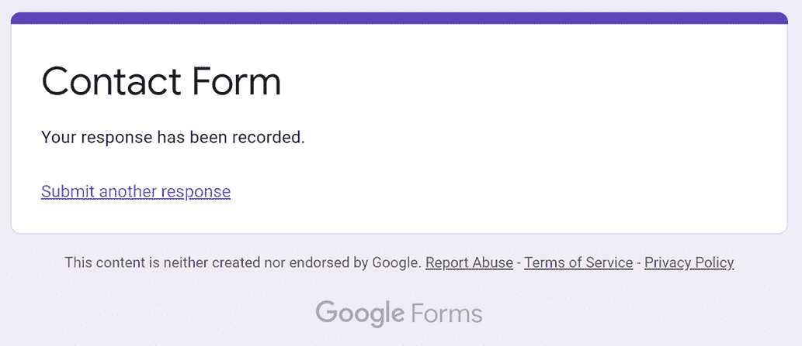

图 7.6 用户提交表单后看到的内容

这样做几次后，返回你正在编辑表单的标签页。你会看到“回复”标签页会注意到已经收到了提交（图 7.7）。

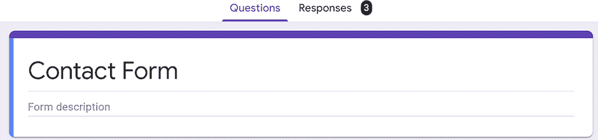

图 7.7 高亮显示“回复”标签页

点击“回复”标签页将显示回复的摘要（图 7.8）。谷歌在显示这些数据方面做得令人钦佩，并认识到“你喜欢我们的网站吗？”这个问题适合作为饼图，但奇怪的是，将电子邮件地址显示为柱状图。

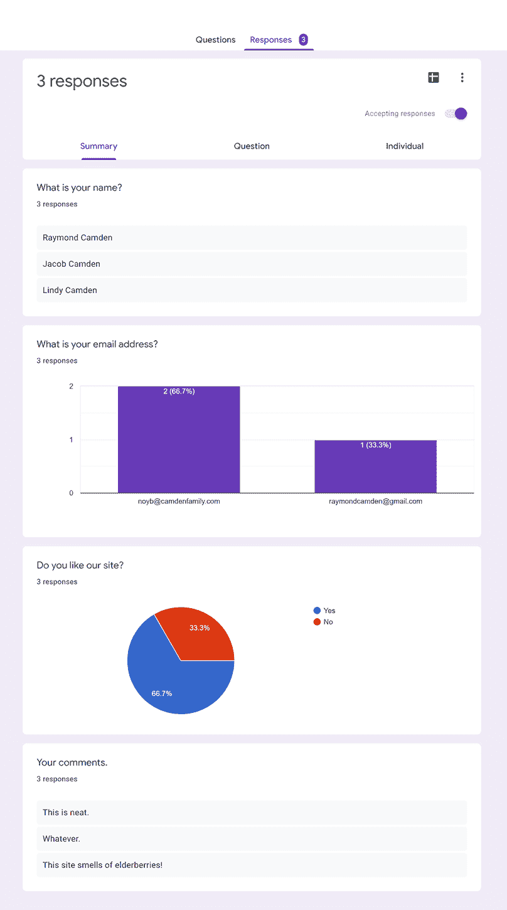

图 7.8 表单回复的摘要

点击“问题”标签页将允许你一次查看一个问题的结果，而“单个”则一次显示一个完整的回复。顶部的绿色图标允许你创建一个 Google 表格，并自动将回复（以及未来的回复）连接到电子表格。然而，在大多数情况下，开发者（或网站的所有者）更愿意收到电子邮件回复。要设置此功能，请点击绿色电子表格图标右侧的三点菜单，并在弹出菜单中选择“为新电子邮件回复获取电子邮件通知”（图 7.9）。

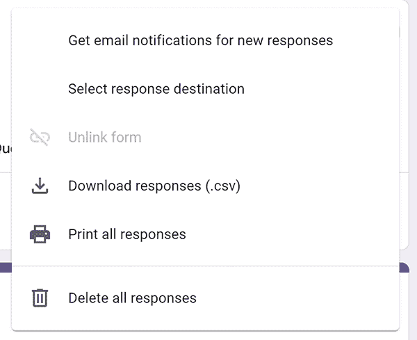

图 7.9 设置和配置电子邮件回复

点击此按钮将启用未来提交的电子邮件通知，但请注意，它会发送到谷歌账户的所有者。现在，如果你再次填写表单，你会收到一封电子邮件（图 7.10）。

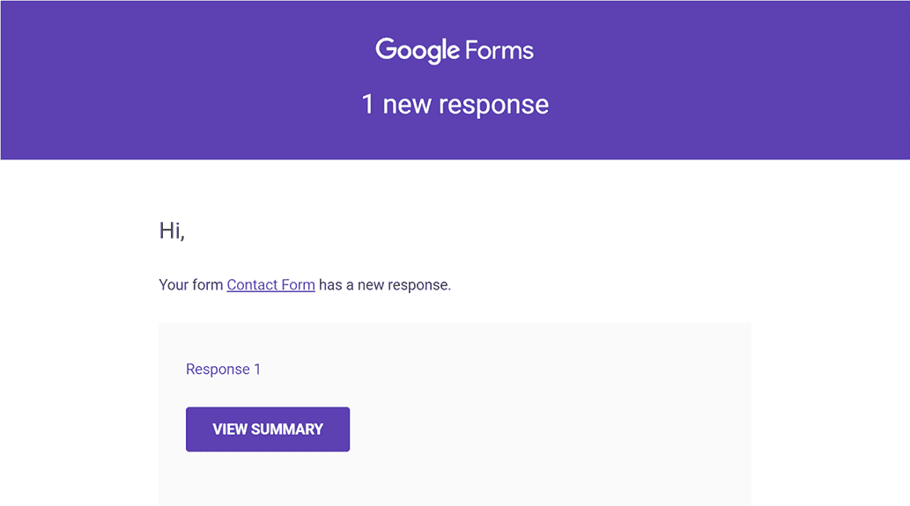

图 7.10 提交表单后的收到的电子邮件

不幸的是，你仍然需要点击才能看到回复，但至少你知道已经提交了回复。

现在您的表单已经构建完成，并且可以接收提交的内容，下一步是什么？虽然我们的网站可以简单地链接到表单，但这意味着用户将离开我们的网站，而这通常不是我们希望看到的情况。相反，我们可以直接在我们的网站上放置表单。这可以通过 iframe 嵌入代码来实现。你可能会觉得这个代码并不明显，但它可以通过表单编辑器顶部的“发送”按钮找到。点击此按钮会打开一个对话框，默认是通过电子邮件发送表单，但点击“<>”图标会显示 iframe 代码（图 7.11）。

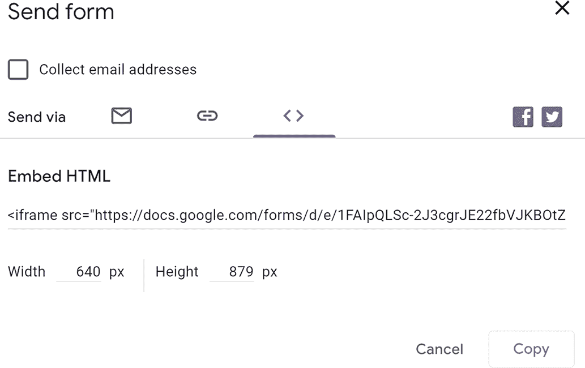

图 7.11 发送对话框的 HTML 选项

使用此代码，您现在可以将其嵌入到任何您想要的网页中，包括 Jamstack 网站内。但让我们从一个使用典型 HTML 页面布局的简单示例开始。Google 表单的嵌入代码作为页面的一部分包含在内。请确保将其替换为您自己的嵌入代码。

列表 7.1 Google 表单嵌入示例 (/chapter7/forms/test1.html)

```
<!DOCTYPE html>
<html>
<head>
<title>A Regular Page</title>
<style>
body {
    background-color: bisque;
    font-family: Verdana, Geneva, Tahoma, sans-serif;
}

footer {
    margin-top: 10px;
    font-size: 10px;
}
</style>
</head>

<body>

    <h1>My Site's Contact Form</h1>

    <iframe src="https://docs.google.com/forms/d/e/1FAIpQLSc-
    ➥ 2J3cgrJE22fbVJKBOtZFlmzpiqE36SE-eAmJHqTh6NZHrA/viewform?embedded=true"
    ➥ width="640" height="879" frameborder="0" marginheight="0"
    ➥ marginwidth="0">Loading...</iframe>

    <footer>
    <p>Copyright Whenever</p>
    </footer>

</body>
</html>
```

这是一个相当短的模板，包含页眉和页脚，以及 Google 表单中的 iframe。我们在这里也使用了一些 CSS 来美化页面。这样做的原因只是为了展示当表单添加到具有独特样式的页面时，表单的外观。Google 表单允许在外观和感觉上进行一些定制，因此您可能需要稍微处理一下，但我们想展示一个无需定制的即插即用集成。图 7.12 展示了它在页面上的渲染效果。


图 7.12 Google 表单

如您所见，它集成得很好。有一个滚动条，但可以通过修改 iframe 的高度属性或使用 CSS 来调整。如果您提交此表单，整个过程将在 iframe 内完成，用户永远不会离开网站。虽然它在页面上确实显得有些突兀，但这是一种快速简单的解决方案。更好的是，表单可以被非技术用户编辑，并且由于它是嵌入的，因此您网站上不需要进行任何更改来反映他们的更改。现在您已经看到了一个远程托管表单的示例，让我们考虑一些更集成的方案。

### 7.1.2 集成 FormCake

虽然 Google 表单通过外部宿主在 iframe 中显示，但开发者可能希望对自己的表单设计和设置有更多的控制。现在存在多个服务，它们提供端点，或发送您的表单数据的地方，然后接收数据，进行“操作”（它们做什么取决于服务），然后将用户重定向回您的网站。对于大多数人来说，他们并不知道发生了什么。他们只是点击了您的提交按钮，然后被展示了一个感谢或确认页面。但在幕后，相关的服务解析了表单，对数据进行了一些操作，然后将网站访问者直接重定向回您的网站。

这些服务之一是 FormCake ([`formcake.com`](https://formcake.com))。这项服务提供表单处理，包括文件上传支持、垃圾邮件保护和在数据上执行操作的能力。至少，它可以电子邮件发送数据给你（或网站的拥有者），但它还可以与 Zapier（一种自动化服务，允许你在工作流中连接不同的应用程序，例如，在表单提交时将信息发送到 Salesforce）等解决方案集成。FormCake 目前有三个不同的定价层级（更多详情请见[`formcake.com/pricing`](https://formcake.com/pricing)），但他们的免费层允许无限数量的表单，100 次提交和基本的垃圾邮件保护。这对我们来说已经足够了，所以让我们试一试。

首先，注册（你可以使用电子邮件和密码组合或你的 GitHub 账户）。完成之后，你将被带到包含一个已创建表单的仪表板（图 7.13）。

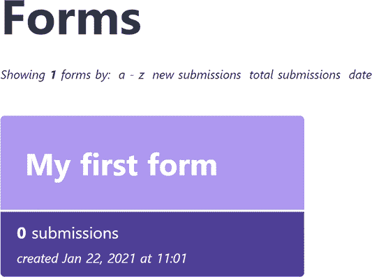

图 7.13 FormCake 的表单仪表板

点击进入表单将为你提供许多设置和集成说明，以便与它一起工作（图 7.14）。

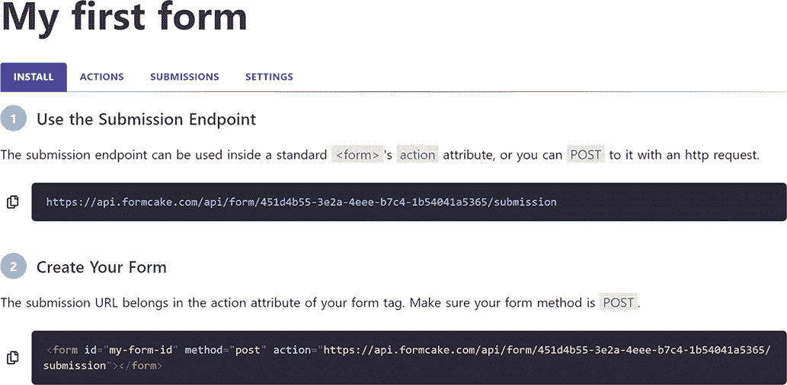

图 7.14 如何使用表单的说明

指令主要归结为确保你的表单使用 POST，并复制第一步中显示的操作端点。让我们构建一个使用此操作的表单。Google 表单的 iframe 已被完全手动编写的表单和 FormCake 提供的端点所取代。它提出的问题与之前相同。

注意：端点是针对作者的，应该替换为你从 FormCake 获得的端点。

列表 7.2 FormCake 表单 (/chapter7/forms/test2.html)

```
<!DOCTYPE html>
<html>
<head>
<title>A Regular Page</title>
<style>
body {
    background-color: bisque;
    font-family: Verdana, Geneva, Tahoma, sans-serif;
}

footer {
    margin-top: 10px;
    font-size: 10px;
}
</style>
</head>

<body>

    <h1>My Site's Contact Form</h1>

    <form method="post" action = 
    "https://api.formcake.com/api/form/451d4b55-3e2a-4eee-b7c4-
     ➥ 1b54041a5365/submission">

    <p>
    <label for="name">What is your name?</label>
    <input name="name" id="name" required>
    </p>

    <p>
    <label for="email">What is your email address?</label>
    <input name="email" id="email" type="email" required>
    </p>

    <p>
    Do you like our site?<br/>
    <input name="like" id="likeyes" value="yes" type="radio">
    <label for="likeyes">Yes</label><br/>
    <input name="like" id="likeno" value="no" type="radio">
    <label for="likeno">No</label><br/>
    </p>

    <p>
    <label for="comments">Your comments</label>
    <textarea name="comments" id="comments" required></textarea>
    </p>

    <p>
    <input type="submit">
    </p>

    </form>

    <footer>
    <p>Copyright Whenever</p>
    </footer>

</body>
</html>
```

如果你启动一个本地 Web 服务器来测试这个（我建议[`www.npmjs.com/package/httpster`](https://www.npmjs.com/package/httpster)），你可以查看表单，提交它，然后最终到达 FormCake 的默认提交页面（图 7.15）。

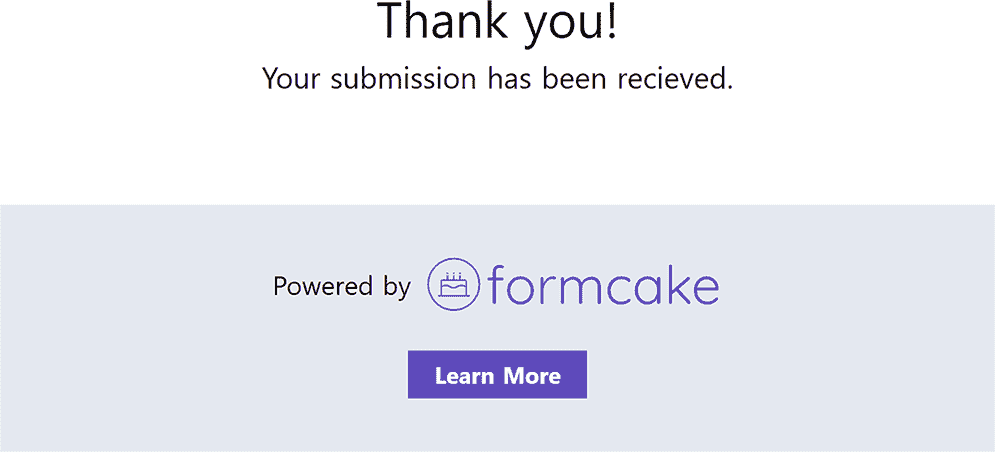

图 7.15 默认的 FormCake 响应

如果你回到 FormCake 仪表板，你可以点击“提交”标签并查看你的响应（你可能需要刷新）。点击它将给你一个详细视图（图 7.16）。

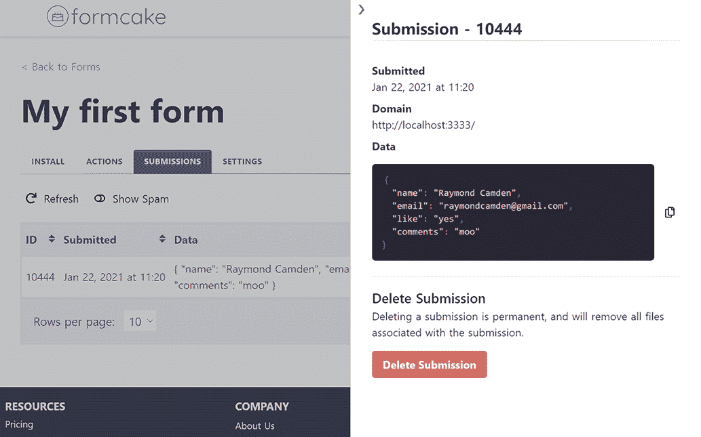

图 7.16 FormCake 的提交视图

为了使这个表单看起来更美观，让我们在表单设置中进行两项更改。在“设置”选项卡中，向下滚动到“成功重定向”，并添加一个 URL 以将用户重定向回他们提交表单的位置。目前我们正在本地测试，因此我们可以使用 localhost URL，但在生产环境中这不会起作用。在我的环境中，我的表单可在 http://localhost:3333/chapter7/forms/test2.html 处访问。我创建了一个名为 test2_thankyou.html 的新文件（你可以在网站的 GitHub 仓库中找到这个文件。文件中的内容并不重要；它只需要存在），然后将其用作重定向值：http://localhost:3333/chapter7/forms/test2_thankyou.html（图 7.17）。

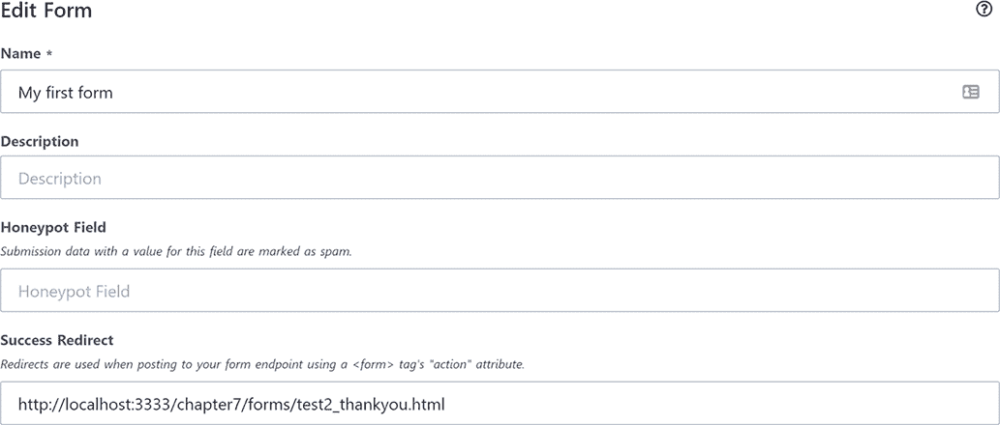

图 7.17 指定重定向的表单设置

接下来，我们需要设置它，以便每次表单提交时你都能收到一封电子邮件。点击“操作”选项卡，然后在“添加操作”下拉菜单中选择“电子邮件通知操作”。这将提示你为操作输入名称、发送信息的电子邮件地址和主题。将名称输入为“电子邮件通知”，输入你自己的电子邮件地址，主题为“表单提交”。现在你可以再次填写你的表单，提交后，你将被重定向到你的感谢页面。最终用户不会看到 FormCake 网站，甚至不知道你正在使用该服务。为了清楚起见，它并不是隐藏的，开发者可以轻松地监控网络流量，但普通用户不会知道（或关心）。不久之后，你会收到一封电子邮件通知（图 7.18）。

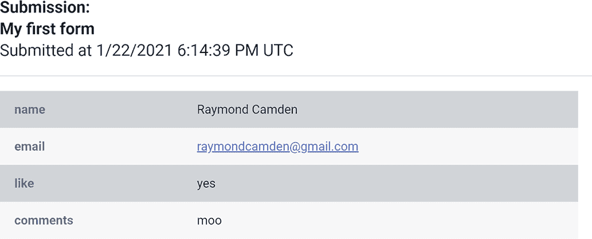

图 7.18 表单提交的电子邮件副本

如果你想要一些更定制的功能，FormCake 甚至允许你定义一个使用 Liquid 进行变量替换的电子邮件模板。这是一个相当强大的功能！

### 7.1.3 其他选项

当然，还有其他处理表单的选项。有许多类似于 FormCake 的选项，你只需为你的表单使用特定的操作。还有 Wufoo([`www.wufoo.com/`](https://www.wufoo.com/))，它更像 Google Forms，但具有强大的设计和编辑功能。如前一章所述，Netlify 作为 Jamstack 主机内置了表单处理。在下一章中，我们将讨论无服务器函数，这是另一种响应表单提交的方式。

### 7.2 添加搜索

在处理基本表单输入后，搜索可能是 Jamstack 网站最重要的功能之一。如果你的网站有超过几页，为用户提供快速找到他们想要的内容的能力变得很重要。在本节中，我们将讨论两种不同的搜索选项，并将遵循与上一节类似的格式。我们将从一个“直接插入”的解决方案开始，再次来自 Google：可编程搜索引擎([`programmablesearchengine.google.com/about/`](https://programmablesearchengine.google.com/about/))。

Google 的可编程搜索引擎之前被称为自定义搜索引擎，因此如果您在本书的教程之后进行更多研究，您可能会找到提到该服务或 CSE 的文章。这是 Google 提供的一项服务，允许您定义，基本上是 Google 搜索引擎的一部分，用于您自己的网站。

要开始，只需从可编程搜索引擎网站点击“开始使用”按钮，并使用您的 Google 凭据登录。登录后，您将被带到仪表板（图 7.19）。

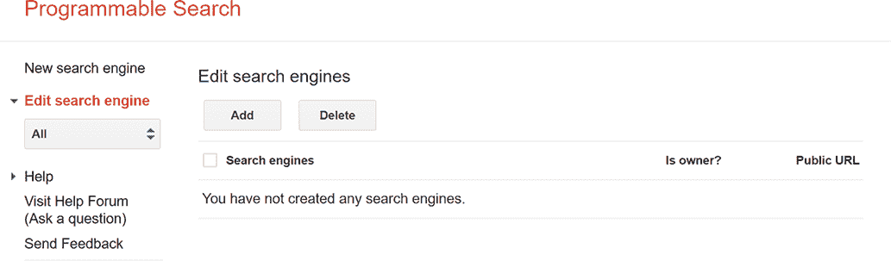

图 7.19 可编程搜索引擎仪表板

通过点击“添加”按钮开始使用此服务。您将遇到的第一个提示是搜索的网站，这里事情变得有趣。您可以在这里输入任何您想要的网站。没错——即使您正在域名 X 上构建自己的网站，您也可以为您的搜索引擎输入域名 Y（以及更多）。您可能想使用自己的域名，但 Google 允许您决定任何有意义的选项。注意（如图 7.20 所示），您还可以输入子目录。


图 7.20 设置可编程搜索引擎的初始屏幕

正如我们所说，您在这里可以输入任何您想输入的内容。如果您已经部署了自己的 Jamstack 网站，即使是在临时位置，您也可以输入 URL。为了本书的目的，并且为了给我们提供大量内容，我们将使用我的博客[raymondcamden.com](https://www.raymondcamden.com/)。对于搜索引擎的名称，让我们使用 JamstackSearch1。这完全是随机的，只是为了帮助您区分您的可编程搜索引擎与其他搜索引擎。在现实世界的场景中，我通常会使用与网站本身相同的名称。输入您的值后，点击创建按钮。然后您将看到一条成功消息（图 7.21）。


图 7.21 恭喜，您已经构建了自己的搜索引擎（说实话，是 Google 帮您构建的）。

在这一点上，请注意三个选项。第一个（获取代码）将为您提供将搜索添加到您网站所需的代码，我们将在下一部分介绍。第三个选项（控制面板）是您配置选项的地方；我们也会演示这一点。然而，中间的（公共 URL）是另一回事。一旦您构建了一个可编程搜索引擎，Google 就会提供一个 URL，让您可以立即使用您的搜索引擎。如果您想测试它的工作效果、结果排名等，这非常棒。在您构建网站的同时，您也可以与客户分享这个 URL，让他们也能看到。

现在，点击“获取代码”。在列表 7.3 中，您将看到一个简短的代码片段。您将使用这段代码并将其放入一个简单的 HTML 页面中。与上一节相同的基本外壳被使用。

列表 7.3 搜索测试页面 (/chapter7/search/test1.html)

```
<!DOCTYPE html>
<html>
<head>
<title>A Regular Page</title>
<style>
body {
    background-color: bisque;
    font-family: Verdana, Geneva, Tahoma, sans-serif;
}

footer {
    margin-top: 10px;
    font-size: 10px;
}
</style>
</head>

<body>

    <h1>Search</h1>

    <script 
    async src="https://cse.google.com/cse.js?cx=9fda4c9699117d517"></script>❶
    <div class="gcse-search"></div>                                         ❷

    <footer>
    <p>Copyright Whenever</p>
    </footer>

</body>
</html>
```

❶ Google 代码片段的开始部分

❷ 代码片段的结尾

与 Google 表单一样，您可以在您认为合适的地方插入代码片段。启动本地网络服务器，然后运行页面。您将看到一个完全由 Google 驱动的基本表单体验（图 7.22）。

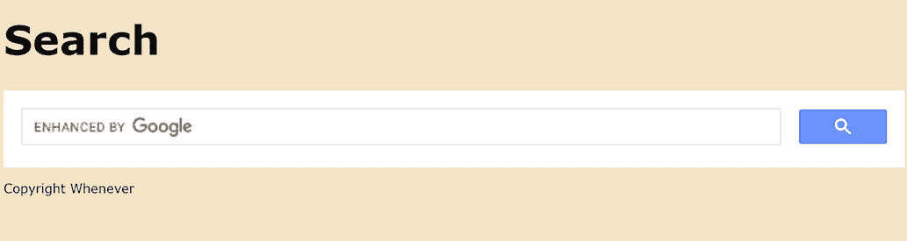

图 7.22 Google 提供的默认搜索体验

在搜索框中输入一些内容。根据您输入的域名，您应该尝试一些有意义的内容。如果您使用了我的域名 ([raymondcamden.com](https://www.raymondcamden.com/))，您可以尝试“vue.js”作为输入。图 7.23 展示了您可能会看到的内容。

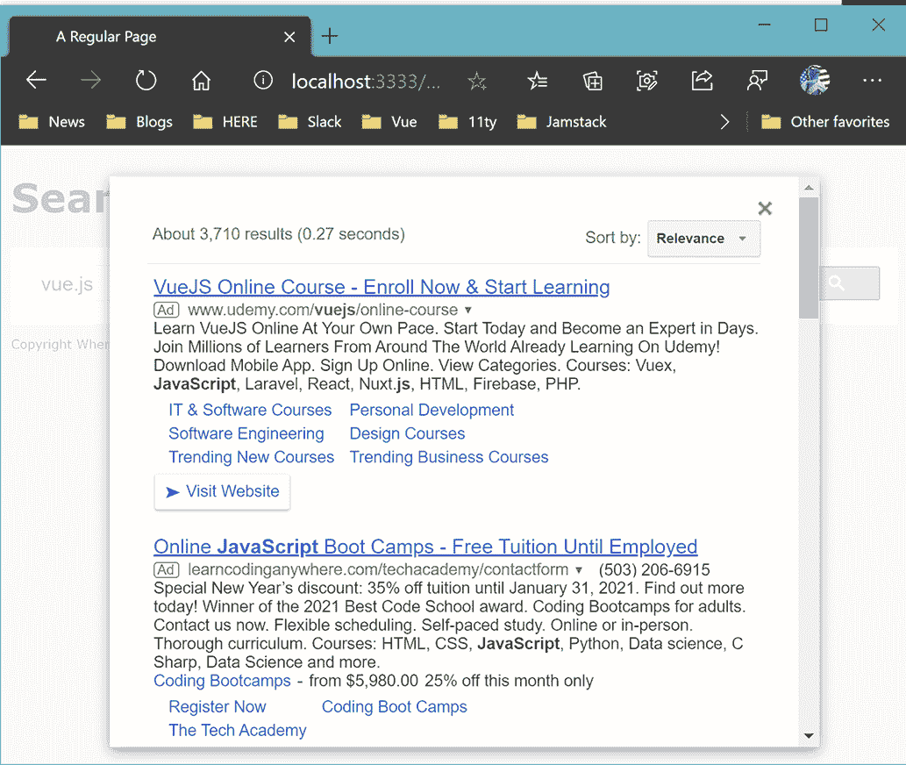

图 7.23 搜索可编程搜索引擎的结果

立刻您会注意到，UI 与您可能预期的略有不同。它不是在页面上显示结果，而是使用一个浮动的模态框。如果您不喜欢这样（我当然不喜欢），我们可以调整它，我们将在稍后这样做。您可能注意到的下一件事，尤其是在图 7.23 中，是每个可见的结果都是一个广告。是的，就像主要的 [Google.com](https://www.google.com/) 网站，您会在结果中看到广告。图中未显示的是，如果您滚动过四个广告（是的，四个，当然，您的结果可能会有所不同），您确实会得到一些很好的代码片段和图像（图 7.24）。

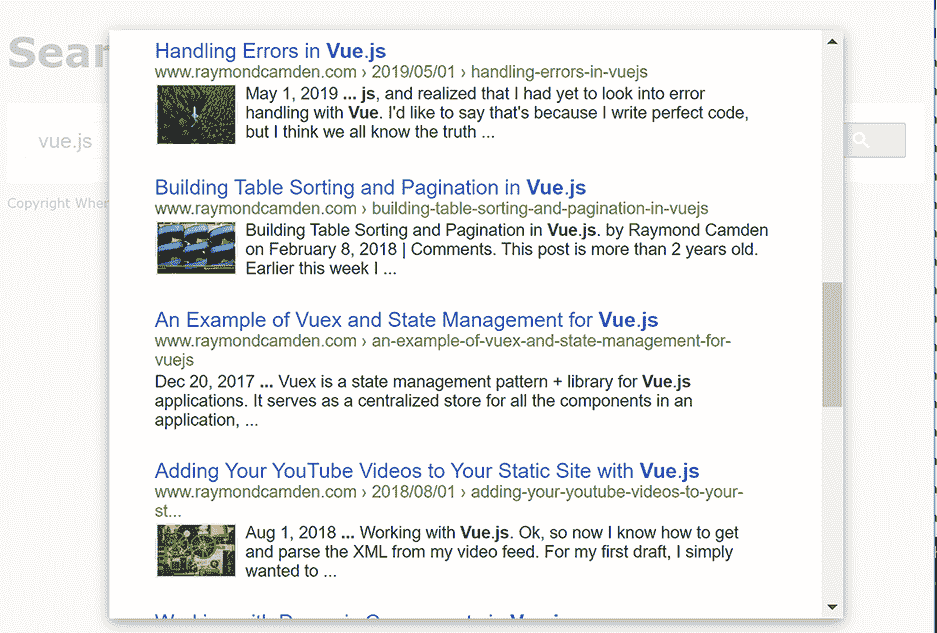

图 7.24 在广告之后可以找到“真实”的结果。Google 需要钱，这是您知道的。

让我们开始自定义搜索引擎。回到仪表板，点击“外观”。在这里，您将找到多个选项来自定义搜索引擎的显示方式，但让我们先从将布局从“覆盖”更改为“全宽”开始（图 7.25）。

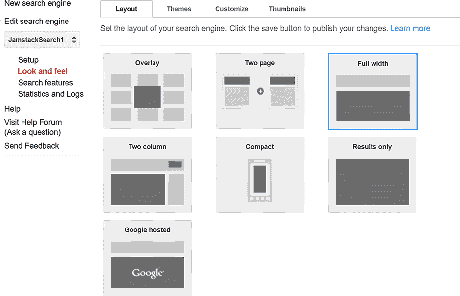

图 7.25 为您的搜索引擎指定新的布局

图 7.25 中未显示，但很方便使用的是，在仪表板的右侧有一个您搜索引擎的实时示例。如果您想测试，可以在这里进行，或者只需点击“保存并测试”回到简单的 HTML 页面。您的更改将立即显示（图 7.26）。

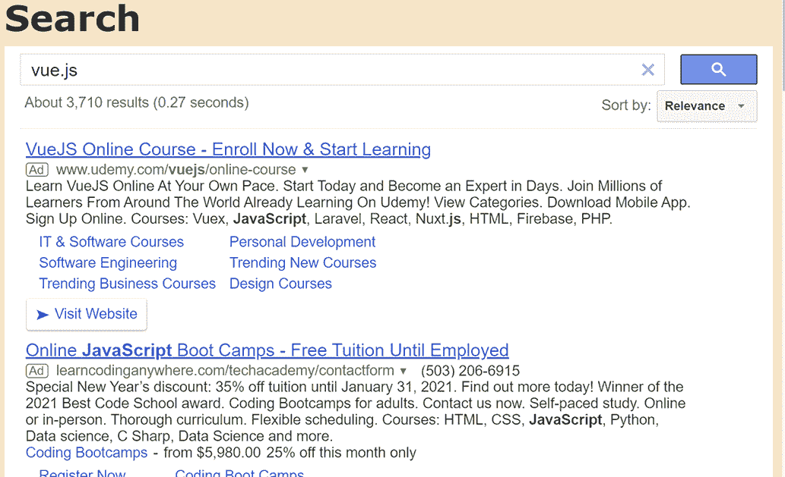

图 7.26 带有内联结果的搜索引擎

让我们再调整一下。如果您点击其中一个结果，您会看到它将在新标签页中打开。虽然这确实可能是您想要的，但让我们将其更改为在当前标签页中打开。在仪表板中，转到“搜索功能”，“高级”，“网络搜索设置”。在“链接目标”字段中输入“_self”（图 7.27）。

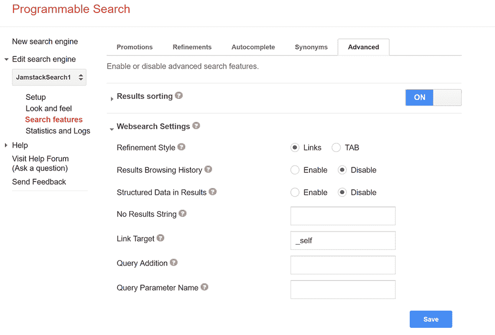

图 7.27 通过仪表板修改搜索结果行为

如前所述，保存并重新加载您的测试 HTML 文件，然后点击一个结果。它应该在同一个标签页中打开。

如果你想要修改片段的 HTML，谷歌的可编程搜索引擎（Programmable Search Engine）提供了更多的自定义选项。开发者指南（[`developers.google.com/custom-search/docs/overview`](https://developers.google.com/custom-search/docs/overview)）详细介绍了可以实现的功能。你还可以使用一个返回纯 JSON 结果的 API，但这仅是一个商业功能。现在我们已经考虑了一个即插即用的解决方案，让我们再次看看一个更集成的选项。

### 7.2.1 使用 Lunr 进行搜索

在之前的搜索示例中，搜索服务本身完全由第三方处理。你很可能还会依赖谷歌几年，但如果你想要一个完全自托管、自包含的解决方案怎么办？一个例子是 Lunr ([`lunrjs.com/`](https://lunrjs.com/))（图 7.28）。

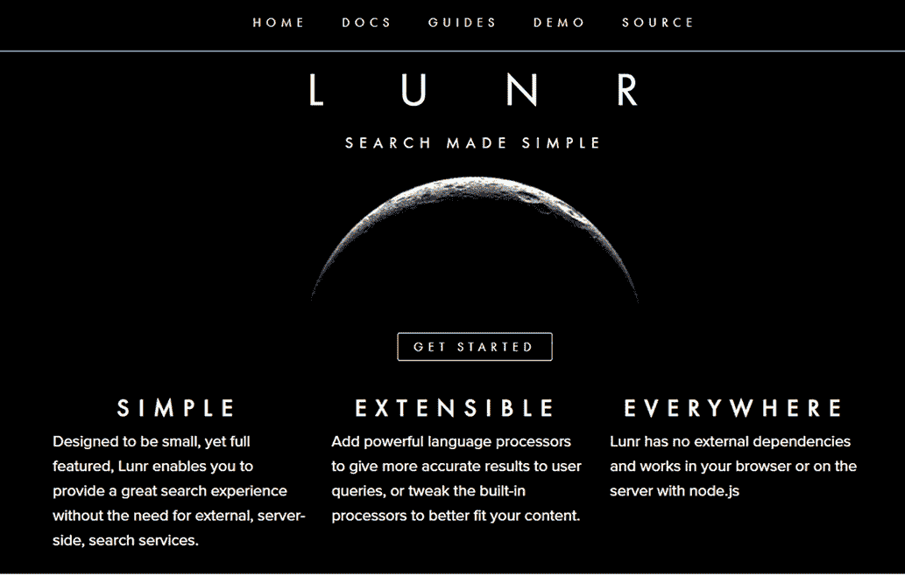

图 7.28 Lunr 的辉煌简单的网页

Lunr 是一个完全客户端解决方案（它也可以在服务器端使用，但通常这不是典型用例），用于向网站添加搜索功能。它从创建索引开始。这是你决定要搜索什么的地方。例如，一个开发者服务网站可能包含一些营销页面和一套深入的文档。虽然你可以创建一个包含所有内容的索引，但你可能只想将索引集中在开发者文档上。

即使你确定了要搜索的内容，你仍然需要考虑索引的大小以及如何使其更小。回到之前的例子，如果你的开发者文档覆盖了数百页的文档，你可能只考虑索引每页文档的第一段。

一旦你确定了要索引的内容，你就将这个信息提供给 Lunr。Lunr 将解析文本并对它进行魔法般的处理。好吧，不是魔法，但它将解析内容使其更容易搜索。一旦创建了索引，你就可以使用简单的搜索词或更复杂的搜索查询（“找到所有提及猫且属于 API 类别的文档”）来对其搜索。如果你愿意，还可以根据其质量（Lunr 将为每个结果评分）进行过滤。让我们看看如何将 Lunr 添加到 Jamstack 网站。

将 Lunr 添加到 Eleventy 网站

在第二章中，你被介绍到了静态网站生成器 Eleventy ([`www.11ty.dev/`](https://www.11ty.dev/))。为了测试将搜索添加到 Jamstack，我们将从一个现有的 Eleventy 网站开始。这个网站使用了来自 GI Joe 维基百科（[`mng.bz/laAB`](https://gijoe.fandom.com/wiki/Joepedia_-_The_G.I._Joe_Wiki)）的文本，这是一个与 GI Joe 系列相关的在线资源。我复制了六个不同角色的部分描述来构建一个非常基础的 GI Joe 人物网站（图 7.29）。

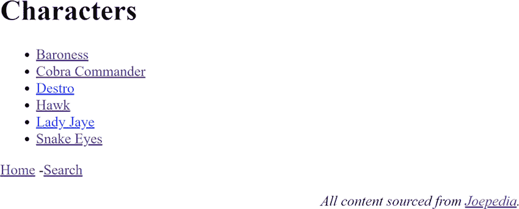

图 7.29 网站的主页，仅列出角色

点击单个角色链接会显示一些基本文本和一张图片（图 7.30）。

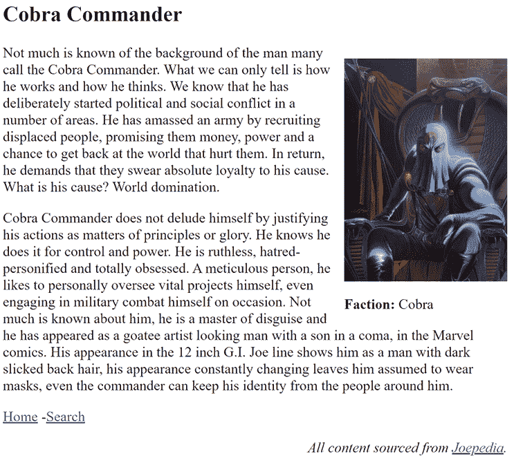

图 7.30 单个角色页面

创建此网站的初始代码由几个基本页面组成。（记住，你可以在本书的 GitHub 仓库中找到这些内容。）首先，主页加载所有角色并将它们显示在列表中。

列表 7.4 网站主页（/chapter7/search/lunr/index.liquid）

```
---
layout: main
---

<h1>Characters</h1>

<ul>
 
  <li><a href="{{ character.url }}">{{ character.data.title }}</a></li>

</ul>
```

Eleventy 创建相关内容集合的一种方式是使用标签。你可以看到其中一个角色的源代码。在最上面的前导部分，标签的值设置为 characters。这在所有角色中都是重复的。（注意，我们已删除一些文本以节省空间。）

列表 7.5 示例角色页面（/chapter7/search/lunr/characters/destro.md）

```
---
layout: character
title: Destro
faction: Cobra
tags: characters
image: 
➥ https://vignette.wikia.nocookie.net/gijoe/images/c/ca/RAH_Destro02.jpg/
➥ revision/latest?cb=20080730134919
---

Destro is one of the most cunning foes the Joe Team has ever faced. He is 
the power behind M.A.R.S. (Military Armament Research Syndicate), one of 
the largest manufacturer of state-of-the-art weaponries. His business is 
fueled by inciting unstable countries to wage wars against each other and 
then getting them to purchase weapons from him. To him, war is simply man's 
expression of his most natural state. It is the perfect example of where the
fittest survive and where many technological advances are made. His biggest
client, thus far, is Cobra with whom he maintains an alliance of 
convenience. Despite being a manipulative person, Destro maintains a sense
of honor and actually respects the Joe Team for their skills and 
expertise, if not their motivation.
```

用于显示角色和主页本身的模板都可以在 GitHub 仓库的 chapter7/search/lunr/_includes 目录中找到。这些文件处理页眉和页脚以及角色的显示，但与我们即将添加的搜索功能无关。然而，当我们添加对 Lunr 客户端方面的支持时，我们将很快展示主要模板。

如前所述，Lunr 要求你创建你数据的索引。这是你网站上想要搜索的内容的数据友好视图。我们的网站由一个主页、多个角色页面以及最终的一个搜索页面组成。但我们只想搜索我们的角色数据。在列表 7.4 中，你看到你可以在一个集合中循环遍历这些信息。我们可以使用相同的逻辑来创建一个 Lunr 最终可以用来创建索引的 JSON 版本，如下所示。

列表 7.6 创建角色 JSON 列表（/chapter7/search/lunr/lunr.liquid）

```
---
permalink: /index.json                                    ❶
---

[

{
    "title":"{{character.data.title}}",
    "url":"{{character.url}}",
    "content":"{{ character.templateContent | json }}"    ❷
} ,              ❸
 
]
```

❶ 指定模板输出的目标

❷ 使用过滤器以 JSON 安全的方式输出内容

❸ 在除了最后一个项目之外的所有项目中包含逗号

在此模板中需要注意的第一点是前导部分中使用的永久链接。这告诉 Eleventy 为此模板更改其正常的文件命名行为，并将结果存储在网站根目录下的 index.json 文件中。在模板中，我们使用 Liquid 动态输出角色数组。对于每个角色，我们输出标题、角色的 URL（Eleventy 为我们提供了这个集合），然后是内容。请注意，我们使用一个过滤器，json，来操作输出。Eleventy 提供的 templateContent 值包括角色的渲染内容。这包括 HTML 和换行符，我们都不希望包含在内。我们很快将创建这个过滤器。最后，请注意，我们使用了一个 Liquid 循环特性，它可以检测我们是否处于最后一个迭代。我们这样做是因为我们需要在数组中的每个项目之间放置一个逗号，但不想在最后一个项目后放置一个。查看完成后的 JSON 看起来可能有助于理解。

列表 7.7 生成的 JSON 文件

```
[

{
    "title":"Baroness",
    "url":"/characters/baroness/",
    "content":"The Baroness serves as..."
} ,

{
    "title":"Cobra Commander",
    "url":"/characters/cobra_commander/",
    "content":"Not much is known of the ..."
} 

]
```

为了支持列表 7.6 中使用的 JSON 安全过滤器，我们必须在 Eleventy 配置文件中定义此内容。

列表 7.8 Eleventy 配置（/chapter7/search/lunr/.eleventy.js）

```
module.exports = function(eleventyConfig) {

    eleventyConfig.addPassthroughCopy("css");      ❶

    eleventyConfig.addFilter("json", value => {
        //remove html and line breaks
        return value.replace(/<.*?>/g, '').replace(/\n/g,'');
    })
};
```

❶ 这行代码只是告诉 Eleventy 复制用于此简单站点的 CSS。

过滤器通过首先删除所有 HTML 和换行符来工作。注意，这里也可以使用其他方法。例如，如果角色的描述非常长怎么办？或者如果我们有超过六个字符怎么办？为了保持 JSON 的大小，你可以调用只返回角色的描述的前一千个字母。最终，Lunr 并不关心，但发送给它的数据越多，它需要处理的数据就越多！

现在我们有了用作源数据文件，是时候构建实际的搜索引擎了。图 7.31 展示了它将如何看起来。我们有一个简单的字段在顶部，一个按钮，至少最初就是这样。

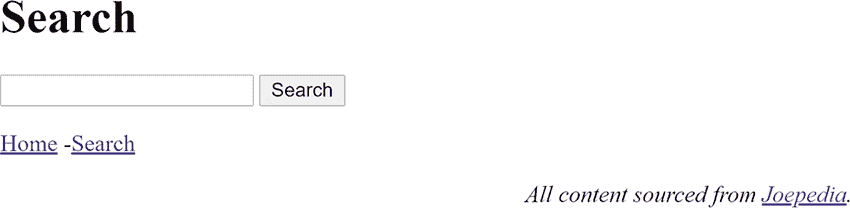

图 7.31 初始搜索表单

输入一些内容并点击搜索后，将显示带有指向相应页面链接的结果（图 7.32）。

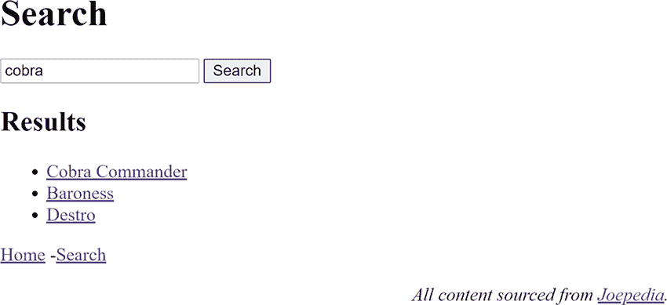

图 7.32 在表单下方显示搜索结果

下面的列表展示了这是如何构建的。

列表 7.9 搜索页面（/chapter7/search/lunr/search.liquid）

```
---
layout: main
---

<h1>Search</h1>

<input type="search" id="search"> 
<button id="searchBtn">Search</button>

<div id="results">
</div>

<script src="https://unpkg.com/lunr/lunr.js"></script>       ❶
<script>
document.addEventListener('DOMContentLoaded', init, false);
let searchField, searchButton, resultsDiv;
let docs, idx;

async function init() {                                      ❷
    searchField = document.querySelector('#search');
    searchButton = document.querySelector('#searchBtn');
    resultsDiv = document.querySelector('#results');

    let result = await fetch('/index.json');
    docs = await result.json();

    // assign an ID so it's easier to look up later, 
    // it will be the same as index
    idx = lunr(function () {                                 ❸
        this.ref('id');
        this.field('title');
        this.field('content');

        docs.forEach(function (doc, idx) {
            doc.id = idx;
            this.add(doc); 
        }, this);
    });

    searchButton.addEventListener('click', search, false);
}

function search() {                                          ❹
    let term = searchField.value;
    if(!term) return;
    console.log('search for '+term);

    let results = idx.search(term);

    console.log(results);

    // we need to add title, url from ref
    results.forEach(r => {
        r.title = docs[r.ref].title;
        r.url = docs[r.ref].url;
    });

    let result = '<h2>Results</h2><ul>';
    results.forEach(r => {
        result += `
<li><a href="${r.url}">${r.title}</a></li>
        `;
    });

    result += '</ul>';

    resultsDiv.innerHTML = result;
}
</script>
```

❶ 加载 Lunr 库。

❷ 此代码在浏览器页面加载时运行。

❸ 这是定义 Lunr 索引的地方。

❹ 此代码处理用户输入并执行搜索。

模板从一段非常短的 HTML 代码开始。我们有搜索字段、按钮，以及它们下面的一个空 div 块。这个块将被用来渲染结果。列表的大部分是 JavaScript 代码。

在我们进入 JavaScript 之前，我们必须添加对 Lunr 本身的支持。这是通过指向 CDN 上的库来完成的，网址为[unpkg.com](https://unpkg.com/)。我们也可以下载库并将其放置在我们的网站上。

我们的代码首先指定一个在页面加载时运行的函数（init）。还定义了一些全局变量，以便稍后使用。

init 函数执行了各种操作。首先，它创建了指向 DOM 中我们需要与之交互的元素的指针：搜索字段、按钮和空 div。

接下来，它使用 fetch API 加载我们之前定义的 JSON。它通过解析 JSON 将其加载并转换为 JavaScript 数据。一旦我们有了这些，我们就可以创建 Lunr 索引。我们首先定义数据的主键。这是索引中每个项目的唯一标识符。我们将其命名为“id”。然后我们定义将要被搜索的内容。那将是我们的数据中的标题和内容字段。

在这一点上，索引行为已经定义，但实际上并没有填充任何内容。为了做到这一点，我们遍历 JSON 数组中的每个项目，并将其添加到索引中。为了创建主键，我们只需使用循环索引。这个索引被添加到我们的文档对象中，然后添加到索引中。

在 init 函数中完成的最后一件事是为搜索按钮添加事件处理器。当用户点击该按钮时，我们首先检查他们是否输入了任何内容，如果没有，就简单地退出搜索函数。

对 Lunr 进行搜索非常简单；实际上只是一行代码：

```
let results = idx.search(term);
```

这为我们提供了一个结果数组，如果有什么匹配的话。注意在 console.log 之后的用法。这让我们可以使用浏览器的开发者工具来检查结果。这是一种了解如何使用 Lunr 找到的内容的好方法（图 7.33）。

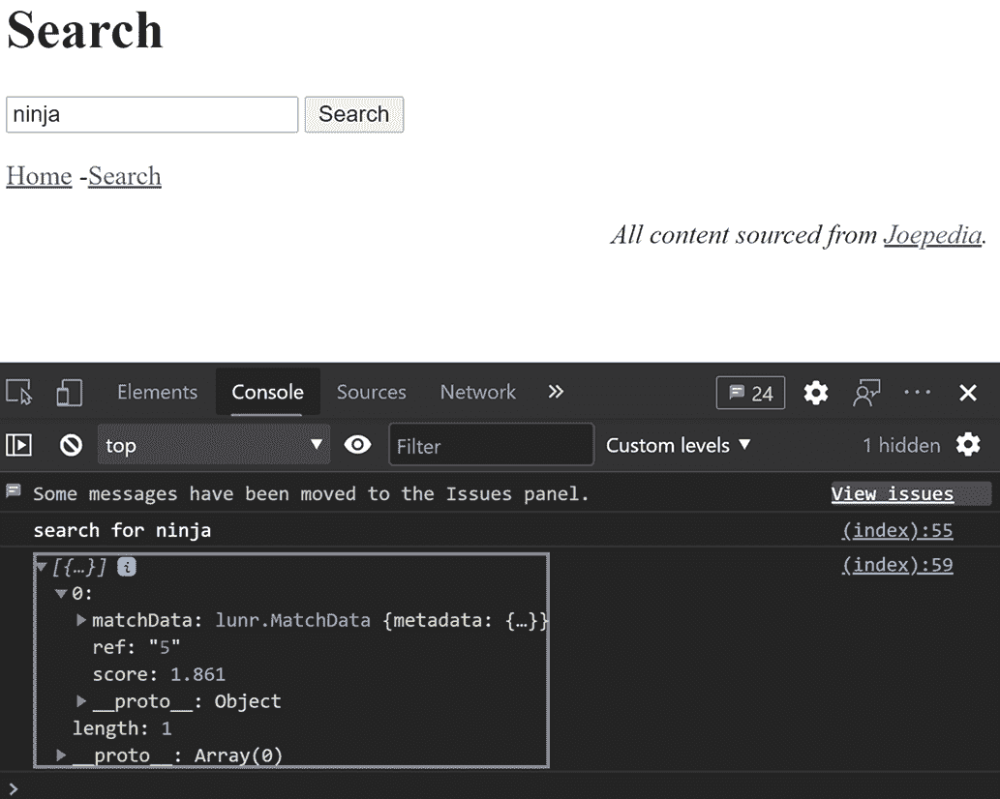

图 7.33 浏览器开发者工具显示的 Lunr 搜索结果

现在我们有了结果，我们必须处理它们，以便我们可以显示找到的内容。关于 Lunr 可能会让人惊讶的一点是，搜索结果实际上并不包含文档本身。在图 7.33 中，你可以看到一个 ref 值。记得我们为内容定义了主键并手动添加了循环索引吗？这就是我们将如何显示结果的方式。Lunr 对 ref 的使用基本上要求你将结果与原始数据关联起来。这就是搜索之后循环所做的事情。对于每个结果，我们添加了原始文档集中的标题和 URL。有了这些，我们就可以使用一些简单的 HTML 来显示结果。

当然，在这个模板中你还可以做更多的事情。我们可以添加支持让用户知道没有找到任何内容。我们可以添加支持搜索我们内容的一个特定部分（例如，GI Joe 角色被分为团队，我们的搜索界面可以让你指定一个要搜索的部分）。在这一点上，Lunr 非常灵活，几乎可以支持你网站上需要的任何功能。

### 7.2.2 其他选项

就像表单一样，在添加搜索时，你还有许多其他选项需要考虑。其中一个特别引人注目的选项可能对 Jamstack 开发者感兴趣：Algolia ([`www.algolia.com/`](https://www.algolia.com/))。Algolia 是一个商业服务（提供慷慨的免费层），它使用类似于 Lunr 的索引。与 Lunr 不同，Algolia 在其服务器上托管你的索引，并提供 API 来编辑该索引和对其搜索。它还提供了有关访客如何在你的网站上搜索的强大分析。

如果你更喜欢类似 Google 的服务，但又不想使用 Google，Microsoft 提供了类似的服务，即 Bing Custom Search ([`www.customsearch.ai/`](https://www.customsearch.ai/))。像 Google 一样，它也提供这项服务的免费版本。

### 7.3 其他动态选项

在本章中，我们专注于两种将动态内容添加回你的 Jamstack 网站的方法。显然，还有许多其他方法可以实现这一点。在第五章中，你看到了如何将电子商务添加到你的网站中。在下一章中，你将看到如何通过添加无服务器功能来几乎实现任何事情。以下是一些其他形式的动态内容：

+   *日历*—Google Calendar ([`calendar.google.com/`](http://calendar.google.com/)) 允许你将完整的日历嵌入到 HTML 页面中。像其他 Google 服务一样，你有一些基本的样式选项。你也可以使用像 FullCalendar ([`fullcalendar.io/`](https://fullcalendar.io/)) 这样的开源库，为你的日历提供完全独特的设计，同时仍然可以由 Google Calendar 数据驱动。

+   *评论*—虽然通常只在博客中使用，但你可能希望在你的 Jamstack 网站中添加评论。最知名的可能就是 Disqus ([`disqus.com/`](https://disqus.com/))。这是一个相当标准的互联网评论工具，可以免费使用。如果你愿意自己构建解决方案，还有其他选项，如 Commento ([commento.io](https://commento.io/)) 和 FastComments ([fastcomments.com](https://fastcomments.com/))，但要做好一些工作的准备。Matt Mink 的一篇文章 ([`css-tricks.com/jamstack-comments/`](https://css-tricks.com/jamstack-comments/)) 描述了这样一个系统。

+   *聊天*—网站（通常是商业网站）上的另一个常见工具是聊天框。这通常是一个位于网站右下角的谈话气球，允许用户点击与网站管理员交谈。此类服务的商业例子是 LiveChat ([`www.livechat.com/`](https://www.livechat.com/))。这些服务可以用预设的回复（“当被问及 foo 时，回复 goo”）进行编程，也可以连接到真实的人类。

+   *APIs*—Jamstack 中的 A 代表 API，意味着任何可以通过 JavaScript 调用的远程资源（如天气、股票数据等），并且可以在你的 Jamstack 网站中调用。

## 摘要

+   一个简单的静态 HTML、CSS 和 JavaScript 网站，仍然可以包含动态元素（表单、搜索、日历等）。

+   许多服务使得将动态特性添加到静态网站变得极其简单。例如，Google 提供了多个服务（表单、搜索、日历），你只需要复制一些 HTML 并将其粘贴到模板中即可。像 WuFoo、FormCake 和 FormKeep 这样的服务只是处理表单输入的几个选项之一，这是动态支持的一个例子。

+   选择使用哪种服务将取决于你的需求、预算以及哪种服务最能提供你需要的成果。
