# 8 使用无服务器计算

本章涵盖

+   定义无服务器

+   解释无服务器对 Jamstack 的意义

+   描述 serverless 选项

+   使用 Netlify 构建 serverless 函数

+   使用 Vercel 构建 serverless 函数

在上一章中，我们讨论了几种不同的方法，可以将动态元素重新添加到你的 Jamstack 网站中。这些是通过为满足特定需求而专门设置的外部服务完成的，例如，Google 表单让你设计和接受表单的反馈。

尽管这些服务的可用性在数量和种类上都在持续增长，但有些事情作为外部服务来说根本就不合理，包括只有你知道如何开发的针对你的 Jamstack 网站的非常特定的业务逻辑。这就是无服务器计算，特别是作为服务的函数，发挥作用的地方。

### 8.1 什么是无服务器计算？

让我们先把这个问题讲清楚。在无服务器计算中仍然存在服务器。就像我们在真正的云中实际上并不构建基础设施一样，无服务器技术并不会神奇地消除对物理硬件的需求。无服务器计算是关于消除对服务器的担忧。它是在不维护服务器的枯燥工作中，获得服务器提供的一切好处。

有许多服务可以归入无服务器定义的范畴。这里只列举一些：

+   能够完全从其网站 ([mongodb.com](https://www.mongodb.com/)) 中配置和使用 MongoDB 数据库，而无需自己安装任何东西。

+   在 Pipedream ([pipedream.com](https://pipedream.com/)) 中，通过事件驱动的复杂工作流程的能力。Pipedream 允许开发者通过组合各种步骤来构建工作流程，这些步骤可以包括自定义代码。

+   当然，还有使用无服务器计算的第一家真正的企业级提供商 Amazon Lambda ([`aws.amazon.com/lambda/`](https://aws.amazon.com/lambda/)) 来构建几乎任何东西的能力。

虽然无服务器计算有许多解释和实现，但本章将重点关注最广为人知和使用的例子：函数即服务（FaaS）。FaaS 允许你专注于特定功能的业务逻辑，而不必担心托管或路由。让我们考虑一个简单的例子。

假设你想构建一个返回当前时间的服务。首先，不要这样做。浏览器知道时间。但这为我们提供了一个简单的构建要求。如果我用 Node.js 构建，设置可能如下所示：

1.  部署 Linux 虚拟机。

1.  确保 Node 可用。

1.  编写一个 Node 脚本，该脚本将监听端口和特定路径上的请求。

1.  确保虚拟机已设置以响应该 HTTP 请求。

1.  当发生这种情况时，执行业务逻辑（获取当前时间）。

使用 FaaS 通常会产生相同的结果

1.  执行业务逻辑。

就这样。显然，这是一个有些牵强的例子，但想法是开发者不再需要担心服务器、操作系统、网络路由等问题，而只需关注他们实际构建的逻辑。这并不总是那么容易，但你应该明白了。

那么，这对 Jamstack 有什么影响呢？虽然市面上有多个服务提供各种服务的 API，但有时你需要非常具体的逻辑，而这只有你自己才能创建。通过使用无服务器计算和函数即服务，开发者可以精确地编写他们需要的代码，将其暴露为 API，然后从他们的 Jamstack 网站使用 JavaScript 调用它。让我们看看使用这种功能的一种形式：Netlify 函数。

### 8.2 使用 Netlify 构建 serverless 函数

我们在前面一章讨论了 Netlify，我们暗示的一个功能是能够编写无服务器函数。这个功能称为 Netlify 函数 ([`functions.netlify.com/`](https://functions.netlify.com/))，它允许你包含用 JavaScript 或 Go 编写的函数。Netlify 处理将你的代码通过 HTTP 提供出来，而你无需做任何额外的工作。Netlify 在其免费层（有限制）上支持这些函数，并为更高成本提供更高层级的选项 ([`www.netlify.com/pricing/#add-ons-functions`](https://www.netlify.com/pricing/#add-ons-functions))。Netlify 函数建立在 Amazon Lambda 之上，但你无需了解该服务即可使用它们。

Netlify 函数支持 URL 和表单参数，这意味着你的客户端代码可以在执行调用时以多种方式传递参数。你的代码还可以访问请求的完整详细信息，并以各种形式返回数据，尽管通常你会返回 JSON。

在我们的第一次测试中，我们将使用 Netlify CLI。虽然不是必需的，但在这个章节中，它将有助于我们更快地开始，并更容易测试我们的代码。要安装 Netlify CLI，请使用 npm：

```
npm install -g netlify-cli
```

安装完实用程序后，你将能够从你的终端运行 netlify function（图 8.1）。

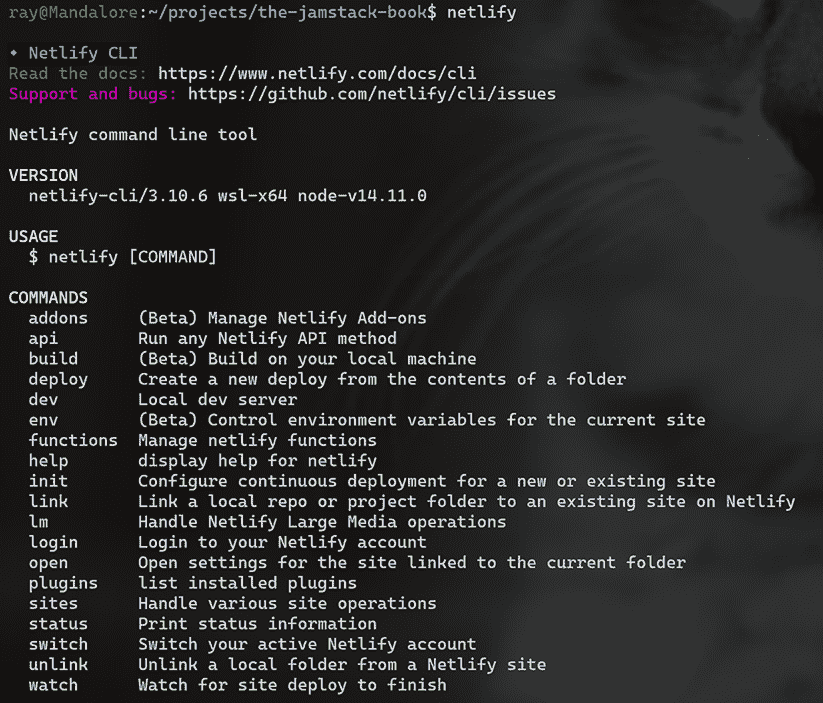

图 8.1 Netlify CLI 的默认输出为其命令提供基本帮助。

在确认你已正确安装 CLI 后，运行 netlify login。这将提示你进行身份验证，所以如果你在部署章节中没有为他们创建账户，现在就创建一个。一旦登录，你将来就不需要再次进行身份验证。

如您在图 8.1 中所见，CLI 做了很多事情，但我们在本章中只将涉及其中的一些方面。特别是，CLI 可以为我们搭建函数，包括许多示例应用程序以帮助入门。

您可以将 Netlify 函数存储在任何您想要的文件夹中，但最近 Netlify 开始支持默认位置 netlify/functions。不幸的是，在本书编写时，CLI 还不支持了解这个默认值，这意味着我们需要指定它。虽然这可以通过 Netlify 的基于 Web 的仪表板完成，但我们还可以使用 Netlify 的另一个新功能，即基于文件的配置。

Netlify 允许您在项目的根目录中指定一个 netlify.toml 文件。几乎所有的设置都可以在这里设置（有关完整详情，请参阅[`mng.bz/XWM6`](http://mng.bz/XWM6)上的文档），但在这个案例中，我们将只指定 Netlify 函数的根文件夹。为了开始我们的第一次测试，创建一个新的空目录并添加一个空的 netlify.toml 文件（或使用 GitHub 仓库中的 chapter8/test1 文件夹）。我们将假设您创建的文件夹命名为 test1。

列表 8.1 配置 netlify.toml（chapter8/test1/netlify.toml）

```
[build]
    functions = "netlify/functions"
```

配置文件指定了构建组中的函数设置，并设置了 Netlify 在准备加载函数时应查找的位置。同样，这个值现在是 Netlify 的默认值，但在 CLI 中不被识别。

在这一点上，如果您愿意，可以创建函数文件夹，但 CLI 如果需要也会创建它。如果您决定自己创建，您应该得到一个类似于图 8.2 中所示的架构。

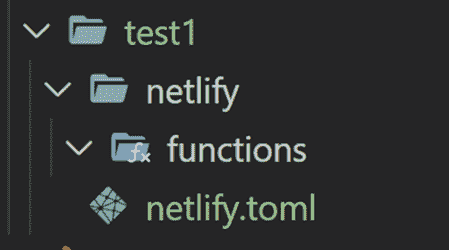

图 8.2 函数测试项目的文件夹结构。请注意，netlify.toml 位于 test1 的根目录；在截图上可能不太清晰。

现在我们终于可以测试 CLI 的脚手架功能了。首先，从 test1 文件夹中运行 netlify functions:create。这将打开一个提示，要求您选择一个示例（图 8.3）。

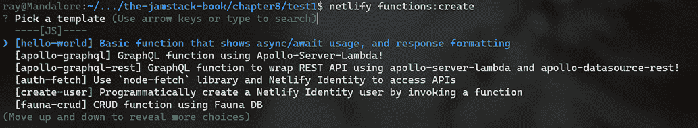

图 8.3 浏览函数示例选择

第一个和默认选项，hello-world，是最简单且最适合开始的，所以先选择它。接下来，您将被提示为您的函数命名；由于我们正在测试，请使用默认的 hello-world。按 Enter 键，CLI 将报告新搭建的函数（图 8.4）。

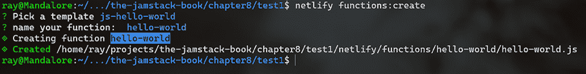

图 8.4 CLI 已完成函数的脚手架搭建。

我们将在稍后讨论 Netlify 函数的一般形式，但到目前为止，请了解这个函数会在查询字符串中查找一个名称值，如果不存在，则使用默认值 'World'。然后它返回一个包含一个值 message 的 JSON 对象，该对象简单地对该名称值说 hello（再次强调，这可以是查询字符串中提供的，或者默认值）。

列表 8.2 hello-world 函数

```
const handler = async (event) => {
  try {
    const subject = event.queryStringParameters.name || 'World'
    return {
      statusCode: 200,
      body: JSON.stringify({ message: `Hello ${subject}` }),
      // // more keys you can return:
      // headers: { "headerName": "headerValue", ... },
      // isBase64Encoded: true,
    }
  } catch (error) {
    return { statusCode: 500, body: error.toString() }
  }
}

module.exports = { handler }
```

那么，我们如何测试这个？CLI 的另一个有用功能是 dev 命令。这个命令启动一个本地 Web 服务器，并允许你在本地测试你的 Jamstack 网站。在你的终端中，确保你可以运行 netlify dev，你应该会看到如图 8.5 所示的输出。请注意，你仍然应该在之前的目录中。

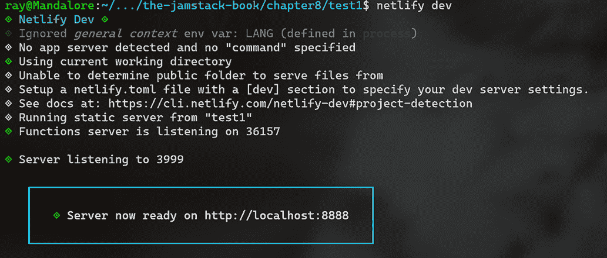

图 8.5 使用 Netlify CLI 运行本地开发服务器

除了运行本地 Web 服务器外，CLI 还可能在你的浏览器中打开一个标签页。目前网站还没有任何 HTML 文件，所以你可能收到“未找到”的消息，但我们可以暂时忽略它。要执行 Netlify 函数，你可以在/.netlify/functions/nameOfFunction 处找到它们。鉴于图 8.5 表明我们的网站在本地主机 8888 端口上运行，我们的测试函数的完整 URL 将是：http://localhost:8888/.netlify/functions/hello-world。注意，结尾没有“.js”。URL 使用函数名而不是扩展名。如果你运行这个，你应该得到以下输出：

```
{"message":"Hello World"}
```

如果你记得，我们说过该函数通过 URL 传递一个名称参数。你可以通过在 URL http://localhost:8888/.netlify/functions/hello-world?name=Ray（或你自己的名字）中添加?name=Ray 来测试这一点。输出应该会更新：

```
{"message":"Hello Ray"}
```

让我们构建一些使用这个函数的东西。我们的网站现在只包含函数（和配置文件），所以让我们添加一个 index.html 文件，包含一个简单的 JavaScript 示例。

最佳实践规定我们应该（通常）将我们的 HTML 和 JavaScript 分开；对于这个简单的演示，一个文件就足够了。我们的 HTML 由一个输入字段、一个按钮和一个空的 div 元素组成。输入字段将是用户输入他们的名字的地方。按钮将触发对函数的请求。最后，空的 div 将显示结果。

JavaScript 设置了一个监听器，当文档加载时，当它准备好时，监听按钮的点击事件。这个函数使用 fetch API 调用我们的 Netlify 函数，其名称相当糟糕，名为 testApi。如果你记得，结果是包含键 message 的 JSON 对象。我们可以将这个调用的结果写入我们的 DOM。

列表 8.3 使用 HTML 和 JavaScript 代码中的我们的函数

```
<!DOCTYPE html>
<html>
<head>
</head>

<body>

<input type="text" id="name" placeholder="Enter your name...">      ❶
<button id="testBtn">Test Function</button>

<div id="result"></div>

<script>
document.addEventListener('DOMContentLoaded', init, false);
let textField, resultDiv;

function init() {
    textField = document.querySelector('#name');
    resultDiv = document.querySelector('#result');
    document.querySelector('#testBtn').addEventListener('click', 
        testApi, false);                                            ❷
}

function testApi() {                                                ❸
    let name = textField.value.trim();
    if(!name) return;
    fetch(`/.netlify/functions/hello-world?name=${name}`)
    .then(res => res.json())
    .then(res => {
        resultDiv.innerHTML = `Function returned: ${res.message}`;
    });
}
</script>
</body>
</html>
```

❶ 一个人可以输入他们的名字的字段

❷ 我们在哪里监听按钮的点击

❸ 当按钮被点击时执行的代码。图 8.6 展示了这个简单的例子。

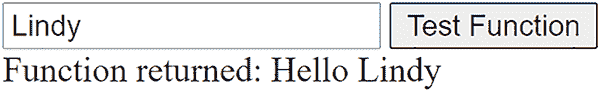

图 8.6 从简单的 JavaScript 测试我们的 Netlify 函数

你现在拥有了一个简单的静态网站，它使用了无服务器函数！让我们再次看看这个无服务器函数。在顶部，我们使用箭头函数风格定义了该函数（你可以在[`mng.bz/Bx7r`](https://developer.mozilla.org/en-US/docs/Web/JavaScript/Reference/Functions/Arrow_functions)了解更多关于这种风格的信息）。如果你对这种定义函数的风格不熟悉，你可以这样重写：

```
const handler = async function (event) {
```

Netlify 不要求使用箭头函数，但 CLI 默认使用该格式。事件对象是发送给每个 Netlify 函数的两个参数之一。Netlify 文档将其定义为类似于 Amazon AWS API Gateway 事件，但如果你之前从未使用过，请了解它将包含以下值：

+   Path—函数本身的路径

+   httpMethod—调用函数时使用的 HTTP 方法，在关心函数是否通过表单提交调用时很有用

+   headers—本次执行的所有请求头

+   queryStringParameters—如所示，通过查询字符串传递的任何值

+   body—任何请求负载的 JSON 字符串

+   isBase64Encoded—一个 true/false 标志，指定 body 是否以 base64 编码

传递给 Netlify 函数的第二个参数是一个上下文对象。该对象包含有关函数上下文本身的信息，例如，与后台的 AWS Lambda 函数相关的事项（Netlify 为你隐藏了所有这些）。上下文对象不是你需要使用的东西（因此甚至没有在函数中显示），所以你很少在函数中实际使用它。它真正被用到的地方是与 Netlify 的用户管理系统 Identity 相关。这里我们不涉及该内容，但你可以在文档中了解更多信息（[`docs.netlify.com/visitor-access/identity/`](https://docs.netlify.com/visitor-access/identity/))。

函数的最后一部分是你返回数据的地方。如列表 8.4 所示，返回的对象包含以下部分：

+   statusCode—这应该是一个有效的 HTTP 状态码，表示函数的结果状态。200 表示良好状态，而 500（及其他）可以表示错误和其他状态。通常，你会返回 200。

+   Body—表示你的数据结果的 JSON 字符串。调用者将解析此 JSON 为有效数据。你不需要返回 JSON 字符串，但对于作为 API 的服务器端函数来说，这是相当典型的。

+   headers 和 multiValueHeaders—这些允许你返回与数据一起发送的头部。headers 值用于简单的键/值头部（某个头部有某个值），而 multiValueHeaders 用于头部有多个值的情况。一些 API 将使用头部来指定内容类型或与许可和其他状态相关的其他数据。

+   isBase64Encoded—另一个 true/false 标志，这次是针对结果，指定结果是否以 base64 编码。

大多数开发者只需关注 statusCode 和 body，这正是 CLI 在默认的函数模板中使用的。

列表 8.4 hello-world 函数

```
const handler = async (event) => {                                 ❶
  try {
    const subject = event.queryStringParameters.name || 'World'    ❷
    return {                                                       ❸
      statusCode: 200,
      body: JSON.stringify({ message: `Hello ${subject}` }),
      // // more keys you can return:
      // headers: { "headerName": "headerValue", ... },
      // isBase64Encoded: true,
    }
  } catch (error) {
    return { statusCode: 500, body: error.toString() }
  }
}

module.exports = { handler }
```

❶ 这是定义事件对象的函数声明。

❷ 事件中可用的值之一是 queryStringParameters。

❸ 无服务器函数应返回状态和 body。

如果你愿意，你可以修改你的无服务器函数，将其整个事件对象输出到控制台：console.log(event);。如果你切换到你运行 netlify 命令的终端，你可以看到输出，但请注意，它可能相当大，尤其是在请求头部分，如图 8.7 所示。

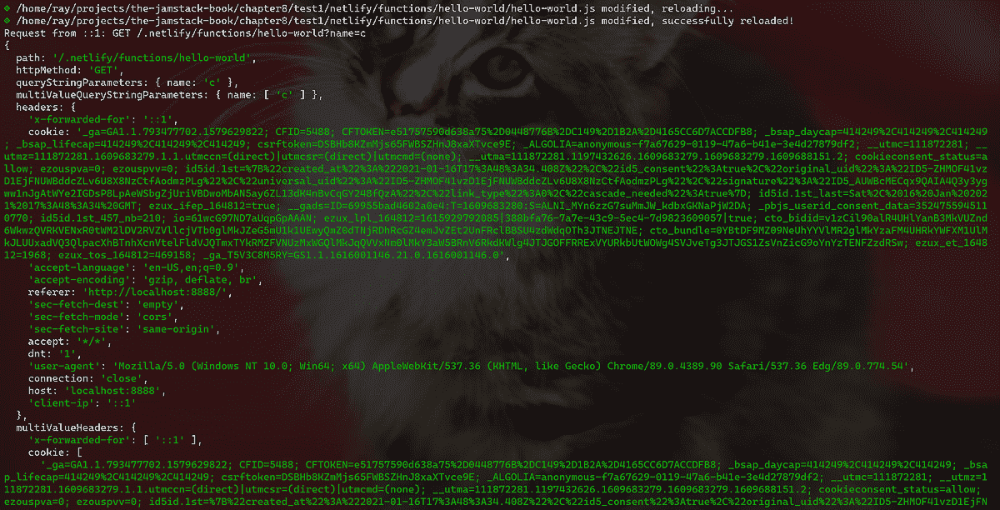

图 8.7 服务器端函数的调试输出

### 8.2.1 将无服务器计算添加到 Camden Grounds

在第二章中，你学习了 Eleventy 并构建了一个名为 Camden Grounds 的简单咖啡店。让我们看看我们如何使用 Netlify 函数来增强我们的 Jamstack 网站。我们将修改网站，使得每个产品页面现在如果产品可用将显示一个动态消息。我们将使用硬编码的逻辑（除了茶之外的所有产品都可用）和客户端 JavaScript 来显示结果。一个示例如图 8.8 所示。

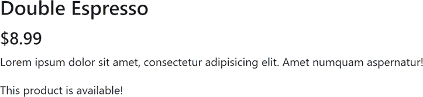

图 8.8 双倍浓缩咖啡产品可用。

在你的第八章文件夹中创建网站的新副本（或者确保你已经从 GitHub 仓库下载了最终代码）。添加 netlify.toml 文件，指定函数的目录。由于 CLI 可以创建此文件夹，因此你不需要手动创建它。

再次使用 Netlify CLI 来构建应用程序，但这次我们将通过指定函数名称作为参数来节省一个步骤：netlify functions:create product-availability。这应该在您创建的新文件夹中运行，该文件夹是 Camden Grounds 的副本。您仍然会被提示选择要创建的函数类型，并再次接受默认值（hello-world）。结果将是一个名为 product-availability 的文件夹，以及其中名为 product-availability.js 的文件，如下所示。

列表 8.5 产品可用性函数

```
const handler = async (event) => {
  try {
    const product = event.queryStringParameters.product;     ❶
    let available = true;
    if(product.toLowerCase() == 'tea') available = false;    ❷

    return {
      statusCode: 200,
      body: JSON.stringify({ available }),                   ❸
      // // more keys you can return:
      // headers: { "headerName": "headerValue", ... },
      // isBase64Encoded: true,
    }
  } catch (error) {
    return { statusCode: 500, body: error.toString() }
  }
}

module.exports = { handler }
```

❶ 在查询字符串中检查产品值

❷ 硬编码的逻辑表示茶不可用

❸ 返回可用的值

如前所述，我们检查查询字符串中的值，这次是产品。如果正在检查的产品是茶，我们返回 false。注意结果体使用了一种简写符号，用来替换使用相同键和值的代码，因此，例如，我们不再需要写{name: name}，现在我们可以写{name}来指定相同的内容。基本上，一个键名和值由 name 变量表示。Netlify 不要求这种语法，但如果你想要使用它，它是存在的。

要使用此功能，我们将修改用于我们网站上每个产品的 products.liquid 模板文件（列表 8.6）。我们的第一个更改是在产品模板中添加一个空的段落标签。然后稍后由 JavaScript 代码进行编辑。此模板为每个产品执行一次，你实际上可以在代码本身中看到一些 Liquid。虽然 JavaScript 代码在源代码中是动态的，但在产品部署时，它是一个硬编码的产品名称。

JavaScript 向 serverless 函数发送请求，获取结果，然后使用可用性更新 DOM。

列表 8.6 新产品模板 (/chapter8/camdengrounds/products.liquid)

```
---
layout: main
pagination:
    data: products
    size: 1
    alias: product
permalink:      "products/{{ product.name | slug }}/index.html"
---

<div class="row my-4">
        <div class="col">

     <div class="card mt-4">
          
          <div class="card-body">
            <h3 class="card-title">{{ product.name }}</h3>
            <h4>${{product.price}}</h4>
            <p class="card-text">
            {{ product.description }}
            </p>
            <p id="availability"></p>                   ❶
          </div>
        </div>

        </div>
</div>

<script>
document.addEventListener('DOMContentLoaded', init, false);
let availabilityP;

async function init() {
  availabilityP = document.querySelector('#availability');
  let api = '/.netlify/functions/product-availability?';
  //add specific product
  api += 'product={{product.name}}';                    ❷
  let resp = await fetch(api);
  let data = await resp.json();
  let result = 'This product is available!';
  if(!data.available) 
    result = 'Sorry, this product is <strong>not</strong> available.';
  availabilityP.innerHTML = result;                     ❸
}

</script>
```

❶ 将通过 JavaScript 更新的新空段落

❷ 网站部署后将是静态的 JavaScript 代码

❸ 实际更新发生的地方

您已经看到了一个产品可用的示例，但如果您访问茶页（如果您还没有，别忘了用 netlify dev 启动您的站点），您现在会看到它不可用（图 8.9）。

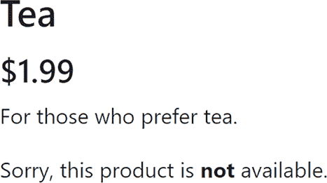

图 8.9 没有茶可以喝！

这引发了一个有趣的情况。我们的 Camden Grounds 网站现在既有静态产品数据也有动态产品数据。静态部分位于 _data 文件夹中，是硬编码的 JSON。动态部分是产品的可用性。在生产环境中，产品列表将是静态的，但它们的可用性将在每次访问时进行检查。这对于 Camden Grounds 来说是合理的，因为他们很少更改他们销售的产品，但有时会缺货。这并不适合所有 Jamstack 网站，但显示了 Jamstack 的一般灵活性。

### 8.2.2 更多关于 Netlify 函数的内容

Netlify 函数既易于使用，在实现上又功能强大。您可以浏览示例（[`functions.netlify.com/examples/`](https://functions.netlify.com/examples/)）以获得更多灵感，并在他们的游乐场（[`functions.netlify.com/playground/`](https://functions.netlify.com/playground/)）中尝试一些实时示例。

最近，Netlify 宣布支持“后台函数”功能（[`docs.netlify.com/functions/background-functions/`](https://docs.netlify.com/functions/background-functions/)）。此功能目前处于测试阶段，允许您运行需要更长时间执行时间的函数。当被调用时，它们会立即返回 202 状态，然后开始处理。这些函数不会用于需要向客户端 JavaScript 返回结果的函数，但如您所猜，对于需要在后台发生的操作可能很有用。再次提醒，此功能目前处于测试阶段，因此请谨慎使用。

### 8.3 使用 Vercel 构建 serverless 函数

与 Netlify 一样，Vercel 支持轻松部署和使用与您的 Jamstack 网站一起使用的 serverless 函数。您可以使用 Node.js、Go、Python 和 Ruby 编写函数。对于想使用 Node.js 的人来说，您可以使用 JavaScript 或 TypeScript，如果您愿意的话。（TypeScript 也可以与 Netlify 函数一起使用，只是目前不是官方支持。）与 Netlify 一样，Vercel 为其函数提供免费层；详细信息可以在其定价页面上找到（[`vercel.com/pricing`](https://vercel.com/pricing)）。

Vercel 的无服务器支持在文档中有记录([`vercel.com/docs/serverless-functions/introduction`](https://vercel.com/docs/serverless-functions/introduction))，但在撰写本章时，该文档的一些部分有些误导。让我们从 Vercel 无服务器函数的基本介绍开始。

要创建一个 Vercel 无服务器函数，您首先需要在您的项目中添加一个 api 文件夹。（对于使用 Next.js 的开发者，您将使用 pages/api 代替。）在那个文件夹中，然后您可以创建您的无服务器函数。文档（再次，在出版时）暗示函数的名称（不包括扩展名）并不重要。这并不正确。您的文件名将影响您用于调用 API 的 URL。Vercel 将在路径/api/filenameMinusExtension 上部署您的无服务器函数。例如，如果您创建了一个名为 func1.js 的文件，并且您的域名是 raymondcamden.com，您的无服务器函数将可在 https://raymondcamden.com/api/func1 处访问。文档演示了一个不包括文件名减去扩展名的路径，但这仅当您将文件命名为 index.js 时才会有效。在我看来，除非您确信您将在网站上只有一个无服务器函数，否则使用此文件名没有意义。即使您现在只计划一个，将来您可能还需要更多。

忽略这种混淆，Vercel 无服务器函数看起来是什么样子？这里是从其自己的文档中的示例：

```
module.exports = (req, res) => {
  res.json({
    body: req.body,
    query: req.query,
    cookies: req.cookies,
  })
}
```

再次强调，这里使用的是箭头函数，但这不是必需的。您可以将其重写如下：

```
module.exports = function(req, res) {
  res.json({
    body: req.body,
    query: req.query,
    cookies: req.cookies,
  })
}
```

使用您最舒适的形式。该函数接收两个参数，req 和 res，它们映射到 Node.js 请求和响应对象，并提供了 Vercel 提供的额外“辅助工具”。例如，req.query 映射到请求的查询字符串。这些辅助工具在文档中有记录([`mng.bz/doOv`](http://mng.bz/doOv))，并且目前仅适用于使用 Node.js 为其无服务器函数的开发者。让我们看看它是如何工作的。

### 8.3.1 您的第一个 Vercel 无服务器函数

在第六章中，您通过安装其 CLI 工具来测试了 Vercel 服务。如果您还没有这样做，请参阅上一章中的说明并设置它。您需要安装 CLI 并确保运行登录命令，这样您才能正确地继续前进。

Vercel 的零配置功能意味着使用其大多数功能相当简单，包括其无服务器支持。在新的文件夹中（或使用 GitHub 仓库中的/chapter8/test2 文件夹），创建一个 API 子目录和一个新文件，func1.js。

列表 8.7 Vercel 无服务器函数 (/chapter8/test2/api/func1.js)

```
module.exports = (req, res) => {
  res.json({
    body: req.body,
    query: req.query,
    cookies: req.cookies,
  })
}
```

此函数与 Vercel 文档中的代码相同。当请求时，它会回显请求体、查询字符串和发送的任何 cookie。为了测试，请在终端中运行 vercel dev，确保你位于你创建的文件夹中，而不是 api 文件夹，而是其上级目录。vercel dev 命令与 Netlify 版本类似：它允许你在本地运行你的站点并测试你的站点。第一次运行该命令时，你将需要回答有关站点的问题，你可以接受所有默认设置（图 8.10）。

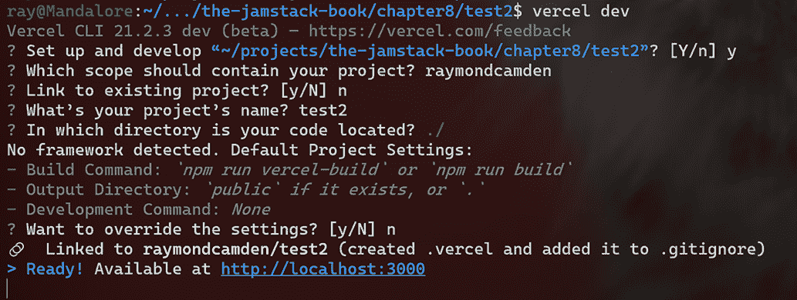

图 8.10 第一次运行 vercel dev

后续运行 vercel dev 将跳过所有这些问题。为了测试你的函数，打开你的浏览器到 http://localhost:3000/api/func1。URL 末尾的“func1”是我们文件名减去扩展名。结果将是查询字符串的内容（在我们的第一次测试中没有），你的浏览器发送的任何 cookie，以及没有人，因为在请求中没有发送。你的 cookie 可能会有所不同，但查询值的输出应该看起来像一个空对象：

```
"query":{}
```

如果你将浏览器中的 URL 更改为包含查询字符串，例如，http://localhost:3000/api/func1?msg=hello&name=world，你会看到查询值发生变化：

```
"query":{"msg":"hello","name":"world,"}
```

你看到的 JSON 响应来自使用 res.json 的服务器端函数。传递给此的参数被转换为 JSON 并返回在结果对象中。你不需要返回 JSON，但大多数无服务器函数都这样做。

现在我们通过复制上一节中做的事情来测试 Vercel 的无服务器函数。在本章早期，你在一个简单的前端应用程序中使用了 Netlify 函数的脚手架，传递了一个名称值。列表 8.4 演示了一个 Netlify 函数，它在查询字符串中查找名称，默认值为 World。然后它返回一个包含键 message 和值为"Hello Name"的 JSON 对象，其中 Name 是查询字符串中的值或默认值。新函数检查 req.query 对象中的名称值，并在不存在时将其默认为"World"。然后返回一个包含消息键的字符串，其中包含名称。正如你所看到的，至少在这个例子中，它比 Netlify 版本要瘦得多。

列表 8.8 使用 Vercel 的 Hello 函数 (/chapter8/test2/api/hello.js)

```
module.exports = (req, res) => {
    let name = req.query.name || "World";    ❶

    res.json({
        message:`Hello ${name}`
    })
}
```

❶ 检查查询字符串中的名称值，如果不存在则默认它。

如果你将此文件命名为 hello.js，你可以在 http://localhost:3000/api/hello?name=Ray 处访问它。如果你停止了 Vercel 开发服务器，请记住使用 vercel dev 命令再次运行它。点击 URL 后，你的输出应该是：

```
{
  "message": "Hello Ray"
}
```

现在我们需要构建简单的前端。这个版本将与列表 8.3 相同，只有一个微小的区别：URL。你可以在 GitHub 仓库中的文件/chapter8/test2/index.html 中找到这个新版本。

列表 8.9 调用我们的 Vercel 无服务器函数 (/chapter8/test2/index.html)

```
function testApi() {
    let name = textField.value.trim();
    if(!name) return;
    fetch(`/api/hello?name=${name}`)       ❶
    .then(res => res.json())
    .then(res => {
        resultDiv.innerHTML = `Function returned: ${res.message}`;
    });
}
```

❶ 修改后的 URL

我们在这里唯一改变的是 fetch 命令中使用的 URL。Netlify 和 Vercel 函数返回了相同“形状”的结果，这使得这次更新更容易。现在让我们看看 Vercel 无服务器支持的一个有趣特性。

### 8.3.2 支持动态路径的 Vercel 函数

在前面的示例中，您看到了一个使用查询字符串作为输入的简单 Vercel 无服务器函数。虽然这可行，但您可以使用不同的 URL 语法，允许动态路径，例如，/api/somefunction/somevalue 和 /api/somefunction/ anothervalue。在这些示例中，我们想要运行一个函数，somefunction，而最后的值（somevalue 和 anothervalue）是提供给函数的输入。这使得 URL 语法稍微简单一些，可能比查询字符串更受欢迎。

为了支持这一点，您必须做两件事。首先，创建一个子目录来存储您的函数。这将最终成为 URL 路径的一部分。根据示例，我们的目录是 /api/somefunction。接下来，您为您的无服务器函数创建一个文件。文件名必须用方括号括起来，文件名将决定您如何在代码中访问它。例如，如果我用 [value].js，那么我的无服务器代码将把路径 value 作为 req.query.value 访问。让我们通过创建一个新版本的先前无服务器函数来测试这一点，这个函数允许我们使用路径而不是查询字符串。在 api 文件夹下，创建一个新的文件夹，greeter。名称必须包括方括号，然后将被我们的代码用来获取值。创建一个名为 [name].js 的文件。这个文件的内容与列表 8.8 相同，可以在 GitHub 仓库的 /chapter8/test2/api/greeter/[name].js 找到。一旦保存，您就可以在 http://localhost:3000/api/greeter/Ray 访问您的函数。输出将与上一个示例相同：

```
{
  "message": "Hello Ray"
}
```

如果将 Ray 改为 Lindy（http://localhost:3000/api/greeter/Lindy），您可能可以猜到您会得到什么：

```
{
  "message": "Hello Lindy"
}
```

如果您想测试这个版本，GitHub 仓库中有 index2.html，它只是简单地重复了在切换 fetch 调用请求位置时对 index.html 的更改。

### 8.3.3 再次将无服务器函数添加到 Camden Grounds

让我们通过利用 Camden Grounds 来创建另一个使用无服务器函数的 Jamstack 的真实世界示例。这次我们将向我们的网站添加一个 API。这个 API 将返回所有可用的产品，格式为 JSON，或者根据查询字符串值返回一个过滤后的列表。

首先，从你的第二章文件夹中复制 Camden Grounds 网站，或者使用 GitHub 中的 chapter8/camdengrounds2 文件夹。如果你不使用 GitHub 中的第 8 版本，我们必须对我们的早期版本进行一些快速更改。首先，删除现有的 package.json 文件。这个文件来自我们使用的模板源，会妨碍我们的新版本。从头开始创建新的 package.json 文件的最简单方法是使用命令 npm init -f。接下来，我们需要添加 Eleventy 作为依赖项。Vercel 的一个特性是它可以根据你的文件确定你项目的大部分信息。package.json 可以帮助 Vercel 了解你的项目是如何工作的。我们有一个 Eleventy 网站，所以让我们通过运行 npm install @11ty/eleventy --save 来设置 Eleventy 作为依赖项。

到目前为止，你的 package.json 文件应该看起来像这样：

```
{
  "name": "camdengrounds2",
  "version": "1.0.0",
  "description": "",
  "main": ".eleventy.js",
  "scripts": {
    "test": "echo \"Error: no test specified\" && exit 1"
  },
  "keywords": [],
  "author": "",
  "license": "ISC",
  "dependencies": {
    "@11ty/eleventy": "⁰.12.1"
  }
}
```

现在，你可以运行 vercel dev 来启动本地服务器。和之前一样，你会被提示几次，你应该接受默认值。一旦 CLI 完成，它将运行 Eleventy，这次你会在输出中注意到一些不太对劲的地方（图 8.11）。

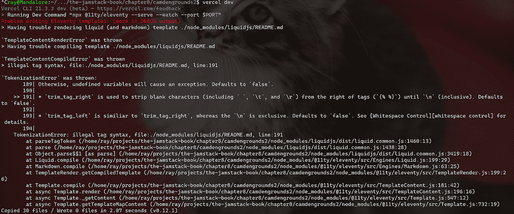

图 8.11 Eleventy CLI 的错误输出

你所看到的是使用 Vercel 和 Eleventy 的一个有趣的副作用。当你运行 vercel dev 并完成其初始设置时，它创建了一个名为 .vercel 的新文件夹，其中包含一些配置信息。你不必担心这一点。但它还添加了一个 .gitignore 文件，指定了 .vercel。.gitignore 文件是 Git 仓库使用的一种特殊文件，作为标记不应提交到源仓库的文件和文件夹的方式。这个动作随后触发了 Eleventy 中的某些操作。默认情况下，Eleventy 会忽略 npm 使用的 node_modules 文件夹，除非你有 .gitignore 文件。错误信息来自 Eleventy *没有*忽略 node_modules 文件夹，并被一个随机文件所困扰。幸运的是，修复很简单：将 node_modules 文件添加到你的 .gitignore 文件中。

列表 8.10 固定的 .gitignore 文件 (/chapter8/camdengrounds2/.gitignore)

```
.vercel
node_modules
```

到目前为止，你可以按终端中的 Ctrl 或 CMD-C 来停止 vercel dev 并重新运行它；错误应该会消失。

现在 Camden Grounds 应该已经启动并运行。让我们添加我们的无服务器函数。创建一个 api 文件夹，然后创建一个名为 products.js 的文件。该文件以从 Eleventy _data 文件夹（代码列表中的一些文本被裁剪以使其更短）中的产品数据副本开始。在产品列表之后，函数的主要内容开始。首先，它查找一个名为 filter 的查询字符串值。如果存在，则用于过滤数组。最后，产品作为 JSON 返回。

列表 8.11 产品 API (/chapter8/camdengrounds2/api/products.js)

```
let products = [
    {
        "name" : "Coffee",
        "price" : 2.99, 
        "description" : "Lorem ipsum dolor sit amet, consectetur adipisicing 
         ➥ elit. Amet numquam aspernatur!",
        "thumbnail" : "http://placehold.it/700x400", 
        "image" : "http://placehold.it/900x350"
    },
    {
        "name" : "Espresso",
        "price" : 3.99, 
        "description" : "Lorem ipsum dolor sit amet, consectetur adipisicing 
         ➥ elit. Amet numquam aspernatur!",
        "thumbnail" : "http://placehold.it/700x400", 
        "image" : "http://placehold.it/900x350"
    },
    {
        "name" : "Americano",
        "price" : 5.99, 
        "description" : "Lorem ipsum dolor sit amet, consectetur adipisicing 
         ➥ elit. Amet numquam aspernatur!",
        "thumbnail" : "http://placehold.it/700x400", 
        "image" : "http://placehold.it/900x350"
    },
    {
        "name" : "Double Espresso",
        "price" : 8.99, 
        "description" : "Lorem ipsum dolor sit amet, consectetur adipisicing 
         ➥ elit. Amet numquam aspernatur!",
        "thumbnail" : "http://placehold.it/700x400", 
        "image" : "http://placehold.it/900x350"
    },
    {
        "name" : "Tea",
        "price" : 1.99, 
        "description" : "For those who prefer tea.",
        "thumbnail" : "http://placehold.it/700x400", 
        "image" : "http://placehold.it/900x350"
    }
]

module.exports = (req, res) => {
    let filter = req.query.filter;
    if(filter) {
        products = products.filter(
            p => p.name.toLowerCase().indexOf(filter.toLowerCase()) >= 0
        );
    }

    res.json({
        products
    })
}
```

注意，在测试过程中，我发现第一次添加我的无服务器函数时，CLI 没有识别出它已被添加。我停止了 Vercel CLI 并重新运行，它顺利地识别了它。如果你也遇到这种情况，请尝试同样的方法。

函数保存后，你可以在浏览器中通过 http://localhost:3000/api/products 访问它。你会看到所有产品。接下来，尝试过滤 http://localhost:3000/api/products?filter=espresso。这将返回一个更短的列表：

```
{
  "products": [
    {
      "name": "Espresso",
      "price": 3.99,
      "description": "Lorem ipsum dolor sit amet, consectetur adipisicing...",
      "thumbnail": "http://placehold.it/700x400",
      "image": "http://placehold.it/900x350"
    },
    {
      "name": "Double Espresso",
      "price": 8.99,
      "description": "Lorem ipsum dolor sit amet, consectetur adipisicing...",
      "thumbnail": "http://placehold.it/700x400",
      "image": "http://placehold.it/900x350"
    }
  ]
}
```

现在你的 "静态" Jamstack 网站已经有了自己的 API，其他网站可以使用它！

在下一章中，你将了解一些强大且用户友好的 CMS（内容管理系统）产品，这些产品使得 Jamstack 更易于使用，特别是对于那些没有技术背景的人来说。

## 摘要

+   无服务器计算为你提供了服务器的所有功能，而不需要设置服务器的繁琐工作。它还减轻了你维护服务器的担忧。

+   FaaS 是一个通用术语，描述了使用无服务器计算作为编写执行某些操作并随后通过 URL 公开这些函数的方式。这些函数可以是特定于站点的实用工具，而不是外部服务。例如，一个营业时间不寻常（比如说天气相关）的商店可以使用无服务器函数来处理这种逻辑。它还可以使用另一个无服务器函数来处理检查产品可用性。

+   Netlify 提供无服务器函数的支持，并有一个 CLI 可以用来本地搭建和测试。Netlify 允许你在 Jamstack 网站中构建多个函数，并为它们提供标准 URL 以供访问。

+   Vercel 支持无服务器函数，并且可以通过 CLI 在本地进行测试。与 Netlify 类似，它遵循一个标准，即代码放置的位置以及如何访问代码。
