# 9 添加内容管理系统

本章涵盖

+   两种类型无头 CMS 的优缺点

+   在 Contentful 和 Sanity API 基于的无头 CMS 之间进行选择

+   使用 WordPress 作为无头 CMS

+   使用 Gatsby 的 WordPress 集成构建网站

+   使用网站构建器创建与 CMS 连接的 Jamstack 网站

Jamstack 通常与基于文件的文件内容管理系统相关联，该系统使用手动编辑的 Markdown 和 YAML 文件的组合。这是因为许多静态网站生成器默认使用这种手动内容管理，即使今天也是如此。但现实是，某种形式的无头内容管理系统已成为大多数 Jamstack 网站的事实上的集成。

[Jamstack.org](https://jamstack.org/) 维护了一个无头 CMS 列表（[`jamstack.org/headless-cms`](https://jamstack.org/headless-cms)），你可以通过类型和许可证（即它们是开源还是闭源）进行搜索。目前，它列出了 87 个选项。不用说，这有很多选择，远远超出了我们在一章中能涵盖的范围。相反，我们将探讨不同类型的无头 CMS，然后探索一些选项，以给你一个了解它们方法差异的感觉，并帮助你做出明智的选择。

### 9.1 无头 CMS 的类型

正如我们在第四章中讨论的，有两种广泛类型的无头 CMS：

+   *基于 Git 的无头 CMS*—这些 CMS 将所有内容都存储在 Git 仓库中的文件中。CMS 是一个编辑层，允许用户通过基于浏览器的所见即所得（WYSIWYG）风格界面编辑包含网站内容的 Markdown、JSON 和 YAML 文件。在许多情况下，这些编辑层与网站的文件一起部署，或者存在于用户的机器上。用户的更改由 CMS 提交回 Git 仓库。Git 处理内容的版本控制。由于更改提交到 Git，部署内容通常作为为网站设置的任何持续部署过程的一部分进行。例如，Netlify 将检测仓库中的更改，并自动构建和部署更新的内容。

+   *基于 API 的无头 CMS*—这些 CMS 在其系统中存储内容。这类似于传统的 CMS，但系统没有前端；相反，内容只能通过 API 访问。内容编辑通常通过 CMS 提供商网站上的管理仪表板进行。例如，如果一个网站使用了 Contentful，一个流行的基于 API 的无头 CMS，该网站的内容编辑将登录到[contentful.com](https://www.contentful.com/)以更改内容。当用户更改 Jamstack 网站的内容时，Jamstack 通常需要通过连接到网站持续部署过程的 web hook 触发重建。用户不需要等待重建完成就可以查看和测试他们的更改。大多数基于 API 的无头 CMS 都有一个实时预览功能，可以在使用 React 或 Vue 等流行前端框架构建的 Jamstack 网站上显示未发布的内容更改。

什么是 web hook？构建 hook？部署 hook？

*web hook*被定义为通过 HTTP 发送的用户定义的回调。本质上，一个应用程序将调用一个端点，通常传递一些数据，作为对事件的响应。例如，一个无头 CMS 通常会允许你配置一个 web hook，以便在发布内容发生变化时被调用。

*构建 hook*（Netlify 这样称呼它）或*部署 hook*（Vercel 这样称呼它）是一个专门的 web hook 端点，可以通过 HTTP POST 请求调用，从而触发在部署提供商上指定网站的重建。你可以结合使用你的无头 CMS 提供商的 web hook 和你的部署提供商的构建 hook，当在 CMS 中对网站的发布内容进行更改时触发网站重建，从而将新内容纳入发布网站。

你应该为你的项目选择哪种类型？这取决于你的具体需求，但以下是一些指导方针。

### 9.1.1 基于 Git 的无头 CMS 的优缺点

优点：

+   *它们* *很便宜*。由于它们依赖于 Git 存储库来存储和版本控制所有内容，基于 Git 的无头 CMS 通常很便宜，在某些情况下，完全免费和/或开源。

+   *它们非常容易设置*。集成通常包括确保编辑层理解你文件中的内容形式（即内容模型）。例如，你可能需要告诉它 Markdown 文件的前置部分包含哪些类型的数据或你的 JSON 和 YAML 数据文件中的数据类型，尽管一些系统甚至尝试自动检测这些。

+   *他们有一个很短的学习曲线*。因为它们是基于文件的，所以对于内容编辑来说通常更容易学习，因为数据模型通常没有它们的基于 API 的替代品那么复杂。

+   *它们提供了外部贡献的简单路径*。第三方贡献者可以通过 Netlify CMS 等 CMS 中的开放作者功能直接访问编辑内容，或者可以通过 GitHub 或 GitLab 等网站上的 Git 存储库直接进行文件编辑。这对于像文档站点这样的内容来说尤其重要，正如我们在第四章中探讨的那样。

+   *它们不是专有的*。您的内容存储在您自己的 Git 存储库中的文件中，这意味着您可以轻松地切换到另一个基于 Git 的 CMS 解决方案，而不会对您站点的代码或内容产生直接影响。

缺点：

+   *内容重用有限*。基于 Git 的头无头 CMS 中的内容通常仅针对 Web，这意味着内容在网站和移动应用等跨平台重用可能很困难。此外，网站本身的内容重用也有限。例如，我可能有一个在网站多个位置使用的营销标题和口号，但这类重用通常无法使用基于 Git 的 CMS 实现。

+   *数据模型难以强制执行*。由于内容是基于文件的，直接更改 Git 存储库中的文件可能会破坏数据模型的完整性，可能导致构建失败。例如，CMS 可能要求每个博客文章在 front matter 中定义作者，但在存储库的直接文件更改中无法强制执行这一点。如果有人手动更改文件并删除作者字段，网站构建可能会失败。

+   *内容关系难以维护*。大多数基于 Git 的 CMS 都有一种定义两块内容之间关系的方式。例如，一篇博客文章可能与一个作者页面相关联，该页面包含作者姓名和简介。然而，通常没有强制执行这些关系的方法，这意味着即使分配给它的帖子仍然存在，也可能有人删除作者页面。

### 9.1.2 基于 API 的无头 CMS 的优缺点

优点：

+   *它们* *是为内容重用而设计的*。这意味着在多个属性之间重用内容，包括多个网站或网站和移动应用，以及同一网站。为了在不同类型的应用程序（例如，移动应用和 Web 应用）之间实现内容重用，基于 API 的无头 CMS 通常将内容与表示（即内容不存储在 HTML 或 Markdown 等仅生成 HTML 的格式中）分离。这使得内容可以在不同类型的应用程序或同一应用程序的不同部分中使用，而无需担心内容的显示方式。

+   *它们确保内容完整性*。内容模型可以被设计成不仅确保内容类型始终包含某些字段，而且这些字段包含正确的值。例如，我可能想要确保内容项的一个属性是数字，但同时也位于特定的数字范围内。CMS 提供了定义字段验证的工具，确保在用户能够发布项目之前，值是正确的。

+   *它们强制执行内容关系*。强制执行内容关系使得它们易于维护。例如，它可以确保帖子始终有一个作者，并禁止删除分配给已发布帖子的作者。CMS 被设计成防止删除会损害任何引用完整性的内容。在删除内容之前，必须删除或修改引用。它们还可以允许在富文本或结构化内容中建立关系，这些内容类型允许与 HTML 无关的丰富格式化以及嵌入在 CMS 中定义的可重复使用的内容项。

+   *它们可以处理复杂的内容工作流程*。基于 Git 的 CMS 系统通常只支持非常基本的工作流程，但基于 API 的系统通常可以处理甚至复杂和定制的审批工作流程。

缺点：

+   *它们可能很昂贵*。许多这些解决方案是为公司定价的，而不是为个人开发者定价。虽然它们可能有慷慨的免费层，但定价可能很快就会上升。

+   *它们通常有陡峭的学习曲线*。由于这些是为满足甚至大型企业的需求而设计的，它们通常充满了可能使它们对普通内容编辑员来说有点复杂的特性。

+   *它们是专有的*。存在内置的供应商锁定，很大程度上是因为从一个系统迁移到另一个系统可能是一个复杂且昂贵的项目。这不仅包括将内容从专有系统迁移到另一个系统，包括数据模型、用户、验证规则和工作流程。还可能涉及对网站代码的重大修改，提取 SDK 和/或完全重写获取内容的 API 调用。

### 9.2 探索流行的无头 CMS

由于我们在第四章讨论了流行的基于 Git 的无头 CMS，让我们探索一些广泛使用的基于 API 的解决方案。我们还将查看一些选项，以在本书中讨论的一些静态站点生成器（SSG）中开始实施它们，尽管如何在每个特定的 SSG 中实现每个无头 CMS 的完整讨论超出了本章的范围。

比较无头 CMS 选项

Jamstack 网站上的无头 CMS 列表（[`jamstack.org/headless-cms`](https://jamstack.org/headless-cms)）是一个非常全面的头无 CMS 选项列表，但它可能不会提供足够的细节来帮助您做出选择。幸运的是，Bejamas（一家 Jamstack 咨询公司）的同事们启动了一个名为 Discover Hub（[`bejamas.io/discovery`](https://bejamas.io/discovery)）的项目。它提供了对 24 种不同头无选项的极其详细的评估（以及其他类别工具和服务，包括 SSG 和托管）。在做出选择时，绝对要查看它。

使用任何无头 CMS 的第一步是构建内容模型。让我们看看您如何在两种具有截然不同方法的头无 CMS 选项中构建内容模型，以便给您一个关于您可用的不同选项的感觉。

### 9.2.1 Contentful

在我看来，Contentful（[`www.contentful.com/`](https://www.contentful.com/)）最强大的卖点之一是定义内容模型的简便性。其基于 Web 的视觉界面足够易于使用，以至于非技术用户也可以构建内容模型。

一旦您登录到 Contentful，您需要创建您的第一个“空间”。这是 Contentful 分组项目的方式。在 Jamstack 项目的案例中，一个空间可能是一个站点的后端。然而，从技术上讲，空间可以作为任何逻辑分组站点和应用的后端。请注意，Contentful 目前在其免费计划下仅提供一种有限的“空间”。

创建空间后，您需要添加内容类型。在“内容模型”标题下，点击蓝色的“添加内容类型”按钮。这将打开一个窗口，让您为类型命名、提供 API 标识符和描述。名称可以是您喜欢的任何内容。API 标识符实际上是您内容类型的缩写，将自动生成，尽管您可以自定义它。

创建类型后，您需要向其中添加字段。每个字段都必须分配九种不同类型之一。在 Contentful 系统中，每种类型都有可应用于它们的有限验证集合（如图 9.1 所示）。

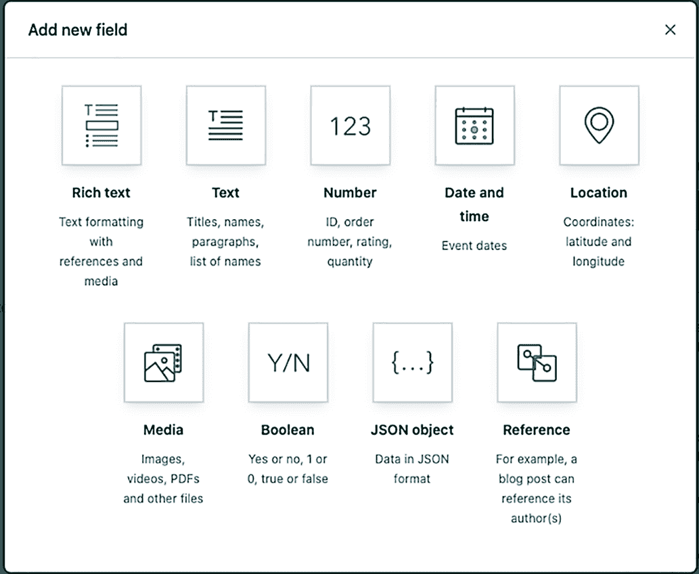

图 9.1 Contentful 提供的九种不同类型的字段

+   *富文本*——重要的是要注意，这并不是 HTML，而是一种存储在 JSON 格式中的富内容，它允许将其转换为所需的任何格式。这允许富文本包含嵌入的资产和富文本格式内的条目。对于内容创建者来说，这看起来和感觉就像是一个标准的 WYSIWYG 编辑体验。除了简单地使其成为必需的或限制特定字符数之外，还有许多验证选项，所有这些都与嵌入的链接、条目或资产相关。

+   *文本*—Contentful 中有两种标准文本字段：短文本，限制为 255 个字符，和长达 50,000 个字符的长文本。你可以对短文本字段进行排序并搜索精确匹配；而你不能对长文本字段进行排序，但你可以进行全文搜索。长文本主要用于项的长篇内容，如博客文章正文或作者简介（两者都可以是富文本）。如果你正在存储 Markdown 内容，你将使用长文本字段而不是富文本字段。验证选项包括确保文本字段与特定模式匹配（例如，电子邮件或 URL）或禁止特定模式（例如，防止使用脏话）。

+   *数字*—这可以是整数或小数。验证可以要求值是唯一的（没有两个条目可以具有相同的数字），必须在特定范围内，或者只能接受特定值。

+   *日期*—日期没有很多选项或验证，尽管你可以将其限制在特定范围内。

+   *位置*—这将在 Contentful 中以纬度和经度的形式存储，尽管内容编辑可以通过地址或地图上的位置选择位置。提供的唯一验证是使其成为必填项。

+   *媒体*—这是你可以上传的任何类型的媒体，例如图片或 PDF 文件。你可以选择允许上传单个文件或多个文件。验证允许你指定文件大小限制，仅接受特定类型的文件，或限制图像上传到特定尺寸。

+   *布尔值*—这是一个基本的“是/否”响应。可以设置的唯一验证是使其成为必填项。

+   *JSON 对象*—这允许内容编辑通过 JSON 编辑器直接编写 JSON 对象。JSON 验证内置在编辑器中。你可以通过验证限制 JSON 对象具有的属性数量。

+   *参考*—这是 Contentful 中与其他内容项之间的关系。例如，一篇文章可能引用其作者或作者们。你可以有一个对单个项（一对一关系）或多个项（一对多关系）的引用。验证允许你将选项限制为特定类型（例如，作者关系将限制你选择作者类型的内容项）。

一旦你构建了内容模型，你和你/你的内容编辑就可以通过内容编辑器开始向 Contentful 添加内容项，如图 9.2 所示。

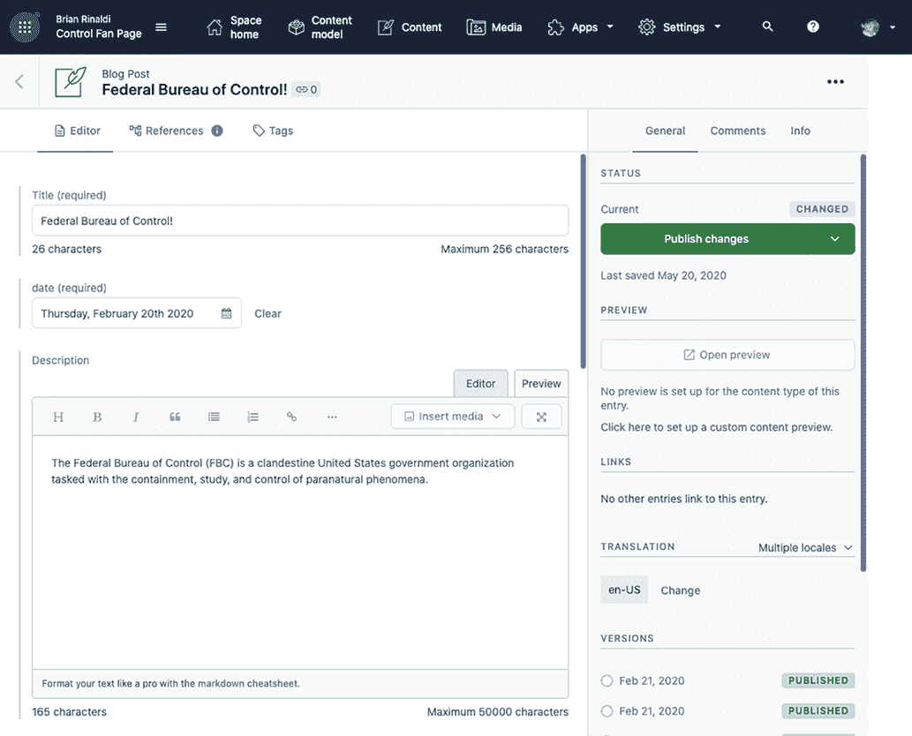

图 9.2 在 Contentful 管理 UI 中编辑“博客文章”内容类型的内容

Contentful 提供了七个不同的 API（[`mng.bz/raAe`](https://shortener.manning.com/raAe)）用于检索和管理内容和资产。对于从 Jamstack 网站的前端拉取数据的目的，你将主要对以下三个 API 感兴趣：

+   内容交付 API 是一个 REST API，它只允许您检索已发布的内容。这是您在为已发布网站生成静态页面时将用于拉取内容的 API。（有关更多详细信息，请参阅 [`mng.bz/VlmW`](http://mng.bz/VlmW)。）

+   内容预览 API 是一个 REST API，允许您拉取内容的不发布更改。这对于允许内容编辑通过预览版本查看其内容更改在实时网站上的外观非常重要，例如，在另一个 URL 上可用的网站预览版本或主网站上登录用户可用的版本。（有关更多详细信息，请参阅 [`mng.bz/xvAg`](http://mng.bz/xvAg)。）

+   GraphQL 内容 API 是一个 GraphQL API，允许您检索已发布和未发布的内容。如果您对 GraphQL 工作感到舒适，这可以替代 REST API。（有关更多详细信息，请参阅 [`mng.bz/ Ax7g`](http://mng.bz/Ax7g)。）

在大多数情况下，您可能不会直接与 API 交互，而是会使用 Contentful 提供的其中一个 SDK ([`mng.bz/Zzv5`](http://mng.bz/Zzv5))。例如，您可以将 JavaScript SDK ([`mng.bz/mxAM`](https://www.contentful.com/developers/docs/javascript/)) 与像 Eleventy 或 Next.js 这样的 SSG 集成。Gatsby 已经有一个名为 gatsby-source-contentful ([`mng.bz/5KRD`](https://www.gatsbyjs.com/plugins/gatsby-source-contentful/)) 的插件，它已经设计好可以与 GraphQL 内容 API 一起工作，以启用已发布和预览内容。Next.js 有一个您可以用作起点的示例 ([`mng.bz/6ZR6`](https://github.com/vercel/next.js/tree/canary/examples/cms-contentful))。

与像 Hugo 或 Jekyll 这样的其他传统静态站点生成器（SSG）集成，需要采取不同的方法，因为它们都没有直接从 API 获取内容或生成页面的方法。然而，有一些工具可以提供将您的 Contentful 内容导入这些工具的方法。Contentful 提供了一个名为 jekyll-contentful-data-import ([`mng.bz/oaAv`](https://github.com/contentful/jekyll-contentful-data-import)) 的 gem，可以用来将内容导入 Jekyll。对于 Hugo，有一个名为 contentful-hugo 的 npm 包 ([`mng.bz/nYA4`](https://www.npmjs.com/package/contentful-hugo))，它将拉取您所有的 Contentful 内容并将其转换为 Markdown。

### 9.2.2 Sanity

在 Sanity 中构建内容模型的经验与 Contentful 完全不同。Contentful 主要依赖于其基于 Web 的 GUI 来构建内容模型，而 Sanity 的内容模型完全由 JavaScript 代码定义并通过 Sanity CLI 管理。（有关 Contentful 和 Sanity 内容类型的比较，请参阅表 9.1。）

表 9.1 比较 Contentful 和 Sanity 中可用的不同内容类型

| 内容类型描述 | Contentful 类型 | Sanity 类型(s) |
| --- | --- | --- |
| 包含 HTML 格式化和嵌入内容的富文本 | 富文本 | 块 |
| 布尔值或真/假 | Boolean | Boolean |
| 原始文本、Markdown、URL、短名、JSON | 文本 JSON | 字符串文本 JSON 短名 URL |
| 数字，包括整数和小数 | 数字 | 数字 |
| 日期或带时间的日期 | 日期 | 日期日期时间 |
| 由纬度和经度确定的地点 | 位置 | 地理点 |
| 媒体，包括图片、视频和文件 | 媒体 | 文件图片 |
| CMS 中其他内容对象的引用 | 引用 | 引用数组 |

Sanity 认为在代码中定义内容模型可以让你更好地控制模型，同时还能让你添加自己的自定义验证。然而，这也意味着构建和维护内容模型需要开发资源，而使用可视化编辑器（例如 Contentful）的替代方案可能不需要。此外，Sanity 为每个项目部署了一个新的 Sanity Studio 实例，这是一个开源的、基于网络的 内容管理界面。由于你有权访问项目的管理站代码，你可以自由地按照自己的选择修改界面，但初始界面比 Contentful 界面要简单。

与 Contentful 的 9 种类型相比，Sanity 有 17 种类型，但它们在很大程度上与 Contentful 的类型相似：

|

+   数组

|

+   块

|

+   布尔值

|

|

+   日期

|

+   日期时间

|

+   文档

|

|

+   文件

|

+   地理点

|

+   图片

|

|

+   数字

|

+   对象

|

+   引用

|

|

+   短名

|

+   字符串

|

+   段落

|

|

+   文本

|

+   URL

|  |
| --- |

在许多情况下，当 Contentful 有子类型时，Sanity 有多种类型。例如，Contentful 有一个单一的引用类型，它指代内容项之间的一对一和一对多关系。在 Sanity 中，也有一个引用类型，但它只指代一对一关系。一对多关系指代数组类型。当 Contentful 有一个单一的媒体内容类型指代所有类型的媒体上传时，Sanity 有文件和图片类型用于不同类型的媒体上传。

Sanity 还提供了一种类似 Contentful 中丰富文本的结构化文本格式，称为块。Sanity 的块类型遵循 Portable Text 规范 ([`github.com/portabletext/portabletext`](https://github.com/portabletext/portabletext))，这意味着它由一个表示块内内容类型的子类型数组组成。这些可以是标准类型，如标题、列表或链接，也可以是自定义类型。例如，你的内容模型可能有一个员工类型，而我们的团队页面上的块元素允许你添加员工类型的条目。

Sanity 中的每个内容类型都有如是否只读或从管理 UI 中隐藏等属性。所有类型都共享相同的核心属性，尽管一些类型，如块和图像，有可以设置的附加属性。每个内容类型还有一个预定义的验证集，例如字段是否必需，或者在文本的情况下，是否有最小、最大或特定长度的要求。这些验证因类型而异。Sanity 还允许您为任何以 JavaScript 函数编写的类型指定自定义验证([`mng.bz/voDr`](http://mng.bz/voDr))。这意味着您可以创建复杂的验证，这些验证超出了内置验证类型的范围。

### 9.2.3 使用 Sanity 定义内容模型

由于它完全基于代码，并且编辑器 UI 可以在本地运行，因此使用 Sanity 构建内容模型的经验可以非常独特。让我们通过如何根据 Sanity 提供的样本项目创建内容模型，并探索样本架构代码来更好地了解 Sanity 的工作方式。

要创建 Sanity 项目，您需要一个 Sanity 账户，然后您将使用 Sanity CLI，它可以通过 npm 安装。然后，您将初始化一个新的项目：

```
npm install -g @sanity/cli
sanity init
```

如果您尚未通过 CLI 登录，CLI 将打开一个浏览器窗口以进行身份验证。之后，您将被要求选择一个现有项目以启动，如果您已经有了，或者创建一个新项目。您将为您的项目命名，然后选择是否要使用默认的数据集配置（默认情况下，生产数据集可以在未经身份验证的情况下查询）。接下来，您将选择一个输出路径，默认情况下将设置为当前项目文件夹。这是放置配置您的 Sanity 架构和 Sanity Studio 所需的所有本地文件的地方。最后，您可以选择一个空白架构或从现有的示例开始：

```
> Movie project (schema + sample data)
  E-commerce (schema + sample data) 
  Blog (schema) 
  Clean project with no predefined schemas
```

电影项目架构是尝试 Sanity 的一个很好的入门示例，因为它既有简单的架构，又有填充它的数据。这为您提供了一个尝试工作室的机会，而无需手动用数据填充它。当被问及是否导入样本数据时，您应该回答“是”。一旦导入完成，从命令行运行 sanity start 以启动 Sanity Studio。默认情况下，它将在 http://localhost:3333 上本地运行。

构成内容模型的全部文件都位于项目中的 schemas 文件夹内。让我们快速探索列表 9.1 中定义在 person.js 文件中的 Person 类型，然后我们将深入了解它是如何工作的。

列表 9.1 定义 Sanity 中人员内容类型的架构文件

```
import UserIcon from 'part:@sanity/base/user-icon'

export default {
  name: 'person',
  title: 'Person',
  type: 'document',
  icon: UserIcon,
  fields: [
    {
      name: 'name',
      title: 'Name',
      type: 'string',
      description: 'Please use "Firstname Lastname" format',
    },
    {
      name: 'slug',
      title: 'Slug',
      type: 'slug',
      options: {
        source: 'name',
        maxLength: 100,
      },
    },
    {
      name: 'image',
      title: 'Image',
      type: 'image',
      options: {
        hotspot: true,
      },
    },
  ],
  preview: {
    select: {title: 'name', media: 'image'},
  },
}
```

名称是对象名称，而标题是将在工作室内的导航中显示的内容。文档类型是 Sanity 中类型的基石。内容类型可以是文档或对象。文档类型是你将在工作室中创建和编辑的类型（即，它们会出现在左侧菜单中），而对象可以用来构成文档的一部分（如在这个示例模式中的 castMember 对象类型，它包含一个具有可以添加到电影中的额外属性的人）。图标是在左侧导航中显示的图标，是创建内容类型的视觉提示（在这种情况下，用户图标代表一个人，如图 9.3 所示）。

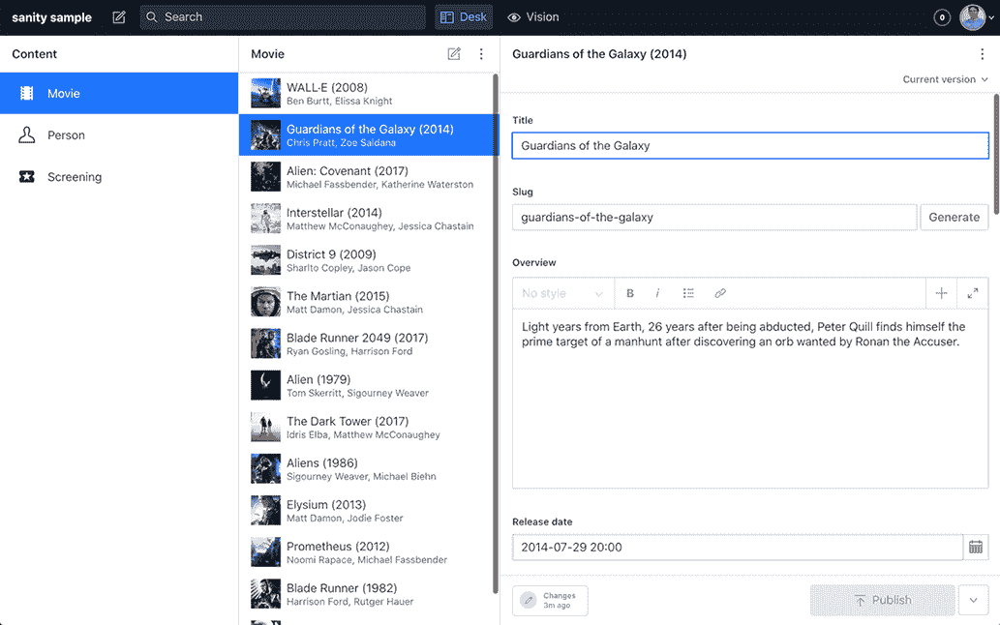

图 9.3 默认的 Sanity Studio 编辑体验。Sanity Studio 是开源的，并且可以自定义。

字段是我们类型包含的不同属性。每个属性都分配了 17 种类型中的一种。可以在选项对象中定义的选项取决于类型。例如，slug 类型有一个源选项，它将确定哪个字段将用于自动填充默认的 slug 值（在这种情况下是人的名字）。

预览部分决定了 Sanity 在列出此类对象的 Sanity Studio 导航中会显示哪些字段。Sanity 将自动猜测哪些字段来显示，但你可以提供这些信息来自定义它显示的字段。

随意继续探索模式，了解它是如何组装的以及如何在 Sanity 中配置数据模型的多种选项。到目前为止，我们已经在本地上设置了模式和工作室。虽然 Sanity 的系统知道它，但我们还没有部署它，工作室对其他用户不可用。如果我们想将模式部署到 Sanity 并使工作室可用，我们将在命令行中运行 sanity deploy。

Sanity 提供了许多使用 SSGs（静态站点生成器）的 Jamstack 项目示例，例如 Next.js、Gatsby、Gridsome、Nuxt 和 Eleventy。这些提供了如何使用存储在 Sanity 项目中的内容生成网站和预览的示例。所有这些都可以在[`www.sanity.io/create`](https://www.sanity.io/create)找到。

### 9.3 使用 WordPress

WordPress 在关于 Jamstack 的书中做什么？如果你最近几年看到了许多关于 WordPress 与 Jamstack 的帖子讨论，你可能认为你必须选择其中一个。然而，Jamstack 对您选择的后端没有任何意见，而且，事实证明，WordPress 提供了一个 REST API，使其成为 Jamstack 站点的完美后端。

事实确实如此，典型的 WordPress 开发场景涉及紧密耦合的前端和后端，但 WordPress 还带来了高度精致的内容编辑体验，许多内容创作者已经习惯了，实际上可能已经在使用。而不是强迫他们迁移，有许多选项可以利用来构建与 WordPress 后端绑定的 Jamstack 前端。

虽然您可以将任何 Jamstack 前端与 Wordpress API 集成，但基于 React 的非常流行的 SSG Gatsby 已经使开发者能够轻松地将 Gatsby 连接到 WordPress。让我们看看如何将一个 Gatsby 网站连接到一个 WordPress 实例。如果您还没有设置 WordPress 后端，请不要担心；我们将逐步说明如何轻松地设置一个本地实例。

### 9.3.1 使用 Local 在本地安装 WordPress

首先，让我们设置一个 WordPress 实例。如果您已经安装了 WordPress，请随意使用它进行此演练并跳过设置（跳转到“设置 Gatsby 插件”）。您需要能够安装插件，这被一些主机限制。

设置 WordPress 本地实例的最简单方法之一是使用一个名为 Local ([`localwp.com/`](https://localwp.com/))的工具。虽然有一个付费的专业版，但您只需免费版即可进行此演练。安装后，打开 Local 并点击按钮添加新网站。您可以命名它任何您想要的名称。我将其命名为“gastby-sample”。然后您可以选择默认的“首选”环境。最后一步是为您的网站管理员选择用户名和密码。

本地环境将设置整个 WordPress 实例，包括 MySQL 数据库，并为您提供网站详情。您可以通过点击“打开网站”来查看您机器上本地运行的网站，或者您可以通过点击“管理”来访问您本地运行的网站的后端。目前，请打开管理界面。

### 9.3.2 安装 WordPress 的 Gatsby 插件

为了作为 WordPress 后端的前端，Gatsby 需要安装两个插件：

+   *WPGraphQL* ([`github.com/wp-graphql/wp-graphql`](https://github.com/wp-graphql/wp-graphql))——此插件的目的在于将 WordPress 的 REST API 转换为 GraphQL ([`graphql.org/`](https://graphql.org/))。Gatsby 的数据层，它为 Gatsby 提供用于生成网站的内容，完全基于 GraphQL。一旦启用，您的网站将有一个可在 https://[YOUR_SITE_NAME]/ graphql 处访问的 GraphQL API。例如，我的网站在 Local 上本地运行，其 GraphQL API URL 为 http://gatsbysample.local/graphql。

+   *WPGatsby* ([`wordpress.org/plugins/wp-gatsby/`](https://wordpress.org/plugins/wp-gatsby/))—此插件的主要目的是监控您 WordPress 站点的更改，以保持 Gatsby 前端与 WordPress 后端所做的更改同步。此插件监控诸如帖子或菜单之类的更改，并在您的 Gatsby 站点中调用一个 web 钩子以触发使用新信息的重建。它还使 WordPress 预览能够与 Gatsby 页面一起工作。在我们的教程中，它是可选的，因为它需要与您选择的部署平台（如 Netlify、Vercel 或 Gatsby Cloud）集成。

要安装这些插件，在 Local 中打开您的站点并点击管理按钮。这将打开您的 WordPress 站点管理面板。您需要使用在 Local 的 WordPress 设置过程中创建的凭据登录。登录后，在左侧菜单中点击插件，然后点击添加新按钮。在搜索框中输入插件的名称，WPGraphQL（图 9.4）和 WPGatsby，然后为每个点击安装。

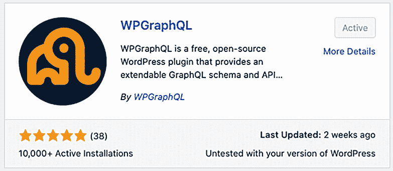

图 9.4 展示了 WPGraphQL 插件将 WordPress 转换为与 Gatsby 一起工作。此卡片将在 WordPress 插件搜索 UI 中显示。

一旦安装了 WPGraphQL，您应该会在左侧菜单中看到添加的 GraphQL 菜单项。打开它以查看如图 9.5 所示的插件设置。

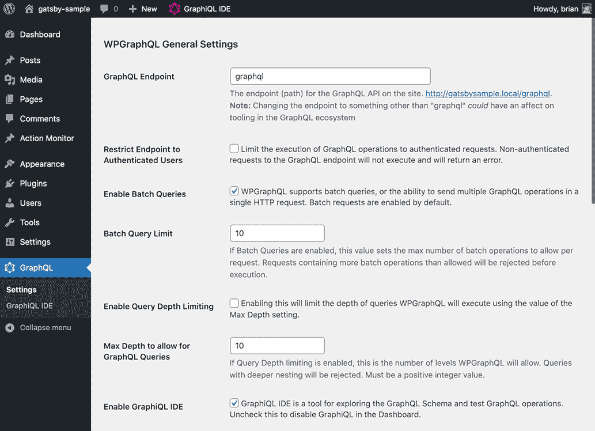

图 9.5 展示了在 WordPress 管理界面中 WPGraphQL 插件设置屏幕，您可以通过它设置端点位置并更改 GraphQL 端点的工作方式。

请注意，在 GraphQL 端点设置下方链接的 GraphQL 端点 URL。这是我们 Gatsby 前端将要连接到的端点。例如，我的端点是 http://gatsbysample.local/graphql。在测试过程中，您还可以向下滚动并勾选启用 GraphQL 调试模式复选框。这将使 GraphQL 查询在开发期间返回调试信息。

默认情况下，WPGraphQL 还为您添加了一个 GraphiQL IDE 查询编辑器到 WordPress 管理界面中，它可通过顶部导航栏上的 GraphiQL IDE 菜单项访问。点击它以打开查询编辑器并测试针对您的 WordPress 数据的 GraphQL 查询。

您可以查询的完整模式将在左侧的探索器中加载。它相当复杂，但探索器允许您点击并创建查询。您可以自由地自行查看更多，但现在让我们用一个类似于我们在简单示例 Gatsby 应用中使用的查询来测试它。

列表 9.2：一个从 WPGraphQL 获取 WordPress 内容的查询

```
query MyQuery {
  posts {
    edges {
      node {
        title
        author {
          node {
            name
          }
        }
        slug
        excerpt
        content
      }
    }
  }
}
```

点击查询编辑器上方的播放按钮（即右箭头）来运行查询。

列表 9.3：列表 9.2 中查询返回的结果

```
{
  "data": {
    "posts": {
      "edges": [
        {
          "node": {
            "title": "Hello world!",
            "author": {
              "node": {
                "name": "brian"
              }
            },
            "slug": "hello-world",
            "excerpt": "<p>Welcome to WordPress. This is your first post. 
             ➥ Edit or delete it, then start writing!</p>\n",
            "content": "\n<p>Welcome to WordPress. This is your first post. 
             ➥ Edit or delete it, then start writing!</p>\n"
          }
        }
      ]
    }
  },
  "extensions": {
    "debug": []
  }
}
```

图 9.6 显示了在 GraphiQL IDE 中的外观。

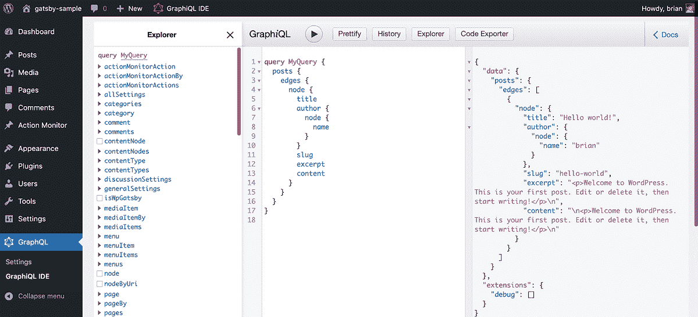

图 9.6 展示了在 WordPress 管理界面中的 GraphiQL 界面内查询由 WPGraphQL 生成的 GraphQL API。

设置 WordPress 所需做的所有事情就是这些。您可以随意用一些帖子填充网站，或者简单地使用 WordPress 提供的默认帖子继续操作。

### 9.3.3 设置 Gatsby

有许多 Gatsby 启动器是为与 WordPress 一起使用而设计的，并将加速您的项目。您可以通过访问 Gatsby 启动器页面 ([`www.gatsbyjs.com/starters`](https://www.gatsbyjs.com/starters)) 并按“CMS: WordPress”进行筛选来找到它们。然而，为了更好地理解这一切是如何工作的，我们将编写我们自己的简单 Gatsby 登录页面，该页面将列出我们本地 WordPress 网站内的帖子。

在我们能够将 Gatsby 连接到 WordPress 之前，我们需要使用 CLI 初始化一个新的 Gatsby 项目。为此，打开您的项目目录并运行以下命令（我们将在设置过程中指定我们想要创建 Gatsby 项目的文件夹）：

```
npm init gatsby
```

这将运行 create-gatsby，它将通过命令行提出一系列问题来配置您的新 Gatsby 网站。以下是您需要创建我们的示例项目所需的响应，如图 9.7 所示：

+   *您想给您的站点起什么名字？* Gatsby WordPress。

+   *您想将您的站点创建在哪个文件夹中命名？* gatsby-wordpress。

+   *您将使用 CMS 吗？* 使用您的箭头键选择 WordPress。

+   *您想要安装一个样式系统吗？* 不（或者我稍后添加）。

+   *您想要使用其他插件安装附加功能吗？* 使用箭头键向下滚动并选择完成。

+   *配置 WordPress 插件。* 这是我们在本地 WordPress 实例的 GraphQL 设置中记录的 GraphQL 端点。例如，我的地址是 http://gatsbysample.local/graphql。

+   *我们应该这样做吗？* 按下 Enter 键选择是。

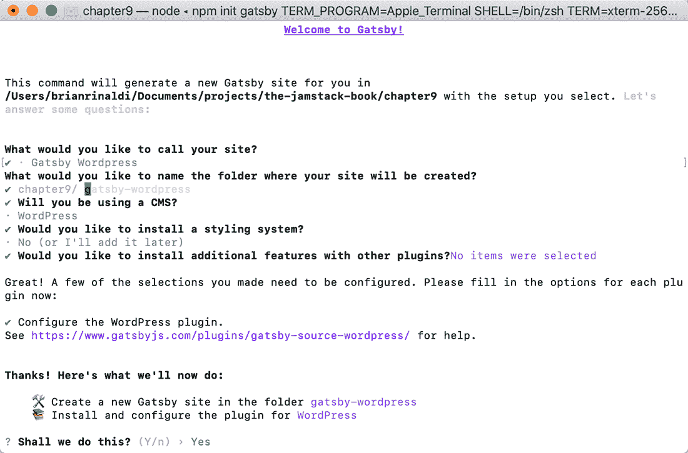

图 9.7 Gatsby CLI 为新 Gatsby 站点提供了一个逐步设置过程。

这将开始生成我们 Gatsby 网站在 gatsby-wordpress 目录中的默认文件。一旦完成，将目录更改为项目文件夹并启动 Gatsby。请注意，由于创建我们的 Gatsby 应用程序过程中存在一个问题，我们可能需要在运行 Gatsby 之前安装 gatsby-plugin-sharp 和 gatsby-transformer-sharp 插件：

```
cd gatsby-wordpress
npm install gatsby-plugin-sharp gatsby-transformer-sharp
npm run develop
```

一旦构建完成，我们可以在 http://localhost:8000/ 上查看我们的网站，它应该看起来像图 9.8。

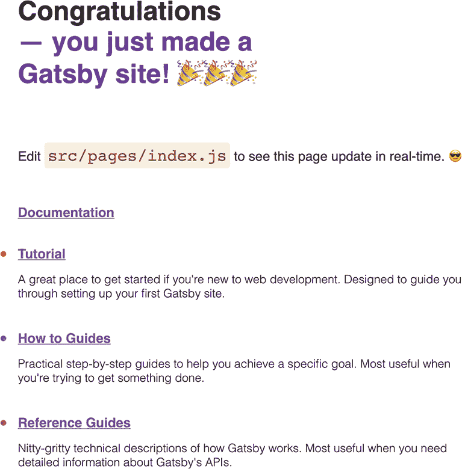

图 9.8 由 Gatsby CLI 生成的网站的默认主页

### 9.3.4 探索 Gatsby 的数据层

在我们开始编码之前，让我们探索 Gatsby 的数据层。Gatsby 倾向于从基于 GraphQL 的数据层获取您应用程序的所有数据。当我们的网站在本地运行时，我们可以通过访问 http://localhost:8000/graphql 来查看此数据层中可用的数据和查询。让我们在新的浏览器窗口中打开它。

由于我们已经探索了 WPGraphQL 提供的 GraphiQL 编辑器，所以这应该看起来有些熟悉。在这种情况下，探索面板中的查询包括 Gatsby 的所有默认数据查询以及一些 WordPress 查询。后者被添加到 Gatsby 的数据层，因为我们选择 WordPress 作为我们的 CMS 在创建网站的过程中。

随意探索可用的查询，但就目前而言，让我们测试我们将用于在主页上填充数据的查询。在查询编辑器中输入查询并点击播放按钮运行它。

列表 9.4 从 Gatsby 数据层检索 WordPress 内容的查询

```
{
  allWpPost {
    edges {
      node {
        title
        author {
          node {
            name
          }
        }
        slug
        excerpt
        content
      }
    }
  }
}
```

这个查询与我们之前在 WordPress GraphiQL 编辑器中运行的查询非常相似，只是它使用了 Gatsby 数据层提供的 allWpPost 查询。

列表 9.5 列表 9.4 中查询返回的结果

```
{
  "data": {
    "allWpPost": {
      "edges": [
        {
          "node": {
            "title": "Hello world!",
            "author": {
              "node": {
                "name": "brian"
              }
            },
            "slug": "hello-world",
            "excerpt": "<p>Welcome to WordPress. This is your first post. 
             ➥ Edit or delete it, then start writing!</p>\n",
            "content": "\n<p>Welcome to WordPress. This is your first post. 
             ➥ Edit or delete it, then start writing!</p>\n"
          }
        }
      ]
    }
  },
  "extensions": {}
}
```

完美！我们现在可以使用这些数据在我们的主页上了。

### 9.3.5 在 Gatsby 中消费 WordPress 内容

在您的代码编辑器中打开项目文件。根项目文件夹包含一个 gatsby-config.js 文件，该文件是在创建过程中为我们生成的。它包含我们指定的站点名称以及我们提供的 WordPress 插件配置和 GraphQL 端点 URL。如果我们部署我们的 WordPress 实例，这就是我们更新端点 URL 的地方：

```
module.exports = {
  siteMetadata: {
    title: "Gatsby Wordpress",
  },
  plugins: [
    {
      resolve: "gatsby-source-wordpress",
      options: {
        url: "http://gatsbysample.local/graphql",
      },
    },
  ],
};
```

我们站点的源代码位于 src 目录下。在该目录中，我们的站点页面位于 pages 目录中。我们只有一个主页（index.js）和一个 404 页面（404.js）。让我们打开 index.js 并进行一些修改。

页面使用在样式下方定义的 inline 链接数组中的数据，我们不需要它，所以让我们将其删除。同时，让我们也从标记中删除渲染链接列表的代码，以便我们的 IndexPage 标记看起来如下：

```
// markup
const IndexPage = () => {
  return (
    <main style={pageStyles}>
      <title>Home Page</title>
      <h1 style={headingStyles}>My Blog</h1>
      <ul style={listStyles}></ul>
    </main>
  );
};
```

到目前为止，我们的页面除了显示带有文本“我的博客”的 h1 标题外，没有渲染任何内容。在我们能够渲染帖子列表之前，我们需要将数据提供给页面。让我们在 export default IndexPage 行下面直接创建一个查询，该查询将直接针对 Gatsby 的 GraphQL 数据层运行。这个查询看起来很熟悉，因为它与我们之前在探索 Gatsby 数据层时测试过的查询相同。

首先，我们需要在我们的 index.js 文件顶部添加一个导入：

```
import { graphql } from 'gatsby';
```

然后，我们可以添加查询：

```
export const pageQuery = graphql`
  query IndexQuery {
    allWpPost {
      edges {
        node {
          title
          author {
            node {
              name
            }
          }
          slug
          excerpt
          content
        }
      }
    }
  }
`;
```

接下来，让我们使这个查询的数据对页面可用。首先，我们需要在 index.js 文件顶部添加另一个导入：

```
import PropTypes from 'prop-types';
```

然后，我们可以通过我们的 allWpPost 查询告诉我们的 Gatsby 页面我们提供的数据。PropTypes 库正在进行类型检查，以确保数据符合我们的预期。在 export default IndexPage 行之后放置以下代码：

```
IndexPage.propTypes = {
  data: PropTypes.shape({
    allWpPost: PropTypes.shape({
      edges: PropTypes.array,
    }),
  }),
};
```

现在我们可以更新我们的标记来输出查询的结果。代码从我们的页面属性中解构数据，然后使用数据.allWpPost 中的项目数组，该数组包含查询的结果，以列表形式输出我们的帖子，并带有摘录。请注意，我们必须使用 dangerouslySetInnerHTML 来显示摘录内容，因为它以 HTML 的形式返回。这个属性之所以这样命名，是因为这样做会使 DOM 更改超出 React 虚拟 DOM 的作用域，这对于我们的目的来说是可行的，但通常应该谨慎行事。

列表 9.6 在 Gatsby 中输出 WordPress 博客帖子列表

```
// markup
const IndexPage = ({ data }) => {
  return (
    <main style={pageStyles}>
      <title>Home Page</title>
      <h1 style={headingStyles}>My Blog</h1>
      <ul style={listStyles}>
        {data.allWpPost.edges.map((post) => (
          <li key={post.node.slug}>
            <span>
              <a style={linkStyle} href={post.node.slug}>
                {post.node.title}
              </a>
              <p
                dangerouslySetInnerHTML={{ __html: post.node.excerpt }}
                style={descriptionStyle}
              ></p>
            </span>
          </li>
        ))}
      </ul>
    </main>
  );
};
```

我们在浏览器中运行的更新后的主页应该看起来像图 9.9，显示我们默认 WordPress 安装中的一个帖子，以及帖子的摘录。

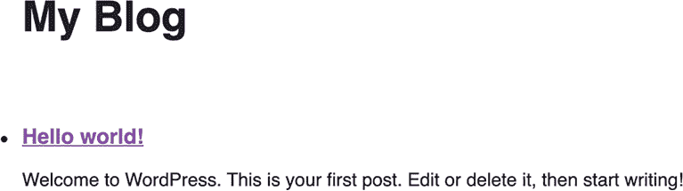

图 9.9 编辑后的博客主页输出我们 WordPress 实例中的博客文章和描述。默认情况下，WordPress 安装包含一个虚拟帖子。添加更多帖子以查看它们的出现。

### 9.3.6 使用 WordPress 作为无头 CMS 的下一步

我们正在使用 WordPress 作为 CMS 来填充我们的 Gatsby 站点。构建此应用程序的下一步是创建动态路由以在 Gatsby 中显示单个 WordPress 帖子。虽然我们在这里不会涉及这一点，但我鼓励你通过 Gatsby 的 WordPress 指南 ([`www.gatsbyjs.com/guides/wordpress/`](https://www.gatsbyjs.com/guides/wordpress/)) 或 CSS-Tricks 上的这篇教程 ([`mng.bz/4jEv`](http://mng.bz/4jEv)) 了解如何通过 Gatsby WordPress 源插件集成 Gatsby 和 WordPress。

重要的是要记住，WordPress REST API 可以被任何 Jamstack 前端消费，无论是 Gatsby 还是其他。实际上，WPGraphQL 插件提供的 GraphQL 端点也可以在 Gatsby 之外消费，例如使用 Eleventy 或 Next.js。虽然 Gatsby 为 WordPress 提供了一些内置连接，但 WordPress 也是几乎所有 Jamstack 站点的有效无头 CMS 后端，无论你选择了哪种 SSG。

### 9.4 使用网站构建器连接 CMS

到目前为止，我们讨论了你可以使用 SSG 或无头 CMS 提供商提供的启动器连接无头 CMS 的方法。我们还探讨了如何使用 WordPress 连接自己的 CMS。然而，我想要探索的另一条路径是使用像 WeWeb ([`www.weweb.io/`](https://www.weweb.io/))、Strattic ([`www.strattic.com/`](https://www.strattic.com/))或 Stackbit ([`www.stackbit.com/`](https://www.stackbit.com/))这样的网站构建器。

这些网站构建器在提供启动器模板所提供的内容之外，还通过根据你的需求定制生成的网站以及提供基于 Web 的工具来编辑该网站（无论是技术资源还是非技术资源）来走得更远。它们还允许你通过流行的现有无头 CMS 提供商集成内容管理。

请记住，这些服务通常免费开始使用，但一旦达到使用上限或想要取消功能限制，就会向您收费。

### 9.4.1 WeWeb

WeWeb 是一个基于 Vue 的网站生成器，因此它不依赖于 SSG，可以生成一个可以直接在浏览器中完全编辑的网站。这意味着您不仅仅是编辑文本内容，还可以在其基于网页的 WYSIWYG 编辑器中添加和重新排列页面上的元素（图 9.10）。

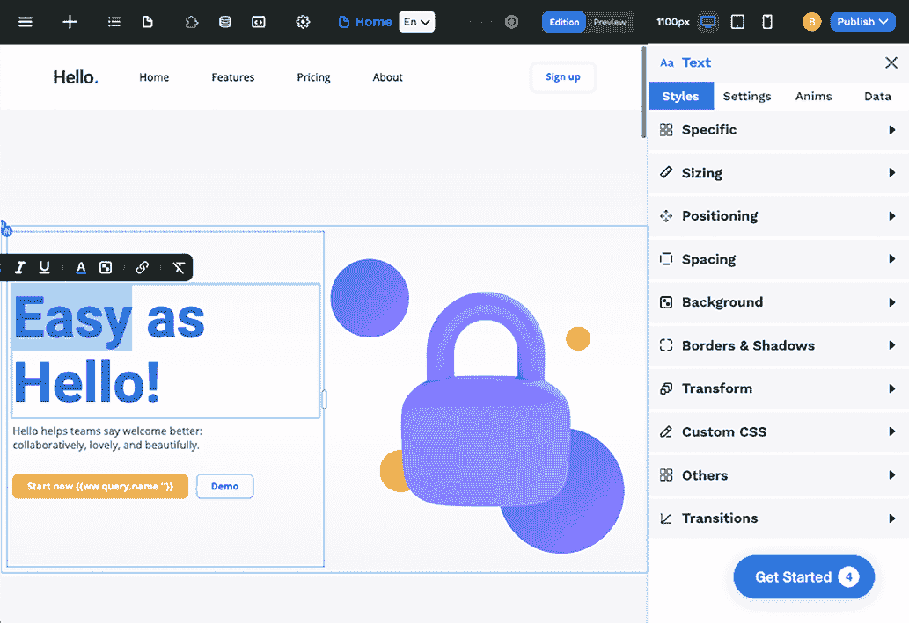

图 9.10 WeWeb 管理 UI 允许您编辑页面上的文本以及影响网页设计外观和感觉的属性。

您可以根据 WeWeb 提供的预建模板构建和自定义网站，或者从空白网站开始。在两种情况下，您都将能够利用现有的网站组件来创建和修改您的网站。这些组件允许您添加常见的网站元素，如联系表单或富文本。您还可以创建和上传自己的自定义 WeWeb 组件以供使用。

WeWeb 内置了对多种无头 CMS 服务的连接，包括 Strapi、Ghost 或 WordPress。它提供的数据源还包括 Airtable、任何 REST API、Google Sheets、任何 RSS Feed、任何 GraphQL 端点、SQL 数据库或您可以使用 JavaScript 连接的任何端点。

### 9.4.2 Strattic

Strattic 在构建与 CMS 连接的 Jamstack 网站方面采取了非常不同的方法。本质上，Strattic 在其服务器上为您部署了一个完整的 WordPress 设置。您可以通过 WordPress 管理界面像平常一样管理内容。Strattic 甚至支持大多数标准 WordPress 主题和许多插件，但由于静态网站文件的性质，您可能需要首先检查与您最喜欢的插件的兼容性（[`mng.bz/QW6Q`](http://mng.bz/QW6Q)）。

当您准备好发布时，您可以使用已安装的 Strattic 插件将网站的 Jamstack 版本部署到 Strattic 的服务器上（图 9.11）。网站的外观和感觉就像一个 WordPress 网站，但它是由静态文件和无服务器 API 构建的。这些无服务器 API 使得网站搜索、评论、论坛和其他动态功能得以实现。

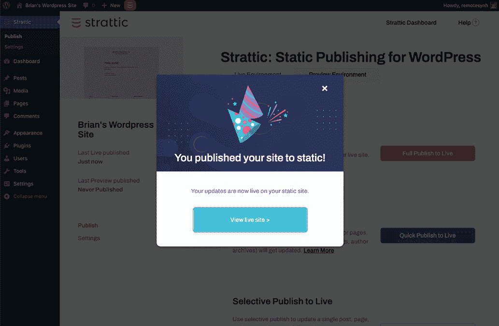

图 9.11 Strattic WordPress 插件为您的网站提供了一些发布选项。一旦生成并部署了静态网站代码，您将能够在 Strattic 的服务器上查看其运行情况。

请记住，尽管这是一个 Jamstack 网站，按照大多数人的定义，您无法访问前端文件。然而，Strattic 确实提供了对 WordPress PHP 文件的 SFTP 访问。Strattic 提供免费试用，但试用期过后需要付费账户。

### 9.4.3 Stackbit

与 WeWeb 相比，Stackbit 遵循更传统的 Jamstack 方法，它在网站构建器中利用 SSG。实际上，它支持多个 SSG 以及多个无头 CMS 选项。网站构建器免费使用，代码推送到你自己的 GitHub 账户并在你的 Netlify 账户上部署。然而，可选的网站编辑套件需要付费账户才能使用许多功能。

使用 Stackbit 构建 Jamstack 网站的第一步是选择一个主题（图 9.12）。截至本文撰写时，有 17 种不同的主题可供选择，基于多种原型，如博客或电子商务。你可以添加自定义主题，但这确实需要正确的 stackbit.yaml 配置文件，该文件告诉 Stackbit 如何将页面上的内容映射到 CMS 中的内容。

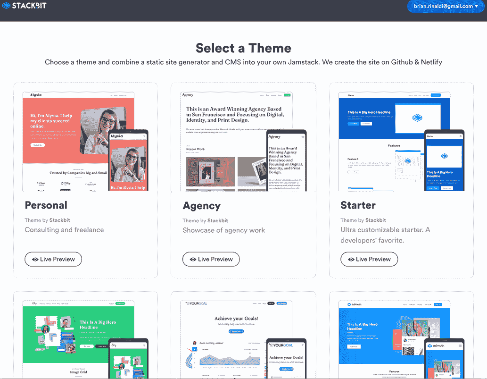

图 9.12 使用 Stackbit 生成 Jamstack 网站的第一步是选择其 17 种可用主题之一或上传你自己的自定义主题。

接下来，你将进入一个摘要屏幕，允许你修改其他默认网站构建选项，如图 9.13 所示。默认的 SSG 是 Next.js；然而，你也可以选择 Jekyll、Hugo 或 Gatsby。值得注意的是，并非所有可用的无头 CMS 目前都与 Stackbit 系统中的 Next.js 兼容。

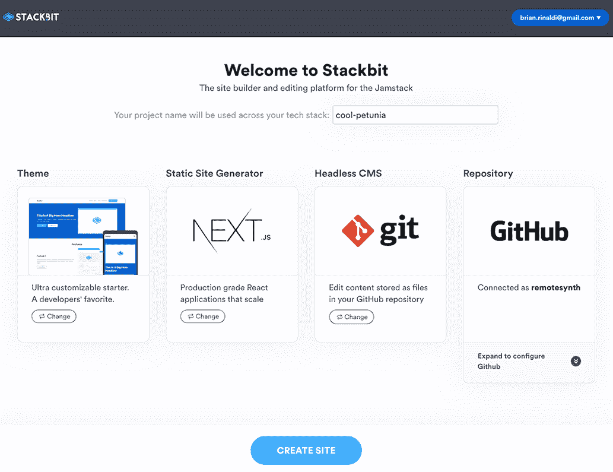

图 9.13 一旦你选择了主题，你可以自定义 Stackbit 将使用的 SSG 和无头 CMS。所有代码都将推送到你连接的 GitHub 账户。

默认内容管理系统（CMS）是 Git。这是一个基于 Git 的纯 CMS，它直接管理连接的 Git 仓库中的内容。它通过维护一个单独的分支来处理 Stackbit 编辑器内的草稿和预览更改。虽然这个选项完全免费，但你可能需要考虑基于 Git 的 CMS 是否适合你的项目，如果你有多个内容贡献者/编辑者，你可能需要付费的 Stackbit 账户。

其他可用的无头选项包括 Sanity、Contentful、Netlify CMS、Dato CMS（基于 API 的 CMS）和 Forestry（基于 Git 的 CMS）。

为了创建网站，你需要将 Stackbit 连接到你的 GitHub 账户，但一旦完成，点击创建网站按钮将使用你选择的主题和 SSG 生成所有网站文件，同时配置你的无头 CMS 并填充一些默认内容。如果你已经连接了 Netlify 账户，它也会在 Netlify 上部署。当网站生成并部署完成后，你将被带到 Stackbit 的内容编辑器。编辑器对单个用户免费使用，但有一些功能限制，但值得注意的是，编辑器完全是可选的。你可以直接在 GitHub 中修改你的代码，在你的选择的 CMS 中直接修改你的内容。

### 9.5 接下来是什么？

我们已经探讨了在选择无头 CMS 时您可用的几种不同选项，甚至查看了一些用于集成这些选项的工具和资源。正如我们在本章开头讨论的那样，大约有 87 种不同的无头 CMS 选项，因此在做出明智选择时可能会感到不知所措。以下是一些问题，供您自我反思，以帮助您缩小值得评估的选项范围：

+   *基于 Git 的无头 CMS 的基于文件的编辑是否适合我的项目，或者我是否需要基于 API 的无头 CMS 提供的额外灵活性？* 我们在本章前面讨论了每个选项的优缺点，以帮助您决定哪个选项最适合您的项目。

+   *解决方案是否需要开源？* 如果是，那么像 Netlify CMS 或 Strapi 这样的解决方案值得调查。您可以通过访问 Jamstack 的无头 CMS 列表并按开源许可证进行筛选来找到其他开源选项。

+   *我们是否有一个可以将其作为无头（例如，WordPress）利用的现有 CMS？如果是，我们是想继续自行维护和管理 CMS，还是考虑迁移到托管第三方服务？* 在许多情况下，如果可能，保留现有的 CMS 将是最直接的方法，因为它不需要对所有内容贡献者进行新系统的再培训。这也可以使其他利益相关者更容易接受迁移到 Jamstack。

+   *编辑体验是否满足我的内容编辑的需求？他们学习起来会有多难？* 如果用户之前没有使用过 Markdown，那么这种过渡可能会很困难。如果用户习惯于基于页面的编辑（如 WordPress 中的编辑），那么转向由 API 基于的 CMS 所使用的模块化系统可能需要一些时间和培训。这些对内容贡献者的困难过渡可能是不可避免的，但您至少应该意识到它们并为此做好准备。

+   *CMS 是否提供与我的 SSG 的集成，这将减少将我们的 Jamstack 前端连接到无头 CMS 的难度？* 并非每个 CMS 都有针对每个 SSG 的模板，但许多都有。在从头开始构建之前，务必调查是否已经存在预构建的集成。

显然，将会有更多针对您项目和团队需求的具体问题，但即使只问这些问题，也希望能够帮助您在评估之前缩小选项范围。

要获取选择无头 CMS 时需要考虑的额外好列表，请参阅 Emmanuel Tissera 在*Smashing Magazine*上发表的“如何选择无头 CMS”（[`mng.bz/aD57`](http://mng.bz/aD57)）。

## 摘要

+   无头 CMS 主要有两种类型：基于 Git 的和基于 API 的。基于 Git 的 CMS 将内容存储在 Git 仓库中管理的文件中，并通过管理 UI 进行编辑。基于 API 的 CMS 在其系统中存储和编辑内容，并通过 API 将其提供给您的应用程序。

+   基于 Git 的无头 CMS 的主要优势是成本。基于 API 的无头 CMS 的主要优势是内容重用的便捷性。

+   Contentful 是一个流行的基于 API 的无头 CMS，它完全通过其管理 UI 进行配置和管理。Sanity 是另一个流行的基于 API 的无头 CMS，但它完全通过 JavaScript 进行配置，并通过开源的 Sanity Studio 进行编辑。

+   WordPress 提供了一个可以作为 Jamstack 网站后端的 API。Gatsby 提供了一系列工具，可以将 API 集成到 Gatsby 数据层中，该数据层为使用 Gatsby 生成网站提供所有数据和内容。我们使用这些工具演示了如何将本地 WordPress 网站连接到新的 Gatsby 网站。

+   网站构建器提供了一种简单（尽管通常不是免费的）的方式来生成可以连接到各种无头 CMS 的 Jamstack 网站。我们探索了三个网站构建器：WeWeb、Strattic 和 Stackbit。
