# 1 重新加载 JavaScript

本章涵盖

+   评估日常编码的关键方面：对象、函数、代码和数据

+   比较基于原型和委托的对象模型

+   理解函数和类型的可组合性

+   通过模块化和元编程实现关注点的清晰分离

+   使用承诺和流编程创建单向数据管道

+   介绍示例区块链应用程序

*任何可以用 JavaScript 编写的应用程序，最终都会用 JavaScript 编写。*

——杰夫·阿特伍德

现在是成为一名 JavaScript 开发者的大好时机。今天的 JavaScript 开发者可以编写几乎在任何地方运行的代码，从平板电脑、智能手机、桌面、机器人到云平台，再到物联网，如烤箱、冰箱、恒温器，甚至太空服！此外，我们还可以编程应用程序堆栈的所有层，从客户端和服务器，一直到数据库。世界尽在掌握之中。

尽管 JavaScript 非常受欢迎，但大多数开发者——甚至那些每天使用它的人——仍然难以决定如何编写新的应用程序。大多数时候，你或你的组织将有一个预先安排的选择框架，这为你提供了一个良好的起点。但即使在这些情况下，框架也只能带你走这么远；业务领域逻辑（以纯 JavaScript 编码完成）始终是等式中最困难、最不确定的部分——你不能简单地扔一个库来解决这个问题。在这些情况下，了解语言的语法、它提供的功能以及它支持的模式是非常重要的。

大多数通用编程语言通常都有一种推荐的方式来解决某一类问题。例如，Java 和类似的语言坚持使用类来表示你的业务模型。然而，JavaScript 却提供了许多可供考虑的选项：函数、对象字面量、创建 API，甚至类。因为 JavaScript 不仅将网络粘合在一起，而且在浏览器、移动设备，甚至在服务器上，它不断进化以满足不同开发者社区的需求，并应对这些（有时相反）环境提出的新挑战。这些挑战的例子包括管理来自用户点击按钮到执行底层文件 I/O 的异步数据，以及将复杂的业务逻辑分解成简单、可维护的模块，这些模块可以在客户端和服务器之间共享和使用。这些问题是独特的。

此外，当我们大规模使用 JavaScript 时，我们还需要关注如何从适当的抽象中实例化对象，以匹配我们的推理方式，将复杂算法分解成更简单、可重用的函数，并处理可能无限的数据流。所有这些任务都需要良好的设计技能，以便代码易于推理和维护。

这就是《JavaScript 的乐趣》这本书的用武之地。本书的目的是帮助你识别和使用语言的不同特性，以便你成为一个全面发展的 JavaScript 专业人士，了解专家开发者是如何使用 JavaScript 的。本书涵盖的主题将为你提供足够的信息，让你能够专注于并掌握今天和明天需要应对的挑战。本书还将为你准备使用一些可能在未来的几年内加入语言的新特性，包括管道和绑定操作符、抛出表达式和可观察对象。我的目标是让你成为一个更好的、更高效的程序员，这样你就可以用更少的资源做更多的事情。在阅读了几章之后——当然，在本书结束时——你应该能够写出比你现在写的更简洁、更优雅的代码。简而言之，你将从本书中收获一批新的工具和技术，用于更有效、更高效地编程，无论你是编写前端还是后端代码。

许多年前，JavaScript 开发并没有特别与“快乐”联系在一起。例如，管理深层对象层次结构或打包你的应用程序为能在不同环境中工作的模块是件麻烦事。实现跨平台、跨供应商兼容的代码的问题，加上工具支持的缺乏，让许多开发者对必须为生计编写或维护 JavaScript 代码的想法感到厌恶。但情况已经改变；事实上，正好相反。

幸运的是，我们现在正处于 JavaScript 开发的现代时期，这意味着几件事情：

+   首先，我们可以通过一个名为 TC39 的明确、快速的任务组来密切监控 JavaScript 的稳步发展，该任务组每年都会推出新的语言特性，所有这些都在公开和透明中进行。这既带来了兴奋，也带来了焦虑，因为它不可避免地迫使你重新思考或放弃旧习惯，为即将到来的事物做好准备。并不是所有开发者都能很好地接受变化或保持开放的心态，但我希望你能。

+   其次，复制粘贴编程的时代已经离我们远去，与之一起消失的还有将“Script”作为名称的耻辱感，仿佛在描述一种低级语言。这种观点在多年前是普遍存在的，但现在已经不再是这样了。JavaScript 生态系统是其中最充满活力和前沿的生态系统之一，如今，JavaScript 开发者已成为行业内薪酬最高的专业人士之一。

+   最后，认为 JavaScript 开发者就是 jQuery、React、Angular、Vue、Svelte 或<命名你的框架>开发者的这种误解正在逐渐消失。你是一个 JavaScript 开发者——仅此而已。决定使用这些框架或库中的任何一个，是你的选择。通过使用良好的实践，并学习如何正确使用 JavaScript 提供的广泛工具集，纯 JavaScript 已经足够强大，让你的创造力自由发挥，并为任何类型的项目做出贡献。

为了让您了解 JavaScript 编程的现在和未来，本书在功能、反射和响应式等最流行的范式背景下探讨了这门语言，并描述了如何在每个范式内与关键编码元素一起工作。本书围绕解决大多数编程问题的四个主题组织：对象、函数、代码和数据。在这些主题中，您将学习如何使用适当的对象模型来设计您的业务领域，如何结合函数并将这些对象转换为所需的输出，如何有效地模块化您的应用程序，以及如何管理通过您的应用程序流动的数据，无论这些数据是同步的还是异步的。

如您从涵盖的主题范围中可以看到，这本书不是为 JavaScript 新手或初学者准备的。本书假设您已经具备一些专业经验，并对基础知识（如变量、循环、对象、函数、作用域和闭包）有很强的掌握，并且您已经经历过实现和配置 JavaScript 程序以及设置像 Babel 或 TypeScript 这样的转译器的练习。

只有当语言具有一致、稳定的特性和语法演变来解决这些问题时，现代 JavaScript 开发才成为可能。

## 1.1 JavaScript 的演变

多年来，JavaScript 的演变一直停滞不前。为了更清楚地说明问题，JavaScript 的规范语言 ECMAScript 自 2009 年 12 月以来在主要 JavaScript 引擎中一直停滞在 3.1 版本。这个版本后来被更名为更为人所知的 ECMAScript 5，或简称 ES5。我们等了近六年的痛苦时光——确切地说，从 2015 年 6 月开始——才看到语言有任何进展。在技术领域，六年是一个很长的时间；即使是自动取款机也会更快地更新。

在这段时间里，一个名为 TC39 的标准委员会（[`github.com/tc39`](https://github.com/tc39)），在诸如 OpenJS Foundation（[`openjsf.org`](https://openjsf.org/)）等机构的帮助下，诞生了 ECMAScript 2015，也称为 ES6。这次变革是自 JavaScript 诞生以来最大的飞跃。在这个版本中最重要的特性（[`es6-features.org`](http://es6-features.org)）包括类、箭头函数、Promise、模板字符串、块级作用域变量、默认参数、元编程支持、解构赋值和模块。除了所有这些最需要的语言特性之外，最重要的变化是 JavaScript 的演变转向了每年一次的发布节奏，这使得语言能够快速迭代并更早地解决问题和不足。为了帮助您跟踪我们的位置，ES6 指的是 ECMAScript 2015，ES7 指的是 ECMAScript 2016，依此类推。这些增量发布对于平台供应商来说更容易采用和管理，比大型、单一的发布更容易。

TC39 由领先网络公司的成员组成，他们也将继续发展 ECMAScript，这是一种旨在标准化 JavaScript 的规范语言，在国际上被称为 ISO/IEC 16262，简称 ECMA262。（我知道有很多缩写，但我希望您已经抓住了要点。）TC39 也是一个平台，通过参与 IRC 频道和邮件列表，以及通过发现和帮助记录现有提案中的问题，让整个社区能够对语言的发展方向提供一些意见。如果您快速查看 TC39 的 GitHub 网站上的语言提案，您可以看到每个提案都要经过一系列阶段。这些阶段在 GitHub 上有很好的记录，所以我会在这里为您总结：

+   第 0 阶段（草稿阶段）——这个阶段是非正式的，提案可以采取任何形式，因此任何人都可以为语言的进一步发展做出贡献。要添加您的意见，您必须是 TC39 的成员或在 ECMA 国际注册。如果您感兴趣，请随时在[`tc39.github.io/agreements/contributor`](https://tc39.github.io/agreements/contributor)注册。注册后，您可以通过 es-discuss 邮件列表提出您的想法。您还可以关注[`esdiscuss.org`](https://esdiscuss.org)上的讨论。

+   第 1 阶段（提案阶段）——在提出一个草稿之后，TC39 的成员必须支持您的添加，以将其推进到下一阶段。TC39 成员必须解释添加的理由，并描述它实现后的行为和外观。

+   第 2 阶段（草案阶段）——提案得到完全规范，并被认为是实验性的。如果它达到这个阶段，委员会期望该特性最终会进入语言中。

+   第 3 阶段（候选阶段）——在这个阶段，解决方案被认为是完整的，并已获得批准。此阶段之后的变更很少，通常仅在实施和大量使用后进行的关键发现时才会进行。您可以使用这个阶段的特性。在经过一段适当的部署期后，该新增特性可以安全地提升到第 4 阶段。

+   第 4 阶段（完成阶段）——第 4 阶段是最终阶段。如果一个提案达到这个阶段，它就可以被纳入正式的 ECMAScript 标准规范。

这股健康的新提案流非常重要，这样 JavaScript 才能跟上当今应用开发实践的需求。除了讨论只有 JavaScript 才能实现的酷炫技术和范式之外，这本书还向您介绍了一些将在不久的将来永远改变我们编写 JavaScript 方式的提案，其中一些我在本章中会简要提及。以下是它们在本书其余部分出现的顺序：

+   私有类字段（[`github.com/tc39/proposal-class-fields`](https://github.com/tc39/proposal-class-fields)）允许您为类的属性定义访问修饰符（私有、静态）。

+   管道运算符（[`github.com/tc39/proposal-pipeline-operator`](https://github.com/tc39/proposal-pipeline-operator)）将函数式语言中类似 UNIX 管道的功能引入 JavaScript 函数。

+   绑定运算符（[`github.com/tc39/proposal-bind-operator`](https://github.com/tc39/proposal-bind-operator)）是一种新的语言语法，它抽象化了`Function.prototype.bind`的使用。

+   抛出表达式（[`github.com/tc39/proposal-throw-expressions`](https://github.com/tc39/proposal-throw-expressions)）允许你将`throw`语句当作函数或变量来处理。

+   可观察对象（[`github.com/tc39/proposal-observable`](https://github.com/tc39/proposal-observable)）使基于流的响应式范式成为可能。

在本章剩余的大部分内容中，我将介绍本书的四个主要主题，以便你理解整体情况并看到这些主题是如何相互关联的。我将从对象开始。

## 1.2 对象

对象不过是一个指向其他内存位置的内存引用。在核心上，JavaScript 是一种面向对象的语言，并且有多种方式在 JavaScript 中定义对象及其之间的关系。在这本书中，我们将探讨许多定义对象的方法。

对于一次性使用，例如，简单的对象字面量可能是最好且最快的方法。当需要将多个数据项组合起来传递给函数或从函数返回时，对象字面量就派上用场了。然而，当你需要创建具有相同形状的多个对象时，最好使用像`Object.create`这样的创建型 API 作为对象的工厂。你也可以结合`new`关键字使用自己的函数作为对象工厂。同样，类在近年来也变得流行，并且行为方式非常相似。但如果对象仅仅是其他对象的引用（链接），JavaScript 也允许你通过使用扩展运算符或像`Object.assign`这样的 API 将多个小对象合并成一个大的对象。

无论你采取哪种方法，你通常都需要共享数据和一组方法以避免代码重复。JavaScript 使用两种核心机制：属性解析机制和原型。这些机制是相互交织的。JavaScript 使用对象的内部原型引用作为在属性解析期间导航对象层次结构的路径，这发生在你查询对象的属性或调用方法时。假设你有图 1.1 所示的继承配置。

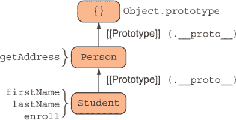

图 1.1 一个简单的原型层次结构，其中`Student`对象继承自`Person`对象

在这里，从`Student`构造的对象继承自从`Person`构造的对象，这意味着所有`Student`实例都可以使用在`Person`中定义的数据和方法。这种关系被称为差异继承，因为随着对象图的变长，每个对象都会借用其上层的形状，并通过新的行为来区分自己（变得更加专业化）。

从图 1.1 可以看出，在`Student`对象上调用`enroll`方法会立即触发所需属性，因为它是局部于对象的，但调用`getAddress`则使用 JavaScript 的属性查找机制沿着原型层次结构向上遍历。这种方法的缺点是，当你的对象图变得非常复杂时，对基级对象的任何更改都会在所有派生对象中引起连锁反应，甚至在运行时也是如此。这种情况被称为原型污染，它是困扰大型 JavaScript 应用的严重问题。

由于原型是 JavaScript 中对象的内部实现细节，从调用者的角度来看，`Student` API 是一个具有四个属性的门面：`firstName`、`lastName`、`getAddress`和`enroll`。同样，我们可以通过组合描述`Person`和`Student`的对象字面量来获得相同的形状。这种方法是对图 1.1 中配置的轻微扭曲，但非常重要。请看图 1.2。

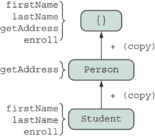

图 1.2 中，两个具体对象（`Student`和`Person`）合并成一个全新的对象，其中包含从组合对象分配的所有属性。尽管这里没有使用原型继承，但箭头的方向与图 1.1 中保持一致，以传达两种方法类似的心理模型。

在图 1.2 中，主要的不同之处在于我们用`copy`操作替换了原型引用，以表示我们实际上正在将`Student`和`Person`的所有属性复制（实际上，是分配）到一个空对象中。因此，我们不是链接对象，而是创建了具有相同形状的独立对象。从调用者的角度来看，这些对象完全相同，你仍然可以受益于代码重用。在这种情况下，`Student`和`Person`不是构造函数或工厂；它们是简单的混入（对象的一部分）。尽管这种方法在一定程度上可以避免意外的下游更改和原型污染，但缺点是每个新创建的对象都会在内存中添加一个新副本的属性，使得内存占用稍微大一些。

如你所知，计算机科学中的大多数事物都是权衡的结果。在这里，你以原型的高效内存使用方法为代价，换取了易于维护和重用性。在第二章和第三章中，我们将详细讨论这些以及其他模式，以及实现它们的代码。

如果对象是 JavaScript 的织物，那么函数就是用来将碎片缝合在一起的针线。JavaScript 函数是语言中最强大的部分，我们将在第 1.3 节中讨论。

## 1.3 函数

函数实现了您应用程序的业务逻辑，并驱动其状态（例如内存中所有对象内的数据）达到期望的结果。在根本层面上，你可以从两种方式来考虑函数：

+   在过程式或命令式思维模式中，函数不过是一组共同执行的语句集合，用于组织和避免代码模式重复。面向对象范式继承了过程式编程，因此它也是一个修改对象的语句或命令序列。读者应熟悉这种方法。

+   另一方面，你可以通过函数式编程（FP）的视角来考虑函数作为表达式。在这个世界的观点中，函数代表像乐高积木一样组装的不可变计算。

图 1.3 展示了一个使用过程式风格的、复杂度较低的假设程序的流程图。我们被训练成像计算机一样思考，并以这种方式绘制数据流。但正如你将在接下来的几个图中看到（图 1.4 和 1.5），当你使用正确的技术时，你可以将甚至是最复杂的程序简化为一系列流畅的表达式序列。

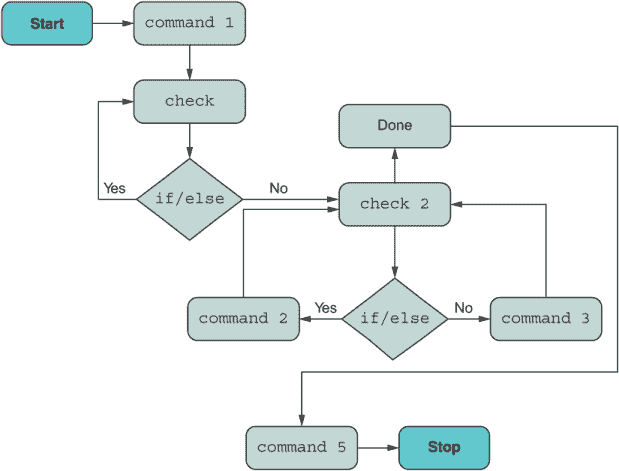

图 1.3：一个假设的程序描述，展示了`if/else`条件和循环

你应该编写可维护的、声明式的代码，让你的用户和队友能够理解，并让计算机解析和优化代码以供其自身理解。FP 在这方面有很大帮助。你可能听说过或读到 React 允许你“函数式地”构建 UI，或者 Redux 促进不可变状态管理。你有没有想过所有这些概念从何而来？你可以通过利用高阶函数来函数式地编码。在 JavaScript 中，一个函数是一个能够携带或链接到其词法作用域（也称为其闭包或背包）中的变量，并且你可以将其作为参数传递并作为回调返回的对象。这是语言的一个基本部分，自从 JavaScript 诞生以来就存在，具有无限的潜力来设计代码。

FP 将计算和数据表达为纯函数的组合。这些函数在每次调用时不会改变系统的状态，而是产生一个新的状态；它们是不可变的。使用 FP 编码将防止许多错误——你不需要费心去绕过的错误——并产生你可以多年后查看且更容易推理的代码。这个特性本身并不是 JavaScript 固有的，但它补充了使用 JavaScript 高阶函数的编码。

第四章将教会你足够的 FP 知识，以显著影响你日常编码的方式。它通过分解（将复杂问题分解成小而可管理的块）和组合（将这些部分重新组合在一起）的练习。从抽象的角度来看，编码思维模式如图 1.4 所示。

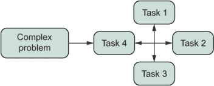

图 1.4 FP 程序倾向于将大问题分解成更小的任务，并作为这些小任务的组合来解决。

不言而喻，你可能会倾向于创建许多更简单的函数，这些函数只对某些输入有效，并仅基于这个输入产生输出。当你能够将复杂问题分解成多个函数表示时，你会使用诸如 currying 和 composition 等技术将这些函数重新组合起来。你可以使用函数来抽象任何类型的逻辑——如条件执行、循环甚至错误处理——以创建类似于图 1.5 的信息管道。

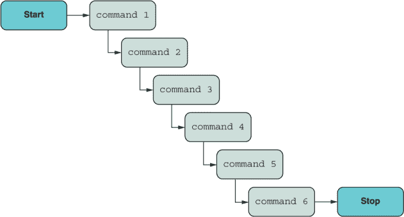

图 1.5 组合允许你构建函数管道，其中一个函数的输出成为下一个函数的输入。

我们很幸运使用一种能够给我们这种支持的编程语言。在语言的未来版本中，图 1.5 可能可以直接使用新的管道操作符（`|>`) 语法在 JavaScript 中编码，你将在第四章中了解到这一点：

```
const output = [input data] |> command1 |> command2 |> ... |> command6;
```

就像 UNIX shell 一样，这个操作符允许你将一个函数的输出“管道”到下一个函数的输入。假设你创建了一个`split`函数，用于通过空格将字符串拆分成一个数组，以及一个`count`函数，用于返回数组的长度。以下是一行有效的 JavaScript 代码：

```
'1 2 3' |> split |> count;  // 3
```

此外，图 1.3 和图 1.5 之间最明显的区别之一是条件逻辑（菱形形状）的去除。这是如何实现的？第五章介绍了一个称为代数数据类型（ADT）的概念。在我们的情况下，类型意味着具有某种形状的对象，而不是静态类型，这在其他语言社区中通常是指静态类型。鉴于关于 JavaScript 静态类型系统（如 TypeScript 和 Flow）有很多讨论，本书在附录 B 中花了一些时间讨论 JavaScript 中的静态类型。

ADTs 现在在许多编程语言和库中很常见，作为解决常见问题（如数据验证、错误处理、空值检查和 I/O）的优雅解决方案。事实上，JavaScript 自己的可选链、管道、承诺和 nullish 合并操作符，以及`Array.prototype{map,` `flatMap}` API（本书中均有讨论），都是受到这些代数类型灵感的启发。

之前，我们讨论了函数的组合。组合如何应用于自定义数据对象？你会了解到`Array`的`map`和`flatMap`方法在概念上适用于比数组更多的情况。它们是一组普遍接受的接口的一部分，你可以实现这些接口来使任何对象表现得像函数；我们将这种对象称为函子或单子。JavaScript 的`Array`具有类似函子的行为，而你一直在使用这种模式来转换数组，却没有意识到这一点。这种编码风格是本书涵盖的许多主题的基础，所以我会在这里花点时间来讲解它。

假设你已经声明了一些函子`F`（可能是`Array`）并给它提供了一些输入数据。函子以其特定的`map`实现而闻名，这样你就可以转换`F`内部封装的数据。图 1.6 展示了将函数按顺序（映射）应用到字符串上的逐步视图。

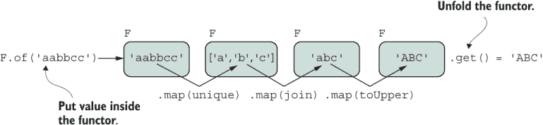

图 1.6 一个使用`map`转换其内部数据的函子对象（`F`）。函子是无副作用的，因为每次应用`map`都会产生`F`的新实例，而原始实例保持不变。

`map`是一个合约，可以应用于满足函子要求的任何`F`。当处理你想要在不同独立对象上一致应用的功能时，你可能倾向于使用`Function.prototype.bind`来设置接收函数调用的目标对象。随着 JavaScript 新绑定的操作符（`::`）语法的出现，这个过程变得更加简单。以下是一个虚构的例子：

```
const { map } = Functor;

(new F('aabbcc'))
    :: map(unique)
    :: map(join)
    :: map(toUpper); // 'ABC'
```

在许多用例中，函子都是有用的，所以让我们专注于验证中的条件逻辑问题。在第五章中，我们将从头开始实现自己的 ADT，以抽象`if`/`else`逻辑，例如“如果数据有效，执行 X；否则，执行 Y”。尽管数据流遵循图 1.5 的声明性食谱样范式，但内部将执行适当的分支逻辑，这取决于验证检查的结果。换句话说，如果验证检查的结果是成功的，回调函数将使用封装的输入执行；否则，它将被忽略。这两种代码流在图 1.7 中显示。

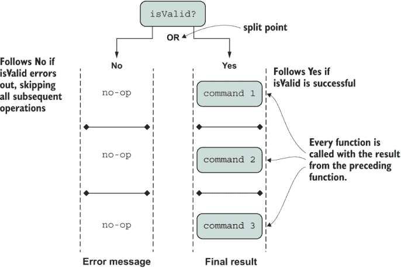

图 1.7 一个实现条件逻辑模型的互斥（`OR`）分支的 ADT。在分支的`Yes`（成功）一侧，所有映射操作都针对 ADT 内部包含的数据执行。否则，在`No`（失败）一侧，所有操作都将跳过。在两种情况下，数据都从开始到结束按顺序流动。

现在了解 ADT 将为你准备好语言的发展方向。早期的提案包括模式匹配等特性，这对于更函数式的 Alt-JS 编程语言如 Elm 来说是合适的。由于这个提议在写作时还处于早期草案形式，本书没有涵盖模式匹配。

现在您已经学习了面向对象和函数式技术来建模您的业务领域，第 1.4 节向您介绍了 JavaScript 的官方模块系统，称为 ECMAScript 模块（ESM），以帮助您以最佳方式组织和交付您的代码。

## 1.4 代码

第六章重点介绍如何使用 ESM 在您的应用程序中导入和导出代码。这个功能的主要目标是标准化代码在平台无关的方式下共享和使用。ESM 取代了 JavaScript 早期尝试的标准模块系统，如 AMD、UMD，甚至最终是 CommonJS。ESM 使用静态模块格式，构建/捆绑工具可以使用它来通过分析项目的静态布局及其依赖关系来应用大量的代码优化。这种格式对于减少通过网络发送到远程服务器或直接发送到浏览器的捆绑代码的大小特别有用。

JavaScript 可以使用其模块系统来加载从单个函数到大型单体类的大小不等的模块。当您使用像 `export` 和 `import` 这样的经过良好建立、经过测试的关键字时，创建模块化和可重用的代码是直接的。

能够在不影响其他区域的情况下更改您的代码是模块化的基石。关注点的分离不仅适用于全局项目结构，也适用于运行中的代码——这是第七章的主题。

第七章通过利用 JavaScript 的元编程能力来讨论关注点的分离。使用 JavaScript 符号和 API，如 `Proxy` 和 `Reflect` 来启用反射和内省，您可以保持代码干净并专注于当前的问题。我们将使用这些 API 来创建我们自己的方法装饰器，以动态注入跨切面行为（如日志记录、跟踪和性能计数器），否则这些行为会弄乱您的业务逻辑，仅在需要时才这样做。

作为简单的例子，假设在调试和故障排除过程中，您想在应用程序的一些关键对象上打开任何属性访问（读取属性内容或调用方法）的日志记录。您希望在不修改任何一行代码的情况下完成此操作，并在完成后能够关闭它。通过放置正确的工具，您可以创建动态代理，装饰您选择的对象，并拦截或捕获对该对象的任何调用以编织新的功能。这个简单的例子在图 1.8 中展示。

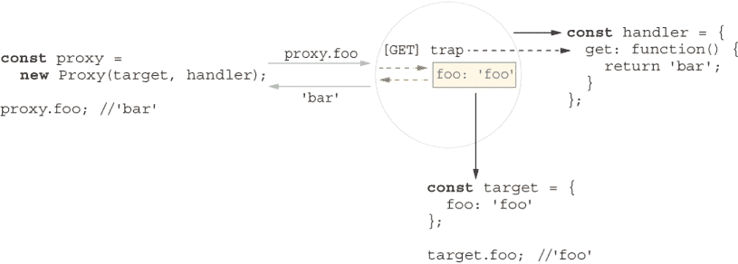

图 1.8 动态地围绕某些目标对象创建代理对象。任何属性访问（`foo`）都会被代理对象捕获，因此您可以注入任何想要的代码。在这个简单的例子中，代理对象捕获了对 `foo` 的访问，并动态地将其返回值更改为 `'bar'`。

现在想象一下，在你想优化的代码区域之前和之后使用性能计数器，或者使用可以在打印到屏幕或日志文件之前破坏或混淆对象中敏感字符串的全局安全策略。这些方法装饰器在大量用例中变得很有用。我们将在第七章中探讨如何做这些事情。

现在你已经有了对象、函数和代码的适当组织，剩下要做的就是管理流经它的数据。

## 1.5 数据

因为 JavaScript 作为网络（包括服务器和客户端）的关键语言，它需要处理各种形状和大小的数据。数据可以同步到达（来自本地内存）或异步到达（来自世界上的任何地方）。它可能一次性到达（单个对象），按顺序到达（数组），或者分块到达（流）。JavaScript 引擎在高级上依赖于一个具有回调队列和事件循环的架构，该架构可以连续以并发方式执行代码，而不会停止主线程。

毫无疑问，使用 Promise 作为抽象时间和数据局部性的模式，使得对异步代码进行推理变得更加简单。`Promise`是一个表现最终值的函数对象，其 API 与 ADT 有很多相似之处。在你的脑海中，你可以用`map`/`flatMap`替换`then`。`Promise`可以处于几种状态之一，如图 1.9 所示，其中最明显的是`'fulfilled'`和`'rejected'`。


图 1.9 新的`Promise`对象及其所有可能的状态

如你所见，Promise 还模拟了两个代码分支。这两个分支将你的逻辑向前推进，以执行你的业务逻辑达到期望的结果（`'fulfilled'`）或产生某种错误消息（`'rejected'`）。Promise 是可组合的类型，就像 ADT 和函数一样，你可以创建一系列的顺序逻辑链来攻击涉及异步数据源和复杂问题，并在过程中从适当的错误处理中受益（图 1.10）。

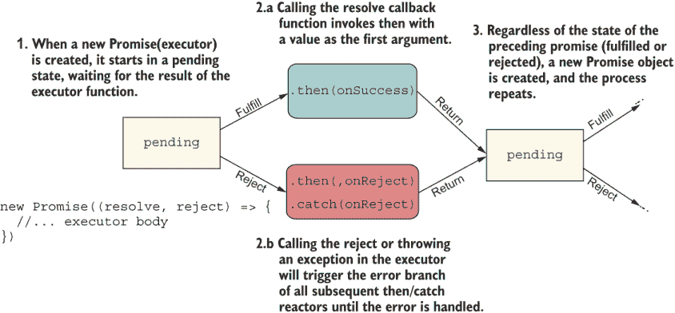

图 1.10 `Promise`对象如何链接形成新的`Promise`对象。在这个过程中，相同的模式重复出现。成功和拒绝情况都会导致返回一个新的`Promise`对象。

在第八章中，我们讨论了 Promise 和`async`/`await`语法，这对于有更命令式或过程式背景的开发者来说很有吸引力，但与 Promise 的行为语义相同。使用`async`/`await`，你有编写看起来像暂停并等待执行命令的代码的视觉优势（例如，使用 HTTP 请求获取数据），但在幕后，一切都是 Promise 与底层事件循环架构的交互。在第八章中，我们还探讨了在 Promise 之上实现的主题，如异步迭代器和异步生成器。

Promises 模型单个异步值，但异步生成器允许你在一段时间内交付可能无限的数据序列。异步生成器是理解流的好心理模型，流是在一段时间内的事件序列，如图 1.11 所示。

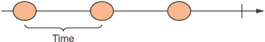

图 1.11 一个简单的流，有三个事件，由一些时间单位分隔

在浏览器和 Node.js 中都有实现标准的`Stream` API 来读写流。例如，Node.js 中的文件 I/O 流和浏览器中的 Fetch API。尽管如此，鉴于我们每天处理的数据类型的多样性，我们理想情况下应该使用单个 API 来抽象这些数据类型，并使用相同的计算模型。这种方法对框架和库的作者都有吸引力，因为它允许他们提供一个一致的接口。幸运的是，JavaScript 提出了`Observable` API 作为解决方案。

每当你看到`Observable`对象时，你应该从图 1.11 的角度去思考。JavaScript 将`Observable`内置到语言中，旨在标准化使用像 RxJS 这样的库所能做的令人惊叹的事情。有了可观察者，你可以订阅来自任何来源的事件：一个简单的函数、一个数组、一个事件发射器（如 DOM）、一个 HTTP 请求、promises、生成器，甚至是 WebSockets。这个想法是你可以将每份数据视为时间中的一个事件，并使用一组一致的运算符（可观察函数）来处理它。像函数、promises 和 ADTs 一样，可观察者是可组合的。你看到了一个模式吗？这个模式不是巧合；它是现代软件的编码模式，并且大多数语言都在越来越多地采用这种模式。因此，你也可以通过调用一系列可组合的运算符来创建链或管道，这些运算符在或转换通过可观察对象流动的数据，以同步或异步的方式处理数据，随着时间向前传播。图 1.12 显示了源可观察对象是如何通过某个运算符（可能是`map`？）进行转换，从而产生一个新的可观察对象。

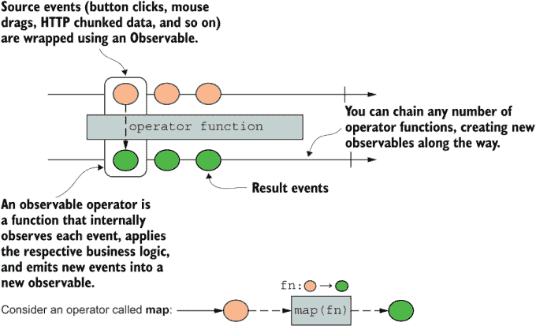

图 1.12 一个源`Observable`对象（第一个长箭头）将所有事件管道输入到一个运算符函数中并进行了转换。所有新值都是通过一个新的`Observable`发出的。

在第九章中，我们将创建自己的小运算符库。这些可管道的运算符本身就是高阶函数，而你提供给它们的函数则编码了你的特定业务逻辑。正如我在本章开头所说，并且你将在整本书中反复看到，高阶函数是 JavaScript 最强大的特性。

我希望这个概述听起来很吸引人。目前，我将讨论保持在较高水平，但每个随后的章节都将深入许多细节和代码。在这本书中，您不仅将接触到新的尖端技术，还将看到它们在更现代类型的应用程序中的实现。在我们深入所有这些巧妙的话题之前，让我向您介绍我们将在这本书中构建的示例应用。第 1.6 节有助于为所有您将看到的代码设定背景。

## 1.6 示例应用：区块链

根据我的经验，大多数编程书籍使用琐碎的例子，通常是数字或 foo/bar，来展示技术的特定功能。虽然这些例子因为假设零领域知识而有效，但缺点是您会感到困惑，不知道它们如何适应更复杂、更现实的应用。

如果您在过去几年里没有躲在石头下，您一定看到了很多关于区块链和加密货币的炒作，它们已经席卷了世界。许多分析师认为，区块链是未来几年需要学习的重要技术之一。如今，区块链无处不在且普遍存在，熟悉它们将为您的工具箱增添一项无价的技能——更不用说区块链本身很酷了。当然，教授这项技术并不简单，但这个应用故意保持小而简单，以便纳入本书。无需任何预热，也不需要任何背景知识。您自己的热情和动力，以及一些 JavaScript 背景，是唯一的先决条件。

在这本书中，我们将从头开始构建一个简单、直观的区块链协议的部分，以说明我们如何将现代 JavaScript 技术应用于实际问题。由于重点是教授 JavaScript，因此教授区块链纯粹是教学性质的，远非生产就绪的实现。尽管如此，您将接触到区块链世界的一些有趣技术，例如不可变性、哈希、挖矿和工作量证明。为了探索 JavaScript 功能的广泛范围，我们将找到创造性的方法，尽可能地将尽可能多的功能和技巧融入到这个小型、人为构建的示例应用中。

为了给您提供一些背景信息，区块链是一种由一系列记录（称为区块）组成的数据库，这些记录可以按某种时间顺序存储任何类型的数据。与传统数据库不同，区块是不可变的记录；您永远无法更改区块的内容，只能添加新的区块。

区块通过密码学方式相互链接。与链表中的指针或引用不同，没有连接一个区块到下一个区块的指针或引用。相反，每个区块包含一个密码学安全的哈希（如 SHA-256），新块的哈希值依赖于前一个块的哈希值，从而形成链。由于每个区块都是从前一个块的哈希值中哈希出来的，这个链天生具有防篡改的特性。即使操纵所有区块历史中任何一笔交易的任何一个属性，也会导致不同的哈希值，从而使整个链无效。这就是为什么区块链数据结构不仅被金融软件所青睐，还被用于安全的文档存储解决方案、在线投票和其他行业领域的主要原因之一。

计算区块哈希的过程将所有这些哈希值一直追溯到链中的第一个区块，即创世区块，或高度为 0 的区块。在现实生活中，区块链要复杂得多。然而，为了本书的目的，我们可以将其想象为一个顺序数据结构，其中每个区块存储了最近发生的交易。这种简化的结构在图 1.13 中展示。

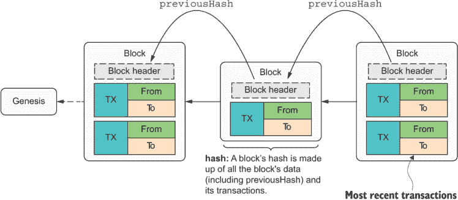

图 1.13 展示了区块链的一个简单表示，其中每个区块存储了前一个区块的哈希值。这个哈希值用于计算当前区块的自身哈希值，从而有效地将这些区块连接成链。

如图中所示，每个区块由一个区块头组成，这是与每个区块关联的元数据。区块头的一部分是一个字段，`previousHash`，它存储了前一个区块的哈希值。除了元数据外，每个区块可能还包含一个有效载荷，这通常是一组交易。最新的区块包含了在创建时链上待处理的最新交易。

交易看起来像典型的银行交易，形式为“A 向 B 转了 X 金额的资金”，其中 A 和 B 是识别交易中各方的加密公钥。由于区块链包含了历史上发生的所有交易，在比特币等数字货币的世界里，它被称为公共账本。与你的银行账户不同，它是私密的，而比特币这样的区块链是公开的。你可能正在想，“我的银行负责验证每一笔交易，那么谁验证这些交易呢？”通过称为挖矿的过程，你将在第八章中了解到，你可以验证存储在区块中的所有交易，以及存储在历史中的所有交易。挖矿是一个资源密集型的过程。在挖矿进行时，交易被认为是待处理的。所有这些待处理的交易组合形成了下一个区块的数据有效载荷。当区块被添加到区块链中时，交易就完成了。

当支撑资源稀缺且难以寻找、提取或“挖掘”时，例如黄金、钻石或石油，加密货币就会获得货币价值。计算机可以使用它们强大的处理器或算术逻辑单元来执行高速数学运算，解决数学问题，这被称为工作量证明。我们将在第七章中查看`proofOfWork`函数的实现细节。

考虑一个交易是如何被添加并由区块链协议安全验证的例子。假设路克用 10 个比特币在安娜的咖啡馆买咖啡。用户通过他们的数字钱包被识别。支付过程触发逻辑以新待处理交易的形式转移资金。待处理交易集存储在区块中；然后该区块被挖掘并添加到链中以进行验证。如果所有验证检查都良好，则称交易已完成。矿工运行这个昂贵的证明工作计算的动力是，有挖掘奖励。这个协议在图 1.14 中总结。

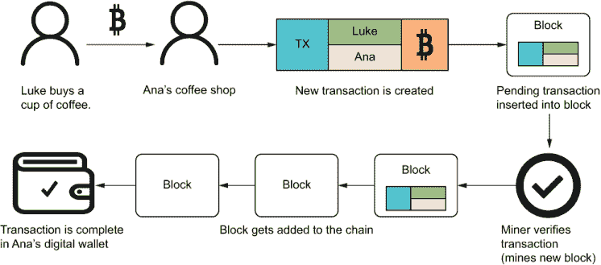

图 1.14 路克在安娜的咖啡店用他的数字钱包买咖啡。支付过程创建了一个新的待处理交易。在一段时间后，矿工们竞争验证这个交易。然后，包括路克的支付在内的所有发生的交易都被添加到链中的一个区块中，支付完成。

考虑到这些概念，图 1.15 展示了在这个序列中涉及的所有对象的简单图示。

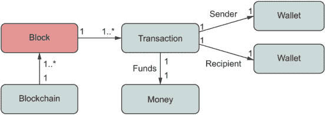

图 1.15 在我们的简单区块链应用程序中起作用的领域层的主要对象

随着我们进入章节，我们将详细说明所有这些对象以及将它们联系在一起的业务逻辑。具体来说，我们将实现代码以验证整个链，计算特定用户的比特币余额（钱包账户），执行一个简单的证明工作算法，并将一个区块挖掘到区块链中。

代码在哪里可以找到

本书代码在 GitHub 上免费提供([`github.com/JoyOfJavaScript/joj`](https://github.com/JoyOfJavaScript/joj))。该存储库包含已解决的区块链应用程序以及所有以单元测试形式呈现的代码列表。重要的是要提到，本书中的所有代码示例都假设严格模式（`"use strict";`），这是编写 JavaScript 的推荐方式。

严格模式是有益的，因为它禁止了一些语言中的不良部分，例如使用臭名昭著的`with`语句，对一个变量调用`delete`（如果 JavaScript 也禁止对对象属性调用`delete`会更好），以及使用一些新保留的关键字（例如`interface`）。严格模式还将一些被动错误转换为完全的异常。

仓库还包括 Babel 配置文件，用于转换一些将改变你未来 JavaScript 编码的非标准提案。Babel 在章节中没有涉及，但你可以在附录 A 中了解更多关于它的信息。

要运行每一章的代码示例，你有两种选择：下载并安装 Node.js v14 或更高版本以在本地运行代码，或者使用一个最小的 Docker 配置，该配置配置了一个带有 Node.js 14 的虚拟环境，并包含所有必需的项目配置。如果你不想或不能升级你的环境，Docker 非常方便。Docker 沙盒确保所有代码都能在没有你的系统配置或甚至你使用的操作系统的情况下正常工作。从[`www.docker.com/products/docker-desktop`](https://www.docker.com/products/docker-desktop)注册并下载适用于你特定操作系统的 Docker 引擎非常简单。

访问 GitHub 项目的 README.md 文件，获取有关如何开始的说明。

这本书对其中一些思想和新概念的 10,000 英尺高的介绍只是触及了表面。到结束时，你会发现 JavaScript 拥有你需要的所有表达力，让你在编写精简且干净的代码时，让你的无限创造力和想象力自由驰骋。

因此，欢迎加入我们。我相信，当你开始这段是 JavaScript 乐趣的旅程时，你会觉得这本书既有趣又引人入胜！

## 摘要

+   JavaScript 有两个重要的特性，使其与其他语言区分开来：基于原型的对象模型和高级函数。你可以以系统化的方式结合这些特性，以构建强大而优雅的代码。

+   TC39，ECMAScript 的标准机构，致力于每年向 JavaScript 发布新功能。现在，我们有一个社区驱动的流程来根据 ECMA 标准发展 JavaScript，以及快速修复任何缺陷。在这本书中，你将学习如何使用绑定和管道操作符，使用可观测者进行编码，以及使用许多其他新功能，所有这些功能都源于这个过程。

+   JavaScript 的动态对象模型使其能够利用动态对象扩展，通过混合组合而不是原型继承来使用混合组合。

+   抽象应该通过将想法简化到其基本概念来使代码更加具体或精细。ADTs（抽象数据类型）可以优化代码分支、错误处理、空值检查和其他编程任务。

+   函数式编程（FP）使用诸如函数组合等技术，使你的代码更加精简和声明式。

+   JavaScript 是少数几种从一开始就支持异步编程的语言之一。它随着`async/await`的出现而进行了改进，这完全抽象了代码的异步性质。

+   可观测者使用流编程模型，为任何类型的数据源——同步的、异步的、单值或无限的——提供一致的全景视图。
