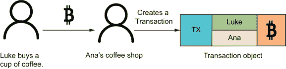
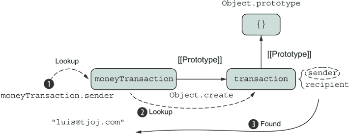
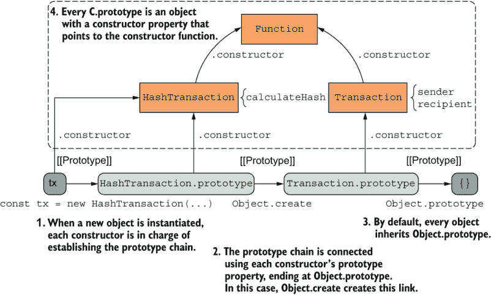
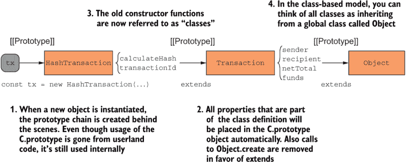

# 2 基于继承的对象建模

本章涵盖

+   原型继承、构造函数和类

+   JavaScript 的属性解析机制

+   “原型继承”的矛盾

+   JavaScript 中类的优缺点

“仅仅在前面加上‘原型’来区分 JavaScript 中实际上几乎相反的行为，却留下了近二十年的泥潭般的混乱。”

——凯尔·辛普森

除了几个原始类型外，JavaScript 中的所有内容都是对象。然而，对于我们日常处理的东西，对象仍然是语言中最令人畏惧、最难正确使用的一部分。我听到的最常见问题是“我应该如何编写原型链来关联 X、Y 和 Z？”你读过的每一篇文章或书籍都略有不同，而且出于某种原因，即使是经验丰富的开发者有时也需要通过搜索引擎重新学习这个过程。原因有两个：一方面，需要大量的样板代码，另一方面，我们对继承和原型这两个术语感到困惑。

继承是一种强大的代码复用模式，我们将在本书中利用它，但我们的原型理解不应该仅限于创建父子关系。继承只是原型众多应用之一（而且确实非常重要），但原型可以做得更多。由于 JavaScript 开发者中很大一部分来自面向类的语言，为了确保他们能够无缝过渡，ECMAScript 2015 决定将类作为语言的第一等公民。对类的支持演变成了一堆支持私有和静态属性的新功能。JavaScript 的历史再次被试图让它看起来像 Java 的尝试所玷污。所有这些语法并不是所有 JavaScript 纯粹主义者都欢迎的，因为它掩盖了 JavaScript 伟大对象系统的底层机制。

不管是好是坏，大量的领域建模已经转向使用类的一站式设置，而不是直接原型配置的不必要样板代码。然而，了解 JavaScript 的对象系统是如何工作的是非常重要的。在本章中，我们将讨论两种使用原型功能来建模继承关系的模式：构造函数和 ECMAScript 2015 类。这两种模式都通过 JavaScript 的内部原型引用和属性解析机制提供了共享数据和行为的优势。

让我们从回顾你很可能已经看过很多次的基于基本原型继承的配置开始。

## 2.1 回顾原型继承

JavaScript 从名为 Self 的语言中借用了原型。原型机制是 JavaScript 能够成为面向对象语言的重要组成部分；没有它，你将无法向复杂网络中更高层次的对象发送消息（即继承）。

在本节中，我们将回顾设置基本原型链所需的代码，并为学习 JavaScript 的属性解析机制打下基础，这是 JavaScript 访问对象的核心机制。

根据你的经验，你可能已经尝试过对象及其原型，所以我会直接进入一些代码。我们将首先查看的 API 是建立类似父子关系的

```
 Object.create(proto[,propertiesObject]);
```

此 API 创建了一个链接到原型的新对象，并可选择地附带一组新的属性定义。现在，我们将只关注第一个参数（`proto`），如下面的列表所示。

列表 2.1 使用`Object.create`从原型创建对象

```
const proto = { 
   sender: 'luis@tjoj.com',
};
const child = Object.create(proto);       ❶
child.recipient = 'luke@tjoj.com';

child.sender;     // 'luis@tjoj.com'
child.recipient;  // 'luke@tjoj.com'
```

❶ 使用`Object.create`根据父对象（proto）配置一个新的子对象。内部，子对象有一个引用指向父对象，以便访问其任何属性。另一种方法是调用`Object.setPrototypeOf(child, proto)` API。

使用此代码，可以从子对象访问父对象（`proto`）的任何属性。这里没有发生任何有趣的事情，让我们做一些更有意义的事情，并模拟我们的第一个区块链概念，一笔交易。

一笔交易代表了一定商品（如货币）从发送者到接收者的交换。在区块链世界中，交易看起来几乎与传统银行系统一模一样。首先，我们将把`sender`和`recipient`设置为简单的电子邮件地址，将`funds`设为一定数量的虚拟比特币作为我们的货币形式。在我们的例子中，Luke 使用他的数字钱包中的比特币从 Ana 的咖啡馆购买咖啡，如图 2.1 所示。



图 2.1 一笔交易对象捕捉了发送者（Luke）向接收者（Ana）发送比特币以购买咖啡的详细信息。

让我们开始构建这个例子。列表 2.2 使用`Object.create`在两个对象`moneyTransaction`和`transaction`之间建立原型配置，并添加了对`funds`的支持。在现实世界中，你会发现一些对这个设置的轻微变化，但总体思想始终相同。

列表 2.2 通过基本原型设置链接的交易对象

```
const transaction = {                                           ❶
   sender: 'luis@tjoj.com',
   recipient: 'luke@tjoj.com'
};

const moneyTransaction = Object.create(transaction);            ❷
moneyTransaction.funds = 0.0;
moneyTransaction.addFunds = function addFunds(funds = 0) {      ❸
  this.funds += Number(funds);
}

moneyTransaction.addFunds(10.0);
moneyTransaction.funds; // 10.0
```

❶ 从中派生其他对象的原型对象——一个普通对象，而不是某种抽象蓝图

❷ 从原型创建一个派生对象

❸ 向子对象添加新方法。在声明中重复函数名称有助于构建更丰富的堆栈跟踪。

让我们检查我们的假设在下一个列表中是否仍然有效。

列表 2.3 检查新的交易对象

```
Object.getPrototypeOf(moneyTransaction) === transaction; // true     ❶
moneyTransaction.sender;  // 'luis@tjoj.com'                         ❷
moneyTransaction.funds;   // 10       
```

❶ 检查原型链接是否已建立

❷ 验证从子对象中可以访问继承属性

让我们进一步解析列表 2.2。原型对象（`transaction`）实际上是一个任意的对象字面量，我们将用它来分组常见的属性。正如你所看到的，原型是可以在任何时间（甚至是在运行时）进行操作的对象，而不是在形成继承关联时凭空创建的。这个事实很重要，我们将在第 2.3 节讨论它为什么重要。

这是关于这段代码的另一种看法，使用了 `Object.create` 的第二个参数，它接收一个数据描述符的对象：

```
const moneyTransaction = Object.create(transaction, {
  funds: {    
    value: 0.0,
    enumerable: true, 
    writable: true,
    configurable: false    
  }
});
```

第二个参数让我们能够精细控制这个新创建的对象属性的行为：

+   可枚举的 —— 控制属性是否可以被枚举或查看（例如，当你将对象传递给 `console.log` 时，使用 `Object.keys` 枚举键），或者是否被 `Object.assign` 所看到（我们将在第三章中再次讨论这个话题）。

+   可配置的 —— 控制是否允许使用 `delete` 关键字删除对象的属性，或者是否可以重新配置字段的属性描述符。删除属性会改变对象的形状，并使你的代码更加不可预测，这就是为什么我更喜欢使用这个属性的默认值（`false`）或者从数据描述符中省略它。

+   可写的 —— 控制你是否可以重新分配这个字段的值，从而使其赋值不可变。

当你直接在对象上使用点符号创建属性，就像列表 2.2 中那样，这个行为等同于使用所有设置都设置为 `true` 的描述符定义一个属性。通常，大多数开发者不会去麻烦使用数据描述符，但当你编写供他人使用的库和框架时，它们可能会很有用，比如隐藏某些字段或使某些字段不可变。数据描述符有助于强制执行某些设计原则，并清楚地传达你的 API 的工作方式。我们将在第四章中回到不可变性和它为什么重要的这个问题。

正如你所看到的，`Object.create` 提供了一种简单、优雅的方式来从共享原型创建对象，并建立了适当的继承链接以解决属性查找。

### 2.1.1 属性解析过程

不讨论 JavaScript 的原型机制，不讨论其属性查找机制，这是在 JavaScript 中实现面向对象模式背后的最重要的概念。根据 ECMAScript 规范，一个称为 `[[Prototype]]` 的内部引用（在对象中通过 `__proto__` 属性访问）由 `Object.create` 配置，并将 `moneyTransaction` 与 `transaction` 链接起来，如图 2.2 所示。这就是我们能够正确解析 `moneyTransaction.sender` 为 `'luis@tjoj.com'` 的唯一原因，如图 2.2 所示。



图 2.2 内部引用`[[Prototype]]`以单向方式将一个对象（`moneyTransaction`）链接到另一个对象（`transaction`），最终结束于`Object.prototype`。

此图通过原型链指出了对象之间的关系，这指导 JavaScript 引擎通过特定的键来查找属性。我将更详细地解释这个过程。当请求成员字段时，JavaScript 引擎首先在调用对象中查找该属性。如果 JavaScript 在那里找不到该属性，它会在`[[Prototype]]`中查找。属性`sender`在`moneyTransaction`中未声明，但它仍然成功解析。为什么？在`moneyTransaction`中的任何属性访问或方法调用都会沿着原型链向上传递，继续到`transaction`，直到找到该属性并返回它。但如果找不到呢？查找过程将继续进行，最终终止在空对象字面量`{}`（也称为`Object.prototype`）。如果解析失败，值属性的运算结果是`undefined`，函数值属性的运算结果是`TypeError`。

在幕后，你可以将隐藏的`__proto__`属性视为允许你遍历链的桥梁。当我们使用原型来实现继承，这是最常见的场景时，我们说属性解析“向上”移动到继承链。

你不应该直接在你的应用程序中使用`__proto__`，因为它是为了让 JavaScript 引擎内部使用而设计的。假设在用户代码中暴露出来，它可能看起来是这样的：

```
const moneyTransaction = {
  __proto__: transaction,
  funds: 0.0,
  addFunds: function addFunds(funds = 0) {
    this.funds += Number(funds);
    return this;
  }
}
```

注意：`__proto__`的使用多年来一直是激烈争论的主题，并且目前正被弃用。它在 ECMAScript 2015 中被标准化为仅作为遗留功能，以便网络浏览器和其他 JavaScript 运行时能够保持兼容性。请不要直接使用它（尽管你可能会在书中看到用于教学目的的使用），因为它可能在一段时间后停止工作。如果你需要操作这个字段，推荐使用的 API 是`Object.getPrototypeOf`和`Object.setPrototypeOf`。你还可以直接在对象上调用`Object#isPrototypeOf`方法。

关于符号的使用，当从构造函数的原型中引用一个属性时，例如`Object.prototype.isPrototypeOf`，在这本书中，我们使用`#`符号代替：`Object#isPrototypeOf`。

图 2.2 看起来很简单，但处理长而复杂的对象图时可能会变得复杂。我不会深入探讨这些特定的用例，以保持讨论集中在对象构造技术上，但你可以在以下侧边栏中找到更多相关信息。

理解 JavaScript 对象的特性

在这本书中，我们将使用良好形成的简单对象层次结构，因此我们不会详细讨论原型链断裂或对象中的属性被覆盖时可能出错的事情。JavaScript 对象的内部和外部可能很容易占据整本书。事实上，Kyle Simpson 的一个令人惊叹的书系《你不知道的 JavaScript》（[`github.com/getify/You-Dont-Know-JS/tree/1st-ed`](https://github.com/getify/You-Dont-Know-JS/tree/1st-ed)）详细描述了这个例子。该系列深入探讨了操作对象链的细微差别，提供了许多关于行为委托（我们将在第三章学习）的好建议和最佳实践，并揭穿了对象创建和原型机制背后的神话。这个系列对我来说是一个巨大的灵感，并且极大地影响了今天我编写 JavaScript 的方式。它应该在每个 JavaScript 开发者的书架上。

现在我们已经回顾了 JavaScript 中的基本原型设置，让我们讨论为什么使用重载术语继承来描述 JavaScript 的面向对象模型在本质上是不准确的。

### 2.1.2 差分继承

差分继承，其中派生对象保留对其派生对象的引用，在原型语言中很常见。在 JavaScript 中，差分继承被称为 [[Prototype]]。相比之下，在基于类的继承中，派生对象从其自身类以及所有派生类复制所有状态和行为。关键的区别是复制与链接。

尽管这个术语听起来有点令人畏惧，但差分继承是一个简单的概念，指的是扩展行为如何将派生对象与其链接的通用父对象区分开来。如果你把 JavaScript 对象想象成一个动态的属性包，那么差异化意味着向另一个包添加属性并将两个包链接起来。正如你在图 2.2 中所看到的，因为原型解析机制从调用对象单向流向其链接的对象（等等），任何新派生的对象都旨在通过新行为与父对象区分开来。新行为包括添加新属性或甚至覆盖来自链接对象的现有属性（称为覆盖）。我在这本书中不涉及覆盖，但你可以在 [`mng.bz/OEmR`](http://mng.bz/OEmR) 上了解更多信息。

考虑另一种场景，其中我们将通用的 `transaction` 对象扩展以定义 `hashTransaction`。此对象通过添加一个用于计算其自身哈希值的函数（`calculateHash`）来与父对象区分开来。从高层次来看，哈希化是使用对象的状态生成一个唯一的字符串值，就像 `JSON.stringify` 所做的那样，但我们只需要针对值，而不是整个对象的结构。此哈希值在工业界有许多用途，例如从哈希表或字典中快速插入/检索，以及数据完整性检查。

在区块链的世界里，哈希通常用作`transactionId`，以唯一标识发生的一定交易。为了简单起见，我们将在下一个列表中从简单的（不安全的）哈希函数开始。

列表 2.4 使用基本的哈希计算创建`hashTransaction`

```
const hashTransaction = Object.create(transaction);

hashTransaction.calculateHash = function calculateHash() {      ❶
    const data = [this.sender, this.recipient].join('');        ❷
    let hash = 0, i = 0;
    while (i < data.length) {
      hash = ((hash << 5) - hash + data.charCodeAt(i++)) << 0;
    }
    return hash**2;                                             ❸
}

hashTransaction.calculateHash(); // 237572532174000400
```

❶ 添加一个计算自身哈希的方法

❷ 成为哈希算法输入的属性

❸ 使用指数运算符平方哈希值

采用另一种方法，你也可以使用`Object.setPrototypeOf`来区分子对象。假设你想要从`hashTransaction`扩展`moneyTransaction`。所有相同的机制都适用：

```
const moneyTransaction = Object.setPrototypeOf({}, hashTransaction);
moneyTransaction.funds = 0.0;
moneyTransaction.addFunds = function addFunds(funds = 0) { 
   this.funds += Number(funds); 
};
moneyTransaction.addFunds(10);
moneyTransaction.calculateHash(); // 237572532174000400
moneyTransaction.funds;     // 10
moneyTransaction.sender;    // 'luis@tjoj.com'
moneyTransaction.recipient; // 'luke@tjoj.com'
```

现在我们已经回顾了一些涉及简单对象字面量的例子，创建具有不同数据的新的交易就更有用了。第 2.2 节跳入使用构造函数。

## 2.2 构造函数

构造函数（也称为对象构造函数模式）多年来一直是 JavaScript 中构建对象的方法。尽管对象字面量提供了一种简洁的方式来定义单个对象，但当需要创建数百个形状相同的对象时，这种方法并不适用。在这种情况下，构造函数充当一个模板，用于初始化填充了不同数据的对象。你可能熟悉这个模式，但本节讨论了一些你可能之前未曾遇到的高级技术。

### 2.2.1 函数作为模板

使用函数而不是直接的对象字面量来构建对象可以让你的模型更好地进化，因为你对对象的构建有更多的控制。函数允许你向调用者导出一个外观，其中更改不一定需要传播到调用代码。对象初始化的细节，例如强制执行任何先决条件，都适当地隐藏在构造函数内部。

例如，以下代码片段从不透露关于`HashTransaction`形状的任何不必要的细节，或者可能在实例化过程中发生的任何操作。封装始终是一个好的选择：

```
const tx = new HashTransaction('luis@tjoj.com', 'luke@tjoj.com');
```

这个基本的设计决策使你的代码更不易破碎且更易于维护，因此在大多数情况下，使用函数来构建对象是首选的方法。

按照惯例，构造函数的名称首字母大写，以表示一种穷人的类。让我们从列表 2.4 中的用例开始，使用构造函数进行重构（列表 2.5）。这里有几个选择。将所有属性添加到这个新对象中，以便对象从另一个对象继承属性的最简单方法是；不需要依赖于原型链。因为你的对象是动态创建的（当函数被调用时），你需要将这些属性（装满袋子）打包到每个构造函数调用中的单个对象上下文（`this`）中。

列表 2.5 使用构造函数模式构建和链接对象

```
function Transaction(sender, recipient) {                            ❶
    this.sender = sender;
    this.recipient = recipient;
}

function HashTransaction(sender, recipient) {
    if (!new.target) {                                               ❷
        return new HashTransaction(sender, recipient);
    }
    Transaction.call(this, sender, recipient);                       ❸

    this.calculateHash = function calculateHash() {                  ❹
       //...
    }
}

const tx = new HashTransaction('luis@tjoj.com', 'luke@tjoj.com');    ❺
tx.calculateHash();  // 237572532174000400
tx.sender;           // 'luis@tjoj.com'
```

❶ 基础构造函数

❷ 检测子对象实例化时是否省略了新关键字，并修复调用。这一行帮助那些忘记写 `new` 的开发者。我将在第 2.2.2 节中回到这个话题。

❸ 调用父构造函数以将任何父成员属性初始化到当前对象上下文中

❹ 为创建的每个实例添加一个新的 calculateHash 方法

❺ 使用新关键字实例化新对象。新关键字是必需的，以便将新创建的对象作为 `this` 上下文传递。

通过使用函数，你可以轻松地实例化任意数量的 `HashTransaction` 对象，它们都包含在 `Transaction` 中定义的属性。需要注意的是，你需要使用 `new` 关键字调用函数，以确保上下文（`this`）被正确初始化。

这些对象不共享任何属性的引用。你直接在 `HashTransaction` 的上下文（`this` 变量）上定义了 `calculateHash`，例如，为 `HashTransaction` 的每个实例添加一个新的 `calculateHash` 属性。换句话说，如果你创建了两个实例，你会看到相同方法的两个副本：

```
const tx1 = new HashTransaction('luis@tjoj.com', 'luke@tjoj.com');
const tx2 = new HashTransaction('luis@tjoj.com', 'luke@tjoj.com');

tx1.calculateHash === tx2.calculateHash; // false
```

为了解决这个问题，你需要配置原型链接的设置方式，以便在创建新对象时。

### 2.2.2 通过构造函数和原型共享属性

使用构造函数的一个有趣方面是，对于每个构造函数 `F`，JavaScript 会自动创建对象 `F.prototype`：

```
HashTransaction.prototype; // HashTransaction {}
```

此对象被添加以促进代码共享和重用，尤其是在方法方面，其中不需要定义多个副本。因此，更优的方法是将 `calculateHash` 添加到 `HashTransaction` 的 `prototype` 中，使其在所有 `HashTransaction` 实例之间共享，例如：

```
HashTransaction.prototype.calculateHash = function calculateHash() {
   //...
}
```

通过这种轻微的变化，这两个属性指向相同的内存位置：

```
tx1.calculateHash === tx2.calculateHash; // true
```

同样适用于添加到 `Transaction.prototype` 的任何方法。假设你添加了一个名为 `displayTransaction` 的新方法，你希望所有对象都共享：

```
Transaction.prototype.displayTransaction = function displayTransaction() {
    return `Transaction from ${this.sender} to ${this.recipient}`;
} 
```

当代码设置好时，调用它会产生一个 `TypeError`，表示 JavaScript 引擎尝试解析该属性，但无法解析：

```
TypeError: tx.displayTransaction is not a function
```

这个错误是预期的，因为你没有配置原型链：

```
Transaction.prototype.isPrototypeOf(tx); // false
```

你可以轻松地解决这个问题。和之前一样，你可以使用 `Object.create`。下面的列表显示了完整的原型配置。

列表 2.6 使用构造函数模式配置原型链

```
function Transaction(sender, recipient) {  
    this.sender = sender;
    this.recipient = recipient;
}
Transaction.prototype.displayTransaction = function displayTransaction() {
    return `Transaction from ${this.sender} to ${this.recipient}`;
} 

function HashTransaction(sender, recipient) {
    if (!new.target) { 
        return new HashTransaction(sender, recipient);
    }
    Transaction.call(this, sender, recipient);      
}

HashTransaction.prototype.calculateHash = function calculateHash() { 
    const data = [this.sender, this.recipient].join(''); 
    let hash = 0, i = 0;
    while (i < data.length) {
      hash = ((hash << 5) - hash + data.charCodeAt(i++)) << 0;
    }
    return hash**2;
}

HashTransaction.prototype = Object.create(Transaction.prototype);    ❶
HashTransaction.prototype.constructor = HashTransaction;             ❷

const tx = new HashTransaction('luis@tjoj.com', 'luke@tjoj.com');
const tx2 = new HashTransaction('luis@tjoj.com', 'luke@tjoj.com');
Transaction.prototype.isPrototypeOf(tx); // true
tx.calculateHash === tx2.calculateHash;  // true
tx.displayTransaction === tx2.displayTransaction; // true
tx.__proto__.__proto__; 
// Transaction { displayTransaction: [Function: displayTransaction] }
```

❶ 为查找机制链接原型，以便在需要从 `Transaction.prototype` 解析属性时工作

❷ 修复或设置构造函数值。没有这一行，tx 将是一个 Transaction 对象或从 Transaction 构造而来。

从调用者的角度来看，无论你是将所有属性打包成一个单独的对象，还是使用原型解析，这两段代码的行为和调用方式都是完全相同的。在内部，内存中的对象布局是不同的，但是强大的、高效的 JavaScript 引擎将其抽象化。图 2.3 展示了列表 2.6 的内部工作原理。



图 2.3：根据列表 2.6 实例化 `tx`，以及所有原型链接和构造函数引用的完整图景。在 JavaScript 中，构造函数函数在用 `new` 关键字实例化时会自动获得 `prototype` 属性的引用。用 [[Prototype]] 标注的导航表示对象之间的内部 `__proto__` 链接。

虽然构造函数函数比传统的对象字面量更复杂、更强大，但使用这种模式的缺点是它会泄露 JavaScript 原型机制的大量内部结构，因为你需要处理原型配置的细节。如果你没有完美地写出所有内容，你就有可能出现奇怪和意外的行为。

`__proto__` 和 `prototype` 的区别

阅读示例代码，你已经遇到了对两个属性的引用：`__proto__` 和 `prototype`。正如我之前所说的，`__proto__` 是不被推荐的，但 `prototype` 不是。如果你想知道它们之间的区别，`__proto__` 是在查找链中用于解析方法的对象，而 `prototype` 是在用 `new` 创建对象时用于构建 `__proto__` 的对象。

如前所述，始终记得用 `new` 调用构造函数。许多开发者会忘记这一点。再次强调，使用 `new` 关键字与函数隐式地设置新创建的对象中 `this` 的指向。这项任务一直是个麻烦，因为忘记写它会改变结果对象的作用域，因此我们需要包含我之前突出显示的防御性代码：

```
if (!new.target) {
   return new HashTransaction(sender, recipient);
}
```

老手可能还记得，在 ECMAScript 2015 之前的工作区（workaround）是将以下列表中的控制代码插入到每个构造函数体中。

列表 2.7：在 ECMAScript 2015 之前检查正确构造函数调用的方法

```
if (!(this instanceof HashTransaction)) { 
     return new HashTransaction(sender, recipient);
}
```

让我们看看如果你没有这样做会发生什么。假设你没有写前面的控制代码，而是让它保持原样：

```
function HashTransaction(sender, recipient) {
   Transaction.call(this, sender, recipient);
}
```

然后你尝试创建一个新的实例：

```
const instance = HashTransaction('luis@tjoj.com', 'luke@tjoj.com');
```

哎呀！这段代码抛出了一个 `TypeError`，因为隐式的 `this` 上下文是 `undefined`。错误信息暗示了设置 `undefined` 的成员属性，但没有指出实际的用户错误：

```
TypeError: Cannot set property 'sender' of undefined
```

这里，开发者忘记在函数调用前写上 `new`：

```
const instance = new HashTransaction('luis@tjoj.com', 'luke@tjoj.com');
```

现在我们来看一个不同、更微妙的陷阱。假设我们想让事务也有一个描述性的名称：

```
function HashTransaction(name, sender, recipient) {
    Transaction.call(this, sender, recipient);
    this.name = name;
}

HashTransaction.prototype = Object.create(Transaction);
```

现在创建一个新的实例：

```
  const instance = new HashTransaction(
    'Coffee purchase', 
    'luis@tjoj.com', 
    'luke@tjoj.com'
  );
```

咔嚓！又发生了一个类型错误。这次，错误甚至更加隐晦，并且并非在所有 JavaScript 引擎中都会发生：

```
  TypeError: Cannot assign to read only property 'name' of object 
  '[object Object]'
```

你能找到问题吗？别担心，我会让你节省时间。问题是忘记正确链接原型。代码应该是这样的

```
HashTransaction.prototype = Object.create(Transaction.prototype);
```

再次，每次手动编写这段代码都是痛苦的，导致不同的行为，这些行为很容易逃出你的注意或任何你使用的 linting 工具。

减少样板代码

使用 Node.js 的`util`库，你可以减少一些样板代码，从而避免犯一些错误。而不是明确地编写原型增强语句

```
HashTransaction.prototype = Object.create(Transaction.prototype);
```

你可以使用`util.inherits`来完成同样的任务，避免你再次犯同样的错误：

```
require('util').inherits(HashTransaction, Transaction);
```

然而，如果你阅读文档，你会发现 Node.js 社区不鼓励这种做法，而是倾向于使用`class`和`extends`，表明使用原型调用`inherits`是“语义上不兼容的”。你不说！早些时候，我简要地提到了原型和类不兼容的事实。第 2.3 节将详细评估这个主题。

使用构造函数和`new`来创建新实例的想法，就是我们今天所知道的伪类模型。随着 ECMAScript 2015 的出现，这个模型已经被一个更熟悉、更精简的面向类模型所取代，同时也解决了所需的样板代码量。实际上，使用类时，在调用构造函数时忘记写`new`会生成一个清晰的错误，就像这个`Transaction`类的例子一样：

```
const tx = Transaction(...);

TypeError: Class constructor Transaction cannot be invoked without 'new'
```

第 2.3 节探讨了类的好处，以及伴随它们的一些新提议。

## 2.3 基于类的继承

在本节中，我们将继续讨论类和原型二分法。接下来，我们将探讨类的心理模型如何使表示继承层次结构更简单，以及提供清理和平滑构造函数复杂样板代码的语法优势。

我们被训练去认为，唯一的形式的面向对象是通过类，但这并不是事实。面向类并不等同于面向对象，JavaScript 在类出现之前就已经是一种面向对象的语言。

类的引入是为了解决一个特定的问题，即为了使基于继承的领域建模更容易，特别是对于来自像 Java、C#和 TypeScript 这样的面向类语言的开发者来说。所有原型引用的冗余和样板代码都必须被移除。理想情况下，TC39 应该以一种保持与 JavaScript 起源兼容的方式来做这件事，但社区强烈要求熟悉的类样式的结构。

在像 Java 这样的语言中，类是计算的基本单位。每个对象都从某个类派生，这个类提供了在实例化过程中填充数据并在内存中分配的模板。在这段时间里，一个类的所有成员属性，以及任何继承的属性，都会被复制到一个新对象中，并在构造时填充。

然而，如你在第 2.2 节所学，JavaScript 中的原型工作方式不同。原型是良好形成的、具体的对象，它们在声明时（对象字面量）或作为调用函数（构造函数）的副产品被创建，而不是通过涉及某些无生命的蓝图或模板的单独实例化过程。实际上，你可以在将其添加到任何继承链之前，像使用任何其他对象一样使用原型对象。

记住，区分 JavaScript 与像 Java 这样的语言的关键因素是 JavaScript 通过链接而不是复制从链中的更高层对象。在第三章中，我们将讨论高度依赖链接和委派的模式。

在类方面，继承是通过 `class` 和 `extends` 关键字配置的。尽管继承在语法上与直接原型引用大相径庭，但它是对构造函数（伪经典模型）的语法糖，实现了相同的功能。例如，将以下类

```
class Transaction {  
  constructor(sender, recipient, funds = 0.0) {
    this.sender = sender;
    this.recipient = recipient;
    this.funds = Number(funds);
  }
  displayTransaction() {
      return `Transaction from ${this.sender} to ${this.recipient}               
         for ${this.funds}`;
   }
}
```

相当于

```
function Transaction(sender, recipient, funds = 0.0) {      
    this.sender = sender;
    this.recipient = recipient;
    this.funds = Number(funds);
}

Transaction.prototype.displayTransaction = function displayTransaction() {
     return `Transaction from ${this.sender} to ${this.recipient} 
         for ${this.funds}`;
}
```

与基于类的语言相比，另一个巨大的不同之处在于 JavaScript 对象可以访问在子对象实例化之后声明的父级属性。从某些基对象继承的属性在所有子对象实例之间共享，因此对其的任何更改都会动态地影响到所有实例，这可能会导致不希望看到的、难以追踪的行为。这种强大而危险的机制导致了众所周知的原型污染问题。封装当然有帮助，这就是为什么在 2.2.1 节中讨论的将函数导出以构建你的对象比直接导出对象字面量本身要好得多。同样，导出类也有同样的好处。

让我们更具体地看看类的好处和坏处。为此，我们将再次重构 `Transaction`，这次使用类，并添加一些代码，以便在本书的其余部分中实现实际应用。如列表 2.8 所示，`funds` 现在是 `Transaction` 的一个属性，我们添加了对计算交易费用的支持，这是常见的银行任务。

为了说明类如何让你轻松设置原型链，让我们重构 `Transaction` 和 `HashTransaction`。我还会借此机会展示一些关于私有类字段（[`mng.bz/YqVB`](http://mng.bz/YqVB)）和静态字段（[`mng.bz/5jgB`](http://mng.bz/5jgB)）的新语法建议，你可能不太熟悉。

列表 2.8 使用类定义的 `Transaction` 和 `HashTransaction` 对象

```
class Transaction {
   sender = '';                                           ❶
   recipient = '';                                        ❶
   funds = 0.0;
   #feePercent = 0.6;                                     ❷

   constructor(sender, recipient, funds = 0.0) {
      this.sender = sender;
      this.recipient = recipient;
      this.funds = Number(funds);
   }

   displayTransaction() {
      return `Transaction from ${this.sender} to ${this.recipient}           
        for ${this.funds}`;
   }

   get netTotal() {
     return  Transaction.#precisionRound(this.funds * this.#feePercent, 2);
   }

   static #precisionRound(number, precision) {            ❷
      const factor = Math.pow(10, precision); 
      return Math.round(number * factor) / factor;
   }
}

class HashTransaction extends Transaction {               ❸
   transactionId;
   constructor(sender, recipient, funds = 0.0) {
      super(sender, recipient, funds);                    ❹
      this.transactionId = this.calculateHash();
   }        
   calculateHash() {
     const data = [
         this.sender,
         this.recipient,
         this.funds
       ].join('');
     let hash = 0, i = 0;
     while (i < data.length) {
         hash = ((hash << 5) - hash + data.charCodeAt(i++)) << 0;
     }
     return hash**2;
   }

   displayTransaction() {      
      return `${this.transactionId}: ${super.displayTransaction()}`;
   }
 }

const tx = new HashTransaction('luis@tjoj.com', 'luke@tjoj.com', 10);
tx.displayTransaction(); 

// Prints:
// 64284210552842720: Transaction from luis@tjoj.com to luke@tjoj.com for 10
```

❶ 声明此类公共字段并使用默认值。我建议使用默认值，因为它们有助于代码编辑器为你执行基本的类型提示。

❷ 使用静态私有字段和方法声明

❸ 原型设置被干净利落地隐藏在 `class` 和 `extends` 的使用背后。

❹ 使用关键字`super`来调用父构造函数。当你重写构造函数时，你必须记得在第一行调用带有必要参数的`super`构造函数。

从表面上看，列表 2.8 中进行的重构看起来干净、简洁、优雅。我大胆地稍微修饰了一下代码，添加了对需要封装的变量的私有访问，以及几个用于验证的私有静态函数。正如你所知，这些函数由所有实例共享，为我们提供了真正的私有访问控制。因此，从类外部查询私有字段会抛出`SyntaxError`：

```
tx.#feePercent; // SyntaxError
```

值得指出的是，使用带有哈希(`#`)修饰符的前缀的私有字段和私有方法功能。这个特性对于在类中实现适当的封装至关重要，你本可以使用模块和闭包与模块模式（如列表 2.9 所示）来实现这一点。（我将在第六章重新讨论这个模式。）同样，私有字段和特权方法通过利用类内部存在的闭包或词法作用域来模拟——这是幕后一个函数。

列表 2.9 使用模块模式实现的交易对象

```
const Transaction = (function() { 

   const feePercent = 0.6;                                   ❶

   function precisionRound(number, precision) {
      const factor = Math.pow(10, precision);
      return Math.round(number * factor) / factor;
   }

   return {                                                  ❷
      construct: function(sender, recipient, funds = 0.0) {
         this.sender = sender;
         this.recipient = recipient;
         this.funds = Number(funds);
         return this;
      },
      netTotal: function() {
         return precisionRound(this.funds * feePercent, 2);
      }
   } 
})();

const coffee = Transaction.construct('luke@tjoj.com', 'ana@tjoj.com', 2.5);
coffee.netTotal(); // 1.5
```

❶ 私有变量和/或特权函数

❷ 公共变量和/或函数

在类中，私有状态仅对类本身作用域内的方法可见——也称为特权。此外，如`static` `#precisionRound`这样的静态方法不会不必要地泄露给外部用户——这在常规构造函数或甚至模块模式中都是一件麻烦事。

回顾列表 2.8，你在代码片段中看到对`prototype`属性的引用了吗？没有！类有一个定义良好的结构，这使得它们非常适合抽象出平凡的原型细节，因此它们更不容易出错。此外，它们还提供了将数据和行为以连贯方式组合的语法优势。此外，`class`和`extends`实际上为我们提供了完美的甜点，使得第三方库如 Prototype 的`extend`、Lodash 的`_.extend`或甚至 Node 的`util.inherits`变得过时。图 2.4 展示了这个新的、简化的心智模型。



图 2.4 构建`HashTransaction`类及其祖先`Transaction`。`HashTransaction`的实例将继承父类中存在的所有公共字段。使用`class`和`extends`可以正确设置原型链，以便有效地进行属性查找，并且构造函数引用完美对齐。

这个图与图 2.3 有些相似，但为了达到相同的原型配置，大大减少了艺术品的数量。基本相似性是有意为之，因为类在 JavaScript 背后就像函数一样工作。然而，与图 2.3 最明显的区别是，类中的所有属性（字段和方法）都自动成为对象的原型的一部分，可以通过内部的`__proto__`对象访问。你没有像构造函数那样的选择。你牺牲了这种灵活性以换取更多的结构。

创建新实例看起来像之前的伪经典方法（因此得名），没有变化：

```
const tx = new HashTransaction(
   'luis@tjoj.com', 
   'luke@tjoj.com', 
   10
);
tx.transactionId; // 197994095955825630
```

从表面上看，这段代码看起来干净紧凑。与构造函数相比，类更易于处理，这是毫无疑问的。但重要的是要意识到，你只是在原型上添加了一个熟悉的界面，以便能够将继承视为面向类语言中已完成的那样。

本章介绍了两种对象构造模式：构造函数和类。两者都以继承为中心，无论哪种方式，你都需要明确配置子对象（或类）与父对象（或类）之间的关系。第三章采用不同的方法，提出了将思维模式从继承转移到行为委托和链接的模式。

## 摘要

+   JavaScript 提供了许多构建对象的选择，包括原型继承、构造函数和类。

+   原型继承这个短语是自相矛盾的，因为共享链接的原型对象的概念与类继承模型相矛盾，在类继承模型中，实例获得继承数据的副本。

+   构造函数一直是 JavaScript 中模仿类概念的标准机制。

+   类简化了原型配置的细节，对于新手或来自其他基于类语言的开发者来说，类已经成为 JavaScript 开发者的首选选择。

+   类语法可能会模糊你对 JavaScript 原型继承机制的理解。类是有用的，但请记住，JavaScript 与其他你可能见过或使用过的基于类的语言不同。
