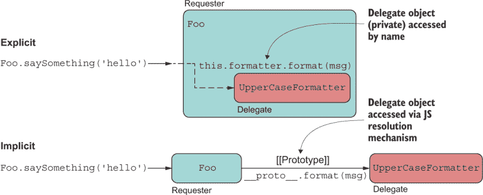
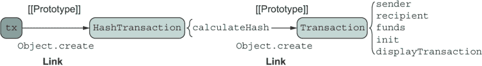
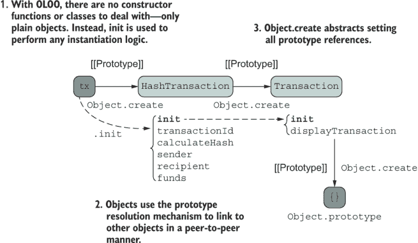
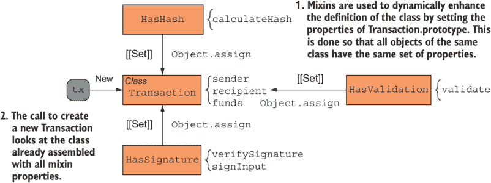
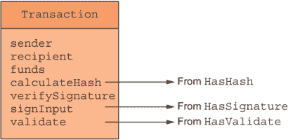
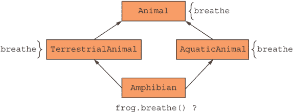
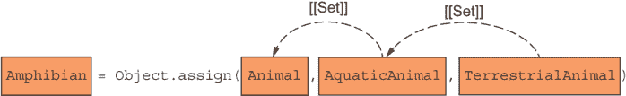
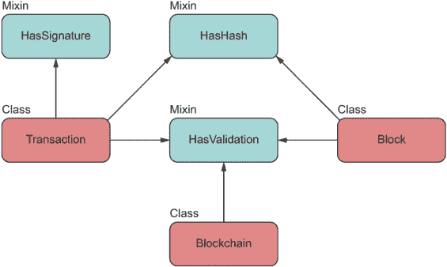
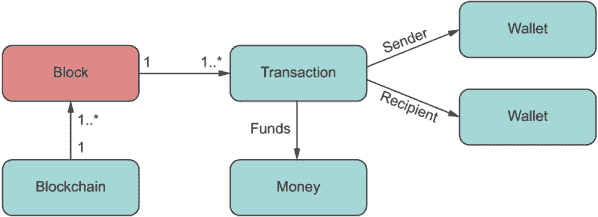

# 3 链接，组合对象模型

本章涵盖

+   理解与其他对象链接的对象（OLOO）的行为委托模式

+   通过组合类和混入（mixins）来实现动态扩展

+   使用`Object.assign`和扩展运算符来构建新对象

*类继承在 JavaScript 中很少（可能永远）是最好的方法。*

—埃里克·埃利奥特

在第二章中，我们探讨了创建原型链以模拟继承所需的一些基本结构，以及类如何简化这一过程。记住，使用继承的目的是为了提高复用性。现在我们将继续讨论组装你的对象，以实现相同级别的代码复用，但这种方式不需要你从继承的角度去思考。

第一种技术，由凯尔·辛普森发现，被称为与其他对象链接的对象（OLOO），它依赖于`Object.create`来创建构成你的领域模型的对象之间的关联。这种技术具有类的基本简洁性，同时正确地设置了原型链。这个模式很有趣，因为它允许你将领域模型视为一组对等对象，它们相互委托以完成工作。

第二种方法基于组合捕获一小组行为（称为混入）以创建一个更丰富的模型，正如埃里克·埃利奥特、道格拉斯·克罗克福德和其他 JavaScript 专家的作品中所充分展示的那样。在这种情况下，而不是从长原型链中获取属性，混入允许你将各种独立的行为和/或数据集成到一个单一的对象中。在 JavaScript 之外，这种技术的良好例子是一个 CSS 预处理器，如 Sass。你可以使用`@mixin`来分组重复的样式表信息并将其应用于许多规则集。在许多情况下，这种技术比`@extends`更受欢迎。

在本章中，我们将讨论对象之间的链接是显式（直接在代码中设置）还是隐式（通过 JavaScript 的运行时连接）。在深入研究本节中提到的模式之前，理解这些类型的链接非常重要。

## 3.1 对象链接类型

在 JavaScript 中，你可以以两种方式关联对象：隐式和显式。这两种类型的关联都允许一个对象向另一个对象发送消息（即委托），但它们的行为略有不同。图 3.1 展示了这种差异。



图 3.1 显式委托通过直接按名称知道的一个属性发生。隐式委托通过 JavaScript 的内部`__proto__`属性链式查找过程发生。

让我们从隐式（暗示）链接开始。

### 3.1.1  隐式

隐式链接只在内部已知——换句话说，在代码中不可见。在 JavaScript 中，通过使用 [[Prototype]] 内部引用来委托行为的对象链接可以被认为是隐式的，因为运行时会代表你使用它将消息发送到其他对象（在继承的情况下，向上链），作为属性解析的一部分，如下一个列表所示。

列表 3.1 `Foo` 和 `UpperCaseFormatter` 之间的隐式引用

```
const Foo = Object.create(UpperCaseFormatter);
Foo.saySomething = function saySomething(msg) {
  console.log(this.format(msg));                    ❶
}
Foo.saySomething('hello'); // Prints HELLO
```

❶ 格式通过原型链解析。

形成的关联是一种对象 A 通过“是”关系委托给 B 的关联，并且使用相同的对象上下文（`this`）来访问完整的行为集。在这个例子中，我们说 `Foo` “是” `UpperCaseFormatter`。

隐式链接或委托是原型语言中访问属性和行为的基本方法。这种方法被我们迄今为止讨论的所有对象构造模式（类和构造函数）所使用，也被 OLOO 和混入（我们将在 3.2 和 3.5 节中分别讨论）所使用。

### 3.1.2 显式

另一方面，当链接已知且在代码中明显设置时，对象会通过显式链接，可能通过公共或私有属性来实现。我在书中没有涵盖这种技术，但查看一个简单的示例进行比较是很重要的，如下一个列表所示。

列表 3.2 `Foo` 和 `UpperCaseFormatter` 之间的显式链接

```
const UpperCaseFormatter = {
  format: function(msg) {
    return msg.toUpperCase();
  } 
};

const Foo = {
  formatter: UpperCaseFormatter,          ❶
  saySomething: function print(msg) {
    console.log(this.formatter !== null 
        ? this.formatter.format(msg) 
        : msg
    );
  }
};

Foo.saySomething('hello'); // Prints HELLO
```

❶ 显式地将一个对象传递给另一个

再次，如果我们对这些关系进行标记，当关系是显式的，我们说某个对象 A 通过“使用”标签委托给 B，也称为对象组合。在这种情况下，`Foo` 使用 `UpperCaseFormatter` 来执行其工作，并且这两个对象有不同的生命周期。在这个配置中，检查 `this.formatter` `!==` `null` 是合理的。从视觉上看，你可以看到显式的关系，因为 `UpperCaseFormatter` 的属性是通过通过已知引用（`formatter`）代理访问的，这在代码中是显式类型化的。

在隐式链接的情况下，两个对象的生命周期交织在一起，因为 `UpperCaseFormatter` 的属性将通过 `this` 访问；运行时通过 `__proto__` 解析这些属性是理解的。

现在你已经理解了这种基本差异，让我们从使用隐式链接来实现行为委托的模式开始。

## 3.2 OLOO

OLOO 模式由凯尔·辛普森在他的书籍系列《你不知道的 JavaScript》（在第二章中提及）以及他有趣且详尽的视频系列“深入 JavaScript 基础”中提出（[`frontendmasters.com/courses/javascript-foundations`](https://frontendmasters.com/courses/javascript-foundations/)）。这个模式值得研究，因为它改变了我们看待对象之间父子关系可视化的思维方式。OLOO 对差分继承的看法与类的心智模型不同，因为它不认为子对象是从基对象派生出来的。相反，它认为对象是相互链接的同伴，通过传递消息来委托功能。所有与继承相关的术语都消失了，我们不再说一个对象继承自另一个对象；我们说它链接到另一个对象，这是一个更简单的模型，更容易理解。

此外，OLOO 保留了语言的良好部分，同时摒弃了欺骗性的基于类的设计和构造函数模式的复杂原型配置。OLOO 仍然使用 [[Prototype]]，但这个机制被巧妙地隐藏在 `Object.create` 之后，为设计对象提供了一个更简单的用户模型。如果你要查看 `Object.create` 的内部机制（[`mng.bz/zxnB`](http://mng.bz/zxnB)），你会看到构造函数模式的最小实现，如下一列表所示。

列表 3.3 `Object.create` 的内部机制

```
Object.create = function(proto, propertiesObject) {
    if (typeof proto !== 'object' && typeof proto !== 'function') {
       throw new TypeError('Object prototype may only be an Object: ' +
          proto);
    }

    function F() {}           ❶
    F.prototype = proto;      ❷
    return new F();           ❸
};
```

❶ 创建一个新的多余的构造函数，F

❷ 设置构造函数的原型

❸ 返回调用 new 关键字的新对象

既然我们知道 `Object.create` 为我们处理了样板代码，那么让我们充分利用它，并使用它来连接所有对象的链。我将从展示这个模式的一些组件的简单示例开始。在这个代码片段中，我们将开始玩转区块链数据结构的概念。区块链是一个存储连续元素的对象，称为块：

```
const MyStore = {
   init(element) { 
      this.length = 0;
      this.push(element);
   },
   push(b) {
      this[this.length] = b;
      return ++this.length;
   }
}

const Blockchain = Object.create(MyStore);

const chain = Object.create(Blockchain);
chain.init(createGenesisBlock);
chain.push(new Block(...));
chain.length; // 2
```

在这个例子中，我们首先将对象 `MyStore` 和 `Blockchain` 链接起来；然后我们将对象 `chain`（我们认为它是具有所有功能的实际实例对象）与 `Blockchain` 链接起来。在 `MyStore` 的定义中，`init` 初始化方法负责典型的对象构造器逻辑，设置新实例的属性。正如你从前面的代码片段中看到的，`chain` 正确地将其同伴的属性 `init`、`push` 和 `length` 委托出去。

OLOO（对象链接和对象初始化）的另一个有趣方面是，在调用`Object.create(Blockchain)`之后，所有的链接都在内存中创建。`Blockchain`通过原型链知道`init`和`push`，但对象尚未初始化，因为`init`尚未被调用。此时，对象的形状已经在内存中实例化，但实际的数据初始化发生在调用`init`时，这启动了整个过程，填充了链中的第一个区块，并将一个可用的对象返回给调用者。正如你所见，对象被正确地链接：

```
MyStore.isPrototypeOf(Blockchain); // true
chain.__proto__.init // [Function: init]
```

你可以将`init`视为具有类构造函数的一些职责。但与同时执行构建和初始化的类构造函数不同，OLOO 将这两个动作作为不同的步骤分开。将声明与使用分离，允许你定义并懒加载实际的物体表示（例如模板）作为一个一等对象，类似于传递类定义。然后，你可以在需要时仅用其完整的数据集初始化这个懒加载的最小对象。

这种模式类似于建造者模式（[`en.wikipedia.org/wiki/Builder_pattern`](https://en.wikipedia.org/wiki/Builder_pattern)），在面向对象设计中使用得很多。

但如果你希望流畅地内联调用这两个步骤，你可以通过从`init`方法返回`this`来实现：

```
const MyStore = {
   init(element) { 
      this.length = 0;
      this.push(element);
      return this;
   },
   //...
}

const Blockchain = Object.create(MyStore);

const chain = Object.create(Blockchain).init(createGenesisBlock);
chain.push(new Block(...));
chain.length; // 2
```

与构造函数和类相比，OLOO 在原型继承上的依赖性更加可控和隐蔽。当`MyStore.isPrototypeOf(Blockchain)`为`true`时，你无法意外地改变所有初始化对象的形状，从而保护你免受原型污染。实际上，`MyStore`和`Blockchain`根本不是构造函数，因此它们没有`prototype`属性来做这件事：

```
MyStore.prototype;    // undefined
Blockchain.prototype; // undefined
```

现在你已经在一个简单场景中看到了这个模式，让我们用这个同样的想法重构`Transaction`。接下来的列表显示了一个简单的 OLOO 实现；列表 3.5 显示了完整的实现。

列表 3.4 `HashTransaction`的简单对象链接

```
const Transaction = { 
  init(sender, recipient, funds = 0.0) {                   ❶
    this.sender = sender;
    this.recipient = recipient;
    this.funds = Number(funds);
    return this;                                           ❷
  },
  displayTransaction() {
    return `Transaction from ${this.sender} to ${this.recipient} for 
      ${this.funds}`;
  }
}

const HashTransaction = Object.create(Transaction);    

HashTransaction.calculateHash = function calculateHash() {
    const data = [this.sender, this.recipient, this.funds].join('');
    let hash = 0, i = 0;
    while (i < data.length) {
      hash = ((hash << 5) - hash + data.charCodeAt(i++)) << 0;
    }
    return hash**2; 
}

const tx = Object.create(HashTransaction)
    .init('luis@tjoj.com', 'luke@tjoj.com', 10);           ❸

tx.sender;      // 'luis@tjoj.com'
tx.recipient;   // 'luke@tjoj.com'
tx.calculateHash(); // 64284210552842720
tx.displayTransaction();                                   ❹
```

❶ `init`方法与类构造函数完全等价（仅是一种约定；你可以使用任何你喜欢的名称）。

❷ 由于对象是直接返回的，导致此对象的属性包含在专用对象内部

❸ 使用`Object.create`构建新对象，并将原型链接与对象初始化很好地分离

❹ 此方法通过原型链调用。

到目前为止，一切看起来都很直接。与我们添加的`MyStore`示例相比，我们只是为每个对象添加了更多一点的功能。图 3.2 显示了对象的结构以及它们之间的链接。



图 3.2 三种对象对之间的链接表面视图

图 3.2 显示，你可以建立对象之间的隐式链接，同时移除使用类和（在更大程度上）构造函数时可能需要编写的原型样板代码。下面的列表展示了完整的 `Transaction` 对象及其所有功能。

列表 3.5 使用行为委托（OLOO）建模 `Transaction`

```
const Transaction = {                                            ❶
   init(sender, recipient, funds = 0.0) {                        ❷
     const _feePercent = 0.6;                                    ❸

     this.sender = sender;
     this.recipient = recipient;
     this.funds = Number(funds);

     this.netTotal = function() {
       return _precisionRound(this.funds * _feePercent, 2);
     }

     function _precisionRound(number, precision) {               ❸
       const factor = Math.pow(10, precision);
       return Math.round(number * factor) / factor;
     }
     return this;                                                ❹
   },

   displayTransaction() {
     return `Transaction from ${this.sender} to ${this.recipient} 
       for ${this.funds}`;
   }
} 

const HashTransaction = Object.create(Transaction)               ❺

HashTransaction.init = function HashTransaction(                 ❻
   sender, recipient, funds
  ) {      
    Transaction.init.call(this, sender, recipient, funds);       ❼
    this.transactionId = this.calculateHash();
    return this;
}

HashTransaction.calculateHash = function calculateHash() {
    // same as before...
}
```

❶ 整个链基于简单对象，`Transaction` 位于层次结构的底部。

❷ 初始化函数类似于类构造函数。此外，使用函数关键字是故意的，以确立 this 的正确行为。

❸ 私有属性被很好地封装在对象的闭包中，只允许特权方法访问它们。

❹ 因为我是使用普通函数作为构造函数，所以没有隐含的 this，因此我们需要自己返回它。

❺ 正确使用 JavaScript 的 Object.create 可以创建使用 [[Prototype]] 的隐式委托链接。

❻ 初始化函数类似于类构造函数。此外，使用函数关键字是故意的，以确立 this 的正确行为。

❼ 等同于在子类构造函数中使用 super。

这段代码与列表 3.4 中的代码相同，但为 `HashTransaction` 添加了更多的初始化逻辑，以清楚地将初始化与实例化分开。图 3.3 显示了一个更完整的图。



图 3.3 实现了 OLOO 模式的完整实现，以实现 `HashTransaction`，链接到 `Transaction` 以委托基本功能

如图 3.3 所示，`init` 函数很好地封装了其词法作用域内的任何私有状态（类似于模块模式），并通过 `this` 仅暴露所需的内容。你可以利用这个机会定义任何作为对象构建一部分所需的私有函数，并且不会有任何内容泄露给调用者。此外，你还可以看到对象上下文（`this`）从上一个 `init` 块到下一个上游直到父对象的可视化管理。这不是为了创建原型链接（因为 `Object.create` 会为你做这个），而是为了初始化整个链直到基对象。

到目前为止，你已经学习了关于对象建模的技术，这些技术共享使用原型解析机制和隐式链接到其他对象的观念，无论这种委托是向上还是沿着链。但是所有这些技术都缺乏从多个对象共享行为的能力，因为原型建立了一个单一、单向的路径，其中属性是动态解析的。这些情况在软件中并不常见，但一旦发生，原型链就不足以正确地模拟它们。以一个从自然界中提取的简单例子来说明。两栖动物是具有水生和陆生特性的动物。如果你要绘制出`Amphibian`、`Aquatic`和`Terrestrial`对象，你如何以原型方式建模这种关系，使得`Amphibian`链接到`AquaticAnimal`和`TerrestrialAnimal`？可能是多重继承？

你根本不需要使用继承。让我们探索另一种依赖对象组合的软件构建模式。重要的是要说明，当我提到对象的组合时，我并不是指那个同名已知的面向对象模式。这个模式要简单得多。在这里，我指的是通过粘合小的单个部分或特性来组装一个丰富的对象的能力——在结构意义上的组合。JavaScript 的对象模型是独一无二的，它让我们能够执行这个任务，而要使用的 API 是`Object.assign`。第 3.3 节首先讨论了这个 API，然后展示了如何使用它来组合对象。你将在第 3.4 节中使用这个 API 来实现混入。

## 3.3 理解 Object.assign

软件发展迅速，需求变化剧烈。原型对象模型的问题在于，随着时间的推移，它们往往会变得过于僵化和脆弱，这使得在保证不会破坏其他东西的情况下，很难对模型进行大的改动。在层次结构中不当处理基类可能会导致在整个模型中产生连锁反应——这个问题被称为脆弱基类问题。你可以使用模式通过物理复制属性到派生对象来最小化这个问题。

状态复制而非状态共享并不是一个新概念。为什么不通过传递它们所需的所有属性的副本来构建对象呢？在 JavaScript 中，对象是属性的动态集合，这个过程很简单。JavaScript 允许你粘合各种属性（称为部分对象）的各个部分，以创建一个完整的、功能丰富的对象，就像将几个袋子的内容倒入一个更大的袋子中一样。这个过程不是通过链接到原型来完成的，而是通过整合或合并更简单、单个对象的副本。

除了实例化之外，从用户的角度来看，使用这种方式构建的对象与前面列出的方法感觉没有区别；表面上对象的形状是相同的。然而，从代码推理的角度来看，这个过程却是根本不同的。在接下来的几节中，我们将探讨支持此过程的 JavaScript API 以及一些幕后特性，这些特性使得这一切成为可能。

### 3.3.1 暴露 `Object.assign`

您可以使用 `Object.assign` 来合并各种对象的属性。在本节中，我们将深入讨论如何使用此 API。`Object.assign` 是您工具箱中的一个很好的瑞士军刀，它在几个用例中都很有用。假设您正在开发几个 API 响应的混合体，并希望将响应体作为单个 JSON 提供出来。另一个常见任务是通过对一个对象的新空对象 `{}` 分配属性来执行浅克隆。许多接受配置对象作为参数的库使用 `Object.assign` 来提供默认值。在下面的列表中，函数 `doSomething` 接收一个 `config` 对象，允许用户为此函数执行的假设逻辑指定设置。

列表 3.6 使用 `Object.assign` 实现具有默认值的选项

```
function doSomething(config = {}) {
  config = Object.assign(
    {
      foo: 'foo',
      bar: 'bar',        ❶
      baz: 'baz'
    }, config);

   console.log(`Using config ${config.foo}, ${config.bar}, ${config.bar}`);
}

doSomething();               // Prints Using config foo, bar, bar
doSomething({foo: 'hello'}); // Prints Using config hello, bar, bar
```

❶ 配置默认值

通过合并用户提供的对象和默认值，很容易获得所需的 `config.` `Object.assign` 将一个或多个对象拥有的可枚举属性（由 `Object#hasOwnProperty` 定义）复制到目标对象中，并返回目标对象。下面的列表展示了简单示例。

列表 3.7 使用 `Object.assign` 将两个对象合并到新对象中

```
const a = {
  a: 'a'            ❶
};
const b = {
  b: 'b'            ❶
};

Object.assign({}, a, b);  //{ a: 'a', b: 'b' }
```

❶ 这些属性是可枚举的，并且属于对象，因此它们会被复制。

在这种情况下，所有相关的对象都具有 `enumerable:` `true` 的属性，这意味着 `Object.assign` 将扫描并复制它们。

现在考虑一个不可枚举的属性，它将被跳过：

```
const a = {
  a: 'a'
};

const b = {};
Object.defineProperty(b, 'b', {
  value: 'b',
  enumerable: false
});

Object.assign({}, a, b);  //{ a: 'a' }
```

您可以通过迭代对象，使用 `for...in` 这样的结构来找到可枚举属性，这些属性具有 `enumerable:` `true`。您可以在定义点控制这个元属性以及另外三个（`writable`、`configurable` 和 `value`）。回想第二章，包含这四个属性的元对象被称为属性或数据描述符。

根据 `Object#hasOwnProperty`，自有属性指的是直接在源对象中找到的属性，而不是通过其原型可访问的属性。在下面的代码片段中，继承属性 `parent` 从未分配给目标对象：

```
const parent = {
  parent: 'parent'
};

const c = Object.create(parent);
c.c = 'c';

Object.assign({}, c);  // { c: 'c' }
```

现在考虑一个具有相同名称的属性，对象正在合并。在这种情况下，规则是列表中右侧的对象覆盖左侧对象的属性集。这里有一个简单的用例：

| `const a = {a: 'a'};const b = {b: 'b'};Object.assign({}, a, b);` | `const c = {a: 'ca', c: 'c'};Object.assign({}, a, b, c);` |
| --- | --- |

这条规则很重要，我将在 3.4.2 节中再次提到它。

在这一点上，你可能认为`Object.assign`只是从右到左直接复制属性。嗯，并不总是这样。定义和赋值之间有一个微妙的不同。

### 3.3.2 赋值与定义的区别

将值赋给现有属性并不定义属性的行为方式，就像`Object.defineProperty`所做的那样。赋值只有在为不存在的属性进行赋值时才会回退到定义属性。因此，对于新属性，JavaScript 使用规范中概述的[[DefineOwnProperty]]内部过程，而对于现有属性，它使用[[Set]]，这不会改变属性的元属性，就像我们第一个例子中的`doSomething`（见以下列表）所发生的那样。

列表 3.8 使用`Object.assign`为新和现有属性赋值

```
function doSomething(config = {}) {
  config = Object.assign(
    {
      foo: 'foo',
      bar: 'bar',           ❶
      baz: 'baz'
    }, config);

   console.log(`Using config ${config.foo}, ${config.bar}, ${config.bar}`);
}

doSomething({foo: 'hello'});
```

❶ 将`foo`设置为`'hello'`，而`bar`和`baz`是在`Object.assign`过程中新定义的。

大多数时候，这种区别没有影响，但有时会有。让我们通过另一个例子来探索这种区别：

```
const Transaction = { 
    sender: 'luis@tjoj.com' 
};
Object.assign(Transaction, { sender: 'luke@tjoj.com' }); 
```

前面的调用按预期工作，`sender`被设置为`'luke@tjoj.com'`。但如果`sender`不是一个字符串属性，而是一个 setter 方法呢？根据规范，`Object.assign`会对现有属性键调用[[Set]]元操作。考虑下一个列表中的场景。

列表 3.9 `Object.assign`在遇到相同属性名时调用[[Set]]

```
const Transaction = { 
   _sender: 'luis@tjoj.com', 

   get sender() { 
      return this._sender; 
   }, 
   set sender(newEmail) { 
      this._sender = Transaction.validateEmail(newEmail);
   } 
}; 

const EMAIL_REGEX = /^(([^<>()\[\]\\.,;:\s@"]+(\.[^<>()\[\]\\.,;:\s@"]+)*)|   ❶
(".+"))@((\[[0-9]{1,3}\.[0-9]{1,3}\.[0-9]{1,3}\.[0-9]{1,3}\])|(([a-zA-Z\-0-9] ❶
+\.)+[a-zA-Z]{2,}))$/;                                                        ❶

Transaction.validateEmail = function validateEmail(email) {
  if (EMAIL_REGEX.test(email.toLowerCase())) {
    return email;
  }
  throw new Error(`Invalid email ${email}`);
};

Object.assign(Transaction, { sender: 'invalid@email' }); // Error!            ❷
```

❶ 匹配有效电子邮件地址的正则表达式

❷ 使用无效电子邮件地址发送输入

在这里，`sender`被视为一个现有属性，并通过 JavaScript 的内部[[Set]]属性进行处理，当电子邮件地址格式错误时，setter 逻辑会执行并失败。

现在你已经了解了这个内置 API 的基本工作原理，让我们用它来支持我们最后的对象构造模式：混入。

## 3.4 使用混入组合组装对象

组合或组装对象的思路与之前看到的方法略有不同。使用原型，你链接到一个单一的对象以共享其状态和行为，但使用混入，你复制了多个独立切片对象的精细粒度部分，这些切片共同代表了对象的全部 API。本节教你如何使用`Object.assign`来实现一种称为混入的连接对象扩展技术。

将混入（mixins）想象成给你的冰淇淋添加风味或给你的三明治加配料；每一次新的添加都会给整体风味带来变化，但不会压倒它。在我们深入到`Transaction`的最终版本之前，让我们研究一个简单的用例。考虑以下这些简单的对象字面量：

```
const HasBread = {
  bread: 'Wheat',
  toasted: true 
};

const HasToppings = {
  sauce: 'Ranch'
};

const HasTomatoes = {
  tomatoe: 'Cherry',
  cut: 'diced' 
};

const HasMeat = {
  meat: 'Chicken',
  term: 'Grilled'
};
```

我们的 `Sandwich` 对象可以通过连接以下任何部分或全部来创建：

```
const Sandwich = (size = '6', unit = 'in') => 
   Object.assign({
    size, unit
  }, 
  HasBread,
  HasToppings,
  HasTomatoes, 
  HasMeat
);

const footLong = Sandwich(1, 'ft');
footLong.tomatoe; // 'Cherry'
```

更简洁地说，您可以利用扩展运算符：

```
const Sandwich = (size = '6', unit = 'in') => ({
  size, unit,
  ...HasBread,
  ...HasToppings,
  ...HasTomatoes, 
  ...HasMeat
});
```

类似于 `HasBread` 的混入对象本身并不提供太多价值，但它可以用来增强某些目标对象——在这个例子中是 `Sandwich`。简要回顾一下 OLOO 模式，你可能在派生对象构造函数执行期间添加父对象的属性（方法和数据）时瞥见了它。这个过程在链接对象图的每一层都会重复。实际上，为了简化使用 `Object.assign` 作为定义对象关系手段的过渡，可以考虑对 OLOO 示例进行轻微的调整，将对象链接步骤（`const HashTransaction = Object.create(Transaction)`）和在此新对象上定义新属性结合起来，如下所示。

列表 3.10 使用 `Object.assign` 实现的 OLOO

```
const Transaction = { 
  init(sender, recipient, funds = 0.0) {    
    this.sender = sender;
    this.recipient = recipient;
    this.funds = Number(funds);
    return this;
  },
  displayTransaction() {
    return `Transaction from ${this.sender} to ${this.recipient} for   
       ${this.funds}`;
  }
}

const HashTransaction = Object.assign(       ❶
  Object.create(Transaction),
  {
      calculateHash() {
        const data = [this.sender, this.recipient, this.funds].join('');
        let hash = 0, i = 0;
        while (i < data.length) {
          hash = ((hash << 5) - hash + data.charCodeAt(i++)) << 0;
        }
        return hash**2; 
    }
  }
);
```

❶ 通过使用 Object.assign 分配定义 HashTransaction 的属性

混入是一个具有简单行为的对象，通常由一个或两个方法组成。在这种情况下，有一个方法，`calculateHash`，我们将在 3.5.1 节中将其重构为其自己的对象。混入越简单，就越容易在代码的许多部分中组合和重用。混入应该具有狭窄的焦点，远小于类。它们可以捕获单一责任或甚至是一部分责任。只要混入是自维持的并且拥有执行其任务所需的一切，看起来不完整是可以接受的。

注意：本书仅对混入模式进行了表面讨论。有关混入模式的更多信息，请参阅埃里克·埃利奥特（Eric Elliot）的《Composing Software》（[`leanpub.com/composingsoftware`](https://leanpub.com/composingsoftware)）。

对象组合促进创建对象之间的 HAS-A 或 USES-A 而不是 IS-A 关系。因此，您不是隐式地将对象委派给其父对象，而是绕过继承，直接将所有需要的属性复制到目标对象。您可以想象这个过程类似于将继承层次结构压缩成单个对象字面量。由于您是在对象定义之后添加新属性，这个过程被称为动态或连接性对象扩展。

混入可能听起来有些复杂，但这种模式已经被广泛使用了一段时间。我提到了它在 CSS 预处理器中的使用，但 JavaScript 本身也有其他用途。在浏览器中，由全局`window`对象灌输的行为部分是通过`WindowOrWorkerGlobalScope`混入实现的。同样，浏览器事件是通过`WindowEventHandlers`混入处理的。这些混入用于在浏览器中使用的全局对象（`window`）以及 Web Worker API（`self`）之间分组一组常见的属性。当然，浏览器为您预先混合了这些代码，因此您不必这样做，但考虑一个更明显的例子。如果您曾经使用过流行的 Mocha 和 Chai 单元测试库，您可能知道您可以通过动态注入新行为来扩展它们的功能，使用

```
chai.use(function (_chai, utils) { 
   // ... 
});
```

方法名（`use`）是合适的。许多其他第三方库已经利用了这一特性。例如，为了简化使用承诺的测试，你可以通过 chai-as-promised ([`www.npmjs.com/package/chai-as-promised`](https://www.npmjs.com/package/chai-as-promised))库扩展 Chai：

```
chai.use(chaiAsPromised);
```

动态连接体现了组合原则：将简单的对象组合成复杂的对象，这正是我们在这里所实现的。

回到`Transaction`，我们将使用第二章开始定义的类作为其核心结构，并通过混入来借用共享的代码模块。你首先会注意到`calculateHash`的定义不再属于类声明的一部分；它被移动到了一个名为`HasHash`的对象中。将`calculateHash`分离成独立的模块将使得为我们的领域中的其他类（如`Block`和`Blockchain`）添加哈希行为变得更加容易。正如列表 3.11 所示，通过一个函数，我们可以根据需要使用参数来配置哈希行为，例如指定作为哈希过程一部分的对象字段。

注意：对于这些混入（mixins），因为我们返回一个新的对象，我们将使用箭头函数来节省一些打字。常规函数声明同样可以很好地工作。

列表 3.11 定义`HasHash`混入

```
const HasHash = keys => ({
  calculateHash() {
    const data = keys.map(f => this[f]).join('');      ❶
    let hash = 0, i = 0;
    while (i < data.length) {
      hash = ((hash << 5) - hash + data.charCodeAt(i++)) << 0;
    }
    return hash**2;   
  }
});
```

❶ 从指定的属性键值创建一个字符串

`HasHash`是一个由函数表达式包裹的混入，因此混入部分是这个对象字面量：

```
{
  calculateHash() {
    const data = keys.map(f => this[f]).join('');
    let hash = 0, i = 0;
    while (i < data.length) {
      hash = ((hash << 5) - hash + data.charCodeAt(i++)) << 0;
    }
    return hash**2;   
  }
});
```

为了完整性，如果我们替换 OLOO 示例（列表 3.10）中的这段代码，我们将在下一个列表中看到结果。

列表 3.12 使用`HasHash`混入的`Transaction`的 OLOO 模式

```
const Transaction = { 
  init(sender, recipient, funds = 0.0) { 
    this.sender = sender;
    this.recipient = recipient;
    this.funds = Number(funds);
    return this; 
  },
  displayTransaction() {
    return `Transaction from ${this.sender} to ${this.recipient} 
       for ${this.funds}`;
  }
}

const HashTransaction = Object.assign(
  Object.create(Transaction),
  HasHash(['sender', 'recipient', 'funds'])     ❶
);
```

❶ 复制由调用`HasHash`返回的混入的属性。通过使用函数，可以简单地指定混入可以访问的对象状态中的哪些属性作为计算对象哈希值的一部分。

列表 3.13 显示了 `Transaction` 的最终版本（类 + 混合）。此代码将所有混合集成到类原型引用中，以便 `Transaction` 的所有实例都可以使用相同的哈希功能。所有混合的 `Object.assign` 调用都在最后进行。

列表 3.13 使用混合连接的 `Transaction` 对象

```
class Transaction {
   transactionId = '';                                         ❶
   timestamp = Date.now();
   #feePercent = 0.6;

  constructor(sender, recipient, funds = 0.0, description = 'Generic') {
    this.sender = sender;        
    this.recipient = recipient;  
    this.funds = Number(funds);
    this.description = description;
    this.transactionId = this.calculateHash();
  }

  displayTransaction() {
    return `Transaction ${this.description} from ${this.sender} to 
       ${this.recipient} for ${this.funds}`;
  }

  get netTotal() {
     return  Transaction.#precisionRound(
        this.funds * this.#feePercent, 2);
  }

  static #precisionRound(number, precision) {
     const factor = Math.pow(10, precision);
     return Math.round(number * factor) / factor;
  }
}

Object.assign(                                                ❷
   Transaction.prototype,
   HasHash(['timestamp', 'sender', 'recipient', 'funds']),
   HasSignature(['sender', 'recipient', 'funds']),            ❸
   HasValidation()                                            ❹
)
```

❶ 通过调用 calculateHash 在构造函数中设置 transactionId，动态分配给此实例的原型，并可供所有实例使用。

❷ 使用 Object.assign 将构成事务的对象粘合在一起（或包含）

❸ HasSignature 混合处理签名生成和验证。

❹ HasValidation 为任何对象（将在第五章讨论）分组常见的验证任务。

注意：使用类（如 `Transaction`）作为动态混合扩展的目标对象是在你的编码中最可能遇到的情况，因为类的流行。但你可以使用混合与之前讨论的任何构造模式一起使用。

你可能会在像 PHP 这样的编程语言中找到这种模式，也称为特性（[`www.php.net/manual/en/language.oop5.traits.php`](https://www.php.net/manual/en/language.oop5.traits.php)）。当你使用类时，所有属性都添加到类的原型引用中。因此，我们使用 `Object.assign` 动态扩展类的原型，以避免每次需要新的交易时都要重复分配混合的逻辑。

此外，从内存效率的角度来看，增强原型对象导致所有事务对象都具有相同的属性集。实例化新的 `Transaction` 看起来与第二章相同：

```
const tx = new Transaction('luis@tjoj.com', 'luke@tjoj.com', 10);
tx.transactionId; // 241936169696765470
```

重要的是要注意，尽管这个版本的 `Transaction` 与之前的版本不同，但它通过以下方式保留了最佳部分：

+   使用类方便的语法来优雅地分组和封装所有相关的交易细节。

+   从其他混合中集成可重用部分以实现最大程度的代码重用。

+   将对象定义（如 `Transaction` 类）和混合配置从实例化中分离，类似于 OLOO。

+   通过跳过不可枚举和非所有者属性（因为它使用 `Object.assign`）仅集成混合对象的直接、公共接口。

+   允许混合封装它们自己的隐藏属性和方法，这些属性和方法只能通过其公共 API 使用，但不成为整体对象的一部分，并且无法从类中访问。反之亦然：混合没有访问类内部声明的任何私有（`#`）属性。只有它们的公共接口进行通信，这防止了更紧密的耦合形式。我将在 3.5.1 节中回到这个话题。

+   避免深层和繁琐的原型配置，使对象更扁平，因此更易于使用和与其他代码部分结合。

现在你已经知道了混合如何集成到更大的对象中，让我们评估混合的结构。

### 3.4.1 混合体的解剖结构

在本节中，我们将讨论在我们区块链应用中使用的混合体的形状。`Transaction`使用了两个重要的扩展，实现了支撑区块链技术的两个主要加密概念：哈希（`HasHash`）和数字签名（`HasSignature`）。我们当前的`HasHash`版本仍然不产生加密安全的哈希。我们需要改进这个算法，但我们将逻辑的细节留到第四章，现在只关注其形状。当我们有了公共接口和连接的调用，替换算法就变得简单了。

列表 3.14 和 3.15 显示了`HasHash`和`HasSignature`的更新结构。

列表 3.14 `HasHash`混合体

```
const DEFAULT_ALGO_SHA256 = 'SHA256';      ❶
const DEFAULT_ENCODING_HEX = 'hex';        ❶

const HasHash = (
  keys,
  options = { algorithm: DEFAULT_ALGO_SHA256, 
              encoding:  DEFAULT_ENCODING_HEX }
) => ({
  calculateHash () {
    //...   
  }
})
```

❶ 传递给配置哈希过程的默认选项。在这里，我们使用 SHA256 算法和十六进制编码。

因为`HasHash`接受一个表示参与计算哈希的属性的键列表，它可以与任何目标对象一起工作。以下是一个例子：

```
const hashable = Object.assign(
   { foo: 'foo', bar: 'bar' }, 
   HasHash(['foo', 'bar'])
);

hashable.calculateHash();  // '1610053822743955500'
```

回到封装，假设混合体是其自己的模块（第六章），任何在混合体函数作用域之外的数据（如`DEFAULT_ALGO_SHA256`）实际上是私有的和自包含的，因为它是混合体函数闭包的一部分。

与此类似的结构，下一个列表包含了`HasSignature`的骨架。这个混合体包含更多的行为。

列表 3.15 `HasSignature`混合体

```
const DEFAULT_ENCODING_HEX = 'hex';
const DEFAULT_SIGN_ALGO = 'RSA-SHA256';

const HasSignature = (
  keys,
  options = {
    algorithm: DEFAULT_SIGN_ALGO,
    encoding: DEFAULT_ENCODING_HEX
  }
) => ({

  generateSignature(privateKey) {
    //...

  },
  verifySignature(publicKey, signature) {
    //...
  }
});
```

这些方法的主体处理使用 Node.js 的`crypto`模块对对象的内含内容进行签名，以及读取和验证公私钥对，这些内容我们在这本书中不涉及。你可以自由地访问代码库以了解内部细节。不过，请记住，在现实世界的开放分布式账本中，公钥是识别用户钱包对其他世界的方式。从调用者的角度来看，下一个列表显示了如何使用`HasSignature`。

列表 3.16 使用`HasSignature`对对象的内含内容进行签名

```
const signable = Object.assign(
   { foo: 'foo', bar: 'bar' }, 
   HasSignature(['foo', 'bar'])
);
const publicKey = fs.readFileSync('test-public.pem', 'utf8');
const privateKey = fs.readFileSync('test-private.pem', 'utf8');

const signature = signable.generateSignature(privateKey);        ❶

signable.verifySignature(publicKey, signature); // true          ❷
```

❶ 使用私钥对对象的数据进行签名

❷ 你可以使用相应的公钥来验证签名的正确性。

你已经看到了`HasHash`和`HasSignature`的例子。我在第五章中介绍了`HasValidation`（另一个混合体）及其内部逻辑。请注意，我命名这些混合体的目的是清楚地表明正在发生组合，明确地建立了与目标对象的 HAS-A 关系，如图 3.4 所示。



图 3.4 当使用组合时，构建对象的方式是通过粘合其他独立对象：`HasHash`、`HasSignature`和`HasValidation`。每个对象的属性被混合成一个单一来源，从用户的角度来看，形成一个单一对象。

图 3.4 展示了对象组合的理论或概念视图。实际上讲，在目标对象形成后，`Transaction`类对调用者看起来就像图 3.5。



图 3.5 对象赋值后的`Transaction`形状

可能看起来，通过混入的组合，我们可以获得类似于多重继承的东西——这是一个有争议的软件话题。如果你对这个话题做过一些研究，你可能会遇到“死亡钻石”问题。这个问题指的是当一个类扩展多个类，每个类都声明了相同的方法时存在的歧义。像 Scala 这样的语言，通过使用称为线性化的技术来克服这个问题。在 3.4.2 节中，我们将看到 JavaScript 是如何解决这个问题。

### 3.4.2 多重继承与线性化

通常来说，与传统的继承方案相比，混入（mixins）有两个主要优点：

+   混入通过允许开发者从几个独立的对象中自由地重用方法集，而不是从一个对象中，从而减少了单继承的一些限制。

+   `Object.assign`使用的算法消除了多重继承引起的歧义，并使这个过程变得可预测。

第一点是直接由原型链机制产生的结果，因为一个对象与其原型之间是一对一对应的关系。连接（concatenation）克服了这种限制，因为你可以自由地将所需数量的对象组合成一个单一的对象。

第二点更为复杂。混入如何解决臭名昭著的钻石问题？这个问题的前提是容易理解的：一个子类 C 从两个父类 B1 和 B2 扩展，而这两个类又依次从基类 A 扩展。这个问题在面向类的语言中更为常见，这些语言将父类的关系标记为 IS-A。从这个角度来看，一个类如何成为两种不同事物的模板？再次考虑动物分类学示例（图 3.6）。在底层，你可能有一个类`Animal`，以及子类`TerrestrialAnimal`和`AquaticAnimal`。



图 3.6 多重继承的经典钻石问题。假设一个类可能从多个其他类扩展，而这些类具有冲突的方法签名，那么在运行时将调用哪个方法？

首先，让我们来点生物学知识：两栖动物，如青蛙、蟾蜍和蝾螈，最初是幼虫，有鳃来在水下呼吸，后来成熟为成体，拥有肺来呼吸空气。有些两栖动物甚至依赖它们的皮肤作为次要的呼吸方式。一个类`Amphibian`从这两个类中扩展出来是很有道理的。但当调用`frog.breathe`时，它将选择哪个实现？在软件中，我们不能把答案留给大自然。

如你所预期，我们可以使用混入来模拟这种类型的对象：

```
const TerrestrialAnimal = {   
   walk() {
      ...
   },
   breathe() {
     return 'Using my lungs to breathe';
   }
};

const AquaticAnimal = {
   swim() {
      ...
   },
   breathe() {
     return 'Using my gills to breathe';
   }
};

const Amphibian = name => Object.assign(
   { 
     name 
   }, 
   AquaticAnimal, 
   TerrestrialAnimal
);

const frog = Amphibian('Frog');

frog.walk();

frog.swim();
```

回到原始问题，如果青蛙调用`breathe`，它使用的是哪种实现？看起来我们进入了一个菱形情况。但是`Object.assign`的规则消除了这种歧义，因为它是可预测的：总是优先选择最后添加的对象的属性。你可以通过将死亡菱形折叠成一条直线（因此，线性化）来想象这种情况，按照有序的顺序。线性化菱形问题看起来就像图 3.7。


图 3.7 将线性化应用于多重继承情况

`Object.assign`的实现方式允许发生相同的行为。在幕后，实现方式就像图 3.8。



图 3.8 使用`Object.assign`的机制，该机制负责建立源对象分配给目标对象的可预测顺序，可以实现多重继承。

现在如果你在`frog`对象上调用`breathe`，你总是得到预期的结果，选择`TerrestrialAnimal`作为实现：

```
frog.breathe(); // 'Using my lungs to breathe'
```

### 3.4.3 使用 Object.assign 和扩展运算符组合对象

这种方式合并对象如此常见，以至于自 ECMAScript 2018 以来，我们可以进一步简化这项技术。我们不必直接使用`Object.assign` API，我们有语言支持来完成类似的事情，使用扩展运算符对对象进行操作。这个运算符提供了一个紧凑、惯用的语法，以不可变的方式复制对象的状态。

在 3.3 节中，我简要提到了一些`Object.assign`有用的例子。扩展运算符在这些情况下也同等有效。考虑对某个对象`obj`执行浅克隆的例子：

```
const clone = { ...obj };
```

这个例子与

```
const toad = Object.assign({}, obj);
```

我们可以使用扩展运算符来创建对象模板：

```
const toad = { ...frog, name: 'Toad' };
```

在一行中，我们复制了`frog`的所有自有属性，并覆盖了名称属性，从而得到一个新的对象，称为`toad`。从实际的角度来看，`Object.assign`和扩展运算符有类似的使用，唯一的例外是扩展运算符产生一个新的对象，而不是分配给现有的对象。在大多数情况下，这个例外并不重要，但如果我们选择使用扩展运算符与`Transaction`类一起直接增强`prototype`，代码会因错误而失败。所以

```
Transaction.prototype = {
  ...HasHash(['timestamp', 'sender', 'recipient', 'funds']),
  ...HasSignature(['sender', 'recipient', 'funds']),
  ...HasValidation()
}
```

在严格模式下会抛出错误：

```
TypeError: Cannot assign to read only property 'prototype' of function 'class Transaction... 
```

虽然这两种模式都允许你通过组合其他对象来创建对象，但这种细微的差别足以让我们在我们的应用程序中继续使用`Object.assign`。在 3.5 节中，我们使用这种模式来完成我们的领域模型的主要类。

## 3.5 将共享混合应用到多个对象

现在你已经很好地理解了动态对象连接，为了看到代码重用的好处，我们将将其应用于应用程序的其他部分。在本节中，你将看到我们迄今为止创建的混合如何应用于不仅仅是`Transaction`。为了在领域层保持一致性，并且因为你更有可能遇到类，我将使用类来建模`Blockchain`、`Block`和`Wallet`的概念。在列表 3.12 中，我展示了如何使用混合与 OLOO。这两种模式都使用隐式链接，所以你应该能够不费吹灰之力将此代码移植到 OLOO 风格。

首先，让我们在下一个列表中定义具有相似结构的`Blockchain`类。

列表 3.17 使用混合的`Blockchain`定义

```
class Blockchain {

  #blocks = new Map();

  constructor(genesis = createGenesisBlock()) { 
     this.#blocks.set(genesis.hash, genesis);
  }

  height() {
     return this.#blocks.size;
  }

  lookup(hash) {
    const h = hash;
    if (this.#blocks.has(h)) {
      return this.#blocks.get(h);
    }
    throw new Error(`Block with hash ${h} not found!`);
  }

  push(newBlock) {     
     this.#blocks.set(newBlock.hash, newBlock);
     return newBlock;
     }  
}

function createGenesisBlock(previousHash = '0'.repeat(64)) {
  //...
}

Object.assign(Blockchain.prototype, HasValidation());       ❶
```

❶ 与`Transaction`一样，扩展了区块链的验证功能。（验证逻辑的完整实现将在第五章中介绍。）

区块链存储区块，而区块又存储交易。列表 3.17 显示了`Block`的基本类声明，我们将随着进展逐步填充它。这个类最重要的任务是使用其前一个哈希来管理交易集合和哈希计算。使区块链篡改可检测的是，每个区块的哈希都依赖于所有前一个区块的哈希，从创世区块开始。所以如果区块被篡改，你只需要重新计算其哈希，并与原始哈希比较以检测不当行为。下一个列表显示了`Block`如何也混合了`HasHash`。

列表 3.18 `Block`定义

```
class Block {
  #blockchain;

  constructor(index, previousHash, data = []) {
    this.index = index;
    this.data = data;                                           ❶
    this.previousHash = previousHash;                           ❷
    this.timestamp = Date.now();
    this.hash = this.calculateHash();                           ❷
  }

  set blockchain(b) { 
    this.#blockchain = b;
    return this;
  }

  isGenesis() {
    return this.previousHash === '0'.repeat(64);
  }
}

Object.assign(
   Block.prototype,
   HasHash(['index', 'timestamp', 'previousHash', 'data']),     ❸
   HasValidation() 
);
```

❶ 一个区块的数据字段可以包含在挖掘新区块或挖掘后添加到链中的交易。

❷ 每个区块总是包含其前一个区块的哈希（这建立了链）。

❸ `HasHash`扩展了`Block`的哈希功能。

到目前为止，我们已经构建了应用程序领域层的大部分骨架。随着你继续阅读，你将了解更多关于 JavaScript 和编写区块链编程的知识，我们将继续添加此代码的更详细细节。作为额外参考，图 3.9 显示了迄今为止我们创建的对象和共享的混合。



图 3.9 展示了主要对象及其各自的混合。如您所见，混合结构旨在共享。

此外，为了使区块链教学更简单，我尝试通过使用电子邮件地址来识别交易的发送者和接收者，从而避免了一些密码学主题。在现实世界中，电子邮件对于公共账本来说过于个人化，在公共账本中，用户信息始终需要保持安全。交易以密码学安全的公钥形式存储`sender`和`receiver`地址。当您访问 GitHub 上的区块链应用程序源代码时，您会看到使用密钥而不是电子邮件。此信息标识了每个用户的数字`钱包`，如下所示。将`钱包`想象成您的个人银行移动应用程序。

列表 3.19 `Wallet`对象

```
class Wallet {
  constructor(publicKey, privateKey) {
    this.publicKey = publicKey
    this.privateKey = privateKey
  }
  get address() {
    return this.publicKey
  }
  balance(ledger) {
    //...              ❶
  }
}
```

❶ 详细内容推迟到第四章

图 3.10 显示了区块、交易、钱包和区块链之间基本交互。



图 3.10 展示了我们简单区块链应用程序中起主要作用的对象。我没有显示`Money`，这是一个描述金额和货币的价值对象。

在本章中，我们探讨了两种更多的对象构造模式：OLOO（也称为简单对象链接）和连接性对象扩展（也称为混入）。与第二章中回顾的技术不同，这些替代方案为您在建模对象时提供了更多的灵活性。

然而，总有缺点。JavaScript 引擎高度优化利用[[Prototype]]机制的过程。当我们通过使用混入而不是对象层次结构（这更喜欢更多的状态复制，并且对脆弱的基本对象或原型污染更具弹性）进行轻微偏离时，我们创建了一个稍微更大的组合内存占用，因为我们有更多的对象在内存中。我们通过将类原型扩展到新实例而不是直接将混入扩展到新实例来缓解这种情况，如下一个列表所示。

列表 3.20 将混入分配给`Transaction`的单个实例

```
Object.assign( 
   new Transaction(...),                                      ❶
   HasHash(['timestamp', 'sender', 'recipient', 'funds']), 
   HasSignature(['sender', 'recipient', 'funds']), 
   HasValidation()
)
```

❶ 每次都创建一个新的对象，并复制所有方法

使用此代码，每次需要新的交易时，您都必须重复此复杂构造函数调用。在大多数或所有情况下，考虑到大多数应用程序的性能瓶颈发生在 I/O 受限的调用（数据库、网络、文件系统等），复制状态是可以忽略不计的。然而，在那些您可能需要数百个此类对象的罕见情况下，关注这种情况是很重要的。

另一个需要注意的问题是混入对其嵌入的目标对象的隐式假设。您可能在我们讨论 3.5 节中的`HasHash`内部代码时看到了这个假设。下一个列表再次显示了这段代码。

列表 3.21 `HasHash`混入

```
const HasHash = keys => ({
  calculateHash() {
    const data = keys.map(f => this[f]).join('');       ❶
    let hash = 0, i = 0;
    while (i < data.length) {
      hash = ((hash << 5) - hash + data.charCodeAt(i++)) << 0;
    }
    return hash**2;   
  }
});
```

❶ 在混入和整个对象之间创建了一个隐式依赖

如您所见，`this` 是整个对象及其混入之间的粘合剂。混入与目标对象的公共接口绑定得非常紧密，当目标对象进一步扩展且混入代码开始变化时，可能会变得脆弱。从光学角度来看，很难看到被耦合对象的形状。您需要导航到所有混入这种行为的对象，才能理解代码是否适用于所有这些对象。

关于是否使用基于链接的模型与基于继承的模型，并没有一条硬性规则。与所有软件一样，答案取决于您要解决的问题类型、团队的专长以及您的领域模型有多复杂。然而，与其他语言不同的是，JavaScript 给您提供了选择。

现在我们已经深入探讨了 JavaScript 的对象模型，是时候开始讨论函数了。关于 JavaScript 的一个有趣的事实是，函数在该语言中也是对象（即一等函数）。在第四章中，您将学习如何利用一等函数的优势，并了解它们如何使函数式编程成为可能。

## 概述

+   JavaScript 通过隐式链接和混入提供行为委托，以组合方式构建对象。

+   行为委托是 JavaScript 中建模对象的自然方式。它使用 JavaScript 查找过程中存在的隐式委托机制和原型链。

+   对象连接提供了一种基于结构化对象组合的简单方法，允许您通过附加（嵌入）来自其他独立对象的行为来构建对象。

+   您可以使用混入动态地扩展对象（或类），并倾向于结构化组合而非继承。

+   混入通过混入线性化机制解决了多重继承的问题。

+   JavaScript 通过使用扩展运算符为 `Object.assign` 提供了快捷方式，尽管 `Object.assign` 和扩展运算符不可互换。
