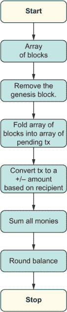
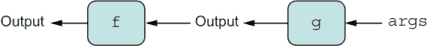
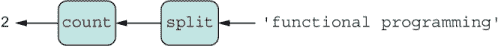
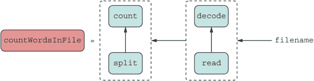
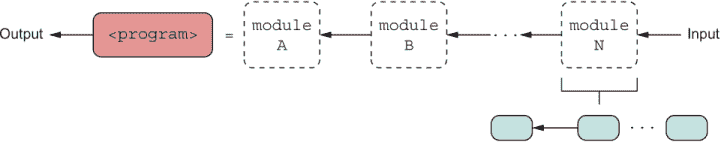
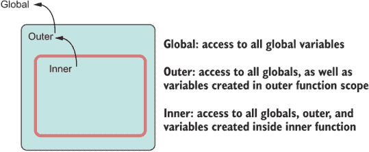
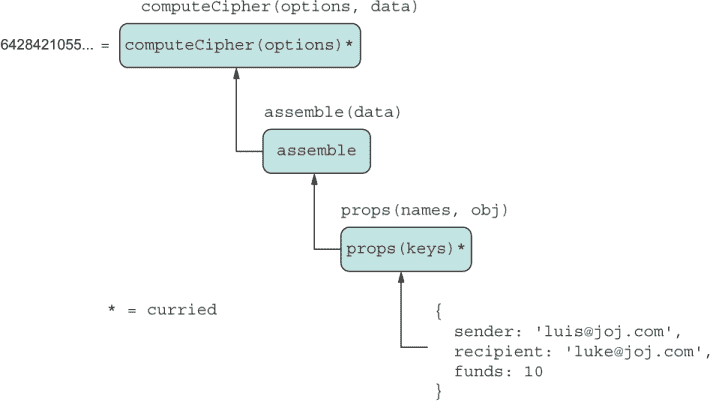
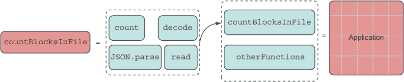
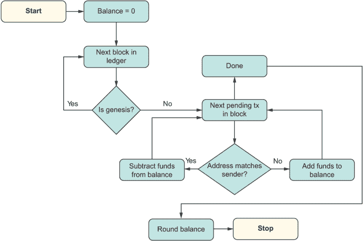
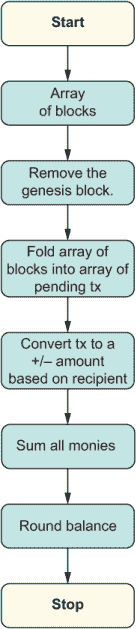

# 4 编写可组合、纯函数代码

本章节涵盖

+   将命令式编码重构为声明式、函数式风格

+   掌握 JavaScript 的高阶函数

+   介绍纯函数和不可变性

+   将纯逻辑与柯里化和组合结合

+   使用无点风格提高代码的可读性和结构

+   使用管道操作符创建原生函数链

*如果你想知道明天主流编程语言中会有哪些特性，那么现在就看看函数式编程语言吧*

——西蒙·佩顿·琼斯

如果对象是 JavaScript 的织物，那么函数就是用来缝合这些片段的针。我们可以在 JavaScript 中使用函数来描述对象集合（类、构造函数等），也可以用来实现业务逻辑，推动我们应用程序状态的机器。函数在 JavaScript 中如此普遍、灵活和强大，是因为它们也是对象：

```
Function.prototype.__proto__.constructor === Object;
```

JavaScript 具有高阶或一等函数，这意味着你可以将它们作为参数传递给另一个函数，或者作为返回值。通过高阶函数，你可以将复杂的软件模式简化为一小部分函数，使 JavaScript 比其他主流语言（如 Java 和 C#）更加简洁。

在第三章中，我们探讨了对象如何通过 OLOO（对象链接对象）在一定程度上组合其结构，通过混入（mixins）则更加充分。高阶函数也可以组合——不是结构上，而是通过连接在一起，作为回调传递来表示计算逻辑的序列。高阶函数是 JavaScript 最强大的特性，了解它们的最佳方式是通过函数式编程（FP）范式。

函数式编程（FP）是一股不可忽视的力量。如今，几乎不可能不提到 FP 的奇妙之处来谈论 JavaScript。我认为 JavaScript 之所以能够持续繁荣，得益于其对 FP 的支持，这也是多年前吸引我转向 JavaScript 的原因之一。虽然从理论上讲，FP 是一种老式思想，但它最近在 JavaScript 编码和应用设计中变得无处不在。好的例子包括 Underscore 和 Lodash 这样的库用于数据处理，React 和 Hooks 用于构建现代 UI，以及 Redux 和 RxJS 用于状态管理。实际上，如果你查看 2019 年 JavaScript 状态调查结果中最常用的实用库（[`2019.stateofjs.com/other-tools/#utilities`](https://2019.stateofjs.com/other-tools/#utilities)），你会发现 Lodash、Underscore、RxJS 和 Ramda 排名靠前。所有这些库都增强了 JavaScript 的函数式能力。

从根本上讲，函数式编程（FP）提倡一种与更常见的结构化或命令式方式不同的解决问题的方法，这是我们所有人都习惯的方式。理解函数式编程需要掌握 JavaScript 的主要计算单元，这始终是函数。任何类型的对象定义都试图将数据（实例字段）与处理这些数据的逻辑（方法）关联起来。对象在粗粒度级别上进行组合，正如你在第三章中学到的。另一方面，函数更明显地分离数据（参数）和逻辑（函数体），并在更细粒度、更低的级别上进行组合。函数式程序由一组接收输入并使用这些数据产生结果的函数组成。

在本章中，我们将选取我们区块链应用的两个重要部分，通过使用函数式编程（FP）来改进它们。目标不是对应用进行完全的重设计。相反，我们将保持简单，采取更宽容的方法，将面向对象（OO）和函数式编程（FP）范式的好处结合起来——即混合模型。你将了解到，尽管命令式和函数式编程在基本原则上存在分歧，但在处理应用的不同部分时，你可以从它们的优势中受益。为了帮助你过渡到函数式编程的编码方式，我们将可视化一个命令式程序是如何转换为函数式程序的（第 4.2 节）。

除非你是专家，否则我建议你从本章中介绍的函数式编程的基本知识开始慢慢学习，然后找到将函数式编程嵌入到你的应用中的方法。以后，你想要在你的代码中走多远，这取决于你。核心业务逻辑通常是这种思维方式的好候选者。我们将通过将一些命令式代码重构为函数式代码的练习，让你感受到这两种方法的比较。

几年来，平台团队，包括 JavaScript，都在向他们的编程语言添加更多功能以支持函数式风格，这已经成为一个明显的趋势。例如，ECMAScript 2019（又称 ES10）添加了`Array.prototype.flat`和`flatMap`，这对于以函数式方式使用数据结构至关重要。截至本文撰写时，TC39 的功能路线图上有一系列受函数式编程启发的提案正在上升，这将影响你未来几年编写 JavaScript 代码的方式。因此，现在了解这种范式将为你未来的学习做好准备。在这本书中，我们将探讨

+   管道操作符 ([`github.com/tc39/proposal-pipeline-operator`](https://github.com/tc39/proposal-pipeline-operator))

+   绑定操作符 ([`github.com/tc39/proposal-bind-operator`](https://github.com/tc39/proposal-bind-operator))

在我们理解为什么这些功能如此重要之前，我们还有很长的路要走。理解这些功能始于理解函数式编程。

## 4.1 什么是函数式编程？

在本节中，我将提供一个合适的 FP 定义。首先，我会给你一个简短的例子，并概述一些函数式代码的基本特性。许多人将 FP 与数组 API `map`、`reduce` 和 `filter` 相关联。你可能多次见过这些 API 的实际应用。让我们从一个快速示例开始，以唤醒你的记忆：确定数组中所有区块对象是否有效。对于这个例子，你可以假设可以跳过验证创世区块，并且所有区块都有一个 `isValid` 方法。通过使用数组 API 实现这个逻辑将类似于下面的列表。

列表 4.1 结合 `map`、`filter` 和 `reduce`

```
const arr = [b1, b2, b3];

arr
   .filter(b => !b.isGenesis())         ❶
   .map(b => b.isValid())               ❷
   .reduce((a, b) => a && b, true);     ❸
```

❶ 跳过创世区块（始终假设是有效的）

❷ 通过对每个区块调用 `isValid`，将区块数组转换为布尔值数组

❸ 对所有布尔值进行逻辑与操作，从 true 开始，以获得最终结果

如你所知，这些数组 API 被设计成高阶函数，这意味着它们要么接受一个回调函数，要么返回一个，并将大部分逻辑委托给提供的回调函数。你可能之前写过类似的代码，但从未从函数式编程的角度考虑过。一个具有 FP 意识的程序员总是更喜欢以这种方式编写由高阶函数驱动的代码。

除了几乎用函数做任何事情的趋势之外，FP 程序的重要特性还包括不可变性。在列表 4.1 中，尽管 `arr` 正在被映射和过滤，但原始的 `arr` 引用保持完整：

```
console.log(arr); // [b1, b2, b3]
```

不可变代码避免了由于意外更改应用程序状态而产生的错误，尤其是在处理可以在任意时间点运行的异步函数时。你知道 `reverse` 和 `sort` 方法会就地修改数组吗？如果你将原始数组对象传递给程序的其他部分会发生什么？现在结果是不可预测的。

一个总是返回可预测结果的不可变函数，给定一组参数，被称为纯函数，根据这个定义，我们来到了 FP 的定义：

*函数式编程是艺术性地组合高阶函数，以纯粹的方式推进程序状态。*

到目前为止，我已经简要地谈到了组合和纯代码。函数式编程将这些理念推向了实用的极致。现在，我将展开 FP 定义的关键部分：

+   如你所知，高阶函数是可以接收函数作为参数或产生另一个函数作为返回值的函数。在 FP 中，你几乎可以用函数做任何事情，你的程序就变成了一个由组合连接起来的函数大集合。

+   纯函数完全基于接收到的输入参数集来计算其结果。它们不会产生副作用——也就是说，它们不依赖于访问任何外部或全局共享的状态，这使得程序更可预测且易于推理，因为你不必跟踪意外的状态变化。

FP 开发者使用函数来表示任何类型的数据。

### 4.1.1 函数作为数据

你可以使用函数以表达式的形式表示数据。表达式可以立即评估以产生一个值，或者作为回调传递到代码的其他部分，以便在需要时评估。以下是一些示例：

+   声明一个常量值：

    ```
    const fortyTwo = () => 42;
    ```

    正如常规常量一样，你可以将表达式赋给变量或将其作为函数参数传递。

+   反射相同的值，也称为恒等函数：

    ```
    const identity = a => a;
    ```

+   创建新对象或实现任意业务逻辑：

    ```
    const BitcoinService = ledger => { ... };
    ```

    这个函数被称为工厂函数，它总是产生一个新的对象。

+   封装、私有数据（闭包）：

    ```
    const add => a => b => a + b;  
    ```

    `a` 作为外部函数的闭包的一部分存储，并在整个表达式评估时在内部函数中引用：

    ```
    add(2)(3) === 5
    ```

注意：这里使用的箭头函数符号在语法上方便嵌入流畅的方法链中，例如当你使用 `map`、`filter`、`reduce` 等进行编码或需要一行表达式时。尽管这一章经常使用这种符号，因为它设计简洁，但常规函数语法同样适用于所有这些例子。

所有这些表达式（除了第一个）接收输入并返回输出。纯函数的返回值始终是输入的一个因子（除非它始终是一个常数）；否则，这意味着你以某种方式打开了通往副作用和不纯代码的大门。

列表 4.2 展示了一个简单、直观的示例，说明了如何将这些包含计算或数据的表达式组合为高阶函数。代码仅在条件允许的情况下尝试执行一些数学运算；否则，它返回一个默认值。

列表 4.2 组合高阶函数

```
const notNull = a => a !== null;                           ❶
const square = a => a ** 2;

const safeOperation = (operation, guard, recover) =>       ❷
  input => guard(input, operation) || recover();

const onlyIf = validator => (input, operation) =>          ❸
  validator(input) ? operation(input) : NaN;

const orElse = identity;                                   ❹

const safeSquare = safeOperation(                          ❺
    square, 
    onlyIf(notNull),
    orElse(fortyTwo)
);

safeSquare(2); // 4
safeSquare(null); // 42
```

❶ 检查一个值是否不为空

❷ 执行安全操作；否则，调用恢复函数

❸ 仅当验证函数返回 true 时运行操作；否则，返回 NaN

❹ 使用恒等函数作为恢复，别名为 orElse

❺ 如果输入不为空，则计算数字的平方；否则，使用值 42 进行恢复

如果你查看 `safeSquare` 的结构，你会发现它由一些函数组成，这些函数清楚地传达了程序的意图。其中一些函数只携带数据（`orElse`）；其他函数执行计算（`square`）；一些函数两者兼具（`onlyIf`）。这个列表为你提供了一个很好的首次了解以函数方式编写的代码。

### 4.1.2 函数式方法

正如俗话所说，少即是多。函数式范式施加的限制旨在不是减少你可以做的事情，而是赋予你力量。在本节中，你将了解一组有助于你以函数式方式编码的指南。在第 4.3.2 节中，你将学习如何使用这些指南来解决任何类型的问题。

FP 程序员总是带着一套规则在心中编码。这些规则可能需要一些时间来适应，但随着实践会变得自然而然。然而，学习它们将非常值得你的时间，因为最终你会得到更可预测且更容易维护的代码。

在 JavaScript 中，函数式方法涉及这四条简单的规则：

+   函数必须始终返回一个值，并且（除了一些例外情况）至少声明一个参数。

+   函数运行前后应用程序的可观察状态不会改变；它是不可变的且无副作用的。每次都会创建一个新的状态。

+   函数执行其工作所需的一切都必须通过参数传递或从其周围的父函数（闭包）继承，前提是父函数遵守相同的规则。

+   调用相同输入的函数必须始终产生相同的输出。这个规则导致了一个被称为引用透明性的原则，该原则指出，一个表达式及其对应的值可以互换而不改变代码的行为。

通过这些简单的规则，我们可以从你的代码中移除副作用和突变，这些都是导致错误的主要原因之一。当一个函数遵守所有这些规则时，它被称为纯函数。听起来足够简单吗？换句话说，FP 是将遵循这些规则的函数组合起来以推进程序状态到最终结果的艺术。

根据这些规则，如何将打印到控制台这样的操作视为纯函数呢？它不是。超出其作用域的函数，在这种情况下执行 I/O，是有效果的——也就是说，它们会产生副作用。副作用还可以包括在其作用域之外读取/写入变量的函数、访问文件系统、写入网络套接字、依赖于随机方法如`Math.random`等。任何使函数结果不可预测的事物都被视为 FP 世界中的不良实践。

但是，当我们无法触及改变程序状态的那些事物时，如何从函数式编码中获得有用的东西呢？确实，处理不可变代码需要不同的思维方式，在某些情况下，需要以不同的方式处理问题，这是最难的部分。在 FP 中，对象不应该被直接操作和更改。对对象的更改意味着总是创建一个新的对象，类似于版本控制，其中每个更改，即使在同一行，也会产生一个新的提交 ID。至于读取文件、打印到控制台或其他任何实际的实际任务，我们需要学会以实际的方式处理这些情况。

到目前为止，我们一直在高层次上讨论 FP。为了使这次讨论更加具体，第 4.2 节比较了函数式和命令式代码。

## 4.2 函数式与命令式一览

为了让你开始理解这个范式转变，最好的办法是解决几个问题。我们将在本章中快速概述实现这一转变所需的技术，以便你能够全面了解在 JavaScript 中使用 FP（函数式编程）的过程。

本章我们要解决的第一个问题是如何以函数式的方式实现计算哈希的逻辑。在这里，我们将用安全的`HasHash`混合逻辑实现来替换不安全的算法。这个实现将为我们第二个示例提供一个良好的热身，该示例涉及通过仅使用纯函数来计算用户的数字钱包余额。在后一个练习中，我们将看到命令式代码到函数式的完全重构。余额计算涉及处理公共账本中的所有区块，并统计所有涉及特定用户的交易。如果用户作为收款人出现，我们增加资金；否则，我们减少资金。

为了提供一个比较框架，我们第二个问题的命令式版本看起来可能如下所示：

```
function computeBalance(address) {
   let balance = Money.zero();
   for (const block of ledger) {
      if (!block.isGenesis()) {
         for (const tx of block.data) {
            if (tx.sender === address) {
               balance = balance.minus(tx.funds);
            }
            else {
               balance = balance.plus(tx.funds);
            }
         }
      }
   }
   return balance.round();
}
```

你将学习如何将这个版本过渡到更函数式的风格，如下所示：

```
const computeBalance = address =>
  compose( 
    Money.round,
    reduce(Money.sum, Money.zero()),
    map(balanceOf(address)), 
    flatMap(prop('data')),
    filter( 
      compose( 
        not,
        prop('isGenesis')
      )
    ),
    Array.from
  );
```

你可能想知道这两个程序是否相同：第一个版本有循环和条件语句，而第二个版本没有。令人震惊的是，这两个程序是相同的。你可能认识这个代码块中的一些结构，比如`map`和`filter`，但这个代码是如何工作的可能并不清楚，尤其是因为控制和数据流与命令式对应物相反。例如，舍入指令出现在顶部而不是底部。

再次审视 FP 风格，你可能也会想知道总计数在哪里进行。比较图 4.1 和图 4.2，以查看命令式和函数式方法的不同控制和数据流。


列表 4.1 计算区块链中用户总余额的逻辑的命令式控制流程

命令式方法（图 4.1）不仅描述了状态的变化，还描述了这种变化是如何通过所有控制结构（循环、条件、变量赋值等）中的数据流产生的。另一方面，函数式方法（图 4.2）模型了一个单向状态转换流，隐藏了复杂的控制细节；它展示了获取最终结果所需的步骤，而不需要所有不必要的冗余。此外，正如之前提到的，每个步骤都是不可变的，这允许你集中精力在任何一步上，而不必担心其他部分（图 4.2）。



列表 4.2 计算区块链中用户总余额的逻辑的函数式控制流程

图 4.2 模拟了声明式流程。将这个图想象成以食谱的形式总结命令式版本的要点。声明式代码是按照其将被读取的方式来编写的。为你的用户和同事编写代码，而不是为机器编写，这就是编译器的用途。

声明式语言的一个好例子是 SQL。在 SQL 中，声明式编程的美丽之处在于它关注你试图完成的事情，而不是如何完成，因此诸如代码拆分、循环和状态管理等平凡细节都被隐藏在各自的步骤中。拥抱函数式编程最困难的部分是放弃你的旧方法和命令式偏见。一旦你越过这条线，你就会开始看到你的代码的结构、可读性和可维护性如何提高，尤其是在 JavaScript 中，它给你以多种方式修改数据的自由。我们很幸运，JavaScript 允许我们以这种方式编写代码，我们应该充分利用这一点。

要拥抱函数式编程心态，你必须理解下一节中讨论的函数组合。

## 4.3 组合：函数式方法

通常来说，组合发生在数据结合形成类似数据或同一类型的数据时；它保留了类型。对象融合成新的对象（就像第三章中的混入），函数组合成新的函数（就像本章中的函数）。当混入创建新对象时，这个过程被称为粗粒度、结构化组合。本节将教你如何在函数级别组装代码，称为细粒度或低级别组合。

函数组合是函数式编程的骨架，它是你安排和组装整个代码的指导原则。尽管 JavaScript 不强制执行任何限制，但组合在函数遵循第 4.1.2 节中提到的纯度规则时最为有效。

在本节中，我们将实现 `HasHash` 混入的业务逻辑。首先，你将学习如何将我们在第二章开始使用的命令式 `calculateHash` 方法转换为更函数式的方式。我们将使用这个方法来填充我们在第三章开始构建的框架实现。其次，你将学习组合如何帮助你绕过具有副作用代码。这种能力很重要，因为在日常活动中，你通常需要将纯代码与有副作用的代码混合。

理解函数组合的最佳方式是从简单开始，只使用两个函数，因为这样同样的逻辑可以扩展到任意数量的函数。所以，给定函数 `f` 和 `g`，你可以以某种方式对它们进行排序，使得第一个函数的输出成为第二个函数的输入，就像二进制管道一样，如图 4.3 所示。



列表 4.3 组合的高级图。箭头的方向很重要。组合是从右到左工作的。所以，在 `f` 与 `g` 组合时，`g` 接收初始输入参数。然后 `g` 的输出作为 `f` 的输入。最后，`f` 的结果成为整个操作的结果。

在代码中，组合可以通过 `f(g(args))` 简洁地表示。由于 JavaScript 会立即求值，它会尝试立即评估任何带有括号的前置变量的任何变量。如果你想表达两个函数的组合并将其赋给一个变量名，你可以将一个函数包裹在这个表达式周围。让我们称这个表达式为 `compose`（见下一条列表）。

列表 4.3 两个函数的组合

```
const compose = (...args) => f(g(...args));          ❶
```

❶ 使用 JavaScript 的扩展运算符来支持任意数量的参数

然而，列表 4.3 假设 `f` 和 `g` 是存在于 `compose` 上下文之外的函数。我们知道这种情况是一个副作用。相反，将 `f` 和 `g` 作为输入参数，并使用内函数的闭包，这样这段代码就可以与任何你提供的两个函数一起工作。闭包是与高阶函数一起工作得非常好的重要特性；我将在第 4.4 节中回顾它们。

让我们再次用另一个函数包裹这个表达式，并在 `compose` 旁边调用它 `compose2`：

```
const compose2 = (f, g) => (...args) => f(g(...args))
```

这段代码更加灵活。因为 `compose2` 接受函数作为参数并返回一个函数，所以它是一个高阶函数。此外，请注意 `compose2` 从右到左（`f` 在 `g` 之后）评估函数，以符合函数组合的数学定义。这里有一个更具体的例子：

```
const count = arr => arr.length;
const split = str => str.split(/\s+/);
```

你可以直接组合这些函数：

```
const countWords = str => count(split(str));
```

当你使用 `compose2` 时，相同的表达式变为

```
const countWords = str => compose2(count, split)(str);
```

这里有一个小技巧。因为你可以直接将函数赋给变量，所以每次你在表达式的左右两边重复输入参数时，你可以取消它，使你的代码更加紧凑：

```
const countWords = compose2(count, split);

countWords('functional programming');  // 2
```

图 4.4 展示了从图 4.3 的流程。



列表 4.4 分割后的顺序执行计数

`compose2` 比直接调用更优越，因为它能够将序列中涉及的函数的声明与其评估分离。这个概念类似于 OLOO，它允许你实例化一个可用的对象集并在需要时初始化这些对象。通过捕获传入的函数（`f` 和 `g`）作为变量，我们可以将任何执行延迟到调用者提供输入参数时。这个过程被称为惰性求值。换句话说，表达式

```
compose2(count, split);
```

本身是由两个其他函数（就像由两个混合器组成的对象）组成的函数。然而，这个函数不会在调用者评估它之前运行；它在那里处于休眠状态。`compose2` 允许你从几个简单的函数中创建一个复杂、可用的表达式，并在需要时给它一个名字（`countWords`）以在其他代码部分中使用。让我们在下一节中更详细地说明这个例子；我们将处理一个稍微更现实的问题，它涉及到副作用。

### 4.3.1 与副作用一起工作

异常处理、记录到文件以及发起 HTTP 请求是我们每天都要处理的任务之一。所有这些任务都以某种方式涉及副作用，而且无法避免。在函数式风格的应用程序中处理副作用的方法是将它们隔离并从我们的主要应用程序逻辑中推离。这样，我们可以保持应用程序的重要业务逻辑纯净且不可变，然后使用组合将所有部分重新组合在一起。

要了解如何将纯代码与非纯代码分开，让我们处理另一个任务：计算文本文件中的单词数。假设文件包含单词“the quick brown fox jumps over the lazy dog。”为了简单起见，让我们使用 Node.js 内置的同步版本文件系统 API，如下一列表所示。

列表 4.4 计算文本文件中单词数的命令式函数

```
function countWordsInFile(file) {
   const fileBuffer = fs.readFileSync(file);
   const wordsString = fileBuffer.toString();
   const wordsInArray = wordsString.split(/\s+/);
   return wordsInArray.length;
}

countWordsInFile('sample.txt'); // 9
```

列表 4.4 简单但包含了几个步骤。正如在 `calculateHash` 中，你可以识别出四个清晰的任务：读取原始文件，将原始二进制解码为字符串，将字符串拆分为单词，以及计数单词。使用 `compose` 安排这些任务应该看起来像图 4.5。


列表 4.5 `countWordsInFile` 的逻辑源自其他单一职责函数（如 `read`、`decode`、`split` 和 `count`）的组合逻辑。

首先，将每个任务表示为其自己的表达式。你之前看到了 `count` 和 `split`；下一列表显示了其他两个任务。

列表 4.5 支持使用 `countWordsInFile` 的辅助函数

```
    const decode = buffer => buffer.toString();

    const read = fs.readFileSync;           ❶
```

❶ 创建别名以缩短文件系统 API 调用

在列表 4.5 中，我们给每个变量指定了一个特定的名字，使程序易于理解。在命令式代码中，变量名用于描述执行一个或一系列语句的输出（如果有），但这些变量名并不描述计算它们的过程。你必须解析代码以了解这个过程。当你推动更声明式风格时，函数名表明了每个步骤要做什么。让我们一步步实现这一点。直接调用可能看起来像这样：

```
const countWordsInFile = file => count(split(decode(read(file))));
```

你可以看到所有变量赋值都被移除了。但我们可以同意，随着复杂性的增加，这种代码风格可能会变得难以控制。让我们使用 `compose2` 来解决这个问题：

```
const countWordsInFile = compose2(
   compose2(count, split),
   compose2(decode, read)
);
```

每个 `compose2` 段可以表示为其自己的微模块，如图 4.6 所示。



列表 4.6 使用 `compose2` 改进的 `countWordsInFile` 图

但是等等——我们已经有了一个名为的抽象，可以处理 `compose2(count`,`split`)`。这个抽象叫做 `countWords`。让我们将其插入：

```
const countWordsInFile = compose2(
   countWords,
   compose2(decode, read)
);
```

你之所以可以像乐高积木一样交换代码片段，是因为引用透明性。换句话说，表达式是纯的，不依赖于任何全局或共享状态。两个表达式的结果将是相同的，因此不会改变程序的结果。插入这个抽象是更好的，但我们还可以做得更好。

对于更复杂的逻辑，你可能认为将函数成对分组需要输入很多。为了简化代码，最好有一个可以处理任意数量函数或函数数组的 `compose2` 版本。让我们重新利用 `compose` 并使用 `Array#reduce` 与 `compose2` 结合，将两个函数的组合扩展到任意数量的函数。这种技术与一次组装一簇乐高积木而不是单个积木相似。

在 `Array#reduce` 中，reducer 是一个回调函数，它将你的数据累积或折叠成一个单一值。如果你不熟悉 `reduce` 的工作原理，这里有一个简单的例子。考虑一个函数 `sum`，它作为添加数字列表的 reducer：

```
const sum = (a,b) => a + b;

[1,2,3,4,5,6].reduce(sum);  // 21
```

Reducer 会将当前累积的结果 `a` 与下一个元素 `b` 相加，从数组的第一个元素开始。

同样地，`compose2` 是 `compose` 的 reducer：

```
const compose = (...fns) => fns.reduce(compose2);
```

在这种情况下，reducer 一次取两个函数并将它们组合（相加），创建另一个函数。这个函数会被记住，然后在下一次迭代中与下一个函数组合，依此类推，最终得到一个由用户提供的所有函数组成的组合函数。函数组合是从右到左工作的，最右边的函数接收调用点的输入参数并启动整个过程。按照这个顺序，`reduce` 将数组中的所有函数折叠到声明中的第一个函数，这与函数组合的定义非常吻合。

现在，让我们在下一个列表中使用这项技术，将前面代码片段中显示的嵌套调用剥离开，形成一个更加精简、单向的流程。

列表 4.6 使用 `compose` 实现的 `countWordsInFile`

```
const countWordsInFile = compose(
    count,
    split,
    decode,
    read
);

countWordsInFile('sample.txt'); // 9
```

这段代码一开始看起来像伪代码，不是吗？如果你比较列表 4.4 和 4.6，你会发现后者是前者的一种基本框架；它是声明式的！这种编码风格也被称为无点式，我们将在第 4.6 节中讨论。

使用的模块化程度（细粒度函数级别或粗粒度模块，包含多个函数）取决于你；你可以随心所欲地进行组合（见图 4.7）。



列表 4.7 可组合软件的结构。一个程序通过组合其他子程序来实现，这些子程序可以是函数那么小，也可以是另一个程序那么大。每个模块（考虑模块 N）都使用组合，最终到达组装单个函数的阶段。

无论你是组合简单的函数还是具有函数接口的整个代码模块，组装可组合代码的简单性都不会改变。（我们将在第六章中讨论导入和使用模块。）

现在你已经理解了组合模式，让我们用它来分解并简化我们的区块链应用的哈希逻辑。

### 4.3.2 复杂代码的分解

在第二章和第三章中，我们开始为我们的交易类创建一个名为 `calculateHash` 的哈希方法。这个哈希算法，或者它生成的摘要字符串，是不安全的并且容易发生冲突。在加密货币世界中，这种情况是不可接受的，所以让我们改进它。你会看到更函数式的设计如何使你能够轻松地用更安全的算法（使用 Node.js 的 crypto 模块）替换不安全的算法。以下是该代码的最后一个版本，供参考：

```
const HasHash = keys => ({ 
  calculateHash() {
    const data = keys.map(f => this[f]).join('');
    let hash = 0, i = 0;
    while (i < data.length) {
      hash = ((hash << 5) - hash + data.charCodeAt(i++)) << 0;
    }
    return hash**2;   
  }
});
```

使用第 4.1.2 节中概述的四个规则，这个函数/方法是否是纯的？在回答这个问题之前，让我们先进行一点逆向工程。首先，让我们将函数分解为其主要部分；然后我们将逐个分析每个部分。当我们将函数拆分时，我们将通过使用更函数式的方法将其重新组合。经过大量的练习，你会在这个过程中变得更熟练，这将成为你的第二天性。

`calculateHash` 执行两个主要任务，分为两个方法：

+   从键集合中组装数据：

    ```
    function assemble(keys) {
       return keys.map(f => this[f]).join('');       
    }
    ```

+   从这些数据中计算摘要或密文：

    ```
    function computeCipher(data) {
       let hash = 0, i = 0;
       while (i < data.length) {
          hash = ((hash << 5) - hash + data.charCodeAt(i++)) << 0;
       }
       return hash**2;
    }
    ```

这种思维过程本身是有益的，因为较小的函数比较大的函数更容易推理，你可以将这种思维过程深入到你认为合理的程度。现在来回答手头的问题：这两个方法是否是纯的？信不信由你，`computeCipher` 从实用角度来看是纯的，而 `assemble` 则不是。原因是 `assemble` 在尝试从 `this` 中读取属性时对其上下文做出了假设——这是我们在第三章中强调的混入的潜在缺点。使用独立的函数声明时，`this` 与函数绑定，而不是与周围的对象绑定。为了解决这个问题，我们可以使用 JavaScript 的动态绑定：

```
const HasHash = keys => ({
  calculateHash() {
    return compose2(computeCipher, assemble.bind(this, keys))();
  }
});
```

`bind`的调用将修正`this`引用，使其指向我们想要读取属性的外围对象。这段代码看起来更好，但依赖于这种类型的绑定可能会使其难以理解。此外，请记住，对环境的假设是一个副作用，我们在`calculateHash`中仍然有这个副作用。换句话说，推断状态的函数更难处理，因为其自身的行为依赖于外部因素。因此，您永远不会在纯 FP 代码库中看到对外部变量的引用，包括`this`。另一方面，明确其所需数据的函数是自文档化的，因此更易于使用和维护。

让我们将`assemble`改为一个明确其合同的功能，它接受用于散列过程的键集合以及要散列的对象：

```
function assemble(keys, obj) {
  return keys.map(f => obj[f]).join('');       
}
```

通过不做出任何假设，这个通用的独立函数完全脱离了其周围的类或对象上下文。在混合模型中，面向对象（OO）与函数式编程（FP）之间的微妙界限是我们将类的方法下的代码解耦或提取出来，并将其移动到一个或多个纯函数中。这种从可变、有状态组件到不可变组件的分离或隔离将帮助您避免对数据做出假设，并在合适的地方使用 FP。

让我们回到`computeCipher`，这是散列过程的核心。之前我提到，在按部就班的函数式编程中，是不允许有变化的。然而，在实践中，只要状态变化不会从函数的作用域中扩散或泄露，我们会接受使代码更容易实现的方案。在这种情况下，所有的变化都保持在本地，因此代码是可以接受的。

尽管如此，`computeCipher`并没有真正体现函数式精神；它仍然有点像过程式编程。通过将`computeCipher`视为其自身的微观环境，您可以看到其逻辑仍然依赖于设置和改变变量，如循环计数器`i`和累积的`hash`。您有改进的空间。使用`map`和`reduce`等 API 处理列表和数组很简单，但当你需要以迭代方式跟踪和重用状态时，递归是实现目标的最佳方式。接下来的列表显示了如何将`while`循环重构为递归函数。

列表 4.7 将`computeCipher`重构为递归函数

```
function computeCipher(data, i = 0, hash = 0) {
  if(i >= data.length) {
    return hash ** 2;
  }
  return computeCipher(         ❶
    data,
    i + 1,
    ((hash << 5) - hash + data.charCodeAt(i)) << 0
    );
}
```

❶ 在每次迭代中递归调用自身，并将更新的 hash 作为输入参数，以避免在原地分配和更改数据

这个函数使我们回到了四个主要的 FP 规则，没有任何权衡，以下是我们的收获：

+   我们使用了 JavaScript 的默认参数语法来正确地捕获初始状态。

+   我们消除了所有变量的重新赋值。

+   我们创建了每个分支都产生返回值的表达式。

现在我们有了这两个更小、更简单的函数，我们可以将它们组合起来计算交易对象的密文：

```
calculateHash() {   
   return compose2(computeCipher, assemble(keys, this))();
}
```

但等等——我们有一个问题。`compose2`期望一个函数，但`assemble`运行时却得到了一个字符串，所以这段代码无法运行。让我们使用延迟求值对`assemble`进行一些小的调整，将其转换为一个接受键并返回一个准备接收调用对象的函数的高阶函数，利用闭包：

```
function assemble(keys) {
  return function(obj) {
     return keys.map(f => obj[f]).join('');
  }  
}
```

这个小小的调整就足以让我们达到更函数式的方法：

```
const HasHash = keys => ({
  calculateHash() {
    return compose2(computeCipher, assemble(keys))(this); 
  }
});
```

从本质上讲，我们对`assemble`所做的操作是将一个 2-arity（两个参数）函数转换为两个单-arity（单个参数）函数——这是称为 curried 函数评估的技术背后的前提。

## 4.4 Currying 和闭包

Currying 是一种技术，当函数需要多个参数时，它可以帮助你组合函数。它依赖于 JavaScript 对闭包的惊人支持。在本节中，我们将从对闭包的快速回顾开始，然后转向 curried 函数应用。

你可能熟悉闭包，这是 JavaScript 工作方式的核心。实际上，它们是 JavaScript 最吸引人的特性之一。为了使讨论集中，我不会深入探讨闭包，但会提供一些细节，以防你对它们不熟悉。

闭包是围绕函数创建的另一种作用域或上下文形式，允许函数引用周围的变量。当函数被调用时，JavaScript 保留对函数局部和全局词法环境变量的引用——即围绕此函数的所有语法上声明的变量。在规范中，内部引用[[Scope]]将一个函数与其闭包链接起来。在其他书籍和在线资源中，你可能看到使用术语“背包”来描述这种链接。我说“围绕”而不是“之前”，是因为提升的变量和函数也是函数闭包的一部分。以下列表提供了一个示例。

列表 4.8 使用闭包的作用域基础

```
const global = 'global';
  function outer() {
    const outer = 'outer';
    function inner() {
      const inner = 'inner'
      console.log(inner, outer, global);      ❶
    }
    console.log(outer, global);               ❷
    inner();
  }
outer();
```

❶ 打印内部外部全局

❷ 打印外部全局

你可以在图 4.8 中可视化这个例子。



列表 4.8 JavaScript 中的闭包机制允许任何函数引用其词法环境。最内层的函数可以访问其外部作用域（外部+全局）中的所有状态，而外部作用域可以访问其周围全局作用域中的所有内容。

JavaScript 允许你完全自由地访问从函数声明的应用状态的一部分，这意味着全局作用域以及任何在函数周围按词法出现的任何外部变量。本质上，闭包使所有这些状态都成为隐式函数参数。虽然有时访问这些变量确实很方便，但它也可能导致难以维护的代码。从理论上讲，函数式编程（FP）认为访问函数周围任何状态都是副作用；毕竟，我们是在外部访问。然而，在实践中，只要闭包是有限制的、作用域狭窄的，并且更重要的是，不会在包围的函数之外引起任何可观察的变化，使用闭包是允许的。使用闭包是编写 JavaScript 代码的方式，我们应该充分利用它们。闭包使 JavaScript 中的一些强大模式成为可能，柯里化就是其中之一。

### 4.4.1 柯里化函数应用

一个将参数列表展开为逐步、单一、嵌套的单参数函数的函数被称为柯里化。下面的列表展示了手动柯里化的一个简单示例。

列表 4.9 将 `add` 作为单独的单参数函数进行评估

```
const add = x => y => x + y;

const addThreeTo = add(3);        ❶

addThreeTo(7); // 10              ❷
```

❶ 加法操作只有在最后一个变量被绑定时才会发生。

❷ 绑定表达式，函数执行。

与 `add` 一次性接收 `x` 和 `y` 参数不同，代码接受它们作为单独的函数，这些函数按顺序被调用。更正式地说，柯里化是将多参数函数（或 N 元函数）转换为评估为 N 个一元（元数 1）函数的过程。直到提供了整个参数列表并且所有函数都已评估，柯里化函数始终返回下一个函数。如果你退一步想，你可以看到柯里化是组合的另一种形式：你正在将一个复杂函数评估为多个简单函数。因为 `add` 接受两个参数 `x` 和 `y`，所以它被评估为两个单参数函数：

```
add(3)(7); // 10
```

回到我们的单词计数示例，让我们使用这种手动柯里化技术来在解码文件 I/O 的结果二进制缓冲区时获得更多的灵活性。正如 `decode` 现在所做的那样，缓冲区的 `toString` 方法假设 UTF-8 编码：

```
const decode = buffer => buffer.toString();
```

大多数时候，这个方法是你想要的。但如果我们需要 ASCII 编码，灵活性会更好。与其重构 `decode` 以接受另一个参数，不如在中间嵌入另一个函数来捕获编码参数（带有自己的默认参数）：

```
const decode = (encoding = 'utf8') => buffer => buffer.toString(encoding);
```

现在，我们可以调用一次 `decode` 来部分柯里化/设置编码参数，并将结果（剩余）函数作为如下组合表达式插入：

```
const countWordsInFile = compose(
    count,
    split,
    decode('utf8'),
    read
);
```

这段代码的声明式质量得到了进一步的提升，因为你不仅可以看到构成解决方案的步骤，还可以看到每个步骤中这些函数的属性或配置。

让我们继续以函数式的方式计算安全对象哈希的工作。考虑一个名为`prop`的辅助函数，再次手动 curry：

```
const prop = name => obj => obj[name] && 
   isFunction(obj[name]) ? obj[name].call(obj) : obj[name];
```

使用辅助函数`isFunction`

```
const isFunction = f =>
         f 
      && typeof f === 'function' 
      && Object.prototype.toString.call(f) === '[object Function]';
```

`prop`可以通过名称从任何对象中访问属性。你可以部分绑定`name`参数，创建一个具有`name`在其闭包中的函数，然后接受从中提取命名属性的对象。考虑这个简单的例子：

```
const transaction = {
   sender: 'luis@tjoj.com',
   recipient: 'luke@tjoj.com',
   funds: 10.0
};

const getFunds = prop('funds');
getFunds(transaction); // 10.0
```

你也可以创建一个函数，通过映射`prop`到一个键的数组上，将多个属性提取到一个数组中：

```
const props = (...names) => obj => names.map(n => prop(n)(obj));

const data = props('sender', 'recipient', 'funds');

data(transaction); // ['luis@tjoj.com', 'luke@tjoj.com', 10.0]
```

在单个对象上调用`prop`并不像在对象集合上调用它那样令人兴奋。给定一个包含三个交易对象（分别有资金 10.0、12.5 和 20.0）的数组，你可以将`prop`映射到它上面：

```
[tx1, tx2, tx3].map(prop('funds')); // [10.0, 12.5, 20.0]

[tx1, tx2, tx3].map(prop('calculateHash')); 

// [64284210552842720, 1340988549712360000, 64284226272528960]
```

在这段代码中，高阶函数`prop('funds')`直到`map`使用它才产生结果，这是很方便的。但当函数变得更加复杂时，使用扩展箭头语法编写的函数的尴尬记法变得难以阅读，更不用说多函数评估——`add(x)(y)`——是繁琐的。你可以使用`curry`函数自动化将手动展开成多个函数的过程。

`curry`自动化了我们迄今为止所进行的手动 curry 过程，将多个参数的函数转换为多个单参数嵌套函数。因此，像`add`这样的函数

```
const add = a => b => a + b;
```

可以写成

```
const add = curry((a, b) => a + b);
```

`curry`的奇妙之处在于它动态地改变了函数的评估方式，并平滑了部分传递参数所需的语法。你可以分步骤地调用`add`，如`add(3)(7)`，或者更理想的是同时调用`add(3,7)`。

注意：在理论上，currying 是一种更严格的偏应用形式，它要求返回的函数每次只接受一个参数。在偏应用中，返回的函数可以接受一个或多个参数。

与`compose`一样，你可以从任何 FP 库（如 Ramda、underscore.js 等）导入`curry`，但研究其实现很有趣；它使用了大量的现代 JavaScript 惯用语法（如 rest 和 spread 操作符）来操作函数对象。它还使用了一点点反射来动态确定函数的长度（这个话题我将在第七章中再次提及）。

为了保持纯 FP 精神，避免循环和变量的重新赋值，你可以非常优雅地将`curry`实现为一个递归的箭头函数。你也可能找到采用更命令式、迭代方法的版本：

```
const curry = fn => (...args1) =>
  args1.length === fn.length
    ? fn(...args1)
    : (...args2) => {
        const args = [...args1, ...args2]
        return args.length >= fn.length ? fn(...args) : curry(fn)(...args)
      };
```

下面的列表展示了如何使用`curry`来增强`prop`和`props`。

列表 4.10 `prop`和`props`的 curry 版本

```
const prop = curry((name, obj) =>                                         ❶
  obj[name] && isFunction(obj[name]) ? obj[name].call(obj) : obj[name]
);

const props = curry((names, obj) => names.map(n => prop(n, obj)));       ❷
```

❶ 内部，curry 添加了运行时支持，将(name, a)对重写为部分评估的参数 name => a => ...

❷ 我们不再使用 varargs ...name 参数，因为这只能作为最后一个（或唯一的）参数。

不幸的是，并非所有内容都可以 curry 化

尽管`curry`非常神奇且强大，但在 JavaScript 中，当它依赖于诸如可变参数或具有默认值的参数等特性时，`curry`可能会改变函数预期的行为，存在一些边缘情况。

在列表 4.11 中，为了让`props`与`curry`一起工作，我们需要将...`names`改为一个普通的、非可变参数`names`，它允许作为第一个参数出现。可变参数始终需要出现在函数签名末尾。

另一个需要注意的更微妙的问题是默认参数。查看本节中`curry`的实现，你可以看到它依赖于`Function.length`。在 JavaScript 中，这个属性有点棘手，因为它不会计算具有默认值的函数，如下面的代码片段所示：

```
const add = (a, b) => a + b;         // add.length = 2 
const add = (a = 0, b = 0) => a + b; // add.length = 0
```

再次强调，`curry`要求你在评估之前满足函数的所有参数。直到那时，`curry`会继续返回带有剩余待传递参数的部分应用函数。这种情况也防止了运行具有未满足或`undefined`参数的函数。正如我之前所说的，`add(3)`返回一个函数给调用者，但`add(3,7)`会立即评估为`10`。无法调用具有未满足参数集的函数，这真是太好了！

在 curried 函数中，参数的顺序很重要。通常，我们在面向对象的代码中不会过多关注顺序。但在 FP 中，参数顺序至关重要，因为它在很大程度上依赖于部分应用。在本章中展示的所有 curried 函数中，请注意参数的排列是为了从部分评估中受益。因此，最好将最静态、固定的参数放在前面，并允许最后的参数是更动态的调用特定参数，就像`prop`的定义一样：

```
const prop = curry((name, obj) => 
  obj[name] && isFunction(obj[name]) ? obj[name].call(obj) : obj[name]
);
```

最后一个参数`obj`被留作未限制（自由）的，这样你就可以在映射数组时自由地从任何对象中提取特定字段，例如。给定交易`tx1`和`tx2`，分别代表 10 美元和 12.50 美元，你可以创建一个新的函数`fundsOf`，它具有部分绑定的`funds`属性键。现在你可以将此函数应用于具有该键的任何对象，甚至可以将此函数映射到类似对象的数组中：

```
const fundsOf = prop('funds');
fundsOf(tx1); // 10.0
fundsOf(tx2); // 12.5
```

现在你已经了解了 currying 和组合，你可以将它们结合起来，在`HasHash`中的`calculateHash`逻辑创建一个函数式版本。单独来看，`curry`和`compose`提供了很多价值，但结合起来，它们更加强大。

### 4.4.2 curry 和组合动态搭档

本章的一个目标是为我们的`HasHash`混入中的`calculateHash`生成一个更安全的哈希摘要。到目前为止，我们使用`computeCipher`的递归定义处于这个阶段：

```
const HasHash = () => ({
   calculateHash() {
      return compose(computeCipher, assemble)(this); 
   }
});
function computeCipher(data, i = 0, hash = 0) {
  if(i >= data.length) {
    return hash ** 2 
  }
  return computeCipher(
          data,
          i + 1,
          ((hash << 5) - hash + data.charCodeAt(i)) << 0
        );
}
const assemble = ({ sender, recipient, funds })  
      => [sender, recipient, funds].join('');
```

`HasHash` 了解其周围的环境（即由 `this` 引用的交易对象），但函数保持纯净且无副作用。通过构建这些小的纯逻辑岛屿，我们可以将这些代码放一边，减轻跟踪所有发生的事情的心理负担。

但我们还没有完成。现在每个函数都是独立的，让我们进一步改进代码，使 `HasHash` 更安全且适用于其他区块链域对象。我们将进行两项额外的更改：

+   将 `HasHash` 与任何对象集成。这次更改涉及重构 `assemble` 以接受用于哈希的对象部分数组，这使我们能够在将 `HasHash` 分配给其他类时具有额外的灵活性。这次更改的部分也涉及将调用映射到 `JSON.stringify`，以确保任何提供的对象（原始或非原始）都转换为它的字符串表示。`JSON.stringify` 是确保我们从任何类型的数据中获取字符串的好方法，并且它工作得很好，前提是对象不是特别长：

    ```
    const assemble = (...pieces) => pieces.map(JSON.stringify).join('');
    ```

    这行代码创建了一个包含必要对象数据的字符串，用于向哈希代码播种。以下是一个示例：

    ```
    const keys = ['sender', 'recipient', 'funds'];
    const transaction = {
       sender: 'luis@tjoj.com',
       recipient: 'luke@tjoj.com',
       funds: 10   
    };

    assemble(keys.map(k => transaction[k]));

    // ["luis@tjoj.com","luke@tjoj.com",10]
    ```

+   实现一个更安全的哈希。让我们使用 Node.js 的 crypto 模块。此模块为您提供使用广泛采用的算法生成哈希的选项，例如 SHA-2，以及不同的输出编码，例如十六进制：

    ```
    const computeCipher = (options, data) =>
      require('crypto')
         .createHash(options.algorithm)
         .update(data)
         .digest(options.encoding);
    ```

下一个列表显示了创建简单对象 SHA-256 表示的示例。

列表 4.11 从对象的 内容计算 SHA-256 值

```
computeCipher(
    {
        algorithm: 'SHA256',       ❶
        encoding:  'hex'           ❷
    },
    JSON.stringify({
        sender: 'luis@tjoj.com',
        recipient: 'luke@tjoj.com',
        funds: 10
    })
   ); // '04a635cf3f19a6dcc30ca7b63b9a1a6a1c42a9820002788781abae9bec666902' 
```

❶ SHA-2 是一组安全的加密哈希函数。字符串越长，安全性越高。在这种情况下，我使用的是 SHA0256，它在业界得到了广泛的应用

❷ 返回一个十六进制编码的字符串，而不是二进制缓冲区，这使得输出更易于阅读

哈希计算必须是可靠和可预测的；给定相同的输入，它必须产生相同的输出。如果您还记得我们的起始指南，可预测性方便地指向引用透明性的原则。现在我们只剩下 `compose` 这两个：

```
compose(computeCipher, assemble);
```

但这里有一个问题。你能看出为什么这段代码不会工作吗？`computeCipher` 不是一个单参数的函数。以这种方式调用此函数会将 `assemble` 的输出传递到 `options` 部分，并将 `undefined` 传递给 `data`，这将破坏整个流程。我们可以通过部分配置 `computeCipher` 以产生一个函数，该函数被插入到 `compose` 中来解决这种不匹配。首先，将 `curry` 添加到函数定义中：

```
const computeCipher = curry((options, data) =>
  require('crypto')
     .createHash(options.algorithm)
     .update(data)
     .digest(options.encoding));
```

然后分步调用 `computeCipher`，就像您对 `add` 和 `prop` 所做的那样：

```
compose(
   computeCipher({
        algorithm: 'SHA256',
        encoding:  'hex'
    }),
   assemble);
```

下一个列表将所有内容组合在一起。

列表 4.12 `HasHash` 的最终实现

```
const HasHash = (
  keys,
  options = { 
       algorithm: 'SHA256', 
       encoding:  'hex' 
    }
) => ({
  calculateHash() {
     return compose(
      computeCipher(options),
      assemble,
      props(keys)
    )(this);           ❶
  }
});
```

❶ 当它是您自己的代码时，传递此方法效果很好，但当你使用第三方库时，最好只发送所需数据的副本。



列表 4.9 在`calculateHash`的实现中使用`curry`进行组合。每个框上方的标签显示了完整的函数签名。`computeCipher`和`props`已被 curry 化并部分应用。所有函数的最右侧参数（或唯一参数）用于接收链中一个函数的输入。

图 4.9 展示了使用简单的交易对象字面量来表示数据流：

```
    const hashTransaction = Object.assign(
      {
        sender: 'luis@tjoj.com',
        recipient: 'luke@tjoj.com',
        funds: 10
      },
      HasHash(['sender', 'recipient', 'funds'])
    );

    hashTransaction.calculateHash(); 

    // '04a635cf3f19a6dcc30ca7b63b9a1a6a1c42a9820002788781abae9bec666902'
```

我们使用了`curry`和`compose`来驱动`calculateHash`的执行，这些被称为函数组合子——组合其他函数的函数。组合子没有自己的特殊逻辑；它们要么作用于函数的结构本身，要么协调它们的执行。`curry`操作参数，以便它们可以逐个评估。同样，`compose`负责将一个函数的输出传递给下一个函数的输入。所有这些控制流都在这段代码中被抽象化：

```
compose(
    computeCipher(options),
    assemble,
    props(keys)
  )(this);
```

由`this`引用的对象进入组合链，而在另一边，你得到它的哈希值。在这里传递原始上下文（`this`）是安全的，因为所有这些函数都是无副作用的。但当你或其他人更改它们，或者当你与其他你不知道的函数集成时会发生什么？在 JavaScript 中，对象值是通过引用存储的。当你将对象传递给函数时，传递的是引用的值，而不是对象本身（与原始数据类型不同）。你可以通过发送一个副本来防止任何不希望的突变，并使你的代码更具可预测性。这种情况也是输入对象仅使用所需数据的好机会。为此，让我们使用`Object.fromEntries` API。这个 API 允许你将任何键/值对的可迭代对象（`Array`、`Map`等）转换为对象。`HasHash`已经有了要哈希的数据的键列表，因此很容易构建一个只包含该数据的对象：

```
calculateHash() {
    const objToHash = Object.fromEntries(
       keys.map(k => [k, prop(k, this)])
    );
    return compose(
      computeCipher(options),
      assemble,
      props(keys)
    )(objToHash);
  }
```

通过这个片段，我们已经完成了`HasHash`混合。正如你所见，它不是一个完全纯净的对象，因为它依赖于全局的`this`存在，它指向`HasHash`被分配的对象的原型。但我们可以称它为混合型，因为它依赖于纯函数来完成其工作。

我们仍然需要处理其他编码示例：从区块链交易中计算用户的总余额。在迄今为止看到的代码片段中，我们始终使用常规浮点数来表示`funds`金额。我这样做是为了保持简单。在现实世界中，`funds`总是有两个组成部分：数值和货币单位（如$10.0 或฿10.0）。为了表示货币，让我们创建一个名为`Money`的对象，设计为不可变。

## 4.5 使用不可变对象

纯洁性的概念不仅限于函数，也扩展到了对象。到目前为止，我们区块链应用的主要实体（如`Block`、`Transaction`等）是可变的，这意味着你可以在实例化后轻松更改对象的属性。我们做出这个设计决策是为了允许这些对象在更新时重新计算它们的哈希值，并且如果需要，允许对象通过混入或传统的基于类的继承动态扩展。我们也可以选择使对象不可变，这种设计有许多很好的用例，其中之一我们将在本节中探讨。

考虑一个名为`Money`的对象，它代表正在交易的货币金额。`Money`是一个具有永久价值的对象：一角硬币始终等于一角硬币。其身份由金额和货币名称给出。如果你将一角硬币改为五分硬币，从概念上讲，那将是一个新的`Money`实体。想想看改变日期值意味着什么。这不是一个不同时间点的值吗？在笛卡尔平面上改变一个点，那又是另一个点。在工业界广泛使用的其他一些适合这种设计类型的例子包括`DateTime`、`Point`、`Line`、`Money`和`Decimal`：

```
const coord2_3 = Point(2, 3);
coord2_3.x = 4; // No longer the same point!
```

不可变对象在工业界是一个已知的模式。在第二章中，我们讨论了如何使用数据描述符在创建时定义不可变字段，`Object.create`允许你这样做。一般来说，不可变对象是指你不能设置任何字段的那些对象。其数据描述符对于所有字段都有`writable:` `false`。基于此的一个流行模式被称为值对象模式。值对象在创建时是不可变的，并且有一些字段用于描述身份和比较。与纯函数强加的规则类似，以下是一些在决定是否使用此模式时需要记住的指南：

+   没有全局身份 —— 无法通过某种 ID 获取值对象的实例。相反，事务通过其哈希值（`transactionId`）进行全局标识。同样，一个`Block`通过索引值或账本中的位置来标识。

+   不可修改 —— 当对象被实例化后，你无法更改其任何属性。这样做会导致创建一个新的对象或产生错误。

+   不可扩展 —— 你不能动态地向（混入）此对象添加属性，也不能从它中移除属性，并且不能从中派生新的对象（继承）。

+   定义自己的等价性 —— 由于没有唯一的 ID，实现一个能够根据其属性比较两个值对象的`equals`方法是有益的。

+   覆盖`toString`和`valueOf`——值对象需要无缝地以字符串或原始值的形式表示。覆盖如`toString`和`valueOf`这样的方法会影响对象在数学符号旁边的行为或与字符串连接时的行为。

对于我们的区块链，我们将 `Transaction` 的 `funds` 字段表示为 `Money` 对象。在我们查看内部细节之前，让我们看看它是如何被使用的：

```
Money('B|', 1.0);  // represents 1 Bitcoin
Money('$', 1.0);  // represents 1 US Dollar
Money.zero('$');  // bankruptcy!
```

让我们通过使用一个简单的函数而不是类来实现 `Money`。与类构造函数不同，普通函数可以进行柯里化。因此，我们可以做如下事情：

```
const USD = Money('$');

USD(3.0);          // $ 3
USD(3.0).amount;   // 3
USD(7.0).currency; // $
[USD(3.0), USD(7.0)].map(prop('amount')).reduce(add, 0); // 10 
```

此外，`Money` 支持一些关键操作，如加法、减法、四舍五入，以及（最重要的是）实现某种相等性。为什么相等性很重要？如果没有描述其身份的字段，值对象只能通过其属性进行比较：

```
USD(3.0).plus(USD(7.0)).equals(USD(10));  // true
```

在 `Money` 的情况下，我们不感兴趣使用继承或任何前几章中提到的实例化模式，这些模式旨在构建复杂对象；使用一个简单的函数返回一个对象字面量就足够了。这种模式也被称为函数工厂。

为了实现“封闭修改和扩展”的保证，我们可以分别使用 JavaScript 内置的 `Object.freeze` 和 `Object.seal` 方法。这两种方法都很容易组合。下一个列表显示了 `Money` 的实现细节。

列表 4.13 `Money` 值对象的详细信息

```
const BTC = 'B|';

const Money = curry((currency, amount) =>
  compose(                                                 ❶
    Object.seal,
    Object.freeze
  )(Object.assign(Object.create(null),                     ❷
    {
      amount,
      currency,
      equals: other => currency === other.currency &&
          amount === other.amount,
      round: (precision = 2) => 
          Money(currency, precisionRound(amount, precision)),
      minus: m => Money(currency, amount - m.amount),
      plus: m => Money(currency, amount + m.amount),
      times: m => Money(currency, amount * m.amount),
      compareTo: other => amount - other.amount,
      asNegative: () => Money(currency, amount * -1),
      valueOf: () => precisionRound(amount, 2),            ❸
      toString: () => `${currency}${amount}`            
    }
  ))
);

// Zero
Money.zero = (currency = BTC) => Money(currency, 0);       ❹

// Static helper functions
Money.sum = (m1, m2) => m1.add(m2);

Money.subtract = (m1, m2) => m1.minus(m2);

Money.multiply = (m1, m2) => m1.times(m2);

function precisionRound(number, precision) {
  const factor = Math.pow(10, precision);
  return Math.round(number * factor) / factor;
}
```

❶ 新对象首先被冻结，然后被密封。

❷ 使用 Object.assign 和 Object.create(null) 创建一个没有任何原型引用的值对象，使其更接近系统中的真实值

❸ 重写 Object#valueOf 和 Object#toString 以帮助 JavaScript 的类型强制转换

❹ 在对象字面量定义外部实现以创建静态方法

列表 4.13 中的代码包含了大量的功能，因为我们试图得到一个表现得像原始类型一样的对象。除了使对象不可变和封闭扩展之外，我们通过使用 `Object.assign`（第三章）在单步中从“null 对象”原型 `Object.create(null)` 实例化它。`Money` 不会自动继承 `Object.prototype` 的任何成员字段（如 `toString` 和 `valueOf`），特别是这个情况下不适用：`Object#isPrototypeOf`。缺点是，你必须负责正确实现这些属性。

因此，我们将实现 `toString` 和 `valueOf` 以如下方式工作：

```
const five = Money('USD', 5);
console.log(five.toString()); // USD 5
```

`valueOf` 方法有点更有趣。与 `toString` 不同，你不需要直接调用 `valueOf`。当对象被期望以原始类型行为，尤其是在数值上下文中时，JavaScript 会自动调用它。当对象与数学符号相邻时，我们可以将 `Money` 降级（强制）为 `Number`。然后，如果需要，你可以用适当的货币单位将那个结果包装回 `Money`：

```
five * 2;    // 10
five + five  // 10
Money('USD', five + five).toString() // USD 10
```

现在，让我们看看将 `Object.seal` 和 `Object.freeze` 应用到这些对象上的效果。我们使用了 `compose` 来按顺序应用每个方法。`Object.freeze` 阻止你更改其任何属性（记住我们假设严格模式），如下所示：

```
const threeDollars = USD(3.0);
threeDollars.amount = 5;

// TypeError: Cannot assign to read only property 'amount' of object '[object Object]'

Object.isFrozen(threeDollars); // true
```

此外，`Object.seal` 阻止客户端扩展它：

```
threeDollars.goBankrupt = true;
// TypeError: Cannot add property goBankrupt, object is not extensible

delete threeDollars.plus;
// TypeError: Cannot delete property 'plus' of [object Object]  

Object.isSealed(threeDollars); // true
```

最后，请注意，`Money`（`plus`、`minus`等）中的所有方法都使用写时复制语义，返回新对象而不是改变现有对象，并接受我们之前讨论的纯度原则。

纯对象操作

在函数式编程中，有一种在对象内部操作数据的方法称为镜头，这样你就不必自己实现写时复制版本。

镜头允许你针对对象中的特定属性或路径进行定位，这样你就可以以可组合和不可变的方式对其进行更改。幕后，它使用写时复制，但所有操作都是自动完成的。你可以通过探索 Ramda 镜头 API（[`ramdajs.com/docs/#lens`](https://ramdajs.com/docs/#lens)）来了解更多关于这项技术的信息。

到目前为止，你已经学会了如何通过组合和柯里化来构建函数式代码。原始数据可以随意操作和修改（因为它设计上是不可变的），而自定义数据对象则需要更多的关注。在后一种情况下，在适当的时候使用值对象或向代码传递数据副本可以帮助避免许多讨厌的 bug。

在掌握所有基础知识之后，让我们通过一种称为无点编码的范式来改进我们的代码设计——这是实现计算用户数字钱包余额逻辑所需最后一块拼图。

## 4.6 无点编码

无点编码是采用声明式编程的副产品。你可以使用无点编码而不必使用 FP。但是，因为无点编码的全部都是为了提高代码的可读性并使其更容易解析，所以 FP 强加的保证进一步推动了这一目标。

学习无点风格是有益的，因为它允许开发者无需深入了解内部结构就能一眼看懂你的代码。无点编码指的是一种函数定义不明确标识它们接收的参数（或点）的风格；它们隐式（默示）地通过程序的流程传递，通常在`curry`和`compose`的帮助下。移除这种杂乱通常可以揭示一个更简洁的代码结构，人们可以轻松地通过视觉解析。通过能够看到森林而不是树木，你可以发现可能由不良逻辑或对需求做出不良假设而引发的高级 bug。

由于 JavaScript 有柯里化和一等函数，我们可以将一个函数赋给一个变量，将这个命名的变量用作`compose`的参数，从而有效地创建我们代码的可执行轮廓。在本节中，你将了解使用无点风格在 JavaScript 中的好处，例如

+   通过减少语法噪声来提高代码的可读性

+   使组合更清晰和简洁

+   避免引入不必要的参数名称

+   构建描述构成你的应用程序的动作和任务的词汇表

在我们开始学习这种风格之前，将其与非无点代码进行比较是有帮助的。让我们快速回顾一下：

```
function countWordsInFile(file) {
   const fileBuffer = fs.readFileSync(file);
   const wordsString = fileBuffer.toString();
   const wordsInArray = wordsString.split(/\s+/);
   return wordsInArray.length;
}
```

要了解这个函数的高级功能，你必须阅读每个语句并追踪流程。函数中的每个语句都详细描述了每个函数是如何被调用以及每个函数在调用点接收的参数（或点）。

另一方面，使用`compose`消除了不必要的开销，并专注于创建更高层次逻辑表示所需的高级步骤。当我们之前将 FP 应用于`countWordsInFile`时，我们得到了以下代码：

```
const countWordsInFile = compose(
    count,
    split,
    decode('utf8'),
    read
);
```

这个程序是无点代码的。注意，这个程序中没有告诉你如何调用`countWordsInFile`。你看到的所有东西只是这个函数的结构或涉及哪些步骤。因为函数的签名（以及所有嵌套函数）缺失，你可能觉得这种风格对不熟悉这些函数的人来说代码有点难以理解。这一点是有效的，我见过它如何使使用调试器变得有点更具挑战性。但对于熟悉这种风格并且熟悉调试器的人来说，无点代码使组合更加清晰，并允许你将高级步骤视为即插即用的组件。

无点代码的一个常见类比是乐高积木。当你从远处观察一个乐高结构时，你看不到将所有东西连接在一起的销钉，但你仍然能欣赏到整体结构。如果你再次查看`countWordsInFile`的命令式版本，这里的“销钉”指的是连接一个语句到下一个语句的中间变量名。

假设你正在处理另一个任务，比如从 JSON 文件中计数序列化的块数据数组。从高层次来看，你应该能够看到这段代码的结构与前面的代码片段相似。唯一的区别是，你将处理解析元素数组，而不是处理空格分隔的单词。纯函数很容易替换，因为它们除了自己的参数之外不依赖于任何外部数据。`countBlocksInFile`的实现简单地将`split`替换为`JSON.parse`：

```
const countBlocksInFile = compose(
    count,
    JSON.parse,
    decode('utf8'),
    read
);
```

再次，这种交换是显而易见的，因为无点代码清理了传递函数和参数的过程，让你能够专注于手头的任务，比如将一个红色乐高积木换成绿色乐高积木。此时应该很明显，`countBlocksInFile`是另一个可以进一步组合（固定）的乐高捆绑（模块）。你可以从这个基本思想（图 4.10）构建整个复杂的应用程序。



列表 4.10：构建整个应用程序的函数组合

所有这些乐高积木都成为了你的应用程序乐高套件中的分类法，或者说词汇表。

现在你已经了解了如何通过使用组合和柯里化来结构化你的代码，让我们来处理一个更复杂的需求式到函数式的转换，这涉及到计算用户的数字钱包余额。

## 4.7 需求式到函数式的转换

在第三章，我看了`Wallet`类的骨架（列表 3.9），但故意省略了`balance`方法。下面是这段代码的再次展示：

```
class Wallet {
  constructor(publicKey, privateKey) {
    this.publicKey = publicKey
    this.privateKey = privateKey
  }
  get address() {
    return this.publicKey
  }
  balance(ledger) {
    //... 
  }
}
```

现在我们已经准备好填充复杂的逻辑细节。为了计算用户的余额，给定一个区块链（账本）对象参数，我们需要累计自账本开始以来为该用户挖掘的所有区块中的所有交易。我们可以省略创世区块，因为我们知道它不包含我们感兴趣的数据。

让我们再次以命令式思维来审视这个问题，并将其与函数式思维进行比较。这次，我们将使用我们迄今为止所学到的所有技巧。算法可以看起来像以下列表。

列表 4.14 计算总余额的命令式算法

```
balance(ledger) {
   let balance = Money.zero();
   for (const block of ledger) {                     ❶
      if (!block.isGenesis()) {
         for (const tx of block.data) {
            if (tx.sender === this.address) {
               balance = balance.minus(tx.funds);    ❷
            }
            else {
               balance = balance.plus(tx.funds);     ❷
            }
         }
      }
   }
   return balance.round();
}
```

❶ 账本（ledger）是一个区块链对象，遍历它将返回每个区块。你将在第七章学习如何使任何对象可迭代。现在，你可以安全地假设它是一个区块的数组。

❷ 如果用户是交易的发送者，我们将折扣交易中的金额；否则，我们将它添加到累计余额中。

将此算法与 FP 指南进行比较，你可以看到它涉及到遍历区块链数据结构，这意味着你需要在你遍历所有区块以及每个区块的交易时，保持余额的累计计数。在每次迭代中，有很多分支来适应不同的条件——你可以称之为命令式的“灾难金字塔”。让我们回顾一下图 4.11 中的流程。



列表 4.11 计算区块链中用户总余额的逻辑的命令式流程控制

所有菱形框代表分支逻辑，嵌套在代表循环的循环箭头中。可以说，这个图并不容易解析；它代表了一小段代码。

此外，列表 4.14 在引用`this`以访问钱包属性和每次迭代重新分配`balance`的方式中存在副作用。通过使用混合（FP + OO）方法重构此代码涉及

+   将数据显式作为函数参数，而不是隐式地

+   将循环和嵌套条件转换为使用`map`和`filter`的流畅数据转换

+   使用不可变的`reduce`操作去除变量重新分配

最佳做法是将逻辑提取到它自己的函数中，使其无副作用，并且让`balance`内部委托给它，并带上所有初始数据。我们可以称这个新方法为`computeBalance`：

```
balance(ledger) {
   return computeBalance(this.address, ledger);
}
```

有理由从我们熟悉的方便的数组基本操作开始：`map`、`filter`和`reduce`。以下代码代表了相同的算法，功能上受到启发。图 4.12 显示了新的流程将看起来是什么样子。

在列表 4.15 中展示的函数式方法中有一个小的注意事项，可能会有些令人困惑。因为数据处理流程涉及到处理区块的数组，以及每个区块内的交易数组，我们被迫处理一个数组数组。为了简化问题，当你遇到这个问题时，最好的办法是将这些结构展平。你将在第五章中了解到这种情况在函数式代码中很常见。现在，我们将使用`Array#flat`来展平嵌套结构。

列表 4.15 使用 FP 在`Wallet`中计算余额

```
function computeBalance(address, ledger) {
   return Array.from(ledger)                   ❶
    .filter(not(prop('isGenesis')))            ❷
    .map(prop('data'))                         ❸
    .flat()                                    ❹
    .map(balanceOf(address))                   ❺
    .reduce(Money.sum, Money.zero())           ❻
    .round();                                  ❽
}
```

❶ `Array.from`将任何可迭代对象转换为数组

❷ 使用`not`和`prop`实用函数调用`isGenesis`（检查代码仓库以获取实现）

❸ 从链中读取交易（数据）集合

❹ 上一步骤生成的数组数组被展平成一个单一数组。

❺ 从每个交易中计算此用户的余额

❻ 使用`Money.sum`函数作为 reducer，从`Money.zero`开始，并总计总数

❽ 在结果上调用`Money.round`方法

在很大程度上，你可以看到这个算法是命令式逻辑的再世，但利用了数组中的高阶函数来连接每个转换的部分，彻底改变了数据的流程。此外，我们通过像`reduce(Money.sum, Money.zero())`这样的代码执行加法，这也说明了函数式程序往往表现出的数学性质。



列表 4.12 计算区块链中用户总余额的逻辑的函数式流程控制

为了完整性，这里提供了在函数式版本中使用的`balanceOf`函数，现在作为一个 lambda 表达式实现，它将交易中的用户 ID 映射到正或负货币值，这取决于该用户是发送者还是接收者：

```
const balanceOf = curry((addr, tx) =>
    Money.sum(
      tx.recipient === addr ? tx.funds : Money.zero(),
      tx.sender === addr ? tx.funds.asNegative() : Money.zero()
    );
  )
```

如果你再次查看列表 4.15，你可能会看到最复杂的步骤是对在数据处理流程中构建的数组数组结构上的`flat`调用。这里有一个简单的例子，以便你可以看到它是如何剥离嵌套数组的：

```
[['a'], ['b'], ['c']].flat()      // ['a', 'b', 'c']
```

因为算法在之前执行了一个`map`操作，所以有一个捷径：直接使用`Array#flatMap`方法。我们将在第五章中更详细地回顾`map`和`flatMap`，但就现在而言，我们将按顺序介绍它们，以便了解`computeBalance`是如何工作的。正如你所见，`flat`是直观的，但`flatMap`究竟是什么呢？在函数式程序中，`map`后面跟着`flat`的组合经常出现，以至于将这两个方法的组合作为单个方法是有意义的。函数式社区中达成一致的名字是`flatMap`。前面的代码简化到下一个列表。

列表 4.16 使用 `map`、`filter` 和 `reduce` 的 `computeBalance`

```
function computeBalance(address, ledger) {
   return Array.from(ledger) 
    .filter(not(prop('isGenesis'))) 
    .flatMap(prop('data'))                ❶
    .map(balanceOf(address)) 
    .reduce(Money.sum, Money.zero()) 
    .round();
}
```

❶ 用 `flatMap` 替换 `map` 然后用 `flat`

使用这些 API，你可以解决几乎任何你需要处理的数组处理任务，甚至可能从你的代码中移除循环。这种能力是 JavaScript 中处理集合的未来。

这个列表是一个很好的停止点，但为了乐趣，让我们再进一步。在函数式程序中，通常不使用点符号来调用函数序列（`map(...).filter(...).reduce(...)`），因为这种符号假设有一个对象将这些操作串联起来。相反，使用 `compose` 的帮助，使用提取的、柯里化的函数形式来贯穿整个数据流，将对象传递给每个调用（无假设），使其无参数化！

让我们慢慢来介绍这个技术。当将方法提取为其自己的函数时，将实例对象作为最后一个参数放置，并柯里化该函数。以下列表显示了如何提取 `Array#map(f``)`。

列表 4.17 以柯里化形式提取 `map`

```
const map = curry((f, arr) => arr.map(f));      ❶
```

❶ 数组 `arr` 是最后一个参数。

要在链中嵌入 `map`，部分应用第一个参数，即映射函数：

```
map(balanceOf(address));
```

动态数组（`arr`）参数不是直接提供的，因为 `compose` 会以无参数化的方式为你完成。大多数第三方 FP 库都携带这些辅助函数（`map`、`filter`、`reduce` 以及更多）的柯里化形式。下一列表中显示的代码的更函数式版本利用了细粒度、无参数化的设计。无参数化设计需要一个固定的 `address` 参数，而 `ledger` 在调用位置提供。

列表 4.18 `computeBalance` 的无参数版本

```
const computeBalance = address =>
  compose(                              ❶
    Money.round,
    reduce(Money.sum, Money.zero()),    ❷
    map(balanceOf(address)),            ❷
    flatMap(prop('data')),              ❷
    filter(                             ❷
      compose(                          ❸
        not,
        prop('isGenesis')
      )
    ),
    Array.from
  );

const computeBalanceForSender123 = computeBalance('sender123');
computeBalanceForSender123(ledger); 
```

❶ 使用 `compose`，逻辑从右到左读取。

❷ 使用等价的 `Array#filter` 方法的柯里化提取形式

❸ 使用嵌套组合来使代码更加模块化

第三方 FP 库

函数式语言，如 Haskell 和 F#，具有内置的本地操作符来实现许多这些技术。在本章中，你被介绍了 `compose` 和 `curry` 操作符。通常，你不会手动编写这些操作符。相反，你会导入第三方库，如 Ramda ([`ramdajs.com`](https://ramdajs.com/))、Crocks ([` crocks.dev`](https://crocks.dev/))、Lodash ([`lodash.com`](https://lodash.com/)) 或 UnderscoreJS ([`underscorejs.org`](https://underscorejs.org/)) 来导入许多这些实用函数。你可以在代码库中找到本书中使用的函数（[`mng.bz/pVy2`](http://mng.bz/pVy2)）。

FP 需要一点时间来适应，但这样思考会让你走上编写高度模块化、易于维护、更简洁和更可靠的代码的道路。实际上，它可以帮助你避免潜在的 bug，因为 JavaScript 给你提供了几乎可以突变任何事物的完全自由，使你的开发体验变得更加愉快。

将数据扇出到像这样的纯函数是一个令人信服的想法，随着 JavaScript 继续拥抱更多的函数式特性，并使创建函数链成为语言的本能部分，这个想法将变得越来越突出。

## 4.8 本地函数链

现在你已经了解了基本的函数式编程概念，你在学习即将到来的新特性方面又迈出一步。在本章中，你学习了（以及其他内容）如何使用 `compose` 创建函数链。这个操作符最显著的特点是数据流的方向是相反的，这可能会让一些人感到震惊。幸运的是，有一个解决方案：`pipe` 操作符。`pipe` 是 `compose` 的近亲，它按照自然从左到右的顺序处理函数。`pipe` 的构建与 `compose` 完全相同。唯一的区别是使用 `reduceRight` 而不是 `reduce`：

```
const pipe = (...fns) => fns.reduceRight(compose2);
```

这个操作符的灵感来源于基于 UNIX 的程序如何将数据管道传输到另一个程序。使用 `pipe`，你可以重新排列逻辑来计算余额，如下所示：

```
pipe(
   Array.from,
   filter(
      pipe(
        prop('isGenesis')
        not,        
      )
    ),    
    flatMap(prop('data')),
    map(balanceOf(address)),
    reduce(Money.sum, Money.zero()),
    Money.round
  );
```

你也会在大多数 JavaScript FP 库中找到 `pipe`，例如 Ramda 和 Crocks。如果你喜欢这种方式思考，JavaScript 为你准备了一个惊喜。介绍管道操作符：`|>` ([`github.com/tc39/proposal-pipeline-operator`](https://github.com/tc39/proposal-pipeline-operator))。这个操作符灵感来源于像 Elixir 和 F# 这样的函数式语言。这个本地操作符允许你以单向数据流到右的方式调用一系列函数，而无需任何特殊的第三方库。

现在开始学习这个新特性非常重要，因为当它成为官方特性时，它将彻底改变我们编写代码的方式。以下是一个例子：

```
'1 2 3' |> split |> count;  // 3
```

你甚至可以将它与 lambda 表达式混合：

```
'1 2 3' |> split |> count |> (x => x ** 2); // 9
```

现在想象一下，如果你有一些常见的数组方法被提取成柯里化函数形式，就像这些函数式实用库所提供的那样。你将能够编写如下代码：

```
ledger 
  |> Array.from 
  |> filter(b => (b |> prop('isGenesis') |> not)) 
  |> flatMap(prop('data')) 
  |> map(balanceOf(address)) 
  |> reduce(Money.sum, Money.zero()) 
  |> Money.round;
```

这个例子是一种更简洁、更符合习惯的代码设计方式，它与 `curry` 非常搭配，用于声明性、无点设计。关于现在如何实验这个操作符的详细信息，请参阅附录 A。

关于 JavaScript 中的函数式编程的更多信息

JavaScript 对函数式编程范式的支持是一个巨大的主题。在这本书中，我将只涵盖足够的函数式编程知识，以让你了解它如何引领 JavaScript 的未来，同时帮助你变得更加熟练，用更少的代码做更多的事情。如果你想要更多关于函数式编程和更广泛主题的信息，你可以在我的 2016 年出版的《JavaScript 函数式编程》一书中详细了解它们（[`mng.bz/0mMN`](http://mng.bz/0mMN)）。

从现在开始，如果有人问 JavaScript 是面向对象还是函数式，就说“是！”前几章强调了 JavaScript 的面向对象特性。这一章专注于函数式编程以及组合纯、高阶函数的艺术。纯函数基于其输入保证一致和可预测的结果。它们的目的通过它们的签名清楚地描述，正如埃里克·埃文斯在《领域驱动设计》（Addison-Wesley Professional, 2013）中所说，“一个纯函数是一个意图揭示的接口。”

尽管函数式范式有许多好处，但它不必是一个全有或全无的过程。我故意在区块链应用程序中使用了混合风格，面向对象和函数式概念交织在一起。你不仅可以利用原型对象模型，还可以创建封装你的关键业务逻辑的、高度可测试和可移植的函数模块。函数式编程帮助你编写更健壮且无错误的代码，尤其是在像 JavaScript 这样的语言中，几乎一切都是可变的。我们将在第五章中回到使用不可变性的编码。

## 摘要

+   JavaScript 的高阶函数是我们实现函数式代码的手段。

+   以函数式风格编写的代码是声明性的、可组合的、惰性的，并且易于推理。

+   纯函数的组合是任何函数式代码库的基石。

+   转向函数式思维模式需要一种不同的解决问题的方法，即通过将代码分解成细粒度行为。

+   惰性编程允许你延迟计算，而使用`curry`，你可以通过使用任何阶数（参数数量）的函数来创建可组合的软件。

+   了解 FP 原则将为你提供所需的竞争优势，以便开始使用未来几年将可用的新的 JavaScript 功能。

+   使用管道操作符（`|>`）使得实现无点函数链变得极其简单且符合惯例。
