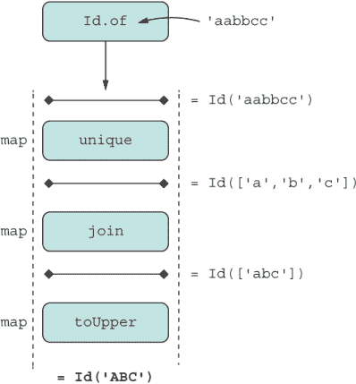
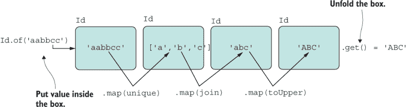
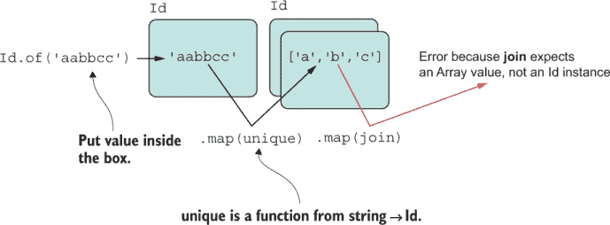
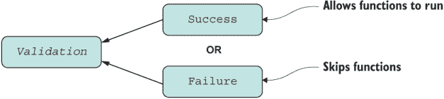
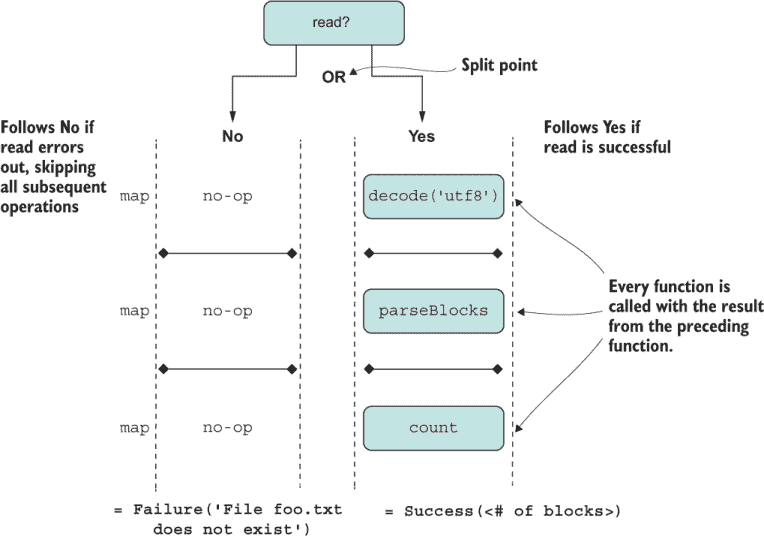
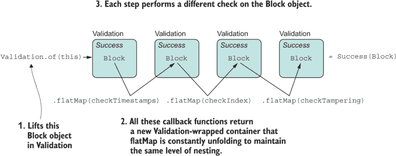
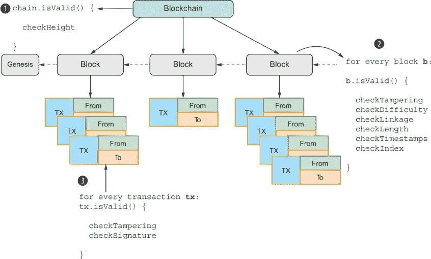

# 5 高阶组合

本章涵盖

+   使用 `map` 和 `flatMap` 安全地转换数组和对象

+   使用代数数据类型的可组合设计模式

+   编写 `Validation` 数据类型以删除复杂的分支逻辑

+   使用新的绑定运算符（`::`）链式使用 ADT

*抽象的目的是不是模糊，而是创建一个新的语义层，在其中可以绝对精确。*

—埃德加·迪杰斯特拉

在第四章中，你学习了当使用 `compose` 链接函数的输入和输出，数据通过它们传递时，函数组合如何导致流畅、紧凑和声明式代码。组合有很多好处，因为它使用了 JavaScript 最强大的功能，正如我多次说过的：高阶函数。使用函数，你可以在最低的抽象单元上实现低级组合。但高阶组合也存在于对象组合的方式中。使对象组合与函数一样强大是我们将在第 5.3 节中讨论的关键思想。

本章中你将学习的可组合对象模式被称为代数数据类型（ADT）模式。ADT 是一个具有特定、众所周知接口的对象，它允许类似 `compose` 的抽象来链式连接多个 ADT。与任何类一样，ADTs 也可以包含或存储其他对象，但它们比类简单得多，因为它们仅模拟一个单一的概念，例如验证、错误处理、空值检查或序列。由于你已经学习了函数组合，你可以看到在没有任何失败且所有函数的输入和输出都定义良好的世界中，组合函数非常简单。但是，当你还需要验证数据并利用此模式捕获异常时，情况就不同了。学习使用 ADTs 对于此目的非常有用，因为它们提供了简洁的 API，允许你从更简单的部分构建整个程序——这是组合的核心。

抽时间反思一下我们在第四章中解决的问题。例如，给定一个用户的数字钱包地址，我们计算了区块链中的比特币总额。但是，如果提供的地址是 `null` 会发生什么？嗯，在这种情况下，程序会失败，因为我们没有添加任何针对这种可能性的保护措施。

更普遍地，我们如何处理在组合序列中流动的无效数据（`null`，`undefined`）？`compose` 的语法没有给你多少空间在函数之间插入命令式条件验证语句。与其在每个函数中添加常见的验证逻辑，不如像以下列表所示提取它。

列表 5.1 在每个组合函数之前嵌入验证检查

```
compose(f3, validate, f2, validate, f1, validate);

function validate(data) {
   if(data !== null) {       
      return data;                                          ❶
   }
   throw new TypeError(`Received invalid data ${data}`);    ❷
}
```

❶ 将数据传递给链中的下一个函数。

❷ 否则，以错误退出。

然而，这个过程不起作用，因为

+   它是重复的。

+   你失去了验证发生的上下文，这意味着在失败的情况下，你无法应用特定的规则或退出并给出适当的验证消息。

+   抛出异常会产生副作用。

关于最后一点，如果第一个函数未能产生有用的结果，那么其余的流程可能不应该继续进行。当你与可能抛出异常的第三方代码一起工作时，也会发生同样的事情。在命令式世界中，你会添加 `try`/`catch` 保护。但是，再次强调，`try`/`catch` 并不是你可以轻易插入 `compose` 的东西；它是 FP 和 OO 之间的阻抗不匹配，你将不得不与 FP 作斗争，以保持事情线性化和无点式。看看下一个列表。

列表 5.2 将 `try`/`catch` 与 `compose` 混合的不便

```
compose(
  c => {
    try {
      return f3(c);       ❶
    }
    catch(e) {
      handleError(e);
    }
  }, 
  b => {
    try {
      return f2(b);       ❶
    }
    catch(e) {
      handleError(e);
    }
  },
  a => {
    try {
      return f1(a);       ❶
    }
    catch(e) {
      handleError(e);
    }
  }
)
```

❶ 因为每个函数都被命令式错误处理代码所包围，所以你无法利用声明性和无点式风格（第四章）。

这种糟糕的设计是错误地结合范式的结果。我们可能更喜欢以一种减轻副作用的方式处理这个任务，而不是突然抛出错误。为了解决这个问题，我们需要添加必要的护栏或包装器，以控制函数及其验证操作执行的上下文，同时保持事情分离、紧凑和声明性。这听起来是不是要求很高？如果没有必要的技巧，确实如此。本章教授了这些技巧，所有这些技巧都围绕高阶函数展开，并辅以一些更多的 FP 原则。

ADT 提供了一个众所周知、通用的 API，它促进了可组合性。你会了解到 `map` 接口（与 `Array#map` 的精神相同）表明一个特定的对象表现得像函子。同样，`flatMap` 接口表明一个对象表现得像单子。我们很快就会解开这两个术语。这两个接口都允许 ADT 与其他对象进行组合。

注意：术语“函子”和“单子”起源于范畴论，但你不需要理解数学就能在实践中学以致用。

在教授了一些基础知识之后，本章将逐步深入到从头创建 ADT，解决验证或检查块、事务甚至整个区块链数据结构内容背后的复杂性。到那时，你将理解像这样的代码做什么：

```
Validation.of(block)
  .flatMap(checkLength(64))
  .flatMap(checkTampering)
  .flatMap(checkDifficulty)
  .flatMap(checkLinkage(previousHash))
  .flatMap(checkTimestamps(previousTimestamp));
```

此代码解决了我们之前提出的所有问题，尽管具体做法可能还不明显。代码消除了重复，没有产生额外的副作用，而且（最好的是）是声明性和无点式的。这种类型的抽象“验证”在验证逻辑周围创建了一个封闭的上下文。让我们首先理解我们所说的封闭上下文是什么意思。

## 5.1 在数据类型上封闭

当我们编写函数时，理想的情况是假设完美的应用状态。也就是说，所有进入和离开我们函数的数据始终是正确和有效的，并且我们系统中的对象没有`null`或`undefined`值。这种状态将允许我们减少数据检查的样板代码。遗憾的是，这种情况永远不会发生。或者，我们可以考虑使用某种抽象来包装函数，该抽象始终检查任何类型的不合法数据。在本节中，我们将创建一个简单的抽象，以开始熟悉本书中展示的模式。在第 5.5 节中，我们将在此基础上构建一个实际的 ADT。

当我们将业务逻辑与数据验证、错误处理或日志记录等辅助工作交织在一起时，函数可能会变得复杂。我们可以将这些关注点视为与当前任务无关，但它们是工作应用程序的重要部分。其他任务可能包括处理异常或将日志记录到文件中。我们将这些任务称为效果。

注意：效果不要与副作用混淆。副作用可能是一种效果，如在这个上下文中使用的效果，但效果更多的是一种任意任务。

让我们关注这些效果中的一个：数据验证。假设你正在编写一个小算法，使用一系列函数。在每一步，你都想确保每个函数接收到的参数是有效的（非空、大于零、非空等）。这些对于确保算法从实用角度来说是重要的，但不是算法本身的必要部分。而不是在每个函数中添加混乱，你可以以某种形式将这个效果抽象化。

假设这个假设的算法有三个步骤：`f1`、`f2`和`f3`。你已经在列表 5.1 中的代码中看到了交织发生的情况：

```
compose(f3, validate, f2, validate, f1, validate);
```

在每个函数运行之前都会进行数据验证。让我们改进这段代码以消除重复。使用第四章的教训，我们将使用接受要执行的函数和以 curried 形式提供的数据作为输入的高阶函数来包装这些函数（封闭它们）。高阶函数擅长将一些代码转换为可调用形式。这种方法将允许`validate`根据提供的数据的有效性来决定是否应用函数。

为了说明一个可能的解决方案，让我们通过仅关注调用函数，并假设`null`检查成功（非空）来使我们的问题更加具体。考虑一个如`applyIfNotNull`的函数：

```
function applyIfNotNull(fn) {
  return data => {
     if (data !== null)  {
       return data;
     }
     throw new Error(`Received invalid data: ${data}`);
  }
}

compose(applyIfNotNull(f3), applyIfNotNull(f2), applyIfNotNull(f1));
```

如你所见，在每次函数调用周围都会重复 null 检查。因为`applyIfNotNull`是手动 curried 的，所以我们可以通过映射到构成你的业务逻辑的函数上，如下一列表所示来消除重复。

列表 5.3 使用`map`将多个函数应用于`compose`

```
compose(...[f3, f2, f1].map(applyIfNotNull));        ❶
```

❶ 将 applyIfNotNull 应用于每个函数，然后将结果数组作为参数展开传递给 compose

这一步使我们的代码更接近于声明式、表达式导向的代码，而不是命令式分支逻辑，但我们仍然需要考虑两个项目：

+   在现实世界中，`null`检查并不是我们需要的唯一验证形式。我们需要支持更多种类的逻辑。

+   我们使用异常，它本身就是一个副作用，以戏剧性的方式跳出逻辑。

我们需要从函数级别提升抽象级别，到某种形式上下文数据结构，它可以以某种方式跟踪验证结果，并相应地应用函数。一种方法是用封装数据的包装器对象，将应用效果到这些数据作为其业务逻辑的一部分，就像`applyIfNotNull`之前所做的那样，以不可变的方式执行，而不泄露副作用。

在 JavaScript 中，可能最简单的容器数据结构是`Array`，在其全面的方法集中，有一些我们可以用于此类抽象的方法：

+   一个静态函数用于使用值构造新容器——对于一个类`C`，这个函数通常被称为`C.of`或`C.unit`。这个函数，类似于`Array.of`，也被称作类型提升函数，因为它允许你将一些类型变量带入你将要执行操作的环境中。将一些对象提升并放入一个盒子是一个很好的类比。

+   一个转换这些数据的函数——这种转换通常通过对象上的特定契约的`map`方法来完成。`map`是所有实例共享的，因此它应该在原型级别（`C.prototype.map`）上定义。

+   一个从容器中提取结果的函数——这个函数的实现是特定的。对于数组，你可以使用类似`Array#pop`的东西。

任何超出此协议的内容都取决于你为特定包装器需要的额外逻辑。

在我们开始实现自己的包装器之前，让我们继续使用数组来表示封装和不可变性。这种做法将帮助我们熟悉 ADT 使用的编码模式。

将值包装在某种容器中，例如数组字面量，可以在多个值上自动提供流畅编码能力，而不仅仅是单个值。为了讨论方便，让我们专注于一个值。考虑这个例子。给定一个字符串，假设你想删除重复字符并将最终字符串转换为大写。例如，对于输入`"aabbcc"`，结果应该是`"ABC"`。

足够简单。正如你所知，将一系列计算应用于元素数组的最有效方式是通过`map`，这是一个无状态方法，因此你永远不会改变调用它的原始数组或其元素。这种情况满足不可变性的要求。此外，我们需要方法将值放入数组，然后提取数据。为此任务，我们可以分别使用提升操作`Array.of`和`Array#pop`，如下一列表所示。

列表 5.4 在数组上映射函数

```
const unique = letters => Array.from(new Set(letters));      ❶
const join = arr => arr.join('');
const toUpper = str => str.toUpperCase();

const letters = ['aabbcc']
   .map(unique)  // [['a', 'b', 'c']]
   .map(join)    // ['abc']
   .map(toUpper) // ['ABC']
   .pop();                                                   ❷

letters; // 'ABC'
```

❶ 使用 Set 的能力，它接受一个可迭代对象，来移除重复项

❷ 也可以使用 Array.prototype.shift 或 [0]

通过直接使用数组字面量，JavaScript 给我们一些语法上的改进（以盒子的形式）：

```
['aabbcc']
   .map(unique)
   .map(join)
   .map(toUpper)
   .pop(); // 'ABC'
```

如果你想要更加精确一些，可以使用 `Array.of` 作为泛型构造函数：

```
Array.of('aabbcc')
   .map(unique)
   .map(join)
   .map(toUpper)
   .pop(); // 'ABC'
```

注意：当你构造一个新数组时，使用 `new` 与 `Array` 构造函数并不是最佳做法。这个函数的行为不可预测，取决于使用的类型。例如，`new Array('aabbcc')` 创建了一个包含单个元素 `['aabbcc']` 的数组，正如我们所期望的。但 `new Array(3)` 创建了一个包含三个空槽的空数组：`[, , ,]`。`Array.of` API 修正了这种情况，但在大多数情况下，最简单的方法是直接使用数组字面量表示法：`['aabbcc'].`

使用数组产生的容器类似于我们所说的身份上下文。这个术语来源于简单而流行的 `identity` 函数 `(const identity = a => a)`，你可以在第四章中了解到这个函数。这个函数在函数式程序中常用，并回显它所给出的值。在函数式编程（FP）中，身份意味着某些值保持不变。

同样，一个身份上下文不会有自己的计算逻辑。它包装一个单一值，并且不会进行任何额外的处理，除了你在映射函数中提供的；它对数据没有影响。我们说它是无上下文的，或者无副作用的。

让我们进一步探讨数组示例。一种在 JavaScript 中轻松实现 `Id` 类的方法是扩展 `Array`，如列表 5.5 所示。这个例子仅用于说明 `map` 操作符如何泛型地应用于包含单个值的简单容器。通常，我不推荐从标准类型扩展（猴子补丁）；这个例子是为了教学目的，其用途将在后面变得清晰。

列表 5.5 通过扩展 `Array` 实现无上下文容器

```
class Id extends Array {
   constructor(value) {
      super(1);                 ❶
      this.fill(value);
   }
 }

 Id.of('aabbcc')                ❷
   .map(unique)
   .map(join)
   .map(toUpper)
   .pop(); // 'ABC'             ❸
```

❶ 初始化底层数组的大小为 1，因为我们只需要包装一个值

❷ 继承 Array.of 作为类型提升函数

❸ 继承 Array#pop 从容器中提取值

`Id` 和 `[]`（空数组）都是封闭上下文的例子。尽管这个例子可能看起来并不激动人心，但这里还有更多值得注意的地方。具体来说，`Id`

+   使数据转换 API 流畅，其中每个阶段都执行一个可预测的转换，朝着最终结果前进，就像装配线一样。

+   提供了一定程度的数据封装。

+   以不可变的方式执行所有操作，因为过程的每个阶段都会返回一个带有新值的新容器。映射函数可以将`Id`内部的数据转换为任何形状，只要它推进我们的逻辑，朝着最终结果前进。我们说映射函数是从`a`到`b`的任何函数（`a`和`b`是任何对象），它将容器从`Id(a)`转换为新的`Id(b)`。

从概念上讲，使用容器编程比喻性地类似于装配线或铁路，如图 5.1 所示。



图 5.1 使用容器进行装配式计算。在这种情况下，线的每一步都映射不同的转换，沿途创建新的中间结果，直到达到所需的产品。

注意：在 5.5.4 节中，你会看到使用包装器实现验证（这是一个二元操作）会导致两条路径或铁路。

最后这一点，即通过应用函数创建新容器，是保证映射函数纯净最重要的因素。记住，纯净是使你的代码易于推理的关键成分。以`Array`的`sort`和`reverse`为例，它们会就地修改原始对象。这些 API 使用起来更困难，因为它们可能导致意外的行为。另一方面，像 5.2 节中提到的不可变 API 要安全得多。

## 5.2 新数组 API：{flat, flatMap}

`Array#{flat,` `flatMap}`是强大的、包罗万象的 JavaScript `Array`对象的两个主要新增功能。你在第四章的结尾简要看到了这些方法的使用。这两个方法都允许你轻松地管理多维数组：

```
[['aa'], ['bb'], ['cc']].flat();      // ['aa', 'bb', 'cc']
[[2], [3], [4]].flatMap(x => x ** 2); // [4, 9, 16] 
```

与所有最近添加的`Array`方法一样，这些操作都是不可变的；它们不会改变原始对象，而是创建新的。让我们从`flat`开始。

### 5.2.1 Array.prototype.flat

`Array#flat`允许你在不打破你简洁流畅的模式的情况下处理多个数组维度。以下是一些示例：

```
[['aa'], ['bb'], ['cc']].flat().map(toUpper);   // ['AA', 'BB', 'CC']
```

该方法甚至有内置的智能来跳过嵌套的非数组对象。数组中的空槽位保持不变：

```
[['aa'], , ['bb'], , ['cc']].flat().map(toUpper);   // ['AA', 'BB', 'CC']
```

关于`flat`的一个有趣的事实是，你可以折叠无限深度的结构：

```
[[[[['down here!']]]]].flat(Infinity); // ['down here!']
```

`flat`还允许你与自身返回数组的函数一起工作。回想一下列表 5.4 中的`unique`，它接受一个字符串并返回一个包含所有字母但不包含重复字母的数组。例如，将`unique`映射到`['aa',` `'bb',` `'cc']`上会产生一个嵌套结构`[['a'],` `['b'],` `['c']]`，我们可以在最后轻松地将其展平：

```
const unique = letters => Array.from(new Set([...letters]));

['aa', 'bb', 'cc'].map(unique).flat(); // ['a', 'b', 'c']
```

由于`map`和`flat`经常一起使用，JavaScript 提供了一个同时处理这两个方法的 API。

### 5.2.2 Array.prototype.flatMap

`map`然后`flat`的序列在日常编码中经常被使用。例如，你可能需要遍历链中的所有块，然后遍历每个块内的所有交易。幸运的是，一个名为`flatMap`的快捷方式同时调用这两个操作，如下所示。

列表 5.6 `flatMap`的基本使用

```
['aa', 'bb', 'cc'].flatMap(unique);       ❶

// ['a', 'b', 'c']
```

❶ `unique`返回一个数组。`flatMap`在将回调函数映射到所有元素之后，运行内置的扁平化逻辑，而不是产生嵌套数组。

我们都把`map`和`flatMap`理解为允许你将回调函数应用于数组的操作。然而，从概念上讲，这些操作超越了数组。如果你已经阅读了第四章并理解了函数式编程的基本原理，这种形式的代码应该看起来像是一个熟悉的模式：

```
Id.of('aabbcc') 
  .map(unique)
  .map(join)
  .map(toUpper);
```

你会说这段代码看起来像是组合吗？事实上，以下代码产生的结果（`'ABC'`）与上一个相同：

```
const uniqueUpperCaseOf = compose(toUpper, join, unique)

uniqueUpperCaseOf('aabbcc') // 'ABC'
```

`map`和`compose`是如何得到相同结果的？与`compose`相比，除了微小的语法差异外，`map`和`flatMap`代表上下文组合，在很大程度上是等价的。

## 5.3 map/compose 对应关系

在 5.1 节中，我说过`map`允许对象（如`Id`和其他）应用函数。这个陈述同样适用于`flatMap`。在本节中，你将了解到在根本层面上，这两个操作符的行为类似于`compose`，因此本质上，使用`map`不过是函数组合，这巩固了函数式编程的思维方式。

从技术角度讲，这种等价性也很重要，因为你可以获得我们在第四章中提到的使用`compose`的所有好处，但现在应用到了对象上。让我们通过将`map`定义为`compose`来演示这种等价性：

```
Function.prototype.map = function (f) {
  return compose( 
      f,
      this
   );
};
```

现在所有函数都自动继承`map`。使用它再次揭示了两者之间的紧密对应关系：

```
 compose(toUpper, join, unique)('aabbcc'); // 'ABC'
 unique.map(join).map(toUpper) ('aabbcc'); // 'ABC'
```

这种对应关系告诉我们，所有通过函数组合获得的好处都可以轻松地应用于复合类型。在我们的简单用例中，`map`是一个接口，允许`Array`和`Id`组合函数，它还将允许你使用的任何 ADT 组合函数。

现在你已经看到了这些概念是如何交织在一起的，让我们定义一个通用的`map`接口，允许任何实现它的对象组合在一起。

## 5.4 通用契约

在本章前面的例子中，你可能已经注意到 `map` 和 `flatMap` 保留了相同的调用者类型。对于数组，两者都返回新的数组；对于函数，两者都返回新的函数。这个事实不能被理所当然地接受。它是 `map` 接口的核心部分，被普遍接受，并允许你的对象与其他函数库（如 Ramda [`ramdajs.com`](https://ramdajs.com/)）或 Crocks [`crocks.dev`](https://crocks.dev/)）一起工作。在本节中，你将了解一些关于函子和单子等模式背后的理论以及它们在 JavaScript 中的实现方式。

Fantasy-land

JavaScript 中函子和单子如何工作的协议，在很大程度上，遵循了 fantasy-land 规范中提出的规则（[`github.com/fantasyland/fantasy-land`](https://github.com/fantasyland/fantasy-land)）。这份文档非常详尽，我强烈建议你花时间理解它，如果你想要成为一名严肃的 FP 程序员的话。这一章肯定能给你一个良好的开端。

关于 ADT 的完整理论非常广泛，最好在专门介绍函数式编程或抽象代数的书籍中找到。在这里，我将涵盖足够的内容，以便你能够解锁使可组合软件成为可能的 FP 模式，从函子开始。

### 5.4.1 函子

一本专注于使用 JavaScript 和函数式编程（FP）享受编程乐趣的书籍，如果没有适当剂量的函子，那就不是完整的。因为函子通过依赖高阶函数进行数据转换，从而最能体现语言的优势。

函子是任何可以映射或正确实现映射接口的东西（例如对象）。例如，JavaScript 中的数组几乎就是函子，`map` 方法使得编程风格优于常规的 `for` 循环，并且更不容易出错。正如你在第 5.3 节中学到的，`compose` 也能使函数成为函子，所以你已经在不知不觉中使用了它们很多次。

为了使一个对象表现得像函子，它需要遵循两个简单的规则，这些规则源于 `map`/`compose` 等价性（第 5.3 节）。为了简单起见，我将再次使用数组来展示规则：

+   标识符 — 将恒等函数映射到容器上会产生一个相同类型的新容器，这也是 `map` 应该无副作用的良好指标：

    ```
    ['aa','bb','cc'].map(identity);  // ['aa', 'bb', 'cc'] 
    ```

+   组合 — 组合两个或多个函数，例如 `f` 在 `g` 之后，等同于先映射 `g` 再映射 `f`。这两个陈述都是等价的，如下所示：

    ```
    ['aa','bb','cc'].map(
          compose(
            toUpper,
            join,
            unique
         )
      );
    ```

    和

    ```
    ['aa','bb','cc']
        .map(unique)
        .map(join)
        .map(toUpper);
    ```

注意，我一直在使用“等价”这个词来表示。这样做是为了避免引起你习惯的其他形式的等价，例如双等号运算符（`==`），它松散地等同于类型转换，以及三等号（`===`），它在值和类型上是一个严格的等价。在这里，“等价”意味着引用透明；如果你用一个表达式替换其值，程序的意义或结果不会改变。

实现一个函子涉及定义 `map` 并遵循这些简单规则，以及创建一个封闭上下文的合约，如第 5.1 节中描述的，例如实现一个类型提升函数 `F.of`，以及从容器中提取值的机制，例如 `get` 方法。正如你在第三章中学到的，将可重用接口应用于任何对象的最佳方式是使用混入。让我们重构 `Id`（如下一列表所示），以利用 `Functor` 混入的优势。

列表 5.7 带最小上下文界面的 `Id` 类

```
class Id {
   #val; 
   constructor(value) {
      this.#val = value;
   }

   static of(value) {          ❶
      return new Id(value);
   }

   get() {                     ❷
      return this.#val;
   }
}
```

❶ 类型提升函数

❷ 获取器以从容器中提取值

`Functor` 是一个混入，它公开了一个 `map` 方法，如下一列表所示。`map` 是一个高阶函数，它将给定的函数 `f` 应用到包装的值上，并将结果存储在相同的容器中，就像 `Array#map`。

列表 5.8 `Functor` 混入

```
const Functor = {
  map(f = identity) {                              ❶
    return this.constructor.of(f(this.get()));     ❷
  }
}
```

❶ `map` 接受一个回调函数来应用，默认使用身份函数作为参数

❷ 将回调函数应用于值，并使用通用类型提升函数将结果包装在相同容器的新的实例中

由于函子合约必须保留封装结构，我们可以通过调用它的容器实例来找出它，并通过使用 `this.constructor.of` 来调用其静态类型提升构造函数。由于我们使用的是类，这使得这个过程变得简单，因为它配置了 `constructor` 属性，并使其易于发现。现在让我们像在第三章中处理 `Transaction` 一样扩展 `Id`：

```
Object.assign(Id.prototype, Functor);
```

一切都像以前一样继续工作。`Array`#`map` 与 `Functor` 的 `map` 具有相同的合约，因此我们可以以相同的方式使用它，如下一列表所示。

列表 5.9 使用 `Id` 函子进行顺序数据处理

```
Id.of('aabbcc')
   .map(unique)   // Id(['a', 'b', 'c'])       ❶
   .map(join)     // Id(['abc'])
   .map(toUpper)  // Id('ABC')
   .get();        // 'ABC'
```

❶ 从 `Id` 映射返回新的 `Id` 对象

让我们可视化函子的内部工作原理，就像打开容器以将其值暴露给映射函数，然后将其重新包装在新的容器中，如图 5.2 所示。



图 5.2 函数在容器上的映射

如果你再次浏览列表 5.9，你会注意到它是相当通用的。除了一个值提取方法的实现（`Id#get` 或 `Array#pop`）之外，所有内容都遵循通用的函子合约。

函子让你将一个简单的函数映射到包装的值上，并将其放回相同类型的新容器中。前端开发者可能已经认识到 `jQuery` 对象的行为就像一个函子。`jQuery` 也是一个函子，并且是第一个推广这种编码风格的 JavaScript 库之一（[`api.jquery.com/jquery.map`](https://api.jquery.com/jquery.map/)）。

现在我们来看一个稍微不同的情况。如果你映射一个返回容器的函数，比如映射返回 `Id` 对象的函数，会发生什么？根据你在本章中学到的关于数组的知识，像 `flatMap` 这样的操作符被设计来解决这个问题。为了理解为什么，我们将研究 monads。

### 5.4.2 Monads

Monads 被设计用来处理组合返回容器的操作。组合返回 `Id` 的函数可能导致一个 `Id` 内部嵌套另一个 `Id`；当你组合 `Array` 时，你会得到一个多维数组，依此类推。你明白了。

一个对象通过实现函子规范和 `flatMap` 合约以及它自己的简单协议成为 monad。原因是我们将需要 `map` 返回包装数据的函数。假设这个代码片段中的每个函数都返回一个 `Id`：

```
Id.of('aabbcc')
   .map(unique)   
   .map(join)     
   .map(toUpper)  
   .get();     
```

结果将类似于图 5.3。



图 5.3 映射包含包装值的 `Id` 函数

Monads 将链式计算序列提升到下一个层次，这样你就可以组合使用相同容器或其他容器的函数。我们现在将坚持使用相同的容器，因为这种模式在实践中是最常见的。为了参考，fantasy-land 的条目在 [`github.com/fantasyland/fantasy-land#monad`](https://github.com/fantasyland/fantasy-land#monad)。考虑一个 monad `M` 和在 5.4.2 节中定义的等价性：

+   左单位性 — 类型提升某个值 `a` 然后使用函数 `f` 调用 `flatMap` 应该产生与直接使用 `a` 调用 `f` 相同的结果。在代码中，这两个表达式是等价的：

    ```
    M.of(a).flatMap(f)  and   f(a)
    ```

    让我们用简单的数组展示左单位性：

    ```
    const f = x => Array.of(x**2);
    Array.of(2).flatMap(f); // [4]
    f(2);  //[4]
    ```

+   右单位性 — 给定一个 monad 实例，使用类型提升构造函数调用 `flatMap` 应该产生一个等价的 monad。给定一个 monad 实例 `m`，下一列表中的代码片段是等价的。

    列表 5.10 `Array` 示例，说明右单位性

    ```
    m.flatMap(M.of))  and   m

    Array.of(2).flatMap(x => Array.of(x));  // [2]      ❶
    Array.of(2); // [2]
    ```

    ❶ 因为 JavaScript 中 Array.of 的实现有多个参数，所以我们不能通过名称传递函数到 flatMap；相反，我们必须使用函数 x => Array.of(x)。

+   结合律 — 由于数字在加法下是结合的，因此 monads 在组合下也是结合的。你以括号括起来的方式赋予表达式的优先级不会改变最终结果。给定一个 monad 实例 `m` 和函数 `f` 和 `g`，以下表达式是等价的：

    ```
    m.flatMap(f).flatMap(g) and m.flatMap(a => f(a).flatMap(g))

    const f = x => [x ** 2];
    const g = x => [x * 3];
    Array.of(2).flatMap(f).flatMap(g);   // [12]
    Array.of(2).flatMap(a => f(a).flatMap(g)); // [12]
    ```

当你处理单个值时，`map`-then-`flat` 的操作也可以理解为仅返回映射函数的结果，从而忽略最外层。以下列表中的 `Monad` 混合实现了这个任务。

列表 5.11 `Monad` 混合

```
const Monad = {
  flatMap(f) { 
    return this.map(f).get();       ❶
  },
  chain(f) {                        ❷
    return this.flatMap(f);
  },
  bind(f) {                         ❷
    return this.flatMap(f);
  }
};
```

❶ 忽略额外的包装层并假设类型是函子

❷ 你也可能发现这个方法被称为 bind 或 chain。

这个例子告诉我们，当我们具体处理 JavaScript 数组时，`flatMap` 比手动调用 `map` 和 `flat` 更有效率。从 CPU 周期和内存占用角度来看，这个程序更有效率。记住，每次调用 `map` 或 `flat` 都会创建一个新的数组，所以一次性将它们组合起来可以防止额外的开销。

方法融合

数组以 monadic 方式行为的事实具有许多优点。组合律不仅是 functors 和 monads 行为的核心部分，也是容器类型方法融合（也称为快捷融合）的性能提升。本质上，你可以使用 `compose` 将多个对 `map` 的调用融合或组合成一次执行。看看用于此协议的示例：

```
['aa','bb','cc'].map(
      compose(
        toUpper,
        join,
        unique
     )
  );
```

和

```
['aa','bb','cc']
      .map(unique)
      .map(join)
      .map(toUpper);
```

这两个片段生成相同的输出，但第一个片段只使用了四分之一的空间。`compose` 避免了对 `map` 的多次调用，每次调用都会在内存中创建另一个数组的副本。对于这么大的数组，性能的提升是可以忽略不计的。但如果我们处理大量数据，方法融合可以帮我们避免内存不足的问题。例如，Lodash ([`lodash.com`](https://lodash.com/)) 这样的库，它使用懒计算，可以分析一个结合了 `map`、`filter` 等调用的表达式，然后将它们融合在一起。

为了完整性，考虑一个使用 `Id` 的类似示例：

```
const square = x => Id.of(x).map(a => a ** 2);
const times3 = x => Id.of(x).map(a => a * 3);
Id.of(2)
   .flatMap(square)
   .flatMap(times3)
   .get(); // 12

Id.of(2)
   .flatMap(a => square(a).flatMap(times3))
   .get(); // 12
```

为了让这段代码能够正常工作，我们将再次通过将 monadic 行为整合到 mixin 中来扩展 `Id`：

```
Object.assign(Id.prototype, Functor, Monad);
```

模拟类型类

我认为这里使用 mixins 作为这些 API 的实现策略还有一个原因：它们在 Scala 和 Haskell 等函数式语言中建模了一个等效的概念。类型类允许你定义一个通用接口，以便任何对象都可以符合某种行为。例如，`Functor` 和 `Monad` 可以通过很少的工作使任何类型表现出 monadic 行为。

我们还可以继续优化这个例子。之前，我提到 monads 也是一种 functors。根据那个定义，将 `Functor` mixin 组合到 `Monad` mixin 中是有意义的。考虑下一个列表中的 `Monad` 定义。

列表 5.12 定义 `Monad` 和 `Functor`

```
const Monad = Object.assign({}, Functor, {
  flatMap(f) {
     return this.map(f).get();      ❶
  }
  //...                             ❷
});
```

❶ 在 Functor 中引用 map

❷ 省略了其他方法别名

这个例子展示了组合的灵活性和多功能性。现在你可以通过其完整契约将其类型变成一个 `Functor` 或一个完整的 `Monad`：

```
Object.assign(Id.prototype, Monad);
```

到目前为止，你已经以基本的方式学习了 functors 和 monads 的定义。尽管这些规则可能感觉是人为的、限制性的，但它们为你提供了巨大的结构——与使用 `Array#{map,` `filter,` `reduce}` 而不是直接的 `for` 循环和 `if` 条件所得到的相同结构。

Functor 和 monad 是通用的接口（协议），可以通用地插入到应用程序的许多部分。遵守它们，任何第三方代码或应用程序的其他部分，如果实现或支持这些类型，将确切知道如何与之协同工作。一个很好的例子是 `Promise` 对象，你可能很熟悉。在某种程度上，Promise 是基于 functors 和 monads 构建的；用 `then` 替换 `map` 或 `flatMap`，许多第 5.4 节中讨论的规则都适用。我们将在第八章中更详细地研究 Promise。

Monad 模式并不容易理解，但重要的是现在就开始学习它们；这些模式在现代软件开发中越来越多地出现，你不想被卷入一个墨西哥卷饼（[`youtu.be/dkZFtimgAcM`](https://youtu.be/dkZFtimgAcM)）；你想要做好准备。

在实践中，你可能永远不会需要在自己的应用程序中实现 `Id`。我这样做是为了向你展示这个模式的工作原理以及如何通过添加 `Functor` 和 `Monad` 混合来赋予这个类强大的可组合行为。真正的价值将来自更精致、更智能的类型，它们在 `map` 和 `flatMap` 方法中具有自己的计算逻辑。在第 5.1 节中，我定义了一个封闭上下文，并展示了它如何模拟铁路驱动的数据处理方法。在掌握基础知识之后，我们将进一步提高标准，并创建我们自己的 ADT 来实现上下文验证。

## 5.5 使用高阶函数进行上下文验证

ADT 仅仅是一个不可变复合数据结构，其中包含其他类型。实践中大多数 ADT 都实现了 monad 协约，就像 `Id` 容器一样。

在我们深入探讨之前，值得指出的是，ADT 与抽象数据类型（简称 ADT）是不同的模式：一个应该包含相同类型对象的集合，例如 `Array`、`Set`、`Stack` 和 `Queue`（尽管 JavaScript 不强制执行此规则）。另一方面，代数数据类型模式可以且通常包含不同类型。名称中的代数部分来自数学协议中的恒等性、可组合性和结合性（第 5.4 节）。

在本节中，我们将学习 ADT 的基础知识，并了解如何使用 Functor 和 Monad 合约以可组合的方式解决上下文数据验证。

### 5.5.1 ADT 类型种类

ADT 在强类型世界中更为突出，其中类型信息使代码更加明确和严谨。（有关在 JavaScript 中使用类型的更多信息，请参阅附录 B。）但即使没有类型信息，我们仍然可以做很多事情。本节将探讨两种最常见的 ADT 类型：`Record` 和 `Choice`。这两个都封装了一些有用的编码模式。

Record

记录类型是一个包含固定数量（通常是原始类型）的操作数的复合类型。这类似于数据库记录，其中模式描述了它可以持有的类型，并且具有固定长度。一些 JavaScript 库，如 Immutable.js，提供了一个可以导入和使用的 `Record` 类型。记录最常见的例子是不可变的 `Pair`：

```
const Pair = (left, right) => 
  compose(Object.seal, Object.freeze)({
    left,
    right,
    toString: () => `Pair [${left}, ${right}]`
  });
```

`Pair` 是一个具有 2 个基数的不变对象，可以用来关联两块信息（任何类型），例如用户名和密码、公钥和私钥、文件名和访问模式，甚至是在映射数据结构中的键/值条目。`Pair` 是一个泛型记录类型，其中 `Money`（在第四章中引入）或类似 `Point(x, y)` 的类型可以派生出实现。

`Pair` 的最佳用途是在函数中同时返回两个相关值。最常见的是，使用简单的数组字面量或甚至简单的对象字面量来表示基本的 `Pair`。然后你可以利用解构来访问每个字段。你可以有如下内容

```
const [id, block] = blockchain.lookUp(hash);

const {username, password} = getCredentials(user);
```

很不幸，这两种方法并不奏效，因为它们是可变的，并且由于数组是泛型的，它并没有传达其值之间的任何关系。记录在语义上传达了其值之间的逻辑与关系，意味着它们必须存在或一起有意义（例如用户名和密码）。

记录也被称为产品或元组。一对是 2-元组，一个三元组是 3-元组，以此类推到 n-元组。JavaScript 没有原生的元组或记录概念，但一个早期的提案可能会在不久的将来将其引入 JavaScript（[`github.com/tc39/proposal-record-tuple`](https://github.com/tc39/proposal-record-tuple)）。

### 5.5.2 选择

与记录强制逻辑与不同，选择表示操作数或它接受的值之间的逻辑或关系。选择也被称为区分联合或求和类型。与记录一样，选择类型可以持有多个值，但在任何给定时间点只使用其中一个。一个简单的类比是使用 JavaScript 的 null 合并和 nullish 合并运算符。考虑下一个列表中的简单示例。

列表 5.13 Null 和 nullish 合并运算符

```
const hash = precomputedHash || calculateHash(data);      ❶

const hash = precomputedHash ?? calculateHash(data);      ❷
```

❶ 当左侧包含一个假值时评估右侧

❷ 仅当左侧为 null 时评估右侧

在 null 合并运算符的情况下，如果 `precomputedHash` 不是一个假值（null、undefined、空字符串、0 等），则此表达式评估 `||` 运算符的左侧；否则，它评估为右侧。我建议你使用 nullish（或 nullary）合并运算符（`??`），因为它仅在 `precomputedHash` 是 `null` 或 `undefined` 时评估右侧，这通常是你的意图。

选择类型常用于涉及数据检查、数据验证或错误处理的情况。原因在于选择模型了互斥分支，如成功/失败、有效/无效和 ok/错误。这些情况是简单的二元（基数 2）用例，我们错误地倾向于滥用布尔值。

例如，如果你有 TypeScript 的经验，枚举类型或实用类型是表示可能处于多种状态之一的对象的常见方式。考虑以下定义：

```
type Color = 'Red' | 'Blue';
```

仅使用最小工具，你也可以扩展 JavaScript 以使用类型（附录 B）并以相同的方式使用枚举。另一个类比是 `switch` 语句，它通常用于调用具有多个可能状态的条件逻辑。有两个情况时，选择类型的逻辑可能看起来像这样：

```
switch(value) {
  case A:
    // code block
    break;
  case B:
    // code block
    break;
  default:
    // code block
}
```

使用这种结构，考虑以下列表中的假设用例，该用例检查某个值的有效性。

列表 5.14 使用 `switch` 语句根据一个条件执行操作

```
switch(isValid(value)) {
  case 'Success':
    return doWork(value);
  case 'Failure':
    logError(...);            ❶
  default:
    return getDefault();
}
```

❶ 故意跳过 return/break 以返回默认值

你可以将选择 ADT 视为始终跟踪多个互斥状态并根据情况做出反应。验证数据与此类似，你只能有两种可能的结果：成功或失败。

### 5.5.3 使用 Validation 单子建模成功和失败

数据验证是常见的编程任务，通常涉及大量的代码拆分（`if`/`else`/`switch` 语句），这些语句经常被复制并分散在应用程序的几个部分中。我们都非常清楚，带有大量条件语句的代码会变得混乱，难以抽象，更不用说难以阅读和维护了。本节将教你如何实现和使用单子来解决这个问题，同时保持你的代码易于阅读、模块化，并且（最重要的是）可组合。

通常，在实现 ADT 时，你必须考虑两个维度。一个是类型（记录或选择），另一个是需要组合的级别（函子或单子）。在本节中，我们将创建一个具有单子行为的 `Validation` 对象作为选择类型，以便我们可以将单个验证操作的序列组合在一起。最终，我们将完成 `HasValidation` 混合逻辑的实现，并使用它以一致的方式对区块链中的每个元素运行验证代码。

`Validation` 模型了其计算上下文由两个状态组成，`Success` 和 `Failure`，如图 5.4 所示。



图 5.4 `Validation` 类型的结构。`Validation` 提供了 `Success` 或 `Failure` 的选择，永远不会同时两者都有。

我们将允许 `Success` 分支在活动时对包含的值应用函数（如 `doWork`）。实际上，这项工作听起来像是 `map` 和 `flatMap` 的工作。否则，在验证失败的情况下，我们将跳过调用逻辑并传播遇到的错误。当需要将复杂操作序列中发生的错误向上冒泡时，这种模式很有用——这是 `if`/`else` 和甚至 `try`/`catch` 块都难以处理的。

此外，想想你写了多少次返回布尔值的验证函数。我知道我写过，但这是一个坏习惯。通过从你的函数中返回 `Validation` 对象，你直接强迫用户正确处理 `Success` 和 `Failure` 情况，而不是测试布尔值。另一个明显的优点是，你的函数变得自文档化，或者用 Edsger Dijkstra 的话说，“更精确。”在 JavaScript 中，这个优点很重要，因为文档通常缺乏，你需要跟踪代码以查看抛出了哪些异常或任何特殊的错误值，例如 `null` 或 `undefined`。提前承认某些操作可能会失败要好得多，而不是让你的用户猜测在调用特定函数时是否可能发生错误。我们都可以同意，返回 `false` 并没有向调用者传达有关哪个操作或数据无效的任何信息；没有上下文。

最后，验证过程的一个良好品质是它们能够快速失败。因为组合链连接了一个函数的输入和输出，当已经发现错误时，让函数运行无效数据是没有意义的。短路是有意义的。

让我们看看一个假设的区块链示例，该示例涉及验证一个区块是否被篡改。通过重新计算区块的哈希并与其自身进行比较，这个检查很容易完成：

```
const checkTampering = block =>
  block.hash === block.calculateHash() 
     ? Success.of(block) 
     : Failure.of('Block hash is invalid');

const block = new Block(1, '123456789', ['some data'], 1);
checkTampering(block).isSuccess; // true

block.data = ['data compromised']; 
checkTampering(block).isFailure; // true
```

此函数检查特定条件，并返回包含正确值的 `Success` 包装器或包含错误信息的 `Failure` 对象。此函数不关心错误如何向前传播或作为更长组合链的一部分如何工作；它专注于自己的任务。

`Success` 和 `Failure` 分支都是 `Validation` 组合的一部分，并且是驱动一系列验证到达最终结果或错误的中心抽象。`Success` 和 `Failure` 是封闭的上下文，将操作成功或失败作为应用程序的一等公民进行建模。以下列表使用一个类来实现这种行为。

列表 5.15 父 `Validation` 类

```
class Validation {
  #val;                                                               ❶
  constructor(value) {
    this.#val = value;
    if (![Success.name, Failure.name].includes(new.target.name)) {    ❷
      throw new TypeError(
        `Can't directly instantiate a Validation. 
            Please use constructor Validation.of`
      );
    }
  }

  get() {                                                            ❸
    return this.#val;
  }
  static of(value) {                                                 ❹
    return Validation.Success(value);
  }

  static Success(a) {
    return Success.of(a);
  }

  static Failure(error) {
    return Failure.of(error);
  }

  get isSuccess() {                                                  ❺
    return false;
  }

  get isFailure() {                                                  ❺
    return false;
  }

  getOrElse(defaultVal) {                                            ❻
    return this.isSuccess ? this.#val: defaultVal;
  }

  toString() {
    return `${this.constructor.name} (${this.#val})`;
  }
}
```

❶ 值是私有的且只读的

❷ 防止直接实例化，有效地使 Validation 成为抽象类，并强制通过其变体类型（Success 和 Failure）访问其行为

❸ 从容器中读取值

❹ 泛型类型提升函数，返回 Success 的新实例

❺ 在运行时查询容器的类型；默认设置为 false 以表示没有分支是激活的

❻ 提供了一种通用的恢复方式

从这个类派生出具体的变体选择：`Success`和`Failure`。`Success`路径就是我们所说的快乐路径，所以它与父类没有太多区别。`Failure`覆盖了一些继承方法的某些行为，如下一列表所示。

列表 5.16 `Validation`的`Success`和`Failure`分支

```
class Success extends Validation {
  static of(a) {
    return new Success(a);;
  }

  get isSuccess() {
    return true;                                                    ❶
  }
}

class Failure extends Validation {
  get isFailure() {                                                 ❶
    return true;
  }

  static of(b) {
    return new Failure(b);
  }
  get() {                                                           ❷
    throw new TypeError(`Can't extract the value of a Failure`);
  }
}
```

❶ 覆盖容器的类型

❷ 在失败时直接调用 get 被认为是编程错误。

使用类与对象来建模 ADT

我选择使用类来设计`Validation`，因为这正是大多数 JavaScript 开发者所使用的。尽管如此，第二章和第三章中涵盖的任何模式（构造函数、OLOO、混合）都可以同样工作。为了比较，这里是一个`Validation` ADT 的 OLOO 版本：

```
    const Validation = {
      init: function(value) {
        this.isSuccess = false;
        this.isFailure = false;
        this.getOrElse = defaultVal => this.isSuccess ? value : defaultVal;
        this.toString = () => `Validation (${value})`;
        this.get = () => value;
        return this;
      }
    };

    const Success = Object.create(Validation);
    Success.of = function of(value) {
      this.init(value);
      this.isSuccess = true;
      this.toString = () => `Success (${value})`;
      return this;
    };

    const Failure = Object.create(Validation);
    Failure.of = function of(errorMsg) {
      this.init(errorMsg);
      this.get = () => 
         throw new TypeError(`Can't extract the value of a Failure`);
      this.toString = () => `Failure (${errorMsg})`;
      return this;
    };
```

如您所见，通过不将基于类的设计强加到 JavaScript 中，OLOO 通过移除私有变量的特殊语法、抽象类行为的强制执行以及所有面向类的继承思维模型（`class`、`extends`）的需求，大大减少了代码的复杂性，同时保持了所有相同的功能。

这可能不是立即显而易见的，但鉴于`Validation`一次只能持有单个值（有效值或错误），它比记录类型更节省内存，记录类型将所有值存储在元组中。

现在我们已经实现了基本部分，让我们看看它们是如何工作的。

### 5.5.4 与单子组合

为了展示这种类型的作用，让我们将`countBlocksInFile`（在第四章开始）重构为一个也具有验证功能的函数：

```
const countBlocksInFile = compose(
    count,
    JSON.parse,
    decode('utf8'),
    read
);
```

这个函数从文件读取到二进制缓冲区，将此缓冲区解码为 UTF-8 字符串，解析此字符串到块数组，并最终进行计数。但这个函数缺少一个重要的部分：检查文件是否存在。如果文件不存在，`read`将抛出异常。同样，如果没有有效的`Buffer`对象，`decode`将抛出异常，依此类推。

因为关键点在于文件是否存在，我们可以使用`Validation`来抽象这个分界点。让我们在下一列表中重构`read`函数，使其返回一个`Validation`实例。

列表 5.17 创建返回`Validation`结果的`read`版本

```
const read = f =>
   fs.existsSync(f) 
     ? Success.of(fs.readFileSync(f))                 ❶
     : Failure.of(`File ${f} does not exist!`);       ❷
```

❶ 这里的条件表达式模拟了逻辑 OR 以决定要遵循哪个分支。

❷ 数组很有用，这样您就可以连接多个错误消息。

现在这段代码是这样工作的：

```
read('chain.txt'); // Success(<Buffer>)
read('foo.txt');   // Failure('File foo.txt does not exist!')
```

执行其余代码是将每个转换映射到每个`Success`容器，就像任何泛型函子一样。`Functor`混合足够使用：

```
Object.assign(Success.prototype, Functor);
```

通过这样做，我们得到了将验证分支和共享数据紧密耦合与将共享行为扩展为松耦合的乐高式 mixins 的好处。由于`map`/`compose`等价性，这段代码在`map`和`compose`下工作得一样好。再次看到这个表面上微不足道的等价性对深层次的影响：

```
const countBlocksInFile = f =>
   read(f)
     .map(decode('utf8')) 
     .map(JSON.parse)
     .map(count);

countBlocksInFile('foo.txt');  // Success(<number>)
```

此外，对于选择 ADT 来说，将函数映射到一边并在另一边跳过（无操作）是一个常见的模式。`Validation`在成功分支上执行，我们将它称为右侧，也称为右偏。在先前的例子中，我们将`Success`（右侧）做成一个 functor。我们还需要考虑`Failure`分支，以便在读取错误的情况下忽略或跳过任何组合操作。为此，我们可以创建一个与常规`Functor`具有相同形状的`NoopFunctor` mixin，如下所示。

列表 5.18 在失败情况下使用`NoopFunctor`以跳过调用映射函数

```
const NoopFunctor = {
  map() {
    return this;         ❶
  }
}
```

❶ 因为数据保持不变，所以返回相同的对象给调用者是有意义的。

让我们将`NoopFunctor`分配给`Failure`（左侧）：

```
Object.assign(
  Failure.prototype,
  NoopFunctor
);
```

在我们考虑了两种情况类之后，执行流程看起来就像图 5.5 所示。



图 5.5 详细展示了在`Validation`类型上映射函数的组合执行。当操作成功时，容器允许每个操作映射到包装的数据；否则，跳转到恢复替代方案。

首先，让我们看看一个简单的失败分支的例子，这样你就可以理解这个对象是如何处理错误的。

假设你想使用`Validation`来抽象检查空对象。首先，创建一个实现分支逻辑的函数（`fromNullable`）：

```
const fromNullable = value => 
   (value === null)
      ? Failure.of('Expected non-null value')
      : Success.of(value);
```

这种抽象帮助我们应用函数到数据上，而无需担心数据是否已定义，如下面的列表所示。

列表 5.19 使用`fromNullable`处理有效的字符串

```
fromNullable('joj').map(toUpper).toString() // 'Success (JOJ)'

fromNullable(null).map(toUpper).toString()           ❶
// 'Failure (Expected non-null value)'
```

❶ map 的底层实现是 NoopFunctor，当数据无效时忽略操作

为了在现实世界中展示这种类型，让我们在我们的区块链应用程序中使用它。验证或验证区块链的内容是这项技术如此重要的一个部分，以至于公司专门实施这个协议的这部分。当然，我们在这本书中实现的是一个大大简化的版本。除了`checkTampering`（如第 5.5.3 节中实现）之外，我们还必须确保块在链中的位置正确（`checkIndex`）以及它们的时间戳大于或等于前一个的时间戳（`checkTimestamp`）。这两个简单规则看起来是这样的：

```
const checkTimestamps = curry((previousBlockTimestamp, block) =>
  block.timestamp >= previousBlockTimestamp 
     ? Success.of(block) 
     : Failure.of(`Block timestamps out of order`)
);

const checkIndex = curry((previousBlockIndex, block) =>
  previousBlockIndex < block.index 
     ? Success.of(block) 
     : Failure.of(`Block out of order`)
);
```

我们将使用柯里化来简化这些函数的应用。注意，我们定义了这些函数为柯里化函数（见第四章），以便将它们作为验证序列组合。因为区块是链式连接的，要比较一个区块，你需要加载前一个区块（在创世区块之后）。从任何区块开始，这个过程总是很简单，因为每个区块都有一个指向前一个区块哈希的引用，以及指向它所属链的引用，如下一个列表所示。

列表 5.20 `Block`的`isValid`方法

```
class Block {
   //... omitting for brevity

   isValid() {
      const {
         index: previousBlockIndex,                        ❶
         timestamp: previousBlockTimestamp
       } = this.#blockchain.lookUp(this.previousHash);

      const validateTimestamps =                           ❷
         checkTimestamps(previousBlockTimestamp, this);

      const validateIndex =                                ❷
         checkIndex(previousBlockIndex, this);

      const validateTampering = checkTampering(this);      ❷

      return validateTimestamps.isSuccess && 
             validateIndex.isSuccess      && 
             validateTampering.isSuccess;

   }
}

const ledger = new Blockchain();
let block = new Block(ledger.height() + 1, ledger.top.hash, ['some data']);
block = ledger.push(block);
block.isValid(); // true

block.data = ['data compromised'];                         ❸
block.isValid(); // false                                  ❹
```

❶ 使用解构并更改变量名

❷ 这些函数返回成功或失败。

❸ 改变了区块的数据

❹ 验证检查因篡改检查失败

如果我们想要返回一个布尔结果，这个代码看起来是完美的，因为它缺少运行操作的任何上下文。然而，在这里，最好的方法是将`isValid`返回一个`Validation`对象而不是布尔值。这样，如果我们想要验证整个区块链数据结构（而不是一个区块），我们可以将所有的`Validation`对象组合在一起，在失败的情况下，我们可以精确地报告错误是什么。

### 5.5.5 使用 Validation 进行高阶组合

正如我们在 5.4.2 节中对`Id`所做的那样，让我们赋予`Validation`与其他相同类型对象组合的能力，并形成链。为此任务，我们可以附加`Monad`mixin，它包括`Functor`以及`flatMap`其他返回`Validation`的函数的能力。对于`Success`分支，我们可以分配`Monad`mixin：

```
Object.assign(Success.prototype, Monad);
```

对于`Failure`，我们可以应用无逻辑的`NoopMonad`：

```
const NoopMonad = {
  flatMap(f) {
    return this;
  },
  chain(f) {
    return this.flatMap(f);
  },
  bind(f) {
    return this.flatMap(f);
  }
}
```

然后扩展`Failure`类似：

```
Object.assign(
  Failure.prototype,  
  NoopMonad
);
```

下一个列表展示了如何将区块对象类型提升到`Validation`。然后 ADT 接管，你所需要做的就是链式连接验证规则，就像构建一个小型规则引擎。

列表 5.21 使用`flatMap`进行`Block`验证

```
class Block {
   ...

   isValid() {
      const {
         index: previousBlockIndex,  
         timestamp: previousBlockTimestamp
       } = this.#blockchain.lookUp(this.previousHash);

       return Validation.of(this)
         .flatMap(checkTimestamps(previousBlockTimestamp))    ❶
         .flatMap(checkIndex(previousBlockIndex))             ❶
         .flatMap(checkTampering);                            ❶
   }
}
```

❶ 柯里化形式是有用的，这样块对象（动态参数）就可以传递到每个`flatMap`调用中。

如你所见，这个实现看起来比之前的实现更加优雅，并且是混合 OOP/FP 实现的一个很好的例子，使用了 mixins。为了确保从 OO 到 FP 的更严格过渡，你可以选择传递对象的冻结版本：

```
return Validation.of(Object.freeze(this))
   .flatMap(checkTimestamps(previousBlockTimestamp))
   .flatMap(checkIndex(previousBlockIndex)) 
   .flatMap(checkTampering);
```

这个算法的一个快乐路径运行看起来像图 5.6。



图 5.6 使用`flatMap`组合的不同返回`Validation`的检查函数的顺序应用

这个新的`isValid`版本输出的是`Validation`结果而不是布尔值，所以在`Success`情况下使用它看起来是这样的：

```
block.isValid().isSuccess;  // true
```

如果任何检查失败，`Validation`会智能地跳过其余部分：

```
block.isValid().isFailure;  // true
block.isValid().toString(); // 'Failure (Block hash is invalid)'
```

也许你认为虽然这段代码看起来更简洁，但每次都必须调用 `flatMap` 有点冗长。为什么不尝试更无点的方法呢？在第四章中，你学习了如何使用 `compose` 和 `curry` 创建无点函数组合。你还可以在 JavaScript 中使用单子实现无点风格。为了理解这如何工作，首先我们需要实现一个名为 `composeM` 的 `compose` 的不同变体，它使用 `flatMap` 来控制数据流。

### 5.5.6 使用单子的无点编程

无点编程的优点是使复杂逻辑在高级别上更容易阅读。为了允许使用单子进行无点编程，我们需要构建更多的管道。在第 5.3 节中，你学习了如何通过映射一个函数到另一个函数来组合两个函数，这个想法，以下也是正确的：

```
const compose2 = (f, g) => g.map(f);
```

再次，你可以通过使用 `reduce` 来扩展此代码以与函数列表（而不仅仅是两个）一起工作：

```
const compose = (...fns) => fns.reduce(compose2);
```

通过类似的推理，存在一种对应关系，使得 `flatMap` 成为组合两个返回单子的函数的基础——在我们的例子中，是返回 `Validation` 的函数。使用代码来展示这种对应关系遵循了第四章中 `compose` 的构建过程以及 `compose`/`map` 等价性（第 5.3 节）。为了简洁起见，我将省略细节，只关注重要的部分。一个与单子一起工作的 `compose2` 的替代方案，称为 `composeM2`，其实现方式如下：

```
const composeM2 = (f, g) => (...args) => g(...args).flatMap(f);
```

如你所见，这种实现与基于 `map` 的 `compose2` 实现类似。因为管道中的函数返回单子实例，所以使用 `flatMap` 来应用函数并自动扁平化容器。最后，为了支持超过两个函数，我们进行类似的缩减：

```
const composeM = (...Ms) => Ms.reduce(composeM2);
```

不要担心理解所有细节或每次都必须重新实现此代码。功能 JavaScript 库已经支持这两种类型的组合；一个在比另一个更高的抽象级别上工作。其核心思想是，你使用 `compose` 来按顺序执行返回未包装（简单）值的函数，而使用 `composeM` 来执行返回包装值（单子）的函数。这就是为什么前者基于 `map`，而后者基于 `flatMap`。

现在我们已经定义了 `composeM`，让我们来使用它。`composeM` 组织并链接每个函数的逻辑，而 `Validation` 指导整个操作的整体结果。有了适当的护栏，你可以在自动内置数据验证的过程中按顺序执行复杂的代码链，如下一列表所示。

列表 5.22 使用 `composeM` 的 `Block` 验证

```
class Block {
   //...

   isValid() {
      const {
         index: previousBlockIndex,  
         timestamp: previousBlockTimestamp
       } = this.#blockchain.lookUp(this.previousHash);

       return composeM(
          checkTimestamps(previousBlockTimestamp),
          checkIndex(previousBlockIndex),
          checkTampering,
          Validation.of
       )(Object.freeze(this));
   }
}
```

没有必要再次测试这个逻辑；你可以根据之前的示例自己来做。如果你检查组成部分的结构，你会再次看到它保留了无点性质，即所有函数参数（除了柯里化的参数）都没有直接指定。

到目前为止，你已经学到了足够多的函数式编程概念，可以开始在日常任务中利用这种范式。单子不是一个容易理解的概念，许多书籍和文章以不同的方式教授它，但当你理解幕后的一切都是关于`map`（你从处理数组中理解了它）时，事情开始变得清晰起来。

让我们继续我们的区块链验证场景。为了回顾，与常规数据结构不同，区块链不能被篡改或以任何方式更改。更改一个区块将涉及重新计算链中所有后续区块的哈希值。这种限制还确保没有人能够主导并重新创建整个链的历史，这防止了臭名昭著的 51%攻击，因为没有任何单一实体能够利用所有必要的计算能力的 51%来运行所有这些计算：

+   块的顺序是否正确？

+   时间戳是否按正确的顺序排列？

+   链的完整性是否完好无损，并且每个区块是否指向正确的上一个区块？（为了检查，我们查看区块的`previousHash`是否等于它之前区块的`hash`属性。）

+   区块的数据是否被篡改？（为了检查，我们重新计算每个区块的哈希值。如果区块内部有任何变化，该区块的哈希值将发生变化。）

+   哈希的长度是否正确（本书中只使用 64 字符长度的哈希）？

```
class Block {
   ...

   isValid() {
      const {
         index: previousBlockIndex,
         timestamp: previousBlockTimestamp
       } = this.#blockchain.lookUp(this.previousHash);

       return composeM(
            checkTampering,
            checkDifficulty,
            checkLinkage(previousBlockHash),
            checkLength(64),
            checkTimestamps(previousBlockTimestamp),
            checkIndex(previousBlockIndex),
            Validation.of
       )(Object.freeze(this));
}
```

列表 5.22 中的代码仅执行了三个验证规则。观察当扩展到更多规则时，这个代码片段是如何发光的。你可以通过本书附带的代码来跟踪每个规则的实现。这里要关注的是算法的结构化和可读性。如果你想添加更多规则，你永远不会牺牲可读性。使用单子进行无点编码确实类似于流水线式的嵌入式规则引擎。这种将分号换成逗号的交易是为什么单子也被称为可编程逗号。

到目前为止，我们只能验证单个区块实例。幸运的是，因为我们的代码是可组合的，我们可以验证所需的所有数量的对象。区块链存储数十亿个对象。你可以想象验证数十亿这些区块所涉及的工作。正如你所知，区块包含交易，这些交易也需要验证。对于这本书，简单地将区块链视为一系列列表（包含交易的区块）是很容易的，但现实中它是一个树。这个树的所有元素都需要垂直遍历和验证。任何单个错误都应导致整个过程停止（快速失败）。

### 5.5.7 简化复杂的数据结构

在本节中，你将了解到拥有一个定义良好、可组合的接口可以让你轻松地减少复杂的数据结构。

为了验证区块链的所有对象（区块链对象本身、所有区块和所有交易），我们将使用 `HasValidation` 混合并将它分配给所有相关的对象。这个混合所实现的逻辑用于遍历区块链的任何对象并验证其结构，如图 5.7 所示。



图 5.7 从 `Blockchain` 对象本身开始遍历区块链的对象，向下移动到每个区块的交易。你可以将这个例程想象成一个树状结构，其中 `Blockchain` 对象本身是根节点，区块是第二级节点，交易是树的叶子。

`HasValidation` 为对象增加了一个新的 API：`validate`。此外，`HasValidation` 要求区块链的每个元素都声明一个 `isValid` 方法（返回类型为 `Validation` 的对象，当然）以知道如何检查自身。这个接口是所需的最小接口。

`isValid` 负责实现与所讨论对象相关的所有业务规则，正如你在 5.5.6 节中看到的 `Block` 一样。该算法使用 `validate` 递归，并设计为从树中的任何节点开始验证区块链。

在我概述步骤之前，让我为你准备你将在列表 5.23 中看到的代码。因为我们处理的是树状结构，所以我们将使用递归遍历所有节点。算法的第一部分涉及使用展开操作符列举对象。一些内置对象已经是可迭代的。我们可以这样列举一个映射中的所有值：

```
const map = new Map([[0, 'foo'], [1, 'bar']]);

[...map.values()]; // ['foo', 'bar'])
[...map.keys()];   // [0, 1])
```

使用 JavaScript，你可以定义在自定义对象中 `spread` 的行为，这通过一个称为 `Symbol.iterator` 的特殊属性类型来实现。你可能玩过或阅读过使用符号的代码，这些符号非常强大。我还没有介绍符号或展示迭代是如何工作的；我将在第七章详细介绍这些主题。现在，当你看到这个惯用语 `[...obj]` 时，请将其视为返回对象的数组表示，假设为 `obj.toArray()`。

这里是主要步骤：

1.  将对象列举到数组中。在区块链的情况下，这一步返回包含所有区块的数组。对于区块，它返回所有交易。

1.  从对象的 `isValid` 开始，减少每个对象的 `isValid` 结果数组。

1.  对每个对象调用 `validate`，然后返回到步骤 1。

1.  如果所有元素都通过验证，则返回 `Validation.Success`；否则，返回 `Validation.Failure`。

列表 5.23 结合了我们一直在学习的技巧，例如 `flatMap` 和 `reduce`，以确定链中的所有元素是否有效。记得在第四章中，`reduce` 是一种思考组合的方式，通过将其与 `flatMap` 配对，你实现了对象的组合，而不是函数的组合。在每一步中，算法会展开正在验证的对象（例如，一个块会返回其交易列表）；然后它使用 `map` 将对象列表转换为 `Validation` 对象列表。最后，它使用 `flatMap` 作为归约函数，将结果折叠成一个单一的 `Validation` 对象。递归地，所有层级都折叠到最终的 `validationResult` 累加器变量中。

列表 5.23 `HasValidation` 混合器

```
const HasValidation = () => ({
    validate() {   
       return [...this]                                             ❶
        .reduce((validationResult, nextItem) =>                     ❷
             validationResult.flatMap(() => nextItem.validate()),
          this.isValid()                                            ❸
         );
    }
});
```

❶ 调用对象的 [Symbol.iterator] 通过扩展运算符遍历其状态

❷ 将所有验证调用的结果归约为一个

❸ 从检查当前讨论对象的结果开始

在列表 5.23 中发生的一切，这个算法简洁而紧凑。现在你已经看到了代码，我将从归约的角度再次解释它，因为递归有时很难理解。从概念上讲，你可以将验证整个数据结构视为以某种方式将其简化为单个值。这就是在这里发生的事情。`reduce` 允许你指定一个起始值：开始 `validate` 的对象的检查。从那时起，你开始组合一系列验证对象，一个接一个。然后 `flatMap` 在遍历树的过程中将所有层级折叠成一个单一的值。

可能会吸引你注意的一件事是传递给 `flatMap` 的箭头函数。因为我们不关心当前通过所有检查的对象是哪一个，只关心它确实通过了，所以我们丢弃了输入参数。`Validation` 正在为我们做繁重的任务，跟踪错误详情。如果它检测到错误，底层类型会从内部将 `Success` 切换到 `Failure`，记录错误，并跳过其余的操作（在失败上执行扁平映射）。

列表 5.23 的缺点是它在区块链的每个分支中都会在内存中创建一个数组。然而，这段代码对于拥有数十亿对象的现实世界区块链来说是无法扩展的。在第九章中，我们将使用一种编程模型来解决这个问题，该模型允许我们处理无限量的数据。

记得在第三章中，`Blockchain`、`Block` 和 `Transaction` 都实现了这个混合器。现在你知道它是如何工作的。以下是将这个混合器附加到我们领域主要类中的代码片段：

```
Object.assign(
   Blockchain.prototype, 
   HasValidation()
);

Object.assign(
  Block.prototype,
  HasHash(['index', 'timestamp', 'previousHash', 'data']),
  HasValidation()
);

Object.assign(
  Transaction.prototype,
  HasHash(['timestamp', 'sender', 'recipient', 'funds', 'description']),
  HasSignature(['sender', 'recipient', 'funds']),
  HasValidation()
);
```

现在你已经理解了 monads 的工作原理，你已经获得了一个通用词汇表，它允许你轻松地与其他任何理解它的代码集成，包括第三方代码，并像形状相似的代码一样进行组合。

### 5.5.8 第三方集成

如果我们使用的所有 API 都使用相同的协议，我们的工作作为开发者将会容易得多。幸运的是，通用的 funtor 和 monad 接口已经建立并广为人知，并且在功能 JavaScript 库中无处不在，但并非所有软件的方面都是如此。在本章中，我简要提到了 Ramda 和 Crocks 作为好的功能库。你可能也看到过、听说过，甚至使用过 Underscore.js 或 Lodash。这些库是下载量最大的 NPM 库之一。

例如，Ramda 通过遵循 fantasy-land 定义，也使用 funtor 和 monad 的语言。以下列表显示了 `Validation` 如何无缝集成到 Ramda 中。

列表 5.24 将自定义 `Validation` 对象与 FP 库 Ramda 集成

```
const R = require('ramda');
const { chain: flatMap, map } = R;                 ❶

const notZero = num => (num !== 0 
   ? Success.of(num) 
   : Failure.of('Number zero not allowed')
);

const notNaN = num => (!Number.isNaN(num) 
   ? Success.of(num) 
   : Failure.of('NaN')
   );

const divideBy = curry((denominator, numerator) => 
    numerator / denominator
);

const safeDivideBy = denominator =>
   compose(
      map(divideBy(denominator)),
      flatMap(notZero),
      flatMap(notNaN),                             ❷
      Success.of
);

const halve = safeDivideBy(2);
halve(16); // Success(8)
halve(0);  // 'Failure(Number zero not allowed)'
halve(0).getOrElse(0); // 0                        ❸
```

❶ chain 是 flatMap 的别名。Ramda 称之为 chain。

❷ Ramda 如果存在，将委托给 funtor 的 flatMap。

❸ 展示了验证的默认值功能

从 Ramda 导入的 map 和 `flatMap` 函数版本将委托给对象的 `map` 和 `flatMap`，如果存在。这种集成之所以可能，是因为我们遵守了两者都要求的通用契约。

在底层，这里使用的 `map` 版本与我们在 5.8 列表中展示的 `Functor` 混合中实现的 `map` 版本略有不同：

```
const Functor = {
  map(f = identity) { 
    return this.constructor.of(f(this.get()));  
  }     
}
```

通用第三方库，如 Ramda，通过提供按顺序排列参数的柯里化、独立函数来促进组合。这些函数的签名类似于 `function map(fn, F)`，其中 funtor `F` 是被组合和链式连接的对象。我们决定使用混合对象，因此在我们的情况下，`F` 是隐含的，变成了 `this`。

或者，我们可以使用 JavaScript 的动态上下文绑定能力来创建我们自己的提取形式，以便我们可以达到与独立实现相似的经验。

## 5.6 使用方法提取和动态绑定进行高阶组合

到目前为止，我们已经通过分配适当的混合将我们的对象变成了 funtor 和 monad。这不是使用 Functor 模式唯一的方法。在本节中，你将学习如何提取一个 `map` 方法作为一个函数，你可以使用动态绑定将其应用于任何类型的 funtor。

你已经知道，JavaScript 通过使用原型方法 `bind`、`call` 或 `apply` 可以轻松地更改函数绑定到的环境或上下文。给定 `Functor` 混合，我们可以通过简单的解构赋值来提取 `map` 方法：

```
const { map } = Functor;
```

使用 `Function#call`，我们可以在任何 funtor 上调用它，如下所示：

```
map.call(Success.of(2), x => x * 2); // Success(4)
```

这个例子接近于 Ramda 随附的通用 `map` 函数实现，只是参数顺序相反。以这种方式调用方法可能会有些冗长，尤其是如果你想将它们组合在一起。假设你想将 `Success.of(2)` 与一个平方其值的函数组合起来。让我们跟随这个简单的例子：

```
map.call(map.call(Success.of(2), x => x * 2), x => x ** 2); // Success(16)
```

这种编写代码的风格无法扩展，因为随着我们的逻辑变得更加复杂，代码解析起来也更困难。让我们尝试通过一个简单的抽象来使其平滑：

```
const apply = curry((fn, F) => map.call(F, fn));
```

这个高阶函数既解决了参数顺序问题，又使用柯里化使组合更好，这与从外部库中获得的结果非常接近：

```
apply(x => x * 2)(Success.of(2)); // Success.of(4)
```

现在，我们可以在不需要 `composeM` 的情况下 `compose` 函子：

```
compose(
   apply(x => x ** 2), 
   apply(x => x * 2)
)(Success.of(2)); // Success(16)
```

注意：关于 `apply`，单调的另一个扩展，称为应用单调，建立在函子之上，提供了一种将函数直接应用于容器的接口，类似于我们在这里所做的那样。方法名通常是 `ap` 或 `apply`。应用单调超出了本书的范围，但你可以在 [`mng.bz/OE9o`](http://mng.bz/OE9o) 上了解更多关于它们的信息。

这些改进是好的，但能够直接使用我们提取的映射函数流畅地处理 ADT 会更好，而不需要任何额外的东西。这个问题的解决方案正在开发中，本着在 JavaScript 中找乐子的精神，我将向你介绍新提出的绑定运算符 ([`gitub.com/tc39/ proposal-bind-operator`](https://gitub.com/tc39/proposal-bind-operator))。

这个提议引入了 `::` 原生运算符，它结合方法提取执行 `this` 绑定（就像 `Function#{bind,call,apply}` API 一样）。它有两种形式：二进制和单目。

在二进制形式（`obj` `::` `method`）中，绑定对象在方法之前指定：

```
Success.of(2)::map(x => x * 2); // Success(4)
```

就像我们对管道运算符所做的那样，我们现在可以轻松地对 ADT 上的一个序列的函子/单调变换进行调用：

```
Success.of(2)::map(x => x * 2)::map(x => x ** 2); // Success(16)
```

这是第 5.5.8 节中 Ramda 代码片段的重构版本，它消除了对这个库的依赖：

```
const { flatMap } = Monad;

const safeDivideBy = denominator => numerator => 
    Success.of(numerator) 
       :: flatMap(notNaN) 
       :: flatMap(notZero)
       :: map(divideBy(denominator));

const halve = safeDivideBy(2);

halve(16); // Success(8)
```

你也可能在单目形式（`::obj.method`）中找到绑定运算符。假设你想要传递一个正确绑定的 `console.log` 方法作为回调函数，你可以使用 `::console.log`，如下所示：

```
Success.of(numerator)::map(::console.log);
```

或者作为绑定方法：

```
const MyLogger = {
   defaultLogger: ::console.log
};
```

这里还有一个例子：

```
class SafeIncrementor {
    constructor(by) {
        this.by = by;
    }
    inc(val) {
        if (val <= (Number.MAX_SAFE_INTEGER - this.by)) {
          return val + this.by;
        }
        return Number.MAX_SAFE_INTEGER;
    }
}
```

`SafeIncrementor` 用于安全地向整数添加，而不会导致溢出或错误表示。如果你想在数字数组上运行此操作，你必须设置正确的绑定上下文，以便增量器记住 `this.by` 指的是什么，使用 `Function#bind`：

```
const incrementor = new SafeIncrementor(2);

[1, 2, 3].map(incrementor.inc.bind(incrementor)); // [3, 4, 5]
```

使用单目形式的绑定运算符，此代码简化为：

```
 [1, 2, 3].map(::incrementor.inc); // [3, 4, 5]
```

这两种选项的工作方式几乎相同。绑定运算符创建了一个绑定到运算符左侧或右侧对象的绑定函数。有关使用 Babel 启用此功能的详细信息，请参阅附录 A。

在本章中，我们通过编写自己的 ADT（抽象数据类型）来探索了 functor 和 monad 模式。`Validation`不是唯一的 ADT；还有许多其他 ADT。实际上，Haskell 程序完全在 I/O 单子上下文中执行，这样您就可以以无副作用的简单方式写入标准输出。ADT 是简单而强大的工具。它们允许您以可组合的方式表示日常常见任务。阅读本章后，您将知道永远不要裸用您的数据。当您想要以更稳健的方式应用函数时，尝试将它们包裹在容器内。

在本章中，我们从零开始实现了`Validation`，但许多 ADT 在实际应用中广泛使用。它们变得如此普遍，以至于您可以在用户库和框架中找到它们。其中一些甚至演变成了语言的新增功能。JavaScript 将通过`Promise`（最初是一个库，现在是原生 API）然后是`Observable`（第九章）来满足这两种情况。尽管`Promise`s 不遵循相同的通用接口，但它们的行为就像一个接口，您将在第八章中了解到。

通过理解 ADT 的基本概念，您对这些 API 的工作原理有了更牢固的掌握。可组合的软件不仅涉及代码，还涉及平台。JavaScript 的模块系统重修是组合的圣杯，也是第六章的主题。

## 摘要

+   将裸数据包裹在可映射的容器内提供了良好的封装和不可变性。

+   JavaScript 为其原始数据类型提供了一个类似对象的门面，以保持它们的不可变性。

+   `Array#{flat,` `flatMap}`是两个新的 API，允许您以流畅、可组合的方式处理多维数组。

+   `map`和`compose`具有深层的语义等价性。

+   ADT 可以根据它可以支持多少值（记录或选择）以及可组合性水平（函子或单子）来分类。

+   函子是实现`map`接口的对象。单子是实现`flatMap`接口的对象。两者都支持一组必须遵循的数学灵感协议。

+   Validation 是一个复合选择 ADT，用于建模`Success`和`Failure`条件。

+   而`compose`用于常规函数组合，`composeM`用于单子、高阶组合。

+   通过实现 Functor 和 Monad 的通用协议，您可以轻松且无缝地将代码与第三方 FP 库集成。

+   使用新提出的管道操作符以流畅的方式运行一系列单子变换。
