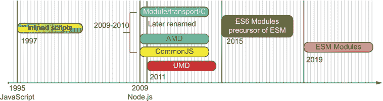
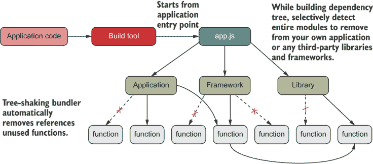

# 6 ECMAScript 模块

本章涵盖了

+   评估程序性模块模式

+   审查立即执行的函数表达式（IIFEs）

+   介绍 ECMAScript 模块语法和新的 .mjs 扩展

+   比较动态和静态模块系统

+   使用树摇动和死代码消除

*作用域对程序员来说就像氧气一样。它无处不在。你通常甚至都不会去想它。但是当它被污染时……你会窒息的。*

—大卫·赫尔曼（有效 JavaScript）

JavaScript 开发的世界正在疯狂变化，其中变化最大的部分是它的模块系统。

在现代应用程序开发中，我们理所当然地接受了模块编程的概念。将我们的应用程序分解为不同的文件然后重新组合的做法已经成为了我们的第二天性。我们不是为了避免手指因不断滚动而长水泡；我们这样做是为了可以分别推理和演进我们应用程序的不同部分，而不用担心会破坏其他部分。

你可能听说过认知负荷这个术语，用来指代一个人在任何时刻可以持有的信息量。过多的信息——例如所有变量的状态、所有组件的行为以及所有潜在副作用——会导致认知过载。计算机可以轻松地每秒跟踪数百万个操作或状态变化，但人类不能。一个科学事实是，人类可以在短期记忆中同时存储大约七个物品。（想想一个小缓存。）这就是为什么我们需要将我们的代码细分为子程序、模块或函数，这样我们就可以单独检查每个元素，并减少我们同时接受的信息量。

正如我在第一章所说的，现代 JavaScript 开发的时代已经到来。每种主要的编程语言都必须有良好的模块支持，但直到最近，JavaScript 并没有。在第四章和第五章中，你学习了将复杂代码分解为函数，并通过组合重新组装的过程。这个过程是函数/对象级别的模块化。本章介绍了文件级别的模块化，使用原生 JavaScript 关键字。

我们首先简要概述了今天的模块解决方案的格局，然后转向讨论 JavaScript 的新官方标准：ECMAScript 模块（ESM），也称为 ECMA262 模块，它始于 ECMAScript 2015 模块。与早期的模块系统不同，ESM 通过使用静态依赖定义增强了 JavaScript 语法，这有四个显著的好处：

+   提高了你在应用程序之间共享代码的体验

+   使工具如静态代码分析、死代码消除和树摇动变得更加高效

+   统一了服务器和客户端的模块系统，解决了根据平台需要不同模块系统的大问题

+   优化了编译器分析代码的方式

注意：重要的是要提到，这本书不涵盖如何打包 JavaScript 代码或如何使用 NPM 和 Yarn 等包管理器交付它。此外，由于存在许多 JavaScript 编译器，我不涵盖任何与 ESM 相关的具体编译器优化。

我们将首先回顾今天的 JavaScript 模块化景观，以便您了解 ESM 解决了什么问题以及为什么我们有幸拥有它。

## 6.1 过去的状况

模块化编程在其他语言社区中已经是一个主流概念多年，但在 JavaScript 中并不是。即使今天，管理依赖关系并构建可以在许多环境中统一运行的代码仍然具有挑战性。记住，JavaScript 处于一个独特的位置，支持服务器和客户端（浏览器）环境，这两种环境在本质上非常不同。

如果您正在开发客户端应用程序，您可能已经不得不处理一些复杂的构建工具，这些工具可以将您所有的独立脚本合并成一个单一的包。最终，应用程序作为一个无休止的文件运行，以创造模块化的错觉。为了理解 ESM 的动机以及为什么它如此重要，花点时间了解 JavaScript 和模块的当前状况以及我们是如何到达这里的，这会有所帮助。

如果您已经编写 JavaScript 代码多年，您可能还记得 JavaScript 由于缺乏适当的模块系统而面临了大量的反对和批评。毫无疑问，这种限制给网络开发者带来了最大的痛苦。没有模块，任何相当规模的代码库很快就会陷入全局的命名变量和函数冲突。当多个开发者共同开发同一个应用程序时，这种冲突会加剧。您可能会惊讶地发现，在成千上万行代码中存在许多名为 `arr` 的数组、名为 `fn` 的函数和名为 `str` 的字符串，它们在全球范围内都可能以不可预测的顺序发生冲突。需要紧急采取措施。

关于 JavaScript 模块的意见是热烈的且多样化的。在过去，任何试图规范它的尝试都给这种混乱增加了另一个变量。随着时间的推移，出于必要性，出现了关于模块规范的不同的思想流派。最显著的是异步模块定义 (AMD) 和通用 JS (CJS)。这两个概念都是通向（长期期待）正式标准 ECMAScript 模块 (ESM) ([`github.com/nodejs/modules`](https://github.com/nodejs/modules)) 的垫脚石。图 6.1 展示了 JavaScript 模块系统演变的简要近似时间线。



图 6.1 JavaScript 模块系统的演变概述，从早期浏览器中的简单内联脚本到官方的 ESM。所有日期均为近似值。

AMD 和 CJS 有不同的设计目标。后者是同步的，用于文件 I/O 快速的服务器；前者是异步的，用于文件访问较慢的浏览器。尽管浏览器端存在争议，但 AMD 通过极大地简化大型、客户端 JavaScript 应用的依赖管理，尤其是在与 RequireJS ([`requirejs.org`](https://requirejs.org/))脚本加载器库结合使用时，取得了最大的进展。AMD 是单页应用（SPA）架构成为可能的原因之一。SPA 不仅包含布局，还包含大量业务逻辑加载到浏览器中。结合 Web 2.0 技术如 AJAX，整个应用都被放入了浏览器中。

尽管如此，仍然没有形成标准。这种缺乏共识推动了另一个提案的诞生，该提案试图统一和标准化模块系统。通用模块定义（UMD）应运而生，同时还有一个名为 SystemJS 的模块加载器 API（[`github.com/systemjs/systemjs`](https://github.com/systemjs/systemjs)），它可以在客户端和服务器上运行。尽管阅读 UMD 构建的模块复杂且繁琐（因为它涉及大量的条件逻辑来支持任何模块风格和环境），但这一标准是一个福音，因为它允许插件和库作者针对一个可以在客户端和服务器上运行的单一格式。

经过多年的深思熟虑，ESM 成为了 JavaScript 模块系统的终极选择。ESM 是一个平台无关的、标准化的 JavaScript 模块系统，它既适用于服务器也适用于浏览器，最终取代了 CJS 以及其他所有模块格式。目前，ESM 是官方标准；所有平台供应商都开始采用它，所有库作者也开始使用它。这一过程将是一个缓慢的过程，需要我们大家共同努力。

在这些正式提案出现之前，JavaScript 开发者们正努力创建令人惊叹的网站。那么我们当时是如何模块化应用的，什么被认为是模块呢？为了避免将所有内容都做成全局脚本，开发者们发明了巧妙的模式和命名方案，甚至使用对象和函数内部的作用域作为伪命名空间来避免全局上下文中的名称冲突。我们将在第 6.2 节中探讨这些模式。

## 6.2 模块模式

即使没有模块规范，我们也有多种方法在 JavaScript 中实现模块化。在 JavaScript 有任何模块系统之前，所有代码都生活在全局空间中，这证明非常难以维护。代码被分成了不同的脚本文件。开发者必须发挥创意来组织他们的代码，并提供一些抽象全局数据的方法，以创建避免与其他运行脚本发生名称冲突的作用域——并且每天都要设法回家吃晚饭。JavaScript 的基本作用域机制一直是，并将始终是函数作用域，因此依赖函数来创建隔离的代码作用域，在那里你可以封装数据和行为，是完全合理的。

在本节中，我们将回顾一些在模块成为语言核心部分之前，由于纯粹的需要而出现的临时模块化编程模式：

+   对象命名空间

+   立即调用的函数表达式（IIFEs）

+   IIFE 混合

+   工厂函数

这些模式值得回顾，因为它们至今仍然有效，非常适合小型应用程序和脚本，尤其是如果你针对的是任何旧浏览器，如 Internet Explorer 11。

### 6.2.1 对象命名空间

对象命名空间是在工具如 AMD 存在之前，为了将简单的脚本扩展成完整的应用程序而出现的。因为浏览器本身不进行任何依赖管理，所以你包含文件（通过`<script` `/>`标签）的顺序很重要。

开发者养成了这样的习惯：首先加载他们需要的任何第三方库（如 jQuery、Prototype 等），然后加载依赖于这些库的应用特定代码。主要问题是，除了 iframe 和 web workers 之外，脚本都在同一个全局浏览器域中运行。（我将在第七章中简要讨论域。）没有属性封装，一个文件中的全局变量、类或函数会与从不同文件加载的相同名称的变量冲突。这些问题很难调试，尤其是在发生冲突时，浏览器没有给出任何提示或警告。

注意：现在你可以通过使用`script`标签的`async` HTML 5 属性来异步加载，这使得这个问题变得更糟。

解决这个问题的方法之一是在全局对象下创建人工命名空间，使用对象字面量来分组你的代码并唯一标识变量。实际上，现在已停用的 Yahoo!用户界面（YUI）库广泛使用了这种模式。例如，一个名为`Transaction`的类可以在许多项目和库中定义，因为它适用于无数领域。为了避免在多次声明此名称时出错，你需要规范地定义`Transaction`。对于 Node.js，这个定义可能看起来像下面的列表。

列表 6.1 使用全局对象命名空间定义`Transaction`对象

```
global.BlockchainApp.domain.Transaction = {};       ❶
```

❶ 在浏览器中，你使用 window 而不是 global。

注意：记住，在 Node.js 文件或模块内部，`global` 是隐含的全局对象，类似于浏览器中的 `window` 对象。

你在第二章中看到了 `Transaction` 构造函数，我将在下一个列表中重复它，现在它定义在某个任意的对象命名空间下，我称之为 `BlockchainApp`。这个对象的所有属性可以或多或少地匹配你应用程序的静态目录结构。

列表 6.2 使用对象命名空间

```
let BlockchainApp = global.BlockchainApp || {};                  ❶
BlockchainApp.domain = {};                                       ❷
BlockchainApp.domain.Transaction = (function Transaction() {     ❸

   const feePercent = 0.6;                                       ❹

   function precisionRound(number, precision) {
      const factor = Math.pow(10, precision);
      return Math.round(number * factor) / factor;
   }

   return {                                                      ❺
      construct: function(sender, recipient, funds = 0.0) {
         this.sender = sender;
         this.recipient = recipient;
         this.funds = Number(funds);
         return this;
      },
      netTotal: function() {
         return precisionRound(this.funds * feePercent, 2);
      }
   } 
})();                                                            ❸
```

❶ 如果不存在，通过查询 global 定义 BlockchainApp 对象

❷ 在 BlockchainApp 中定义了一个新的（嵌套）对象命名空间，称为 domain

❸ 使用立即调用的函数模式称为 IIFE（在第 6.2.2 节中讨论）。

❹ 函数作用域内封装的私有变量和/或特权函数

❺ 公开变量和/或函数暴露给调用者

或者，你可以使用内联类表达式（见下一个列表）。类本质上就是函数，所以这种语法不应该让你感到惊讶。

列表 6.3 在对象命名空间中定义类表达式

```
let BlockchainApp = global.BlockchainApp || {};
BlockchainApp.domain = {};
BlockchainApp.domain.Transaction = class {         ❶
   #feePercent = 0.6;
   constructor(sender, recipient, funds = 0.0) {
     this.sender = sender;  
     this.recipient = recipient;
     this.funds = Number(funds);   
     this.timestamp = Date.now(); 
   }

   static #precisionRound(number, precision) {
     const factor = Math.pow(10, precision);
     return Math.round(number * factor) / factor;
   }

   netTotal() {
       return BlockchainApp.domain.Transaction.precisionRound
           (this.funds * this.#feePercent, 2);
   }
} 
```

❶ 使用类表达式在 BlockchainApp.domain 命名空间内定义一个新的 Transaction 类

使用这个替代方案，你可以通过始终指定类表达式的规范路径来实例化一个新的交易，这旨在减少任何冲突的可能性，比如你决定使用的第三方银行库：

```
const tx = new BlockchainApp.domain.Transaction(...);
```

注意：另一种常见的技术是使用你公司的反向 URL 表示法。如果你在 MyCompany 工作，表示法可能看起来像这样：

```
const tx = new com.mycompany.BlockchainApp.domain.Transaction(...);
```

类提供了对私有数据的极大支持，但在类出现之前，封装状态最流行的模式是 IIFE。

### 6.2.2 立即调用的函数表达式 (IIFEs)

立即调用的函数表达式 (IIFEs)，你可能已经知道它是模块模式，利用 JavaScript 的函数作用域来容纳变量和函数，并提供对外部世界的封装。正如你可能已经知道的，函数是“立即调用的”，因为未命名的函数（括号内）在最后被评估，这给了你机会暴露你想要的，隐藏你不想要的，就像类一样。

列表 6.4 展示了如何创建一个不泄露任何私有数据的 `Transaction` IIFE 作为对象命名空间。在这个代码片段中，所有变量声明（无论作用域修饰符是 `var`、`const` 还是 `let`）和函数（如 `calculateHash`）都存在，并且只在这个周围函数内部可见。

列表 6.4 使用 IIFE

```
(function Transaction(namespace) {

    const VERSION = '1.0';                                      ❶
    namespace.domain = {};                                      ❷

    namespace.domain.Transaction = class {                      ❸
       #feePercent = 0.6;

       constructor(sender, recipient, funds = 0.0) {
          this.sender = sender;
          this.recipient = recipient;
          this.funds = Number(funds);
          this.timestamp = Date.now();
          this.transactionId = calculateHash (                  ❹
            [this.sender, this.recipient, this.funds].join()
          );  
       }

         ...
       }

    function calculateHash(data) {                              ❺
     ...
    }    
})(global.BlockchainApp || (global.BlockchainApp = {}));        ❻
```

❶ 在模块作用域中定义的私有属性

❷ 创建嵌套的 domain 命名空间

❸ 公开的 Transaction 类

❹ 可以访问稍后定义的 `calculateHash` 私有方法

❺ 私有方法。函数定义自动提升到周围函数作用域的顶部。

❻ 检查全局是否存在 Blockchain，如果需要，则创建空的 `global.BlockchainApp` 对象命名空间以使用

这个函数在声明时立即执行，因此 `Transaction` 是即时创建的。你可以像以前一样实例化它：

```
const tx = new BlockchainApp.domain.Transaction(...);
```

在 ECMAScript 2015 类出现之前，IIFEs 是最受欢迎的模式之一，并且至今仍在使用。事实上，许多开发者和 JavaScript 纯主义者更喜欢它们而不是类。值得注意的是，将变量和对象放在局部作用域中可以使属性解析机制（在第二章中讨论）更快，因为 JavaScript 总是先检查局部作用域，然后才是全局作用域。最后，当与对象命名空间结合使用时，IIFEs 允许你在不同的命名空间中组织你的模块，这在中等规模的应用程序中是必须的。

函数是多才多艺的，以至于你可以增强它们的上下文，以安全地在你的领域中定义混合。因为我们已经在第三章的第 6.2.3 节中探讨了混合，第 6.2.4 节将探讨这些遗留解决方案如何与它们集成。

### 6.2.3 IIFE 混合

记得我们在第三章和第四章讨论和定义的混合对象吗？我们也可以使用立即执行函数表达式（IIFEs）来实现 `HasHash`。为此，我们可以利用 JavaScript 的上下文感知函数操作符 `Function#call` 或 `Function#apply` 来动态设置对象上下文，以便在调用位置扩展（通过 `this` 引用）。增强过程被封装在函数中，与其他代码部分充分隔离。

列表 6.4 展示了与第四章中学习的 `HasHash` 混合的重新哈希（无意中用了双关语）。与先前的技术类似，我们使用一个函数来创建一个私有边界，围绕我们想要模块化的代码。在列表 6.5 中，使用箭头函数符号是非常有意的。"calculateHash" 是一个箭头函数，这样 `this` 就指向增强的对象，即传递给 `HasHash.call` 的上下文对象或环境。

注意：正如你所知，箭头函数不提供自己的 `this` 绑定；它们从其周围的词法上下文中借用 `this`。

`HasHash` 接受一组键，这些键用于在哈希过程中识别要使用的属性。下一列表的最后一部分展示了如何增强在全局 `BlockchainApp` 命名空间下创建的 `Transaction` 和 `Block` 类。

列表 6.5 使用 IIFE 的 `HasHash` 混合

```
const HasHash = global.HasHash || function HasHash(keys) {

    const DEFAULT_ALGO_SHA256 = 'SHA256';
    const DEFAULT_ENCODING_HEX = 'hex';
    const options = { 
       algorithm: DEFAULT_ALGO_SHA256, 
       encoding:  DEFAULT_ENCODING_HEX 
    };

    this.calculateHash = () =>  {                        ❶
       const objToHash = Object.fromEntries(
          new Map(keys.map(k => [k, prop(k, this)]))
       );
       return compose(
         computeCipher(options),
         assemble,
         props(keys)
       )(objToHash);
    };
}

HasHash.call(
   global.BlockchainApp.domain.Transaction.prototype, 
   ['timestamp', 'sender', 'recipient', 'funds']         ❷
);

HasHash.call(
   global.BlockchainApp.domain.Block.prototype, 
   ['index', 'timestamp', 'previousHash', 'data']        ❷
);
```

❶ 这映射到对象的原型并添加了 calculateHash 方法。

❷ 每种类型的对象的哈希值包含一组不同的键。

### 6.2.4 工厂函数

工厂函数是任何总是返回新对象的函数。你在第四章中 `Money` 的实现中看到了这个模式的例子。通过工厂创建对象有两个重要的好处：

+   在实例化时，你可以跳过使用 `new` 关键字。

+   你不必依赖 `this` 来访问实例数据。相反，你可以使用围绕对象形成的闭包来实现数据隐私。

作为另一个例子，让我们向我们的区块链应用程序中引入一个新的对象。`BitcoinService` 处理区块链领域的多个部分之间的交互，例如转账和挖掘交易。服务通常是无状态的对象，将业务逻辑组织起来，协调您领域多个实体的工作。由于服务对象不携带任何数据，是无状态的，所以我们不需要担心使它们不可变。列表 6.6 展示了使用工厂函数的 `BitcoinService` 的形状。

列表 6.6 通过工厂函数构建的 `BitcoinService` 对象

```
function BitcoinService(ledger) {                         ❶
  const network = new Wallet(                             ❶
      Key('public.pem'), 
      Key('private.pem')
  );
   async function mineNewBlockIntoChain(newBlock) {       ❷

      //... omitted for now
   }

   async function minePendingTransactions(rewardAddress,  
      proofOfWorkDifficulty = 2) {                        ❸

      //... omitted for now
   }

   function transferFunds(walletA, walletB, funds, 
       description, transferFee = 0.02) {                 ❹

      //... omitted for now
   }

   function serializeLedger(delimeter = ';') {            ❺

      //... omitted for now
   }

   function calculateBalanceOfWallet(address) {

      //... omitted for now
   }

   return {
     mineNewBlockIntoChain,    
     minePendingTransactions,  
     calculateBalanceOfWallet, 
     transferFunds,            
     serializeLedger           
  };
}
```

❶ 账本和网络都成为返回对象的闭包的一部分，并被所有函数使用。

❷ 将新块挖掘到链中。该函数的正文在第八章中展示。

❸ 将交易挖掘到新块中

❹ 在两个用户（数字钱包）之间转账

❺ 将账本序列化为由提供的分隔符分隔的 JSON 对象字符串缓冲区

您可以获取一个新的服务对象并像这样使用它：

```
const service = BitcoinService(blockchain);

service.transferFunds(luke, ana, Money('B|',5),  
    'Transfer 5 btc from Luke to Ana');
```

使用工厂函数方法，私有数据（如 `network`）仅存在于函数的作用域内，就像 IIFE 一样。由于在定义时封闭了该数据，因此始终可以从新对象 API 内部访问私有数据。此外，不需要依赖 `this` 允许我们将服务方法作为高阶函数传递，而无需担心任何 `this` 绑定。考虑以下 `transferFunds` API，它具有以下签名：

```
function transferFunds(userA, userB, funds, description, 
    transferFee = 0.02)
```

假设您想运行一批转账，所有转账都具有相同的默认转账费用：

```
const transfers = [
  [luke, ana, Money('B|',5.0), 'Transfer 5 btc from Luke to Ana'],
  [ana, luke, Money('B|',2.5), 'Transfer 2.5 btc from Ana to Luke'],
  [ana, matt, Money('B|',10.0), 'Transfer 10 btc from Ana to Matthew'],
  [matt, luke, Money('B|',20.0), 'Transfer 20 btc from Matthew to Luke']
];

function runBatchTransfers(transfers, batchOperation) {
   transfers.forEach(transferData => batchOperation(...transferData))    
}
```

您可以直接从对象中提取方法作为函数，使用解构赋值，并将该方法用作批处理操作，如下所示。

列表 6.7 使用 `transferFunds` 的提取形式作为回调函数

```
const { transferFunds } = service;

runBatchTransfers(transfers, transferFunds);       ❶
```

❶ 将服务方法作为高阶函数传递。所有封闭的数据仍然可以通过方法的作用域访问和获取。

如果 `BitcoinService` 被定义为类设计的一部分，您将被迫显式设置上下文对象，这并不直接，使用 `Function#bind`。

```
runBatch(transfers, service.transferFunds.bind(service));
```

或者新的绑定运算符（第五章）：

```
runBatch(transfers, ::service.transferFunds);
```

总体而言，这四种技术——对象命名空间、IIFEs、IIFE 混合和工厂函数——因其使用 JavaScript 最小规范语言的子集而具有优雅、简单的美感。尽管这些模式在行业中仍然很普遍，但缺点是我们需要确保所有模块都正确定义，并且具有适当的封装和暴露级别。一个好的模块系统应该为我们处理这些任务。

在 6.3 节中，我们从程序性模式转向语言级别的模块系统。从高层次来看，这些系统可以分为静态或动态。了解这些差异很重要，因为 ESM 由于其静态语法而与其他所有系统不同。

## 6.3 静态与动态模块系统

动态模块系统是一种在程序中管理依赖关系和指定模块暴露和消耗的内容的系统。这项任务涉及自己编写代码或使用第三方模块加载器。第 6.2 节中讨论的技术属于这一类别，因此模块的规范和定义（它暴露什么以及它隐藏什么）是在代码运行时在内存中创建的。你可以对动态模块做一些技巧，例如启用条件访问以包含模块或模块的部分。例如，包括 CommonJS API、AMD 兼容的 RequireJS 库、SystemJS 库和 Angular 的依赖注入机制。

动态模块与新的 ESM 等静态格式有很大不同。另一方面，静态模块系统通过使用原生语言语法（特别是`import`和`export`关键字）来定义模块的合约。这种差异非常重要，需要理解。首先，JavaScript 从未有过静态模块定义，这使得它们对于大多数开发者来说是一片未知领域。此外，静态定义具有某些优势；它们允许 JavaScript 运行时预取或预加载模块，并允许你通过删除永远不会执行的代码来构建工具以优化应用程序的包大小。

表 6.1 展示了通过第 6.2 节中讨论的方法加载`Transaction`类。最明显的区别是动态模块系统使用常规的 JavaScript 函数，而静态系统使用`import`和`export`。

表 6.1 使用不同模块系统加载`Transaction`类 *(继续)*

| 系统 | 类型 | 示例 |
| --- | --- | --- |
| CommonJS | 动态 | `const Transaction = require('./domain/Transaction.js');` |
| RequireJS | 动态 |

```
requirejs(['domain/Transaction.js'], Transaction => {

 //... use Transaction

});

```

|

| ESM | 静态 | `import Transaction from './domain/Transaction.js';` |
| --- | --- | --- |

每个加载调用的工作原理现在并不重要；重要的是你看到了所使用的语法的差异。在 ESM 中，你使用一个`import`语句来抽象这个过程，而不是通过函数调用遍历文件系统来加载新的代码模块。需要注意的是，在静态系统中，`import`语句必须出现在文件顶部。这一要求也存在于大多数其他语言中，不应被视为限制，原因如下：将这些语句静态化并在顶部清晰地定义有助于编译器和工具提前映射应用程序的结构。此外，你可以运行执行更好的静态代码分析、死代码消除甚至摇树优化（tree-shaking）的工具，这些内容我将在第 6.5 节中简要介绍。

在静态模块系统中，另一个明显的差异是使用的绑定类型。在 CJS 中，模块是普通对象引用。通过 `require` 函数导入对象与从任何其他函数调用中获取对象没有区别。对象的形状由模块文件中 `module.exports` 分配的属性决定。以下是如何使用 CJS 导入第五章中创建的 `Validation` 的示例：

```
const {Success, Failure} = require('./lib/fp/data/Validation.js');
```

一个更常见的例子是从 Node.js 的 filesystem `fs` 内置模块导入：

```
const { exists, readFileSync } = require('fs');
```

相反，ESM 模块利用了更原生和声明性的语法。对 API 的访问看起来仍然有些像常规对象，但这只是为了与语言的思维模型保持一致，并利用 CJS 紧凑方法的成功。以下是用 ESM 重写的先前的示例：

```
import { Success, Failure } from './lib/fp/data/Validation.js';
import { exists, readFileSync } from 'fs';
```

从外观上看，这些方法看起来和感觉相同，但有一个细微的差别：ESM 使用不可变的实时代码绑定，而不是对象的常规可变副本。下一列表展示了用于说明这种差异的简单费用计算器 CJS 模块。

列表 6.8 使用 CJS 定义的 calculator.js 模块

```
let feePercent = 0.6;

exports.feePercent = feePercent;

exports.netTotal = function(funds) {
  return precisionRound(funds * feePercent, 2);
}

exports.setFeePercent = function(newPercent) {
  feePercent = newPercent;
}

function precisionRound(number, precision) {     ❶
  const factor = Math.pow(10, precision);
  return Math.round(number * factor) / factor;
}
```

❶ 函数是模块私有的

请密切注意以下列表中每个语句的结果。

列表 6.9 将 calculator.js 作为 CJS 模块使用

```
let { feePercent, netTotal, setFeePercent } = require('./calculator.js'); 

feePercent;   // 0.6
netTotal(10); // 6
feePercent = 0.7;                                  ❶
feePercent;   // 0.7
netTotal(10); // 6                                 ❷
setFeePercent(0.7);                                ❸
netTotal(10); //7                                  ❹
require('./calculator.js').feePercent; // 0.6      ❺
```

❶ 重置本地定义的变量的值

❷ 使用原始模块的 0.6 值

❸ 将模块内的值设置为 0.7

❹ 正在使用新的 feePercent

❺ 保留原始值

正如你所见，将 `feePercent` 赋值为 0.7 改变了你本地导出的引用副本，但不会改变模块内部的引用，这可能是你预期的结果。在 ESM 中，导出的属性与模块内部的属性是连接（绑定）的。同样地，在模块内部更改导出的绑定也会改变外部某处的绑定；它是双向绑定的。实时绑定有很多好的用途，但它们确实可能导致混淆。我的建议是尽可能避免重新分配导出引用。请查看下一列表中的代码示例。

列表 6.10 将 calculator.js 作为 ESM 模块使用

```
import { feePercent, netTotal, setFeePercent }  from './calculator.js';

feePercent;   // 0.6
netTotal(10); // 6
feePercent = 0.7;       ❶
netTotal(10); // 6
setFeePercent(0.7);     ❷
netTotal(10); // 7      ❸
feePercent;  // 0.7     ❹
```

❶ 抛出错误，指出 feePercent 是只读的。从客户端看，值是不可变的。

❷ 通过 API 将模块内的值设置为 0.7

❸ 正在使用新的 feePercent

❹ feePercent 反映了新的实时值。

正如你所见，CJS 和 ESM 有略微不同的行为。按照设计，大多数差异都是在幕后发生的，以简化 ESM 的采用。从实际的角度来看，ESM 的工作方式与 CJS 类似，即几乎每个文件都被视为一个模块，每个模块都有自己的局部作用域，你可以在其中安全地存储代码和数据（类似于在 IIFE 下创建的函数作用域）。如果你已经使用过 CJS，那么 ESM 不应该是一个巨大的范式转变。

JavaScript 的未来在于 ESM，它最终将取代任何其他模块格式，并与现有的模块格式进行交互。何时会发生这一点尚不确定，因为 Node.js（例如）需要支持 CJS 一段时间以提供向后兼容性，并使过渡顺利进行。

现在，不再拖延，也不必回顾过去，让我们直接进入 ESM。

## 6.4 ESM 基础

在本节中，你将了解 ESM 的基础知识以及它在代码中的应用。具体来说，你将学习如何编写模块路径标识符，以及使用 `import` 和 `export` 关键字的变体来暴露和消费模块所需的语法。

ESM 是在 TC39 中设计的，作为一个声明式模块系统，旨在统一客户端和服务器端的依赖关系管理。从 Node.js 12 开始，你可以通过激活一个实验性标志（`—experimental-modules`）来实验性地使用 ESM，在 Node.js 14 中则无需标志。Node.js 将扩展名为 .js 或 .mjs（第 6.4.4 节）的文件视为模块。

ESM 标准化了一个单一的模块格式，它吸取了 CJS 和 AMD 格式的经验。这种标准化类似于多年前 Universal Module Definition ([`github.com/umdjs/umd`](https://github.com/umdjs/umd)) 项目所设定的目标，并取得了一些成功。问题是上述所有提到的模块格式从未完全标准化。在 ESM 中，你得到了两者的最佳之处：同步的实时绑定语句以及动态的异步 API。ESM 还保留了 CJS 所使用的简洁语法，这种语法经受住了时间的考验。

在我们深入探讨这个主题之前，有一点非常重要的事情需要记住，那就是 ESM 模块会自动进入严格模式，无需你显式地编写。

JavaScript 模块不过是一个文件或目录，它通过一些特殊的语义被指定为远程（浏览器）或本地文件系统（服务器）。ESM 使这些指定符与这两个环境兼容。不幸的是，这个限制意味着我们在服务器上会有一个不太灵活的模块系统，因为我们失去了在服务器端已经习惯的无扩展名指定符。从积极的一面来看，ESM 致力于实现一个真正的通用格式，这有助于长期的技术，如服务器端渲染和构建同构应用程序。

首先，让我们回顾一下导入和导出模块的语法，从路径指定符开始。

### 6.4.1 路径指定符

ESM（模块化系统）的一个重要设计目标是与浏览器保持兼容，以确保所有环境中都真正保证有一个模块格式。与 CJS 不同，ESM 中的所有模块指定符都必须是有效的 URI，这意味着（对于 Node.js 来说很遗憾）没有无扩展名的指定符或目录模块。除了裸指定符（例如`'ramda'`）之外，如果 JavaScript 模块文件有扩展名，那么必须显式地将该扩展名添加到导入指定符中，以便正确解析。（我们之前可以省略它。）以下列表更符合常规浏览器`<script>`包含的方式。

列表 6.11 使用 ESM 的路径指定符

```
import Transaction from './Transaction.js';  
import Transaction from '../Transaction.js';
import { curry } from '/lib/fp/combinators.js';
import { curry } from 'https://my.example.com/lib/fp/combinators.js';      ❶
```

❶ 仅在浏览器环境中有效；在 Node.js 中不受支持

备注：值得指出的是，在浏览器中，与 Node.js 不同，文件扩展名不会告诉浏览器如何解析模块作为 JavaScript 代码。这是通过适当的 MIME 类型（`text/javascript`）来完成的，并且显示文件是否通过`<script type='module'>`包含，如下所示

```
<script type="module" 
   src=" https://my.example.com/lib/fp/combinators.js">
</script>
```

如果你使用相对路径，你必须以`./`或`../`开头。以下代码生成一个模块未找到错误（与 CJS 兼容）。以下两个片段都不会作为有效的 URI 通过：

```
import Transaction from 'Transaction.js';
import Transaction from 'lib/fp/combinators.js';
```

另一个缺点是，你无法像在 CJS 中那样在 Node.js 中执行目录导入。在 CJS 中，一个文件夹中有一个`index.js`或适当的`package.json`文件，让你可以隐式地导入文件夹，而不需要附加指定符的`index.js`部分。由于 CJS 是为服务器制作的，它内置了智能来检测和自动完成`index.js`部分，就像默认情况下 Web 服务器从文件夹中提供`index.html`一样。遗憾的是，由于相同的规则需要适用于客户端和服务器，这种行为没有延续到 ESM。

在第 6.4.2 节和第 6.4.3 节中，我们将探讨 ESM 的两个主要功能：导出和导入。

### 6.4.2 导出

`export`语句用于暴露模块的接口或 API，在 CJS 中相当于`module.exports`。一个模块被定义为单个文件，可能包含一个或多个类和函数。默认情况下，文件中的所有内容都是私有的。（将模块文件视为一个空的 IIFE 可能会有所帮助。）你需要通过`export`关键字声明要暴露的内容。为了简洁，我不会涵盖所有可能的`export`组合。有关所有可能组合的完整列表，请访问[`mng.bz/YqeK`](http://mng.bz/YqeK)。以下各节中描述的组合用于示例应用程序。

单值（默认）

到目前为止，在本书中展示领域类的一部分时，我故意省略了它们如何映射到文件系统——换句话说，就是使用`import`语句来获取类的语句。在导出方面，通常的做法是将类变成它们自己的模块。你有选择。你可以一步导出一个单个类

```
export default class Transaction {
   // ...
}
```

或者分两步：

```
class Transaction {
   // ...
}

export default Transaction;
```

单值导出通常是导出代码供他人消费的首选方式。在 Node.js 具有原生类支持之前，一个类会被转换成它自己的立即执行函数表达式（IIFE）函数。想想看，模块文件内部 `export` 声明之外的数据对调用者来说是完全隐藏的。其语义与 IIFE 类似，既好又一致。你可以想象一个大的 IIFE 函数，其主体是整个模块代码，这给了你声明变量、函数或其他仅对模块代码本身可访问的类的机会。例如，我们在 `HasHash` 中使用了这种技术来声明顶层常量：

```
const DEFAULT_ALGO_SHA256 = 'SHA256'; 
const DEFAULT_ENCODING_HEX = 'hex';

const HasHash = (
  keys,
  options = { algorithm: DEFAULT_ALGO_SHA256, 
              encoding: DEFAULT_ENCODING_HEX 
            }
) => ({
  // ...
});

export default HasHash;
```

使用 `default` 关键字允许你导出单个数据片段。你也可以从一个模块中导出多个值。

多值

多值 `export` 是创建实用模块的优雅方式。这在 `Block` 和 `Transaction` 中的验证函数中使用。因为你已经看到了这些函数，我将向你展示 `export` 语法，并省略每个方法的主体：

```
export const checkDifficulty = block => //...

export const checkLinkage = curry((previousBlockHash, block) =>
  // ...
);

export const checkGenesis = block => // ...

export const checkIndex = curry((previousBlockIndex, block) =>
  // ...
);
```

基于 standalone 函数多值导出的 API 模块有另一个巨大的好处：它们促使你以纯度为中心进行编写。因为你永远不知道函数将在什么上下文中执行，你不能假设或依赖任何共享或闭包状态。此外，除了使用工厂函数之外，创建 `BitcoinService` 对象的另一种方式是暴露单个纯函数，这些函数在函数参数中提前声明它们所需的所有数据。你不需要从函数的闭包中继承 `ledger` 和 `network`，你需要将它们作为实际参数：

```
export async function mineNewBlockIntoChain(ledger, newBlock) {
   //...
},

export async function minePendingTransactions(ledger, network, 
       rewardAddress, proofOfWorkDifficulty = 2) {
   //...
},

export function transferFunds(ledger, network, 
       walletA, walletB, funds, description) {
   //...
}
```

代理

一个模块可以导出并绕过另一个模块的绑定，充当代理。你可以通过使用 `export` `...` `from` 语句来完成这个任务。在我们的例子中，我们可以使用这个语句将所有单个域模块（包括 `Block` 和 `Transaction`）组合在一个名为 domain.js 的单个模块文件中：

```
export { default as Block } from './domain/Block.js'
export { default as Transaction } from './domain/Transaction.js'
export { default as Blockchain } from './domain/Blockchain.js'
```

与 `import` 不同，你可以在模块的任何一行 `export`。没有规则强制放置位置。

相反，导出的代码是通过 `import` 语句由客户端或其他模块消费的。

### 6.4.3 导入

为了消费一个 API，你必须导入所需的功能，你可以作为一个整体或部分进行导入。你有许多从模块中导入的方法，可以在 [`mn.bz/Gx4R`](http://mn.bz/Gx4R) 找到完整的参考指南。以下部分描述了一些最常见的技术。

单值导入

要从默认 `export` 中导入单个对象，你可以使用

```
import Block from './Block.js';
```

这是 simplest 的情况，但你也可以请求模块的组件。

多值导入

你可以拆分单个模块的片段。下面的列表展示了如何进行多值导入。

列表 6.12 validation.js 的多值导入

```
import { checkIndex, checkLinkage } from './block/validations.js';      ❶
```

❶ 大括号表示我们正在进入模块。

注意，尽管列表 6.12 中的代码片段表明正在发生解构，但与 CJS 一起使用时并非如此。以下是一些主要区别：

+   导入始终与其导出（活绑定）相关联，而解构则创建对象的本地副本。因为 CJS 导入对象的副本，所以解构是副本的副本。

+   你不能在 `import` 语句内部进行嵌套解构。以下代码将无法工作：

    ```
    import {foo: {bar}} from './foo.js';
    ```

+   属性重命名（别名）的语法不同，如下一列表所示。

列表 6.13 CJS 和 ESM 中的属性重命名

```
// CJS
const { foo: newFoo } = require('./foo.js');     ❶

// ESM
import {foo as newFoo} from './foo.js';          ❷
```

❶ CJS：将 foo 重命名为 newFoo

❷ ESM：不重命名，但创建一个指向已绑定 foo 属性的别名 newFoo

你还可以通过使用通配符（别名）导入将多值导出 API 组合成单个对象命名空间：

```
import * as ValidationsUtil from './shared/validations.js';

ValidationsUtil.checkTampering(...);
```

使用包管理器（NPM）

与原生模块一样，使用 ESM 导入第三方模块是通过裸路径进行的，没有路径分隔符或扩展名。正如预期的那样，包名需要与 node_modules 内的目录名匹配。然后，通过其伴随的 package.json 中的 main 属性确定入口点或要加载的模块。以下是一个示例：

```
import { map } from 'rxjs/operators';
```

动态导入

如果你已经在 Node.js 中编码了一段时间，你可能已经习惯了使用 CJS 条件性地加载模块。与需要在文件开头声明依赖项的 ESM 不同，CJS 允许你从任何地方 `require` 模块。在实际应用中，这种情况经常发生的一个用例是使用包含全局设置或功能标志的模块，以缓慢地向客户推出新代码。以下列表显示了一个示例。

列表 6.14 使用 CJS 动态加载模块

```
const useNewAlgorithm = FeatureFlags.check('USE_NEW_ALGORITHM', false);

let { computeBalance } = require('./wallet/compute_balance.js');

if (useNewAlgorithm) {
    computeBalance = 
        require('./wallet/compute_balance2.js').computeBalance;
}

return computeBalance(...);
```

根据全局 `USE_NEW_ALGORITHM` 设置的状态，应用程序可能会决定使用传统的 `compute_balance` 模块或开始使用一个新的模块。这种技术看起来很方便，但第一次需要库或文件时，JavaScript 运行时需要中断其进程以访问文件系统。因为模块是单例的，所以这种情况只会发生在第一次加载库时。之后，模块会在本地缓存（ESM 和 CJS 都支持这种行为）。同样，第二个 `require` 语句在缓存模块之前会阻塞主线程访问文件系统。

遵循非阻塞代码的精神，文件系统访问应该异步进行。ESM 规范纠正了这个问题，并提供了基于承诺的异步 `import` 版本，它与浏览器内部加载代码的方式保持一致。`import` 函数获取、实例化和评估所有请求的模块的依赖项，并返回一个命名空间对象，其 `default` 属性引用请求模块的 (`export`) `default` API，以及与模块的其他导出匹配的属性。我们将在第八章回到 JavaScript 的异步特性，但现在我将向你展示 `import` 的工作原理，以及它与模块系统相关的内容。对列表 6.14 中的代码进行重构看起来是这样的：

```
const useNewAlgorithm = FeatureFlags.check('USE_NEW_ALGORITHM', false);

let computeBalanceModule = await import(
    './ domain/wallet/compute_balance.js'
);

if (useNewAlgorithm) {
   computeBalanceModule = await 
      import('./domain/wallet/compute_balance2.js');
}

const {computeBalance} = computeBalanceModule;

return computeBalance(...);
```

顺便说一下，这个代码片段使用了一个称为顶层等待（top-level-await）的功能，该功能仅在 ESM 中受支持。你将在第八章中了解更多关于这个功能的内容。基本前提是你可以直接使用 `await` 来触发异步操作（在这种情况下是加载脚本），而无需显式编写 `async` 函数。

ESM 规范的另一个重要部分是引入了一个新的扩展名：.mjs。

### 6.4.4 新的扩展名

要指导 Node.js 使用 ESM 加载模块，你有两种选择：

+   你可以将 package.json 的 `type` 字段设置为 `"module"`。此选项通过动态查找离你提供的 .js 文件最近的 package.json 文件来实现，从当前目录开始，然后是其父目录，依此类推。如果 JavaScript 无法确定类型，则使用 CJS。

+   使用新的文件扩展名 (.mjs) 来识别 JavaScript 模块文件。这个扩展名在过渡到 ESM 的过程中将非常有用。同样，.cjs 文件将强制使用 CommonJS。

鼓励包和库的作者在他们的 package.json 文件中提供类型字段，以使他们的代码更清晰、文档更完善。此外，现代浏览器支持 `<script type='module'>` 以匹配这一新行为。

尽管许多人认为 .mjs 扩展名不够吸引人，但它有先例。例如，React 使用 .jsx 来声明 HTML 组件，我们也都使用 .json 作为存储纯文本 JSON 数据的约定。浏览器不太关注文件扩展名；它们主要关注 MIME 类型（可执行脚本的 `text/javascript` 或数据导入的 `application/json`）。我认为 .mjs 是在 JavaScript 应用程序赶上 ESM 之前的过渡路线；然后 .js 将占主导地位。

尽管如此，以下是使用 .mjs 的具体好处：

+   向后兼容性没有问题。因为扩展是新的，所以从一开始就强制实施某些属性（例如，在所有模块上强制使用严格模式）是简单的。

+   该扩展有助于弃用非浏览器友好的模块环境变量，例如`__dirname`、`__filename`、`module`和`exports`。此外，你将无法在具有.mjs 扩展名的文件上使用`require`，反之亦然。（在.cjs 文件上使用`import`。）

+   新的扩展功能传达了目的性，这与现有的模块格式（AMD、CJS 和 UMD）有明显的区别。

+   编译器不需要额外的指令或解析（因此没有性能损失）来处理和准备/优化 JavaScript 文件以供模块使用。

+   对模块文件有特殊的处理。现在你可以使用模块作用域的元属性，例如`import.meta`。目前，该对象只包含模块的 URL 或完整路径，但以后可以添加更多功能。`url`属性将取代全局的`__dirname`和`__filename`全局变量。下一列表中的示例使用了`import.meta`。

    列表 6.15 打印`import.meta`的内容

    ```
    console.log(import.meta);         ❶

    // { url: "file:///home/user/../src/blockchain/domain/Transaction.js" }
    ```

    ❶ 在 Transaction.js 内部

+   工具体验得到改善。在诸如重构、语法高亮、代码补全和可视化等方面，IDE 可以更加直观。静态代码分析器和代码检查器可以提供更好的启发式方法和指导。

支持这个新的扩展并逐步淘汰现有的模块系统不会一夜之间发生。数百万个包和大量工具需要开始这个过程。当 ESM 随着新包和新包的更新开始缓慢流入时，我们将能够享受到 ESM 的好处。这些好处远远超出了代码本身。第 6.5 节描述了工具如何利用这种模块格式的静态特性。

## 6.5 ESM 对工具的好处

ESM 的静态、声明性结构有许多好处。一个明显的优点是良好的 IDE 对静态代码检查的支持。其他重要的好处包括死代码消除和树摇、更快的属性查找和类型友好性，这些内容将在以下章节中讨论。

### 6.5.1 死代码消除和树摇

简而言之，死代码是指在任何代码路径中都无法运行的代码。工具可以通过仔细检查代码的静态结构并追踪可能的执行路径来识别死代码。最明显的形式是已被注释掉的代码。自然地，将这段代码发送到浏览器或远程 Node.js 服务器是没有意义的，因此转换器和构建工具通常会将其移除。你还可以在函数的`return`语句之后出现的不可达行中找到死代码。这种情况有时出现在依赖于自动分号插入（[`mng.bz/QmDj`](http://mng.bz/QmDj)）的代码中。其他不那么明显的情况包括未使用的局部变量和结果从未在其他地方使用的函数调用。

在服务器上，模块系统是文件系统的反映。在浏览器上，情况并不完全相同，但 ESM 旨在缩小这一差距。对于大型 SPA，你需要一个捆绑/构建策略。而不是通过网络请求成千上万的文件（每个文件都是一个模块），在构建时（同时，你也可以压缩它们）将它们捆绑成一个单一的负载是有意义的。

我在这本书中没有涵盖像 Browserify、Webpack 和 Rollup 这样的构建工具，但我强烈建议你研究它们所有，并为你的项目选择最好的工具。构建工具是使用 JavaScript 编码的必要部分。这些工具的中心任务是映射整个依赖树到一个或两个入口点（index.js、main.js、app.js 等）。构建工具擅长检测整个模块或模块的一部分从未被使用，然后忽略它们。因此，依赖树中未使用的模块实际上被认为是死去的，并通过摇树优化被丢弃。除了减少认知负担外，尽可能地将代码模块化而不是将所有内容打包到一个文件中也是良好的实践。

ESM 的静态结构施加了一些限制，这些限制简化了摇树优化：

+   你只能在顶层导入模块，永远不要在条件语句内部导入。

+   你不能在`import`语句中使用变量或函数。

构建工具可以依赖于匹配的`export`和`import`语句集来映射所有未使用的模块，并如图 6.2 所示将它们移除。



图 6.2 捆绑工具可以使用应用程序的静态结构通过识别任何未使用的代码模块并将它们从打包的应用程序文件中移除来实现摇树优化。

没有这些保证，消除未使用部分将变得复杂。以 CJS 为例，你可以动态地`require`模块并将这些调用散布在代码的任何地方，这使得确定要删除什么和保留什么变得更加困难。

此外，使用 ESM 时，当你查看生成的捆绑代码时，根据工具的不同，你可能会在移除`foo`模块时看到这样的注释：

```
// unused export foo
```

一个好的建议是尽可能地将你的模块设计成松耦合和内部紧密耦合的，以方便分析你的代码。一些构建工具甚至提供了额外的支持，以识别一个函数是否是纯函数以及其结果是否被使用，然后可以安全地移除该调用，这是使用函数式风格编码的一个很好的好处。回想一下第四章，纯函数没有副作用或使用共享状态，所以一个结果未被使用的纯函数对你的应用程序没有任何贡献。检测一个函数是否是纯函数且无副作用不是一个容易解决的问题，所以你可以通过在纯函数调用前编写一些元数据来帮助工具：

```
/*#__PURE__*/checkTampering(...)
```

你可以在构建过程中运行支持此符号的某些插件。一个例子是库 Terser ([`github.com/terser-js/terser`](https://github.com/terser-js/terser))，它寻找这些`PURE`预处理器，并确定是否根据函数的结果是否被使用来将它们分类为死代码。

在`Block`中调用的`checkTampering`是一个纯函数，例如。它是我们第五章讨论的验证逻辑的一部分。这里再次呈现，并带有纯元注释：

```
class Block {
   ...

   isValid() {
      const {
         index: previousBlockIndex,  
         timestamp: previousBlockTimestamp
       } = this.#blockchain.lookUp(this.previousHash);

       return composeM(
            /*#__PURE__*/checkTampering,
            /*#__PURE__*/checkDifficulty,
            /*#__PURE__*/checkLinkage(previousBlockHash),
            /*#__PURE__*/checkLength(64),
            /*#__PURE__*/checkTimestamps(previousBlockTimestamp),            
            /*#__PURE__*/checkIndex(previousBlockIndex),
            Validation.of
       )(Object.freeze(this));
}
```

如果我们将`checkTampering`从组合中移除，Terser 可以轻松找到它并将其标记为消除——这是由于纯函数为你提供的保证。

ESM 还有从导入代码中更快地查找属性的优势。

### 6.5.2 更快的属性查找

使用静态结构的好处之一涉及在导入的模块上调用属性。在 CJS 中，`require` API 返回一个常规 JavaScript 对象，其中每个函数调用都通过标准的 JavaScript 属性解析过程（在第二章中描述）：

```
const lib = require('fs');

fs.readFile(...); 
```

尽管这种技术保持了心理模型的一致性，但它比 ESM 慢。ESM 的静态结构允许 JavaScript 运行时向前看并静态解析命名属性查找。这个过程在内部发生，代码看起来几乎相同：

```
import * as fs from 'fs'; 

fs.readFile(...); 
```

此外，了解模块的静态结构允许 IDE 提供有用的提示，以检查是否存在或拼写错误的命名属性。这种好处在静态类型语言中一直存在。

### 6.5.3 类型友好性

JavaScript 可能在（漫长的）未来准备好引入可能的可选类型系统。ESM 正在铺路，因为只有在类型定义在静态上提前已知的情况下，才能进行静态类型检查。我们已经在 TypeScript 或甚至像 Flow 这样的扩展库中有了参考实现。一些提议包括`number`、`string`和`symbol`的类型，不同大小的`int`和`floats`，以及新的概念如`enum`和`any`。尽管类型信息还相距甚远，但关于其可能的样子已经有一些共识。更多信息，请参阅附录 B。

到目前为止，我已经涵盖了足够的 ESM 语法，让你开始。但由于 ESM 是语言的一个重大补充，我跳过了许多你应该在跃迁之前熟悉的语法和技术细节。ESM 规范还支持程序性加载器 API，你可以用它来配置模块的解析和加载方式，例如。更多信息，请访问[`nodejs.org/api/esm.html`](https://nodejs.org/api/esm.html)。

在 JavaScript 中，导入的模块表现得像对象，你可以像变量一样传递它们。你可以将这个概念称为“模块作为数据”。这种一致性很重要，因为我们在第七章进入了元编程的领域。

## 摘要

+   你可以使用对象和函数命名空间等模式，以及立即执行函数表达式（IIFEs），在 JavaScript 中实现模块化，而无需任何模块系统。

+   动态模块系统使用第三方或原生库在运行时管理依赖项。静态模块系统利用新的语言语法，可以在编译时优化依赖项管理。

+   ESM 是由 TC39 任务组开发的一个静态模块系统，旨在统一客户端和服务器 JavaScript 环境的模块需求，并取代所有现有的模块格式。

+   ESM 提供了许多好处，例如死代码消除、摇树优化、更快的属性查找、变量检查，以及与（可能的）未来类型系统的兼容性。

+   ESM 的一个显著特点是引入了新的文件扩展名 .mjs，以便编译器可以增强表现为模块的 JavaScript 文件。
