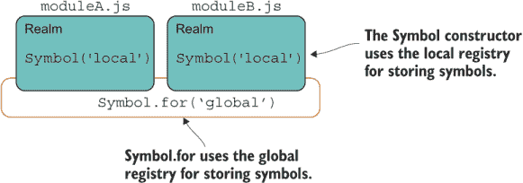
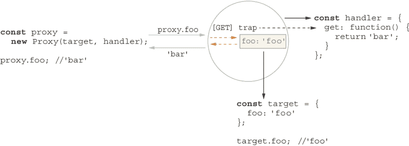
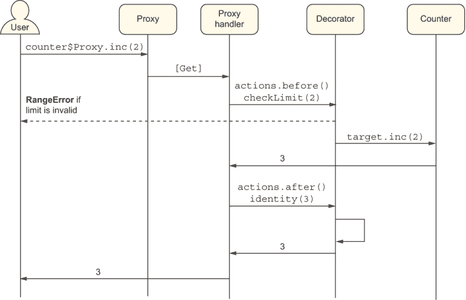

# 7 沉迷于元编程

本章涵盖

+   使用元编程和反射应用跨功能行为

+   使用符号在应用程序的不同领域之间创建互操作性

+   使用符号增强 JavaScript 的内部功能

+   理解 Proxy/Reflect API 的基础知识

+   使用装饰器增强方法的执行

+   使用 throw 表达式提案进行更精简的错误处理

*程序文本只是程序的一种表示。程序不是文本……我们需要一种不同的方式来存储和处理我们的程序。*

——Sergey Dmitriev，JetBrains 的总裁和联合创始人

想象一下英特尔这样的公司，它制造 CPU 芯片。为了自动化大量重复性任务，公司编写程序让机器人制造芯片——我们称之为编程任务。然后，为了满足更高的行业需求，它编写程序让工厂制造制造芯片的机器人——我们称之为元编程。

我希望到现在为止，你已经对 JavaScript 上瘾了。我知道我确实如此。在我们旅途中涵盖的所有主题的副产品中，我们揭示了一些有趣的二分法。其中之一是“函数作为数据”（第四章）：将最终值表达为执行某个函数的想法。我们在第六章中把这一概念提升到了另一个层次，即“模块作为数据”，指的是 JavaScript 将模块作为可以传递给应用程序其他部分的数据的绑定对象。

在本章中，我将介绍另一个二分法：“代码作为数据”。这个二分法指的是元编程的概念：使用代码来自动化代码或以某种方式修改或改变代码的行为。正如它对英特尔这样的公司一样，元编程有许多应用，例如自动化重复性任务或动态插入代码来处理正交设计问题，如日志记录、跟踪和跟踪性能指标，仅举几例。

本章从 Symbol 原始数据类型开始，展示您如何使用它来引导执行流程并影响低级系统操作，例如对象如何被展开或迭代，或者当对象出现在某些数学符号旁边时会发生什么。JavaScript 给您一些控制来调整此数据类型的工作方式。您将了解到您可以使用 JavaScript 符号以多种方式定义特殊对象属性，以及注入静态钩子。

元编程也与动态概念如反射和内省密切相关，这些概念发生在计算机程序将其自己的指令集作为原始运行时数据对待/观察时。在这方面，你将使用 `Proxy` 和 `Reflect` JavaScript API 通过挂钩对象和函数的动态结构来改变代码的运行时行为。想想你需要添加性能计时器或跟踪日志来测量或跟踪函数的执行，但不得不永远忍受那段代码的时候。代理非常适合以模块化的方式增强和增强对象，而不会使源代码变得杂乱。`Proxy` 和 `Reflect` API 在框架或库开发中更频繁地使用，但你将学习如何在你的代码中利用它们。

在你沉迷于这些特性之前，让我们从一些日常编码中发生的简单元编程示例开始。

## 7.1 JavaScript 中元编程的常见用途

当在 JavaScript 的上下文中谈论代码作为数据时，人们可能会立即将其与在代码中编写代码或使用变量来连接和/或替换代码语句联系起来。下面的列表显示了你可以使用 `eval` 做的事情：

列表 7.1 使用 `eval` 的简单示例

```
eval(
  `
   const add = (x, y) => x + y; 
   const r = add(3, 4); 
   console.log(r);       ❶
  `
);
```

❶ 将 7 打印到控制台

在严格模式下，`eval` 期望以原始字符串字面量（数据作为代码）的形式提供代码，并在其自己的环境中执行它。此刻，你的脑海中应该响起警报。你可以想象 `eval` 可以是一个非常危险和不安全的操作，可以说在当今时代被认为是多余的。

数据作为代码的另一个例子是 JavaScript 对象表示法（JSON）文本，它是对代码的字符串表示，可以直接在语言中作为对象理解。实际上，使用 ECMAScript 模块（ESM）时，你可以直接将 JSON 文件作为代码导入，而无需进行任何特殊解析，如下所示：

```
import libConfig from './mylib/package.json';
```

还要考虑计算属性名，它允许你创建一个从任何评估为字符串的表达式中得到的键。我们在第四章中使用了这个概念来支持 `prop` 和 `props` 方法。这里有一个简单的例子：

```
const propName = 'foo';
const identity = x => x;

const obj = {
  bar: 10,
  [identity(propName)]: 20
};

obj.foo; // 20
```

当内省对象的架构时，也会发生元编程。最重要的用例是 JavaScript 的自身鸭子类型，其中对象的“类型”完全由其形状决定，使用 `Object.getOwnPropertyNames`、`Object.getPrototypeOf`、`Object.getOwnPropertyDescriptors` 和 `Object .getOwnPropertySymbols` 等方法。这里有一个简单的例子：

```
const proto = {
  foo: 'bar',
  baz: function() {
    return 'baz';
  },
  [Symbol('private')]: 'privateData'
};

const obj = Object.create(proto);
obj.qux = 'qux';

Object.getOwnPropertyNames(obj); // [ 'qux' ]

Object.getPrototypeOf(obj); 
// { foo: 'bar', baz: [Function: baz], [Symbol(private)]: 'privateData' }
Object.getOwnPropertyDescriptors(obj); 
// {
//  qux: {
//    value: 'qux',
//    writable: true,
//    enumerable: true,
//    configurable: true
//  }
//}

Object.getOwnPropertySymbols(proto); // [ Symbol(private) ]
```

即使是函数，作为其他对象，也对其形状和内容有一定的认识。当你使用 `Function#toString` 打印表示函数签名和主体的字符串时，你可以看到这种认识：

```
add.toString(); // '(x, y) => x + y'
```

你可以将这种文本表示传递给一个可以理解函数做什么并相应行动的解析器，或者在必要时向其中注入更多指令。

函数的一个更有用的属性是`Function#length`。考虑我们在第四章中实现`curry`函数组合器的方式，使用`length`来确定声明了具有多少参数的 curried 函数，并确定要部分评估多少内部函数。

注意：由于 JavaScript 使得将数据用作代码变得简单，JavaScript 具有一些同构语言的特点。如果你喜欢，这个主题值得你自己去研究。同构语言反映了代码的语法作为数据的语法。例如，Lisp（列表编程）程序是以列表的形式编写的，这些列表可以反馈到另一个（或相同的）Lisp 程序中。所有 JSON 文本都被认为是有效的 JavaScript（[`github.com/tc39/proposal-json-superset`](https://github.com/tc39/proposal-json-superset)），但并非所有 JavaScript 代码都可以被理解为 JSON，所以它不是完全的镜像。有趣的是，JavaScript 受到了语言 Scheme 的启发，而 Scheme 是一种同构 Lisp 方言。

这些任务是一些基本任务的例子，其中存在某种形式的元编程。但与 JavaScript 相比，还有更多超出表面之下的内容，尤其是在你开始利用特殊符号来注释代码的静态结构时。

## 7.2 JavaScript 符号

符号是语言中微妙而强大的特性，主要用于库和框架的开发。在正确的位置定义它们，只需付出小小的努力，对象就能发光，承担新的角色和新的行为。你可以使用符号在对象之间建立行为契约，以保持数据私密和保密，并增强 JavaScript 运行时处理对象的方式。在我们深入所有这些主题之前，让我们花些时间了解它们是什么以及如何创建它们。

首先要知道的是，与任何新的 API 不同，`Symbol`是一个真正的内置原始数据类型（如数字、字符串或布尔值）。

```
typeof Symbol('My Symbol'); // 'symbol'
```

`Symbol`代表一个动态的、匿名的、唯一的值。与数字或字符串不同，符号没有字面语法，你永远不能将它们序列化为字符串。它们遵循函数工厂模式（类似于`Money`），这意味着你不需要使用`new`来创建一个新的。相反，你通过调用`Symbol`函数来创建一个符号，该函数在幕后生成一个唯一的值。下面的列表显示了代码片段。

列表 7.2 符号的基本用法

```
const symA = Symbol('My Symbol');           ❶
const symB = Symbol('My Symbol');

symA == symB;      // false
symB.toString();   // Symbol('My Symbol')
symB.description;  // 'My Symbol' 
```

❶ 因为符号隐藏了它们的唯一值，你可以提供一个可选的描述，这只用于调试和日志记录目的。这个字符串不影响底层唯一的值或查找过程。

因为符号代表一个唯一值，它主要用作无碰撞的对象属性，就像使用计算属性名语法 `obj[symbol]` 的动态字符串键。在底层，JavaScript 将符号的唯一值映射到一个唯一对象键，你只能在你拥有符号引用的情况下检索它。以下列表展示了几个简单的用例。

列表 7.3 使用符号作为属性键

```
const obj = {};
const symFoo = Symbol('foo');

obj['foo']  = 'bar';                        ❶
obj[symFoo] = 'baz';                        ❷

obj.foo;     // 'bar'                       ❸
obj[symFoo]; // 'baz'                       ❸
obj[Symbol('foo')] !== 'baz'; // true       ❹
```

❶ 添加属性 foo

❷ 添加一个描述为 foo 的符号属性

❸ foo 和 Symbol('foo') 映射到不同的键。

❹ 你不能引用 Symbol('foo')，这将创建一个新的符号。

按设计，符号不能通过常规方式被发现。因此，使用 `for..in`、`for..of`、`Object.keys` 或 `Object.getOwnPropertyNames` 遍历对象不会起作用，这主要是出于向后兼容性的原因。唯一的方法是通过显式调用 `Object.getOwnPropertySymbols` 来进行内省：

```
for(const s of Object.getOwnPropertySymbols(obj)) {
  console.log(s.toString());
}
```

即使如此，这种技术也只提供了每个符号的“视图”。没有实际的符号引用，你仍然无法访问属性值。相比之下，当你展开一个对象并使用 `Object.assign` 时，符号引用会被复制。这种区别虽然微妙但很重要。与其他原始数据类型不同，`obj` 的克隆不是复制值，而是复制符号引用本身——相同的符号，而不是一个副本。请看以下示例：

```
const clone = {...obj};

obj[symFoo] === clone[symFoo]; // true
```

如第三章所述，这些操作依赖于将 `enumerable` 数据描述符设置为 `true`。如果你想有更多的隐私，你可以通过使用 `Object.defineProperty` 将此描述符设置为 `false`。

到目前为止，我们还没有处理符号的具体用法——只是基础知识。在我们查看一些有趣的例子之前，了解符号是如何以及在哪里被创建的是非常重要的。

## 7.3 符号注册表

理解注册表将帮助你了解符号是如何以及在哪里被创建和使用的。当一个符号被创建时，它会在 JavaScript 运行时内部生成一个新、唯一且不透明的值。这些值会自动添加到不同的注册表中——本地或全局，这取决于符号是如何被创建的。使用 `Symbol` 构造函数，你针对本地注册表，而使用静态方法如 `Symbol.for`，你针对全局注册表，这是跨领域可访问的。

将注册表想象成内存中的一种映射数据结构，它允许你通过键来检索对象，就像 JavaScript 自身的 `Map` 一样，这有助于理解。让我们从本地注册表开始。

### 7.3.1 本地注册表

要定位本地注册表，你需要调用工厂函数：

```
const symFoo = Symbol('foo');
```

此函数将 `Symbol('foo')` 生成值添加到本地注册表中，无论您是从全局变量作用域还是从模块内部创建此符号。请记住，您只能在拥有引用它的变量时才能访问和使用符号。如果您在模块（或函数）内部声明 `symFoo`，则该变量仅在模块的（或函数的）作用域内可见，并且调用者只能通过您从模块（或函数）导出 `symFoo`（或从函数返回它）来访问它。然而，在这些所有情况下，都在使用本地注册表。

下一个列表展示了创建本地符号并从模块导出绑定的示例。

列表 7.4 导出/导入 `Symbol` 对象的引用

```
export const sym = Symbol('Local registry - module scope');        ❶

...

import { sym } from './someModule.js';

global.sym = Symbol('Local registry - global scope');              ❷
global.sym.toString(); // 'Symbol(Local registry - global scope)' 
sym.toString();        // 'Symbol(Local registry - module scope)'
```

❶ 在 someModule.js 中

❷ sym 和 global.sym 指向两个不同的变量。

7.3.2 节展示了全局注册表是如何起作用的。

### 7.3.2 全局注册表

全局注册表是一个在整个运行时中可用的内部结构。`Symbol` API 提供了与该注册表交互的静态方法，例如使用 `Symbol.keyFor` 查找符号。在本地注册表中创建的任何符号都无法使用此 API 访问。查看以下列表中的代码。

列表 7.5 使用全局注册表无法访问的本地符号

```
const symFoo = Symbol('foo');                   ❶
global.symFoo = Symbol('foo');                  ❶
Symbol.keyFor(symFoo);         // undefined     ❷
Symbol.keyFor(global.symFoo);  // undefined     ❷
```

❶ 使用本地注册表

❷ 找不到任何一个

这段代码一开始可能看起来相当不直观。访问本地注册表不需要特殊的 API。您将符号变量当作其他任何变量一样对待。但是，当您想要使用运行时范围内的注册表在应用程序的许多部分之间共享符号时，您需要特殊的 API。

静态方法 `Symbol.keyFor` 和 `Symbol.for` 被设计用来与 JavaScript 运行时内部的全球符号注册表交互。下一个列表展示了我们如何调整列表 7.5 中的代码片段以针对此注册表。

列表 7.6 与全局注册表交互

```
export const globalSym = Symbol.for('GlobalSymbol');     ❶

...

import { globalSym } from './someModule.js';

const symFoo = Symbol.for('foo');                        ❷
Symbol.keyFor(symFoo);    // 'foo'                       ❸
Symbol.keyFor(globalSym); // 'GlobalSymbol'              ❸
```

❶ 在 someModule.js 中的全局注册符号

❷ 在当前作用域中的全局注册符号

❸ 找到两个键

全局符号具有超越代码领域的额外特性。您可能不熟悉这个术语。以下是 ECMAScript 规范如何描述领域：

*在评估之前，所有 ECMAScript 代码都必须与一个领域相关联。从概念上讲，一个领域包括一组固有对象、一个 ECMAScript 全局环境、在该全局环境范围内加载的所有 ECMAScript 代码，以及其他相关的状态和资源。*

换句话说，领域是与在浏览器、模块、iframe 或甚至工作脚本中运行的脚本关联的环境（变量和资源集）。每个模块在自己的领域中运行；每个 iframe 有自己的窗口和自己的领域；与局部符号不同，全局符号可以在这些领域中访问，如图 7.1 所示。



图 7.1 本地和全局注册表的范围

如列表 7.6 所示，你可以使用`Symbol.for(key)`来创建这些符号。如果`key`尚未在注册表中，JavaScript 将创建一个新的符号，并将其在全球范围内以该键归档。然后你可以在应用程序的任何其他地方查找它。如果符号尚未在全局注册表中定义，该 API 返回`undefined`。

现在你已经了解了符号的工作原理，第 7.4 节展示了它们的一些实际应用。

## 7.4 符号的实际应用

符号有许多实际应用。在接下来的章节中，我们将讨论如何使用它们来实现隐藏属性，并使对象与你的应用程序的其他部分进行互操作。

### 7.4.1 隐藏属性

符号提供了一种将属性附加到对象（数据或函数）的不同方式，因为这些属性键在运行时保证是冲突-free、碰撞-free 和唯一的。但这并不意味着你应该用它们作为所有属性的键，因为正如第 7.3 节所讨论的，符号的访问规则使得它们不方便被提取。

由于这个原因，人们认为可以使用符号来模拟私有属性，因为用户需要访问符号引用本身，你可以控制（隐藏）在相关的模块或类内部，如下面的列表所示。

列表 7.7 使用符号实现私有、隐藏属性

```
const _count = Symbol('count');                ❶

class Counter {
   constructor(count) {
      Object.defineProperty(this, _count, {    ❷
          enumerable: false,      
          writable: true
      });
      this[_count] = count;
    }
    inc(by = 1) {                              ❸
      return this[_count] += by;
    }
    dec(by = 1) {                              ❸
        return this[_count] -= by;
    }
}
```

❶ 这个值永远不会被导出，因此它被保留在模块内部作为私有。

❷ 使用`Object.defineProperty`使内部属性不可枚举

❸ 通过指定数量增加/减少对象的内部计数属性

在这个类外部，没有方法可以访问内部的`count`属性：

```
const counter = new Counter(1);
counter._count;               // undefined
counter.count;                // undefined
counter[Symbol('count')];     // undefined
counter[Symbol.for('count')]; // undefined
```

不幸的是，这个解决方案有一个缺点：符号很容易通过反射 API，如`Reflect.ownKeys`和`Object.getOwnPropertySymbols`被发现。因此，它们并不是真正的私有。为什么不使用符号来公开访问并帮助你的代码不同领域（即不同的模块）之间的互操作性呢？这种用途对它们来说要好得多。

有一种方法可以建立一些跨域的属性集，这与接口在静态类型、基于类的语言中的作用类似（附录 B）。换句话说，符号可以用来在其他代码部分之间创建互操作性合约。

### 7.4.2 互操作性

例如，第三方库可以使用一个对象可以引用的符号，并遵守库强加的某些约定。符号是理想的互操作性元数据值。在第二章中，你了解到设置自己的原型逻辑是一个容易出错的进程。这里再次提出一个问题：

```
function HashTransaction(name, sender, recipient) {
    Transaction.call(this, sender, recipient);
    this.name = name;
}

HashTransaction.prototype = Object.create(Transaction);
```

记住，问题是忘记使用`Transaction`的`prototype`属性。它应该是`Object.create(Transaction.prototype)`。否则，创建一个新实例会导致奇怪且令人困惑的错误：

```
  TypeError: Cannot assign to read only property 'name' of object 
  '[object Object]'
```

这个错误发生是因为代码试图修改不可写的`Function .name`属性。在符号存在之前，你必须使用普通属性来表示所有元数据，例如在这个例子中函数的名称。一个更好的替代方案是使用不可写的符号，这样在函数上添加`name`属性就永远不会引起冲突。使用符号，函数的名称可以设置如下：

```
HashTransaction[Symbol('name')] = 'HashTransaction';
```

符号可以通过防止代码意外破坏 API 合同或对象的内部工作来使对象更具可扩展性。例如，如果 JavaScript 中的每个对象都有一个`Symbol('name')`属性，那么任何对象的`toString`方法都可以轻松地以一致的方式使用它来增强其字符串表示，尤其是在混淆代码的堆栈跟踪中。（在第 7.5 节中，你将了解执行此任务的知名符号。）

此外，库作者可以使用符号强制用户遵守库强加的约定。以下几节将展示从区块链应用程序中提取的几个实际示例。

控制协议

让我们来看一个使用符号定义控制协议的例子。正如你所知，协议是一种惯例（合同），它定义了某种行为在语言中的规则。这种行为需要是唯一的，并且绝不能与其他语言特性冲突。符号非常适合这类任务。

我们即将讨论的例子直接来自我们的区块链应用程序。这个概念被称为工作量证明。

为什么工作量证明很重要？

要使某些资产获得价值，它必须既稀缺又难以提取或获得。资源的价值也遵循供需规则。例如，石油和石油产品获得价值，因为它们是非可再生资源，提取成本高昂。黄金、银和钻石也是如此，它们需要昂贵的采矿过程。同样，截至本文撰写时，比特币的上限约为 2100 万，这看起来是一个很大的数字，但与其他货币形式相比却相当稀缺。

以获得新块为目的的比特币“挖掘”或工作量证明过程在能源使用方面可能相当昂贵。尽管算法易于理解，但即使使用今天的计算能力，运行它也是耗时的。这个谜题涉及到找到一个满足某些条件的块的加密哈希值。哈希值应该难以找到但易于验证。我们将实施的唯一条件是计算出的哈希字符串必须以任意数量的前导零开始，由`block.difficulty`属性给出。

下一个列表显示了工作量证明函数，并介绍了一个新的提案，即抛出表达式([`github.com/tc39/proposal-throw-expressions`](https://github.com/tc39/proposal-throw-expressions))，这将使错误处理代码更加精简。

列表 7.8 工作量证明算法（proof_of_work.js）

```
function proofOfWork(block = 
     throw new Error('Provide a non-null block object!')) {         ❶
  const hashPrefix = ''.padStart(block ?.difficulty ?? 2, '0');     ❷
  do {
    block.nonce += 1;                                               ❸
    block.hash = block.calculateHash();                             ❹
  } while (!block.hash.toString().startsWith(hashPrefix));          ❺
  return block;
}
```

❶ 使用抛出表达式作为默认参数，如果提供的块未定义则抛出异常

❷ `padStart` 用于填充或填充当前字符串，它是作为 ECMAScript 2017 更新的一部分添加到 JavaScript 中的。如果难度设置为 null 或缺失，则默认使用难度值为 2。

❸ 在每次迭代时增加 nonce 值

❹ 重新计算块的哈希

❺ 测试新的哈希是否包含前导零字符串

在我们讨论算法之前，让我们花一点时间来谈谈列表 7.8 中使用的 `throw` 表达式。`throw` 表达式可以被赋值，就像一个值或表达式（函数）。如果没有它，代替默认参数抛出异常的唯一方法是将异常包裹在一个函数内部。换句话说，你需要在允许 `throw` 的某个地方创建一个块上下文（`{}`）。有了这个新特性，抛出异常就像一等公民一样工作，就像任何其他对象一样，并且显著减少了所需的输入量。你将以多种方式抛出异常，包括参数初始化（如这里使用）；一行箭头函数、条件语句和开关语句；甚至逻辑运算符的评估，所有这些都不需要块作用域。有关启用此功能的详细信息，请参阅附录 A。

列表 7.8 是一种暴力算法，因为大多数工作量证明函数都是。`proofOfWork` 将循环并计算块的哈希，直到它以给定的 `hashPrefix` 开头，该 `hashPrefix` 由大小为 `block.difficulty` 的零字符串创建。显然，难度值越高，找到该哈希就越困难。在现实世界中，第一个解决这个谜题的矿工将兑换采矿奖励，这就是矿工被激励投资和消耗专用采矿基础设施的原因。因为每个迭代中块的日期是恒定的，所以哈希值总是相同的，所以你需要为它计算一个 nonce 值。（nonce 是“一次使用”的术语。）你以某种方式更改 nonce 来区分哈希计算之间的块数据。如果你还记得 `Block` 的定义，`nonce` 是我们提供给 `HasHash` 的属性之一：

```
 Object.assign(
   Block.prototype,
   HasHash(['index', 'timestamp', 'previousHash', 'nonce', 'data']),
   HasValidation()
);
```

这与符号有什么关系？记住，区块链是一个大型、分布式协议。在任何时间点，矿工可能正在运行软件的任何版本，因此需要谨慎地做出更改，并及时推出。为了使增强功能或甚至错误修复更容易应用于大型比特币网络，你必须跟踪版本，并且代码必须相应地进行分叉。在现实世界中，块包含元数据，用于跟踪软件的版本。以下列表显示了之前为了简洁而省略的 `Block` 类的另一部分。

列表 7.9 `Block` 类内部的版本属性实现为符号

```
const VERSION = '1.0';

class Block {
  ...

  get [Symbol.for('version')]() {       ❶
     return VERSION;
  }
}
```

❶ 将软件版本注册为全局符号

通过在每个区块上标记一个全局版本符号，您可以保留与之前版本区块链软件持久化的区块的向后兼容性。符号让您能够以无缝和互操作的方式控制这种兼容性。

几年前，Node.js 在其`console.log`的实现中尝试做类似的事情，检查提供的对象上的`inspect`方法，并在它可用时使用它。这个特性很笨拙，因为它很容易与您意外实现的自己的`inspect`方法冲突，导致`console.log`的行为出乎意料。因此，这个特性已被弃用。如果当时有符号的话，情况可能就不同了。

假设我们想要推出软件的新版本，增强`proofOfWork`使其更具挑战性且更难计算。列表 7.10 显示了`BitcoinService`的`mineNewBlockIntoChain`方法，它使用全局符号注册表来读取实现`Block`的软件的版本，以决定如何路由工作量证明背后的逻辑。我们可以使用动态`import`来加载正确的`proofOfWork`函数。

虽然我还没有涵盖`async`/`await`的所有细节，但您应该能够理解下一个列表，因为我已经在第六章中处理了类似用例时介绍了动态`import`。

```
async function mineNewBlockIntoChain(newBlock) {       
    let proofOfWorkModule;
    switch (newBlock[Symbol.for('version')]) { 
      case '2.0': {
        proofOfWorkModule = 
            await import('./bitcoinservice/proof_of_work2.js');
        break;
      }
      default: case '1.0':
        proofOfWorkModule = 
            await import('./bitcoinservice/proof_of_work.js');
        break;
    }
    const { proofOfWork } = proofOfWorkModule;

    return ledger.push(
      await proofOfWork(newBlock)
    );
}
```

在这里使用符号比在每个区块中添加一个常规的`version`属性要好得多，这是在 ECMAScript 2015 之前您必须做的事情。这种技术可以保护您的 API 用户免受意外破坏合约的风险，即添加他们自己的或修改运行时`version`。

列表 7.11 增强型工作量证明算法（proof_of_work2.js）

```
function proofOfWork(block) {
  const hashPrefix = ''.padStart(block.difficulty, '0');
  do {
    block.nonce += nextNonce();                     ❶
    block.hash = block.calculateHash();
  } while (!block.hash.toString().startsWith(hashPrefix));
  return block;
}

function nextNonce() {
  return randomInt(1, 10) + Date.now();
}

function randomInt(min, max) {
  return Math.floor(Math.random() * (max - min)) + min
}
```

❶ 而不是每次增加 1，通过一个随机数进行增加

在现实世界中，随着区块变得更加稀缺，难度参数算法增加，计算哈希变得更为困难。工作量证明是比特币转账过程中的一步。在第八章中，我们将看到将新块挖掘到链中涉及的整个过程及其带来的奖励。

7.4.3 节探讨了符号的另一个实际例子，这次涉及到函数。

### 下一个列表以正确的方式做事，向负责返回其自身 JSON 表示的`Block`类添加了另一个全局符号属性。

序列化是将对象从一种表示形式转换为另一种表示形式的过程。最常见的一个例子是将内存中的对象转换为文件（序列化），以及从文件中恢复到内存（反序列化或活化）。由于不同的对象可能需要控制它们的序列化方式，因此实现一个允许它们进行这种控制的序列化函数是一个好主意。

以下列表显示了一个增强型工作量证明实现，它使用伪随机的`nonce`值而不是在每次迭代中增加它。

列表 7.10 挖掘新块

列表 7.12 `Symbol(toJson)`，用于创建对象的 JSON 表示形式

```
class Block {
   ...
  [Symbol.for('toJson')]() {                  ❶
    return JSON.stringify({
        index: this.index,
        previousHash: this.previousHash,
        hash: this.hash,
        timestamp: this.timestamp,
        dataCount: this.data?.length ?? 0,    ❷
        data: this.data.map(toJson),          ❸
        version: VERSION
      }
    );
  }
}
```

❶ 使用全局符号，以便可以从其他模块中读取

❷ 使用可选链操作符与空值合并操作符，这两个操作符都是作为 ECMAScript 2020 规范的一部分添加的

❸ 使用 `toJson` 辅助函数（如列表 7.14 所示）转换数据内容

这个 JSON 表示形式是区块数据的定制、总结版本。使用这个函数，每次您需要 JSON 时，都可以从应用程序的任何地方（甚至跨领域）咨询这个符号。将区块链序列化为 JSON 使用了一个名为 `toJson` 的辅助函数来检查这个符号。下面的列表显示了在 `BitcoinService.serializeLedger` 中序列化的代码。

列表 7.13 将账本序列化为 JSON 字符串列表

```
import { buffer, join, toArray, toJson } from '~util/helpers.js';
...
function serializeLedger(delimeter = ';') {
   return ledger |> toArray |> join(toJson, delimeter) |> buffer;      ❶
}
```

❶ 使用管道操作符运行一系列函数，假设管道功能已启用（附录 A）

我已经自由地结合了您在前几章中学到的许多概念。其中最引人注目的是将逻辑分解成函数，并将这些函数柯里化以使它们更容易组合（或管道化）。如您所见，我使用了管道操作符来组合这个逻辑，并将数据作为原始缓冲区返回，可以将其写入文件或通过网络发送，从而有效地将副作用从主逻辑中分离出来。下一个列表显示了这些辅助函数的代码。

列表 7.14 用于将整个区块链对象序列化为缓冲区的辅助函数

```
import { curry, isFunction } from './fp/combinators.js';

export const toArray = a => [...a];                          ❶

export const toJson = obj => {                               ❷
    return isFunction(obj[Symbol.for('toJson')])
        ? obj[Symbol.for('toJson')]()
        : JSON.stringify(obj);
}

export const join = curry((serializer, delimeter, arr) 
       => arr.map(serializer).join(delimeter));              ❸

export const buffer = str => Buffer.from(str, 'utf8');       ❹
```

❶ 将任何对象展开为数组

❷ 将任何对象转换为 JSON 字符串。如果对象实现了 Symbol('toJson')，则代码使用该对象的 JSON 字符串表示形式；否则，它默认使用 JSON.stringify。

❸ 辅助函数，将序列化函数应用于数组的元素，并使用提供的分隔符连接数组

❹ 将任何字符串转换为 UTF-8 缓冲区对象

如您所见，`toJson` 首先检查对象的元属性，看是否有任何全局 JSON 转换符号；如果没有，它将回退到对所有字段的 `JSON.stringify`。其余的辅助函数都是您在某些时候见过且易于理解的。

回想第四章的内容，`pipe` 是 `compose` 的逆操作。或者，您也可以按照列表 7.13 中的这种方式编写逻辑，前提是您实现了或导入了 `compose` 组合函数：

```
 return compose(
          buffer, 
          join(toJson), 
          toArray)(ledger); 
```

自定义符号，如 `Symbol.for('toJson')` 和 `Symbol.for('version')`，在整个应用程序中都是已知的。这种符号的使用范围广泛且具有说服力，以至于 JavaScript 自带了一套知名的系统符号，您可以使用这些符号来弯曲 JavaScript 的运行时行为以满足您的需求。第 7.5 节探讨了这些符号。

## 7.5 已知符号

在你的应用程序中，你可以使用符号来增强一些关键过程，同样，你也可以使用 JavaScript 中广为人知的符号作为一个内省机制，以钩入核心 JavaScript 特性并创建一些强大的行为。这些符号是特殊的，旨在针对 JavaScript 运行时的自身行为，而任何你声明的自定义符号只能增强用户代码。

已知的符号作为 `Symbol` API 的静态属性可用。在本节中，我们将简要探讨

+   `@@toStringTag`

+   `@@isConcatSpreadable`

+   `@@species`

+   `@@toPrimitive`

+   `@@iterator`

备注：为了简单和便于文档，已知的 `Symbol.<name>` 常常缩写为 `@@<name>`。例如，`Symbol.iterator` 是 `@@iterator`，而 `Symbol.toPrimitive` 是 `@@toPrimitive`。

### 7.5.1 @@toStringTag

很快，你将尝试通过调用 `toString` 将对象记录到控制台，但只会得到臭名昭著的（且毫无意义的）消息 `'[object Object]'`。幸运的是，我们现在有一个符号可以钩入这种行为。JavaScript 会检查你是否在自己的对象中重写了 `toString`，如果没有，它将使用对象的 `toString` 方法，该方法内部会钩入一个名为 `Symbol.toStringTag` 的符号。我建议将此符号添加到没有或不需要定义 `toString` 的类或对象中，因为它将有助于你在调试和故障排除过程中。

这里有一些变体，第一个使用计算属性语法，主要用于对象字面量中，第二个使用计算获取器语法，主要用于类内部：

```
function BitcoinService(ledger) {
  //...
  return {
    [Symbol.toStringTag]: 'BitcoinService',
    mineNewBlockIntoChain,
    calculateBalanceOfWallet,
    minePendingTransactions,
    transferFunds,
    serializeLedger
  };
}

class Block {
   //...
    get [Symbol.toStringTag]() {
       return 'Block';
    }
}
```

现在 `toString` 有更多一点信息：

```
const service = BitcoinService();
service.toString(); // '[object BitcoinService]')
```

对于使用类和伪经典构造函数（第二章）构建的对象，为了避免硬编码，你可以使用更通用的

```
get [Symbol.toStringTag]() {
   return this.constructor.name;
}
```

`@@toStringTag` 也用于错误处理。例如，考虑将其添加到 `Money`：

```
const Money = curry((currency, amount) =>
  compose(
    Object.seal,
    Object.freeze
  )({
    amount,
    currency,
    //...

    [Symbol.toStringTag]: `Money(${currency} ${amount})`
  })
)
```

如果你尝试修改 `Money('USD', 5)`，JavaScript 会抛出以下错误，使用 `toStringTag` 来增强错误信息：

```
TypeError: Cannot assign to read only property 'amount' of object '[object Money(USD 5)]'
```

### 7.5.2 @@isConcatSpreadable

这个符号用于控制 `Array#concat` 的内部行为。你期望从这个表达式中得到什么结果？

```
[a].concat([b])
```

你期望得到 `[['a'], ['b']]` 还是 `['a', 'b']`？大多数情况下，你希望得到后者。这正是发生的情况。当连接对象时，`concat` 会确定其任何参数是否是“可展开的”。换句话说，它试图解包并展平目标对象的所有元素，使用与展开操作符类似的语义。以下是一个简单的示例，展示了该操作符的效果：

```
const letters = ['a', 'b'];
const numbers = [1, 2];
letters.concat(numbers);  // ["a", "b", 1, 2]
letters[Symbol.isConcatSpreadable] = false;
letters.concat(numbers); // Array ["a", "b", Array [1, 2]] 
```

然而，在某些情况下，你可能不希望有默认行为。考虑将记录类型，如 `Pair`，实现为一个简单的数组：

```
class Pair extends Array {
    constructor(left, right) {
      super()
      this.push(left);
      this.push(right);
    }
}
```

对于 `Pair`，你不想在与其他 `Pair` 连接时默认展开其元素，因为这样你会失去正确的两个元素分组：

```
const numbers = new Pair(1, 2);
const letters = new Pair('a', 'b');

numbers.concat(letters) // Array [1, 2, 'a', 'b']
```

在这种情况下，你想要的是一对对的集合。如果你关闭 `Symbol.isConcatSpreadable` 开关，一切都会按预期工作：

```
class Pair extends Array {
    constructor(left, right) {
      super();
      this.push(left);
      this.push(right);
    }

    get [Symbol.isConcatSpreadable]() {
      return false;
    }
}

numbers.concat(letters); // Array [Array [1, 2], Array ['a', 'b']]
```

到目前为止所描述的符号连接到一些表面的行为；其他则更深入地探索了 JavaScript API 的各个角落。第 7.5.3 节探讨了 `Symbol.species`。

### 7.5.3 @@species

`Symbol.species` 是一个巧妙的艺术品，用于在操作某些原始对象后控制结果或派生对象的构造函数。以下几节将探讨此符号的两个用例：信息隐藏和记录操作封闭。

信息隐藏

你可以使用 `Symbol.species` 将派生类型降级为基类型，以避免暴露不必要的实现细节。考虑以下列表中的简单用例。

列表 7.15 使用 `@@species` 使 `EvenNumbers` 成为 `Array`

```
class EvenNumbers extends Array {
  constructor(...nums) {
    super();
    nums.filter(n => n % 2 === 0).forEach(n => this.push(n));     ❶
  }
  static get [Symbol.species]() {                                 ❷
     return Array;
  } 
}

new EvenNumbers(1, 2, 3, 4, 5, 6); // [2, 4, 6]
```

❶ 排除奇数被推入此数组

❷ 在任何映射操作之后隐藏派生类

到目前为止，此对象创建了一个 `EvenNumber` 和 `Array` 的实例，正如你所期望的。但这个数据结构是从 `EvenNumber` 构造的事实，在初始化后对 API 的用户来说并不重要，因为 `Array` 已经足够好了。通过添加 `@@species` 元符号，在映射这个数组之后，你会看到类型被降级为 `Array`，并且之后用于所有操作（`some`、`every`、`filter`），实际上隐藏了原始对象。以下是一个例子：

```
const result = evens.map(x => x ** 2);
result instanceof Array;       // true
result instanceof EvenNumbers; // false
```

除了 `Array` 之外，`Promise` 等类型以及 `Map` 和 `Set` 等数据结构都支持此功能。默认情况下，`@@species` 指向它们的默认构造函数：

```
Array[Symbol.species] === Array
Map[Symbol.species] === Map        
RegExp[Symbol.species] === RegExp  
Promise[Symbol.species] === Promise
Set[Symbol.species] === Set  
```

这里还有一个例子，这次使用承诺。假设在用户执行某些操作后，你希望在一段时间过去后启动一个任务。（通常，你不应该扩展内置类型，但为了教学目的，我会在这里破例。）在第一个延迟操作运行后，每个后续操作都应该像标准承诺一样表现。考虑以下列表中所示的 `DelayedPromise` 类。

列表 7.16 将 `DelayedPromise` 作为 `Promise` 的子类进行派生

```
class DelayedPromise extends Promise {
   constructor(executor, seconds = 0) {       ❶
      super((resolve, reject) => {
         setTimeout(() => {
            executor(resolve, reject);
         }, seconds * 1_000); 
      })
   }

   static get [Symbol.species]() {            ❷
      return Promise;  
   }
}
```

❶ 创建一个承诺，其初始执行延迟由提供的秒数

❷ 隐藏派生类，以便后续对 then 的调用不会延迟

你可以像包装任何其他承诺一样包装任何异步任务，如下所示。

列表 7.17 使用 `DelayedPromise`

```
const p = new DelayedPromise((resolve) => {
      resolve(10);                            ❶
}, 3);

p.then(num => num ** 2)                       ❷
 .then(console.log);                          ❸
//Prints 100 after 3 seconds
```

❶ 在三秒后返回数字 10

❷ 平方最终返回的数字

❸ 使用绑定运算符传入正确绑定的控制台对象的日志函数引用

记录操作封闭

这里还有一个例子，其中 `@@species` 在应用程序中非常有用，尤其是在函数式编程领域。让我们回到第五章中实现的 `Functor` 混合，它实现了通用的 `map` 协议：

```
const Functor = {
  map(f = identity) {
    return this.constructor.of(f(this.get()));
  }
}
```

记住，泛函对 `map` 有特殊要求：它必须保留映射的类型结构。`Array#map` 应返回一个新的 `Array`，`Validation#map` 应返回一个新的 `Validation`，依此类推。你可以使用 `@@species` 来保证并记录泛函封闭你期望的类型的事实——帮助保留物种，可以说。这是实现者的责任，当存在此符号时必须尊重它。数组使用此符号，我们也可以将其添加到 `Validation` 中，如下所示。

列表 7.18 `@@species` 在 `Validation` 类中的实现

```
static get[Symbol.species]() {
  return this;                     ❶
}
```

❶ 在静态上下文中，指代周围的类

然后，我们可以增强 `Functor` 以在默认到对象构造函数之前挂钩到 `@@species`，如下所示列表。

列表 7.19 检查在泛函上映射函数时的 `@@species` 内容

```
const Functor = {
  map(f = identity) {
    const C = getSpeciesConstructor(this);            ❶
    return C.of(f(this.get()));
  }
}

function getSpeciesConstructor(original) {
  if (original[Symbol.species]) {
    return original[Symbol.species]();
  }
  if (original.constructor[Symbol.species]) {
    return original.constructor[Symbol.species]();
  }
  return original.constructor;                        ❷
}
```

❶ 首先查看物种函数值符号以决定派生对象类型

❷ 如果没有定义 @@species 符号，则回退到使用构造函数

这段代码的结果是

```
Validation.Success.of(2).map(x => x ** 2); // Success(4)
```

### 7.5.4 @@toPrimitive

当 JavaScript 将某些对象转换为（或强制转换为）原始值，例如字符串或数字时（例如，当你将对象放在加号（`+`）旁边或将其连接到字符串时），它会查询此符号。JavaScript 已经为其内部强制转换算法（称为抽象操作）定义了明确的规则，该规则名为 ToPrimitive。

`Symbol.toPrimitive` 定制了这种行为。这个值函数属性接受一个参数 `hint`，它可以是字符串值 `number`、`string` 或 `default`。在许多方面，这种操作等同于覆盖 `Object#valueOf` 和 `Object#toString`（在第四章中讨论），除了额外的提示功能，这允许你更智能地处理这个过程。实际上，当 `@@toPrimitive` 未定义且 JavaScript 需要将对象强制转换为有意义的值时，这两个方法都会被检查。对于字符串和数字，一般规则如下：

+   当 `hint` 是数字时，JavaScript 尝试使用 `valueOf`。

+   当 `hint` 是字符串时，JavaScript 尝试使用 `toString`。

在实现 `@@toPrimitive` 时，我们应该尽量保持这些规则的一致性。一个经典的例子是 `Date` 对象。当 `Date` 对象被 `hint` 为作为字符串时，使用其 `toString` 表示形式。如果对象被 `hint` 为数字，则使用其数值表示形式（从纪元起的秒数）：

```
const today = new Date();

'Today is: ' + today; 
// Today is: Thu Oct 31 2019 14:02:29 GMT+0000 (Coordinated Universal Time)

+today; // 1572530549275
```

让我们回到我们的 `EvenNumbers` 示例，向该类添加此符号，并实现当请求数字时对数组中的所有数字求和或在字符串上下文中创建数组的逗号分隔值（CSV）字符串表示形式，如下所示。

列表 7.20 在类 `EvenNumbers` 中定义 `@@toPrimitive`

```
class EvenNumbers extends Array {
  constructor(...nums) {
    super();
    nums.filter(n => n % 2 === 0).forEach(n => this.push(n));
  }

  static get [Symbol.species]() {
    return Array;
  }

  Symbol.toPrimitive {
    switch (hint) {
      case 'string':
        return `[${this.join(', ')}]`;     ❶
      case 'number':
      default:
        return this.reduce(add);           ❷
    }
  }
}
```

❶ 返回此数组的字符串表示形式（仅显示偶数）

❷ 通过将所有偶数相加，返回该数组的单个数字表示。

你也可以将`@@toPrimitive`视为一种将某些容器展开或展开为其原始值的方法。下一个列表将此元符号添加到`Validation`。

列表 7.21 向`Validation`类添加`@@toPrimitive`以提取其值。

```
class Validation {
  #val;

  //... 

  get() {
    return this.#val;
  }

  Symbol.toPrimitive {       ❶
    return this.get();
  }
}
```

❶ 当 Validation 实例处于原始位置时，JavaScript 运行时会自动折叠容器。

现在，你可以以更少的摩擦使用这些容器，因为 JavaScript 会为你处理展开，如下面的列表所示。

列表 7.22 利用与`Validation`对象一起使用的`@@toPrimitive`。

```
'The Joy of ' + Success.of('JavaScript'); // 'The Joy of JavaScript'

function validate(input) {
   return input 
      ? Success.of(input) 
      : Failure.of(`Expected valid result, got: ${input}`);
}

validate(10) + 5;    // 15                                                ❶
validate(null) + 5;  // "Error: Can't extract the value of a Failure"     ❷
```

❶ 加法运算符导致 Validation.Succes 对象处于原始位置。它自动展开包含其值的容器，值为 10。

❷ 加法运算符会导致 Validation.Failure 错误地展开并抛出错误。

值对象也是使用此符号的好机会。例如，在`Money`中，我们可以使用此符号直接返回数值部分，使数学运算更容易且更透明，如下一个列表所示。

列表 7.23 在`Money`中使用`@@toPrimitive`返回其数值部分。

```
const Money = curry((currency, amount) =>
  compose(
    Object.seal,
    Object.freeze
  )({
    amount,
    currency,

    ...

    [Symbol.toPrimitive]: () => precisionRound(amount, 2);
  })
)

const five = Money('USD', 5);
five * 2;    // 10                ❶
five + five; // 10                ❶
```

❶ 两个算术运算符会将 Money 对象展开以执行数值运算。

本书所涵盖的最后一个著名的符号，也是迄今为止最有用的，是`@@iterator`。

### 7.5.5 `@@iterator`

大多数基于类的语言都有支持某种形式的`Iterable`或`Enumerable`接口的标准库。实现此接口的类必须遵守一个合同，该合同传达了在遍历某些集合时如何提供数据。JavaScript 的响应是`Symbol.iterator`，它类似于这些接口之一，并用于挂钩对象在作为`for...of`循环的主题、由扩展运算符消费或甚至解构时的行为机制。

如你所料，JavaScript 的所有抽象数据类型都已经实现了`@@iterator`，从数组开始：

```
Array.prototype[Symbol.iterator]();  // Object [Array Iterator] {}
```

数组是一个明显的选择。字符串呢？你可以将字符串视为字符数组。扩展它、解构它或遍历它，如下一个列表所示。

列表 7.24 将字符串枚举为字符数组。

```
[...'JoJS'];  // [ 'J', 'o', 'J', 'S' ]         ❶

const [first, ...rest] = 'JoJS';                ❷
first;   // 'J'
rest;    // ['o', 'J', 'S' ]

const str = 'JoJS'[Symbol.iterator]();          ❸
str.next();  // { value: 'J', done: false }
str.next();  // { value: 'o', done: false }
str.next();  // { value: 'J', done: false }
str.next();  // { value: 'S', done: false }
str.next();  // { value: undefined, done: true }
```

❶ 扩展运算符。

❷ 解构数组。

❸ 手动迭代。

同样，当`Blockchain`通过`for`循环或扩展运算符处理时，无缝地提供所有区块是有意义的。毕竟，区块链是一系列区块的集合。`Blockchain`将所有其区块存储需求委托给`Map`的私有实例字段（第三章）。以下列表显示了相关细节。

列表 7.25 使用`@@iterator`进行区块链操作。

```
class Blockchain {

  #blocks = new Map();

  constructor(genesis = createGenesisBlock()) { 
     this.#blocks.set(genesis.hash, genesis);           ❶
  }

  push(newBlock) {     
     this.#blocks.set(newBlock.hash, newBlock);
     return newBlock;
  }  

  //...

  [Symbol.iterator]() {
    return this.blocks.values()[Symbol.iterator]();     ❶
  }
}
```

❶ 委托给 Map#values 返回的迭代器对象。

`Map` 也是一个可迭代的对象，因此在对 `Map` 对象调用 `values` 时，会以数组的形式返回值（不包含键），这个数组是按设计可迭代的，这意味着我们可以轻松地让 `Blockchain` 的 `@@iterator` 符号委托给它，如列表 7.25 所示。对于 `Block` 来说，也是如此，它将 `data` 中包含的项目（在这种情况下是每个 `Transaction` 对象）交付出来，如以下列表所示。

列表 7.26 在 `Block` 中实现 `@@iterator` 以枚举所有交易

```
class Block {

  //...  
  constructor(index, previousHash, data = []) {
    this.index = index;
    this.data  = data;  
    this.previousHash = previousHash;
    this.timestamp = Date.now();
    this.hash = this.calculateHash();
  }

  //...

  [Symbol.iterator]() {                      ❶
    return this.data[Symbol.iterator]();
  }
}
```

❶ 当 Block 对象被展开或循环遍历时自动交付交易

要读取一个区块中的所有交易，遍历它：

```
for (const transaction of block) {
  console.log(transaction.hash);
}
```

在我们的设计中，`Transaction` 是一个终端/叶对象，遍历它没有任何好处。因此，如果您的 API 用户尝试遍历它，您可以允许 JavaScript 突然出错，或者您可以自己操作迭代器，以优雅且无声地处理这种情况，通过返回对象 `{done:` `true}`：

```
class Transaction {
   // ...

   [Symbol.iterator]() {
      return {
        next: () => ({ done: true })
      }
   }
}
```

迭代器协议

JavaScript 有一个定义良好的迭代器协议，它向运行时传达下一个值是什么以及迭代何时结束。该对象的形状如下所示：

```
{value: <nextValue>, done: <isFinished?>}
```

JavaScript 中的迭代器（和生成器）工作方式相同。我们将在第八章深入研究生成器，在第九章深入研究异步生成器。

此外，`@@iterator` 是 `HasValidation` 中验证算法的核心部分，我们在第五章中实现它，该算法依赖于遍历整个区块链结构。以下是该代码的再次展示（列表 7.27）。

列表 7.27 `HasValidation` 混合

```
const HasValidation = () => ({
    validate() {   
       return [...this]                               ❶
        .reduce((validationResult, nextItem) => 
             validationResult.flatMap(() => nextItem.validate()),
          this.isValid()
         );
    }
})
```

❶ 调用正在验证的对象的 Symbol.iterator 属性

现在你已经知道 `@@iterator` 连接到 `for..of` 循环和展开操作的行为，你可以设计一个比列表 7.27 中的算法更节省内存的解决方案。目前，`validate` 在执行时会在内存中创建新的数组：`[...this]`。这段代码无法扩展到大型数据结构。相反，你可以使用更传统的 `for` 循环直接遍历对象，如以下列表所示。

列表 7.28 将 `validate` 重构为使用 `for` 循环以利用 `@@iterator`

```
const HasValidation = () => ({            ❶
    validate() {
       let result = model.isValid();
       for (const element of model) {
          result = validateModel(element);
          if (result.isFailure) {
             break;
          }
       }
       return result;
    }
})
```

❶ 调用 Blockchain、Block 和 Transaction 的内部 @@iterator 属性

你可以用 `@@iterator` 做很多事情。从数组扩展或依赖的数据结构是自然的选择，但你还可以做更多，特别是当你将这些结构与生成器结合使用时。`Generator` 是从生成器函数返回的对象，并遵循相同的迭代器协议。`@@iterator` 是一个函数值属性，生成器可以优雅地实现它。以下列表展示了 `Pair` 对象的一个变体，它使用生成器在解构赋值期间 `yield` `left` 和 `right` 属性。

列表 7.29 使用生成器返回 `Pair` 的 `left` 和 `right` 元素

```
const Pair = (left, right) => ({
      left,
      right,
      equals: otherPair => left === otherPair.left && 
                           right === otherPair.right,
      [Symbol.iterator]: function* () {                    ❶
        yield left;                                        ❷
        yield right;
      }
   });

const p = Pair(20, 30);
const [left, right] = p;
left;  // 20
right; // 30
[...p]; // [20, 30]
```

❶ 函数*符号标识一个生成器函数。

❷ `yield` 关键字与常规函数中的 `return` 等效。

再次强调，现在不必过于担心生成器在幕后是如何工作的。你需要理解的是，函数内部的 `yield` 调用与调用返回的迭代器对象的 `next` 方法类似。幕后，JavaScript 正在为你处理这项任务。我将在第八章中更详细地介绍这个话题。

总结一下众所周知的符号，这里有一个 `Pair` 实现了所有这些符号，以及我们的自定义 `[Symbol.for('toJson')]`：

```
const Pair = (left, right) => ({
      left,
      right,
      equals: otherPair => left === otherPair.left && 
                           right === otherPair.right,
      [Symbol.toStringTag]: 'Pair',
      [Symbol.species]: () => Pair,
      [Symbol.iterator]: function* () {
        yield left;
        yield right;
      },
      [Symbol.toPrimitive]: hint => {
        switch (hint) {
          case 'number':
            return left + right;
          case 'string':
            return `Pair [${left}, ${right}]`;
          default:
            return [left, right];
        }
      },
      [Symbol.for('toJson')]: () => ({
        type: 'Pair',
        left,
        right
      })
    });

const p = Pair(20, 30);
+p;           // 50
p.toString(); // '[object Pair]'
`${p}`;       // 'Pair [20, 30]'

const p2 = p[Symbol.species]()(20, 30);
p.equals(p2);  // true
```

通常，你不会加载包含所有可能符号的对象；它们的真正力量来自于使用那些真正影响你代码全局性的符号来消除重复的来源。这些例子仅用于教学目的。

你可以钩入本章未讨论的许多符号。以下代码

```
Object.getOwnPropertyNames(Symbol)
   .filter(p => typeof Symbol[p] === 'symbol')
   .filter(s => 
      ![
          'toStringTag', 
          'isConcatSpreadable', 
          'species', 
          'toPrimitive', 
          'iterator'
       ]
        .includes(s));
```

返回

```
  [ 
     'asyncIterator',
     'hasInstance',
     'match',
     'replace',
     'search',
     'split',
     'unscopables' 
  ]
```

我将在第八章中介绍 `@@asyncIterator`。

正如你所见，符号允许你创建静态钩子，你可以使用这些钩子来对你的代码行为应用固定的增强。但如果你需要在运行时打开或关闭某些功能呢？在第 7.6 节中，我们将关注其他动态钩入运行代码的 JavaScript API。

## 7.6 动态内省和编织

到目前为止讨论的技术属于静态内省的范畴。你创建了标记（也称为符号），你可以或 JavaScript 运行时可以使用这些标记来改变运行代码的行为。然而，这种技术要求你直接将符号作为对象的属性添加。对于知名符号提供的扩展功能，这是唯一的选择。但是，当你考虑任何自定义符号时，从语法上修改对象的形状可能显得有些侵入性。让我们考虑另一个选项。

在本节中，你将了解一种涉及通过动态内省外部改变代码行为的技术。在这个过程中，你将学习如何使用这项技术来整合跨切面逻辑，如日志/跟踪和性能，甚至智能对象的实现。

JavaScript 使得在运行时操纵和改变对象的形状和结构变得容易。但特殊的 API 允许你钩入调用方法或访问属性的触发事件。为了理解这里的动机，思考一下流行的、广泛使用的代理设计模式（图 7.2）会有所帮助。



图 7.2 代理模式使用一个对象（代理）代表目标对象进行操作。当获取属性时，如果它在代理中找到该属性，代码就会使用该属性；否则，它会咨询目标对象。代理有很多用途，包括日志记录、缓存和伪装。

如图 7.2 所示，代理是一个包装器，它被客户端调用以访问真实内部对象。代理对象篡夺了一个对象的接口，并完全控制了其访问和使用方式。代理在接口网络通信和文件系统等方面被广泛使用。最值得注意的是，代理在应用程序代码中用于实现缓存层或可能是一个集中式日志系统。

而不是要求你每次都自己编写代理代码框架，JavaScript 将这种模式视为一等 API：`Proxy`和`Reflect`。这两个 API 一起允许你实现动态内省，以便以非侵入的方式在运行时编织或注入代码。这种解决方案是最佳的，因为它使你的应用程序与可注入的代码分离。在某种程度上，这种解决方案类似于通过混入（第三章）的动态扩展，除了动态扩展发生在对象构造期间，而动态编织发生在对象使用期间。

在 7.6.1 节中，我们使用动态内省将性能计数器和日志语句编织到代码的重要部分，而不触及它们的实现，从`Proxy` API 开始。

### 7.6.1 代理对象

代理有许多实际用途，例如拦截、跟踪和性能分析。`Proxy`对象是一种可以拦截或捕获对目标对象属性访问的对象。当一个对象使用`get`、`set`或方法调用时，JavaScript 的内部[[Get]]和[[Set]]机制分别执行。你可以使用代理在你的对象中设置陷阱，以挂钩到这些内部操作。

代理允许创建具有主机对象可用的完整行为范围的对象。换句话说，它们看起来和表现就像普通对象一样，因此与符号不同，它们没有额外的属性。

关于代理，首先需要了解的是处理程序对象，它设置了对主机对象的陷阱。你可以拦截对象上的几乎所有操作，甚至继承属性。

注意：你可以对一个对象应用许多陷阱。本书中不涵盖所有陷阱——只涵盖最有用的。要获取完整列表，请访问[`mng.bz/zxlX`](http://mng.bz/zxlX)。

让我们从以下示例开始，该示例展示了用于跟踪或记录任何属性和方法访问的跟踪器代理对象，从`get`([[Get]])陷阱开始：

```
const traceLogHandler = {
  get(target, key) {
    console.log(`${dateFormat(new Date())} [TRACE] Calling: ${key}`);
    return target[key]; 
  }
}

function dateFormat(date) {
  return ((date.getMonth() > 8) 
    ? (date.getMonth() + 1) 
    : ('0' + (date.getMonth() + 1))) + '/' + 
        ((date.getDate() > 9) 
            ? date.getDate() 
            : ('0' + date.getDate())) + '/' + date.getFullYear();
}
```

如您所见，在创建日志条目后，处理程序通过返回`target[key]`访问的原始属性的引用来允许默认行为发生。为了看到这种行为的作用，考虑以下对象：

```
const credentials =  {
  username: '@luijar',
  password: 'Som3thingR@ndom',
  login: () => {
    console.log('Logging in...');
  }
};
```

创建此对象的代理版本很简单：

```
const credentials$Proxy = new Proxy(credentials, traceLogHandler);
```

语句

```
credentials$Proxy.login();   // Prints 'Logging in...'
credentials$Proxy.username;  // '@luijar'
credentials$Proxy.password;  // 'Som3thingR@ndom'
```

打印以下日志：

```
11/06/2019 [TRACE] Calling:  login
11/06/2019 [TRACE] Calling:  username
11/06/2019 [TRACE] Calling:  password
```

我之前说过，代理允许你拦截任何东西，我的意思是任何东西，甚至符号。所以尝试记录对象本身（不是通过调用`toString`）会触发幕后的一些符号。此代码

```
console.log(credentials$Proxy);
```

打印

```
11/06/2019 [TRACE] Calling:  Symbol(Symbol.toStringTag)
11/06/2019 [TRACE] Calling:  Symbol(Symbol.iterator)
```

动态编织发生时，API 对象本身没有任何知识，这是一个理想的关注点分离。我们可以更加有创意。假设我们想要混淆并隐藏任何敏感信息（如密码）不被作为纯文本读取。考虑以下列表中的处理程序，它拦截 `get` 和 `has`。

列表 7.30 `passwordObfuscatorHandler` 代理处理程序

```
const passwordObfuscatorHandler = {
  get(target, key) {
    if(key === 'password' || key === 'pwd') {
      return '\u2022'.repeat(randomInt(5, 10));        ❶
    }
    return target[key];
  },
  has(target, key) {
    if(key === 'password' || key === 'pwd') {
      return false;
    }
    return true;
  }
}
```

❶ U+2022 是 Unicode 中用于项目符号字符（•）的编码。

现在从凭证中读取密码会返回混淆后的值：

```
credentials$Proxy.password;  // '•••••'
```

使用 `in` 操作符检查密码字段会触发 `has` 陷阱：

```
'password' in credentials$Proxy; // false
```

不幸的是，你似乎失去了之前拥有的跟踪行为。因为代理封装了一个对象（并且自身是普通对象），你可以在代理之上应用代理。换句话说，代理可以组合。组合代理允许你实现渐进增强或装饰技术：

```
const credentials$Proxy =   
    new Proxy(
      new Proxy(credentials, passwordObfuscatorHandler), 
    traceLogHandler);

credentials$Proxy.password; // '•••••'
                            // 11/06/2019 [TRACE] Calling:  password
```

你在第四章中学到的 FP 原则也适用于这里。你可以将这些嵌套的代理对象转换成一个优雅的从右到左 `compose` 管道。考虑以下辅助函数：

```
const weave = curry((handler, target) => new Proxy(target, handler));
```

`weave` 接收一个处理程序并等待你提供主机对象，这可以是凭证或凭证代理。让我们部分应用两个处理程序函数，一个用于日志跟踪，另一个用于自动密码混淆：

```
const tracer = weave(traceLogHandler);
const obfuscator = weave(passwordObfuscatorHandler);
```

按正确的顺序组合函数以在打印前混淆：

```
const credentials$Proxy = compose(tracer, obfuscator)(credentials);

credentials$Proxy.password; // '•••••'
                            // 11/06/2019 [TRACE] Calling:  password
```

你还可以使用更自然的从左到右的管道操作符（前提是启用了管道）。看看代码变得多么简洁和简短？

```
const credentials$Proxy = credentials |> obfuscator |> tracer;
```

看到核心原则如何应用于各种场景真是太好了。在这种情况下，通过结合元编程、函数式和面向对象范式，我们得到了最佳的实施方案。

在 7.6.2 节中，我们查看代理处理程序的镜像 API：`Reflect`。

### 7.6.2 Reflect API

`Reflect` 是 `Proxy` 的补充 API，你可以用它动态地调用对象的可拦截属性。例如，你可以使用 `Reflect.apply` 来调用一个函数。可以说，你也可以使用语言的旧部分，如 `Function#{call,apply}`。`Reflect` 与 `Proxy` 有类似的形状，但它为这些情况提供了一个更简洁、更上下文相关、更易于理解的 API，这使得 `Reflect` 成为代表 `Proxy` 对象执行操作的一种更自然和合理的方式。

`Reflect` 将最有用的内部对象方法打包成一个简单易用的 API。换句话说，所有由代理处理程序提供的 `get`、`set`、`has` 以及其他方法在这里都是可用的。你还可以使用 `Reflect` 来揭示关于对象的其他内部行为，例如属性是否已定义或设置操作是否成功。你不能通过常规的反射查询（如 `Object.{getPrototypeOf`, `getOwnPropertyDescriptors`, 和 `getOwnPropertySymbols}`）获得这些信息。

`Reflect` 暴露的一些内部行为的一个例子是 `Reflect.defineProperty`，它返回一个布尔值，表示属性是否成功创建。相比之下，`Object.defineProperty` 仅返回传递给函数的对象。`Reflect.defineProperty` 由于这个原因更有用。

下面的列表中的示例代码利用布尔结果在对象上定义一个新属性。

列表 7.31 使用 `Reflect.defineProperty` 创建属性

```
const obj = {};

if(Reflect.defineProperty(obj, Symbol.for('version'), {       ❶
  value: '1.0',
  enumerable: true
})){
   console.log(obj);  // { [Symbol(version)]: '1.0' } 
}
```

❶ 返回 true 表示属性已成功添加。

再次强调，由于 `Reflect` 的 API 与所有陷阱的代理处理器的 API 相匹配，它自然适合作为代理陷阱中的默认行为。例如，`passwordObfuscatorHandler` 的 [[Get]] 陷阱可以重构为如下所示。

列表 7.32 `passwordObfuscatorHandler` 的 [[Get]] 陷阱

```
const passwordObfuscatorHandler = {
  get(target, key) {
    if(key === 'password' || key === 'pwd') {
      return '\u2022'.repeat(randomInt(5, 10));  
    }
    return Reflect.get(target, key);       ❶
  }
}
```

❶ 使用 Reflect.get(target, key) 而不是 target[key]

此外，这个 API 兼容性意味着如果你不需要显式声明所有参数，你不必每次都这样做。让我们稍微清理一下 `traceLogHandler`：

```
const traceLogHandler = {
  get(...args) {
    console.log(`${dateFormat(new Date())} [TRACE] Calling: ${args[1]}`);
    return Reflect.get(...args);
  }
}
```

7.6.3 节讨论了此功能的一些有趣和实用的用途。

### 7.6.3 其他用例

在本节中，你将了解区块链应用中动态代理的一些有趣用例，从知道在散列属性发生变化时自动重新散列自己的智能区块开始。然后你将使用代理来衡量区块链 `validate` 函数的性能。

自动散列的区块

回想一下，一个区块在实例化时会计算自己的哈希值：

```
const block = new Block(1, '123', []); 

block.hash;     
// '0632572a23d22e7e963ab4fe643af1a3a77cf11a242346352a1ad0ebc3fb0b73'
```

哈希值唯一标识一个区块，但如果某些恶意行为者更改或篡改区块数据，它可能会失去同步，这就是为什么区块链的验证算法如此重要的原因。理想情况下，如果一个区块的属性值发生变化（例如添加新交易或其 nonce 增加），我们应该重新散列它。要实现这种行为而不使用代理，你需要为所有可变的、散列的属性定义显式的设置器，并在每个属性变化时调用 `this.calculateHash`。感兴趣的属性有 `index`、`timestamp`、`previousHash`、`nonce` 和 `data`。你可以想象这个过程需要多少重复的代码。

将这种动态行为统一起来就是代理的全部意义。从单一位置实现这种开/关行为也是一个优点。让我们从创建代理处理器开始，如下面的列表所示。

列表 7.33 实现 `autoHashHandler` 代理处理器

```
const autoHashHandler = (...props) => ({
    set(hashable, key) {
        if (props.includes(key) && !isFunction(hashable[key])) {
          Reflect.set(...arguments);                   ❶
          const newHash = Reflect.apply(               ❷
             hashable['calculateHash'], hashable, []
          ); 
          Reflect.set(hashable, 'hash', newHash);
          return true;
       }
    }
 })
```

❶ 执行默认的设置行为。通常，最好避免使用参数，但在这个情况下，参数使代码更短。

❷ Reflect.apply 在代理的目标对象上调用 calculateHash。

在这种情况下，我们使用一个函数返回一个处理器，该处理器监视我们想要的属性，如下一个列表所示。

列表 7.34 使用 `autoHashHandler` 自动重新散列发生变化的对象

```
const smartBlock = new Proxy(block, 
   autoHashHandler('index', 'timestamp', 'previousHash', 'nonce', 'data')
);

smartBlock.data = ['foo'];       ❶
smartBlock.hash;  
// e78720807565004265b2e90ae097d856dad7ad34ae1edd94a1edd839d54fa839
```

❶ 这个[[Set]]操作调用 calculateHash 并更新区块的哈希值。

当你构建区块对象时，使区块自动可哈希是一个很好的属性，但你要确保一旦区块被挖入链中，就立即撤销这种行为。（检查哈希是验证区块链防篡改性质的一部分。）

使用可撤销代理测量性能

在区块链的世界里，最重要且耗时的一项操作是从创世区块到最新挖矿区块验证整个链数据结构。你可以想象验证包含数百万个区块、每个区块有数百或数千笔交易的账本有多么复杂。捕捉和监控链的`validate`方法性能可能至关重要，但你不想让这段代码散布在应用程序代码中。此外，记住`validate`是通过`HasValidate`混入扩展的，所以在那里添加代码意味着不仅要测量区块链的验证时间，还要测量每个区块的验证时间，而这并不是我们需要的。为了收集这些指标，我们将使用 Node.js 的`process.hrtime` API。我们将在下一列表中定义代理处理程序。

列表 7.35 定义`perfCountHandler`代理处理程序对象

```
const perfCountHandler = (...names) => {
  return {
    get(target, key) {
      if (names.includes(key)) {
        const start = process.hrtime().bigint();         ❶
        const result = Reflect.get(target, key);
        const end = process.hrtime(start).bigint();
        console.info(`Execution time took ${end - start} nanoseconds`);
        return result;
      }
      return Reflect.get(target, key);
    }
  }
}
```

❶ 使用 BigInt 表示任意精度的整数

`process.hrtime`是一个高精度 API，它以纳秒为单位捕捉时间，使用名为`BigInt`的新 ECMAScript2020 原始类型，它可以执行任意精度算术，并防止在操作超过 253 - 1（`Number`在 JavaScript 中可以表示的最大值）的整数值时出现任何问题。

我们使用此处理程序来实例化我们的账本对象代理。但由于性能计数器应在运行时可切换（开启/关闭），我们不会使用普通代理，而是将使用可撤销代理。可撤销代理只不过是一个具有`revoke`方法的普通对象：

```
const chain$RevocableProxy = Proxy.revocable(new Blockchain(), 
    perfCountHandler('validate'));

const ledger = chain$RevocableProxy.proxy;
```

在添加了几块和几笔交易之后，在调用`ledger.validate`的末尾，控制台会打印出类似以下内容：

```
Execution time took 2460802 nanoseconds
```

你可以不将此值打印到控制台，而是将其发送到特殊的记录器以监控你的区块链性能。完成后，调用`chain$RevocableProxy.revoke`来关闭并从目标区块链对象中移除所有陷阱。让我提醒你，这个特性的美妙之处在于，无论它是否开启，对象都不会知道最初安装了任何陷阱。

一种称为方法装饰器的技术集中在相同的思想上。在第 7.7 节中，我们将看到如何使用 JavaScript 的 Proxy API 来模拟这种技术。

## 7.7 实现方法装饰器

方法装饰器帮助你将横切（正交）代码从业务逻辑中分离和模块化。类似于代理，方法装饰器可以拦截方法调用，并在方法调用前后运行（装饰）代码，这对于验证先决条件和增强方法的返回值非常有用。

为了说明目的，让我们回到我们简单的 `Counter` 示例：

```
class Counter {
   constructor(count) {
      this[_count] = count;
   }
   inc(by = 0) {
      return this[_count] += by;
   }
   dec(by = 0) {
      return this[_count] -= by;
   }
}
```

我们将编写一个装饰器规范，作为一个对象字面量，描述在装饰方法运行前后要执行的操作或函数，以及要装饰的方法的名称。以下是这个对象的形状：

```
const decorator = {
   actions: {
      before: [function],
      after: [function]
   },
   methods: [],
}
```

`before` 操作预处理方法参数，而 `after` 操作后处理返回值。如果你想要绕过或传递任何 `before` 或 `after` 操作，可以使用（在第四章中讨论的）`identity` 函数作为良好的占位符。

下一个列表创建了一个名为 `validation` 的自定义装饰器，它捕获以下用例：“验证传递给 `Counter` 对象上的 `inc` 和 `dec` 函数调用的函数参数。”

列表 7.36 定义具有 `before` 和 `after` 行为的自定义装饰器对象

```
const validation = {
   actions: {     
      before: checkLimit,     ❶
      after: identity         ❷
   },
   methods: ['inc', 'dec']    ❸
}
```

❶ 应用 checkLimit 以强制执行先决条件

❷ 在运行后不改变方法的返回值

❸ 同时装饰 inc 和 dec 方法

在这里，我们将在方法运行之前应用自定义行为，并使用一个透传函数（`identity`）作为 `after` 操作。`checkLimit` 确保传入的数字是有效的正整数；否则，它将抛出异常。同样，我们将使用 `throw` 表达式语法将函数编写为单个箭头函数：

```
const { isFinite, isInteger } = Number;

const checkLimit = (value = 1) => 
   (isFinite(value) && isInteger(value) && value >= 0) 
      ? value 
      : throw new RangeError('Expected a positive number');
```

为了将所有这些代码连接起来，我们使用 `Proxy`/`Reflect` API 通过 `get` 陷阱创建我们的操作绑定。挑战在于 `get` 不允许你访问方法调用的实际参数；正如你所知，它给出的是 `target[key]` 中的方法引用。因此，我们将不得不使用一个高阶函数来返回一个包装后的函数调用。这个技巧是受 [`mng.bz/0m7l`](http://mng.bz/0m7l) 启发的。让我们在下一个列表中定义我们的操作绑定。

列表 7.37 将装饰器应用于代理对象的主要逻辑

```
const decorate = (decorator, obj) => new Proxy(obj, {
    get(target, key) {
        if (!decorator.methods.includes(key)) {
          return Reflect.get(...arguments);
        }
        const methodRef = target[key];                                    ❶
        return (...capturedArgs) => {                                     ❷
          const newArgs =                                                 ❸
              decorator.actions?.before.call(target, ...capturedArgs);
          const result = methodRef.call(target, ...[newArgs]);            ❹
          return decorator.actions?.after.call(target, result) ;          ❺
       };
    }
 })
```

❶ 保存方法属性引用以供以后使用

❷ 返回一个包装后的方法引用，我们可以用它来捕获参数

❸ 应用 before 操作

❹ 执行原始方法

❺ 执行原始方法

现在你可以看到应用了装饰器后对象的行为：

```
const counter$Proxy = decorate(validation, new Counter(3));
counter$Proxy.inc();   // 4
counter$Proxy.inc(3);  // 7
counter$Proxy.inc(-3); // RangeError
```

你可以从这个例子中看到，当 `checkLimit` 发现传递给它的值是负数时，它会突然中断 `inc` 操作。图 7.3 强调了装饰器增强的客户端 API 之间的交互。



图 7.3 对 `counter$Proxy.inc` 的调用被拦截并使用 `before` 和 `after` 操作进行包装。方法 `argument` `(2)` 通过 `checkLimit` 进行验证，并被允许通过到 `Counter` 的目标对象。其结果（`identity(3)`）在返回过程中由 `identity` 函数回显，并可供调用者使用。然而，如果 `checkLimit` 检测到无效值，则会向调用者返回一个 `RangeError`。

装饰器对于移除旁路代码并保持业务逻辑清晰极为有用。很容易看出，您还可以将日志记录、密码混淆和性能计数器等用例作为“之前”或“之后”的建议进行重构。

事实上，一个关于静态装饰器的提案（[`github.com/tc39/proposal-decorators`](https://github.com/tc39/proposal-decorators)）使用原生语法来自动化我们在这里所做的大部分工作。这些装饰器将具有 TypeScript 装饰器、Java 注解或 C# 属性的外观和感觉。例如，您可以用 `@trace`、`@perf`、`@before` 和 `@after` 注解一个方法，并将所有包装代码模块化并从函数代码本身移开。静态装饰器是一个值得关注的特性；它们将极大地改变应用程序和框架开发的游戏规则。这个特性在 TypeScript Angular 框架中被广泛使用。

注意：尽管您可以通过使用反射（无论是通过符号还是代理）来做无数的事情，但请务必谨慎行事。过度使用反射是存在的，您不希望您的队友在调试代码时花费数小时来弄清楚为什么他们的代码没有按预期行为，从语法上讲。一个好的经验法则是重复。当您发现自己反复在整个代码库中编写相同或类似的代码时，这是一个很好的迹象，表明您可以深入到内省和/或代码编织中，对其进行重构和模块化。

## 摘要

+   元编程是使用编程语言本身来影响新行为或自动化代码的艺术。它可以通过符号静态实现，或通过代码编织动态实现。

+   `Symbol` 原始数据类型用于创建唯一、无碰撞的对象属性。

+   符号通过防止代码意外破坏 API 协议或对象的内部工作来使对象可扩展。

+   您可以使用符号来创建静态钩子，这些钩子可以用来改变代码在基本操作（如循环、原始转换和打印）方面的行为。

+   JavaScript 随带原生的反射 API，如 `Proxy` 和 `Reflect`。这些 API 允许您动态地将代码编织到对象的运行时表示中，而不会污染它们的接口。

+   JavaScript 的反射 API 使得开发方法装饰器变得容易，这些装饰器允许您实现跨切面行为，并将代码中的重复源模块化。
