# 8 线性异步流程

本章涵盖

+   检查基本的 Node.js 架构

+   使用 JavaScript `Promise` API

+   组装承诺链以模拟复杂的异步流程

+   使用`async`/`await`和异步迭代器

*超过十年，先知们已经提出论点，认为单个计算机的组织已经达到极限，并且只有通过多个计算机的互联才能取得真正重大的进步。*

—Gene Amdahl

正如 Amdahl 所预测的，网络是一个庞大、分布式、互联的网络，我们使用的语言必须通过提供适当的抽象来应对挑战，这些抽象有助于编程这个不断演变和变化着的网络。在网络上编程与在本地服务器上编程不同，因为你无法假设数据的位置。它是在本地存储、缓存、内联网，还是在数百万英里之外？因此，JavaScript 的主要设计目标之一是它需要具有强大的异步数据操作抽象。

JavaScript 开发者已经习惯了回调模式：“这里有一些代码。去做其他事情（时间）然后完成时再调用它。”虽然这种模式让我们维持了一段时间（并且仍然如此），但它也提出了困难和独特的挑战，尤其是在大规模编程和增加复杂性时。一个常见的例子是我们需要协调事件（如按钮点击和鼠标移动）与异步操作（如将对象写入数据库）。很明显，回调在执行超过两个或三个异步调用时无法扩展。也许你已经听说过“灾难金字塔”或“回调地狱”这个术语。

对于这本书，我们假设你已经熟悉回调模式，因此我们不会深入探讨其优缺点。最重要的是解决方案。我们是否有创建一个所有 JavaScript 开发者都可以一致使用的回调抽象的方法——可能是一个具有良好定义的 API，例如代数数据类型（ADT；第五章）？从寻找这个解决方案的过程中，Promise API 诞生了，并且它已经成为表示大多数异步编程任务的一种非常流行的选择。事实上，现在几乎所有具有任何异步逻辑的新 API、库和框架几乎都表示为承诺。

本章从对常见 JavaScript 引擎架构的简要回顾开始，该架构在高级别上具有任务队列和事件循环的特点。快速理解这一架构对于理解异步代码如何工作以提供并发处理非常重要。然后我们转向 Promise API，为 JavaScript 的`async`/`await`特性打下基础。使用这个 API，你可以以线性、同步的方式表示异步过程，类似于过程式编程。Promise 让你可以思考手头的问题，而无需担心任务何时完成或数据存储在哪里。接下来，你将学习如何利用 Promise 的可组合性和强大的组合子来链接复杂的异步逻辑。最后，你将回顾动态导入语句（在第六章中简要提及），并查看包括顶层 await 和异步迭代在内的功能。

在大多数编程语言中谈论异步编程而不提及线程是很困难的。JavaScript 的情况并非如此。异步编程之所以简单，是因为 JavaScript 提供了一个单线程模型，同时利用了底层平台（浏览器或 Node.js）的多线程能力。单线程模型不是一种劣势，而是一种祝福。我们将首先窥视这一架构。

## 8.1 概观架构

你可能对 Node.js 和大多数 JavaScript 引擎在幕后的工作方式有所了解。在不深入任何特定运行时实现（如 V8、Chakra 或 Spidermonkey）的细节的情况下，重要的是要给你一个关于典型 JavaScript 引擎底层工作方式的概览。典型的 JavaScript 架构是

+   事件驱动 —— JavaScript 引擎使用事件循环来持续监控任务队列，也称为回调队列。当检测到任务时，事件循环将任务从队列中取出并运行至完成。

+   单线程 —— JavaScript 为开发者提供了一个单线程模型。没有标准、语言级别的线程 API 来创建新线程。

+   异步 —— 所有现代 JavaScript 引擎都使用多个线程（由内部工作池管理），这样你就可以在不阻塞主线程的情况下执行非阻塞 I/O 操作。

图 8.1 展示了事件循环是这个架构的核心。事件循环的每一次心跳或 tick 都会选择并运行一个新的任务或任务的一部分。

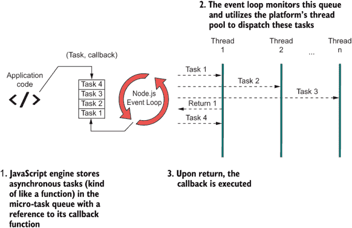

图 8.1 JavaScript 的事件驱动、异步架构。核心是事件循环（一个半无限循环），这是 JavaScript 中处理并发行为的抽象。事件循环负责调度新的异步任务并将它们分配给池中可用的任何线程。当任务完成时，引擎触发操作的回调函数以将控制权交还给用户。

Node.js 的引擎在抽象多个异步操作的执行方面做得很好，使得它们看起来是同时运行的。在幕后，事件循环执行快速的调度和交换，使用自己的线程与操作系统的内核 API 或浏览器线程架构进行原生交互，并执行管理线程池中线程（称为工作者）的所有必要记录。轮询循环是无限的，但并不总是处于旋转状态；否则，它将非常消耗资源。当有感兴趣的事件或操作，如按钮点击、文件读取和网络套接字时，它才开始计时。当出现任务时，事件循环将其从任务队列中出队，并安排它运行。每个任务都会运行到完成，并调用提供的回调函数将控制权交还给用户，并返回结果（如果有）。这个过程就像时钟一样工作（字面意思），然而用户并不知道这一切正在发生。表面上，JavaScript 并没有泄露或暴露任何与线程相关的代码。

此外，线程可以通过服务器端或客户端的本地 API（DOM、AJAX、套接字、定时器等）或任何实现本地扩展的第三方库内部创建。作为 JavaScript 开发者，我们有幸拥有这项技术为我们移除这种复杂性。更不用说，我们手头上有简单的 API，它们在我们和引擎之间增加了更多的抽象层。Promise 是抵御回调地狱的第一道防线，也是简化异步流程的垫脚石。

## 8.2 作为承诺的 JavaScript

Promise 的创建是为了解决在回调函数中嵌套回调函数的日益复杂问题，目的是将这些调用扁平化成一个单一的、流畅的表达式。在本节中，你将学习 `Promise` API 如何简化异步编程的思维方式。掌握这个 API 非常重要，因为它是 `async`/`await` 和相关特性的基础。

简而言之，Promise 对象封装了一些最终（待计算）的值，就像一个普通函数一样。它能够传递一个单一的对象，无论这个对象是一个简单的原始值还是一个复杂的数组。Promise 与回调函数类似，它们清晰地传达了“去做某事；然后（在某个时间点）去做另一件事”的信息，这使得它们成为一对一替换的理想选择。以下列表展示了如何实例化一个新的 Promise 对象。

列表 8.1 实例化一个新的 `Promise` 对象

```
const someFutureValue = new Promise((resolve, reject) => {      ❶
   const value = // do work...
   if(value === null) {
     reject(new Error('Ooops!'));
   }
   resolve(value);
});

someFutureValue.then(doSomethingElseWithThatValue);             ❷
```

❶ Promise 也依赖于一个回调函数。这个函数被称为执行器。

❷ `then` 方法允许你将多个 Promise 串联起来。

与回调一样，Promise 利用了 JavaScript 架构的全部能力。实际上，对于引擎来说，不应该有任何区别。通常，任何提供了某种形式的回调函数的事件（如鼠标事件、HTTP 请求、Promise 等）都可以使用 JavaScript 的事件循环。有时，对于简单的操作（如`setTimeout`），可能会使用直接的非阻塞系统调用，但这是一种引擎特定的优化。传递给`Promise`构造函数的函数称为执行器函数。执行器在没有阻塞主代码的情况下运行，事件循环通过巧妙地将异步块的时间片与主代码交织在一起来决定如何安排工作。图 8.2 描述了这一过程。

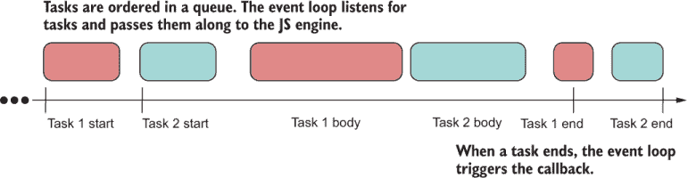

图 8.2 节点.js 架构处理异步任务的一个简化视图。事件循环将这些任务分割成时间片，使得代码永远不会阻塞，从而提供了并行的假象。

现今的每种编程语言都支持类似的 API，有时被称为任务或未来。其基本思想如下：

```
doSomething().then(doSomethingElse);
```

这些任务将运行到完成，可能需要任意长的时间。`Promise#then`方法清楚地表明 Promise 是在抽象时间（或延迟）。Promise 允许你以简单的方式（用普通的英语来说）处理时间，这样你就可以专注于解决真正的业务问题。有助于将它们视为异步调用的时间限制指令分隔符，就像分号在同步语句中所做的那样：

```
doSomething(); doSomethingElse();
```

Promise 是涉及等待或阻塞操作（如 I/O 或 HTTP 请求）的理想返回包装器。实际上，Node.js 的 fs 库已经从使用同步 API 逐渐发展到使用回调，最后到返回 Promise——这是随着时间的推移采用此模式的一个很好的例子。你可以找到同步和异步 API 来访问文件系统。

让我们通过一个简单的例子来展示这种演变过程，从同步方法开始：

```
fs.readFileSync('blocks.txt');
```

这种方法应该是你最不希望选择的方法（Node.js 团队通过明确将其标记为`Sync`来表示这一点），因为它会暂停主线程。阻塞与扩展相反，并且与 JavaScript 的事件驱动、单线程特性相悖。请谨慎使用，或者仅用于简单的单次脚本。其次是默认的回调版本：

```
fs.readFile('blocks.txt', (err, data) => {
  if (err) throw err;
  console.log(data);
});
```

此 API 使用 JavaScript 的内部调度器，使得代码在`readFile`调用上永远不会停止。当数据准备好时，提供的回调函数会被触发，并带有实际的文件内容。

在回调和完全基于 Promise 的文件系统库之间有一个中间步骤，是一个名为`util.promisify`的工具，它将基于回调的函数适配为使用 Promise：

```
import util from 'util';

const read = util.promisify(fs.readFile);

read('blocks.txt').then(fileBuffer => console.log(fileBuffer.length));
```

但有一个限制，这个实用工具与错误优先的回调一起工作，这是一种在许多 JavaScript API 中普遍存在的模式，表明回调应该是右偏的，错误状态映射到左参数，成功状态映射到右参数。（你在第五章中学习了有偏 API。）与`Validation`和其他单子（monads）一样，延续分支（`Functor.map`应用到的分支）始终在右边。然而，这种相似性是巧合的。正如你将在第 8.2.2 节中看到的，承诺（promises）和 ADT 之间有一个强烈的联系。

最后，最好的方法是使用内置的承诺化替代库来访问文件系统，在 Node.js 中作为单独的命名空间`fs.promises`提供：

```
import fs from 'fs';

const fsp = fs.promises;

fsp.readFile('blocks.txt').then(
    fileBuffer => console.log(fileBuffer.length));
```

不可否认，这个版本比基于回调的方法更加流畅，因为代码不再显得嵌套。使用单个异步操作，改进可能并不明显，但想想那些涉及三个或四个异步调用的更密集的任务。

现在你已经看到了使用承诺（promises）如何改进 API，让我们更深入地探讨为什么这个 API 在 JavaScript 世界中如此震撼人心。之前我说过，承诺（promises）封装了在某个任意时间要计算的价值。然而，这个抽象的美妙之处在于它模糊了数据所在的位置。

### 8.2.1 数据局部性原则

一般而言，数据局部性原则是指将数据移动到某个计算发生的地方附近，或者相反。数据越接近，它移动到期望目的地就越快，无论是通过系统总线还是通过互联网。数据与计算单元之间的不同距离，例如，是你在 CPU 架构中甚至在你的 JavaScript 应用程序中有不同级别缓存的原因。承诺（promises）允许我们无论数据位于何处（本地或远程）或计算需要多长时间（两秒、两分钟或两小时），都能使用相同的编程模型。这段代码可以读取文件，无论它位于服务器上的本地位置还是世界某个遥远的地点：

```
fsp.readFile('blocks.txt').then(
    fileBuffer => console.log(fileBuffer.length));
```

我们可以说承诺（promises）是延迟的伪装，而数据局部性不会影响你的编程模型。当我们讨论第九章中的可观察者（observables）时，我们会回到这个想法。此外，建模成功或错误状态的想法并非巧合。你还记得第五章中`Validation` ADT 的`Success`和`Failure`吗？

### 8.2.2 承诺（promises）是代数性的吗？

在第五章，我们研究了 ADT 及其作为编程工具的重要性，它可以帮助我们将某些类型的问题组合起来。当我们考虑时间是一个效果时，它们在建模异步任务时也非常有效。在本节中，你将看到 ADT 的设计如何帮助你通过自动将 ADT 的所有组合性优势转移到异步代码中来理解承诺（promises）。

首先，让我们谈谈 `Promise` 的工作原理。当一个 `Promise` 对象被声明时，它立即开始其工作（执行函数）并将内部状态设置为挂起：

```
const p = new Promise(resolve => {
   setTimeout(() => {
     resolve('Done');
   }, 3000);  
});

console.log(p); // Promise { <pending> }
```

当 `Promise` 解决（在这种情况下，在 3 秒后），将只有两种可能的状态：已履行（带有值解决）或拒绝（带有错误拒绝）。图 8.3 捕捉了 `Promise` 对象的所有可能状态。

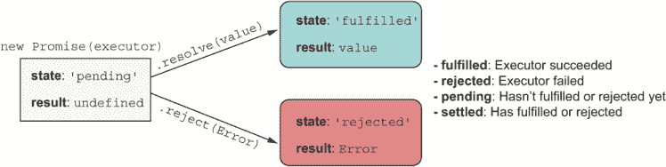

图 8.3 单个 `Promise` 对象可能的生命周期状态

如果你回想起第五章学到的内容，`Promise` 并没有多少不同之处于 `Validation`。事实上，你几乎可以将它们的图叠加起来，如图 8.4 所示。


图 8.4 `Validation` 类型的结构。`Validation` 提供了 `Success` 或 `Failure` 的选择——永远不会同时两者。与 `Promise` 一样，计算在 `Success` 分支上继续。

验证也模拟了二进制状态。它假设在初始化时带有值时为 `Success`，然后根据映射到它的操作的结果进行切换。你可以假设 `Promise` 也会发生类似的事情：它们开始时是挂起或已履行，然后根据传递给 `Promise#then` 的每个反应或执行函数发生什么而切换。同样，如果 `Validation` 达到 `Failure` 状态，错误将被记录，操作链将中断，就像 `Promise#catch` 一样。

从 ADT（抽象数据类型）的角度来看这个例子，我们可以推断出 `Promise` 是一个封闭的上下文，拥有足够的内部管道来抽象时间的影响。`Promise` 遵循 Promise/A+ 规范([`promisesaplus.com`](https://promisesaplus.com/))，目标是标准化它们，并使它们在所有 JavaScript 引擎之间互操作。

对于任何 ADT `C`，如果你将 `Promise#then` 视为 `C.map`，将 `Promise.resolve` 视为 `C.of`，许多 ADT 的通用属性仍然保持不变，甚至包括可组合性！唯一的小问题是 `Promise#then` 是左偏的，因此它将已履行（成功）回调定义为左参数，将错误回调定义为右参数。这样做的原因是可用性，因为大多数人只有在链式调用多个 `Promise` 时才会使用已履行回调，并在链的末尾使用单个 `Promise#catch` 函数来处理链中任何点发生的任何错误。

我将简要说明一些使 `Promise` 类似 ADT 的属性。下面的列表显示了在示例中使用的某些辅助函数。

列表 8.2 在后续代码示例和图中使用的辅助函数

```
const unique = letters => Array.from(new Set([...letters]));    ❶
const join = arr => arr.join('');                               ❷
const toUpper = str => str.toUpperCase();                       ❸
```

❶ 将字母字符串中的重复项移除，例如 “aabb” -> “ab”

❷ 将数组连接成一个字符串

❸ 将给定字符串的所有字符转换为大写

为了证明 `Promise` 可以像任何 ADT 一样工作并可以进行推理，这里有一些我们在第五章讨论的通用属性，这次使用 `Promise`：

+   身份——在`Promise`上执行恒等函数会产生另一个具有相同值的`Promise`。以下表达式

    ```
    Promise.resolve('aa').then(identity);
    ```

    和

    ```
    Promise.resolve('aa');
    ```

    是等价的。两者都产生

    ```
    Promise { 'aa' }
    ```

+   组合——两个或更多函数的组合，如`f`在`g`之后，等价于先应用`g`然后应用`f`。以下语句

    ```
    Promise.resolve('aabbcc')
           .then(unique)
           .then(join)
           .then(toUpper);
    ```

    和

    ```
    Promise.resolve('aabbcc')
           .then(compose(toUpper, join, unique));
    ```

    是等价的。两者都产生

    ```
    Promise { 'ABC' }
    ```

所以如果`Promise#then`类似于`Functor.map`，那么类似于`Monad.flatMap`的方法是哪个？正如你可能已经注意到的，`Promise#then`允许你返回未包装的值以及`Promise`包装的值；它处理两者。因此，`Promise#then`是`Functor.map`和`Monad.flatMap`的组合，其扁平化逻辑在幕后处理。以下列表展示了这两种场景的使用案例。

列表 8.3 `Promise#then`自动扁平化嵌套的`Promise`

```
Promise.resolve('aa')
   .then(value => {
      return `${value}bb`                    ❶
   })
   .then(value => {
     return Promise.resolve(`${value}cc`)    ❷
   }); // Promise { 'aabbcc' } 
```

❶ 处理简单值

❷ 处理包装值

我们可以得出承诺是代数或单子的结论吗？从理论角度来看，它们不是，因为承诺没有所有数学属性。事实上，承诺不遵循我们期望从 ADT 得到的幻想之地规范（第五章）。但幸运的是，在表面上，承诺以相同的方式工作，我们可以利用这种可靠的编程模型，它具有低门槛，允许我们组装（组合）承诺链。

### 8.2.3 流畅链式调用

一个承诺链（promise chain）就像任何 ADT（抽象数据类型）一样工作，是通过连续调用返回的`Promise`对象的`Promise#then`或`Promise#catch`来创建的。这个过程在图 8.5 中展示。

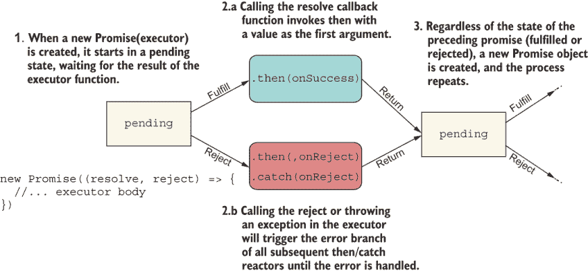

图 8.5 展示了承诺链的执行细节。每个`Promise`对象最初都是待定的，并根据执行器回调的结果改变状态。结果是包装在一个新的待定`Promise`中。（图表灵感来源于[`mng.bz/Xdx6`](http://mng.bz/Xdx6)。）

每个执行器都会返回一个新的待定承诺（pending promise），其状态会根据其自身执行器的结果而改变。如果成功，则满足的值会传递到链中的下一个承诺，依此类推，直到返回一个非`Promise`对象。如果你这么想，这个过程听起来很像组合。

让我们看看成功和错误操作执行的不同场景，从一个完全链接链的简单场景开始。

完全链接链

以下列表展示了传递三个仅在先前的承诺成功后执行的响应函数的例子。在每一步，都会隐式地创建新的`Promise`对象。

列表 8.4 完全链接的承诺链

```
Promise.resolve('aabbcc')
    .then(unique)            ❶
    .then(join)              ❶
    .then(toUpper);          ❶
```

❶ 执行器仅在先前的承诺得到满足时被调用。

与 ADT 类似，承诺模拟了传送带或铁路方法的数据操作。每个操作执行一个新的数据转换步骤，并返回一个新的待定承诺，等待其处理函数的结果。如果函数成功应用，它将解决为已履行。您在图 8.5 中看到了详细的流程。为了使下一个用例简单，我将说明每个步骤的承诺的最终状态。图 8.6 描述了这种流程。

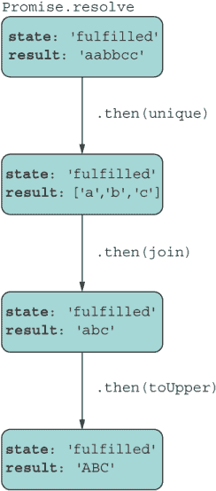

图 8.6 显示，承诺链允许你将数据视为一个单向、前向的传送带，其中每一步都应用不同的数据转换。

列表 8.4 表示一个具有单个结果的链，而列表 8.5 则不是。

破裂的链

下一个列表显示了一个永远不会链接到任何其他对象的`Promise`对象。

列表 8.5 破裂的承诺链

```
const p = Promise.resolve('aabbcc');
p.then(unique);  // ['a','b','c']   ❶
p.then(join);    // Error           ❶
p.then(toUpper); // 'AABBCC'        ❶
```

❶ 当 p 按此顺序履行时，所有执行器都会被调用并接收相同的输入。此代码产生三个承诺：两个已履行和一个被拒绝。

在这种情况下，创建了三个不同的、不连续的`Promise`对象，它们都没有链接到其他对象。这段代码会导致运行时错误，这很可能是意外的。图 8.7 显示了错误和每个结果承诺中存储的值。

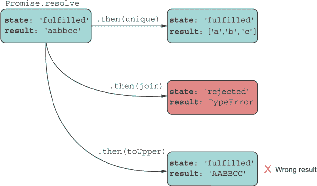

图 8.7 这种方法不会形成链：这是一个错误。代码向同一个`Promise`对象添加了多个处理程序，每个处理程序对原始数据应用一个转换，并得到三个不同且意外的结果。

列表 8.5 中显示的示例是一个常见的错误。在这种情况下，`unique`、`join`和`toUpper`都接收`'aabbcc'`作为输入，这并不是程序员可能想要的结果。发生的情况是，`Promise`对象被传递了三个不同的反应函数，然后按顺序对相同的输入值执行它们。不仅结果不正确，而且其中一个承诺因`TypeError`而出错。让我们看看如果我们将错误处理程序附加到失败的承诺会发生什么（图 8.8）。

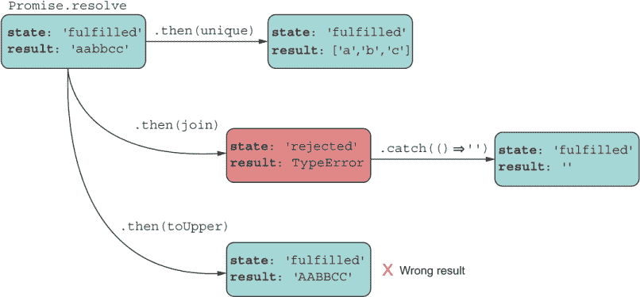

图 8.8 恢复失败的承诺并返回一个默认的空值。这种方法返回另一个立即解决的待定承诺，其值为空。

如您所料，`Promise#catch`处理函数只会应用于隔离的`Promise`对象并恢复，但另一个可能会轻易失败。当任务涉及多个异步操作时，通常可以看到嵌套的承诺。

嵌套链

假设你正在处理某个远程数据存储，你想要获取特定用户的购物车项并返回一个单一的对象作为响应。为此，你需要合并两个端点的数据并将两个响应结合起来。最佳选择是使用承诺组合器，我们将在第 5.3 节中探讨。另一种方法是嵌套承诺。

确实，Promise 是为了避免编写嵌套回调而设计的，而是使用扁平链。然而，Promise 比回调更好的原因是，一个正确嵌套的 Promise 仍然是一个单一的链式 Promise，尽管有缩进。正如下一个列表所示，这种心理模型更容易推理。

列表 8.6 嵌套的 Promise

```
const concat = arr1 => arr2 => arr1.concat(arr2);

Promise.resolve('aabbcc')
  .then(unique)
  .then(abc => 
    Promise.resolve('ddeeff')       ❶
       .then(unique)
       .then(def => abc.concat(def))       
  )
  .then(join)
  .then(toUpper); // 'ABCDEF' 
```

❶ 嵌套链的链接

正如你所见，甚至返回一个嵌套的 Promise 也会与主链连接，如图 8.9 所示。

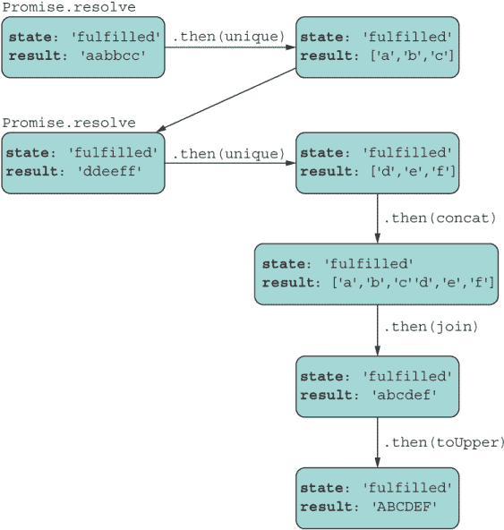

图 8.9 包含嵌套 Promise 的流程。返回的嵌套 Promise 将其自身与源 `Promise` 对象链接起来，模拟线性流程。

在嵌套中真正的挑战是处理错误。你如何决定结构化你的代码取决于你如何计划你的数据和/或错误传播。数据通过使用 `Promise#then` 来传播。错误通过使用 `Promise#then(,` `onRejected)` 或 `Promise#catch` 来传播。

哪个更好：`catch` 还是 `then`？

每种方法都有优点和缺点，并且两者工作方式略有不同。不过，一般来说，`Promise#catch` 似乎更受欢迎，并且也更熟悉来自不同背景的开发者，例如 Java。然而，除非你在每个 `Promise#then` 后添加 `Promise#catch`，否则链中的任何错误都将由下游的 `Promise#catch` 块处理，你将不知道哪个处理程序导致了它。使用 `Promise#then` 确实可以让你对错误发生的位置（前一个）有更多的控制，但牺牲了语法上的流畅性。尽管如此，两种方法都遵循相同的链式规则，因为它们都返回新的挂起 Promise。

无论如何，JavaScript 是首选的语言，所以使用最适合你和你编码偏好的方法。然而，在这本书中，我们将坚持使用 `Promise#catch`，因为它也与观察者中存在的错误处理下游模式相一致（第九章）。

困难的部分是确定你附加反应函数的根 Promise 对象。为了回到我们的简单用例，让我们在下一个列表中故意让链中的某个函数失败。

列表 8.7 完全链接的链带有错误

```
Promise.resolve('aabbcc')   
   .then(unique)
   .then(() => throw new Error('Ooops!'))
   .then(join)                                        ❶
   .then(toUpper)                                     ❶
   .catch(({message}) => console.error(message));     ❷
```

❶ 跳过的

❷ 捕获处理程序接收错误对象并打印 Ooops!

第三行的错误触发了下游的 `Promise#catch` 调用的拒绝处理程序，有效地跳过了 `join` 和 `toUpper` 步骤。

下一个列表展示了使用嵌套 Promise 和错误的示例。

列表 8.8 带有错误的嵌套 Promise 链

```
Promise.resolve('aabbcc')
  .then(unique)
  .then(data => {
    Promise.resolve(data)
       .then(join)
       .then(() => throw new Error('Nested Ooops!'))     ❶
  })
  .then(toUpper)                                         ❷
  .catch(({message}) => console.error(message));
```

❶ 嵌套的 Promise 因错误而失败但未处理

❷ 在未定义的错误上抛出属性访问

在这种情况下，你预计嵌套链将加入主链，并在最后打印“嵌套 Ooops!”。你能找到阻止这种情况发生的错误吗？没错：开发者忘记返回嵌套承诺以正确地嵌入链中。现在这个嵌套承诺本质上是一个新的流氓挂起承诺（图 8.10）。

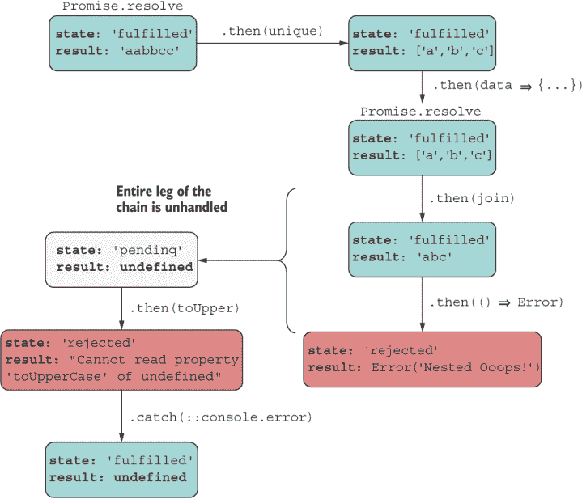

图 8.10 因为开发者忘记返回 `Promise` 对象，嵌套承诺自行运行，其结果或错误（视情况而定）永远不会加入主承诺链。

这种结果通常发生在作者忘记返回嵌套的承诺对象，或者想要使用箭头函数但错误地使用了花括号。下面的列表修复了这个问题。

列表 8.9 重新加入嵌套链以正确处理错误

```
Promise.resolve('aabbcc')
  .then(unique)
  .then(data =>                                        ❶
    Promise.resolve(data)
       .then(join)
       .then(() => throw new Error('Nested Ooops!'))  
   )
  .then(toUpper)
  .catch(({message}) => console.error(message))        ❷
```

❶ 移除了括号以创建箭头函数

❷ 打印“嵌套 Ooops!”到控制台

现在嵌套承诺已正确嵌入链中，数据（或错误，在这种情况下）按预期传播，打印出“嵌套 Ooops!”（图 8.11）。

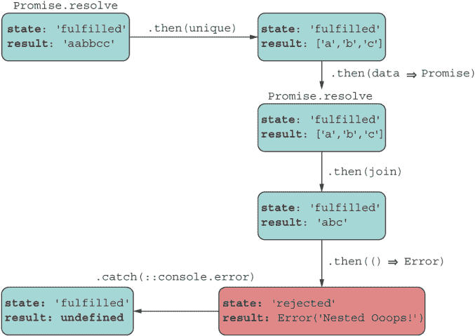

图 8.11 有效地修复了错误，简化了链。现在每个结果/错误都被处理并计入。

承诺的设计在 `Promise#catch` 调用上也是流畅的。这种技术对于使用默认值恢复错误很有用。考虑以下列表中的简单修复。

列表 8.10 使用默认值恢复错误

```
Promise.resolve('aabbcc')
  .then(unique)
  .then(data =>               ❶
    Promise.resolve(data)
       .then(join)
       .then(() => throw new Error('Inside Ooops!'))
       .catch(error => {
         console.error(`Catch inside: ${error.message}`)
         return 'ERROR'
       })
   )
  .then(toUpper)
  .then(::console.log)
  .catch(({message}) => console.error(message));
```

❶ 当你使用箭头函数时，返回语句是隐式的。

重要的是要提到，你的承诺链必须能够处理错误情况。如果它们无法做到这一点，JavaScript 引擎会发出警告（在撰写本文时）。你可能已经在你的控制台中看到过这条消息：

```
UnhandledPromiseRejectionWarning: Unhandled promise rejection. This error originated either by throwing inside of an async function without a catch block, or by rejecting a promise which was not handled with .catch(). 

DeprecationWarning: Unhandled promise rejections are deprecated. In the future, promise rejections that are not handled will terminate the Node.js process with a non-zero exit code.
```

这条消息告诉你的事，在内部，JavaScript 引擎正在为你处理错误，并以优雅的方式失败。正如你所预期的，你不会想让这种情况永远继续下去，所以如果你现在看到这个警告，你可能遗漏了一些错误处理代码，最好的办法是立即修复这个问题。

最后（没有打趣的意思），你可以使用 `Promise#finally` 方法结束承诺链。正如你所期望的，`this` 回调与 `try` 块之后的 `finally` 块具有相同的语义结构。无论承诺是成功还是失败，回调都会在承诺解决后执行，如下面的列表所示。

列表 8.11 使用 `Promise#finally` 的承诺链

```
Promise.resolve('aabbcc')
  .then(unique)  
  .then(join)
  .then(toUpper)
  .then(console.log)        ❶
  .finally(() => {
    console.log('Done')     ❷
  });
```

❶ 打印 'ABC'

❷ 无论承诺的状态如何，总是打印 'Done'

如你所见，操纵承诺链需要仔细地穿针引线和连接承诺对象。如果你需要嵌套一个承诺来执行额外的异步逻辑，请记住将其连接回主线路。

### 8.2.4 野外的承诺

本节提供了一些现实世界的例子。第一个例子使用承诺化的文件系统 API 来计算保存到文件中的所有块。为此任务，我们将在下一列表中编写一个名为 `countBlocksInFile` 的函数。

列表 8.12 在文件中计算所有块的数量

```
function countBlocksInFile(file) {
   return fsp.access(file, fs.constants.F_OK | fs.constants.R_OK)
      .then(() => {                                                 ❶
         return fsp.readFile(file)
      })
      .then(decode('utf-8'))
      .then(tokenize(';'))
      .then(count)
      .catch(error => {
          throw new Error(`File ${file} does not exist or you have 
             no read permissions. Details: ${error.message}`)
       });
}

countBlocksInFile('blocks.txt')
   .then(result => {      
      result // 3
   });
```

❶ fsp.access 不产生值。如果访问被允许，它将解析；否则，它将拒绝。

这里有一个另一个现实世界的例子，它将挖掘新块并加入链的复杂逻辑实现。这段代码很复杂，因为它混合了同步和异步代码，涉及几个嵌套的异步操作：一个长时间运行的挖矿操作和一个动态的 `import` 来读取挖矿奖励设置。这个服务函数在 `BitcoinService` 中实现。

列表 8.13 中的代码显示了区块链协议的一个关键部分——当然是一个简化的版本。它突出了矿工为了获得任何奖励需要做的广泛工作。本质上，矿工将新块挖入链中。这个挖矿过程还运行了工作量证明算法。在成功挖矿后，矿工将收集之前作为挂起交易存储的所有奖励。在块被插入后，矿工从开始到结束验证整个区块链结构。所有这些任务都会在一个单独的矿工节点上运行，该节点有自己的整个区块链树的副本。在我们的例子中，区块链服务负责创建一个新的奖励交易，并将该交易作为挂起交易放回链中，以供下一个矿工加入。所有这些操作可能需要不同长度的时间，因此使用承诺来平滑所有这些操作并保持一个平坦、易于推理的结构是有益的。

列表 8.13 在链中挖矿一个块

```
  function minePendingTransactions(rewardAddress, 
       proofOfWorkDifficulty = 2) {

    const newBlock = new Block(ledger.height() + 1, ledger.top.hash,
      ledger.pendingTransactions, proofOfWorkDifficulty);

    return mineNewBlockIntoChain(newBlock)                     ❶
      .then(:: ledger.validate)                                ❷
      .then(validation => {
        if (validation.isSuccess) {
          return import('../../common/settings.js')            ❸
            .then(({ MINING_REWARD }) => {                     ❹
              const fee =
                Math.abs(
                  ledger.pendingTransactions
                    .filter(tx => tx.amount() < 0)
                    .map(tx => tx.amount())
                    .reduce((a, b) => a + b, 0)
                ) *
                ledger.pendingTransactions.length *            ❺
                0.02;

              const reward = new Transaction(
                network.address, rewardAddress,                ❻
                Money.sum(Money('B|', fee), MINING_REWARD), 
                'Mining Reward');
              reward.signTransaction(network.privateKey);

              ledger.pendingTransactions = [reward];           ❼

              return ledger;
            })
        }
        else {
          new Error(`Chain validation failed ${validation.toString()}`);
        }
      })
      .catch(({ message }) => console.error(message));
  }
```

❶ 将新块挖入链中：我们的第一个异步操作。

❷ 验证整个链。与 fs.access 类似，成功的验证会导致承诺解析。失败的验证会转化为下流拒绝。捕获块接收错误并记录它。有关绑定操作器的更多信息，请参阅附录 A。

❸ 动态导入设置。动态导入使用承诺。这个新的嵌套异步操作被链回到现有的更大的链中。

❹ 解构 MINING_REWARD 设置。这个值被区块链系统用来插入一个奖励矿工的交易。这个奖励在下一个块被添加到链中时生效。

❺ 更多交易意味着更多奖励。

❷ 服务创建一个新的奖励交易。

❻ 清除所有挂起的交易并将奖励放入链中以激励下一个矿工。

尽管复杂，但在这个阶段，链式方法应该对你来说很熟悉，因为我们从第五章开始就一直在讨论 ADT，并且一直在构建操作序列。当你能够将`Promise#then`与`Functor.map`和`Monad.flatMap`相关联时，一切都会更有意义。将正确的抽象应用于手头的问题会使你的代码更简洁、更健壮，这也是为什么承诺优于回调的原因。

到目前为止，我已经介绍了单文件承诺链。通常，你可能需要同时处理多个任务。也许你正在将多个 HTTP 调用中的数据混合，或者从多个文件中读取。这种情况会导致承诺链中出现分支。

## 8.3 API 回顾：承诺组合子

函数组合子（`compose`和`curry`）接受函数并返回一个函数，承诺组合子接受一个或多个承诺并返回一个单一的承诺。正如你所知，ECMAScript 2015 附带两个极其有用的静态操作：`Promise.all`和`Promise.race`。在本节中，我将回顾这两个 API，并介绍两个新的组合子，它们有助于解决额外的用例：`Promise.allSettled`和`Promise.any`。这些组合子对于将复杂的异步流程简化为简单的线性链非常有用，尤其是在需要从多个远程源组合数据时。为了更好地说明这些技术，我们需要找到一个可以用来测试这些 API 的长运行操作。

让我暂停一下，设置代码示例。在第七章（列表 7.8）中，我展示了一个简单的工作量证明函数。这里再次展示：

```
function proofOfWork (block = 
     throw new Error('Provide a non-null block object!')) {
  const hashPrefix = ''.padStart(block ?.difficulty ?? 2, '0'); 
  do {
    block.nonce += 1; 
    block.hash = block.calculateHash();  
  } while (!block.hash.toString().startsWith(hashPrefix)); 
  return block;
}
```

此函数使用暴力重新计算给定块的哈希值，直到其值以提供的前缀开始。在每次迭代中，块的`nonce`属性都会更新并纳入哈希过程。这个操作可能立即发生，也可能需要几秒钟才能完成，具体取决于`hashPrefix`的长度以及正在哈希的数据的性质。再次强调，使用承诺意味着我们不必担心这个操作。

我们即将看到的示例以异步方式调用工作量证明函数，使用一个名为`proofOfWorkAsync`的新函数。为了模拟真正的并发，我们可以使用实现 Worker Threads API 的特殊 Node.js 库（[`nodejs.org/api/worker_threads.html`](https://nodejs.org/api/worker_threads.html)）。当然，这些库不是 JavaScript 语言的一部分。JavaScript 的内存模型是单线程的，正如本章开头所讨论的。相反，这些库使用低级 OS 线程进程，并通过一个称为`Worker`（线程）的抽象来并行执行 JavaScript。

`worker_threads`模块可以帮助你在服务器上解决这个问题，它与浏览器中的 Web Workers API 类似。这个函数看起来如下所示。

列表 8.14 使用 Worker Threads API 的工作量证明包装器

```
import { Worker } from 'worker_threads';
...
function proofOfWorkAsync(block) {
  return new Promise((resolve, reject) => {                          ❶
    const worker = new Worker(<path-to-proof-of-work-script>.js, {
      workerData: toJson(block)                                      ❷
    });
    worker.on('message', resolve);                                   ❸
    worker.on('error', reject);                                      ❹
    worker.on('exit', code => {
      if (code !== 0)
        reject(new Error(`Worker stopped with exit code ${code}`));
    });
  });
}
```

❶ 使用承诺包装工作执行

❷ 通过使用 `toJson` 辅助函数将序列化的 JSON 区块数据传递给工作量证明脚本，该函数连接到对象的 `Symbol.for('toJson')`（见第七章）

❸ 处理从脚本返回的消息作为解析

❹ 处理拒绝错误

现在，让我们看看工作脚本代码。这个脚本加载、调用工作量证明函数，并将结果发送回调用脚本。从调用者的角度来看，从工作开始到“消息”或“错误/退出”事件最终触发的时间隐藏在承诺中，有效地从等式中消除了时间的概念。

工作脚本很简单；它反序列化传递给它的 JSON 区块字符串消息，然后使用它创建一个 `Block` 对象，这是 `proofOfWork` 所需要的。最后，结果被发送回主线程，如下一个列表所示。

列表 8.15 网页工作线程逻辑

```
import {
    parentPort, workerData
} from 'worker_threads';
import Block from '../../Block.js';
import proofOfWork from './proof_of_work.js';

const blockData = JSON.parse(workerData);       ❶

const block = new Block(blockData.index, blockData.previousHash, 
     blockData.data, blockData.difficulty);
proofOfWork(block);                             ❷

parentPort.postMessage(block);                  ❸
```

❶ 反序列化 JSON 表示

❷ 运行工作量证明算法

❸ 将哈希过的区块数据发送回主线程

并行处理超出了本书的范围，但主要思想是实例化一个 `Worker`，它有一个指向执行某些并行任务的脚本的句柄。然后你使用消息传递将数据（在这种情况下，是哈希过的区块对象）发送回主线程。

你即将看到的示例依赖于运行 `proofOfWokAsync`，传递具有不同难度设置的区块。因为我们不感兴趣于形成一个区块链来跟踪交易和所有工作，我们可以直接使用 `Block` API。此外，我们还将使用几个辅助函数，一个用于生成随机哈希以填充新区块的 `previousHash` 构造函数参数，另一个用于在预定时间后模拟拒绝，如下面的列表所示。

列表 8.16 下一个 `async` 示例中使用的辅助函数

```
function randomId() {
  return crypto.randomBytes(16).toString('hex');
}

function rejectAfter(seconds) {
  return new Promise((_, reject) => {
    setTimeout(() => {
      reject(new Error(`Operation rejected after ${seconds} seconds`))
    }, seconds * 1_000);                                                ❶
  });
}
```

❶ 此代码使用数字分隔符，使长数字更易于阅读，使用视觉分隔符在数字组之间进行分隔。

由于我们使用承诺来封装这个过程，调用者不知道操作是如何或在哪里进行的；它是位置无关的。

让我们开始回顾承诺组合器，从 `Promise.all` 开始。

### 8.3.1 Promise.all

你可以使用 `Promise.all` 以并发方式安排多个独立操作，并在所有操作完成后收集单个结果。当需要将来自不同 API 的数据合并为单个对象时，这种技术非常有用，可以利用 Node.js 的内部多线程机制（在第 8.1 节中讨论）。下一个列表显示了一个示例。

列表 8.17 使用 `Promise.all` 组合承诺

```
Promise.all([
   proofOfWorkAsync(new Block(1, randomId(), ['a', 'b', 'c'], 1), 500),
   proofOfWorkAsync(new Block(2, randomId(), [1, 2, 3], 2), 1000)
  ])
  .then(([blockDiff2, blockDiff3]) => {             ❶
     blockDiff2.hash?.startsWith('0');  // true
     blockDiff3.hash?.startsWith('00'); // true
  });
```

❶ 返回一个数组，其顺序与输入数组相同

从高层次来看，这段代码看起来很像分叉-合并模型：它“同时”启动所有任务，等待它们完成，然后将它们合并成一个单一的总结果。在拒绝的情况下，它使用第一个拒绝的承诺进行拒绝。

而不是等待所有承诺都完成，假设你只对第一个成功的操作感兴趣。在这种情况下，你可以使用 `Promise.race`。

### 8.3.2 Promise.race

此方法返回一个承诺，其中包含第一个承诺的结果，无论是履行还是拒绝，以及该承诺的值或原因。`Promise.race` 解决有趣的问题。假设你正在实现一个具有高度可用 API 后端或分布式缓存的 Web 前端——这是现代云部署中常见的情况。你有一个位于美国东部地区的 API 后端和一个位于美国西部地区的后端。你可以使用 `Promise.race` 同时从这两个地区获取数据。延迟最低的地区获胜。这种情况可以保证你的后端在用户在全国漫游时的性能一致性。

让我们使用这个 API 在下一个列表中同时比较两个块的哈希。

列表 8.18 使用 `Promise.race` 组合承诺

```
Promise.race([
   proofOfWorkAsync(new Block(1, randomId(), ['a', 'b', 'c'], 1)),
   proofOfWorkAsync(new Block(2, randomId(), [1, 2, 3], 3))
  ])
  .then(blockWinner => {                             ❶
     blockWinner.hash?.startsWith('0');  // true
     blockWinner.index;                  // 1
  });
```

❶ 返回单个结果

如你所预期，难度值较小的块赢得了比赛。`Promise.all` 在任何承诺被拒绝时短路，而 `Promise.race` 在任何承诺解决时短路。相比之下，`Promise.allSettled` 和 `Promise.any` 对错误的敏感性较低，允许你提供更好的错误处理。你可以在 8.3.3 节中看到这些组合器的作用。

### 8.3.3 Promise.allSettled

使用 `Promise.all` 的缺点是，如果提供的任何承诺被拒绝，则承诺将拒绝。如果你试图加载数据以渲染应用程序的多个部分，一个失败意味着你必须在所有部分中显示错误消息。如果你不希望这样，也许你只想在数据获取操作失败的部分显示错误。

作为 ECMAScript 2020 的一部分，`Promise.allSettled` 返回一个在所有给定的承诺都履行或拒绝（解决）后解决的 `Promise`。结果是描述每个承诺结果的特殊对象数组。每个结果对象都有一个 `status` 属性（已履行或已拒绝）和一个 `value` 属性，其中包含已履行结果的数组，如果适用的话。

让我们使用这个 API 在下一个列表中，使用一个履行和一个拒绝的承诺来向你展示它如何与 `Promise.all` 区别。

列表 8.19 使用 `Promise.allSettled` 组合承诺

```
Promise.allSettled([
   proofOfWorkAsync(block),
   rejectAfter(2)                                                         ❶
  ]);
  .then(results => {
     results.length; // 2
     results[0].status; // 'fulfilled'                                    ❷
     results[0].value.index; // 1                                         ❷

     results[1].status; // 'rejected'                                     ❸
     results[1].reason.message;// 'Operation rejected after 2 seconds'    ❸
   });
```

❶ 使用 setTimeout 在两秒后调用 reject

❷ 第一个结果包含哈希块。

❸ 第二个结果对象包含拒绝的结果。

到目前为止，你可能已经使用 `Promise.all` 来同时加载多个数据片段。`Promise.allSettled` 是一个更好的替代方案，因为失败不会损害整个承诺结果；它不会短路。最后，还有 `Promise.any`。

### 8.3.4 Promise.allSettled

这种方法与 `Promise.all` 相反。如果传入的任何承诺被履行，无论是否有拒绝，结果承诺都会以该承诺的值履行。当你只关心承诺是否从集合中解决，而想忽略任何失败时，这个 API 是有益的。`Promise.any` 在所有承诺都拒绝时返回一个拒绝的承诺，如下一个列表所示。

列表 8.20 使用 `Promise.any` 组合承诺

```
return Promise.any([
   Promise.reject(new Error('Error 1')),
   Promise.reject(new Error('Error 2'))
  ])
  .catch(aggregateError => {     
     aggregateError.errors.length; // 2
  })
```

你可能会认为这个 API 的行为很像 `Promise.race`。小的细微差别在于它返回第一个已解析的值（如果有的话），而 `Promise.race` 返回第一个已解决的（解析/拒绝）值。一个需要注意的问题是返回值。如果任何承诺成功，你应该期望 `then` 方法执行结果。然而，如果所有承诺都拒绝，`Promise#then` 在 `Promise#catch` 块上返回一个新的 `Error` 类型，称为 `AggregatedError`，它包含所有失败的数组。

到目前为止，你已经学会了如何实例化承诺，形成链，并组合多个承诺的结果。掌握这些技术对于设计性能良好、更好的响应式应用程序至关重要。但是，如果承诺使异步编程变得如此简单，为什么不将它们从 API 提升到编程语言语法呢？

第 8.4 节将讨论转向 `async`/`await` 语法，这是一种语言特性，允许你完成到目前为止所学到的事情。

## 8.4 简化 async

`async`/`await` 功能旨在在语言级别上模糊同步和异步编程的界限。这一特性吸引了喜欢命令式编程风格的开发者，他们使用单独的语句解决问题，而不是一个长的 `then` 表达式序列。`async`/`await` 还借鉴了 `try`/`catch`/`finally` 的心理模型，以平滑处理 `then(...).catch(...) .finally(...)` 逻辑。以下是一个示例：

```
async function fetchData() {
  const a = await callEndpointA();
  const b = await callEndpointB();
  return {
    a, b
  };
}
```

承诺是 JavaScript 的 `async`/`await` 功能的构建块之一。从可用性的角度来看，你可以将这两个功能视为以相同的方式工作。像承诺一样，`async` 函数通过事件循环以单独的顺序运行，返回一个隐式的 `Promise` 作为其结果，你可以使用 `Promise#then` 或 `await`。

要理解这种编码方式，重构 `countBlocksInFile` 函数。目前，这个函数返回一个 `Promise` 对象，调用者预计将通过 `then` 方法处理结果。以下是该函数：

```
function countBlocksInFile(file) {
   return fsp.access(file, fs.constants.F_OK | fs.constants.R_OK)
      .then(() => {  
         return fsp.readFile(file);
      })
      .then(decode('utf-8'))
      .then(tokenize(';'))
      .then(count)
      .catch(error => {
          throw new Error(`File ${file} does not exist or you have 
             no read permissions. Details: ${error.message}`);
       });
}
```

你可以重构函数，以系统地利用 `async`/`await`。以下是步骤：

1.  将 `async` 添加到函数签名中。这一步将 `Promise` 对象的返回值传递给调用者，并使函数自我文档化（总是好事）。

1.  将 `Promise#catch` 移动到它自己的 `try`/`catch` 块中，该块覆盖整个异步逻辑。

1.  将每个`Promise#then`步骤转换为`await`语句，并将成功函数的输入作为一个显式的局部变量。本质上，你将 Promise 链解耦成单独的命令式语句。

下一个列表显示了转换后的函数看起来如何。

列表 8.21 使用`async`/`await`在 blocks.txt 中计数块

```
const fsp = fs.promises;

async function countBlocksInFile(file) {                                ❶
   try {
      await fsp.access(file, fs.constants.F_OK | fs.constants.R_OK);    ❷
      const data = await fsp.readFile(file);                            ❸
      const decodedData = decode('utf8', data);
      const blocks = tokenize(';', decodedData);
      return count(blocks);  
   }
   catch(e) {                                                           ❹
      throw new Error(`File ${file} does not exist or you have 
         no read permissions. Details: ${e.message}`);
   }   
}

const result = await countBlocksInFile('blocks.txt'); 
result; // 3
```

❶ 表示一个异步函数，该函数在底层返回一个 Promise（在函数体中使用 await 所必需的）。

❷ 测试用户对指定路径的权限。如果用户无法访问文件或文件不存在，则 Promise 将失败。

❸ 所有 await 调用在幕后都使用 Promise，因此尽管代码看起来像是在 I/O 上阻塞，但实际上一切都是异步的。

❹ 任何 await 调用（Promise）的拒绝都会跳入 catch 块。

图 8.12 显示，当 await 表达式的输出连接到下一个作为输入时，数据流就像 Promise 链一样。

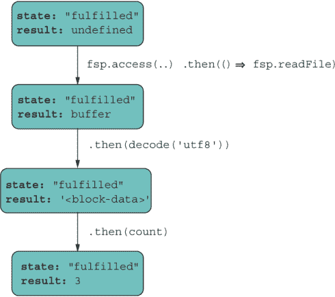

图 8.12 `async/await`遵循与 Promise 相同的链式规则。

从技术上讲，`countBlocksInFile`与之前的工作方式相同。你甚至可以将新语法与`Promise` API 混合，一切都会以相同的方式工作：

```
countBlocksInFile('blocks.txt')
   .then(::console.log); // Prints 3
```

为了澄清，函数签名中的`async`关键字充当类型定义。它是给调用者和编译器的提示，表明这个函数需要特殊处理，并将返回一个`Promise`。此外，关键字`await`可能具有欺骗性。这个关键字在许多语言中已经标准化，并且从语义角度来看是有意义的。但从技术角度来看，没有任何“等待”或“阻塞”。

如前所述，`async`/`await`将异步代码转换为同步，这使得它对喜欢命令式风格的读者来说更冗长、更易于阅读。但这个语法与 Promise 有相同的注意事项，即在你引入`async`调用之后，每个导致它的调用点都需要`await`。这种缺点很容易被忽视，因为代码看起来像是一个同步函数。错误也是如此。如果你忘记在`await`调用中包裹`try`/`catch`，拒绝就很容易被忽视。如果你忘记写`await`，你会看到底层的`Promise`包装的返回值而不是自由值。

虽然`async`/`await`促进了更命令式的编程风格，但 JavaScript 仍然足够灵活，你可以以函数式的方式使用它。例如，你可以使用管道操作符来组合异步调用，如下所示：

```
const blocks = path.join(process.cwd(), 'resources', 'blocks.txt') 
    |> (await countBlocksInFile)
```

在这种情况下，结果路径字符串被输入到`countBlocksInFile`并使用`await`。结果，正如预期的那样，是一个`async`值，我们可以使用另一个`await`来展开它以提取其值：

```
await blocks; // 3
```

在我们迄今为止的简单示例中，我们处理的是可以轻松加载到内存中的小文件。如果你需要找到特定的块对象，简单地将整个文件读入内存并处理那里的对象即可。在现实世界中，这种解决方案并不总是可扩展的，尤其是在处理大文件或在可用内存非常低的设备上。更好的方法是流式传输并以小块的形式迭代文件。第 8.5 节展示了`async`/`await`如何解决这个问题。

## 8.5 异步迭代

尽管像`fsp.readFile`这样的 API 简单方便，但这些 API 无法扩展到更大的文件，因为它们试图同时将整个文件内容加载到内存中。对于服务器上的小文件，你可以大部分情况下避免这种情况。但在浏览器中，尤其是在内存容量减少的移动设备上，这种做法是一种反模式。在这些情况下，你需要像移动窗口一样遍历或迭代文件，以便只加载文件的一部分。然而，你面临一个困境：读取文件是异步的，而迭代是同步的。我们如何协调这两个操作？

在本节中，你将了解异步迭代器，它们提供了一种优雅的方式来处理大量数据，无论这些数据位于何处。这种心理模型就像迭代一个本地数组一样简单。

第七章以简单的迭代器结束。回想一下，你可以通过实现众所周知的`@@iterator`符号来使任何对象可迭代。此方法返回一个具有以下形状的`Iterator`对象：

```
{value: <nextValue>, done: <isFinished?>}
```

JavaScript 运行时会挂钩到这个符号并消耗这些对象，直到`done`返回`true`。在同步世界中，CPU 以预期的顺序控制数据流，因此`{value, done}`对的值在正确的时间是已知的。不幸的是，迭代器和循环并不是为异步操作设计的，因此我们需要一点额外的帮助，如下面的示例所示：

```
function delay(value, time) {
   return new Promise(resolve => {
      setTimeout(resolve, time, value);
   });
}

for (const p of [delay('a', 500), delay('b', 100), delay('c', 200)]) {
   p.then(::console.log);
}
```

按照正常的循环协议，输出应该是`'a'`，`'b'`，然后是`'c'`。相反，它是`'b'`，`'c'`，然后是`'a'`。我们必须通知 JavaScript 运行时，它需要等待同步于正在迭代的值的延迟。一种方法是将承诺序列视为一个组合。记住，组合类似于减少。你可以将`Promise`对象数组减少为一个单一的承诺链。`reduce`将一组元素聚合为单个元素，从一个任意初始对象开始。在这种情况下，我们可以从一个空的、已解决的`Promise`对象开始，并使用它来附加减少的承诺集，形成一个单一的链。这种方法有效地强制执行预期的顺序。

下一个列表展示了如何用单个表达式执行此任务。

列表 8.22 减少一个承诺数组

```
[delay('a', 500), delay('b', 100), delay('c', 200)]
   .reduce(
      (chain, next) => chain.then(() => next).then(:: console.log),     ❶
      Promise.resolve()                                                 ❷
    );
```

❶ 减法函数将链式承诺对象连接到下一个并打印值。

❷ 初始对象，它成为 reducer 链中的第一个对象

现在代码按正确的顺序打印出预期的 `'a'`、`'b'`，然后是 `'c'`。这里使用 `reduce` 的方式非常优雅和简洁，但如果你不理解承诺链或 `reduce` 的工作原理（这两者都在本书中介绍），它可能会显得晦涩难懂。让我们用 `async` 迭代来糖衣这个逻辑，就像以下列表中的传统 `for...of` 循环一样。

列表 8.23 使用 `async` 迭代处理承诺数组

```
for await (const value of                                       ❶
      [delay('a', 500), delay('b', 100), delay('c', 200)]) {
   console.log(value);
}
```

❶ 注意循环条件前使用了 `await`。

`reduce` 帮助我们建立异步循环的工作模型，如图 8.13 所示。

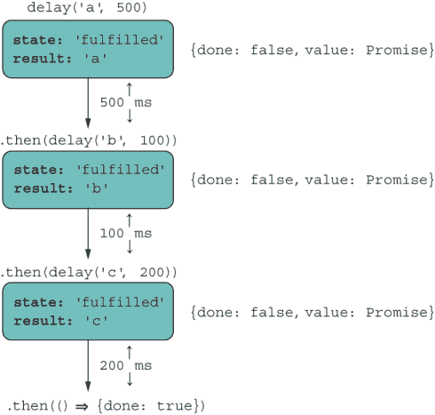

图 8.13 `for...of` 顺序处理任务集合并保留它们的顺序。

这个图看起来很熟悉。循环前的 `await` 关键字解决每个承诺，使循环变量指向它内部包装的值。这种语法计算的结果与使用 `reduce` 的结果相同，因为它负责在迭代行为中按顺序展开和执行异步操作。异步迭代显著简化了涉及处理输入流、对异步任务进行排序等问题。

例如，让我们重新设计我们的 `countBlocksInFile` 用例，该用例将整个文件读入内存，改为使用异步迭代，以便它可以扩展到任何大小的文件。列表 8.24 比列表 8.21 要复杂一些，但它非常值得研究，因为这个函数可以处理更大的文件。循环体内的大多数复杂性都源于必须处理分块读取的各个块对象的完整性，并确定一个块的结束和另一个块的开始。

列表 8.24 在任何大小的文件中计数块

```
import fs from 'fs';

async function countBlocksInFile(file) {
   try {
      await fsp.access(file, fs.constants.F_OK | fs.constants.R_OK);

      const dataStream = fs.createReadStream(file,                       ❶
         { encoding: 'utf8', highWaterMark: 64 });                       ❷

      let previousDecodedData = '';
      let totalBlocks = 0;

      for await (const chunk of dataStream) {                            ❸
         previousDecodedData += chunk;
         let separatorIndex;
         while ((separatorIndex = previousDecodedData.indexOf(';')) >= 0) {
            const decodedData = 
                  previousDecodedData.slice(0, separatorIndex + 1);      ❹

            const blocks = tokenize(';', decodedData)
                  .filter(str => str.length > 0);

            totalBlocks += count(blocks);

            previousDecodedData = 
                  previousDecodedData.slice(separatorIndex + 1);         ❺
         }         
      }
      if (previousDecodedData.length > 0) {
         totalBlocks += 1;
      }
      return totalBlocks;
   }
   catch (e) {
      console.error(`Error processing file: ${e.message}`);
      return 0;
   }
}
```

❶ 不是读取整个文件，而是创建一个流，这样你就可以按“highWaterMark”大小读取数据块。

❷ 在这个例子中，highWaterMark 设置为 64 字节，以便数据以小块的形式交付。

❸ 遍历流，读取下一个原始文本块

❹ 处理块分隔符（如果存在），以获得干净的块行

❺ 在读取到最后一个分隔符后开始下一行，以避免读取不完整的块数据

`async`/`await` 给你自由，可以专注于手头问题的逻辑，而无需担心异步编程的复杂性。

虽然承诺确实是一种更功能化、流畅的方法，但 `async`/ `await` 通过数据的自动包装和展开，使我们回到了命令式范式。与 `Validation` 这样的 ADT 相比，`async` 等同于 `Success.of`，`await` 类似于 `Validation.map`（或 `Promise#then`），而 `Promise#catch` 模拟了 `Failure` 状态。

在列表 8.24 中，你看到了对象 `dataStream` 是如何异步迭代的。你可能想知道如何使你自己的对象异步可迭代。在第七章中，我们讨论了 `@@iterator` 符号如何允许你展开和枚举自定义对象中的元素。同样，当使用 `for...of` 并带有 `await` 时，会执行 `@@asyncIterator` 符号，就像之前一样，如下面的列表所示。

列表 8.25 使用 Node.js 流对象进行 `async` 迭代

```
for await (const chunk of dataStream) {       ❶
  //...
}
```

❶ 调用 `dataStream` 的函数值属性 `asyncIterator`

`dataStream` 拥有一个名为 `Symbol.asyncIterator` 的函数值符号属性。截至本文撰写时，没有原生的 JavaScript API 使用此符号，但 Node.js 自带了一些用于文件系统流和 HTTP 处理的库。正如你所预期的那样，循环调用点的 `await` 必须与迭代器本身返回的 `async` 值（一个承诺）相匹配。你所学到的关于 `Iterator` 的所有内容都适用，只是有一点小的例外，即对 `next` 的调用必须返回一个 `{value, done}` 对象，该对象被一个 `Promise` 包裹。下面的列表展示了这样一个简单的例子。

列表 8.26 使用延迟发出值的 `Iterator` 对象

```
function delayedIterator(tasks) {
   return {
      next: function () {
         if (tasks.length) {
            const [value, time] = tasks.shift();                   ❶
            return new Promise(resolve => {                        ❷
               setTimeout(resolve, time, { value, done: false });
            });
         } else {
            return Promise.resolve({
               done: true                                          ❸
            });
         }
      }
   };
}
```

❶ 从列表中移除第一个任务。一个任务不过是一个在未来有超时值的值。

❷ 返回一个承诺，该承诺封装了一个 `{value, done}` 迭代器元组

❸ 表示迭代器应该停止，因为没有更多的任务要执行

首先直接看到这个迭代器的使用是有帮助的：

```
const tasks = [
   ['a', 500],
   ['b', 100],
   ['c', 200]
];

const it = delayedIterator(tasks);

await it.next().then(({ value, done }) => {
   value; // 'a'
   done;  // false
});
```

运行 `it.next()` 两次以打印任务 `'b'` 和 `'c'`，顺序如下。最后，最后一次调用发出 `done` 值：

```
await it.next().then(({ value, done }) => {
   value; // undefined
   done;  // true
});
```

使用 `Symbol.asyncIterator`，我们得到相同的结果，如下面的代码所示。

列表 8.27 使用 `@@asyncIterator` 钩入 `async` 迭代

```
const delayedIterable = {
  [Symbol.asyncIterator]: delayedIterator
};
for await (const value of asyncIterable) {     ❶
   console.log(value);   
}
```

❶ 内部调用 `@@asyncIterator`

你还可以通过将 `next` 设为一个 `async` 函数来进一步提高事物的层次：

```
function delayedIterator(tasks) {
   return {
      next: async function () {
         if (tasks.length) {
            const [value, time] = tasks.shift();
            return await delay(value, time);
         } else {
            return Promise.resolve({
               done: true
            });
         }
      }
   };
}
```

当你完全控制（并理解）你对象的迭代行为时，你可以做到的事情没有极限，尤其是在你有物理限制，如带宽和内存量时，这些限制分别在慢速网络和移动设备上出现。第九章进一步探讨了如何将生成器（及其 `async` 对应物）与迭代器协议相结合。你不仅可以模拟有限的数据量，还可以模拟可能无限的数据流。

到目前为止，我们已经讨论了如何通过 `Promise` API 和 `async`/`await` 直接处理异步任务。大部分讨论集中在数据如何通过承诺链向前传播。在本章中，我没有过多地谈论错误处理，主要是因为规则几乎与典型命令式代码的规则相同，我们讨论的许多关于 `Promise#then` 的内容也适用于 `Promise#catch`，这是承诺的一个很好的设计特性。

## 8.6 顶层 await

通常，每个 `await` 都必须与 `async` 匹配，但有一个例外。某些场景要求您首先发起一个调用来加载（`await`）某些异步内容。例如，动态加载模块和依赖项，如国际化/语言包或数据库连接句柄。

通过常规 `async`/`await` 语法，如果您想在脚本启动时开始异步任务，您必须使用一个函数创建 `async` 上下文，然后立即调用它。以下是一个示例：

```
const main = async () => {
  await import(...);
}

main();
```

在第六章中，我们讨论了立即调用的函数表达式（IIFEs），这是一种直接同时执行函数声明和执行的模式。同样地，我们可以通过使用立即调用的异步函数表达式（IIAFE）来缩短前面的代码：

```
(async () => {
  await import(...);
})();
```

顶级 `await` 清理了这段代码，这样您就可以在不需要显式创建 `async` 函数的情况下使用 `await` 在任务上。幕后，您有一个大的 `async` 函数用于整个模块：

```
await import(...);
```

在第六章中，您看到了一个从动态加载代码的模块中进行的依赖项回退示例：

```
const useNewAlgorithm = FeatureFlags.check('USE_NEW_ALGORITHM', false);

let { default: computeBalance } = await import(
    '@joj/blockchain/domain/wallet/compute_balance.js'
);

if (useNewAlgorithm) {
   computeBalance = (await 
      import('@joj/blockchain/domain/wallet/compute_balance2.js')).default;
}

return computeBalance(...);
```

顶级 `await` 是为了与 ECMAScript 模块无缝配合，因此这是一个开始采用该模块格式的另一个好理由。这是可以理解的，因为顶级 `await` 需要特殊支持来为您自动创建异步上下文。（有助于将整个模块视为一个大的 `async` 函数。）如果模块 A 导入模块 B，并且 B 包含一个或多个 `await` 调用，A 需要等待 B 完成执行后才能执行自己的代码。自然地，在评估过程的临界阶段存在阻塞和等待的担忧。（如果您想了解此过程的详细细节，可以阅读更多关于它们的信息，请参阅[`mng.bz/9Mwo`](http://mng.bz/9Mwo)。）然而，正如您所期望的，这里有一些优化，因此仅与依赖模块发生的阻塞不会影响加载其他同级依赖项。事件循环架构适当地安排这些任务，并将控制权交回主线程以继续加载其他代码，就像处理任何异步任务一样。尽管如此，开发者教育是关键。与动态 `import` 一样，仅在绝对必要时才使用这些功能。

正如你所见，我们已经朝着从代码中移除延迟或时间问题迈出了很长的路。我们开始于现有的回调，然后过渡到 API 驱动的解决方案（承诺），最后通过`async`/`await`看到了语言级模型的改进。总的来说，这些技术行为上是等效的，并且都与 JavaScript 的非阻塞、事件驱动哲学保持一致。记住，编程是三维的：数据、行为和时间。当数据位于我们编写的行为或逻辑附近时，应用程序表现得最好。但在这个现代、分布式的世界中，这个问题几乎不是你需要解决的问题。没有宿主语言的适当支持，编程可以迅速变得难以控制。承诺（或`async`/`await`）将这些维度（数据、行为和时间）合并，这样我们就可以将代码视为二维的，从方程中去除时间。

然而，承诺有一些缺点。首先，你不能以标准方式取消承诺的执行。或者你应该这样做吗？毕竟，承诺的意图是保持不变。也许`Future`或`Task`会是更好的名字。尽管如此，第三方库使用某种形式的内部取消令牌，但还没有成为标准。TC39 委员会寻求一种通用的取消机制，该机制可以应用于承诺之外的更多场景。你可以在[`github.com/tc39/proposal-cancellation`](https://github.com/tc39/proposal-cancellation)找到更多信息。

对于我来说，最大的问题是承诺（`async`/`await`）不是懒加载的。换句话说，无论链中是否有处理函数，承诺执行器都会运行。另一个问题是承诺被设计为提供单一结果；它们只能成功或失败一次。承诺确定后，你需要创建一个新的承诺来请求或轮询更多数据。有许多 API 用例可以在不要求你明确请求更多数据的情况下向你的处理代码提供或推送值。这种模式被称为流，这是一种方便且优雅的范式，用于处理像 WebSockets、文件 I/O、HTTP 和用户界面事件（点击、鼠标移动等）这样的东西。第九章将异步状态管理提升到了新的水平。

## 摘要

+   JavaScript 基于单线程、事件驱动的架构，旨在扩展规模。

+   `Promise`是一种标准、几乎代数的数据类型，用作异步任务的一种抽象或包装，以提供一种一致且位置无关的编程模型。承诺让你摆脱了对延迟和数据本地性的担忧，这样你就可以专注于手头的任务。

+   承诺重用了回调和事件循环的机制，但具有更好的可读性。

+   ECMAScript 2020 通过添加`Promise.allSettled`和`Promise.any`对`Promise` API 的表面进行了增强。这两个可组合的操作符允许你同时处理多个任务。

+   `async`/`await` 提供了一种更熟悉、命令式的方法来处理承诺，将承诺链转换为一系列语句。

+   异步迭代器引入了一个名为 `@@asyncIterator` 的新符号。您可以使用此符号赋予任何对象循环和异步发出其数据的特性。Node.js 在其 HTTP 和文件系统模块等中使用此符号。

+   顶层 `await` 利用 ESM 系统自动在模块脚本上创建一个包含的 `async` 上下文，在此上下文中，您可以无需显式创建 `async` 函数即可发出任意数量的 `await` 调用。
