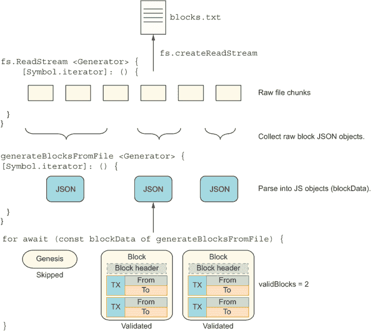
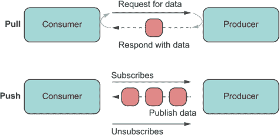
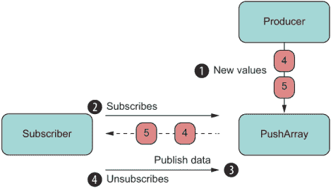
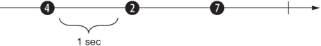
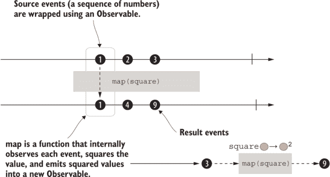
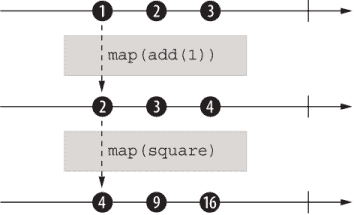
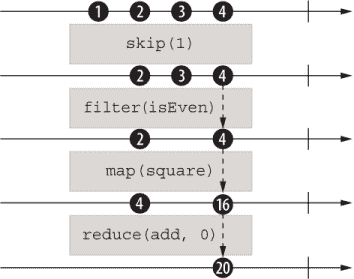
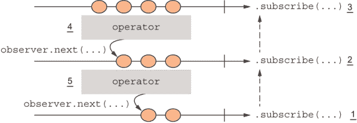
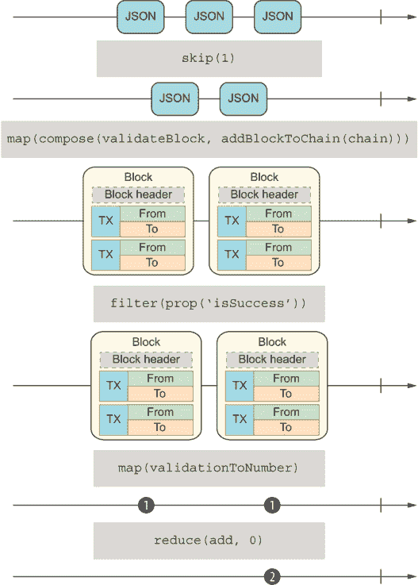

# 9 流编程

本章涵盖

+   回顾迭代器/可迭代协议

+   使用生成器表示随时间变化的值序列

+   回顾推送/拉模型以及基于流的编程

+   使用可观察者创建声明式、异步的推送流

*一个* `Observable` *是一个接受观察者并返回函数的函数。没有更多，也没有更少。如果你写一个接受观察者并返回函数的函数，它是异步的还是同步的？都不是。它是一个函数。*

——本·莱斯

这最后一章汇集了本书中涵盖的最重要的技术，包括整体的可组合软件、函数式编程、混入扩展以及反射和异步编程。在这里，你将了解它们如何结合在一起来支持一种称为流编程的计算模型。流提供了一种抽象，使我们能够重用单个计算模型来处理任何类型的数据源，无论其大小如何。想象一下构建一个实时数据应用，比如一个聊天小部件。你可以设置长轮询定期从服务器拉取消息，可能使用你开发的基于`Promise`的 API。不幸的是，Promise 一次只能传递一个值，所以你可能会收到一个或两个消息对象（或者如果你有一个健谈的群组，可能成千上万个），这会导致错误，因为你已经超过了单次请求中可以传输的数据量。最好的策略是设置一个推送解决方案；当有新消息时，你的应用会收到通知，并且一次或分批接收消息。使用流编程为你提供了适当的抽象级别，以一致的 API 处理这些用例。

我们都以一种或另一种方式在编码中使用流，而没有意识到这一点。任何硬件组件之间的数据流，例如从内存到处理器或磁盘驱动器，都可以被视为流。实际上，这些输入和输出流被用来分别读取和写入。尽管这已经熟悉很多年了，但我们从未真正考虑过连接我们的应用程序或连接多个应用程序的组件之间的状态是流。

想想你每天编写的 JavaScript 代码。大多数情况下，处理状态的传统方式是使用拉模型。拉发生在客户端发起对所需数据的请求时。这个过程在从数据库或文件读取或查询 API 时异步发生。它也可以在调用函数或遍历内存中的某些数据结构时同步发生。

另一方面是推送模型。在推送中，客户端代码不再请求数据；服务器将数据发送给你。推送交换可能从一个初始的拉取开始，但一旦客户端和服务器接口达成一致，数据就可以在可用时流向客户端——就像你的聊天应用中的新消息一样。你可能听说过发布/订阅模型，这是一种用于这些类型问题的架构。一个简单的、有用的类比是考虑一个在单个请求期间被多次调用的回调函数。

推送技术可以使你的应用程序更加敏捷和响应。我将在第 9.3 节中再次提到这个关于响应性的概念，因为它非常重要。一些想到的推送示例包括服务器发送事件（SSE）、WebSocket 和 DOM 的事件监听器。想象一下，如果你不是注册事件处理器，而是需要设置一个定时器来查看按钮的状态何时变为点击状态。或者假设，如果你不是在新消息到来时收到通知，你需要明确地点击刷新按钮来下载新消息。我们不再是 90 年代了。当你知道数据在某处可用时，你可以发出一个命令来读取它，但当你不知道时会发生什么？为那些你不知道何时会变得可用的数据（如果它真的会）设置轮询是尴尬的，更不用说低效了。

在第七章和第八章中，我介绍了迭代器的概念。在这里，我将从新的角度继续讨论这个主题：它是如何与生成器函数结合来表示数据流的。生成器允许你控制从可迭代对象（数组、映射、对象等）输出的数据同步流。此外，你还可以模拟可以即时计算的可迭代数据。

我们将继续构建这些课程，并转换到异步迭代器（简称 async iterables）和异步生成器，它们用于计算随时间推移的值序列。异步迭代器代表推送流，是读取大量异步数据（数据库、文件系统或 HTTP）的一种高效、最优和内存友好的方式，可以分块读取。

虽然推送范式有时难以理解，但你会发现，使用你迄今为止一直在学习的相同的 JavaScript 结构会使推送更加容易接近。我认为你会发现流模式非常有趣，并且编写起来很愉快，所以我会以查看一个将数据无关、响应式编程引入 JavaScript 的新 API 来结束这一章：`Observable`。Observables 提供了一个单一的 API 界面来管理数据流，独立于数据是如何生成的以及其大小。

首先，让我们谈谈 JavaScript 中的可迭代（Iterable）和迭代器（Iterator）协议。

## 9.1 迭代器和迭代器

简而言之，可迭代对象是一个其元素（或属性）可以被枚举或遍历的对象。正如你在第七章和第八章中学到的，可迭代对象定义了自己的 `Symbol.iterator`，用于控制这些元素如何传递给调用者。迭代器是描述迭代机制结构的模式或协议。语言可以自由定义自己的机制来实现这一点。在 JavaScript 中，迭代是标准化的。以下几节将详细检查这些协议。

### 9.1.1 可迭代协议

可迭代协议允许你在对象出现在 `for...of` 构造或与扩展运算符一起使用时自定义其迭代行为。JavaScript 有内置的可迭代对象，如 `Array`、`Map` 和 `Set`。字符串也可以作为一个字符数组进行迭代。

注意：尽管 `WeakSet` 和 `WeakMap` 有相似的名字，但它们不是可迭代的（尽管它们在构造函数中接受可迭代对象）。实际上，它们都没有扩展其非弱版本（`Set` 和 `Map` 分别）。这些 API 解决了某些有趣的问题，但我在这本书中没有涉及它们。

一个可迭代对象（或其原型链上的任何对象）必须实现值函数 `Symbol.iterator`。在这个函数内部，`this` 指的是正在迭代的对象，这样你就可以完全访问其内部状态，并决定在迭代过程中发送什么内容。关于可迭代对象的一个有趣的事实是，`Symbol.iterator` 可以是一个简单的函数或生成器函数。（关于这个主题的更多信息，请参阅第 9.2 节。）

没有迭代器，可迭代本身并没有什么作用。

### 9.1.2 迭代器协议

迭代器是当需要迭代行为时向语言运行时提供的合约。JavaScript 期望你向一个对象提供一个 `next` 方法。此方法返回至少包含两个属性的对象：

+   `done`（布尔值）——指示是否还有更多元素。`false` 的值告诉 JavaScript 运行时继续循环。

+   `value`（任何类型）——包含绑定到循环变量的值。当 `done` 等于 `true` 时，此值被忽略，序列终止。

如果 `Symbol.iterator` 返回的对象不遵守此协议，则被视为格式不正确，并引发 `TypeError`——这是 JavaScript 强制执行此特定协议的方式。

### 9.1.3 示例

本节展示了可迭代对象的示例，从我们自己的 `Block` 类开始。正如你所知，这个类接受一个数据对象数组，这些对象可以是 `Transaction` 对象或存储在链上的任何其他类型的对象：

```
class Block {

  index = 0;
  constructor(index, previousHash, data = [], difficulty = 0) {
    this.index = index;
    this.previousHash = previousHash;
    this.data = data;
    this.nonce = 0;
    this.difficulty = difficulty;
    this.timestamp = Date.now();
    this.hash = this.calculateHash();
  }

  //...

  [Symbol.iterator]() {
    return this.data[Symbol.iterator]();
  }
}
```

如果我们创建了一个包含交易列表的块，使用 `for...of` 枚举时，会钩入特殊符号以传递每个交易：

```
for (const transaction of block) {
   // do something with transaction
}
```

我们应用程序的所有主要模型对象（`Blockchain`、`Block` 和 `Transaction`）都是可迭代的。这个事实使得在 `HasValidation` 混合中创建一个通用验证方法变得简单，该混合扩展了所有这些对象以具有相同的接口。在第五章中，使用的算法包括 `flatMap` 和 `reduce`，但它创建了额外的数组，因为验证逻辑流经区块链的元素。迭代器遍历已经存在于内存中的结构。而且，我们不必遍历所有元素来找出是否发生了失败。当我们找到第一个失败时，我们可以提前退出算法。再次查看以下代码片段：

```
const HasValidation = () => ({
  validate() {
    return validateModel(this);
  }
});

function validateModel(model) {
  let result = model.isValid();
  for (const element of model) {
    result = validateModel(element);
    if (result.isFailure) {
      break;
    }
  }
  return result;
}
```

此实现依赖于模型对象实现 `Symbol.iterator`。在我们的例子中，逻辑很简单，因为对象委托给其内部数据结构的迭代器。为了了解协议是如何工作的，让我们通过迭代器模式实现一个随机数生成器，如下一个列表所示。

列表 9.1 使用迭代器的随机数生成器

```
function randomNumberIterator(size = 1) {

  function nextRandomInteger(min) {                              ❶
    return function(max) {
      return Math.floor(Math.random() * (max - min)) + min;
    };
  }

  const numbers = Array(size)                                    ❷
     .fill(1)
     .map(min => nextRandomInteger(min)(Number.MAX_SAFE_INTEGER));

  return {
    next() {
      if(numbers.length === 0) {
        return {done: true};                                     ❸
      }
      return {value: numbers.shift(), done: false};              ❹
    }
  };
}

let it = randomNumberIterator(3);
console.log(it.next().value);  // 1334873261721158             ❺
console.log(it.next().value);  // 6969972402572387             ❺
console.log(it.next().value);  // 3915714888608040             ❺
console.log(it.next().done);   // true
```

❶ 计算下一个随机整数的内部辅助函数

❷ 创建一个有大小数组和填充随机数

❸ 表示序列的结束

❹ 表示还有更多数字要枚举

❺ 每次产生不同的数字

注意，`randomNumberIterator` 返回的对象符合迭代器模式（如通过 `next` 的声明可以看出），但它本身并不是可迭代的。为了使其成为可迭代的，我们可以在下一个列表中添加 `Symbol.iterator`。

列表 9.2 使用 `@@iterator` 使对象可迭代

```
...
return {
   [Symbol.iterator]() {
      return this;            ❶
   },
   next() {
      if(numbers.length == 0) {
        return {done: true}; 
      }
      return {value: numbers.shift(), done: false};
   }
}
```

❶ 因为对象已经实现了 next 方法，所以只需返回自身，使其既是迭代器又是可迭代对象。

现在，你可以从与 `for...of` 的无缝集成中受益：

```
for(const num of randomNumberIterator(3)) {
  console.log(num)
}
```

这种技术非常强大，因为迭代器协议是无数据相关的；你可以用它来实现任何类型的迭代。你可以用 `for...of` 的简单性来表示目录遍历、图/树数据结构、字典或任何自定义集合对象。

可迭代/迭代器对在 JavaScript 中无处不在，控制着对象如何与扩展运算符一起使用：

```
[...randomNumberIterator(3)];

// [ 6035653145325066, 7827953689861025, 1325390150299500 ]
```

原生、内置类型也是可迭代的。以下列表显示字符串在数组、映射和集合中表现相同。（你明白了。）

列表 9.3 实现 `@@iterator` 的字符串

```
"Joy of JavaScript"[Symbol.iterator]; // [Function: [Symbol.iterator]]

for(const letter of "Joy of JavaScript") {
  console.log(letter);                         ❶
}
```

❶ 将所有 17 个字符记录到控制台

现在，让我们说实话：你可能从未听说过随机数迭代器，但你听说过随机数生成器。它们之间有区别吗？你将在第 9.2 节中找到答案，该节涵盖了生成器。

## 9.2 生成器

生成器是一种特殊的函数类型。通常，当函数返回时，语言运行时会将该函数从当前栈帧中弹出，释放为其局部上下文分配的任何存储。生成器函数以相同的方式工作，但有一个细微的区别：它的上下文似乎会保留并恢复以返回更多值。在本节中，我们将回顾生成器函数是什么，如何使用它们创建可以从空中发送新值的可迭代对象，以及如何使用它们创建异步可迭代对象。

### 9.2.1 返回或`yield`

生成器是一个迭代器的工厂函数。首先，你可以通过在 `function` 关键字后放置一个星号 (`*`) 来定义一个生成器函数

```
function* sayIt() {
  return 'The Joy of JavaScript!'; 
}
```

或者在一个方法名之前：

```
class SomeClass {
  * sayIt() {
     return 'The Joy of JavaScript!';
   }
}
```

这些函数并不太有用，但足以展示生成器看起来像任何常规函数。那么特殊语法是什么呢？返回值中有一个转折。运行这个函数看看你会得到什么：

```
sayIt(); // Object [Generator] {}
```

如你所见，这个特殊语法通过一个名为 `Generator` 的对象增强了返回值，而不是像常规函数那样是一个字符串。从语法上讲，这个过程与 `async` 函数增强（或包装）值在 `Promise` 中的方式类似。

就像简单的 `randomNumberIterator` 示例一样，`Generator` 本身就是一个可迭代对象和一个迭代器；它实现了这两个协议。因此，为了提取其值，我们需要调用 `next`：

```
sayIt().next(); // { value: 'The Joy of JavaScript!', done: true }
```

现在，你可以识别迭代器协议的形状了。然而，仅仅使用一个只包含一个值（`done`: `true`）的迭代器并不那么有趣。`function*` 语法存在是为了你可以通过一个称为`yield`的过程产生多个值。考虑这个变体：

```
function* sayIt() {
  yield 'The';
  yield 'Joy';
  yield 'of'; 
  yield 'JavaScript!';  
}

const it = sayIt();
it.next(); // { value: 'The', done: false }
it.next(); // { value: 'Joy', done: false } 
     ...
```

注意 目前，没有对使用 lambda 语法生成器函数的支持。这种不支持可能看起来是设计上的缺陷，但事实并非如此：lambda 表达式实际上意味着是简单的表达式，大多数都是一行代码。生成器函数如此简单的情况很少见。然而，有一个提议要包括对生成器箭头函数的支持：[`mng.bz/yYWq`](http://mng.bz/yYWq)。

当然，因为 `Generator` 实现了 `Symbol.iterator`，你可以将其放入一个 `for...of` 表达式中：

```
for(const message of sayIt()) {
  console.log(message);
}
```

总结来说，生成器不过是一种创建迭代器的简单方法。生成器和迭代器无缝工作。代码看起来像是在多次调用同一个函数，并且以某种方式从上次停止的地方继续，但实际上它只是一个函数。幕后，你正在消耗函数返回的可迭代对象，而 `yield` 将新值推入迭代器。

### 9.2.2 创建可迭代对象

在本节中，你将看到如何将可迭代对象集成到区块链应用程序的领域模型中。例如，你可以向 `Blockchain` 添加一个生成器辅助函数，它可以发出你想要的任何数量的完全配置的空块。你可以使用这个函数来创建任何大小的链，也许可以用它们进行测试和运行模拟。

下一个列表定义了一个简单的 `newBlock` 生成器。在这个阶段，`Blockchain` 类有些复杂，所以我只会展示相关的部分。

列表 9.4 自定义生成器函数

```
class Blockchain {
  #blocks = new Map();

  ...

  * newBlock() {                       ❶
      while (true) {                   ❷
         const block = new Block(
          this.height(), 
          this.top.hash, 
          this.pendingTransactions
         );
         yield this.push(block);       ❸
     }
  }
}
```

❶ 在函数方法上使用生成器语法

❷ 看起来像无限循环但实际上不是。生成器函数能够在 `yield` 上“暂停”其执行，因此运行时不会无限执行。

❸ 将新块推送到链中并返回它

调用者代码调用 `newBlock` 20 次以生成 20 个新块，使得链的总高度达到 21（记得计算第一个创世块），如下所示。

列表 9.5 使用生成器创建任意数量的新块

```
const chain = new Blockchain();
let i = 0;
for (const block of chain.newBlock()) {
   if (i >= 19) {                        ❶
      break;
   }
   i++;
}
chain.height(); // 21                    ❷
```

❶ 创建 20 个块后停止

❷ 20 个新块加上创世块共 21 个

此外，生成器和迭代器之间的无缝集成使得使用扩展运算符及其对应的结构化赋值法成为从任何自定义对象中读取属性的一种简洁、惯用的方式。我们可以在第五章中实现的代数数据类型（ADT）如 `Validation` 上实现原始的模式匹配表达式。首先，让我们使 `Validation` 可迭代，并使用生成器分别返回其 `Failure` 和 `Success` 分支。这个 ADT 倾向于右侧，因此 `Success` 分支来自对 `yield` 的第二次调用；否则，你可以反转这个顺序。`Symbol.iterator` 的实现如下：

```
class Validation {
  #val;

  ...

  *[Symbol.iterator]() {
    yield this.isFailure ? Failure.of(this.#val) : undefined;
    yield this.isSuccess ? Success.of(this.#val) : undefined; 
  }
}
```

选择 ADT，如 `Validation`，一次只能激活一个分支并省略其他分支。那些结构化赋值语句看起来像下一个列表。

列表 9.6 使用结构化赋值提取成功和错误状态

```
const [, right] = Success.of(2);                              ❶

right.isSuccess;  // true
right.get();      // 2

const [left,] = Failure.of(new Error('Error occurred!'));     ❷

left.isFailure;    // true
left.getOrElse(5); // 5
```

❶ 忽略左侧结果的解构赋值

❷ 忽略右侧结果的解构赋值

考虑这两个分支的一些简单用例。假设你正在调用某个验证函数。对于 `Failure` 情况，你可以使用带有默认值的解构赋值作为调用 `left.getOrElse(5)` 的替代方案：

```
const isNotEmpty = val => val !== null && val !== undefined ?
    Success.of(val) : Failure.of('Value is empty');

const [left, right = Success.of('default')] = isNotEmpty(null);

left.isFailure; // true
right.get();    // 'default'
```

如你所见，迭代器和生成器（连同符号）解锁了惯用的编码模式。当你需要控制对象如何发出其自己的属性时，这些功能使你的代码更具表现力和易于阅读。

由于 JavaScript 通过使 `next` 返回承诺来支持异步迭代器，它也支持异步生成器，我们将在下一节讨论。

### 9.2.3 异步生成器

异步生成器就像一个普通生成器，除了它不会产生值，而是产生异步解决的承诺。因此，异步生成器对于与基于 `Promise` 的 API 一起工作非常有用，这些 API 允许你以块的形式异步读取数据，例如浏览器中的 `fetch` API（顺便说一下，这是一个混合型）或 Node.js 内置的“流”库。在下一个示例中，你将看到使用普通异步函数和使用异步生成器函数之间的区别。

要获得异步生成器，将本章中涵盖的所有关键字组合成一个单独的函数签名：

```
async function* someAsyncGen() {

}
```

生成器返回的结果是承诺，所以你需要使用`for` `await ...of`语法来消费它。下一条列表显示了一个使用异步迭代的函数。

列表 9.7 使用异步迭代来计数文件中的区块

```
async function countBlocksInFile(file) {
   try {
      await fsp.access(file, fs.constants.F_OK | fs.constants.R_OK);

      const dataStream = fs.createReadStream(file, 
         { encoding: 'utf8', highWaterMark: 64 });

      let previousDecodedData = '';
      let totalBlocks = 0;

      for await (const chunk of dataStream) {       ❶
         previousDecodedData += chunk;
         let separatorIndex;
         while ((separatorIndex = previousDecodedData.indexOf(';')) >= 0) {
            const decodedData = 
                  previousDecodedData.slice(0, separatorIndex + 1); 

            const blocks = tokenize(';', decodedData)
                  .filter(str => str.length > 0);

            totalBlocks += count(blocks);

            previousDecodedData = 
                  previousDecodedData.slice(separatorIndex + 1);
         }         
      }
      if (previousDecodedData.length > 0) {
          totalBlocks += 1;
      }
      return totalBlocks;
   }
   catch (e) { 
      console.error(`Error processing file: ${e.message}`);
      return 0;
   }
}
```

❶ dataStream 是一个异步可迭代对象，这意味着每个数据块都是一个迭代协议形状的值，由承诺包装。

这个函数返回从文件中读取的区块数量。一个更有帮助、更有用的函数会返回区块对象本身，这样你就可以做更多不仅仅是计数的事情。也许你可以验证整个区块集合。

下面的列表显示了稍微重构后的版本，去除了计数部分。它还使用了一个生成器，它产生每个描述区块的 JSON 对象。让我们称这个函数为`generateBlocksFromFile`。

列表 9.8 异步生成器，发送从文件中读取的区块

```
async function* generateBlocksFromFile(file) {                         ❶
   try {
      await fsp.access(file, fs.constants.F_OK | fs.constants.R_OK);

      const dataStream = fs.createReadStream(file,
           { encoding: 'utf8', highWaterMark: 64 });

      let previousDecodedData = '';

      for await (const chunk of dataStream) {
         previousDecodedData += chunk;
         let separatorIndex;
         while ((separatorIndex = previousDecodedData.indexOf(';')) >= 0) {

            const decodedData = previousDecodedData.slice(0, 
               separatorIndex + 1);

            const blocks = tokenize(';', decodedData)
                .filter(str => str.length > 0)
                .map(str => str.replace(';', ''));

             for (const block of blocks) {
                yield JSON.parse(block);                               ❷
             }
             previousDecodedData = previousDecodedData.slice(
                 separatorIndex + 1);
         }
      }
      if (previousDecodedData.length > 0) {        
         yield JSON.parse(previousDecodedData);                        ❷
      }
   }
   catch (e) {
      console.error(`Error processing file: ${e.message}`);
      throw e;
   }
}
```

❶ async function*创建一个异步迭代器。

❷ 产生所有解析的区块作为对象

现在计数逻辑变得极其简单，如下一条列表所示。

列表 9.9 使用`generateBlocksFromFile`作为异步迭代器

```
let result = 0;
for await (const block of generateBlocksFromFile('blocks.txt')) {      ❶
   console.log('Counting block', block.hash);
   result++;
}
result; // 3
```

❶ 每次调用生成器都会从文件流中提取一个新的区块对象。

再次强调，这种变化的优点在于我们不仅能计数，还可以在生成过程中验证每个区块。这个过程是高效的，因为我们不需要一次性读取整个文件，而是将其作为移动的数据窗口进行处理。以这种方式处理数据被称为流。

假设现在我们想使用这个函数来验证链中的所有区块。`Blockchain`在构建时会创建自己的创世区块，所以我们将首先跳过第一个到达的区块。接下来，我们将区块的 JSON 对象表示转换为添加到链中的`Block`对象；这个过程称为活化。验证逻辑检查区块是否在链中正确定位。最后，它调用从`HasValidation`混合的`validate`。我在仓库中使用的测试文件（blocks.txt）有三个区块，所以我们将只验证剩下的两个。下一条列表中的所有逻辑都在图 9.1 中展示。

列表 9.10 验证从文件生成的区块流

```
   let validBlocks = 0;
   const chain = new Blockchain();             ❶
   let skippedGenesis = false
   for await (const blockData of generateBlocksFromFile('blocks.txt')) {
      if (!skippedGenesis) { 
         skippedGenesis = true;
         continue;                             ❷
      }
      const block = 
        new Block(blockData.index, chain.top.hash, blockData.data,      
            blockData.difficulty);

      chain.push(block);                       ❸

      if (block.validate().isFailure) {        ❹
         continue;
      }
      validBlocks++
   }

   console.log(validBlocks) // 2
```

❶ 每个区块的验证假设这些区块是链的一部分。

❷ 跳过测试文件中的第一个区块，因为它来自不同的链实例的创世区块

❸ 区块需要被推入链中进行验证。

❹ 使用 HasValidation#validate 验证每个区块

图 9.1 中的图示以高层次捕捉了这一流程。如图所示，有两个生成器函数正在工作。第一个函数调用`fs.createReadStream`，第二个函数调用`generateBlocksFromFile`，它使用第一个函数来传递自己的数据。



图 9.1 两个生成器函数。一个读取文件并产生数据块。另一个处理每个原始块，从它们中创建`Block`对象，验证每个对象，并统计结果。

在本节中，我们继续在第八章的基础上增加更多异步功能。我们讨论了如何使用（async）迭代器协议、符号和生成器函数来创建可迭代对象。这些对象在请求时可以枚举其状态，当它们成为简单`for`循环的主题时。

注意：值得提到的是，我们还没有讨论涉及生成器的其他用例，例如将值推送到生成器或将生成器函数作为参数。生成器是函数，因此你可以从一个函数返回一个生成器或接受一个生成器作为参数。这些技术可以用来解决超出本书范围的一些复杂问题。查看此链接以了解这些其他用例：[`mng.bz/j45p`](http://mng.bz/j45p)。

异步生成器函数可以异步产生值，就像发射事件一样。当一个事件源按顺序发送大量值时，这个序列也被称为流。

## 9.3 使用数据流

`String`、`Array`、`Map`和 WebSocket 事件序列的对象有什么共同之处？在典型的编程任务中，并不多。然而，当我们谈论数据流时，在根本层面上，这些类型的对象可以以相同的方式处理。事实上，这种一致的编程模型允许你在数据源之间工作，使得流变得必要。一些现实世界的例子，其中流非常有用包括

+   将多个异步数据源（REST API、WebSockets、存储、DOM 事件等）作为一个单一流程进行交互

+   创建一个管道，对通过它的数据进行不同的转换

+   创建一个广播频道，其中多个组件可以通知特定事件

在这种情况下，每个交互都是异步的，并且是同一流程的一部分，使用异步生成器来包装每个动作是一项艰巨的任务，回调模式也无法很好地扩展到这种复杂程度。

在本节中，我们将学习流的基本知识以及表示它们的 API。JavaScript 的`Observable` API 提供了必要的接口来构建处理来自任何基于推送的数据源的优秀反应抽象。在本节结束时，你将了解如何将对象转换为流，以便通过`Observable`对象的链来管理其数据。你将理解任何复杂的数据源都可以被抽象并处理，就像它是一个简单的事件集合一样。

### 9.3.1 什么是流？

要理解这个概念，你必须首先了解数据是如何到达或被应用程序消费的。一般来说，数据是推或拉。在这两种情况下，你都有一个生产者（创建数据）和一个消费者（订阅该数据）。

在拉系统中，生产者（可能只是一个函数）不知道何时或如何需要数据。因此，消费者必须从（或调用）生产者那里拉取。另一方面，在推系统中，生产者控制事件发送的时间（例如，点击按钮），而消费者（订阅者）不知道何时会收到该事件。我们说消费者是对事件做出反应（图 9.2）。



图 9.2 拉和推的区别。在拉模式下，消费者必须始终主动发起数据请求。在推模式下，当消费者订阅后，生产者会在数据可用时发送数据，直到消费者取消订阅或没有更多数据可发送。

表 9.1 总结了拉、推以及在这些情况下通常使用的 JavaScript 特性。

表 9.1 处理推和拉数据的 JavaScript 特性

|  | 单个 | 多个 |
| --- | --- | --- |
| 拉取 | 函数 | `Symbol.iterator` |
| 推送 | `Promise` | `Symbol.asyncIterator` | 流 |

表 9.1 中的拉技术简单易懂。拉发生在函数被调用或迭代器的`next`被多次调用时。相比之下，一个简单的推场景发生在异步值用`Promise`对象表示时。在这里，承诺（生产者）控制事件何时被发射，将此逻辑从消费者抽象出来。消费者变成了传递给`next`的处理函数。我们可以说该函数订阅了承诺。例如，如果承诺设置了一个三秒的定时器来解析，那么它的值将在事件循环处理最后一个事件后的三秒被发射。生产者知道并控制发射这个值。

在表 9.1 中，一个承诺（promise）代表一个单独的推（push），而异步生成器（async generator）可以使用不同的时间函数发射多个值。承诺和异步生成器完全控制这些事件发射的速率。`for` `await...of` 循环在幕后作为这两个数据源的永久订阅。你可以想象异步生成器作为生产者，将在其方便的时候发射其值，而异步迭代器作为消费者。回想一下列表 9.8 是如何设置数据流的：

```
const dataStream = fs.createReadStream(file, 
    { encoding: 'utf8', highWaterMark: 64 });
```

之后，代码使用`for` `await...of`来消费这个数据流。

现在，让我们通过流来提高抽象级别。流解决了相同的问题，但以一种更容易推理的方式。流是一系列一个或无限多个数据片段，称为事件。在这个上下文中，事件这个词不仅仅指鼠标拖动或按钮点击；它被用来泛指任何数据。事件是某个源（事件发射器、生成器、列表等）在一段时间内发出的某个值（同步或异步），并由订阅者或观察者处理。

由于流是随时间变化的值序列，它们可以很好地封装任何生产者，表现为单个字符串甚至复杂的异步生成器。在消费端，我们可以通过使用名为“订阅”的对象的`for` `await...of`来抽象它们。订阅类似于迭代器，你可以多次调用它们以通知数据可用，例如调用`next`。在使用流时，我们谈论的是订阅者，而不是消费者。为了便于构建这种抽象，让我们在下一节通过使用数组创建一个可流对象来热身。

### 9.3.2 实现可流数组

现在你已经了解了流的基本知识，让我们回到列表 9.8 中声明数据流的那个部分，并更仔细地研究它：

```
const dataStream = fs.createReadStream(file,
    { encoding: 'utf8', highWaterMark: 64 });
```

Node.js API `fs.createReadStream`返回一个`fs.ReadStream`对象，它反过来又扩展了`stream.Readable`。

Node.js 流

流模块是一个相对较新的内置 Node.js 库，用于处理数据的读写流。流对象配备了`Symbol.asyncIterator`属性，使得消费其数据变得简单。你可以在[`nodejs.org/api/stream.html`](https://nodejs.org/api/stream.html)找到更多关于这个库的信息。

如果你查看这个 API 文档，有两个属性对于本章的目的来说很突出：一个`on`方法，它触发`'data'`事件，以及`Symbol.asyncIterator`方法。以下是一个示例：

```
dataStream.on('data', chunk => {
  console.log(`Received ${chunk.length} bytes of data.`);
});
```

此接口表明此对象既是异步可迭代的，也是`EventEmitter`。我在这本书中没有涵盖事件发射器，但我会快速回顾基础知识，以支持本章的示例。`EventEmitter`是一个 API，允许你将某些对象的创建与其使用分离——这是一种基本的发布/订阅形式。以下列表显示了一个示例。

列表 9.11 `EventEmitter`的基本使用

```
const myEmitter = new EventEmitter();

myEmitter.on('some_event', () => {        ❶
  console.log('An event occurred!');
});

myEmitter.emit('event');                  ❷
```

❶ 数据的消费者（订阅者）。这个过程类似于处理，比如一个 onClick 事件。

❷ 数据的生产者

通过结合 `EventEmitter` 和 `Symbol.asyncIterator`，我们可以实现真正的推送解决方案。在这种情况下，发射器是一种很好的技术，可以将处理推送新数据的方法（如 `push`）与处理此数据订阅者的方法（如 `subscribe`）分开。例如，数组是拉取数据结构，因为它们有函数和属性来拉取其数据（`indexOf` 和索引分别）以及实现 `Symbol.iterator` 以拉取多个值（参见表 9.1）。如果你想对新值（称为反应的过程）运行一些代码，你必须设置某种类型的长时间轮询解决方案，在时间间隔内查看数组的状态，这不是最优的解决方案。为了提高效率，让我们反转这个流程。而不是挑数据，我们将订阅它，这样它就会在我们有新值时通知我们（称为通知的过程）。

让我们通过配置一个内部 `EventEmitter` 来扩展 `Array`，该 `EventEmitter` 在每次添加新值时触发一个事件。考虑一个名为 `PushArray` 的类，它公开两个新方法以启用订阅：`subscribe` 和 `unsubscribe`。`subscribe` 方法接受一个实现 `next(value)` 方法的对象，如下一列表所示。

列表 9.12 `Array` 的子类，当新元素被推入时触发事件

```
class PushArray extends Array {

    static EVENT_NAME = 'new_value';

    #eventEmitter = new EventEmitter();

    constructor(...values) {
       super(...values);
    }

    push(value) {
       this.#eventEmitter.emit(PushArray.EVENT_NAME, value);       ❶
       return super.push(value);
    }
    subscribe({ next }) {                                          ❷
       this.#eventEmitter.on(PushArray.EVENT_NAME, value => {
           next(value)                                             ❸
       });
    }

    unsubscribe() {                                                ❹
        this.#eventEmitter.removeAllListeners(PushArray.EVENT_NAME);
    }
}

const pushArray = new PushArray(1, 2, 3);

pushArray.subscribe({ 
    next(value) {
        console.log('New value:', value)
        // do something with value
    }
});
pushArray.push(4);                                                 ❺
pushArray.push(5);                                                 ❺

pushArray.unsubscribe();                                           ❻

pushArray.push(6);                                                 ❼
```

❶ 发射被推入的新值

❷ 使用解构从传入的对象中提取 `next` 方法

❸ 当发射器触发新值时，它会被推送到订阅者。

❹ 移除所有订阅者。任何进一步的推送事件都不会被发射。

❺ 将 'New value: 4' 和 'New value: 4' 打印到控制台。数组现在有 1,2,3,4, 5。

❻ 从推送数组对象取消订阅

❼ 订阅者不会收到事件通知。数组现在有 1,2,3,4,5, 6。

让我们仔细检查这个例子中的 `subscribe` 调用。订阅者的概念是流范式中的核心，它始终需要两个参与者：生产者和订阅者。当数字 4 被推入数组时，事件发射器触发并立即通知订阅者（图 9.3）。



图 9.3 具有生产者和订阅者的推送对象的基本流程

`subscribe` 调用接受一个形状如列表 9.13 所示的对象。

列表 9.13 接受具有 `next` 方法的对象的订阅者

```
{
   next: function (value) {           ❶
       // do something with value
   }
} 
```

❶ 使用属性语法而不是缩写语法，因为它更具有描述性

这个对象被称为观察者，并且方法名为 `next` 并非巧合。观察者不仅与 Iterable/Iterator 协议相匹配，还与推送生成器背后的协议相匹配，我在本书中省略了这部分内容以保持讨论简洁。如果你更深入地关注这个话题，你会了解到生成器不仅可以产生值，还可以允许你推送值。如果你想了解更多关于这个话题的信息，请点击以下链接：[`mng.bz/WdOw`](http://mng.bz/WdOw)。

因此，具有`next(value)`方法的观察者形状的唯一目的是保持此协议，使基于流的编程过渡流畅。表示流的 JavaScript API 称为`Observable`。

## 9.4 欢迎新的本地原生：可观察流

在撰写本文时，一个缓慢推进的提案可能会显著改变我们日常编码的方式（[`github.com/tc39/proposal-observable`](https://github.com/tc39/proposal-observable)）。有些人说它已经改变了我们使用第三方、以流为导向的库的方式，RxJS 就是我最喜欢的。这个项目已经深入到 Angular、Vue、React、Redux 和其他 Web 社区。

在本节中，我们将讨论`Observable` API 的当前状态。此 API 支持响应式流范式，它为任何数据类型和大小创建了一个抽象层，无论机制是推送还是拉取，数据是否同步或异步到达。

如果你曾经使用过 RxJS 进行过 Angular 和 React 等框架或 Redux 等状态管理库的工作，那么你可能已经使用过响应式编程。如果没有，从高层次来看，可观察流具有以下两个特性，我将在以下示例中加以阐述：

+   数据传播 — 数据传播自然遵循发布/订阅模型。你确定一个发布者（称为源），它可以是生成器或简单的数组。数据流以单一方向传播或流动，直到到达订阅者。在这个过程中，你可以应用业务逻辑，根据你的需求转换数据。

+   声明式、懒加载管道 — 你可以静态地表示流的执行，无论发布者还是订阅者，就像在应用程序中的任何其他对象一样传递它。与承诺不同，可观察对象是懒加载的，所以直到订阅者订阅，什么都不会运行。

可观察流可能难以理解；它们需要强大的 JavaScript 技能和对可组合代码价值的深刻理解。幸运的是，我在这本书中涵盖了所有这些主题（以及更多），在讨论如何使用此 API 时，我会重用你已学到的很多内容。

以下列表总结了这些概念（如果你跳过了任何内容，我强烈建议你回到涵盖它们的章节去阅读它们）：

+   可观察流是组合对象，因此你可以将它们组合或从现有对象中创建新的可观察流。你将创建一个混合器，它扩展了`Observable`原型的基功能。对象组合和混合器扩展在第三章中介绍。

+   可观察流操作符是纯函数、可组合的、柯里化的函数。任何副作用都应该由订阅者执行。纯函数、组合和柯里化在第四章中解释。

+   `Observable` API 的设计借鉴了 ADT 的设计，特别是在其使用`map`方面。第五章展示了如何设计自己的 ADT 以及如何实现通用协议，如`Functor.map`和`Monad.flatMap`。

+   规范的一部分定义了一个新的函数值内置符号，称为`Symbol.observable`。实现此特殊符号的对象可以传递给`Observable.from`构造函数。自定义符号的实现和使用内置符号在第七章中介绍。

+   可观察对象模拟了一个单向、线性的数据流。第八章讨论了如何使用承诺创建链以简化并展平异步流程，并使它们更容易推理。

在掌握所有基础概念之后，让我们在下一节深入探讨可观察流。

### 9.4.1 什么是可观察的？

在本节中，我们将学习什么是`Observable`，并解开其主要组件。作为一个简单的例子，考虑下一列表中的代码片段。

列表 9.14 创建和订阅`Observable`

```
const obs$ = Observable.of('The', 'Joy', 'of', 'JavaScript');

const subs = obs$.subscribe({
   next: ::console.log            ❶
});

subs.unsubscribe();
```

❶ 将每个单词记录到控制台，并使用绑定操作符的单值形式传递一个正确绑定的 console.log 函数

你能猜到会发生什么吗？这个列表是使用可观察者的最简单示例。注意这段代码与`PushArray`类的相似之处。如果你猜到它会将每个单词打印到控制台，你就猜对了！但你如何得出这个结论？你做了哪些假设？

`Observable`对象旨在模拟一个懒加载、单向、基于推送的数据源（如流）。

备注：值得注意的是，可观察者与称为 Web Streams（[`streams.spec.whatwg.org`](https://streams.spec.whatwg.org)）的技术不同。尽管这些技术有一些相同的目标，但可观察者提供了一个 API 来包装任何数据源，这可以是 Web Stream，但不必是。

你可以将数据想象成一条从某个源头流向目的地的河流。这条河流流动的管道或上下文是`Observable`。在旅途中，河流的流向、速度和温度会发生变化，直到到达目的地。这些转折点被称为操作符，我还没有展示它们。

如果没有人在另一端接收数据，那么传输任何数据都没有意义，这就是为什么可观察者是懒加载的，并等待调用`subscribe`来启动流程。

`Observable`构造函数`Observable.of`提升一个可迭代对象，并返回一个具有下一列表中所示形状的`Subscription`对象。

列表 9.15 `Subscription`声明一个从流中取消订阅的方法

```
const Subscription = {
   unsubscribe () {         ❶
  //...                     ❷
   }
}
```

❶ 可以在任何时候取消订阅（流）

❷ 此函数的主体由数据的生产者提供。

这个简单的接口声明了一个单一的`unsubscribe`方法。这个方法的逻辑是针对数据生成方式的特定。例如，如果数据是通过`setInterval`间歇性地发送的，那么`unsubscribe`会负责清除间隔。

在河的另一边，`Observer`对象比普通迭代器复杂一些，但行为方式非常相似。下一个列表显示了合同。

列表 9.16 `Observer`对象的结构

```
const Observer = {
   next(event) {      ❶
  //...
   },
   error(e) {         ❷
  //...       
   },
   complete() {       ❸
  //...       
   }
}
```

❶ 接收流中的每个事件

❷ 当在可观察对象中某处发生异常时触发

❸ 当没有更多值要发出时调用；在错误情况下不调用

`Observable`、`Observer`和`Subscription`共同构成了 TC39 正在标准化的骨架框架。例如，RxJS 之类的库扩展了这个框架，以提供编程工具包来处理流擅长处理的任务类型。在下一节中，我们将使用这个接口来实现更多使用可观察对象的示例。

### 9.4.2 创建自定义可观察对象

静态构造函数`Observable.{of, from}`可以用来包装或提升大多数 JavaScript 内置数据类型（如字符串和数组）或另一个`Observable`。这个接口是一个基本的接口。从这里，你可以直接实例化一个新的空`Observable`来定义你自己的自定义流。这种技术用于你想要包装，比如说，一个 DOM 事件监听器并通过`Observable` API 发出事件的情况。也许你已经创建了一些`EventListener`对象，想要将它们组合起来。下一个列表显示了一个每秒发出随机数的`Observable`以及处理每个事件的订阅者。

列表 9.17 使用可观察对象发出随机数

```
function newRandom(min, max) {                             ❶
   return Math.floor(Math.random() * (max - min)) + min;
}

const randomNum$ = new Observable(observer => {            ❷
   const _id = setInterval(() => {
      observer.next(newRandom(1, 10));
   }, 1_000);

   return() => {                                           ❸
      clearInterval(_id);
   };
})

const subs = randomNum$
    .subscribe({
       next(number) {
          console.log('New random number:', number);
       },
       complete() {
          console.log('Stream ended');
       }
    });

 // some time later...

 subs.unsubscribe(); 
```

❶ 返回介于 min 和 max 之间的随机数

❷ 使用新关键字实例化一个带有自定义观察者的`Observable`

❸ 一个订阅函数。当调用`subs.unsubscribe`时执行此函数的主体。

在这段代码片段中，`randomNum$`最初持有等待订阅者的惰性`Observable`对象。`Observable`构造函数尚未开始执行。此外，你可能已经注意到了变量名末尾使用的美元符号（`$`）。这里没有使用`jQuery`；`$`是一个约定，表示这个变量持有流。稍后，对`subscribe`的调用启动了流，以便新的随机数打印到控制台。这个过程无限进行，直到客户端调用`unsubscribe`。所谓的宝石图已经成为一种流行的展示事件如何通过可观察对象发出的方式，如图 9.4 所示。



图 9.4 可观察物的单向流被描绘为箭头。你可以将生产者和订阅者（未显示但暗示）分别想象在左侧和右侧。事件（宝石）在可观察物中移动。

每个弹珠表示在一段时间内发生的事件——在这种情况下，每秒发出一个新的随机数。在每秒一个随机数的地方，你可以有诸如鼠标坐标、数组元素的枚举、HTTP 响应的块、目录遍历中的文件名、按键等事件。

在撰写本文时，可观察的规范仅定义了`Observable`和`Subscriber`的规则和骨架。在现实世界中，你需要更多。没有像 RxJS 这样的库，你几乎无法做什么。你需要能够操作数据的函数。这些函数被称为操作符。

### 9.4.3 构建自己的响应式工具包

当数据开始通过流流动时，操作符允许你在数据到达订阅者之前处理该流。操作符代表曲折和转弯。当前的提案没有定义任何内置的操作符集，但它确实定义了关于可观察物的两个重要规则，我们必须遵守：惰性和组合。操作符扩展了可观察物并捕获了应用程序的业务逻辑。在本节中，我们将创建自己的迷你 RxJS 库，并学习如何实现我们自己的自定义操作符，这些操作符扩展了`Observable`原型。如果你遵循 GitHub 中的代码，所有操作符都将定义在一个名为`rx.js`的模块中。

我们将设计这些操作符的方式将与 ADT 的模式和原则一致。将`Observable`与`Validation`进行比较，你可以看到一个静态提升操作符称为`Observable.of`（类似于`Validation.of`）。尽管`Observable`没有声明任何除`subscribe`之外的方法，但提案清楚地表明可观察者是可组合的对象。你还记得第四章中讨论的`map`/`compose`对应关系吗？还有什么比`map`操作符更可组合的吗？按照设计，这个高阶函数使我们能够转换通过可观察管道流动的数据。你可以使用这个函数为每个事件添加时间戳，从事件对象中删除字段，动态计算新字段，等等。

map 操作符

`map`操作符将给定的函数`fn`应用于可观察源发出的每个值。这种行为与任何 ADT 和简单数组的行为相匹配。我在这本书中详细讨论了`map`，所以我不打算回顾它所遵循的法律。让我们直接进入正题，实现`Observable`的`map`版本。

记住第五章的内容，`map`总是返回派生构造函数的新副本。对于`Observable`，你需要确保源（调用可观察对象的观察者）和新的观察者之间是链接的，以便一个的`next`可以输入到另一个的`next`中。思考一下这个概念：这又是函数组合，其中一个函数的返回值连接到下一个函数的输入。这种链接创建了数据传播，每个操作符的目标是允许数据从生产者向下流到消费者。

让我们定义`map`为一个独立操作符，并将其绑定到`Observable.prototype`，以便在下一个列表中启用 ADT 的流畅模式。

列表 9.18 自定义`map`操作符

```
const map = curry(                                  ❶
    (fn, stream) =>
        new Observable(observer => {                ❷
            const subs = stream.subscribe({         ❸
               next(value) {
                  try {
                     observer.next(fn(value));      ❹
                  }
                  catch (err) {
                     observer.error(err);
                  }
               },
               error(e) {
                  observer.error(e);                ❺
               },
               complete() {
                  observer.complete();              ❻
               }
        });
        return () => subs.unsubscribe();            ❼
    });
);
```

❶ 使用柯里化将映射函数部分绑定到任何流。柯里化将简化操作符的设计，使其可以作为独立使用以及实例方法。

❷ `map`是结构保持和不可变的，因此它返回一个新的`Observable`，其订阅与源相关联。

❸ 订阅到源流

❹ 根据 map 的定义，将给定的函数应用于源可观察对象发出的每个值，并通知观察者任何错误

❺ 将源可观察对象发生的任何错误传播到下游

❻ 从源可观察对象发出完成事件

❼ 返回此订阅的 SubscriptionFunction，以便在下游取消订阅取消所有中间流的可观察对象

从操作符函数的角度来看，生产者是它之前的流对象，而订阅者是传入的观察者对象（带有`next`方法）。每个操作符都像`map`一样，创建一个新的`Observable`，该`Observable`通过`Observer`订阅前一个`Observable`，构建下游链。每个事件都会通过调用观察者的`next`方法沿路传播，直到达到最终的观察者：订阅者。对于`error`和最终的`complete`事件，情况也是一样的。相比之下，`unsubscribe`的调用会向上冒泡，取消链中的每个可观察对象。

将`map`作为一个独立函数的做法仅仅是一个设计决策，这类似于你在 RxJS 等项目中所看到的样子。这个决策给了你使用`map`作为独立函数或方法的灵活性，这正是 RxJS 最新版本导出的方式。

下一个列表显示了一个简单的用例，它通过使用独立的`map`版本，对每个由流发出的数字应用`square`函数。

列表 9.19 使用可观察对象映射数字序列上的函数

```
import { map } from './rx.js';

const square = num => num ** 2;

map(square, Observable.of(1, 2, 3))
   .subscribe({
      next(number) {
        console.log(number);          ❶
      },
      complete() {
        console.log('Stream ended');
      }
});
```

❶ 打印 1、4 和 9，然后是"Stream ended"

图 9.5 中的宝石图说明了这个概念。

阅读宝石图

水晶图与反应式扩展（Rx）社区紧密相连，用于解释操作符的工作原理。我们将使用这个符号集的一个小子集。为了理解本书的目的，需要了解水晶图的一个唯一组件，那就是水晶代表一个事件或数据片段。水平箭头代表时间，水晶之间的空间代表发射之间的时间，可以是同步的（立即）或异步的。操作符函数（大矩形）作用于特定的水晶，并在需要时产生一个新的水晶，放置在新的时间线箭头上。如果操作是同步的，它映射到相同的时间点；否则，它根据操作符向前移动时间。这里的`map`操作符是瞬时的，例如，而像`delay`（未介绍）这样的操作符可以将事件延迟一段时间。如果您想了解更多关于这个工具的信息，可以在[`rxmarbles.com`](https://rxmarbles.com)和[`mng.bz/8NzB`](http://mng.bz/8NzB)找到好的资源。



图 9.5 这个例子展示了创建一个包含数字 1、2 和 3 的可观察对象。按照原样，这段代码会同步发射这些数字。水晶之间的空间是为了可视化而添加的。

基于这个例子，下一个列表和图 9.6 展示了流的组合性。



图 9.6 两个操作符的组合。显示了三个可观察对象（箭头）的实例：源可观察对象和两个操作符。每个操作符订阅前一个流并创建一个新的可观察对象。

列表 9.20 组合可观察对象

```
const add = curry((x, y) => x + y);

const subs = map(square, map(add(1), Observable.of(1, 2, 3)))     ❶
   .subscribe({
         next(number) {
           console.log(number);                                   ❷
         },
         complete() {
           console.log('Stream ended');
         }
   });
```

❶ 组合两次`map`调用

❷ 打印 4、9 和 16，然后输出"Stream ended"

现在您已经了解了操作符的设计和可视化方式，让我们继续介绍另一个操作符：`filter`。

过滤操作符

在通过`map`之后，`filter`应该很简单。像`Array#filter`一样，这个操作符根据谓词函数的布尔结果选择哪些值被传播。下一个列表显示了实现。

列表 9.21 自定义`filter`操作符

```
const filter = curry(
    (predicate, stream) =>
        new Observable(observer => {
            const subs = stream.subscribe({
                next(value) {
                    if (predicate(value)) {       ❶
                        observer.next(value);
                    }
                },
                error(e) {
                    observer.error(e);
                },
                complete() {
                    observer.complete();
                }
            })
            return () => subs.unsubscribe();
        });
);
```

❶ 如果谓词返回一个真值结果，则保留该值；否则，事件不会被发射。

如您所见，大部分领域特定逻辑都位于观察者的`next`方法中，将结果传播到链中的下一个操作符，依此类推。下一节将跳到`reduce`以完成三联组。

减少（reduce）操作符

`reduce`操作符将源可观察对象发出的所有值折叠或减少为单个值，当源完成时发出。结果是一个只发出单个值的可观察对象，如下面的列表所示。

列表 9.22 自定义`reduce`操作符

```
const reduce = curry(
    (accumulator, initialValue, stream) => {
        let result = initialValue ?? {};                    ❶
        return new Observable(observer => {
            const subs = stream.subscribe({
                next(value) {
                    result = accumulator(result, value);    ❷
                },
                error(e) {
                    observer.error(e);
                },
                complete() {
                    observer.next(result);                  ❸
                    observer.complete();                    ❸
                }
            })
            return () => subs.unsubscribe();
        });
    };
);
```

❶ 当`initialValue`为 null 或 undefined 时创建一个新对象

❷ 应用累加器回调，类似于`Array#reduce`

❸ 发射累积的结果，并发送完整的信号以结束流

跳过操作符

`skip` 操作符允许你忽略来自源可观察对象的前 X 个事件。下一个列表显示了该操作符的实现。

列表 9.23 自定义 `skip` 操作符

```
const skip = curry(
    (count, stream) => {
        let skipped = 0;
        return new Observable(observer => {
            const subs = stream.subscribe({
                next(value) {
                   if (skipped++ >= count) {
                     observer.next(value);
                   }
                },
                error(e) {
                    observer.error(e);
                },
                complete() {
                    observer.complete();
                }
            })
            return () => subs.unsubscribe();
        });
    }
);
```

到目前为止，我们已经添加了 `map`、`filter`、`reduce` 和 `skip` 操作符。信不信由你，有了这些操作符，我们可以处理广泛的编程任务。以下是一个展示它们一起使用的示例：

```
import { filter, map, reduce, skip } from './rx.js';
const obs = Observable.of(1, 2, 3, 4);

reduce(add, 0,
    map(square,
        filter(isEven,
          skip(1, obs)
        )
    )
 )
.subscribe({
    next(value) {
       assert.equal(value, 20);
    },
    complete() {
       done();
    }
  });
```

你可以看到这些操作符的可组合性。当你构建复杂的链时，这种布局很难解析。通常，像 RxJS 这样的功能齐全的响应式库具有一个 `pipe` 操作符，这使得编写所有操作符变得简单。另一种选择是使用点符号来流畅地编写这些链，类似于我们在承诺链上链式调用 `then` 方法。为此，我们需要扩展内置的 `Observable` 对象。

### 9.4.4 可观察混合扩展

让我们再次使用第三章中提到的可串联混合扩展技术，它允许我们通过新功能扩展任何对象。首先，我们将从这些操作符创建一个小的工具包模块作为对象混合，命名为 `ReactiveExtensions`，如下一个列表所示。

列表 9.24 定义我们迷你 rxjs 工具包的形状

```
export const ReactiveExtensions = {                      ❶
    filter(predicate) { 
        return filter(predicate, this);                  ❷
    },
    map(fn) {
        return map(fn, this);                            ❷
    },
    skip(count) {
        return skip(count, this);                        ❷
    },
    reduce(accumulator, initialValue = {}) {             ❷
        return reduce(accumulator, initialValue, this);
    }
}
```

❶ 作为 rx.js 模块的一部分导出

❷ 指的是在同一模块内创建的独立版本

现在扩展是一个简单的原型扩展，类似于 `Blockchain` 和其他模型对象。`Object.assign` 再次伸出援手：

```
Object.assign(Observable.prototype, ReactiveExtensions);
```

警告：再次提醒，在猴子补丁 JavaScript 内置类型时要小心，因为这样做会使你的代码更难移植、升级或重用。如果你出于任何原因仍然热衷于这样做，请编写所需的属性存在检查，以免破坏升级。

为了乐趣，让我们使用响应式扩展来创建一个可观察的链。列表 9.25 从有限数字集合中创建一个简单的流；每个数字都是一个事件。

如你所见，事件逐个通过管道向下流动。在这个过程中，这些链式组合的操作符操纵数据，并形成一个链，其中一个操作符订阅前一个操作符的可观察对象。

列表 9.25 使用可观察操作符操作数字序列

```
Observable.of(1, 2, 3, 4)
   .skip(1)                   ❶
   .filter(isEven)            ❷
   .map(square)               ❸
   .reduce(add, 0)            ❹
   .subscribe({
      next: :: console.log    ❺
   })
```

❶ 跳过第一个元素，即 1

❷ 测试数字是否为偶数，如果是，则让它通过。在这种情况下，2 和 4 通过。

❸ 计算每个数字的平方（分别是 4 和 16）

❹ 将所有事件相加（20）

❺ 将 20 打印到控制台

图 9.7 阐述了事件如何通过管道流动。



图 9.7 四个操作符的组合，数据（弹珠）根据这些操作符的应用而变化。每一步，都会创建一个新的可观察对象，并且观察者被连接。

使用组合是流的存在质量，这使得您可以将每个操作符内部发生的多个内部订阅链式连接起来，并将它们作为一个单独的订阅对象来管理。

现在您已经看到了如何连接多个操作符（图 9.7），让我们回顾一下数据如何单向向下流动。如果您将每个操作符视为一个黑盒，您会看到尽管数据向下流动，但订阅对象向上流动，从最后的`subscribe`调用开始，一直向上到源（初始的`Observable`对象）。这个最后的`subscribe`调用启动了一切，并通知源开始发出事件。图 9.8 解释了事件的顺序。



图 9.8 一系列可观察对象。数据在观察者调用下一个的`next(...)`时向下流动，而订阅从最后的`subscribe()`调用开始向上流动。步骤编号显示最后调用`subscribe()`如何导致所有操作符向上内部订阅彼此，并通知源可观察对象开始向下发送事件。

到目前为止，我们一直在处理数组，它们是相对简单的事件源。但是，当我们开始处理异步、可能无限的数据源，如异步生成器时，情况就变得复杂了。在`Observable.of(1,2,3)`代替之前，它充当了我们之前展示的操作的流源，我们可以有一个生成器，在调用组合可观察对象的`subscribe`方法后，开始将值沿着链向下传递。流的无限性质在原则上与生成器的性质相似，即直到生成器返回，函数将无限期地继续`yield`项。每次`yield`调用都会依次调用观察者的`next`；最后，`return`（隐式或显式）调用`complete`。

因此，生成器在一段时间内产生事件，并决定推送多少数据，可观察对象代表您的业务逻辑，而订阅者消费通过可观察对象流动的结果事件值。使用生成器是体验如何订阅可能无限的数据源（如 DOM 事件监听器或从 WebSocket 接收消息）的好方法。使用可观察对象，处理来自这些数据源的事件将看起来完全相同。

### 9.4.5 使用生成器表示推送流

生成器为使用流编程提供了有趣的机会，因为您可以生成任意数量的数据，并一次性或分块地将它们馈送到可观察对象中。之前，我们处理了将值数组提升到可观察对象的示例。现在，我们需要能够将生成器函数提升到可观察对象中。为了引入生成器函数，我们将创建一个简单、自制的构造函数。

列表 9.26 定义了一个新的静态函数，`Observable.fromGenerator`。这个函数接受一个普通生成器或异步生成器。我们将使用 Node.js 的 `stream.Readable` API 来抽象生成器函数，以保持一致的行为。这个 API 是理想的，因为它内部使用事件发射器来在数据可用时触发事件。当生成器产生新值时，`Readable` 会触发一个事件，并将其推送到任何正在监听的事件订阅者。我们将创建数据与结束事件以及 `next` 和 `complete` 观察者方法之间的一对一映射。使用第五章中引入的绑定操作符语法使得这种映射既优雅又简洁，因为你可以直接将绑定方法作为命名函数作为回调传递给这些事件。

列表 9.26 从生成器构造 `Observables`

```
Object.defineProperty(Observable, 'fromGenerator', {
   value(generator) {
      return new Observable(observer => {
         Readable
            .from(generator)                      ❶
            .on('data', :: observer.next)         ❷
            .on('end',  :: observer.complete);
         });
      },
   enumerable: false,
   writable: false,
   configurable: false                            ❸
});
```

❶ 从生成器对象实例化一个 Readable 流

❷ 直接将事件值传递给绑定观察者的 `next` 方法

❸ 当流结束（生成器返回）时，通知观察者流已完成

让我们将这个新的构造函数通过下面的示例列表来实际应用。

列表 9.27 使用生成器函数初始化可观察对象

```
function* words() {
   yield 'The';
   yield 'Joy';
   yield 'of';
   yield 'JavaScript';
}

Observable.fromGenerator(words())
  .subscribe({
     next: :: console.log,         
});
```

如果 `words()` 是一个异步生成器（`async function* words`），这段代码将完全以相同的方式工作。时间是流的潜流，如果事件由秒或纳秒分隔，编程模型是相同的。

现在我们有一个静态构造器操作符，可以将任何生成器函数和一些处理事件的操作符提升。让我们用这些工具解决一个更复杂的例子。回到列表 9.8，我们编写了验证从文件中读取的块流代码。这是那段代码的再次展示：

```
let validBlocks = 0;
const chain = new Blockchain() ;
let skippedGenesis = false;
for await (const blockData of generateBlocksFromFile('blocks.txt')) {
   if (!skippedGenesis) { 
      skippedGenesis = true;
      continue;
   }
   const block = new Block(
      blockData.index, 
      chain.top.hash, 
      blockData.data, 
      blockData.difficulty
   );  
   chain.push(block);

   if (block.validate().isFailure) { 
      continue;
   }
   validBlocks++;
}
```

使用我们迄今为止构建的小型响应式扩展工具包，我们可以处理这个相当复杂的过程式逻辑，并利用可观察对象促进的声明式、函数式 API。当你比较这两个列表时，你会看到代码可读性的显著提高。列表 9.28 做了以下关键更改：

+   使用 `skip` 重构循环开头的跳过逻辑

+   将块创建逻辑移动到不同的函数中，并使用 `map` 来调用它

+   使用 `filter` 仅发射有效的块

列表 9.28 使用可观察对象验证块流

```
const chain = new Blockchain();

// helper functions
const validateBlock = block => block.validate();
const isSuccess = validation => validation.isSuccess;
const boolToInt = bool => bool ? 1 : 0;

const addBlockToChain = curry((chain, blockData) => {
   const block = new Block(
        blockData.index,
        chain.top.hash, 
        blockData.data, 
        blockData.difficulty
   )
   return chain.push(block);
});

// main logic

const validBlocks$ = 
   Observable.fromGenerator(generateBlocksFromFile('blocks.txt'))
    .skip(1)                                                        ❶
    .map(addBlockToChain(chain))                                    ❷
    .map(validateBlock)                                             ❸
    .filter(prop('isSuccess'))                                      ❹
    .map(compose(boolToInt, isSuccess))                             ❺
    .reduce(add, 0);                                                ❻

validBlocks$.subscribe({
       next(validBlocks) {
          if (validBlocks === chain.height() - 1) { 
             console.log('All blocks are valid!');
          }
          else {
             console.log('Detected validation error in blocks.txt');
          }         
       },
       error(error) {
          console.error(error.message);
       },
       complete() {
          console.log('Done validating all blocks!');                 
       }
 });
```

❶ 跳过第一个块（创世块）

❷ 将块添加到链中（用于验证算法）

❸ 验证块

❹ 仅保留有效的块

❺ 将成功的验证结果映射为一个数字（成功 = 1 | 失败 = 0），以便在下一步中累加。

❻ 添加总有效块数

列表 9.28 从生成器中实例化源可观察对象`validBlocks$`。这个变量持有你程序的规范。我使用“规范”这个词，因为可观察对象将你的意图声明性地捕获到一个尚未执行逻辑的对象中。它首先跳过创世块；然后映射几个用于验证的业务逻辑函数；最后，只计算`Validation`成功返回的块。这种逻辑更容易解析，是声明性的，无参数的，而且你的代码比以前更模块化。此外，你还可以通过`Observer`的`error`方法免费获得错误处理。

我们甚至可以进一步优化这段代码。你能找到优化点在哪里吗？如果你还记得`map`/`compose`等价性，你会记得你可以通过使用`compose`将多个对`map`的调用融合成一个单一的调用。为了简洁，我将只展示`Observable`的声明：

```
Observable.fromGenerator(generateBlocksFromFile('blocks.txt'))
   .skip(1)
   .map(compose(validateBlock, addBlockToChain(chain)))
   .filter(prop('isSuccess'))
   .map(compose(boolToInt, isSuccess))
   .reduce(add, 0)
   .subscribe({...})
```

这个版本更容易可视化。图 9.9 展示了如何将复杂算法转换为逐步应用函数。



图 9.9 使用流验证块

此外，我提到过可观察对象有内置的错误处理机制。为了完整性，这里有一个简单的错误处理示例。当你的管道中任何地方发生异常时，错误对象会向下传播到最后一个观察者并触发`error`方法：

```
const toUpper = word => word.toUpperCase()

function* words() {
    yield 'The'
    yield 'Joy';
    yield 'of';
    yield 42;
}

Observable.fromGenerator(words())
    .map(toUpper)
    .subscribe({
      next: :: console.log,
      error: ({ message }) => { assert.equal('word.toUpperCase is not a 
         function', message) }
    })
```

如你从第五章回忆的那样，ADTs 在验证失败时也会跳过业务逻辑，这样你就可以从单个位置处理错误，就像下一个列表所示。

列表 9.29 在`Validation.Failure`上跳过映射函数

```
const fromNullable = value => 
   (typeof value === 'undefined' || value === null)
      ? Failure.of('Expected non-null value')
      : Success.of(value);

fromNullable('j').map(toUpper).toString();        ❶

fromNullable(null).map(toUpper).toString();       ❷
```

❶ 返回 'Success (J)'

❷ 跳过 toUpperCase 函数并返回 'Failure (Expected non-null value)'

再次强调，可观察对象和 ADTs 的比较非常奇特，这就是为什么在了解可观察对象之前理解 ADTs 如此重要的原因。

让我们再谈谈操作符。像 RxJS 这样的库将为你的大多数（如果不是所有）需求提供一系列操作符。在我使用它的这些年里，我很少需要添加自己的操作符，但了解库以这种方式是可扩展的总是好的。这些操作符被设计为接受可观察对象作为输入并返回新的可观察对象，这就是为什么它们被称为可管道操作符。

### 9.4.6 可管道操作符

可观察对象操作符也被称为可管道函数——这些函数接受一个可观察对象作为输入并返回另一个可观察对象。你已经看到了这些函数是如何通过组合和流畅链式调用执行的。在不久的将来，你将能够使用管道语法（`|>`）在纯、惯用、普通的 JavaScript 中本地合成可观察对象，而不需要任何组合函数的帮助，就像下一个列表所示。

列表 9.30 使用新的管道操作符组合可观察对象

```
import { filter, map, reduce, skip } from './rx.js';

Observable.of(1, 2, 3, 4) 
    |> skip(1) 
    |> filter(isEven) 
    |> map(square) 
    |> reduce(add, 0) 
    |> ($ => $.subscribe({ next: :: console.log }));      ❶
```

❶ 将值 20 打印到控制台

现在，我们真正进入了超流状态！但是等等。如果数据是异步的，会发生什么？模型会崩溃吗？绝对不会。这段代码

```
async function* words() {
   yield 'Start';
   yield 'The';
   yield 'Joy';
   yield 'of';
   yield 'JavaScript';
}
Observable.fromGenerator(words()) 
   |> skip(1) 
   |> map(toUpper) 
   |> ($ => $.subscribe({ next: :: console.log, complete: done }));
```

打印

```
THE
JOY
OF
JAVASCRIPT
```

在这种情况下，可观察对象和承诺提供了正确级别的抽象，您可以像处理不存在的时间或延迟一样处理它们。这段代码打印了正确的结果，并且按照正确的顺序打印。

或者，您可以使用绑定（`::`）语法从我们的反应扩展方法目录中提取方法。这里再次使用 `map` 的那个对象：

```
const ReactiveExtensions = {
    ...
    map(fn) {
       return map(fn, this);
    }
    ...
}
```

使用绑定运算符，我们可以控制 `this` 的绑定，就像我们处理虚拟方法一样。下一个列表显示了与列表 9.30 相同的程序。

列表 9.31 使用新绑定运算符组合可观察量

```
const { skip, map, filter, reduce } = ReactiveExtensions;
const subs = Observable.of(1, 2, 3, 4) 
   :: skip(1)                            ❶
   :: filter(isEven)                     ❷
   :: map(square)                        ❷
   :: reduce(add, 0);                    ❷
subs.subscribe({
   next(value) {
      console.log(value);                ❸
   }   
});
```

❶ `this` 指向源可观察量 `Observable.of(1, 2, 3, 4)`。

❷ 每个函数的 `this` 将设置为前一个可观察源。

❸ 打印 20 到控制台

在这段代码片段中，`Observable.of(...)` 成为 `skip` 中的 `this` 引用，在 `filter` 中创建一个新的 `this` 引用，依此类推。很容易看出如何将元素集合或生成函数转换为流，但对于自定义对象又该如何处理呢？

### 9.4.7 对象流化

在第八章中，您学习了可以通过实现内置的 `Symbol.iterator` 或 `Symbol.asyncIterator` 分别创建可迭代对象或异步可迭代对象。这些符号允许对象通过 `for...of` 循环进行枚举。如果您能够以类似的方式处理对象，使其像 `Observable` 一样处理，那就太好了。这种能力将使我们能够将程序中的任何自定义对象视为可观察对象，并享受我一直在描述的所有优秀功能，例如组合、强大的运算符、声明式 API 和内置错误处理。

结果表明我们可以。TC39 可观察规范建议添加另一个已知函数值符号：`Symbol.observable`（简称 `@@observable`）。其语义与其他符号一致。这个新符号与 `Observable.from` 一起工作，将任何需要解释为可观察对象的自定义对象提升。该符号遵循以下规则：

+   如果对象定义了 `Symbol.observable`，则 `Observable.from` 返回调用该方法的返回值。如果返回值不是 `Observable` 的实例，则将其包装为一个实例。

+   如果 `Observable.from` 找不到特殊符号，则将参数解释为可迭代对象，当调用 `subscribe` 时，迭代值将同步传递——这是一个合理的后备方案。

我现在将展示几个示例，首先是向下一个列表中的自定义 `Pair` 对象添加 `Symbol.observable`。我将省略其他符号和属性。

列表 9.32 向 `Pair` 添加 `@@observable`

```
const Pair = (left, right) => ({
   left,
   right,
   [Symbol.observable]() {
       return new Observable(observer => {
          observer.next(left);
          observer.next(right);
          observer.complete();
       });
    }
});
Observable.from(Pair(20, 30))         ❶
   .subscribe({
      next(value) {
         console.log('Pair element: ', value);
      }
   });
```

❶ 因为 Pair 的 `@@observable` 属性返回一个可观察对象，所以源成为调用它的结果。它打印 Pair 元素：20 和 Pair 元素：30

`Blockchain` 也可以成为区块的流。每当链中添加新区块时，它就会推入流中，并且任何订阅者都会收到通知。下一列表显示了与 9.3.2 节中的 `PushArray` 示例类似的配置。

列表 9.33 区块链中的流式传输区块

```
class Blockchain {
  blocks = new Map();
  blockPushEmitter = new EventEmitter();
  constructor(genesis = createGenesisBlock()) {
    this.top = genesis;
    this.blocks.set(genesis.hash, genesis);
    this.timestamp = Date.now();
    this.pendingTransactions = [];
  }

  push(newBlock) {
    newBlock.blockchain = this;
    this.blocks.set(newBlock.hash, newBlock);
    this.blockPushEmitter.emit(EVENT_NAME, newBlock);       ❶
    this.top = newBlock;
    return this.top;
  }

  //...

  [Symbol.observable]() {
    return new Observable(observer => {
      for (const block of this) {                           ❷
        observer.next(block);
      }
      this.blockPushEmitter.on(EVENT_NAME, block => {
        console.log('Emitting a new block: ', block.hash);
        observer.next(block);                               ❸
      });
    });
  }
}
```

❶ 通知监听器有新的区块

❷ 调用 Blockchain 的 @@iterator 来枚举当前区块列表

❸ 接收到新区块时，将其推入流

关于这个逻辑需要注意的一点是，它永远不会调用 `observer.complete`。它是无限的。当订阅者不再想接收新数据时，需要 `unsubscribe`，如下一列表所示。

列表 9.34 订阅和取消订阅响应式的 `Blockchain` 对象

```
const chain = new Blockchain();
chain.push(new Block(chain.height() + 1, chain.top.hash, []));
chain.push(new Block(chain.height() + 1, chain.top.hash, []));

const subs = Observable.from(chain)                                ❶
   .subscribe({
       next(block) {
          console.log('Received block: ', block.hash);
          if (block.validate().isSuccess) {
            console.log('Block is valid');
          }
          else {
            console.log('Block is invalid');
          }
       }
   });

// ... later in time

chain.push(new Block(chain.height() + 1, chain.top.hash, []));     ❷
subs.unsubscribe();                                                ❸
chain.height(); // 4
```

❶ 直接将区块链对象传递给构造函数

❷ 之后推送第三个区块，它将打印其哈希到控制台

❸ 需要取消订阅以最终化流

如果你运行这段代码，输出应该看起来像以下这样：

```
Received block b81e08daa89a92cc4edd995fe704fe2c5e16205eff2fc470d7ace8a1372e7de4
Block is valid
Received block 352f29c2d159437621ab37658c0624e6a7b1aed30ca3e17848bc9be1de036cfd
Block is valid
Received block 93ff8219d77be5110fa61978c0b5f77c6c8ece96dd3bba2dc6c3c4b731a724e7
Block is valid
Emitting a new block:  07a68467a3a5652f387c1be5b63159e7d1a068517070e3f4b66e5311e44796e4
Received block 07a68467a3a5652f387c1be5b63159e7d1a068517070e3f4b66e5311e44796e4
Block is valid
```

假设这次你将一个无效索引的第四个区块推入链中：

```
chain.push(new Block(-1, chain.top.hash, []));
```

然后，你会看到

```
Emitting a new block:  c3cc935840c71aa533c46ed7c3bfc5fc81e55519c7e52e0849afe091423bf5e0
Received block c3cc935840c71aa533c46ed7c3bfc5fc81e55519c7e52e0849afe091423bf5e0
Block is invalid
```

允许 `Blockchain` 被视为流，这会给你自动的响应式能力，这意味着你可以连接应用程序的其他部分，当链中添加新区块时，它们会订阅以接收通知。这个例子是一个简单的实现，但它并不远离现实世界的场景，在区块链网络中的其他服务器（节点）可以订阅以接收当任何对等节点挖掘新区块时的推送通知。

我们添加了大量代码来使 `Blockchain` 类变得响应式。好消息是，大多数这种行为依赖于符号，这使得我们可以将这段代码提取到一个单独的模块中，并使用元编程技术（第七章）通过挂钩这些符号来增强对象。这个模块可以作为代理使任何可迭代的对象变得响应式。

### 9.4.8 动态流化

在第七章，我们使用 `Proxy` 实现了一个智能区块——一个当其任何字段发生变化时自动重新计算其哈希的区块。在本节中，我们将使用类似的技术使 `Blockchain` 成为响应式数据结构，而不需要添加一行代码。代码很复杂，所以我将其分成了几个函数。以下列表显示了整体布局。

列表 9.35 `reactive` 函数的高级结构

```
const reactivize = obj => {

    implementsPush (obj) 
        || throw new TypeError('Object does 
              not implement a push protocol');

    const emitter = new EventEmitter();

    const pushProxy = //... defined next

    const observable = //... defined next

    return Object.assign(pushProxy, observable);
}
```

我们不需要将所有可观察的脚手架添加到 `Blockchain` 中，我们可以定义自己的 `Push` 代理来在运行时注入这种行为，并保持事物分离。代理处理对象需要对象声明一个 `push` 方法，`Blockchain` 就是这样做的。这段代码可以使任何可推送的数据结构变得响应式：

```
function implementsPush(obj) {
    return obj
        && Symbol.iterator in Object(obj)
        && typeof obj['push'] === 'function'
        && typeof obj[Symbol.iterator] === 'function';
}
```

接下来，让我们在下一列表中实现 `pushProxy`。这个代理将拦截对 `push` 的任何调用，并自动增强其行为以发出传入的值。

列表 9.36 使用代理对象拦截对 `push` 的调用

```
const ON_EVENT = 'on';
const END_EVENT = 'end';

const pushProxy = new Proxy(obj, {
   get(...args) {                                                        ❶
       const [target, key] = args;                                       ❶
       if (key === 'push') {
          const methodRef = target[key];
          return (...capturedArgs) => {
             const result = methodRef.call(target, ...[capturedArgs]);   ❷
             emitter.emit(ON_EVENT, ...capturedArgs);                    ❸
             return result;
          }
       }
       return Reflect.get(...args);
    }
 });
```

❶ 扩展运算符用于捕获所有参数。第一个元素是目标对象，第二个是属性键。

❷ 正常执行推送并捕获其结果

❸ 发出推送的对象

定义了`push`行为后，最后一项任务是实现可观察逻辑。这个逻辑监听推送事件并通知其订阅者。此外，每次实例化这个可观察量时，它都会发出（重放）数据结构当前拥有的任何对象。在列表 9.37 中，我大胆地添加了一些日志，使用了新的控制台 API `console.group`和`console.groupEnd`，我认为这将使追踪数据流更容易。我自己也为此任务奋斗过，尤其是在复杂且相互交织的管道中，所以额外的日志很有帮助。

列表 9.37 实现了`@@observable`以使任何对象表现得像流

```
const LOG_LABEL = `IN-STREAM`;
const LOG_LABEL_INNER = `${LOG_LABEL}:push`;

const observable = {
   [Symbol.observable]() {                                      ❶
      return new Observable(observer => {
          console.group(LOG_LABEL);                             ❷
          emitter.on(ON_EVENT, newValue => {
             console.group(LOG_LABEL_INNER);                    ❸
             console.log('Emitting new value: ', newValue);
             observer.next(newValue);
             console.groupEnd(LOG_LABEL_INNER);                 ❸
          })
          emitter.on(END_EVENT, () => {
             observer.complete();
          })
          for (const value of obj) {
             observer.next(value);
          }
          return () => {
             console.groupEnd(LOG_LABEL);                       ❹
             emitter.removeAllListeners(ON_EVENT, END_EVENT);
          };
      });
   }
}
```

❶ 声明 Symbol.observable，这样你可以传递这个对象与 Observable.from 一起使用

❷ 在整个流的过程中创建一个外部日志组标签。此组内的任何日志都旨在提高可见性。

❸ 创建一个内部缩进级别，以处理不同级别的每个推送序列

❹ 在整个流的过程中创建一个外部日志组标签。此组内的任何日志都旨在提高可见性。

现在我们有了所需的组件，让我们将它们组合起来。结果是带有`Symbol.observable`的代理对象，这样`Observable` API 就可以与之交互。由于`Object.assign`也会复制符号，让我们使用它：

```
return Object.assign(pushProxy, observable);
```

简单的部分是将具有推送/迭代行为的对象流化。例如`Array`和`Blockchain`。为了保持简单，让我们使用一个数组：

```
const arr$ = reactivize([1, 2, 3, 4, 5]);

const subs = Observable.from(arr$)
   .filter(isEven)
   .map(square)
   .subscribe({
      next(value) {
         console.log('Received new value', value);
         count += value;
      }
   });

//... later in time

arr$.push(6);

subs.unsubscribe();
```

这段代码流程易于理解。如果你要在`isEven`和`square`中添加日志语句，这个程序的输出将类似于这样（日志增强有助于我们阅读输出）：

```
IN-STREAM
  Is even: 1
  Is even: 2
  Squaring: 2
  Received new value 4
  Is even: 3
  Is even: 4
  Squaring: 4
  Received new value 16
  Is even: 5

  //... later in time

  IN-STREAM:push
    Emitting new value:  6
    Is even: 6
    Squaring: 6
    Received new value 36
```

使用这个函数，我们可以用更简洁的`Blockchain`类写出之前的相同代码：

```
const chain$ = reactivize(chain);

Observable.from(chain$)
   .subscribe({
       next(block) {
          console.log('Received block: ', block.hash);
          if (block.validate().isSuccess) {
            console.log('Block is valid');
          }
          else {
            console.log('Block is invalid');
          }
       }
   });
```

本章涵盖了本书对可观察量的讨论范围。目标是让你对这种编程模型有一个初步的了解，毫无疑问，这将改变你编写 JavaScript 应用程序的方式。JavaScript 的事件循环操作方式使我们能够无缝地从数组到迭代器、生成器、异步生成器，现在再到可观察量，从而为语言创造出一个完美的架构。

想深入了解流和可观察量吗？

在前面的代码片段中实现的行为被称为冷观察者。当观察者内部产生元素时，观察者被称为冷。在这种情况下，观察者将重新播放所有事件给新的订阅者。相比之下，热观察者发生在数据在观察者外部产生时，例如来自 WebSocket。在这种情况下，没有额外的基础设施和代码，将无法重新播放已传输的数据包。

如果你想要深入了解这个主题，请查看 Paul P. Daniels 和 Luis Atencio 所著的*RxJS in Action ([`mng.bz/E21j`](http://mng.bz/E21j))，由 Manning 出版社，2017 年出版)。这本书从理论和实践的角度讨论了流和观察者，使用 RxJS 5 来展示这些概念。

在本章中，我在整本书中向你展示的技术汇聚在一起，从函数式风格的柯里化和组合到 ADT，再到可迭代器和生成器，以及时间的抽象。所有这些技术都引导我们到一个非常适合观察者的编程模型。将观察者纳入 ECMAScript 将允许平台、框架和应用程序共享基于推送的流协议。

## 9.5 总结思考

本书呈现了一系列 JavaScript 主题，但只是触及了你可以用这门语言做什么的表面，以及未来可能发生的事情。我希望你在本学到的主题能引导和激发你探索不同的解决问题的方式，但始终在使用的范式框架内保持一致。明智地运用这些技术，并使用适合工作的正确工具。出于教学目的，我在同一个应用程序中展示了大量的技术、模式和范式。这种方法纯粹是教学性的。我期望你挑选出适合你正在构建的应用程序类型和最适合你正在解决的问题的技术。

漫步在记忆的长河中，我们首先检查了 JavaScript 的对象和原型继承模型。你可以利用这个面向对象系统来创建捕获应用程序状态的对象。然后你学习了函数式编程如何帮助你以纯净和可组合的方式实现业务逻辑。通过减少突变和副作用，并利用闭包和高阶函数的力量，你可以摆脱甚至最好的业务逻辑测试中可能出现的讨厌的 bug。

在这两个基础建立之后，你学习了如何通过使用函数性和正交架构将代码组织成细粒度、可重用的模块。你还设定了清晰的边界，将跨切逻辑（日志记录、跟踪、策略等）与元编程分开。

最后，在查看数据和函数之后，你解决了另一个维度：时间。数据可以以多种形式从不同的位置到达。使用承诺和观察者的异步编程可以消除数据局部性，并简化你处理不同类型数据的方式，使用一致的 API 和编程模型。

重要的是要认识到，JavaScript 作为网络语言具有独特的挑战。它不仅需要与开发者想要的现代编程习惯保持相关，而且还需要继续作为整个网络编程的标准化机构。这两个力量往往是相互矛盾的，将每个可能的 API 原生化地添加到语言中并不合理。虽然使用新而闪亮的功能令人兴奋，但我们需要在创新性与不使通过网络下载的核心模块膨胀之间取得平衡。仍然强烈倾向于一个规范、裸 JavaScript 语言，它有一个小内核，你可以将 API 如`Promise`、`Proxy`、`Reflect`甚至`Observable`插入其中。我们将不得不等待看看 JavaScript 标准库是否会继续增长，以及是否有一个模块化内核正在开发中，这样你就可以下载或导入你需要的 JavaScript 部分。

我们的旅程在这里结束。在结束之际，我想敦促你们每个人资助你最喜欢的 NPM 库或为其做出贡献。我们现在比以往任何时候都更依赖开源，开源是创新的主要途径。JavaScript 本身也在公开环境中不断发展。开源是经过检验和测试的新想法得以实现的地方。例如，ECMAScript 模块、承诺和观察者都是从开源库中起源，后来成为官方标准的。

25 岁时，JavaScript 每年都在重新构想，并重新装备以应对现代应用开发的挑战。根据像 Douglas Crockford 这样的专家的说法，最初是一种典型的面向对象语言，现在被归类为 lambda 语言。云是极限。如果所有的赌注都放在桌面上，我会继续押注 JavaScript 及其未来。我希望阅读这本书给你带来的快乐和我写作它时一样！

## 摘要

+   迭代器对象有一个`next`方法，它返回一个具有`value`和`done`属性的对象。`value`包含迭代中的下一个元素，而`done`是停止迭代过程的控制开关。

+   异步迭代器的行为与普通迭代器相同，除了`next`返回一个具有相同形状的结果的`Promise` `{value, done}`。

+   要构建自定义可枚举对象，你可以实现`Symbol.iterator`。你还可以定义`Symbol.asyncIterator`以异步枚举你的对象的部分。

+   生成器是一种特殊的函数，可以产生一系列值而不是单个值——迭代器的工厂。生成器函数通过星号（`*`）标识。

+   生成器函数返回一个实现了迭代协议的 `Generator` 对象，这意味着你可以通过使用 `for...of` 循环来消费它。

+   正常生成器和异步生成器之间的区别在于生成的值被一个 `Promise` 包裹。要消费异步生成器，你可以使用 `for` `await...of` 循环。

+   流是随时间发出值的序列。任何东西都可以成为流，比如单个值、数组或生成器函数。任何可迭代的都可以被建模为流。

+   新的 `Observable` API 提出使基于流的、响应式编程更容易。

+   可观察者是基于推送的、声明式的流。它们的编程模型基于发布/订阅。可观察者对序列中的数据类型以及数据是同步还是异步无关紧要；编程模型是相同的。

+   你可以通过实现一个函数值的 `Symbol.observable` 属性来创建和增强你自己的可观察对象。
