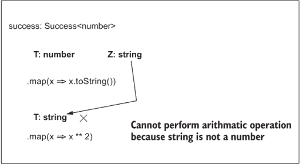
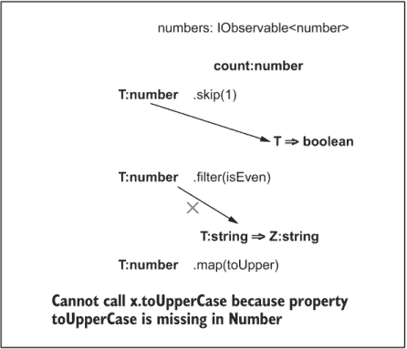
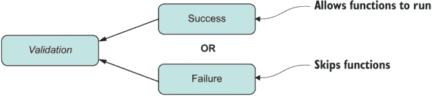

# 附录 B. 强类型 JavaScript<T>

当我们回顾这本书中关于 JavaScript 的所有内容时，很难想象还有什么遗漏。但网络是一个活生生的、有呼吸的生物，我们可以期待 JavaScript 在未来几年继续进化。信不信由你，我跳过了许多重要的话题，以便这本书能握在你的手中（或放在你的移动设备上）。但我感觉其中有一个话题很重要，至少在附录中讨论一下：JavaScript 的类型。

在编程世界中，一直存在着在强类型和弱类型语言之间进行史诗般的斗争。如果你已经读到这儿，你已经做出了那个决定。类型系统有很多种风味。这个光谱包括强类型、静态类型、弱类型、可选类型、动态类型以及许多其他变体。选择一种类型而不是另一种类型的原因是什么？你可以问十个人，得到十个不同的答案。尽管 JavaScript 始终是动态类型的，但随着像 TypeScript、Elm、PureScript 和 Reason 这样的语言继续获得动力，这个话题已经引起了更多的关注。这又把 JavaScript 置于何地？

幸运的是，你不必切换到另一种语言；你可以使用可插拔的类型扩展，这在工业界广泛使用，尤其是在 React 的 PropTypes 特性中。

拥有类型系统是有价值的，因为它有助于防止某些类别的错误。计算机在解析结构化数据方面比人类更有效，类型是提供必要结构的限制或边界。通过移除将变量分配给任何你能想象的东西的自由，计算机可以在你甚至输入`npm start`之前更有效地完成其工作。将类型想象成用你的智能吸尘器关闭房屋某个区域的虚拟墙壁；这样设备清洁得更好。

这个附录教你一些关于第三方、可插拔的 Flow 类型系统（[`flow.org`](https://flow.org/)）的特性，如果你想在继续使用 JavaScript 的同时，它是一个 TypeScript 的替代品。你将了解类型检查器可以为 JavaScript 项目带来的好处以及如何在代码中注释各种对象。尽管我使用 Flow 作为类型的一个参考实现，但库本身并不重要；重要的是概念。Flow 提供的特定类型注释看起来与 TypeScript 提供的类似，以及你可以在一些早期的 TC39 strawman 提案中找到的类型注释。你在这里学到的很可能会与 JavaScript 决定采纳的任何即将到来的提案兼容。

对于一本关于 JavaScript 的书来说，谈论静态类型有点不常见，但毕竟这本书不是一本常规的 JavaScript 书。

## B.1 首先，是什么？

我们需要一点历史背景。JavaScript 被认为是动态类型语言的典范。所以你会发现，多年前几乎在 JavaScript 中实现了一个类型系统。ECMAScript 4 提案([`mng.bz/NYe7`](http://mng.bz/NYe7))为基于 ECMAScript 的语言定义了一个类型系统，JavaScript 可以自然地采用。如果你浏览一下文档，你会发现其中许多内容与附录中的内容相似。然而，由于（包括 Macromedia、Netscape 和 Microsoft 在内）当时的大玩家之间缺乏共识，这个类型系统从未正式发布。

但对话并没有就此结束。在一段时间内，其他大型网络公司一直在尝试通过创建编译到 JavaScript 的新语言或通过推动开源库来扩展 JavaScript 语法（例如，使用元编程等注释），这些注释可以被类型检查工具验证，从而在标准化委员会之外尝试这个功能。

如你所知，JavaScript 是一种弱类型、动态类型的语言。现在让我们增加一个维度：可选类型（也称为可插拔类型）。让我们来分解以下内容：

+   *弱类型*—指的是编程语言根据使用情况隐式转换数据类型的能力。这是一种乐观的方法，用来推测开发者试图做什么。以下是一些例子（看看你是否能猜出最后一个）：

    ```
    !!'false' + 0      // 1
    2 * true + false   // 2

    !null + 1 + !!true // ?
    ```

+   *动态类型*—变量类型在运行时而不是在编译时强制执行。同一个变量可以持有不同类型的值。以下是一个例子：

    ```
    let foo = 4
    foo = function() {}

    foo = [4]
    ```

+   *可选（可插拔）类型*—一个可插拔的类型系统是一组你可以绑定到可选类型检查器的元注释。简单来说，如果你选择不使用，类型系统不应该妨碍你；它是纯可选的。此外，你应该能够在需要的地方逐步添加类型信息。可选类型不是全有或全无的交易。B.3 节讨论了你可以使用的一些类型注释。

JavaScript 的类型系统是动态和弱的，伴随着你熟悉的几个原始类型：`string`、`boolean`、`number`、`symbol`、`null`、`function` 和 `undefined`。不要忘记对 `null` 的奇特处理，它解析为 `object`。这些原始类型不定义任何属性。所以你可能想知道这个操作是如何可能的：`3.14159` `.toFixed(2)`。调用一个方法是因为你可以使用它们相应的对象包装器—`String`、`Number` 等—直接或间接地与这些类型一起工作。通过 *间接地*，我指的是以 `'0'.repeat(64)` 编写的代码会自动包装（装箱）并转换为 `new` `String('0').repeat(64)`，这确实让你可以调用方法。

使用这个基本类型集，我们已经能够构建无限多的应用程序。这些类型由系统提供；在 JavaScript 中，你无法定义自己的自定义数据类型。然而，你可以通过叠加一个类型系统来解决这个问题。

在本附录中，你将使用 Facebook 的 Flow 库。像 Babel 一样，Flow 可以集成到你的开发工具链中。这个库易于安装和运行，所以我不想让你感到无聊，细节我就不展开了。相反，我将专注于概念，首先描述类型为你的 JavaScript 代码带来的好处。

## B.2 静态类型 JavaScript 的优缺点

在本节中，我将简要介绍使用类型编程的一些一般性优点。目标不是深入探讨这个主题；许多其他书籍都做了更彻底的工作。相反，目标是让你了解使用类型编写企业级应用程序的优点，以及类型如何适应现代 JavaScript 开发环境。

我相信我们都在某个时刻问过自己，静态类型是否优于动态类型。这场辩论可能平分秋色。重要的是要提到，良好的编码实践可以走得很远；通过遵循最佳实践并正确使用语言，即使没有任何类型的提示，你也可以编写易于阅读和推理的 JavaScript 代码。

毫无疑问，类型信息非常有价值，因为它为你提供了代码正确性——衡量你的代码遵循你设计的协议和接口的程度。（例如，所有输入和输出类型是否兼容，你的对象是否有正确的形状？）类型的重要性源于它们能够限制并使你的代码更加严格和结构化。这些特性在 JavaScript 中尤其有用，因为你可以自由地做任何事。正如 Reginald Braithwaite 巧妙地所说，“JavaScript 的强大之处在于你可以做任何事情。弱点在于你将会。”

为了设定基调，接下来的列表展示了我们的带有类型信息的证明工作算法。

列表 B.1 带类型信息的证明工作代码

```
const proofOfWork = (block: Block): Block => {                          ❶
   const hashPrefix: string = ''.padStart(block.difficulty, '0');       ❷
   do {
      block.nonce += nextNonce();
      block.hash = block.calculateHash();
   } while (!block.hash.toString().startsWith(hashPrefix));
   return block;
}

function nextNonce(): number {
   return randomInt(1, 10) + Date.now();
}

function randomInt(min: number, max: number): number {
   return Math.floor(Math.random() * (max - min)) + min;

}
```

❶ proofOfWork 是一个类型为 Block => Block 的函数。

❷ hashPrefix 是一个类型为 string 的变量。

注意列表 B.1 中所有变量和函数签名前面的“`:` `<type>`”标签。函数及其返回值应该与输入参数进行类型匹配。在这种情况下，`proofOfWork`是一个接受`Block`对象并返回`Block`对象的函数——简而言之，一个从`Block`到`Block`或`Block` => `Block`的函数。通过有一个清晰的合约，你可以为你的 API 应该如何使用建立正确的预期。从技术上讲，你可以在代码流中早期捕捉到很多潜在的错误。尽管这个例子对于简单的脚本或快速原型代码来说可能有些过度，但随着代码规模的增加和重构变得更加复杂，类型系统的优势是显而易见的。此外，IDE 可以提供智能建议和检查，这可以使你更有信心并提高生产力。

类型的另一个好处是编译器可以追踪并查找函数输入和输出的不一致性。所以，如果你因为重大重构而更改某些函数的合约，你将立即收到任何错误的通知，而无需运行该函数。编译器帮助你捕捉到由于类型强制而产生的隐藏 bug。你的代码可能因为某些狡猾的强制规则（例如将字符串转换为数字或真值布尔结果）而表现得好像在本地工作，但很可能会在生产级使用模式中失败。到那时，修复任何问题都太晚了。

多项研究和调查表明，类型信息至少可以减少 15%的 bug 数量。事实上，静态类型编程语言 Elm 声称从未有过运行时执行错误。（顺便说一句，Elm 编译成 JavaScript。）

然而，你用 JavaScript 编码并不意味着你不关心类型。你总是需要知道你正在处理的变量的类型，以确定如何使用它，这会给你的已经超负荷的大脑带来不必要的负担。我们 JavaScript 开发者被迫编写大量的测试，尽可能覆盖代码的各个路径，以便从在脑海中携带整个应用程序结构中解放出来。

注意：为了澄清，类型系统不是良好编写的测试的替代品。

类型在快速原型脚本之外也能发光。对于大型企业开发来说，它们增加的感知打字时间可能远小于你用来编写注释解释函数如何使用的时间。就像测试一样，类型帮助你记录代码。

下面是一个列表，列出了从类型检查中获得的一些好处，不分先后顺序：

+   *自文档化* —类型指导开发，甚至可以通过允许 IDE 推断更多关于你的代码的信息来使你更有效率。例如，如果你看到一个名为 `str` 的变量，它是字符串还是可观察的流？除非你有完整的上下文或打开代码，否则你永远不会知道。你可以使用 JSDoc 添加文档，这有助于 IDE 获得一些指导，但它有限，并且没有进行检查。

+   *结构化、严格的代码* —类型是应用程序的蓝图。JavaScript 的对象系统因其灵活性和可塑性而臭名昭著，允许你在运行时向对象添加属性或从对象中删除属性。这个特性使得代码难以推理，因为你必须跟踪对象何时可能改变状态。通过提前定义对象的形状来减轻认知负担。这种做法会让你在处理对象属性时三思而后行，如果你确实处理不当，类型检查器可能会警告你。

+   *避免 API 误用* —因为你可以检查输入和输出，所以你可以避免误用或滥用 API。Flow 默认为 JavaScript 核心 API 提供类型定义。没有它，当你想创建大小为 `2` 的数组时，`new Array("2")` 这样的微妙错误会被接受，而实际上应该是 `new Array(2)`。

    此外，类型系统可以防止你调用比声明接受的参数更少的函数。例如，对 `Math.pow(2)` 的检查失败，因为你缺少第二个指数参数。

+   *不变量的自动检查* —一个 *不变量* 是一个在对象的整个生命周期中必须始终为真的断言。一个例子是“一个区块的难度值不能超过 4。”你必须在构造函数中每次都编写代码来检查这个不变量，或者使用类型系统来帮你检查。

+   *更有信心的重构* —类型可以确保在移动或更改代码结构时不会违反合约。

+   *改进的性能* —类型帮助你编写在 V8 等一些 JavaScript 引擎中更容易优化的代码。正如你所知，JavaScript 允许你调用你想要的任意数量的参数。如果你使用类型，情况就不同了。原因是类型检查器施加的限制确保函数保持单态性（保证有一个输入类型）或至少多态性（两个到四个输入类型）。编译器在特定函数上必须考虑的输入类型变化越少，你就能更好地利用 JavaScript 引擎内现有的快速内联缓存来生成最佳性能。优化一个类型相同的数组（例如所有都是字符串）的存储比优化包含两种或三种类型的数组要容易得多。

+   *减少运行时执行错误的可能性* —类型可以帮助你避免一类通常表现为 `TypeError` 和 `ReferenceError` 的错误。这些错误可能未经检测就进入生产系统，并且难以调试。表 B.1 总结了一些这些问题。

表 B.1 可通过类型检查避免的错误。所有这些错误都可以在开发期间而不是在运行时捕获。

| 描述 | 代码 | 运行时错误 | 类型检查 |
| --- | --- | --- | --- |
| 调用一个 `undefined` 属性 | `let foo = undefined;` `foo();` | `TypeError: foo is not a function` | 不能调用 `foo`，因为 `undefined` 不是一个函数 |
| 使用无效的 LHS 值 | `function foo() {}` `if(foo() = 'bar') {}` | `ReferenceError:` Invalid left side in assignment | 赋值左侧无效 |
| 从 `null` 读取属性 | `let someVal = null;` `console.log(someVal.foo);` | `TypeError:` Cannot read property `'foo'` of `null` | 不能获取 `someVal.foo`，因为 `null` 中缺少属性 `foo` |
| 在 `null` 上设置属性 | `let someVal = null;` `someVal.foo = 1;` | `TypeError:` Cannot set property `'foo'` of `null` | `TypeError:` Cannot set property `'foo'` of `null` |

如前所述，Elm 语言声称静态类型是它没有运行时执行错误的原因之一。对于 JavaScript 来说，情况并非如此，但至少你可以看到，大量错误是可以预防的。

为了辩论的目的，以下是使用类型的一些缺点：

+   *学习曲线陡峭* —在动态语言中，一些概念可以用简单的代码表达。向函数添加类型信息可能令人望而却步，因为要使这些信息有用，你需要捕获函数（如 `curry`）可以处理的输入和输出的变化。这项任务需要高级的类型系统理解。此外，对于主要依赖于其词法作用域（闭包）中存在的数据的函数类型，这些类型并不非常有用。

+   *不可移植* —目前，JavaScript 没有定义任何正式的类型系统提案。这样的提案可能在遥远的未来成为现实，但我们离它还很远。尽管一些领先工具展示了关于外观和感觉的一些共识，但类型系统仍然是供应商特定的。

+   *错误报告不佳* —一些类型错误可能难以理解且难以追踪，尤其是在实现高级类型签名时。

现在你已经了解了添加类型的利弊，让我们来看看 Flow 的类型注释。

## B.3 类型注释

类型是编译时元数据，可以描述运行时值。尽管 Flow 能够通过分析你的代码来推断变量的类型，但在关键位置进行注释仍然很有帮助，以便进行更深入的分析。

Flow 是完整且广泛的，它提供了各种类型注解，其中我将讨论一些。Flow 编译器分析顶部带有`//@flow`指令注释的文件。在 Flow 检查您的文件后，如果一切看起来都很好，您需要使用另一个库或任何转译器（如 Babel）来删除这些注解（因为它们目前不是有效的 JavaScript）。

我无法涵盖 Flow 中可用的众多类型注解，但以下六种在日常编码中经常使用：

+   类类型

+   接口类型

+   对象类型

+   函数类型

+   泛型类型

+   联合类型

### B.3.1 类类型

在其他静态类型、面向对象的语言中，类既作为值也作为类型操作。以下是一个示例：

```
class Block {
  //...
}

let block: Block = new Block(...);
```

这种类型的表示称为命名类型。您还可以对类内部的方法和字段进行类型注解，这是您获得最大好处的地方。下一个列表显示了`Block`类的示例。为了演示目的，我省略了一些部分。

列表 B.2 带有类型信息的`Block`类

```
class Block {
   index: number = 0;
   previousHash: string;
   timestamp: number;
   difficulty: Difficulty;      ❶
   data: Array<mixed>;          ❷
   nonce: number;

   constructor(index: number, previousHash: string, 
            data: Array<mixed> = [], difficulty: Difficulty = 0) {

      // ...
   }

   isGenesis(): boolean {
      //...
   }

   //...
}
```

❶ 使用我自定义的名为“难度”的类型

❷ “mixed”可以用作可以包含任何类型对象的数组的占位符。

类型系统将确保此类属性被正确使用并分配给正确的值。该行

```
const block: Block = new Block(1, '0'.repeat(64), ['a', 'b', 'c'], 2);
```

是有效的，而这一种会发出类型警告：

```
const block: Block = new Block('1', '0'.repeat(64), ['a', 'b', 'c'], 2);

Cannot call Block with '1' bound to index because string is incompatible with number.
```

如您所见，类型检查器阻止我在构造函数中使用`string`代替`number`。像`Block`这样的类自然成为类型，并由 Flow 相应处理。在 B.3.2 节中，我们将查看接口类型。

### B.3.2 接口类型

接口就像一个类，但应用范围更广且没有实现。接口捕获了一组可重用的属性，多个类可以实现。记住第七章中，我们的主要模型对象（`Block`、`Transaction`和`Blockchain`）实现了一个自定义的`[Symbol('toJson')]`属性作为自定义 JSON 序列化的钩子。然而，这个检查是在运行时发生的，并且没有任何东西会在您运行算法之前验证对象是否实现了此协议。接口是解决这个问题的更好方案。让我们为第七章中使用符号的相同解决方案建模，这次使用接口，如下一个列表所示。

列表 B.3 使用接口而不是符号

```
interface Serializable {
   toJson(): string
}

class Block implements Serializable
   toJson() {                           ❶
     // ... 
   }
}
```

❶ `Block`必须提供从其继承的接口方法的实现。

未提供实现会导致以下类型错误：

```
Cannot implement Serializable with Block because property toJson is missing in Block but exists in Serializable.
```

除了类和接口之外，对象字面量也可以进行类型注解。

### B.3.3 对象类型

如你之前所见，你可以将对象分配给其类的类型。另一种选择是在对象创建时描述结构或形状。这种类型的声明适用于对象字面量。回想一下第四章，`Money`是一个构造函数，它返回一个具有`currency`、`amount`、`equals`、`toString`、`plus`和`minus`等属性的对象。我们可以以下述方式定义该数据结构：

```
type MoneyObj = {
    currency: string,
    amount: number,
    equals: boolean,
    round: MoneyData,
    minus: MoneyData,
    plus: MoneyData
}

const money: MoneyObj = Money('₿', 0.1);
money.amount;  // 0.1
money.locale;
Cannot get money.locale because property locale is missing in MoneyObj
```

`MoneyObj`描述了调用`Money`函数构造函数后生成的对象的形状。此外，如果你误输了属性的名称，类型检查器会立即告诉你：

```
money.equls();
```

你也不会介意这个有用的提示：

```
Cannot call money.equls because property equls (did you mean equals?) is missing in MoneyObj.
```

如你所知，`Money`是一个函数对象，这意味着你需要描述输入以及输出。这种类型被称为函数类型。

### B.3.4 函数类型

函数类型声明的基本结构与箭头函数类似。它描述了输入类型，然后是粗箭头（`=>`），然后是返回类型：

```
(...input) => output
```

在`Money`的情况下，构造函数接受`currency`和`amount`。如果你要检查其类型签名，它看起来会是这样：

```
type Money = (currency: string, amount: number) => MoneyObj
```

这里有一个来自第五章功能编程主题的更有趣的例子。回想一下，`Validation.Success`集成了`Functor`混入，这意味着它具有将函数映射到它的能力。这个简单的例子可能会唤起你的记忆：

```
const two: Success<number> = Success.of(2);
success.map(squared).get(); // 4
```

下一个列表显示了`Success`的简化类型定义，其中包括`Functor.map`。

列表 B.4 静态类型化`Success`函子

```
class Success<T> {
    static of: (T) => Success<T>;      ❶

    isSuccess: true;
    isFailure: false;

    get: (void) => T;
    map: <Z>(T => Z) => Success<Z>;    ❷
}
```

❶ 一元类型构造函数

❷ `map`是结构保持的。它接受一个函数并返回相同类型的实例（在这种情况下是`Success`）。

注意：在本附录中，我使用了一个简单具体的`map`类型定义。从理论上讲，`map`应该为所有类型（也称为高阶类型，HKT）进行泛型定义，这在像 Haskell 这样的函数式语言中使用。HKT 需要强大的类型系统，并且超出了 Flow 和类似 JavaScript 库所能做到的。

你可能会注意到一些奇怪的注释被包含在比较运算符中，例如`<T>`。这些*泛型*或*多态类型*在软件中很常见，尤其是在处理数据结构和代数数据类型（ADT）模式时。注意`map`接受一个函数（`T` `=>` `Z`）并返回`Success`。

如果你向`map`提供除函数之外的其他任何内容，类型检查器会向你发出警告：

```
const fn = 'foo';
success.map(fn).get();

Cannot call success.map with fn bound to the first parameter because string is incompatible with function type.
```

类型系统从其右侧值推断出`fn`是一个`string`。这段代码捕捉到我试图将那个值用作函数。

### B.3.5 泛型类型

泛型编程非常强大，它允许任何未知类型（通常称为`T`）作为某些算法的参数。你编写的算法可能涉及使用不同类型的数据结构，如集合或 ADT，作为处理的数据类型的容器。接受类型参数的数据结构被称为参数化类型。

通常，当你编写 JavaScript（或任何语言，无论如何），你应该坚持最佳实践来指导你的编码工作。一个例子是创建数组。根据定义，数组应该是一个同类型项的索引集合。但没有什么可以阻止你插入不同类型的元素（除了编写处理此数组的代码的可怕努力）。这样的数组是有效的 JavaScript：

```
['foo', null, block, {}, 2, Symbol('bar')]
```

我不喜欢看到这个函数映射到这个数组上，因为它可能包含大量的`if`/`else`条件，试图处理 JavaScript 中已知的所有类型。这种数组的类型签名将是`Array<mixed>`，它是无界的，接受语言中可用的任何类型混合。类型是关于限制的，在这种情况下，限制是有益的。

良好的 JavaScript 开发者很少在同一个数组对象中混合类型，除非可能是为了创建对象的成对。大多数时候，我们坚持使用相同的类型。你如何强制执行这种做法？你可以设定你接受的类型边界。你可以定义一个字符串数组

```
const strs: Array<string> = ['foo', 'bar', 'baz'];
```

或者是一个`Block`对象的数组：

```
const strs: Array<Block> = [genesis, block1, block2];
```

然而，有时你不知道你将接收到的项的类型，但你想从类型安全中受益。假设我们称这个类型为`T`。让我们通过一个 ADT 的例子来讨论。一个可以提升任何类型的`Validation`容器可以定义为`Validation<T>`，成功分支也会继承这个类型（`Success<T>`）：

```
class Success<T> {
    static of: (T) => Success<T>;

    isSuccess: true;
    isFailure: false;

    get: (void) => T;
    map: <Z>(T => Z) => Success<Z>; 
}
```

注意，我正在将类型参数传递给`of`、`get`和`map`等关键 API。这种技术将类型检查添加到这个 API 的每个方面。以下是一个示例：

```
const two: Success<number> = Success.of('foo');

Cannot assign Success.of(...) to two because string is incompatible with number
```

展开容器也会进行检查：

```
const two: Success<string> = Success.of('2');
Math.pow(two.get(), 2);

Cannot call Math.pow with two.get() bound to x because string is incompatible with number.
```

这里有一个示例，展示了在映射函数上的类型违规：

```
const success: Success<number> = Success.of(2);
success.map(x => x.toUpperCase()).get();

Cannot call x.toUpperCase because property toUpperCase is missing in Number.
```

注意：你可能已经注意到，类型检查器有时会使用类型的原始名称（`number`）或包装版本（`Number`）。这种情况发生在违反涉及访问属性时。因为原始类型没有属性，JavaScript 会在调用方法（如`toUpperCase()`）之前自动包装原始类型。在这种情况下，`Number`包装类型没有声明该函数。

此外，类型检查器可以通过捕获这些参数中的类型信息并将其应用于代码的流程来执行深度检查。在`map`的情况下

```
map: <Z>(T => Z) => Success<Z>
```

在此签名中绑定两个类型参数：`T` 和 `Z`。`T` 是容器值的类型——在本例中是 `number`。`Z` 存储结果，并从你的代码结构中推断出来。在这种情况下，类型检查器看到 `toUpperCase()` 是一个不在 `Number` 类型形状中出现的函数，并相应地警告你。

为了展示类型检查器的范围，假设你再次进行 `map` 调用。第一次 `map` 调用时的环境会传递到第二次调用。`Z` 会将其类型发送到 `T`，并且结果会被 `Z` 再次捕获。以下是一个示例：

```
success.map(x => x.toString()).map(x => x ** 2);

Cannot perform arithmetic operation because string is not a number.
```

图 B.1 追踪了推理过程。



图 B.1 `map` 调用的序列，追踪类型流以找到在字符串上执行的不合法操作（指数运算）

如图 B.1 所示，在第一次 `map` 调用将值转换为字符串后，第二次调用失败，因为在尝试执行算术运算之前，`x` 被绑定到 `string`。

泛型编程的另一个令人信服的使用案例是流。为基于流的代码提供类型语义，你将获得可观察者的链式操作能力，以及应用于你的业务逻辑的代码正确性。在我们查看示例之前，作为一个有趣的小练习，让我们使用迄今为止学到的注解来描述流的主要接口。因为 `Observable` 类已经加载，我们将使用在接口前加 `I.` 的约定。因此我们得到 `IObservable`、`Observer` 和 `ISubscription`，使用混合的泛型接口、对象和函数类型：

```
type Observer<T> = {
   next: (value: T) => void,
   error?: (error: Error) => void,
   complete?: () => void
}

interface IObservable<T> {
   skip(count: number): IObservable<T>;
   filter(predicate: T => boolean): IObservable<T>;
   map<Z>(fn: T => Z): IObservable<Z>;
   reduce<Z>(acc: (
         accumulator: Z,
         value: T,
         index?: number,
         array?: Array<T>
      ) => Z, startwith?: T): IObservable<T>;
      subscribe(observer: Observer<T>): ISubscription;
}

interface ISubscription {
    unsubscribe(): void;
}
```

当变量具有 `IObservable` 类型的信息时，不再需要遵循 `$` 后缀约定。毫无疑问，你正在处理一个可观察者。在这个例子中，绑定到 `number` 的类型 `T` 流过整个 `Observable` 声明，类型检查器可以在管道的每一步测试它：

```
const numbers: IObservable<number> = Observable.of(1, 2, 3, 4);

numbers.skip(1)
    .filter(isEven)
    .map(square)
    .reduce(add, 0)
    .subscribe({
        next: :: console.log
    });
```

类型系统分析调用序列，并检查可观察操作符与你的业务逻辑之间的兼容性。假设你无意中向操作符传递了一个不兼容的函数：

```
const toUpper = x => x.toUpperCase();

//...

numbers.skip(1)
       .filter(isEven)
       .map(toUpper);

Cannot call x.toUpperCase because property toUpperCase is missing in Number
```

你可以创建另一个类似于图 B.2 的流程图。我将讨论的最后一个类型注解与我们第五章学到的内容相关。



图 B.2 追踪类型流通过可观察流。调用 `toUpper` 导致违规，因为预期的事件类型是 `number`。

### B.3.6 联合类型

联合类型或选择类型（如`Validation`）的签名定义了一个类型，该类型一次可以处于有限集合中的某个状态。你可能知道这种类型为枚举或`enum`。`Block`类声明了一个类型为`Difficulty`的参数。这种类型是一个`number`，它控制工作量证明算法需要花费的努力量。例如，难度值为`5`时，完成工作量证明可能需要数小时，甚至数天。你肯定想控制可能值的范围。

要描述此类型可以采取的可能值，使用逻辑`OR`（`|`）运算符，表示联合：

```
type Difficulty = 0 | 1 | 2 | 3;
```

`0`的值会关闭工作量证明并立即完成。当你将旋钮调得更高时，`proofOfWork`需要更多的努力来运行。

另一个常见的用例是表示日志级别如下：

```
type LogLevel = 'DEBUG' | 'INFO' | 'WARN' | 'ERROR';
```

枚举与`switch`语句无缝配合，如以下列表所示。

列表 B.5 使用枚举和`switch`语句的不同日志级别

```
const level: LogLevel = getLogLevel()

switch (level) {
  case 'DEBUG':
    //...
    break
  case 'INFO':
    //...
    break
  case 'WARN':
    //...
    break
  case 'ERROR':
    //...
    break; 
                ❶
}
```

❶ 由于你可以保证这个变量不会处于其他任何状态，因此不需要默认条款。

我们还可以在自定义对象上使用联合类型。在第五章中，我们实现了`Validation` ADT，它是一个具有两个分支的分离联合：`Success`和`Failure`。像`Difficulty`一样，`Validation`对象只能处于这两种状态之一。我们可以用相同的方式表示这种条件。以下是包含其两个分支的`Validation`：

```
class Success<T>  {
    static of: (T) => Success<T>;

    isSuccess: true;
    isFailure: false;

    get: (void) => T;

    map: <Z>(T => Z) => Success<Z>;
}

class Failure {
    isSuccess: false;
    isFailure: true;

    get: (void) => Error;

    map: (any => any) => Failure;
}

type Validation<T> = Success<T> | Failure;
```

如您所见，`Failure`情况是一个更简单的类型，因为它不打算携带值，这就是为什么我使用关键字`<any>`来表示不需要任何类型信息。

联合运算符正在模拟代码的两个分离分支（图 B.3）。



图 B.3 联合类型注解模型了一个描述两个分离控制流的逻辑`OR`。

你可以直接或间接地在我们的`Block`类中使用此类型：

```
class Block {

   // ...

   isValid(): Validation<Block> {

      //...
   }
}
```

这种变化是等效的，并且以相同的方式工作：

```
class Block {

      // ...

   isValid(): Success<Block> | Failure {

      //...
   }
}
```

根据我的经验，具有类、接口、对象、函数、泛型和联合的类型在日常代码中最为常见，并且很可能会被任何未来的提案首先包括。但你可以使用许多其他类型注解。如果你对此技术感兴趣，我鼓励你自行阅读相关内容。一篇不错的入门文章可以在[`code.sgo.to/proposal-optional-types`](http://code.sgo.to/proposal-optional-types)找到。了解签名是什么以及它们的意义对于有效地沟通函数如何与你的其他代码一起使用和组合仍然很重要。好消息是类型信息不是全有或全无的途径。随着你对它们越来越熟悉，你可以逐步开始添加类型。

JavaScript 社区在这方面一直非常活跃，从第三方扩展库如 Flow 到替代 JS 语言如 Elm 和 PureScript，无所不包。如果你对此感兴趣，一些处于 0 阶段的早期提案重新点燃了在 ECMAScript 4 时代中断的类型讨论：

+   [`mng.bz/MXDn`](http://mng.bz/MXDn)

+   [`mng.bz/aovB`](http://mng.bz/aovB)

如果你想要了解更多信息，请随意深入研究这些提案。
