## 第一部分：构建过程

本书的第一部分致力于构建过程，并提供了对 Grunt 的实用介绍。你将了解构建过程的理论和实践中的为什么、如何以及是什么。

在第一章中，我们将探讨构建第一哲学包含的内容：构建过程和应用程序复杂性管理。然后，我们将开始处理我们的第一个构建任务，使用 lint 来防止代码中的语法错误。

第二章完全是关于构建任务的。你将了解构成构建的各种任务，如何配置它们，以及如何创建自己的任务。在每种情况下，我们将先探讨理论，然后通过使用 Grunt 的实际示例进行讲解。

在第三章中，我们将学习如何在保持敏感信息安全的同时配置应用程序环境。我们将讨论开发环境的工作流程，你将学习如何自动化构建步骤本身。

第四章随后描述了在发布我们的应用程序时需要考虑的更多任务，例如资产优化和管理文档。你将了解如何通过持续集成来保持代码质量，我们还将演示如何将应用程序部署到生产环境。

## 第一章：构建第一的介绍

*本章涵盖*

+   识别现代应用程序设计中的问题

+   定义构建第一

+   构建过程

+   在应用程序中管理复杂性

正确开发一个应用程序可能很困难。这需要规划。我曾在周末创建过应用程序，但这并不意味着它们设计得很好。即兴创作对于丢弃原型和验证想法来说很棒；然而，构建一个可维护的应用程序需要一个计划，这个计划是当前你心中的功能以及你可能在不久的将来添加的功能的粘合剂。我参与过无数的项目，其中应用程序的前端并没有达到其全部潜力。

最终，我意识到后端服务通常有一个专门负责其规划、设计和概览的架构师——而且通常不是一个架构师，而是一个整个团队。前端开发的情况则截然不同，开发者被期望制作一个应用程序的工作草图原型，然后被要求运行它，希望原型能够在生产实施中幸存。前端开发需要与后端开发一样多的对架构规划和设计的投入。

那些从互联网上复制几段代码，粘贴到我们的页面，然后就算完成的日子已经一去不复返了。将 JavaScript 代码随意拼凑在一起的做法已经不符合现代标准了。JavaScript 现在处于核心位置。我们有众多框架和库可供选择，这些可以帮助你通过编写小型组件而不是单体应用程序来组织你的代码。可维护性不是你可以随心所欲添加到代码库中的东西；这是你必须构建到应用程序中，并且从设计之初就要遵循的哲学。

如果没有内置可维护性，最终你会达到一个点，无法再向塔中添加任何更多部件。代码会变得复杂，错误变得越来越难以追踪。重构意味着暂停产品开发，而企业无法承担这种损失。发布计划必须保持，让塔楼倒塌是不可接受的，所以我们妥协。

### 1.1. 当事情出错时

你可能想要将新功能部署到生产环境中，以便人们可以尝试它。你需要执行多少步骤才能做到这一点？八个？五个？你为什么要冒在常规任务中犯错的风险，比如部署？部署应该和本地构建你的应用程序没有区别。一步。就是这样。

不幸的是，这很少是标准做法。你是否遇到过像我一样不得不手动执行许多这些步骤的挑战性位置？当然，你可以一步编译应用程序，或者你可能使用不需要预编译的解释型服务器端语言。也许后来你需要更新数据库到最新版本。你可能甚至为这些更新创建了一个脚本，然后你登录到数据库服务器，上传文件，并自行运行模式更新。

很好，你已经更新了数据库；然而，有些地方不对劲，应用程序正在抛出错误。你看看时钟。你的应用程序已经宕机超过 10 分钟了。这应该是一个简单的更新。你检查日志；你忘记将那个新变量添加到配置文件中。真愚蠢！你立即添加它，嘟囔着与代码库搏斗的话。你忘记在部署前更改配置文件；你忘记在部署到生产前更新它！

这听起来像是一个熟悉的仪式吗？不用担心，这不幸是一种常见的疾病，通过不同的应用程序传播。考虑以下描述的危机场景。

#### 1.1.1. 如何在 45 分钟内损失 172,222 美元

我敢打赌，你会认为损失近五亿美元是一个严重的问题，这正是 Knight Capital 所遭遇的.^([1]) 他们开发了一个新功能，允许股票交易员参与所谓的零售流动性计划（RLP）。RLP 功能旨在取代一个已经停用近九年的未使用功能，称为 Power Peg（PP）。RLP 代码重用了一个标志，该标志用于激活 PP 代码。他们在添加 RLP 时移除了 Power Peg 功能，所以一切看起来都很顺利。或者至少他们认为看起来很顺利，直到他们切换开关的那一刻。

> ¹ 更多关于 Knight Capital 的信息，请参阅[`bevacqua.io/bf/knight`](http://bevacqua.io/bf/knight)。

部署没有正式流程，由一名技术人员手动执行。这个人忘记将代码更改部署到他们八台服务器中的一台，这意味着在第八台服务器的情况下，PP 代码而不是 RLP 功能会在激活标志后面。直到一周后他们打开标志，激活了除一台以外的所有服务器的 RLP，而另一台服务器上则是九年前的 Power Peg 功能，他们才意识到有问题。

通过第八台服务器路由的订单触发了 PP 代码而不是 RLP。结果，错误的订单类型被发送到了交易中心。试图修正这种情况反而使问题更加严重，因为他们从拥有 RLP 代码的服务器上移除了 RLP 代码。简而言之，他们在不到一个小时的时间里损失了大约 4.6 亿美元。当你考虑到他们只需要建立一个更正式的构建流程来避免他们的崩溃时，整个情况感觉是荒谬的、不负责任的，并且事后看来，很容易避免。当然，这是一个极端案例，但它大胆地说明了这一点。一个自动化的流程会提高防止或至少更早发现人为错误的可能性。

#### 1.1.2\. 首先构建

在这本书中，我的目标是教你“首先构建”的设计哲学，即在编写任何代码之前设计干净、结构良好和可测试的应用程序。你将了解流程自动化，这将减少人为错误的可能性，例如导致 Knight Capital 破产的错误。首先构建是使你能够设计干净、结构良好和可测试的应用程序的基础，这些应用程序易于维护和重构。这是首先构建的两个基本方面：流程自动化和设计。

为了教你“先构建”的方法，这本书将向你展示一些技术，这些技术将提高你的软件质量以及你的 Web 开发工作流程。在第一部分中，我们将从学习如何建立适合现代 Web 应用程序开发的构建流程开始。然后，你将了解提高日常开发效率的最佳实践，例如在代码更改时运行任务，通过输入单个命令从终端部署应用程序，以及一旦应用程序投入生产后监控其状态。

书的第二部分——管理复杂性和设计——侧重于应用程序质量。在这里，我通过比较目前可用的不同选项，为你介绍如何编写更模块化的 JavaScript 组件。JavaScript 中的异步流程往往会变得复杂和冗长，这就是为什么我准备了一章，你将在其中学习编写更干净的异步代码，同时了解你可以使用哪些不同的工具来改进代码。以 Backbone 作为你的首选入门药物，你将了解足够的 JavaScript MVC 知识，以开始你的客户端 MVC 之路。我提到可测试的应用程序很重要，虽然模块化是正确方向上的一个很好的第一步，但测试值得单独一章。最后一章剖析了一个流行的 API 设计理念 REST（表示状态传输），帮助你设计自己的，同时深入到服务器端的应用程序架构，但始终关注前端。在查看一个 Build First 可以通过自动化流程避免的危机场景之后，我们将开始探索构建流程。

#### 1.1.3. 初始化仪式

复杂的设置流程，例如当新团队成员加入时，也是你可能在自动化部门有所欠缺的迹象。令我痛苦的是，我参与过一些项目，第一次让开发环境工作需要花费一周时间。在你甚至开始理解代码做什么之前，需要整整一周。

下载大约 60GB 的数据库备份，创建一个配置你从未听说过的数据库，例如排序，然后运行一系列不太起作用的模式升级脚本。一旦你弄明白了这一点，你可能想要通过在你的环境中安装特定且极其过时的编解码器来修补你的 Windows Media Player，这感觉就像是将一头猪塞进一个填充的冰箱一样徒劳。

最后，当你拿一杯咖啡的时候，尝试一次性编译 130 多个项目单体。哦，但你忘了安装外部依赖项；这就解释了问题所在。不，等等，你还需要编译一个 C++程序，这样编解码器才能再次工作。再次编译，又过去了 20 分钟。仍然失败？射击。四处问问，也许？嗯，没有人真正知道。他们所有人刚开始时都经历了这个过程，并且从他们的记忆中抹去了这段经历。查看维基百科？当然，但信息散落在各处。这里那里有一些信息，但它们没有解决你的具体问题。

公司从未有过正式的初始化工作流程，随着事情开始堆积，组合起来变得越来越困难。他们不得不处理巨大的备份、升级、编解码器、网站所需的多个服务，以及每次更改分号时编译项目需要半小时。如果他们从一开始就自动化这些步骤，就像我们在“先构建”中将要做的那样，过程就会更加顺畅。

骑士资本公司的灾难和过于复杂的设置故事有一个共同点：如果他们提前规划并自动化构建和部署流程，他们的问题本可以避免。提前规划和自动化围绕应用程序的流程是“先构建”哲学的基本方面，你将在下一节中了解到这一点。

### 1.2. 使用“先构建”提前规划

在骑士资本公司的案例中，他们忘记将代码部署到生产 Web 服务器之一，如果有一个单步部署流程可以自动将代码部署到整个 Web 农场，就足以拯救公司免于破产。这个案例中的更深层次问题是代码质量，因为他们几乎有 10 年在代码库中闲置未使用的代码片段。

一个不提供任何功能增益的完整重构对产品经理来说没有吸引力；他们的目标是改善可见的、面向消费者的产品，而不是底层软件。相反，你可以通过逐步改进代码库和重构你接触到的代码，编写覆盖重构功能的测试，以及将遗留代码包装在接口中，以便以后可以重构，来持续提高你项目中代码的平均质量。

然而，重构本身并不能解决问题。从项目一开始就深深植入项目中的良好设计，比试图将其作为事后想法附加到不良结构上更有可能坚持下去。设计是本书的另一个基本方面，与之前提到的构建流程并列。

在我们深入探索 Build First 的未知领域之前，我想提到这不仅仅是一套只适用于 JavaScript 的原则。在很大程度上，人们通常将这些原则与后端语言相关联，例如 Java、C#或 PHP，但在这里我将它们应用于 JavaScript 应用程序的开发过程。正如我之前提到的，客户端代码往往没有得到应有的关爱和尊重。这通常意味着代码损坏，因为我们缺乏适当的测试，或者代码库难以阅读和维护。因此，产品（和开发者生产力）受到影响。

当谈到 JavaScript 时，鉴于解释型语言不需要编译器，新手开发者可能会认为这已经足够理由完全放弃构建过程。走这条路的问题在于，他们将在黑暗中射击：开发者不知道代码是否工作，直到它在浏览器中执行，也不知道它是否按预期工作。稍后，他们可能会发现自己手动部署到托管环境，并远程登录以调整一些配置设置以使其工作。

#### 1.2.1. Build First 的核心原则

Build First 方法的核心是鼓励不仅建立构建过程，还要有清晰的应用程序设计。以下列表从高层次展示了采用 Build First 方法能给我们带来什么：

+   由于没有人为交互，因此降低了错误倾向

+   通过自动化重复性任务提高生产力

+   模块化、可扩展的应用程序设计

+   通过缩减复杂性提高可测试性和可维护性

+   符合性能最佳实践的发布版本

+   在发布前始终测试过的部署代码

观察图 1.1 图 1.1，从顶部行开始向下看，你可以看到

+   构建过程：这是您以自动化的方式编译和测试应用程序的地方。构建可以旨在促进持续开发，或调整以实现发布时的最大性能。

+   设计：您将在这里花费大部分时间，在编码的同时增强架构。在此过程中，您可能会重构代码并更新测试以确保组件按预期工作。每当您不是调整构建过程或准备部署时，您将设计和迭代应用程序的代码库。

+   部署和环境：这些涉及自动化发布过程和配置不同的托管环境。部署过程负责将您的更改传递到托管环境，而环境配置定义了环境以及与之交互的服务或数据库，从高层次上讲。

##### 图 1.1. Build First 的四个关注领域的高级视图：构建过程、设计、部署和环境

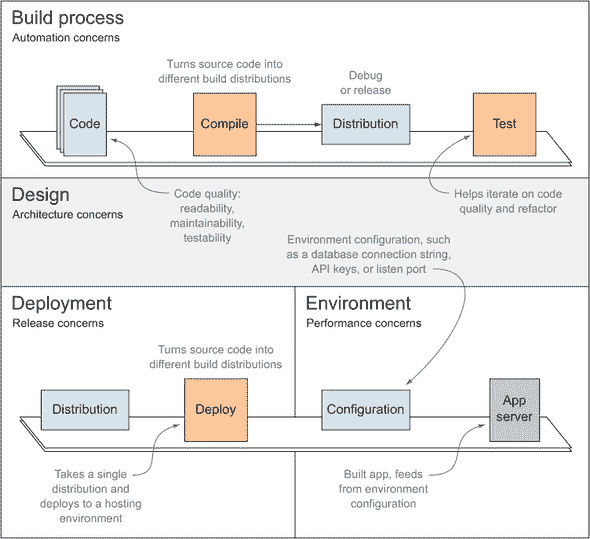

如图 1.1 所示，Build First 应用程序有两个主要组件：围绕项目的流程，如构建和部署应用程序，以及应用程序代码的设计和质量，这些在您开发新功能时每天都会迭代改进。这两者同等重要，并且它们相互依赖以繁荣发展。如果您的应用程序设计不足，良好的流程也不会有任何好处。同样，没有良好的构建和部署流程的帮助，良好的设计也无法在之前描述的危机中生存。

与“先构建”方法一样，本书分为两部分。在第一部分中，我们查看构建过程（针对开发或发布进行优化）和部署过程，以及环境及其配置方式。第二部分深入探讨应用程序本身，并帮助我们设计出清晰简洁的模块化设计。它还引导我们了解在构建现代应用程序时必须考虑的实际设计因素。

在接下来的两个部分中，您将概述本书各部分讨论的概念。

### 1.3\. 构建过程

构建过程旨在自动化重复性任务，例如安装依赖项、编译代码、运行单元测试以及执行任何其他重要功能。能够一次性执行所有必需任务的能力，称为*单步构建*，至关重要，因为它揭示了强大的机会。一旦您设置了单步构建，就可以根据需要多次执行它，而结果不会改变。这个特性被称为*幂等性*：无论您调用操作多少次，结果都将相同。

图 1.2 更详细地说明了自动化构建和部署过程所包含的步骤。

##### 图 1.2\. Build First 过程中的流程高级视图

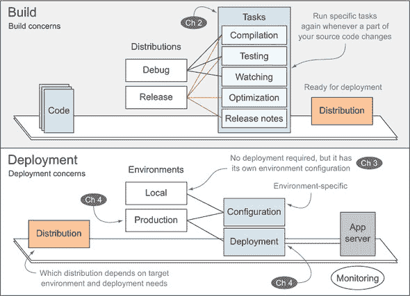

| |
| --- |

**自动化构建过程的优缺点**

自动化构建过程最重要的优势可能是可以按需频繁部署。一旦新功能准备好，就立即向人类提供最新功能，这使我们能够通过反馈循环来获得更好的洞察力，从而更好地了解我们应该构建的产品。

设置自动化流程的主要缺点是您需要花费时间来构建流程，在您开始看到实际好处之前，但好处——如自动化测试、更高的代码质量、更精简的开发工作流程和更安全的部署流程——远远超过了构建该流程所付出的努力。一般来说，您只需设置一次流程，然后可以根据需要多次回放它，并在过程中进行一些调整。

| |
| --- |

#### 构建

图 1.2 的顶部放大了构建过程工作流程中的构建部分（如图图 1.1 所示），详细说明了你在旨在开发或发布时的关注点。如果你旨在开发，你将希望最大化你的调试能力，我敢打赌你会喜欢一个知道何时执行自身部分而无需你采取任何行动的构建。这被称为*持续开发*（CD），你将在第三章中了解到它。构建的发布分发不关心 CD，但你将想要花时间优化你的资产，以便它们在生产环境中尽可能快地运行。

#### 部署

图 1.2 的底部放大了部署过程（最初在图 1.1 中显示），它将调试或发布*分发*（我在书中称为具有特定目的的独立流程）部署到托管环境中。

此软件包将与特定环境的配置（它保护秘密，如数据库连接字符串和 API 密钥，并在第三章中讨论）一起工作，以提供服务。

第一部分致力于构建“构建优先”的方面：

+   第二章解释了构建任务，教你如何使用 Grunt 编写任务并配置它们，Grunt 是你将在第一部分中用作构建工具的任务运行器。

+   第三章涵盖了环境、如何安全地配置你的应用程序以及开发工作流程。

+   第四章讨论了你在发布构建期间应执行的任务。然后你将了解部署、在每次推送到版本控制时运行测试以及生产监控。

#### 构建过程的好处

完成第一部分后，你将能够自信地在自己的应用程序上执行以下操作：

+   自动化重复性任务，如编译、压缩和测试

+   构建图标精灵图，以便将图标图形的 HTTP 请求减少到单个请求。这类精灵技术在第二章中有所讨论，以及其他 HTTP 1.x 优化技巧，作为提高页面速度和应用交付性能的手段。

+   无需费力即可启动新环境，并忽略开发与生产之间的区别

+   当相关文件更改时自动重启 Web 服务器和重新编译资产

+   支持多个环境，具有灵活的单步部署

Build First 方法在处理繁琐的任务时消除了人工劳动，同时从一开始就提高了您的生产力。Build First 认可构建过程对于迭代塑造可维护应用程序的重要性。应用程序本身也是通过迭代减少其复杂性来构建的。

清洁的应用程序设计和架构在本书的第二部分中得到了解决，该部分涵盖了应用程序内的复杂性管理，以及以提升质量标准为重点的设计考虑因素。让我们接下来回顾一下。

### 1.4. 处理应用程序复杂性和设计

模块化、管理依赖关系、理解异步流程、仔细遵循正确的模式以及测试，如果希望您的代码在特定规模下工作，这些都是至关重要的，无论使用哪种语言。在第二部分中，您将学习不同的概念、技术和模式，以应用于您的应用程序，使它们更加模块化、专注、可测试和可维护。图 1.3，从上到下观看，显示了我们在第二部分中将要遵循的进展。

##### 图 1.3. 在第二部分中讨论的应用程序设计和开发关注点

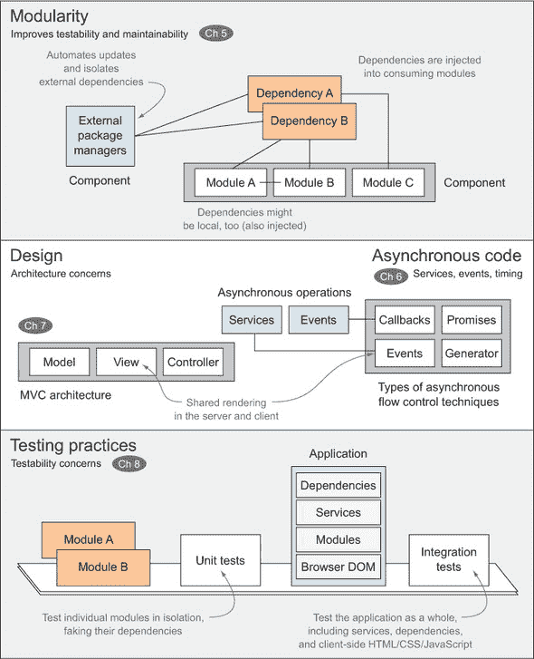

#### 模块化

您将学习如何将应用程序分解成组件，将这些组件分解成模块，然后编写简洁的函数，这些函数在模块内部具有单一目的。模块可以来自外部包，由第三方开发，您也可以自行开发它们。外部包应由包管理器处理，它代表您处理版本和更新，从而消除了手动下载依赖项（如 jQuery）的需要，并自动化了此过程。

如您将在第五章中学习到的，模块在代码中表明它们的依赖关系（它们所依赖的模块），而不是从全局命名空间中获取；这提高了自包含性。模块化系统将利用这些信息，能够解决所有这些依赖关系；它将让您免于维护长列表的`<script>`标签，以确保您的应用程序正确运行。

#### 设计

您将了解关注点分离以及如何通过遵循模型-视图-控制器模式来以分层方式设计您的应用程序，进一步加强您应用程序的模块化。我将在第七章中告诉您关于共享渲染的内容，这是一种在服务器端首先渲染视图的技术，然后让客户端为同一单页应用程序的后续请求进行视图渲染。

#### 异步代码

我将向您介绍不同类型的异步代码流技术，使用回调、Promise、生成器和事件，并帮助您驯服异步野兽。

#### 测试实践

在第五章中，我们讨论了关于模块化的一切，了解闭包和模块模式，讨论模块系统和包管理器，并尝试确定每个解决方案的优势。第六章深入探讨了 JavaScript 中的异步编程。你将学习如何避免编写一周后让你困惑的回调汤，然后你将了解 ES6 中即将到来的 Promise 模式和生成器 API。

第七章致力于模式和最佳实践，例如如何最佳地开发代码，jQuery 是否是你正确的选择，以及如何编写可以在客户端和服务器端使用的 JavaScript 代码。然后我们将探讨 Backbone MVC 框架。请记住，Backbone 是我将用来向你介绍 JavaScript 中 MVC 的工具，但绝不是你实现这一目标的唯一工具。

在第八章中，我们将讨论测试解决方案、自动化以及大量单元测试客户端 JavaScript 的实际示例。你将学习如何通过测试特定组件来在单元级别开发 JavaScript 测试，并通过测试整个应用程序来在集成级别开发测试。

本书以关于 REST API 设计的章节结束，讨论在前端消费 REST API 的含义，以及一个充分利用 REST 的建议结构。

#### 实际设计考虑因素

本书旨在让你思考在构建真实应用程序时做出的实际设计考虑，以及深思熟虑地决定最适合工作的最佳工具，同时关注你流程和应用程序本身的质量。当你开始构建一个应用程序时，你首先确定范围，选择技术堆栈，并组成一个最小可行构建过程。然后你开始构建应用程序，可能使用 MVC 架构，并在浏览器和服务器之间共享视图渲染引擎，这是我们将在第七章中讨论的内容。在第九章中，你将学习如何组装 API 的重要部分，并学习如何定义将被服务器端视图控制器和 REST API 使用的后端服务。

图 1.4 是典型“先构建”应用程序可能组织的概述。

##### 图 1.4\. 语境化架构考虑因素

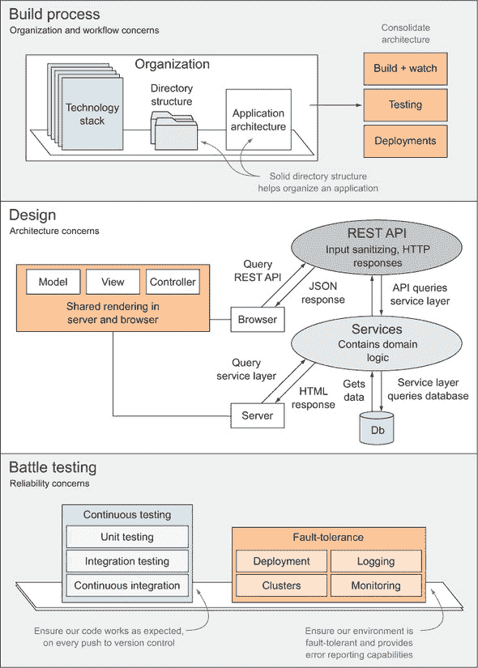

#### 构建过程

从左上角开始，图 1.4 概述了你可以如何通过决定如何组织代码库来开始构建一个构建过程，这有助于为你的架构提供一个起点。定义模块化应用程序架构是可维护代码库的关键，正如你在第五章中将会观察到的。然后，通过实施提供持续开发、集成和部署能力的自动化流程来巩固架构。

#### 设计和 REST API

设计应用程序本身，包括一个可以有效地提高可维护性的 REST API，只有通过识别具有明确目的的清晰组件，使它们正交（这意味着它们不会在特定关注点上争夺资源）。在第九章中，我们将探讨一种多级应用程序设计方法，这可以帮助你通过严格定义层以及这些层之间的通信路径，快速地将 Web 界面从你的数据和业务逻辑中隔离出来。

#### 战斗测试

一旦设计和构建了构建过程和架构，战斗测试就是你在可靠性问题上会全身心投入的地方。在这里，你将集成持续集成，其中测试在每次推送到你的版本控制系统时执行，甚至可能是持续部署，每天进行多次生产部署。最后，讨论了容错问题，如日志记录、监控和集群。这些内容在第四章中简要介绍，有助于使你的生产环境更加健壮，或者（在最坏的情况下）在事情出错时警告你。

在整个过程中，你将编写测试、调整构建过程，并微调代码。这将是一个极好的实验，让你测试“先构建”的理念。现在是时候让你感到舒适，并开始学习关于“先构建”哲学的具体内容了。

### 1.5\. 深入了解“先构建”

质量是“先构建”的基石，采取的每一项措施都是为了实现一个简单的目标：提高你代码及其周围结构的质量。在本节中，你将了解代码质量以及如何在命令行中设置代码质量工具 lint。衡量代码质量是编写结构良好应用程序的良好第一步。如果你尽早开始这样做，你的代码库将很容易符合一定的质量标准，这就是我们为什么从一开始就做这件事的原因。

在第二章中，一旦你了解了 lint，我将向你介绍 Grunt，这是你将在整本书中使用来组合和自动化构建过程的构建工具。使用 Grunt 允许你在构建过程中运行代码质量检查，这意味着你不会忘记它们。


**Grunt:达到目的的手段**

Grunt 在 第一部分 中被广泛使用，并在 第二部分 的某些部分中使用，以驱动我们的构建过程。我选择 Grunt 是因为它是一个流行的工具，易于教授，并且能满足大多数需求：

+   它完全支持 Windows 系统。

+   不需要太多的 JavaScript 知识，并且学习起来和运行起来都很简单。

需要理解的是，Grunt 只是一个达到目的的手段，一个能够让你轻松组合本书中描述的构建过程的工具。这并不意味着 Grunt 是完成这项工作的绝对最佳工具，为了使这一点清晰，我已经整理了 Grunt 与其他两个工具的比较：*npm，它是一个可以充当轻量级构建工具的包管理器，以及 *Gulp，一个以代码驱动的构建工具，它与 Grunt 有几个共同约定。

如果你对手动构建工具（如 Gulp）或使用 npm run 作为构建系统感兴趣，那么你应该阅读 附录 C 中关于选择自己的构建工具的主题，它涵盖了选择构建工具的内容。


Lint 是一个代码质量工具，非常适合保持解释程序（如用 JavaScript 编写的程序）的秩序。你不需要打开浏览器来检查代码是否有语法错误，你可以在命令行中执行 lint 程序。它可以告诉你代码中可能存在的问题，例如未声明的变量、缺少分号或语法错误。尽管如此，lint 并不是魔杖：它不会检测代码中的逻辑问题，它只会警告你关于语法和风格错误。

#### 1.5.1. 保持代码质量

Lint 可以用来确定给定的代码片段是否包含任何语法错误。它还强制执行一组 JavaScript 编码最佳实践规则，我们将在 第二部分 的开头，在 第五章 中介绍模块化和依赖关系管理时进行讨论。

大约 10 年前，Douglas Crockford 发布了 JSLint，这是一个严格的工具，可以检查代码并告诉我们代码中所有的小错误。Linting 的存在是为了帮助我们提高代码的整体质量。一个 lint 程序可以直接从命令行告诉你代码片段或文件列表中可能存在的问题，并且这个额外的优点是，你甚至不需要执行代码就能了解它的错误。这个过程在处理 JavaScript 代码时尤其有用，因为 lint 工具将充当某种编译器，确保你的代码在其知识范围内可以被 JavaScript 引擎解释。

在另一个层面上，linters（给 lint 程序起的名字）可以被配置为警告你关于过于复杂的代码，例如包含太多行的函数，可能使其他人困惑的复杂结构（例如 `with` 块、`new` 语句，或者在 JavaScript 中过于积极地使用 `this`），或者类似的代码风格检查。以下代码片段是一个例子（在线样本中列为 ch01/01_lint-sample）：

```
function compose_ticks_count (start) {
  start || start = 1;
  this.counter = start;
  return function (time) {
    ticks = +new Date;
    return ticks + '_'  + this.counter++
  }
}
```

在这个小片段中，有很多问题很容易看出，但它们可能并不那么容易发现。当通过 JSLint 分析时，你会得到预期和有趣的结果。它会抱怨你必须在使用变量之前声明它们，或者你遗漏了分号。根据你使用的 lint 工具，它可能会抱怨你对 `this` 关键词的使用。大多数 linters 也会抱怨你使用 `||` 而不是使用更易读的 `if` 语句的方式。你可以在网上 lint 这个样本.^([2]) 图 1.5 展示了 Crockford 工具的输出。

> ² 访问 [`jslint.com`](http://jslint.com) 以获取在线样本。这是 Crockford 维护的原始 JavaScript linter。

##### 图 1.5\. 代码片段中发现的 lint 错误。

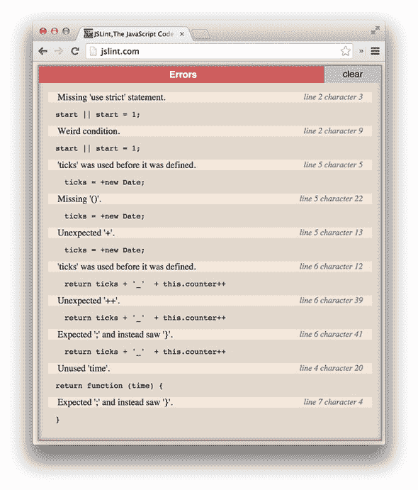

对于编译型语言，这些错误会在你尝试编译代码时被捕获，你不需要任何 lint 工具。然而，在 JavaScript 中，由于语言的动态性，没有编译器。这无疑是强大的，但与编译语言相比，更容易出错，编译语言甚至不允许你首先执行代码。

与编译不同，JavaScript 代码由像 V8（如 Google Chrome 中所见）或 SpiderMonkey（Mozilla Firefox 的引擎）这样的引擎进行解释。在其他引擎确实会编译 JavaScript 代码的情况下，最著名的是 V8 引擎，你无法从浏览器之外受益于它们的静态代码分析.^([3]) 动态语言如 JS 的一个明显缺点是，当你执行代码时，你无法确定代码是否真的能工作。虽然这是真的，但你可以使用 lint 工具极大地减少这种不确定性。此外，JSLint 建议我们避免某些编码风格实践，例如使用 `eval,` 留下未声明的变量，省略块语句中的大括号，等等。

> ³ 你可以在控制台中看到 Node.js，这是一个在 V8 上运行的 JavaScript 服务器端平台，但实际上，当 V8 检测到语法问题时，你的程序已经崩溃，那时就太晚了。无论如何，最好先进行 lint。

您是否在最后一段代码片段函数中发现了潜在的问题？请查看相关的代码示例(第一章, 01_lint-sample)以验证您的答案！提示：问题在于重复。修复后的版本也包含在源代码示例中；请确保查看所有这些好东西。


**理解本书附带源代码**

本书附带源代码中包含许多信息要点，包括一个经过调整的代码检查示例函数，该函数通过了代码检查，并进行了全面注释，以便您理解对其所做的更改。示例还进一步解释说，代码检查工具并非万无一失。

书中的其他代码示例包含类似的建议和信息要点，所以请务必查看它们！示例按章节组织，并按与书中相同的顺序出现。书中只简要讨论了一些示例，但所有相关的代码示例都进行了全面文档化，并准备好使用。

这种差异的原因在于，有时我想解释一个主题，但涉及到的代码可能太多，无法包含在书中。在这种情况下，我不想偏离问题的概念太远，但仍然希望您拥有这些代码。这样，您在阅读书籍时可以专注于学习，在浏览代码示例时可以专注于实验。


代码检查通常被称为在编写 JavaScript 时应该设置的第一项测试。当代码检查工具失败时，单元测试就派上用场了。这并不是说使用代码检查工具是不必要的，而是说仅仅进行代码检查是不够的！单元测试有助于确保您的代码按预期运行。单元测试在第八章中讨论，您将学习如何为第二部分中开发的代码编写测试，[第二部分]是专门用于编写模块化、可维护和可测试的 JavaScript 代码的。

接下来，您将从零开始构建一个构建过程。您将从设置一个用于检查代码的任务开始，然后从命令行运行它，类似于使用编译器时的过程；您将学会每次更改时都运行构建，并查看代码是否仍然“编译”通过代码检查器。第三章将教您如何让构建过程自动运行，这样您就不必重复这样做，但暂时这样做是可以的。

您如何在命令行中直接使用 JSLint 之类的代码检查工具？很高兴您提出了这个问题。

#### 1.5.2\. 命令行中的代码检查

将任务添加到构建过程的最常见方法之一是使用命令行执行该任务。如果您从命令行执行任务，那么将其集成到构建过程中会很容易。您将使用 JSHint^([4])来检查您的软件。

> ⁴ 关于 JSHint 的更多信息，请参阅 [`jshint.com`](http://jshint.com)。

JSHint 是一个命令行工具，用于检查 JavaScript 文件和代码片段。它是用 Node.js 编写的，Node.js 是一个用于使用 JavaScript 开发应用程序的平台。如果你需要 Node.js 基础知识的快速概述，请参阅附录 A，我在其中解释了模块是什么以及它们是如何工作的。如果你想要对 Node.js 进行更深入的分析，请参阅 Mike Cantelon 等人所著的《Node.js in Action》（Manning，2013）。了解这一点在下一章使用我们选择的构建工具 Grunt 时也将非常有用。


**Node.js 解释**

Node 是一个相对较新的平台，你现在可能已经听说过它了。它最初于 2009 年发布，遵循事件驱动和单线程模式，这转化为高性能的并发请求处理。在这方面，它与 Nginx 的设计相似，Nginx 是一个高度可扩展的多用途且非常流行的反向代理服务器，旨在提供静态内容并将其他请求管道传输到应用服务器（如 Node）。

考虑到 Node.js 主要是服务器端的 JavaScript（大部分情况下），它被赞扬为前端工程师特别容易采用。它还使得将前端从后端完全抽象出来成为可能，仅通过数据和 REST API 接口进行交互，例如你将在第九章中学习设计和构建的接口。

> ^a 关于从后端抽象前端的信息，请参阅 [`bevacqua.io/bf/node-frontend`](http://bevacqua.io/bf/node-frontend)。


##### Node.js 和 JSHint 安装

这里是安装 Node.js 和 JSHint 命令行界面（CLI）工具的步骤。附录 A 中还提供了替代的 Node.js 安装方法和故障排除信息。

> **1**.  按照图 1.6 所示，访问 [`nodejs.org`](http://nodejs.org)，并点击 INSTALL 按钮下载最新版本的 Node。
> 
> ##### 图 1.6\. [`nodejs.org`](http://nodejs.org) 网站
> ##### 
> 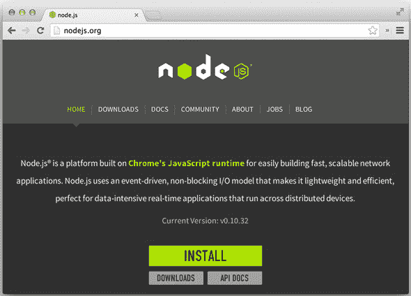
> 
> **2**.  执行下载的文件，并按照安装说明进行操作。

你将免费获得一个命令行工具 `npm`（Node 包管理器），因为它与 Node 一起捆绑。这个包管理器 `npm` 可以从你的终端用来安装、发布和管理你的 node 项目的模块。模块可以按项目安装，或者全局安装，这使得它们更容易在终端中直接访问。实际上，两者的区别在于全局安装的包被放在一个在 PATH 环境变量中的文件夹里，而那些不是的则被放在你执行命令时的同一文件夹中的 `node_modules` 文件夹里。为了保持项目自包含，本地安装总是首选。但在你希望系统范围内使用，如 JSHint 检查器这样的实用工具时，全局安装更为合适。`-g` 修饰符告诉 `npm` 全局安装 `jshint`。这样，你就可以在命令行上使用 `jshint`。

> **1**. 打开你喜欢的终端窗口并执行 `npm install -g jshint`，如图 1.7 所示。如果失败，你可能需要使用 `sudo` 获取提升的权限；例如，`sudo npm install -g jshint.`。
> 
> ##### 图 1.7\. 通过 npm 安装 jshint
> ##### 
> 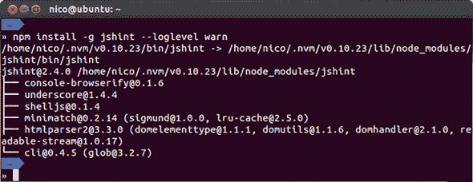
> 
> **2**. 运行 `jshint --version.` 应该会输出 `jshint` 程序的版本号，如图 1.8 所示。可能版本不同，因为活跃开发中的模块版本经常变化。
> 
> ##### 图 1.8\. 验证 `jshint` 在你的终端中是否工作
> ##### 
> 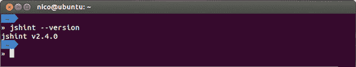

下一个部分将解释如何检查你的代码。

##### 检查你的代码

现在，你应该已经在你的系统上安装了 `jshint`，并在你的终端中可以访问，正如你已验证的那样。要使用 JSHint 检查你的代码，你可以使用 `cd` 命令切换到你的项目根目录，然后输入 `jshint .`（点号告诉 JSHint 检查当前文件夹中的所有文件）。如果操作耗时过长，你可能需要添加 `--exclude node_modules` 选项；这样你将只检查你自己的代码，并忽略通过 `npm install` 安装的第三方代码。

命令完成后，你会得到一个详细报告，指示你的代码状态。如果你的代码有任何问题，该工具将报告每个问题的预期结果和行号。然后它将以错误代码退出，允许你在检查失败时“中断构建”。每当构建任务未能产生预期的输出时，整个过程应该被终止。这带来了一系列好处，因为它防止了在出现问题时继续工作，拒绝完成构建直到你修复任何问题。图 1.9 展示了检查代码片段的结果。

##### 图 1.9\. 从终端使用 JSHint 检查

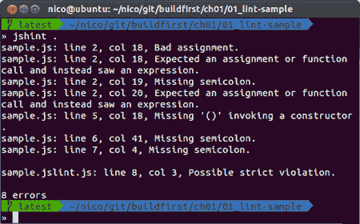

一旦 JSHint 设置完成，你可能会想就此结束，因为那似乎是你唯一要完成的任务；然而，如果你想要添加额外的构建任务，这样做并不会很好地扩展。你可能想在构建过程中包含一个单元测试步骤；这会变成一个问题，因为你现在至少需要运行两个命令：`jshint`和另一个执行测试的命令。这样扩展并不好。想象一下，记得使用`jshint`以及半打其他带有参数的命令。这将非常繁琐，难以记住，且容易出错。你不想损失五亿美元，对吧？

然后，你最好开始整理你的构建任务，因为即使你现在只有一个，很快你将会有十几个！编写构建过程有助于你从自动化的角度思考，并且它将通过避免重复步骤来帮助你节省时间。

每种语言都有自己的构建工具集，你可以使用。大多数语言都有一个突出的工具，其采用率远高于其他工具。当谈到 JavaScript 构建系统时，Grunt 是最受欢迎的工具之一，拥有数千个插件（帮助你完成构建任务）可供选择。如果你正在为另一种语言编写构建过程，你可能需要研究自己的。尽管本书中的构建任务是用 JavaScript 编写的并使用了 Grunt，但我描述的原则几乎适用于任何语言和构建工具。

翻到第二章，看看你如何可以将 JSHint 集成到 Grunt 中，作为你开始通过构建过程领域的实际操作之旅。

### 1.6. 摘要

本章作为概述，介绍了你在本书其余部分将要深入探讨的概念。以下是本章你所学到的重点内容：

+   现代 JavaScript 应用程序开发由于缺乏对设计和架构的关注而存在问题。

+   构建优先是一个能够实现自动化流程和维护性应用程序设计的解决方案，并鼓励你思考你正在构建的内容。

+   你学习了 lint，并通过 lint 运行代码，在不使用浏览器的情况下提高了其代码质量。

+   在第一部分中，你将了解所有关于构建过程、部署和环境配置的内容。你将使用 Grunt 来开发构建，并在附录 C 中了解你可以使用的其他工具。

+   第二部分致力于应用程序设计中的复杂性。模块化、异步代码流、应用程序和 API 设计以及可测试性都扮演着角色，它们在第二部分中汇集在一起。

你几乎还没有触及使用“构建优先”方法进行应用程序设计所能实现的一切！我们还有很多内容要覆盖！让我们转到第二章，在那里我们将讨论你在构建过程中可能需要执行的最常见任务，并使用 Grunt 进行实现示例。

## 第二章. 构建任务和流程的组成

*本章涵盖*

+   理解构建中应该发生什么

+   了解关键构建任务

+   使用 Grunt 运行关键任务

+   使用 Grunt 配置构建流程

+   创建你自己的 Grunt 任务

在上一章中，你快速了解了“先构建”方法的样子，并浏览了一个代码检查任务。在本章中，我们将讨论常见的构建任务和一些更高级的任务。我将揭示每个任务的使用案例和背后的原因，并探讨如何在 Grunt 中实现它们。学习理论可能听起来很枯燥，但如果你使用的是除了 Grunt 之外的任务运行器，那么这尤其重要，我相信你最终会这样做的。

Grunt 是一个配置驱动的构建工具，它可以帮助你轻松地设置复杂的任务——如果你知道你在做什么。使用 Grunt，你可以组合工作流程，例如我在第一章中描述的，这些工作流程可以调整以提高开发效率或优化发布。同样，Grunt 还有助于部署流程，你将在第四章中分析这些流程。

本章重点介绍构建任务，而不是试图教你关于 Grunt 的所有内容。只要你理解其目标背后的概念，你就可以学习使用新的工具，但如果你不理解这些基本概念，你就无法正确地学习使用其他工具。如果你想更深入地了解 Grunt 本身，请查看附录 B。阅读该附录对于理解本章内容并非至关重要；然而，它确实定义了你在第一部分中将要使用的 Grunt 功能。

我们将本章开始于对 Grunt 及其核心概念的快速介绍；然后你将在本章的剩余部分学习关于构建任务和使用一些不同的工具。我们将探讨预处理（按照 Manning MOS）任务，例如将代码编译成另一种语言，后处理（按照 Manning MOS）任务，例如资产压缩和图像精灵化，以及代码完整性任务，例如运行 JavaScript 单元测试和检查 CSS 代码。然后你将学习如何在 Grunt 中编写自己的构建任务，并查看一个编写自己的数据库模式更新任务案例研究，包括回滚！

让我们开始吧！

### 2.1. 介绍 Grunt

Grunt^([1]) 是一个任务运行器，它帮助你执行命令、运行 JavaScript 代码，并使用完全用 JavaScript 编写的配置来配置不同的任务。Grunt 从 Ant 中借用了其构建概念，并允许你使用 JavaScript 定义你的流程。

> ¹ 在 [`bevacqua.io/bf/grunt`](http://bevacqua.io/bf/grunt) 上了解更多关于 Grunt 的信息。你还应该查看附录 B。

图 2.1 从高层次上剖析了 Grunt，展示了如何配置它以及定义构建任务中的关键角色。

##### 图 2.1\. 一瞥 Grunt：任务和目标在配置中结合。

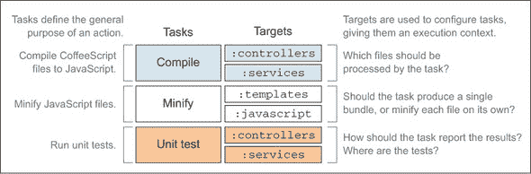

+   *任务*执行一个动作。

+   *目标*帮助定义任务的上下文。

+   *任务配置*允许你确定特定任务-目标组合的选项。

Grunt 任务在 JavaScript 中配置，大部分配置可以通过传递一个对象给`grunt.initConfig`方法来完成，描述受任务影响的文件，并传入一些选项来调整特定任务目标的行为了。

在单元测试任务的情况下，你可能只为本地开发运行几个测试，或者你可能在产品发布前执行所有测试。

图 2.2 展示了 JavaScript 代码中任务配置的样子，详细说明了`grunt.initConfig`方法和其约定。在列举文件时可以使用通配符，使用这些模式称为*globbing*；我们将在 2.2.2 节中详细探讨 globbing。

##### 图 2.2\. 代码中解释的 Grunt 任务配置。每个任务和任务目标都是单独配置的。

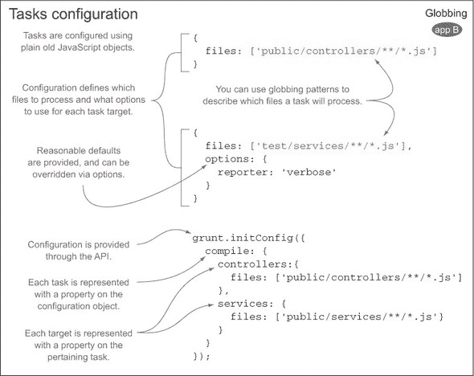

任务可以从*插件*中导入，这些插件是包含一个或多个 Grunt 任务的 Node 模块（设计良好且自包含的代码块）。你只需要确定要应用给它们的配置，然后就可以了；任务本身由插件处理。你将在本章中大量使用插件.^([2])

> ² 你可以在网上搜索 Grunt 插件，地址为[`gruntjs.com/plugins`](http://gruntjs.com/plugins)。

你也可以创建自己的任务，正如你将在 2.4 节和 2.5 节中调查的那样。Grunt 附带一个名为`grunt`的 CLI（命令行界面），它提供了一个简单的界面，可以直接从命令行执行构建任务。让我们来安装它。

#### 2.1.1\. 安装 Grunt

你应该已经从第一章中 JSHint 代码检查工具的安装中安装了`npm`，这是 Node 附带的包管理器。开始使用 Grunt 很简单。在你的终端中输入以下内容，它将为你安装`grunt`^([3]) CLI：

> ³ 在[`bevacqua.io/bf/grunt`](http://bevacqua.io/bf/grunt)了解更多关于 Grunt 的信息。

```
npm install -g grunt-cli
```

`-g`标志表示包应该全局安装；这让你可以在终端中执行`grunt`，无论当前工作目录是什么。

| |
| --- |

**查找配套的注释示例**

检查配套源代码中的完整工作示例。你可以在 ch02 目录下的 01_intro-to-grunt 文件夹中找到它。本章的其余示例也可以在 ch02 目录中找到。其中大部分包含代码注释，可以帮助你理解示例，如果你在理解示例上有困难的话。

| |
| --- |

你还需要采取一个额外的步骤，即创建一个 `package.json` 清单文件。这些文件描述 Node 项目。它们指明了项目依赖的包列表，以及诸如项目名称、版本、描述和主页等元数据。为了让 Grunt 在你的项目中工作，你需要将其添加为 `package.json` 中的开发依赖。它应该是一个开发依赖，因为你不会在其他任何地方使用 Grunt，除了你的本地开发环境。你可以创建一个包含以下 JSON 代码的最小 `package.json` 文件，并将其放置在你的项目根目录中：

```
{}
```

那就足够了。Node 包管理器 (npm) 可以将依赖项添加到你的 `package.json` 中，只要文件存在并且包含一个有效的 JSON 对象，即使它是一个空的 {} 对象。

##### 本地安装 Grunt

接下来，你需要安装 `grunt` 包。这次，`-g` 修饰符将不起作用，因为它需要是本地安装，而不是全局安装^([4))——这就是你创建 `package.json` 文件的原因。使用 `--save-dev` 修饰符来表示模块是一个开发依赖。

> ⁴ Grunt 要求你为 Grunt 包和任何任务插件进行本地安装。这确保了你的代码可以在不同的机器上工作，因为你不能在 package.json 清单中包含全局包。

命令看起来是这样的：`npm install --save-dev grunt`。在 `npm` 完成安装后，你的 `package.json` 清单将如下所示：

```
{
  "devDependencies": {
    "grunt": "~0.4.1"
  }
```

此外，Grunt 模块将被安装到你的项目内部的 `node_modules` 目录中。这个目录将包含你作为 Grunt 设置一部分使用的所有模块，并且它们也会在包清单中声明。

##### 创建 Gruntfile.js 文件

最后一步是创建一个 `Gruntfile.js` 文件。Grunt 使用此文件来加载任何可用的任务，并使用任何所需的参数来配置它们。以下代码显示了最小的 `Gruntfile.js` 模块：

```
module.exports = function (grunt) {
  grunt.registerTask('default', []); // register a default task alias
};
```

请注意关于这个看起来无辜的文件的一些事项。Grunt 文件是遵循 CommonJS 模块规范的 Node 模块^([5))，因此你每个文件中编写的代码不会立即对他人可用。本地的 `module` 对象是隐式对象，而不是像浏览器中的 `window` 这样的全局对象。当你导入其他模块时，你得到的是在 `module.exports` 中公开的接口。

> ⁵ 在 [`bevacqua.io/bf/commonjs`](http://bevacqua.io/bf/commonjs) 阅读 Common.JS 模块规范。


**Node 模块**

你可以在 附录 A 中了解更多关于 Common.JS 的信息，这是 Node.js 模块背后的规范，它涵盖了这些模块。它也将在 第五章 中讨论，当我们谈到模块化时。附录 B 扩展了 附录 A，以加强你对 Grunt 的理解。


在前面的代码片段中，`grunt.registerTask` 行告诉 Grunt 定义一个默认任务，当你在命令行中不带任何参数运行 `grunt` 时将执行此任务。数组指示一个任务别名，如果存在，将运行数组中命名的所有任务。例如，`['lint', 'build']` 将运行代码风格检查任务，然后运行构建任务。

在这个阶段运行 `grunt` 命令不会产生任何效果，因为你注册的唯一任务是一个空的任务别名。你肯定迫不及待地想要设置你的第一个 Grunt 任务，那么让我们开始吧。

#### 2.1.2\. 设置你的第一个 Grunt 任务

设置 Grunt 任务的第一个步骤是安装一个执行你所需功能的插件；然后你添加配置到代码中，你就可以运行任务了。

Grunt 插件通常以 `npm` 模块的形式分发，这是某人发布的 JavaScript 代码片段，以便你可以使用。我们将首先安装 JSHint 插件，这将允许你使用 Grunt 运行 JSHint。请注意，你在 第一章 中安装的 `jshint` CLI 工具在这里是完全不必要的；Grunt 插件包含了你运行任务所需的所有内容，无需 `jshint` CLI。以下命令将从 `npm` 注册表中获取 JSHint Grunt 插件，将其安装到 `node_modules` 目录，并将其添加到你的 `package.json` 文件中作为开发依赖项：

```
npm install --save-dev grunt-contrib-jshint
```

接下来，你需要调整你的 Gruntfile 文件，告诉 Grunt 对其自身进行代码风格检查，因为它是 JavaScript 代码。你还需要告诉它加载 JSHint 插件包，该包包含设置代码风格检查的任务，并更新你的 `default` 任务，这样你就可以在命令行中使用 `grunt` 对代码进行代码风格检查。以下列表（在代码示例中命名为 ch02/01_intro-to-grunt）展示了如何配置你的 Gruntfile。

##### 列表 2.1\. 示例 Gruntfile.js

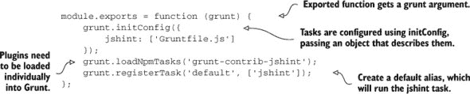

每当你安装一个包时，你都需要在 Gruntfile 中加载它，使用 `grunt.loadNpmTasks`，就像在 列表 2.1 中那样。它会加载包中的任务，以便你可以配置和执行它们。然后你需要配置这些任务，这可以通过将一个对象传递给 `grunt.initConfig` 来完成。你使用的每个任务插件都需要配置，我会在我们逐一介绍它们时教你如何配置每个插件。最后，我已经更新了 `default` 别名以运行 `jshint` 任务。默认别名定义了当 `grunt` 在没有任务参数的情况下执行时将执行哪些任务。以下是输出结果的截图。

##### 图 2.3\. 我们的第一个 Grunt 任务及其输出。我们的代码是经过代码风格检查的，这意味着它不包含任何语法错误。

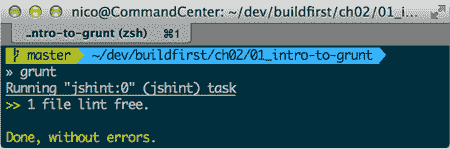

#### 2.1.3\. 使用 Grunt 管理构建过程

你几乎处于与第一章结束时的相同位置，当时你可以对你的 JavaScript 进行 lint 检查，只是你现在没有这样做。Grunt 将帮助你构建一个完整的构建过程，这是“先构建”哲学的核心。你可以相对轻松地专注于不同的任务，取决于你是为本地开发或诊断构建，还是构建人类最终将消费的最终产品。让我们检查一下构建任务中发现的几个属性。

你设置的 lint 任务将成为一个更强大的构建的基础，因为你在阅读本书的第一部分第一部分时扩展了你的理解。这个任务无意中展示了构建任务的一个基本属性：在绝大多数情况下，它们将是**幂等的**——任务的重复执行不应该产生不同的结果。在 lint 任务的情况下，这可能意味着每次都会得到相同的警告，只要你没有更改源代码。更常见的是，构建任务是一个或多个提供的输入文件的函数。幂等性属性，结合你不应该手动执行任何操作的事实，转化为更一致的结果。

##### 创建工作流程和持续开发

你构建中的任务旨在遵循一组明确定义的步骤以实现一个特定的目标，例如准备发布构建。正如第一章中提到的，这被称为工作流程。对于特定的工作流程，某些任务可能是可选的，而其他任务可能是关键的。例如，你没有优化图像的动机，所以在你的本地开发环境中，它们会变得更小。因为它不会带来任何明显的性能提升，所以在那种情况下跳过那个任务是完全可以接受的。无论你的工作流程是为开发还是发布而设计的，你可能都想确保留意 lint 任务的问题。

图 2.4 将帮助你理解构建过程中涉及的开发、发布和部署部分：它们如何相互关联，以及它们在组合不同的工作流程时如何结合在一起。

##### 图 2.4\. 构建和部署流程中的关注点分离

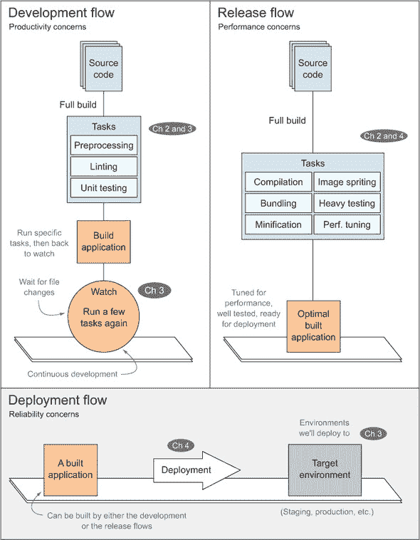

##### 开发流程

只需看一眼图的最上面一行，你就可以看到生产力和监视更改是开发流程的关键方面，而在发布流程中，它们是完全不必要的，甚至可能是一个障碍。你也可能注意到，这两个流程都会产生一个构建的应用程序，尽管在开发过程中构建的应用程序是为了持续开发，我们将在第三章中深入探讨。

##### 发布流程

在发布流程中，我们关注性能优化和构建一个经过良好测试的应用程序。在这里，我们将运行一个略微修改后的开发流程，其中减少应用程序的字节大小是首要任务。

##### 部署流程

部署流程根本不构建应用程序。相反，它重用了在其他两个流程中准备好的构建分发，并将其交付到托管环境中。你将在第四章中了解有关部署流程的所有内容。

任何合理的构建流程都需要在每一步都实现自动化；否则，你将无法达到提高生产力和减少错误倾向的目标。在开发过程中，你应该在文本编辑器和浏览器之间切换，而无需自己执行构建。这被称为*持续开发*，因为进入外壳并输入一些命令来编译应用程序所带来的摩擦被消除了。你将在第三章中学习如何使用文件监视和其他机制来完成这项任务。部署应用程序应该与构建流程分开，但也应该实现自动化；这使你能够一步构建和部署应用程序。同样，提供应用程序服务也应该严格与构建过程分开。

在下一节中，我们将深入探讨使用 Grunt 的构建任务。具体来说，我们将从预处理任务开始，例如将 LESS（一种可以编译为 CSS 的语言）转换为 CSS，以及后处理任务，如捆绑和压缩，这些任务有助于你优化和微调以发布。

### 2.2. 预处理和静态资产优化

每当我们谈论构建一个 Web 应用程序时，我们都需要谈论预处理。通常，你会发现自己在使用互联网浏览器原生不支持的语言，因为它们通过提供普通 CSS（如供应商前缀）、HTML 或 JavaScript 所不具备的功能，帮助你绕开重复性工作。

这里的目的不是让你学习 LESS，一个在下一节中引入的 CSS 预处理器，甚至也不是学习 CSS。有很好的资源专门教授这些。目的是让你意识到使用预处理语言的明显好处。预处理并不只是关于 CSS。*预处理器*帮助将一种语言中的源代码转换为各种目标语言。例如，更强大和更具表现力的 LESS 语言可以在构建时转换为原生 CSS。使用预处理器的理由可能各不相同，但它们可以归类为提高生产力、减少重复或拥有更愉悦的语法。

*后处理*任务，如压缩和打包，主要是为了优化构建以供发布，但它们与预处理紧密相关，以至于它们都属于同一个话题。我们将讨论预处理，使用 LESS，然后我们将涉猎 globbing，这是在 Grunt 中使用的文件路径模式匹配机制，在我们继续到打包和压缩之前，这将调整你的应用程序的性能，以便适合人类消费。

到本节结束时，你将更清楚地了解如何使用不同的、更合适的语言对资产进行预处理，以及如何进行后处理，以提高性能，使人类体验更加顺畅。

#### 2.2.1\. 讨论预处理

在当今的 Web 开发中，语言预处理器相当普遍。除非你过去十年一直住在山洞里，否则你可能明白预处理器可以帮助你编写更干净的代码，就像你在第一章中第一次学习 lint 时那样，但需要额外的工作才能变得有用。简单来说，当你用一种翻译成另一种语言的编程语言编写代码时，*预处理*就是翻译步骤。

你可能出于几个原因不想用目标语言编写代码：可能是因为它太重复了，太容易出错，或者你只是不喜欢那种语言。这就是这些高级语言发挥作用的地方，它们调整以保持你的代码简洁简单。然而，在高级语言中编写代码是有代价的：浏览器不理解它们。因此，你将在前端开发中遇到的最常见的构建任务之一就是将代码编译成浏览器能理解的东西，即 JavaScript 和 CSS 样式。

有时，预处理器也会比 Web 的“原生”语言（HTML、CSS 和 JavaScript）提供实际的好处。例如，几个 CSS 预处理器提供了必要的工具，这样你就不需要针对每个浏览器。通过消除这些浏览器不一致性，预处理语言提高了你的生产力，并使你的工作不那么繁琐。

##### 少即是多

以 LESS 为例。LESS 是一种强大的语言，它允许你使用遵循 DRY（不要重复自己）原则的应用程序设计变体来编写代码，因为它可以帮助你编写更少的重复代码。在纯 CSS 中，你经常会一遍又一遍地重复自己，为所有不同的供应商前缀编写相同的值，以最大化你想要应用的风格规则的浏览器支持。

为了说明这一点，以`border-radius` CSS 属性为例，每当你要为具有圆角边框的元素设置样式时都会使用它。以下是如何使用纯 CSS 编写它们的示例。

##### 列表 2.2\. 纯 CSS 中的圆角边框

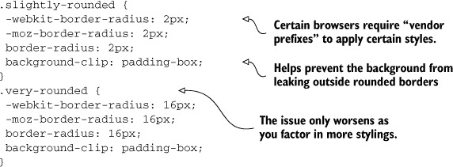

对于一次性规则来说可能还可以，但对于像 `border-radius` 这样的属性，编写这样的纯 CSS 很快就会变得不可接受，因为这种情况太常见了。LESS 允许你以更易于编写、阅读和维护的方式编码。在这个用例中，你可以设置一个 `.border-radius` 可重用函数，代码可能如下所示。

##### 列表 2.3\. 使用 LESS 实现圆角边框

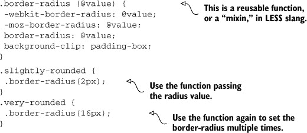

LESS 和类似工具通过允许你重用 CSS 代码片段来提高你的生产力。

##### LESS 的 DRY 比更多的 WET 更好

一旦你需要在一个以上的地方使用 `border-radius` 属性，你将享受到不重复编写一切（WET）的好处。通过遵循 DRY 原则，你避免了每次需要指定边框时都列出所有四个属性。相反，你可以通过重用 `.border-radius` LESS 混合来声明边框。

预处理在精益开发工作流程中扮演着关键角色：现在你不需要在每个你想使用此规则的地方使用所有供应商前缀，你可以在一个地方更新前缀，使你的代码更易于维护。如果你想干净地分离静态规则和影响它们的变量，LESS 使你可以更进一步。没有 LESS，一个典型的 CSS 设计样式表摘录可能看起来像以下代码：

```
a {
 background-color: #FFC;
}
blockquote {
 background-color: #333;
 color: #FFC;
}
```

LESS 允许你使用变量，这样你就不必在各个地方复制粘贴颜色。适当地命名这些变量也有助于你通过扫描样式表轻松地识别颜色。

##### 使用 LESS 变量

使用 LESS，你可以为颜色设置变量，避免潜在的错误，例如在一个地方更新颜色但忘记更新其他出现的地方。这也使你可以将颜色和其他设计变量元素放在一起。以下代码展示了使用 LESS 可能的样子：

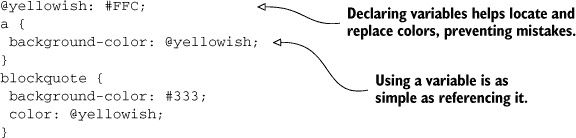

这样你可以保持你的代码 DRY，正如我在 第 2.2 节 开头提到的。遵循“不要重复自己”的原则在这里特别有用，因为它可以避免复制粘贴颜色代码，并节省你因误输入而可能遇到的麻烦。此外，像 LESS（SASS、Stylus 等语言）这样的语言提供了推导其他颜色的函数，例如更深的绿色、更透明的白色以及其他有趣的颜色数学。

现在，让我们将注意力转向在 Grunt 任务中将 LESS 代码编译成 CSS。

#### 2.2.2\. 执行 LESS

如我们在本章前面讨论的，Grunt 任务由两个不同的组件组成——任务和配置：

+   *任务* 本身是最重要的单个组件：这是当你运行构建时 Grunt 将要执行代码，通常你可以找到一个插件来完成你需要的功能。

+   *配置* 是你可以传递给 `grunt.initConfig` 的一个对象。几乎每个 Grunt 任务都需要配置。

随着你继续阅读本章的其余部分，你将看到如何设置每种情况下的配置。为了使用 Grunt 编译 LESS 文件以便直接提供 CSS，你将使用`grunt-contrib-less`包。还记得你安装 JSHint 插件的时候吗？这里也是同样的情况！只是包名改变了，因为你现在将使用不同的插件。要安装它，请在你的终端中运行以下命令：

```
npm install grunt-contrib-less --save-dev
```

此插件提供了一个名为`less`的任务，你可以在`Gruntfile.js`中这样加载它：

```
grunt.loadNpmTasks('grunt-contrib-less');
```

从现在起，为了简洁，我将在示例中省略`npm install`和`grunt.loadNpmTasks`部分。你仍然需要运行`npm install`来获取包并加载你的 Gruntfile 中的插件！无论如何，你可以在配套的源代码文件中找到每种情况的完整示例。

设置构建任务很简单：你指定输出文件名并提供用于生成 CSS 文件的源路径。此示例可以在代码示例的 ch02/02_less-task 中找到。

```
grunt.initConfig({
 less: {
   compile: {
     files: {
       'build/css/compiled.css': 'public/css/layout.less'
     }
   }
 }
});
```

执行任务的最后一部分是从命令行调用`grunt`。在这种情况下，你的终端中的`grunt less`应该可以解决问题。明确声明目标通常推荐。在这种情况下，你可以通过键入`grunt less:compile`来实现。如果不提供目标名称，则所有目标都会执行。


**Grunt 配置的一致性**

在我们继续之前，我想提到使用 Grunt 时你会喜欢的一个小优点。任务配置模式在任务之间跳跃时变化不大，尤其是在使用 Grunt 团队本身支持的任务时。即使在`npm`上找到的，它们在配置方面也相当一致。正如你将在本章中了解到的那样，我将向你展示的不同任务配置方式相似，即使它们以灵活的方式提供了广泛的操作。


在 Grunt 中运行`less:compile`构建目标现在会将`layout.less`编译成`compiled.css`。你也可以声明一个输入文件数组，而不仅仅使用一个。这将生成一个捆绑文件，其中将包含所有 LESS 输入文件的 CSS。我们稍后会详细介绍捆绑；请耐心等待。以下列表是一个示例。

##### 列表 2.4\. 声明一个输入文件数组

```
grunt.initConfig({
  less: {
    compile: {
      files: {
        'build/css/compiled.css': [
          'public/css/layout.less',
          'public/css/components.less',
          'public/css/views/foo.less',
          'public/css/views/bar.less'
        ]
      }
    }
  }
});
```

单独列出每个文件是可以的，但你也可以使用一种称为 globbing 的模式语言，避免列举数百个文件，正如我接下来要解释的。

##### 掌握 globbing 模式

你可以通过使用 Grunt 的 globbing 功能进一步改进前面代码中的配置，这是一个叫做 globbing 的额外好处。*Globbing*^([6])是一种文件路径匹配机制，它将帮助你使用文件路径模式包含或排除文件。它特别有用，因为你不必维护你的资产文件夹中所有文件的列表，这有助于你避免常见的错误，例如忘记将新的样式表添加到列表中。

> ⁶ Grunt 网站有关于 Globbing 如何工作的宝贵见解。访问 [`bevacqua.io/bf/globbing`](http://bevacqua.io/bf/globbing)。

如果你想从构建任务中排除单个文件，例如第三方提供的文件，Globbing 可能会很有用。以下代码展示了你可能发现有用的几个 Globbing 模式：

```
[
 'public/*.less',
 'public/**/*.less',
 '!public/vendor/**/*.less'
]
```

注意以下关于前面代码的内容：

+   第一个模式将匹配 `public` 文件夹中任何具有 LESS 扩展名的文件。

+   第二个模式做的是同样的事情，只不过它通过特殊的 `**` 模式匹配 `public` 的任何嵌套级别的子文件夹中的文件。

+   如你所猜，最后一个模式与第二个模式的工作方式相同，只不过开头的 `!` 表示匹配的文件应该从结果中排除。

Globbing 模式按照它们呈现的顺序工作，并且可以与常规文件路径混合使用。Globbing 模式将产生包含所有匹配文件路径的数组。

考虑到 Globbing 模式，我们的最新 `less:compile` 配置可能需要进一步重构，成为一个简化的版本：

```
grunt.initConfig({
  less: {
    compile: {
      files: {
        'build/css/compiled.css': 'public/css/**/*.less'
      }
    }
  }
});
```

在继续之前，让我提醒你，在这个特定的情况下，`less` 是构建任务，`compile` 是该任务的构建目标，它提供了针对该目标的特定配置。你可以通过向 `less` 对象添加其他属性，像你在 `compile` 任务目标配置中传递给 `initConfig` 一样，轻松地为 `less` 任务提供不同的目标。例如，你可以有一个 `compile_mobile` 目标，它将为移动设备创建 CSS 资产，以及一个 `compile_desktop` 目标，它将为桌面浏览器编译资产。

应该注意的是，作为使用此任务编译 LESS 的副作用，你的 CSS 将被捆绑到一个单独的文件中，无论源代码中使用了多少个文件。因此，现在让我们来看看资产捆绑，这是一个后处理任务，可以帮助你通过减少对网站的 HTTP 请求量来提高网站的性能。

#### 2.2.3. 静态资产捆绑

我已经暗示了捆绑能完成什么，你可能在开始这次有启发性的冒险之前就已经听说过它。如果你之前从未听说过捆绑，那也没有关系；这是一个容易理解的概念。

*资产捆绑* 是在将内容交给客户之前将其全部组合在一起的一个时髦名称。这就像去商店买一个单独的杂货项目和回家，然后再次回到商店去清单上的另一个项目，一次又一次地回到商店，而是一次去商店并一次性购买所有杂货。

在单个 HTTP 响应中发送所有内容可以减少事务性网络成本，并使每个人都受益。负载可能会变得更大，但它可以节省客户端许多不必要的网络往返到您的服务器，这会产生相关的网络成本，例如延迟、TCP 和 TLS 握手等。如果您想了解更多关于底层互联网协议（TCP、TLS、UDP、HTTP 等）的信息，我强烈推荐 Ilya Grigorik 的《高性能浏览器网络》（O’Reilly Media，2013 年）。

换句话说，资产捆绑实际上是将每个文件附加到前一个文件的末尾。通过这种方式，您可以将所有 CSS 或所有 JavaScript 捆绑在一起。更少的 HTTP 请求带来更好的性能，这就是为什么静态资产捆绑构建步骤值得考虑的原因。图 2.5 考察了使用捆绑和不使用捆绑的网站与人类交互，以及它们如何影响网络连接。

##### 图 2.5. 使用资产捆绑减少 HTTP 请求的数量

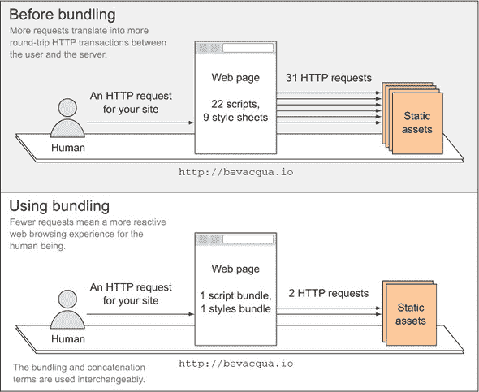

如图中所示，在捆绑之前，浏览器必须发出更多的 HTTP 请求来获取网站资源，而捆绑之后，只需一个请求就足以获取每个捆绑包（包含构成您应用程序逻辑的许多不同文件）。

许多预处理器都包括将您的资产捆绑到单个文件中的选项，您在`less:compile`的演示中已经体验过这一点，当时您将许多资产捆绑到一个文件中。

##### 野外的捆绑

使用`grunt-contrib-concat`包，您可以轻松设置构建目标，使用我之前描述的全局模式组合任意数量的文件，并且以一种您可能已经熟悉的方式。在整个书中，术语连接和捆绑是互换使用的。以下列表（在配套代码示例中列为 ch02/03_bundle-task）描述了如何配置`concat`任务。

##### 列表 2.5. 配置连接任务

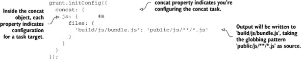

毫不奇怪，`concat:js`任务将`public/js`文件夹（及其子文件夹，递归）中的所有文件捆绑在一起，并将结果写入`build/js/bundle.js`，如指示。从一项任务到另一项任务的过渡如此自然，有时您甚至不会相信它是多么容易。

在构建过程中处理静态资产时，还有一点需要注意，那就是压缩。让我们继续讨论这个话题。

#### 2.2.4. 静态资产压缩

*最小化*类似于连接，因为它最终试图减轻网络连接的负担，但它采用了一种不同的方法。而不是将所有文件混合在一起，最小化包括删除空白、缩短变量名以及优化代码的语法树，以生成一个文件，虽然功能上与您所写的内容等效，但文件大小将显著减小，代价是几乎无法阅读。这种缩小是为了满足您提高性能的目标，如图 2.6 中所述。

##### 图 2.6\. 使用资产最小化减少 HTTP 响应长度

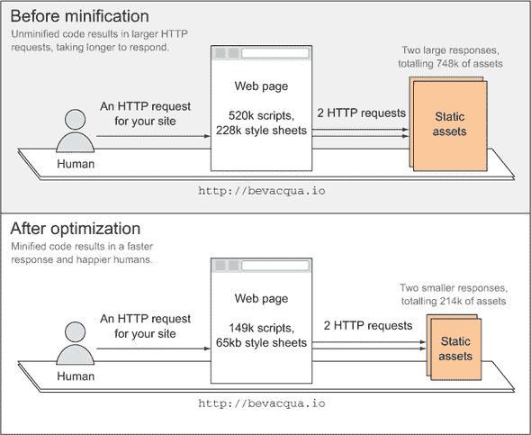

如图中所示，您静态资源的最小化版本要小得多，从而实现更快的下载。当与您选择的服务器端平台上的 GZip^([7])压缩结合使用时，最小化包的大小将大大小于源代码。

> ⁷ 访问[`bevacqua.io/bf/gzip`](http://bevacqua.io/bf/gzip)获取有关在您最喜欢的后端服务器上启用 GZip 压缩的更多信息。

混淆的副作用可能会让您觉得它“足够安全”，以至于您可以将其中的任何内容放入 JavaScript 代码中，因为这将使其更难阅读，但无论您如何混淆客户端代码；如果他们足够努力，人们总是可以解码您在其中所做的操作。相应的，永远不要信任客户端，而是将敏感代码放在您的后端。

打包可以与最小化结合使用，因为它们是完全*正交的*（这意味着它们不会相互冲突）。一个将文件组合在一起，另一个减少每个文件的占用空间，但这两个任务配合得很好，因为它们在功能上不重叠。

打包和最小化可以按任意顺序执行，结果将大致相同：一个适合发布的单个压缩文件，几乎对您的开发工作没有帮助。虽然最小化和打包对于您面向人类的应用程序无疑很重要，但它们会妨碍我们在日常开发流程中追求的富有成效的持续开发方法，因为它们会使调试变得更加困难。这就是为什么在您的构建过程中将这些任务明确分离出来很重要，这样您就可以在适当的环境中执行它们，而不会阻碍您的开发效率。

##### 查看资产最小化示例

让我们来看一个资产最小化示例（在示例中标记为 ch02/04_minify-task），然后您可以为真实的人类提供服务。存在许多资产最小化选项。在您的示例中，您将使用`grunt-contrib-uglify`包来最小化 JavaScript 文件。在从 npm 安装并加载插件后，您可以按照以下列表进行设置。

##### 列表 2.6\. 资产最小化配置

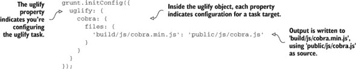

这种设置将帮助压缩`cobra.js`，执行`grunt uglify:cobra`。如果你想要压缩之前步骤中打包的内容，进一步提高应用程序的性能怎么办？这涉及到取列表 2.6 中创建的连接文件并进行压缩，如下所示（在示例中标记为 ch02/05_bundle-then-minify）。

##### 列表 2.7\. 打包后的资产压缩

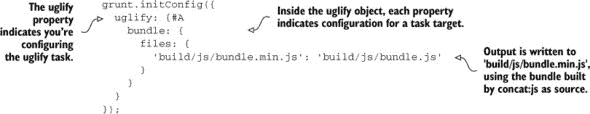

将这两个步骤结合起来，就是按顺序运行这两个任务。为此，你可能需要使用`grunt`命令`grunt concat:js uglify:bundle`，但这也可能是一个引入任务别名的理想场景。

*任务别名*是一组任何数量的任务，这些任务通常作为同一步骤的一部分执行，并且彼此相关。别名中的任务最好相互依赖，以产生更有意义的输出，这样会使它们更容易跟踪和更具语义性。任务别名也非常适合声明工作流程。

在 Grunt 中，你可以轻松地在单行中设置任务别名，如下所示。你还可以提供一个可选的描述参数；当执行`grunt –-help`时，这将显示出来，但它主要用于描述为什么创建了这个别名，对于浏览你代码的开发者来说很有帮助：

```
grunt.registerTask('js', 'Concatenate and minify static JavaScript assets',
     ['concat:js', 'uglify:bundle']);
```

现在，你可以将`assets`视为任何其他 Grunt 任务，并且运行`grunt assets`将执行连接和压缩操作。

我有一个额外的任务，你可以在构建静态资产时实现，以改善应用程序的性能。这与打包类似，但它涵盖了图像。这个操作的结果是精灵图，这是一个比压缩或连接更早的概念。

#### 2.2.5\. 实现图像精灵

*精灵图*是通过获取许多图像并构建一个包含所有这些图像的大文件来实现的。你不需要为每个单独的文件引用，而是使用`background-position`、`width`和`height` CSS 属性来选择你想要的精灵图中的图像。将图像精灵想象成是针对图像的资产打包。

精灵图是一种技术在多年前起源于游戏开发，至今仍在使用。许多图形被压缩到单个图像中，显著提高了游戏性能。在网页领域，精灵图对于图标或任何类型的小图像最有用。

自己维护精灵图和相关的 CSS 是一项工作。尤其是如果你是在剪切和粘贴，保持图标和精灵图同步是繁琐的。这就是 Grunt 作为闪耀的骑士，准备拯救世界的时刻。在设置图像精灵时，`npm`为你提供了开始自动化 CSS 精灵图生成过程的选项。为了这个自包含的示例，我将参考`grunt-spritesmith` Grunt 插件。如果你在安装插件时遇到问题，请参考代码示例进行故障排除。其配置类似于你已经习惯的配置：

```
grunt.initConfig({
  sprite: {
    icons: {
      src: 'public/img/icons/*.png',
      destImg: 'build/img/icons.png',
      destCSS: 'build/css/icons.css'
    }
  }
});
```

到现在为止，你可以安全地假设`src`属性可以接受任何类型的通配符模式。`destImg`和`destCSS`属性将映射到精灵图将生成的文件，以及用于在 HTML 中渲染精灵图像的 CSS 文件。一旦你有了 CSS 和新建的精灵图，你只需通过创建 HTML 元素并将不同的精灵 CSS 类分配给这些元素，就可以简单地给你的网站添加图标。CSS 用于“裁剪”图像的不同部分，有效地只取用于所需图标的图像相关部分。


**网络上的感知性能**

我无法强调资产打包、最小化和甚至精灵化在发布构建中扮演的重要角色。在当今的 Web 应用中，图像通常占据了大部分的文件大小。使用这些技术减少对服务器的请求次数，可以立即提供性能提升，而不需要更昂贵的硬件。通过最小化和/或压缩响应内容，减少其字节大小也可以达到类似的效果。


##### 速度很重要

速度是网络的基本、决定性因素。响应性，或者至少是*感知到的*响应性，对用户体验（UX）有着巨大的影响。感知到的响应性现在比以往任何时候都更重要；这是用户感知到的速度，尽管技术上可能需要更长的时间来满足请求。只要你对他们的操作显示即时的反馈，用户就会感知到你的应用程序“更快”。这就是你每天在 Facebook 或 Twitter 上看到的情况，当你提交一条新帖子时，它立即被添加到列表中，尽管其数据仍在发送到他们的服务器。

许多实验已经证明了提供快速可靠服务的重要性。特别是由谷歌和亚马逊分别进行的两个实验。

在 2006 年，玛丽莎·梅耶（Marissa Mayer）是谷歌的用户体验副总裁。她在收集了一组用户反馈后进行了一项实验，这些用户希望在他们的搜索结果中看到更多结果。实验将每页搜索结果的数量增加到 30 个。每页结果数量增加的实验组的客户流量和收入下降了 20%。

马里萨解释说，他们发现了一个未受控制的变量。包含 10 个结果页面生成耗时 0.4 秒。包含 30 个结果页面生成耗时 0.9 秒。半秒的延迟导致了 20%的流量下降。半秒的延迟摧毁了用户满意度.^([8])

> ⁸ 你可以在这里找到关于这个主题的详细文章：[`bevacqua.io/bf/speed-matters`](http://bevacqua.io/bf/speed-matters)。

亚马逊进行了一个类似的实验，在拆分测试中故意逐渐延迟他们网站的响应速度。即使是微小的延迟也会导致销售额的显著下降。

##### 判断感知响应速度与实际速度

在光谱的另一端，我们遇到了感知速度。通过向用户交互提供即时反馈（仿佛动作已经成功），即使任务本身可能需要几秒钟来处理，你也可以提高感知速度。这种快进方式总是受到人类的欢迎。

现在我们已经讨论了加快网络访问您资产的速度，以及与编译这些资产相关的构建任务，以及不同方法和技术的性能影响，让我们放慢脚步，开始谈谈代码质量。到目前为止，我们只稍微关注了您代码的质量，所以让我们转向您应该执行的那种任务。您对预处理和后处理任务有很好的了解，知道它们是如何工作的，以及如何应用它们。

我们首先在第一章第一章中讨论了代码质量，当时您将代码检查集成到构建中。如果您想保留幂等性属性，清理自己的工作很重要。同样，检查代码和运行测试对于保持您的代码质量标准至关重要。

现在，让我们深入一点，了解如何更好地将这些任务集成到实际的构建过程中。

### 2.3. 设置代码完整性

在考虑代码完整性时，请记住几个任务：

+   首先，我们应该谈论的是清理自己的工作。每当我们的构建开始时，它们应该清理它们生成的构建工件。这有助于我们实现幂等性，即多次执行构建总是产生相同的结果。

+   我们将再次讨论代码检查，补充我们在第一章末尾所探讨的内容，确保我们在运行构建时代码不包含任何语法错误。

+   我们将简要讨论设置测试运行器，以便您可以自动化代码测试，我们将在未来的章节中介绍。

#### 2.3.1. 清理工作目录

在您完成构建后，您的**工作目录**通常会处于脏状态，因为您将生成不属于源代码的内容。您想要确保每次运行构建时工作目录始终处于相同的状态，以便每次都能得到相同的结果。为了确保这一点，通常在运行任何其他任务之前清理生成文件是一个很好的做法。


##### 工作目录

工作目录是开发期间代码库根目录的时髦说法。通常最好使用子目录来聚合构建的编译结果，例如名为`build`的目录。这有助于您将源代码与构建工件保持干净分离。


在您的发布完成后，您的服务器将使用构建的结果，您不应该通过执行另一个发布之外的方式更改其输出。在部署完成后运行构建任务会像手动执行这些任务一样糟糕，因为您会重新引入人为因素。一般来说，如果某件事感觉不够干净，那么它可能还不够干净，应该进行修改。


**隔离构建输出**

当我们谈论代码完整性时，我认为强调您可能已经从我所展示的示例中注意到的某事很重要。我强烈建议您遵循严格分离构建生成内容与源代码的做法。将生成内容放在`build`目录中就足够了。好处包括能够毫不犹豫地删除生成内容，能够轻松地使用 globbing 模式忽略文件夹，在一个地方浏览生成内容，也许更重要的是，确保您不会意外删除源代码。


生成内容但每次运行时都会清理现有构建工件的任务是乐意于幂等的：无限次运行它们不会影响其行为；结果始终相同。清理步骤是构建任务成为幂等的必要属性，赋予它们始终产生相同输出的一致性。话虽如此，让我们看看清理任务配置在 Grunt 中可能是什么样子。您将使用`grunt-contrib-clean`包，它提供了一个您可以使用`clean`任务。这个任务（在示例中可用为 ch02/07_clean-task）是尽可能简单的：您提供目标名称，然后您可以使用 globbing 模式删除您指定的特定文件或整个文件夹。以下代码是一个示例：

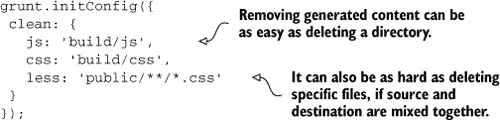

前两个例子`build/js`和`build/css`展示了如何简单地将生成内容挑选出来并移除，只要它明显与源代码分开。另一方面，第三个例子展示了当源代码与构建生成的内容位于同一目录时，情况会变得多么混乱。此外，如果你将生成内容隔离到一个文件夹中，那么你可以更方便地将其从版本控制系统排除。

#### 2.3.2\. 代码检查，代码检查，代码检查！

我们已经在上一章中讨论了代码检查的好处，但让我们再次看看你的代码检查任务的配置。记住你在这里使用的是`grunt-contrib-jshint`包。你可以按照以下代码（示例 ch02/08_lint-task）进行配置：

```
grunt.initConfig({
 jshint: {
   client: [
     'public/js/**/*.js',
     '!public/js/vendor'
   ]
 }
});
```

考虑第三方（别人的）代码时，重要的是要将其视为我们努力范围之外的内容。你不会对第三方代码进行单元测试。同样，检查他们的代码也不是你的工作。如果你没有将生成的内容放在单独的文件夹中，你还需要从你的 JSHint 配置文件中排除它。这就是严格将构建工件与一般大众（你的源文件）分开的另一个好处。

代码检查通常被认为是维护 JavaScript 代码质量合理水平的第一道防线。你应该仍然在代码检查的基础上编写单元测试，原因我将在下面解释，而且，你猜对了，有一个任务就是为了这个。

#### 2.3.3\. 自动化单元测试

在构建过程中自动化的最重要步骤之一是单元测试。单元测试确保你的代码库中的各个组件按预期工作。开发一个经过良好测试的应用程序的流行流程如下：

+   为你想要实现（或更改）的东西编写测试。

+   运行这些测试并观察它们失败。

+   实现你的代码更改。

+   再次运行测试。

如果测试失败，继续编码直到所有测试通过，最后再回头编写新的测试。这个过程被称为*测试驱动开发*（TDD）。我们将在第八章中更深入地探讨单元测试。这是一个值得更专门讨论的话题，因此我们将推迟关于设置 Grunt 任务以运行单元测试的讨论。

目前的主要经验教训是单元测试必须自动化。不经常运行的测试几乎毫无用处，因此构建过程应该在部署之前以及在你本地构建期间触发它们。考虑到这一点，你也会希望你的单元测试尽可能快地运行，以免影响构建的性能。一个常见的原则是“尽早测试；经常测试”。

| |
| --- |

##### 备注

我们迄今为止看到的不同包只暴露了一个你可以使用的 Grunt 任务，但这并不是 Grunt 本身强加的限制。你可以根据需要将尽可能多的自定义任务包含在你的包中。这通常是由包作者有意为之。npm 包通常在设计上是模块化的，因为它们被设计成只做一件事，而且做得非常好。

| |
| --- |

你在本章的大部分时间里都在学习如何使用其他人编写的构建任务。现在让我们转向编写自己的构建任务，这在当你找到的现有任务插件在 `npm` 上不能满足你的需求时非常有用。

### 2.4\. 编写你的第一个构建任务

尽管 Grunt 有一个活跃的社区，提供了许多高质量的 npm 模块，但你肯定需要编写自己的任务。让我们通过一个示例来了解这个过程。我们已经介绍了从 npm 加载的任务和设置任务别名。创建任务最简单的方法是使用 `grunt.registerTask` 方法。实际上，这正是我们在查看压缩时在 2.2.4 节中注册别名时使用的方法，但此时你将传递一个函数而不是任务列表。

以下列表（可在 samples 中的 ch02/09_timestamp-task 找到）展示了如何创建一个简单的构建任务，该任务创建一个带有时间戳的文件，你可以在应用程序的其他地方将其用作唯一标识符。

##### 列表 2.8\. 时间戳任务

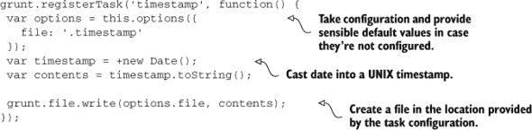

默认情况下，时间戳将创建在名为 `.timestamp` 的文件中；然而，由于你使用了 `this.options`，用户可以在配置任务时提供另一个文件名来更改它，如下面的代码所示：

```
grunt.initConfig({
 timestamp: {
   options: {
    file: 'your/file/path'
   }
 }
});
```

实际上，这就是编写自定义构建任务的唯一要求。Grunt 有一个广泛的 API，它抽象出常见功能，使你能够轻松地处理配置、执行 I/O 操作、执行任务以及异步执行任务。幸运的是，API 有很好的文档，所以请在他们的网站上查看。^([[9)]]

> ⁹ 你可以在[`bevacqua.io/bf/grunt`](http://bevacqua.io/bf/grunt)找到 Grunt 的文档。

若要对 Grunt 进行全面分析，请前往附录 B。`timestamp` 任务非常简单。让我们看看你可能想要实现的实际 Grunt 任务。

### 2.5\. 案例研究：数据库任务

正如你所看到的，开发自己的构建任务并不复杂；然而，在着手自己重新发明轮子之前，确定你的任务运行器（在我们的案例中是 Grunt）是否已经为你的任务开发了，这是很重要的！大多数任务运行器都提供某种插件搜索引擎，所以确保在坐下来编写自己的任务之前在网上查找。现在，让我们看看数据库模式更新的案例，以及你如何帮助自动化它们。


**数据库案例研究代码**

注意，这本书的文本中没有包含这个特定案例的代码。相反，你可以在配套的代码列表中找到一个完全工作的示例，标记为 ch02/10_mysql-tasks.^([a])

> ^a 数据库任务的代码样本可以在网上找到，地址为[`bevacqua.io/bf/db-tasks`](http://bevacqua.io/bf/db-tasks)。

在你看代码之前，阅读这本书的这一部分，以了解代码是什么，它做什么，以及为什么。


数据库迁移是那些设置起来很复杂的任务之一，但一旦设置好，你就会 wonder 你是如何在没有自动化过程的情况下管理应用程序的。

通用概念是，你从一个为应用程序设计的原始数据库模式开始。随着时间的推移，你可能会对模式进行调整：也许你会添加一个表，删除不必要的字段，更改约束等等。

这些模式更新往往是不加掩饰地手工完成的，通常以它们太敏感而无法自动化的借口。我们手工完成它们，浪费了大量时间。在这个过程中很容易出错，浪费更多时间。不用说，这对大型开发团队来说变得难以忍受。

#### 双向模式更改

我建议一套自动化的任务应该优雅地处理双向迁移：升级和回滚。如果你足够小心地构建它们，你甚至可以将它们集成到自动化流程中。这种思考方式是，你应该只在这些任务中应用这些模式更改，而永远不要直接在数据库上操作。当你采用这种思考方式时，请考虑两个额外的任务：从头创建数据库，并使用数据填充以帮助你的开发工作流程。这些任务将允许你直接从命令行管理数据库，轻松创建新实例，更改模式，用数据填充，并回滚更改。

图 2.7 总结了这些步骤，将它们作为 Grunt 任务进行整合，并解释了它们如何与特定的数据库交互。

##### 图 2.7 显示了所提出的任务与数据库实例的交互。

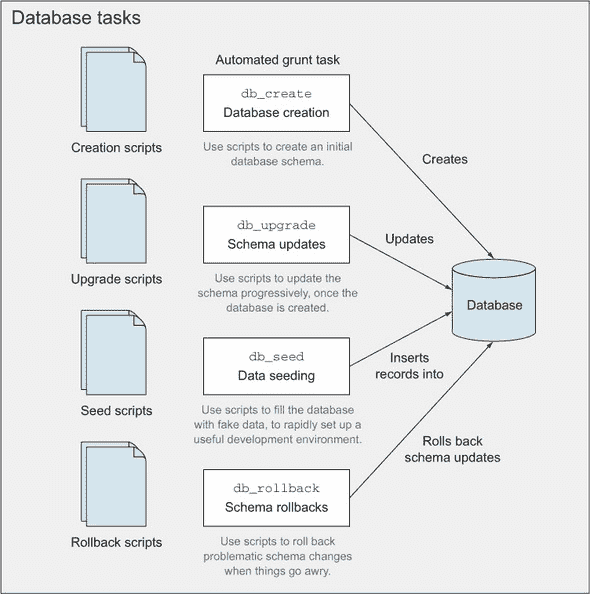

仔细观察这张图，你会注意到它有一个流程：

+   一次创建数据库。

+   每当有新的模式更新时运行模式更新脚本。

+   一次性在你的开发数据库中种下种子。

+   在出现问题时，运行回滚脚本作为额外的安全层。

使用 `db_create`，你可以创建一个数据库实例，这就足够了。它不应该在数据库已存在的情况下重新创建，以避免错误。它目前不会写入任何内容到模式中：表、视图、过程等都是下一步的内容。

`db_upgrade` 任务将运行尚未执行的升级脚本。你将想要检查本章的配套源代码来了解它是如何工作的。^([10)] 简单来说，你创建一个表来跟踪已应用的升级脚本；然后检查是否存在未应用的脚本并执行它们，在执行过程中更新跟踪记录。

> ^[(10) 数据库任务的代码示例可以在网上找到，链接为 [`bevacqua.io/bf/db-tasks`](http://bevacqua.io/bf/db-tasks)]。

#### 有一个备份计划

当事情出错时，`db_rollback` 将执行最后一个应用的升级脚本，并执行其降级对应脚本。然后它通过删除最后一条记录来更新跟踪表，这样你就可以通过使用这两个任务在模式中有效地来回升级和回滚。请注意，虽然`db_upgrade`执行所有未应用的升级脚本，但`db_rollback`只降级最后一个仍然应用的脚本。

最后，`db_seed` 任务用于在开发环境中插入你可以操作的记录。这个任务对于通过仅运行 Grunt 任务来使新开发者轻松设置工作环境至关重要。这些任务看起来可能像图 2.7 中的那些。

到目前为止，你应该已经足够熟悉，可以查看数据库任务的完整文档代码列表（在示例中为 ch02/10_mysql-tasks），并了解它如何实现。^([11)]

> ^(11) 你可以查看[第二章的代码示例，并寻找名为 10_mysql-tasks 的那个示例。]

在接下来的章节中，你将看到不同的方法来配置此类任务，以避免直接依赖于配置文件。相反，你将学习如何使用环境变量和加密的 JSON 配置文件来存储你的环境配置。

### 2.6. 摘要

你已经学到了很多关于构建任务的知识！让我们快速回顾一下：

+   构建过程应该促进生产一个完全配置的环境所需的一切，使其准备好并能够完成其工作。

+   构建中的不同任务被清楚地分开，并且类似任务被分组在任务目标下。

+   构成构建的主要任务包括静态资产编译和优化、代码风格检查以及运行单元测试。

+   你已经学会了如何编写自己的构建任务，并研究了如何自动处理数据库模式更新。

借助你获得的知识，我们将在接下来的两个章节中转换方向，扩展你对如何针对不同环境（即本地开发和发布服务器）的理解，你将学习可以应用于最大化生产力和性能的最佳实践。

## 第三章\. 掌握环境和开发工作流程

*本章涵盖*

+   创建构建版本和工作流程

+   设置应用程序环境

+   构建安全的环境配置

+   自动化首次设置

+   使用 Grunt 进行持续开发

我们在上一章中讨论了在构建过程中应该做什么和不应该做什么。我们涵盖了构建任务，并在其中配置了不同的目标。我还暗示了你的工作流程如何根据你为调试或发布版本构建应用程序而有所不同；这些基于目标环境的调试或发布目标的构建工作流程差异被称为*构建版本*。

理解开发、预发布和生产环境以及构建版本之间的交互对于创建一个无论在何种环境下都可以使用的构建过程至关重要，这允许你在与最终用户所见环境忠诚的设置中开发你的应用程序，同时仍然可以轻松地进行调试。此外，这种理解将使你能够创建中间层环境，这对于强大的部署机制至关重要，我们将在下一章中讨论。

在本章中，我们将从了解我们所说的环境和版本开始，我将提出一个典型的配置，它应该适用于大多数用例，其中你将拥有

+   本地开发环境，用于日常改进应用程序

+   预发布或测试环境，专门用于确保不会因部署到生产环境而产生问题

+   生产环境，这是客户可以访问的环境

然后，我们将探讨在配置应用程序时在不同上下文中采取的不同方法。你将学习如何自动化通常繁琐的首次设置，然后使用 Grunt 设置一个持续的开发工作流程，让我们开始吧。

### 3.1\. 应用程序环境

在上一章中，我们谈到了一些关于环境的内容，但我们没有详细说明在设置新环境时你有哪些选择，以及它们之间有何不同。

*开发环境* 是你大部分时间所在的地方，你在这里使用本地 Web 服务器进行工作，该服务器通常配置得允许调试、读取堆栈跟踪和更容易地获取诊断信息，比其他环境都要方便。开发环境也是与开发者及其编写的源代码最接近的环境。在这个环境中使用的应用程序几乎总是使用 *调试版本* 构建，这相当于设置一个标志，允许你开启某些功能，例如调试符号、增加日志记录（或日志详细程度）等。

*测试环境* 是你确保在托管环境中一切工作正常，并且可以自信地部署到生产环境，而不用担心任何东西会出错的地方。在 *生产环境* 中，你几乎总是希望为发布版本构建，因为该构建流程将设计为优化你的应用程序，并尽可能多地从你的静态资源中挤出字节。

现在我们来看看如何为这些环境中的每一个配置你的构建版本，调整版本输出以满足你的特定目标：要么是调试，要么是发布。

#### 3.1.1. 配置构建版本

为了帮助理解构建版本，可以将应用程序构建比作在面包房工作。当你准备蛋糕的混合物时，你可能会有许多不同的模具来盛放面糊。你可以使用标准的圆形蛋糕模具、方形烤盘、长面包模具，或者你所能找到的任何东西。这些模具就像开发环境中的工具，你的厨房。原料总是相同的：面粉、黄油、糖、一点盐、可可粉、鸡蛋和半杯牛奶。你用来构建蛋糕的原料类似于你应用程序中的资源。

此外，原料被组合成一份食谱，指示如何将它们混合在一起：何时、以何种数量、以及你应该在冰箱中存放多长时间，以便在以定义良好的温度放入烤箱之前获得良好的质地。选择不同的食谱可能会导致蛋糕更加松软或更加酥脆，就像选择不同的版本会导致应用程序更容易调试或性能更好。

当你尝试不同的方法来组合你的混合物时，你可能会改变原料（你的资源），甚至可能会改变食谱（你的版本），但你仍然会在你的厨房（开发环境）中完成工作。

最终你会在烘焙方面变得更好，并参加比赛。你将在不同的环境中（一个新环境）获得专业工具，遵循指南，并期望使用你拥有的材料烘焙蛋糕。你可能自己选择配料，你可能选择使用糖浆给蛋糕最后的点缀，你可能想要比你在自己厨房里多煮一会儿。这些对食谱的改变受你工作环境的影响，因为它可能会影响你决定使用哪种食谱，但你仍然可以在你认为合适的任何环境中使用*任何*食谱！

注意，构建分发被限制在调试或发布，尽管你可以配置任意数量的不同环境来使用这些分发中的任何一个，只要你认为有必要。环境与构建分发之间没有一对一的关系。你可能为每个环境都有一个首选的分发，但这并不意味着这个偏好是固定不变的。例如，在你的开发环境中，你通常会使用调试分发，因为这会在你的日常活动中带来更高的生产力。然而，你可能会偶尔在开发环境中尝试发布分发，以确保它在任何环境中都能按预期工作，然后再部署到生产环境。

##### 确定使用哪个构建分发

在任何厨房里准备好烘焙蛋糕几乎是不可能的：不同的烤箱、平底锅和煎锅可能不是你感到舒适的工具。同样，构建过程对它针对的环境控制很少。但你可以根据目标环境的用途确定适当的构建分发；要么

+   *调试*目的，你的目标是快速开发和调试你的应用程序

+   *发布*目的，其中你的目标是性能和可用性

这些目的决定了你的构建分发。在你的开发环境中，你会使用一个更适合满足你的开发需求的分发，这主要归结于发现问题和解决它们。这就是调试分发。在本章的后面部分，你将了解如何改进流程，以超越简单的调试，并实现真正的持续开发，即当涉及任务的代码发生变化时，运行特定的构建任务。

图 3.1 展示了构建分发如何回答关于你想要完成的目标类型的问题，使用配置来定义构建流程。

##### 图 3.1\. 构建分发及其如何定义你的构建流程以实现特定目标

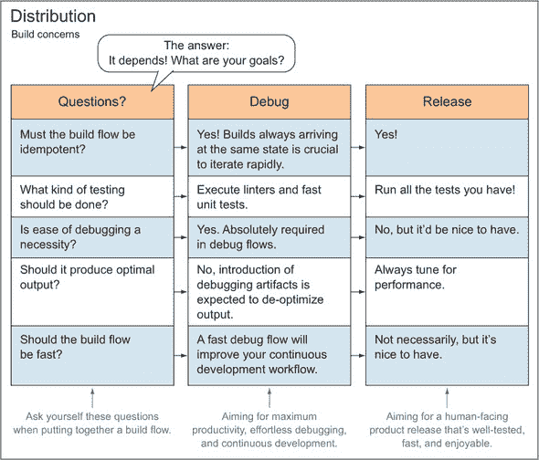

##### 生产环境的构建分发

在光谱的另一端，远离开发环境，是*生产环境*。回到我们的烘焙类比，在这种情况下，你将追求高端、高质量的蛋糕，这是付费客户所喜爱的，并且只能使用你拥有的最佳食谱来烘焙。生产是最终将应用程序提供给真实最终用户的环境，操作他们提供的数据。

这与开发环境形成对比，在开发环境中，你应该主要使用假数据，尽管这些数据在外观上与真实客户数据相似。生产环境很少会使用除发布外的其他发行版。这个发行版通常将性能视为最重要的因素，正如你在第二章中看到的，这可能意味着压缩和捆绑静态资源，从你的图标中生成精灵图，以及优化你的图像，但我们将这些主题留到第四章中讨论。尽管生产环境不应该使用调试构建，但你确实应该确保发布构建过程在你的开发环境中能够正常工作。

##### 为预发布环境构建发行版

在开发和生产之间，你可能会有一个*预发布环境*；其目标是在尽可能的情况下，复制生产环境中使用的配置（尽管不会影响用户数据或与生产中使用的服务交互）。预发布环境通常托管在除本地机器以外的其他地方。想象一下你是一名面包师：你可能希望制作出能够达到一定质量的蛋糕，无论你在哪个厨房工作。

预发布环境可能涉及在除了你自己的厨房以外的其他地方工作，但也不会在餐厅的厨房里。也许你想为朋友制作一份礼物，所以你使用她的厨房。预发布环境试图将生产和开发带到中间地带，这意味着它们试图尽可能接近这两个环境。为此，它们可能会定期获取生产数据库的*精选*版本（通过精选，我的意思是敏感数据，如信用卡或密码，必须被删除或清空）。你将为这个环境选择一个发行版，基于你要测试的内容，但通常默认为发布，因为这样更接近生产环境。

拥有预发布环境的真正目的是为了允许质量保证（QA）工程师、产品所有者和其他人在应用程序上线到生产之前对其进行测试。鉴于预发布基本上与生产相同，只是对最终用户不可访问，你的团队能够快速识别即将发布的版本中的问题，而不会影响生产环境，并且可以确信它将在托管环境中按预期工作。

让我们暂时沉浸在代码中，考虑一下如何使用发行版来处理构建配置，以便你的构建任务能够充分体现它们所属的构建流程（调试或发布）。

##### Grunt 任务中的发行版

在第二章中，我们讨论了一些构建任务及其配置，但它们大多是独立的，不是流程的一部分。通过构建发行版，你可以通过为每个任务分配在给定构建流程中使用它的意图来改进你的构建过程。你是追求调试质量还是更小的文件大小和更少的 HTTP 请求？好吧，如果你开始在 Grunt 任务和别名中使用命名约定，答案将对你来说更容易推断。

作为一条一般性规则，我建议你根据任务目标所针对的发行版来命名你的构建目标为`debug`或`release`。通用任务，如`JSHint`，不需要遵循此约定，你仍然可以给你的目标命名，例如`jshint:client`、`jshint:server`和`jshint:support`。你可以使用`support`目标来处理剩余的代码库，这些代码与服务器或客户端无关，但主要与构建或部署相关。

考虑到这个约定，你可能会看到一系列任务，如`jade:debug`和`less:debug`，然后你可以将这些任务捆绑在一起，创建一个`build:debug`别名。同样，这也适用于发布，清楚地分离你的代码和思维中的构建流程。以下列表（sample 03/01_distribution-config）展示了在代码中这会是什么样子。

##### 列表 3.1. 分布式构建配置

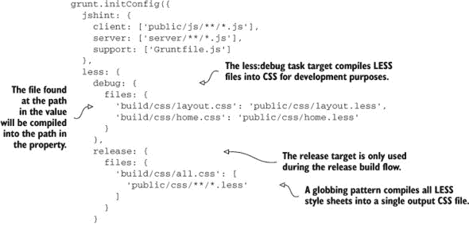

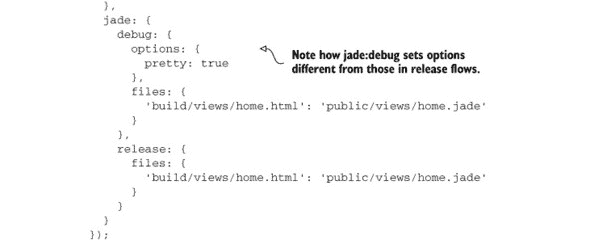

使用这种分离，很容易创建别名来为任意发行版构建应用程序。这里有一些示例别名：

```
grunt.registerTask('build:debug', ['jshint', 'less:debug', 'jade:debug']);
grunt.registerTask('build:release', ['jshint', 'less:release',
     'jade:release']);
```

你可以在配套的源代码仓库中查找完整的代码列表示例。记住，这些是按章节组织的，所以请在第三章下查找 01_distribution-config 文件夹。

这为你提供了一个很好的基础来构建。你可以对这些流程中的每一个进行迭代，可能重用任务，例如本例中的`jshint`，向两个发行版或其中一个添加更多任务，或者如果它只适用于一个流程，那么可能只添加到其中一个。例如，你可能会希望在发布流程中保留更新变更日志的任务，因为要发布的产品可能会在调试构建中发生变化，你需要伴随你的部署提供关于所有引入的变更的文档。我们将在本章后面回到这个话题，查看调试发行版特定的任务。发布特定的任务在第四章（kindle_split_015.html#ch04）中进行分析。

现在你已经了解了构建发行版是什么以及它们是如何定义构建过程中创建的不同流程的；让我们将注意力转向每个环境中的应用配置，或者我称之为环境级配置。

#### 3.1.2\. 环境级别配置

环境配置与构建分发是分开的，区别是明显的：*构建分发*决定了你的应用程序应该如何构建。它们不应该在应用程序本身中承担任何重量，而只影响构建过程，或者更具体地说，你遵循的构建流程。相比之下，*环境配置*是特定于环境的。


**环境级别配置：它包括什么？**

在接下来的内容中，每当我在本章中提到配置时，我指的是环境级别的配置，除非另有说明。通过*环境级别配置*，我指的是如下值

+   数据库连接字符串

+   API 认证凭证

+   会话加密密钥

+   您的 Web 服务器监听 HTTP 请求的端口

这类配置值往往包含大量敏感数据。我强烈建议不要将这类秘密与代码库中的其他部分一起以纯文本形式打包。开发者不应直接访问服务，例如您的数据库，因此不应访问用户数据。这也成为了一个攻击向量：访问您的代码库意味着可以访问您的数据库或 API 密钥，最可怕的是，可以访问您的客户数据。

在这方面，一个很好的经验法则是将你的应用程序开发得就像你在开发开源软件一样。你不会把敏感的 API 密钥和数据库连接字符串推送到你公开可用的开源存储库中，对吧？


图 3.2 展示了您的应用程序如何结合构建分发输出和环境配置来提供服务。

##### 图 3.2\. 环境级别配置——环境、配置和分发在一个应用程序中的结合。环境配置包括密钥凭证以及可能在不同环境中变化的任何其他配置。

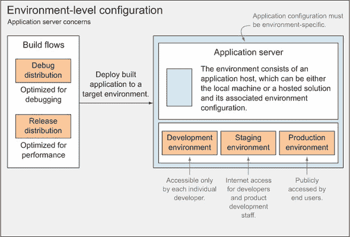

##### 构建流程

如您在图左侧所示，调试和发布分发只影响构建本身，而环境配置将在构建执行后直接影响应用程序，无论是调试还是发布。

##### 环境级别配置

应用程序配置必须是特定于环境的。这些环境变量不应与仅影响构建过程的构建分发混淆。应用程序配置指的是小（通常是敏感）的数据片段，例如数据库连接字符串、API 密钥、加密密钥、日志详细程度等。

尽管分发通常不包含敏感数据，但环境级别配置通常包含。例如，一个环境配置可能包含对数据库实例、API 服务（如 Twitter 的 REST API）的访问凭证，或者可能是用于通过 IMAP 发送电子邮件的用户名和密码。

但并非所有环境配置都是敏感的，或者泄露后构成安全威胁。例如，应用程序的监听端口和日志详细程度级别，这些决定了您的日志记录器应该有多详细，都是特定环境的，但它们在本质上并不敏感。话虽如此，您没有理由将“安全”配置与敏感配置区别对待，除非您可能包含与安全变量（如应用程序的监听端口）相关的配置默认值。您绝对不应该对敏感数据这样做。

目前您将专注于开发环境，并在下一章中继续讨论预发布和生成环境。

#### 3.1.3\. 开发环境有什么特别之处？

与其他环境相比，本地开发有什么不同之处？嗯，很多，理想情况下，并不多。两个最显著的区别是，这是您将花费大部分时间的环境，而且如果某些东西停止工作，您可以随时修复它，而且没有人会注意到。相比之下，您应该在生产环境中花费很少的时间，因为这可能意味着人们不会使用您的产品，如果某些东西停止工作，那也不会很好。我们将在下一章中讨论减轻和监控发布级环境问题的措施。

Build First 方法在开发环境中带来了一系列的好处，这也是本章的重点。我们将讨论在开发过程中非常有帮助的工具和机制。让我们把乐趣留到最后；我们首先需要讨论配置问题。我们将探讨如何以合理的方式管理、读取和存储环境级配置的敏感数据，以免将您的秘密暴露给潜在的入侵者。

### 3.2\. 配置环境

到目前为止，您已经确定将敏感配置以纯文本形式提交到您的存储库存在安全风险。在本节中，我们将介绍如何从不同的来源管理配置，例如文件、数据库或应用程序内存。同时，您将探索保护配置数据的不同方法。请注意，我即将提供的信息并不仅限于 Node.js。我选择这个平台是因为我需要给您提供一个具体的例子，说明如何配置环境级变量，并且因为这是一本 JavaScript 书籍。话虽如此，我们将讨论的环境配置方法可以应用于您喜欢的任何服务器端平台上的应用程序。

| |
| --- |

**特定环境的变量**

环境配置会改变任何可能根据你运行应用程序的环境而改变的变量。例如，你可能需要带有凭证的变量来发送电子邮件，你可能还希望允许在调试环境中将所有电子邮件发送到通配符账户。你消费的服务的 API 密钥通常也是按环境变化的。环境配置是存放所有这些设置和凭证的地方，这样你可以为每个环境调整它们。

| |
| --- |

我经常不情愿地参与那些羞于启齿的项目，这些项目违反了这一配置原则，将所有环境的配置直接放在了他们的仓库中。开发、预发布、生产——它们都是公平的游戏。每个环境的配置都保存在一个单独的文件中，例如包含“开发”字符串的配置决定了使用哪个文件。这样做有多个问题：

+   首先，我必须强调，不要直接将凭证打包到你的仓库中，放入你的实际环境配置中。这正是属于环境级配置的东西。

+   第二，你不应该需要为每个环境重复配置值，实际上是在多个不同的文件中维护相同的值；这将导致 WET（Write Every Time）代码。当你想要向应用程序添加新的环境或配置值时，它扩展性不好。

我还参与过配置繁琐的项目：你会得到一个全新的代码库，四处询问以获取一些凭证来开始，然后将它们输入到一个配置文件中。如果你需要部署，那么你必须手动更改这些相同的值，以适应你部署到的环境。在前一种情况下，至少你不必每次更改环境时都更改配置来使应用程序工作。你会更改一个魔法字符串，将其设置为“预发布”，然后它就会工作。

你怎么能不与每个人分享一切就采用这种方法呢？你可能会认为这不是什么大问题；你不会一夜之间开源你的项目。但如果你这样想，你就完全错过了重点。给每个人访问你生产环境中可能敏感信息的权限不是好的做法。而且没有必要——这种配置应该属于那个环境，不应该放在其他地方。

| |
| --- |

**开源软件**

在开源项目中进行实验，这是我强烈鼓励你尝试的事情，这极大地帮助我在保护敏感数据的技术和措施上随着时间的推移得到了显著提升。我开始思考“如果陌生人下载了我的代码怎么办？”这样的问题，这让我对将代码推送到我的仓库时什么可以接受，什么不可以接受有了更清晰的认识。

| |
| --- |

让我们通过讨论瀑布配置来开始我们的环境配置讨论，然后我们将介绍你可以用来保护它的不同方法，即加密和环境变量。

#### 3.2.1. 在瀑布中存储配置

*瀑布*是一种存储配置的方法。它就像选择一个优先级，这个优先级决定了这些存储在合并时的顺序。瀑布之所以有用，是因为它帮助你的配置被分散在不同的地方，但仍然是一个整体的一部分。有几个地方可以定义你的配置；例如

+   直接在代码库中的纯文本，仅用于不违反你安全的数据

+   在加密文件中；它的目的是安全地分发配置。

+   在机器级别，设置操作系统环境变量

+   在进程级别向你的应用程序传递命令行参数

请记住，无论你在哪个级别配置环境，你都是在配置环境；因此，所有配置源都必须始终从应用程序的单一点访问。这个配置根服务应该小心确定在提供请求的值时哪个来源最重要。在上面的列表中，我从最低到最高优先级对几个潜在的配置来源进行了排序。例如，设置端口号的命令行参数将覆盖存储在存储库中纯文本文件中的端口号。

显然，这些并不是我们存储配置的唯一地方，但它们为任何应用程序提供了一个很好的起点。我知道我严重地破坏了纯文本，但有一个纯 JSON 文件来设置绝对基本设置，例如环境名称和端口号是可以的。让我们称这个文件为`defaults.json`：

```
{
    "NODE_ENV": "development",
    "PORT": 80
}
```

这在纯文本方面是完全合理的。我也鼓励保留第二个纯文本文件，你可能称之为`user.json`，以保存你可能想要使用但不必提交修改默认值的个人配置。`user.json`文件在需要快速使用不同配置进行测试时也非常有用：

```
{
    "PORT": 3000
}
```

只要加密，敏感的配置就可以被检查到源控制中。我提倡使用这种配置来在开发者之间共享环境默认值。理由是，你不必每次默认值更改时都重新分发 JSON 文件，而是一次性分发解密安全文件的密钥，每次更改都会被检查到源控制中，开发者可以使用他们已有的密钥来解密。

我应该提到，为了最大化安全性，每个加密配置文件应使用不同的私钥。这在处理每个环境一个文件的情况下尤为重要，因为任何环境的泄露都会造成混乱；此外，如果私钥只在一个地方使用，更换密钥也会更容易。

你有几种不同的方式可以在你的环境中安全地分发配置；我们将在下面介绍其中几种。第一种是通过加密，我们将通过一个具体的例子来介绍如何安全地加密配置文件。第二种选择是不将环境配置文件与代码库一起分发，而是仅在目标环境中存储配置。让我们从加密安全开始。

#### 3.2.2. 使用加密来强化环境配置安全性

为了在代码库中安全地传输配置，你需要采取一些安全措施。首先，你不应该将解密后的配置文件提交到源代码控制，因为这会违背加密的全部目的。对于加密密钥也是如此：你应该将它们保存在安全的地方，最好是完全不在云端——也许可以放在 U 盘上。你应该在仓库中共享的是这些文件的加密版本以及简单的命令行工具，用于解密或更新它们的加密副本。图 3.3 描述了这一流程。

##### 图 3.3. 使用私有 RSA 密钥进行配置加密和解密流程

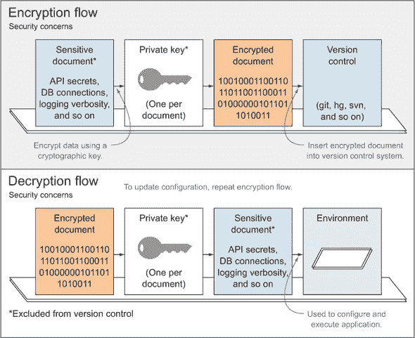

为了这个目的，你可以设置几个文件夹。例如，使用`env/private`，你将在这里保存已解密的未加密数据，以及`env/secure`来存储加密文件。因为`env/private`文件夹包含敏感数据，所以它不应该提交到源代码控制系统。相反，你将通过其他方式分发加密密钥；例如，物理地将其交给相关人员。然后，仓库将包含工具（在你的情况下是 Grunt 任务）来使用相应的 RSA（一种加密算法）密钥加密和解密每个特定的文件。你将使用三个不同的 Grunt 任务进行加密。第一个将生成私钥；其他两个将使用该私钥加密和解密你的配置。


**RSA 加密示例**

我编写了一个完全工作的示例，可在附带的源代码列表中找到，名为 02_rsa-config-encryption，^([a])在 ch03 目录下。在该示例中，你将使用我编写的`grunt-pemcrypt`包，该包简化了处理安全配置文件加密和解密所需的任务。我们不会深入代码本身，因为它相当直观，并且有很好的文档记录。

> ^a 代码示例可在网上找到，地址为[`bevacqua.io/bf/secure-config`](http://bevacqua.io/bf/secure-config)。


为了回顾 RSA 加密

+   创建一个私钥；不要与任何人分享。

+   使用它来加密你的敏感文件。

+   将加密文件与代码库一起传输。

+   当你需要更新安全文件时，更新明文文件并重新加密它。

+   当其他人复制你的代码库时，除非你给他们提供密钥，否则他们无法访问加密配置。

在下一节中，让我们看看采取替代路线的优缺点：不加密你的环境级配置，也不将其（以及你的敏感机密）与你的应用程序代码库的其他部分一起分发。

#### 3.2.3\. 在操作系统级别设置环境级配置

当涉及到发布环境（预发布、生产以及介于两者之间的任何环境）时，你可能希望在环境中直接配置敏感值，并使其远离你的代码库。将你的配置从代码库中移除，使你能够在无需全面重新部署的情况下更改它。使用系统级环境变量是做到这一点的好方法。

这是我从与基于云的托管解决方案（如 Heroku）合作中获得的，它设置起来很方便。使用环境变量的额外好处是，你不需要接触代码库来改变其行为。缺点是，与你的先前方法类似，当你第一次克隆仓库时，你无法访问大多数配置。那个缺点的例外是任何未受保护默认值，例如开发环境监听端口。然而，那个缺点也是采取这条路线的目标：无法将新克隆的仓库直接部署到生产环境之一。

加密文件存储和环境级配置之间的区别在于，完全不与你的代码库共享任何内容更为安全，即使它是加密的。但采用环境变量方法的缺点是，你仍然需要将配置放置在那里。

在下一章中，我将介绍 Heroku，这是一个云托管平台即服务（PaaS）提供商，它使你在云中托管 Web 应用变得与执行`git push`一样简单。Heroku 使用环境变量进行环境配置，并且他们详细记录了他们的理念（关于 Web 应用构建、架构和扩展）并在一个名为 12factor.net 的网站上发布，每个人都应该阅读。

> ¹ 12 Factor 是一个关于稳健应用开发的优秀指南。请在此处查看[`bevacqua.io/bf/12factor`](http://bevacqua.io/bf/12factor)。

对于本地开发，你仍然会使用一个不会提交到源控制的 JSON 文件，它包含了你之前章节中会放入安全 JSON 文件的内容。以下是一个示例环境 JSON 文件：

```
{
  "NODE_ENV": "development",
  "PORT": 8080,
  "SOME_API_SECRET": "zE1nMDDqkzDbSDX4fS5acCpllk0W9",
  "SOME_API_KEY": "IYOxBMFi34Rkzce7kY4h0GqI"
}
```

如果你想要为你的项目的新贡献者提供你本地使用的环境文件副本，考虑为该单个文件（`development`配置）采用加密方法，而对于托管环境（那些不是本地于你的开发机器的）采用环境变量方法以最大化安全性。

对于托管解决方案（如 `staging` 或 `production`），采取不同的方法。Heroku 提供了一个命令行界面，这使得设置环境变量变得容易。2 以下示例中，你可以将环境设置为 `staging`，这样你的代码就可以调整到该环境——例如，增加日志记录，但主要与生产环境相同：

> ² 在 [`bevacqua.io/bf/heroku-cli`](http://bevacqua.io/bf/heroku-cli) 了解更多关于使用 Heroku 配置 Node.js 环境的信息。

```
heroku config:add NODE_ENV=staging
```

命令行应该对值的选择有最后的决定权，这使得启用对环境的小幅修改变得容易，例如设置端口或执行模式（调试或发布）。以下是一个示例，它覆盖了端口和环境：

```
NODE_ENV=production PORT=3000 node app.js–
```

最后，让我们回顾一下如何以有意义的方式将所有不同的配置源（环境变量、文本文件和命令行参数）组合在一起。

#### 3.2.4\. 将配置作为代码中的瀑布合并

你现在可以将所有这些合并成 JavaScript 代码片段。考虑到我们有多懒，让我们不要写太多代码来完成这个任务。

有一个名为 `nconf` 的 npm 模块，用于合并配置源，无论你使用什么：JSON 文件、JavaScript 对象、环境变量、进程参数等等。以下代码是一个示例（在示例中标记为 ch03/03_merging-config），展示了如何配置 `nconf` 以使用 3.2.2 节 中的纯 JSON 文件。请注意，虽然代码列表中的配置源顺序可能看起来有些不合常理，但 `nconf` 会根据“先来先服务”的原则优先处理配置：

```
var nconf = require('nconf');

nconf.argv();
nconf.env();
nconf.file('dev', 'development.json');

module.exports = nconf.get.bind(nconf);
```

在设置好此模块后，你可以使用它从任何存储中获取配置值，按照出现的顺序：

+   首先，`nconf.argv()` 将命令行参数的优先级置于所有其他内容之上，因为它是我们添加的第一个源。例如，使用 `node app --PORT 80` 执行应用程序意味着 PORT 变量将被分配该值，无论其他来源的配置如何。

+   `nconf.env()` 行指示 `nconf` 从环境中获取配置。例如，执行 `PORT=80 node app` 将端口设置为 `80`，而 `PORT=80 node app --PORT 3000` 将端口设置为 `3000`，因为命令行参数的优先级高于环境变量。

+   最后，`nconf.file()` 行从 JSON 文件中拉取最不重要的值：这些值将被环境变量和命令行参数覆盖！如果你提供了一个命令行参数，例如 `--PORT 80`，那么你开发 JSON 文件中的 `"PORT": 3000` 就不重要了；你仍然会使用端口 80。再次强调，你将在附带的源代码中找到一个完整的示例，也详细说明了如何在使用 Heroku 路线时使用 `nconf`。这将在下一章中非常有用，所以我建议你把这一章读到结尾，然后如果你还没有看过，就熟悉一下代码示例。

现在你已经知道如何正确配置构建和环境，我们将继续到最后几个部分。在进入持续开发之前，让我强调一下在第一次设置环境时的一些最佳实践。

### 3.3. 自动化繁琐的首次设置任务

当你第一次设置环境时，你必须考虑你在做什么，并且你需要自动化任何可以自动化的东西。原因：如果你不自动化，这会直接转化为新来者更多的工 作。预先自动化这些任务的另一个原因纯粹是因为你可以这样做。

在开始时，一次自动化一小部分简单的事情是很简单的。然而，随着项目的开发，这样做变得越来越令人畏惧和不可能。你的同事可能在这个时候反对这样做，而设置一个工作环境可能需要你一周的时间。我过去在一个极其庞大的项目上遇到过这种情况，管理层对此表示可以接受。设置本地开发环境涉及

+   阅读一系列令人畏惧的、写得不好的维基文章

+   手动安装依赖项

+   手动应用模式更新

+   在获取最新代码后，每天早上手动应用这些更新

+   安装音频编解码器，甚至专有软件，例如特定版本的 Windows Media Player

一周后，我所展示的只是一个“有点工作”的环境。在那之后的三个星期，我找到了另一份工作，因为我无法忍受那个项目中手动、繁重的工作。这个问题的驱动因素是改变应用程序构建方式很难，没有直接和自动化的流程来设置新环境可能会在以后变得极其昂贵，实际上变得如此繁琐，以至于你都不想麻烦去改变它。我在那次经历中感到的挫败感是推动我提出“先构建”这一构建导向方法的主要动机之一，这也是我在这本书中大力倡导的方法。

在第二章中，我们介绍了如何自动化我们的构建过程，你甚至学会了如何自动创建、配置和更新一个 MySQL 数据库实例（在示例中的 ch02/10_mysql-tasks 目录下）。正如你在示例代码中所看到的，设置数据库初始化是复杂的，但它也可以很有成就感：你不需要为新合作伙伴提供除了代码仓库和几条指令让他们执行 Grunt 任务之外的其他任何东西。

> ³ 数据库配置任务示例可以在[`bevacqua.io/bf/db-tasks`](http://bevacqua.io/bf/db-tasks)找到。

我们详细讨论了在配置方面可以采取的措施，在这方面，当你设置新的开发环境时，你所需要做的就是获取解密密钥（存储在某个安全的地方）并运行一个 Grunt 任务。首次设置不应该比设置你的环境配置需要更多的手动劳动；它应该那么简单。

好的，你已经处理好了所有环境、发行版、配置和自动化，包括繁琐的首次设置。现在是时候享受本章开头承诺的乐趣了！接下来是持续开发！

### 3.4. 工作在持续开发中

持续开发是指能够在代码库中不间断地工作，当我提到中断时，我并不是指那些烦人的项目经理询问你在忙什么，或者同事请求帮助解决他们似乎找不到的 bug。当我提到中断时，我指的是那些慢慢侵蚀你工作日的工作，比如每次你的应用程序发生变化时都要重新执行`node`。即使现在，有了你新搭建的构建过程，你每次文件更改时都必须亲自运行它吗？不可能！你没有那么多时间。你将使用另一个任务来完成这个工作。

然后还有一些小事情，比如保存你的更改和刷新你的浏览器。你将通过让工具来做这些事情来摆脱这些烦恼。在“先构建”系统中，重复的例行公事并不怎么有威望。让我们看看你能从你的工作流程中自动化多少。这并不是为了证明你可以自动化任何事情；相反，好处在于你可以花更多的时间做有意义的事情：思考和摆弄代码。

你将要采取的第一个步骤是投资一个好的手表（从字面上讲——在你的最喜欢的任务运行器中使用手表任务），这将允许你在保存文件更改时自动重启构建过程。

#### 3.4.1. 不浪费时间，使用监视器！

如果你像我一样，你每隔几秒钟就会保存或切换标签。你不能每次更改注释或逗号时都运行完整的构建；那会浪费你大量的时间。然而，许多人这样做，因为他们还没有找到更好的方法。你正在阅读这本书，所以你领先了一步。恭喜你。

Grunt 最有用的插件之一无疑是 `grunt-contrib-watch`。这个插件会监控你的文件系统中的代码变化，并运行受这些代码变化影响的任务。每当文件变化影响你的构建任务之一时，你应该再次执行该任务。这是持续开发的一个支柱，因为你不需要做任何事情；构建过程会根据需要自动运行。让我们来看一个快速示例：

```
watch: {
  rebuild: {
    tasks: ['build:debug'],
    files: ['public/**/*']
  }
}
```

通过这个示例，称为 04_watch-task，并在代码示例中的 ch03 目录下找到，你可以在任何文件在 `public` 文件夹中更改或创建时重新运行整个构建过程。现在你再也不必担心不断运行构建；它可以自动运行！

但即使这种方法也不是最有效的方法，因为这将运行所有的构建任务，即使是没有受更改文件影响的任务。例如，如果你编辑了一个 LESS 文件，这并不重要；任何与 JavaScript 相关的任务，如 `jshint`，也会运行，因为它们也是构建的一部分。为了纠正这种行为，你应该将 `watch` 分解成多个目标：每个可能受文件更改影响的构建任务一个。以下列表简要展示了我在说什么。

##### 列表 3.2\. 将 `watch` 分解成多个目标

```
watch: {
  less: {
    tasks: ['less:debug'],
    files: ['public/css/**/*.less']
  },
  lint_client: {
    tasks: ['jshint:client'],
    files: ['public/js/**/*.js']
  },
  lint_server: {
    tasks: ['jshint:server'],
    files: ['srv/**/*.js']
  }
}
```

这样分解你的监控可能看起来有些繁琐，但这样做是非常值得的。它会加快你的持续开发流程，因为你会进入一种模式，即你构建的内容就是发生变化的内容，而不是盲目地重建一切。你可以在代码列表中找到一个完全工作的示例，标记为 ch03/05_better-watch-closely.^([4])

> ⁴ 你可以在网上找到代码示例，地址为 [`bevacqua.io/bf/watch-out`](http://bevacqua.io/bf/watch-out)。

观察你构建中的此类变化是很好的，但如果你能进一步扩展，观察你的 Node 应用程序的变化呢？嗯，实际上你可以，也应该这样做。围坐在一起，让我们来谈谈 `nodemon`。

#### 3.4.2\. 监控 Node 应用的变化

在持续开发领域，你应尽可能避免无休止地重复任何内容，而是保持 DRY（Don't Repeat Yourself）原则，而不是 WET（Write Everything Twice）。你刚刚看到了这样做的好处——不需要每次有变化时都运行构建。现在，你将为 Node 使用相同的快捷方式。

把 `nodemon` 命令想象成使用 `node` 命令，只不过它会监控变化并重新启动你的应用程序，再次运行 `node`，这样你就不必亲自做了。要安装它，使用 `npm`，并带上 `-g` 修饰符，这样它就会全局安装，便于从命令行访问：

```
npm install -g nodemon
```

现在，你可以运行 `nodemon app.js`，而不是 `node app.js`。默认情况下，`nodemon` 监控 `*.js` 文件，但你可能希望进一步限制。在这种情况下，你可以提供一个 `.nodemonignore` 文件，它的工作方式与 `.gitignore` 类似，并允许你忽略 `nodemon` 不需要监控的文件。以下是一个示例

```
# package control
./node_modules/*

# build artifacts
./bin/*

# ignore client-side js
./src/client/*

# ignore tests
./test/*
```

使用 `grunt watch` 并在另一个终端中运行 `nodemon app.js` 虽然确实比通过 Grunt 同时运行它们要快一些，但这多出来的开销。然而，运行单个命令就足够方便，不需要打开两个终端窗口，这可能会抵消引入的额外开销。一般来说，速度（分别运行）和便利性（在 Grunt 下运行它们）之间有一个权衡。我个人更喜欢便利性，不需要单独执行额外的命令。

接下来，我们将探讨如何将 `nodemon` 集成到 Grunt 中。

##### 结合 watch 和 nodemon

在你将 `nodemon` 集成到 Grunt 之前，你需要解决一个问题，那就是 `nodemon` 和 `watch` 都是 *阻塞任务*：这些任务永远不会结束；它们会坐着等待你的代码发生变化。Grunt 按顺序运行任务，在你可以运行另一个任务之前，会等待当前任务结束。但如果它们两个都不结束，另一个就无法开始！

为了解决这个问题，你可以使用 `grunt-concurrent`，它将为每个你提供的任务启动一个新的进程，让你成为一个更快乐的极客。通过 `grunt-nodemon` 可以轻松地将 `nodemon` 通过 Grunt 运行。以下是一个示例。

##### 列表 3.3\. 使用 Grunt 的 `nodemon`

```
nodemon: {
  dev: {
    script: 'app.js'
  }
},
concurrent: {
  dev: {
    tasks: ['nodemon', 'watch']
   }
}
```

这个例子也在配套的源代码列表中，命名为 06_nodemon（在 第三章 下。）在这一章中，你改进了事件的顺序，因为你的更改被保存了，但你仍然在进行保存！

让我们简要谈谈保存更改的问题。

#### 3.4.3\. 关心文本编辑器的编辑器

选择合适的编辑器对你的日常工作效率至关重要，而效率可以转化为幸福感。花时间学习你选择的编辑器的细节。当你第一次发现自己正在观看一个关于文本编辑器快捷键的 YouTube 视频时，你可能会觉得自己很古怪，但这将是值得的时间。你大部分时间都在使用代码编辑工具，所以你最好学会如何利用这些编辑器提供的功能。

幸运的是，现在大多数编辑器都提供了一种机制来自动保存你的更改。一开始可能会觉得有点奇怪，但当你习惯了，你会爱上它，并且永远不会回头。我个人喜欢 Sublime Text，这是我打这些字的编辑器，也是我大部分写作时使用的编辑器。如果你使用的是 Mac，TextMate 似乎是一个可行的选择。其他选项包括 WebStorm，这是一个专门针对 Web 开发的 IDE，然后是 vim，对于那些敢于学习使用其复杂、快捷键密集的用户界面的人来说。

我提到的所有编辑器都支持自动保存；如果你使用的编辑器不支持，我强烈建议你切换到一个支持自动保存的编辑器。一开始你可能会感到不舒服，但使用你新的文本编辑器后，你很快就会开始给我写感谢信。

让我们以关于 LiveReload 技术的讨论来结束，以及你如何从中受益。

#### 3.4.4\. 浏览器刷新是如此 Y2K

LiveReload 是一种理解你无法浪费宝贵时间在每次变化时刷新浏览器的技术。它利用了浏览器中可用的实时通信技术——WebSocket（它非常棒）。通过使用 WebSocket，LiveReload 可以决定是否需要对你的 CSS 应用小改动，或者当 HTML 发生变化时执行完整的页面刷新。

启用它相当简单，简单到我们没有任何借口不在这个时候去做它。它包含在`grunt-contrib-watch`中，因此设置起来就像添加一个`watch`目标一样简单，如下面的列表所示。

##### 列表 3.4\. 启用 LiveReload

```
watch: {
  livereload: {
    options: {
      livereload: true
    },
    files: [
      'public/**/*.{css,js}',

      'views/**/*.html'
    ]
  }
}
```

接下来，你需要安装浏览器扩展并启用它。现在，在调试应用程序时，你再也不需要自己刷新浏览器了。还有一个现成的例子^([5])供你参考（在代码示例中标记为 ch03/07_livereload），其中包含了所有必要的设置说明，但启动起来非常简单。

> ⁵ 使用以下代码示例查看 LiveReload 的实际操作：[`bevacqua.io/bf/livereload`](http://bevacqua.io/bf/livereload)。

### 3.5\. 摘要

你已经完成了环境和开发工作流程的快速入门课程！以下是本章教学内容的快速回顾：

+   调试和发布版本以不同的方式影响你的构建流程；调试旨在捕捉错误和持续开发，而发布旨在监控和速度优化，正如你将在下一章中看到的。

+   你的应用程序应该配置得让秘密不会进入源代码，同时也应该提供足够的灵活性，以便根据你运行的环境进行配置。

+   我们已经介绍了持续开发和如何通过使用`watch`任务来重新构建你的应用程序以及`nodemon`在更改后重启它来获得好处，以及选择合适的文本编辑工具的重要性。

在下一章中，我们将更详细地介绍你可以考虑用于发布构建的性能优化，什么是持续集成以及如何利用它来获得优势，你应该如何监控应用程序中的分析，以及最后如何将你的应用程序部署到托管环境，如预发布和生产环境。

## 第四章\. 发布、部署和监控

*本章涵盖*

+   理解发布流程和预部署任务

+   部署到 Heroku

+   使用 Travis 进行持续集成

+   理解持续部署

我们已经涵盖了构建过程，你可以执行的一些常见构建任务（以及如何使用 Grunt 来完成这些任务），以及从高层次上讲，环境和配置。我们详细讨论了开发环境，但这只是故事的一半。开发环境是你将花费大部分时间工作的地方，因为你将有一个系统在位，这样你就可以为发布准备你的应用程序，将其部署到人类可以访问的平台，然后监控应用程序状态。多亏了“先构建”的心态，你将自动化我刚才提到的流程，避免重复、人为错误，并在测试的同时节省时间，正如我在第一章中承诺的那样。

持续集成（CI）平台将通过确保你的测试在托管环境中通过，来帮助部署更健壮的构建到生产环境中。正如你将在本章后面看到的那样，CI 会在你每次向版本控制系统（VCS）推送时远程测试你的代码库。构建自动化（和持续开发）对于保持你日常开发工作的生产力和效率至关重要。同样，拥有一个易于执行的流程可以确保你可以根据需要频繁地部署你的应用程序，而不用担心执行半小时的令人尴尬的手动任务集。

到本章结束时，你将准备好执行安全、连续的部署，这在精神上与持续开发相似。它们都旨在减少重复工作和减少人为错误。发布流程有几个阶段，我们将在本书中遵循：

+   第一步是构建过程，在发布分发下进行。

+   一旦构建完成，你将运行测试以确保最近的变化没有破坏构建。在开发过程中，应通过使用代码检查程序来持续解决小的语法问题。

+   如果测试成功，你可能会进入预部署操作，例如更新版本号和发布变更日志。

+   之后，你将调查部署选项，例如云托管选项和持续集成平台。

图 4.1 描述了这个提出的发布和部署流程。当你查看这张图时，请记住我提出的先部署到预发布环境，以确保在上线到生产环境之前，托管环境中的所有事情都按预期工作。

##### 图 4.1. 提出的发布和部署流程

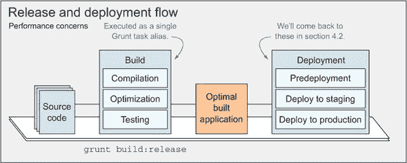

你面前还有很长的路要走；让我们先从讨论发布和部署流程开始。你将在 4.2 节中详细了解预部署操作。然后在 4.3 节中，我将告诉你所有关于部署的事情，你将学习如何将应用程序部署到 Heroku。4.4 节涵盖了持续集成以及你可以用来让 CI 为你做繁重工作的工具。

### 4.1. 发布你的应用程序

当你准备发布你的应用程序时，你希望将网络的最佳实践放在你的餐盘上。在第二章中，我们讨论了*压缩*，为了更好的性能缩小你的资源，以及*连接*，将文件合并在一起以减少 HTTP 请求的数量，这些你肯定希望包含在你的发布构建中。这些通过将可读的开发者源代码捆绑成包含源代码中所有内容的单个文件来提高 Web 应用程序的用户体验，但这些文件是压缩的，以便加快下载速度。在那一章中，我们还介绍了*精灵图和精灵*，包含许多图像的大文件。这些也会用于调试分发，仅仅是因为它们允许你将调试和发布更紧密地结合在一起，而不是那么不同。否则，你需要在调试 CSS 中引用单个图标，然后在发布中 somehow 引用精灵图和每个图标的定位，这违背了将两个构建流程统一并重复自己的目的，打破了 DRY 原则。

压缩、连接、精灵化——发布流程中还有什么其他内容吗？在本节中，我们将介绍图像优化和资源缓存；然后我们将继续讨论部署流程、语义版本控制和轻松更新变更日志。

#### 4.1.1. 图像优化

连接和压缩的 JavaScript 和 CSS 文件并不能完全说明问题。通常情况下，图片代表了网页下载量的大部分，这意味着它们比其他任何静态资源都更需要优化。在第二章中，你已经做了一部分优化工作，当时你学习了如何使用不同的图片生成精灵图，这与文本文件中连接的工作方式类似，即将多个文件合并成一个。另一种优化方法是压缩，通过缩短变量名和其他微优化来减少脚本和样式表文件的内容。在图片的世界里，你有各种方法来压缩文件，这通常可以带来 9%到 80%的增益，通常超过 50%。幸运的是，对于某些 Grunt 包，就像我们逐渐习惯的那样，它们在这方面为我们做了大量的工作。

其中一个包是 `grunt-contrib-imagemin,` 它正好做了你想要的事情：对不同格式的图片如 PNG、GIF 和 JPG 进行图像压缩。在深入探讨之前，我将简要介绍它可以帮助你优化的两个方面：无损压缩和交错。

##### 无损图像压缩

**无损图像压缩**与 JavaScript 最小化类似，其任务是移除图像原始二进制数据中的不重要的数据位。重要的是要注意，无损压缩不会改变图像的外观，而仅仅是其二进制表示。无损压缩的唯一结果是图像尺寸更小，看起来与较大的图像完全相同。幸运的是，有更聪明的人已经花费时间开发出为我们执行高级图像压缩的工具。你可以指定图像的路径，并让它们的算法进行处理。此外，`grunt-contrib-imagemin`配置了这些低级程序的正确参数，因此你不需要这样做。请注意，与有损压缩相比，无损压缩产生的字节节省较少；然而，当你不能承受任何图像质量损失时，它是非常好的。当你能够承受图像质量损失（而且大多数时候损失几乎不明显）时，你应该使用有损图像压缩。

##### 有损图像压缩

有损压缩是一种图像压缩技术，在重新编码图像时应用不精确的近似（也称为部分数据丢弃），这比无损压缩获得的字节节省更多（高达 90%的节省），其中移除的信息通常是元数据，如地理位置、相机类型等。`grunt-contrib-imagemin`包默认使用有损压缩，除了无损压缩外，还用于移除不必要的元数据。如果你只想使用无损压缩，你应该考虑直接使用`imagemin`包。 

##### 交错图像

你将要研究的另一个图像优化任务是**交错**。^([1]) 交错图像的大小比普通图像大，但这些增加的字节通常是非常值得的，因为它们可以提升感知性能。即使图像可能需要更长的时间来完成下载，但它将比普通图像更快地开始渲染。渐进式图像的工作方式正如其名。它们首先渲染图像中像素的最小视图，这大致看起来像是你的完整图像，然后随着更多数据被传输到浏览器，它们会逐步增强（直到全质量图像可用）。

> ¹ 通过访问[`bevacqua.io/bf/interlacing`](http://bevacqua.io/bf/interlacing)了解更多关于交错如何提升感知性能的信息。还有一个动画 GIF 更好地解释了交错图像的工作原理。

传统上，图像是从上到下、以全质量加载的，这转化为更快的下载时间但较慢的感知渲染。查看整个图像所需的时间等于完成时间。在渐进式渲染模式下，人类感知到的体验更快，因为他们不需要等待那么长时间才能看到整个图像的（混乱的）视图。

##### 设置 grunt-contrib-imagemin

设置 `grunt-contrib-imagemin`，幸运的是，就像我们之前讨论的其他任务一样简单。记住，重要的是要了解任务做什么，以及何时以及如何应用它们。以下列表配置在发布构建过程中优化 `*.jpg` 图片。

##### 列表 4.1\. 发布构建过程中的图像优化

```
imagemin: {
  release: {
    files: [{
      expand: true,
      src: 'build/img/**/*.jpg'

    }],
    options: {
      progressive: true // progressive jpgs
    }
  }
}
```

列表 4.1 不需要任何额外的配置来压缩图片；这是默认完成的。一个完整的工作示例可以在本章的配套源代码中找到，标记为 ch04/01_image-optimization，包括 `debug` 和 `release` 分发版本的完整构建工作流程。现在你已经让网络对人类漫无目的地漫游变得稍微好一些，你可以将注意力转向静态资源缓存。

#### 4.1.2\. 静态资源缓存

如果你对这个术语不熟悉，可以把 *缓存* 想象成从图书馆复印历史书籍。与其每次想阅读它们时都去图书馆，你可能会更喜欢打印几页，带回家，然后随时阅读，而无需再次访问图书馆。

网络中的缓存比从图书馆借阅的书籍的复印要复杂，但这应该能让你抓住其精髓。

##### `Expires` 头部信息

你应该绝对遵循的最佳实践之一是使用 `Expires` 头部信息来处理你的静态资源。根据 HTTP 协议，这个头部信息告诉浏览器，如果资源至少请求过一次（并且因此被缓存），并且缓存的版本尚未过时，则不要再次请求该资源。`Expires` 头部信息中的过期日期决定了缓存的版本何时不再被认为是有效的，并且资产需要重新下载。一个示例 `Expires` 头部信息可能是 `Expires: Tue, 25 Dec 2012 16:00:00 GMT.`

这既是一个令人惊叹的实践，也是一个糟糕的实践。对于人类来说，这是一个令人惊叹的实践，因为他们在访问你的页面之一后，不需要重新下载浏览器缓存中存储的资源，从而节省了请求和时间。对于我们这些开发者来说，这是一个糟糕的实践，因为即使你部署了资产的变化，人类也不会再下载它们。

为了解决这种不便，并使 `Expires` 头部信息变得有用，你可以在部署对资产进行更改时，将哈希值附加到它们的名称上，这会迫使浏览器重新下载文件，因为从所有目的来看，这是一个与它们之前缓存中的文件不同的文件。

| |
| --- |

##### 哈希

一个 *哈希* 是一个函数，它返回一个固定长度的值，这是数据的编码表示。在你的情况下，哈希可以从资产内容和它的最后修改日期计算得出。这样一个哈希可能是 `a38cbf9e.` 虽然看起来是随机的，但实际上没有随机性。这会违背使用 `Expires` 头部信息的目的，因为文件总是有不同的名称，并且每次都会再次请求。

| |
| --- |

一旦计算出一个哈希值，您可以使用它作为页面中的查询字符串参数，例如 `/all.js?_=a38cbf9e`，或者将其附加到文件名上，例如 `/a38cbf9e.all.js`。另外，您还可以将哈希值添加到 `ETag` 头部。选择正确的方法取决于您的需求。如果您处理的是静态资源，如 `JavaScript` 资源，那么您可能更倾向于对文件名（或其查询字符串）进行哈希处理，并使用 `Expires` 头部。如果您处理的是动态内容，则建议在 `ETag` 中设置哈希值。

##### 使用 Last-Modified 或 ETag 头部

`ETag` 头部唯一标识资源的一个版本。同样，`Last-Modified` 标识资源的最后修改日期。如果您使用这两个头部中的任何一个，那么您应该在 `cache-control` 头部中使用 `max-age` 修饰符，而不是 `Expires` 头部。这种组合可以实现更软的缓存，因为用户代理可以确定是否应该使用缓存的副本，或者是否需要再次请求资源。以下示例展示了如何结合 `ETag` 和 `cache-control` 头部：

```
ETag: a38cbf9e
Cache-Control: public, max-age=3600
```

`Last-Modified` 头部作为 `ETag` 头部的替代，出于方便考虑。在这里，我们没有指定一个唯一标识的 `ETag`，而是通过设置修改日期来实现相同的唯一性：

```
Last-Modified: Tue, 25 Dec 2012 16:00:00 GMT
Cache-Control: public, max-age=3600
```

让我们来看看您如何使用 Grunt 为您的文件名创建哈希值，然后可以安全地使用这些哈希值设置远期 `Expires` 头部。

##### 使用 Grunt 进行缓存破坏

在您的构建过程中，您几乎无法设置 HTTP 头部，因为这些必须在每个响应中发送出去，而不是静态确定。但您可以做的就是在 `grunt-rev` 的帮助下为您的资产分配哈希值。这个包将为您的每个资产计算哈希值，然后重命名它们，将相应的哈希值附加到原始名称上。例如，`public/js/all.js` 将被更改为类似 `public/js/1be2cd73.all.js` 的内容，其中 `1be2cd73` 将是 `all.js` 内容计算出的哈希值。从这个任务中产生的一个问题是，现在您的视图不会引用正确的资产，因为它们已经被带有哈希值的前缀重命名了。为了解决这个问题，您可以使用 `grunt-usemin` 包，该包会在您的 HTML 和 CSS 中查找静态资产引用，并使用更新的文件名刷新它们。这正是您所需要的。相关的 Grunt 配置如下所示（在示例中标记为 ch04/02_asset-hashing）。

##### 列表 4.2\. 更新文件名

```
rev: {
  release: {
    files: {

      src: ['build/**/*.{css,js,png}']
    }
  }
},

usemin: {
  html: ['build/**/*.html'],
  css: ['build/**/*.css']
}
```

请记住，在`debug`流程中，你不需要这两项任务中的任何一项，因为这些优化在开发过程中对你没有任何好处，所以可能适当地将它们的目标命名为`release`，以使这种区别更加明确。然而，`usemin`任务是以一种方式编写的，Grunt 目标具有特殊含义。`css`和`html`目标分别用于配置你想要使用哈希文件名更新的 CSS 和 HTML 文件，但像`release`这样的目标将被`usemin`忽略。

我们将要介绍的下一个技术涉及在样式标签中内联 CSS，以避免对 CSS 的渲染阻塞请求，从而实现更快的页面加载。

#### 4.1.3. 内联关键“折叠以上”CSS

浏览器在遇到需要下载的 CSS 资源时会阻止渲染。然而，多年来我们一直教导对方将 CSS 放在页面顶部（在`<head>`中），这样用户就不会看到未样式化的内容的闪光（简称 FOUC）。内联技术旨在通过避免 FOUC 来提高页面加载速度，而不会损害用户体验。只有在你同时在服务器端和客户端渲染视图的情况下，这种技术才能有效，正如我们在第七章中探讨的那样。

要实现这个功能，你必须做几件不同的事情：

+   首先，你需要确定“折叠以上”的 CSS；这些是在首次加载时正确渲染页面可见元素所需的样式。

+   一旦我们确定了在“折叠以上”有效使用的样式（那些浏览器需要正确渲染页面并避免 FOUC 的样式），你需要在页面的`<head>`中用`<style>`标签内联它们。

+   最后，现在所需的样式已经内联在`<style>`标签中，你可以通过在`onload`事件触发后延迟请求来消除对 CSS 样式表的渲染阻塞请求，使用 JavaScript。

+   自然地，你不会想让用户在 JavaScript 关闭的情况下陷入困境，并且因为我们作为网络的好公民，你也会使用一个后备的`<noscript>`标签来确保渲染阻塞请求无论如何都会执行。

如你所注意到的，这是一个复杂且容易出错的流程，就像第一章中的案例研究一样，Knight Capital 由于人为错误损失了五亿美元。如果出了问题，对你来说可能不会那么灾难性，但自动化这个流程几乎是强制性的：每次你的样式或标记发生变化时，都需要做太多工作！

让我们学习如何使用`grunt-critical`自动化这个过程。

##### 让 Grunt 做重活

使用`grunt-critical`来完成这个任务非常简单，尽管它确实提供了大量的配置选项。在下面的代码中，你会找到简单用例的配置。在这种情况下，你正在从页面中提取关键 CSS 并在构建后内联这些样式，在`<style>`标签内。`critical`会进一步延迟其他样式的加载，以避免阻塞渲染，并且它还添加了`<noscript>`回退标签，以供禁用 JavaScript 的用户使用：

```
critical: {
  example: {
    options: {
      base: './',
      css: [
        'page.css'
      ]
    },
    src: 'views/page.html',
    dest: 'build/page.html'
  }
}
```

你可能已经熟悉所有提供的选择项，它们都是文件路径。基本选项表示在查找绝对资源路径（如`/page.css`）时应使用的根目录。一旦你设置 Grunt 为你执行内联操作，请记住要提供升级后的 HTML 文件，而不是预构建的文件。

在切换到自动化部署的热水温泉之前，你需要反思在每次部署之前测试发布构建的重要性，以降低温泉位于活跃火山区的可能性。

#### 4.1.4\. 部署前的测试

在你进入部署阶段，甚至是我们即将探讨的预部署阶段之前，你需要测试你的发布构建。当未来有部署计划时，测试发布构建变得很重要，因为你想要确保你的应用程序按预期运行，或者至少按你编写的测试预期运行。

在本书的下一部分，我们将深入探讨应用程序测试的地下世界，并详细考察两种测试类型（尽管存在许多其他类型）：

+   单元测试：在这里，你通过隔离应用程序的各个组件来测试它们，确保组件在单独运行时工作正常。

+   集成（或端到端）测试：这涉及一系列经过单元测试的组件，并测试它们之间的交互，确保它们能够适当通信。

在你开始测试实践和示例之前，还需要一段时间。我们将在第八章中讨论测试实践并展示示例。第八章。请记住，在部署之前，你需要测试你的应用程序，以降低将故障构建发送到托管环境之一的风险，尤其是如果该环境是生产环境。让我们讨论一些在测试后但部署前你可以执行的任务。

### 4.2\. 预部署操作

一旦你为发布准备了一个构建并对其进行了仔细的测试，你就可以部署了。但在我们跳入部署温泉之前，我想先提几个重要的预部署任务。

图 4.2 是部署流程的概述，以及构建前的操作，这些操作可以被认为是部署就绪的。它还展示了你将如何逐步将更新部署到不同的环境中，确保最大程度的可预测性。

##### 图 4.2\. 部署前的版本控制和渐进式部署滚动。在预发布阶段由 QA 团队进行测试，确保在生产部署前具有稳健性。

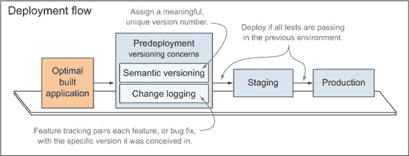

#### 部署前操作

+   ***语义版本控制：*** 这有助于跟踪有意义的应用程序版本。语义版本格式类似于`MAJOR.MINOR.PATCH-BUILD`。这个标准有助于在管理依赖关系时避免混淆。如果你想对托管环境（如生产环境）上当前部署的代码有任何控制权，保持应用程序版本化是很重要的。它使你能够在事情出错时回滚到旧版本。考虑到这相当容易设置，并且考虑到没有准备好部署失败的成本很高，版本控制变得是理所当然的。

+   ***变更日志：*** 变更日志是记录了项目历史中所有变更的列表，根据它们引入的版本进行划分（这也是为什么保持版本很重要的一部分）并进一步细分为错误修复、破坏性变更和新功能。按照惯例，`git`仓库中的变更日志通常放置在项目根目录，命名为`CHANGELOG.txt`或使用你偏好的任何扩展名（例如，Markdown 的`md`，^([2))，这是一个文本到 HTML 的转换工具）。

    > ² Markdown 格式是一种易于阅读、编写和转换为 HTML 的纯文本表示。阅读 2004 年介绍 Markdown 的原始文章，请访问[`bevacqua.io/bf/markdown`](http://bevacqua.io/bf/markdown)。

我们将在稍后深入探讨如何更好地分配你的变更日志维护时间，但首先让我们来探讨语义版本控制的细节。

#### 4.2.1\. 语义版本控制

由于你使用 Node，你可能对语义版本控制这个术语很熟悉。`npm`为所有包使用语义版本控制^([3))，因为它是一种强大的规范，用于管理不同 Node 模块之间的依赖关系解析。因为每个你生产的 Node 应用程序都已经有一个`package.json`，考虑到它们包含语义版本，你将在部署前使用这些来标记你的发布。

> 你可以在[`bevacqua.io/bf/semver`](http://bevacqua.io/bf/semver)了解更多关于语义版本控制的信息。

当我谈论版本控制时，我指的是更新包版本并在你的版本控制系统（VCS）中创建一个标签（你可以参考的版本历史中的时刻）。在为你的发布编号时，你可以设置任何你想要的方案，但重要的是你不应该覆盖一个发布；你不应该使用相同的版本号发布两个版本。为了确保这种唯一性，我决定使用 Grunt 在每次构建后（无论分发情况如何）自动增加构建号，并在执行部署时增加补丁号。主要版本更改是故意手动进行的，因为这些可能引入破坏性更改。同样，对于次要版本更改也适用，因为新功能通常在新的次要版本中引入。

使用 Grunt，你可以使用 `grunt-bump` 包来执行这些版本增量（从现在起称为增量）。它很容易配置，它会为你进行版本标记，甚至还会自动将更改提交到 `package.json` 文件。以下是一个示例：

```
bump: {
  options: {
    commit: true,
    createTag: true,
    push: true
  }
}
```

这些实际上是此任务提供的默认值。它们足够合理，以至于你根本不需要进行配置。任务将增加 `package.json` 中找到的版本，精确提交该文件并附带相关消息，然后在 `git` 中创建一个标签，最后将这些更改推送到 `origin` 远程。如果你关闭所有三个选项，任务只会更新你的包版本。示例 ch04/03_version-bump 展示了这种行为在实际中的应用。

一旦版本控制问题得到解决，你将想要设置一个变更日志，列出自上次发布以来发生了什么变化。让我们来考虑一下这一点。

#### 4.2.2\. 使用变更日志

当新版本发布时，你可能习惯于阅读你感兴趣的产品（尤其是游戏，在其文化中变更日志有很强的存在感）的变更日志，但你是否曾经自己维护过变更日志？这并不像你想象的那么困难。

设置一个变更日志——作为一个帮助跟踪随时间变化所做的更改的内部文档——即使你不向消费者展示，也可能对你的项目是一个积极的补充。

如果你有任何透明度政策，或者你不喜欢让人类处于黑暗中，那么维护一个变更日志几乎成为强制性的。你不应该在构建发布版本时更新变更日志，因为你可能想要为调试目的生成一个发布构建。同样，你也不应该在测试之前更新它们。如果测试失败，那么变更日志就会与最后一个发布就绪的构建不同步。然后你将需要在你生成通过所有测试的构建后更新变更日志。然后，并且只有那时，你才能更新变更日志以反映自上次部署以来所做的更改。

将变更日志合并在一起通常很困难，因为你可能会忘记自上次发布以来发生了什么变化，而且你不想通过查看`git`版本历史来找出哪些变化值得写入变更日志。同样，每次更改时手动更新它也很繁琐，如果你完全沉浸在某个状态中，可能会忘记这样做。一个更好的选择可能是设置`grunt-conventional-changelog`，并让它为你生成变更日志。那时你只需提交消息，按照惯例，这些消息以`fix`开头用于修复错误，以`feat`开头用于引入新功能，或者以`BREAKING`开头用于破坏向后兼容性。此外，这个包将允许你在它完成自己的解析和更新后手动编辑变更日志。

就配置而言，这个任务不需要任何设置。以下是一些示例提交消息：

```
git commit -m "fix: buffer overflows, closes #17"
git commit -m "feat: reticulate splines for geodesic cape, closes #23"
git commit -m "feat: added product detail view"
git commit -m "BREAKING: removed POST /api/v1/users/:id/kill endpoint"
```

#### 4.2.3. 更新变更日志

`bump-only`和`bump-commit`任务允许你在不提交任何更改的情况下增加版本号，这样你就可以更新你的变更日志（如你将在下一分钟看到的）。最后，你应该使用`bump-commit`一次性将`package.json`和`CHANGELOG.txt`检查到同一个提交中。一旦你配置了`bump`任务以同时提交变更日志，你现在可以使用以下别名一次性更新你的构建版本和变更日志。你可以在示例中找到一个使用`grunt-conventional-changelog`的例子，列在 ch04/04_conventional-changelog。

```
grunt.registerTask('notes', ['bump-only', 'changelog', 'bump-commit']);
```

现在你已经完成了发布构建，测试通过，并且你已经更新了变更日志。你现在准备好将应用程序部署到托管环境中，从那里你可以提供服务。在过去，通过手动上传构建包到生产服务器来部署应用程序相当普遍。你已经从那些美好的旧时光中走了很长的路，部署工具以及应用程序托管平台都变得更好了。

接下来，让我们深入了解 Heroku，这是一个平台即服务（PaaS）提供商，它使你能够轻松地从命令行部署你的应用程序。

### 4.3. 部署到 Heroku

设置部署流程可能像准备寿司一样困难，也可能像订购外卖一样简单；这完全取决于你对部署的控制程度。在光谱的一端，你有像亚马逊的基础设施即服务（IaaS）平台这样的服务，在那里你对托管环境有完全的控制权。你可以选择你喜欢的操作系统，选择你想要的处理能力，随意配置它，在上面安装东西，然后处理整个 SysOps 的重活，比如保护应用程序免受攻击，设置代理，选择保证正常运行时间的部署策略，以及从头开始配置大多数一切。

在另一端，有一些服务您无需做任何事情，例如那些由域名注册商如 GoDaddy 提供的解决方案。在这些解决方案中，您通常选择一个主题，填充几页静态内容，然后就可以完成；其余的一切都由您来完成。

为了本书的目的，我研究了如何解释如何在亚马逊上托管应用程序的可能性，但最终我得出结论，这将超出范围。话虽如此，我将在本节的末尾提到一种您可以自己探索这种替代方案的方法。

我决定选择 Heroku（尽管还有类似的替代方案，如 DigitalOcean），它不像在亚马逊网络服务（AWS）上设置实例那样复杂，但与使用网站生成器相比，它相当复杂。Heroku 通过轻松地让您从命令行配置和部署应用程序到其平台上的托管环境，简化了您的生活。正如我之前提到的，Heroku 是一个平台即服务（PaaS）提供商，无论您的语言或缺乏服务器管理知识，您都可以在其平台上托管您的应用程序。在本节中，我们将逐步介绍如何将一个简单应用程序部署到 Heroku。

在撰写本文时，Heroku 提供了一个允许您免费托管应用程序的层级。让我们从这里开始。您可以在配套源代码中找到这些说明^([4])。

> ⁴ 您可以在网上找到 Heroku 部署示例，链接为 [`bevacqua.io/bf/heroku`](http://bevacqua.io/bf/heroku)。
> 
> **1**.  访问 [`id.heroku.com/signup/devcenter`](https://id.heroku.com/signup/devcenter)，并输入您的电子邮件。
> 
> **2**.  接下来，您需要遵循的下一个手动步骤是安装他们的工具包，这是一系列命令行程序，可以帮助您管理在 Heroku 上托管的您的应用程序。您可以在 [`toolbelt.heroku.com`](https://toolbelt.heroku.com) 找到它，然后按照网站上的说明运行 `heroku login`，该说明同样可以在该网站上找到。
> 
> **3**.  然后您需要一个 `Procfile`，这是一个描述您的应用程序在操作系统上运行的进程的文件。

Heroku 对 Procfile 的定义如下。请注意，此过程还有一些额外的步骤，可以在接下来的几段中找到。


##### Procfile

`Procfile` 是一个名为 Procfile 的文本文件，放置在您的应用程序根目录中，列出了应用程序中的进程类型。每个进程类型都是当该进程类型的实例（在 Heroku 的术语中称为 `dyno`）启动时执行的命令的声明。您可以使用 Procfile 声明各种进程类型，例如多种类型的工人、一个单例进程（如时钟）或 Twitter 流式 API 的消费者。


简而言之，对于大多数设计良好的 Node 应用程序，Procfile 将类似于以下代码：

```
web: node app.js
```

就应用程序而言，你追求的是最基本的要求，因为这是部署到 Heroku 的感觉。`app.js` 可以小到以下 JavaScript 片段（ch04/05_heroku-deployments）：

```
var http = require('http');
var app = http.createServer(handler);

app.listen(process.env.PORT || 3000);

function handler (req, res) {
  res.writeHead(200, { 'Content-Type': 'text/plain' });
  res.end('It\'s alive!');
}
```

注意你使用 `process.env.PORT || 3000`，因为 Heroku 将为你提供应用程序应监听并暴露在名为 `PORT` 的环境变量上的端口。

然后，你使用 `3000` 进行本地开发。现在，这里还有一些额外的步骤要执行：

> **1**. 一旦你坐在项目根目录下，请在终端中执行以下命令以初始化一个 `git` 仓库：
> 
> `git init git add . git commit -m "init"`
> 
> **2**. 接下来使用 `heroku create.` 在 Heroku 上创建应用程序。这是一次性操作。
> 
> 到目前为止，你的终端应该看起来类似于图 4.3。
> 
> ##### 图 4.3\. 使用他们的 CLI 在 Heroku 上创建一个应用
> ##### 
> 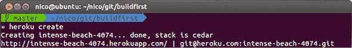

在你想要进行的每次部署中，你可以使用 `git push heroku master` 将更改推送到 `heroku` 远程。这将触发一个部署，看起来就像图 4.4。

##### 图 4.4\. 部署到 Heroku——就像 `git push` 一样简单

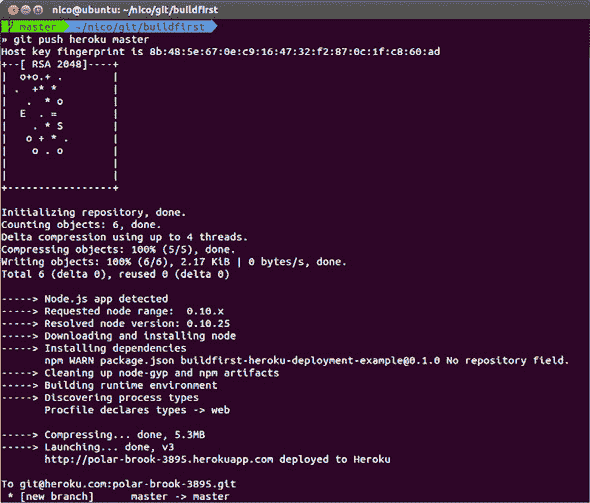

如果你想在浏览器中打开应用程序，请使用以下命令：

```
heroku open
```

关于 Heroku 和 PaaS 提供商有一个注意事项。在部署构建结果时，没有简单的解决方案。你不应该将构建工件包含在你的仓库中，因为这可能会导致不希望的结果，例如在更改某些内容后忘记重新构建。你也不应该过于依赖他们在平台上的构建，因为构建应该是本地或集成平台上进行的，而不是在应用程序服务器本身上，因为这会降低你的应用程序性能。

#### 4.3.1\. 部署构建

问题在于你不应该将构建结果放入版本控制中，因为那些是你源代码的输出。相反，你应该在部署前进行构建，并将构建结果与你的其他代码一起部署。大多数 PaaS 提供商不提供很多替代方案。例如，Heroku 在你向其远程推送时会从 Git 获取部署，但你不想将构建工件包含在版本控制中，这成为一个问题。解决方案：将 Heroku 视为任何持续集成平台（更多内容请参阅第 4.4 节)，并允许 Heroku 在其服务器上构建你的应用程序。

Heroku 通常不会为 Node 项目安装 `devDependencies`，因为它使用 `npm install –-production`，你需要使用自定义构建包来解决这个问题。*构建包*是你使用的语言和 Heroku 平台之间的接口，它们是一系列 shell 脚本。使用以下命令创建具有自定义 Grunt 启用的构建包的应用程序很容易，其中 `thing` 是你在 Heroku 上的应用程序名称：

```
heroku create thing --buildpack https://github.com/mbuchetics/heroku-
     buildpack-nodejs-grunt.git
```

一旦您使用自定义构建包创建了应用程序，您就可以像平常一样推送，这将触发 Heroku 服务器上的构建。您最后需要设置的是 `heroku` 任务：

```
grunt.registerTask('heroku', ['jshint']);
```

如果构建失败，Heroku 将终止部署，保持之前部署的应用程序不受失败构建的影响。在附带的示例中有详细的解释，列在 ch04/06_heroku-grunt 中，它将指导您如何设置此功能。

让我们看看如何将多个环境整合到单个 Heroku 应用程序中。

#### 4.3.2\. 管理环境

如果您想在 Heroku 上设置多个环境，例如 `staging` 和 `production`，可以使用不同的 `git` 远程端点来实现。使用 CLI 创建一个除 `heroku` 之外的远程：

> ⁵ Heroku 提供了关于管理多个环境的建议。请访问 [`bevacqua.io/bf/heroku-environments`](http://bevacqua.io/bf/heroku-environments)。

```
heroku create --remote staging
```

现在您应该使用 `git push staging master` 而不是 `git push heroku master`，同样，您现在需要明确告诉 `heroku` 使用特定的远程，例如使用 `heroku config:set FOO=bar --remote staging` 而不是 `heroku config:set FOO=bar`。请记住，环境配置是针对特定环境的，应该这样处理，因此环境之间不应共享第三方服务的 API 密钥、数据库凭证或任何一般认证数据。

现在您可以直接从命令行配置和部署到特定环境，是时候了解一种称为持续集成的实践了，这将有助于提高整体代码质量。如果您想了解如何将应用程序部署到亚马逊网络服务，可以遵循附带的源代码中的小型指南^([6))（在示例中标记为 ch04/07_aws-deployments）。

> ⁶ 通过这个代码示例了解如何将应用程序部署到 AWS 的部署过程 [`bevacqua.io/bf/aws`](http://bevacqua.io/bf/aws)。

### 4.4\. 持续集成

Martin Fowler 是持续集成最著名的倡导者之一。用他自己的话说，^([7])，Fowler 如下描述 CI。

> ⁷ 在 [`bevacqua.io/bf/integration`](http://bevacqua.io/bf/integration) 阅读 Fowler 关于持续集成的完整文章。


##### 持续集成

是一种软件开发实践，团队成员经常集成他们的工作；通常每个人至少每天集成一次，导致每天有多次集成。每次集成都会通过自动构建（包括测试）来验证，以尽可能快地检测集成错误。许多团队发现这种方法可以显著减少集成问题，并允许团队更快地开发出具有凝聚力的软件。


此外，他还诱惑我们在尽可能接近生产环境的环境中运行测试套件。这意味着，当涉及到测试你的应用程序时，你的最佳选择是在云中做，就像你做托管一样。CI 平台如 Travis-CI 提供诸如构建错误通知和访问完整的构建日志等功能，详细记录了构建（及其测试）期间发生的一切。

我提到了 Travis-CI；让我们看看我们如何设置自己，以便在每次向我们的仓库提交时，都可以远程将其构建添加到其平台上的队列中。然后 Travis-CI 构建服务器将逐个处理这个队列，运行我们的构建并通知我们结果。

#### 4.4.1\. 使用 Travis 的托管 CI

持续集成意味着在远程服务器（尽可能接近生产环境）上运行测试，希望捕捉到那些否则会进入普通用户的错误。一旦你正确配置了它，Travis-CI（Circle-CI 是另一个）就是一个你可以远程获取构建结果的 CI 平台。如果构建成功，你甚至都不会注意到。如果构建失败，你会收到一封电子邮件通知，告诉你有人破坏了你的构建（哎呀！）。稍后，当后续的推送修复了构建时，你将收到另一封通知，告诉你修复了什么。此外，你还可以在 Travis 网站上访问完整的构建日志，这在找出构建失败的原因时总是很有帮助。图 4.5 展示了这样一个电子邮件通知。

##### 图 4.5\. 一个典型的 Travis 构建修复通知

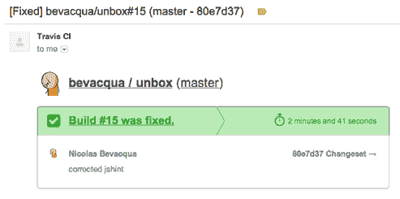

在这个时代，设置持续集成（CI）几乎太简单了。你首先需要做的是在项目根目录下创建一个 `.travis.yml` 文件。在这个文件中，你需要声明你使用的语言，在你的情况下被标识为 `node_js`，你正在测试的运行时版本，以及一系列在集成测试之前、期间和之后执行的脚本。为了说明，这样的文件可能看起来像以下代码：

```
  language: node_js

  node_js:
    - "0.10"

  before_install:
    - npm install -g grunt-cli  script:    - grunt ci --verbose --stack
```

##### 配置 Travis 和 Grunt

在执行你的测试之前，你需要通过 `npm` 安装 Grunt 的命令行界面 `grunt-cli`。你需要在集成测试服务器上安装它，就像你需要在你的开发环境中安装它一样，以便运行 Grunt 任务。你可以使用 `before_install` 部分来安装 CLI。

然后剩下的就是为 Grunt 设置一个 `ci` 任务。`ci` 任务可以运行 `jshint` 来减轻语法错误，就像你已经在你的新式持续开发工作流程中，每次有东西改变时在本地做的那样。你应该配置 `ci` 任务，在用 `jshint` 检查你的代码的基础上，运行单元和集成测试。

在持续集成（CI）中，真正的价值在于远程服务器构建你的整个应用程序，并对代码库应用你的测试（包括代码风格检查），确保你不会依赖于未提交到版本控制中的文件，或者你可能已经安装但未在代码库中提供的本地依赖。

你可能想亲自尝试这个示例，我强烈推荐这样做，因为它对于渴望部署的人来说是一个很好的练习。你可以在附带的示例仓库中找到我详细说明的指令集，该仓库名为 08_ci-by-example，位于 ch04 目录下。完成这些后，你还可以了解持续部署，这是一种可能或可能不适合你的工作流程的实践，但无论如何，你应该完全了解它。

> ⁸ 你可以在网上找到完整的代码示例，地址为[`bevacqua.io/bf/travis`](http://bevacqua.io/bf/travis)。

#### 4.4.2\. 持续部署

Travis 平台支持持续部署到 Heroku.^([9]) *持续部署*是一种说法，即每次你推送到版本控制时，你也会在 CI 服务器上触发一个构建作业（正如你在上一节中开启 Travis CI 集成时所做的）。当这些构建成功时，CI 服务器会代表你将应用程序部署到你选择的发布环境中。

> ⁹ 在[`docs.travis-ci.com/user/deployment/heroku/`](http://docs.travis-ci.com/user/deployment/heroku/)上阅读关于 Travis 持续部署到 Heroku 的文章。

在我的经验中，持续部署是一把双刃剑。当它们起作用时，你将进入一个充满喜悦和减少繁琐部署的世界，其中通过构建和测试集成周期是推向生产环境的充分验证。但你必须自信地认为你已经有了足够的测试来合理地捕获错误。一个安全的赌注可能是先启用对预发布环境的持续部署，而不是直接对生产环境进行部署。然后，你将确保预发布环境中没有问题，并执行生产环境的部署。这个工作流程看起来像图 4.6。

##### 图 4.6\. 建议的持续部署流程

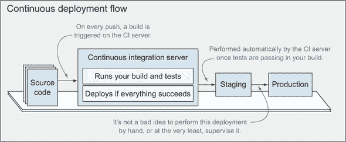

启用对 Heroku 的持续部署需要做些工作。你需要从 Heroku 获取一个 API 密钥，然后对其进行加密，并将加密数据配置到`.travis.yml`文件中。现在，我已经表达了对直接部署到生产环境的担忧，所以这个步骤就留给你自己来完成。如果你选择这样做，请访问[`bevacqua.io/bf/travis-heroku`](http://bevacqua.io/bf/travis)获取说明。

我们在本章的大部分内容中都在讨论部署，这是好事。现在你终于可以关注你的应用程序在生产环境中的整体状态以及特定请求的监控选项了。你还将检查日志记录、调试和灾难追踪的方法。

### 4.5\. 监控和诊断

生产应用程序的监控与拥有忠诚的客户一样重要。如果你不重视应用程序的可用性，你的客户也不会欣赏你。这意味着你不能不监控你的生产服务器。通过监控，我指的是保留访问日志（谁访问了什么，何时以及从哪里访问），以及错误日志（出了什么问题），也许更重要的是，设置警报，以便在事情“意料之外”出错时立即通知你。“意料之外”并不是打字错误；你应该预料到事情会出错，并尽可能为这些情况做好准备。你的企业可能不需要像 Netflix 所倡导的那样有一支猴子军队四处游荡，随机终止实例和服务，以确保他们的服务器能够在没有影响最终用户消费其服务的情况下可靠和一致地承受故障，如硬件故障。但他们的建议，如下引用，仍然适用于大多数软件开发工作。

> ^((10) 了解 Netflix 的混沌猴子服务，一个混沌服务，请访问 [`bevacqua.io/bf/netflix`](http://bevacqua.io/bf/netflix)).


##### 引自 Netflix 博客

如果我们不经常测试在失败中取得成功的能力，那么在关键时刻——在意外停机时，它可能就不会起作用。


然而，你如何计划失败呢？嗯，这就是令人难过的地方；你做的任何事情都无法阻止失败。每个人都有停机时间，即使是像微软、谷歌、Facebook 和 Twitter 这样的巨头也不例外。你可以计划得再多，但你的应用程序最终还是会失败。你能做的是开发一个模块化架构，能够处理服务崩溃和实例故障。如果你能实现这种模块化，那么当单个模块停止工作时，它的影响就不会那么大了，因为其余部分仍然可以完美地工作。我们将在第五章中开发模块化和单一责任原则（SRP）的概念，该章专门介绍模块化设计和 Node.js 平台的快速入门。

拳击俱乐部的第一条规则是，你不说关于拳击俱乐部的事情。抱歉，电影不对。应用程序监控的第一条规则是，当发生坏事时，你记录事情并设置通知。让我们来探讨一个可能的实现方案。

#### 4.5.1\. 日志记录和通知

我相信你已经非常习惯在前端使用 `console.log` 来检查变量，甚至可能将其作为调试机制，用它来确定哪些代码路径正在被跟踪，并帮助你定位错误。在服务器端，你有标准输出和标准错误流，两者都记录到你的终端窗口。这些传输（`stdout` 和 `stderr`；稍后会更详细地介绍传输！）对于开发很有用，但如果你无法捕获在托管环境中传输给它们的任何内容，那么它们对你几乎毫无用处，因为你无法在自己的终端中监控这些过程。

Heroku 有一种机制可以捕获你的进程的标准输出，因此你可以稍后访问它。它还提供了扩展该行为的附加组件。Heroku 附加组件提供了许多必需的配套服务，例如数据库、电子邮件、缓存、监控和其他资源。大多数日志附加组件都会允许你设置过滤和通知；然而，我建议不要利用 Heroku 的日志记录功能，因为这会过于平台特定，并且可能会严重限制你迁移到另一个 PaaS 提供商的能力。自己处理日志并不那么困难，你很快就会看到这样做的好处。

##### Winston 用于日志记录

我并不是特别喜欢利用 Heroku 的日志记录功能，因为它通过假设将内容写入标准输出就足以满足你的日志跟踪需求，从而将你的代码库绑定到他们的基础设施上。一个更持久和灵活的方法是使用多传输记录器，而不是写入 `stdout`。传输决定了你试图记录的信息会发生什么。一个传输可能会记录到一个文件，写入数据库记录，发送电子邮件，或者将推送通知发送到你的手机。在多传输记录器中，你可以同时使用这些功能中的许多，但你仍然会使用相同的 API 来执行记录。添加或删除传输不会影响你编写日志语句的方式。

Node 有几个流行的日志库，我选择了 `winston`，因为它具有你在记录器中寻找的所有功能：日志级别、上下文、多个传输、简单的 API 和社区支持。此外，它易于扩展，人们已经为几乎所有你可能需要的功能编写了传输。

默认情况下，`winston` 使用 `Console` 传输，这与直接使用 `stdout` 相同。但你也可以设置它来使用其他传输，例如将日志记录到数据库或日志管理服务。后者在灵活性方面尤为突出，它们提供了一个平台，你可以选择在重要事件发生时接收通知，而无需更改你的应用程序中的任何内容。

使用像 `winston` 这样的日志记录解决方案是平台无关的。你的代码不会依赖于托管平台来捕获标准输出才能工作。要开始使用 `winston`，你必须通过同名包来安装它：

```
npm install --save winston
```

| |
| --- |

**使用 --save 与使用 --save-dev**

在这种情况下，你应该使用`--save`标志而不是`--save-dev`，因为`winston`不是一个像你之前玩过的 Grunt 包那样的仅用于构建的包。当向`npm`提供`--save`标志时，该包将被添加到你的`package.json`文件中的`dependencies`部分。

| |
| --- |

一旦你安装了`winston`，你就可以立即使用它，只需将`logger`放在你之前放置`console`的地方：

```
var logger = require('winston');

logger.info('east coast clear as day');
logger.error('west coast not looking so hot.');
```

你可能已经习惯了`console`是一个全局变量的想法。根据我的经验，在这种场景下使用全局变量并没有错，这也是我允许自己使用全局变量的两种情况之一（另一个是`nconf`，如我在第三章中提到的）。我喜欢在一个单独的文件中设置所有全局变量（即使只有两个），这样我可以在调用一个在模块或 Node 中未定义的东西时快速扫描它，并找出发生了什么。一个说明性的`globals.js`可能如下所示：

```
var nconf = require('nconf');

global.conf = nconf.get.bind(nconf);
global.logger = require('./logger.js');
```

我还建议保留一个单独的文件，你可以在这里定义你的日志记录器的传输方式。让我们从使用`File`传输以及默认的`Console`传输开始。这将是在前面的代码片段中引用的`logger.js`文件：

```
var logger = require('winston');
var api = module.exports = {};
var levels = ['debug', 'info', 'warn', 'error'];

levels.forEach(function(level){
    api[level] = logger[level].bind(logger);
});

logger.add(logger.transports.File, { filename: 'persistent.log' });
```

现在，每当你执行`logger.debug`时，你都会将调试消息记录到终端和文件中。虽然很方便，但其他传输方式提供了更多的灵活性和可靠性，这正是我们将要介绍的几个传输方式的特点：`winston-mail`将允许你在发生某些事情时发送电子邮件（在需要发送电子邮件的水平上），`winston-pushover`可以直接在手机上发送通知，而`winston-mongodb`是许多传统日志传输方式之一，你可以在数据库中写入记录。

一旦你仔细检查了示例列表，你将更好地了解如何根据我提出的建议将配置、日志记录和全局变量结合起来。如果你对全局变量有强烈的反对意见，请不要慌张。我也包括了一个不使用全局变量的示例。我喜欢全局变量（在之前提到的两种情况下），只是因为我发现不需要在每一个模块中重复`require`同样的事情。

现在你已经花时间处理日志记录了，我们不妨谈谈调试 Node 应用程序。

#### 4.5.2. 调试 Node 应用程序

当你需要追踪一个错误时，你会想要得到所有你能得到的帮助，根据我的经验，调试的最佳方法是增加日志记录，这也是我们之前讨论它的原因之一。话虽如此，你有很多种方法可以调试 Node 应用。你可以在 Chrome 的 DevTools 中使用 node-inspector^([11))，你可以使用 WebStorm 等集成 IDE 提供的功能，然后还有古老的`console.log`。你还可以直接在 V8（Node 运行的 JavaScript 引擎）中使用本地的调试器^([12))。

> ^（11）在 GitHub 上找到 node-inspector 的开源存储库 [`bevacqua.io/bf/node-inspector`](http://bevacqua.io/bf/node-inspector)。
> 
> ^（12）在 [`bevacqua.io/bf/node-debugger`](http://bevacqua.io/bf/node-debugger) 上阅读 Node.js API 调试文档。

根据你追踪的哪种类型的错误，你将选择适合的工具。例如，如果你正在追踪内存泄漏，你可能使用 `memwatch` 这样的包，它在可能发生内存泄漏时发出事件。对于更常见的用例，例如定位舍入错误，或找出你的 API 调用出了什么问题，可以通过添加日志语句（暂时使用 `console.log`，或以更永久的方式使用 `logger.debug`），或使用 `node-inspector` 包来满足。

##### 使用 Node Inspector

`node-inspector` 包连接到 V8 的原生调试器，但它允许你使用 Chrome 中的完整功能调试工具进行调试，作为 Node 提供的基于终端的调试器的替代方案。要使用它，你需要做的第一件事是全局安装它：

```
npm install -g node-inspector
```

要在 Node 进程上启用调试，你可以在启动进程时向 `node` 传递 `--debug` 标志，如下所示：

```
node --debug app.js
```

作为替代方案，你可以在运行中的进程上启用它。为此，你需要找到进程 ID（PID）。以下命令 `pgrep` 负责处理：

```
pgrep node
```

输出将是运行中的 Node 进程的 PID。例如，它可能如下所示：

```
89297
```

向进程发送 `USR1` 信号将启用调试。这可以通过 `kill -s` 命令完成（注意我使用的是上一个命令的结果中的进程 ID）：

```
kill -s USR1 89297
```

如果一切正常，Node 将通过其标准输出通知你调试器正在监听的位置：

```
Hit SIGUSR1 - starting debugger agent.
debugger listening on port 5858
```

现在，你需要执行 `node-inspector` 并然后打开 Chrome，将其指向检查器提供的链接：

```
node-inspector
```

如果一切顺利，你应该会看到类似于图 4.7 的内容，并在 Chrome 浏览器中准备好一个完整的调试器，该调试器（大部分情况下）的行为与客户端 JavaScript 应用程序的调试器完全一样。这个调试器将允许你监视表达式、设置断点、逐行执行代码，并检查调用栈，以及其他有用功能。

##### 图 4.7\. 使用 Node Inspector 在 Chrome 中调试 Node.js 代码

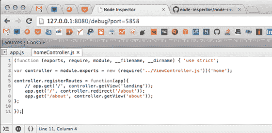

在调试之上，还有性能分析，这有助于检测代码中的潜在问题，例如内存泄漏导致内存消耗激增，可能会削弱你的服务器。

#### 4.5.3\. 添加性能分析

在性能分析方面，你有几种选择，具体取决于你的需求是具体（我们必须追踪内存泄漏！）还是通用（我们如何检测内存消耗的激增？）。让我们看看第三方服务，它可以减轻你自行进行性能分析的压力。

Nodetime 是一种服务，你可以用几秒钟的时间轻松设置，它可以跟踪诸如服务器负载、空闲内存、CPU 使用率等分析数据。您可以通过电子邮件在 [`bevacqua.io/bf/nodetime-register`](http://bevacqua.io/bf/nodetime-register) 注册，一旦注册成功，您将获得一个可以用来设置 `nodetime` 的 API 密钥，`nodetime` 需要几行 JavaScript 代码来配置：

```
require('nodetime').profile({
  accountKey: 'your_account_key',
  appName: 'your_application_name'
});
```

就这样，你现在将能够访问指标，以及能够对 CPU 负载进行快照，就像图 4.8 中展示的那样。

##### 图 4.8\. 通过 Nodetime 跟踪的服务器负载随时间变化


为了总结，我们将分析 Node 应用程序可用的一种有用的进程扩展技术，称为 `cluster`。

#### 4.5.4\. 运行时间和进程管理

当涉及到发布环境，尤其是生产环境时，你不能容忍你的进程因为任何特定的异常而崩溃和死亡。这可以通过使用名为 `cluster` 的原生 Node API 来缓解，该 API 允许你在多个进程中执行你的应用程序，将负载分配给它们，并在需要时创建新的进程。`cluster` 利用多核处理器和 Node 是单线程的事实，允许你轻松地启动一个运行相同 Web 应用程序的过程数组。这使你的应用程序具有更高的容错性；你可以启动一个新的进程！例如，在几行代码中，你可以配置 `cluster` 以在另一个进程死亡时启动一个工作进程，从而有效地替换它：

```
var cluster = require('cluster');

// triggered whenever a worker dies
cluster.on('exit', function () {
  console.log('workers are expendable, bring me another vassal!');
  cluster.fork(); // spawn a new worker
});
```

这并不意味着你应该对进程内部发生的事情掉以轻心，因为启动新的进程可能会很昂贵。分叉是有成本的，与服务器承受的负载量（请求/时间）相关，也与你进程的 *启动时间*（从启动到可以处理 HTTP 请求的等待时间）相关。`cluster` 给我们提供了一种透明地继续提供服务的方式，即使你的工作进程死亡：其他人会以他的名义加入。

在 第三章 中，我们介绍了 `nodemon` 作为在积极开发期间文件更改时重新加载应用程序的一种方式。这次，你将回顾 `pm2`，它在精神上与 `nodemon` 相似，但针对的是发布环境。

##### 安排集群

配置 `cluster` 可能很棘手，而且目前它也是一个实验性 API，因此它可能会在未来发生变化。但 `cluster` 模块带来的好处是无可否认的，并且确实很有吸引力。`pm2` 模块允许你在应用程序中使用完全配置的 `cluster` 功能，而不需要编写任何代码，这使得它成为使用时的不二选择。`pm2` 是一个命令行工具，你需要使用 `-g` 标志来安装它：

```
npm install -g pm2
```

安装完成后，你现在可以通过它运行你的应用程序，`pm2` 将为你设置 `cluster`。将以下命令视为 `node app` 的直接替代品：

```
pm2 start app.js -i 2
```

主要区别在于你的应用程序将使用`cluster`模块与两个工作进程（由于`-i 2`选项）。工作进程将处理对应用程序的请求，如果一个工作进程崩溃，另一个将启动以确保应用程序正常运行。`pm2`的另一个有用功能是能够进行*热代码重载*，这将允许你在没有任何停机时间的情况下用新部署的应用程序替换正在运行的应用程序。你可以在附带的源代码中找到相关示例，列在 ch04/11_cluster-by-pm2 下，以及一个直接使用`cluster`的示例，列在 ch04/10_a-node-cluster 下。

虽然在单台计算机上进行集群具有立即的效益且成本低廉，但你也应该考虑在多台服务器上进行集群，以减轻服务器崩溃时网站可能宕机的情况。

### 4.6. 摘要

呼，这真是一场激烈的战斗！我们在本章中努力工作：

+   你与发布流程优化，如图像压缩和静态资源缓存，成为了更亲密的朋友。

+   你了解到在结束一天的工作前测试发布版本、增加包版本和整理变更日志的重要性。

+   然后你按照步骤部署到 Heroku，我提到了`grunt-ec2`，这是许多替代部署方法之一。

+   掌握持续集成的知识是一件好事，因为你已经学会了验证你的构建过程和发布代码库质量的重要性。

+   持续部署是你能够执行的操作，但你理解这样做的影响，所以你会对此非常小心。

+   你还快速浏览了日志记录、调试、管理和监控发布环境的内容，这在解决生产应用问题时将证明是基础性的。

所有关于监控和调试的讨论都需要对架构设计、代码质量、可维护性和可测试性进行更深入的分析，这些恰好是书中第二部分的核心。第五章 Chapter 5 全部关于模块化和依赖管理，JavaScript 模块的不同方法，以及即将到来的 ES6（一个长期期待的 ECMAScript 标准更新）的部分内容。在第六章 chapter 6 中，你将发现不同的方法来正确组织 Node 应用程序的异步代码，同时在异常处理方面确保安全。第七章 Chapter 7 将帮助你有效地建模、编写和重构代码。我们还将一起分析一些小的代码示例。第八章专门介绍测试原则、自动化、技术和示例。第九章教你如何设计 REST API 接口，并解释它们如何在客户端被消费。

你将带着如何使用 JavaScript 代码设计一个连贯的应用架构的深入理解离开第二部分。将这部分内容与你已学到的第一部分中关于构建过程和工作流程的所有知识相结合，你将准备好使用“先构建”的方法来设计一个 JavaScript 应用，这是本书的最终目标。
