## 第二部分\. 管理复杂性

书的第二部分比第一部分更具互动性，因为它包含了更多的实际代码示例。你将有机会探索我们在应用程序设计中攻击复杂性的不同小角度，例如模块化、异步编程模式、测试套件、保持代码简洁以及 API 设计原则。

第五章 对 JavaScript 中的模块化进行了详细探讨。我们从基础知识开始，学习封装、闭包和语言的一些怪癖。然后我们深入研究不同的格式，这些格式允许我们构建模块化代码，例如 CommonJS、AMD 和 ES6 模块。我们还将讨论不同的包管理器，比较它们各自的特点。

第六章 教你思考异步代码。我们将通过大量的实际代码示例，遵循几种不同的风格和约定。你将了解所有关于 Promises、`async` 控制流库、ES6 生成器和基于事件的编程。

第七章 通过教授你 MVC（模型-视图-控制器）来扩展你的 JavaScript 视野。你将重新审视 jQuery，并学习如何编写更模块化的代码。稍后，你将利用 Backbone.js MVC 框架进一步组件化你的前端工作。Backbone.js 甚至可以用于在服务器端渲染视图，我们将利用 Node.js 平台来实现这一点。

在 第八章 中，你将学习如何立即使用 Grunt 任务自动化测试。然后你将学习如何为浏览器编写测试，以及如何使用 Chrome 或 PhantomJS 无头浏览器运行它们。你不仅将学习单元测试，还将学习视觉测试甚至性能测试。

第九章 专注于 REST API 设计原则。在本章中，你将了解在为 API 服务奠定基础时应遵循的最佳实践，以及如何设计分层架构以补充 API。最后，你将学习如何轻松消费 API，使用遵循 RESTful 设计方法的约定。

## 第五章\. 接受模块化和依赖管理

*本章涵盖*

+   使用代码封装

+   理解 JavaScript 中的模块化

+   集成依赖注入

+   使用包管理

+   尝试使用 ECMAScript 6

现在我们已经完成了“构建第一”速成课程，你会注意到 Grunt 任务有所减少，尽管你肯定会继续提高你的构建能力。相比之下，你会看到更多关于如何处理你应用程序底层的 JavaScript 代码的不同方法的权衡的例子。本章重点介绍*模块化设计*，通过将关注点分离到不同模块中，降低应用程序的代码复杂性，这些模块是相互连接的小块代码，每块代码都擅长做一件事，并且易于测试。你将管理异步代码流、客户端 JavaScript 模式和第六章、第七章和第八章中的各种测试中的复杂性。

第二部分的核心是通过分离关注点来提高应用程序设计的质量。为了提高你分离关注点的技能，我将教你所有关于模块化、共享渲染和异步 JavaScript 开发的知识。为了提高你应用程序的弹性，你也应该测试你的 JavaScript，这是第八章的重点。虽然这是一本以 JavaScript 为重点的书，但了解 REST API 设计原则对于改善应用程序堆栈各部分之间的通信至关重要，这正是第九章的重点。

图 5.1 展示了本书后半部分这些片段是如何相互关联的。

##### 图 5.1. 模块化、良好的架构和测试是设计可维护应用程序的基础。

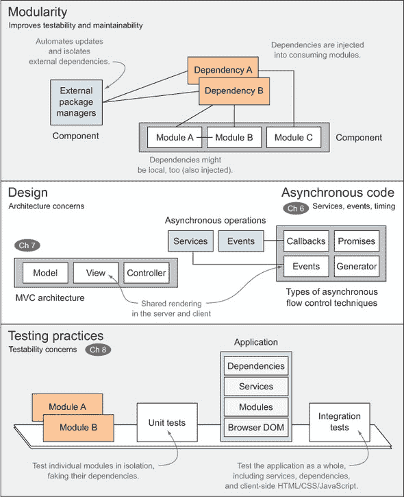

应用程序通常依赖于外部库（如 jQuery、Underscore 或 AngularJS），这些库应该通过包管理器来处理和更新，而不是手动下载。同样，你的应用程序也可以分解成更小的部分，它们相互交互，这也是本章的另一个重点。

你将学习代码封装的艺术，将你的代码视为自包含的组件；设计出色的接口并精确排列它们；以及信息隐藏，只揭示消费者需要的，而隐藏其他一切。我将用很多话来解释一些难以捉摸的概念，例如*作用域*，它决定了变量属于哪里；你必须理解的`this`关键字；以及*闭包*，它帮助你隐藏信息。

然后，我们将探讨依赖关系解析作为手动维护脚本标签排序列表的替代方案。之后，我们将转向包管理，这是你安装和升级第三方库和框架的方式。最后，我们将查看即将推出的 ECMAScript 6 规范，它为构建模块化应用程序提供了一些新技巧。

### 5.1. 使用代码封装

封装意味着保持功能自包含，并隐藏特定代码片段（访问者）的实现细节。每个部分，无论是函数还是整个模块，都应该有一个明确定义的责任，隐藏实现细节，并暴露简洁的 API 以满足其消费者的需求。自包含的功能比具有许多责任的代码更容易理解和修改。

#### 5.1.1\. 理解单一职责原则

在 Node.js 社区中，受到 UNIX 哲学中保持程序简洁和自包含的启发，包因其特定的用途而闻名。这些功能协调且不过度扩展的包的高可用性在使`npm`包管理器变得出色方面发挥了重要作用。在很大程度上，包作者通过遵循单一职责原则（SRP）来实现这一点：构建只做一件事且做得很好的包。SRP 不仅适用于整个包；你应在模块和方法级别上遵循 SRP。SRP 通过保持代码简单和简洁，有助于使代码保持可读性和可维护性。

考虑以下用例。你需要构建一个组件，该组件接受一个字符串并返回一个带连字符的表示形式。在生成博客平台等 Web 应用程序中的语义链接时将非常有用。该组件可能接受像`'Some Piece Of Text'`这样的博客文章标题，并将它们转换为`'some-piece-of-text'`。这被称为*slugging*。

假设你从以下列表开始（在示例中的 ch05/01_single-responsibility-principle 中可用）。它使用两步过程，首先将所有非字母数字字符序列规范化为单个连字符，然后删除前后连字符。然后转换字符串为小写。这正是你所需要的，但没有其他东西。

##### 列表 5.1\. 使用 slugging 转换文本

```
function getSlug (text) {
    var separator = /[^a-z0-9]+/ig;
    var drop = /^-|-$/g;
    return text
        .replace(separator, '-')
        .replace(drop, '')
        .toLowerCase();
}
var slug = getSlug('Some Piece Of Text');
// <- 'some-piece-of-text'
```

第一个表达式`/[^a-z0-9]+/ig`用于查找一个或多个非字母数字字符的序列，例如空格、连字符或感叹号。这些表达式被替换为连字符。第二个表达式查找字符串两端的连字符。结合这两个表达式，你可以构建一个适合 URL 的博客文章标题版本。


**理解正则表达式**

虽然你不需要了解正则表达式就能理解这个例子，但我鼓励你学习基础知识。正则表达式用于在字符串中查找模式，也可以用来将这些出现替换为其他内容。这些表达式在几乎所有主要语言中都得到支持。

表达式如`/[^a-z0-9]+/ig`看起来可能很复杂，但它们并不难编写！如果你对这个主题感兴趣，我的博客上有一篇入门文章你可以阅读.^([a])

> ^a 你可以在我的博客上找到这篇文章[`bevacqua.io/bf/regex`](http://bevacqua.io/bf/regex)。


在前面的例子中，`separator`变量是一个简单的正则表达式，它将匹配非字母、非数字字符的序列。例如，在`'Cats, Dogs and Zebras!'`字符串中，它将匹配第一个逗号和空格作为一个单独的匹配项，`'and'`周围的两个空格，以及末尾的`'!'`。第二个正则表达式匹配字符串两端的破折号，这样生成的缩略名以单词开头和结尾，特别是因为你已经在之前的一步中将任何非字母数字字符转换为破折号。结合这两个步骤就足以为你组件生成一个不错的缩略函数。

假设你有一个需要添加发布日期时间戳到缩略名的功能请求。在缩略方法中添加一个可选参数以启用此功能可能很有吸引力，但这将是错误的：你的 API 将更难以使用，更难以重构（在不破坏其他组件的情况下更改其代码，在第八章中详细讨论，当时我们讨论测试），并且更难以编写文档。更合理的方法是按照 SRP 原则使用组合模式来构建你的组件。*组合*仅仅意味着按顺序应用函数，而不是将它们的功能混合在一起。所以首先你会应用缩略，然后你可以添加时间戳到缩略名，如下面的代码片段所示：

```
function stamp (date) {
    return date.valueOf();
}
var article = {
  title: 'Some Piece Of Text',
  date: new Date()
};
var slug = getSlug(article.title);
var time = stamp(article.date);
var url = '/' + time + '/' + slug;
// <- '/1385757733922/some-piece-of-text'
```

现在，想象一下，你的搜索引擎优化（SEO）专家出现了，他希望你在 URL 缩略名中排除无关的词，以便在搜索结果中获得更好的展示。你可能会被诱惑在`getSlug`函数中直接这样做，但这里有几个原因说明为什么在这种情况下这也是错误的：

+   单独测试缩略功能将变得更加困难，因为你会有一些与缩略无关的逻辑。

+   随着时间的推移，排除码可能会变得更加高级，但它仍然会被包含在`getSlug.`中。

如果你小心谨慎，你会编写一个针对专家需求的函数，其代码片段如下：

```
function filter (text) {
    return text.replace(keywords, '');
}
var keywords = /\bsome|the|by|for|of\b/ig; // match stopwords
var filtered = filter(article.title);
var slug = getSlug(filtered);
var time = stamp(article.date);
var url = '/' + time + '/' + slug;
// <- '/1385757733922/piece-text'
```

这看起来相当干净！通过为每个方法赋予清晰的责任，你在不过度复杂化问题的同时扩展了你的功能。此外，你还发现了可重用的可能性。你可能会在整个应用程序中使用 SEO 专家的过滤功能，并且从你的缩略模块中提取它将很容易，因为它不依赖于它。同样，测试这三个方法中的每一个也将很容易。目前，可以说保持代码简洁、明确，并做到函数名所暗示的正是可维护、可测试代码的基本方面之一。在第八章中，你将了解更多关于单元测试的内容。

以模块化方式分割功能很重要，但这还不够。如果你正在构建一个典型的组件，它有几个方法但不应公开其变量，你需要将此信息从公共接口中隐藏。我将在下一节讨论信息隐藏的重要性。

#### 5.1.2\. 信息隐藏和接口

当你在构建应用程序时，代码的体积和复杂性不可避免地会增加。这最终可能会使你的代码库变得难以接近，但你可以通过编写更直接的代码并使其更容易遵循代码流来帮助解决这个问题。降低复杂性增长的一种方法是通过隐藏不必要的信息，使其在接口上不可访问。这样，只有重要的信息被暴露出来；其余的被认为是与消费者无关的，这通常被称为*实现细节*。你不希望暴露诸如你在计算结果时使用的状态变量或随机数生成器的种子之类的元素。这必须在每个级别上完成；每个模块中的每个函数都应该尝试隐藏与其消费者无关的所有内容。通过这样做，你将帮助其他开发者和未来的你，减少在弄清楚特定方法或模块如何工作时的猜测工作。

例如，考虑以下示例代码，说明如何构建一个对象来计算简单的平均值。该示例代码（在 samples 中的 ch05/02_information-hiding 目录下找到）使用构造函数并扩展原型，使得`Average`对象具有`add`方法和`calc`方法。

##### 列表 5.2\. 计算平均值

```
function Average () {
    this.sum = 0;
    this.count = 0;
}

Average.prototype.add = function (value) {
    this.sum += value;
    this.count++;
};

Average.prototype.calc = function () {
    return this.sum / this.count;
};
```

剩下的工作就是创建一个`Average`对象，向其中添加值，并计算平均值。这种方法的问题可能是你不想让人们直接访问你的私有数据，例如`Average.count`。你可能更愿意使用我们即将介绍的技术来隐藏这些值，供 API 消费者使用。一个更简单的方法可能是完全放弃对象，改用函数。你可以使用`.reduce`方法（在 ES5 中新增，位于 Array 原型上）对值数组应用累加函数来计算平均值：

```
function average (values) {
    var sum = values.reduce(function (accumulator, value) {
        return accumulator + value;
    }, 0);

    return sum / values.length;
}
```

这个函数的优点是它确实做了你想要的事情。它接受一个值数组，并返回平均值，正如其名称所示。此外，它没有像你的典型实现那样保留任何状态变量，有效地隐藏了其内部工作原理的任何信息。这被称为 *纯函数*：结果只能依赖于传递给它的参数，而不能依赖于状态变量、服务或不是参数体一部分的对象。纯函数还有另一个特性：它们不会产生除了提供的结果之外的任何副作用。这两个特性的结合使纯函数成为良好的接口；它们是自包含的，易于测试。因为它们没有副作用或外部依赖，只要输入和输出之间的关系不改变，你就可以重构它们的内部内容。

##### 函数式工厂

另一种实现可能使用一个 *函数式工厂*。这是一个函数，当执行时，返回一个执行你想要的功能的函数。正如你将在下一节更好地理解的那样，你在工厂函数中声明的任何内容都是工厂私有的，以及存在于其中的函数。这在你阅读以下代码后更容易理解：

```
function averageFactory () {
    var sum = 0;
    var count = 0;
    return function (value) {
        sum += value;
        count++;
        return sum / count;
    };
}
```

`sum` 和 `count` 变量仅适用于由 `averageFactory` 返回的函数的实例；此外，每个实例只能访问其自身的上下文，即在该实例内部声明的变量，但不能访问其他实例的上下文。想象一下一个饼干模具。`averageFactory` 就是饼干模具，它切割饼干（你的函数），这些饼干接受一个值并返回累积平均值（到目前为止）。作为一个例子，下面是如何使用它的样子：

```
var avg = averageFactory();
// <- function
avg(1);
// <- 1
avg(3);
// <- 2
```

就像使用你的饼干模具切割新的饼干不会影响现有的饼干一样，创建更多实例也不会对现有的实例产生影响。这种编码风格与你之前使用原型所做的类似，不同之处在于 `sum` 和 `count` 只能在实现中访问，消费者无法访问这些变量，实际上使它们成为 API 的实现细节。实现细节不仅会引入噪音；它们也可能潜在地带来安全风险：你不会希望授予外部世界修改组件内部状态的能力。

理解 *变量作用域*，它定义了变量的可访问性，以及提供函数调用者上下文的 `this` 关键字，对于构建能够正确隐藏信息的稳固结构至关重要。正确的作用域变量使你能够隐藏接口消费者不应该知道的信息。

#### 5.1.3. 作用域和 this 关键字

在他无可争议的经典著作《JavaScript：优秀的部分》（O’Reilly Media，2008）中，Douglas Crockford 解释了语言中的许多怪癖，并鼓励我们避免“不好的部分”，例如`with`块、`eval`语句和类型强制相等运算符（`==`和`!=`）。如果你从未读过他的书，我建议你尽早阅读。Crockford 表示`new`和`this`难以理解，并建议完全避免它们。我说你需要理解它们。我将描述`this`代表什么，然后解释如何操作和分配它。在任何给定的 JavaScript 代码片段中，上下文由当前函数作用域和`this`组成。

> ¹ 你可以通过以下链接在亚马逊找到《JavaScript：优秀的部分》：[`bevacqua.io/bf/goodparts`](http://bevacqua.io/bf/goodparts)。

如果你习惯了服务器端语言，如 Java 或 C#，那么你已经习惯了思考作用域：变量存放的袋子，它随着每个花括号的打开和关闭而开始和结束。在 JavaScript 中，作用域在函数级别发生（称为词法作用域），而不是在块级别。

图 5.2 通过比较具有块作用域的 C#（其他示例包括 Java、Perl、C 和 C++）与具有词法作用域的 JavaScript（R 是另一个示例）来区分词法作用域和块作用域。

##### 图 5.2\. 不同语言的作用域差异

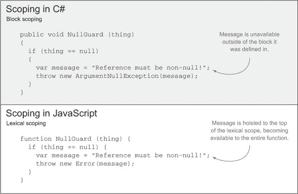

在图中，两个示例都使用了`message`变量。在第一个示例中，`message`仅在`if`语句块内部可用，而在第二个示例中，由于词法作用域，`message`对整个函数都可用。正如你将要学习的，这既有优点也有缺点。

##### JavaScript 中的变量作用域

理解作用域的工作原理将使你能够理解模块模式，我们将在 5.2 节中讨论它，作为组件化代码库的一种方式。在 JavaScript 中，`function`是一个一等公民，它被当作任何其他对象来对待。嵌套函数各自带有自己的作用域，内部函数可以访问直到全局空间的上层作用域。考虑以下代码中的`getCounter`函数：

```
function getCounter () {
    var counter = 0;
    return function () {
        return counter++;
    };
}
```

在这个示例中，`counter`变量与`getCounter`函数相关联。返回的函数可以访问`counter`，因为它属于父作用域的一部分。但`getCounter`之外没有任何东西可以创建对`counter`的引用；对其的访问已被关闭，只有`getCounter`的特权子代可以操作它。如果你在任一作用域级别引入`console.log(this)`语句，你会在两种情况下看到全局`Window`对象实例被引用。这是真正的“不好的部分”；默认情况下，`this`关键字将引用全局对象，如下面的列表所示。

##### 列表 5.3\. 理解`this`关键字

```
function scoping () {
    console.log(this);

    return function () {
        console.log(this);
    };
}
scoping()();
// <- Window
// <- Window
```

我们有不同方式可以操作 `this` 关键字。将 `this` 上下文赋值的最常见方式是在对象上调用方法。例如，当执行 `'Hello'.toLowerCase()` 时，`'Hello'` 将用作函数调用的 `this` 上下文。

##### 获取调用位置

当函数直接作为对象的属性调用时，该对象将成为 `this` 引用。如果该方法位于对象的原型中——例如 `Object.prototype.toString`——`this` 也将是方法被调用的对象。请注意，这是一个脆弱的行为；如果你直接引用一个方法并调用它，那么 `this` 就不再是 `parent`，而是再次成为全局对象。为了说明这一点，让我再给你展示另一个列表。

##### 列表 5.4\. `this` 关键字的范围

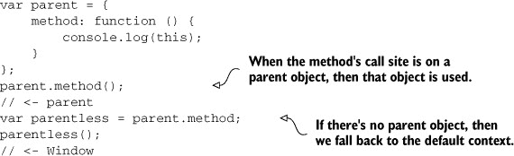

在严格模式下，`this` 将默认为 `undefined`，而不是 `Window`。在非严格模式下，`this` 总是一个对象；如果它通过对象引用调用，则是提供对象；如果它通过原始布尔值、字符串或数值值调用，则是一个封装表示；如果它通过 `undefined` 或 `null` 调用，无论是通过直接引用方法还是使用 `.apply`、`.call` 或 `.bind` 中的任何一个，则是指向全局对象（在严格模式下再次是 `undefined`）。在严格模式下传递给函数的 `this` 值不会被封装到对象中。我们很快就会了解到严格模式还能做什么。

除了调用函数时默认发生的情况外，你可以使用不同的方法为 `this` 赋值；这并不完全在你的控制之下。实际上，你可以使用 `.bind` 创建一个始终具有提供给它的 `this` 值的函数。执行方法的其他方式包括 `.apply`、`.call` 和 `new` 操作符。以下是一个速查表，以便你可以看到这些方法的作用：

```
Array.prototype.slice.call([9, 5, 7], 1, 2)
// <- [5]

String.prototype.split.apply('13.12.02', ['.'])// <- ['13', '12', '02']

var data = [1, 2];
var add = Array.prototype.push.bind(data, 3);

add(); // effectively the same as data.push(3)
add(4); // effectively the same as data.push(3, 4)

console.log(data);
// <- [1, 2, 3, 3, 4]
```

在 JavaScript 中，变量按照以下顺序填充作用域：

+   作用域上下文变量：this 和 arguments

+   命名函数参数：function (these, variable, names)

+   函数表达式：function something () {}

+   局部作用域变量：var foo

如果你没有在旁边使用 JavaScript 解释器进行实验，或者没有跟随代码示例（ch05/03_context-scoping），请确保查看代码示例；我已经将这些示例包含在本书提供的源代码中，如果你理解上有困难，它们包含了一些内联注释。现在让我们讨论严格模式包含的内容。

#### 5.1.4\. 严格模式

当启用时，严格模式会以修改代码工作语义的方式修改语义，减少对缺少 `var` 语句和类似容易出错的做法的宽容度，这在某种程度上与使用代码检查器是互补的.^([2]) 严格模式可以在单个函数或整个脚本上启用。

> ² 在 Mozilla 开发者网络中获取严格模式的详细解释，请访问 [`bevacqua.io/bf/strict`](http://bevacqua.io/bf/strict)。

对于客户端代码，首选函数形式。要启用严格模式，请在文件或函数顶部放置`'use strict';`语句（双引号也行）：

```
function () {
    'use strict';
    // here lies strict mode
}
```

除了`this`默认为`undefined`而不是全局对象之外，严格模式对错误的容忍度更低，将它们转换为错误而不是纠正它们。限制还包括禁止`with`语句、八进制表示法，以及防止将关键字如`eval`和`arguments`赋值。

```
'use strict';
foo = 'bar' // ReferenceError foo is not defined
```

在严格模式下，如果尝试写入只读属性、删除不可删除的属性、使用重复属性键创建对象或声明具有重复参数名称的函数，引擎也会抛出异常。这种不容忍的态度有助于捕捉到由于编码马虎而产生的问题。

在我们讨论作用域的话题时，我想讨论的最后一个小问题是通常被称为提升的内容。理解提升对于编写合理的复杂 JavaScript 应用程序非常重要。

#### 5.1.5\. 变量提升

许多 JavaScript 面试题可以通过理解作用域、`this`的工作原理以及提升来回答。我们已经涵盖了前两点，但提升究竟是什么？在 JavaScript 中，*提升*意味着变量声明被拉到作用域的起始位置。这解释了你在某些情况下可以观察到的意外行为。

函数表达式被完全提升：函数体也被提升，而不仅仅是它们的声明。如果我从《JavaScript 高级程序设计》这本书中只能学到一点，那就是关于提升的知识；它改变了我的编码方式，以及我对它的思考方式。

提升是调用函数表达式在声明之前按预期工作的原因。将函数赋值给变量不会奏效，因为变量在你想要调用函数的时候还没有被赋值。以下代码是一个例子；你将在附带的源代码中找到更多例子，列在 ch05/04_hoisting 中：

```
var value = 2;

test();

function test () {
  console.log(typeof value);
  console.log(value);
  var value = 3;
}
```

你可能预期方法首先打印`'number'`，然后是`2`，或者可能是`3`。试着运行它！为什么它先打印`'undefined'`然后是`undefined`？嗯，你好，提升！如果你按照提升后代码的最终顺序重新排列代码，会更容易理解。让我们看看以下列表。

##### 列表 5.5\. 使用提升

```
var value;

function test () {
  var value;
  console.log(typeof value);
  console.log(value);
  value = 3;
}

value = 2;
test();
```

`test`函数末尾的`value`声明被提升到了作用域的顶部，这也是为什么`test`没有抛出`TypeError`异常，警告`undefined`不是一个函数。记住，如果你使用了声明`test`函数的变量形式，实际上你会得到那个错误，因为虽然`var test`会被提升，但赋值不会，实际上变成了以下列表中的代码。

##### 列表 5.6\. 提升 var test

```
var value;
var test;

value = 2;
test();

test = function () {
  var value;
  console.log(typeof value);
  console.log(value);
  value = 3;
};
```

代码列表 5.6 中的代码不会按预期工作，因为当你想要调用 `test` 时，它还没有被定义。了解哪些内容会被提升以及哪些不会是非常重要的。如果你养成了一种编写代码就像它已经被提升的习惯，将变量声明和函数拉到它们作用域的顶部，你遇到的问题会比其他情况下少得多。到现在，你应该对作用域和 `this` 关键字感到很舒服了。现在是时候讨论 JavaScript 中的闭包和模块模式了。

### 5.2. JavaScript 模块

到目前为止，你已经了解了单一职责原则、信息隐藏以及如何在 JavaScript 中应用这些原则。你对变量的作用域和提升也有了一定的了解。现在让我们继续学习闭包。闭包将帮助你创建新的作用域并防止变量泄露信息。

#### 5.2.1. 闭包和模块模式

函数也被称为闭包，尤其是在关注函数创建新作用域的事实时。立即调用的函数表达式（IIFE）是一个立即执行的函数。IIFE 的全称是 Immediately-Invoked Function Expression。使用 IIFE 有助于创建闭包。以下代码是一个 IIFE 的示例：

```
(function () {
    // a new scope
})();
```

注意函数周围的括号。这告诉解释器你不仅声明了一个匿名函数，还将其用作一个值。这些表达式也可以用于赋值操作，这在需要变量可以通过导出的返回值访问时非常有用。这通常被称为模块模式，如下面的代码所示（在示例中标记为 ch05/05_closures）：

```
var api = (function () {
    var local = 0; // private and in-place!
    var publicInterface = {
        counter: function () {
            return ++local;

        }
    };
    return publicInterface;
})();
api.counter();
// <- 1
```

之前代码的一个常见变体不依赖于闭包之外的内容，而是导入它将要使用的变量。如果它想要公开一个公共 API，那么它就导入全局对象。我倾向于更喜欢这种方法，因为所有内容都被闭包很好地封装起来，你可以指示 JSHint 在未声明的变量问题上爆炸。没有闭包和 JSHint，这些可能会意外地成为全局变量。为了说明这一点，请看以下代码：

```
(function (window) {
    var privateThing;

    function privateMethod () {
    }

    window.api = {
        // public interface
    };
})(window);
```

让我们考虑 *原型式模块化*，它通过增强原型而不是使用闭包作为 IIFE 表达式的补充替代方案。使用原型可以提供性能提升，因为许多对象可以共享同一个原型，而在原型上添加函数可以为从它继承的所有对象提供功能。

#### 5.2.2. 原型式模块化

根据您的使用场景，原型可能正是您所需要的。将原型视为 JavaScript 声明类的方式，尽管它是一个完全不同的模型，因为原型仅仅是链接，除非您完全替换它们（并且手动进行覆盖），否则您无法覆盖属性。简而言之，不要试图将原型视为类，因为这肯定会引起可维护性问题。当您预期您的模块有多个实例时，原型最有用。例如，所有 JavaScript 字符串都共享 `String` 原型。原型的一个良好用途是在与 DOM 节点交互时。有时我发现自己在闭包内声明原型模块，然后在闭包外部保持私有状态，在原型之外。以下列表展示了伪代码，但请参阅作为 ch05/06_prototypal-modularity 列出的配套代码示例，以获取一个完全工作的示例，并更好地理解该模式。

##### 列表 5.7\. 使用伪代码进行原型设计

```
var lastId = 0;
var data = {};

function Lib () {
    this.id = ++lastId;
    data[this.id] = {

        thing: 'secret'
    };
}

Lib.prototype.getPrivateThing = function () {
    return data[this.id].thing;
};
```

这是保持数据安全的一种方法；存在许多场景，在这些场景中，数据私有化不是必需的，允许消费者操作您的实例数据可能是一件好事。您应该将这些内容全部封装在闭包中，以便您的私有数据不会泄露出来。我相信在处理 DOM 交互时，JavaScript 中的原型最有用，正如我们将在第七章中调查的那样。那是因为在处理 DOM 对象时，您通常必须同时处理许多元素；原型通过不在每个实例上复制其方法来提高性能，从而节省资源。

现在您已经更清楚地了解了作用域、提升和闭包是如何工作的，我们可以继续探讨模块应该如何相互交互。首先，让我们看看 CommonJS 模块：这是一种保持代码井然有序并一次性处理依赖注入（DI）的方法。

#### 5.2.3\. CommonJS 模块

CommonJS（CJS）是由 Node.js 等其他一些规范采用的规范，它允许您编写模块化的 JavaScript 文件。每个模块由一个单独的文件定义，如果您将值赋给 `module.exports`，它就成为了该模块的公共接口。要使用模块，您需要使用从消费者到依赖项的相对路径调用 `require`。

让我们看看一个快速示例，在示例中标记为 ch05/07_commonjs-modules：

```
// file at './lib/simple.js'
module.exports = 'this is a really simple module';

// file at './app.js'
var simple = require('./lib/simple.js');

console.log(simple);
// <- 'this is a really simple module'
```

这些模块最有用的优点之一是变量不会泄漏到全局对象：您不需要将代码封装在闭包中。在最高作用域声明的变量（如前一个片段中的 `simple` 变量）仅在该模块中可用。如果您想公开某些内容，您需要通过将其添加到 `module.exports` 中来明确表示这种意图。

到目前为止，你可能会认为我偏离了 CJS 的路径，因为 CJS 在浏览器中不再原生支持，就像 CoffeeScript 和 TypeScript 一样。你很快就会了解到如何使用 Browserify 编译这些模块，Browserify 是一个流行的库，旨在将 CJS 模块编译成浏览器可以处理的内容。CJS 相对于浏览器行为有以下优点：

+   没有全局变量，认知负荷更少

+   揭示 API 和消费模块的简单流程

+   通过模拟依赖项来测试模块更容易

+   通过 Browserify 访问 npm 上的包

+   模块化，这转化为可测试性

+   如果使用 Node.js，客户端和服务器之间共享代码更容易

你将在第 5.4 节中了解更多关于包管理解决方案（npm、Bower 和 Component）的信息。在我们到达那里之前，我们将探讨依赖项管理，即如何处理应用程序所需的组件，以及不同的库如何帮助管理它们。

### 5.3. 使用依赖项管理

在这里，我们将讨论两种依赖项管理类型：内部和外部。当谈到内部依赖项时，我指的是程序编写的一部分。最常见的情况是，这些依赖项与物理文件一对一映射，但你也可能在单个文件中有多个模块。通过模块，我指的是具有单一职责的代码片段，无论它们是服务、工厂、模型、控制器还是其他什么。相比之下，外部依赖项是指代码不由你的应用程序本身管理的那些。你可能拥有或编写了该包，但代码属于完全不同的存储库。

我将解释依赖图是什么，然后我们将研究处理它们的方法，例如使用 RequireJS 模块加载器的注意事项，CommonJS 提供的简单直接性，以及 AngularJS（由 Google 构建的模型-视图-控制器框架）在保持一切模块化和可测试性的同时解决依赖项的优雅方式。

#### 5.3.1. 依赖图

当编写依赖于其他内容的模块时，最常见的方法是让您的模块创建一个依赖于的对象的实例。为了说明这一点，请耐心地跟随我通过一小段 Java 代码；这应该很容易理解。以下列表显示了一个`UserService`类，它的目的是从领域逻辑层处理任何数据请求。它可以消费任何`IUserRepository`实现，该实现负责从 MySQL 数据库或 Redis 存储等存储库检索数据。此列表在示例中标记为 ch05/08_dependency-graphs。

##### 列表 5.8. 使用模块创建对象

```
public class UserService {
    private IUserRepository _userRepository;

    public UserService () {
        _userRepository = new UserMySqlRepository();
    }

    public User getUserById (int id) {
        return _userRepository.getById(id);
    }
}
```

但这还不够；如果你的服务应该使用符合接口的任何存储库，为什么你还要那样硬编码 `UserMySqlRepository` 呢？硬编码的依赖使得测试模块变得更加困难，因为你不会仅仅针对接口进行测试，而是针对具体的实现进行测试。一个更好的方法，碰巧也更易于测试，可能是通过构造函数传递那个依赖，如下面的列表所示。这种模式通常被称为依赖注入，它是一个听起来很聪明的替代方案，用于给对象提供实例变量。

##### 列表 5.9\. 使用依赖注入

```
public class UserService {
    private IUserRepository _userRepository;

    public UserService (IUserRepository userRepository) {
        if (userRepository == null) {
            throw new IllegalArgumentException();
        }
        _userRepository = userRepository;
    }

    public User getUserById (int id) {
        return _userRepository.getById(id);
    }
}
```

这样，你可以按照预期的方式构建你的服务，作为一个符合 `IUserRepository` 接口的任何存储库的消费者，而不需要了解实现的具体细节。创建一个 `UserService` 可能听起来不是什么大事，但一旦考虑到它的依赖以及依赖的依赖，事情就会变得复杂。这被称为 *依赖树*。以下片段显然不太吸引人：

```
String connectionString = "SOME_CONNECTION_STRING";
SqlConnectionString connString = new SqlConnectionString(connectionString);
SqlDbConnection conn = new SqlDbConnection(connString);
IUserRepository repo = new UserMySqlRepository(conn);
UserService service = new UserService(repo);
```

代码展示了 *控制反转* (IoC)，^([3]) 这是一个对相当简单的事情的冗长定义。IoC 意味着不是让对象负责其依赖项的实例化或获取它们的引用，而是通过构造函数或通过公共属性将依赖项提供给对象。图 5.3 考察了使用 IoC 模式的益处。

> ³ 在 [`bevacqua.io/bf/ioc`](http://bevacqua.io/bf/ioc) 阅读 Martine Fowler 关于控制反转和依赖注入的入门指南。

##### 图 5.3\. 经典依赖与使用 IoC 提高可测试性的比较

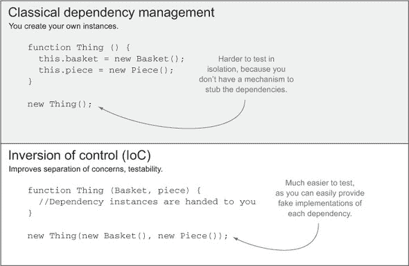

图中的 IOC 代码（位于底部）比图顶部的经典依赖管理代码更容易测试、更松散耦合，并且更容易维护。

IoC 框架用于解决依赖解析和缓解依赖地狱问题。这些框架的基本原理是放弃使用 `new` 关键字，并依赖于 IoC 容器。*IoC 容器* 是一个注册表，它了解如何实例化你的服务、存储库以及任何其他模块。学习如何配置传统的 IoC 容器（例如 Java 中的 Spring 或 C# 中的 Castle Windsor）超出了本书的范围，但了解该问题的概览对于铺平道路是必要的。

##### IoC 对于可测试性重要吗？

最终，避免硬编码依赖的重要性在于在单元测试时可以轻松地模拟它们，正如你将在 第八章 中看到的。

单元测试是关于断言接口是否按预期工作，而不管它们的实现方式如何。*模拟*是实现接口的存根，但除了符合它们的最基本要求外，不做任何事情。例如，一个模拟的用户存储库可能会始终返回相同的硬编码 `User` 对象。这在单元测试的上下文中很有用，您可能想单独测试 `UserService` 类，但不需要了解其内部工作原理，更不用说其依赖项的实现方式了！

太好了！现在就足够了解 Java 了。这一切与 JavaScript 应用程序设计有什么关系呢？如果您希望编写可测试的代码，理解测试原则是必要的。尽管您可能不同意测试驱动开发运动，但不可否认的是，没有考虑到可测试性的代码编写起来要困难得多。当谈到客户端 JavaScript 时，您还有一个额外的复杂性层：网络。除非您的代码以您在第二章中学到的方式打包在一起，否则模块不会立即可用。

接下来，我将向您介绍 RequireJS，这是一个异步模块加载器，它比传统的无管理依赖库方法更优。

#### 5.3.2\. 介绍 RequireJS

RequireJS 是一个 JavaScript 异步模块加载器 (AMD)，允许您定义模块，并使它们相互依赖。以下代码（在 samples 中的 ch05/09_requirejs-usage 可以找到）是 AMD 的一种示例用法，描述了一个依赖于其他模块的模块：

```
require(['lib/text'], function(text) {
    var result = text('foo bar');
    console.log(result);
    // <- 'FOO BAR'
});
```

按照惯例，`'lib/text`’ 会查找在 JavaScript 目录根目录下的 `./lib/text.js` 路径上的文件。该资源将被请求、解释，一旦所有依赖项都已加载，模块的函数将被调用，并将依赖项作为模块函数的参数传递，就像我在第 5.3.1 节中提到的 Java 代码一样。以下是如何定义 `'lib/text'` 模块的示例：

```
define([], function () {
    return function (input) {
        return input.toUpperCase();
    };
});
```

接下来，让我们分析 RequireJS 相比其他替代方案的优势和不足之处。

##### RequireJS 的优缺点

在这种情况下，定义使用了一个空数组，因为它没有依赖。返回的函数是 `'lib/text'` 模块提供的公共接口。使用 RequireJS 有几个好处：

+   依赖图会自动解析。不再需要担心脚本标签的顺序了！

+   包含异步模块加载。

+   在开发过程中不需要编译步骤。

+   它是单元可测试的，因此您只需加载需要测试的模块。

+   由于您的模块是在一个函数中定义的，因此强制执行闭包。

这些都是真实且令人愉悦的，但存在缺点。如果你的代码依赖的包没有被 AMD 魔法包装，你除了添加一个编译步骤来将所有内容捆绑在一起外别无选择。除非你将模块捆绑在一起，否则 RequireJS 将创建一个 HTTP 请求级联来获取每个依赖项，这在生产系统中会非常慢。AMD 的许多好处都来自于没有编译步骤，所以你只剩下了一个装满以下缺点的美化版的依赖关系图解析器：

+   如果你使用打包器，异步加载功能将不可用。

+   它要求供应商遵守 AMD 模型。

+   它会在你的代码中添加 AMD 包装器，造成混乱。

+   生产需要编译。

+   在发布环境中的代码与本地开发环境中的代码不同。

自从我们在第四章 chapter 4 中提到 Grunt 以来已经有一段时间了，你肯定不希望发布一大堆未优化的脚本！Grunt 将帮助你在构建过程中编译 AMD 模块，这样它们就不需要异步获取了。

要通过 `r.js`（RequireJS 优化器）使用 Grunt 编译 AMD 模块，你可以使用 `grunt-contrib-requirejs` 包。该包允许你将选项传递给 `r.js`。以下列表是相关的任务配置。你将为每个目标设置默认选项，并调整 `debug` 目标。这在你需要重复配置的部分时非常有用，因为这会违反 DRY 原则。

> ⁴ 想了解如何编译 RJS 模块，请查看随附的代码示例：[`bevacqua.io/bf/requirejs`](http://bevacqua.io/bf/requirejs)。

##### 列表 5.10\. 使用 Grunt 配置模块

```
requirejs: {
  options: {
    name: 'app',
    baseUrl: 'js/amd',
    out: 'build/js/app.min.js'
  },
  debug: {
    options: {
      preserveLicenseComments: false,
      generateSourceMaps: true,
      optimize: 'none'
    }
  },
  release: {}
}
```

在调试版本中，你生成一个源映射，^([5])，这有助于浏览器将它们正在执行的代码映射到编译它时使用的源代码。这在调试时非常有用，因为你将获得指向源代码的堆栈跟踪，而不是难以调试的编译结果。`release` 目标没有额外的配置，因为它只是使用了之前提供的默认值。如果你查看随附样本中的目录结构，这将更容易可视化配置，该结构类似于 图 5.4。

> ⁵ 关于源映射的更多信息，请参阅 HTML5Rocks 上的这篇入门文章：[`bevacqua.io/bf/sourcemap`](http://bevacqua.io/bf/sourcemap)。

##### 图 5.4\. 使用 RequireJS 在 Grunt 构建时的典型文件结构

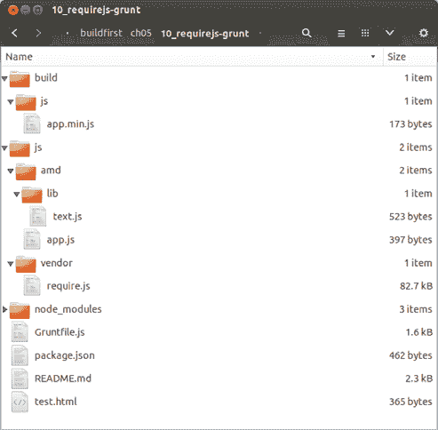

| |
| --- |

##### 备注

一个集成了 RequireJS 和 Grunt 的示例可以在本书的源代码中找到，位于 ch05/10_requirejs-grunt 目录下。它包含了关于配置 RequireJS 构建任务时使用的每个选项含义的详细信息。

| |
| --- |

不必按照特定顺序添加脚本标签是一个很好的特性，而且你有几种方法可以实现这一点。如果你对 AMD 解决方案并不完全满意，或者如果你对此感到好奇，请继续阅读，以了解如何将 CommonJS 模块引入浏览器，作为替代方案。

#### 5.3.3. Browserify：浏览器中的 CJS

在 5.2.3 节中，我解释了 CJS（Node.js 包中使用的模块系统）的好处。这些模块也因 Browserify 而有了在浏览器中的位置。这个选项经常被提出作为 AMD 的替代方案，尽管意见不一。由于你遵循的是 Build First 方法，因此为浏览器编译 CJS 模块不会成为大问题；这只是你构建过程中的一步！

除了在 5.2.3 节中描述的优点之外，如没有隐式全局变量，CJS 还提供了对 AMD 的简洁替代方案，因为你不需要 AMD 定义模块所需的所有杂乱和样板代码。CJS 模块的一个持续改进的特性是能够立即访问 npm 注册表中的任何包。到 2013 年，npm 注册表增长了 10 倍，在撰写本文时，它拥有超过 10 万个注册包。

Browserify 会递归地分析你应用中的所有`require()`调用，以构建一个你可以通过单个`<script>`标签提供给浏览器的捆绑包。正如你所期望的，Grunt 有许多插件急于将你的 CJS 模块编译成 Browserify 捆绑包，其中之一就是`grunt-browserify`。配置它类似于你在第二章中看到的内容，其中你提供了一个文件名来声明你的 CJS 模块的入口点，以及一个输出文件名：

```
browserify: {
  debug: {
    files: { 'build/js/app.js': 'js/app.js' },
    options: { debug: true }
  },
  release: {
    files: { 'build/js/app.js': 'js/app.js' }
  }
}
```

我认为采用这种方法的大部分心理负担不会来自 Browserify，而是学习`require`和 CJS 模块的模块化。幸运的是，你在配置 Grunt 任务时已经使用了 CJS 模块，这在第一部分中已经提到，这应该能给你关于 CJS 的见解，以及一些可以查看的代码示例！如何使用`grunt-browserify`编译 CJS 模块的完整示例可以在配套代码示例的 ch05/11_browserify-cjs 中找到。接下来，我们将探讨 AngularJS 如何处理依赖解析，作为处理依赖管理的第三（也是最后）种方法。

#### 5.3.4. Angular 的方式

Angular 是 Google 开发的一个创新的客户端 Model-View-Controller (MVC)框架。在第七章中，你将使用另一个流行的 JavaScript MVC 框架 Backbone。但 Angular 的依赖解析器在这个部分也值得提及。6

> ⁶ Angular 的文档提供了一个详尽的指南，解释了在 Angular 中 DI 是如何工作的，可以在[`bevacqua.io/bf/angular-di`](http://bevacqua.io/bf/angular-di)找到。

##### 利用 Angular 中的依赖注入

Angular 已经有一个相当复杂的依赖注入解决方案，所以我们不会深入细节。幸运的是，它足够抽象，使用起来很方便。我个人使用过许多不同的 DI 框架，Angular 让它感觉自然：你甚至没有意识到你正在进行 DI，就像 Java 和 RequireJS 一样。让我们通过一个虚构的例子一起走过，这个例子可以在 samples 中的 ch05/12_angularjs-dependencies 找到。将模块声明保存在自己的文件中很方便，就像这样：

```
angular.module('buildfirst', []);
```

然后，模块的各个不同部分，如服务或控制器，都被注册为之前声明的模块的扩展。请注意，你正在传递一个空数组给 `angular.module` 函数，这样你的模块就不依赖于任何其他模块：

```
var app = angular.module('buildfirst');

app.factory('textService', [
  function () {
    return function (input) {
      return input.toUpperCase();
    };
  }
]);
```

注册控制器的方式也类似；在下面的例子中，你将使用你创建的 `textService` 服务。这与 RequireJS 的工作方式类似，因为你需要使用你为服务指定的名称：

```
var app = angular.module('buildfirst');
app.controller('testController', [
  'textService',
  function (text) {
    var result = text('foo bar');
    console.log(result);
    // <- 'FOO BAR'
  }
]);
```

接下来，让我们简要比较一下 Angular 和 RJS。

##### 比较 Angular 和 RequireJS

Angular 与 RequireJS 不同之处在于，它不是作为一个模块加载器来工作，而是关注依赖图。你需要为每个使用的文件添加一个 script 标签，这与 AMD 不同，AMD 会为你处理这个问题。

在 Angular 的情况下，你会看到一个有趣的行为，即脚本顺序并不那么重要。只要你有 Angular 在顶部，然后是声明你的模块的脚本，其余的脚本可以按你想要的任何顺序排列，Angular 会为你处理这些。你需要在脚本标签列表的顶部添加以下代码，这就是为什么模块声明需要自己的文件：

```
<script src='js/vendor/angular.js'></script>
<script src='js/app.js'></script>
```

其余的脚本，作为 `app` 模块（或你给它起的任何名字）的一部分，可以按任何顺序加载，只要它们在模块声明之后：

```
<!--
    These could actually be in any order!
-->
<script src='js/app/testController.js'></script>
<script src='js/app/textService.js'></script>
```

让我们快速总结一下当前 JavaScript 模块系统的状态。

##### 使用 Grunt 打包 Angular 组件

作为旁注，在准备构建时，你可以明确地将 Angular 和模块放在顶部，然后为拼图的其余部分进行全局搜索。以下是如何配置传递给打包任务的 `files` 数组的示例，例如 `grunt-contrib-concat` 或 `grunt-contrib-uglify` 包中的任务：

```
files: [
    'src/public/js/vendor/angular.js',
    'src/public/js/app.js',
    'src/public/js/app/**/*.js'
]
```

你可能不想完全依赖功能丰富的 AngularJS 框架，你也不打算将其包含到你的项目中以利用其依赖解析能力！作为一个结束语，我想补充说，没有绝对正确的选择，这就是为什么我介绍了这三种方法：

+   RequireJS 模块，使用 AMD 定义

+   CommonJS 模块，然后使用 Browserify 编译它们

+   AngularJS，其中模块会为你解析依赖图

如果你的项目使用 Angular，那么它已经足够好，你不需要 AMD 或 CJS，因为 Angular 提供了一个足够模块化的结构。如果你不使用 Angular，那么我可能会选择 CommonJS，主要是因为你可以利用大量的 npm 包。

下一个部分将介绍其他包管理器，并像对 npm 所做的那样，教你如何在客户端项目中利用它们。

### 5.4\. 理解包管理

使用包管理器的一个缺点是它们倾向于使用某种特定的结构来组织依赖项。例如，npm 使用 `node_modules` 来存储已安装的包，而 Bower 使用 `bower_components`。Build First 的一个巨大优势是这根本不是问题，因为你可以将这些文件的引用添加到你的构建中，就这样！包的原始位置根本无关紧要。这就是使用 Build First 方法的一个巨大原因。

我想在本节讨论两个流行的前端包管理器：Bower 和 Component。我们将考虑每个的权衡，并将它们与 npm 进行比较。

#### 5.4.1\. 介绍 Bower

虽然 npm 是一个非凡的包管理器，但它并不适合所有的包管理需求：几乎发布到它的所有包都是 CJS 模块，因为它深深植根于 Node 生态系统。尽管我选择使用 Browserify 以便能够在 CJS 格式下编写模块化的前端代码，但这可能不是你参与的所有项目的选择。

Bower 是一个由 Twitter 创建的用于网页的包管理器，它是 *内容无关的*，这意味着作者打包图片、样式表或 JavaScript 代码都无关紧要。到现在你应该已经习惯了 npm 使用 `package.json` 清单跟踪包和版本号的方式。Bower 有一个 `bower.json` 清单，类似于 `package.json`。Bower 通过 `npm` 安装：

```
npm install -g bower
```

使用 `bower` 安装包既快速又直接；你只需要指定名称或 git 远程端点。在特定项目中，你首先需要运行 `bower init`。Bower 会问你几个问题（你可以按 Enter 键，因为默认值就很好），然后它会为你创建一个 `bower.json` 清单文件，如图 5.5 所示。

##### 图 5.5\. 使用 `bower init` 创建 `bower.json` 清单文件

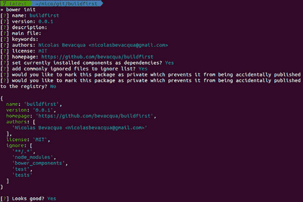

一旦这些准备工作完成，安装包就变得轻而易举。以下示例展示了如何安装 Lo-Dash，一个类似于 Underscore 的实用库，但维护更为积极。它将下载脚本并将它们放置在 `bower_components` 目录中，如图 5.6 所示。

##### 图 5.6\. 使用 bower `install --save` 获取依赖项并将其添加到清单中

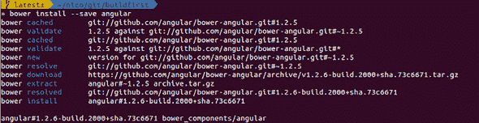

```
bower install --save lodash
```

就这些！你应该在`bower_components/lodash`目录中有脚本。将它们包含在你的构建配置中是一个将文件添加到你的分发配置的问题。通常，这个示例可以在配套的源代码中找到；寻找`ch05/13_bower-packages`。

Bower 可以说是第二大包管理器，其注册表中拥有近 20,000 个包，仅次于拥有超过 10 万个包的 npm。Component 作为另一个包管理解决方案，其拥有的包数量约为 3,000 个，但它提供了一个更模块化的替代方案，以及更全面的客户端包管理解决方案。让我们来看看吧！

#### 5.4.2. 大型库，小型组件

像 jQuery 这样的大型库可以做你需要的一切，以及你不需要的东西。例如，你可能不需要它附带的动画或 AJAX。从这个意义上说，试图通过自定义构建将部分内容从 jQuery 中排除出去是一场艰难的战斗；自动化这个过程并不简单，你得到的比付出的多，我想这就是“写得更少，做得更多”这个口号所指的。

Component 是一个专注于小型组件的工具，这些组件只做一件事情，但做得很好。TJ Holowaychuk，一位多产的开源作者，而不是使用一个大型的库来满足所有需求，他提倡使用多个小块来以模块化的方式构建你需要的精确内容，而不添加任何额外的冗余。

> ⁷ 在 Holowaychuk 的博客上阅读 Component 的介绍：[`bevacqua.io/bf/component`](http://bevacqua.io/bf/component)。

你需要做的第一件事，就像往常一样，是从`npm`安装 CLI 工具：

```
npm install -g component
```

如果你正在使用组件，你可以用一个包含最基本有效 JSON 的清单来应付。让我们也创建一个吧：

```
echo "{}" > component.json
```

安装像 Lo-Dash 这样的组件的工作方式与之前使用 Bower 的方式相似。主要区别在于，与 Bower 使用一个仅用于跟踪包的注册表不同，Component 使用 GitHub 作为其默认注册表。指定用户名和存储库，如以下命令所示，就足以获取一个组件：

```
component install lodash/lodash
```

与其他库的做法相比，Component 总是会更新清单，添加你安装的包。你还需要将入口点添加到组件清单的脚本字段中。

```
"scripts": ["js/app/app.js"]
```

在 Component 中，你还可以发现另一个不同之处，那就是它有一个额外的构建步骤，这个步骤会将你安装的所有组件打包成一个单一的`build.js`连接文件。鉴于组件使用 CommonJS 风格的`require`调用，必要的`require`函数也将被提供。

```
component build
```

我鼓励你查看一些配套的示例，这可能会帮助你学习如何使用 Component。第一个示例，ch05/14_adopting-component，是这里所描述内容的完整工作示例。

第二个，ch05/15_automate-component-build，解释了如何使用`grunt-component-build`包通过 Grunt 自动化构建步骤。这样的构建步骤如果您的代码也被视为组件，则特别有用。

总结一下，我将为您概述我们讨论的每个系统，这可能会帮助您决定使用哪个包管理器或模块系统。

#### 5.4.3. 选择正确的模块系统

Component 背后的理念是正确的——模块化的代码片段，能够很好地完成一项任务——但它也有一些细微的缺点。例如，它在`component install`中有一个不必要的构建步骤。执行`component install`应该构建组件运行所需的所有内容，就像`npm`做的那样。它也相当神秘，配置起来有点困难，文档也难以找到。糟糕的命名是这方面的巨大缺点，因为您无法通过在网络上搜索 Component 而得到不相关的结果，这使得找到您想要的文档变得困难。

如果您不认同 CJS 概念，Bower 是个不错的选择，而且它当然比您自己下载代码、将其放入目录并自行处理版本升级要好。Bower 在获取包方面做得不错，但它对模块化的帮助甚微，这也是它的不足之处。

就 Browserify 而言，目前如果您愿意承认 CJS 是今天最简单的模块格式，那么它是我们目前最好的选择。Browserify 没有内置包管理器是一个好事，因为它并不重要您选择哪个源来获取您消费的模块。它们可以来自 npm、Bower、GitHub 或其他地方。

Browserify 提供了将供应商代码引入 CJS 格式以及将 CJS 格式的应用程序导出为单个文件的机制。正如我们在 5.3.3 节中讨论的那样，Browserify 可以生成源映射，有助于开发过程中的调试，并且使用它可以使你访问最初为 Node 开发编写的任何 CJS 模块。

最后，AMD 模块可能非常适合与 Bower 一起使用，因为它们不会相互干扰。这里的优点是您不必学习 CJS 方法，尽管我会争辩说这并没有太多需要学习的。

在讨论即将到来的 ECMAScript 6 中 JavaScript 语言的变化之前，我们还有一个话题需要处理。那就是循环依赖的话题，比如鸡依赖于依赖于鸡的蛋。

#### 5.4.4. 了解循环依赖

循环依赖，如之前解释的鸡依赖于依赖于鸡的蛋，是一个难以解决的问题，并且许多模块系统根本不支持它们。在本节中，我旨在通过回答以下问题来解决您可能遇到的问题：

+   使用循环依赖有合理的理由吗？

+   您可以使用哪些模式来避免它们？

+   我们讨论的解决方案是如何处理循环依赖的？

互相依赖的组件代表了一种代码异味，这意味着你的代码中可能存在更深层次的问题。解决循环依赖的最佳方法是完全避免它们。你可以使用一些模式来避免它们。如果两个组件正在互相通信，这可能是一个迹象，表明它们需要通过它们都消费的服务进行通信，例如。这样，将更容易对受影响的组件进行推理（并为它们编写代码）。在第七章中，你将了解在客户端应用程序中使用 AngularJS 避免这些鸡生蛋、蛋生鸡类型情况的方法。

使用服务作为中间人是解决循环依赖的多种方法之一。你可能让 `chicken` 模块直接依赖于 `egg` 并与之通信，但如果 `egg` 想要与 `chicken` 通信，那么它应该使用 `chicken` 给它的回调。一个更简单的方法是让模块实例互相依赖。让 `chicken` 和 `egg` 互相依赖，而不是整个家族，这样就可以绕过这个问题。

你还需要考虑到不同的系统处理循环依赖的方式不同。如果你尝试在 Angular 中解决循环依赖，它将抛出一个错误。Angular 并没有提供任何机制来处理模块级别的循环依赖。你可以通过使用他们的依赖解析器来解决这个问题。一旦一个依赖于 `chicken` 模块的 `egg` 模块被解析，那么当 `chicken` 模块被使用时，它可以获取 `egg` 模块。

在 AMD 模块的情况下，如果你定义了一个循环依赖，使得 `chicken` 需要 `egg` 而 `egg` 需要 `chicken`，那么当 `egg` 的模块函数被调用时，它将为 `chicken` 获取一个 `undefined` 值。`egg` 可以在模块定义后使用 `require` 方法来获取 `chicken`。

CommonJS 允许通过在每次 `require` 调用暂停模块解析来解决循环依赖。如果一个 `chicken` 模块需要 `egg` 模块，那么 `chicken` 模块的解析将被暂停。当 `egg` 模块需要 `chicken` 时，它将获得 `chicken` 模块的局部表示，直到 `require` 调用被做出。然后 `chicken` 模块将完成解析。代码示例 ch05/16_circular-dependencies 说明了这一点。

重要的是，你应该像躲避瘟疫一样避免循环依赖。循环依赖将不必要的复杂性引入到你的程序中，模块系统没有标准的方式来处理它们，而且它们总是可以通过更有序地编写代码来避免。

为了总结本章内容，我们将探讨 ECMAScript 6 中即将到来的几个变化，以及它们在模块化组件设计方面的贡献。

### 5.5. 和谐：对 ECMAScript 6 的一瞥

如你所知，ECMAScript (ES) 是定义 JavaScript 代码行为的规范。ES6，也称为 Harmony，是该规范的（长期期待的）新版本。一旦 ES6 发布，你将受益于语言数百项大小改进，其中一部分我将在本节中介绍。在撰写本文时，Harmony 的一部分在 Chrome Canary（Google Chrome 的边缘版本）和 Firefox Nightly 构建中。在 Node 中，你可以通过调用 `node` 进程时使用 `--harmony` 标志来启用 ES6 语言功能。

请注意，ES6 功能高度实验性，并可能发生变化；规范始终处于变动之中。对本节中讨论的内容持保留态度。我将在即将发布的新语言版本中介绍概念和语法；目前作为 ES6 部分提出的功能不太可能改变，但具体的语法更有可能被调整。

Google 通过他们的 Traceur 项目在推广 ES6 学习方面做出了有趣的努力，该项目将 ES6 编译成 ES3（一个普遍可用的规范版本），允许你用 ES6 编写代码，然后执行生成的 ES3。尽管 Traceur 不支持 Harmony 中的所有功能，但它是最功能丰富的编译器之一。

#### 5.5.1\. Traceur 作为 Grunt 任务

由于一个名为 `grunt-traceur` 的包，Traceur 可作为 Grunt 任务使用。你可以使用以下配置来设置它。它将单独编译每个文件，并将结果放置在 `build` 目录中：

```
traceur: {
  build: {
    src: 'js/**/*.js',
    dest: 'build/'
  }
}
```

通过这个任务，你可以编译我沿途展示的一些 ES6 Harmony 示例。自然地，相关的代码示例包含了这个 Grunt 任务的运行示例，以及一些关于你可以使用 Harmony 做什么的片段，所以请务必查看 `ch05/17_harmony-traceur` 并浏览这些示例。第六章 和 第七章 也包含更多 ES6 代码片段，以更好地了解即将到来的语言功能。

现在你已经了解了几种开启 ES6 功能的方法，让我们深入了解 Harmony 的模块实现方式。

#### 5.5.2\. Harmony 中的模块

在本章中，你已导航不同的模块系统，并学习了模块化设计模式。AMD 和 CJS 的输入影响了 Harmony 模块背后的设计决策，旨在取悦任何一方的支持者。这些模块有自己的作用域；它们使用 `export` 关键字导出公共 API 成员，这些成员可以稍后使用 `import` 关键字单独导入。可选的显式 `module` 声明允许文件连接。

以下是如何这些机制工作的一个示例。我在写作时使用了当时可用的最新语法^([8])。这种语法来自 2013 年 3 月由负责推动语言发展的技术委员会 TC39 举行的一次会议。如果我是你，我不会过多关注具体细节，只需把握总体思路。

> ⁸ 在[`bevacqua.io/bf/es6-modules`](http://bevacqua.io/bf/es6-modules)找到 ES6 文章。

首先，你将定义一个包含几个导出方法的简单模块：

```
// math.js

export var pi = 3.141592;

export function circumference (radius) {
    return  2 * pi * radius;
}
```

消费这些方法只需在`import`语句中引用它们，如下面的代码片段所示。这些语句可以选择导入模块中找到的一个、多个或所有导出。以下语句将`circumference`导出导入到本地模块中：

```
import { circumference } from "math";
```

如果你想要导入多个导出，可以用逗号分隔它们：

```
import { circumference, pi } from "math";
```

使用`as`语法，你可以将模块中的每个导出导入到一个对象中，而不是直接导入到本地上下文中：

```
import "math" as math;
```

如果你想要显式地定义模块，而不是让它们隐式地定义，对于你打算将脚本打包到一个文件中的发布场景，你可以用一种字面量方式来定义一个模块：

```
module "math" {
    export // etc...
};
```

如果你对 ES6 中的模块系统感兴趣，你应该阅读一篇文章^([9])，这篇文章涵盖了关于 ES6 你已经学到的内容，并阐明了模块系统的可扩展性。始终记住，语法可能会变化。在前往第六章之前，我还有一个关于模块性的小 ES6 特性要提及。那就是`let`关键字。

> ⁹ 在[`bevacqua.io/bf/es6-modules`](http://bevacqua.io/bf/es6-modules)找到这篇文章。

#### 5.5.3\. 块作用域的出现

ES6 的`let`关键字是`var`语句的替代品。你可能记得`var`是函数作用域的，正如你在 5.1.3 节中分析的。使用`let`，你得到的是块作用域，这更类似于传统语言中的作用域规则。在变量声明方面，提升（Hoisting）起着重要作用，而`let`是绕过函数作用域限制的绝佳方式。

例如，考虑以下场景，这是一个典型的你想要条件性地声明变量的情况。提升（Hoisting）使得在`if`语句内部声明变量变得尴尬，因为你知道它会被提升到作用域的顶部，如果将来你决定在`else`块中使用相同的变量名，这可能会引起麻烦。

```
function processImage (image, generateThumbnail) {
    var thumbnailService;
    if (generateThumbnail) {
        thumbnailService = getThumbnailService();
        thumbnailService.generate(image);
    }

    return process(image);
}
```

使用`let`关键字，你可以在`if`块中声明它，不必担心它泄漏到该块之外，也不需要将变量声明与其赋值分开：

```
function processImage (image, generateThumbnail) {
    if (generateThumbnail) {
        let thumbnailService = getThumbnailService();
        thumbnailService.generate(image);
    }

    return process(image);
}
```

在这种情况下，差异是微妙的，但避免在函数作用域顶部列出长列表的变量，这些变量可能只会在代码路径中的一个被使用，在当前使用`var`的 JavaScript 实现中是一个代码异味。这是一个可以通过使用`let`关键字来轻松避免的代码异味，将变量保持在它们所属的块作用域中。

### 5.6. 概述

终于，你完成了作用域、模块系统等内容的学习！

+   你了解到保持代码自包含且具有明确目的，以及信息隐藏，可以极大地提高你的界面设计。

+   作用域、`this`和提升现在更加清晰，这将帮助你更好地设计符合 JavaScript 范式的代码，甚至没有意识到这一点。

+   使用闭包和模块模式教会了你模块系统是如何工作的。

+   你比较了 CommonJS、RequireJS 和 Angular 如何处理模块加载，以及它们如何处理循环依赖。

+   你了解到可测试性的重要性，我们将在第八章中进一步探讨，以及控制反转模式如何使你的代码更具可测试性。

+   我们讨论了如何利用 Browserify 在浏览器中利用 npm 包，使用 Bower 下载依赖项，以及使用 Component 编写模块化代码的 UNIX 哲学。

+   你看到了 ES6 即将带来的内容，例如模块系统和`let`关键字，以及你学习了如何使用 Traceur 编译器玩转 ES6。

在第六章章节 6 中，你将学习关于异步 JavaScript 开发的内容。你将了解常见的陷阱，并通过示例来帮助你理解如何有效地调试这些函数。你将查看编写异步函数的各种模式，如回调、事件、Promise 和即将到来的 Harmony 生成器 API。

## 第六章. 理解 JavaScript 中的异步流程控制方法

*本章涵盖*

+   理解回调地狱以及如何避免它

+   在 JavaScript 中创建 Promise 并保持它们

+   使用异步控制流

+   学习基于事件的编程

+   使用 Harmony（ECMAScript 6）生成器函数

第五章章节 5 讲述了以模块化方式构建组件的重要性，你学习了大量的关于作用域、提升和闭包的知识，这些都是有效理解异步 JavaScript 代码所必需的。如果没有对 JavaScript 异步开发的适度理解，编写易于阅读、重构和维护的高质量代码就会变得更加困难。

对于 JavaScript 开发初学者来说，最经常遇到的问题之一是处理“回调地狱”，其中许多函数嵌套在彼此内部，使得调试或甚至理解一段代码变得困难。本章旨在揭开异步 JavaScript 的神秘面纱。

*异步执行* 是指代码不是立即执行，而是在未来执行；这样的代码不是同步的，因为它不是顺序执行的。尽管 JavaScript 是单线程的，但用户触发的事件，如点击、超时或 AJAX 响应，仍然可以创建新的执行路径。本章将介绍不同的方法，通过应用一致的风格来处理异步流程，以可接受且不痛苦的方式处理异步代码流。就像第五章（kindle_split_017.html#ch05）一样，本章有许多实用的代码示例供你参考！

为了开始，我们将查看一个最古老的模式之一：将回调作为参数传递，以便函数的调用者可以确定回调被调用时未来的行为。这种模式被称为延续传递风格，它是异步回调的核心。

### 6.1\. 使用回调

使用回调的一个典型例子可以在 `addEventListener` API 中找到，它允许我们在 DOM（文档对象模型）节点上绑定事件监听器。当这些事件被触发时，我们的回调函数会被调用。在以下简单的示例中，当我们点击文档中的任何地方时，会在控制台打印一条日志语句：

```
document.body.addEventListener('click', function () {
  console.log('Clicks are important.');
});
```

点击事件处理并不总是那么简单。有时你可能会看到以下类似的列表。

##### 列表 6.1\. 使用逻辑面条的回调汤

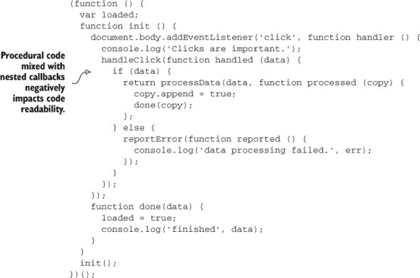

发生了什么？这正是我的想法。你已经经历了回调地狱，这是一个友好的名字，描述了在更多回调之上深度嵌套和缩进的回调，这使得跟踪流程和理解发生了什么变得相当困难。如果你无法理解 列表 6.1 中展示的代码，那很好。你不需要这样做。让我们更深入地探讨这个主题。

#### 6.1.1\. 避免回调地狱

即使是异步的代码，你也应该能够一眼看出其流程，如果你需要花几秒钟以上才能理解其流程，那么这段代码可能存在问题。每个嵌套的回调意味着更多的嵌套作用域，正如在第五章中观察到的，以及更深一级的缩进，这会在你的显示区域占用更多空间，使得代码更难跟踪。

回调地狱并非一夜之间发生，你可以防止它发生。使用一个示例（在示例中命名为 ch06/01_callback-hell），让我们看看它可能随着时间的推移慢慢渗透到你的代码库的裂缝中。假设你需要发起一个 AJAX 请求来获取数据，然后将其展示给人类。为了简化 AJAX-foo，我们将使用一个假想的 http 对象。假设你有一个记录变量，它持有对特定 DOM 元素的引用。

```
record.addEventListener('click', function () {
  var id = record.dataset.id;
  var endpoint = '/api/v1/records/' + id;

  http.get(endpoint, function (res) {
    record.innerHTML = res.data.view;
  });
});
```

这仍然很容易理解！如果你需要在`GET`请求成功后更新另一个组件，该怎么办？考虑以下列表。假设有一个`status`变量中的 DOM 元素。

##### 列表 6.2\. 回调蔓延

```
function attach (node, status, done) {
  node.addEventListener('click', function () {
    var id = node.dataset.id;
    var endpoint = '/api/v1/records/' + id;

    http.get(endpoint, function (res) {
      node.innerHTML = res.data.view;
      reportStatus(res.status, function () {
        done(res);
      });
    });

    function reportStatus (status, then) {
      status.innerHTML = 'Status: ' + status;

      then();
    }
  });
}

attach(record, status, function (res) {
  console.log(res);
});
```

好吧，这开始变得糟糕了！嵌套回调每次在代码中添加一个嵌套级别时都会增加复杂性，因为你现在必须跟踪现有函数的上下文以及更深回调的上下文。考虑到在真实的应用程序中，这些方法中的每一个可能都有更多的行，这使得在记忆中保持所有这些状态变得更加困难。

你如何对抗回调蔓延？通过减少回调嵌套深度，可以避免所有这些复杂性。

#### 6.1.2\. 解开回调混乱

你有方法来解开这些无辜的代码片段。以下是一个你应该考虑并修复的事项列表：

+   *命名匿名函数*，以提高其可读性，并给出它们所做工作的提示。命名的匿名回调提供了双重价值。它们的名称可以用来传达意图，并且在跟踪异常时也很有帮助，因为堆栈跟踪将显示函数名称，而不是显示为“匿名函数”。命名的函数将更容易识别，并在调试时节省你很多麻烦。

+   *移除不必要的回调*，例如在示例中报告状态之后的那个。如果一个回调只在函数的末尾执行，而不是异步执行，你可以将其移除。原本在回调中的代码可以直接放在函数调用之后。

+   *小心将条件语句与流程控制代码混合*。条件语句会阻碍你跟踪代码的能力，因为引入了新的可能性，你需要考虑代码可能遵循的所有可能方式。流程控制也会带来类似的问题。它使得阅读代码更困难，因为下一条指令不总是下一行。包含条件语句的匿名回调尤其难以跟踪流程，应该避免。第 6.1 节中的第一个示例很好地展示了这种混合是如何成为灾难的配方。你可以通过将条件语句与流程控制分离来减轻这个问题。提供函数的引用，而不是匿名回调，并可以保留条件语句的原样。

在对前一个列表中建议的更改进行更改后，代码最终会变成以下列表。

##### 列表 6.3\. 清理混乱

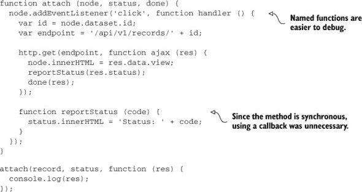

这还不是最糟糕的；还有其他什么？

+   `reportStatus`函数现在看起来毫无意义；你可以内联其内容，将其移动到唯一的调用位置，并减少心理负担。那些不会被重用的简单方法可以用其内容替换，从而减少认知负荷。

+   有时候，做相反的事情也是有意义的。您不必在行内声明点击处理程序，而是可以将其拉入一个命名函数，使`addEventListener`行更短。这主要是一个个人偏好的问题，但当代码行超过 80 个字符时，它可能有所帮助。

下一个列表显示了应用这些更改后的结果代码。尽管代码在功能上等效，但阅读起来容易多了。与列表 6.2 进行比较，可以得到更清晰的画面。

##### 列表 6.4\. 提取函数

```
function attach (node, status, done) {

  function handler () {
    var id = node.dataset.id;
    var endpoint = '/api/v1/records/' + id;

    http.get(endpoint, updateView);
  }

  function updateView (res) {
    node.innerHTML = res.data.view;
    status.innerHTML = 'Status: ' + res.status;

    done(res);
  }

  node.addEventListener('click', handler);
}

attach(record, status, function done (res) {
  console.log(res);
});
```

您所做的是使代码的阅读流畅。技巧是尽可能保持每个函数尽可能小和专注，正如在第五章中所述。然后，就是给函数起适当、描述性的名字，清楚地说明方法的用途。学习何时内联不必要的回调，就像您在`report-Status`中所做的那样，是一个实践问题。

通常情况下，只要代码的可读性得到提高，代码本身变得稍微长一点并不会有什么影响。可读性是您编写的代码最重要的单一方面，因为您将花费大部分时间在阅读代码上。在继续之前，让我们再来看一个例子。

#### 6.1.3\. 请求之上的请求

在 Web 应用程序中，拥有依赖于其他 AJAX 请求的 Web 请求并不罕见；后端可能不适合在单个 AJAX 调用中提供您所需的所有数据。例如，您可能需要访问客户客户的列表，但为了做到这一点，您必须首先使用他们的电子邮件地址获取客户 ID，然后您需要获取与该客户关联的区域，最后才能获取与该区域和客户关联的客户。

让我们看看以下列表（在示例中的 ch06/02_requests-upon-requests 中找到）以了解这个 AJAX 狂欢可能看起来是什么样子。

##### 列表 6.5\. 使用 AJAX 进行回调嵌套

```
http.get('/userByEmail', { email: input.email }, function (err, res) {
  if (err) { done(err); return; }

  http.get('/regions', { regionId: res.id }, function (err, res) {
    if (err) { done(err); return; }

    http.get('/clients', { regions: res.regions }, function (err, res) {
      done(err, res);
    });
  });
});

function done (err, res) {
  if (err) { throw err; }
  console.log(res.clients);
}
```

当您在第九章中分析 REST API 服务设计时，您将了解到，为了获取所需的数据而不得不跳过这么多环节通常是一个迹象，表明客户端代码是符合后端服务器提供的任何 API，而不是有一个专门为前端构建的 API。在我描述的案例中，如果服务器能够基于客户电子邮件完成所有这些工作，而不是进行那么多往返服务器，那就最好不过了。

图 6.1 显示了与服务器之间的重复往返，与前端专用 API 相比。如图所示，使用现有的 API，很可能它不会满足前端的需求，你必须在浏览器中对输入进行按摩处理，然后再将其传递给 API。在最坏的情况下，你可能甚至需要发出多个请求以获得所需的结果，这意味着额外的往返。如果你有一个专用的 API，它将能够完成你提出的任何任务，这将允许你优化并减少对服务器的请求次数，减少服务器负载并消除不必要的往返。

##### 图 6.1. 诉诸现有 API 或使用前端专用 API 之间的权衡

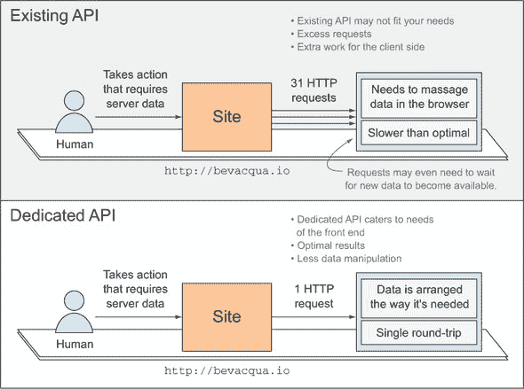

如果你考虑到这段代码可能位于闭包内，也可能位于事件处理程序内，缩进变得难以忍受：很难通过所有这些嵌套级别来跟踪代码，尤其是如果方法很长的话。给回调函数命名并将它们提取出来，而不是使用匿名函数，就足够开始重构功能，使其更容易理解。

下面的列表展示了重构后的代码，作为如何分解嵌套的一个示例。

##### 列表 6.6. 不再嵌套

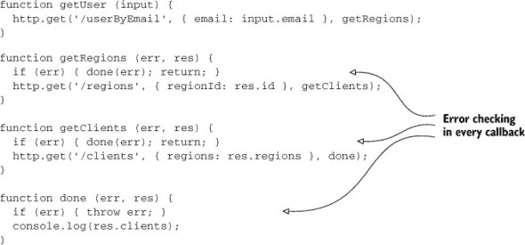

你已经可以看到这更容易理解了；现在所有内容都在相同的嵌套级别，流程更加清晰。你可能已经注意到了一个模式，即每个方法都会检查错误以确保下一步不会遇到任何意外。在接下来的几节中，我们将探讨在 JavaScript 中处理异步流的不同方法：

+   使用回调库

+   承诺

+   生成器

+   事件发射器

你将学习每个解决方案如何简化错误处理。现在，你将在当前示例的基础上进行构建，找出如何去除那些错误检查。

#### 6.1.4. 异步错误处理

你应该计划处理错误，而不是忽略它们。你永远不应该让错误被忽视。话虽如此，当使用回调地狱或命名函数方法时，进行任何形式的错误处理都是一件繁琐的事情。当然，比在每个函数中添加错误处理行更好的方法肯定存在。

在第五章中，你学习了不同的函数调用操作方法，例如使用`.apply`、`.call`和`.bind`。想象一下，如果你能写出一行如下代码，并且能够去除重复的错误检查语句，同时仍然进行检查，但只在一个地方进行，那岂不是很好？

```
flow([getUser, getRegions, getClients], done);
```

在前面的语句中，`flow`方法接受一个函数数组，并依次执行每个函数。每个函数都会接收到一个`next`参数，当它完成时应该调用该参数。如果传递给`next`的第一个参数是“真值”（JavaScript 中指任何非`false`、`0`、`''`、`null`或`undefined`的值），则`done`会被立即调用，中断流程。

第一个参数保留用于错误。如果该参数是“真值”，则你会短路并直接调用`done`。否则，将调用数组中的下一个函数，并将传递给`next`的所有参数（除了错误之外）以及一个新的`next`回调函数传递给它，该回调函数允许下一个方法继续链式调用。实现这一点似乎确实有些困难。

首先，你将要求`flow`方法的消费者在方法完成工作时调用一个`next`回调。这将有助于流程部分。你必须提供那个回调方法，并让它调用列表中的下一个函数，传递所有用于调用`next`的参数。你将附加一个新的`next`回调，该回调将调用下一个方法，依此类推。

图 6.2 解释了你将要实现的`flow`函数。

##### 图 6.2\. 理解异步流程方法

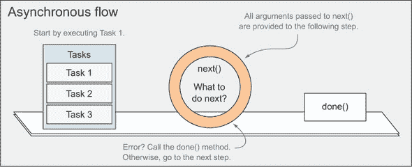

在你实现`flow`方法之前，让我们看看一个完整的用法示例。这就是你之前所做的事情，为特定客户寻找客户，但你不再需要在每个步骤中进行错误检查；`flow`方法将负责这一点。下面的列表显示了使用`flow`的样子。

##### 列表 6.7\. 使用流程方法

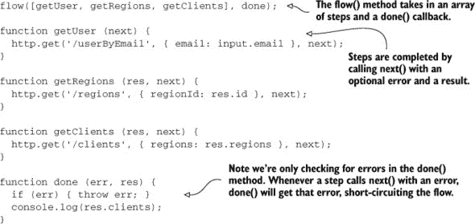

记住我们之前讨论的内容，让我们看看`flow`函数的实现。添加一个*保护*子句可以确保在给定步骤中对`next`的多次调用不会产生负面影响。只有第一次调用`next`会被考虑。`flow`的实现可以在下面的列表中找到。

##### 列表 6.8\. 实现异步系列`flow`方法

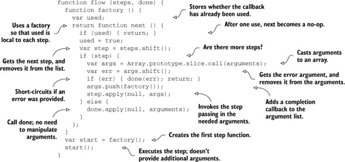

尝试自己跟随流程，如果你迷失了方向，请记住`next()`方法仅仅返回一个函数，该函数一旦被调用就会产生效果。如果你不想包含那个保护措施，你可以在每个步骤中重复使用同一个函数。然而，这种方法考虑到了消费者可能在实际步骤中两次调用`next`的编程错误。

维护如`flow`这样的方法以保持它们最新和没有错误可能会很繁琐，如果您只是想避免基于回调的异步流程的嵌套地狱，并希望得到相应的错误处理。幸运的是，聪明的人已经将这种以及其他许多异步流程模式实现到了一个名为`async`的 JavaScript 库中，并且它也被集成到流行的 Web 框架如 Express 中。在本章中，我们将讨论控制流范式，如回调、Promise、事件和生成器。接下来，您将熟悉`async`。

### 6.2\. 使用 async 库

在 Node 的世界里，许多开发者发现很难不使用`async`控制流库。*原生模块*，即 Node 平台本身的一部分，遵循最后一个函数参数是接收错误作为第一个参数的回调的模式。以下代码片段使用 Node 的文件系统 API 异步读取文件，说明了这一点：

```
require('fs').readFile('path/to/file', function (err, data) {
  // handle the error, use data
});
```

`async`库提供了许多异步控制流方法，就像在 6.1.3 节中构建`flow`实用方法时一样。您的`flow`方法与`async.waterfall`非常相似。区别在于`async`提供了数十种方法，如果正确应用，可以简化您的异步代码。

您可以从`npm`或`Bower`，或从 GitHub 获取`async`。^[[1]] 当您在 GitHub 上时，您可能想查看 Caolan McMahon（`async`的作者）编写的优秀文档。

> ¹ 您可以从 GitHub 下载 async 库：[`github.com/caolan/async`](https://github.com/caolan/async)。

在接下来的小节中，我们将详细介绍`async`控制流库，讨论您可能遇到的问题以及`async`如何为您解决这些问题，使代码更容易阅读。要开始，您将查看三种略有不同的流程控制方法：`waterfall`、`series`和`parallel`。

#### 6.2.1\. 水流、顺序或并行？

掌握异步 JavaScript 最重要的方面之一是了解您可用的所有不同工具，您在本章中一定会学到。其中一种工具是常见的控制流技术：

+   您想异步运行任务，使它们之间不相互依赖吗？使用`.parallel`来并发运行它们。

+   您的任务是否依赖于前一个任务？您可以按顺序运行它们，一个接一个，但仍然异步执行。

+   您的任务是否紧密耦合？使用允许您将参数传递给列表中下一个任务的瀑布机制。我们之前讨论的 HTTP 级联是一个完美的瀑布机制用例。

图 6.3 更详细地比较了三种替代方案。

##### 图 6.3\. async 库中并行、顺序和瀑布的比较。

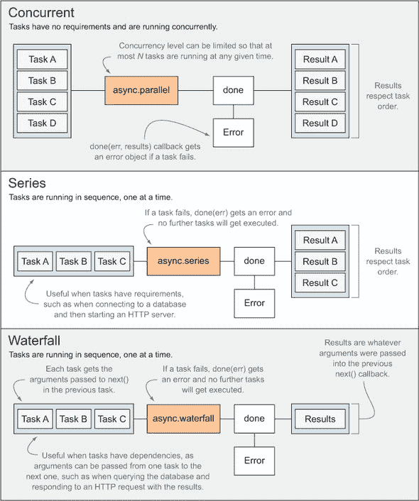

如图中所示，这三种策略之间存在细微的差异。让我们来分析一下。

##### 并发

并发任务执行在当你有几个不同的异步任务，它们没有相互依赖，但你仍然需要在所有这些任务完成时做某事时最有帮助；例如，当获取不同的数据来渲染视图时。你可以定义一个并发级别，即有多少个任务可以忙碌，而其余的任务则在队列中等待：

+   一旦一个任务完成，就会从队列中抓取另一个任务，直到队列为空。

+   每个任务都会传递一个特殊的`next`方法，当处理完成时应该调用它。

+   传递给`next`的第一个参数是保留用于错误的；如果你传递了一个错误，则不会执行任何其他任务（尽管已经执行的任务将运行到完成）。

+   第二个参数是传递任务结果的地方。

+   一旦所有任务结束，就会调用`done`回调。它的第一个参数将是错误（如果有），第二个参数将按任务排序的结果，无论它们完成所需的时间有多长。

##### 系列

顺序执行可以帮助你连接相关任务，这些任务旨在依次执行，即使代码执行是异步的，在主循环之外。想象一下系列流程就像并发流程，其并发级别设置为 1。实际上，这正是它的样子！`next(err, results)`和`done(err, results)`的相同约定同样适用。

##### 水落石出

水落石出的变体类似于顺序执行，但它允许你轻松地将一个任务的参数滚到下一个任务中，形成一个瀑布。这种类型的流程在任务只能使用其他任务的响应提供的数据来启动时最有用。在瀑布的情况下，流程不同，`next`接受一个错误，后跟任意数量的结果参数：`next(err, result1, result2, result...n)`。`done`回调的行为与此完全相同，为你提供了传递给最后一个`next`回调的所有参数。

接下来，让我们深入了解`series`和`parallel`是如何工作的。

##### 系列中的流程控制

你已经在`flow`方法中看到了`waterfall`的作用。让我们谈谈`series`，它与`waterfall`所做的略有不同。它按顺序执行步骤，一次一个，就像`waterfall`一样，但它不会干涉每个步骤函数的参数。相反，每个步骤只接收一个`next`回调参数，期望`(err, data)`签名。你可能想知道，“那对我有什么帮助？”答案是有时拥有单个参数的一致性，并且该参数是一个回调，这很有用。以下列表是一个说明`async.series`如何工作的示例。

##### 列表 6.9\. 使用`async.series`

```
async.series([
  function createUser (next) {
    http.put('/users', user, next);
  },
  function listUsers (next) {

    http.get('/users/list', next);
  },
  function updateView (next) {
    view.update(next);
  }
], done);

function done (err, results) {
  // handle error
  updateProfile(results[0]);
  synchronizeFollowers(results[1]);
}
```

有时候需要对结果进行单独的操作，就像你在之前的列表中所做的那样。在这些情况下，使用一个对象来描述任务而不是数组更有意义。如果你这样做，`done` 回调将获得一个 `results` 对象，将结果映射到每个任务的属性名。这听起来很复杂，但实际上并不复杂，所以让我们修改以下列表中的代码来阐述这个观点。

##### 列表 6.10\. 使用 `done` 回调

```
async.series({
  user: function createUser (next) {
    http.put('/users', user, next);
  },
  list: function listUsers (next) {
    http.get('/users/list', next);
  },
  view: function updateView (next) {
    view.update(next);
  }
}, done);

function done (err, results) {
  // handle error
  updateProfile(results.user);
  synchronizeFollowers(results.list);
}
```

如果一个任务仅仅涉及调用一个接受参数和 `next` 回调的函数，你可以使用 `async.apply` 来缩短你的代码；这将使代码更容易阅读。`apply` 辅助函数将接受你想要调用的方法和你想要使用的参数，并返回一个接受 `next` 回调并将其附加到你的参数列表中的函数。以下代码片段中显示的两种方法在功能上是等效的：

```
function (next) {
  http.put('/users', user, next);
}

async.apply(http.put, '/users', user)
// <- [Function]
```

以下代码是之前组合的任务流程的简化版本，使用了 `async.apply`：

```
async.series({
  user: async.apply(http.put, '/users', user),
  list: async.apply(http.get, '/users/list'),
  view: async.apply(view.update)
}, done);
```

如果你使用了 `waterfall`，这种优化将不会成为可能。由 `async.apply` 创建的函数只期望一个 `next` 参数，没有其他。在 `waterfall` 流中，任务可以传递任意数量的参数。相比之下，在 `series` 中，任务总是接收恰好一个参数，即 `next` 回调。

##### 并发流程控制

然后是 `async.parallel`。并发运行任务的工作方式与按顺序运行任务完全一样，只是你不会逐个处理任务，而是同时运行它们。并发流程导致执行时间更快，因此在你的工作流程没有特定要求，只需异步性时，`parallel` 是首选。

`async` 库还提供了功能方法，允许你遍历列表、将对象映射到其他内容或对它们进行排序。接下来，我们将探讨这些功能方法以及 `async` 内置的有趣任务队列功能。

#### 6.2.2\. 异步功能任务

假设你需要遍历一个产品标识符列表，并通过 HTTP 获取它们的对象表示。这是一个非常适合使用映射（map）的场景。映射通过一个修改输入的函数将输入转换为输出。以下列表（在示例中的 ch06/05_async-functional 文件夹中可用）展示了如何使用 `async.map` 来实现这一点。

##### 列表 6.11\. 使用映射将输入转换为输出

```
var ids = [23, 33, 118];

async.map(ids, transform, done);

function transform (id, complete) {
  http.get('/products/' + id, complete);
}

function done (err, results) {
  // handle the error
  // results[0] is the response for ids[0],
  // results[1] is the response for ids[1],
  // and so on
}
```

当调用 `done` 时，它将有一个错误参数作为第一个参数，你应该处理它，或者有一个结果数组作为第二个参数，该数组将与调用 `async.map` 时提供的列表顺序相同。一些方法的行为与 `async` 中的 `map` 类似。它们将接受一个数组和函数，将函数应用于数组中的每个项目，然后使用结果调用 `done`。

例如，`async.sortBy` 允许你原地排序一个数组（这意味着它不会创建一个副本），而你只需要传递一个值作为函数 `done` 回调的排序标准。你可以像以下列表中那样使用它。

##### 列表 6.12\. 对数组进行排序

```
async.sortBy([1, 23, 54], sort, done);

function sort (id, complete) {
  http.get('/products/' + id, function (err, product) {
    complete(err, product ? product.name : null);
  });
}

function done (err, result) {
  // handle the error
  // result contains ids sorted by name
}
```

`map` 和 `sortBy` 都基于 `each`，你可以将其视为 `parallel`，或者如果你使用 `eachSeries` 版本，则为 `series`。`each` 只是对数组进行循环并应用一个函数到每个元素；然后调用一个可选的 `done` 回调函数，它有一个错误参数告诉你是否出错。以下列表显示了使用 `async.each` 的一个示例。

##### 列表 6.13\. 使用 `async.each`

```
async.each([2, 5, 6], iterator, done);

function iterator (item, done) {
  setTimeout(function  () {
    if (item % 2 === 0) {
      done();
    } else {
      done(new Error('expected divisible by 2'));
    }
  }, 1000 * item);
}

function done (err) {
  // handle the error
}
```

`async` 库中的更多方法处理函数式情况，所有这些都与异步地将数组转换为数据的不同表示形式有关。我们不会涵盖其余的内容，但我鼓励你查看 GitHub 上的详尽文档.^([2])

> ² 你可以在 GitHub 上找到流控制库 `async`，网址为 [`github.com/caolan/async`](https://github.com/caolan/async)。

#### 6.2.3\. 异步任务队列

接下来是最后一种方法，`async.queue`，此方法将创建一个队列对象，可用于按顺序或并发运行任务。它接受两个参数：工作函数，它将接受一个任务对象和一个回调函数来表示工作已完成，以及并发级别，它决定了在任何给定时刻可以运行多少个任务。

如果并发级别是 `1`，你实际上是将队列变成了一个序列，在先前的任务结束后执行任务。让我们在以下列表中创建一个简单的队列（在示例中标记为 ch06/06_async-queue）。

##### 列表 6.14\. 创建一个简单的队列

```
var q = async.queue(worker, 1);

function worker (id, done) {
  http.get('/users/' + id, function gotResponse (err, user) {
    if (err) { done(err); return; }

    console.log('Fetched user ' + id);
    done();
  });
}
```

你可以使用 `q` 对象来使队列工作。要向队列中添加新工作，请使用 `q.push`。你需要传递一个任务对象，这是传递给工作者的内容；在我们的例子中，任务是一个数值字面量，但它也可以是一个对象或甚至是一个函数；以及一个可选的回调函数，当这个特定的工作完成时会被调用。让我们看看如何在代码中实现它：

```
var id = 24;
q.push(id, function (err) {
  if (err) {
    console.error('Error processing user 23', err);
  }
});
```

就这样。好处是你可以在不同时间点推送更多任务，它仍然会工作。相比之下，`parallel` 或 `series` 是一次性操作，你无法在之后添加任务到列表中。话虽如此，我们关于 `async` 控制流库的最后一个主题是关于组合流和动态创建任务列表——这两者都可能为你的方法带来更多的灵活性。

#### 6.2.4\. 流组成和动态流

有时，你需要构建更高级的流，其中

+   任务 b 依赖于任务 a

+   当任务 c 需要在之后执行

+   任务 d 可以与所有这些并行执行

当所有这些都完成后，你将运行最后一个任务：任务 e。

图 6.4 展示了该流可能的样子：

##### 图 6.4. 复杂异步流程的剖析。提示：始终根据需求在脑海中分组任务。


+   任务 A（上车）和任务 B（支付车费）需要按瀑布模式执行，因为任务 B 依赖于任务 A 的结果。

+   任务 C（到达你的工作场所）需要在任务 A 和 B 解决后按顺序执行。它依赖于这两个任务，但不是直接依赖。

+   任务 D（阅读一本书）没有依赖关系，因此它可以与任务 A、B 和 C 并行执行。

+   任务 E（工作）依赖于任务 C 和任务 D，因此必须在那些任务完成后执行。

这听起来和看起来比实际要复杂。只要你使用`async`这样的控制流库，你只需要编写几个堆叠在一起的函数。这可以像以下示例中的伪代码那样。在这里，我使用在 6.2.1 节中引入的`async.apply`来缩短代码。一个完整的示例可以在`samples/ch06/07_async-composition`中找到：

```
async.parallel([
    async.apply(async.series, [
        async.apply(async.waterfall, [getOnBus, payFare]),
        getToWork
    ]),
    readBook
], doWork);
```

以这种方式组合流程在编写涉及许多`async`操作的应用程序时非常有用，例如查询数据库、读取文件或连接到外部 API，所有这些操作往往会导致高度复杂的异步操作树。

##### 动态组合流程

通过向对象添加任务动态创建流程，可以使你组织任务列表变得更容易，这在没有使用控制流库的情况下会困难得多。这是对你在 JavaScript 这种动态语言中编写代码的事实的一种认可。你可以通过编写动态函数来利用这一点，所以请这样做！以下列表将一个项目列表映射到每个函数，然后使用该函数查询该项目。

##### 列表 6.15. 映射和查询项目列表

```
var tasks = {};

items.forEach(function queryItem (item) {
    tasks[item.name] = function (done) {
        item.query(function queried (res) {
            done(null, res);
        });
    };
});
function done (err, results) {
  // results will be organized by name
}
async.series(tasks, done);
```


**异步的轻量级替代方案**

关于`async`在客户端使用方面，我想提一下。`async`最初主要是为 Node.js 社区开发的，因此它对浏览器的测试并不那么严格。

我构建了自己的版本，`contra`，它有一个广泛的单元测试套件，在每次发布之前都会执行。我将`contra`中的代码保持到最小；它比`async`小 10 倍，使其非常适合浏览器。它提供了可以在`async`中找到的方法，以及实现事件发射器的一种简单方法，这在 6.4 节中有解释。你可以在 GitHub 上找到它，^([a])，并且它可在 npm 和 Bower 上使用。

> ^a 在 GitHub 上获取我的流程控制库`contra`，网址为[`github.com/bevacqua/contra`](https://github.com/bevacqua/contra)。


让我们继续讨论 Promises，这是一种通过链式函数和合同处理来处理异步编程的方法。你使用过 jQuery 的 AJAX 功能吗？那么你已经使用过一种名为 Deferred 的 Promises 变体，它与官方的 ES6 Promises 实现略有不同，但本质上相似。

### 6.3\. 创建 Promises

Promises 是一个新兴的标准，实际上它是官方 ECMAScript 6 草案规范的一部分。目前，你可以通过包含一个库，如 `Q`、`RSVP.js` 或 `when` 来使用 Promises。你也可以通过添加 ES6 Promises polyfill 来使用 Promises.^([3]) 一个 *polyfill* 是一段代码，它使你期望语言运行时能够原生提供的功能成为可能。在这种情况下，Promise 的 polyfill 将提供 Promises，就像它们在 ES6 中应该原生工作一样，使它们对 ES 标准的早期实现可用。

> ³ 在 [`bevacqua.io/bf/promises`](http://bevacqua.io/bf/promises) 找到 ES6 Promises polyfill。

在本节中，我将描述 ES6 中的 Promises，只要你包含 polyfill，你就可以使用它。如果你使用的是除了 polyfill 以外的 Promise，语法会有所不同，但这些变化足够微妙，核心概念保持不变。

#### 6.3.1\. Promise 基础

创建一个 Promise 涉及一个回调函数，该函数将 `fulfill` 和 `reject` 函数作为其参数。调用 `fulfill` 将改变 Promise 的状态为 `fulfilled`；你将在下一分钟看到这意味着什么。调用 `reject` 将状态改为 `rejected`。以下是一段简短且自解释的 Promise 声明代码，其中你的 Promise 将有一半的时间被实现，另一半时间被拒绝：

```
var promise = new Promise(function logic (fulfill, reject) {
  if (Math.random() < 0.5) {
    fulfill('Good enough.');
  } else {
    reject(new Error('Dice roll failed!'));
  }
});
```

如你所注意到的，Promises 没有任何固有的属性使它们专门用于异步操作，你也可以使用它们进行同步操作。当混合同步和异步代码时，这很有用，因为 Promises 不关心这一点。Promises 从 `pending` 状态开始，一旦它们失败或成功，它们就被解决，并且状态不能再改变。Promises 可以处于三种互斥状态之一：

+   **`Pending:`** 尚未实现或拒绝。

+   **`Fulfilled:`** 与 Promise 相关的操作已成功执行。

+   **`Rejected:`** 与 Promise 相关的操作失败。

##### Promise 连续

一旦创建了一个 Promise 对象，你可以通过 `then(success, failure)` 方法向其添加回调函数。当 Promise 被解决时，这些回调函数将相应地执行。当 Promise 被实现，或者如果它已经被实现，`success` 回调将被调用，如果它被拒绝或者如果它已经被拒绝，`failure` 将被调用。

图 6.5 展示了 Promises 如何被拒绝或实现，以及 Promise 连续工作的方式。

##### 图 6.5\. Promise 连续基础

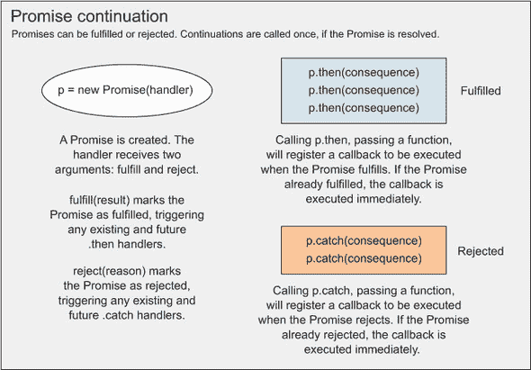

从图 6.5 中可以得出几点启示。首先，记住在创建 `Promise` 对象时，你会接受实现和拒绝回调，然后你可以使用它们来解决 `Promise`。调用 `p.then(success, fail)` 将在 Promise 被实现时执行成功，在 Promise 被拒绝时执行失败。请注意，这两个回调都是可选的，你也可以使用 `p.catch(fail)` 作为 `p.then(null, fail)` 的语法糖。

以下扩展列表显示了添加到我们之前示例中的 `then` 后续调用。你可以在代码示例中的 ch06/08_promise-basics 下找到它。

##### 列表 6.16\. 带有后续调用的 Promise

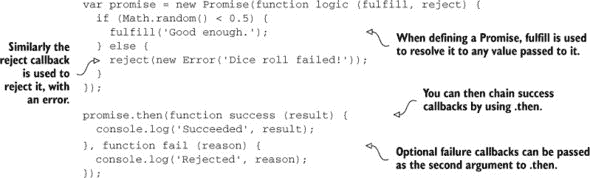

你可以随意多次调用 `promise.then`，当 Promise 被解决时，正确的分支（无论是成功还是拒绝）中的所有回调都将被调用，它们的调用顺序与它们被添加的顺序相同。如果代码是异步的，可能涉及 `setTimeout` 或 `XMLHttpRequest`，那么依赖于 Promise 结果的回调将不会执行，直到 Promise 被解决，如下面的列表所示。一旦 Promise 被解决，传递给 `p.then(success, fail)` 或 `p.catch(fail)` 的回调将立即执行，在适当的时候：如果 Promise 被实现，则只执行 `success` 回调，如果 Promise 被拒绝，则只执行 `fail` 回调。

##### 列表 6.17\. 执行 Promise

```
var promise = new Promise(function logic (fulfill, reject) {
  console.log('Pending...');

  setTimeout(function later () {
    if (Math.random() < 0.5) {
      fulfill('Good enough.');
    } else {
      reject(new Error('Dice roll failed!'));
    }
  }, 1000);
});

promise.then(function success (result) {
  console.log('Succeeded', result);
}, function fail (reason) {
  console.log('Rejected', reason);
});
```

除了在 Promise 对象上多次调用 `.then` 来创建不同的分支外，你还可以将这些回调链式连接起来，每次都改变结果。让我们来看看 Promise 链式调用。

##### Promise 转换链

这里的内容更难理解，但让我们一步一步来。当你链式调用回调时，它们将获得前一个回调返回的内容。考虑以下列表，第一个回调将解析 Promise 解决的 JSON 值到一个对象中，接下来的回调将打印该对象上的 `buildfirst` 是否为 `true`。

##### 列表 6.18\. 使用转换链

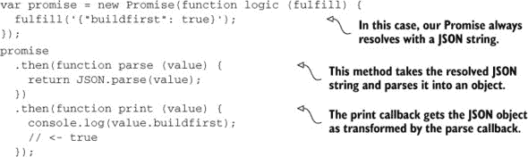

将回调链式调用以转换前一个值是有用的，但如果你需要链式调用异步回调，这对你就没有任何好处。你如何链式调用执行异步任务的 Promise？我们将在下一节中探讨这个问题。

#### 6.3.2\. 链式调用 Promise

你可以在回调中返回值，也可以返回其他 Promise。返回一个 Promise 有一个有趣的效果，即链中的下一个回调将等待返回的 Promise 完成。为了准备你的下一个示例，你将查询 GitHub API 获取用户列表，然后获取他们其中一个仓库的名称，让我们绘制一个 `Promise` 包装器，该包装器是原生浏览器 API 使用的 `XMLHttpRequest` 对象。

##### 纯 AJAX 调用

关于 `XMLHttpRequest` 的工作原理的具体内容超出了本书的范围，但代码应该是自解释的。以下列表展示了如何使用最少的代码发起一个 AJAX 调用。

##### 列表 6.19\. 发起 AJAX 调用

```
var xhr = new XMLHttpRequest();
xhr.open('GET', endpoint);
xhr.onload = function loaded () {
  if (xhr.status >= 200 && xhr.status < 300) {
    // get me the response
  } else {
    // report error
  }
};
xhr.onerror = function errored () {
  // report error
};
xhr.send();
```

这只是一个传递一个端点，设置一个 HTTP 方法——在这个例子中是 `GET`，并对结果进行异步操作的问题。这是一个将 AJAX 转换为 Promise 的完美机会。

##### 承诺 AJAX 数据

你不需要对代码进行任何修改，除了适当地将 AJAX 调用包裹在一个 Promise 中，并在必要时调用 `resolve` 和 `reject`。以下列表展示了一个可能的 `get` 实现，它通过使用 Promises 提供对 XHR 对象的访问。

##### 列表 6.20\. 承诺 AJAX

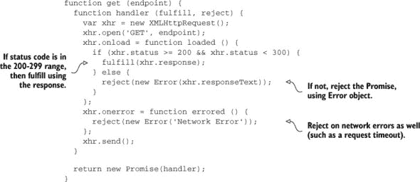

一旦这些问题都解决了，将导致仓库名称的调用序列组合起来看起来令人困惑地简单。注意你如何通过 Promises 混合异步调用，并通过使用 `then` 转换进行同步调用。以下是代码的样子，考虑到你实现的 `get` 方法：

```
get('https://api.github.com/users')
  .catch(function errored () {
    console.log('Too bad. That failed.');
  })
  .then(JSON.parse)
  .then(function getRepos (res) {
    var url = 'https://api.github.com/users/' + res[0].login + '/repos';
    return get(url).catch(function errored () {
      console.log('Oops! That one failed.');
    });
  })
  .then(JSON.parse)
  .then(function print (res) {
    console.log(res[0].name);
  });
```

你可以将 `JSON.parse` 方法打包到 `get` 方法中，但这似乎是一个展示如何使用 Promises 混合和匹配异步和同步操作的好机会。

如果你想要执行类似于在 第 6.2.1 节 中使用 `async.waterfall` 所做的操作，其中每个任务都从前一个任务的结果中获取数据，这将是非常棒的。那么，使用从 `async` 中获得的另一个流程控制机制呢？请继续阅读！

#### 6.3.3\. 控制流程

使用 Promises 进行流程控制可能和像 `async` 这样的库进行流程控制一样简单。如果你想在执行另一个任务之前等待一组 Promises，就像你使用 `async.parallel` 那样，你可以将 Promises 包裹在一个 `Promise.all` 调用中，如下面的列表所示。

##### 列表 6.21\. 承诺暂停

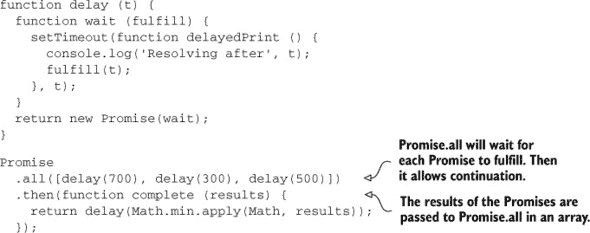

`delay(Math.min.apply(Math, results))` Promise 将在所有之前的 Promises 成功解决之后运行；同时请注意 `then(results)` 如何传递一个包含每个 Promise 结果的结果数组。正如你可能从 `.then` 调用中推断出的，`Promise.all(array)` 返回一个 Promise，当 `array` 中的所有项目都得到解决时，它将被实现。

使用 `Promise.all` 在执行长时间运行的操作时特别有用，例如一系列 AJAX 调用，因为你不想如果可以一次性完成它们，却按顺序进行。如果你知道所有的请求端点，请并发而不是顺序地发出请求。然后，一旦这些请求完成，你就可以最终计算依赖于执行这些异步请求的任何内容了。

##### 使用 Promises 进行函数式编程

当使用 Promises 执行功能任务，如 `async.map` 或 `async.filter` 等方法提供的功能时，你最好使用原生的 `Array` 方法。而不是求助于特定的 Promise 实现，你可以使用 `.then` 调用来将结果转换为所需的格式。考虑以下列表，使用与上面相同的 `delay` 函数，该函数接受超过 400 的结果然后进行排序。

##### 列表 6.22\. 使用 `delay` 函数对结果进行排序

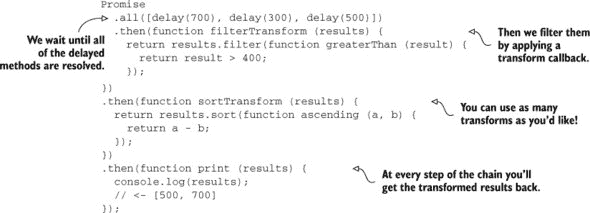

如你所见，使用 Promises 混合同步和异步操作非常简单，即使涉及到函数操作或 AJAX 请求也是如此。到目前为止，你一直在查看成功的路径，其中一切正常，但当你使用 Promises 时，应该如何恰当地处理合理的错误处理呢？

#### 6.3.4\. 处理拒绝的 Promises

你可以通过将回调函数作为 `.then(success, failure)` 调用的第二个参数来提供拒绝处理程序，正如你在 第 6.3.1 节 中所检查的那样。同样，使用 `.catch(failure)` 可以更容易地传达意图，它是 `.then(undefined, failure)` 的别名。

到目前为止，我们一直在谈论显式拒绝，例如在将回调函数传递给 Promise 构造函数时显式调用 `reject`，但这并不是你的唯一选择。

让我们检查下面的示例，它包括错误抛出和处理。请注意，我在 Promise 中使用了 `throw`，尽管你应该使用更具语义的 `reject` 参数来显示你可以在原始 Promise 以及 `then` 调用中抛出异常。

##### 列表 6.23\. 捕获和抛出

```
function delay (t) {
  function wait (fulfill, reject) {
    if (t < 1) {
      throw new Error('Delay must be greater than zero.');
    }
    setTimeout(function later () {
      console.log('Resolving after', t);
      fulfill(t);
    }, t);
  }
  return new Promise(wait);
}

Promise
  .all([delay(0), delay(400)])
  .then(function resolved (result) {
    throw new Error('I dislike the result!');
  })
  .catch(function errored (err) {
    console.log(err.message);
  });
```

如果你执行此示例，你会注意到 `delay(0)` Promise 抛出的错误将阻止成功分支的触发，因此永远不会显示 `'I dislike the result!'` 消息。但如果 `delay(0)` 不存在，那么成功分支将抛出另一个错误，这将阻止成功分支的进一步进展。

到目前为止，你已经了解了回调地狱以及如何避免它。你已经了解了使用 `async` 库进行异步流程控制，并且你也处理了使用 Promises 的流程控制，这在 ES6 中即将到来，但已经通过其他库和 polyfills 广泛可用。

接下来，我们将讨论 *事件*，这是一种异步 JavaScript 的形式，我相信你在处理 JavaScript 开发时肯定遇到过。稍后，你将了解 ES6 中关于异步流程的其他新特性。具体来说，你将了解 ES6 生成器，这是一种处理迭代器的创新特性，类似于在 C# 等语言的可枚举实现中可以找到的特性。

### 6.4\. 理解事件

事件也被称为发布/订阅或事件发射器。*事件发射器*是一种模式，其中组件发射特定类型的事件并传递参数，任何感兴趣的方都可以订阅感兴趣的事件并对事件和提供的参数做出反应。存在许多不同的方法来实现事件发射器，其中大多数以某种方式涉及原型继承。但您也可以将必要的方法附加到现有对象上，正如您将在第 6.4.2 节中看到的那样。

事件在浏览器中也是原生实现的。原生事件可能是一个 AJAX 请求获取响应，人类与 DOM 交互，或者 WebSocket 仔细监听任何即将到来的动作。事件本质上是异步的，并且散布在浏览器各处，因此管理它们是您的工作。

#### 6.4.1\. 事件和 DOM

事件是网络中最古老的异步模式之一，您可以在连接浏览器 DOM 与您的 JavaScript 代码的绑定中找到它们。以下示例注册了一个事件监听器，每次文档主体被点击时都会触发：

```
document.body.addEventListener('click', function handler () {
  console.log('Click responsibly. Do not click and drive!');
});
```

DOM 事件通常是由人类在浏览器窗口上点击、滚动、触摸或捏合触发的。如果它们没有被很好地抽象化，DOM 事件就很难测试。即使在下面显示的简单情况下，也要考虑匿名函数处理点击事件的含义：

```
document.body.addEventListener('click', function handler () {
  console.log(this.innerHTML);
});
```

测试这种功能很困难，因为您无法独立访问事件处理器。为了便于测试，并避免模拟点击来测试处理器（您将在第八章中看到，这仍然需要在集成测试中完成），建议您将处理器提取到命名函数中，或者将逻辑的主体移动到可测试的命名函数中。这也促进了可重用性，因为如果两个事件可以以相同的方式处理。以下代码片段显示了如何提取点击处理器：

```
function elementClick handler () {
  console.log(this.innerHTML);
}
var element = document.body;
var handler = elementClick.bind(element);

document.body.addEventListener('click', handler);
```

多亏了`Function.prototype.bind`，您将元素作为上下文的一部分保留下来。使用这种方式使用`this`既有利也有弊。您应该选择您最舒适的战略并坚持下去。要么始终将处理器绑定到相关元素，要么始终使用`null`上下文绑定处理器。一致性是可读（和可维护）代码最重要的特性之一。

接下来，您将实现自己的事件发射器，您将相关方法附加到对象上，而不使用原型，从而实现简单的实现。让我们看看这可能会是什么样子。

#### 6.4.2\. 创建您自己的事件发射器

事件发射器通常支持多种类型的事件，而不是单一的一种。让我们一步一步实现你自己的函数来创建事件发射器或改进现有对象作为事件发射器。在第一步中，你将返回对象不变，或者如果没有提供，则创建一个新对象：

```
function emitter (thing) {
  if (!thing) {
    thing = {};
  }
  return thing;
}
```

使用多个事件类型非常强大，而且只需一个对象来存储事件类型到事件监听器的映射。同样，你将为每个事件类型使用一个数组，这样你就可以将多个事件监听器绑定到每个事件类型。你还将添加一个简单的函数来注册事件监听器。以下列表（在 samples 中的 ch06/11_event-emitter 可以找到）显示了如何将现有对象转换为事件发射器。

##### 列表 6.24\. 提升对象到事件发射器状态

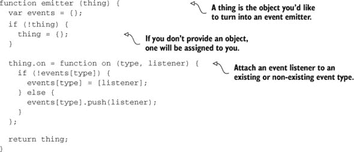

现在一旦创建了事件发射器，你就可以添加事件监听器了。这是它的工作方式。记住，当事件被触发时，监听器可以接收任意数量的参数；你将实现一个触发事件的方法：

```
var thing = emitter();

thing.on('change', function changed () {
  console.log('thing changed!');
});
```

自然地，这就像一个 DOM 事件监听器。现在你需要实现一个触发事件的方法。没有它，就不会有事件发射器。你将实现一个 `emit` 方法，允许你为特定的事件类型触发事件监听器，并传递任意数量的参数。以下列表显示了它的样子。

##### 列表 6.25\. 触发事件监听器

```
thing.emit = function emit (type) {
  var evt = events[type];
  if (!evt) {
    return;
  }
  var args = Array.prototype.slice.call(arguments, 1);
  for (var i = 0; i < evt.length; i++) {
    evt[i].apply(thing, args);
  }
};
```

`Array.prototype.slice.call(arguments, 1)` 这个语句很有趣。在这里，你将对 `arguments` 对象应用 `Array.prototype.slice`，并告诉它从索引 1 开始。这做了两件事。它将参数对象转换为一个真正的数组，并给出一个包含所有传递给 `emit` 的参数的数组，除了不需要调用事件监听器的事件类型。

##### 异步执行监听器

最后，你需要进行一个调整，那就是异步执行监听器，这样如果其中一个监听器崩溃，它们不会阻止主循环的执行。你也可以在这里使用 try/catch 块，但让我们不要在事件监听器中涉及异常；让消费者来处理。为了实现这一点，使用以下列表中所示的 `setTimeout` 调用。

##### 列表 6.26\. 事件发射

```
thing.emit = function emit (type) {
  var evt = events[type];
  if (!evt) {
    return;
  }
  var args = Array.prototype.slice.call(arguments, 1);
  for (var i = 0; i < evt.length; i++) {
    debounce(evt[i]);
  }
  function debounce (e) {
    setTimeout(function tick () {
      e.apply(thing, args);
    }, 0);
  }
};
```

你现在可以创建发射器对象，或者将现有的对象转换为事件发射器。请注意，由于你将事件监听器包裹在超时中，如果回调抛出错误，其余的仍然会运行到完成。在事件发射器的同步实现中并非如此，因为错误会停止当前代码路径的执行。

作为一项有趣的实验，我在以下列表中使用了事件发射器，并充分利用了 `Function.prototype.bind`。你能告诉我它是如何工作的以及为什么吗？

##### 列表 6.27\. 使用事件发射器

```
var beats = emitter();
var handleCalm = beats.emit.bind(beats, 'ripple', 10);

beats.on('ripple', function rippling (i) {
  var cb = beats.emit.bind(beats, 'ripple', --i);
  var timeout =  Math.random() * 150 + 50;
  if (i > 0) {
    setTimeout(cb, timeout);
  } else {
    beats.emit('calm');
  }
});

beats.on('calm', setTimeout.bind(null, handleCalm, 1000));

beats.on('calm', console.log.bind(console, 'Calm...'));
beats.on('ripple', console.log.bind(console, 'Rippley!'));

beats.emit('ripple', 15);
```

显然，这是一个人为构造的例子，它并没有做什么，但有趣的是，其中两位听众控制着流程，而其他人控制着输出，并且一个单一的发射会引发一系列不可阻挡的事件。通常，你可以在附带的示例中找到这个片段的完整工作副本，位于 ch06/11_event-emitter 目录下。同时，确保阅读所有之前示例的样本！

事件发射器的强大之处在于其灵活性，一种可能的用法是反转其含义。想象一下，你控制着一个具有事件发射器的组件，并公开了发射功能，而不是“监听”功能。现在，你的组件可以通过任意消息传递，并处理它们，同时它也可能发射自己的事件，并让其他人处理它们，从而在组件之间实现有效的通信。

在本章中，我还有一个话题要讲：ES6 生成器。生成器是 ES6 中的一种特殊函数，可以懒加载迭代，并提供有趣的价值。让我们更仔细地检查它们。

### 6.5. 概观未来：ES6 生成器

受 Python 强烈启发的 JavaScript 生成器是一个即将到来的有趣新特性，它允许你表示值序列，如斐波那契数列，你可以对其迭代。尽管你已经有能力迭代数组，但生成器是懒加载的。懒加载是好的，因为它意味着可以创建一个无限序列生成器，并迭代它而不会陷入无限循环或栈溢出异常。生成器函数用星号表示，序列中的项必须使用`yield`关键字返回。

#### 6.5.1. 创建你的第一个生成器

在下面的列表中，你将看到如何创建一个表示永不结束的斐波那契数列的生成器函数。根据定义，该序列中的前两个数字是 1 和 1，每个后续数字都是前两个数字的和。

##### 列表 6.28. 使用斐波那契数列

```
function* fibonacci () {
  var older = 0;
  var old = 1;

  yield 1;

  while (true) {
    yield old + older;
    var next = older + old;
    older = old;
    old = next;
  }
}
```

一旦你有了生成器，你可能想要消费它产生的值，为此，你需要调用生成器函数，这将给你一个迭代器。迭代器可以通过调用`iterator.next()`来从生成器中逐个获取值。对于使用前列表中的生成器的迭代器，该函数调用将产生一个如`{ value: 1, done: false }`的对象。当迭代器完成遍历生成器函数时，`done`属性将变为 true，但在本例中，由于无限`while(true)`循环，它永远不会结束。以下示例演示了如何使用永不结束的`fibonacci`生成器迭代几个值：

```
var iterator = fibonacci();
var i = 10;
var item;

while (i--) {
  item = iterator.next();
  console.log(item.value);
}
```

运行本节示例的最简单方法是访问 [`es6fiddle.net`](http://es6fiddle.net)，它将为你运行 ES6 代码，包括使用生成器的任何内容。或者，你可以获取 Node `v0.11.10` 或更高版本，你可以轻松地从 [`nodejs.org/dist`](https://nodejs.org/dist) 获取。然后，在执行脚本时使用 `node --harmony <file>` 将启用 ES6 功能，包括生成器，例如 `function* ()` 构造、`yield` 关键字和 `for..of` 构造，接下来我们将讨论这些。

##### 使用 for..of 迭代

`for..of` 语法允许你简化遍历生成器的过程。通常你会调用 `iterator.next()`，存储或使用提供的 `result.value`，然后检查 `iterator.done` 以查看迭代器是否耗尽。`for..of` 语法为你处理这些，简化了你的代码。以下是一个使用 `for..of` 循环遍历生成器的表示。请注意，你使用的是一个有限生成器，因为使用像 `fibonacci` 这样的生成器将创建一个无限循环，除非你使用 `break` 退出循环：

```
function* keywords () {
  yield 'buildfirst';
  yield 'javascript';
  yield 'design';
  yield 'architecture';
}

for (keyword of keywords()) {
  console.log(keyword);
}
```

在这一点上，你可能会想知道生成器如何帮助你处理异步流程，我们很快就会讨论这个问题。然而，首先，我们需要回到生成器函数并解释什么是暂停。

##### 生成器中的执行暂停

让我们再次看看第一个生成器示例：

```
function* fibonacci () {
  var older = 1;

  var old = 0;

  while (true) {
    yield old + older;
    older = old;
    old += older;
  }
}
```

这是如何工作的？为什么它不会陷入无限循环？每当执行 `yield` 语句时，生成器中的执行将被暂停并归还给消费者，传递给他们被产生的值。这就是 `iterator.next()` 获取值的方式。让我们通过一个简单的生成器更仔细地检查这种行为，该生成器具有副作用：

```
function* sentences () {
  yield 'going places';
  console.log('this can wait');
  yield 'yay! done';
}
```

当你迭代一个生成器序列时，生成器中的执行将在每个 `yield` 调用后立即暂停（直到请求序列中的下一个项目）。这允许你执行副作用，例如上一个示例中的 `console.log` 语句，这是由于第二次调用 `iterator.next()` 的结果。以下代码片段显示了如何迭代之前的生成器：

```
var iterator = sentences();

iterator.next();
// <- 'going places'

iterator.next();
// logged: 'this can wait'
// <- 'yay! done'
```

拥有了关于生成器的全新知识后，接下来你将尝试弄清楚如何扭转局面，构建一个可以消费生成器的迭代器，从而使异步代码更容易编写。

#### 6.5.2\. 异步性和生成器

让我们构建一个迭代器，它可以很好地利用挂起，以无缝的方式结合同步和异步流程。你如何实现一个 `flow` 方法，允许你实现如下列表（ch06/13_generator-flow）中的功能？在这个列表中，你在需要异步执行的方法上使用 `yield`，然后调用一个 `next` 函数，这个 `next` 函数将由 `flow` 实现提供，一旦你获取了所有需要的食物类型。注意你仍然在使用回调约定，其中第一个参数要么是错误，要么是假值。

##### 列表 6.29\. 构建一个利用挂起的迭代器

```
flow(function* iterator (next) {
  console.log('fetching food types...');
  var types = yield get;
  console.log('waiting around...');
  yield setTimeout(next, 2000);
  console.log(types.join(', '));
});

function get (next) {
  setTimeout(function later () {
    next(null, ['bacon', 'lettuce', 'crispy bacon']);
  }, 1000);
}
```

要使前面的列表工作，你需要以允许 `yield` 语句暂停直到 `next` 被调用这种方式创建 `flow` 方法。`flow` 方法将接受一个生成器作为参数，例如前面列表中的那个，并遍历它。生成器应该传递一个 `next` 回调，这样你可以避免匿名函数，你也可以，作为替代，产生接受 `next` 回调的函数，并将 `next` 回调传递给它们。消费者可以通过调用 `next()` 来让迭代器知道是时候继续了。然后执行将取消挂起，并从上次停止的地方继续。

你可以在以下列表中找到 `flow` 函数可能实现的示例。它的工作方式与迄今为止看到的迭代器非常相似，除了它还具有让传递给 `flow` 的生成器函数进行序列化的能力。这种异步生成器模式的关键方面是通过允许生成器通过使用 `yield` 暂停（挂起）和通过调用 `next` 恢复（取消挂起）迭代流的来回移动。

##### 列表 6.30\. 生成器流程实现

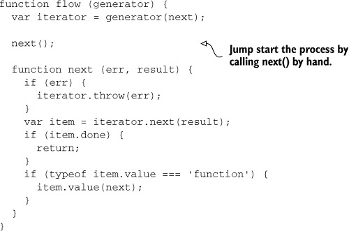

使用 `flow` 函数，你可以轻松混合流程，并且使流程轻松地跳入（和跳出）异步模式。向前看，你将使用传统的 JavaScript 回调和 `contra` 库中的控制流组合，`contra` 是 `async` 的轻量级替代品。

### 6.6\. 摘要

这需要覆盖很多内容，所以你可能想要休息一分钟，查看源代码示例，并稍微玩一下。

+   我们确定了回调地狱是什么，你学习了如何通过命名你的函数或组合你自己的流程控制方法来避免它。

+   你学习了如何使用 `async` 来满足不同的需求，例如异步序列、异步映射或创建异步队列。你深入了解了 Promise 的世界。你理解了如何创建一个 Promise，如何组合多个 Promise，以及如何混合和匹配异步和同步流程。

+   你以实现无关的方式审视了事件，并学习了如何实现你自己的事件发射器。

+   我向你展示了 ES6 中生成器的未来，以及你如何可能使用它们来开发异步流程。

在第七章中，你将更深入地了解客户端编程实践。我们将讨论与 DOM 交互的当前状态，如何改进它，以及组件化开发方面的未来趋势。我们将详细说明使用 jQuery 的后果，它可能不是适合所有情况的库，以及你可以转向的一些替代方案。你还将通过 BackboneJS 这个 MVC 框架亲自动手实践。

## 第七章\. 利用模型-视图-控制器

*本章涵盖*

+   比较纯 jQuery 与 MVC

+   学习 JavaScript 中的 MVC

+   介绍 Backbone

+   构建 Backbone 应用程序

+   查看服务器和浏览器中的共享视图渲染

到目前为止，我们讨论了围绕应用程序开发的话题，例如构建过程。我们还讨论了与代码相关的话题，例如连贯的异步流程和模块化应用程序设计。我们还没有涵盖应用程序本身的绝大部分，这正是本章要做的。我将解释为什么 jQuery，一个使与 DOM 交互变得更容易的流行库，可能在大型应用程序设计中有所不足，以及你可以使用哪些工具来补充它或完全替换它。你将学习使用模型-视图-控制器（MVC）设计模式开发应用程序，并在本章中创建一个管理待办事项列表的应用程序。

与模块化一样，MVC 通过分离关注点来提高软件质量。在 MVC 的情况下，这种分离分为三种类型的模块：模型（Models）、视图（Views）和控制器（Controllers）。这些部分相互连接，以将内部信息表示（模型，开发者理解的内容）与表示层（视图，用户看到的内容）以及连接这两种相同数据表示的逻辑（控制器，它还帮助验证用户数据并决定显示哪些视图）分开。

首先，我会告诉你为什么 jQuery 在大型规模应用程序设计中不足以满足需求，然后我会通过 Backbone.js 库教你关于 JavaScript 中的 MVC。这里的目的是让你开始进入现代 JavaScript 应用程序结构设计的奇妙世界，而不是让你成为 Backbone 的大师。

### 7.1\. jQuery 是不够的

自从 jQuery 库问世以来，它通过做好几件事情，帮助了几乎每一位在世的网络开发者。它解决了不同浏览器版本中的已知错误，并在浏览器之间标准化了 Web API，为消费者提供了一个灵活的 API，该 API 提供一致的结果，使其易于使用。

jQuery 帮助普及了 CSS 选择器作为在 JavaScript 中查询 DOM 的首选方法。原生的`querySelector` DOM API 与 jQuery 查询类似，允许你使用 CSS 选择器字符串搜索 DOM 元素。然而，仅凭 jQuery 是不够的。让我们来讨论一下原因。

#### 代码组织和 jQuery

jQuery 并不提供组织代码库的方法，这是可以接受的，因为 jQuery 并不是为此而设计的。尽管 jQuery 使访问原生 DOM API 变得更加简单，但它并没有努力执行将应用程序结构化的必要任务。仅依赖 jQuery 对于不需要结构的传统 Web 应用程序来说是可行的，但对于开发单页应用程序来说并不合适，因为单页应用程序往往拥有更大和更复杂的客户端代码库。

另一个原因，即使今天 jQuery 仍然如此受欢迎，是因为它是一个与其他库兼容性良好的库。这意味着你不必强迫自己在所有事情上都使用 jQuery。相反，你可以将其与其他库结合使用，这些库可能旨在增强 jQuery，也可能不是。你也可以单独使用 jQuery 而不依赖其他库。除非你将 jQuery 与 MVC 库或框架搭配使用，否则很难开发出不会随着时间的推移变成维护噩梦的模块化组件。

MVC 模式将应用程序的关注点分为视图、模型和控制器；这些组件相互交互和协作以服务于应用程序。你开发的大部分逻辑都变得自包含，这意味着一个复杂的视图不会转化为一个复杂的应用程序，这使得它成为开发可扩展应用程序的一个很好的选择。MVC 诞生于 20 世纪 70 年代末，但直到 2005 年 Ruby on Rails 的出现才进入 Web 应用程序领域。2010 年，Backbone 发布，将 MVC 带入了客户端 JavaScript 应用程序开发的主流。如今，JavaScript 开发 MVC Web 应用程序有数十种替代方案。

#### 视图模板

首先，你有 HTML；我们可以称之为 *视图*。这是定义你的组件外观及其在用户界面上的表示方式。这也是你定义数据片段将放置在哪里的方式。如果你只使用 jQuery，那么你必须手动创建构成你的组件的 DOM 元素，包括它们相应的 HTML 属性值和内文。通常情况下，你会使用模板引擎，它接受一个模板字符串（在这种情况下是 HTML）和数据，并使用这些数据填充模板。模板中可能有部分是循环遍历数组并为数组中的每个项目创建一些 HTML 元素。这种代码在纯 JavaScript 中编写起来很繁琐，即使你使用 jQuery 也是如此。如果你使用模板库，你不必担心这一点，因为引擎会为你处理。 展示了模板作为可重用组件的工作方式。

##### 图 7.1\. 使用不同的模板数据模型重用模板

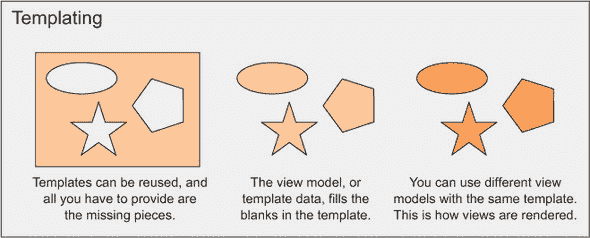

#### 使用控制器

然后是功能，为您的视图赋予生命；我们称之为*控制器*。这就是您如何使静态 HTML 模板获得生命力的方式。在控制器中，您会执行诸如将 DOM 事件绑定到特定操作或当发生某些事情时更新视图等操作。这用 jQuery 来做很容易；您向 DOM 添加事件，然后就可以了，对吧？对于一次性绑定来说，这很好，但如果你想要开发一个像之前看到的视图一样，并且将事件绑定到渲染的 HTML 上的组件，怎么办呢？

对于这个场景，您需要一个方法来一致地创建 DOM 结构，将其绑定到事件，对变化做出反应，并更新它。您还需要它能够独立工作，因为这是一个可重用的组件，您希望它在应用程序的许多地方都能工作。坦白说，您最终会慢慢地编写自己的 MVC 框架。这很好，作为一个学习练习。事实上，这正是我理解并重视 JavaScript 中 MVC 的方式。我为一个宠物项目，我的博客，编写了自己的 MVC 引擎，这就是我走上学习更多关于 JavaScript 中其他 MVC 引擎的道路。另一种选择是使用现有的（并且经过验证的）MVC 框架。

本指南解释了 MVC 模式的工作原理，它如何帮助开发复杂的应用程序，以及为什么需要它。在 7.2 节中，您将了解它如何在 JavaScript 中应用。您将查看不同的库，这些库有助于编写 MVC 代码，然后您将选择 Backbone。正如您所期望的，MVC 模式规定您的应用程序应该分为

+   持有渲染视图所需信息的模型

+   负责渲染模型并允许人与之交互的视图

+   在渲染相关视图之前填充模型并管理人与组件交互的控制器

图 7.2 展示了典型 MVC 应用程序设计中不同元素之间的交互。

##### 图 7.2。MVC 模式将关注点分为控制器、视图和模型。

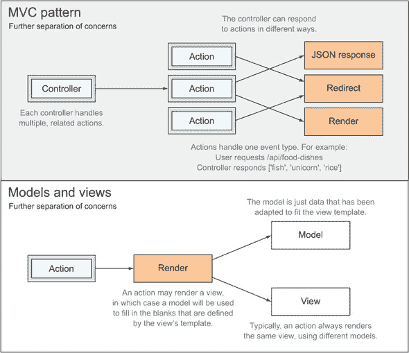

#### 模型

模型定义了视图需要传达的信息。这些信息可以从一个服务中提取，该服务反过来从数据库源获取数据，正如我们在第九章中讨论 REST API 设计和服务层时将要介绍的。模型包含原始数据，但模型中没有逻辑；它们是相关数据的静态集合。模型也不知道如何显示这些数据。这个关注点留给视图和视图本身。

#### 视图

视图是模板和数据表示的组合，模板为模型的数据表示提供结构，而模型则包含实际数据。模型可以在不同的视图中重用，并且通常可以重用。例如，“文章”模型可以在“搜索”视图和“文章列表”视图中使用。将视图模板与视图模型结合，可以得到一个视图，然后可以将其用作对 HTTP 请求的响应。

#### 控制器

控制器决定要渲染哪个视图，这是它们的主要目的之一。控制器将决定要渲染的视图，准备一个包含视图模板所需所有相关部分和片段的视图模型，并让视图引擎使用提供的模型和模板渲染视图。你可以使用控制器为视图添加行为，响应特定动作，或将人类用户重定向到另一个视图。

#### 路由器

视图路由是 Web 中 MVC（模型-视图-控制器）模式的一个基本组成部分，尽管它并不包含在其名称中。视图路由是 MVC 应用程序中第一个被请求击中的组件。路由器通过遵循先前定义的规则将 URL 模式与控制器动作相匹配。规则在代码中定义，并根据条件捕获请求：“每当有对`/articles/{slug}`的请求时，通过`Articles`控制器路由该请求，调用`getBySlug`动作，并传递`slug`参数”（`slug`是从请求的 URL 中插入的）。然后路由器将任务委托给控制器，控制器将验证请求，决定要渲染的视图，渲染它，重定向到其他 URL，并执行类似操作。规则按顺序评估。如果请求的 URL 不匹配规则的模式，它将简单地忽略请求，并评估下一个规则。

让我们更深入地探讨 JavaScript MVC，这贯穿了本章的其余部分。

### 7.2. 模型-视图-控制器在 JavaScript 中

MVC 模式并不是什么新鲜事物，尽管在过去十年中，它的采用率显著增加，尤其是在客户端 Web 领域，这个领域传统上完全缺乏任何结构。在本节中，我将解释为什么我选择 Backbone 作为我的首选教学武器，以及为什么我放弃了其他考虑的选项。在第 7.3 节中，我将通过 Backbone 解释 MVC 的基础。然后在第 7.4 节中，你将深入一个案例研究，其中你将使用 Backbone 开发一个小型应用程序，以便你可以学习如何使用它来构建可扩展的应用程序。在第九章中，你将把 Backbone 提升到下一个层次，以及迄今为止你所学到的所有内容，并使用它来完善一个更大的应用程序。

#### 7.2.1. 为什么选择 Backbone？

存在许多不同的框架和库用于执行客户端 MVC，更不用说服务器端 MVC 了，遗憾的是我无法涵盖所有这些。我为这本书必须做出的最艰难的选择之一是选择一个 MVC 框架来使用。有一段时间，我在 React、Backbone 和 Angular 之间犹豫不决。最终，我决定 Backbone 是教授我想传达给您的概念的最佳工具。做出那个选择并不容易，这主要取决于成熟度、简单性和熟悉性。Backbone 是现有的最古老的 MVC 库之一，因此也是最成熟的之一。它也是最流行的 MVC 库之一。Angular 是 Google 开发的 MVC 框架。它也很成熟——事实上，它是在 Backbone 之前发布的——但它也更复杂，学习曲线陡峭。React 是 Facebook 的解决方案；它不像 Angular 那样复杂，但它是一个更年轻的项目，最初于 2013 年发布，并且它不提供真正的 MVC 功能，因为它旨在只提供 MVC 中的视图。

Angular 引入了一些概念，一开始可能难以理解，我不想在书的剩余部分解释这些概念。我觉得 Angular 可能会妨碍教授如何编写 MVC 代码，我可能不得不教授如何编写 Angular 代码。最重要的是，我进入时的一个要求是展示如何进行共享渲染，在服务器和浏览器中重用相同的逻辑来渲染您的视图，跨越整个堆栈，而 Angular 并不是当您想要同时具有服务器端和客户端渲染时最好的解决方案，因为它并不是在这种限制下开发的。我们将在第 7.5 节中探讨共享渲染。


**理解渐进增强**

渐进增强是一种技术，它帮助为使用您网站的每个人提供可用的体验。这种技术建议您优先考虑内容，然后逐步添加增强功能，例如额外的功能，到内容中。因此，渐进增强的应用程序必须提供页面的全部内容，而不依赖于客户端 JavaScript 来渲染视图。一旦向用户提供这种最小化可消化的内容，就可以通过检测用户浏览器可用的功能来逐步增强体验。在提供这种初始体验之后，我们可能通过客户端 JavaScript 提供单页应用程序体验。

在这种哲学下开发应用程序有几个好处。因为您优先考虑内容，所以访问您网站的每个人都可以获得基本体验。这并不意味着禁用 JavaScript 的人可以查看您的网站，但意味着在移动网络上数据漫游的人可以更快地看到内容。此外，如果 JavaScript 资源的请求加载失败，至少他们可以访问您网站的可读版本。

你可以在我的博客上阅读更多关于渐进增强的内容，请访问 [`ponyfoo.com/articles/tagged/progressive-enhancement`](http://ponyfoo.com/articles/tagged/progressive-enhancement)。

| |
| --- |

React 引入的复杂性比 Backbone 更高，并且它不像 Angular 和 Backbone 那样提供真正的 MVC 解决方案。React 帮助你编写视图，提供模板化功能，但如果你想将其作为 MVC 引擎独家使用，则需要你做更多的工作。

Backbone 更容易渐进式学习。你不需要使用其中的每个功能来构建一个简单的应用程序。随着你的进步，你可以在 Backbone 中添加更多组件，并包含额外的功能，如路由，但你甚至不需要知道这些功能，直到你需要它们。

#### 7.2.2\. 安装 Backbone

在第五章中，你使用 CommonJS 编写了客户端代码。稍后，你将编译这些模块，以便浏览器可以解释它们。下一节将专门介绍使用 Grunt 和 Browserify 实现自动化编译过程。现在，让我们谈谈 Backbone。你首先要做的是通过 npm 安装它，如下所示。

记住，如果你没有 `package.json` 文件，你应该使用 `npm init.` 命令创建一个。如果你在 Node.js 应用程序方面遇到困难，请查看附录 A。

```
npm install backbone --save
```

Backbone 需要一个 DOM 操作库，如 jQuery 或 Zepto，才能正常工作。在你的示例中，你将使用 jQuery，因为它更广为人知。如果你考虑将此设置用于生产级应用程序，我建议你查看 Zepto，因为它具有显著更小的体积。让我们继续安装 jQuery：

```
npm install jquery --save
```

一旦你有了 Backbone 和 jQuery，你就可以开始组装应用程序了。你将要编写的第一行代码是用来设置你的 Backbone 库。Backbone 需要在使用之前将一个类似 jQuery 的库分配给 `Backbone.$`，所以你需要这样做：

```
var Backbone = require('backbone');
Backbone.$ = require('jquery');
```

Backbone 将使用 jQuery 与 DOM 交互，附加和删除事件处理器，以及执行 AJAX 请求。这就是启动和运行的所有内容。

是时候看看 Browserify 的实际应用了！我将带你通过设置 Grunt 来编译浏览器代码。一旦这个问题解决，你就可以浏览下一节中的示例。

#### 7.2.3\. 使用 Grunt Browserify Backbone 模块

你已经在第五章的 5.3.3 节中接触到了如何使用 Browserify 模块。以下列表显示了当时 Browserify 的 Gruntfile 配置。

##### 列表 7.1\. Browserify 的 Gruntfile 配置

```
{
  browserify: {
    debug: {
      files: { 'build/js/app.js': 'js/app.js' },
      options: {

        debug: true
      }
    }
  }
}
```

这次，让我们对那个配置进行两个小的调整。第一个调整是因为你想要监视变化并让 Grunt 重新构建包。这使我们能够实现持续、快速的开发，正如我们在第三章中讨论的那样。要监视变化，你可以使用我们在第三章中讨论的`grunt-contrib-watch`，使用如下代码中的配置：

```
{
    watch: {
      app: {
        files: 'app/**/*.js',
        tasks: ['browserify']
      }
    }
```

`tasks`属性包含任何在匹配的`files`发生变化时应运行的任务。

另一种调整使用了一种称为转换的东西。*转换*允许 Browserify 更改你的模块中的源代码，在将代码运行在浏览器上时更好地调整以满足你的需求。在你的情况下，要包含的转换被称为`brfs`，代表“浏览器文件系统”。这个转换将`fs.readFileSync`调用的结果内联，使得将视图模板与 JavaScript 代码分离成为可能。考虑以下模块：

```
var fs = require('fs');
var template = fs.readFileSync(__dirname + '/template.html', {
  encoding: 'utf8'
});

console.log(template);
```

那段代码无法转换以在浏览器中运行，因为浏览器无法访问你的服务器文件系统中的文件。为了解决这个问题，你可以在 Grunt 配置选项中添加`brfs`到`grunt-browserify`的转换列表中。`brfs`转换将读取由`fs.readFile`和`fs.readFileSync`语句引用的文件，并将它们内联到你的包中，使得它们可以在 Node 或浏览器中无缝工作：

```
options: {
  transform: ['brfs'],
  debug: true
}
```

你还需要在你的本地项目中安装`brfs`包，以下代码为安装命令：

```
npm install brfs --save-dev
```

就这些了，关于使用 Grunt Browserify 你的 CommonJS 模块！接下来，我将向你介绍 Backbone 的主要概念，它们是如何工作的，以及何时使用它们。

### 7.3\. Backbone 简介

Backbone 中存在一些结构，你可以围绕它们构建你的应用程序。以下是一个列表：

+   视图负责渲染 UI 并处理人机交互。

+   模型可以用来跟踪、计算和验证属性。

+   集合是有序的模型集合，用于与列表交互。

+   路由器允许你控制 URL，从而能够开发单页应用程序。

你可能已经注意到列表中找不到控制器。实际上，Backbone 视图充当控制器。这种从传统 MVC 中微妙的偏离通常被称为模型-视图-视图-模型（MVVM）。图 7.3 说明了 Backbone 与传统 MVC 之间的差异，正如它们在第 7.2 节图 7.2 中所示，并解释了路由在这个结构中的位置。

##### 图 7.3\. Backbone 处理 MVC 中面向人类的部分：事件处理、验证和 UI 渲染。

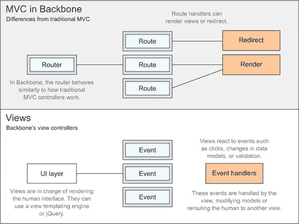

自然地，关于这些结构中的每一个，都有更多东西可以学习。让我们逐一访问它们。

#### 7.3.1\. Backbone 视图

视图负责渲染 UI，而你则负责为你的视图组合渲染逻辑。如何渲染 UI 完全取决于你。两种首选的选项是使用 jQuery 或模板库。

视图总是与一个元素相关联，渲染将在这里进行。在下面的列表中，让我们看看一个基本视图是如何被渲染的。在这里，你创建了一个 Backbone 视图，添加了自定义的渲染功能，这将设置视图元素中的文本。然后你实例化了视图并渲染了视图实例。

##### 列表 7.2\. 渲染基本视图

```
var SampleView = Backbone.View.extend({
  el: '.view',
  render: function () {
    this.el.innerText = 'foo';
  }
});

var sampleView = new SampleView();

sampleView.render();
```

你看你是如何声明`el`属性并将其赋值为`.view`的吗？你可以将一个 CSS 选择器赋给这个属性，然后它会在 DOM 中查找这个元素。在这个视图中，这个元素将被分配给`this.el.`。使用一个 HTML 页面，例如以下页面，你可以渲染这个最小的 Backbone 视图：

```
<div class='view'></div>
<script src='build/bundle.js'></script>
```

如我之前在 7.2.3 节中解释的，捆绑脚本文件将是编译后的应用程序。一旦运行，视图元素将获得`foo`文本内容。你可以在配套的源代码中查看这个示例；它列在 ch07/01_backbone-views 中。

你的视图是静态的，你可能已经知道如何使用 jQuery 渲染一个视图，但这需要更多的工作，因为你必须创建每个元素，设置它们的属性，并在代码中构建一个 DOM 树。使用模板更容易维护，并且可以将你的关注点分开。让我们看看它是如何工作的。

##### 使用 Mustache 模板

Mustache 是一个视图模板库，它接受一个模板字符串和一个视图模型，并返回生成的视图。你在模板中引用模型值的方式是通过使用特殊的`{{value}}`符号来声明它们，这个符号将被模型的`value`属性所替换。

Mustache 还使用类似的语法，允许你遍历数组，将模板的一部分包裹在`{{#collection}}`和`{{/collection}}`中。当遍历一个集合时，你可以使用`{{.}}`访问数组项本身，你也可以直接访问它的属性。

为了给你一个快速示例，让我们从一个 HTML 视图模板开始：

```
<p>Hello {{name}}, your order #{{orderId}} is now shipping. Your order includes:</p>
<ul>
  {{#items}}
  <li>{{.}}</li>
  {{/items}}
</ul>
```

为了填充这个模板，你需要使用 Mustache，将其传递给一个模型。首先，你将不得不从 npm 安装 Mustache：

```
npm install mustache --save
```

渲染这个模板只是将其作为一个字符串传递给 Mustache，以及一个视图模型：

```
var Mustache = require('mustache');
Mustache.to_html(template, viewModel);
```

在 Backbone 中做这件事，你需要创建一个可重用的模块，如下面的代码片段所示，它将知道如何使用 Mustache 渲染任何视图，将视图的模板和视图的视图模型传递给它。在这里，你创建了一个可以供其他视图继承的基础视图，共享基本功能，如视图渲染，这样你就不必在每个创建的视图中复制和粘贴这个方法：

```
var Backbone = require('backbone');
var Mustache = require('mustache');

module.exports = Backbone.View.extend({
  render: function () {
    this.el.innerHTML = Mustache.to_html(this.template, this.viewModel);
  }
});
```

在上一个示例中，你有一个静态视图，将所有应用程序放在一个模块中是完全可以的。但这次，你稍微模块化了它。有一个基本视图是很好的，为每个视图有一个单独的模块同样重要。在下面的代码片段中，你正在要求之前看到的基视图模板并扩展它。你使用 `fs.readFileSync` 来加载你的 Mustache 模板，因为 `require` 只适用于 JavaScript 和 JSON 文件。你不会在视图模块本身中包含模板，因为这总是很好地将你的关注点分开，尤其是如果这些关注点在不同的语言中。此外，视图模板可能被许多不同的视图使用。

```
var fs = require('fs');
var base = require('./base.js');
var template = fs.readFileSync(
  __dirname + '/templates/sample.mu', 'utf8'
);

module.exports = base.extend({
  el: '.view',
  template: template
});
```

最后，你需要调整你的原始应用程序模块，使其需要视图而不是声明视图，并在渲染视图之前声明视图模型。这一次，视图将通过 Mustache 渲染，如下面的列表所示。

##### 列表 7.3\. 使用 Mustache 渲染视图

```
var SampleView = require('./views/sample.js');
var sampleView = new SampleView();

sampleView.viewModel = {
  name: 'Marian',
  orderId: '1234',
  items: [
    '1 Kite',
    '2 Manning Books',
    '7 Random Candy',
    '3 Mars Bars'
  ]
};
sampleView.render();
```

你可以在附带的代码示例中查看这个示例；它在 ch07/02_backbone-view-templates 中列出。接下来是模型，Backbone 应用程序的另一个关键部分。

#### 7.3.2\. 创建 Backbone 模型

Backbone 模型（也称为数据模型）存储你的应用程序数据，这些数据通常是数据库中可以找到的数据的副本。它们可以用来观察变化，以及验证这些变化。这些不要与视图模型（例如我们在上一个示例中分配给 `sampleView.viewModel` 的视图模型，也称为模板数据）混淆，视图模型通常包含 Backbone 数据模型的组合，通常格式化为适合 HTML 模板的文本。例如，日期可能以 ISO 格式存储在数据模型中，但在模板数据中格式化为可读的字符串。同样，视图从 `Backbone.View` 扩展，模型从 `Backbone.Model` 扩展，它们可以大大提高你的数据交互性。模型可以进行验证，测试用户输入的坏数据；它们可以观察，帮助你响应数据模型中的变化；你还可以根据模型中的数据计算属性。

你可以用你的模型做的最有影响力的事情可能是观察模型数据的变化。这允许你的用户界面几乎不费吹灰之力地对数据的变化做出反应。记住，同一份数据可以用许多不同的方式表示。例如，你可以将同一份数据表示为列表中的一个条目、一张图片或一个描述。模型使你能够实时更新这些表示，随着数据的变化而变化！

##### 数据建模和可塑性

让我们看看一个例子（在`samples/ch07/03_backbone-models`中找到），在这个例子中，你将用户输入的内容渲染为纯文本、二进制格式，如果它是 URL，则渲染为锚点链接。为了开始，你需要创建一个模型来检查其数据是否看起来像链接。`get`方法允许你在 Backbone 中访问模型属性的值。

```
module.exports = Backbone.Model.extend({
  isLink: function () {
    var link = /^https?:\/\/.+/i;
    var raw = this.get('raw');
    return link.test(raw);
  }
});
```

假设你有一个`binary.fromString`方法来将模型数据转换为二进制字符串，并且你想要获取二进制流的第一个几个字符，你可以为这个添加一个模型方法，因为它也涉及到数据。一般来说，每个可以重用且仅（或主要）依赖于模型数据的方法可能都应该是一个模型方法。以下是一个获取二进制字符串的可能实现。如果二进制代码超过 20 个字符，你可以使用 Unicode 省略号字符`'\u2026'`或`'...'`进行截断：

```
getBinary: function () {
  var raw = this.get('raw');
  var bin = binary.fromString(raw);
  if (bin.length > 20) {
    return bin.substr(0, 20) + '\u2026';
  }
  return bin;
}
```

我提到你可以监听模型中的变化。让我们更深入地了解事件。

##### 模型和事件

将你的视图与该模型关联，你需要创建该模型的一个实例。模型最有趣的特点之一是事件。例如，你可以监听模型中的变化，并在模型每次发生变化时更新你的视图。你可以使用视图的`initialize`属性来创建模型实例，将其绑定到变化监听器上，并给模型提供一个初始值，如下面的代码片段所示：

```
initialize: function () {
  this.model = new SampleModel();
  this.model.on('change', this.updateView, this);
  this.model.set('raw', 'http://bevacqua.io/buildfirst');
}
```

而不是从外部渲染视图，视图将在模型发生变化时根据需要自行重新渲染。实际上，这很容易实现。每当模型发生变化时，`updateView`会被调用，你就有机会更新视图模型并使用更新后的值渲染模板。

```
updateView: function () {
  this.viewModel = {
    raw: this.model.get('raw'),
    binary: this.model.getBinary(),
    isLink: this.model.isLink()
  };
  this.render();
}
```

你视图剩下的工作就是允许用户输入修改模型。你可以通过在视图的`events`属性上添加属性来方便地绑定到 DOM 事件。这些属性应该具有`{event-type} {element-selector}`形式的键；例如，`click .submit-button`。属性值应该是视图中可用的事件处理器的名称。在以下代码片段中，我实现了一个事件处理器，每次输入更改时都会更新模型：

```
events: {
  'change .input': 'inputChanged'
},
inputChanged: function (e) {
  this.model.set('raw', e.target.value);
}
```

每当触发一个变化事件时，模型数据将被更新。这反过来会触发模型的变化事件监听器，它将更新视图模型并刷新 UI。请注意，如果其他任何东西改变了模型数据，例如传入的服务器数据，UI 也会相应地刷新。这就是使用模型的价值所在。随着你的数据变得更加复杂，你可以从使用模型来访问数据中受益更多，因为它们能够跟踪并响应数据的变化，这样你的代码就不会紧密耦合。

这是模型帮助塑造你的数据而不在代码中重复逻辑的一种方式，在接下来的几节中，我们将仔细检查模型的好处，如数据验证。你还需要关注数据组织的最后一个方面，那就是集合。在我们转向视图路由之前，让我们快速了解一下这些内容。

#### 7.3.3\. 使用 Backbone 集合组织模型

Backbone 中的集合允许你分组和排序一组模型。你可以监听集合中项的添加或移除，甚至可以在集合中的任何模型被修改时收到通知。同样，模型在计算其属性中的数据时很有帮助，集合除了处理类似 CRUD（创建、读取、更新、删除）的操作外，还关注于查找特定的模型。

集合需要一个模型类型，这样你就可以使用普通对象向其中添加值，这些值在内部被转换为该模型类型。例如，在下面的代码片段中创建的集合，每次你向其中添加项时都会创建`SampleModel`实例。集合的示例可以在 ch07/04_backbone-collections 找到。

```
var SampleModel = require('../models/sample.js');

module.exports = Backbone.Collection.extend({
  model: SampleModel
});
```

与模型或视图类似，集合需要被实例化，你才能利用它们。为了使这个例子简短，你的视图将创建这个集合的实例，监听插入操作，并将模型添加到集合中。`toJSON`方法将你的集合转换为普通的 JavaScript 对象，可以在渲染模板时用于获取模型数据，如下面的列表所示。

##### 列表 7.4\. 获取模型数据

```
initialize: function () {
  var collection = new SampleCollection();
  collection.on('add', this.report);
  collection.add({ name: 'Michael' });
  collection.add({ name: 'Jason' });
  collection.add({ name: 'Marian' });
  collection.add({ name: 'Candy' });
  this.viewModel = {
    title: 'Names',
    people: collection.toJSON()
  };
  this.render();
},
report: function (model) {
  var name = model.get('name');
  console.log('Someone got added to the collection:', name);
}
```

集合也可以在插入模型时对其进行验证，正如你将在第 7.4 节中看到的。但在到达那里之前，你的清单上还有最后一项。我指的是 Backbone 路由器。

#### 7.3.4\. 添加 Backbone 路由器

现代 Web 应用程序越来越多地成为单页应用程序，这意味着网站只加载一次，这导致服务器往返次数减少，客户端代码接管。客户端的路由可以通过更改 URL 中的 hash 后面的内容或使用路径如`#/users`或`#/users/13`来处理。在现代浏览器中，可以使用 History API 来修改，这允许你更改 URL 而不必求助于 hash hack，从而产生更干净的链接，就像网站从服务器获取页面一样。在 Backbone 中，你可以定义和实例化路由器，它们有两个作用：更改 URL 以给人类提供一个永久链接，他们可以使用它来导航到应用程序的一部分，以及当 URL 更改时采取行动。

图 7.4 显示了路由器如何跟踪应用程序的状态。

##### 图 7.4\. Backbone 中的路由和路由检查器

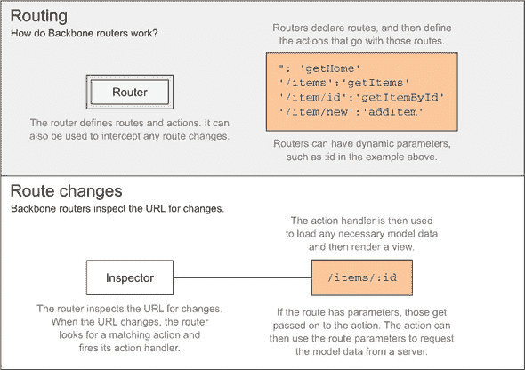

正如你在第 7.1 节中学到的，路由器是应用程序中人类接触的第一步。传统的路由器定义规则将请求路由到特定的控制器动作。在 Backbone 的情况下，控制器中介不存在，请求直接路由到视图，视图既扮演控制器的角色，也提供视图模板和渲染逻辑。Backbone 路由器检查`location`的变化并调用动作方法，向它们提供相关的 URL 参数。

##### 路由更改

以下代码片段（作为 ch07/05_backbone-routing 提供）实例化了一个视图路由器，并使用`Backbone.history.start`开始监控 URL 的变化。它还会检查当前 URL 是否与已定义的某个路由匹配，如果是，则触发该路由：

```
var ViewRouter = require('./routers/viewRouter.js');
new ViewRouter();

$(function () {
  Backbone.history.start();
});
```

就线路连接而言，你需要做的就这些。现在让我们编写你的`ViewRouter`组件。

##### 路由模块

路由器负责将每个 URL 连接到动作。通常，你会构建你的应用程序，使得动作方法要么准备一个视图并渲染它，要么执行一些渲染视图的操作，例如导航到不同的路由。在以下代码片段中，我创建了一个具有不同路由的路由器：

```
var Backbone = require('backbone');

module.exports = Backbone.Router.extend({
  routes: {
    '': 'root',
    'items': 'items',
    'items/:id': 'getItemById'
  }
});
```

当人类访问应用程序根目录时，第一条路由会触发他们重定向到默认路由，如下面的代码片段所示。在这种情况下，那就是`items`路由。这确保了如果用户在根级别而不是在`#items`或`/items`（如果你使用历史 API）访问页面，他们不会迷路。`trigger`选项告诉`navigate`更改 URL 并触发该路由的动作方法。接下来，我们应该将`root`方法添加到传递给`Backbone.Router.extend`的对象中：

```
root: function () {
  this.navigate('items', { trigger: true });
}
```

只要所有视图都渲染到相同的视图容器中，在特定动作触发时实例化视图就足够了，如下面的代码片段所示：

```
items: function () {
  new ItemView();
}
```

你需要在路由模块的顶部`require`视图，如下所示：

```
var ItemView = require('../views/item.js');
```

最后，你可能注意到`getItemById`路由有一个名为`:id`的命名参数。路由器将在视图中解析 URL，匹配`items/:id`模式，并调用你的动作方法，将`id`作为参数传递。然后，在渲染视图时使用该参数。

```
getItemById: function (id) {
  new DetailView(id);
}
```

这就是视图路由的全部内容！在第 7.4 节中，你将扩展所有这些概念来构建一个小型应用程序。接下来，让我们调查如何使用你新学到的 Backbone 知识在浏览器中构建第一个使用 MVC 的应用程序。

### 7.4. 案例研究：购物清单

在你开始开发自己的应用程序之前，我想给你一个使用 Backbone 在浏览器中编写 MVC 的独立示例，将本章中到目前为止所学的一切付诸实践。

在本节中，您将逐步构建一个简单的购物清单应用程序，该应用程序允许您查看购物清单项目、从列表中删除它们、添加新的项目以及更改数量。我已经将练习分为五个阶段。在每一个阶段，您将添加功能并对到目前为止的内容进行重构，以保持代码整洁。这五个阶段是

+   创建带有购物清单项目的静态视图

+   添加删除按钮以删除项目

+   构建一个表单以添加新的购物清单项目

+   在列表中实现内联编辑以更改数量

+   添加视图路由

这听起来很有趣！请记住，您可以在附带的代码示例中的任何五个阶段访问代码。

#### 7.4.1\. 从静态购物清单开始

让我们回到基础，从头开始构建应用程序。Gruntfile 与 7.2.3 节 中的相同，在本案例研究的过程中不会改变，所以您不需要重新访问它。查看 列表 7.5 中的 HTML（作为 ch07/06_shopping-list 提供）以开始。请注意，您正在包含构建的 Browserify 包，以便在浏览器中运行 Common.js 代码。在这个例子中，`<div>` 将作为视图容器。这个 HTML 片段被称为 `app.html`，因为它是应用程序将运行的单一页面。

##### 列表 7.5\. 创建购物清单

```
<!doctype html>
<html>
  <head>
    <title>Shopping List</title>
  </head>
  <body>
    <h1>Shopping List</h1>
    <div class='view'></div>
    <script src='build/bundle.js'></script>
  </body>
</html>
```

接下来，这个示例需要渲染购物项目列表，显示每个项目的数量和名称。这里有一个可以渲染购物清单项目数组的 Mustache 片段。Mustache 模板将放入 `views/templates` 目录。

```
<ul>
  {{#shopping_list}}
  <li>{{quantity}}x {{name}}</li>
  {{/shopping_list}}
</ul>
```

您的视图需要使用视图模型来渲染这些模板。这个功能应该放在基本视图中，以确保它只实现一次。

##### 使用 Mustache 渲染视图

为了在视图中轻松渲染 Mustache 模板并避免重复，您将连接一个基本视图并将其放置在 `views` 目录中。您的其余视图将扩展这个视图，允许您添加跨每个视图共享的功能。如果视图需要以其他方式渲染，那也是可以的；您可以再次覆盖 `render` 方法。

```
var Backbone = require('backbone');
var Mustache = require('mustache');

module.exports = Backbone.View.extend({
  render: function () {
    this.el.innerHTML = Mustache.to_html(this.template, this.viewModel);
  }
});
```

接下来，您将为您的列表视图创建项目。

##### 购物清单视图

目前一个静态的购物清单就足够了，这就是为什么在下面的列表中，您可以设置一次视图模型对象并忘记它。注意 `initialize` 方法，它在视图实例化时运行，以便在创建时视图会自行渲染。这个视图使用您之前看到的模板，并针对 `app.html` 中的 `.view` 元素。

##### 列表 7.6\. 创建项目列表

```
var fs = require('fs');
var base = require('./base.js');
var template = fs.readFileSync(
  __dirname + '/templates/list.mu', { encoding: 'utf8' }
);

module.exports = base.extend({
  el: '.view',
  template: template,
  viewModel: {
    shopping_list: [
      { name: 'Banana', quantity: 3 },
      { name: 'Strawberry', quantity: 8 },
      { name: 'Almond', quantity: 34 },

      { name: 'Chocolate Bar', quantity: 1 }
    ]
  },
  initialize: function () {
    this.render();
  }
});
```

最后，您需要初始化应用程序。这是入口点代码，在初始化 Backbone 后创建 List 视图的实例。请注意，因为视图会自行渲染，所以您只需要实例化它。

```
var Backbone = require('backbone');
Backbone.$ = require('jquery');

var ListView = require('./app/views/list.js');
var list = new ListView();
```

你已经为购物清单应用程序奠定了基础。让我们在下一阶段在此基础上构建。你将添加删除按钮，并重构以适应数据可以变化的应用程序。

#### 7.4.2. 这次带有删除按钮

在这个阶段，你首先需要更新视图模板，使其包括从购物清单中移除项目的按钮。你将在按钮上设置一个 `data-name` 属性，以便你可以识别应该从列表中移除哪个项目。更新的模板可以在下面的代码片段中找到：

```
<ul>
  {{#shopping_list}}
  <li>
    <span>{{quantity}}x {{name}}</span>
    <button class='remove' data-name='{{name}}'>x</button>
  </li>
  {{/shopping_list}}
</ul>
```

在连接删除按钮之前，你需要设置一个合适的模型和集合。

##### 使用模型和集合

这个集合将允许你监听列表的变化，例如当列表中的某个项目被移除时。该模型可以用于跟踪个体层面的变化，并且它允许你在接下来的几个阶段进行验证以及计算。就你的目的而言，你不需要比标准的 Backbone 模型更多，但始终将你的模型严格分离在不同的模块中，并给予良好的命名是个好主意。`ShoppingItem` 模型将位于 `models` 目录中。

```
var Backbone = require('backbone');

module.exports = Backbone.Model.extend({
});
```

集合也没有那么特别；它需要一个对模型的引用。这样，集合就知道在将新对象插入列表时应该创建什么类型的模型。为了保持整洁的目录结构，你将你的集合放在 `collections` 目录中。

```
var Backbone = require('backbone');
var ShoppingItem = require('../models/shoppingItem.js');

module.exports = Backbone.Collection.extend({
  model: ShoppingItem
});
```

而不是设置一次视图模型就不再理会它，现在你已经有了模型和集合，你应该更改你的视图以使用集合。在你的视图中，你将做出的第一个更改是 `require` 集合，如下面的代码所示：

```
var ShoppingList = require('../collections/shoppingList.js');
```

而不是使用 `viewModel` 属性，从现在起你将动态设置它，你将使用 `collection` 属性来跟踪你的模型。请注意，正如我之前提到的，我不需要明确创建 `ShoppingList` 实例，因为我的集合已经知道它必须使用该模型类型。

```
collection: new ShoppingList([
  { name: 'Banana', quantity: 3 },
  { name: 'Strawberry', quantity: 8 },
  { name: 'Almond', quantity: 34 },
  { name: 'Chocolate Bar', quantity: 1 }
])
```

接下来，你将让视图在首次加载时更新 UI。为此，你将设置视图模型为集合中的任何内容，然后渲染视图。使用 `toJSON` 方法会得到一个包含模型对象的普通数组。

```
initialize: function () {
  this.viewModel = {
    shopping_list: this.collection.toJSON()
  };
  this.render();
}
```

最后，你将连接你的购物清单项目删除按钮。

##### 在 Backbone 中连接 DOM 事件

要监听 DOM 事件，你可以在你的视图中为 `events` 对象分配属性。这些属性的命名应使用事件名称和 CSS 选择器，两者之间用空格分隔。以下是你将在更新后的视图中使用的代码。它会在匹配 `.remove` 选择器的元素上发生 `click` 事件时触发一个动作。请注意，这些事件在视图 `el` 内部查找元素，在本例中是你在上一个阶段创建的 `<div>`，它不会为视图外部的元素触发事件。最后，事件应设置为可在视图中找到的方法名称。

```
events: {
  'click .remove': 'removeItem'
}
```

现在让我们定义 `removeItem`。你将使用集合过滤方法。按钮可以通过 `e.target` 访问，你将使用它的 `data-name` 属性来获取名称。然后你将使用该名称来过滤集合，以找到与该特定按钮关联的购物清单项目。

```
removeItem: function (e) {
  var name = e.target.dataset.name;
  var model = this.collection.findWhere({ name: name });
  this.collection.remove(model);
}
```

一旦模型从集合中删除，视图应再次更新。直观的方法是在从集合中删除项目后更新视图模型并重新渲染视图。问题是项目可能在不同地方从集合中删除，尤其是在应用程序很好时。更好的方法是监听集合发出的事件。在这种情况下，你可以监听集合中的 `remove` 事件，并在该事件被触发时刷新视图。

以下列表在初始化视图时设置事件监听器，并包括重构，以避免代码重复，保持对 DRY 原则的忠诚。

##### 列表 7.7. 设置事件监听器

```
initialize: function () {
  this.collection.on('remove', this.updateView, this);
  this.updateView();
},
updateView: function () {
  this.viewModel = {
    shopping_list: this.collection.toJSON()
  };
  this.render();
}
```

这是一大块内容！你现在可以查看配套的代码示例，浏览 ch07/07_the-one-with-delete-buttons，这是你在完成这个阶段时获得的运行示例。在本次教程的下一部分，你将创建一个人类可以用来向购物清单添加项目的表单。

#### 7.4.3. 向购物车添加项目

在上一个阶段，你使你的购物清单有了生命，允许从列表中删除项目。这次，你将添加添加新项目的选项，这样人类就可以进行自己的购买，而不是删除他们不想要的项目。

为了保持趣味性，让我们加入另一个要求。在创建新项目时，你需要确保其名称尚未列出。如果项目已经在购物清单上，那么数量需要添加到现有项目上。这样可以避免创建重复的项目。

##### 创建“添加到购物车”组件

你将在以下列表中添加的 HTML 代码用于将杂货添加到列表中。此示例可在 ch07/08_creating-items 中找到。你将使用几个输入和一个按钮，该按钮将项目添加到购物清单集合中。还有一个字段，如果设置了错误消息，则仅显示该字段。你将使用该字段进行输入验证。为了保持简单，现在这段 HTML 将放入你的列表模板中。在接下来的几个阶段中，你将重构并将其移动到自己的视图中。

##### 列表 7.8\. 设置添加到购物车组件

```
<fieldset>
  <legend>Add Groceries</legend>
  <label>Name</label>
  <input class='name' value='{{name}}' />
  <label>Quantity</label>
  <input class='quantity' type='number' value='{{quantity}}' />
  <button class='add'>Add</button>
  {{#error}}
  <p>{{error}}</p>
  {{/error}}
</fieldset>
```

到目前为止，你的模型从未改变。你可以删除项目但不能更新它们。现在模型可以通过人类交互进行更改，是时候添加验证了。

##### 输入验证

人类输入永远不应被信任，因为用户可以轻松地输入非数字的数量，或者他们可能忘记输入名称。也许他们输入了一个负数，这也应该被考虑在内。Backbone 允许你通过在模型上提供 `validate` 方法来验证信息。该方法接受一个 `attrs` 对象，这是一个内部模型变量，它包含所有模型属性，以便你可以直接访问它们。以下列表显示了如何实现验证函数。你正在检查模型是否有名称、一个不是 `NaN`（非数字）的数字数量。令人困惑的是，`NaN` 是 `'number'` 类型，而 `NaN` 也不等于自身，因此你需要使用原生的 JavaScript `isNaN` 方法来测试 `NaN`。最后，你将确保数量至少为 1。

##### 列表 7.9\. 实现验证函数

```
validate: function (attrs) {
  if (!attrs.name) {
    return 'Please enter the name of the item.';
  }

  if (typeof attrs.quantity !== 'number' || isNaN(attrs.quantity)) {
    return 'The quantity must be numeric!';
  }
  if (attrs.quantity < 1) {
    return 'You should keep your groceries to yourself.';
  }
}
```

为了使编辑更简单，你还需要向模型添加一个辅助方法，该方法接受一个数量并更新模型，将此数量添加到当前数量。此更改应经过验证以确保负数不会使结果数量低于 1。默认情况下，更改模型值时不会验证模型，但你可以通过启用 `validate` 选项来强制执行。以下代码显示了该方法的外观：

```
addToOrder: function (quantity) {
  this.set('quantity', this.get('quantity') + quantity, { validate: true });
}
```

当向模型添加任何数量时，将触发验证，如果验证失败，则模型不会更改，而是在模型上设置 `validationError` 属性。假设你有一个数量为 6 的模型；以下代码将失败并将 `validationError` 属性设置为适当的错误消息：

```
model.addToOrder(-6);
model.validationError;
// <- 'You should keep your groceries to yourself.'
```

现在模型可以保护自己免受不良数据的影响，你可以更新视图并给你的新表单赋予生命。

##### 重构视图逻辑

我们将对视图进行的第一个更改是添加一个可以显示错误消息的渲染方法，同时保持人类输入的名称和数量，这样在发生错误时它们不会被清除。为了清晰起见，让我们将该方法命名为 `updateViewWithValidation`：

```
updateViewWithValidation: function (validation) {
  this.viewModel = {
    shopping_list: this.collection.toJSON(),
    error: validation.error,
    name: validation.name,
    quantity: validation.quantity
  };
  this.render();
}
```

你还需要将事件监听器绑定到添加按钮的点击事件上。为此，在你的视图中的`events`对象中添加另一个属性。然后剩下的就是创建`addItem`事件处理程序：

```
'click .add': 'addItem'
```

你的`addItem`处理程序应该做的第一件事是获取人类输入并将数量解析为十进制整数：

```
var name = this.$('.name').val();
var quantity = parseInt(this.$('.quantity').val(), 10);
```

一旦你有了用户输入，你首先会确定集合中是否有任何项目具有相同的名称，如果是这样，你将在验证输入后使用`addToOrder`方法更新模型。如果项目尚未在列表中，那么你将创建一个新的`ShoppingItem`模型实例并对其进行验证。如果验证通过，那么你将新创建的项目添加到集合中。在代码中，这看起来像以下列表。

##### 列表 7.10\. 验证购物项

```
var model = this.collection.findWhere({ name: name });
if (model) {
  model.addToOrder(quantity);
} else {
  model = new ShoppingItem({ name: name, quantity: quantity }, { validate: true });
  if (!model.validationError) {
    this.collection.add(model);
  }
}
```

由于你正在使用`ShoppingItem`类，你必须在模块顶部添加以下语句：

```
var ShoppingItem = require('../models/shoppingItem.js');
```

如果验证步骤失败，你需要重新渲染视图，添加验证错误消息，以便用户知道出了什么问题：

```
if (!model.validationError) {
  return;
}

this.updateViewWithValidation({
  name: name,
  quantity: quantity,
  error: model.validationError
});
```

如果验证成功，集合将获得一个新项目，或者现有项目将发生变化。这些情况应该通过监听集合上的`add`和`change`事件来处理。你需要在视图的`initialize`方法中添加以下几行：

```
this.collection.on('add', this.updateView, this);
this.collection.on('change', this.updateView, this);
```

这就是这一阶段的全部内容。你现在可以添加新项目到列表中，修改现有项目的数量，以及删除项目。在下一阶段，你将通过在每个列表项上添加内联编辑按钮来使编辑更加直观。

#### 7.4.4\. 使用内联编辑

在本节中，我们将介绍内联项目编辑。每个项目都将获得一个编辑按钮。点击它将允许人类更改数量，然后保存记录。这个功能本身很简单，但你将利用这个机会来清理一下。你将把不断增长的长列表分成三个部分：一个负责输入表单的添加项目视图，一个负责单个列表项的列表项视图，以及原始的列表视图，它将处理集合的删除和添加。

##### 组件化你的视图

第一项任务是将你的列表视图模板分成两部分。你将使用两个不同的视图容器：一个用于列表，另一个用于表单。你之前使用的`<div>`可以替换为以下代码：

```
<ul class='list-view'></ul>
<fieldset class='add-view'></fieldset>
```

这种分工也意味着你需要将 Mustache 模板拆分。而不是让`list`模板做所有事情，你将用另外两个模板来替换它。正如你很快就会学到的，列表本身不需要任何模板；只有表单和单个列表项需要。以下代码是`views/templates/addItem.mu`的样子。表单几乎保持不变，除了`fieldset`标签已经提升为视图容器的状态，因此它不再在模板中。

```
<legend>Add Groceries</legend>
<label>Name</label>
<input class='name' value='{{name}}' />
<label>Quantity</label>
<input class='quantity' type='number' value='{{quantity}}' />
<button class='add'>Add</button>
{{#error}}
<p>{{error}}</p>
{{/error}}
```

列表视图不再需要自己的模板，因为唯一需要的元素是`<ul>`元素，通过`el`属性绑定到你的列表视图，你将在下面看到。每个列表项都将保留在其自己的视图中，并且你将使用视图模板来处理它们。列表项视图模型将持有跟踪项是否正在被编辑的属性。这个属性在视图模板中被检查，以决定是否需要渲染标签和操作按钮或内联编辑表单。列表项模板如下所示，并放入`views/templates/listItem.mu`中。

##### 列表 7.11\. 查看列表项模板

```
{{^editing}}
<span>{{quantity}}x {{name}}</span>
<button class='edit'>Edit</button>
<button class='remove'>x</button>
{{/editing}}
{{#editing}}
<span>{{name}}</span>

<input class='edit-quantity' value='{{quantity}}' type='number' />
<button class='cancel'>Cancel</button>
<button class='save'>Save</button>
{{/editing}}
{{#error}}
<span>{{error}}</span>
{{/error}}
```

你仍然会在列表视图中创建集合，但你需要将这个集合传递给`addItem`视图。这会使两个视图紧密耦合，因为`addItem`视图需要一个可以创建集合的列表视图，而这不是模块化的。这就是你现在入口点`app.js`的样子。你将在下一阶段解决耦合问题；这个代码片段是关于使你的组件更小：

```
var Backbone = require('backbone');
Backbone.$ = require('jquery');

var ListView = require('./views/list.js');
var listView = new ListView();

var AddItemView = require('./views/addItem.js');
var addItemView = new AddItemView({ collection: listView.collection });
```

让我们继续创建添加项目视图。

##### 模块化的“添加到购物车”视图

添加项目视图与你在开始组件化列表视图之前所拥有的相似。首先，下面的列表显示了视图是如何初始化的，以及它是如何使用`.add-view`选择器来找到`<fieldset>`，这个`<fieldset>`将被用作视图容器。

##### 列表 7.12\. 初始化视图

```
var fs = require('fs');
var base = require('./base.js');
var template = fs.readFileSync(
  __dirname + '/templates/addItem.mu', { encoding: 'utf8' }
);
var ShoppingItem = require('../models/shoppingItem.js');

module.exports = base.extend({
  el: '.add-view',
  template: template,
  initialize: function () {
    this.updateView();
  },
  updateView: function (vm) {
    this.viewModel = vm || {};
    this.render();
  }
});
```

这个视图只关注向集合中添加模型，并且它确实如此。它将在添加按钮上有一个点击事件处理器，这个处理器几乎与你的旧`addItem`方法完全相同。唯一的区别是，在这个版本中，每当`addItem`事件处理器被触发时，你都会更新视图，如下面的列表所示。

##### 列表 7.13\. 更新视图

```
events: {
  'click .add': 'addItem'
},
addItem: function () {
  var name = this.$('.name').val();
  var quantity = parseInt(this.$('.quantity').val(), 10);
  var model = this.collection.findWhere({ name: name });
  if (model) {
    model.addToOrder(quantity);
  } else {
    model = new ShoppingItem(
      { name: name, quantity: quantity },
      { validate: true }
    );

    if (!model.validationError) {
      this.collection.add(model);
    }
  }

  if (!model.validationError) {
    this.updateView();
    return;
  }
  this.updateView({
    name: name,
    quantity: quantity,
    error: model.validationError
  });
}
```

添加项目视图唯一要做的就是添加项目，所以这就是全部！接下来让我们来构建列表项视图。

##### 创建列表项组件

列表项组件将负责渲染对其模型所做的任何更改，并提供编辑或从列表中删除项的机会。让我们从头开始审视这个视图。首先，有一些常见的问题。你需要读取模板文件并扩展基本视图。`tagName`属性意味着这个视图将被渲染为`<li>`元素。以下是一个代码片段：

```
var fs = require('fs');
var base = require('./base.js');
var template = fs.readFileSync(
  __dirname + '/templates/listItem.mu', { encoding: 'utf8' }
);

module.exports = base.extend({
  tagName: 'li',
  template: template
});
```

这个视图将接受模型和集合属性，正如你在重构列表视图时将会看到的那样。每当模型发生变化时，你都会重新渲染视图。视图在初始化时也需要被渲染。如果在使用内联编辑功能时发生验证错误，你也会通过视图模型跟踪它。以下是代码中的样子：

```
initialize: function () {
  this.model.on('change', this.updateView, this);
  this.updateView();
},
updateView: function () {
  this.viewModel = this.model.toJSON();
  this.viewModel.error = this.model.validationError;
  this.render();
}
```

移除事件处理程序现在更简单，因为你只需从集合中移除模型，你仍然可以在视图的属性中找到这两个。这在代码中看起来是这样的：

```
events: {
  'click .remove': 'removeItem'
},
removeItem: function (e) {
  this.collection.remove(this.model);
}
```

接下来，你将连接编辑和取消方法，它们是相似的。第一个将项目置于编辑模式，而第二个将退出编辑模式。所有这些方法需要做的就是更改 `editing` 属性。其余的将由模型更改事件监听器处理，确保重新渲染视图。当切换编辑模式时，你还将清除 `validationError` 属性。下面的列表介绍了这些事件处理程序。

##### 列表 7.14\. 添加编辑和取消方法

```
events: {
  'click .edit': 'editItem',
  'click .cancel': 'cancelEdit',
  'click .remove': 'removeItem'
},
removeItem: function (e) {
  this.collection.remove(this.model);
}
editItem: function (e) {
  this.model.validationError = null;
  this.model.set('editing', true);
},
cancelEdit: function (e) {
  this.model.validationError = null;
  this.model.set('editing', false);
}
```

列表项视图的最后一个任务将是保存对记录所做的编辑。你将绑定到保存按钮的点击事件，解析输入，并更新数量。只有当验证成功时，你才会退出编辑模式。记住，我没有重复所有之前的事件处理程序，为了简洁：

```
events: {
  'click .save': 'saveItem'
},
saveItem: function (e) {
    var quantity = parseInt(this.$('.edit-quantity').val(), 10);
    this.model.set('quantity', quantity, { validate: true });
    this.model.set('editing', this.model.validationError);
  }
});
```

列表项没有其他职责，但列表应该将这个部分视图添加和移除到 UI 中。当说到部分视图时，我的意思是它只代表对象的一部分，在这种情况下是列表的一部分而不是整个列表。列表视图需要持有与它拥有的列表项视图一样多的列表项视图。

##### 重建列表视图

以前，你的列表视图会在每次添加或删除项目时重新渲染。现在，你的列表将只渲染单个项目并将它们附加到 DOM 或从 DOM 中移除现有项目。这不仅比重新渲染整个列表更快，而且也更模块化。列表只管理大图景动作，即项目添加或删除时。单个项目将各自负责维护它们自己的状态并更新它们自己的 UI 表示。

为了使这可行，列表视图将不再依赖于 `view.render` 方法，而是直接操作 DOM。你保留的旧列表视图的方面，例如硬编码的集合数据、从基本视图扩展以及 `el` 属性声明，在下面的列表中展示。请注意，视图容器已更改为与你的 `<ul>` 元素匹配。

##### 列表 7.15\. 旧列表视图的方面

```
var base = require('./base.js');
var ShoppingList = require('../collections/shoppingList.js');

module.exports = base.extend({
  el: '.list-view',
  collection: new ShoppingList([
    { name: 'Banana', quantity: 3 },
    { name: 'Strawberry', quantity: 8 },
    { name: 'Almond', quantity: 34 },
    { name: 'Chocolate Bar', quantity: 1 }
  ])
});
```

由于你不再希望每次项目更改时都重新绘制整个视图，你将依赖于两个新方法，`addItem` 和 `removeItem`，来进行 DOM 操作。每当集合更新时，你将运行这些方法，以保持 UI 始终是最新的。你还可以使用 `addItem` 方法通过在初始化视图时对集合中的每个模型运行它来渲染集合的初始表示。`initialize` 方法将如下代码片段所示。我将在下一节解释 `partials` 变量。

```
initialize: function () {
  this.partials = {};
  this.collection.on('add', this.addItem, this);
  this.collection.on('remove', this.removeItem, this);
  this.collection.models.forEach(this.addItem, this);
}
```

在你看到`addItem`方法之前，我要提到它需要`require`列表项视图。你将使用它来创建部分视图，每个集合中的模型一个。让我们将这个添加到列表视图模块的顶部：

```
var ListItemView = require('./listItem.js');
```

你现在准备好实现`addItem`方法。该方法将接受一个模型并创建一个`ListItemView`的实例。然后视图元素，一个`<li>`，将被添加到`this.$el`，即你的`<ul>`元素。为了干净地查找和从列表中移除项目，你将在`partials`变量中跟踪它们。Backbone 模型有一个独特的 ID 属性，可以通过`model.cid`访问，因此你可以将其用作`partials`对象中的键。代码如下：

```
addItem: function (model) {
  var item = new ListItemView({
    model: model,
    collection: this.collection
  });
  this.$el.append(item.el);
  this.partials[model.cid] = item;
}
```

移除元素现在只是查看`partials`对象，通过`model.cid`键访问部分，并移除元素。然后你应该确保它也从`partials`对象中移除。

```
removeItem: function (model) {
  var item = this.partials[model.cid];
  item.$el.remove();
  delete this.partials[model.cid];
}
```

呼！那是一个密集的重构会话，但这是值得的。现在你有一些不同的视图正在处理同一个集合，而且它们现在更加自包含。添加项目视图只向集合添加项目，列表视图只关心创建新的列表项视图或从 DOM 中移除它们，而列表项视图只关注单个模型的变化。

给自己一个鼓励的拍拍背，并查看附带的代码示例，以确保你理解了在此阶段所做的所有更改以及购物清单应用程序的当前状态。你可以找到示例在 ch07/09_item-editing。

你在这个阶段实现了很好的关注点分离，但你可以做得更好。让我们在过程的最后阶段来检查这一点。

#### 7.4.5. 服务层和视图路由

最后一个阶段引入了两个对组织结构的更改。你将添加一个薄层服务，并将视图路由引入到你的应用程序设计中。通过创建一个提供唯一购物清单集合的服务，你让你的视图能够主动向服务请求购物清单数据。这极大地解耦了你的视图，之前它们生成数据并相互共享。

注意，在这种情况下，你仍然是在硬编码一个项目数组，但你同样可以从 Ajax 请求中获取它们，并通过 Promise 提供对这些项目的访问，就像你在第六章中看到的那样。目前，以下列表将足够使用。这应该放在`services`目录中。

##### 列表 7.16\. 硬编码一个项目数组

```
var ShoppingList = require('../collections/shoppingList.js');

var items = [
  { name: 'Banana', quantity: 3 },
  { name: 'Strawberry', quantity: 8 },
  { name: 'Almond', quantity: 34 },
  { name: 'Chocolate Bar', quantity: 1 }
];
module.exports = {
  collection: new ShoppingList(items)
};
```

一旦到位，添加项目和列表视图都应该`require`该服务，并将`shoppingService.collection`分配给它们的`collection`属性。这样做之后，你不再需要传递之前由列表视图初始化的集合引用。

让我们转向路由更改，总结一下你的购物清单冒险之旅。

##### 购物清单的配置

在这个阶段，您也将实现路由。为了保持趣味性，您将把“添加项目”视图移动到不同的路由。以下列表中的代码应该放入其自己的模块中。将其放置在 `routers/viewRouter.js`。`'root'` 动作有助于在人类打开应用程序时进行重定向，并且没有设置其他哈希位置。

##### 列表 7.17\. 将“添加项目”视图移动到不同的路由

```
var Backbone = require('backbone');
var ListView = require('../views/list.js');
var AddItemView = require('../views/addItem.js');
module.exports = Backbone.Router.extend({

  routes: {
    '': 'root',
    'items': 'listItems',
    'items/add': 'addItem'
  },
  root: function () {
    this.navigate('items', { trigger: true });
  },
  listItems: function () {
    new ListView();
  },
  addItem: function () {
    new AddItemView();
  }
});
```

正如我在第 7.3.4 节中提到的，当我首次介绍 Backbone 路由器时，您需要回到 `app.js` 并将其中原有的代码替换为以下列表中的代码。这将连接您的视图路由器并激活它。而不是静态地定义第一个提供给人类的视图，它将取决于他们从哪个 URL 访问您的应用程序。

##### 列表 7.18\. 激活视图路由器

```
var Backbone = require('backbone');
var $ = require('jquery');

Backbone.$ = $;

var ViewRouter = require('./routers/viewRouter.js');
new ViewRouter();

$(function () {
  Backbone.history.start();
});
```

您需要进行的最后一个更改以实现路由与视图和模板有关。首先，您将恢复到最后阶段之前使用的单个视图容器：

```
<div class='view'></div>
```

其次，您需要在“添加项目”视图和列表视图中都将 `el` 属性设置为 `'.view'`。您还必须稍微更改一下视图模板。例如，“添加项目”视图模板应该有一个取消按钮，该按钮可以返回到列表视图。它应该看起来像以下代码：

```
<a href='#items' class='cancel'>Cancel</a>
```

最后，您将为您的列表视图提供一个应得的视图模板，它将很小。它需要一个 `<ul>` 来保持列表和一个与“添加项目”视图路由匹配的锚点链接。以下代码片段显示了放置在 `views/templates/list.mu` 中的模板应该看起来像什么：

```
<ul class='items'></ul>
<a href='#items/add'>Add Item</a>
```

列表视图在初始化时应渲染此模板并查找列表元素：

```
this.render();
this.$list = this.$('.items');
```

当向列表添加项目时，而不是将它们附加到 `$el`（现在是一个共享的视图容器），您应该将它们附加到 `$list`：

```
this.$list.append(item.el);
```

这就是全部内容！请确保查看附带的代码库。最后阶段可以在 ch07/10_the-road-show 下找到，其中包含您迄今为止所做的一切。接下来，您将学习关于 Rendr 的内容，这是一种您可以在服务器端渲染客户端 Backbone 视图的技术，这对于在开发 Node.js 应用程序时提高人类感知性能非常有用。

### 7.5\. Backbone 和 Rendr：服务器/客户端共享渲染

Rendr 通过在服务器端渲染 Backbone 应用程序来提升其感知性能。这允许你在浏览器中的 JavaScript 代码执行和 Backbone 启动之前显示渲染后的页面。当页面第一次加载时，人类将更快地看到内容。在那次首次加载之后，Backbone 将接管并在客户端处理路由。第一次加载非常重要，在人类获得任何内容之前在服务器上渲染应用程序比让他们等待 Backbone 获取你的数据、填充你的视图和渲染你的模板要好。这就是为什么服务器端渲染在 Web 应用程序开发过程中仍然至关重要。让我们快速了解一下 Rendr 的世界。

#### 7.5.1\. 深入 Rendr

Rendr 采用传统的应用程序构建方法。它期望你以某种方式命名你的模块并将它们放置在特定的目录中。Rendr 还对应该使用哪种模板以及你的应用程序如何访问其数据有自己的看法。默认情况下，这意味着 Rendr 期望你有一个 REST API 来访问应用程序数据；你将在第九章中研究 REST API 设计。第九章。

Rendr 在 Node.js 上运行，作为你的 HTTP 堆栈中的中间件。它通过拦截请求并在将预渲染的结果交给客户端之前在服务器端渲染视图来工作。在其传统方法中，它通过定义控制器来帮助分离关注点，在那里你可以获取数据、渲染视图或执行重定向。Rendr 而不是在视图中引用你的模板，使用定义良好的命名策略来抽象依赖关系，这些依赖关系主要由 Rendr 引擎管理。一旦你查看第 7.5.2 节中的代码，这将会更加清晰。

##### 天堂中的问题

并非一切尽善尽美。在撰写本文时，Rendr（v0.5）包含了一些“独特”的设计选择，这最终使我决定在本章中不使用它，因为它会复杂化示例。例如，Rendr 使用 Browserify 将你编写的模块带到浏览器中，但它使用 Browserify 编译你的 CommonJS 模块的方式有三个不同的“黑客”技巧：

> **1**.  jQuery 需要通过`browserify-shim`进行模拟。这很成问题，因为 Rendr 的服务器端版本使用它自己的 jQuery 版本，并且可能存在版本差异。如果你尝试通过`npm`获取的 CommonJS 版本，它将无法工作。
> 
> **2**.  它需要别名来使其`require`调用按预期工作，这是一个问题，因为它也转化为下一个缺陷。
> 
> **3**.  你不能使用`brfs`转换与 Rendr 一起使用。

决定不深入探讨 Rendr 主要是因为它应用范围较窄。如果你选择 Node.js 以外的服务器端语言，你无法将我即将教授的许多概念应用到你的设计中。除了这些问题之外，了解 Rendr 为你的 Backbone 应用程序提供的传统 MVC 功能肯定是有价值的。在服务器端语言中存在许多传统的 MVC 框架，它们提供了与 Backbone 和 Rendr 结合后类似的功能，但在讨论客户端 JavaScript 时，你很少了解到这些。执行共享渲染的能力无疑增加了其吸引力。与大多数决定技术栈的事情一样，这是一个权衡。请注意，Facebook 的 React 是一个很好的例子，它是一个能够进行服务器端和客户端渲染的库，无需任何额外的工具。

##### 深入了解

为了展示 Rendr，我选择了一个稍微修改过的示例 Airbnb（Rendr 的公司）使用的示例，用于教授 Rendr 的工作原理。你可以在配套代码样本的 ch07/11_entourage 中找到代码。

首先，让我们谈谈模板。Rendr 鼓励你使用 Mustache 的超集，即 Handlebars。Handlebars 提供了额外的功能，主要是以辅助方法的形式，例如 `if` 方便方法。Rendr 期望你编译 Handlebars 模板，并将打包的结果放置在 `app/templates/compiledTemplates.js` 中。为此，首先安装 Handlebars 的 Grunt 插件：

```
npm install --save-dev grunt-contrib-handlebars
```

要配置 Handlebars Grunt 插件，你必须将以下列表中的代码添加到 `Gruntfile` 中。传递给 `handlebars:compile` 任务的 `options` 是 Rendr 所需要的，它期望模板以某种方式命名。

##### 列表 7.19\. 配置 Handlebars 插件

```
handlebars: {
  compile: {

    options: {
      namespace: false,
      commonjs: true,
      processName: function (filename) {
        return filename.replace('app/templates/', '').replace('.hbs', '');
      }
    },
    src: 'app/templates/**/*.hbs',
    dest: 'app/templates/compiledTemplates.js'
  }
}
```

目前，Browserify 的配置也依赖于 Rendr 的期望。你需要模拟 jQuery，而不是从 `npm` 中安装它。你被期望提供一个别名，以便 Rendr 可以访问 `rendr-handlebars`，这是 Rendr 使用的 Handlebars 适配器。最后，Rendr 需要你提供一些映射，以便它可以访问你的应用程序模块。配置 Browserify 以与 Rendr 协同工作的代码可以在以下列表中找到。

##### 列表 7.20\. 配置 Browserify 以与 Rendr 一起工作

```
browserify: {
  options: {
    debug: true,
    alias: ['node_modules/rendr-handlebars/index.js:rendr-handlebars'],
    aliasMappings: [{
      cwd: 'app/',
      src: ['**/*.js'],
      dest: 'app/'
    }],
    shim: {
      jquery: {
        path: 'assets/vendor/jquery-1.9.1.min.js',
        exports: '$'
      }
    }
  },
  app: {
    src: ['app/**/*.js'],
    dest: 'public/bundle.js'
  }
}
```

就构建配置而言，这就足够了。可能不是最理想的，但一旦配置完成，你就可以将其置之脑后。让我们进入示例应用程序代码，看看它是如何工作的。

#### 7.5.2\. 理解 Rendr 中的样板代码

在构建你的 Rendr 应用程序时，你将采取的第一步是为 Node 程序创建入口点。你将把这个文件命名为 `app.js` 并将其放置在你的应用程序根目录中。正如我之前提到的，Rendr 作为你的 HTTP 栈中的中间件工作，位于 Express 内部。

##### Rendr 的 Express 中间件

Express 是一个流行的 Node.js 框架，它封装了原生的 `http` 模块，提供了更多功能，并允许你执行路由和其他一些操作。在本节之后，我们将讨论的大部分内容都是 Rendr 的固有特性，而不是 Express 的部分。尽管如此，Rendr 通过增强 Express 来使其约定生效。

```
npm install express --save
```

看看以下代码片段。你正在使用 `express` 包在 Node 中设置一个 HTTP 服务器。调用 `express()` 将创建一个新的 Express 应用程序实例，并且你可以使用 `app.use` 向该实例添加中间件。调用 `app.listen(port)` 将使应用程序保持运行并响应所选端口上的传入 HTTP 请求。最佳实践规定，你的应用程序的监听端口应该可配置为环境变量，并具有合理的默认值。

```
var express = require('express');
var app = express();
var port = process.env.PORT || 3000;

app.use(express.static(__dirname + '/public'));
app.use(express.bodyParser());
app.listen(port, function () {
  console.log('listening on port %s', port);
});
```

`static` 中间件告诉 Express 将指定目录中的所有内容作为静态资源提供服务。如果有人请求 `http://localhost:3000/js/foo.js`，并且 `public/js/foo.js` 文件存在，那么 Express 将会这样响应。`bodyParser` 中间件是一个工具，它将解析检测到为 JSON 或表单数据格式的请求体。

以下列表配置了 Rendr 以供你的例子使用。中间件将处理其他所有事情，正如你接下来将看到的。数据适配器配置告诉 Rendr 应该查询哪个 API。Rendr 的美在于，无论是在客户端还是服务器端，它都会在需要获取数据时查询 API。

##### 列表 7.21\. 配置 Rendr

```
var rendr = require('rendr');
var rendrServer = rendr.createServer({
  dataAdapterConfig: {
    default: {
      host: 'api.github.com',
      protocol: 'https'
    }
  }
});

app.use(rendrServer);
```

##### 设置 Rendr

Rendr 提供了一系列基本对象，你需要在构建应用程序时扩展它们。从 `BaseView` 扩展而来的 `BaseApp` 对象应该被扩展并放置在 `app/app.js` 中以创建一个 Rendr 应用程序。在这个文件中，你可以添加在客户端和服务器上运行的初始化代码，这些代码用于维护应用程序的全局状态。以下代码片段就足够了：

```
var BaseApp = require('rendr/shared/app');

module.exports = BaseApp.extend({
});
```

你还需要创建一个路由模块，你可以用它来跟踪页面视图，每当有路由变化时，尽管现在你只是创建了一个基础路由的实例。路由模块应该放置在 `app/router.js` 中，它应该看起来像以下代码：

```
var BaseClientRouter = require('rendr/client/router');

var Router = module.exports = function Router (options) {
  BaseClientRouter.call(this, options);
};

Router.prototype = Object.create(BaseClientRouter.prototype);
Router.prototype.constructor = BaseClientRouter;
```

让我们把注意力转向你的 Rendr 应用程序的主体应该是什么样子。

#### 7.5.3\. 一个简单的 Rendr 应用程序

你已经配置了 Grunt 和 Express 以满足 Rendr 的需求。现在，是时候开发应用程序本身了。为了使这个例子更容易理解，我将按照 Rendr 用来提供响应的逻辑顺序展示代码。为了保持你的例子既独立又有趣，你将创建三个不同的视图：

> **1**. 首页是应用程序的欢迎屏幕。
> 
> **2**. 用户列表包含 GitHub 用户。
> 
> **3**. 用户包含特定用户的详细信息。

这些视图将与路由保持一对一的关系。主页视图将位于应用程序根目录`/`；用户列表将位于`/users`；用户详情视图将位于`/users/:login`，其中`:login`是 GitHub 上的用户登录名（在我的情况下是`bevacqua`）。视图由控制器渲染。

图 7.5 显示了完成后的用户列表将看起来是什么样子。

##### 图 7.5. 使用 Rendr 构建的 GitHub 浏览器中用户列表

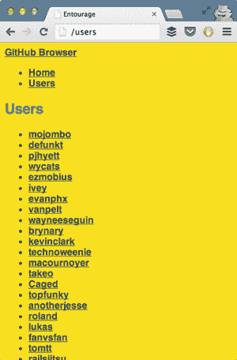

让我们从路由开始，然后学习控制器是如何工作的。

##### 路由和控制器

以下代码将路由匹配到控制器操作。控制器操作应定义为控制器名称，后跟一个哈希，然后是操作名称。此模块位于`app/routes.js`。

```
module.exports = function (match) {
  match('',                   'home#index');
  match('users'       ,       'users#index');
  match('users/:login',       'users#show');
};
```

控制器获取渲染视图所需的所有数据。你必须定义路由期望的每个操作。让我们将两个控制器放在一起。按照惯例，控制器应放置在`app/controllers/{{name}}_controller.js`。以下代码片段，你的主页控制器，应放置在`app/controllers/home_controller.js`。它应该公开一个`index`函数，与`index`路由相匹配。这个函数接受一个参数对象和一个回调函数，一旦调用，将渲染视图：

```
module.exports = {
  index: function (params, callback) {
    callback();
  }
};
```

`user_controller.js`模块不同。它有一个`index`操作，但还有一个`show`操作。在两种情况下，你都需要使用参数调用`this.app.fetch`以获取模型数据，然后在你完成时调用回调函数，如下所示。

##### 列表 7.22. 获取模型数据

```
module.exports = {
  index: function (params, callback) {
    var spec = {
      collection: {
        collection: 'Users',
        params: params
      }
    };
    this.app.fetch(spec, function (err, result) {
      callback(err, result);
    });
  },
  show: function (params, callback) {
    var spec = {
      model: {
        model: 'User',
        params: params
      },
      repos: {

        collection: 'Repos',
        params: { user: params.login }
      }
    };
    this.app.fetch(spec, function (err, result) {
      callback(err, result);
    });
  }
};
```

如果没有匹配的模型和集合，将无法获取这些数据。让我们接下来详细说明这些内容。

##### 模型和集合

模型和集合需要扩展 Rendr 提供的基类对象，因此让我们创建这些。以下代码是基模型，放置在`app/models/base.js`。

```
var RendrBase = require('rendr/shared/base/model');

module.exports = RendrBase.extend({});
```

基础集合同样很薄。然而，拥有自己的基类对象对于轻松在模型之间共享功能是必要的：

```
var RendrBase = require('rendr/shared/base/collection');

module.exports = RendrBase.extend({});
```

我们将使用你想要用于获取模型的端点来定义你的模型，在这种情况下是从 GitHub API。你的模型还应该导出一个唯一的标识符，这与你在用户控制器中调用`app.fetch`时使用的相同。以下代码显示了用户模型的样子。这应该放置在`app/models/user.js`。

```
var Base = require('./base');

module.exports = Base.extend({
  url: '/users/:login',
  idAttribute: 'login'
});
module.exports.id = 'User';
```

只要你的模型没有验证或计算数据函数，它们看起来就会很相似：一个`url`端点，唯一的标识符，以及用于查找单个模型实例的参数名称。当你查看第九章中 REST API 的设计时，以这种方式构造 URL 会感觉更自然。以下是如何看起来像 Repo 模型：

```
var Base = require('./base');

module.exports = Base.extend({
  url: '/repos/:owner/:name',
  idAttribute: 'name'
});
module.exports.id = 'Repo';
```

就像你在第 7.4 节中的案例研究一样，集合需要引用一个模型来学习它们正在处理的数据类型。集合类似于模型，并使用一个唯一标识符来告诉 Rendr 它们是哪种集合，以及你可以从中获取数据的 URL。以下代码展示了代码中的用户集合。它应该放在`app/collections/users.js`中：

```
var User = require('../models/user');
var Base = require('./base');

module.exports = Base.extend({
  model: User,
  url: '/users'
});
module.exports.id = 'Users';
```

仓库集合几乎相同，除了它使用 Repo 模型，并且它有一个不同的 URL 从 REST API 获取数据。代码如下，并且应该放在`app/collections/repos.js`中：

```
var Repo = require('../models/repo');
var Base = require('./base');

module.exports = Base.extend({
  model: Repo,
  url: '/users/:user/repos'
});
module.exports.id = 'Repos';
```

在这一点上，用户请求了一个 URL，路由器决定将他们引导到哪个控制器动作。动作方法可能从 API 获取数据，然后调用其回调。最后，让我们学习一下视图是如何渲染 HTML 的。

##### 视图和模板

就像 Rendr 中的大多数事情一样，定义你的视图的第一步是创建你自己的基本视图，这是 Rendr 基本视图的扩展。基本视图应该放在`app/views/base.js`中，如下所示代码：

```
var RendrBase = require('rendr/shared/base/view');

module.exports = RendrBase.extend({});
```

你的第一个视图是主页视图。它应该放在`app/views/home/index.js`中，如下所示。正如你所看到的，视图也需要导出一个标识符：

```
var BaseView = require('../base');

module.exports = BaseView.extend({
});
module.exports.id = 'home/index';
```

由于你的视图主要由相互链接组成，但功能不多，它们大多是空的。用户视图几乎与主页视图相同。它放在`app/views/users/index.js`中，其代码如下：

```
var BaseView = require('../base');

module.exports = BaseView.extend({
});
module.exports.id = 'users/index';
```

用户详情视图放在`app/views/users/show.js`中。这个视图必须修改模板数据，这就是我所说的视图模型，以便将`repos`对象提供给模板，如下所示。

##### 列表 7.23\. 使`repos`对象可用于模板

```
var BaseView = require('../base');

module.exports = BaseView.extend({
  getTemplateData: function () {
    var data = BaseView.prototype.getTemplateData.call(this);
    data.repos = this.options.repos;
    return data;
  }
});
module.exports.id = 'users/show';
```

你将要组合的最后一个视图是一个部分视图，用于渲染仓库列表。它应该放在`app/views/user_repos_view.js`中，正如你所看到的，部分视图几乎与其他视图没有区别，并且它们需要一个视图控制器，就像其他视图一样：

```
var BaseView = require('./base');

module.exports = BaseView.extend({
});
module.exports.id = 'user_repos_view';
```

最后，是视图模板。你将要查看的第一个视图模板是`layout .hbs`文件。这是将作为所有模板容器的 HTML。你可以在以下列表中找到代码。请注意，你正在启动应用程序数据并使用 JavaScript 初始化它。这是 Rendr 所必需的。`{{{body}}}`表达式将被视图动态替换，随着路由的变化。

##### 列表 7.24\. 启动应用程序数据

```
<!doctype html>
<html>

  <head>
    <title>Entourage</title>
  </head>

  <body>
    <div>
      <a href='/'>GitHub Browser</a>
    </div>
    <ul>

      <li><a href='/'>Home</a></li>
      <li><a href='/users'>Users</a></li>
    </ul>

    <section id='content' class='container'>
      {{{body}}}
    </section>

    <script src='/bundle.js'></script>
    <script>
    (function() {
      var App = window.App = new (require('app/app'))({{json appData}});
      App.bootstrapData({{json bootstrappedData}});
      App.start();
    })();
    </script>
  </body>
</html>
```

接下来是主页视图模板。这里有一些没有访问视图模型数据的链接。这个模板放在`app/templates/home/index.hbs`中。请注意，Backbone 会捕获导航到任何匹配其路由的应用程序中的链接，并表现得像一个单页应用程序。而不是在点击链接时重新加载整个页面，Backbone 将加载相应的视图。

```
<h1>Entourage</h1>
<p>
  Demo on how to use Rendr by consuming GitHub's public API.
</p>
<p>
  Check out <a href='/repos'>Repos</a> or <a href='/users'>Users</a>.
</p>
```

现在事情变得更有趣了。在这里，你正在遍历控制器操作中获取的模型列表，并渲染用户列表及其账户详情链接。这个模板放在`app/templates/users/index.hbs`：

```
<h1>Users</h1>

<ul>
{{#each models}}
  <li>
    <a href='/users/{{login}}'>{{login}}</a>
  </li>
{{/each}}
</ul>
```

接下来是用户详情模板，它位于`app/templates/users/show.hbs`。你可以在下面的列表中找到模板代码。考虑到你是如何告诉 Handlebars 加载`user_repos_view`部分的，以及这个名字如何与定义在其视图中的标识符完全匹配。

##### 列表 7.25. 设置用户详情模板

```
 {{login}} ({{public_repos}} public repos)

<br />

<div>
  <div>
    {{view 'user_repos_view' collection=repos}}
  </div>

  <div>
    <h3>Info</h3>
    <br />
    <table>
      <tr>
        <th>Location</th>
        <td>{{location}}</td>
      </tr>
      <tr>
        <th>Blog</th>
        <td>{{blog}}</td>
      </tr>
    </table>
  </div>
</div>
```

用户仓库视图是你的最后一个视图模板，在这个例子中是一个部分。它必须位于`app/templates/user_repos_view.hbs`，它用于遍历一组仓库，显示每个仓库的有趣指标，如下面的列表所示。

##### 列表 7.26. 设置用户仓库模板

```
<h3>Repos</h3>
<table>
  <thead>
    <tr>
      <th>Name</th>
      <th>Watchers</th>
      <th>Forks</th>
    </tr>
  </thead>
  <tbody>
  {{#each models}}
    <tr>
      <td>{{name}}</td>
      <td>{{watchers_count}}</td>
      <td>{{forks_count}}</td>
    </tr>
  {{/each}}
  </tbody>
</table>
```

就这些了！呼。正如你所见，一旦你绕过围绕应用程序的大量样板代码，创建一个 Rendr 应用程序并不那么困难。我确信随着时间的推移，它们会减少围绕 Rendr 应用程序核心的样板代码量。使用 Rendr、Backbone 和 CommonJS 创建应用程序的可爱之处在于你的代码可以多么模块化。模块化是可测试代码的特征属性之一。

### 7.6. 概述

哇，我们在这个章节中确实取得了很大的成果：

+   你学习了为什么 jQuery 不够用，以及更结构化的方法如何帮助你进行应用程序开发过程。

+   你对模型-视图-控制器模式应该如何工作有一个概述。

+   在了解了 Backbone 的基本概念之后，你开始了 Backbone 的冒险之旅。

+   你利用 CommonJS 和 Browserify 使模块化的 Backbone 组件在浏览器中互操作。

+   你利用 Rendr 将 Backbone 应用程序带到服务器端，提高了感知性能。

让我们利用这种势头来学习更多关于可测试性和如何编写良好测试的知识。各种测试都在等待；翻到下一页吧！

## 第八章. 测试 JavaScript 组件

*本章涵盖*

+   将单元测试基础知识应用于 JavaScript 组件

+   在 Tape 中编写单元测试

+   模拟、监视和代理

+   手动测试浏览器

+   使用 Grunt 进行测试自动化

+   理解积分和视觉测试

通过编写测试，你可以提高你构建的模块和应用程序的可靠性，并确保它们按你预期的那样工作。按照典型的“先构建”风格，你将获得必要的洞察力来自动化这些测试并在云上运行它们。本章包含一些指导方针，将帮助你编写测试，你还将获得实际测试组件的经验。在某些情况下，我会带你了解你可能为给定代码块编写的测试，帮助你可视化编写深思熟虑的单元测试背后的思维过程。

虽然我不是测试驱动开发（TDD）范式的倡导者，该范式鼓励你在开发任何功能之前编写测试，但我认为测试很重要，你应该编写它们。在本章中，我们将交替进行流程设计和应用设计。你将了解如何编写测试，然后我会给你提供自动化测试的工具。


**你是什么意思，你不是 TDD 的倡导者？**

确实如此。我不建议你使用 TDD，让我详细说明一下。我对 TDD 本身没有意见，但编写测试已经是一项重大的承诺。如果你是初学者，将 TDD 加入你的学习过程中，可能不会对你有好处。当我刚开始接触测试时，TDD 对我肯定不起作用！TDD 可能会让人感到不知所措，也许你不知道从哪里开始，或者你可能会编写一些无意义的测试，这些测试针对的是实现本身，而不是测试底层接口及其预期行为。在尝试学习 TDD 之前，我建议你尝试为现有代码编写一些测试。这样，当你（如果）决定走 TDD 路线时，你会知道你的测试应该如何构建，哪些部分是重要的测试点，哪些部分不是。更重要的是，你会知道编写特定测试用例是否必要，甚至是否有帮助。话虽如此，如果你已经具备编写单元测试的经验，并且测试驱动开发适合你，那么我对此没有异议！


你主要在第五章中学习了模块化；在第六章中讨论了改进你的异步流程；以及通过第七章中的 MVC 模式，以更有组织的方式构建你的代码。所有这些模块化都有助于通过创建更小的组件来降低你的应用设计复杂性，这些组件更容易操作和理解。到目前为止，在第二部分中完成的工作的一个好处是，测试变得简单得多。

### 8.1\. JavaScript 测试速成课程

测试的本质在于学习如何隔离功能，以便于轻松地进行测试。这就是为什么模块化对于获得更易于测试的代码如此重要的原因，这反过来又提高了质量，这是“先构建”的基石。模块化、松散耦合的代码更容易测试，因为你要考虑的事情更少，你的测试可以包含在小的单元中，这些单元只关注一小段代码的正确性。相比之下，单体、紧密耦合的代码更难测试，因为可能出现更多错误，其中许多可能与你试图测试的功能部分完全无关。

#### 8.1.1\. 独立的逻辑单元

考虑以下虚构的示例以供参考。你有一个查询 API 端点的方法（你将在第九章中学习关于 API 设计的内容，所以请耐心等待），然后在对数字进行计算后再返回一个值。假设你想确保数据，无论是什么，都被正确地乘以 555：

```
function getWorkDone () {
  return get('/api/data').then(function (res) {

    return res.data * 555;
  });
}
```

在这种情况下，你不需要关心这个方法中与计算部分无关的部分，它们会妨碍你的测试。测试变得困难，因为你现在需要处理 Promise 的事情来验证数据是否被正确计算。你可能想要考虑将其重构为两个更小的方法，一个只做计算，另一个处理查询 API：

```
function getWorkDone () {
  return get('/api/data').then(function (res) {
    return compute(res.data);
  });
}
function compute (data) {
  return data * 555;
}
```

这种关注点的分离使得可重用性成为可能，因为你可以将计算运行在代码的其他可能需要它的地方。更重要的是，现在单独测试计算要容易得多。以下代码片段足以确保 `compute` 方法按预期工作：

```
if (compute(3) !== 1665) {
  throw new Error('assertion failed!');
}
```

当你使用一个配备帮助测试需求的库时，事情会变得容易得多，我将教你如何使用 Tape 库，它遵循一个名为测试任何协议 (TAP) 的单元测试协议^([1))。其他流行的 JavaScript 测试库包括 Jasmine 和 Mocha，但我们不会涉及那些。它们涉及更复杂的设置，通常需要一个测试框架并在全局命名空间中填充全局变量。我们将使用 Tape，它不依赖于全局或测试框架，并且使得测试代码变得容易，无论它是为 Node.js 还是浏览器编写的。

> ¹ 访问 [`testanything.org`](http://testanything.org) 了解更多关于测试任何协议的信息。

#### 8.1.2\. 使用测试任何协议 (TAP)

TAP 是在多种语言中实现的测试协议，包括 Node.js。你可以通过几种方式执行 `tap` 测试：

+   使用 `node` 在你的终端中直接运行测试

+   在浏览器中，使用 Browserify 将测试编译为客户端 JavaScript

+   远程使用自动化服务，如 Travis-CI，就像你在第四章中做的那样

为了开始，你将了解如何在本地环境中使用 Tape，只需简单地启动一个浏览器。在第 8.4 节中，你将学习如何使用 Grunt 自动化此过程，以避免自己启动浏览器，我将解释如何将其包含在你的 CI 工作流程中。

开始使用需要浏览器的 JavaScript 单元测试可能会让人一开始感到困惑。你首先在 Node 中设置一个无意义的单元测试，然后在你到达单元测试原则和建议之前，在浏览器中运行它，这些原则和建议你可以在第 8.2 节中找到。

#### 8.1.3\. 编写我们的第一个单元测试

要创建你的第一个单元测试并在浏览器中运行它，从本章前面示例中的`compute`函数开始，将其放在一个 CommonJS 模块中。这个例子在 samples 中的 ch08/01_your-first-tape-test 可用。你可以把这个文件保存到`src/compute.js`：

```
module.exports = function (data) {
  return data * 555;
};
```

在以下代码中，你可以找到使用`tape`编写的单元测试，它提供了一个执行基本断言的接口。一旦创建了一个测试，你可以给它命名，一个函数将提供一个接口来编写你的测试。你将在第 8.2 节中了解更多关于断言的内容。Tape 中的每个测试用例都可以使用描述和测试方法来定义。你将把这个文件放在`test/compute.js`：

```
var test = require('tape');
var compute = require('../src/compute.js');

test('compute() should multiply by 555', function (t) {
  t.equal(1665, compute(3));
  t.end();
});
```

注意，你必须`require` `compute`函数来测试它。Tape 不会为你加载源代码。同样，`tape`模块也应该被`require`。API 相当简单，需要你调用`t.end()`来表示测试已完成。Tape 主要关注关于你的假设的断言和跟踪测试结果。要运行使用`tape`编写的任何测试，你只需使用 Node 运行代码即可：

```
node test/compute.js
```

让我们看看在浏览器中运行这些测试需要什么。

#### 8.1.4\. 浏览器中的 Tape

在浏览器中运行 Tape 测试主要是将你的测试 browserify 化。你可以通过使用全局 Browserify 包一次性完成，或者使用 Grunt 来自动化这个过程。让我们自动化它。你需要使用`grunt-browserify`来完成这个任务：

```
npm install --save-dev grunt grunt-browserify
```

一旦安装了 `grunt-browserify`，你需要按照第一部分中的方式设置一个 Gruntfile，并配置 browserify 任务将你的 CommonJS 代码编译成浏览器可以无缝解释的内容。在单元测试的例子中，你的配置可能看起来像以下列表（你可以在 ch08/02_tape-in-the-browser 下找到这个例子）。

##### 列表 8.1\. 编译浏览器可解释的代码

```
module.exports = function (grunt) {
  grunt.initConfig({
    browserify: {
      tests: {
        files: {
          'test/build/test-bundle.js': ['test/**/*.js']
        }
      }
    }
  });
  grunt.loadNpmTasks('grunt-browserify');
};
```

使用`browserify:tests`目标，你可以编译代码以便在 HTML 文件中引用。作为最后一步，你需要组合 HTML 文件。幸运的是，一旦组合好，你就不需要再碰它了，因为 JavaScript 将由 Browserify 打包器处理，你不需要手动更改 HTML 中的脚本标签或其他任何内容，如下面的列表所示。

##### 列表 8.2\. 编译代码以便 HTML 文件引用

```
<!doctype html>
<html>
<head>
  <meta charset='utf-8'>
  <title>Unit Testing JavaScript with Tape</title>
</head>
<body>
  <script src='build/test-bundle.js'></script>
</body>
</html>
```

运行测试只需用浏览器打开这个 HTML 文件即可。你将在本章后面回到 Grunt，看看如何自动化测试过程。让我们谈谈测试原则以及如何在 JavaScript 测试中应用它们。

#### 8.1.5\. 安排、行动、断言

编写单元测试通常被认为是一个困难且繁琐的过程，但并不一定如此。如果您的代码是考虑到模块化和可测试性编写的，那么测试就会容易得多。单体、紧密耦合的代码确实会使测试变得复杂。这是因为测试在能够独立验证小组件时最有效，因此您不必担心依赖项。这种测试被称为*单元测试*。第二种最常见的测试类型是*集成测试*，它涉及测试组件之间的交互是否按预期工作，关注组件网络的操作方式。图 8.1 比较了这两种测试类型。

##### 图 8.1\. 单元测试和集成测试策略之间的差异。请注意，应结合使用这两种方法。单元测试和集成测试不是互斥的。纯函数在第 8.1.15 节部分中讨论。

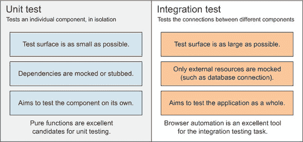

#### 8.1.6\. 单元测试

与关注交互的集成测试相比，好的单元测试积极忽略交互，只关注单个组件在独立情况下如何工作。此外，好的单元测试不关心组件的实现细节；它们只关注组件的公共 API。这意味着好的单元测试可以被视为组件预期如何工作的示例。尽管不是理想的情况，但有时当软件包的文档不足时，单元测试是次优选择。

好的单元测试通常遵循“安排 行动 断言”（AAA）模式，在单元测试中创建依赖项的模拟版本，并监视方法以确保它们被调用。以下小节将探讨这些概念。在您到达第 8.3 节部分之前，您将经历实际的单元测试案例场景。

AAA 模式可以帮助您开发简洁且有序的单元测试。它包括在三个阶段构建单元测试：

+   安排：您创建测试所需的所有实例。

+   行动：您执行测试并跟踪其结果。

+   断言：您验证结果是否与预期输出匹配。

按照这些简单的步骤，在快速浏览单元测试时很容易找到自己的位置。断言用于验证，例如，`typeof {}`的结果是否匹配`object`。请注意，当这些步骤可以简化为单行且易于阅读时，您可能应该这样做。

#### 8.1.7\. 便利性胜过约定

一些纯粹主义者会告诉您每个单元测试只做一次断言。我建议您保持务实，并允许自己在同一测试中写几个断言，只要它们测试的是同一具体的功能。如果您这样做，也不会有什么坏处，因为测试框架（在您的案例中是 Tape）会确切地告诉您哪个断言在哪个测试中失败了。通常，每个测试使用单个断言会导致大量代码重复和令人沮丧的测试会话。

#### 8.1.8\. 案例研究：单元测试事件发射器

让我们为 `emitter` 方法编写测试，该方法增强对象，使它们能够发出和监听我们在 第六章 中看到的事件。这应该能给你一个关于真实单元测试可能的样子的大致概念。以下列表（在示例中可用，位于 ch08/03_arrange-act-assert）展示了该方法的全貌。这正是你在 第 6.4.2 节 中实现的事件 `emitter` 方法。

##### 列表 8.3\. 你的事件 `emitter` 实现方法

```
function emitter (thing) {
  var events = {};

  if (!thing) {
    thing = {};
  }

  thing.on = function (type, listener) {
    if (!events[type]) {
      events[type] = [listener];
    } else {
      events[type].push(listener);
    }
  };

  thing.emit = function (type) {
    var evt = events[type];
    if (!evt) {
      return;
    }
    var args = Array.prototype.slice.call(arguments, 1);
    for (var i = 0; i < evt.length; i++) {
      evt[i].apply(thing, args);
    }
  };

  return thing;
}
```

你如何测试所有这些？这相当大！跟我重复：测试接口。其余的并不那么重要。你想要确保，给定正确的参数，每个公共 API 方法都按照你期望的方式执行。在 `emitter` 函数的情况下，API 包括 `emitter` 函数本身、`on` 方法和 `emit` 方法。API 是消费者可以访问的任何东西，这正是你想要验证的。

你可以将编写好的单元测试视为断言正确的事情。你的测试将验证的断言应该是确定的，并且它们也应该忽略实现细节，例如事件监听器是如何存储的。私有方法通常是实现细节，你不需要担心测试它们；只有公共接口才是重要的。如果你想测试私有方法，你必须将它们公开，以便它们可以像任何其他公共接口方法一样进行单元测试。

#### 8.1.9\. 测试事件发射器

为了开始，让我们从一个测试开始，断言使用不同的参数调用 `emitter` 是否会导致发射器对象。这是一个基本测试，你将验证返回的对象具有预期的属性（`on` 和 `emit`）。

##### 列表 8.4\. 使用 TAP 编写的第一个测试

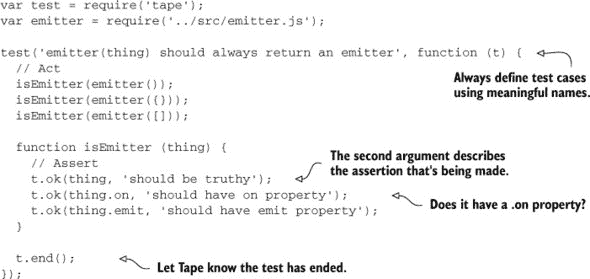

总是拥有断言某物预期操作基本方法的单元测试是件好事。记住，你只需要编写这些测试一次，它们将帮助你随时断言这些验证。让我们在以下列表中编写一些更多的基本断言，确保返回的对象确实是提供的同一个对象。

##### 列表 8.5\. 编写基本断言

```
test('emitter(thing) should reference the same object', function (t) {
  var data = { a: 1 };        // Arrange
  var thing = emitter(data);  // Act
  t.equal(data, thing);       // Assert
  t.end();
});

test('emitter(thing) should reference the same array', function (t) {
  var data = [1, 2];          // Arrange
  var thing = emitter(data);  // Act
  t.equal(data, thing);       // Assert
  t.end();
});
```

在“基本的 JavaScript 单元测试”领域，你有时会找到断言某物应该是一个函数的测试，实际上确实是一个函数。虽然如果 `emitter` 不是一个函数，其他任何测试都会失败，但冗余在单元测试中是一件好事。此外，你的测试应该在断言处失败，而不是在安排或执行时失败。如果你的测试在其他地方失败，可能意味着是时候添加更多测试来断言不会发生这种情况，或者问题可能出在你的代码上。

测试对象类型可能看起来很 trivial，但可能会带来回报。更重要的是测试返回值类型。你编写的第一个测试确保了属性存在，但没有检查它们是否是函数。让我们重新设计它，添加类型检查。这些变化可能看起来很 trivial，但你希望明确断言的目的，以便清晰。

##### 列表 8.6. 测试中的类型检查

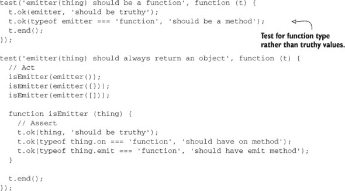

#### 8.1.10. 测试 `.on` 方法

接下来，我们将编写`.on`方法的测试。这一次，如果调用`.on`不抛出异常，我们就满意了。稍后，我们将确保在测试`emit`方法时监听器能够正常工作。注意，我编写了两个几乎完全相同的测试，尽管它们有不同的目的。在测试中，找到重复的代码是相当常见的，复制粘贴是可以的，尽管不鼓励滥用。

##### 列表 8.7. 测试 `.on` 函数

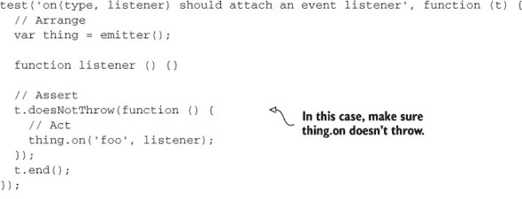

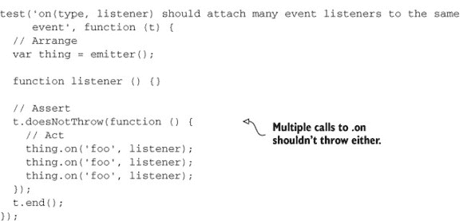

最后，你需要测试`emit`函数。为此，你将像之前一样附加一些监听器，然后发出事件。然后你将断言监听器正确触发，每次调用`.on`时触发一次。注意，如果你将`emit`改为异步，通过在事件处理器中包装`setTimeout`调用，这个测试就会失败。在这种情况下，你可以调整测试以适应新的功能，或者一开始就避免改变功能。

##### 列表 8.8. 测试 `.emit` 函数

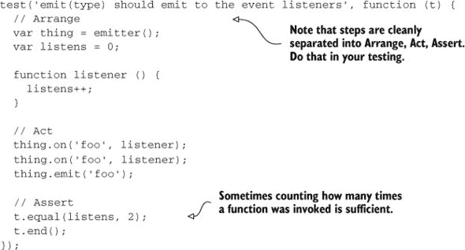

最后，让我们添加一个方法来确保`emit`以我们期望的方式将任何参数传递给事件监听器。

##### 列表 8.9. 对 `.emit` 的进一步测试

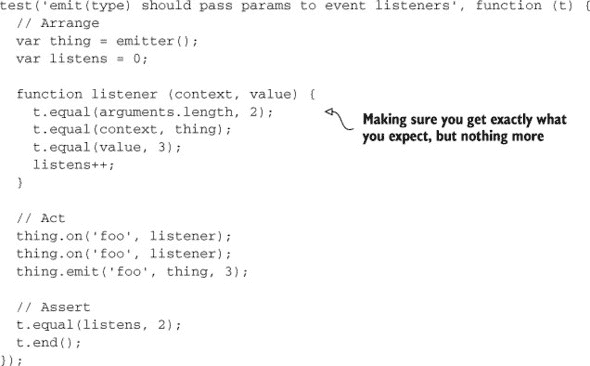

就这样！你的事件发射器实现已经完全测试过了。你只编写了验证公共 API 如何工作的断言，而没有干涉实现细节。在这个阶段，你可以添加处理 API 非传统使用的测试，例如在没有参数的情况下调用`emit()`。然后你可以决定是否希望`emit`在特定情况下抛出异常。将你的测试视为正式和更严格的 API 文档。

在下一节中，你将学习如何创建模拟、监视函数调用以及代理`require`语句。

#### 8.1.11. 模拟、间谍和代理

有时你想要更大的隔离性，即使应用程序的两个部分不能进一步解耦。应用程序可能需要查询真实数据库，使用服务获取数据，连接不同的模块，或者可能有其他原因不能解耦实现。你可以使用各种不同的工具，如模拟、间谍和代理，来绕过紧密耦合引入的测试问题。图 8.2 描述了问题以及这些存根提供的解决方案。

##### 图 8.2. 使用源代码与在测试中使用模拟

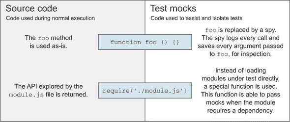

接下来，你将学习如何模拟依赖项，如果你正在使用具有外部依赖项的组件，这可能会很有用。

#### 8.1.12\. 模拟

*模拟* 在你的系统测试（SUT）中创建了依赖项（如服务或其他对象）的假实例。在静态类型语言中，模拟通常涉及对编译器的访问，通常称为反射。JavaScript 作为一种动态类型语言的一个优点是，你可以创建一个具有几个属性的对象，然后就可以了。假设你必须测试以下代码片段：

```
function (http, done) {
  http.get('/api/data', done);
}
```

在实际应用中，也许这个片段访问了网络并查询了一个端点，从应用程序的 API 获取数据。你永远不需要连接到外部服务来运行单元测试，这使得模拟成为一个理想的场景。在这种情况下，你正在发起一个 `GET` 请求，并调用一个带有可选错误和数据返回的 `done` 函数。

使用纯 JavaScript 模拟 `http` 对象，实际上很容易。注意你如何使用 `setTimeout` 来保持方法异步，就像原始代码预期的那样，以及你如何可以随意构造任何响应来适应你的测试：

```
{
  get: function (endpoint, done) {
    setTimeout(function () {
      done(null, { data: 'dummy' });
    }, 0);
  }
}
```

这个测试的服务器端方面，查询真实的 HTTP 端点，应该在服务器测试中处理，这不再是客户端关心的问题了。另一个选择可能是将这些事情放在集成测试中测试，这是你将在本章后面了解的主题。接下来，我将介绍 Sinon.js。Sinon 是一个用于创建模拟、间谍和存根的库。它还允许你模拟 XHR 请求、服务器响应和计时器。让我们看看它。

#### 8.1.13\. 介绍 Sinon.js

有时候，仅仅手动模拟值是不够的，在那些更高级的场景中，使用像 Sinon.js 这样的库可能会很有帮助。Sinon 可以帮助你轻松地测试 `setTimeout` 延迟、日期、XHR 请求，甚至设置假 HTTP 服务器以供测试使用。使用 Sinon，创建名为间谍（spies）的函数变得非常简单。*间谍* 是一种准备告诉你它们是否被调用、被调用的次数以及它们使用什么参数被调用的函数。实际上，你已经在 列表 8.9 中使用了一种定制的间谍版本，其中我们有一个 `listener` 函数，它跟踪了被调用的次数。让我们看看使用间谍如何帮助断言函数调用。

#### 8.1.14\. 监视函数调用

间谍可以在测试的函数需要函数参数时使用，并且你可以使用它们来轻松断言它们是否被使用以及如何使用。

让我们通过一个简单的例子（在 ch08/04_spying-on-function-calls 中找到）来了解一下。这里有一对接受回调函数参数的函数：

```
var maxwell = {
  immediate: function (cb) {
    cb('foo', 'bar');
  },
  debounce: function (cb) {
    setTimeout(cb, 0);
  }
};
```

Sinon 使得测试这些变得容易。无需构建自定义回调，你可以确保 `immediate` 函数正好调用了一次你的回调：

```
test('maxwell.immediate invokes a callback immediately', function (t) {
  var cb = sinon.spy();

  maxwell.immediate(cb);

  t.plan(2);
  t.ok(cb.calledOnce, 'called once');
  t.ok(cb.calledWith('foo', 'bar'), 'arguments match expectation');
});
```

注意我是如何从 `t.end` 切换到 `t.plan` 的。使用 `t.plan(n)` 允许你定义在测试用例执行期间你期望进行的断言数量。如果测试没有精确匹配断言的数量，则测试将失败。这对于异步测试最有用，因为你的代码可能最终没有调用回调，其中你可能还有更多的断言。使用 `t.plan` 可以验证确实执行了正确的断言数量。

测试延迟执行稍微有点复杂，但 Sinon 提供了一个易于使用的接口，如下面的列表所示。通过调用 `sinon.useFakeTimers()`，任何随后的对 `setTimeout` 或 `setInterval` 的调用都将被模拟。你还得到一个简单的 `tick` API，可以手动更改时钟。

##### 列表 8.10\. 测试延迟执行

```
test('maxwell.debounce invokes a callback after a timeout', function (t) {
  var clock = sinon.useFakeTimers();
  var cb = sinon.spy();

  maxwell.debounce(cb);

  t.plan(2);
  t.ok(cb.notCalled, 'not called before tick');
  clock.tick(0);
  t.ok(cb.called, 'called after tick');
});
```

Sinon.js 有更多你可以执行的小技巧，例如创建假的 XHR 请求。关于模拟的最后一个话题，我想讨论的是当你需要为通过在给定的模块上调用 `require` 而提供的任何结果创建模拟时的情况。让我们看看这是如何工作的！

#### 8.1.15\. 代理调用需求

这里的问题是，有时模块需要其他模块，而这些模块又需要额外的模块，而你不希望在单元测试中看到所有这些。单元测试是关于控制环境，检测执行测试所需的绝对必要的部分，并模拟其他一切。有一个叫做 `proxyquire` 的很好的 npm 包可以帮助这种情况。假设你想测试以下列表中的代码（在 samples 中的 ch08/05_proxying-your-dependencies 可用），你希望从数据库中获取一个用户，然后出于安全原因返回模型的一个子集。

##### 列表 8.11\. 使用 `require` 方法

```
var User = require('../models/User.js');

module.exports = function (id, done) {
  User.findOne({ id: id }, function (err, user) {
    if (err || !user) {
       done(err); return;
    }
    done(null, {
      name: user.name,
      email: user.email
    })
  });
};
```

让我们暂时考虑一个小重构。始终最好将“纯”功能隔离。*纯函数*是函数式编程中的一个概念，它描述了一个函数，其输出仅由其输入定义，而与其他任何东西无关。纯函数每次接收到相同的输入时都会返回相同的值。在上面的例子中，你的纯且可重用的功能是将用户模型映射到其“安全”子集，所以让我们将其提取到自己的函数中，并使你的代码更加美观且易于理解。

##### 列表 8.12\. 创建一个纯函数

```
var User = require('./models/User.js');

function subset (user) {
  return {
    name: user.name,
    email: user.email
  };
}

module.exports = function (id, done) {
  User.findOne({ id: id }, function (err, user) {
    done(err, user ? subset(user) : null);
  });
};
```

然而，正如你所见，除非你单独公开 `subset` 函数，否则你将陷入查询数据库以获取用户的困境。你可以争论该模块应该获取一个 `user` 对象，而不仅仅是 `id`，这是正确的。然而，有时你不得不查询数据库。也许你有一个 `user` 参数并对其进行操作，但你还想询问数据库关于他的权限或他所属的组。在这些情况下，以及在前一种情况下，假设你没有进一步重构它，一个好的解决方案是从 `require` 调用中返回一个模拟结果。

好消息是，使用 `proxyquire` 意味着你根本不需要更改应用程序代码。以下列表演示了如何使用 `proxyquire` 来模拟所需模块，而无需使用数据库。注意你传递给 `proxyquire` 的模拟对象是 `require` 路径和期望得到的结果的映射（而不是你通常得到的结果）。

##### 列表 8.13\. 模拟所需模块

```
var proxyquire = require('proxyquire');

var user = {
  id: 123,
  name: 'Marian',
  email: 'marian@company.com'
};

var mapperMock = {
  './models/User.js': {
    findOne: function (query, done) {
      setTimeout(done.bind(null, null, user));
    }
  }
};

var mapper = proxyquire('../src/mapper.js', mapperMock);
```

一旦你通过不使用数据库连接来隔离映射功能，测试就变得非常简单。你正在使用带有模拟数据库访问的 `mapper` 函数，并断言它是否返回具有 `name` 和 `email` 属性的对象。请注意，你正在使用 Sinon 的 `cb.args` 来确定 `cb` 间谍首次调用时的参数。

##### 列表 8.14\. 使用 Sinon 创建间谍

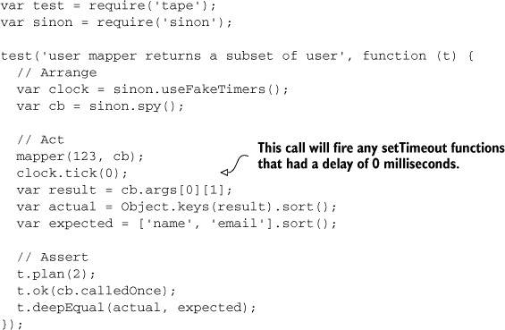

在接下来的部分，我将更深入地探讨客户端测试，讨论模拟 XHR（XMLHttpRequest）。在你查看其他自动化形式和非单元测试类型之前，你还将对 DOM 交互测试有所了解。

### 8.2\. 浏览器中的测试

由于 AJAX 请求和 DOM 交互，测试客户端代码通常很麻烦。这通常伴随着模块化和代码组织的完全缺乏，对客户端 JavaScript 测试开发者来说意味着混乱。尽管如此，在第五章中，你通过选择 Browserify 解决了浏览器模块化的问题。Browserify 允许你在客户端代码中使用自包含的 CommonJS 模块，但代价是额外的构建步骤。

你还通过在客户端使用 MVC 框架来解决代码组织问题，以正确分离你的关注点。在第九章中，你将了解 REST API 设计，你将将其应用于你未来编写的 Web 应用程序，消除通常表征前端应用程序开发的端点混乱。

在下一节中，你将学习如何通过模拟 XHR 请求和隔离 DOM 交互来编写客户端代码的测试，以便你可以针对它编写测试。让我们从简单部分开始：模拟 XHR 请求和服务器响应。

#### 8.2.1\. 模拟 XHR 和服务器通信

类似于使用`proxyquire`创建假的`require`结果，你可以使用 Sinon 来模拟任何你想要的 XHR 请求，而无需修改你的源代码。使用 Sinon 来模拟服务器响应和监视请求数据。这些是你唯一需要处理 XHR 的原因。图 8.3 显示了这些模拟如何帮助你隔离和测试通常依赖于外部资源的代码。

##### 图 8.3\. 测试期间原生 XMLHttpRequest 与假 XHR 模拟的比较

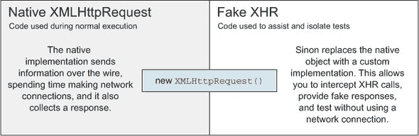

要查看代码中的实现方式，这里有一个客户端 JavaScript 代码片段，它发起一个 HTTP 请求并返回响应文本（参见 sample ch08/06_fake-xhr-requests）。我使用`superagent`模块来发起 HTTP 请求，因为它在服务器或浏览器中都能无缝工作。非常适合用于 Browserifying 操作！

```
module.exports = function (done) {
  require('superagent')
    .get('https://api.github.com/zen')
    .end(cb);

  function cb (err, res) {
    done(null, res.text);
  }
};
```

在这种情况下，你不想为`superagent`本身编写测试。你也不想测试 API 调用。你可能想确保确实发起了一个 AJAX 调用。该方法应该通过响应文本回调给你，所以你应该测试这一点，如下所示。

##### 列表 8.15\. 创建发送响应文本的方法

```
var test = require('tape');
var sinon = require('sinon');

test('qotd service should make an XHR call', function (t) {
  var quote = require('../src/qotdService.js');
  var cb = sinon.spy();

  quote(cb);

  t.plan(2);

  setTimeout(function () {
    t.ok(cb.called);
    t.ok(cb.calledWith(null, sinon.match.string));
  }, 2000);
});
```

对于测试结果来说这很好，但你不能让测试依赖于网络条件，或者花费那么长时间等待来做出断言。测试你的方法的正确方式是模拟响应。Sinon 允许你通过创建一个假服务器来实现这一点，它提供了双重价值。它捕获你的代码发出的真实请求，并将它们转换成它控制的可测试对象。它还允许你在测试中为这些请求创建响应，模拟一个运行中的服务器。为了获得这种功能，在调用测试方法之前，使用`sinon.fakeServer.create()`创建假服务器。然后，一旦调用了应该创建 AJAX 请求的方法，你可以响应这个请求，设置响应的状态码、头和正文。让我们更新你的测试方法以反映这些变化。

##### 列表 8.16\. 测试“每日名言”服务

```
test('qotd service should make an XHR call', function (t) {
  var quote = require('../src/qotdService.js');
  var cb = sinon.spy();

  var server = sinon.fakeServer.create();
  var headers = { 'Content-Type': 'text/html' };

  quote(cb);

  t.plan(4);
  t.equals(server.requests.length, 1);
  t.ok(cb.notCalled);

  server.requests[0].respond(200, headers, 'The cake is a lie.');

  t.ok(cb.called);
  t.ok(cb.calledWith(null, 'The cake is a lie.'));
});
```

如你所见，你验证了一个请求被发起，并且你确实收到了与响应文本完全相同的值。

在前往自动化部门之前，需要尝试的最后一块浏览器测试是 DOM 交互测试。DOM 测试就像测试 AJAX 调用一样复杂，因为你正在与跨隔阂的东西交互。注意隔阂。

#### 8.2.2\. 案例研究：测试 DOM 交互

客户端开发和测试就是这样有趣。你有三个层次：HTML、JavaScript 和 CSS，它们共同工作以提供复杂的位组合。然而，正如任何优秀的开发者所做的那样，你必须在这三种技术之间保持关注点的分离，尽量避免将它们过于紧密地耦合在一起。CSS 很容易保持独立。你可以在 CSS 中创建类，并通过给它们匹配的`class`属性将它们分配给 DOM 元素。当 CSS 对 HTML 的结构做出假设时，它就开始崩溃了。最好的 CSS 是那些不依赖于 HTML 以特定方式结构的 CSS，那些不紧密耦合到 HTML 的 CSS。

JavaScript 和 HTML 与 CSS 和 HTML 相似，你的 HTML 不应该对 JavaScript 做出任何假设。即使 JavaScript 被关闭，HTML 也应该工作得相当好；这被称为渐进增强，它有助于更快地将主要内容传递给用户，从而提供更好的整体体验。问题是你的 JavaScript 代码必须对 HTML 做出假设。获取 DOM 节点的内部文本、附加事件监听器、读取数据属性、设置属性或任何其他形式的 DOM 操作，都是以假设 DOM 节点存在为前提的。

让我们进入你的想象中的应用程序，其中事件来参加派对，十进制数字被四舍五入。

##### 设置 HTML

在这个应用程序中，你有一个输入框，你可以在其中输入十进制数字，然后点击按钮以获取该数字的四舍五入版本。每个结果都会写入页面上的一个列表中。还有一个按钮可以清除结果列表。图 8.4 展示了应用程序应有的外观。

##### 图 8.4. 本案例研究中将要构建的应用程序

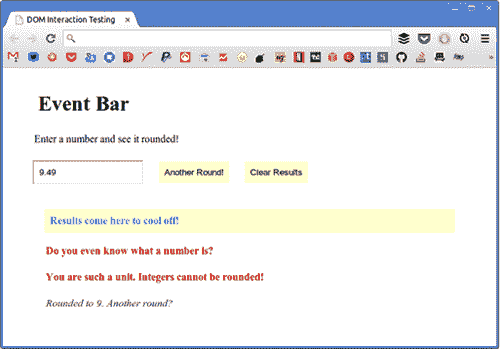

我们将从浏览这个应用程序开始，并解释在过程中所做的选择。然后，我会向你展示在这个小型应用程序中你应该测试什么，以及如何在不担心实现细节的情况下对这些因素进行测试覆盖率。

考虑以下 HTML 片段。请注意，你不会在 DOM 中直接编写任何 JavaScript。保持关注点的分离对于可测试性至关重要：

```
<h1>Event Bar</h1>
<p>Enter a number and see it rounded!</p>
<input class='square' placeholder='Decimals only please.' />
<button class='barman'>Another Round!</button>
<button class='clear'>Clear Results</button>
<div class='result'>
  <h4>Results come here to cool off!</h4>
</div>
```

接下来，你将学习如何实现 JavaScript 功能。

##### 实现 JavaScript 功能

接下来，我们将讨论一个小的 JavaScript 应用程序，它使用 JavaScript DOM API 与前面示例中显示的 HTML 进行交互。首先，你将使用 `querySelector`，这是一个相对不为人知但功能强大的原生浏览器 API，它允许你以类似 jQuery 的方式使用 CSS 选择器找到 DOM 节点。`querySelector` 在所有主流浏览器中都受支持，甚至可以追溯到 Internet Explorer 8。该 API 存在于文档根以及任何 DOM 节点上，允许你将搜索限制在其子节点。如果你想查找多个元素，而不是第一个元素，你可以使用 `querySelectorAll` 代替。

```
var barman = document.querySelector('.barman');
var square = document.querySelector('.square');
var result = document.querySelector('.result');
var clear = document.querySelector('.clear');
```

| |
| --- |

##### 注意

我从不使用 HTML 中的 `id` 属性。它会导致各种问题，例如 CSS 选择器优先级，导致开发者使用 `!important` 风格规则，并且无法重用值，因为 HTML `id` 属性的本意是要保持唯一性。

| |
| --- |

让我们实现负责确定你的输入如何处理的代码。如果它不是一个数字，那么那是一个错误。如果它是一个整数，那也是一个问题。否则，你将返回四舍五入的值：

```
function rounding (number, done) {
  if (isNaN(number)) {
    done(new Error('Do you even know what a number is?'));
  } else if (number === Math.round(number)) {
    done(new Error('You are such a unit. Integers cannot be rounded!'));
  } else {
    done(null, Math.round(number));
  }
}
```

`done` 回调应该在你的结果列表中创建一个新的段落，并用任何错误消息（如果有）或四舍五入的值（如果有）填充它。如果你看到错误，你将设置不同的 CSS 类，以帮助设计师相应地设计页面，而无需你对 JavaScript 进行任何额外的更改，如下面的列表所示。

##### 列表 8.17\. 使用 `done` 回调

```
function report (err, value) {
  var p = document.createElement('p');

  if (err) {
    p.className = 'error';
    p.innerText = err.message;
  } else {
    p.className = 'rounded';
    p.innerText = 'Rounded to ' + value + '. Another round?';
  }
  result.appendChild(p);
}
```

最后一个拼图是绑定点击事件，在将输入传递给你在列表 8.17 中组合的两个方法之前解析输入。以下代码片段将完成这项工作：

```
barman.addEventListener(click, round);

function round () {
  var number = parseFloat(square.value);
  rounding(number, report);
}
```

连接重置按钮甚至更容易。你的监听器应该移除酒吧管理员创建的每个段落；这再简单不过了！以下列表显示了你可以如何做到这一点。

##### 列表 8.18\. 连接重置按钮

```
clear.addEventListener(click, reset);

function reset () {
  var all = result.querySelectorAll('.result p');
  var i = all.length;

  while (i--) {
    result.removeChild(all[i]);
  }
}
```

就这样；你的应用程序已经完全可用。你如何确保未来的重构不会破坏现有的代码？你需要识别确保你的代码按预期工作的测试，然后编写这些测试。

##### 识别测试用例

首先，让我偏离一下话题，提到你需要完全忽略这个案例研究开头的 HTML。你不应该在测试中编写任何 HTML。如果你需要一个 DOM，你应该在测试中使用 JavaScript 来构建它。正如你将在实现测试时看到的那样，这甚至可能比编写 HTML 更容易。分离关注点是单元测试最重要的方面之一。

接下来，你应该尝试识别你的应用程序关注点并将它们与实现细节区分开来。为了进行这个实验，假设你之前写下的所有内容都是实现细节，因为你的应用程序没有提供 API，甚至没有构建任何面向公众的对象。当实现中的每一件事都是实现细节时，你仍然可以进行单元测试，但你需要测试应用程序应该做什么，而不是每个方法应该做什么。

测试案例应该断言你可以在之前呈现的应用程序定义中找到的语句，在与其实现进行核对时是正确的。

| |
| --- |

##### 应用程序定义

在这个应用程序中，你有一个输入框，你可以输入十进制数字，然后点击按钮以获取该数字的四舍五入版本。每个结果都写入到页面上的列表中。还有一个按钮可以清除结果列表。

| |
| --- |

下面的列表中列出了几个测试案例。这些是从引用的定义和其他实施中施加的逻辑约束（你希望将其变成定义的一部分）中得出的。请记住，你可以准备任何你想要的测试案例，只要它们满足定义即可。这些是我设计的：

+   没有输入时点击 barman 应该导致错误信息。

+   使用整数点击 barman 应该导致错误信息。

+   使用数字点击 barman 应该得到一个四舍五入的数字。

+   使用两个值点击 barman 两次应该产生两个结果。

+   当列表为空时点击清除不会抛出异常。

+   点击清除将移除列表中的任何结果。

让我们开始测试。我之前提到过，你将在每个测试中通过代码创建 DOM。你将通过创建一个在每次测试之前调用的 Setup 任务和一个在每次测试之后调用的 Teardown 任务来实现这一点。Setup 将创建元素。Teardown 将删除它们。这为每个测试提供了一个干净的起点，即使另一个测试已经运行。

##### Setup 和 Teardown

大多数 JavaScript 测试框架出于令人费解的原因，将全局变量包含在测试程序中。例如，如果你想在 Mocha 测试框架（Buster.js 和 Jasmine 也这样做）中在每次测试之前运行一个任务，你将传递一个回调函数到`beforeEach`全局方法。实际上，测试案例应该用其他全局变量来描述，例如`describe`和`it`，如下所示。

##### 列表 8.19。使用`describe`描述测试案例

```
function setup () {
  // prepare something
}

describe('foo()', function () {
  beforeEach(setup);

  it('should not throw', function () {
    assert.doesNotThrow(function () {
      foo();
    });
  });
});
```

这太糟糕了！在测试中使用全局变量，甚至不应该成为常态。幸运的是，`tape`没有屈服于这种荒谬，仍然可以在每个测试之前轻松运行一些代码。以下列表显示了相同的代码，但使用`tape`。

##### 列表 8.20。使用`tape`描述测试案例

```
var test = require('tape');

function testCase (name, cb) {
  var t = test(name, cb);
  t.once('prerun', setup);
}

function setup () {
  // prepare something
}

testCase('foo() should not throw', function (t) {
  assert.doesNotThrow(function () {
    foo();
  });
});
```

当然，这看起来更冗长，但它不会污染全局命名空间，打破了最古老的约定之一。在`tape`中，测试在测试运行的不同点发出事件，例如`prerun`。为了设置和拆除我们的测试，你需要创建并使用一个`testCase`方法。名称无关紧要，但我发现`testCase`在这个情况下适用：

```
function testCase (name, cb) {
  var t = test(name, cb);
  t.once('prerun', setup);
  t.once('end', teardown);
}
```

现在你已经知道了如何为每个测试运行这些方法，是时候编写它们了！

##### 准备测试工具

在`setup`方法中，你需要创建测试中需要的每个 DOM 元素，并设置通过 HTML 提供的任何默认值。请注意，测试 HTML 本身并不属于这些测试的一部分，这就是为什么你完全忽略它。你的关注点是，假设 HTML 是你预期的，应用程序将成功运行。测试 HTML 是集成测试的关注点。

`setup`方法在下面的列表中。`bar`模块是你的应用程序代码，封装在一个函数中，这样你就可以随时执行它。在这种情况下，你需要在每个测试之前运行应用程序。这将把事件监听器附加到新创建的 DOM 元素上。

##### 列表 8.21\. 使用`setup`方法

```
var bar = require('../src/event-bar.js');

function setup () {
  function add (type, className) {
    var element = document.createElement(type);
    element.className = className;
    document.body.appendChild(element);
  }
  add('input', 'square');
  add('div', 'barman');
  add('div', 'result');
  add('div', 'clear');
  bar();
}
```

`teardown`方法甚至更简单，因为你只需给它几个选择器，然后遍历它们，移除在`setup`期间创建的元素：

```
function teardown () {
  var selectors = ['.barman', '.square', '.result', '.clear'];
  selectors.forEach(function (selector) {
    var element = document.querySelector(selector);
    element.parentNode.removeChild(element);
  });
}
```

哇哦！接下来是测试。

##### 编写测试用例

只要你在安排（Arrange）、行动（Act）和断言（Assert）之间保持关注点的清晰分离，你就不会在编写或阅读测试时遇到任何问题。在第一个测试中，你获取`barman`元素，点击它，并获取任何结果。你验证只有一个结果。然后你断言该结果中的 CSS 类和文本是正确的，如下面的列表所示。

##### 列表 8.22\. 断言 CSS 类和文本是否正确

```
testCase('barman without input should show an error', function (t) {
  // Arrange
  var barman = document.querySelector('.barman');

  var result;

  // Act
  barman.click();
  result = document.querySelectorAll('.result p');

  // Assert
  t.plan(4);
  t.ok(barman);
  t.equal(result.length, 1);
  t.equal(result[0].className, 'error');
  t.equal(result[0].innerText, 'Do you even know what a number is?');
});
```

下一个测试也进行了错误检查。确保你的错误检查按预期工作，与确保预期的工作路径确实工作一样重要。在下面的列表中，你也在点击之前在输入中设置了一个值。

##### 列表 8.23\. 检查你的代码错误


到现在为止，你应该开始看到模式。看看当它们遵循 AAA 约定时，如何容易地识别每个测试做什么？接下来的一个，如下面的列表所示，验证了预期的工作路径是否按预期工作。它将输入设置为十进制值，然后点击按钮，然后检查结果是否为四舍五入的数字。

##### 列表 8.24\. 验证路径是否有效

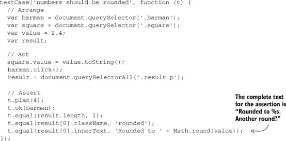

编写与你的代码交互的测试用例，就像你期望人类与之交互一样，这无疑是好的。有时人类会做出意想不到的事情，这也应该被测试。

##### 测试可能的输出

我们以一种特定的方式被连接起来，我们相信三种可能的结果：某物要么永远不工作，要么工作一次，要么总是工作。我经常开玩笑说，只有三个数字存在：0，1 和无限。如下所示，断言两次点击按预期工作应该是足够的。你总是可以回头添加更多测试。

##### 列表 8.25\. 确保两次点击工作


在开发代码时，你可能会发现你的代码正在抛出错误，这会降低你的生产力。以下列表中的简单测试，断言一个方法调用不会抛出错误，在这些情况下是有帮助的。下一节将讨论自动化测试，这肯定也有帮助。

##### 列表 8.26\. 断言一个方法调用不会抛出错误

```
testCase('clearing empty list does not throw', function (t) {
  // Arrange
  var clear = document.querySelector('.clear');

  // Assert
  t.plan(2);
  t.ok(clear);
  t.doesNotThrow(function () {
    clear.click();
  });
});
```

在你令人尴尬的小套件中的最后一个测试几乎是一个集成测试。它反复点击，然后断言点击清除按钮确实移除了累积的结果。

##### 列表 8.27\. 验证清除按钮工作

```
testCase('clicking clear removes any results in the list', function (t) {
  // Arrange
  var barman = document.querySelector('.barman');
  var square = document.querySelector('.square');
  var clear = document.querySelector('.clear');
  var result;
  var resultCleared;

  // Act
  square.value = '3.4';
  barman.click();
  square.value = '3';
  barman.click();
  square.value = '';
  barman.click();
  result = document.querySelectorAll('.result p');
  clear.click();
  resultCleared = document.querySelectorAll('.result p');

  // Assert
  t.plan(2);
  t.equal(result.length, 3);
  t.equal(resultCleared.length, 0);
});
```

在你的测试中，最大的价值总是在需要重构的时候出现。假设你改变了你的事件栏程序的实施。你再次运行测试。如果它们成功，一切正常，除非你手动测试时发现了一个错误，在这种情况下，你需要添加更多测试并修复问题。如果它们失败，有两种可能性。现在的测试可能已经过时了。例如，当点击清除按钮时，它可能已经被更改为“仅移除最旧的结果”。在这种情况下，你应该更新测试以反映这些变化。测试永远可以重复进行，无需额外成本，这就是它们如此有价值的原因。

你可以在附带的代码示例中查看完全工作的示例，包括我向你展示的所有代码，在 ch08/07_dom-interaction-testing 目录下。接下来，我们将回到我们在第七章中开发的案例研究，并为其添加单元测试。

### 8.3\. 案例研究：单元测试 MVC 购物清单

在第七章中，我们在开发 MVC 购物清单应用程序方面取得了相当多的里程碑，在本节中，我们将对这个应用程序的一个迭代进行单元测试。具体来说，你将与我一起在 7.4 节的结尾进行单元测试，在我们将 Rendr 添加到解决方案的 7.5 节之前。你可以在样本中的 ch07/10_the-road-show 目录下查看该应用程序的源代码。其单元测试的对应版本可以在 ch08/07b_testability-boulevard 下找到。

路演是一个小型应用程序，但足够大，可以展示你如何可以逐步向应用程序添加测试，最终得到一个经过良好测试的应用程序。如果我们没有在第五章中投入精力模块化我们的应用程序，那么采取这种逐步的测试方法将会困难得多。我们在第七章中学习了如何这样做，并在构建应用程序时应用了这些概念。本节将指导我们编写视图路由器和模型验证的测试。然后你可以自由探索为视图控制器添加测试覆盖率。

#### 8.3.1\. 测试视图路由器

在开始任何测试之前，你总是需要先配置环境，以便测试可以运行。在这种情况下，这意味着你需要将应用程序（从 ch07/10_the-road-show）复制过来作为起点，然后在此之上添加本章构建的测试工具，用于在浏览器中运行 Tape（ch08/02_tape-in-the-browser 示例）。

一旦初始设置完成（示例中的 ch08/07b_testability-boulevard），你就可以开始使用 Tape 充实你的测试。我们将从路由器开始（在第七章列表 7.18 中展示），因为这是我们想要测试的最简单的模块。为了参考，以下列表是模块当前的样子。

##### 列表 8.28\. 测试模块

```
var Backbone = require('backbone');
var ListView = require('../views/list.js');
var AddItemView = require('../views/addItem.js');

module.exports = Backbone.Router.extend({
  routes: {
    '': 'root',
    'items': 'listItems',
    'items/add': 'addItem'
  },

  root: function () {
    this.navigate('items', { trigger: true });
  },
  listItems: function () {
    new ListView();
  },
  addItem: function () {
    new AddItemView();
  }
});
```

我们想在测试这个模块时断言一些事情。你想要知道的是

+   有三条路径。

+   与它们相关的路由处理程序确实存在。

+   `root`路由处理程序正确地重定向到`listItems`操作。

+   视图路由在每种情况下都会渲染正确的视图。

你可能已经迫不及待地想要考虑为视图创建模拟，或者可能使用`proxyquire`来完全模拟这些模块。为了开始，我们将断言确实注册了三个路由，并且它们的路由处理程序存在于路由器上。

为了实现这一点，以下列表使用`proxyquireify`（一种在客户端上工作的`proxyquire`变体）结合`sinon`和`tape`来构建`routes.js`测试模块。

##### 列表 8.29\. 第一个视图路由器测试

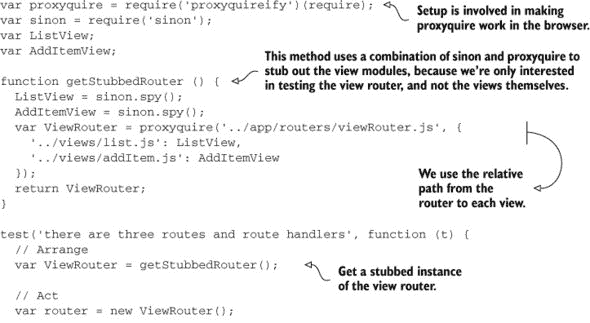

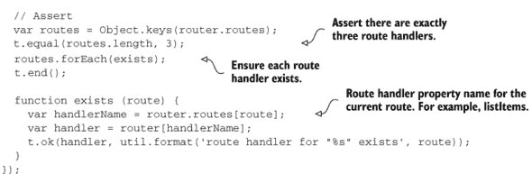

一旦测试文件准备就绪，你可以通过打开一个带有编译测试包的浏览器并检查开发者控制台中的任何错误消息来验证测试是否通过。

##### 测试运行器 HTML 文件

首先，你需要一个测试运行器 HTML 文件，如下所示。它没有什么特别之处，只是加载了构建的测试包：

```
<!doctype html>
<html>
<head>
  <meta charset='utf-8'>
  <title>Unit Testing JavaScript with Tape</title>
</head>
<body>
  <script src='build/test-bundle.js'></script>
</body>
</html>
```

一旦创建了`routes.js`测试模块和`runner.html`测试运行器，你应该创建一个 Grunt 任务来构建包。

##### 创建一个 Grunt 任务来构建包

因为你已经学会了如何编写自己的任务，并且为了巩固这一知识，你将创建自己的任务来编译 Browserify 包！为了使其工作，你应该在 `Gruntfile` 中包含以下所有列表。它直接使用 `browserify` 包，而不是通过 `grunt-browserify` 插件作为中介。有时直接使用包而不是通过插件可以提供更大的灵活性，让你的任务能够做更多的事情。

##### 列表 8.30\. 创建自定义 Browserify 任务

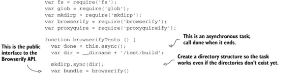

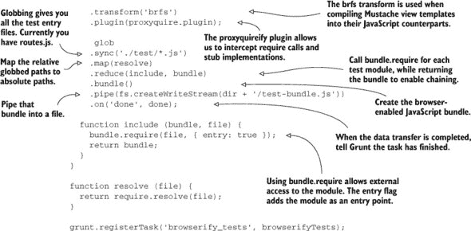

##### 查看测试执行

当一切设置完毕后，你可以运行以下命令，并在浏览器中看到正在执行的测试：

```
grunt browserify_tests
open test/runner.html
```

应该会弹出一个浏览器窗口。如果我们打开开发者控制台，我们会看到图 8.5 中显示的输出。

##### 图 8.5\. 开发者工具显示我们提供的测试结果

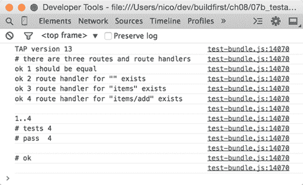

还有几个路由测试要做。接下来，你将确保每个路由处理器都按预期工作，无论是重定向用户到不同的路由还是渲染特定的视图。

##### 一些额外的测试

以下列表包含了剩余测试的代码。你可以将其添加到 `routes.js` 测试套件的末尾。

##### 列表 8.31\. 单独测试路由处理器

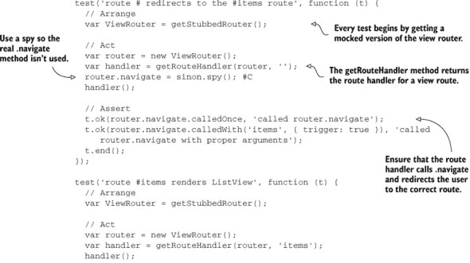

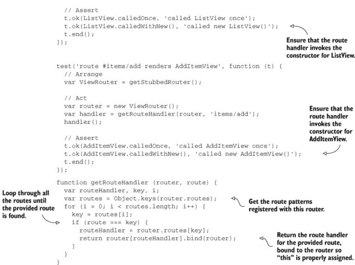

一旦所有的测试都添加到你的 `routes.js` 文件中，你可以再次运行 Grunt 任务并重新加载浏览器。图 8.6 包含了执行新测试套件的结果。

##### 图 8.6\. 展示了我们适度测试套件及其十个断言的结果

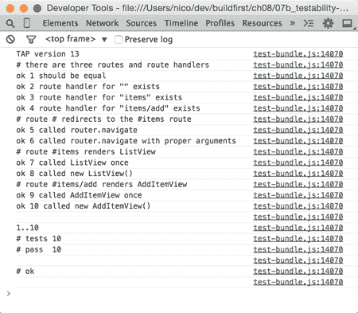

虽然我们对路由器的测试是最基本的，它们并不断言很多，但我们至少确保了路由的存在以及它们的路由处理器按预期工作。在应用程序中，路由通常是配置汇聚的点，测试有助于确保使用正确的模块。

#### 8.3.2\. 测试视图模型上的验证

应用程序还需要使用几个不同的输入来测试模型验证，确保在特定情况下模型无效，在满足所有验证条件时有效。为了参考，以下列表中包含了购物项模块的代码。

##### 列表 8.32\. 测试验证

```
var Backbone = require('backbone');

module.exports = Backbone.Model.extend({
  addToOrder: function (quantity) {
    this.set('quantity', this.get('quantity') + quantity, {
      validate: true
    });
  },
  validate: function (attrs) {
    if (!attrs.name) {

      return 'Please enter the name of the item.';
    }
    if (typeof attrs.quantity !== 'number' || isNaN(attrs.quantity)) {
      return 'The quantity must be numeric!';
    }
    if (attrs.quantity < 1) {
      return 'You should keep your groceries to yourself.';
    }
  }
});
```

验证在测试 JavaScript 时带来一个有趣的使用场景。鉴于我们想要为每个可能的验证场景设置一个测试，我们可以在一个数组中设置一个测试用例列表，然后为每个测试用例创建一个单独的测试。

以下列表展示了一种使用测试用例工厂和一系列测试用例来保持测试中 DRY 的可能方法。我加入了一个不属于测试用例数组的测试用例以供对比。

##### 列表 8.33\. 模型验证测试用例库

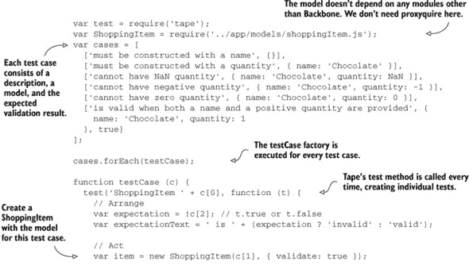

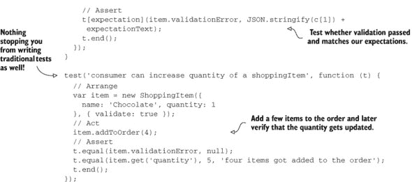

假设你必须将每个测试用例单独编写为一个测试：这将导致大量的复制粘贴，违反了 DRY 原则。

按照本章中我们讨论的实践，你也可以为视图编写测试。好的测试案例可以是

+   确保分配给视图的模板是针对该视图的预期模板

+   检查事件处理器是否在 `events` 属性中声明

+   确保那些事件处理器执行了它们预期执行的操作

你可以使用 `sinon` 在调用每个待测试方法之前模拟视图中的不同属性。我将把这些测试案例留给你作为练习。

当你完成视图控制器的测试编写后，将是时候将你的注意力转向更多的自动化了。这次，你将使用 Grunt 自动化 Tape 测试，你还将学习如何在远程集成服务器上持续运行这些测试。

### 8.4\. 自动化 Tape 测试

你在 第 8.1.4 节 中使用 Grunt 自动化了 Browserify 流程。你如何将 `tape` 测试添加到你的 Grunt 构建中？在 Node 上运行测试比在浏览器上执行它们要容易得多。正如你之前所学的，你可以通过向 `node` CLI 提供测试文件路径来在 Node 上运行它们：

```
node test/something.js
```

通过使用 `grunt-tape` 插件自动化之前代码中显示的过程非常简单。以下代码片段（在 samples 中的 ch08/08_grunt-tape-node 中找到）是你 Gruntfile 中运行 `tape` 测试所需的所有内容。请注意，你不需要运行 Browserify，因为在这种情况下，测试将在 Node 上运行：

```
module.exports = function (grunt) {
  grunt.initConfig({
    tape: {
      files: ['test/something.js']
    }
  });
  grunt.loadNpmTasks('grunt-tape');
  grunt.registerTask('test', ['tape']);
};
```

这很快。在浏览器中怎么样？

#### 8.4.1\. 自动化浏览器中的 Tape 测试

在你的命令行上运行 `tape` 测试在浏览器中也很容易。你可以使用 `testling` 来完成。Testling（也称为 substack）是由 James Halliday 编写的工具，他是一位多产的 Node 贡献者，也是 Tape 的作者，并且是一个模块化狂热者。当时并没有现成的 `grunt-testling` 包，但我决定不要让你失望。我创建了 `grunt-testling`，这样你就可以从 Grunt 中运行 Testling。`grunt-testling` 包不需要任何 Grunt 配置。但你需要配置 `testling` 本身。Testling 通过在 `package.json` 中放置一个 `'testling'` 属性并告诉它测试文件的位置来进行配置。以下列表（在 ch08/09_grunt-tape-browser 中找到）是一个用于此目的的示例 `package.json`。

##### 列表 8.34\. 自动化 Tape 测试

```
{
  "name": "buildfirst",
  "version": "0.1.0",
  "author": "Nicolas Bevacqua <buildfirst@bevacqua.io>",
  "homepage": "https://github.com/bevacqua/buildfirst",
  "repository": "git://github.com/bevacqua/buildfirst.git",
  "devDependencies": {
    "grunt": "⁰.4.4",
    "grunt-contrib-clean": "⁰.5.0",
    "grunt-testling": "¹.0.0",
    "tape": "~2.10.2",
    "testling": "¹.6.1"
  },
  "testling": {
    "files": "test/*.js"
  }
}
```

一旦你配置了 `testling`，安装了 `grunt-testling`，并将其添加到你的 Gruntfile 中，你应该就绪了！

```
module.exports = function (grunt) {
  grunt.initConfig({});
  grunt.loadNpmTasks('grunt-testling');
  grunt.registerTask('test', ['testling']);

};
```

你现在可以通过在终端中输入以下命令在浏览器中运行测试：

```
grunt test
```

图 8.7 展示了使用 Testling 与 Grunt 结合使用的结果。

##### 图 8.7\. 使用 Testling CLI 通过 Grunt 驱动测试


接下来，让我简要重申一下你在 第三章 中首次看到的概念：适应测试的持续开发。

#### 8.4.2\. 持续测试

运行测试的一个重要方面是在每次更改时进行，确保你不会在本地开发环境中长时间处理损坏的代码。你可能还记得第三章中的一个特定的 `watch` 配置片段，它允许你在代码库中的某个地方检测到文件更改时运行特定任务。以下列表是那个片段的改编版本，用于在文件更改时运行测试和代码风格检查。

##### 列表 8.35\. 在文件更改时运行测试和代码风格检查

```
watch: {
  lint: {
    tasks: ['lint'],
    files: ['src/**/*.less']
  },
  unit: {
    tasks: ['test'],
    files: ['src/**/*.js', 'test/**/*.js']
  }
}
```

在 Node 和浏览器中自动化测试都很重要。监视更改并在本地再次运行这些测试也很重要。此时，你可能想再次查看第四章中、4.4 节，我在那里讨论了持续集成，这对于设置你的项目至关重要，因为每次将代码推送到版本控制系统时都会执行测试。

在隔离状态下测试组件并不是测试应用程序的唯一方式。实际上，存在无数种测试类型，我们将在下一节简要讨论其中一些有趣的类型。

### 8.5\. 集成、视觉和性能测试

正如我之前提到几次的那样，测试有多种大小和形状。例如，集成测试允许你测试应用程序工作流程中的不同路径，确保组件交互按预期工作。组件已经在隔离状态下进行了测试，集成测试提供了冗余层，并能够捕获在执行应用程序并亲自查看之前不明显的问题。

#### 8.5.1\. 集成测试

集成测试在工具方面与单元测试并无不同。你仍然可以使用 Tape、Sinon 和 Proxyquire 来运行这些测试。区别在于应该测试什么。在集成测试中，你不再努力测试一个完全隔离的组件版本，而是尽可能多地测试可以测试的互连，并对剩余部分进行模拟。例如，你可能运行你的应用程序的 web 服务器，用真实的 HTTP 请求对其进行打击，并检查响应是否与你的断言相符。

你还可以使用 Selenium，一个浏览器自动化工具，来帮助在客户端执行这些综合测试。Selenium 通过其 API 与浏览器通信，该 API 支持多种语言。你可以通过 Selenium 服务器向浏览器发送命令。你可以为你的测试编写一系列步骤，然后 Selenium 启动一个浏览器并为你执行这些操作。一个运行中的 Web 服务器和浏览器自动化协同工作，允许你自动化你可能手动执行的测试。记住，你只需要组装一次测试！然后你可以根据需要多次运行它。你还可以随时返回并更改测试。不过，我不得不告诉你，设置 Selenium 很麻烦，通常很令人沮丧，而且文档也很差。但一旦你组装了几次测试，你将获得好处。

集成测试不仅限于使用 Selenium 等工具进行浏览器自动化。你还可以运行仅在你后端堆栈或仅在前端工作的集成测试。

#### 8.5.2\. 视觉测试

视觉测试主要是由在不同视口尺寸下对应用程序进行截图，并验证布局没有损坏。你可以通过比较截图与预期内容或通过将最新截图叠加到上一个截图上，生成所谓的“差异”来执行这些验证。这些差异让你能够通过突出显示差异和阴影未更改的截图部分，快速识别从一个版本到另一个版本的变化。许多 Grunt 插件可以为你自动获取应用程序的截图。其中一些甚至更进一步，将最新截图与上一个截图进行比较，显示差异可能存在的位置。一个这样的 Grunt 插件是`grunt-photobox`。配置它主要是决定你想要加载哪个 URL 以及你想要在截图时视口的分辨率。如果你的网站遵循响应式 Web 设计范式，这尤其有用，该范式使用 CSS 媒体查询根据视口尺寸和其他变量更改页面的外观。以下代码片段显示了如何配置`grunt-photobox`以获取不同尺寸的页面截图。让我过一遍选项：

+   `urls`字段是你想要从中获取图片的页面数组。

+   在`screenSizes`中，你可以定义你想要获取的每个屏幕截图的宽度；高度将是页面的完整高度。请确保使用字符串。请注意，Photobox 将会按照你决定的每个分辨率对每个网站进行截图：

    ```
    photobox: {
      buildfirst: {
        options: {
          urls: ['http://bevacqua.io/bf'],
          screenSizes: ['320', '960', '1440'] // these must be strings

        }
      }
    }
    ```

一旦你在 Grunt 中配置了 Photobox，你可以运行以下命令，Photobox 将会生成一个你可以浏览的网站来比较截图：

```
grunt photobox:buildfirst
```

您可以在附带的代码示例中找到完整工作的示例，作为 ch08/10_visual-testing。最后，让我们将注意力转向性能测试。

#### 8.5.3. 性能测试

跟踪应用程序的性能可以帮助快速识别性能问题的根本原因。您可以使用 Google PageSpeed 或 Yahoo YSlow 等工具在 Web 应用程序中监控性能。这两个工具都提供了类似的见解，并且它们都可以通过 Grunt 插件自动化。它们在其服务之间确实有一些差异。PageSpeed Grunt 工具为您提供更多关于您应该对网站进行哪些改进的见解。例如，它可能会让您知道您没有像应该的那样积极缓存静态资源。YSlow 插件提供了一个更紧凑的版本，告诉您请求了多少次，页面加载花费了多长时间，下载了多少内容，以及性能评分。

PageSpeed 插件`grunt-pagespeed`要求您从 Google 获取一个 API 密钥.^([2]) 然后，您可以像列表 8.36（sample ch08/11_pagespeed-insights）中所示那样配置插件。在代码中，您告诉 PageSpeed 它想要访问哪个 URL，想要生成的结果区域，要使用的策略（`'desktop'`或`'mobile'`），以及认为测试成功的最低分数（满分 100 分）。请注意，您故意避免在 Gruntfile 中包含 API 密钥。相反，您将从环境变量中获取它以保持秘密安全。

> ² 从[`code.google.com/apis/console`](https://code.google.com/apis/console)获取 API 密钥。

##### 列表 8.36. 配置 PageSpeed 插件

```
pagespeed: {
  desktop: {
    url: 'http://bevacqua.io/bf',
    locale: 'en_US',
    strategy: 'desktop',
    threshold: 80
  },
  options: {
    key: process.env.PAGESPEED_KEY
  }
}
```

要运行示例，您必须将您从 Google 获得的密钥输入到您的终端中：

```
PAGESPEED_KEY=$YOUR_API_KEY grunt pagespeed:desktop
```

关于将秘密存储在环境变量中的原因的更多信息，请参阅第三章，第 3.2 节。

在`grunt-yslow`（YSlow 的 Grunt 插件）的情况下，您不需要获取任何 API 密钥，这使得事情变得相当简单。配置插件只是指定您想要访问的网站 URL，并设置页面重量、页面加载速度、性能评分（满分 100 分）和请求数量的阈值，如下所示（sample ch08/12_yahoo-yslow）。

##### 列表 8.37. 配置 YSlow 插件

```
yslow: {
  options: {
    thresholds: {
      weight: 1000,
      speed: 5000,
      score: 80,
      requests: 30
    }
  },
  buildfirst: {
    files: [
      { src: 'http://bevacqua.io/bf' }
    ]
  }
}
```

要运行这些 YSlow 测试，请在您的终端中输入以下命令：

```
grunt yslow:buildfirst
```

所有这些示例都可以在附带的源代码示例中找到，位于 ch08 目录下。请务必查看它们！

### 8.6. 概述

那真是太激动人心了！我们在短时间内覆盖了许多概念：

+   您接受了单元测试的速成课程，并学习了如何调整组件，使它们更适合测试。

+   我解释了 Tape 以及您如何使用它无缝地在客户端和服务器端运行测试，而无需重复代码。

+   你学习了关于模拟、间谍和代理；为什么你需要它们；以及如何在 JavaScript 代码中使用它们。

+   我展示了几个案例研究，帮助你弄清楚你应该测试哪些内容以及如何测试。

+   你使用 Grunt 在服务器和浏览器上运行 Tape 测试，而无需离开命令行来处理自动化。

+   我介绍了集成和视觉测试，并学习了如何使用 Grunt 自动化这些任务。

如果你想要了解更多关于测试的知识，我建议你阅读 Christian Johansen 所著的 *Test-Driven JavaScript Development*（开发者图书馆，2010 年）。

## 第九章\. REST API 设计和分层服务架构

*本章涵盖*

+   设计 API 架构

+   理解 REST 约束模型

+   了解 API 分页、缓存和节流方案

+   API 文档技术

+   开发分层服务架构

+   在客户端消费 REST API

我已经描述了如何处理构建过程，你已经了解了部署以及配置应用程序将运行的不同环境。你还学习了模块化、依赖管理、JavaScript 中的异步代码流以及开发可扩展应用程序架构的 MVC 方法。为了使内容更加完整，本章重点介绍了设计 REST API 架构并在客户端消费它，允许你使用透明且干净的 API 将前端与后端持久层绑定。

### 9.1\. 避免 API 设计陷阱

如果你曾经为大型企业的前端项目工作过，那么我相信你一定能够理解后端 API 设计的完全缺乏一致性。你需要访问产品类别列表吗？你应该执行一个 AJAX 请求 `GET /categories`。你有属于某个类别的产品吗？当然；使用 `GET /getProductListFromCategory?category_id=id`。你有属于两个类别的产品吗？使用 `GET /productInCategories?values=id_1,id_2,...id_n`。需要保存产品描述的更改？很遗憾，你将不得不再次通过网络发送整个产品。`POST /product`，在主体中附加一个大的 JSON 块。需要向特定的人发送定制的电子邮件吗？`POST /email-customer`，包括他们的电子邮件和电子邮件消息数据。

如果你没有发现该 API 设计有任何问题，那么很可能是你花了太多时间与类似的 API 一起工作。以下列表详细说明了设计中的问题：

+   每个新方法都有自己的命名约定：`GET` 动词在端点中重复，使用驼峰式、连字符分隔或下划线分隔。你命名它！

+   除了命名约定外，端点没有以任何方式标记，以区分它们与渲染视图的端点。

+   参数输入偏好也极其不同，没有通过查询字符串或请求体进行明确的区分。也许 cookies 可以解决这个问题！

+   不清楚何时使用每个 HTTP 动词（`HEAD`、`GET`、`POST`、`PUT`、`PATCH`、`DELETE`）。因此，只有 `GET` 和 `POST` 被使用。

+   API 中的不一致性。设计良好的 API 不仅具有良好的文档，而且在各个方面都表现出一致性，这允许消费者在 API 中进行黑客攻击，以及实现者通过复制其功能来轻松地构建在现有 API 之上。

这并不仅仅是某个疯子决定混合命名和参数传递约定，同时忽略 API 端点之间的任何标准化和一致性。API 今天的状况最可能的情景是维护 API 的项目员工轮换。是的，也可能是一个不知道更好的单个人，但在那种情况下，你会在 API 方法中观察到至少一些程度的一致性。一个设计良好的 API 能够让消费者在使用几个相关方法后推断出方法的文档。这是因为方法将以一致的方式进行命名，它们将接受类似的参数，这些参数也将以一致的方式进行命名和排序。当一个 API 设计不佳，或者不遵循一套一致性指南时，从简单地使用 API 中推断出如何操作会更难。只有当 API 被一致地设计为简单易懂时，才能达到这种推断状态。

在本章中，我将教你如何设计一致、一致和连贯的 API，以便在您的 Web 项目和其他地方直接消费。前端使用的 API 是我们可以做得更好的一个领域。与 JavaScript 测试一起，我认为这些都是前端开发中最常被低估的方面之一。

REST 代表表示状态转移，它是一套全面的指南，你可以用它来设计 API 架构。一旦你理解了 REST，我将带你去看看如何设计一个典型的分层服务架构，以配合该 API。在结束之前，你将获得开发客户端代码以与 REST API 交互的见解，这将允许你对 API 的响应做出反应。让我们开始吧！

### 9.2. 学习 REST API 设计

REST 是一组架构约束，它在你开发基于 HTTP 的 API 时为你提供帮助。想象一下，你以“什么都行”的模式开始开发一个 Web API——一张白纸。然后逐个加入 REST 约束。最终结果将是一个标准化的 API，大多数开发者都会感到舒适地进行开发和消费。请注意，关于如何设计 REST API 有不同的解释，而且我在本章中穿插了几个我的解释。这些是我认为效果很好的解释，但最终这仅仅是我的观点。

Roy Fielding 撰写了一篇博士论文，向世界介绍了 REST，[1] 自 2000 年发表以来，其采用率一直在增加。我将只涵盖与我们目的相关的约束：为你的应用程序前端构建一个专门的 REST API。在其他约束中，你将接触到如何构建组成你的 API 的端点，如何处理请求，以及你应该使用哪些类型的状态码。稍后我们将深入更高级的 HTTP 通信主题，例如分页结果、缓存响应和限制请求。

> ¹ Fielding, Roy Thomas. 《网络软件架构的设计与架构风格》。博士论文，加州大学欧文分校，2000 年。[`bevacqua.io/bf/rest`](http://bevacqua.io/bf/rest)。

你将访问的第一个这样的约束是 REST 是无状态的，这意味着请求应包含所有必要的信息，以便后端理解你想要什么，服务器不应利用存储在服务器中的任何额外上下文。在实践中，你得到“纯”端点，其中输出（响应）完全由输入（请求）定义。

我们感兴趣的另一个约束是 REST 期望一个统一的接口。API 中的每个端点都期望接受参数，影响持久层，并以某种可预测的方式响应。为了进一步说明，你需要了解 REST 处理资源。


**REST 资源**

在 REST 中，*资源*是信息的抽象，任何信息。就你的目的而言，你可以假设资源和数据库模型是等效的。用户是一种资源，产品和分类也是如此。资源可以通过我描述的统一接口进行查询。


让我们更接近实际，用实际术语描述这对你结构前端 API 意味着什么。

#### 9.2.1. 端点、HTTP 动词和版本

你是否曾经使用过 API 并且觉得它很棒？感觉你“明白了”，实际上你能猜到它们方法的名称，它们的方法以你预期的方式工作，而且没有惊喜？几个执行良好的 API 的例子浮现在我的脑海中；第一个是 Ruby 标准库中的语言 API，它有明确定义其目的的方法，参数使用上保持一致，并且有镜像方法，这些方法正好执行相反的操作。

Ruby 中的`String`类有一个`.capitalize`方法；它创建一个字符串的大写副本。

然后是`.capitalize!`，它将原始字符串大写而不是创建一个副本。你还有`.strip`，它返回一个没有前后空白字符的副本。你可能已经猜到了下一个：`.strip!`，它与`.strip`相同，但作用于原始字符串。

Facebook 有其他很好的例子。他们的 Graph REST API 易于使用，并且它在端点方面是一致的，即端点大多以相同的方式工作。你也可以截取 URL 的一部分，通过他们的网站进行“黑客”操作；例如，[`facebook.com/me`](http://facebook.com/me) 会带你到你的个人资料，因为他们的 API 将 `me` 识别为当前认证的用户。

这种一致的行为对于优秀的 API 至关重要。相比之下，糟糕的 API 设计会导致困惑，并具有缺乏命名约定、模糊或差的文档，甚至更糟糕的是：未记录的副作用。PHP 是编写糟糕 API 的臭名昭著的指南。问题在于缺乏规范和不同的作者接管 PHP 语言 API 的不同部分。结果，PHP 函数具有广泛变化的签名、名称和甚至大小写约定。你无法猜测给定函数的名称。有时这些问题可以通过将现有的 API 包装在一致的 API 中来解决，这是 jQuery 成为流行的一部分——通过在更方便和一致的 API 中抽象 DOM API。

在 API 设计中，最重要的方面是一致性，而这始于端点命名约定。

##### 命名你的端点

首先，你需要为所有 API 端点定义一个前缀。如果你有一个要使用的子域名，例如 `api.example.com`，那也可以。对于前端 API 工作，使用 `example.com/api` 作为前缀应该可以。前缀有助于区分 API 方法和视图路由，并设定了它们产生的响应类型的预期（在现代网络应用中通常是 JSON）。

尽管前缀本身就足够了，但构建一个连贯的 API 主要依赖于在命名端点时遵循严格的指南。以下是一套指南，帮助你开始：

+   使用全部小写、带有连字符的端点，例如 `/api/verification-tokens.` 这样可以增加 URL 的“可玩性”，即手动进入并手动修改 URL 的能力。你可以选择任何你喜欢的命名方案，只要你能保持一致性。

+   使用一个或两个名词来描述资源，例如 `verification-tokens`、`users` 或 `products`。

+   总是使用复数来描述资源：`/api/users` 而不是 `/api/user`。这样可以使 API 更具语义性，正如你将在下一分钟看到的。

这些指南带我们到了一个有趣的观点。让我们以 `/api/products` 为例，看看你如何设计一个既 RESTful 又一致的 API。

##### HTTP 动词和 CRUD 一致性

首先，获取产品列表可能是你对产品 API 执行的最基本任务。`/api/products` 端点是这项任务的理想选择，因此你在服务器上实现了一个返回产品列表的 JSON 的路线，并且开始对自己感到相当满意。接下来，你想要返回单个产品；这将在人类访问产品详情页面时使用。在这种情况下，你可能倾向于将端点定义为 `/api/product/:id`，但你的一个指导原则是始终使用复数形式，所以它最终会看起来像 `/api/products/:id.`

这两种方法都明确定义为 `GET` 请求，因为它们以只读方式与服务器交互。那么移除产品怎么办呢？通常，非 REST 接口使用如 `POST /removeProduct?id=:id.` 这样的方法。有时会使用 `GET` 动词，这会导致像谷歌这样的网络爬虫通过跟随网站上的 `GET` 链接来清除重要的数据库信息。^([2)] REST 建议你使用与获取单个产品相同的端点上的 `DELETE` HTTP 动词，即 `/api/products/:id`。利用 HTTP 的一个构建块——它们的动词——你可以构建更具语义和一致性的 API。

> ² 阅读这篇文章，了解谷歌如何仅通过跟随链接就清除了网站内容的类似故事：[`bevacqua.io/bf/spider`](http://bevacqua.io/bf/spider)。

插入给定资源类型的项目涉及类似的思想过程。在非 REST 场景中，你可能有过 `POST /createProduct` 和相关数据的主体，而在 REST 中，你应该使用更具语义的 `PUT` 动词，以及一致的 `/api/products` 端点。最后，编辑应使用 `PATCH` 动词和一个如 `/api/products/:id` 的端点。我们将保留 `POST` 动词用于不单纯涉及创建或更新数据库对象的操作，例如通过电子邮件的 `/notifySubscribers`。关系是最后一种可以被认为是基本存储操作（创建、读取、更新、删除，简称 CRUD）的端点类型。鉴于我迄今为止所描述的所有内容，你可能不会觉得想象 `GET /api/products/:id/parts` 是一个请求的良好起点有多难，该请求会响应构成特定产品的单个部件。

就 CRUD 而言，这就是全部内容。如果你想要使用除了 CRUD 之外的东西怎么办？使用你的最佳判断。通常，你可以使用 `POST` 动词，理想情况下将你自己限制在特定的资源类型上，这不一定需要是数据库模型引用。例如，`POST /api/authentication/login` 可以处理前端上的登录尝试。

作为总结，表 9.1 显示了到目前为止讨论的动词和端点，按照典型的 REST API 设计。为了简洁起见，我省略了 `/api` 前缀。请注意，我使用 `products` 作为示例资源类型，以便使示例更容易相关联，但这适用于任何资源类型。

##### 表 9.1. 典型 REST API 中的产品端点

| 动词 | 端点 | 描述 |
| --- | --- | --- |
| GET | /products | 获取产品列表 |
| GET | /products/:id | 通过 ID 获取单个产品 |
| GET | /products/:id/parts | 获取单个产品中的部件列表 |
| PUT | /products/:id/parts | 为特定产品插入一个新的部件 |
| 删除 | /products/:id | 通过 ID 删除单个产品 |
| PUT | /products | 插入一个新的产品 |
| HEAD | /products/:id | 通过状态码 200 或 404 返回产品是否存在 |
| PATCH | /products/:id | 通过 ID 编辑现有产品 |
| POST | /authentication/login | 大多数其他 API 方法应使用 POST 请求 |

请注意，为每种操作类型选择的 HTTP 动词并不是一成不变的。实际上，这是一个激烈争论的话题，人们争论`POST`应该用于插入，或任何其他非幂等操作，而使用其他动词（`GET`、`PUT`、`PATCH`、`DELETE`）的端点必须导致幂等操作——对这些端点的重复请求不应改变结果。

版本控制也是 REST API 设计的一个重要方面，但对于前端操作来说，这是否必要呢？

##### API 版本控制

在传统的 API 场景中，版本控制是有用的，因为它允许您在不破坏现有消费者交互的情况下对服务进行破坏性更改。在 REST API 版本控制方面存在两种主要的思想流派。

一种观点认为，API 版本应该设置在 HTTP 头中，如果没有在请求中指定版本，您应该从 API 的最新版本获得响应。这种正式的方法更接近原始 REST 论文所提出的，但有人认为如果 API 执行不当，可能会导致意外破坏性更改。

相反，他们提出将版本嵌入到 API 端点前缀中：`/api/v1/....` 通过查看请求的端点，可以立即识别出应用程序想要使用哪个 API 版本。

事实上，将`v1`放在端点或请求头中并不会改变太多，所以这主要取决于 API 实现者的偏好。当涉及到 Web 应用程序及其伴随的 API 时，您不一定需要实现任何版本控制，这就是我倾向于采用请求头方法的原因。这样，如果您在某个时候决定确实需要版本控制，您可以轻松地定义“最新版本”作为默认版本，如果消费者仍然想要旧版本，他们可以显式地添加一个请求头以获取旧版本。话虽如此，请求特定的 API 版本总是比盲目接受最新的 API 更可取，以免意外破坏功能。

我提到您不一定需要在前端使用的 REST API 中实现版本控制，这取决于两个因素：

+   API 是否面向公众？在这种情况下，版本控制是必要的，这将在你的服务行为中增加更多的可预测性。

+   被多个应用程序使用的 API 吗？API 和前端是由不同的团队开发的吗？更改 API 端点是否有漫长的流程？如果这些情况中的任何一个适用，你可能最好对你的 API 进行版本控制。

除非你的团队和应用程序足够小，以至于两者都位于同一个存储库中，并且开发者可以模糊地触及两者，否则请选择安全的方案，并在你的 API 中使用版本。

是时候继续前进，研究请求和响应可能的样子了。

#### 9.2.2. 请求、响应和状态码

正如我之前提到的，遵循 REST 约定的一致性是开发高度可用的 API 的关键。这也适用于请求和响应。API 应该一致地接受参数；这通常是通过端点获取 ID 的方式实现的。在按 ID 获取产品的路由`/api/products/:id`的情况下，当请求`/api/products/bad0-bab8` URL 时，假设`bad0-bab8`是请求的资源标识符。

##### 请求

当今的 Web 路由器在解析 URL 并提供指定的请求参数方面毫无困难。例如，以下代码展示了 Node.js Web 框架 Express 如何让你定义一个动态路由，该路由通过标识符捕获对产品的请求。然后它解析请求 URL 并为你提供适当的解析参数：

```
app.get('/api/products/:id', function (req, res, next) {
  // req.params.id contains the extracted id
});
```

将标识符作为请求端点的一部分是非常好的，因为它允许`DELETE`和`GET`请求使用相同的端点，从而创建一个更直观的 API，就像我之前提到的 Ruby。你应该决定一个一致的数据传输策略，在制作修改服务器上资源的`PUT`、`PATCH`或`POST`请求时上传数据。如今，由于它的简单性、它是浏览器的本地格式以及服务器端语言中 JSON 解析库的高度可用性，JSON 几乎被普遍用作数据传输的首选格式。

##### 响应

就像请求一样，响应应该符合一致的数据传输格式，这样在解析响应时就不会有惊喜。即使服务器端发生错误，响应仍然应该根据所选的传输方式是有效的；例如，如果我们的 API 是使用 JSON 构建的，那么我们 API 产生的所有响应都应该有效的 JSON（假设用户在 HTTP 头中接受 JSON 响应）。

你应该弄清楚你将包裹你的响应的包装器。包装器或消息包装器对于在所有 API 端点提供一致体验至关重要，它允许消费者对 API 提供的响应做出某些假设。一个有用的起点可能是一个包含单个字段的对象，该字段名为`data`，包含你的响应正文：

```
{
  "data": {} // the actual response
}
```

错误字段可能也是一个有用的字段，仅在发生错误时出现，包含可能暴露错误消息、原因和伴随元数据的对象。假设您在`GET /api/products/baeb-b00f`端点上查询 API，但数据库中不存在`baeb-b00f`产品：

```
{
  "error": {
    "code": "bf-404",
    "message": "Product not found.",
    "context": {
      "id": "baeb-b00f"
    }
  }
}
```

仅使用信封和适当的错误字段在您的响应中是不够的。作为一名 REST API 开发者，您还应该意识到您为 API 响应选择的状态码。

##### HTTP 状态码

在找不到产品的情况下，您应该响应`404 未找到`状态码，以及描述错误的正确格式化响应。状态码在允许 API 消费者对响应做出假设方面尤为重要。当您以 2xx 成功类状态码响应时，响应体应包含所有请求的相关数据。以下是一个示例，展示了针对可能找到的产品请求的响应，以及 HTTP 版本和状态码：

```
HTTP/1.1 200 OK
{
  "data": {
    "id": "baeb-b001",
    "name": "Angry Pirate Plush Toy",
    "description": "Batteries not included.",
    "price": "$39.99",
    "categories": ["plushies", "kids"]
  }
}
```

然后是 4xx 客户端错误类代码，这意味着请求很可能由于客户端（例如用户未正确认证）的错误而失败。在这些情况下，您应该使用`error`字段来描述请求为何有误。例如，如果在尝试创建产品时表单输入验证失败，您可以使用`400 请求错误`状态码返回响应，如下所示。

##### 列表 9.1\. 描述错误

```
HTTP/1.1 400 Bad Request
{
  "error": {
    "code": "bf-400",
    "message": "Some required fields were invalid.",
    "context": {
      "validation": [
        "The product name must be 6-20 alphanumeric characters",
        "The price can't be negative",
        "At least one product category should be selected"
      ]
    }
  }
}
```

5xx 状态码范围内的另一种错误是意外错误，例如`500 内部服务器错误`。这些错误应该以与 4xx 错误相同的方式呈现给消费者。假设之前的请求导致错误；然后您应该以 500 状态码和响应体中的数据片段进行响应，类似于以下内容：

```
HTTP/1.1 500 Internal Server Error
{
  "error": {
    "code": "bf-500",
    "message": "An unexpected error occurred while accessing the database."
    "context": {
      "id": "baeb-b001"
    }
  }
}
```

当其他所有方法都失败时，捕获这类错误通常相对容易，并返回一个`500`消息，传递一些关于出错原因的上下文信息。

到目前为止，我已经介绍了端点、请求体、状态码和响应体。设置适当的响应头是另一个值得提及的 REST API 设计方面，原因有很多。

#### 9.2.3\. 分页、缓存和节流

尽管在小型应用中不太重要，但分页、缓存和节流都在定义一致且高度可用的 API 中发挥着作用。特别是分页通常是必需的，因为完全缺乏分页会很容易通过允许 API 从数据库查询和传输大量数据到客户端来削弱您的应用。

##### 响应分页

回到第一个 REST 端点示例，假设我向你的 API 发出对`/api/products`的查询。这个端点应该返回多少产品？所有？如果有 100 个、1000 个、10 个或 100 万个呢？你必须在哪里划线。你可以在 API 中设置默认的分页限制，并能够为每个单独的端点覆盖该默认值。在合理的范围内，消费者应该能够传递一个查询字符串参数并选择不同的限制。

假设你每个请求只接受 10 个产品。那么，你必须实现分页机制来访问你应用上可用的其他产品。要实现分页，你使用`Link`头。

如果你查询第一个产品页面，响应的`Link`头应该类似于以下代码：

```
Link: <http://example.com/api/products/?p=2>; rel="next",
      <http://example.com/api/products/?p=54>; rel="last"
```

注意，端点必须是绝对路径，以便消费者可以解析`Link`头并直接查询它们。`rel`属性描述了请求页面与链接页面之间的关系。

如果你现在请求第二页，`/api/products/?p=2`，你应该得到一个类似的`Link`头，这次会告诉你“上一页”和“第一页”的相关页面也是可用的：

```
Link: <http://example.com/api/products/?p=1>; rel="first",
      <http://example.com/api/products/?p=1>; rel="prev",
      <http://example.com/api/products/?p=3>; rel="next",
      <http://example.com/api/products/?p=54>; rel="last"
```

存在一些情况，数据流动得太快，以至于传统的分页方法无法按预期工作。例如，如果在请求第一页和第二页之间，有少量记录进入数据库，那么第二页将导致第一页上的项目重复，这些项目由于插入而被推到了第二页。这个问题有两个解决方案。第一个解决方案是使用标识符而不是页码。这允许 API 确定你离开的位置，即使有新的记录被插入，你仍然会在 API 给出的最后一个标识符范围上下文中获得下一页。第二种方法是向消费者提供令牌，允许 API 跟踪他们在最后请求之后到达的位置以及下一页应该是什么样子。

如果你处理需要分页才能高效工作的那种大型数据集，那么实施缓存和节流可能会带来很大的回报。缓存可能比节流产生更好的结果，所以让我们先讨论一下缓存。

##### 响应缓存

通常，缓存 API 结果的责任在于最终客户端根据需要决定。然而，API 可以以不同程度的信心提出建议，说明其响应应该如何缓存。以下是对 HTTP 缓存行为和相关 HTTP 头部的快速入门课程。

将`Cache-Control`头设置为`private`可以绕过中间代理（例如像`nginx`这样的代理，其他像 Varnish 这样的缓存层，以及介于其间的各种硬件），并且只允许最终客户端缓存响应。同样，将其设置为`public`允许中间代理将其缓存中的响应副本存储起来。

`Expires`头告诉浏览器一个资源应该被缓存，并且直到过期日期过去之前不再请求：

```
Cache-Control: private
Expires: Thu, 3 Jul 2014 18:31:12 GMT
```

在 API 响应中定义未来的`Expires`头是困难的，因为如果服务器中的数据发生变化，这可能意味着客户端的缓存变得过时，但客户端直到过期日期之前都没有任何方式知道这一点。作为响应中`Expires`头的一个保守替代方案，可以使用一种称为“条件请求”的模式：

条件请求可以是基于时间的，在您的响应中指定一个`Last-Modified`头。最好在`Cache-Control`头中指定一个`max-age`，以便在一段时间后即使修改日期没有变化，浏览器也会使缓存失效：

```
Cache-Control: private, max-age=86400
Last-Modified: Thu, 3 Jul 2014 18:31:12 GMT
```

下次浏览器请求此资源时，它将仅在资源自该日期以来未更改的情况下请求资源内容，使用`If-Modified-Since`请求头：

```
If-Modified-Since: Thu, 3 Jul 2014 18:31:12 GMT
```

如果资源自`Thu, 3 Jul 2014 18:31:12 GMT`以来没有变化，服务器将返回一个空体，并带有`304 Not Modified`状态码：

作为`Last-Modified`协商的替代方案，可以使用`ETag`（也称为实体标签）头，它通常是一个表示资源当前状态的哈希值。这允许服务器确定缓存的资源内容是否与最新版本不同：

```
Cache-Control: private, max-age=86400
ETag: "d5aae96d71f99e4ed31f15f0ffffdd64"
```

在随后的请求中，将发送带有相同资源最后请求版本的`ETag`值的`If-None-Match`请求头：

```
If-None-Match: "d5aae96d71f99e4ed31f15f0ffffdd64"
```

如果当前版本具有相同的`ETag`值，则当前版本是客户端缓存的版本，并将返回一个`304 Not Modified`响应。一旦实施缓存，请求节流也可以减轻服务器负载。

##### 请求节流

*节流*，也称为速率限制，是一种可以用来限制客户端在一定时间窗口内对您的 API 发起请求数量的技术。您有多个标准可以用来限制消费者，但最常见的方法之一是定义一个固定的速率限制，并在一段时间后重置配额。您还必须决定如何执行这种限制。可能限制是按 IP 地址执行的，您还可以为认证用户提供更宽松的限制。

假设您为未认证用户定义了每小时 2,000 个请求的限制；API 应该在响应中包含以下头，每次请求都会从剩余额度中扣除一个点。`X-RateLimit-Reset`头应包含一个 UNIX 时间戳，描述限制将被重置的时刻：

```
X-RateLimit-Limit: 2000
X-RateLimit-Remaining: 1999
X-RateLimit-Reset: 1404429213925
```

一旦请求配额耗尽，API 应该返回一个`429 Too Many Requests`响应，其中包含一个包含在常规错误封装中的有用错误消息：

```
HTTP/1.1 429 Too Many Requests
X-RateLimit-Limit: 2000
X-RateLimit-Remaining: 0
X-RateLimit-Reset: 1404429213925
{
  "error": {
    "code": "bf-429",
    "message": "Request quota exceeded. Wait 3 minutes and try again.",
    "context": {
      "renewal": 1404429213925
    }
  }
}
```

在处理内部 API 或仅面向前端使用的 API 时，这种保护通常是不必要的，但当公开 API 时，这是一个至关重要的措施。与分页和缓存一起，这些措施有助于减轻后端服务的压力。

当消费者在使用你的 API 时发生意外情况时，详尽的文档将是您设计的非常易用的服务的最后堡垒。下一节将解释正确记录 API 的基本要素。

#### 9.2.4\. 记录 API

任何值得使用的 API 都应该有良好的文档，无论它是面向公众的还是不是。当其他一切失败时，消费者会参考 API 文档。你可以根据代码库中散布的元数据自动生成 API，通常以代码注释的形式出现，但你必须确保文档保持最新和相关性。

良好的 API 文档应该

+   解释响应信封的外观。

+   展示错误报告是如何工作的。

+   展示身份验证、分页、节流和缓存在高级别是如何工作的。

+   详细说明每个端点，解释用于查询这些端点的 HTTP 动词，并描述请求中应包含的每条数据以及可能出现在响应中的字段。

测试用例有时可以作为文档提供帮助，提供最新的工作示例，同时指示访问 API 的最佳实践。文档使 API 客户端开发者能够快速筛选他们可能遇到的任何问题，因为他们没有完全理解 API 期望他们提供的数据类型。API 文档中另一个理想的组成部分是变更日志，它简要地详细说明从一个版本到下一个版本发生的变化。有关变更日志的更多信息，请参阅第 4.2.2 节。

即使 API 和 Web 应用程序在一起，文档也可能很有用，因为它有助于减少研究 API 预期或其工作方式所需的时间。开发者不必在代码中筛选，可以直接阅读文档。当被问及有关 API 的问题时，你可以引导他们查看文档。在这方面，文档不仅对维护 REST API 有益，而且对任何类型的服务、库或框架都很有意义。以库为例——以 jQuery 为例——文档应涵盖库的每个公共 API 方法，明确详细地说明可能的参数和响应组合。在那些有助于消费者理解 API 为何如此设计的案例中，文档也可能解释底层实现。执行良好的 API 文档示例包括 Twitter、Facebook、GitHub 和 Stack-Exchange.^([3])

> ³ 你可以在[`bevacqua.io/bf/api-twitter`](http://bevacqua.io/bf/api-twitter)、[`bevacqua.io/bf/api-fb`](http://bevacqua.io/bf/api-fb)、[`bevacqua.io/bf/api-github`](http://bevacqua.io/bf/api-github)和[`bevacqua.io/bf/api-stack`](http://bevacqua.io/bf/api-stack)分别找到这些示例。

在掌握了设计 REST API 所需的知识后，在下一节中，你将探讨为 API 创建一系列层的可能性。这些层将定义 API 并帮助你保持服务模块化结构并易于测试。

### 9.3. 实现分层服务架构

如果你的 API 足够小并且仅针对前端，那么它很可能会存在于同一个项目中。如果是这样，那么 API 与 Web 应用的控制器位于同一层是有意义的。

一种常见的做法是拥有一个所谓的服务层来处理数据处理任务的核心，同时拥有一个数据层来负责与数据库的交互。同时，API 应该设计为其他层之上的一个薄层。这种架构在图 9.1 中有所展示。

##### 图 9.1. 三层服务架构概述


从上往下看这个图，你可以看到每个 API 层的组成部分。

#### 9.3.1. 路由层

API 层负责处理节流、分页、缓存头、解析请求体和准备响应。然而，所有这些都应该通过使用服务层作为访问或修改数据的唯一方式来完成，以下是一些原因：

+   控制器在生成响应之前必须验证请求数据。

+   API 会向服务请求它需要的数据，以便正确地完成响应。

+   当服务任务完成时，API 控制器会以适当的状态码和相关的响应数据做出响应。

#### 9.3.2. 服务层

服务层可以被设计为将所有数据访问推迟到第三层：数据层。这一层负责处理无法直接从数据存储中提取的任何缺失数据的计算：

+   服务层由许多小型服务组成。每个服务都处理业务的一部分。

+   服务层查询数据层，计算业务逻辑规则，并在模型级别验证请求数据。

+   CRUD 操作通常最终会传递到数据层。

+   像发送电子邮件这样的任务，其中不涉及持久性访问，可能完全由服务层的一个组件处理，而不需要求助于数据存储。

#### 9.3.3. 数据层

数据层负责与持久化介质（如数据库、平面文件、内存等）通信。其目的是通过一个一致的接口提供对这些介质的访问。设置此类接口的目标是你可以轻松地交换持久化层（例如数据库引擎或内存中的键值存储），这也使得测试变得更加容易：

+   数据访问层为底层数据存储中的数据提供了一个接口。这使得与不同的数据源交互和更换供应商变得更加容易。

+   模型与底层数据存储无关，它们是接口的一部分。

+   底层数据模型与接口保持分离。这使得更换数据存储变得更加容易，因为数据层消费者不会受到影响。

这只是一个匆忙的概述！让我们放慢速度，更详细地逐步分析这个三层架构。请注意，这种类型的架构不仅限于 API 设计，也可能适用于典型的 Web 应用程序，甚至可能适用于其他类型的应用程序，如果它们值得额外的基础设施。

#### 9.3.4\. 路由层

控制器是这种架构中的公共接口层。在这一层，你将定义应用程序可以被访问的路径。路由层还负责解析请求 URL 和请求体中找到的任何参数。

在尝试满足请求之前，你可能需要验证客户端是否超出了他们允许的配额，如果是这样，你可以在那时终止请求，传递适当的响应和状态码`429 Too Many Requests`。

正如我们所知，用户输入是不可信的，这就是你需要在最严格的意义上验证和清理用户输入的地方。一旦请求被解析，确保请求提供了满足请求所需的所有信息，不多也不少。一旦你确认所有必需的字段都已提供，你应该清理它们并确保输入有效。例如，如果提供的电子邮件地址不是一个有效的电子邮件，你的 API 应该知道响应一个`400 Bad Request`和一个格式适当的响应体。

一旦请求被解析并且其输入得到验证，你就可以将其交给服务层，服务层会将请求提供的输入转换为所需的输出。（请稍等，我们将会更深入地探讨服务层。）一旦服务层回复你，你就可以最终确定请求是否能够得到满足，并使用相应的状态码和响应数据做出回应。那么，服务层究竟应该做什么呢？很高兴你提出了这个问题！

#### 9.3.5\. 服务层

在服务层，也称为业务逻辑层，请求被处理，数据从数据层获取，并返回该数据的表现形式。此时验证业务规则是有意义的，而这不是路由层的责任。

例如，如果用户尝试创建一个价格为“非常昂贵”或`-1`的新产品，那么确定这不是有效的货币输入的责任就落在路由层。如果选定的产品类别期望产品价格在`$20 - $150`范围内，而产品定价为`$200`，那么确定该请求无法满足的责任就落在服务层。

服务层也负责执行任何必要的数据聚合。尽管路由层可能只需要对服务层进行一次调用就能获取所需的数据，但服务层与数据层之间的交互并非如此。例如，服务层可能需要获取新闻网站上文章的列表，并将其交给一个对文章内容进行加工处理的服务，找出相似之处，并最终返回相关文章的列表。

在这方面，服务层是架构中的事件组织者，因为它将查询和命令其他层，以提供产生有意义响应的手段。让我们快速了解一下数据层应该如何构建的具体细节。

#### 9.3.6\. 数据层

数据层是唯一一个旨在访问持久化组件（即您的数据库）的层。数据层的目标是确保提供一致的 API，无论使用的是哪种底层数据存储。如果您在 MongoDB、MySQL 或 Redis 中持久化数据，数据层提供的 API 将通过提供不依赖于任何特定持久化模型的统一 API 来隐藏这些细节。

图 9.2 显示了可能位于数据层接口后面的潜在数据存储。请注意，这个接口不一定隐藏单一类型的数据存储：例如，您可能同时使用 Redis 和 MySQL。

##### 图 9.2\. 数据层接口和几个底层数据存储


数据层通常是较薄的，在服务和持久化层之间架起桥梁。数据层产生的结果也预期是一致的，因为改变底层持久化模型实际上不会产生影响。

虽然不推荐，但在小型项目中，如果应用程序的持久化模型没有重大变化，合并服务层和数据层是可行的。请记住，一开始分割这两个层是容易的，但一旦有数十个服务消费数十种不同的数据模型，这样做会变得越来越复杂和非平凡。这就是为什么，如果可能的话，建议从一开始就分割这两个层。

本章我们将讨论的最后一个主题是如何在客户端消费这类服务。

### 9.4. 消费客户端的 REST API

当在 Web 应用程序的客户端与 REST API 层进行密集交互时，通常明智的做法是创建一个薄层作为 API 和应用程序核心之间的中介。这个层依赖于创建共享基础设施来向 API 发出请求，以换取以下列出的好处：

+   对应用程序中发生的请求的高级概述

+   允许你执行缓存并避免额外的请求

+   在应用程序的一个地方管理错误，提供一致的 UI 体验

+   在单页应用程序中导航时能够取消挂起的请求

我将首先描述创建这样一个层将涉及什么，然后我们将继续讨论具体细节。

#### 9.4.1. 请求处理层

组建这样的层可以通过两种方式完成。你可以修补浏览器中的 XHR 实现，确保你的应用程序发出的任何 AJAX 请求都必须通过修补到 XHR 中的代理进行，或者你可以围绕 XHR 创建一个包装器并在每次 AJAX 请求发生时使用它。后者通常被认为更“干净”，因为它不会像猴子补丁方法那样影响浏览器提供的原生行为，这有时会导致意外行为。这通常是优先创建围绕 XHR 调用的简单包装器并使用该包装器而不是原生 API 的足够理由。

我创建了一个名为`measly`的库，正是出于这个目的。它采用较少侵入性的包装器方法，因为这样它就不会影响不了解 Measly 行为的代码，并且允许你轻松地将请求与 DOM 的不同部分关联起来。它还允许进行缓存和事件处理，这两者都可以限制在特定 DOM 元素或全局的上下文中。我将向您介绍`measly`的几个关键特性。要开始，您需要从 npm 安装它。它也在 Bower 上以相同名称提供。

```
npm install --save measly
```

安装`measly`后，你将准备好进入下一节，我们将探讨如何使用它来确保请求不会导致意外的副作用。

#### 9.4.2. 取消旧请求

单页 Web 应用程序如今非常流行。在传统的 Web 应用程序中，当用户代理导航到另一个页面时，会取消所有挂起的请求，但单页应用程序（SPA）又是如何呢？如果你正在开发 SPA，那么你很可能希望当用户导航到另一个页面时，散乱的请求不会破坏应用程序的状态。

以下代码是一个通用的示例，假设客户端 MVC 框架在进入和离开视图时广播事件。在这个例子中，你正在在视图容器元素上创建一个`measly`层级，并在离开视图时取消该层级的所有请求：

```
view.on('enter', function (container) {
  measly.layer({ context: container });
});
view.on('leave', function (container) {
  measly.find(container).abort();
});
```

每当你需要发起 AJAX 调用时，你首先需要查找层级。你也可以保留一个引用以方便使用。使用`measly`层级创建请求相当直接。在这种情况下，你正在发起一个对`DELETE/api/products/:id`的请求，通过 REST API 按 ID 删除产品：

```
var layer = measly.find(container);

deleteButton.addEventListener('click', function () {
  layer.delete('/api/products/' + selectedItem.id);
});
```

每当你发起一个请求时，`measly`会发出一系列事件，让你可以对其做出反应。例如，如果你想知道请求何时成功，你可以使用`data`事件，如果你想监听错误，你可以订阅`error`事件。你有两个不同的地方可以监听错误：

+   在请求级别直接，你只有在特定请求导致错误时才会收到通知。

+   在层级层面，你可以了解任何导致错误的请求。

这些方法都有明显的用例。你肯定想知道请求何时成功，这样你就可以利用响应数据做些具体的事情。

你可能还需要了解任何在全局范围内起源于你应用程序的错误，这样你就可以显示相应的 UI 元素来通知人类这些错误，或者将报告发送到日志服务。

#### 9.4.3\. 一致的 AJAX 错误管理

以下列表解释了如何在 AJAX 错误发生时显示 UI 对话框，但只有当响应中的状态码等于 500 时，这意味着发生了内部服务器错误。你将在对话框中填写响应提供的错误消息，然后经过短暂的超时后再次隐藏它。

##### 列表 9.2\. 当 AJAX 错误发生时显示 UI 对话框


坦白说，这是一个非常无趣的方法，而且不是你不能完成的事情。更有用的场景是在上下文中进行验证。在这种情况下，请注意`400 Bad Request`响应，这是 API 应该分配给验证失败响应的状态码。Measly 将在事件处理程序中将`this`设置为请求对象，允许你访问请求的重要属性，例如其 DOM 上下文元素。以下代码拦截任何`400 Bad Request`响应，并将其转换为 DOM 上下文中的验证消息。如果你将 Measly 与创建的请求的视觉上下文绑定得足够紧密，人类将不会在查找你的验证消息列表时遇到任何麻烦：

```
measly.on(400, function (err, body) {
  var message = document.createElement('pre');
  message.classList.add('validation-messages');
  message.innerText = body.validation.messages.join('\n');
  this.context.appendChild(message);
});
```

最好的部分是，你几乎可以免费获得这个功能！因为你在使用上下文确保在切换视图时请求被终止，你可能只需要声明几个子层，这样做是有意义的，例如部分视图或 HTML 表单。我想提出的最后一个点是 Measly 中的缓存规则。

##### Measly 缓存规则

Measly 允许你以两种方式缓存。首先，它允许你定义一个响应被认为是新鲜的时间量，这意味着对同一资源的后续请求将导致缓存响应，只要缓存副本仍然新鲜。以下列表显示了如何请求缓存响应 60 秒，然后当按钮被点击时，Measly 要么使用缓存副本（如果自上次请求以来在 60 秒内），要么如果数据已更新，则发起新的请求。

##### 列表 9.3\. 使用 Measly 缓存文件

```
measly.get('/api/products', {
  cache: 60000
});
queryButton.addEventListener('click', function () {
  var req = measly.get('/api/products', {
    cache: 60000
  });
  req.on('data', function (body) {
    console.log(body);
  });
})
```

你还可以通过手动阻止不合理的 HTTP 请求来避免对服务器进行查询。以下列表是一个示例，其中产品列表是通过手动缓存的。

##### 列表 9.4\. 手动阻止不合理的 HTTP 请求

```
var saved = []; // a list of products that you know to be fresh
var req = measly.get('/api/products');
req.on('ready', function () {
  if (computable) {
    req.prevent(null, saved);

  }
});
req.on('data', function (body) {
  console.log(body);
});
```

你可以在本章的配套代码示例中找到一个关于 Measly 如何工作的快速演示，该示例列在 ch09/01_a-measly-client-side-layer 中。在演示中，我展示了如何创建不同的上下文来包含对 DOM 部分的不同请求。

总的来说，`measly` 可能不是你想要的答案，但结合这本书的其余部分，我希望它给你带来了一些思考！

### 9.5\. 摘要

这并不难，对吧？我们覆盖了大量的内容，并在过程中探讨了众多最佳实践：

+   负责任的 API 设计遵循 REST 约束模型，通过提供常规端点、清理输入并提供一致的输出。

+   在 REST API 中，分页、节流和缓存都是提供快速和安全 API 服务所必需的。

+   应该认真对待文档，以降低 API 引入的摩擦。

+   你应该开发一个由领域逻辑层和数据层支持的薄 API 层。

+   一个薄客户端层可以帮助你为 AJAX 请求分配上下文、验证响应，并在用户界面上渲染 HTTP 错误。
