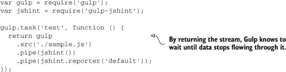

## 附录 C. 选择你的构建工具

决定一项技术总是困难的。你不想做出无法撤销的承诺，但最终你必须做出选择。在构建技术方面的承诺在这方面没有不同：这是一个重要的选择，你应该这样对待它。

为了这本书的目的，我决定选择 Grunt 作为我的首选构建工具。我努力不偏重于 Grunt 特定的概念，而是从更广泛的角度解释构建过程，将 Grunt 作为一种辅助手段——达到目的的手段。我选择 Grunt 的原因有几个；以下列表中展示了其中的一些：

+   Grunt 在 Windows 上也有一个健康的社区。

+   它非常受欢迎；它甚至被 Node 社区之外的人使用。

+   它很容易学习；你选择插件并配置它们。不需要使用高级概念，也不需要任何先前的知识。

这些都是使用 Grunt 在书中教授构建过程的好理由，但我想明确指出，我不认为 Grunt 是唯一最佳选择；其他流行的构建工具可能比 Grunt 更适合你的需求。

我写这个附录是为了帮助你理解我在前端开发工作流程中最常用的三个构建工具之间的区别：

+   本书所使用的配置驱动型构建工具 Grunt

+   npm，一个也可以作为构建工具使用的包管理器

+   Gulp，一个介于 Grunt 和 npm 之间的代码驱动型构建工具

我还会列出一些特定工具可能比其他工具更好的情况。

在阅读这个附录之前，你应该阅读这本书的第一部分和附录 A。Grunt 在附录 A 中介绍，并在第一部分中进行了全面介绍。在这个附录中，我假设你对 Grunt 有基本了解。作为第一步，让我们讨论 Grunt 优于其他工具的地方。

### C.1. Grunt：优点

Grunt 的最佳特性是其易用性。它使程序员能够几乎毫不费力地使用 JavaScript 开发构建流程。所需做的只是搜索合适的插件，阅读其文档，然后安装和配置它。这种易用性意味着大型开发团队中的成员，他们的技能水平往往不同，在调整构建流程以满足项目最新的需求时不会有任何困难。团队也不需要精通 Node；他们只需要向配置对象添加属性，并将任务名称添加到构建流程的不同数组中。

Grunt 的插件库足够大，你很少需要自己开发构建任务，这也使得你和你的团队能够快速开发构建过程。如果你采取的是先构建的方法，即使只是小步骤和逐步开发构建流程，这种快速开发也是至关重要的。

通过 Grunt 管理部署也是可行的，因为存在许多用于这些任务的包，例如`grunt-git`、`grunt-rsync`和`grunt-ec2`。

### C.2\. Grunt：缺点

Grunt 的不足之处在哪里？如果你有一个相当大的构建流程，它可能会变得过于冗长。一旦开发了一段时间，通常很难理解整个构建流程。当你的构建流程中的任务数量达到两位数时，几乎可以肯定你会发现自己需要单独运行属于同一任务的目标，以便以正确的顺序组合流程。

由于任务是声明性配置的，你也会很难弄清楚任务的执行顺序。此外，当涉及到构建时，你的团队应该致力于编写可维护的代码。在 Grunt 的情况下，你将维护每个任务的配置文件，或者至少是团队使用的每个构建流程的配置文件。

现在我们已经确定了 Grunt 的优点和缺点，以及它可能适合你项目的场景，让我们谈谈 npm：它如何作为构建工具使用以及它与 Grunt 的不同之处。

### C.3\. npm 作为构建工具

要将 npm 用作构建工具，你需要一个 package.json 文件和 npm 本身。为 npm 定义任务就像在你的包清单中添加`scripts`对象的属性一样简单。属性名将用作任务名，值将是你要执行的命令。以下代码片段代表一个典型的 package.json 文件，使用 JSHint 命令行界面通过 JavaScript 文件运行 lint 器并检查错误。使用 npm，你可以运行任何可用的 shell 命令：

| |
| --- |

**Grunt 概述**

Grunt 有以下优点：

+   数千个插件可以满足你的需求。

+   易于理解和调整的配置。

+   只需要基本的 JavaScript 理解。

+   支持跨平台开发。是的，甚至是 Windows！

+   对于大多数团队来说效果很好。

Grunt 有一些缺点：

+   随着配置的构建定义越来越大，它们变得越来越难以管理。

+   当涉及许多多目标任务定义时，很难跟踪构建流程。

+   Grunt 比其他构建工具慢得多。

| |
| --- |

```
{
  "scripts": {
    "test": "jshint . --exclude node_modules"
  },
  "devDependencies": {
    "jshint": "².5.1"
  }
}
```

一旦定义了任务，你就可以通过运行以下命令在你的命令行中执行它：

```
npm run test
```

注意，npm 为特定的任务名提供了快捷方式。在`test`的情况下，你可以执行`npm test`并省略`run`动词。你可以在脚本声明中通过链式`npm run`命令来组合构建流程。以下列表允许你在执行`lint`任务后立即运行`unit`任务，通过执行`npm test`命令。

##### 列表 C.1\. 将 npm `run`命令链起来以创建构建流程

```
{
  "scripts": {
    "lint": "jshint . --exclude node_modules",
    "unit": "tape test/*",
    "test": "npm run lint && npm run unit"
  },
  "devDependencies": {
    "jshint": "².5.1",
    "tape": "².10.2"
  }
}
```

你也可以将任务作为后台作业来调度，使其异步执行。假设你有一个以下这样的包文件，其中你将在你的 JavaScript 构建流程中复制一个目录，并在你的 CSS 构建流程中编译 Stylus 样式表（Stylus 是 CSS 预处理器）。在这种情况下，异步运行任务是最理想的。你可以使用 `&` 作为分隔符，或者在命令之后，如你的包描述文件中的以下列表所示。之后，你可以执行 `npm run build` 来并发处理这两个步骤。

##### 列表 C.2\. 使用 Stylus

```
{
  "scripts": {
    "build-js": "cp -r src/js/vendor bin/js",
    "build-css": "stylus src/css/all.styl -o bin/css",
    "build": "npm run build-js & npm run build-css"
  },
  "devDependencies": {
    "stylus": "⁰.45.0"
  }
}
```

有时候一个 shell 命令是不够的，你可能需要一个 Node 包，比如 `stylus` 或 `jshint`，正如你在最后几个例子中看到的。这些依赖应该通过 npm 安装。

#### C.3.1\. 安装 npm 任务依赖

JSHint CLI 并不一定在你的系统中可用，你有两种安装它的方法：

+   在全局范围内，当你从命令行使用它时

+   当在 `npm run` 任务中使用时将其添加为 devDependency

如果你想要直接从命令行使用这个工具，而不是在 `npm run` 任务中，你应该使用以下命令中的 `-g` 标志全局安装它：

```
npm install -g jshint
```

如果你在一个 `npm run` 任务中使用这个包，那么你应该将其添加为 `dev-Dependency`，如下面的命令所示。这允许 npm 在任何已安装包依赖的系统上找到 JSHint 包，而不是期望环境全局安装了 JSHint。这适用于任何在操作系统中不可直接使用的 CLI 工具。

```
npm install --save-dev jshint
```

你不仅限于使用 CLI 工具。实际上，npm 可以运行任何 shell 脚本。让我们深入探讨这一点！

#### C.3.2\. 在 npm 任务中使用 shell 脚本

以下是一个在 Node 上运行并显示随机表情字符串的脚本示例。第一行告诉环境脚本是在 Node 环境中。

```
#!/usr/bin/env node

var emoji = require('emoji-random');
var emo = emoji.random();

console.log(emo);
```

如果你将这个脚本放在项目根目录下名为 `emoji` 的文件中，你将不得不将 `emoji-random` 声明为依赖，并将命令添加到包描述文件中的 `scripts` 对象：

```
{
  "scripts": {
    "emoji": "./emoji"
  },
  "devDependencies": {
    "emoji-random": "⁰.1.2"
  }
}
```

一旦这些问题解决，运行命令就只是在你终端中调用 `npm run emoji` 的事情，这将执行你在包描述文件 `scripts` 属性中为 `emoji` 指定的命令。

#### C.3.3\. npm 与 Grunt 对比：优点与缺点

使用 npm 作为构建工具相较于 Grunt 有几个优势：

+   你不受 Grunt 插件的限制，可以利用 npm 的所有功能，npm 上托管了成千上万的包。

+   你不需要除了 `npm` 以外的任何额外的 CLI 工具或文件，你已经在使用 `npm` 来管理依赖和你的 `package.json` 描述文件，其中列出了依赖和你的构建命令。因为 `npm` 直接运行 CLI 工具和 Bash 命令，所以它的性能将远远优于 Grunt。

考虑到 Grunt 最大的缺点之一是它是 I/O 密集型的。大多数 Grunt 任务都是从磁盘读取然后写入磁盘。如果你有多个任务在处理相同的文件，那么文件可能会被多次从磁盘读取。在 Bash 中，命令可以直接将一个命令的输出管道传输到下一个命令，从而避免了 Grunt 中额外的 I/O 负载。

npm 可能最大的缺点是 Bash 在 Windows 环境中表现不佳。使用 `npm run` 的开源项目在人们尝试在 Windows 上修改它们时可能会遇到问题。类似地，Windows 开发者会尝试使用 npm 的替代品。这个缺点几乎排除了 npm 在需要运行在 Windows 上的项目中的应用。

Gulp，另一个构建工具，与 Grunt 和 npm 都有相似之处，你很快就会发现。

### C.4\. Gulp: 流式构建工具

Gulp 与 Grunt 类似，因为它依赖于插件并且是跨平台的，也支持 Windows 用户。Gulp 是一个代码驱动的构建工具，与 Grunt 的声明式任务定义方法相比，使你的任务定义更容易阅读。Gulp 也类似于 `npm run`，因为它使用 Node 流来读取文件并通过函数将数据转换为最终写入磁盘的输出。这意味着 Gulp 没有你在使用 Grunt 时可能观察到的磁盘密集型 I/O 问题。它也比 Grunt 快，原因相同：减少了 I/O 的时间。

使用 Gulp 的主要缺点是它严重依赖于流、管道和异步代码。请别误会；如果你喜欢 Node，那确实是一个优点。但问题是，除非你和你的团队对 Node 非常熟悉，否则如果你必须构建自己的 Gulp 任务插件，你可能会遇到处理流的难题。


**Gulp**

关于 Gulp 有几点是很好的：

+   高质量的插件很容易获得。

+   代码驱动意味着你的 Gulpfile 比配置驱动的 Gruntfile 更容易理解。

+   比 Grunt 快，因为它使用流管道而不是每次都读写磁盘。

+   与 Grunt 一样，支持跨平台开发。

Gulp 也有一些缺点：

+   如果你没有 Node 的经验，学习起来可能有些困难。

+   由于类似的原因，开发高质量的插件也很困难。

+   你的整个团队（现有成员和潜在成员）都应该熟悉流和异步代码。

+   任务依赖系统还有许多需要改进的地方。


当团队协作时，Gulp 并不像 npm 那样具有约束性。你们前端团队中的大多数人可能知道 JavaScript，尽管他们可能不太擅长 Bash 脚本编写，而且有些人可能在使用 Windows！这就是为什么我通常建议将 `npm run` 保留在个人项目中，并在团队对 Node 感到舒适的项目中使用 Gulp，在其他所有地方使用 Grunt。这是我个人的观点；找出对你和你的团队最有效的方法。此外，你不应该将自己局限于 Grunt、Gulp 或 `npm run`，因为那些工具对我有用。进行研究，也许你会找到一个你甚至比这三个更好的工具。

让我们通过几个示例来了解 Gulp 任务的模样。

#### 在 Gulp 中运行测试

Gulp 在其约定上与 Grunt 类似。在 Grunt 中有一个 `Gruntfile.js` 文件，用于定义你的构建任务，而在 Gulp 中文件需要命名为 `Gulpfile.js`。其他小的区别是，在 Gulp 的情况下，CLI 包含在同一个包中，因此你必须在本地和全局范围内从 npm 安装 `gulp` 包：

```
touch Gulpfile.js
npm install -g gulp
npm install --save-dev gulp
```

要开始，我将创建一个 Gulp 任务来检查 JavaScript 文件，使用 JSHint 的方式，就像你已经用 Grunt 和 `npm run` 看到的那样。在 Gulp 的情况下，你必须安装 `gulp-jshint` Gulp 插件用于 JSHint：

```
npm install --save-dev gulp-jshint
```

现在你已经完全配备了全局安装的 CLI、本地的 `gulp` 安装和 `gulp-jshint` 插件，你可以组合构建任务来运行检查器。要使用 Gulp 定义构建任务，你必须以编程方式在 `Gulpfile.js` 文件中编写它们。

首先，使用 `gulp.task`，传递给它一个任务名称和一个函数。该函数包含运行该任务所需的所有代码。在这里，你应该使用 `gulp.src` 来创建一个读取流到你的源文件。你可以提供单个文件的路径，或者使用你学习 Grunt 时看到的 globbing 模式。相同的流应该被管道输入到 JSHint 插件中，你可以配置或使用它自带默认设置。然后你只需要将 JSHint 任务的输出通过一个报告器管道，并将其打印到你的终端。我描述的所有内容都导致了以下 Gulpfile：



我还应该提到，你正在返回流，这样 Gulp 就会明白在它认为任务完成之前，它应该等待数据停止流动。你可以使用自定义的 JSHint 报告器来使输出更简洁，更易于人类阅读。JSHint 报告器不需要是 Gulp 插件，所以你可以使用 `jshint-stylish` 这样的工具。让我们在本地上安装它：

```
npm install --save-dev jshint-stylish
```

更新的 Gulpfile 应该看起来像以下代码。它将加载 `jshint-stylish` 模块来格式化报告输出。

```
var gulp = require('gulp');
var jshint = require('gulp-jshint');

gulp.task('test', function () {
  return gulp
    .src('./sample.js')
    .pipe(jshint())
    .pipe(jshint.reporter('jshint-stylish'));
});
```

完成了！这就是你需要做的所有事情来声明一个名为 `test` 的 Gulp 任务。如果你全局安装了 `gulp` CLI，则可以使用以下命令运行它：

```
gulp test
```

那只是一个简单的例子。你可以将 JSHint 检查器的输出通过一个报告器传递，该报告器会打印出 linting 测试的结果。你还可以使用 gulp.dest 将输出写入磁盘，它创建了一个写入流。让我们逐步分析另一个构建任务。

#### 在 Gulp 中构建库

要开始，让我们做最基本的事情——使用 `gulp.src` 从磁盘读取，并将源文件的内容通过 `gulp.dest` 写回磁盘，实际上是将文件复制到另一个目录：

```
var gulp = require('gulp');

gulp.task('build', function () {
  return gulp
    .src('./sample.js')
    .pipe(gulp.dest('./build'));
});
```

复制文件是件好事，但它不会压缩其内容。要这样做，你必须使用一个 Gulp 插件。在这种情况下，你可以使用 `gulp-uglify`，这是一个流行的 UglifyJS 压缩器的插件：

```
var gulp = require('gulp');
var uglify = require('gulp-uglify');

gulp.task('build', function () {
  return gulp
    .src('./sample.js')
    .pipe(uglify())
    .pipe(gulp.dest('./build'));
});
```

如你可能已经意识到的，流允许你在只读取和写入磁盘一次的情况下添加更多插件。作为一个例子，让我们通过 `gulp-size` 也进行管道处理，这将计算缓冲区内容的尺寸并将其打印到终端。请注意，如果你在 Uglify 之前添加它，你会得到未压缩的尺寸，如果在之后添加，你会得到压缩后的尺寸。你也可以两者都做！

```
var gulp = require('gulp');
var uglify = require('gulp-uglify');
var size = require('gulp-size');

gulp.task('build', function () {

  return gulp
    .src('./sample.js')
    .pipe(uglify())
    .pipe(size())
    .pipe(gulp.dest('./build'));
});
```

为了强调根据需要添加或删除管道的能力，让我们添加最后一个插件。这次你将使用 `gulp-header` 为压缩后的代码片段添加许可信息，例如名称、包版本和许可类型。要运行以下列表中显示的示例，请在命令行中输入 `gulp build`。

##### 列表 C.3\. 使用 `gulp-header` 添加许可信息

```
var gulp = require('gulp');
var uglify = require('gulp-uglify');
var size = require('gulp-size');
var header = require('gulp-header');
var pkg = require('./package.json');
var info = '// <%= pkg.name %>@v<%= pkg.version %>, <%= pkg.license %>\n';

gulp.task('build', function () {
  return gulp
    .src('./sample.js')
    .pipe(uglify())
    .pipe(header(info, { pkg : pkg }))
    .pipe(size())
    .pipe(gulp.dest('./build'));
});
```

与 Grunt 一样，在 Gulp 中，你可以通过传递一个任务名称数组到 `gulp.task` 来定义流程，而不是一个函数。在这方面，Grunt 和 Gulp 的主要区别在于 Gulp 以异步方式执行这些依赖项，而 Grunt 以同步方式执行。

```
gulp.task('build', ['build-js', 'build-css']);
```

在 Gulp 中，如果你想同步运行任务，你必须将任务声明为一个依赖项，然后定义你自己的任务。所有依赖项都在你的任务开始之前执行。

```
gulp.task('build', ['dep'], function () {
  // here goes the task that depends on 'dep'
});
```

如果你从这个附录中带走任何东西，那应该是这样的：无论你使用哪种工具，只要它能让你以不让你过于费力的方式组合所需的构建流程即可。
