## 第一部分．JavaScript 开发者对硬件的入门

这一部分的书将向你介绍嵌入式系统和电子电路的基础。在第一章（kindle_split_008.html#ch01）中，你将了解什么是*嵌入式系统*以及如何分析其组成部分。我们将花一些时间探讨 JavaScript“控制”硬件的含义，并检查 JavaScript 和电子学可以协同工作的不同方式。

你将在第二章中遇到 Arduino Uno R3 开发板，我们将从第二章到第七章（kindle_split_016.html#ch07）的所有实验中使用它。你将了解开发板的主要部分的功能以及它们如何与其他软件和硬件组件交互。你将使用 Arduino IDE 和 Johnny-Five Node.js 框架尝试一些基本的 LED 实验。

第三章 将会教授你电子电路的关键基础，深入探讨欧姆定律以及电压、电流和电阻之间的关系。你将在面包板上工作，构建包含多个 LED 的串联和并联电路。

当你完成这本书的这一部分后，你将掌握基本的嵌入式系统基础和核心电路概念。你将准备好开始构建带有不同输入和输出的小型 JavaScript 控制项目。

## 第一章．将 JavaScript 和硬件结合

*本章涵盖*

+   涉及业余项目和“物联网”的组件和硬件

+   嵌入式系统的常见组件

+   使用 JavaScript 与嵌入式系统交互的不同方法

+   开始构建所需的工具和材料

作为一位熟练的 JavaScript 网络开发者，你每天都在进行逻辑炼金术。但现在，你可以以新的方式运用你的软件开发技能，在现实世界中编程和控制事物。在本章中，你将了解不同项目和设备中涉及的硬件，并了解 JavaScript 和硬件如何协同工作。

我们被一些小魔法*事物*所包围，它们将物理世界与逻辑的、连接的和虚拟的世界融合在一起（图 1.1）。一个可以无线广播其位置的钥匙扣，这样你就可以用智能手机上的应用程序找到它。一个植物盆，当需要浇水时会发出抱怨的声音，或者更好的是，给你发送一个任性的短信。数十亿这样的物体闪烁、哔哔声、推文、自动调暗灯光、制作定制的茶，并在全球范围内执行它们的专业任务。

##### 图 1.1\. 哦，我们世界中的神奇事物！

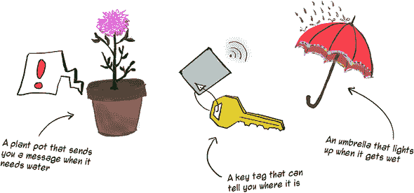

构建这些设备很有趣。在用这些类型的物理小玩意儿进行创作时涉及的创造力，以及创新性家庭自酿项目的草根魅力——这些都是吸引网络开发者的东西。我们擅长原型设计，尝试新技术，并开辟自己的道路。

但开始可能会让人感到害怕。当我们看到所有的电线和组件，听到行话，站在硬件黑客社区的外面时，涉及的技能可能会感觉难以逾越，陌生。作为一名 JavaScript 开发者，当你初次尝试进入物理硬件的世界时，可能会遇到一些障碍——感知到的复杂性、信息过多且分散，以及硬件和软件概念的混淆。

我们将利用你的 JavaScript 知识作为优势，作为学习如何设计和构建构成“物联网”（IoT）以及激发硬件黑客灵感的**事物**的辅助工具。你将能够利用你的软件开发技能跳过一些干扰，快速集中精力学习你需要掌握的新技能。

为了了解我们所要经历的旅程，让我们首先看看你将学会构建的事物类型。让我们探讨当我们说**事物**或**硬件**时，我们确切地指的是什么。

### 1.1. 硬件项目的结构

我们可以构建一个小装置，当环境变暖时自动打开风扇。这个微型独立气候控制系统将连续监测周围环境的温度。当它变得太热时，风扇就会打开。当它变得非常凉爽时，风扇就会关闭。

虽然我们不会因为发明这个诚然有些平凡的装置而赢得任何声望显赫的奖项，但它的基本成分与其他——更鼓舞人心——你将学会构建的事物是共通的。

#### 1.1.1. 输入和输出

最重要的是——实际上也是唯一需要做的——我们的温度触发设备需要在太热时打开风扇，并在周围区域冷却后再次关闭风扇。由电机驱动的风扇是一个**输出设备**的例子。

为了获取关于周围环境温度的连续信息——以便设备可以决定何时打开或关闭风扇——我们需要从**输入**获取数据，在这种情况下是一个温度传感器（图 1.2）。

##### 图 1.2. 自动风扇系统需要从温度传感器获取**输入**，并管理电机风扇的**输出**。

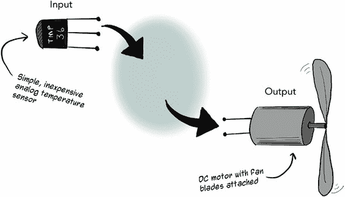

*输入*为系统提供数据，而*传感器*是一种提供有关物理环境数据的输入类型。在项目中你可以使用各种传感器：光传感器、热传感器、噪声传感器、振动传感器、蒸汽传感器、湿度传感器、气味传感器、运动传感器、火焰传感器——等等。有些，比如我们风扇的温度传感器，提供简单的数据——只是一个代表温度的单个值——而其他，比如 GPS 或加速度计，则产生更复杂的数据。

一个项目的*输出*代表其对使用者的净功能。闪烁的灯光、恼人的蜂鸣声、LCD 屏幕上的状态读数、机器人臂的横向移动——这些都是输出类型。对于这个项目，风扇是唯一的输出。

并非所有输入和输出都必然在物理世界中体现。当一位顾客在尝试在线订购产品时遇到错误（虚拟输入），可能会在坐在支持技术人员桌上的设备上点亮红灯（物理输出）。相反，土壤湿度的变化（物理传感器输入）可能会使花盆发送一条要求的信息（虚拟输出）。

#### 1.1.2. 处理

我们的自动风扇也需要一个大脑，它能关注温度传感器的读数，并在温度过高时打开风扇。它需要的大脑实际上是一台微型计算机：一个处理器、一些内存以及处理输入和控制输出的能力。当处理器、内存和 I/O 功能包含在一个单一物理包中时，我们将这种芯片称为*微控制器*（图 1.3）。

##### 图 1.3. 自动风扇需要一个大脑。一个流行的选择是微控制器，它将处理器、内存和 I/O 功能集成在一个单一组件中。


微控制器（MCU）不如笔记本电脑中的通用处理器强大。大多数不能运行完整的操作系统（大多数，而不是所有，正如你将看到的），但它们便宜、可靠、小巧，功耗极低——这就是为什么它们在硬件项目和产品中如此普遍，就像我们虚构的自动风扇一样。

#### 1.1.3. 电力、电路和系统

现在我们有了输入、输出和大脑——是时候将比特组合成一个*系统*了。我们需要使用一个或多个电子电路连接组件，并提供一些电力。构建一个系统既涉及电路设计，也涉及在物理空间中对组件的操作（图 1.4）。

##### 图 1.4. 一个粗略的示意图，展示了风扇的输入、输出和微控制器如何在带电和电路的系统中连接。如果你对符号不熟悉，不要担心——在我们继续旅程的过程中，你将学习有关电路的知识。

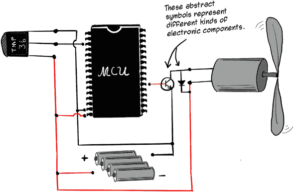

直接将电线连接到微控制器的小型*引脚*上需要焊料和非常稳定的手。更不用说我们最终会有一堆松散的部件尴尬地漂浮着。为了帮助硬件开发者，微控制器通常安装在物理*开发板*上（图 1.5）。除了其他功能外，板子使得将 I/O 设备连接到微控制器更加容易。

##### 图 1.5\. 基于微控制器的开发板使得连接输入和输出设备更加方便。

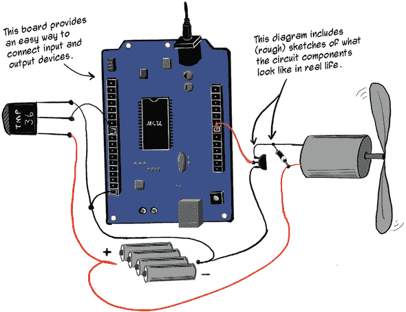

开发板有所帮助，但我们仍然有一堆松散的电线和组件。为了帮助整理这些，硬件开发者使用一种称为*面包板*的电路板原型工具（图 1.6）在物理空间中布置电路。

##### 图 1.6\. 面包板提供了一个电连接的网格，可以在其上原型化电子电路。

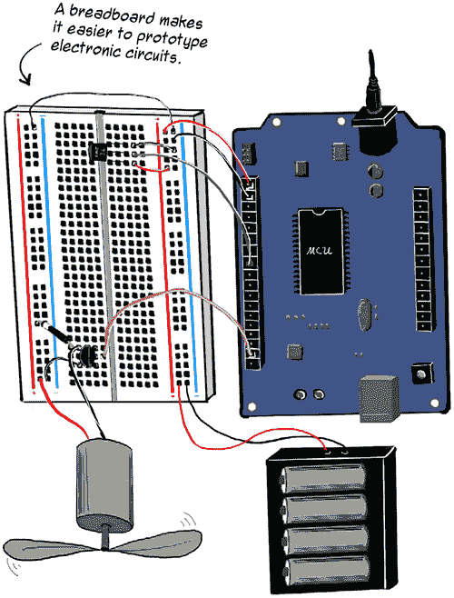

#### 1.1.4\. 逻辑和固件

我们硬件设计正在顺利进行，但你可能想知道微控制器是如何知道该做什么的。这里涉及到逻辑，如下面的列表所示：监听传感器，做出决定，发送指令来打开或关闭风扇。

##### 列表 1.1\. 温度触发风扇逻辑的伪代码

```
initialize temperatureSensor
initialize outputFan
initialize fanThreshold to 30 (celsius temperature)

loop main
    read temperatureSensor value into currentTemp
    if currentTemp is greater than fanThreshold
        if outputFan is off
            turn outputFan on
    else if currentTemp is less than or equal to fanThreshold
        if outputFan is on
            turn outputFan off
```

编程微控制器的占主导地位的语言长期以来一直是 C（或类似派生语言）。为微控制器编写 C 语言通常是平台特定的，并且可能相当底层。引用特定内存地址和位操作是常见的。

代码被编译成特定架构的汇编代码。为了将代码上传到项目中，它需要物理上传，或*烧录*，到微控制器的*程序存储器*。

这种程序存储器通常是非易失性存储器——ROM，这种存储器允许微控制器“记住”程序，即使断电（与 RAM 相对，RAM 只有在供电时才保留其内容）。可用的程序空间有限，通常在几十千字节左右，这意味着在微控制器上运行的程序需要仔细优化。

一旦程序被烧录到微控制器中，它就作为微控制器的*固件*运行——当供电时，微控制器会连续运行程序，直到被编程为不同的内容（或以其他方式重置）。

对于习惯于高级逻辑的 JavaScript 开发者来说，这种低级的具体性可能让人望而却步。不用担心。这正是 JavaScript 能帮到我们的地方，它允许我们为基于微控制器的硬件编写程序，而无需使用 C 语言或一开始就陷入十六进制寄存器地址的繁琐细节。

将程序固件上传到微控制器的过程也因芯片技术的进步和爱好者友好型开发板的广泛可用性而变得容易得多（图 1.7）。

##### 图 1.7\. 非易失性程序存储器（EEPROM 和闪存）以及用户友好的板使得用固件编程微控制器变得更加容易。

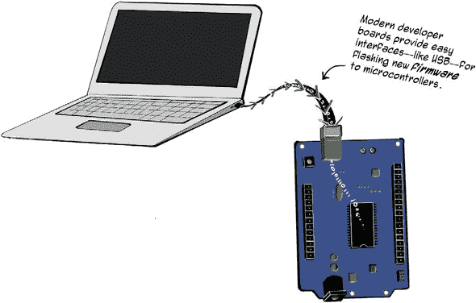

*EEPROM*（电可擦可编程只读存储器），以众所周知的*闪存*介质为例，在微控制器中常用。这种可重写内存使得反复用不同逻辑重新编程微控制器成为可能。

开发板除了使 I/O 连接更容易外，还通过提供方便的接口来编程板上的微控制器（USB 非常常见），帮助硬件黑客。这减轻了对专用硬件编程设备的需求。如今，编程微控制器通常就像插入一个 USB 线缆并在 IDE 中点击一个按钮一样简单。

#### 1.1.5\. 包装和封装

我们风扇的设计几乎完成了。但我们可以通过将自动风扇装入一个漂亮的包装盒来将其提升到下一个层次——*嵌入*我们的系统到某个东西里面，这样它的电线和电路就会从视线中隐藏起来（图 1.8）。哇塞！

##### 图 1.8\. 完成并包装好的自动风扇是嵌入式系统的一个例子。输入和输出由基于微控制器的微型计算机处理，并由电源和电路支持。整个装置都隐藏在一个非常漂亮的盒子里，因为，为什么不呢？


#### 1.1.6\. 嵌入式系统

虽然术语*嵌入式系统*听起来可能有点正式或令人望而却步，但实际上并不太复杂。一个结合处理器、内存和 I/O 的小型计算机构成了大脑。正如你在我们的自动风扇中看到的那样，将输入、输出和微型计算机连接起来并为其供电，就创建了一个独立的*系统*。我们称之为*嵌入式*，因为它通常被隐藏在某个东西里面——一个包装盒、一个泰迪熊、洗衣机控制面板、一把雨伞。

虽然自动风扇、雨天会发光的雨伞和会发推文的泰迪熊看起来并不立即相似，但它们比你想象的要更多共同之处。这些例子，以及构成物联网的大多数硬件项目和设备，都可以被描述为*嵌入式系统*。

现在我们来看看 JavaScript 如何融入这幅画面。

### 1.2\. JavaScript 和硬件如何协同工作

当将 JavaScript 与嵌入式系统结合使用时，我们仍然以与其他类型硬件项目相同的方式构建电子电路。仍然有输入和输出、电线和组件。然而，我们不是使用汇编语言或 C 语言来定义项目微控制器或处理器做什么，而是使用 JavaScript。

有几种方法可以做到这一点，不同的*方法*用于使用 JavaScript 为硬件项目提供逻辑。这些方法根据 JavaScript 逻辑本身执行的位置进行分类：在独立的嵌入式系统之外的宿主计算机上，在嵌入式系统的微控制器上，或者完全在其他地方。

#### 1.2.1\. 主-客户端方法

为了绕过某些微控制器的限制，*主机-客户端方法*允许您在更强大的*主机*计算机上执行 JavaScript。当主机运行代码时，它与嵌入式硬件交换指令和数据，嵌入式硬件表现得像*客户端*（图 1.9）。

##### 图 1.9\. 使用 JavaScript 控制硬件的主机-客户端方法

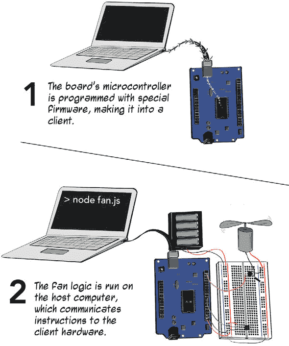

许多微控制器存在限制，这影响了它们运行 JavaScript 的能力。程序内存有限，这意味着复杂的程序可能无法适应或必须进行大量优化。此外，许多廉价的微控制器采用 8 位或 16 位架构，运行速度相对于桌面计算机较低。大多数无法胜任运行操作系统的任务，从而排除了在芯片上直接运行 Node.js 或其他 JavaScript 运行时的可能性。

相反，主机-客户端方法涉及在主机计算机上执行 JavaScript 逻辑，例如您的笔记本电脑，它确实拥有运行完整操作系统所需的强大能力。主机机器能够运行 Node.js 并可以利用全球 JavaScript 软件生态系统（包括 npm 和网络）。

使这种设置工作的小技巧是让客户端硬件（如微控制器）和主机系统（您的笔记本电脑）使用一种相互理解的“语言”——一个通用的 API 进行相互通信（图 1.10）。

##### 图 1.10\. 为了在这种方法下实现主机计算机和客户端硬件之间的通信，它们双方都需要使用一个通用的 API。

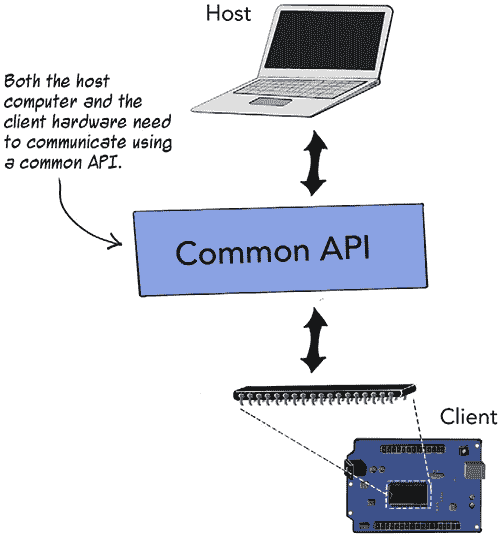

要配置我们的自动风扇系统使用这种方法，我们首先需要通过将特殊固件上传到微控制器的程序内存中来准备嵌入式硬件。与用于控制风扇的特定、单一用途的程序不同，这个固件程序使微控制器能够与其他使用相同“语言”（API）的来源进行双向通信。也就是说，它将基于微控制器的硬件转变为客户端，全神贯注并准备好执行主机计算机的指令（图 1.11）。

##### 图 1.11\. 特定固件将微控制器转换为客户端。

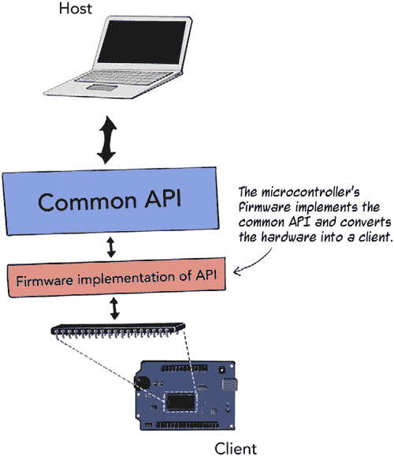

硬件现在已准备好进行通信——下一步是使用主机计算机编写风扇的软件。为了硬件和软件能够相互理解，主机计算机需要用微控制器能够理解的语言发出指令。为了实现这一点，我们可以使用实现通用 API 的库或框架编写代码（图 1.12）。

##### 图 1.12\. 主机也需要使用通用的 API 进行通信。

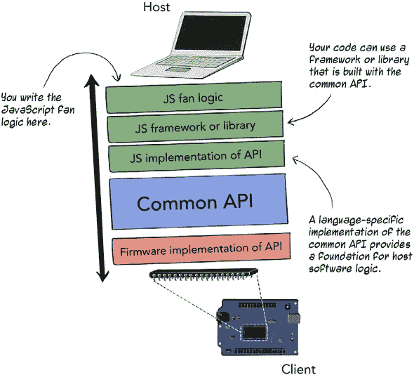

主机通过物理、有线连接（通常是 USB）或无线（WiFi 或蓝牙）连接到客户端硬件。

然后，我们在宿主计算机上执行控制风扇的 JavaScript。宿主持续向客户端发送运行风扇的指令。客户端也可以向宿主发送消息，例如来自温度传感器的数据（图 1.13）。

##### 图 1.13\. 当主机执行 JavaScript 逻辑时，客户端和主机之间会持续交换指令和数据，使用一个共同的 API。

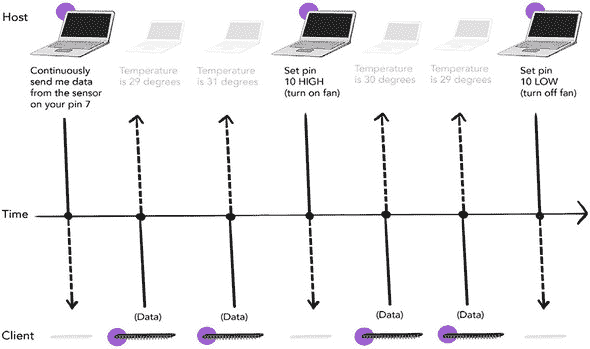

不要慌张，你不需要编写低级固件协议 API 软件！对于固件和 Node.js 框架，有直接、开源的选项来实现这些固件协议，因此你可以用最少的麻烦编写宿主端的 JavaScript 逻辑。

主客户端方法的好处是易于设置，并且支持许多平台。更重要的是，它让你能够访问整个 Node.js 生态系统，同时避免了廉价微控制器的性能和内存限制。缺点是客户端硬件没有主机就无法工作——它只能在主机计算机积极运行软件时才能执行其功能。

我们最终会无线化，但我们将从最简单的宿主-客户端选项——USB 连接——开始。这意味着在一段时间内，你的项目将物理连接到你的计算机上。

#### 1.2.2\. 嵌入式 JavaScript

在 *嵌入式 JavaScript* 中，控制项目的 JavaScript 逻辑直接在硬件的微控制器上运行。

许多微控制器无法本地运行 JavaScript，但有些可以。随着技术的进步，廉价微控制器变得越来越先进。现在可以在某些嵌入式处理器上直接运行 JavaScript 或优化的 JavaScript 变体。

每个嵌入式 JavaScript 平台都是硬件和软件成分的组合，协同工作。在硬件方面，能够本地运行代码的开发板基于更强大的（但仍然便宜）的芯片。

大多数平台还提供了一套软件工具来补充其硬件。可能有一个库或框架用于编写兼容的 JavaScript 代码，以及 CLI（命令行界面）或其他方法来准备代码并将其上传到微控制器。

Espruino ([www.espruino.com](http://www.espruino.com)) 是一个基于 JavaScript 的嵌入式平台的例子。Espruino 的 JavaScript 风格结合了优化的核心 JavaScript 和与硬件相关的 API。例如，你可以在基于网络的 IDE 中编写 Espruino Pico 板的代码，并通过 USB 上传到板子上（图 1.14）。为了使我们的自动风扇适应 Espruino 板，我们需要使用 Espruino 的 API 编写逻辑。

##### 图 1.14\. Espruino 平台结合了小型硬件板和 IDE 开发环境。

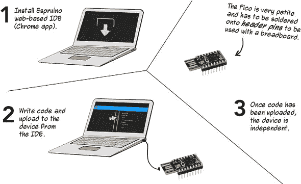

嵌入式 JavaScript 的另一个例子是 Tessel 2（[`tessel.io/`](https://tessel.io/)），这是一个基于 Node.js 的开发平台。你可以使用`tessel-cli` npm 模块控制并部署代码到你的 Tessel——如果你喜欢，也可以无线部署，因为 Tessel 2 内置了 WiFi（图 1.15）。

##### 图 1.15。Tessel 2 是一个开源平台，可以原生运行 Node.js。

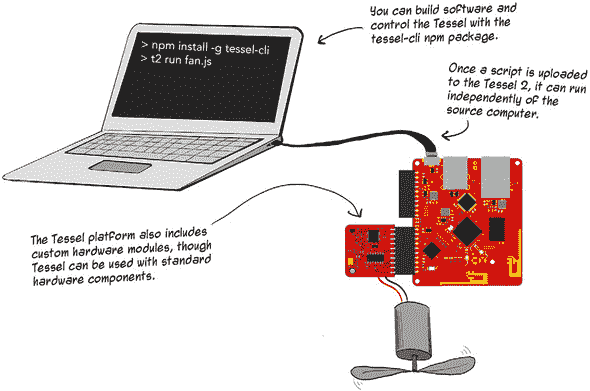

能够在嵌入式硬件上直接运行 JavaScript 可以节能且自包含。项目是独立系统，可以独立运行。与需要固件将 JavaScript 转换为机器码的主机-客户端设置不同，通常在 JavaScript 和硬件之间有更少的抽象层。

这听起来很棒，你可能会想知道为什么我们不只用这种方法。有几个缺点。首先，目前硬件选项较少。此外，每个平台都有其特定的平台技术（软件、工具、方法），这些可能会在学习硬件基础知识时混淆视听。大多数平台也有一定的限制，要么是在 JavaScript 语言功能支持上，要么是在支持的输入和输出类型上。但这是一个鼓舞人心的方法，有着非常光明的未来。

#### 1.2.3。其他硬件-JavaScript 组合

除了主机-客户端方法和运行嵌入式 JavaScript 之外，还有几种方法可以将 JavaScript 与硬件项目结合。

小型、*单板计算机*（SBCs）将主机和客户端合并为一个单元。基于云的服务使得在线编写 JavaScript 代码并无线部署到硬件成为可能。而且，浏览器本身的新兴、新功能和实验性特性可能为成千上万的网络开发者打开通往硬件世界的大门。

##### 在小型计算机（SBCs）上运行 JavaScript

类似于树莓派系列和 BeagleBone Black 这样的单板计算机（SBCs）可以运行完整的操作系统环境（通常是 Linux），并且可以扩展到 Node.js。与 8 位或 16 位微控制器不同，SBCs 拥有更高性能的通用处理器。但许多 SBCs 也具有直接集成到同一板上的 I/O 引脚和功能（图 1.16）。

##### 图 1.16。几款单板计算机（SBCs）：Intel Galileo Gen 2（顶部）、Raspberry Pi 2 Model B（左下角）和 Raspberry Pi Zero（右下角）


使用 SBC 控制硬件项目结合了主机-客户端方法和运行嵌入式 JavaScript 的特点。处理器必须持续运行 JavaScript 逻辑以使项目工作（如主机-客户端模型），但整个包都包含在一块板上，感觉更像是一个独立的、嵌入式设置。

与运行嵌入式 JavaScript 逻辑的微控制器不同，SBC 上的处理器不运行单一用途的程序——它可以同时运行其他进程。

这些单板计算机正在变得越来越便宜。目前，有 5 美元的 Raspberry Pi Zero（如果你能弄到的话——它们因缺货而闻名）和带 WiFi 的 Pi Zero W，价格略高一些。低功耗微控制器硬件和真正的微型计算机之间的成本差异已经不再那么大了，这些微型计算机的处理器性能可以与平板电脑和智能手机相媲美。

虽然在支持 GPIO（通用输入/输出）的单板计算机上运行 JavaScript 给你提供了很多选项，但也有一些缺点。单板计算机的功耗并不像许多基于微控制器的板那么低——Raspberry Pi 2 Model B 消耗 4 瓦。我们将要查看的单板计算机确实支持 GPIO，但引脚映射和用法可能令人困惑，文档可能简略或技术性，这对于刚开始学习硬件黑客的人来说可能是一个挑战。你还需要准备好面对系统管理的障碍，因为单板计算机的 Linux 发行版，尤其是当与 Node.js 结合使用时，可能需要一些调试和耐心。

##### 云服务与浏览器

这个最后涵盖硬件-JavaScript 组合的通用类别确实有些模糊。事物正在变化。*非常快*。目前，商业云服务在物联网领域的增长呈现出典型的曲棍球棒形状，而我们只是看到了让我们能够直接从浏览器本身与硬件交互的进步先锋。

云服务试图简化大规模管理物联网设备群组的复杂性。其中许多针对企业。例如，Resin.io (图 1.17) 构建、打包和部署容器化应用程序代码到预配置的设备，为你处理一些安全和自动化难题。

##### 图 1.17\. Resin.io 服务有助于简化将应用程序部署到和管理具备 Linux 功能的单板计算机的过程。


然后还有浏览器本身，其中许多最前沿的硬件-JavaScript 组合才刚刚开始出现。一些浏览器已经允许你尝试 Web Bluetooth，这是一个 API，虽然目前不在标准轨道上，但可能是未来网络事物的预兆。正如其名所示，Web Bluetooth 允许你从浏览器内部使用 JavaScript 连接到并控制蓝牙低功耗（BLE）硬件。

另一个由谷歌推出的开源项目，物理网络，提出了一个简单的想法：赋予小型设备通过蓝牙低功耗（BLE）广播 URL 的能力。这样的信标可以将公交车站牌变成实时到达跟踪器，通过向包含该信息的网络应用广播 URL (图 1.18)。这是一个简单的概念，但非常灵活。

##### 图 1.18\. 在这个物理网应用的示例中，一个公交车站牌使用 BLE 信标每秒广播一个 URL（1）；附近的人可以在他们的设备上扫描可用的信标并选择与公交车站相对应的信标（2）；公交乘客的设备现在可以获取信标广播的 URL 并在浏览器中显示它（3）。

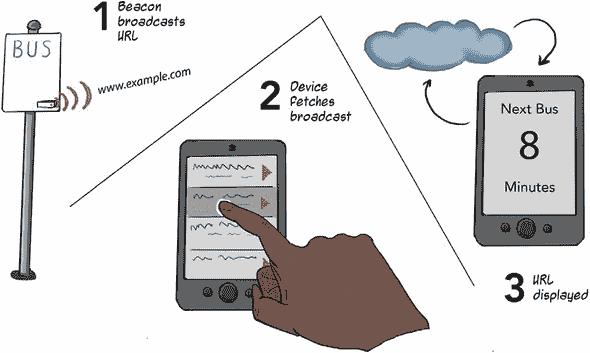

在 JavaScript 和硬件的所有结合中，这种变体——即网络与硬件的更深层次集成——是最不稳定的。它既引人入胜又不可预测。很可能会对使用 JavaScript 构建物联网产品的更多方式的需求导致这个领域令人头晕目眩的加速。

### 1.3\. JavaScript 是否适合硬件？

因此，也许我们可以用 JavaScript 以各种方式对硬件进行黑客攻击，但我们真的应该这样做吗？这里是否有实用性，还是仅仅是一种自我放纵的客厅把戏？

几年前，当使用 JavaScript 与硬件结合的想法首次浮出水面时，并没有得到普遍的热情。有些人认为这是一种任意且不当的聪明，是一种*我们真的需要在每个地方都使用 JavaScript 吗？*的疲惫感。其他人则认为，在受限硬件上 JavaScript 的性能永远不会被接受用于任何非爱好用途。一些老派的顽固态度浮出水面，评论线程被充满激情的抨击所淹没，抨击的对象不是 C/C++以外的任何东西，而且持怀疑态度的人警告说，高级语言会掩盖新手对底层硬件细微之处的理解。

然而，仍有很多人保持开放的心态。*为什么使用 JavaScript，当 C/C++已经足够好吗？*这个问题在硬件领域早期范式转变中有一个奇怪的回声：*为什么使用 C，当汇编语言已经足够好吗？*

无论它是否令人惊叹，还是令人失望——我们现在不会争论这一点——JavaScript 是互联网的事实上的编程语言。人们都知道它，人们在使用它，它无处不在。JavaScript 的普遍性赋予它独特的潜力，成为数百万想要开始物联网开发的网络开发者的门户。

JavaScript 编程的某些方面非常适合硬件，特别是它在事件处理和异步处理方面的熟练程度。JavaScript 也是原型设计的良好工具，对于快速迭代来说是一个福音。

看到我们最终会走到哪里将会非常有趣。JavaScript 列车正从硬件站驶出，很多人都在跳上这趟列车。

### 1.4\. 组装硬件工具包

您已经快速浏览了构成嵌入式系统的成分以及将硬件与 JavaScript 结合的方法。现在，让我们更具体地了解制作这些类型项目所需的物理硬件、配件和工具。然后我们将准备好一个基本的工具包，让您开始。

我们的项目将结合开发板和输入输出硬件。为了构建电路和连接系统，你需要支持电子组件、电线、电源和配件。再加上一些基本工具，你就可以出发了。

#### 1.4.1\. 开发板

开发板，也称为 *原型板* 或简称为 *板*，是结合微控制器或其他处理组件以及有用支持功能的物理开发平台（图 1.19）。它们是硬件黑客生活方式的基石。板的价格从几美元到高端 SBC 的 100 多美元不等。

##### 图 1.19\. 一些典型的基于微控制器的开发板，从左上角顺时针方向：德州仪器的 Tiva C-Series LaunchPad，Arduino Uno R3，Adafruit Trinket（5V 型号）和 Particle Photon

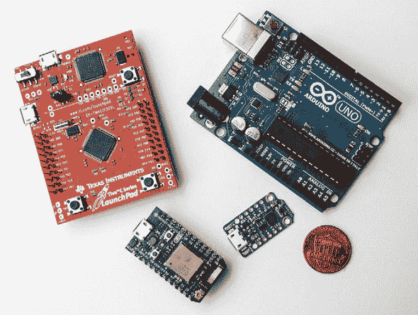

板的核心是其大脑，即处理器、内存和 I/O 的组合。8 位或 16 位微控制器是像（大多数）Arduino 这样的简单、入门级原型板的中心（图 1.20）。具有更复杂 32 位微控制器的板可能能够运行嵌入式 JavaScript。

##### 图 1.20\. 这块 Arduino Uno 板由 8 位微控制器 AVR ATmega 328-P 驱动。

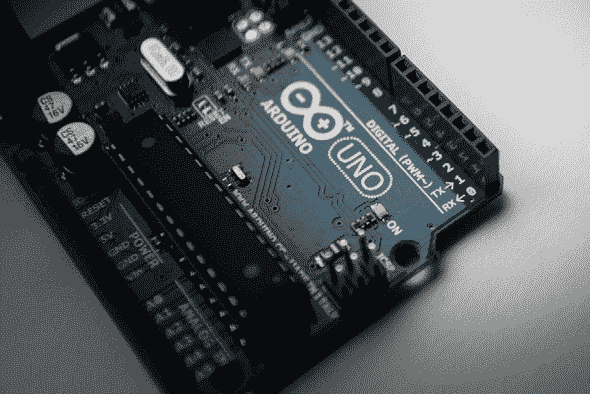

并非所有板都是基于微控制器的。更强大的 SBC 由你通常在计算机主板上找到的组件供电。这些板的架构相应地更复杂，涉及一个或多个小型化系统芯片（SoC）和额外的互连，如 HDMI、音频或以太网。尽管 SBC 可能具有板上的物理 I/O 接口——例如 Raspberry Pi 就有——但它们的通用处理器同样可以用于非硬件中心的项目。

#### 1.4.2\. 输入和输出组件

哇，你可以连接到你的板上的传感器和设备真是太多了！这很有趣，但一开始可能会感到不知所措。有很多技术术语被提及，还有很多数字、值和规格需要吸收。随着你阅读这本书，你会学会找到自己的方向。

我们将要使用的输入和输出组件设计简单，可以直接插入面包板（也就是说，它们是 *面包板友好型*）。一些组件封装为 *分线板*。与开发板通过将微控制器的微小引脚连接到更方便的连接来简化 I/O 一样，分线板通过将它们的引脚连接到更方便的连接来简化与单用途传感器或输出设备的工作（图 1.21）。

##### 图 1.21\. 常见的输入和输出组件集合

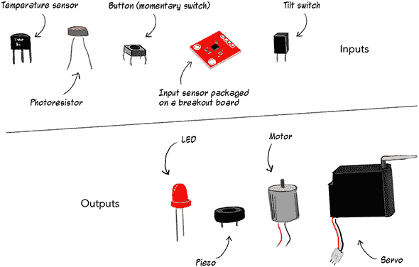

#### 1.4.3\. 其他电子组件

组装电子电路需要一系列支持电子组件。

虽然可能感觉有很多小零件，但像电阻器、电容器、二极管和晶体管这样的基本元件价格低廉，并且可以购买方便的入门套件（图 1.22）。我们将花时间来了解这些部件——很快它们就会像老朋友一样。

##### 图 1.22\. 这些常见的元件将帮助你构建功能性的电子电路。

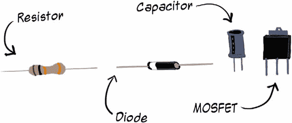

#### 1.4.4\. 电源、电线和配件

你很快就会意识到，有好多方法可以为项目供电！

开发板可以通过 USB 供电，或者通过插入直流适配器（壁挂式适配器）来供电。在许多情况下，其他项目组件可以利用相同的电源（图 1.23）。

##### 图 1.23\. 一些电源和电路的电线和配件样本

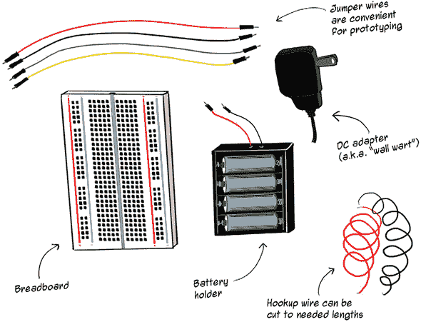

电池对于使项目无电线以及在不同电压下提供额外电源很有用。有许多种电池*夹具*和夹持器，可以将电池连接到项目中。

为了连接东西，你需要电线。*跳接线*是预先切割的电线。一种特别方便的类型在每个端都有针脚，可以轻松滑入面包板和许多板上的 I/O 针脚。跳接线非常适合快速原型设计。另外，*连接线*通常卷在卷轴上，可以根据需要切割到特定长度。

#### 1.4.5\. 工具

一对尖嘴钳和一把精密螺丝刀在构建项目时非常有用。如果你需要切割或剥除连接线（预先切割的跳接线不需要切割或剥除），你将需要一把电线剥皮器——通常内置电线切割器。随着你的进步，你可能想拥有一台*万用表*，这是一种测量电压、电流和电阻的工具。

| |
| --- |

##### 存储你的电子元件

当你开始构建项目时，你将会有很多小零件。你可以在五金店和爱好商店找到分格的存储盒或抽屉单元。专为鱼饵设计的盒子可以特别方便地用作电子元件的容器，因为它们的隔间很小，分隔板紧密贴合（图 1.24）。

| |
| --- |

##### 图 1.24\. 这个紧凑的鱼饵箱顶部有空间放置工具，底部有堆叠式、可拆卸容器用于存储元件。

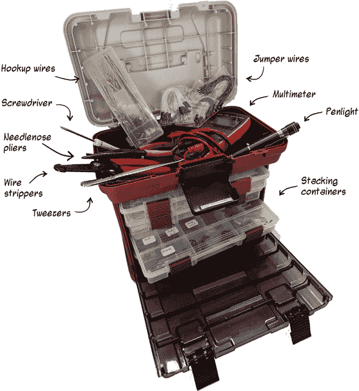

是时候开始我们的旅程了。使用低功耗嵌入式硬件进行黑客攻击可以很有趣、富有创意和令人兴奋——它在商业世界中也越来越有用。网络开发者（就像你一样）已经拥有了可以在你的道路上成为很好的垫脚石的技术。你可以使用无处不在的网页语言 JavaScript 来开始你的旅程，并减少路边的干扰。

在我们的冒险中，您将获得理解使电子电路工作的基本关系的基本理解。不涉及数学？别担心，我也不。您将在旅途中遇到一些有用的角色：组件和模块、不同类型的板和软件。我们将尝试不同的组合，并学习如何在 LED 烧毁时擦干自己并再次尝试。

路途永无止境，视野无限。我们可能无法全部访问，但到这本书的结尾，您将准备好评估和使用尚未出现的未来技术。在您旅行的中途，您出发的道路可能已经发生了显著变化。但通过依赖一些常数作为您的指南针——硬件基础、JavaScript 的应用、网络技术——您将能够找到自己的路。

### 摘要

+   从零开始学习嵌入式电子爱好可能会感到令人生畏，但您现有的 JavaScript 技能可以给您带来帮助。

+   嵌入式系统将一个大脑——微控制器或低功耗处理器——与输入和输出结合在一个小封装中。

+   微控制器将处理器、内存和 I/O 集成在一个芯片中。定义微控制器行为的逻辑——固件——通常被烧录到 MCU 的程序内存中。

+   有几种方式 JavaScript 可以控制硬件：主机-客户端、嵌入式 JavaScript、SBC 上的 Node.js，甚至从浏览器内部。

+   在主机-客户端设置中，Node.js 在主机计算机上执行，并通过消息协议（API）与微控制器交换指令和数据。该项目没有主机计算机就无法运行。

+   一些受限制的微控制器被优化以直接在芯片上运行 JavaScript（或 JavaScript 的一个子集）（嵌入式 JavaScript）。

+   单板计算机（SBCs）具有更复杂的处理器和附加功能，如 USB 端口或音频连接。这些设备通常可以运行完整的操作系统，并且通常表现得像小型计算机。许多设备允许您使用 Python、C++或 JavaScript 等高级语言控制 I/O 和行为。

+   开发板是结合微控制器（或其他处理组件）和实用支持功能的平台。它们提供了方便的 I/O 引脚连接，允许快速原型设计项目。

+   构建项目涉及一定数量的电子设备：开发板、输入和输出组件、基本电子元件如电阻和二极管、电源连接和基本工具。

## 第二章\. 使用 Arduino 开始硬件之旅

*本章涵盖*

+   Arduino 是什么以及 Arduino Uno R3 开发板的功能

+   将组件和电源连接到 Arduino Uno

+   使用 Arduino IDE 编写和上传代码以使 LED 闪烁

+   使用 Firmata 固件和 Johnny-Five Node.js 框架在主机-客户端设置中配置 Arduino Uno

+   使用 JavaScript 控制 Arduino Uno 并使 LED 闪烁

Arduino. 它是一家公司。它是一个项目。它是硬件。它是一个用户社区。Arduino 是，嗯，它就是 *Arduino*，一个结合开源硬件和软件的广泛概念，旨在使初学者构建交互式设备变得容易（且成本低廉）。

与大多数开发板一样，Arduino 开发板具有微处理器、I/O 引脚、电源连接和其他标准功能。目前有大约十几种板型，包括图 2.1 中所示的 Uno。figure 2.1。每个 Arduino 开发板都有标准尺寸和布局，以便使用模块化 *盾牌*。盾牌是根据 Arduino 的形状制造的，提供额外的功能——如 WiFi 或 GPS——而这些功能本身并不由板子提供。（分线板是扩展开发板功能的另一种方式，但盾牌是专门针对 Arduino 的外形设计的。）

##### 图 2.1\. Arduino Uno 是 Arduino 最受欢迎的板型，我们将在接下来的几章中对其进行探讨。

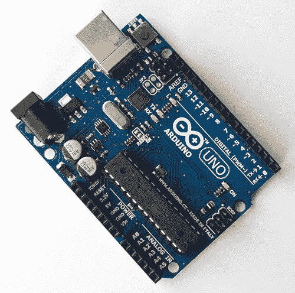


**Arduino：名字的含义是什么？**

尽管所有 Arduino 硬件（和软件）都是开源的，这意味着你可以轻松地获得原理图，甚至可以不费太多力气就构建自己的板子，但只有由 Arduino 公司制造的“官方”板子才使用“Arduino”这个名字进行市场推广。

*Arduino 兼容板* 这个术语描述的是按照与官方 Arduino 板相同的设计规范制造的板子，但并不一定是由 Arduino（公司）生产的。

*Genuino* 是用于在美国以外市场销售的 Arduino 开发板的品牌名称。

几种产品，如 pcDuino 和 Netduino，使用 *-duino* 后缀来暗示它们的 Arduino 类似特性，并且两者都具备使用 Arduino 兼容盾牌的形态。pcDuino 允许你使用 Arduino 编程语言进行编程（尽管它也支持高级语言）。

|  |


**对于本章，你需要以下内容：**

+   1 Arduino Uno 版本 3 (R3)

+   1 USB 线缆（USB A 到 USB B）

+   1 标准 LED（任何颜色）

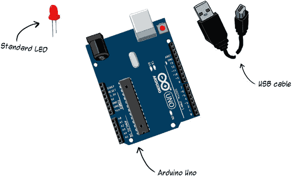


通常，编程 Arduino 是通过在 Arduino 的跨平台 IDE（集成开发环境）中编写 *sketches*（代码片段）来完成的，并将编译后的代码上传到板子的微控制器。sketch 中的代码是用 Arduino 编程语言编写的，这种语言类似于 C++，但增加了额外的硬件控制功能。IDE 负责编译代码并将其发送到板子，通常是通过 USB 连接。

Arduino 硬件非常受欢迎、价格低廉且经过良好测试。配置 Arduino 以使用允许你使用 Johnny-Five Node.js 框架控制的固件非常简单，因此它成为结合 JavaScript 和硬件的理想起点。

### 2.1\. 了解 Arduino Uno

在所有 Arduino 板型中，Arduino Uno 是最受欢迎的。它已经在世界各地被硬件新手们测试过，不应该给我们带来任何大的惊喜。它是可靠且普遍的。

在 第一章 中，您看到了一些开发板的常见功能，如微控制器、I/O 引脚和电源连接。 展示了这些以及其他 Arduino Uno 板的主要功能：

##### 图 2.2\. Arduino Uno 的主要部件

![02fig02_alt.jpg]

+   ***微控制器*—** Uno 的 Atmel ATmega328P 微控制器具有 8 位处理器和 32 KB 的闪存来存储程序。记住，微控制器将处理器、内存和 I/O 处理能力结合到一个单一包中。

+   ***编程和通信连接*—** USB 连接器允许您将 Uno 连接到您的计算机。您可以通过此连接将程序上传到 Uno，您还可以使用 USB 为电路板供电。

+   ***数字 I/O 引脚*—** 在 Uno 的 I/O 引脚中，有 14 个是 *数字引脚*，可以用作输入或输出。

+   ***电源引脚*—** Uno 上的几个引脚提供了稳定的电源和地之间的访问。您可以使用这些引脚为您的项目供电。

+   ***模拟输入引脚*—** Uno 的 6 个引脚能够处理 *模拟输入*。数字引脚只能读取或产生两种状态（高或低，稍后会有更多介绍），但模拟输入引脚使用 Uno 板上的 *模拟-数字转换器* (ADC) 将模拟输入——不同的电压——转换为 0 到 1,023 之间的值。这对于从传感器获取数据很有用。模拟引脚也可以用作数字引脚。

+   ***直流 (直流) 连接器*—** 如果您不是通过 USB 为电路板供电，Uno 的直流柱状插头允许您将电路板插入直流电源适配器或其他直流电源。

+   ***关于光*—** 当电路板通电时，小型的 *ON* LED 灯会亮起。

+   ***复位按钮*—** 复位按钮会重新启动微控制器的固件，并将 Uno 的引脚恢复到默认水平，这大致相当于“重启”电路板。

#### 2.1.1\. 使用 Arduino Uno 创建您的第一个电路

在软件传统中，Hello World 程序是学习新语言或系统时的常见第一个练习——通常这些程序做一些微不足道的事情，比如将“Hello, world”打印到屏幕上。

使用 LED 的基本技巧是硬件黑客的“Hello World”。让一个 LED 点亮并闪烁已经成为众多硬件新手进入电子领域的第一步。

要点亮一个 LED，您需要构建一个 *电路*。电路提供了一条从电源到地之间的不间断路径，电子可以沿着这条路径移动。在这条路径上，电子可能会遇到并穿过组件，导致一些有趣的事情发生，比如点亮一个 LED。

从电源到地之间的任何间隙都会毁掉整个电路——电子无处可去。要点亮 LED，你需要通过填补电源和地之间的断开来完成电路。

| |
| --- |

##### 要构建你的第一个电路，你需要


+   1 个 Arduino Uno

+   1 根 USB 线，用于将 Uno 连接到电脑的 USB 端口

+   1 个标准 LED（任何颜色）

| |
| --- |

Arduino 板需要供电才能工作。为 Arduino 板供电有几种方法，但目前最简单的方法是将它连接到电脑的 USB 端口。使用随板子包装的电缆将 Arduino 插入 USB。如图 2.3 图所示的 ON LED 应该会亮起。

##### 图 2.3\. 当 Uno 有电时，ON LED 会亮起。


当板子接收到电源时，板上的几个电源引脚（图 2.4）会变得活跃。当活跃时，它们提供电压——即稳定的低压电源源——如果你想要的话（我们确实想要！），你可以将组件连接到它们。

##### 图 2.4\. Arduino Uno 的一些电源引脚。这些引脚在板子有电时都会供电。

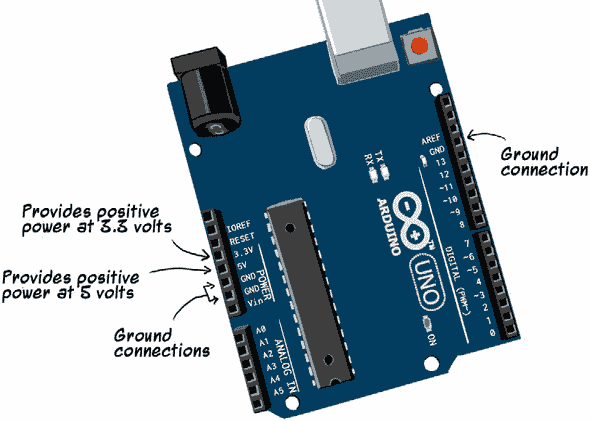

你将在第三章中了解更多关于电压和功率的知识，但图 2.4 提供了对 Uno 一些基本电源引脚的快速查看。

##### 创建 LED 电路

如图 2.5 所示的 LED 是*发光二极管*——一种在电流通过时将部分能量以光的形式散发的二极管。

##### 图 2.5\. 标准 LED 有一个阳极（正极）和一个阴极（负极）。通常，阳极比阴极长，这使得识别更容易。许多 LED 在负极（阴极）侧也有一个平坦的区域。

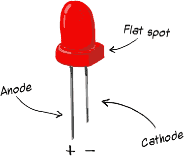

*二极管* 是一种只允许电流单向流动的电子元件——二极管不允许电流反向通过。正因为如此，在尝试将二极管插入任何东西之前，识别任何类型二极管的正极（*阳极*）和负极（*阴极*）非常重要。

Uno 上的开/关指示灯，如图 2.5 所示，也是一个 LED——一个*表面贴装* LED。表面贴装元件常用于大量生产的机器制造板。它们需要焊接，并且它们微小的尺寸使得在手工项目中使用它们变得很棘手。相反，我们将坚持使用更大的、*通孔*元件（它们有适合通过*孔*的引脚、面包板或其他电路板的引线），就像图 2.5 中的 LED 一样。

| |
| --- |

##### 断开连接！

在连接组件之前，务必确保将开发板从电源断开。如果不这样做，可能会损坏组件或板子。

| |
| --- |

现在你可以构建电路来点亮 LED 了。在继续之前，请确保你已经将 Arduino Uno 从 USB 或其他电源断开。将 LED 连接到 Arduino：

1.  定位你的 LED 的阴极（负极）。如果需要帮助找到它，请参阅图 2.5。将 LED 的阴极引脚插入到板上标记为 GND 的电源部分中的一个引脚，如图图 2.6 所示。

    ##### 图 2.6. 使用 Arduino 点亮 LED。通过 LED 将电源（3.3 V）连接到地（GND）完成电路，消除任何间隙，允许电子流动。

    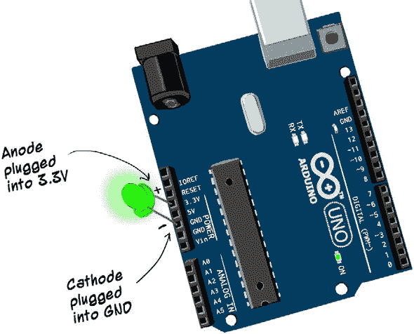

1.  定位 LED 的阳极（正极）并将其插入到电源部分标记为 3.3 V 的引脚。

将 LED 定位并连接好之后，用 USB 将 Arduino 连接到你的电脑上，以便它有电源。

哇！你使用了 LED 的引脚将电源连接到地，创建了一个电路并点亮了 LED（图 2.6）。

| |
| --- |

**电压和 Arduino Uno**

Arduino Uno 的典型工作电压是 5 V，你将在接下来的几章中构建的项目将主要涉及基于这种电压的电路。这可能会让你好奇为什么这个例子中的 LED 连接到 3.3 V 电源。直接将这种 LED 插入 5 V 的 Arduino 电源引脚会给它提供太多的能量——这并不特别危险，但你可能会烧毁你的 LED。随着我们的深入，你将了解更多关于这种事情的做法和原因，我将停止使用像*能量*这样的松散术语。

在未来的项目中，我们将使用**电阻**，这是一种抵抗电流流动的电子元件，将电路中的电流降低到对 LED 和其他元件不那么“粗暴”的水平。目前，我们将使用 3.3 V 电压，在 Arduino 的电流下，这对你的 LED 来说不会那么“粗暴”。

话虽如此，长时间不使用限流电阻给 LED 供电绝不是什么好主意，所以不要让你的 Arduino-LED 配置长时间插着电（你可能注意到 LED 亮的时间越长，触摸起来越热）。

| |
| --- |

通过将 3.3 V 引脚的电源通过 LED 连接到地，你完成了一个电路（图 2.7）。电源能够通过这个电路流动，并且作为一个很好的副作用，它使你的 LED 发光。

##### 图 2.7. 基本 LED 电路的示意图。在传统的电路表示方法中，电源从正极流向负极。电源流入 LED 的正极（阳极）并从负极（阴极）流出。

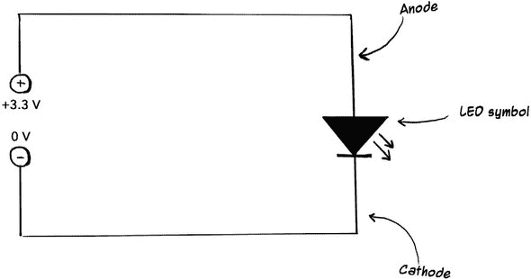

你可以用任何低电压电源，如电池，构建基本的 LED 电路。这里没有逻辑问题，所以你实际上不需要开发板（尽管 Arduino 的稳定电源很方便）。但是，当你用 Arduino 编程做不同的事情时，事情就变得更有趣了——现在我们就试试看。

### 2.2. 使用 Arduino 工作流程

在我们将 JavaScript 引入 Arduino 混合之前，让我们使用典型的 Arduino 工作流程让你的 LED 闪烁。在我们在 Arduino 上堆叠一层 JavaScript 抽象之前，看看 Arduino 在原始形式下的工作方式是有帮助的。

#### 2.2.1\. Arduino Uno 的数字引脚

没有让 LED 闪烁的 Hello World 情况是不完整的。

但你不能使用之前练习中连接的引脚来使 LED 闪烁。3.3 V 电源引脚在板本身供电时始终会供电——LED 始终会亮，因为电路始终是完整的。我们真正需要做的是控制连接到 Arduino 的可编程数字引脚（在 Uno 上为 0 到 13 号引脚）的 LED——(图 2.8)。

##### 图 2.8\. Arduino Uno 的数字引脚

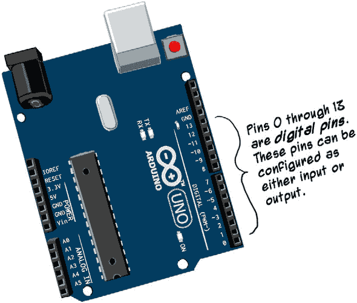

配置的数字引脚可以有两种状态之一：高电平或低电平。这种二进制逻辑可能对你这个程序员来说很熟悉——真/假、1/0、是的/不是的二分法是软件开发和数字架构的一般性主题。

在硬件层面，高低逻辑对应于电压。当数字引脚被配置为输出时，高电平状态意味着引脚正在提供电压，因此该引脚上有电源施加（在 Uno 的情况下，是 5 V 或接近 5 V）——它实际上是*开启*的。低电平意味着引脚上的电压在或接近 0 V——引脚实际上是*关闭*的。

将配置为输出的数字引脚编程为在高低电平之间循环，这是使连接的 LED 闪烁的关键。


##### 数字输入

当一个数字引脚被配置为输入引脚时，高电平和低电平状态也在发挥作用，但方式稍微细腻一些。关于这一点，我们将在后面的章节中讨论数字传感器。


#### 2.2.2\. 草图和 Arduino IDE

要配置和编程 Uno 上的数字引脚，你需要编写一个草图并将其通过 Arduino IDE 上传到板子上。

访问 Arduino 软件页面([www.arduino.cc/en/Main/Software](http://www.arduino.cc/en/Main/Software))，下载适用于你的操作系统平台的最新版本的 Arduino IDE。它是免费的，支持 Windows、Mac OS 和 Linux。安装软件后，启动 IDE。你会看到类似于图 2.9 的内容。

##### 图 2.9\. 第一次启动 Arduino IDE 时，它将为你创建一个新的空草图。


**什么是草图？**

*草图*这个词只是*代码*或*程序*的另一种说法。Arduino 将你的草图保存在所谓的*草图簿*（基本上是一个文件夹）。*草图*这个术语可以追溯到*processing*编程语言及其 IDE，Arduino 的 IDE 就是从那里继承下来的。

在 Arduino 编程语言的硬件支持函数库中，也可以看到 Arduino 血统的痕迹，这些函数是从*wiring*开发平台派生出来的，而*wiring*平台本身又是 processing 的一个分支。


##### Arduino 编程语言

在 Arduino IDE 中，你可以使用 Arduino 编程语言为你的 Arduino Uno（或其他 Arduino 兼容板）编写草图。让我们看看一些代码的示例片段，这些代码与我们将要使用的 JavaScript 看起来相当不同。

要使数字引脚准备好支持 LED，你需要在 Arduino 草图中将它配置为输出引脚——毕竟，LED 是一个输出组件。在 Arduino 编程语言中，将数字引脚配置为输出引脚看起来如下。

##### 列表 2.1\. 配置数字输出引脚的示例

```
pinMode(12, OUTPUT);                   *1*
```

+   ***1* 将（数字）引脚 12 配置为输出**

要编程输出引脚，你可以使用 Arduino 编程语言内置的`digitalWrite`函数将其设置为`HIGH`或`LOW`，如下一列表所示。

##### 列表 2.2\. 设置数字输出引脚

```
digitalWrite(12, HIGH);           *1*
digitalWrite(12, LOW);            *2*
```

+   ***1* 将引脚设置为高电平会给引脚施加电压（将其“打开”）**

+   ***2* 将引脚设置为低电平会将电压降低（将其“关闭”）**

#### 2.2.3\. 将 LED 连接到数字引脚

从上一个练习中取下 LED，将其阳极连接到 Uno 的 12 号引脚，将其阴极连接到附近的 GND 引脚。然后，从草图中将 12 号引脚设置为`HIGH`会提供电压并打开 LED，而将其设置为`LOW`则会关闭 LED。

但是你不应该这样做。记住，当设置为高电平时，数字引脚的输出电压是 5V。我们目前还没有使用电阻来管理电压，引脚的 5V 输出可能会压垮 LED 并可能烧毁它（图 2.10）。

##### 图 2.10\. 直接将 LED 插入 5V Uno 数字 I/O 引脚对 LED 来说压力很大。

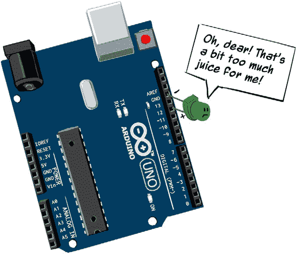

幸运的是，Arduino Uno 在引脚 13 上有一个内置的 LED（图 2.11）。非常方便！每当数字引脚 13 被设置为`HIGH`时，板载 LED 就会亮起。对于这个实验，你不需要连接任何线路——相反，让我们专注于编程部分。

##### 图 2.11\. 当引脚 13 被设置为`HIGH`时，紧邻引脚 13 的小型表面贴装 LED（橙色）会亮起。

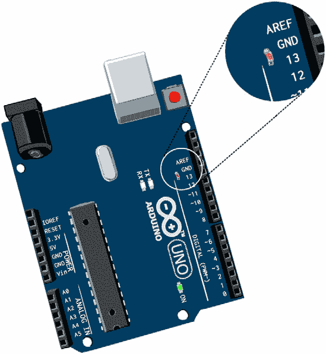

#### 2.2.4\. 编程 LED 闪烁

是时候将这些内容整合到一个草图中来控制 Arduino Uno 了。

Arduino 草图分为两部分：

+   `setup`——这是你可以放置草图设置代码的地方——我敢打赌你已经猜到了。这段代码在程序执行开始时只执行一次。为了设置 LED 闪烁草图，`setup`需要配置连接到 LED 的引脚（13）。即使你不会将外部组件物理连接到这个引脚，你仍然需要将其配置为数字输出引脚。

+   `loop`——在设置完成后，`loop`中的代码会反复执行，直到 Arduino 断电或重置。这部分草图需要交替设置引脚 13 为`HIGH`（施加 5V 电压）和`LOW`（无电压），以便 LED 闪烁。

在 Arduino IDE 中，创建一个新的草图来保存闪烁板载 LED 的代码，如下一列表所示。

##### 列表 2.3\. 闪烁 LED 的完整草图

```
void setup() {
  pinMode(13, OUTPUT);            *1*
}
void loop() {
  digitalWrite(13, HIGH);         *2*
  delay(500);                     *3*
  digitalWrite(13, LOW);          *4*
  delay(500);
}
```

+   ***1* 将引脚 13（带有内置 LED）配置为输出**

+   ***2* 将引脚 13 设置为高电平以打开 LED**

+   ***3* 等待 500 毫秒（半秒）**

+   ***4* 将引脚 13 设置为 LOW 以关闭 LED**

如果 Arduino 编程语言看起来像 C/C++，那你是对的，它基本上就是，除了少了几个类型和特性。Arduino 语言还提供了一个内置的硬件特定函数库，包括`pinMode`和`digitalWrite`。

| |
| --- |

##### 示例草图

如果你不想将闪烁草图输入到 Arduino IDE 中，或者你只是想看到更多的示例草图，你可以在 IDE 中的文件>示例下找到一个类似的闪烁草图和更多其他草图。

| |
| --- |

##### 上传闪烁草图

现在将你的 Arduino Uno 连接到电脑上的 USB 端口。从 IDE 中，你可以在草图窗口中点击 Verify 按钮（图 2.12）以确保你的代码没有错误，或者直接点击 Upload 按钮，它将验证、编译并将你的草图上传到板上的微控制器。如果你还没有保存草图，当你上传时，系统会提示你保存。

##### 图 2.12\. Arduino IDE 中的草图窗口

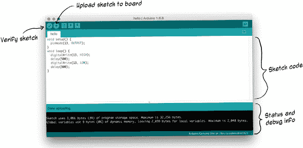

如果一切顺利，你应该看到板载 LED 每 500 毫秒闪烁一次（图 2.13）。

##### 图 2.13\. 上传的草图应该使板载 LED 每 500 毫秒闪烁一次。

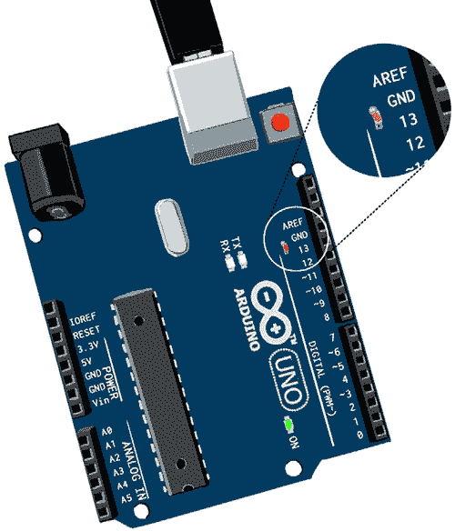

虽然 Arduino 编程语言的语法比 JavaScript 低级，但它仍然是一种高级语言。你的草图内容首先被编译成微控制器可以原生执行的机器代码。然后，编译后的代码被写入微控制器上的非易失性程序内存。Uno 的微控制器将程序存储在闪存中，这是在存储卡和固态驱动器中常用的一种技术。

就像从数码相机中移除存储卡时照片不会消失一样，即使微控制器失去电源，草图也会保留在微控制器上。将此与易失性内存（如 RAM）进行比较，如果不供电，它会丢失其内容。你成功上传的草图将保留，直到被其他东西替换。

以这种方式永久存储在非易失性内存中的程序被称为*固件*。每次你将新的草图上传到 Arduino 时，你都在替换其固件。固件在你从 USB 连接中拔掉板子后不会“消失”。如果你将板子重新插入 USB，或者插入另一个电源，LED 将再次开始闪烁，因为固件仍然完好无损。

| |
| --- |

**重置 Arduino 板**

当 Arduino 在断开连接后恢复电源时，它将*重置*，将引脚恢复到默认行为，并重新启动微控制器的固件。程序内存中固件的执行将从开始处开始。从 Arduino 草图的角度来看，这意味着`setup`代码将再次运行。如果开发板上有什么东西运行失控，重置可以是一种拯救理智的策略。

你不需要从电源上拔下 Arduino Uno 板来重置它。你可以使用方便的板载 RESET 按钮——按住并保持一段时间——来完成相同的事情。

| |
| --- |

现在，你已经了解了 Arduino Uno 的基本布局，并学习了使用 IDE 编写和上传草图的基础知识。是时候学习 JavaScript 了！

### 2.3. 使用 JavaScript 控制 Arduino

使用 JavaScript 和主机-客户端配置与 Arduino 一起工作的流程与默认的 Arduino 工作流程不同。你将不再使用 Arduino IDE 编写和反复上传草图，而是最初上传一个草图，该草图将作为板子的固件保留在位。

之后，你将不再使用 Arduino IDE——相反，你将使用你选择的文本编辑器编写 JavaScript 代码，并在终端中使用`node`执行它。

这些是设置 Uno 的主机-客户端配置的步骤：

1.  将包含兼容固件的草图上传到板子。

1.  在你的计算机上安装 Johnny-Five Node.js 框架。

#### 2.3.1. 将 Arduino 配置为客户端

回想一下第一章，主机-客户端方法涉及主机和客户端之间通过一个公共 API 进行通信。你将在接下来的几章中使用的 Node.js 框架——Johnny-Five——默认情况下使用名为 Firmata 的协议与板子通信。

Firmata 允许主机（计算机）和客户端（微控制器）以基于 MIDI 消息的格式相互交换消息。Firmata 协议指定了这些命令和数据消息应该是什么样子。Arduino 对 Firmata 的实现提供了你可以放在板子上的实际固件，使其“说”Firmata。它以 Arduino 草图的形式存在，你需要将其上传到板子（图 2.14）。

##### 图 2.14。配置 Uno 的主机-客户端设置的第一步是上传一个 Firmata 草图，这将允许板子使用 Firmata 协议进行通信。

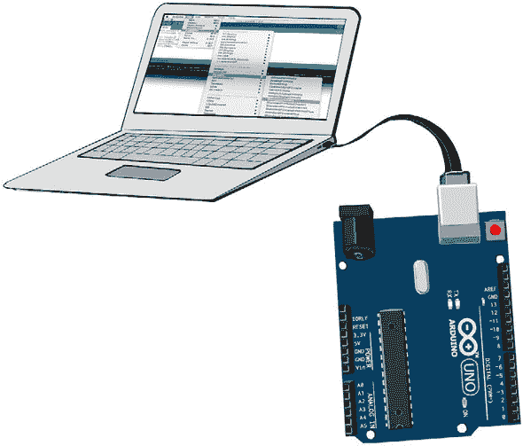

好消息：Firmata 足够流行，以至于你需要的 Firmata 草图都包含在 Arduino IDE 中。

##### 将 Firmata 上传到 Uno

按照以下步骤上传正确的 Firmata 版本到你的 Uno，使其可以作为主机-客户端设置中的客户端使用：

1.  将你的 Arduino Uno 连接到 USB。

1.  启动 Arduino IDE。

1.  访问 File > Examples > Firmata 菜单，并从列表中选择 StandardFirmataPlus（图 2.15）。

    ##### 图 2.15。从可用的示例草图中选择 StandardFirmataPlus

    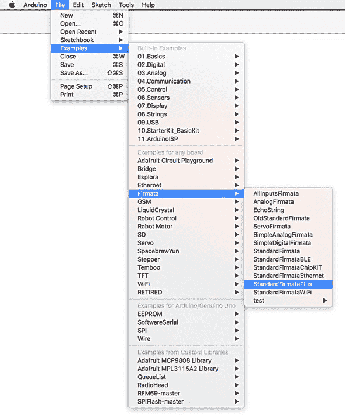

1.  通过点击上传图标将草图发送到 Uno。

| |
| --- |

**为什么有这么多 Firmata？**

Arduino IDE 中的 Examples > Firmata 菜单提供了相当丰富的 Firmata 草图选项。

这与新车上可选功能包有些类似。客户可以预先订购一辆带有特定组合选项的汽车或卡车——天窗、高级音响、地板垫——但你不能在单一车辆中组合所有选项。没有足够的空间放置三种类型的地板垫，而且只有少数消费者对最奢华的性能悬挂系统感兴趣。

同样，不同的 Firmata 草图实现了不同的功能组合，针对不同的 Arduino 硬件或用例进行了定制。StandardFirmataEthernet 添加了对以太网盾的支持。AnalogFirmata 尝试最大化同时可以通信的模拟输入数量。StandardFirmataPlus 是所有最受欢迎功能的一个很好的平衡，这就是我们将要使用的。

| |
| --- |

当你使用 Arduino IDE 制作闪烁 LED 时，你上传了一个草图，该草图成为板子的固件。这个固件是单功能的——它闪烁一个 LED。

相比之下，Firmata 固件没有特定的用途。相反，它是一个程序，允许板子与你要安装的 Node.js 框架进行通信。

你暂时完成了 Arduino IDE 的使用——上传 Firmata 草图后，你可以退出程序。

#### 2.3.2\. 安装 Johnny-Five Node.js 框架

Johnny-Five 是由 Bocoup 为控制主从配置的开发板创建的开源 Node.js 框架 ([`johnny-five.io`](http://johnny-five.io))。Johnny-Five 特别注重机器人技术，但你可以用这个软件做很多事情。它比大多数硬件 JavaScript 框架存在的时间更长，具有清晰的 API 和一定的成熟度——这两者对于硬件初学者来说都是理想的选择。

要创建你的第一个 Johnny-Five 项目，为它创建一个目录并安装框架 npm 包，如下所示。

##### 列表 2.4\. 第一个 Johnny-Five 项目的准备

```
$ mkdir hello-world
$ cd hello-world
$ npm install johnny-five
```

| |
| --- |

**安装 Johnny-Five：获取帮助**

通常，Johnny-Five 只需一个 `npm install` 命令就可以愉快地安装，但安装过程确实会编译一些原生扩展，这有时可能会引起麻烦。

如果你在使用 Windows 时遇到问题，请尝试执行以下命令：

```
npm install johnny-five --msvs_version=2012
```

如果你遇到问题，这里有一些其他资源：

+   Johnny-Five 的维基百科中的故障排除部分：[`mng.bz/nW62`](http://mng.bz/nW62)

+   NodeBots 社区论坛：[`forums.nodebots.io`](http://forums.nodebots.io)

| |
| --- |

#### 2.3.3\. 使用 Johnny-Five 的 Hello World 闪烁 LED

你已经看到了在 Arduino 编程语言中闪烁 LED 脚本的样子。现在是时候编写一个 JavaScript 版本的 Hello World 闪烁 LED，以便了解 Johnny-Five。

在你安装 Johnny-Five 的 hello-world 目录中，创建一个名为 hello.js 的文件，并用你选择的文本编辑器打开它。在这个 JavaScript 文件中，你可以编写控制你的 Arduino Uno 的代码，如下一个列表所示。

##### 列表 2.5\. hello.js

```
const five = require('johnny-five');         *1*
const board = new five.Board();              *2*

board.on('ready', () => {                    *3*
  const led = new five.Led(13);              *4*
  led.blink(500);                            *5*
});
```

+   ***1* 需要 johnny-five 包**

+   ***2* 初始化一个代表你的 Uno 的新 Board 对象**

+   ***3* 等待板子触发 ready 事件**

+   ***4* 在 13 号引脚（Uno 的内置 LED 引脚）上实例化一个 LED 对象**

+   ***5* 使 LED 每 500 毫秒闪烁一次**

保存文件。如果你的 Uno 还没有连接到电脑的 USB 端口，请将其插入。在终端中，使用`cd`命令切换到项目目录，并运行以下命令：

```
node hello.js
```

你会在终端中看到一些类似以下的内容。

##### 列表 2.6。在终端中运行 hello.js

```
$ node hello.js
1457806454739 Device(s) /dev/cu.usbmodem1421
1457806454752 Connected /dev/cu.usbmodem1421
1457806458536 Repl Initialized
```

内置 LED 闪烁？就这样！你已经用 JavaScript 控制了 Arduino Uno。

#### 2.3.4。Firmata、Johnny-Five 和主机-客户端方法

当脚本运行时，你会看到内置的 TX（发送）和 RX（接收）LED——在图 2.16 中标识——闪烁。这是因为主机和客户端正在使用 Firmata 协议交换串行消息。

##### 图 2.16。当主脚本执行时，Uno 的 TX 和 RX（发送和接收）LED 将闪烁，因为主机和客户端之间正在交换通信。

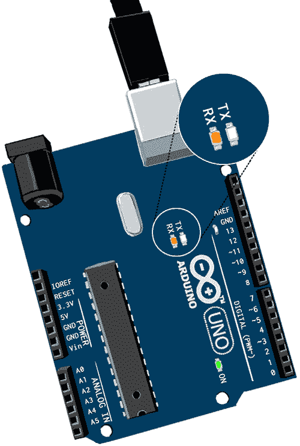

要停止你的 Johnny-Five hello.js 程序的执行，在终端窗口中连续两次按 Ctrl-C。看看你的 Uno。根据你退出程序的时刻，13 号引脚的 LED 可能是关闭的，或者它可能持续开启。在任何情况下，它都不会再闪烁。

这是因为主机计算机上的程序已经停止执行，因此它已经停止向 Firmata 固件发送消息。板子处于表示程序成功通信的最后一条消息的状态。

现在 hello.js 脚本不再运行，按下并保持 Uno 的 RESET 按钮一会儿。Uno 的 13 号引脚 LED 将关闭并保持关闭。

回想一下，当重置时，Arduino Uno 会重置其引脚并重新启动固件程序。早些时候，当你的固件是从 Arduino IDE 上传的闪烁 LED 草图时，闪烁会继续。现在固件是 Firmata，它不会自己使 LED 闪烁，而是等待关于要做什么的指令。13 号引脚上的 LED 由引脚的硬件重置关闭，没有任何东西告诉它再次开始闪烁。

在主机-客户端方法中，客户端本身不执行任何操作——它必须持续由主机指导。在这个设置中，Uno 客户端就像一个木偶。它需要来自操纵者的持续输入——我们的主机执行的 JavaScript。

#### 2.3.5。使用 Johnny-Five 结构化脚本

使用 Arduino IDE 编写的 Arduino 编程语言的 sketch 结构不同于 Johnny-Five 脚本的结构。

在 Arduino 编程语言中，你将你的代码分成`setup`和`loop`。`loop`中的代码会持续执行，直到板子被重置或固件被替换。为了使 LED 永远闪烁，你编写了以下代码。

##### 列表 2.7。使用 Arduino 编程语言实现的 LED 闪烁

```
void loop() {
  digitalWrite(13, HIGH);
  delay(500);
  digitalWrite(13, LOW);
  delay(500);
}
```

每次循环中的代码执行时，它会将引脚 13 设置为`HIGH`，等待 500 毫秒，然后将其设置为`LOW`，并再次等待 500 毫秒。然后循环再次执行（一次又一次……）。向引脚 13 提供的交替`HIGH`和`LOW`电压，持续时间为 500 毫秒，使得 LED 看起来在闪烁。

然而，使用 Johnny-Five 你编写了以下代码。

##### 列表 2.8\. 使用 Johnny-Five 闪烁 LED

```
board.on('ready', () => {
  const led = new five.Led(13);
  led.blink(500);
});
```

板只触发一次`ready`事件（不用担心；即使在该事件触发后绑定到`ready`事件，它仍然会调用事件处理函数）。这意味着你传递的处理函数也只会执行一次——它不是一个循环。

另一个区别是 Johnny-Five 提供了一个更高级的 API。使用 Johnny-Five，你初始化一个代表 LED 组件的对象，而不是将引脚配置为通用数字输出。这让你可以访问`Led`类上的一些方便的方法和属性，包括`blink`、`on`、`off`和`toggle`方法，以及你稍后将会遇到的更多有趣的方法。

你可以通过调用`blink`方法并传递一个定义闪烁周期的毫秒数的参数来代替通过设置引脚为`HIGH`或`LOW`并在两者之间调用`delay`来操作 LED。在幕后，Johnny-Five 使用`setInterval`来处理闪烁的定时。LED 会闪烁，直到你告诉它停止。

##### 适应闪烁的 LED

但我们如何让 LED 停止闪烁呢？这就是 JavaScript 隐喻开始发挥作用并为你提供与设备交互的绝佳选项的地方。在 Johnny-Five 中，`Led`的`blink`方法接受一个可选的第二个参数，即回调函数。每次 LED 闪烁开或关时，回调函数都会被调用。

##### 列表 2.9\. 在 hello.js 中使用 LED 回调

```
const five = require('johnny-five');
const board = new five.Board();

board.on('ready', () => {
  const led = new five.Led(13);
  var blinkCount = 0;                                 *1*
  const blinkMax = 10;                                *2*

  led.blink(500, () => {                              *3*
    blinkCount++;
    console.log(`I have changed state ${blinkCount} times`);
    if (blinkCount >= blinkMax) {
      console.log('I shall stop blinking now');
      led.stop();                                     *4*
    }
  });
});
```

+   ***1* 跟踪 LED 闪烁开或关的次数**

+   ***2* 配置 LED 总共闪烁的次数**

+   ***3* 每次 LED 打开或关闭时，都会调用此回调函数**。

+   ***4* 当 blinkCount 达到 blinkMax 时，调用 stop 方法**

重新尝试运行 hello.js：

```
$ node hello.js
```

你应该看到类似以下列表的输出。

##### 列表 2.10\. 运行修改后的 hello.js 脚本

```
1457808024073 Device(s) /dev/cu.usbmodem1421
1457808024079 Connected /dev/cu.usbmodem1421
1457808027867 Repl Initialized
>> I have changed state 1 times
I have changed state 2 times
I have changed state 3 times
I have changed state 4 times
I have changed state 5 times
I have changed state 6 times
I have changed state 7 times
I have changed state 8 times
I have changed state 9 times
I have changed state 10 times
I shall stop blinking now
```

此示例在特定次数的闪烁后停止 LED 闪烁，但你可以通过在`Led.blink`上使用回调执行各种其他操作。例如，你可以更改闪烁频率，或者简单地跟踪长时间内的总闪烁次数。

当你查看 Johnny-Five 代码时，它可能比低级的 Arduino 草图代码更自然、更熟悉。作为一个软件人员，硬件——特别是电子电路——可能对你来说是一个全新的世界。但有一些基础知识你需要了解。这就是我们接下来要讲的内容。

### 摘要

+   Arduino 板是学习硬件的常见起点，因为它们简单、广泛且经过充分测试。

+   在典型的 Arduino 工作流程中，草图是在 Arduino 的跨平台 IDE 中编写的，并作为固件上传到板上。

+   草图是用 Arduino 编程语言编写的，它与 C 或 C++类似。Arduino 草图由一个`setup`部分和一个`loop`部分组成。

+   在主机-客户端设置中用 JavaScript 控制 Arduino 板，该板的微控制器需要运行能够使用与主机相同协议的固件。Firmata 就是这样一种协议，它可以作为一个草图上传到板上。

+   Johnny-Five Node.js 框架使用 Firmata 协议进行通信，但它也暴露了更高层次的 API。`Led`是用于控制硬件组件的 Johnny-Five 类的一个例子。

+   用 Johnny-Five 编写的脚本可以从命令行使用`node`执行。主机上的代码必须持续执行并与客户端板通信——客户端不能独立运行。

+   与 Arduino 草图中的`setup`和`loop`部分相比，Johnny-Five 脚本的结构是事件驱动的，这对于 JavaScript 程序员来说是一个熟悉的设计模式。

## 第三章\. 如何构建电路

*本章涵盖*

+   使用欧姆定律在电路中操纵电压、电流和电阻

+   在面包板上原型化基本电路

+   并联电路和串联电路的区别

+   关于 LED 的细节以及如何以几种有用的配置连接它们的详细信息

+   识别和选择适合不同电路和组件的正确电阻

+   计算串联电路和并联电路中的电阻


**对于本章，你需要**

+   1 个 Arduino Uno

+   4 个标准红色 LED

+   4 个 220V 电阻

+   4 个 560V 电阻

+   1 个 100V 电阻

+   1 个按钮开关

+   1 个 9V 电池

+   1 个 9V 电池夹

+   5 根红色和 2 根黑色跳线

+   1 个半尺寸面包板

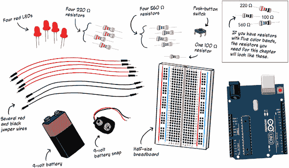


设计和构建电路可能对你来说完全是新的，可能看起来令人畏惧。好消息是，只需要掌握几个核心概念。一旦你理解了电压、电流和电阻的相互作用——如欧姆定律所正式化的——你就已经走上了理解基本电路的道路。

传统上用来说明电压、电流和电阻的几个隐喻。最常用的类比是涉及储罐和管道的水压（水）系统。有效，但并不总是容易记住。让我们尝试不同的冒险。

### 3.1\. 电压、电流和电阻

在高山深处，在一个不存在的地方的森林中，一群矮人意外地发现自己拥有无限的 jellyfish。矮人们，由于顽皮和淘气，开始寻找这些原本无动于衷的生物的幽默用途。他们发现，把 jellyfish 从悬崖上扔下去，看着它们溅入下面的湖中或弹跳到当地村庄的屋顶上，非常有趣。

附近的市民最初感到不便，但很快意识到坠落的无脊椎动物携带能量，可以是他们饼干工厂的免费能源来源——但前提是能够安全地利用这种冲击。因此，他们进行了观察，并在一段时间后开始理解和操纵电路的核心因素：电压、电流和电阻。

市民很快注意到，例如，悬崖越高越陡，扔到山谷底部湖中的 jellyfish 具有的能量就越多。较小的落差在 jellyfish 溅落时不会提供那么多的势能 (图 3.1)。

##### 图 3.1\. 高悬崖提供更多的“电压”，即电势。*电压* 类似于电的“压力”，推动电荷（jellyfish）从高势能位置向低势能位置移动。

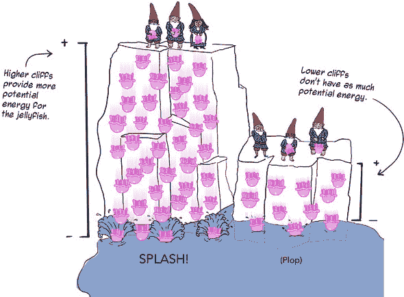

*电压* 是两点之间势能差的测量。它类似于压力或张力或重力，因为电总是渴望从高电压移动到低电压。电压，以伏特为单位测量，是 *势能*，但仅凭电压，没有移动带电的电子（jellyfish），是无法造成任何破坏的 (图 3.2)。

##### 图 3.2\. 电压是势能。

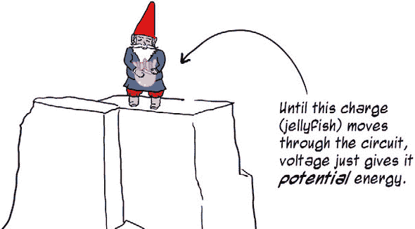

要发生有趣的事情，jellyfish 需要被积极地扔过悬崖边缘，这是一个侏儒们非常乐意执行的任务。

市民们学会了通过在悬崖上标记一个位置并精确计算在一定时间内经过的 jellyfish *电流* 来测量 jellyfish 电流 (图 3.3)。电流，即电荷的流动，以 *安培* 为单位测量，通常缩写为 *amps*。

##### 图 3.3\. 电流，即电的流动，可以通过在定义的时间内计算通过悬崖上特定位置的电荷（jellyfish）数量来测量。

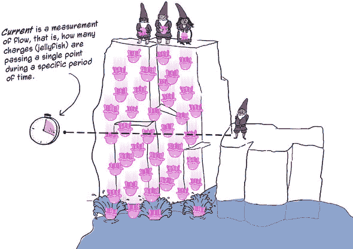

市民需要找到一种方法来管理 jellyfish 的电流，以免它压倒脆弱的饼干压机和烤箱。这是 jellyfish 电路控制的关键：*电阻*。电阻是材料抵抗电流流动的能力。它以 *欧姆* 为单位测量。

他们将 jellyfish 引导系统设计到悬崖面上 (图 3.4)，将 jellyfish 流量限制在一个更合理的水平。对于靠近高悬崖（更多电压）的电路，这些系统必须更坚固，因为来自上面的 jellyfish 坠落压力巨大。

##### 图 3.4\. 市民通过将下落的 jellyfish 通过一系列管道引导来增加电路的电阻。增加电阻会降低电流。

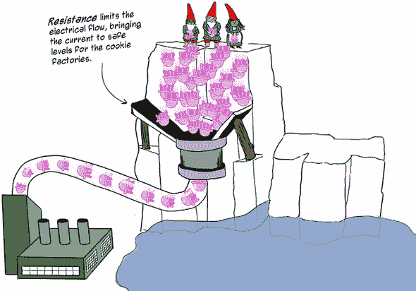

市民发现的总结显示在 表 3.1 中。

##### 表 3.1\. 电压、电流和电阻

| 因素 | 它意味着什么 | 缩写为 | 以单位测量 |
| --- | --- | --- | --- |
| 电压 | 两个点之间电势差的差异，类似于电的“压力”。它是推动电荷通过电路的动力。 | V | 伏特 |
| 电流 | 电流：在定义的时间内，有多少电荷通过一个点。 | I | 安培（安培） |
| 电阻 | 衡量材料抵抗电流流动的能力的测量。 | R | 欧姆（用 V 符号表示） |

最后，镇民们完善了电路，水母帮助制作了一些周围最好的饼干。

有一个电源——一群小矮人——把水母扔过悬崖。悬崖越高，提供给电路的*电压*（势能）就越多。水母头部的*电流*（流动）朝向工厂机器。

为了将水母电流降低到可管理的水平，导流系统和管道增加了*电阻*。

当水母将力量赋予制作饼干的机器并到达工厂的地面时，它们达到了电路中的最低势点。穿着喷气背包的小矮人像是一种泵，把疲惫的水母重新提升到悬崖上，然后再被扔下去。一次又一次... (图 3.5)。

##### 图 3.5\. 完整的小矮人和水母“电路”

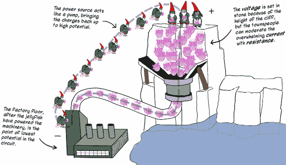

电压、电流和电阻是基本电路的基本概念。下一步是了解这些因素如何相互关联，以及它们如何应用于现实世界的电路。

#### 3.1.1\. 欧姆定律

电压、电流和电阻以一致的方式相互关联。这三个因素中的每一个都像是一个杠杆：调整一个，就会影响其他。这些相互作用对镇民来说变得如此重要，以至于工厂开始生产展示这些关系的饼干（图 3.6）。

##### 图 3.6\. 镇民们的新标志性饼干显示了电压（V）、电流（I）和电阻（R）之间的关系。

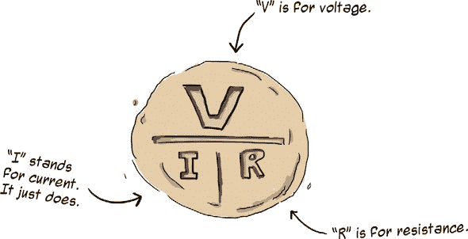

拿着饼干的持有者可以咬掉他们想要确定的因子——然后看看它如何从其他两个因子中推导出来（图 3.7）。

##### 图 3.7\. 通过咬掉饼干上印有饼干食用者想要解决的因子的边缘，他们可以迅速看到他们需要解决的方程。例如，如果他们想要确定电阻（R），他们可以咬掉它，看到 R = 电压（V）除以电流（I）。

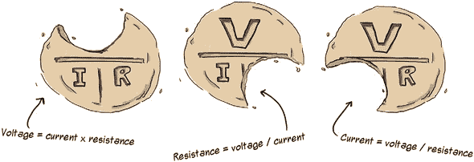

乔治·欧姆在 1820 年代就发现了电压、电阻和电流之间的这些关键关系，远在聪明的饼干镇民之前，这就是为什么*欧姆定律*以他的名字命名。如果你更喜欢非饼干的数学形式，这些是相关的方程：

```
V = I x R (voltage equals current times resistance)
I = V / R (current equals voltage divided by resistance)
R = V / I (resistance equals voltage divided by current)
```

“好吧，”你可能正在想，“但我如何在现实世界中应用这个？”

##### 将欧姆定律应用于现实世界电路

设计和构建基本电路始于关键因素的正确平衡：电压、电流和电阻。

表 3.2 列举了如何在基本电路中调整电压、电流和电阻的一些常见示例。这些示例并不全面（例如，还有其他调整电路中电压的方法）但它们突出了我们在短期内将要做的事情，以确保我们的电路能够正确工作。

##### 表 3.2\. 在业余电子学中调整电压、电流和电阻

| 因素 | 关系 | 增加的常见方法 | 减少的常见方法 |
| --- | --- | --- | --- |
| 电压 | V = IR | 使用更高电压的电源。 | 使用更低电压的电源。 |
| 电流 | I = V / R | 通过移除电阻或使用电阻值较低的电阻来减少电阻。电流也可以通过提高电源电压来增加。 | 通过添加电阻或使用电阻值较高的电阻来增加电阻。电流也可以通过降低电源电压来减少。 |
| 电阻 | R = V / I | 添加电阻或使用电阻值较高的电阻。 | 移除电阻或使用电阻值较低的电阻。 |

在业余电子学黑客活动中出现的一个最常见的计算需求是：“给定一个电源 *电压*，我需要使用什么 *电阻* 来确保我的组件获得所需的 *电流*” (图 3.8)？

##### 图 3.8\. 一个常见的实际欧姆定律问题：在 6 V 电源电压的电路中，需要什么电阻值才能向 LED 提供 20 mA 的电流？

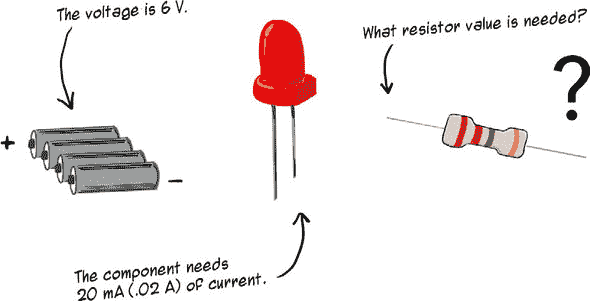

电压通常由项目的电源——电池、USB 电源、直流适配器——定义，你知道你想要向电路中的组件提供特定的电流。因此，电压和电流被定义了，这意味着你需要求解 R，即电阻。

假设你知道你的电源电压将是 6 V，并且你有一个需要 20 mA (.02 A，或 20 千分之一安培) 电流的组件 (图 3.10)。求解 R（欧姆中的电阻）意味着将 V（伏特中的电压）除以 I（安培中的电流）因为 R = V / I：

```
R = 6 V / .02 A
so
R = 300 *V*
```

| |
| --- |

##### 注意你的单位！

使用欧姆定律方程时，请确保保持单位的一致性。电流应始终以安培（A）为单位测量，电压以伏特（V）为单位，电阻以欧姆（Ω）为单位。伏特和欧姆通常比较直接，但当你处理业余电子学范围内的电流——通常是几十毫安——不要忘记将这些值以安培为单位表示，否则你会得到错误的结果：

```
300 (V) = 6 (V) / .02 (A)
```

but

```
300 (V) þ 6 (V) / 20 (mA)
```

| |
| --- |

好的！几乎准备好了。但在我们开始用这种新的理解拼凑电路之前，让我们成熟一点，保护自己免受一些潜在问题的困扰。

#### 3.1.2\. 问题与危险

在我们进行的电子黑客活动中，我们处理的是相当低的电压——5 V 或 3.3 V 是典型的例子——使用的是电流以十毫安（mA）计的元件。如果你做了点愚蠢的事情，这种电流和电压的组合不会把你扔到房间里（或者更糟）。但有一些事情要提防（并避免）。

##### 避免电流过大

两个问题中的第一个出现在你向电路中的某个元件提供过多电流时（通常是通过使用过低的电阻值或完全忘记将其添加到电路中）。其中一部分能量可能被转化为可能期望的结果——例如 LED 的发光，但其余的能量也需要消耗掉。如果你向一个最大只能稳定（非闪烁）使用 20 mA 电流的 LED 提供 100 mA 的电流，那么从长远来看这不会很好。过多电流的第一个迹象通常是发热——LED 会开始变得触摸起来很热。在某个点上，它会被压垮并完全烧毁。

##### 避免造成短路

第二个“糟糕”的情况可能更糟。如果一个电路中没有*负载*——也就是说，没有元件或电阻来抽取或抵抗电流——事情确实会变得很糟糕。如果有，比如说，一条直接从电池正极到负极的路径，那么电路中就没有电阻来限制电流。这是一个*短路*（图 3.9），并且会导致大量的电流非常快地通过电路放电。这种能量可以造成热量、火灾，甚至爆炸。

##### 图 3.9. 短路没有负载来调节电流。短路的一个常见例子是将导线直接从电池的正极连接到负极（现实生活中不要这样做）。

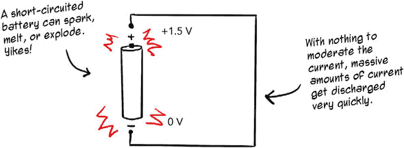

开发板可以保护你免受最坏情况的影响。如果你短路了 Arduino 的电源到地（P.S.，不要这样做），你不会爆炸，因为板上的输出引脚有*电流限制器*（你的板可能已经烧焦了）。从其 5 V 引脚输出的最大电流是 450 mA；从单个 I/O 引脚输出的最大电流大约是 40 mA。如果你使用电池工作，你将不会得到这样的保护——你可能会引发一场令人遗憾的火花盛宴，或者更糟。所以要小心。

### 3.2. 构建电路

现在你已经接受了简报，让我们来实验！当你开始向电路中添加元件时，你需要一种方法来布置它们，而不会让你发疯。将电线拧在一起或在电路中用手指尝试固定几个元件是不切实际的（也许还有点风险）。

相反，*面包板*是搭建电路的绝佳基础。它们的作用有点像乐高基础板，提供了一个网格，可以将元件和导线插入其中。

#### 3.2.1. 使用面包板来原型电路

用于电路原型设计的面包板是**无焊点**的，这意味着你可以直接将东西插入板中，而无需焊接。它们有各种形状和大小，但板上的连接方式是一致的。图 3.10 展示了一个**半尺寸**面包板的布局（**全尺寸**面包板就像两个半尺寸面包板首尾相连；它们的长度是两倍）。

##### 图 3.10\. 一个典型的面包板及其内部的连接

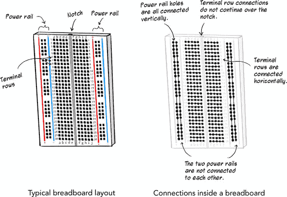

一个典型的面包板结合了两侧的水平**端子排**（一个听起来很专业的术语，实际上意味着“插入组件的位置”）和垂直**电源轨**（用于在电源和组件之间连接电源的孔）。每个孔在电源轨上：一个用于正极，一个用于负极。这些通常用红色（正极）和蓝色或黑色（负极）标记出来。电源轨的连接垂直贯穿整个板长。板的两侧的电源轨之间是不相连的。

端子排通常在每组的五个孔之间有一个缺口。一个十孔端子排——两组五个相连的孔通过一个缺口分隔——是一种常见的布局。五单元排中的每个孔在电上是相连的，但连接不会穿过缺口。

电源轨每行有两个孔：一个用于正极，一个用于负极。这些通常用红色（正极）和蓝色或黑色（负极）标记出来。电源轨的连接垂直贯穿整个板长。板的两侧的电源轨之间是不相连的。

让我们通过使用面包板重新布线上一章中的简单 LED 电路来感受这些连接是如何工作的。

#### 3.2.2\. 在面包板上布线简单的 LED 电路


##### 你需要的东西


+   1 个 Arduino Uno 和 USB 线

+   跳线：两根红色，一根黑色

+   1 个标准红色 LED

+   1 220 V 电阻


首先，让我们回顾一下欧姆定律，以确定我们需要调整什么来使电路正常工作。以下是我们所知道的信息：

+   Arduino 将提供 5 V 的供电电压。

+   我们应该通过 LED 的最大电流约为 20 mA（0.02 安培）——对于大多数标准 LED，20 mA 是一个通用的经验法则。

##### 选择 LED 的电阻

因为我们有固定的电压和目标电流，所以可变值是电阻。需要什么电阻值才能创建电路？记住，

```
R = V / I
```

所以

```
R = 5 V / 0.02 A
R = 250 *V*
```

电阻有某些常见的电阻值，250 V 并不是常见的电阻值。计算所需的电阻值，结果发现没有这样的电阻，这种情况经常发生——不必担心。通常，经验法则是将电阻值向上取整到下一个常用电阻值（通常情况下，电阻过大比过小更安全）。

目前——相信我，我很快就会解释——我们将做相反的事情，并将电阻值向下取整到最接近的常用电阻值：220 V。


**寻找合适的电阻**

电阻以标准方式着色，以帮助识别。有两种条纹系统：四色电阻和五色电阻。四色电阻更为常见。

每个电阻都有代表电阻值**前导数字**的颜色带。四色带电阻有两个这样的颜色带，而五色带电阻有三个。

电阻的最后两个颜色带分别是其**乘数带**和**公差带**。

**乘数带**的颜色表示需要在前面数字带指示的值之后添加多少个零。换句话说，将前导数字乘以这个十的幂次给出电阻的**值**。

**公差带**的颜色表示电阻的准确性保证。对于我们所使用的电阻类型，+/-5% (金色)的公差是常见的。

四色带电阻有两个数字带。以下图中的四色带电阻编码如下：

+   1 第一位数字：2 (红色)

+   2 第二位数字：2 (红色)

+   3 乘数：1 (棕色) = 101

+   4 公差：+/- 5% (金色)

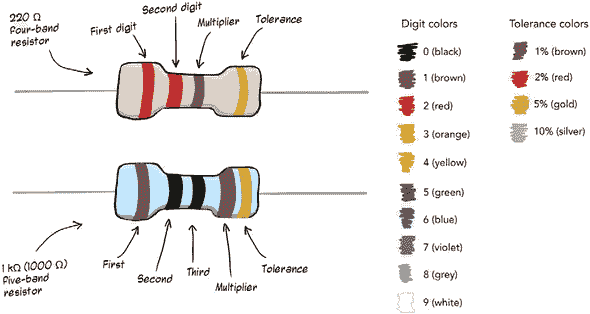

电阻通过颜色带来表示它们的电阻和公差。

其值是

```
22 * 10¹ = 220 *V* @ +/-5%
```

图中的五色带电阻编码如下：

+   1 第一位数字：1 (棕色)

+   2 第二位数字：0 (黑色)

+   3 第三位数字：0 (黑色)

+   4 乘数：1 (棕色)

+   5 公差：+/-5% (金色)

值是

```
100*10¹= 1000 *V* (or 1 k*V*) @ +/- 5%
```


##### 电路图和电路图

有几种方式可以直观地表示电路，为其他构建者提供一个重建电路的“地图”。表示电路最正式的方式是通过电路图，如图 3.11 所示。[电路图](https://wiki.example.org/ch03fig11)是一种使用标准化符号和记号的组件图形表示。它可以被看作是一种视觉上的、抽象的图形：电路图中组件的位置并不一定与它们在物理空间中的布局相对应。

##### 图 3.11. 简单 LED 电路的电路图。电路图是电路的简洁和标准化的表示，但它们不显示如何在物理空间中定位组件。

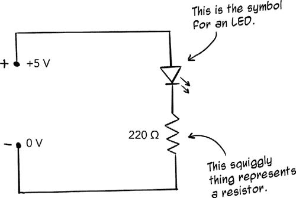

在图 3.11 中有很多物理实现电路的可能方式，因此接线图可以是一个有用的工具。图，如图 3.12（使用开源的 Fritzing 桌面应用程序创建），显示了电路的一种具体实现及其可能的布局（在这种情况下，在面包板上）。

##### 图 3.12. 简单 LED 电路的接线图，显示了从其电路图实现电路的具体物理布局。此图是在开源的 Fritzing 桌面应用程序中创建的。

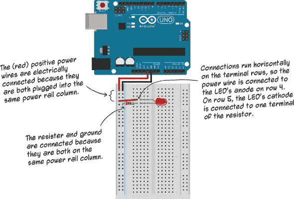

电路图一开始可能会感觉数学化和抽象，但在电子社区中它们是普遍使用的。随着我们继续旅程，你会了解更多符号和惯例，它们会开始感觉更舒适。为了提高你对电路图的理解，养成将接线图与其源电路图进行比较的习惯。


**正确连接：极性**

LED 是**极化的**，这意味着它们需要以某种方式插入才能正确工作。正如你之前学到的，阳极是正极，阴极是负极。

电阻不是极化的，这意味着你插的方向无关紧要。它们以任何方向都工作得很好。

另一点要注意的是，尽管在这个练习中我会给你精确的面包板行和列坐标，但你也可以将组件插入任何行或列，只要最终连接成功（终端行水平连接；电源轨垂直连接）。

| |
| --- |

是时候构建电路了。参照图 3.12，首先将组件连接到终端行。将红色 LED 的阳极插入孔 5C（第 5 行，孔 C），其阴极插入孔 5D（下一行）。将电阻的一端插入孔 5B，靠近 LED 的阴极。

##### 为电路供电

电路需要连接到电源。首先，你需要将终端行中的组件连接到电源轨——回想一下，终端行（出于良好原因！）与电源轨是隔离的。

| |
| --- |

**正确插入：跳线颜色**

如果你有一包彩色跳线，你可能想知道哪些颜色用于什么目的。按照惯例，电源连接通常使用红色（正极）和黑色（地）线。你可能看到的代表负电源连接的其他颜色包括白色或其他深色（棕色或紫色）。

绿色和黄色通常用于输入和输出连接，这些将在后面的章节中介绍。尽管使用红色和黑色/白色连接电源的广泛一致性，但不同的黑客使用不同的颜色组合来表示其他事物。简而言之：没有硬性规定，但请尽量在所实施的任何组合中保持一致性。

跳线不是极化的。它们可以任意方向连接。

| |
| --- |

使用红色跳线将孔 5B（与 LED 的阳极电连接）连接到电源轨的红色（正极）列中的孔。如果你不能决定最喜欢的孔，第四行向下应该很好。将电阻的自由端直接连接到负电源轨，如图图 3.12 所示。现在从正电源轨，通过红色电线到 LED，从 LED 出来，通过电阻回到负电源轨，形成了一条不间断的路径。

| |
| --- |

**电流正在流动...现在**是哪个方向？

我们使用开发板和嵌入式系统构建的项目类型使用直流（直流）电路。直流电路中的电流流向是单向的，通常表示为从正电源（最高势能）流向负极，或地（最低势能）。

从技术上讲，这并不正确——电流更准确地描述为从负极流向正极，即使是这种简化也是一种过度简化。但用正极到负极（`+`指向`-`）的方向绘制电路的传统做法已经根深蒂固，只要保持一致，用这种方式表示直流电流流动并没有固有的危害。有趣的事实：设想电流从正极流向负极的做法是由电学先驱本杰明·富兰克林确立的。

除了直流电（DC）之外，另一种电流流动类型是交流电（AC），其中电流的流动方向周期性地反转。家庭插座电源是交流电，每秒振荡方向 50 或 60 次，这取决于你所在的世界部分。

| |
| --- |
| |

##### 请拔掉 Arduino Uno 的电源！

无论如何，在连接元件或电路之前，请确保你的 Arduino Uno 已经从 USB 或墙式电源上拔掉。

| |
| --- |

Arduino Uno 可以从其 5V 电源引脚提供稳定的 5V 电压。使用一根红色跳线，一端插入 Arduino Uno 的 5V 引脚，另一端插入正电源轨的顶部行。从 Arduino Uno 的 GND 引脚用一根黑色跳线连接到负电源轨的顶部行。这样就完成了电路的布线。

现在将你的 Arduino Uno 插入 USB 或墙式电源。你的 LED 应该会亮起来！

| |
| --- |

**电路故障排除**

如果你的 LED 灯不亮，有几个地方需要检查。这种电路失败的最常见原因是它是**开路**，意味着从电路的正极到负极的路径中存在间隙。检查你的元件和电线位置，并确保电线牢固地插入了面包板的孔中。确保元件上暴露的金属端子没有相互接触。还要再次确认你的 Arduino Uno 的电源 LED 灯是亮的。

如果这些步骤不起作用，尝试用一个新的 LED 替换原来的 LED，以防 LED 灯已经损坏。有时，面包板的连接可能会出现问题（尽管这更常见于你已经使用很长时间的面包板）。作为最后的手段，尝试将元件连接到面包板的另一部分，或者尝试使用另一个面包板。

| |
| --- |

##### 串联和并联电路

这个简单的 LED 电路（图 3.13）是一个**串联电路**。串联电路只有一条路径供电子——电流，那些侏儒世界中的流动水母——通过。因为只有一条可能的路径，所有的水母/电子都必须通过整个路径；它们不能走捷径或旁路。这意味着电路中所有点的电流都是相同的（图 3.13）。

##### 图 3.13\. 串联电路只有一条可能的路径供电荷（水母）流动——没有分支。在串联电路的任何一点，电流都是相同的，这意味着 1、2、3 和 4 点都有相同的电流。

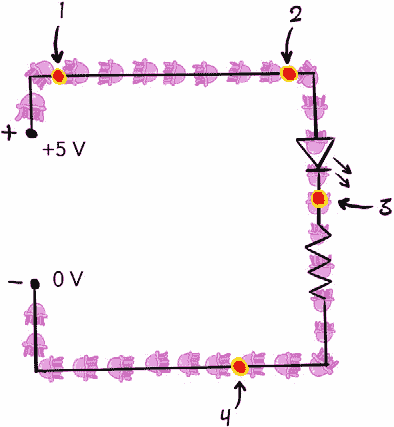

当使用电阻器修改串联电路的电流时，你使用一个 200 伏的电阻器还是两个 100 伏的电阻器并不重要。电阻器的值相加并修改整个电路的电流(图 3.14)。

| |
| --- |

##### 电压和串联电路

虽然在串联电路的任何一点上*电流*是相同的，但*电压*可能从一点到另一点不同。我们将在第四章中构建*分压器*时讨论这一点。

| |
| --- |

##### 图 3.14\. 串联电路中电阻器的值相加。

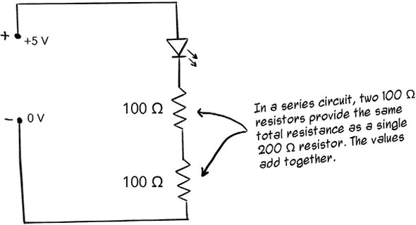

这些串联电路中的一个细节可能会让你感到困惑，那就是*限流电阻器*（限流电阻器是一种用来调节电路中电流的电阻器）的位置。

在图 3.14 中，电阻器连接在 LED 和地之间；也就是说，它们位于 LED 的“之后”。实际上，在串联电路中，电阻器相对于 LED 的位置并不重要。

放置在串联电路中的限流电阻器会影响整个电路的电流，无论其位置如何——记住，串联电路中所有点的电流是相同的。

#### 3.2.3\. 使用按钮扩展串联电路

| |
| --- |

##### 你需要


+   1 个 Arduino Uno 和 USB 线

+   1 个按钮

+   1 个标准红色 LED

+   1 个 220 伏电阻器

+   3 根跳线

| |
| --- |

在你焊接的简单 LED 串联电路中，所有电流都通过 LED，然后通过电阻器，最后到达地(图 3.14)。串联电路中的单个间隙会导致整个电路停止工作，因为它是电路唯一路径的间隙。这使得可以用一个开关来激活和关闭整个电路。

你可以通过向电路中添加按钮来了解这是如何工作的。*按钮*是一种只有在按下时才会完成连接的开关（有时按钮被称为*瞬态开关*）(图 3.15)。

##### 图 3.15\. 按钮两侧的引脚始终电连接，而共享同一侧的引脚只有在按钮按下时才连接。

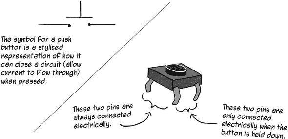

在图 3.16 中，按钮连接到面包板上，方向使得“始终连接”的引脚跨越中间的凹槽。这意味着顶行的高亮连接始终电连接，底行的高亮连接也是如此。当按钮未激活（未按下）时，两行彼此隔离。然而，当按钮被按下时，按钮左侧的上下引脚之间以及右侧的上下引脚之间会建立连接。结果是，当按钮被按下时，两个高亮行在电上相互连接。

##### 图 3.16\. 一个连接到面包板的按钮，跨越中心缺口。当未按下时，按钮顶部和底部的引脚对是电连接的（水平）。当按下并保持时，按钮左右两侧的引脚对是电连接的（垂直）。

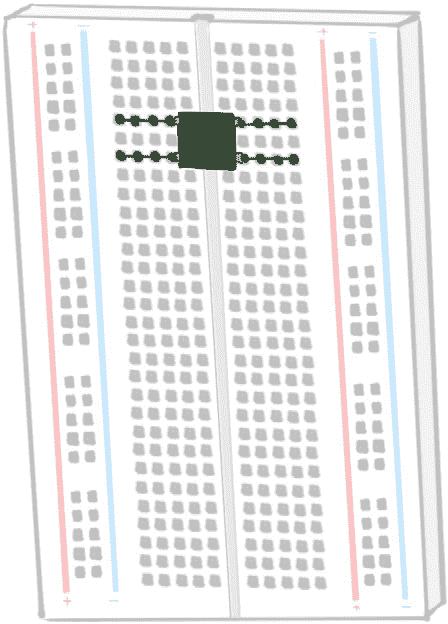

当按钮正确连接并按下并保持时，电路是*闭合*的，完成路径并允许电子通过电路流动。当释放时，电路是*开路*的——它有一个间隙，没有电流流动。你需要构建的电路图显示在图 3.17 中。

##### 图 3.17\. 更新电路的原理图，集成按钮

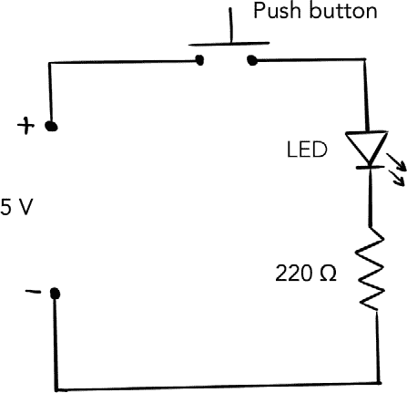

##### 构建电路：按钮和 LED

要在图 3.18 中构建按钮电路，请按照以下步骤操作：

1.  断开 Arduino Uno 的电源。

1.  从面包板上移除 LED 和电阻。

1.  使用一根黑色跳线，将 Arduino Uno 的 GND 连接到面包板右侧负电源轨的最上面一行。

1.  将按钮连接到面包板上。你的按钮可能尺寸不同，更适合放在不同的行之间，这是可以的。

1.  将 LED 的正极（较长的腿）插入与按钮底部两个腿同一行的槽位。

1.  将 LED 的负极插入下一行。

1.  将电阻从与 LED 负极同一行的槽位连接到负电源轨。你可以将连接左手电源轨到第 4 行的红色电线留在与之前练习相同的位置。

1.  重新连接 Arduino Uno 的电源。

初始时 LED 不应该亮。按下按钮。LED 应该在你按下按钮的时间内亮起。

##### 图 3.18\. 带有按钮的改进 LED 电路的布线图

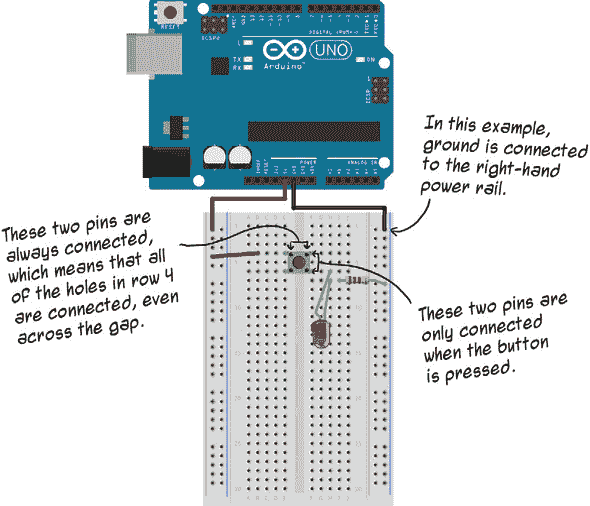

#### 3.2.4\. 串联 LED

在串联电路探索之旅中还有一站。让我们构建一个包含多个串联 LED 的电路——也就是说，在一个只有一条路径的电路上有多个 LED。这就是我坦白之前章节中省略的 LED-电阻计算细节的地方。

为了唤醒你的记忆，计算是为了找到 5V 电路中 LED 的正确电阻值——目标电流 20mA：

```
R = 5 V / .02 A
R = 250 *V*
```

我们没有向上取整到下一个常见的电阻值，而是向下取整到 220V。

在 5V 电路中，220V 电阻对于 20mA 的 LED 来说绰绰有余的原因是，由于 LED 的特性，我们在计算合适的电阻值时不需要考虑完整的 5V。实际上，220V 略高。

存在一条相关定律，称为基尔霍夫电压定律（对那些了解的人来说是*KVL*）。它指出电路中的所有电压都必须平衡：产生的电压量必须与使用的电压量相同。输入电压，输出电压。

在 LED 串联电路中，如果电阻是电路中唯一“使用”一些电压的元件，那么 250 V 将是正确的近似电阻值。但事实并非如此。LED 有一个称为“正向电压降”的度量。这有点细节，但就我们的目的而言，它是 LED 在电路中消耗的大约电压量（图 3.19 和图 3.20）。

##### 图 3.19。当电流穿过 LED 时，会消耗一些电压，或者说是“降下”。消耗的电压量称为 LED 的“正向电压”。它介于大约 1.8 V 到 3.5 V 之间，具体取决于 LED 的颜色——发出的光频率越高，电压降就越高。

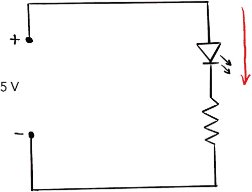

##### 图 3.20。回顾电压作为悬崖陡度或高度的比较，可以从不同的角度看到相同的串联 LED 电路。当水母电流通过 LED 时，1.8 V 被“消耗”，剩余电压降至 3.2 V（降低陡度）。然后，这 3.2 V 被限流电阻消耗。当水母达到最低电势点时，电路中的所有电压都已考虑在内。

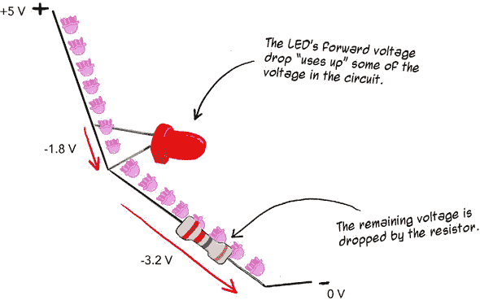

虽然大多数日常标准 LED 的正向电流（为了简洁，你可以将其视为“大致应该接收的电流”）为 20 mA，但不同 LED 的正向电压是不同的，这主要与 LED 的颜色有关。

红色 LED 的正向电压大部分在 1.8 到 2 V 之间变化。如果电路中的 LED 的正向电压降为 1.8 V，我们可以从 5 V 的系统电压中减去这部分电压，这就是电阻需要考虑的电压：

```
5 V (supply voltage)
- 1.8 V (red LED forward voltage)
--------------------------------
= 3.2 V (remaining voltage)
```

既然我们想要达到 20 mA 的电流（0.02 A），根据欧姆定律得出的方程式是

```
R = 3.2 V / 0.02 A
```

或者

```
R = 160 V
```

220 V 的电阻值足够接近，可以非常合适——按照惯例，将其四舍五入到下一个常见的电阻值。现在，220 V 比 160 V 的电阻值要大，所以你可能想知道使用更高电阻值对 LED 和电路有什么影响。更高的电阻值和稳定的电压意味着电流会下降（因为，一如既往，根据欧姆定律）：

```
I = V / R
I = 3.2 / 220 V
I = 0.0145 A
```

最后，LED 的电流小于 20 mA——大约 15 mA（0.0145 A）。提供给 LED 的电流与其亮度成正比：接收 15 mA 的 LED 不会像接收 20 mA 的 LED 那样耀眼。

如果在这个串联电路中再添加一个相同的红色 LED，情况会怎样？需要什么电阻值？我们需要考虑两个 LED 的电压降（图 3.21）。

##### 图 3.21。两个 LED 中的每一个都会在电路中消耗一些电压，同样，剩余的电压由电阻消耗。


幸运的是，这是一个简单直接的数学问题。在从总电路电压中减去每个 LED 的电压降后，我们剩下 1.4 V：

```
5 V (supply)
- 1.8 V (LED 1)
- 1.8 V (LED 2)
--------------
= 1.4 V

R = 1.4 V / 0.02 A
R = 70 *V*
```

将电阻值四舍五入到下一个常用电阻值，一个 100V 电阻将非常适合，如图 3.22 中的电路图所示。

##### 图 3.22\. 两个 LED 灯通过一个 100V 电阻串联连接。当按下按钮时，电路中只有一条路径：通过第一个 LED，通过第二个 LED，通过电阻，然后回到地。

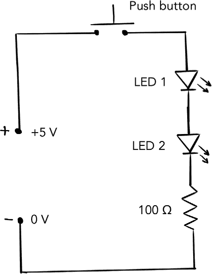

##### 构建电路：两个 LED 灯串联

| |
| --- |

##### 你将需要


+   1 个 Arduino Uno 和 USB 线

+   1 个按钮

+   2 个标准红色 LED 灯

+   1 个 100V 电阻

+   3 根跳线

| |
| --- |

要构建图 3.23 中的电路，请按照以下步骤操作：

1.  从电源上拔下你的 Arduino Uno。

1.  从面包板上拔下 220V 电阻并收好。

1.  将第二个 LED 的正极插入与第一个 LED 的负极相同的行（图 3.23 中的第 7 行）。

1.  从负电源轨连接一个 100V 电阻到包含第二个 LED 负极的行（第 8 行）。

##### 图 3.23\. 两个 LED 灯串联的接线图

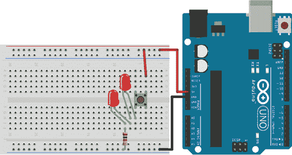

如果你将你的 Arduino Uno 连接到电源并按下按钮，两个 LED 灯应该都会亮起。它们是串联连接的，可以通过再次查看图 3.22 来更直观地理解。

那如果你添加第三个 LED 呢？这是一个陷阱问题：实际上你并不能做到。如果你想要产生可靠且明亮的灯光，这是不可能的。在第一个两个 LED 的电压下降后，只剩下 1.4V“剩余”电压。这几乎不足以点亮第三个 LED——LED 至少需要其电压下降值才能点亮。你可能能够使三个 LED 微弱地发光，但它们不会很稳定。

使用 5V 电源可以稳定地为两个以上的 LED 灯供电，但要这样做，你需要一个并联电路。

#### 3.2.5\. 并联电路和电流分配器

在串联电路中，电子只有一条路径可以走，但在并联电路中，有两条或更多可能的路径，或称为*分支*（图 3.24）。

##### 图 3.24\. 在并联电路中，电流可以走多条路径或分支。在这个例子中，有两个分支：每个分支都有自己的 LED 和电阻。

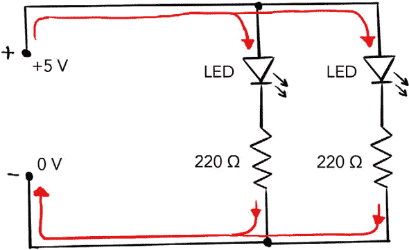

当电子通过电路并遇到道路分叉时，它们各自会做出选择哪条分支的决定。电流倾向于选择电阻较小的路径（图 3.25）。

##### 图 3.25\. 因为这个并联电路中的两个分支具有相同的电阻（100V），一半的电流将通过一个分支，另一半将通过另一个分支。

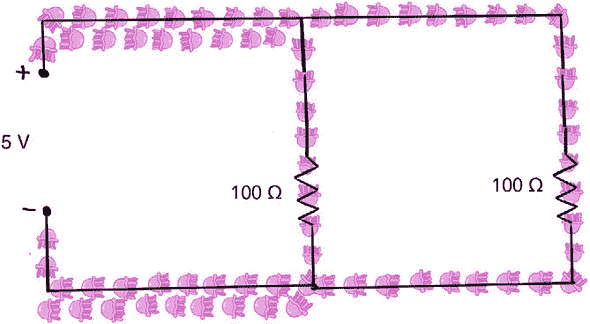

在计算并联电路中的电阻时，事情会变得有些奇怪且不符合直觉。再次查看图 3.25 中的并联电路。两个 100V 电阻提供的总电阻是多少？

串联电路的总电阻很容易计算——只需相加即可， voilà！你就得到了总电阻。一开始就假设并联电路的总电阻是 200 V 是很诱人的。不，或者你可能注意到，任何给定的电荷在电路中只通过一个电阻，而不是两个。所以这一定意味着总电阻是 100 V？抱歉，也不是。

正确答案是 50 V。

我知道，我知道。这感觉不太对劲，但这是真的：在并联电路中，总电阻总是**小于**最小电阻值。让我们用欧姆定律和一些深呼吸来探讨这怎么可能。在并联电路中计算等效电阻是新手电子黑客们面临的更具挑战性的概念之一，所以请不要还没开始就拔头发。

让我们把它拆开再组合起来。图 3.26 中显示的 5 V 串联电路和 100 V 电阻将消耗 50 mA 的电流（I），因为

```
.005 A (I) = 5 V (V) / 100 V (R)
```

##### 图 3.26。这个串联电路的电流为 50 mA，因为 5 V / 100 V = 0.05 A。

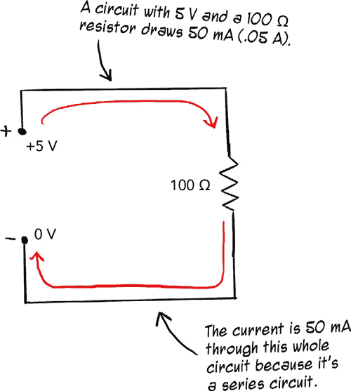

现在假设你复制相同的路径——5 V 和 100 V 电阻——并将其连接到电路中。第二条路径也将独立地消耗 50 mA，因为供电电压（5 V）和电阻（100 V）保持不变（图 3.27）。

##### 图 3.27。并联电路的每个分支单独来看就像它自己的串联电路。我们可以用欧姆定律来验证这个分支也将消耗 50 mA。

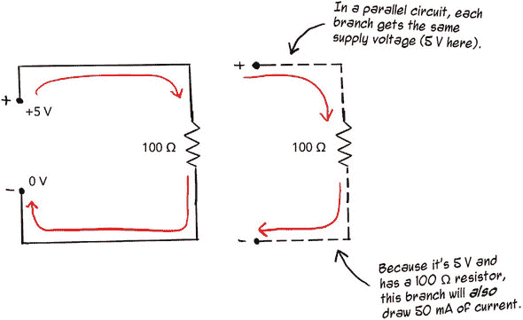

两个分支的总电流为 100 mA——电路的总电流消耗增加了（图 3.28）。

##### 图 3.28。进入电路的总电流是 100 mA（点 A）。它平均分成两个分支——每个分支得到 50 mA（点 B、C）。电流重新汇合，在点 D 再次达到 100 mA。在并联电路中，每个分支的供电电压是恒定的，但电流是变化的。

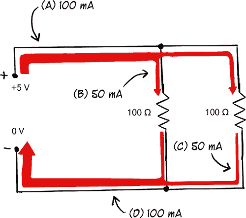

现在整体来看这个电路，其总电流是 100 mA（0.1 A），供电电压，一如既往，是 5 V。将这个值代入欧姆定律，

```
Total resistance (R) = 5 V (V) / .1 A (I)

R = 50 *V*
```

并联电路中每个电阻提供的电阻都会减小，因为并联电路中的每个分支都会增加电路中的总电流。电流在上升，而电压保持恒定：电阻在下降。


**电流分配器**

任何将电源电流分成多个分支的电路都称为**电流分配器**。以下图中的并联电路是电流分配器的一个例子：一些电流沿着一个分支流动，其余的沿着另一个分支流动。

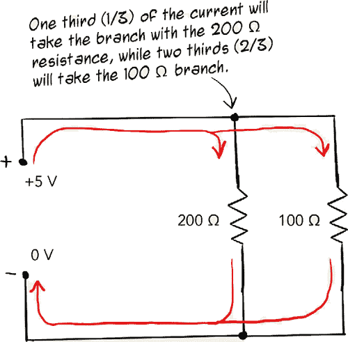

如果分支的电阻不相等，电流将按比例流过每个分支。

如果电荷发现自己处于道路的岔路口，并且两条可用的路径具有相同的电阻，电荷同样可能选择任何一条路线（就像图 3.28 中的并联电路）。但如果电阻不相等，更多的电荷会选择电阻较小的道路——也就是说，更多的电流会选择电阻较小的分支。

你可以通过单独查看每个分支并确定电路的总电流消耗来计算图中所示电路的总电阻：

```
Branch 1:
5 V / 200 *V* = .025 A (25 mA) because I = V / R

Branch 2:
5 V / 100 *V* = .05 A (50 mA) because I = V / R

  .025 A (branch 1)
+ .05 A  (branch 2)
=========================
= .075 A (75 mA) total current

R(Total) = 5 V / .075 A because R = V / I
R(Total) = 66.667 *V*
```

以这种方式计算总电阻，随着分支数量的增加可能会变得繁琐。我们不会设计带有许多不同电阻的复杂电流分配器，但如果你是好奇的类型，有一个公式可以计算任何并联电路中的等效（总）电阻：

```
1 / R(Total) = 1 / R1 + 1 / R2 + 1 / R3 ... + 1/Rn
```

| |
| --- |

一些并联电路的计算可能看起来毫无意义地复杂，但它确实有有用的应用。

这里的问题是：并联电路的每个分支都提供相同的电压。因此，如果我们把串联电路的 LED 添加更多分支（将其变成并联电路——图 3.29），每个分支都会得到“它自己的”5 V 来工作。这样，我们可以在同一电路中连接三个、四个甚至更多的 LED，而不会像串联电路那样电压耗尽。

##### 图 3.29。在并联 LED 电路的原理图中，分支 A、B、C 和 D 都供电 5 V。每个分支接收电路总电流的 1/4。

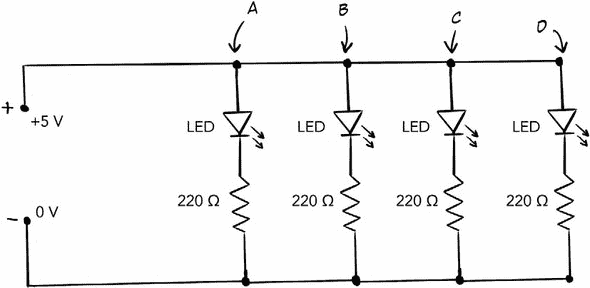

##### 构建电路：并联 LED

| |
| --- |

##### 你需要的东西


+   1 Arduino Uno 和 USB 线

+   4 个标准红色 LED

+   4 个 220 V 电阻

+   6 根跳线

| |
| --- |

图 3.30 显示了相同电路的物理布局。要在同一电路中连接四个 LED，从一块干净的新面包板开始，按照以下步骤操作：

1.  将四个 LED 的正极终端连接到 2、9、16 和 23 排的孔中。

1.  将阴极端插入同一排但位于间隙的另一侧（这样它们就不会电连接）。

1.  从板左侧的正电源轨运行四根红色跳线到每个 LED 的正极排。

1.  将每个 LED 的阴极排连接到板右侧的负电源轨。

1.  使用红色和黑色跳线将电源轨连接到 Arduino Uno 的 5 V 和 GND 引脚。

1.  将 Arduino Uno 插入 USB 或直流电源。

##### 图 3.30。并联连接 LED 可以使你在单个电路中连接更多元件，因为每个分支都得到相同的电压（5 V）。

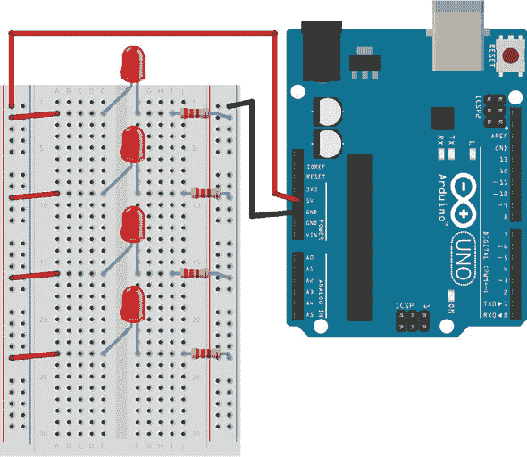

如果一切顺利，所有四个 LED 都应该愉快地发光。

并联电路还有一个有用的特性。如果你要从第 2 行的 LED 和电源轨之间的红色电线移除，其他 3 个 LED 仍然会亮起。电路仍然有其他三个完整的路径可以使用。这与串联电路形成对比，在串联电路中，一个单独的间隙会阻止电流流向任何组件。

#### 3.2.6\. 使用电池为你的项目供电

到目前为止，你一直使用 Arduino Uno 板上的 5 V 电源为面包板供电，但还有其他提供电源的方法。一个（显然）的选项是使用电池。

单个 9 V 电池是一个方便的电源，在构建 LED 电路的情况下，它消除了对开发板的依赖。

##### 构建电路：9 V 供电 LED

| |
| --- |

##### 你需要


+   1 个面包板

+   9 V 电池和夹子，带电线

+   4 个标准红色 LED

+   4 根跳线

+   4 个 560 V 电阻

| |
| --- |

使用 9 V 电池时，供电电压（显然）不同于 Arduino 的 5 V。这意味着我们需要为并联电路中的 LED 使用不同的电阻。

回想一下，在并联电路中，每个分支“获得”完整的 9 V 供电电压来工作，因此你可以使用欧姆定律计算每个分支所需的电阻：

```
R = 9 V / 20 mA
R = 450 *V*
```

560 V 电阻是最接近的常用电阻值，它将做得很好（你注意到有一些调整空间吗？只要向上取整？）。

断开面包板的电源轨与 Arduino 的连接，并将每个 220 V 电阻更换为更强大的 560 V 电阻。现在将电池盒的正负电线插入面包板的电源轨（图 3.31）。全部完成！

##### 图 3.31\. 使用 9 V 电池为并联 LED 电路供电需要更换一些电阻，并将 9 V 电池夹子连接到电源轨上。

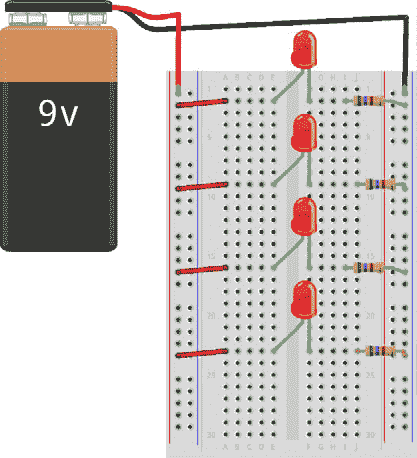

### 摘要

+   电压、电流和电阻之间的关系——如欧姆定律所正式化的——是理解基本电路的关键。

+   面包板提供了一个有形且方便的原理图平台，具有标准连接模式，用于尝试电路。

+   串联电路为电流流动提供一条单一的路径。并联电路有两个或更多路径。

+   LED 有一个称为*正向电压降*的特性。在计算串联连接的 LED 所需的正确电阻时，首先从供电电压中减去这个正向电压降。

+   在串联电路中，电流在电路的所有点上都是相等的，而在并联电路中，所有分支的电压都是相等的。

+   在串联电路中，计算电路中的总电阻很简单：将电阻值相加。

+   具有多个路径的电路会将电路中的电流分割，称为*电流分压器*。可以使用电流分配公式计算出这种并联电路的总电阻。
