## 第二部分\. 项目基础：使用 Johnny-Five 进行输入和输出

这本书的这一部分是真正开始烹饪的地方：你将学习如何将传感器、输出和运动部件添加到项目中，在 Arduino Uno 板和 Johnny-Five 的帮助下进行一系列小实验。

在第四章中，你将了解所有关于输入（传感器）的内容，无论是模拟还是数字。你将尝试从简单的温度传感器和光敏电阻读取数据，并学习检测按钮按下。

第五章关注输出，基于你之前对 LED 的实验。你将超越闪烁 LED，到动画 LED 和全彩 RGB LED。你将在并行 LCD 模块上显示文本，并构建自己的“天气球”（简化的天气状况显示）。

如果你一直在等待机器人部分，第六章就是它！这一章全部关于运动：电机和伺服系统。我们将研究电机的工作原理以及如何供电和控制它们。在第六章结束时，你将使用一个经济实惠的机器人底盘套件构建一个简单的巡游机器人。

到这本书的这一部分结束时，你将已经调查了小型嵌入式项目中所有主要的简单输入和输出类型。你将能够从传感器读取环境数据，并输出光和声音。你将准备好构建更复杂、无线的项目。

## 第四章\. 传感器和输入

*本章涵盖*

+   传感器在项目中作为*转换器*的作用，将物理现象转换为电信号

+   微控制器如何使用模数转换（ADC）来解释传入的模拟信号

+   构建分压器电路来读取*电阻传感器*如光敏电阻

+   使用 Johnny-Five 的通用`Sensor`类读取传感器数据并监听数据和变化

+   利用 Johnny-Five 的特定组件`Thermometer`和`Button`类

+   使用下拉电阻管理默认数字逻辑电平

要构建巧妙的设备，无论是温度控制的自动风扇还是更有趣的发明，你必须能够从真实物理世界中收集信息和输入。


**对于这一章，你需要以下物品：**

+   1 Arduino Uno 和 USB 线

+   1 光敏电阻

+   1 4.7 kΩ 电阻

+   1 TMP36 模拟温度传感器

+   1 按钮开关

+   1 10 kΩ 电阻

+   黑色、红色和绿色跳线

+   1 半尺寸面包板

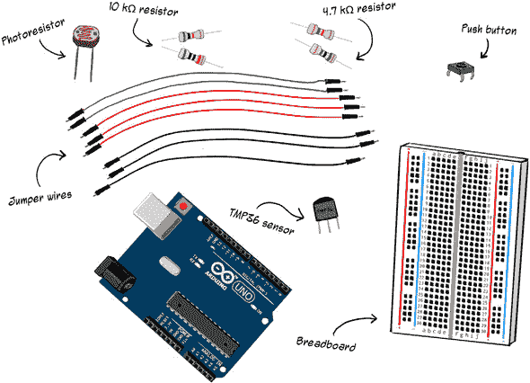


模拟和数字传感器关注物理环境中的特定现象——温度、亮度、湿度、压力、振动——并且输出关于该现象强度变化的信息作为信号。在 第一章 中的自动风扇示例中，温度传感器将温度变化转换为微控制器固件可以读取和处理（图 4.1）的电气信号。

##### 图 4.1\. 来自 第一章 的温度控制风扇使用模拟温度传感器来收集关于周围环境温度变化的信息。

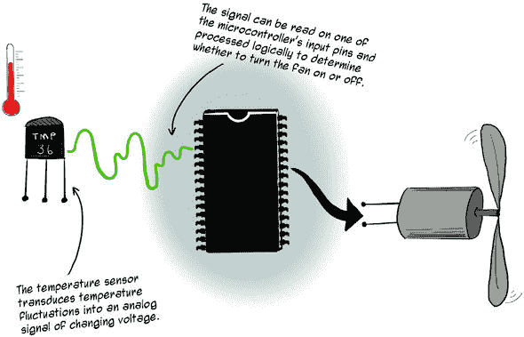

这种从物理输入到电气输出的转换意味着传感器是一种 *转换器*，它可以将一种形式的能量转换为信号（或反之亦然）。

传感器和输入根据它们产生的信号类型进行分类：模拟，一个连续、平滑的值集，没有间隙，或数字，由离散、有限的值集组成（图 4.2）。

##### 图 4.2\. 类似于温度传感器（顶部）的模拟传感器将温度变化转换为平滑的模拟信号。类似于倾斜开关（底部）的数字输入可能只有两个离散的输出值：一个在正常方向（关闭，LOW，0 或 false）时，一个在反转（打开，HIGH，1，true）时。

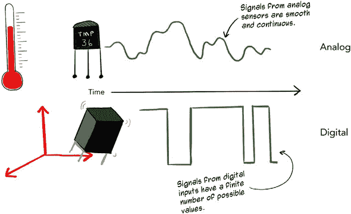

### 4.1\. 与模拟传感器一起工作

我们的物理现实是模拟的：我们生活在一个无限的世界中。0 到 20 摄氏度之间有无限多的温度，有无限多的颜色，有无限多的声音频率。当然，作为人类，我们无法区分 280.3984 Hz 和 280.3985 Hz，但这两个不同的值确实存在。

*模拟传感器* 对这些模拟、现实世界的输入敏感。它们的输出是一个平滑的信号，通常是变化的电压，对应于它们所测量的强度（图 4.3）。

##### 图 4.3\. 模拟温度传感器的输出信号随温度变化在电压上变化。

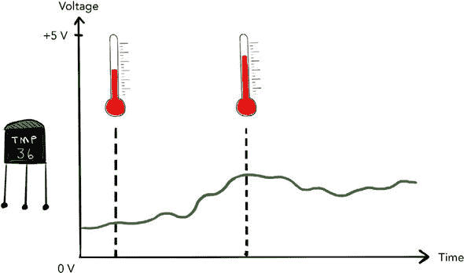

#### 4.1.1\. 模拟到数字转换

类似于风扇中的温度传感器的模拟传感器提供模拟信号，但我们的编程世界是数字的。模拟输入信号需要以某种方式采样和归一化——量化——为离散的数字值，以便它们可以用数字逻辑进行处理。

将信号样本从模拟转换为数字的这种转换需要一些硬件和处理。Arduino Uno 的微控制器在其六个引脚上提供了内置的 *模拟到数字转换*（ADC）功能。具有 ADC 支持的模拟输入引脚在 Uno 上以“A”为前缀（图 4.4）。

##### 图 4.4\. ADC 由 ATmega328P 微控制器在特定引脚上支持（在 Uno 上作为 A0-A5 提供）。ADC 将模拟信号转换为离散的数字值。

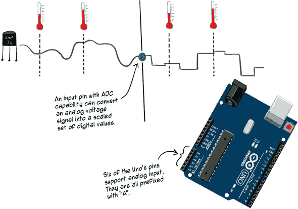

从输入的模拟信号中可以导出的可能值的数量取决于微控制器上 ADC 硬件的*带宽*。Arduino Uno 上的 ATmega328P 为每个启用的引脚提供 10 位 ADC。这意味着它可以解析 1024（2¹⁰）个可能的数字值。0 V 的模拟输入将被解释为 0，5 V 为 1023，任何介于两者之间的值都按比例缩放到最接近的（整数）步进值。

模拟传感器对它敏感的物理刺激做出反应，将这种物理能量转换为电压变化的输出信号。该信号可以通过微控制器的模拟输入引脚进行采样，并使用 MCU 的模数转换（ADC）功能转换为数字值。为了看到这是如何工作的，让我们通过一个基本的模拟传感器进行实验。

#### 4.1.2\. 使用光敏电阻

*光敏电阻*，也称为*光电池*或*光敏电阻器*（LDR），是一种简单的传感器。它的名字揭示了它实际上是一种电阻器，但其导电性取决于照射到它上的入射光的亮度——它是*光电导*的。

当光线较暗时，光敏电阻的电阻更高，在完全黑暗时达到约 10 kΩ。随着它所暴露的光量增加，它变得更加导电——其电阻降低——在光线相当明亮时降低到约 1 kΩ（图 4.5）。

##### 图 4.5\. 随着光照条件的变化，光敏电阻的电阻会变化。当更多的光照射到它时，它变得更加导电——也就是说，电阻更小。当光线较暗时，电阻更高。

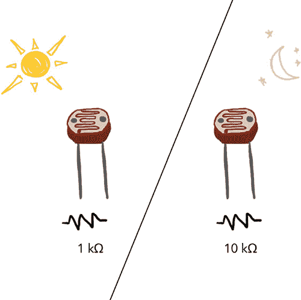

##### 电路中的电压

假设我们想要能够使用 Arduino Uno 的具有 ADC 功能的引脚 A0 来读取表示环境光值变化的信号。我们需要一个包含光敏电阻并连接到电源、地以及 Arduino Uno 的引脚 A0 的电路。

但图 4.6 所示的电路并不能解决问题。还记得第三章中提到的*基尔霍夫电压定律*（KVL）吗？电路中的所有电压都必须被消耗。在图 4.6 所示的电路中，唯一“消耗”电压的组件就是光敏电阻本身。

##### 图 4.6\. 在这样的电路中，引脚 A0 上不会出现任何有意义的电压变化。

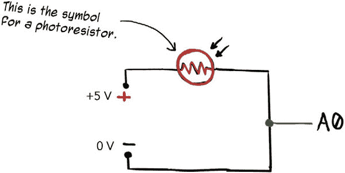

这意味着无论光敏电阻在任何给定时刻的实际电阻值是多少，它仍然会消耗电路中的所有电压——这意味着 A0 的电压不会改变。

在第三章中，你也看到了在串联电路中电流在每个点都是相同的。图 4.7 所示的电路假设 LED 的正向电压降为 2 V，剩下 3 V 由电阻处理。电路中的总电阻为 200 Ω（两个 100 Ω电阻相加），所以

```
I = V / R

thus

0.015A = 3 V / 200 *V*
```

##### 图 4.7\. 在串联电路中，电流在所有点都是相同的。

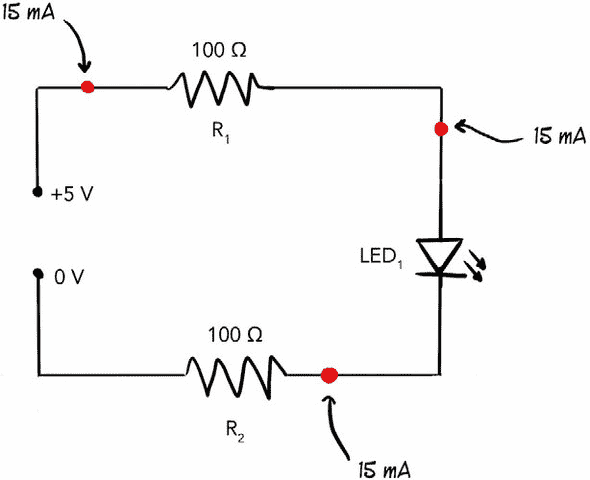

电路中所有点的电流都将测量为 15 mA。

解决我们这里的光敏电阻问题的关键是电压在电路中的元件之间分配（图 4.8），并且它不是在每个点都恒定的。

##### 图 4.8。在串联电路中，电压可以在不同的点有所不同。每个元件都会消耗，或者说*下降*电路可用电压的一部分。

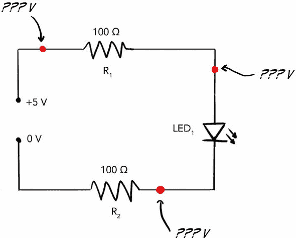

让我们分解图 4.7 中的电路并分析它，看看电压去哪里了。

5 V 电源中的 2 V 被 LED 的正向电压下降消耗。这留下了 3 V 需要去...*某个地方*。它被分配给电路中剩余的元件。

分配给每个剩余的电阻元件（两个电阻，R[1]和 R[2]）的电压是给定元件的电阻与电路总电阻的比率。

让我们计算分配给 R[1]的电压：

```
R1 resistance value =      100 V
Total circuit resistance = 200 V
Proportional voltage R1  = 100 V / 200 V = 1/2
Thus, voltage across R1  = (1/2) * 3 V remaining = 1.5 V
```

因为有两个电阻，并且它们的电阻相等，所以剩余的电压将平均分配给它们，即 50-50。如果电阻的值不同（例如，如果 R[1]是 300 V 而 R[2]是 100 V，它们分配的电压将分别是 1.125 V 和 0.375 V）。

在图 4.9 所示的电路中，两个电阻 R[1]和 R[2]具有*相等*的电阻——每个电阻提供电路总电阻的一半。因此，电路中剩余的电压（3.0 V）将平均分配给它们，即 50-50，每个电阻 1.5 V。

##### 图 4.9。基尔霍夫电压定律指出，电路中所有电压的总和总是产生 0。也就是说，电路中的所有电压都需要被考虑（被消耗）。

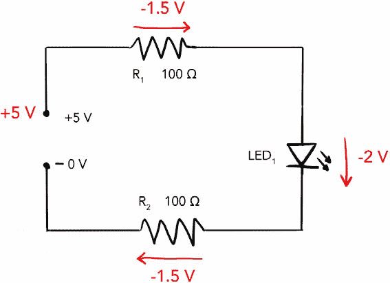

一种更正式的说法是，“电路中的所有电压都需要被消耗”，即电路中的所有电压之和必须为 0。在图 4.9 中绕电路走一圈，我们从电源开始：+5 V。然后 R[1]下降其份额，1.5 V；LED 下降 2.0 V；R[2]下降 1.5 V。所有这些加起来等于 0：

```
(+5 V) + (–1.5 V) + (–2 V) + (–1.5 V) = 0 V
```

因为我们知道电路中每个元件消耗的电压量，我们可以推导出电路中不同点的电压（图 4.10）。

##### 图 4.10。串联电路中不同点的电压根据电路中元件下降的电压量而变化。

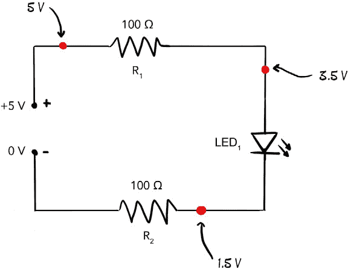

因此，当电路中只有一个元件时，它将消耗所有的电压。如果你将光敏电阻与其他元件一起连接（图 4.11），它将提供电路中 100%的电阻（技术上，这并不完全正确，因为我们在微控制器中会遇到一个隐藏的电阻，但足够接近了）。

##### 图 4.11。在电路中只有光敏电阻的情况下，没有参考点可以读取可测量的电压变化。

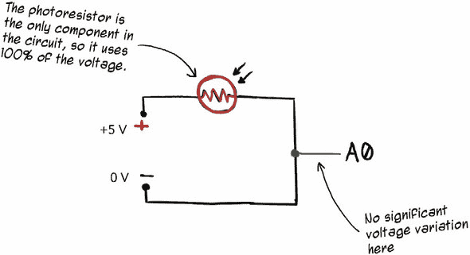

我们需要一种方法来创建一个具有参考点的电路，一个电压在可预测的方式下变化并可读取的点。

#### 4.1.3. 分压器

分压器来拯救！分压器电路使得从光敏电阻中读取有用值成为可能。为了理解这一点，让我们首先看看什么是分压器以及它是如何工作的。

*分压器*是一种电路，它使用一对电阻将较高的供电电压转换为较低的输出电压。尽管电路的整体电压是供电电压（在我们的例子中是 5 V），但两个电阻之间的电压是一个新的输出电压(图 4.12)。

##### 图 4.12。分压器在 V[out]处提供了一个新的、较低的电压，在两个电阻 R[1]和 R[2]之间可用。有几种方式可以绘制分压器的电路图；这里展示的两个电路在功能上是相同的。

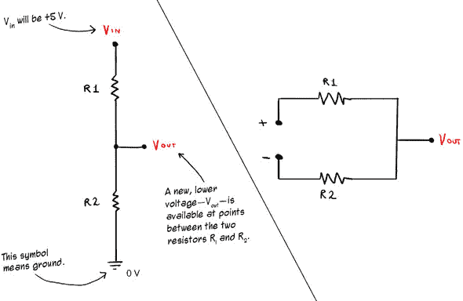

如果分压器中使用的两个电阻具有相同的电阻并且是电路中唯一的组件，那么直观地讲，图 4.13 中 V[out]处的电压将是原始供电电压的一半——R[1]会降低其相应的供电电压份额，即 50%，因为电流流过它。

##### 图 4.13。当电路中的 R[1]和 R[2]具有相同的电阻时，V[out]是 V[in]的一半，因为每个电阻都会降低供电电压的 50%。

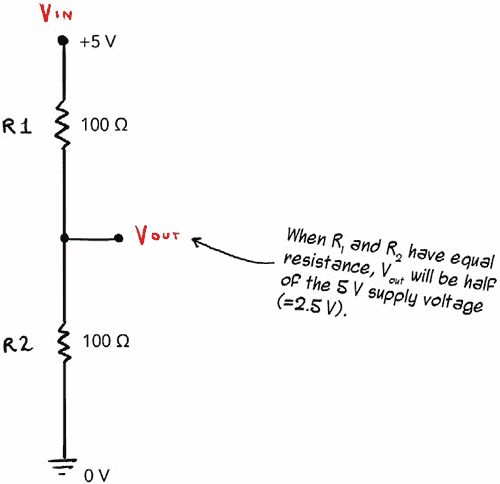

##### 图 4.14。V[out]是供电电压的 1/5（20%），因为 R[1]提供了电路总电阻的 80%。

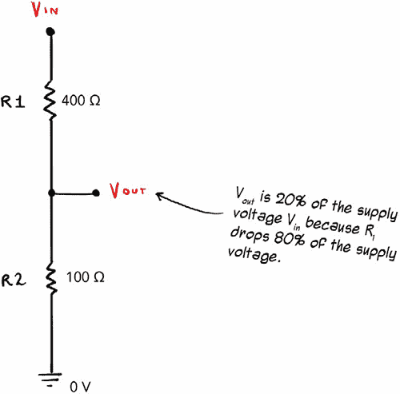

另一方面，如果 R[2]保持在 100 V，但 R[1]的电阻变为 400 V，那么 R[1]将降低 80%的可用电压(图 4.14)，这样 V[out]处的输出电压现在仅为供电电压的 20%。

哇！电阻 R[1]（光敏电阻）提供的电阻比例变化会反映在 V[out]处的电压变化上。这就是我们需要的参考点！

##### 分压器公式

分压器电路的公式——即确定两个电阻之间 V[out]处电压的方法如下：

```
V(out) = V(in) * (R2 / (R1 + R2))
```

V[out]是 R[1]降低电路电压份额后剩余的供电电压。

我们将使用一个固定的 4.7 kΩ电阻作为 R2)。光敏电阻将扮演 R[1]的角色。其电阻范围在 1 kΩ到 10 kΩ之间，具体取决于环境亮度。

##### 图 4.15。光敏电阻电路的电路图

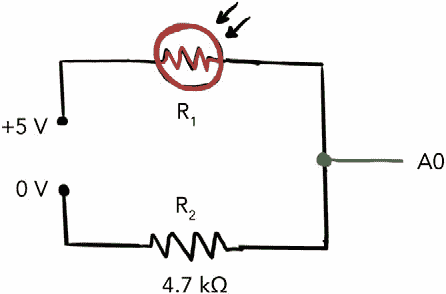

随着 R[1]（光敏电阻）的电阻与电路总电阻成比例变化，A0 上的输出电压也会变化。我们可以用 Arduino Uno 测量这个电压，并观察光强的波动。

| |
| --- |

**计算 V[out]的电压范围**

您可以通过使用分压器公式来计算 V[out]处可能电压的范围。

在光敏电阻的最高电阻，即黑暗中，R[1]的电阻为 10 kΩ（记住，R[2]始终为 4.7 kΩ）。这种对黑暗的高电阻响应将产生该范围内的最低电压：

```
V(out) = V(in) * (R2 / (R1 + R2))

R1 = 10000 *V*
R2 = 4700 *V*

V(out)
  = 5 V * (4700 / 14700)
  = 5 V * .32
  = 1.6 V
```

当明亮时，R[1]可能的最小电阻是 1 kΩ，这将产生该范围内的最高电压：

```
V(out) = V(in) * (R2 / (R1 + R2))

R1 = 1000 *V*
R2 = 4700 *V*

V(out) = 5 V * (4700 / 5400)
  = 5 V * .825
  = 4.125 V
```

通过使用光敏电阻的电压分压器电路，你可以为 A0 引脚创建一个可读的输出电压信号，该信号从 1.6 V 变化到 4.125 V。

4.125 – 1.6 V = 2.525 V，或者说是总范围 0–5 V 的略多于 50%。这意味着你将获得一个相当宽的值范围——从（非常粗略地）大约`328` (~1.6 V) 到`845` (~4.125 V) 的可能 10 位（0–1023）范围内。

| |
| --- |

#### 4.1.4\. 接线和使用光敏电阻

| |
| --- |

##### 你需要的东西


+   1 个 Arduino Uno 和 USB 线

+   1 个光敏电阻

+   1 个 4.7 kΩ电阻（或 10 kΩ也可以）

+   红色（2 根）、黑色（2 根）和绿色（1 根）的跳线

+   1 个半尺寸面包板

| |
| --- |

就像你一直在使用的其他电阻一样，光敏电阻不是极化的，因此你不需要担心正负极的朝向。按照图 4.16 所示，将光电电池和 4.7 kΩ电阻连接到面包板上。

##### 图 4.16\. 光敏电阻电压分压器电路的接线图。连接到 A0 的跳线另一端需要连接到 V[out]，在光敏电阻（R[1]）和 4.7 kΩ电阻（R[2]）之间。

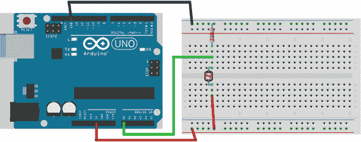

电压分压器输出，V[out]，在光电电池和电阻之间的任何终端排孔中都可以获得（回想一下，面包板每个终端排的五个孔在电学上是连接的）。

将绿色跳线的一端插入其中一个孔中，另一端插入到 Uno 的 A0 引脚上。从 Uno 的 5 V 电源和 GND 引脚连接到电源轨。现在你可以暂时把面包板放一边，我们将转向软件方面。

一旦光敏电阻电路通电（顺便说一句，目前还没有！），A0 引脚上将会出现一个变化的电压信号。那么我们如何使用我们手头的 Johnny-Five JavaScript 框架从这个信号中读取值呢？

##### 使用 Johnny-Five 处理模拟传感器输入

Johnny-Five 的 API 包含了一组可以用来与你的开发板和组件交互的类。例如，你已经看到了`Led`。许多组件类，如`Led`，是为特定类型的设备设计的，例如`Accelerometer`和`Servo`。还有一些更通用的类，用途更广泛，包括一个可以与模拟传感器如`Sensor`光敏电阻一起使用的类。

| |
| --- |

##### 保持 Johnny-Five API 更新

Johnny-Five，像许多其他开源软件一样，一直在不断进化。新功能和类被添加，API 也在不断演变。你可以在[`johnny-five.io/api`](http://johnny-five.io/api)上了解最新的 Johnny-Five API。

| |
| --- |

##### 使用 Johnny-Five 的 Sensor 类

`Sensor` 类可以用来读取和处理模拟传感器的数据。首先，在 Johnny-Five Node.js 脚本中创建一个新的 `Sensor` 对象，如下一列表所示。

##### 列表 4.1\. 使用 Johnny-Five 实例化一个新的 `Sensor` 对象

```
const five = require('johnny-five');
const board = new five.Board();

board.on('ready', () => {
  const sensor = new five.Sensor({
    pin: 'A0'                      *1*
  });
});
```

+   ***1* 当实例化 Sensor 时，“pin”是传递的选项对象中唯一的必需属性。**

`Sensor` 的内部机制负责将指定的 `pin` 配置为模拟输入引脚，然后自动且连续地从该引脚读取 ADC 数据。

那么，你可以用 `Sensor` 对象做什么呢？你可以像以下列表所示那样记录它的值——`value`是 `Sensor` 对象上可用的几个参数之一，它保存最近读取的值。

##### 列表 4.2\. 记录传感器的值

```
board.on('ready', () => {
  const sensor = new five.Sensor({
    pin: 'A0'
  });
  console.log(sensor.value);            *1*
});
```

+   ***1* 这只会记录一次（就绪事件只会触发一次）。**

但 列表 4.2 中的代码只会记录传感器的值一次——这用途有限。查看传感器随时间变化的数据要更有用。这是事件驱动 JavaScript 的用武之地。

##### Johnny-Five 中的传感器数据事件

Johnny-Five 中的不同对象提供了不同的事件，你的代码可以绑定到这些事件上。你可以使用回调函数来处理这些事件，当它们发生时。

例如，`Sensor` 类有一个 `data` 事件，每当读取引脚的值成功时都会触发，如下一列表所示。

##### 列表 4.3\. 使用 `data` 事件记录值

```
sensor.on('data', () => {               *1*
  console.log(sensor.value);
});
```

+   ***1* 每当从引脚成功读取值时，都会触发数据事件。**

##### 尝试使用光敏电阻

让我们用一些 Johnny-Five 代码来组合我们的电压分压器增强型光敏电阻电路，以检测周围光条件的变化。创建一个新文件，photoresistor.js，并填充以下代码。

##### 列表 4.4\. Photoresistor.js

```
const five = require('johnny-five');
const board = new five.Board();

board.on('ready', () => {
  const sensor = new five.Sensor({
    pin: 'A0'
  });
  sensor.on('data', () => {
    console.log(sensor.value);
  });
});
```

将 Arduino 的 USB 线缆插入您的计算机——现在板子和面包板电路都有电了。执行光敏电阻脚本：

```
node photoresistor.js
```

一旦脚本开始运行，通过将手放在光敏电阻上或调暗灯光来增加和减少到达光敏电阻的光量。当你这样做的时候，你应该会看到记录输出的值发生变化，看起来如下所示。

##### 列表 4.5\. 光敏电阻数据记录输出

```
$ node photoresistor.js
1464612512404 Device(s) /dev/cu.usbmodem1421
1464612512416 Connected /dev/cu.usbmodem1421
1464612515883 Repl Initialized
>> 354
354
355
355
355
355
354
353
432
```

##### 调整频率、比例和阈值

光敏电阻的值滚动得太快了。默认情况下，`Sensor` 将每 25 毫秒读取、计算和缩放 ADC 数据。这就是为什么你的光敏电阻值记录滚动得如此之快。你可以通过 `freq` 参数调整这些读取的频率，如下一列表所示。

##### 列表 4.6\. 传感器 `freq` 参数

```
const sensor = new five.Sensor({
  pin: 'A0',
  freq: 1000                         *1*
});
```

+   ***1* 值以毫秒为单位：这将每秒读取一次。**


**Johnny-Five 事件绑定和 `this`**

`Sensor` 对象的事件将 `this` 绑定到 `Sensor` 对象，这意味着你可以编写如下代码：

```
sensor.on('data', function () {
  console.log(this.value); // `this` is bound to `sensor`
});
```

注意，由于使用了箭头函数作为匿名回调函数的绑定，以下代码将不起作用：

```
sensor.on('data', () => {
  console.log(this.value); // --> undefined
});
```


一种更优雅的方法是绑定到`change`事件而不是`data`事件。每当传感器的最新值与之前读取的值差异超过阈值时，都会触发`change`事件。

`threshold`值默认为`1`，这意味着——因为读取的传感器值是整数——任何值的改变都会触发`change`事件。`threshold`是`Sensor`对象实例上的一个属性，可以在任何时刻更改以改变触发`change`事件的阈值。以下列表将此结合成一个脚本，该脚本会在传感器值变化`5`或更多时记录下来（记住，可能的值范围从 0 到 1023）。

##### 列表 4.7\. 记录变化的电阻值

```
var const = require('johnny-five');
var const = new five.Board();

board.on('ready', () => {
  const sensor = new five.Sensor({
    pin: 'A0'
  });
  console.log(sensor.value);             *1*
  sensor.threshold = 5;                  *2*
  sensor.on('change', () => {            *3*
    console.log(sensor.value);
  });
});
```

+   ***1* 记录传感器的初始值**

+   ***2* 可以调整阈值属性；默认为 1**

+   ***3* 当值变化≥阈值时触发 change**

由于光敏电阻电路在 V[out]的实际电压将根据 R[2]中使用的电阻而变化，因此光敏电阻的值变化更相对（它变得更亮，它变得更暗），而不是绝对（以英尺烛光或测量的光强度）。其他类型的传感器提供校准后的输出电压，可以直接转换为固定单位，例如模拟温度传感器的情况下的摄氏度。

#### 4.1.5\. 使用模拟温度传感器

TMP36 是由 Analog Devices 制造的模拟温度传感器。它很丰富，价格便宜，易于使用。与其他模拟传感器一样，它提供变化的电压信号。不过，您不需要构建分压器来使用它：它在第三个引脚上提供变化的输出电压。您只需将传感器连接到+5 V 和地，然后读取第三个输出电压引脚上的电压（图 4.17）。

##### 图 4.17\. TMP 36 电路的原理图

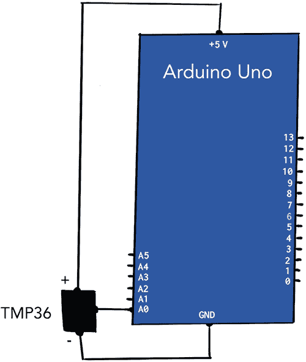

对于 TMP36 和其他类似模拟温度传感器，输出电压可以用来计算“真实”的温度值。TMP36 传感器的电压随温度线性增加——给定 TMP36 的电压读取值，可以通过将当前电压乘以 100 并减去 50 来获得摄氏温度。例如，如果传感器的输出电压为 0.7 V，

```
Temperature in Celsius = 0.7 V * 100 – 50 = 20
```

然而，要执行此计算，您需要将 ADC 10 位读取值转换回（近似）电压，并将算术运算放入您的代码中。为了使我们更方便，Johnny-Five 提供了`Thermometer`类，它支持多种不同类型的温度传感器。

##### 构建电路：TMP36 温度传感器


##### 你需要准备的东西


+   1 Arduino Uno 和 USB 线

+   1 TMP36 传感器

+   1 半尺寸面包板

+   红色（2）、黑色（2）和绿色（1）的跳线


TMP36 的电路如图 4.18 所示。图 4.18。使用红色和黑色跳线将 TMP36 连接到电源，然后使用绿色跳线将其输出（中间）引脚连接到 A0。

| |
| --- |

##### 不要将 TMP36 反向插入！

TMP36 传感器不喜欢被反向插入。确保你在将其放入电路时检查传感器的平面侧。在给电路施加电源后，触摸 TMP36 传感器。如果它摸起来不舒服地热——哎呀！立即断开电源并检查传感器的方向。

| |
| --- |

##### 图 4.18\. 连接 TMP36 传感器

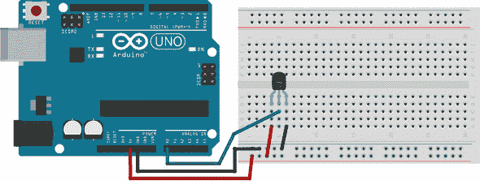

##### 记录和检查 TMP36 数据

实例化一个 `Thermometer` 对象类似于使用 `Sensor` 类，但它需要有关正在使用的温度传感器（控制器）的信息。以下列表展示了记录温度的简单示例。

##### 列表 4.8\. temperature.js

```
var five = require('johnny-five');
var board = new five.Board();

board.on('ready', () => {
  const tmp36 = new five.Thermometer({
    controller: 'TMP36',                     *1*
    pin: 'A0'                                *2*
  });
  tmp36.on('data', () => {
    console.log(tmp36.celsius);              *3*
  });
});
```

+   ***1* Thermometer 需要一个控制器参数——支持大约 15 种不同的温度传感器。**

+   ***2* 与 Sensor 类似，Thermometer 需要知道它所在的引脚。**

+   ***3* celsius、fahrenheit 和 kelvin 都是 Thermometer 实例的属性。**

##### 使用 Johnny-Five REPL 与组件交互

当 Johnny-Five 脚本运行时，你可以在终端窗口中与之交互。或者，你 *可以*，如果所有那些 `console.log` 东西没有滚动过去的话。有时 `console.log` 就是你所需要的，但为了更方便的调试或检查，而无需重新启动脚本或更改代码，你可以利用 Johnny-Five 的 REPL（读取-评估-打印循环）。

如果你从 temperature.js 中移除了 `console.log` 的 `data` 事件处理程序并执行了脚本，你会看到如下所示的内容。

##### 列表 4.9\. Johnny-Five 的 REPL

```
$ node temperature.js
1464614001498 Device(s) /dev/cu.usbmodem1421
1464614001506 Connected /dev/cu.usbmodem1421
1464614004970 Repl Initialized
>>
```

你可以在双箭头提示符处输入 JavaScript 表达式，然后按键盘上的 Enter 键——这是一个交互式提示符。也许你想查看 TMP36 温度传感器的华氏值，如下列表所示。

##### 列表 4.10\. 如果你想从 Johnny-Five 组件获取信息...？

```
>> tmp36.fahrenheit
ReferenceError: temp36 is not defined
    at repl:1:1
    at REPLServer.defaultEval (repl.js:264:27)
    at bound (domain.js:287:14)
    at REPLServer.runBound [as eval] (domain.js:300:12)
    at REPLServer.<anonymous> (repl.js:431:12)
    at emitOne (events.js:77:13)
    at REPLServer.emit (events.js:169:7)
    at REPLServer.Interface._onLine (readline.js:211:10)
    at REPLServer.Interface._line (readline.js:550:8)
    at REPLServer.Interface._ttyWrite (readline.js:827:14)
```

这并不是游戏结束；我们只是错过了一步。“注入”某物到 Johnny-Five 的 REPL 范围内需要我们明确指出。

在你的 Johnny-Five 脚本中，你可以选择性地将你希望在脚本运行时可用于检查或操作的项目注入到 REPL 中，如下一列表所示。

##### 列表 4.11\. 注入到 REPL 中

```
board.repl.inject({         *1*
  tmp36: tmp36,             *2*
  foo: 'bar'                *3*
});
```

+   ***1* 事物作为键值对注入到 REPL 中。**

+   ***2* 这使得 tmp36 对象引用可用（作为 tmp36）。**

+   ***3* 这使得字符串 'bar' 可作为 foo 使用。**

将字符串 `'bar'` 作为 `foo` 可用有点愚蠢，但重点是你可以从 REPL 内部使任何类型的值可用。然后你可以使用 REPL 作为与这些项目交互的控制台，如下列表所示。

##### 列表 4.12\. 修改 temperature.js 以使用 REPL 注入

```
var five = require('johnny-five');
var board = new five.Board();

board.on('ready', () => {
  const tmp36 = new five.Thermometer({
    controller: 'TMP36',
    pin: 'A0'
  });
  board.repl.inject({
    tmp36: tmp36
  });
});
```

现在，当你运行 `node temperature.js` 时，你将不会看到通过 `tmp36` 对象的数据记录，但一旦板子初始化完成，你将得到一个 REPL 提示符。然后你可以与 `tmp36` 对象交互。尝试输入以下内容：

```
>> tmp36.celsius
```

或者这样做：

```
>> tmp36.fahrenheit
```

这在调试或探索更复杂的组件时非常有用。

光敏电阻非常适合测量环境刺激的相对变化——它现在更亮，现在更暗，现在又亮了。TMP36 传感器非常适合测量作为固定单位的环境刺激——摄氏度或华氏度。两者都产生无限模拟分辨率的电压信号（至少在理论上是这样），可用于软件处理的值范围由微控制器的 ADC（在 Uno 的情况下为 10 位）定义。

然而，对于某些类型的环境感应，你不需要连续的值作为输入。对于这些类型的应用，你可以使用生成数字信号的组件。

### 4.2\. 数字输入

在 Uno 上，引脚 0 到 13 是数字引脚。每个引脚都可以配置为输入引脚或输出引脚。当配置为输入时，数字引脚可以根据存在的电压判断其处于高逻辑状态还是低逻辑状态。

按钮和一些开关是提供简单数字信号的组件的好例子，因为它们是二进制的。按钮要么被按下，要么没有被按下：它是开启还是关闭。这对应于数字输入引脚，其状态也是二进制的（低或高）。

#### 4.2.1\. 使用按钮作为数字输入

我们的挑战是构建一个电路，当按下按钮（也称为*瞬态开关*）时，正确地使数字引脚处于高状态，否则处于低状态。这样，我们的软件就可以确定何时按下按钮，并利用这些信息做些事情。

| |
| --- |

**按钮连接复习**

当按钮按下时，共享按钮一侧的引脚才电连接。但按钮另一侧的引脚始终电连接。

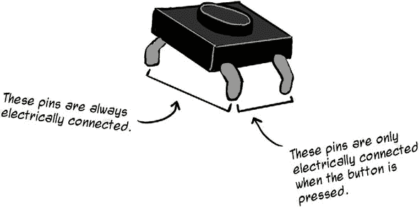

典型按钮的引脚连接

| |
| --- |

##### 理解逻辑电平

Arduino 的微控制器根据读取时引脚上的电压确定给定的数字输入引脚是高还是低。正如你所预期的，在 Uno 的情况下，输入引脚上的 5 V 将使其逻辑上为高，而 0 V 使其逻辑上为低。然而，这里有一些你需要知道的细微差别，因为它将影响按钮电路的设计。

假设你在 Arduino 上有一个配置好的数字输入引脚，但还没有连接任何东西。如果你读取它的值，你期望引脚处于什么状态？结果，这是不可能预测的。可能是高，可能是低。如果你长时间读取，你会看到随机的高和低。这种未连接的行为被称为*浮动*。

| |
| --- |

**电压和逻辑电平**

数字引脚不需要精确的 5 V 电压来读取 HIGH。同样，低电压，比如 0.8 V，将导致逻辑 LOW。每个微控制器都有一组电压范围，这些范围会导致 LOW 状态或 HIGH 状态，以及中间的*噪声边缘*。

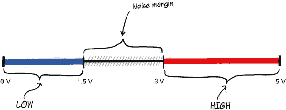

Arduino Uno 引脚上逻辑状态的电压范围。任何低于 1.5 V 的电压都是 LOW；任何高于 3 V 的电压都是 HIGH。介于 1.5 V 和 3 V 之间的电压处于噪声边缘，应避免使用。

对于 Arduino Uno 的 ATmega 328P，大约 0–1.5 V 的输入电压将导致 LOW 状态，而高于 3 V 的电压将读取 HIGH。


这是因为引脚的*高阻抗*，只需极小的电流就可以将引脚在逻辑电平之间移动。这是一件有用且高效的事情——引脚可以在不浪费大量电流的情况下检测连接组件的变化。然而，来自环境中的电气噪声或同一微控制器上其他引脚的干扰通常足以使引脚在 LOW 和 HIGH 之间随机切换。

##### 使用下拉电阻连接按钮


##### 你需要准备的东西


+   1 个 Arduino Uno 和 USB 线

+   1 个按钮

+   1 个 10 kΩ电阻

+   4 根跳线

+   1 个半尺寸面包板


我们需要做的是构建一个安全的电路（一个没有短路风险的电路），当按钮未按下时，它能够建立一个可靠的“默认”逻辑电平——LOW 或 HIGH，但不会随机波动。实现这一点的其中一种方法是通过额外的电阻将输入引脚拉至地（0 V）。

当电路中存在*下拉电阻*时，引脚 2 和地之间始终存在连接，即使按钮未按下（图 4.19）。

##### 图 4.19\. 当组件（按钮）未被按下（连接）时，下拉电阻将数字引脚拉至逻辑 LOW。


这解决了浮空问题——如果按钮未按下时出现任何意外的杂散电流，它将通过电阻（图 4.19 的左侧）流向地。当按钮未按下时，引脚 2 将连续读取 LOW（0 V）。

当按钮被按下时（图 4.19 的右侧），电流以 5 V 的电压通过按钮，然后流入引脚 2 和地——引脚 2 将读取 HIGH。下拉电阻在这里还扮演另一个角色：它防止按钮按下时的短路，限制流过的电流。


**伪装成电流分压器**

当在电路中使用下拉电阻时，你实际上是在创建一个电流分压器，尽管这并不立即明显。记得从第三章中，电流分压是并联电路（图中的电路是并联电路，因为有一个以上的路径供单个电荷通过）的特性。当有多个路径可供选择时，电流将根据每条路径的电阻成比例地分裂。

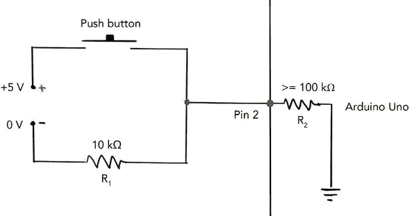

使用下拉电阻与输入引脚结合实际上创建了一个电流分压器。

在内部，当引脚配置为输入（高阻抗状态）时，微控制器引脚电路包括一个高电阻（大约 100 kV 到几个兆欧姆）的电阻。这个内部电阻将扮演 R[2]的角色。对于 R[1]，我们有 10 kV 的下拉电阻——高电阻，但比内部电阻（R[2]）低一个数量级。

当电流通过电路（按钮被按下）时，大部分电流将通过 10 kV（R[1]）电阻的路径，而不是内部电阻（R[2]）的路径。

在电流分压器中，每条路径得到不同的电流分配，但两者得到相同的电压。到达引脚 2 的那一小部分电流在或接近 5 V，这将使引脚设置为 HIGH。


最终的接线图（图 4.20）并不复杂。请按照所示在面包板上连接按钮，确保在引脚 2 和地之间连接一个 10 kV 电阻。

##### 图 4.20\. 带有 10 kV 下拉电阻的按钮电路

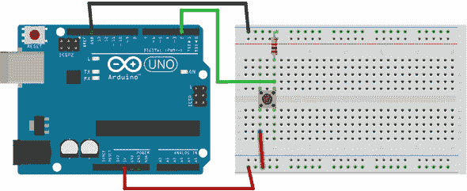

##### Johnny-Five 的按钮类

Johnny-Five 的`Button`类负责配置数字输出引脚，并提供你希望在按钮中拥有的几个功能，包括监听按钮按下的能力，如下一列表所示。

##### 列表 4.13\. button.js

```
const five = require('johnny-five');
const board = new five.Board();

board.on('ready', () => {
  const pushButton = new five.Button(2);
  pushButton.on('down', () => {
    console.log('I have been pressed!');
  });
});
```

尝试运行列表 4.13 中的代码。将你的 Arduino 连接到 USB 电源并运行脚本：

```
$ node button.js
```

一旦初始化了板子，每次按下按钮，你应该看到这个：

```
>> I have been pressed!
```

在本章中，你看到了几种基本输入的类型：两种类型的模拟传感器和带有按钮的数字输入。输入和传感器对于收集有关物理环境的信息至关重要，但当你实际上使用这些信息时，这会变得相当有趣——当你创建输出时。这就是你接下来将要做的。

### 概述

+   模拟传感器生成具有（理论上）无限分辨率的电压信号，微控制器使用模数转换（ADC）将此信号转换为数字值等效。

+   Arduino Uno 有六个模拟输入引脚，提供 10 位 ADC（1024 个值）。它的 14 个数字引脚可以配置为输入或输出，并具有二进制逻辑电平：LOW 或 HIGH。

+   串联电路中的每个元件都会接收到相同数量的电流，但电压是根据元件的电阻比例分配的。*分压器*利用这一原理将较高的输入电压转换为较低的输出电压，通过串联两个电阻来实现。

+   分压器电路在参考点处创建一个可以检测电阻变化作为电压变化的点。这种方法可以用来读取光敏电阻等电阻传感器的数据。

+   Johnny-Five 或等效的更高级 JavaScript 框架中的 `Sensor`、`Thermometer` 和 `Button` 类可以通过抽象掉引脚配置和繁琐的计算，并提供相关事件来绑定，从而增加便利性。

+   并联电路中的每个分支都会接收到相同的电压，但电流是根据分支的电阻比例分配的。*电流分压器*通过使用并联电阻来应用这一原理。

+   使用下拉电阻是避免在数字输入断开或未活动时出现不确定逻辑电平浮动状态的一种方法。

## 第五章\. 输出：让事物发生

*本章涵盖*

+   掌握更高级的 LED 控制技术——动画 LED 和使用全色 RGB LED

+   使用脉冲宽度调制（PWM）支持使数字输出信号表现得更像模拟输出信号

+   JavaScript 中位运算和二进制操作的基础

+   集成第三方天气 API 以创建多色 LED “天气球”装置

+   使用 Johnny-Five 和 Uno 连接和控制并行 LCD 模块

+   结合多个输入和输出组件构建高级计时器设备

+   使用压电元件和 Johnny-Five 制作噪音和播放曲调

现在是时候做一些嘈杂的、明亮的、闪烁的或富有表现力的东西了。你已经尝试了一些基本的 LED 技巧，但现在我们将更全面地探讨一些可以将*输出*集成到项目中的方法。


**对于本章，你需要以下物品：**

+   Arduino Uno 和 USB 线

+   2 个标准 LED，任何颜色

+   1 个光敏电阻

+   1 个共阴极 RGB LED

+   3 个按钮

+   1 个 16x2 并行 LCD 模块

+   1 个旋转电位器

+   1 个压电元件

+   3 个 10 kΩ 电阻

+   2 个 220 V 电阻

+   23 根不同颜色的跳线

+   1 个半尺寸面包板

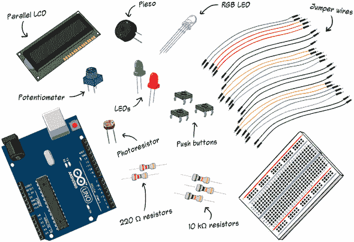


### 5.1\. 点亮事物

LED 似乎能做很多不仅仅是开启或关闭的技巧。如果你看看你自己的电子设备中嵌入的电子元件，你会看到它们在闪烁或淡出。你可能甚至看到它们改变颜色。

这些常见的 LED 行为在技术上实际上是错觉（图 5.1）。LED 只能发射一种波长的光——它只能是一种颜色。然而，我们周围的 LED 确实*看起来*会变暗或呈现不同的色调。

##### 图 5.1\. LED 发射单一颜色，要么开启要么关闭。


是时候成为一个 LED 魔术师了——我们可以利用一种电子技术来使 LED 具有深度和吸引力。

#### 5.1.1\. 使用脉冲宽度调制（PWM）淡出 LED

好吧，所以一个 LED 在任何时刻只能处于开启或关闭状态。你已经让它闪烁了一次，这实际上只是一个周期性的开启和关闭。我们将使闪烁更加复杂，目的是欺骗人的眼睛。

| |
| --- |

##### 你需要什么


+   1 Arduino Uno 和 USB 线

+   1 个面包板

+   2 个标准 LED，任何你喜欢的颜色

+   2 220 V 电阻

+   黄色（2）和黑色（1）跳线

| |
| --- |

首先，构建图 5.2 中所示的电路。接下来，创建一个文件并添加以下列表中的代码。

##### 列表 5.1\. experiment-led.js

```
const five = require('johnny-five');
const board = new five.Board();

board.on('ready', () => {
  const led1 = new five.Led(2);         *1*
  const led2 = new five.Led(3);         *2*

  board.repl.inject({
    led1: led1,                         *3*
    led2: led2
  });
});
```

+   ***1* 在引脚 2 上实例化一个 Led 对象**

+   ***2* 在引脚 3 上实例化一个 Led 对象**

+   ***3* 将 Led 对象实例注入到 REPL 中**

##### 图 5.2\. LED 实验的接线图

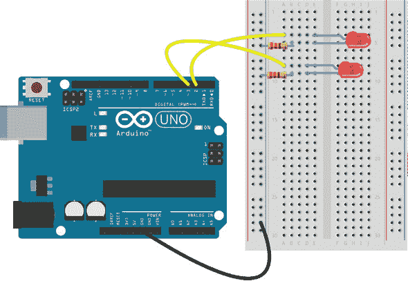

这段代码实际上并没有做什么。它创建了两个`Led`对象，并将它们作为`led1`和`led2`在 Johnny-Five 的 REPL 中可用。运行脚本：

```
$ node experiment-LED.js
```

一旦启动并运行，你将能够在 REPL 提示符处输入命令。首先——我知道这是我们之前已经走过的领域——让其中一个 LED 闪烁。在 REPL 提示符处输入以下内容并按 Enter 键：

```
>> led1.blink()
```

第一个 LED 现在应该以 100 毫秒的周期闪烁（亮 100 毫秒，灭 100 毫秒）——这是`blink`方法的默认相位长度（闪烁周期的速度），如果你不告诉它其他的话。

现在，我想让你用一只手小心地拿起 Arduino 和带有 LED 的面包板，在面前挥动。当你挥动得足够疯狂时，你会知道 LED 看起来不再闪烁，而是一条模糊的线条。

你在欺骗自己的眼睛。当事物移动得太快时，你的眼睛和大脑无法跟上。实际上，你的大脑为你连接点，并决定你看到的是一串连续的光线。如果你是摄影师，你可以把它想象成类似于快门速度——你自己的“快门速度”不够快，结果就是运动模糊。这就是为什么电影和电影可以在每秒 24 帧左右看起来流畅。

对于单个闪烁的检测也是如此。如果灯光闪烁得足够快，人类将完全看不到闪烁（图 5.3）。不同的人有不同的感知阈值——这解释了为什么我在老式的荧光灯或慢刷新频率的 CRT 周围会变得疯狂地暴躁，而我的同事们却一点也不在意。但每个人在约 100 Hz（每秒一百个周期）时都会可靠地失去分辨单个闪烁的能力。

##### 图 5.3\. 当 LED 快速移动时，我们失去了分辨单个闪烁的能力。

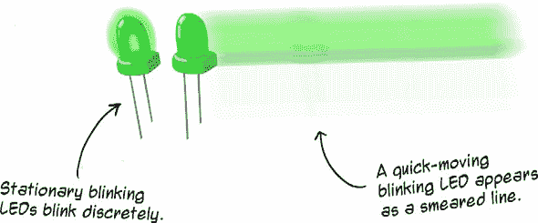

那么，让 LED 如此快速闪烁以至于闪烁变得不可见，看起来它似乎总是亮着的意义何在？我们难道不能只是*稳定地打开 LED*来达到同样的效果吗？

如果你玩弄 LED 开启（相对于关闭）的时间比例，会发生有趣的事情。如果你非常快地闪烁 LED，人类将无法感知到闪烁——我们已经讨论过这一点。但如果 LED 只有四分之一的时间开启（其余的三分之三是关闭的），它也会显得相当暗。


**让它停止！**

如果闪烁的 LED 让你感到烦躁，你可以始终使用`Led.stop`实例方法来停止闪烁：

```
> led1.stop()
```

根据命令发出的时间，结果可能是一个关闭的 LED 或一个稳定开启的 LED。如果 LED 是开启的，而你想要它关闭，使用这个：

```
> led1.off()
```

你需要使用这两种方法——你不能跳过`off`方法。`stop`将清除导致闪烁发生的间隔——`off`不会。

| |
| --- |

让我们实现这一点。尝试（在 REPL 中再次尝试）：

```
>> led1.on()
>> led2.brightness(64)
```

`brightness`是 Johnny-Five `Led`对象上的一个实例方法，它接受一个 8 位值（0–255）。因此，64 的值是可能最亮值的四分之一。`led2.brightness(64)`调用结果就是 LED 有 75%的时间是关闭的，25%的时间是点亮的。所有这些开启和关闭操作都在人眼无法察觉的频率下进行。你会注意到`led2`现在看起来比`led1`暗，它更暗。

Uno 的微控制器在这里提供帮助。它为一种称为*脉冲宽度调制*（PWM）的技术提供硬件支持，这种技术比软件能轻易提供的开关操作更快。PWM 信号高电平（开启）的时间百分比称为*占空比*。一个四分之一时间高电平的输出被认为具有 25%的占空比（图 5.4）。

##### 图 5.4\. 25%占空比

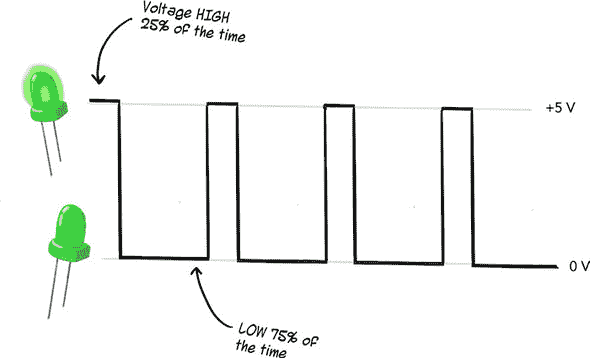

PWM 硬件支持很常见，因为它非常有用，但支持情况因板而异，通常仅在特定引脚上可用。Arduino Uno 就是这样。PWM 仅在引脚 3、5、6、9、10 和 11 上可用。

不要担心，你不必记住这一点。如果你看看你的 Arduino，你会看到那些引脚编号旁边都印有波浪号（`~`）(图 5.5)。这表示在该引脚上支持 PWM。

##### 图 5.5\. 只有 Arduino Uno 的一些数字引脚支持 PWM。它们被标记为`~`。

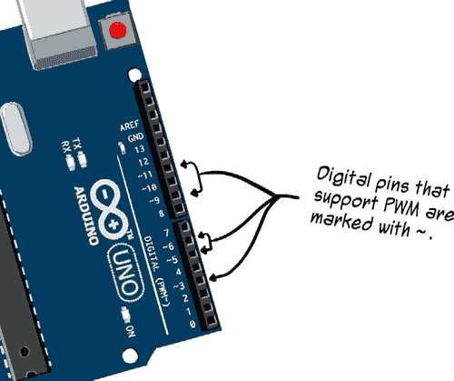

现在，回到 REPL 中，尝试这个：

```
>> led1.brightness(64)
```

这将不起作用。你会得到一个异常，开头可能是

```
Error: Pin Error: 2 is not a valid PWM pin (Led)
```

这就是 Johnny-Five 和`firmata`——软件包括了哪些引脚在哪些板上做什么的映射。

好的，我们在这次探索中已经看了很多东西。如果闪烁真的很快，人们无法分辨。将信号的占空比改变到 LED 中会使它的亮度看起来在变化。最后一件事，然后我们将用这个知识做点什么。

| |
| --- |

##### 一定要使用支持 PWM 功能的引脚来处理需要 PWM 功能的特性

类似于`brightness`和其他你将在`Led`实例上需要的几个方法，需要组件连接到一个支持 PWM 的引脚。如果你尝试在一个不支持 PWM 的引脚上调用需要 PWM 的方法，Johnny-Five 会抛出一个错误。在设计电路时，考虑到哪些引脚支持 PWM 是一个好主意，这样可以节省时间和避免头疼。

| |
| --- |

在 REPL 中尝试以下操作：

```
>> led1.on()
>> led2.brightness(128)
```

`128`正好位于亮度范围的中间，所以你可能预期这两个 JavaScript 表达式会导致第二个 LED 的亮度是第一个 LED 的一半，而第一个 LED 是全亮。但除非你眯着眼睛看，两个 LED 看起来几乎一样。你可能能够看到一点点的区别，但并不多。

这是因为亮度更重要。`brightness(128)`确实会导致占空比为 50%——LED 只有一半时间处于开启状态——但大脑会偏向于亮度。换句话说，Johnny-Five 的 8 位亮度范围 0-255 看起来是非线性的，这完全是由于人类感知的原因。

#### 5.1.2\. 使用 PWM 动画化 LED

现在你已经知道如何打开或关闭 LED，闪烁它，并且假设它连接到一个支持 PWM 的引脚，你可以设置其亮度。为了补充这些小技巧，你还可以*动画化*LED 的亮度，使其看起来像脉冲、弹跳、呼吸或慢慢入睡——你的想象力是无限的。

Johnny-Five 包含一个`Animation`类，它提供了对 LED 亮度动画和伺服电机运动的精细控制（我们将在第六章中介绍伺服电机 chapter 6）。

在 Johnny-Five 中处理动画涉及几个步骤，如下一个列表所示。

##### 列表 5.2\. 在 Johnny-Five 中动画化组件的步骤

```
const pulsingLED = new five.Led(3);
const options    = { /* animation details */ };          *1*
const animation  = new five.Animation(pulsingLED);       *2*
animation.enqueue(options);                              *3*
```

+   ***1* 创建一个包含动画详细信息的选项对象——稍后将有更多介绍**

+   ***2* 实例化一个 Animation 对象，并传递一个目标组件——目标将被动画化**

+   ***3* 使用 enqueue 开始动画**

让我们通过让 LED 看起来像*脉冲*来试一试。Johnny-Five 需要我们首先定义动画应该如何表现。

闪烁的 LED 应该使用吸引式缓动循环淡入淡出。*缓动函数*是在动画持续期间改变动画速率的函数。例如，一个*缓动结束*的动画开始时移动得很快，但随着时间的推移会变慢。

缓动函数通常是非线性函数，将正弦、立方、指数和其他曲线整合到方程中。in-out-sine 缓动创建的动画节奏类似于 图 5.6 中所示。缓动函数可以使动画更加逼真或赋予它不同的运动特性。当然，LED 不动，但它们亮度的变化确实可以被动画化。

##### 图 5.6\. `inOutSine` 是 Johnny-Five 通过其对 `ease-component` npm 包的依赖而提供的几十个缓动函数选项之一。

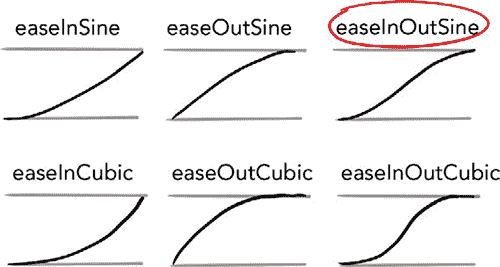

`inOutSine` 缓动是我们用于脉冲的，因为亮度变化开始时较慢，然后在 LED 亮起中途加速。脉冲是一种 *节拍器* 动画，这意味着一旦动画向前运行，它应该然后反向运行，在其起点和终点之间来回 *循环*。

我们还需要通过定义 *关键帧* (图 5.7) 来告诉动画它在什么之间进行缓动。关键帧定义了动画应在其中填充中间帧的特定状态（如静止帧）。在关键帧之间创建这些中间帧或状态的过程称为 *插值*。对于这个简单的脉冲，关键帧很简单：完全关闭（亮度 0）和完全开启（亮度 255）。

##### 图 5.7\. 脉冲动画将以节拍器的方式在两个基本关键帧（亮度 0 和亮度 255）之间循环，使用 `inOutSine` 缓动。

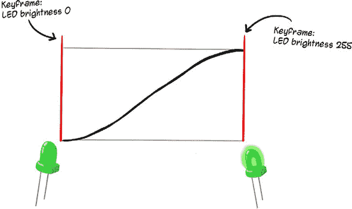

最后，我们需要给动画一个 *持续时间*，以毫秒为单位。动画的每个部分——从暗到亮或从亮到暗——应该持续一秒钟。组合起来，动画选项看起来像以下代码。

##### 列表 5.3\. 脉冲动画选项

```
const options = {
  easing    : 'inOutSine',
  metronomic: true,
  loop      : true,
  keyFrames : [0, 255],
  duration  : 1000
};
```

让我们看看这会是什么样子，好吗？你可以使用上一组实验中的电路来完成这部分（你不会使用第一个 LED）。创建一个名为 animate-LED.js 的新文件。将 experiment-LED.js 中的内容粘贴到 animate-LED.js 中作为起点，并编辑代码以在引脚 3 上创建一个单独的 LED。在脉冲 `Led` 对象实例化之后添加 `options` 对象，如下所示。

##### 列表 5.4\. animate-led.js

```
const five  = require('johnny-five');
const board = new five.Board();

board.on('ready', () => {
  const pulsingLED = new five.Led(3);
  const options = {
    easing    : 'inOutSine',
    metronomic: true,
    loop      : true,
    keyFrames : [0, 255],
    duration  : 1000
  };
  // ...
});
```

下一步是步骤 2 和 3：创建一个 `Animation` 对象并使用 `enqueue` 使其运行。

##### 列表 5.5\. 动画实例化和入队

```
const five  = require('johnny-five');
const board = new five.Board();

board.on('ready', () => {
  const pulsingLED = new five.Led(3);
  const options = {
    easing    : 'inOutSine',
    metronomic: true,
    loop      : true,
    keyFrames : [0, 255],
    duration  : 1000
  };
  const animation = new five.Animation(pulsingLED);        *1*
  animation.enqueue(options);                              *2*
});
```

+   ***1* 传递目标——要动画化的东西。在这种情况下，LED（pulsingLED）。**

+   ***2* 将动画入队并传递动画选项。**

现在运行脚本：

```
$ node animate-LED.js
```

就这样了。嗯，差不多吧。我让你用困难的方式做了，因为实际上，以下列表中的代码做的是同样的事情。

##### 列表 5.6\. 更简单的方式来脉冲 LED

```
const five = require('johnny-five');
const board = new five.Board();

board.on('ready', () => {
  const pulsingLED = new five.Led(3);
  pulsingLED.pulse(1000);                 *1*
});
```

+   ***1* `Led.prototype.pulse` 接受一个以毫秒为单位的持续时间（默认 1000）。**

在下面，`pulse`的实现与我们之前所做的是相似的，但它如此常见，以至于它被简化为 Johnny-Five 用户的方法。

闪烁 LED 可以是一种在不那么侵入性的情况下吸引注意力的好方法。使用我们所学的内容，你可以用几行代码制作一个简单的定时器——当时间到了，它就会开始闪烁，如下面的列表所示。

##### 列表 5.7\. 世界上最简单的定时器

```
const five = require('johnny-five');
const board = new five.Board();

board.on('ready', () => {
  const pulsingLED = new five.Led(3);
  const timerLength = 10000;              *1*
  setTimeout(() => {                      *2*
    pulsingLED.pulse();
  }, timerLength);
});
```

+   ***1* 定义定时器长度（以毫秒为单位，这里为 10 秒）**

+   ***2* 设置超时，在 10 秒后开始闪烁 LED**

当然，这个定时器用途有限。你不能改变定时器的长度或开始时间，也不能启动一个新的定时器。别担心；我们很快就会让它变得更好。

#### 5.1.3\. 结合输入和 LED 输出

当然，如果输出是对某种有意义输入的响应，那么输出更有趣。输入和输出之间的连接是使物联网运转的原因。

其中一种耦合可以是光敏电阻和 LED 来创建亮度感知的夜灯。当光敏电阻的读数较低时，LED 可以更亮——也就是说，“夜灯”在“夜晚”变暗时打开。


##### 你需要


+   1 Arduino Uno 和 USB 线

+   1 标准 LED，任何颜色（你可以重复使用上面的闪烁 LED）

+   1 光敏电阻

+   1 10 kV 电阻

+   1 220 V 电阻

+   黄色（1）、红色（2）、绿色（1）和黑色（1）跳线

+   1 半尺寸面包板


将 LED 连接到面包板上的 3 号引脚（上一个例子中的闪烁 LED），但移除另一个 LED，并添加一个光敏电阻和一个 10 kV 电阻，如图 5.8 所示。

##### 图 5.8\. 自动夜灯的接线图

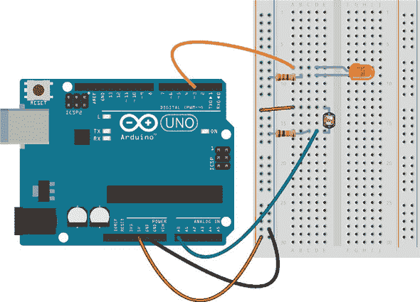

列表 5.8 展示了使用`Light`类（Johnny-Five 中用于处理光敏电阻的功能）制作光敏感夜灯的第一次尝试，`ldr`代表*光敏电阻*，是光敏电阻的另一种称呼。

##### 列表 5.8\. 一个简单的夜灯

```
const five  = require('johnny-five');
const board = new five.Board();

board.on('ready', () => {
  const nightlight = new five.Led(3);
  const ldr        = new five.Light({ pin : 'A0', freq: 500 });      *1*
  ldr.on('change', () => {
    nightlight.brightness((ldr.value >> 2) ^ 255);                   *2*
  });
});
```

+   ***1* 每秒检查两次光强度（每 500 毫秒，freq 的值）应该绰绰有余。**

+   ***2* 将 LED 亮度设置为光敏电阻值的“相反”**

如果你没有花很多时间在位运算符的世界里，以下这一行可能会让你感到眼花缭乱：

```
nightlight.brightness((photoresistor.value >> 2) ^ 255);
```

回想一下，Arduino Uno 的微控制器提供 10 位整数的 ADC 读数（0–1023）。同时，`Led`对象上的`brightness`方法期望一个 8 位数字（0–255）。

表达式`photoresistor.value >> 2`将`photoresistor.value`向右移动两位。这意味着两个位从数字的右侧弹出，并且再也没有被听到过（图 5.9）。在`photoresistor.value >> 2`的情况下，进入的是一个 10 位数字，它的两个最低有效位被踢出去，返回的是一个 8 位数字。

##### 图 5.9\. 将 10 位数字向右移动 2 位得到 8 位数字。

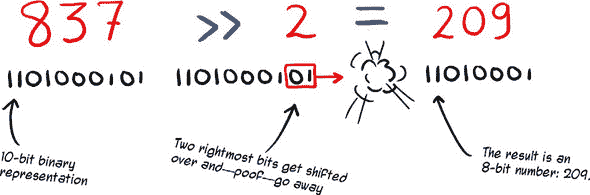

您可以将 10 位数字视为对于 8 位输入过于精确；右移 2 位“四舍五入”到`brightness`可以使用的一个较低分辨率。

`^ 255`部分使用位运算的`XOR`（异或）运算符（`^`）来获取我所说的“相反”的 8 位数字，即左操作数的相反数。`XOR`在每一对位上进行比较，并且仅在评估的位不同时（一个为`1`，一个为`0`）在数字位返回`1`（图 5.10）。

##### 图 5.10\. XOR 运算比较每个二进制位，如果二进制位不同则产生 1。

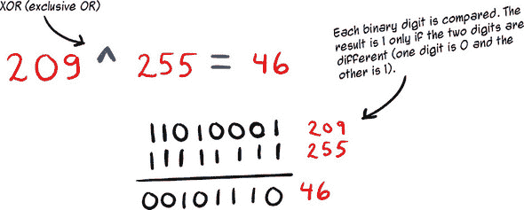

表达式`(photoresistor.value >> 2) ^ 255`的意思是，首先将`photoresistor.value`右移 2 位（使其成为 8 位数字），然后`XOR`操作与 255 的结果。


##### 各处进行位移动

对于通常在高层次代码中工作的软件开发者来说，位移动和位运算可能感觉陌生，但在与硬件一起工作时却无处不在。Mozilla 开发者网络有一个很好的 JavaScript 位运算符参考，其中包含了您想要了解的关键内容（[`mng.bz/CLvy`](http://mng.bz/CLvy)）。


夜灯的第一版有一些不足之处，您可以通过运行它来看到：

```
$ node nightlight.js
```

首先，LED 灯总是以某种亮度亮着，即使光电电阻器的读数接近可能的最亮值。我们难道不希望 LED 只在变暗时才亮吗？在晴朗的日子里我们不需要它亮着。夜灯代码的第二版通过替换`change`回调函数内部的实现来解决这个问题，如下所示。

##### 列表 5.9\. 略微改进的夜灯

```
ldr.on('change', () => {
  if (ldr.level < 0.5) {                                  *1*
    nightlight.brightness((ldr.value >> 1) ^ 255);        *2*
  } else {
    nightlight.off();                                     *3*
  }
});
```

+   ***1* 灯实例有一个电平值，这是一个介于 0.0 和 1.0 之间的百分比。**

+   ***2* 改变了 LED 亮度的计算**

+   ***3* 当电平 >= 0.5 时，LED 关闭**

在这个变体中，如果光电电阻器的`level`大于或等于`0.5`（`nightlight.off()`），LED 将完全关闭。

如果`photoresistor.level`小于`0.5`（50%），我们知道它的 10 位`value`也必须小于 512（因为 511 是可能的 10 位值范围 0–1023 的中点）。这意味着`photoresistor.value`是一个介于 0 到 511 之间的整数（包括 0 和 511）。这意味着我们只需要右移一位就可以将`value`转换为 8 位数字（0–255）。

最终结果是，随着光电电阻器值从 511 减小到 0，LED 的亮度会逐渐增加。

但我们仍然可以做得更好。正如你在第四章中看到的，即使选择光电电阻电路电压分压器最佳可能的电阻值，你也不会得到从 0 到 5 V 的完整电压范围。如果夜灯能够根据它实际遇到的条件和读数进行校准，那就更好了，如下一列表所示。

##### 列表 5.10\. 自校准夜灯

```
const five  = require('johnny-five');
const board = new five.Board();

board.on('ready', () => {
  const nightlight = new five.Led(3);
  const ldr        = new five.Light({ pin : 'A0', freq: 500 });
  var dimmest = 1024,                                                          *1*
    brightest = 0;
  ldr.on('change', () => {
    if (ldr.value < dimmest)   { dimmest   = ldr.value; }                      *2*
    if (ldr.value > brightest) { brightest = ldr.value; }

    const relativeValue = five.Fn.scale(ldr.value, dimmest, brightest, 0, 511);*3*
    if (relativeValue <= 255) {
      nightlight.brightness((relativeValue >> 1) ^ 255);
    } else {
      nightlight.off();
    }
  });
});
```

+   ***1* 记录它看到的最低和最高读数**

+   ***2* 如果遇到较低和较高的值，则更新最低和最高值**

+   ***3* 将当前值缩放到最低和最高读数之间的 9 位数字**

列表 5.10 中的夜灯代码进行了两项更改。一是它记录了夜灯脚本生命周期中看到的最低和最高实际值。然后它利用`Board`实例上的`Fn`对象可用的`scale`实用方法。

`scale(value, fromLow, fromHigh, toLow, toHigh)`函数接受一个`value`，该值当前存在于`fromLow`和`fromHigh`（最暗和最亮的值）之间的范围内，并将其重新映射到`toLow`和`toHigh`（`0`和`511`）之间的范围，成比例地。

最终得到的数字将是一个 9 位数字（介于 0 和 511 之间）。现在我们可以继续进行，知道值`<= 255`位于观察到的值的下半部分。夜灯将在运行过程中继续调整自己（校准高低）。

#### 5.1.4\. 使用 RGB LED 实现全彩

好吧，这是对调暗 LED 的广泛覆盖，但那些似乎会改变颜色的 LED 呢？当然，单个 LED 只能始终是单一颜色——一个波长——但如果你在单个包装中将红色、绿色和蓝色 LED 组合在一起，并控制每个组件 LED 的亮度（占空比），*哇*！就能得到彩虹的所有颜色。

RGB LED 有四条腿。每条腿对应一个 LED（红色、绿色、蓝色）。第四条腿是阴极或阳极。常见的阴极 RGB LED——其中三个颜色 LED 共享一个单独的阴极腿——是我们将要使用的类型（图 5.11）。也有共享*阳极*腿的常见阳极 RGB LED。

##### 图 5.11\. 常见的阴极 RGB LED 在一个包装中包含三个组件 LED（红色、绿色、蓝色）。最长的腿是共享的阴极。

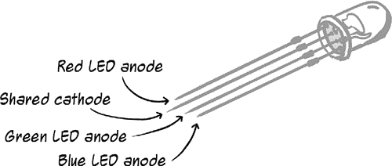

与普通 LED 一样，RGB LED 允许你使用 PWM 控制亮度，但现在有三个 LED 代表光的基本颜色。对于常见的阴极 LED，组件颜色 LED 的较高占空比会使该颜色更亮，而较低的占空比会使它变暗。

#### 5.1.5\. 制作你自己的“天气球”

我在俄勒冈州的波特兰长大，当我还是个孩子的时候，看到标准保险公司大厦顶部的天气球总是有点兴奋。天气球提供了对未来 24 小时左右天气预报的基本编码视觉表示。这个安装在杆上的天气球足够大，可以在整个城市中看到，它被灯光覆盖。

它只有六种可能的状态。预测的温度趋势由颜色表示：红色表示预计会变暖，白色表示变冷，绿色表示保持不变。如果预计会有降水，它会闪烁。简单，但非常清晰和有用。让我们做一个。


##### 您需要准备的东西


+   Arduino Uno 和 USB 线

+   1 个共阴极 RGB LED

+   1 220 V 电阻

+   红色（1）、绿色（1）、蓝色（1）和黑色（1）跳线

+   1 个面包板


按照图 5.12 所示连接 RGB LED 电路。

##### 图 5.12\. 天气球的接线图

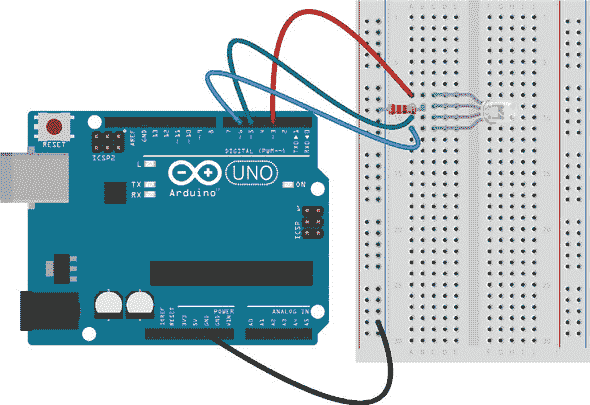

现在我们需要天气预报！Dark Sky 服务提供天气预报 API，在撰写本文时，每天最多提供 1,000 次免费查询结果。您需要注册一个 API 密钥，您可以在[`darksky.net/dev/register`](https://darksky.net/dev/register)进行注册。您可能需要提供信用卡号码来注册服务。

一旦您有了开发者 API 密钥，请将其写下并保存在一个相对安全的地方。您还需要您的纬度和经度，您可以在[`mygeoposition.com/`](http://mygeoposition.com/)找到它们。

创建一个名为 weatherBall.js 的新文件。首先，让我们收集一些天气球设置，如下所示。

##### 列表 5.11\. 天气球的设置

```
const API_KEY = 'YOUR API KEY HERE';
const LAT     = '43.3463760';                           *1*
const LONG    = '-72.6395340';
const API_URL = 'https://api.darksky.net/forecast';     *2*
```

+   ***1* 我在佛蒙特州。将 LAT 和 LONG 值更改为您自己的位置。**

+   ***2* 您不需要更改此 URL。**

是时候处理我们的依赖项了：

```
$ npm install johnny-five request
```

我们将使用`request`包来调用 Dark Sky 的 API。在文件顶部添加`requires`，然后使用 Johnny-Five 实例化一个板。注意，在下一个列表中，Johnny-Five 为 RGB LED 提供了一个特殊的`Led`组件类：`Led.RGB`。

##### 列表 5.12\. 实例化一个板

```
const five  = require('johnny-five');
const request = require('request');
// SETTINGS AS BEFORE

var board = new five.Board();
board.on('ready', () => {
  console.log('Powered by Dark Sky: https://darksky.net/poweredby/');
  const rgb = new five.Led.RGB({ pins: [3, 5, 6] });
  // Make request to API
});
```

接下来，我们需要通过在下一个列表中请求 Dark Sky API 的数据来获取一些关于预报的信息。

##### 列表 5.13\. 从 Dark Sky API 请求数据

```
//...
board.on('ready', () => {
  console.log('Powered by Dark Sky: https://darksky.net/poweredby/');
  const rgb        = new five.Led.RGB({ pins: [3, 5, 6] });
  const requestURL = `${API_URL}/${API_KEY}/${LAT},${LONG}`;         *1*

  request(requestURL, function (error, response, body) {
    if (error) {
      console.error(error);
    } else if (response.statusCode === 200) {                        *2*
      const forecast   = JSON.parse(body);                           *3*
      console.log(forecast);                                         *4*
    }
  });
});
```

+   ***1* 组合请求 URL**

+   ***2* 如果响应返回 OK...**

+   ***3* 将响应体解析为 JSON**

+   ***4* 将预报对象记录到 REPL**

假设一切顺利，您现在将有一些数据可以处理。让我们按照以下列表让天气球动起来。

##### 列表 5.14\. 让天气球动起来

```
request(requestURL, function (error, response, body) {
  if (error) {
    console.error(error);
  } else if (response.statusCode === 200) {
    const forecast   = JSON.parse(body);
    const daily      = forecast.daily.data;                                *1*
    const willBeDamp = daily[1].precipProbability > 0.2;                   *2*
    const tempDelta  = daily[1].temperatureMax - daily[0].temperatureMax;  *3*
    console.log(forecast);

    if (tempDelta > 4) {                                                   *4*
      rgb.color('#ff0000'); // warmer
    } else if (tempDelta < -4) {
      rgb.color('#ffffff'); // colder
    } else {
      rgb.color('#00ff00'); // about the same
    }
    if (willBeDamp) { rgb.strobe(1000); }                                  *5*
  }
});
```

+   ***1* daily.data 是一个包含七个预报元素的数组。**

+   ***2* daily[1]是明天。有可能下雨吗？**

+   ***3* daily[0]是今天。温度变化了多少？**

+   ***4* 根据温度变化设置 RGB LED 的颜色**

+   ***5* 闪烁与闪烁相同——闪烁是闪烁的别名。**


**电路故障排除**

为了最大灵活性，与 Johnny-Five 组件对象实例上的颜色相关的方法——在这种情况下，最重要的是 `Led.prototype.color`——接受几种不同的颜色格式，如下所示：

+   ***十六进制（字符串）**—** 对于网络开发者来说很熟悉，RGB 十六进制值如 `"#00ff00"`（亮绿色）可以用来。它可以在或没有前导 `#` 的情况下使用。

+   ***CSS 颜色名称（字符串）**—** “red” 或 “darksalmon” 或 “lemonchiffon” 或任何其他有效的 CSS 颜色名称都适用。

+   ***R、G、B 值数组（数组）**—** 数组的每个元素都应是一个 8 位值，例如 `[0x00, 0xff, 0x00]` 或 `[0, 255, 0]`。

+   ***RGB 值对象（对象）**—** 再次，应使用 8 位值，例如 `{ red: 0x00, green: 0xff, blue: 0x00}`

在 [`johnny-five.io/api/led.rgb/`](http://johnny-five.io/api/led.rgb/) 上了解最新信息。


现在运行你的天气球：

```
$ node weatherBall.js
```

我们在前面示例中使用的传感器和输出只需要几根线，并且连接简单。在下一节中，你将遇到一个有很多线的组件，但只要你注意，它并不难处理。

### 5.2\. 使用并行 LCD 显示器

LCD（液晶显示器）可以显示字符和形状，这使得它们成为众多项目的有用输出。它们的分辨率通常以它们可以显示的 *字符* 数来定义。我们将在以下实验中使用的 16x2 LCD 模块总共可以显示 32 个字符：每行 16 个。每个“字符”槽实际上是其自己的 5x7 点阵；非字符形状也可以表示。

LCD 模块提供不同的接口，包括几个串行选项（你将在第七章中学习串行通信）。图 5.13 中所示的模块具有 *并行* 接口。

##### 图 5.13\. 16x2 并行 LCD 模块由许多制造商提供。它们有 16 个引脚和一个 LED 背光。

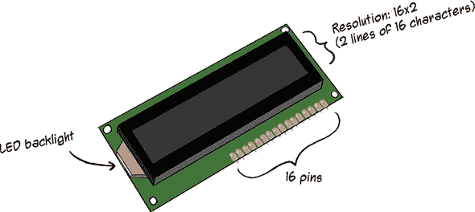

当你看到本节中的接线图时，不要慌张。连接并行 LCD 需要一大把跳线，但与它们一起工作并不复杂。确保你在插拔东西时注意哪些线连接在哪里，你就能做得很好。诚然，改进本章前面提到的定时器项目需要比你在任何地方看到的更多的跳线，但这是一项很好的练习，可以组装更复杂的电路。

#### 5.2.1\. 使用 LCD 制作全功能定时器


##### 你需要


+   1 16x2 5 V 并行 LCD 模块，例如 SparkFun 的任何基本 16x2 5 V 并行 LCD 模块

+   1 个标准 LED，任何颜色

+   3 个按钮（瞬态开关）

+   1 个旋转电位器

+   1 个 220 V 电阻

+   3 个 10 kV 电阻

+   1 个压电片（可选）

+   23 根跳线

+   1 个半尺寸面包板


这个更智能的计时器将允许你使用按钮调整计时器的持续时间（即使计时器正在运行！）并在 LCD 上显示剩余时间。你还可以暂停和重新启动计时器。时间到时，LED 将闪烁以（温和地）吸引你的注意。

##### 构建电路

完全构建的电路将看起来像 图 5.14。我们将将其分解为几个步骤以减少其威慑力。

##### 图 5.14\. 完全组装好的 LCD 计时器

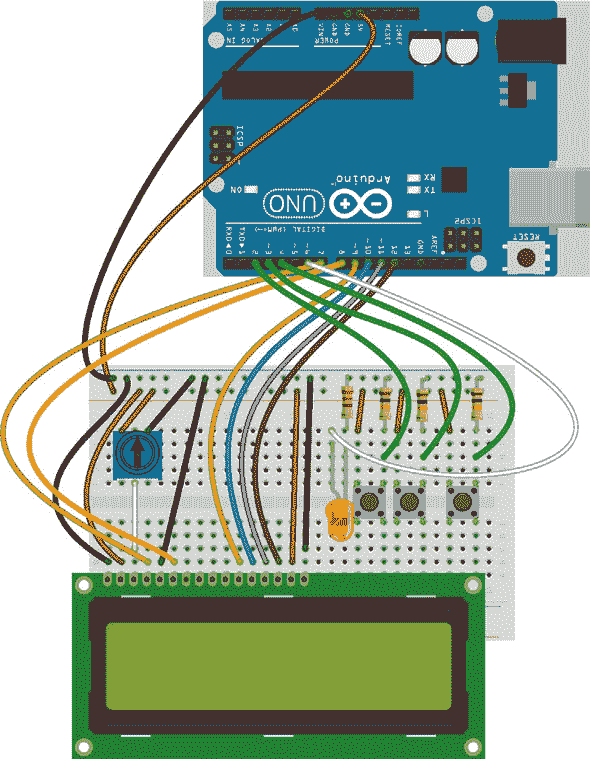

##### 连接和测试按钮

让我们从一些允许用户控制计时器的按钮开始。从左到右，图 图 5.15 中的按钮是

1.  一个向下按钮（在以下代码中用 `downButton` 表示），它将从当前计时器中减去一秒

1.  一个向上按钮 (`upButton`)，它将向当前计时器添加一秒

1.  一个切换启动按钮 (`goButton`)，它将启动和暂停计时器

确保按钮跨越中心凹槽，并且方向如图 图 5.15 所示。每个按钮通过一个 10 kΩ 的下拉电阻连接到地，并通过跳线连接到 +5 V 电源轨。

创建一个名为 timer-advanced.js 的新文件，并首先添加以下代码以处理按钮按下。

##### 图 5.15\. 仅显示按钮的布线图：向下、向上和启动


##### 列表 5.15\. 在 timer-advanced.js 中测试按钮

```
const five = require('johnny-five');
const board = new five.Board();

board.on('ready', () => {
  const downButton = new five.Button(2);
  const upButton   = new five.Button(3);
  const goButton   = new five.Button(4);
  downButton.on('press', () => {
    console.log('down');
  });
  upButton.on('press', () => {
    console.log('up');
  });
  goButton.on('press', () => {
    console.log('go');
  });
});
```

通过开始一些简单的按钮处理程序，你可以在继续到设备的其他部分之前验证你的按钮是否正确布线。运行脚本 (`node timer-advanced.js`) 并验证按下不同的按钮是否将正确的消息记录到控制台。


##### 按钮故障排除

如果按下按钮没有给出你期望的结果，请确保按钮的输出端跳线正确连接到 Arduino——特别是，连接到面包板侧的连接应在按钮输出腿和电阻之间的孔中。

再次检查按钮的输入腿是否连接到电源，以及 10 kΩ 的下拉电阻是否将每个按钮连接到地。还请确保你的按钮方向正确——大多数按钮在一个方向上更适合跨越中心凹槽（正确的方向），但市面上有很多不同类型的按钮。


##### 连接 LCD

在处理完按钮后，我们可以将 LCD 模块连接到面包板，连接到其大多数 16 个引脚（图 5.16）。

##### 图 5.16\. 16x2 并行 LCD 模块

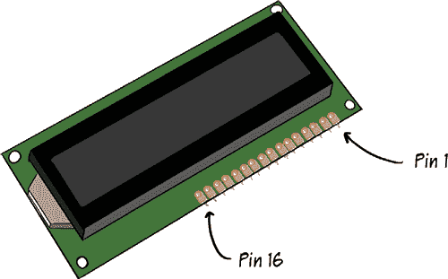

按照 LCD 定位图（图 5.17）所示连接 LCD 到面包板，确保 LCD 模块的左侧引脚连接到面包板的左侧行，如图中布线图所示。LCD 的引脚编号为 1-16，从左侧开始编号。


##### LCD 模块引脚排列

大多数常见的 16x2 并行模块具有相同的引脚方向，当处于 LCD 定位图（图 5.17）所示的方位时，引脚 1 位于左侧，16 位于右侧。请务必检查您的 LCD 模块具有相同的引脚方向——如果不行，您可能需要将 LCD 翻转过来。


##### 图 5.17\. 包含电位器和 LCD 位置的布线图

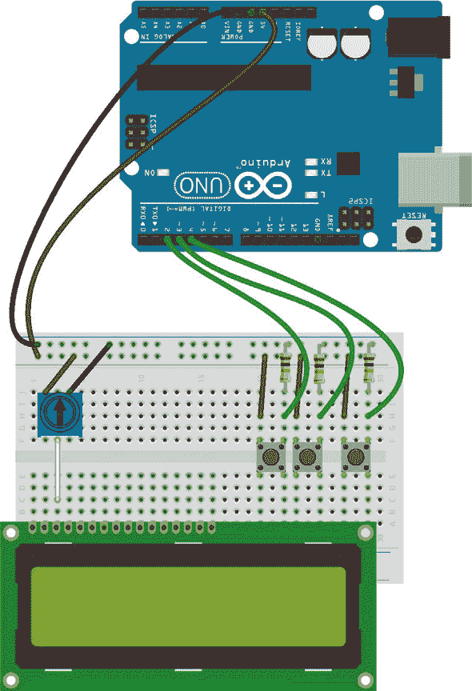

接下来，将电位器连接到面包板上。

##### 布线对比度控制电位器

与光敏电阻一样，电位器是一种可变电阻（图 5.18）。电位器有三个引脚：两个电源引脚和一个中间引脚。当旋转旋转电位器的旋钮（或在其他类型的电位器上滑动）时，其中间引脚上的电压会改变。电位器具有内部电压分压器，因此可以直接读取其输出电压——我们不需要像光敏电阻那样构建电压分压器。

##### 图 5.18\. 电位器是可变电阻。它们有多种形状和大小。

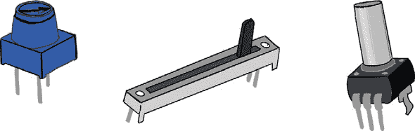

在这个电路中，电位器的中间引脚直接连接到 LCD 的引脚 3。LCD 板载电子设备读取该引脚上的电压以确定显示屏的对比度。因此，旋转电位器将调整对比度。

您的电位器可能大小或形状与 LCD 定位图（图 5.17）中所示的不同：这没关系。将其外引脚连接到电源和地——由于电位器不是极性的，所以您无法接反。任何方向都可以。接下来，将电位器的中间腿连接到 LCD 的引脚 3（记住，连接不会穿过中心缺口）。

##### 完成 LCD 的连接

继续前进！LCD 有几个电源连接（图 5.19）。将 LCD 引脚 1、5 和 16 连接到地电源轨，将引脚 2 和 15 连接到源电源轨。

##### 图 5.19\. 显示面包板电源连接到 LCD 的布线图

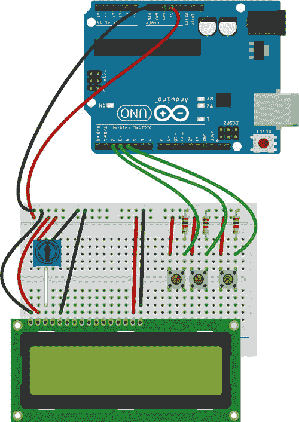

连接到 LCD 引脚 1 和 2 的连接为 LCD 本身供电，而 LCD 引脚 15 和 16 为显示屏的 LED 背光供电。

引脚 5 是一个读/写（R/W）引脚。当它被拉到地时，将 LCD 置于写入模式，这在使用 LCD 时通常是想要的——写入它。

我们将在 LCD 上使用的其余引脚将直接连接到 Arduino 的引脚（图 5.20）。

##### 图 5.20\. 显示所有 LCD 连接的布线图

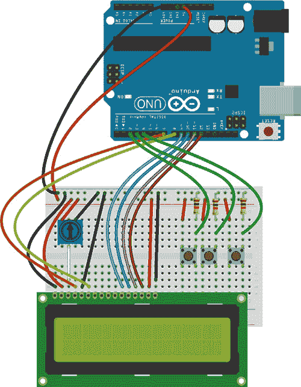

LCD 引脚 4 是寄存器选择（RS）引脚。在特定时间，Johnny-Five 的底层软件需要向 LCD 发送指令以告诉它如何行为。在其他时候，它需要发送用于显示的具体数据。此引脚允许它在指令和数据的不同内存*寄存器*之间切换。它应该连接到 Arduino 的引脚 7。

LCD 上的第 6 脚是使能（EN）引脚。它应该连接到 Arduino 的第 8 脚。向该引脚写入电压会提示 LCD 读取数据引脚上等待的数据。

数据引脚？那些是 LCD 上最后剩下的连接。LCD 上的第 7 到 14 脚是并行数据引脚（D0–D7），它们代表写入设备寄存器的数据位值。你只需要连接八个中的四个——D4 到 D7（LCD 引脚 11、12、13 和 14，分别连接到 Arduino 的 9、10、11 和 12 脚）。哇。有很多电线！

##### 使用 Johnny-Five 控制 LCD

你可以通过使用 Johnny-Five 的`LCD`类来测试你的 LCD。默认情况下，Johnny-Five 的`LCD`对象构造函数会将 LCD 视为并行 LCD。它期望一个包含六个引脚编号的数组，这些引脚连接到 LCD 上的不同引脚：寄存器选择（RS）、使能（EN）和四个数据连接（D4、D5、D6 和 D7）。

与并行 LCD 交互的细节相当底层，但 Johnny-Five 为你抽象了其中很多。Johnny-Five 中有用的`LCD`方法包括以下这些：

+   `cursor(row, column)`—在显示文本之前定位光标

+   `print(str)`—在当前光标位置显示文本

+   `clear()`—清除 LCD 的内容

按照以下列表添加更多代码到你的 timer-advanced.js 脚本中，以进行测试。

##### 列表 5.16\. 测试 LCD

```
const five = require('johnny-five');
const board = new five.Board();

board.on('ready', () => {
  const downButton = new five.Button(2);
  const upButton   = new five.Button(3);
  const goButton   = new five.Button(4);
  const lcd = new five.LCD([7, 8, 9, 10, 11, 12]);      *1*
  /** button handler functions... **/
  lcd.cursor(0, 0).print('hello, world');               *2*
  lcd.cursor(1, 0).print('hello, again');               *3*
});
```

+   ***1* 实例化一个 Johnny-Five LCD 对象**

+   ***2* 将光标定位在第 0 行，第 0 个位置（左上角）并打印“hello, world”**

+   ***3* 将“hello, again”写入 LCD 的第二行，第 0 个位置**

运行脚本（`node timer-advanced.js`），一旦运行，将电位计的旋钮转动以调整 LCD 的对比度。

LCD 应在第一行显示“hello, world”，在第二行显示“hello, again”。

| |
| --- |

##### LCD 故障排除

如果你的 LCD 似乎无法正常工作，或者完全不工作，首先应该检查所有电线连接，并确保它们连接到 Arduino 的正确引脚上。

如果你的 LCD 没有点亮，请检查第 15 和 16 脚（背光电源）的电源连接。

确保 LCD 模块安装正确，并且引脚对齐准确。

| |
| --- |

##### 编程定时器的逻辑

我们的 LCD 电路已经准备好了。现在是时候编程定时器了。我们将将其分解成几个部分，但定时器最终结构的概述如下所示。

##### 列表 5.17\. 定时器应用程序结构概述

```
const five = require('johnny-five');
const board = new five.Board();

// constants

board.on('ready', () => {
  // Initialize J5 components for buttons and LCD
  // Initialize some variables

  function init () {
    // initialize timer
  }

  function showRemaining () {
    // format remaining timer duration and
    // update LCD display
  }

  function adjustTime (delta) {
    // add or remove delta milliseconds
    // to/from timer duration
  }

  function start () {
    // start the timer
    // use setInterval to invoke tick()
  }

  function pause () {
    // pause the timer
  }

  function tick () {
    // update timer values internally
    // if timer is over, chime() and reset timer
    // otherwise, showRemaining()
  }

  function chime () {
    // pulse the indicator LED
  }

  // add button-press handlers

  // initialize the timer
});
```

从顶部开始，一个变量初始化部分设置了一些我们操作定时器所需的值，如下所示。将这些添加到 timer-advanced.js 中。

##### 列表 5.18\. 设置一些值

```
const five = require('johnny-five');
const board = new five.Board();

const DEFAULT_TIMER = 60000;                        *1*
const UPPER_LIMIT   = 99 * 60000;                   *2*
const LOWER_LIMIT   = 1000;                         *3*

board.on('ready', () => {
  const downButton = new five.Button(2);
  const upButton   = new five.Button(3);
  const goButton   = new five.Button(4);
  const lcd        = new five.LCD([7, 8, 9, 10, 11, 12]);
  const alertLED   = new five.Led(6);
  var remaining, timer, timeString, lastTimeString, timestamp, lastTimestamp;

  // ...
});
```

+   ***1* 60 秒是默认定时器长度，以毫秒为单位。如果你喜欢，可以更改它。**

+   ***2* 定时器的上限是 99 分钟。**

+   ***3* 你不能将定时器设置得短于 1 秒。**

99 分钟的.upper limit 是基于在 LCD 上格式化剩余时间的方式（`mm:ss`）。更长的持续时间将无法适应。

说到显示格式，让我们开始吧。现在是时候添加一个初始化计时器并在 LCD 上显示当前计时器的剩余时间的函数了。接下来要添加的代码定义了 `init()` 和 `showRemaining()` 函数。

##### 列表 5.19\. 初始化并显示剩余计时器时间

```
// ...
board.on('ready', () => {
  // ... components and variable initialization
  function init () {                                        *1*
    remaining      = DEFAULT_TIMER;
    lastTimeString = '00:00';
    timeString     = '';
    showRemaining();
  }

  function showRemaining () {                               *2*
    var minutes, seconds, minPad, secPad;
    minutes    = Math.floor(remaining / 60000);
    seconds    = Math.floor((remaining % 60000) / 1000);
    minPad     = (minutes < 10) ? '0' : '';
    secPad     = (seconds < 10) ? '0' : '';
    timeString = `${minPad}${minutes}:${secPad}${seconds}`;
    if (timeString != lastTimeString) {                     *3*
      lcd.cursor(0, 0).print(timeString);
    }
  }
  // ...
});
```

+   ***1* 初始化一个新的计时器和一些变量**

+   ***2* 格式化并显示此计时器的剩余时间**

+   ***3* 只有当格式化的字符串已更改时才更新 LCD**

当计时器实际运行时，`showRemaining` 函数将被频繁调用。在更新 LCD 之前确保时间字符串已更改的检查（`timeString != lastTimeString`）将提高性能。当前计时器的剩余时间将显示在 LCD 的左上角（光标位置 0, 0）。

前进！当按下 `upButton` 和 `downButton` 时，应调整计时器的持续时间，分别增加或减少一秒。`adjustTime()` 函数（在列表 5.20 中）接受一个以毫秒为单位的 `delta`，并通过该值调整计时器的持续时间，确保总持续时间在范围内。

按钮处理程序需要注册以调用 `adjustTime()`，这也是初始化计时器（`init()`）的好地方。

添加 `adjustTime()` 和按钮处理程序，如下所示。

##### 列表 5.20\. 添加时间调整处理函数

```
// ...
board.on('ready', () => {
  // ... variable and component initialization
  function init () { /* ... */ }
  function showRemaining () { /* ... */ }

  function adjustTime (delta) {
    remaining += delta;
    if (remaining < LOWER_LIMIT) {
      remaining = LOWER_LIMIT;
    } else if (remaining > UPPER_LIMIT) {
      remaining = UPPER_LIMIT;
    }
    showRemaining();                          *1*
  }

  downButton.on('press', () => { // remove a second
    adjustTime(-1000);
  });
  upButton.on('press', () => { // add a second
    adjustTime(1000);
  });

  init();                                     *2*
});
```

+   ***1* 计时器的持续时间已更改，因此 LCD 的显示需要更新。**

+   ***2* 不要忘记初始化计时器。**

现在，让我们连接 Go 按钮。该按钮应切换计时器（播放/暂停）。这意味着我们还需要激活计时器的逻辑——每 250 毫秒调用一次 `tick()` 函数——以及暂停它，如下一列表所示。

##### 列表 5.21\. 使计时器滴答

```
// ...
board.on('ready', () => {
  // ... variable and component initialization
  function init () { /* ... */ }
  function showRemaining () { /* ... */ }
  function adjustTime (delta) { /* ... */ }

  function start () {
    lcd.clear();                                *1*
    timestamp = Date.now();
    timer     = setInterval(tick, 250);         *2*
    tick();                                     *3*
  }

  function pause () {
    timer = clearInterval(timer);               *4*
    lcd.cursor(0, 9).print('PAUSED');           *5*
  }

  function tick () {
    lastTimestamp = timestamp;
    timestamp     = Date.now();
    remaining -= (timestamp - lastTimestamp);
    if (remaining <= 0) {
      timer = clearInterval(timer);
      init();
    }
    showRemaining();
  }

  downButton.on('press', () => { /* ... */ });
  upButton.on('press', () => { /* ... */ });
  goButton.on('press', () => {
    if (!timer) {                               *6*
      start();
    } else {
      pause();
    }
  });
  init();
});
```

+   ***1* 清除 LCD 上当前显示的内容**

+   ***2* 设置一个间隔，每秒大约调用四次 tick**

+   ***3* 启动计时器并发出 tick**

+   ***4* 清除计时器间隔，使计时器停止滴答**

+   ***5* 当再次通过 lcd.clear() 启动计时器时，"PAUSED" 将被擦除。**

+   ***6* 在启动之前确保没有正在运行的计时器**

现在，你可以开始和暂停计时器，但时间用完时会发生什么？我们需要某种东西来提醒用户他们的时间已到。

#### 5.2.2\. 添加视觉 LED“提示音”

作为此电路构建的最后一部分，你可以添加一个 LED，如图 5.21 所示。它应该通过一个 220 V 电阻连接到地，其阳极应连接到 Arduino 的 7 号引脚。

##### 图 5.21\. 带 LED 的完成布线图

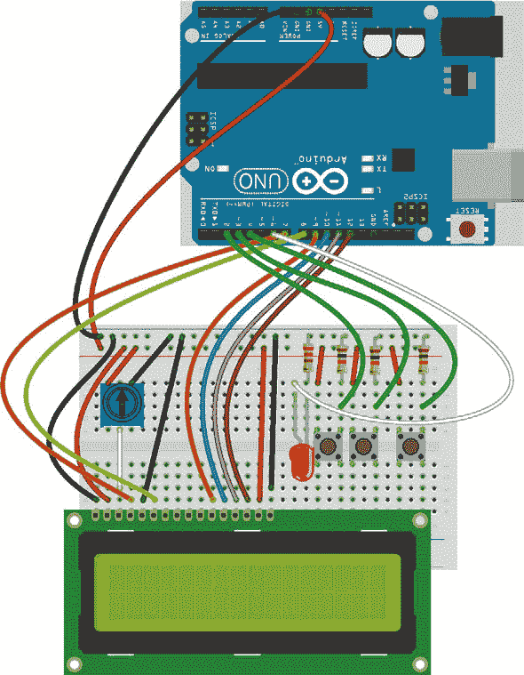

我们需要对 `start` 和 `tick` 函数进行一些调整，并添加一个新的 `chime` 函数，如下一列表所示。

##### 列表 5.22\. 添加视觉提示音

```
// ...
board.on('ready', () => {
  const downButton = new five.Button(2);
  const upButton   = new five.Button(3);
  const goButton   = new five.Button(4);
  const lcd        = new five.LCD([7, 8, 9, 10, 11, 12]);
  const alertLED   = new five.Led(6);                                      *1*
  var remaining, timer, timeString, lastTimeString, timestamp, lastTimestamp;

  function init () { /* ... */ }
  function showRemaining () { /* ... */ }
  function adjustTime (delta) { /* ... */ }

  function start () {
    alertLED.stop().off();                                                 *2*
    lcd.clear();
    timestamp = Date.now();
    timer     = setInterval(tick, 250);
    tick();
  }

  function pause () { /* ... */  }

  function tick () {
    lastTimestamp = timestamp;
    timestamp     = Date.now();
    remaining -= (timestamp - lastTimestamp);
    if (remaining <= 0) {                                                  *3*
      timer = clearInterval(timer);
      chime();                                                             *4*
      init();
    }
    showRemaining();
  }

  function chime () {
    alertLED.pulse();                                                      *5*
    lcd.cursor(0, 9).print('DONE!');                                       *6*
  }

  downButton.on('press', () => { /* ... */  });
  upButton.on('press', () => { /* ... */ });
  goButton.on('press', () => { /* ... */  });
  init();
});
```

+   ***1* 在 6 号引脚上实例化一个 Led 对象**

+   ***2* 当计时器正在倒计时的时候，蜂鸣-LED 应该关闭。**

+   ***3* 一些逻辑来判断时间是否结束，如果是，则清除间隔，等等**

+   ***4* chime()...**

+   ***5* 闪烁 LED！时间到！**

+   ***6* 也会显示“完成！”**

因为当时间结束时，会再次调用`init()`，所以计时器可以重复使用而不需要重新启动程序（图 5.22）。试试看！

```
$ node timer-advanced.js
```


##### 计时器的代码架构

计时器的逻辑全部发生在 Johnny-Five `board`对象的`ready`回调中，而且开始感觉难以控制。可能将逻辑封装在外部模块中会更优雅。你将在后面的章节中看到这方面的例子。


##### Figure 5.22\. 计时器，正在计时！

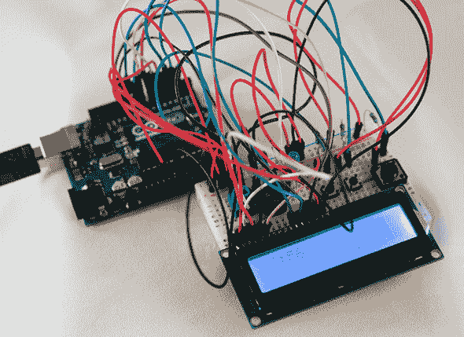

### 5.3\. 使用蜂鸣器制造噪音

首先，我不会试图说服你蜂鸣器（图 5.23）能发出美妙、悦耳的声音。它们可以根据简单的频率产生音调，但听起来很刺耳。尽管如此，*你可以*让它们演奏一首歌，而且它们很有趣，可以随意摆弄。如果你想将蜂鸣器添加到计时器中，你可以将 LED 换成蜂鸣器（如图 5.24 所示）。然后你就可以尽情玩耍，用你的蜂鸣器来烦扰朋友了！

##### Figure 5.23\. 一些蜂鸣器有电线引脚，而另一些有腿。蜂鸣器有两个引脚：+ 和 -。

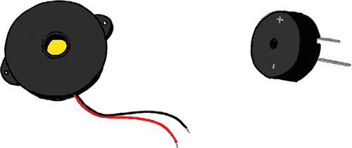

当电压施加到蜂鸣器上时，它会导致蜂鸣器内部表面的物理形状发生变化。蜂鸣器*转换*电能成机械能，而我们人类将这种机械能检测为声波。在特定频率下施加电压，会产生与不同音符相对应的振动。这种现象被称为*逆压电效应*——电能转换为机械运动。

蜂鸣器也可以用作传感器。作为输入使用时，蜂鸣器可以检测敲击或其他类型的振动。这展示了逆压电效应的反面，即*压电效应*。


**蜂鸣器：时序和频率**

要让蜂鸣器发出一个音符，需要 PWM 和时序的结合。要让蜂鸣器发声，你需要以 50%的占空比给它施加电压——这会产生方波（开 关 开 关）。要让蜂鸣器演奏特定的音符，你需要调整这些 PWM 周期的频率。

例如，音符 A4，或 A440 是一个常见的参考调音音符。它被称为 A440，因为它以 440 Hz 振动。每 1/440 秒，有一个完整的波周期。在现实生活中，这些是平滑的模拟波。使用蜂鸣器，它们是方波数字波。通过每秒向蜂鸣器施加 440 次 50%占空比的电压，你可以近似 A4。

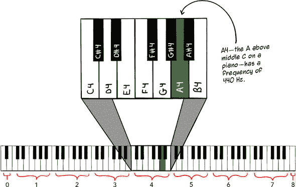

标准的 88 键钢琴键盘上包含的八度。A4（即 A440）是中音 C 以上的 A（第四八度的 A）。

音乐频率每八度翻倍，所以当你到达 A7 时，你看到的是 3520 Hz。

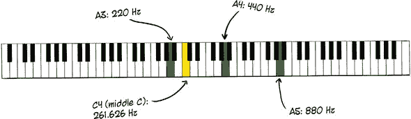

每个八度频率翻倍。A3（220 Hz）是 A4（440 Hz）频率的一半，而 A5（880 Hz）是 A4 的频率的两倍。A 音符有很好的圆形频率。中间 C（C4）的频率为 261.626 Hz，C5 的频率为 523.521 Hz，它们之间的音符也有可预测的频率，每个八度翻倍。

在 Johnny-Five 中，A4（A440）是通过每秒交替写入 HIGH 和 LOW 到压电片的引脚上，以相等的间隔 880 次来创建的。是的，880 次，因为一个完整的“波”（开-关）应该每秒发生 440 次。

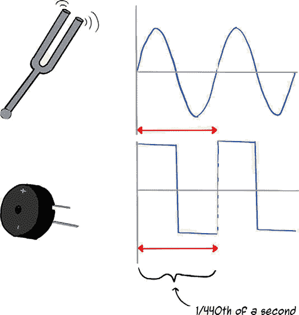

A4 音符的频率为 440 Hz。一个完整的波周期是 1/440 秒。与自然、模拟声波不同，它们有平滑的曲线，压电片发出的是方波。

这里涉及到的频率远远超过了您可以使用内置 JavaScript 计时器（`setInterval`，`setTimeout`）所能达到的分辨率，因此 Johnny-Five 依赖于一个名为`nanotimer`的 npm 包。这允许像`setInterval`一样的行为，但精度更高，粒度更细。


#### 5.3.1\. 将可发声的压电片铃声添加到计时器

根据您拥有的压电片类型，可以直接将其插入面包板，或者将它的电线插入面包板（图 5.24）。别忘了也要移除 220 V 电阻。

##### 图 5.24\. 替换 LED 的压电片接线图

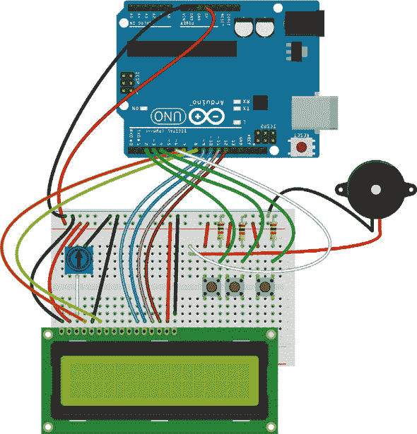

##### 在压电片上播放旋律

计时器的代码更改很小。在 timer-advanced.js 内部，实例化一个`Piezo`而不是`Led`，并从`start()`函数中移除对`alertLED`的引用，如下所示。

##### 列表 5.23\. 实例化一个压电片

```
var alertChime = new five.Piezo(6);
```

Johnny-Five 的`Piezo`类提供了一些方便的工具来使压电片播放旋律，处理复杂的时序和频率转换。音符通过它们的名称（如`'e5'`）暴露出来，这样您就不需要记住频率。您可以将表示“旋律”的对象传递给`play`方法，其中包含如`tempo`（BPM）和`song`（音符及其持续时间的数组）等属性。

更新`chime()`函数以播放歌曲，如下所示。

##### 列表 5.24\. 新的`chime()`函数

```
function chime () {
  alertChime.play({
    tempo: 120,               *1*
    song: [
      ['e5', 1],              *2*
      ['g#5', 1],
      ['f#5', 1],
      ['b4', 2],
      ['e5', 1],
      ['f#5', 1],
      ['g#5', 1],
      ['e5', 2],
      ['g#5', 1],
      ['e5', 1],
      ['f#5', 1],
      ['b4', 2],
      ['b4', 1],
      ['f#5', 1],
      ['g#5', 1],
      ['e5', 2]
    ]
  });
  lcd.cursor(0, 9).print('DONE!');
}
```

+   ***1* 速度是一个可选属性。**

+   ***2* 这将播放 e5 音符 1 个“拍”。**

您需要亲自尝试以找出时间到调是什么！

### 摘要

+   一个 LED 只能发出一种波长（颜色），在任何给定时间只能处于关闭或开启状态，但可以通过脉冲宽度调制（PWM）来欺骗眼睛，使其认为 LED 在不同的亮度下发光。

+   PWM 支持是硬件特性，并且只有开发板上的某些引脚支持 PWM。

+   LED 的亮度可以被“动画化”，以创建效果和传达信息。使用不同的缓动函数和提供不同的动画选项，可以用 Johnny-Five 生成不同的结果。

+   RGB LED 通过 PWM 将三个 LED（红、绿、蓝）以不同的亮度组合在一起，以创建不同的颜色。常见的共阴极 RGB LED 有三个组件 LED，它们共享一个共同的阴极引脚。

+   并联 LCD 有很多连接。Johnny-Five 通过其`LCD`类提供了一个简化的 LCD 接口。

+   滑动变阻器是另一种可变电阻，类似于光敏电阻。与光敏电阻不同，它们有自己的内部电压分压器，因此可以在第三个引脚上读取电压变化。

+   马达石利用逆压电效应将不同频率的电压转换为机械运动，从而产生声波。

## 第六章：输出：让事物移动

*本章涵盖*

+   电机的工作原理以及是什么使它们旋转

+   电机感应特性以及如何安全构建电机电路

+   在电路中使用二极管、电容器和晶体管来控制电机并保护组件

+   如何使用伺服电机精确定位事物

+   如何使用 H 桥电路和电机驱动器控制电机

+   如何构建你的第一个基本、移动的机器人

到现在为止，你可能已经不耐烦地跺脚，想知道：“我们什么时候能做*机器人*？”好吧，你的船已经到了。是时候学习如何让事物移动了。

你即将了解的电机和伺服电机为机器人的基本运动控制提供基础。有很多东西要学习，但到本章结束时，你将构建一个基本的移动机器人。

让机器人移动涉及编排电子控制动作。电机旋转，使轮子滚动。伺服电机允许精确定位组件：摄像头、机械臂等。让我们开始行动吧。

| |
| --- |


**对于本章，你需要以下物品：**

+   Arduino Uno 和 USB 线

+   1 个 9V 直流电机

+   1 个 9V 电池和夹子

+   1N4001 二极管

+   1 个 N 沟道 MOSFET，例如 FQP30N06L

+   1 个 100μF 电容器

+   1 个 4.8V 微型伺服电机

+   1 个德州仪器 SN754410 四倍半 H 驱动器

+   Actobotics Peewee Runt Rover 套件（或 2 个齿轮电机，2 个轮子，底盘）

+   断开式雄性引脚头

+   跳线

+   1 个半尺寸面包板

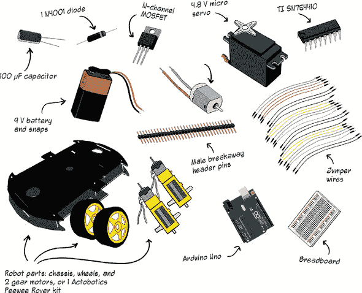

| |
| --- |

### 6.1. 让电机旋转

电机将电能转化为机械能（图 6.1）。电流进入，运动出来，通常是旋转形式，如旋转轴。

##### 图 6.1：典型的业余 DC 电机

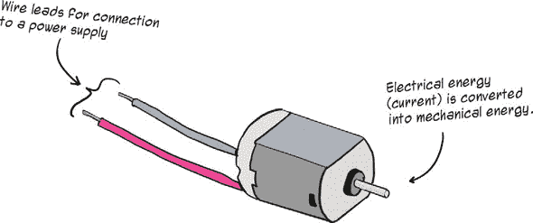

电机将电能转化为动能的魔法核心？磁铁！

| |
| --- |

##### 实际电流流动

回想一下，传统的电流表示法显示电流从正极流向负极，但在现实中，相反的情况更接近真相？电流的实际流动方向与本章涵盖的一些主题相关，因此概念图显示电流从负极流向正极。

| |
| --- |

#### 6.1.1. 电机的工作原理

当电流通过导线时，也会产生磁场。磁场与电流方向成直角（图 6.2）。

##### 图 6.2。导线中的电流在电流流动的垂直方向上产生磁场。

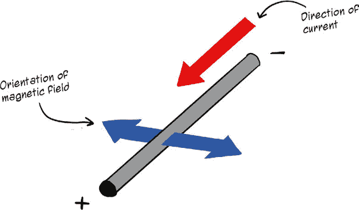

在一根单独的直导线附近，由电流引起的磁场相对较弱。但可以通过将一段导线绕在（以及绕在绕在绕在）金属块上，来集中磁效应。当电流施加到导线的线圈上时，集体直角磁场具有足够的能量，可以将金属芯中先前无序排列的一些原子拉入南北方向对齐。而且，看！你已经通过使用电创造了磁铁：一个*电磁铁*（图 6.3）。

##### 图 6.3。线圈中的电流产生磁场，磁化电磁铁的铁芯。

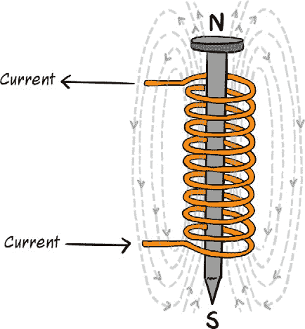

如果你反转通过线圈导线的电流方向，电磁铁的极性也会翻转——南北磁极会互换位置（图 6.4）。切断导线的电流，磁场就会消散——你可以关闭你的磁铁了！

##### 图 6.4。反转电流流动反转了电磁铁的极性。

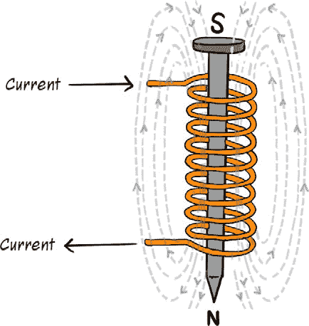

让我们设想我们的想象中的电磁铁被用于理论应用。在图 6.5 的左侧，一个未通电的电磁铁安装在一个轴上，并悬挂在两个固定磁铁之间。一旦电流施加到电磁铁上（图 6.5 的中间），电磁铁就会想要按照磁力指示的方式对齐——其北极指向具有朝内面对的南极的固定磁铁。它想要做的是旋转半圈来实现这一点，就像图 6.5 的右侧所示。当然，这个假设的电机不会工作：电池挡在中间，事情变得一团糟。

##### 图 6.5。一个位于两个固定磁铁之间的轴上的电磁铁将想要通过旋转来对齐自己——按照磁力指示。

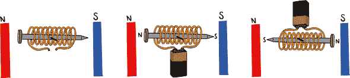

没有进一步的干预，事情就会在这里停止——磁铁以愉快的方式排列。但如果我们能够再次在这个确切的位置交换电磁铁中的电流方向，运动就可以被迫继续，因为磁铁试图再次正确对齐自己。每半转反转电流极性可以使事物永远继续。事实上，这正是电机工作的原理。像图 6.5 中显示的那样连接的电机将很快变成一团电池和导线的混乱，所以真正的电机涉及一些设计改进。

图 6.6 展示了一个——仍然过于简化的——*刷式直流电机*。电机的壁包含固定磁铁。电源的正负极连接到两个静止的 *刷子*，当电机的轴转动并接触分环的不同部分时，它们“刷”上给定极性的电源。随着电机的转动，电流——因此，磁场——极性改变，保持一切运动。刷式电机非常常见，但无刷电机使用相同的一般概念——电和磁——来完成相同的事情。

##### 图 6.6\. 刷式电机的电磁铁连接到一个称为 *换向器* 的分环（A）。当电机旋转时，换向器和电磁铁一起旋转。固定位置的 *刷子*（B）连接到电源，并在它们下方旋转时“刷”上交替的极性，改变电机 *电枢*（C）上电磁铁的极性。

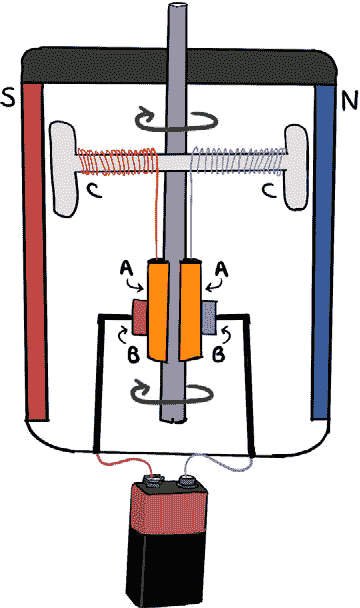

#### 6.1.2\. 使用按钮开关控制电机

让我们通过构建一个基本的电路来逐步学习电机控制，该电路由按钮控制电机。稍后，我们将添加使用 Arduino Uno 和 Johnny-Five 控制电机的功能。


##### 你需要的东西


+   1 个 9 V 电池

+   1 个带引线的 9 V 电池夹

+   1 个额定电压高达 9 V 的小型直流电机

+   1 个 1N4001 二极管

+   1 根跳线（黑色）

+   1 个半尺寸面包板


电机接收电能，输出机械旋转。但反过来也是真的：如果电机的轴被转动（施加机械能），电机将 *产生* 电能——它充当 *发电机*。例如，水可以通过水力发电产生能量。流动的水物理地转动电机的轴（发电机），然后产生电能。所以电机也接收机械能，并输出电能（图 6.7）。这一系列现象——通过磁场相互作用产生电压或运动——被称为 *电感*。电机是一个 *电感* 元件。

##### 图 6.7\. 当电机被外部力量驱动时，会产生电流。

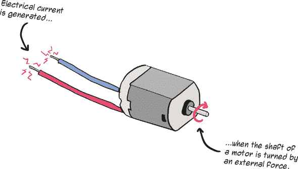

诱导元件的特性与你的电路有关。比如说，你给电机施加电流，它愉快地旋转着。移除电流——关闭电源——电机将自行继续旋转一段时间。在这短暂的时间内，它将产生能量，值得注意的是，电机（或任何电感器）将在 *相反方向* 上产生电压（图 6.8）。

##### 图 6.8\. 当电机连接到电源时，电流从负极（低电位）流向正极（高电位）。电流流动使电机旋转。当从电机移除电流流动时，惯性会使电机短暂继续旋转。在这段时间内，电机充当发电机，产生与先前输入电压相反的电压。

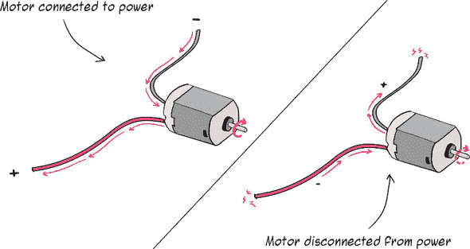

这意味着电流可以在你的电路中“倒流”，并且负电压尖峰可能非常大（尽管时间非常短）。如果不进行干预，这种*反向电压*（也称为*反向电动势*或*反-EMF*）可能会做坏事，比如损坏元件或导致真正的火花跳跃！

当电路闭合且电流通过电机(图 6.9)时，没有保护这种反向电压的电路可以正常工作，但当电机中的电流发生变化(图 6.10)时，这会在按钮释放（开关打开，断开电路）时发生变化，它可能会出现问题。

##### 图 6.9\. 在此处所示的未受保护的电路中，电流流动是通过一个按钮（开关）来控制的。当按下并保持开关时，电流按预期流动，为电机供电。电机消耗提供的电压。

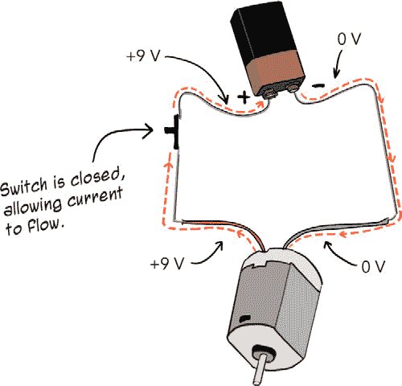

在图 6.10 中短暂生成的较大负电压非常渴望找到通往+9 V 电压的路径，它可能会做出疯狂的事情，比如飞跃空中或通过其他非导电材料到达那里。我们必须保护我们的电路免受这种感应电压尖峰的影响。

##### 图 6.10\. 当按钮释放（开关打开）时，电机继续旋转一段时间。在这段时间内，它正在产生负电压。之前连接到电池正极（通过开关）的引线可能会积累一个非常大的负电位——比如数百伏，这比电池的+9 V 要低得多。

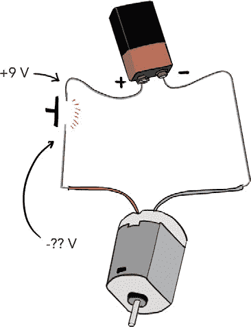

##### 使用反冲二极管管理反向电压

我们必须管理这种反向电压情况，以确保电路的健康和安全。我们需要确保负电压不会被允许随意在电路中游荡，伤害无辜的元件。

有一种标准方法来完成这项任务，使用二极管(图 6.11)。你曾在第二章中简要地遇到过二极管——LED 就是二极管的一种。二极管是一种半导体元件，只允许电流单向通过它。

##### 图 6.11\. 二极管是半导体元件，只允许电流单向流动。

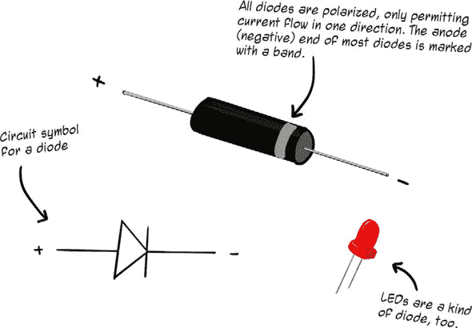

我们即将构建的按钮控制电机电路图中的二极管放置看起来是反的，并且它确实是(图 6.12)。

##### 图 6.12\. 基本按钮控制电机电路图，包括保护二极管

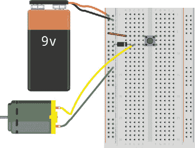

二极管在电路中的方向（“反向”，或更技术性地，*反向偏置*）意味着电流将被阻止流过它——通常。但当出现反向电压情况，并且电路中的流动是颠倒的，二极管暂时变为*正向偏置*——它暂时调整为电流可以流过它的方向。在这些时候，它可以创建一个路径来“吸收”危险的负电压电流，并反复通过电机重新路由，直到负电压自然耗散（别担心，它会，而且很快）。

以这种方式使用的二极管被称为*反激二极管*，或*吸收二极管*(图 6.13)。

##### 图 6.13\. 如果在包含如电机这样的电感器的电路中使用反激二极管，它可以提供一个路径，让试图错误方向流动的积压负电压流过。它可以通过电机在回路中循环，直到它耗散。


##### 电路中电机的供电

电机这样的电感元件是电流消耗者，尤其是在它们被打开或关闭时（到现在你可能已经意识到，当电感器启动或关闭时，它们有一些有趣的特性）。单个 Arduino Uno 引脚可能的最大电流抽取仅为 20 mA——这还不够！此外，许多业余电机被评定为 6 V 或甚至 9 V——电压上超过了 Uno 能提供的。我们将为我们的电机使用一个稳定、独立的电源——9 V 电池，以确保我们的电机得到它需要的能量。

##### 构建电路

为了使图 6.12 中所示的电机旋转，你需要从电源（正电池端子）到地（负电池端子）创建一个闭合回路。按下按钮将连接这个回路——当按钮被按下时，电机将运行。

按照图 6.12 所示构建电路，注意正确放置反激二极管。如果你放反了，它可能会非常热（至少），甚至可能爆炸或损坏电池。

一旦你构建了电路，你应该能够通过按下按钮来启动电机。那些小型的业余电机转速很快！

| |
| --- |

##### 反向旋转电机

你的电机可能有红黑两根线引脚，这意味着有“正确”或“极化”的方式将电机插入电路。这有点误导：电机无论是哪种方向插入电路都很高兴——交换连接只会简单地反转电机旋转的方向。你可以尝试重新调整电机引脚在电路中的方向，看看是否能使其反向运行。通过改变电机中的电流方向来改变电机的方向是机器人控制的关键部分，你将在下面看到。

| |
| --- |

#### 6.1.3\. 使用 Johnny-Five 控制电机

我们第一次的电机实验有几个缺点：没有逻辑控制电机——只有我们自己的手指——电机要么全速运行要么关闭——中间没有其他选择。

Johnny-Five 有一个`Motor`组件类，可以让你对电机速度有更多的控制。如果你使用更复杂的集成电路或电机控制器，你将获得更多的控制——但让我们从基础开始。

| |
| --- |

##### 你需要准备


+   1 Arduino Uno 和 USB 线

+   1 9V 电池

+   1 9V 电池夹带引线

+   1 小型 9V 直流电机

+   1 1N4001 二极管

+   1 N 沟道 MOSFET，例如 FQP30N06L

+   4 跳线

+   1 半尺寸面包板

| |
| --- |

在这个实验中，我们希望用可以由 Arduino 引脚输出控制的切换机制来替换人力推动的按钮开关。你已经知道电机需要的不仅仅是 Arduino 板载电源可以提供的——无论是电压还是电流——但任何来自 Arduino 引脚的输出信号都将为 5V。我们将得到一个结合两个独立电源的电路：9V（电池）和 5V（Arduino 逻辑）。

##### 使用晶体管作为开关

MOSFET 是**金属氧化物半导体场效应晶体管**（whew，难怪人们只说*MOSFET*）。晶体管是半导体元件，扮演两种角色之一：放大或切换信号。关于晶体管还有很多要了解的，但就我们当前的情况而言，我们将使用 MOSFET 作为非常快速、可靠的开关。

当给 MOSFET 的**门**引脚（图 6.14）施加小电压时，其他两个引脚（**源**和**漏**）相连，电流可以在它们之间流动——MOSFET 被打开。Arduino 可以用较弱的 5V“手指”来“推动”门引脚，完成连接到**源**和**漏**的 9V 电路。也就是说，你可以使用低电压和低功率的信号来控制高电压和高功率的信号。结果，电机电路有两个输入电源：9V 电池和来自 Arduino 的 5V 输入。

##### 图 6.14\. 一个 MOSFET 及其电路符号。施加到门（G）引脚的小电压将在漏（D）和源（S）引脚之间建立连接。

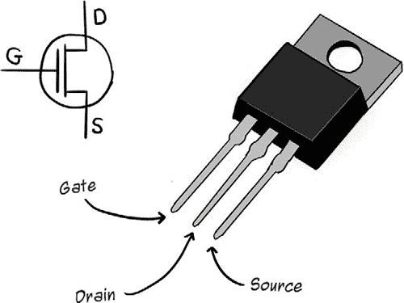

| |
| --- |

##### MOSFET 引脚排列

尽管大多数此类（N 沟道）场效应晶体管（FETs）使用图 6.14 中显示的引脚排列，但请确保你查阅你的组件数据手册以确认哪些引脚是门、漏和源。

| |
| --- |

最后一点：你需要将两个电源连接到公共地。尽管输入电源是分开的——正电源轨仅用于 9 伏电源——但它们的接地是相连的。

##### 构建电路

确保 MOSFET 的金属片朝向与 MOSFET 开关电机接线图（图 6.15）所示方向一致——金属片应朝向右侧。从顶部看，第一个引脚是栅极：这应该连接到 Arduino 的 6 号引脚。将最底部的引脚（源极）连接到地。MOSFET 的漏极引脚（中间引脚）应连接到电机的其中一个引脚和反向二极管，如图所示（二极管与电机并联）。

##### 图 6.15\. 晶体管开关电机控制电路图

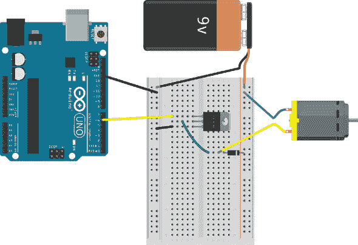

当施加电压到栅极引脚时，电流将能够在源极和漏极引脚之间流动，从而使电机旋转。

##### 带着电机去兜风

在 Johnny-Five 工作区域中创建一个名为 motor-basic.js 的 JavaScript 文件，并包含以下代码。此脚本在引脚 6 上实例化一个`Motor`，并将其手动控制可用。

##### 列表 6.1\. 电机测试驾驶

```
const five  = require('johnny-five');
const board = new five.Board();

board.on('ready', () => {
  const motor = new five.Motor({ pin: 6 });         *1*
  board.repl.inject({
    motor: motor                                    *2*
  });
});
```

+   ***1* 引脚 6 将使用 PWM 控制电机速度。**

+   ***2* 你将从 REPL 中访问电机。**

Johnny-Five 的`Motor`组件类还有更多功能，但我们从最基本的实例化开始：识别一个引脚来控制电机单方向的速度。这被称为*非方向性电机*。

运行脚本，并在 REPL 中与`motor`交互：

```
$ node motor-basic.js
```

一旦初始化了板子和 REPL，你就可以通过在 REPL 中输入来实验可用的`motor`对象引用。以下是一些实用的方法：

+   `speed(0-255)`—使电机以给定速度旋转；例如，`motor.speed(100)`。

+   `stop()`—停止电机；例如，`motor.stop()`。

+   `start()`—使用之前设置的速度启动电机；例如，`motor.start()`。

电机速度通过脉冲宽度调制（PWM）控制，所以有一个快速的开关（MOSFET）可以在高频下打开和关闭电路是好事。


**进一步探索：制作自己的温度控制风扇**

你现在在你的不断增长的构建者工具包中拥有了所有必要的工具，可以构建在第一章中首次提到的温度控制风扇。

挑战：不使用 REPL 来控制电机，而是将 TMP 36 传感器添加到电路中，并使用其值的变化来打开或关闭风扇，或改变其速度。如果你从硬纸板或卡纸上剪下一个风扇叶片并将其固定到电机的轴上，可能会更有趣！


### 6.2\. 让伺服机构动起来

伺服机构是用于精确定位物体的装置，在机器人和其他需要精确移动物体的设备中不可或缺（图 6.16）。

##### 图 6.16\. 伺服机构和其基本部件。鸣管有不同形状和大小：圆盘、星星、单臂。

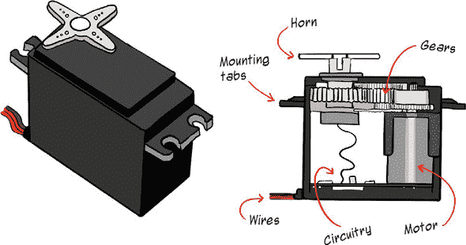

伺服的运动由直流电机提供动力，类似于我们在本章实验中使用的电机。但伺服需要一些额外的部件来完成其工作。一个齿轮组将电机的快速但弱旋转转换为较慢、更准确和更强（更高扭矩）的旋转。额外的内置电路监控输入信号，以告诉伺服它应该在什么*角度*定位自己，并允许伺服检测它是否处于正确的位置。

大多数伺服大约有 180 度的旋转范围。它们有一个“中性”位置（90 度，或“向上”），并且可以从该中性位置向任意方向旋转约 90 度（图 6.17）。180 度的旋转范围是最佳情况：价格低廉的低功耗伺服可能只有约 150 度的旋转范围。

##### 图 6.17\. 伺服（带连接的螺旋桨）定位在最小角度、中性角度和最大角度。不同的伺服有不同的实际角度范围。

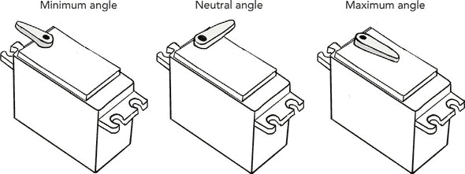

伺服套件内的电路对伺服信号线上的编码信号做出响应。用于控制伺服位置的是一种特定的 PWM 信号。

| |
| --- |

**伺服风味 PWM**

通过其信号线发送 PWM 信号来控制伺服的位置，但这是 PWM 的一种特殊“风味”。伺服期望每 20 毫秒接收一个脉冲。脉冲持续的时间——信号为高电平的时间——决定了伺服的位置。脉冲持续时间越短，结果位置越偏向左侧。

通常，1.5 毫秒的脉冲会使伺服指向其*中性*方向（90°）。大约 1 毫秒的脉冲会使伺服指向左侧（0°），而 2 毫秒的脉冲将使其完全指向右侧（180°）。


PWM 脉冲的持续时间决定了伺服的角度。1.5 毫秒的脉冲将伺服定位在中性角度。较短的脉冲对应于更锐角，而较长的脉冲对应于钝角。

| |
| --- |

#### 6.2.1\. 使用 Johnny-Five 控制伺服

| |
| --- |

##### 你需要准备


+   1 个 Arduino Uno 和 USB 线

+   1 个微型伺服（4.8 V）

+   1 个 100 μF（微法拉）电容器

+   如有需要，3 个雄性排针

+   3 根跳线（红色、黑色、黄色）

+   1 个面包板

| |
| --- |
| |

**用于连接伺服的排针**

大多数伺服的线以三个端子的雌性连接器结束。

将这些插入面包板的最简单方法是获得一些*断开排针*。这些排针条带以 16 到 40 排针的行列提供，你可以折断所需数量的排针以连接特定组件。有些比其他更坚固，可能需要钳子来折断。

在 0.1 英寸间距（0.1 英寸间距使它们与面包板兼容）处寻找雄性排针。

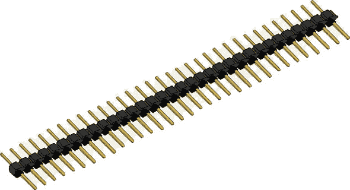

雄性断开排针以条带形式提供。你需要“断开”（折断）所需数量的排针以适应特定组件。

| |
| --- |

就像电机一样，伺服器在移动时非常耗电，可能会在电路中引起电压波动。然而，如果你采取一些预防措施，可以直接从 Arduino Uno 的电源为低压微服（那些额定电压为 4.8 V 或以下的）供电。

##### 使用去耦电容器保护电路

*电容器* (图 6.18) 是一种类似于电池的被动电子元件：它们存储一定量的电荷，以称为 *法拉* 的单位来衡量（缩写为 *F*）。一个法拉很大；大多数业余电子电容器都是以微法、纳法或甚至皮法来衡量的。

##### 图 6.18\. 电容器有多种不同的封装和尺寸；电解电容器和陶瓷电容器相当常见。请注意：并非所有电容器都有极性。

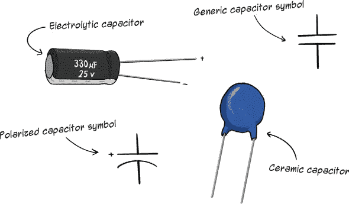

如果电源和地之间有电压波动，充电电容器会变得不安。例如，如果电压突然下降到 4.5 V，电容器会放电一部分储存的电荷以“平滑”电压。

这意味着电容器可以充当一个小型的、提升的电池，根据需要喷出额外的电荷以保持电压稳定。以这种方式使用的电容器称为 *去耦电容器*，因为它可以 *去耦* 电路的其他部分，从而减少由组件引起的电压噪声。

| |
| --- |

**小心使用电容器**

当心！电容器是狡猾的小恶魔，在某些情况下可能会非常 *危险*。它们应得到额外的尊重和照顾。

一个重要的事情是，电容器可以在长时间内保持它们的电荷，即使没有电流通过它们。在这方面，它们又像电池一样。这意味着如果你不小心在电容器上完成电路——是的，你可以用手指造成这种情况——它可能会立即且猛烈地放电。如果你发现自己正在拆卸旧电视或电子闪光灯，*一定要非常小心*。如果那些强大的电容器意外地向你放电，你可能会去医院，或者更糟。

需要记住的一个更日常的事情是，电解电容器，就像这个实验中使用的电容器一样，是有极性的。它们不会容忍被反向插入，而且当以反向方向使用时，它们有一种相当顽固的习惯，会爆炸。在我们的低压、低电容世界中，这些爆炸相当温和，但它们仍然可能会吓到你，或者熔化你不想熔化的组件和电路板。

| |
| --- |

##### 构建伺服电路

将你的伺服电机的电源、地线和控制线连接到面包板，如果需要可以使用引脚头（参见图 6.19）。不同的伺服电机制造商使用不同的电线颜色，但正极电源连接应该是红色电线。大多数伺服电机使用黑色作为负极引线，但有些使用棕色或类似颜色的电线。最后，信号线可能是白色、黄色、橙色甚至是蓝色。总之，红色电线是电源，最深的电线是地线，剩下的就是信号线（图 6.20）。

##### 图 6.19\. 带有去耦电容器的伺服电机接线图

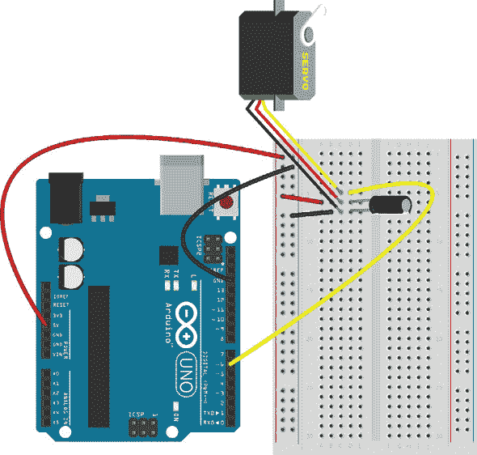

##### 图 6.20\. 伺服电线的颜色各异，连接器也各不相同。应该有一条红色电线——这条电线连接到 Vcc（电源）。最深的电线——黑色或棕色的是地线。剩下的电线是信号线——在这里简写为 *S*——用于控制伺服电机的位置。

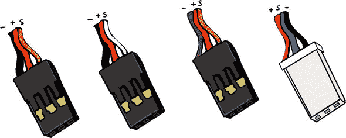

在伺服电机的电源连接处并联一个 100 μF 的电解电容器——也就是说，将电容器的阳极插入与伺服电机电源连接相同的面包板行，将电容器的阴极插入与伺服电机地连接相同的行。将伺服电机的信号线连接到 Uno 的 6 号引脚。最后，将伺服电机的电源连接到 Uno 的 5 V 电源，将伺服电机的地连接到 Uno 的 GND 引脚。

##### 对伺服电机进行测试驾驶

你现在可能已经猜到了，Johnny-Five 有一个用于控制伺服电机的 `Servo` 类。确实如此！

创建一个新的文件，servo-basic.js，并添加以下 JavaScript。这与电机测试驾驶类似：它将在 REPL 中使 `servo` 可用。

##### 列表 6.2\. 伺服电机测试驾驶

```
const five  = require('johnny-five');
const board = new five.Board();

board.on('ready', () => {
  const servo = new five.Servo({ pin: 6 });           *1*
  board.repl.inject({
    servo: servo
  });
});
```

+   ***1* 伺服电机需要 PWM 控制信号——务必使用支持 PWM 的引脚！**

运行脚本：

```
$ node servo-basic.js
```

现在，你可以使用 `Servo` 的方法：

+   `to(deg)`——将伺服电机移动到 `deg` 值（介于 0 和 180 之间）。例如，`servo.to(50)`

+   `center()`——将伺服电机移动到其中心/中性位置，默认为 90 度。例如，`servo.center()`

如果你尝试将伺服电机定位在其范围的极端位置——0 或 180 度或接近这些值——它可能会抗议，发出悲伤的磨擦声。这是因为伺服电机的 *有效* 范围小于 180 度。尝试实验以确定伺服电机可以舒适达到的最小和最大角度值。

这个简短的测试驾驶只是对伺服电机的一个简要介绍。如果下一节——构建机器人！——对你有吸引力，并且你想要深入研究机器人领域，那么在探索过程中你将遇到更多关于伺服电机的情况。

### 6.3\. 构建你的第一个机器人！

是时候构建一个机器人了。要构建一个可以在轮子上移动的机器人，你需要一些基本部件（图 6.21）：

+   ***底盘*——** 每个机器人都需要一个身体。底盘是一个可以安装电机、轮子和其他组件的结构。

+   ***至少两个齿轮电机*—** 机器人驱动电机需要一些*齿轮减速*以提供一些扭矩。否则，它们甚至无法越过最微小的障碍。齿轮电机的驱动轴通常（但不总是）与电机的旋转成直角。

+   ***轮子或履带*—** 这些将电机的运动转换为机器的运动。轮子适合安装在齿轮电机的驱动轴上。

+   ***大脑*—** 定义机器人逻辑的微控制器或处理器。

+   ***电机电路*—** 你的机器人需要一些组件来将其所需的运动转换为电机运动。

##### 图 6.21\. 一个基本的机器人需要一个底盘（身体）。两个或更多的齿轮电机连接到轮子或履带以推动机器人。当然，你还需要电路、大脑（微控制器）和电源。

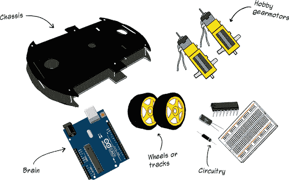

进入基础机器人领域可能会让人望而却步的一件事是各种部件的综合成本。底盘可能要花费几百美元(!)，而现成的用于控制电机的防护罩、电路板或其他电路可能也要花费不少。

我们的第一辆巡游机器人将使用相当便宜的部件。你可以在网上和电子产品商店找到建议的 Actobotics Peewee Runt Rover 底盘套件，大约 16 美元。


##### 你需要的东西


+   1 Arduino Uno 和 USB 线^([1])

    > ¹
    > 
    > 如果你恰好有一根比随 Arduino 一起提供的 USB A 到 USB B 线更长的线，现在就是使用它的时候了。

+   1 个 Actobotics Peewee Runt Rover 机器人套件或类似套件^([2])

    > ²
    > 
    > 包含底盘、2 个齿轮电机和 2 个轮子。

+   9 V 电池和夹子

+   1 个德州仪器 SN754410 四倍半-H 驱动器

+   15 个跳线

+   双面胶带、电工胶带、电工胶带或其他粘合剂（可选）

+   1 个半尺寸面包板

|  |

##### 建造你的第一个机器人的其他选项

Actobotics Peewee Runt Rover 套件是第一台机器人的便捷选择，因为它价格低廉，包括底盘、轮子、齿轮电机和支架——你需要的基本部件。但其他两轮底盘框架或套件也很好。SparkFun 的 Shadow 底盘是另一个经济实惠的选择（尽管你需要单独购买电机和轮子）。无论你最终得到什么，确保你有底盘、齿轮电机和轮子。以下关于构建巡游机器人的说明假设了 Peewee 套件，但构建不应与类似套件相差太多。


#### 6.3.1\. 机器人和电机

从我们最近的实验中，你已经看到了如何使用 PWM 控制电机的速度，以及如何通过交换其电源和地线连接来反转电机的方向。你还看到了电机电路比其他电路复杂一些：你需要二极管来保护电路的其他组件，并且你可能需要一个比开发板能提供的更强大的电源来为电机供电。

这会变得稍微复杂一些。一个移动的机器人至少需要两个电机才能转向，您需要能够以正向和反向方向运行这些电机（当然，不需要物理拔掉并交换引脚）。单个电路上的多个电机也应使用解耦电容器进行隔离，以防止一个电机引起的突然尖峰影响另一个电机或组件。细节开始累积。

##### 使用 H 桥驱动器控制电机

H 桥是一种包含四个开关和中间负载的电路——在我们的例子中，负载是电机。在概念上，它大致呈字母*H*的形状，如图图 6.22 所示。

##### 图 6.22\. H 桥电路包含四个开关，电机位于中央。不同的开关状态组合可以使电流以不同的方向通过电机。

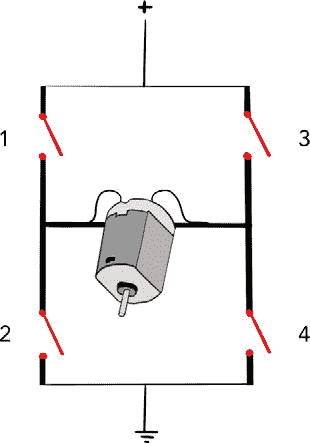

H 桥中开关（即晶体管）的排列允许您在不改变电机物理接线的情况下控制电机的方向。关闭 1 号和 4 号开关（图 6.23，左侧）允许电流以一个方向流过电机，而关闭 2 号和 3 号开关（图 6.23，右侧）允许电机以相反的方向旋转。

##### 图 6.23\. 通过激活 H 桥中的不同开关，可以使电机正向或反向旋转。

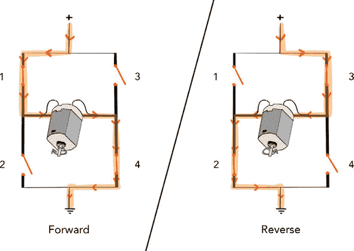

H 桥电路可以处于 16 种可能的状态（开关组合）中，其中图 6.23 中的两种是最显然有用的。其他几种是无害的，允许电机滑行（当电路中没有路径时）或制动电机（电机的两个引脚连接到相同的电压）。

有六种开关组合是坏消息，会导致所谓的“直通”情况，更简单地描述为短路（图 6.24）。这并不好，会损坏设备。

##### 图 6.24\. 关闭 H 桥两侧的开关会导致“直通”——短路！

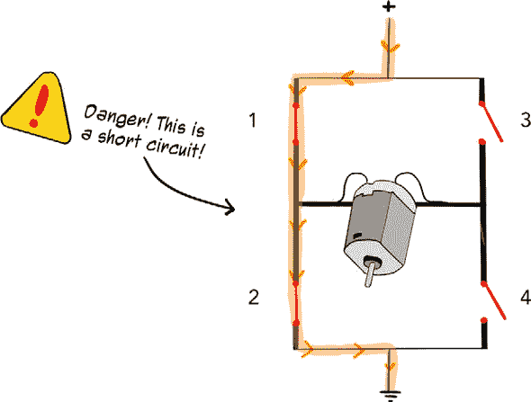

对于我们的机器人，我们需要为每个电机构建一个 H 桥电路，更不用说还要添加额外的保护二极管和电容器——这听起来像是要连接很多线路和复杂化。幸运的是，H 桥作为集成电路（IC）芯片价格低廉（图 6.25）。更好的是，许多低成本 IC 将 H 桥电路与内部二极管和其他设备一起封装，以保护您的电机电路，并防止直通状态。这些芯片被称为*电机驱动器*或简称*驱动器*。

##### 图 6.25\. 像德州仪器 SN754410 这样的低成本电机驱动器，让您能够对内部 H 桥电路进行逻辑控制。它们还包含其他组件，如二极管，使电机控制更简单、更不易出错。SN754410 是双 H 桥——它可以控制两个电机。

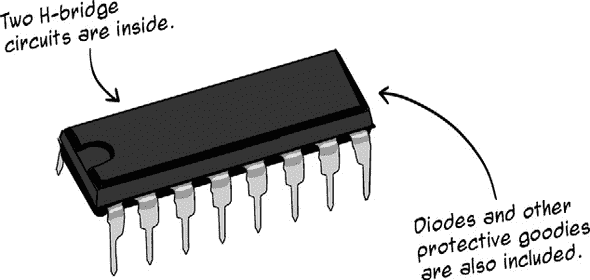

德州仪器 SN754410 四重半 H 桥驱动器只需花费几美元，可以从各种电子产品供应商处购买。是的，它的名字很长（提示：四重半 H 桥相当于两个完整的 H 桥电路），但它可以做我们为第一个巡游机器人驱动两个电机所需的一切。

在我们深入探讨电机驱动 IC 引脚和相关电路的细节之前，让我们开始构建我们第一个机器人的基础部件。

#### 6.3.2. 构建机器人底盘基础

你需要将侧支撑（这可能需要一些力气）和面包板固定到机器人底盘的底部板（图 6.26）。如果你有 Peewee 套件，侧支撑是中间有较大、矩形孔的塑料件。

##### 图 6.26. Peewee Runt Rover 底盘的底部板，带有连接的侧支撑和面包板。如果你使用的是不同的底盘，当然看起来会有些不同。

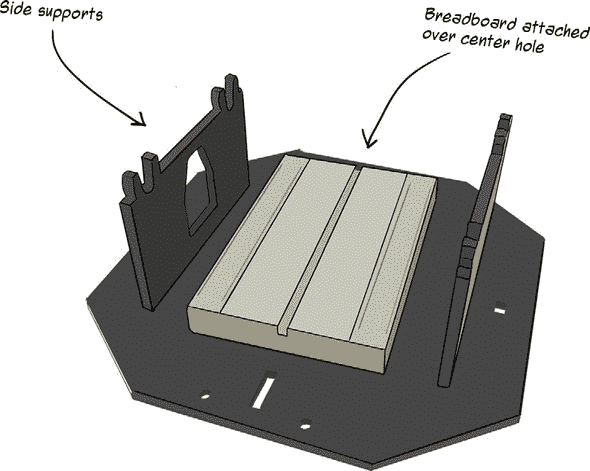


##### 将面包板固定到底盘上

大多数半尺寸面包板都有可以通过撕掉一块背纸来暴露的粘合剂，这可以用来将面包板粘附到机器人底盘上，以防止其移动。如果你不能永久地将面包板固定到机器人上——也许这是你唯一的面包板！——或者如果你的面包板没有粘合剂，你可以使用双面胶带、电工胶带、电工胶带或你选择的任何可移除粘合剂临时将面包板固定到机器人底盘上。你也可以使用线扣。


将面包板居中并固定到底盘上。板子中央的孔会露出一些面包板的粘合剂（如果你要永久性地固定面包板）。你可以剪下一块背纸，形状与孔相匹配，然后重新粘上去以覆盖暴露的粘性表面，如果你喜欢的话。暂时不要固定底盘的上板。

为机器人设计的齿轮电机有一个用于驱动轮子的齿轮输出轴，通常与电机的旋转轴成直角。轮子固定在输出轴上，朝向机器人外部，而电机的旋转轴向上（如在 Peewee 套件中，图 6.27），或者朝向后方（如在 SparkFun Shadow 底盘中）。在所有情况下，你都会希望将电机的线缆放在内部。

##### 图 6.27. Peewee Runt Rover 底盘的上板，展示固定好的齿轮电机、轮子、开发板支撑和 Arduino Uno。确保电机的线缆朝向底盘内部。电机线缆可以穿过 Uno 下方并通过底盘板的中心孔。

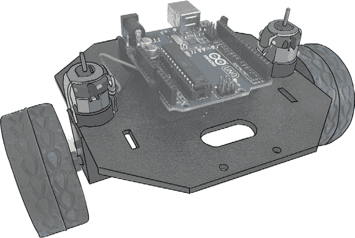

取出 Peewee 底盘的上板，并将齿轮电机安装到上面。然后，可以将电机的引线通过上板中间的圆形孔引下来，以便访问下面的面包板。Peewee 套件还附带两个开发板支架，形状为宽而浅的*U*形。现在应该将它们安装到上板上，并将 Arduino 放入其中，USB 连接朝向将成为机器人后部的方向（板子前后对称，所以你现在可以决定你的机器人后部在哪里）。

现在可以将轮子滑到齿轮电机轴上。此时，你应该有一个带有面包板和侧支架的底板，以及一个带有 Arduino、电机和轮子的上板。

#### 6.3.3\. 控制机器人的电机

如果将 SN754410 电机驱动器以顶部的半圆形凹槽朝上放置，引脚的顺序从 1 到 16，如图 6.28 所示。不同的引脚有不同的用途，并为芯片内部的不同部分提供连接。我们将在构建电路时介绍这些引脚。

##### 图 6.28\. SN754410 电机驱动器的引脚排列

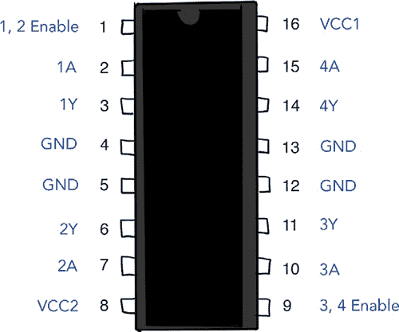

##### SN754410 电源和使能连接

连接 SN754410 的第一步是将一些引脚连接到电源和地（图 6.29）。

##### 图 6.29\. SN754410 需要连接到 VCC2（物理引脚 8）上的电机电源和 VCC1（物理引脚 16）上的逻辑电源。两个使能引脚应直接连接到 5V 以将其设置为高电平。还有四个 GND 引脚，不出所料，需要连接到地。

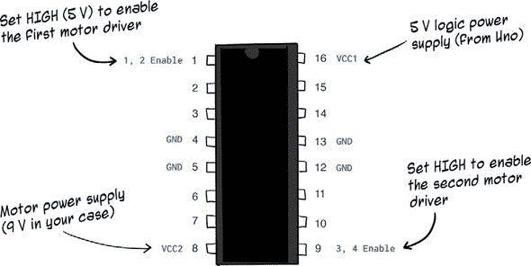

驱动器需要连接到两个独立的电源。9V 电池将为电机本身供电（*电机电源*），而控制电机的逻辑将由来自 Uno 的 5V 供电（*逻辑电源*）。

此外，芯片上还有两个*使能*引脚：一个用于每个电机的驱动器。您需要通过将每个使能（EN）引脚——物理引脚 1 和 9——连接到 5V（即逻辑高电平）来“打开”每个驱动器。

按照电机电源布线图（图 6.30）所示连接到电源和使能引脚。请注意，地轨是连接在一起的（共享地），但电源是隔离的：左侧轨为电机电源（9V），右侧轨为逻辑电源（5V）。

##### 图 6.30\. 在机器人的面包板上布线 SN754410 的电源连接

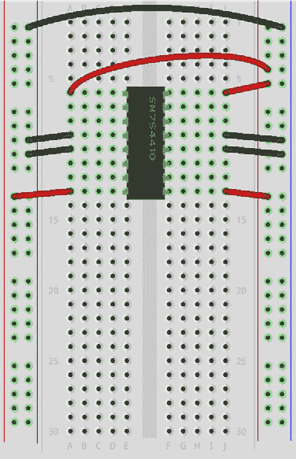

##### SN754410 逻辑连接

在 SN754410 上，每个电机通过两个输入引脚进行控制。两个相应的输出引脚连接到电机（图 6.31）。

##### 图 6.31\. 两个电机驱动器各有两个输入引脚和两个输出引脚。

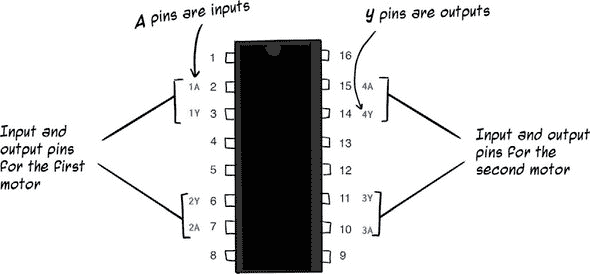

由于电机两个输入引脚上的不同逻辑电平组合，加上内部 H 桥开关和电路，每个电机都会发生不同的事情。对于每个电机，一个输入引脚可以用来控制方向，而第二个输入引脚可以用来控制电机的速度。让我们看看这可能是什么样子，检查第一个电机是如何控制的（第二个电机以相同方式控制）。

##### 控制电机方向

我们将使用引脚 1A（SN54410 上的物理引脚 2）来控制第一个电机的方向（图 6.32）。

##### 图 6.32。第一个电机控制器：两个输入引脚和两个输出引脚。我们将使用一个输入引脚来控制电机的方向，另一个来控制其速度。

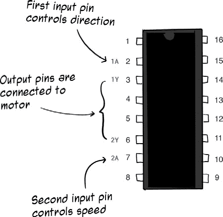

当引脚 1A 设置为 HIGH，引脚 2A 设置为 LOW 时，9V 电流将通过两个输出引脚（1Y，2Y）流动，电机将正向旋转（图 6.33）。

##### 图 6.33。当第一个输入设置为 HIGH，第二个输入设置为 LOW 时，电机将正向旋转。

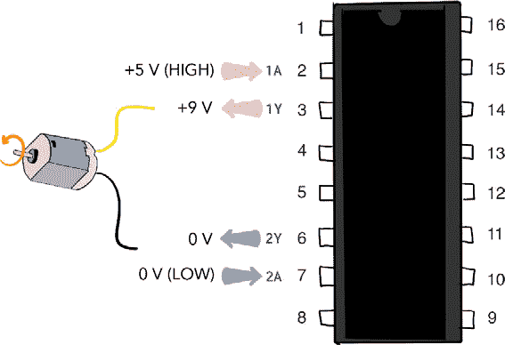

类似地，当方向引脚 1A 设置为 LOW 时，只要引脚 2A 为 HIGH，电机就会以反向方向旋转（9V 电流反向流动）（图 6.34）。

##### 图 6.34。当第一个输入为 LOW，第二个为 HIGH 时，电机以相反（反向）方向旋转。


换句话说，任何 1A 和 2A 具有相反逻辑电平的时候，电机都会根据引脚 1A 的逻辑电平来供电旋转。但如果两个输入引脚具有相同的逻辑电平，电机中就不会有电流流过（详细说明见表 6.1）。

##### 表 6.1。电机驱动器方向控制表 1

| 1A（方向引脚）值 | 2A（速度引脚）值 | 结果 |
| --- | --- | --- |
| HIGH | LOW | 电机以方向 1（向前）旋转 |
| 高 | 高 | 电机中没有电流通过 |
| LOW | HIGH | 电机以方向 2（向后）旋转 |
| LOW | LOW | 电机中没有电流通过 |

##### 控制电机速度

引脚 2A（SN54410 引脚 7）将控制第一个电机的速度，使用 PWM。假设引脚 1A，方向引脚，被设置为 LOW，表示电机旋转方向为反向，同时将 25%占空比的 PWM 应用于引脚 2A，速度引脚（图 6.35）。75%的时间内，1A 和 2A 将具有相同的逻辑电平（LOW/LOW），在此期间电机中没有电流流过。然而，25%的时间内，LOW/HIGH 的组合将允许电流流过，为电机供电。这导致了我们想要的结果：电机以 25%的速度设置反向旋转。

##### 图 6.35。在引脚 1A 上设置方向为 LOW（反向）和引脚 2A 上设置 25%占空比（速度）时，电机将以 25%的时间在反向方向上供电。

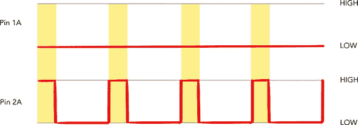

同样的，正向方向的速度控制也是如此，但有一个小问题。假设 1A（方向）设置为 HIGH（正向），2A（速度）设置为 25%占空比的 PWM。我们希望电机以 25%的速度正向旋转，但实际上它将以 75%的速度正向旋转（图 6.36）。

##### 图 6.36\. 当 1A 引脚设置为 HIGH（正向）且 2A 引脚（速度）设置为 25%占空比时，电机将以 75%的时间在正向方向上供电。

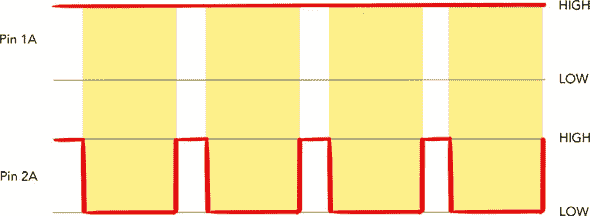

为了解决这个问题，当电机方向为正向时，PWM 信号需要被**反转**。一些电机驱动器会为你自动处理这个问题，当电机设置为正向旋转时，自动反转 PWM。然而，SN54410 并不这样做，因此我们将在代码中考虑这一点。

##### 完成电机电路

电路的其余部分涉及连接到 Arduino、9V 电机电源和两个电机（图 6.37）。Arduino 和电机的连接应通过顶壳板的中心孔进行。当你完成这些连接时，你可以将顶壳板放在底壳板上，并将 9V 电池放进去，但不要将部件完全组装在一起——你需要先测试电机。

##### 图 6.37\. 探索者完成后的电机电路图


##### 使用 Johnny-Five 测试电机

在组装机器人之前，你应该测试电机电路是否按预期工作。在你的工作目录中创建一个名为 motor-test.js 的文件，并将以下代码放入其中。

##### 列表 6.3\. 电机驱动器测试驱动

```
const five = require('johnny-five');
const board = new five.Board();

board.on('ready', function () {
  const motors = new five.Motors([
    { pins: { dir: 12, pwm: 11 }, invertPWM: true },
    { pins: { dir: 4, pwm: 5}, invertPWM: true }
  ]);

  board.repl.inject({
    motors: motors
  });
});
```

让我们聚焦于下一个列表中 Johnny-Five `Motors`对象的实例化。`Motors`是 Johnny-Five 组件集合类，类似于`Leds`。它可以同时控制多个`Motor`组件。

##### 列表 6.4\. 实例化电机

```
const motors = new five.Motors([
  { pins: { dir: 12, pwm: 11 }, invertPWM: true },        *1*
  { pins: { dir: 4, pwm: 5}, invertPWM: true }            *2*
]);
```

+   ***1* 第一台电机的选项和引脚**

+   ***2* 第二台电机的选项和引脚**

向`Motors`构造函数传递一个包含每个`Motor`选项的数组。现在每个电机由两个引脚控制，Johnny-Five 需要知道哪个引脚做什么：一个用于方向（`dir`）和一个用于速度（`pwm`）。

记住，当电机正向运行时，PWM 信号需要被反转。硬件不会自动这样做，但你可以通过使用`invertPWM`选项让 Johnny-Five 知道需要这样做，Johnny-Five 会为你完成这个操作。


##### 不要让你的机器人跑掉！

在测试脚本中运行电机之前，将你部分组装好的机器人从地面上抬起，使轮子悬在空中。否则它可能会跑掉！


运行脚本：

```
$ node motor-test.js
```

当板和 REPL 初始化后，输入以下命令并按 Enter 键：

```
> motors.forward(100)
```

现在看看你的电机。它们是向前缓慢运行吗？有很大可能性其中一个或两个电机正在错误的方向上旋转。没问题。停止脚本，断开电源，并交换电机引线和电机驱动器输出引脚之间的连接，对于任何运行方向错误的电机。然后再次尝试。

##### 完成底盘构建

将小塑料圆珠固定到底板底部，前后各一个。当机器人不移动时，它就靠这些圆珠支撑。你确信电机按预期旋转吗？很好。现在你可以将顶板和底板拼装在一起（图 6.38）。

##### 图 6.38\. 从前面看完成的机器人


##### 编写机器人软件

漫游车的软件将允许你使用键盘上的箭头键来控制机器人（并使用空格键停止它）。代码将包括几个脚本（模块）和一个额外的依赖项（npm `keypress` 模块）。让我们对项目的工 作区域进行一点更合理的组织：

1.  创建一个名为 rover 的新目录，并 `cd` 到该新目录。

1.  运行此命令：`npm init --yes`。这将使用一些合理的默认值初始化一个 `package.json` 文件。

1.  运行此命令：`npm install --save johnny-five keypress`。这将安装所列的两个模块并将依赖信息保存到 package.json 中。

创建一个名为 Rover.js 的文件（列表 6.5）。此模块将包含一个定义漫游车基本运动的 JavaScript `class`。`Rover` 不了解传递给其构造函数的 `Motors` 对象中的特定引脚或电机配置；这些细节被抽象掉了。

##### 列表 6.5\. `Rover` 类

```
class Rover {                                 *1*
  constructor (motors) {                      *2*
    this.motors = motors;
  }

  forward () {
    console.log('Full speed ahead!');
    this.motors.forward(255);
  }

  backward () {
    console.log('Reverse!');
    this.motors.reverse(255);
  }

  left () {
    console.log('To the left!');
    this.motors[0].reverse(200);               *3*
    this.motors[1].forward(200);               *4*
  }

  right () {
    console.log('To the right!');
    this.motors[0].forward(200);
    this.motors[1].reverse(200);
  }

  stop () {
    this.motors.stop();
    console.log('Stopping motors...');
  }
}

module.exports = Rover;                        *5*
```

+   ***1* 使用类语法组织行为可以使代码更易读。**

+   ***2* 构造函数创建对电机的引用（this.motors）。**

+   ***3* 在 Motors 对象中，每个电机都可以用数组表示法访问。**

+   ***4* 转向涉及一个电机向前运行，另一个电机向后运行。**

+   ***5* 导出 Rover 类以供外部使用**

现在机器人需要一个接口和一种控制它的方法。创建另一个名为 index.js 的文件，如下所示。

##### 列表 6.6\. index.js 的结构

```
// Require dependencies
const five     = require('johnny-five');
const board    = new five.Board();
const keypress = require('keypress');
const Rover    = require('./Rover');

board.on('ready', function () {
  // 1\. Instantiate Motors
  // 2\. Instantiate Rover, using Motors
  // 3\. Configure `keypress` to generate events on keypresses in the REPL
  // 4\. Listen for `keypress` events and invoke appropriate Rover methods
});
```

在前一个列表中的步骤 1 和 2 的基础上，让我们在下一个列表中实例化 `Motors` 和 `Rover`。

##### 列表 6.7\. index.js: 设置电机和漫游车

```
// ...

board.on('ready', function () {
  // 1\. Instantiate motors
  const motors = new five.Motors([
    { pins: { dir: 12, pwm: 11 }, invertPWM: true },           *1*
    { pins: { dir: 4, pwm: 5}, invertPWM: true }               *2*
  ]);

  // 2\. Instantiate Rover, with motors
  const rover = new Rover(motors);                             *3*

  // 3\. Configure `keypress` to generate events on keypresses in the REPL
  // 4\. Listen for `keypress` events and invoke appropriate Rover methods
});
```

+   ***1* 左电机细节**

+   ***2* 右电机细节**

+   ***3* 将电机传递给漫游车构造函数**

要控制机器人，你需要监听相关的按键以获取转向输入。index.js 中的第三个任务是配置 `keypress`。

##### 列表 6.8\. index.js: 设置 `keypress`

```
//...
board.on('ready', function () {
  // 1\. Instantiate motors (as before)
  // 2\. Instantiate Rover, with motors (as before)
  // 3\. Configure `keypress` to generate events on keypresses in the REPL
  keypress(process.stdin);                                                 *1*
  process.stdin.setEncoding('utf8');                                       *2*
  // 4\. Listen for `keypress` events and invoke appropriate Rover methods
});
```

+   ***1* 告诉 keypress 为 process.stdin（标准输入，通过你的键盘）生成事件**

+   ***2* 明确字符编码。**

最后，你需要监听和处理按键。

##### 列表 6.9\. index.js: 处理按键

```
//...
board.on('ready', function () {
  // 1\. Instantiate motors (as before)
  // 2\. Instantiate Rover, with motors (as before)
  // 3\. Configure `keypress` to generate events on keypresses in the REPL
  // 4\. Listen for `keypress` events and invoke appropriate Rover methods
  process.stdin.on('keypress', function (ch, key) {                       *1*

    if (!key) { return; }                                                 *2*

    switch (key.name) {
      case 'q':                                                           *3*
        rover.stop();
        console.log('Bye-bye!');
        process.exit();                                                   *4*
        break;
      case 'up':                                                          *5*
        rover.forward();
        break;
      case 'down':
        rover.backward();
        break;
      case 'left':
        rover.left();
        break;
      case 'right':
        rover.right();
        break;
      case 'space':                                                       *6*
        rover.stop();
        break;
      default:                                                            *7*
        return;
    }
  });
});
```

+   ***1* 监听按键事件。在这里你关心的是 key 参数。**

+   ***2* 如果 key 中没有有用的内容，则返回（不执行任何操作）。**

+   ***3* 按下 q 键将退出机器人。首先，停止电机。**

+   ***4* 调用 `process.exit()` 将终止机器人的进程。**

+   ***5* ‘up’ 指的是键盘的上箭头（以及‘down’、‘left’等）。**

+   ***6* 可以使用空格键停止机器人。**

+   ***7* key switch 语句的默认情况是不执行任何操作。**

##### 驾驶你的机器人

将你的机器人放置在一个有足够空间移动的地方，然后运行脚本：

```
$ node index.js
```

一旦初始化了板子和 REPL，你可以使用箭头键（上、下、左、右）来控制机器人移动，并使用空格键使其停止。

你可能会感到复杂的情绪，既有胜利的喜悦（太好了！第一个机器人！）又有限制（冒险受限于 USB 电缆的长度）。好消息是：随着我们继续前进，你将能够摆脱机器人的束缚，使它们更有趣。

在我们这样做之前，你将通过学习如何处理 *串行* 数据来完善输入和输出的主要主题。

### 概述

+   电磁铁使电机旋转。给电机通电，它会将电能转换为机械能——开始旋转。转动电机的轴会使它充当发电机，将机械能转换为电能。

+   使用电机构建电路需要额外的注意。电机电路通常结合多个电压，电机电源通常与低电压逻辑电路隔离。

+   通过反转电机中电流的方向可以反转电机方向，并且可以使用 PWM 控制电机速度。

+   晶体管，如 MOSFET，可以用作高速开关，使用低电压逻辑来切换高电压电路。

+   二极管和电容器是两种可以帮助构建更安全电机电路的组件。

+   二极管只允许电流单向通过它们。一个与电机并联且反向偏置的二极管可以保护电路，充当反激二极管。

+   电容器存储电荷，可以与组件并联放置，以隔离电路并平滑电压变化。以这种方式使用时，它们被称为去耦电容器。

+   伺服电机允许进行精确定位，将 PWM 信号转换为角度位置。大多数伺服电机的范围理论上为 180 度，但在廉价伺服电机上可用范围更窄。

+   H-bridge 电路提供了在多个方向上通过负载（电机）导电流的能力，允许你反转电机方向。H-bridge 与其他功能结合，封装在电机驱动 IC 中。

+   基本巡游机器人结合了微控制器、电机驱动器、齿轮电机、轮子、电源和底盘。
